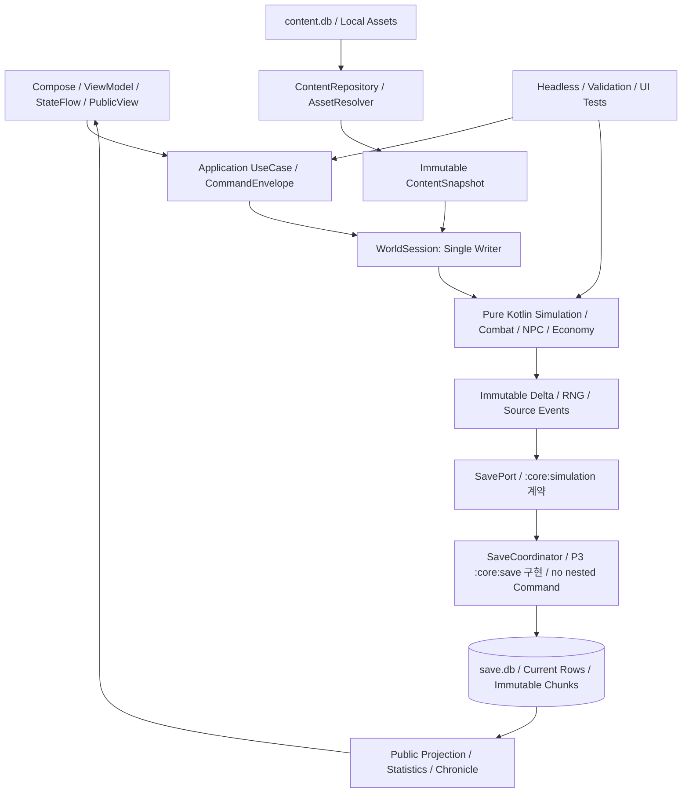
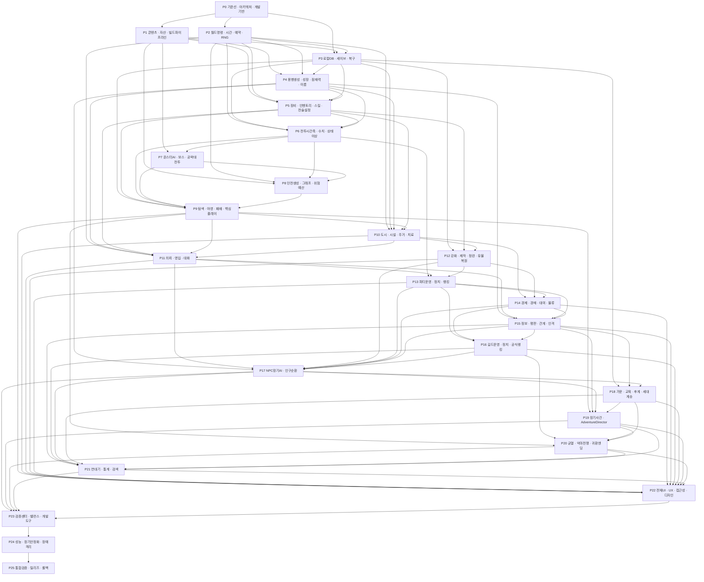

# 00. 전체 구현 마스터 설계서

> 프로젝트: IMSI · 던전·의뢰·파티 로그라이크 장기 시뮬레이션 RPG  
> 문서 버전: v31.1 · 작성일: 2026-09-09 · 상태: **설계 기준선 승인 / 구현 전**
> 구현/테스트 상태: **코드 미제공, 개발 미착수 기준, 실제 게임 테스트 미실행**

**진행현황:** [98 대시보드](98_진행현황_대시보드.md) · **검사 결과:** [97 문서 검증](97_문서정합성_검증보고서.md)  
본문의 상태·공수는 최초 계획 기준선이다. 담당자와 실행 증거를 관리 JSON에 등록한 뒤 대시보드를 재생성한다.

## 1. 목적과 기준 자료
첨부 통합설계 v30 을 요구사항→아키텍처→Phase→모듈/DB/명령→Task→Test→Gate→릴리즈로 연결한다. 기능을 단순히 나누어 복사한 것이 아니라 기능별 입력/반환/처리순서·실패 경계·저장책임·검증조건을 추가했다. 각 Phase 에는 담당 원문 전체를 부록으로 수록해 수치/카탈로그/개별 규칙을 생략하지 않았다.

원본: [통합설계 v30](원문/통합설계_v30_원본.md), SHA-256 `249f2b3f8e01d5436fcd85a6e506bf326118a5201f03bef48e8c927634297849`. 최상위 번호 절 **3,135 개**, source line **64,658 줄**이다. `REQ-S0001` 등은 원문 **절 단위 요구 묶음**이지 3,135 개의 원자적 요구조건을 모두 검증했다는 뜻이 아니다. 원문 한 절 안의 표/하위규칙은 해당 Phase 의 assertion manifest 검토 Task 에서 모두 확인한다.

첨부에 없는 것: 실제 Android/Gradle 저장소, 기존 SQL/Room schema, 실행되는 테스트, 10,000 개 이미지 파일, 일부 미완결 수치/효과/목표카탈로그, 개발 인원/착수일. 이를 있다고 가정하지 않는다. 메소드/DDL/안정화 한도는 **설계 보완안**이며 승인되지 않은 제품 규칙은 결정대장에 표시한다.

## 2. 현재 요구사항 및 전체 범위
Android 오프라인 싱글, 텍스트/MUD 탐색, 자동 전투, NPC 사회·경제·관계·가문·세대·길드·악마전쟁·귀환이 범위다. 앱 종료 동안 세계 시간/치료/제작/NPC 성장은 진행하지 않는다. 서버, 멀티플레이, 계정동기화, 분산데몬/다중노드 DB 는 필수 범위가 아니다.

핵심 플레이: 던전선정→파티/장비/스킬/전술준비→탐색→자동 전투→전리품→후퇴/정복→치료/정비→다음원정. 장기 플레이: 성장→파티/길드경쟁→관계/가족→계승→균열/악마전쟁→영구증표→잔존소탕→귀환/잔류.

| 구분 | 포함 | 범위 해석 |
|---|---|---|
| 실행기반 | 콘텐츠, 단일월드시계, RNG, 저장/복구, 진입 UI | 어떤 게임기능보다 먼저 안전성 구축 |
| 핵심 단기루프 | 인물/장비/스킬/전투/몬스터/던전/탐색/패배 | P9 에 실제 first vertical slice |
| 핵심 장기루프 | 파티, 경제, 정보, 길드, NPC, 가문, 사건, 귀환 | Full 제품 범위. MVP 명분으로 삭제하지 않음 |
| 지원/관리 | 연대기/검색/대화/프리셋/검증센터/성능/배포 | 게임과개발관리기능을분리 |
| 원문 선택 확장 | 일부표정 variant, 추가 image pack, 개명 등 | 요구대장에유지. 활성화범위/유예는명시승인 필요 |

### 기준선의 중요한 판정
조직파티10 명/동시출전6 명, 개인클래스1 개와재훈련(상위전직없음), 레벨당자동1/자유1 와10 레벨추가2, 전투영구사망없음, SAFE_RECOVERY 는시간되감기아님, 플레이어신규길드창설금지/기존길드승계, 초상 M5000/W5000 단일 key 와독립이름생성, 앱종료시월드정지는 유지한다. 초기예시와명시적최종조항의차이는 [결정대장](94_설계보완안_및_결정대장.md)에서근거를보존한다.

### 구현 전 최종 결정 기준선

| 영역 | 승인 기준선 | 아직 필요한 실행 증거 |
|---|---|---|
| C14 기술/DB | Android-only greenfield, `compileSdk 37`, `targetSdk 36`, `minSdk 26`, AGP `9.4.0`, Gradle `9.6.0`, JDK `17`, Kotlin `2.4.20`, KSP `2.3.11`, Compose BOM `2026.08.00`, Room `3.0.2`, Coil `3.5.0`, `GREENFIELD_V1` | P0 dependency resolve/순수 JVM compile/app build·launch: `NOT_RUN`; Room compile/schema export는 P3: `NOT_RUN` |
| C18 자산/콘텐츠 | M/W 각 5,000장의 512×640 opaque sRGB WebP 고정 풀, install-time `portraits_v1` asset pack, Full 활성 행의 미정 효과·깨진 참조·배포권 미확인 0건 | 실제 파일·manifest·라이선스·decode·중복·용량 검사: `NOT_RUN` |
| C19 단말/NFR | [85 NFR](85_NFR_성능_용량_단말_기준서.md)의 MIN/STD·P95·PSS·100/300년 save 상한을 `BASELINE_V1`으로 승인 | 실제 release build/단말 benchmark·장기 save 곡선: `NOT_RUN` |

설계 결정 완료와 실행 검증 완료는 별도 상태다. 위 `NOT_RUN` 항목은 미결정이 아니라 해당 Phase Gate가 아직 실행되지 않았다는 뜻이다.

## 3. 전체 아키텍처

원문의 `:core:*`/`:feature:*` 이름은 **논리 소유 namespace**로 유지하되 처음부터 모두 Gradle module로 만들지 않는다. P0 물리 project는 `:app`, 순수 Kotlin `:core:simulation` 두 개뿐이다. P3에서 실제 Room schema와 함께 `:core:save`를 추가하고, `:tools:headless`는 P23/P25에서 독립 실행 요구와 두 번째 소비자가 확인될 때만 만든다. P1의 install-time `:asset-pack:portraits_v1`은 실행코드가 없는 배포 전용 예외다. 독립 build·2개 이상 소비자·별도 소유자 중 하나가 실제로 필요하고 dependency 검사 이득이 확인될 때만 package를 module로 승격한다. 기존 코드가 있으면 동일 책임 adapter/Repository부터 연결하고 전면 재구성하지 않는다.

P0 allowlist의 허용 edge는 `:app → :core:simulation` 하나다. P1 module 생성이 승인되면 `:app → :core:image → :core:content`, `:app → :core:simulation → :core:content`, `:tools:content-builder → :core:content`를 추가한다. 앱이 background에서 검증된 repository 결과를 immutable `ContentSnapshot`으로 조립해 `WorldSession`에 주입하며 simulation은 SQLite/asset을 직접 열지 않는다. 역방향, `:core:simulation`의 Android/Room/Compose/네트워크 의존, 미선언 module/plugin/dependency는 금지 edge로 검사한다.

## 4. 구현 원칙과 장애 격리
**권위 상태는커밋 후게시**한다. UI/이미지/뉴스/통계실패는기본표시/재구축으로격리한다. 금화·RNG·세대·전투계산손상은그냥 skip 하여게임을계속하지않고최신정상경계에서멈춘다. 전체30 일진행이나300 년시험을하나의긴 DB transaction 으로묶지않는다.

여러 작업은 코루틴으로 실행하되 권위 상태 쓰기는 capacity 64 `Channel<QueuedCommand>` 하나와 consumer 하나로만 직렬화한다. 수락 순서는 enqueue 완료 시 부여한 `submissionSequence`로 고정한다. enqueue 전 caller 취소는 명령을 취소하지만 수락 후 caller 취소는 권위 실행을 취소하지 않는다. close는 새 제출을 거절하고 이미 수락한 항목을 drain한 뒤 consumer를 join한다. `CommandEnvelope`는 application UseCase 경계에서만 만들고 `WorldSession.execute`가 받는다. P3의 `SaveCoordinator`는 `SavePort`를 구현하고 바깥 command의 Delta/Event/receipt를 한 transaction으로 저장한다. `GlobalScope`, NPC 별 Thread, tick 별 DAO 조회, destructive migration은 금지한다.

세계 시간이 증가하는 FAST_FORWARD/COMBAT_ELAPSED/DUNGEON_ACTION/TRAVEL/NORMAL_ACTION은 모두 P2 `WorldTimeTraversal`과 multi-candidate boundary batch를 사용한다. 짧은 atomic action이 중간 DecisionGate를 만나면 이미 계산한 outcome/RNG를 durable seal하여 새 continuation이 정확히 한 번 적용하고, 장시간 이동·안전 복귀·치료·훈련·운송·제작은 ScheduledAction으로 중단·재개한다. 후속 Phase가 clock을 직접 증가시키거나 동일 시각 후보 일부만 처리하는 별도 scanner를 만들지 않는다. P2 Gate는 test-only SavePort conformance로 종료하고 P3 Gate가 실제 Room/WAL/reopen/process-kill과 DB invariant를 단방향으로 재검증한다.

기능마다 이름만 다른 `Validator`, `RepositoryPort`, `Projection`을 자동 생성하지 않는다. 입력 검증은 UseCase 내부 또는 공유 도메인 정책, 저장은 Aggregate별 기존 typed Port/`SavePort`, 표현 변환은 기존 mapper 또는 순수 함수를 재사용한다. `SavePort`는 기능별로 늘리지 않는 단일 commit 계약이며 `:core:simulation`이 소유하고 `:core:save`가 구현한다. 별도 컴포넌트는 둘 이상의 실제 소비자가 공유할 때만 추가한다.

Room/SQLite 는**서버 DB 가아니라로컬저장**이다. 정적콘텐츠는 content.db/JSON,게임상태는 save.db,UI 설정은 DataStore. 소규모 prototype 도같은 SavePort 를사용해저장방식변경의전면수정을피한다.

P0 조립 루트는 `:app`만이다. feature ViewModel은 주입받은 `WorldSession`으로 mutation을 제출하고 typed ReadPort로만 조회한다. `WorldEngine`, `SaveCoordinator`, mutable Repository 구현은 feature 공개 API가 아니며 직접 호출을 아키텍처 검사에서 거절한다. `:tools:headless`가 P23/P25에서 실제로 생성되면 동일 `WorldSession`/`SavePort` 계약을 사용하고 실게임 DB 경로를 받지 않는다.

## 5. Phase 구분 기준
안전기반→전투/던전의선행데이터→완결루프→도시/사회/경제→장기 세계/귀환→전체 UX/검증/성능/릴리즈순이다. 번호는정렬키이며전부직렬이라는뜻은아니다. P1 과 P2 는 P0 후병렬 가능하다. P11 과 P12 는필요한공통 P10 기반위에서병렬 가능하다. 각 Phase 는최소화면/Unit/Integration 을함께완성하고최종 UI 나최종 QA 시점으로미루지않는다.

**Early Playable Gate (P6, Combat-Save Engine Slice):** P6 Gate에서 고정된 소형 fixture로 `파티/장비 선택 → 자동 전투 → 전리품 정산 → save/load`를 실제 `WorldEngine`/`SavePort` 경로에서 완료한다. Fake·Mock·`UnsupportedFeature` 성공 응답은 통과로 인정하지 않는다. P7 몬스터 AI, P8 생성 던전, P9 탐색 전체가 없어도 실행할 수 있어야 하며 P7/P8 확장 전에 통과한다.

## 6. 전체 Phase 및 현재 진행상태
| Phase/문서 | 목표 | 선행 Phase | 기능 | Task | Test | 상태/책임자 |
|---|---|---|---|---|---|---|
| [00 기준선_아키텍처_개발기반](01_Phase0_기준선_아키텍처_개발기반_상세설계서.md) | 원문 우선순위·타입 계약·모듈 경계·빌드 및 최소 테스트를 고정한다. | 없음 | 4 | 21 | 27 | NOT_STARTED / 미지정 |
| [01 콘텐츠_자산_빌드파이프라인](02_Phase1_콘텐츠_자산_빌드파이프라인_상세설계서.md) | 원문 카탈로그를 손실 없이 형식화하고 로컬 자산을 검증·배포한다. | P0 | 4 | 21 | 27 | NOT_STARTED / 미지정 |
| [02 월드명령_시간_예약_RNG](03_Phase2_월드명령_시간_예약_RNG_상세설계서.md) | 단일 월드 작성자와 현실시간에 독립적인 이벤트 경계 진행을 구현한다. | P0 | 5 | 26 | 32 | NOT_STARTED / 미지정 |
| [03 로컬DB_세이브_복구](04_Phase3_로컬DB_세이브_복구_상세설계서.md) | 동일 시점의 월드·RNG·예약·세이브 세대를 원자적으로 저장·복원한다. | P0,P1,P2 | 6 | 31 | 37 | NOT_STARTED / 미지정 |
| [04 용병생성_성장_잠재력_이름](05_Phase4_용병생성_성장_잠재력_이름_상세설계서.md) | 인물 정체성·성장 내역·이름·초상·정보 공개 계약을 확립한다. | P1,P2,P3 | 5 | 26 | 32 | NOT_STARTED / 미지정 |
| [05 장비_인벤토리_스킬_전술설정](06_Phase5_장비_인벤토리_스킬_전술설정_상세설계서.md) | 소유권·장착·스킬·전술·전리품의 정합성 있는 전투 입력을 만든다. | P1,P2,P3,P4 | 4 | 21 | 27 | NOT_STARTED / 미지정 |
| [06 전투시간축_수치_상태이상](07_Phase6_전투시간축_수치_상태이상_상세설계서.md) | 순수 Kotlin 자동 전투를 같은 시각 배치·상태·자원 규칙으로 재현한다. | P2,P3,P4,P5 | 6 | 31 | 37 | NOT_STARTED / 미지정 |
| [07 몬스터AI_보스_공략대전투](08_Phase7_몬스터AI_보스_공략대전투_상세설계서.md) | 지각 기반 몬스터 행동과 전조·기믹·공동 시간축의 보스전을 구현한다. | P1,P6 | 4 | 21 | 27 | NOT_STARTED / 미지정 |
| [08 던전생성_그래프_위험예산](09_Phase8_던전생성_그래프_위험예산_상세설계서.md) | Seed·버전 고정 던전을 그래프와 열쇠/문 상태공간으로 검증한다. | P1,P2,P6,P7 | 4 | 21 | 27 | NOT_STARTED / 미지정 |
| [09 탐색_야영_패배_핵심플레이](10_Phase9_탐색_야영_패배_핵심플레이_상세설계서.md) | 탐색→전투→전리품→후퇴/정복→저장·로드의 첫 완결 루프를 만든다. | P3,P5,P6,P7,P8 | 5 | 26 | 32 | NOT_STARTED / 미지정 |
| [10 도시_시설_주거_치료](11_Phase10_도시_시설_주거_치료_상세설계서.md) | 도시 이동·시설 영업·휴식·부상/질병 치료·주거 서비스를 연결한다. | P2,P3,P4,P5,P9 | 4 | 21 | 27 | NOT_STARTED / 미지정 |
| [11 의뢰_영입_대화](12_Phase11_의뢰_영입_대화_상세설계서.md) | 보조 의뢰·고용계약·선택형 대화를 공통 도메인 명령에 연결한다. | P2,P4,P5,P9,P10 | 4 | 21 | 27 | NOT_STARTED / 미지정 |
| [12 강화_제작_정련_유물복원](13_Phase12_강화_제작_정련_유물복원_상세설계서.md) | 강화·각인·계승·제작·분해를 비용과 결과가 한 번 확정되는 구조로 만든다. | P3,P5,P10 | 4 | 21 | 27 | NOT_STARTED / 미지정 |
| [13 파티운영_정치_랭킹](14_Phase13_파티운영_정치_랭킹_상세설계서.md) | 조직 10 명/출전 6 명 파티의 헌장·분배·교대·정치·역사를 운영한다. | P6,P11,P12 | 4 | 21 | 27 | NOT_STARTED / 미지정 |
| [14 경제_경매_대여_물류](15_Phase14_경제_경매_대여_물류_상세설계서.md) | 수요·공급·재고·현금·대여·운송을 동일 소유권 원장으로 연결한다. | P10,P12,P13 | 4 | 21 | 27 | NOT_STARTED / 미지정 |
| [15 정보_평판_관계_인격](16_Phase15_정보_평판_관계_인격_상세설계서.md) | 지식/사실/소문과 다축 관계·성격·상성·평판을 구분한다. | P4,P11,P13,P14 | 4 | 21 | 27 | NOT_STARTED / 미지정 |
| [16 길드운영_정치_공식랭킹](17_Phase16_길드운영_정치_공식랭킹_상세설계서.md) | 기존 길드 가입·승계와 10,000 점 평가·재정·간부·공략대를 구현한다. | P13,P14,P15 | 4 | 21 | 27 | NOT_STARTED / 미지정 |
| [17 NPC장기AI_인구순환](18_Phase17_NPC장기AI_인구순환_상세설계서.md) | 독립 NPC 목표·상세/축약 행동·유입/이주/은퇴를 장기 순환시킨다. | P4,P11,P12,P13,P14,P15,P16 | 4 | 21 | 27 | NOT_STARTED / 미지정 |
| [18 가문_교육_후계_세대계승](19_Phase18_가문_교육_후계_세대계승_상세설계서.md) | 자녀 교육·진로·성인 후계자·원자적 세대 교체를 완성한다. | P3,P15,P17 | 4 | 21 | 27 | NOT_STARTED / 미지정 |
| [19 장기사건_AdventureDirector](20_Phase19_장기사건_AdventureDirector_상세설계서.md) | 개입 예산을 가진 사건 선택·연쇄·복선·NPC 사건을 지속시킨다. | P9,P15,P17,P18 | 4 | 21 | 27 | NOT_STARTED / 미지정 |
| [20 균열_악마전쟁_귀환엔딩](21_Phase20_균열_악마전쟁_귀환엔딩_상세설계서.md) | 7 개 균열·90 일 검증·영구 증표·잔존 소탕·귀환/잔류를 완성한다. | P9,P16,P18,P19 | 4 | 21 | 27 | NOT_STARTED / 미지정 |
| [21 연대기_통계_검색](22_Phase21_연대기_통계_검색_상세설계서.md) | 이벤트 출처가 보존되는 연대기·통계·공개 검색·장기 압축을 제공한다. | P15,P16,P17,P18,P19,P20 | 4 | 21 | 27 | NOT_STARTED / 미지정 |
| [22 전체UI_UX_접근성_디자인](23_Phase22_전체UI_UX_접근성_디자인_상세설계서.md) | 각 Phase UI 를 7 영역/5 하단탭·디자인 토큰·접근성 체계로 통합한다. | P9,P10,P11,P12,P13,P14,P15,P16,P18,P19,P20,P21 | 4 | 21 | 27 | NOT_STARTED / 미지정 |
| [23 검증센터_밸런스_개발도구](24_Phase23_검증센터_밸런스_개발도구_상세설계서.md) | 실제 엔진으로 Seed 묶음·통계·불변식·재현·승인을 운영한다. | P17,P19,P20,P21,P22 | 4 | 112 | 27 | NOT_STARTED / 미지정 |
| [24 성능_장기안정화_장애격리](25_Phase24_성능_장기안정화_장애격리_상세설계서.md) | 긴 캠페인·이미지·목록·DB·R8·배터리/메모리의 측정 기반 최적화를 수행한다. | P23 | 4 | 21 | 27 | NOT_STARTED / 미지정 |
| [25 통합검증_릴리즈_롤백](26_Phase25_통합검증_릴리즈_롤백_상세설계서.md) | 전체 요구 범위의 통합 검수·업그레이드·배포·복구 절차를 마감한다. | P24 | 4 | 21 | 27 | NOT_STARTED / 미지정 |

### 구현 활성화 Gate

결정대장의 C01~C28 설계 선택은 각 항목의 승인 상태와 `approved_at`을 기준으로 관리한다. 현재 Task 활성화 여부는 결정 승인뿐 아니라 선행 Task·Atomic Assertion·실행 증거 Gate를 함께 따른다. 나머지 Task는 요구 추적용 후보이며, 다음 조건을 모두 채우기 전에는 구현 티켓이나 납기 약속으로 취급하지 않는다.

1. 실제 저장소의 대상 파일·기존 API·재사용 지점을 기록한다.
2. 담당자와 리뷰어, 실행할 build/test 명령, 완료 증거 경로를 지정한다.
3. Task가 참조하는 미승인 결정 중 구현 경로에 필요한 결정을 승인한다.
4. P0의 `:app`/`:core:simulation` graph, `WorldSession`/`SavePort` 공개 계약, 8개 Gate Test가 통과한다. `SaveCoordinator`·Room schema·복구는 P3 Gate가 소유한다.
5. DB 기준선은 `GREENFIELD_V1`이다. P3에서 승인 schema를 최초 v1으로 export하고 가상 v2/v3 migration을 만들지 않는다. 첫 출시 전 실제 배포 schema/DB가 발견될 때만 C14를 재개방해 `LEGACY_CHAIN` 전환을 검토한다.

### Dependency DAG

### 단계별 주요 산출물
| 단계 | 실제 산출물 | 완료 증거 |
|---|---|---|
| P0~P3 | version lock·공통타입·콘텐츠 builder·월드시계/RNG·SavePort/DDL/codec/세대복원 | compile report·source validator·crash-cut fixture |
| P4~P9 | 인물/장비/전투/몹/던전/탐색·P6 Early Playable Gate·P9 첫완결루프·최소화면 | P6 고정 fixture 실제 engine/save E2E·P9 headless stateHash·실제 save/load·E2E 영상/로그 |
| P10~P16 | 도시/치료/의뢰/대화/강화/파티/경제/관계/길드 | 계약/자금/소유권/랭킹마감 통합 시험 |
| P17~P21 | NPC 순환·가문승계·이벤트 director·귀환·장기기록 | 10/50/100/300 년·proof 조건·역사 보존 리포트 |
| P22~P25 | 전체화면접근성·검증센터·Full 데이터·성능·서명 release·롤백런북 | 실기기 release 검수·migration·독립리뷰서명 |

## 7. Task 규모와 일정 관리
현재 계획은 **111 개 기능 묶음, 672 개 Task**이다. 그중 Full 콘텐츠제작/검수배치는91 개이며실제콘텐츠완료를의미하지않는다. **기능대표/Phase Test 737 개 + 전체통합 Test 14 개**를정의했다. 각 case 는사전 조건·입력·절차·예상 결과·DB/로그/상태·합격 기준을갖고현재모두 NOT_RUN 이다.

초기추정은 Task별 O/M/P 가중치로 계산한 **약 950 인일(초기 계획 범위 750~1,200 인일)**이다. 1 인일은 집중작업 6시간이다. 팀 인력·기존 코드 재사용·콘텐츠 품질·실제 난도를 모르는 상태이므로 견적이나 납기 약속이 아니다. 관리 JSON의 소수점 값은 DAG 계산 재현용일 뿐 정확도나 신뢰구간을 뜻하지 않는다. 누락 콘텐츠 저작·이미지 수정·스토어 심사/외부 승인 대기는 별도 산정한다.

현재 DAG에서 무제한 인력·대기 0을 가정한 선행경로 계산값은 **약 141 작업일**이다. 실제 일정의 하한이나 약속으로 사용하지 않는다. 단순히 인일을 개발자 수로 나눈 값도 현실 일정이 아니다. [일정/검토운영](95_일정_및_검토운영.md)에서 Task 오너·진척·블로커·리뷰와 실측 공수를 갱신한다. 확정 착수일/팀 인원이 없어 달력 날짜를 배정하지 않았다.

진척률:구현완료 Task 공수/전체 공수,Test PASS/필수 Test,원문묶음수용성승인/3135,Phase Gate 승인/26 을각각표시한다. **현재 구현완료율/검증실행율은0% 기준**이며문서 생성률과혼동하지않는다.

## 8. 전체 Test 전략
순수규칙은 JVM Unit/Property,실제 저장 adapter 는 Room/SQLiteIntegration,화면은 Compose UI/접근성,제품성능은실기기 release,장기 세계는 headless 동일엔진,배포는서명 artifact 와 migration/rollback 시험으로계층화한다. 외부시스템장애시험은서버를신설하지않고로컬파일/DB/OS/자산실패로대체한다. 세부계획은 [91 전체Test](91_전체_Test_계획서.md).

공통불변식:금화음수없음·이체보존·아이템단일위치·파티10/6·RNG 재현·시간단조증가·앱종료진척0·증표영구성·후계개인성장비복사·비공개 정보유출0·복원세대혼합0. 초기테스트목표의수치와실제 측정은분리한다.

## 9. 기술 위험과 설계 보완
우선위험은①이전세이브실제복원②동일시각전투순서③미공개 정보우회노출④강화반복증식⑤파티/길드랭킹기여⑥NPC 장기정합성⑦미완성콘텐츠/10k 실물 자산⑧실측없는성능/일정추정이다. 모든위험은 [92 영향/리스크](92_전체_영향도_및_리스크_관리.md)에원인·영향모듈·완화 Task·검증증거를연결했다.

원문에명시된구현 후보와현재공식 API 를구분한 [기술검증](설계부록/01_기술기준선_외부검증.md)을참조한다. 공식버전발표가있어도이프로젝트의컴파일성공을증명하지않는다.

## 10. 전체 로드맵과 Go/No-Go
P0 기준선승인→P1/P2 공통기반→P3 안전저장→P4~P6 Early Playable Gate→P7~P9 첫완결루프→P10~P16 생활/조직→P17~P21 장기캠페인→P22 전여정 UX→P23Full 데이터/자동검증→P24 안정화→P25 출시검수.

선행계약만고정된상태에서후속 phase 의 fixture/UIprototype 을병렬시작할수있다. 하지만선행 Gate 미완료상태에서해당기능을기성완료로등록하거나 release 활성화하지않는다.특히 Save/RNG/시간단위/소유권/숨은정보/승계는선행구현과통합 시험이필수다.주관적인밸런스는승인된 profile 로관리하고미정값을기본0 으로내보내지않는다.

## 11. 전체 Definition of Done
요구묶음및하위 조항수용성 검토,모든필수기능/데이터 Task 리뷰,Unit/Component/Integration/Regression/Failure/Recovery/성능/운영검증증거,DB/세이브/마이그레이션정합성,실물 자산검수,문서/코드버전동기화,출시차단결함0,서명 release 오프라인 E2E,rollback 연습,책임자인계와 Go 결정이모두필요하다. 원문 선택 확장은삭제하지않고구현/유예/비활성범위와근거를승인기록에남긴다.

## 12. 문서 사용 순서
[요구추적](93_요구사항_추적표.md) → [결정대장](94_설계보완안_및_결정대장.md) → 해당 Phase → [통합Task](90_전체_Task_목록.md) → [전체Test](91_전체_Test_계획서.md) → [영향/리스크](92_전체_영향도_및_리스크_관리.md). 원문의정확수치/카탈로그는해당 Phase 부록에서직접확인한다.

## 13. 전역 기준 설계 문서 80~88

Phase 경계를 넘는 계약은 다음 문서를 함께 기준으로 사용한다.

| 문서 | 역할 |
|---|---|
| 80 | 전체 도메인 Aggregate/ERD/소유권 |
| 81 | 172개 스키마 객체 및 필드 데이터사전 |
| 82 | 원문 절 내부 원자 Assertion 및 Task/Test 추적 |
| 83 | 전체 상태머신/금지전이/복구 |
| 84 | CommandEnvelope/DomainEvent/멱등성 계약 |
| 85 | NFR/성능/용량/단말 Release Gate |
| 86 | 밸런스 KPI/Seed Pack/장기 시뮬 합격기준 |
| 87 | 콘텐츠 Effect typed DSL/AST |
| 88 | Screen ID/UiState/Action/Navigation Matrix |

80~88의 설계 보완 수치/ID는 원문 확정 규칙보다 우선하지 않는다. 충돌은 94 결정대장에서 승인한다.
