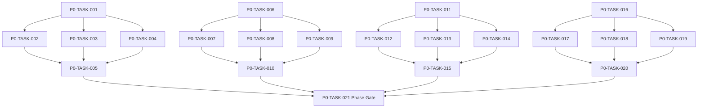

# Phase 0. 기준선 · 아키텍처 · 개발기반 상세 설계서

> 버전 v31.0 · 기준원문 v30 · 작성일 2026-09-08  
> 상태: **설계 검토 초안 / 구현 NOT_STARTED / Test NOT_RUN**  
> 마스터: [전체 구현](00_전체_구현_마스터_설계서.md) · 요구추적: [93](93_요구사항_추적표.md) · 결정대장: [94](94_설계보완안_및_결정대장.md)

## 1. 문서 개요
원문 우선순위·타입 계약·모듈 경계·빌드 및 최소 테스트를 고정한다. 기능 설명에서 불명확했던 구현 책임, 입출력, 정합성, 실패 경계, 검증 방법과 인계 조건을 구체화한다. 본문에는 해당 Phase 에 필요한 공통 계약, 메소드, DDL, Task, Test 를 포함한다. 부록에는 담당 원문 38 개 절을 원문 그대로 수록했다.

구현 범위는 아래 4 개 기능 및 담당 원문의 하위 규칙과 카탈로그이다. 다른 Phase 의 핵심 알고리즘 구현, 서버/멀티플레이, 현실시간 기반 방치 진행, 원문에 없는 게임 규칙의 무단 추가는 제외한다. 원문에서 선택 확장으로 제시한 기능도 요구대장에서 유지하며, 활성화 또는 유예 결정과 별개로 연계 설계를 보존한다.

기존 소스가 제공되지 않아 실제 구조에 대한 영향은 확정하지 않았다. 신규 클래스와 테이블은 구현 제안이며, 기존 코드가 확인되면 공통 Interface, DAO, SQL 재사용을 우선한다.

## 2. Phase 목표
완료 후 상태: **기준선 충돌 C01~C06 검토와 core JVM smoke 통과**. 후속 Phase 에는 검증된 DTO/port, 실제 도메인 결과, 세이브 codec/DDL 변경, fixture 와 기준선을 전달한다. 기능 이름만 등록하거나 Fake 성공 응답만 반환하는 상태는 완료로 보지 않는다.

## 3. 선행 조건
| 선행 Phase | Gate | 전달받는 기능 | 미충족시 차단 Task |
|---|---|---|---|
| 없음 | 착수가능 | 원문/결정대장/저장소인벤토리확인 | 실제 코드 미제공은문서작성차단아님;빌드검증은저장소생성후진행 |

설정: versioned content/balance/engine-order/visibility/limits profile. DB: 선행 schema 및해당 Phase 신규 codec 이필요하다. 외부시스템: 필수없음. 실제이미지/미완성콘텐츠는검증 fixture 로임시대체가능하나 Full 출시검수와구분한다. 미승인규칙을임의0 값으로채운성공 Fixture 는허용하지않는다.

| 결정 ID | 검토 주제 | 상태 | 적용/차단 내용 |
|---|---|---|---|
| C01 | 파티6 명/10 명 혼용 | 원문기준 해결 | 조직10 명·출전6 명. 30/10 과거대화는 첨부본 기준에 적용하지 않음. |
| C02 | 플레이어 길드창설 예시 | 원문기준 해결 | 플레이어 신규창설 금지·기존길드 가입/승계. NPC 길드생성은 유지. |
| C03 | XP 지수식/후반 공식 | 원문기준 해결 | 후반 100×L^1.70×구간보정, 레벨당자동1/자유1·10 배수추가2 유지. |
| C14 | 기술버전·SDK 및 실제 코드 미제공 | 일부 공식문서 확인·빌드 미검증 | Room3/AGP 공식발표 확인과 프로젝트 resolve/compile 은 별개. P0 lock spike 필수. |

## 4. 기능 범위 및 요구 연결
| 기능 ID | 기능명 | 중요도 | 선행 기능/Phase | 원문요구/공통근거 |
|---|---|---|---|---|
| FUNC-P0-001 | 원문 기준선과 충돌 판정 | 필수핵심 또는 원문 선택 확장 명시검토 | P0 공통타입 | [§1](#src-0001), [§123](#src-0123), [§124](#src-0124), [§125](#src-0125), [§127](#src-0127), [§3046](#src-3046), [§3135](#src-3135) |
| FUNC-P0-002 | 빌드·모듈·기술버전 고정 | 필수핵심 또는 원문 선택 확장 명시검토 | P0 공통타입 | [§122](#src-0122), [§3022](#src-3022), [§3023](#src-3023), [§3024](#src-3024), [§3025](#src-3025), [§3026](#src-3026), [§3027](#src-3027), [§3028](#src-3028) 외 10 개 |
| FUNC-P0-003 | 공통 타입·명령·오류·이벤트 계약 | 필수핵심 또는 원문 선택 확장 명시검토 | P0 공통타입 | [§126](#src-0126), [§3042](#src-3042), [§3043](#src-3043), [§3091](#src-3091), [§3092](#src-3092), [§3093](#src-3093), [§3094](#src-3094), [§3096](#src-3096) 외 2 개 |
| FUNC-P0-004 | 최소 검증 하네스·공통 UI 껍데기 | 필수핵심 또는 원문 선택 확장 명시검토 | P0 공통타입 | [§3131](#src-3131), [§3132](#src-3132), [§3133](#src-3133) |

## 5. 기능별 상세 설계

### 공통 계약의 적용 범위
모든 새 메소드/클래스명과 물리 DDL 은 **설계 보완안**이다. 제공된 자료에는 실제 저장소·DAO·SQL 이 없으므로 기존 구현에 대한 변경 완료를 뜻하지 않는다. 원문의 객체명/데이터 항목은 최대한 유지하며 기존 코드가 발견되면 adapter 로 연결한다.

`CommandEnvelope(commandId, sessionEpoch, expectedVersion, actorId, payload)`를 사용한다. `GameMinute`, `CombatMillis`, `Money(Long)`, `BasisPoint`, `EntityId`는 혼합 연산을 금지한다. 확률의 기본 표현은 **ppm(0..1,000,000)**이며 세밀한 0.01%도 정수로 표현한다. 표시 반올림과 판정은 분리한다. 정수연산 overflow 는 오류이며 clamp 로 은폐하지 않는다.

`ReadView`는 불변이다. `Delta`는 변경행·RNG 새 상태·도메인 이벤트·명령 receipt 를 포함한다. 콘텐츠 참조/외부 파일 읽기는 transaction 진입 전에 끝낸다. 실패 가능한 대규모 계산은 transaction 밖에서 하고, 성공한 커밋 이후에만 메모리 및 화면 상태를 게시한다. `stateHash`는 canonical 직렬화(키 정렬·정수 표현·버전 포함)에 대한 SHA-256 이며 현실시각·UI 재생위치는 제외한다.

중복 명령은 동일 epoch/commandId 와 payload hash 를 함께 검사한다. 동일 ID/동일 payload 이면 이전 결과를 반환하고, 다른 payload 이면 `IdempotencyKeyReuse`를 반환한다. 인메모리 중복 제거만으로 복구 후 중복을 막았다고 판단하지 않는다.

게임은 한 프로세스·한 활성 WorldSession 을 기준으로 한다. 여러 노드/서버/분산 Lock 은 **해당 없음**이다. 다만 UI 연속 탭·코루틴 완료·예약 이벤트·슬롯 전환·프로세스 재실행 간의 동시성은 실제로 검증한다.

<a id="func-p0-001"></a>
### 5.1. FUNC-P0-001 — 원문 기준선과 충돌 판정

| 항목 | 설계 |
|---|---|
| 기능 목적 | 원문 기준선과 충돌 판정을 독립된 책임으로 구현한다. 입력, 실패 처리, 저장 경계가 분리되어 있지 않으면 여러 모듈이 동일 상태를 중복 수정할 수 있다. 이를 명시적인 명령/조회 계약으로 통일한다. |
| 관련 요구사항 | [§1](#src-0001), [§123](#src-0123), [§124](#src-0124), [§125](#src-0125), [§127](#src-0127), [§3046](#src-3046), [§3135](#src-3135) |
| 기능 요구사항 | 1. 원문 전체와 SHA-256 을 고정하고 번호·행범위로 추적한다<br>2. 명시적 교체/최종 조항을 우선하되 단순히 번호가 크다는 이유만으로 덮어쓰지 않는다<br>3. 해결 근거가 없는 충돌은 DESIGN_DECISION_REQUIRED 로 표시하고 영향 Task 를 차단한다<br>4. 본 문서의 보완 정책은 원문 규칙과 다른 namespace 로 관리한다 |
| 비기능/운영 | 완전 오프라인, 결정론, 재시도 멱등성, 실패 범위 명시, 원문 정보 공개 정책을 준수한다. 로컬 진단은 기록하되 사용자 메모나 숨은 정보를 일반 로그로 수집하지 않는다. |
| 성능/안정성 | 입력 크기, 큐, 재시도에는 유한한 상한을 둔다. DB/이미지/CPU 작업은 Main 에서 실행하지 않는다. P24 의 성능 예산을 추적하되 현재는 측정 전이다. 핵심 상태 처리에 실패하면 완전한 직전 상태를 보존한다. |
| 주요 메소드 | `BaselineResolver.resolve(sectionId: SourceId, ruleKey: RuleKey) -> RuleDecision` |
| 입력 필드/값 | sectionId, ruleKey, candidateClauses[], sourceHash; 구체적값: §28 6 명, §1737 조직10/출전6 |
| 반환값 | effectiveClause, supersededClauses[], decisionStatus; 정상결과: 조직과 출전을 분리하고 R-PARTY-001 에 원문 근거 2 개 보존 |
| 입력 검증 | 같은 규칙의 모순이며 교체 문구 없음 → 결정 대기; 해당 기능의 운영 활성화 차단; required ID/enum/범위/상태/version 은변경 전에검사 |
| 예외 계약 | 요구사항 번호 하나 누락 → 문서 검증 실패; 릴리즈 범위에서 숨기지 않음; typed DomainError 로상위호출에전달 |
| Transaction | 조회/순수계산/도구핵심에는게임 write transaction 없음. 빌드/리포트파일은 staging 완료 후발행. 참조 DB 는읽기 snapshot. |
| 상태 변화 | EXTRACTED → CLASSIFIED → RESOLVED 또는 OPEN |
| 소유 모듈 | :app / :core:common / :core:model / :core:testing |
| 신규/수정 | 기존 코드 미제공: 신규/adapter 제안이다. 동일 책임의 기존 모듈이 있으면 공개 interface 를 유지하고 내부 추가로 변경을 최소화한다. |
| 관련 Task | [P0-TASK-001](#p0-task-001) · [P0-TASK-002](#p0-task-002) · [P0-TASK-003](#p0-task-003) · [P0-TASK-004](#p0-task-004) · [P0-TASK-005](#p0-task-005) |
| 관련 Test | [P0-UT-001](#p0-ut-001) · [P0-BT-001](#p0-bt-001) · [P0-FT-001](#p0-ft-001) · [P0-CT-001](#p0-ct-001) · [P0-IT-001](#p0-it-001) |

#### 처리 순서 및 데이터 흐름
1. 입력/참조 version 을검사하고불변 snapshot 또는격리된파일 root 를확보한다.
2. 원문 전체와 SHA-256 을 고정하고 번호·행범위로 추적한다
3. 명시적 교체/최종 조항을 우선하되 단순히 번호가 크다는 이유만으로 덮어쓰지 않는다
4. 해결 근거가 없는 충돌은 DESIGN_DECISION_REQUIRED 로 표시하고 영향 Task 를 차단한다
5. 본 문서의 보완 정책은 원문 규칙과 다른 namespace 로 관리한다
6. 출력계약과원본불변을검증하고 view/report 만반환한다.

입력 `sectionId, ruleKey, candidateClauses[], sourceHash` → `BaselineResolver.resolve` → 검증된 `effectiveClause, supersededClauses[], decisionStatus` → 호출 UI/검증리포트; live world 변경 없음.

#### Use Case와 실패 범위
| 상황 | 처리 |
|---|---|
| 정상 | §28 6 명, §1737 조직10/출전6 → 조직과 출전을 분리하고 R-PARTY-001 에 원문 근거 2 개 보존 |
| 대상 없음 | 조회는 Empty, 단건 쓰기는 NotFound 를 반환한다. 임의의 대상 생성, 기존 아이템 대체, 금화 차감은 하지 않는다. |
| 일부 성공 | 원자적 단건 처리에는 부분 성공을 허용하지 않는다. 정비 프리셋이나 독립 활동 batch 만 항목별 receipt 와 성공/실패 목록을 제공한다. 하나의 원자적 정산을 분할하지 않는다. |
| 일부 실패 | 문서 검증 실패; 릴리즈 범위에서 숨기지 않음 |
| 중복 실행 | 동일 명령의 효과는 1 회만 반영하며, 동일 조회의 출력은 동치여야 한다. 다른 payload 에 같은 멱등키를 재사용하면 오류를 반환한다. |
| 재기동 후 | 동일 COMMITTED snapshot/version 을 기준으로 재조회한다. 미완료 시간 진행과 상태는 checkpoint 에서 이어간다. |
| 비정상 데이터 | 결정 대기; 해당 기능의 운영 활성화 차단; 잘못된 FK/enum/NaN 은검증 실패로격리/안전정지. |
| 외부 시스템 장애 | 필수 외부 서버는 없다. 로컬 DB/파일/OS/asset 오류는 실패 테스트로 검증하며, 네트워크를 복구의 필수 조건으로 추가하지 않는다. |

#### 객체 및 메소드 책임 분리
| 모듈/객체 | 신규/수정 | 책임 | 메소드 계약 |
|---|---|---|---|
| BaselineResolver | 신규/기존 adapter | 원문 기준선과 충돌 판정 규칙조정자 | BaselineResolver.resolve(sectionId: SourceId, ruleKey: RuleKey) -> RuleDecision |
| 입력 검증 | UseCase 내부 또는 기존 도메인 정책 재사용 | 필수 ID·범위·권한·원문제약 검증; 별도 Validator 클래스는 둘 이상의 UseCase가 공유할 때만 추가 | use case 입력별 명시적 ValidationResult |
| 저장 경계 | 기존 Aggregate별 typed Port/SavePort 재사용 | 코덱·조회 snapshot·commit 연결; simulation 직접 DAO 금지; 기능 전용 RepositoryPort 신규 생성 금지 | use case별 typed read/commit 계약 |
| 표현 변환 | 기존 feature mapper 또는 순수 함수 재사용 | 공개/허용 결과만 변환; 별도 Projection 클래스는 둘 이상의 소비자가 공유할 때만 추가 | use case별 PublicViewOrReport |

<a id="func-p0-002"></a>
### 5.2. FUNC-P0-002 — 빌드·모듈·기술버전 고정

| 항목 | 설계 |
|---|---|
| 기능 목적 | 빌드·모듈·기술버전 고정을 독립된 책임으로 구현한다. 입력, 실패 처리, 저장 경계가 분리되어 있지 않으면 여러 모듈이 동일 상태를 중복 수정할 수 있다. 이를 명시적인 명령/조회 계약으로 통일한다. |
| 관련 요구사항 | [§122](#src-0122), [§3022](#src-3022), [§3023](#src-3023), [§3024](#src-3024), [§3025](#src-3025), [§3026](#src-3026), [§3027](#src-3027), [§3028](#src-3028), [§3029](#src-3029), [§3030](#src-3030), [§3031](#src-3031), [§3032](#src-3032), [§3095](#src-3095), [§3115](#src-3115), [§3116](#src-3116) 외 3 개 |
| 기능 요구사항 | 1. 원문 §3031 모듈명을 유지하고 기존 저장소는 P0 에서 먼저 인벤토리한다<br>2. 아래 모듈 허용 의존성 allowlist와 공개 API 경계를 확정하고 그 밖의 모든 edge·mutation 우회를 정적 검사로 거절한다<br>3. `SavePort` 계약은 `:core:simulation`, 구현 `SaveCoordinator`는 `:core:save`, 조립 루트는 `:app`과 `:tools:headless`로 고정한다<br>4. AGP/Kotlin/KSP/Room 정확 버전과 schema export 경로를 version catalog 에서 잠근다<br>5. 기존 구현이 있으면 adapter 부터 연결하며 UI/도메인 전면 재작성은 별도 승인한다 |
| 비기능/운영 | 완전 오프라인, 결정론, 재시도 멱등성, 실패 범위 명시, 원문 정보 공개 정책을 준수한다. 로컬 진단은 기록하되 사용자 메모나 숨은 정보를 일반 로그로 수집하지 않는다. |
| 성능/안정성 | 입력 크기, 큐, 재시도에는 유한한 상한을 둔다. DB/이미지/CPU 작업은 Main 에서 실행하지 않는다. P24 의 성능 예산을 추적하되 현재는 측정 전이다. 핵심 상태 처리에 실패하면 완전한 직전 상태를 보존한다. |
| 주요 메소드 | `BuildBaseline.verify(lock: ToolchainLock, graph: ModuleGraph) -> BuildReport` |
| 입력 필드/값 | versions{AGP,Gradle,JDK,Kotlin,KSP,Room}, modules{edges,imports}; 구체적값: simulation 소스에 Android import 없음 |
| 반환값 | resolvedLock, compilerReport, forbiddenEdges[]; 정상결과: 순수 JVM test 태스크 단독 성공 |
| 입력 검증 | `simulation→save/Room`, `feature:party→feature:guild`, `core:data→feature:party`, `core:model→Android` edge 또는 feature의 `WorldEngine`/`SaveCoordinator`/mutable Repository 직접호출 → 아키텍처 검사가 실패; required ID/enum/범위/상태/version 은변경 전에검사 |
| 예외 계약 | 잠금 버전 의존성 resolve 실패 → 빌드 차단; 자동 최신 버전으로 변경하지 않음; typed DomainError 로상위호출에전달 |
| Transaction | 조회/순수계산/도구핵심에는게임 write transaction 없음. 빌드/리포트파일은 staging 완료 후발행. 참조 DB 는읽기 snapshot. |
| 상태 변화 | DISCOVERED → LOCKED → COMPILE_VERIFIED |
| 소유 모듈 | :app / :core:common / :core:model / :core:simulation / :core:save / :core:database / :core:testing / :tools:headless |
| 신규/수정 | 기존 코드 미제공: 신규/adapter 제안이다. 동일 책임의 기존 모듈이 있으면 공개 interface 를 유지하고 내부 추가로 변경을 최소화한다. |
| 관련 Task | [P0-TASK-006](#p0-task-006) · [P0-TASK-007](#p0-task-007) · [P0-TASK-008](#p0-task-008) · [P0-TASK-009](#p0-task-009) · [P0-TASK-010](#p0-task-010) |
| 관련 Test | [P0-UT-002](#p0-ut-002) · [P0-BT-002](#p0-bt-002) · [P0-FT-002](#p0-ft-002) · [P0-CT-002](#p0-ct-002) · [P0-IT-002](#p0-it-002) |

#### 처리 순서 및 데이터 흐름
1. 입력/참조 version 을검사하고불변 snapshot 또는격리된파일 root 를확보한다.
2. 원문 §3031 모듈명을 유지하고 기존 저장소는 P0 에서 먼저 인벤토리한다
3. 아래 모듈 허용 의존성 allowlist와 feature 공개 API 경계를 정적 검사한다
4. `WorldSession`/`SavePort`/`SaveCoordinator` 소유와 두 조립 루트를 실제 Gradle project path에 대응시킨다
5. AGP/Kotlin/KSP/Room 정확 버전과 schema export 경로를 version catalog 에서 잠근다
6. 기존 구현이 있으면 adapter 부터 연결하며 UI/도메인 전면 재작성은 별도 승인한다
7. 출력계약과원본불변을검증하고 view/report 만반환한다.

입력 `versions{AGP,Gradle,JDK,Kotlin,KSP,Room}, modules{edges,imports}` → `BuildBaseline.verify` → 검증된 `resolvedLock, compilerReport, forbiddenEdges[]` → 호출 UI/검증리포트; live world 변경 없음.

#### Use Case와 실패 범위
| 상황 | 처리 |
|---|---|
| 정상 | simulation 소스에 Android import 없음 → 순수 JVM test 태스크 단독 성공 |
| 대상 없음 | 조회는 Empty, 단건 쓰기는 NotFound 를 반환한다. 임의의 대상 생성, 기존 아이템 대체, 금화 차감은 하지 않는다. |
| 일부 성공 | 원자적 단건 처리에는 부분 성공을 허용하지 않는다. 정비 프리셋이나 독립 활동 batch 만 항목별 receipt 와 성공/실패 목록을 제공한다. 하나의 원자적 정산을 분할하지 않는다. |
| 일부 실패 | 빌드 차단; 자동 최신 버전으로 변경하지 않음 |
| 중복 실행 | 동일 명령의 효과는 1 회만 반영하며, 동일 조회의 출력은 동치여야 한다. 다른 payload 에 같은 멱등키를 재사용하면 오류를 반환한다. |
| 재기동 후 | 동일 COMMITTED snapshot/version 을 기준으로 재조회한다. 미완료 시간 진행과 상태는 checkpoint 에서 이어간다. |
| 비정상 데이터 | 아키텍처 검사가 실패; 잘못된 FK/enum/NaN 은검증 실패로격리/안전정지. |
| 외부 시스템 장애 | 필수 외부 서버는 없다. 로컬 DB/파일/OS/asset 오류는 실패 테스트로 검증하며, 네트워크를 복구의 필수 조건으로 추가하지 않는다. |

#### 객체 및 메소드 책임 분리
| 모듈/객체 | 신규/수정 | 책임 | 메소드 계약 |
|---|---|---|---|
| BuildBaseline | 신규/기존 adapter | 빌드·모듈·기술버전 고정 규칙조정자 | BuildBaseline.verify(lock: ToolchainLock, graph: ModuleGraph) -> BuildReport |
| 입력 검증 | UseCase 내부 또는 기존 도메인 정책 재사용 | 필수 ID·범위·권한·원문제약 검증; 별도 Validator 클래스는 둘 이상의 UseCase가 공유할 때만 추가 | use case 입력별 명시적 ValidationResult |
| 저장 경계 | 기존 Aggregate별 typed Port/SavePort 재사용 | 코덱·조회 snapshot·commit 연결; simulation 직접 DAO 금지; 기능 전용 RepositoryPort 신규 생성 금지 | use case별 typed read/commit 계약 |
| 표현 변환 | 기존 feature mapper 또는 순수 함수 재사용 | 공개/허용 결과만 변환; 별도 Projection 클래스는 둘 이상의 소비자가 공유할 때만 추가 | use case별 PublicViewOrReport |

<a id="func-p0-003"></a>
### 5.3. FUNC-P0-003 — 공통 타입·명령·오류·이벤트 계약

| 항목 | 설계 |
|---|---|
| 기능 목적 | 공통 타입·명령·오류·이벤트 계약을 독립된 책임으로 구현한다. 입력, 실패 처리, 저장 경계가 분리되어 있지 않으면 여러 모듈이 동일 상태를 중복 수정할 수 있다. 이를 명시적인 명령/조회 계약으로 통일한다. |
| 관련 요구사항 | [§126](#src-0126), [§3042](#src-3042), [§3043](#src-3043), [§3091](#src-3091), [§3092](#src-3092), [§3093](#src-3093), [§3094](#src-3094), [§3096](#src-3096), [§3122](#src-3122), [§3123](#src-3123) |
| 기능 요구사항 | 1. GameMinute·CombatMillis·Money·BasisPoint·EntityId 를 구분하고 혼합 연산을 차단한다<br>2. 공통 CommandEnvelope 는 commandId/sessionEpoch/expectedVersion/payload 를 포함한다<br>3. DomainEvent 는 eventId/sourceId/sourceEventId/sourceEpoch/sourceCommandId/sourceVersion/gameMinute/subMinuteMs/eventSequence/visibility/importance/payload 를 포함한다<br>4. 기능 미구현 port 는 UnsupportedFeature 를 반환하며 성공을 가장한 no-op 을 금지한다 |
| 비기능/운영 | 완전 오프라인, 결정론, 재시도 멱등성, 실패 범위 명시, 원문 정보 공개 정책을 준수한다. 로컬 진단은 기록하되 사용자 메모나 숨은 정보를 일반 로그로 수집하지 않는다. |
| 성능/안정성 | 입력 크기, 큐, 재시도에는 유한한 상한을 둔다. DB/이미지/CPU 작업은 Main 에서 실행하지 않는다. P24 의 성능 예산을 추적하되 현재는 측정 전이다. 핵심 상태 처리에 실패하면 완전한 직전 상태를 보존한다. |
| 주요 메소드 | `ContractRegistry.validate(command: WorldCommand, event: DomainEvent) -> ContractResult` |
| 입력 필드/값 | commandId, epoch, expectedVersion, actorId, payloadType, payload; 구체적값: Money(100), debit=40 |
| 반환값 | validationErrors[], normalizedEnvelope; 정상결과: Money(60), 원본 값은 불변 |
| 입력 검증 | Long.MAX_VALUE+1 금액 연산 → ArithmeticOverflow 오류·상태 변경 없음; required ID/enum/범위/상태/version 은변경 전에검사 |
| 예외 계약 | 잘못된 sessionEpoch 명령 → StaleSession; 다른 슬롯 변경 없음; typed DomainError 로상위호출에전달 |
| Transaction | 조회/순수계산/도구핵심에는게임 write transaction 없음. 빌드/리포트파일은 staging 완료 후발행. 참조 DB 는읽기 snapshot. |
| 상태 변화 | RECEIVED → VALIDATED 또는 REJECTED |
| 소유 모듈 | :app / :core:common / :core:model / :core:testing |
| 신규/수정 | 기존 코드 미제공: 신규/adapter 제안이다. 동일 책임의 기존 모듈이 있으면 공개 interface 를 유지하고 내부 추가로 변경을 최소화한다. |
| 관련 Task | [P0-TASK-011](#p0-task-011) · [P0-TASK-012](#p0-task-012) · [P0-TASK-013](#p0-task-013) · [P0-TASK-014](#p0-task-014) · [P0-TASK-015](#p0-task-015) |
| 관련 Test | [P0-UT-003](#p0-ut-003) · [P0-BT-003](#p0-bt-003) · [P0-FT-003](#p0-ft-003) · [P0-CT-003](#p0-ct-003) · [P0-IT-003](#p0-it-003) |

#### 처리 순서 및 데이터 흐름
1. 입력/참조 version 을검사하고불변 snapshot 또는격리된파일 root 를확보한다.
2. GameMinute·CombatMillis·Money·BasisPoint·EntityId 를 구분하고 혼합 연산을 차단한다
3. 공통 CommandEnvelope 는 commandId/sessionEpoch/expectedVersion/payload 를 포함한다
4. DomainEvent 는 eventId/sourceId/sourceEventId/sourceEpoch/sourceCommandId/sourceVersion/gameMinute/subMinuteMs/eventSequence/visibility/importance/payload 를 포함한다
5. 기능 미구현 port 는 UnsupportedFeature 를 반환하며 성공을 가장한 no-op 을 금지한다
6. 출력계약과원본불변을검증하고 view/report 만반환한다.

입력 `commandId, epoch, expectedVersion, actorId, payloadType, payload` → `ContractRegistry.validate` → 검증된 `validationErrors[], normalizedEnvelope` → 호출 UI/검증리포트; live world 변경 없음.

#### Use Case와 실패 범위
| 상황 | 처리 |
|---|---|
| 정상 | Money(100), debit=40 → Money(60), 원본 값은 불변 |
| 대상 없음 | 조회는 Empty, 단건 쓰기는 NotFound 를 반환한다. 임의의 대상 생성, 기존 아이템 대체, 금화 차감은 하지 않는다. |
| 일부 성공 | 원자적 단건 처리에는 부분 성공을 허용하지 않는다. 정비 프리셋이나 독립 활동 batch 만 항목별 receipt 와 성공/실패 목록을 제공한다. 하나의 원자적 정산을 분할하지 않는다. |
| 일부 실패 | StaleSession; 다른 슬롯 변경 없음 |
| 중복 실행 | 동일 명령의 효과는 1 회만 반영하며, 동일 조회의 출력은 동치여야 한다. 다른 payload 에 같은 멱등키를 재사용하면 오류를 반환한다. |
| 재기동 후 | 동일 COMMITTED snapshot/version 을 기준으로 재조회한다. 미완료 시간 진행과 상태는 checkpoint 에서 이어간다. |
| 비정상 데이터 | ArithmeticOverflow 오류·상태 변경 없음; 잘못된 FK/enum/NaN 은검증 실패로격리/안전정지. |
| 외부 시스템 장애 | 필수 외부 서버는 없다. 로컬 DB/파일/OS/asset 오류는 실패 테스트로 검증하며, 네트워크를 복구의 필수 조건으로 추가하지 않는다. |

#### 객체 및 메소드 책임 분리
| 모듈/객체 | 신규/수정 | 책임 | 메소드 계약 |
|---|---|---|---|
| ContractRegistry | 신규/기존 adapter | 공통 타입·명령·오류·이벤트 계약 규칙조정자 | ContractRegistry.validate(command: WorldCommand, event: DomainEvent) -> ContractResult |
| 입력 검증 | UseCase 내부 또는 기존 도메인 정책 재사용 | 필수 ID·범위·권한·원문제약 검증; 별도 Validator 클래스는 둘 이상의 UseCase가 공유할 때만 추가 | use case 입력별 명시적 ValidationResult |
| 저장 경계 | 기존 Aggregate별 typed Port/SavePort 재사용 | 코덱·조회 snapshot·commit 연결; simulation 직접 DAO 금지; 기능 전용 RepositoryPort 신규 생성 금지 | use case별 typed read/commit 계약 |
| 표현 변환 | 기존 feature mapper 또는 순수 함수 재사용 | 공개/허용 결과만 변환; 별도 Projection 클래스는 둘 이상의 소비자가 공유할 때만 추가 | use case별 PublicViewOrReport |

<a id="func-p0-004"></a>
### 5.4. FUNC-P0-004 — 최소 검증 하네스·공통 UI 껍데기

| 항목 | 설계 |
|---|---|
| 기능 목적 | 최소 검증 하네스·공통 UI 껍데기을 독립된 책임으로 구현한다. 입력, 실패 처리, 저장 경계가 분리되어 있지 않으면 여러 모듈이 동일 상태를 중복 수정할 수 있다. 이를 명시적인 명령/조회 계약으로 통일한다. |
| 관련 요구사항 | [§3131](#src-3131), [§3132](#src-3132), [§3133](#src-3133) |
| 기능 요구사항 | 1. 새게임·던전·전투·세이브 진입용 최소 route 와 loading/empty/error 상태를 먼저 만든다<br>2. 공통 FakeClock·ScriptedRng·FaultInjector 를 JVM test 에서 제공한다<br>3. core import 규칙·문서 ID 링크·Schema smoke 를 CI 초기 단계에 둔다<br>4. 후속 Phase 의 실제 화면은 각 Phase 에서 추가하고 P22 에서 디자인 전체 통합한다 |
| 비기능/운영 | 완전 오프라인, 결정론, 재시도 멱등성, 실패 범위 명시, 원문 정보 공개 정책을 준수한다. 로컬 진단은 기록하되 사용자 메모나 숨은 정보를 일반 로그로 수집하지 않는다. |
| 성능/안정성 | 입력 크기, 큐, 재시도에는 유한한 상한을 둔다. DB/이미지/CPU 작업은 Main 에서 실행하지 않는다. P24 의 성능 예산을 추적하되 현재는 측정 전이다. 핵심 상태 처리에 실패하면 완전한 직전 상태를 보존한다. |
| 주요 메소드 | `SmokeHarness.run(seed: Long, fixture: FixtureId) -> SmokeReport` |
| 입력 필드/값 | seed, fixtureId, dbPath, supportedPorts[]; 구체적값: fixture=EMPTY_WORLD, seed=42 |
| 반환값 | stateHash, testReport, missingPorts[]; 정상결과: 같은 초기 stateHash 와 홈 empty state |
| 입력 검증 | 선행 기능 port 가 UnsupportedFeature → 기능 준비 안 됨 표시; 앱 crash 없음; required ID/enum/범위/상태/version 은변경 전에검사 |
| 예외 계약 | headless runner 가 실게임 DB 경로를 받음 → 실행 거절; 원본 DB hash 불변; typed DomainError 로상위호출에전달 |
| Transaction | 조회/순수계산/도구핵심에는게임 write transaction 없음. 빌드/리포트파일은 staging 완료 후발행. 참조 DB 는읽기 snapshot. |
| 상태 변화 | PENDING → RUNNING → PASS/FAIL |
| 소유 모듈 | :app / :core:common / :core:model / :core:testing |
| 신규/수정 | 기존 코드 미제공: 신규/adapter 제안이다. 동일 책임의 기존 모듈이 있으면 공개 interface 를 유지하고 내부 추가로 변경을 최소화한다. |
| 관련 Task | [P0-TASK-016](#p0-task-016) · [P0-TASK-017](#p0-task-017) · [P0-TASK-018](#p0-task-018) · [P0-TASK-019](#p0-task-019) · [P0-TASK-020](#p0-task-020) |
| 관련 Test | [P0-UT-004](#p0-ut-004) · [P0-BT-004](#p0-bt-004) · [P0-FT-004](#p0-ft-004) · [P0-CT-004](#p0-ct-004) · [P0-IT-004](#p0-it-004) |

#### 처리 순서 및 데이터 흐름
1. 입력/참조 version 을검사하고불변 snapshot 또는격리된파일 root 를확보한다.
2. 새게임·던전·전투·세이브 진입용 최소 route 와 loading/empty/error 상태를 먼저 만든다
3. 공통 FakeClock·ScriptedRng·FaultInjector 를 JVM test 에서 제공한다
4. core import 규칙·문서 ID 링크·Schema smoke 를 CI 초기 단계에 둔다
5. 후속 Phase 의 실제 화면은 각 Phase 에서 추가하고 P22 에서 디자인 전체 통합한다
6. 출력계약과원본불변을검증하고 view/report 만반환한다.

입력 `seed, fixtureId, dbPath, supportedPorts[]` → `SmokeHarness.run` → 검증된 `stateHash, testReport, missingPorts[]` → 호출 UI/검증리포트; live world 변경 없음.

#### Use Case와 실패 범위
| 상황 | 처리 |
|---|---|
| 정상 | fixture=EMPTY_WORLD, seed=42 → 같은 초기 stateHash 와 홈 empty state |
| 대상 없음 | 조회는 Empty, 단건 쓰기는 NotFound 를 반환한다. 임의의 대상 생성, 기존 아이템 대체, 금화 차감은 하지 않는다. |
| 일부 성공 | 원자적 단건 처리에는 부분 성공을 허용하지 않는다. 정비 프리셋이나 독립 활동 batch 만 항목별 receipt 와 성공/실패 목록을 제공한다. 하나의 원자적 정산을 분할하지 않는다. |
| 일부 실패 | 실행 거절; 원본 DB hash 불변 |
| 중복 실행 | 동일 명령의 효과는 1 회만 반영하며, 동일 조회의 출력은 동치여야 한다. 다른 payload 에 같은 멱등키를 재사용하면 오류를 반환한다. |
| 재기동 후 | 동일 COMMITTED snapshot/version 을 기준으로 재조회한다. 미완료 시간 진행과 상태는 checkpoint 에서 이어간다. |
| 비정상 데이터 | 기능 준비 안 됨 표시; 앱 crash 없음; 잘못된 FK/enum/NaN 은검증 실패로격리/안전정지. |
| 외부 시스템 장애 | 필수 외부 서버는 없다. 로컬 DB/파일/OS/asset 오류는 실패 테스트로 검증하며, 네트워크를 복구의 필수 조건으로 추가하지 않는다. |

#### 객체 및 메소드 책임 분리
| 모듈/객체 | 신규/수정 | 책임 | 메소드 계약 |
|---|---|---|---|
| SmokeHarness | 신규/기존 adapter | 최소 검증 하네스·공통 UI 껍데기 규칙조정자 | SmokeHarness.run(seed: Long, fixture: FixtureId) -> SmokeReport |
| 입력 검증 | UseCase 내부 또는 기존 도메인 정책 재사용 | 필수 ID·범위·권한·원문제약 검증; 별도 Validator 클래스는 둘 이상의 UseCase가 공유할 때만 추가 | use case 입력별 명시적 ValidationResult |
| 저장 경계 | 기존 Aggregate별 typed Port/SavePort 재사용 | 코덱·조회 snapshot·commit 연결; simulation 직접 DAO 금지; 기능 전용 RepositoryPort 신규 생성 금지 | use case별 typed read/commit 계약 |
| 표현 변환 | 기존 feature mapper 또는 순수 함수 재사용 | 공개/허용 결과만 변환; 별도 Projection 클래스는 둘 이상의 소비자가 공유할 때만 추가 | use case별 PublicViewOrReport |


### Phase 특화 알고리즘·수치·판단

### 기준선 확정 순서
1. 원문 해시/3,135 개 절을 보존한다.
2. 명시적으로 교체된 최종 규칙과 초기 예시를 구별한다.
3. 기존 저장소가 없으면 `신규 제안`으로만 표시한다. 기존 module/DAO 발견 시 동일 책임의 adapter 를 우선한다.
4. 역할: 설계 책임자는 규칙 결정, Android 개발자는 화면/인프라, 도메인 개발자는 엔진, 콘텐츠 담당자는 수치/카탈로그, QA 는 독립 oracle 을 소유한다.
5. DB 와 UI 가 없는 `:core:simulation` JVM 빌드를 먼저 실행하고 모듈 의존 금지 검사를 PR 에 적용한다.

원문 3031 의 모듈명과 기능 화면명을 유지한다. 논리 도메인별 package 를 먼저 사용하고 모든 기능을 각각 Gradle module 로 만드는 대규모 분리는 하지 않는다. 버전 후보는 `libs.versions.toml`에 고정하고 실제 resolve/컴파일/API smoke 후에만 검증완료로 바꾼다.

### 모듈 허용 의존성 allowlist

P0 인벤토리에서 실제 Gradle project path를 대응시킨 뒤 아래 방향을 잠근다. 표에 없는 내부 모듈 edge는 모두 금지하며 외부 라이브러리는 version catalog와 플랫폼 제한을 별도로 검사한다.

| Source | 허용 내부 의존성 |
|---|---|
| `:core:common` | 없음 |
| `:core:model` | `:core:common` |
| `:core:simulation` | `:core:model`, `:core:common` |
| `:core:content` | `:core:model`, `:core:common` |
| `:core:database` | `:core:model`, `:core:common` |
| `:core:save` | `:core:model`, `:core:common`, `:core:simulation`, `:core:database` |
| `:core:data` | `:core:model`, `:core:common`, `:core:simulation`, `:core:content`, `:core:database`, `:core:save` |
| `:core:image` | `:core:content`, `:core:common` |
| `:core:designsystem` | `:core:common` |
| `:core:testing` | `:core:model`, `:core:common`, `:core:simulation` |
| `:feature:*` | `:core:model`, `:core:common`, `:core:simulation`, `:core:data`, `:core:designsystem`, `:core:image`; 다른 `:feature:*` 금지 |
| `:feature:validation` | 일반 feature 허용 목록 + `:core:content`, `:core:testing` |
| `:app` | 모든 feature와 조립에 필요한 core 모듈 |
| `:tools:content-builder` | `:core:model`, `:core:common`, `:core:content` |
| `:tools:headless` | `:core:model`, `:core:common`, `:core:simulation`, `:core:content`, `:core:database`, `:core:save`, `:core:testing` |
| `:benchmark` | `:app` |

추가 전역 제약은 `:core:* → :feature:*|:app` 금지, `:feature:* → :feature:*` 금지, Android/Room/Compose/네트워크 API의 `:core:simulation` 유입 금지다. 예외가 필요하면 코드보다 먼저 이 표와 아키텍처 경계 테스트를 승인받아 함께 변경한다.

### 명령 facade·저장 port·조립 루트의 물리 소유

| 계약/구현 | 물리 소유 | 공개 범위와 금지사항 |
|---|---|---|
| `WorldSession.execute(CommandEnvelope)` | `:core:simulation` | feature에 공개되는 유일한 mutation 진입점. feature는 `WorldEngine`을 직접 호출하지 않는다. |
| `WorldEngine`·dispatcher·mutable engine state | `:core:simulation` | 모듈 내부 구현. `SavePort`에만 의존하고 `SaveCoordinator`·Room·DAO를 참조하지 않는다. |
| `SavePort.findReceipt/commit` | `:core:simulation` | 순수 Kotlin 계약 1개를 재사용한다. 기능별 SavePort/RepositoryPort를 만들지 않는다. |
| `SaveCoordinator : SavePort` | `:core:save` | `:core:database`를 사용해 receipt/Delta/Event/RNG/generation을 한 transaction으로 저장한다. |
| typed ReadPort 구현 | `:core:data` | 조회 전용. feature에 mutable Repository 또는 transaction API를 공개하지 않는다. |
| Android 조립 | `:app` | 실제 `SaveCoordinator`를 `WorldSession`에 주입하고 feature에는 조립 완료된 session만 제공한다. |
| JVM 조립 | `:tools:headless` | 같은 `WorldSession`과 JVM Room/Save adapter를 사용하며 운영 save 경로를 거절한다. |

경계 검사는 Gradle edge만 보지 않는다. feature 소스의 `WorldEngine`, `SaveCoordinator`, DAO, mutable Repository 직접 참조와 `:core:simulation`의 Android/Room/`:core:save` 참조도 실패시킨다.


## 6. DB 상세 설계

DB 변경 없음. 파일/빌드/공통타입만 변경한다. DB 통합은 SavePort 계약시험으로 검증하며 원문에 없는 운영 DB 를 신설하지 않는다.

## 7. Transaction / 동시성 / Thread 설계

| 관점 | 이 Phase 의 구현 기준 |
|---|---|
| Transaction 시작/종료 | WorldEngine/UseCase 가불변 Delta 계산완료 후 `SavePort.commit`을 호출하고 `:core:save`의 SaveCoordinator 구현이 실제 Room write를 시작한다. 변경행/receipt/RNG/event/manifest→검증→commit 후에만 게시한다. compute/read/tool 은 live transaction 해당없음. |
| Rollback | 필수입력/FK/버전/금액/소유권/일정/메소드예외,affectedRows 예상불일치면해당 semantic 작업전부 rollback.이미게시된 UI 값으로 DB 복구하지않음. |
| 부분 실패 | 하나의거래/강화/승계/보상은부분성공없음. 서로독립정비항목/검증 case/선택 background 활동만항목 receipt 로부분결과를허용. |
| 동시 처리/중복 | UI 연속탭·시간경계·NPC 명령이같은 data 를건드려도단일 writer 로직렬화. epoch/version/unique receipt 로재기동중복차단. |
| 여러 노드 | 오프라인싱글:해당없음. 분산 lock/서버 leader election/remoteDB 를신설하지않음. |
| Thread 생성 주체 | Application 이인프라 scope, WorldSessionFactory 가세션 scope/전용직렬 dispatcher 를소유. CPU 계산 Default/전용 dispatcher, DB/파일 IO 는 IO/context 를사용. Main 은 UI 만. |
| Daemon/Pool | 직접 Java daemon Thread 를게임수명보장으로사용하지않음. 고정·제한 dispatcher/pool 만허용. NPC/이벤트마다 Thread 생성금지. daemon 여부에무관하게구조화 scope 종료를검증. |
| 생명주기/종료 | OPEN→PAUSING→PAUSED→CLOSING→CLOSED.새명령차단→안전경계→commit drain→child job 취소/join→connection/handle 닫기. 프로세스 kill 은콜백없음을가정. |
| Exception 처리 | CancellationException 전파. 예상 DomainError 는 typed 결과,Invariant 오류는안전정지,장식/파생 consumer 오류는격리. 일반 catch 에서실패를성공으로변환하지않음. |
| 메모리/누수 | Domain 에 Context/Bitmap/ViewModel 참조금지.세션폐기후 observer/job/callback/파일 FD 잔존0.캐시최대 size 와 in-flight 작업한도 profile 필수. |

## 8. 예외 처리·장애 격리

| 예외 상황 | 시스템 동작 | 로그 | 재시도 | 기존 기능 영향 |
|---|---|---|---|---|
| DB 조회/쓰기실패 | 권위명령 commit 중단·최신정상세대보존 | ERROR code/epoch/version/command | busy 만제한;IO/손상은복구 | 이미완료한진행보존·새권위변경정지 |
| 대상없음/NULL | Empty/NotFound/InvalidInput;임의타깃대체없음 | INFO 또는 WARN·targetId | 사용자재선택 | 다른대상무변경 |
| 잘못된 상태/version | Conflict/StateNotAllowed | WARN before/expected | 새 snapshot 으로재확인 | 중복소모0 |
| Timeout/작업취소 | 미 commitdelta 폐기·불명확 commit 은 receipt 조회 | WARN timeout/cancel | 동일 ID 로결과확인 | 기존세대유지 |
| dispatcher/pool 초기화실패 | 세션시작실패화면;새명령접수안함 | ERROR lifecycle | 환경복구후명시재시작 | 기존파일/세이브무손상 |
| Runtime/불변식오류 | 핵심 상태안전정지·재현 snapshot | ERROR first failure seed/버전 | 자동무한재시도금지 | 손상확대방지 |
| 중복명령 | 기존 receipt 반환/키재사용오류 | INFO duplicate key | 추가실행없음 | 정상결과보존 |
| 부분 batch 실패 | 성공항목 receipt 유지·실패항목만재검토 | WARN item status 목록 | 정책상명시재시도 | 핵심원자작업분할금지 |
| 프로세스종료 | 마지막 COMMITTED 전체 snapshot 복구 | 재실행 RECOVERY 이력 | 로드시 checksum 검증 | 시간/RNG 섞지않음 |
| 이미지/뉴스/검색파생실패 | fallback/재구축/집계중표시 | WARN component 범위 | 제한재로딩 | 핵심전투/금화/저장흐름계속 |

## 9. 세부 구현 Task

각 Task 는작은 PR 를의도하지만코드확인 후3 집중인일을넘을것으로예상되면하위 Task 로분해한다.별도후속작업을숨겨완료로표시하지않는다.현재전 Task 는 NOT_STARTED 이며 실제대상파일/기존 API/재사용지점/담당자·리뷰어/실행명령/증거경로를 채우기 전에는 추적 후보로만 취급한다. P0 lock spike 밖의 구현은 미승인 결정과 실제 build/schema 확인이 끝난 뒤 활성화한다.

<a id="p0-task-001"></a>
### P0-TASK-001 — 원문 기준선과 충돌 판정 — 계약·Fixture

| 항목 | 설계 |
|---|---|
| Task ID | P0-TASK-001 |
| 목적 | 계약 책임을 하나의 리뷰 가능한 PR 로 완성한다. |
| 상세 구현 내용 | BaselineResolver.resolve(sectionId: SourceId, ruleKey: RuleKey) -> RuleDecision 의 DTO/오류/불변식 정의. 입력 sectionId, ruleKey, candidateClauses[], sourceHash. 원문 소유절의 고정/권장/예시를 분리해 각 규칙을 assertion manifest 에 옮기고 정상/경계/실패 fixture 작성. |
| 대상 모듈 | :app / :core:common / :core:model / :core:testing |
| 신규/수정 | 신규/adapter 제안. 기존 저장소 확인 후 file/line 과 기존 interface 에 대한 영향을 PR 에 첨부한다. |
| DB 변경 | 직접 DB 변경 없음; 파일/계약/검증 산출물; 실제 변경은 DDL, DAO, codec migration 영향으로 구분한다. |
| 설정 변경 | config.func_p0_001 profile/한도/flag 를버전 관리. 원문 값과보완 값구분; dynamic version 금지. |
| 선행 Task | 없음 |
| 후속 Task | P0-TASK-002, P0-TASK-003, P0-TASK-004 |
| 병렬 가능 | 선행 Task 완료 후 다른 feature 의 계약/알고리즘/adapter/UI PR 과 병렬 진행할 수 있다. 공통 DDL/version catalog 충돌은 직렬 리뷰로 조정한다. |
| 구현 주의사항 | 원문의 원자성 규칙, 불변식, 비공개 정보를 보존한다. 기존 source SQL 이 제공되면 재사용을 우선한다. 미구현 후속 port 가 성공한 것처럼 응답하지 않는다. |
| 설계 결정 의존 | C14 |
| 현재 차단/상태 | NOT_STARTED |
| 담당 역할/담당자 | 담당 개발자 / 미지정 |
| 공수 O/M/P / 기대 인일 | 0.65/1.0/1.7 / 1.06; 초기 계획 가정 |
| Test | P0-UT-001, P0-BT-001, P0-FT-001, P0-CT-001, P0-IT-001 |
| 완료 조건 | DTO schema·source assertion manifest·3 종 fixture 를 리뷰 승인 |
| 리뷰/PR/증거 | 미지정 / 미작성 / 미실행; 관리데이터에 갱신 |

<a id="p0-task-002"></a>
### P0-TASK-002 — 원문 기준선과 충돌 판정 — 핵심 규칙

| 항목 | 설계 |
|---|---|
| Task ID | P0-TASK-002 |
| 목적 | 알고리즘 책임을 하나의 리뷰 가능한 PR 로 완성한다. |
| 상세 구현 내용 | 원문 전체와 SHA-256 을 고정하고 번호·행범위로 추적한다; 명시적 교체/최종 조항을 우선하되 단순히 번호가 크다는 이유만으로 덮어쓰지 않는다; 해결 근거가 없는 충돌은 DESIGN_DECISION_REQUIRED 로 표시하고 영향 Task 를 차단한다; 본 문서의 보완 정책은 원문 규칙과 다른 namespace 로 관리한다. 정해진 입력에서는 '조직과 출전을 분리하고 R-PARTY-001 에 원문 근거 2 개 보존'을 만족해야 한다. |
| 대상 모듈 | :app / :core:common / :core:model / :core:testing |
| 신규/수정 | 신규/adapter 제안. 기존 저장소 확인 후 file/line 과 기존 interface 에 대한 영향을 PR 에 첨부한다. |
| DB 변경 | 직접 DB 변경 없음; 파일/계약/검증 산출물; 실제 변경은 DDL, DAO, codec migration 영향으로 구분한다. |
| 설정 변경 | config.func_p0_001 profile/한도/flag 를버전 관리. 원문 값과보완 값구분; dynamic version 금지. |
| 선행 Task | P0-TASK-001 |
| 후속 Task | P0-TASK-005 |
| 병렬 가능 | 선행 Task 완료 후 다른 feature 의 계약/알고리즘/adapter/UI PR 과 병렬 진행할 수 있다. 공통 DDL/version catalog 충돌은 직렬 리뷰로 조정한다. |
| 구현 주의사항 | 원문의 원자성 규칙, 불변식, 비공개 정보를 보존한다. 기존 source SQL 이 제공되면 재사용을 우선한다. 미구현 후속 port 가 성공한 것처럼 응답하지 않는다. |
| 설계 결정 의존 | C14 |
| 현재 차단/상태 | C14 / NOT_STARTED |
| 담당 역할/담당자 | 담당 개발자 / 미지정 |
| 공수 O/M/P / 기대 인일 | 0.98/1.5/2.55 / 1.59; 초기 계획 가정 |
| Test | P0-UT-001, P0-BT-001, P0-FT-001 |
| 완료 조건 | 순수핵심 메소드·경계검사·결정론 golden 결과 구현; 미정규칙 활성금지 |
| 리뷰/PR/증거 | 미지정 / 미작성 / 미실행; 관리데이터에 갱신 |

<a id="p0-task-003"></a>
### P0-TASK-003 — 원문 기준선과 충돌 판정 — 저장·연계

| 항목 | 설계 |
|---|---|
| Task ID | P0-TASK-003 |
| 목적 | 어댑터 책임을 하나의 리뷰 가능한 PR 로 완성한다. |
| 상세 구현 내용 | 파일/빌드 산출물 adapter. 조회/계산/검증결과 adapter 를구현하고 live world mutation 이없음을검사한다. 선행 상태와 후속 port 계약을 등록한다. |
| 대상 모듈 | :app / :core:common / :core:model / :core:testing |
| 신규/수정 | 신규/adapter 제안. 기존 저장소 확인 후 file/line 과 기존 interface 에 대한 영향을 PR 에 첨부한다. |
| DB 변경 | 직접 DB 변경 없음; 파일/계약/검증 산출물; 실제 변경은 DDL, DAO, codec migration 영향으로 구분한다. |
| 설정 변경 | config.func_p0_001 profile/한도/flag 를버전 관리. 원문 값과보완 값구분; dynamic version 금지. |
| 선행 Task | P0-TASK-001 |
| 후속 Task | P0-TASK-005 |
| 병렬 가능 | 선행 Task 완료 후 다른 feature 의 계약/알고리즘/adapter/UI PR 과 병렬 진행할 수 있다. 공통 DDL/version catalog 충돌은 직렬 리뷰로 조정한다. |
| 구현 주의사항 | 원문의 원자성 규칙, 불변식, 비공개 정보를 보존한다. 기존 source SQL 이 제공되면 재사용을 우선한다. 미구현 후속 port 가 성공한 것처럼 응답하지 않는다. |
| 설계 결정 의존 | C14 |
| 현재 차단/상태 | C14 / NOT_STARTED |
| 담당 역할/담당자 | 담당 개발자 / 미지정 |
| 공수 O/M/P / 기대 인일 | 0.98/1.5/2.55 / 1.59; 초기 계획 가정 |
| Test | P0-CT-001, P0-IT-001 |
| 완료 조건 | 실제 adapter 통합·필요 migration/codec·FK/취소경계 검증 |
| 리뷰/PR/증거 | 미지정 / 미작성 / 미실행; 관리데이터에 갱신 |

<a id="p0-task-004"></a>
### P0-TASK-004 — 원문 기준선과 충돌 판정 — UI·호출 경로

| 항목 | 설계 |
|---|---|
| Task ID | P0-TASK-004 |
| 목적 | 표현/진입 책임을 하나의 리뷰 가능한 PR 로 완성한다. |
| 상세 구현 내용 | ID 기반호출/공개 ViewState/Loading·Empty·Error·Blocked·성공상태를구현한다. domain 기능은해당 feature 화면의실제버튼/대화/예약 handler 에연결하며데이터를직접수정하지않는다. tool 기능은 CLI/검증리포트/관리화면으로동등한진입점을제공한다. |
| 대상 모듈 | :app / :core:common / :core:model / :core:testing |
| 신규/수정 | 신규/adapter 제안. 기존 저장소 확인 후 file/line 과 기존 interface 에 대한 영향을 PR 에 첨부한다. |
| DB 변경 | 직접 DB 변경 없음; 파일/계약/검증 산출물; 실제 변경은 DDL, DAO, codec migration 영향으로 구분한다. |
| 설정 변경 | config.func_p0_001 profile/한도/flag 를버전 관리. 원문 값과보완 값구분; dynamic version 금지. |
| 선행 Task | P0-TASK-001 |
| 후속 Task | P0-TASK-005 |
| 병렬 가능 | 선행 Task 완료 후 다른 feature 의 계약/알고리즘/adapter/UI PR 과 병렬 진행할 수 있다. 공통 DDL/version catalog 충돌은 직렬 리뷰로 조정한다. |
| 구현 주의사항 | 원문의 원자성 규칙, 불변식, 비공개 정보를 보존한다. 기존 source SQL 이 제공되면 재사용을 우선한다. 미구현 후속 port 가 성공한 것처럼 응답하지 않는다. |
| 설계 결정 의존 | C14 |
| 현재 차단/상태 | C14 / NOT_STARTED |
| 담당 역할/담당자 | 담당 개발자 / 미지정 |
| 공수 O/M/P / 기대 인일 | 0.65/1.0/1.7 / 1.06; 초기 계획 가정 |
| Test | P0-CT-001, P0-IT-001 |
| 완료 조건 | 정상·경계·실패가관측가능한최소진입점과접근성 labels; 핵심권한우회0 |
| 리뷰/PR/증거 | 미지정 / 미작성 / 미실행; 관리데이터에 갱신 |

<a id="p0-task-005"></a>
### P0-TASK-005 — 원문 기준선과 충돌 판정 — Test·리뷰

| 항목 | 설계 |
|---|---|
| Task ID | P0-TASK-005 |
| 목적 | 검증 책임을 하나의 리뷰 가능한 PR 로 완성한다. |
| 상세 구현 내용 | P0-UT-001, P0-BT-001, P0-FT-001, P0-CT-001, P0-IT-001 구현/실행. 원문 소유절별 assertion manifest 의 각항목을 데이터행/프로필/파라미터시험에 연결하고 불명확항목은결정대장에등록. PR 코드·DDL·transaction·정보공개·원문변경 유무를독립리뷰. |
| 대상 모듈 | :app / :core:common / :core:model / :core:testing |
| 신규/수정 | 신규/adapter 제안. 기존 저장소 확인 후 file/line 과 기존 interface 에 대한 영향을 PR 에 첨부한다. |
| DB 변경 | 직접 DB 변경 없음; 파일/계약/검증 산출물; 실제 변경은 DDL, DAO, codec migration 영향으로 구분한다. |
| 설정 변경 | config.func_p0_001 profile/한도/flag 를버전 관리. 원문 값과보완 값구분; dynamic version 금지. |
| 선행 Task | P0-TASK-002, P0-TASK-003, P0-TASK-004 |
| 후속 Task | P0-TASK-021 |
| 병렬 가능 | 선행 Task 완료 후 다른 feature 의 계약/알고리즘/adapter/UI PR 과 병렬 진행할 수 있다. 공통 DDL/version catalog 충돌은 직렬 리뷰로 조정한다. |
| 구현 주의사항 | 원문의 원자성 규칙, 불변식, 비공개 정보를 보존한다. 기존 source SQL 이 제공되면 재사용을 우선한다. 미구현 후속 port 가 성공한 것처럼 응답하지 않는다. |
| 설계 결정 의존 | C14 |
| 현재 차단/상태 | C14 / NOT_STARTED |
| 담당 역할/담당자 | QA/리뷰어 / 미지정 |
| 공수 O/M/P / 기대 인일 | 0.65/1.0/1.7 / 1.06; 초기 계획 가정 |
| Test | P0-UT-001, P0-BT-001, P0-FT-001, P0-CT-001, P0-IT-001 |
| 완료 조건 | 대표5 개 Test 와원문세부 assertion coverage 검토완료·관련중대결함0·리뷰승인 |
| 리뷰/PR/증거 | 미지정 / 미작성 / 미실행; 관리데이터에 갱신 |

<a id="p0-task-006"></a>
### P0-TASK-006 — 빌드·모듈·기술버전 고정 — 계약·Fixture

| 항목 | 설계 |
|---|---|
| Task ID | P0-TASK-006 |
| 목적 | 계약 책임을 하나의 리뷰 가능한 PR 로 완성한다. |
| 상세 구현 내용 | BuildBaseline.verify(lock: ToolchainLock, graph: ModuleGraph) -> BuildReport 의 DTO/오류/불변식 정의. 입력 versions{AGP,Gradle,JDK,Kotlin,KSP,Room}, modules{edges,imports,publicSymbols}, compositionRoots{:app,:tools:headless}, schemaBaselineMode. WorldSession·SavePort·SaveCoordinator 소유와 정상/금지 graph fixture를 고정한다. |
| 대상 모듈 | :app / :tools:headless / :core:simulation / :core:save / :core:data / :core:testing |
| 신규/수정 | 신규/adapter 제안. 기존 저장소 확인 후 file/line 과 기존 interface 에 대한 영향을 PR 에 첨부한다. |
| DB 변경 | 직접 DB 변경 없음; 파일/계약/검증 산출물; 실제 변경은 DDL, DAO, codec migration 영향으로 구분한다. |
| 설정 변경 | config.func_p0_002 profile/한도/flag 를버전 관리. 원문 값과보완 값구분; dynamic version 금지. |
| 선행 Task | 없음 |
| 후속 Task | P0-TASK-007, P0-TASK-008, P0-TASK-009 |
| 병렬 가능 | 선행 Task 완료 후 다른 feature 의 계약/알고리즘/adapter/UI PR 과 병렬 진행할 수 있다. 공통 DDL/version catalog 충돌은 직렬 리뷰로 조정한다. |
| 구현 주의사항 | 원문의 원자성 규칙, 불변식, 비공개 정보를 보존한다. 기존 source SQL 이 제공되면 재사용을 우선한다. 미구현 후속 port 가 성공한 것처럼 응답하지 않는다. |
| 설계 결정 의존 | C14 |
| 현재 차단/상태 | NOT_STARTED |
| 담당 역할/담당자 | 담당 개발자 / 미지정 |
| 공수 O/M/P / 기대 인일 | 0.65/1.0/1.7 / 1.06; 초기 계획 가정 |
| Test | P0-UT-002, P0-BT-002, P0-FT-002, P0-CT-002, P0-IT-002 |
| 완료 조건 | DTO schema·source assertion manifest·3 종 fixture 를 리뷰 승인 |
| 리뷰/PR/증거 | 미지정 / 미작성 / 미실행; 관리데이터에 갱신 |

<a id="p0-task-007"></a>
### P0-TASK-007 — 빌드·모듈·기술버전 고정 — 핵심 규칙

| 항목 | 설계 |
|---|---|
| Task ID | P0-TASK-007 |
| 목적 | 알고리즘 책임을 하나의 리뷰 가능한 PR 로 완성한다. |
| 상세 구현 내용 | 원문 §3031 모듈명을 유지하고 기존 저장소를 인벤토리한다. allowlist 밖 내부 edge와 simulation의 Android/Room/Compose/네트워크 import를 검사하고, feature의 WorldEngine·SaveCoordinator·mutable Repository 직접 참조를 금지한다. WorldSession·SavePort는 :core:simulation, SaveCoordinator는 :core:save에 두며 :app과 :tools:headless만 조립한다. toolchain·schema export·SchemaBaselineMode를 증거로 잠근다. |
| 대상 모듈 | :app / :tools:headless / :core:simulation / :core:save / :core:data / :core:testing |
| 신규/수정 | 신규/adapter 제안. 기존 저장소 확인 후 file/line 과 기존 interface 에 대한 영향을 PR 에 첨부한다. |
| DB 변경 | 직접 DB 변경 없음; 파일/계약/검증 산출물; 실제 변경은 DDL, DAO, codec migration 영향으로 구분한다. |
| 설정 변경 | config.func_p0_002 profile/한도/flag 를버전 관리. 원문 값과보완 값구분; dynamic version 금지. |
| 선행 Task | P0-TASK-006 |
| 후속 Task | P0-TASK-010 |
| 병렬 가능 | 선행 Task 완료 후 다른 feature 의 계약/알고리즘/adapter/UI PR 과 병렬 진행할 수 있다. 공통 DDL/version catalog 충돌은 직렬 리뷰로 조정한다. |
| 구현 주의사항 | 원문의 원자성 규칙, 불변식, 비공개 정보를 보존한다. 기존 source SQL 이 제공되면 재사용을 우선한다. 미구현 후속 port 가 성공한 것처럼 응답하지 않는다. |
| 설계 결정 의존 | C14 |
| 현재 차단/상태 | C14 / NOT_STARTED |
| 담당 역할/담당자 | 담당 개발자 / 미지정 |
| 공수 O/M/P / 기대 인일 | 0.98/1.5/2.55 / 1.59; 초기 계획 가정 |
| Test | P0-UT-002, P0-BT-002, P0-FT-002 |
| 완료 조건 | 전체 모듈 allowlist·금지 API·두 조립 루트 compile/동치 검증; toolchain·SchemaBaselineMode 증거 잠금; 미정 규칙 활성 금지 |
| 리뷰/PR/증거 | 미지정 / 미작성 / 미실행; 관리데이터에 갱신 |

<a id="p0-task-008"></a>
### P0-TASK-008 — 빌드·모듈·기술버전 고정 — 저장·연계

| 항목 | 설계 |
|---|---|
| Task ID | P0-TASK-008 |
| 목적 | 어댑터 책임을 하나의 리뷰 가능한 PR 로 완성한다. |
| 상세 구현 내용 | 실제 Gradle graph/source symbol 검사와 schema export 검증 adapter를 연결한다. `:tools:headless`는 격리 DB root만 받고 운영 DB 경로를 거절하며, 두 조립 루트의 구현 class·schemaVersion·stateHash 증거를 남긴다. |
| 대상 모듈 | :app / :tools:headless / :core:simulation / :core:save / :core:data / :core:testing |
| 신규/수정 | 신규/adapter 제안. 기존 저장소 확인 후 file/line 과 기존 interface 에 대한 영향을 PR 에 첨부한다. |
| DB 변경 | 직접 DB 변경 없음; 파일/계약/검증 산출물; 실제 변경은 DDL, DAO, codec migration 영향으로 구분한다. |
| 설정 변경 | config.func_p0_002 profile/한도/flag 를버전 관리. 원문 값과보완 값구분; dynamic version 금지. |
| 선행 Task | P0-TASK-006 |
| 후속 Task | P0-TASK-010 |
| 병렬 가능 | 선행 Task 완료 후 다른 feature 의 계약/알고리즘/adapter/UI PR 과 병렬 진행할 수 있다. 공통 DDL/version catalog 충돌은 직렬 리뷰로 조정한다. |
| 구현 주의사항 | 원문의 원자성 규칙, 불변식, 비공개 정보를 보존한다. 기존 source SQL 이 제공되면 재사용을 우선한다. 미구현 후속 port 가 성공한 것처럼 응답하지 않는다. |
| 설계 결정 의존 | C14 |
| 현재 차단/상태 | C14 / NOT_STARTED |
| 담당 역할/담당자 | 담당 개발자 / 미지정 |
| 공수 O/M/P / 기대 인일 | 0.98/1.5/2.55 / 1.59; 초기 계획 가정 |
| Test | P0-CT-002, P0-IT-002 |
| 완료 조건 | 실제 adapter 통합·필요 migration/codec·FK/취소경계 검증 |
| 리뷰/PR/증거 | 미지정 / 미작성 / 미실행; 관리데이터에 갱신 |

<a id="p0-task-009"></a>
### P0-TASK-009 — 빌드·모듈·기술버전 고정 — UI·호출 경로

| 항목 | 설계 |
|---|---|
| Task ID | P0-TASK-009 |
| 목적 | 표현/진입 책임을 하나의 리뷰 가능한 PR 로 완성한다. |
| 상세 구현 내용 | `:app` instrumentation entry와 `:tools:headless` CLI entry가 동일 `WorldSession`/`SavePort` 계약을 조립하도록 한다. feature UI는 명령은 WorldSession, 조회는 typed ReadPort만 사용하고 저장소를 직접 수정하지 않는다. |
| 대상 모듈 | :app / :tools:headless / :core:simulation / :core:data |
| 신규/수정 | 신규/adapter 제안. 기존 저장소 확인 후 file/line 과 기존 interface 에 대한 영향을 PR 에 첨부한다. |
| DB 변경 | 직접 DB 변경 없음; 파일/계약/검증 산출물; 실제 변경은 DDL, DAO, codec migration 영향으로 구분한다. |
| 설정 변경 | config.func_p0_002 profile/한도/flag 를버전 관리. 원문 값과보완 값구분; dynamic version 금지. |
| 선행 Task | P0-TASK-006 |
| 후속 Task | P0-TASK-010 |
| 병렬 가능 | 선행 Task 완료 후 다른 feature 의 계약/알고리즘/adapter/UI PR 과 병렬 진행할 수 있다. 공통 DDL/version catalog 충돌은 직렬 리뷰로 조정한다. |
| 구현 주의사항 | 원문의 원자성 규칙, 불변식, 비공개 정보를 보존한다. 기존 source SQL 이 제공되면 재사용을 우선한다. 미구현 후속 port 가 성공한 것처럼 응답하지 않는다. |
| 설계 결정 의존 | C14 |
| 현재 차단/상태 | C14 / NOT_STARTED |
| 담당 역할/담당자 | 담당 개발자 / 미지정 |
| 공수 O/M/P / 기대 인일 | 0.65/1.0/1.7 / 1.06; 초기 계획 가정 |
| Test | P0-CT-002, P0-IT-002 |
| 완료 조건 | 정상·경계·실패가관측가능한최소진입점과접근성 labels; 핵심권한우회0 |
| 리뷰/PR/증거 | 미지정 / 미작성 / 미실행; 관리데이터에 갱신 |

<a id="p0-task-010"></a>
### P0-TASK-010 — 빌드·모듈·기술버전 고정 — Test·리뷰

| 항목 | 설계 |
|---|---|
| Task ID | P0-TASK-010 |
| 목적 | 검증 책임을 하나의 리뷰 가능한 PR 로 완성한다. |
| 상세 구현 내용 | P0-UT-002, P0-BT-002, P0-FT-002, P0-CT-002, P0-IT-002 구현/실행. 원문 소유절별 assertion manifest 의 각항목을 데이터행/프로필/파라미터시험에 연결하고 불명확항목은결정대장에등록. PR 코드·DDL·transaction·정보공개·원문변경 유무를독립리뷰. |
| 대상 모듈 | :app / :core:common / :core:model / :core:testing |
| 신규/수정 | 신규/adapter 제안. 기존 저장소 확인 후 file/line 과 기존 interface 에 대한 영향을 PR 에 첨부한다. |
| DB 변경 | 직접 DB 변경 없음; 파일/계약/검증 산출물; 실제 변경은 DDL, DAO, codec migration 영향으로 구분한다. |
| 설정 변경 | config.func_p0_002 profile/한도/flag 를버전 관리. 원문 값과보완 값구분; dynamic version 금지. |
| 선행 Task | P0-TASK-007, P0-TASK-008, P0-TASK-009 |
| 후속 Task | P0-TASK-021 |
| 병렬 가능 | 선행 Task 완료 후 다른 feature 의 계약/알고리즘/adapter/UI PR 과 병렬 진행할 수 있다. 공통 DDL/version catalog 충돌은 직렬 리뷰로 조정한다. |
| 구현 주의사항 | 원문의 원자성 규칙, 불변식, 비공개 정보를 보존한다. 기존 source SQL 이 제공되면 재사용을 우선한다. 미구현 후속 port 가 성공한 것처럼 응답하지 않는다. |
| 설계 결정 의존 | C14 |
| 현재 차단/상태 | C14 / NOT_STARTED |
| 담당 역할/담당자 | QA/리뷰어 / 미지정 |
| 공수 O/M/P / 기대 인일 | 0.65/1.0/1.7 / 1.06; 초기 계획 가정 |
| Test | P0-UT-002, P0-BT-002, P0-FT-002, P0-CT-002, P0-IT-002 |
| 완료 조건 | 대표5 개 Test 와원문세부 assertion coverage 검토완료·관련중대결함0·리뷰승인 |
| 리뷰/PR/증거 | 미지정 / 미작성 / 미실행; 관리데이터에 갱신 |

<a id="p0-task-011"></a>
### P0-TASK-011 — 공통 타입·명령·오류·이벤트 계약 — 계약·Fixture

| 항목 | 설계 |
|---|---|
| Task ID | P0-TASK-011 |
| 목적 | 계약 책임을 하나의 리뷰 가능한 PR 로 완성한다. |
| 상세 구현 내용 | ContractRegistry.validate(command: WorldCommand, event: DomainEvent) -> ContractResult 의 DTO/오류/불변식 정의. 입력 commandId, epoch, expectedVersion, actorId, payloadType, payload. 원문 소유절의 고정/권장/예시를 분리해 각 규칙을 assertion manifest 에 옮기고 정상/경계/실패 fixture 작성. |
| 대상 모듈 | :app / :core:common / :core:model / :core:testing |
| 신규/수정 | 신규/adapter 제안. 기존 저장소 확인 후 file/line 과 기존 interface 에 대한 영향을 PR 에 첨부한다. |
| DB 변경 | 직접 DB 변경 없음; 파일/계약/검증 산출물; 실제 변경은 DDL, DAO, codec migration 영향으로 구분한다. |
| 설정 변경 | config.func_p0_003 profile/한도/flag 를버전 관리. 원문 값과보완 값구분; dynamic version 금지. |
| 선행 Task | 없음 |
| 후속 Task | P0-TASK-012, P0-TASK-013, P0-TASK-014 |
| 병렬 가능 | 선행 Task 완료 후 다른 feature 의 계약/알고리즘/adapter/UI PR 과 병렬 진행할 수 있다. 공통 DDL/version catalog 충돌은 직렬 리뷰로 조정한다. |
| 구현 주의사항 | 원문의 원자성 규칙, 불변식, 비공개 정보를 보존한다. 기존 source SQL 이 제공되면 재사용을 우선한다. 미구현 후속 port 가 성공한 것처럼 응답하지 않는다. |
| 설계 결정 의존 | C14 |
| 현재 차단/상태 | NOT_STARTED |
| 담당 역할/담당자 | 담당 개발자 / 미지정 |
| 공수 O/M/P / 기대 인일 | 0.65/1.0/1.7 / 1.06; 초기 계획 가정 |
| Test | P0-UT-003, P0-BT-003, P0-FT-003, P0-CT-003, P0-IT-003 |
| 완료 조건 | DTO schema·source assertion manifest·3 종 fixture 를 리뷰 승인 |
| 리뷰/PR/증거 | 미지정 / 미작성 / 미실행; 관리데이터에 갱신 |

<a id="p0-task-012"></a>
### P0-TASK-012 — 공통 타입·명령·오류·이벤트 계약 — 핵심 규칙

| 항목 | 설계 |
|---|---|
| Task ID | P0-TASK-012 |
| 목적 | 알고리즘 책임을 하나의 리뷰 가능한 PR 로 완성한다. |
| 상세 구현 내용 | GameMinute·CombatMillis·Money·BasisPoint·EntityId 를 구분하고 혼합 연산을 차단한다; 공통 CommandEnvelope 는 commandId/sessionEpoch/expectedVersion/payload 를 포함한다; DomainEvent 는 eventId/sourceId/sourceEventId/sourceEpoch/sourceCommandId/sourceVersion/gameMinute/subMinuteMs/eventSequence/visibility/importance/payload 를 포함한다; 기능 미구현 port 는 UnsupportedFeature 를 반환하며 성공을 가장한 no-op 을 금지한다. 정해진 입력에서는 'Money(60), 원본 값은 불변'을 만족해야 한다. |
| 대상 모듈 | :app / :core:common / :core:model / :core:testing |
| 신규/수정 | 신규/adapter 제안. 기존 저장소 확인 후 file/line 과 기존 interface 에 대한 영향을 PR 에 첨부한다. |
| DB 변경 | 직접 DB 변경 없음; 파일/계약/검증 산출물; 실제 변경은 DDL, DAO, codec migration 영향으로 구분한다. |
| 설정 변경 | config.func_p0_003 profile/한도/flag 를버전 관리. 원문 값과보완 값구분; dynamic version 금지. |
| 선행 Task | P0-TASK-011 |
| 후속 Task | P0-TASK-015 |
| 병렬 가능 | 선행 Task 완료 후 다른 feature 의 계약/알고리즘/adapter/UI PR 과 병렬 진행할 수 있다. 공통 DDL/version catalog 충돌은 직렬 리뷰로 조정한다. |
| 구현 주의사항 | 원문의 원자성 규칙, 불변식, 비공개 정보를 보존한다. 기존 source SQL 이 제공되면 재사용을 우선한다. 미구현 후속 port 가 성공한 것처럼 응답하지 않는다. |
| 설계 결정 의존 | C14 |
| 현재 차단/상태 | C14 / NOT_STARTED |
| 담당 역할/담당자 | 담당 개발자 / 미지정 |
| 공수 O/M/P / 기대 인일 | 0.98/1.5/2.55 / 1.59; 초기 계획 가정 |
| Test | P0-UT-003, P0-BT-003, P0-FT-003 |
| 완료 조건 | 순수핵심 메소드·경계검사·결정론 golden 결과 구현; 미정규칙 활성금지 |
| 리뷰/PR/증거 | 미지정 / 미작성 / 미실행; 관리데이터에 갱신 |

<a id="p0-task-013"></a>
### P0-TASK-013 — 공통 타입·명령·오류·이벤트 계약 — 저장·연계

| 항목 | 설계 |
|---|---|
| Task ID | P0-TASK-013 |
| 목적 | 어댑터 책임을 하나의 리뷰 가능한 PR 로 완성한다. |
| 상세 구현 내용 | 파일/빌드 산출물 adapter. 조회/계산/검증결과 adapter 를구현하고 live world mutation 이없음을검사한다. 선행 상태와 후속 port 계약을 등록한다. |
| 대상 모듈 | :app / :core:common / :core:model / :core:testing |
| 신규/수정 | 신규/adapter 제안. 기존 저장소 확인 후 file/line 과 기존 interface 에 대한 영향을 PR 에 첨부한다. |
| DB 변경 | 직접 DB 변경 없음; 파일/계약/검증 산출물; 실제 변경은 DDL, DAO, codec migration 영향으로 구분한다. |
| 설정 변경 | config.func_p0_003 profile/한도/flag 를버전 관리. 원문 값과보완 값구분; dynamic version 금지. |
| 선행 Task | P0-TASK-011 |
| 후속 Task | P0-TASK-015 |
| 병렬 가능 | 선행 Task 완료 후 다른 feature 의 계약/알고리즘/adapter/UI PR 과 병렬 진행할 수 있다. 공통 DDL/version catalog 충돌은 직렬 리뷰로 조정한다. |
| 구현 주의사항 | 원문의 원자성 규칙, 불변식, 비공개 정보를 보존한다. 기존 source SQL 이 제공되면 재사용을 우선한다. 미구현 후속 port 가 성공한 것처럼 응답하지 않는다. |
| 설계 결정 의존 | C14 |
| 현재 차단/상태 | C14 / NOT_STARTED |
| 담당 역할/담당자 | 담당 개발자 / 미지정 |
| 공수 O/M/P / 기대 인일 | 0.98/1.5/2.55 / 1.59; 초기 계획 가정 |
| Test | P0-CT-003, P0-IT-003 |
| 완료 조건 | 실제 adapter 통합·필요 migration/codec·FK/취소경계 검증 |
| 리뷰/PR/증거 | 미지정 / 미작성 / 미실행; 관리데이터에 갱신 |

<a id="p0-task-014"></a>
### P0-TASK-014 — 공통 타입·명령·오류·이벤트 계약 — UI·호출 경로

| 항목 | 설계 |
|---|---|
| Task ID | P0-TASK-014 |
| 목적 | 표현/진입 책임을 하나의 리뷰 가능한 PR 로 완성한다. |
| 상세 구현 내용 | ID 기반호출/공개 ViewState/Loading·Empty·Error·Blocked·성공상태를구현한다. domain 기능은해당 feature 화면의실제버튼/대화/예약 handler 에연결하며데이터를직접수정하지않는다. tool 기능은 CLI/검증리포트/관리화면으로동등한진입점을제공한다. |
| 대상 모듈 | :app / :core:common / :core:model / :core:testing |
| 신규/수정 | 신규/adapter 제안. 기존 저장소 확인 후 file/line 과 기존 interface 에 대한 영향을 PR 에 첨부한다. |
| DB 변경 | 직접 DB 변경 없음; 파일/계약/검증 산출물; 실제 변경은 DDL, DAO, codec migration 영향으로 구분한다. |
| 설정 변경 | config.func_p0_003 profile/한도/flag 를버전 관리. 원문 값과보완 값구분; dynamic version 금지. |
| 선행 Task | P0-TASK-011 |
| 후속 Task | P0-TASK-015 |
| 병렬 가능 | 선행 Task 완료 후 다른 feature 의 계약/알고리즘/adapter/UI PR 과 병렬 진행할 수 있다. 공통 DDL/version catalog 충돌은 직렬 리뷰로 조정한다. |
| 구현 주의사항 | 원문의 원자성 규칙, 불변식, 비공개 정보를 보존한다. 기존 source SQL 이 제공되면 재사용을 우선한다. 미구현 후속 port 가 성공한 것처럼 응답하지 않는다. |
| 설계 결정 의존 | C14 |
| 현재 차단/상태 | C14 / NOT_STARTED |
| 담당 역할/담당자 | 담당 개발자 / 미지정 |
| 공수 O/M/P / 기대 인일 | 0.65/1.0/1.7 / 1.06; 초기 계획 가정 |
| Test | P0-CT-003, P0-IT-003 |
| 완료 조건 | 정상·경계·실패가관측가능한최소진입점과접근성 labels; 핵심권한우회0 |
| 리뷰/PR/증거 | 미지정 / 미작성 / 미실행; 관리데이터에 갱신 |

<a id="p0-task-015"></a>
### P0-TASK-015 — 공통 타입·명령·오류·이벤트 계약 — Test·리뷰

| 항목 | 설계 |
|---|---|
| Task ID | P0-TASK-015 |
| 목적 | 검증 책임을 하나의 리뷰 가능한 PR 로 완성한다. |
| 상세 구현 내용 | P0-UT-003, P0-BT-003, P0-FT-003, P0-CT-003, P0-IT-003 구현/실행. 원문 소유절별 assertion manifest 의 각항목을 데이터행/프로필/파라미터시험에 연결하고 불명확항목은결정대장에등록. PR 코드·DDL·transaction·정보공개·원문변경 유무를독립리뷰. |
| 대상 모듈 | :app / :core:common / :core:model / :core:testing |
| 신규/수정 | 신규/adapter 제안. 기존 저장소 확인 후 file/line 과 기존 interface 에 대한 영향을 PR 에 첨부한다. |
| DB 변경 | 직접 DB 변경 없음; 파일/계약/검증 산출물; 실제 변경은 DDL, DAO, codec migration 영향으로 구분한다. |
| 설정 변경 | config.func_p0_003 profile/한도/flag 를버전 관리. 원문 값과보완 값구분; dynamic version 금지. |
| 선행 Task | P0-TASK-012, P0-TASK-013, P0-TASK-014 |
| 후속 Task | P0-TASK-021 |
| 병렬 가능 | 선행 Task 완료 후 다른 feature 의 계약/알고리즘/adapter/UI PR 과 병렬 진행할 수 있다. 공통 DDL/version catalog 충돌은 직렬 리뷰로 조정한다. |
| 구현 주의사항 | 원문의 원자성 규칙, 불변식, 비공개 정보를 보존한다. 기존 source SQL 이 제공되면 재사용을 우선한다. 미구현 후속 port 가 성공한 것처럼 응답하지 않는다. |
| 설계 결정 의존 | C14 |
| 현재 차단/상태 | C14 / NOT_STARTED |
| 담당 역할/담당자 | QA/리뷰어 / 미지정 |
| 공수 O/M/P / 기대 인일 | 0.65/1.0/1.7 / 1.06; 초기 계획 가정 |
| Test | P0-UT-003, P0-BT-003, P0-FT-003, P0-CT-003, P0-IT-003 |
| 완료 조건 | 대표5 개 Test 와원문세부 assertion coverage 검토완료·관련중대결함0·리뷰승인 |
| 리뷰/PR/증거 | 미지정 / 미작성 / 미실행; 관리데이터에 갱신 |

<a id="p0-task-016"></a>
### P0-TASK-016 — 최소 검증 하네스·공통 UI 껍데기 — 계약·Fixture

| 항목 | 설계 |
|---|---|
| Task ID | P0-TASK-016 |
| 목적 | 계약 책임을 하나의 리뷰 가능한 PR 로 완성한다. |
| 상세 구현 내용 | SmokeHarness.run(seed: Long, fixture: FixtureId) -> SmokeReport 의 DTO/오류/불변식 정의. 입력 seed, fixtureId, dbPath, supportedPorts[]. 원문 소유절의 고정/권장/예시를 분리해 각 규칙을 assertion manifest 에 옮기고 정상/경계/실패 fixture 작성. |
| 대상 모듈 | :app / :core:common / :core:model / :core:testing |
| 신규/수정 | 신규/adapter 제안. 기존 저장소 확인 후 file/line 과 기존 interface 에 대한 영향을 PR 에 첨부한다. |
| DB 변경 | 직접 DB 변경 없음; 파일/계약/검증 산출물; 실제 변경은 DDL, DAO, codec migration 영향으로 구분한다. |
| 설정 변경 | config.func_p0_004 profile/한도/flag 를버전 관리. 원문 값과보완 값구분; dynamic version 금지. |
| 선행 Task | 없음 |
| 후속 Task | P0-TASK-017, P0-TASK-018, P0-TASK-019 |
| 병렬 가능 | 선행 Task 완료 후 다른 feature 의 계약/알고리즘/adapter/UI PR 과 병렬 진행할 수 있다. 공통 DDL/version catalog 충돌은 직렬 리뷰로 조정한다. |
| 구현 주의사항 | 원문의 원자성 규칙, 불변식, 비공개 정보를 보존한다. 기존 source SQL 이 제공되면 재사용을 우선한다. 미구현 후속 port 가 성공한 것처럼 응답하지 않는다. |
| 설계 결정 의존 | C14 |
| 현재 차단/상태 | NOT_STARTED |
| 담당 역할/담당자 | 담당 개발자 / 미지정 |
| 공수 O/M/P / 기대 인일 | 0.65/1.0/1.7 / 1.06; 초기 계획 가정 |
| Test | P0-UT-004, P0-BT-004, P0-FT-004, P0-CT-004, P0-IT-004 |
| 완료 조건 | DTO schema·source assertion manifest·3 종 fixture 를 리뷰 승인 |
| 리뷰/PR/증거 | 미지정 / 미작성 / 미실행; 관리데이터에 갱신 |

<a id="p0-task-017"></a>
### P0-TASK-017 — 최소 검증 하네스·공통 UI 껍데기 — 핵심 규칙

| 항목 | 설계 |
|---|---|
| Task ID | P0-TASK-017 |
| 목적 | 알고리즘 책임을 하나의 리뷰 가능한 PR 로 완성한다. |
| 상세 구현 내용 | 새게임·던전·전투·세이브 진입용 최소 route 와 loading/empty/error 상태를 먼저 만든다; 공통 FakeClock·ScriptedRng·FaultInjector 를 JVM test 에서 제공한다; core import 규칙·문서 ID 링크·Schema smoke 를 CI 초기 단계에 둔다; 후속 Phase 의 실제 화면은 각 Phase 에서 추가하고 P22 에서 디자인 전체 통합한다. 정해진 입력에서는 '같은 초기 stateHash 와 홈 empty state'을 만족해야 한다. |
| 대상 모듈 | :app / :core:common / :core:model / :core:testing |
| 신규/수정 | 신규/adapter 제안. 기존 저장소 확인 후 file/line 과 기존 interface 에 대한 영향을 PR 에 첨부한다. |
| DB 변경 | 직접 DB 변경 없음; 파일/계약/검증 산출물; 실제 변경은 DDL, DAO, codec migration 영향으로 구분한다. |
| 설정 변경 | config.func_p0_004 profile/한도/flag 를버전 관리. 원문 값과보완 값구분; dynamic version 금지. |
| 선행 Task | P0-TASK-016 |
| 후속 Task | P0-TASK-020 |
| 병렬 가능 | 선행 Task 완료 후 다른 feature 의 계약/알고리즘/adapter/UI PR 과 병렬 진행할 수 있다. 공통 DDL/version catalog 충돌은 직렬 리뷰로 조정한다. |
| 구현 주의사항 | 원문의 원자성 규칙, 불변식, 비공개 정보를 보존한다. 기존 source SQL 이 제공되면 재사용을 우선한다. 미구현 후속 port 가 성공한 것처럼 응답하지 않는다. |
| 설계 결정 의존 | C14 |
| 현재 차단/상태 | C14 / NOT_STARTED |
| 담당 역할/담당자 | 담당 개발자 / 미지정 |
| 공수 O/M/P / 기대 인일 | 0.98/1.5/2.55 / 1.59; 초기 계획 가정 |
| Test | P0-UT-004, P0-BT-004, P0-FT-004 |
| 완료 조건 | 순수핵심 메소드·경계검사·결정론 golden 결과 구현; 미정규칙 활성금지 |
| 리뷰/PR/증거 | 미지정 / 미작성 / 미실행; 관리데이터에 갱신 |

<a id="p0-task-018"></a>
### P0-TASK-018 — 최소 검증 하네스·공통 UI 껍데기 — 저장·연계

| 항목 | 설계 |
|---|---|
| Task ID | P0-TASK-018 |
| 목적 | 어댑터 책임을 하나의 리뷰 가능한 PR 로 완성한다. |
| 상세 구현 내용 | 파일/빌드 산출물 adapter. 조회/계산/검증결과 adapter 를구현하고 live world mutation 이없음을검사한다. 선행 상태와 후속 port 계약을 등록한다. |
| 대상 모듈 | :app / :core:common / :core:model / :core:testing |
| 신규/수정 | 신규/adapter 제안. 기존 저장소 확인 후 file/line 과 기존 interface 에 대한 영향을 PR 에 첨부한다. |
| DB 변경 | 직접 DB 변경 없음; 파일/계약/검증 산출물; 실제 변경은 DDL, DAO, codec migration 영향으로 구분한다. |
| 설정 변경 | config.func_p0_004 profile/한도/flag 를버전 관리. 원문 값과보완 값구분; dynamic version 금지. |
| 선행 Task | P0-TASK-016 |
| 후속 Task | P0-TASK-020 |
| 병렬 가능 | 선행 Task 완료 후 다른 feature 의 계약/알고리즘/adapter/UI PR 과 병렬 진행할 수 있다. 공통 DDL/version catalog 충돌은 직렬 리뷰로 조정한다. |
| 구현 주의사항 | 원문의 원자성 규칙, 불변식, 비공개 정보를 보존한다. 기존 source SQL 이 제공되면 재사용을 우선한다. 미구현 후속 port 가 성공한 것처럼 응답하지 않는다. |
| 설계 결정 의존 | C14 |
| 현재 차단/상태 | C14 / NOT_STARTED |
| 담당 역할/담당자 | 담당 개발자 / 미지정 |
| 공수 O/M/P / 기대 인일 | 0.98/1.5/2.55 / 1.59; 초기 계획 가정 |
| Test | P0-CT-004, P0-IT-004 |
| 완료 조건 | 실제 adapter 통합·필요 migration/codec·FK/취소경계 검증 |
| 리뷰/PR/증거 | 미지정 / 미작성 / 미실행; 관리데이터에 갱신 |

<a id="p0-task-019"></a>
### P0-TASK-019 — 최소 검증 하네스·공통 UI 껍데기 — UI·호출 경로

| 항목 | 설계 |
|---|---|
| Task ID | P0-TASK-019 |
| 목적 | 표현/진입 책임을 하나의 리뷰 가능한 PR 로 완성한다. |
| 상세 구현 내용 | ID 기반호출/공개 ViewState/Loading·Empty·Error·Blocked·성공상태를구현한다. domain 기능은해당 feature 화면의실제버튼/대화/예약 handler 에연결하며데이터를직접수정하지않는다. tool 기능은 CLI/검증리포트/관리화면으로동등한진입점을제공한다. |
| 대상 모듈 | :app / :core:common / :core:model / :core:testing |
| 신규/수정 | 신규/adapter 제안. 기존 저장소 확인 후 file/line 과 기존 interface 에 대한 영향을 PR 에 첨부한다. |
| DB 변경 | 직접 DB 변경 없음; 파일/계약/검증 산출물; 실제 변경은 DDL, DAO, codec migration 영향으로 구분한다. |
| 설정 변경 | config.func_p0_004 profile/한도/flag 를버전 관리. 원문 값과보완 값구분; dynamic version 금지. |
| 선행 Task | P0-TASK-016 |
| 후속 Task | P0-TASK-020 |
| 병렬 가능 | 선행 Task 완료 후 다른 feature 의 계약/알고리즘/adapter/UI PR 과 병렬 진행할 수 있다. 공통 DDL/version catalog 충돌은 직렬 리뷰로 조정한다. |
| 구현 주의사항 | 원문의 원자성 규칙, 불변식, 비공개 정보를 보존한다. 기존 source SQL 이 제공되면 재사용을 우선한다. 미구현 후속 port 가 성공한 것처럼 응답하지 않는다. |
| 설계 결정 의존 | C14 |
| 현재 차단/상태 | C14 / NOT_STARTED |
| 담당 역할/담당자 | 담당 개발자 / 미지정 |
| 공수 O/M/P / 기대 인일 | 0.65/1.0/1.7 / 1.06; 초기 계획 가정 |
| Test | P0-CT-004, P0-IT-004 |
| 완료 조건 | 정상·경계·실패가관측가능한최소진입점과접근성 labels; 핵심권한우회0 |
| 리뷰/PR/증거 | 미지정 / 미작성 / 미실행; 관리데이터에 갱신 |

<a id="p0-task-020"></a>
### P0-TASK-020 — 최소 검증 하네스·공통 UI 껍데기 — Test·리뷰

| 항목 | 설계 |
|---|---|
| Task ID | P0-TASK-020 |
| 목적 | 검증 책임을 하나의 리뷰 가능한 PR 로 완성한다. |
| 상세 구현 내용 | P0-UT-004, P0-BT-004, P0-FT-004, P0-CT-004, P0-IT-004 구현/실행. 원문 소유절별 assertion manifest 의 각항목을 데이터행/프로필/파라미터시험에 연결하고 불명확항목은결정대장에등록. PR 코드·DDL·transaction·정보공개·원문변경 유무를독립리뷰. |
| 대상 모듈 | :app / :core:common / :core:model / :core:testing |
| 신규/수정 | 신규/adapter 제안. 기존 저장소 확인 후 file/line 과 기존 interface 에 대한 영향을 PR 에 첨부한다. |
| DB 변경 | 직접 DB 변경 없음; 파일/계약/검증 산출물; 실제 변경은 DDL, DAO, codec migration 영향으로 구분한다. |
| 설정 변경 | config.func_p0_004 profile/한도/flag 를버전 관리. 원문 값과보완 값구분; dynamic version 금지. |
| 선행 Task | P0-TASK-017, P0-TASK-018, P0-TASK-019 |
| 후속 Task | P0-TASK-021 |
| 병렬 가능 | 선행 Task 완료 후 다른 feature 의 계약/알고리즘/adapter/UI PR 과 병렬 진행할 수 있다. 공통 DDL/version catalog 충돌은 직렬 리뷰로 조정한다. |
| 구현 주의사항 | 원문의 원자성 규칙, 불변식, 비공개 정보를 보존한다. 기존 source SQL 이 제공되면 재사용을 우선한다. 미구현 후속 port 가 성공한 것처럼 응답하지 않는다. |
| 설계 결정 의존 | C14 |
| 현재 차단/상태 | C14 / NOT_STARTED |
| 담당 역할/담당자 | QA/리뷰어 / 미지정 |
| 공수 O/M/P / 기대 인일 | 0.65/1.0/1.7 / 1.06; 초기 계획 가정 |
| Test | P0-UT-004, P0-BT-004, P0-FT-004, P0-CT-004, P0-IT-004 |
| 완료 조건 | 대표5 개 Test 와원문세부 assertion coverage 검토완료·관련중대결함0·리뷰승인 |
| 리뷰/PR/증거 | 미지정 / 미작성 / 미실행; 관리데이터에 갱신 |

<a id="p0-task-021"></a>
### P0-TASK-021 — Phase 0 통합 검증·인계 Gate

| 항목 | 설계 |
|---|---|
| Task ID | P0-TASK-021 |
| 목적 | Gate 책임을 하나의 리뷰 가능한 PR 로 완성한다. |
| 상세 구현 내용 | 기준선 충돌 C01~C06 검토와 core JVM smoke 통과; 기능별리뷰/예외/회귀/세이브호환/후속 port 확인. 미승인설계 보완안은해당기능구현활성화를차단하고상태를은폐하지않는다. |
| 대상 모듈 | :app / :core:common / :core:model / :core:testing |
| 신규/수정 | 신규/adapter 제안. 기존 저장소 확인 후 file/line 과 기존 interface 에 대한 영향을 PR 에 첨부한다. |
| DB 변경 | 직접 DB 변경 없음; 파일/계약/검증 산출물; 실제 변경은 DDL, DAO, codec migration 영향으로 구분한다. |
| 설정 변경 | config.phase_0 profile/한도/flag 를버전 관리. 원문 값과보완 값구분; dynamic version 금지. |
| 선행 Task | P0-TASK-005, P0-TASK-010, P0-TASK-015, P0-TASK-020 |
| 후속 Task | P1-TASK-001, P1-TASK-006, P1-TASK-011, P1-TASK-016, P2-TASK-001, P2-TASK-006, P2-TASK-011, P2-TASK-016, P2-TASK-021, P3-TASK-001, P3-TASK-006, P3-TASK-011, P3-TASK-016, P3-TASK-021, P3-TASK-026 |
| 병렬 가능 | 선행 Task 완료 후 다른 feature 의 계약/알고리즘/adapter/UI PR 과 병렬 진행할 수 있다. 공통 DDL/version catalog 충돌은 직렬 리뷰로 조정한다. |
| 구현 주의사항 | 원문의 원자성 규칙, 불변식, 비공개 정보를 보존한다. 기존 source SQL 이 제공되면 재사용을 우선한다. 미구현 후속 port 가 성공한 것처럼 응답하지 않는다. |
| 설계 결정 의존 | C14 |
| 현재 차단/상태 | C14 / NOT_STARTED |
| 담당 역할/담당자 | QA/리뷰어 / 미지정 |
| 공수 O/M/P / 기대 인일 | 0.98/1.5/2.55 / 1.59; 초기 계획 가정 |
| Test | P0-UT-001, P0-BT-001, P0-FT-001, P0-CT-001, P0-IT-001, P0-UT-002, P0-BT-002, P0-FT-002, P0-CT-002, P0-IT-002, P0-UT-003, P0-BT-003, P0-FT-003, P0-CT-003, P0-IT-003, P0-UT-004, P0-BT-004, P0-FT-004, P0-CT-004, P0-IT-004, P0-RT-001, P0-CN-001, P0-REC-001, P0-PT-001, P0-OP-001, P0-ET-001, P0-IT-005 |
| 완료 조건 | 필수 Test PASS·Gate 승인·인계 DTO/codec/fixture·미해결중대결함0 |
| 리뷰/PR/증거 | 미지정 / 미작성 / 미실행; 관리데이터에 갱신 |


## 10. Phase 내부 Task Dependency



반드시순차:선행 PhaseGate→계약/fixture→구현→통합/검증→본 PhaseGate. 병렬 가능:같은기능의계약고정후알고리즘/adapter/UI,서로독립된기능들. 같은 table migration 과 version catalog 편집은 schema owner 가직렬조정한다.선택 확장은활성화결정후관련 Task 를실행하며유예를 source 삭제로처리하지않는다.후속 codec/handler 는이문서의 handoff 규격에맞춰다음 Phase 에서연결한다.

## 11. Phase별 Test 설계

UT=Unit,CT=Component,IT=Integration,BT=Boundary,FT=Failure,RT=Regression,CN=Concurrency,REC=Recovery,PT=Performance,OP=운영,ET=Exception 이다. 모든 case 는 실행 계획이며 현재 NOT_RUN 이다. 정상 예제에 사용한 fixture profile 수치를 제품 확정값으로 해석하지 않는다.

<a id="p0-ut-001"></a>
### P0-UT-001 — 원문 기준선과 충돌 판정 / 정상 규칙

| 항목 | 설계 |
|---|---|
| Test ID | P0-UT-001 |
| 테스트 종류 | UT |
| 대상 기능 | FUNC-P0-001 |
| 사전 조건 | 격리된 테스트 저장소·원문 수치가 고정된 fixture·ScriptedRng/seed42·해당 메소드와 adapter 등록. 제품 설정 미승인 값은 시험 fixture 임을 표시. |
| 입력값 | §28 6 명, §1737 조직10/출전6 |
| 수행 절차 | ① 입력 fixture 생성 및 before snapshot/hash 보관 ② 대상 메소드 호출 ③ 반환값과 변경 delta 검증 ④ DB/로그/상태를 아래 예상값과 대조 ⑤ result 와 증거를 testcase ID 로 저장 |
| 예상 결과 | 조직과 출전을 분리하고 R-PARTY-001 에 원문 근거 2 개 보존 |
| DB/파일 확인 | 권위쓰기 기능은 본 기능 표의 대상 테이블과 receipt 를 before/after 조회; 조회/순수계산/빌드기능은 live save.db hash 불변을 확인. |
| 로그 확인 | feature=FUNC-P0-001, testId=P0-UT-001, sourceCommandId/seed/version, 결과코드 확인. 숨은 능력치는 일반 플레이 로그에 포함하지 않음. |
| 상태 확인 | 조직과 출전을 분리하고 R-PARTY-001 에 원문 근거 2 개 보존 |
| 성공 기준 | 예상 반환값·DB·로그·상태가 모두 일치하고 예상 밖 mutation/중복효과/미해제자원이 0 건이다. |
| 실행 상태/실제 결과/증거 | NOT_RUN / 미실행 / 없음 |

<a id="p0-bt-001"></a>
### P0-BT-001 — 원문 기준선과 충돌 판정 / 경계·거절

| 항목 | 설계 |
|---|---|
| Test ID | P0-BT-001 |
| 테스트 종류 | BT |
| 대상 기능 | FUNC-P0-001 |
| 사전 조건 | 격리된 테스트 저장소·원문 수치가 고정된 fixture·ScriptedRng/seed42·해당 메소드와 adapter 등록. 제품 설정 미승인 값은 시험 fixture 임을 표시. |
| 입력값 | 같은 규칙의 모순이며 교체 문구 없음 |
| 수행 절차 | ① 입력 fixture 생성 및 before snapshot/hash 보관 ② 대상 메소드 호출 ③ 반환값과 변경 delta 검증 ④ DB/로그/상태를 아래 예상값과 대조 ⑤ result 와 증거를 testcase ID 로 저장 |
| 예상 결과 | 결정 대기; 해당 기능의 운영 활성화 차단 |
| DB/파일 확인 | 권위쓰기 기능은 본 기능 표의 대상 테이블과 receipt 를 before/after 조회; 조회/순수계산/빌드기능은 live save.db hash 불변을 확인. |
| 로그 확인 | feature=FUNC-P0-001, testId=P0-BT-001, sourceCommandId/seed/version, 결과코드 확인. 숨은 능력치는 일반 플레이 로그에 포함하지 않음. |
| 상태 확인 | 결정 대기; 해당 기능의 운영 활성화 차단 |
| 성공 기준 | 예상 반환값·DB·로그·상태가 모두 일치하고 예상 밖 mutation/중복효과/미해제자원이 0 건이다. |
| 실행 상태/실제 결과/증거 | NOT_RUN / 미실행 / 없음 |

<a id="p0-ft-001"></a>
### P0-FT-001 — 원문 기준선과 충돌 판정 / 실패·복구 방어

| 항목 | 설계 |
|---|---|
| Test ID | P0-FT-001 |
| 테스트 종류 | FT |
| 대상 기능 | FUNC-P0-001 |
| 사전 조건 | 격리된 테스트 저장소·원문 수치가 고정된 fixture·ScriptedRng/seed42·해당 메소드와 adapter 등록. 제품 설정 미승인 값은 시험 fixture 임을 표시. |
| 입력값 | 요구사항 번호 하나 누락 |
| 수행 절차 | ① 입력 fixture 생성 및 before snapshot/hash 보관 ② 대상 메소드 호출 ③ 반환값과 변경 delta 검증 ④ DB/로그/상태를 아래 예상값과 대조 ⑤ result 와 증거를 testcase ID 로 저장 |
| 예상 결과 | 문서 검증 실패; 릴리즈 범위에서 숨기지 않음 |
| DB/파일 확인 | 권위쓰기 기능은 본 기능 표의 대상 테이블과 receipt 를 before/after 조회; 조회/순수계산/빌드기능은 live save.db hash 불변을 확인. |
| 로그 확인 | feature=FUNC-P0-001, testId=P0-FT-001, sourceCommandId/seed/version, 결과코드 확인. 숨은 능력치는 일반 플레이 로그에 포함하지 않음. |
| 상태 확인 | 문서 검증 실패; 릴리즈 범위에서 숨기지 않음 |
| 성공 기준 | 예상 반환값·DB·로그·상태가 모두 일치하고 예상 밖 mutation/중복효과/미해제자원이 0 건이다. |
| 실행 상태/실제 결과/증거 | NOT_RUN / 미실행 / 없음 |

<a id="p0-ct-001"></a>
### P0-CT-001 — 원문 기준선과 충돌 판정 / 컴포넌트 계약·재호출

| 항목 | 설계 |
|---|---|
| Test ID | P0-CT-001 |
| 테스트 종류 | CT |
| 대상 기능 | FUNC-P0-001 |
| 사전 조건 | 격리된 테스트 저장소·원문 수치가 고정된 fixture·ScriptedRng/seed42·해당 메소드와 adapter 등록. 제품 설정 미승인 값은 시험 fixture 임을 표시. |
| 입력값 | §28 6 명, §1737 조직10/출전6; 같은요청2 회 |
| 수행 절차 | ① 실제 컴포넌트+Fake 외부 port 를 조립 ② 원입력호출 ③ 같은입력재호출 ④ mutation 이면 receipt/영향행수 비교, non-mutation 이면출력동치/원본 hash 비교 |
| 예상 결과 | 조직과 출전을 분리하고 R-PARTY-001 에 원문 근거 2 개 보존; 같은입력2 회 결과동일·live state/RNG 쓰기0 |
| DB/파일 확인 | 권위쓰기 기능은 본 기능 표의 대상 테이블과 receipt 를 before/after 조회; 조회/순수계산/빌드기능은 live save.db hash 불변을 확인. |
| 로그 확인 | feature=FUNC-P0-001, testId=P0-CT-001, sourceCommandId/seed/version, 결과코드 확인. 숨은 능력치는 일반 플레이 로그에 포함하지 않음. |
| 상태 확인 | 조직과 출전을 분리하고 R-PARTY-001 에 원문 근거 2 개 보존; 같은입력2 회 결과동일·live state/RNG 쓰기0 |
| 성공 기준 | 예상 반환값·DB·로그·상태가 모두 일치하고 예상 밖 mutation/중복효과/미해제자원이 0 건이다. |
| 실행 상태/실제 결과/증거 | NOT_RUN / 미실행 / 없음 |

<a id="p0-it-001"></a>
### P0-IT-001 — 원문 기준선과 충돌 판정 / adapter·영속 경계

| 항목 | 설계 |
|---|---|
| Test ID | P0-IT-001 |
| 테스트 종류 | IT |
| 대상 기능 | FUNC-P0-001 |
| 사전 조건 | 격리된 테스트 저장소·원문 수치가 고정된 fixture·ScriptedRng/seed42·해당 메소드와 adapter 등록. 제품 설정 미승인 값은 시험 fixture 임을 표시. |
| 입력값 | §28 6 명, §1737 조직10/출전6; 모듈 adapter 를실제 구현으로교체 |
| 수행 절차 | ① 테스트용실제 DB/파일 adapter 구성(빌드기능은임시파일 root) ② 정상입력1 회 ③ connection/session 닫기 ④ 동일 data 재오픈 ⑤ 기대값/출처 version 확인. 외부서비스는필수없음. |
| 예상 결과 | 조직과 출전을 분리하고 R-PARTY-001 에 원문 근거 2 개 보존; 앱/헤드리스 entry 가 동일핵심 use case 를호출하고 새세션으로재조회시동일결과 |
| DB/파일 확인 | 권위쓰기 기능은 본 기능 표의 대상 테이블과 receipt 를 before/after 조회; 조회/순수계산/빌드기능은 live save.db hash 불변을 확인. |
| 로그 확인 | feature=FUNC-P0-001, testId=P0-IT-001, sourceCommandId/seed/version, 결과코드 확인. 숨은 능력치는 일반 플레이 로그에 포함하지 않음. |
| 상태 확인 | 조직과 출전을 분리하고 R-PARTY-001 에 원문 근거 2 개 보존; 앱/헤드리스 entry 가 동일핵심 use case 를호출하고 새세션으로재조회시동일결과 |
| 성공 기준 | 예상 반환값·DB·로그·상태가 모두 일치하고 예상 밖 mutation/중복효과/미해제자원이 0 건이다. |
| 실행 상태/실제 결과/증거 | NOT_RUN / 미실행 / 없음 |

<a id="p0-ut-002"></a>
### P0-UT-002 — 빌드·모듈·기술버전 고정 / 정상 규칙

| 항목 | 설계 |
|---|---|
| Test ID | P0-UT-002 |
| 테스트 종류 | UT |
| 대상 기능 | FUNC-P0-002 |
| 사전 조건 | 격리된 테스트 저장소·원문 수치가 고정된 fixture·ScriptedRng/seed42·해당 메소드와 adapter 등록. 제품 설정 미승인 값은 시험 fixture 임을 표시. |
| 입력값 | simulation 소스에 Android import 없음 |
| 수행 절차 | ① 입력 fixture 생성 및 before snapshot/hash 보관 ② 대상 메소드 호출 ③ 반환값과 변경 delta 검증 ④ DB/로그/상태를 아래 예상값과 대조 ⑤ result 와 증거를 testcase ID 로 저장 |
| 예상 결과 | 순수 JVM test 태스크 단독 성공 |
| DB/파일 확인 | 권위쓰기 기능은 본 기능 표의 대상 테이블과 receipt 를 before/after 조회; 조회/순수계산/빌드기능은 live save.db hash 불변을 확인. |
| 로그 확인 | feature=FUNC-P0-002, testId=P0-UT-002, sourceCommandId/seed/version, 결과코드 확인. 숨은 능력치는 일반 플레이 로그에 포함하지 않음. |
| 상태 확인 | 순수 JVM test 태스크 단독 성공 |
| 성공 기준 | 예상 반환값·DB·로그·상태가 모두 일치하고 예상 밖 mutation/중복효과/미해제자원이 0 건이다. |
| 실행 상태/실제 결과/증거 | NOT_RUN / 미실행 / 없음 |

<a id="p0-bt-002"></a>
### P0-BT-002 — 빌드·모듈·기술버전 고정 / 경계·거절

| 항목 | 설계 |
|---|---|
| Test ID | P0-BT-002 |
| 테스트 종류 | BT |
| 대상 기능 | FUNC-P0-002 |
| 사전 조건 | 실제 Gradle project graph와 Kotlin source set을 복제한 격리 fixture. allowlist와 공개 API 금지 symbol 목록이 P0 revision으로 고정됨. |
| 입력값 | 금지 edge/API 6종: simulation→save/Room, feature:party→feature:guild, core:data→feature:party, core:model→Android, feature→WorldEngine/SaveCoordinator, feature→mutable Repository; 허용 edge: save→simulation/database, tools:headless→simulation/database/save/testing |
| 수행 절차 | ① 정상 graph와 각 금지 edge/API를 하나씩 추가한 fixture 생성 ② Gradle dependency 검사와 source symbol 검사를 각각 실행 ③ 각 실패가 정확한 source/target 또는 금지 symbol을 지목하는지 확인 ④ 정상 graph에서 `:core:simulation` JVM test와 `:tools:headless` compile 실행 ⑤ 보고서를 P0-BT-002로 저장 |
| 예상 결과 | 금지 edge/API 6종은 각각 실패하고 허용 edge와 두 JVM compile은 통과 |
| DB/파일 확인 | 게임 DB를 열지 않는다. 검사 전후 저장소 fixture hash가 동일하고 build 산출물은 격리된 build directory에만 생성된다. |
| 로그 확인 | testId=P0-BT-002, ruleId, sourceModule, targetModule 또는 forbiddenSymbol, Gradle task와 exit code를 기록한다. |
| 상태 확인 | production graph 변경 0건, 금지 fixture false-negative 0건, 정상 graph false-positive 0건 |
| 성공 기준 | 금지 6건이 모두 비정상 종료하고 허용 graph의 simulation/headless compile이 성공하며 증거 로그가 존재한다. |
| 실행 상태/실제 결과/증거 | NOT_RUN / 미실행 / 없음 |

<a id="p0-ft-002"></a>
### P0-FT-002 — 빌드·모듈·기술버전 고정 / 실패·복구 방어

| 항목 | 설계 |
|---|---|
| Test ID | P0-FT-002 |
| 테스트 종류 | FT |
| 대상 기능 | FUNC-P0-002 |
| 사전 조건 | 격리된 테스트 저장소·원문 수치가 고정된 fixture·ScriptedRng/seed42·해당 메소드와 adapter 등록. 제품 설정 미승인 값은 시험 fixture 임을 표시. |
| 입력값 | 잠금 버전 의존성 resolve 실패 |
| 수행 절차 | ① 입력 fixture 생성 및 before snapshot/hash 보관 ② 대상 메소드 호출 ③ 반환값과 변경 delta 검증 ④ DB/로그/상태를 아래 예상값과 대조 ⑤ result 와 증거를 testcase ID 로 저장 |
| 예상 결과 | 빌드 차단; 자동 최신 버전으로 변경하지 않음 |
| DB/파일 확인 | 권위쓰기 기능은 본 기능 표의 대상 테이블과 receipt 를 before/after 조회; 조회/순수계산/빌드기능은 live save.db hash 불변을 확인. |
| 로그 확인 | feature=FUNC-P0-002, testId=P0-FT-002, sourceCommandId/seed/version, 결과코드 확인. 숨은 능력치는 일반 플레이 로그에 포함하지 않음. |
| 상태 확인 | 빌드 차단; 자동 최신 버전으로 변경하지 않음 |
| 성공 기준 | 예상 반환값·DB·로그·상태가 모두 일치하고 예상 밖 mutation/중복효과/미해제자원이 0 건이다. |
| 실행 상태/실제 결과/증거 | NOT_RUN / 미실행 / 없음 |

<a id="p0-ct-002"></a>
### P0-CT-002 — 빌드·모듈·기술버전 고정 / 컴포넌트 계약·재호출

| 항목 | 설계 |
|---|---|
| Test ID | P0-CT-002 |
| 테스트 종류 | CT |
| 대상 기능 | FUNC-P0-002 |
| 사전 조건 | 격리된 테스트 저장소·원문 수치가 고정된 fixture·ScriptedRng/seed42·해당 메소드와 adapter 등록. 제품 설정 미승인 값은 시험 fixture 임을 표시. |
| 입력값 | simulation 소스에 Android import 없음; 같은요청2 회 |
| 수행 절차 | ① 실제 컴포넌트+Fake 외부 port 를 조립 ② 원입력호출 ③ 같은입력재호출 ④ mutation 이면 receipt/영향행수 비교, non-mutation 이면출력동치/원본 hash 비교 |
| 예상 결과 | 순수 JVM test 태스크 단독 성공; 같은입력2 회 결과동일·live state/RNG 쓰기0 |
| DB/파일 확인 | 권위쓰기 기능은 본 기능 표의 대상 테이블과 receipt 를 before/after 조회; 조회/순수계산/빌드기능은 live save.db hash 불변을 확인. |
| 로그 확인 | feature=FUNC-P0-002, testId=P0-CT-002, sourceCommandId/seed/version, 결과코드 확인. 숨은 능력치는 일반 플레이 로그에 포함하지 않음. |
| 상태 확인 | 순수 JVM test 태스크 단독 성공; 같은입력2 회 결과동일·live state/RNG 쓰기0 |
| 성공 기준 | 예상 반환값·DB·로그·상태가 모두 일치하고 예상 밖 mutation/중복효과/미해제자원이 0 건이다. |
| 실행 상태/실제 결과/증거 | NOT_RUN / 미실행 / 없음 |

<a id="p0-it-002"></a>
### P0-IT-002 — 빌드·모듈·기술버전 고정 / adapter·영속 경계

| 항목 | 설계 |
|---|---|
| Test ID | P0-IT-002 |
| 테스트 종류 | IT |
| 대상 기능 | FUNC-P0-002 |
| 사전 조건 | 잠금된 toolchain과 실제 Gradle graph, `:app`·`:tools:headless` 조립 코드, 격리된 EMPTY_WORLD DB root가 존재한다. |
| 입력값 | 동일 EMPTY_WORLD/seed42를 :app instrumentation entry와 :tools:headless entry에서 각각 실행 |
| 수행 절차 | ① 두 entry가 조립한 구현 클래스와 module graph 기록 ② 각 entry에서 `WorldSession.execute`로 동일 명령 실행 ③ session/DB를 닫고 새 session으로 재조회 ④ stateHash·receipt·schemaVersion 비교 ⑤ headless에 운영 DB 경로를 전달해 거절 확인 |
| 예상 결과 | 두 entry가 동일 WorldSession/SavePort 계약과 서로 다른 조립 루트를 사용하고 재조회 stateHash·receipt·schemaVersion이 일치하며 운영 DB 경로는 거절 |
| DB/파일 확인 | 각 entry는 서로 다른 임시 DB root를 사용한다. 종료 후 WAL checkpoint/connection close를 확인하고 운영 DB hash는 불변이다. |
| 로그 확인 | testId=P0-IT-002, entry=app/headless, implementationClass, schemaVersion, stateHash, exit code를 기록한다. |
| 상태 확인 | `:core:simulation` Android/Room import 0건, feature의 금지 symbol 참조 0건, app/headless 결과 불일치 0건 |
| 성공 기준 | 실제 app/headless 조립이 compile·실행되고 동일 계약 결과를 내며 운영 DB 접근 방어 증거가 존재한다. |
| 실행 상태/실제 결과/증거 | NOT_RUN / 미실행 / 없음 |

<a id="p0-ut-003"></a>
### P0-UT-003 — 공통 타입·명령·오류·이벤트 계약 / 정상 규칙

| 항목 | 설계 |
|---|---|
| Test ID | P0-UT-003 |
| 테스트 종류 | UT |
| 대상 기능 | FUNC-P0-003 |
| 사전 조건 | 격리된 테스트 저장소·원문 수치가 고정된 fixture·ScriptedRng/seed42·해당 메소드와 adapter 등록. 제품 설정 미승인 값은 시험 fixture 임을 표시. |
| 입력값 | Money(100), debit=40 |
| 수행 절차 | ① 입력 fixture 생성 및 before snapshot/hash 보관 ② 대상 메소드 호출 ③ 반환값과 변경 delta 검증 ④ DB/로그/상태를 아래 예상값과 대조 ⑤ result 와 증거를 testcase ID 로 저장 |
| 예상 결과 | Money(60), 원본 값은 불변 |
| DB/파일 확인 | 권위쓰기 기능은 본 기능 표의 대상 테이블과 receipt 를 before/after 조회; 조회/순수계산/빌드기능은 live save.db hash 불변을 확인. |
| 로그 확인 | feature=FUNC-P0-003, testId=P0-UT-003, sourceCommandId/seed/version, 결과코드 확인. 숨은 능력치는 일반 플레이 로그에 포함하지 않음. |
| 상태 확인 | Money(60), 원본 값은 불변 |
| 성공 기준 | 예상 반환값·DB·로그·상태가 모두 일치하고 예상 밖 mutation/중복효과/미해제자원이 0 건이다. |
| 실행 상태/실제 결과/증거 | NOT_RUN / 미실행 / 없음 |

<a id="p0-bt-003"></a>
### P0-BT-003 — 공통 타입·명령·오류·이벤트 계약 / 경계·거절

| 항목 | 설계 |
|---|---|
| Test ID | P0-BT-003 |
| 테스트 종류 | BT |
| 대상 기능 | FUNC-P0-003 |
| 사전 조건 | 격리된 테스트 저장소·원문 수치가 고정된 fixture·ScriptedRng/seed42·해당 메소드와 adapter 등록. 제품 설정 미승인 값은 시험 fixture 임을 표시. |
| 입력값 | Long.MAX_VALUE+1 금액 연산 |
| 수행 절차 | ① 입력 fixture 생성 및 before snapshot/hash 보관 ② 대상 메소드 호출 ③ 반환값과 변경 delta 검증 ④ DB/로그/상태를 아래 예상값과 대조 ⑤ result 와 증거를 testcase ID 로 저장 |
| 예상 결과 | ArithmeticOverflow 오류·상태 변경 없음 |
| DB/파일 확인 | 권위쓰기 기능은 본 기능 표의 대상 테이블과 receipt 를 before/after 조회; 조회/순수계산/빌드기능은 live save.db hash 불변을 확인. |
| 로그 확인 | feature=FUNC-P0-003, testId=P0-BT-003, sourceCommandId/seed/version, 결과코드 확인. 숨은 능력치는 일반 플레이 로그에 포함하지 않음. |
| 상태 확인 | ArithmeticOverflow 오류·상태 변경 없음 |
| 성공 기준 | 예상 반환값·DB·로그·상태가 모두 일치하고 예상 밖 mutation/중복효과/미해제자원이 0 건이다. |
| 실행 상태/실제 결과/증거 | NOT_RUN / 미실행 / 없음 |

<a id="p0-ft-003"></a>
### P0-FT-003 — 공통 타입·명령·오류·이벤트 계약 / 실패·복구 방어

| 항목 | 설계 |
|---|---|
| Test ID | P0-FT-003 |
| 테스트 종류 | FT |
| 대상 기능 | FUNC-P0-003 |
| 사전 조건 | 격리된 테스트 저장소·원문 수치가 고정된 fixture·ScriptedRng/seed42·해당 메소드와 adapter 등록. 제품 설정 미승인 값은 시험 fixture 임을 표시. |
| 입력값 | 잘못된 sessionEpoch 명령 |
| 수행 절차 | ① 입력 fixture 생성 및 before snapshot/hash 보관 ② 대상 메소드 호출 ③ 반환값과 변경 delta 검증 ④ DB/로그/상태를 아래 예상값과 대조 ⑤ result 와 증거를 testcase ID 로 저장 |
| 예상 결과 | StaleSession; 다른 슬롯 변경 없음 |
| DB/파일 확인 | 권위쓰기 기능은 본 기능 표의 대상 테이블과 receipt 를 before/after 조회; 조회/순수계산/빌드기능은 live save.db hash 불변을 확인. |
| 로그 확인 | feature=FUNC-P0-003, testId=P0-FT-003, sourceCommandId/seed/version, 결과코드 확인. 숨은 능력치는 일반 플레이 로그에 포함하지 않음. |
| 상태 확인 | StaleSession; 다른 슬롯 변경 없음 |
| 성공 기준 | 예상 반환값·DB·로그·상태가 모두 일치하고 예상 밖 mutation/중복효과/미해제자원이 0 건이다. |
| 실행 상태/실제 결과/증거 | NOT_RUN / 미실행 / 없음 |

<a id="p0-ct-003"></a>
### P0-CT-003 — 공통 타입·명령·오류·이벤트 계약 / 컴포넌트 계약·재호출

| 항목 | 설계 |
|---|---|
| Test ID | P0-CT-003 |
| 테스트 종류 | CT |
| 대상 기능 | FUNC-P0-003 |
| 사전 조건 | 격리된 테스트 저장소·원문 수치가 고정된 fixture·ScriptedRng/seed42·해당 메소드와 adapter 등록. 제품 설정 미승인 값은 시험 fixture 임을 표시. |
| 입력값 | Money(100), debit=40; 같은요청2 회 |
| 수행 절차 | ① 실제 컴포넌트+Fake 외부 port 를 조립 ② 원입력호출 ③ 같은입력재호출 ④ mutation 이면 receipt/영향행수 비교, non-mutation 이면출력동치/원본 hash 비교 |
| 예상 결과 | Money(60), 원본 값은 불변; 같은입력2 회 결과동일·live state/RNG 쓰기0 |
| DB/파일 확인 | 권위쓰기 기능은 본 기능 표의 대상 테이블과 receipt 를 before/after 조회; 조회/순수계산/빌드기능은 live save.db hash 불변을 확인. |
| 로그 확인 | feature=FUNC-P0-003, testId=P0-CT-003, sourceCommandId/seed/version, 결과코드 확인. 숨은 능력치는 일반 플레이 로그에 포함하지 않음. |
| 상태 확인 | Money(60), 원본 값은 불변; 같은입력2 회 결과동일·live state/RNG 쓰기0 |
| 성공 기준 | 예상 반환값·DB·로그·상태가 모두 일치하고 예상 밖 mutation/중복효과/미해제자원이 0 건이다. |
| 실행 상태/실제 결과/증거 | NOT_RUN / 미실행 / 없음 |

<a id="p0-it-003"></a>
### P0-IT-003 — 공통 타입·명령·오류·이벤트 계약 / adapter·영속 경계

| 항목 | 설계 |
|---|---|
| Test ID | P0-IT-003 |
| 테스트 종류 | IT |
| 대상 기능 | FUNC-P0-003 |
| 사전 조건 | 격리된 테스트 저장소·원문 수치가 고정된 fixture·ScriptedRng/seed42·해당 메소드와 adapter 등록. 제품 설정 미승인 값은 시험 fixture 임을 표시. |
| 입력값 | Money(100), debit=40; 모듈 adapter 를실제 구현으로교체 |
| 수행 절차 | ① 테스트용실제 DB/파일 adapter 구성(빌드기능은임시파일 root) ② 정상입력1 회 ③ connection/session 닫기 ④ 동일 data 재오픈 ⑤ 기대값/출처 version 확인. 외부서비스는필수없음. |
| 예상 결과 | Money(60), 원본 값은 불변; 앱/헤드리스 entry 가 동일핵심 use case 를호출하고 새세션으로재조회시동일결과 |
| DB/파일 확인 | 권위쓰기 기능은 본 기능 표의 대상 테이블과 receipt 를 before/after 조회; 조회/순수계산/빌드기능은 live save.db hash 불변을 확인. |
| 로그 확인 | feature=FUNC-P0-003, testId=P0-IT-003, sourceCommandId/seed/version, 결과코드 확인. 숨은 능력치는 일반 플레이 로그에 포함하지 않음. |
| 상태 확인 | Money(60), 원본 값은 불변; 앱/헤드리스 entry 가 동일핵심 use case 를호출하고 새세션으로재조회시동일결과 |
| 성공 기준 | 예상 반환값·DB·로그·상태가 모두 일치하고 예상 밖 mutation/중복효과/미해제자원이 0 건이다. |
| 실행 상태/실제 결과/증거 | NOT_RUN / 미실행 / 없음 |

<a id="p0-ut-004"></a>
### P0-UT-004 — 최소 검증 하네스·공통 UI 껍데기 / 정상 규칙

| 항목 | 설계 |
|---|---|
| Test ID | P0-UT-004 |
| 테스트 종류 | UT |
| 대상 기능 | FUNC-P0-004 |
| 사전 조건 | 격리된 테스트 저장소·원문 수치가 고정된 fixture·ScriptedRng/seed42·해당 메소드와 adapter 등록. 제품 설정 미승인 값은 시험 fixture 임을 표시. |
| 입력값 | fixture=EMPTY_WORLD, seed=42 |
| 수행 절차 | ① 입력 fixture 생성 및 before snapshot/hash 보관 ② 대상 메소드 호출 ③ 반환값과 변경 delta 검증 ④ DB/로그/상태를 아래 예상값과 대조 ⑤ result 와 증거를 testcase ID 로 저장 |
| 예상 결과 | 같은 초기 stateHash 와 홈 empty state |
| DB/파일 확인 | 권위쓰기 기능은 본 기능 표의 대상 테이블과 receipt 를 before/after 조회; 조회/순수계산/빌드기능은 live save.db hash 불변을 확인. |
| 로그 확인 | feature=FUNC-P0-004, testId=P0-UT-004, sourceCommandId/seed/version, 결과코드 확인. 숨은 능력치는 일반 플레이 로그에 포함하지 않음. |
| 상태 확인 | 같은 초기 stateHash 와 홈 empty state |
| 성공 기준 | 예상 반환값·DB·로그·상태가 모두 일치하고 예상 밖 mutation/중복효과/미해제자원이 0 건이다. |
| 실행 상태/실제 결과/증거 | NOT_RUN / 미실행 / 없음 |

<a id="p0-bt-004"></a>
### P0-BT-004 — 최소 검증 하네스·공통 UI 껍데기 / 경계·거절

| 항목 | 설계 |
|---|---|
| Test ID | P0-BT-004 |
| 테스트 종류 | BT |
| 대상 기능 | FUNC-P0-004 |
| 사전 조건 | 격리된 테스트 저장소·원문 수치가 고정된 fixture·ScriptedRng/seed42·해당 메소드와 adapter 등록. 제품 설정 미승인 값은 시험 fixture 임을 표시. |
| 입력값 | 선행 기능 port 가 UnsupportedFeature |
| 수행 절차 | ① 입력 fixture 생성 및 before snapshot/hash 보관 ② 대상 메소드 호출 ③ 반환값과 변경 delta 검증 ④ DB/로그/상태를 아래 예상값과 대조 ⑤ result 와 증거를 testcase ID 로 저장 |
| 예상 결과 | 기능 준비 안 됨 표시; 앱 crash 없음 |
| DB/파일 확인 | 권위쓰기 기능은 본 기능 표의 대상 테이블과 receipt 를 before/after 조회; 조회/순수계산/빌드기능은 live save.db hash 불변을 확인. |
| 로그 확인 | feature=FUNC-P0-004, testId=P0-BT-004, sourceCommandId/seed/version, 결과코드 확인. 숨은 능력치는 일반 플레이 로그에 포함하지 않음. |
| 상태 확인 | 기능 준비 안 됨 표시; 앱 crash 없음 |
| 성공 기준 | 예상 반환값·DB·로그·상태가 모두 일치하고 예상 밖 mutation/중복효과/미해제자원이 0 건이다. |
| 실행 상태/실제 결과/증거 | NOT_RUN / 미실행 / 없음 |

<a id="p0-ft-004"></a>
### P0-FT-004 — 최소 검증 하네스·공통 UI 껍데기 / 실패·복구 방어

| 항목 | 설계 |
|---|---|
| Test ID | P0-FT-004 |
| 테스트 종류 | FT |
| 대상 기능 | FUNC-P0-004 |
| 사전 조건 | 격리된 테스트 저장소·원문 수치가 고정된 fixture·ScriptedRng/seed42·해당 메소드와 adapter 등록. 제품 설정 미승인 값은 시험 fixture 임을 표시. |
| 입력값 | headless runner 가 실게임 DB 경로를 받음 |
| 수행 절차 | ① 입력 fixture 생성 및 before snapshot/hash 보관 ② 대상 메소드 호출 ③ 반환값과 변경 delta 검증 ④ DB/로그/상태를 아래 예상값과 대조 ⑤ result 와 증거를 testcase ID 로 저장 |
| 예상 결과 | 실행 거절; 원본 DB hash 불변 |
| DB/파일 확인 | 권위쓰기 기능은 본 기능 표의 대상 테이블과 receipt 를 before/after 조회; 조회/순수계산/빌드기능은 live save.db hash 불변을 확인. |
| 로그 확인 | feature=FUNC-P0-004, testId=P0-FT-004, sourceCommandId/seed/version, 결과코드 확인. 숨은 능력치는 일반 플레이 로그에 포함하지 않음. |
| 상태 확인 | 실행 거절; 원본 DB hash 불변 |
| 성공 기준 | 예상 반환값·DB·로그·상태가 모두 일치하고 예상 밖 mutation/중복효과/미해제자원이 0 건이다. |
| 실행 상태/실제 결과/증거 | NOT_RUN / 미실행 / 없음 |

<a id="p0-ct-004"></a>
### P0-CT-004 — 최소 검증 하네스·공통 UI 껍데기 / 컴포넌트 계약·재호출

| 항목 | 설계 |
|---|---|
| Test ID | P0-CT-004 |
| 테스트 종류 | CT |
| 대상 기능 | FUNC-P0-004 |
| 사전 조건 | 격리된 테스트 저장소·원문 수치가 고정된 fixture·ScriptedRng/seed42·해당 메소드와 adapter 등록. 제품 설정 미승인 값은 시험 fixture 임을 표시. |
| 입력값 | fixture=EMPTY_WORLD, seed=42; 같은요청2 회 |
| 수행 절차 | ① 실제 컴포넌트+Fake 외부 port 를 조립 ② 원입력호출 ③ 같은입력재호출 ④ mutation 이면 receipt/영향행수 비교, non-mutation 이면출력동치/원본 hash 비교 |
| 예상 결과 | 같은 초기 stateHash 와 홈 empty state; 같은입력2 회 결과동일·live state/RNG 쓰기0 |
| DB/파일 확인 | 권위쓰기 기능은 본 기능 표의 대상 테이블과 receipt 를 before/after 조회; 조회/순수계산/빌드기능은 live save.db hash 불변을 확인. |
| 로그 확인 | feature=FUNC-P0-004, testId=P0-CT-004, sourceCommandId/seed/version, 결과코드 확인. 숨은 능력치는 일반 플레이 로그에 포함하지 않음. |
| 상태 확인 | 같은 초기 stateHash 와 홈 empty state; 같은입력2 회 결과동일·live state/RNG 쓰기0 |
| 성공 기준 | 예상 반환값·DB·로그·상태가 모두 일치하고 예상 밖 mutation/중복효과/미해제자원이 0 건이다. |
| 실행 상태/실제 결과/증거 | NOT_RUN / 미실행 / 없음 |

<a id="p0-it-004"></a>
### P0-IT-004 — 최소 검증 하네스·공통 UI 껍데기 / adapter·영속 경계

| 항목 | 설계 |
|---|---|
| Test ID | P0-IT-004 |
| 테스트 종류 | IT |
| 대상 기능 | FUNC-P0-004 |
| 사전 조건 | 격리된 테스트 저장소·원문 수치가 고정된 fixture·ScriptedRng/seed42·해당 메소드와 adapter 등록. 제품 설정 미승인 값은 시험 fixture 임을 표시. |
| 입력값 | fixture=EMPTY_WORLD, seed=42; 모듈 adapter 를실제 구현으로교체 |
| 수행 절차 | ① 테스트용실제 DB/파일 adapter 구성(빌드기능은임시파일 root) ② 정상입력1 회 ③ connection/session 닫기 ④ 동일 data 재오픈 ⑤ 기대값/출처 version 확인. 외부서비스는필수없음. |
| 예상 결과 | 같은 초기 stateHash 와 홈 empty state; 앱/헤드리스 entry 가 동일핵심 use case 를호출하고 새세션으로재조회시동일결과 |
| DB/파일 확인 | 권위쓰기 기능은 본 기능 표의 대상 테이블과 receipt 를 before/after 조회; 조회/순수계산/빌드기능은 live save.db hash 불변을 확인. |
| 로그 확인 | feature=FUNC-P0-004, testId=P0-IT-004, sourceCommandId/seed/version, 결과코드 확인. 숨은 능력치는 일반 플레이 로그에 포함하지 않음. |
| 상태 확인 | 같은 초기 stateHash 와 홈 empty state; 앱/헤드리스 entry 가 동일핵심 use case 를호출하고 새세션으로재조회시동일결과 |
| 성공 기준 | 예상 반환값·DB·로그·상태가 모두 일치하고 예상 밖 mutation/중복효과/미해제자원이 0 건이다. |
| 실행 상태/실제 결과/증거 | NOT_RUN / 미실행 / 없음 |

<a id="p0-rt-001"></a>
### P0-RT-001 — 기존 정상 흐름 보존

| 항목 | 설계 |
|---|---|
| Test ID | P0-RT-001 |
| 테스트 종류 | RT |
| 대상 기능 | PHASE-0 |
| 사전 조건 | 본 Phase 모든기능 구현·앞선 Phase Gate 충족 또는명시계약 fixture. 실제대상 kind 에따라 DB/파일/도구테스트 root 분리. 인과관계없는예제값은 각자의하위 fixture 로 순차수행. |
| 입력값 | §28 6 명, §1737 조직10/출전6; 선행 Phase 의승인 fixture 전체 |
| 수행 절차 | ① 입력 fixture 생성 및 before snapshot/hash 보관 ② 대상 메소드 호출 ③ 반환값과 변경 delta 검증 ④ DB/로그/상태를 아래 예상값과 대조 ⑤ result 와 증거를 testcase ID 로 저장 |
| 예상 결과 | 조직과 출전을 분리하고 R-PARTY-001 에 원문 근거 2 개 보존; 선행의권위 hash/금액/아이템/시간/기존오류동작동일 |
| DB/파일 확인 | 권위쓰기 기능은 본 기능 표의 대상 테이블과 receipt 를 before/after 조회; 조회/순수계산/빌드기능은 live save.db hash 불변을 확인. |
| 로그 확인 | feature=PHASE-0, testId=P0-RT-001, sourceCommandId/seed/version, 결과코드 확인. 숨은 능력치는 일반 플레이 로그에 포함하지 않음. |
| 상태 확인 | 조직과 출전을 분리하고 R-PARTY-001 에 원문 근거 2 개 보존; 선행의권위 hash/금액/아이템/시간/기존오류동작동일 |
| 성공 기준 | 예상 반환값·DB·로그·상태가 모두 일치하고 예상 밖 mutation/중복효과/미해제자원이 0 건이다. |
| 실행 상태/실제 결과/증거 | NOT_RUN / 미실행 / 없음 |

<a id="p0-cn-001"></a>
### P0-CN-001 — 동시 요청·세션 격리

| 항목 | 설계 |
|---|---|
| Test ID | P0-CN-001 |
| 테스트 종류 | CN |
| 대상 기능 | PHASE-0 |
| 사전 조건 | 본 Phase 모든기능 구현·앞선 Phase Gate 충족 또는명시계약 fixture. 실제대상 kind 에따라 DB/파일/도구테스트 root 분리. 인과관계없는예제값은 각자의하위 fixture 로 순차수행. |
| 입력값 | §28 6 명, §1737 조직10/출전6; 요청2 개동시에제출/이전 epoch 응답지연 |
| 수행 절차 | ① 입력 fixture 생성 및 before snapshot/hash 보관 ② 대상 메소드 호출 ③ 반환값과 변경 delta 검증 ④ DB/로그/상태를 아래 예상값과 대조 ⑤ result 와 증거를 testcase ID 로 저장 |
| 예상 결과 | mutation 은직렬화·동일 명령효과1 회·오래된 epoch 쓰기0; 순수/도구기능은출력동치및독립임시경로,live 쓰기0 |
| DB/파일 확인 | 권위쓰기 기능은 본 기능 표의 대상 테이블과 receipt 를 before/after 조회; 조회/순수계산/빌드기능은 live save.db hash 불변을 확인. |
| 로그 확인 | feature=PHASE-0, testId=P0-CN-001, sourceCommandId/seed/version, 결과코드 확인. 숨은 능력치는 일반 플레이 로그에 포함하지 않음. |
| 상태 확인 | mutation 은직렬화·동일 명령효과1 회·오래된 epoch 쓰기0; 순수/도구기능은출력동치및독립임시경로,live 쓰기0 |
| 성공 기준 | 예상 반환값·DB·로그·상태가 모두 일치하고 예상 밖 mutation/중복효과/미해제자원이 0 건이다. |
| 실행 상태/실제 결과/증거 | NOT_RUN / 미실행 / 없음 |

<a id="p0-rec-001"></a>
### P0-REC-001 — 종료 후 복구

| 항목 | 설계 |
|---|---|
| Test ID | P0-REC-001 |
| 테스트 종류 | REC |
| 대상 기능 | PHASE-0 |
| 사전 조건 | 본 Phase 모든기능 구현·앞선 Phase Gate 충족 또는명시계약 fixture. 실제대상 kind 에따라 DB/파일/도구테스트 root 분리. 인과관계없는예제값은 각자의하위 fixture 로 순차수행. |
| 입력값 | 요구사항 번호 하나 누락; 정상요청직전/커밋직전/직후 kill |
| 수행 절차 | ① 입력 fixture 생성 및 before snapshot/hash 보관 ② 대상 메소드 호출 ③ 반환값과 변경 delta 검증 ④ DB/로그/상태를 아래 예상값과 대조 ⑤ result 와 증거를 testcase ID 로 저장 |
| 예상 결과 | 원문 규칙상예상실패를유지하면서완전이전또는완전다음세대/산출물만보존·부분 혼합0 |
| DB/파일 확인 | 권위쓰기 기능은 본 기능 표의 대상 테이블과 receipt 를 before/after 조회; 조회/순수계산/빌드기능은 live save.db hash 불변을 확인. |
| 로그 확인 | feature=PHASE-0, testId=P0-REC-001, sourceCommandId/seed/version, 결과코드 확인. 숨은 능력치는 일반 플레이 로그에 포함하지 않음. |
| 상태 확인 | 원문 규칙상예상실패를유지하면서완전이전또는완전다음세대/산출물만보존·부분 혼합0 |
| 성공 기준 | 예상 반환값·DB·로그·상태가 모두 일치하고 예상 밖 mutation/중복효과/미해제자원이 0 건이다. |
| 실행 상태/실제 결과/증거 | NOT_RUN / 미실행 / 없음 |

<a id="p0-pt-001"></a>
### P0-PT-001 — 규모·호출량·상한

| 항목 | 설계 |
|---|---|
| Test ID | P0-PT-001 |
| 테스트 종류 | PT |
| 대상 기능 | PHASE-0 |
| 사전 조건 | 본 Phase 모든기능 구현·앞선 Phase Gate 충족 또는명시계약 fixture. 실제대상 kind 에따라 DB/파일/도구테스트 root 분리. 인과관계없는예제값은 각자의하위 fixture 로 순차수행. |
| 입력값 | §28 6 명, §1737 조직10/출전6; seed0..99 를반복하고대표최대 fixture 사용 |
| 수행 절차 | ① 입력 fixture 생성 및 before snapshot/hash 보관 ② 대상 메소드 호출 ③ 반환값과 변경 delta 검증 ④ DB/로그/상태를 아래 예상값과 대조 ⑤ result 와 증거를 testcase ID 로 저장 |
| 예상 결과 | 결과와 bounded 종료확인; latency/PSS/DB bytes 실측기록. 성능목표는 P24 표/본 Phase 특화 fixture 에대조하며미측정 PASS 금지 |
| DB/파일 확인 | 권위쓰기 기능은 본 기능 표의 대상 테이블과 receipt 를 before/after 조회; 조회/순수계산/빌드기능은 live save.db hash 불변을 확인. |
| 로그 확인 | feature=PHASE-0, testId=P0-PT-001, sourceCommandId/seed/version, 결과코드 확인. 숨은 능력치는 일반 플레이 로그에 포함하지 않음. |
| 상태 확인 | 결과와 bounded 종료확인; latency/PSS/DB bytes 실측기록. 성능목표는 P24 표/본 Phase 특화 fixture 에대조하며미측정 PASS 금지 |
| 성공 기준 | 예상 반환값·DB·로그·상태가 모두 일치하고 예상 밖 mutation/중복효과/미해제자원이 0 건이다. |
| 실행 상태/실제 결과/증거 | NOT_RUN / 미실행 / 없음 |

<a id="p0-op-001"></a>
### P0-OP-001 — 오프라인 운영 시나리오

| 항목 | 설계 |
|---|---|
| Test ID | P0-OP-001 |
| 테스트 종류 | OP |
| 대상 기능 | PHASE-0 |
| 사전 조건 | 본 Phase 모든기능 구현·앞선 Phase Gate 충족 또는명시계약 fixture. 실제대상 kind 에따라 DB/파일/도구테스트 root 분리. 인과관계없는예제값은 각자의하위 fixture 로 순차수행. |
| 입력값 | fixture=EMPTY_WORLD, seed=42; 네트워크차단·앱재실행/도구재실행 |
| 수행 절차 | ① 입력 fixture 생성 및 before snapshot/hash 보관 ② 대상 메소드 호출 ③ 반환값과 변경 delta 검증 ④ DB/로그/상태를 아래 예상값과 대조 ⑤ result 와 증거를 testcase ID 로 저장 |
| 예상 결과 | 같은 초기 stateHash 와 홈 empty state; 필수 네트워크요청0·게임현실시간 catchup0 |
| DB/파일 확인 | 권위쓰기 기능은 본 기능 표의 대상 테이블과 receipt 를 before/after 조회; 조회/순수계산/빌드기능은 live save.db hash 불변을 확인. |
| 로그 확인 | feature=PHASE-0, testId=P0-OP-001, sourceCommandId/seed/version, 결과코드 확인. 숨은 능력치는 일반 플레이 로그에 포함하지 않음. |
| 상태 확인 | 같은 초기 stateHash 와 홈 empty state; 필수 네트워크요청0·게임현실시간 catchup0 |
| 성공 기준 | 예상 반환값·DB·로그·상태가 모두 일치하고 예상 밖 mutation/중복효과/미해제자원이 0 건이다. |
| 실행 상태/실제 결과/증거 | NOT_RUN / 미실행 / 없음 |

<a id="p0-et-001"></a>
### P0-ET-001 — 오류 분류·장애 전파

| 항목 | 설계 |
|---|---|
| Test ID | P0-ET-001 |
| 테스트 종류 | ET |
| 대상 기능 | PHASE-0 |
| 사전 조건 | 본 Phase 모든기능 구현·앞선 Phase Gate 충족 또는명시계약 fixture. 실제대상 kind 에따라 DB/파일/도구테스트 root 분리. 인과관계없는예제값은 각자의하위 fixture 로 순차수행. |
| 입력값 | headless runner 가 실게임 DB 경로를 받음 |
| 수행 절차 | ① 입력 fixture 생성 및 before snapshot/hash 보관 ② 대상 메소드 호출 ③ 반환값과 변경 delta 검증 ④ DB/로그/상태를 아래 예상값과 대조 ⑤ result 와 증거를 testcase ID 로 저장 |
| 예상 결과 | 실행 거절; 원본 DB hash 불변; 권위 상태오류는안전정지,이미지/파생리포트오류는격리·로그에오류범위명시 |
| DB/파일 확인 | 권위쓰기 기능은 본 기능 표의 대상 테이블과 receipt 를 before/after 조회; 조회/순수계산/빌드기능은 live save.db hash 불변을 확인. |
| 로그 확인 | feature=PHASE-0, testId=P0-ET-001, sourceCommandId/seed/version, 결과코드 확인. 숨은 능력치는 일반 플레이 로그에 포함하지 않음. |
| 상태 확인 | 실행 거절; 원본 DB hash 불변; 권위 상태오류는안전정지,이미지/파생리포트오류는격리·로그에오류범위명시 |
| 성공 기준 | 예상 반환값·DB·로그·상태가 모두 일치하고 예상 밖 mutation/중복효과/미해제자원이 0 건이다. |
| 실행 상태/실제 결과/증거 | NOT_RUN / 미실행 / 없음 |

<a id="p0-it-005"></a>
### P0-IT-005 — Phase 통합 인계

| 항목 | 설계 |
|---|---|
| Test ID | P0-IT-005 |
| 테스트 종류 | IT |
| 대상 기능 | PHASE-0 |
| 사전 조건 | 본 Phase 모든기능 구현·앞선 Phase Gate 충족 또는명시계약 fixture. 실제대상 kind 에따라 DB/파일/도구테스트 root 분리. 인과관계없는예제값은 각자의하위 fixture 로 순차수행. |
| 입력값 | §28 6 명, §1737 조직10/출전6→fixture=EMPTY_WORLD, seed=42 |
| 수행 절차 | ① 입력 fixture 생성 및 before snapshot/hash 보관 ② 대상 메소드 호출 ③ 반환값과 변경 delta 검증 ④ DB/로그/상태를 아래 예상값과 대조 ⑤ result 와 증거를 testcase ID 로 저장 |
| 예상 결과 | 조직과 출전을 분리하고 R-PARTY-001 에 원문 근거 2 개 보존 및 같은 초기 stateHash 와 홈 empty state; 선행 port/DTO/version 인계완료 |
| DB/파일 확인 | 권위쓰기 기능은 본 기능 표의 대상 테이블과 receipt 를 before/after 조회; 조회/순수계산/빌드기능은 live save.db hash 불변을 확인. |
| 로그 확인 | feature=PHASE-0, testId=P0-IT-005, sourceCommandId/seed/version, 결과코드 확인. 숨은 능력치는 일반 플레이 로그에 포함하지 않음. |
| 상태 확인 | 조직과 출전을 분리하고 R-PARTY-001 에 원문 근거 2 개 보존 및 같은 초기 stateHash 와 홈 empty state; 선행 port/DTO/version 인계완료 |
| 성공 기준 | 예상 반환값·DB·로그·상태가 모두 일치하고 예상 밖 mutation/중복효과/미해제자원이 0 건이다. |
| 실행 상태/실제 결과/증거 | NOT_RUN / 미실행 / 없음 |


## 12. Phase별 Regression Test

| 기존 기능 | 영향 원인 | 영향 가능성 | Regression Test/검증 |
|---|---|---|---|
| 선행 정상플레이/읽기 | 공통 DTO/이벤트/조건식확장 | 중간 | P0-RT-001;선행 golden fixture 전체 |
| 기존 DB/소유권/저장 | 새행/인덱스/코덱/참조추가 | 높음 | P0-RT-001;구 fixture roundtrip·원래 ID/금/시간동일 |
| 기존 모니터링/뉴스/기록 | event payload/visibility 변경 | 중간 | P0-RT-001;필드호환·중복원본0·숨은값0 |
| 기존 Thread/Coroutine | scope/observer/비동기 adapter | 높음 | P0-RT-001;슬롯전환/취소후작업0 |
| 기존 Transaction | 새로직의의미적원자범위확장 | 높음 | P0-RT-001;각 write cut old/new 전체일치 |
| 기존 장애처리 | 새 fallback/catch 추가 | 높음 | P0-RT-001;expected failure 코드유지·핵심오류무시금지 |

## 13. Phase 완료 기준 / 다음 단계 허용

| 분류 | 조건 | 미충족시 |
|---|---|---|
| 필수 | 본문/원문하위규칙·결정대장·실제 코드일치·독립리뷰승인 | Gate 불가 |
| 필수 | 모든필수 Task 구현·Unit/Component/Integration/Boundary/Exception/Failure/Regression PASS | Gate 불가 |
| 필수 | DB/소유권/시간/RNG/세이브/가문중관련불변식·crash 복구 | 후속제품활성화불가 |
| 필수 | 다음 Phase input DTO/codec/schema/fixture 와오류계약검증 | 다음 Phase 통합불가 |
| 병렬착수허용 | 공개 interface 고정상태에서후속 UIprototype/fixture 작성 | Mock/IN_PROGRESS 표시;완료주장금지 |
| 조건부이월 | 문구/선택표정/비필수장식/원문 선택 확장 | 담당자/대체동작/목표 Phase/승인기록필수 |
| 이월불가 | 저장손상·중복자원·숨은정보노출·핵심소프트락·미지원 schema 파괴 | 출시및관련후속 Gate 차단 |

Phase Gate Task 는 **P0-TASK-021**, 결과상태는 DESIGN_REVIEW→IMPLEMENTED→TESTED→REVIEWED→ACCEPTED 로분리한다.현재는설계초안만작성된상태다.

## 14. Phase 리스크 관리

| Risk ID | 내용 | 발생가능성 | 영향도 | 대응/책임 | 회귀근거 |
|---|---|---|---|---|---|
| R-P0-01 | 기존 저장소 미제공 | 중간(초기평가) | 높음 | 해당기능 guard/typed error/원자 commit/검증 fixture. P0-TASK-021 에서증거심의 | P0-RT-001 |
| R-P0-02 | 버전 조합 미검증 | 중간(초기평가) | 높음 | 해당기능 guard/typed error/원자 commit/검증 fixture. P0-TASK-021 에서증거심의 | P0-RT-001 |
| R-P0-03 | 과도한 모듈 분리 | 중간(초기평가) | 높음 | 해당기능 guard/typed error/원자 commit/검증 fixture. P0-TASK-021 에서증거심의 | P0-RT-001 |

## 15. Phase 간 연계 및 인계 계약

| 구분 | 전달항목 | version/유효성 | 수신/검증 |
|---|---|---|---|
| 이전 Phase 에서수신 | 공통 EntityId/Time/Money,CommandEnvelope,DomainEvent,SavePort,ReadView,Fixture | sourceHash/content/balance/engine/rng/schema 일치 | 선행 Gate 와메소드 input 검증 |
| 이 Phase 에서생성 | 본 Phase 메소드의반환 DTO/불변 Delta/PublicView·새 codec·DDL/migration·fixture | schema export 와 contract hash 를 PR 에보관 | 다음 Phase 는직접 DB 우회대신 public port 사용 |
| 후속 Phase 로전달 | 처리결과/권위 source event/확장 handler 등록지점/실패 TypedError | 미등록 handler 는 UnsupportedFeature·이벤트보존 | 후속: P1,P2,P3 |
| Test Fixture | 본 Phase 정상/경계/실패·RNG golden vector·save snapshot | mutable live save 공유금지;명시 fixtureVersion | 후속 Regression 에본 Phase fixture 포함 |
| 기존 코드연계 | 기존 module/DAO/SQL 발견시 adapter 와영향도 diff | 변경사유/호환성/rollback 검토 | 전면리팩토링은별도승인 |
## 16. 원문 상세 규칙·카탈로그·화면 부록

아래는 담당 원문을 **그대로 보존한 요구 근거**다. 상충하는 초기예시까지숨기지않았다. 최종적용우선순위는본문/결정대장을따른다. 원문의 `권장`, `예`, `선택` 표현은확정수치와다르다. 코드/데이터반영시각절의하위조건을assertion manifest에연결한다. 원문부록 자체가구현/테스트실행증거는아니다.

<a id="src-0001"></a>
<details>
<summary>담당 원문 · REQ-S0001 · §1 게임 개요 · 원본 L10–L31</summary>

### 1. 게임 개요

#### 1.1 장르 정의

본 게임은 다음 장르를 결합한다.

- 텍스트 중심 판타지 RPG
- MUD형 던전 탐험
- 로그라이크 던전 런
- 용병 생활 시뮬레이션
- 최대 6인 파티 구성 RPG
- 자동 전투 전술 시뮬레이션
- 길드 경쟁 및 용병 사회 시뮬레이션
- 장기 경제·관계·가문 시뮬레이션
- 세대 계승형 장기 캠페인

핵심 정체성은 다음과 같다.

**“한 명의 이세계 전이자가 이름 없는 용병으로 시작하여, 수년·수십 년·수백 년과 여러 세대에 걸쳐 최고의 용병·파티·길드가 되고 던전과 악마의 근원을 제거하여 원래 세계로 귀환하는 장기 판타지 용병 시뮬레이션.”**

---


</details>

<a id="src-0122"></a>
<details>
<summary>담당 원문 · REQ-S0122 · §122 기술 구조 권장 · 원본 L3744–L3769</summary>

### 122. 기술 구조 권장

Android 기준:

- Kotlin
- Jetpack Compose
- Room
- 정적 콘텐츠 CSV/JSON
- 시뮬레이션 엔진과 UI 완전 분리

모듈 예:

```text
app
ui
domain
simulation
combat
dungeon
content
data
save
```

---


</details>

<a id="src-0123"></a>
<details>
<summary>담당 원문 · REQ-S0123 · §123 개발 단계 · 원본 L3770–L3814</summary>

### 123. 개발 단계

처음부터 모든 콘텐츠를 만들지 않는다.

#### Prototype

- 클래스 5
- 스킬 30
- 무기 30
- 방어구 30
- 몬스터 30
- 던전 테마 3
- 길드 3~5
- NPC 100~300

#### Alpha

- 클래스 8
- 스킬 100
- 무기 150
- 방어구 150
- 장신구 100
- 몬스터 120+
- 던전 테마 10
- 20개 길드
- 약 1,800 NPC

#### Full

- 클래스 10+
- 스킬 240+
- 무기 420+
- 방어구 480+
- 장신구 420+
- 세트 60+
- 기본 몬스터 280~320
- 몬스터 접두어 100+
- 몬스터 접미어 100+
- 몬스터 스킬 300~500
- 던전 테마 30+
- 고유 보스 80~120
- 약 1,500~2,000 현역 용병

---


</details>

<a id="src-0124"></a>
<details>
<summary>담당 원문 · REQ-S0124 · §124 핵심 밸런스 원칙 · 원본 L3815–L3879</summary>

### 124. 핵심 밸런스 원칙

#### 124.1 세계는 플레이어에게 자동 스케일링하지 않는다

게임 시작 직후에도 어딘가에:

```text
Lv.127 고대의 동굴곰
```

이 존재할 수 있다.

잘못 들어가면 후퇴해야 한다.

#### 124.2 레벨은 절대적인 강함이 아니다

`Lv.50 슬라임`과 `Lv.50 드래곤`은 같은 강함이 아니다.

종족, 개체 등급, 접사, 스킬, 지형이 중요하다.

#### 124.3 전투보다 준비가 중요하다

- 어떤 던전을 고르는가
- 누구와 가는가
- 어떤 스킬을 장착하는가
- 어떤 장비를 사용하는가
- 어떤 전술을 설정하는가
- 언제 후퇴하는가

가 결과를 크게 좌우해야 한다.

#### 124.4 모든 던전을 100% 탐색할 필요는 없다

빠른 보스 공략과 완전 탐사는 서로 다른 플레이 방식이다.

#### 124.5 NPC도 세계의 주인공이다

플레이어가 없는 동안에도 NPC는:

- 성장
- 실패
- 결혼
- 은퇴
- 길드 이동
- 파티 구성
- 던전 공략

을 계속한다.

#### 124.6 세대 계승은 리셋이 아니다

이전 세대가 만든:

- 집
- 길드
- 인맥
- 적
- 연대기
- 가문 명성
- 세계 변화

가 그대로 남아야 한다.

---


</details>

<a id="src-0125"></a>
<details>
<summary>담당 원문 · REQ-S0125 · §125 게임의 최종 플레이 감각 · 원본 L3880–L3915</summary>

### 125. 게임의 최종 플레이 감각

이 게임의 목표는 단순히:

`레벨을 올려 강한 보스를 잡는 RPG`

가 아니다.

플레이어가 장기간 플레이한 뒤 다음과 같은 이야기를 스스로 만들게 하는 것이 목표다.

```text
1대는 아무것도 없는 F급 용병으로 시작했다.

2대는 유명한 검사와 결혼하고
상위 파티를 만들었다.

3대는 최고의 용병이 되었지만
악마전쟁에서 은퇴했다.

4대는 새로운 길드를 창설하여
대륙 최고 길드로 성장시켰다.

5대는 마지막 균열을 봉인하고
137년에 걸친 가문의 목표를 완성했다.

그리고 마침내 원래 세계로 돌아갔다.
```

즉 본 게임의 핵심은:

**던전 로그라이크 + 용병 사회 + 파티 전술 + 관계 + 가문 + 세대 + 살아 움직이는 세계의 역사**

의 결합이다.

---


</details>

<a id="src-0126"></a>
<details>
<summary>담당 원문 · REQ-S0126 · §126 향후 상세화가 필요한 설계 항목 · 원본 L3916–L3947</summary>

### 126. 향후 상세화가 필요한 설계 항목

현재 설계를 기반으로 다음 문서는 별도 상세 설계가 필요하다.

1. 캐릭터 전투 수치 공식 상세표
2. 레벨 1~200 성장 밸런스 표
3. 클래스 10~15종 상세 설계
4. 240개 이상 스킬 카탈로그
5. 무기 420개 이상 카테고리 설계
6. 방어구 480개 이상 카테고리 설계
7. 장신구 420개 이상 카테고리 설계
8. 몬스터 280~320종 카탈로그
9. 몬스터 접두어 100종
10. 몬스터 접미어 100종
11. 몬스터 스킬 300~500종
12. 던전 테마 30종 이상
13. 던전 방 유형 상세표
14. 지형 효과 상세 밸런스
15. 보물·함정 생성 규칙
16. 20개 길드 개별 설정
17. NPC 생성 알고리즘
18. NPC 행동 AI 상세 규칙
19. 자동 전투 전술 엔진
20. 경제 시뮬레이션
21. 세대 계승 규칙
22. 전체 Android 화면설계서
23. Room DB/엔티티 상세 설계
24. CSV/JSON 콘텐츠 스키마
25. 시뮬레이션 테스트 도구 설계

---


</details>

<a id="src-0127"></a>
<details>
<summary>담당 원문 · REQ-S0127 · §127 현재 통합 설계 결론 · 원본 L3948–L4002</summary>

### 127. 현재 통합 설계 결론

본 게임은 `짧은 던전 런`과 `매우 긴 세계 시간`을 동시에 사용하는 구조로 설계한다.

짧은 단위에서는:

```text
던전 현황 확인
↓
적합한 던전 존재
→ 던전 선택
→ 파티 구성
→ 장비/스킬/전술 준비
→ MUD 탐색
→ 자동 전투
→ 보물 획득
→ 후퇴 또는 정복

적합한 던전 없음 / 준비 필요
→ 보조 의뢰
→ 금화·정보·관계·재료 확보
→ 정비/휴식
→ 다시 던전 탐색
```

장기 단위에서는:

```text
용병 성장
→ 파티 성장
→ 길드 경쟁
→ 인간관계
→ 결혼
→ 자녀
→ 세대 교체
→ 악마 전쟁
→ 던전 발생원 봉인
→ 모든 귀환 조건 달성
```

이 두 개의 루프가 서로 연결되어야 한다.

가장 중요한 설계 목표는 플레이어에게 다음 감정을 주는 것이다.

- 강한 세계에 던져졌다는 느낌
- 던전에 들어갈 때의 긴장감
- 정보가 부족한 상태에서 판단하는 탐험감
- 파티를 완성하는 전략적 만족감
- 유명 용병으로 성장하는 성취감
- NPC들과 함께 살아가는 세계감
- 수십 년의 역사가 쌓이는 느낌
- 세대를 이어 최종 목표를 달성하는 장기적 보람

---


</details>

<a id="src-3022"></a>
<details>
<summary>담당 원문 · REQ-S3022 · §3022 구현 기술셋 선정 개요 · 원본 L62395–L62435</summary>

### 3022. 구현 기술셋 선정 개요

본 게임의 구조를 기준으로 최종적으로 권장하는 기술 방향은:

```text
Android Native
+
Kotlin
+
Jetpack Compose
+
Room/SQLite
+
순수 Kotlin Simulation Engine
```

이다.

본 게임은:

```text
3D 액션
실시간 물리
대규모 애니메이션
```

이 핵심이 아니라,

```text
대량 데이터
오프라인 시뮬레이션
전투/시간/경제 계산
긴 목록
텍스트/이미지 중심 UI
세이브 안정성
```

이 핵심이므로 Unity/Godot 같은 범용 게임엔진보다 Android Native 구조가 더 적합하다.

---


</details>

<a id="src-3023"></a>
<details>
<summary>담당 원문 · REQ-S3023 · §3023 최종 기술 스택 · 원본 L62436–L62461</summary>

### 3023. 최종 기술 스택

| 영역 | 기술 | 사용처 | 판단 |
|---|---|---|---|
| 언어 | Kotlin 2.4.x | Android 전 영역 + 순수 JVM 시뮬레이션 | Java 혼용 최소화 |
| 빌드 | AGP 9.4 + Gradle 9.6 + JDK 17 | 최신 Android 빌드 체인 | 버전 고정 |
| UI | Jetpack Compose + Material 3 | V25~V28 모바일 UI 구현 | XML View 신규 사용 지양 |
| Adaptive UI | Material 3 Adaptive | 폰/태블릿 분기 | 600dp+ 다중 패널 |
| Navigation | Navigation Compose | 7개 상위 영역 + 상세 Back Stack | 타입 안전 route 권장 |
| 상태관리 | ViewModel + StateFlow + UDF | 화면 상태 일관성 | 전용 MVI 라이브러리 불필요 |
| DI | Hilt | Repository/Engine/DAO 교체 | 테스트 Fake 주입 |
| 비동기 | Kotlin Coroutines + Flow | DB/이미지/화면 상태 | RxJava 신규 도입 안 함 |
| DB | Room 3 + KSP | save.db/content.db | SQLite 직접 API 최소화 |
| SQLite Driver | BundledSQLiteDriver | FTS5/테스트 환경 일관성 | 버전 차이 최소화 |
| 설정 | Preferences DataStore | UI 설정/사운드/로그 상세도 | 게임 세이브 저장 금지 |
| 직렬화 | kotlinx.serialization | Content import/export, save archive metadata | JSON 중심 |
| 이미지 | Coil 3 | NPC 10,000 portrait, 몬스터/아이템 | local asset + fallback |
| 파일 접근 | Storage Access Framework | 세이브 Export/Import | 외부 저장소 직접 경로 의존 금지 |
| 테스트 | JUnit + Kotlin/JVM tests + Compose UI Test | 도메인/DB/UI | 시뮬레이션은 JVM 우선 |
| 속성기반 테스트 | Kotest Property 또는 자체 generator | Invariant/랜덤 데이터 | test scope만 |
| 성능 | Macrobenchmark + Baseline Profiles | 시작/스크롤/전투 UI | Release 필수 |
| 정적분석 | Android Lint + Detekt/Ktlint | 코드 품질 | CI 적용 |
| 배포 | Android App Bundle + R8 | Play 배포 | debug/release 분리 |

---


</details>

<a id="src-3024"></a>
<details>
<summary>담당 원문 · REQ-S3024 · §3024 2026년 기준 플랫폼 Baseline · 원본 L62462–L62486</summary>

### 3024. 2026년 기준 플랫폼 Baseline

| 항목 | 권장 | 이유 |
|---|---|---|
| compileSdk | 37 | Compose 최신 계열 및 API 호환 |
| targetSdk | 36 이상 | 2026-08-31 이후 Google Play 신규/업데이트 기준 |
| minSdk | 26 권장 | Android 8.0+, 파일/Coroutine/Compose 운영 단순화 |
| JDK | 17 | AGP 9.4 기본/최소 JDK |
| ABI | arm64-v8a 필수, armeabi-v7a 선택 | 대부분 최신 단말 |
| 화면 | Portrait 우선, Tablet adaptive | V25 UI 설계와 일치 |
| 네트워크 | 필수 없음 | 완전 오프라인 싱글 |

정확한 라이브러리 버전은 프로젝트 생성 시 `libs.versions.toml`에서 고정한다.

Dynamic version:

```text
1.+
latest.release
```

사용 금지.

---


</details>

<a id="src-3025"></a>
<details>
<summary>담당 원문 · REQ-S3025 · §3025 시작 버전 권장 · 원본 L62487–L62525</summary>

### 3025. 시작 버전 권장

2026-09 기준 시작점 예:

```text
AGP
9.4.x

Gradle
9.6.x

JDK
17

Kotlin
2.4.x

Compose BOM
2026.08 계열

Room
3.0.x

Coil
3.6.x

DataStore
1.2.x

WorkManager
2.11.x
```

WorkManager는 선택적 유지보수 작업에만 사용한다.

게임 월드시간에는 사용하지 않는다.

---


</details>

<a id="src-3026"></a>
<details>
<summary>담당 원문 · REQ-S3026 · §3026 Kotlin 선택 이유 · 원본 L62526–L62535</summary>

### 3026. Kotlin 선택 이유

1. Compose와 가장 자연스럽다.
2. Coroutines/Flow를 통한 UI/DB 비동기 처리가 단순하다.
3. 순수 JVM 모듈에서 Simulation Engine을 매우 빠르게 테스트할 수 있다.
4. data class/sealed interface/value class가 게임 도메인 모델링에 적합하다.
5. Room 3가 Kotlin/KSP 중심 구조다.

---


</details>

<a id="src-3027"></a>
<details>
<summary>담당 원문 · REQ-S3027 · §3027 Java 사용 정책 · 원본 L62536–L62552</summary>

### 3027. Java 사용 정책

신규 게임 로직은 Kotlin으로 통일.

Java는:

```text
기존 라이브러리
외부 SDK
```

연동 시에만 허용.

게임 Core를 Java/Kotlin 반반으로 혼합하지 않는다.

---


</details>

<a id="src-3028"></a>
<details>
<summary>담당 원문 · REQ-S3028 · §3028 Unity를 사용하지 않는 이유 · 원본 L62553–L62580</summary>

### 3028. Unity를 사용하지 않는 이유

Unity가 필요한 핵심 기능:

```text
3D Scene
Physics
Animator
GPU 중심 게임루프
```

가 본 게임의 핵심이 아니다.

Unity를 사용하면 오히려:

- 대량 폼/리스트 UI
- Room 연동
- Android 접근성
- 긴 텍스트
- 세이브 DB
- 앱형 Navigation

구현 비용이 증가할 가능성이 높다.

따라서 Native Android를 최종 선택한다.

---


</details>

<a id="src-3029"></a>
<details>
<summary>담당 원문 · REQ-S3029 · §3029 KMP를 초기 도입하지 않는 이유 · 원본 L62581–L62603</summary>

### 3029. KMP를 초기 도입하지 않는 이유

현재 목표 플랫폼:

```text
Android
```

단일.

따라서 Kotlin Multiplatform을 초기부터 도입하면:

- Build 복잡도
- DI/Navigation/UI 경계
- Android 전용 최적화

비용이 증가한다.

`core:simulation`을 순수 Kotlin/JVM으로 작성하면
향후 KMP 전환 여지는 충분히 유지된다.

---


</details>

<a id="src-3030"></a>
<details>
<summary>담당 원문 · REQ-S3030 · §3030 프로젝트 전체 Architecture · 원본 L62604–L62625</summary>

### 3030. 프로젝트 전체 Architecture

권장:

```text
Presentation
↓
Application / UseCase
↓
Domain / Simulation
↓
Repository Interface
↓
Data / Room / Assets
```

Clean Architecture를 지나치게 교과서적으로 나누지는 않는다.

핵심은 `Simulation Domain이 Android Framework에 의존하지 않는 것`이다.

---


</details>

<a id="src-3031"></a>
<details>
<summary>담당 원문 · REQ-S3031 · §3031 Gradle Module 구조 · 원본 L62626–L62658</summary>

### 3031. Gradle Module 구조

| Module | 책임 | 특성 |
|---|---|---|
| :app | Application, MainActivity, Navigation root | Android 의존 |
| :core:common | Result, clock abstraction, IDs, utilities | 순수 Kotlin |
| :core:model | 공통 immutable model/value object | 순수 Kotlin |
| :core:simulation | World/Combat/Dungeon/NPC/Event engine | 순수 Kotlin 핵심 |
| :core:content | 정적 콘텐츠 model/repository/validator | 순수 Kotlin/JVM; Android asset 표시는 :core:image |
| :core:database | Room DB/DAO/Migration | Android/JVM Room |
| :core:data | typed ReadPort 구현, mapper | Android/JVM adapter; mutation transaction 비공개 |
| :core:designsystem | Theme, tokens, 공용 Compose component | Compose |
| :core:image | AssetResolver, Coil configuration, fallback | Android |
| :core:save | `SaveCoordinator : SavePort`, SaveGeneration, recovery | Android/JVM; `SavePort` 계약은 :core:simulation |
| :core:testing | Fixture, seed pack, fake repository | Test |
| :tools:content-builder | 콘텐츠 compile/검증 CLI | JVM application |
| :tools:headless | 실제 WorldSession/SavePort 장기·회귀 실행 CLI | JVM application; 운영 DB 경로 금지 |
| :feature:home | 홈/추천/알림 | Compose |
| :feature:dungeon | 던전 목록/상세/탐색/지도 | Compose |
| :feature:combat | 전투 HUD/결과/Replay | Compose |
| :feature:party | 파티/전술/정치 | Compose |
| :feature:mercenary | 용병/상세/스카우트/관계 | Compose |
| :feature:dialogue | 대화/영입/거래/의뢰 | Compose |
| :feature:city | 도시/시설/정비 | Compose |
| :feature:guild | 길드/랭킹/정책 | Compose |
| :feature:records | 연대기/통계/가문 | Compose |
| :feature:settings | 설정/접근성 | Compose |
| :feature:validation | Simulation Validation Center | debug 전용 |
| :benchmark | Macrobenchmark/Baseline Profile | benchmark 전용 |

초기 구현은 일부 feature를 합쳐 시작할 수 있으나
`core:simulation`, `core:database`, `core:designsystem`은 초기에 분리하는 것을 강력 권장한다.

---


</details>

<a id="src-3032"></a>
<details>
<summary>담당 원문 · REQ-S3032 · §3032 Module Dependency 방향 · 원본 L62659–L62689</summary>

### 3032. Module Dependency 방향

```text
feature:*
    ↓
core:data
    ↓
core:database

feature:*
    ↓
core:simulation
    ↓
core:model/common
```

금지:

```text
core:simulation
→ Android Context

core:simulation
→ Compose

core:simulation
→ Room DAO
```

---


</details>

<a id="src-3042"></a>
<details>
<summary>담당 원문 · REQ-S3042 · §3042 Dependency Injection · 원본 L62878–L62898</summary>

### 3042. Dependency Injection

Hilt 사용.

주입 대상:

```text
Repository
DAO
WorldEngine facade
AssetResolver
SaveManager
ContentRepository
Clock
RngFactory
```

테스트에서는 Fake 구현으로 교체.

---


</details>

<a id="src-3043"></a>
<details>
<summary>담당 원문 · REQ-S3043 · §3043 Hilt Scope · 원본 L62899–L62917</summary>

### 3043. Hilt Scope

권장:

```text
@Singleton
DB / ContentRepository / SaveManager

ActivityRetained/ViewModel
화면 use case

WorldSession scope
별도 객체 그래프 또는 Singleton 내부 session
```

WorldEngine의 lifecycle은 Save slot/session과 명확히 연결한다.

---


</details>

<a id="src-3046"></a>
<details>
<summary>담당 원문 · REQ-S3046 · §3046 DataStore 사용 영역 · 원본 L62953–L62979</summary>

### 3046. DataStore 사용 영역

Preferences DataStore:

```text
폰트 크기
정보 밀도
햅틱
사운드
전투 로그
이벤트 빈도
자동 중단 기본값
자동 정비 설정
```

저장.

금지:

```text
NPC 2,000명
전투 상태
월드 상태
```

---


</details>

<a id="src-3091"></a>
<details>
<summary>담당 원문 · REQ-S3091 · §3091 Repository 구조 · 원본 L63803–L63822</summary>

### 3091. Repository 구조

예:

```text
MercenaryRepository
DungeonRepository
ItemRepository
GuildRepository
ChronicleRepository
ContentRepository
SaveRepository
```

Repository는 UI model을 반환하지 않는다.

Domain model 반환.

---


</details>

<a id="src-3092"></a>
<details>
<summary>담당 원문 · REQ-S3092 · §3092 Mapper · 원본 L63823–L63836</summary>

### 3092. Mapper

```text
Room Entity
↔ Domain Model
↔ UI Model
```

변환을 분리.

Entity를 Compose 화면에서 직접 사용하지 않는다.

---


</details>

<a id="src-3093"></a>
<details>
<summary>담당 원문 · REQ-S3093 · §3093 ID 타입 · 원본 L63837–L63855</summary>

### 3093. ID 타입

문자열을 모든 곳에서 섞어 쓰지 않는다.

권장:

```text
@JvmInline
value class MercenaryId(val value: Long)

DungeonId
ItemInstanceId
GuildId
```

파일용 `NPC-W-03147` 같은 key는 별도 `PortraitKey`.

---


</details>

<a id="src-3094"></a>
<details>
<summary>담당 원문 · REQ-S3094 · §3094 Enum/Sealed 구조 · 원본 L63856–L63877</summary>

### 3094. Enum/Sealed 구조

변하지 않는 제한적 값:

```text
MercenaryClass
EventPriority
ItemType
```

은 enum.

상태/결과 모델:

```text
sealed interface CombatResult
```

활용.

---


</details>

<a id="src-3095"></a>
<details>
<summary>담당 원문 · REQ-S3095 · §3095 날짜 타입 · 원본 L63878–L63897</summary>

### 3095. 날짜 타입

게임 날짜는 java.time.LocalDate를 직접 authoritative 값으로 사용하지 않는다.

이 게임 달력은:

```text
30일 × 12개월
```

커스텀 달력.

```text
GameTime(totalMinutes: Long)
```

전용 Value Object 사용.

---


</details>

<a id="src-3096"></a>
<details>
<summary>담당 원문 · REQ-S3096 · §3096 Error Model · 원본 L63898–L63919</summary>

### 3096. Error Model

Domain error:

```text
sealed interface GameError
```

예:

```text
InsufficientGold
InvalidPartyState
ScheduleConflict
MissingContent
SaveCorruption
```

문자열 exception message로 화면 흐름을 제어하지 않는다.

---


</details>

<a id="src-3115"></a>
<details>
<summary>담당 원문 · REQ-S3115 · §3115 CI Pipeline · 원본 L64201–L64225</summary>

### 3115. CI Pipeline

권장:

```text
1. Compile
2. Lint/Static analysis
3. Unit Test
4. Content Validation
5. Room Migration Test
6. Simulation Smoke
7. Compose UI Test
8. Release Build
```

Nightly/수동:

```text
100Y Balance
300Y Stress
Macrobenchmark
```

---


</details>

<a id="src-3116"></a>
<details>
<summary>담당 원문 · REQ-S3116 · §3116 Git 구조 · 원본 L64226–L64243</summary>

### 3116. Git 구조

Monorepo 권장.

```text
/app
/core
/feature
/tools
/benchmark
/content
/docs
```

게임과 콘텐츠 정의를 같은 version control에 둔다.

---


</details>

<a id="src-3122"></a>
<details>
<summary>담당 원문 · REQ-S3122 · §3122 Android Context 의존 제한 · 원본 L64337–L64353</summary>

### 3122. Android Context 의존 제한

Context는:

```text
AssetResolver
Room builder
File export
System service
```

같은 Android Infrastructure에만 존재.

Domain/Simulation에 Context 전달 금지.

---


</details>

<a id="src-3123"></a>
<details>
<summary>담당 원문 · REQ-S3123 · §3123 Date/Random/System API 래핑 · 원본 L64354–L64368</summary>

### 3123. Date/Random/System API 래핑

테스트 편의를 위해:

```text
RealClock
GameClock
RngFactory
FileProvider
```

interface로 추상화.

---


</details>

<a id="src-3126"></a>
<details>
<summary>담당 원문 · REQ-S3126 · §3126 서버 기술 · 원본 L64413–L64429</summary>

### 3126. 서버 기술

초기:

```text
Backend Server 없음
REST API 없음
로그인 없음
실시간 서버 없음
```

완전 오프라인.

이 구조가 설계 의도와 가장 맞는다.

---


</details>

<a id="src-3130"></a>
<details>
<summary>담당 원문 · REQ-S3130 · §3130 기술적 위험 Top 8 · 원본 L64465–L64479</summary>

### 3130. 기술적 위험 Top 8

1. Save DB 장기 데이터 증가
2. 2,000 NPC 장기 AI 성능
3. 10,000 portrait 앱 용량
4. Room migration 누적
5. Event/Dialogue 콘텐츠 관리
6. 결정론 RNG 유지
7. Compose 긴 목록/지도 성능
8. 콘텐츠 참조 오류

각 위험은 기존 Validation/Asset/Save 설계로 대응한다.

---


</details>

<a id="src-3131"></a>
<details>
<summary>담당 원문 · REQ-S3131 · §3131 구현 우선순위 · 원본 L64480–L64532</summary>

### 3131. 구현 우선순위

#### Phase 1

```text
core:model
core:simulation
기본 content
Combat
GameTime
Save skeleton
```

#### Phase 2

```text
Room
NPC
Dungeon
Party
Compose DesignSystem
```

#### Phase 3

```text
City
Guild
Economy
Dialogue
Events
```

#### Phase 4

```text
Chronicle
Statistics
Family
Return Campaign
```

#### Phase 5

```text
Validation
Performance
Content scale-up
Release optimization
```

---


</details>

<a id="src-3132"></a>
<details>
<summary>담당 원문 · REQ-S3132 · §3132 첫 구현 Vertical Slice · 원본 L64533–L64564</summary>

### 3132. 첫 구현 Vertical Slice

처음부터 전체 기능을 만들지 않는다.

첫 Vertical Slice:

```text
새 게임
↓
NPC 6명 생성
↓
파티 편성
↓
던전 1개 생성
↓
탐색
↓
전투
↓
전리품
↓
도시 귀환
↓
Save
↓
Load
```

이 한 흐름을 먼저 완성한다.

---


</details>

<a id="src-3133"></a>
<details>
<summary>담당 원문 · REQ-S3133 · §3133 첫 Vertical Slice 기술 검증 · 원본 L64565–L64580</summary>

### 3133. 첫 Vertical Slice 기술 검증

이 단계에서 반드시 검증:

- Compose Navigation
- Room save/load
- WorldEngine 단일 writer
- Combat determinism
- NPC PortraitAllocator
- Content DB
- Coil local asset
- Save migration skeleton
- UI state restoration

---


</details>

<a id="src-3134"></a>
<details>
<summary>담당 원문 · REQ-S3134 · §3134 기술셋 선택 결론 · 원본 L64581–L64630</summary>

### 3134. 기술셋 선택 결론

최종 권장:

```text
Language
Kotlin

Platform
Android Native

UI
Jetpack Compose

Architecture
Modular UDF + Domain Simulation Engine

Persistence
Room 3 + Bundled SQLite

Static Content
Prebuilt content.db

Settings
DataStore

Async
Coroutines + Flow

DI
Hilt

Image
Coil 3

Serialization
kotlinx.serialization

Testing
JVM + Compose UI + Room Migration + Macrobenchmark

Build
AGP 9.x / Gradle Kotlin DSL / Version Catalog

Game Engine
Custom Pure Kotlin Simulation Engine
```

---


</details>

<a id="src-3135"></a>
<details>
<summary>담당 원문 · REQ-S3135 · §3135 구현 기술 최종 원칙 · 원본 L64631–L64657</summary>

### 3135. 구현 기술 최종 원칙

1. Android 전용이므로 Native Kotlin을 사용한다.
2. UI는 Compose로 통일한다.
3. 게임 핵심 로직은 Android Framework에 의존하지 않는 순수 Kotlin으로 작성한다.
4. WorldEngine은 단일 writer 구조로 결정론을 유지한다.
5. Combat/NPC simulation 중 Room을 직접 반복 조회하지 않는다.
6. 정적 콘텐츠 content.db와 런타임 save.db를 분리한다.
7. save.db는 Room transaction/migration으로 관리한다.
8. 검색은 Room FTS5를 활용할 수 있게 설계한다.
9. 세이브가 아닌 사용자 설정은 DataStore로 분리한다.
10. 이미지 로딩은 Coil + AssetResolver로 통일한다.
11. Portrait/Monster/Item 이미지 경로는 Domain이 알지 않는다.
12. RNG는 자체 versioned interface와 독립 stream을 사용한다.
13. GameTime은 커스텀 Long 기반 value object를 사용한다.
14. UI는 ViewModel + StateFlow + UDF를 기본으로 한다.
15. Hilt를 사용해 Repository/Engine/Test Fake를 주입한다.
16. WorkManager는 게임시간 진행에 사용하지 않는다.
17. 콘텐츠는 CSV/JSON → Validation → content.db build pipeline을 사용한다.
18. Simulation Validation은 실제 core:simulation을 그대로 실행한다.
19. JVM 테스트를 최대한 많이 돌릴 수 있게 Android 의존을 경계 밖으로 밀어낸다.
20. Release에는 Macrobenchmark/Baseline Profile/R8 검증을 포함한다.
21. NDK/C++은 초기 도입하지 않고 실제 profiler 결과가 필요할 때만 검토한다.
22. Backend/서버/로그인을 게임 핵심 구조에 넣지 않는다.
23. 첫 구현은 전체 기능이 아니라 Vertical Slice 하나를 끝까지 완성한다.
24. 이후 기능은 같은 Engine/Repository/UI 패턴으로 확장한다.


</details>
