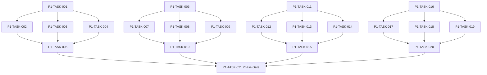

# Phase 1. 콘텐츠 · 자산 · 빌드파이프라인 상세 설계서

> 버전 v31.1 · 기준원문 v30 · 작성일 2026-09-09
> 상태: **설계 검토 초안 / 구현 NOT_STARTED / Test NOT_RUN**  
> 마스터: [전체 구현](00_전체_구현_마스터_설계서.md) · 요구추적: [93](93_요구사항_추적표.md) · 결정대장: [94](94_설계보완안_및_결정대장.md)

## 1. 문서 개요
원문 카탈로그를 손실 없이 형식화하고 로컬 자산을 검증·배포한다. 기능 설명에서 불명확했던 구현 책임, 입출력, 정합성, 실패 경계, 검증 방법과 인계 조건을 구체화한다. 본문에는 해당 Phase 에 필요한 공통 계약, 메소드, DDL, Task, Test 를 포함한다. 부록에는 담당 원문 108 개 절을 원문 그대로 수록했다.

구현 범위는 아래 4 개 기능 및 담당 원문의 하위 규칙과 카탈로그이다. 다른 Phase 의 핵심 알고리즘 구현, 서버/멀티플레이, 현실시간 기반 방치 진행, 원문에 없는 게임 규칙의 무단 추가는 제외한다. 원문에서 선택 확장으로 제시한 기능도 요구대장에서 유지하며, 활성화 또는 유예 결정과 별개로 연계 설계를 보존한다.

기존 소스가 제공되지 않아 실제 구조에 대한 영향은 확정하지 않았다. 신규 클래스와 테이블은 구현 제안이며, 기존 코드가 확인되면 공통 Interface, DAO, SQL 재사용을 우선한다.

## 2. Phase 목표
완료 후 상태: **원문 ID 수량 일치·필수 참조 0 건 오류·자산 검증 리포트**. 후속 Phase 에는 검증된 DTO/port, 실제 도메인 결과, 세이브 codec/DDL 변경, fixture 와 기준선을 전달한다. 기능 이름만 등록하거나 Fake 성공 응답만 반환하는 상태는 완료로 보지 않는다.

## 3. 선행 조건
| 선행 Phase | Gate | 전달받는 기능 | 미충족시 차단 Task |
|---|---|---|---|
| [Phase 0](01_Phase0_기준선_아키텍처_개발기반_상세설계서.md) | P0-TASK-021 | 원문 우선순위·타입 계약·모듈 경계·빌드 및 최소 테스트를 고정한다. | 미충족이면본 Phase 모든계약 Task 의실제 adapter 통합및제품활성화불가. 검토/Mock UI 는별도표시로가능. |

설정: versioned content/balance/engine-order/visibility/limits profile. DB: 선행 schema 및해당 Phase 신규 codec 이필요하다. 외부시스템: 필수없음. 실제이미지/미완성콘텐츠는검증 fixture 로임시대체가능하나 Full 출시검수와구분한다. 미승인규칙을임의0 값으로채운성공 Fixture 는허용하지않는다.

| 결정 ID | 검토 주제 | 상태 | 적용/차단 내용 |
|---|---|---|---|
| C09 | PERMANENT 초상 풀까지 전부소진 | 승인·기준선 반영 | 보호키 탈취 금지·일반 공유 후 최후 generic key 명시 배정; 이름 동명이인 허용. |
| C10 | 퍼센트/%p 및 불완전 효과 데이터 | 승인·기준선 반영 | `RATIO/BASIS_POINT/FLAT` typed effect AST; description-only effect는 임의 수치로 출시하지 않는다. |
| C13 | 한글 FTS 부분검색/tokenizer | 승인·기준선 반영 | NFC·대소문자·공백 정규화와 결정적 2-gram shadow token table을 기본으로 한다. |
| C18 | 미제공 이미지·콘텐츠 정의 및수량 | 승인·실물 검증 NOT_RUN | M/W 각 5,000장의 512×640 WebP 고정 풀과 install-time `portraits_v1` pack을 사용한다. 실제 파일/manifest 검수 전 Full·RC는 `BLOCKED_ASSET`이다. |

### C18 승인 자산 기준선

- 빌드 입력은 `NPC-M-00001..05000.webp`, `NPC-W-00001..05000.webp`의 실제 파일 10,000장이다. 런타임 조합 생성으로 수량을 대체하지 않는다.
- 파일은 512×640 px, opaque sRGB, 단일 WebP 형식이다. `portraitImageKey`와 pool version이 정체성이며 화면별 crop 파생 파일을 만들지 않는다.
- 배포는 실행코드가 없는 install-time Play Asset Delivery pack `portraits_v1` 하나를 사용한다. fast-follow/on-demand는 오프라인 첫 실행 계약 때문에 사용하지 않는다.
- pack 압축 크기 512 MiB 이하, 전체 install-time 압축 크기 768 MiB 이하를 `bundletool`/Play Console 추정치로 검증한다.
- Full 활성 콘텐츠는 `UNDEFINED_EFFECT`, 깨진 ID/FK/asset 참조, 출처·배포권 미확인 자산이 0건이어야 한다. 미완성 행은 삭제하거나 0으로 채우지 않고 비활성 상태로 남긴다.
- 실물 파일이 없는 현재 상태는 결정 미완료가 아니라 실행 증거 `NOT_RUN`이다. P1은 resolver/fallback/validator를 구현할 수 있지만 P23 Full 검수와 P25 RC는 통과할 수 없다.

## 4. 기능 범위 및 요구 연결
| 기능 ID | 기능명 | 중요도 | 선행 기능/Phase | 원문요구/공통근거 |
|---|---|---|---|---|
| FUNC-P1-001 | 정적 카탈로그 스키마와 ID 보존 | 필수핵심 또는 원문 선택 확장 명시검토 | P0 | [§51](#src-0051), [§56](#src-0056), [§118](#src-0118), [§119](#src-0119), [§120](#src-0120), [§128](#src-0128), [§129](#src-0129), [§130](#src-0130) 외 9 개 |
| FUNC-P1-002 | 콘텐츠 검증·사전 DB 빌드 | 필수핵심 또는 원문 선택 확장 명시검토 | P0 | [§3049](#src-3049), [§3051](#src-3051), [§3076](#src-3076), [§3077](#src-3077), [§3078](#src-3078), [§3117](#src-3117) |
| FUNC-P1-003 | 로컬 이미지·AssetResolver·크롭 | 필수핵심 또는 원문 선택 확장 명시검토 | P0 | [§2709](#src-2709), [§2710](#src-2710), [§2711](#src-2711), [§2712](#src-2712), [§2713](#src-2713), [§2714](#src-2714), [§2715](#src-2715), [§2716](#src-2716) 외 73 개 |
| FUNC-P1-004 | 콘텐츠·이미지 버전 교체와 호환 | 필수핵심 또는 원문 선택 확장 명시검토 | P0 | [§2782](#src-2782), [§2783](#src-2783), [§2790](#src-2790), [§2791](#src-2791) |

## 5. 기능별 상세 설계

### 공통 계약의 적용 범위
이 Phase의 전역 규범은 [공통 계약](설계부록/04_공통계약_및_콘텐츠_스키마.md)과 [84 Command/Event 계약](84_전체_Command_Event_계약서.md)을 단일 기준으로 따른다. 이 절은 적용 선언이지 계약 복사본이 아니며, 차이가 생기면 전역 계약이 우선하고 Phase 문서를 같은 revision에서 고친다. 모든 새 메소드/클래스명과 물리 DDL은 실제 저장소 확인 전 **설계 보완안**이다.

`CommandEnvelope(commandId, sessionEpoch, expectedVersion, actorId, payload, payloadHash)`를 사용한다. `DomainDelta`는 typed aggregate change·RNG state/counter·typed event·command result만 포함하고 table/DAO/SQL/`dirtyRows[]`를 포함하지 않는다. SaveCoordinator가 persistence plan과 dirty shard key로 변환한다. `stateHash` 범위·byte encoding·계산 시점과 payload canonical hash는 전역 계약을 따른다.

게임은 한 프로세스·한 활성 `WorldSession`을 기준으로 한다. 여러 노드/서버/분산 Lock은 해당 없으며 UI 연속 탭·코루틴 완료·예약 이벤트·슬롯 전환·프로세스 재실행 동시성은 실제로 검증한다. `GameMinute`, `CombatMillis`, `Money(Long)`, 확률 ppm의 혼합·부동소수 권위 계산을 금지한다.

<a id="func-p1-001"></a>
### 5.1. FUNC-P1-001 — 정적 카탈로그 스키마와 ID 보존

| 항목 | 설계 |
|---|---|
| 기능 목적 | 정적 카탈로그 스키마와 ID 보존을 독립된 책임으로 구현한다. 입력, 실패 처리, 저장 경계가 분리되어 있지 않으면 여러 모듈이 동일 상태를 중복 수정할 수 있다. 이를 명시적인 명령/조회 계약으로 통일한다. |
| 관련 요구사항 | [§51](#src-0051), [§56](#src-0056), [§118](#src-0118), [§119](#src-0119), [§120](#src-0120), [§128](#src-0128), [§129](#src-0129), [§130](#src-0130), [§131](#src-0131), [§132](#src-0132), [§133](#src-0133), [§134](#src-0134), [§135](#src-0135), [§136](#src-0136), [§137](#src-0137) 외 2 개 |
| 기능 요구사항 | 1. 원문 카탈로그 ID·한글명·등급·태그·수치·단위를 원본 필드로 유지한다<br>2. 무기420/방어구480/장신구420/아이템180/몬스터300 과 별도 스킬·보스·이벤트 카탈로그를 검증한다<br>3. 설명만 있는 효과는 미정 필드로 기록하고 임의 수치를 실제 원문 값처럼 채우지 않는다<br>4. 잘못된 조사/표기 교정은 displayName override 와 원문명 이력을 별도 관리한다 |
| 비기능/운영 | 완전 오프라인, 결정론, 재시도 멱등성, 실패 범위 명시, 원문 정보 공개 정책을 준수한다. 로컬 진단은 기록하되 사용자 메모나 숨은 정보를 일반 로그로 수집하지 않는다. |
| 성능/안정성 | 입력 크기, 큐, 재시도에는 유한한 상한을 둔다. DB/이미지/CPU 작업은 Main 에서 실행하지 않는다. P24 의 성능 예산을 추적하되 현재는 측정 전이다. 핵심 상태 처리에 실패하면 완전한 직전 상태를 보존한다. |
| 주요 메소드 | `CatalogImporter.import(source: ContentSource, version: ContentVersion) -> CatalogDraft` |
| 입력 필드/값 | sourceFile, contentVersion, sourceHash, encoding=UTF-8; 구체적값: WPN-0001 물리19 레벨1 |
| 반환값 | draftRows[], errors{line,column,id}[]; 정상결과: 원문 ID 와 수치가 content_template 에 일치 |
| 입력 검증 | 같은 ID 두 행, 서로 다른 효과 → 중복 오류와 두 원문 행번호 반환; required ID/enum/범위/상태/version 은변경 전에검사 |
| 예외 계약 | 참조되지 않는 MON ID 가 loot 에 있음 → 정적 번들 발행 차단; typed DomainError 로상위호출에전달 |
| Transaction | WorldEngine 의 권위 명령으로 처리한다. 계산은 transaction 밖에서 수행하고, SaveCoordinator 의 단일 write transaction 으로 확정한 뒤 게시한다. 원자적 효과의 중간 성공은 허용하지 않는다. |
| 상태 변화 | RAW → PARSED → VALIDATED → PUBLISHED |
| 소유 모듈 | :core:content / :core:image / tools:content-builder |
| 신규/수정 | 기존 코드 미제공: 신규/adapter 제안이다. 동일 책임의 기존 모듈이 있으면 공개 interface 를 유지하고 내부 추가로 변경을 최소화한다. |
| 관련 Task | [P1-TASK-001](#p1-task-001) · [P1-TASK-002](#p1-task-002) · [P1-TASK-003](#p1-task-003) · [P1-TASK-004](#p1-task-004) · [P1-TASK-005](#p1-task-005) |
| 관련 Test | [P1-UT-001](#p1-ut-001) · [P1-BT-001](#p1-bt-001) · [P1-FT-001](#p1-ft-001) · [P1-CT-001](#p1-ct-001) · [P1-IT-001](#p1-it-001) |

#### 처리 순서 및 데이터 흐름
1. 명령 envelope/현재 epoch/version 과 대상 존재·권한을확인하고 기존 receipt 를 조회한다.
2. 원문 카탈로그 ID·한글명·등급·태그·수치·단위를 원본 필드로 유지한다
3. 무기420/방어구480/장신구420/아이템180/몬스터300 과 별도 스킬·보스·이벤트 카탈로그를 검증한다
4. 설명만 있는 효과는 미정 필드로 기록하고 임의 수치를 실제 원문 값처럼 채우지 않는다
5. 잘못된 조사/표기 교정은 displayName override 와 원문명 이력을 별도 관리한다
6. Delta 불변식→해당행/RNG/event/receipt/codec 원자 commit→PublicView/후속 event 발행. 실패 시메모리/DB 게시를하지않는다.

입력 `sourceFile, contentVersion, sourceHash, encoding=UTF-8` → `CatalogImporter.import` → 검증된 `draftRows[], errors{line,column,id}[]` → SavePort/영속세대 → PublicProjection/후속 handler.

#### Use Case와 실패 범위
| 상황 | 처리 |
|---|---|
| 정상 | WPN-0001 물리19 레벨1 → 원문 ID 와 수치가 content_template 에 일치 |
| 대상 없음 | 조회는 Empty, 단건 쓰기는 NotFound 를 반환한다. 임의의 대상 생성, 기존 아이템 대체, 금화 차감은 하지 않는다. |
| 일부 성공 | 원자적 단건 처리에는 부분 성공을 허용하지 않는다. 정비 프리셋이나 독립 활동 batch 만 항목별 receipt 와 성공/실패 목록을 제공한다. 하나의 원자적 정산을 분할하지 않는다. |
| 일부 실패 | 정적 번들 발행 차단 |
| 중복 실행 | 동일 명령의 효과는 1 회만 반영하며, 동일 조회의 출력은 동치여야 한다. 다른 payload 에 같은 멱등키를 재사용하면 오류를 반환한다. |
| 재기동 후 | 동일 COMMITTED snapshot/version 을 기준으로 재조회한다. 미완료 시간 진행과 상태는 checkpoint 에서 이어간다. |
| 비정상 데이터 | 중복 오류와 두 원문 행번호 반환; 잘못된 FK/enum/NaN 은검증 실패로격리/안전정지. |
| 외부 시스템 장애 | 필수 외부 서버는 없다. 로컬 DB/파일/OS/asset 오류는 실패 테스트로 검증하며, 네트워크를 복구의 필수 조건으로 추가하지 않는다. |

#### 객체 및 메소드 책임 분리
| 모듈/객체 | 신규/수정 | 책임 | 메소드 계약 |
|---|---|---|---|
| CatalogImporter | 신규/기존 adapter | 정적 카탈로그 스키마와 ID 보존 규칙조정자 | CatalogImporter.import(source: ContentSource, version: ContentVersion) -> CatalogDraft |
| 입력 검증 | UseCase 내부 또는 기존 도메인 정책 재사용 | 필수 ID·범위·권한·원문제약 검증; 별도 Validator 클래스는 둘 이상의 UseCase가 공유할 때만 추가 | use case 입력별 명시적 ValidationResult |
| 저장 경계 | 기존 Aggregate별 typed Port/SavePort 재사용 | 코덱·조회 snapshot·commit 연결; simulation 직접 DAO 금지; 기능 전용 RepositoryPort 신규 생성 금지 | use case별 typed read/commit 계약 |
| 표현 변환 | 기존 feature mapper 또는 순수 함수 재사용 | 공개/허용 결과만 변환; 별도 Projection 클래스는 둘 이상의 소비자가 공유할 때만 추가 | use case별 PublicViewOrReport |

<a id="func-p1-002"></a>
### 5.2. FUNC-P1-002 — 콘텐츠 검증·사전 DB 빌드

| 항목 | 설계 |
|---|---|
| 기능 목적 | 콘텐츠 검증·사전 DB 빌드을 독립된 책임으로 구현한다. 입력, 실패 처리, 저장 경계가 분리되어 있지 않으면 여러 모듈이 동일 상태를 중복 수정할 수 있다. 이를 명시적인 명령/조회 계약으로 통일한다. |
| 관련 요구사항 | [§3049](#src-3049), [§3051](#src-3051), [§3076](#src-3076), [§3077](#src-3077), [§3078](#src-3078), [§3117](#src-3117) |
| 기능 요구사항 | 1. schema/type/range/reference/태그 충돌/레시피 순환을 검사한다<br>2. validation report 에 ERROR/WARN 과 영향 ID 를 남긴다<br>3. content.db 는 임시 디렉터리에서 생성·무결성 검사 후 manifest 와 함께 발행한다<br>4. Prototype/Alpha/Full 은 데이터 profile 만 다르며 최종 Full 목표를 삭제하지 않는다 |
| 비기능/운영 | 완전 오프라인, 결정론, 재시도 멱등성, 실패 범위 명시, 원문 정보 공개 정책을 준수한다. 로컬 진단은 기록하되 사용자 메모나 숨은 정보를 일반 로그로 수집하지 않는다. |
| 성능/안정성 | 입력 크기, 큐, 재시도에는 유한한 상한을 둔다. DB/이미지/CPU 작업은 Main 에서 실행하지 않는다. P24 의 성능 예산을 추적하되 현재는 측정 전이다. 핵심 상태 처리에 실패하면 완전한 직전 상태를 보존한다. |
| 주요 메소드 | `ContentBuilder.build(draft: CatalogDraft, rules: BuildRules) -> ContentBundle` |
| 입력 필드/값 | catalogDraft, profile, schemaVersion, balanceVersion; 구체적값: 두 번 동일 소스를 빌드 |
| 반환값 | content.db, manifest.json, validation-report.json; 정상결과: canonical 콘텐츠 hash 동일, wall-clock metadata 는 hash 제외 |
| 입력 검증 | 태그 허용과 금지 동시 지정 → ERROR; 합리화하여 자동 수정하지 않음; required ID/enum/범위/상태/version 은변경 전에검사 |
| 예외 계약 | DB 빌드 중 I/O 실패 → 직전 승인 bundle 유지; 절반짜리 bundle 비활성; typed DomainError 로상위호출에전달 |
| Transaction | WorldEngine 의 권위 명령으로 처리한다. 계산은 transaction 밖에서 수행하고, SaveCoordinator 의 단일 write transaction 으로 확정한 뒤 게시한다. 원자적 효과의 중간 성공은 허용하지 않는다. |
| 상태 변화 | DRAFT → CHECKED → STAGED → ACTIVE |
| 소유 모듈 | :core:content / :core:image / tools:content-builder |
| 신규/수정 | 기존 코드 미제공: 신규/adapter 제안이다. 동일 책임의 기존 모듈이 있으면 공개 interface 를 유지하고 내부 추가로 변경을 최소화한다. |
| 관련 Task | [P1-TASK-006](#p1-task-006) · [P1-TASK-007](#p1-task-007) · [P1-TASK-008](#p1-task-008) · [P1-TASK-009](#p1-task-009) · [P1-TASK-010](#p1-task-010) |
| 관련 Test | [P1-UT-002](#p1-ut-002) · [P1-BT-002](#p1-bt-002) · [P1-FT-002](#p1-ft-002) · [P1-CT-002](#p1-ct-002) · [P1-IT-002](#p1-it-002) |

#### 처리 순서 및 데이터 흐름
1. 명령 envelope/현재 epoch/version 과 대상 존재·권한을확인하고 기존 receipt 를 조회한다.
2. schema/type/range/reference/태그 충돌/레시피 순환을 검사한다
3. validation report 에 ERROR/WARN 과 영향 ID 를 남긴다
4. content.db 는 임시 디렉터리에서 생성·무결성 검사 후 manifest 와 함께 발행한다
5. Prototype/Alpha/Full 은 데이터 profile 만 다르며 최종 Full 목표를 삭제하지 않는다
6. Delta 불변식→해당행/RNG/event/receipt/codec 원자 commit→PublicView/후속 event 발행. 실패 시메모리/DB 게시를하지않는다.

입력 `catalogDraft, profile, schemaVersion, balanceVersion` → `ContentBuilder.build` → 검증된 `content.db, manifest.json, validation-report.json` → SavePort/영속세대 → PublicProjection/후속 handler.

#### Use Case와 실패 범위
| 상황 | 처리 |
|---|---|
| 정상 | 두 번 동일 소스를 빌드 → canonical 콘텐츠 hash 동일, wall-clock metadata 는 hash 제외 |
| 대상 없음 | 조회는 Empty, 단건 쓰기는 NotFound 를 반환한다. 임의의 대상 생성, 기존 아이템 대체, 금화 차감은 하지 않는다. |
| 일부 성공 | 원자적 단건 처리에는 부분 성공을 허용하지 않는다. 정비 프리셋이나 독립 활동 batch 만 항목별 receipt 와 성공/실패 목록을 제공한다. 하나의 원자적 정산을 분할하지 않는다. |
| 일부 실패 | 직전 승인 bundle 유지; 절반짜리 bundle 비활성 |
| 중복 실행 | 동일 명령의 효과는 1 회만 반영하며, 동일 조회의 출력은 동치여야 한다. 다른 payload 에 같은 멱등키를 재사용하면 오류를 반환한다. |
| 재기동 후 | 동일 COMMITTED snapshot/version 을 기준으로 재조회한다. 미완료 시간 진행과 상태는 checkpoint 에서 이어간다. |
| 비정상 데이터 | ERROR; 합리화하여 자동 수정하지 않음; 잘못된 FK/enum/NaN 은검증 실패로격리/안전정지. |
| 외부 시스템 장애 | 필수 외부 서버는 없다. 로컬 DB/파일/OS/asset 오류는 실패 테스트로 검증하며, 네트워크를 복구의 필수 조건으로 추가하지 않는다. |

#### 객체 및 메소드 책임 분리
| 모듈/객체 | 신규/수정 | 책임 | 메소드 계약 |
|---|---|---|---|
| ContentBuilder | 신규/기존 adapter | 콘텐츠 검증·사전 DB 빌드 규칙조정자 | ContentBuilder.build(draft: CatalogDraft, rules: BuildRules) -> ContentBundle |
| 입력 검증 | UseCase 내부 또는 기존 도메인 정책 재사용 | 필수 ID·범위·권한·원문제약 검증; 별도 Validator 클래스는 둘 이상의 UseCase가 공유할 때만 추가 | use case 입력별 명시적 ValidationResult |
| 저장 경계 | 기존 Aggregate별 typed Port/SavePort 재사용 | 코덱·조회 snapshot·commit 연결; simulation 직접 DAO 금지; 기능 전용 RepositoryPort 신규 생성 금지 | use case별 typed read/commit 계약 |
| 표현 변환 | 기존 feature mapper 또는 순수 함수 재사용 | 공개/허용 결과만 변환; 별도 Projection 클래스는 둘 이상의 소비자가 공유할 때만 추가 | use case별 PublicViewOrReport |

<a id="func-p1-003"></a>
### 5.3. FUNC-P1-003 — 로컬 이미지·AssetResolver·크롭

| 항목 | 설계 |
|---|---|
| 기능 목적 | 로컬 이미지·AssetResolver·크롭을 독립된 책임으로 구현한다. 입력, 실패 처리, 저장 경계가 분리되어 있지 않으면 여러 모듈이 동일 상태를 중복 수정할 수 있다. 이를 명시적인 명령/조회 계약으로 통일한다. |
| 관련 요구사항 | [§2709](#src-2709), [§2710](#src-2710), [§2711](#src-2711), [§2712](#src-2712), [§2713](#src-2713), [§2714](#src-2714), [§2715](#src-2715), [§2716](#src-2716), [§2717](#src-2717), [§2718](#src-2718), [§2719](#src-2719), [§2720](#src-2720), [§2721](#src-2721), [§2722](#src-2722), [§2723](#src-2723) 외 66 개 |
| 기능 요구사항 | 1. 원문 10,000 장 NPC 파일명과 단일 portraitKey 사용을 유지한다<br>2. domain 에는 Key 만 저장하며 Android URI 조합은 core:image 에서 수행한다<br>3. 사용처별 crop profile 을 적용하고 fallback 이 발생해도 저장된 원래 key 를 바꾸지 않는다<br>4. 네트워크 URI·경로 탈출·임의 파일 접근은 거부하고 실제 자산 미제공 상태는 NOT_PROVIDED 로 기록한다 |
| 비기능/운영 | 완전 오프라인, 결정론, 재시도 멱등성, 실패 범위 명시, 원문 정보 공개 정책을 준수한다. 로컬 진단은 기록하되 사용자 메모나 숨은 정보를 일반 로그로 수집하지 않는다. |
| 성능/안정성 | 입력 크기, 큐, 재시도에는 유한한 상한을 둔다. DB/이미지/CPU 작업은 Main 에서 실행하지 않는다. P24 의 성능 예산을 추적하되 현재는 측정 전이다. 핵심 상태 처리에 실패하면 완전한 직전 상태를 보존한다. |
| 주요 메소드 | `AssetResolver.resolve(key: AssetKey, usage: ImageUsage) -> LocalAssetRef` |
| 입력 필드/값 | assetKey, usageType, cropProfile, screenSizePx; 구체적값: NPC-W-03147, BATTLE_TOKEN |
| 반환값 | localUri, crop, fallbackReason; 원래 key 유지; 정상결과: 동일 파일의 1:1 crop 과 원래 key 유지 |
| 입력 검증 | 해당 파일 없음 → 여성 generic fallback 표시; NPC identity 불변; required ID/enum/범위/상태/version 은변경 전에검사 |
| 예외 계약 | ../../save.db 를 asset key 로 입력 → InvalidAssetKey; 파일 읽지 않음; typed DomainError 로상위호출에전달 |
| Transaction | WorldEngine 의 권위 명령으로 처리한다. 계산은 transaction 밖에서 수행하고, SaveCoordinator 의 단일 write transaction 으로 확정한 뒤 게시한다. 원자적 효과의 중간 성공은 허용하지 않는다. |
| 상태 변화 | RESOLVE → LOCAL/OVERRIDE/FALLBACK |
| 소유 모듈 | :core:content / :core:image / tools:content-builder |
| 신규/수정 | 기존 코드 미제공: 신규/adapter 제안이다. 동일 책임의 기존 모듈이 있으면 공개 interface 를 유지하고 내부 추가로 변경을 최소화한다. |
| 관련 Task | [P1-TASK-011](#p1-task-011) · [P1-TASK-012](#p1-task-012) · [P1-TASK-013](#p1-task-013) · [P1-TASK-014](#p1-task-014) · [P1-TASK-015](#p1-task-015) |
| 관련 Test | [P1-UT-003](#p1-ut-003) · [P1-BT-003](#p1-bt-003) · [P1-FT-003](#p1-ft-003) · [P1-CT-003](#p1-ct-003) · [P1-IT-003](#p1-it-003) |

#### 처리 순서 및 데이터 흐름
1. 명령 envelope/현재 epoch/version 과 대상 존재·권한을확인하고 기존 receipt 를 조회한다.
2. 원문 10,000 장 NPC 파일명과 단일 portraitKey 사용을 유지한다
3. domain 에는 Key 만 저장하며 Android URI 조합은 core:image 에서 수행한다
4. 사용처별 crop profile 을 적용하고 fallback 이 발생해도 저장된 원래 key 를 바꾸지 않는다
5. 네트워크 URI·경로 탈출·임의 파일 접근은 거부하고 실제 자산 미제공 상태는 NOT_PROVIDED 로 기록한다
6. Delta 불변식→해당행/RNG/event/receipt/codec 원자 commit→PublicView/후속 event 발행. 실패 시메모리/DB 게시를하지않는다.

입력 `assetKey, usageType, cropProfile, screenSizePx` → `AssetResolver.resolve` → 검증된 `localUri, crop, fallbackReason; 원래key 유지` → SavePort/영속세대 → PublicProjection/후속 handler.

#### Use Case와 실패 범위
| 상황 | 처리 |
|---|---|
| 정상 | NPC-W-03147, BATTLE_TOKEN → 동일 파일의 1:1 crop 과 원래 key 유지 |
| 대상 없음 | 조회는 Empty, 단건 쓰기는 NotFound 를 반환한다. 임의의 대상 생성, 기존 아이템 대체, 금화 차감은 하지 않는다. |
| 일부 성공 | 원자적 단건 처리에는 부분 성공을 허용하지 않는다. 정비 프리셋이나 독립 활동 batch 만 항목별 receipt 와 성공/실패 목록을 제공한다. 하나의 원자적 정산을 분할하지 않는다. |
| 일부 실패 | InvalidAssetKey; 파일 읽지 않음 |
| 중복 실행 | 동일 명령의 효과는 1 회만 반영하며, 동일 조회의 출력은 동치여야 한다. 다른 payload 에 같은 멱등키를 재사용하면 오류를 반환한다. |
| 재기동 후 | 동일 COMMITTED snapshot/version 을 기준으로 재조회한다. 미완료 시간 진행과 상태는 checkpoint 에서 이어간다. |
| 비정상 데이터 | 여성 generic fallback 표시; NPC identity 불변; 잘못된 FK/enum/NaN 은검증 실패로격리/안전정지. |
| 외부 시스템 장애 | 필수 외부 서버는 없다. 로컬 DB/파일/OS/asset 오류는 실패 테스트로 검증하며, 네트워크를 복구의 필수 조건으로 추가하지 않는다. |

#### 객체 및 메소드 책임 분리
| 모듈/객체 | 신규/수정 | 책임 | 메소드 계약 |
|---|---|---|---|
| AssetResolver | 신규/기존 adapter | 로컬 이미지·AssetResolver·크롭 규칙조정자 | AssetResolver.resolve(key: AssetKey, usage: ImageUsage) -> LocalAssetRef |
| 입력 검증 | UseCase 내부 또는 기존 도메인 정책 재사용 | 필수 ID·범위·권한·원문제약 검증; 별도 Validator 클래스는 둘 이상의 UseCase가 공유할 때만 추가 | use case 입력별 명시적 ValidationResult |
| 저장 경계 | 기존 Aggregate별 typed Port/SavePort 재사용 | 코덱·조회 snapshot·commit 연결; simulation 직접 DAO 금지; 기능 전용 RepositoryPort 신규 생성 금지 | use case별 typed read/commit 계약 |
| 표현 변환 | 기존 feature mapper 또는 순수 함수 재사용 | 공개/허용 결과만 변환; 별도 Projection 클래스는 둘 이상의 소비자가 공유할 때만 추가 | use case별 PublicViewOrReport |

<a id="func-p1-004"></a>
### 5.4. FUNC-P1-004 — 콘텐츠·이미지 버전 교체와 호환

| 항목 | 설계 |
|---|---|
| 기능 목적 | 콘텐츠·이미지 버전 교체와 호환을 독립된 책임으로 구현한다. 입력, 실패 처리, 저장 경계가 분리되어 있지 않으면 여러 모듈이 동일 상태를 중복 수정할 수 있다. 이를 명시적인 명령/조회 계약으로 통일한다. |
| 관련 요구사항 | [§2782](#src-2782), [§2783](#src-2783), [§2790](#src-2790), [§2791](#src-2791) |
| 기능 요구사항 | 1. save contentVersion 과 생성기/밸런스/RNG 버전을 별도로 저장한다<br>2. 삭제 ID 는 alias 또는 legacy snapshot 으로 복구하며 의미가 다른 템플릿으로 자동 치환하지 않는다<br>3. 자산팩 변경은 파일 checksum 만 새로 계산하고 NPC 의 portrait key 는 그대로 유지한다<br>4. 선택 자산팩/표정 variant 는 선택 범위로 추적하되 기본 오프라인 플레이를 막지 않는다 |
| 비기능/운영 | 완전 오프라인, 결정론, 재시도 멱등성, 실패 범위 명시, 원문 정보 공개 정책을 준수한다. 로컬 진단은 기록하되 사용자 메모나 숨은 정보를 일반 로그로 수집하지 않는다. |
| 성능/안정성 | 입력 크기, 큐, 재시도에는 유한한 상한을 둔다. DB/이미지/CPU 작업은 Main 에서 실행하지 않는다. P24 의 성능 예산을 추적하되 현재는 측정 전이다. 핵심 상태 처리에 실패하면 완전한 직전 상태를 보존한다. |
| 주요 메소드 | `ContentBinding.resolve(saved: ContentBinding, installed: ContentBundle) -> BindingPlan` |
| 입력 필드/값 | saveContentVersion, installedManifest, aliasMap, legacyTemplates; 구체적값: 옛 ID alias OLD-WPN→WPN-0001 |
| 반환값 | BoundContent 또는 IncompatibleContent{missingIds}; 정상결과: 변환 이력과 이전 ID 보존 |
| 입력 검증 | 선택 이미지 팩 비활성 → 기본 portrait/fallback 으로 정상 표시; required ID/enum/범위/상태/version 은변경 전에검사 |
| 예외 계약 | 필수 스킬 ID 에 alias/legacy 없음 → 로드 차단·원본 세이브 보존; typed DomainError 로상위호출에전달 |
| Transaction | WorldEngine 의 권위 명령으로 처리한다. 계산은 transaction 밖에서 수행하고, SaveCoordinator 의 단일 write transaction 으로 확정한 뒤 게시한다. 원자적 효과의 중간 성공은 허용하지 않는다. |
| 상태 변화 | BOUND → COMPATIBLE/MIGRATION_REQUIRED/UNSUPPORTED |
| 소유 모듈 | :core:content / :core:image / tools:content-builder |
| 신규/수정 | 기존 코드 미제공: 신규/adapter 제안이다. 동일 책임의 기존 모듈이 있으면 공개 interface 를 유지하고 내부 추가로 변경을 최소화한다. |
| 관련 Task | [P1-TASK-016](#p1-task-016) · [P1-TASK-017](#p1-task-017) · [P1-TASK-018](#p1-task-018) · [P1-TASK-019](#p1-task-019) · [P1-TASK-020](#p1-task-020) |
| 관련 Test | [P1-UT-004](#p1-ut-004) · [P1-BT-004](#p1-bt-004) · [P1-FT-004](#p1-ft-004) · [P1-CT-004](#p1-ct-004) · [P1-IT-004](#p1-it-004) |

#### 처리 순서 및 데이터 흐름
1. 명령 envelope/현재 epoch/version 과 대상 존재·권한을확인하고 기존 receipt 를 조회한다.
2. save contentVersion 과 생성기/밸런스/RNG 버전을 별도로 저장한다
3. 삭제 ID 는 alias 또는 legacy snapshot 으로 복구하며 의미가 다른 템플릿으로 자동 치환하지 않는다
4. 자산팩 변경은 파일 checksum 만 새로 계산하고 NPC 의 portrait key 는 그대로 유지한다
5. 선택 자산팩/표정 variant 는 선택 범위로 추적하되 기본 오프라인 플레이를 막지 않는다
6. Delta 불변식→해당행/RNG/event/receipt/codec 원자 commit→PublicView/후속 event 발행. 실패 시메모리/DB 게시를하지않는다.

입력 `saveContentVersion, installedManifest, aliasMap, legacyTemplates` → `ContentBinding.resolve` → 검증된 `BoundContent 또는 IncompatibleContent{missingIds}` → SavePort/영속세대 → PublicProjection/후속 handler.

#### Use Case와 실패 범위
| 상황 | 처리 |
|---|---|
| 정상 | 옛 ID alias OLD-WPN→WPN-0001 → 변환 이력과 이전 ID 보존 |
| 대상 없음 | 조회는 Empty, 단건 쓰기는 NotFound 를 반환한다. 임의의 대상 생성, 기존 아이템 대체, 금화 차감은 하지 않는다. |
| 일부 성공 | 원자적 단건 처리에는 부분 성공을 허용하지 않는다. 정비 프리셋이나 독립 활동 batch 만 항목별 receipt 와 성공/실패 목록을 제공한다. 하나의 원자적 정산을 분할하지 않는다. |
| 일부 실패 | 로드 차단·원본 세이브 보존 |
| 중복 실행 | 동일 명령의 효과는 1 회만 반영하며, 동일 조회의 출력은 동치여야 한다. 다른 payload 에 같은 멱등키를 재사용하면 오류를 반환한다. |
| 재기동 후 | 동일 COMMITTED snapshot/version 을 기준으로 재조회한다. 미완료 시간 진행과 상태는 checkpoint 에서 이어간다. |
| 비정상 데이터 | 기본 portrait/fallback 으로 정상 표시; 잘못된 FK/enum/NaN 은검증 실패로격리/안전정지. |
| 외부 시스템 장애 | 필수 외부 서버는 없다. 로컬 DB/파일/OS/asset 오류는 실패 테스트로 검증하며, 네트워크를 복구의 필수 조건으로 추가하지 않는다. |

#### 객체 및 메소드 책임 분리
| 모듈/객체 | 신규/수정 | 책임 | 메소드 계약 |
|---|---|---|---|
| ContentBinding | 신규/기존 adapter | 콘텐츠·이미지 버전 교체와 호환 규칙조정자 | ContentBinding.resolve(saved: ContentBinding, installed: ContentBundle) -> BindingPlan |
| 입력 검증 | UseCase 내부 또는 기존 도메인 정책 재사용 | 필수 ID·범위·권한·원문제약 검증; 별도 Validator 클래스는 둘 이상의 UseCase가 공유할 때만 추가 | use case 입력별 명시적 ValidationResult |
| 저장 경계 | 기존 Aggregate별 typed Port/SavePort 재사용 | 코덱·조회 snapshot·commit 연결; simulation 직접 DAO 금지; 기능 전용 RepositoryPort 신규 생성 금지 | use case별 typed read/commit 계약 |
| 표현 변환 | 기존 feature mapper 또는 순수 함수 재사용 | 공개/허용 결과만 변환; 별도 Projection 클래스는 둘 이상의 소비자가 공유할 때만 추가 | use case별 PublicViewOrReport |


### Phase 특화 알고리즘·수치·판단

각기능의처리순서와입출력계약을기준으로구현한다. 자세한유형별원문정의/수치/카탈로그는문서끝에모두수록했다. 이 Phase 에서새로제안한정책은결정대장의승인상태를따른다.

## 6. DB 상세 설계

다음은 **신규 제안 스키마**다. 실제 기존 DB 가 제공되지 않아 기존 컬럼 변경 사실을 가정하지 않는다. 실제 구현에서는 Room Entity/DAO 와 export 된 schema 를 기준으로 N→N+1 migration 을 작성한다. 아래 CREATE 예시는 **완성 스키마 계약**이며 기존 DB migration 을 IF NOT EXISTS 로 대체하지 않는다.

| 논리/물리 객체 | 저장영역 | 최초 계약 Phase | 접근 | PK/유일조건 | 조회 Index |
|---|---|---|---|---|---|
| asset_binding | content.db(빌드후읽기전용) | P1 | staging INSERT/검증; 활성 content.db 직접수정 금지 | entity_kind,template_id,usage_type,priority | asset_id |
| asset_fallback | content.db(빌드후읽기전용) | P1 | staging INSERT/검증; 활성 content.db 직접수정 금지 | category,matcher,priority | asset_id |
| asset_image | content.db(빌드후읽기전용) | P1 | staging INSERT/검증; 활성 content.db 직접수정 금지 | relative_path | category |
| content_alias | content.db(빌드후읽기전용) | P1 | staging INSERT/검증; 활성 content.db 직접수정 금지 | old_id | PK/UNIQUE |
| content_manifest | content.db(빌드후읽기전용) | P1 | staging INSERT/검증; 활성 content.db 직접수정 금지 | content_version | profile |
| content_template | content.db(빌드후읽기전용) | P1 | staging INSERT/검증; 활성 content.db 직접수정 금지 | source_id | kind,grade, display_name |

모든일반 SQL 테이블은 `id TEXT NOT NULL PRIMARY KEY`, `row_version INTEGER NOT NULL DEFAULT 0`을공통필드로갖는다. nullable 는 DDL 에 NOT NULL 없는필드만이다. 단위는 `_minute`게임분/`_ms`밀리초/`_bp`0.01%p/`_ppm`0.0001%p,금액/수량 Long 정수. ID 는재사용하지않는다.

#### `asset_binding` 필드 및 관계

| 필드/제약 | 용도 |
|---|---|
| entity_kind TEXT NOT NULL | 선언된 타입·NULL/참조조건을 준수. 값의 의미는 이름과 해당기능 계약을 기준으로 함 |
| template_id TEXT NOT NULL | 선언된 타입·NULL/참조조건을 준수. 값의 의미는 이름과 해당기능 계약을 기준으로 함 |
| usage_type TEXT NOT NULL | 선언된 타입·NULL/참조조건을 준수. 값의 의미는 이름과 해당기능 계약을 기준으로 함 |
| asset_id TEXT NOT NULL REFERENCES asset_image(id) ON DELETE RESTRICT | 선언된 타입·NULL/참조조건을 준수. 값의 의미는 이름과 해당기능 계약을 기준으로 함 |
| crop_profile TEXT NOT NULL | 선언된 타입·NULL/참조조건을 준수. 값의 의미는 이름과 해당기능 계약을 기준으로 함 |
| priority INTEGER NOT NULL | 선언된 타입·NULL/참조조건을 준수. 값의 의미는 이름과 해당기능 계약을 기준으로 함 |
#### `asset_fallback` 필드 및 관계

| 필드/제약 | 용도 |
|---|---|
| category TEXT NOT NULL | 선언된 타입·NULL/참조조건을 준수. 값의 의미는 이름과 해당기능 계약을 기준으로 함 |
| matcher TEXT NOT NULL | 선언된 타입·NULL/참조조건을 준수. 값의 의미는 이름과 해당기능 계약을 기준으로 함 |
| asset_id TEXT NOT NULL REFERENCES asset_image(id) ON DELETE RESTRICT | 선언된 타입·NULL/참조조건을 준수. 값의 의미는 이름과 해당기능 계약을 기준으로 함 |
| priority INTEGER NOT NULL | 선언된 타입·NULL/참조조건을 준수. 값의 의미는 이름과 해당기능 계약을 기준으로 함 |
#### `asset_image` 필드 및 관계

| 필드/제약 | 용도 |
|---|---|
| relative_path TEXT NOT NULL | 선언된 타입·NULL/참조조건을 준수. 값의 의미는 이름과 해당기능 계약을 기준으로 함 |
| category TEXT NOT NULL | 선언된 타입·NULL/참조조건을 준수. 값의 의미는 이름과 해당기능 계약을 기준으로 함 |
| width INTEGER NOT NULL CHECK(width>0) | 선언된 타입·NULL/참조조건을 준수. 값의 의미는 이름과 해당기능 계약을 기준으로 함 |
| height INTEGER NOT NULL CHECK(height>0) | 선언된 타입·NULL/참조조건을 준수. 값의 의미는 이름과 해당기능 계약을 기준으로 함 |
| byte_size INTEGER NOT NULL CHECK(byte_size>=0) | 선언된 타입·NULL/참조조건을 준수. 값의 의미는 이름과 해당기능 계약을 기준으로 함 |
| sha256 TEXT NOT NULL | 선언된 타입·NULL/참조조건을 준수. 값의 의미는 이름과 해당기능 계약을 기준으로 함 |
| pool_version TEXT | 선언된 타입·NULL/참조조건을 준수. 값의 의미는 이름과 해당기능 계약을 기준으로 함 |
#### `content_alias` 필드 및 관계

| 필드/제약 | 용도 |
|---|---|
| old_id TEXT NOT NULL | 선언된 타입·NULL/참조조건을 준수. 값의 의미는 이름과 해당기능 계약을 기준으로 함 |
| new_id TEXT | 선언된 타입·NULL/참조조건을 준수. 값의 의미는 이름과 해당기능 계약을 기준으로 함 |
| policy TEXT NOT NULL | 선언된 타입·NULL/참조조건을 준수. 값의 의미는 이름과 해당기능 계약을 기준으로 함 |
| reason TEXT NOT NULL | 선언된 타입·NULL/참조조건을 준수. 값의 의미는 이름과 해당기능 계약을 기준으로 함 |
#### `content_manifest` 필드 및 관계

| 필드/제약 | 용도 |
|---|---|
| content_version TEXT NOT NULL | 선언된 타입·NULL/참조조건을 준수. 값의 의미는 이름과 해당기능 계약을 기준으로 함 |
| balance_version TEXT NOT NULL | 선언된 타입·NULL/참조조건을 준수. 값의 의미는 이름과 해당기능 계약을 기준으로 함 |
| schema_version INTEGER NOT NULL | 선언된 타입·NULL/참조조건을 준수. 값의 의미는 이름과 해당기능 계약을 기준으로 함 |
| source_hash TEXT NOT NULL | 선언된 타입·NULL/참조조건을 준수. 값의 의미는 이름과 해당기능 계약을 기준으로 함 |
| bundle_hash TEXT NOT NULL | 선언된 타입·NULL/참조조건을 준수. 값의 의미는 이름과 해당기능 계약을 기준으로 함 |
| profile TEXT NOT NULL | 선언된 타입·NULL/참조조건을 준수. 값의 의미는 이름과 해당기능 계약을 기준으로 함 |
#### `content_template` 필드 및 관계

| 필드/제약 | 용도 |
|---|---|
| kind TEXT NOT NULL | 선언된 타입·NULL/참조조건을 준수. 값의 의미는 이름과 해당기능 계약을 기준으로 함 |
| source_id TEXT NOT NULL | 선언된 타입·NULL/참조조건을 준수. 값의 의미는 이름과 해당기능 계약을 기준으로 함 |
| display_name TEXT NOT NULL | 선언된 타입·NULL/참조조건을 준수. 값의 의미는 이름과 해당기능 계약을 기준으로 함 |
| grade TEXT | 선언된 타입·NULL/참조조건을 준수. 값의 의미는 이름과 해당기능 계약을 기준으로 함 |
| min_level INTEGER | 선언된 타입·NULL/참조조건을 준수. 값의 의미는 이름과 해당기능 계약을 기준으로 함 |
| tags_json TEXT NOT NULL | 선언된 타입·NULL/참조조건을 준수. 값의 의미는 이름과 해당기능 계약을 기준으로 함 |
| definition_json TEXT NOT NULL | 선언된 타입·NULL/참조조건을 준수. 값의 의미는 이름과 해당기능 계약을 기준으로 함 |
| definition_version INTEGER NOT NULL | 선언된 타입·NULL/참조조건을 준수. 값의 의미는 이름과 해당기능 계약을 기준으로 함 |

definition_json 은 아래 타입별 스키마를 통과한 AST. 미정 필드는 출시 활성화 불가.

### FK·대량처리·Lock·Isolation
권위관계는선언된 FK/UNIQUE 와명령불변식을함께사용한다. polymorphic owner/subject/contentId 는 cross-DB FK 를만들지않고 ReferenceValidator 로검사한다. 가족/역사/증표/유일물품은 ON DELETE RESTRICT/보존요약으로보호한다. FK 다형성검사를 DB 가자동보장한다고가정하지않는다.

읽기는 WAL snapshot,쓰기는단일 writer 짧은 transaction 이다. SQLite 에 SELECT FOR UPDATE 를사용하지않는다. stale version 의 affectedRows=0 은 Conflict,SQLITE_BUSY 는제한재시도,손상/공간부족은안전정지다. 외부파일/콘텐츠다른 DB 접근은 transaction 전에끝낸다. 대량입출력은1batch 최대500 행/1 청크최대1MiB(보완설정)로시작하되 **한 의미적 작업을 원자적이지 않게 쪼개지 않는다**. 큰작업은 staging→검증→짧은 pointer 승격으로원자성을유지한다.

Index 는조회조건/정렬을기준으로추가하고 EXPLAIN QUERY PLAN 과쓰기공수/파일크기를측정한다. 삭제는이 Phase 에서소유한종료/취소/GC 대상만가능하며전체테이블 DELETE 를일상정리로사용하지않는다.

### 관련 DDL 계약
content.db 와 save.db 는**별도로**생성하며 cross-DB JOIN/transaction 을하지않는다. 아래구문은각각해당 DB 에서실행한다. 부모 FK 테이블은선행 Phase 의완료스키마가제공해야한다. 전체초기 schema 는공통부록 SQL 에있다.

**content.db**
```sql
-- 제안 DDL; 실제 Room 생성 schema와 검토 후 동기화.
PRAGMA foreign_keys=ON;

CREATE TABLE IF NOT EXISTS asset_binding (
  id TEXT PRIMARY KEY NOT NULL,
  row_version INTEGER NOT NULL DEFAULT 0 CHECK(row_version>=0),
  entity_kind TEXT NOT NULL,
  template_id TEXT NOT NULL,
  usage_type TEXT NOT NULL,
  asset_id TEXT NOT NULL REFERENCES asset_image(id) ON DELETE RESTRICT,
  crop_profile TEXT NOT NULL,
  priority INTEGER NOT NULL,
  UNIQUE(entity_kind,template_id,usage_type,priority)
);
CREATE INDEX IF NOT EXISTS ix_asset_binding_1 ON asset_binding(asset_id);

CREATE TABLE IF NOT EXISTS asset_fallback (
  id TEXT PRIMARY KEY NOT NULL,
  row_version INTEGER NOT NULL DEFAULT 0 CHECK(row_version>=0),
  category TEXT NOT NULL,
  matcher TEXT NOT NULL,
  asset_id TEXT NOT NULL REFERENCES asset_image(id) ON DELETE RESTRICT,
  priority INTEGER NOT NULL,
  UNIQUE(category,matcher,priority)
);
CREATE INDEX IF NOT EXISTS ix_asset_fallback_1 ON asset_fallback(asset_id);

CREATE TABLE IF NOT EXISTS asset_image (
  id TEXT PRIMARY KEY NOT NULL,
  row_version INTEGER NOT NULL DEFAULT 0 CHECK(row_version>=0),
  relative_path TEXT NOT NULL,
  category TEXT NOT NULL,
  width INTEGER NOT NULL CHECK(width>0),
  height INTEGER NOT NULL CHECK(height>0),
  byte_size INTEGER NOT NULL CHECK(byte_size>=0),
  sha256 TEXT NOT NULL,
  pool_version TEXT,
  UNIQUE(relative_path)
);
CREATE INDEX IF NOT EXISTS ix_asset_image_1 ON asset_image(category);

CREATE TABLE IF NOT EXISTS content_alias (
  id TEXT PRIMARY KEY NOT NULL,
  row_version INTEGER NOT NULL DEFAULT 0 CHECK(row_version>=0),
  old_id TEXT NOT NULL,
  new_id TEXT,
  policy TEXT NOT NULL,
  reason TEXT NOT NULL,
  UNIQUE(old_id)
);

CREATE TABLE IF NOT EXISTS content_manifest (
  id TEXT PRIMARY KEY NOT NULL,
  row_version INTEGER NOT NULL DEFAULT 0 CHECK(row_version>=0),
  content_version TEXT NOT NULL,
  balance_version TEXT NOT NULL,
  schema_version INTEGER NOT NULL,
  source_hash TEXT NOT NULL,
  bundle_hash TEXT NOT NULL,
  profile TEXT NOT NULL,
  UNIQUE(content_version)
);
CREATE INDEX IF NOT EXISTS ix_content_manifest_1 ON content_manifest(profile);

CREATE TABLE IF NOT EXISTS content_template (
  id TEXT PRIMARY KEY NOT NULL,
  row_version INTEGER NOT NULL DEFAULT 0 CHECK(row_version>=0),
  kind TEXT NOT NULL,
  source_id TEXT NOT NULL,
  display_name TEXT NOT NULL,
  grade TEXT,
  min_level INTEGER,
  tags_json TEXT NOT NULL,
  definition_json TEXT NOT NULL,
  definition_version INTEGER NOT NULL,
  UNIQUE(source_id)
);
CREATE INDEX IF NOT EXISTS ix_content_template_1 ON content_template(kind,grade);
CREATE INDEX IF NOT EXISTS ix_content_template_2 ON content_template(display_name);
```

## 7. Transaction / 동시성 / Thread 설계

| 관점 | 이 Phase 의 구현 기준 |
|---|---|
| Transaction 시작/종료 | WorldEngine/UseCase 가불변 Delta 계산완료 후 SaveCoordinator 진입. 실제 Roomwrite 시작→변경행/receipt/RNG/event/manifest→검증→commit. compute/read/tool 은 live transaction 해당없음. |
| Rollback | 필수입력/FK/버전/금액/소유권/일정/메소드예외,affectedRows 예상불일치면해당 semantic 작업전부 rollback.이미게시된 UI 값으로 DB 복구하지않음. |
| 부분 실패 | 하나의거래/강화/승계/보상은부분성공없음. 서로독립정비항목/검증 case/선택 background 활동만항목 receipt 로부분결과를허용. |
| 동시 처리/중복 | UI 연속탭·시간경계·NPC 명령이같은 data 를건드려도단일 writer 로직렬화. epoch/version/unique receipt 로재기동중복차단. |
| 여러 노드 | 오프라인싱글:해당없음. 분산 lock/서버 leader election/remoteDB 를신설하지않음. |
| Thread 생성 주체 | Application 이인프라 scope, WorldSessionFactory 가세션 scope/전용직렬 dispatcher 를소유. CPU 계산 Default/전용 dispatcher, DB/파일 IO 는 IO/context 를사용. Main 은 UI 만. |
| Daemon/Pool | 직접 Java daemon Thread 를게임수명보장으로사용하지않음. 고정·제한 dispatcher/pool 만허용. NPC/이벤트마다 Thread 생성금지. daemon 여부에무관하게구조화 scope 종료를검증. |
| 생명주기/종료 | OPEN→PAUSING→PAUSED→CLOSING→CLOSED.새명령차단→안전경계→commit drain→child job 취소/join→connection/handle 닫기. 프로세스 kill 은콜백없음을가정. |
| Exception 처리 | CancellationException 전파. 예상 DomainError 는 typed 결과,Invariant 오류는안전정지,장식/파생 consumer 오류는격리. 일반 catch 에서실패를성공으로변환하지않음. |
| 메모리/누수 | Domain 에 Context/Bitmap/ViewModel 참조금지.세션폐기후 observer/job/callback/파일 FD 잔존0.캐시최대 size 와 in-flight 작업한도 profile 필수. |

## 8. 예외 처리·장애 격리

| 예외 상황 | 시스템 동작 | 로그 | 재시도 | 기존 기능 영향 |
|---|---|---|---|---|
| DB 조회/쓰기실패 | 권위명령 commit 중단·최신정상세대보존 | ERROR code/epoch/version/command | busy 만제한;IO/손상은복구 | 이미완료한진행보존·새권위변경정지 |
| 대상없음/NULL | Empty/NotFound/InvalidInput;임의타깃대체없음 | INFO 또는 WARN·targetId | 사용자재선택 | 다른대상무변경 |
| 잘못된 상태/version | Conflict/StateNotAllowed | WARN before/expected | 새 snapshot 으로재확인 | 중복소모0 |
| Timeout/작업취소 | 미 commitdelta 폐기·불명확 commit 은 receipt 조회 | WARN timeout/cancel | 동일 ID 로결과확인 | 기존세대유지 |
| dispatcher/pool 초기화실패 | 세션시작실패화면;새명령접수안함 | ERROR lifecycle | 환경복구후명시재시작 | 기존파일/세이브무손상 |
| Runtime/불변식오류 | 핵심 상태안전정지·재현 snapshot | ERROR first failure seed/버전 | 자동무한재시도금지 | 손상확대방지 |
| 중복명령 | 기존 receipt 반환/키재사용오류 | INFO duplicate key | 추가실행없음 | 정상결과보존 |
| 부분 batch 실패 | 성공항목 receipt 유지·실패항목만재검토 | WARN item status 목록 | 정책상명시재시도 | 핵심원자작업분할금지 |
| 프로세스종료 | 마지막 COMMITTED 전체 snapshot 복구 | 재실행 RECOVERY 이력 | 로드시 checksum 검증 | 시간/RNG 섞지않음 |
| 이미지/뉴스/검색파생실패 | fallback/재구축/집계중표시 | WARN component 범위 | 제한재로딩 | 핵심전투/금화/저장흐름계속 |

## 9. 세부 구현 Task

각 Task 는작은 PR 를의도하지만코드확인 후3 집중인일을넘을것으로예상되면하위 Task 로분해한다.별도후속작업을숨겨완료로표시하지않는다.현재전 Task 는 NOT_STARTED 이며실제대상파일/PR/담당자는착수시입력한다.

<a id="p1-task-001"></a>
### P1-TASK-001 — 정적 카탈로그 스키마와 ID 보존 — 계약·Fixture

| 항목 | 설계 |
|---|---|
| Task ID | P1-TASK-001 |
| 목적 | 계약 책임을 하나의 리뷰 가능한 PR 로 완성한다. |
| 상세 구현 내용 | CatalogImporter.import(source: ContentSource, version: ContentVersion) -> CatalogDraft 의 DTO/오류/불변식 정의. 입력 sourceFile, contentVersion, sourceHash, encoding=UTF-8. 원문 소유절의 고정/권장/예시를 분리해 각 규칙을 assertion manifest 에 옮기고 정상/경계/실패 fixture 작성. |
| 대상 모듈 | :core:content / :core:image / tools:content-builder |
| 신규/수정 | 신규/adapter 제안. 기존 저장소 확인 후 file/line 과 기존 interface 에 대한 영향을 PR 에 첨부한다. |
| DB 변경 | content_manifest, content_template, content_alias; 실제 변경은 DDL, DAO, codec migration 영향으로 구분한다. |
| 설정 변경 | config.func_p1_001 profile/한도/flag 를버전 관리. 원문 값과보완 값구분; dynamic version 금지. |
| 선행 Task | P0-TASK-021 |
| 후속 Task | P1-TASK-002, P1-TASK-003, P1-TASK-004 |
| 병렬 가능 | 선행 Task 완료 후 다른 feature 의 계약/알고리즘/adapter/UI PR 과 병렬 진행할 수 있다. 공통 DDL/version catalog 충돌은 직렬 리뷰로 조정한다. |
| 구현 주의사항 | 원문의 원자성 규칙, 불변식, 비공개 정보를 보존한다. 기존 source SQL 이 제공되면 재사용을 우선한다. 미구현 후속 port 가 성공한 것처럼 응답하지 않는다. |
| 설계 결정 의존 | C09, C10, C13, C18 |
| 현재 차단/상태 | NOT_STARTED |
| 담당 역할/담당자 | 담당 개발자 / 미지정 |
| 공수 O/M/P / 기대 인일 | 0.65/1.0/1.7 / 1.06; 초기 계획 가정 |
| Test | P1-UT-001, P1-BT-001, P1-FT-001, P1-CT-001, P1-IT-001 |
| 완료 조건 | DTO schema·source assertion manifest·3 종 fixture 를 리뷰 승인 |
| 리뷰/PR/증거 | 미지정 / 미작성 / 미실행; 관리데이터에 갱신 |

<a id="p1-task-002"></a>
### P1-TASK-002 — 정적 카탈로그 스키마와 ID 보존 — 핵심 규칙

| 항목 | 설계 |
|---|---|
| Task ID | P1-TASK-002 |
| 목적 | 알고리즘 책임을 하나의 리뷰 가능한 PR 로 완성한다. |
| 상세 구현 내용 | 원문 카탈로그 ID·한글명·등급·태그·수치·단위를 원본 필드로 유지한다; 무기420/방어구480/장신구420/아이템180/몬스터300 과 별도 스킬·보스·이벤트 카탈로그를 검증한다; 설명만 있는 효과는 미정 필드로 기록하고 임의 수치를 실제 원문 값처럼 채우지 않는다; 잘못된 조사/표기 교정은 displayName override 와 원문명 이력을 별도 관리한다. 정해진 입력에서는 '원문 ID 와 수치가 content_template 에 일치'을 만족해야 한다. |
| 대상 모듈 | :core:content / :core:image / tools:content-builder |
| 신규/수정 | 신규/adapter 제안. 기존 저장소 확인 후 file/line 과 기존 interface 에 대한 영향을 PR 에 첨부한다. |
| DB 변경 | content_manifest, content_template, content_alias; 실제 변경은 DDL, DAO, codec migration 영향으로 구분한다. |
| 설정 변경 | config.func_p1_001 profile/한도/flag 를버전 관리. 원문 값과보완 값구분; dynamic version 금지. |
| 선행 Task | P1-TASK-001 |
| 후속 Task | P1-TASK-005 |
| 병렬 가능 | 선행 Task 완료 후 다른 feature 의 계약/알고리즘/adapter/UI PR 과 병렬 진행할 수 있다. 공통 DDL/version catalog 충돌은 직렬 리뷰로 조정한다. |
| 구현 주의사항 | 원문의 원자성 규칙, 불변식, 비공개 정보를 보존한다. 기존 source SQL 이 제공되면 재사용을 우선한다. 미구현 후속 port 가 성공한 것처럼 응답하지 않는다. |
| 설계 결정 의존 | C09, C10, C13, C18 |
| 현재 차단/상태 | NOT_STARTED |
| 담당 역할/담당자 | 담당 개발자 / 미지정 |
| 공수 O/M/P / 기대 인일 | 1.3/2.0/3.4 / 2.12; 초기 계획 가정 |
| Test | P1-UT-001, P1-BT-001, P1-FT-001 |
| 완료 조건 | 순수핵심 메소드·경계검사·결정론 golden 결과 구현; 미정규칙 활성금지 |
| 리뷰/PR/증거 | 미지정 / 미작성 / 미실행; 관리데이터에 갱신 |

<a id="p1-task-003"></a>
### P1-TASK-003 — 정적 카탈로그 스키마와 ID 보존 — 저장·연계

| 항목 | 설계 |
|---|---|
| Task ID | P1-TASK-003 |
| 목적 | 어댑터 책임을 하나의 리뷰 가능한 PR 로 완성한다. |
| 상세 구현 내용 | 대상 content_manifest, content_template, content_alias. Delta+receipt+RNG+source events+codec 을원자 commit 에연결하고 affected rows/충돌/재실행을 검사한다. 선행 상태와 후속 port 계약을 등록한다. |
| 대상 모듈 | :core:content / :core:image / tools:content-builder |
| 신규/수정 | 신규/adapter 제안. 기존 저장소 확인 후 file/line 과 기존 interface 에 대한 영향을 PR 에 첨부한다. |
| DB 변경 | content_manifest, content_template, content_alias; 실제 변경은 DDL, DAO, codec migration 영향으로 구분한다. |
| 설정 변경 | config.func_p1_001 profile/한도/flag 를버전 관리. 원문 값과보완 값구분; dynamic version 금지. |
| 선행 Task | P1-TASK-001 |
| 후속 Task | P1-TASK-005 |
| 병렬 가능 | 선행 Task 완료 후 다른 feature 의 계약/알고리즘/adapter/UI PR 과 병렬 진행할 수 있다. 공통 DDL/version catalog 충돌은 직렬 리뷰로 조정한다. |
| 구현 주의사항 | 원문의 원자성 규칙, 불변식, 비공개 정보를 보존한다. 기존 source SQL 이 제공되면 재사용을 우선한다. 미구현 후속 port 가 성공한 것처럼 응답하지 않는다. |
| 설계 결정 의존 | C09, C10, C13, C18 |
| 현재 차단/상태 | NOT_STARTED |
| 담당 역할/담당자 | 담당 개발자 / 미지정 |
| 공수 O/M/P / 기대 인일 | 0.98/1.5/2.55 / 1.59; 초기 계획 가정 |
| Test | P1-CT-001, P1-IT-001 |
| 완료 조건 | 실제 adapter 통합·필요 migration/codec·FK/취소경계 검증 |
| 리뷰/PR/증거 | 미지정 / 미작성 / 미실행; 관리데이터에 갱신 |

<a id="p1-task-004"></a>
### P1-TASK-004 — 정적 카탈로그 스키마와 ID 보존 — UI·호출 경로

| 항목 | 설계 |
|---|---|
| Task ID | P1-TASK-004 |
| 목적 | 표현/진입 책임을 하나의 리뷰 가능한 PR 로 완성한다. |
| 상세 구현 내용 | ID 기반호출/공개 ViewState/Loading·Empty·Error·Blocked·성공상태를구현한다. domain 기능은해당 feature 화면의실제버튼/대화/예약 handler 에연결하며데이터를직접수정하지않는다. tool 기능은 CLI/검증리포트/관리화면으로동등한진입점을제공한다. |
| 대상 모듈 | :core:content / :core:image / tools:content-builder |
| 신규/수정 | 신규/adapter 제안. 기존 저장소 확인 후 file/line 과 기존 interface 에 대한 영향을 PR 에 첨부한다. |
| DB 변경 | content_manifest, content_template, content_alias; 실제 변경은 DDL, DAO, codec migration 영향으로 구분한다. |
| 설정 변경 | config.func_p1_001 profile/한도/flag 를버전 관리. 원문 값과보완 값구분; dynamic version 금지. |
| 선행 Task | P1-TASK-001 |
| 후속 Task | P1-TASK-005 |
| 병렬 가능 | 선행 Task 완료 후 다른 feature 의 계약/알고리즘/adapter/UI PR 과 병렬 진행할 수 있다. 공통 DDL/version catalog 충돌은 직렬 리뷰로 조정한다. |
| 구현 주의사항 | 원문의 원자성 규칙, 불변식, 비공개 정보를 보존한다. 기존 source SQL 이 제공되면 재사용을 우선한다. 미구현 후속 port 가 성공한 것처럼 응답하지 않는다. |
| 설계 결정 의존 | C09, C10, C13, C18 |
| 현재 차단/상태 | NOT_STARTED |
| 담당 역할/담당자 | 담당 개발자 / 미지정 |
| 공수 O/M/P / 기대 인일 | 0.65/1.0/1.7 / 1.06; 초기 계획 가정 |
| Test | P1-CT-001, P1-IT-001 |
| 완료 조건 | 정상·경계·실패가관측가능한최소진입점과접근성 labels; 핵심권한우회0 |
| 리뷰/PR/증거 | 미지정 / 미작성 / 미실행; 관리데이터에 갱신 |

<a id="p1-task-005"></a>
### P1-TASK-005 — 정적 카탈로그 스키마와 ID 보존 — Test·리뷰

| 항목 | 설계 |
|---|---|
| Task ID | P1-TASK-005 |
| 목적 | 검증 책임을 하나의 리뷰 가능한 PR 로 완성한다. |
| 상세 구현 내용 | P1-UT-001, P1-BT-001, P1-FT-001, P1-CT-001, P1-IT-001 구현/실행. 원문 소유절별 assertion manifest 의 각항목을 데이터행/프로필/파라미터시험에 연결하고 불명확항목은결정대장에등록. PR 코드·DDL·transaction·정보공개·원문변경 유무를독립리뷰. |
| 대상 모듈 | :core:content / :core:image / tools:content-builder |
| 신규/수정 | 신규/adapter 제안. 기존 저장소 확인 후 file/line 과 기존 interface 에 대한 영향을 PR 에 첨부한다. |
| DB 변경 | content_manifest, content_template, content_alias; 실제 변경은 DDL, DAO, codec migration 영향으로 구분한다. |
| 설정 변경 | config.func_p1_001 profile/한도/flag 를버전 관리. 원문 값과보완 값구분; dynamic version 금지. |
| 선행 Task | P1-TASK-002, P1-TASK-003, P1-TASK-004 |
| 후속 Task | P1-TASK-021 |
| 병렬 가능 | 선행 Task 완료 후 다른 feature 의 계약/알고리즘/adapter/UI PR 과 병렬 진행할 수 있다. 공통 DDL/version catalog 충돌은 직렬 리뷰로 조정한다. |
| 구현 주의사항 | 원문의 원자성 규칙, 불변식, 비공개 정보를 보존한다. 기존 source SQL 이 제공되면 재사용을 우선한다. 미구현 후속 port 가 성공한 것처럼 응답하지 않는다. |
| 설계 결정 의존 | C09, C10, C13, C18 |
| 현재 차단/상태 | NOT_STARTED |
| 담당 역할/담당자 | QA/리뷰어 / 미지정 |
| 공수 O/M/P / 기대 인일 | 0.65/1.0/1.7 / 1.06; 초기 계획 가정 |
| Test | P1-UT-001, P1-BT-001, P1-FT-001, P1-CT-001, P1-IT-001 |
| 완료 조건 | 대표5 개 Test 와원문세부 assertion coverage 검토완료·관련중대결함0·리뷰승인 |
| 리뷰/PR/증거 | 미지정 / 미작성 / 미실행; 관리데이터에 갱신 |

<a id="p1-task-006"></a>
### P1-TASK-006 — 콘텐츠 검증·사전 DB 빌드 — 계약·Fixture

| 항목 | 설계 |
|---|---|
| Task ID | P1-TASK-006 |
| 목적 | 계약 책임을 하나의 리뷰 가능한 PR 로 완성한다. |
| 상세 구현 내용 | ContentBuilder.build(draft: CatalogDraft, rules: BuildRules) -> ContentBundle 의 DTO/오류/불변식 정의. 입력 catalogDraft, profile, schemaVersion, balanceVersion. 원문 소유절의 고정/권장/예시를 분리해 각 규칙을 assertion manifest 에 옮기고 정상/경계/실패 fixture 작성. |
| 대상 모듈 | :core:content / :core:image / tools:content-builder |
| 신규/수정 | 신규/adapter 제안. 기존 저장소 확인 후 file/line 과 기존 interface 에 대한 영향을 PR 에 첨부한다. |
| DB 변경 | content_manifest, content_template, content_alias; 실제 변경은 DDL, DAO, codec migration 영향으로 구분한다. |
| 설정 변경 | config.func_p1_002 profile/한도/flag 를버전 관리. 원문 값과보완 값구분; dynamic version 금지. |
| 선행 Task | P0-TASK-021 |
| 후속 Task | P1-TASK-007, P1-TASK-008, P1-TASK-009 |
| 병렬 가능 | 선행 Task 완료 후 다른 feature 의 계약/알고리즘/adapter/UI PR 과 병렬 진행할 수 있다. 공통 DDL/version catalog 충돌은 직렬 리뷰로 조정한다. |
| 구현 주의사항 | 원문의 원자성 규칙, 불변식, 비공개 정보를 보존한다. 기존 source SQL 이 제공되면 재사용을 우선한다. 미구현 후속 port 가 성공한 것처럼 응답하지 않는다. |
| 설계 결정 의존 | C09, C10, C13, C18 |
| 현재 차단/상태 | NOT_STARTED |
| 담당 역할/담당자 | 담당 개발자 / 미지정 |
| 공수 O/M/P / 기대 인일 | 0.65/1.0/1.7 / 1.06; 초기 계획 가정 |
| Test | P1-UT-002, P1-BT-002, P1-FT-002, P1-CT-002, P1-IT-002 |
| 완료 조건 | DTO schema·source assertion manifest·3 종 fixture 를 리뷰 승인 |
| 리뷰/PR/증거 | 미지정 / 미작성 / 미실행; 관리데이터에 갱신 |

<a id="p1-task-007"></a>
### P1-TASK-007 — 콘텐츠 검증·사전 DB 빌드 — 핵심 규칙

| 항목 | 설계 |
|---|---|
| Task ID | P1-TASK-007 |
| 목적 | 알고리즘 책임을 하나의 리뷰 가능한 PR 로 완성한다. |
| 상세 구현 내용 | schema/type/range/reference/태그 충돌/레시피 순환을 검사한다; validation report 에 ERROR/WARN 과 영향 ID 를 남긴다; content.db 는 임시 디렉터리에서 생성·무결성 검사 후 manifest 와 함께 발행한다; Prototype/Alpha/Full 은 데이터 profile 만 다르며 최종 Full 목표를 삭제하지 않는다. 정해진 입력에서는 'canonical 콘텐츠 hash 동일, wall-clock metadata 는 hash 제외'을 만족해야 한다. |
| 대상 모듈 | :core:content / :core:image / tools:content-builder |
| 신규/수정 | 신규/adapter 제안. 기존 저장소 확인 후 file/line 과 기존 interface 에 대한 영향을 PR 에 첨부한다. |
| DB 변경 | content_manifest, content_template, content_alias; 실제 변경은 DDL, DAO, codec migration 영향으로 구분한다. |
| 설정 변경 | config.func_p1_002 profile/한도/flag 를버전 관리. 원문 값과보완 값구분; dynamic version 금지. |
| 선행 Task | P1-TASK-006 |
| 후속 Task | P1-TASK-010 |
| 병렬 가능 | 선행 Task 완료 후 다른 feature 의 계약/알고리즘/adapter/UI PR 과 병렬 진행할 수 있다. 공통 DDL/version catalog 충돌은 직렬 리뷰로 조정한다. |
| 구현 주의사항 | 원문의 원자성 규칙, 불변식, 비공개 정보를 보존한다. 기존 source SQL 이 제공되면 재사용을 우선한다. 미구현 후속 port 가 성공한 것처럼 응답하지 않는다. |
| 설계 결정 의존 | C09, C10, C13, C18 |
| 현재 차단/상태 | NOT_STARTED |
| 담당 역할/담당자 | 담당 개발자 / 미지정 |
| 공수 O/M/P / 기대 인일 | 1.3/2.0/3.4 / 2.12; 초기 계획 가정 |
| Test | P1-UT-002, P1-BT-002, P1-FT-002 |
| 완료 조건 | 순수핵심 메소드·경계검사·결정론 golden 결과 구현; 미정규칙 활성금지 |
| 리뷰/PR/증거 | 미지정 / 미작성 / 미실행; 관리데이터에 갱신 |

<a id="p1-task-008"></a>
### P1-TASK-008 — 콘텐츠 검증·사전 DB 빌드 — 저장·연계

| 항목 | 설계 |
|---|---|
| Task ID | P1-TASK-008 |
| 목적 | 어댑터 책임을 하나의 리뷰 가능한 PR 로 완성한다. |
| 상세 구현 내용 | 대상 content_manifest, content_template, content_alias. Delta+receipt+RNG+source events+codec 을원자 commit 에연결하고 affected rows/충돌/재실행을 검사한다. 선행 상태와 후속 port 계약을 등록한다. |
| 대상 모듈 | :core:content / :core:image / tools:content-builder |
| 신규/수정 | 신규/adapter 제안. 기존 저장소 확인 후 file/line 과 기존 interface 에 대한 영향을 PR 에 첨부한다. |
| DB 변경 | content_manifest, content_template, content_alias; 실제 변경은 DDL, DAO, codec migration 영향으로 구분한다. |
| 설정 변경 | config.func_p1_002 profile/한도/flag 를버전 관리. 원문 값과보완 값구분; dynamic version 금지. |
| 선행 Task | P1-TASK-006 |
| 후속 Task | P1-TASK-010 |
| 병렬 가능 | 선행 Task 완료 후 다른 feature 의 계약/알고리즘/adapter/UI PR 과 병렬 진행할 수 있다. 공통 DDL/version catalog 충돌은 직렬 리뷰로 조정한다. |
| 구현 주의사항 | 원문의 원자성 규칙, 불변식, 비공개 정보를 보존한다. 기존 source SQL 이 제공되면 재사용을 우선한다. 미구현 후속 port 가 성공한 것처럼 응답하지 않는다. |
| 설계 결정 의존 | C09, C10, C13, C18 |
| 현재 차단/상태 | NOT_STARTED |
| 담당 역할/담당자 | 담당 개발자 / 미지정 |
| 공수 O/M/P / 기대 인일 | 0.98/1.5/2.55 / 1.59; 초기 계획 가정 |
| Test | P1-CT-002, P1-IT-002 |
| 완료 조건 | 실제 adapter 통합·필요 migration/codec·FK/취소경계 검증 |
| 리뷰/PR/증거 | 미지정 / 미작성 / 미실행; 관리데이터에 갱신 |

<a id="p1-task-009"></a>
### P1-TASK-009 — 콘텐츠 검증·사전 DB 빌드 — UI·호출 경로

| 항목 | 설계 |
|---|---|
| Task ID | P1-TASK-009 |
| 목적 | 표현/진입 책임을 하나의 리뷰 가능한 PR 로 완성한다. |
| 상세 구현 내용 | ID 기반호출/공개 ViewState/Loading·Empty·Error·Blocked·성공상태를구현한다. domain 기능은해당 feature 화면의실제버튼/대화/예약 handler 에연결하며데이터를직접수정하지않는다. tool 기능은 CLI/검증리포트/관리화면으로동등한진입점을제공한다. |
| 대상 모듈 | :core:content / :core:image / tools:content-builder |
| 신규/수정 | 신규/adapter 제안. 기존 저장소 확인 후 file/line 과 기존 interface 에 대한 영향을 PR 에 첨부한다. |
| DB 변경 | content_manifest, content_template, content_alias; 실제 변경은 DDL, DAO, codec migration 영향으로 구분한다. |
| 설정 변경 | config.func_p1_002 profile/한도/flag 를버전 관리. 원문 값과보완 값구분; dynamic version 금지. |
| 선행 Task | P1-TASK-006 |
| 후속 Task | P1-TASK-010 |
| 병렬 가능 | 선행 Task 완료 후 다른 feature 의 계약/알고리즘/adapter/UI PR 과 병렬 진행할 수 있다. 공통 DDL/version catalog 충돌은 직렬 리뷰로 조정한다. |
| 구현 주의사항 | 원문의 원자성 규칙, 불변식, 비공개 정보를 보존한다. 기존 source SQL 이 제공되면 재사용을 우선한다. 미구현 후속 port 가 성공한 것처럼 응답하지 않는다. |
| 설계 결정 의존 | C09, C10, C13, C18 |
| 현재 차단/상태 | NOT_STARTED |
| 담당 역할/담당자 | 담당 개발자 / 미지정 |
| 공수 O/M/P / 기대 인일 | 0.65/1.0/1.7 / 1.06; 초기 계획 가정 |
| Test | P1-CT-002, P1-IT-002 |
| 완료 조건 | 정상·경계·실패가관측가능한최소진입점과접근성 labels; 핵심권한우회0 |
| 리뷰/PR/증거 | 미지정 / 미작성 / 미실행; 관리데이터에 갱신 |

<a id="p1-task-010"></a>
### P1-TASK-010 — 콘텐츠 검증·사전 DB 빌드 — Test·리뷰

| 항목 | 설계 |
|---|---|
| Task ID | P1-TASK-010 |
| 목적 | 검증 책임을 하나의 리뷰 가능한 PR 로 완성한다. |
| 상세 구현 내용 | P1-UT-002, P1-BT-002, P1-FT-002, P1-CT-002, P1-IT-002 구현/실행. 원문 소유절별 assertion manifest 의 각항목을 데이터행/프로필/파라미터시험에 연결하고 불명확항목은결정대장에등록. PR 코드·DDL·transaction·정보공개·원문변경 유무를독립리뷰. |
| 대상 모듈 | :core:content / :core:image / tools:content-builder |
| 신규/수정 | 신규/adapter 제안. 기존 저장소 확인 후 file/line 과 기존 interface 에 대한 영향을 PR 에 첨부한다. |
| DB 변경 | content_manifest, content_template, content_alias; 실제 변경은 DDL, DAO, codec migration 영향으로 구분한다. |
| 설정 변경 | config.func_p1_002 profile/한도/flag 를버전 관리. 원문 값과보완 값구분; dynamic version 금지. |
| 선행 Task | P1-TASK-007, P1-TASK-008, P1-TASK-009 |
| 후속 Task | P1-TASK-021 |
| 병렬 가능 | 선행 Task 완료 후 다른 feature 의 계약/알고리즘/adapter/UI PR 과 병렬 진행할 수 있다. 공통 DDL/version catalog 충돌은 직렬 리뷰로 조정한다. |
| 구현 주의사항 | 원문의 원자성 규칙, 불변식, 비공개 정보를 보존한다. 기존 source SQL 이 제공되면 재사용을 우선한다. 미구현 후속 port 가 성공한 것처럼 응답하지 않는다. |
| 설계 결정 의존 | C09, C10, C13, C18 |
| 현재 차단/상태 | NOT_STARTED |
| 담당 역할/담당자 | QA/리뷰어 / 미지정 |
| 공수 O/M/P / 기대 인일 | 0.65/1.0/1.7 / 1.06; 초기 계획 가정 |
| Test | P1-UT-002, P1-BT-002, P1-FT-002, P1-CT-002, P1-IT-002 |
| 완료 조건 | 대표5 개 Test 와원문세부 assertion coverage 검토완료·관련중대결함0·리뷰승인 |
| 리뷰/PR/증거 | 미지정 / 미작성 / 미실행; 관리데이터에 갱신 |

<a id="p1-task-011"></a>
### P1-TASK-011 — 로컬 이미지·AssetResolver·크롭 — 계약·Fixture

| 항목 | 설계 |
|---|---|
| Task ID | P1-TASK-011 |
| 목적 | 계약 책임을 하나의 리뷰 가능한 PR 로 완성한다. |
| 상세 구현 내용 | AssetResolver.resolve(key: AssetKey, usage: ImageUsage) -> LocalAssetRef 의 DTO/오류/불변식 정의. 입력 assetKey, usageType, cropProfile, screenSizePx. 원문 소유절의 고정/권장/예시를 분리해 각 규칙을 assertion manifest 에 옮기고 정상/경계/실패 fixture 작성. |
| 대상 모듈 | :core:content / :core:image / tools:content-builder |
| 신규/수정 | 신규/adapter 제안. 기존 저장소 확인 후 file/line 과 기존 interface 에 대한 영향을 PR 에 첨부한다. |
| DB 변경 | asset_image, asset_binding, asset_fallback; 실제 변경은 DDL, DAO, codec migration 영향으로 구분한다. |
| 설정 변경 | config.func_p1_003 profile/한도/flag 를버전 관리. 원문 값과보완 값구분; dynamic version 금지. |
| 선행 Task | P0-TASK-021 |
| 후속 Task | P1-TASK-012, P1-TASK-013, P1-TASK-014 |
| 병렬 가능 | 선행 Task 완료 후 다른 feature 의 계약/알고리즘/adapter/UI PR 과 병렬 진행할 수 있다. 공통 DDL/version catalog 충돌은 직렬 리뷰로 조정한다. |
| 구현 주의사항 | 원문의 원자성 규칙, 불변식, 비공개 정보를 보존한다. 기존 source SQL 이 제공되면 재사용을 우선한다. 미구현 후속 port 가 성공한 것처럼 응답하지 않는다. |
| 설계 결정 의존 | C09, C10, C13, C18 |
| 현재 차단/상태 | NOT_STARTED |
| 담당 역할/담당자 | 담당 개발자 / 미지정 |
| 공수 O/M/P / 기대 인일 | 0.65/1.0/1.7 / 1.06; 초기 계획 가정 |
| Test | P1-UT-003, P1-BT-003, P1-FT-003, P1-CT-003, P1-IT-003 |
| 완료 조건 | DTO schema·source assertion manifest·3 종 fixture 를 리뷰 승인 |
| 리뷰/PR/증거 | 미지정 / 미작성 / 미실행; 관리데이터에 갱신 |

<a id="p1-task-012"></a>
### P1-TASK-012 — 로컬 이미지·AssetResolver·크롭 — 핵심 규칙

| 항목 | 설계 |
|---|---|
| Task ID | P1-TASK-012 |
| 목적 | 알고리즘 책임을 하나의 리뷰 가능한 PR 로 완성한다. |
| 상세 구현 내용 | 원문 10,000 장 NPC 파일명과 단일 portraitKey 사용을 유지한다; domain 에는 Key 만 저장하며 Android URI 조합은 core:image 에서 수행한다; 사용처별 crop profile 을 적용하고 fallback 이 발생해도 저장된 원래 key 를 바꾸지 않는다; 네트워크 URI·경로 탈출·임의 파일 접근은 거부하고 실제 자산 미제공 상태는 NOT_PROVIDED 로 기록한다. 정해진 입력에서는 '동일 파일의 1:1 crop 과 원래 key 유지'을 만족해야 한다. |
| 대상 모듈 | :core:content / :core:image / tools:content-builder |
| 신규/수정 | 신규/adapter 제안. 기존 저장소 확인 후 file/line 과 기존 interface 에 대한 영향을 PR 에 첨부한다. |
| DB 변경 | asset_image, asset_binding, asset_fallback; 실제 변경은 DDL, DAO, codec migration 영향으로 구분한다. |
| 설정 변경 | config.func_p1_003 profile/한도/flag 를버전 관리. 원문 값과보완 값구분; dynamic version 금지. |
| 선행 Task | P1-TASK-011 |
| 후속 Task | P1-TASK-015 |
| 병렬 가능 | 선행 Task 완료 후 다른 feature 의 계약/알고리즘/adapter/UI PR 과 병렬 진행할 수 있다. 공통 DDL/version catalog 충돌은 직렬 리뷰로 조정한다. |
| 구현 주의사항 | 원문의 원자성 규칙, 불변식, 비공개 정보를 보존한다. 기존 source SQL 이 제공되면 재사용을 우선한다. 미구현 후속 port 가 성공한 것처럼 응답하지 않는다. |
| 설계 결정 의존 | C09, C10, C13, C18 |
| 현재 차단/상태 | NOT_STARTED |
| 담당 역할/담당자 | 담당 개발자 / 미지정 |
| 공수 O/M/P / 기대 인일 | 1.3/2.0/3.4 / 2.12; 초기 계획 가정 |
| Test | P1-UT-003, P1-BT-003, P1-FT-003 |
| 완료 조건 | 순수핵심 메소드·경계검사·결정론 golden 결과 구현; 미정규칙 활성금지 |
| 리뷰/PR/증거 | 미지정 / 미작성 / 미실행; 관리데이터에 갱신 |

<a id="p1-task-013"></a>
### P1-TASK-013 — 로컬 이미지·AssetResolver·크롭 — 저장·연계

| 항목 | 설계 |
|---|---|
| Task ID | P1-TASK-013 |
| 목적 | 어댑터 책임을 하나의 리뷰 가능한 PR 로 완성한다. |
| 상세 구현 내용 | 대상 asset_image, asset_binding, asset_fallback. Delta+receipt+RNG+source events+codec 을원자 commit 에연결하고 affected rows/충돌/재실행을 검사한다. 선행 상태와 후속 port 계약을 등록한다. |
| 대상 모듈 | :core:content / :core:image / tools:content-builder |
| 신규/수정 | 신규/adapter 제안. 기존 저장소 확인 후 file/line 과 기존 interface 에 대한 영향을 PR 에 첨부한다. |
| DB 변경 | asset_image, asset_binding, asset_fallback; 실제 변경은 DDL, DAO, codec migration 영향으로 구분한다. |
| 설정 변경 | config.func_p1_003 profile/한도/flag 를버전 관리. 원문 값과보완 값구분; dynamic version 금지. |
| 선행 Task | P1-TASK-011 |
| 후속 Task | P1-TASK-015 |
| 병렬 가능 | 선행 Task 완료 후 다른 feature 의 계약/알고리즘/adapter/UI PR 과 병렬 진행할 수 있다. 공통 DDL/version catalog 충돌은 직렬 리뷰로 조정한다. |
| 구현 주의사항 | 원문의 원자성 규칙, 불변식, 비공개 정보를 보존한다. 기존 source SQL 이 제공되면 재사용을 우선한다. 미구현 후속 port 가 성공한 것처럼 응답하지 않는다. |
| 설계 결정 의존 | C09, C10, C13, C18 |
| 현재 차단/상태 | NOT_STARTED |
| 담당 역할/담당자 | 담당 개발자 / 미지정 |
| 공수 O/M/P / 기대 인일 | 0.98/1.5/2.55 / 1.59; 초기 계획 가정 |
| Test | P1-CT-003, P1-IT-003 |
| 완료 조건 | 실제 adapter 통합·필요 migration/codec·FK/취소경계 검증 |
| 리뷰/PR/증거 | 미지정 / 미작성 / 미실행; 관리데이터에 갱신 |

<a id="p1-task-014"></a>
### P1-TASK-014 — 로컬 이미지·AssetResolver·크롭 — UI·호출 경로

| 항목 | 설계 |
|---|---|
| Task ID | P1-TASK-014 |
| 목적 | 표현/진입 책임을 하나의 리뷰 가능한 PR 로 완성한다. |
| 상세 구현 내용 | ID 기반호출/공개 ViewState/Loading·Empty·Error·Blocked·성공상태를구현한다. domain 기능은해당 feature 화면의실제버튼/대화/예약 handler 에연결하며데이터를직접수정하지않는다. tool 기능은 CLI/검증리포트/관리화면으로동등한진입점을제공한다. |
| 대상 모듈 | :core:content / :core:image / tools:content-builder |
| 신규/수정 | 신규/adapter 제안. 기존 저장소 확인 후 file/line 과 기존 interface 에 대한 영향을 PR 에 첨부한다. |
| DB 변경 | asset_image, asset_binding, asset_fallback; 실제 변경은 DDL, DAO, codec migration 영향으로 구분한다. |
| 설정 변경 | config.func_p1_003 profile/한도/flag 를버전 관리. 원문 값과보완 값구분; dynamic version 금지. |
| 선행 Task | P1-TASK-011 |
| 후속 Task | P1-TASK-015 |
| 병렬 가능 | 선행 Task 완료 후 다른 feature 의 계약/알고리즘/adapter/UI PR 과 병렬 진행할 수 있다. 공통 DDL/version catalog 충돌은 직렬 리뷰로 조정한다. |
| 구현 주의사항 | 원문의 원자성 규칙, 불변식, 비공개 정보를 보존한다. 기존 source SQL 이 제공되면 재사용을 우선한다. 미구현 후속 port 가 성공한 것처럼 응답하지 않는다. |
| 설계 결정 의존 | C09, C10, C13, C18 |
| 현재 차단/상태 | NOT_STARTED |
| 담당 역할/담당자 | 담당 개발자 / 미지정 |
| 공수 O/M/P / 기대 인일 | 0.65/1.0/1.7 / 1.06; 초기 계획 가정 |
| Test | P1-CT-003, P1-IT-003 |
| 완료 조건 | 정상·경계·실패가관측가능한최소진입점과접근성 labels; 핵심권한우회0 |
| 리뷰/PR/증거 | 미지정 / 미작성 / 미실행; 관리데이터에 갱신 |

<a id="p1-task-015"></a>
### P1-TASK-015 — 로컬 이미지·AssetResolver·크롭 — Test·리뷰

| 항목 | 설계 |
|---|---|
| Task ID | P1-TASK-015 |
| 목적 | 검증 책임을 하나의 리뷰 가능한 PR 로 완성한다. |
| 상세 구현 내용 | P1-UT-003, P1-BT-003, P1-FT-003, P1-CT-003, P1-IT-003 구현/실행. 원문 소유절별 assertion manifest 의 각항목을 데이터행/프로필/파라미터시험에 연결하고 불명확항목은결정대장에등록. PR 코드·DDL·transaction·정보공개·원문변경 유무를독립리뷰. |
| 대상 모듈 | :core:content / :core:image / tools:content-builder |
| 신규/수정 | 신규/adapter 제안. 기존 저장소 확인 후 file/line 과 기존 interface 에 대한 영향을 PR 에 첨부한다. |
| DB 변경 | asset_image, asset_binding, asset_fallback; 실제 변경은 DDL, DAO, codec migration 영향으로 구분한다. |
| 설정 변경 | config.func_p1_003 profile/한도/flag 를버전 관리. 원문 값과보완 값구분; dynamic version 금지. |
| 선행 Task | P1-TASK-012, P1-TASK-013, P1-TASK-014 |
| 후속 Task | P1-TASK-021 |
| 병렬 가능 | 선행 Task 완료 후 다른 feature 의 계약/알고리즘/adapter/UI PR 과 병렬 진행할 수 있다. 공통 DDL/version catalog 충돌은 직렬 리뷰로 조정한다. |
| 구현 주의사항 | 원문의 원자성 규칙, 불변식, 비공개 정보를 보존한다. 기존 source SQL 이 제공되면 재사용을 우선한다. 미구현 후속 port 가 성공한 것처럼 응답하지 않는다. |
| 설계 결정 의존 | C09, C10, C13, C18 |
| 현재 차단/상태 | NOT_STARTED |
| 담당 역할/담당자 | QA/리뷰어 / 미지정 |
| 공수 O/M/P / 기대 인일 | 0.65/1.0/1.7 / 1.06; 초기 계획 가정 |
| Test | P1-UT-003, P1-BT-003, P1-FT-003, P1-CT-003, P1-IT-003 |
| 완료 조건 | 대표5 개 Test 와원문세부 assertion coverage 검토완료·관련중대결함0·리뷰승인 |
| 리뷰/PR/증거 | 미지정 / 미작성 / 미실행; 관리데이터에 갱신 |

<a id="p1-task-016"></a>
### P1-TASK-016 — 콘텐츠·이미지 버전 교체와 호환 — 계약·Fixture

| 항목 | 설계 |
|---|---|
| Task ID | P1-TASK-016 |
| 목적 | 계약 책임을 하나의 리뷰 가능한 PR 로 완성한다. |
| 상세 구현 내용 | ContentBinding.resolve(saved: ContentBinding, installed: ContentBundle) -> BindingPlan 의 DTO/오류/불변식 정의. 입력 saveContentVersion, installedManifest, aliasMap, legacyTemplates. 원문 소유절의 고정/권장/예시를 분리해 각 규칙을 assertion manifest 에 옮기고 정상/경계/실패 fixture 작성. |
| 대상 모듈 | :core:content / :core:image / tools:content-builder |
| 신규/수정 | 신규/adapter 제안. 기존 저장소 확인 후 file/line 과 기존 interface 에 대한 영향을 PR 에 첨부한다. |
| DB 변경 | content_manifest, content_alias, asset_image; 실제 변경은 DDL, DAO, codec migration 영향으로 구분한다. |
| 설정 변경 | config.func_p1_004 profile/한도/flag 를버전 관리. 원문 값과보완 값구분; dynamic version 금지. |
| 선행 Task | P0-TASK-021 |
| 후속 Task | P1-TASK-017, P1-TASK-018, P1-TASK-019 |
| 병렬 가능 | 선행 Task 완료 후 다른 feature 의 계약/알고리즘/adapter/UI PR 과 병렬 진행할 수 있다. 공통 DDL/version catalog 충돌은 직렬 리뷰로 조정한다. |
| 구현 주의사항 | 원문의 원자성 규칙, 불변식, 비공개 정보를 보존한다. 기존 source SQL 이 제공되면 재사용을 우선한다. 미구현 후속 port 가 성공한 것처럼 응답하지 않는다. |
| 설계 결정 의존 | C09, C10, C13, C18 |
| 현재 차단/상태 | NOT_STARTED |
| 담당 역할/담당자 | 담당 개발자 / 미지정 |
| 공수 O/M/P / 기대 인일 | 0.65/1.0/1.7 / 1.06; 초기 계획 가정 |
| Test | P1-UT-004, P1-BT-004, P1-FT-004, P1-CT-004, P1-IT-004 |
| 완료 조건 | DTO schema·source assertion manifest·3 종 fixture 를 리뷰 승인 |
| 리뷰/PR/증거 | 미지정 / 미작성 / 미실행; 관리데이터에 갱신 |

<a id="p1-task-017"></a>
### P1-TASK-017 — 콘텐츠·이미지 버전 교체와 호환 — 핵심 규칙

| 항목 | 설계 |
|---|---|
| Task ID | P1-TASK-017 |
| 목적 | 알고리즘 책임을 하나의 리뷰 가능한 PR 로 완성한다. |
| 상세 구현 내용 | save contentVersion 과 생성기/밸런스/RNG 버전을 별도로 저장한다; 삭제 ID 는 alias 또는 legacy snapshot 으로 복구하며 의미가 다른 템플릿으로 자동 치환하지 않는다; 자산팩 변경은 파일 checksum 만 새로 계산하고 NPC 의 portrait key 는 그대로 유지한다; 선택 자산팩/표정 variant 는 선택 범위로 추적하되 기본 오프라인 플레이를 막지 않는다. 정해진 입력에서는 '변환 이력과 이전 ID 보존'을 만족해야 한다. |
| 대상 모듈 | :core:content / :core:image / tools:content-builder |
| 신규/수정 | 신규/adapter 제안. 기존 저장소 확인 후 file/line 과 기존 interface 에 대한 영향을 PR 에 첨부한다. |
| DB 변경 | content_manifest, content_alias, asset_image; 실제 변경은 DDL, DAO, codec migration 영향으로 구분한다. |
| 설정 변경 | config.func_p1_004 profile/한도/flag 를버전 관리. 원문 값과보완 값구분; dynamic version 금지. |
| 선행 Task | P1-TASK-016 |
| 후속 Task | P1-TASK-020 |
| 병렬 가능 | 선행 Task 완료 후 다른 feature 의 계약/알고리즘/adapter/UI PR 과 병렬 진행할 수 있다. 공통 DDL/version catalog 충돌은 직렬 리뷰로 조정한다. |
| 구현 주의사항 | 원문의 원자성 규칙, 불변식, 비공개 정보를 보존한다. 기존 source SQL 이 제공되면 재사용을 우선한다. 미구현 후속 port 가 성공한 것처럼 응답하지 않는다. |
| 설계 결정 의존 | C09, C10, C13, C18 |
| 현재 차단/상태 | NOT_STARTED |
| 담당 역할/담당자 | 담당 개발자 / 미지정 |
| 공수 O/M/P / 기대 인일 | 1.3/2.0/3.4 / 2.12; 초기 계획 가정 |
| Test | P1-UT-004, P1-BT-004, P1-FT-004 |
| 완료 조건 | 순수핵심 메소드·경계검사·결정론 golden 결과 구현; 미정규칙 활성금지 |
| 리뷰/PR/증거 | 미지정 / 미작성 / 미실행; 관리데이터에 갱신 |

<a id="p1-task-018"></a>
### P1-TASK-018 — 콘텐츠·이미지 버전 교체와 호환 — 저장·연계

| 항목 | 설계 |
|---|---|
| Task ID | P1-TASK-018 |
| 목적 | 어댑터 책임을 하나의 리뷰 가능한 PR 로 완성한다. |
| 상세 구현 내용 | 대상 content_manifest, content_alias, asset_image. Delta+receipt+RNG+source events+codec 을원자 commit 에연결하고 affected rows/충돌/재실행을 검사한다. 선행 상태와 후속 port 계약을 등록한다. |
| 대상 모듈 | :core:content / :core:image / tools:content-builder |
| 신규/수정 | 신규/adapter 제안. 기존 저장소 확인 후 file/line 과 기존 interface 에 대한 영향을 PR 에 첨부한다. |
| DB 변경 | content_manifest, content_alias, asset_image; 실제 변경은 DDL, DAO, codec migration 영향으로 구분한다. |
| 설정 변경 | config.func_p1_004 profile/한도/flag 를버전 관리. 원문 값과보완 값구분; dynamic version 금지. |
| 선행 Task | P1-TASK-016 |
| 후속 Task | P1-TASK-020 |
| 병렬 가능 | 선행 Task 완료 후 다른 feature 의 계약/알고리즘/adapter/UI PR 과 병렬 진행할 수 있다. 공통 DDL/version catalog 충돌은 직렬 리뷰로 조정한다. |
| 구현 주의사항 | 원문의 원자성 규칙, 불변식, 비공개 정보를 보존한다. 기존 source SQL 이 제공되면 재사용을 우선한다. 미구현 후속 port 가 성공한 것처럼 응답하지 않는다. |
| 설계 결정 의존 | C09, C10, C13, C18 |
| 현재 차단/상태 | NOT_STARTED |
| 담당 역할/담당자 | 담당 개발자 / 미지정 |
| 공수 O/M/P / 기대 인일 | 0.98/1.5/2.55 / 1.59; 초기 계획 가정 |
| Test | P1-CT-004, P1-IT-004 |
| 완료 조건 | 실제 adapter 통합·필요 migration/codec·FK/취소경계 검증 |
| 리뷰/PR/증거 | 미지정 / 미작성 / 미실행; 관리데이터에 갱신 |

<a id="p1-task-019"></a>
### P1-TASK-019 — 콘텐츠·이미지 버전 교체와 호환 — UI·호출 경로

| 항목 | 설계 |
|---|---|
| Task ID | P1-TASK-019 |
| 목적 | 표현/진입 책임을 하나의 리뷰 가능한 PR 로 완성한다. |
| 상세 구현 내용 | ID 기반호출/공개 ViewState/Loading·Empty·Error·Blocked·성공상태를구현한다. domain 기능은해당 feature 화면의실제버튼/대화/예약 handler 에연결하며데이터를직접수정하지않는다. tool 기능은 CLI/검증리포트/관리화면으로동등한진입점을제공한다. |
| 대상 모듈 | :core:content / :core:image / tools:content-builder |
| 신규/수정 | 신규/adapter 제안. 기존 저장소 확인 후 file/line 과 기존 interface 에 대한 영향을 PR 에 첨부한다. |
| DB 변경 | content_manifest, content_alias, asset_image; 실제 변경은 DDL, DAO, codec migration 영향으로 구분한다. |
| 설정 변경 | config.func_p1_004 profile/한도/flag 를버전 관리. 원문 값과보완 값구분; dynamic version 금지. |
| 선행 Task | P1-TASK-016 |
| 후속 Task | P1-TASK-020 |
| 병렬 가능 | 선행 Task 완료 후 다른 feature 의 계약/알고리즘/adapter/UI PR 과 병렬 진행할 수 있다. 공통 DDL/version catalog 충돌은 직렬 리뷰로 조정한다. |
| 구현 주의사항 | 원문의 원자성 규칙, 불변식, 비공개 정보를 보존한다. 기존 source SQL 이 제공되면 재사용을 우선한다. 미구현 후속 port 가 성공한 것처럼 응답하지 않는다. |
| 설계 결정 의존 | C09, C10, C13, C18 |
| 현재 차단/상태 | NOT_STARTED |
| 담당 역할/담당자 | 담당 개발자 / 미지정 |
| 공수 O/M/P / 기대 인일 | 0.65/1.0/1.7 / 1.06; 초기 계획 가정 |
| Test | P1-CT-004, P1-IT-004 |
| 완료 조건 | 정상·경계·실패가관측가능한최소진입점과접근성 labels; 핵심권한우회0 |
| 리뷰/PR/증거 | 미지정 / 미작성 / 미실행; 관리데이터에 갱신 |

<a id="p1-task-020"></a>
### P1-TASK-020 — 콘텐츠·이미지 버전 교체와 호환 — Test·리뷰

| 항목 | 설계 |
|---|---|
| Task ID | P1-TASK-020 |
| 목적 | 검증 책임을 하나의 리뷰 가능한 PR 로 완성한다. |
| 상세 구현 내용 | P1-UT-004, P1-BT-004, P1-FT-004, P1-CT-004, P1-IT-004 구현/실행. 원문 소유절별 assertion manifest 의 각항목을 데이터행/프로필/파라미터시험에 연결하고 불명확항목은결정대장에등록. PR 코드·DDL·transaction·정보공개·원문변경 유무를독립리뷰. |
| 대상 모듈 | :core:content / :core:image / tools:content-builder |
| 신규/수정 | 신규/adapter 제안. 기존 저장소 확인 후 file/line 과 기존 interface 에 대한 영향을 PR 에 첨부한다. |
| DB 변경 | content_manifest, content_alias, asset_image; 실제 변경은 DDL, DAO, codec migration 영향으로 구분한다. |
| 설정 변경 | config.func_p1_004 profile/한도/flag 를버전 관리. 원문 값과보완 값구분; dynamic version 금지. |
| 선행 Task | P1-TASK-017, P1-TASK-018, P1-TASK-019 |
| 후속 Task | P1-TASK-021 |
| 병렬 가능 | 선행 Task 완료 후 다른 feature 의 계약/알고리즘/adapter/UI PR 과 병렬 진행할 수 있다. 공통 DDL/version catalog 충돌은 직렬 리뷰로 조정한다. |
| 구현 주의사항 | 원문의 원자성 규칙, 불변식, 비공개 정보를 보존한다. 기존 source SQL 이 제공되면 재사용을 우선한다. 미구현 후속 port 가 성공한 것처럼 응답하지 않는다. |
| 설계 결정 의존 | C09, C10, C13, C18 |
| 현재 차단/상태 | NOT_STARTED |
| 담당 역할/담당자 | QA/리뷰어 / 미지정 |
| 공수 O/M/P / 기대 인일 | 0.65/1.0/1.7 / 1.06; 초기 계획 가정 |
| Test | P1-UT-004, P1-BT-004, P1-FT-004, P1-CT-004, P1-IT-004 |
| 완료 조건 | 대표5 개 Test 와원문세부 assertion coverage 검토완료·관련중대결함0·리뷰승인 |
| 리뷰/PR/증거 | 미지정 / 미작성 / 미실행; 관리데이터에 갱신 |

<a id="p1-task-021"></a>
### P1-TASK-021 — Phase 1 통합 검증·인계 Gate

| 항목 | 설계 |
|---|---|
| Task ID | P1-TASK-021 |
| 목적 | Gate 책임을 하나의 리뷰 가능한 PR 로 완성한다. |
| 상세 구현 내용 | 원문 ID 수량 일치·필수 참조 0 건 오류·자산 검증 리포트; 기능별리뷰/예외/회귀/세이브호환/후속 port 확인. 미승인설계 보완안은해당기능구현활성화를차단하고상태를은폐하지않는다. |
| 대상 모듈 | :core:content / :core:image / tools:content-builder |
| 신규/수정 | 신규/adapter 제안. 기존 저장소 확인 후 file/line 과 기존 interface 에 대한 영향을 PR 에 첨부한다. |
| DB 변경 | 직접 DB 변경 없음; 파일/계약/검증 산출물; 실제 변경은 DDL, DAO, codec migration 영향으로 구분한다. |
| 설정 변경 | config.phase_1 profile/한도/flag 를버전 관리. 원문 값과보완 값구분; dynamic version 금지. |
| 선행 Task | P1-TASK-005, P1-TASK-010, P1-TASK-015, P1-TASK-020 |
| 후속 Task | P3-TASK-001, P3-TASK-006, P3-TASK-011, P3-TASK-016, P3-TASK-021, P3-TASK-026, P4-TASK-001, P4-TASK-006, P4-TASK-011, P4-TASK-016, P4-TASK-021, P5-TASK-001, P5-TASK-006, P5-TASK-011, P5-TASK-016, P7-TASK-001, P7-TASK-006, P7-TASK-011, P7-TASK-016, P8-TASK-001, P8-TASK-006, P8-TASK-011, P8-TASK-016, P23-TASK-109, P23-TASK-111 |
| 병렬 가능 | 선행 Task 완료 후 다른 feature 의 계약/알고리즘/adapter/UI PR 과 병렬 진행할 수 있다. 공통 DDL/version catalog 충돌은 직렬 리뷰로 조정한다. |
| 구현 주의사항 | 원문의 원자성 규칙, 불변식, 비공개 정보를 보존한다. 기존 source SQL 이 제공되면 재사용을 우선한다. 미구현 후속 port 가 성공한 것처럼 응답하지 않는다. |
| 설계 결정 의존 | C09, C10, C13, C18 |
| 현재 차단/상태 | NOT_STARTED |
| 담당 역할/담당자 | QA/리뷰어 / 미지정 |
| 공수 O/M/P / 기대 인일 | 0.98/1.5/2.55 / 1.59; 초기 계획 가정 |
| Test | P1-UT-001, P1-BT-001, P1-FT-001, P1-CT-001, P1-IT-001, P1-UT-002, P1-BT-002, P1-FT-002, P1-CT-002, P1-IT-002, P1-UT-003, P1-BT-003, P1-FT-003, P1-CT-003, P1-IT-003, P1-UT-004, P1-BT-004, P1-FT-004, P1-CT-004, P1-IT-004, P1-RT-001, P1-CN-001, P1-REC-001, P1-PT-001, P1-OP-001, P1-ET-001, P1-IT-005 |
| 완료 조건 | 필수 Test PASS·Gate 승인·인계 DTO/codec/fixture·미해결중대결함0 |
| 리뷰/PR/증거 | 미지정 / 미작성 / 미실행; 관리데이터에 갱신 |


## 10. Phase 내부 Task Dependency



반드시순차:선행 PhaseGate→계약/fixture→구현→통합/검증→본 PhaseGate. 병렬 가능:같은기능의계약고정후알고리즘/adapter/UI,서로독립된기능들. 같은 table migration 과 version catalog 편집은 schema owner 가직렬조정한다.선택 확장은활성화결정후관련 Task 를실행하며유예를 source 삭제로처리하지않는다.후속 codec/handler 는이문서의 handoff 규격에맞춰다음 Phase 에서연결한다.

## 11. Phase별 Test 설계

UT=Unit,CT=Component,IT=Integration,BT=Boundary,FT=Failure,RT=Regression,CN=Concurrency,REC=Recovery,PT=Performance,OP=운영,ET=Exception 이다. 모든 case 는 실행 계획이며 현재 NOT_RUN 이다. 정상 예제에 사용한 fixture profile 수치를 제품 확정값으로 해석하지 않는다.

<a id="p1-ut-001"></a>
### P1-UT-001 — 정적 카탈로그 스키마와 ID 보존 / 정상 규칙

| 항목 | 설계 |
|---|---|
| Test ID | P1-UT-001 |
| 테스트 종류 | UT |
| 대상 기능 | FUNC-P1-001 |
| 사전 조건 | 격리된 테스트 저장소·원문 수치가 고정된 fixture·ScriptedRng/seed42·해당 메소드와 adapter 등록. 제품 설정 미승인 값은 시험 fixture 임을 표시. |
| 입력값 | WPN-0001 물리19 레벨1 |
| 수행 절차 | ① 입력 fixture 생성 및 before snapshot/hash 보관 ② 대상 메소드 호출 ③ 반환값과 변경 delta 검증 ④ DB/로그/상태를 아래 예상값과 대조 ⑤ result 와 증거를 testcase ID 로 저장 |
| 예상 결과 | 원문 ID 와 수치가 content_template 에 일치 |
| DB/파일 확인 | 권위쓰기 기능은 본 기능 표의 대상 테이블과 receipt 를 before/after 조회; 조회/순수계산/빌드기능은 live save.db hash 불변을 확인. |
| 로그 확인 | feature=FUNC-P1-001, testId=P1-UT-001, sourceCommandId/seed/version, 결과코드 확인. 숨은 능력치는 일반 플레이 로그에 포함하지 않음. |
| 상태 확인 | 원문 ID 와 수치가 content_template 에 일치 |
| 성공 기준 | 예상 반환값·DB·로그·상태가 모두 일치하고 예상 밖 mutation/중복효과/미해제자원이 0 건이다. |
| 실행 상태/실제 결과/증거 | NOT_RUN / 미실행 / 없음 |

<a id="p1-bt-001"></a>
### P1-BT-001 — 정적 카탈로그 스키마와 ID 보존 / 경계·거절

| 항목 | 설계 |
|---|---|
| Test ID | P1-BT-001 |
| 테스트 종류 | BT |
| 대상 기능 | FUNC-P1-001 |
| 사전 조건 | 격리된 테스트 저장소·원문 수치가 고정된 fixture·ScriptedRng/seed42·해당 메소드와 adapter 등록. 제품 설정 미승인 값은 시험 fixture 임을 표시. |
| 입력값 | 같은 ID 두 행, 서로 다른 효과 |
| 수행 절차 | ① 입력 fixture 생성 및 before snapshot/hash 보관 ② 대상 메소드 호출 ③ 반환값과 변경 delta 검증 ④ DB/로그/상태를 아래 예상값과 대조 ⑤ result 와 증거를 testcase ID 로 저장 |
| 예상 결과 | 중복 오류와 두 원문 행번호 반환 |
| DB/파일 확인 | 권위쓰기 기능은 본 기능 표의 대상 테이블과 receipt 를 before/after 조회; 조회/순수계산/빌드기능은 live save.db hash 불변을 확인. |
| 로그 확인 | feature=FUNC-P1-001, testId=P1-BT-001, sourceCommandId/seed/version, 결과코드 확인. 숨은 능력치는 일반 플레이 로그에 포함하지 않음. |
| 상태 확인 | 중복 오류와 두 원문 행번호 반환 |
| 성공 기준 | 예상 반환값·DB·로그·상태가 모두 일치하고 예상 밖 mutation/중복효과/미해제자원이 0 건이다. |
| 실행 상태/실제 결과/증거 | NOT_RUN / 미실행 / 없음 |

<a id="p1-ft-001"></a>
### P1-FT-001 — 정적 카탈로그 스키마와 ID 보존 / 실패·복구 방어

| 항목 | 설계 |
|---|---|
| Test ID | P1-FT-001 |
| 테스트 종류 | FT |
| 대상 기능 | FUNC-P1-001 |
| 사전 조건 | 격리된 테스트 저장소·원문 수치가 고정된 fixture·ScriptedRng/seed42·해당 메소드와 adapter 등록. 제품 설정 미승인 값은 시험 fixture 임을 표시. |
| 입력값 | 참조되지 않는 MON ID 가 loot 에 있음 |
| 수행 절차 | ① 입력 fixture 생성 및 before snapshot/hash 보관 ② 대상 메소드 호출 ③ 반환값과 변경 delta 검증 ④ DB/로그/상태를 아래 예상값과 대조 ⑤ result 와 증거를 testcase ID 로 저장 |
| 예상 결과 | 정적 번들 발행 차단 |
| DB/파일 확인 | 권위쓰기 기능은 본 기능 표의 대상 테이블과 receipt 를 before/after 조회; 조회/순수계산/빌드기능은 live save.db hash 불변을 확인. |
| 로그 확인 | feature=FUNC-P1-001, testId=P1-FT-001, sourceCommandId/seed/version, 결과코드 확인. 숨은 능력치는 일반 플레이 로그에 포함하지 않음. |
| 상태 확인 | 정적 번들 발행 차단 |
| 성공 기준 | 예상 반환값·DB·로그·상태가 모두 일치하고 예상 밖 mutation/중복효과/미해제자원이 0 건이다. |
| 실행 상태/실제 결과/증거 | NOT_RUN / 미실행 / 없음 |

<a id="p1-ct-001"></a>
### P1-CT-001 — 정적 카탈로그 스키마와 ID 보존 / 컴포넌트 계약·재호출

| 항목 | 설계 |
|---|---|
| Test ID | P1-CT-001 |
| 테스트 종류 | CT |
| 대상 기능 | FUNC-P1-001 |
| 사전 조건 | 격리된 테스트 저장소·원문 수치가 고정된 fixture·ScriptedRng/seed42·해당 메소드와 adapter 등록. 제품 설정 미승인 값은 시험 fixture 임을 표시. |
| 입력값 | WPN-0001 물리19 레벨1; 같은요청2 회 |
| 수행 절차 | ① 실제 컴포넌트+Fake 외부 port 를 조립 ② 원입력호출 ③ 같은입력재호출 ④ mutation 이면 receipt/영향행수 비교, non-mutation 이면출력동치/원본 hash 비교 |
| 예상 결과 | 원문 ID 와 수치가 content_template 에 일치; 동일 commandId/payload 반복은 효과1 회, 같은 ID/다른 payload 는 IdempotencyKeyReuse |
| DB/파일 확인 | 권위쓰기 기능은 본 기능 표의 대상 테이블과 receipt 를 before/after 조회; 조회/순수계산/빌드기능은 live save.db hash 불변을 확인. |
| 로그 확인 | feature=FUNC-P1-001, testId=P1-CT-001, sourceCommandId/seed/version, 결과코드 확인. 숨은 능력치는 일반 플레이 로그에 포함하지 않음. |
| 상태 확인 | 원문 ID 와 수치가 content_template 에 일치; 동일 commandId/payload 반복은 효과1 회, 같은 ID/다른 payload 는 IdempotencyKeyReuse |
| 성공 기준 | 예상 반환값·DB·로그·상태가 모두 일치하고 예상 밖 mutation/중복효과/미해제자원이 0 건이다. |
| 실행 상태/실제 결과/증거 | NOT_RUN / 미실행 / 없음 |

<a id="p1-it-001"></a>
### P1-IT-001 — 정적 카탈로그 스키마와 ID 보존 / adapter·영속 경계

| 항목 | 설계 |
|---|---|
| Test ID | P1-IT-001 |
| 테스트 종류 | IT |
| 대상 기능 | FUNC-P1-001 |
| 사전 조건 | 격리된 테스트 저장소·원문 수치가 고정된 fixture·ScriptedRng/seed42·해당 메소드와 adapter 등록. 제품 설정 미승인 값은 시험 fixture 임을 표시. |
| 입력값 | WPN-0001 물리19 레벨1; 모듈 adapter 를실제 구현으로교체 |
| 수행 절차 | ① 테스트용실제 DB/파일 adapter 구성(빌드기능은임시파일 root) ② 정상입력1 회 ③ connection/session 닫기 ④ 동일 data 재오픈 ⑤ 기대값/출처 version 확인. 외부서비스는필수없음. |
| 예상 결과 | 원문 ID 와 수치가 content_template 에 일치; 앱/헤드리스 entry 가 동일핵심 use case 를호출하고 새세션으로재조회시동일결과 |
| DB/파일 확인 | 권위쓰기 기능은 본 기능 표의 대상 테이블과 receipt 를 before/after 조회; 조회/순수계산/빌드기능은 live save.db hash 불변을 확인. |
| 로그 확인 | feature=FUNC-P1-001, testId=P1-IT-001, sourceCommandId/seed/version, 결과코드 확인. 숨은 능력치는 일반 플레이 로그에 포함하지 않음. |
| 상태 확인 | 원문 ID 와 수치가 content_template 에 일치; 앱/헤드리스 entry 가 동일핵심 use case 를호출하고 새세션으로재조회시동일결과 |
| 성공 기준 | 예상 반환값·DB·로그·상태가 모두 일치하고 예상 밖 mutation/중복효과/미해제자원이 0 건이다. |
| 실행 상태/실제 결과/증거 | NOT_RUN / 미실행 / 없음 |

<a id="p1-ut-002"></a>
### P1-UT-002 — 콘텐츠 검증·사전 DB 빌드 / 정상 규칙

| 항목 | 설계 |
|---|---|
| Test ID | P1-UT-002 |
| 테스트 종류 | UT |
| 대상 기능 | FUNC-P1-002 |
| 사전 조건 | 격리된 테스트 저장소·원문 수치가 고정된 fixture·ScriptedRng/seed42·해당 메소드와 adapter 등록. 제품 설정 미승인 값은 시험 fixture 임을 표시. |
| 입력값 | 두 번 동일 소스를 빌드 |
| 수행 절차 | ① 입력 fixture 생성 및 before snapshot/hash 보관 ② 대상 메소드 호출 ③ 반환값과 변경 delta 검증 ④ DB/로그/상태를 아래 예상값과 대조 ⑤ result 와 증거를 testcase ID 로 저장 |
| 예상 결과 | canonical 콘텐츠 hash 동일, wall-clock metadata 는 hash 제외 |
| DB/파일 확인 | 권위쓰기 기능은 본 기능 표의 대상 테이블과 receipt 를 before/after 조회; 조회/순수계산/빌드기능은 live save.db hash 불변을 확인. |
| 로그 확인 | feature=FUNC-P1-002, testId=P1-UT-002, sourceCommandId/seed/version, 결과코드 확인. 숨은 능력치는 일반 플레이 로그에 포함하지 않음. |
| 상태 확인 | canonical 콘텐츠 hash 동일, wall-clock metadata 는 hash 제외 |
| 성공 기준 | 예상 반환값·DB·로그·상태가 모두 일치하고 예상 밖 mutation/중복효과/미해제자원이 0 건이다. |
| 실행 상태/실제 결과/증거 | NOT_RUN / 미실행 / 없음 |

<a id="p1-bt-002"></a>
### P1-BT-002 — 콘텐츠 검증·사전 DB 빌드 / 경계·거절

| 항목 | 설계 |
|---|---|
| Test ID | P1-BT-002 |
| 테스트 종류 | BT |
| 대상 기능 | FUNC-P1-002 |
| 사전 조건 | 격리된 테스트 저장소·원문 수치가 고정된 fixture·ScriptedRng/seed42·해당 메소드와 adapter 등록. 제품 설정 미승인 값은 시험 fixture 임을 표시. |
| 입력값 | 태그 허용과 금지 동시 지정 |
| 수행 절차 | ① 입력 fixture 생성 및 before snapshot/hash 보관 ② 대상 메소드 호출 ③ 반환값과 변경 delta 검증 ④ DB/로그/상태를 아래 예상값과 대조 ⑤ result 와 증거를 testcase ID 로 저장 |
| 예상 결과 | ERROR; 합리화하여 자동 수정하지 않음 |
| DB/파일 확인 | 권위쓰기 기능은 본 기능 표의 대상 테이블과 receipt 를 before/after 조회; 조회/순수계산/빌드기능은 live save.db hash 불변을 확인. |
| 로그 확인 | feature=FUNC-P1-002, testId=P1-BT-002, sourceCommandId/seed/version, 결과코드 확인. 숨은 능력치는 일반 플레이 로그에 포함하지 않음. |
| 상태 확인 | ERROR; 합리화하여 자동 수정하지 않음 |
| 성공 기준 | 예상 반환값·DB·로그·상태가 모두 일치하고 예상 밖 mutation/중복효과/미해제자원이 0 건이다. |
| 실행 상태/실제 결과/증거 | NOT_RUN / 미실행 / 없음 |

<a id="p1-ft-002"></a>
### P1-FT-002 — 콘텐츠 검증·사전 DB 빌드 / 실패·복구 방어

| 항목 | 설계 |
|---|---|
| Test ID | P1-FT-002 |
| 테스트 종류 | FT |
| 대상 기능 | FUNC-P1-002 |
| 사전 조건 | 격리된 테스트 저장소·원문 수치가 고정된 fixture·ScriptedRng/seed42·해당 메소드와 adapter 등록. 제품 설정 미승인 값은 시험 fixture 임을 표시. |
| 입력값 | DB 빌드 중 I/O 실패 |
| 수행 절차 | ① 입력 fixture 생성 및 before snapshot/hash 보관 ② 대상 메소드 호출 ③ 반환값과 변경 delta 검증 ④ DB/로그/상태를 아래 예상값과 대조 ⑤ result 와 증거를 testcase ID 로 저장 |
| 예상 결과 | 직전 승인 bundle 유지; 절반짜리 bundle 비활성 |
| DB/파일 확인 | 권위쓰기 기능은 본 기능 표의 대상 테이블과 receipt 를 before/after 조회; 조회/순수계산/빌드기능은 live save.db hash 불변을 확인. |
| 로그 확인 | feature=FUNC-P1-002, testId=P1-FT-002, sourceCommandId/seed/version, 결과코드 확인. 숨은 능력치는 일반 플레이 로그에 포함하지 않음. |
| 상태 확인 | 직전 승인 bundle 유지; 절반짜리 bundle 비활성 |
| 성공 기준 | 예상 반환값·DB·로그·상태가 모두 일치하고 예상 밖 mutation/중복효과/미해제자원이 0 건이다. |
| 실행 상태/실제 결과/증거 | NOT_RUN / 미실행 / 없음 |

<a id="p1-ct-002"></a>
### P1-CT-002 — 콘텐츠 검증·사전 DB 빌드 / 컴포넌트 계약·재호출

| 항목 | 설계 |
|---|---|
| Test ID | P1-CT-002 |
| 테스트 종류 | CT |
| 대상 기능 | FUNC-P1-002 |
| 사전 조건 | 격리된 테스트 저장소·원문 수치가 고정된 fixture·ScriptedRng/seed42·해당 메소드와 adapter 등록. 제품 설정 미승인 값은 시험 fixture 임을 표시. |
| 입력값 | 두 번 동일 소스를 빌드; 같은요청2 회 |
| 수행 절차 | ① 실제 컴포넌트+Fake 외부 port 를 조립 ② 원입력호출 ③ 같은입력재호출 ④ mutation 이면 receipt/영향행수 비교, non-mutation 이면출력동치/원본 hash 비교 |
| 예상 결과 | canonical 콘텐츠 hash 동일, wall-clock metadata 는 hash 제외; 동일 commandId/payload 반복은 효과1 회, 같은 ID/다른 payload 는 IdempotencyKeyReuse |
| DB/파일 확인 | 권위쓰기 기능은 본 기능 표의 대상 테이블과 receipt 를 before/after 조회; 조회/순수계산/빌드기능은 live save.db hash 불변을 확인. |
| 로그 확인 | feature=FUNC-P1-002, testId=P1-CT-002, sourceCommandId/seed/version, 결과코드 확인. 숨은 능력치는 일반 플레이 로그에 포함하지 않음. |
| 상태 확인 | canonical 콘텐츠 hash 동일, wall-clock metadata 는 hash 제외; 동일 commandId/payload 반복은 효과1 회, 같은 ID/다른 payload 는 IdempotencyKeyReuse |
| 성공 기준 | 예상 반환값·DB·로그·상태가 모두 일치하고 예상 밖 mutation/중복효과/미해제자원이 0 건이다. |
| 실행 상태/실제 결과/증거 | NOT_RUN / 미실행 / 없음 |

<a id="p1-it-002"></a>
### P1-IT-002 — 콘텐츠 검증·사전 DB 빌드 / adapter·영속 경계

| 항목 | 설계 |
|---|---|
| Test ID | P1-IT-002 |
| 테스트 종류 | IT |
| 대상 기능 | FUNC-P1-002 |
| 사전 조건 | 격리된 테스트 저장소·원문 수치가 고정된 fixture·ScriptedRng/seed42·해당 메소드와 adapter 등록. 제품 설정 미승인 값은 시험 fixture 임을 표시. |
| 입력값 | 두 번 동일 소스를 빌드; 모듈 adapter 를실제 구현으로교체 |
| 수행 절차 | ① 테스트용실제 DB/파일 adapter 구성(빌드기능은임시파일 root) ② 정상입력1 회 ③ connection/session 닫기 ④ 동일 data 재오픈 ⑤ 기대값/출처 version 확인. 외부서비스는필수없음. |
| 예상 결과 | canonical 콘텐츠 hash 동일, wall-clock metadata 는 hash 제외; 앱/헤드리스 entry 가 동일핵심 use case 를호출하고 새세션으로재조회시동일결과 |
| DB/파일 확인 | 권위쓰기 기능은 본 기능 표의 대상 테이블과 receipt 를 before/after 조회; 조회/순수계산/빌드기능은 live save.db hash 불변을 확인. |
| 로그 확인 | feature=FUNC-P1-002, testId=P1-IT-002, sourceCommandId/seed/version, 결과코드 확인. 숨은 능력치는 일반 플레이 로그에 포함하지 않음. |
| 상태 확인 | canonical 콘텐츠 hash 동일, wall-clock metadata 는 hash 제외; 앱/헤드리스 entry 가 동일핵심 use case 를호출하고 새세션으로재조회시동일결과 |
| 성공 기준 | 예상 반환값·DB·로그·상태가 모두 일치하고 예상 밖 mutation/중복효과/미해제자원이 0 건이다. |
| 실행 상태/실제 결과/증거 | NOT_RUN / 미실행 / 없음 |

<a id="p1-ut-003"></a>
### P1-UT-003 — 로컬 이미지·AssetResolver·크롭 / 정상 규칙

| 항목 | 설계 |
|---|---|
| Test ID | P1-UT-003 |
| 테스트 종류 | UT |
| 대상 기능 | FUNC-P1-003 |
| 사전 조건 | 격리된 테스트 저장소·원문 수치가 고정된 fixture·ScriptedRng/seed42·해당 메소드와 adapter 등록. 제품 설정 미승인 값은 시험 fixture 임을 표시. |
| 입력값 | NPC-W-03147, BATTLE_TOKEN |
| 수행 절차 | ① 입력 fixture 생성 및 before snapshot/hash 보관 ② 대상 메소드 호출 ③ 반환값과 변경 delta 검증 ④ DB/로그/상태를 아래 예상값과 대조 ⑤ result 와 증거를 testcase ID 로 저장 |
| 예상 결과 | 동일 파일의 1:1 crop 과 원래 key 유지 |
| DB/파일 확인 | 권위쓰기 기능은 본 기능 표의 대상 테이블과 receipt 를 before/after 조회; 조회/순수계산/빌드기능은 live save.db hash 불변을 확인. |
| 로그 확인 | feature=FUNC-P1-003, testId=P1-UT-003, sourceCommandId/seed/version, 결과코드 확인. 숨은 능력치는 일반 플레이 로그에 포함하지 않음. |
| 상태 확인 | 동일 파일의 1:1 crop 과 원래 key 유지 |
| 성공 기준 | 예상 반환값·DB·로그·상태가 모두 일치하고 예상 밖 mutation/중복효과/미해제자원이 0 건이다. |
| 실행 상태/실제 결과/증거 | NOT_RUN / 미실행 / 없음 |

<a id="p1-bt-003"></a>
### P1-BT-003 — 로컬 이미지·AssetResolver·크롭 / 경계·거절

| 항목 | 설계 |
|---|---|
| Test ID | P1-BT-003 |
| 테스트 종류 | BT |
| 대상 기능 | FUNC-P1-003 |
| 사전 조건 | 격리된 테스트 저장소·원문 수치가 고정된 fixture·ScriptedRng/seed42·해당 메소드와 adapter 등록. 제품 설정 미승인 값은 시험 fixture 임을 표시. |
| 입력값 | 해당 파일 없음 |
| 수행 절차 | ① 입력 fixture 생성 및 before snapshot/hash 보관 ② 대상 메소드 호출 ③ 반환값과 변경 delta 검증 ④ DB/로그/상태를 아래 예상값과 대조 ⑤ result 와 증거를 testcase ID 로 저장 |
| 예상 결과 | 여성 generic fallback 표시; NPC identity 불변 |
| DB/파일 확인 | 권위쓰기 기능은 본 기능 표의 대상 테이블과 receipt 를 before/after 조회; 조회/순수계산/빌드기능은 live save.db hash 불변을 확인. |
| 로그 확인 | feature=FUNC-P1-003, testId=P1-BT-003, sourceCommandId/seed/version, 결과코드 확인. 숨은 능력치는 일반 플레이 로그에 포함하지 않음. |
| 상태 확인 | 여성 generic fallback 표시; NPC identity 불변 |
| 성공 기준 | 예상 반환값·DB·로그·상태가 모두 일치하고 예상 밖 mutation/중복효과/미해제자원이 0 건이다. |
| 실행 상태/실제 결과/증거 | NOT_RUN / 미실행 / 없음 |

<a id="p1-ft-003"></a>
### P1-FT-003 — 로컬 이미지·AssetResolver·크롭 / 실패·복구 방어

| 항목 | 설계 |
|---|---|
| Test ID | P1-FT-003 |
| 테스트 종류 | FT |
| 대상 기능 | FUNC-P1-003 |
| 사전 조건 | 격리된 테스트 저장소·원문 수치가 고정된 fixture·ScriptedRng/seed42·해당 메소드와 adapter 등록. 제품 설정 미승인 값은 시험 fixture 임을 표시. |
| 입력값 | ../../save.db 를 asset key 로 입력 |
| 수행 절차 | ① 입력 fixture 생성 및 before snapshot/hash 보관 ② 대상 메소드 호출 ③ 반환값과 변경 delta 검증 ④ DB/로그/상태를 아래 예상값과 대조 ⑤ result 와 증거를 testcase ID 로 저장 |
| 예상 결과 | InvalidAssetKey; 파일 읽지 않음 |
| DB/파일 확인 | 권위쓰기 기능은 본 기능 표의 대상 테이블과 receipt 를 before/after 조회; 조회/순수계산/빌드기능은 live save.db hash 불변을 확인. |
| 로그 확인 | feature=FUNC-P1-003, testId=P1-FT-003, sourceCommandId/seed/version, 결과코드 확인. 숨은 능력치는 일반 플레이 로그에 포함하지 않음. |
| 상태 확인 | InvalidAssetKey; 파일 읽지 않음 |
| 성공 기준 | 예상 반환값·DB·로그·상태가 모두 일치하고 예상 밖 mutation/중복효과/미해제자원이 0 건이다. |
| 실행 상태/실제 결과/증거 | NOT_RUN / 미실행 / 없음 |

<a id="p1-ct-003"></a>
### P1-CT-003 — 로컬 이미지·AssetResolver·크롭 / 컴포넌트 계약·재호출

| 항목 | 설계 |
|---|---|
| Test ID | P1-CT-003 |
| 테스트 종류 | CT |
| 대상 기능 | FUNC-P1-003 |
| 사전 조건 | 격리된 테스트 저장소·원문 수치가 고정된 fixture·ScriptedRng/seed42·해당 메소드와 adapter 등록. 제품 설정 미승인 값은 시험 fixture 임을 표시. |
| 입력값 | NPC-W-03147, BATTLE_TOKEN; 같은요청2 회 |
| 수행 절차 | ① 실제 컴포넌트+Fake 외부 port 를 조립 ② 원입력호출 ③ 같은입력재호출 ④ mutation 이면 receipt/영향행수 비교, non-mutation 이면출력동치/원본 hash 비교 |
| 예상 결과 | 동일 파일의 1:1 crop 과 원래 key 유지; 동일 commandId/payload 반복은 효과1 회, 같은 ID/다른 payload 는 IdempotencyKeyReuse |
| DB/파일 확인 | 권위쓰기 기능은 본 기능 표의 대상 테이블과 receipt 를 before/after 조회; 조회/순수계산/빌드기능은 live save.db hash 불변을 확인. |
| 로그 확인 | feature=FUNC-P1-003, testId=P1-CT-003, sourceCommandId/seed/version, 결과코드 확인. 숨은 능력치는 일반 플레이 로그에 포함하지 않음. |
| 상태 확인 | 동일 파일의 1:1 crop 과 원래 key 유지; 동일 commandId/payload 반복은 효과1 회, 같은 ID/다른 payload 는 IdempotencyKeyReuse |
| 성공 기준 | 예상 반환값·DB·로그·상태가 모두 일치하고 예상 밖 mutation/중복효과/미해제자원이 0 건이다. |
| 실행 상태/실제 결과/증거 | NOT_RUN / 미실행 / 없음 |

<a id="p1-it-003"></a>
### P1-IT-003 — 로컬 이미지·AssetResolver·크롭 / adapter·영속 경계

| 항목 | 설계 |
|---|---|
| Test ID | P1-IT-003 |
| 테스트 종류 | IT |
| 대상 기능 | FUNC-P1-003 |
| 사전 조건 | 격리된 테스트 저장소·원문 수치가 고정된 fixture·ScriptedRng/seed42·해당 메소드와 adapter 등록. 제품 설정 미승인 값은 시험 fixture 임을 표시. |
| 입력값 | NPC-W-03147, BATTLE_TOKEN; 모듈 adapter 를실제 구현으로교체 |
| 수행 절차 | ① 테스트용실제 DB/파일 adapter 구성(빌드기능은임시파일 root) ② 정상입력1 회 ③ connection/session 닫기 ④ 동일 data 재오픈 ⑤ 기대값/출처 version 확인. 외부서비스는필수없음. |
| 예상 결과 | 동일 파일의 1:1 crop 과 원래 key 유지; 앱/헤드리스 entry 가 동일핵심 use case 를호출하고 새세션으로재조회시동일결과 |
| DB/파일 확인 | 권위쓰기 기능은 본 기능 표의 대상 테이블과 receipt 를 before/after 조회; 조회/순수계산/빌드기능은 live save.db hash 불변을 확인. |
| 로그 확인 | feature=FUNC-P1-003, testId=P1-IT-003, sourceCommandId/seed/version, 결과코드 확인. 숨은 능력치는 일반 플레이 로그에 포함하지 않음. |
| 상태 확인 | 동일 파일의 1:1 crop 과 원래 key 유지; 앱/헤드리스 entry 가 동일핵심 use case 를호출하고 새세션으로재조회시동일결과 |
| 성공 기준 | 예상 반환값·DB·로그·상태가 모두 일치하고 예상 밖 mutation/중복효과/미해제자원이 0 건이다. |
| 실행 상태/실제 결과/증거 | NOT_RUN / 미실행 / 없음 |

<a id="p1-ut-004"></a>
### P1-UT-004 — 콘텐츠·이미지 버전 교체와 호환 / 정상 규칙

| 항목 | 설계 |
|---|---|
| Test ID | P1-UT-004 |
| 테스트 종류 | UT |
| 대상 기능 | FUNC-P1-004 |
| 사전 조건 | 격리된 테스트 저장소·원문 수치가 고정된 fixture·ScriptedRng/seed42·해당 메소드와 adapter 등록. 제품 설정 미승인 값은 시험 fixture 임을 표시. |
| 입력값 | 옛 ID alias OLD-WPN→WPN-0001 |
| 수행 절차 | ① 입력 fixture 생성 및 before snapshot/hash 보관 ② 대상 메소드 호출 ③ 반환값과 변경 delta 검증 ④ DB/로그/상태를 아래 예상값과 대조 ⑤ result 와 증거를 testcase ID 로 저장 |
| 예상 결과 | 변환 이력과 이전 ID 보존 |
| DB/파일 확인 | 권위쓰기 기능은 본 기능 표의 대상 테이블과 receipt 를 before/after 조회; 조회/순수계산/빌드기능은 live save.db hash 불변을 확인. |
| 로그 확인 | feature=FUNC-P1-004, testId=P1-UT-004, sourceCommandId/seed/version, 결과코드 확인. 숨은 능력치는 일반 플레이 로그에 포함하지 않음. |
| 상태 확인 | 변환 이력과 이전 ID 보존 |
| 성공 기준 | 예상 반환값·DB·로그·상태가 모두 일치하고 예상 밖 mutation/중복효과/미해제자원이 0 건이다. |
| 실행 상태/실제 결과/증거 | NOT_RUN / 미실행 / 없음 |

<a id="p1-bt-004"></a>
### P1-BT-004 — 콘텐츠·이미지 버전 교체와 호환 / 경계·거절

| 항목 | 설계 |
|---|---|
| Test ID | P1-BT-004 |
| 테스트 종류 | BT |
| 대상 기능 | FUNC-P1-004 |
| 사전 조건 | 격리된 테스트 저장소·원문 수치가 고정된 fixture·ScriptedRng/seed42·해당 메소드와 adapter 등록. 제품 설정 미승인 값은 시험 fixture 임을 표시. |
| 입력값 | 선택 이미지 팩 비활성 |
| 수행 절차 | ① 입력 fixture 생성 및 before snapshot/hash 보관 ② 대상 메소드 호출 ③ 반환값과 변경 delta 검증 ④ DB/로그/상태를 아래 예상값과 대조 ⑤ result 와 증거를 testcase ID 로 저장 |
| 예상 결과 | 기본 portrait/fallback 으로 정상 표시 |
| DB/파일 확인 | 권위쓰기 기능은 본 기능 표의 대상 테이블과 receipt 를 before/after 조회; 조회/순수계산/빌드기능은 live save.db hash 불변을 확인. |
| 로그 확인 | feature=FUNC-P1-004, testId=P1-BT-004, sourceCommandId/seed/version, 결과코드 확인. 숨은 능력치는 일반 플레이 로그에 포함하지 않음. |
| 상태 확인 | 기본 portrait/fallback 으로 정상 표시 |
| 성공 기준 | 예상 반환값·DB·로그·상태가 모두 일치하고 예상 밖 mutation/중복효과/미해제자원이 0 건이다. |
| 실행 상태/실제 결과/증거 | NOT_RUN / 미실행 / 없음 |

<a id="p1-ft-004"></a>
### P1-FT-004 — 콘텐츠·이미지 버전 교체와 호환 / 실패·복구 방어

| 항목 | 설계 |
|---|---|
| Test ID | P1-FT-004 |
| 테스트 종류 | FT |
| 대상 기능 | FUNC-P1-004 |
| 사전 조건 | 격리된 테스트 저장소·원문 수치가 고정된 fixture·ScriptedRng/seed42·해당 메소드와 adapter 등록. 제품 설정 미승인 값은 시험 fixture 임을 표시. |
| 입력값 | 필수 스킬 ID 에 alias/legacy 없음 |
| 수행 절차 | ① 입력 fixture 생성 및 before snapshot/hash 보관 ② 대상 메소드 호출 ③ 반환값과 변경 delta 검증 ④ DB/로그/상태를 아래 예상값과 대조 ⑤ result 와 증거를 testcase ID 로 저장 |
| 예상 결과 | 로드 차단·원본 세이브 보존 |
| DB/파일 확인 | 권위쓰기 기능은 본 기능 표의 대상 테이블과 receipt 를 before/after 조회; 조회/순수계산/빌드기능은 live save.db hash 불변을 확인. |
| 로그 확인 | feature=FUNC-P1-004, testId=P1-FT-004, sourceCommandId/seed/version, 결과코드 확인. 숨은 능력치는 일반 플레이 로그에 포함하지 않음. |
| 상태 확인 | 로드 차단·원본 세이브 보존 |
| 성공 기준 | 예상 반환값·DB·로그·상태가 모두 일치하고 예상 밖 mutation/중복효과/미해제자원이 0 건이다. |
| 실행 상태/실제 결과/증거 | NOT_RUN / 미실행 / 없음 |

<a id="p1-ct-004"></a>
### P1-CT-004 — 콘텐츠·이미지 버전 교체와 호환 / 컴포넌트 계약·재호출

| 항목 | 설계 |
|---|---|
| Test ID | P1-CT-004 |
| 테스트 종류 | CT |
| 대상 기능 | FUNC-P1-004 |
| 사전 조건 | 격리된 테스트 저장소·원문 수치가 고정된 fixture·ScriptedRng/seed42·해당 메소드와 adapter 등록. 제품 설정 미승인 값은 시험 fixture 임을 표시. |
| 입력값 | 옛 ID alias OLD-WPN→WPN-0001; 같은요청2 회 |
| 수행 절차 | ① 실제 컴포넌트+Fake 외부 port 를 조립 ② 원입력호출 ③ 같은입력재호출 ④ mutation 이면 receipt/영향행수 비교, non-mutation 이면출력동치/원본 hash 비교 |
| 예상 결과 | 변환 이력과 이전 ID 보존; 동일 commandId/payload 반복은 효과1 회, 같은 ID/다른 payload 는 IdempotencyKeyReuse |
| DB/파일 확인 | 권위쓰기 기능은 본 기능 표의 대상 테이블과 receipt 를 before/after 조회; 조회/순수계산/빌드기능은 live save.db hash 불변을 확인. |
| 로그 확인 | feature=FUNC-P1-004, testId=P1-CT-004, sourceCommandId/seed/version, 결과코드 확인. 숨은 능력치는 일반 플레이 로그에 포함하지 않음. |
| 상태 확인 | 변환 이력과 이전 ID 보존; 동일 commandId/payload 반복은 효과1 회, 같은 ID/다른 payload 는 IdempotencyKeyReuse |
| 성공 기준 | 예상 반환값·DB·로그·상태가 모두 일치하고 예상 밖 mutation/중복효과/미해제자원이 0 건이다. |
| 실행 상태/실제 결과/증거 | NOT_RUN / 미실행 / 없음 |

<a id="p1-it-004"></a>
### P1-IT-004 — 콘텐츠·이미지 버전 교체와 호환 / adapter·영속 경계

| 항목 | 설계 |
|---|---|
| Test ID | P1-IT-004 |
| 테스트 종류 | IT |
| 대상 기능 | FUNC-P1-004 |
| 사전 조건 | 격리된 테스트 저장소·원문 수치가 고정된 fixture·ScriptedRng/seed42·해당 메소드와 adapter 등록. 제품 설정 미승인 값은 시험 fixture 임을 표시. |
| 입력값 | 옛 ID alias OLD-WPN→WPN-0001; 모듈 adapter 를실제 구현으로교체 |
| 수행 절차 | ① 테스트용실제 DB/파일 adapter 구성(빌드기능은임시파일 root) ② 정상입력1 회 ③ connection/session 닫기 ④ 동일 data 재오픈 ⑤ 기대값/출처 version 확인. 외부서비스는필수없음. |
| 예상 결과 | 변환 이력과 이전 ID 보존; 앱/헤드리스 entry 가 동일핵심 use case 를호출하고 새세션으로재조회시동일결과 |
| DB/파일 확인 | 권위쓰기 기능은 본 기능 표의 대상 테이블과 receipt 를 before/after 조회; 조회/순수계산/빌드기능은 live save.db hash 불변을 확인. |
| 로그 확인 | feature=FUNC-P1-004, testId=P1-IT-004, sourceCommandId/seed/version, 결과코드 확인. 숨은 능력치는 일반 플레이 로그에 포함하지 않음. |
| 상태 확인 | 변환 이력과 이전 ID 보존; 앱/헤드리스 entry 가 동일핵심 use case 를호출하고 새세션으로재조회시동일결과 |
| 성공 기준 | 예상 반환값·DB·로그·상태가 모두 일치하고 예상 밖 mutation/중복효과/미해제자원이 0 건이다. |
| 실행 상태/실제 결과/증거 | NOT_RUN / 미실행 / 없음 |

<a id="p1-rt-001"></a>
### P1-RT-001 — 기존 정상 흐름 보존

| 항목 | 설계 |
|---|---|
| Test ID | P1-RT-001 |
| 테스트 종류 | RT |
| 대상 기능 | PHASE-1 |
| 사전 조건 | 본 Phase 모든기능 구현·앞선 Phase Gate 충족 또는명시계약 fixture. 실제대상 kind 에따라 DB/파일/도구테스트 root 분리. 인과관계없는예제값은 각자의하위 fixture 로 순차수행. |
| 입력값 | WPN-0001 물리19 레벨1; 선행 Phase 의승인 fixture 전체 |
| 수행 절차 | ① 입력 fixture 생성 및 before snapshot/hash 보관 ② 대상 메소드 호출 ③ 반환값과 변경 delta 검증 ④ DB/로그/상태를 아래 예상값과 대조 ⑤ result 와 증거를 testcase ID 로 저장 |
| 예상 결과 | 원문 ID 와 수치가 content_template 에 일치; 선행의권위 hash/금액/아이템/시간/기존오류동작동일 |
| DB/파일 확인 | 권위쓰기 기능은 본 기능 표의 대상 테이블과 receipt 를 before/after 조회; 조회/순수계산/빌드기능은 live save.db hash 불변을 확인. |
| 로그 확인 | feature=PHASE-1, testId=P1-RT-001, sourceCommandId/seed/version, 결과코드 확인. 숨은 능력치는 일반 플레이 로그에 포함하지 않음. |
| 상태 확인 | 원문 ID 와 수치가 content_template 에 일치; 선행의권위 hash/금액/아이템/시간/기존오류동작동일 |
| 성공 기준 | 예상 반환값·DB·로그·상태가 모두 일치하고 예상 밖 mutation/중복효과/미해제자원이 0 건이다. |
| 실행 상태/실제 결과/증거 | NOT_RUN / 미실행 / 없음 |

<a id="p1-cn-001"></a>
### P1-CN-001 — 동시 요청·세션 격리

| 항목 | 설계 |
|---|---|
| Test ID | P1-CN-001 |
| 테스트 종류 | CN |
| 대상 기능 | PHASE-1 |
| 사전 조건 | 본 Phase 모든기능 구현·앞선 Phase Gate 충족 또는명시계약 fixture. 실제대상 kind 에따라 DB/파일/도구테스트 root 분리. 인과관계없는예제값은 각자의하위 fixture 로 순차수행. |
| 입력값 | WPN-0001 물리19 레벨1; 요청2 개동시에제출/이전 epoch 응답지연 |
| 수행 절차 | ① 입력 fixture 생성 및 before snapshot/hash 보관 ② 대상 메소드 호출 ③ 반환값과 변경 delta 검증 ④ DB/로그/상태를 아래 예상값과 대조 ⑤ result 와 증거를 testcase ID 로 저장 |
| 예상 결과 | mutation 은직렬화·동일 명령효과1 회·오래된 epoch 쓰기0; 순수/도구기능은출력동치및독립임시경로,live 쓰기0 |
| DB/파일 확인 | 권위쓰기 기능은 본 기능 표의 대상 테이블과 receipt 를 before/after 조회; 조회/순수계산/빌드기능은 live save.db hash 불변을 확인. |
| 로그 확인 | feature=PHASE-1, testId=P1-CN-001, sourceCommandId/seed/version, 결과코드 확인. 숨은 능력치는 일반 플레이 로그에 포함하지 않음. |
| 상태 확인 | mutation 은직렬화·동일 명령효과1 회·오래된 epoch 쓰기0; 순수/도구기능은출력동치및독립임시경로,live 쓰기0 |
| 성공 기준 | 예상 반환값·DB·로그·상태가 모두 일치하고 예상 밖 mutation/중복효과/미해제자원이 0 건이다. |
| 실행 상태/실제 결과/증거 | NOT_RUN / 미실행 / 없음 |

<a id="p1-rec-001"></a>
### P1-REC-001 — 종료 후 복구

| 항목 | 설계 |
|---|---|
| Test ID | P1-REC-001 |
| 테스트 종류 | REC |
| 대상 기능 | PHASE-1 |
| 사전 조건 | 본 Phase 모든기능 구현·앞선 Phase Gate 충족 또는명시계약 fixture. 실제대상 kind 에따라 DB/파일/도구테스트 root 분리. 인과관계없는예제값은 각자의하위 fixture 로 순차수행. |
| 입력값 | 참조되지 않는 MON ID 가 loot 에 있음; 정상요청직전/커밋직전/직후 kill |
| 수행 절차 | ① 입력 fixture 생성 및 before snapshot/hash 보관 ② 대상 메소드 호출 ③ 반환값과 변경 delta 검증 ④ DB/로그/상태를 아래 예상값과 대조 ⑤ result 와 증거를 testcase ID 로 저장 |
| 예상 결과 | 원문 규칙상예상실패를유지하면서완전이전또는완전다음세대/산출물만보존·부분 혼합0 |
| DB/파일 확인 | 권위쓰기 기능은 본 기능 표의 대상 테이블과 receipt 를 before/after 조회; 조회/순수계산/빌드기능은 live save.db hash 불변을 확인. |
| 로그 확인 | feature=PHASE-1, testId=P1-REC-001, sourceCommandId/seed/version, 결과코드 확인. 숨은 능력치는 일반 플레이 로그에 포함하지 않음. |
| 상태 확인 | 원문 규칙상예상실패를유지하면서완전이전또는완전다음세대/산출물만보존·부분 혼합0 |
| 성공 기준 | 예상 반환값·DB·로그·상태가 모두 일치하고 예상 밖 mutation/중복효과/미해제자원이 0 건이다. |
| 실행 상태/실제 결과/증거 | NOT_RUN / 미실행 / 없음 |

<a id="p1-pt-001"></a>
### P1-PT-001 — 규모·호출량·상한

| 항목 | 설계 |
|---|---|
| Test ID | P1-PT-001 |
| 테스트 종류 | PT |
| 대상 기능 | PHASE-1 |
| 사전 조건 | 본 Phase 모든기능 구현·앞선 Phase Gate 충족 또는명시계약 fixture. 실제대상 kind 에따라 DB/파일/도구테스트 root 분리. 인과관계없는예제값은 각자의하위 fixture 로 순차수행. |
| 입력값 | WPN-0001 물리19 레벨1; seed0..99 를반복하고대표최대 fixture 사용 |
| 수행 절차 | ① 입력 fixture 생성 및 before snapshot/hash 보관 ② 대상 메소드 호출 ③ 반환값과 변경 delta 검증 ④ DB/로그/상태를 아래 예상값과 대조 ⑤ result 와 증거를 testcase ID 로 저장 |
| 예상 결과 | 결과와 bounded 종료확인; latency/PSS/DB bytes 실측기록. 성능목표는 P24 표/본 Phase 특화 fixture 에대조하며미측정 PASS 금지 |
| DB/파일 확인 | 권위쓰기 기능은 본 기능 표의 대상 테이블과 receipt 를 before/after 조회; 조회/순수계산/빌드기능은 live save.db hash 불변을 확인. |
| 로그 확인 | feature=PHASE-1, testId=P1-PT-001, sourceCommandId/seed/version, 결과코드 확인. 숨은 능력치는 일반 플레이 로그에 포함하지 않음. |
| 상태 확인 | 결과와 bounded 종료확인; latency/PSS/DB bytes 실측기록. 성능목표는 P24 표/본 Phase 특화 fixture 에대조하며미측정 PASS 금지 |
| 성공 기준 | 예상 반환값·DB·로그·상태가 모두 일치하고 예상 밖 mutation/중복효과/미해제자원이 0 건이다. |
| 실행 상태/실제 결과/증거 | NOT_RUN / 미실행 / 없음 |

<a id="p1-op-001"></a>
### P1-OP-001 — 오프라인 운영 시나리오

| 항목 | 설계 |
|---|---|
| Test ID | P1-OP-001 |
| 테스트 종류 | OP |
| 대상 기능 | PHASE-1 |
| 사전 조건 | 본 Phase 모든기능 구현·앞선 Phase Gate 충족 또는명시계약 fixture. 실제대상 kind 에따라 DB/파일/도구테스트 root 분리. 인과관계없는예제값은 각자의하위 fixture 로 순차수행. |
| 입력값 | 옛 ID alias OLD-WPN→WPN-0001; 네트워크차단·앱재실행/도구재실행 |
| 수행 절차 | ① 입력 fixture 생성 및 before snapshot/hash 보관 ② 대상 메소드 호출 ③ 반환값과 변경 delta 검증 ④ DB/로그/상태를 아래 예상값과 대조 ⑤ result 와 증거를 testcase ID 로 저장 |
| 예상 결과 | 변환 이력과 이전 ID 보존; 필수 네트워크요청0·게임현실시간 catchup0 |
| DB/파일 확인 | 권위쓰기 기능은 본 기능 표의 대상 테이블과 receipt 를 before/after 조회; 조회/순수계산/빌드기능은 live save.db hash 불변을 확인. |
| 로그 확인 | feature=PHASE-1, testId=P1-OP-001, sourceCommandId/seed/version, 결과코드 확인. 숨은 능력치는 일반 플레이 로그에 포함하지 않음. |
| 상태 확인 | 변환 이력과 이전 ID 보존; 필수 네트워크요청0·게임현실시간 catchup0 |
| 성공 기준 | 예상 반환값·DB·로그·상태가 모두 일치하고 예상 밖 mutation/중복효과/미해제자원이 0 건이다. |
| 실행 상태/실제 결과/증거 | NOT_RUN / 미실행 / 없음 |

<a id="p1-et-001"></a>
### P1-ET-001 — 오류 분류·장애 전파

| 항목 | 설계 |
|---|---|
| Test ID | P1-ET-001 |
| 테스트 종류 | ET |
| 대상 기능 | PHASE-1 |
| 사전 조건 | 본 Phase 모든기능 구현·앞선 Phase Gate 충족 또는명시계약 fixture. 실제대상 kind 에따라 DB/파일/도구테스트 root 분리. 인과관계없는예제값은 각자의하위 fixture 로 순차수행. |
| 입력값 | 필수 스킬 ID 에 alias/legacy 없음 |
| 수행 절차 | ① 입력 fixture 생성 및 before snapshot/hash 보관 ② 대상 메소드 호출 ③ 반환값과 변경 delta 검증 ④ DB/로그/상태를 아래 예상값과 대조 ⑤ result 와 증거를 testcase ID 로 저장 |
| 예상 결과 | 로드 차단·원본 세이브 보존; 권위 상태오류는안전정지,이미지/파생리포트오류는격리·로그에오류범위명시 |
| DB/파일 확인 | 권위쓰기 기능은 본 기능 표의 대상 테이블과 receipt 를 before/after 조회; 조회/순수계산/빌드기능은 live save.db hash 불변을 확인. |
| 로그 확인 | feature=PHASE-1, testId=P1-ET-001, sourceCommandId/seed/version, 결과코드 확인. 숨은 능력치는 일반 플레이 로그에 포함하지 않음. |
| 상태 확인 | 로드 차단·원본 세이브 보존; 권위 상태오류는안전정지,이미지/파생리포트오류는격리·로그에오류범위명시 |
| 성공 기준 | 예상 반환값·DB·로그·상태가 모두 일치하고 예상 밖 mutation/중복효과/미해제자원이 0 건이다. |
| 실행 상태/실제 결과/증거 | NOT_RUN / 미실행 / 없음 |

<a id="p1-it-005"></a>
### P1-IT-005 — Phase 통합 인계

| 항목 | 설계 |
|---|---|
| Test ID | P1-IT-005 |
| 테스트 종류 | IT |
| 대상 기능 | PHASE-1 |
| 사전 조건 | 본 Phase 모든기능 구현·앞선 Phase Gate 충족 또는명시계약 fixture. 실제대상 kind 에따라 DB/파일/도구테스트 root 분리. 인과관계없는예제값은 각자의하위 fixture 로 순차수행. |
| 입력값 | WPN-0001 물리19 레벨1→옛 ID alias OLD-WPN→WPN-0001 |
| 수행 절차 | ① 입력 fixture 생성 및 before snapshot/hash 보관 ② 대상 메소드 호출 ③ 반환값과 변경 delta 검증 ④ DB/로그/상태를 아래 예상값과 대조 ⑤ result 와 증거를 testcase ID 로 저장 |
| 예상 결과 | 원문 ID 와 수치가 content_template 에 일치 및 변환 이력과 이전 ID 보존; 선행 port/DTO/version 인계완료 |
| DB/파일 확인 | 권위쓰기 기능은 본 기능 표의 대상 테이블과 receipt 를 before/after 조회; 조회/순수계산/빌드기능은 live save.db hash 불변을 확인. |
| 로그 확인 | feature=PHASE-1, testId=P1-IT-005, sourceCommandId/seed/version, 결과코드 확인. 숨은 능력치는 일반 플레이 로그에 포함하지 않음. |
| 상태 확인 | 원문 ID 와 수치가 content_template 에 일치 및 변환 이력과 이전 ID 보존; 선행 port/DTO/version 인계완료 |
| 성공 기준 | 예상 반환값·DB·로그·상태가 모두 일치하고 예상 밖 mutation/중복효과/미해제자원이 0 건이다. |
| 실행 상태/실제 결과/증거 | NOT_RUN / 미실행 / 없음 |


## 12. Phase별 Regression Test

| 기존 기능 | 영향 원인 | 영향 가능성 | Regression Test/검증 |
|---|---|---|---|
| 선행 정상플레이/읽기 | 공통 DTO/이벤트/조건식확장 | 중간 | P1-RT-001;선행 golden fixture 전체 |
| 기존 DB/소유권/저장 | 새행/인덱스/코덱/참조추가 | 높음 | P1-RT-001;구 fixture roundtrip·원래 ID/금/시간동일 |
| 기존 모니터링/뉴스/기록 | event payload/visibility 변경 | 중간 | P1-RT-001;필드호환·중복원본0·숨은값0 |
| 기존 Thread/Coroutine | scope/observer/비동기 adapter | 높음 | P1-RT-001;슬롯전환/취소후작업0 |
| 기존 Transaction | 새로직의의미적원자범위확장 | 높음 | P1-RT-001;각 write cut old/new 전체일치 |
| 기존 장애처리 | 새 fallback/catch 추가 | 높음 | P1-RT-001;expected failure 코드유지·핵심오류무시금지 |

## 13. Phase 완료 기준 / 다음 단계 허용

| 분류 | 조건 | 미충족시 |
|---|---|---|
| 필수 | 본문/원문하위규칙·결정대장·실제 코드일치·독립리뷰승인 | Gate 불가 |
| 필수 | 모든필수 Task 구현·Unit/Component/Integration/Boundary/Exception/Failure/Regression PASS | Gate 불가 |
| 필수 | DB/소유권/시간/RNG/세이브/가문중관련불변식·crash 복구 | 후속제품활성화불가 |
| 필수 | 다음 Phase input DTO/codec/schema/fixture 와오류계약검증 | 다음 Phase 통합불가 |
| 병렬착수허용 | 공개 interface 고정상태에서후속 UIprototype/fixture 작성 | Mock/IN_PROGRESS 표시;완료주장금지 |
| 조건부이월 | 문구/선택표정/비필수장식/원문 선택 확장 | 담당자/대체동작/목표 Phase/승인기록필수 |
| 이월불가 | 저장손상·중복자원·숨은정보노출·핵심소프트락·미지원 schema 파괴 | 출시및관련후속 Gate 차단 |

Phase Gate Task 는 **P1-TASK-021**, 결과상태는 DESIGN_REVIEW→IMPLEMENTED→TESTED→REVIEWED→ACCEPTED 로분리한다.현재는설계초안만작성된상태다.

## 14. Phase 리스크 관리

| Risk ID | 내용 | 발생가능성 | 영향도 | 대응/책임 | 회귀근거 |
|---|---|---|---|---|---|
| R-P1-01 | 실제 이미지 미첨부 | 중간(초기평가) | 높음 | 해당기능 guard/typed error/원자 commit/검증 fixture. P1-TASK-021 에서증거심의 | P1-RT-001 |
| R-P1-02 | 미정 효과 수치 | 중간(초기평가) | 높음 | 해당기능 guard/typed error/원자 commit/검증 fixture. P1-TASK-021 에서증거심의 | P1-RT-001 |
| R-P1-03 | 콘텐츠 ID 충돌 | 중간(초기평가) | 높음 | 해당기능 guard/typed error/원자 commit/검증 fixture. P1-TASK-021 에서증거심의 | P1-RT-001 |

## 15. Phase 간 연계 및 인계 계약

| 구분 | 전달항목 | version/유효성 | 수신/검증 |
|---|---|---|---|
| 이전 Phase 에서수신 | 공통 EntityId/Time/Money,CommandEnvelope,DomainEvent,SavePort,ReadView,Fixture | sourceHash/content/balance/engine/rng/schema 일치 | 선행 Gate 와메소드 input 검증 |
| 이 Phase 에서생성 | 본 Phase 메소드의반환 DTO/불변 Delta/PublicView·새 codec·DDL/migration·fixture | schema export 와 contract hash 를 PR 에보관 | 다음 Phase 는직접 DB 우회대신 public port 사용 |
| 후속 Phase 로전달 | 처리결과/권위 source event/확장 handler 등록지점/실패 TypedError | 미등록 handler 는 UnsupportedFeature·이벤트보존 | 후속: P3,P4,P5,P7,P8 |
| Test Fixture | 본 Phase 정상/경계/실패·RNG golden vector·save snapshot | mutable live save 공유금지;명시 fixtureVersion | 후속 Regression 에본 Phase fixture 포함 |
| 기존 코드연계 | 기존 module/DAO/SQL 발견시 adapter 와영향도 diff | 변경사유/호환성/rollback 검토 | 전면리팩토링은별도승인 |
## 16. 원문 상세 규칙·카탈로그·화면 부록

아래는 담당 원문을 **그대로 보존한 요구 근거**다. 상충하는 초기예시까지숨기지않았다. 최종적용우선순위는본문/결정대장을따른다. 원문의 `권장`, `예`, `선택` 표현은확정수치와다르다. 코드/데이터반영시각절의하위조건을assertion manifest에연결한다. 원문부록 자체가구현/테스트실행증거는아니다.

<a id="src-0051"></a>
<details>
<summary>담당 원문 · REQ-S0051 · §51 장비 콘텐츠 규모 · 원본 L1694–L1710</summary>

### 51. 장비 콘텐츠 규모

최종 목표:

| 분류 | 목표 수량 |
|---|---:|
| 무기 기본 템플릿 | 420개 이상 |
| 방어구 기본 템플릿 | 480개 이상 |
| 장신구 기본 템플릿 | 420개 이상 |
| 세트 | 60~80개 |
| 장비 접두어 | 120~160개 |
| 장비 접미어 | 120~160개 |

접두어·접미어 조합을 통해 실제 아이템 변형은 수십만 개 이상 가능하다.

---


</details>

<a id="src-0056"></a>
<details>
<summary>담당 원문 · REQ-S0056 · §56 몬스터 시스템 개요 · 원본 L1811–L1839</summary>

### 56. 몬스터 시스템 개요

기본 몬스터 종류는 최소 200개 이상 필요하다.

권장 최종 목표:

```text
기본 몬스터 280~320종
몬스터 접두어 100종 이상
몬스터 접미어 100종 이상
고유 보스 80~120종
악마 30~50종
몬스터 스킬 300~500종
```

몬스터 개체는 다음 조합으로 생성한다.

```text
기본 몬스터
+ 레벨
+ 개체 등급
+ 접두어
+ 접미어
+ 변이
+ 지형/던전 보정
```

---


</details>

<a id="src-0118"></a>
<details>
<summary>담당 원문 · REQ-S0118 · §118 콘텐츠 데이터 관리 · 원본 L3583–L3613</summary>

### 118. 콘텐츠 데이터 관리

대량 콘텐츠는 코드에 직접 하드코딩하지 않는다.

CSV/JSON 관리 권장.

예:

```text
weapon.csv
armor.csv
accessory.csv
skill.csv
skill-prefix.csv
skill-suffix.csv
item-prefix.csv
item-suffix.csv
set.csv
monster.csv
monster-prefix.csv
monster-suffix.csv
monster-skill.csv
dungeon-theme.csv
dungeon-terrain.csv
dungeon-room-type.csv
contract-template.csv
guild.csv
```

---


</details>

<a id="src-0119"></a>
<details>
<summary>담당 원문 · REQ-S0119 · §119 주요 데이터 엔티티 · 원본 L3614–L3691</summary>

### 119. 주요 데이터 엔티티

개념적 핵심:

```text
WorldState
GameClock

Character
Mercenary
Lineage

Party
PartyMember

Guild
GuildMember

Relationship
RelationshipMemory
MercenaryChronicle
ChronicleEvent
ChronicleSnapshot

Contract

Dungeon
DungeonZone
DungeonRoom
DungeonConnection
DungeonExplorationState

MonsterTemplate
MonsterInstance
MonsterAffix
MonsterSkill

ItemTemplate
ItemInstance

SkillTemplate
SkillInstance

Inventory
Equipment

Residence
Market
WorldEvent

Ranking
RankingHistory

NpcEventTemplate
NpcEventInstance
NpcEventHistory

ReturnCampaignState
ReturnProof
RiftCoreState
DemonWarState

DemonFaction

SaveGame
SaveSlot
SaveMetadata
SaveCheckpoint
SaveGeneration
MigrationHistory
RecoveryJournal
DirtyEntityIndex
RngStateSnapshot
ContentVersionBinding
```

---


</details>

<a id="src-0120"></a>
<details>
<summary>담당 원문 · REQ-S0120 · §120 던전 데이터 구조 · 원본 L3692–L3727</summary>

### 120. 던전 데이터 구조

```text
Dungeon
 ├─ DungeonZone[]
 ├─ DungeonRoom[]
 ├─ DungeonConnection[]
 ├─ DungeonMonsterPopulation[]
 ├─ DungeonMonsterInstance[]
 ├─ DungeonTreasure[]
 ├─ DungeonTrap[]
 ├─ DungeonTerrain[]
 ├─ DungeonEvent[]
 ├─ DungeonBoss[]
 └─ DungeonExplorationState
```

방 데이터 예:

```text
roomId
zoneId
roomType
terrainType
explorationDifficulty
explorationProgress
visited
connections[]
monsterGroupIds[]
treasureIds[]
trapIds[]
hiddenObjectIds[]
```

---


</details>

<a id="src-0128"></a>
<details>
<summary>담당 원문 · REQ-S0128 · §128 실제 콘텐츠 데이터 카탈로그 · 원본 L4003–L4039</summary>

### 128. 실제 콘텐츠 데이터 카탈로그

본 장은 앞선 시스템 설계를 실제 데이터로 구현하기 위한 기준 카탈로그다.

목표는 다음과 같다.

- 무기 420종 이상
- 방어구/방패 480종 이상
- 장신구 420종 이상
- 소모품/재료 아이템 180종 이상
- 몬스터 300종 이상
- 장비 접두어 120종
- 장비 접미어 120종
- 몬스터 접두어 120종
- 몬스터 접미어 120종
- 세트 장비 60세트

이 데이터는 최종 밸런스 확정값이 아니라 `초기 실제 콘텐츠 원본 데이터`다.
ID와 이름은 그대로 CSV/JSON으로 옮길 수 있도록 작성한다.

등급 표기는 다음을 사용한다.

```text
일반
고급
희귀
특급
영웅
전설
유물
신화
```

레벨 요구치는 해당 장비가 자연스럽게 등장하기 시작하는 기준값이며,
던전/접사/강화/고유효과에 따라 실제 전투력은 달라질 수 있다.


</details>

<a id="src-0129"></a>
<details>
<summary>담당 원문 · REQ-S0129 · §129 무기 실제 데이터 420종 · 원본 L4040–L4532</summary>

### 129. 무기 실제 데이터 420종


#### 129.1 한손검 30종

| ID | 무기명 | 종류 | 등급 | 권장 레벨 | 기본 물리위력 | 기본 마법위력 | 태그 |
|---|---|---|---|---|---|---|---|
| WPN-0001 | 훈련용 장검 | 한손검 | 일반 | 1 | 19 | 0 | 베기,균형 |
| WPN-0002 | 낡은 장검 | 한손검 | 일반 | 3 | 21 | 0 | 베기,균형 |
| WPN-0003 | 민병대 장검 | 한손검 | 일반 | 5 | 23 | 0 | 베기,균형 |
| WPN-0004 | 철제 장검 | 한손검 | 일반 | 8 | 26 | 0 | 베기,균형 |
| WPN-0005 | 용병대 장검 | 한손검 | 일반 | 10 | 28 | 0 | 베기,균형 |
| WPN-0006 | 정제강 장검 | 한손검 | 고급 | 12 | 30 | 0 | 베기,균형 |
| WPN-0007 | 은빛 장검 | 한손검 | 고급 | 15 | 33 | 0 | 베기,균형 |
| WPN-0008 | 흑철 장검 | 한손검 | 고급 | 18 | 36 | 0 | 베기,균형 |
| WPN-0009 | 왕국군 장검 | 한손검 | 고급 | 22 | 40 | 0 | 베기,균형 |
| WPN-0010 | 사냥꾼 장검 | 한손검 | 고급 | 25 | 43 | 0 | 베기,균형 |
| WPN-0011 | 설원의 장검 | 한손검 | 희귀 | 28 | 46 | 0 | 베기,균형 |
| WPN-0012 | 사막의 장검 | 한손검 | 희귀 | 32 | 50 | 0 | 베기,균형 |
| WPN-0013 | 늪지의 장검 | 한손검 | 희귀 | 36 | 54 | 0 | 베기,균형 |
| WPN-0014 | 화염의 장검 | 한손검 | 희귀 | 40 | 58 | 0 | 베기,균형 |
| WPN-0015 | 냉기의 장검 | 한손검 | 희귀 | 45 | 63 | 0 | 베기,균형 |
| WPN-0016 | 폭풍의 장검 | 한손검 | 특급 | 50 | 68 | 0 | 베기,균형 |
| WPN-0017 | 대지의 장검 | 한손검 | 특급 | 55 | 73 | 0 | 베기,균형 |
| WPN-0018 | 독니 장검 | 한손검 | 특급 | 60 | 78 | 0 | 베기,균형 |
| WPN-0019 | 성광의 장검 | 한손검 | 특급 | 65 | 83 | 0 | 베기,균형 |
| WPN-0020 | 그림자의 장검 | 한손검 | 특급 | 70 | 88 | 0 | 베기,균형 |
| WPN-0021 | 심연의 장검 | 한손검 | 영웅 | 75 | 93 | 0 | 베기,균형 |
| WPN-0022 | 용린 장검 | 한손검 | 영웅 | 80 | 98 | 0 | 베기,균형 |
| WPN-0023 | 별빛 장검 | 한손검 | 영웅 | 85 | 103 | 0 | 베기,균형 |
| WPN-0024 | 고대의 장검 | 한손검 | 영웅 | 90 | 108 | 0 | 베기,균형 |
| WPN-0025 | 왕실의 장검 | 한손검 | 영웅 | 95 | 113 | 0 | 베기,균형 |
| WPN-0026 | 영웅의 장검 | 한손검 | 전설 | 105 | 123 | 0 | 베기,균형 |
| WPN-0027 | 전설의 장검 | 한손검 | 전설 | 115 | 133 | 0 | 베기,균형 |
| WPN-0028 | 유물 장검 | 한손검 | 전설 | 125 | 143 | 0 | 베기,균형 |
| WPN-0029 | 성역의 장검 | 한손검 | 유물 | 140 | 158 | 0 | 베기,균형 |
| WPN-0030 | 종말의 장검 | 한손검 | 신화 | 160 | 178 | 0 | 베기,균형 |

#### 129.2 양손검 30종

| ID | 무기명 | 종류 | 등급 | 권장 레벨 | 기본 물리위력 | 기본 마법위력 | 태그 |
|---|---|---|---|---|---|---|---|
| WPN-0031 | 훈련용 대검 | 양손검 | 일반 | 1 | 27 | 0 | 베기,강타 |
| WPN-0032 | 낡은 대검 | 양손검 | 일반 | 3 | 30 | 0 | 베기,강타 |
| WPN-0033 | 민병대 대검 | 양손검 | 일반 | 5 | 33 | 0 | 베기,강타 |
| WPN-0034 | 철제 대검 | 양손검 | 일반 | 8 | 38 | 0 | 베기,강타 |
| WPN-0035 | 용병대 대검 | 양손검 | 일반 | 10 | 40 | 0 | 베기,강타 |
| WPN-0036 | 정제강 대검 | 양손검 | 고급 | 12 | 43 | 0 | 베기,강타 |
| WPN-0037 | 은빛 대검 | 양손검 | 고급 | 15 | 48 | 0 | 베기,강타 |
| WPN-0038 | 흑철 대검 | 양손검 | 고급 | 18 | 52 | 0 | 베기,강타 |
| WPN-0039 | 왕국군 대검 | 양손검 | 고급 | 22 | 58 | 0 | 베기,강타 |
| WPN-0040 | 사냥꾼 대검 | 양손검 | 고급 | 25 | 62 | 0 | 베기,강타 |
| WPN-0041 | 설원의 대검 | 양손검 | 희귀 | 28 | 66 | 0 | 베기,강타 |
| WPN-0042 | 사막의 대검 | 양손검 | 희귀 | 32 | 72 | 0 | 베기,강타 |
| WPN-0043 | 늪지의 대검 | 양손검 | 희귀 | 36 | 78 | 0 | 베기,강타 |
| WPN-0044 | 화염의 대검 | 양손검 | 희귀 | 40 | 84 | 0 | 베기,강타 |
| WPN-0045 | 냉기의 대검 | 양손검 | 희귀 | 45 | 91 | 0 | 베기,강타 |
| WPN-0046 | 폭풍의 대검 | 양손검 | 특급 | 50 | 98 | 0 | 베기,강타 |
| WPN-0047 | 대지의 대검 | 양손검 | 특급 | 55 | 105 | 0 | 베기,강타 |
| WPN-0048 | 독니 대검 | 양손검 | 특급 | 60 | 113 | 0 | 베기,강타 |
| WPN-0049 | 성광의 대검 | 양손검 | 특급 | 65 | 120 | 0 | 베기,강타 |
| WPN-0050 | 그림자의 대검 | 양손검 | 특급 | 70 | 127 | 0 | 베기,강타 |
| WPN-0051 | 심연의 대검 | 양손검 | 영웅 | 75 | 134 | 0 | 베기,강타 |
| WPN-0052 | 용린 대검 | 양손검 | 영웅 | 80 | 142 | 0 | 베기,강타 |
| WPN-0053 | 별빛 대검 | 양손검 | 영웅 | 85 | 149 | 0 | 베기,강타 |
| WPN-0054 | 고대의 대검 | 양손검 | 영웅 | 90 | 156 | 0 | 베기,강타 |
| WPN-0055 | 왕실의 대검 | 양손검 | 영웅 | 95 | 163 | 0 | 베기,강타 |
| WPN-0056 | 영웅의 대검 | 양손검 | 전설 | 105 | 178 | 0 | 베기,강타 |
| WPN-0057 | 전설의 대검 | 양손검 | 전설 | 115 | 192 | 0 | 베기,강타 |
| WPN-0058 | 유물 대검 | 양손검 | 전설 | 125 | 207 | 0 | 베기,강타 |
| WPN-0059 | 성역의 대검 | 양손검 | 유물 | 140 | 228 | 0 | 베기,강타 |
| WPN-0060 | 종말의 대검 | 양손검 | 신화 | 160 | 257 | 0 | 베기,강타 |

#### 129.3 단검 30종

| ID | 무기명 | 종류 | 등급 | 권장 레벨 | 기본 물리위력 | 기본 마법위력 | 태그 |
|---|---|---|---|---|---|---|---|
| WPN-0061 | 훈련용 단검 | 단검 | 일반 | 1 | 14 | 0 | 찌르기,치명타 |
| WPN-0062 | 낡은 단검 | 단검 | 일반 | 3 | 15 | 0 | 찌르기,치명타 |
| WPN-0063 | 민병대 단검 | 단검 | 일반 | 5 | 17 | 0 | 찌르기,치명타 |
| WPN-0064 | 철제 단검 | 단검 | 일반 | 8 | 19 | 0 | 찌르기,치명타 |
| WPN-0065 | 용병대 단검 | 단검 | 일반 | 10 | 20 | 0 | 찌르기,치명타 |
| WPN-0066 | 정제강 단검 | 단검 | 고급 | 12 | 22 | 0 | 찌르기,치명타 |
| WPN-0067 | 은빛 단검 | 단검 | 고급 | 15 | 24 | 0 | 찌르기,치명타 |
| WPN-0068 | 흑철 단검 | 단검 | 고급 | 18 | 26 | 0 | 찌르기,치명타 |
| WPN-0069 | 왕국군 단검 | 단검 | 고급 | 22 | 29 | 0 | 찌르기,치명타 |
| WPN-0070 | 사냥꾼 단검 | 단검 | 고급 | 25 | 31 | 0 | 찌르기,치명타 |
| WPN-0071 | 설원의 단검 | 단검 | 희귀 | 28 | 33 | 0 | 찌르기,치명타 |
| WPN-0072 | 사막의 단검 | 단검 | 희귀 | 32 | 36 | 0 | 찌르기,치명타 |
| WPN-0073 | 늪지의 단검 | 단검 | 희귀 | 36 | 39 | 0 | 찌르기,치명타 |
| WPN-0074 | 화염의 단검 | 단검 | 희귀 | 40 | 42 | 0 | 찌르기,치명타 |
| WPN-0075 | 냉기의 단검 | 단검 | 희귀 | 45 | 46 | 0 | 찌르기,치명타 |
| WPN-0076 | 폭풍의 단검 | 단검 | 특급 | 50 | 49 | 0 | 찌르기,치명타 |
| WPN-0077 | 대지의 단검 | 단검 | 특급 | 55 | 53 | 0 | 찌르기,치명타 |
| WPN-0078 | 독니 단검 | 단검 | 특급 | 60 | 56 | 0 | 찌르기,치명타 |
| WPN-0079 | 성광의 단검 | 단검 | 특급 | 65 | 60 | 0 | 찌르기,치명타 |
| WPN-0080 | 그림자의 단검 | 단검 | 특급 | 70 | 64 | 0 | 찌르기,치명타 |
| WPN-0081 | 심연의 단검 | 단검 | 영웅 | 75 | 67 | 0 | 찌르기,치명타 |
| WPN-0082 | 용린 단검 | 단검 | 영웅 | 80 | 71 | 0 | 찌르기,치명타 |
| WPN-0083 | 별빛 단검 | 단검 | 영웅 | 85 | 74 | 0 | 찌르기,치명타 |
| WPN-0084 | 고대의 단검 | 단검 | 영웅 | 90 | 78 | 0 | 찌르기,치명타 |
| WPN-0085 | 왕실의 단검 | 단검 | 영웅 | 95 | 82 | 0 | 찌르기,치명타 |
| WPN-0086 | 영웅의 단검 | 단검 | 전설 | 105 | 89 | 0 | 찌르기,치명타 |
| WPN-0087 | 전설의 단검 | 단검 | 전설 | 115 | 96 | 0 | 찌르기,치명타 |
| WPN-0088 | 유물 단검 | 단검 | 전설 | 125 | 103 | 0 | 찌르기,치명타 |
| WPN-0089 | 성역의 단검 | 단검 | 유물 | 140 | 114 | 0 | 찌르기,치명타 |
| WPN-0090 | 종말의 단검 | 단검 | 신화 | 160 | 129 | 0 | 찌르기,치명타 |

#### 129.4 창 30종

| ID | 무기명 | 종류 | 등급 | 권장 레벨 | 기본 물리위력 | 기본 마법위력 | 태그 |
|---|---|---|---|---|---|---|---|
| WPN-0091 | 훈련용 장창 | 창 | 일반 | 1 | 22 | 0 | 찌르기,관통 |
| WPN-0092 | 낡은 장창 | 창 | 일반 | 3 | 24 | 0 | 찌르기,관통 |
| WPN-0093 | 민병대 장창 | 창 | 일반 | 5 | 27 | 0 | 찌르기,관통 |
| WPN-0094 | 철제 장창 | 창 | 일반 | 8 | 30 | 0 | 찌르기,관통 |
| WPN-0095 | 용병대 장창 | 창 | 일반 | 10 | 33 | 0 | 찌르기,관통 |
| WPN-0096 | 정제강 장창 | 창 | 고급 | 12 | 35 | 0 | 찌르기,관통 |
| WPN-0097 | 은빛 장창 | 창 | 고급 | 15 | 38 | 0 | 찌르기,관통 |
| WPN-0098 | 흑철 장창 | 창 | 고급 | 18 | 42 | 0 | 찌르기,관통 |
| WPN-0099 | 왕국군 장창 | 창 | 고급 | 22 | 47 | 0 | 찌르기,관통 |
| WPN-0100 | 사냥꾼 장창 | 창 | 고급 | 25 | 50 | 0 | 찌르기,관통 |
| WPN-0101 | 설원의 장창 | 창 | 희귀 | 28 | 54 | 0 | 찌르기,관통 |
| WPN-0102 | 사막의 장창 | 창 | 희귀 | 32 | 58 | 0 | 찌르기,관통 |
| WPN-0103 | 늪지의 장창 | 창 | 희귀 | 36 | 63 | 0 | 찌르기,관통 |
| WPN-0104 | 화염의 장창 | 창 | 희귀 | 40 | 68 | 0 | 찌르기,관통 |
| WPN-0105 | 냉기의 장창 | 창 | 희귀 | 45 | 74 | 0 | 찌르기,관통 |
| WPN-0106 | 폭풍의 장창 | 창 | 특급 | 50 | 79 | 0 | 찌르기,관통 |
| WPN-0107 | 대지의 장창 | 창 | 특급 | 55 | 85 | 0 | 찌르기,관통 |
| WPN-0108 | 독니 장창 | 창 | 특급 | 60 | 91 | 0 | 찌르기,관통 |
| WPN-0109 | 성광의 장창 | 창 | 특급 | 65 | 97 | 0 | 찌르기,관통 |
| WPN-0110 | 그림자의 장창 | 창 | 특급 | 70 | 103 | 0 | 찌르기,관통 |
| WPN-0111 | 심연의 장창 | 창 | 영웅 | 75 | 108 | 0 | 찌르기,관통 |
| WPN-0112 | 용린 장창 | 창 | 영웅 | 80 | 114 | 0 | 찌르기,관통 |
| WPN-0113 | 별빛 장창 | 창 | 영웅 | 85 | 120 | 0 | 찌르기,관통 |
| WPN-0114 | 고대의 장창 | 창 | 영웅 | 90 | 126 | 0 | 찌르기,관통 |
| WPN-0115 | 왕실의 장창 | 창 | 영웅 | 95 | 132 | 0 | 찌르기,관통 |
| WPN-0116 | 영웅의 장창 | 창 | 전설 | 105 | 144 | 0 | 찌르기,관통 |
| WPN-0117 | 전설의 장창 | 창 | 전설 | 115 | 155 | 0 | 찌르기,관통 |
| WPN-0118 | 유물 장창 | 창 | 전설 | 125 | 167 | 0 | 찌르기,관통 |
| WPN-0119 | 성역의 장창 | 창 | 유물 | 140 | 184 | 0 | 찌르기,관통 |
| WPN-0120 | 종말의 장창 | 창 | 신화 | 160 | 208 | 0 | 찌르기,관통 |

#### 129.5 도끼 30종

| ID | 무기명 | 종류 | 등급 | 권장 레벨 | 기본 물리위력 | 기본 마법위력 | 태그 |
|---|---|---|---|---|---|---|---|
| WPN-0121 | 훈련용 전투도끼 | 도끼 | 일반 | 1 | 25 | 0 | 베기,방어파괴 |
| WPN-0122 | 낡은 전투도끼 | 도끼 | 일반 | 3 | 28 | 0 | 베기,방어파괴 |
| WPN-0123 | 민병대 전투도끼 | 도끼 | 일반 | 5 | 31 | 0 | 베기,방어파괴 |
| WPN-0124 | 철제 전투도끼 | 도끼 | 일반 | 8 | 35 | 0 | 베기,방어파괴 |
| WPN-0125 | 용병대 전투도끼 | 도끼 | 일반 | 10 | 37 | 0 | 베기,방어파괴 |
| WPN-0126 | 정제강 전투도끼 | 도끼 | 고급 | 12 | 40 | 0 | 베기,방어파괴 |
| WPN-0127 | 은빛 전투도끼 | 도끼 | 고급 | 15 | 44 | 0 | 베기,방어파괴 |
| WPN-0128 | 흑철 전투도끼 | 도끼 | 고급 | 18 | 48 | 0 | 베기,방어파괴 |
| WPN-0129 | 왕국군 전투도끼 | 도끼 | 고급 | 22 | 53 | 0 | 베기,방어파괴 |
| WPN-0130 | 사냥꾼 전투도끼 | 도끼 | 고급 | 25 | 57 | 0 | 베기,방어파괴 |
| WPN-0131 | 설원의 전투도끼 | 도끼 | 희귀 | 28 | 61 | 0 | 베기,방어파괴 |
| WPN-0132 | 사막의 전투도끼 | 도끼 | 희귀 | 32 | 67 | 0 | 베기,방어파괴 |
| WPN-0133 | 늪지의 전투도끼 | 도끼 | 희귀 | 36 | 72 | 0 | 베기,방어파괴 |
| WPN-0134 | 화염의 전투도끼 | 도끼 | 희귀 | 40 | 77 | 0 | 베기,방어파괴 |
| WPN-0135 | 냉기의 전투도끼 | 도끼 | 희귀 | 45 | 84 | 0 | 베기,방어파괴 |
| WPN-0136 | 폭풍의 전투도끼 | 도끼 | 특급 | 50 | 91 | 0 | 베기,방어파괴 |
| WPN-0137 | 대지의 전투도끼 | 도끼 | 특급 | 55 | 97 | 0 | 베기,방어파괴 |
| WPN-0138 | 독니 전투도끼 | 도끼 | 특급 | 60 | 104 | 0 | 베기,방어파괴 |
| WPN-0139 | 성광의 전투도끼 | 도끼 | 특급 | 65 | 111 | 0 | 베기,방어파괴 |
| WPN-0140 | 그림자의 전투도끼 | 도끼 | 특급 | 70 | 117 | 0 | 베기,방어파괴 |
| WPN-0141 | 심연의 전투도끼 | 도끼 | 영웅 | 75 | 124 | 0 | 베기,방어파괴 |
| WPN-0142 | 용린 전투도끼 | 도끼 | 영웅 | 80 | 131 | 0 | 베기,방어파괴 |
| WPN-0143 | 별빛 전투도끼 | 도끼 | 영웅 | 85 | 137 | 0 | 베기,방어파괴 |
| WPN-0144 | 고대의 전투도끼 | 도끼 | 영웅 | 90 | 144 | 0 | 베기,방어파괴 |
| WPN-0145 | 왕실의 전투도끼 | 도끼 | 영웅 | 95 | 151 | 0 | 베기,방어파괴 |
| WPN-0146 | 영웅의 전투도끼 | 도끼 | 전설 | 105 | 164 | 0 | 베기,방어파괴 |
| WPN-0147 | 전설의 전투도끼 | 도끼 | 전설 | 115 | 177 | 0 | 베기,방어파괴 |
| WPN-0148 | 유물 전투도끼 | 도끼 | 전설 | 125 | 191 | 0 | 베기,방어파괴 |
| WPN-0149 | 성역의 전투도끼 | 도끼 | 유물 | 140 | 211 | 0 | 베기,방어파괴 |
| WPN-0150 | 종말의 전투도끼 | 도끼 | 신화 | 160 | 237 | 0 | 베기,방어파괴 |

#### 129.6 둔기 30종

| ID | 무기명 | 종류 | 등급 | 권장 레벨 | 기본 물리위력 | 기본 마법위력 | 태그 |
|---|---|---|---|---|---|---|---|
| WPN-0151 | 훈련용 전쟁망치 | 둔기 | 일반 | 1 | 26 | 0 | 타격,기절 |
| WPN-0152 | 낡은 전쟁망치 | 둔기 | 일반 | 3 | 29 | 0 | 타격,기절 |
| WPN-0153 | 민병대 전쟁망치 | 둔기 | 일반 | 5 | 32 | 0 | 타격,기절 |
| WPN-0154 | 철제 전쟁망치 | 둔기 | 일반 | 8 | 36 | 0 | 타격,기절 |
| WPN-0155 | 용병대 전쟁망치 | 둔기 | 일반 | 10 | 39 | 0 | 타격,기절 |
| WPN-0156 | 정제강 전쟁망치 | 둔기 | 고급 | 12 | 42 | 0 | 타격,기절 |
| WPN-0157 | 은빛 전쟁망치 | 둔기 | 고급 | 15 | 46 | 0 | 타격,기절 |
| WPN-0158 | 흑철 전쟁망치 | 둔기 | 고급 | 18 | 50 | 0 | 타격,기절 |
| WPN-0159 | 왕국군 전쟁망치 | 둔기 | 고급 | 22 | 56 | 0 | 타격,기절 |
| WPN-0160 | 사냥꾼 전쟁망치 | 둔기 | 고급 | 25 | 60 | 0 | 타격,기절 |
| WPN-0161 | 설원의 전쟁망치 | 둔기 | 희귀 | 28 | 64 | 0 | 타격,기절 |
| WPN-0162 | 사막의 전쟁망치 | 둔기 | 희귀 | 32 | 69 | 0 | 타격,기절 |
| WPN-0163 | 늪지의 전쟁망치 | 둔기 | 희귀 | 36 | 75 | 0 | 타격,기절 |
| WPN-0164 | 화염의 전쟁망치 | 둔기 | 희귀 | 40 | 81 | 0 | 타격,기절 |
| WPN-0165 | 냉기의 전쟁망치 | 둔기 | 희귀 | 45 | 88 | 0 | 타격,기절 |
| WPN-0166 | 폭풍의 전쟁망치 | 둔기 | 특급 | 50 | 94 | 0 | 타격,기절 |
| WPN-0167 | 대지의 전쟁망치 | 둔기 | 특급 | 55 | 101 | 0 | 타격,기절 |
| WPN-0168 | 독니 전쟁망치 | 둔기 | 특급 | 60 | 108 | 0 | 타격,기절 |
| WPN-0169 | 성광의 전쟁망치 | 둔기 | 특급 | 65 | 115 | 0 | 타격,기절 |
| WPN-0170 | 그림자의 전쟁망치 | 둔기 | 특급 | 70 | 122 | 0 | 타격,기절 |
| WPN-0171 | 심연의 전쟁망치 | 둔기 | 영웅 | 75 | 129 | 0 | 타격,기절 |
| WPN-0172 | 용린 전쟁망치 | 둔기 | 영웅 | 80 | 136 | 0 | 타격,기절 |
| WPN-0173 | 별빛 전쟁망치 | 둔기 | 영웅 | 85 | 143 | 0 | 타격,기절 |
| WPN-0174 | 고대의 전쟁망치 | 둔기 | 영웅 | 90 | 150 | 0 | 타격,기절 |
| WPN-0175 | 왕실의 전쟁망치 | 둔기 | 영웅 | 95 | 157 | 0 | 타격,기절 |
| WPN-0176 | 영웅의 전쟁망치 | 둔기 | 전설 | 105 | 171 | 0 | 타격,기절 |
| WPN-0177 | 전설의 전쟁망치 | 둔기 | 전설 | 115 | 185 | 0 | 타격,기절 |
| WPN-0178 | 유물 전쟁망치 | 둔기 | 전설 | 125 | 199 | 0 | 타격,기절 |
| WPN-0179 | 성역의 전쟁망치 | 둔기 | 유물 | 140 | 219 | 0 | 타격,기절 |
| WPN-0180 | 종말의 전쟁망치 | 둔기 | 신화 | 160 | 247 | 0 | 타격,기절 |

#### 129.7 활 30종

| ID | 무기명 | 종류 | 등급 | 권장 레벨 | 기본 물리위력 | 기본 마법위력 | 태그 |
|---|---|---|---|---|---|---|---|
| WPN-0181 | 훈련용 장궁 | 활 | 일반 | 1 | 18 | 0 | 원거리,정밀 |
| WPN-0182 | 낡은 장궁 | 활 | 일반 | 3 | 20 | 0 | 원거리,정밀 |
| WPN-0183 | 민병대 장궁 | 활 | 일반 | 5 | 22 | 0 | 원거리,정밀 |
| WPN-0184 | 철제 장궁 | 활 | 일반 | 8 | 25 | 0 | 원거리,정밀 |
| WPN-0185 | 용병대 장궁 | 활 | 일반 | 10 | 26 | 0 | 원거리,정밀 |
| WPN-0186 | 정제강 장궁 | 활 | 고급 | 12 | 28 | 0 | 원거리,정밀 |
| WPN-0187 | 은빛 장궁 | 활 | 고급 | 15 | 31 | 0 | 원거리,정밀 |
| WPN-0188 | 흑철 장궁 | 활 | 고급 | 18 | 34 | 0 | 원거리,정밀 |
| WPN-0189 | 왕국군 장궁 | 활 | 고급 | 22 | 38 | 0 | 원거리,정밀 |
| WPN-0190 | 사냥꾼 장궁 | 활 | 고급 | 25 | 41 | 0 | 원거리,정밀 |
| WPN-0191 | 설원의 장궁 | 활 | 희귀 | 28 | 43 | 0 | 원거리,정밀 |
| WPN-0192 | 사막의 장궁 | 활 | 희귀 | 32 | 47 | 0 | 원거리,정밀 |
| WPN-0193 | 늪지의 장궁 | 활 | 희귀 | 36 | 51 | 0 | 원거리,정밀 |
| WPN-0194 | 화염의 장궁 | 활 | 희귀 | 40 | 55 | 0 | 원거리,정밀 |
| WPN-0195 | 냉기의 장궁 | 활 | 희귀 | 45 | 60 | 0 | 원거리,정밀 |
| WPN-0196 | 폭풍의 장궁 | 활 | 특급 | 50 | 64 | 0 | 원거리,정밀 |
| WPN-0197 | 대지의 장궁 | 활 | 특급 | 55 | 69 | 0 | 원거리,정밀 |
| WPN-0198 | 독니 장궁 | 활 | 특급 | 60 | 74 | 0 | 원거리,정밀 |
| WPN-0199 | 성광의 장궁 | 활 | 특급 | 65 | 78 | 0 | 원거리,정밀 |
| WPN-0200 | 그림자의 장궁 | 활 | 특급 | 70 | 83 | 0 | 원거리,정밀 |
| WPN-0201 | 심연의 장궁 | 활 | 영웅 | 75 | 88 | 0 | 원거리,정밀 |
| WPN-0202 | 용린 장궁 | 활 | 영웅 | 80 | 93 | 0 | 원거리,정밀 |
| WPN-0203 | 별빛 장궁 | 활 | 영웅 | 85 | 97 | 0 | 원거리,정밀 |
| WPN-0204 | 고대의 장궁 | 활 | 영웅 | 90 | 102 | 0 | 원거리,정밀 |
| WPN-0205 | 왕실의 장궁 | 활 | 영웅 | 95 | 107 | 0 | 원거리,정밀 |
| WPN-0206 | 영웅의 장궁 | 활 | 전설 | 105 | 116 | 0 | 원거리,정밀 |
| WPN-0207 | 전설의 장궁 | 활 | 전설 | 115 | 126 | 0 | 원거리,정밀 |
| WPN-0208 | 유물 장궁 | 활 | 전설 | 125 | 135 | 0 | 원거리,정밀 |
| WPN-0209 | 성역의 장궁 | 활 | 유물 | 140 | 149 | 0 | 원거리,정밀 |
| WPN-0210 | 종말의 장궁 | 활 | 신화 | 160 | 168 | 0 | 원거리,정밀 |

#### 129.8 석궁 30종

| ID | 무기명 | 종류 | 등급 | 권장 레벨 | 기본 물리위력 | 기본 마법위력 | 태그 |
|---|---|---|---|---|---|---|---|
| WPN-0211 | 훈련용 중석궁 | 석궁 | 일반 | 1 | 23 | 0 | 원거리,관통 |
| WPN-0212 | 낡은 중석궁 | 석궁 | 일반 | 3 | 26 | 0 | 원거리,관통 |
| WPN-0213 | 민병대 중석궁 | 석궁 | 일반 | 5 | 28 | 0 | 원거리,관통 |
| WPN-0214 | 철제 중석궁 | 석궁 | 일반 | 8 | 32 | 0 | 원거리,관통 |
| WPN-0215 | 용병대 중석궁 | 석궁 | 일반 | 10 | 34 | 0 | 원거리,관통 |
| WPN-0216 | 정제강 중석궁 | 석궁 | 고급 | 12 | 37 | 0 | 원거리,관통 |
| WPN-0217 | 은빛 중석궁 | 석궁 | 고급 | 15 | 40 | 0 | 원거리,관통 |
| WPN-0218 | 흑철 중석궁 | 석궁 | 고급 | 18 | 44 | 0 | 원거리,관통 |
| WPN-0219 | 왕국군 중석궁 | 석궁 | 고급 | 22 | 49 | 0 | 원거리,관통 |
| WPN-0220 | 사냥꾼 중석궁 | 석궁 | 고급 | 25 | 53 | 0 | 원거리,관통 |
| WPN-0221 | 설원의 중석궁 | 석궁 | 희귀 | 28 | 56 | 0 | 원거리,관통 |
| WPN-0222 | 사막의 중석궁 | 석궁 | 희귀 | 32 | 61 | 0 | 원거리,관통 |
| WPN-0223 | 늪지의 중석궁 | 석궁 | 희귀 | 36 | 66 | 0 | 원거리,관통 |
| WPN-0224 | 화염의 중석궁 | 석궁 | 희귀 | 40 | 71 | 0 | 원거리,관통 |
| WPN-0225 | 냉기의 중석궁 | 석궁 | 희귀 | 45 | 77 | 0 | 원거리,관통 |
| WPN-0226 | 폭풍의 중석궁 | 석궁 | 특급 | 50 | 83 | 0 | 원거리,관통 |
| WPN-0227 | 대지의 중석궁 | 석궁 | 특급 | 55 | 89 | 0 | 원거리,관통 |
| WPN-0228 | 독니 중석궁 | 석궁 | 특급 | 60 | 95 | 0 | 원거리,관통 |
| WPN-0229 | 성광의 중석궁 | 석궁 | 특급 | 65 | 101 | 0 | 원거리,관통 |
| WPN-0230 | 그림자의 중석궁 | 석궁 | 특급 | 70 | 108 | 0 | 원거리,관통 |
| WPN-0231 | 심연의 중석궁 | 석궁 | 영웅 | 75 | 114 | 0 | 원거리,관통 |
| WPN-0232 | 용린 중석궁 | 석궁 | 영웅 | 80 | 120 | 0 | 원거리,관통 |
| WPN-0233 | 별빛 중석궁 | 석궁 | 영웅 | 85 | 126 | 0 | 원거리,관통 |
| WPN-0234 | 고대의 중석궁 | 석궁 | 영웅 | 90 | 132 | 0 | 원거리,관통 |
| WPN-0235 | 왕실의 중석궁 | 석궁 | 영웅 | 95 | 138 | 0 | 원거리,관통 |
| WPN-0236 | 영웅의 중석궁 | 석궁 | 전설 | 105 | 150 | 0 | 원거리,관통 |
| WPN-0237 | 전설의 중석궁 | 석궁 | 전설 | 115 | 163 | 0 | 원거리,관통 |
| WPN-0238 | 유물 중석궁 | 석궁 | 전설 | 125 | 175 | 0 | 원거리,관통 |
| WPN-0239 | 성역의 중석궁 | 석궁 | 유물 | 140 | 193 | 0 | 원거리,관통 |
| WPN-0240 | 종말의 중석궁 | 석궁 | 신화 | 160 | 218 | 0 | 원거리,관통 |

#### 129.9 지팡이 30종

| ID | 무기명 | 종류 | 등급 | 권장 레벨 | 기본 물리위력 | 기본 마법위력 | 태그 |
|---|---|---|---|---|---|---|---|
| WPN-0241 | 훈련용 전투지팡이 | 지팡이 | 일반 | 1 | 11 | 23 | 마법,집중 |
| WPN-0242 | 낡은 전투지팡이 | 지팡이 | 일반 | 3 | 12 | 26 | 마법,집중 |
| WPN-0243 | 민병대 전투지팡이 | 지팡이 | 일반 | 5 | 13 | 28 | 마법,집중 |
| WPN-0244 | 철제 전투지팡이 | 지팡이 | 일반 | 8 | 14 | 32 | 마법,집중 |
| WPN-0245 | 용병대 전투지팡이 | 지팡이 | 일반 | 10 | 16 | 34 | 마법,집중 |
| WPN-0246 | 정제강 전투지팡이 | 지팡이 | 고급 | 12 | 17 | 37 | 마법,집중 |
| WPN-0247 | 은빛 전투지팡이 | 지팡이 | 고급 | 15 | 18 | 40 | 마법,집중 |
| WPN-0248 | 흑철 전투지팡이 | 지팡이 | 고급 | 18 | 20 | 44 | 마법,집중 |
| WPN-0249 | 왕국군 전투지팡이 | 지팡이 | 고급 | 22 | 22 | 49 | 마법,집중 |
| WPN-0250 | 사냥꾼 전투지팡이 | 지팡이 | 고급 | 25 | 24 | 53 | 마법,집중 |
| WPN-0251 | 설원의 전투지팡이 | 지팡이 | 희귀 | 28 | 26 | 56 | 마법,집중 |
| WPN-0252 | 사막의 전투지팡이 | 지팡이 | 희귀 | 32 | 28 | 61 | 마법,집중 |
| WPN-0253 | 늪지의 전투지팡이 | 지팡이 | 희귀 | 36 | 30 | 66 | 마법,집중 |
| WPN-0254 | 화염의 전투지팡이 | 지팡이 | 희귀 | 40 | 32 | 71 | 마법,집중 |
| WPN-0255 | 냉기의 전투지팡이 | 지팡이 | 희귀 | 45 | 35 | 77 | 마법,집중 |
| WPN-0256 | 폭풍의 전투지팡이 | 지팡이 | 특급 | 50 | 38 | 83 | 마법,집중 |
| WPN-0257 | 대지의 전투지팡이 | 지팡이 | 특급 | 55 | 41 | 89 | 마법,집중 |
| WPN-0258 | 독니 전투지팡이 | 지팡이 | 특급 | 60 | 43 | 95 | 마법,집중 |
| WPN-0259 | 성광의 전투지팡이 | 지팡이 | 특급 | 65 | 46 | 101 | 마법,집중 |
| WPN-0260 | 그림자의 전투지팡이 | 지팡이 | 특급 | 70 | 49 | 108 | 마법,집중 |
| WPN-0261 | 심연의 전투지팡이 | 지팡이 | 영웅 | 75 | 52 | 114 | 마법,집중 |
| WPN-0262 | 용린 전투지팡이 | 지팡이 | 영웅 | 80 | 54 | 120 | 마법,집중 |
| WPN-0263 | 별빛 전투지팡이 | 지팡이 | 영웅 | 85 | 57 | 126 | 마법,집중 |
| WPN-0264 | 고대의 전투지팡이 | 지팡이 | 영웅 | 90 | 60 | 132 | 마법,집중 |
| WPN-0265 | 왕실의 전투지팡이 | 지팡이 | 영웅 | 95 | 63 | 138 | 마법,집중 |
| WPN-0266 | 영웅의 전투지팡이 | 지팡이 | 전설 | 105 | 68 | 150 | 마법,집중 |
| WPN-0267 | 전설의 전투지팡이 | 지팡이 | 전설 | 115 | 74 | 163 | 마법,집중 |
| WPN-0268 | 유물 전투지팡이 | 지팡이 | 전설 | 125 | 79 | 175 | 마법,집중 |
| WPN-0269 | 성역의 전투지팡이 | 지팡이 | 유물 | 140 | 88 | 193 | 마법,집중 |
| WPN-0270 | 종말의 전투지팡이 | 지팡이 | 신화 | 160 | 99 | 218 | 마법,집중 |

#### 129.10 마법봉 30종

| ID | 무기명 | 종류 | 등급 | 권장 레벨 | 기본 물리위력 | 기본 마법위력 | 태그 |
|---|---|---|---|---|---|---|---|
| WPN-0271 | 훈련용 마법봉 | 마법봉 | 일반 | 1 | 7 | 27 | 마법,속사 |
| WPN-0272 | 낡은 마법봉 | 마법봉 | 일반 | 3 | 8 | 30 | 마법,속사 |
| WPN-0273 | 민병대 마법봉 | 마법봉 | 일반 | 5 | 9 | 33 | 마법,속사 |
| WPN-0274 | 철제 마법봉 | 마법봉 | 일반 | 8 | 10 | 38 | 마법,속사 |
| WPN-0275 | 용병대 마법봉 | 마법봉 | 일반 | 10 | 11 | 40 | 마법,속사 |
| WPN-0276 | 정제강 마법봉 | 마법봉 | 고급 | 12 | 12 | 43 | 마법,속사 |
| WPN-0277 | 은빛 마법봉 | 마법봉 | 고급 | 15 | 13 | 48 | 마법,속사 |
| WPN-0278 | 흑철 마법봉 | 마법봉 | 고급 | 18 | 14 | 52 | 마법,속사 |
| WPN-0279 | 왕국군 마법봉 | 마법봉 | 고급 | 22 | 16 | 58 | 마법,속사 |
| WPN-0280 | 사냥꾼 마법봉 | 마법봉 | 고급 | 25 | 17 | 62 | 마법,속사 |
| WPN-0281 | 설원의 마법봉 | 마법봉 | 희귀 | 28 | 18 | 66 | 마법,속사 |
| WPN-0282 | 사막의 마법봉 | 마법봉 | 희귀 | 32 | 19 | 72 | 마법,속사 |
| WPN-0283 | 늪지의 마법봉 | 마법봉 | 희귀 | 36 | 21 | 78 | 마법,속사 |
| WPN-0284 | 화염의 마법봉 | 마법봉 | 희귀 | 40 | 23 | 84 | 마법,속사 |
| WPN-0285 | 냉기의 마법봉 | 마법봉 | 희귀 | 45 | 24 | 91 | 마법,속사 |
| WPN-0286 | 폭풍의 마법봉 | 마법봉 | 특급 | 50 | 26 | 98 | 마법,속사 |
| WPN-0287 | 대지의 마법봉 | 마법봉 | 특급 | 55 | 28 | 105 | 마법,속사 |
| WPN-0288 | 독니 마법봉 | 마법봉 | 특급 | 60 | 30 | 113 | 마법,속사 |
| WPN-0289 | 성광의 마법봉 | 마법봉 | 특급 | 65 | 32 | 120 | 마법,속사 |
| WPN-0290 | 그림자의 마법봉 | 마법봉 | 특급 | 70 | 34 | 127 | 마법,속사 |
| WPN-0291 | 심연의 마법봉 | 마법봉 | 영웅 | 75 | 36 | 134 | 마법,속사 |
| WPN-0292 | 용린 마법봉 | 마법봉 | 영웅 | 80 | 38 | 142 | 마법,속사 |
| WPN-0293 | 별빛 마법봉 | 마법봉 | 영웅 | 85 | 40 | 149 | 마법,속사 |
| WPN-0294 | 고대의 마법봉 | 마법봉 | 영웅 | 90 | 42 | 156 | 마법,속사 |
| WPN-0295 | 왕실의 마법봉 | 마법봉 | 영웅 | 95 | 44 | 163 | 마법,속사 |
| WPN-0296 | 영웅의 마법봉 | 마법봉 | 전설 | 105 | 48 | 178 | 마법,속사 |
| WPN-0297 | 전설의 마법봉 | 마법봉 | 전설 | 115 | 52 | 192 | 마법,속사 |
| WPN-0298 | 유물 마법봉 | 마법봉 | 전설 | 125 | 56 | 207 | 마법,속사 |
| WPN-0299 | 성역의 마법봉 | 마법봉 | 유물 | 140 | 61 | 228 | 마법,속사 |
| WPN-0300 | 종말의 마법봉 | 마법봉 | 신화 | 160 | 69 | 257 | 마법,속사 |

#### 129.11 마도서 30종

| ID | 무기명 | 종류 | 등급 | 권장 레벨 | 기본 물리위력 | 기본 마법위력 | 태그 |
|---|---|---|---|---|---|---|---|
| WPN-0301 | 훈련용 마도서 | 마도서 | 일반 | 1 | 5 | 32 | 마법,주문증폭 |
| WPN-0302 | 낡은 마도서 | 마도서 | 일반 | 3 | 6 | 35 | 마법,주문증폭 |
| WPN-0303 | 민병대 마도서 | 마도서 | 일반 | 5 | 6 | 38 | 마법,주문증폭 |
| WPN-0304 | 철제 마도서 | 마도서 | 일반 | 8 | 7 | 43 | 마법,주문증폭 |
| WPN-0305 | 용병대 마도서 | 마도서 | 일반 | 10 | 8 | 47 | 마법,주문증폭 |
| WPN-0306 | 정제강 마도서 | 마도서 | 고급 | 12 | 8 | 50 | 마법,주문증폭 |
| WPN-0307 | 은빛 마도서 | 마도서 | 고급 | 15 | 9 | 55 | 마법,주문증폭 |
| WPN-0308 | 흑철 마도서 | 마도서 | 고급 | 18 | 10 | 60 | 마법,주문증폭 |
| WPN-0309 | 왕국군 마도서 | 마도서 | 고급 | 22 | 11 | 67 | 마법,주문증폭 |
| WPN-0310 | 사냥꾼 마도서 | 마도서 | 고급 | 25 | 12 | 72 | 마법,주문증폭 |
| WPN-0311 | 설원의 마도서 | 마도서 | 희귀 | 28 | 13 | 77 | 마법,주문증폭 |
| WPN-0312 | 사막의 마도서 | 마도서 | 희귀 | 32 | 14 | 83 | 마법,주문증폭 |
| WPN-0313 | 늪지의 마도서 | 마도서 | 희귀 | 36 | 15 | 90 | 마법,주문증폭 |
| WPN-0314 | 화염의 마도서 | 마도서 | 희귀 | 40 | 16 | 97 | 마법,주문증폭 |
| WPN-0315 | 냉기의 마도서 | 마도서 | 희귀 | 45 | 18 | 105 | 마법,주문증폭 |
| WPN-0316 | 폭풍의 마도서 | 마도서 | 특급 | 50 | 19 | 113 | 마법,주문증폭 |
| WPN-0317 | 대지의 마도서 | 마도서 | 특급 | 55 | 20 | 122 | 마법,주문증폭 |
| WPN-0318 | 독니 마도서 | 마도서 | 특급 | 60 | 22 | 130 | 마법,주문증폭 |
| WPN-0319 | 성광의 마도서 | 마도서 | 특급 | 65 | 23 | 138 | 마법,주문증폭 |
| WPN-0320 | 그림자의 마도서 | 마도서 | 특급 | 70 | 24 | 147 | 마법,주문증폭 |
| WPN-0321 | 심연의 마도서 | 마도서 | 영웅 | 75 | 26 | 155 | 마법,주문증폭 |
| WPN-0322 | 용린 마도서 | 마도서 | 영웅 | 80 | 27 | 163 | 마법,주문증폭 |
| WPN-0323 | 별빛 마도서 | 마도서 | 영웅 | 85 | 29 | 172 | 마법,주문증폭 |
| WPN-0324 | 고대의 마도서 | 마도서 | 영웅 | 90 | 30 | 180 | 마법,주문증폭 |
| WPN-0325 | 왕실의 마도서 | 마도서 | 영웅 | 95 | 31 | 188 | 마법,주문증폭 |
| WPN-0326 | 영웅의 마도서 | 마도서 | 전설 | 105 | 34 | 205 | 마법,주문증폭 |
| WPN-0327 | 전설의 마도서 | 마도서 | 전설 | 115 | 37 | 222 | 마법,주문증폭 |
| WPN-0328 | 유물 마도서 | 마도서 | 전설 | 125 | 40 | 238 | 마법,주문증폭 |
| WPN-0329 | 성역의 마도서 | 마도서 | 유물 | 140 | 44 | 263 | 마법,주문증폭 |
| WPN-0330 | 종말의 마도서 | 마도서 | 신화 | 160 | 49 | 297 | 마법,주문증폭 |

#### 129.12 건틀릿 30종

| ID | 무기명 | 종류 | 등급 | 권장 레벨 | 기본 물리위력 | 기본 마법위력 | 태그 |
|---|---|---|---|---|---|---|---|
| WPN-0331 | 훈련용 전투건틀릿 | 건틀릿 | 일반 | 1 | 17 | 0 | 격투,연타 |
| WPN-0332 | 낡은 전투건틀릿 | 건틀릿 | 일반 | 3 | 19 | 0 | 격투,연타 |
| WPN-0333 | 민병대 전투건틀릿 | 건틀릿 | 일반 | 5 | 20 | 0 | 격투,연타 |
| WPN-0334 | 철제 전투건틀릿 | 건틀릿 | 일반 | 8 | 23 | 0 | 격투,연타 |
| WPN-0335 | 용병대 전투건틀릿 | 건틀릿 | 일반 | 10 | 25 | 0 | 격투,연타 |
| WPN-0336 | 정제강 전투건틀릿 | 건틀릿 | 고급 | 12 | 27 | 0 | 격투,연타 |
| WPN-0337 | 은빛 전투건틀릿 | 건틀릿 | 고급 | 15 | 29 | 0 | 격투,연타 |
| WPN-0338 | 흑철 전투건틀릿 | 건틀릿 | 고급 | 18 | 32 | 0 | 격투,연타 |
| WPN-0339 | 왕국군 전투건틀릿 | 건틀릿 | 고급 | 22 | 36 | 0 | 격투,연타 |
| WPN-0340 | 사냥꾼 전투건틀릿 | 건틀릿 | 고급 | 25 | 38 | 0 | 격투,연타 |
| WPN-0341 | 설원의 전투건틀릿 | 건틀릿 | 희귀 | 28 | 41 | 0 | 격투,연타 |
| WPN-0342 | 사막의 전투건틀릿 | 건틀릿 | 희귀 | 32 | 44 | 0 | 격투,연타 |
| WPN-0343 | 늪지의 전투건틀릿 | 건틀릿 | 희귀 | 36 | 48 | 0 | 격투,연타 |
| WPN-0344 | 화염의 전투건틀릿 | 건틀릿 | 희귀 | 40 | 52 | 0 | 격투,연타 |
| WPN-0345 | 냉기의 전투건틀릿 | 건틀릿 | 희귀 | 45 | 56 | 0 | 격투,연타 |
| WPN-0346 | 폭풍의 전투건틀릿 | 건틀릿 | 특급 | 50 | 60 | 0 | 격투,연타 |
| WPN-0347 | 대지의 전투건틀릿 | 건틀릿 | 특급 | 55 | 65 | 0 | 격투,연타 |
| WPN-0348 | 독니 전투건틀릿 | 건틀릿 | 특급 | 60 | 69 | 0 | 격투,연타 |
| WPN-0349 | 성광의 전투건틀릿 | 건틀릿 | 특급 | 65 | 74 | 0 | 격투,연타 |
| WPN-0350 | 그림자의 전투건틀릿 | 건틀릿 | 특급 | 70 | 78 | 0 | 격투,연타 |
| WPN-0351 | 심연의 전투건틀릿 | 건틀릿 | 영웅 | 75 | 83 | 0 | 격투,연타 |
| WPN-0352 | 용린 전투건틀릿 | 건틀릿 | 영웅 | 80 | 87 | 0 | 격투,연타 |
| WPN-0353 | 별빛 전투건틀릿 | 건틀릿 | 영웅 | 85 | 92 | 0 | 격투,연타 |
| WPN-0354 | 고대의 전투건틀릿 | 건틀릿 | 영웅 | 90 | 96 | 0 | 격투,연타 |
| WPN-0355 | 왕실의 전투건틀릿 | 건틀릿 | 영웅 | 95 | 100 | 0 | 격투,연타 |
| WPN-0356 | 영웅의 전투건틀릿 | 건틀릿 | 전설 | 105 | 109 | 0 | 격투,연타 |
| WPN-0357 | 전설의 전투건틀릿 | 건틀릿 | 전설 | 115 | 118 | 0 | 격투,연타 |
| WPN-0358 | 유물 전투건틀릿 | 건틀릿 | 전설 | 125 | 127 | 0 | 격투,연타 |
| WPN-0359 | 성역의 전투건틀릿 | 건틀릿 | 유물 | 140 | 140 | 0 | 격투,연타 |
| WPN-0360 | 종말의 전투건틀릿 | 건틀릿 | 신화 | 160 | 158 | 0 | 격투,연타 |

#### 129.13 낫 30종

| ID | 무기명 | 종류 | 등급 | 권장 레벨 | 기본 물리위력 | 기본 마법위력 | 태그 |
|---|---|---|---|---|---|---|---|
| WPN-0361 | 훈련용 전투낫 | 낫 | 일반 | 1 | 24 | 0 | 베기,출혈 |
| WPN-0362 | 낡은 전투낫 | 낫 | 일반 | 3 | 27 | 0 | 베기,출혈 |
| WPN-0363 | 민병대 전투낫 | 낫 | 일반 | 5 | 29 | 0 | 베기,출혈 |
| WPN-0364 | 철제 전투낫 | 낫 | 일반 | 8 | 33 | 0 | 베기,출혈 |
| WPN-0365 | 용병대 전투낫 | 낫 | 일반 | 10 | 36 | 0 | 베기,출혈 |
| WPN-0366 | 정제강 전투낫 | 낫 | 고급 | 12 | 38 | 0 | 베기,출혈 |
| WPN-0367 | 은빛 전투낫 | 낫 | 고급 | 15 | 42 | 0 | 베기,출혈 |
| WPN-0368 | 흑철 전투낫 | 낫 | 고급 | 18 | 46 | 0 | 베기,출혈 |
| WPN-0369 | 왕국군 전투낫 | 낫 | 고급 | 22 | 51 | 0 | 베기,출혈 |
| WPN-0370 | 사냥꾼 전투낫 | 낫 | 고급 | 25 | 55 | 0 | 베기,출혈 |
| WPN-0371 | 설원의 전투낫 | 낫 | 희귀 | 28 | 59 | 0 | 베기,출혈 |
| WPN-0372 | 사막의 전투낫 | 낫 | 희귀 | 32 | 64 | 0 | 베기,출혈 |
| WPN-0373 | 늪지의 전투낫 | 낫 | 희귀 | 36 | 69 | 0 | 베기,출혈 |
| WPN-0374 | 화염의 전투낫 | 낫 | 희귀 | 40 | 74 | 0 | 베기,출혈 |
| WPN-0375 | 냉기의 전투낫 | 낫 | 희귀 | 45 | 80 | 0 | 베기,출혈 |
| WPN-0376 | 폭풍의 전투낫 | 낫 | 특급 | 50 | 87 | 0 | 베기,출혈 |
| WPN-0377 | 대지의 전투낫 | 낫 | 특급 | 55 | 93 | 0 | 베기,출혈 |
| WPN-0378 | 독니 전투낫 | 낫 | 특급 | 60 | 100 | 0 | 베기,출혈 |
| WPN-0379 | 성광의 전투낫 | 낫 | 특급 | 65 | 106 | 0 | 베기,출혈 |
| WPN-0380 | 그림자의 전투낫 | 낫 | 특급 | 70 | 112 | 0 | 베기,출혈 |
| WPN-0381 | 심연의 전투낫 | 낫 | 영웅 | 75 | 119 | 0 | 베기,출혈 |
| WPN-0382 | 용린 전투낫 | 낫 | 영웅 | 80 | 125 | 0 | 베기,출혈 |
| WPN-0383 | 별빛 전투낫 | 낫 | 영웅 | 85 | 132 | 0 | 베기,출혈 |
| WPN-0384 | 고대의 전투낫 | 낫 | 영웅 | 90 | 138 | 0 | 베기,출혈 |
| WPN-0385 | 왕실의 전투낫 | 낫 | 영웅 | 95 | 144 | 0 | 베기,출혈 |
| WPN-0386 | 영웅의 전투낫 | 낫 | 전설 | 105 | 157 | 0 | 베기,출혈 |
| WPN-0387 | 전설의 전투낫 | 낫 | 전설 | 115 | 170 | 0 | 베기,출혈 |
| WPN-0388 | 유물 전투낫 | 낫 | 전설 | 125 | 183 | 0 | 베기,출혈 |
| WPN-0389 | 성역의 전투낫 | 낫 | 유물 | 140 | 202 | 0 | 베기,출혈 |
| WPN-0390 | 종말의 전투낫 | 낫 | 신화 | 160 | 227 | 0 | 베기,출혈 |

#### 129.14 채찍 30종

| ID | 무기명 | 종류 | 등급 | 권장 레벨 | 기본 물리위력 | 기본 마법위력 | 태그 |
|---|---|---|---|---|---|---|---|
| WPN-0391 | 훈련용 가시채찍 | 채찍 | 일반 | 1 | 16 | 0 | 제어,출혈 |
| WPN-0392 | 낡은 가시채찍 | 채찍 | 일반 | 3 | 18 | 0 | 제어,출혈 |
| WPN-0393 | 민병대 가시채찍 | 채찍 | 일반 | 5 | 19 | 0 | 제어,출혈 |
| WPN-0394 | 철제 가시채찍 | 채찍 | 일반 | 8 | 22 | 0 | 제어,출혈 |
| WPN-0395 | 용병대 가시채찍 | 채찍 | 일반 | 10 | 23 | 0 | 제어,출혈 |
| WPN-0396 | 정제강 가시채찍 | 채찍 | 고급 | 12 | 25 | 0 | 제어,출혈 |
| WPN-0397 | 은빛 가시채찍 | 채찍 | 고급 | 15 | 28 | 0 | 제어,출혈 |
| WPN-0398 | 흑철 가시채찍 | 채찍 | 고급 | 18 | 30 | 0 | 제어,출혈 |
| WPN-0399 | 왕국군 가시채찍 | 채찍 | 고급 | 22 | 33 | 0 | 제어,출혈 |
| WPN-0400 | 사냥꾼 가시채찍 | 채찍 | 고급 | 25 | 36 | 0 | 제어,출혈 |
| WPN-0401 | 설원의 가시채찍 | 채찍 | 희귀 | 28 | 38 | 0 | 제어,출혈 |
| WPN-0402 | 사막의 가시채찍 | 채찍 | 희귀 | 32 | 42 | 0 | 제어,출혈 |
| WPN-0403 | 늪지의 가시채찍 | 채찍 | 희귀 | 36 | 45 | 0 | 제어,출혈 |
| WPN-0404 | 화염의 가시채찍 | 채찍 | 희귀 | 40 | 48 | 0 | 제어,출혈 |
| WPN-0405 | 냉기의 가시채찍 | 채찍 | 희귀 | 45 | 52 | 0 | 제어,출혈 |
| WPN-0406 | 폭풍의 가시채찍 | 채찍 | 특급 | 50 | 57 | 0 | 제어,출혈 |
| WPN-0407 | 대지의 가시채찍 | 채찍 | 특급 | 55 | 61 | 0 | 제어,출혈 |
| WPN-0408 | 독니 가시채찍 | 채찍 | 특급 | 60 | 65 | 0 | 제어,출혈 |
| WPN-0409 | 성광의 가시채찍 | 채찍 | 특급 | 65 | 69 | 0 | 제어,출혈 |
| WPN-0410 | 그림자의 가시채찍 | 채찍 | 특급 | 70 | 73 | 0 | 제어,출혈 |
| WPN-0411 | 심연의 가시채찍 | 채찍 | 영웅 | 75 | 78 | 0 | 제어,출혈 |
| WPN-0412 | 용린 가시채찍 | 채찍 | 영웅 | 80 | 82 | 0 | 제어,출혈 |
| WPN-0413 | 별빛 가시채찍 | 채찍 | 영웅 | 85 | 86 | 0 | 제어,출혈 |
| WPN-0414 | 고대의 가시채찍 | 채찍 | 영웅 | 90 | 90 | 0 | 제어,출혈 |
| WPN-0415 | 왕실의 가시채찍 | 채찍 | 영웅 | 95 | 94 | 0 | 제어,출혈 |
| WPN-0416 | 영웅의 가시채찍 | 채찍 | 전설 | 105 | 102 | 0 | 제어,출혈 |
| WPN-0417 | 전설의 가시채찍 | 채찍 | 전설 | 115 | 111 | 0 | 제어,출혈 |
| WPN-0418 | 유물 가시채찍 | 채찍 | 전설 | 125 | 119 | 0 | 제어,출혈 |
| WPN-0419 | 성역의 가시채찍 | 채찍 | 유물 | 140 | 132 | 0 | 제어,출혈 |
| WPN-0420 | 종말의 가시채찍 | 채찍 | 신화 | 160 | 148 | 0 | 제어,출혈 |


</details>

<a id="src-0130"></a>
<details>
<summary>담당 원문 · REQ-S0130 · §130 방어구·방패 실제 데이터 480종 · 원본 L4533–L5055</summary>

### 130. 방어구·방패 실제 데이터 480종


#### 130.1 머리 슬롯 60종

| ID | 장비명 | 슬롯 | 등급 | 권장 레벨 | 기본 방어 | 기본 마법방어 | 중량 |
|---|---|---|---|---|---|---|---|
| ARM-0001 | 누더기 투구 | 머리 | 일반 | 1 | 7 | 5 | 경량 |
| ARM-0002 | 가죽 투구 | 머리 | 일반 | 2 | 8 | 6 | 경량 |
| ARM-0003 | 경화가죽 투구 | 머리 | 일반 | 3 | 8 | 6 | 중량 |
| ARM-0004 | 사슬 투구 | 머리 | 일반 | 4 | 8 | 6 | 중량 |
| ARM-0005 | 철판 투구 | 머리 | 일반 | 5 | 9 | 6 | 중량 |
| ARM-0006 | 용병대의 투구 | 머리 | 일반 | 7 | 9 | 7 | 경량 |
| ARM-0007 | 정찰대의 투구 | 머리 | 고급 | 8 | 10 | 7 | 경량 |
| ARM-0008 | 왕국군의 투구 | 머리 | 고급 | 10 | 10 | 8 | 경량 |
| ARM-0009 | 기사단의 투구 | 머리 | 고급 | 12 | 11 | 8 | 중량 |
| ARM-0010 | 수호병의 투구 | 머리 | 고급 | 14 | 12 | 8 | 중량 |
| ARM-0011 | 설원의 투구 | 머리 | 고급 | 15 | 12 | 9 | 중량 |
| ARM-0012 | 사막의 투구 | 머리 | 고급 | 17 | 13 | 9 | 경량 |
| ARM-0013 | 늪지의 투구 | 머리 | 고급 | 20 | 14 | 10 | 경량 |
| ARM-0014 | 해안의 투구 | 머리 | 고급 | 22 | 15 | 10 | 경량 |
| ARM-0015 | 산악의 투구 | 머리 | 희귀 | 24 | 15 | 11 | 중량 |
| ARM-0016 | 광산의 투구 | 머리 | 희귀 | 26 | 16 | 12 | 중량 |
| ARM-0017 | 폐허의 투구 | 머리 | 희귀 | 28 | 17 | 12 | 중량 |
| ARM-0018 | 황혼의 투구 | 머리 | 희귀 | 31 | 18 | 13 | 경량 |
| ARM-0019 | 새벽의 투구 | 머리 | 희귀 | 33 | 19 | 13 | 경량 |
| ARM-0020 | 밤그늘의 투구 | 머리 | 희귀 | 35 | 19 | 14 | 경량 |
| ARM-0021 | 화염의 투구 | 머리 | 희귀 | 38 | 20 | 14 | 중량 |
| ARM-0022 | 냉기의 투구 | 머리 | 희귀 | 40 | 21 | 15 | 중량 |
| ARM-0023 | 폭풍의 투구 | 머리 | 희귀 | 43 | 22 | 16 | 중량 |
| ARM-0024 | 번개의 투구 | 머리 | 희귀 | 46 | 23 | 16 | 경량 |
| ARM-0025 | 대지의 투구 | 머리 | 특급 | 48 | 24 | 17 | 경량 |
| ARM-0026 | 독안개의 투구 | 머리 | 특급 | 51 | 25 | 18 | 경량 |
| ARM-0027 | 성광의 투구 | 머리 | 특급 | 54 | 26 | 18 | 중량 |
| ARM-0028 | 암영의 투구 | 머리 | 특급 | 56 | 27 | 19 | 중량 |
| ARM-0029 | 마력의 투구 | 머리 | 특급 | 59 | 28 | 20 | 중량 |
| ARM-0030 | 정령의 투구 | 머리 | 특급 | 62 | 29 | 20 | 경량 |
| ARM-0031 | 흑철의 투구 | 머리 | 특급 | 65 | 30 | 21 | 경량 |
| ARM-0032 | 은강의 투구 | 머리 | 특급 | 68 | 31 | 22 | 경량 |
| ARM-0033 | 미스릴 투구 | 머리 | 특급 | 71 | 32 | 23 | 중량 |
| ARM-0034 | 아다만트 투구 | 머리 | 특급 | 74 | 33 | 24 | 중량 |
| ARM-0035 | 용린의 투구 | 머리 | 영웅 | 77 | 34 | 24 | 중량 |
| ARM-0036 | 거인뼈의 투구 | 머리 | 영웅 | 80 | 35 | 25 | 경량 |
| ARM-0037 | 악마가죽의 투구 | 머리 | 영웅 | 83 | 36 | 26 | 경량 |
| ARM-0038 | 고대수의 투구 | 머리 | 영웅 | 86 | 37 | 26 | 경량 |
| ARM-0039 | 별철의 투구 | 머리 | 영웅 | 89 | 38 | 27 | 중량 |
| ARM-0040 | 월은의 투구 | 머리 | 영웅 | 92 | 39 | 28 | 중량 |
| ARM-0041 | 고대의 투구 | 머리 | 영웅 | 95 | 40 | 29 | 중량 |
| ARM-0042 | 왕실의 투구 | 머리 | 영웅 | 98 | 41 | 30 | 경량 |
| ARM-0043 | 성역의 투구 | 머리 | 영웅 | 101 | 42 | 30 | 경량 |
| ARM-0044 | 심연의 투구 | 머리 | 영웅 | 105 | 44 | 31 | 경량 |
| ARM-0045 | 천공의 투구 | 머리 | 전설 | 108 | 45 | 32 | 중량 |
| ARM-0046 | 지하왕국의 투구 | 머리 | 전설 | 111 | 46 | 33 | 중량 |
| ARM-0047 | 유목왕의 투구 | 머리 | 전설 | 115 | 47 | 34 | 중량 |
| ARM-0048 | 사제단의 투구 | 머리 | 전설 | 118 | 48 | 34 | 경량 |
| ARM-0049 | 마도원의 투구 | 머리 | 전설 | 121 | 49 | 35 | 경량 |
| ARM-0050 | 암살단의 투구 | 머리 | 전설 | 125 | 51 | 36 | 경량 |
| ARM-0051 | 영웅의 투구 | 머리 | 전설 | 128 | 52 | 37 | 중량 |
| ARM-0052 | 정복자의 투구 | 머리 | 전설 | 132 | 53 | 38 | 중량 |
| ARM-0053 | 수호성의 투구 | 머리 | 유물 | 135 | 54 | 39 | 중량 |
| ARM-0054 | 파멸의 투구 | 머리 | 유물 | 139 | 56 | 40 | 경량 |
| ARM-0055 | 불멸의 투구 | 머리 | 유물 | 142 | 57 | 40 | 경량 |
| ARM-0056 | 전설의 투구 | 머리 | 유물 | 146 | 58 | 42 | 경량 |
| ARM-0057 | 유물의 투구 | 머리 | 신화 | 149 | 59 | 42 | 중량 |
| ARM-0058 | 신화의 투구 | 머리 | 신화 | 153 | 61 | 43 | 중량 |
| ARM-0059 | 세계수의 투구 | 머리 | 신화 | 156 | 62 | 44 | 중량 |
| ARM-0060 | 종말의 투구 | 머리 | 신화 | 160 | 63 | 45 | 경량 |

#### 130.2 가슴 슬롯 60종

| ID | 장비명 | 슬롯 | 등급 | 권장 레벨 | 기본 방어 | 기본 마법방어 | 중량 |
|---|---|---|---|---|---|---|---|
| ARM-0061 | 누더기 갑옷 | 가슴 | 일반 | 1 | 19 | 12 | 경량 |
| ARM-0062 | 가죽 갑옷 | 가슴 | 일반 | 2 | 20 | 12 | 경량 |
| ARM-0063 | 경화가죽 갑옷 | 가슴 | 일반 | 3 | 21 | 13 | 중량 |
| ARM-0064 | 사슬 갑옷 | 가슴 | 일반 | 4 | 22 | 13 | 중량 |
| ARM-0065 | 철판 갑옷 | 가슴 | 일반 | 5 | 22 | 14 | 중량 |
| ARM-0066 | 용병대의 갑옷 | 가슴 | 일반 | 7 | 24 | 15 | 경량 |
| ARM-0067 | 정찰대의 갑옷 | 가슴 | 고급 | 8 | 25 | 15 | 경량 |
| ARM-0068 | 왕국군의 갑옷 | 가슴 | 고급 | 10 | 27 | 16 | 경량 |
| ARM-0069 | 기사단의 갑옷 | 가슴 | 고급 | 12 | 29 | 18 | 중량 |
| ARM-0070 | 수호병의 갑옷 | 가슴 | 고급 | 14 | 31 | 19 | 중량 |
| ARM-0071 | 설원의 갑옷 | 가슴 | 고급 | 15 | 32 | 19 | 중량 |
| ARM-0072 | 사막의 갑옷 | 가슴 | 고급 | 17 | 33 | 20 | 경량 |
| ARM-0073 | 늪지의 갑옷 | 가슴 | 고급 | 20 | 36 | 22 | 경량 |
| ARM-0074 | 해안의 갑옷 | 가슴 | 고급 | 22 | 38 | 23 | 경량 |
| ARM-0075 | 산악의 갑옷 | 가슴 | 희귀 | 24 | 40 | 24 | 중량 |
| ARM-0076 | 광산의 갑옷 | 가슴 | 희귀 | 26 | 41 | 25 | 중량 |
| ARM-0077 | 폐허의 갑옷 | 가슴 | 희귀 | 28 | 43 | 26 | 중량 |
| ARM-0078 | 황혼의 갑옷 | 가슴 | 희귀 | 31 | 46 | 28 | 경량 |
| ARM-0079 | 새벽의 갑옷 | 가슴 | 희귀 | 33 | 48 | 29 | 경량 |
| ARM-0080 | 밤그늘의 갑옷 | 가슴 | 희귀 | 35 | 50 | 30 | 경량 |
| ARM-0081 | 화염의 갑옷 | 가슴 | 희귀 | 38 | 52 | 32 | 중량 |
| ARM-0082 | 냉기의 갑옷 | 가슴 | 희귀 | 40 | 54 | 33 | 중량 |
| ARM-0083 | 폭풍의 갑옷 | 가슴 | 희귀 | 43 | 57 | 35 | 중량 |
| ARM-0084 | 번개의 갑옷 | 가슴 | 희귀 | 46 | 59 | 36 | 경량 |
| ARM-0085 | 대지의 갑옷 | 가슴 | 특급 | 48 | 61 | 37 | 경량 |
| ARM-0086 | 독안개의 갑옷 | 가슴 | 특급 | 51 | 64 | 39 | 경량 |
| ARM-0087 | 성광의 갑옷 | 가슴 | 특급 | 54 | 67 | 41 | 중량 |
| ARM-0088 | 암영의 갑옷 | 가슴 | 특급 | 56 | 68 | 42 | 중량 |
| ARM-0089 | 마력의 갑옷 | 가슴 | 특급 | 59 | 71 | 43 | 중량 |
| ARM-0090 | 정령의 갑옷 | 가슴 | 특급 | 62 | 74 | 45 | 경량 |
| ARM-0091 | 흑철의 갑옷 | 가슴 | 특급 | 65 | 76 | 47 | 경량 |
| ARM-0092 | 은강의 갑옷 | 가슴 | 특급 | 68 | 79 | 48 | 경량 |
| ARM-0093 | 미스릴 갑옷 | 가슴 | 특급 | 71 | 82 | 50 | 중량 |
| ARM-0094 | 아다만트 갑옷 | 가슴 | 특급 | 74 | 85 | 52 | 중량 |
| ARM-0095 | 용린의 갑옷 | 가슴 | 영웅 | 77 | 87 | 53 | 중량 |
| ARM-0096 | 거인뼈의 갑옷 | 가슴 | 영웅 | 80 | 90 | 55 | 경량 |
| ARM-0097 | 악마가죽의 갑옷 | 가슴 | 영웅 | 83 | 93 | 57 | 경량 |
| ARM-0098 | 고대수의 갑옷 | 가슴 | 영웅 | 86 | 95 | 58 | 경량 |
| ARM-0099 | 별철의 갑옷 | 가슴 | 영웅 | 89 | 98 | 60 | 중량 |
| ARM-0100 | 월은의 갑옷 | 가슴 | 영웅 | 92 | 101 | 62 | 중량 |
| ARM-0101 | 고대의 갑옷 | 가슴 | 영웅 | 95 | 104 | 63 | 중량 |
| ARM-0102 | 왕실의 갑옷 | 가슴 | 영웅 | 98 | 106 | 65 | 경량 |
| ARM-0103 | 성역의 갑옷 | 가슴 | 영웅 | 101 | 109 | 67 | 경량 |
| ARM-0104 | 심연의 갑옷 | 가슴 | 영웅 | 105 | 112 | 69 | 경량 |
| ARM-0105 | 천공의 갑옷 | 가슴 | 전설 | 108 | 115 | 70 | 중량 |
| ARM-0106 | 지하왕국의 갑옷 | 가슴 | 전설 | 111 | 118 | 72 | 중량 |
| ARM-0107 | 유목왕의 갑옷 | 가슴 | 전설 | 115 | 122 | 74 | 중량 |
| ARM-0108 | 사제단의 갑옷 | 가슴 | 전설 | 118 | 124 | 76 | 경량 |
| ARM-0109 | 마도원의 갑옷 | 가슴 | 전설 | 121 | 127 | 78 | 경량 |
| ARM-0110 | 암살단의 갑옷 | 가슴 | 전설 | 125 | 130 | 80 | 경량 |
| ARM-0111 | 영웅의 갑옷 | 가슴 | 전설 | 128 | 133 | 81 | 중량 |
| ARM-0112 | 정복자의 갑옷 | 가슴 | 전설 | 132 | 137 | 84 | 중량 |
| ARM-0113 | 수호성의 갑옷 | 가슴 | 유물 | 135 | 140 | 85 | 중량 |
| ARM-0114 | 파멸의 갑옷 | 가슴 | 유물 | 139 | 143 | 87 | 경량 |
| ARM-0115 | 불멸의 갑옷 | 가슴 | 유물 | 142 | 146 | 89 | 경량 |
| ARM-0116 | 전설의 갑옷 | 가슴 | 유물 | 146 | 149 | 91 | 경량 |
| ARM-0117 | 유물의 갑옷 | 가슴 | 신화 | 149 | 152 | 93 | 중량 |
| ARM-0118 | 신화의 갑옷 | 가슴 | 신화 | 153 | 156 | 95 | 중량 |
| ARM-0119 | 세계수의 갑옷 | 가슴 | 신화 | 156 | 158 | 97 | 중량 |
| ARM-0120 | 종말의 갑옷 | 가슴 | 신화 | 160 | 162 | 99 | 경량 |

#### 130.3 어깨 슬롯 60종

| ID | 장비명 | 슬롯 | 등급 | 권장 레벨 | 기본 방어 | 기본 마법방어 | 중량 |
|---|---|---|---|---|---|---|---|
| ARM-0121 | 누더기 견갑 | 어깨 | 일반 | 1 | 8 | 5 | 경량 |
| ARM-0122 | 가죽 견갑 | 어깨 | 일반 | 2 | 9 | 6 | 경량 |
| ARM-0123 | 경화가죽 견갑 | 어깨 | 일반 | 3 | 9 | 6 | 중량 |
| ARM-0124 | 사슬 견갑 | 어깨 | 일반 | 4 | 10 | 6 | 중량 |
| ARM-0125 | 철판 견갑 | 어깨 | 일반 | 5 | 10 | 6 | 중량 |
| ARM-0126 | 용병대의 견갑 | 어깨 | 일반 | 7 | 11 | 7 | 경량 |
| ARM-0127 | 정찰대의 견갑 | 어깨 | 고급 | 8 | 11 | 7 | 경량 |
| ARM-0128 | 왕국군의 견갑 | 어깨 | 고급 | 10 | 12 | 8 | 경량 |
| ARM-0129 | 기사단의 견갑 | 어깨 | 고급 | 12 | 13 | 8 | 중량 |
| ARM-0130 | 수호병의 견갑 | 어깨 | 고급 | 14 | 14 | 8 | 중량 |
| ARM-0131 | 설원의 견갑 | 어깨 | 고급 | 15 | 14 | 9 | 중량 |
| ARM-0132 | 사막의 견갑 | 어깨 | 고급 | 17 | 15 | 9 | 경량 |
| ARM-0133 | 늪지의 견갑 | 어깨 | 고급 | 20 | 16 | 10 | 경량 |
| ARM-0134 | 해안의 견갑 | 어깨 | 고급 | 22 | 17 | 10 | 경량 |
| ARM-0135 | 산악의 견갑 | 어깨 | 희귀 | 24 | 18 | 11 | 중량 |
| ARM-0136 | 광산의 견갑 | 어깨 | 희귀 | 26 | 18 | 12 | 중량 |
| ARM-0137 | 폐허의 견갑 | 어깨 | 희귀 | 28 | 19 | 12 | 중량 |
| ARM-0138 | 황혼의 견갑 | 어깨 | 희귀 | 31 | 20 | 13 | 경량 |
| ARM-0139 | 새벽의 견갑 | 어깨 | 희귀 | 33 | 21 | 13 | 경량 |
| ARM-0140 | 밤그늘의 견갑 | 어깨 | 희귀 | 35 | 22 | 14 | 경량 |
| ARM-0141 | 화염의 견갑 | 어깨 | 희귀 | 38 | 23 | 14 | 중량 |
| ARM-0142 | 냉기의 견갑 | 어깨 | 희귀 | 40 | 24 | 15 | 중량 |
| ARM-0143 | 폭풍의 견갑 | 어깨 | 희귀 | 43 | 25 | 16 | 중량 |
| ARM-0144 | 번개의 견갑 | 어깨 | 희귀 | 46 | 26 | 16 | 경량 |
| ARM-0145 | 대지의 견갑 | 어깨 | 특급 | 48 | 27 | 17 | 경량 |
| ARM-0146 | 독안개의 견갑 | 어깨 | 특급 | 51 | 28 | 18 | 경량 |
| ARM-0147 | 성광의 견갑 | 어깨 | 특급 | 54 | 30 | 18 | 중량 |
| ARM-0148 | 암영의 견갑 | 어깨 | 특급 | 56 | 30 | 19 | 중량 |
| ARM-0149 | 마력의 견갑 | 어깨 | 특급 | 59 | 32 | 20 | 중량 |
| ARM-0150 | 정령의 견갑 | 어깨 | 특급 | 62 | 33 | 20 | 경량 |
| ARM-0151 | 흑철의 견갑 | 어깨 | 특급 | 65 | 34 | 21 | 경량 |
| ARM-0152 | 은강의 견갑 | 어깨 | 특급 | 68 | 35 | 22 | 경량 |
| ARM-0153 | 미스릴 견갑 | 어깨 | 특급 | 71 | 36 | 23 | 중량 |
| ARM-0154 | 아다만트 견갑 | 어깨 | 특급 | 74 | 38 | 24 | 중량 |
| ARM-0155 | 용린의 견갑 | 어깨 | 영웅 | 77 | 39 | 24 | 중량 |
| ARM-0156 | 거인뼈의 견갑 | 어깨 | 영웅 | 80 | 40 | 25 | 경량 |
| ARM-0157 | 악마가죽의 견갑 | 어깨 | 영웅 | 83 | 41 | 26 | 경량 |
| ARM-0158 | 고대수의 견갑 | 어깨 | 영웅 | 86 | 42 | 26 | 경량 |
| ARM-0159 | 별철의 견갑 | 어깨 | 영웅 | 89 | 44 | 27 | 중량 |
| ARM-0160 | 월은의 견갑 | 어깨 | 영웅 | 92 | 45 | 28 | 중량 |
| ARM-0161 | 고대의 견갑 | 어깨 | 영웅 | 95 | 46 | 29 | 중량 |
| ARM-0162 | 왕실의 견갑 | 어깨 | 영웅 | 98 | 47 | 30 | 경량 |
| ARM-0163 | 성역의 견갑 | 어깨 | 영웅 | 101 | 48 | 30 | 경량 |
| ARM-0164 | 심연의 견갑 | 어깨 | 영웅 | 105 | 50 | 31 | 경량 |
| ARM-0165 | 천공의 견갑 | 어깨 | 전설 | 108 | 51 | 32 | 중량 |
| ARM-0166 | 지하왕국의 견갑 | 어깨 | 전설 | 111 | 52 | 33 | 중량 |
| ARM-0167 | 유목왕의 견갑 | 어깨 | 전설 | 115 | 54 | 34 | 중량 |
| ARM-0168 | 사제단의 견갑 | 어깨 | 전설 | 118 | 55 | 34 | 경량 |
| ARM-0169 | 마도원의 견갑 | 어깨 | 전설 | 121 | 56 | 35 | 경량 |
| ARM-0170 | 암살단의 견갑 | 어깨 | 전설 | 125 | 58 | 36 | 경량 |
| ARM-0171 | 영웅의 견갑 | 어깨 | 전설 | 128 | 59 | 37 | 중량 |
| ARM-0172 | 정복자의 견갑 | 어깨 | 전설 | 132 | 61 | 38 | 중량 |
| ARM-0173 | 수호성의 견갑 | 어깨 | 유물 | 135 | 62 | 39 | 중량 |
| ARM-0174 | 파멸의 견갑 | 어깨 | 유물 | 139 | 64 | 40 | 경량 |
| ARM-0175 | 불멸의 견갑 | 어깨 | 유물 | 142 | 65 | 40 | 경량 |
| ARM-0176 | 전설의 견갑 | 어깨 | 유물 | 146 | 66 | 42 | 경량 |
| ARM-0177 | 유물의 견갑 | 어깨 | 신화 | 149 | 68 | 42 | 중량 |
| ARM-0178 | 신화의 견갑 | 어깨 | 신화 | 153 | 69 | 43 | 중량 |
| ARM-0179 | 세계수의 견갑 | 어깨 | 신화 | 156 | 70 | 44 | 중량 |
| ARM-0180 | 종말의 견갑 | 어깨 | 신화 | 160 | 72 | 45 | 경량 |

#### 130.4 손 슬롯 60종

| ID | 장비명 | 슬롯 | 등급 | 권장 레벨 | 기본 방어 | 기본 마법방어 | 중량 |
|---|---|---|---|---|---|---|---|
| ARM-0181 | 누더기 장갑 | 손 | 일반 | 1 | 6 | 4 | 경량 |
| ARM-0182 | 가죽 장갑 | 손 | 일반 | 2 | 7 | 4 | 경량 |
| ARM-0183 | 경화가죽 장갑 | 손 | 일반 | 3 | 7 | 5 | 중량 |
| ARM-0184 | 사슬 장갑 | 손 | 일반 | 4 | 7 | 5 | 중량 |
| ARM-0185 | 철판 장갑 | 손 | 일반 | 5 | 8 | 5 | 중량 |
| ARM-0186 | 용병대의 장갑 | 손 | 일반 | 7 | 8 | 5 | 경량 |
| ARM-0187 | 정찰대의 장갑 | 손 | 고급 | 8 | 8 | 6 | 경량 |
| ARM-0188 | 왕국군의 장갑 | 손 | 고급 | 10 | 9 | 6 | 경량 |
| ARM-0189 | 기사단의 장갑 | 손 | 고급 | 12 | 10 | 6 | 중량 |
| ARM-0190 | 수호병의 장갑 | 손 | 고급 | 14 | 10 | 7 | 중량 |
| ARM-0191 | 설원의 장갑 | 손 | 고급 | 15 | 10 | 7 | 중량 |
| ARM-0192 | 사막의 장갑 | 손 | 고급 | 17 | 11 | 7 | 경량 |
| ARM-0193 | 늪지의 장갑 | 손 | 고급 | 20 | 12 | 8 | 경량 |
| ARM-0194 | 해안의 장갑 | 손 | 고급 | 22 | 13 | 8 | 경량 |
| ARM-0195 | 산악의 장갑 | 손 | 희귀 | 24 | 13 | 9 | 중량 |
| ARM-0196 | 광산의 장갑 | 손 | 희귀 | 26 | 14 | 9 | 중량 |
| ARM-0197 | 폐허의 장갑 | 손 | 희귀 | 28 | 14 | 10 | 중량 |
| ARM-0198 | 황혼의 장갑 | 손 | 희귀 | 31 | 15 | 10 | 경량 |
| ARM-0199 | 새벽의 장갑 | 손 | 희귀 | 33 | 16 | 11 | 경량 |
| ARM-0200 | 밤그늘의 장갑 | 손 | 희귀 | 35 | 16 | 11 | 경량 |
| ARM-0201 | 화염의 장갑 | 손 | 희귀 | 38 | 17 | 12 | 중량 |
| ARM-0202 | 냉기의 장갑 | 손 | 희귀 | 40 | 18 | 12 | 중량 |
| ARM-0203 | 폭풍의 장갑 | 손 | 희귀 | 43 | 19 | 13 | 중량 |
| ARM-0204 | 번개의 장갑 | 손 | 희귀 | 46 | 20 | 13 | 경량 |
| ARM-0205 | 대지의 장갑 | 손 | 특급 | 48 | 20 | 14 | 경량 |
| ARM-0206 | 독안개의 장갑 | 손 | 특급 | 51 | 21 | 14 | 경량 |
| ARM-0207 | 성광의 장갑 | 손 | 특급 | 54 | 22 | 15 | 중량 |
| ARM-0208 | 암영의 장갑 | 손 | 특급 | 56 | 23 | 15 | 중량 |
| ARM-0209 | 마력의 장갑 | 손 | 특급 | 59 | 24 | 16 | 중량 |
| ARM-0210 | 정령의 장갑 | 손 | 특급 | 62 | 25 | 16 | 경량 |
| ARM-0211 | 흑철의 장갑 | 손 | 특급 | 65 | 26 | 17 | 경량 |
| ARM-0212 | 은강의 장갑 | 손 | 특급 | 68 | 26 | 18 | 경량 |
| ARM-0213 | 미스릴 장갑 | 손 | 특급 | 71 | 27 | 18 | 중량 |
| ARM-0214 | 아다만트 장갑 | 손 | 특급 | 74 | 28 | 19 | 중량 |
| ARM-0215 | 용린의 장갑 | 손 | 영웅 | 77 | 29 | 19 | 중량 |
| ARM-0216 | 거인뼈의 장갑 | 손 | 영웅 | 80 | 30 | 20 | 경량 |
| ARM-0217 | 악마가죽의 장갑 | 손 | 영웅 | 83 | 31 | 21 | 경량 |
| ARM-0218 | 고대수의 장갑 | 손 | 영웅 | 86 | 32 | 21 | 경량 |
| ARM-0219 | 별철의 장갑 | 손 | 영웅 | 89 | 33 | 22 | 중량 |
| ARM-0220 | 월은의 장갑 | 손 | 영웅 | 92 | 34 | 22 | 중량 |
| ARM-0221 | 고대의 장갑 | 손 | 영웅 | 95 | 34 | 23 | 중량 |
| ARM-0222 | 왕실의 장갑 | 손 | 영웅 | 98 | 35 | 24 | 경량 |
| ARM-0223 | 성역의 장갑 | 손 | 영웅 | 101 | 36 | 24 | 경량 |
| ARM-0224 | 심연의 장갑 | 손 | 영웅 | 105 | 38 | 25 | 경량 |
| ARM-0225 | 천공의 장갑 | 손 | 전설 | 108 | 38 | 26 | 중량 |
| ARM-0226 | 지하왕국의 장갑 | 손 | 전설 | 111 | 39 | 26 | 중량 |
| ARM-0227 | 유목왕의 장갑 | 손 | 전설 | 115 | 40 | 27 | 중량 |
| ARM-0228 | 사제단의 장갑 | 손 | 전설 | 118 | 41 | 28 | 경량 |
| ARM-0229 | 마도원의 장갑 | 손 | 전설 | 121 | 42 | 28 | 경량 |
| ARM-0230 | 암살단의 장갑 | 손 | 전설 | 125 | 44 | 29 | 경량 |
| ARM-0231 | 영웅의 장갑 | 손 | 전설 | 128 | 44 | 30 | 중량 |
| ARM-0232 | 정복자의 장갑 | 손 | 전설 | 132 | 46 | 30 | 중량 |
| ARM-0233 | 수호성의 장갑 | 손 | 유물 | 135 | 46 | 31 | 중량 |
| ARM-0234 | 파멸의 장갑 | 손 | 유물 | 139 | 48 | 32 | 경량 |
| ARM-0235 | 불멸의 장갑 | 손 | 유물 | 142 | 49 | 32 | 경량 |
| ARM-0236 | 전설의 장갑 | 손 | 유물 | 146 | 50 | 33 | 경량 |
| ARM-0237 | 유물의 장갑 | 손 | 신화 | 149 | 51 | 34 | 중량 |
| ARM-0238 | 신화의 장갑 | 손 | 신화 | 153 | 52 | 35 | 중량 |
| ARM-0239 | 세계수의 장갑 | 손 | 신화 | 156 | 53 | 35 | 중량 |
| ARM-0240 | 종말의 장갑 | 손 | 신화 | 160 | 54 | 36 | 경량 |

#### 130.5 허리 슬롯 60종

| ID | 장비명 | 슬롯 | 등급 | 권장 레벨 | 기본 방어 | 기본 마법방어 | 중량 |
|---|---|---|---|---|---|---|---|
| ARM-0241 | 누더기 허리띠 | 허리 | 일반 | 1 | 5 | 4 | 경량 |
| ARM-0242 | 가죽 허리띠 | 허리 | 일반 | 2 | 6 | 4 | 경량 |
| ARM-0243 | 경화가죽 허리띠 | 허리 | 일반 | 3 | 6 | 5 | 중량 |
| ARM-0244 | 사슬 허리띠 | 허리 | 일반 | 4 | 6 | 5 | 중량 |
| ARM-0245 | 철판 허리띠 | 허리 | 일반 | 5 | 6 | 5 | 중량 |
| ARM-0246 | 용병대의 허리띠 | 허리 | 일반 | 7 | 7 | 5 | 경량 |
| ARM-0247 | 정찰대의 허리띠 | 허리 | 고급 | 8 | 7 | 6 | 경량 |
| ARM-0248 | 왕국군의 허리띠 | 허리 | 고급 | 10 | 8 | 6 | 경량 |
| ARM-0249 | 기사단의 허리띠 | 허리 | 고급 | 12 | 8 | 6 | 중량 |
| ARM-0250 | 수호병의 허리띠 | 허리 | 고급 | 14 | 8 | 7 | 중량 |
| ARM-0251 | 설원의 허리띠 | 허리 | 고급 | 15 | 9 | 7 | 중량 |
| ARM-0252 | 사막의 허리띠 | 허리 | 고급 | 17 | 9 | 7 | 경량 |
| ARM-0253 | 늪지의 허리띠 | 허리 | 고급 | 20 | 10 | 8 | 경량 |
| ARM-0254 | 해안의 허리띠 | 허리 | 고급 | 22 | 10 | 8 | 경량 |
| ARM-0255 | 산악의 허리띠 | 허리 | 희귀 | 24 | 11 | 9 | 중량 |
| ARM-0256 | 광산의 허리띠 | 허리 | 희귀 | 26 | 12 | 9 | 중량 |
| ARM-0257 | 폐허의 허리띠 | 허리 | 희귀 | 28 | 12 | 10 | 중량 |
| ARM-0258 | 황혼의 허리띠 | 허리 | 희귀 | 31 | 13 | 10 | 경량 |
| ARM-0259 | 새벽의 허리띠 | 허리 | 희귀 | 33 | 13 | 11 | 경량 |
| ARM-0260 | 밤그늘의 허리띠 | 허리 | 희귀 | 35 | 14 | 11 | 경량 |
| ARM-0261 | 화염의 허리띠 | 허리 | 희귀 | 38 | 14 | 12 | 중량 |
| ARM-0262 | 냉기의 허리띠 | 허리 | 희귀 | 40 | 15 | 12 | 중량 |
| ARM-0263 | 폭풍의 허리띠 | 허리 | 희귀 | 43 | 16 | 13 | 중량 |
| ARM-0264 | 번개의 허리띠 | 허리 | 희귀 | 46 | 16 | 13 | 경량 |
| ARM-0265 | 대지의 허리띠 | 허리 | 특급 | 48 | 17 | 14 | 경량 |
| ARM-0266 | 독안개의 허리띠 | 허리 | 특급 | 51 | 18 | 14 | 경량 |
| ARM-0267 | 성광의 허리띠 | 허리 | 특급 | 54 | 18 | 15 | 중량 |
| ARM-0268 | 암영의 허리띠 | 허리 | 특급 | 56 | 19 | 15 | 중량 |
| ARM-0269 | 마력의 허리띠 | 허리 | 특급 | 59 | 20 | 16 | 중량 |
| ARM-0270 | 정령의 허리띠 | 허리 | 특급 | 62 | 20 | 16 | 경량 |
| ARM-0271 | 흑철의 허리띠 | 허리 | 특급 | 65 | 21 | 17 | 경량 |
| ARM-0272 | 은강의 허리띠 | 허리 | 특급 | 68 | 22 | 18 | 경량 |
| ARM-0273 | 미스릴 허리띠 | 허리 | 특급 | 71 | 23 | 18 | 중량 |
| ARM-0274 | 아다만트 허리띠 | 허리 | 특급 | 74 | 24 | 19 | 중량 |
| ARM-0275 | 용린의 허리띠 | 허리 | 영웅 | 77 | 24 | 19 | 중량 |
| ARM-0276 | 거인뼈의 허리띠 | 허리 | 영웅 | 80 | 25 | 20 | 경량 |
| ARM-0277 | 악마가죽의 허리띠 | 허리 | 영웅 | 83 | 26 | 21 | 경량 |
| ARM-0278 | 고대수의 허리띠 | 허리 | 영웅 | 86 | 26 | 21 | 경량 |
| ARM-0279 | 별철의 허리띠 | 허리 | 영웅 | 89 | 27 | 22 | 중량 |
| ARM-0280 | 월은의 허리띠 | 허리 | 영웅 | 92 | 28 | 22 | 중량 |
| ARM-0281 | 고대의 허리띠 | 허리 | 영웅 | 95 | 29 | 23 | 중량 |
| ARM-0282 | 왕실의 허리띠 | 허리 | 영웅 | 98 | 30 | 24 | 경량 |
| ARM-0283 | 성역의 허리띠 | 허리 | 영웅 | 101 | 30 | 24 | 경량 |
| ARM-0284 | 심연의 허리띠 | 허리 | 영웅 | 105 | 31 | 25 | 경량 |
| ARM-0285 | 천공의 허리띠 | 허리 | 전설 | 108 | 32 | 26 | 중량 |
| ARM-0286 | 지하왕국의 허리띠 | 허리 | 전설 | 111 | 33 | 26 | 중량 |
| ARM-0287 | 유목왕의 허리띠 | 허리 | 전설 | 115 | 34 | 27 | 중량 |
| ARM-0288 | 사제단의 허리띠 | 허리 | 전설 | 118 | 34 | 28 | 경량 |
| ARM-0289 | 마도원의 허리띠 | 허리 | 전설 | 121 | 35 | 28 | 경량 |
| ARM-0290 | 암살단의 허리띠 | 허리 | 전설 | 125 | 36 | 29 | 경량 |
| ARM-0291 | 영웅의 허리띠 | 허리 | 전설 | 128 | 37 | 30 | 중량 |
| ARM-0292 | 정복자의 허리띠 | 허리 | 전설 | 132 | 38 | 30 | 중량 |
| ARM-0293 | 수호성의 허리띠 | 허리 | 유물 | 135 | 39 | 31 | 중량 |
| ARM-0294 | 파멸의 허리띠 | 허리 | 유물 | 139 | 40 | 32 | 경량 |
| ARM-0295 | 불멸의 허리띠 | 허리 | 유물 | 142 | 40 | 32 | 경량 |
| ARM-0296 | 전설의 허리띠 | 허리 | 유물 | 146 | 42 | 33 | 경량 |
| ARM-0297 | 유물의 허리띠 | 허리 | 신화 | 149 | 42 | 34 | 중량 |
| ARM-0298 | 신화의 허리띠 | 허리 | 신화 | 153 | 43 | 35 | 중량 |
| ARM-0299 | 세계수의 허리띠 | 허리 | 신화 | 156 | 44 | 35 | 중량 |
| ARM-0300 | 종말의 허리띠 | 허리 | 신화 | 160 | 45 | 36 | 경량 |

#### 130.6 다리 슬롯 60종

| ID | 장비명 | 슬롯 | 등급 | 권장 레벨 | 기본 방어 | 기본 마법방어 | 중량 |
|---|---|---|---|---|---|---|---|
| ARM-0301 | 누더기 각반 | 다리 | 일반 | 1 | 13 | 7 | 경량 |
| ARM-0302 | 가죽 각반 | 다리 | 일반 | 2 | 13 | 8 | 경량 |
| ARM-0303 | 경화가죽 각반 | 다리 | 일반 | 3 | 14 | 8 | 중량 |
| ARM-0304 | 사슬 각반 | 다리 | 일반 | 4 | 14 | 8 | 중량 |
| ARM-0305 | 철판 각반 | 다리 | 일반 | 5 | 15 | 9 | 중량 |
| ARM-0306 | 용병대의 각반 | 다리 | 일반 | 7 | 16 | 9 | 경량 |
| ARM-0307 | 정찰대의 각반 | 다리 | 고급 | 8 | 17 | 10 | 경량 |
| ARM-0308 | 왕국군의 각반 | 다리 | 고급 | 10 | 18 | 10 | 경량 |
| ARM-0309 | 기사단의 각반 | 다리 | 고급 | 12 | 19 | 11 | 중량 |
| ARM-0310 | 수호병의 각반 | 다리 | 고급 | 14 | 20 | 12 | 중량 |
| ARM-0311 | 설원의 각반 | 다리 | 고급 | 15 | 21 | 12 | 중량 |
| ARM-0312 | 사막의 각반 | 다리 | 고급 | 17 | 22 | 13 | 경량 |
| ARM-0313 | 늪지의 각반 | 다리 | 고급 | 20 | 24 | 14 | 경량 |
| ARM-0314 | 해안의 각반 | 다리 | 고급 | 22 | 25 | 15 | 경량 |
| ARM-0315 | 산악의 각반 | 다리 | 희귀 | 24 | 26 | 15 | 중량 |
| ARM-0316 | 광산의 각반 | 다리 | 희귀 | 26 | 28 | 16 | 중량 |
| ARM-0317 | 폐허의 각반 | 다리 | 희귀 | 28 | 29 | 17 | 중량 |
| ARM-0318 | 황혼의 각반 | 다리 | 희귀 | 31 | 31 | 18 | 경량 |
| ARM-0319 | 새벽의 각반 | 다리 | 희귀 | 33 | 32 | 19 | 경량 |
| ARM-0320 | 밤그늘의 각반 | 다리 | 희귀 | 35 | 33 | 19 | 경량 |
| ARM-0321 | 화염의 각반 | 다리 | 희귀 | 38 | 35 | 20 | 중량 |
| ARM-0322 | 냉기의 각반 | 다리 | 희귀 | 40 | 36 | 21 | 중량 |
| ARM-0323 | 폭풍의 각반 | 다리 | 희귀 | 43 | 38 | 22 | 중량 |
| ARM-0324 | 번개의 각반 | 다리 | 희귀 | 46 | 40 | 23 | 경량 |
| ARM-0325 | 대지의 각반 | 다리 | 특급 | 48 | 41 | 24 | 경량 |
| ARM-0326 | 독안개의 각반 | 다리 | 특급 | 51 | 43 | 25 | 경량 |
| ARM-0327 | 성광의 각반 | 다리 | 특급 | 54 | 44 | 26 | 중량 |
| ARM-0328 | 암영의 각반 | 다리 | 특급 | 56 | 46 | 27 | 중량 |
| ARM-0329 | 마력의 각반 | 다리 | 특급 | 59 | 47 | 28 | 중량 |
| ARM-0330 | 정령의 각반 | 다리 | 특급 | 62 | 49 | 29 | 경량 |
| ARM-0331 | 흑철의 각반 | 다리 | 특급 | 65 | 51 | 30 | 경량 |
| ARM-0332 | 은강의 각반 | 다리 | 특급 | 68 | 53 | 31 | 경량 |
| ARM-0333 | 미스릴 각반 | 다리 | 특급 | 71 | 55 | 32 | 중량 |
| ARM-0334 | 아다만트 각반 | 다리 | 특급 | 74 | 56 | 33 | 중량 |
| ARM-0335 | 용린의 각반 | 다리 | 영웅 | 77 | 58 | 34 | 중량 |
| ARM-0336 | 거인뼈의 각반 | 다리 | 영웅 | 80 | 60 | 35 | 경량 |
| ARM-0337 | 악마가죽의 각반 | 다리 | 영웅 | 83 | 62 | 36 | 경량 |
| ARM-0338 | 고대수의 각반 | 다리 | 영웅 | 86 | 64 | 37 | 경량 |
| ARM-0339 | 별철의 각반 | 다리 | 영웅 | 89 | 65 | 38 | 중량 |
| ARM-0340 | 월은의 각반 | 다리 | 영웅 | 92 | 67 | 39 | 중량 |
| ARM-0341 | 고대의 각반 | 다리 | 영웅 | 95 | 69 | 40 | 중량 |
| ARM-0342 | 왕실의 각반 | 다리 | 영웅 | 98 | 71 | 41 | 경량 |
| ARM-0343 | 성역의 각반 | 다리 | 영웅 | 101 | 73 | 42 | 경량 |
| ARM-0344 | 심연의 각반 | 다리 | 영웅 | 105 | 75 | 44 | 경량 |
| ARM-0345 | 천공의 각반 | 다리 | 전설 | 108 | 77 | 45 | 중량 |
| ARM-0346 | 지하왕국의 각반 | 다리 | 전설 | 111 | 79 | 46 | 중량 |
| ARM-0347 | 유목왕의 각반 | 다리 | 전설 | 115 | 81 | 47 | 중량 |
| ARM-0348 | 사제단의 각반 | 다리 | 전설 | 118 | 83 | 48 | 경량 |
| ARM-0349 | 마도원의 각반 | 다리 | 전설 | 121 | 85 | 49 | 경량 |
| ARM-0350 | 암살단의 각반 | 다리 | 전설 | 125 | 87 | 51 | 경량 |
| ARM-0351 | 영웅의 각반 | 다리 | 전설 | 128 | 89 | 52 | 중량 |
| ARM-0352 | 정복자의 각반 | 다리 | 전설 | 132 | 91 | 53 | 중량 |
| ARM-0353 | 수호성의 각반 | 다리 | 유물 | 135 | 93 | 54 | 중량 |
| ARM-0354 | 파멸의 각반 | 다리 | 유물 | 139 | 95 | 56 | 경량 |
| ARM-0355 | 불멸의 각반 | 다리 | 유물 | 142 | 97 | 57 | 경량 |
| ARM-0356 | 전설의 각반 | 다리 | 유물 | 146 | 100 | 58 | 경량 |
| ARM-0357 | 유물의 각반 | 다리 | 신화 | 149 | 101 | 59 | 중량 |
| ARM-0358 | 신화의 각반 | 다리 | 신화 | 153 | 104 | 61 | 중량 |
| ARM-0359 | 세계수의 각반 | 다리 | 신화 | 156 | 106 | 62 | 중량 |
| ARM-0360 | 종말의 각반 | 다리 | 신화 | 160 | 108 | 63 | 경량 |

#### 130.7 발 슬롯 60종

| ID | 장비명 | 슬롯 | 등급 | 권장 레벨 | 기본 방어 | 기본 마법방어 | 중량 |
|---|---|---|---|---|---|---|---|
| ARM-0361 | 누더기 장화 | 발 | 일반 | 1 | 7 | 4 | 경량 |
| ARM-0362 | 가죽 장화 | 발 | 일반 | 2 | 8 | 4 | 경량 |
| ARM-0363 | 경화가죽 장화 | 발 | 일반 | 3 | 8 | 5 | 중량 |
| ARM-0364 | 사슬 장화 | 발 | 일반 | 4 | 8 | 5 | 중량 |
| ARM-0365 | 철판 장화 | 발 | 일반 | 5 | 9 | 5 | 중량 |
| ARM-0366 | 용병대의 장화 | 발 | 일반 | 7 | 9 | 5 | 경량 |
| ARM-0367 | 정찰대의 장화 | 발 | 고급 | 8 | 10 | 6 | 경량 |
| ARM-0368 | 왕국군의 장화 | 발 | 고급 | 10 | 10 | 6 | 경량 |
| ARM-0369 | 기사단의 장화 | 발 | 고급 | 12 | 11 | 6 | 중량 |
| ARM-0370 | 수호병의 장화 | 발 | 고급 | 14 | 12 | 7 | 중량 |
| ARM-0371 | 설원의 장화 | 발 | 고급 | 15 | 12 | 7 | 중량 |
| ARM-0372 | 사막의 장화 | 발 | 고급 | 17 | 13 | 7 | 경량 |
| ARM-0373 | 늪지의 장화 | 발 | 고급 | 20 | 14 | 8 | 경량 |
| ARM-0374 | 해안의 장화 | 발 | 고급 | 22 | 15 | 8 | 경량 |
| ARM-0375 | 산악의 장화 | 발 | 희귀 | 24 | 15 | 9 | 중량 |
| ARM-0376 | 광산의 장화 | 발 | 희귀 | 26 | 16 | 9 | 중량 |
| ARM-0377 | 폐허의 장화 | 발 | 희귀 | 28 | 17 | 10 | 중량 |
| ARM-0378 | 황혼의 장화 | 발 | 희귀 | 31 | 18 | 10 | 경량 |
| ARM-0379 | 새벽의 장화 | 발 | 희귀 | 33 | 19 | 11 | 경량 |
| ARM-0380 | 밤그늘의 장화 | 발 | 희귀 | 35 | 19 | 11 | 경량 |
| ARM-0381 | 화염의 장화 | 발 | 희귀 | 38 | 20 | 12 | 중량 |
| ARM-0382 | 냉기의 장화 | 발 | 희귀 | 40 | 21 | 12 | 중량 |
| ARM-0383 | 폭풍의 장화 | 발 | 희귀 | 43 | 22 | 13 | 중량 |
| ARM-0384 | 번개의 장화 | 발 | 희귀 | 46 | 23 | 13 | 경량 |
| ARM-0385 | 대지의 장화 | 발 | 특급 | 48 | 24 | 14 | 경량 |
| ARM-0386 | 독안개의 장화 | 발 | 특급 | 51 | 25 | 14 | 경량 |
| ARM-0387 | 성광의 장화 | 발 | 특급 | 54 | 26 | 15 | 중량 |
| ARM-0388 | 암영의 장화 | 발 | 특급 | 56 | 27 | 15 | 중량 |
| ARM-0389 | 마력의 장화 | 발 | 특급 | 59 | 28 | 16 | 중량 |
| ARM-0390 | 정령의 장화 | 발 | 특급 | 62 | 29 | 16 | 경량 |
| ARM-0391 | 흑철의 장화 | 발 | 특급 | 65 | 30 | 17 | 경량 |
| ARM-0392 | 은강의 장화 | 발 | 특급 | 68 | 31 | 18 | 경량 |
| ARM-0393 | 미스릴 장화 | 발 | 특급 | 71 | 32 | 18 | 중량 |
| ARM-0394 | 아다만트 장화 | 발 | 특급 | 74 | 33 | 19 | 중량 |
| ARM-0395 | 용린의 장화 | 발 | 영웅 | 77 | 34 | 19 | 중량 |
| ARM-0396 | 거인뼈의 장화 | 발 | 영웅 | 80 | 35 | 20 | 경량 |
| ARM-0397 | 악마가죽의 장화 | 발 | 영웅 | 83 | 36 | 21 | 경량 |
| ARM-0398 | 고대수의 장화 | 발 | 영웅 | 86 | 37 | 21 | 경량 |
| ARM-0399 | 별철의 장화 | 발 | 영웅 | 89 | 38 | 22 | 중량 |
| ARM-0400 | 월은의 장화 | 발 | 영웅 | 92 | 39 | 22 | 중량 |
| ARM-0401 | 고대의 장화 | 발 | 영웅 | 95 | 40 | 23 | 중량 |
| ARM-0402 | 왕실의 장화 | 발 | 영웅 | 98 | 41 | 24 | 경량 |
| ARM-0403 | 성역의 장화 | 발 | 영웅 | 101 | 42 | 24 | 경량 |
| ARM-0404 | 심연의 장화 | 발 | 영웅 | 105 | 44 | 25 | 경량 |
| ARM-0405 | 천공의 장화 | 발 | 전설 | 108 | 45 | 26 | 중량 |
| ARM-0406 | 지하왕국의 장화 | 발 | 전설 | 111 | 46 | 26 | 중량 |
| ARM-0407 | 유목왕의 장화 | 발 | 전설 | 115 | 47 | 27 | 중량 |
| ARM-0408 | 사제단의 장화 | 발 | 전설 | 118 | 48 | 28 | 경량 |
| ARM-0409 | 마도원의 장화 | 발 | 전설 | 121 | 49 | 28 | 경량 |
| ARM-0410 | 암살단의 장화 | 발 | 전설 | 125 | 51 | 29 | 경량 |
| ARM-0411 | 영웅의 장화 | 발 | 전설 | 128 | 52 | 30 | 중량 |
| ARM-0412 | 정복자의 장화 | 발 | 전설 | 132 | 53 | 30 | 중량 |
| ARM-0413 | 수호성의 장화 | 발 | 유물 | 135 | 54 | 31 | 중량 |
| ARM-0414 | 파멸의 장화 | 발 | 유물 | 139 | 56 | 32 | 경량 |
| ARM-0415 | 불멸의 장화 | 발 | 유물 | 142 | 57 | 32 | 경량 |
| ARM-0416 | 전설의 장화 | 발 | 유물 | 146 | 58 | 33 | 경량 |
| ARM-0417 | 유물의 장화 | 발 | 신화 | 149 | 59 | 34 | 중량 |
| ARM-0418 | 신화의 장화 | 발 | 신화 | 153 | 61 | 35 | 중량 |
| ARM-0419 | 세계수의 장화 | 발 | 신화 | 156 | 62 | 35 | 중량 |
| ARM-0420 | 종말의 장화 | 발 | 신화 | 160 | 63 | 36 | 경량 |

#### 130.8 보조 슬롯 60종

| ID | 장비명 | 슬롯 | 등급 | 권장 레벨 | 기본 방어 | 기본 마법방어 | 중량 |
|---|---|---|---|---|---|---|---|
| ARM-0421 | 누더기 방패 | 보조 | 일반 | 1 | 17 | 8 | 경량 |
| ARM-0422 | 가죽 방패 | 보조 | 일반 | 2 | 18 | 9 | 중량 |
| ARM-0423 | 경화가죽 방패 | 보조 | 일반 | 3 | 18 | 9 | 중량 |
| ARM-0424 | 사슬 방패 | 보조 | 일반 | 4 | 19 | 10 | 경량 |
| ARM-0425 | 철판 방패 | 보조 | 일반 | 5 | 20 | 10 | 중량 |
| ARM-0426 | 용병대의 방패 | 보조 | 일반 | 7 | 22 | 11 | 중량 |
| ARM-0427 | 정찰대의 방패 | 보조 | 고급 | 8 | 22 | 11 | 경량 |
| ARM-0428 | 왕국군의 방패 | 보조 | 고급 | 10 | 24 | 12 | 중량 |
| ARM-0429 | 기사단의 방패 | 보조 | 고급 | 12 | 26 | 13 | 중량 |
| ARM-0430 | 수호병의 방패 | 보조 | 고급 | 14 | 27 | 14 | 경량 |
| ARM-0431 | 설원의 방패 | 보조 | 고급 | 15 | 28 | 14 | 중량 |
| ARM-0432 | 사막의 방패 | 보조 | 고급 | 17 | 30 | 15 | 중량 |
| ARM-0433 | 늪지의 방패 | 보조 | 고급 | 20 | 32 | 16 | 경량 |
| ARM-0434 | 해안의 방패 | 보조 | 고급 | 22 | 34 | 17 | 중량 |
| ARM-0435 | 산악의 방패 | 보조 | 희귀 | 24 | 35 | 18 | 중량 |
| ARM-0436 | 광산의 방패 | 보조 | 희귀 | 26 | 37 | 18 | 경량 |
| ARM-0437 | 폐허의 방패 | 보조 | 희귀 | 28 | 38 | 19 | 중량 |
| ARM-0438 | 황혼의 방패 | 보조 | 희귀 | 31 | 41 | 20 | 중량 |
| ARM-0439 | 새벽의 방패 | 보조 | 희귀 | 33 | 42 | 21 | 경량 |
| ARM-0440 | 밤그늘의 방패 | 보조 | 희귀 | 35 | 44 | 22 | 중량 |
| ARM-0441 | 화염의 방패 | 보조 | 희귀 | 38 | 46 | 23 | 중량 |
| ARM-0442 | 냉기의 방패 | 보조 | 희귀 | 40 | 48 | 24 | 경량 |
| ARM-0443 | 폭풍의 방패 | 보조 | 희귀 | 43 | 50 | 25 | 중량 |
| ARM-0444 | 번개의 방패 | 보조 | 희귀 | 46 | 53 | 26 | 중량 |
| ARM-0445 | 대지의 방패 | 보조 | 특급 | 48 | 54 | 27 | 경량 |
| ARM-0446 | 독안개의 방패 | 보조 | 특급 | 51 | 57 | 28 | 중량 |
| ARM-0447 | 성광의 방패 | 보조 | 특급 | 54 | 59 | 30 | 중량 |
| ARM-0448 | 암영의 방패 | 보조 | 특급 | 56 | 61 | 30 | 경량 |
| ARM-0449 | 마력의 방패 | 보조 | 특급 | 59 | 63 | 32 | 중량 |
| ARM-0450 | 정령의 방패 | 보조 | 특급 | 62 | 66 | 33 | 중량 |
| ARM-0451 | 흑철의 방패 | 보조 | 특급 | 65 | 68 | 34 | 경량 |
| ARM-0452 | 은강의 방패 | 보조 | 특급 | 68 | 70 | 35 | 중량 |
| ARM-0453 | 미스릴 방패 | 보조 | 특급 | 71 | 73 | 36 | 중량 |
| ARM-0454 | 아다만트 방패 | 보조 | 특급 | 74 | 75 | 38 | 경량 |
| ARM-0455 | 용린의 방패 | 보조 | 영웅 | 77 | 78 | 39 | 중량 |
| ARM-0456 | 거인뼈의 방패 | 보조 | 영웅 | 80 | 80 | 40 | 중량 |
| ARM-0457 | 악마가죽의 방패 | 보조 | 영웅 | 83 | 82 | 41 | 경량 |
| ARM-0458 | 고대수의 방패 | 보조 | 영웅 | 86 | 85 | 42 | 중량 |
| ARM-0459 | 별철의 방패 | 보조 | 영웅 | 89 | 87 | 44 | 중량 |
| ARM-0460 | 월은의 방패 | 보조 | 영웅 | 92 | 90 | 45 | 경량 |
| ARM-0461 | 고대의 방패 | 보조 | 영웅 | 95 | 92 | 46 | 중량 |
| ARM-0462 | 왕실의 방패 | 보조 | 영웅 | 98 | 94 | 47 | 중량 |
| ARM-0463 | 성역의 방패 | 보조 | 영웅 | 101 | 97 | 48 | 경량 |
| ARM-0464 | 심연의 방패 | 보조 | 영웅 | 105 | 100 | 50 | 중량 |
| ARM-0465 | 천공의 방패 | 보조 | 전설 | 108 | 102 | 51 | 중량 |
| ARM-0466 | 지하왕국의 방패 | 보조 | 전설 | 111 | 105 | 52 | 경량 |
| ARM-0467 | 유목왕의 방패 | 보조 | 전설 | 115 | 108 | 54 | 중량 |
| ARM-0468 | 사제단의 방패 | 보조 | 전설 | 118 | 110 | 55 | 중량 |
| ARM-0469 | 마도원의 방패 | 보조 | 전설 | 121 | 113 | 56 | 경량 |
| ARM-0470 | 암살단의 방패 | 보조 | 전설 | 125 | 116 | 58 | 중량 |
| ARM-0471 | 영웅의 방패 | 보조 | 전설 | 128 | 118 | 59 | 중량 |
| ARM-0472 | 정복자의 방패 | 보조 | 전설 | 132 | 122 | 61 | 경량 |
| ARM-0473 | 수호성의 방패 | 보조 | 유물 | 135 | 124 | 62 | 중량 |
| ARM-0474 | 파멸의 방패 | 보조 | 유물 | 139 | 127 | 64 | 중량 |
| ARM-0475 | 불멸의 방패 | 보조 | 유물 | 142 | 130 | 65 | 경량 |
| ARM-0476 | 전설의 방패 | 보조 | 유물 | 146 | 133 | 66 | 중량 |
| ARM-0477 | 유물의 방패 | 보조 | 신화 | 149 | 135 | 68 | 중량 |
| ARM-0478 | 신화의 방패 | 보조 | 신화 | 153 | 138 | 69 | 경량 |
| ARM-0479 | 세계수의 방패 | 보조 | 신화 | 156 | 141 | 70 | 중량 |
| ARM-0480 | 종말의 방패 | 보조 | 신화 | 160 | 144 | 72 | 중량 |


</details>

<a id="src-0131"></a>
<details>
<summary>담당 원문 · REQ-S0131 · §131 장신구 실제 데이터 420종 · 원본 L5056–L5498</summary>

### 131. 장신구 실제 데이터 420종


#### 131.1 목 장신구 105종

| ID | 아이템명 | 슬롯 | 등급 | 권장 레벨 | 기본 효과 |
|---|---|---|---|---|---|
| ACC-0001 | 새벽의 목걸이 | 목 | 일반 | 1 | 최대 생명력 증가 +2% |
| ACC-0002 | 황혼을 품은 목걸이 | 목 | 일반 | 1 | 최대 마력 증가 +2% |
| ACC-0003 | 한밤이 새겨진 목걸이 | 목 | 일반 | 2 | 최대 기력 증가 +2% |
| ACC-0004 | 정오의 목걸이 | 목 | 일반 | 3 | 물리 공격력 증가 +2% |
| ACC-0005 | 붉은달을 품은 목걸이 | 목 | 일반 | 4 | 마법 위력 증가 +2% |
| ACC-0006 | 푸른달이 새겨진 목걸이 | 목 | 일반 | 5 | 물리 방어 증가 +2% |
| ACC-0007 | 초승달의 목걸이 | 목 | 일반 | 5 | 마법 방어 증가 +2% |
| ACC-0008 | 보름달을 품은 목걸이 | 목 | 일반 | 6 | 명중 증가 +2% |
| ACC-0009 | 별무리이 새겨진 목걸이 | 목 | 일반 | 7 | 회피 증가 +2% |
| ACC-0010 | 혜성의 목걸이 | 목 | 일반 | 8 | 치명타율 증가 +2% |
| ACC-0011 | 태양을 품은 목걸이 | 목 | 일반 | 10 | 치명타 피해 증가 +3% |
| ACC-0012 | 유성이 새겨진 목걸이 | 목 | 일반 | 11 | 행동속도 증가 +3% |
| ACC-0013 | 북풍의 목걸이 | 목 | 일반 | 12 | 탐색력 증가 +3% |
| ACC-0014 | 남풍을 품은 목걸이 | 목 | 일반 | 13 | 함정 탐지 증가 +3% |
| ACC-0015 | 동풍이 새겨진 목걸이 | 목 | 일반 | 14 | 화염 저항 증가 +3% |
| ACC-0016 | 서풍의 목걸이 | 목 | 일반 | 15 | 냉기 저항 증가 +3% |
| ACC-0017 | 천둥을 품은 목걸이 | 목 | 일반 | 16 | 번개 저항 증가 +3% |
| ACC-0018 | 폭우이 새겨진 목걸이 | 목 | 일반 | 18 | 독 저항 증가 +3% |
| ACC-0019 | 첫눈의 목걸이 | 목 | 고급 | 19 | 암흑 저항 증가 +3% |
| ACC-0020 | 서리을 품은 목걸이 | 목 | 고급 | 20 | 신성 저항 증가 +3% |
| ACC-0021 | 불꽃이 새겨진 목걸이 | 목 | 고급 | 21 | 마력 회복 증가 +3% |
| ACC-0022 | 잿불의 목걸이 | 목 | 고급 | 23 | 기력 회복 증가 +3% |
| ACC-0023 | 용암을 품은 목걸이 | 목 | 고급 | 24 | 부상 저항 증가 +3% |
| ACC-0024 | 빙하이 새겨진 목걸이 | 목 | 고급 | 25 | 공포 저항 증가 +3% |
| ACC-0025 | 파도의 목걸이 | 목 | 고급 | 26 | 전리품 발견 보정 +3% |
| ACC-0026 | 심해을 품은 목걸이 | 목 | 고급 | 28 | 최대 생명력 증가 +4% |
| ACC-0027 | 산맥이 새겨진 목걸이 | 목 | 고급 | 29 | 최대 마력 증가 +4% |
| ACC-0028 | 대지의 목걸이 | 목 | 고급 | 30 | 최대 기력 증가 +4% |
| ACC-0029 | 숲을 품은 목걸이 | 목 | 고급 | 32 | 물리 공격력 증가 +4% |
| ACC-0030 | 세계수이 새겨진 목걸이 | 목 | 고급 | 33 | 마법 위력 증가 +4% |
| ACC-0031 | 장미의 목걸이 | 목 | 고급 | 35 | 물리 방어 증가 +4% |
| ACC-0032 | 백합을 품은 목걸이 | 목 | 고급 | 36 | 마법 방어 증가 +4% |
| ACC-0033 | 가시이 새겨진 목걸이 | 목 | 고급 | 37 | 명중 증가 +4% |
| ACC-0034 | 독초의 목걸이 | 목 | 고급 | 39 | 회피 증가 +4% |
| ACC-0035 | 약초을 품은 목걸이 | 목 | 고급 | 40 | 치명타율 증가 +4% |
| ACC-0036 | 까마귀이 새겨진 목걸이 | 목 | 고급 | 42 | 치명타 피해 증가 +4% |
| ACC-0037 | 늑대의 목걸이 | 목 | 희귀 | 43 | 행동속도 증가 +4% |
| ACC-0038 | 사자을 품은 목걸이 | 목 | 희귀 | 45 | 탐색력 증가 +4% |
| ACC-0039 | 매이 새겨진 목걸이 | 목 | 희귀 | 46 | 함정 탐지 증가 +5% |
| ACC-0040 | 부엉이의 목걸이 | 목 | 희귀 | 48 | 화염 저항 증가 +5% |
| ACC-0041 | 사슴을 품은 목걸이 | 목 | 희귀 | 49 | 냉기 저항 증가 +5% |
| ACC-0042 | 뱀이 새겨진 목걸이 | 목 | 희귀 | 51 | 번개 저항 증가 +5% |
| ACC-0043 | 거미의 목걸이 | 목 | 희귀 | 52 | 독 저항 증가 +5% |
| ACC-0044 | 용을 품은 목걸이 | 목 | 희귀 | 54 | 암흑 저항 증가 +5% |
| ACC-0045 | 와이번이 새겨진 목걸이 | 목 | 희귀 | 55 | 신성 저항 증가 +5% |
| ACC-0046 | 그리폰의 목걸이 | 목 | 희귀 | 57 | 마력 회복 증가 +5% |
| ACC-0047 | 유니콘을 품은 목걸이 | 목 | 희귀 | 58 | 기력 회복 증가 +5% |
| ACC-0048 | 불사조이 새겨진 목걸이 | 목 | 희귀 | 60 | 부상 저항 증가 +5% |
| ACC-0049 | 거인의 목걸이 | 목 | 희귀 | 61 | 공포 저항 증가 +5% |
| ACC-0050 | 요정을 품은 목걸이 | 목 | 희귀 | 63 | 전리품 발견 보정 +6% |
| ACC-0051 | 정령이 새겨진 목걸이 | 목 | 희귀 | 65 | 최대 생명력 증가 +6% |
| ACC-0052 | 천사의 목걸이 | 목 | 희귀 | 66 | 최대 마력 증가 +6% |
| ACC-0053 | 악마을 품은 목걸이 | 목 | 희귀 | 68 | 최대 기력 증가 +6% |
| ACC-0054 | 심연이 새겨진 목걸이 | 목 | 희귀 | 69 | 물리 공격력 증가 +6% |
| ACC-0055 | 성역의 목걸이 | 목 | 희귀 | 71 | 마법 위력 증가 +6% |
| ACC-0056 | 왕관을 품은 목걸이 | 목 | 희귀 | 73 | 물리 방어 증가 +6% |
| ACC-0057 | 기사이 새겨진 목걸이 | 목 | 특급 | 74 | 마법 방어 증가 +6% |
| ACC-0058 | 마법사의 목걸이 | 목 | 특급 | 76 | 명중 증가 +6% |
| ACC-0059 | 사제을 품은 목걸이 | 목 | 특급 | 78 | 회피 증가 +6% |
| ACC-0060 | 도적이 새겨진 목걸이 | 목 | 특급 | 79 | 치명타율 증가 +6% |
| ACC-0061 | 사냥꾼의 목걸이 | 목 | 특급 | 81 | 치명타 피해 증가 +6% |
| ACC-0062 | 방랑자을 품은 목걸이 | 목 | 특급 | 83 | 행동속도 증가 +7% |
| ACC-0063 | 용병이 새겨진 목걸이 | 목 | 특급 | 84 | 탐색력 증가 +7% |
| ACC-0064 | 왕의 목걸이 | 목 | 특급 | 86 | 함정 탐지 증가 +7% |
| ACC-0065 | 여왕을 품은 목걸이 | 목 | 특급 | 88 | 화염 저항 증가 +7% |
| ACC-0066 | 황제이 새겨진 목걸이 | 목 | 특급 | 89 | 냉기 저항 증가 +7% |
| ACC-0067 | 예언자의 목걸이 | 목 | 특급 | 91 | 번개 저항 증가 +7% |
| ACC-0068 | 현자을 품은 목걸이 | 목 | 특급 | 93 | 독 저항 증가 +7% |
| ACC-0069 | 순교자이 새겨진 목걸이 | 목 | 특급 | 94 | 암흑 저항 증가 +7% |
| ACC-0070 | 수호자의 목걸이 | 목 | 특급 | 96 | 신성 저항 증가 +7% |
| ACC-0071 | 정복자을 품은 목걸이 | 목 | 특급 | 98 | 마력 회복 증가 +7% |
| ACC-0072 | 복수자이 새겨진 목걸이 | 목 | 특급 | 100 | 기력 회복 증가 +8% |
| ACC-0073 | 구원자의 목걸이 | 목 | 특급 | 101 | 부상 저항 증가 +8% |
| ACC-0074 | 파괴자을 품은 목걸이 | 목 | 특급 | 103 | 공포 저항 증가 +8% |
| ACC-0075 | 방벽이 새겨진 목걸이 | 목 | 영웅 | 105 | 전리품 발견 보정 +8% |
| ACC-0076 | 검의 목걸이 | 목 | 영웅 | 107 | 최대 생명력 증가 +8% |
| ACC-0077 | 창을 품은 목걸이 | 목 | 영웅 | 108 | 최대 마력 증가 +8% |
| ACC-0078 | 활이 새겨진 목걸이 | 목 | 영웅 | 110 | 최대 기력 증가 +8% |
| ACC-0079 | 방패의 목걸이 | 목 | 영웅 | 112 | 물리 공격력 증가 +8% |
| ACC-0080 | 지팡이을 품은 목걸이 | 목 | 영웅 | 114 | 마법 위력 증가 +8% |
| ACC-0081 | 마도서이 새겨진 목걸이 | 목 | 영웅 | 116 | 물리 방어 증가 +8% |
| ACC-0082 | 성배의 목걸이 | 목 | 영웅 | 117 | 마법 방어 증가 +8% |
| ACC-0083 | 열쇠을 품은 목걸이 | 목 | 영웅 | 119 | 명중 증가 +9% |
| ACC-0084 | 거울이 새겨진 목걸이 | 목 | 영웅 | 121 | 회피 증가 +9% |
| ACC-0085 | 시계의 목걸이 | 목 | 영웅 | 123 | 치명타율 증가 +9% |
| ACC-0086 | 나침반을 품은 목걸이 | 목 | 영웅 | 125 | 치명타 피해 증가 +9% |
| ACC-0087 | 등불이 새겨진 목걸이 | 목 | 영웅 | 126 | 행동속도 증가 +9% |
| ACC-0088 | 봉인의 목걸이 | 목 | 영웅 | 128 | 탐색력 증가 +9% |
| ACC-0089 | 룬을 품은 목걸이 | 목 | 영웅 | 130 | 함정 탐지 증가 +9% |
| ACC-0090 | 문장이 새겨진 목걸이 | 목 | 영웅 | 132 | 화염 저항 증가 +9% |
| ACC-0091 | 서약의 목걸이 | 목 | 전설 | 134 | 냉기 저항 증가 +9% |
| ACC-0092 | 기억을 품은 목걸이 | 목 | 전설 | 136 | 번개 저항 증가 +10% |
| ACC-0093 | 꿈이 새겨진 목걸이 | 목 | 전설 | 137 | 독 저항 증가 +10% |
| ACC-0094 | 악몽의 목걸이 | 목 | 전설 | 139 | 암흑 저항 증가 +10% |
| ACC-0095 | 침묵을 품은 목걸이 | 목 | 전설 | 141 | 신성 저항 증가 +10% |
| ACC-0096 | 노래이 새겨진 목걸이 | 목 | 전설 | 143 | 마력 회복 증가 +10% |
| ACC-0097 | 운명의 목걸이 | 목 | 전설 | 145 | 기력 회복 증가 +10% |
| ACC-0098 | 인연을 품은 목걸이 | 목 | 전설 | 147 | 부상 저항 증가 +10% |
| ACC-0099 | 귀환이 새겨진 목걸이 | 목 | 전설 | 149 | 공포 저항 증가 +10% |
| ACC-0100 | 영원의 목걸이 | 목 | 유물 | 151 | 전리품 발견 보정 +10% |
| ACC-0101 | 시간을 품은 목걸이 | 목 | 유물 | 152 | 최대 생명력 증가 +10% |
| ACC-0102 | 공간이 새겨진 목걸이 | 목 | 유물 | 154 | 최대 마력 증가 +11% |
| ACC-0103 | 생명의 목걸이 | 목 | 유물 | 156 | 최대 기력 증가 +11% |
| ACC-0104 | 죽음을 품은 목걸이 | 목 | 신화 | 158 | 물리 공격력 증가 +11% |
| ACC-0105 | 균열이 새겨진 목걸이 | 목 | 신화 | 160 | 마법 위력 증가 +11% |

#### 131.2 손가락 장신구 105종

| ID | 아이템명 | 슬롯 | 등급 | 권장 레벨 | 기본 효과 |
|---|---|---|---|---|---|
| ACC-0106 | 새벽의 반지 | 손가락 | 일반 | 1 | 마법 방어 증가 +2% |
| ACC-0107 | 황혼을 품은 반지 | 손가락 | 일반 | 1 | 명중 증가 +2% |
| ACC-0108 | 한밤이 새겨진 반지 | 손가락 | 일반 | 2 | 회피 증가 +2% |
| ACC-0109 | 정오의 반지 | 손가락 | 일반 | 3 | 치명타율 증가 +2% |
| ACC-0110 | 붉은달을 품은 반지 | 손가락 | 일반 | 4 | 치명타 피해 증가 +2% |
| ACC-0111 | 푸른달이 새겨진 반지 | 손가락 | 일반 | 5 | 행동속도 증가 +2% |
| ACC-0112 | 초승달의 반지 | 손가락 | 일반 | 5 | 탐색력 증가 +2% |
| ACC-0113 | 보름달을 품은 반지 | 손가락 | 일반 | 6 | 함정 탐지 증가 +2% |
| ACC-0114 | 별무리이 새겨진 반지 | 손가락 | 일반 | 7 | 화염 저항 증가 +2% |
| ACC-0115 | 혜성의 반지 | 손가락 | 일반 | 8 | 냉기 저항 증가 +2% |
| ACC-0116 | 태양을 품은 반지 | 손가락 | 일반 | 10 | 번개 저항 증가 +3% |
| ACC-0117 | 유성이 새겨진 반지 | 손가락 | 일반 | 11 | 독 저항 증가 +3% |
| ACC-0118 | 북풍의 반지 | 손가락 | 일반 | 12 | 암흑 저항 증가 +3% |
| ACC-0119 | 남풍을 품은 반지 | 손가락 | 일반 | 13 | 신성 저항 증가 +3% |
| ACC-0120 | 동풍이 새겨진 반지 | 손가락 | 일반 | 14 | 마력 회복 증가 +3% |
| ACC-0121 | 서풍의 반지 | 손가락 | 일반 | 15 | 기력 회복 증가 +3% |
| ACC-0122 | 천둥을 품은 반지 | 손가락 | 일반 | 16 | 부상 저항 증가 +3% |
| ACC-0123 | 폭우이 새겨진 반지 | 손가락 | 일반 | 18 | 공포 저항 증가 +3% |
| ACC-0124 | 첫눈의 반지 | 손가락 | 고급 | 19 | 전리품 발견 보정 +3% |
| ACC-0125 | 서리을 품은 반지 | 손가락 | 고급 | 20 | 최대 생명력 증가 +3% |
| ACC-0126 | 불꽃이 새겨진 반지 | 손가락 | 고급 | 21 | 최대 마력 증가 +3% |
| ACC-0127 | 잿불의 반지 | 손가락 | 고급 | 23 | 최대 기력 증가 +3% |
| ACC-0128 | 용암을 품은 반지 | 손가락 | 고급 | 24 | 물리 공격력 증가 +3% |
| ACC-0129 | 빙하이 새겨진 반지 | 손가락 | 고급 | 25 | 마법 위력 증가 +3% |
| ACC-0130 | 파도의 반지 | 손가락 | 고급 | 26 | 물리 방어 증가 +3% |
| ACC-0131 | 심해을 품은 반지 | 손가락 | 고급 | 28 | 마법 방어 증가 +4% |
| ACC-0132 | 산맥이 새겨진 반지 | 손가락 | 고급 | 29 | 명중 증가 +4% |
| ACC-0133 | 대지의 반지 | 손가락 | 고급 | 30 | 회피 증가 +4% |
| ACC-0134 | 숲을 품은 반지 | 손가락 | 고급 | 32 | 치명타율 증가 +4% |
| ACC-0135 | 세계수이 새겨진 반지 | 손가락 | 고급 | 33 | 치명타 피해 증가 +4% |
| ACC-0136 | 장미의 반지 | 손가락 | 고급 | 35 | 행동속도 증가 +4% |
| ACC-0137 | 백합을 품은 반지 | 손가락 | 고급 | 36 | 탐색력 증가 +4% |
| ACC-0138 | 가시이 새겨진 반지 | 손가락 | 고급 | 37 | 함정 탐지 증가 +4% |
| ACC-0139 | 독초의 반지 | 손가락 | 고급 | 39 | 화염 저항 증가 +4% |
| ACC-0140 | 약초을 품은 반지 | 손가락 | 고급 | 40 | 냉기 저항 증가 +4% |
| ACC-0141 | 까마귀이 새겨진 반지 | 손가락 | 고급 | 42 | 번개 저항 증가 +4% |
| ACC-0142 | 늑대의 반지 | 손가락 | 희귀 | 43 | 독 저항 증가 +4% |
| ACC-0143 | 사자을 품은 반지 | 손가락 | 희귀 | 45 | 암흑 저항 증가 +4% |
| ACC-0144 | 매이 새겨진 반지 | 손가락 | 희귀 | 46 | 신성 저항 증가 +5% |
| ACC-0145 | 부엉이의 반지 | 손가락 | 희귀 | 48 | 마력 회복 증가 +5% |
| ACC-0146 | 사슴을 품은 반지 | 손가락 | 희귀 | 49 | 기력 회복 증가 +5% |
| ACC-0147 | 뱀이 새겨진 반지 | 손가락 | 희귀 | 51 | 부상 저항 증가 +5% |
| ACC-0148 | 거미의 반지 | 손가락 | 희귀 | 52 | 공포 저항 증가 +5% |
| ACC-0149 | 용을 품은 반지 | 손가락 | 희귀 | 54 | 전리품 발견 보정 +5% |
| ACC-0150 | 와이번이 새겨진 반지 | 손가락 | 희귀 | 55 | 최대 생명력 증가 +5% |
| ACC-0151 | 그리폰의 반지 | 손가락 | 희귀 | 57 | 최대 마력 증가 +5% |
| ACC-0152 | 유니콘을 품은 반지 | 손가락 | 희귀 | 58 | 최대 기력 증가 +5% |
| ACC-0153 | 불사조이 새겨진 반지 | 손가락 | 희귀 | 60 | 물리 공격력 증가 +5% |
| ACC-0154 | 거인의 반지 | 손가락 | 희귀 | 61 | 마법 위력 증가 +5% |
| ACC-0155 | 요정을 품은 반지 | 손가락 | 희귀 | 63 | 물리 방어 증가 +6% |
| ACC-0156 | 정령이 새겨진 반지 | 손가락 | 희귀 | 65 | 마법 방어 증가 +6% |
| ACC-0157 | 천사의 반지 | 손가락 | 희귀 | 66 | 명중 증가 +6% |
| ACC-0158 | 악마을 품은 반지 | 손가락 | 희귀 | 68 | 회피 증가 +6% |
| ACC-0159 | 심연이 새겨진 반지 | 손가락 | 희귀 | 69 | 치명타율 증가 +6% |
| ACC-0160 | 성역의 반지 | 손가락 | 희귀 | 71 | 치명타 피해 증가 +6% |
| ACC-0161 | 왕관을 품은 반지 | 손가락 | 희귀 | 73 | 행동속도 증가 +6% |
| ACC-0162 | 기사이 새겨진 반지 | 손가락 | 특급 | 74 | 탐색력 증가 +6% |
| ACC-0163 | 마법사의 반지 | 손가락 | 특급 | 76 | 함정 탐지 증가 +6% |
| ACC-0164 | 사제을 품은 반지 | 손가락 | 특급 | 78 | 화염 저항 증가 +6% |
| ACC-0165 | 도적이 새겨진 반지 | 손가락 | 특급 | 79 | 냉기 저항 증가 +6% |
| ACC-0166 | 사냥꾼의 반지 | 손가락 | 특급 | 81 | 번개 저항 증가 +6% |
| ACC-0167 | 방랑자을 품은 반지 | 손가락 | 특급 | 83 | 독 저항 증가 +7% |
| ACC-0168 | 용병이 새겨진 반지 | 손가락 | 특급 | 84 | 암흑 저항 증가 +7% |
| ACC-0169 | 왕의 반지 | 손가락 | 특급 | 86 | 신성 저항 증가 +7% |
| ACC-0170 | 여왕을 품은 반지 | 손가락 | 특급 | 88 | 마력 회복 증가 +7% |
| ACC-0171 | 황제이 새겨진 반지 | 손가락 | 특급 | 89 | 기력 회복 증가 +7% |
| ACC-0172 | 예언자의 반지 | 손가락 | 특급 | 91 | 부상 저항 증가 +7% |
| ACC-0173 | 현자을 품은 반지 | 손가락 | 특급 | 93 | 공포 저항 증가 +7% |
| ACC-0174 | 순교자이 새겨진 반지 | 손가락 | 특급 | 94 | 전리품 발견 보정 +7% |
| ACC-0175 | 수호자의 반지 | 손가락 | 특급 | 96 | 최대 생명력 증가 +7% |
| ACC-0176 | 정복자을 품은 반지 | 손가락 | 특급 | 98 | 최대 마력 증가 +7% |
| ACC-0177 | 복수자이 새겨진 반지 | 손가락 | 특급 | 100 | 최대 기력 증가 +8% |
| ACC-0178 | 구원자의 반지 | 손가락 | 특급 | 101 | 물리 공격력 증가 +8% |
| ACC-0179 | 파괴자을 품은 반지 | 손가락 | 특급 | 103 | 마법 위력 증가 +8% |
| ACC-0180 | 방벽이 새겨진 반지 | 손가락 | 영웅 | 105 | 물리 방어 증가 +8% |
| ACC-0181 | 검의 반지 | 손가락 | 영웅 | 107 | 마법 방어 증가 +8% |
| ACC-0182 | 창을 품은 반지 | 손가락 | 영웅 | 108 | 명중 증가 +8% |
| ACC-0183 | 활이 새겨진 반지 | 손가락 | 영웅 | 110 | 회피 증가 +8% |
| ACC-0184 | 방패의 반지 | 손가락 | 영웅 | 112 | 치명타율 증가 +8% |
| ACC-0185 | 지팡이을 품은 반지 | 손가락 | 영웅 | 114 | 치명타 피해 증가 +8% |
| ACC-0186 | 마도서이 새겨진 반지 | 손가락 | 영웅 | 116 | 행동속도 증가 +8% |
| ACC-0187 | 성배의 반지 | 손가락 | 영웅 | 117 | 탐색력 증가 +8% |
| ACC-0188 | 열쇠을 품은 반지 | 손가락 | 영웅 | 119 | 함정 탐지 증가 +9% |
| ACC-0189 | 거울이 새겨진 반지 | 손가락 | 영웅 | 121 | 화염 저항 증가 +9% |
| ACC-0190 | 시계의 반지 | 손가락 | 영웅 | 123 | 냉기 저항 증가 +9% |
| ACC-0191 | 나침반을 품은 반지 | 손가락 | 영웅 | 125 | 번개 저항 증가 +9% |
| ACC-0192 | 등불이 새겨진 반지 | 손가락 | 영웅 | 126 | 독 저항 증가 +9% |
| ACC-0193 | 봉인의 반지 | 손가락 | 영웅 | 128 | 암흑 저항 증가 +9% |
| ACC-0194 | 룬을 품은 반지 | 손가락 | 영웅 | 130 | 신성 저항 증가 +9% |
| ACC-0195 | 문장이 새겨진 반지 | 손가락 | 영웅 | 132 | 마력 회복 증가 +9% |
| ACC-0196 | 서약의 반지 | 손가락 | 전설 | 134 | 기력 회복 증가 +9% |
| ACC-0197 | 기억을 품은 반지 | 손가락 | 전설 | 136 | 부상 저항 증가 +10% |
| ACC-0198 | 꿈이 새겨진 반지 | 손가락 | 전설 | 137 | 공포 저항 증가 +10% |
| ACC-0199 | 악몽의 반지 | 손가락 | 전설 | 139 | 전리품 발견 보정 +10% |
| ACC-0200 | 침묵을 품은 반지 | 손가락 | 전설 | 141 | 최대 생명력 증가 +10% |
| ACC-0201 | 노래이 새겨진 반지 | 손가락 | 전설 | 143 | 최대 마력 증가 +10% |
| ACC-0202 | 운명의 반지 | 손가락 | 전설 | 145 | 최대 기력 증가 +10% |
| ACC-0203 | 인연을 품은 반지 | 손가락 | 전설 | 147 | 물리 공격력 증가 +10% |
| ACC-0204 | 귀환이 새겨진 반지 | 손가락 | 전설 | 149 | 마법 위력 증가 +10% |
| ACC-0205 | 영원의 반지 | 손가락 | 유물 | 151 | 물리 방어 증가 +10% |
| ACC-0206 | 시간을 품은 반지 | 손가락 | 유물 | 152 | 마법 방어 증가 +10% |
| ACC-0207 | 공간이 새겨진 반지 | 손가락 | 유물 | 154 | 명중 증가 +11% |
| ACC-0208 | 생명의 반지 | 손가락 | 유물 | 156 | 회피 증가 +11% |
| ACC-0209 | 죽음을 품은 반지 | 손가락 | 신화 | 158 | 치명타율 증가 +11% |
| ACC-0210 | 균열이 새겨진 반지 | 손가락 | 신화 | 160 | 치명타 피해 증가 +11% |

#### 131.3 부적 장신구 105종

| ID | 아이템명 | 슬롯 | 등급 | 권장 레벨 | 기본 효과 |
|---|---|---|---|---|---|
| ACC-0211 | 새벽의 부적 | 부적 | 일반 | 1 | 탐색력 증가 +2% |
| ACC-0212 | 황혼을 품은 부적 | 부적 | 일반 | 1 | 함정 탐지 증가 +2% |
| ACC-0213 | 한밤이 새겨진 부적 | 부적 | 일반 | 2 | 화염 저항 증가 +2% |
| ACC-0214 | 정오의 부적 | 부적 | 일반 | 3 | 냉기 저항 증가 +2% |
| ACC-0215 | 붉은달을 품은 부적 | 부적 | 일반 | 4 | 번개 저항 증가 +2% |
| ACC-0216 | 푸른달이 새겨진 부적 | 부적 | 일반 | 5 | 독 저항 증가 +2% |
| ACC-0217 | 초승달의 부적 | 부적 | 일반 | 5 | 암흑 저항 증가 +2% |
| ACC-0218 | 보름달을 품은 부적 | 부적 | 일반 | 6 | 신성 저항 증가 +2% |
| ACC-0219 | 별무리이 새겨진 부적 | 부적 | 일반 | 7 | 마력 회복 증가 +2% |
| ACC-0220 | 혜성의 부적 | 부적 | 일반 | 8 | 기력 회복 증가 +2% |
| ACC-0221 | 태양을 품은 부적 | 부적 | 일반 | 10 | 부상 저항 증가 +3% |
| ACC-0222 | 유성이 새겨진 부적 | 부적 | 일반 | 11 | 공포 저항 증가 +3% |
| ACC-0223 | 북풍의 부적 | 부적 | 일반 | 12 | 전리품 발견 보정 +3% |
| ACC-0224 | 남풍을 품은 부적 | 부적 | 일반 | 13 | 최대 생명력 증가 +3% |
| ACC-0225 | 동풍이 새겨진 부적 | 부적 | 일반 | 14 | 최대 마력 증가 +3% |
| ACC-0226 | 서풍의 부적 | 부적 | 일반 | 15 | 최대 기력 증가 +3% |
| ACC-0227 | 천둥을 품은 부적 | 부적 | 일반 | 16 | 물리 공격력 증가 +3% |
| ACC-0228 | 폭우이 새겨진 부적 | 부적 | 일반 | 18 | 마법 위력 증가 +3% |
| ACC-0229 | 첫눈의 부적 | 부적 | 고급 | 19 | 물리 방어 증가 +3% |
| ACC-0230 | 서리을 품은 부적 | 부적 | 고급 | 20 | 마법 방어 증가 +3% |
| ACC-0231 | 불꽃이 새겨진 부적 | 부적 | 고급 | 21 | 명중 증가 +3% |
| ACC-0232 | 잿불의 부적 | 부적 | 고급 | 23 | 회피 증가 +3% |
| ACC-0233 | 용암을 품은 부적 | 부적 | 고급 | 24 | 치명타율 증가 +3% |
| ACC-0234 | 빙하이 새겨진 부적 | 부적 | 고급 | 25 | 치명타 피해 증가 +3% |
| ACC-0235 | 파도의 부적 | 부적 | 고급 | 26 | 행동속도 증가 +3% |
| ACC-0236 | 심해을 품은 부적 | 부적 | 고급 | 28 | 탐색력 증가 +4% |
| ACC-0237 | 산맥이 새겨진 부적 | 부적 | 고급 | 29 | 함정 탐지 증가 +4% |
| ACC-0238 | 대지의 부적 | 부적 | 고급 | 30 | 화염 저항 증가 +4% |
| ACC-0239 | 숲을 품은 부적 | 부적 | 고급 | 32 | 냉기 저항 증가 +4% |
| ACC-0240 | 세계수이 새겨진 부적 | 부적 | 고급 | 33 | 번개 저항 증가 +4% |
| ACC-0241 | 장미의 부적 | 부적 | 고급 | 35 | 독 저항 증가 +4% |
| ACC-0242 | 백합을 품은 부적 | 부적 | 고급 | 36 | 암흑 저항 증가 +4% |
| ACC-0243 | 가시이 새겨진 부적 | 부적 | 고급 | 37 | 신성 저항 증가 +4% |
| ACC-0244 | 독초의 부적 | 부적 | 고급 | 39 | 마력 회복 증가 +4% |
| ACC-0245 | 약초을 품은 부적 | 부적 | 고급 | 40 | 기력 회복 증가 +4% |
| ACC-0246 | 까마귀이 새겨진 부적 | 부적 | 고급 | 42 | 부상 저항 증가 +4% |
| ACC-0247 | 늑대의 부적 | 부적 | 희귀 | 43 | 공포 저항 증가 +4% |
| ACC-0248 | 사자을 품은 부적 | 부적 | 희귀 | 45 | 전리품 발견 보정 +4% |
| ACC-0249 | 매이 새겨진 부적 | 부적 | 희귀 | 46 | 최대 생명력 증가 +5% |
| ACC-0250 | 부엉이의 부적 | 부적 | 희귀 | 48 | 최대 마력 증가 +5% |
| ACC-0251 | 사슴을 품은 부적 | 부적 | 희귀 | 49 | 최대 기력 증가 +5% |
| ACC-0252 | 뱀이 새겨진 부적 | 부적 | 희귀 | 51 | 물리 공격력 증가 +5% |
| ACC-0253 | 거미의 부적 | 부적 | 희귀 | 52 | 마법 위력 증가 +5% |
| ACC-0254 | 용을 품은 부적 | 부적 | 희귀 | 54 | 물리 방어 증가 +5% |
| ACC-0255 | 와이번이 새겨진 부적 | 부적 | 희귀 | 55 | 마법 방어 증가 +5% |
| ACC-0256 | 그리폰의 부적 | 부적 | 희귀 | 57 | 명중 증가 +5% |
| ACC-0257 | 유니콘을 품은 부적 | 부적 | 희귀 | 58 | 회피 증가 +5% |
| ACC-0258 | 불사조이 새겨진 부적 | 부적 | 희귀 | 60 | 치명타율 증가 +5% |
| ACC-0259 | 거인의 부적 | 부적 | 희귀 | 61 | 치명타 피해 증가 +5% |
| ACC-0260 | 요정을 품은 부적 | 부적 | 희귀 | 63 | 행동속도 증가 +6% |
| ACC-0261 | 정령이 새겨진 부적 | 부적 | 희귀 | 65 | 탐색력 증가 +6% |
| ACC-0262 | 천사의 부적 | 부적 | 희귀 | 66 | 함정 탐지 증가 +6% |
| ACC-0263 | 악마을 품은 부적 | 부적 | 희귀 | 68 | 화염 저항 증가 +6% |
| ACC-0264 | 심연이 새겨진 부적 | 부적 | 희귀 | 69 | 냉기 저항 증가 +6% |
| ACC-0265 | 성역의 부적 | 부적 | 희귀 | 71 | 번개 저항 증가 +6% |
| ACC-0266 | 왕관을 품은 부적 | 부적 | 희귀 | 73 | 독 저항 증가 +6% |
| ACC-0267 | 기사이 새겨진 부적 | 부적 | 특급 | 74 | 암흑 저항 증가 +6% |
| ACC-0268 | 마법사의 부적 | 부적 | 특급 | 76 | 신성 저항 증가 +6% |
| ACC-0269 | 사제을 품은 부적 | 부적 | 특급 | 78 | 마력 회복 증가 +6% |
| ACC-0270 | 도적이 새겨진 부적 | 부적 | 특급 | 79 | 기력 회복 증가 +6% |
| ACC-0271 | 사냥꾼의 부적 | 부적 | 특급 | 81 | 부상 저항 증가 +6% |
| ACC-0272 | 방랑자을 품은 부적 | 부적 | 특급 | 83 | 공포 저항 증가 +7% |
| ACC-0273 | 용병이 새겨진 부적 | 부적 | 특급 | 84 | 전리품 발견 보정 +7% |
| ACC-0274 | 왕의 부적 | 부적 | 특급 | 86 | 최대 생명력 증가 +7% |
| ACC-0275 | 여왕을 품은 부적 | 부적 | 특급 | 88 | 최대 마력 증가 +7% |
| ACC-0276 | 황제이 새겨진 부적 | 부적 | 특급 | 89 | 최대 기력 증가 +7% |
| ACC-0277 | 예언자의 부적 | 부적 | 특급 | 91 | 물리 공격력 증가 +7% |
| ACC-0278 | 현자을 품은 부적 | 부적 | 특급 | 93 | 마법 위력 증가 +7% |
| ACC-0279 | 순교자이 새겨진 부적 | 부적 | 특급 | 94 | 물리 방어 증가 +7% |
| ACC-0280 | 수호자의 부적 | 부적 | 특급 | 96 | 마법 방어 증가 +7% |
| ACC-0281 | 정복자을 품은 부적 | 부적 | 특급 | 98 | 명중 증가 +7% |
| ACC-0282 | 복수자이 새겨진 부적 | 부적 | 특급 | 100 | 회피 증가 +8% |
| ACC-0283 | 구원자의 부적 | 부적 | 특급 | 101 | 치명타율 증가 +8% |
| ACC-0284 | 파괴자을 품은 부적 | 부적 | 특급 | 103 | 치명타 피해 증가 +8% |
| ACC-0285 | 방벽이 새겨진 부적 | 부적 | 영웅 | 105 | 행동속도 증가 +8% |
| ACC-0286 | 검의 부적 | 부적 | 영웅 | 107 | 탐색력 증가 +8% |
| ACC-0287 | 창을 품은 부적 | 부적 | 영웅 | 108 | 함정 탐지 증가 +8% |
| ACC-0288 | 활이 새겨진 부적 | 부적 | 영웅 | 110 | 화염 저항 증가 +8% |
| ACC-0289 | 방패의 부적 | 부적 | 영웅 | 112 | 냉기 저항 증가 +8% |
| ACC-0290 | 지팡이을 품은 부적 | 부적 | 영웅 | 114 | 번개 저항 증가 +8% |
| ACC-0291 | 마도서이 새겨진 부적 | 부적 | 영웅 | 116 | 독 저항 증가 +8% |
| ACC-0292 | 성배의 부적 | 부적 | 영웅 | 117 | 암흑 저항 증가 +8% |
| ACC-0293 | 열쇠을 품은 부적 | 부적 | 영웅 | 119 | 신성 저항 증가 +9% |
| ACC-0294 | 거울이 새겨진 부적 | 부적 | 영웅 | 121 | 마력 회복 증가 +9% |
| ACC-0295 | 시계의 부적 | 부적 | 영웅 | 123 | 기력 회복 증가 +9% |
| ACC-0296 | 나침반을 품은 부적 | 부적 | 영웅 | 125 | 부상 저항 증가 +9% |
| ACC-0297 | 등불이 새겨진 부적 | 부적 | 영웅 | 126 | 공포 저항 증가 +9% |
| ACC-0298 | 봉인의 부적 | 부적 | 영웅 | 128 | 전리품 발견 보정 +9% |
| ACC-0299 | 룬을 품은 부적 | 부적 | 영웅 | 130 | 최대 생명력 증가 +9% |
| ACC-0300 | 문장이 새겨진 부적 | 부적 | 영웅 | 132 | 최대 마력 증가 +9% |
| ACC-0301 | 서약의 부적 | 부적 | 전설 | 134 | 최대 기력 증가 +9% |
| ACC-0302 | 기억을 품은 부적 | 부적 | 전설 | 136 | 물리 공격력 증가 +10% |
| ACC-0303 | 꿈이 새겨진 부적 | 부적 | 전설 | 137 | 마법 위력 증가 +10% |
| ACC-0304 | 악몽의 부적 | 부적 | 전설 | 139 | 물리 방어 증가 +10% |
| ACC-0305 | 침묵을 품은 부적 | 부적 | 전설 | 141 | 마법 방어 증가 +10% |
| ACC-0306 | 노래이 새겨진 부적 | 부적 | 전설 | 143 | 명중 증가 +10% |
| ACC-0307 | 운명의 부적 | 부적 | 전설 | 145 | 회피 증가 +10% |
| ACC-0308 | 인연을 품은 부적 | 부적 | 전설 | 147 | 치명타율 증가 +10% |
| ACC-0309 | 귀환이 새겨진 부적 | 부적 | 전설 | 149 | 치명타 피해 증가 +10% |
| ACC-0310 | 영원의 부적 | 부적 | 유물 | 151 | 행동속도 증가 +10% |
| ACC-0311 | 시간을 품은 부적 | 부적 | 유물 | 152 | 탐색력 증가 +10% |
| ACC-0312 | 공간이 새겨진 부적 | 부적 | 유물 | 154 | 함정 탐지 증가 +11% |
| ACC-0313 | 생명의 부적 | 부적 | 유물 | 156 | 화염 저항 증가 +11% |
| ACC-0314 | 죽음을 품은 부적 | 부적 | 신화 | 158 | 냉기 저항 증가 +11% |
| ACC-0315 | 균열이 새겨진 부적 | 부적 | 신화 | 160 | 번개 저항 증가 +11% |

#### 131.4 귀 장신구 105종

| ID | 아이템명 | 슬롯 | 등급 | 권장 레벨 | 기본 효과 |
|---|---|---|---|---|---|
| ACC-0316 | 새벽의 귀걸이 | 귀 | 일반 | 1 | 암흑 저항 증가 +2% |
| ACC-0317 | 황혼을 품은 귀걸이 | 귀 | 일반 | 1 | 신성 저항 증가 +2% |
| ACC-0318 | 한밤이 새겨진 귀걸이 | 귀 | 일반 | 2 | 마력 회복 증가 +2% |
| ACC-0319 | 정오의 귀걸이 | 귀 | 일반 | 3 | 기력 회복 증가 +2% |
| ACC-0320 | 붉은달을 품은 귀걸이 | 귀 | 일반 | 4 | 부상 저항 증가 +2% |
| ACC-0321 | 푸른달이 새겨진 귀걸이 | 귀 | 일반 | 5 | 공포 저항 증가 +2% |
| ACC-0322 | 초승달의 귀걸이 | 귀 | 일반 | 5 | 전리품 발견 보정 +2% |
| ACC-0323 | 보름달을 품은 귀걸이 | 귀 | 일반 | 6 | 최대 생명력 증가 +2% |
| ACC-0324 | 별무리이 새겨진 귀걸이 | 귀 | 일반 | 7 | 최대 마력 증가 +2% |
| ACC-0325 | 혜성의 귀걸이 | 귀 | 일반 | 8 | 최대 기력 증가 +2% |
| ACC-0326 | 태양을 품은 귀걸이 | 귀 | 일반 | 10 | 물리 공격력 증가 +3% |
| ACC-0327 | 유성이 새겨진 귀걸이 | 귀 | 일반 | 11 | 마법 위력 증가 +3% |
| ACC-0328 | 북풍의 귀걸이 | 귀 | 일반 | 12 | 물리 방어 증가 +3% |
| ACC-0329 | 남풍을 품은 귀걸이 | 귀 | 일반 | 13 | 마법 방어 증가 +3% |
| ACC-0330 | 동풍이 새겨진 귀걸이 | 귀 | 일반 | 14 | 명중 증가 +3% |
| ACC-0331 | 서풍의 귀걸이 | 귀 | 일반 | 15 | 회피 증가 +3% |
| ACC-0332 | 천둥을 품은 귀걸이 | 귀 | 일반 | 16 | 치명타율 증가 +3% |
| ACC-0333 | 폭우이 새겨진 귀걸이 | 귀 | 일반 | 18 | 치명타 피해 증가 +3% |
| ACC-0334 | 첫눈의 귀걸이 | 귀 | 고급 | 19 | 행동속도 증가 +3% |
| ACC-0335 | 서리을 품은 귀걸이 | 귀 | 고급 | 20 | 탐색력 증가 +3% |
| ACC-0336 | 불꽃이 새겨진 귀걸이 | 귀 | 고급 | 21 | 함정 탐지 증가 +3% |
| ACC-0337 | 잿불의 귀걸이 | 귀 | 고급 | 23 | 화염 저항 증가 +3% |
| ACC-0338 | 용암을 품은 귀걸이 | 귀 | 고급 | 24 | 냉기 저항 증가 +3% |
| ACC-0339 | 빙하이 새겨진 귀걸이 | 귀 | 고급 | 25 | 번개 저항 증가 +3% |
| ACC-0340 | 파도의 귀걸이 | 귀 | 고급 | 26 | 독 저항 증가 +3% |
| ACC-0341 | 심해을 품은 귀걸이 | 귀 | 고급 | 28 | 암흑 저항 증가 +4% |
| ACC-0342 | 산맥이 새겨진 귀걸이 | 귀 | 고급 | 29 | 신성 저항 증가 +4% |
| ACC-0343 | 대지의 귀걸이 | 귀 | 고급 | 30 | 마력 회복 증가 +4% |
| ACC-0344 | 숲을 품은 귀걸이 | 귀 | 고급 | 32 | 기력 회복 증가 +4% |
| ACC-0345 | 세계수이 새겨진 귀걸이 | 귀 | 고급 | 33 | 부상 저항 증가 +4% |
| ACC-0346 | 장미의 귀걸이 | 귀 | 고급 | 35 | 공포 저항 증가 +4% |
| ACC-0347 | 백합을 품은 귀걸이 | 귀 | 고급 | 36 | 전리품 발견 보정 +4% |
| ACC-0348 | 가시이 새겨진 귀걸이 | 귀 | 고급 | 37 | 최대 생명력 증가 +4% |
| ACC-0349 | 독초의 귀걸이 | 귀 | 고급 | 39 | 최대 마력 증가 +4% |
| ACC-0350 | 약초을 품은 귀걸이 | 귀 | 고급 | 40 | 최대 기력 증가 +4% |
| ACC-0351 | 까마귀이 새겨진 귀걸이 | 귀 | 고급 | 42 | 물리 공격력 증가 +4% |
| ACC-0352 | 늑대의 귀걸이 | 귀 | 희귀 | 43 | 마법 위력 증가 +4% |
| ACC-0353 | 사자을 품은 귀걸이 | 귀 | 희귀 | 45 | 물리 방어 증가 +4% |
| ACC-0354 | 매이 새겨진 귀걸이 | 귀 | 희귀 | 46 | 마법 방어 증가 +5% |
| ACC-0355 | 부엉이의 귀걸이 | 귀 | 희귀 | 48 | 명중 증가 +5% |
| ACC-0356 | 사슴을 품은 귀걸이 | 귀 | 희귀 | 49 | 회피 증가 +5% |
| ACC-0357 | 뱀이 새겨진 귀걸이 | 귀 | 희귀 | 51 | 치명타율 증가 +5% |
| ACC-0358 | 거미의 귀걸이 | 귀 | 희귀 | 52 | 치명타 피해 증가 +5% |
| ACC-0359 | 용을 품은 귀걸이 | 귀 | 희귀 | 54 | 행동속도 증가 +5% |
| ACC-0360 | 와이번이 새겨진 귀걸이 | 귀 | 희귀 | 55 | 탐색력 증가 +5% |
| ACC-0361 | 그리폰의 귀걸이 | 귀 | 희귀 | 57 | 함정 탐지 증가 +5% |
| ACC-0362 | 유니콘을 품은 귀걸이 | 귀 | 희귀 | 58 | 화염 저항 증가 +5% |
| ACC-0363 | 불사조이 새겨진 귀걸이 | 귀 | 희귀 | 60 | 냉기 저항 증가 +5% |
| ACC-0364 | 거인의 귀걸이 | 귀 | 희귀 | 61 | 번개 저항 증가 +5% |
| ACC-0365 | 요정을 품은 귀걸이 | 귀 | 희귀 | 63 | 독 저항 증가 +6% |
| ACC-0366 | 정령이 새겨진 귀걸이 | 귀 | 희귀 | 65 | 암흑 저항 증가 +6% |
| ACC-0367 | 천사의 귀걸이 | 귀 | 희귀 | 66 | 신성 저항 증가 +6% |
| ACC-0368 | 악마을 품은 귀걸이 | 귀 | 희귀 | 68 | 마력 회복 증가 +6% |
| ACC-0369 | 심연이 새겨진 귀걸이 | 귀 | 희귀 | 69 | 기력 회복 증가 +6% |
| ACC-0370 | 성역의 귀걸이 | 귀 | 희귀 | 71 | 부상 저항 증가 +6% |
| ACC-0371 | 왕관을 품은 귀걸이 | 귀 | 희귀 | 73 | 공포 저항 증가 +6% |
| ACC-0372 | 기사이 새겨진 귀걸이 | 귀 | 특급 | 74 | 전리품 발견 보정 +6% |
| ACC-0373 | 마법사의 귀걸이 | 귀 | 특급 | 76 | 최대 생명력 증가 +6% |
| ACC-0374 | 사제을 품은 귀걸이 | 귀 | 특급 | 78 | 최대 마력 증가 +6% |
| ACC-0375 | 도적이 새겨진 귀걸이 | 귀 | 특급 | 79 | 최대 기력 증가 +6% |
| ACC-0376 | 사냥꾼의 귀걸이 | 귀 | 특급 | 81 | 물리 공격력 증가 +6% |
| ACC-0377 | 방랑자을 품은 귀걸이 | 귀 | 특급 | 83 | 마법 위력 증가 +7% |
| ACC-0378 | 용병이 새겨진 귀걸이 | 귀 | 특급 | 84 | 물리 방어 증가 +7% |
| ACC-0379 | 왕의 귀걸이 | 귀 | 특급 | 86 | 마법 방어 증가 +7% |
| ACC-0380 | 여왕을 품은 귀걸이 | 귀 | 특급 | 88 | 명중 증가 +7% |
| ACC-0381 | 황제이 새겨진 귀걸이 | 귀 | 특급 | 89 | 회피 증가 +7% |
| ACC-0382 | 예언자의 귀걸이 | 귀 | 특급 | 91 | 치명타율 증가 +7% |
| ACC-0383 | 현자을 품은 귀걸이 | 귀 | 특급 | 93 | 치명타 피해 증가 +7% |
| ACC-0384 | 순교자이 새겨진 귀걸이 | 귀 | 특급 | 94 | 행동속도 증가 +7% |
| ACC-0385 | 수호자의 귀걸이 | 귀 | 특급 | 96 | 탐색력 증가 +7% |
| ACC-0386 | 정복자을 품은 귀걸이 | 귀 | 특급 | 98 | 함정 탐지 증가 +7% |
| ACC-0387 | 복수자이 새겨진 귀걸이 | 귀 | 특급 | 100 | 화염 저항 증가 +8% |
| ACC-0388 | 구원자의 귀걸이 | 귀 | 특급 | 101 | 냉기 저항 증가 +8% |
| ACC-0389 | 파괴자을 품은 귀걸이 | 귀 | 특급 | 103 | 번개 저항 증가 +8% |
| ACC-0390 | 방벽이 새겨진 귀걸이 | 귀 | 영웅 | 105 | 독 저항 증가 +8% |
| ACC-0391 | 검의 귀걸이 | 귀 | 영웅 | 107 | 암흑 저항 증가 +8% |
| ACC-0392 | 창을 품은 귀걸이 | 귀 | 영웅 | 108 | 신성 저항 증가 +8% |
| ACC-0393 | 활이 새겨진 귀걸이 | 귀 | 영웅 | 110 | 마력 회복 증가 +8% |
| ACC-0394 | 방패의 귀걸이 | 귀 | 영웅 | 112 | 기력 회복 증가 +8% |
| ACC-0395 | 지팡이을 품은 귀걸이 | 귀 | 영웅 | 114 | 부상 저항 증가 +8% |
| ACC-0396 | 마도서이 새겨진 귀걸이 | 귀 | 영웅 | 116 | 공포 저항 증가 +8% |
| ACC-0397 | 성배의 귀걸이 | 귀 | 영웅 | 117 | 전리품 발견 보정 +8% |
| ACC-0398 | 열쇠을 품은 귀걸이 | 귀 | 영웅 | 119 | 최대 생명력 증가 +9% |
| ACC-0399 | 거울이 새겨진 귀걸이 | 귀 | 영웅 | 121 | 최대 마력 증가 +9% |
| ACC-0400 | 시계의 귀걸이 | 귀 | 영웅 | 123 | 최대 기력 증가 +9% |
| ACC-0401 | 나침반을 품은 귀걸이 | 귀 | 영웅 | 125 | 물리 공격력 증가 +9% |
| ACC-0402 | 등불이 새겨진 귀걸이 | 귀 | 영웅 | 126 | 마법 위력 증가 +9% |
| ACC-0403 | 봉인의 귀걸이 | 귀 | 영웅 | 128 | 물리 방어 증가 +9% |
| ACC-0404 | 룬을 품은 귀걸이 | 귀 | 영웅 | 130 | 마법 방어 증가 +9% |
| ACC-0405 | 문장이 새겨진 귀걸이 | 귀 | 영웅 | 132 | 명중 증가 +9% |
| ACC-0406 | 서약의 귀걸이 | 귀 | 전설 | 134 | 회피 증가 +9% |
| ACC-0407 | 기억을 품은 귀걸이 | 귀 | 전설 | 136 | 치명타율 증가 +10% |
| ACC-0408 | 꿈이 새겨진 귀걸이 | 귀 | 전설 | 137 | 치명타 피해 증가 +10% |
| ACC-0409 | 악몽의 귀걸이 | 귀 | 전설 | 139 | 행동속도 증가 +10% |
| ACC-0410 | 침묵을 품은 귀걸이 | 귀 | 전설 | 141 | 탐색력 증가 +10% |
| ACC-0411 | 노래이 새겨진 귀걸이 | 귀 | 전설 | 143 | 함정 탐지 증가 +10% |
| ACC-0412 | 운명의 귀걸이 | 귀 | 전설 | 145 | 화염 저항 증가 +10% |
| ACC-0413 | 인연을 품은 귀걸이 | 귀 | 전설 | 147 | 냉기 저항 증가 +10% |
| ACC-0414 | 귀환이 새겨진 귀걸이 | 귀 | 전설 | 149 | 번개 저항 증가 +10% |
| ACC-0415 | 영원의 귀걸이 | 귀 | 유물 | 151 | 독 저항 증가 +10% |
| ACC-0416 | 시간을 품은 귀걸이 | 귀 | 유물 | 152 | 암흑 저항 증가 +10% |
| ACC-0417 | 공간이 새겨진 귀걸이 | 귀 | 유물 | 154 | 신성 저항 증가 +11% |
| ACC-0418 | 생명의 귀걸이 | 귀 | 유물 | 156 | 마력 회복 증가 +11% |
| ACC-0419 | 죽음을 품은 귀걸이 | 귀 | 신화 | 158 | 기력 회복 증가 +11% |
| ACC-0420 | 균열이 새겨진 귀걸이 | 귀 | 신화 | 160 | 부상 저항 증가 +11% |


</details>

<a id="src-0132"></a>
<details>
<summary>담당 원문 · REQ-S0132 · §132 소모품·재료 아이템 실제 데이터 180종 · 원본 L5499–L5711</summary>

### 132. 소모품·재료 아이템 실제 데이터 180종


#### 132.1 회복물약 30종

| ID | 아이템명 | 분류 | 등급 | 주 용도 |
|---|---|---|---|---|
| ITM-0001 | 희석 생명 물약 | 회복물약 | 일반 | 생명력 또는 마력 회복 |
| ITM-0002 | 소형 생명 물약 | 회복물약 | 일반 | 생명력 또는 마력 회복 |
| ITM-0003 | 생명 물약 | 회복물약 | 일반 | 생명력 또는 마력 회복 |
| ITM-0004 | 고급 생명 물약 | 회복물약 | 일반 | 생명력 또는 마력 회복 |
| ITM-0005 | 상급 생명 물약 | 회복물약 | 일반 | 생명력 또는 마력 회복 |
| ITM-0006 | 대형 생명 물약 | 회복물약 | 일반 | 생명력 또는 마력 회복 |
| ITM-0007 | 응급 생명 물약 | 회복물약 | 고급 | 생명력 또는 마력 회복 |
| ITM-0008 | 재생 물약 | 회복물약 | 고급 | 생명력 또는 마력 회복 |
| ITM-0009 | 신속 재생 물약 | 회복물약 | 고급 | 생명력 또는 마력 회복 |
| ITM-0010 | 기사단 생명 물약 | 회복물약 | 고급 | 생명력 또는 마력 회복 |
| ITM-0011 | 용병왕 생명 물약 | 회복물약 | 고급 | 생명력 또는 마력 회복 |
| ITM-0012 | 성수 혼합 생명 물약 | 회복물약 | 고급 | 생명력 또는 마력 회복 |
| ITM-0013 | 붉은달 생명 물약 | 회복물약 | 희귀 | 생명력 또는 마력 회복 |
| ITM-0014 | 세계수 수액 물약 | 회복물약 | 희귀 | 생명력 또는 마력 회복 |
| ITM-0015 | 불사조 생명 물약 | 회복물약 | 희귀 | 생명력 또는 마력 회복 |
| ITM-0016 | 희석 마력 물약 | 회복물약 | 희귀 | 생명력 또는 마력 회복 |
| ITM-0017 | 소형 마력 물약 | 회복물약 | 희귀 | 생명력 또는 마력 회복 |
| ITM-0018 | 마력 물약 | 회복물약 | 희귀 | 생명력 또는 마력 회복 |
| ITM-0019 | 고급 마력 물약 | 회복물약 | 특급 | 생명력 또는 마력 회복 |
| ITM-0020 | 상급 마력 물약 | 회복물약 | 특급 | 생명력 또는 마력 회복 |
| ITM-0021 | 대형 마력 물약 | 회복물약 | 특급 | 생명력 또는 마력 회복 |
| ITM-0022 | 집중 마력 물약 | 회복물약 | 영웅 | 생명력 또는 마력 회복 |
| ITM-0023 | 마력 재생 물약 | 회복물약 | 영웅 | 생명력 또는 마력 회복 |
| ITM-0024 | 신속 마력 물약 | 회복물약 | 영웅 | 생명력 또는 마력 회복 |
| ITM-0025 | 마도원 마력 물약 | 회복물약 | 전설 | 생명력 또는 마력 회복 |
| ITM-0026 | 별빛 마력 물약 | 회복물약 | 전설 | 생명력 또는 마력 회복 |
| ITM-0027 | 심해 마력 물약 | 회복물약 | 전설 | 생명력 또는 마력 회복 |
| ITM-0028 | 고대 마력 물약 | 회복물약 | 유물 | 생명력 또는 마력 회복 |
| ITM-0029 | 균열 마력 물약 | 회복물약 | 유물 | 생명력 또는 마력 회복 |
| ITM-0030 | 대현자 마력 물약 | 회복물약 | 유물 | 생명력 또는 마력 회복 |

#### 132.2 상태회복 30종

| ID | 아이템명 | 분류 | 등급 | 주 용도 |
|---|---|---|---|---|
| ITM-0031 | 해독제 | 상태회복 | 일반 | 상태이상 치료/저항 |
| ITM-0032 | 강력 해독제 | 상태회복 | 일반 | 상태이상 치료/저항 |
| ITM-0033 | 출혈 지혈제 | 상태회복 | 일반 | 상태이상 치료/저항 |
| ITM-0034 | 고급 지혈제 | 상태회복 | 일반 | 상태이상 치료/저항 |
| ITM-0035 | 해열 물약 | 상태회복 | 일반 | 상태이상 치료/저항 |
| ITM-0036 | 항마비 물약 | 상태회복 | 일반 | 상태이상 치료/저항 |
| ITM-0037 | 항혼란 약 | 상태회복 | 고급 | 상태이상 치료/저항 |
| ITM-0038 | 공포 진정제 | 상태회복 | 고급 | 상태이상 치료/저항 |
| ITM-0039 | 저주 완화제 | 상태회복 | 고급 | 상태이상 치료/저항 |
| ITM-0040 | 침묵 해제약 | 상태회복 | 고급 | 상태이상 치료/저항 |
| ITM-0041 | 화상 연고 | 상태회복 | 고급 | 상태이상 치료/저항 |
| ITM-0042 | 동상 연고 | 상태회복 | 고급 | 상태이상 치료/저항 |
| ITM-0043 | 산성 중화제 | 상태회복 | 희귀 | 상태이상 치료/저항 |
| ITM-0044 | 독안개 중화제 | 상태회복 | 희귀 | 상태이상 치료/저항 |
| ITM-0045 | 마력 과부하 안정제 | 상태회복 | 희귀 | 상태이상 치료/저항 |
| ITM-0046 | 피로 회복제 | 상태회복 | 희귀 | 상태이상 치료/저항 |
| ITM-0047 | 상급 피로 회복제 | 상태회복 | 희귀 | 상태이상 치료/저항 |
| ITM-0048 | 근육 이완제 | 상태회복 | 희귀 | 상태이상 치료/저항 |
| ITM-0049 | 집중 회복제 | 상태회복 | 특급 | 상태이상 치료/저항 |
| ITM-0050 | 정신 안정제 | 상태회복 | 특급 | 상태이상 치료/저항 |
| ITM-0051 | 성수 | 상태회복 | 특급 | 상태이상 치료/저항 |
| ITM-0052 | 고급 성수 | 상태회복 | 영웅 | 상태이상 치료/저항 |
| ITM-0053 | 정화 성수 | 상태회복 | 영웅 | 상태이상 치료/저항 |
| ITM-0054 | 악마독 해독제 | 상태회복 | 영웅 | 상태이상 치료/저항 |
| ITM-0055 | 언데드 부패 억제제 | 상태회복 | 전설 | 상태이상 치료/저항 |
| ITM-0056 | 심연 오염 정화제 | 상태회복 | 전설 | 상태이상 치료/저항 |
| ITM-0057 | 균열병 억제제 | 상태회복 | 전설 | 상태이상 치료/저항 |
| ITM-0058 | 기억 혼탁 치료제 | 상태회복 | 유물 | 상태이상 치료/저항 |
| ITM-0059 | 영혼 진정제 | 상태회복 | 유물 | 상태이상 치료/저항 |
| ITM-0060 | 완전 정화약 | 상태회복 | 유물 | 상태이상 치료/저항 |

#### 132.3 전투도구 30종

| ID | 아이템명 | 분류 | 등급 | 주 용도 |
|---|---|---|---|---|
| ITM-0061 | 연막탄 | 전투도구 | 일반 | 전투/탐색 보조 |
| ITM-0062 | 섬광탄 | 전투도구 | 일반 | 전투/탐색 보조 |
| ITM-0063 | 화염병 | 전투도구 | 일반 | 전투/탐색 보조 |
| ITM-0064 | 냉기병 | 전투도구 | 일반 | 전투/탐색 보조 |
| ITM-0065 | 번개병 | 전투도구 | 일반 | 전투/탐색 보조 |
| ITM-0066 | 산성병 | 전투도구 | 일반 | 전투/탐색 보조 |
| ITM-0067 | 독병 | 전투도구 | 고급 | 전투/탐색 보조 |
| ITM-0068 | 접착병 | 전투도구 | 고급 | 전투/탐색 보조 |
| ITM-0069 | 소음 유인탄 | 전투도구 | 고급 | 전투/탐색 보조 |
| ITM-0070 | 진동탄 | 전투도구 | 고급 | 전투/탐색 보조 |
| ITM-0071 | 철제 투척못 | 전투도구 | 고급 | 전투/탐색 보조 |
| ITM-0072 | 은제 투척못 | 전투도구 | 고급 | 전투/탐색 보조 |
| ITM-0073 | 성수 폭탄 | 전투도구 | 희귀 | 전투/탐색 보조 |
| ITM-0074 | 악마 봉인탄 | 전투도구 | 희귀 | 전투/탐색 보조 |
| ITM-0075 | 거미줄 폭탄 | 전투도구 | 희귀 | 전투/탐색 보조 |
| ITM-0076 | 화염 함정키트 | 전투도구 | 희귀 | 전투/탐색 보조 |
| ITM-0077 | 빙결 함정키트 | 전투도구 | 희귀 | 전투/탐색 보조 |
| ITM-0078 | 경보 함정키트 | 전투도구 | 희귀 | 전투/탐색 보조 |
| ITM-0079 | 추적 표식탄 | 전투도구 | 특급 | 전투/탐색 보조 |
| ITM-0080 | 마력 교란탄 | 전투도구 | 특급 | 전투/탐색 보조 |
| ITM-0081 | 방벽 설치키트 | 전투도구 | 특급 | 전투/탐색 보조 |
| ITM-0082 | 휴대 철가시 | 전투도구 | 영웅 | 전투/탐색 보조 |
| ITM-0083 | 로프 발사기 | 전투도구 | 영웅 | 전투/탐색 보조 |
| ITM-0084 | 휴대 조명구 | 전투도구 | 영웅 | 전투/탐색 보조 |
| ITM-0085 | 마력 조명구 | 전투도구 | 전설 | 전투/탐색 보조 |
| ITM-0086 | 임시 결계석 | 전투도구 | 전설 | 전투/탐색 보조 |
| ITM-0087 | 퇴마 부적 묶음 | 전투도구 | 전설 | 전투/탐색 보조 |
| ITM-0088 | 몬스터 유인향 | 전투도구 | 유물 | 전투/탐색 보조 |
| ITM-0089 | 몬스터 기피향 | 전투도구 | 유물 | 전투/탐색 보조 |
| ITM-0090 | 귀환 신호탄 | 전투도구 | 유물 | 전투/탐색 보조 |

#### 132.4 식량 30종

| ID | 아이템명 | 분류 | 등급 | 주 용도 |
|---|---|---|---|---|
| ITM-0091 | 검은빵 | 식량 | 일반 | 피로/허기 회복 |
| ITM-0092 | 보존빵 | 식량 | 일반 | 피로/허기 회복 |
| ITM-0093 | 말린 고기 | 식량 | 일반 | 피로/허기 회복 |
| ITM-0094 | 훈제 고기 | 식량 | 일반 | 피로/허기 회복 |
| ITM-0095 | 소금육 | 식량 | 일반 | 피로/허기 회복 |
| ITM-0096 | 건조 생선 | 식량 | 일반 | 피로/허기 회복 |
| ITM-0097 | 견과 주머니 | 식량 | 고급 | 피로/허기 회복 |
| ITM-0098 | 건조 과일 | 식량 | 고급 | 피로/허기 회복 |
| ITM-0099 | 치즈 덩어리 | 식량 | 고급 | 피로/허기 회복 |
| ITM-0100 | 용병식 스튜 | 식량 | 고급 | 피로/허기 회복 |
| ITM-0101 | 고단백 육포 | 식량 | 고급 | 피로/허기 회복 |
| ITM-0102 | 매운 육포 | 식량 | 고급 | 피로/허기 회복 |
| ITM-0103 | 꿀빵 | 식량 | 희귀 | 피로/허기 회복 |
| ITM-0104 | 사과 파이 | 식량 | 희귀 | 피로/허기 회복 |
| ITM-0105 | 버섯 수프 | 식량 | 희귀 | 피로/허기 회복 |
| ITM-0106 | 허브 수프 | 식량 | 희귀 | 피로/허기 회복 |
| ITM-0107 | 생선 수프 | 식량 | 희귀 | 피로/허기 회복 |
| ITM-0108 | 기사단 전투식 | 식량 | 희귀 | 피로/허기 회복 |
| ITM-0109 | 사냥꾼 전투식 | 식량 | 특급 | 피로/허기 회복 |
| ITM-0110 | 마법사 집중식 | 식량 | 특급 | 피로/허기 회복 |
| ITM-0111 | 사제단 건빵 | 식량 | 특급 | 피로/허기 회복 |
| ITM-0112 | 고급 보존식 | 식량 | 영웅 | 피로/허기 회복 |
| ITM-0113 | 장기 원정식 | 식량 | 영웅 | 피로/허기 회복 |
| ITM-0114 | 설원 전투식 | 식량 | 영웅 | 피로/허기 회복 |
| ITM-0115 | 사막 전투식 | 식량 | 전설 | 피로/허기 회복 |
| ITM-0116 | 늪지 생존식 | 식량 | 전설 | 피로/허기 회복 |
| ITM-0117 | 광산 노동식 | 식량 | 전설 | 피로/허기 회복 |
| ITM-0118 | 왕실 휴대식 | 식량 | 유물 | 피로/허기 회복 |
| ITM-0119 | 영웅의 전투식 | 식량 | 유물 | 피로/허기 회복 |
| ITM-0120 | 축복받은 원정식 | 식량 | 유물 | 피로/허기 회복 |

#### 132.5 광석·재료 30종

| ID | 아이템명 | 분류 | 등급 | 주 용도 |
|---|---|---|---|---|
| ITM-0121 | 철광석 | 광석·재료 | 일반 | 제작/강화 재료 |
| ITM-0122 | 양질 철광석 | 광석·재료 | 일반 | 제작/강화 재료 |
| ITM-0123 | 강철괴 | 광석·재료 | 일반 | 제작/강화 재료 |
| ITM-0124 | 흑철광 | 광석·재료 | 일반 | 제작/강화 재료 |
| ITM-0125 | 흑철괴 | 광석·재료 | 일반 | 제작/강화 재료 |
| ITM-0126 | 은광석 | 광석·재료 | 일반 | 제작/강화 재료 |
| ITM-0127 | 은괴 | 광석·재료 | 고급 | 제작/강화 재료 |
| ITM-0128 | 월은광 | 광석·재료 | 고급 | 제작/강화 재료 |
| ITM-0129 | 월은괴 | 광석·재료 | 고급 | 제작/강화 재료 |
| ITM-0130 | 미스릴 광석 | 광석·재료 | 고급 | 제작/강화 재료 |
| ITM-0131 | 미스릴괴 | 광석·재료 | 고급 | 제작/강화 재료 |
| ITM-0132 | 아다만트 광석 | 광석·재료 | 고급 | 제작/강화 재료 |
| ITM-0133 | 아다만트괴 | 광석·재료 | 희귀 | 제작/강화 재료 |
| ITM-0134 | 별철 파편 | 광석·재료 | 희귀 | 제작/강화 재료 |
| ITM-0135 | 별철괴 | 광석·재료 | 희귀 | 제작/강화 재료 |
| ITM-0136 | 화염석 | 광석·재료 | 희귀 | 제작/강화 재료 |
| ITM-0137 | 냉기석 | 광석·재료 | 희귀 | 제작/강화 재료 |
| ITM-0138 | 번개석 | 광석·재료 | 희귀 | 제작/강화 재료 |
| ITM-0139 | 대지석 | 광석·재료 | 특급 | 제작/강화 재료 |
| ITM-0140 | 바람석 | 광석·재료 | 특급 | 제작/강화 재료 |
| ITM-0141 | 마력 결정 | 광석·재료 | 특급 | 제작/강화 재료 |
| ITM-0142 | 상급 마력 결정 | 광석·재료 | 영웅 | 제작/강화 재료 |
| ITM-0143 | 심연 결정 | 광석·재료 | 영웅 | 제작/강화 재료 |
| ITM-0144 | 성광 결정 | 광석·재료 | 영웅 | 제작/강화 재료 |
| ITM-0145 | 용린 조각 | 광석·재료 | 전설 | 제작/강화 재료 |
| ITM-0146 | 와이번 가죽 | 광석·재료 | 전설 | 제작/강화 재료 |
| ITM-0147 | 트롤 심줄 | 광석·재료 | 전설 | 제작/강화 재료 |
| ITM-0148 | 거인뼈 조각 | 광석·재료 | 유물 | 제작/강화 재료 |
| ITM-0149 | 세계수 가지 | 광석·재료 | 유물 | 제작/강화 재료 |
| ITM-0150 | 고대 룬석 | 광석·재료 | 유물 | 제작/강화 재료 |

#### 132.6 몬스터재료 30종

| ID | 아이템명 | 분류 | 등급 | 주 용도 |
|---|---|---|---|---|
| ITM-0151 | 슬라임 점액 | 몬스터재료 | 일반 | 제작/의뢰/연금술 재료 |
| ITM-0152 | 농축 슬라임 점액 | 몬스터재료 | 일반 | 제작/의뢰/연금술 재료 |
| ITM-0153 | 고블린 송곳니 | 몬스터재료 | 일반 | 제작/의뢰/연금술 재료 |
| ITM-0154 | 고블린 귀 | 몬스터재료 | 일반 | 제작/의뢰/연금술 재료 |
| ITM-0155 | 오크 엄니 | 몬스터재료 | 일반 | 제작/의뢰/연금술 재료 |
| ITM-0156 | 오우거 가죽 | 몬스터재료 | 일반 | 제작/의뢰/연금술 재료 |
| ITM-0157 | 트롤 피 | 몬스터재료 | 고급 | 제작/의뢰/연금술 재료 |
| ITM-0158 | 늑대 송곳니 | 몬스터재료 | 고급 | 제작/의뢰/연금술 재료 |
| ITM-0159 | 광폭늑대 가죽 | 몬스터재료 | 고급 | 제작/의뢰/연금술 재료 |
| ITM-0160 | 거대거미 독낭 | 몬스터재료 | 고급 | 제작/의뢰/연금술 재료 |
| ITM-0161 | 거대거미 실 | 몬스터재료 | 고급 | 제작/의뢰/연금술 재료 |
| ITM-0162 | 박쥐 날개 | 몬스터재료 | 고급 | 제작/의뢰/연금술 재료 |
| ITM-0163 | 흡혈박쥐 피 | 몬스터재료 | 희귀 | 제작/의뢰/연금술 재료 |
| ITM-0164 | 해골 마력핵 | 몬스터재료 | 희귀 | 제작/의뢰/연금술 재료 |
| ITM-0165 | 망령 잔재 | 몬스터재료 | 희귀 | 제작/의뢰/연금술 재료 |
| ITM-0166 | 구울 발톱 | 몬스터재료 | 희귀 | 제작/의뢰/연금술 재료 |
| ITM-0167 | 미라 붕대 | 몬스터재료 | 희귀 | 제작/의뢰/연금술 재료 |
| ITM-0168 | 골렘 핵 | 몬스터재료 | 희귀 | 제작/의뢰/연금술 재료 |
| ITM-0169 | 정령 가루 | 몬스터재료 | 특급 | 제작/의뢰/연금술 재료 |
| ITM-0170 | 화염 정령핵 | 몬스터재료 | 특급 | 제작/의뢰/연금술 재료 |
| ITM-0171 | 냉기 정령핵 | 몬스터재료 | 특급 | 제작/의뢰/연금술 재료 |
| ITM-0172 | 악마 뿔 | 몬스터재료 | 영웅 | 제작/의뢰/연금술 재료 |
| ITM-0173 | 악마 피 | 몬스터재료 | 영웅 | 제작/의뢰/연금술 재료 |
| ITM-0174 | 악마 심장편 | 몬스터재료 | 영웅 | 제작/의뢰/연금술 재료 |
| ITM-0175 | 심연 촉수 | 몬스터재료 | 전설 | 제작/의뢰/연금술 재료 |
| ITM-0176 | 와이번 비늘 | 몬스터재료 | 전설 | 제작/의뢰/연금술 재료 |
| ITM-0177 | 드래곤 비늘 | 몬스터재료 | 전설 | 제작/의뢰/연금술 재료 |
| ITM-0178 | 드래곤 피 | 몬스터재료 | 유물 | 제작/의뢰/연금술 재료 |
| ITM-0179 | 드래곤 심장편 | 몬스터재료 | 유물 | 제작/의뢰/연금술 재료 |
| ITM-0180 | 균열핵 파편 | 몬스터재료 | 유물 | 제작/의뢰/연금술 재료 |


</details>

<a id="src-0133"></a>
<details>
<summary>담당 원문 · REQ-S0133 · §133 몬스터 실제 데이터 300종 · 원본 L5712–L6089</summary>

### 133. 몬스터 실제 데이터 300종


#### 133.1 야수 20종

| ID | 몬스터명 | 계열 | 기본 레벨 범위 | 위협 계수 | 역할 | 주 속성 |
|---|---|---|---|---|---|---|
| MON-0001 | 들쥐 | 야수 | 1~9 | 0.82 | 공격형 | 물리 |
| MON-0002 | 거대쥐 | 야수 | 5~13 | 0.84 | 공격형 | 물리 |
| MON-0003 | 동굴쥐 | 야수 | 8~17 | 0.87 | 공격형 | 물리 |
| MON-0004 | 야생견 | 야수 | 12~21 | 0.9 | 공격형 | 물리 |
| MON-0005 | 들개 우두머리 | 야수 | 16~26 | 0.92 | 공격형 | 물리 |
| MON-0006 | 회색늑대 | 야수 | 20~30 | 0.94 | 공격형 | 물리 |
| MON-0007 | 검은늑대 | 야수 | 23~34 | 0.97 | 공격형 | 물리 |
| MON-0008 | 설원늑대 | 야수 | 27~38 | 0.99 | 공격형 | 물리 |
| MON-0009 | 광폭늑대 | 야수 | 31~43 | 1.02 | 공격형 | 물리 |
| MON-0010 | 멧돼지 | 야수 | 34~46 | 1.04 | 공격형 | 물리 |
| MON-0011 | 갑주멧돼지 | 야수 | 38~51 | 1.07 | 공격형 | 물리 |
| MON-0012 | 갈색곰 | 야수 | 42~55 | 1.09 | 공격형 | 물리 |
| MON-0013 | 동굴곰 | 야수 | 45~59 | 1.12 | 공격형 | 물리 |
| MON-0014 | 설원곰 | 야수 | 49~63 | 1.15 | 공격형 | 물리 |
| MON-0015 | 산표범 | 야수 | 53~68 | 1.17 | 공격형 | 물리 |
| MON-0016 | 동굴표범 | 야수 | 57~72 | 1.19 | 공격형 | 물리 |
| MON-0017 | 검치수 | 야수 | 60~76 | 1.22 | 공격형 | 물리 |
| MON-0018 | 뿔사슴 | 야수 | 64~80 | 1.25 | 공격형 | 물리 |
| MON-0019 | 거대산양 | 야수 | 68~85 | 1.27 | 공격형 | 물리 |
| MON-0020 | 혈갈기 사자 | 야수 | 71~88 | 1.29 | 공격형 | 물리 |

#### 133.2 곤충·절지류 20종

| ID | 몬스터명 | 계열 | 기본 레벨 범위 | 위협 계수 | 역할 | 주 속성 |
|---|---|---|---|---|---|---|
| MON-0021 | 거대개미 | 곤충·절지류 | 2~10 | 0.74 | 제어형 | 독 |
| MON-0022 | 병정개미 | 곤충·절지류 | 6~14 | 0.76 | 제어형 | 독 |
| MON-0023 | 독개미 | 곤충·절지류 | 10~19 | 0.78 | 제어형 | 독 |
| MON-0024 | 거대거미 | 곤충·절지류 | 14~23 | 0.81 | 제어형 | 독 |
| MON-0025 | 동굴거미 | 곤충·절지류 | 18~28 | 0.83 | 제어형 | 독 |
| MON-0026 | 철갑거미 | 곤충·절지류 | 21~31 | 0.85 | 제어형 | 독 |
| MON-0027 | 독거미 | 곤충·절지류 | 25~36 | 0.87 | 제어형 | 독 |
| MON-0028 | 그림자거미 | 곤충·절지류 | 29~40 | 0.9 | 제어형 | 독 |
| MON-0029 | 전갈 | 곤충·절지류 | 33~45 | 0.92 | 제어형 | 독 |
| MON-0030 | 갑주전갈 | 곤충·절지류 | 37~49 | 0.94 | 제어형 | 독 |
| MON-0031 | 독전갈 | 곤충·절지류 | 41~54 | 0.96 | 제어형 | 독 |
| MON-0032 | 거대지네 | 곤충·절지류 | 45~58 | 0.99 | 제어형 | 독 |
| MON-0033 | 산성지네 | 곤충·절지류 | 48~62 | 1.01 | 제어형 | 독 |
| MON-0034 | 흡혈진드기 | 곤충·절지류 | 52~66 | 1.03 | 제어형 | 독 |
| MON-0035 | 거대벌 | 곤충·절지류 | 56~71 | 1.05 | 제어형 | 독 |
| MON-0036 | 독벌 | 곤충·절지류 | 60~75 | 1.08 | 제어형 | 독 |
| MON-0037 | 불개미 여왕 | 곤충·절지류 | 64~80 | 1.1 | 제어형 | 독 |
| MON-0038 | 거미 여왕 | 곤충·절지류 | 68~84 | 1.12 | 제어형 | 독 |
| MON-0039 | 전갈왕 | 곤충·절지류 | 72~89 | 1.14 | 제어형 | 독 |
| MON-0040 | 심연딱정벌레 | 곤충·절지류 | 76~93 | 1.17 | 제어형 | 독 |

#### 133.3 식물·균류 20종

| ID | 몬스터명 | 계열 | 기본 레벨 범위 | 위협 계수 | 역할 | 주 속성 |
|---|---|---|---|---|---|---|
| MON-0041 | 움직이는 덩굴 | 식물·균류 | 4~12 | 0.82 | 제어형 | 독 |
| MON-0042 | 가시덩굴 | 식물·균류 | 8~16 | 0.84 | 제어형 | 독 |
| MON-0043 | 독덩굴 | 식물·균류 | 13~22 | 0.87 | 제어형 | 독 |
| MON-0044 | 식인꽃 | 식물·균류 | 17~26 | 0.9 | 제어형 | 독 |
| MON-0045 | 포자버섯 | 식물·균류 | 22~32 | 0.92 | 제어형 | 독 |
| MON-0046 | 독버섯 | 식물·균류 | 26~36 | 0.94 | 제어형 | 독 |
| MON-0047 | 폭발버섯 | 식물·균류 | 30~41 | 0.97 | 제어형 | 독 |
| MON-0048 | 수면버섯 | 식물·균류 | 35~46 | 0.99 | 제어형 | 독 |
| MON-0049 | 환각버섯 | 식물·균류 | 39~51 | 1.02 | 제어형 | 독 |
| MON-0050 | 포자괴물 | 식물·균류 | 44~56 | 1.04 | 제어형 | 독 |
| MON-0051 | 나무정령 묘목 | 식물·균류 | 48~61 | 1.07 | 제어형 | 독 |
| MON-0052 | 살아있는 뿌리 | 식물·균류 | 53~66 | 1.09 | 제어형 | 독 |
| MON-0053 | 피흡수 꽃 | 식물·균류 | 57~71 | 1.12 | 제어형 | 독 |
| MON-0054 | 철목 수호자 | 식물·균류 | 61~75 | 1.15 | 제어형 | 독 |
| MON-0055 | 저주받은 고목 | 식물·균류 | 66~81 | 1.17 | 제어형 | 독 |
| MON-0056 | 울부짖는 나무 | 식물·균류 | 70~85 | 1.19 | 제어형 | 독 |
| MON-0057 | 독안개 꽃 | 식물·균류 | 75~91 | 1.22 | 제어형 | 독 |
| MON-0058 | 심연균사체 | 식물·균류 | 79~95 | 1.25 | 제어형 | 독 |
| MON-0059 | 마력버섯 군락 | 식물·균류 | 84~101 | 1.27 | 제어형 | 독 |
| MON-0060 | 세계수의 타락한 가지 | 식물·균류 | 88~105 | 1.29 | 제어형 | 독 |

#### 133.4 슬라임·점액체 20종

| ID | 몬스터명 | 계열 | 기본 레벨 범위 | 위협 계수 | 역할 | 주 속성 |
|---|---|---|---|---|---|---|
| MON-0061 | 슬라임 | 슬라임·점액체 | 1~9 | 0.61 | 방어형 | 물리 |
| MON-0062 | 대형 슬라임 | 슬라임·점액체 | 6~14 | 0.63 | 방어형 | 물리 |
| MON-0063 | 거대 슬라임 | 슬라임·점액체 | 12~21 | 0.65 | 방어형 | 물리 |
| MON-0064 | 산성 슬라임 | 슬라임·점액체 | 17~26 | 0.67 | 방어형 | 물리 |
| MON-0065 | 독 슬라임 | 슬라임·점액체 | 23~33 | 0.69 | 방어형 | 물리 |
| MON-0066 | 화염 슬라임 | 슬라임·점액체 | 28~38 | 0.71 | 방어형 | 물리 |
| MON-0067 | 냉기 슬라임 | 슬라임·점액체 | 33~44 | 0.73 | 방어형 | 물리 |
| MON-0068 | 전격 슬라임 | 슬라임·점액체 | 39~50 | 0.75 | 방어형 | 물리 |
| MON-0069 | 철 슬라임 | 슬라임·점액체 | 44~56 | 0.77 | 방어형 | 물리 |
| MON-0070 | 황금 슬라임 | 슬라임·점액체 | 49~61 | 0.78 | 방어형 | 물리 |
| MON-0071 | 마력 슬라임 | 슬라임·점액체 | 55~68 | 0.8 | 방어형 | 물리 |
| MON-0072 | 분열 슬라임 | 슬라임·점액체 | 60~73 | 0.82 | 방어형 | 물리 |
| MON-0073 | 포식 슬라임 | 슬라임·점액체 | 65~79 | 0.84 | 방어형 | 물리 |
| MON-0074 | 암흑 슬라임 | 슬라임·점액체 | 71~85 | 0.86 | 방어형 | 물리 |
| MON-0075 | 성광 슬라임 | 슬라임·점액체 | 76~91 | 0.88 | 방어형 | 물리 |
| MON-0076 | 혈액 슬라임 | 슬라임·점액체 | 82~97 | 0.9 | 방어형 | 물리 |
| MON-0077 | 점액 포식자 | 슬라임·점액체 | 87~103 | 0.92 | 방어형 | 물리 |
| MON-0078 | 슬라임 군체 | 슬라임·점액체 | 92~108 | 0.93 | 방어형 | 물리 |
| MON-0079 | 고대 슬라임 | 슬라임·점액체 | 98~115 | 0.95 | 방어형 | 물리 |
| MON-0080 | 슬라임 왕 | 슬라임·점액체 | 103~120 | 0.97 | 방어형 | 물리 |

#### 133.5 고블린·코볼트 20종

| ID | 몬스터명 | 계열 | 기본 레벨 범위 | 위협 계수 | 역할 | 주 속성 |
|---|---|---|---|---|---|---|
| MON-0081 | 고블린 | 고블린·코볼트 | 2~10 | 0.74 | 혼합형 | 물리 |
| MON-0082 | 고블린 광부 | 고블린·코볼트 | 6~14 | 0.76 | 혼합형 | 물리 |
| MON-0083 | 고블린 정찰병 | 고블린·코볼트 | 11~20 | 0.78 | 혼합형 | 물리 |
| MON-0084 | 고블린 투척병 | 고블린·코볼트 | 16~25 | 0.81 | 혼합형 | 물리 |
| MON-0085 | 고블린 궁수 | 고블린·코볼트 | 20~30 | 0.83 | 혼합형 | 물리 |
| MON-0086 | 고블린 전사 | 고블린·코볼트 | 24~34 | 0.85 | 혼합형 | 물리 |
| MON-0087 | 고블린 방패병 | 고블린·코볼트 | 29~40 | 0.87 | 혼합형 | 물리 |
| MON-0088 | 고블린 광전사 | 고블린·코볼트 | 34~45 | 0.9 | 혼합형 | 물리 |
| MON-0089 | 고블린 주술사 | 고블린·코볼트 | 38~50 | 0.92 | 혼합형 | 물리 |
| MON-0090 | 고블린 사제 | 고블린·코볼트 | 42~54 | 0.94 | 혼합형 | 물리 |
| MON-0091 | 고블린 암살자 | 고블린·코볼트 | 47~60 | 0.96 | 혼합형 | 물리 |
| MON-0092 | 고블린 기수 | 고블린·코볼트 | 52~65 | 0.99 | 혼합형 | 물리 |
| MON-0093 | 고블린 대장 | 고블린·코볼트 | 56~70 | 1.01 | 혼합형 | 물리 |
| MON-0094 | 코볼트 | 고블린·코볼트 | 60~74 | 1.03 | 혼합형 | 물리 |
| MON-0095 | 코볼트 창병 | 고블린·코볼트 | 65~80 | 1.05 | 혼합형 | 물리 |
| MON-0096 | 코볼트 투석병 | 고블린·코볼트 | 70~85 | 1.08 | 혼합형 | 물리 |
| MON-0097 | 코볼트 덫사냥꾼 | 고블린·코볼트 | 74~90 | 1.1 | 혼합형 | 물리 |
| MON-0098 | 코볼트 주술사 | 고블린·코볼트 | 78~94 | 1.12 | 혼합형 | 물리 |
| MON-0099 | 코볼트 대장 | 고블린·코볼트 | 83~100 | 1.14 | 혼합형 | 물리 |
| MON-0100 | 고블린 군주 | 고블린·코볼트 | 88~105 | 1.17 | 혼합형 | 물리 |

#### 133.6 오크·오우거·트롤 20종

| ID | 몬스터명 | 계열 | 기본 레벨 범위 | 위협 계수 | 역할 | 주 속성 |
|---|---|---|---|---|---|---|
| MON-0101 | 오크 | 오크·오우거·트롤 | 8~16 | 1.19 | 공격형 | 물리 |
| MON-0102 | 오크 전사 | 오크·오우거·트롤 | 14~22 | 1.23 | 공격형 | 물리 |
| MON-0103 | 오크 창병 | 오크·오우거·트롤 | 20~29 | 1.26 | 공격형 | 물리 |
| MON-0104 | 오크 궁수 | 오크·오우거·트롤 | 26~35 | 1.3 | 공격형 | 물리 |
| MON-0105 | 오크 광전사 | 오크·오우거·트롤 | 32~42 | 1.33 | 공격형 | 물리 |
| MON-0106 | 오크 주술사 | 오크·오우거·트롤 | 38~48 | 1.37 | 공격형 | 물리 |
| MON-0107 | 오크 대장 | 오크·오우거·트롤 | 44~55 | 1.41 | 공격형 | 물리 |
| MON-0108 | 검은오크 | 오크·오우거·트롤 | 49~60 | 1.44 | 공격형 | 물리 |
| MON-0109 | 붉은오크 | 오크·오우거·트롤 | 55~67 | 1.48 | 공격형 | 물리 |
| MON-0110 | 산악오크 | 오크·오우거·트롤 | 61~73 | 1.52 | 공격형 | 물리 |
| MON-0111 | 오우거 | 오크·오우거·트롤 | 67~80 | 1.55 | 공격형 | 물리 |
| MON-0112 | 오우거 전사 | 오크·오우거·트롤 | 73~86 | 1.59 | 공격형 | 물리 |
| MON-0113 | 오우거 투척병 | 오크·오우거·트롤 | 79~93 | 1.62 | 공격형 | 물리 |
| MON-0114 | 오우거 광전사 | 오크·오우거·트롤 | 85~99 | 1.66 | 공격형 | 물리 |
| MON-0115 | 쌍두 오우거 | 오크·오우거·트롤 | 91~106 | 1.7 | 공격형 | 물리 |
| MON-0116 | 트롤 | 오크·오우거·트롤 | 97~112 | 1.73 | 공격형 | 물리 |
| MON-0117 | 동굴트롤 | 오크·오우거·트롤 | 103~119 | 1.77 | 공격형 | 물리 |
| MON-0118 | 설원트롤 | 오크·오우거·트롤 | 109~125 | 1.81 | 공격형 | 물리 |
| MON-0119 | 전쟁트롤 | 오크·오우거·트롤 | 114~131 | 1.84 | 공격형 | 물리 |
| MON-0120 | 트롤 족장 | 오크·오우거·트롤 | 120~137 | 1.88 | 공격형 | 물리 |

#### 133.7 인간형 적대세력 20종

| ID | 몬스터명 | 계열 | 기본 레벨 범위 | 위협 계수 | 역할 | 주 속성 |
|---|---|---|---|---|---|---|
| MON-0121 | 산적 | 인간형 적대세력 | 5~13 | 0.9 | 혼합형 | 물리 |
| MON-0122 | 산적 궁수 | 인간형 적대세력 | 11~19 | 0.93 | 혼합형 | 물리 |
| MON-0123 | 산적 창병 | 인간형 적대세력 | 16~25 | 0.96 | 혼합형 | 물리 |
| MON-0124 | 산적 방패병 | 인간형 적대세력 | 22~31 | 0.98 | 혼합형 | 물리 |
| MON-0125 | 산적 두목 | 인간형 적대세력 | 27~37 | 1.01 | 혼합형 | 물리 |
| MON-0126 | 탈영병 | 인간형 적대세력 | 33~43 | 1.04 | 혼합형 | 물리 |
| MON-0127 | 용병 약탈자 | 인간형 적대세력 | 39~50 | 1.07 | 혼합형 | 물리 |
| MON-0128 | 도굴꾼 | 인간형 적대세력 | 44~55 | 1.09 | 혼합형 | 물리 |
| MON-0129 | 암시장 사냥꾼 | 인간형 적대세력 | 50~62 | 1.12 | 혼합형 | 물리 |
| MON-0130 | 광신도 | 인간형 적대세력 | 56~68 | 1.15 | 혼합형 | 물리 |
| MON-0131 | 광신도 사제 | 인간형 적대세력 | 61~74 | 1.18 | 혼합형 | 물리 |
| MON-0132 | 흑마법사 | 인간형 적대세력 | 67~80 | 1.2 | 혼합형 | 물리 |
| MON-0133 | 저주술사 | 인간형 적대세력 | 73~87 | 1.23 | 혼합형 | 물리 |
| MON-0134 | 암살자 | 인간형 적대세력 | 78~92 | 1.26 | 혼합형 | 물리 |
| MON-0135 | 현상수배 검사 | 인간형 적대세력 | 84~99 | 1.29 | 혼합형 | 물리 |
| MON-0136 | 타락한 기사 | 인간형 적대세력 | 89~104 | 1.31 | 혼합형 | 물리 |
| MON-0137 | 타락한 성기사 | 인간형 적대세력 | 95~111 | 1.34 | 혼합형 | 물리 |
| MON-0138 | 악마 계약자 | 인간형 적대세력 | 101~117 | 1.37 | 혼합형 | 물리 |
| MON-0139 | 이단 심문관 | 인간형 적대세력 | 106~123 | 1.4 | 혼합형 | 물리 |
| MON-0140 | 검은가면 대장 | 인간형 적대세력 | 112~129 | 1.42 | 혼합형 | 물리 |

#### 133.8 언데드 20종

| ID | 몬스터명 | 계열 | 기본 레벨 범위 | 위협 계수 | 역할 | 주 속성 |
|---|---|---|---|---|---|---|
| MON-0141 | 해골 | 언데드 | 5~13 | 0.98 | 혼합형 | 암흑 |
| MON-0142 | 해골병사 | 언데드 | 12~20 | 1.01 | 혼합형 | 암흑 |
| MON-0143 | 해골궁수 | 언데드 | 19~28 | 1.04 | 혼합형 | 암흑 |
| MON-0144 | 해골창병 | 언데드 | 26~35 | 1.07 | 혼합형 | 암흑 |
| MON-0145 | 해골방패병 | 언데드 | 33~43 | 1.1 | 혼합형 | 암흑 |
| MON-0146 | 해골기사 | 언데드 | 39~49 | 1.13 | 혼합형 | 암흑 |
| MON-0147 | 해골마법사 | 언데드 | 46~57 | 1.16 | 혼합형 | 암흑 |
| MON-0148 | 좀비 | 언데드 | 53~64 | 1.19 | 혼합형 | 암흑 |
| MON-0149 | 부패한 좀비 | 언데드 | 60~72 | 1.22 | 혼합형 | 암흑 |
| MON-0150 | 갑주좀비 | 언데드 | 67~79 | 1.25 | 혼합형 | 암흑 |
| MON-0151 | 구울 | 언데드 | 74~87 | 1.28 | 혼합형 | 암흑 |
| MON-0152 | 구울 포식자 | 언데드 | 81~94 | 1.31 | 혼합형 | 암흑 |
| MON-0153 | 망령 | 언데드 | 87~101 | 1.34 | 혼합형 | 암흑 |
| MON-0154 | 원혼 | 언데드 | 94~108 | 1.37 | 혼합형 | 암흑 |
| MON-0155 | 악령 | 언데드 | 101~116 | 1.4 | 혼합형 | 암흑 |
| MON-0156 | 미라 | 언데드 | 108~123 | 1.43 | 혼합형 | 암흑 |
| MON-0157 | 저주받은 미라 | 언데드 | 115~131 | 1.46 | 혼합형 | 암흑 |
| MON-0158 | 듀라한 | 언데드 | 122~138 | 1.49 | 혼합형 | 암흑 |
| MON-0159 | 죽음의 기사 | 언데드 | 129~146 | 1.52 | 혼합형 | 암흑 |
| MON-0160 | 리치 | 언데드 | 136~153 | 1.55 | 혼합형 | 암흑 |

#### 133.9 마수 20종

| ID | 몬스터명 | 계열 | 기본 레벨 범위 | 위협 계수 | 역할 | 주 속성 |
|---|---|---|---|---|---|---|
| MON-0161 | 마력늑대 | 마수 | 10~18 | 1.15 | 공격형 | 마력 |
| MON-0162 | 불꽃늑대 | 마수 | 16~24 | 1.18 | 공격형 | 마력 |
| MON-0163 | 빙결늑대 | 마수 | 22~31 | 1.22 | 공격형 | 마력 |
| MON-0164 | 번개표범 | 마수 | 29~38 | 1.25 | 공격형 | 마력 |
| MON-0165 | 암영표범 | 마수 | 35~45 | 1.29 | 공격형 | 마력 |
| MON-0166 | 뿔마수 | 마수 | 41~51 | 1.32 | 공격형 | 마력 |
| MON-0167 | 갑주마수 | 마수 | 48~59 | 1.36 | 공격형 | 마력 |
| MON-0168 | 독가시마수 | 마수 | 54~65 | 1.39 | 공격형 | 마력 |
| MON-0169 | 밤갈기수 | 마수 | 60~72 | 1.43 | 공격형 | 마력 |
| MON-0170 | 흑수정 사자 | 마수 | 66~78 | 1.46 | 공격형 | 마력 |
| MON-0171 | 화염사자 | 마수 | 72~85 | 1.5 | 공격형 | 마력 |
| MON-0172 | 폭풍독수리 | 마수 | 79~92 | 1.53 | 공격형 | 마력 |
| MON-0173 | 철갑멧돼지 | 마수 | 85~99 | 1.57 | 공격형 | 마력 |
| MON-0174 | 마력곰 | 마수 | 91~105 | 1.6 | 공격형 | 마력 |
| MON-0175 | 심연박쥐 | 마수 | 98~113 | 1.64 | 공격형 | 마력 |
| MON-0176 | 붉은송곳니 | 마수 | 104~119 | 1.67 | 공격형 | 마력 |
| MON-0177 | 수정사슴 | 마수 | 110~126 | 1.71 | 공격형 | 마력 |
| MON-0178 | 월광수 | 마수 | 116~132 | 1.74 | 공격형 | 마력 |
| MON-0179 | 악몽수 | 마수 | 122~139 | 1.78 | 공격형 | 마력 |
| MON-0180 | 마수왕 | 마수 | 129~146 | 1.81 | 공격형 | 마력 |

#### 133.10 정령 20종

| ID | 몬스터명 | 계열 | 기본 레벨 범위 | 위협 계수 | 역할 | 주 속성 |
|---|---|---|---|---|---|---|
| MON-0181 | 미약한 불정령 | 정령 | 12~20 | 1.23 | 마법형 | 원소 |
| MON-0182 | 불정령 | 정령 | 19~27 | 1.27 | 마법형 | 원소 |
| MON-0183 | 상급 불정령 | 정령 | 26~35 | 1.3 | 마법형 | 원소 |
| MON-0184 | 미약한 물정령 | 정령 | 33~42 | 1.34 | 마법형 | 원소 |
| MON-0185 | 물정령 | 정령 | 40~50 | 1.38 | 마법형 | 원소 |
| MON-0186 | 상급 물정령 | 정령 | 47~57 | 1.42 | 마법형 | 원소 |
| MON-0187 | 바람정령 | 정령 | 54~65 | 1.46 | 마법형 | 원소 |
| MON-0188 | 폭풍정령 | 정령 | 61~72 | 1.49 | 마법형 | 원소 |
| MON-0189 | 대지정령 | 정령 | 68~80 | 1.53 | 마법형 | 원소 |
| MON-0190 | 암석정령 | 정령 | 75~87 | 1.57 | 마법형 | 원소 |
| MON-0191 | 냉기정령 | 정령 | 82~95 | 1.6 | 마법형 | 원소 |
| MON-0192 | 번개정령 | 정령 | 89~102 | 1.64 | 마법형 | 원소 |
| MON-0193 | 빛정령 | 정령 | 96~110 | 1.68 | 마법형 | 원소 |
| MON-0194 | 어둠정령 | 정령 | 103~117 | 1.72 | 마법형 | 원소 |
| MON-0195 | 숲정령 | 정령 | 110~125 | 1.75 | 마법형 | 원소 |
| MON-0196 | 독안개정령 | 정령 | 117~132 | 1.79 | 마법형 | 원소 |
| MON-0197 | 금속정령 | 정령 | 124~140 | 1.83 | 마법형 | 원소 |
| MON-0198 | 마력정령 | 정령 | 131~147 | 1.87 | 마법형 | 원소 |
| MON-0199 | 상급 원소정령 | 정령 | 138~155 | 1.91 | 마법형 | 원소 |
| MON-0200 | 정령군주 | 정령 | 145~162 | 1.94 | 마법형 | 원소 |

#### 133.11 골렘·마법생물 20종

| ID | 몬스터명 | 계열 | 기본 레벨 범위 | 위협 계수 | 역할 | 주 속성 |
|---|---|---|---|---|---|---|
| MON-0201 | 점토골렘 | 골렘·마법생물 | 10~18 | 1.31 | 방어형 | 물리 |
| MON-0202 | 석재골렘 | 골렘·마법생물 | 17~25 | 1.35 | 방어형 | 물리 |
| MON-0203 | 철골렘 | 골렘·마법생물 | 24~33 | 1.39 | 방어형 | 물리 |
| MON-0204 | 흑철골렘 | 골렘·마법생물 | 31~40 | 1.43 | 방어형 | 물리 |
| MON-0205 | 수정골렘 | 골렘·마법생물 | 38~48 | 1.47 | 방어형 | 물리 |
| MON-0206 | 화염골렘 | 골렘·마법생물 | 45~55 | 1.51 | 방어형 | 물리 |
| MON-0207 | 냉기골렘 | 골렘·마법생물 | 52~63 | 1.55 | 방어형 | 물리 |
| MON-0208 | 번개골렘 | 골렘·마법생물 | 60~71 | 1.59 | 방어형 | 물리 |
| MON-0209 | 마력골렘 | 골렘·마법생물 | 67~79 | 1.63 | 방어형 | 물리 |
| MON-0210 | 수호석상 | 골렘·마법생물 | 74~86 | 1.67 | 방어형 | 물리 |
| MON-0211 | 살아있는 갑옷 | 골렘·마법생물 | 81~94 | 1.71 | 방어형 | 물리 |
| MON-0212 | 살아있는 검 | 골렘·마법생물 | 88~101 | 1.75 | 방어형 | 물리 |
| MON-0213 | 마법인형 | 골렘·마법생물 | 95~109 | 1.79 | 방어형 | 물리 |
| MON-0214 | 마도수호기 | 골렘·마법생물 | 102~116 | 1.83 | 방어형 | 물리 |
| MON-0215 | 룬골렘 | 골렘·마법생물 | 109~124 | 1.87 | 방어형 | 물리 |
| MON-0216 | 고대수호자 | 골렘·마법생물 | 116~131 | 1.91 | 방어형 | 물리 |
| MON-0217 | 전쟁골렘 | 골렘·마법생물 | 123~139 | 1.95 | 방어형 | 물리 |
| MON-0218 | 성역수호상 | 골렘·마법생물 | 130~146 | 1.99 | 방어형 | 물리 |
| MON-0219 | 심연골렘 | 골렘·마법생물 | 138~155 | 2.03 | 방어형 | 물리 |
| MON-0220 | 왕실 자동인형 | 골렘·마법생물 | 145~162 | 2.07 | 방어형 | 물리 |

#### 133.12 수생·습지 20종

| ID | 몬스터명 | 계열 | 기본 레벨 범위 | 위협 계수 | 역할 | 주 속성 |
|---|---|---|---|---|---|---|
| MON-0221 | 늪개구리 | 수생·습지 | 3~11 | 0.82 | 혼합형 | 물/독 |
| MON-0222 | 거대늪개구리 | 수생·습지 | 8~16 | 0.84 | 혼합형 | 물/독 |
| MON-0223 | 흡혈거머리 | 수생·습지 | 14~23 | 0.87 | 혼합형 | 물/독 |
| MON-0224 | 거대거머리 | 수생·습지 | 19~28 | 0.9 | 혼합형 | 물/독 |
| MON-0225 | 늪악어 | 수생·습지 | 24~34 | 0.92 | 혼합형 | 물/독 |
| MON-0226 | 갑주악어 | 수생·습지 | 29~39 | 0.94 | 혼합형 | 물/독 |
| MON-0227 | 수중뱀 | 수생·습지 | 35~46 | 0.97 | 혼합형 | 물/독 |
| MON-0228 | 독수중뱀 | 수생·습지 | 40~51 | 0.99 | 혼합형 | 물/독 |
| MON-0229 | 늪도마뱀 | 수생·습지 | 45~57 | 1.02 | 혼합형 | 물/독 |
| MON-0230 | 수생슬라임 | 수생·습지 | 51~63 | 1.04 | 혼합형 | 물/독 |
| MON-0231 | 진흙괴물 | 수생·습지 | 56~69 | 1.07 | 혼합형 | 물/독 |
| MON-0232 | 늪지사냥꾼 | 수생·습지 | 61~74 | 1.09 | 혼합형 | 물/독 |
| MON-0233 | 거대게 | 수생·습지 | 67~81 | 1.12 | 혼합형 | 물/독 |
| MON-0234 | 철갑게 | 수생·습지 | 72~86 | 1.15 | 혼합형 | 물/독 |
| MON-0235 | 심해어 | 수생·습지 | 77~92 | 1.17 | 혼합형 | 물/독 |
| MON-0236 | 식인어 떼 | 수생·습지 | 82~97 | 1.19 | 혼합형 | 물/독 |
| MON-0237 | 수중정령 | 수생·습지 | 88~104 | 1.22 | 혼합형 | 물/독 |
| MON-0238 | 습지마녀수 | 수생·습지 | 93~109 | 1.25 | 혼합형 | 물/독 |
| MON-0239 | 심해촉수 | 수생·습지 | 98~115 | 1.27 | 혼합형 | 물/독 |
| MON-0240 | 늪지군주 | 수생·습지 | 104~121 | 1.29 | 혼합형 | 물/독 |

#### 133.13 용·용족 20종

| ID | 몬스터명 | 계열 | 기본 레벨 범위 | 위협 계수 | 역할 | 주 속성 |
|---|---|---|---|---|---|---|
| MON-0241 | 새끼와이번 | 용·용족 | 20~28 | 2.3 | 공격형 | 원소 |
| MON-0242 | 와이번 | 용·용족 | 28~36 | 2.37 | 공격형 | 원소 |
| MON-0243 | 독와이번 | 용·용족 | 37~46 | 2.44 | 공격형 | 원소 |
| MON-0244 | 화염와이번 | 용·용족 | 45~54 | 2.51 | 공격형 | 원소 |
| MON-0245 | 냉기와이번 | 용·용족 | 53~63 | 2.58 | 공격형 | 원소 |
| MON-0246 | 폭풍와이번 | 용·용족 | 62~72 | 2.65 | 공격형 | 원소 |
| MON-0247 | 드레이크 | 용·용족 | 70~81 | 2.72 | 공격형 | 원소 |
| MON-0248 | 화염드레이크 | 용·용족 | 78~89 | 2.79 | 공격형 | 원소 |
| MON-0249 | 빙결드레이크 | 용·용족 | 87~99 | 2.86 | 공격형 | 원소 |
| MON-0250 | 암흑드레이크 | 용·용족 | 95~107 | 2.93 | 공격형 | 원소 |
| MON-0251 | 어린 용 | 용·용족 | 103~116 | 3.0 | 공격형 | 원소 |
| MON-0252 | 화염용 | 용·용족 | 112~125 | 3.07 | 공격형 | 원소 |
| MON-0253 | 빙결용 | 용·용족 | 120~134 | 3.14 | 공격형 | 원소 |
| MON-0254 | 폭풍용 | 용·용족 | 128~142 | 3.21 | 공격형 | 원소 |
| MON-0255 | 대지용 | 용·용족 | 137~152 | 3.28 | 공격형 | 원소 |
| MON-0256 | 독룡 | 용·용족 | 145~160 | 3.35 | 공격형 | 원소 |
| MON-0257 | 암흑룡 | 용·용족 | 153~169 | 3.42 | 공격형 | 원소 |
| MON-0258 | 성광룡 | 용·용족 | 162~178 | 3.49 | 공격형 | 원소 |
| MON-0259 | 고대용 | 용·용족 | 170~187 | 3.56 | 공격형 | 원소 |
| MON-0260 | 용왕 | 용·용족 | 178~195 | 3.63 | 공격형 | 원소 |

#### 133.14 악마 20종

| ID | 몬스터명 | 계열 | 기본 레벨 범위 | 위협 계수 | 역할 | 주 속성 |
|---|---|---|---|---|---|---|
| MON-0261 | 하급임프 | 악마 | 15~23 | 1.97 | 혼합형 | 암흑 |
| MON-0262 | 뿔임프 | 악마 | 24~32 | 2.03 | 혼합형 | 암흑 |
| MON-0263 | 화염임프 | 악마 | 33~42 | 2.09 | 혼합형 | 암흑 |
| MON-0264 | 그림자임프 | 악마 | 42~51 | 2.15 | 혼합형 | 암흑 |
| MON-0265 | 악마병 | 악마 | 51~61 | 2.21 | 혼합형 | 암흑 |
| MON-0266 | 악마궁수 | 악마 | 60~70 | 2.27 | 혼합형 | 암흑 |
| MON-0267 | 악마창병 | 악마 | 69~80 | 2.33 | 혼합형 | 암흑 |
| MON-0268 | 악마기사 | 악마 | 78~89 | 2.39 | 혼합형 | 암흑 |
| MON-0269 | 악마마도사 | 악마 | 87~99 | 2.45 | 혼합형 | 암흑 |
| MON-0270 | 악마사제 | 악마 | 96~108 | 2.51 | 혼합형 | 암흑 |
| MON-0271 | 고통의 악마 | 악마 | 105~118 | 2.57 | 혼합형 | 암흑 |
| MON-0272 | 탐욕의 악마 | 악마 | 114~127 | 2.63 | 혼합형 | 암흑 |
| MON-0273 | 부패의 악마 | 악마 | 123~137 | 2.69 | 혼합형 | 암흑 |
| MON-0274 | 광기의 악마 | 악마 | 131~145 | 2.75 | 혼합형 | 암흑 |
| MON-0275 | 악마처형자 | 악마 | 140~155 | 2.81 | 혼합형 | 암흑 |
| MON-0276 | 심연기사 | 악마 | 149~164 | 2.87 | 혼합형 | 암흑 |
| MON-0277 | 심연마법사 | 악마 | 158~174 | 2.93 | 혼합형 | 암흑 |
| MON-0278 | 악마장군 | 악마 | 167~183 | 2.99 | 혼합형 | 암흑 |
| MON-0279 | 악마공작 | 악마 | 176~193 | 3.05 | 혼합형 | 암흑 |
| MON-0280 | 악마군주 | 악마 | 185~202 | 3.11 | 혼합형 | 암흑 |

#### 133.15 이형·심연 20종

| ID | 몬스터명 | 계열 | 기본 레벨 범위 | 위협 계수 | 역할 | 주 속성 |
|---|---|---|---|---|---|---|
| MON-0281 | 눈알괴물 | 이형·심연 | 25~33 | 2.21 | 특수형 | 심연 |
| MON-0282 | 촉수괴물 | 이형·심연 | 34~42 | 2.28 | 특수형 | 심연 |
| MON-0283 | 기어다니는 살점 | 이형·심연 | 44~53 | 2.35 | 특수형 | 심연 |
| MON-0284 | 울부짖는 입 | 이형·심연 | 53~62 | 2.42 | 특수형 | 심연 |
| MON-0285 | 심연벌레 | 이형·심연 | 63~73 | 2.48 | 특수형 | 심연 |
| MON-0286 | 심연사냥꾼 | 이형·심연 | 72~82 | 2.55 | 특수형 | 심연 |
| MON-0287 | 뒤틀린 인간형 | 이형·심연 | 81~92 | 2.62 | 특수형 | 심연 |
| MON-0288 | 공허포식자 | 이형·심연 | 91~102 | 2.69 | 특수형 | 심연 |
| MON-0289 | 공간포식자 | 이형·심연 | 100~112 | 2.75 | 특수형 | 심연 |
| MON-0290 | 기억포식자 | 이형·심연 | 109~121 | 2.82 | 특수형 | 심연 |
| MON-0291 | 꿈먹는 자 | 이형·심연 | 119~132 | 2.89 | 특수형 | 심연 |
| MON-0292 | 시간벌레 | 이형·심연 | 128~141 | 2.96 | 특수형 | 심연 |
| MON-0293 | 균열수호자 | 이형·심연 | 137~151 | 3.02 | 특수형 | 심연 |
| MON-0294 | 검은별 사도 | 이형·심연 | 147~161 | 3.09 | 특수형 | 심연 |
| MON-0295 | 무형의 그림자 | 이형·심연 | 156~171 | 3.16 | 특수형 | 심연 |
| MON-0296 | 심연의 손 | 이형·심연 | 166~181 | 3.23 | 특수형 | 심연 |
| MON-0297 | 공허의 눈 | 이형·심연 | 175~191 | 3.29 | 특수형 | 심연 |
| MON-0298 | 뒤틀린 거인 | 이형·심연 | 184~200 | 3.36 | 특수형 | 심연 |
| MON-0299 | 균열괴수 | 이형·심연 | 194~211 | 3.43 | 특수형 | 심연 |
| MON-0300 | 심연군주 | 이형·심연 | 203~220 | 3.5 | 특수형 | 심연 |


</details>

<a id="src-0134"></a>
<details>
<summary>담당 원문 · REQ-S0134 · §134 장비 접두어 실제 데이터 120종 · 원본 L6090–L6214</summary>

### 134. 장비 접두어 실제 데이터 120종

| ID | 접두어 | 등급 | 효과 | 허용 |
|---|---|---|---|---|
| EPRE-001 | 날카로운 | 일반 | 물리 공격력 +4% | 장비 전반 |
| EPRE-002 | 예리한 | 고급 | 물리 공격력 +7% | 장비 전반 |
| EPRE-003 | 절삭의 | 희귀 | 물리 공격력 +11% | 장비 전반 |
| EPRE-004 | 참수자의 | 영웅 | 물리 공격력 +16% | 장비 전반 |
| EPRE-005 | 극예의 | 전설 | 물리 공격력 +24% | 장비 전반 |
| EPRE-006 | 단단한 | 일반 | 물리 방어력 +4% | 장비 전반 |
| EPRE-007 | 견고한 | 고급 | 물리 방어력 +7% | 장비 전반 |
| EPRE-008 | 강철의 | 희귀 | 물리 방어력 +11% | 장비 전반 |
| EPRE-009 | 불굴의 | 영웅 | 물리 방어력 +16% | 장비 전반 |
| EPRE-010 | 불괴의 | 전설 | 물리 방어력 +24% | 장비 전반 |
| EPRE-011 | 영리한 | 일반 | 마법 위력 +4% | 장비 전반 |
| EPRE-012 | 총명한 | 고급 | 마법 위력 +7% | 장비 전반 |
| EPRE-013 | 현자의 | 희귀 | 마법 위력 +11% | 장비 전반 |
| EPRE-014 | 대현자의 | 영웅 | 마법 위력 +16% | 장비 전반 |
| EPRE-015 | 초월지성의 | 전설 | 마법 위력 +24% | 장비 전반 |
| EPRE-016 | 굳센 | 일반 | 최대 생명력 +4% | 장비 전반 |
| EPRE-017 | 강건한 | 고급 | 최대 생명력 +7% | 장비 전반 |
| EPRE-018 | 거인의 | 희귀 | 최대 생명력 +11% | 장비 전반 |
| EPRE-019 | 생명수의 | 영웅 | 최대 생명력 +16% | 장비 전반 |
| EPRE-020 | 불사의 | 전설 | 최대 생명력 +24% | 장비 전반 |
| EPRE-021 | 집중된 | 일반 | 최대 마력 +4% | 장비 전반 |
| EPRE-022 | 명료한 | 고급 | 최대 마력 +7% | 장비 전반 |
| EPRE-023 | 마력의 | 희귀 | 최대 마력 +11% | 장비 전반 |
| EPRE-024 | 대마력의 | 영웅 | 최대 마력 +16% | 장비 전반 |
| EPRE-025 | 무한마력의 | 전설 | 최대 마력 +24% | 장비 전반 |
| EPRE-026 | 활력의 | 일반 | 최대 기력 +4% | 장비 전반 |
| EPRE-027 | 지치지 않는 | 고급 | 최대 기력 +7% | 장비 전반 |
| EPRE-028 | 전투활력의 | 희귀 | 최대 기력 +11% | 장비 전반 |
| EPRE-029 | 폭발기력의 | 영웅 | 최대 기력 +16% | 장비 전반 |
| EPRE-030 | 무한기력의 | 전설 | 최대 기력 +24% | 장비 전반 |
| EPRE-031 | 정밀한 | 일반 | 명중 +4% | 장비 전반 |
| EPRE-032 | 정확한 | 고급 | 명중 +7% | 장비 전반 |
| EPRE-033 | 명사수의 | 희귀 | 명중 +11% | 장비 전반 |
| EPRE-034 | 천리안의 | 영웅 | 명중 +16% | 장비 전반 |
| EPRE-035 | 필중의 | 전설 | 명중 +24% | 장비 전반 |
| EPRE-036 | 가벼운 | 일반 | 회피 +4% | 장비 전반 |
| EPRE-037 | 민첩한 | 고급 | 회피 +7% | 장비 전반 |
| EPRE-038 | 바람걸음의 | 희귀 | 회피 +11% | 장비 전반 |
| EPRE-039 | 질풍의 | 영웅 | 회피 +16% | 장비 전반 |
| EPRE-040 | 무영의 | 전설 | 회피 +24% | 장비 전반 |
| EPRE-041 | 치명적인 | 일반 | 치명타율 +4% | 장비 전반 |
| EPRE-042 | 잔혹한 | 고급 | 치명타율 +7% | 장비 전반 |
| EPRE-043 | 사형집행인의 | 희귀 | 치명타율 +11% | 장비 전반 |
| EPRE-044 | 살육자의 | 영웅 | 치명타율 +16% | 장비 전반 |
| EPRE-045 | 필살의 | 전설 | 치명타율 +24% | 장비 전반 |
| EPRE-046 | 파괴적인 | 일반 | 치명타 피해 +4% | 장비 전반 |
| EPRE-047 | 압도적인 | 고급 | 치명타 피해 +7% | 장비 전반 |
| EPRE-048 | 분쇄자의 | 희귀 | 치명타 피해 +11% | 장비 전반 |
| EPRE-049 | 멸절의 | 영웅 | 치명타 피해 +16% | 장비 전반 |
| EPRE-050 | 종말의 | 전설 | 치명타 피해 +24% | 장비 전반 |
| EPRE-051 | 불꽃의 | 일반 | 화염 피해 +4% | 장비 전반 |
| EPRE-052 | 화염의 | 고급 | 화염 피해 +7% | 장비 전반 |
| EPRE-053 | 업화의 | 희귀 | 화염 피해 +11% | 장비 전반 |
| EPRE-054 | 용염의 | 영웅 | 화염 피해 +16% | 장비 전반 |
| EPRE-055 | 태양화염의 | 전설 | 화염 피해 +24% | 장비 전반 |
| EPRE-056 | 서리의 | 일반 | 냉기 피해 +4% | 장비 전반 |
| EPRE-057 | 냉기의 | 고급 | 냉기 피해 +7% | 장비 전반 |
| EPRE-058 | 빙결의 | 희귀 | 냉기 피해 +11% | 장비 전반 |
| EPRE-059 | 빙룡의 | 영웅 | 냉기 피해 +16% | 장비 전반 |
| EPRE-060 | 절대영도의 | 전설 | 냉기 피해 +24% | 장비 전반 |
| EPRE-061 | 전기의 | 일반 | 번개 피해 +4% | 장비 전반 |
| EPRE-062 | 번개의 | 고급 | 번개 피해 +7% | 장비 전반 |
| EPRE-063 | 뇌광의 | 희귀 | 번개 피해 +11% | 장비 전반 |
| EPRE-064 | 폭풍뇌의 | 영웅 | 번개 피해 +16% | 장비 전반 |
| EPRE-065 | 천벌의 | 전설 | 번개 피해 +24% | 장비 전반 |
| EPRE-066 | 독묻은 | 일반 | 독 피해 +4% | 장비 전반 |
| EPRE-067 | 맹독의 | 고급 | 독 피해 +7% | 장비 전반 |
| EPRE-068 | 독왕의 | 희귀 | 독 피해 +11% | 장비 전반 |
| EPRE-069 | 부패독의 | 영웅 | 독 피해 +16% | 장비 전반 |
| EPRE-070 | 절독의 | 전설 | 독 피해 +24% | 장비 전반 |
| EPRE-071 | 성스러운 | 일반 | 신성 피해 +4% | 장비 전반 |
| EPRE-072 | 성광의 | 고급 | 신성 피해 +7% | 장비 전반 |
| EPRE-073 | 축성의 | 희귀 | 신성 피해 +11% | 장비 전반 |
| EPRE-074 | 성역의 | 영웅 | 신성 피해 +16% | 장비 전반 |
| EPRE-075 | 신벌의 | 전설 | 신성 피해 +24% | 장비 전반 |
| EPRE-076 | 그늘진 | 일반 | 암흑 피해 +4% | 장비 전반 |
| EPRE-077 | 암흑의 | 고급 | 암흑 피해 +7% | 장비 전반 |
| EPRE-078 | 심연의 | 희귀 | 암흑 피해 +11% | 장비 전반 |
| EPRE-079 | 공허의 | 영웅 | 암흑 피해 +16% | 장비 전반 |
| EPRE-080 | 흑성의 | 전설 | 암흑 피해 +24% | 장비 전반 |
| EPRE-081 | 방염의 | 일반 | 화염 저항 +4% | 장비 전반 |
| EPRE-082 | 내화의 | 고급 | 화염 저항 +7% | 장비 전반 |
| EPRE-083 | 화염저항의 | 희귀 | 화염 저항 +11% | 장비 전반 |
| EPRE-084 | 용린방염의 | 영웅 | 화염 저항 +16% | 장비 전반 |
| EPRE-085 | 태양내성의 | 전설 | 화염 저항 +24% | 장비 전반 |
| EPRE-086 | 방한의 | 일반 | 냉기 저항 +4% | 장비 전반 |
| EPRE-087 | 내빙의 | 고급 | 냉기 저항 +7% | 장비 전반 |
| EPRE-088 | 냉기저항의 | 희귀 | 냉기 저항 +11% | 장비 전반 |
| EPRE-089 | 빙룡내성의 | 영웅 | 냉기 저항 +16% | 장비 전반 |
| EPRE-090 | 절대빙결내성의 | 전설 | 냉기 저항 +24% | 장비 전반 |
| EPRE-091 | 절연의 | 일반 | 번개 저항 +4% | 장비 전반 |
| EPRE-092 | 내전의 | 고급 | 번개 저항 +7% | 장비 전반 |
| EPRE-093 | 번개저항의 | 희귀 | 번개 저항 +11% | 장비 전반 |
| EPRE-094 | 폭풍내성의 | 영웅 | 번개 저항 +16% | 장비 전반 |
| EPRE-095 | 천뢰내성의 | 전설 | 번개 저항 +24% | 장비 전반 |
| EPRE-096 | 해독의 | 일반 | 독 저항 +4% | 장비 전반 |
| EPRE-097 | 항독의 | 고급 | 독 저항 +7% | 장비 전반 |
| EPRE-098 | 맹독저항의 | 희귀 | 독 저항 +11% | 장비 전반 |
| EPRE-099 | 독왕내성의 | 영웅 | 독 저항 +16% | 장비 전반 |
| EPRE-100 | 절독내성의 | 전설 | 독 저항 +24% | 장비 전반 |
| EPRE-101 | 빠른 | 일반 | 행동속도 +4% | 장비 전반 |
| EPRE-102 | 신속한 | 고급 | 행동속도 +7% | 장비 전반 |
| EPRE-103 | 질주의 | 희귀 | 행동속도 +11% | 장비 전반 |
| EPRE-104 | 번개의 | 영웅 | 행동속도 +16% | 장비 전반 |
| EPRE-105 | 시간가속의 | 전설 | 행동속도 +24% | 장비 전반 |
| EPRE-106 | 탐색자의 | 일반 | 탐색력 +4% | 장비 전반 |
| EPRE-107 | 정찰자의 | 고급 | 탐색력 +7% | 장비 전반 |
| EPRE-108 | 추적자의 | 희귀 | 탐색력 +11% | 장비 전반 |
| EPRE-109 | 현안의 | 영웅 | 탐색력 +16% | 장비 전반 |
| EPRE-110 | 만물감지의 | 전설 | 탐색력 +24% | 장비 전반 |
| EPRE-111 | 튼튼한 | 일반 | 생명력 회복 +4% | 장비 전반 |
| EPRE-112 | 회복력있는 | 고급 | 생명력 회복 +7% | 장비 전반 |
| EPRE-113 | 재생의 | 희귀 | 생명력 회복 +11% | 장비 전반 |
| EPRE-114 | 고속재생의 | 영웅 | 생명력 회복 +16% | 장비 전반 |
| EPRE-115 | 영원재생의 | 전설 | 생명력 회복 +24% | 장비 전반 |
| EPRE-116 | 마력회복의 | 일반 | 마력 회복 +4% | 장비 전반 |
| EPRE-117 | 명상의 | 고급 | 마력 회복 +7% | 장비 전반 |
| EPRE-118 | 마나순환의 | 희귀 | 마력 회복 +11% | 장비 전반 |
| EPRE-119 | 대순환의 | 영웅 | 마력 회복 +16% | 장비 전반 |
| EPRE-120 | 영구기관의 | 전설 | 마력 회복 +24% | 장비 전반 |


</details>

<a id="src-0135"></a>
<details>
<summary>담당 원문 · REQ-S0135 · §135 장비 접미어 실제 데이터 120종 · 원본 L6215–L6339</summary>

### 135. 장비 접미어 실제 데이터 120종

| ID | 접미어 | 등급 | 효과 | 허용 |
|---|---|---|---|---|
| ESUF-001 | - 힘 | 일반 | 근력 +3% | 장비 전반 |
| ESUF-002 | - 강력 | 고급 | 근력 +5% | 장비 전반 |
| ESUF-003 | - 거력 | 희귀 | 근력 +8% | 장비 전반 |
| ESUF-004 | - 괴력 | 영웅 | 근력 +12% | 장비 전반 |
| ESUF-005 | - 신력 | 전설 | 근력 +18% | 장비 전반 |
| ESUF-006 | - 체력 | 일반 | 체력 +3% | 장비 전반 |
| ESUF-007 | - 강건 | 고급 | 체력 +5% | 장비 전반 |
| ESUF-008 | - 불굴 | 희귀 | 체력 +8% | 장비 전반 |
| ESUF-009 | - 거체 | 영웅 | 체력 +12% | 장비 전반 |
| ESUF-010 | - 불사 | 전설 | 체력 +18% | 장비 전반 |
| ESUF-011 | - 기교 | 일반 | 기교 +3% | 장비 전반 |
| ESUF-012 | - 숙련 | 고급 | 기교 +5% | 장비 전반 |
| ESUF-013 | - 정밀 | 희귀 | 기교 +8% | 장비 전반 |
| ESUF-014 | - 명인의 | 영웅 | 기교 +12% | 장비 전반 |
| ESUF-015 | - 신기의 | 전설 | 기교 +18% | 장비 전반 |
| ESUF-016 | - 민첩 | 일반 | 민첩 +3% | 장비 전반 |
| ESUF-017 | - 경쾌 | 고급 | 민첩 +5% | 장비 전반 |
| ESUF-018 | - 질풍 | 희귀 | 민첩 +8% | 장비 전반 |
| ESUF-019 | - 무영 | 영웅 | 민첩 +12% | 장비 전반 |
| ESUF-020 | - 순간 | 전설 | 민첩 +18% | 장비 전반 |
| ESUF-021 | - 지능 | 일반 | 지능 +3% | 장비 전반 |
| ESUF-022 | - 지혜 | 고급 | 지능 +5% | 장비 전반 |
| ESUF-023 | - 현명 | 희귀 | 지능 +8% | 장비 전반 |
| ESUF-024 | - 대현자 | 영웅 | 지능 +12% | 장비 전반 |
| ESUF-025 | - 전지 | 전설 | 지능 +18% | 장비 전반 |
| ESUF-026 | - 의지 | 일반 | 의지 +3% | 장비 전반 |
| ESUF-027 | - 정신 | 고급 | 의지 +5% | 장비 전반 |
| ESUF-028 | - 굳센마음 | 희귀 | 의지 +8% | 장비 전반 |
| ESUF-029 | - 불굴정신 | 영웅 | 의지 +12% | 장비 전반 |
| ESUF-030 | - 초월의지 | 전설 | 의지 +18% | 장비 전반 |
| ESUF-031 | - 감각 | 일반 | 감각 +3% | 장비 전반 |
| ESUF-032 | - 직감 | 고급 | 감각 +5% | 장비 전반 |
| ESUF-033 | - 통찰 | 희귀 | 감각 +8% | 장비 전반 |
| ESUF-034 | - 천리안 | 영웅 | 감각 +12% | 장비 전반 |
| ESUF-035 | - 전감 | 전설 | 감각 +18% | 장비 전반 |
| ESUF-036 | - 흡혈 | 일반 | 피해 흡혈 +3% | 장비 전반 |
| ESUF-037 | - 포식 | 고급 | 피해 흡혈 +5% | 장비 전반 |
| ESUF-038 | - 혈귀 | 희귀 | 피해 흡혈 +8% | 장비 전반 |
| ESUF-039 | - 생명포식 | 영웅 | 피해 흡혈 +12% | 장비 전반 |
| ESUF-040 | - 적혈왕 | 전설 | 피해 흡혈 +18% | 장비 전반 |
| ESUF-041 | - 마력흡수 | 일반 | 마력 흡수 +3% | 장비 전반 |
| ESUF-042 | - 주문흡수 | 고급 | 마력 흡수 +5% | 장비 전반 |
| ESUF-043 | - 마나포식 | 희귀 | 마력 흡수 +8% | 장비 전반 |
| ESUF-044 | - 마력갈취 | 영웅 | 마력 흡수 +12% | 장비 전반 |
| ESUF-045 | - 무한흡수 | 전설 | 마력 흡수 +18% | 장비 전반 |
| ESUF-046 | - 관통 | 일반 | 방어 관통 +3% | 장비 전반 |
| ESUF-047 | - 꿰뚫음 | 고급 | 방어 관통 +5% | 장비 전반 |
| ESUF-048 | - 철갑관통 | 희귀 | 방어 관통 +8% | 장비 전반 |
| ESUF-049 | - 방어무시 | 영웅 | 방어 관통 +12% | 장비 전반 |
| ESUF-050 | - 절대관통 | 전설 | 방어 관통 +18% | 장비 전반 |
| ESUF-051 | - 방벽 | 일반 | 받는 피해 감소 +3% | 장비 전반 |
| ESUF-052 | - 보호 | 고급 | 받는 피해 감소 +5% | 장비 전반 |
| ESUF-053 | - 수호 | 희귀 | 받는 피해 감소 +8% | 장비 전반 |
| ESUF-054 | - 절대방벽 | 영웅 | 받는 피해 감소 +12% | 장비 전반 |
| ESUF-055 | - 무적수호 | 전설 | 받는 피해 감소 +18% | 장비 전반 |
| ESUF-056 | - 반격 | 일반 | 반격 피해 +3% | 장비 전반 |
| ESUF-057 | - 역습 | 고급 | 반격 피해 +5% | 장비 전반 |
| ESUF-058 | - 응징 | 희귀 | 반격 피해 +8% | 장비 전반 |
| ESUF-059 | - 복수 | 영웅 | 반격 피해 +12% | 장비 전반 |
| ESUF-060 | - 천벌반격 | 전설 | 반격 피해 +18% | 장비 전반 |
| ESUF-061 | - 출혈 | 일반 | 출혈 피해 +3% | 장비 전반 |
| ESUF-062 | - 과다출혈 | 고급 | 출혈 피해 +5% | 장비 전반 |
| ESUF-063 | - 혈흔 | 희귀 | 출혈 피해 +8% | 장비 전반 |
| ESUF-064 | - 혈폭 | 영웅 | 출혈 피해 +12% | 장비 전반 |
| ESUF-065 | - 혈재 | 전설 | 출혈 피해 +18% | 장비 전반 |
| ESUF-066 | - 화상 | 일반 | 화상 피해 +3% | 장비 전반 |
| ESUF-067 | - 연소 | 고급 | 화상 피해 +5% | 장비 전반 |
| ESUF-068 | - 맹화 | 희귀 | 화상 피해 +8% | 장비 전반 |
| ESUF-069 | - 업화 | 영웅 | 화상 피해 +12% | 장비 전반 |
| ESUF-070 | - 태양화상 | 전설 | 화상 피해 +18% | 장비 전반 |
| ESUF-071 | - 동상 | 일반 | 빙결 효과 +3% | 장비 전반 |
| ESUF-072 | - 빙결 | 고급 | 빙결 효과 +5% | 장비 전반 |
| ESUF-073 | - 서리감옥 | 희귀 | 빙결 효과 +8% | 장비 전반 |
| ESUF-074 | - 극한빙결 | 영웅 | 빙결 효과 +12% | 장비 전반 |
| ESUF-075 | - 절대동결 | 전설 | 빙결 효과 +18% | 장비 전반 |
| ESUF-076 | - 감전 | 일반 | 감전 효과 +3% | 장비 전반 |
| ESUF-077 | - 전류 | 고급 | 감전 효과 +5% | 장비 전반 |
| ESUF-078 | - 뇌격 | 희귀 | 감전 효과 +8% | 장비 전반 |
| ESUF-079 | - 연쇄뇌격 | 영웅 | 감전 효과 +12% | 장비 전반 |
| ESUF-080 | - 천뢰 | 전설 | 감전 효과 +18% | 장비 전반 |
| ESUF-081 | - 기절 | 일반 | 기절 확률 +3% | 장비 전반 |
| ESUF-082 | - 충격 | 고급 | 기절 확률 +5% | 장비 전반 |
| ESUF-083 | - 혼절 | 희귀 | 기절 확률 +8% | 장비 전반 |
| ESUF-084 | - 분쇄 | 영웅 | 기절 확률 +12% | 장비 전반 |
| ESUF-085 | - 대지충격 | 전설 | 기절 확률 +18% | 장비 전반 |
| ESUF-086 | - 침묵 | 일반 | 침묵 확률 +3% | 장비 전반 |
| ESUF-087 | - 봉마 | 고급 | 침묵 확률 +5% | 장비 전반 |
| ESUF-088 | - 마력봉쇄 | 희귀 | 침묵 확률 +8% | 장비 전반 |
| ESUF-089 | - 대봉마 | 영웅 | 침묵 확률 +12% | 장비 전반 |
| ESUF-090 | - 절대침묵 | 전설 | 침묵 확률 +18% | 장비 전반 |
| ESUF-091 | - 공포 | 일반 | 공포 효과 +3% | 장비 전반 |
| ESUF-092 | - 위압 | 고급 | 공포 효과 +5% | 장비 전반 |
| ESUF-093 | - 공황 | 희귀 | 공포 효과 +8% | 장비 전반 |
| ESUF-094 | - 악몽 | 영웅 | 공포 효과 +12% | 장비 전반 |
| ESUF-095 | - 절망 | 전설 | 공포 효과 +18% | 장비 전반 |
| ESUF-096 | - 정화 | 일반 | 상태이상 저항 +3% | 장비 전반 |
| ESUF-097 | - 해독 | 고급 | 상태이상 저항 +5% | 장비 전반 |
| ESUF-098 | - 성결 | 희귀 | 상태이상 저항 +8% | 장비 전반 |
| ESUF-099 | - 완전정화 | 영웅 | 상태이상 저항 +12% | 장비 전반 |
| ESUF-100 | - 신성정화 | 전설 | 상태이상 저항 +18% | 장비 전반 |
| ESUF-101 | - 탐욕 | 일반 | 전리품 발견 +3% | 장비 전반 |
| ESUF-102 | - 행운 | 고급 | 전리품 발견 +5% | 장비 전반 |
| ESUF-103 | - 보물추적 | 희귀 | 전리품 발견 +8% | 장비 전반 |
| ESUF-104 | - 황금손 | 영웅 | 전리품 발견 +12% | 장비 전반 |
| ESUF-105 | - 왕의보물 | 전설 | 전리품 발견 +18% | 장비 전반 |
| ESUF-106 | - 경험 | 일반 | 경험치 획득 +3% | 장비 전반 |
| ESUF-107 | - 숙련 | 고급 | 경험치 획득 +5% | 장비 전반 |
| ESUF-108 | - 성장 | 희귀 | 경험치 획득 +8% | 장비 전반 |
| ESUF-109 | - 영웅성장 | 영웅 | 경험치 획득 +12% | 장비 전반 |
| ESUF-110 | - 초월성장 | 전설 | 경험치 획득 +18% | 장비 전반 |
| ESUF-111 | - 절약 | 일반 | 자원 소비 감소 +3% | 장비 전반 |
| ESUF-112 | - 효율 | 고급 | 자원 소비 감소 +5% | 장비 전반 |
| ESUF-113 | - 순환 | 희귀 | 자원 소비 감소 +8% | 장비 전반 |
| ESUF-114 | - 무소모 | 영웅 | 자원 소비 감소 +12% | 장비 전반 |
| ESUF-115 | - 영구순환 | 전설 | 자원 소비 감소 +18% | 장비 전반 |
| ESUF-116 | - 가속 | 일반 | 재사용 대기시간 감소 +3% | 장비 전반 |
| ESUF-117 | - 신속 | 고급 | 재사용 대기시간 감소 +5% | 장비 전반 |
| ESUF-118 | - 연속 | 희귀 | 재사용 대기시간 감소 +8% | 장비 전반 |
| ESUF-119 | - 초가속 | 영웅 | 재사용 대기시간 감소 +12% | 장비 전반 |
| ESUF-120 | - 시간왜곡 | 전설 | 재사용 대기시간 감소 +18% | 장비 전반 |


</details>

<a id="src-0136"></a>
<details>
<summary>담당 원문 · REQ-S0136 · §136 몬스터 접두어 실제 데이터 120종 · 원본 L6340–L6464</summary>

### 136. 몬스터 접두어 실제 데이터 120종

| ID | 접두어 | 등급 | 주 효과 | 위협 보정 |
|---|---|---|---|---|
| MPRE-001 | 큰 | 일반 | 생명력 증가, 속도 감소 | 위협도 ×1.08 |
| MPRE-002 | 거대한 | 고급 | 생명력 증가, 속도 감소 | 위협도 ×1.15 |
| MPRE-003 | 거구의 | 희귀 | 생명력 증가, 속도 감소 | 위협도 ×1.25 |
| MPRE-004 | 산맥같은 | 영웅 | 생명력 증가, 속도 감소 | 위협도 ×1.40 |
| MPRE-005 | 초거대 | 전설 | 생명력 증가, 속도 감소 | 위협도 ×1.65 |
| MPRE-006 | 빠른 | 일반 | 행동속도·회피 증가 | 위협도 ×1.08 |
| MPRE-007 | 민첩한 | 고급 | 행동속도·회피 증가 | 위협도 ×1.15 |
| MPRE-008 | 질풍의 | 희귀 | 행동속도·회피 증가 | 위협도 ×1.25 |
| MPRE-009 | 번개같은 | 영웅 | 행동속도·회피 증가 | 위협도 ×1.40 |
| MPRE-010 | 무영의 | 전설 | 행동속도·회피 증가 | 위협도 ×1.65 |
| MPRE-011 | 강한 | 일반 | 공격력 증가 | 위협도 ×1.08 |
| MPRE-012 | 흉포한 | 고급 | 공격력 증가 | 위협도 ×1.15 |
| MPRE-013 | 광폭한 | 희귀 | 공격력 증가 | 위협도 ×1.25 |
| MPRE-014 | 파괴적인 | 영웅 | 공격력 증가 | 위협도 ×1.40 |
| MPRE-015 | 멸절의 | 전설 | 공격력 증가 | 위협도 ×1.65 |
| MPRE-016 | 단단한 | 일반 | 물리 방어 증가 | 위협도 ×1.08 |
| MPRE-017 | 갑주의 | 고급 | 물리 방어 증가 | 위협도 ×1.15 |
| MPRE-018 | 철갑의 | 희귀 | 물리 방어 증가 | 위협도 ×1.25 |
| MPRE-019 | 금강의 | 영웅 | 물리 방어 증가 | 위협도 ×1.40 |
| MPRE-020 | 불괴의 | 전설 | 물리 방어 증가 | 위협도 ×1.65 |
| MPRE-021 | 마력이 깃든 | 일반 | 마법 위력·마력 증가 | 위협도 ×1.08 |
| MPRE-022 | 마력에 물든 | 고급 | 마법 위력·마력 증가 | 위협도 ×1.15 |
| MPRE-023 | 마력폭주의 | 희귀 | 마법 위력·마력 증가 | 위협도 ×1.25 |
| MPRE-024 | 대마력의 | 영웅 | 마법 위력·마력 증가 | 위협도 ×1.40 |
| MPRE-025 | 마나재앙의 | 전설 | 마법 위력·마력 증가 | 위협도 ×1.65 |
| MPRE-026 | 불붙은 | 일반 | 화염 공격·화염 저항 | 위협도 ×1.08 |
| MPRE-027 | 불타는 | 고급 | 화염 공격·화염 저항 | 위협도 ×1.15 |
| MPRE-028 | 화염의 | 희귀 | 화염 공격·화염 저항 | 위협도 ×1.25 |
| MPRE-029 | 업화의 | 영웅 | 화염 공격·화염 저항 | 위협도 ×1.40 |
| MPRE-030 | 태양화염의 | 전설 | 화염 공격·화염 저항 | 위협도 ×1.65 |
| MPRE-031 | 서리낀 | 일반 | 냉기 공격·둔화 | 위협도 ×1.08 |
| MPRE-032 | 얼어붙은 | 고급 | 냉기 공격·둔화 | 위협도 ×1.15 |
| MPRE-033 | 빙결의 | 희귀 | 냉기 공격·둔화 | 위협도 ×1.25 |
| MPRE-034 | 빙하의 | 영웅 | 냉기 공격·둔화 | 위협도 ×1.40 |
| MPRE-035 | 절대영도의 | 전설 | 냉기 공격·둔화 | 위협도 ×1.65 |
| MPRE-036 | 전기를 띤 | 일반 | 번개 공격·감전 | 위협도 ×1.08 |
| MPRE-037 | 번개를 두른 | 고급 | 번개 공격·감전 | 위협도 ×1.15 |
| MPRE-038 | 뇌광의 | 희귀 | 번개 공격·감전 | 위협도 ×1.25 |
| MPRE-039 | 폭풍뇌의 | 영웅 | 번개 공격·감전 | 위협도 ×1.40 |
| MPRE-040 | 천뢰의 | 전설 | 번개 공격·감전 | 위협도 ×1.65 |
| MPRE-041 | 독을 품은 | 일반 | 독 공격 | 위협도 ×1.08 |
| MPRE-042 | 맹독의 | 고급 | 독 공격 | 위협도 ×1.15 |
| MPRE-043 | 독안개의 | 희귀 | 독 공격 | 위협도 ×1.25 |
| MPRE-044 | 부패독의 | 영웅 | 독 공격 | 위협도 ×1.40 |
| MPRE-045 | 절독의 | 전설 | 독 공격 | 위협도 ×1.65 |
| MPRE-046 | 피에 굶주린 | 일반 | 흡혈·공격성 | 위협도 ×1.08 |
| MPRE-047 | 혈향의 | 고급 | 흡혈·공격성 | 위협도 ×1.15 |
| MPRE-048 | 혈귀의 | 희귀 | 흡혈·공격성 | 위협도 ×1.25 |
| MPRE-049 | 적혈의 | 영웅 | 흡혈·공격성 | 위협도 ×1.40 |
| MPRE-050 | 혈재의 | 전설 | 흡혈·공격성 | 위협도 ×1.65 |
| MPRE-051 | 빛나는 | 일반 | 신성 피해·저항 | 위협도 ×1.08 |
| MPRE-052 | 성광의 | 고급 | 신성 피해·저항 | 위협도 ×1.15 |
| MPRE-053 | 축복받은 | 희귀 | 신성 피해·저항 | 위협도 ×1.25 |
| MPRE-054 | 성역의 | 영웅 | 신성 피해·저항 | 위협도 ×1.40 |
| MPRE-055 | 신성한 | 전설 | 신성 피해·저항 | 위협도 ×1.65 |
| MPRE-056 | 그늘진 | 일반 | 암흑 피해·저항 | 위협도 ×1.08 |
| MPRE-057 | 암흑의 | 고급 | 암흑 피해·저항 | 위협도 ×1.15 |
| MPRE-058 | 심연의 | 희귀 | 암흑 피해·저항 | 위협도 ×1.25 |
| MPRE-059 | 공허의 | 영웅 | 암흑 피해·저항 | 위협도 ×1.40 |
| MPRE-060 | 흑성의 | 전설 | 암흑 피해·저항 | 위협도 ×1.65 |
| MPRE-061 | 늙은 | 일반 | 레벨·저항·드롭 증가 | 위협도 ×1.08 |
| MPRE-062 | 고령의 | 고급 | 레벨·저항·드롭 증가 | 위협도 ×1.15 |
| MPRE-063 | 고대의 | 희귀 | 레벨·저항·드롭 증가 | 위협도 ×1.25 |
| MPRE-064 | 태고의 | 영웅 | 레벨·저항·드롭 증가 | 위협도 ×1.40 |
| MPRE-065 | 원초의 | 전설 | 레벨·저항·드롭 증가 | 위협도 ×1.65 |
| MPRE-066 | 변이된 | 일반 | 무작위 특수능력 | 위협도 ×1.08 |
| MPRE-067 | 뒤틀린 | 고급 | 무작위 특수능력 | 위협도 ×1.15 |
| MPRE-068 | 기형의 | 희귀 | 무작위 특수능력 | 위협도 ×1.25 |
| MPRE-069 | 악몽의 | 영웅 | 무작위 특수능력 | 위협도 ×1.40 |
| MPRE-070 | 불경한 | 전설 | 무작위 특수능력 | 위협도 ×1.65 |
| MPRE-071 | 영리한 | 일반 | AI 판단·후열 공격 강화 | 위협도 ×1.08 |
| MPRE-072 | 교활한 | 고급 | AI 판단·후열 공격 강화 | 위협도 ×1.15 |
| MPRE-073 | 책략가의 | 희귀 | AI 판단·후열 공격 강화 | 위협도 ×1.25 |
| MPRE-074 | 사냥꾼의 | 영웅 | AI 판단·후열 공격 강화 | 위협도 ×1.40 |
| MPRE-075 | 천재적인 | 전설 | AI 판단·후열 공격 강화 | 위협도 ×1.65 |
| MPRE-076 | 수호하는 | 일반 | 피해감소·보호 | 위협도 ×1.08 |
| MPRE-077 | 방벽의 | 고급 | 피해감소·보호 | 위협도 ×1.15 |
| MPRE-078 | 수호자의 | 희귀 | 피해감소·보호 | 위협도 ×1.25 |
| MPRE-079 | 철벽의 | 영웅 | 피해감소·보호 | 위협도 ×1.40 |
| MPRE-080 | 절대수호의 | 전설 | 피해감소·보호 | 위협도 ×1.65 |
| MPRE-081 | 굶주린 | 일반 | 처치 시 회복·강화 | 위협도 ×1.08 |
| MPRE-082 | 포식하는 | 고급 | 처치 시 회복·강화 | 위협도 ×1.15 |
| MPRE-083 | 폭식의 | 희귀 | 처치 시 회복·강화 | 위협도 ×1.25 |
| MPRE-084 | 탐식의 | 영웅 | 처치 시 회복·강화 | 위협도 ×1.40 |
| MPRE-085 | 만물포식의 | 전설 | 처치 시 회복·강화 | 위협도 ×1.65 |
| MPRE-086 | 저주받은 | 일반 | 저주·약화 효과 | 위협도 ×1.08 |
| MPRE-087 | 악령의 | 고급 | 저주·약화 효과 | 위협도 ×1.15 |
| MPRE-088 | 재앙의 | 희귀 | 저주·약화 효과 | 위협도 ×1.25 |
| MPRE-089 | 파멸의 | 영웅 | 저주·약화 효과 | 위협도 ×1.40 |
| MPRE-090 | 종말저주의 | 전설 | 저주·약화 효과 | 위협도 ×1.65 |
| MPRE-091 | 왕실의 | 일반 | 전반 능력·부하 강화 | 위협도 ×1.08 |
| MPRE-092 | 귀족의 | 고급 | 전반 능력·부하 강화 | 위협도 ×1.15 |
| MPRE-093 | 군주의 | 희귀 | 전반 능력·부하 강화 | 위협도 ×1.25 |
| MPRE-094 | 황제의 | 영웅 | 전반 능력·부하 강화 | 위협도 ×1.40 |
| MPRE-095 | 패왕의 | 전설 | 전반 능력·부하 강화 | 위협도 ×1.65 |
| MPRE-096 | 은신한 | 일반 | 은신·기습 강화 | 위협도 ×1.08 |
| MPRE-097 | 그림자숨은 | 고급 | 은신·기습 강화 | 위협도 ×1.15 |
| MPRE-098 | 암살자의 | 희귀 | 은신·기습 강화 | 위협도 ×1.25 |
| MPRE-099 | 야행의 | 영웅 | 은신·기습 강화 | 위협도 ×1.40 |
| MPRE-100 | 무형의 | 전설 | 은신·기습 강화 | 위협도 ×1.65 |
| MPRE-101 | 재생하는 | 일반 | 재생 증가 | 위협도 ×1.08 |
| MPRE-102 | 회복하는 | 고급 | 재생 증가 | 위협도 ×1.15 |
| MPRE-103 | 고속재생의 | 희귀 | 재생 증가 | 위협도 ×1.25 |
| MPRE-104 | 불사성의 | 영웅 | 재생 증가 | 위협도 ×1.40 |
| MPRE-105 | 영생의 | 전설 | 재생 증가 | 위협도 ×1.65 |
| MPRE-106 | 분노한 | 일반 | 생명력 감소 시 공격 강화 | 위협도 ×1.08 |
| MPRE-107 | 격노한 | 고급 | 생명력 감소 시 공격 강화 | 위협도 ×1.15 |
| MPRE-108 | 광기의 | 희귀 | 생명력 감소 시 공격 강화 | 위협도 ×1.25 |
| MPRE-109 | 폭주의 | 영웅 | 생명력 감소 시 공격 강화 | 위협도 ×1.40 |
| MPRE-110 | 대격노의 | 전설 | 생명력 감소 시 공격 강화 | 위협도 ×1.65 |
| MPRE-111 | 봉인된 | 일반 | 단계별 전투력 상승 | 위협도 ×1.08 |
| MPRE-112 | 잠든 | 고급 | 단계별 전투력 상승 | 위협도 ×1.15 |
| MPRE-113 | 각성한 | 희귀 | 단계별 전투력 상승 | 위협도 ×1.25 |
| MPRE-114 | 해방된 | 영웅 | 단계별 전투력 상승 | 위협도 ×1.40 |
| MPRE-115 | 완전각성의 | 전설 | 단계별 전투력 상승 | 위협도 ×1.65 |
| MPRE-116 | 균열의 | 일반 | 공간/시간 특수능력 | 위협도 ×1.08 |
| MPRE-117 | 차원오염의 | 고급 | 공간/시간 특수능력 | 위협도 ×1.15 |
| MPRE-118 | 공간왜곡의 | 희귀 | 공간/시간 특수능력 | 위협도 ×1.25 |
| MPRE-119 | 시간뒤틀린 | 영웅 | 공간/시간 특수능력 | 위협도 ×1.40 |
| MPRE-120 | 세계붕괴의 | 전설 | 공간/시간 특수능력 | 위협도 ×1.65 |


</details>

<a id="src-0137"></a>
<details>
<summary>담당 원문 · REQ-S0137 · §137 몬스터 접미어 실제 데이터 120종 · 원본 L6465–L6589</summary>

### 137. 몬스터 접미어 실제 데이터 120종

| ID | 접미어 | 등급 | 주 효과 | 위협 보정 |
|---|---|---|---|---|
| MSUF-001 | - 재생 | 일반 | 주기적 생명력 회복 | 위협도 ×1.07 |
| MSUF-002 | - 고속재생 | 고급 | 주기적 생명력 회복 | 위협도 ×1.14 |
| MSUF-003 | - 초재생 | 희귀 | 주기적 생명력 회복 | 위협도 ×1.23 |
| MSUF-004 | - 불사성 | 영웅 | 주기적 생명력 회복 | 위협도 ×1.38 |
| MSUF-005 | - 영생 | 전설 | 주기적 생명력 회복 | 위협도 ×1.60 |
| MSUF-006 | - 분열 | 일반 | 생명력 조건에 따라 개체 증가 | 위협도 ×1.07 |
| MSUF-007 | - 증식 | 고급 | 생명력 조건에 따라 개체 증가 | 위협도 ×1.14 |
| MSUF-008 | - 군체화 | 희귀 | 생명력 조건에 따라 개체 증가 | 위협도 ×1.23 |
| MSUF-009 | - 폭증식 | 영웅 | 생명력 조건에 따라 개체 증가 | 위협도 ×1.38 |
| MSUF-010 | - 무한분열 | 전설 | 생명력 조건에 따라 개체 증가 | 위협도 ×1.60 |
| MSUF-011 | - 폭발 | 일반 | 사망 또는 조건부 광역 폭발 | 위협도 ×1.07 |
| MSUF-012 | - 화염폭발 | 고급 | 사망 또는 조건부 광역 폭발 | 위협도 ×1.14 |
| MSUF-013 | - 연쇄폭발 | 희귀 | 사망 또는 조건부 광역 폭발 | 위협도 ×1.23 |
| MSUF-014 | - 대폭발 | 영웅 | 사망 또는 조건부 광역 폭발 | 위협도 ×1.38 |
| MSUF-015 | - 종말폭발 | 전설 | 사망 또는 조건부 광역 폭발 | 위협도 ×1.60 |
| MSUF-016 | - 흡혈 | 일반 | 피해 일부 생명력 회복 | 위협도 ×1.07 |
| MSUF-017 | - 생명흡수 | 고급 | 피해 일부 생명력 회복 | 위협도 ×1.14 |
| MSUF-018 | - 혈귀 | 희귀 | 피해 일부 생명력 회복 | 위협도 ×1.23 |
| MSUF-019 | - 생명포식 | 영웅 | 피해 일부 생명력 회복 | 위협도 ×1.38 |
| MSUF-020 | - 생명강탈 | 전설 | 피해 일부 생명력 회복 | 위협도 ×1.60 |
| MSUF-021 | - 반격 | 일반 | 피격 시 반격 | 위협도 ×1.07 |
| MSUF-022 | - 역습 | 고급 | 피격 시 반격 | 위협도 ×1.14 |
| MSUF-023 | - 응징 | 희귀 | 피격 시 반격 | 위협도 ×1.23 |
| MSUF-024 | - 복수 | 영웅 | 피격 시 반격 | 위협도 ×1.38 |
| MSUF-025 | - 천벌 | 전설 | 피격 시 반격 | 위협도 ×1.60 |
| MSUF-026 | - 광기 | 일반 | 생명력 감소 시 공격 강화 | 위협도 ×1.07 |
| MSUF-027 | - 격노 | 고급 | 생명력 감소 시 공격 강화 | 위협도 ×1.14 |
| MSUF-028 | - 폭주 | 희귀 | 생명력 감소 시 공격 강화 | 위협도 ×1.23 |
| MSUF-029 | - 광폭화 | 영웅 | 생명력 감소 시 공격 강화 | 위협도 ×1.38 |
| MSUF-030 | - 대광란 | 전설 | 생명력 감소 시 공격 강화 | 위협도 ×1.60 |
| MSUF-031 | - 독무 | 일반 | 주변 지속 독 피해 | 위협도 ×1.07 |
| MSUF-032 | - 독안개 | 고급 | 주변 지속 독 피해 | 위협도 ×1.14 |
| MSUF-033 | - 맹독구름 | 희귀 | 주변 지속 독 피해 | 위협도 ×1.23 |
| MSUF-034 | - 부패안개 | 영웅 | 주변 지속 독 피해 | 위협도 ×1.38 |
| MSUF-035 | - 절독장 | 전설 | 주변 지속 독 피해 | 위협도 ×1.60 |
| MSUF-036 | - 순간이동 | 일반 | 위치 강제 변경 | 위협도 ×1.07 |
| MSUF-037 | - 점멸 | 고급 | 위치 강제 변경 | 위협도 ×1.14 |
| MSUF-038 | - 공간도약 | 희귀 | 위치 강제 변경 | 위협도 ×1.23 |
| MSUF-039 | - 차원이동 | 영웅 | 위치 강제 변경 | 위협도 ×1.38 |
| MSUF-040 | - 공간지배 | 전설 | 위치 강제 변경 | 위협도 ×1.60 |
| MSUF-041 | - 마력흡수 | 일반 | 마법 피해 흡수/약화 | 위협도 ×1.07 |
| MSUF-042 | - 주문포식 | 고급 | 마법 피해 흡수/약화 | 위협도 ×1.14 |
| MSUF-043 | - 마나강탈 | 희귀 | 마법 피해 흡수/약화 | 위협도 ×1.23 |
| MSUF-044 | - 마법무효 | 영웅 | 마법 피해 흡수/약화 | 위협도 ×1.38 |
| MSUF-045 | - 마력지배 | 전설 | 마법 피해 흡수/약화 | 위협도 ×1.60 |
| MSUF-046 | - 자폭 | 일반 | 사망 시 강한 피해 | 위협도 ×1.07 |
| MSUF-047 | - 최후폭발 | 고급 | 사망 시 강한 피해 | 위협도 ×1.14 |
| MSUF-048 | - 피의폭발 | 희귀 | 사망 시 강한 피해 | 위협도 ×1.23 |
| MSUF-049 | - 영혼폭발 | 영웅 | 사망 시 강한 피해 | 위협도 ×1.38 |
| MSUF-050 | - 핵폭발 | 전설 | 사망 시 강한 피해 | 위협도 ×1.60 |
| MSUF-051 | - 부활 | 일반 | 사망 후 재전투 | 위협도 ×1.07 |
| MSUF-052 | - 재기 | 고급 | 사망 후 재전투 | 위협도 ×1.14 |
| MSUF-053 | - 두번째생명 | 희귀 | 사망 후 재전투 | 위협도 ×1.23 |
| MSUF-054 | - 불사 | 영웅 | 사망 후 재전투 | 위협도 ×1.38 |
| MSUF-055 | - 무한부활 | 전설 | 사망 후 재전투 | 위협도 ×1.60 |
| MSUF-056 | - 소환 | 일반 | 추가 몬스터 호출 | 위협도 ×1.07 |
| MSUF-057 | - 부하소환 | 고급 | 추가 몬스터 호출 | 위협도 ×1.14 |
| MSUF-058 | - 군단소환 | 희귀 | 추가 몬스터 호출 | 위협도 ×1.23 |
| MSUF-059 | - 악마소환 | 영웅 | 추가 몬스터 호출 | 위협도 ×1.38 |
| MSUF-060 | - 무한군세 | 전설 | 추가 몬스터 호출 | 위협도 ×1.60 |
| MSUF-061 | - 보호막 | 일반 | 주기적 보호막 | 위협도 ×1.07 |
| MSUF-062 | - 방벽 | 고급 | 주기적 보호막 | 위협도 ×1.14 |
| MSUF-063 | - 마력장벽 | 희귀 | 주기적 보호막 | 위협도 ×1.23 |
| MSUF-064 | - 절대방벽 | 영웅 | 주기적 보호막 | 위협도 ×1.38 |
| MSUF-065 | - 무적장 | 전설 | 주기적 보호막 | 위협도 ×1.60 |
| MSUF-066 | - 광역화 | 일반 | 공격 범위 증가 | 위협도 ×1.07 |
| MSUF-067 | - 파동 | 고급 | 공격 범위 증가 | 위협도 ×1.14 |
| MSUF-068 | - 대범위 | 희귀 | 공격 범위 증가 | 위협도 ×1.23 |
| MSUF-069 | - 전장지배 | 영웅 | 공격 범위 증가 | 위협도 ×1.38 |
| MSUF-070 | - 전역타격 | 전설 | 공격 범위 증가 | 위협도 ×1.60 |
| MSUF-071 | - 연쇄 | 일반 | 공격이 추가 대상에게 전파 | 위협도 ×1.07 |
| MSUF-072 | - 도약 | 고급 | 공격이 추가 대상에게 전파 | 위협도 ×1.14 |
| MSUF-073 | - 연쇄타격 | 희귀 | 공격이 추가 대상에게 전파 | 위협도 ×1.23 |
| MSUF-074 | - 천쇄 | 영웅 | 공격이 추가 대상에게 전파 | 위협도 ×1.38 |
| MSUF-075 | - 무한연쇄 | 전설 | 공격이 추가 대상에게 전파 | 위협도 ×1.60 |
| MSUF-076 | - 처형 | 일반 | 저생명력 대상 추가 피해 | 위협도 ×1.07 |
| MSUF-077 | - 마무리 | 고급 | 저생명력 대상 추가 피해 | 위협도 ×1.14 |
| MSUF-078 | - 사형 | 희귀 | 저생명력 대상 추가 피해 | 위협도 ×1.23 |
| MSUF-079 | - 즉결 | 영웅 | 저생명력 대상 추가 피해 | 위협도 ×1.38 |
| MSUF-080 | - 절명 | 전설 | 저생명력 대상 추가 피해 | 위협도 ×1.60 |
| MSUF-081 | - 저주 | 일반 | 스탯/저항 약화 | 위협도 ×1.07 |
| MSUF-082 | - 약화 | 고급 | 스탯/저항 약화 | 위협도 ×1.14 |
| MSUF-083 | - 쇠약 | 희귀 | 스탯/저항 약화 | 위협도 ×1.23 |
| MSUF-084 | - 파멸저주 | 영웅 | 스탯/저항 약화 | 위협도 ×1.38 |
| MSUF-085 | - 영구저주 | 전설 | 스탯/저항 약화 | 위협도 ×1.60 |
| MSUF-086 | - 침묵 | 일반 | 마법 사용 방해 | 위협도 ×1.07 |
| MSUF-087 | - 봉마 | 고급 | 마법 사용 방해 | 위협도 ×1.14 |
| MSUF-088 | - 주문봉쇄 | 희귀 | 마법 사용 방해 | 위협도 ×1.23 |
| MSUF-089 | - 대봉마 | 영웅 | 마법 사용 방해 | 위협도 ×1.38 |
| MSUF-090 | - 절대침묵 | 전설 | 마법 사용 방해 | 위협도 ×1.60 |
| MSUF-091 | - 공포 | 일반 | 사기·행동 방해 | 위협도 ×1.07 |
| MSUF-092 | - 위압 | 고급 | 사기·행동 방해 | 위협도 ×1.14 |
| MSUF-093 | - 악몽 | 희귀 | 사기·행동 방해 | 위협도 ×1.23 |
| MSUF-094 | - 절망 | 영웅 | 사기·행동 방해 | 위협도 ×1.38 |
| MSUF-095 | - 혼절공포 | 전설 | 사기·행동 방해 | 위협도 ×1.60 |
| MSUF-096 | - 포식 | 일반 | 적 처치 시 능력 상승 | 위협도 ×1.07 |
| MSUF-097 | - 먹어치움 | 고급 | 적 처치 시 능력 상승 | 위협도 ×1.14 |
| MSUF-098 | - 포식성장 | 희귀 | 적 처치 시 능력 상승 | 위협도 ×1.23 |
| MSUF-099 | - 폭식 | 영웅 | 적 처치 시 능력 상승 | 위협도 ×1.38 |
| MSUF-100 | - 만물포식 | 전설 | 적 처치 시 능력 상승 | 위협도 ×1.60 |
| MSUF-101 | - 추적 | 일반 | 도주한 파티 추적 | 위협도 ×1.07 |
| MSUF-102 | - 사냥 | 고급 | 도주한 파티 추적 | 위협도 ×1.14 |
| MSUF-103 | - 집요함 | 희귀 | 도주한 파티 추적 | 위협도 ×1.23 |
| MSUF-104 | - 끈질김 | 영웅 | 도주한 파티 추적 | 위협도 ×1.38 |
| MSUF-105 | - 절대추적 | 전설 | 도주한 파티 추적 | 위협도 ×1.60 |
| MSUF-106 | - 기습 | 일반 | 전투 시작 보너스 | 위협도 ×1.07 |
| MSUF-107 | - 매복 | 고급 | 전투 시작 보너스 | 위협도 ×1.14 |
| MSUF-108 | - 암살 | 희귀 | 전투 시작 보너스 | 위협도 ×1.23 |
| MSUF-109 | - 그림자습격 | 영웅 | 전투 시작 보너스 | 위협도 ×1.38 |
| MSUF-110 | - 절대기습 | 전설 | 전투 시작 보너스 | 위협도 ×1.60 |
| MSUF-111 | - 시간왜곡 | 일반 | 행동 순서/쿨다운 조작 | 위협도 ×1.07 |
| MSUF-112 | - 지연 | 고급 | 행동 순서/쿨다운 조작 | 위협도 ×1.14 |
| MSUF-113 | - 가속 | 희귀 | 행동 순서/쿨다운 조작 | 위협도 ×1.23 |
| MSUF-114 | - 시간역행 | 영웅 | 행동 순서/쿨다운 조작 | 위협도 ×1.38 |
| MSUF-115 | - 시간지배 | 전설 | 행동 순서/쿨다운 조작 | 위협도 ×1.60 |
| MSUF-116 | - 공간왜곡 | 일반 | 진형·위치 제어 | 위협도 ×1.07 |
| MSUF-117 | - 끌어당김 | 고급 | 진형·위치 제어 | 위협도 ×1.14 |
| MSUF-118 | - 밀어냄 | 희귀 | 진형·위치 제어 | 위협도 ×1.23 |
| MSUF-119 | - 진형붕괴 | 영웅 | 진형·위치 제어 | 위협도 ×1.38 |
| MSUF-120 | - 공간지배 | 전설 | 진형·위치 제어 | 위협도 ×1.60 |


</details>

<a id="src-0138"></a>
<details>
<summary>담당 원문 · REQ-S0138 · §138 세트 장비 실제 데이터 60세트 · 원본 L6590–L6654</summary>

### 138. 세트 장비 실제 데이터 60세트

| ID | 세트명 | 등급 | 2세트 | 3세트 | 4세트 | 5세트 |
|---|---|---|---|---|---|---|
| SET-001 | 몰락한 왕실기사 세트 | 희귀 | 공격력 +8% | 최대 마력 +12% | 치명타 시 기력 회복 | 보스 대상 피해 20% 증가 |
| SET-002 | 은빛수호대 세트 | 희귀 | 마법 위력 +8% | 최대 기력 +12% | 마법 사용 시 마력 순환 | 스킬 재사용 대기시간 15% 감소 |
| SET-003 | 붉은사자 용병단 세트 | 희귀 | 행동속도 +6% | 치명타율 +5% | 적 처치 시 10초 강화 | 전투 시작 15초간 전능 +15% |
| SET-004 | 검은늑대 추적대 세트 | 희귀 | 상태이상 저항 +10% | 탐색력 +15% | 상태이상 대상 추가 피해 | 치명타 시 확률적으로 스킬 즉시 재사용 |
| SET-005 | 설원기사단 세트 | 희귀 | 방어력 +8% | 최대 생명력 +12% | 피격 시 보호막 | 생명력 30% 이하 피해 35% 감소 |
| SET-006 | 사막유목왕 세트 | 희귀 | 공격력 +8% | 최대 마력 +12% | 치명타 시 기력 회복 | 보스 대상 피해 20% 증가 |
| SET-007 | 늪지사냥꾼 세트 | 희귀 | 마법 위력 +8% | 최대 기력 +12% | 마법 사용 시 마력 순환 | 스킬 재사용 대기시간 15% 감소 |
| SET-008 | 심해수호자 세트 | 희귀 | 행동속도 +6% | 치명타율 +5% | 적 처치 시 10초 강화 | 전투 시작 15초간 전능 +15% |
| SET-009 | 화염술사 세트 | 희귀 | 상태이상 저항 +10% | 탐색력 +15% | 상태이상 대상 추가 피해 | 치명타 시 확률적으로 스킬 즉시 재사용 |
| SET-010 | 빙결술사 세트 | 희귀 | 방어력 +8% | 최대 생명력 +12% | 피격 시 보호막 | 생명력 30% 이하 피해 35% 감소 |
| SET-011 | 폭풍술사 세트 | 희귀 | 공격력 +8% | 최대 마력 +12% | 치명타 시 기력 회복 | 보스 대상 피해 20% 증가 |
| SET-012 | 대지술사 세트 | 희귀 | 마법 위력 +8% | 최대 기력 +12% | 마법 사용 시 마력 순환 | 스킬 재사용 대기시간 15% 감소 |
| SET-013 | 성광사제 세트 | 희귀 | 행동속도 +6% | 치명타율 +5% | 적 처치 시 10초 강화 | 전투 시작 15초간 전능 +15% |
| SET-014 | 암영암살자 세트 | 희귀 | 상태이상 저항 +10% | 탐색력 +15% | 상태이상 대상 추가 피해 | 치명타 시 확률적으로 스킬 즉시 재사용 |
| SET-015 | 고대수호자 세트 | 희귀 | 방어력 +8% | 최대 생명력 +12% | 피격 시 보호막 | 생명력 30% 이하 피해 35% 감소 |
| SET-016 | 미스릴기사 세트 | 특급 | 공격력 +8% | 최대 마력 +12% | 치명타 시 기력 회복 | 보스 대상 피해 20% 증가 |
| SET-017 | 흑철투사 세트 | 특급 | 마법 위력 +8% | 최대 기력 +12% | 마법 사용 시 마력 순환 | 스킬 재사용 대기시간 15% 감소 |
| SET-018 | 용린전사 세트 | 특급 | 행동속도 +6% | 치명타율 +5% | 적 처치 시 10초 강화 | 전투 시작 15초간 전능 +15% |
| SET-019 | 와이번사냥꾼 세트 | 특급 | 상태이상 저항 +10% | 탐색력 +15% | 상태이상 대상 추가 피해 | 치명타 시 확률적으로 스킬 즉시 재사용 |
| SET-020 | 거인학살자 세트 | 특급 | 방어력 +8% | 최대 생명력 +12% | 피격 시 보호막 | 생명력 30% 이하 피해 35% 감소 |
| SET-021 | 악마사냥꾼 세트 | 특급 | 공격력 +8% | 최대 마력 +12% | 치명타 시 기력 회복 | 보스 대상 피해 20% 증가 |
| SET-022 | 언데드정화자 세트 | 특급 | 마법 위력 +8% | 최대 기력 +12% | 마법 사용 시 마력 순환 | 스킬 재사용 대기시간 15% 감소 |
| SET-023 | 균열감시자 세트 | 특급 | 행동속도 +6% | 치명타율 +5% | 적 처치 시 10초 강화 | 전투 시작 15초간 전능 +15% |
| SET-024 | 심연원정대 세트 | 특급 | 상태이상 저항 +10% | 탐색력 +15% | 상태이상 대상 추가 피해 | 치명타 시 확률적으로 스킬 즉시 재사용 |
| SET-025 | 황혼기사 세트 | 특급 | 방어력 +8% | 최대 생명력 +12% | 피격 시 보호막 | 생명력 30% 이하 피해 35% 감소 |
| SET-026 | 새벽기사 세트 | 특급 | 공격력 +8% | 최대 마력 +12% | 치명타 시 기력 회복 | 보스 대상 피해 20% 증가 |
| SET-027 | 월광궁수 세트 | 특급 | 마법 위력 +8% | 최대 기력 +12% | 마법 사용 시 마력 순환 | 스킬 재사용 대기시간 15% 감소 |
| SET-028 | 별빛마도사 세트 | 특급 | 행동속도 +6% | 치명타율 +5% | 적 처치 시 10초 강화 | 전투 시작 15초간 전능 +15% |
| SET-029 | 붉은달광전사 세트 | 특급 | 상태이상 저항 +10% | 탐색력 +15% | 상태이상 대상 추가 피해 | 치명타 시 확률적으로 스킬 즉시 재사용 |
| SET-030 | 검은달도적 세트 | 특급 | 방어력 +8% | 최대 생명력 +12% | 피격 시 보호막 | 생명력 30% 이하 피해 35% 감소 |
| SET-031 | 왕국근위대 세트 | 영웅 | 공격력 +8% | 최대 마력 +12% | 치명타 시 기력 회복 | 보스 대상 피해 20% 증가 |
| SET-032 | 자유용병왕 세트 | 영웅 | 마법 위력 +8% | 최대 기력 +12% | 마법 사용 시 마력 순환 | 스킬 재사용 대기시간 15% 감소 |
| SET-033 | 대현자 세트 | 영웅 | 행동속도 +6% | 치명타율 +5% | 적 처치 시 10초 강화 | 전투 시작 15초간 전능 +15% |
| SET-034 | 성역수호자 세트 | 영웅 | 상태이상 저항 +10% | 탐색력 +15% | 상태이상 대상 추가 피해 | 치명타 시 확률적으로 스킬 즉시 재사용 |
| SET-035 | 파멸예언자 세트 | 영웅 | 방어력 +8% | 최대 생명력 +12% | 피격 시 보호막 | 생명력 30% 이하 피해 35% 감소 |
| SET-036 | 불사조 세트 | 영웅 | 공격력 +8% | 최대 마력 +12% | 치명타 시 기력 회복 | 보스 대상 피해 20% 증가 |
| SET-037 | 빙룡 세트 | 영웅 | 마법 위력 +8% | 최대 기력 +12% | 마법 사용 시 마력 순환 | 스킬 재사용 대기시간 15% 감소 |
| SET-038 | 폭풍룡 세트 | 영웅 | 행동속도 +6% | 치명타율 +5% | 적 처치 시 10초 강화 | 전투 시작 15초간 전능 +15% |
| SET-039 | 대지룡 세트 | 영웅 | 상태이상 저항 +10% | 탐색력 +15% | 상태이상 대상 추가 피해 | 치명타 시 확률적으로 스킬 즉시 재사용 |
| SET-040 | 암흑룡 세트 | 영웅 | 방어력 +8% | 최대 생명력 +12% | 피격 시 보호막 | 생명력 30% 이하 피해 35% 감소 |
| SET-041 | 성광룡 세트 | 영웅 | 공격력 +8% | 최대 마력 +12% | 치명타 시 기력 회복 | 보스 대상 피해 20% 증가 |
| SET-042 | 세계수 세트 | 영웅 | 마법 위력 +8% | 최대 기력 +12% | 마법 사용 시 마력 순환 | 스킬 재사용 대기시간 15% 감소 |
| SET-043 | 공허추적자 세트 | 영웅 | 행동속도 +6% | 치명타율 +5% | 적 처치 시 10초 강화 | 전투 시작 15초간 전능 +15% |
| SET-044 | 시간여행자 세트 | 영웅 | 상태이상 저항 +10% | 탐색력 +15% | 상태이상 대상 추가 피해 | 치명타 시 확률적으로 스킬 즉시 재사용 |
| SET-045 | 차원보행자 세트 | 영웅 | 방어력 +8% | 최대 생명력 +12% | 피격 시 보호막 | 생명력 30% 이하 피해 35% 감소 |
| SET-046 | 균열봉인자 세트 | 전설 | 공격력 +8% | 최대 마력 +12% | 치명타 시 기력 회복 | 보스 대상 피해 20% 증가 |
| SET-047 | 정복자 세트 | 전설 | 마법 위력 +8% | 최대 기력 +12% | 마법 사용 시 마력 순환 | 스킬 재사용 대기시간 15% 감소 |
| SET-048 | 수호성 세트 | 전설 | 행동속도 +6% | 치명타율 +5% | 적 처치 시 10초 강화 | 전투 시작 15초간 전능 +15% |
| SET-049 | 전설영웅 세트 | 전설 | 상태이상 저항 +10% | 탐색력 +15% | 상태이상 대상 추가 피해 | 치명타 시 확률적으로 스킬 즉시 재사용 |
| SET-050 | 왕의유산 세트 | 전설 | 방어력 +8% | 최대 생명력 +12% | 피격 시 보호막 | 생명력 30% 이하 피해 35% 감소 |
| SET-051 | 여왕의유산 세트 | 전설 | 공격력 +8% | 최대 마력 +12% | 치명타 시 기력 회복 | 보스 대상 피해 20% 증가 |
| SET-052 | 황제의유산 세트 | 전설 | 마법 위력 +8% | 최대 기력 +12% | 마법 사용 시 마력 순환 | 스킬 재사용 대기시간 15% 감소 |
| SET-053 | 고대문명 세트 | 전설 | 행동속도 +6% | 치명타율 +5% | 적 처치 시 10초 강화 | 전투 시작 15초간 전능 +15% |
| SET-054 | 잊힌신전 세트 | 전설 | 상태이상 저항 +10% | 탐색력 +15% | 상태이상 대상 추가 피해 | 치명타 시 확률적으로 스킬 즉시 재사용 |
| SET-055 | 천공성 세트 | 전설 | 방어력 +8% | 최대 생명력 +12% | 피격 시 보호막 | 생명력 30% 이하 피해 35% 감소 |
| SET-056 | 지하왕국 세트 | 유물 | 공격력 +8% | 최대 마력 +12% | 치명타 시 기력 회복 | 보스 대상 피해 20% 증가 |
| SET-057 | 악마공작 세트 | 유물 | 마법 위력 +8% | 최대 기력 +12% | 마법 사용 시 마력 순환 | 스킬 재사용 대기시간 15% 감소 |
| SET-058 | 악마군주 세트 | 유물 | 행동속도 +6% | 치명타율 +5% | 적 처치 시 10초 강화 | 전투 시작 15초간 전능 +15% |
| SET-059 | 마지막용사 세트 | 유물 | 상태이상 저항 +10% | 탐색력 +15% | 상태이상 대상 추가 피해 | 치명타 시 확률적으로 스킬 즉시 재사용 |
| SET-060 | 귀환자 세트 | 신화 | 방어력 +8% | 최대 생명력 +12% | 피격 시 보호막 | 생명력 30% 이하 피해 35% 감소 |


</details>

<a id="src-0140"></a>
<details>
<summary>담당 원문 · REQ-S0140 · §140 카탈로그 수량 요약 · 원본 L6759–L6777</summary>

### 140. 카탈로그 수량 요약

| 데이터 | 실제 수록 수량 |
|---|---:|
| 무기 | 420 |
| 방어구/방패 | 480 |
| 장신구 | 420 |
| 소모품/재료 | 180 |
| 몬스터 | 300 |
| 장비 접두어 | 120 |
| 장비 접미어 | 120 |
| 몬스터 접두어 | 120 |
| 몬스터 접미어 | 120 |
| 세트 | 60 |

본 카탈로그만으로도 접사·강화·레벨·등급 조합을 적용하면 실제 런타임 생성 가능 장비와 몬스터 조합은 수십만~수백만 단위로 확장할 수 있다.

---


</details>

<a id="src-2709"></a>
<details>
<summary>담당 원문 · REQ-S2709 · §2709 이미지 자산 설계 개요 · 원본 L56215–L56243</summary>

### 2709. 이미지 자산 설계 개요

현재 UI/UX는 텍스트 중심이지만,
모바일 사용성·몰입감·가독성을 위해
다음 객체에 대한 이미지 자산이 필요하다.

```text
용병/NPC 얼굴
용병 상반신
용병 전투 토큰
몬스터
던전
방/구역
지형
무기
방어구
장신구
소비 아이템
재료 아이템
시설
길드 문장
중요 이벤트 삽화
```

또한 이미지가 없는 경우
대표 이미지(fallback image)가 자동 사용되어야 한다.

---


</details>

<a id="src-2710"></a>
<details>
<summary>담당 원문 · REQ-S2710 · §2710 이미지 시스템 목표 · 원본 L56244–L56255</summary>

### 2710. 이미지 시스템 목표

1. 이미지가 있으면 풍부하게 보여준다.
2. 이미지가 없어도 UI가 깨지지 않는다.
3. 개별 이미지 → 대표 이미지 → 범용 기본 이미지 순으로 fallback 한다.
4. 텍스트 중심 게임의 성격을 유지하면서 필요한 장면만 시각 보강한다.
5. Android 모바일 환경에서 메모리/스크롤 성능을 해치지 않는다.
6. 저장 데이터에는 경로 참조만 저장하고, 정적 이미지는 자산 카탈로그로 관리한다.
7. 동일 엔티티가 여러 화면에서 일관된 대표 이미지를 사용한다.

---


</details>

<a id="src-2711"></a>
<details>
<summary>담당 원문 · REQ-S2711 · §2711 이미지 자산 카테고리 · 원본 L56256–L56279</summary>

### 2711. 이미지 자산 카테고리

| 카테고리 | 설명 | 주 사용 화면 |
|---|---|---|
| mercenary_face | 용병/NPC 얼굴 정면 일러스트 | 용병 상세/대화/전투/관계/길드원 목록 |
| mercenary_bust | 용병 상반신 반신 일러스트 | 대화 이벤트/스토리/중요 연대기 |
| mercenary_battle_chibi | 전투용 간략 토큰/미니 일러스트 | 전투 UI, 파티 진형 |
| monster_portrait | 몬스터 초상/대표 이미지 | 도감/조우 화면/전투 상단 |
| monster_token | 전투용 토큰/실루엣 | 전투 대상 표시 |
| dungeon_keyart | 던전 대표 배경 이미지 | 던전 목록/상세/입장 전 |
| room_bg | 방/구역 배경 이미지 | 탐색 메인 화면 |
| terrain_tile | 지형/환경 아이콘 또는 타일 | 지도/방 상태/지형 페널티 |
| weapon_icon | 무기 아이콘 | 장비 목록/상세/전리품 |
| armor_icon | 방어구 아이콘 | 장비 목록/상세/전리품 |
| accessory_icon | 반지/목걸이 등 아이콘 | 장비 목록/상세/전리품 |
| item_icon | 소비 아이템/재료 아이콘 | 인벤토리/상점/제작 |
| set_emblem | 세트 장비 엠블럼 | 장비 상세/세트 UI |
| guild_emblem | 길드 문장 | 길드 화면/랭킹 |
| facility_thumb | 도시 시설 썸네일 | 도시 시설 목록 |
| event_illustration | 중요 이벤트 삽화 | 희귀/전설 이벤트 |
| fallback_generic | 대표 기본 이미지 | 에셋 미존재 시 |

---


</details>

<a id="src-2712"></a>
<details>
<summary>담당 원문 · REQ-S2712 · §2712 정적 자산 vs 런타임 데이터 · 원본 L56280–L56296</summary>

### 2712. 정적 자산 vs 런타임 데이터

이미지는 기본적으로 `정적 자산`이다.

세이브 파일에는 다음만 저장한다.

```text
entityId
assetId 또는 imageBindingKey
선택된 대표 이미지 정보
표정/variant 상태(필요 시)
```

실제 이미지 바이너리는 세이브에 저장하지 않는다.

---


</details>

<a id="src-2713"></a>
<details>
<summary>담당 원문 · REQ-S2713 · §2713 권장 파일 형식 · 원본 L56297–L56322</summary>

### 2713. 권장 파일 형식

권장 기본:

```text
WEBP
```

이유:

- Android 친화적
- 용량 절감
- 투명 배경 지원
- 아이콘/일러스트 모두 관리 가능

선택적으로:

```text
PNG
```

는 투명/정밀 아이콘용,
`JPG`는 대형 배경 아트용으로만 제한적으로 사용 가능.

---


</details>

<a id="src-2714"></a>
<details>
<summary>담당 원문 · REQ-S2714 · §2714 경로 규칙 설계 · 원본 L56323–L56344</summary>

### 2714. 경로 규칙 설계

이미지 Read 경로는
개발/운영 모두 일관되게 조회할 수 있어야 한다.

권장 기준 경로:

```text
/assets/images/...
```

또는 앱 내부 패키지 기준:

```text
app/src/main/assets/images/...
```

빌드 후 런타임에서는 자산 로더가 이를 읽어
`assetId → path`로 resolve 한다.

---


</details>

<a id="src-2715"></a>
<details>
<summary>담당 원문 · REQ-S2715 · §2715 용병 NPC 이미지 파일명 및 경로 규칙 · 원본 L56345–L56402</summary>

### 2715. 용병 NPC 이미지 파일명 및 경로 규칙

용병/NPC 개별 이미지는 이미 고정된 파일 풀을 사용한다.

남성 NPC:

```text
NPC-M-00001
~
NPC-M-05000
```

여성 NPC:

```text
NPC-W-00001
~
NPC-W-05000
```

권장 실제 파일 경로:

```text
/assets/images/mercenaries/faces/NPC-M-00001.webp
...
/assets/images/mercenaries/faces/NPC-M-05000.webp

/assets/images/mercenaries/faces/NPC-W-00001.webp
...
/assets/images/mercenaries/faces/NPC-W-05000.webp
```

즉 남성 5,000장, 여성 5,000장으로
총 10,000장의 고정 NPC portrait pool을 가진다.

파일 확장자는 실제 자산 형식에 따라 `.webp`, `.png`, `.jpg` 중 하나로 고정한다.
프로젝트 전체에서는 한 형식을 통일하는 것을 권장한다.

NPC 런타임 ID와 이미지 파일 ID는 서로 다른 개념이다.

예:

```text
NPC Runtime ID
NPC-00018392

성별
W

매핑 이미지
NPC-W-03147.webp
```

NPC ID가 31,147이라는 뜻이 아니다.
NPC 생성 시 이미지 풀에서 별도로 배정된 결과다.

---


</details>

<a id="src-2716"></a>
<details>
<summary>담당 원문 · REQ-S2716 · §2716 용병 NPC 단일 Portrait 재사용 구조 · 원본 L56403–L56466</summary>

### 2716. 용병 NPC 단일 Portrait 재사용 구조

개별 용병은 기본적으로 `portraitImageKey` 하나만 보유한다.

예:

```text
portraitImageKey
NPC-W-03147
```

이 한 이미지를 화면별로 다르게 crop/render 한다.

#### 용병 목록

```text
1:1 face crop
48~64dp
```

#### 용병 상세

```text
3:4 또는 4:5 portrait crop
중형 표시
```

#### 대화

```text
상반신/portrait 영역 확대
화면 좌측 또는 상단
```

#### 전투

```text
1:1 battle crop
작은 원형/사각 token
```

따라서 기본 NPC 이미지 파일을 다음처럼 세 종류로 따로 만들지 않는다.

```text
faces/{npcId}
bust/{npcId}
battle/{npcId}
```

기본은:

```text
faces/NPC-M-xxxxx
faces/NPC-W-xxxxx
```

한 장만 사용한다.

특수 주요 NPC만 필요할 경우 별도 대화/이벤트 아트를 추가할 수 있으나
일반 용병 시스템의 필수 조건은 아니다.


---


</details>

<a id="src-2717"></a>
<details>
<summary>담당 원문 · REQ-S2717 · §2717 용병 Portrait 사용 위치 · 원본 L56467–L56499</summary>

### 2717. 용병 Portrait 사용 위치

동일 `portraitImageKey`는 다음 화면에서 공통 사용한다.

1. 용병 목록
2. 용병 상세 정보
3. NPC 대화
4. 전투 아군 토큰
5. 파티 편성
6. 길드원 목록
7. 관계 이벤트
8. 용병 연대기
9. 스카우트/영입 후보
10. 가문/후계자 화면

즉 NPC의 시각적 정체성은
`portraitImageKey` 하나로 통일한다.

화면마다 다른 파일을 사용하는 것이 아니라:

```text
ImageCropProfile
LIST_FACE
DETAIL_PORTRAIT
DIALOG_PORTRAIT
BATTLE_TOKEN
CHRONICLE_THUMB
```

을 적용한다.

---


</details>

<a id="src-2718"></a>
<details>
<summary>담당 원문 · REQ-S2718 · §2718 용병 상세 정보 이미지 규칙 · 원본 L56500–L56531</summary>

### 2718. 용병 상세 정보 이미지 규칙

용병 상세:

```text
portraitImageKey
→ 해당 파일 로드
→ DETAIL_PORTRAIT crop
```

예:

```text
/assets/images/mercenaries/faces/NPC-W-03147.webp
```

자산이 정상적으로 존재하면 그대로 사용한다.

파일이 없거나 손상됐을 때만:

```text
gender generic fallback
→ generic mercenary fallback
```

으로 내려간다.

기존의 클래스/연령대 archetype face는
이제 기본 경로가 아니라 `파일 누락 시 최후 fallback`으로만 사용할 수 있다.

---


</details>

<a id="src-2719"></a>
<details>
<summary>담당 원문 · REQ-S2719 · §2719 대화 화면 이미지 규칙 · 원본 L56532–L56568</summary>

### 2719. 대화 화면 이미지 규칙

대화에서도 같은 portrait를 사용한다.

예:

```text
NPC-W-03147.webp
```

를 `DIALOG_PORTRAIT` crop으로 출력한다.

기본:

```text
화자 portrait
NPC 이름
클래스/소속
대사
선택지
```

표정 variation은 일반 NPC에게 요구하지 않는다.

주요 스토리 NPC에 한해 별도 이미지가 존재하면:

```text
NPC-W-03147__happy.webp
NPC-W-03147__injured.webp
```

같은 optional override를 사용할 수 있다.

없으면 기본 `NPC-W-03147.webp`를 그대로 사용한다.

---


</details>

<a id="src-2720"></a>
<details>
<summary>담당 원문 · REQ-S2720 · §2720 전투 화면 이미지 규칙 · 원본 L56569–L56596</summary>

### 2720. 전투 화면 이미지 규칙

전투에서도 동일 portrait를 사용한다.

아군:

```text
portraitImageKey
→ BATTLE_TOKEN crop
→ 1:1 token
```

예:

```text
NPC-W-03147.webp
→ 얼굴/상반신 중심 crop
→ 전투 카드 표시
```

별도의 battle 이미지가 없더라도 정상 동작해야 한다.

주요 NPC 전용 battle asset이 있으면 override 가능하지만
기본 규칙은 단일 portrait 재사용이다.


---


</details>

<a id="src-2721"></a>
<details>
<summary>담당 원문 · REQ-S2721 · §2721 파티 화면 이미지 규칙 · 원본 L56597–L56614</summary>

### 2721. 파티 화면 이미지 규칙

파티 편성/상태 화면에서는
소형 얼굴 썸네일이 적합하다.

각 멤버 카드에:

- 얼굴 썸네일
- 클래스
- 상태이상
- 피로
- 상성/호흡
- 출전/예비 표시

를 함께 배치한다.

---


</details>

<a id="src-2722"></a>
<details>
<summary>담당 원문 · REQ-S2722 · §2722 길드원 목록 이미지 규칙 · 원본 L56615–L56629</summary>

### 2722. 길드원 목록 이미지 규칙

길드원 목록은 인원이 많으므로
얼굴은 48dp 수준 썸네일만 사용한다.

스크롤 성능을 위해:

- lazy load
- placeholder 표시
- 화면 밖 항목 디코딩 해제

를 기본으로 한다.

---


</details>

<a id="src-2723"></a>
<details>
<summary>담당 원문 · REQ-S2723 · §2723 몬스터 이미지 구조 · 원본 L56630–L56646</summary>

### 2723. 몬스터 이미지 구조

몬스터도 최소 2종 권장.

```text
1. monster_portrait
도감/상세/조우용

2. monster_token
전투용
```

상위 보스/네임드 몬스터는
별도 key portrait를 둘 수 있다.

---


</details>

<a id="src-2724"></a>
<details>
<summary>담당 원문 · REQ-S2724 · §2724 몬스터 변종 표현 · 원본 L56647–L56679</summary>

### 2724. 몬스터 변종 표현

접두어/접미어/등급/레벨이 붙는 몬스터는
모든 조합별 고유 이미지를 둘 필요는 없다.

기본:

```text
base monster portrait
```

에 다음 시각 요소를 오버레이할 수 있다.

- 등급 프레임
- 속성 아이콘
- 변종 배지
- 레벨 텍스트
- 정예/보스 표식

예:

```text
고블린 약탈자
+
염화의
+
정예
```

는 동일 portrait + 배지 조합으로 표시.

---


</details>

<a id="src-2725"></a>
<details>
<summary>담당 원문 · REQ-S2725 · §2725 던전 이미지 구조 · 원본 L56680–L56695</summary>

### 2725. 던전 이미지 구조

던전은 다음 자산을 가진다.

```text
dungeon_keyart
room_bg
terrain_icon
map icon
```

던전 목록/상세는 `dungeon_keyart`,
탐색 메인 화면은 `room_bg`를 사용한다.

---


</details>

<a id="src-2726"></a>
<details>
<summary>담당 원문 · REQ-S2726 · §2726 던전 목록/상세 이미지 규칙 · 원본 L56696–L56710</summary>

### 2726. 던전 목록/상세 이미지 규칙

우선순위:

```text
dungeon_keyart
→ region dungeon image
→ generic dungeon
```

목록에서는 비율이 긴 배너보다
모바일에 맞는 16:9 또는 4:3 crop를 권장.

---


</details>

<a id="src-2727"></a>
<details>
<summary>담당 원문 · REQ-S2727 · §2727 방/구역 배경 이미지 규칙 · 원본 L56711–L56728</summary>

### 2727. 방/구역 배경 이미지 규칙

탐색 UI에서 매 방마다 완전히 다른 대형 그림을 강제하지 않는다.

`roomThemeKey + variantKey` 조합 기반으로 관리한다.

예:

```text
crypt/collapsed_hall_03.webp
sewer/flooded_chamber_02.webp
forest/root_tunnel_01.webp
```

같은 구조.

---


</details>

<a id="src-2728"></a>
<details>
<summary>담당 원문 · REQ-S2728 · §2728 방 배경 fallback · 원본 L56729–L56743</summary>

### 2728. 방 배경 fallback

우선순위:

```text
specific room_bg
→ roomTheme 대표
→ dungeon_keyart blur/crop
→ generic room
```

이렇게 하면 세부 방 아트가 부족해도 탐색 화면이 유지된다.

---


</details>

<a id="src-2729"></a>
<details>
<summary>담당 원문 · REQ-S2729 · §2729 지형 이미지 · 원본 L56744–L56764</summary>

### 2729. 지형 이미지

지형은 대형 그림보다
아이콘/오버레이 중심이 낫다.

예:

```text
늪
독기
빙판
암흑
용암
성역
```

작은 지형 아이콘을
지도/방 정보/전투 지형 패널에서 재사용한다.

---


</details>

<a id="src-2730"></a>
<details>
<summary>담당 원문 · REQ-S2730 · §2730 무기/장비/아이템 이미지 구조 · 원본 L56765–L56782</summary>

### 2730. 무기/장비/아이템 이미지 구조

아이템은 대형 일러스트보다
`아이콘 관리 체계`가 더 중요하다.

구분:

```text
weapon_icon
armor_icon
accessory_icon
consumable_icon
material_icon
set_emblem
```

---


</details>

<a id="src-2731"></a>
<details>
<summary>담당 원문 · REQ-S2731 · §2731 무기 아이콘 규칙 · 원본 L56783–L56808</summary>

### 2731. 무기 아이콘 규칙

무기 400+개가 존재하므로
모든 아이템에 완전 고유 아트를 강제하면 비용이 크다.

권장 구조:

```text
기본 무기 타입 아이콘
+
재질/등급/속성 variation
```

예:

```text
iron_shortsword
steel_shortsword
dragonbone_shortsword
```

처럼 일부는 개별 아이콘,
나머지는 family icon 공유 가능.

---


</details>

<a id="src-2732"></a>
<details>
<summary>담당 원문 · REQ-S2732 · §2732 접두사/접미어 장비 시각 표현 · 원본 L56809–L56832</summary>

### 2732. 접두사/접미어 장비 시각 표현

모든 접사별 아이콘을 새로 만들지 않는다.

기본 아이콘 위에:

- 속성 배지
- 희귀 프레임
- 강화 수치
- 세트 표식

등을 조합.

예:

```text
+12 염화의 용린 장검
```

은 같은 base icon에
강화/속성/세트 요소를 겹쳐 표현.

---


</details>

<a id="src-2733"></a>
<details>
<summary>담당 원문 · REQ-S2733 · §2733 장비 상세 대표 렌더 · 원본 L56833–L56848</summary>

### 2733. 장비 상세 대표 렌더

장비 상세 상단에는
아이콘만으로 밋밋할 수 있으므로
중형 렌더(있다면) 또는 대형 아이콘을 사용.

우선순위:

```text
item render
→ icon large
→ item type fallback
```

---


</details>

<a id="src-2734"></a>
<details>
<summary>담당 원문 · REQ-S2734 · §2734 재료/소비 아이템 이미지 규칙 · 원본 L56849–L56866</summary>

### 2734. 재료/소비 아이템 이미지 규칙

재료는 family icon을 적극 활용한다.

예:

```text
뼈 계열
광석 계열
약초 계열
보석 계열
마석 계열
```

동일 family base + 색상/표식 차별화 가능.

---


</details>

<a id="src-2735"></a>
<details>
<summary>담당 원문 · REQ-S2735 · §2735 시설 이미지 규칙 · 원본 L56867–L56887</summary>

### 2735. 시설 이미지 규칙

도시 시설은 필수는 아니지만,
시설 탐색성과 구분성을 높이기 위해 썸네일을 둔다.

예:

```text
병원
대장간
연금방
길드홀
시장
주점
학교
```

시설 카테고리별 대표 썸네일만 있어도 충분하다.

---


</details>

<a id="src-2736"></a>
<details>
<summary>담당 원문 · REQ-S2736 · §2736 길드 문장 이미지 규칙 · 원본 L56888–L56903</summary>

### 2736. 길드 문장 이미지 규칙

길드별 고유 엠블럼을 권장한다.

사용 위치:

- 길드 목록
- 길드 상세
- 랭킹
- 길드원 목록
- 외부 길드 NPC 정보

이미지가 없으면 `generic guild crest` 사용.

---


</details>

<a id="src-2737"></a>
<details>
<summary>담당 원문 · REQ-S2737 · §2737 중요 이벤트 삽화 · 원본 L56904–L56919</summary>

### 2737. 중요 이벤트 삽화

모든 이벤트에 삽화가 필요하지 않다.

권장 사용처:

- 전설 이벤트
- 희귀 체인 이벤트
- 메인 스토리급 귀환 캠페인
- 가문/결혼/세대교체
- 세계 변화(균열, 악마 대공습)

일반 이벤트는 텍스트 중심 유지.

---


</details>

<a id="src-2738"></a>
<details>
<summary>담당 원문 · REQ-S2738 · §2738 화면별 이미지 사용 매핑 · 원본 L56920–L56941</summary>

### 2738. 화면별 이미지 사용 매핑

| 화면 | 표현 방식 | 우선 규칙 |
|---|---|---|
| 용병 목록 | 소형 얼굴 썸네일 48~64dp | 개별 얼굴 → archetype 대표 얼굴 → generic 용병 |
| 용병 상세 | 중형 얼굴 또는 bust 이미지 | bust 우선 → face → archetype → generic |
| 대화 화면 | bust 이미지 크게 표시 | 감정 상태에 따라 표정 variant 가능 |
| 전투 화면 - 아군 | battle token 또는 face crop | battle token 우선 |
| 전투 화면 - 적 | monster token/portrait | 보스는 portrait + token 동시 가능 |
| 파티 편성 | 얼굴 썸네일 | 상성/상태 배지와 함께 |
| 길드원 목록 | 소형 얼굴 + 길드 문장 | 스크롤 성능 우선 |
| 던전 목록 | 던전 keyart | 없으면 지역군 대표 이미지 |
| 던전 탐색 메인 | room background | 없으면 dungeon keyart blur 또는 room fallback |
| 지도 | 지형 아이콘/방 아이콘 | 실시간 배경 전체 렌더 금지 |
| 장비 목록 | 아이콘 중심 | 세트 엠블럼/등급 테두리 |
| 장비 상세 | 대형 아이콘 + 대표 렌더 | 없으면 타입별 fallback |
| 상점/제작 | 아이템 아이콘 | 희귀 재료는 강조 프레임 |
| 몬스터 도감 | monster portrait | 가족군/변종 정보 표시 |
| 이벤트 콘텐츠 | event illustration 선택적 | 일반 이벤트는 텍스트 중심 |

---


</details>

<a id="src-2739"></a>
<details>
<summary>담당 원문 · REQ-S2739 · §2739 대표 이미지(Fallback) 설계 · 원본 L56942–L56958</summary>

### 2739. 대표 이미지(Fallback) 설계

대표 이미지는 단순 `missing.png` 1장이 아니다.

계층형 fallback 을 둔다.

순서:

```text
1. entity specific
2. sub archetype / family
3. category generic
4. global missing
```

---


</details>

<a id="src-2740"></a>
<details>
<summary>담당 원문 · REQ-S2740 · §2740 fallback 규칙 예시 · 원본 L56959–L56976</summary>

### 2740. fallback 규칙 예시

| 누락 상황 | 대체 | 비고 |
|---|---|---|
| 개별 용병 face 없음 | archetype_face | 클래스/성별/연령대 기반 |
| 개별 용병 bust 없음 | same npc face 확대 | 없으면 archetype_bust |
| 개별 용병 battle token 없음 | face crop + 프레임 | 최후에는 generic token |
| monster portrait 없음 | monster family image | 최후에는 generic monster |
| monster token 없음 | portrait crop/실루엣 | 가독성 우선 |
| room_bg 없음 | roomTheme 대표 배경 | 없으면 dungeon keyart blur |
| dungeon keyart 없음 | region/family dungeon image | 없으면 generic dungeon |
| weapon/armor/item icon 없음 | item type generic icon | 예: generic sword |
| facility thumbnail 없음 | facility category image | 예: hospital_generic |
| guild emblem 없음 | generic guild crest | 문장 placeholder |
| event illustration 없음 | 이벤트 카테고리 대표 이미지 | 텍스트는 반드시 유지 |

---


</details>

<a id="src-2741"></a>
<details>
<summary>담당 원문 · REQ-S2741 · §2741 NPC Portrait Pool 구조 · 원본 L56977–L57012</summary>

### 2741. NPC Portrait Pool 구조

기존 archetype 기반 자동 얼굴 생성보다
고정 portrait pool을 우선한다.

```text
MalePortraitPool
NPC-M-00001 ~ NPC-M-05000

FemalePortraitPool
NPC-W-00001 ~ NPC-W-05000
```

NPC 생성 시 성별에 따라 해당 pool에서 하나를 선택한다.

기본적으로 NPC의:

```text
클래스
레벨
잠재력
성격
성향
매력
```

은 이미지 선택에 직접 관여하지 않는다.

즉 얼굴만 보고 숨겨진 능력이나 잠재력을 추론할 수 없게 한다.

선택적으로 특정 이미지에 연령대/분위기 metadata를 붙여
극단적인 불일치만 방지할 수 있으나,
잠재력·스탯 같은 게임 내부 성능과 연결해서는 안 된다.

---


</details>

<a id="src-2742"></a>
<details>
<summary>담당 원문 · REQ-S2742 · §2742 NPC 이미지와 DB 매핑 · 원본 L57013–L57056</summary>

### 2742. NPC 이미지와 DB 매핑

NPC 테이블 또는 별도 바인딩에 다음 값을 저장한다.

```text
Mercenary

npcId
sexCode
portraitImageKey
portraitAssignedAt
portraitPoolVersion
```

예:

```text
npcId
NPC-00018392

sexCode
W

portraitImageKey
NPC-W-03147

portraitPoolVersion
PORTRAIT_POOL_V1
```

런타임 경로는 저장된 key로부터 계산한다.

```text
/assets/images/mercenaries/faces/{portraitImageKey}.webp
```

세이브에는 전체 경로보다 `portraitImageKey` 저장을 권장한다.

이렇게 하면 나중에 asset 디렉터리가 바뀌어도
NPC와 얼굴 매핑은 유지된다.


---


</details>

<a id="src-2743"></a>
<details>
<summary>담당 원문 · REQ-S2743 · §2743 AssetImage · 원본 L57057–L57077</summary>

### 2743. AssetImage

```text
assetId
category
relativePath
width
height
fileSize
mimeType
version
checksum
tags
```

를 가진다.

`relativePath`는 `/assets/images/...` 기준 상대 경로를 사용한다.

---


</details>

<a id="src-2744"></a>
<details>
<summary>담당 원문 · REQ-S2744 · §2744 EntityImageBinding · 원본 L57078–L57102</summary>

### 2744. EntityImageBinding

예:

```text
entityType = MERCENARY
entityId = NPC-00018392
usageType = FACE
assetId = MERC_FACE_18392
priority = 1
```

이렇게 엔티티별 사용 위치를 분리한다.

같은 NPC라도:

- FACE
- BUST
- BATTLE
- CHRONICLE_CARD

가 서로 다른 assetId를 가질 수 있다.

---


</details>

<a id="src-2745"></a>
<details>
<summary>담당 원문 · REQ-S2745 · §2745 usageType 정의 · 원본 L57103–L57123</summary>

### 2745. usageType 정의

권장 usageType:

```text
FACE
BUST
BATTLE
PORTRAIT
LIST_THUMB
DETAIL_HEADER
ROOM_BG
KEYART
ICON
TOKEN
EMBLEM
EVENT_ART
```

---


</details>

<a id="src-2746"></a>
<details>
<summary>담당 원문 · REQ-S2746 · §2746 FallbackRule · 원본 L57124–L57139</summary>

### 2746. FallbackRule

예:

```text
category = mercenary_face
matcher = female_archer_young
fallbackAssetId = ARCH_FACE_FA_YOUNG_01
priority = 1
```

처럼 규칙 기반 연결을 지원하면
누락 자산 관리가 쉬워진다.

---


</details>

<a id="src-2747"></a>
<details>
<summary>담당 원문 · REQ-S2747 · §2747 파일명 규칙 · 원본 L57140–L57156</summary>

### 2747. 파일명 규칙

파일명은 가급적 영문 소문자 + underscore/hyphen 으로 통일.

예:

```text
npc-00018392.webp
golden_lion.webp
flooded_royal_tomb.webp
iron_shortsword.webp
```

한글 파일명은 내부 운영상 불필요한 오류를 줄이기 위해 지양.

---


</details>

<a id="src-2748"></a>
<details>
<summary>담당 원문 · REQ-S2748 · §2748 변형(Variant) 규칙 · 원본 L57157–L57179</summary>

### 2748. 변형(Variant) 규칙

동일 asset base에 variant suffix를 붙일 수 있다.

예:

```text
npc-00018392_neutral.webp
npc-00018392_smile.webp
npc-00018392_injured.webp
```

또는:

```text
npc-00018392__mood-happy__crop-bust.webp
```

단 규칙이 지나치게 복잡해지지 않도록
표정 종류는 소수로 제한.

---


</details>

<a id="src-2749"></a>
<details>
<summary>담당 원문 · REQ-S2749 · §2749 이미지 해상도 가이드 · 원본 L57180–L57214</summary>

### 2749. 이미지 해상도 가이드

권장 예:

```text
face
256×256 또는 384×384

bust
512×768 전후

battle token
128×128 또는 192×192

monster portrait
384×384 ~ 512×512

dungeon keyart
1280×720 전후

room_bg
1280×720 전후

item icon
128×128 ~ 256×256

facility thumb
320×180 전후
```

실제 앱 렌더링은 더 작아도
원본 자산은 적절한 여유 해상도를 둔다.

---


</details>

<a id="src-2750"></a>
<details>
<summary>담당 원문 · REQ-S2750 · §2750 UI별 크롭 규칙 · 원본 L57215–L57245</summary>

### 2750. UI별 크롭 규칙

같은 이미지라도 화면별로 크롭이 달라질 수 있다.

예:

```text
LIST_THUMB
1:1

DETAIL_HEADER
4:5 또는 3:4

BATTLE_TOKEN
1:1

DUNGEON_CARD
16:9
```

크롭 기준점을 미리 정한다.

예:

- 얼굴 중심
- 상반신 중심
- 무기 전체 노출
- 방 중앙 구조물 중심

---


</details>

<a id="src-2751"></a>
<details>
<summary>담당 원문 · REQ-S2751 · §2751 이미지 로더 · 원본 L57246–L57259</summary>

### 2751. 이미지 로더

앱 내부 이미지 로더는 다음 기능이 필요하다.

1. assetId → 실제 경로 resolve
2. fallback chain 적용
3. 썸네일/중형/원본 요청
4. 메모리 캐시
5. 디스크 캐시
6. placeholder 표시
7. 실패 시 generic 이미지 반환

---


</details>

<a id="src-2752"></a>
<details>
<summary>담당 원문 · REQ-S2752 · §2752 AssetResolver 흐름 · 원본 L57260–L57280</summary>

### 2752. AssetResolver 흐름

```text
요청
(MERCENARY, NPC-00018392, FACE)
↓
EntityImageBinding 조회
↓
assetId 있으면 사용
↓
없으면 FallbackRule 조회
↓
archetype fallback
↓
generic fallback
↓
global missing image
```

---


</details>

<a id="src-2753"></a>
<details>
<summary>담당 원문 · REQ-S2753 · §2753 화면 로딩 정책 · 원본 L57281–L57294</summary>

### 2753. 화면 로딩 정책

| 화면 | 권장 로딩 | 비고 |
|---|---|---|
| 용병 목록 | 48~64dp 썸네일, lazy load | 최대 2,000명 |
| 용병 상세 | 중형 1장 + 하위 썸네일 | 세부 이미지는 지연 로드 |
| 대화 | bust 1장 우선 | 표정 변형은 필요 시 |
| 전투 | battle token 12개 내외 | 대형 portrait 남발 금지 |
| 던전 탐색 | room_bg 1장 | 스크롤 전체 이미지 금지 |
| 장비 목록 | 아이콘 48dp | 리스트 가상화 필수 |
| 도감 | 중형 portrait + 썸네일 | 필터 전환 시 캐시 활용 |

---


</details>

<a id="src-2754"></a>
<details>
<summary>담당 원문 · REQ-S2754 · §2754 플레이스홀더 · 원본 L57295–L57318</summary>

### 2754. 플레이스홀더

이미지 로딩 중에는
빈 흰칸 대신 placeholder를 표시한다.

예:

- 용병 얼굴 실루엣
- 몬스터 발톱 아이콘
- 검 아이콘
- 던전 아치 실루엣

placeholder 와 fallback 은 다르다.

```text
placeholder
불러오는 중 임시 그림

fallback
실제 대체 대표 이미지
```

---


</details>

<a id="src-2755"></a>
<details>
<summary>담당 원문 · REQ-S2755 · §2755 캐시 정책 · 원본 L57319–L57327</summary>

### 2755. 캐시 정책

1. 목록용 썸네일은 메모리 캐시 적극 사용
2. 대형 배경 이미지는 디스크 캐시 우선
3. 전투 token은 전투 시작 시 선로드
4. 동일 화면에서 재사용되는 아이콘은 atlas 또는 공용 캐시 고려

---


</details>

<a id="src-2756"></a>
<details>
<summary>담당 원문 · REQ-S2756 · §2756 선로드(Preload) · 원본 L57328–L57338</summary>

### 2756. 선로드(Preload)

다음은 진입 전 preload 권장.

- 파티 6명 얼굴/battle token
- 현재 던전 주요 room_bg 1~3장
- 현재 조우 몬스터 token
- 상점/인벤토리 자주 쓰는 아이콘

---


</details>

<a id="src-2757"></a>
<details>
<summary>담당 원문 · REQ-S2757 · §2757 과도한 선로드 금지 · 원본 L57339–L57348</summary>

### 2757. 과도한 선로드 금지

2,000명 전체 얼굴,
모든 몬스터 portrait,
모든 장비 아이콘을 앱 시작 시 한 번에 로드하지 않는다.

필요 시점 기반 로드를 원칙으로 한다.

---


</details>

<a id="src-2758"></a>
<details>
<summary>담당 원문 · REQ-S2758 · §2758 오프라인 전용 구조 · 원본 L57349–L57360</summary>

### 2758. 오프라인 전용 구조

본 게임은 오프라인 싱글 플레이이므로
이미지는 네트워크 URL에 의존하지 않는다.

기본은 앱 패키지/로컬 자산.

추후 사용자 추가 팩을 지원해도
다운로드 후 로컬 경로로 변환한다.

---


</details>

<a id="src-2759"></a>
<details>
<summary>담당 원문 · REQ-S2759 · §2759 사용자 추가 이미지 팩 (선택 확장) · 원본 L57361–L57376</summary>

### 2759. 사용자 추가 이미지 팩 (선택 확장)

향후 확장 가능:

```text
/assets/packs/portraits_pack_01/...
```

같은 구조.

`AssetPack` 테이블로 활성화 여부를 관리한다.

기본 게임 플레이에는 필수 아님.

---


</details>

<a id="src-2760"></a>
<details>
<summary>담당 원문 · REQ-S2760 · §2760 이미지 누락 검증기 · 원본 L57377–L57390</summary>

### 2760. 이미지 누락 검증기

Content Validator 에 다음 검사를 추가한다.

1. EntityImageBinding 이 참조하는 assetId 존재 여부
2. AssetImage 경로 실제 존재 여부
3. 중복 assetId 여부
4. 권장 fallback 존재 여부
5. 손상 파일 checksum 불일치 여부
6. 미사용 대형 자산 탐지
7. 필수 카테고리 누락 탐지

---


</details>

<a id="src-2761"></a>
<details>
<summary>담당 원문 · REQ-S2761 · §2761 필수/선택 카테고리 구분 · 원본 L57391–L57412</summary>

### 2761. 필수/선택 카테고리 구분

필수에 가까운 것:

```text
용병 face 또는 archetype_face
monster portrait 또는 family image
item icon 계열
dungeon keyart 또는 generic dungeon
```

선택적 강화 요소:

```text
bust variant
event illustration
facility thumbnail
set emblem 세부 variation
```

---


</details>

<a id="src-2769"></a>
<details>
<summary>담당 원문 · REQ-S2769 · §2769 감정 표현(선택 확장) · 원본 L57631–L57650</summary>

### 2769. 감정 표현(선택 확장)

대화 몰입을 높이기 위해
일부 주요 NPC는 표정 variant 를 지원할 수 있다.

예:

```text
neutral
smile
serious
angry
sad
injured
```

일반 NPC는 neutral 1장만 있어도 충분하다.

---


</details>

<a id="src-2770"></a>
<details>
<summary>담당 원문 · REQ-S2770 · §2770 부상/상태이상 시각 반영 · 원본 L57651–L57667</summary>

### 2770. 부상/상태이상 시각 반영

전투/상세 화면에서는 별도 이미지를 새로 로드하기보다
배지/오버레이를 우선 사용한다.

예:

- 붕대 아이콘
- 독 아이콘
- 화상 아이콘
- 피로 아이콘

중상/심각 부상 NPC는
대화 bust 에 `injured` variant가 있으면 사용 가능.

---


</details>

<a id="src-2771"></a>
<details>
<summary>담당 원문 · REQ-S2771 · §2771 전투 적/아군 수가 많은 경우 · 원본 L57668–L57680</summary>

### 2771. 전투 적/아군 수가 많은 경우

전투 UI는 고성능 유지가 중요하므로
여러 적을 모두 portrait 로 크게 보여주지 않는다.

원칙:

- 아군 6명 token 표시
- 적은 대표 1~3종 portrait + 개체 수량/등급 배지
- 세부 대상은 소형 token/행 리스트로 관리

---


</details>

<a id="src-2772"></a>
<details>
<summary>담당 원문 · REQ-S2772 · §2772 몬스터 도감 UI와 이미지 · 원본 L57681–L57694</summary>

### 2772. 몬스터 도감 UI와 이미지

도감에서는 portrait 중심.

표시:

- monster portrait
- family
- 약점/저항 아이콘
- 대표 드롭 아이템
- 조우 던전 대표 이미지(선택)

---


</details>

<a id="src-2773"></a>
<details>
<summary>담당 원문 · REQ-S2773 · §2773 연대기/기록과 이미지 · 원본 L57695–L57710</summary>

### 2773. 연대기/기록과 이미지

모든 기록에 이미지를 붙이지 않는다.

이미지 사용처:

- 대표 사건 카드
- 최근 기록 top 3
- 귀환 캠페인 주요 장면
- 결혼/세대교체/길드장 승계
- S/SS/EX 던전 최초 정복

그 외는 텍스트/아이콘 중심으로 충분하다.

---


</details>

<a id="src-2774"></a>
<details>
<summary>담당 원문 · REQ-S2774 · §2774 메모리 예산 원칙 · 원본 L57711–L57738</summary>

### 2774. 메모리 예산 원칙

이미지는 게임 몰입 요소지만
텍스트/시스템 게임 성격을 해치지 않아야 한다.

따라서 한 화면에서 동시에 로드하는 대형 이미지 수를 제한한다.

예:

```text
홈
0~2장의 중형 썸네일

용병 상세
1장의 주 portrait + 소형 보조

대화
1장의 bust

전투
다수 소형 token + 보스 portrait 0~1장

탐색
1장의 room background
```

---


</details>

<a id="src-2775"></a>
<details>
<summary>담당 원문 · REQ-S2775 · §2775 Android 성능 최적화 원칙 · 원본 L57739–L57749</summary>

### 2775. Android 성능 최적화 원칙

1. 썸네일은 다운샘플링 디코딩
2. 원본 대형 이미지는 필요 시만
3. Recycler 스크롤 중 대형 디코드 금지
4. 동일 아이콘 반복 로딩 금지
5. room_bg 전환 시 crossfade 짧게
6. 저사양 모드에서는 배경 blur/애니메이션 축소

---


</details>

<a id="src-2776"></a>
<details>
<summary>담당 원문 · REQ-S2776 · §2776 저사양 모드 이미지 정책 · 원본 L57750–L57774</summary>

### 2776. 저사양 모드 이미지 정책

설정 옵션:

```text
표준
저사양
텍스트 중심
```

#### 표준
- room_bg 표시
- 대화 bust 표시
- 전투 token 전부 표시

#### 저사양
- room_bg 해상도 낮춤
- 일부 장식 효과 제거

#### 텍스트 중심
- 대화/탐색 배경 최소화
- 핵심 얼굴/아이콘만 표시

---


</details>

<a id="src-2777"></a>
<details>
<summary>담당 원문 · REQ-S2777 · §2777 접근성과 이미지 · 원본 L57775–L57790</summary>

### 2777. 접근성과 이미지

이미지가 정보 전달을 보조하더라도
텍스트 대체가 반드시 있어야 한다.

예:

- 얼굴 이미지 옆 이름
- 장비 아이콘 옆 장비명
- 몬스터 portrait 옆 몬스터명
- 길드 문장 옆 길드명

스크린리더용 alt 라벨도 생성 가능해야 한다.

---


</details>

<a id="src-2778"></a>
<details>
<summary>담당 원문 · REQ-S2778 · §2778 스크린리더 접근성 라벨 예 · 원본 L57791–L57801</summary>

### 2778. 스크린리더 접근성 라벨 예

```text
"리아, 궁수, 얼굴 이미지"
"침수된 왕실 지하묘지 대표 이미지"
"+12 용린 장검 아이콘"
"고블린 약탈자 대표 이미지"
```

---


</details>

<a id="src-2779"></a>
<details>
<summary>담당 원문 · REQ-S2779 · §2779 이미지와 추천 시스템 · 원본 L57802–L57821</summary>

### 2779. 이미지와 추천 시스템

추천 UI는 이미지보다 텍스트 설명이 우선이다.

예:

```text
[던전 keyart]
침수된 왕실 지하묘지

현재 파티 적정
언데드 파밍 가능
정보율 72%
```

즉 이미지는 시각 보강이고,
판단의 핵심 정보는 텍스트로 제공한다.

---


</details>

<a id="src-2780"></a>
<details>
<summary>담당 원문 · REQ-S2780 · §2780 미공개 정보와 이미지 · 원본 L57822–L57834</summary>

### 2780. 미공개 정보와 이미지

용병의 숨겨진 스탯/잠재력은
이미지로 과도하게 암시하지 않는다.

예를 들어 `천재형` 얼굴을 별도 두어
숨은 잠재력을 노출하는 식은 지양한다.

이미지는 분위기 표현용,
수치 추정은 별도 정보 시스템으로 분리한다.

---


</details>

<a id="src-2781"></a>
<details>
<summary>담당 원문 · REQ-S2781 · §2781 이미지 명명 일관성 · 원본 L57835–L57849</summary>

### 2781. 이미지 명명 일관성

assetId 와 파일명 규칙을 최대한 맞춘다.

예:

```text
assetId = MON_PORTRAIT_GOBLIN_RAIDER
path = /assets/images/monsters/portraits/goblin_raider.webp
```

추적성과 운영 편의가 좋아진다.

---


</details>

<a id="src-2782"></a>
<details>
<summary>담당 원문 · REQ-S2782 · §2782 이미지 자산 배포/패치 · 원본 L57850–L57866</summary>

### 2782. 이미지 자산 배포/패치

앱 업데이트 시 새 이미지를 추가할 수 있다.

필요 시:

- base pack
- portrait pack
- monster pack
- high-res optional pack

처럼 분리 가능.

그러나 초기 버전은 단일 기본 팩으로 시작하는 것이 단순하다.

---


</details>

<a id="src-2783"></a>
<details>
<summary>담당 원문 · REQ-S2783 · §2783 이미지 버전 관리 · 원본 L57867–L57883</summary>

### 2783. 이미지 버전 관리

`AssetImage.version` 또는 `AssetPack.version` 으로
자산 버전을 추적한다.

예:

```text
base-2026.09.08-01
portraits-2026.09.08-02
```

세이브와 직접 강하게 묶지는 않되,
콘텐츠 버전과 느슨하게 연동한다.

---


</details>

<a id="src-2784"></a>
<details>
<summary>담당 원문 · REQ-S2784 · §2784 UI용 NPC 이미지 우선순위 · 원본 L57884–L57938</summary>

### 2784. UI용 NPC 이미지 우선순위

#### 용병 목록

```text
portraitImageKey
→ LIST_FACE crop
→ sex generic fallback
→ generic mercenary
```

#### 용병 상세

```text
portraitImageKey
→ DETAIL_PORTRAIT crop
→ sex generic fallback
→ generic mercenary
```

#### 대화

```text
optional mood override
→ portraitImageKey
→ DIALOG_PORTRAIT crop
→ sex generic fallback
→ generic dialogue NPC
```

#### 전투 아군

```text
optional battle override
→ portraitImageKey
→ BATTLE_TOKEN crop
→ class generic token
→ generic ally token
```

#### 연대기

```text
portraitImageKey
→ CHRONICLE_THUMB crop
→ generic portrait
```

NPC의 기본 얼굴은 모든 화면에서 동일한 `portraitImageKey`를 사용한다.

몬스터/던전/장비의 기존 fallback 규칙은 V26 설계를 그대로 유지한다.


---


</details>

<a id="src-2785"></a>
<details>
<summary>담당 원문 · REQ-S2785 · §2785 이미지 운영용 디렉터리 예시 · 원본 L57939–L57978</summary>

### 2785. 이미지 운영용 디렉터리 예시

```text
/assets/images/
  mercenaries/
    faces/
    bust/
    battle/
    archetype_faces/
    archetype_bust/
  monsters/
    portraits/
    tokens/
    archetypes/
  dungeons/
    keyart/
  rooms/
    crypt/
    sewer/
    cave/
    forest/
    ruins/
  terrains/
    icons/
  items/
    weapons/
    armors/
    accessories/
    consumables/
    materials/
    sets/
  guilds/
    emblems/
  facilities/
  events/
  fallback/
```

---


</details>

<a id="src-2786"></a>
<details>
<summary>담당 원문 · REQ-S2786 · §2786 이미지 관리용 툴/화면 필요성 · 원본 L57979–L57997</summary>

### 2786. 이미지 관리용 툴/화면 필요성

개발/운영용 Asset Catalog 관리 화면이 있으면 좋다.

기능 예:

- asset 목록
- 경로 미리보기
- 엔티티 매핑
- fallback 규칙 관리
- 누락 자산 탐지
- 중복 파일 탐지
- 미사용 자산 탐지

이 화면은 개발/운영용이며
일반 플레이어에게는 필요 없다.

---


</details>

<a id="src-2787"></a>
<details>
<summary>담당 원문 · REQ-S2787 · §2787 이미지 검증 리포트 · 원본 L57998–L58014</summary>

### 2787. 이미지 검증 리포트

정기적으로 다음 리포트를 생성한다.

```text
용병 face 보유율
용병 bust 보유율
전투 token 보유율
몬스터 portrait 보유율
아이템 icon 보유율
던전 keyart 보유율
room bg 보유율
fallback 커버율
```

---


</details>

<a id="src-2788"></a>
<details>
<summary>담당 원문 · REQ-S2788 · §2788 최소 시작 커버리지 권장 · 원본 L58015–L58028</summary>

### 2788. 최소 시작 커버리지 권장

초기 버전 기준 권장 최소:

- 용병 개별 face: 주요/고정 NPC 우선
- 일반 용병: archetype face 로 커버
- 모든 몬스터 family 대표 이미지
- 모든 장비/아이템 category 또는 subtype icon
- 모든 던전 keyart 또는 region fallback
- 모든 roomTheme 대표 배경
- 모든 길드 emblem 또는 generic emblem

---


</details>

<a id="src-2789"></a>
<details>
<summary>담당 원문 · REQ-S2789 · §2789 대량 생성 전략 · 원본 L58029–L58043</summary>

### 2789. 대량 생성 전략

이미지 수가 많으므로
초기에는 다음 우선순위가 현실적이다.

1. 대표 아이콘/대표 얼굴 체계 구축
2. 자주 노출되는 주요 NPC 개별 face/bust 제작
3. 주요 던전 keyart 제작
4. 몬스터 family portrait 제작
5. 아이템 family icon 확장
6. roomTheme 배경 확장
7. 희귀/전설 이벤트 삽화 확장

---


</details>

<a id="src-2790"></a>
<details>
<summary>담당 원문 · REQ-S2790 · §2790 이미지와 세이브 연동 주의점 · 원본 L58044–L58065</summary>

### 2790. 이미지와 세이브 연동 주의점

세이브에는 실제 경로 문자열을 남기더라도
`entityId → assetId` 중심이 더 안전하다.

이유:

- 경로 변경에 강함
- 자산 버전 교체 가능
- fallback 규칙 재적용 가능

따라서 세이브는 가능하면:

```text
preferredPortraitAssetId
archetypeKey
```

정도만 유지.

---


</details>

<a id="src-2791"></a>
<details>
<summary>담당 원문 · REQ-S2791 · §2791 이미지 변경 시 세이브 호환성 · 원본 L58066–L58079</summary>

### 2791. 이미지 변경 시 세이브 호환성

새 패치에서 이미지가 교체되어도
같은 `assetId` 를 유지하면 세이브 마이그레이션이 필요 없다.

정말 삭제해야 할 경우:

- AssetAlias
- fallbackRule 업데이트

로 대응한다.

---


</details>

<a id="src-2792"></a>
<details>
<summary>담당 원문 · REQ-S2792 · §2792 애니메이션 이미지 사용 범위 · 원본 L58080–L58094</summary>

### 2792. 애니메이션 이미지 사용 범위

초기에는 정지 이미지 중심 권장.

허용 가능한 최소 애니메이션:

- 짧은 hover-like pulse 없음
- 상태 배지 점멸
- 보스 portrait 강조
- room_bg 미세 parallax(선택)

GIF/무거운 APNG 남용 금지.

---


</details>

<a id="src-2793"></a>
<details>
<summary>담당 원문 · REQ-S2793 · §2793 전투 중 이미지 정보량 제한 · 원본 L58095–L58104</summary>

### 2793. 전투 중 이미지 정보량 제한

전투는 이미지보다 상태 전달이 우선이므로
토큰 위주 + 상태 아이콘 구조가 핵심.

한 적 그룹에
초대형 몬스터 얼굴 6개를 동시에 띄우는 식은 지양한다.

---


</details>

<a id="src-2794"></a>
<details>
<summary>담당 원문 · REQ-S2794 · §2794 텍스트 중심 정체성 유지 · 원본 L58105–L58120</summary>

### 2794. 텍스트 중심 정체성 유지

이미지 시스템을 넣더라도
게임 정체성은 여전히 `텍스트 중심 시뮬레이션 RPG` 이다.

따라서:

- 이미지가 없으면 플레이 불가
X
- 이미지가 있으면 몰입 증가
O

로 설계한다.

---


</details>

<a id="src-2795"></a>
<details>
<summary>담당 원문 · REQ-S2795 · §2795 Validation Center 연계 · 원본 L58121–L58135</summary>

### 2795. Validation Center 연계

시뮬레이션 검증 외에
UI/콘텐츠 검증에 다음을 추가할 수 있다.

```text
ASSET_BINDING_VALIDATION
FALLBACK_COVERAGE_TEST
MISSING_IMAGE_REPORT
THUMBNAIL_PERFORMANCE_TEST
DUNGEON_ROOM_BG_COVERAGE_TEST
```

---


</details>

<a id="src-2796"></a>
<details>
<summary>담당 원문 · REQ-S2796 · §2796 모바일 UI/UX용 이미지 최종 원칙 · 원본 L58136–L58161</summary>

### 2796. 모바일 UI/UX용 이미지 최종 원칙

1. 모든 핵심 엔티티는 이미지 카테고리 체계로 관리한다.
2. 세이브에는 이미지 바이너리가 아니라 assetId/바인딩 정보만 저장한다.
3. 용병/NPC는 face, bust, battle token 3계층 구조를 권장한다.
4. 용병 얼굴은 상세/대화/전투/파티/길드/관계/연대기에서 재사용한다.
5. 몬스터는 portrait 와 token 을 분리한다.
6. 던전은 keyart, 방은 room_bg, 지형은 icon 중심으로 분리 관리한다.
7. 무기/장비/아이템은 대량 관리를 위해 icon family 체계를 우선한다.
8. 접두어/접미어/강화/세트는 기본 아이콘 위에 오버레이로 표현한다.
9. 이미지가 없을 때는 entity → archetype/family → category generic → global missing 순으로 fallback 한다.
10. 대표 이미지가 나와도 실제 이름/설명 텍스트는 항상 함께 표시한다.
11. placeholder(로딩 중)와 fallback(자산 없음)을 구분한다.
12. AssetImage / EntityImageBinding / FallbackRule 구조로 DB 매핑을 관리한다.
13. 이미지 경로는 `/assets/images/...` 규칙으로 일관되게 설계한다.
14. 용병 개별 얼굴이 부족하면 archetype_face 로 시작하고 점차 확장한다.
15. 모든 몬스터·장비에 고유 그림을 강제하지 않고 family/대표 이미지를 적극 활용한다.
16. 모바일 성능을 위해 목록은 썸네일, 상세는 중형, 전투는 token 중심으로 제한한다.
17. preload 는 현재 파티/현재 전투/현재 던전 등 작은 범위에만 적용한다.
18. 오프라인 게임이므로 이미지 로딩은 네트워크가 아니라 로컬 자산 기반이어야 한다.
19. 이미지 정보가 없더라도 UI가 깨지지 않고 대표 이미지로 자연스럽게 동작해야 한다.
20. 궁극적으로 이미지 시스템은 텍스트 중심 게임의 몰입감과 가독성을 높이는 보조 레이어다.


---


</details>

<a id="src-3049"></a>
<details>
<summary>담당 원문 · REQ-S3049 · §3049 content.db · 원본 L63010–L63032</summary>

### 3049. content.db

정적 콘텐츠 전용.

예:

```text
ItemTemplate
SkillTemplate
MonsterTemplate
DungeonTemplate
RoomTemplate
EventTemplate
DialogueTemplate
NamePool
AssetImage
FallbackRule
```

앱 실행 중 일반적으로 수정하지 않는다.

---


</details>

<a id="src-3051"></a>
<details>
<summary>담당 원문 · REQ-S3051 · §3051 Content DB를 별도 두는 이유 · 원본 L63056–L63065</summary>

### 3051. Content DB를 별도 두는 이유

1. 세이브 크기 감소
2. 업데이트 시 콘텐츠와 상태 분리
3. 아이템/스킬 정의 중복 제거
4. 세이브 Export 용량 감소
5. Content Validator 적용 용이

---


</details>

<a id="src-3076"></a>
<details>
<summary>담당 원문 · REQ-S3076 · §3076 정적 콘텐츠 제작 Pipeline · 원본 L63509–L63521</summary>

### 3076. 정적 콘텐츠 제작 Pipeline

| 단계 | 기술 | 설명 |
|---|---|---|
| 원본 | CSV/JSON | 대량 아이템/몬스터/이벤트 편집 |
| Schema Validation | Kotlin validator | 필수 필드/ID/FK/범위 |
| Cross Validation | ContentValidator | 드롭/레시피/스킬/이미지 참조 |
| Build | Gradle task | content.db + asset-manifest 생성 |
| Package | assets/ | content.db + 이미지 |
| Runtime | Read-only ContentRepository | 정적 콘텐츠 조회 |

---


</details>

<a id="src-3077"></a>
<details>
<summary>담당 원문 · REQ-S3077 · §3077 Content Source Format · 원본 L63522–L63542</summary>

### 3077. Content Source Format

권장:

```text
CSV
대량 표형 콘텐츠

JSON
복잡 구조/이벤트 체인

Markdown
설명 문서
```

런타임에 CSV를 직접 읽지 않는다.

빌드 시 DB/manifest로 변환.

---


</details>

<a id="src-3078"></a>
<details>
<summary>담당 원문 · REQ-S3078 · §3078 Content Build Tool · 원본 L63543–L63566</summary>

### 3078. Content Build Tool

별도 Gradle task 또는 Kotlin CLI:

```text
:tools:content-builder
```

권장.

기능:

```text
CSV/JSON 읽기
schema validation
ID 생성/검사
FK 검사
content.db 생성
asset manifest 생성
report 출력
```

---


</details>

<a id="src-3079"></a>
<details>
<summary>담당 원문 · REQ-S3079 · §3079 Image 기술 · 원본 L63567–L63581</summary>

### 3079. Image 기술

Coil 3 사용.

대상:

- assets/
- file/
- content URI
- optional resource

NPC Portrait 10,000장을 앱 시작 시 decode하지 않는다.

---


</details>

<a id="src-3080"></a>
<details>
<summary>담당 원문 · REQ-S3080 · §3080 AssetResolver · 원본 L63582–L63599</summary>

### 3080. AssetResolver

```text
entityId / portraitImageKey
↓
AssetCatalog
↓
relativePath
↓
Coil Request
↓
fallback
```

V26/V27 규칙 구현.

---


</details>

<a id="src-3081"></a>
<details>
<summary>담당 원문 · REQ-S3081 · §3081 이미지 URI · 원본 L63600–L63614</summary>

### 3081. 이미지 URI

앱 내부 구현에서는
문서상의:

```text
/assets/images/...
```

를 AssetResolver가 실제 Android asset URI/loader로 변환한다.

UI는 물리 경로를 알 필요가 없다.

---


</details>

<a id="src-3082"></a>
<details>
<summary>담당 원문 · REQ-S3082 · §3082 이미지 Cache · 원본 L63615–L63642</summary>

### 3082. 이미지 Cache

Coil:

```text
Memory Cache
Disk Cache
Size-aware decode
```

활용.

목록:

```text
48~64dp thumbnail
```

상세:

```text
중형
```

으로 별도 요청.

---


</details>

<a id="src-3117"></a>
<details>
<summary>담당 원문 · REQ-S3117 · §3117 Content Directory · 원본 L64244–L64263</summary>

### 3117. Content Directory

예:

```text
/content/
  items/
  skills/
  monsters/
  dungeons/
  events/
  dialogue/
  names/
  balance/
```

원본 CSV/JSON 저장.

---


</details>
