# Phase 2. 월드명령 · 시간 · 예약 · RNG 상세 설계서

> 버전 v31.0 · 기준원문 v30 · 작성일 2026-09-08  
> 상태: **설계 검토 초안 / 구현 NOT_STARTED / Test NOT_RUN**  
> 마스터: [전체 구현](00_전체_구현_마스터_설계서.md) · 요구추적: [93](93_요구사항_추적표.md) · 결정대장: [94](94_설계보완안_및_결정대장.md)

## 1. 문서 개요
단일 월드 작성자와 현실시간에 독립적인 이벤트 경계 진행을 구현한다. 기능 설명에서 불명확했던 구현 책임, 입출력, 정합성, 실패 경계, 검증 방법과 인계 조건을 구체화한다. 본문에는 해당 Phase 에 필요한 공통 계약, 메소드, DDL, Task, Test 를 포함한다. 부록에는 담당 원문 77 개 절을 원문 그대로 수록했다.

구현 범위는 아래 5 개 기능 및 담당 원문의 하위 규칙과 카탈로그이다. 다른 Phase 의 핵심 알고리즘 구현, 서버/멀티플레이, 현실시간 기반 방치 진행, 원문에 없는 게임 규칙의 무단 추가는 제외한다. 원문에서 선택 확장으로 제시한 기능도 요구대장에서 유지하며, 활성화 또는 유예 결정과 별개로 연계 설계를 보존한다.

기존 소스가 제공되지 않아 실제 구조에 대한 영향은 확정하지 않았다. 신규 클래스와 테이블은 구현 제안이며, 기존 코드가 확인되면 공통 Interface, DAO, SQL 재사용을 우선한다.

## 2. Phase 목표
완료 후 상태: **시간 역행·중복 경계 처리 0 건·배속과 RNG 독립**. 후속 Phase 에는 검증된 DTO/port, 실제 도메인 결과, 세이브 codec/DDL 변경, fixture 와 기준선을 전달한다. 기능 이름만 등록하거나 Fake 성공 응답만 반환하는 상태는 완료로 보지 않는다.

## 3. 선행 조건
| 선행 Phase | Gate | 전달받는 기능 | 미충족시 차단 Task |
|---|---|---|---|
| [Phase 0](01_Phase0_기준선_아키텍처_개발기반_상세설계서.md) | P0-TASK-021 | 원문 우선순위·타입 계약·모듈 경계·빌드 및 최소 테스트를 고정한다. | 미충족이면본 Phase 모든계약 Task 의실제 adapter 통합및제품활성화불가. 검토/Mock UI 는별도표시로가능. |

설정: versioned content/balance/engine-order/visibility/limits profile. DB: 선행 schema 및해당 Phase 신규 codec 이필요하다. 외부시스템: 필수없음. 실제이미지/미완성콘텐츠는검증 fixture 로임시대체가능하나 Full 출시검수와구분한다. 미승인규칙을임의0 값으로채운성공 Fixture 는허용하지않는다.

| 결정 ID | 검토 주제 | 상태 | 적용/차단 내용 |
|---|---|---|---|
| C15 | 월드분과전투10ms 연결 | 설계 보완안·승인 대기 | subMinuteMs 누적, 6×10 초=1 분; 동일시각월드 phase order 버전 고정. |

## 4. 기능 범위 및 요구 연결
| 기능 ID | 기능명 | 중요도 | 선행 기능/Phase | 원문요구/공통근거 |
|---|---|---|---|---|
| FUNC-P2-001 | 단일 작성자 명령 처리 | 필수핵심 또는 원문 선택 확장 명시검토 | P0 | [§3044](#src-3044), [§3045](#src-3045), [§3056](#src-3056), [§3059](#src-3059), [§3060](#src-3060), [§3061](#src-3061), [§3062](#src-3062) |
| FUNC-P2-002 | 게임 달력·잔여 밀리초·RNG 스트림 | 필수핵심 또는 원문 선택 확장 명시검토 | P0 | [§7](#src-0007), [§121](#src-0121), [§3066](#src-3066), [§3067](#src-3067), [§3068](#src-3068), [§3069](#src-3069), [§3070](#src-3070), [§3071](#src-3071) |
| FUNC-P2-003 | 예약·점유·자원 선점 | 필수핵심 또는 원문 선택 확장 명시검토 | P0 | [§1998](#src-1998), [§1999](#src-1999), [§2000](#src-2000), [§2001](#src-2001), [§2002](#src-2002), [§2003](#src-2003), [§2004](#src-2004), [§2005](#src-2005) 외 7 개 |
| FUNC-P2-004 | 이벤트 경계 시간 진행·자동중단 | 필수핵심 또는 원문 선택 확장 명시검토 | P0 | [§1991](#src-1991), [§1992](#src-1992), [§1993](#src-1993), [§1994](#src-1994), [§1995](#src-1995), [§1996](#src-1996), [§1997](#src-1997), [§2006](#src-2006) 외 34 개 |
| FUNC-P2-005 | 세션·생명주기·작업 종료 | 필수핵심 또는 원문 선택 확장 명시검토 | P0 | [§3057](#src-3057), [§3086](#src-3086), [§3087](#src-3087), [§3088](#src-3088), [§3089](#src-3089) |

## 5. 기능별 상세 설계

### 공통 계약의 적용 범위
모든 새 메소드/클래스명과 물리 DDL 은 **설계 보완안**이다. 제공된 자료에는 실제 저장소·DAO·SQL 이 없으므로 기존 구현에 대한 변경 완료를 뜻하지 않는다. 원문의 객체명/데이터 항목은 최대한 유지하며 기존 코드가 발견되면 adapter 로 연결한다.

`CommandEnvelope(commandId, sessionEpoch, expectedVersion, actorId, payload)`를 사용한다. `GameMinute`, `CombatMillis`, `Money(Long)`, `BasisPoint`, `EntityId`는 혼합 연산을 금지한다. 확률의 기본 표현은 **ppm(0..1,000,000)**이며 세밀한 0.01%도 정수로 표현한다. 표시 반올림과 판정은 분리한다. 정수연산 overflow 는 오류이며 clamp 로 은폐하지 않는다.

`ReadView`는 불변이다. `Delta`는 변경행·RNG 새 상태·도메인 이벤트·명령 receipt 를 포함한다. 콘텐츠 참조/외부 파일 읽기는 transaction 진입 전에 끝낸다. 실패 가능한 대규모 계산은 transaction 밖에서 하고, 성공한 커밋 이후에만 메모리 및 화면 상태를 게시한다. `stateHash`는 canonical 직렬화(키 정렬·정수 표현·버전 포함)에 대한 SHA-256 이며 현실시각·UI 재생위치는 제외한다.

중복 명령은 동일 epoch/commandId 와 payload hash 를 함께 검사한다. 동일 ID/동일 payload 이면 이전 결과를 반환하고, 다른 payload 이면 `IdempotencyKeyReuse`를 반환한다. 인메모리 중복 제거만으로 복구 후 중복을 막았다고 판단하지 않는다.

게임은 한 프로세스·한 활성 WorldSession 을 기준으로 한다. 여러 노드/서버/분산 Lock 은 **해당 없음**이다. 다만 UI 연속 탭·코루틴 완료·예약 이벤트·슬롯 전환·프로세스 재실행 간의 동시성은 실제로 검증한다.

<a id="func-p2-001"></a>
### 5.1. FUNC-P2-001 — 단일 작성자 명령 처리

| 항목 | 설계 |
|---|---|
| 기능 목적 | 단일 작성자 명령 처리을 독립된 책임으로 구현한다. 입력, 실패 처리, 저장 경계가 분리되어 있지 않으면 여러 모듈이 동일 상태를 중복 수정할 수 있다. 이를 명시적인 명령/조회 계약으로 통일한다. |
| 관련 요구사항 | [§3044](#src-3044), [§3045](#src-3045), [§3056](#src-3056), [§3059](#src-3059), [§3060](#src-3060), [§3061](#src-3061), [§3062](#src-3062) |
| 기능 요구사항 | 1. feature에 공개된 유일한 mutation 진입점 `WorldSession.execute`와 하나의 session actor만 authoritative state를 수정한다<br>2. commandId 와 expectedVersion 을 검사한 뒤 불변 읽기 스냅샷에서 Delta 를 계산한다<br>3. WorldEngine은 `:core:simulation` 소유 `SavePort`에만 commit하고 `:core:save`의 SaveCoordinator·Room을 직접 참조하지 않는다<br>4. DB 커밋 성공 이후에만 메모리·UI snapshot 을 publish 한다<br>5. 중복 commandId 는 기존 receipt 를 반환하며 핵심 계산 실패는 일시정지하고 결과를 건너뛰지 않는다 |
| 비기능/운영 | 완전 오프라인, 결정론, 재시도 멱등성, 실패 범위 명시, 원문 정보 공개 정책을 준수한다. 로컬 진단은 기록하되 사용자 메모나 숨은 정보를 일반 로그로 수집하지 않는다. |
| 성능/안정성 | 입력 크기, 큐, 재시도에는 유한한 상한을 둔다. DB/이미지/CPU 작업은 Main 에서 실행하지 않는다. P24 의 성능 예산을 추적하되 현재는 측정 전이다. 핵심 상태 처리에 실패하면 완전한 직전 상태를 보존한다. |
| 주요 메소드 | `WorldEngine.execute(envelope: CommandEnvelope) -> CommandResult` |
| 입력 필드/값 | commandId, sessionEpoch, expectedVersion, actorId, commandPayload; 구체적값: 동일 commandId 로 금화40 지출을 2 회 요청, 잔액100 |
| 반환값 | receipt{commandId,result,stateVersion,eventIds}; 정상결과: 잔액60·receipt 1 개·stateVersion 1 회 증가 |
| 입력 검증 | 과거 expectedVersion → Conflict, 재조회 안내·변경0; required ID/enum/범위/상태/version 은변경 전에검사 |
| 예외 계약 | commit 실패 → 이전 stateHash/RNG/receipt 유지; typed DomainError 로상위호출에전달 |
| Transaction | WorldSession의 권위 명령으로 처리한다. 계산은 transaction 밖에서 수행하고 WorldEngine이 `SavePort.commit`을 호출한다. `:core:save`의 SaveCoordinator 구현이 단일 write transaction으로 확정한 뒤 게시한다. 원자적 효과의 중간 성공은 허용하지 않는다. |
| 상태 변화 | QUEUED → VALIDATING → COMPUTED → COMMITTED → PUBLISHED |
| 소유 모듈 | :core:simulation / :core:common |
| 신규/수정 | 기존 코드 미제공: 신규/adapter 제안이다. 동일 책임의 기존 모듈이 있으면 공개 interface 를 유지하고 내부 추가로 변경을 최소화한다. |
| 관련 Task | [P2-TASK-001](#p2-task-001) · [P2-TASK-002](#p2-task-002) · [P2-TASK-003](#p2-task-003) · [P2-TASK-004](#p2-task-004) · [P2-TASK-005](#p2-task-005) |
| 관련 Test | [P2-UT-001](#p2-ut-001) · [P2-BT-001](#p2-bt-001) · [P2-FT-001](#p2-ft-001) · [P2-CT-001](#p2-ct-001) · [P2-IT-001](#p2-it-001) |

#### 처리 순서 및 데이터 흐름
1. 명령 envelope/현재 epoch/version 과 대상 존재·권한을확인하고 기존 receipt 를 조회한다.
2. 하나의 WorldSession actor 만 authoritative state 를 수정한다
3. commandId 와 expectedVersion 을 검사한 뒤 불변 읽기 스냅샷에서 Delta 를 계산한다
4. DB 커밋 성공 이후에만 메모리·UI snapshot 을 publish 한다
5. 중복 commandId 는 기존 receipt 를 반환하며 핵심 계산 실패는 일시정지하고 결과를 건너뛰지 않는다
6. Delta 불변식→해당행/RNG/event/receipt/codec 원자 commit→PublicView/후속 event 발행. 실패 시메모리/DB 게시를하지않는다.

입력 `commandId, sessionEpoch, expectedVersion, actorId, commandPayload` → `WorldSession.execute` → `WorldEngine` Delta 계산 → `SavePort.commit` → `SaveCoordinator`/영속세대 → 검증된 `receipt{commandId,result,stateVersion,eventIds}` → PublicProjection/후속 handler.

#### Use Case와 실패 범위
| 상황 | 처리 |
|---|---|
| 정상 | 동일 commandId 로 금화40 지출을 2 회 요청, 잔액100 → 잔액60·receipt 1 개·stateVersion 1 회 증가 |
| 대상 없음 | 조회는 Empty, 단건 쓰기는 NotFound 를 반환한다. 임의의 대상 생성, 기존 아이템 대체, 금화 차감은 하지 않는다. |
| 일부 성공 | 원자적 단건 처리에는 부분 성공을 허용하지 않는다. 정비 프리셋이나 독립 활동 batch 만 항목별 receipt 와 성공/실패 목록을 제공한다. 하나의 원자적 정산을 분할하지 않는다. |
| 일부 실패 | 이전 stateHash/RNG/receipt 유지 |
| 중복 실행 | 동일 명령의 효과는 1 회만 반영하며, 동일 조회의 출력은 동치여야 한다. 다른 payload 에 같은 멱등키를 재사용하면 오류를 반환한다. |
| 재기동 후 | 동일 COMMITTED snapshot/version 을 기준으로 재조회한다. 미완료 시간 진행과 상태는 checkpoint 에서 이어간다. |
| 비정상 데이터 | Conflict, 재조회 안내·변경0; 잘못된 FK/enum/NaN 은검증 실패로격리/안전정지. |
| 외부 시스템 장애 | 필수 외부 서버는 없다. 로컬 DB/파일/OS/asset 오류는 실패 테스트로 검증하며, 네트워크를 복구의 필수 조건으로 추가하지 않는다. |

#### 객체 및 메소드 책임 분리
| 모듈/객체 | 신규/수정 | 책임 | 메소드 계약 |
|---|---|---|---|
| WorldSession | 신규/기존 adapter | feature와 headless에 공개되는 단일 mutation facade | WorldSession.execute(envelope: CommandEnvelope) -> CommandResult |
| WorldEngine | 신규/기존 adapter | 세션 내부 검증·Delta 계산 규칙조정자. 구체 저장 구현 비참조 | WorldEngine.compute(envelope: CommandEnvelope, before: WorldSnapshot) -> WorldDelta |
| SavePort | 기존 공통 계약 | `:core:simulation` 소유 receipt 조회·원자 commit 계약 | SavePort.findReceipt(...), SavePort.commit(envelope, delta) -> CommitReceipt |
| 입력 검증 | UseCase 내부 또는 기존 도메인 정책 재사용 | 필수 ID·범위·권한·원문제약 검증; 별도 Validator 클래스는 둘 이상의 UseCase가 공유할 때만 추가 | use case 입력별 명시적 ValidationResult |
| 저장 경계 | 기존 Aggregate별 typed Port/SavePort 재사용 | 코덱·조회 snapshot·commit 연결; simulation 직접 DAO 금지; 기능 전용 RepositoryPort 신규 생성 금지 | use case별 typed read/commit 계약 |
| 표현 변환 | 기존 feature mapper 또는 순수 함수 재사용 | 공개/허용 결과만 변환; 별도 Projection 클래스는 둘 이상의 소비자가 공유할 때만 추가 | use case별 PublicViewOrReport |

<a id="func-p2-002"></a>
### 5.2. FUNC-P2-002 — 게임 달력·잔여 밀리초·RNG 스트림

| 항목 | 설계 |
|---|---|
| 기능 목적 | 게임 달력·잔여 밀리초·RNG 스트림을 독립된 책임으로 구현한다. 입력, 실패 처리, 저장 경계가 분리되어 있지 않으면 여러 모듈이 동일 상태를 중복 수정할 수 있다. 이를 명시적인 명령/조회 계약으로 통일한다. |
| 관련 요구사항 | [§7](#src-0007), [§121](#src-0121), [§3066](#src-3066), [§3067](#src-3067), [§3068](#src-3068), [§3069](#src-3069), [§3070](#src-3070), [§3071](#src-3071) |
| 기능 요구사항 | 1. 1 년360 일·월30 일·일24 시간과 authoritative totalGameMinutes 를 유지한다<br>2. 설계 보완안으로 subMinuteMs 0~59999 를 저장해 전투 시간을 분에 누적 변환하며 매 전투 ceil 은 금지한다<br>3. 버전 고정 PCG 계열을 채택하고 stream 별 state/counter 를 snapshot 한다<br>4. UI·이름·초상 RNG 가 전투/전리품 RNG 에 영향을 주지 않는다 |
| 비기능/운영 | 완전 오프라인, 결정론, 재시도 멱등성, 실패 범위 명시, 원문 정보 공개 정책을 준수한다. 로컬 진단은 기록하되 사용자 메모나 숨은 정보를 일반 로그로 수집하지 않는다. |
| 성능/안정성 | 입력 크기, 큐, 재시도에는 유한한 상한을 둔다. DB/이미지/CPU 작업은 Main 에서 실행하지 않는다. P24 의 성능 예산을 추적하되 현재는 측정 전이다. 핵심 상태 처리에 실패하면 완전한 직전 상태를 보존한다. |
| 주요 메소드 | `TimeRngKernel.advanceCombat(ms: CombatMillis, clock: WorldClock) -> ClockDelta` |
| 입력 필드/값 | combatDeltaMs, totalGameMinutes, subMinuteMs, rngStreams; 구체적값: clock=(분0,잔여0), 10 초 전투를6 회 |
| 반환값 | newGameMinutes, newSubMinuteMs, changedStreams; 정상결과: clock=(분1,잔여0); 1 회60 초와 동일 |
| 입력 검증 | 23:59 +1 분, 12 월30 일 → 다음 연도1 월1 일00:00; required ID/enum/범위/상태/version 은변경 전에검사 |
| 예외 계약 | 미지원 rngAlgorithmVersion → 복구 중단; 다른 난수기로 자동 대체 금지; typed DomainError 로상위호출에전달 |
| Transaction | WorldSession의 권위 명령으로 처리한다. 계산은 transaction 밖에서 수행하고 WorldEngine은 `SavePort`만 호출한다. SaveCoordinator 구현의 단일 write transaction 성공 뒤 게시한다. |
| 상태 변화 | (minute,remainder) → canonical clock + stream snapshots |
| 소유 모듈 | :core:simulation / :core:common |
| 신규/수정 | 기존 코드 미제공: 신규/adapter 제안이다. 동일 책임의 기존 모듈이 있으면 공개 interface 를 유지하고 내부 추가로 변경을 최소화한다. |
| 관련 Task | [P2-TASK-006](#p2-task-006) · [P2-TASK-007](#p2-task-007) · [P2-TASK-008](#p2-task-008) · [P2-TASK-009](#p2-task-009) · [P2-TASK-010](#p2-task-010) |
| 관련 Test | [P2-UT-002](#p2-ut-002) · [P2-BT-002](#p2-bt-002) · [P2-FT-002](#p2-ft-002) · [P2-CT-002](#p2-ct-002) · [P2-IT-002](#p2-it-002) |

#### 처리 순서 및 데이터 흐름
1. 명령 envelope/현재 epoch/version 과 대상 존재·권한을확인하고 기존 receipt 를 조회한다.
2. 1 년360 일·월30 일·일24 시간과 authoritative totalGameMinutes 를 유지한다
3. 설계 보완안으로 subMinuteMs 0~59999 를 저장해 전투 시간을 분에 누적 변환하며 매 전투 ceil 은 금지한다
4. 버전 고정 PCG 계열을 채택하고 stream 별 state/counter 를 snapshot 한다
5. UI·이름·초상 RNG 가 전투/전리품 RNG 에 영향을 주지 않는다
6. Delta 불변식→해당행/RNG/event/receipt/codec 원자 commit→PublicView/후속 event 발행. 실패 시메모리/DB 게시를하지않는다.

입력 `combatDeltaMs, totalGameMinutes, subMinuteMs, rngStreams` → `TimeRngKernel.advanceCombat` → 검증된 `newGameMinutes, newSubMinuteMs, changedStreams` → SavePort/영속세대 → PublicProjection/후속 handler.

#### Use Case와 실패 범위
| 상황 | 처리 |
|---|---|
| 정상 | clock=(분0,잔여0), 10 초 전투를6 회 → clock=(분1,잔여0); 1 회60 초와 동일 |
| 대상 없음 | 조회는 Empty, 단건 쓰기는 NotFound 를 반환한다. 임의의 대상 생성, 기존 아이템 대체, 금화 차감은 하지 않는다. |
| 일부 성공 | 원자적 단건 처리에는 부분 성공을 허용하지 않는다. 정비 프리셋이나 독립 활동 batch 만 항목별 receipt 와 성공/실패 목록을 제공한다. 하나의 원자적 정산을 분할하지 않는다. |
| 일부 실패 | 복구 중단; 다른 난수기로 자동 대체 금지 |
| 중복 실행 | 동일 명령의 효과는 1 회만 반영하며, 동일 조회의 출력은 동치여야 한다. 다른 payload 에 같은 멱등키를 재사용하면 오류를 반환한다. |
| 재기동 후 | 동일 COMMITTED snapshot/version 을 기준으로 재조회한다. 미완료 시간 진행과 상태는 checkpoint 에서 이어간다. |
| 비정상 데이터 | 다음 연도1 월1 일00:00; 잘못된 FK/enum/NaN 은검증 실패로격리/안전정지. |
| 외부 시스템 장애 | 필수 외부 서버는 없다. 로컬 DB/파일/OS/asset 오류는 실패 테스트로 검증하며, 네트워크를 복구의 필수 조건으로 추가하지 않는다. |

#### 객체 및 메소드 책임 분리
| 모듈/객체 | 신규/수정 | 책임 | 메소드 계약 |
|---|---|---|---|
| TimeRngKernel | 신규/기존 adapter | 게임 달력·잔여 밀리초·RNG 스트림 규칙조정자 | TimeRngKernel.advanceCombat(ms: CombatMillis, clock: WorldClock) -> ClockDelta |
| 입력 검증 | UseCase 내부 또는 기존 도메인 정책 재사용 | 필수 ID·범위·권한·원문제약 검증; 별도 Validator 클래스는 둘 이상의 UseCase가 공유할 때만 추가 | use case 입력별 명시적 ValidationResult |
| 저장 경계 | 기존 Aggregate별 typed Port/SavePort 재사용 | 코덱·조회 snapshot·commit 연결; simulation 직접 DAO 금지; 기능 전용 RepositoryPort 신규 생성 금지 | use case별 typed read/commit 계약 |
| 표현 변환 | 기존 feature mapper 또는 순수 함수 재사용 | 공개/허용 결과만 변환; 별도 Projection 클래스는 둘 이상의 소비자가 공유할 때만 추가 | use case별 PublicViewOrReport |

<a id="func-p2-003"></a>
### 5.3. FUNC-P2-003 — 예약·점유·자원 선점

| 항목 | 설계 |
|---|---|
| 기능 목적 | 예약·점유·자원 선점을 독립된 책임으로 구현한다. 입력, 실패 처리, 저장 경계가 분리되어 있지 않으면 여러 모듈이 동일 상태를 중복 수정할 수 있다. 이를 명시적인 명령/조회 계약으로 통일한다. |
| 관련 요구사항 | [§1998](#src-1998), [§1999](#src-1999), [§2000](#src-2000), [§2001](#src-2001), [§2002](#src-2002), [§2003](#src-2003), [§2004](#src-2004), [§2005](#src-2005), [§2031](#src-2031), [§2032](#src-2032), [§2033](#src-2033), [§2037](#src-2037), [§2038](#src-2038), [§2039](#src-2039), [§2040](#src-2040) |
| 기능 요구사항 | 1. 인물 점유 구간은 반열린 [start,end)로 정의한다<br>2. 제작재료 선점은 available=owned-reserved 로 계산하고 다른 예약과 재사용하지 못한다<br>3. 실제 동시 활동은 하나의 월드 시간 위에서 여러 due event 로 모델링하며 Thread 를 NPC 별로 생성하지 않는다<br>4. 취소·만료·대상 소멸 시 해제할 자원과 이미 소비된 비용을 구분한다 |
| 비기능/운영 | 완전 오프라인, 결정론, 재시도 멱등성, 실패 범위 명시, 원문 정보 공개 정책을 준수한다. 로컬 진단은 기록하되 사용자 메모나 숨은 정보를 일반 로그로 수집하지 않는다. |
| 성능/안정성 | 입력 크기, 큐, 재시도에는 유한한 상한을 둔다. DB/이미지/CPU 작업은 Main 에서 실행하지 않는다. P24 의 성능 예산을 추적하되 현재는 측정 전이다. 핵심 상태 처리에 실패하면 완전한 직전 상태를 보존한다. |
| 주요 메소드 | `ScheduleService.reserve(request: ScheduleRequest, calendar: OccupancyView) -> ReservationDelta` |
| 입력 필드/값 | actorIds[], resourceClaims[], startMinute, endMinute, actionType; 구체적값: 리아 [14:00,18:00) 치료 후 [18:00,20:00) 훈련 |
| 반환값 | reservationGroupId, acceptedInterval, rejectionDetails; 정상결과: 경계 접점은 충돌 없음 |
| 입력 검증 | 동일 인물 [17:59,19:00) → ScheduleConflict; 선점 생성0; required ID/enum/범위/상태/version 은변경 전에검사 |
| 예외 계약 | 재료예약 뒤 일정저장 실패 → 자원 예약/일정 모두 rollback; typed DomainError 로상위호출에전달 |
| Transaction | WorldSession의 권위 명령으로 처리한다. 계산은 transaction 밖에서 수행하고 WorldEngine은 `SavePort`만 호출한다. SaveCoordinator 구현의 단일 write transaction 성공 뒤 게시한다. |
| 상태 변화 | PLANNED → RESERVED → RUNNING → COMPLETED/CANCELLED/FAILED |
| 소유 모듈 | :core:simulation / :core:common |
| 신규/수정 | 기존 코드 미제공: 신규/adapter 제안이다. 동일 책임의 기존 모듈이 있으면 공개 interface 를 유지하고 내부 추가로 변경을 최소화한다. |
| 관련 Task | [P2-TASK-011](#p2-task-011) · [P2-TASK-012](#p2-task-012) · [P2-TASK-013](#p2-task-013) · [P2-TASK-014](#p2-task-014) · [P2-TASK-015](#p2-task-015) |
| 관련 Test | [P2-UT-003](#p2-ut-003) · [P2-BT-003](#p2-bt-003) · [P2-FT-003](#p2-ft-003) · [P2-CT-003](#p2-ct-003) · [P2-IT-003](#p2-it-003) |

#### 처리 순서 및 데이터 흐름
1. 명령 envelope/현재 epoch/version 과 대상 존재·권한을확인하고 기존 receipt 를 조회한다.
2. 인물 점유 구간은 반열린 [start,end)로 정의한다
3. 제작재료 선점은 available=owned-reserved 로 계산하고 다른 예약과 재사용하지 못한다
4. 실제 동시 활동은 하나의 월드 시간 위에서 여러 due event 로 모델링하며 Thread 를 NPC 별로 생성하지 않는다
5. 취소·만료·대상 소멸 시 해제할 자원과 이미 소비된 비용을 구분한다
6. Delta 불변식→해당행/RNG/event/receipt/codec 원자 commit→PublicView/후속 event 발행. 실패 시메모리/DB 게시를하지않는다.

입력 `actorIds[], resourceClaims[], startMinute, endMinute, actionType` → `ScheduleService.reserve` → 검증된 `reservationGroupId, acceptedInterval, rejectionDetails` → SavePort/영속세대 → PublicProjection/후속 handler.

#### Use Case와 실패 범위
| 상황 | 처리 |
|---|---|
| 정상 | 리아 [14:00,18:00) 치료 후 [18:00,20:00) 훈련 → 경계 접점은 충돌 없음 |
| 대상 없음 | 조회는 Empty, 단건 쓰기는 NotFound 를 반환한다. 임의의 대상 생성, 기존 아이템 대체, 금화 차감은 하지 않는다. |
| 일부 성공 | 원자적 단건 처리에는 부분 성공을 허용하지 않는다. 정비 프리셋이나 독립 활동 batch 만 항목별 receipt 와 성공/실패 목록을 제공한다. 하나의 원자적 정산을 분할하지 않는다. |
| 일부 실패 | 자원 예약/일정 모두 rollback |
| 중복 실행 | 동일 명령의 효과는 1 회만 반영하며, 동일 조회의 출력은 동치여야 한다. 다른 payload 에 같은 멱등키를 재사용하면 오류를 반환한다. |
| 재기동 후 | 동일 COMMITTED snapshot/version 을 기준으로 재조회한다. 미완료 시간 진행과 상태는 checkpoint 에서 이어간다. |
| 비정상 데이터 | ScheduleConflict; 선점 생성0; 잘못된 FK/enum/NaN 은검증 실패로격리/안전정지. |
| 외부 시스템 장애 | 필수 외부 서버는 없다. 로컬 DB/파일/OS/asset 오류는 실패 테스트로 검증하며, 네트워크를 복구의 필수 조건으로 추가하지 않는다. |

#### 객체 및 메소드 책임 분리
| 모듈/객체 | 신규/수정 | 책임 | 메소드 계약 |
|---|---|---|---|
| ScheduleService | 신규/기존 adapter | 예약·점유·자원 선점 규칙조정자 | ScheduleService.reserve(request: ScheduleRequest, calendar: OccupancyView) -> ReservationDelta |
| 입력 검증 | UseCase 내부 또는 기존 도메인 정책 재사용 | 필수 ID·범위·권한·원문제약 검증; 별도 Validator 클래스는 둘 이상의 UseCase가 공유할 때만 추가 | use case 입력별 명시적 ValidationResult |
| 저장 경계 | 기존 Aggregate별 typed Port/SavePort 재사용 | 코덱·조회 snapshot·commit 연결; simulation 직접 DAO 금지; 기능 전용 RepositoryPort 신규 생성 금지 | use case별 typed read/commit 계약 |
| 표현 변환 | 기존 feature mapper 또는 순수 함수 재사용 | 공개/허용 결과만 변환; 별도 Projection 클래스는 둘 이상의 소비자가 공유할 때만 추가 | use case별 PublicViewOrReport |

<a id="func-p2-004"></a>
### 5.4. FUNC-P2-004 — 이벤트 경계 시간진행·자동중단

| 항목 | 설계 |
|---|---|
| 기능 목적 | 이벤트 경계 시간 진행·자동중단을 독립된 책임으로 구현한다. 입력, 실패 처리, 저장 경계가 분리되어 있지 않으면 여러 모듈이 동일 상태를 중복 수정할 수 있다. 이를 명시적인 명령/조회 계약으로 통일한다. |
| 관련 요구사항 | [§1991](#src-1991), [§1992](#src-1992), [§1993](#src-1993), [§1994](#src-1994), [§1995](#src-1995), [§1996](#src-1996), [§1997](#src-1997), [§2006](#src-2006), [§2007](#src-2007), [§2008](#src-2008), [§2009](#src-2009), [§2010](#src-2010), [§2011](#src-2011), [§2012](#src-2012), [§2013](#src-2013) 외 27 개 |
| 기능 요구사항 | 1. 다음 예약·날짜·질병·던전·위기 경계의 최소값으로 점프한다<br>2. 같은 시각은 예약완료→인물상태→던전→시장→랭킹→사건 순서를 고정하되 승인된 phase order 버전으로 관리한다<br>3. P0 중단은 해제 불가이며 P1~P4 정책을 평가해 남은 목표와 lastProcessedBoundary 를 보존한다<br>4. 30 일 전체를 하나의 장시간 transaction 으로 묶지 않고 경계별 bounded commit 한다 |
| 비기능/운영 | 완전 오프라인, 결정론, 재시도 멱등성, 실패 범위 명시, 원문 정보 공개 정책을 준수한다. 로컬 진단은 기록하되 사용자 메모나 숨은 정보를 일반 로그로 수집하지 않는다. |
| 성능/안정성 | 입력 크기, 큐, 재시도에는 유한한 상한을 둔다. DB/이미지/CPU 작업은 Main 에서 실행하지 않는다. P24 의 성능 예산을 추적하되 현재는 측정 전이다. 핵심 상태 처리에 실패하면 완전한 직전 상태를 보존한다. |
| 주요 메소드 | `TimeAdvanceEngine.advance(request: TimeAdvanceRequest) -> AdvanceResult` |
| 입력 필드/값 | targetGameMinute, stopPolicy, stepBudget, previousCursor; 구체적값: 08:00→내일08:00,10:30 치료완료 중단 설정 |
| 반환값 | status, actualGameTime, lastBoundary, remainingTarget; 정상결과: 10:30 에서 정지·치료1 회완료·남은 목표 유지 |
| 입력 검증 | target=current, due event 없음 → NoOp·시간/RNG 불변; required ID/enum/범위/상태/version 은변경 전에검사 |
| 예외 계약 | 3 일째 처리 실패 → 마지막 성공 경계에서 정지; 다음 실행에서 이미 처리한 일마감 재실행 없음; typed DomainError 로상위호출에전달 |
| Transaction | WorldSession의 권위 명령으로 처리한다. 계산은 transaction 밖에서 수행하고 WorldEngine은 `SavePort`만 호출한다. SaveCoordinator 구현의 단일 write transaction 성공 뒤 게시한다. |
| 상태 변화 | IDLE → ADVANCING → INTERRUPTED/COMPLETED/FAILED |
| 소유 모듈 | :core:simulation / :core:common |
| 신규/수정 | 기존 코드 미제공: 신규/adapter 제안이다. 동일 책임의 기존 모듈이 있으면 공개 interface 를 유지하고 내부 추가로 변경을 최소화한다. |
| 관련 Task | [P2-TASK-016](#p2-task-016) · [P2-TASK-017](#p2-task-017) · [P2-TASK-018](#p2-task-018) · [P2-TASK-019](#p2-task-019) · [P2-TASK-020](#p2-task-020) |
| 관련 Test | [P2-UT-004](#p2-ut-004) · [P2-BT-004](#p2-bt-004) · [P2-FT-004](#p2-ft-004) · [P2-CT-004](#p2-ct-004) · [P2-IT-004](#p2-it-004) |

#### 처리 순서 및 데이터 흐름
1. 명령 envelope/현재 epoch/version 과 대상 존재·권한을확인하고 기존 receipt 를 조회한다.
2. 다음 예약·날짜·질병·던전·위기 경계의 최소값으로 점프한다
3. 같은 시각은 예약완료→인물상태→던전→시장→랭킹→사건 순서를 고정하되 승인된 phase order 버전으로 관리한다
4. P0 중단은 해제 불가이며 P1~P4 정책을 평가해 남은 목표와 lastProcessedBoundary 를 보존한다
5. 30 일 전체를 하나의 장시간 transaction 으로 묶지 않고 경계별 bounded commit 한다
6. Delta 불변식→해당행/RNG/event/receipt/codec 원자 commit→PublicView/후속 event 발행. 실패 시메모리/DB 게시를하지않는다.

입력 `targetGameMinute, stopPolicy, stepBudget, previousCursor` → `TimeAdvanceEngine.advance` → 검증된 `status, actualGameTime, lastBoundary, remainingTarget` → SavePort/영속세대 → PublicProjection/후속 handler.

#### Use Case와 실패 범위
| 상황 | 처리 |
|---|---|
| 정상 | 08:00→내일08:00,10:30 치료완료 중단 설정 → 10:30 에서 정지·치료1 회완료·남은 목표 유지 |
| 대상 없음 | 조회는 Empty, 단건 쓰기는 NotFound 를 반환한다. 임의의 대상 생성, 기존 아이템 대체, 금화 차감은 하지 않는다. |
| 일부 성공 | 원자적 단건 처리에는 부분 성공을 허용하지 않는다. 정비 프리셋이나 독립 활동 batch 만 항목별 receipt 와 성공/실패 목록을 제공한다. 하나의 원자적 정산을 분할하지 않는다. |
| 일부 실패 | 마지막 성공 경계에서 정지; 다음 실행에서 이미 처리한 일마감 재실행 없음 |
| 중복 실행 | 동일 명령의 효과는 1 회만 반영하며, 동일 조회의 출력은 동치여야 한다. 다른 payload 에 같은 멱등키를 재사용하면 오류를 반환한다. |
| 재기동 후 | 동일 COMMITTED snapshot/version 을 기준으로 재조회한다. 미완료 시간 진행과 상태는 checkpoint 에서 이어간다. |
| 비정상 데이터 | NoOp·시간/RNG 불변; 잘못된 FK/enum/NaN 은검증 실패로격리/안전정지. |
| 외부 시스템 장애 | 필수 외부 서버는 없다. 로컬 DB/파일/OS/asset 오류는 실패 테스트로 검증하며, 네트워크를 복구의 필수 조건으로 추가하지 않는다. |

#### 객체 및 메소드 책임 분리
| 모듈/객체 | 신규/수정 | 책임 | 메소드 계약 |
|---|---|---|---|
| TimeAdvanceEngine | 신규/기존 adapter | 이벤트 경계 시간 진행·자동중단 규칙조정자 | TimeAdvanceEngine.advance(request: TimeAdvanceRequest) -> AdvanceResult |
| 입력 검증 | UseCase 내부 또는 기존 도메인 정책 재사용 | 필수 ID·범위·권한·원문제약 검증; 별도 Validator 클래스는 둘 이상의 UseCase가 공유할 때만 추가 | use case 입력별 명시적 ValidationResult |
| 저장 경계 | 기존 Aggregate별 typed Port/SavePort 재사용 | 코덱·조회 snapshot·commit 연결; simulation 직접 DAO 금지; 기능 전용 RepositoryPort 신규 생성 금지 | use case별 typed read/commit 계약 |
| 표현 변환 | 기존 feature mapper 또는 순수 함수 재사용 | 공개/허용 결과만 변환; 별도 Projection 클래스는 둘 이상의 소비자가 공유할 때만 추가 | use case별 PublicViewOrReport |

<a id="func-p2-005"></a>
### 5.5. FUNC-P2-005 — 세션·생명주기·작업 종료

| 항목 | 설계 |
|---|---|
| 기능 목적 | 세션·생명주기·작업 종료을 독립된 책임으로 구현한다. 입력, 실패 처리, 저장 경계가 분리되어 있지 않으면 여러 모듈이 동일 상태를 중복 수정할 수 있다. 이를 명시적인 명령/조회 계약으로 통일한다. |
| 관련 요구사항 | [§3057](#src-3057), [§3086](#src-3086), [§3087](#src-3087), [§3088](#src-3088), [§3089](#src-3089) |
| 기능 요구사항 | 1. 앱 background 에 새 명령 유입을 멈추고 안전한 경계에서 일시정지한다<br>2. structured concurrency 와 세션 epoch 로 이전 슬롯 작업을 무효화한다<br>3. DB 커밋 작업과 CPU 계산 취소를 분리하고 CancellationException 을 일반 실패로 삼켜 계속하지 않는다<br>4. 종료 callback 이 반드시 호출된다고 가정하지 않으며 이미 커밋한 체크포인트에서 복원한다 |
| 비기능/운영 | 완전 오프라인, 결정론, 재시도 멱등성, 실패 범위 명시, 원문 정보 공개 정책을 준수한다. 로컬 진단은 기록하되 사용자 메모나 숨은 정보를 일반 로그로 수집하지 않는다. |
| 성능/안정성 | 입력 크기, 큐, 재시도에는 유한한 상한을 둔다. DB/이미지/CPU 작업은 Main 에서 실행하지 않는다. P24 의 성능 예산을 추적하되 현재는 측정 전이다. 핵심 상태 처리에 실패하면 완전한 직전 상태를 보존한다. |
| 주요 메소드 | `WorldSession.close(reason: CloseReason) -> CloseResult` |
| 입력 필드/값 | reason, epoch, inFlightCommandId, allowCommitDrain; 구체적값: 앱 종료 후 현실24 시간 경과 후 재실행 |
| 반환값 | closedEpoch, lastCommittedVersion, outstandingJobs=0; 정상결과: worldTime·치료 잔여시간 동일 |
| 입력 검증 | 슬롯 A 이미지/DB 응답 지연 중 슬롯 B 로드 → epoch A 응답을 버려 B 에 쓰기0; required ID/enum/범위/상태/version 은변경 전에검사 |
| 예외 계약 | 프로세스 즉시 kill 로 onStop 미실행 → 마지막 committed 상태만 복원; typed DomainError 로상위호출에전달 |
| Transaction | WorldSession의 권위 명령으로 처리한다. 계산은 transaction 밖에서 수행하고 WorldEngine은 `SavePort`만 호출한다. SaveCoordinator 구현의 단일 write transaction 성공 뒤 게시한다. |
| 상태 변화 | OPEN → PAUSING → PAUSED → CLOSING → CLOSED |
| 소유 모듈 | :core:simulation / :core:common |
| 신규/수정 | 기존 코드 미제공: 신규/adapter 제안이다. 동일 책임의 기존 모듈이 있으면 공개 interface 를 유지하고 내부 추가로 변경을 최소화한다. |
| 관련 Task | [P2-TASK-021](#p2-task-021) · [P2-TASK-022](#p2-task-022) · [P2-TASK-023](#p2-task-023) · [P2-TASK-024](#p2-task-024) · [P2-TASK-025](#p2-task-025) |
| 관련 Test | [P2-UT-005](#p2-ut-005) · [P2-BT-005](#p2-bt-005) · [P2-FT-005](#p2-ft-005) · [P2-CT-005](#p2-ct-005) · [P2-IT-005](#p2-it-005) |

#### 처리 순서 및 데이터 흐름
1. 명령 envelope/현재 epoch/version 과 대상 존재·권한을확인하고 기존 receipt 를 조회한다.
2. 앱 background 에 새 명령 유입을 멈추고 안전한 경계에서 일시정지한다
3. structured concurrency 와 세션 epoch 로 이전 슬롯 작업을 무효화한다
4. DB 커밋 작업과 CPU 계산 취소를 분리하고 CancellationException 을 일반 실패로 삼켜 계속하지 않는다
5. 종료 callback 이 반드시 호출된다고 가정하지 않으며 이미 커밋한 체크포인트에서 복원한다
6. Delta 불변식→해당행/RNG/event/receipt/codec 원자 commit→PublicView/후속 event 발행. 실패 시메모리/DB 게시를하지않는다.

입력 `reason, epoch, inFlightCommandId, allowCommitDrain` → `WorldSession.close` → 검증된 `closedEpoch, lastCommittedVersion, outstandingJobs=0` → SavePort/영속세대 → PublicProjection/후속 handler.

#### Use Case와 실패 범위
| 상황 | 처리 |
|---|---|
| 정상 | 앱 종료 후 현실24 시간 경과 후 재실행 → worldTime·치료 잔여시간 동일 |
| 대상 없음 | 조회는 Empty, 단건 쓰기는 NotFound 를 반환한다. 임의의 대상 생성, 기존 아이템 대체, 금화 차감은 하지 않는다. |
| 일부 성공 | 원자적 단건 처리에는 부분 성공을 허용하지 않는다. 정비 프리셋이나 독립 활동 batch 만 항목별 receipt 와 성공/실패 목록을 제공한다. 하나의 원자적 정산을 분할하지 않는다. |
| 일부 실패 | 마지막 committed 상태만 복원 |
| 중복 실행 | 동일 명령의 효과는 1 회만 반영하며, 동일 조회의 출력은 동치여야 한다. 다른 payload 에 같은 멱등키를 재사용하면 오류를 반환한다. |
| 재기동 후 | 동일 COMMITTED snapshot/version 을 기준으로 재조회한다. 미완료 시간 진행과 상태는 checkpoint 에서 이어간다. |
| 비정상 데이터 | epoch A 응답을 버려 B 에 쓰기0; 잘못된 FK/enum/NaN 은검증 실패로격리/안전정지. |
| 외부 시스템 장애 | 필수 외부 서버는 없다. 로컬 DB/파일/OS/asset 오류는 실패 테스트로 검증하며, 네트워크를 복구의 필수 조건으로 추가하지 않는다. |

#### 객체 및 메소드 책임 분리
| 모듈/객체 | 신규/수정 | 책임 | 메소드 계약 |
|---|---|---|---|
| WorldSession | 신규/기존 adapter | 세션·생명주기·작업 종료 규칙조정자 | WorldSession.close(reason: CloseReason) -> CloseResult |
| 입력 검증 | UseCase 내부 또는 기존 도메인 정책 재사용 | 필수 ID·범위·권한·원문제약 검증; 별도 Validator 클래스는 둘 이상의 UseCase가 공유할 때만 추가 | use case 입력별 명시적 ValidationResult |
| 저장 경계 | 기존 Aggregate별 typed Port/SavePort 재사용 | 코덱·조회 snapshot·commit 연결; simulation 직접 DAO 금지; 기능 전용 RepositoryPort 신규 생성 금지 | use case별 typed read/commit 계약 |
| 표현 변환 | 기존 feature mapper 또는 순수 함수 재사용 | 공개/허용 결과만 변환; 별도 Projection 클래스는 둘 이상의 소비자가 공유할 때만 추가 | use case별 PublicViewOrReport |


### Phase 특화 알고리즘·수치·판단

### 경계와 RNG의 구체적 실행
```kotlin
// 실행 설계 pseudocode: 라이브러리 API에 종속되지 않는 순수 엔진 계약
while (clock < target && !cancelRequested) {
    val boundary = min(nextDueAction, nextCalendarClose, nextWorldEvent, target)
    val inputs = frozenInputsAt(boundary)
    val delta = evaluateBoundaryInVersionedOrder(inputs)
    assertInvariants(delta)
    savePort.commit(envelope, delta) // :core:simulation 계약; P3 전에는 in-memory 구현
    publishCommittedView()
    if (interruptPolicy.mustStop(delta.events)) return Interrupted(boundary, target)
}
```
동일 시각 처리 순서는 **보완안 ADR-TIME-02**로 버전 고정한다. 예약완료→인물 생애/건강→던전/위기→경제→랭킹→사건을 기본 후보로 삼고 최종 사양과 회귀시험 승인 전에는 변경하지 않는다. 같은 시각 P0 사건이 생기면 그 경계의 원자적 결과만 확정하고 다음 경계로 이동하지 않는다.

세계 시간 `(m,r)`에서 전투 경과 `d`를 반영할 때 `q=(r+d)//60000`, `r2=(r+d)%60000`, `m2=m+q`이다. 큰 d 의 덧셈 overflow 는 checked operation 으로 검사한다. 전투는 10ms 정밀도, 세계 예약은 분 정밀도를 보존한다. 내부 정렬에 현실시각이나 coroutine 완료순서를 사용하지 않는다.

RNG 는 버전 고정 PCG32 후보(승인 필요)를 사용한다. streamKey 는 `world/npc-id/decision`, `combat/encounter-id`, `loot/source-id`, `portrait/npc-id`, `name/npc-id`, `enhance/item-id/attempt-no`처럼 분리한다. Seed 를 문자열 단순합/언어 hashCode 로 합성하지 않고 domain-separated SHA-256 에서 고정 바이트 순서로 파생한다. bounded integer 는 rejection sampling 을 사용한다. 구현 전후 고정 golden vector 100 개를 보존한다.

### 선점 SQL의 조건
`newStart < existingEnd AND existingStart < newEnd`가 겹침이다. 검사와 삽입은 같은 단일 writer commit 내에서 수행한다. 겹치지 않는 일정은 동시 예약 가능하지만 동일 인물이 현실 Thread 를 두 개 얻는 것은 아니다.


## 6. DB 상세 설계

다음은 **신규 제안 스키마**다. 실제 기존 DB 가 제공되지 않아 기존 컬럼 변경 사실을 가정하지 않는다. 실제 구현에서는 Room Entity/DAO 와 export 된 schema 를 기준으로 N→N+1 migration 을 작성한다. 아래 CREATE 예시는 **완성 스키마 계약**이며 기존 DB migration 을 IF NOT EXISTS 로 대체하지 않는다.

| 논리/물리 객체 | 저장영역 | 최초 계약 Phase | 접근 | PK/유일조건 | 조회 Index |
|---|---|---|---|---|---|
| command_receipt | save.db | P2 | R/I/U(도메인명령에따름); tombstone/GC 만 D | epoch,command_id | state_version |
| occupancy | save.db | P2 | R/I/U(도메인명령에따름); tombstone/GC 만 D | resource_key,action_id | resource_key,status,start_minute,end_minute |
| resource_reservation | save.db | P2 | R/I/U(도메인명령에따름); tombstone/GC 만 D | resource_kind,resource_id,action_id | resource_id,status, action_id |
| rng_state | save.db | P2 | R/I/U(도메인명령에따름); tombstone/GC 만 D | stream_key | PK/UNIQUE |
| scheduled_action | save.db | P2 | R/I/U(도메인명령에따름); tombstone/GC 만 D | completion_event_id | status,due_minute,id, actor_id,start_minute |
| time_advance_state | save.db | P2 | R/I/U(도메인명령에따름); tombstone/GC 만 D | request_id | PK/UNIQUE |
| world_event | save.db | P2 | R/I/U(도메인명령에따름); tombstone/GC 만 D | source_epoch,source_command_id,event_sequence | game_minute,id, event_type,game_minute, source_epoch,source_command_id,event_sequence |
| world_state | save.db | P2 | R/I/U(도메인명령에따름); tombstone/GC 만 D | id PK | session_epoch |

모든일반 SQL 테이블은 `id TEXT NOT NULL PRIMARY KEY`, `row_version INTEGER NOT NULL DEFAULT 0`을공통필드로갖는다. nullable 는 DDL 에 NOT NULL 없는필드만이다. 단위는 `_minute`게임분/`_ms`밀리초/`_bp`0.01%p/`_ppm`0.0001%p,금액/수량 Long 정수. ID 는재사용하지않는다.

#### `command_receipt` 필드 및 관계

| 필드/제약 | 용도 |
|---|---|
| command_id TEXT NOT NULL | 선언된 타입·NULL/참조조건을 준수. 값의 의미는 이름과 해당기능 계약을 기준으로 함 |
| epoch TEXT NOT NULL | 선언된 타입·NULL/참조조건을 준수. 값의 의미는 이름과 해당기능 계약을 기준으로 함 |
| payload_hash TEXT NOT NULL | 선언된 타입·NULL/참조조건을 준수. 값의 의미는 이름과 해당기능 계약을 기준으로 함 |
| result_code TEXT NOT NULL | 선언된 타입·NULL/참조조건을 준수. 값의 의미는 이름과 해당기능 계약을 기준으로 함 |
| result_json TEXT NOT NULL | 선언된 타입·NULL/참조조건을 준수. 값의 의미는 이름과 해당기능 계약을 기준으로 함 |
| state_version INTEGER NOT NULL | 선언된 타입·NULL/참조조건을 준수. 값의 의미는 이름과 해당기능 계약을 기준으로 함 |
| game_minute INTEGER NOT NULL | 선언된 타입·NULL/참조조건을 준수. 값의 의미는 이름과 해당기능 계약을 기준으로 함 |

같은 ID+다른 payload 는 거절. generation snapshot 에 함께 포함.
#### `occupancy` 필드 및 관계

| 필드/제약 | 용도 |
|---|---|
| resource_key TEXT NOT NULL | 선언된 타입·NULL/참조조건을 준수. 값의 의미는 이름과 해당기능 계약을 기준으로 함 |
| action_id TEXT NOT NULL REFERENCES scheduled_action(id) ON DELETE RESTRICT | 선언된 타입·NULL/참조조건을 준수. 값의 의미는 이름과 해당기능 계약을 기준으로 함 |
| start_minute INTEGER NOT NULL | 선언된 타입·NULL/참조조건을 준수. 값의 의미는 이름과 해당기능 계약을 기준으로 함 |
| end_minute INTEGER NOT NULL | 선언된 타입·NULL/참조조건을 준수. 값의 의미는 이름과 해당기능 계약을 기준으로 함 |
| status TEXT NOT NULL | 선언된 타입·NULL/참조조건을 준수. 값의 의미는 이름과 해당기능 계약을 기준으로 함 |
| CHECK(end_minute>start_minute) | 불변/유일성 제약 |

구간 겹침은 SQL UNIQUE 로 불가능. 단일 writer 에서 overlap 조회+삽입 원자 검사.
#### `resource_reservation` 필드 및 관계

| 필드/제약 | 용도 |
|---|---|
| resource_kind TEXT NOT NULL | 선언된 타입·NULL/참조조건을 준수. 값의 의미는 이름과 해당기능 계약을 기준으로 함 |
| resource_id TEXT NOT NULL | 선언된 타입·NULL/참조조건을 준수. 값의 의미는 이름과 해당기능 계약을 기준으로 함 |
| action_id TEXT NOT NULL REFERENCES scheduled_action(id) ON DELETE RESTRICT | 선언된 타입·NULL/참조조건을 준수. 값의 의미는 이름과 해당기능 계약을 기준으로 함 |
| quantity INTEGER NOT NULL CHECK(quantity>0) | 선언된 타입·NULL/참조조건을 준수. 값의 의미는 이름과 해당기능 계약을 기준으로 함 |
| status TEXT NOT NULL | 선언된 타입·NULL/참조조건을 준수. 값의 의미는 이름과 해당기능 계약을 기준으로 함 |
#### `rng_state` 필드 및 관계

| 필드/제약 | 용도 |
|---|---|
| stream_key TEXT NOT NULL | 선언된 타입·NULL/참조조건을 준수. 값의 의미는 이름과 해당기능 계약을 기준으로 함 |
| algorithm_version TEXT NOT NULL | 선언된 타입·NULL/참조조건을 준수. 값의 의미는 이름과 해당기능 계약을 기준으로 함 |
| state_hex TEXT NOT NULL | 선언된 타입·NULL/참조조건을 준수. 값의 의미는 이름과 해당기능 계약을 기준으로 함 |
| increment_hex TEXT NOT NULL | 선언된 타입·NULL/참조조건을 준수. 값의 의미는 이름과 해당기능 계약을 기준으로 함 |
| draw_counter INTEGER NOT NULL CHECK(draw_counter>=0) | 선언된 타입·NULL/참조조건을 준수. 값의 의미는 이름과 해당기능 계약을 기준으로 함 |
#### `scheduled_action` 필드 및 관계

| 필드/제약 | 용도 |
|---|---|
| actor_id TEXT | 선언된 타입·NULL/참조조건을 준수. 값의 의미는 이름과 해당기능 계약을 기준으로 함 |
| action_kind TEXT NOT NULL | 선언된 타입·NULL/참조조건을 준수. 값의 의미는 이름과 해당기능 계약을 기준으로 함 |
| start_minute INTEGER NOT NULL | 선언된 타입·NULL/참조조건을 준수. 값의 의미는 이름과 해당기능 계약을 기준으로 함 |
| due_minute INTEGER NOT NULL | 선언된 타입·NULL/참조조건을 준수. 값의 의미는 이름과 해당기능 계약을 기준으로 함 |
| status TEXT NOT NULL | 선언된 타입·NULL/참조조건을 준수. 값의 의미는 이름과 해당기능 계약을 기준으로 함 |
| reservation_group_id TEXT | 선언된 타입·NULL/참조조건을 준수. 값의 의미는 이름과 해당기능 계약을 기준으로 함 |
| payload_json TEXT NOT NULL | 선언된 타입·NULL/참조조건을 준수. 값의 의미는 이름과 해당기능 계약을 기준으로 함 |
| completion_event_id TEXT | 선언된 타입·NULL/참조조건을 준수. 값의 의미는 이름과 해당기능 계약을 기준으로 함 |
| CHECK(due_minute>=start_minute) | 불변/유일성 제약 |
#### `time_advance_state` 필드 및 관계

| 필드/제약 | 용도 |
|---|---|
| request_id TEXT NOT NULL | 선언된 타입·NULL/참조조건을 준수. 값의 의미는 이름과 해당기능 계약을 기준으로 함 |
| target_minute INTEGER NOT NULL | 선언된 타입·NULL/참조조건을 준수. 값의 의미는 이름과 해당기능 계약을 기준으로 함 |
| last_boundary_key TEXT | 선언된 타입·NULL/참조조건을 준수. 값의 의미는 이름과 해당기능 계약을 기준으로 함 |
| next_boundary_minute INTEGER | 선언된 타입·NULL/참조조건을 준수. 값의 의미는 이름과 해당기능 계약을 기준으로 함 |
| interrupt_policy_json TEXT NOT NULL | 선언된 타입·NULL/참조조건을 준수. 값의 의미는 이름과 해당기능 계약을 기준으로 함 |
| status TEXT NOT NULL | 선언된 타입·NULL/참조조건을 준수. 값의 의미는 이름과 해당기능 계약을 기준으로 함 |
#### `world_event` 필드 및 관계

| 필드/제약 | 용도 |
|---|---|
| source_id TEXT | 사건을 발생시킨 도메인 Entity ID. 원인이 Entity가 아니면 NULL |
| source_event_id TEXT | 다른 사건에서 파생됐을 때의 원본 Event ID |
| source_epoch TEXT NOT NULL CHECK(length(source_epoch)>0) | 원인 command receipt의 epoch. source_command_id와 복합 FK |
| source_command_id TEXT NOT NULL CHECK(length(source_command_id)>0) | 원인 command receipt의 command_id. source_epoch와 복합 FK |
| source_version INTEGER NOT NULL CHECK(source_version>=0) | 원인 command receipt와 동일한 state_version |
| event_type TEXT NOT NULL | 선언된 타입·NULL/참조조건을 준수. 값의 의미는 이름과 해당기능 계약을 기준으로 함 |
| event_sequence INTEGER NOT NULL CHECK(event_sequence>=0) | 같은 (source_epoch,source_command_id) 안에서 0부터 단조 증가하는 발행 순서 |
| game_minute INTEGER NOT NULL CHECK(game_minute>=0) | 월드 시작 후 누적 게임 분 |
| sub_ms INTEGER NOT NULL CHECK(sub_ms BETWEEN 0 AND 59999) | 같은 game_minute 안의 0..59,999 밀리초 |
| visibility TEXT NOT NULL | 선언된 타입·NULL/참조조건을 준수. 값의 의미는 이름과 해당기능 계약을 기준으로 함 |
| importance INTEGER NOT NULL | 선언된 타입·NULL/참조조건을 준수. 값의 의미는 이름과 해당기능 계약을 기준으로 함 |
| payload_json TEXT NOT NULL | 선언된 타입·NULL/참조조건을 준수. 값의 의미는 이름과 해당기능 계약을 기준으로 함 |
| consumed_mask INTEGER NOT NULL DEFAULT 0 | 선언된 타입·NULL/참조조건을 준수. 값의 의미는 이름과 해당기능 계약을 기준으로 함 |

권위 사건 원본/outbox. `event_sequence`는 `(source_epoch,source_command_id)` 안에서 단조 증가하며 같은 두 열은 command_receipt 복합 FK다. 소비 플래그만 믿지 않고 consumer 별 receipt가 필요하다.
#### `world_state` 필드 및 관계

| 필드/제약 | 용도 |
|---|---|
| total_game_minutes INTEGER NOT NULL CHECK(total_game_minutes>=0) | 선언된 타입·NULL/참조조건을 준수. 값의 의미는 이름과 해당기능 계약을 기준으로 함 |
| sub_minute_ms INTEGER NOT NULL CHECK(sub_minute_ms BETWEEN 0 AND 59999) | 선언된 타입·NULL/참조조건을 준수. 값의 의미는 이름과 해당기능 계약을 기준으로 함 |
| world_seed TEXT NOT NULL | 선언된 타입·NULL/참조조건을 준수. 값의 의미는 이름과 해당기능 계약을 기준으로 함 |
| session_epoch TEXT NOT NULL | 선언된 타입·NULL/참조조건을 준수. 값의 의미는 이름과 해당기능 계약을 기준으로 함 |
| branch_id TEXT NOT NULL | 선언된 타입·NULL/참조조건을 준수. 값의 의미는 이름과 해당기능 계약을 기준으로 함 |
| content_version TEXT NOT NULL | 선언된 타입·NULL/참조조건을 준수. 값의 의미는 이름과 해당기능 계약을 기준으로 함 |
| balance_version TEXT NOT NULL | 선언된 타입·NULL/참조조건을 준수. 값의 의미는 이름과 해당기능 계약을 기준으로 함 |
| rng_version TEXT NOT NULL | 선언된 타입·NULL/참조조건을 준수. 값의 의미는 이름과 해당기능 계약을 기준으로 함 |
| engine_order_version INTEGER NOT NULL | 선언된 타입·NULL/참조조건을 준수. 값의 의미는 이름과 해당기능 계약을 기준으로 함 |
| player_id TEXT | 선언된 타입·NULL/참조조건을 준수. 값의 의미는 이름과 해당기능 계약을 기준으로 함 |
| state_hash TEXT NOT NULL | 선언된 타입·NULL/참조조건을 준수. 값의 의미는 이름과 해당기능 계약을 기준으로 함 |

1 개 캠페인 DB 에서 현재 materialized world 는 한 행. Seed 는 unsigned64 를 고정16 진수 TEXT 로 직렬화.

### FK·대량처리·Lock·Isolation
권위관계는선언된 FK/UNIQUE 와명령불변식을함께사용한다. polymorphic owner/subject/contentId 는 cross-DB FK 를만들지않고 ReferenceValidator 로검사한다. 가족/역사/증표/유일물품은 ON DELETE RESTRICT/보존요약으로보호한다. FK 다형성검사를 DB 가자동보장한다고가정하지않는다.

읽기는 WAL snapshot,쓰기는단일 writer 짧은 transaction 이다. SQLite 에 SELECT FOR UPDATE 를사용하지않는다. stale version 의 affectedRows=0 은 Conflict,SQLITE_BUSY 는제한재시도,손상/공간부족은안전정지다. 외부파일/콘텐츠다른 DB 접근은 transaction 전에끝낸다. 대량입출력은1batch 최대500 행/1 청크최대1MiB(보완설정)로시작하되 **한 의미적 작업을 원자적이지 않게 쪼개지 않는다**. 큰작업은 staging→검증→짧은 pointer 승격으로원자성을유지한다.

Index 는조회조건/정렬을기준으로추가하고 EXPLAIN QUERY PLAN 과쓰기공수/파일크기를측정한다. 삭제는이 Phase 에서소유한종료/취소/GC 대상만가능하며전체테이블 DELETE 를일상정리로사용하지않는다.

### 예상 SQL / DAO 처리
```sql
-- 같은 writer transaction 안에서 overlap 검사 후 예약/선점 삽입
SELECT id FROM occupancy
WHERE resource_key = :resourceKey AND status IN ('RESERVED','RUNNING')
  AND :newStart < end_minute AND start_minute < :newEnd
LIMIT 1;
-- 반환 1행이면 ScheduleConflict. 없는 경우에만 예약 관련 행을 함께 INSERT.
```

### 관련 DDL 계약
content.db 와 save.db 는**별도로**생성하며 cross-DB JOIN/transaction 을하지않는다. 아래구문은각각해당 DB 에서실행한다. 부모 FK 테이블은선행 Phase 의완료스키마가제공해야한다. 전체초기 schema 는공통부록 SQL 에있다.

**save.db**
```sql
-- 제안 DDL; 실제 Room 생성 schema와 검토 후 동기화.
PRAGMA foreign_keys=ON;

CREATE TABLE IF NOT EXISTS command_receipt (
  id TEXT PRIMARY KEY NOT NULL,
  row_version INTEGER NOT NULL DEFAULT 0 CHECK(row_version>=0),
  command_id TEXT NOT NULL,
  epoch TEXT NOT NULL,
  payload_hash TEXT NOT NULL,
  result_code TEXT NOT NULL,
  result_json TEXT NOT NULL,
  state_version INTEGER NOT NULL,
  game_minute INTEGER NOT NULL,
  UNIQUE(epoch,command_id)
);
CREATE INDEX IF NOT EXISTS ix_command_receipt_1 ON command_receipt(state_version);

CREATE TABLE IF NOT EXISTS occupancy (
  id TEXT PRIMARY KEY NOT NULL,
  row_version INTEGER NOT NULL DEFAULT 0 CHECK(row_version>=0),
  resource_key TEXT NOT NULL,
  action_id TEXT NOT NULL REFERENCES scheduled_action(id) ON DELETE RESTRICT,
  start_minute INTEGER NOT NULL,
  end_minute INTEGER NOT NULL,
  status TEXT NOT NULL,
  CHECK(end_minute>start_minute),
  UNIQUE(resource_key,action_id)
);
CREATE INDEX IF NOT EXISTS ix_occupancy_1 ON occupancy(resource_key,status,start_minute,end_minute);

CREATE TABLE IF NOT EXISTS resource_reservation (
  id TEXT PRIMARY KEY NOT NULL,
  row_version INTEGER NOT NULL DEFAULT 0 CHECK(row_version>=0),
  resource_kind TEXT NOT NULL,
  resource_id TEXT NOT NULL,
  action_id TEXT NOT NULL REFERENCES scheduled_action(id) ON DELETE RESTRICT,
  quantity INTEGER NOT NULL CHECK(quantity>0),
  status TEXT NOT NULL,
  UNIQUE(resource_kind,resource_id,action_id)
);
CREATE INDEX IF NOT EXISTS ix_resource_reservation_1 ON resource_reservation(resource_id,status);
CREATE INDEX IF NOT EXISTS ix_resource_reservation_2 ON resource_reservation(action_id);

CREATE TABLE IF NOT EXISTS rng_state (
  id TEXT PRIMARY KEY NOT NULL,
  row_version INTEGER NOT NULL DEFAULT 0 CHECK(row_version>=0),
  stream_key TEXT NOT NULL,
  algorithm_version TEXT NOT NULL,
  state_hex TEXT NOT NULL,
  increment_hex TEXT NOT NULL,
  draw_counter INTEGER NOT NULL CHECK(draw_counter>=0),
  UNIQUE(stream_key)
);

CREATE TABLE IF NOT EXISTS scheduled_action (
  id TEXT PRIMARY KEY NOT NULL,
  row_version INTEGER NOT NULL DEFAULT 0 CHECK(row_version>=0),
  actor_id TEXT,
  action_kind TEXT NOT NULL,
  start_minute INTEGER NOT NULL,
  due_minute INTEGER NOT NULL,
  status TEXT NOT NULL,
  reservation_group_id TEXT,
  payload_json TEXT NOT NULL,
  completion_event_id TEXT,
  CHECK(due_minute>=start_minute),
  UNIQUE(completion_event_id)
);
CREATE INDEX IF NOT EXISTS ix_scheduled_action_1 ON scheduled_action(status,due_minute,id);
CREATE INDEX IF NOT EXISTS ix_scheduled_action_2 ON scheduled_action(actor_id,start_minute);

CREATE TABLE IF NOT EXISTS time_advance_state (
  id TEXT PRIMARY KEY NOT NULL,
  row_version INTEGER NOT NULL DEFAULT 0 CHECK(row_version>=0),
  request_id TEXT NOT NULL,
  target_minute INTEGER NOT NULL,
  last_boundary_key TEXT,
  next_boundary_minute INTEGER,
  interrupt_policy_json TEXT NOT NULL,
  status TEXT NOT NULL,
  UNIQUE(request_id)
);

CREATE TABLE IF NOT EXISTS world_event (
  id TEXT PRIMARY KEY NOT NULL,
  row_version INTEGER NOT NULL DEFAULT 0 CHECK(row_version>=0),
  source_id TEXT,
  source_event_id TEXT,
  source_epoch TEXT NOT NULL CHECK(length(source_epoch)>0),
  source_command_id TEXT NOT NULL CHECK(length(source_command_id)>0),
  source_version INTEGER NOT NULL CHECK(source_version>=0),
  event_type TEXT NOT NULL,
  event_sequence INTEGER NOT NULL CHECK(event_sequence>=0),
  game_minute INTEGER NOT NULL CHECK(game_minute>=0),
  sub_ms INTEGER NOT NULL CHECK(sub_ms BETWEEN 0 AND 59999),
  visibility TEXT NOT NULL,
  importance INTEGER NOT NULL,
  payload_json TEXT NOT NULL,
  consumed_mask INTEGER NOT NULL DEFAULT 0,
  UNIQUE(source_epoch,source_command_id,event_sequence),
  FOREIGN KEY(source_epoch,source_command_id) REFERENCES command_receipt(epoch,command_id) ON DELETE RESTRICT
);
CREATE INDEX IF NOT EXISTS ix_world_event_1 ON world_event(game_minute,id);
CREATE INDEX IF NOT EXISTS ix_world_event_2 ON world_event(event_type,game_minute);
CREATE INDEX IF NOT EXISTS ix_world_event_3 ON world_event(source_epoch,source_command_id,event_sequence);

CREATE TABLE IF NOT EXISTS world_state (
  id TEXT PRIMARY KEY NOT NULL,
  row_version INTEGER NOT NULL DEFAULT 0 CHECK(row_version>=0),
  total_game_minutes INTEGER NOT NULL CHECK(total_game_minutes>=0),
  sub_minute_ms INTEGER NOT NULL CHECK(sub_minute_ms BETWEEN 0 AND 59999),
  world_seed TEXT NOT NULL,
  session_epoch TEXT NOT NULL,
  branch_id TEXT NOT NULL,
  content_version TEXT NOT NULL,
  balance_version TEXT NOT NULL,
  rng_version TEXT NOT NULL,
  engine_order_version INTEGER NOT NULL,
  player_id TEXT,
  state_hash TEXT NOT NULL
);
CREATE INDEX IF NOT EXISTS ix_world_state_1 ON world_state(session_epoch);
```

## 7. Transaction / 동시성 / Thread 설계

| 관점 | 이 Phase 의 구현 기준 |
|---|---|
| Transaction 시작/종료 | WorldEngine이 불변 Delta 계산을 완료한 뒤 `SavePort.commit`을 호출하고 `:core:save`의 SaveCoordinator 구현이 실제 Room write를 시작한다. 변경행/receipt/RNG/event/manifest→검증→commit 후에만 게시한다. compute/read/tool 은 live transaction 해당없음. |
| Rollback | 필수입력/FK/버전/금액/소유권/일정/메소드예외,affectedRows 예상불일치면해당 semantic 작업전부 rollback.이미게시된 UI 값으로 DB 복구하지않음. |
| 부분 실패 | 하나의거래/강화/승계/보상은부분성공없음. 서로독립정비항목/검증 case/선택 background 활동만항목 receipt 로부분결과를허용. |
| 동시 처리/중복 | UI 연속탭·시간경계·NPC 명령이같은 data 를건드려도단일 writer 로직렬화. epoch/version/unique receipt 로재기동중복차단. |
| 여러 노드 | 오프라인싱글:해당없음. 분산 lock/서버 leader election/remoteDB 를신설하지않음. |
| Thread 생성 주체 | Application 이인프라 scope, WorldSessionFactory 가세션 scope/전용직렬 dispatcher 를소유. CPU 계산 Default/전용 dispatcher, DB/파일 IO 는 IO/context 를사용. Main 은 UI 만. |
| Daemon/Pool | 직접 Java daemon Thread 를게임수명보장으로사용하지않음. 고정·제한 dispatcher/pool 만허용. NPC/이벤트마다 Thread 생성금지. daemon 여부에무관하게구조화 scope 종료를검증. |
| 생명주기/종료 | OPEN→PAUSING→PAUSED→CLOSING→CLOSED.새명령차단→안전경계→commit drain→child job 취소/join→connection/handle 닫기. 프로세스 kill 은콜백없음을가정. |
| Exception 처리 | CancellationException 전파. 예상 DomainError 는 typed 결과,Invariant 오류는안전정지,장식/파생 consumer 오류는격리. 일반 catch 에서실패를성공으로변환하지않음. |
| 메모리/누수 | Domain 에 Context/Bitmap/ViewModel 참조금지.세션폐기후 observer/job/callback/파일 FD 잔존0.캐시최대 size 와 in-flight 작업한도 profile 필수. |

## 8. 예외 처리·장애 격리

| 예외 상황 | 시스템 동작 | 로그 | 재시도 | 기존 기능 영향 |
|---|---|---|---|---|
| DB 조회/쓰기실패 | 권위명령 commit 중단·최신정상세대보존 | ERROR code/epoch/version/command | busy 만제한;IO/손상은복구 | 이미완료한진행보존·새권위변경정지 |
| 대상없음/NULL | Empty/NotFound/InvalidInput;임의타깃대체없음 | INFO 또는 WARN·targetId | 사용자재선택 | 다른대상무변경 |
| 잘못된 상태/version | Conflict/StateNotAllowed | WARN before/expected | 새 snapshot 으로재확인 | 중복소모0 |
| Timeout/작업취소 | 미 commitdelta 폐기·불명확 commit 은 receipt 조회 | WARN timeout/cancel | 동일 ID 로결과확인 | 기존세대유지 |
| dispatcher/pool 초기화실패 | 세션시작실패화면;새명령접수안함 | ERROR lifecycle | 환경복구후명시재시작 | 기존파일/세이브무손상 |
| Runtime/불변식오류 | 핵심 상태안전정지·재현 snapshot | ERROR first failure seed/버전 | 자동무한재시도금지 | 손상확대방지 |
| 중복명령 | 기존 receipt 반환/키재사용오류 | INFO duplicate key | 추가실행없음 | 정상결과보존 |
| 부분 batch 실패 | 성공항목 receipt 유지·실패항목만재검토 | WARN item status 목록 | 정책상명시재시도 | 핵심원자작업분할금지 |
| 프로세스종료 | 마지막 COMMITTED 전체 snapshot 복구 | 재실행 RECOVERY 이력 | 로드시 checksum 검증 | 시간/RNG 섞지않음 |
| 이미지/뉴스/검색파생실패 | fallback/재구축/집계중표시 | WARN component 범위 | 제한재로딩 | 핵심전투/금화/저장흐름계속 |

## 9. 세부 구현 Task

각 Task 는작은 PR 를의도하지만코드확인 후3 집중인일을넘을것으로예상되면하위 Task 로분해한다.별도후속작업을숨겨완료로표시하지않는다.현재전 Task 는 NOT_STARTED 이며실제대상파일/PR/담당자는착수시입력한다.

<a id="p2-task-001"></a>
### P2-TASK-001 — 단일 작성자 명령 처리 — 계약·Fixture

| 항목 | 설계 |
|---|---|
| Task ID | P2-TASK-001 |
| 목적 | 계약 책임을 하나의 리뷰 가능한 PR 로 완성한다. |
| 상세 구현 내용 | WorldEngine.execute(envelope: CommandEnvelope) -> CommandResult 의 DTO/오류/불변식 정의. 입력 commandId, sessionEpoch, expectedVersion, actorId, commandPayload. 원문 소유절의 고정/권장/예시를 분리해 각 규칙을 assertion manifest 에 옮기고 정상/경계/실패 fixture 작성. |
| 대상 모듈 | :core:simulation / :core:common |
| 신규/수정 | 신규/adapter 제안. 기존 저장소 확인 후 file/line 과 기존 interface 에 대한 영향을 PR 에 첨부한다. |
| DB 변경 | world_state, command_receipt, world_event, rng_state; 실제 변경은 DDL, DAO, codec migration 영향으로 구분한다. |
| 설정 변경 | config.func_p2_001 profile/한도/flag 를버전 관리. 원문 값과보완 값구분; dynamic version 금지. |
| 선행 Task | P0-TASK-021 |
| 후속 Task | P2-TASK-002, P2-TASK-003, P2-TASK-004 |
| 병렬 가능 | 선행 Task 완료 후 다른 feature 의 계약/알고리즘/adapter/UI PR 과 병렬 진행할 수 있다. 공통 DDL/version catalog 충돌은 직렬 리뷰로 조정한다. |
| 구현 주의사항 | 원문의 원자성 규칙, 불변식, 비공개 정보를 보존한다. 기존 source SQL 이 제공되면 재사용을 우선한다. 미구현 후속 port 가 성공한 것처럼 응답하지 않는다. |
| 설계 결정 의존 | C15 |
| 현재 차단/상태 | NOT_STARTED |
| 담당 역할/담당자 | 담당 개발자 / 미지정 |
| 공수 O/M/P / 기대 인일 | 0.65/1.0/1.7 / 1.06; 초기 계획 가정 |
| Test | P2-UT-001, P2-BT-001, P2-FT-001, P2-CT-001, P2-IT-001 |
| 완료 조건 | DTO schema·source assertion manifest·3 종 fixture 를 리뷰 승인 |
| 리뷰/PR/증거 | 미지정 / 미작성 / 미실행; 관리데이터에 갱신 |

<a id="p2-task-002"></a>
### P2-TASK-002 — 단일 작성자 명령 처리 — 핵심 규칙

| 항목 | 설계 |
|---|---|
| Task ID | P2-TASK-002 |
| 목적 | 알고리즘 책임을 하나의 리뷰 가능한 PR 로 완성한다. |
| 상세 구현 내용 | 하나의 WorldSession actor 만 authoritative state 를 수정한다; commandId 와 expectedVersion 을 검사한 뒤 불변 읽기 스냅샷에서 Delta 를 계산한다; DB 커밋 성공 이후에만 메모리·UI snapshot 을 publish 한다; 중복 commandId 는 기존 receipt 를 반환하며 핵심 계산 실패는 일시정지하고 결과를 건너뛰지 않는다. 정해진 입력에서는 '잔액60·receipt 1 개·stateVersion 1 회 증가'을 만족해야 한다. |
| 대상 모듈 | :core:simulation / :core:common |
| 신규/수정 | 신규/adapter 제안. 기존 저장소 확인 후 file/line 과 기존 interface 에 대한 영향을 PR 에 첨부한다. |
| DB 변경 | world_state, command_receipt, world_event, rng_state; 실제 변경은 DDL, DAO, codec migration 영향으로 구분한다. |
| 설정 변경 | config.func_p2_001 profile/한도/flag 를버전 관리. 원문 값과보완 값구분; dynamic version 금지. |
| 선행 Task | P2-TASK-001 |
| 후속 Task | P2-TASK-005 |
| 병렬 가능 | 선행 Task 완료 후 다른 feature 의 계약/알고리즘/adapter/UI PR 과 병렬 진행할 수 있다. 공통 DDL/version catalog 충돌은 직렬 리뷰로 조정한다. |
| 구현 주의사항 | 원문의 원자성 규칙, 불변식, 비공개 정보를 보존한다. 기존 source SQL 이 제공되면 재사용을 우선한다. 미구현 후속 port 가 성공한 것처럼 응답하지 않는다. |
| 설계 결정 의존 | C15 |
| 현재 차단/상태 | C15 / NOT_STARTED |
| 담당 역할/담당자 | 담당 개발자 / 미지정 |
| 공수 O/M/P / 기대 인일 | 1.3/2.0/3.4 / 2.12; 초기 계획 가정 |
| Test | P2-UT-001, P2-BT-001, P2-FT-001 |
| 완료 조건 | 순수핵심 메소드·경계검사·결정론 golden 결과 구현; 미정규칙 활성금지 |
| 리뷰/PR/증거 | 미지정 / 미작성 / 미실행; 관리데이터에 갱신 |

<a id="p2-task-003"></a>
### P2-TASK-003 — 단일 작성자 명령 처리 — 저장·연계

| 항목 | 설계 |
|---|---|
| Task ID | P2-TASK-003 |
| 목적 | 어댑터 책임을 하나의 리뷰 가능한 PR 로 완성한다. |
| 상세 구현 내용 | 대상 world_state, command_receipt, world_event, rng_state. Delta+receipt+RNG+source events+codec 을원자 commit 에연결하고 affected rows/충돌/재실행을 검사한다. 선행 상태와 후속 port 계약을 등록한다. |
| 대상 모듈 | :core:simulation / :core:common |
| 신규/수정 | 신규/adapter 제안. 기존 저장소 확인 후 file/line 과 기존 interface 에 대한 영향을 PR 에 첨부한다. |
| DB 변경 | world_state, command_receipt, world_event, rng_state; 실제 변경은 DDL, DAO, codec migration 영향으로 구분한다. |
| 설정 변경 | config.func_p2_001 profile/한도/flag 를버전 관리. 원문 값과보완 값구분; dynamic version 금지. |
| 선행 Task | P2-TASK-001 |
| 후속 Task | P2-TASK-005 |
| 병렬 가능 | 선행 Task 완료 후 다른 feature 의 계약/알고리즘/adapter/UI PR 과 병렬 진행할 수 있다. 공통 DDL/version catalog 충돌은 직렬 리뷰로 조정한다. |
| 구현 주의사항 | 원문의 원자성 규칙, 불변식, 비공개 정보를 보존한다. 기존 source SQL 이 제공되면 재사용을 우선한다. 미구현 후속 port 가 성공한 것처럼 응답하지 않는다. |
| 설계 결정 의존 | C15 |
| 현재 차단/상태 | C15 / NOT_STARTED |
| 담당 역할/담당자 | 담당 개발자 / 미지정 |
| 공수 O/M/P / 기대 인일 | 0.98/1.5/2.55 / 1.59; 초기 계획 가정 |
| Test | P2-CT-001, P2-IT-001 |
| 완료 조건 | 실제 adapter 통합·필요 migration/codec·FK/취소경계 검증 |
| 리뷰/PR/증거 | 미지정 / 미작성 / 미실행; 관리데이터에 갱신 |

<a id="p2-task-004"></a>
### P2-TASK-004 — 단일 작성자 명령 처리 — UI·호출 경로

| 항목 | 설계 |
|---|---|
| Task ID | P2-TASK-004 |
| 목적 | 표현/진입 책임을 하나의 리뷰 가능한 PR 로 완성한다. |
| 상세 구현 내용 | ID 기반호출/공개 ViewState/Loading·Empty·Error·Blocked·성공상태를구현한다. domain 기능은해당 feature 화면의실제버튼/대화/예약 handler 에연결하며데이터를직접수정하지않는다. tool 기능은 CLI/검증리포트/관리화면으로동등한진입점을제공한다. |
| 대상 모듈 | :core:simulation / :core:common |
| 신규/수정 | 신규/adapter 제안. 기존 저장소 확인 후 file/line 과 기존 interface 에 대한 영향을 PR 에 첨부한다. |
| DB 변경 | world_state, command_receipt, world_event, rng_state; 실제 변경은 DDL, DAO, codec migration 영향으로 구분한다. |
| 설정 변경 | config.func_p2_001 profile/한도/flag 를버전 관리. 원문 값과보완 값구분; dynamic version 금지. |
| 선행 Task | P2-TASK-001 |
| 후속 Task | P2-TASK-005 |
| 병렬 가능 | 선행 Task 완료 후 다른 feature 의 계약/알고리즘/adapter/UI PR 과 병렬 진행할 수 있다. 공통 DDL/version catalog 충돌은 직렬 리뷰로 조정한다. |
| 구현 주의사항 | 원문의 원자성 규칙, 불변식, 비공개 정보를 보존한다. 기존 source SQL 이 제공되면 재사용을 우선한다. 미구현 후속 port 가 성공한 것처럼 응답하지 않는다. |
| 설계 결정 의존 | C15 |
| 현재 차단/상태 | C15 / NOT_STARTED |
| 담당 역할/담당자 | 담당 개발자 / 미지정 |
| 공수 O/M/P / 기대 인일 | 0.65/1.0/1.7 / 1.06; 초기 계획 가정 |
| Test | P2-CT-001, P2-IT-001 |
| 완료 조건 | 정상·경계·실패가관측가능한최소진입점과접근성 labels; 핵심권한우회0 |
| 리뷰/PR/증거 | 미지정 / 미작성 / 미실행; 관리데이터에 갱신 |

<a id="p2-task-005"></a>
### P2-TASK-005 — 단일 작성자 명령 처리 — Test·리뷰

| 항목 | 설계 |
|---|---|
| Task ID | P2-TASK-005 |
| 목적 | 검증 책임을 하나의 리뷰 가능한 PR 로 완성한다. |
| 상세 구현 내용 | P2-UT-001, P2-BT-001, P2-FT-001, P2-CT-001, P2-IT-001 구현/실행. 원문 소유절별 assertion manifest 의 각항목을 데이터행/프로필/파라미터시험에 연결하고 불명확항목은결정대장에등록. PR 코드·DDL·transaction·정보공개·원문변경 유무를독립리뷰. |
| 대상 모듈 | :core:simulation / :core:common |
| 신규/수정 | 신규/adapter 제안. 기존 저장소 확인 후 file/line 과 기존 interface 에 대한 영향을 PR 에 첨부한다. |
| DB 변경 | world_state, command_receipt, world_event, rng_state; 실제 변경은 DDL, DAO, codec migration 영향으로 구분한다. |
| 설정 변경 | config.func_p2_001 profile/한도/flag 를버전 관리. 원문 값과보완 값구분; dynamic version 금지. |
| 선행 Task | P2-TASK-002, P2-TASK-003, P2-TASK-004 |
| 후속 Task | P2-TASK-026 |
| 병렬 가능 | 선행 Task 완료 후 다른 feature 의 계약/알고리즘/adapter/UI PR 과 병렬 진행할 수 있다. 공통 DDL/version catalog 충돌은 직렬 리뷰로 조정한다. |
| 구현 주의사항 | 원문의 원자성 규칙, 불변식, 비공개 정보를 보존한다. 기존 source SQL 이 제공되면 재사용을 우선한다. 미구현 후속 port 가 성공한 것처럼 응답하지 않는다. |
| 설계 결정 의존 | C15 |
| 현재 차단/상태 | C15 / NOT_STARTED |
| 담당 역할/담당자 | QA/리뷰어 / 미지정 |
| 공수 O/M/P / 기대 인일 | 0.65/1.0/1.7 / 1.06; 초기 계획 가정 |
| Test | P2-UT-001, P2-BT-001, P2-FT-001, P2-CT-001, P2-IT-001 |
| 완료 조건 | 대표5 개 Test 와원문세부 assertion coverage 검토완료·관련중대결함0·리뷰승인 |
| 리뷰/PR/증거 | 미지정 / 미작성 / 미실행; 관리데이터에 갱신 |

<a id="p2-task-006"></a>
### P2-TASK-006 — 게임 달력·잔여 밀리초·RNG 스트림 — 계약·Fixture

| 항목 | 설계 |
|---|---|
| Task ID | P2-TASK-006 |
| 목적 | 계약 책임을 하나의 리뷰 가능한 PR 로 완성한다. |
| 상세 구현 내용 | TimeRngKernel.advanceCombat(ms: CombatMillis, clock: WorldClock) -> ClockDelta 의 DTO/오류/불변식 정의. 입력 combatDeltaMs, totalGameMinutes, subMinuteMs, rngStreams. 원문 소유절의 고정/권장/예시를 분리해 각 규칙을 assertion manifest 에 옮기고 정상/경계/실패 fixture 작성. |
| 대상 모듈 | :core:simulation / :core:common |
| 신규/수정 | 신규/adapter 제안. 기존 저장소 확인 후 file/line 과 기존 interface 에 대한 영향을 PR 에 첨부한다. |
| DB 변경 | world_state, rng_state; 실제 변경은 DDL, DAO, codec migration 영향으로 구분한다. |
| 설정 변경 | config.func_p2_002 profile/한도/flag 를버전 관리. 원문 값과보완 값구분; dynamic version 금지. |
| 선행 Task | P0-TASK-021 |
| 후속 Task | P2-TASK-007, P2-TASK-008, P2-TASK-009 |
| 병렬 가능 | 선행 Task 완료 후 다른 feature 의 계약/알고리즘/adapter/UI PR 과 병렬 진행할 수 있다. 공통 DDL/version catalog 충돌은 직렬 리뷰로 조정한다. |
| 구현 주의사항 | 원문의 원자성 규칙, 불변식, 비공개 정보를 보존한다. 기존 source SQL 이 제공되면 재사용을 우선한다. 미구현 후속 port 가 성공한 것처럼 응답하지 않는다. |
| 설계 결정 의존 | C15 |
| 현재 차단/상태 | NOT_STARTED |
| 담당 역할/담당자 | 담당 개발자 / 미지정 |
| 공수 O/M/P / 기대 인일 | 0.65/1.0/1.7 / 1.06; 초기 계획 가정 |
| Test | P2-UT-002, P2-BT-002, P2-FT-002, P2-CT-002, P2-IT-002 |
| 완료 조건 | DTO schema·source assertion manifest·3 종 fixture 를 리뷰 승인 |
| 리뷰/PR/증거 | 미지정 / 미작성 / 미실행; 관리데이터에 갱신 |

<a id="p2-task-007"></a>
### P2-TASK-007 — 게임 달력·잔여 밀리초·RNG 스트림 — 핵심 규칙

| 항목 | 설계 |
|---|---|
| Task ID | P2-TASK-007 |
| 목적 | 알고리즘 책임을 하나의 리뷰 가능한 PR 로 완성한다. |
| 상세 구현 내용 | 1 년360 일·월30 일·일24 시간과 authoritative totalGameMinutes 를 유지한다; 설계 보완안으로 subMinuteMs 0~59999 를 저장해 전투 시간을 분에 누적 변환하며 매 전투 ceil 은 금지한다; 버전 고정 PCG 계열을 채택하고 stream 별 state/counter 를 snapshot 한다; UI·이름·초상 RNG 가 전투/전리품 RNG 에 영향을 주지 않는다. 정해진 입력에서는 'clock=(분1,잔여0); 1 회60 초와 동일'을 만족해야 한다. |
| 대상 모듈 | :core:simulation / :core:common |
| 신규/수정 | 신규/adapter 제안. 기존 저장소 확인 후 file/line 과 기존 interface 에 대한 영향을 PR 에 첨부한다. |
| DB 변경 | world_state, rng_state; 실제 변경은 DDL, DAO, codec migration 영향으로 구분한다. |
| 설정 변경 | config.func_p2_002 profile/한도/flag 를버전 관리. 원문 값과보완 값구분; dynamic version 금지. |
| 선행 Task | P2-TASK-006 |
| 후속 Task | P2-TASK-010 |
| 병렬 가능 | 선행 Task 완료 후 다른 feature 의 계약/알고리즘/adapter/UI PR 과 병렬 진행할 수 있다. 공통 DDL/version catalog 충돌은 직렬 리뷰로 조정한다. |
| 구현 주의사항 | 원문의 원자성 규칙, 불변식, 비공개 정보를 보존한다. 기존 source SQL 이 제공되면 재사용을 우선한다. 미구현 후속 port 가 성공한 것처럼 응답하지 않는다. |
| 설계 결정 의존 | C15 |
| 현재 차단/상태 | C15 / NOT_STARTED |
| 담당 역할/담당자 | 담당 개발자 / 미지정 |
| 공수 O/M/P / 기대 인일 | 1.3/2.0/3.4 / 2.12; 초기 계획 가정 |
| Test | P2-UT-002, P2-BT-002, P2-FT-002 |
| 완료 조건 | 순수핵심 메소드·경계검사·결정론 golden 결과 구현; 미정규칙 활성금지 |
| 리뷰/PR/증거 | 미지정 / 미작성 / 미실행; 관리데이터에 갱신 |

<a id="p2-task-008"></a>
### P2-TASK-008 — 게임 달력·잔여 밀리초·RNG 스트림 — 저장·연계

| 항목 | 설계 |
|---|---|
| Task ID | P2-TASK-008 |
| 목적 | 어댑터 책임을 하나의 리뷰 가능한 PR 로 완성한다. |
| 상세 구현 내용 | 대상 world_state, rng_state. Delta+receipt+RNG+source events+codec 을원자 commit 에연결하고 affected rows/충돌/재실행을 검사한다. 선행 상태와 후속 port 계약을 등록한다. |
| 대상 모듈 | :core:simulation / :core:common |
| 신규/수정 | 신규/adapter 제안. 기존 저장소 확인 후 file/line 과 기존 interface 에 대한 영향을 PR 에 첨부한다. |
| DB 변경 | world_state, rng_state; 실제 변경은 DDL, DAO, codec migration 영향으로 구분한다. |
| 설정 변경 | config.func_p2_002 profile/한도/flag 를버전 관리. 원문 값과보완 값구분; dynamic version 금지. |
| 선행 Task | P2-TASK-006 |
| 후속 Task | P2-TASK-010 |
| 병렬 가능 | 선행 Task 완료 후 다른 feature 의 계약/알고리즘/adapter/UI PR 과 병렬 진행할 수 있다. 공통 DDL/version catalog 충돌은 직렬 리뷰로 조정한다. |
| 구현 주의사항 | 원문의 원자성 규칙, 불변식, 비공개 정보를 보존한다. 기존 source SQL 이 제공되면 재사용을 우선한다. 미구현 후속 port 가 성공한 것처럼 응답하지 않는다. |
| 설계 결정 의존 | C15 |
| 현재 차단/상태 | C15 / NOT_STARTED |
| 담당 역할/담당자 | 담당 개발자 / 미지정 |
| 공수 O/M/P / 기대 인일 | 0.98/1.5/2.55 / 1.59; 초기 계획 가정 |
| Test | P2-CT-002, P2-IT-002 |
| 완료 조건 | 실제 adapter 통합·필요 migration/codec·FK/취소경계 검증 |
| 리뷰/PR/증거 | 미지정 / 미작성 / 미실행; 관리데이터에 갱신 |

<a id="p2-task-009"></a>
### P2-TASK-009 — 게임 달력·잔여 밀리초·RNG 스트림 — UI·호출 경로

| 항목 | 설계 |
|---|---|
| Task ID | P2-TASK-009 |
| 목적 | 표현/진입 책임을 하나의 리뷰 가능한 PR 로 완성한다. |
| 상세 구현 내용 | ID 기반호출/공개 ViewState/Loading·Empty·Error·Blocked·성공상태를구현한다. domain 기능은해당 feature 화면의실제버튼/대화/예약 handler 에연결하며데이터를직접수정하지않는다. tool 기능은 CLI/검증리포트/관리화면으로동등한진입점을제공한다. |
| 대상 모듈 | :core:simulation / :core:common |
| 신규/수정 | 신규/adapter 제안. 기존 저장소 확인 후 file/line 과 기존 interface 에 대한 영향을 PR 에 첨부한다. |
| DB 변경 | world_state, rng_state; 실제 변경은 DDL, DAO, codec migration 영향으로 구분한다. |
| 설정 변경 | config.func_p2_002 profile/한도/flag 를버전 관리. 원문 값과보완 값구분; dynamic version 금지. |
| 선행 Task | P2-TASK-006 |
| 후속 Task | P2-TASK-010 |
| 병렬 가능 | 선행 Task 완료 후 다른 feature 의 계약/알고리즘/adapter/UI PR 과 병렬 진행할 수 있다. 공통 DDL/version catalog 충돌은 직렬 리뷰로 조정한다. |
| 구현 주의사항 | 원문의 원자성 규칙, 불변식, 비공개 정보를 보존한다. 기존 source SQL 이 제공되면 재사용을 우선한다. 미구현 후속 port 가 성공한 것처럼 응답하지 않는다. |
| 설계 결정 의존 | C15 |
| 현재 차단/상태 | C15 / NOT_STARTED |
| 담당 역할/담당자 | 담당 개발자 / 미지정 |
| 공수 O/M/P / 기대 인일 | 0.65/1.0/1.7 / 1.06; 초기 계획 가정 |
| Test | P2-CT-002, P2-IT-002 |
| 완료 조건 | 정상·경계·실패가관측가능한최소진입점과접근성 labels; 핵심권한우회0 |
| 리뷰/PR/증거 | 미지정 / 미작성 / 미실행; 관리데이터에 갱신 |

<a id="p2-task-010"></a>
### P2-TASK-010 — 게임 달력·잔여 밀리초·RNG 스트림 — Test·리뷰

| 항목 | 설계 |
|---|---|
| Task ID | P2-TASK-010 |
| 목적 | 검증 책임을 하나의 리뷰 가능한 PR 로 완성한다. |
| 상세 구현 내용 | P2-UT-002, P2-BT-002, P2-FT-002, P2-CT-002, P2-IT-002 구현/실행. 원문 소유절별 assertion manifest 의 각항목을 데이터행/프로필/파라미터시험에 연결하고 불명확항목은결정대장에등록. PR 코드·DDL·transaction·정보공개·원문변경 유무를독립리뷰. |
| 대상 모듈 | :core:simulation / :core:common |
| 신규/수정 | 신규/adapter 제안. 기존 저장소 확인 후 file/line 과 기존 interface 에 대한 영향을 PR 에 첨부한다. |
| DB 변경 | world_state, rng_state; 실제 변경은 DDL, DAO, codec migration 영향으로 구분한다. |
| 설정 변경 | config.func_p2_002 profile/한도/flag 를버전 관리. 원문 값과보완 값구분; dynamic version 금지. |
| 선행 Task | P2-TASK-007, P2-TASK-008, P2-TASK-009 |
| 후속 Task | P2-TASK-026 |
| 병렬 가능 | 선행 Task 완료 후 다른 feature 의 계약/알고리즘/adapter/UI PR 과 병렬 진행할 수 있다. 공통 DDL/version catalog 충돌은 직렬 리뷰로 조정한다. |
| 구현 주의사항 | 원문의 원자성 규칙, 불변식, 비공개 정보를 보존한다. 기존 source SQL 이 제공되면 재사용을 우선한다. 미구현 후속 port 가 성공한 것처럼 응답하지 않는다. |
| 설계 결정 의존 | C15 |
| 현재 차단/상태 | C15 / NOT_STARTED |
| 담당 역할/담당자 | QA/리뷰어 / 미지정 |
| 공수 O/M/P / 기대 인일 | 0.65/1.0/1.7 / 1.06; 초기 계획 가정 |
| Test | P2-UT-002, P2-BT-002, P2-FT-002, P2-CT-002, P2-IT-002 |
| 완료 조건 | 대표5 개 Test 와원문세부 assertion coverage 검토완료·관련중대결함0·리뷰승인 |
| 리뷰/PR/증거 | 미지정 / 미작성 / 미실행; 관리데이터에 갱신 |

<a id="p2-task-011"></a>
### P2-TASK-011 — 예약·점유·자원 선점 — 계약·Fixture

| 항목 | 설계 |
|---|---|
| Task ID | P2-TASK-011 |
| 목적 | 계약 책임을 하나의 리뷰 가능한 PR 로 완성한다. |
| 상세 구현 내용 | ScheduleService.reserve(request: ScheduleRequest, calendar: OccupancyView) -> ReservationDelta 의 DTO/오류/불변식 정의. 입력 actorIds[], resourceClaims[], startMinute, endMinute, actionType. 원문 소유절의 고정/권장/예시를 분리해 각 규칙을 assertion manifest 에 옮기고 정상/경계/실패 fixture 작성. |
| 대상 모듈 | :core:simulation / :core:common |
| 신규/수정 | 신규/adapter 제안. 기존 저장소 확인 후 file/line 과 기존 interface 에 대한 영향을 PR 에 첨부한다. |
| DB 변경 | scheduled_action, occupancy, resource_reservation; 실제 변경은 DDL, DAO, codec migration 영향으로 구분한다. |
| 설정 변경 | config.func_p2_003 profile/한도/flag 를버전 관리. 원문 값과보완 값구분; dynamic version 금지. |
| 선행 Task | P0-TASK-021 |
| 후속 Task | P2-TASK-012, P2-TASK-013, P2-TASK-014 |
| 병렬 가능 | 선행 Task 완료 후 다른 feature 의 계약/알고리즘/adapter/UI PR 과 병렬 진행할 수 있다. 공통 DDL/version catalog 충돌은 직렬 리뷰로 조정한다. |
| 구현 주의사항 | 원문의 원자성 규칙, 불변식, 비공개 정보를 보존한다. 기존 source SQL 이 제공되면 재사용을 우선한다. 미구현 후속 port 가 성공한 것처럼 응답하지 않는다. |
| 설계 결정 의존 | C15 |
| 현재 차단/상태 | NOT_STARTED |
| 담당 역할/담당자 | 담당 개발자 / 미지정 |
| 공수 O/M/P / 기대 인일 | 0.65/1.0/1.7 / 1.06; 초기 계획 가정 |
| Test | P2-UT-003, P2-BT-003, P2-FT-003, P2-CT-003, P2-IT-003 |
| 완료 조건 | DTO schema·source assertion manifest·3 종 fixture 를 리뷰 승인 |
| 리뷰/PR/증거 | 미지정 / 미작성 / 미실행; 관리데이터에 갱신 |

<a id="p2-task-012"></a>
### P2-TASK-012 — 예약·점유·자원 선점 — 핵심 규칙

| 항목 | 설계 |
|---|---|
| Task ID | P2-TASK-012 |
| 목적 | 알고리즘 책임을 하나의 리뷰 가능한 PR 로 완성한다. |
| 상세 구현 내용 | 인물 점유 구간은 반열린 [start,end)로 정의한다; 제작재료 선점은 available=owned-reserved 로 계산하고 다른 예약과 재사용하지 못한다; 실제 동시 활동은 하나의 월드 시간 위에서 여러 due event 로 모델링하며 Thread 를 NPC 별로 생성하지 않는다; 취소·만료·대상 소멸 시 해제할 자원과 이미 소비된 비용을 구분한다. 정해진 입력에서는 '경계 접점은 충돌 없음'을 만족해야 한다. |
| 대상 모듈 | :core:simulation / :core:common |
| 신규/수정 | 신규/adapter 제안. 기존 저장소 확인 후 file/line 과 기존 interface 에 대한 영향을 PR 에 첨부한다. |
| DB 변경 | scheduled_action, occupancy, resource_reservation; 실제 변경은 DDL, DAO, codec migration 영향으로 구분한다. |
| 설정 변경 | config.func_p2_003 profile/한도/flag 를버전 관리. 원문 값과보완 값구분; dynamic version 금지. |
| 선행 Task | P2-TASK-011 |
| 후속 Task | P2-TASK-015 |
| 병렬 가능 | 선행 Task 완료 후 다른 feature 의 계약/알고리즘/adapter/UI PR 과 병렬 진행할 수 있다. 공통 DDL/version catalog 충돌은 직렬 리뷰로 조정한다. |
| 구현 주의사항 | 원문의 원자성 규칙, 불변식, 비공개 정보를 보존한다. 기존 source SQL 이 제공되면 재사용을 우선한다. 미구현 후속 port 가 성공한 것처럼 응답하지 않는다. |
| 설계 결정 의존 | C15 |
| 현재 차단/상태 | C15 / NOT_STARTED |
| 담당 역할/담당자 | 담당 개발자 / 미지정 |
| 공수 O/M/P / 기대 인일 | 1.3/2.0/3.4 / 2.12; 초기 계획 가정 |
| Test | P2-UT-003, P2-BT-003, P2-FT-003 |
| 완료 조건 | 순수핵심 메소드·경계검사·결정론 golden 결과 구현; 미정규칙 활성금지 |
| 리뷰/PR/증거 | 미지정 / 미작성 / 미실행; 관리데이터에 갱신 |

<a id="p2-task-013"></a>
### P2-TASK-013 — 예약·점유·자원 선점 — 저장·연계

| 항목 | 설계 |
|---|---|
| Task ID | P2-TASK-013 |
| 목적 | 어댑터 책임을 하나의 리뷰 가능한 PR 로 완성한다. |
| 상세 구현 내용 | 대상 scheduled_action, occupancy, resource_reservation. Delta+receipt+RNG+source events+codec 을원자 commit 에연결하고 affected rows/충돌/재실행을 검사한다. 선행 상태와 후속 port 계약을 등록한다. |
| 대상 모듈 | :core:simulation / :core:common |
| 신규/수정 | 신규/adapter 제안. 기존 저장소 확인 후 file/line 과 기존 interface 에 대한 영향을 PR 에 첨부한다. |
| DB 변경 | scheduled_action, occupancy, resource_reservation; 실제 변경은 DDL, DAO, codec migration 영향으로 구분한다. |
| 설정 변경 | config.func_p2_003 profile/한도/flag 를버전 관리. 원문 값과보완 값구분; dynamic version 금지. |
| 선행 Task | P2-TASK-011 |
| 후속 Task | P2-TASK-015 |
| 병렬 가능 | 선행 Task 완료 후 다른 feature 의 계약/알고리즘/adapter/UI PR 과 병렬 진행할 수 있다. 공통 DDL/version catalog 충돌은 직렬 리뷰로 조정한다. |
| 구현 주의사항 | 원문의 원자성 규칙, 불변식, 비공개 정보를 보존한다. 기존 source SQL 이 제공되면 재사용을 우선한다. 미구현 후속 port 가 성공한 것처럼 응답하지 않는다. |
| 설계 결정 의존 | C15 |
| 현재 차단/상태 | C15 / NOT_STARTED |
| 담당 역할/담당자 | 담당 개발자 / 미지정 |
| 공수 O/M/P / 기대 인일 | 0.98/1.5/2.55 / 1.59; 초기 계획 가정 |
| Test | P2-CT-003, P2-IT-003 |
| 완료 조건 | 실제 adapter 통합·필요 migration/codec·FK/취소경계 검증 |
| 리뷰/PR/증거 | 미지정 / 미작성 / 미실행; 관리데이터에 갱신 |

<a id="p2-task-014"></a>
### P2-TASK-014 — 예약·점유·자원 선점 — UI·호출 경로

| 항목 | 설계 |
|---|---|
| Task ID | P2-TASK-014 |
| 목적 | 표현/진입 책임을 하나의 리뷰 가능한 PR 로 완성한다. |
| 상세 구현 내용 | ID 기반호출/공개 ViewState/Loading·Empty·Error·Blocked·성공상태를구현한다. domain 기능은해당 feature 화면의실제버튼/대화/예약 handler 에연결하며데이터를직접수정하지않는다. tool 기능은 CLI/검증리포트/관리화면으로동등한진입점을제공한다. |
| 대상 모듈 | :core:simulation / :core:common |
| 신규/수정 | 신규/adapter 제안. 기존 저장소 확인 후 file/line 과 기존 interface 에 대한 영향을 PR 에 첨부한다. |
| DB 변경 | scheduled_action, occupancy, resource_reservation; 실제 변경은 DDL, DAO, codec migration 영향으로 구분한다. |
| 설정 변경 | config.func_p2_003 profile/한도/flag 를버전 관리. 원문 값과보완 값구분; dynamic version 금지. |
| 선행 Task | P2-TASK-011 |
| 후속 Task | P2-TASK-015 |
| 병렬 가능 | 선행 Task 완료 후 다른 feature 의 계약/알고리즘/adapter/UI PR 과 병렬 진행할 수 있다. 공통 DDL/version catalog 충돌은 직렬 리뷰로 조정한다. |
| 구현 주의사항 | 원문의 원자성 규칙, 불변식, 비공개 정보를 보존한다. 기존 source SQL 이 제공되면 재사용을 우선한다. 미구현 후속 port 가 성공한 것처럼 응답하지 않는다. |
| 설계 결정 의존 | C15 |
| 현재 차단/상태 | C15 / NOT_STARTED |
| 담당 역할/담당자 | 담당 개발자 / 미지정 |
| 공수 O/M/P / 기대 인일 | 0.65/1.0/1.7 / 1.06; 초기 계획 가정 |
| Test | P2-CT-003, P2-IT-003 |
| 완료 조건 | 정상·경계·실패가관측가능한최소진입점과접근성 labels; 핵심권한우회0 |
| 리뷰/PR/증거 | 미지정 / 미작성 / 미실행; 관리데이터에 갱신 |

<a id="p2-task-015"></a>
### P2-TASK-015 — 예약·점유·자원 선점 — Test·리뷰

| 항목 | 설계 |
|---|---|
| Task ID | P2-TASK-015 |
| 목적 | 검증 책임을 하나의 리뷰 가능한 PR 로 완성한다. |
| 상세 구현 내용 | P2-UT-003, P2-BT-003, P2-FT-003, P2-CT-003, P2-IT-003 구현/실행. 원문 소유절별 assertion manifest 의 각항목을 데이터행/프로필/파라미터시험에 연결하고 불명확항목은결정대장에등록. PR 코드·DDL·transaction·정보공개·원문변경 유무를독립리뷰. |
| 대상 모듈 | :core:simulation / :core:common |
| 신규/수정 | 신규/adapter 제안. 기존 저장소 확인 후 file/line 과 기존 interface 에 대한 영향을 PR 에 첨부한다. |
| DB 변경 | scheduled_action, occupancy, resource_reservation; 실제 변경은 DDL, DAO, codec migration 영향으로 구분한다. |
| 설정 변경 | config.func_p2_003 profile/한도/flag 를버전 관리. 원문 값과보완 값구분; dynamic version 금지. |
| 선행 Task | P2-TASK-012, P2-TASK-013, P2-TASK-014 |
| 후속 Task | P2-TASK-026 |
| 병렬 가능 | 선행 Task 완료 후 다른 feature 의 계약/알고리즘/adapter/UI PR 과 병렬 진행할 수 있다. 공통 DDL/version catalog 충돌은 직렬 리뷰로 조정한다. |
| 구현 주의사항 | 원문의 원자성 규칙, 불변식, 비공개 정보를 보존한다. 기존 source SQL 이 제공되면 재사용을 우선한다. 미구현 후속 port 가 성공한 것처럼 응답하지 않는다. |
| 설계 결정 의존 | C15 |
| 현재 차단/상태 | C15 / NOT_STARTED |
| 담당 역할/담당자 | QA/리뷰어 / 미지정 |
| 공수 O/M/P / 기대 인일 | 0.65/1.0/1.7 / 1.06; 초기 계획 가정 |
| Test | P2-UT-003, P2-BT-003, P2-FT-003, P2-CT-003, P2-IT-003 |
| 완료 조건 | 대표5 개 Test 와원문세부 assertion coverage 검토완료·관련중대결함0·리뷰승인 |
| 리뷰/PR/증거 | 미지정 / 미작성 / 미실행; 관리데이터에 갱신 |

<a id="p2-task-016"></a>
### P2-TASK-016 — 이벤트 경계 시간진행·자동중단 — 계약·Fixture

| 항목 | 설계 |
|---|---|
| Task ID | P2-TASK-016 |
| 목적 | 계약 책임을 하나의 리뷰 가능한 PR 로 완성한다. |
| 상세 구현 내용 | TimeAdvanceEngine.advance(request: TimeAdvanceRequest) -> AdvanceResult 의 DTO/오류/불변식 정의. 입력 targetGameMinute, stopPolicy, stepBudget, previousCursor. 원문 소유절의 고정/권장/예시를 분리해 각 규칙을 assertion manifest 에 옮기고 정상/경계/실패 fixture 작성. |
| 대상 모듈 | :core:simulation / :core:common |
| 신규/수정 | 신규/adapter 제안. 기존 저장소 확인 후 file/line 과 기존 interface 에 대한 영향을 PR 에 첨부한다. |
| DB 변경 | world_state, scheduled_action, time_advance_state, world_event; 실제 변경은 DDL, DAO, codec migration 영향으로 구분한다. |
| 설정 변경 | config.func_p2_004 profile/한도/flag 를버전 관리. 원문 값과보완 값구분; dynamic version 금지. |
| 선행 Task | P0-TASK-021 |
| 후속 Task | P2-TASK-017, P2-TASK-018, P2-TASK-019 |
| 병렬 가능 | 선행 Task 완료 후 다른 feature 의 계약/알고리즘/adapter/UI PR 과 병렬 진행할 수 있다. 공통 DDL/version catalog 충돌은 직렬 리뷰로 조정한다. |
| 구현 주의사항 | 원문의 원자성 규칙, 불변식, 비공개 정보를 보존한다. 기존 source SQL 이 제공되면 재사용을 우선한다. 미구현 후속 port 가 성공한 것처럼 응답하지 않는다. |
| 설계 결정 의존 | C15 |
| 현재 차단/상태 | NOT_STARTED |
| 담당 역할/담당자 | 담당 개발자 / 미지정 |
| 공수 O/M/P / 기대 인일 | 0.65/1.0/1.7 / 1.06; 초기 계획 가정 |
| Test | P2-UT-004, P2-BT-004, P2-FT-004, P2-CT-004, P2-IT-004 |
| 완료 조건 | DTO schema·source assertion manifest·3 종 fixture 를 리뷰 승인 |
| 리뷰/PR/증거 | 미지정 / 미작성 / 미실행; 관리데이터에 갱신 |

<a id="p2-task-017"></a>
### P2-TASK-017 — 이벤트 경계 시간진행·자동중단 — 핵심 규칙

| 항목 | 설계 |
|---|---|
| Task ID | P2-TASK-017 |
| 목적 | 알고리즘 책임을 하나의 리뷰 가능한 PR 로 완성한다. |
| 상세 구현 내용 | 다음 예약·날짜·질병·던전·위기 경계의 최소값으로 점프한다; 같은 시각은 예약완료→인물상태→던전→시장→랭킹→사건 순서를 고정하되 승인된 phase order 버전으로 관리한다; P0 중단은 해제 불가이며 P1~P4 정책을 평가해 남은 목표와 lastProcessedBoundary 를 보존한다; 30 일 전체를 하나의 장시간 transaction 으로 묶지 않고 경계별 bounded commit 한다. 정해진 입력에서는 '10:30 에서 정지·치료1 회완료·남은 목표 유지'을 만족해야 한다. |
| 대상 모듈 | :core:simulation / :core:common |
| 신규/수정 | 신규/adapter 제안. 기존 저장소 확인 후 file/line 과 기존 interface 에 대한 영향을 PR 에 첨부한다. |
| DB 변경 | world_state, scheduled_action, time_advance_state, world_event; 실제 변경은 DDL, DAO, codec migration 영향으로 구분한다. |
| 설정 변경 | config.func_p2_004 profile/한도/flag 를버전 관리. 원문 값과보완 값구분; dynamic version 금지. |
| 선행 Task | P2-TASK-016 |
| 후속 Task | P2-TASK-020 |
| 병렬 가능 | 선행 Task 완료 후 다른 feature 의 계약/알고리즘/adapter/UI PR 과 병렬 진행할 수 있다. 공통 DDL/version catalog 충돌은 직렬 리뷰로 조정한다. |
| 구현 주의사항 | 원문의 원자성 규칙, 불변식, 비공개 정보를 보존한다. 기존 source SQL 이 제공되면 재사용을 우선한다. 미구현 후속 port 가 성공한 것처럼 응답하지 않는다. |
| 설계 결정 의존 | C15 |
| 현재 차단/상태 | C15 / NOT_STARTED |
| 담당 역할/담당자 | 담당 개발자 / 미지정 |
| 공수 O/M/P / 기대 인일 | 1.3/2.0/3.4 / 2.12; 초기 계획 가정 |
| Test | P2-UT-004, P2-BT-004, P2-FT-004 |
| 완료 조건 | 순수핵심 메소드·경계검사·결정론 golden 결과 구현; 미정규칙 활성금지 |
| 리뷰/PR/증거 | 미지정 / 미작성 / 미실행; 관리데이터에 갱신 |

<a id="p2-task-018"></a>
### P2-TASK-018 — 이벤트 경계 시간진행·자동중단 — 저장·연계

| 항목 | 설계 |
|---|---|
| Task ID | P2-TASK-018 |
| 목적 | 어댑터 책임을 하나의 리뷰 가능한 PR 로 완성한다. |
| 상세 구현 내용 | 대상 world_state, scheduled_action, time_advance_state, world_event. Delta+receipt+RNG+source events+codec 을원자 commit 에연결하고 affected rows/충돌/재실행을 검사한다. 선행 상태와 후속 port 계약을 등록한다. |
| 대상 모듈 | :core:simulation / :core:common |
| 신규/수정 | 신규/adapter 제안. 기존 저장소 확인 후 file/line 과 기존 interface 에 대한 영향을 PR 에 첨부한다. |
| DB 변경 | world_state, scheduled_action, time_advance_state, world_event; 실제 변경은 DDL, DAO, codec migration 영향으로 구분한다. |
| 설정 변경 | config.func_p2_004 profile/한도/flag 를버전 관리. 원문 값과보완 값구분; dynamic version 금지. |
| 선행 Task | P2-TASK-016 |
| 후속 Task | P2-TASK-020 |
| 병렬 가능 | 선행 Task 완료 후 다른 feature 의 계약/알고리즘/adapter/UI PR 과 병렬 진행할 수 있다. 공통 DDL/version catalog 충돌은 직렬 리뷰로 조정한다. |
| 구현 주의사항 | 원문의 원자성 규칙, 불변식, 비공개 정보를 보존한다. 기존 source SQL 이 제공되면 재사용을 우선한다. 미구현 후속 port 가 성공한 것처럼 응답하지 않는다. |
| 설계 결정 의존 | C15 |
| 현재 차단/상태 | C15 / NOT_STARTED |
| 담당 역할/담당자 | 담당 개발자 / 미지정 |
| 공수 O/M/P / 기대 인일 | 0.98/1.5/2.55 / 1.59; 초기 계획 가정 |
| Test | P2-CT-004, P2-IT-004 |
| 완료 조건 | 실제 adapter 통합·필요 migration/codec·FK/취소경계 검증 |
| 리뷰/PR/증거 | 미지정 / 미작성 / 미실행; 관리데이터에 갱신 |

<a id="p2-task-019"></a>
### P2-TASK-019 — 이벤트 경계 시간진행·자동중단 — UI·호출 경로

| 항목 | 설계 |
|---|---|
| Task ID | P2-TASK-019 |
| 목적 | 표현/진입 책임을 하나의 리뷰 가능한 PR 로 완성한다. |
| 상세 구현 내용 | ID 기반호출/공개 ViewState/Loading·Empty·Error·Blocked·성공상태를구현한다. domain 기능은해당 feature 화면의실제버튼/대화/예약 handler 에연결하며데이터를직접수정하지않는다. tool 기능은 CLI/검증리포트/관리화면으로동등한진입점을제공한다. |
| 대상 모듈 | :core:simulation / :core:common |
| 신규/수정 | 신규/adapter 제안. 기존 저장소 확인 후 file/line 과 기존 interface 에 대한 영향을 PR 에 첨부한다. |
| DB 변경 | world_state, scheduled_action, time_advance_state, world_event; 실제 변경은 DDL, DAO, codec migration 영향으로 구분한다. |
| 설정 변경 | config.func_p2_004 profile/한도/flag 를버전 관리. 원문 값과보완 값구분; dynamic version 금지. |
| 선행 Task | P2-TASK-016 |
| 후속 Task | P2-TASK-020 |
| 병렬 가능 | 선행 Task 완료 후 다른 feature 의 계약/알고리즘/adapter/UI PR 과 병렬 진행할 수 있다. 공통 DDL/version catalog 충돌은 직렬 리뷰로 조정한다. |
| 구현 주의사항 | 원문의 원자성 규칙, 불변식, 비공개 정보를 보존한다. 기존 source SQL 이 제공되면 재사용을 우선한다. 미구현 후속 port 가 성공한 것처럼 응답하지 않는다. |
| 설계 결정 의존 | C15 |
| 현재 차단/상태 | C15 / NOT_STARTED |
| 담당 역할/담당자 | 담당 개발자 / 미지정 |
| 공수 O/M/P / 기대 인일 | 0.65/1.0/1.7 / 1.06; 초기 계획 가정 |
| Test | P2-CT-004, P2-IT-004 |
| 완료 조건 | 정상·경계·실패가관측가능한최소진입점과접근성 labels; 핵심권한우회0 |
| 리뷰/PR/증거 | 미지정 / 미작성 / 미실행; 관리데이터에 갱신 |

<a id="p2-task-020"></a>
### P2-TASK-020 — 이벤트 경계 시간진행·자동중단 — Test·리뷰

| 항목 | 설계 |
|---|---|
| Task ID | P2-TASK-020 |
| 목적 | 검증 책임을 하나의 리뷰 가능한 PR 로 완성한다. |
| 상세 구현 내용 | P2-UT-004, P2-BT-004, P2-FT-004, P2-CT-004, P2-IT-004 구현/실행. 원문 소유절별 assertion manifest 의 각항목을 데이터행/프로필/파라미터시험에 연결하고 불명확항목은결정대장에등록. PR 코드·DDL·transaction·정보공개·원문변경 유무를독립리뷰. |
| 대상 모듈 | :core:simulation / :core:common |
| 신규/수정 | 신규/adapter 제안. 기존 저장소 확인 후 file/line 과 기존 interface 에 대한 영향을 PR 에 첨부한다. |
| DB 변경 | world_state, scheduled_action, time_advance_state, world_event; 실제 변경은 DDL, DAO, codec migration 영향으로 구분한다. |
| 설정 변경 | config.func_p2_004 profile/한도/flag 를버전 관리. 원문 값과보완 값구분; dynamic version 금지. |
| 선행 Task | P2-TASK-017, P2-TASK-018, P2-TASK-019 |
| 후속 Task | P2-TASK-026 |
| 병렬 가능 | 선행 Task 완료 후 다른 feature 의 계약/알고리즘/adapter/UI PR 과 병렬 진행할 수 있다. 공통 DDL/version catalog 충돌은 직렬 리뷰로 조정한다. |
| 구현 주의사항 | 원문의 원자성 규칙, 불변식, 비공개 정보를 보존한다. 기존 source SQL 이 제공되면 재사용을 우선한다. 미구현 후속 port 가 성공한 것처럼 응답하지 않는다. |
| 설계 결정 의존 | C15 |
| 현재 차단/상태 | C15 / NOT_STARTED |
| 담당 역할/담당자 | QA/리뷰어 / 미지정 |
| 공수 O/M/P / 기대 인일 | 0.65/1.0/1.7 / 1.06; 초기 계획 가정 |
| Test | P2-UT-004, P2-BT-004, P2-FT-004, P2-CT-004, P2-IT-004 |
| 완료 조건 | 대표5 개 Test 와원문세부 assertion coverage 검토완료·관련중대결함0·리뷰승인 |
| 리뷰/PR/증거 | 미지정 / 미작성 / 미실행; 관리데이터에 갱신 |

<a id="p2-task-021"></a>
### P2-TASK-021 — 세션·생명주기·작업 종료 — 계약·Fixture

| 항목 | 설계 |
|---|---|
| Task ID | P2-TASK-021 |
| 목적 | 계약 책임을 하나의 리뷰 가능한 PR 로 완성한다. |
| 상세 구현 내용 | WorldSession.close(reason: CloseReason) -> CloseResult 의 DTO/오류/불변식 정의. 입력 reason, epoch, inFlightCommandId, allowCommitDrain. 원문 소유절의 고정/권장/예시를 분리해 각 규칙을 assertion manifest 에 옮기고 정상/경계/실패 fixture 작성. |
| 대상 모듈 | :core:simulation / :core:common |
| 신규/수정 | 신규/adapter 제안. 기존 저장소 확인 후 file/line 과 기존 interface 에 대한 영향을 PR 에 첨부한다. |
| DB 변경 | world_state, time_advance_state; 실제 변경은 DDL, DAO, codec migration 영향으로 구분한다. |
| 설정 변경 | config.func_p2_005 profile/한도/flag 를버전 관리. 원문 값과보완 값구분; dynamic version 금지. |
| 선행 Task | P0-TASK-021 |
| 후속 Task | P2-TASK-022, P2-TASK-023, P2-TASK-024 |
| 병렬 가능 | 선행 Task 완료 후 다른 feature 의 계약/알고리즘/adapter/UI PR 과 병렬 진행할 수 있다. 공통 DDL/version catalog 충돌은 직렬 리뷰로 조정한다. |
| 구현 주의사항 | 원문의 원자성 규칙, 불변식, 비공개 정보를 보존한다. 기존 source SQL 이 제공되면 재사용을 우선한다. 미구현 후속 port 가 성공한 것처럼 응답하지 않는다. |
| 설계 결정 의존 | C15 |
| 현재 차단/상태 | NOT_STARTED |
| 담당 역할/담당자 | 담당 개발자 / 미지정 |
| 공수 O/M/P / 기대 인일 | 0.65/1.0/1.7 / 1.06; 초기 계획 가정 |
| Test | P2-UT-005, P2-BT-005, P2-FT-005, P2-CT-005, P2-IT-005 |
| 완료 조건 | DTO schema·source assertion manifest·3 종 fixture 를 리뷰 승인 |
| 리뷰/PR/증거 | 미지정 / 미작성 / 미실행; 관리데이터에 갱신 |

<a id="p2-task-022"></a>
### P2-TASK-022 — 세션·생명주기·작업 종료 — 핵심 규칙

| 항목 | 설계 |
|---|---|
| Task ID | P2-TASK-022 |
| 목적 | 알고리즘 책임을 하나의 리뷰 가능한 PR 로 완성한다. |
| 상세 구현 내용 | 앱 background 에 새 명령 유입을 멈추고 안전한 경계에서 일시정지한다; structured concurrency 와 세션 epoch 로 이전 슬롯 작업을 무효화한다; DB 커밋 작업과 CPU 계산 취소를 분리하고 CancellationException 을 일반 실패로 삼켜 계속하지 않는다; 종료 callback 이 반드시 호출된다고 가정하지 않으며 이미 커밋한 체크포인트에서 복원한다. 정해진 입력에서는 'worldTime·치료 잔여시간 동일'을 만족해야 한다. |
| 대상 모듈 | :core:simulation / :core:common |
| 신규/수정 | 신규/adapter 제안. 기존 저장소 확인 후 file/line 과 기존 interface 에 대한 영향을 PR 에 첨부한다. |
| DB 변경 | world_state, time_advance_state; 실제 변경은 DDL, DAO, codec migration 영향으로 구분한다. |
| 설정 변경 | config.func_p2_005 profile/한도/flag 를버전 관리. 원문 값과보완 값구분; dynamic version 금지. |
| 선행 Task | P2-TASK-021 |
| 후속 Task | P2-TASK-025 |
| 병렬 가능 | 선행 Task 완료 후 다른 feature 의 계약/알고리즘/adapter/UI PR 과 병렬 진행할 수 있다. 공통 DDL/version catalog 충돌은 직렬 리뷰로 조정한다. |
| 구현 주의사항 | 원문의 원자성 규칙, 불변식, 비공개 정보를 보존한다. 기존 source SQL 이 제공되면 재사용을 우선한다. 미구현 후속 port 가 성공한 것처럼 응답하지 않는다. |
| 설계 결정 의존 | C15 |
| 현재 차단/상태 | C15 / NOT_STARTED |
| 담당 역할/담당자 | 담당 개발자 / 미지정 |
| 공수 O/M/P / 기대 인일 | 1.3/2.0/3.4 / 2.12; 초기 계획 가정 |
| Test | P2-UT-005, P2-BT-005, P2-FT-005 |
| 완료 조건 | 순수핵심 메소드·경계검사·결정론 golden 결과 구현; 미정규칙 활성금지 |
| 리뷰/PR/증거 | 미지정 / 미작성 / 미실행; 관리데이터에 갱신 |

<a id="p2-task-023"></a>
### P2-TASK-023 — 세션·생명주기·작업 종료 — 저장·연계

| 항목 | 설계 |
|---|---|
| Task ID | P2-TASK-023 |
| 목적 | 어댑터 책임을 하나의 리뷰 가능한 PR 로 완성한다. |
| 상세 구현 내용 | 대상 world_state, time_advance_state. Delta+receipt+RNG+source events+codec 을원자 commit 에연결하고 affected rows/충돌/재실행을 검사한다. 선행 상태와 후속 port 계약을 등록한다. |
| 대상 모듈 | :core:simulation / :core:common |
| 신규/수정 | 신규/adapter 제안. 기존 저장소 확인 후 file/line 과 기존 interface 에 대한 영향을 PR 에 첨부한다. |
| DB 변경 | world_state, time_advance_state; 실제 변경은 DDL, DAO, codec migration 영향으로 구분한다. |
| 설정 변경 | config.func_p2_005 profile/한도/flag 를버전 관리. 원문 값과보완 값구분; dynamic version 금지. |
| 선행 Task | P2-TASK-021 |
| 후속 Task | P2-TASK-025 |
| 병렬 가능 | 선행 Task 완료 후 다른 feature 의 계약/알고리즘/adapter/UI PR 과 병렬 진행할 수 있다. 공통 DDL/version catalog 충돌은 직렬 리뷰로 조정한다. |
| 구현 주의사항 | 원문의 원자성 규칙, 불변식, 비공개 정보를 보존한다. 기존 source SQL 이 제공되면 재사용을 우선한다. 미구현 후속 port 가 성공한 것처럼 응답하지 않는다. |
| 설계 결정 의존 | C15 |
| 현재 차단/상태 | C15 / NOT_STARTED |
| 담당 역할/담당자 | 담당 개발자 / 미지정 |
| 공수 O/M/P / 기대 인일 | 0.98/1.5/2.55 / 1.59; 초기 계획 가정 |
| Test | P2-CT-005, P2-IT-005 |
| 완료 조건 | 실제 adapter 통합·필요 migration/codec·FK/취소경계 검증 |
| 리뷰/PR/증거 | 미지정 / 미작성 / 미실행; 관리데이터에 갱신 |

<a id="p2-task-024"></a>
### P2-TASK-024 — 세션·생명주기·작업 종료 — UI·호출 경로

| 항목 | 설계 |
|---|---|
| Task ID | P2-TASK-024 |
| 목적 | 표현/진입 책임을 하나의 리뷰 가능한 PR 로 완성한다. |
| 상세 구현 내용 | ID 기반호출/공개 ViewState/Loading·Empty·Error·Blocked·성공상태를구현한다. domain 기능은해당 feature 화면의실제버튼/대화/예약 handler 에연결하며데이터를직접수정하지않는다. tool 기능은 CLI/검증리포트/관리화면으로동등한진입점을제공한다. |
| 대상 모듈 | :core:simulation / :core:common |
| 신규/수정 | 신규/adapter 제안. 기존 저장소 확인 후 file/line 과 기존 interface 에 대한 영향을 PR 에 첨부한다. |
| DB 변경 | world_state, time_advance_state; 실제 변경은 DDL, DAO, codec migration 영향으로 구분한다. |
| 설정 변경 | config.func_p2_005 profile/한도/flag 를버전 관리. 원문 값과보완 값구분; dynamic version 금지. |
| 선행 Task | P2-TASK-021 |
| 후속 Task | P2-TASK-025 |
| 병렬 가능 | 선행 Task 완료 후 다른 feature 의 계약/알고리즘/adapter/UI PR 과 병렬 진행할 수 있다. 공통 DDL/version catalog 충돌은 직렬 리뷰로 조정한다. |
| 구현 주의사항 | 원문의 원자성 규칙, 불변식, 비공개 정보를 보존한다. 기존 source SQL 이 제공되면 재사용을 우선한다. 미구현 후속 port 가 성공한 것처럼 응답하지 않는다. |
| 설계 결정 의존 | C15 |
| 현재 차단/상태 | C15 / NOT_STARTED |
| 담당 역할/담당자 | 담당 개발자 / 미지정 |
| 공수 O/M/P / 기대 인일 | 0.65/1.0/1.7 / 1.06; 초기 계획 가정 |
| Test | P2-CT-005, P2-IT-005 |
| 완료 조건 | 정상·경계·실패가관측가능한최소진입점과접근성 labels; 핵심권한우회0 |
| 리뷰/PR/증거 | 미지정 / 미작성 / 미실행; 관리데이터에 갱신 |

<a id="p2-task-025"></a>
### P2-TASK-025 — 세션·생명주기·작업 종료 — Test·리뷰

| 항목 | 설계 |
|---|---|
| Task ID | P2-TASK-025 |
| 목적 | 검증 책임을 하나의 리뷰 가능한 PR 로 완성한다. |
| 상세 구현 내용 | P2-UT-005, P2-BT-005, P2-FT-005, P2-CT-005, P2-IT-005 구현/실행. 원문 소유절별 assertion manifest 의 각항목을 데이터행/프로필/파라미터시험에 연결하고 불명확항목은결정대장에등록. PR 코드·DDL·transaction·정보공개·원문변경 유무를독립리뷰. |
| 대상 모듈 | :core:simulation / :core:common |
| 신규/수정 | 신규/adapter 제안. 기존 저장소 확인 후 file/line 과 기존 interface 에 대한 영향을 PR 에 첨부한다. |
| DB 변경 | world_state, time_advance_state; 실제 변경은 DDL, DAO, codec migration 영향으로 구분한다. |
| 설정 변경 | config.func_p2_005 profile/한도/flag 를버전 관리. 원문 값과보완 값구분; dynamic version 금지. |
| 선행 Task | P2-TASK-022, P2-TASK-023, P2-TASK-024 |
| 후속 Task | P2-TASK-026 |
| 병렬 가능 | 선행 Task 완료 후 다른 feature 의 계약/알고리즘/adapter/UI PR 과 병렬 진행할 수 있다. 공통 DDL/version catalog 충돌은 직렬 리뷰로 조정한다. |
| 구현 주의사항 | 원문의 원자성 규칙, 불변식, 비공개 정보를 보존한다. 기존 source SQL 이 제공되면 재사용을 우선한다. 미구현 후속 port 가 성공한 것처럼 응답하지 않는다. |
| 설계 결정 의존 | C15 |
| 현재 차단/상태 | C15 / NOT_STARTED |
| 담당 역할/담당자 | QA/리뷰어 / 미지정 |
| 공수 O/M/P / 기대 인일 | 0.65/1.0/1.7 / 1.06; 초기 계획 가정 |
| Test | P2-UT-005, P2-BT-005, P2-FT-005, P2-CT-005, P2-IT-005 |
| 완료 조건 | 대표5 개 Test 와원문세부 assertion coverage 검토완료·관련중대결함0·리뷰승인 |
| 리뷰/PR/증거 | 미지정 / 미작성 / 미실행; 관리데이터에 갱신 |

<a id="p2-task-026"></a>
### P2-TASK-026 — Phase 2 통합 검증·인계 Gate

| 항목 | 설계 |
|---|---|
| Task ID | P2-TASK-026 |
| 목적 | Gate 책임을 하나의 리뷰 가능한 PR 로 완성한다. |
| 상세 구현 내용 | 시간 역행·중복 경계 처리 0 건·배속과 RNG 독립; 기능별리뷰/예외/회귀/세이브호환/후속 port 확인. 미승인설계 보완안은해당기능구현활성화를차단하고상태를은폐하지않는다. |
| 대상 모듈 | :core:simulation / :core:common |
| 신규/수정 | 신규/adapter 제안. 기존 저장소 확인 후 file/line 과 기존 interface 에 대한 영향을 PR 에 첨부한다. |
| DB 변경 | 직접 DB 변경 없음; 파일/계약/검증 산출물; 실제 변경은 DDL, DAO, codec migration 영향으로 구분한다. |
| 설정 변경 | config.phase_2 profile/한도/flag 를버전 관리. 원문 값과보완 값구분; dynamic version 금지. |
| 선행 Task | P2-TASK-005, P2-TASK-010, P2-TASK-015, P2-TASK-020, P2-TASK-025 |
| 후속 Task | P3-TASK-001, P3-TASK-006, P3-TASK-011, P3-TASK-016, P3-TASK-021, P3-TASK-026, P4-TASK-001, P4-TASK-006, P4-TASK-011, P4-TASK-016, P4-TASK-021, P5-TASK-001, P5-TASK-006, P5-TASK-011, P5-TASK-016, P6-TASK-001, P6-TASK-006, P6-TASK-011, P6-TASK-016, P6-TASK-021, P6-TASK-026, P8-TASK-001, P8-TASK-006, P8-TASK-011, P8-TASK-016, P10-TASK-001, P10-TASK-006, P10-TASK-011, P10-TASK-016, P11-TASK-001, P11-TASK-006, P11-TASK-011, P11-TASK-016 |
| 병렬 가능 | 선행 Task 완료 후 다른 feature 의 계약/알고리즘/adapter/UI PR 과 병렬 진행할 수 있다. 공통 DDL/version catalog 충돌은 직렬 리뷰로 조정한다. |
| 구현 주의사항 | 원문의 원자성 규칙, 불변식, 비공개 정보를 보존한다. 기존 source SQL 이 제공되면 재사용을 우선한다. 미구현 후속 port 가 성공한 것처럼 응답하지 않는다. |
| 설계 결정 의존 | C15 |
| 현재 차단/상태 | C15 / NOT_STARTED |
| 담당 역할/담당자 | QA/리뷰어 / 미지정 |
| 공수 O/M/P / 기대 인일 | 0.98/1.5/2.55 / 1.59; 초기 계획 가정 |
| Test | P2-UT-001, P2-BT-001, P2-FT-001, P2-CT-001, P2-IT-001, P2-UT-002, P2-BT-002, P2-FT-002, P2-CT-002, P2-IT-002, P2-UT-003, P2-BT-003, P2-FT-003, P2-CT-003, P2-IT-003, P2-UT-004, P2-BT-004, P2-FT-004, P2-CT-004, P2-IT-004, P2-UT-005, P2-BT-005, P2-FT-005, P2-CT-005, P2-IT-005, P2-RT-001, P2-CN-001, P2-REC-001, P2-PT-001, P2-OP-001, P2-ET-001, P2-IT-006 |
| 완료 조건 | 필수 Test PASS·Gate 승인·인계 DTO/codec/fixture·미해결중대결함0 |
| 리뷰/PR/증거 | 미지정 / 미작성 / 미실행; 관리데이터에 갱신 |


## 10. Phase 내부 Task Dependency

```mermaid
flowchart TB
 P2_TASK_001["P2-TASK-001"]
 P2_TASK_002["P2-TASK-002"]
 P2_TASK_003["P2-TASK-003"]
 P2_TASK_004["P2-TASK-004"]
 P2_TASK_005["P2-TASK-005"]
 P2_TASK_001 --> P2_TASK_002
 P2_TASK_001 --> P2_TASK_003
 P2_TASK_001 --> P2_TASK_004
 P2_TASK_002 --> P2_TASK_005
 P2_TASK_003 --> P2_TASK_005
 P2_TASK_004 --> P2_TASK_005
 P2_TASK_005 --> G["P2-TASK-026 Phase Gate"]
 P2_TASK_006["P2-TASK-006"]
 P2_TASK_007["P2-TASK-007"]
 P2_TASK_008["P2-TASK-008"]
 P2_TASK_009["P2-TASK-009"]
 P2_TASK_010["P2-TASK-010"]
 P2_TASK_006 --> P2_TASK_007
 P2_TASK_006 --> P2_TASK_008
 P2_TASK_006 --> P2_TASK_009
 P2_TASK_007 --> P2_TASK_010
 P2_TASK_008 --> P2_TASK_010
 P2_TASK_009 --> P2_TASK_010
 P2_TASK_010 --> G["P2-TASK-026 Phase Gate"]
 P2_TASK_011["P2-TASK-011"]
 P2_TASK_012["P2-TASK-012"]
 P2_TASK_013["P2-TASK-013"]
 P2_TASK_014["P2-TASK-014"]
 P2_TASK_015["P2-TASK-015"]
 P2_TASK_011 --> P2_TASK_012
 P2_TASK_011 --> P2_TASK_013
 P2_TASK_011 --> P2_TASK_014
 P2_TASK_012 --> P2_TASK_015
 P2_TASK_013 --> P2_TASK_015
 P2_TASK_014 --> P2_TASK_015
 P2_TASK_015 --> G["P2-TASK-026 Phase Gate"]
 P2_TASK_016["P2-TASK-016"]
 P2_TASK_017["P2-TASK-017"]
 P2_TASK_018["P2-TASK-018"]
 P2_TASK_019["P2-TASK-019"]
 P2_TASK_020["P2-TASK-020"]
 P2_TASK_016 --> P2_TASK_017
 P2_TASK_016 --> P2_TASK_018
 P2_TASK_016 --> P2_TASK_019
 P2_TASK_017 --> P2_TASK_020
 P2_TASK_018 --> P2_TASK_020
 P2_TASK_019 --> P2_TASK_020
 P2_TASK_020 --> G["P2-TASK-026 Phase Gate"]
 P2_TASK_021["P2-TASK-021"]
 P2_TASK_022["P2-TASK-022"]
 P2_TASK_023["P2-TASK-023"]
 P2_TASK_024["P2-TASK-024"]
 P2_TASK_025["P2-TASK-025"]
 P2_TASK_021 --> P2_TASK_022
 P2_TASK_021 --> P2_TASK_023
 P2_TASK_021 --> P2_TASK_024
 P2_TASK_022 --> P2_TASK_025
 P2_TASK_023 --> P2_TASK_025
 P2_TASK_024 --> P2_TASK_025
 P2_TASK_025 --> G["P2-TASK-026 Phase Gate"]
```



반드시순차:선행 PhaseGate→계약/fixture→구현→통합/검증→본 PhaseGate. 병렬 가능:같은기능의계약고정후알고리즘/adapter/UI,서로독립된기능들. 같은 table migration 과 version catalog 편집은 schema owner 가직렬조정한다.선택 확장은활성화결정후관련 Task 를실행하며유예를 source 삭제로처리하지않는다.후속 codec/handler 는이문서의 handoff 규격에맞춰다음 Phase 에서연결한다.

## 11. Phase별 Test 설계

UT=Unit,CT=Component,IT=Integration,BT=Boundary,FT=Failure,RT=Regression,CN=Concurrency,REC=Recovery,PT=Performance,OP=운영,ET=Exception 이다. 모든 case 는 실행 계획이며 현재 NOT_RUN 이다. 정상 예제에 사용한 fixture profile 수치를 제품 확정값으로 해석하지 않는다.

<a id="p2-ut-001"></a>
### P2-UT-001 — 단일 작성자 명령 처리 / 정상 규칙

| 항목 | 설계 |
|---|---|
| Test ID | P2-UT-001 |
| 테스트 종류 | UT |
| 대상 기능 | FUNC-P2-001 |
| 사전 조건 | 격리된 테스트 저장소·원문 수치가 고정된 fixture·ScriptedRng/seed42·해당 메소드와 adapter 등록. 제품 설정 미승인 값은 시험 fixture 임을 표시. |
| 입력값 | 동일 commandId 로 금화40 지출을 2 회 요청, 잔액100 |
| 수행 절차 | ① 입력 fixture 생성 및 before snapshot/hash 보관 ② 대상 메소드 호출 ③ 반환값과 변경 delta 검증 ④ DB/로그/상태를 아래 예상값과 대조 ⑤ result 와 증거를 testcase ID 로 저장 |
| 예상 결과 | 잔액60·receipt 1 개·stateVersion 1 회 증가 |
| DB/파일 확인 | 권위쓰기 기능은 본 기능 표의 대상 테이블과 receipt 를 before/after 조회; 조회/순수계산/빌드기능은 live save.db hash 불변을 확인. |
| 로그 확인 | feature=FUNC-P2-001, testId=P2-UT-001, sourceCommandId/seed/version, 결과코드 확인. 숨은 능력치는 일반 플레이 로그에 포함하지 않음. |
| 상태 확인 | 잔액60·receipt 1 개·stateVersion 1 회 증가 |
| 성공 기준 | 예상 반환값·DB·로그·상태가 모두 일치하고 예상 밖 mutation/중복효과/미해제자원이 0 건이다. |
| 실행 상태/실제 결과/증거 | NOT_RUN / 미실행 / 없음 |

<a id="p2-bt-001"></a>
### P2-BT-001 — 단일 작성자 명령 처리 / 경계·거절

| 항목 | 설계 |
|---|---|
| Test ID | P2-BT-001 |
| 테스트 종류 | BT |
| 대상 기능 | FUNC-P2-001 |
| 사전 조건 | 격리된 테스트 저장소·원문 수치가 고정된 fixture·ScriptedRng/seed42·해당 메소드와 adapter 등록. 제품 설정 미승인 값은 시험 fixture 임을 표시. |
| 입력값 | 과거 expectedVersion |
| 수행 절차 | ① 입력 fixture 생성 및 before snapshot/hash 보관 ② 대상 메소드 호출 ③ 반환값과 변경 delta 검증 ④ DB/로그/상태를 아래 예상값과 대조 ⑤ result 와 증거를 testcase ID 로 저장 |
| 예상 결과 | Conflict, 재조회 안내·변경0 |
| DB/파일 확인 | 권위쓰기 기능은 본 기능 표의 대상 테이블과 receipt 를 before/after 조회; 조회/순수계산/빌드기능은 live save.db hash 불변을 확인. |
| 로그 확인 | feature=FUNC-P2-001, testId=P2-BT-001, sourceCommandId/seed/version, 결과코드 확인. 숨은 능력치는 일반 플레이 로그에 포함하지 않음. |
| 상태 확인 | Conflict, 재조회 안내·변경0 |
| 성공 기준 | 예상 반환값·DB·로그·상태가 모두 일치하고 예상 밖 mutation/중복효과/미해제자원이 0 건이다. |
| 실행 상태/실제 결과/증거 | NOT_RUN / 미실행 / 없음 |

<a id="p2-ft-001"></a>
### P2-FT-001 — 단일 작성자 명령 처리 / 실패·복구 방어

| 항목 | 설계 |
|---|---|
| Test ID | P2-FT-001 |
| 테스트 종류 | FT |
| 대상 기능 | FUNC-P2-001 |
| 사전 조건 | 격리된 테스트 저장소·원문 수치가 고정된 fixture·ScriptedRng/seed42·해당 메소드와 adapter 등록. 제품 설정 미승인 값은 시험 fixture 임을 표시. |
| 입력값 | commit 실패 |
| 수행 절차 | ① 입력 fixture 생성 및 before snapshot/hash 보관 ② 대상 메소드 호출 ③ 반환값과 변경 delta 검증 ④ DB/로그/상태를 아래 예상값과 대조 ⑤ result 와 증거를 testcase ID 로 저장 |
| 예상 결과 | 이전 stateHash/RNG/receipt 유지 |
| DB/파일 확인 | 권위쓰기 기능은 본 기능 표의 대상 테이블과 receipt 를 before/after 조회; 조회/순수계산/빌드기능은 live save.db hash 불변을 확인. |
| 로그 확인 | feature=FUNC-P2-001, testId=P2-FT-001, sourceCommandId/seed/version, 결과코드 확인. 숨은 능력치는 일반 플레이 로그에 포함하지 않음. |
| 상태 확인 | 이전 stateHash/RNG/receipt 유지 |
| 성공 기준 | 예상 반환값·DB·로그·상태가 모두 일치하고 예상 밖 mutation/중복효과/미해제자원이 0 건이다. |
| 실행 상태/실제 결과/증거 | NOT_RUN / 미실행 / 없음 |

<a id="p2-ct-001"></a>
### P2-CT-001 — 단일 작성자 명령 처리 / 컴포넌트 계약·재호출

| 항목 | 설계 |
|---|---|
| Test ID | P2-CT-001 |
| 테스트 종류 | CT |
| 대상 기능 | FUNC-P2-001 |
| 사전 조건 | 격리된 테스트 저장소·원문 수치가 고정된 fixture·ScriptedRng/seed42·해당 메소드와 adapter 등록. 제품 설정 미승인 값은 시험 fixture 임을 표시. |
| 입력값 | 동일 commandId 로 금화40 지출을 2 회 요청, 잔액100; 같은요청2 회 |
| 수행 절차 | ① 실제 컴포넌트+Fake 외부 port 를 조립 ② 원입력호출 ③ 같은입력재호출 ④ mutation 이면 receipt/영향행수 비교, non-mutation 이면출력동치/원본 hash 비교 |
| 예상 결과 | 잔액60·receipt 1 개·stateVersion 1 회 증가; 동일 commandId/payload 반복은 효과1 회, 같은 ID/다른 payload 는 IdempotencyKeyReuse |
| DB/파일 확인 | 권위쓰기 기능은 본 기능 표의 대상 테이블과 receipt 를 before/after 조회; 조회/순수계산/빌드기능은 live save.db hash 불변을 확인. |
| 로그 확인 | feature=FUNC-P2-001, testId=P2-CT-001, sourceCommandId/seed/version, 결과코드 확인. 숨은 능력치는 일반 플레이 로그에 포함하지 않음. |
| 상태 확인 | 잔액60·receipt 1 개·stateVersion 1 회 증가; 동일 commandId/payload 반복은 효과1 회, 같은 ID/다른 payload 는 IdempotencyKeyReuse |
| 성공 기준 | 예상 반환값·DB·로그·상태가 모두 일치하고 예상 밖 mutation/중복효과/미해제자원이 0 건이다. |
| 실행 상태/실제 결과/증거 | NOT_RUN / 미실행 / 없음 |

<a id="p2-it-001"></a>
### P2-IT-001 — 단일 작성자 명령 처리 / adapter·영속 경계

| 항목 | 설계 |
|---|---|
| Test ID | P2-IT-001 |
| 테스트 종류 | IT |
| 대상 기능 | FUNC-P2-001 |
| 사전 조건 | 격리된 테스트 저장소·원문 수치가 고정된 fixture·ScriptedRng/seed42·해당 메소드와 adapter 등록. 제품 설정 미승인 값은 시험 fixture 임을 표시. |
| 입력값 | 동일 commandId 로 금화40 지출을 2 회 요청, 잔액100; 모듈 adapter 를실제 구현으로교체 |
| 수행 절차 | ① 테스트용실제 DB/파일 adapter 구성(빌드기능은임시파일 root) ② 정상입력1 회 ③ connection/session 닫기 ④ 동일 data 재오픈 ⑤ 기대값/출처 version 확인. 외부서비스는필수없음. |
| 예상 결과 | 잔액60·receipt 1 개·stateVersion 1 회 증가; 앱/헤드리스 entry 가 동일핵심 use case 를호출하고 새세션으로재조회시동일결과 |
| DB/파일 확인 | 권위쓰기 기능은 본 기능 표의 대상 테이블과 receipt 를 before/after 조회; 조회/순수계산/빌드기능은 live save.db hash 불변을 확인. |
| 로그 확인 | feature=FUNC-P2-001, testId=P2-IT-001, sourceCommandId/seed/version, 결과코드 확인. 숨은 능력치는 일반 플레이 로그에 포함하지 않음. |
| 상태 확인 | 잔액60·receipt 1 개·stateVersion 1 회 증가; 앱/헤드리스 entry 가 동일핵심 use case 를호출하고 새세션으로재조회시동일결과 |
| 성공 기준 | 예상 반환값·DB·로그·상태가 모두 일치하고 예상 밖 mutation/중복효과/미해제자원이 0 건이다. |
| 실행 상태/실제 결과/증거 | NOT_RUN / 미실행 / 없음 |

<a id="p2-ut-002"></a>
### P2-UT-002 — 게임 달력·잔여 밀리초·RNG 스트림 / 정상 규칙

| 항목 | 설계 |
|---|---|
| Test ID | P2-UT-002 |
| 테스트 종류 | UT |
| 대상 기능 | FUNC-P2-002 |
| 사전 조건 | 격리된 테스트 저장소·원문 수치가 고정된 fixture·ScriptedRng/seed42·해당 메소드와 adapter 등록. 제품 설정 미승인 값은 시험 fixture 임을 표시. |
| 입력값 | clock=(분0,잔여0), 10 초 전투를6 회 |
| 수행 절차 | ① 입력 fixture 생성 및 before snapshot/hash 보관 ② 대상 메소드 호출 ③ 반환값과 변경 delta 검증 ④ DB/로그/상태를 아래 예상값과 대조 ⑤ result 와 증거를 testcase ID 로 저장 |
| 예상 결과 | clock=(분1,잔여0); 1 회60 초와 동일 |
| DB/파일 확인 | 권위쓰기 기능은 본 기능 표의 대상 테이블과 receipt 를 before/after 조회; 조회/순수계산/빌드기능은 live save.db hash 불변을 확인. |
| 로그 확인 | feature=FUNC-P2-002, testId=P2-UT-002, sourceCommandId/seed/version, 결과코드 확인. 숨은 능력치는 일반 플레이 로그에 포함하지 않음. |
| 상태 확인 | clock=(분1,잔여0); 1 회60 초와 동일 |
| 성공 기준 | 예상 반환값·DB·로그·상태가 모두 일치하고 예상 밖 mutation/중복효과/미해제자원이 0 건이다. |
| 실행 상태/실제 결과/증거 | NOT_RUN / 미실행 / 없음 |

<a id="p2-bt-002"></a>
### P2-BT-002 — 게임 달력·잔여 밀리초·RNG 스트림 / 경계·거절

| 항목 | 설계 |
|---|---|
| Test ID | P2-BT-002 |
| 테스트 종류 | BT |
| 대상 기능 | FUNC-P2-002 |
| 사전 조건 | 격리된 테스트 저장소·원문 수치가 고정된 fixture·ScriptedRng/seed42·해당 메소드와 adapter 등록. 제품 설정 미승인 값은 시험 fixture 임을 표시. |
| 입력값 | 23:59 +1 분, 12 월30 일 |
| 수행 절차 | ① 입력 fixture 생성 및 before snapshot/hash 보관 ② 대상 메소드 호출 ③ 반환값과 변경 delta 검증 ④ DB/로그/상태를 아래 예상값과 대조 ⑤ result 와 증거를 testcase ID 로 저장 |
| 예상 결과 | 다음 연도1 월1 일00:00 |
| DB/파일 확인 | 권위쓰기 기능은 본 기능 표의 대상 테이블과 receipt 를 before/after 조회; 조회/순수계산/빌드기능은 live save.db hash 불변을 확인. |
| 로그 확인 | feature=FUNC-P2-002, testId=P2-BT-002, sourceCommandId/seed/version, 결과코드 확인. 숨은 능력치는 일반 플레이 로그에 포함하지 않음. |
| 상태 확인 | 다음 연도1 월1 일00:00 |
| 성공 기준 | 예상 반환값·DB·로그·상태가 모두 일치하고 예상 밖 mutation/중복효과/미해제자원이 0 건이다. |
| 실행 상태/실제 결과/증거 | NOT_RUN / 미실행 / 없음 |

<a id="p2-ft-002"></a>
### P2-FT-002 — 게임 달력·잔여 밀리초·RNG 스트림 / 실패·복구 방어

| 항목 | 설계 |
|---|---|
| Test ID | P2-FT-002 |
| 테스트 종류 | FT |
| 대상 기능 | FUNC-P2-002 |
| 사전 조건 | 격리된 테스트 저장소·원문 수치가 고정된 fixture·ScriptedRng/seed42·해당 메소드와 adapter 등록. 제품 설정 미승인 값은 시험 fixture 임을 표시. |
| 입력값 | 미지원 rngAlgorithmVersion |
| 수행 절차 | ① 입력 fixture 생성 및 before snapshot/hash 보관 ② 대상 메소드 호출 ③ 반환값과 변경 delta 검증 ④ DB/로그/상태를 아래 예상값과 대조 ⑤ result 와 증거를 testcase ID 로 저장 |
| 예상 결과 | 복구 중단; 다른 난수기로 자동 대체 금지 |
| DB/파일 확인 | 권위쓰기 기능은 본 기능 표의 대상 테이블과 receipt 를 before/after 조회; 조회/순수계산/빌드기능은 live save.db hash 불변을 확인. |
| 로그 확인 | feature=FUNC-P2-002, testId=P2-FT-002, sourceCommandId/seed/version, 결과코드 확인. 숨은 능력치는 일반 플레이 로그에 포함하지 않음. |
| 상태 확인 | 복구 중단; 다른 난수기로 자동 대체 금지 |
| 성공 기준 | 예상 반환값·DB·로그·상태가 모두 일치하고 예상 밖 mutation/중복효과/미해제자원이 0 건이다. |
| 실행 상태/실제 결과/증거 | NOT_RUN / 미실행 / 없음 |

<a id="p2-ct-002"></a>
### P2-CT-002 — 게임 달력·잔여 밀리초·RNG 스트림 / 컴포넌트 계약·재호출

| 항목 | 설계 |
|---|---|
| Test ID | P2-CT-002 |
| 테스트 종류 | CT |
| 대상 기능 | FUNC-P2-002 |
| 사전 조건 | 격리된 테스트 저장소·원문 수치가 고정된 fixture·ScriptedRng/seed42·해당 메소드와 adapter 등록. 제품 설정 미승인 값은 시험 fixture 임을 표시. |
| 입력값 | clock=(분0,잔여0), 10 초 전투를6 회; 같은요청2 회 |
| 수행 절차 | ① 실제 컴포넌트+Fake 외부 port 를 조립 ② 원입력호출 ③ 같은입력재호출 ④ mutation 이면 receipt/영향행수 비교, non-mutation 이면출력동치/원본 hash 비교 |
| 예상 결과 | clock=(분1,잔여0); 1 회60 초와 동일; 동일 commandId/payload 반복은 효과1 회, 같은 ID/다른 payload 는 IdempotencyKeyReuse |
| DB/파일 확인 | 권위쓰기 기능은 본 기능 표의 대상 테이블과 receipt 를 before/after 조회; 조회/순수계산/빌드기능은 live save.db hash 불변을 확인. |
| 로그 확인 | feature=FUNC-P2-002, testId=P2-CT-002, sourceCommandId/seed/version, 결과코드 확인. 숨은 능력치는 일반 플레이 로그에 포함하지 않음. |
| 상태 확인 | clock=(분1,잔여0); 1 회60 초와 동일; 동일 commandId/payload 반복은 효과1 회, 같은 ID/다른 payload 는 IdempotencyKeyReuse |
| 성공 기준 | 예상 반환값·DB·로그·상태가 모두 일치하고 예상 밖 mutation/중복효과/미해제자원이 0 건이다. |
| 실행 상태/실제 결과/증거 | NOT_RUN / 미실행 / 없음 |

<a id="p2-it-002"></a>
### P2-IT-002 — 게임 달력·잔여 밀리초·RNG 스트림 / adapter·영속 경계

| 항목 | 설계 |
|---|---|
| Test ID | P2-IT-002 |
| 테스트 종류 | IT |
| 대상 기능 | FUNC-P2-002 |
| 사전 조건 | 격리된 테스트 저장소·원문 수치가 고정된 fixture·ScriptedRng/seed42·해당 메소드와 adapter 등록. 제품 설정 미승인 값은 시험 fixture 임을 표시. |
| 입력값 | clock=(분0,잔여0), 10 초 전투를6 회; 모듈 adapter 를실제 구현으로교체 |
| 수행 절차 | ① 테스트용실제 DB/파일 adapter 구성(빌드기능은임시파일 root) ② 정상입력1 회 ③ connection/session 닫기 ④ 동일 data 재오픈 ⑤ 기대값/출처 version 확인. 외부서비스는필수없음. |
| 예상 결과 | clock=(분1,잔여0); 1 회60 초와 동일; 앱/헤드리스 entry 가 동일핵심 use case 를호출하고 새세션으로재조회시동일결과 |
| DB/파일 확인 | 권위쓰기 기능은 본 기능 표의 대상 테이블과 receipt 를 before/after 조회; 조회/순수계산/빌드기능은 live save.db hash 불변을 확인. |
| 로그 확인 | feature=FUNC-P2-002, testId=P2-IT-002, sourceCommandId/seed/version, 결과코드 확인. 숨은 능력치는 일반 플레이 로그에 포함하지 않음. |
| 상태 확인 | clock=(분1,잔여0); 1 회60 초와 동일; 앱/헤드리스 entry 가 동일핵심 use case 를호출하고 새세션으로재조회시동일결과 |
| 성공 기준 | 예상 반환값·DB·로그·상태가 모두 일치하고 예상 밖 mutation/중복효과/미해제자원이 0 건이다. |
| 실행 상태/실제 결과/증거 | NOT_RUN / 미실행 / 없음 |

<a id="p2-ut-003"></a>
### P2-UT-003 — 예약·점유·자원 선점 / 정상 규칙

| 항목 | 설계 |
|---|---|
| Test ID | P2-UT-003 |
| 테스트 종류 | UT |
| 대상 기능 | FUNC-P2-003 |
| 사전 조건 | 격리된 테스트 저장소·원문 수치가 고정된 fixture·ScriptedRng/seed42·해당 메소드와 adapter 등록. 제품 설정 미승인 값은 시험 fixture 임을 표시. |
| 입력값 | 리아 [14:00,18:00) 치료 후 [18:00,20:00) 훈련 |
| 수행 절차 | ① 입력 fixture 생성 및 before snapshot/hash 보관 ② 대상 메소드 호출 ③ 반환값과 변경 delta 검증 ④ DB/로그/상태를 아래 예상값과 대조 ⑤ result 와 증거를 testcase ID 로 저장 |
| 예상 결과 | 경계 접점은 충돌 없음 |
| DB/파일 확인 | 권위쓰기 기능은 본 기능 표의 대상 테이블과 receipt 를 before/after 조회; 조회/순수계산/빌드기능은 live save.db hash 불변을 확인. |
| 로그 확인 | feature=FUNC-P2-003, testId=P2-UT-003, sourceCommandId/seed/version, 결과코드 확인. 숨은 능력치는 일반 플레이 로그에 포함하지 않음. |
| 상태 확인 | 경계 접점은 충돌 없음 |
| 성공 기준 | 예상 반환값·DB·로그·상태가 모두 일치하고 예상 밖 mutation/중복효과/미해제자원이 0 건이다. |
| 실행 상태/실제 결과/증거 | NOT_RUN / 미실행 / 없음 |

<a id="p2-bt-003"></a>
### P2-BT-003 — 예약·점유·자원 선점 / 경계·거절

| 항목 | 설계 |
|---|---|
| Test ID | P2-BT-003 |
| 테스트 종류 | BT |
| 대상 기능 | FUNC-P2-003 |
| 사전 조건 | 격리된 테스트 저장소·원문 수치가 고정된 fixture·ScriptedRng/seed42·해당 메소드와 adapter 등록. 제품 설정 미승인 값은 시험 fixture 임을 표시. |
| 입력값 | 동일 인물 [17:59,19:00) |
| 수행 절차 | ① 입력 fixture 생성 및 before snapshot/hash 보관 ② 대상 메소드 호출 ③ 반환값과 변경 delta 검증 ④ DB/로그/상태를 아래 예상값과 대조 ⑤ result 와 증거를 testcase ID 로 저장 |
| 예상 결과 | ScheduleConflict; 선점 생성0 |
| DB/파일 확인 | 권위쓰기 기능은 본 기능 표의 대상 테이블과 receipt 를 before/after 조회; 조회/순수계산/빌드기능은 live save.db hash 불변을 확인. |
| 로그 확인 | feature=FUNC-P2-003, testId=P2-BT-003, sourceCommandId/seed/version, 결과코드 확인. 숨은 능력치는 일반 플레이 로그에 포함하지 않음. |
| 상태 확인 | ScheduleConflict; 선점 생성0 |
| 성공 기준 | 예상 반환값·DB·로그·상태가 모두 일치하고 예상 밖 mutation/중복효과/미해제자원이 0 건이다. |
| 실행 상태/실제 결과/증거 | NOT_RUN / 미실행 / 없음 |

<a id="p2-ft-003"></a>
### P2-FT-003 — 예약·점유·자원 선점 / 실패·복구 방어

| 항목 | 설계 |
|---|---|
| Test ID | P2-FT-003 |
| 테스트 종류 | FT |
| 대상 기능 | FUNC-P2-003 |
| 사전 조건 | 격리된 테스트 저장소·원문 수치가 고정된 fixture·ScriptedRng/seed42·해당 메소드와 adapter 등록. 제품 설정 미승인 값은 시험 fixture 임을 표시. |
| 입력값 | 재료예약 뒤 일정저장 실패 |
| 수행 절차 | ① 입력 fixture 생성 및 before snapshot/hash 보관 ② 대상 메소드 호출 ③ 반환값과 변경 delta 검증 ④ DB/로그/상태를 아래 예상값과 대조 ⑤ result 와 증거를 testcase ID 로 저장 |
| 예상 결과 | 자원 예약/일정 모두 rollback |
| DB/파일 확인 | 권위쓰기 기능은 본 기능 표의 대상 테이블과 receipt 를 before/after 조회; 조회/순수계산/빌드기능은 live save.db hash 불변을 확인. |
| 로그 확인 | feature=FUNC-P2-003, testId=P2-FT-003, sourceCommandId/seed/version, 결과코드 확인. 숨은 능력치는 일반 플레이 로그에 포함하지 않음. |
| 상태 확인 | 자원 예약/일정 모두 rollback |
| 성공 기준 | 예상 반환값·DB·로그·상태가 모두 일치하고 예상 밖 mutation/중복효과/미해제자원이 0 건이다. |
| 실행 상태/실제 결과/증거 | NOT_RUN / 미실행 / 없음 |

<a id="p2-ct-003"></a>
### P2-CT-003 — 예약·점유·자원 선점 / 컴포넌트 계약·재호출

| 항목 | 설계 |
|---|---|
| Test ID | P2-CT-003 |
| 테스트 종류 | CT |
| 대상 기능 | FUNC-P2-003 |
| 사전 조건 | 격리된 테스트 저장소·원문 수치가 고정된 fixture·ScriptedRng/seed42·해당 메소드와 adapter 등록. 제품 설정 미승인 값은 시험 fixture 임을 표시. |
| 입력값 | 리아 [14:00,18:00) 치료 후 [18:00,20:00) 훈련; 같은요청2 회 |
| 수행 절차 | ① 실제 컴포넌트+Fake 외부 port 를 조립 ② 원입력호출 ③ 같은입력재호출 ④ mutation 이면 receipt/영향행수 비교, non-mutation 이면출력동치/원본 hash 비교 |
| 예상 결과 | 경계 접점은 충돌 없음; 동일 commandId/payload 반복은 효과1 회, 같은 ID/다른 payload 는 IdempotencyKeyReuse |
| DB/파일 확인 | 권위쓰기 기능은 본 기능 표의 대상 테이블과 receipt 를 before/after 조회; 조회/순수계산/빌드기능은 live save.db hash 불변을 확인. |
| 로그 확인 | feature=FUNC-P2-003, testId=P2-CT-003, sourceCommandId/seed/version, 결과코드 확인. 숨은 능력치는 일반 플레이 로그에 포함하지 않음. |
| 상태 확인 | 경계 접점은 충돌 없음; 동일 commandId/payload 반복은 효과1 회, 같은 ID/다른 payload 는 IdempotencyKeyReuse |
| 성공 기준 | 예상 반환값·DB·로그·상태가 모두 일치하고 예상 밖 mutation/중복효과/미해제자원이 0 건이다. |
| 실행 상태/실제 결과/증거 | NOT_RUN / 미실행 / 없음 |

<a id="p2-it-003"></a>
### P2-IT-003 — 예약·점유·자원 선점 / adapter·영속 경계

| 항목 | 설계 |
|---|---|
| Test ID | P2-IT-003 |
| 테스트 종류 | IT |
| 대상 기능 | FUNC-P2-003 |
| 사전 조건 | 격리된 테스트 저장소·원문 수치가 고정된 fixture·ScriptedRng/seed42·해당 메소드와 adapter 등록. 제품 설정 미승인 값은 시험 fixture 임을 표시. |
| 입력값 | 리아 [14:00,18:00) 치료 후 [18:00,20:00) 훈련; 모듈 adapter 를실제 구현으로교체 |
| 수행 절차 | ① 테스트용실제 DB/파일 adapter 구성(빌드기능은임시파일 root) ② 정상입력1 회 ③ connection/session 닫기 ④ 동일 data 재오픈 ⑤ 기대값/출처 version 확인. 외부서비스는필수없음. |
| 예상 결과 | 경계 접점은 충돌 없음; 앱/헤드리스 entry 가 동일핵심 use case 를호출하고 새세션으로재조회시동일결과 |
| DB/파일 확인 | 권위쓰기 기능은 본 기능 표의 대상 테이블과 receipt 를 before/after 조회; 조회/순수계산/빌드기능은 live save.db hash 불변을 확인. |
| 로그 확인 | feature=FUNC-P2-003, testId=P2-IT-003, sourceCommandId/seed/version, 결과코드 확인. 숨은 능력치는 일반 플레이 로그에 포함하지 않음. |
| 상태 확인 | 경계 접점은 충돌 없음; 앱/헤드리스 entry 가 동일핵심 use case 를호출하고 새세션으로재조회시동일결과 |
| 성공 기준 | 예상 반환값·DB·로그·상태가 모두 일치하고 예상 밖 mutation/중복효과/미해제자원이 0 건이다. |
| 실행 상태/실제 결과/증거 | NOT_RUN / 미실행 / 없음 |

<a id="p2-ut-004"></a>
### P2-UT-004 — 이벤트 경계 시간진행·자동중단 / 정상 규칙

| 항목 | 설계 |
|---|---|
| Test ID | P2-UT-004 |
| 테스트 종류 | UT |
| 대상 기능 | FUNC-P2-004 |
| 사전 조건 | 격리된 테스트 저장소·원문 수치가 고정된 fixture·ScriptedRng/seed42·해당 메소드와 adapter 등록. 제품 설정 미승인 값은 시험 fixture 임을 표시. |
| 입력값 | 08:00→내일08:00,10:30 치료완료 중단 설정 |
| 수행 절차 | ① 입력 fixture 생성 및 before snapshot/hash 보관 ② 대상 메소드 호출 ③ 반환값과 변경 delta 검증 ④ DB/로그/상태를 아래 예상값과 대조 ⑤ result 와 증거를 testcase ID 로 저장 |
| 예상 결과 | 10:30 에서 정지·치료1 회완료·남은 목표 유지 |
| DB/파일 확인 | 권위쓰기 기능은 본 기능 표의 대상 테이블과 receipt 를 before/after 조회; 조회/순수계산/빌드기능은 live save.db hash 불변을 확인. |
| 로그 확인 | feature=FUNC-P2-004, testId=P2-UT-004, sourceCommandId/seed/version, 결과코드 확인. 숨은 능력치는 일반 플레이 로그에 포함하지 않음. |
| 상태 확인 | 10:30 에서 정지·치료1 회완료·남은 목표 유지 |
| 성공 기준 | 예상 반환값·DB·로그·상태가 모두 일치하고 예상 밖 mutation/중복효과/미해제자원이 0 건이다. |
| 실행 상태/실제 결과/증거 | NOT_RUN / 미실행 / 없음 |

<a id="p2-bt-004"></a>
### P2-BT-004 — 이벤트 경계 시간진행·자동중단 / 경계·거절

| 항목 | 설계 |
|---|---|
| Test ID | P2-BT-004 |
| 테스트 종류 | BT |
| 대상 기능 | FUNC-P2-004 |
| 사전 조건 | 격리된 테스트 저장소·원문 수치가 고정된 fixture·ScriptedRng/seed42·해당 메소드와 adapter 등록. 제품 설정 미승인 값은 시험 fixture 임을 표시. |
| 입력값 | target=current, due event 없음 |
| 수행 절차 | ① 입력 fixture 생성 및 before snapshot/hash 보관 ② 대상 메소드 호출 ③ 반환값과 변경 delta 검증 ④ DB/로그/상태를 아래 예상값과 대조 ⑤ result 와 증거를 testcase ID 로 저장 |
| 예상 결과 | NoOp·시간/RNG 불변 |
| DB/파일 확인 | 권위쓰기 기능은 본 기능 표의 대상 테이블과 receipt 를 before/after 조회; 조회/순수계산/빌드기능은 live save.db hash 불변을 확인. |
| 로그 확인 | feature=FUNC-P2-004, testId=P2-BT-004, sourceCommandId/seed/version, 결과코드 확인. 숨은 능력치는 일반 플레이 로그에 포함하지 않음. |
| 상태 확인 | NoOp·시간/RNG 불변 |
| 성공 기준 | 예상 반환값·DB·로그·상태가 모두 일치하고 예상 밖 mutation/중복효과/미해제자원이 0 건이다. |
| 실행 상태/실제 결과/증거 | NOT_RUN / 미실행 / 없음 |

<a id="p2-ft-004"></a>
### P2-FT-004 — 이벤트 경계 시간진행·자동중단 / 실패·복구 방어

| 항목 | 설계 |
|---|---|
| Test ID | P2-FT-004 |
| 테스트 종류 | FT |
| 대상 기능 | FUNC-P2-004 |
| 사전 조건 | 격리된 테스트 저장소·원문 수치가 고정된 fixture·ScriptedRng/seed42·해당 메소드와 adapter 등록. 제품 설정 미승인 값은 시험 fixture 임을 표시. |
| 입력값 | 3 일째 처리 실패 |
| 수행 절차 | ① 입력 fixture 생성 및 before snapshot/hash 보관 ② 대상 메소드 호출 ③ 반환값과 변경 delta 검증 ④ DB/로그/상태를 아래 예상값과 대조 ⑤ result 와 증거를 testcase ID 로 저장 |
| 예상 결과 | 마지막 성공 경계에서 정지; 다음 실행에서 이미 처리한 일마감 재실행 없음 |
| DB/파일 확인 | 권위쓰기 기능은 본 기능 표의 대상 테이블과 receipt 를 before/after 조회; 조회/순수계산/빌드기능은 live save.db hash 불변을 확인. |
| 로그 확인 | feature=FUNC-P2-004, testId=P2-FT-004, sourceCommandId/seed/version, 결과코드 확인. 숨은 능력치는 일반 플레이 로그에 포함하지 않음. |
| 상태 확인 | 마지막 성공 경계에서 정지; 다음 실행에서 이미 처리한 일마감 재실행 없음 |
| 성공 기준 | 예상 반환값·DB·로그·상태가 모두 일치하고 예상 밖 mutation/중복효과/미해제자원이 0 건이다. |
| 실행 상태/실제 결과/증거 | NOT_RUN / 미실행 / 없음 |

<a id="p2-ct-004"></a>
### P2-CT-004 — 이벤트 경계 시간진행·자동중단 / 컴포넌트 계약·재호출

| 항목 | 설계 |
|---|---|
| Test ID | P2-CT-004 |
| 테스트 종류 | CT |
| 대상 기능 | FUNC-P2-004 |
| 사전 조건 | 격리된 테스트 저장소·원문 수치가 고정된 fixture·ScriptedRng/seed42·해당 메소드와 adapter 등록. 제품 설정 미승인 값은 시험 fixture 임을 표시. |
| 입력값 | 08:00→내일08:00,10:30 치료완료 중단 설정; 같은요청2 회 |
| 수행 절차 | ① 실제 컴포넌트+Fake 외부 port 를 조립 ② 원입력호출 ③ 같은입력재호출 ④ mutation 이면 receipt/영향행수 비교, non-mutation 이면출력동치/원본 hash 비교 |
| 예상 결과 | 10:30 에서 정지·치료1 회완료·남은 목표 유지; 동일 commandId/payload 반복은 효과1 회, 같은 ID/다른 payload 는 IdempotencyKeyReuse |
| DB/파일 확인 | 권위쓰기 기능은 본 기능 표의 대상 테이블과 receipt 를 before/after 조회; 조회/순수계산/빌드기능은 live save.db hash 불변을 확인. |
| 로그 확인 | feature=FUNC-P2-004, testId=P2-CT-004, sourceCommandId/seed/version, 결과코드 확인. 숨은 능력치는 일반 플레이 로그에 포함하지 않음. |
| 상태 확인 | 10:30 에서 정지·치료1 회완료·남은 목표 유지; 동일 commandId/payload 반복은 효과1 회, 같은 ID/다른 payload 는 IdempotencyKeyReuse |
| 성공 기준 | 예상 반환값·DB·로그·상태가 모두 일치하고 예상 밖 mutation/중복효과/미해제자원이 0 건이다. |
| 실행 상태/실제 결과/증거 | NOT_RUN / 미실행 / 없음 |

<a id="p2-it-004"></a>
### P2-IT-004 — 이벤트 경계 시간진행·자동중단 / adapter·영속 경계

| 항목 | 설계 |
|---|---|
| Test ID | P2-IT-004 |
| 테스트 종류 | IT |
| 대상 기능 | FUNC-P2-004 |
| 사전 조건 | 격리된 테스트 저장소·원문 수치가 고정된 fixture·ScriptedRng/seed42·해당 메소드와 adapter 등록. 제품 설정 미승인 값은 시험 fixture 임을 표시. |
| 입력값 | 08:00→내일08:00,10:30 치료완료 중단 설정; 모듈 adapter 를실제 구현으로교체 |
| 수행 절차 | ① 테스트용실제 DB/파일 adapter 구성(빌드기능은임시파일 root) ② 정상입력1 회 ③ connection/session 닫기 ④ 동일 data 재오픈 ⑤ 기대값/출처 version 확인. 외부서비스는필수없음. |
| 예상 결과 | 10:30 에서 정지·치료1 회완료·남은 목표 유지; 앱/헤드리스 entry 가 동일핵심 use case 를호출하고 새세션으로재조회시동일결과 |
| DB/파일 확인 | 권위쓰기 기능은 본 기능 표의 대상 테이블과 receipt 를 before/after 조회; 조회/순수계산/빌드기능은 live save.db hash 불변을 확인. |
| 로그 확인 | feature=FUNC-P2-004, testId=P2-IT-004, sourceCommandId/seed/version, 결과코드 확인. 숨은 능력치는 일반 플레이 로그에 포함하지 않음. |
| 상태 확인 | 10:30 에서 정지·치료1 회완료·남은 목표 유지; 앱/헤드리스 entry 가 동일핵심 use case 를호출하고 새세션으로재조회시동일결과 |
| 성공 기준 | 예상 반환값·DB·로그·상태가 모두 일치하고 예상 밖 mutation/중복효과/미해제자원이 0 건이다. |
| 실행 상태/실제 결과/증거 | NOT_RUN / 미실행 / 없음 |

<a id="p2-ut-005"></a>
### P2-UT-005 — 세션·생명주기·작업 종료 / 정상 규칙

| 항목 | 설계 |
|---|---|
| Test ID | P2-UT-005 |
| 테스트 종류 | UT |
| 대상 기능 | FUNC-P2-005 |
| 사전 조건 | 격리된 테스트 저장소·원문 수치가 고정된 fixture·ScriptedRng/seed42·해당 메소드와 adapter 등록. 제품 설정 미승인 값은 시험 fixture 임을 표시. |
| 입력값 | 앱 종료 후 현실24 시간 경과 후 재실행 |
| 수행 절차 | ① 입력 fixture 생성 및 before snapshot/hash 보관 ② 대상 메소드 호출 ③ 반환값과 변경 delta 검증 ④ DB/로그/상태를 아래 예상값과 대조 ⑤ result 와 증거를 testcase ID 로 저장 |
| 예상 결과 | worldTime·치료 잔여시간 동일 |
| DB/파일 확인 | 권위쓰기 기능은 본 기능 표의 대상 테이블과 receipt 를 before/after 조회; 조회/순수계산/빌드기능은 live save.db hash 불변을 확인. |
| 로그 확인 | feature=FUNC-P2-005, testId=P2-UT-005, sourceCommandId/seed/version, 결과코드 확인. 숨은 능력치는 일반 플레이 로그에 포함하지 않음. |
| 상태 확인 | worldTime·치료 잔여시간 동일 |
| 성공 기준 | 예상 반환값·DB·로그·상태가 모두 일치하고 예상 밖 mutation/중복효과/미해제자원이 0 건이다. |
| 실행 상태/실제 결과/증거 | NOT_RUN / 미실행 / 없음 |

<a id="p2-bt-005"></a>
### P2-BT-005 — 세션·생명주기·작업 종료 / 경계·거절

| 항목 | 설계 |
|---|---|
| Test ID | P2-BT-005 |
| 테스트 종류 | BT |
| 대상 기능 | FUNC-P2-005 |
| 사전 조건 | 격리된 테스트 저장소·원문 수치가 고정된 fixture·ScriptedRng/seed42·해당 메소드와 adapter 등록. 제품 설정 미승인 값은 시험 fixture 임을 표시. |
| 입력값 | 슬롯 A 이미지/DB 응답 지연 중 슬롯 B 로드 |
| 수행 절차 | ① 입력 fixture 생성 및 before snapshot/hash 보관 ② 대상 메소드 호출 ③ 반환값과 변경 delta 검증 ④ DB/로그/상태를 아래 예상값과 대조 ⑤ result 와 증거를 testcase ID 로 저장 |
| 예상 결과 | epoch A 응답을 버려 B 에 쓰기0 |
| DB/파일 확인 | 권위쓰기 기능은 본 기능 표의 대상 테이블과 receipt 를 before/after 조회; 조회/순수계산/빌드기능은 live save.db hash 불변을 확인. |
| 로그 확인 | feature=FUNC-P2-005, testId=P2-BT-005, sourceCommandId/seed/version, 결과코드 확인. 숨은 능력치는 일반 플레이 로그에 포함하지 않음. |
| 상태 확인 | epoch A 응답을 버려 B 에 쓰기0 |
| 성공 기준 | 예상 반환값·DB·로그·상태가 모두 일치하고 예상 밖 mutation/중복효과/미해제자원이 0 건이다. |
| 실행 상태/실제 결과/증거 | NOT_RUN / 미실행 / 없음 |

<a id="p2-ft-005"></a>
### P2-FT-005 — 세션·생명주기·작업 종료 / 실패·복구 방어

| 항목 | 설계 |
|---|---|
| Test ID | P2-FT-005 |
| 테스트 종류 | FT |
| 대상 기능 | FUNC-P2-005 |
| 사전 조건 | 격리된 테스트 저장소·원문 수치가 고정된 fixture·ScriptedRng/seed42·해당 메소드와 adapter 등록. 제품 설정 미승인 값은 시험 fixture 임을 표시. |
| 입력값 | 프로세스 즉시 kill 로 onStop 미실행 |
| 수행 절차 | ① 입력 fixture 생성 및 before snapshot/hash 보관 ② 대상 메소드 호출 ③ 반환값과 변경 delta 검증 ④ DB/로그/상태를 아래 예상값과 대조 ⑤ result 와 증거를 testcase ID 로 저장 |
| 예상 결과 | 마지막 committed 상태만 복원 |
| DB/파일 확인 | 권위쓰기 기능은 본 기능 표의 대상 테이블과 receipt 를 before/after 조회; 조회/순수계산/빌드기능은 live save.db hash 불변을 확인. |
| 로그 확인 | feature=FUNC-P2-005, testId=P2-FT-005, sourceCommandId/seed/version, 결과코드 확인. 숨은 능력치는 일반 플레이 로그에 포함하지 않음. |
| 상태 확인 | 마지막 committed 상태만 복원 |
| 성공 기준 | 예상 반환값·DB·로그·상태가 모두 일치하고 예상 밖 mutation/중복효과/미해제자원이 0 건이다. |
| 실행 상태/실제 결과/증거 | NOT_RUN / 미실행 / 없음 |

<a id="p2-ct-005"></a>
### P2-CT-005 — 세션·생명주기·작업 종료 / 컴포넌트 계약·재호출

| 항목 | 설계 |
|---|---|
| Test ID | P2-CT-005 |
| 테스트 종류 | CT |
| 대상 기능 | FUNC-P2-005 |
| 사전 조건 | 격리된 테스트 저장소·원문 수치가 고정된 fixture·ScriptedRng/seed42·해당 메소드와 adapter 등록. 제품 설정 미승인 값은 시험 fixture 임을 표시. |
| 입력값 | 앱 종료 후 현실24 시간 경과 후 재실행; 같은요청2 회 |
| 수행 절차 | ① 실제 컴포넌트+Fake 외부 port 를 조립 ② 원입력호출 ③ 같은입력재호출 ④ mutation 이면 receipt/영향행수 비교, non-mutation 이면출력동치/원본 hash 비교 |
| 예상 결과 | worldTime·치료 잔여시간 동일; 동일 commandId/payload 반복은 효과1 회, 같은 ID/다른 payload 는 IdempotencyKeyReuse |
| DB/파일 확인 | 권위쓰기 기능은 본 기능 표의 대상 테이블과 receipt 를 before/after 조회; 조회/순수계산/빌드기능은 live save.db hash 불변을 확인. |
| 로그 확인 | feature=FUNC-P2-005, testId=P2-CT-005, sourceCommandId/seed/version, 결과코드 확인. 숨은 능력치는 일반 플레이 로그에 포함하지 않음. |
| 상태 확인 | worldTime·치료 잔여시간 동일; 동일 commandId/payload 반복은 효과1 회, 같은 ID/다른 payload 는 IdempotencyKeyReuse |
| 성공 기준 | 예상 반환값·DB·로그·상태가 모두 일치하고 예상 밖 mutation/중복효과/미해제자원이 0 건이다. |
| 실행 상태/실제 결과/증거 | NOT_RUN / 미실행 / 없음 |

<a id="p2-it-005"></a>
### P2-IT-005 — 세션·생명주기·작업 종료 / adapter·영속 경계

| 항목 | 설계 |
|---|---|
| Test ID | P2-IT-005 |
| 테스트 종류 | IT |
| 대상 기능 | FUNC-P2-005 |
| 사전 조건 | 격리된 테스트 저장소·원문 수치가 고정된 fixture·ScriptedRng/seed42·해당 메소드와 adapter 등록. 제품 설정 미승인 값은 시험 fixture 임을 표시. |
| 입력값 | 앱 종료 후 현실24 시간 경과 후 재실행; 모듈 adapter 를실제 구현으로교체 |
| 수행 절차 | ① 테스트용실제 DB/파일 adapter 구성(빌드기능은임시파일 root) ② 정상입력1 회 ③ connection/session 닫기 ④ 동일 data 재오픈 ⑤ 기대값/출처 version 확인. 외부서비스는필수없음. |
| 예상 결과 | worldTime·치료 잔여시간 동일; 앱/헤드리스 entry 가 동일핵심 use case 를호출하고 새세션으로재조회시동일결과 |
| DB/파일 확인 | 권위쓰기 기능은 본 기능 표의 대상 테이블과 receipt 를 before/after 조회; 조회/순수계산/빌드기능은 live save.db hash 불변을 확인. |
| 로그 확인 | feature=FUNC-P2-005, testId=P2-IT-005, sourceCommandId/seed/version, 결과코드 확인. 숨은 능력치는 일반 플레이 로그에 포함하지 않음. |
| 상태 확인 | worldTime·치료 잔여시간 동일; 앱/헤드리스 entry 가 동일핵심 use case 를호출하고 새세션으로재조회시동일결과 |
| 성공 기준 | 예상 반환값·DB·로그·상태가 모두 일치하고 예상 밖 mutation/중복효과/미해제자원이 0 건이다. |
| 실행 상태/실제 결과/증거 | NOT_RUN / 미실행 / 없음 |

<a id="p2-rt-001"></a>
### P2-RT-001 — 기존 정상 흐름 보존

| 항목 | 설계 |
|---|---|
| Test ID | P2-RT-001 |
| 테스트 종류 | RT |
| 대상 기능 | PHASE-2 |
| 사전 조건 | 본 Phase 모든기능 구현·앞선 Phase Gate 충족 또는명시계약 fixture. 실제대상 kind 에따라 DB/파일/도구테스트 root 분리. 인과관계없는예제값은 각자의하위 fixture 로 순차수행. |
| 입력값 | 동일 commandId 로 금화40 지출을 2 회 요청, 잔액100; 선행 Phase 의승인 fixture 전체 |
| 수행 절차 | ① 입력 fixture 생성 및 before snapshot/hash 보관 ② 대상 메소드 호출 ③ 반환값과 변경 delta 검증 ④ DB/로그/상태를 아래 예상값과 대조 ⑤ result 와 증거를 testcase ID 로 저장 |
| 예상 결과 | 잔액60·receipt 1 개·stateVersion 1 회 증가; 선행의권위 hash/금액/아이템/시간/기존오류동작동일 |
| DB/파일 확인 | 권위쓰기 기능은 본 기능 표의 대상 테이블과 receipt 를 before/after 조회; 조회/순수계산/빌드기능은 live save.db hash 불변을 확인. |
| 로그 확인 | feature=PHASE-2, testId=P2-RT-001, sourceCommandId/seed/version, 결과코드 확인. 숨은 능력치는 일반 플레이 로그에 포함하지 않음. |
| 상태 확인 | 잔액60·receipt 1 개·stateVersion 1 회 증가; 선행의권위 hash/금액/아이템/시간/기존오류동작동일 |
| 성공 기준 | 예상 반환값·DB·로그·상태가 모두 일치하고 예상 밖 mutation/중복효과/미해제자원이 0 건이다. |
| 실행 상태/실제 결과/증거 | NOT_RUN / 미실행 / 없음 |

<a id="p2-cn-001"></a>
### P2-CN-001 — 동시 요청·세션 격리

| 항목 | 설계 |
|---|---|
| Test ID | P2-CN-001 |
| 테스트 종류 | CN |
| 대상 기능 | PHASE-2 |
| 사전 조건 | 본 Phase 모든기능 구현·앞선 Phase Gate 충족 또는명시계약 fixture. 실제대상 kind 에따라 DB/파일/도구테스트 root 분리. 인과관계없는예제값은 각자의하위 fixture 로 순차수행. |
| 입력값 | 동일 commandId 로 금화40 지출을 2 회 요청, 잔액100; 요청2 개동시에제출/이전 epoch 응답지연 |
| 수행 절차 | ① 입력 fixture 생성 및 before snapshot/hash 보관 ② 대상 메소드 호출 ③ 반환값과 변경 delta 검증 ④ DB/로그/상태를 아래 예상값과 대조 ⑤ result 와 증거를 testcase ID 로 저장 |
| 예상 결과 | mutation 은직렬화·동일 명령효과1 회·오래된 epoch 쓰기0; 순수/도구기능은출력동치및독립임시경로,live 쓰기0 |
| DB/파일 확인 | 권위쓰기 기능은 본 기능 표의 대상 테이블과 receipt 를 before/after 조회; 조회/순수계산/빌드기능은 live save.db hash 불변을 확인. |
| 로그 확인 | feature=PHASE-2, testId=P2-CN-001, sourceCommandId/seed/version, 결과코드 확인. 숨은 능력치는 일반 플레이 로그에 포함하지 않음. |
| 상태 확인 | mutation 은직렬화·동일 명령효과1 회·오래된 epoch 쓰기0; 순수/도구기능은출력동치및독립임시경로,live 쓰기0 |
| 성공 기준 | 예상 반환값·DB·로그·상태가 모두 일치하고 예상 밖 mutation/중복효과/미해제자원이 0 건이다. |
| 실행 상태/실제 결과/증거 | NOT_RUN / 미실행 / 없음 |

<a id="p2-rec-001"></a>
### P2-REC-001 — 종료 후 복구

| 항목 | 설계 |
|---|---|
| Test ID | P2-REC-001 |
| 테스트 종류 | REC |
| 대상 기능 | PHASE-2 |
| 사전 조건 | 본 Phase 모든기능 구현·앞선 Phase Gate 충족 또는명시계약 fixture. 실제대상 kind 에따라 DB/파일/도구테스트 root 분리. 인과관계없는예제값은 각자의하위 fixture 로 순차수행. |
| 입력값 | commit 실패; 정상요청직전/커밋직전/직후 kill |
| 수행 절차 | ① 입력 fixture 생성 및 before snapshot/hash 보관 ② 대상 메소드 호출 ③ 반환값과 변경 delta 검증 ④ DB/로그/상태를 아래 예상값과 대조 ⑤ result 와 증거를 testcase ID 로 저장 |
| 예상 결과 | 원문 규칙상예상실패를유지하면서완전이전또는완전다음세대/산출물만보존·부분 혼합0 |
| DB/파일 확인 | 권위쓰기 기능은 본 기능 표의 대상 테이블과 receipt 를 before/after 조회; 조회/순수계산/빌드기능은 live save.db hash 불변을 확인. |
| 로그 확인 | feature=PHASE-2, testId=P2-REC-001, sourceCommandId/seed/version, 결과코드 확인. 숨은 능력치는 일반 플레이 로그에 포함하지 않음. |
| 상태 확인 | 원문 규칙상예상실패를유지하면서완전이전또는완전다음세대/산출물만보존·부분 혼합0 |
| 성공 기준 | 예상 반환값·DB·로그·상태가 모두 일치하고 예상 밖 mutation/중복효과/미해제자원이 0 건이다. |
| 실행 상태/실제 결과/증거 | NOT_RUN / 미실행 / 없음 |

<a id="p2-pt-001"></a>
### P2-PT-001 — 규모·호출량·상한

| 항목 | 설계 |
|---|---|
| Test ID | P2-PT-001 |
| 테스트 종류 | PT |
| 대상 기능 | PHASE-2 |
| 사전 조건 | 본 Phase 모든기능 구현·앞선 Phase Gate 충족 또는명시계약 fixture. 실제대상 kind 에따라 DB/파일/도구테스트 root 분리. 인과관계없는예제값은 각자의하위 fixture 로 순차수행. |
| 입력값 | 동일 commandId 로 금화40 지출을 2 회 요청, 잔액100; seed0..99 를반복하고대표최대 fixture 사용 |
| 수행 절차 | ① 입력 fixture 생성 및 before snapshot/hash 보관 ② 대상 메소드 호출 ③ 반환값과 변경 delta 검증 ④ DB/로그/상태를 아래 예상값과 대조 ⑤ result 와 증거를 testcase ID 로 저장 |
| 예상 결과 | 결과와 bounded 종료확인; latency/PSS/DB bytes 실측기록. 성능목표는 P24 표/본 Phase 특화 fixture 에대조하며미측정 PASS 금지 |
| DB/파일 확인 | 권위쓰기 기능은 본 기능 표의 대상 테이블과 receipt 를 before/after 조회; 조회/순수계산/빌드기능은 live save.db hash 불변을 확인. |
| 로그 확인 | feature=PHASE-2, testId=P2-PT-001, sourceCommandId/seed/version, 결과코드 확인. 숨은 능력치는 일반 플레이 로그에 포함하지 않음. |
| 상태 확인 | 결과와 bounded 종료확인; latency/PSS/DB bytes 실측기록. 성능목표는 P24 표/본 Phase 특화 fixture 에대조하며미측정 PASS 금지 |
| 성공 기준 | 예상 반환값·DB·로그·상태가 모두 일치하고 예상 밖 mutation/중복효과/미해제자원이 0 건이다. |
| 실행 상태/실제 결과/증거 | NOT_RUN / 미실행 / 없음 |

<a id="p2-op-001"></a>
### P2-OP-001 — 오프라인 운영 시나리오

| 항목 | 설계 |
|---|---|
| Test ID | P2-OP-001 |
| 테스트 종류 | OP |
| 대상 기능 | PHASE-2 |
| 사전 조건 | 본 Phase 모든기능 구현·앞선 Phase Gate 충족 또는명시계약 fixture. 실제대상 kind 에따라 DB/파일/도구테스트 root 분리. 인과관계없는예제값은 각자의하위 fixture 로 순차수행. |
| 입력값 | 앱 종료 후 현실24 시간 경과 후 재실행; 네트워크차단·앱재실행/도구재실행 |
| 수행 절차 | ① 입력 fixture 생성 및 before snapshot/hash 보관 ② 대상 메소드 호출 ③ 반환값과 변경 delta 검증 ④ DB/로그/상태를 아래 예상값과 대조 ⑤ result 와 증거를 testcase ID 로 저장 |
| 예상 결과 | worldTime·치료 잔여시간 동일; 필수 네트워크요청0·게임현실시간 catchup0 |
| DB/파일 확인 | 권위쓰기 기능은 본 기능 표의 대상 테이블과 receipt 를 before/after 조회; 조회/순수계산/빌드기능은 live save.db hash 불변을 확인. |
| 로그 확인 | feature=PHASE-2, testId=P2-OP-001, sourceCommandId/seed/version, 결과코드 확인. 숨은 능력치는 일반 플레이 로그에 포함하지 않음. |
| 상태 확인 | worldTime·치료 잔여시간 동일; 필수 네트워크요청0·게임현실시간 catchup0 |
| 성공 기준 | 예상 반환값·DB·로그·상태가 모두 일치하고 예상 밖 mutation/중복효과/미해제자원이 0 건이다. |
| 실행 상태/실제 결과/증거 | NOT_RUN / 미실행 / 없음 |

<a id="p2-et-001"></a>
### P2-ET-001 — 오류 분류·장애 전파

| 항목 | 설계 |
|---|---|
| Test ID | P2-ET-001 |
| 테스트 종류 | ET |
| 대상 기능 | PHASE-2 |
| 사전 조건 | 본 Phase 모든기능 구현·앞선 Phase Gate 충족 또는명시계약 fixture. 실제대상 kind 에따라 DB/파일/도구테스트 root 분리. 인과관계없는예제값은 각자의하위 fixture 로 순차수행. |
| 입력값 | 프로세스 즉시 kill 로 onStop 미실행 |
| 수행 절차 | ① 입력 fixture 생성 및 before snapshot/hash 보관 ② 대상 메소드 호출 ③ 반환값과 변경 delta 검증 ④ DB/로그/상태를 아래 예상값과 대조 ⑤ result 와 증거를 testcase ID 로 저장 |
| 예상 결과 | 마지막 committed 상태만 복원; 권위 상태오류는안전정지,이미지/파생리포트오류는격리·로그에오류범위명시 |
| DB/파일 확인 | 권위쓰기 기능은 본 기능 표의 대상 테이블과 receipt 를 before/after 조회; 조회/순수계산/빌드기능은 live save.db hash 불변을 확인. |
| 로그 확인 | feature=PHASE-2, testId=P2-ET-001, sourceCommandId/seed/version, 결과코드 확인. 숨은 능력치는 일반 플레이 로그에 포함하지 않음. |
| 상태 확인 | 마지막 committed 상태만 복원; 권위 상태오류는안전정지,이미지/파생리포트오류는격리·로그에오류범위명시 |
| 성공 기준 | 예상 반환값·DB·로그·상태가 모두 일치하고 예상 밖 mutation/중복효과/미해제자원이 0 건이다. |
| 실행 상태/실제 결과/증거 | NOT_RUN / 미실행 / 없음 |

<a id="p2-it-006"></a>
### P2-IT-006 — Phase 통합 인계

| 항목 | 설계 |
|---|---|
| Test ID | P2-IT-006 |
| 테스트 종류 | IT |
| 대상 기능 | PHASE-2 |
| 사전 조건 | 본 Phase 모든기능 구현·앞선 Phase Gate 충족 또는명시계약 fixture. 실제대상 kind 에따라 DB/파일/도구테스트 root 분리. 인과관계없는예제값은 각자의하위 fixture 로 순차수행. |
| 입력값 | 동일 commandId 로 금화40 지출을 2 회 요청, 잔액100→앱 종료 후 현실24 시간 경과 후 재실행 |
| 수행 절차 | ① 입력 fixture 생성 및 before snapshot/hash 보관 ② 대상 메소드 호출 ③ 반환값과 변경 delta 검증 ④ DB/로그/상태를 아래 예상값과 대조 ⑤ result 와 증거를 testcase ID 로 저장 |
| 예상 결과 | 잔액60·receipt 1 개·stateVersion 1 회 증가 및 worldTime·치료 잔여시간 동일; 선행 port/DTO/version 인계완료 |
| DB/파일 확인 | 권위쓰기 기능은 본 기능 표의 대상 테이블과 receipt 를 before/after 조회; 조회/순수계산/빌드기능은 live save.db hash 불변을 확인. |
| 로그 확인 | feature=PHASE-2, testId=P2-IT-006, sourceCommandId/seed/version, 결과코드 확인. 숨은 능력치는 일반 플레이 로그에 포함하지 않음. |
| 상태 확인 | 잔액60·receipt 1 개·stateVersion 1 회 증가 및 worldTime·치료 잔여시간 동일; 선행 port/DTO/version 인계완료 |
| 성공 기준 | 예상 반환값·DB·로그·상태가 모두 일치하고 예상 밖 mutation/중복효과/미해제자원이 0 건이다. |
| 실행 상태/실제 결과/증거 | NOT_RUN / 미실행 / 없음 |


## 12. Phase별 Regression Test

| 기존 기능 | 영향 원인 | 영향 가능성 | Regression Test/검증 |
|---|---|---|---|
| 선행 정상플레이/읽기 | 공통 DTO/이벤트/조건식확장 | 중간 | P2-RT-001;선행 golden fixture 전체 |
| 기존 DB/소유권/저장 | 새행/인덱스/코덱/참조추가 | 높음 | P2-RT-001;구 fixture roundtrip·원래 ID/금/시간동일 |
| 기존 모니터링/뉴스/기록 | event payload/visibility 변경 | 중간 | P2-RT-001;필드호환·중복원본0·숨은값0 |
| 기존 Thread/Coroutine | scope/observer/비동기 adapter | 높음 | P2-RT-001;슬롯전환/취소후작업0 |
| 기존 Transaction | 새로직의의미적원자범위확장 | 높음 | P2-RT-001;각 write cut old/new 전체일치 |
| 기존 장애처리 | 새 fallback/catch 추가 | 높음 | P2-RT-001;expected failure 코드유지·핵심오류무시금지 |

## 13. Phase 완료 기준 / 다음 단계 허용

| 분류 | 조건 | 미충족시 |
|---|---|---|
| 필수 | 본문/원문하위규칙·결정대장·실제 코드일치·독립리뷰승인 | Gate 불가 |
| 필수 | 모든필수 Task 구현·Unit/Component/Integration/Boundary/Exception/Failure/Regression PASS | Gate 불가 |
| 필수 | DB/소유권/시간/RNG/세이브/가문중관련불변식·crash 복구 | 후속제품활성화불가 |
| 필수 | 다음 Phase input DTO/codec/schema/fixture 와오류계약검증 | 다음 Phase 통합불가 |
| 병렬착수허용 | 공개 interface 고정상태에서후속 UIprototype/fixture 작성 | Mock/IN_PROGRESS 표시;완료주장금지 |
| 조건부이월 | 문구/선택표정/비필수장식/원문 선택 확장 | 담당자/대체동작/목표 Phase/승인기록필수 |
| 이월불가 | 저장손상·중복자원·숨은정보노출·핵심소프트락·미지원 schema 파괴 | 출시및관련후속 Gate 차단 |

Phase Gate Task 는 **P2-TASK-026**, 결과상태는 DESIGN_REVIEW→IMPLEMENTED→TESTED→REVIEWED→ACCEPTED 로분리한다.현재는설계초안만작성된상태다.

## 14. Phase 리스크 관리

| Risk ID | 내용 | 발생가능성 | 영향도 | 대응/책임 | 회귀근거 |
|---|---|---|---|---|---|
| R-P2-01 | 중복 명령 | 중간(초기평가) | 높음 | 해당기능 guard/typed error/원자 commit/검증 fixture. P2-TASK-026 에서증거심의 | P2-RT-001 |
| R-P2-02 | 1 분과 10ms 연결 | 중간(초기평가) | 높음 | 해당기능 guard/typed error/원자 commit/검증 fixture. P2-TASK-026 에서증거심의 | P2-RT-001 |
| R-P2-03 | 종료 중 취소 | 중간(초기평가) | 높음 | 해당기능 guard/typed error/원자 commit/검증 fixture. P2-TASK-026 에서증거심의 | P2-RT-001 |

## 15. Phase 간 연계 및 인계 계약

| 구분 | 전달항목 | version/유효성 | 수신/검증 |
|---|---|---|---|
| 이전 Phase 에서수신 | 공통 EntityId/Time/Money,CommandEnvelope,DomainEvent,SavePort,ReadView,Fixture | sourceHash/content/balance/engine/rng/schema 일치 | 선행 Gate 와메소드 input 검증 |
| 이 Phase 에서생성 | 본 Phase 메소드의반환 DTO/불변 Delta/PublicView·새 codec·DDL/migration·fixture | schema export 와 contract hash 를 PR 에보관 | 다음 Phase 는직접 DB 우회대신 public port 사용 |
| 후속 Phase 로전달 | 처리결과/권위 source event/확장 handler 등록지점/실패 TypedError | 미등록 handler 는 UnsupportedFeature·이벤트보존 | 후속: P3,P4,P5,P6,P8,P10,P11 |
| Test Fixture | 본 Phase 정상/경계/실패·RNG golden vector·save snapshot | mutable live save 공유금지;명시 fixtureVersion | 후속 Regression 에본 Phase fixture 포함 |
| 기존 코드연계 | 기존 module/DAO/SQL 발견시 adapter 와영향도 diff | 변경사유/호환성/rollback 검토 | 전면리팩토링은별도승인 |
## 16. 원문 상세 규칙·카탈로그·화면 부록

아래는 담당 원문을 **그대로 보존한 요구 근거**다. 상충하는 초기예시까지숨기지않았다. 최종적용우선순위는본문/결정대장을따른다. 원문의 `권장`, `예`, `선택` 표현은확정수치와다르다. 코드/데이터반영시각절의하위조건을assertion manifest에연결한다. 원문부록 자체가구현/테스트실행증거는아니다.

<a id="src-0007"></a>
<details>
<summary>담당 원문 · REQ-S0007 · §7 게임 시간 · 원본 L182–L253</summary>

### 7. 게임 시간

#### 7.1 달력

1년은 다음과 같이 단순화한다.

- 1개월 = 30일
- 1년 = 12개월
- 1년 = 360일
- 1일 = 24시간
- 내부 최소 시간 단위 = 1분

시간은 플레이어 행동 또는 명시적인 `시간 진행` 명령으로만 흐른다.

앱을 종료해 둔 동안:

```text
세계 시간 진행
없음

제작/치료/운송 진행
없음

NPC 성장
없음
```

이다.

즉 현실시간 기반 방치 시스템을 사용하지 않는다.

#### 7.2 행동별 시간 예시

| 행동 | 기본 소요시간 |
|---|---:|
| 상점 이용 | 10분 |
| 장비 정비 | 30분~수 시간 |
| 도시 내 이동 | 10~30분 |
| 주변 마을 이동 | 수 시간 |
| 주변 조사 | 5분 |
| 일반 탐색 | 10~15분 |
| 정밀 탐색 | 30분 |
| 던전 통로 이동 | 5~30분 |
| 훈련 | 2~8시간 |
| 숙박 | 6~10시간 |
| 의뢰 수행 | 의뢰별 상이 |

#### 7.3 장기 시간 진행

지원:

- 1시간
- 6시간
- 오늘 저녁까지
- 내일 아침까지
- 1일
- 3일
- 1주
- 1개월
- 지정 날짜/시각까지
- 치료 완료까지
- 제작 완료까지
- 운송 도착까지
- 특정 예약 시작까지

시간 진행 도중 중요 사건이 발생하면
`자동 중단 정책`에 따라 즉시 멈춘다.

상세 규칙은 후반 `게임 시간 진행·예약·자동 중단 시스템`을 기준으로 한다.

---


</details>

<a id="src-0121"></a>
<details>
<summary>담당 원문 · REQ-S0121 · §121 Seed 기반 생성 · 원본 L3728–L3743</summary>

### 121. Seed 기반 생성

던전에는 고유 Seed를 저장한다.

```text
worldSeed
dungeonId
dungeonSeed
```

저장 후 재접속해도 구조가 바뀌지 않는다.

전투 역시 중요한 경우 Seed 기반 재현이 가능하도록 설계하면 디버깅에 유리하다.

---


</details>

<a id="src-1991"></a>
<details>
<summary>담당 원문 · REQ-S1991 · §1991 게임 시간 진행·예약·자동 중단 시스템 개요 · 원본 L43692–L43719</summary>

### 1991. 게임 시간 진행·예약·자동 중단 시스템 개요

본 게임은 현실시간 방치게임이 아니다.

시간은:

```text
플레이어 행동
또는
명시적 시간 진행
```

으로만 흐른다.

이 시스템의 목적은:

```text
치료 18일
제작 3일
운송 2일
다음 길드회의 5일 후
```

같은 장기 대기를
버튼을 수십 번 눌러 처리하지 않도록 하는 것이다.

---


</details>

<a id="src-1992"></a>
<details>
<summary>담당 원문 · REQ-S1992 · §1992 단일 월드 시계 · 원본 L43720–L43744</summary>

### 1992. 단일 월드 시계

모든 시스템은 하나의 월드 시계를 공유한다.

```text
WorldClock

year
month
day
hour
minute
totalMinutes
```

달력:

```text
1개월 30일
12개월 360일
1일 24시간
```

---


</details>

<a id="src-1993"></a>
<details>
<summary>담당 원문 · REQ-S1993 · §1993 현실시간과 분리 · 원본 L43745–L43768</summary>

### 1993. 현실시간과 분리

앱 종료 중:

```text
WorldClock
정지
```

따라서:

- 치료
- 제작
- 훈련
- NPC 활동
- 던전 생성
- 길드 변화

모두 정지한다.

앱을 다시 켰다고 `12시간 지났습니다`가 발생하지 않는다.

---


</details>

<a id="src-1994"></a>
<details>
<summary>담당 원문 · REQ-S1994 · §1994 시간 진행 목표 · 원본 L43769–L43783</summary>

### 1994. 시간 진행 목표

| 목표 | 예 | 주 용도 |
|---|---|---|
| 직접 시간 | 1시간/6시간/1일/3일/7일/30일 | 단순 휴식·세계 진행 |
| 시각 | 오늘 18:00 / 내일 09:00 | 시설 운영시간 대기 |
| 날짜 | 5월 1일 08:00 | 행사·계약·선거 |
| 작업 완료 | 치료/제작/훈련/운송 | 예약 작업 대기 |
| 가장 빠른 완료 | 여러 작업 중 첫 완료 | 짧은 대기 |
| 모든 선택 작업 완료 | 선택한 예약 전부 | 장기 정비 |
| 다음 중요 사건 | 다음 중요급 이벤트 | 세계 관찰 |
| 사용자 조건 | 피로 20 이하 등 제한적 조건 | 회복/준비 |

---


</details>

<a id="src-1995"></a>
<details>
<summary>담당 원문 · REQ-S1995 · §1995 빠른 시간 진행 UI · 원본 L43784–L43802</summary>

### 1995. 빠른 시간 진행 UI

도시 홈:

```text
[+1시간]
[+6시간]
[오늘 저녁]
[내일 아침]
[+1일]
[+3일]
[+7일]
[직접 지정]
```

사용 빈도가 높은 항목은 즐겨찾기 가능.

---


</details>

<a id="src-1996"></a>
<details>
<summary>담당 원문 · REQ-S1996 · §1996 조건 완료까지 진행 · 원본 L43803–L43828</summary>

### 1996. 조건 완료까지 진행

예:

```text
치료 완료까지
3일 8시간

[진행]
```

또는:

```text
선택 작업

카엘 치료
리아 장검 제작
북부 화물 운송

[가장 먼저 완료될 때까지]
[모두 완료될 때까지]
```

---


</details>

<a id="src-1997"></a>
<details>
<summary>담당 원문 · REQ-S1997 · §1997 시간 진행 예상 요약 · 원본 L43829–L43856</summary>

### 1997. 시간 진행 예상 요약

실행 전:

```text
━━━━━━━━━━━━━━━━━━━━
7일 진행
━━━━━━━━━━━━━━━━━━━━

예상 완료
치료 2건
제작 1건
운송 3건

예정 일정
길드회의 1건
경매 1건

자동 중단
중요 이상

[진행]
```

정확히 예측할 수 없는 랜덤 사건은 개수를 미리 보여주지 않는다.

---


</details>

<a id="src-1998"></a>
<details>
<summary>담당 원문 · REQ-S1998 · §1998 예약 시스템 · 원본 L43857–L43868</summary>

### 1998. 예약 시스템

예약은 `미래 게임시각에 실행/완료될 작업`이다.

```text
ScheduledAction
```

으로 통합한다.

---


</details>

<a id="src-1999"></a>
<details>
<summary>담당 원문 · REQ-S1999 · §1999 예약 종류 · 원본 L43869–L43884</summary>

### 1999. 예약 종류

| 예약 | 예 | 주 데이터 | 대표 중단 |
|---|---|---|---|
| 치료 | 부상 치료/재활 | 완료일, 비용 | 치료 완료/악화/시설 문제 |
| 제작 | 장비/포션/유물 | 완료일, 재료 | 제작 완료/재료 문제 |
| 훈련 | 스탯/스킬/분야 훈련 | 종료일 | 훈련 완료/부상 |
| 운송 | 도시/창고 간 물류 | 도착일 | 도착/지연/사고 |
| 경매 | 입찰/경매 시작 | 시작/종료 | 상한가 도달/경매 종료 |
| 만남 | NPC 약속/데이트/회의 | 예약시각 | 상대 불참/긴급사건 |
| 길드 | 회의/선거/공략대 집결 | 예약시각 | 안건 변경/긴급소집 |
| 파티 | 훈련/공략 출발/회식 | 예약시각 | 멤버 부상/이탈 |
| 가족 | 행사/교육상담/기념일 | 예약일 | 가족 중요 이벤트 |

---


</details>

<a id="src-2000"></a>
<details>
<summary>담당 원문 · REQ-S2000 · §2000 ScheduledAction 데이터 · 원본 L43885–L43914</summary>

### 2000. ScheduledAction 데이터

```text
scheduledActionId

ownerType
ownerId

actionType

startAt
completeAt

status
WAITING
RUNNING
PAUSED
COMPLETED
CANCELED
FAILED

participants[]
reservedResources[]

interruptPolicy
completionEventType
```

---


</details>

<a id="src-2001"></a>
<details>
<summary>담당 원문 · REQ-S2001 · §2001 자원 선점 · 원본 L43915–L43933</summary>

### 2001. 자원 선점

예약 시 필요한 자원은 정책에 따라:

```text
즉시 소비
예약 확보
완료 시 소비
```

중 하나.

예:

제작 재료는 시작 시 확보하여
다른 제작에 중복 사용하지 못한다.

---


</details>

<a id="src-2002"></a>
<details>
<summary>담당 원문 · REQ-S2002 · §2002 인물 일정 충돌 · 원본 L43934–L43957</summary>

### 2002. 인물 일정 충돌

한 NPC가 같은 시간에:

```text
길드회의
+
데이트
+
훈련
```

을 동시에 수행할 수 없다.

예약 생성 시 충돌 표시:

```text
리아
14:00~18:00
이미 길드 공략회의
```

---


</details>

<a id="src-2003"></a>
<details>
<summary>담당 원문 · REQ-S2003 · §2003 예약 우선순위 · 원본 L43958–L43981</summary>

### 2003. 예약 우선순위

기본:

```text
긴급 구조
>
세계위기
>
공식 길드/파티 작전
>
치료
>
개인 약속
>
훈련/일상
```

플레이어가 자기 예약은 수동 조정 가능.

NPC는 성향/관계/의무에 따라 충돌을 해결한다.

---


</details>

<a id="src-2004"></a>
<details>
<summary>담당 원문 · REQ-S2004 · §2004 예약 취소 · 원본 L43982–L44000</summary>

### 2004. 예약 취소

예약별 취소 규칙:

```text
시작 전
대부분 자유

진행 중
일부 비용/재료 손실 가능

완료 직전
환불 적음
```

NPC와의 약속 취소는 관계 기억이 생길 수 있다.

---


</details>

<a id="src-2005"></a>
<details>
<summary>담당 원문 · REQ-S2005 · §2005 반복 예약 · 원본 L44001–L44015</summary>

### 2005. 반복 예약

지원 가능:

```text
매주 합동훈련
매월 길드회의
```

하지만 플레이어에게 복잡한 캘린더 자동화 UI를 강제하지 않는다.

주요 조직 일정은 시스템이 자동 생성.

---


</details>

<a id="src-2006"></a>
<details>
<summary>담당 원문 · REQ-S2006 · §2006 시간 진행 엔진 · 원본 L44016–L44036</summary>

### 2006. 시간 진행 엔진

시간을 1분씩 반복하지 않는다.

다음 `이벤트 경계`로 점프한다.

예:

```text
현재
4월 3일 08:00

다음 경계
치료 완료 10:30

→ 10:30으로 이동
→ 해당 이벤트 처리
```

---


</details>

<a id="src-2007"></a>
<details>
<summary>담당 원문 · REQ-S2007 · §2007 이벤트 경계 · 원본 L44037–L44052</summary>

### 2007. 이벤트 경계

시간 진행 중 처리해야 하는 경계:

- 예약 시작
- 예약 완료
- 시설 개장/폐장
- 날짜 변경
- NPC 중요 결정
- 던전 생성 배치
- 길드/경제 갱신
- 이벤트 발생
- 자동 중단 조건

---


</details>

<a id="src-2008"></a>
<details>
<summary>담당 원문 · REQ-S2008 · §2008 시간 진행 단계 · 원본 L44053–L44073</summary>

### 2008. 시간 진행 단계

개념:

```text
while currentTime < targetTime:

    nextBoundary = findNextBoundary()

    advanceWorldTo(nextBoundary)

    processDueSchedules()
    processWorldUpdates()
    generateEligibleEvents()

    if shouldInterrupt():
        stop
```

---


</details>

<a id="src-2009"></a>
<details>
<summary>담당 원문 · REQ-S2009 · §2009 장기 진행 시간 해상도 · 원본 L44074–L44086</summary>

### 2009. 장기 진행 시간 해상도

| 진행 범위 | 처리 방식 | 내부 해상도 |
|---|---|---|
| 0~24시간 | 이벤트 경계까지 세밀 진행 | 시간/일 단위 |
| 1~7일 | 일일 집계 중심 | 하루 단위 + 예약시각 |
| 8~30일 | 일일 핵심 + 주간 조직 | 1일/7일 집계 |
| 31일+ | 월별 압축 시뮬레이션 | 월 경계 + 중요 예약 |

중요 예약시각은 장기 압축 중에도 정확하게 처리한다.

---


</details>

<a id="src-2010"></a>
<details>
<summary>담당 원문 · REQ-S2010 · §2010 날짜 변경 처리 · 원본 L44087–L44102</summary>

### 2010. 날짜 변경 처리

00:00 경계:

- NPC 일일 상태
- 던전 생성
- 피로/질병
- 시장 일부 갱신
- 랭킹 일마감

을 처리.

처리 순서는 고정하여 결정론을 유지한다.

---


</details>

<a id="src-2011"></a>
<details>
<summary>담당 원문 · REQ-S2011 · §2011 주간 경계 · 원본 L44103–L44115</summary>

### 2011. 주간 경계

7일 단위 또는 정해진 주간일:

- 길드 주간 운영
- 파티 회의 후보
- 시장 거래 집계
- 스카우트 보고

등.

---


</details>

<a id="src-2012"></a>
<details>
<summary>담당 원문 · REQ-S2012 · §2012 월간 경계 · 원본 L44116–L44130</summary>

### 2012. 월간 경계

30일:

- NPC 인구 유입/이주
- 길드 재정
- 주택비/회비
- 시장 큰 갱신
- 자녀/가족 상태
- 랭킹 월간 기록

처리.

---


</details>

<a id="src-2013"></a>
<details>
<summary>담당 원문 · REQ-S2013 · §2013 연간 경계 · 원본 L44131–L44145</summary>

### 2013. 연간 경계

360일:

- 나이 증가
- 연간 연대기 요약
- 교육 단계
- 은퇴 판단
- 성인 진입
- 1년 통계 압축

처리.

---


</details>

<a id="src-2014"></a>
<details>
<summary>담당 원문 · REQ-S2014 · §2014 자동 중단 개요 · 원본 L44146–L44152</summary>

### 2014. 자동 중단 개요

시간 진행 중 중요한 결정을 놓치지 않도록
`InterruptPolicy`를 사용한다.

---


</details>

<a id="src-2015"></a>
<details>
<summary>담당 원문 · REQ-S2015 · §2015 중단 우선순위 · 원본 L44153–L44164</summary>

### 2015. 중단 우선순위

| 단계 | 기본 | 예 | 설정 |
|---|---|---|---|
| P0 치명적 | 반드시 중단 | 세이브 위험, 최종전 강제 상태, 플레이어 승계 필요 | 설정으로 끌 수 없음 |
| P1 긴급 | 기본 즉시 중단 | 도시 공격, 악마/균열 대형위기, 파티 해체 직전 | 개별 비활성 비권장 |
| P2 중요 | 기본 중단 | S/SS 던전, 길드장 선거, 핵심 NPC 은퇴/탈퇴, 가족 마일스톤 | 설정 가능 |
| P3 관심 | 알림 후 계속 가능 | 제작완료, 치료완료, 관계 이벤트, 경매 시작 | 사용자 정책 |
| P4 정보 | 중단 없음 | 일반 시장변화, 일반 NPC 사건 | 알림센터 집계 |

---


</details>

<a id="src-2016"></a>
<details>
<summary>담당 원문 · REQ-S2016 · §2016 P0 사건 · 원본 L44165–L44178</summary>

### 2016. P0 사건

무조건 중단.

예:

- 현재 조종 캐릭터의 세대 승계 필요
- 세이브 복구가 필요한 내부 오류
- 최종 귀환 의식 시작처럼 직접 결정 필수

일반 플레이에서는 매우 드물다.

---


</details>

<a id="src-2017"></a>
<details>
<summary>담당 원문 · REQ-S2017 · §2017 P1 긴급 사건 · 원본 L44179–L44193</summary>

### 2017. P1 긴급 사건

예:

```text
현재 도시 던전 브레이크
악마 대공 침공
파티 핵심멤버 전원 위험
가족 납치/중대한 위기
```

즉시 시간 진행 중단.

---


</details>

<a id="src-2018"></a>
<details>
<summary>담당 원문 · REQ-S2018 · §2018 P2 중요 사건 · 원본 L44194–L44209</summary>

### 2018. P2 중요 사건

예:

- S/SS/EX급 신규 던전
- 길드장 선거
- 플레이어 길드 핵심투표
- 핵심 동료 탈퇴 직전
- 배우자/자녀 중요 마일스톤
- 균열핵 관련 정보
- 전설 장비 경매

기본 중단.

---


</details>

<a id="src-2019"></a>
<details>
<summary>담당 원문 · REQ-S2019 · §2019 P3 관심 사건 · 원본 L44210–L44231</summary>

### 2019. P3 관심 사건

예:

- 치료 완료
- 제작 완료
- 일반 관계 이벤트
- 경매 시작
- NPC 복귀

사용자 설정:

```text
중단
알림만
묶어서 표시
```

가능.

---


</details>

<a id="src-2020"></a>
<details>
<summary>담당 원문 · REQ-S2020 · §2020 P4 정보 사건 · 원본 L44232–L44246</summary>

### 2020. P4 정보 사건

시간을 멈추지 않는다.

예:

- 일반 NPC 가입/탈퇴
- 시장 소폭 변화
- 일반 던전 생성
- 생활 이벤트

진행 종료 후 요약.

---


</details>

<a id="src-2021"></a>
<details>
<summary>담당 원문 · REQ-S2021 · §2021 개인 중단 설정 · 원본 L44247–L44266</summary>

### 2021. 개인 중단 설정

설정 예:

```text
S급 이상 던전
중단

A급 신규 던전
알림만

치료 완료
알림만

관계 이벤트
중요도 70+만 중단
```

---


</details>

<a id="src-2022"></a>
<details>
<summary>담당 원문 · REQ-S2022 · §2022 즐겨찾기 대상 중단 · 원본 L44267–L44280</summary>

### 2022. 즐겨찾기 대상 중단

즐겨찾기 NPC/파티/길드는
중단 중요도 +1단계 보정 가능.

예:

```text
즐겨찾기 NPC 은퇴
P2 → 반드시 중단
```

---


</details>

<a id="src-2023"></a>
<details>
<summary>담당 원문 · REQ-S2023 · §2023 시간 진행 중 여러 사건 · 원본 L44281–L44298</summary>

### 2023. 시간 진행 중 여러 사건

동일 시각 사건 정렬:

```text
1. P0/P1
2. 승계/사망/생애
3. 전투·위기
4. 조직 결정
5. 예약 완료
6. 관계
7. 정보
```

동일 우선순위는 sequenceNo로 결정론 보장.

---


</details>

<a id="src-2024"></a>
<details>
<summary>담당 원문 · REQ-S2024 · §2024 중단 화면 · 원본 L44299–L44328</summary>

### 2024. 중단 화면

예:

```text
━━━━━━━━━━━━━━━━━━━━
시간 진행 중단
━━━━━━━━━━━━━━━━━━━━

진행
3일 14시간

중단 사유
[S급 신규 던전]

붉은 별의 공동묘지
예상 Lv.92~115
수명 추정 19일

그동안 완료
치료 1
제작 2

[던전 확인]
[계속 진행]
[도시 홈]
```

---


</details>

<a id="src-2025"></a>
<details>
<summary>담당 원문 · REQ-S2025 · §2025 중단 후 목표 유지 · 원본 L44329–L44349</summary>

### 2025. 중단 후 목표 유지

`7일 진행` 중 3일째 멈췄다면:

```text
남은 목표
3일 10시간
```

을 유지할 수 있다.

버튼:

```text
[남은 시간 계속]
```

제공.

---


</details>

<a id="src-2026"></a>
<details>
<summary>담당 원문 · REQ-S2026 · §2026 진행 종료 요약 · 원본 L44350–L44383</summary>

### 2026. 진행 종료 요약

예:

```text
━━━━━━━━━━━━━━━━━━━━
7일 경과
━━━━━━━━━━━━━━━━━━━━

치료 완료
2

제작 완료
1

신규 던전
31

중요 길드 변화
2

NPC 이벤트
12
- 직접 확인 2
- 자동 처리 10

시장
포션 +7%

[전체 기록]
```

---


</details>

<a id="src-2027"></a>
<details>
<summary>담당 원문 · REQ-S2027 · §2027 저중요 사건 묶음 · 원본 L44384–L44399</summary>

### 2027. 저중요 사건 묶음

P4/P3 일부는:

```text
생활 소식 18건
길드 소식 6건
시장 변화 4건
```

처럼 묶는다.

시간 진행이 `알림 클릭 게임`이 되지 않게 한다.

---


</details>

<a id="src-2028"></a>
<details>
<summary>담당 원문 · REQ-S2028 · §2028 자동 중단과 의뢰 · 원본 L44400–L44413</summary>

### 2028. 자동 중단과 의뢰

단순 의뢰 진행 중에도:

- 위험상황
- NPC 배신/이탈
- 목표 변경

같이 플레이어 결정이 필요하면 중단.

안전한 창고 정리 2시간은 즉시 결과까지 진행 가능.

---


</details>

<a id="src-2029"></a>
<details>
<summary>담당 원문 · REQ-S2029 · §2029 자동 중단과 던전 · 원본 L44414–L44426</summary>

### 2029. 자동 중단과 던전

던전 안에서는 `장기 시간 진행`을 사용하지 않는다.

던전 탐색/전투 자체의 행동시간이 월드시간을 진행시킨다.

도시의 예약 완료 이벤트는 던전 중 팝업으로 끼어들지 않고
귀환 후 알림으로 처리.

P1 세계위기만 예외적으로 정보 전달 가능.

---


</details>

<a id="src-2030"></a>
<details>
<summary>담당 원문 · REQ-S2030 · §2030 자동 중단과 전투 · 원본 L44427–L44440</summary>

### 2030. 자동 중단과 전투

전투 논리시간 동안:

```text
월드 예약 이벤트
별도 처리 안 함
```

전투 종료 후 누적된 월드시간을 적용하고
도달한 예약/세계 이벤트를 순서대로 처리한다.

---


</details>

<a id="src-2031"></a>
<details>
<summary>담당 원문 · REQ-S2031 · §2031 일정 캘린더 · 원본 L44441–L44460</summary>

### 2031. 일정 캘린더

도시 화면에 간단한 일정 목록:

```text
오늘
14:00 길드회의
18:00 카엘 치료 완료

내일
09:00 장검 제작 완료

3일 후
20:00 경매
```

전체 월간 달력은 선택 기능.

---


</details>

<a id="src-2032"></a>
<details>
<summary>담당 원문 · REQ-S2032 · §2032 일정 충돌 알림 · 원본 L44461–L44480</summary>

### 2032. 일정 충돌 알림

중요 일정이 겹치면:

```text
14:00
길드장 선거

14:00
리아와 약속

[길드 선거 참석]
[리아 약속 유지]
[약속 변경 요청]
```

처럼 해결.

---


</details>

<a id="src-2033"></a>
<details>
<summary>담당 원문 · REQ-S2033 · §2033 NPC 약속 변경 · 원본 L44481–L44491</summary>

### 2033. NPC 약속 변경

신뢰가 충분하면 일정 재조정 가능.

긴급 사건으로 취소한 경우
NPC가 상황을 이해할 수 있다.

무조건 관계 감소하지 않는다.

---


</details>

<a id="src-2034"></a>
<details>
<summary>담당 원문 · REQ-S2034 · §2034 시간 진행 프리셋 · 원본 L44492–L44511</summary>

### 2034. 시간 진행 프리셋

사용자 저장 가능:

```text
[하루 정비]
다음날 08:00까지
중요 이상 중단

[치료 대기]
현재 파티 전원 출전 가능까지
S급 이상 던전 중단

[한 달 관찰]
30일
P1만 중단
```

---


</details>

<a id="src-2035"></a>
<details>
<summary>담당 원문 · REQ-S2035 · §2035 프리셋 안전장치 · 원본 L44512–L44523</summary>

### 2035. 프리셋 안전장치

다음 조건은 옵션으로 자동 중단:

- 금화 최소치 이하
- 식량/포션 부족
- 파티 출전 가능 4명 이하
- 길드 재정 위험
- 중요 계약 만료 임박

---


</details>

<a id="src-2036"></a>
<details>
<summary>담당 원문 · REQ-S2036 · §2036 조건 감시 비용 · 원본 L44524–L44538</summary>

### 2036. 조건 감시 비용

매분 모든 조건을 검사하지 않는다.

조건은 관련 상태가 변하는 이벤트에서만 재평가한다.

예:

```text
금화 변화
→ 금화 최소치 검사
```

---


</details>

<a id="src-2037"></a>
<details>
<summary>담당 원문 · REQ-S2037 · §2037 예약 작업 동시 진행 · 원본 L44539–L44563</summary>

### 2037. 예약 작업 동시 진행

여러 NPC가 각자 다른 일을 하면
병렬 진행 가능.

예:

```text
플레이어
정보 조사

리아
치료

카엘
훈련

공방
장비 제작
```

모두 같은 월드시간에서 진행.

---


</details>

<a id="src-2038"></a>
<details>
<summary>담당 원문 · REQ-S2038 · §2038 플레이어 본인 점유 · 원본 L44564–L44572</summary>

### 2038. 플레이어 본인 점유

플레이어 캐릭터가 직접 필요한 일정은
동시에 두 개 수행할 수 없다.

공방 제작처럼 NPC에게 맡긴 작업은 병렬 가능.

---


</details>

<a id="src-2039"></a>
<details>
<summary>담당 원문 · REQ-S2039 · §2039 NPC 자율 일정 · 원본 L44573–L44588</summary>

### 2039. NPC 자율 일정

NPC는 자신의:

- 치료
- 훈련
- 가족
- 길드
- 개인 목표

일정을 만들 수 있다.

고정 파티의 중요한 공략 예약과 충돌하면 협의 이벤트 발생 가능.

---


</details>

<a id="src-2040"></a>
<details>
<summary>담당 원문 · REQ-S2040 · §2040 일정 변경 기록 · 원본 L44589–L44605</summary>

### 2040. 일정 변경 기록

중요 일정:

```text
생성
변경
취소
완료
```

는 연대기에 필요한 경우만 기록.

일반 치료 예약은 연대기에 남기지 않는다.

---


</details>

<a id="src-2041"></a>
<details>
<summary>담당 원문 · REQ-S2041 · §2041 시간 진행 결정론 · 원본 L44606–L44623</summary>

### 2041. 시간 진행 결정론

시간 진행 RNG는:

```text
worldSeed
+ eventType
+ scheduledTime
+ entityId
```

기반.

같은 저장 상태에서 같은 행동을 하면
가능한 한 같은 결과가 재현되도록 한다.

---


</details>

<a id="src-2042"></a>
<details>
<summary>담당 원문 · REQ-S2042 · §2042 세이브와 시간 진행 · 원본 L44624–L44640</summary>

### 2042. 세이브와 시간 진행

긴 시간 진행 시작 전:

```text
자동 체크포인트
```

권장.

진행 도중 P1/P2 중단 시에도 자동저장 가능.

단 저장/로드로 RNG를 반복 조작하기 어렵게
결정론 seed를 유지한다.

---


</details>

<a id="src-2043"></a>
<details>
<summary>담당 원문 · REQ-S2043 · §2043 시간 진행 성능 목표 · 원본 L44641–L44655</summary>

### 2043. 시간 진행 성능 목표

`30일 진행`이:

```text
30 × 24 × 60
```

분 루프를 돌면 안 된다.

이벤트 경계 기반으로 처리하여
CPU/배터리를 절약한다.

---


</details>

<a id="src-2044"></a>
<details>
<summary>담당 원문 · REQ-S2044 · §2044 TimeAdvanceRequest · 원본 L44656–L44680</summary>

### 2044. TimeAdvanceRequest

```text
requestId

startAt
targetType

targetTime
targetScheduledActionIds[]
targetCondition

interruptPolicy

progressSummary

status
RUNNING
INTERRUPTED
COMPLETED
CANCELED
```

---


</details>

<a id="src-2045"></a>
<details>
<summary>담당 원문 · REQ-S2045 · §2045 InterruptPolicy · 원본 L44681–L44698</summary>

### 2045. InterruptPolicy

```text
minimumInterruptPriority

interruptForFavoriteEntities

interruptEventTypes[]
ignoreEventTypes[]

stopOnResourceThresholds
stopOnPartyUnavailable

summarizeBelowPriority
```

---


</details>

<a id="src-2046"></a>
<details>
<summary>담당 원문 · REQ-S2046 · §2046 시간 진행 최종 원칙 · 원본 L44699–L44715</summary>

### 2046. 시간 진행 최종 원칙

1. 현실시간과 게임시간을 완전히 분리한다.
2. 모든 시스템은 하나의 월드 시계를 사용한다.
3. 장기 진행은 이벤트 경계로 점프한다.
4. 치료/제작/운송/회의 등을 예약할 수 있다.
5. 인물 일정 충돌을 검사한다.
6. 긴급·중요 사건은 자동 중단한다.
7. 저중요 사건은 묶어서 요약한다.
8. 중단 후 남은 시간 목표를 계속할 수 있다.
9. 던전/전투 안에서는 도시 장기 진행 UI를 사용하지 않는다.
10. 30일 진행도 분 단위 반복 계산을 하지 않는다.
11. 앱을 끈 동안에는 아무 것도 진행되지 않는다.
12. 자동 중단 정책은 사용자가 어느 정도 조절할 수 있다.

---


</details>

<a id="src-3044"></a>
<details>
<summary>담당 원문 · REQ-S3044 · §3044 Coroutines · 원본 L62918–L62935</summary>

### 3044. Coroutines

사용:

```text
ViewModelScope
Dispatchers.IO
전용 World Dispatcher
```

금지:

```text
GlobalScope
```

---


</details>

<a id="src-3045"></a>
<details>
<summary>담당 원문 · REQ-S3045 · §3045 Flow 사용 · 원본 L62936–L62952</summary>

### 3045. Flow 사용

Flow 적합:

- Room query 결과
- 설정
- 현재 월드 snapshot
- 알림 수
- 현재 파티 상태

하지만 전투 내부 10ms 이벤트를 전부 Flow로 흘리지 않는다.

전투 엔진 내부는 일반 Kotlin 자료구조 사용 후
UI용 Snapshot만 publish.

---


</details>

<a id="src-3056"></a>
<details>
<summary>담당 원문 · REQ-S3056 · §3056 Simulation 중 DB 조회 금지 · 원본 L63138–L63167</summary>

### 3056. Simulation 중 DB 조회 금지

가장 중요한 구현 원칙.

금지:

```text
Combat tick
→ Room query

NPC 2,000명 daily AI
→ NPC마다 DAO query
```

대신:

```text
필요 상태 load
↓
in-memory simulation
↓
Dirty delta
↓
transaction save
```

한다.

---


</details>

<a id="src-3057"></a>
<details>
<summary>담당 원문 · REQ-S3057 · §3057 World Session · 원본 L63168–L63192</summary>

### 3057. World Session

세이브 로드 시:

```text
WorldSession
```

을 생성.

포함:

```text
WorldState
ActiveMercenaries
Parties
Guilds
ActiveDungeons
EconomySnapshot
ScheduledActions
RngStreams
```

---


</details>

<a id="src-3058"></a>
<details>
<summary>담당 원문 · REQ-S3058 · §3058 Simulation Engine 구성 · 원본 L63193–L63209</summary>

### 3058. Simulation Engine 구성

| Engine | 책임 | 주 처리 |
|---|---|---|
| WorldEngine | 월드 상태 단일 Writer | NPC/경제/길드/시간/이벤트 |
| CombatEngine | 결정론 자동전투 | EventQueue 기반 |
| DungeonEngine | 생성/탐색/세력/경계 | Seed 기반 |
| TimeEngine | WorldClock/예약/자동중단 | event boundary jump |
| AdventureDirector | 던전/월드 이벤트 페이싱 | 가중치/희귀 budget |
| DialogueDirector | 대화 topic/template 선택 | 성격/관계 반영 |
| NpcDecisionEngine | NPC utility AI | 일/주/월/연 압축 |
| EconomyEngine | 시장/재정/거래 | fixed-point 금액 |
| PopulationEngine | 유입/은퇴/세대 | 장기 안정성 |
| ValidationEngine | Monte Carlo/회귀/Invariant | debug/JVM batch |

---


</details>

<a id="src-3059"></a>
<details>
<summary>담당 원문 · REQ-S3059 · §3059 WorldEngine 단일 Writer · 원본 L63210–L63228</summary>

### 3059. WorldEngine 단일 Writer

월드 상태 변경은
가능하면 한 실행 컨텍스트에서만 수행한다.

```text
WorldCommand
↓
WorldEngine
↓
DomainEvent
↓
WorldState update
```

동시 write race를 줄이고 결정론을 유지한다.

---


</details>

<a id="src-3060"></a>
<details>
<summary>담당 원문 · REQ-S3060 · §3060 WorldCommand 예 · 원본 L63229–L63245</summary>

### 3060. WorldCommand 예

```text
AdvanceTime
EnterDungeon
RecruitMercenary
ChangeFormation
BuyItem
AcceptQuest
SelectDialogueChoice
StartTraining
```

UI가 DB를 직접 수정하지 않는다.

---


</details>

<a id="src-3061"></a>
<details>
<summary>담당 원문 · REQ-S3061 · §3061 DomainEvent 예 · 원본 L63246–L63262</summary>

### 3061. DomainEvent 예

```text
TimeAdvanced
MercenaryJoined
ItemPurchased
DungeonEntered
CombatCompleted
RelationshipChanged
PotentialChanged
```

연대기/통계/저장 dirty 등록은
DomainEvent를 통해 연결 가능.

---


</details>

<a id="src-3062"></a>
<details>
<summary>담당 원문 · REQ-S3062 · §3062 Thread/Dispatcher 구성 · 원본 L63263–L63274</summary>

### 3062. Thread/Dispatcher 구성

| 실행 영역 | 책임 | 원칙 |
|---|---|---|
| UI Main | Compose render, 사용자 입력 | 무거운 계산 금지 |
| World Simulation | 단일 전용 dispatcher/actor | 결정론과 동시성 안정 |
| DB IO | Dispatchers.IO | Room suspend/Flow |
| Image IO | Coil 내부 executor | thumbnail/asset decode |
| Validation | 독립 seed별 병렬 worker | debug 전용 |

---


</details>

<a id="src-3066"></a>
<details>
<summary>담당 원문 · REQ-S3066 · §3066 월드 시간 표현 · 원본 L63323–L63340</summary>

### 3066. 월드 시간 표현

```text
Long totalGameMinutes
```

를 authoritative 값으로 사용.

표시할 때:

```text
year/month/day/hour/minute
```

로 변환.

---


</details>

<a id="src-3067"></a>
<details>
<summary>담당 원문 · REQ-S3067 · §3067 돈 표현 · 원본 L63341–L63362</summary>

### 3067. 돈 표현

금화는:

```text
Long
```

사용.

소수 금화가 필요하면:

```text
1 Gold = 100 Copper
```

처럼 최소단위 정수로 저장.

Float/Double 돈 계산 금지.

---


</details>

<a id="src-3068"></a>
<details>
<summary>담당 원문 · REQ-S3068 · §3068 확률 표현 · 원본 L63363–L63378</summary>

### 3068. 확률 표현

일반 확률 계산은 Double 허용.

하지만 저장/밸런스 데이터는:

```text
0.0 ~ 1.0
```

규칙 통일.

중요 fixed rate는 basis point 또는 정수 permille도 고려.

---


</details>

<a id="src-3069"></a>
<details>
<summary>담당 원문 · REQ-S3069 · §3069 결정론 RNG · 원본 L63379–L63397</summary>

### 3069. 결정론 RNG

`kotlin.random.Random`에 게임 세이브 호환성을 전적으로 의존하지 않는다.

자체 RNG interface:

```text
GameRng
nextInt()
nextDouble()
snapshot()
restore()
algorithmVersion
```

구현.

---


</details>

<a id="src-3070"></a>
<details>
<summary>담당 원문 · REQ-S3070 · §3070 RNG Algorithm · 원본 L63398–L63411</summary>

### 3070. RNG Algorithm

PCG/Xoshiro 계열처럼
구현이 단순하고 상태 저장이 쉬운 알고리즘을
프로젝트 내부에 고정 구현하는 것을 권장.

```text
RNG_ALGO_V1
```

처럼 version 부여.

---


</details>

<a id="src-3071"></a>
<details>
<summary>담당 원문 · REQ-S3071 · §3071 RNG Stream 분리 · 원본 L63412–L63434</summary>

### 3071. RNG Stream 분리

V24 규칙:

```text
CombatHit
CombatCrit
Loot
Dungeon
NpcDecision
WorldEvent
Potential
Portrait
Name
```

별도 stream.

한 시스템의 RNG 호출 증가가
다른 시스템 결과를 바꾸는 것을 최소화.

---


</details>

<a id="src-3086"></a>
<details>
<summary>담당 원문 · REQ-S3086 · §3086 WorkManager 사용 여부 · 원본 L63701–L63719</summary>

### 3086. WorkManager 사용 여부

중요:

```text
게임 시간 진행
NPC 성장
제작 완료
치료 완료
```

에 WorkManager 사용 금지.

이유:

게임 설계상 앱 종료 중 월드시간이 멈춰야 하기 때문.

---


</details>

<a id="src-3087"></a>
<details>
<summary>담당 원문 · REQ-S3087 · §3087 WorkManager 허용 영역 · 원본 L63720–L63734</summary>

### 3087. WorkManager 허용 영역

선택적으로:

- 대형 Export 후 checksum
- 캐시 정리
- 사용자가 요청한 로컬 백업 작업
- 비게임 데이터 유지보수

정도.

초기 버전에서는 없어도 된다.

---


</details>

<a id="src-3088"></a>
<details>
<summary>담당 원문 · REQ-S3088 · §3088 Background 정책 · 원본 L63735–L63758</summary>

### 3088. Background 정책

앱 background:

```text
WorldEngine pause
↓
incremental save
↓
process 종료 가능
```

복귀:

```text
save state restore
↓
world continues
```

현실 경과시간을 WorldClock에 더하지 않는다.

---


</details>

<a id="src-3089"></a>
<details>
<summary>담당 원문 · REQ-S3089 · §3089 Lifecycle · 원본 L63759–L63773</summary>

### 3089. Lifecycle

`ProcessLifecycleOwner` 또는 Activity lifecycle을 이용해:

```text
ON_STOP
save request
```

가능.

하지만 실제 save 완료를 UI thread에서 기다리지 않는다.

---


</details>
