# Phase 2. 월드명령 · 시간 · 예약 · RNG 상세 설계서

> 버전 v31.4 · 기준원문 v30 · 작성일 2026-09-14
> 상태: **구현 전 기술 보완 완료 / 구현 NOT_STARTED / Test NOT_RUN**
> 마스터: [전체 구현](00_전체_구현_마스터_설계서.md) · 요구추적: [93](93_요구사항_추적표.md) · 결정대장: [94](94_설계보완안_및_결정대장.md)

## 1. 문서 개요
단일 월드 작성자와 현실시간에 독립적인 이벤트 경계 진행을 구현한다. 기능 설명에서 불명확했던 구현 책임, 입출력, 정합성, 실패 경계, 검증 방법과 인계 조건을 구체화한다. 본문에는 해당 Phase 에 필요한 공통 계약, 메소드, DDL, Task, Test 를 포함한다. 부록에는 담당 원문 77 개 절을 원문 그대로 수록했다.

구현 범위는 아래 5 개 기능 및 담당 원문의 하위 규칙과 카탈로그이다. 다른 Phase 의 핵심 알고리즘 구현, 서버/멀티플레이, 현실시간 기반 방치 진행, 원문에 없는 게임 규칙의 무단 추가는 제외한다. 원문에서 선택 확장으로 제시한 기능도 요구대장에서 유지하며, 활성화 또는 유예 결정과 별개로 연계 설계를 보존한다.

기존 소스가 제공되지 않아 실제 구조에 대한 영향은 확정하지 않았다. 신규 클래스와 테이블은 구현 제안이며, 기존 코드가 확인되면 공통 Interface, DAO, SQL 재사용을 우선한다.

## 2. Phase 목표
완료 후 상태: **시간 역행·중복 경계 처리 0 건·배속과 RNG 독립**. 후속 Phase 에는 검증된 DTO/port, 실제 도메인 결과, 세이브 codec/DDL 변경, fixture 와 기준선을 전달한다. 기능 이름만 등록하거나 Fake 성공 응답만 반환하는 상태는 완료로 보지 않는다.

## 3. 선행 조건
| 선행 Phase | Gate | 전달받는 기능 | 미충족시 차단 Task |
|---|---|---|---|
| [Phase 0](01_Phase0_기준선_아키텍처_개발기반_상세설계서.md) | P0-TASK-021 | 원문 우선순위·타입 계약·모듈 경계·빌드 및 최소 테스트를 고정한다. | 미충족이면본 Phase 모든계약 Task 의실제 adapter 통합및제품활성화불가. 검토/Mock UI 는별도표시로가능. |

설정: versioned content/balance/engine-order/visibility/limits profile. DB: 선행 schema 및해당 Phase 신규 codec 이필요하다. 외부시스템: 필수없음. 실제이미지/미완성콘텐츠는검증 fixture 로임시대체가능하나 Full 출시검수와구분한다. 미승인규칙을임의0 값으로채운성공 Fixture 는허용하지않는다.

| 결정 ID | 검토 주제 | 상태 | 적용/차단 내용 |
|---|---|---|---|
| C15 | 월드분과전투10ms 연결 | 승인·기준선 반영 | subMinuteMs 누적, 6×10 초=1 분; 동일시각월드 phase order 버전 고정. |

## 4. 기능 범위 및 요구 연결
| 기능 ID | 기능명 | 중요도 | 선행 기능/Phase | 원문요구/공통근거 |
|---|---|---|---|---|
| FUNC-P2-001 | 단일 작성자 명령 처리 | 필수핵심 또는 원문 선택 확장 명시검토 | P0 | [§3044](#src-3044), [§3045](#src-3045), [§3056](#src-3056), [§3059](#src-3059), [§3060](#src-3060), [§3061](#src-3061), [§3062](#src-3062) |
| FUNC-P2-002 | 게임 달력·잔여 밀리초·RNG 스트림 | 필수핵심 또는 원문 선택 확장 명시검토 | P0 | [§7](#src-0007), [§121](#src-0121), [§3066](#src-3066), [§3067](#src-3067), [§3068](#src-3068), [§3069](#src-3069), [§3070](#src-3070), [§3071](#src-3071) |
| FUNC-P2-003 | 예약·점유·자원 선점 | 필수핵심 또는 원문 선택 확장 명시검토 | P0 | [§1998](#src-1998), [§1999](#src-1999), [§2000](#src-2000), [§2001](#src-2001), [§2002](#src-2002), [§2003](#src-2003), [§2004](#src-2004), [§2005](#src-2005) 외 7 개 |
| FUNC-P2-004 | 이벤트 경계 시간 진행·자동중단 | 필수핵심 또는 원문 선택 확장 명시검토 | P0 | [§1991](#src-1991), [§1992](#src-1992), [§1993](#src-1993), [§1994](#src-1994), [§1995](#src-1995), [§1996](#src-1996), [§1997](#src-1997), [§2006](#src-2006) 외 34 개 |
| FUNC-P2-005 | 세션·생명주기·작업 종료 | 필수핵심 또는 원문 선택 확장 명시검토 | P0 | [§3057](#src-3057), [§3086](#src-3086), [§3087](#src-3087), [§3088](#src-3088), [§3089](#src-3089) |

## 5. 기능별 상세 설계

### 공통 계약의 적용 범위
이 Phase의 전역 규범은 [공통 계약](설계부록/04_공통계약_및_콘텐츠_스키마.md)과 [84 Command/Event 계약](84_전체_Command_Event_계약서.md)을 단일 기준으로 따른다. 이 절은 적용 선언이지 계약 복사본이 아니며, 차이가 생기면 전역 계약이 우선하고 Phase 문서를 같은 revision에서 고친다. 모든 새 메소드/클래스명과 물리 DDL은 실제 저장소 확인 전 **설계 보완안**이다.

`CommandEnvelope(commandId, sessionEpoch, expectedVersion, actorId, payload, payloadHash)`는 **GAMEPLAY COMMAND**의 UseCase 경계에서만 사용한다. `DomainDelta`는 typed `WorldStateChange?`·aggregate change·RNG state/counter·typed event·command result만 포함하고 table/DAO/SQL/`dirtyRows[]`를 포함하지 않는다. SaveCoordinator가 persistence plan과 dirty shard key로 변환한다. `stateHash` 범위·byte encoding·계산 시점과 payload canonical hash는 전역 계약을 따른다.

#### Command 권위 분류와 lane

전역 [84 Command/Event 계약](84_전체_Command_Event_계약서.md) 6.1의 분류를 이 Phase의 단일 기준으로 사용한다. `WorldSession.execute`의 gameplay lane만 receipt를 소유한다. lifecycle/control lane은 안전한 segment 경계에서 실행을 제어하지만 독립 gameplay receipt나 `DomainEvent`를 만들지 않는다.

| 기능 | 분류 | CommandEnvelope | receipt/Idempotency | Event 생성 | 최종 경계 |
|---|---|---|---|---|---|
| FUNC-P2-001 | `PROTOCOL` facade | gameplay payload를 수락 | 바깥 gameplay command가 소유 | 바깥 Delta에 포함될 때만 | `WorldSession.execute → SavePort.commit` |
| FUNC-P2-002 | `INTERNAL` calculation | 아니오 | 아니오 | 아니오 | 호출 gameplay UseCase의 `DomainDelta` |
| FUNC-P2-003 | `GAMEPLAY COMMAND` | 예 | 예 | 필요 시 바깥 command event | `WorldSession.execute → SavePort.commit` |
| FUNC-P2-004 | `GAMEPLAY COMMAND` (resumable) | 예 | 예, receipt 1개를 segment별 갱신 | 예, 각 segment commit에 포함 | `WorldSession.execute → SavePort.commitSegment` |
| FUNC-P2-005 | `LIFECYCLE / CONTROL` | 아니오 | 아니오 | 아니오 | active command의 다음 안전 경계 제어 또는 runtime close |

`TimeRngKernel`과 lifecycle operation이 DB를 직접 쓰거나 publish하지 않는다. 구체 `WorldEngine`은 immutable snapshot으로 `ExecutionPlan`만 계산하며 SavePort를 호출하지 않는다. `WorldSession`만 plan을 SavePort에 commit하고 성공 receipt를 검증한 뒤 메모리 state와 공개 snapshot/event를 publish한다.

#### Phase 2 / Phase 3 저장 책임과 Gate

Phase 2는 `:core:simulation` 소유 `SavePort` 계약, test-only `InMemorySavePort`/`FaultInjectingSavePort`, 그리고 `SavePortConformanceSuite`를 구현·검증한다. 이 suite는 complete-or-previous commit, receipt idempotency, segment cursor, RNG/event/action 원자성, commit 성공 후 publish만 검증하며 Room·파일·WAL을 요구하지 않는다. test double은 production runtime에 등록하지 않는다.

Phase 3는 `:core:save`의 Room SavePort, SaveCoordinator, WAL/checkpoint, 실제 DB close/reopen, process-kill 및 손상 복구를 구현한다. Phase 3 Gate는 같은 `SavePortConformanceSuite`를 실제 Room adapter에 재실행하고 Phase 3 전용 recovery test를 추가한다. 이는 Phase 2를 다시 여는 dependency가 아니며 `P2 Gate → P3 implementation/Gate` 단방향이다.

#### 권위 snapshot, 계산, commit, publish 소유권

```kotlin
data class AuthoritativeWorldState(
    val clock: WorldClock,
    val calendar: ScheduleCalendar,
    val timeAdvance: TimeAdvanceState?,
    val boundaryBinding: BoundaryRegistryBinding
)

data class WorldSnapshot(
    val stateVersion: StateVersion,
    val world: AuthoritativeWorldState,
    val rngState: RngState,
    val aggregates: Map<EntityId, AggregateState>
)

data class WorldStateChange(
    val before: AuthoritativeWorldState,
    val after: AuthoritativeWorldState
)

sealed interface ExecutionPlan {
    data class Atomic(val delta: DomainDelta) : ExecutionPlan
    data class Segment(
        val expectedSegmentNo: Int,
        val delta: DomainDelta,
        val timeAdvanceState: TimeAdvanceState,
        val terminalResult: TimeAdvanceResult?
    ) : ExecutionPlan
}
```

`WorldSession`은 검증된 initial `WorldSnapshot`과 구체 `WorldEngine`을 받아 단일 consumer에서 epoch/version/idempotency를 검사한다. `WorldEngine.plan(envelope,before,nextVersion,submissionSequence,controlAtSafeBoundary)`은 `Atomic` 또는 `Segment`를 반환하는 순수 계산 조정자이며 DB·SavePort·publish를 모른다. 별도 command handler registry/factory/interface는 두지 않고 승인된 sealed payload를 구체 engine의 단일 dispatch에서 처리한다.

`WorldSession`만 `SavePort.commit`/`commitSegment`를 호출한다. 성공 receipt의 command/version/result/segment watermark를 plan과 검증한 뒤 `before.apply(delta)`를 메모리에 반영하고 `CommittedPublication(PublicSnapshot, List<PublicDomainEvent>)`을 갱신한다. commit 실패·불확정 성공은 `findReceipt`로 reconcile하기 전까지 apply/publish하지 않으며 확인 불가면 session을 안전 정지한다. 공개 publication은 raw/hidden event를 포함하지 않고 `(sessionEpoch,stateVersion)` 단조성을 지킨다. UI용 `StateFlow`는 최신 projection 전달 수단이며 durable event replay/outbox는 Phase 3 저장 책임이다.

P2 핵심 상태를 `AggregateState` JSON/map에 숨기지 않는다. `WorldClock`, `ScheduleCalendar`, `TimeAdvanceState?`, `BoundaryRegistryBinding`은 `AuthoritativeWorldState`의 typed 필드다. snapshot에는 실제 `BoundarySource` 객체가 아니라 binding/version만 저장하고, source의 immutable ordered list는 `WorldEngine` 생성자 의존성이다. `ScheduledActionBoundarySource`는 action 목록을 캡처하지 않고 traversal의 현재 working snapshot calendar를 읽는다. 저장 binding과 engine source/codec/order version이 다르면 silent fallback하지 않고 `SYSTEM_HALT`한다. P2는 Room/DAO/bootstrap load를 만들지 않으며 P3가 검증된 snapshot을 복원해 session 생성자에 전달한다.

`commitSegment(envelope, expectedSegmentNo, delta, timeAdvanceState, terminalResult)`는 해당 expected segment가 현재 RUNNING state의 다음 번호일 때만 current rows·RNG·world events·time advance state·동일 receipt watermark/result를 한 transaction으로 확정한다. stale/repeated segment는 기존 결과를 반환하거나 Conflict로 끝내며 double apply하지 않는다. 각 event의 `sourceVersion`은 그 event가 생성된 segment commit version이고 receipt `stateVersion`은 최신 성공 watermark다. `terminalResult`와 receipt lifecycle mapping은 아래 표를 단일 기준으로 사용한다.

| TimeAdvance result | receipt lifecycle | 의미 |
|---|---|---|
| `COMPLETED`, `UNREACHABLE`, `LIMIT_REACHED`, `CANCELLED` | `COMMITTED` | 명령이 정상적으로 결정된 terminal outcome |
| `INTERRUPTED`, `DECISION_REQUIRED` | `INTERRUPTED` | 기존 receipt terminal; 계속/결정 후 새 continuation command |
| `FAILED` (durable progress 있음) | `INTERRUPTED` | 마지막 완전 slice까지 보존, resultCode=FAILED |
| `FAILED` (admission 전 deterministic domain reject) | `REJECTED` | world/RNG/action 변경 0 |
| `SYSTEM_HALT` | 새 terminal write 없음 | 신뢰할 수 없는 상태에서 commit/publish하지 않고 직전 durable RUNNING/terminal 상태 보존 |

검증된 request를 수락하면 boundary 계산 전에 **admission segment 0**을 commit하여 RUNNING receipt와 durable goal/mode/limits/registry binding을 만든다. goal이 시작 상태에서 이미 참이면 같은 admission transaction에서 `COMPLETED` terminal로 기록한다. 따라서 수락 직후 또는 첫 boundary 전 kill에도 command 유실이 없고 same-id 재요청은 저장된 receipt를 반환한다. malformed/untrusted envelope는 admission 전 거절하며 receipt를 만들지 않는다.

게임은 한 프로세스·한 활성 `WorldSession`을 기준으로 한다. 여러 노드/서버/분산 Lock은 해당 없으며 UI 연속 탭·코루틴 완료·예약 이벤트·슬롯 전환·프로세스 재실행 동시성은 실제로 검증한다. `GameMinute`, `CombatMillis`, `Money(Long)`, 확률 ppm의 혼합·부동소수 권위 계산을 금지한다.

<a id="func-p2-001"></a>
### 5.1. FUNC-P2-001 — 단일 작성자 명령 처리

| 항목 | 설계 |
|---|---|
| 기능 목적 | 단일 작성자 명령 처리을 독립된 책임으로 구현한다. 입력, 실패 처리, 저장 경계가 분리되어 있지 않으면 여러 모듈이 동일 상태를 중복 수정할 수 있다. 이를 명시적인 명령/조회 계약으로 통일한다. |
| 관련 요구사항 | [§3044](#src-3044), [§3045](#src-3045), [§3056](#src-3056), [§3059](#src-3059), [§3060](#src-3060), [§3061](#src-3061), [§3062](#src-3062) |
| 기능 요구사항 | 1. feature에 공개된 유일한 mutation 진입점 `WorldSession.execute`와 하나의 session actor만 authoritative state를 수정한다<br>2. commandId 와 expectedVersion 을 검사한 뒤 불변 읽기 스냅샷에서 `ExecutionPlan`을 계산한다<br>3. WorldEngine은 순수 plan만 반환하고 WorldSession만 `:core:simulation` 소유 `SavePort`에 commit한다<br>4. commit receipt 검증 이후에만 메모리·UI snapshot/public event를 publish한다<br>5. 중복 commandId 는 기존 receipt 를 반환하며 핵심 계산 실패는 일시정지하고 결과를 건너뛰지 않는다 |
| 비기능/운영 | 완전 오프라인, 결정론, 재시도 멱등성, 실패 범위 명시, 원문 정보 공개 정책을 준수한다. 로컬 진단은 기록하되 사용자 메모나 숨은 정보를 일반 로그로 수집하지 않는다. |
| 성능/안정성 | 입력 크기, 큐, 재시도에는 유한한 상한을 둔다. DB/이미지/CPU 작업은 Main 에서 실행하지 않는다. P24 의 성능 예산을 추적하되 현재는 측정 전이다. 핵심 상태 처리에 실패하면 완전한 직전 상태를 보존한다. |
| 주요 메소드 | `WorldSession.execute(envelope) -> CommandResult`; `WorldEngine.plan(envelope,before,...) -> ExecutionPlan` |
| 입력 필드/값 | commandId, sessionEpoch, expectedVersion, actorId, commandPayload; 구체적값: 동일 commandId 로 금화40 지출을 2 회 요청, 잔액100 |
| 반환값 | receipt{commandId,result,stateVersion,eventIds}; 정상결과: 잔액60·receipt 1 개·stateVersion 1 회 증가 |
| 입력 검증 | 과거 expectedVersion → Conflict, 재조회 안내·변경0; required ID/enum/범위/상태/version 은변경 전에검사 |
| 예외 계약 | commit 실패 → 이전 stateHash/RNG/receipt 유지; typed DomainError 로상위호출에전달 |
| Transaction | WorldSession의 권위 명령으로 처리한다. WorldEngine 계산은 transaction 밖에서 수행하고 WorldSession이 `SavePort.commit`/`commitSegment`를 호출한다. `:core:save`의 SaveCoordinator 구현이 단일 write transaction으로 확정하며, WorldSession은 성공 receipt 검증 뒤에만 apply/publish한다. 원자적 효과의 중간 성공은 허용하지 않는다. |
| 상태 변화 | QUEUED → VALIDATING → COMPUTED → COMMITTED → PUBLISHED |
| 소유 모듈 | :core:simulation / :core:common |
| 신규/수정 | 기존 코드 미제공: 신규/adapter 제안이다. 동일 책임의 기존 모듈이 있으면 공개 interface 를 유지하고 내부 추가로 변경을 최소화한다. |
| 관련 Task | [P2-TASK-001](#p2-task-001) · [P2-TASK-002](#p2-task-002) · [P2-TASK-003](#p2-task-003) · [P2-TASK-004](#p2-task-004) · [P2-TASK-005](#p2-task-005) |
| 관련 Test | [P2-UT-001](#p2-ut-001) · [P2-BT-001](#p2-bt-001) · [P2-FT-001](#p2-ft-001) · [P2-CT-001](#p2-ct-001) · [P2-IT-001](#p2-it-001) |

#### 처리 순서 및 데이터 흐름
1. 명령 envelope/현재 epoch/version 과 대상 존재·권한을확인하고 기존 receipt 를 조회한다.
2. 하나의 WorldSession actor 만 authoritative state 를 수정한다
3. commandId 와 expectedVersion 을 검사한 뒤 불변 읽기 스냅샷에서 Delta 를 계산한다
4. DB 커밋 성공 이후에만 메모리·UI snapshot 을 publish 한다
5. 중복 commandId 는 기존 receipt 를 반환하며 핵심 계산 실패는 일시정지하고 결과를 건너뛰지 않는다
6. Delta 불변식→해당행/RNG/event/receipt/codec 원자 commit→PublicView/후속 event 발행. 실패 시메모리/DB 게시를하지않는다.

입력 `commandId, sessionEpoch, expectedVersion, actorId, commandPayload` → `WorldSession.execute` → `WorldEngine.plan`의 `ExecutionPlan` 계산 → **WorldSession**의 `SavePort.commit/commitSegment` → `SaveCoordinator`/영속세대 → 검증된 `receipt{commandId,result,stateVersion,eventIds}` → WorldSession apply → PublicProjection/후속 handler.

#### Use Case와 실패 범위
| 상황 | 처리 |
|---|---|
| 정상 | 동일 commandId 로 금화40 지출을 2 회 요청, 잔액100 → 잔액60·receipt 1 개·stateVersion 1 회 증가 |
| 대상 없음 | 조회는 Empty, 단건 쓰기는 NotFound 를 반환한다. 임의의 대상 생성, 기존 아이템 대체, 금화 차감은 하지 않는다. |
| 일부 성공 | 원자적 단건 처리에는 부분 성공을 허용하지 않는다. 정비 프리셋이나 독립 활동 batch 만 항목별 receipt 와 성공/실패 목록을 제공한다. 하나의 원자적 정산을 분할하지 않는다. |
| 일부 실패 | 이전 stateHash/RNG/receipt 유지 |
| 중복 실행 | 동일 명령의 효과는 1 회만 반영하며, 동일 조회의 출력은 동치여야 한다. 다른 payload 에 같은 멱등키를 재사용하면 오류를 반환한다. |
| 재기동 후 | 동일 COMMITTED snapshot/version 을 기준으로 재조회한다. 미완료 시간 진행과 상태는 checkpoint 에서 이어간다. |
| 비정상 데이터 | Conflict, 재조회 안내·변경0; 잘못된 FK/enum/NaN 은검증 실패로격리/안전정지. |
| 외부 시스템 장애 | 필수 외부 서버는 없다. 로컬 DB/파일/OS/asset 오류는 실패 테스트로 검증하며, 네트워크를 복구의 필수 조건으로 추가하지 않는다. |

#### 객체 및 메소드 책임 분리
| 모듈/객체 | 신규/수정 | 책임 | 메소드 계약 |
|---|---|---|---|
| WorldSession | 신규/기존 adapter | 단일 mutation facade, receipt reconcile, 유일한 SavePort commit/apply/publication 조정자 | `execute(envelope) -> CommandResult`; `control(request) -> SessionControlResult` |
| WorldEngine | 신규/기존 adapter | immutable snapshot과 safe-boundary control에서 Atomic/Segment plan 계산. SavePort/publish 비참조 | `plan(envelope,before,nextVersion,submissionSequence,control?) -> ExecutionPlan` |
| SavePort | 기존 공통 계약 확장 | `:core:simulation` 소유 receipt 조회·원자 commit·resumable segment 계약 | `findReceipt`, `commit`, `commitSegment(envelope, expectedSegmentNo, delta, timeAdvanceState, terminalResult)` |
| 입력 검증 | UseCase 내부 또는 기존 도메인 정책 재사용 | 필수 ID·범위·권한·원문제약 검증; 별도 Validator 클래스는 둘 이상의 UseCase가 공유할 때만 추가 | use case 입력별 명시적 ValidationResult |
| 저장 경계 | 기존 Aggregate별 typed Port/SavePort 재사용 | 코덱·조회 snapshot·commit 연결; simulation 직접 DAO 금지; 기능 전용 RepositoryPort 신규 생성 금지 | use case별 typed read/commit 계약 |
| 표현 변환 | 기존 feature mapper 또는 순수 함수 재사용 | 공개/허용 결과만 변환; 별도 Projection 클래스는 둘 이상의 소비자가 공유할 때만 추가 | use case별 PublicViewOrReport |

<a id="func-p2-002"></a>
### 5.2. FUNC-P2-002 — 게임 달력·잔여 밀리초·RNG 스트림

| 항목 | 설계 |
|---|---|
| 기능 목적 | 게임 달력·잔여 밀리초·RNG 스트림을 **순수 내부 계산**으로 구현한다. 외부 command·receipt·event를 소유하지 않으며, 호출 gameplay UseCase가 결과를 DomainDelta에 포함한다. |
| 관련 요구사항 | [§7](#src-0007), [§121](#src-0121), [§3066](#src-3066), [§3067](#src-3067), [§3068](#src-3068), [§3069](#src-3069), [§3070](#src-3070), [§3071](#src-3071) |
| 기능 요구사항 | 1. 1 년360 일·월30 일·일24 시간과 authoritative totalGameMinutes 를 유지한다<br>2. 설계 보완안으로 subMinuteMs 0~59999 를 저장해 전투 시간을 분에 누적 변환하며 매 전투 ceil 은 금지한다<br>3. 버전 고정 PCG 계열을 채택하고 stream 별 state/counter 를 snapshot 한다<br>4. UI·이름·초상 RNG 가 전투/전리품 RNG 에 영향을 주지 않는다 |
| 비기능/운영 | 완전 오프라인, 결정론, immutable input/output, 실패 범위 명시, 원문 정보 공개 정책을 준수한다. 재시도 멱등성은 이 kernel이 아니라 호출 gameplay command에 적용한다. |
| 성능/안정성 | 입력 크기, 큐, 재시도에는 유한한 상한을 둔다. DB/이미지/CPU 작업은 Main 에서 실행하지 않는다. P24 의 성능 예산을 추적하되 현재는 측정 전이다. 핵심 상태 처리에 실패하면 완전한 직전 상태를 보존한다. |
| 주요 메소드 | `GameClockMath.targetAfter(elapsed: CombatMillis, clock: WorldClock) -> ClockTarget`; `DeterministicRng.draw(stream: RngStreamSnapshot, operation: RngOperation) -> RngOutcome` |
| 입력 필드/값 | combatDeltaMs, totalGameMinutes, subMinuteMs, rngStreams; 구체적값: clock=(분0,잔여0), 10 초 전투를6 회 |
| 반환값 | newGameMinutes, newSubMinuteMs, changedStreams; 정상결과: clock=(분1,잔여0); 1 회60 초와 동일 |
| 입력 검증 | 23:59 +1 분, 12 월30 일 → 다음 연도1 월1 일00:00; required ID/enum/범위/상태/version 은변경 전에검사 |
| 예외 계약 | 미지원 rngAlgorithmVersion → 복구 중단; 다른 난수기로 자동 대체 금지; typed DomainError 로상위호출에전달 |
| Transaction | 없음. kernel은 immutable clock/RNG snapshot을 받아 `ClockDelta`와 RNG outcome/counter만 반환한다. 반환 Delta의 commit·receipt·publish는 호출 `WorldSession.execute` gameplay command가 소유한다. |
| 상태 변화 | 입력 snapshot은 불변이며 `(minute,remainder,rng state/counter)` → canonical `ClockDelta`/changed stream snapshots을 계산한다. |
| 소유 모듈 | :core:simulation / :core:common |
| 신규/수정 | 기존 코드 미제공: 신규/adapter 제안이다. 동일 책임의 기존 모듈이 있으면 공개 interface 를 유지하고 내부 추가로 변경을 최소화한다. |
| 관련 Task | [P2-TASK-006](#p2-task-006) · [P2-TASK-007](#p2-task-007) · [P2-TASK-008](#p2-task-008) · [P2-TASK-009](#p2-task-009) · [P2-TASK-010](#p2-task-010) |
| 관련 Test | [P2-UT-002](#p2-ut-002) · [P2-BT-002](#p2-bt-002) · [P2-FT-002](#p2-ft-002) · [P2-CT-002](#p2-ct-002) · [P2-IT-002](#p2-it-002) |

#### 처리 순서 및 데이터 흐름
1. 호출 gameplay UseCase가 immutable `WorldClock`·RNG stream snapshot과 검증된 입력을 준비한다. kernel은 envelope, epoch, receipt, commandId를 받지 않는다.
2. 1 년360 일·월30 일·일24 시간과 authoritative totalGameMinutes 를 계산한다.
3. subMinuteMs 0~59999 를 저장해 전투 시간을 분에 누적 변환하며 매 전투 ceil 은 금지한다.
4. 버전 고정 PCG 계열을 stream 별 state/counter snapshot에서 계산한다.
5. UI·이름·초상 RNG 가 전투/전리품 RNG 에 영향을 주지 않도록 leaf streamKey를 사용한다.
6. 같은 input + 같은 clock state + 같은 RNG state는 같은 `ClockTarget` + RNG result + drawCounter를 반환한다. 세계 시간이 증가하는 결과는 직접 clock delta로 commit하지 않고 반드시 `WorldTimeTraversal`에 target으로 전달한다.

입력 `combatDeltaMs, immutable totalGameMinutes, subMinuteMs, rngStreams` → `GameClockMath.targetAfter`/`DeterministicRng` → 검증된 `ClockTarget + rng outcome + changedStreams/drawCounter` → 호출 gameplay UseCase가 `WorldTimeTraversal(COMBAT_ELAPSED)`로 crossed boundary를 처리 → `DomainDelta` → `SavePort.commit` → commit 후 PublicProjection. F002는 세계 시간을 직접 변경하지 않는다.

#### Use Case와 실패 범위
| 상황 | 처리 |
|---|---|
| 정상 | clock=(분0,잔여0), 10 초 전투를6 회 → clock=(분1,잔여0); 1 회60 초와 동일 |
| 대상 없음 | 조회는 Empty, 단건 쓰기는 NotFound 를 반환한다. 임의의 대상 생성, 기존 아이템 대체, 금화 차감은 하지 않는다. |
| 일부 성공 | kernel 자체에는 영속 부분 성공이 없다. 호출 command가 원자적이면 kernel 반환값도 같은 DomainDelta에 포함되고, resumable `AdvanceTime`이면 각 경계 segment의 DomainDelta에 한 번만 포함된다. |
| 일부 실패 | 복구 중단; 다른 난수기로 자동 대체 금지 |
| 중복 실행 | 동일 immutable 입력의 반환값은 동치다. kernel에는 commandId·멱등키·receipt가 없으며, 실제 효과 1회 보장은 호출 gameplay command의 receipt 계약이 담당한다. |
| 재기동 후 | kernel은 저장 상태를 복구하지 않는다. 호출 command가 복원한 authoritative clock/RNG snapshot으로 같은 계산을 재현한다. |
| 비정상 데이터 | 다음 연도1 월1 일00:00; 잘못된 FK/enum/NaN 은검증 실패로격리/안전정지. |
| 외부 시스템 장애 | 필수 외부 서버는 없다. 로컬 DB/파일/OS/asset 오류는 실패 테스트로 검증하며, 네트워크를 복구의 필수 조건으로 추가하지 않는다. |

#### 객체 및 메소드 책임 분리
| 모듈/객체 | 신규/수정 | 책임 | 메소드 계약 |
|---|---|---|---|
| GameClockMath / DeterministicRng | 신규/기존 순수 함수 | target clock과 leaf-stream RNG 결과 계산. boundary 처리·commit·publish는 하지 않음 | `targetAfter(...) -> ClockTarget`; `draw(...) -> RngOutcome` |
| 입력 검증 | UseCase 내부 또는 기존 도메인 정책 재사용 | 필수 ID·범위·권한·원문제약 검증; 별도 Validator 클래스는 둘 이상의 UseCase가 공유할 때만 추가 | use case 입력별 명시적 ValidationResult |
| 저장 경계 | 호출 gameplay UseCase의 existing SavePort 재사용 | kernel은 DAO/SavePort/codec을 호출하지 않는다. 호출자가 returned Delta를 commit한다. | outer use case별 typed read/commit 계약 |
| 표현 변환 | 호출 gameplay UseCase의 existing mapper 재사용 | kernel은 PublicView/DomainEvent를 만들지 않는다. | outer use case별 PublicViewOrReport |

<a id="func-p2-003"></a>
### 5.3. FUNC-P2-003 — 예약·점유·자원 선점

| 항목 | 설계 |
|---|---|
| 기능 목적 | 예약·점유·자원 선점을 독립된 책임으로 구현한다. 입력, 실패 처리, 저장 경계가 분리되어 있지 않으면 여러 모듈이 동일 상태를 중복 수정할 수 있다. 이를 명시적인 명령/조회 계약으로 통일한다. |
| 관련 요구사항 | [§1998](#src-1998), [§1999](#src-1999), [§2000](#src-2000), [§2001](#src-2001), [§2002](#src-2002), [§2003](#src-2003), [§2004](#src-2004), [§2005](#src-2005), [§2031](#src-2031), [§2032](#src-2032), [§2033](#src-2033), [§2037](#src-2037), [§2038](#src-2038), [§2039](#src-2039), [§2040](#src-2040) |
| 기능 요구사항 | 1. 인물 점유 구간은 반열린 [start,end)로 정의하고 `dueMinute > startMinute`만 허용한다<br>2. 자원 claim별 정책으로 available=owned-held를 계산하고 다른 예약과 재사용하지 못한다<br>3. 실제 동시 활동은 하나의 월드 시간 위에서 `ACTION_START`/`ACTION_COMPLETE` boundary 후보로 모델링하며 Thread를 NPC별로 생성하지 않는다<br>4. 예약 우선순위·활동 중단·취소·자원 claim 정책을 서로 다른 versioned 계약으로 유지한다<br>5. 충돌 탐지와 원자적 일정 변경은 제공하되 P2가 플레이어/NPC 대신 해결책을 선택하지 않는다 |
| 비기능/운영 | 완전 오프라인, 결정론, 재시도 멱등성, 실패 범위 명시, 원문 정보 공개 정책을 준수한다. 로컬 진단은 기록하되 사용자 메모나 숨은 정보를 일반 로그로 수집하지 않는다. |
| 성능/안정성 | 입력 크기, 큐, 재시도에는 유한한 상한을 둔다. DB/이미지/CPU 작업은 Main 에서 실행하지 않는다. P24 의 성능 예산을 추적하되 현재는 측정 전이다. 핵심 상태 처리에 실패하면 완전한 직전 상태를 보존한다. |
| 주요 메소드 | `ScheduleService.reserve(request, calendar) -> ReservationResult`; `cancel(actionId, reason) -> CancellationDelta`; `resolveConflict(conflictId, selectedResolution, expectedVersions) -> ReservationDelta` |
| 입력 필드/값 | actorIds[], resourceClaims[], startMinute, endMinute, actionType; 구체적값: 리아 [14:00,18:00) 치료 후 [18:00,20:00) 훈련 |
| 반환값 | reservationGroupId, acceptedInterval, rejectionDetails; 정상결과: 경계 접점은 충돌 없음 |
| 입력 검증 | 동일 인물 [17:59,19:00) → ScheduleConflict; 선점 생성0; required ID/enum/범위/상태/version 은변경 전에검사 |
| 예외 계약 | 재료예약 뒤 일정저장 실패 → 자원 예약/일정 모두 rollback; typed DomainError 로상위호출에전달 |
| Transaction | WorldSession의 권위 명령으로 처리한다. ScheduleService/WorldEngine 계산은 transaction 밖의 순수 plan이며 WorldSession만 `SavePort`를 호출한다. SaveCoordinator 구현의 단일 write transaction과 receipt 검증 성공 뒤 apply/publish한다. |
| 상태 변화 | PLANNED → RESERVED → RUNNING ↔ PAUSED; RUNNING/PAUSED → NEEDS_RESCHEDULE; 비terminal 상태 → COMPLETED/CANCELLED/FAILED |
| 소유 모듈 | :core:simulation / :core:common |
| 신규/수정 | 기존 코드 미제공: 신규/adapter 제안이다. 동일 책임의 기존 모듈이 있으면 공개 interface 를 유지하고 내부 추가로 변경을 최소화한다. |
| 관련 Task | [P2-TASK-011](#p2-task-011) · [P2-TASK-012](#p2-task-012) · [P2-TASK-013](#p2-task-013) · [P2-TASK-014](#p2-task-014) · [P2-TASK-015](#p2-task-015) |
| 관련 Test | [P2-UT-003](#p2-ut-003) · [P2-BT-003](#p2-bt-003) · [P2-FT-003](#p2-ft-003) · [P2-CT-003](#p2-ct-003) · [P2-IT-003](#p2-it-003) |

#### 처리 순서 및 데이터 흐름
1. 명령 envelope/현재 epoch/version 과 대상 존재·권한을확인하고 기존 receipt 를 조회한다.
2. 인물 점유 구간은 반열린 [start,end)로 정의한다
3. 각 claim은 `available=owned-heldTotal`로 계산하고 다른 active hold와 재사용하지 못한다.
4. 실제 동시 활동은 하나의 월드 시간 위에서 ACTION_START/ACTION_COMPLETE candidate로 모델링하며 Thread를 NPC별로 생성하지 않는다.
5. 취소·만료·대상 소멸 시 action kind profile과 취소 stage에 따라 해제·소비·환불·손실을 구분한다.
6. WorldEngine이 typed world/aggregate Delta 불변식을 검증해 plan을 반환하고, WorldSession이 해당행/RNG/event/receipt/codec을 원자 commit한 뒤 PublicView/후속 event를 발행한다. 실패 시 메모리/publication을 바꾸지 않는다.

입력 `actorIds[], resourceClaims[], startMinute, endMinute, actionType` → `ScheduleService.reserve` → 검증된 `reservationGroupId, acceptedInterval, rejectionDetails` → SavePort/영속세대 → PublicProjection/후속 handler.

#### `ScheduledActionPayload.v1` canonical 계약

`scheduled_action.payload_json`은 canonical JSON이며 최상위 `codec` 값은 정확히 `ScheduledActionPayload.v1`이다. 호환 불가능한 의미 변경은 v1을 재해석하지 않고 새 codec을 등록한다. `ownerType`/`ownerId`는 취소 권한·비용 책임을 가진 하나의 typed entity ref이고, `participants[]`는 `(type,id)`로 정렬·유일한 실제 활동 주체다. v1은 최소 `ownerType`, `ownerId`, `participants[]`, `schedulePriority`, `resourceClaims[]`, `actionInterruptionPolicy`, `actionCancellationPolicy`, `completionEventType`을 가진다. `action_kind`, `start_minute`, `due_minute`는 물리 열만 권위이며 payload에 중복하지 않는다. nullable `actor_id`가 있으면 `MERCENARY` participant 중 하나와 일치한다.

`SchedulePriority.v1`은 `EMERGENCY_RESCUE > WORLD_CRISIS > OFFICIAL_OPERATION > TREATMENT > PERSONAL_COMMITMENT > TRAINING_ROUTINE`이다. 이는 같은 시각 boundary 실행 순서의 `BoundaryCandidate.priority`와 별개다. 충돌 응답은 `ScheduleConflictResult(conflictingActionIds, conflictingRowVersions, requestedPriority, existingPriorities, allowedResolutions, consequencePreview)`이며, P2는 `KEEP_EXISTING`, `PREEMPT`, `PAUSE_AND_INSERT`, `CANCEL_AND_INSERT`, `RESCHEDULE_REQUIRED`의 가능 여부만 계산한다. 새 일정이 더 높고 기존 action 정책이 허용할 때만 preemption 후보가 되며 자동 선택하지 않는다. 선택 후 `ScheduleService.resolveConflict`는 응답의 row version을 expected version으로 받아 대상 row를 재검증하고 기존 일정 전이·자원 정산·새 일정 삽입을 하나의 `DomainDelta`와 commit으로 처리한다.

`consequencePreview`는 내부 계산 객체가 아니라 `PublicConsequencePreview.v1`이다. `authoritative consequence -> visibility/redaction projection -> public preview`만 UI로 전달하며 hidden affection/personality, 비공개 relationship flag, 미공개 확률과 사건 조건은 필드 자체를 만들지 않는다. preview는 현재 일정, 제안 일정, 취소 일정, 환불/손실 금액, 소비/반환 자원, 손실 진행률, 공개 가능한 관계·평판 영향, 재예약 가능 여부를 포함하고 각 값은 `KNOWN`, `NONE(영향 없음)`, `UNDETERMINED(확정되지 않음)`, `UNKNOWN(알 수 없음)`, `NOT_APPLICABLE` 중 하나를 명시한다. `PREEMPT`, `CANCEL_AND_INSERT`, RUNNING/PAUSED action 취소, `FINAL_BOUNDARY` 취소 및 금액·자원·진행률·관계 손실이 있는 변경은 모두 Risk Action이다. UI는 위 항목을 확인 화면에 표시한 뒤에만 명령을 제출하며, 명령은 `previewCodec`, `previewHash`, `conflictingRowVersions`를 포함한다. commit 직전 값이 달라지면 `StaleConsequencePreview`로 효과 0건을 반환하고 새 preview를 요구한다.

`ActionInterruptionPolicy.v1` 결과는 `CONTINUE`, `PAUSE`, `CANCEL`, `FAIL`, `RESCHEDULE_REQUIRED`다. 적용 결과인 `ActionInterruptionOutcome.v1`은 `actionId`, `reasonCode`, `result`, `progressBasis`, `progressValue`, claim별 `settlement`, `nextState`, `consequenceEventCodec`을 canonical 순서로 가진다. `ActionCancellationPolicy.v1`은 `BEFORE_START`, `IN_PROGRESS`, `FINAL_BOUNDARY`별 환불·진행 손실·재예약 가능 여부를 고정한다. 훈련/치료/운송/개인 약속/제작의 선택은 콘텐츠 계약이 지정하며 P2에 종류별 의사결정을 hard-code하지 않는다. 각 action kind의 소유 Phase는 `ActionKindPolicyProfile.v1(resumable, progressBasis, interruptionPolicy, cancellationByStage, consequenceEventCodec)`을 콘텐츠 계약과 fixture로 제공해야 한다. P2는 profile을 적용해 outcome·원자 전이·claim 정산만 확정하고 관계 기억·제작 손실·치료 악화 같은 도메인 결과는 소유 Phase의 namespaced event codec으로 생성한다. 이 outcome은 enclosing schedule gameplay command의 result/DomainDelta 일부이며 별도 receipt lifecycle을 만들지 않는다.

`resourceClaims[]`의 각 항목은 `resourceKind`, `resourceId`, `quantity`, `policy`를 가지며 `(resourceKind,resourceId)`로 정렬·유일하고 quantity는 양수다. top-level consumption policy는 두지 않는다. `ResourceClaimPolicy.v1`은 `CONSUME_ON_RESERVE`, `HOLD_THEN_CONSUME_ON_START`, `HOLD_THEN_CONSUME_ON_COMPLETE`, `HOLD_AND_RELEASE`다. 치료실 침대/경매 보증금은 `HOLD_AND_RELEASE`, 제작 재료는 `HOLD_THEN_CONSUME_ON_START`, 예약금은 `CONSUME_ON_RESERVE`의 대표 fixture다. `heldTotal=SUM(active hold quantity)`, `0<=heldTotal<=owned`, `available=owned-heldTotal`을 항상 만족하며 consume은 owned 감소와 hold 종료를, cancel/fail/complete는 정책별 release/refund를 actionId+claim key 기준 정확히 한 번 원자 처리한다.

0-duration action과 same-time 재귀 scheduling은 v1에서 금지한다. `dueMinute > startMinute`이어야 하며 boundary 처리 중 새 action의 start/due를 현재 boundaryTime 이하로 만들 수 없다. 이 금지는 ScheduledAction에 한정되지 않는다. 모든 candidate evaluator와 그 `DomainDelta`는 현재 `boundaryTime` 이하의 새 boundary-bearing state/candidate를 만들 수 없고, 즉시 파생 결과는 현재 delta/event에 포함하거나 batch 수집 전에 conditional candidate로 선언해야 한다. 위반은 slice 전체를 mutation 없이 `SYSTEM_HALT`한다. 현재 시각에 시작하는 외부 예약 명령은 그 명령의 delta에서 `ACTION_START` 전이를 적용하고 future `ACTION_COMPLETE`만 등록한다. 따라서 same-time fixpoint·depth·cycle framework는 만들지 않는다.

반복 예약은 **DEFERRED**다. `RecurringScheduleSpec.v1` 계약 소유자는 P2이고 발생 materialization은 Phase 17 NPC 일정 통합, 사용자 편집/표현은 Phase 22가 소유한다. P2 v1은 반복 rule을 실행하지 않으며 이를 단일 예약 누락으로 오인하지 않는다.

#### Use Case와 실패 범위
| 상황 | 처리 |
|---|---|
| 정상 | 리아 [14:00,18:00) 치료 후 [18:00,20:00) 훈련 → 경계 접점은 충돌 없음 |
| 대상 없음 | 조회는 Empty, 단건 쓰기는 NotFound 를 반환한다. 임의의 대상 생성, 기존 아이템 대체, 금화 차감은 하지 않는다. |
| 일부 성공 | 원자적 단건 처리에는 부분 성공을 허용하지 않는다. 정비 프리셋이나 독립 활동 batch 만 항목별 receipt 와 성공/실패 목록을 제공한다. 하나의 원자적 정산을 분할하지 않는다. |
| 일부 실패 | 자원 예약/일정 모두 rollback |
| 중복 실행 | 동일 명령의 효과는 1 회만 반영하며, 동일 조회의 출력은 동치여야 한다. 다른 payload 에 같은 멱등키를 재사용하면 오류를 반환한다. |
| 재기동 후 | 동일 COMMITTED snapshot/version 을 기준으로 재조회한다. 미완료 시간 진행과 상태는 checkpoint 에서 이어간다. |
| 비정상 데이터 | ScheduleConflict; 선점 생성0; 잘못된 FK/enum/NaN 은검증 실패로격리/안전정지. |
| 외부 시스템 장애 | 필수 외부 서버는 없다. 로컬 DB/파일/OS/asset 오류는 실패 테스트로 검증하며, 네트워크를 복구의 필수 조건으로 추가하지 않는다. |

#### 객체 및 메소드 책임 분리
| 모듈/객체 | 신규/수정 | 책임 | 메소드 계약 |
|---|---|---|---|
| ScheduleService | 신규/기존 adapter | 예약·점유·자원 선점 규칙조정자. 충돌 해결책은 계산하되 선택하지 않음 | `reserve(...) -> ReservationResult`; `cancel(...) -> CancellationDelta`; `resolveConflict(...) -> ReservationDelta` |
| 입력 검증 | UseCase 내부 또는 기존 도메인 정책 재사용 | 필수 ID·범위·권한·원문제약 검증; 별도 Validator 클래스는 둘 이상의 UseCase가 공유할 때만 추가 | use case 입력별 명시적 ValidationResult |
| 저장 경계 | 기존 Aggregate별 typed Port/SavePort 재사용 | 코덱·조회 snapshot·commit 연결; simulation 직접 DAO 금지; 기능 전용 RepositoryPort 신규 생성 금지 | use case별 typed read/commit 계약 |
| 표현 변환 | 기존 feature mapper 또는 순수 함수 재사용 | 공개/허용 결과만 변환; 별도 Projection 클래스는 둘 이상의 소비자가 공유할 때만 추가 | use case별 PublicViewOrReport |

<a id="func-p2-004"></a>
### 5.4. FUNC-P2-004 — 이벤트 경계 시간진행·자동중단

| 항목 | 설계 |
|---|---|
| 기능 목적 | 모든 세계 시간 증가를 `WorldTimeTraversal`로 통합하고 `AdvanceTime`은 그중 FAST_FORWARD goal facade로 구현한다. |
| 관련 요구사항 | [§1991](#src-1991), [§1992](#src-1992), [§1993](#src-1993), [§1994](#src-1994), [§1995](#src-1995), [§1996](#src-1996), [§1997](#src-1997), [§2006](#src-2006), [§2007](#src-2007), [§2008](#src-2008), [§2009](#src-2009), [§2010](#src-2010), [§2011](#src-2011), [§2012](#src-2012), [§2013](#src-2013) 외 27 개 |
| 기능 요구사항 | 1. FAST_FORWARD/COMBAT_ELAPSED/DUNGEON_ACTION/TRAVEL/NORMAL_ACTION이 같은 crossed-boundary traversal을 사용한다<br>2. 한 시각의 모든 source 후보를 수집해 `BoundaryOrder.v1`로 정렬하며 eventSequence를 입력으로 사용하지 않는다<br>3. durable goal/cursor/limits/decision gate로 process kill과 continuation을 복구한다<br>4. SYSTEM_HALT, DECISION_GATE, TIME_ADVANCE_STOP을 분리한다<br>5. timestamp batch와 durability `BoundarySlice`를 구분하며 gate가 없으면 batch 전체, gate가 있으면 deterministic prefix를 한 bounded commit으로 확정한다 |
| 비기능/운영 | 완전 오프라인, 결정론, 재시도 멱등성, 실패 범위 명시, 원문 정보 공개 정책을 준수한다. 로컬 진단은 기록하되 사용자 메모나 숨은 정보를 일반 로그로 수집하지 않는다. |
| 성능/안정성 | 입력 크기, 큐, 재시도에는 유한한 상한을 둔다. DB/이미지/CPU 작업은 Main 에서 실행하지 않는다. P24 의 성능 예산을 추적하되 현재는 측정 전이다. 핵심 상태 처리에 실패하면 완전한 직전 상태를 보존한다. |
| 주요 메소드 | `WorldSession.execute(AdvanceTimePayload) -> CommandResult`; 내부 `WorldEngine.plan(...) -> ExecutionPlan.Segment`와 `WorldTimeTraversal.traverse(...)` |
| 입력 필드/값 | goal, `TimeAdvanceInterruptPolicy.v1`, `TimeTraversalLimits.v1`; 구체적값: `UntilFirstActionCompleted(treatment-10:30)` |
| 반환값 | COMPLETED/INTERRUPTED/DECISION_REQUIRED/CANCELLED/UNREACHABLE/LIMIT_REACHED/FAILED, actualGameTime, lastBoundary, remainingGoal, continuationOfCommandId? |
| 입력 검증 | target=current, due event 없음 → NoOp·시간/RNG 불변; required ID/enum/범위/상태/version 은변경 전에검사 |
| 예외 계약 | 3 일째 처리 실패 → 마지막 성공 경계에서 정지; 다음 실행에서 이미 처리한 일마감 재실행 없음; typed DomainError 로상위호출에전달 |
| Transaction | `AdvanceTime`은 envelope/receipt 1개를 유지하는 resumable gameplay command다. admission은 segment 0이며 WorldSession이 각 `BoundarySlice` plan을 `SavePort.commitSegment` 한 번으로 current rows·RNG·events·state·같은 receipt에 확정한다. segment별 envelope/receipt는 없다. |
| 상태 변화 | receipt RUNNING→COMMITTED/INTERRUPTED/REJECTED; `time_advance_state`는 RUNNING에서 명시된 7개 terminal result 중 하나로 전이한다. terminal은 재활성화하지 않는다. |
| 소유 모듈 | :core:simulation / :core:common |
| 신규/수정 | 기존 코드 미제공: 신규/adapter 제안이다. 동일 책임의 기존 모듈이 있으면 공개 interface 를 유지하고 내부 추가로 변경을 최소화한다. |
| 관련 Task | [P2-TASK-016](#p2-task-016) · [P2-TASK-017](#p2-task-017) · [P2-TASK-018](#p2-task-018) · [P2-TASK-019](#p2-task-019) · [P2-TASK-020](#p2-task-020) |
| 관련 Test | [P2-UT-004](#p2-ut-004) · [P2-BT-004](#p2-bt-004) · [P2-FT-004](#p2-ft-004) · [P2-CT-004](#p2-ct-004) · [P2-IT-004](#p2-it-004) |

#### 처리 순서 및 데이터 흐름
1. 명령 envelope/현재 epoch/version 과 대상 존재·권한을확인하고 기존 receipt 를 조회한다.
2. `TIME_ADVANCE_GOAL.v1`로 입력 goal을 canonical bytes로 고정하고, resume 가능한 `time_advance_state`와 첫 RUNNING receipt를 boundary 처리 전 admission segment 0에서 원자 저장한다. 시작 시 이미 만족된 goal은 같은 admission transaction에서 COMPLETED로 끝낸다.
3. immutable `BoundarySource` 목록이 제시한 다음 경계 최소값과 goal/target cap 중 이른 시각으로 이동하고, 같은 시각 후보는 `BoundaryOrder.v1`으로 정렬한다.
4. SYSTEM_HALT는 해제 가능한 중요도와 분리하며, decision/stop 정책을 정해진 precedence로 평가해 남은 goal과 cursor를 보존한다.
5. 일반 gameplay command는 active AdvanceTime이 terminal이 될 때까지 FIFO 대기한다. PAUSE/CANCEL/APP_BACKGROUND/CLOSE는 control lane에서 다음 commit 경계에 요청을 반영한다.
6. 하나의 경계 DomainDelta 불변식→해당행/RNG/events/같은 receipt/time_advance_state 원자 commit→commit 후 PublicView/event 발행. 실패 시메모리/DB 게시를하지않는다.

입력 `TimeAdvanceGoal, interruptPolicy` → `WorldSession.execute(AdvanceTime envelope)` → `WorldEngine.plan` → `WorldTimeTraversal.traverse` → 경계별 `DomainDelta` → `SavePort.commitSegment` → 검증된 `status, actualGameTime, lastBoundary, remainingGoal` → commit 후 PublicProjection/후속 handler.

#### Use Case와 실패 범위
| 상황 | 처리 |
|---|---|
| 정상 | `UntilFirstActionCompleted(treatment-10:30)`와 P1 중단 설정 → 10:30 에서 정지·치료1 회완료·codec화된 남은 goal 유지 |
| 대상 없음 | 조회는 Empty, 단건 쓰기는 NotFound 를 반환한다. 임의의 대상 생성, 기존 아이템 대체, 금화 차감은 하지 않는다. |
| 일부 성공 | 시간 진행은 명시적인 resumable 예외다. 이미 COMMITTED된 경계는 보존되며 `RUNNING` receipt만 `(cursor,lastBoundaryKey,goalCodec,goalPayload)`에서 복원한다. `nextEventSequence`는 output counter이지 resume 정렬 입력이 아니다. 한 경계 내부 정산은 분할하지 않는다. |
| 일부 실패 | 마지막 성공 경계에서 안전 정지한다. 다음 실행은 이미 처리한 boundary를 재실행하지 않는다. `INTERRUPTED`는 terminal이며 원 receipt를 RUNNING으로 되돌리지 않는다. |
| 중복 실행 | 같은 RUNNING/COMMITTED envelope는 전역 receipt 규칙을 따른다. `INTERRUPTED` 뒤 사용자의 “계속”은 **새** commandId/envelope로 제출하고 `continuationOfCommandId`에 prior commandId를 보존한다. 새 command는 durable remaining goal에서 시작한다. |
| 재기동 후 | process kill 뒤 RUNNING state는 마지막 committed cursor와 goal codec/payload로 재개한다. terminal receipt는 결과만 재조회하며 재활성화하지 않는다. codec 미지원·payload 무결성 실패는 해석하지 않고 안전 정지한다. |
| 비정상 데이터 | NoOp·시간/RNG 불변; 잘못된 FK/enum/NaN 은검증 실패로격리/안전정지. |
| 외부 시스템 장애 | 필수 외부 서버는 없다. 로컬 DB/파일/OS/asset 오류는 실패 테스트로 검증하며, 네트워크를 복구의 필수 조건으로 추가하지 않는다. |

#### 객체 및 메소드 책임 분리
| 모듈/객체 | 신규/수정 | 책임 | 메소드 계약 |
|---|---|---|---|
| WorldEngine / WorldTimeTraversal | 기존 P2 planner/traversal | WorldSession이 공급한 immutable snapshot에서 이벤트 경계 시간 진행·자동중단을 순수 계산. authoritative snapshot/source는 임의 caller가 공급하지 않음 | `WorldSession.execute(AdvanceTimePayload) -> WorldEngine.plan(...) -> WorldTimeTraversal.traverse(...) -> ExecutionPlan.Segment` |
| 입력 검증 | UseCase 내부 또는 기존 도메인 정책 재사용 | 필수 ID·범위·권한·원문제약 검증; 별도 Validator 클래스는 둘 이상의 UseCase가 공유할 때만 추가 | use case 입력별 명시적 ValidationResult |
| 저장 경계 | 기존 Aggregate별 typed Port/SavePort 재사용 | 코덱·조회 snapshot·commit 연결; simulation 직접 DAO 금지; 기능 전용 RepositoryPort 신규 생성 금지 | use case별 typed read/commit 계약 |
| 표현 변환 | 기존 feature mapper 또는 순수 함수 재사용 | 공개/허용 결과만 변환; 별도 Projection 클래스는 둘 이상의 소비자가 공유할 때만 추가 | use case별 PublicViewOrReport |

<a id="func-p2-005"></a>
### 5.5. FUNC-P2-005 — 세션·생명주기·작업 종료

| 항목 | 설계 |
|---|---|
| 기능 목적 | 세션·생명주기·작업 종료를 gameplay command plane과 분리된 **lifecycle/control plane**으로 구현한다. 이를 통해 drain·pause·close가 command receipt/event를 새로 만들지 않고 active gameplay command의 안전 경계만 제어한다. |
| 관련 요구사항 | [§3057](#src-3057), [§3086](#src-3086), [§3087](#src-3087), [§3088](#src-3088), [§3089](#src-3089) |
| 기능 요구사항 | 1. 앱 background 에 새 명령 유입을 멈추고 안전한 경계에서 일시정지한다<br>2. structured concurrency 와 세션 epoch 로 이전 슬롯 작업을 무효화한다<br>3. DB 커밋 작업과 CPU 계산 취소를 분리하고 CancellationException 을 일반 실패로 삼켜 계속하지 않는다<br>4. 종료 callback 이 반드시 호출된다고 가정하지 않으며 이미 커밋한 체크포인트에서 복원한다 |
| 비기능/운영 | 완전 오프라인, deterministic control ordering, structured concurrency, 실패 범위 명시를 준수한다. gameplay idempotency는 lifecycle operation에 적용하지 않으며, 로컬 진단은 사용자 메모나 숨은 정보를 일반 로그로 수집하지 않는다. |
| 성능/안정성 | 입력 크기, 큐, 재시도에는 유한한 상한을 둔다. DB/이미지/CPU 작업은 Main 에서 실행하지 않는다. P24 의 성능 예산을 추적하되 현재는 측정 전이다. 핵심 상태 처리에 실패하면 완전한 직전 상태를 보존한다. |
| 주요 메소드 | `WorldSession.close(reason: CloseReason) -> CloseResult` |
| 입력 필드/값 | reason, epoch, activeCommandCorrelation, allowCommitDrain; 구체적값: 앱 종료 후 현실24 시간 경과 후 재실행 |
| 반환값 | closedEpoch, lastCommittedVersion, outstandingJobs=0; 정상결과: worldTime·치료 잔여시간 동일 |
| 입력 검증 | 슬롯 A 이미지/DB 응답 지연 중 슬롯 B 로드 → epoch A 응답을 버려 B 에 쓰기0; required ID/enum/범위/상태/version 은변경 전에검사 |
| 예외 계약 | 프로세스 즉시 kill 로 onStop 미실행 → 마지막 committed 상태만 복원; typed DomainError 로상위호출에전달 |
| Transaction | lifecycle operation 자체의 SavePort commit·command_receipt·DomainEvent는 없다. active `AdvanceTime`이 있으면 control request를 기록하고 다음 safe boundary commit에서 `CANCEL_ADVANCE`는 기존 gameplay receipt를 `CANCELLED`/`COMMITTED`, PAUSE/APP_BACKGROUND/CLOSE는 `INTERRUPTED`로 terminal 전이시킨다. 이미 terminal이거나 active command가 없으면 runtime-only NoOp다. |
| 상태 변화 | OPEN → PAUSING → PAUSED → CLOSING → CLOSED. 이는 runtime session state이며 gameplay state machine/receipt가 아니다. |
| 소유 모듈 | :core:simulation / :core:common |
| 신규/수정 | 기존 코드 미제공: 신규/adapter 제안이다. 동일 책임의 기존 모듈이 있으면 공개 interface 를 유지하고 내부 추가로 변경을 최소화한다. |
| 관련 Task | [P2-TASK-021](#p2-task-021) · [P2-TASK-022](#p2-task-022) · [P2-TASK-023](#p2-task-023) · [P2-TASK-024](#p2-task-024) · [P2-TASK-025](#p2-task-025) |
| 관련 Test | [P2-UT-005](#p2-ut-005) · [P2-BT-005](#p2-bt-005) · [P2-FT-005](#p2-ft-005) · [P2-CT-005](#p2-ct-005) · [P2-IT-005](#p2-it-005) |

#### 처리 순서 및 데이터 흐름
1. control plane이 현재 session epoch와 runtime state를 확인한다. CommandEnvelope, payloadHash, commandId, gameplay receipt를 만들거나 조회하지 않는다.
2. 앱 background/PAUSE는 새 gameplay command 수락을 막고 active AdvanceTime의 다음 안전 경계에 pause request를 반영한다.
3. structured concurrency 와 session epoch로 이전 슬롯 작업의 publish/commit 진입을 무효화한다.
4. DB commit 작업과 CPU 계산 취소를 분리하고 CancellationException을 일반 실패로 삼켜 계속하지 않는다.
5. CLOSE는 새 gameplay command를 거절하고 active command의 boundary commit을 drain한 뒤 consumer를 join한다. callback 미실행 process kill은 이미 committed state로 복원한다.
6. control action은 독립 `DomainDelta`/event/receipt를 publish하지 않는다. active gameplay command가 terminal transition을 commit했을 때만 그 command의 normal publish 경로가 동작한다.

```kotlin
data class SessionControlRequest(
    val sessionEpoch: SessionEpoch,
    val kind: SessionControlKind,
    val expectedActiveCommandId: CommandId?,
    val allowCommitDrain: Boolean = true
)
```

`WorldSession`은 `activeAdvance(commandId,lastCommittedSegmentNo,allowedControls)`와 pending control latch를 runtime state로 보유한다. control은 authority를 직접 쓰지 않고 active command와 epoch가 일치할 때 latch만 설정한다. consumer가 다음 segment 계산 전 safe boundary에서 이를 읽어 `WorldEngine.plan`에 넘기며, 그 결과의 `CANCELLED`/`INTERRUPTED` segment만 기존 gameplay receipt로 commit한다. epoch 또는 active command 상관관계 불일치는 write/publish 0으로 거절한다. 같은 safe boundary 전에 여러 요청이 오면 `DECISION_GATE/SYSTEM_HALT > CANCEL_ADVANCE > PAUSE/APP_BACKGROUND/CLOSE` 순으로 하나만 선택한다. protected completion은 `allowedControls=[]`이며 다음 gate/target commit 뒤까지 control을 지연한다. CLOSE는 즉시 새 admission을 막되 허용된 drain과 terminal commit, consumer join, handle close 순서를 지킨다.

입력 `reason, epoch, activeCommand correlation, allowCommitDrain` → `WorldSession.close/pause/resume` → runtime lane 제어 및 필요 시 active AdvanceTime의 다음 boundary terminal 전이 → `closedEpoch, lastCommittedVersion, outstandingJobs=0`. lifecycle 자체의 SavePort/receipt/event/publish 경로는 없다.

#### Use Case와 실패 범위
| 상황 | 처리 |
|---|---|
| 정상 | 앱 종료 후 현실24 시간 경과 후 재실행 → worldTime·치료 잔여시간 동일 |
| 대상 없음 | 조회는 Empty, 단건 쓰기는 NotFound 를 반환한다. 임의의 대상 생성, 기존 아이템 대체, 금화 차감은 하지 않는다. |
| 일부 성공 | lifecycle control은 partial gameplay mutation을 만들지 않는다. drain 전 성공한 boundary만 durable하고, 다음 boundary는 실행하지 않는다. |
| 일부 실패 | 마지막 committed 상태만 복원 |
| 중복 실행 | `pause/close/resume`은 현재 lifecycle state에 대한 idempotent runtime operation이다. commandId/payloadHash/IdempotencyKeyReuse/command receipt replay 규칙을 사용하지 않는다. |
| 재기동 후 | 새 session은 마지막 committed world state와 RUNNING time advance state만 복구한다. lifecycle 호출 자체를 replay하지 않는다. |
| 비정상 데이터 | epoch A 응답을 버려 B 에 쓰기0; 잘못된 FK/enum/NaN 은검증 실패로격리/안전정지. |
| 외부 시스템 장애 | 필수 외부 서버는 없다. 로컬 DB/파일/OS/asset 오류는 실패 테스트로 검증하며, 네트워크를 복구의 필수 조건으로 추가하지 않는다. |

#### 객체 및 메소드 책임 분리
| 모듈/객체 | 신규/수정 | 책임 | 메소드 계약 |
|---|---|---|---|
| WorldSession | 신규/기존 adapter | 세션·생명주기·작업 종료 규칙조정자 | WorldSession.close(reason: CloseReason) -> CloseResult |
| 입력 검증 | UseCase 내부 또는 기존 도메인 정책 재사용 | 필수 ID·범위·권한·원문제약 검증; 별도 Validator 클래스는 둘 이상의 UseCase가 공유할 때만 추가 | use case 입력별 명시적 ValidationResult |
| 저장 경계 | active gameplay command의 existing SavePort만 재사용 | lifecycle은 직접 commit하지 않는다. control request가 active AdvanceTime terminal transition을 요구할 때만 기존 gameplay boundary commit에 포함된다. | runtime state / outer command commit 계약 |
| 표현 변환 | existing session-state mapper 재사용 | lifecycle은 DomainEvent/PublicSnapshot을 독립 publish하지 않는다. | session state observation |


### Phase 특화 알고리즘·수치·판단

### WorldTimeTraversal·TimeAdvance 복구·동일시각 순서·RNG의 구체 계약

#### `TIME_ADVANCE_GOAL.v1`과 durable cursor

`AdvanceTime` payload는 lambda나 UI 문구가 아닌 versioned canonical goal을 보낸다.

```kotlin
sealed interface TimeAdvanceGoal {
    data class UntilMinute(val targetMinute: GameMinute) : TimeAdvanceGoal
    data class UntilFirstActionCompleted(val actionSelector: ActionSelector) : TimeAdvanceGoal
    data class UntilAllActionsCompleted(val actionSelector: ActionSelector) : TimeAdvanceGoal
    data class UntilCondition(val condition: ConditionRef) : TimeAdvanceGoal
    data class UntilEvent(val selector: EventSelector) : TimeAdvanceGoal
}
```

`TIME_ADVANCE_GOAL.v1`은 `targetType`과 canonical `goalPayload`를 함께 직렬화한다. `ActionSelector`는 stable action ID 또는 codec화된 canonical selector이고, `ConditionRef`는 등록된 condition codec ID와 canonical payload다. `EventSelector`는 event type/최소 importance/subject ref의 canonical 조합이며 “다음 중요 사건까지”는 `UntilEvent(minImportance=approvedSignificantThreshold)`로 표현한다. 임의 함수, HashMap iteration, 현재 화면 상태는 payload에 넣지 않는다. condition은 공개 authoritative state만 읽는 순수식이며 RNG를 소비하지 않는다. `UntilMinute`는 future candidate가 없어도 `min(targetMinute,maxAdvanceMinute)`까지 clock-only terminal step을 만들므로 목표 시각에 도달할 수 있다. 반면 action/event/condition goal은 등록 source와 goal resolver가 future match 부재를 증명하면 `UNREACHABLE`이며 임의의 calendar tick을 생성해 무한 탐색하지 않는다.

결과는 `COMPLETED`, `INTERRUPTED`, `DECISION_REQUIRED`, `CANCELLED`, `UNREACHABLE`, `LIMIT_REACHED`, `FAILED`다. 사용자의 `CANCEL_ADVANCE`는 목표를 폐기해 다음 safe boundary에서 `CANCELLED`/receipt `COMMITTED`로 끝나며 continuation할 수 없다. `PAUSE`, `APP_BACKGROUND`, `CLOSE`와 사건 정책의 `TIME_ADVANCE_STOP`은 남은 goal을 보존한 `INTERRUPTED`/receipt `INTERRUPTED`이고 새 continuation command로만 잇는다. 대상 action이 `CANCELLED`/`FAILED`/소멸했거나 source가 future match 부재를 증명하면 `UNREACHABLE`, 절대 `maxAdvanceMinute` 또는 양의 `maxBoundaryCount`에 먼저 닿으면 `LIMIT_REACHED`다. 이 두 limit는 command 수락 시 `TimeTraversalLimits.v1` 값으로 payload/state에 snapshot하여 재개 중 바꾸지 않는다. wall-clock timeout·CPU 속도·8ms cutoff는 authoritative 결과 입력이 아니다. 시작 상태에서 goal이 이미 참이면 time/RNG 변경 없이 `COMPLETED`다.

시간 진행 preset의 사용자 preference persistence와 편집 UI는 Phase 22 `:app`/DataStore 소유로 **DEFERRED**한다. core에는 immutable `TimeAdvancePresetPolicy` DTO만 둘 수 있고, app은 command 수락 전에 이를 명시적 goal/policy/limits 값으로 펼친다. save/receipt에는 preset ID나 mutable preference를 권위 입력으로 저장하지 않는다.

`time_advance_state`의 권위 복구 최소값은 `command_epoch`, `request_id`, `start_minute`, `progression_mode`, `engine_order_version`, `target_type`, `goal_codec`, `goal_payload`, `continuation_of_epoch/command_id`, `time_advance_interrupt_policy_json`, `max_advance_minute`, `max_boundary_count`, `max_candidates_per_batch`, `max_candidate_payload_bytes`, `max_pending_batch_bytes`, `processed_boundary_count`, `segment_no`, `last_boundary_key`, `next_boundary_minute`, `pending_decision_gate_id`, `pending_batch_codec/payload/hash`, 선택적인 `pending_elapsed_codec/payload/hash/effective_minute`, `status`다. pending batch 3필드는 DECISION_REQUIRED일 때만 모두 존재하고 그 외에는 모두 NULL이다. pending elapsed 4필드는 non-FAST_FORWARD sealed outcome이 있는 DECISION_REQUIRED에서만 모두 존재한다. `progress_summary_json`은 UI/debug 파생값이며 복구 권위가 아니다. `next_event_sequence`는 receipt 단위 출력 counter일 뿐 다음 경계 선택·정렬 입력이 아니다. `remainingGoal`은 terminal authoritative state와 original goal에서 재구축한다.

외부 `TimeAdvanceRequest`에는 목표·mode·interrupt policy·명시적 limits와 continuation lineage만 둔다. `initialSnapshot`, current `ScheduleCalendar`, `BoundarySource` 목록/객체는 payload나 app caller 입력으로 받지 않는다. `WorldSession`이 보유한 immutable snapshot과 `WorldEngine`의 immutable source catalog만 계산 입력이며, 재개 시 durable `BoundaryRegistryBinding`을 exact match한다. `PersistedReceipt`는 `lifecycleStatus`, `stateVersion`, `lastCommittedSegmentNo`, `TimeAdvanceState?`를 반환하여 RUNNING/terminal과 cursor watermark를 구분한다.

`SemanticBoundaryBatch`는 한 세계시각의 ordered candidate 전체다. `BoundarySlice`는 batch의 아직 미처리된 연속 구간이며 일반적으로 전체 batch 하나다. mandatory DECISION_GATE가 있으면 gate를 포함한 prefix가 첫 slice, 선택 이후 후보가 다음 continuation의 slice다. admission이 segment 0이고 각 committed slice가 다음 segment다. `processed_boundary_count`는 timestamp batch의 마지막 후보까지 확정했을 때만 증가하며 `segment_no`는 slice마다 증가한다. TIME_ADVANCE_STOP은 완전한 batch 뒤에만 적용한다. future multi-time batching은 완전한 batch만 deterministic count/byte profile로 묶는 별도 ADR이 필요하다. process kill 뒤 RUNNING만 마지막 cursor에서 같은 commandId로 복구하고 terminal은 새 continuation으로만 잇는다.

#### 모든 세계 시간 증가의 단일 경로

`WorldTimeTraversal`은 세계 clock 증가의 유일한 authoritative 경로다. `FAST_FORWARD`, `COMBAT_ELAPSED`, `DUNGEON_ACTION`, `TRAVEL`, `NORMAL_ACTION` 모두 `GameClockMath`가 계산한 target을 이 경로에 전달하고 `BoundaryEngine`이 crossed boundary를 빠짐없이 처리한 뒤에만 clock delta를 commit한다. 모드 차이는 presentation·notification defer·TimeAdvance stop policy뿐이며 boundary discovery/order/state mutation을 바꾸지 않는다. 특히 Phase 6 전투가 10:29→10:31로 진행되면 10:30 예약 완료를 처리한다. 전투 중 일반 notification은 commit 후 요약할 수 있지만 authoritative settlement는 미룰 수 없고 mandatory decision gate만 별도 규칙으로 멈춘다.

commit mode는 두 실행 형태를 갖는다. `FAST_FORWARD`는 admission과 durable `BoundarySlice` segment를 사용한다. gate 없는 짧은 `COMBAT_ELAPSED`/`DUNGEON_ACTION`/`NORMAL_ACTION`은 target까지의 bounded traversal plan과 outer domain delta를 바깥 gameplay command 한 transaction에 commit한다. 장시간 `TRAVEL`, 안전 복귀, 장기 치료·훈련·운송·제작은 단일 clock jump가 아니라 `ScheduledAction + WorldTimeTraversal`로 시작·진행·완료를 모델링한다.

`ATOMIC_SEALED.v1`은 target 전 mandatory gate가 최대 1개, 공개 가능한 허용 선택이 1..8개이고 각 선택 적용 뒤 target까지 추가 mandatory gate 없이 candidate/payload cap, 승인 codec과 `maxAdvanceMinute`/`maxBoundaryCount` 안임을 mutation 전에 증명할 수 있는 짧은 action에만 허용한다. choice canonical key 순으로 각 branch를 `BoundaryOrder.v1` 순회하며 총 평가 수는 `choiceCount × maxBoundaryCount`(최대 `8 × maxBoundaryCount`)를 넘지 않는다. 각 branch의 boundaryTime은 cursor보다 엄격히 증가해야 하므로 cycle/current-time 재진입은 typed reject이고, 같은 state로 합류하는 diamond도 branch별 평가하되 위 총 상한 안이다. 별도 wall-clock/휴리스틱 중단은 없다. 하나라도 증명할 수 없거나 중첩 gate가 가능하면 mutation 0의 typed reject이며, 해당 action kind는 처음부터 `SCHEDULED`를 사용한다. eligibility preflight를 통과한 뒤 target 이전 mandatory `DECISION_GATE`가 발견되면 전체 command를 reject하거나 outcome을 재계산하지 않는다. gate transaction은 gate까지의 ordered prefix와 clock, action-local RNG state/drawCounter, `SealedElapsedOutcome.v1(codec,payload,hash,effectiveMinute,domainResultId)` 및 원 target/goal, gate와 미처리 suffix를 기존 `time_advance_state`에 원자 저장하고 원 receipt를 `INTERRUPTED/DECISION_REQUIRED`로 끝낸다. sealed outcome은 사용자에게 `확정 대기`로만 보이며 아직 공개 완료 결과가 아니지만, 이후 재추첨·취소·변경할 수 없다. 새 decision continuation command가 predecessor/gate/suffix/outcome hash를 검증한 뒤 target까지를 하나의 짧은 원자 protected completion으로 처리한다. 이 구간에는 PAUSE/CANCEL/일반 limit terminal을 끼워 넣지 않고 control은 commit 뒤에 관측한다. process kill은 이전 완전한 `DECISION_REQUIRED` 또는 완전한 target commit 중 하나만 남긴다. 후속 Phase는 별도 segment receipt나 독자적인 clock 증가 경로를 만들 수 없다.

따라서 `ATOMIC_SEALED`와 `SCHEDULED` 분류는 action kind 계약에 고정한다. 일반 전투처럼 짧고 취소 불가능한 결과만 전자이며, DecisionGate를 사이에 두고 장시간 지속될 수 있는 행동은 후자다. 안전 복귀는 패배 손실과 복귀 시작을 먼저 commit하고, 이동 중 gate에서는 `PAUSED/DECISION_REQUIRED`, 완료 boundary에서만 HUB 도착·최종 회복을 적용하는 취소 불가 ScheduledAction이다. 이미 commit된 gameplay 결과는 중간 세계 사건 때문에 사후 취소하지 않고, 증가한 세계시간 사이의 boundary도 생략하지 않는다.

#### Authoritative lane과 boundary source

```kotlin
interface BoundarySource {
    val sourceId: String // registry가 부여한 canonical ASCII ID
    fun nextTimeAfter(snapshot: WorldSnapshot, cursor: BoundaryCursor): GameTime?
    fun candidatesAt(snapshot: WorldSnapshot, time: GameTime): List<BoundaryCandidate>
}
```

registry는 유일한 ASCII `sourceId`를 부여하고 canonical byte order로 고정한다. 모든 source의 `nextTimeAfter` 최소값을 구한 뒤 그 시각에 모든 source의 `candidatesAt`을 호출하므로 한 source가 같은 시각에 N개 후보를 반환해도 누락하지 않는다. `ScheduledActionBoundarySource`는 `(status,start_minute,id)`에서 `ACTION_START`, `(status,due_minute,id)`에서 `ACTION_COMPLETE` 후보를 모두 반환한다. Phase 2는 이 source와 `CalendarBoundarySource`만 구현한다. `Health`, `Facility`, `Dungeon`, `NpcDecision`, `Economy`, `WorldEvent` source는 후속 Phase가 같은 계약으로 등록하며 engine 본체에 분기하지 않는다.

`CalendarBoundarySource.v1`은 stateless `sourceId=calendar`다. `nextTimeAfter`는 current clock보다 엄격히 큰 다음 1,440분 경계를 반환하고, `candidatesAt`은 그 시각에 `calendar.day.start.v1`을 항상, 30일 배수에는 `calendar.month.start.v1`, 360일 배수에는 `calendar.year.start.v1`을 함께 반환한다. 세 candidate는 `category=LIFECYCLE`, `priority=0`, `domainSequence=day:0/month:1/year:2`, `stableEntityId=fixed-width decimal dayIndex`, `stableSubKey=day|month|year`, `payloadCodec=CalendarBoundaryPayload.v1{gameMinute,dayIndex}`를 사용하고 RNG·외부 상태를 읽지 않는다. same-time 상대 순서는 `BoundaryOrder.v1`을 따른다. provider는 현재 goal target과 snapshot한 `maxAdvanceMinute/maxBoundaryCount` 범위 안에서만 호출하며, target이 다음 calendar 경계보다 이른 `UntilMinute`는 calendar candidate를 만들지 않고 기존 clock-only terminal step으로 완료한다. 따라서 calendar source가 무한 탐색용 임의 tick이 되지 않는다.

`BoundaryCandidate.v1`은 `sourceId`, `boundaryTime`, `category`, `priority`, `domainSequence`, `stableEntityId`, `stableSubKey`, `candidateKind`, `payloadCodec`, `payloadHash`, `canonicalPayload`를 가진 불변 **평가 지시**이며 아직 `DomainEvent`가 아니다. `candidateKind`와 payload codec은 소유 domain을 포함한 versioned namespace를 사용한다(예: `scheduled.action.start.v1`, `scheduled.action.complete.v1`). evaluator가 ordered candidate를 적용한 뒤에만 `ScheduledActionStarted.v1`, `ScheduledActionCompleted.v1` 같은 namespaced DomainEvent를 만든다. 전투의 action/event type과 일반 문자열 `ACTION_START`를 공유하지 않는다.

atomic elapsed outcome도 target clock 뒤 별도 tail delta로 붙이지 않고 `sourceId=elapsed.action`, `candidateKind=elapsed.action.apply.v1`, `boundaryTime=effectiveMinute`인 기존 `BoundaryCandidate.v1`로 frozen batch에 포함한다. Phase 2 v1 전투는 `category=COMBAT_CRISIS`, action contract가 고정한 priority/domainSequence, `stableEntityId=domainResultId(combatResultId)`, `stableSubKey=combat`을 사용한다. continuation commandId는 causal receipt/FK에는 사용하지만 ordering key에는 쓰지 않는다. 후속 atomic action kind는 구현 전에 같은 registry binding에 category/priority/domainSequence와 command와 무관한 stable domain result key를 등록해야 하며 등록이 없으면 admission reject다. 따라서 no-gate와 sealed continuation 모두 effectiveMinute의 lifecycle/action-complete/economy/decision candidate와 `BoundaryOrder.v1` 한 규칙으로 상대 순서를 결정한다. no-gate와 gated run은 receipt/gate provenance가 다르므로 전체 event bytes/hash 동치를 요구하지 않고 target batch의 business candidate 상대 순서와 최종 domain projection을 비교한다. 동일 gated 입력의 무중단/kill-recovery끼리는 receipt·event를 포함한 전체 stateHash/RNG/event order가 같아야 한다.

`BoundaryRegistryBinding.v1`은 `engineOrderVersion` 하나가 exact ordered sourceId set, BoundaryOrder version, candidate codec/resolver version을 가리키는 immutable catalog다. RUNNING state는 수락 시 version을 snapshot하며 재개 시 그 binding을 사용할 수 없으면 current registry로 silent fallback하지 않고 SYSTEM_HALT한다. 각 source는 pure/no-RNG/no-mutation이고 `candidatesAt(time)`은 정확히 그 time의 unique BoundaryKey만 반환해야 한다. 전체 후보 수가 snapshot한 `maxCandidatesPerBatch`를 넘거나 candidate canonical payload가 `maxCandidatePayloadBytes=65,536`을 넘거나, aggregate pending batch와 sealed elapsed payload가 `maxPendingBatchBytes=1,048,576`을 넘거나, wrong-time/duplicate/past candidate가 있으면 partial mutation 없이 typed `BoundaryLimitReached`로 끝낸다. 이미 저장된 payload의 cap/hash/codec 위반은 corruption으로 보고 SYSTEM_HALT한다.

P2는 test-only `BoundarySourceConformanceSuite.v1`을 제공하고 모든 후속 source가 이를 재사용한다. suite는 cursor 이하/past candidate, same-time 재귀 생성, duplicate key, 호출마다 달라지는 순서, time 불일치, 미등록 codec, NFC·payload hash·candidate/byte cap 위반을 검출한다. codec 내부 payload schema 해석과 source 내부 RNG 소비는 공통 인터페이스 밖의 구현 세부이므로 각 source evaluator/conformance fixture에서 별도로 검증하며, suite는 반복 호출 결과의 결정론만 보장한다. 새 source의 Phase Gate는 자체 예시 테스트로 공통 규칙을 복제하지 않고 이 suite와 source별 codec 검증을 모두 통과해야 한다.

active FAST_FORWARD/장시간 ScheduledAction traversal 중 UI가 새 일반 gameplay command를 제출하면 mailbox에 숨겨 쌓지 않고 `AdvanceInProgress(activeCommandId, allowedControls=[PAUSE,CANCEL_ADVANCE])`를 반환한다. 이미 수락된 내부/scheduler command는 terminal 뒤 FIFO를 유지한다. `PAUSE`, `CANCEL_ADVANCE`, `APP_BACKGROUND`, `CLOSE`만 control lane에서 수락되어 다음 committed boundary 뒤에 반영된다. 단, sealed atomic outcome의 decision continuation은 취소 가능한 시간 진행이 아니라 이미 확정된 결과의 protected completion이므로 `allowedControls=[]`이고 결과 적용 또는 다음 gate commit까지 control을 반영하지 않는다. `CANCEL_ADVANCE`는 취소 가능한 traversal에서만 `CANCELLED`/receipt `COMMITTED`, 나머지 control은 `INTERRUPTED`를 만든다. 현실 8ms는 UI cooperative yield/측정에만 쓰며 segment, admission, domain 결과 입력이 아니다. continuous run과 여러 bounded commit run은 stateHash, world time, RNG state/counter, actions, event ordering이 같아야 한다.

control 요청을 수락하면 UI에는 즉시 `PAUSE_REQUESTED`, `CANCEL_REQUESTED`, `BACKGROUND_STOP_REQUESTED`, `CLOSE_REQUESTED` 피드백을 주고 authority는 다음 deterministic safe boundary commit에서만 멈춘다. 접수 지연은 NFR-PERF-012로 측정하지만 wall-clock timeout을 boundary 선택·분할·결과에 사용하지 않는다. safe boundary 도달 지연이 예산을 넘으면 성능 실패로 기록할 뿐 simulation 결과를 바꾸지 않는다.

```text
while (goalNotSatisfied && limitsRemain) {
    time = minOfGoalCapAnd(engineSources.mapNotNull { it.nextTimeAfter(snapshot, cursor) }.minOrNull())
    if (time == goalMinute && noCandidateAt(time)) return commitClockOnly(COMPLETED)
    candidates = engineSources.flatMap { it.candidatesAt(snapshot, time) }
    ordered = candidates.sortBy(BoundaryOrder.v1)
    plan = ExecutionPlan.Segment(BoundaryEngine.foldFrozenBatch(snapshot, cursor, ordered))
    WorldSession.commitSegmentThenApplyAndPublish(plan)
    if (plan.terminalResult == DECISION_REQUIRED || plan.terminalResult == INTERRUPTED) break
}
```

위 코드는 책임 순서를 보이는 pseudocode다. `engineSources`와 fold는 WorldEngine의 순수 plan 계산 안에서만 사용하고 실제 `SavePort` 호출·receipt reconcile·apply·publish는 WorldSession consumer가 수행한다.

candidate 목록은 batch 시작 snapshot에서 한 번 수집·검증해 동결한다. evaluator는 정렬된 순서로 immutable intermediate snapshot을 fold하므로 뒤 candidate는 같은 batch의 앞 candidate가 만든 상태를 본다. 다만 DB에는 slice 전체를 한 번만 원자 commit하고 중간 snapshot은 publish하지 않는다. 처리 중 생성된 DomainEvent는 현재 delta에 포함하지만 새 same-time candidate 재수집은 하지 않는다. 모든 source의 evaluator 출력은 현재 시각 이하의 새 boundary-bearing state/candidate 생성 금지 불변식을 검증하며 위반은 partial mutation 없는 `SYSTEM_HALT`다. 별도 phaseRank가 필요한 파생 결과는 batch 시작에 conditional candidate로 미리 선언하고 fold 시 적용 또는 deterministic NoOp한다.

`BoundaryCursor`는 `(boundaryTime,lastCompletedBoundaryKey,pendingDecisionGateId?)`를 보존한다. candidate 처리 중 어떤 source도 현재 시각 이하의 새 candidate를 만들 수 없지만, mandatory `DECISION_GATE`에서 batch 일부를 멈추는 것은 허용한다. gate 이전 deterministic prerequisite와 gate candidate까지 commit하고 gate ID/cursor 및 미처리 ordered suffix의 `BoundaryBatch.v1` bytes/hash를 저장하며 뒤 후보는 처리하지 않는다. 선택 command가 gate를 해결하면 새 continuation command가 저장된 suffix의 codec/hash와 registry binding을 검증한 뒤 `lastCompletedBoundaryKey` 다음부터 처리한다. 이 **decision continuation의 첫 transaction**은 predecessor epoch/id·DECISION_REQUIRED 상태·gate 선택·suffix hash를 검증하고, predecessor당 UNIQUE child를 claim하며, 선택 적용·저장 suffix 소비·새 receipt/state/event를 함께 원자 commit한다. claim만 먼저 저장하지 않고 predecessor terminal row/payload는 감사 근거로 그대로 둔다. current source 재조회로 suffix를 바꾸거나 검증 실패를 silent 보정하지 않고 SYSTEM_HALT한다.

#### `BoundaryOrder.v1` (`ADR-TIME-02`)

`SYSTEM_HALT`는 DB invariant 실패·save corruption·codec incompatibility 같은 시스템 실패이며 boundary category/Event가 아니다. 미commit batch를 폐기하고 직전 durable state를 보존한 채 즉시 안전 정지한다. `DECISION_GATE`는 플레이어 선택 없이는 뒤 결과를 결정할 수 없는 authoritative candidate다. `TIME_ADVANCE_STOP`은 같은 timestamp의 authoritative batch를 끝까지 commit한 뒤 다음 timestamp로 넘어가지 않는 fast-forward 결과다.

terminal commit 뒤 `TimeAdvanceSummaryView.v1`은 receipt, committed public world events와 현재 public snapshot에서 재구축하는 read projection이다. `elapsedMinutes`, `terminalReason`, 주요 사건, 완료 작업, 자원 경고, 중요 상태 변화, 낮은 중요도 유형별 묶음 수, 확인하지 않은 중요 사건 수와 가능한 다음 행동/continuation을 포함한다. 항목은 public event order로 안정 정렬하고 상세 목록에는 고정 개수 상한과 overflow count를 둔다. 숨은 값은 `PublicConsequencePreview`와 같은 visibility projection을 거친다. summary 생성 실패는 gameplay commit을 rollback하지 않으며 재조회로 복원한다.

같은 `boundaryTime`에는 아래 category rank를 오름차순으로 적용한다. mandatory decision prerequisite/gate는 해당 category의 stable candidate로 표현한다. 일반 P0 중요도는 자동으로 SYSTEM_HALT를 뜻하지 않으며 policy상 forced stop일 수 있다.

| phaseRank | category | 같은 category의 domainSequence 예 |
|---:|---|---|
| 10 | `MANDATORY_DECISION_PREREQUISITE` | gate를 판정하는 최소 확정 prerequisite |
| 20 | `LIFECYCLE` | succession, death, health/life transition 및 필요한 DECISION_GATE |
| 30 | `COMBAT_CRISIS` | combat resolution, dungeon/world crisis 및 필요한 DECISION_GATE |
| 40 | `ORGANIZATION_DECISION` | party/guild/NPC organization decision 및 필요한 DECISION_GATE |
| 50 | `SCHEDULED_ACTION_START` | ACTION_START와 hold→consume 전이 |
| 55 | `SCHEDULED_ACTION_COMPLETE` | ACTION_COMPLETE와 release/consume/completion |
| 60 | `RELATIONSHIP` | relationship/memory consequence |
| 70 | `ECONOMY_SETTLEMENT` | market/ledger settlement |
| 80 | `RANKING` | ranking snapshot/settlement |
| 90 | `WORLD_EVENT` | deterministic world event resolution |
| 100 | `INFORMATION` | notification/projection request only; authoritative mutation 재실행 금지 |

완전한 tie-break는 `(boundaryTime, phaseRank, priority, domainSequence, stableEntityId, stableSubKey, sourceId)`다. `priority`는 boundary 실행 priority이며 `SchedulePriority`가 아니다. `eventSequence`는 정렬 뒤 부여되는 결과값이고 입력으로 역사용하지 않는다. 동일 minute의 forced stop + NPC death + action start/complete + economy settlement는 반복 실행마다 동일 stateHash/event order/RNG state를 만들어야 한다.

`last_boundary_key`는 `BoundaryKey.v1`의 canonical encoding이다. v1은 위 tuple을 length/type-delimited bytes로 보존한다. provider 등록 순서·eventSequence·DB 반환 순서는 포함하지 않는다. cursor가 같은 boundaryTime을 가리키면 이 key보다 큰 후보만 선택하고, 다음 시간으로 이동하면 key를 초기화한다.

#### `TimeAdvanceInterruptPolicy.v1` precedence

`SYSTEM_HALT`(정책 밖, 무시 불가) → mandatory `DECISION_GATE` → explicit `CANCEL_ADVANCE` → forced stop/PAUSE/APP_BACKGROUND/CLOSE → importance threshold와 favorite boost → explicit stop event type → explicit ignore → resource/party safety guard → summary/defer 순으로 평가한다. 상위 결과를 하위 규칙이 취소할 수 없다. 따라서 SYSTEM_HALT+ignore는 halt, decision gate+cancel은 `DECISION_REQUIRED`, cancel+ignore는 `CANCELLED`, forced stop+ignore는 `INTERRUPTED`, resource safety+summary는 stop, ordinary ignored+summary는 continue다. 모든 집합은 canonical rule ID 순서로 평가해 단일 결과를 낸다.

세계 시간 `(m,r)`에서 전투 경과 `d`를 반영할 때 `q=(r+d)//60000`, `r2=(r+d)%60000`, `m2=m+q`이다. 큰 d 의 덧셈 overflow 는 checked operation으로 검사한다. 전투는 10ms 정밀도, 세계 예약은 분 정밀도를 보존하며 정렬에 현실시각·coroutine 완료순서·DB 반환순서를 사용하지 않는다.

#### `PCG32-XSH-RR.v1` (`ADR-RNG-03`)

RNG는 unsigned 64-bit wraparound에서 `state = oldState * 6364136223846793005 + increment`, `xorshifted = uint32(((oldState >> 18) xor oldState) >> 27)`, `rot = uint32(oldState >> 59)`, 출력 `rotr32(xorshifted, rot)`으로 고정한다. `rotr32(x, 0)=x`; 그 외 rotate count는 `rot & 31`이고 모든 shift는 unsigned logical shift다. 초기화는 `state=0`, `increment=(initSeq<<1)|1`(uint64 wrap), draw 1회, `state += initState`(uint64 wrap), draw 1회 순서다. reference vector `initState=42`, `initSeq=54`의 첫 6개 unsigned hex 출력은 `a15c02b7,7b47f409,ba1d3330,83d2f293,bfa4784b,cbed606e`다.

`world_state.world_seed`는 lower-case unsigned uint64 fixed16 hex TEXT다. `worldSeedBytes`는 이 hex의 UTF-8 16 bytes가 아니라 numeric unsigned uint64의 **big-endian raw 8 bytes**다. seed material은 UTF-8 `"MUD-RNG-PCG32.v1\u0000" + u32be(8) + worldSeedBytes + u32be(streamKeyByteLength) + UTF8(streamKey)`이고 SHA-256의 bytes 0..7/8..15를 각각 big-endian `initState`/`initSeq`로 읽는다. golden fixture는 `worldSeed`, `streamKey`, raw `worldSeedBytes`, expected `initState`, `initSeq`, first N outputs, final drawCounter를 JVM과 Android에서 모두 비교한다.

stream key는 leaf responsibility까지 분리한다: `combat/<encounterId>/hit`, `combat/<encounterId>/crit`, `loot/<sourceId>`, `dungeon/<dungeonId>`, `npc/<npcId>/decision`, `world/event`, `potential/<entityId>`, `portrait/<npcId>`, `name/<npcId>`, `enhance/<itemId>/<attemptNo>`. 한 subsystem의 raw draw 수 변경은 다른 leaf stream state/output/counter를 바꾸지 않는다. 문자열 합의 임의 형식·언어 `hashCode`·locale formatting은 금지한다.

draw 계약은 `nextUInt32` raw draw 1회, `bounded(n)` rejection마다 raw draw 1회, `bernoulli(0|1_000_000)` 0회·그 외 `bounded(1_000_000)` 1회 이상, weighted choice는 ID 오름차순 후보에 `bounded(totalWeight)` 1회 이상, shuffle은 뒤에서 앞으로 Fisher-Yates `bounded(i+1)`을 수행한다. 부적격 후보는 draw 전에 제거하고, 선언 순서가 의미인 effect/loot node는 canonical node order로 평가한다. 모든 raw draw마다 counter를 1 증가시키며 branch 결과뿐 아니라 최종 counter도 golden으로 비교한다.

### 선점 SQL의 조건
`newStart < existingEnd AND existingStart < newEnd`가 겹침이다. 검사와 삽입은 같은 단일 writer commit 내에서 수행한다. 겹치지 않는 일정은 동시 예약 가능하지만 동일 인물이 현실 Thread 를 두 개 얻는 것은 아니다.


## 6. DB 상세 설계

다음은 **신규 제안 스키마**다. 실제 기존 DB 가 제공되지 않아 기존 컬럼 변경 사실을 가정하지 않는다. 실제 구현에서는 Room Entity/DAO 와 export 된 schema 를 기준으로 N→N+1 migration 을 작성한다. 아래 CREATE 예시는 **완성 스키마 계약**이며 기존 DB migration 을 IF NOT EXISTS 로 대체하지 않는다.

| 논리/물리 객체 | 저장영역 | 최초 계약 Phase | 접근 | PK/유일조건 | 조회 Index |
|---|---|---|---|---|---|
| command_receipt | save.db | P2 | R/I/U(도메인명령에따름); tombstone/GC 만 D | epoch,command_id | state_version, lifecycle_status,epoch,state_version |
| occupancy | save.db | P2 | R/I/U(도메인명령에따름); tombstone/GC 만 D | resource_kind,resource_id,action_id | resource_kind,resource_id,status,start_minute,end_minute |
| resource_reservation | save.db | P2 | R/I/U(도메인명령에따름); tombstone/GC 만 D | resource_kind,resource_id,action_id | resource_kind,resource_id,status; action_id |
| rng_state | save.db | P2 | R/I/U(도메인명령에따름); tombstone/GC 만 D | stream_key | PK/UNIQUE |
| scheduled_action | save.db | P2 | R/I/U(도메인명령에따름); tombstone/GC 만 D | completion_event_id | status,start_minute,id, status,due_minute,id, actor_id,start_minute |
| time_advance_state | save.db | P2 | R/I/U(도메인명령에따름); tombstone/GC 만 D | command_epoch,request_id | status,next_boundary_minute,request_id |
| world_event | save.db | P2 | R/I/U(도메인명령에따름); tombstone/GC 만 D | source_epoch,source_command_id,event_sequence | game_minute,id, event_type,game_minute, source_epoch,source_command_id,event_sequence |
| world_state | save.db | P2 | R/I/U(도메인명령에따름); tombstone/GC 만 D | id PK + CHECK(id='WORLD') | 없음(singleton scan) |

모든일반 SQL 테이블은 `id TEXT NOT NULL PRIMARY KEY`, `row_version INTEGER NOT NULL DEFAULT 0`을공통필드로갖는다. nullable 는 DDL 에 NOT NULL 없는필드만이다. 단위는 `_minute`게임분/`_ms`밀리초/`_bp`0.01%p/`_ppm`0.0001%p,금액/수량 Long 정수. ID 는재사용하지않는다.

#### `command_receipt` 필드 및 관계

| 필드/제약 | 용도 |
|---|---|
| command_id TEXT NOT NULL | 선언된 타입·NULL/참조조건을 준수. 값의 의미는 이름과 해당기능 계약을 기준으로 함 |
| epoch TEXT NOT NULL | 선언된 타입·NULL/참조조건을 준수. 값의 의미는 이름과 해당기능 계약을 기준으로 함 |
| payload_codec TEXT NOT NULL DEFAULT 'CommandPayloadCodec.v1' | canonical payload codec ID를 보존 |
| payload_hash TEXT NOT NULL | 선언된 타입·NULL/참조조건을 준수. 값의 의미는 이름과 해당기능 계약을 기준으로 함 |
| lifecycle_status TEXT NOT NULL | RUNNING/COMMITTED/INTERRUPTED/REJECTED 상태 |
| result_code TEXT NOT NULL | 선언된 타입·NULL/참조조건을 준수. 값의 의미는 이름과 해당기능 계약을 기준으로 함 |
| result_json TEXT NOT NULL | 선언된 타입·NULL/참조조건을 준수. 값의 의미는 이름과 해당기능 계약을 기준으로 함 |
| state_version INTEGER NOT NULL | 일반 command의 최종 commit version. resumable AdvanceTime은 현재까지 성공적으로 반영한 최신 segment commit version이며 과거 event의 source_version과 달라도 정상이다. |
| game_minute INTEGER NOT NULL | 선언된 타입·NULL/참조조건을 준수. 값의 의미는 이름과 해당기능 계약을 기준으로 함 |

같은 ID+다른 payload는 거절한다. resumable command도 같은 receipt 한 행을 갱신하며 generation 생성 여부와 분리한다.
#### `occupancy` 필드 및 관계

| 필드/제약 | 용도 |
|---|---|
| resource_kind TEXT NOT NULL | `ResourceIdentity.v1` kind. uppercase ASCII token 1..32자로 직접 문자열 조립을 금지한다. |
| resource_id TEXT NOT NULL | `ResourceIdentity.v1` stable canonical ID. trim된 1..128자이며 typed factory만 생성한다. |
| action_id TEXT NOT NULL REFERENCES scheduled_action(id) ON DELETE RESTRICT | 선언된 타입·NULL/참조조건을 준수. 값의 의미는 이름과 해당기능 계약을 기준으로 함 |
| start_minute INTEGER NOT NULL | 선언된 타입·NULL/참조조건을 준수. 값의 의미는 이름과 해당기능 계약을 기준으로 함 |
| end_minute INTEGER NOT NULL | 선언된 타입·NULL/참조조건을 준수. 값의 의미는 이름과 해당기능 계약을 기준으로 함 |
| status TEXT NOT NULL | 선언된 타입·NULL/참조조건을 준수. 값의 의미는 이름과 해당기능 계약을 기준으로 함 |
| CHECK(end_minute>start_minute) | 불변/유일성 제약 |

구간 겹침은 SQL UNIQUE 로 불가능. 단일 writer 에서 overlap 조회+삽입 원자 검사.
#### `resource_reservation` 필드 및 관계

| 필드/제약 | 용도 |
|---|---|
| resource_kind TEXT NOT NULL | 선언된 타입·NULL/참조조건을 준수. 값의 의미는 이름과 해당기능 계약을 기준으로 함 |
| resource_id TEXT NOT NULL | 선언된 타입·NULL/참조조건을 준수. 값의 의미는 이름과 해당기능 계약을 기준으로 함 |
| action_id TEXT NOT NULL REFERENCES scheduled_action(id) ON DELETE RESTRICT | 선언된 타입·NULL/참조조건을 준수. 값의 의미는 이름과 해당기능 계약을 기준으로 함 |
| quantity INTEGER NOT NULL CHECK(quantity>0) | 선언된 타입·NULL/참조조건을 준수. 값의 의미는 이름과 해당기능 계약을 기준으로 함 |
| status TEXT NOT NULL | 선언된 타입·NULL/참조조건을 준수. 값의 의미는 이름과 해당기능 계약을 기준으로 함 |
#### `rng_state` 필드 및 관계

| 필드/제약 | 용도 |
|---|---|
| stream_key TEXT NOT NULL | 선언된 타입·NULL/참조조건을 준수. 값의 의미는 이름과 해당기능 계약을 기준으로 함 |
| algorithm_version TEXT NOT NULL | 선언된 타입·NULL/참조조건을 준수. 값의 의미는 이름과 해당기능 계약을 기준으로 함 |
| state_hex TEXT NOT NULL | 선언된 타입·NULL/참조조건을 준수. 값의 의미는 이름과 해당기능 계약을 기준으로 함 |
| increment_hex TEXT NOT NULL | 선언된 타입·NULL/참조조건을 준수. 값의 의미는 이름과 해당기능 계약을 기준으로 함 |
| draw_counter INTEGER NOT NULL CHECK(draw_counter>=0) | 선언된 타입·NULL/참조조건을 준수. 값의 의미는 이름과 해당기능 계약을 기준으로 함 |
#### `scheduled_action` 필드 및 관계

| 필드/제약 | 용도 |
|---|---|
| actor_id TEXT | 선언된 타입·NULL/참조조건을 준수. 값의 의미는 이름과 해당기능 계약을 기준으로 함 |
| action_kind TEXT NOT NULL | 선언된 타입·NULL/참조조건을 준수. 값의 의미는 이름과 해당기능 계약을 기준으로 함 |
| start_minute INTEGER NOT NULL | 선언된 타입·NULL/참조조건을 준수. 값의 의미는 이름과 해당기능 계약을 기준으로 함 |
| due_minute INTEGER NOT NULL | 선언된 타입·NULL/참조조건을 준수. 값의 의미는 이름과 해당기능 계약을 기준으로 함 |
| status TEXT NOT NULL | 선언된 타입·NULL/참조조건을 준수. 값의 의미는 이름과 해당기능 계약을 기준으로 함 |
| reservation_group_id TEXT | 선언된 타입·NULL/참조조건을 준수. 값의 의미는 이름과 해당기능 계약을 기준으로 함 |
| payload_json TEXT NOT NULL | canonical `ScheduledActionPayload.v1` JSON. owner/participants/schedule priority/action interruption/action cancellation/resource claims/completion event를 포함한다. |
| completion_event_id TEXT | 선언된 타입·NULL/참조조건을 준수. 값의 의미는 이름과 해당기능 계약을 기준으로 함 |
| CHECK(due_minute>start_minute) | v1은 0-duration과 same-time recursive scheduling을 금지한다. |
#### `time_advance_state` 필드 및 관계

| 필드/제약 | 용도 |
|---|---|
| command_epoch TEXT NOT NULL | command_receipt.epoch FK 구성 열 |
| request_id TEXT NOT NULL | 선언된 타입·NULL/참조조건을 준수. 값의 의미는 이름과 해당기능 계약을 기준으로 함 |
| segment_no INTEGER NOT NULL | 완료 segment 번호 |
| start_minute INTEGER NOT NULL | 이 AdvanceTime command가 수락된 authoritative game minute |
| progression_mode TEXT NOT NULL | `FAST_FORWARD`, `COMBAT_ELAPSED`, `DUNGEON_ACTION`, `TRAVEL`, `NORMAL_ACTION` |
| engine_order_version INTEGER NOT NULL | 수락 시 snapshot한 `BoundaryRegistryBinding.v1` catalog version |
| target_type TEXT NOT NULL | `TIME_ADVANCE_GOAL.v1` discriminator (`UNTIL_MINUTE`, `UNTIL_FIRST_ACTION_COMPLETED`, `UNTIL_ALL_ACTIONS_COMPLETED`, `UNTIL_CONDITION`, `UNTIL_EVENT`) |
| goal_codec TEXT NOT NULL | `TIME_ADVANCE_GOAL.v1` 또는 승인된 후속 codec ID |
| goal_payload TEXT NOT NULL | goal codec canonical payload. UI 문구·lambda·현재 화면 상태를 저장하지 않는다. |
| continuation_of_epoch TEXT | 새 continuation이 잇는 prior terminal TimeAdvance의 epoch. commandId와 함께 있거나 함께 NULL이다. |
| continuation_of_command_id TEXT | prior terminal TimeAdvance commandId. `(continuation_of_epoch,continuation_of_command_id)`는 predecessor당 한 child만 허용한다. |
| processed_boundary_count INTEGER NOT NULL | commit 완료한 semantic boundary batch 수. maxBoundaryCount 판정의 권위값 |
| max_advance_minute INTEGER NOT NULL | command 수락 시 snapshot한 절대 상한 |
| max_boundary_count INTEGER NOT NULL | command 수락 시 snapshot한 양의 경계 수 상한 |
| max_candidates_per_batch INTEGER NOT NULL | 한 timestamp에서 허용하는 양의 candidate 상한 |
| max_candidate_payload_bytes INTEGER NOT NULL | candidate 한 개 canonical payload 상한. v1 baseline 65,536 bytes |
| max_pending_batch_bytes INTEGER NOT NULL | pending suffix와 sealed elapsed payload 합계 상한. v1 baseline 1,048,576 bytes |
| last_boundary_key TEXT | 선언된 타입·NULL/참조조건을 준수. 값의 의미는 이름과 해당기능 계약을 기준으로 함 |
| next_boundary_minute INTEGER | 선언된 타입·NULL/참조조건을 준수. 값의 의미는 이름과 해당기능 계약을 기준으로 함 |
| next_event_sequence INTEGER NOT NULL | 외부 command 전체의 다음 event sequence output counter. boundary 선택·동일시각 sort input이 아니다. |
| pending_decision_gate_id TEXT | 같은 시각 batch를 DECISION_GATE에서 멈춘 경우의 durable gate ref |
| pending_batch_codec TEXT | DECISION_REQUIRED에서 미처리 suffix를 보존하는 `BoundaryBatch.v1`; 그 외 NULL |
| pending_batch_payload BLOB | ordered candidate suffix canonical bytes; `maxCandidatesPerBatch` 상한 적용 |
| pending_batch_hash TEXT | codec+payload SHA-256; resume 전 검증 |
| pending_elapsed_codec TEXT | non-FAST_FORWARD decision gate에서 보존한 `SealedElapsedOutcome.v1` codec |
| pending_elapsed_payload BLOB | 이미 계산되어 재추첨할 수 없는 action outcome canonical bytes |
| pending_elapsed_hash TEXT | codec+payload SHA-256; continuation 전에 검증 |
| pending_elapsed_effective_minute INTEGER | sealed outcome을 정확히 한 번 적용할 target world minute |
| time_advance_interrupt_policy_json TEXT NOT NULL | `TimeAdvanceInterruptPolicy.v1` canonical JSON; ActionInterruptionPolicy와 별개 |
| progress_summary_json TEXT | UI/debug 파생 summary. 복구 권위가 아니며 current state/goal에서 재구축 가능해야 한다. |
| status TEXT NOT NULL | RUNNING/COMPLETED/INTERRUPTED/DECISION_REQUIRED/CANCELLED/UNREACHABLE/LIMIT_REACHED/FAILED. terminal continuation은 새 command로만 생성한다. |
#### `world_event` 필드 및 관계

| 필드/제약 | 용도 |
|---|---|
| source_id TEXT | 사건을 발생시킨 도메인 Entity ID. 원인이 Entity가 아니면 NULL |
| source_event_id TEXT | 다른 사건에서 파생됐을 때의 원본 Event ID |
| source_epoch TEXT NOT NULL CHECK(length(source_epoch)>0) | 원인 command receipt의 epoch. source_command_id와 복합 FK |
| source_command_id TEXT NOT NULL CHECK(length(source_command_id)>0) | 원인 command receipt의 command_id. source_epoch와 복합 FK |
| source_version INTEGER NOT NULL CHECK(source_version>=0) | event를 실제 생성한 commit의 stateVersion. resumable command가 이후 segment를 commit하면 최종 receipt.stateVersion과 달라도 정상이다. |
| event_type TEXT NOT NULL | 선언된 타입·NULL/참조조건을 준수. 값의 의미는 이름과 해당기능 계약을 기준으로 함 |
| event_sequence INTEGER NOT NULL CHECK(event_sequence>=0) | 같은 (source_epoch,source_command_id) 안에서 0부터 단조 증가하는 발행 순서 |
| game_minute INTEGER NOT NULL CHECK(game_minute>=0) | 월드 시작 후 누적 게임 분 |
| sub_ms INTEGER NOT NULL CHECK(sub_ms BETWEEN 0 AND 59999) | 같은 game_minute 안의 0..59,999 밀리초 |
| visibility TEXT NOT NULL | `EventVisibility.v1`: PUBLIC/PARTICIPANTS/OBSERVER_SCOPED/SYSTEM_HIDDEN |
| importance INTEGER NOT NULL | 선언된 타입·NULL/참조조건을 준수. 값의 의미는 이름과 해당기능 계약을 기준으로 함 |
| payload_json TEXT NOT NULL | 선언된 타입·NULL/참조조건을 준수. 값의 의미는 이름과 해당기능 계약을 기준으로 함 |
| consumed_mask INTEGER NOT NULL DEFAULT 0 | 선언된 타입·NULL/참조조건을 준수. 값의 의미는 이름과 해당기능 계약을 기준으로 함 |

권위 사건 원본/outbox. `event_sequence`는 `(source_epoch,source_command_id)` 안에서 단조 증가하며 같은 두 열은 command_receipt 복합 FK다. 소비 플래그만 믿지 않고 consumer 별 receipt가 필요하다.
#### `world_state` 필드 및 관계

| 필드/제약 | 용도 |
|---|---|
| total_game_minutes INTEGER NOT NULL CHECK(total_game_minutes>=0) | 선언된 타입·NULL/참조조건을 준수. 값의 의미는 이름과 해당기능 계약을 기준으로 함 |
| sub_minute_ms INTEGER NOT NULL CHECK(sub_minute_ms BETWEEN 0 AND 59999) | 선언된 타입·NULL/참조조건을 준수. 값의 의미는 이름과 해당기능 계약을 기준으로 함 |
| world_seed TEXT NOT NULL CHECK(length(world_seed)=16 AND world_seed=lower(world_seed) AND world_seed NOT GLOB '*[^0-9a-f]*') | lower-case unsigned uint64 fixed16 hex. RNG seed material은 이를 numeric big-endian raw 8 bytes로 decode하며 UTF-8 hex bytes를 사용하지 않는다. |
| session_epoch TEXT NOT NULL | 선언된 타입·NULL/참조조건을 준수. 값의 의미는 이름과 해당기능 계약을 기준으로 함 |
| branch_id TEXT NOT NULL | 선언된 타입·NULL/참조조건을 준수. 값의 의미는 이름과 해당기능 계약을 기준으로 함 |
| content_version TEXT NOT NULL | 선언된 타입·NULL/참조조건을 준수. 값의 의미는 이름과 해당기능 계약을 기준으로 함 |
| balance_version TEXT NOT NULL | 선언된 타입·NULL/참조조건을 준수. 값의 의미는 이름과 해당기능 계약을 기준으로 함 |
| rng_version TEXT NOT NULL | 선언된 타입·NULL/참조조건을 준수. 값의 의미는 이름과 해당기능 계약을 기준으로 함 |
| engine_order_version INTEGER NOT NULL | 선언된 타입·NULL/참조조건을 준수. 값의 의미는 이름과 해당기능 계약을 기준으로 함 |
| state_hash_version TEXT NOT NULL | canonical state hash 계약 버전 |
| player_id TEXT | 선언된 타입·NULL/참조조건을 준수. 값의 의미는 이름과 해당기능 계약을 기준으로 함 |
| state_hash TEXT NOT NULL | 선언된 타입·NULL/참조조건을 준수. 값의 의미는 이름과 해당기능 계약을 기준으로 함 |

`id`는 `WORLD`만 허용하는 PK다. DB가 최대 한 행을 강제하고 bootstrap/quick-load가 정확히 한 행인지 검사하므로 `1 campaign DB = 1 authoritative world_state`다. Seed 는 unsigned64 를 고정16 진수 TEXT 로 직렬화.

### FK·대량처리·Lock·Isolation
권위관계는선언된 FK/UNIQUE 와명령불변식을함께사용한다. polymorphic owner/subject/contentId 는 cross-DB FK 를만들지않고 ReferenceValidator 로검사한다. 가족/역사/증표/유일물품은 ON DELETE RESTRICT/보존요약으로보호한다. FK 다형성검사를 DB 가자동보장한다고가정하지않는다.

읽기는 WAL snapshot,쓰기는단일 writer 짧은 transaction 이다. SQLite 에 SELECT FOR UPDATE 를사용하지않는다. stale version 의 affectedRows=0 은 Conflict,SQLITE_BUSY 는제한재시도,손상/공간부족은안전정지다. 외부파일/콘텐츠다른 DB 접근은 transaction 전에끝낸다. 대량입출력은1batch 최대500 행/1 청크최대1MiB(보완설정)로시작하되 **한 의미적 작업을 원자적이지 않게 쪼개지 않는다**. 큰작업은 staging→검증→짧은 pointer 승격으로원자성을유지한다.

Index 는조회조건/정렬을기준으로추가하고 EXPLAIN QUERY PLAN 과쓰기공수/파일크기를측정한다. 삭제는이 Phase 에서소유한종료/취소/GC 대상만가능하며전체테이블 DELETE 를일상정리로사용하지않는다.

### 예상 SQL / DAO 처리
```sql
-- 같은 writer transaction 안에서 overlap 검사 후 예약/선점 삽입
SELECT id FROM occupancy
WHERE resource_kind = :resourceKind AND resource_id = :resourceId AND status IN ('RESERVED','ACTIVE')
  AND :newStart < end_minute AND start_minute < :newEnd
LIMIT 1;
-- 반환 1행이면 ScheduleConflict. 없는 경우에만 예약 관련 행을 함께 INSERT.
```

### 관련 DDL 계약
content.db 와 save.db 는**별도로**생성하며 cross-DB JOIN/transaction 을하지않는다. 아래구문은각각해당 DB 에서실행한다. 부모 FK 테이블은선행 Phase 의완료스키마가제공해야한다. 전체초기 schema 는공통부록 SQL 에있다.

**save.db**
```sql
-- 제안 DDL; 실제 Room 생성 schema와 검토 후 동기화.
PRAGMA foreign_keys=ON;

CREATE TABLE IF NOT EXISTS command_receipt (
  id TEXT PRIMARY KEY NOT NULL,
  row_version INTEGER NOT NULL DEFAULT 0 CHECK(row_version>=0),
  command_id TEXT NOT NULL,
  epoch TEXT NOT NULL,
  payload_codec TEXT NOT NULL DEFAULT 'CommandPayloadCodec.v1',
  payload_hash TEXT NOT NULL,
  lifecycle_status TEXT NOT NULL DEFAULT 'COMMITTED' CHECK(lifecycle_status IN ('RUNNING','COMMITTED','INTERRUPTED','REJECTED')),
  result_code TEXT NOT NULL,
  result_json TEXT NOT NULL,
  state_version INTEGER NOT NULL,
  game_minute INTEGER NOT NULL,
  UNIQUE(epoch,command_id)
);
CREATE INDEX IF NOT EXISTS ix_command_receipt_1 ON command_receipt(state_version);
CREATE INDEX IF NOT EXISTS ix_command_receipt_2 ON command_receipt(lifecycle_status,epoch,state_version);

CREATE TABLE IF NOT EXISTS occupancy (
  id TEXT PRIMARY KEY NOT NULL,
  row_version INTEGER NOT NULL DEFAULT 0 CHECK(row_version>=0),
  resource_kind TEXT NOT NULL CHECK(length(resource_kind) BETWEEN 1 AND 32 AND resource_kind=upper(resource_kind) AND resource_kind NOT GLOB '*[^A-Z0-9_]*' AND substr(resource_kind,1,1) GLOB '[A-Z]'),
  resource_id TEXT NOT NULL CHECK(length(resource_id) BETWEEN 1 AND 128 AND resource_id=trim(resource_id)),
  action_id TEXT NOT NULL REFERENCES scheduled_action(id) ON DELETE RESTRICT,
  start_minute INTEGER NOT NULL,
  end_minute INTEGER NOT NULL,
  status TEXT NOT NULL CHECK(status IN ('RESERVED','ACTIVE','RELEASED','CANCELLED')),
  CHECK(end_minute>start_minute),
  UNIQUE(resource_kind,resource_id,action_id)
);
CREATE INDEX IF NOT EXISTS ix_occupancy_1 ON occupancy(resource_kind,resource_id,status,start_minute,end_minute);

CREATE TABLE IF NOT EXISTS resource_reservation (
  id TEXT PRIMARY KEY NOT NULL,
  row_version INTEGER NOT NULL DEFAULT 0 CHECK(row_version>=0),
  resource_kind TEXT NOT NULL CHECK(length(resource_kind) BETWEEN 1 AND 32 AND resource_kind=upper(resource_kind) AND resource_kind NOT GLOB '*[^A-Z0-9_]*' AND substr(resource_kind,1,1) GLOB '[A-Z]'),
  resource_id TEXT NOT NULL CHECK(length(resource_id) BETWEEN 1 AND 128 AND resource_id=trim(resource_id)),
  action_id TEXT NOT NULL REFERENCES scheduled_action(id) ON DELETE RESTRICT,
  quantity INTEGER NOT NULL CHECK(quantity>0),
  status TEXT NOT NULL CHECK(status IN ('HELD','CONSUMED','RELEASED','CANCELLED')),
  UNIQUE(resource_kind,resource_id,action_id)
);
CREATE INDEX IF NOT EXISTS ix_resource_reservation_1 ON resource_reservation(resource_kind,resource_id,status);
CREATE INDEX IF NOT EXISTS ix_resource_reservation_2 ON resource_reservation(action_id);

CREATE TABLE IF NOT EXISTS rng_state (
  id TEXT PRIMARY KEY NOT NULL,
  row_version INTEGER NOT NULL DEFAULT 0 CHECK(row_version>=0),
  stream_key TEXT NOT NULL,
  algorithm_version TEXT NOT NULL,
  state_hex TEXT NOT NULL CHECK(length(state_hex)=16 AND state_hex=lower(state_hex) AND state_hex NOT GLOB '*[^0-9a-f]*'),
  increment_hex TEXT NOT NULL CHECK(length(increment_hex)=16 AND increment_hex=lower(increment_hex) AND increment_hex NOT GLOB '*[^0-9a-f]*' AND substr(increment_hex,16,1) IN ('1','3','5','7','9','b','d','f')),
  draw_counter INTEGER NOT NULL CHECK(draw_counter>=0),
  UNIQUE(stream_key)
);

CREATE TABLE IF NOT EXISTS scheduled_action (
  id TEXT PRIMARY KEY NOT NULL,
  row_version INTEGER NOT NULL DEFAULT 0 CHECK(row_version>=0),
  actor_id TEXT,
  action_kind TEXT NOT NULL,
  start_minute INTEGER NOT NULL,
  due_minute INTEGER NOT NULL,
  status TEXT NOT NULL CHECK(status IN ('PLANNED','RESERVED','RUNNING','PAUSED','NEEDS_RESCHEDULE','COMPLETED','CANCELLED','FAILED')),
  reservation_group_id TEXT,
  payload_json TEXT NOT NULL,
  completion_event_id TEXT,
  CHECK(due_minute>start_minute),
  UNIQUE(completion_event_id)
);
CREATE INDEX IF NOT EXISTS ix_scheduled_action_1 ON scheduled_action(status,due_minute,id);
CREATE INDEX IF NOT EXISTS ix_scheduled_action_2 ON scheduled_action(status,start_minute,id);
CREATE INDEX IF NOT EXISTS ix_scheduled_action_3 ON scheduled_action(actor_id,start_minute);

CREATE TABLE IF NOT EXISTS time_advance_state (
  id TEXT PRIMARY KEY NOT NULL,
  row_version INTEGER NOT NULL DEFAULT 0 CHECK(row_version>=0),
  command_epoch TEXT NOT NULL,
  request_id TEXT NOT NULL,
  segment_no INTEGER NOT NULL DEFAULT 0 CHECK(segment_no>=0),
  start_minute INTEGER NOT NULL,
  progression_mode TEXT NOT NULL CHECK(progression_mode IN ('FAST_FORWARD','COMBAT_ELAPSED','DUNGEON_ACTION','TRAVEL','NORMAL_ACTION')),
  engine_order_version INTEGER NOT NULL,
  target_type TEXT NOT NULL CHECK(target_type IN ('UNTIL_MINUTE','UNTIL_FIRST_ACTION_COMPLETED','UNTIL_ALL_ACTIONS_COMPLETED','UNTIL_CONDITION','UNTIL_EVENT')),
  goal_codec TEXT NOT NULL,
  goal_payload TEXT NOT NULL,
  continuation_of_epoch TEXT,
  continuation_of_command_id TEXT,
  processed_boundary_count INTEGER NOT NULL DEFAULT 0 CHECK(processed_boundary_count>=0),
  max_advance_minute INTEGER NOT NULL CHECK(max_advance_minute>=start_minute),
  max_boundary_count INTEGER NOT NULL CHECK(max_boundary_count>0),
  max_candidates_per_batch INTEGER NOT NULL CHECK(max_candidates_per_batch>0),
  max_candidate_payload_bytes INTEGER NOT NULL DEFAULT 65536 CHECK(max_candidate_payload_bytes BETWEEN 1 AND 65536),
  max_pending_batch_bytes INTEGER NOT NULL DEFAULT 1048576 CHECK(max_pending_batch_bytes BETWEEN 1 AND 1048576),
  last_boundary_key TEXT,
  next_boundary_minute INTEGER,
  next_event_sequence INTEGER NOT NULL DEFAULT 0 CHECK(next_event_sequence>=0),
  pending_decision_gate_id TEXT,
  pending_batch_codec TEXT,
  pending_batch_payload BLOB,
  pending_batch_hash TEXT,
  pending_elapsed_codec TEXT,
  pending_elapsed_payload BLOB,
  pending_elapsed_hash TEXT,
  pending_elapsed_effective_minute INTEGER,
  time_advance_interrupt_policy_json TEXT NOT NULL,
  progress_summary_json TEXT,
  status TEXT NOT NULL CHECK(status IN ('RUNNING','COMPLETED','INTERRUPTED','DECISION_REQUIRED','CANCELLED','UNREACHABLE','LIMIT_REACHED','FAILED')),
  UNIQUE(command_epoch,request_id),
  UNIQUE(continuation_of_epoch,continuation_of_command_id),
  CHECK((continuation_of_epoch IS NULL AND continuation_of_command_id IS NULL) OR (continuation_of_epoch IS NOT NULL AND continuation_of_command_id IS NOT NULL)),
  CHECK((status='DECISION_REQUIRED' AND pending_decision_gate_id IS NOT NULL AND pending_batch_codec IS NOT NULL AND pending_batch_payload IS NOT NULL AND pending_batch_hash IS NOT NULL) OR (status<>'DECISION_REQUIRED' AND pending_decision_gate_id IS NULL AND pending_batch_codec IS NULL AND pending_batch_payload IS NULL AND pending_batch_hash IS NULL)),
  CHECK((pending_elapsed_codec IS NULL AND pending_elapsed_payload IS NULL AND pending_elapsed_hash IS NULL AND pending_elapsed_effective_minute IS NULL) OR (status='DECISION_REQUIRED' AND progression_mode<>'FAST_FORWARD' AND pending_elapsed_codec IS NOT NULL AND pending_elapsed_payload IS NOT NULL AND pending_elapsed_hash IS NOT NULL AND pending_elapsed_effective_minute IS NOT NULL)),
  CHECK(coalesce(length(pending_batch_payload),0)+coalesce(length(pending_elapsed_payload),0)<=max_pending_batch_bytes),
  FOREIGN KEY(command_epoch,request_id) REFERENCES command_receipt(epoch,command_id) ON DELETE RESTRICT,
  FOREIGN KEY(continuation_of_epoch,continuation_of_command_id) REFERENCES time_advance_state(command_epoch,request_id) ON DELETE RESTRICT
);
CREATE INDEX IF NOT EXISTS ix_time_advance_state_1 ON time_advance_state(status,next_boundary_minute,request_id);

CREATE TABLE IF NOT EXISTS world_event (
  id TEXT PRIMARY KEY NOT NULL,
  row_version INTEGER NOT NULL DEFAULT 0 CHECK(row_version>=0),
  source_id TEXT,
  source_event_id TEXT,
  source_epoch TEXT NOT NULL CHECK(length(source_epoch)>0),
  source_command_id TEXT NOT NULL CHECK(length(source_command_id)>0),
  source_version INTEGER NOT NULL CHECK(source_version>=0),
  event_type TEXT NOT NULL,
  event_sequence INTEGER NOT NULL CHECK(event_sequence>=0),
  game_minute INTEGER NOT NULL CHECK(game_minute>=0),
  sub_ms INTEGER NOT NULL CHECK(sub_ms BETWEEN 0 AND 59999),
  visibility TEXT NOT NULL CHECK(visibility IN ('PUBLIC','PARTICIPANTS','OBSERVER_SCOPED','SYSTEM_HIDDEN')),
  importance INTEGER NOT NULL,
  payload_json TEXT NOT NULL,
  consumed_mask INTEGER NOT NULL DEFAULT 0,
  UNIQUE(source_epoch,source_command_id,event_sequence),
  FOREIGN KEY(source_epoch,source_command_id) REFERENCES command_receipt(epoch,command_id) ON DELETE RESTRICT
);
CREATE INDEX IF NOT EXISTS ix_world_event_1 ON world_event(game_minute,id);
CREATE INDEX IF NOT EXISTS ix_world_event_2 ON world_event(event_type,game_minute);
CREATE INDEX IF NOT EXISTS ix_world_event_3 ON world_event(source_epoch,source_command_id,event_sequence);

CREATE TABLE IF NOT EXISTS world_state (
  id TEXT PRIMARY KEY NOT NULL CHECK(id='WORLD'),
  row_version INTEGER NOT NULL DEFAULT 0 CHECK(row_version>=0),
  total_game_minutes INTEGER NOT NULL CHECK(total_game_minutes>=0),
  sub_minute_ms INTEGER NOT NULL CHECK(sub_minute_ms BETWEEN 0 AND 59999),
  world_seed TEXT NOT NULL CHECK(length(world_seed)=16 AND world_seed=lower(world_seed) AND world_seed NOT GLOB '*[^0-9a-f]*'),
  session_epoch TEXT NOT NULL,
  branch_id TEXT NOT NULL,
  content_version TEXT NOT NULL,
  balance_version TEXT NOT NULL,
  rng_version TEXT NOT NULL,
  engine_order_version INTEGER NOT NULL,
  state_hash_version TEXT NOT NULL DEFAULT 'StateHash.v1',
  player_id TEXT,
  state_hash TEXT NOT NULL
);
```

## 7. Transaction / 동시성 / Thread 설계

| 관점 | 이 Phase 의 구현 기준 |
|---|---|
| Transaction 시작/종료 | Phase 2는 `SavePort` 계약과 test-only InMemory/FaultInjecting 구현으로 complete-or-previous·receipt/event/RNG 원자성을 검증한다. 실제 Room transaction은 Phase 3 SaveCoordinator가 구현하고 동일 conformance suite를 재실행한다. commit 후에만 게시한다. |
| Rollback | 필수입력/FK/버전/금액/소유권/일정/메소드예외,affectedRows 예상불일치면해당 semantic 작업전부 rollback.이미게시된 UI 값으로 DB 복구하지않음. |
| 부분 실패 | 하나의거래/강화/승계/보상은부분성공없음. 서로독립정비항목/검증 case/선택 background 활동만항목 receipt 로부분결과를허용. |
| 동시 처리/중복 | 외부 gameplay mailbox는 FIFO capacity 64다. active AdvanceTime 중 UI의 새 gameplay command는 `AdvanceInProgress`로 거절하며, 이미 수락된 내부/scheduler command는 terminal 뒤 FIFO를 지킨다. PAUSE/CANCEL_ADVANCE/APP_BACKGROUND/CLOSE만 control lane에서 다음 safe boundary에 반영한다. 현실 8ms는 UI yield/측정일 뿐 command interleave·cursor·결과를 정하지 않는다. |
| 여러 노드 | 오프라인싱글:해당없음. 분산 lock/서버 leader election/remoteDB 를신설하지않음. |
| Thread 생성 주체 | Application 이인프라 scope, WorldSessionFactory 가세션 scope/전용직렬 dispatcher 를소유. CPU 계산 Default/전용 dispatcher, DB/파일 IO 는 IO/context 를사용. Main 은 UI 만. |
| Daemon/Pool | 직접 Java daemon Thread 를게임수명보장으로사용하지않음. 고정·제한 dispatcher/pool 만허용. NPC/이벤트마다 Thread 생성금지. daemon 여부에무관하게구조화 scope 종료를검증. |
| 생명주기/종료 | OPEN→PAUSING→PAUSED→CLOSING→CLOSED.새명령차단→안전경계→commit drain→child job 취소/join→connection/handle 닫기. 프로세스 kill 은콜백없음을가정. |
| Exception 처리 | CancellationException 전파. 예상 DomainError 는 typed 결과,Invariant 오류는안전정지,장식/파생 consumer 오류는격리. 일반 catch 에서실패를성공으로변환하지않음. |
| 메모리/누수 | Domain 에 Context/Bitmap/ViewModel 참조금지.세션폐기후 observer/job/callback/파일 FD 잔존0.캐시최대 size 와 in-flight 작업한도 profile 필수. |

## 8. 예외 처리·장애 격리

| 예외 상황 | 시스템 동작 | 로그 | 재시도 | 기존 기능 영향 |
|---|---|---|---|---|
| DB 조회/쓰기실패 | 권위명령 commit 중단·최신정상세대보존 | ERROR code/epoch/version/command | busy 만제한;IO/손상은복구 | 이미완료한진행보존·새권위변경정지 |
| 대상없음/NULL | Empty/NotFound/InvalidInput;임의타깃대체없음 | INFO 또는 WARN·targetId | 사용자재선택 | 다른대상무변경 |
| 잘못된 상태/version | Conflict/StateNotAllowed | WARN before/expected | 새 snapshot 으로재확인 | 중복소모0 |
| Timeout/작업취소 | 미 commitdelta 폐기·불명확 commit 은 receipt 조회 | WARN timeout/cancel | 동일 ID 로결과확인 | 기존세대유지 |
| dispatcher/pool 초기화실패 | 세션시작실패화면;새명령접수안함 | ERROR lifecycle | 환경복구후명시재시작 | 기존파일/세이브무손상 |
| Runtime/불변식오류 | 핵심 상태안전정지·재현 snapshot | ERROR first failure seed/버전 | 자동무한재시도금지 | 손상확대방지 |
| 중복명령 | 기존 receipt 반환/키재사용오류 | INFO duplicate key | 추가실행없음 | 정상결과보존 |
| 부분 batch 실패 | 성공항목 receipt 유지·실패항목만재검토 | WARN item status 목록 | 정책상명시재시도 | 핵심원자작업분할금지 |
| 프로세스종료 | 마지막 COMMITTED 전체 snapshot 복구 | 재실행 RECOVERY 이력 | 로드시 checksum 검증 | 시간/RNG 섞지않음 |
| 이미지/뉴스/검색파생실패 | fallback/재구축/집계중표시 | WARN component 범위 | 제한재로딩 | 핵심전투/금화/저장흐름계속 |

## 9. 세부 구현 Task

각 Task 는작은 PR 를의도하지만코드확인 후3 집중인일을넘을것으로예상되면하위 Task 로분해한다.별도후속작업을숨겨완료로표시하지않는다.초기 Task 는 NOT_STARTED 이며실제대상파일/PR/담당자는착수시입력한다. 현재 P2-TASK-001~005는 구현·공식 Test 실행 후 REVIEW이며 QA/독립 리뷰 전 DONE이 아니다.

<a id="p2-task-001"></a>
### P2-TASK-001 — 단일 작성자 명령 처리 — 계약·Fixture

| 항목 | 설계 |
|---|---|
| Task ID | P2-TASK-001 |
| 목적 | 계약 책임을 하나의 리뷰 가능한 PR 로 완성한다. |
| 상세 구현 내용 | `WorldSession.execute`와 `WorldEngine.plan(...)->ExecutionPlan`의 DTO/오류/불변식, typed `WorldSnapshot/AuthoritativeWorldState/WorldStateChange`, enriched RUNNING receipt, control/publication 계약을 정의한다. 입력 commandId, sessionEpoch, expectedVersion, actorId, commandPayload. 원문 소유절의 고정/권장/예시를 분리해 각 규칙을 assertion manifest 에 옮기고 정상/경계/실패 fixture 작성. |
| 대상 모듈 | :core:simulation / :core:common |
| 신규/수정 | 신규/adapter 제안. 기존 저장소 확인 후 file/line 과 기존 interface 에 대한 영향을 PR 에 첨부한다. |
| DB 변경 | world_state, command_receipt, world_event, rng_state; 실제 변경은 DDL, DAO, codec migration 영향으로 구분한다. |
| 설정 변경 | config.func_p2_001 profile/한도/flag 를버전 관리. 원문 값과보완 값구분; dynamic version 금지. |
| 선행 Task | P0-TASK-021 |
| 후속 Task | P2-TASK-002, P2-TASK-003, P2-TASK-004 |
| 병렬 가능 | 선행 Task 완료 후 다른 feature 의 계약/알고리즘/adapter/UI PR 과 병렬 진행할 수 있다. 공통 DDL/version catalog 충돌은 직렬 리뷰로 조정한다. |
| 구현 주의사항 | 원문의 원자성 규칙, 불변식, 비공개 정보를 보존한다. 기존 source SQL 이 제공되면 재사용을 우선한다. 미구현 후속 port 가 성공한 것처럼 응답하지 않는다. |
| 설계 결정 의존 | C15, C27, C28 |
| 현재 차단/상태 | REVIEW |
| 담당 역할/담당자 | 담당 개발자 / 미지정 |
| 공수 O/M/P / 기대 인일 | 0.65/1.0/1.7 / 1.06; 초기 계획 가정 |
| Test | P2-UT-001, P2-BT-001, P2-FT-001, P2-CT-001, P2-IT-001 |
| 완료 조건 | DTO schema·source assertion manifest·3 종 fixture 를 리뷰 승인 |
| 리뷰/PR/증거 | 미지정 / 미작성 / 구현·자체검증 완료 → 고급개발자 재리뷰 APPROVED(19:32 KST) → QA scoped APPROVED(P1/BT oracle; 전체 공식 27 NOT_RUN로 Phase QA REJECTED) → Lead 최종 미승인; 공식 5개 XML·관리데이터 기록 |

<a id="p2-task-002"></a>
### P2-TASK-002 — 단일 작성자 명령 처리 — 핵심 규칙

| 항목 | 설계 |
|---|---|
| Task ID | P2-TASK-002 |
| 목적 | 알고리즘 책임을 하나의 리뷰 가능한 PR 로 완성한다. |
| 상세 구현 내용 | 하나의 WorldSession actor 만 authoritative state 를 수정한다; commandId 와 expectedVersion 을 검사한 뒤 불변 읽기 스냅샷에서 Delta 를 계산한다; DB 커밋 성공 이후에만 메모리·UI snapshot 을 publish 한다; 중복 commandId 는 기존 receipt 를 반환하며 핵심 계산 실패는 일시정지하고 결과를 건너뛰지 않는다. 정해진 입력에서는 '잔액60·receipt 1 개·stateVersion 1 회 증가'을 만족해야 한다. |
| 대상 모듈 | :core:simulation / :core:common |
| 신규/수정 | 신규/adapter 제안. 기존 저장소 확인 후 file/line 과 기존 interface 에 대한 영향을 PR 에 첨부한다. |
| DB 변경 | world_state, command_receipt, world_event, rng_state; 실제 변경은 DDL, DAO, codec migration 영향으로 구분한다. |
| 설정 변경 | config.func_p2_001 profile/한도/flag 를버전 관리. 원문 값과보완 값구분; dynamic version 금지. |
| 선행 Task | P2-TASK-001 |
| 후속 Task | P2-TASK-005 |
| 병렬 가능 | 선행 Task 완료 후 다른 feature 의 계약/알고리즘/adapter/UI PR 과 병렬 진행할 수 있다. 공통 DDL/version catalog 충돌은 직렬 리뷰로 조정한다. |
| 구현 주의사항 | 원문의 원자성 규칙, 불변식, 비공개 정보를 보존한다. 기존 source SQL 이 제공되면 재사용을 우선한다. 미구현 후속 port 가 성공한 것처럼 응답하지 않는다. |
| 설계 결정 의존 | C15, C27, C28 |
| 현재 차단/상태 | REVIEW |
| 담당 역할/담당자 | 담당 개발자 / 미지정 |
| 공수 O/M/P / 기대 인일 | 1.3/2.0/3.4 / 2.12; 초기 계획 가정 |
| Test | P2-UT-001, P2-BT-001, P2-FT-001 |
| 완료 조건 | 순수핵심 메소드·경계검사·결정론 golden 결과 구현; 미정규칙 활성금지 |
| 리뷰/PR/증거 | 미지정 / 미작성 / 구현·자체검증 완료 → 고급개발자 재리뷰 APPROVED(19:32 KST) → QA scoped APPROVED(P1/BT oracle; 전체 공식 27 NOT_RUN로 Phase QA REJECTED) → Lead 최종 미승인; 공식 5개 XML·관리데이터 기록 |

<a id="p2-task-003"></a>
### P2-TASK-003 — 단일 작성자 명령 처리 — 저장·연계

| 항목 | 설계 |
|---|---|
| Task ID | P2-TASK-003 |
| 목적 | 어댑터 책임을 하나의 리뷰 가능한 PR 로 완성한다. |
| 상세 구현 내용 | 대상 world_state, command_receipt, world_event, rng_state. Delta+receipt+RNG+source events+codec 을원자 commit 에연결하고 affected rows/충돌/재실행을 검사한다. 선행 상태와 후속 port 계약을 등록한다. |
| 대상 모듈 | :core:simulation / :core:common |
| 신규/수정 | 신규/adapter 제안. 기존 저장소 확인 후 file/line 과 기존 interface 에 대한 영향을 PR 에 첨부한다. |
| DB 변경 | world_state, command_receipt, world_event, rng_state; 실제 변경은 DDL, DAO, codec migration 영향으로 구분한다. |
| 설정 변경 | config.func_p2_001 profile/한도/flag 를버전 관리. 원문 값과보완 값구분; dynamic version 금지. |
| 선행 Task | P2-TASK-001 |
| 후속 Task | P2-TASK-005 |
| 병렬 가능 | 선행 Task 완료 후 다른 feature 의 계약/알고리즘/adapter/UI PR 과 병렬 진행할 수 있다. 공통 DDL/version catalog 충돌은 직렬 리뷰로 조정한다. |
| 구현 주의사항 | 원문의 원자성 규칙, 불변식, 비공개 정보를 보존한다. 기존 source SQL 이 제공되면 재사용을 우선한다. 미구현 후속 port 가 성공한 것처럼 응답하지 않는다. |
| 설계 결정 의존 | C15, C27, C28 |
| 현재 차단/상태 | REVIEW |
| 담당 역할/담당자 | 담당 개발자 / 미지정 |
| 공수 O/M/P / 기대 인일 | 0.98/1.5/2.55 / 1.59; 초기 계획 가정 |
| Test | P2-CT-001, P2-IT-001 |
| 완료 조건 | P2 SavePort 계약과 InMemory/FaultInjecting conformance 통합·codec·원자성 검증; Room/migration은 P3 Gate |
| 리뷰/PR/증거 | 미지정 / 미작성 / 구현·자체검증 완료 → 고급개발자 재리뷰 APPROVED(19:32 KST) → QA scoped APPROVED(P1/BT oracle; 전체 공식 27 NOT_RUN로 Phase QA REJECTED) → Lead 최종 미승인; 공식 5개 XML·관리데이터 기록 |

<a id="p2-task-004"></a>
### P2-TASK-004 — 단일 작성자 명령 처리 — UI·호출 경로

| 항목 | 설계 |
|---|---|
| Task ID | P2-TASK-004 |
| 목적 | 표현/진입 책임을 하나의 리뷰 가능한 PR 로 완성한다. |
| 상세 구현 내용 | ID 기반 호출과 공개 ViewState의 Loading·Empty·Error·Blocked·성공 상태를 제공한다. mutation CTA는 `WorldSession.execute`만 호출하고 UI가 authoritative 데이터를 직접 수정하지 않으며, 중복 탭과 active AdvanceTime의 `AdvanceInProgress`를 명확히 표시한다. |
| 대상 모듈 | :app (UI 조립) → :core:simulation API. core에는 Compose/ViewState를 두지 않는다. |
| 신규/수정 | 신규/adapter 제안. 기존 저장소 확인 후 file/line 과 기존 interface 에 대한 영향을 PR 에 첨부한다. |
| DB 변경 | world_state, command_receipt, world_event, rng_state; 실제 변경은 DDL, DAO, codec migration 영향으로 구분한다. |
| 설정 변경 | config.func_p2_001 profile/한도/flag 를버전 관리. 원문 값과보완 값구분; dynamic version 금지. |
| 선행 Task | P2-TASK-001 |
| 후속 Task | P2-TASK-005 |
| 병렬 가능 | 선행 Task 완료 후 다른 feature 의 계약/알고리즘/adapter/UI PR 과 병렬 진행할 수 있다. 공통 DDL/version catalog 충돌은 직렬 리뷰로 조정한다. |
| 구현 주의사항 | 원문의 원자성 규칙, 불변식, 비공개 정보를 보존한다. 기존 source SQL 이 제공되면 재사용을 우선한다. 미구현 후속 port 가 성공한 것처럼 응답하지 않는다. |
| 설계 결정 의존 | C15, C27, C28 |
| 현재 차단/상태 | REVIEW |
| 담당 역할/담당자 | 담당 개발자 / 미지정 |
| 공수 O/M/P / 기대 인일 | 0.65/1.0/1.7 / 1.06; 초기 계획 가정 |
| Test | P2-CT-001, P2-IT-001 |
| 완료 조건 | 정상·경계·실패가관측가능한최소진입점과접근성 labels; 핵심권한우회0 |
| 리뷰/PR/증거 | 미지정 / 미작성 / 구현·자체검증 완료 → 고급개발자 재리뷰 APPROVED(19:32 KST) → QA scoped APPROVED(P1/BT oracle; 전체 공식 27 NOT_RUN로 Phase QA REJECTED) → Lead 최종 미승인; 공식 5개 XML·관리데이터 기록 |

<a id="p2-task-005"></a>
### P2-TASK-005 — 단일 작성자 명령 처리 — Test·리뷰

| 항목 | 설계 |
|---|---|
| Task ID | P2-TASK-005 |
| 목적 | 검증 책임을 하나의 리뷰 가능한 PR 로 완성한다. |
| 상세 구현 내용 | P2-UT-001, P2-BT-001, P2-FT-001, P2-CT-001, P2-IT-001 구현/실행. 원문 소유절별 assertion manifest 의 각항목을 데이터행/프로필/파라미터시험에 연결하고 불명확항목은결정대장에등록. PR 코드·DDL·transaction·정보공개·원문변경 유무를독립리뷰. |
| 대상 모듈 | :core:simulation / :core:common |
| 신규/수정 | 신규/adapter 제안. 기존 저장소 확인 후 file/line 과 기존 interface 에 대한 영향을 PR 에 첨부한다. |
| DB 변경 | world_state, command_receipt, world_event, rng_state; 실제 변경은 DDL, DAO, codec migration 영향으로 구분한다. |
| 설정 변경 | config.func_p2_001 profile/한도/flag 를버전 관리. 원문 값과보완 값구분; dynamic version 금지. |
| 선행 Task | P2-TASK-002, P2-TASK-003, P2-TASK-004 |
| 후속 Task | P2-TASK-026 |
| 병렬 가능 | 선행 Task 완료 후 다른 feature 의 계약/알고리즘/adapter/UI PR 과 병렬 진행할 수 있다. 공통 DDL/version catalog 충돌은 직렬 리뷰로 조정한다. |
| 구현 주의사항 | 원문의 원자성 규칙, 불변식, 비공개 정보를 보존한다. 기존 source SQL 이 제공되면 재사용을 우선한다. 미구현 후속 port 가 성공한 것처럼 응답하지 않는다. |
| 설계 결정 의존 | C15, C27, C28 |
| 현재 차단/상태 | REVIEW |
| 담당 역할/담당자 | QA/리뷰어 / 미지정 |
| 공수 O/M/P / 기대 인일 | 0.65/1.0/1.7 / 1.06; 초기 계획 가정 |
| Test | P2-UT-001, P2-BT-001, P2-FT-001, P2-CT-001, P2-IT-001 |
| 완료 조건 | 대표5 개 Test 와원문세부 assertion coverage 검토완료·관련중대결함0·리뷰승인 |
| 리뷰/PR/증거 | 미지정 / 미작성 / 구현·자체검증 완료 → 고급개발자 재리뷰 APPROVED(19:32 KST) → QA scoped APPROVED(P1/BT oracle; 전체 공식 27 NOT_RUN로 Phase QA REJECTED) → Lead 최종 미승인; 공식 5개 XML·관리데이터 기록 |

<a id="p2-task-006"></a>
### P2-TASK-006 — 게임 달력·잔여 밀리초·RNG 스트림 — 계약·Fixture

| 항목 | 설계 |
|---|---|
| Task ID | P2-TASK-006 |
| 목적 | 계약 책임을 하나의 리뷰 가능한 PR 로 완성한다. |
| 상세 구현 내용 | INTERNAL `TimeRngKernel.advanceCombat`의 immutable DTO/오류/불변식 정의. 입력 combatDeltaMs, immutable totalGameMinutes/subMinuteMs/rngStreams; 출력 ClockDelta/RngOutcome/drawCounter. envelope·receipt·SavePort·DomainEvent를 직접 소유하지 않는 fixture를 작성한다. |
| 대상 모듈 | :core:simulation / :core:common |
| 신규/수정 | 신규/adapter 제안. 기존 저장소 확인 후 file/line 과 기존 interface 에 대한 영향을 PR 에 첨부한다. |
| DB 변경 | 직접 변경 없음. 호출 gameplay command가 world_state/rng_state를 자신의 DomainDelta로 commit한다. |
| 설정 변경 | config.func_p2_002 profile/한도/flag 를버전 관리. 원문 값과보완 값구분; dynamic version 금지. |
| 선행 Task | P0-TASK-021 |
| 후속 Task | P2-TASK-007, P2-TASK-008, P2-TASK-009 |
| 병렬 가능 | 선행 Task 완료 후 다른 feature 의 계약/알고리즘/adapter/UI PR 과 병렬 진행할 수 있다. 공통 DDL/version catalog 충돌은 직렬 리뷰로 조정한다. |
| 구현 주의사항 | 원문의 원자성 규칙, 불변식, 비공개 정보를 보존한다. 기존 source SQL 이 제공되면 재사용을 우선한다. 미구현 후속 port 가 성공한 것처럼 응답하지 않는다. |
| 설계 결정 의존 | C15, C27, C28 |
| 현재 차단/상태 | REVIEW |
| 담당 역할/담당자 | 담당 개발자 / 미지정 |
| 공수 O/M/P / 기대 인일 | 0.65/1.0/1.7 / 1.06; 초기 계획 가정 |
| Test | P2-UT-002, P2-BT-002, P2-FT-002, P2-CT-002, P2-IT-002 |
| 완료 조건 | DTO schema·source assertion manifest·3 종 fixture 를 리뷰 승인 |
| 리뷰/PR/증거 | 미지정 / 미작성 / 구현·자체검증 완료 → P2-UT/BT/FT/CT-002 공식 PASS(2026-09-16 14:07:57 KST), P2-IT-002 JVM·Android 공식 PASS(2026-09-16 14:07:58/12:30:06 KST); QA 독립 검증 PASS, 고급개발자·수석 기술 감사·Lead 최종 리뷰 대기 |

<a id="p2-task-007"></a>
### P2-TASK-007 — 게임 달력·잔여 밀리초·RNG 스트림 — 핵심 규칙

| 항목 | 설계 |
|---|---|
| Task ID | P2-TASK-007 |
| 목적 | 알고리즘 책임을 하나의 리뷰 가능한 PR 로 완성한다. |
| 상세 구현 내용 | 1년360일·월30일·일24시간과 subMinuteMs 0~59999 누적, PCG32-XSH-RR.v1 unsigned 연산, raw 8-byte worldSeed codec, leaf stream key isolation과 drawCounter를 고정한다. 같은 immutable input은 같은 ClockDelta/RngOutcome/counter를 반환하며 hit draw 변경이 crit/loot/NPC stream을 바꾸지 않아야 한다. |
| 대상 모듈 | :core:simulation / :core:common |
| 신규/수정 | 신규/adapter 제안. 기존 저장소 확인 후 file/line 과 기존 interface 에 대한 영향을 PR 에 첨부한다. |
| DB 변경 | 직접 변경 없음. snapshot encoding 요구만 outer gameplay persistence에 전달한다. |
| 설정 변경 | config.func_p2_002 profile/한도/flag 를버전 관리. 원문 값과보완 값구분; dynamic version 금지. |
| 선행 Task | P2-TASK-006 |
| 후속 Task | P2-TASK-010 |
| 병렬 가능 | 선행 Task 완료 후 다른 feature 의 계약/알고리즘/adapter/UI PR 과 병렬 진행할 수 있다. 공통 DDL/version catalog 충돌은 직렬 리뷰로 조정한다. |
| 구현 주의사항 | 원문의 원자성 규칙, 불변식, 비공개 정보를 보존한다. 기존 source SQL 이 제공되면 재사용을 우선한다. 미구현 후속 port 가 성공한 것처럼 응답하지 않는다. |
| 설계 결정 의존 | C15, C27, C28 |
| 현재 차단/상태 | REVIEW |
| 담당 역할/담당자 | 담당 개발자 / 미지정 |
| 공수 O/M/P / 기대 인일 | 1.3/2.0/3.4 / 2.12; 초기 계획 가정 |
| Test | P2-UT-002, P2-BT-002, P2-FT-002 |
| 완료 조건 | 순수핵심 메소드·경계검사·결정론 golden 결과 구현; 미정규칙 활성금지 |
| 리뷰/PR/증거 | 미지정 / 미작성 / 구현·자체검증 완료 → P2-UT/BT/FT/CT-002 공식 PASS(2026-09-16 14:07:57 KST), P2-IT-002 JVM·Android 공식 PASS(2026-09-16 14:07:58/12:30:06 KST); QA 독립 검증 PASS, 고급개발자·수석 기술 감사·Lead 최종 리뷰 대기 |

<a id="p2-task-008"></a>
### P2-TASK-008 — 게임 달력·잔여 밀리초·RNG 스트림 — 저장·연계

| 항목 | 설계 |
|---|---|
| Task ID | P2-TASK-008 |
| 목적 | 어댑터 책임을 하나의 리뷰 가능한 PR 로 완성한다. |
| 상세 구현 내용 | kernel 결과가 AdvanceTime/전투 gameplay UseCase의 DomainDelta에만 병합되는 경로를 연결한다. 부모 command의 원자 commit/receipt를 검증하되 F002 전용 receipt·event·SavePort 호출은 0건이어야 한다. |
| 대상 모듈 | :core:simulation / :core:common |
| 신규/수정 | 신규/adapter 제안. 기존 저장소 확인 후 file/line 과 기존 interface 에 대한 영향을 PR 에 첨부한다. |
| DB 변경 | F002 직접 변경 없음; outer gameplay command의 world_state/rng_state mapping만 검증한다. |
| 설정 변경 | config.func_p2_002 profile/한도/flag 를버전 관리. 원문 값과보완 값구분; dynamic version 금지. |
| 선행 Task | P2-TASK-006 |
| 후속 Task | P2-TASK-010 |
| 병렬 가능 | 선행 Task 완료 후 다른 feature 의 계약/알고리즘/adapter/UI PR 과 병렬 진행할 수 있다. 공통 DDL/version catalog 충돌은 직렬 리뷰로 조정한다. |
| 구현 주의사항 | 원문의 원자성 규칙, 불변식, 비공개 정보를 보존한다. 기존 source SQL 이 제공되면 재사용을 우선한다. 미구현 후속 port 가 성공한 것처럼 응답하지 않는다. |
| 설계 결정 의존 | C15, C27, C28 |
| 현재 차단/상태 | REVIEW |
| 담당 역할/담당자 | 담당 개발자 / 미지정 |
| 공수 O/M/P / 기대 인일 | 0.98/1.5/2.55 / 1.59; 초기 계획 가정 |
| Test | P2-CT-002, P2-IT-002 |
| 완료 조건 | outer command/WorldTimeTraversal 통합과 test-only SavePort에서 F002 직접 영속 0·RNG/clock 원자성 검증 |
| 리뷰/PR/증거 | 미지정 / 미작성 / 구현·자체검증 완료 → P2-UT/BT/FT/CT-002 공식 PASS(2026-09-16 14:07:57 KST), P2-IT-002 JVM·Android 공식 PASS(2026-09-16 14:07:58/12:30:06 KST); QA 독립 검증 PASS, 고급개발자·수석 기술 감사·Lead 최종 리뷰 대기 |

<a id="p2-task-009"></a>
### P2-TASK-009 — 게임 달력·잔여 밀리초·RNG 스트림 — outer 호출 경로

| 항목 | 설계 |
|---|---|
| Task ID | P2-TASK-009 |
| 목적 | F002가 직접 UI를 갖지 않고 모든 시간 변경 outer UseCase가 공통 traversal을 호출함을 완성한다. |
| 상세 구현 내용 | F002에는 직접 UI/CLI 진입점을 만들지 않는다. 전투/시간 진행의 outer gameplay UseCase만 kernel을 호출하며, 공개 상태는 그 outer command의 commit 후 snapshot으로 관측한다. |
| 대상 모듈 | :core:simulation / :core:common. Compose/ViewState 없음 |
| 신규/수정 | 신규/adapter 제안. 기존 저장소 확인 후 file/line 과 기존 interface 에 대한 영향을 PR 에 첨부한다. |
| DB 변경 | 직접 변경 없음. |
| 설정 변경 | config.func_p2_002 profile/한도/flag 를버전 관리. 원문 값과보완 값구분; dynamic version 금지. |
| 선행 Task | P2-TASK-006 |
| 후속 Task | P2-TASK-010 |
| 병렬 가능 | 선행 Task 완료 후 다른 feature 의 계약/알고리즘/adapter/UI PR 과 병렬 진행할 수 있다. 공통 DDL/version catalog 충돌은 직렬 리뷰로 조정한다. |
| 구현 주의사항 | 원문의 원자성 규칙, 불변식, 비공개 정보를 보존한다. 기존 source SQL 이 제공되면 재사용을 우선한다. 미구현 후속 port 가 성공한 것처럼 응답하지 않는다. |
| 설계 결정 의존 | C15, C27, C28 |
| 현재 차단/상태 | REVIEW |
| 담당 역할/담당자 | 담당 개발자 / 미지정 |
| 공수 O/M/P / 기대 인일 | 0.65/1.0/1.7 / 1.06; 초기 계획 가정 |
| Test | P2-CT-002, P2-IT-002 |
| 완료 조건 | 정상·경계·실패가관측가능한최소진입점과접근성 labels; 핵심권한우회0 |
| 리뷰/PR/증거 | 미지정 / 미작성 / 구현·자체검증 완료 → P2-UT/BT/FT/CT-002 공식 PASS(2026-09-16 14:07:57 KST), P2-IT-002 JVM·Android 공식 PASS(2026-09-16 14:07:58/12:30:06 KST); QA 독립 검증 PASS, 고급개발자·수석 기술 감사·Lead 최종 리뷰 대기 |

<a id="p2-task-010"></a>
### P2-TASK-010 — 게임 달력·잔여 밀리초·RNG 스트림 — Test·리뷰

| 항목 | 설계 |
|---|---|
| Task ID | P2-TASK-010 |
| 목적 | 검증 책임을 하나의 리뷰 가능한 PR 로 완성한다. |
| 상세 구현 내용 | P2-UT-002..IT-002를 pure determinism, PCG/vector/seed codec, leaf isolation, outer-command-only persistence로 구현/실행한다. F002가 envelope/receipt/event/SavePort를 직접 소유하는 회귀를 독립 검토한다. |
| 대상 모듈 | :core:simulation / :core:common |
| 신규/수정 | 신규/adapter 제안. 기존 저장소 확인 후 file/line 과 기존 interface 에 대한 영향을 PR 에 첨부한다. |
| DB 변경 | 직접 변경 없음; outer gameplay command integration만 검증한다. |
| 설정 변경 | config.func_p2_002 profile/한도/flag 를버전 관리. 원문 값과보완 값구분; dynamic version 금지. |
| 선행 Task | P2-TASK-007, P2-TASK-008, P2-TASK-009 |
| 후속 Task | P2-TASK-026 |
| 병렬 가능 | 선행 Task 완료 후 다른 feature 의 계약/알고리즘/adapter/UI PR 과 병렬 진행할 수 있다. 공통 DDL/version catalog 충돌은 직렬 리뷰로 조정한다. |
| 구현 주의사항 | 원문의 원자성 규칙, 불변식, 비공개 정보를 보존한다. 기존 source SQL 이 제공되면 재사용을 우선한다. 미구현 후속 port 가 성공한 것처럼 응답하지 않는다. |
| 설계 결정 의존 | C15, C27, C28 |
| 현재 차단/상태 | DONE |
| 담당 역할/담당자 | QA/리뷰어 / 미지정 |
| 공수 O/M/P / 기대 인일 | 0.65/1.0/1.7 / 1.06; 초기 계획 가정 |
| Test | P2-UT-002, P2-BT-002, P2-FT-002, P2-CT-002, P2-IT-002 |
| 완료 조건 | 대표5 개 Test 와원문세부 assertion coverage 검토완료·관련중대결함0·리뷰승인 |
| 리뷰/PR/증거 | 구현·자체검증 완료 → GameTimeRngTest fresh XML 8/8 PASS(2026-09-16T05:07:57.892Z, SHA-256 `850ef1a6177aac8fcf610600b85f333f20a0b2eacaf26c6ad913be889df2fbec`) 및 WorldEngineTest fresh XML P2-IT-002 PASS(2026-09-16T05:07:58.048Z, SHA-256 `3b4956b7a0ca74e359e518b6648bb228934ea7b261fb110b8abbc34848dadcdb`) → 고급개발자 기술 리뷰 APPROVED WITH CONDITIONS 및 Android 조건 해소 → QA 독립 검증 PASS → 수석 기술 감사 APPROVED → 사용자 최종 승인으로 DONE |

<a id="p2-task-011"></a>
### P2-TASK-011 — 예약·점유·자원 선점 — 계약·Fixture

| 항목 | 설계 |
|---|---|
| Task ID | P2-TASK-011 |
| 목적 | 계약 책임을 하나의 리뷰 가능한 PR 로 완성한다. |
| 상세 구현 내용 | `reserve`/`cancel`/`resolveConflict`의 DTO·오류·불변식과 SchedulePriority/ActionKindPolicyProfile/claim별 정책을 정의한다. 입력 actorIds[], resourceClaims[], startMinute, endMinute, actionType과 expected row versions를 고정하고 정상·경계·실패 fixture를 작성한다. |
| 대상 모듈 | :core:simulation / :core:common |
| 신규/수정 | 신규/adapter 제안. 기존 저장소 확인 후 file/line 과 기존 interface 에 대한 영향을 PR 에 첨부한다. |
| DB 변경 | scheduled_action, occupancy, resource_reservation; 실제 변경은 DDL, DAO, codec migration 영향으로 구분한다. |
| 설정 변경 | config.func_p2_003 profile/한도/flag 를버전 관리. 원문 값과보완 값구분; dynamic version 금지. |
| 선행 Task | P0-TASK-021 |
| 후속 Task | P2-TASK-012, P2-TASK-013, P2-TASK-014 |
| 병렬 가능 | 선행 Task 완료 후 다른 feature 의 계약/알고리즘/adapter/UI PR 과 병렬 진행할 수 있다. 공통 DDL/version catalog 충돌은 직렬 리뷰로 조정한다. |
| 구현 주의사항 | 원문의 원자성 규칙, 불변식, 비공개 정보를 보존한다. 기존 source SQL 이 제공되면 재사용을 우선한다. 미구현 후속 port 가 성공한 것처럼 응답하지 않는다. |
| 설계 결정 의존 | C15, C27, C28 |
| 현재 차단/상태 | NOT_STARTED |
| 담당 역할/담당자 | 담당 개발자 / 미지정 |
| 공수 O/M/P / 기대 인일 | 0.65/1.0/1.7 / 1.06; 초기 계획 가정 |
| Test | P2-UT-003, P2-BT-003, P2-FT-003, P2-CT-003, P2-IT-003 |
| 완료 조건 | DTO schema·source assertion manifest·3 종 fixture 를 리뷰 승인 |
| 리뷰/PR/증거 | 미지정 / 미작성 / 미실행; 관리데이터에 갱신 |

<a id="p2-task-012"></a>
### P2-TASK-012 — 예약·점유·자원 선점 — 핵심 규칙

| 항목 | 설계 |
|---|---|
| Task ID | P2-TASK-012 |
| 목적 | 알고리즘 책임을 하나의 리뷰 가능한 PR 로 완성한다. |
| 상세 구현 내용 | 인물 점유 구간은 반열린 [start,end), `dueMinute>startMinute`로 정의한다. claim별 `heldTotal`과 `available=owned-heldTotal`을 계산하고, ScheduleConflictResult/선택된 원자 resolution 및 BEFORE_START/IN_PROGRESS/FINAL_BOUNDARY 취소·중단·자원 정산을 구현한다. 실제 동시 활동은 하나의 월드 시간과 ACTION_START/ACTION_COMPLETE 후보로 모델링하며 NPC별 Thread를 만들지 않는다. |
| 대상 모듈 | :core:simulation / :core:common |
| 신규/수정 | 신규/adapter 제안. 기존 저장소 확인 후 file/line 과 기존 interface 에 대한 영향을 PR 에 첨부한다. |
| DB 변경 | scheduled_action, occupancy, resource_reservation; 실제 변경은 DDL, DAO, codec migration 영향으로 구분한다. |
| 설정 변경 | config.func_p2_003 profile/한도/flag 를버전 관리. 원문 값과보완 값구분; dynamic version 금지. |
| 선행 Task | P2-TASK-011 |
| 후속 Task | P2-TASK-015 |
| 병렬 가능 | 선행 Task 완료 후 다른 feature 의 계약/알고리즘/adapter/UI PR 과 병렬 진행할 수 있다. 공통 DDL/version catalog 충돌은 직렬 리뷰로 조정한다. |
| 구현 주의사항 | 원문의 원자성 규칙, 불변식, 비공개 정보를 보존한다. 기존 source SQL 이 제공되면 재사용을 우선한다. 미구현 후속 port 가 성공한 것처럼 응답하지 않는다. |
| 설계 결정 의존 | C15, C27, C28 |
| 현재 차단/상태 | NOT_STARTED |
| 담당 역할/담당자 | 담당 개발자 / 미지정 |
| 공수 O/M/P / 기대 인일 | 1.3/2.0/3.4 / 2.12; 초기 계획 가정 |
| Test | P2-UT-003, P2-BT-003, P2-FT-003 |
| 완료 조건 | 순수핵심 메소드·경계검사·결정론 golden 결과 구현; 미정규칙 활성금지 |
| 리뷰/PR/증거 | 미지정 / 미작성 / 미실행; 관리데이터에 갱신 |

<a id="p2-task-013"></a>
### P2-TASK-013 — 예약·점유·자원 선점 — 저장·연계

| 항목 | 설계 |
|---|---|
| Task ID | P2-TASK-013 |
| 목적 | 어댑터 책임을 하나의 리뷰 가능한 PR 로 완성한다. |
| 상세 구현 내용 | 대상 scheduled_action, occupancy, resource_reservation. Delta+receipt+RNG+source events+codec 을원자 commit 에연결하고 affected rows/충돌/재실행을 검사한다. 선행 상태와 후속 port 계약을 등록한다. |
| 대상 모듈 | :core:simulation / :core:common |
| 신규/수정 | 신규/adapter 제안. 기존 저장소 확인 후 file/line 과 기존 interface 에 대한 영향을 PR 에 첨부한다. |
| DB 변경 | scheduled_action, occupancy, resource_reservation; 실제 변경은 DDL, DAO, codec migration 영향으로 구분한다. |
| 설정 변경 | config.func_p2_003 profile/한도/flag 를버전 관리. 원문 값과보완 값구분; dynamic version 금지. |
| 선행 Task | P2-TASK-011 |
| 후속 Task | P2-TASK-015 |
| 병렬 가능 | 선행 Task 완료 후 다른 feature 의 계약/알고리즘/adapter/UI PR 과 병렬 진행할 수 있다. 공통 DDL/version catalog 충돌은 직렬 리뷰로 조정한다. |
| 구현 주의사항 | 원문의 원자성 규칙, 불변식, 비공개 정보를 보존한다. 기존 source SQL 이 제공되면 재사용을 우선한다. 미구현 후속 port 가 성공한 것처럼 응답하지 않는다. |
| 설계 결정 의존 | C15, C27, C28 |
| 현재 차단/상태 | NOT_STARTED |
| 담당 역할/담당자 | 담당 개발자 / 미지정 |
| 공수 O/M/P / 기대 인일 | 0.98/1.5/2.55 / 1.59; 초기 계획 가정 |
| Test | P2-CT-003, P2-IT-003 |
| 완료 조건 | test-only SavePort에서 schedule/claim/receipt 원자성과 codec·FK·취소 경계 검증; Room/migration은 P3 Gate |
| 리뷰/PR/증거 | 미지정 / 미작성 / 미실행; 관리데이터에 갱신 |

<a id="p2-task-014"></a>
### P2-TASK-014 — 예약·점유·자원 선점 — UI·호출 경로

| 항목 | 설계 |
|---|---|
| Task ID | P2-TASK-014 |
| 목적 | 표현/진입 책임을 하나의 리뷰 가능한 PR 로 완성한다. |
| 상세 구현 내용 | 예약 목록·취소와 함께 `ScheduleConflictResult`의 충돌 대상/우선순위/허용 해결책과 `PublicConsequencePreview.v1`을 표시한다. PREEMPT/CANCEL_AND_INSERT/진행 중·FINAL_BOUNDARY 취소/손실 변경은 현재·새·취소 일정, 금액, 자원, 진행률, 공개 관계·평판, 재예약 가능 여부와 NONE/UNDETERMINED/UNKNOWN 상태를 모두 보여주는 Risk confirm 뒤에만 제출한다. preview hash/row version stale이면 재확인하며 숨은 정보와 자동 preemption, UI 직접 데이터 수정은 금지한다. |
| 대상 모듈 | :app (예약 UI 조립) → :core:simulation ScheduleService API. core에는 Compose/ViewState를 두지 않는다. |
| 신규/수정 | 신규/adapter 제안. 기존 저장소 확인 후 file/line 과 기존 interface 에 대한 영향을 PR 에 첨부한다. |
| DB 변경 | scheduled_action, occupancy, resource_reservation; 실제 변경은 DDL, DAO, codec migration 영향으로 구분한다. |
| 설정 변경 | config.func_p2_003 profile/한도/flag 를버전 관리. 원문 값과보완 값구분; dynamic version 금지. |
| 선행 Task | P2-TASK-011 |
| 후속 Task | P2-TASK-015 |
| 병렬 가능 | 선행 Task 완료 후 다른 feature 의 계약/알고리즘/adapter/UI PR 과 병렬 진행할 수 있다. 공통 DDL/version catalog 충돌은 직렬 리뷰로 조정한다. |
| 구현 주의사항 | 원문의 원자성 규칙, 불변식, 비공개 정보를 보존한다. 기존 source SQL 이 제공되면 재사용을 우선한다. 미구현 후속 port 가 성공한 것처럼 응답하지 않는다. |
| 설계 결정 의존 | C15, C27, C28 |
| 현재 차단/상태 | NOT_STARTED |
| 담당 역할/담당자 | 담당 개발자 / 미지정 |
| 공수 O/M/P / 기대 인일 | 0.65/1.0/1.7 / 1.06; 초기 계획 가정 |
| Test | P2-CT-003, P2-IT-003 |
| 완료 조건 | 정상·경계·실패가관측가능한최소진입점과접근성 labels; 핵심권한우회0 |
| 리뷰/PR/증거 | 미지정 / 미작성 / 미실행; 관리데이터에 갱신 |

<a id="p2-task-015"></a>
### P2-TASK-015 — 예약·점유·자원 선점 — Test·리뷰

| 항목 | 설계 |
|---|---|
| Task ID | P2-TASK-015 |
| 목적 | 검증 책임을 하나의 리뷰 가능한 PR 로 완성한다. |
| 상세 구현 내용 | P2-UT-003, P2-BT-003, P2-FT-003, P2-CT-003, P2-IT-003 구현/실행. 원문 소유절별 assertion manifest 의 각항목을 데이터행/프로필/파라미터시험에 연결하고 불명확항목은결정대장에등록. PR 코드·DDL·transaction·정보공개·원문변경 유무를독립리뷰. |
| 대상 모듈 | :core:simulation / :core:common |
| 신규/수정 | 신규/adapter 제안. 기존 저장소 확인 후 file/line 과 기존 interface 에 대한 영향을 PR 에 첨부한다. |
| DB 변경 | scheduled_action, occupancy, resource_reservation; 실제 변경은 DDL, DAO, codec migration 영향으로 구분한다. |
| 설정 변경 | config.func_p2_003 profile/한도/flag 를버전 관리. 원문 값과보완 값구분; dynamic version 금지. |
| 선행 Task | P2-TASK-012, P2-TASK-013, P2-TASK-014 |
| 후속 Task | P2-TASK-026 |
| 병렬 가능 | 선행 Task 완료 후 다른 feature 의 계약/알고리즘/adapter/UI PR 과 병렬 진행할 수 있다. 공통 DDL/version catalog 충돌은 직렬 리뷰로 조정한다. |
| 구현 주의사항 | 원문의 원자성 규칙, 불변식, 비공개 정보를 보존한다. 기존 source SQL 이 제공되면 재사용을 우선한다. 미구현 후속 port 가 성공한 것처럼 응답하지 않는다. |
| 설계 결정 의존 | C15, C27, C28 |
| 현재 차단/상태 | NOT_STARTED |
| 담당 역할/담당자 | QA/리뷰어 / 미지정 |
| 공수 O/M/P / 기대 인일 | 0.65/1.0/1.7 / 1.06; 초기 계획 가정 |
| Test | P2-UT-003, P2-BT-003, P2-FT-003, P2-CT-003, P2-IT-003 |
| 완료 조건 | 대표5 개 Test 와원문세부 assertion coverage 검토완료·관련중대결함0·리뷰승인 |
| 리뷰/PR/증거 | 미지정 / 미작성 / 미실행; 관리데이터에 갱신 |

<a id="p2-task-016"></a>
### P2-TASK-016 — 이벤트 경계 시간진행·자동중단 — 계약·Fixture

| 항목 | 설계 |
|---|---|
| Task ID | P2-TASK-016 |
| 목적 | 계약 책임을 하나의 리뷰 가능한 PR 로 완성한다. |
| 상세 구현 내용 | TIME_ADVANCE_GOAL/EventSelector, TimeAdvanceInterruptPolicy/limits, progression mode, multi-candidate BoundarySource, BoundaryKey/cursor, 7개 결과와 terminal→new continuation DTO/오류/불변식을 정의한다. |
| 대상 모듈 | :core:simulation / :core:common |
| 신규/수정 | 신규/adapter 제안. 기존 저장소 확인 후 file/line 과 기존 interface 에 대한 영향을 PR 에 첨부한다. |
| DB 변경 | world_state, scheduled_action, time_advance_state, world_event; 실제 변경은 DDL, DAO, codec migration 영향으로 구분한다. |
| 설정 변경 | config.func_p2_004 profile/한도/flag 를버전 관리. 원문 값과보완 값구분; dynamic version 금지. |
| 선행 Task | P0-TASK-021 |
| 후속 Task | P2-TASK-017, P2-TASK-018, P2-TASK-019 |
| 병렬 가능 | 선행 Task 완료 후 다른 feature 의 계약/알고리즘/adapter/UI PR 과 병렬 진행할 수 있다. 공통 DDL/version catalog 충돌은 직렬 리뷰로 조정한다. |
| 구현 주의사항 | 원문의 원자성 규칙, 불변식, 비공개 정보를 보존한다. 기존 source SQL 이 제공되면 재사용을 우선한다. 미구현 후속 port 가 성공한 것처럼 응답하지 않는다. |
| 설계 결정 의존 | C15, C27, C28 |
| 현재 차단/상태 | NOT_STARTED |
| 담당 역할/담당자 | 담당 개발자 / 미지정 |
| 공수 O/M/P / 기대 인일 | 0.65/1.0/1.7 / 1.06; 초기 계획 가정 |
| Test | P2-UT-004, P2-BT-004, P2-FT-004, P2-CT-004, P2-IT-004 |
| 완료 조건 | DTO schema·source assertion manifest·3 종 fixture 를 리뷰 승인 |
| 리뷰/PR/증거 | 미지정 / 미작성 / 미실행; 관리데이터에 갱신 |

<a id="p2-task-017"></a>
### P2-TASK-017 — 이벤트 경계 시간진행·자동중단 — 핵심 규칙

| 항목 | 설계 |
|---|---|
| Task ID | P2-TASK-017 |
| 목적 | 알고리즘 책임을 하나의 리뷰 가능한 PR 로 완성한다. |
| 상세 구현 내용 | 모든 elapsed mode가 WorldTimeTraversal을 사용한다. gate 없는 짧은 action은 outer commit, 중간 DecisionGate는 sealed outcome/RNG/suffix/target continuation, 장시간 action은 ScheduledAction이다. BoundaryOrder/START→COMPLETE/no-recursion과 BoundarySourceConformanceSuite/byte cap을 구현한다. |
| 대상 모듈 | :core:simulation / :core:common |
| 신규/수정 | 신규/adapter 제안. 기존 저장소 확인 후 file/line 과 기존 interface 에 대한 영향을 PR 에 첨부한다. |
| DB 변경 | world_state, scheduled_action, time_advance_state, world_event; 실제 변경은 DDL, DAO, codec migration 영향으로 구분한다. |
| 설정 변경 | config.func_p2_004 profile/한도/flag 를버전 관리. 원문 값과보완 값구분; dynamic version 금지. |
| 선행 Task | P2-TASK-016 |
| 후속 Task | P2-TASK-020 |
| 병렬 가능 | 선행 Task 완료 후 다른 feature 의 계약/알고리즘/adapter/UI PR 과 병렬 진행할 수 있다. 공통 DDL/version catalog 충돌은 직렬 리뷰로 조정한다. |
| 구현 주의사항 | 원문의 원자성 규칙, 불변식, 비공개 정보를 보존한다. 기존 source SQL 이 제공되면 재사용을 우선한다. 미구현 후속 port 가 성공한 것처럼 응답하지 않는다. |
| 설계 결정 의존 | C15, C27, C28 |
| 현재 차단/상태 | NOT_STARTED |
| 담당 역할/담당자 | 담당 개발자 / 미지정 |
| 공수 O/M/P / 기대 인일 | 1.3/2.0/3.4 / 2.12; 초기 계획 가정 |
| Test | P2-UT-004, P2-BT-004, P2-FT-004 |
| 완료 조건 | 순수핵심 메소드·경계검사·결정론 golden 결과 구현; 미정규칙 활성금지 |
| 리뷰/PR/증거 | 미지정 / 미작성 / 미실행; 관리데이터에 갱신 |

<a id="p2-task-018"></a>
### P2-TASK-018 — 이벤트 경계 시간진행·자동중단 — 저장·연계

| 항목 | 설계 |
|---|---|
| Task ID | P2-TASK-018 |
| 목적 | 어댑터 책임을 하나의 리뷰 가능한 PR 로 완성한다. |
| 상세 구현 내용 | SavePort contract와 test-only InMemory/FaultInjecting suite에 goal/cursor/gate/pending suffix, sealed elapsed outcome, candidate/pending byte cap과 segment atomicity를 연결한다. actual Room adapter/reopen/WAL/process kill/DB CHECK는 P3 인계다. |
| 대상 모듈 | :core:simulation / :core:common |
| 신규/수정 | 신규/adapter 제안. 기존 저장소 확인 후 file/line 과 기존 interface 에 대한 영향을 PR 에 첨부한다. |
| DB 변경 | world_state, scheduled_action, time_advance_state, world_event; 실제 변경은 DDL, DAO, codec migration 영향으로 구분한다. |
| 설정 변경 | config.func_p2_004 profile/한도/flag 를버전 관리. 원문 값과보완 값구분; dynamic version 금지. |
| 선행 Task | P2-TASK-016 |
| 후속 Task | P2-TASK-020 |
| 병렬 가능 | 선행 Task 완료 후 다른 feature 의 계약/알고리즘/adapter/UI PR 과 병렬 진행할 수 있다. 공통 DDL/version catalog 충돌은 직렬 리뷰로 조정한다. |
| 구현 주의사항 | 원문의 원자성 규칙, 불변식, 비공개 정보를 보존한다. 기존 source SQL 이 제공되면 재사용을 우선한다. 미구현 후속 port 가 성공한 것처럼 응답하지 않는다. |
| 설계 결정 의존 | C15, C27, C28 |
| 현재 차단/상태 | NOT_STARTED |
| 담당 역할/담당자 | 담당 개발자 / 미지정 |
| 공수 O/M/P / 기대 인일 | 0.98/1.5/2.55 / 1.59; 초기 계획 가정 |
| Test | P2-CT-004, P2-IT-004 |
| 완료 조건 | test-only SavePort conformance·codec/cursor/원자성 검증 및 P3 Room 재실행 manifest 완료 |
| 리뷰/PR/증거 | 미지정 / 미작성 / 미실행; 관리데이터에 갱신 |

<a id="p2-task-019"></a>
### P2-TASK-019 — 이벤트 경계 시간진행·자동중단 — UI·호출 경로

| 항목 | 설계 |
|---|---|
| Task ID | P2-TASK-019 |
| 목적 | 표현/진입 책임을 하나의 리뷰 가능한 PR 로 완성한다. |
| 상세 구현 내용 | goal/policy/limit를 명시해 AdvanceTime을 호출하고 ADVANCING/요청 접수 중/INTERRUPTED/DECISION_REQUIRED/COMPLETED/CANCELLED/UNREACHABLE/LIMIT_REACHED/FAILED와 `AdvanceInProgress`를 구분해 표시한다. 계속은 terminal receipt 재활성화가 아니라 continuationOfCommandId를 가진 새 command로 제출한다. terminal 뒤 `TimeAdvanceSummaryView.v1`으로 경과 시간·정지 이유·주요 사건·완료 작업·자원 경고·중요 변화·묶음 수·미확인 중요 건수와 다음 행동을 표시한다. |
| 대상 모듈 | :app (시간진행 UI 조립) → :core:simulation API. core에는 preset persistence/Compose/ViewState를 두지 않는다. |
| 신규/수정 | 신규/adapter 제안. 기존 저장소 확인 후 file/line 과 기존 interface 에 대한 영향을 PR 에 첨부한다. |
| DB 변경 | world_state, scheduled_action, time_advance_state, world_event; 실제 변경은 DDL, DAO, codec migration 영향으로 구분한다. |
| 설정 변경 | config.func_p2_004 profile/한도/flag 를버전 관리. 원문 값과보완 값구분; dynamic version 금지. |
| 선행 Task | P2-TASK-016 |
| 후속 Task | P2-TASK-020 |
| 병렬 가능 | 선행 Task 완료 후 다른 feature 의 계약/알고리즘/adapter/UI PR 과 병렬 진행할 수 있다. 공통 DDL/version catalog 충돌은 직렬 리뷰로 조정한다. |
| 구현 주의사항 | 원문의 원자성 규칙, 불변식, 비공개 정보를 보존한다. 기존 source SQL 이 제공되면 재사용을 우선한다. 미구현 후속 port 가 성공한 것처럼 응답하지 않는다. |
| 설계 결정 의존 | C15, C27, C28 |
| 현재 차단/상태 | NOT_STARTED |
| 담당 역할/담당자 | 담당 개발자 / 미지정 |
| 공수 O/M/P / 기대 인일 | 0.65/1.0/1.7 / 1.06; 초기 계획 가정 |
| Test | P2-CT-004, P2-IT-004 |
| 완료 조건 | 정상·경계·실패가관측가능한최소진입점과접근성 labels; 핵심권한우회0 |
| 리뷰/PR/증거 | 미지정 / 미작성 / 미실행; 관리데이터에 갱신 |

<a id="p2-task-020"></a>
### P2-TASK-020 — 이벤트 경계 시간진행·자동중단 — Test·리뷰

| 항목 | 설계 |
|---|---|
| Task ID | P2-TASK-020 |
| 목적 | 검증 책임을 하나의 리뷰 가능한 PR 로 완성한다. |
| 상세 구현 내용 | 전투 중 DecisionGate의 sealed outcome/continuation, BoundarySourceConformanceSuite, payload cap, control responsiveness와 public summary를 P2-UT/BT/FT/CT/IT-004로 구현·실행하고 transaction·정보공개를 독립 리뷰한다. |
| 대상 모듈 | :core:simulation / :core:common |
| 신규/수정 | 신규/adapter 제안. 기존 저장소 확인 후 file/line 과 기존 interface 에 대한 영향을 PR 에 첨부한다. |
| DB 변경 | world_state, scheduled_action, time_advance_state, world_event; 실제 변경은 DDL, DAO, codec migration 영향으로 구분한다. |
| 설정 변경 | config.func_p2_004 profile/한도/flag 를버전 관리. 원문 값과보완 값구분; dynamic version 금지. |
| 선행 Task | P2-TASK-017, P2-TASK-018, P2-TASK-019 |
| 후속 Task | P2-TASK-026 |
| 병렬 가능 | 선행 Task 완료 후 다른 feature 의 계약/알고리즘/adapter/UI PR 과 병렬 진행할 수 있다. 공통 DDL/version catalog 충돌은 직렬 리뷰로 조정한다. |
| 구현 주의사항 | 원문의 원자성 규칙, 불변식, 비공개 정보를 보존한다. 기존 source SQL 이 제공되면 재사용을 우선한다. 미구현 후속 port 가 성공한 것처럼 응답하지 않는다. |
| 설계 결정 의존 | C15, C27, C28 |
| 현재 차단/상태 | NOT_STARTED |
| 담당 역할/담당자 | QA/리뷰어 / 미지정 |
| 공수 O/M/P / 기대 인일 | 0.65/1.0/1.7 / 1.06; 초기 계획 가정 |
| Test | P2-UT-004, P2-BT-004, P2-FT-004, P2-CT-004, P2-IT-004 |
| 완료 조건 | 대표5 개 Test 와원문세부 assertion coverage 검토완료·관련중대결함0·리뷰승인 |
| 리뷰/PR/증거 | 미지정 / 미작성 / 미실행; 관리데이터에 갱신 |

<a id="p2-task-021"></a>
### P2-TASK-021 — 세션·생명주기·작업 종료 — 계약·Fixture

| 항목 | 설계 |
|---|---|
| Task ID | P2-TASK-021 |
| 목적 | 계약 책임을 하나의 리뷰 가능한 PR 로 완성한다. |
| 상세 구현 내용 | lifecycle/control DTO와 OPEN/PAUSED/CLOSED 전이를 정의한다. 입력은 reason/epoch/active-command correlation/allowCommitDrain이며 CommandEnvelope·payloadHash·gameplay receipt를 사용하지 않는다. |
| 대상 모듈 | :core:simulation / :core:common |
| 신규/수정 | 신규/adapter 제안. 기존 저장소 확인 후 file/line 과 기존 interface 에 대한 영향을 PR 에 첨부한다. |
| DB 변경 | F005 직접 변경 없음. active AdvanceTime을 terminal 전이해야 할 때만 그 기존 gameplay segment transaction이 time_advance_state/receipt를 갱신한다. |
| 설정 변경 | config.func_p2_005 profile/한도/flag 를버전 관리. 원문 값과보완 값구분; dynamic version 금지. |
| 선행 Task | P0-TASK-021 |
| 후속 Task | P2-TASK-022, P2-TASK-023, P2-TASK-024 |
| 병렬 가능 | 선행 Task 완료 후 다른 feature 의 계약/알고리즘/adapter/UI PR 과 병렬 진행할 수 있다. 공통 DDL/version catalog 충돌은 직렬 리뷰로 조정한다. |
| 구현 주의사항 | 원문의 원자성 규칙, 불변식, 비공개 정보를 보존한다. 기존 source SQL 이 제공되면 재사용을 우선한다. 미구현 후속 port 가 성공한 것처럼 응답하지 않는다. |
| 설계 결정 의존 | C15, C27, C28 |
| 현재 차단/상태 | NOT_STARTED |
| 담당 역할/담당자 | 담당 개발자 / 미지정 |
| 공수 O/M/P / 기대 인일 | 0.65/1.0/1.7 / 1.06; 초기 계획 가정 |
| Test | P2-UT-004, P2-BT-004, P2-FT-004, P2-CT-004, P2-IT-004 |
| 완료 조건 | DTO schema·source assertion manifest·3 종 fixture 를 리뷰 승인 |
| 리뷰/PR/증거 | 미지정 / 미작성 / 미실행; 관리데이터에 갱신 |

<a id="p2-task-022"></a>
### P2-TASK-022 — 세션·생명주기·작업 종료 — 핵심 규칙

| 항목 | 설계 |
|---|---|
| Task ID | P2-TASK-022 |
| 목적 | 알고리즘 책임을 하나의 리뷰 가능한 PR 로 완성한다. |
| 상세 구현 내용 | admission stop→safe boundary drain→child job cancel/join→handle close 순서를 고정한다. active AdvanceTime은 CANCEL_ADVANCE이면 기존 receipt를 CANCELLED/COMMITTED, PAUSE/APP_BACKGROUND/CLOSE이면 INTERRUPTED로 전이할 수 있고 lifecycle 자신은 receipt/Event/stateVersion을 만들지 않는다. abrupt kill은 lifecycle callback이 아니라 last committed state로 복원한다. |
| 대상 모듈 | :core:simulation / :core:common |
| 신규/수정 | 신규/adapter 제안. 기존 저장소 확인 후 file/line 과 기존 interface 에 대한 영향을 PR 에 첨부한다. |
| DB 변경 | 직접 변경 없음. |
| 설정 변경 | config.func_p2_005 profile/한도/flag 를버전 관리. 원문 값과보완 값구분; dynamic version 금지. |
| 선행 Task | P2-TASK-021 |
| 후속 Task | P2-TASK-025 |
| 병렬 가능 | 선행 Task 완료 후 다른 feature 의 계약/알고리즘/adapter/UI PR 과 병렬 진행할 수 있다. 공통 DDL/version catalog 충돌은 직렬 리뷰로 조정한다. |
| 구현 주의사항 | 원문의 원자성 규칙, 불변식, 비공개 정보를 보존한다. 기존 source SQL 이 제공되면 재사용을 우선한다. 미구현 후속 port 가 성공한 것처럼 응답하지 않는다. |
| 설계 결정 의존 | C15, C27, C28 |
| 현재 차단/상태 | NOT_STARTED |
| 담당 역할/담당자 | 담당 개발자 / 미지정 |
| 공수 O/M/P / 기대 인일 | 1.3/2.0/3.4 / 2.12; 초기 계획 가정 |
| Test | P2-UT-005, P2-BT-005, P2-FT-005 |
| 완료 조건 | 순수핵심 메소드·경계검사·결정론 golden 결과 구현; 미정규칙 활성금지 |
| 리뷰/PR/증거 | 미지정 / 미작성 / 미실행; 관리데이터에 갱신 |

<a id="p2-task-023"></a>
### P2-TASK-023 — 세션·생명주기·작업 종료 — 저장·연계

| 항목 | 설계 |
|---|---|
| Task ID | P2-TASK-023 |
| 목적 | 어댑터 책임을 하나의 리뷰 가능한 PR 로 완성한다. |
| 상세 구현 내용 | lifecycle은 SavePort를 직접 호출하지 않음을 검증한다. safe boundary에서 active gameplay command가 terminal commit하는 path와 stale epoch publish/write 차단만 연계한다. |
| 대상 모듈 | :core:simulation / :core:common |
| 신규/수정 | 신규/adapter 제안. 기존 저장소 확인 후 file/line 과 기존 interface 에 대한 영향을 PR 에 첨부한다. |
| DB 변경 | 직접 변경 없음. |
| 설정 변경 | config.func_p2_005 profile/한도/flag 를버전 관리. 원문 값과보완 값구분; dynamic version 금지. |
| 선행 Task | P2-TASK-021 |
| 후속 Task | P2-TASK-025 |
| 병렬 가능 | 선행 Task 완료 후 다른 feature 의 계약/알고리즘/adapter/UI PR 과 병렬 진행할 수 있다. 공통 DDL/version catalog 충돌은 직렬 리뷰로 조정한다. |
| 구현 주의사항 | 원문의 원자성 규칙, 불변식, 비공개 정보를 보존한다. 기존 source SQL 이 제공되면 재사용을 우선한다. 미구현 후속 port 가 성공한 것처럼 응답하지 않는다. |
| 설계 결정 의존 | C15, C27, C28 |
| 현재 차단/상태 | NOT_STARTED |
| 담당 역할/담당자 | 담당 개발자 / 미지정 |
| 공수 O/M/P / 기대 인일 | 0.98/1.5/2.55 / 1.59; 초기 계획 가정 |
| Test | P2-CT-005, P2-IT-005 |
| 완료 조건 | runtime lifecycle과 in-memory SavePort에서 direct lifecycle persistence 0·active command safe-boundary terminal 검증 |
| 리뷰/PR/증거 | 미지정 / 미작성 / 미실행; 관리데이터에 갱신 |

<a id="p2-task-024"></a>
### P2-TASK-024 — 세션·생명주기·작업 종료 — UI·호출 경로

| 항목 | 설계 |
|---|---|
| Task ID | P2-TASK-024 |
| 목적 | 표현/진입 책임을 하나의 리뷰 가능한 PR 로 완성한다. |
| 상세 구현 내용 | pause/resume/close는 runtime session control로만 노출한다. gameplay command UI와 동일한 idempotency/replay surface를 만들지 않고, active command의 terminal 결과는 기존 command UI가 관측한다. |
| 대상 모듈 | :app (lifecycle 연결) → :core:simulation WorldSession control API. core에는 Compose/ViewState를 두지 않는다. |
| 신규/수정 | 신규/adapter 제안. 기존 저장소 확인 후 file/line 과 기존 interface 에 대한 영향을 PR 에 첨부한다. |
| DB 변경 | 직접 변경 없음. |
| 설정 변경 | config.func_p2_005 profile/한도/flag 를버전 관리. 원문 값과보완 값구분; dynamic version 금지. |
| 선행 Task | P2-TASK-021 |
| 후속 Task | P2-TASK-025 |
| 병렬 가능 | 선행 Task 완료 후 다른 feature 의 계약/알고리즘/adapter/UI PR 과 병렬 진행할 수 있다. 공통 DDL/version catalog 충돌은 직렬 리뷰로 조정한다. |
| 구현 주의사항 | 원문의 원자성 규칙, 불변식, 비공개 정보를 보존한다. 기존 source SQL 이 제공되면 재사용을 우선한다. 미구현 후속 port 가 성공한 것처럼 응답하지 않는다. |
| 설계 결정 의존 | C15, C27, C28 |
| 현재 차단/상태 | NOT_STARTED |
| 담당 역할/담당자 | 담당 개발자 / 미지정 |
| 공수 O/M/P / 기대 인일 | 0.65/1.0/1.7 / 1.06; 초기 계획 가정 |
| Test | P2-CT-005, P2-IT-005 |
| 완료 조건 | 정상·경계·실패가관측가능한최소진입점과접근성 labels; 핵심권한우회0 |
| 리뷰/PR/증거 | 미지정 / 미작성 / 미실행; 관리데이터에 갱신 |

<a id="p2-task-025"></a>
### P2-TASK-025 — 세션·생명주기·작업 종료 — Test·리뷰

| 항목 | 설계 |
|---|---|
| Task ID | P2-TASK-025 |
| 목적 | 검증 책임을 하나의 리뷰 가능한 PR 로 완성한다. |
| 상세 구현 내용 | P2-UT-005, P2-BT-005, P2-FT-005, P2-CT-005, P2-IT-005 구현/실행. 원문 소유절별 assertion manifest 의 각항목을 데이터행/프로필/파라미터시험에 연결하고 불명확항목은결정대장에등록. PR 코드·DDL·transaction·정보공개·원문변경 유무를독립리뷰. |
| 대상 모듈 | :core:simulation / :core:common |
| 신규/수정 | 신규/adapter 제안. 기존 저장소 확인 후 file/line 과 기존 interface 에 대한 영향을 PR 에 첨부한다. |
| DB 변경 | F005 직접 변경 없음. 이 Test는 active AdvanceTime을 terminal 전이한 기존 gameplay segment transaction만 검증하며, 관련 `time_advance_state`/receipt를 lifecycle의 소유 데이터처럼 취급하지 않는다. |
| 설정 변경 | config.func_p2_005 profile/한도/flag 를버전 관리. 원문 값과보완 값구분; dynamic version 금지. |
| 선행 Task | P2-TASK-022, P2-TASK-023, P2-TASK-024 |
| 후속 Task | P2-TASK-026 |
| 병렬 가능 | 선행 Task 완료 후 다른 feature 의 계약/알고리즘/adapter/UI PR 과 병렬 진행할 수 있다. 공통 DDL/version catalog 충돌은 직렬 리뷰로 조정한다. |
| 구현 주의사항 | 원문의 원자성 규칙, 불변식, 비공개 정보를 보존한다. 기존 source SQL 이 제공되면 재사용을 우선한다. 미구현 후속 port 가 성공한 것처럼 응답하지 않는다. |
| 설계 결정 의존 | C15, C27, C28 |
| 현재 차단/상태 | NOT_STARTED |
| 담당 역할/담당자 | QA/리뷰어 / 미지정 |
| 공수 O/M/P / 기대 인일 | 0.65/1.0/1.7 / 1.06; 초기 계획 가정 |
| Test | P2-UT-005, P2-BT-005, P2-FT-005, P2-CT-005, P2-IT-005 |
| 완료 조건 | 대표5 개 Test 와원문세부 assertion coverage 검토완료·관련중대결함0·리뷰승인 |
| 리뷰/PR/증거 | 미지정 / 미작성 / 미실행; 관리데이터에 갱신 |

<a id="p2-task-026"></a>
### P2-TASK-026 — Phase 2 통합 검증·인계 Gate

| 항목 | 설계 |
|---|---|
| Task ID | P2-TASK-026 |
| 목적 | Gate 책임을 하나의 리뷰 가능한 PR 로 완성한다. |
| 상세 구현 내용 | crossed boundary 누락·중복 0, sealed atomic/long ScheduledAction, RNG, canonical resource/singleton 의미 invariant, Risk preview, BoundarySource conformance, payload cap과 `SavePortConformanceSuite`를 검증한다. actual Room/reopen/WAL/process-kill/DB CHECK는 P3 Gate에 인계한다. |
| 대상 모듈 | :core:simulation / :core:common |
| 신규/수정 | 신규/adapter 제안. 기존 저장소 확인 후 file/line 과 기존 interface 에 대한 영향을 PR 에 첨부한다. |
| DB 변경 | 직접 DB 변경 없음; 파일/계약/검증 산출물; 실제 변경은 DDL, DAO, codec migration 영향으로 구분한다. |
| 설정 변경 | config.phase_2 profile/한도/flag 를버전 관리. 원문 값과보완 값구분; dynamic version 금지. |
| 선행 Task | P2-TASK-005, P2-TASK-010, P2-TASK-015, P2-TASK-020, P2-TASK-025 |
| 후속 Task | P3-TASK-001, P3-TASK-006, P3-TASK-011, P3-TASK-016, P3-TASK-021, P3-TASK-026, P4-TASK-001, P4-TASK-006, P4-TASK-011, P4-TASK-016, P4-TASK-021, P5-TASK-001, P5-TASK-006, P5-TASK-011, P5-TASK-016, P6-TASK-001, P6-TASK-006, P6-TASK-011, P6-TASK-016, P6-TASK-021, P6-TASK-026, P8-TASK-001, P8-TASK-006, P8-TASK-011, P8-TASK-016, P10-TASK-001, P10-TASK-006, P10-TASK-011, P10-TASK-016, P11-TASK-001, P11-TASK-006, P11-TASK-011, P11-TASK-016 |
| 병렬 가능 | 선행 Task 완료 후 다른 feature 의 계약/알고리즘/adapter/UI PR 과 병렬 진행할 수 있다. 공통 DDL/version catalog 충돌은 직렬 리뷰로 조정한다. |
| 구현 주의사항 | 원문의 원자성 규칙, 불변식, 비공개 정보를 보존한다. 기존 source SQL 이 제공되면 재사용을 우선한다. 미구현 후속 port 가 성공한 것처럼 응답하지 않는다. |
| 설계 결정 의존 | C15, C27, C28 |
| 현재 차단/상태 | NOT_STARTED |
| 담당 역할/담당자 | QA/리뷰어 / 미지정 |
| 공수 O/M/P / 기대 인일 | 0.98/1.5/2.55 / 1.59; 초기 계획 가정 |
| Test | P2-UT-001, P2-BT-001, P2-FT-001, P2-CT-001, P2-IT-001, P2-UT-002, P2-BT-002, P2-FT-002, P2-CT-002, P2-IT-002, P2-UT-003, P2-BT-003, P2-FT-003, P2-CT-003, P2-IT-003, P2-UT-004, P2-BT-004, P2-FT-004, P2-CT-004, P2-IT-004, P2-UT-005, P2-BT-005, P2-FT-005, P2-CT-005, P2-IT-005, P2-RT-001, P2-CN-001, P2-REC-001, P2-PT-001, P2-OP-001, P2-ET-001, P2-IT-006 |
| 완료 조건 | 필수 Test PASS·Gate 승인·인계 DTO/codec/fixture·미해결중대결함0 |
| 리뷰/PR/증거 | 미지정 / 미작성 / 미실행; 관리데이터에 갱신 |


## 10. Phase 내부 Task Dependency

```mermaid
flowchart TB
 P2_TASK_001["P2-TASK-001"]
 P2_TASK_002["P2-TASK-002"]
 P2_TASK_003["P2-TASK-003"]
 P2_TASK_004["P2-TASK-004"]
 P2_TASK_005["P2-TASK-005"]
 P2_TASK_001 --> P2_TASK_002
 P2_TASK_001 --> P2_TASK_003
 P2_TASK_001 --> P2_TASK_004
 P2_TASK_002 --> P2_TASK_005
 P2_TASK_003 --> P2_TASK_005
 P2_TASK_004 --> P2_TASK_005
 P2_TASK_005 --> G["P2-TASK-026 Phase Gate"]
 P2_TASK_006["P2-TASK-006"]
 P2_TASK_007["P2-TASK-007"]
 P2_TASK_008["P2-TASK-008"]
 P2_TASK_009["P2-TASK-009"]
 P2_TASK_010["P2-TASK-010"]
 P2_TASK_006 --> P2_TASK_007
 P2_TASK_006 --> P2_TASK_008
 P2_TASK_006 --> P2_TASK_009
 P2_TASK_007 --> P2_TASK_010
 P2_TASK_008 --> P2_TASK_010
 P2_TASK_009 --> P2_TASK_010
 P2_TASK_010 --> G["P2-TASK-026 Phase Gate"]
 P2_TASK_011["P2-TASK-011"]
 P2_TASK_012["P2-TASK-012"]
 P2_TASK_013["P2-TASK-013"]
 P2_TASK_014["P2-TASK-014"]
 P2_TASK_015["P2-TASK-015"]
 P2_TASK_011 --> P2_TASK_012
 P2_TASK_011 --> P2_TASK_013
 P2_TASK_011 --> P2_TASK_014
 P2_TASK_012 --> P2_TASK_015
 P2_TASK_013 --> P2_TASK_015
 P2_TASK_014 --> P2_TASK_015
 P2_TASK_015 --> G["P2-TASK-026 Phase Gate"]
 P2_TASK_016["P2-TASK-016"]
 P2_TASK_017["P2-TASK-017"]
 P2_TASK_018["P2-TASK-018"]
 P2_TASK_019["P2-TASK-019"]
 P2_TASK_020["P2-TASK-020"]
 P2_TASK_016 --> P2_TASK_017
 P2_TASK_016 --> P2_TASK_018
 P2_TASK_016 --> P2_TASK_019
 P2_TASK_017 --> P2_TASK_020
 P2_TASK_018 --> P2_TASK_020
 P2_TASK_019 --> P2_TASK_020
 P2_TASK_020 --> G["P2-TASK-026 Phase Gate"]
 P2_TASK_021["P2-TASK-021"]
 P2_TASK_022["P2-TASK-022"]
 P2_TASK_023["P2-TASK-023"]
 P2_TASK_024["P2-TASK-024"]
 P2_TASK_025["P2-TASK-025"]
 P2_TASK_021 --> P2_TASK_022
 P2_TASK_021 --> P2_TASK_023
 P2_TASK_021 --> P2_TASK_024
 P2_TASK_022 --> P2_TASK_025
 P2_TASK_023 --> P2_TASK_025
 P2_TASK_024 --> P2_TASK_025
 P2_TASK_025 --> G["P2-TASK-026 Phase Gate"]
```



반드시순차:선행 PhaseGate→계약/fixture→구현→통합/검증→본 PhaseGate. 병렬 가능:같은기능의계약고정후알고리즘/adapter/UI,서로독립된기능들. 같은 table migration 과 version catalog 편집은 schema owner 가직렬조정한다.선택 확장은활성화결정후관련 Task 를실행하며유예를 source 삭제로처리하지않는다.후속 codec/handler 는이문서의 handoff 규격에맞춰다음 Phase 에서연결한다.

## 11. Phase별 Test 설계

UT=Unit,CT=Component,IT=Integration,BT=Boundary,FT=Failure,RT=Regression,CN=Concurrency,REC=Recovery,PT=Performance,OP=운영,ET=Exception 이다. 각 case 실행 상태는 관리데이터와 본문에 기록하며 미실행 case만 NOT_RUN이다. 정상 예제에 사용한 fixture profile 수치를 제품 확정값으로 해석하지 않는다.

다음 교차 시나리오는 기존 Test ID의 필수 assertion이며 별도 선택 검증이 아니다.

| 시나리오 | 담당 Test | 필수 oracle |
|---|---|---|
| 동일 시각 ScheduledAction 완료 4개 | P2-UT-004, P2-IT-004 | 4개 모두 처리, stable order/stateHash/RNG 반복 동치 |
| 같은 시간대 ACTION_START/ACTION_COMPLETE | P2-BT-003, P2-IT-004 | phaseRank 50→55와 state/claim 전이 결정론 |
| 전투 10:29→10:31, 예약 10:30 | P2-BT-004, P2-IT-002/004 | COMBAT_ELAPSED도 10:30 boundary 누락 0 |
| 전투 10:29→10:31 중 10:30 DECISION_GATE | P2-FT-004, P2-IT-004 | 모든 선택 branch closure preflight 뒤 gate까지 prefix/clock과 sealed outcome/RNG/suffix/target를 원자 보존, continuation 후 전투·boundary 정확히 1회 |
| 10:30 승계 DECISION_GATE+경제+예약 | P2-FT-004, P2-IT-004 | prerequisite/gate까지만 commit, cursor 보존, 선택 후 새 continuation이 나머지 처리 |
| 동일 batch 앞 candidate가 뒤 candidate 조건을 변경 | P2-UT-004, P2-IT-004 | 시작 snapshot 후보 집합은 동결되고 ordered intermediate state fold로 뒤 candidate가 앞 결과를 관측 |
| 미래 candidate 없는 UntilMinute | P2-BT-004 | target까지 clock-only terminal step으로 COMPLETED; 임의 minute tick 생성 0 |
| 치료 예약 vs 긴급 구조 | P2-BT-003, P2-CT-003 | priority/conflict/preemption 가능성만 반환, hidden 정보 0인 PublicConsequencePreview와 stale-confirm 방어, 선택 적용은 원자적 |
| reserve/cancel/start/complete/fail/fault | P2-FT-003, P2-IT-003, P2-REC-001 | owned/held/consumed invariant 및 double settlement 0 |
| UntilActionCompleted 대상 CANCELLED | P2-BT-004 | 무한 진행 없이 UNREACHABLE |
| SYSTEM_HALT/decision/P0+ignore+favorite | P2-CT-004, P2-ET-001 | precedence table과 같은 단일 결과 |
| explicit maxMinute/maxBoundaryCount | P2-PT-001 | wall-clock 무관 LIMIT_REACHED와 재개 후 동일 결과 |
| admission 직후/첫 boundary 전 fault | P2-FT-004, P2-REC-001 | durable segment 0 복구, same-id command 유실/중복 0 |
| duplicate/wrong-time/over-cap provider 및 registry version 변경 | P2-BT-004, P2-CT-004 | partial mutation 0, exact binding 재개 또는 typed SYSTEM_HALT |
| BoundarySource 공통 오용 | P2-CT-004, P2-IT-004 | reusable conformance suite가 past/current·recursive·duplicate·unstable·RNG·codec·byte cap 위반을 모두 검출 |
| world_state/resource identity DB 방어 | P2-BT-001, P2-IT-003, P3-IT-001 | P2 의미 conformance, P3 SQLite/Room에서 singleton·canonical tuple·CHECK 위반 INSERT 실패 |
| pending payload byte cap | P2-BT-004, P2-REC-001 | candidate 65,536 bytes/aggregate 1,048,576 bytes 상한, 초과 partial commit 0, corrupt reload SYSTEM_HALT |

`SavePortConformanceSuite`는 P2-IT-001/003/004/005와 P2-REC-001이 공유하는 계약 suite다. Phase 2에서는 test-only in-memory/fault port로 실행하고, Phase 3에서는 실제 Room port로 그대로 재실행한다. suite 이름이 같아도 Phase 2 결과가 Phase 3 reopen/WAL/process-kill PASS를 대체하지 않는다.

<a id="p2-ut-001"></a>
### P2-UT-001 — 단일 작성자 명령 처리 / 정상 규칙

| 항목 | 설계 |
|---|---|
| Test ID | P2-UT-001 |
| 테스트 종류 | UT |
| 대상 기능 | FUNC-P2-001 |
| 사전 조건 | 격리된 테스트 저장소·원문 수치가 고정된 fixture·ScriptedRng/seed42·해당 메소드와 adapter 등록. 제품 설정 미승인 값은 시험 fixture 임을 표시. |
| 입력값 | 동일 commandId 로 금화40 지출을 2 회 요청, 잔액100 |
| 수행 절차 | ① 입력 fixture 생성 및 before snapshot/hash 보관 ② 대상 메소드 호출 ③ 반환값과 변경 delta 검증 ④ DB/로그/상태를 아래 예상값과 대조 ⑤ result 와 증거를 testcase ID 로 저장 |
| 예상 결과 | 잔액60·receipt 1 개·stateVersion 1 회 증가 |
| DB/파일 확인 | 권위쓰기 기능은 본 기능 표의 대상 테이블과 receipt 를 before/after 조회; 조회/순수계산/빌드기능은 live save.db hash 불변을 확인. |
| 로그 확인 | feature=FUNC-P2-001, testId=P2-UT-001, sourceCommandId/seed/version, 결과코드 확인. 숨은 능력치는 일반 플레이 로그에 포함하지 않음. |
| 상태 확인 | 잔액60·receipt 1 개·stateVersion 1 회 증가 |
| 성공 기준 | 예상 반환값·DB·로그·상태가 모두 일치하고 예상 밖 mutation/중복효과/미해제자원이 0 건이다. |
| 실행 상태/실제 결과/증거 | PASS / 100→60·receipt 1·stateVersion 1 확인 / `core/simulation/build/test-results/test/TEST-com.imsi.mud.simulation.WorldSessionTest.xml` |

<a id="p2-bt-001"></a>
### P2-BT-001 — 단일 작성자 명령 처리 / 경계·거절

| 항목 | 설계 |
|---|---|
| Test ID | P2-BT-001 |
| 테스트 종류 | BT |
| 대상 기능 | FUNC-P2-001 |
| 사전 조건 | 격리된 테스트 저장소·원문 수치가 고정된 fixture·ScriptedRng/seed42·해당 메소드와 adapter 등록. 제품 설정 미승인 값은 시험 fixture 임을 표시. |
| 입력값 | 과거 expectedVersion, typed AuthoritativeWorldState 단일 before/after, current world와 다른 before precondition mismatch |
| 수행 절차 | ① 입력 fixture 생성 및 before snapshot/hash 보관 ② 대상 메소드 호출 ③ 반환값과 변경 delta 검증 ④ DB/로그/상태를 아래 예상값과 대조 ⑤ result 와 증거를 testcase ID 로 저장 |
| 예상 결과 | stale command는 Conflict·변경0. P2 의미 conformance에서 non-null typed single before/after와 WORLD_ID='WORLD'를 확인하고 authoritative world precondition mismatch는 거절·변경0; P3 실제 SQLite/Room의 duplicate/non-WORLD/canonical CHECK invalid INSERT는 별도 검증 |
| DB/파일 확인 | 권위쓰기 기능은 본 기능 표의 대상 테이블과 receipt 를 before/after 조회; 조회/순수계산/빌드기능은 live save.db hash 불변을 확인. |
| 로그 확인 | feature=FUNC-P2-001, testId=P2-BT-001, sourceCommandId/seed/version, 결과코드 확인. 숨은 능력치는 일반 플레이 로그에 포함하지 않음. |
| 상태 확인 | Conflict, 재조회 안내·변경0 |
| 성공 기준 | 예상 반환값·DB·로그·상태가 모두 일치하고 예상 밖 mutation/중복효과/미해제자원이 0 건이다. |
| 실행 상태/실제 결과/증거 | PASS / stale Conflict·valid non-null typed single before/after·WORLD_ID='WORLD'·current world와 다른 before의 authoritative world precondition mismatch 거절 및 stale/mismatch stateHash·commit·publication 0 확인; P3 duplicate/non-WORLD/canonical CHECK invalid INSERT는 NOT_RUN / `core/simulation/build/test-results/test/TEST-com.imsi.mud.simulation.WorldSessionTest.xml` |

<a id="p2-ft-001"></a>
### P2-FT-001 — 단일 작성자 명령 처리 / 실패·복구 방어

| 항목 | 설계 |
|---|---|
| Test ID | P2-FT-001 |
| 테스트 종류 | FT |
| 대상 기능 | FUNC-P2-001 |
| 사전 조건 | 격리된 테스트 저장소·원문 수치가 고정된 fixture·ScriptedRng/seed42·해당 메소드와 adapter 등록. 제품 설정 미승인 값은 시험 fixture 임을 표시. |
| 입력값 | commit 실패 |
| 수행 절차 | ① 입력 fixture 생성 및 before snapshot/hash 보관 ② 대상 메소드 호출 ③ 반환값과 변경 delta 검증 ④ DB/로그/상태를 아래 예상값과 대조 ⑤ result 와 증거를 testcase ID 로 저장 |
| 예상 결과 | 이전 stateHash/RNG/receipt 유지 |
| DB/파일 확인 | 권위쓰기 기능은 본 기능 표의 대상 테이블과 receipt 를 before/after 조회; 조회/순수계산/빌드기능은 live save.db hash 불변을 확인. |
| 로그 확인 | feature=FUNC-P2-001, testId=P2-FT-001, sourceCommandId/seed/version, 결과코드 확인. 숨은 능력치는 일반 플레이 로그에 포함하지 않음. |
| 상태 확인 | 이전 stateHash/RNG/receipt 유지 |
| 성공 기준 | 예상 반환값·DB·로그·상태가 모두 일치하고 예상 밖 mutation/중복효과/미해제자원이 0 건이다. |
| 실행 상태/실제 결과/증거 | PASS / commit 실패 후 stateHash·RNG·receipt·publication 불변 확인 / `core/simulation/build/test-results/test/TEST-com.imsi.mud.simulation.WorldSessionTest.xml` |

<a id="p2-ct-001"></a>
### P2-CT-001 — 단일 작성자 명령 처리 / 컴포넌트 계약·재호출

| 항목 | 설계 |
|---|---|
| Test ID | P2-CT-001 |
| 테스트 종류 | CT |
| 대상 기능 | FUNC-P2-001 |
| 사전 조건 | 격리된 테스트 저장소·원문 수치가 고정된 fixture·ScriptedRng/seed42·해당 메소드와 adapter 등록. 제품 설정 미승인 값은 시험 fixture 임을 표시. |
| 입력값 | 동일 commandId 로 금화40 지출을 2 회 요청, 잔액100; 같은요청2 회 |
| 수행 절차 | ① 실제 컴포넌트+Fake 외부 port 를 조립 ② 원입력호출 ③ 같은입력재호출 ④ mutation 이면 receipt/영향행수 비교, non-mutation 이면출력동치/원본 hash 비교 |
| 예상 결과 | 잔액60·receipt 1 개·stateVersion 1 회 증가; 동일 commandId/payload 반복은 효과1 회, 같은 ID/다른 payload 는 IdempotencyKeyReuse |
| DB/파일 확인 | 권위쓰기 기능은 본 기능 표의 대상 테이블과 receipt 를 before/after 조회; 조회/순수계산/빌드기능은 live save.db hash 불변을 확인. |
| 로그 확인 | feature=FUNC-P2-001, testId=P2-CT-001, sourceCommandId/seed/version, 결과코드 확인. 숨은 능력치는 일반 플레이 로그에 포함하지 않음. |
| 상태 확인 | 잔액60·receipt 1 개·stateVersion 1 회 증가; 동일 commandId/payload 반복은 효과1 회, 같은 ID/다른 payload 는 IdempotencyKeyReuse |
| 성공 기준 | 예상 반환값·DB·로그·상태가 모두 일치하고 예상 밖 mutation/중복효과/미해제자원이 0 건이다. |
| 실행 상태/실제 결과/증거 | PASS / 동일 payload 1회 효과·payload reuse 거절 확인 / `core/simulation/build/test-results/test/TEST-com.imsi.mud.simulation.WorldSessionTest.xml` |

<a id="p2-it-001"></a>
### P2-IT-001 — 단일 작성자 명령 처리 / SavePort conformance

| 항목 | 설계 |
|---|---|
| Test ID | P2-IT-001 |
| 테스트 종류 | IT |
| 대상 기능 | FUNC-P2-001 |
| 사전 조건 | 격리된 테스트 저장소·원문 수치가 고정된 fixture·ScriptedRng/seed42·해당 메소드와 adapter 등록. 제품 설정 미승인 값은 시험 fixture 임을 표시. |
| 입력값 | public WorldSession→concrete WorldEngine.plan→`InMemorySavePort`/`FaultInjectingSavePort`→CommittedPublication; 동일 commandId 금화40 지출 2회, 잔액100 |
| 수행 절차 | `SavePortConformanceSuite`로 정상 commit, duplicate, before/during/after-commit fault, 불확정 성공 receipt reconcile과 publication 경계를 검증한다. 실제 DB reopen은 요구하지 않는다. |
| 예상 결과 | 잔액60·receipt 1개·stateVersion 1회 증가, complete-or-previous, commit/receipt 검증 전 publish 0, reconcile 뒤 apply/publication 정확히 1회 |
| DB/파일 확인 | 권위쓰기 기능은 본 기능 표의 대상 테이블과 receipt 를 before/after 조회; 조회/순수계산/빌드기능은 live save.db hash 불변을 확인. |
| 로그 확인 | feature=FUNC-P2-001, testId=P2-IT-001, sourceCommandId/seed/version, 결과코드 확인. 숨은 능력치는 일반 플레이 로그에 포함하지 않음. |
| 상태 확인 | 잔액60·receipt 1 개·stateVersion 1 회 증가; 앱/헤드리스 entry 가 동일핵심 use case 를호출하고 새세션으로재조회시동일결과 |
| 성공 기준 | 예상 반환값·DB·로그·상태가 모두 일치하고 예상 밖 mutation/중복효과/미해제자원이 0 건이다. |
| 실행 상태/실제 결과/증거 | PASS / InMemory·FaultInjecting conformance 및 public session publication 경계 확인 / `core/simulation/build/test-results/test/TEST-com.imsi.mud.simulation.Phase2ConformanceTest.xml` |

<a id="p2-ut-002"></a>
### P2-UT-002 — 게임 달력·잔여 밀리초·RNG 스트림 / 정상 규칙

| 항목 | 설계 |
|---|---|
| Test ID | P2-UT-002 |
| 테스트 종류 | UT |
| 대상 기능 | FUNC-P2-002 |
| 사전 조건 | 격리된 테스트 저장소·원문 수치가 고정된 fixture·ScriptedRng/seed42·해당 메소드와 adapter 등록. 제품 설정 미승인 값은 시험 fixture 임을 표시. |
| 입력값 | 동일 immutable clock=(분0,잔여0), RNG snapshots, 10초×6와 60초; PCG initState=42/initSeq=54 vector |
| 수행 절차 | ① 동일 input snapshot으로 kernel을 두 번 호출 ② 10초×6/60초 결과와 PCG 첫 6 raw outputs·drawCounter 비교 ③ 입력 snapshot 불변과 SavePort/receipt/event 호출 0을 확인 |
| 예상 결과 | ClockDelta=(분1,잔여0) 동치, PCG vector `a15c02b7..cbed606e` 동치, changed stream/counter 동치 |
| DB/파일 확인 | kernel 단독 테스트는 live save.db/receipt/world_event 쓰기 0건이다. |
| 로그 확인 | feature=FUNC-P2-002, testId=P2-UT-002, algorithm/seed/vector/counter만 기록하며 sourceCommandId는 없다. |
| 상태 확인 | same input + same clock/RNG state = same ClockDelta + RNG result + drawCounter |
| 성공 기준 | 입력 불변·반환값/Golden/counter 동치·F002 전용 SavePort/receipt/event 0건 |
| 실행 상태/실제 결과/증거 | PASS / 10초×6과 60초 ClockDelta 동치·PCG golden vector 6개·drawCounter 6 확인; suite 8건, failures/errors/skipped 0 / `core/simulation/build/test-results/test/TEST-com.imsi.mud.simulation.GameTimeRngTest.xml`(2026-09-16T05:07:57.892Z, SHA-256 `850ef1a6177aac8fcf610600b85f333f20a0b2eacaf26c6ad913be889df2fbec`) |

<a id="p2-bt-002"></a>
### P2-BT-002 — 게임 달력·잔여 밀리초·RNG 스트림 / 경계·거절

| 항목 | 설계 |
|---|---|
| Test ID | P2-BT-002 |
| 테스트 종류 | BT |
| 대상 기능 | FUNC-P2-002 |
| 사전 조건 | 격리된 테스트 저장소·원문 수치가 고정된 fixture·ScriptedRng/seed42·해당 메소드와 adapter 등록. 제품 설정 미승인 값은 시험 fixture 임을 표시. |
| 입력값 | 23:59+1분, 12월30일; `worldSeed=0123456789abcdef`, leaf streamKey |
| 수행 절차 | ① calendar rollover 계산 ② fixed16 hex를 raw big-endian 8 bytes로 decode ③ seed derivation의 initState/initSeq/first N outputs fixture와 비교 |
| 예상 결과 | 다음 연도1월1일00:00이며 UTF-8 16-byte hex 해석과 다른 raw 8-byte golden을 정확히 선택 |
| DB/파일 확인 | kernel 단독 DB/receipt/event 쓰기 0건. |
| 로그 확인 | feature=FUNC-P2-002, worldSeed/streamKey/raw bytes/initState/initSeq를 evidence로 기록. |
| 상태 확인 | unsigned wrap/rotate·calendar boundary·seed byte order가 고정됨 |
| 성공 기준 | clock/seed codec/Golden이 일치하고 F002 전용 persistence 0건 |
| 실행 상태/실제 결과/증거 | PASS / calendar rollover·raw big-endian world seed bytes·initState/initSeq·seeded output golden 확인; suite 8건, failures/errors/skipped 0 / `core/simulation/build/test-results/test/TEST-com.imsi.mud.simulation.GameTimeRngTest.xml`(2026-09-16T05:07:57.892Z, SHA-256 `850ef1a6177aac8fcf610600b85f333f20a0b2eacaf26c6ad913be889df2fbec`) |

<a id="p2-ft-002"></a>
### P2-FT-002 — 게임 달력·잔여 밀리초·RNG 스트림 / 실패·복구 방어

| 항목 | 설계 |
|---|---|
| Test ID | P2-FT-002 |
| 테스트 종류 | FT |
| 대상 기능 | FUNC-P2-002 |
| 사전 조건 | 격리된 테스트 저장소·원문 수치가 고정된 fixture·ScriptedRng/seed42·해당 메소드와 adapter 등록. 제품 설정 미승인 값은 시험 fixture 임을 표시. |
| 입력값 | 미지원 rngAlgorithmVersion |
| 수행 절차 | ① 미지원 algorithm/key codec snapshot을 kernel/decoder 경계에 전달 ② typed failure를 확인 ③ input과 DB/receipt/event가 불변인지 확인 |
| 예상 결과 | 복구 중단; 다른 난수기로 자동 대체 금지 |
| DB/파일 확인 | kernel 실패는 live save.db/receipt/world_event 쓰기 0건이다. |
| 로그 확인 | feature=FUNC-P2-002, testId=P2-FT-002, algorithm/key codec failure만 기록한다. |
| 상태 확인 | 복구 중단; 다른 난수기로 자동 대체 금지 |
| 성공 기준 | automatic fallback 0, input/persistence 불변, typed safe halt |
| 실행 상태/실제 결과/증거 | PASS / unsupported algorithm·counter overflow typed rejection, 반복 호출 동일 rejection 및 input 불변 확인; suite 8건, failures/errors/skipped 0 / `core/simulation/build/test-results/test/TEST-com.imsi.mud.simulation.GameTimeRngTest.xml`(2026-09-16T05:07:57.892Z, SHA-256 `850ef1a6177aac8fcf610600b85f333f20a0b2eacaf26c6ad913be889df2fbec`) |

<a id="p2-ct-002"></a>
### P2-CT-002 — 게임 달력·잔여 밀리초·RNG 스트림 / 컴포넌트 계약·재호출

| 항목 | 설계 |
|---|---|
| Test ID | P2-CT-002 |
| 테스트 종류 | CT |
| 대상 기능 | FUNC-P2-002 |
| 사전 조건 | 격리된 테스트 저장소·원문 수치가 고정된 fixture·ScriptedRng/seed42·해당 메소드와 adapter 등록. 제품 설정 미승인 값은 시험 fixture 임을 표시. |
| 입력값 | combat/<id>/hit raw draw count만 1회와 N회; combat/<id>/crit, loot/<id>, npc/<id>/decision 동일 seed |
| 수행 절차 | ① leaf stream snapshots를 조립 ② hit draw 수만 변경 ③ crit/loot/NPC output과 counter를 비교 ④ F002 standalone SavePort/receipt/event 호출 0을 확인 |
| 예상 결과 | hit만 변화하고 crit/loot/NPC outputs 및 counters는 불변; 같은 kernel input 반복 결과 동치 |
| DB/파일 확인 | kernel 단독 DB/receipt/world_event 쓰기 0건. |
| 로그 확인 | feature=FUNC-P2-002, testId=P2-CT-002, streamKey별 draw counter와 result hash 기록. |
| 상태 확인 | idempotency/commandId/payloadHash는 F002에 적용하지 않음 |
| 성공 기준 | leaf stream isolation과 pure repeatability가 확인되고 F002 direct persistence 0건 |
| 실행 상태/실제 결과/증거 | PASS / canonical leaf key·hit draw 5회 repeatability·crit/loot/NPC 결과와 counter 불변 확인; suite 8건, failures/errors/skipped 0 / `core/simulation/build/test-results/test/TEST-com.imsi.mud.simulation.GameTimeRngTest.xml`(2026-09-16T05:07:57.892Z, SHA-256 `850ef1a6177aac8fcf610600b85f333f20a0b2eacaf26c6ad913be889df2fbec`) |

<a id="p2-it-002"></a>
### P2-IT-002 — 게임 달력·RNG / 순수·outer traversal 통합

| 항목 | 설계 |
|---|---|
| Test ID | P2-IT-002 |
| 테스트 종류 | IT |
| 대상 기능 | FUNC-P2-002 |
| 사전 조건 | 격리된 테스트 저장소·원문 수치가 고정된 fixture·ScriptedRng/seed42·해당 메소드와 adapter 등록. 제품 설정 미승인 값은 시험 fixture 임을 표시. |
| 입력값 | 동일 worldSeed/streamKey/clock을 outer AdvanceTime 또는 Combat gameplay command로 JVM·Android에서 실행 |
| 수행 절차 | ① F002가 target/RNG result만 반환 ② outer command가 `WorldTimeTraversal`에 target 전달 ③ in-memory conformance commit ④ JVM/Android golden outputs/counter 비교 ⑤ F002 전용 receipt/event 조회 |
| 예상 결과 | crossed boundary 누락 0, outer receipt 1개, F002 receipt/event 0개, JVM/Android vector 동치. 실제 Room round-trip은 P3 Gate |
| DB/파일 확인 | 부모 command의 receipt/state/RNG만 갱신되고 F002 식별자 receipt/event는 0건. |
| 로그 확인 | feature=FUNC-P2-002, testId=P2-IT-002, JVM/Android vector evidence와 outer sourceCommandId를 분리 기록. |
| 상태 확인 | kernel은 parent DomainDelta 내부 계산이며 앱/헤드리스 모두 같은 golden을 얻음 |
| 성공 기준 | platform byte-for-byte Golden·outer receipt 1·F002 direct receipt/event 0; Room round-trip은 P3 Gate |
| 실행 상태/실제 결과/증거 | PASS / WorldSession.execute의 outer COMBAT command에서 `worldSeed=0123456789abcdef`, `startClock=1439`, `endClock=1441`을 사용해 crossed boundary 1440·1441 누락 0, outer receipt 1, F002 direct receipt/event 0, JVM·Android RNG/output golden 동치; JVM suite 28건·Android suite 16건 모두 failures/errors/skipped 0이며 공식 testcase는 각 1건 PASS; QA 독립 검증 PASS; Room round-trip은 P3 미검증 / `core/simulation/build/test-results/test/TEST-com.imsi.mud.simulation.WorldEngineTest.xml`(2026-09-16T05:07:58.048Z, SHA-256 `3b4956b7a0ca74e359e518b6648bb228934ea7b261fb110b8abbc34848dadcdb`), `app/build/outputs/androidTest-results/connected/debug/TEST-emulator-5554 - 16.xml`(2026-09-16T12:30:06+09:00) |

<a id="p2-ut-003"></a>
### P2-UT-003 — 예약·점유·자원 선점 / 정상 규칙

| 항목 | 설계 |
|---|---|
| Test ID | P2-UT-003 |
| 테스트 종류 | UT |
| 대상 기능 | FUNC-P2-003 |
| 사전 조건 | 격리된 테스트 저장소·원문 수치가 고정된 fixture·ScriptedRng/seed42·해당 메소드와 adapter 등록. 제품 설정 미승인 값은 시험 fixture 임을 표시. |
| 입력값 | 리아 [10:00,11:00) 치료 후 [11:00,12:00) 훈련, `ScheduledActionPayload.v1`, action kind별 `ActionKindPolicyProfile.v1` |
| 수행 절차 | ① 입력 fixture 생성 및 before snapshot/hash 보관 ② 대상 메소드 호출 ③ 반환값과 변경 delta 검증 ④ DB/로그/상태를 아래 예상값과 대조 ⑤ result 와 증거를 testcase ID 로 저장 |
| 예상 결과 | 반열린 경계 접점은 충돌 없고 payload/profile canonical round-trip 후 owner/participants/claim/action 정책/namespaced consequence event 의미가 같다 |
| DB/파일 확인 | 권위쓰기 기능은 본 기능 표의 대상 테이블과 receipt 를 before/after 조회; 조회/순수계산/빌드기능은 live save.db hash 불변을 확인. |
| 로그 확인 | feature=FUNC-P2-003, testId=P2-UT-003, sourceCommandId/seed/version, 결과코드 확인. 숨은 능력치는 일반 플레이 로그에 포함하지 않음. |
| 상태 확인 | `[10:00,11:00)`와 `[11:00,12:00)`는 non-conflict이며 payload codec은 v1로 고정 |
| 성공 기준 | 예상 반환값·DB·로그·상태가 모두 일치하고 예상 밖 mutation/중복효과/미해제자원이 0 건이다. |
| 실행 상태/실제 결과/증거 | NOT_RUN / 미실행 / 없음 |

<a id="p2-bt-003"></a>
### P2-BT-003 — 예약·점유·자원 선점 / 경계·거절

| 항목 | 설계 |
|---|---|
| Test ID | P2-BT-003 |
| 테스트 종류 | BT |
| 대상 기능 | FUNC-P2-003 |
| 사전 조건 | 격리된 테스트 저장소·원문 수치가 고정된 fixture·ScriptedRng/seed42·해당 메소드와 adapter 등록. 제품 설정 미승인 값은 시험 fixture 임을 표시. |
| 입력값 | overlap/zero-duration/duplicate claim/owned=10 held=8 request=3, 기존 TREATMENT와 새 EMERGENCY_RESCUE |
| 수행 절차 | ① 입력 fixture 생성 및 before snapshot/hash 보관 ② 대상 메소드 호출 ③ 반환값과 변경 delta 검증 ④ DB/로그/상태를 아래 예상값과 대조 ⑤ result 와 증거를 testcase ID 로 저장 |
| 예상 결과 | invalid/overbook은 생성0. priority 충돌은 conflicting IDs/row versions/priorities/allowed resolutions/consequence preview를 반환하고 P2 자동 preemption 0 |
| DB/파일 확인 | 권위쓰기 기능은 본 기능 표의 대상 테이블과 receipt 를 before/after 조회; 조회/순수계산/빌드기능은 live save.db hash 불변을 확인. |
| 로그 확인 | feature=FUNC-P2-003, testId=P2-BT-003, sourceCommandId/seed/version, 결과코드 확인. 숨은 능력치는 일반 플레이 로그에 포함하지 않음. |
| 상태 확인 | `heldTotal + request > owned`이면 총량 기준으로 거절 |
| 성공 기준 | 예상 반환값·DB·로그·상태가 모두 일치하고 예상 밖 mutation/중복효과/미해제자원이 0 건이다. |
| 실행 상태/실제 결과/증거 | NOT_RUN / 미실행 / 없음 |

<a id="p2-ft-003"></a>
### P2-FT-003 — 예약·점유·자원 선점 / 실패·복구 방어

| 항목 | 설계 |
|---|---|
| Test ID | P2-FT-003 |
| 테스트 종류 | FT |
| 대상 기능 | FUNC-P2-003 |
| 사전 조건 | 격리된 테스트 저장소·원문 수치가 고정된 fixture·ScriptedRng/seed42·해당 메소드와 adapter 등록. 제품 설정 미승인 값은 시험 fixture 임을 표시. |
| 입력값 | 네 `ResourceClaimPolicy.v1` 각각의 reserve/cancel/start/complete/fail 및 BEFORE_START/IN_PROGRESS/FINAL_BOUNDARY fault |
| 수행 절차 | ① 입력 fixture 생성 및 before snapshot/hash 보관 ② 대상 메소드 호출 ③ 반환값과 변경 delta 검증 ④ DB/로그/상태를 아래 예상값과 대조 ⑤ result 와 증거를 testcase ID 로 저장 |
| 예상 결과 | policy/cancel stage별 owned·held·consumed·released/refunded/lost가 정확하고 partial state/double settlement 0 |
| DB/파일 확인 | 권위쓰기 기능은 본 기능 표의 대상 테이블과 receipt 를 before/after 조회; 조회/순수계산/빌드기능은 live save.db hash 불변을 확인. |
| 로그 확인 | feature=FUNC-P2-003, testId=P2-FT-003, sourceCommandId/seed/version, 결과코드 확인. 숨은 능력치는 일반 플레이 로그에 포함하지 않음. |
| 상태 확인 | claim별 policy와 ActionCancellationPolicy 결과가 일치하고 `available=owned-held` 유지 |
| 성공 기준 | 예상 반환값·DB·로그·상태가 모두 일치하고 예상 밖 mutation/중복효과/미해제자원이 0 건이다. |
| 실행 상태/실제 결과/증거 | NOT_RUN / 미실행 / 없음 |

<a id="p2-ct-003"></a>
### P2-CT-003 — 예약·점유·자원 선점 / 컴포넌트 계약·재호출

| 항목 | 설계 |
|---|---|
| Test ID | P2-CT-003 |
| 테스트 종류 | CT |
| 대상 기능 | FUNC-P2-003 |
| 사전 조건 | 격리된 테스트 저장소·원문 수치가 고정된 fixture·ScriptedRng/seed42·해당 메소드와 adapter 등록. 제품 설정 미승인 값은 시험 fixture 임을 표시. |
| 입력값 | canonical payload, 치료 vs 긴급 구조 conflict, 선택된 PREEMPT 또는 CANCEL_AND_INSERT, hidden affection/비공개 확률 fixture, stale preview |
| 수행 절차 | ① conflict 및 authoritative consequence 산출 ② public projection의 모든 필드 상태/비공개 제거 확인 ③ Risk Action confirm ④ preview hash+row version 재검증 ⑤ old transition/claim 정산/new insert 원자 적용 ⑥ stale confirm과 동일 command 재호출 |
| 예상 결과 | P2 자동 선택 0, 숨은 필드/미공개 확률 노출 0, NONE/UNDETERMINED/UNKNOWN 구분, stale preview 효과 0, 허용된 resolution만 적용, partial state 0, outer command 효과 1회 |
| DB/파일 확인 | 권위쓰기 기능은 본 기능 표의 대상 테이블과 receipt 를 before/after 조회; 조회/순수계산/빌드기능은 live save.db hash 불변을 확인. |
| 로그 확인 | feature=FUNC-P2-003, testId=P2-CT-003, sourceCommandId/seed/version, 결과코드 확인. 숨은 능력치는 일반 플레이 로그에 포함하지 않음. |
| 상태 확인 | idempotency는 ScheduleService outer command에만 적용되고 payload codec 자체에 적용하지 않음 |
| 성공 기준 | 예상 반환값·DB·로그·상태가 모두 일치하고 예상 밖 mutation/중복효과/미해제자원이 0 건이다. |
| 실행 상태/실제 결과/증거 | NOT_RUN / 미실행 / 없음 |

<a id="p2-it-003"></a>
### P2-IT-003 — 예약·점유·자원 선점 / in-memory conformance

| 항목 | 설계 |
|---|---|
| Test ID | P2-IT-003 |
| 테스트 종류 | IT |
| 대상 기능 | FUNC-P2-003 |
| 사전 조건 | 격리된 테스트 저장소·원문 수치가 고정된 fixture·ScriptedRng/seed42·해당 메소드와 adapter 등록. 제품 설정 미승인 값은 시험 fixture 임을 표시. |
| 입력값 | 네 ResourceClaimPolicy의 reserve→cancel/start/complete/fail과 fault injection |
| 수행 절차 | in-memory/fault port snapshot을 serialize/restore해 claim 총량, action state, duplicate transition, conflict resolution의 원자성을 검증한다. 실제 Room reopen은 P3 Gate |
| 예상 결과 | 각 transition/process-fault 뒤 owned-held-consumed invariant와 action/payload 의미가 동일 |
| DB/파일 확인 | 권위쓰기 기능은 본 기능 표의 대상 테이블과 receipt 를 before/after 조회; 조회/순수계산/빌드기능은 live save.db hash 불변을 확인. |
| 로그 확인 | feature=FUNC-P2-003, testId=P2-IT-003, sourceCommandId/seed/version, 결과코드 확인. 숨은 능력치는 일반 플레이 로그에 포함하지 않음. |
| 상태 확인 | Save/Load 이후 over-reservation·double consume·wrong refund 0 |
| 성공 기준 | 예상 반환값·DB·로그·상태가 모두 일치하고 예상 밖 mutation/중복효과/미해제자원이 0 건이다. |
| 실행 상태/실제 결과/증거 | NOT_RUN / 미실행 / 없음 |

<a id="p2-ut-004"></a>
### P2-UT-004 — 이벤트 경계 시간진행·자동중단 / 정상 규칙

| 항목 | 설계 |
|---|---|
| Test ID | P2-UT-004 |
| 테스트 종류 | UT |
| 대상 기능 | FUNC-P2-004 |
| 사전 조건 | 격리된 테스트 저장소·원문 수치가 고정된 fixture·ScriptedRng/seed42·해당 메소드와 adapter 등록. 제품 설정 미승인 값은 시험 fixture 임을 표시. |
| 입력값 | 같은 minute의 forced stop+NPC death+ACTION_START/COMPLETE 4개+economy, `CalendarBoundarySource.v1`의 일/월/년 경계와 경계 전 target, conditional candidate, `TIME_ADVANCE_GOAL.v1` 5 variant |
| 수행 절차 | ① goal canonical round-trip ② source별 nextTime/candidatesAt 수집 ③ 1,440/30일/360일 경계 candidate와 payload/order 확인 ④ conditional candidate apply/NoOp ⑤ provider/DB 입력 순열을 바꿔 batch/order 반복 비교 |
| 예상 결과 | calendar day는 매 1,440분, month/year는 정확한 배수에만 day→month→year로 생성되고 경계 전 UntilMinute는 clock-only 완료한다. candidate 누락 0, 동일 stateHash/RNG/counter, UntilEvent 포함 goal payload 동치 |
| DB/파일 확인 | 권위쓰기 기능은 본 기능 표의 대상 테이블과 receipt 를 before/after 조회; 조회/순수계산/빌드기능은 live save.db hash 불변을 확인. |
| 로그 확인 | feature=FUNC-P2-004, testId=P2-UT-004, BoundaryKey.v1/order version/goal codec/stream counter 기록. |
| 상태 확인 | eventSequence는 결과값이며 candidate sort input이 아님 |
| 성공 기준 | canonical goal/order·provider 순열 독립성·동일 deterministic outcome 확인 |
| 실행 상태/실제 결과/증거 | NOT_RUN / 미실행 / 없음 |

<a id="p2-bt-004"></a>
### P2-BT-004 — 이벤트 경계 시간진행·자동중단 / 경계·거절

| 항목 | 설계 |
|---|---|
| Test ID | P2-BT-004 |
| 테스트 종류 | BT |
| 대상 기능 | FUNC-P2-004 |
| 사전 조건 | 격리된 테스트 저장소·원문 수치가 고정된 fixture·ScriptedRng/seed42·해당 메소드와 adapter 등록. 제품 설정 미승인 값은 시험 fixture 임을 표시. |
| 입력값 | UntilMinute=current, future candidate 없는 UntilMinute=future, CANCELLED action, no future event, explicit limits, submit-time invalid codec, resume-time missing approved codec |
| 수행 절차 | NoOp/UNREACHABLE/LIMIT_REACHED/submit reject/recovery halt를 각각 실행하고 receipt/state/clock/RNG/action을 비교한다. |
| 예상 결과 | current NoOp와 future UntilMinute clock-only step은 COMPLETED, action/event/condition impossible은 UNREACHABLE, 상한은 LIMIT_REACHED, submit invalid는 REJECTED, persisted binding/codec 부재는 SYSTEM_HALT와 새 write 0 |
| DB/파일 확인 | 권위쓰기 기능은 본 기능 표의 대상 테이블과 receipt 를 before/after 조회; 조회/순수계산/빌드기능은 live save.db hash 불변을 확인. |
| 로그 확인 | feature=FUNC-P2-004, testId=P2-BT-004, sourceCommandId/seed/version, 결과코드 확인. 숨은 능력치는 일반 플레이 로그에 포함하지 않음. |
| 상태 확인 | goal codec/condition은 boundary state change에서만 평가하며 매분 scan하지 않음 |
| 성공 기준 | admission/result→receipt mapping 일치, trust boundary별 reject/halt 구분, partial action/event/RNG draw 0 |
| 실행 상태/실제 결과/증거 | NOT_RUN / 미실행 / 없음 |

<a id="p2-ft-004"></a>
### P2-FT-004 — 이벤트 경계 시간진행·자동중단 / 실패·복구 방어

| 항목 | 설계 |
|---|---|
| Test ID | P2-FT-004 |
| 테스트 종류 | FT |
| 대상 기능 | FUNC-P2-004 |
| 사전 조건 | 격리된 테스트 저장소·원문 수치가 고정된 fixture·ScriptedRng/seed42·해당 메소드와 adapter 등록. 제품 설정 미승인 값은 시험 fixture 임을 표시. |
| 입력값 | SYSTEM_HALT, mandatory DECISION_GATE+economy+reservation, 선택 A/B가 서로 다른 future candidate를 만드는 sealed action, choice 8/9개·branch boundary cap-1/cap/cap+1·cycle·diamond·중첩 gate, TIME_ADVANCE_STOP, 현재/과거 boundary-bearing row를 만드는 악성 evaluator, gate/child claim/effective-minute commit fault |
| 수행 절차 | ① 각 precedence 조합에 ignore/favorite/summary 중첩 ② canonical choice 순·BoundaryOrder 순으로 gate≤1·choice≤8·총평가≤8×maxBoundaryCount와 모든 선택 branch의 cap/limit/codec eligibility preflight ③ decision prerequisite/gate와 ordered suffix codec/payload/hash commit ④ 선택 후 새 continuation의 suffix 검증·소비 ⑤ late same-time/past candidate와 effectiveMinute batch order 검사 ⑥ gate commit 전후·child claim 전후·outcome 적용 전후 fault restore |
| 예상 결과 | halt는 event/order 밖 즉시 정지, 9번째 선택·cap+1·cycle·중첩 gate·증명 불가 branch는 seal 전 typed reject/effect 0, cap-1/cap과 bounded diamond는 동일 순서로 종료, decision은 gate 이후 후보를 원형 그대로 보류, stop은 같은 시각 전체 commit 후 정지, suffix 변조 또는 late candidate는 slice 전체 rollback+SYSTEM_HALT, no-gate/gated/recovery의 effectiveMinute 상대 order가 동일하며 partial mutation/event와 double apply 0 |
| DB/파일 확인 | 권위쓰기 기능은 본 기능 표의 대상 테이블과 receipt 를 before/after 조회; 조회/순수계산/빌드기능은 live save.db hash 불변을 확인. |
| 로그 확인 | feature=FUNC-P2-004, testId=P2-FT-004, sourceCommandId/seed/version, 결과코드 확인. 숨은 능력치는 일반 플레이 로그에 포함하지 않음. |
| 상태 확인 | interrupted terminal과 crash-recoverable RUNNING을 혼동하지 않음 |
| 성공 기준 | durable cursor/goal exact recovery, duplicate boundary/event/RNG draw 0 |
| 실행 상태/실제 결과/증거 | NOT_RUN / 미실행 / 없음 |

<a id="p2-ct-004"></a>
### P2-CT-004 — 이벤트 경계 시간진행·자동중단 / 컴포넌트 계약·재호출

| 항목 | 설계 |
|---|---|
| Test ID | P2-CT-004 |
| 테스트 종류 | CT |
| 대상 기능 | FUNC-P2-004 |
| 사전 조건 | 격리된 테스트 저장소·원문 수치가 고정된 fixture·ScriptedRng/seed42·해당 메소드와 adapter 등록. 제품 설정 미승인 값은 시험 fixture 임을 표시. |
| 입력값 | AdvanceTime→TIME_ADVANCE_STOP 또는 DECISION_REQUIRED→서로 다른 child command A/B, wrong epoch, same-id retry; 정상 source와 past/current·recursive·duplicate·unstable·RNG-consuming·invalid-codec·over-byte source |
| 수행 절차 | ① original receipt terminal ② same-id replay ③ gate resolution ④ A/B가 같은 predecessor suffix를 동시·순차 claim ⑤ 선택/첫 continuation commit fault ⑥ 모든 source에 BoundarySourceConformanceSuite.v1 적용 |
| 예상 결과 | predecessor receipt 재활성화 0, A/B 중 정확히 하나만 commit, suffix 효과 1회. 정상 source만 통과하고 각 위반 source는 부분 mutation 없이 정확한 failure reason으로 실패 |
| DB/파일 확인 | 권위쓰기 기능은 본 기능 표의 대상 테이블과 receipt 를 before/after 조회; 조회/순수계산/빌드기능은 live save.db hash 불변을 확인. |
| 로그 확인 | feature=FUNC-P2-004, testId=P2-CT-004, sourceCommandId/seed/version, 결과코드 확인. 숨은 능력치는 일반 플레이 로그에 포함하지 않음. |
| 상태 확인 | continuation은 new `(epoch,commandId)`, predecessor당 UNIQUE child, old receipt/pending suffix는 terminal 감사 근거, eventSequence는 outcome counter |
| 성공 기준 | terminal receipt 재활성화 0, continuation exactly-once lineage/remaining goal/order 동치 |
| 실행 상태/실제 결과/증거 | NOT_RUN / 미실행 / 없음 |

<a id="p2-it-004"></a>
### P2-IT-004 — WorldTimeTraversal / boundary batch conformance

| 항목 | 설계 |
|---|---|
| Test ID | P2-IT-004 |
| 테스트 종류 | IT |
| 대상 기능 | FUNC-P2-004 |
| 사전 조건 | 격리된 테스트 저장소·원문 수치가 고정된 fixture·ScriptedRng/seed42·해당 메소드와 adapter 등록. 제품 설정 미승인 값은 시험 fixture 임을 표시. |
| 입력값 | public WorldSession과 typed snapshot calendar/stateless source에서 동일 시각 action 4개, ACTION_START+COMPLETE, health/death→succession conditional candidate, 10:29→10:31 COMBAT_ELAPSED 중 10:30 gate, decision A/B, binding mismatch, sealed 뒤 PAUSE/CANCEL/limit 요청과 fault port |
| 수행 절차 | ① nextTime 최소값 뒤 모든 source candidatesAt 수집·동결 및 gate≤1·choice≤8와 모든 선택 branch의 target까지 cap/limit/codec eligibility preflight ② ordered fold와 partial decision suffix ③ gate commit 전/후 kill에서 sealed combat outcome/RNG/target 복원 ④ sealed continuation에 PAUSE/CANCEL/limit 요청 ⑤ child continuation으로 suffix와 target까지 원자 진행 ⑥ effectiveMinute frozen batch·conformance suite·sourceVersion·continuous/bounded 비교 |
| 예상 결과 | gate commit 뒤 clock=10:30, combat outcome/RNG/hash 불변, 10:30 예약 누락 0. 9번째 선택·중첩 gate·증명 불가 branch는 seal 전 effect 0, sealed protected completion은 취소·limit terminal·재추첨되지 않고 10:31 outcome/lifecycle/action/economy가 BoundaryOrder.v1로 정렬된다. 전투/boundary는 정확히 1회다. no-gate/gated는 target business order·domain projection이 같고, 동일 gated 입력의 무중단/kill-recovery는 전체 stateHash/time/RNG/actions/events가 동일 |
| DB/파일 확인 | 권위쓰기 기능은 본 기능 표의 대상 테이블과 receipt 를 before/after 조회; 조회/순수계산/빌드기능은 live save.db hash 불변을 확인. |
| 로그 확인 | feature=FUNC-P2-004, testId=P2-IT-004, sourceCommandId/seed/version, 결과코드 확인. 숨은 능력치는 일반 플레이 로그에 포함하지 않음. |
| 상태 확인 | 과거 event sourceVersion을 final receipt version으로 rewrite하지 않음 |
| 성공 기준 | caller-supplied current snapshot/source 0, sourceVersion semantics·goal/cursor/binding reload·continuous/bounded equivalence 확인 |
| 실행 상태/실제 결과/증거 | NOT_RUN / 미실행 / 없음 |

<a id="p2-ut-005"></a>
### P2-UT-005 — 세션·생명주기·작업 종료 / 정상 규칙

| 항목 | 설계 |
|---|---|
| Test ID | P2-UT-005 |
| 테스트 종류 | UT |
| 대상 기능 | FUNC-P2-005 |
| 사전 조건 | 격리된 테스트 저장소·원문 수치가 고정된 fixture·ScriptedRng/seed42·해당 메소드와 adapter 등록. 제품 설정 미승인 값은 시험 fixture 임을 표시. |
| 입력값 | OPEN session의 pause→resume→close, 앱 종료 뒤 현실24시간 재실행 |
| 수행 절차 | ① runtime lifecycle 전이 호출 ② close 후 child job join/handle close 확인 ③ reopen하여 clock/action 상태 비교 ④ F005 direct receipt/event/stateVersion 변화를 조회 |
| 예상 결과 | OPEN/PAUSED/CLOSED 전이와 worldTime·치료 잔여시간 동일, lifecycle direct receipt/event/stateVersion 증가 0 |
| DB/파일 확인 | F005 단독은 live save.db/command_receipt/world_event 쓰기 0건이다. |
| 로그 확인 | feature=FUNC-P2-005, testId=P2-UT-005, lifecycle state/epoch/job count만 기록한다. |
| 상태 확인 | 현실시간 catchup 0, lifecycle은 gameplay command가 아님 |
| 성공 기준 | runtime transition/drain/join 정상, direct persistence 0, reopen state 동치 |
| 실행 상태/실제 결과/증거 | NOT_RUN / 미실행 / 없음 |

<a id="p2-bt-005"></a>
### P2-BT-005 — 세션·생명주기·작업 종료 / 경계·거절

| 항목 | 설계 |
|---|---|
| Test ID | P2-BT-005 |
| 테스트 종류 | BT |
| 대상 기능 | FUNC-P2-005 |
| 사전 조건 | 격리된 테스트 저장소·원문 수치가 고정된 fixture·ScriptedRng/seed42·해당 메소드와 adapter 등록. 제품 설정 미승인 값은 시험 fixture 임을 표시. |
| 입력값 | 슬롯 A 이미지/DB 응답 지연 중 슬롯 B 로드 |
| 수행 절차 | ① slot A async result를 지연 ② B epoch를 active로 전환 ③ A publish/commit 시도를 관찰 |
| 예상 결과 | epoch A 응답을 버려 B 에 쓰기0 |
| DB/파일 확인 | F005 자체 receipt/event/stateVersion 증가 0, stale A write/publish 0. |
| 로그 확인 | feature=FUNC-P2-005, testId=P2-BT-005, old/new epoch과 discard reason만 기록. |
| 상태 확인 | epoch A 응답을 버려 B 에 쓰기0 |
| 성공 기준 | stale epoch write/publish 0과 lifecycle direct persistence 0 |
| 실행 상태/실제 결과/증거 | NOT_RUN / 미실행 / 없음 |

<a id="p2-ft-005"></a>
### P2-FT-005 — 세션·생명주기·작업 종료 / 실패·복구 방어

| 항목 | 설계 |
|---|---|
| Test ID | P2-FT-005 |
| 테스트 종류 | FT |
| 대상 기능 | FUNC-P2-005 |
| 사전 조건 | 격리된 테스트 저장소·원문 수치가 고정된 fixture·ScriptedRng/seed42·해당 메소드와 adapter 등록. 제품 설정 미승인 값은 시험 fixture 임을 표시. |
| 입력값 | active AdvanceTime 중 close request와 process 즉시 kill(onStop 미실행) |
| 수행 절차 | ① control request를 safe boundary 전/후에 주입 ② 기존 AdvanceTime receipt의 terminal transition 여부 관찰 ③ kill/reopen 후 durable state 조회 |
| 예상 결과 | safe boundary 이전 delta는 미commit, 성공 boundary만 보존; CLOSE는 기존 AdvanceTime receipt만 INTERRUPTED, F005 receipt/event 0 |
| DB/파일 확인 | time_advance/receipt 변화는 active gameplay command에서만 발생하며 F005 전용 row/event는 0건. |
| 로그 확인 | feature=FUNC-P2-005, testId=P2-FT-005, control request와 active command correlation을 분리 기록. |
| 상태 확인 | callback 미실행도 마지막 committed state만 복원 |
| 성공 기준 | partial boundary/double apply/F005 direct receipt·event 0 |
| 실행 상태/실제 결과/증거 | NOT_RUN / 미실행 / 없음 |

<a id="p2-ct-005"></a>
### P2-CT-005 — 세션·생명주기·작업 종료 / 컴포넌트 계약·재호출

| 항목 | 설계 |
|---|---|
| Test ID | P2-CT-005 |
| 테스트 종류 | CT |
| 대상 기능 | FUNC-P2-005 |
| 사전 조건 | 격리된 테스트 저장소·원문 수치가 고정된 fixture·ScriptedRng/seed42·해당 메소드와 adapter 등록. 제품 설정 미승인 값은 시험 fixture 임을 표시. |
| 입력값 | pause/close/resume을 각각 두 번 호출 |
| 수행 절차 | ① lifecycle state machine 조립 ② control operation 재호출 ③ terminal/NoOp runtime result와 job/handle 상태 비교 |
| 예상 결과 | lifecycle state에 대해 idempotent이며 commandId/payloadHash/IdempotencyKeyReuse를 사용하지 않음 |
| DB/파일 확인 | lifecycle 재호출의 receipt/event/stateVersion/SavePort call 0건. |
| 로그 확인 | feature=FUNC-P2-005, testId=P2-CT-005, lifecycle state 전이만 기록. |
| 상태 확인 | gameplay command replay surface 0 |
| 성공 기준 | control idempotence·direct persistence 0·stale publish 0 |
| 실행 상태/실제 결과/증거 | NOT_RUN / 미실행 / 없음 |

<a id="p2-it-005"></a>
### P2-IT-005 — 세션·생명주기 / runtime-in-memory 경계

| 항목 | 설계 |
|---|---|
| Test ID | P2-IT-005 |
| 테스트 종류 | IT |
| 대상 기능 | FUNC-P2-005 |
| 사전 조건 | 격리된 테스트 저장소·원문 수치가 고정된 fixture·ScriptedRng/seed42·해당 메소드와 adapter 등록. 제품 설정 미승인 값은 시험 fixture 임을 표시. |
| 입력값 | actual WorldSession과 in-memory SavePort에서 active AdvanceTime의 epoch/activeCommandId 일치·불일치 PAUSE/CANCEL/CLOSE, protected completion, 새 session restore |
| 수행 절차 | ① control latch 상관관계/precedence 확인 ② active command safe-boundary drain ③ PAUSE/CANCEL_ADVANCE/CLOSE별 terminal과 protected allowedControls 비교 ④ runtime close/새 instance restore ⑤ original gameplay receipt/state와 F005 direct persistence 조회. 실제 DB reopen은 P3 Gate |
| 예상 결과 | stale correlation write/publish 0, PAUSE/CLOSE는 INTERRUPTED, CANCEL_ADVANCE는 CANCELLED/COMMITTED, protected completion은 gate/target commit 뒤 control 관측, close drain→join→handle close, F005 자체 receipt/event 없음 |
| DB/파일 확인 | active gameplay receipt만 변경 가능하며 F005 전용 receipt/event/stateVersion은 0건. |
| 로그 확인 | feature=FUNC-P2-005, testId=P2-IT-005, runtime close/reopen evidence와 outer command를 분리 기록. |
| 상태 확인 | lifecycle은 persistence writer가 아님 |
| 성공 기준 | in-memory snapshot 기반 새 session 복원과 direct lifecycle persistence 0 확인; 실제 DB reopen은 P3 Gate |
| 실행 상태/실제 결과/증거 | NOT_RUN / 미실행 / 없음 |

<a id="p2-rt-001"></a>
### P2-RT-001 — 기존 정상 흐름 보존

| 항목 | 설계 |
|---|---|
| Test ID | P2-RT-001 |
| 테스트 종류 | RT |
| 대상 기능 | PHASE-2 |
| 사전 조건 | 본 Phase 모든기능 구현·앞선 Phase Gate 충족 또는명시계약 fixture. 실제대상 kind 에따라 DB/파일/도구테스트 root 분리. 인과관계없는예제값은 각자의하위 fixture 로 순차수행. |
| 입력값 | 동일 commandId 로 금화40 지출을 2 회 요청, 잔액100; 선행 Phase 의승인 fixture 전체 |
| 수행 절차 | ① 입력 fixture 생성 및 before snapshot/hash 보관 ② 대상 메소드 호출 ③ 반환값과 변경 delta 검증 ④ DB/로그/상태를 아래 예상값과 대조 ⑤ result 와 증거를 testcase ID 로 저장 |
| 예상 결과 | 잔액60·receipt 1 개·stateVersion 1 회 증가; 선행의권위 hash/금액/아이템/시간/기존오류동작동일 |
| DB/파일 확인 | 권위쓰기 기능은 본 기능 표의 대상 테이블과 receipt 를 before/after 조회; 조회/순수계산/빌드기능은 live save.db hash 불변을 확인. |
| 로그 확인 | feature=PHASE-2, testId=P2-RT-001, sourceCommandId/seed/version, 결과코드 확인. 숨은 능력치는 일반 플레이 로그에 포함하지 않음. |
| 상태 확인 | 잔액60·receipt 1 개·stateVersion 1 회 증가; 선행의권위 hash/금액/아이템/시간/기존오류동작동일 |
| 성공 기준 | 예상 반환값·DB·로그·상태가 모두 일치하고 예상 밖 mutation/중복효과/미해제자원이 0 건이다. |
| 실행 상태/실제 결과/증거 | NOT_RUN / 미실행 / 없음 |

<a id="p2-cn-001"></a>
### P2-CN-001 — 동시 요청·세션 격리

| 항목 | 설계 |
|---|---|
| Test ID | P2-CN-001 |
| 테스트 종류 | CN |
| 대상 기능 | PHASE-2 |
| 사전 조건 | 본 Phase 모든기능 구현·앞선 Phase Gate 충족 또는명시계약 fixture. 실제대상 kind 에따라 DB/파일/도구테스트 root 분리. 인과관계없는예제값은 각자의하위 fixture 로 순차수행. |
| 입력값 | active AdvanceTime, UI gameplay command 10개, 이미 수락된 scheduler command, PAUSE/CANCEL_ADVANCE, 이전 epoch 지연 응답 |
| 수행 절차 | ① UI command의 즉시 `AdvanceInProgress` 확인 ② `PAUSE_REQUESTED`/`CANCEL_REQUESTED` UI feedback 지연 측정 ③ accepted scheduler FIFO 확인 ④ coroutine delay/CPU speed 변형 ⑤ 다음 deterministic safe boundary의 terminal 반영 지연 측정 |
| 예상 결과 | UI gameplay mutation 0, accepted scheduler는 terminal 뒤 FIFO, PAUSE는 INTERRUPTED·CANCEL_ADVANCE는 CANCELLED/COMMITTED, control만 safe boundary. UI feedback P95≤100ms, safe-boundary terminal 반영은 MIN≤500ms·STD≤250ms이며 초과는 성능 실패로만 기록하고 stateHash/time/RNG/actions/event order는 실행 환경과 무관 |
| DB/파일 확인 | 권위쓰기 기능은 본 기능 표의 대상 테이블과 receipt 를 before/after 조회; 조회/순수계산/빌드기능은 live save.db hash 불변을 확인. |
| 로그 확인 | feature=PHASE-2, testId=P2-CN-001, sourceCommandId/seed/version, 결과코드 확인. 숨은 능력치는 일반 플레이 로그에 포함하지 않음. |
| 상태 확인 | wall-clock/dispatcher completion은 command·boundary·event 정렬키가 아님 |
| 성공 기준 | gameplay interleave 0, control safe-boundary 처리, stale write/publish 0, deterministic terminal result |
| 실행 상태/실제 결과/증거 | NOT_RUN / 미실행 / 없음 |

<a id="p2-rec-001"></a>
### P2-REC-001 — 종료 후 복구

| 항목 | 설계 |
|---|---|
| Test ID | P2-REC-001 |
| 테스트 종류 | REC |
| 대상 기능 | PHASE-2 |
| 사전 조건 | 본 Phase 모든기능 구현·앞선 Phase Gate 충족 또는명시계약 fixture. 실제대상 kind 에따라 DB/파일/도구테스트 root 분리. 인과관계없는예제값은 각자의하위 fixture 로 순차수행. |
| 입력값 | segment 계산 중, commit 직전, commit 성공 직후/publish 직전, 다음 segment 진입 직전의 test-only fault cutpoint; enriched receipt와 typed snapshot |
| 수행 절차 | ① FaultInjectingSavePort cutpoint별 중단 ② 저장된 in-memory image의 `PersistedReceipt(lifecycleStatus,stateVersion,lastCommittedSegmentNo,timeAdvanceState)`와 typed snapshot으로 새 WorldSession 구성 ③ RUNNING cursor 또는 terminal state 복구 ④ command/continuation 진행 ⑤ publication 포함 oracle 비교. OS process kill/Room/WAL은 P3 재검증 |
| 예상 결과 | double apply/event 누락·중복/RNG double draw/reservation mismatch 0, 마지막 완전 boundary만 보존하고 이미 committed BoundaryKey 재실행 0 |
| DB/파일 확인 | stateHash 외에 clock, stream별 state/counter, scheduled_action, time_advance_state, receipt status/version, event key/payload/order/count를 모두 비교. 실제 Room/WAL process kill은 P3에서 같은 cutpoint를 재검증. |
| 로그 확인 | feature=PHASE-2, testId=P2-REC-001, sourceCommandId/seed/version, 결과코드 확인. 숨은 능력치는 일반 플레이 로그에 포함하지 않음. |
| 상태 확인 | RUNNING은 same-id crash recovery만, INTERRUPTED는 new continuation만 허용 |
| 성공 기준 | 4 cutpoint 각각에 durable complete-or-previous state와 full persistent oracle evidence |
| 실행 상태/실제 결과/증거 | NOT_RUN / 미실행 / 없음 |

<a id="p2-pt-001"></a>
### P2-PT-001 — 규모·호출량·상한

| 항목 | 설계 |
|---|---|
| Test ID | P2-PT-001 |
| 테스트 종류 | PT |
| 대상 기능 | PHASE-2 |
| 사전 조건 | 본 Phase 모든기능 구현·앞선 Phase Gate 충족 또는명시계약 fixture. 실제대상 kind 에따라 DB/파일/도구테스트 root 분리. 인과관계없는예제값은 각자의하위 fixture 로 순차수행. |
| 입력값 | mailbox 64+1, 30일/10,000 boundary, continuous와 one-batch-per-segment, 65,536-byte candidate/1,048,576-byte pending cap 경계값, explicit small limits, PCG golden |
| 수행 절차 | ① capacity/AdvanceInProgress 확인 ② in-memory compute/commit 비용을 분리 측정 ③ 두 실행 비교 ④ count/minute/byte limit 확인 ⑤ P3 Room conformance에서 transaction/파일 증가·MIN/STD latency 재측정 |
| 예상 결과 | bounded queue, no interleave, committed key 재실행 0, 동일 stateHash/time/RNG/actions/events, deterministic LIMIT_REACHED. byte cap 및 NFR 충족 여부가 별도 수치 증거로 남음 |
| DB/파일 확인 | 권위쓰기 기능은 본 기능 표의 대상 테이블과 receipt 를 before/after 조회; 조회/순수계산/빌드기능은 live save.db hash 불변을 확인. |
| 로그 확인 | feature=PHASE-2, testId=P2-PT-001, sourceCommandId/seed/version, 결과코드 확인. 숨은 능력치는 일반 플레이 로그에 포함하지 않음. |
| 상태 확인 | segment_no 단조 증가, nextEventSequence는 output counter, sourceVersion은 각 생성 segment version, 8ms는 authority input 0 |
| 성공 기준 | deterministic equivalence와 queue/latency/DB bytes evidence. sourceVersion은 각 event의 생성 commit과 separately 검증 |
| 실행 상태/실제 결과/증거 | NOT_RUN / 미실행 / 없음 |

<a id="p2-op-001"></a>
### P2-OP-001 — 오프라인 운영 시나리오

| 항목 | 설계 |
|---|---|
| Test ID | P2-OP-001 |
| 테스트 종류 | OP |
| 대상 기능 | PHASE-2 |
| 사전 조건 | 본 Phase 모든기능 구현·앞선 Phase Gate 충족 또는명시계약 fixture. 실제대상 kind 에따라 DB/파일/도구테스트 root 분리. 인과관계없는예제값은 각자의하위 fixture 로 순차수행. |
| 입력값 | 앱 종료 후 현실24 시간 경과 후 재실행; 네트워크차단·앱재실행/도구재실행 |
| 수행 절차 | ① 입력 fixture 생성 및 before snapshot/hash 보관 ② 대상 메소드 호출 ③ 반환값과 변경 delta 검증 ④ DB/로그/상태를 아래 예상값과 대조 ⑤ result 와 증거를 testcase ID 로 저장 |
| 예상 결과 | worldTime·치료 잔여시간 동일; 필수 네트워크요청0·게임현실시간 catchup0 |
| DB/파일 확인 | 권위쓰기 기능은 본 기능 표의 대상 테이블과 receipt 를 before/after 조회; 조회/순수계산/빌드기능은 live save.db hash 불변을 확인. |
| 로그 확인 | feature=PHASE-2, testId=P2-OP-001, sourceCommandId/seed/version, 결과코드 확인. 숨은 능력치는 일반 플레이 로그에 포함하지 않음. |
| 상태 확인 | worldTime·치료 잔여시간 동일; 필수 네트워크요청0·게임현실시간 catchup0 |
| 성공 기준 | 예상 반환값·DB·로그·상태가 모두 일치하고 예상 밖 mutation/중복효과/미해제자원이 0 건이다. |
| 실행 상태/실제 결과/증거 | NOT_RUN / 미실행 / 없음 |

<a id="p2-et-001"></a>
### P2-ET-001 — 오류 분류·장애 전파

| 항목 | 설계 |
|---|---|
| Test ID | P2-ET-001 |
| 테스트 종류 | ET |
| 대상 기능 | PHASE-2 |
| 사전 조건 | 본 Phase 모든기능 구현·앞선 Phase Gate 충족 또는명시계약 fixture. 실제대상 kind 에따라 DB/파일/도구테스트 root 분리. 인과관계없는예제값은 각자의하위 fixture 로 순차수행. |
| 입력값 | 프로세스 즉시 kill 로 onStop 미실행 |
| 수행 절차 | ① 입력 fixture 생성 및 before snapshot/hash 보관 ② 대상 메소드 호출 ③ 반환값과 변경 delta 검증 ④ DB/로그/상태를 아래 예상값과 대조 ⑤ result 와 증거를 testcase ID 로 저장 |
| 예상 결과 | 마지막 committed 상태만 복원; 권위 상태오류는안전정지,이미지/파생리포트오류는격리·로그에오류범위명시 |
| DB/파일 확인 | 권위쓰기 기능은 본 기능 표의 대상 테이블과 receipt 를 before/after 조회; 조회/순수계산/빌드기능은 live save.db hash 불변을 확인. |
| 로그 확인 | feature=PHASE-2, testId=P2-ET-001, sourceCommandId/seed/version, 결과코드 확인. 숨은 능력치는 일반 플레이 로그에 포함하지 않음. |
| 상태 확인 | 마지막 committed 상태만 복원; 권위 상태오류는안전정지,이미지/파생리포트오류는격리·로그에오류범위명시 |
| 성공 기준 | 예상 반환값·DB·로그·상태가 모두 일치하고 예상 밖 mutation/중복효과/미해제자원이 0 건이다. |
| 실행 상태/실제 결과/증거 | NOT_RUN / 미실행 / 없음 |

<a id="p2-it-006"></a>
### P2-IT-006 — Phase 통합 인계

| 항목 | 설계 |
|---|---|
| Test ID | P2-IT-006 |
| 테스트 종류 | IT |
| 대상 기능 | PHASE-2 |
| 사전 조건 | 본 Phase 모든기능 구현·앞선 Phase Gate 충족 또는명시계약 fixture. 실제대상 kind 에따라 DB/파일/도구테스트 root 분리. 인과관계없는예제값은 각자의하위 fixture 로 순차수행. |
| 입력값 | 동일 commandId 로 금화40 지출을 2 회 요청, 잔액100→앱 종료 후 현실24 시간 경과 후 재실행 |
| 수행 절차 | Phase 2 Gate의 SavePortConformanceSuite, traversal/boundary/schedule/RNG 계약 artifact와 P3 재실행 manifest를 대조한다. Room adapter 실행을 Phase 2 완료조건으로 요구하지 않는다. |
| 예상 결과 | P2 contract/test-double suite 완료 및 P3 actual Room/WAL/reopen/process-kill 재검증 항목이 단방향 인계됨 |
| DB/파일 확인 | 권위쓰기 기능은 본 기능 표의 대상 테이블과 receipt 를 before/after 조회; 조회/순수계산/빌드기능은 live save.db hash 불변을 확인. |
| 로그 확인 | feature=PHASE-2, testId=P2-IT-006, sourceCommandId/seed/version, 결과코드 확인. 숨은 능력치는 일반 플레이 로그에 포함하지 않음. |
| 상태 확인 | 잔액60·receipt 1 개·stateVersion 1 회 증가 및 worldTime·치료 잔여시간 동일; 선행 port/DTO/version 인계완료 |
| 성공 기준 | 예상 반환값·DB·로그·상태가 모두 일치하고 예상 밖 mutation/중복효과/미해제자원이 0 건이다. |
| 실행 상태/실제 결과/증거 | NOT_RUN / 미실행 / 없음 |


## 12. Phase별 Regression Test

| 기존 기능 | 영향 원인 | 영향 가능성 | Regression Test/검증 |
|---|---|---|---|
| 선행 정상플레이/읽기 | 공통 DTO/이벤트/조건식확장 | 중간 | P2-RT-001;선행 golden fixture 전체 |
| 기존 DB/소유권/저장 | 새행/인덱스/코덱/참조추가 | 높음 | P2-RT-001;구 fixture roundtrip·원래 ID/금/시간동일 |
| 기존 모니터링/뉴스/기록 | event payload/visibility 변경 | 중간 | P2-RT-001;필드호환·중복원본0·숨은값0 |
| 기존 Thread/Coroutine | scope/observer/비동기 adapter | 높음 | P2-RT-001;슬롯전환/취소후작업0 |
| 기존 Transaction | 새로직의의미적원자범위확장 | 높음 | P2-RT-001;각 write cut old/new 전체일치 |
| 기존 장애처리 | 새 fallback/catch 추가 | 높음 | P2-RT-001;expected failure 코드유지·핵심오류무시금지 |

## 13. Phase 완료 기준 / 다음 단계 허용

| 분류 | 조건 | 미충족시 |
|---|---|---|
| 필수 | 본문/원문하위규칙·결정대장·실제 코드일치·독립리뷰승인 | Gate 불가 |
| 필수 | 모든필수 Task 구현·Unit/Component/Integration/Boundary/Exception/Failure/Regression PASS | Gate 불가 |
| 필수 | DB/소유권/시간/RNG/세이브/가문중관련불변식·crash 복구 | 후속제품활성화불가 |
| 필수 | 다음 Phase input DTO/codec/schema/fixture 와오류계약검증 | 다음 Phase 통합불가 |
| 병렬착수허용 | 공개 interface 고정상태에서후속 UIprototype/fixture 작성 | Mock/IN_PROGRESS 표시;완료주장금지 |
| 조건부이월 | 문구/선택표정/비필수장식/원문 선택 확장 | 담당자/대체동작/목표 Phase/승인기록필수 |
| 이월불가 | 저장손상·중복자원·숨은정보노출·핵심소프트락·미지원 schema 파괴 | 출시및관련후속 Gate 차단 |

Phase Gate Task 는 **P2-TASK-026**, 결과상태는 DESIGN_REVIEW→IMPLEMENTED→TESTED→REVIEWED→ACCEPTED 로분리한다.현재는설계초안만작성된상태다.

## 14. Phase 리스크 관리

| Risk ID | 내용 | 발생가능성 | 영향도 | 대응/책임 | 회귀근거 |
|---|---|---|---|---|---|
| R-P2-01 | 중복 명령 | 중간(초기평가) | 높음 | 해당기능 guard/typed error/원자 commit/검증 fixture. P2-TASK-026 에서증거심의 | P2-RT-001 |
| R-P2-02 | 1 분과 10ms 연결 | 중간(초기평가) | 높음 | 해당기능 guard/typed error/원자 commit/검증 fixture. P2-TASK-026 에서증거심의 | P2-RT-001 |
| R-P2-03 | 종료 중 취소 | 중간(초기평가) | 높음 | 해당기능 guard/typed error/원자 commit/검증 fixture. P2-TASK-026 에서증거심의 | P2-RT-001 |

## 15. Phase 간 연계 및 인계 계약

| 구분 | 전달항목 | version/유효성 | 수신/검증 |
|---|---|---|---|
| 이전 Phase 에서수신 | 공통 EntityId/Time/Money,CommandEnvelope,DomainEvent,SavePort,ReadView,Fixture | sourceHash/content/balance/engine/rng/schema 일치 | 선행 Gate 와메소드 input 검증 |
| 이 Phase 에서생성 | 본 Phase 메소드의반환 DTO/불변 Delta/PublicView·새 codec·DDL/migration·fixture | schema export 와 contract hash 를 PR 에보관 | 다음 Phase 는직접 DB 우회대신 public port 사용 |
| 후속 Phase 로전달 | 처리결과/권위 source event/확장 handler 등록지점/실패 TypedError | 미등록 handler 는 UnsupportedFeature·이벤트보존 | 후속: P3,P4,P5,P6,P8,P10,P11 |
| Test Fixture | 본 Phase 정상/경계/실패·RNG golden vector·save snapshot | mutable live save 공유금지;명시 fixtureVersion | 후속 Regression 에본 Phase fixture 포함 |
| 기존 코드연계 | 기존 module/DAO/SQL 발견시 adapter 와영향도 diff | 변경사유/호환성/rollback 검토 | 전면리팩토링은별도승인 |
## 16. 원문 상세 규칙·카탈로그·화면 부록

아래는 담당 원문을 **그대로 보존한 요구 근거**다. 상충하는 초기예시까지숨기지않았다. 최종적용우선순위는본문/결정대장을따른다. 원문의 `권장`, `예`, `선택` 표현은확정수치와다르다. 코드/데이터반영시각절의하위조건을assertion manifest에연결한다. 원문부록 자체가구현/테스트실행증거는아니다.

<a id="src-0007"></a>
<details>
<summary>담당 원문 · REQ-S0007 · §7 게임 시간 · 원본 L182–L253</summary>

### 7. 게임 시간

#### 7.1 달력

1년은 다음과 같이 단순화한다.

- 1개월 = 30일
- 1년 = 12개월
- 1년 = 360일
- 1일 = 24시간
- 내부 최소 시간 단위 = 1분

시간은 플레이어 행동 또는 명시적인 `시간 진행` 명령으로만 흐른다.

앱을 종료해 둔 동안:

```text
세계 시간 진행
없음

제작/치료/운송 진행
없음

NPC 성장
없음
```

이다.

즉 현실시간 기반 방치 시스템을 사용하지 않는다.

#### 7.2 행동별 시간 예시

| 행동 | 기본 소요시간 |
|---|---:|
| 상점 이용 | 10분 |
| 장비 정비 | 30분~수 시간 |
| 도시 내 이동 | 10~30분 |
| 주변 마을 이동 | 수 시간 |
| 주변 조사 | 5분 |
| 일반 탐색 | 10~15분 |
| 정밀 탐색 | 30분 |
| 던전 통로 이동 | 5~30분 |
| 훈련 | 2~8시간 |
| 숙박 | 6~10시간 |
| 의뢰 수행 | 의뢰별 상이 |

#### 7.3 장기 시간 진행

지원:

- 1시간
- 6시간
- 오늘 저녁까지
- 내일 아침까지
- 1일
- 3일
- 1주
- 1개월
- 지정 날짜/시각까지
- 치료 완료까지
- 제작 완료까지
- 운송 도착까지
- 특정 예약 시작까지

시간 진행 도중 중요 사건이 발생하면
`자동 중단 정책`에 따라 즉시 멈춘다.

상세 규칙은 후반 `게임 시간 진행·예약·자동 중단 시스템`을 기준으로 한다.

---


</details>

<a id="src-0121"></a>
<details>
<summary>담당 원문 · REQ-S0121 · §121 Seed 기반 생성 · 원본 L3728–L3743</summary>

### 121. Seed 기반 생성

던전에는 고유 Seed를 저장한다.

```text
worldSeed
dungeonId
dungeonSeed
```

저장 후 재접속해도 구조가 바뀌지 않는다.

전투 역시 중요한 경우 Seed 기반 재현이 가능하도록 설계하면 디버깅에 유리하다.

---


</details>

<a id="src-1991"></a>
<details>
<summary>담당 원문 · REQ-S1991 · §1991 게임 시간 진행·예약·자동 중단 시스템 개요 · 원본 L43692–L43719</summary>

### 1991. 게임 시간 진행·예약·자동 중단 시스템 개요

본 게임은 현실시간 방치게임이 아니다.

시간은:

```text
플레이어 행동
또는
명시적 시간 진행
```

으로만 흐른다.

이 시스템의 목적은:

```text
치료 18일
제작 3일
운송 2일
다음 길드회의 5일 후
```

같은 장기 대기를
버튼을 수십 번 눌러 처리하지 않도록 하는 것이다.

---


</details>

<a id="src-1992"></a>
<details>
<summary>담당 원문 · REQ-S1992 · §1992 단일 월드 시계 · 원본 L43720–L43744</summary>

### 1992. 단일 월드 시계

모든 시스템은 하나의 월드 시계를 공유한다.

```text
WorldClock

year
month
day
hour
minute
totalMinutes
```

달력:

```text
1개월 30일
12개월 360일
1일 24시간
```

---


</details>

<a id="src-1993"></a>
<details>
<summary>담당 원문 · REQ-S1993 · §1993 현실시간과 분리 · 원본 L43745–L43768</summary>

### 1993. 현실시간과 분리

앱 종료 중:

```text
WorldClock
정지
```

따라서:

- 치료
- 제작
- 훈련
- NPC 활동
- 던전 생성
- 길드 변화

모두 정지한다.

앱을 다시 켰다고 `12시간 지났습니다`가 발생하지 않는다.

---


</details>

<a id="src-1994"></a>
<details>
<summary>담당 원문 · REQ-S1994 · §1994 시간 진행 목표 · 원본 L43769–L43783</summary>

### 1994. 시간 진행 목표

| 목표 | 예 | 주 용도 |
|---|---|---|
| 직접 시간 | 1시간/6시간/1일/3일/7일/30일 | 단순 휴식·세계 진행 |
| 시각 | 오늘 18:00 / 내일 09:00 | 시설 운영시간 대기 |
| 날짜 | 5월 1일 08:00 | 행사·계약·선거 |
| 작업 완료 | 치료/제작/훈련/운송 | 예약 작업 대기 |
| 가장 빠른 완료 | 여러 작업 중 첫 완료 | 짧은 대기 |
| 모든 선택 작업 완료 | 선택한 예약 전부 | 장기 정비 |
| 다음 중요 사건 | 다음 중요급 이벤트 | 세계 관찰 |
| 사용자 조건 | 피로 20 이하 등 제한적 조건 | 회복/준비 |

---


</details>

<a id="src-1995"></a>
<details>
<summary>담당 원문 · REQ-S1995 · §1995 빠른 시간 진행 UI · 원본 L43784–L43802</summary>

### 1995. 빠른 시간 진행 UI

도시 홈:

```text
[+1시간]
[+6시간]
[오늘 저녁]
[내일 아침]
[+1일]
[+3일]
[+7일]
[직접 지정]
```

사용 빈도가 높은 항목은 즐겨찾기 가능.

---


</details>

<a id="src-1996"></a>
<details>
<summary>담당 원문 · REQ-S1996 · §1996 조건 완료까지 진행 · 원본 L43803–L43828</summary>

### 1996. 조건 완료까지 진행

예:

```text
치료 완료까지
3일 8시간

[진행]
```

또는:

```text
선택 작업

카엘 치료
리아 장검 제작
북부 화물 운송

[가장 먼저 완료될 때까지]
[모두 완료될 때까지]
```

---


</details>

<a id="src-1997"></a>
<details>
<summary>담당 원문 · REQ-S1997 · §1997 시간 진행 예상 요약 · 원본 L43829–L43856</summary>

### 1997. 시간 진행 예상 요약

실행 전:

```text
━━━━━━━━━━━━━━━━━━━━
7일 진행
━━━━━━━━━━━━━━━━━━━━

예상 완료
치료 2건
제작 1건
운송 3건

예정 일정
길드회의 1건
경매 1건

자동 중단
중요 이상

[진행]
```

정확히 예측할 수 없는 랜덤 사건은 개수를 미리 보여주지 않는다.

---


</details>

<a id="src-1998"></a>
<details>
<summary>담당 원문 · REQ-S1998 · §1998 예약 시스템 · 원본 L43857–L43868</summary>

### 1998. 예약 시스템

예약은 `미래 게임시각에 실행/완료될 작업`이다.

```text
ScheduledAction
```

으로 통합한다.

---


</details>

<a id="src-1999"></a>
<details>
<summary>담당 원문 · REQ-S1999 · §1999 예약 종류 · 원본 L43869–L43884</summary>

### 1999. 예약 종류

| 예약 | 예 | 주 데이터 | 대표 중단 |
|---|---|---|---|
| 치료 | 부상 치료/재활 | 완료일, 비용 | 치료 완료/악화/시설 문제 |
| 제작 | 장비/포션/유물 | 완료일, 재료 | 제작 완료/재료 문제 |
| 훈련 | 스탯/스킬/분야 훈련 | 종료일 | 훈련 완료/부상 |
| 운송 | 도시/창고 간 물류 | 도착일 | 도착/지연/사고 |
| 경매 | 입찰/경매 시작 | 시작/종료 | 상한가 도달/경매 종료 |
| 만남 | NPC 약속/데이트/회의 | 예약시각 | 상대 불참/긴급사건 |
| 길드 | 회의/선거/공략대 집결 | 예약시각 | 안건 변경/긴급소집 |
| 파티 | 훈련/공략 출발/회식 | 예약시각 | 멤버 부상/이탈 |
| 가족 | 행사/교육상담/기념일 | 예약일 | 가족 중요 이벤트 |

---


</details>

<a id="src-2000"></a>
<details>
<summary>담당 원문 · REQ-S2000 · §2000 ScheduledAction 데이터 · 원본 L43885–L43914</summary>

### 2000. ScheduledAction 데이터

```text
scheduledActionId

ownerType
ownerId

actionType

startAt
completeAt

status
WAITING
RUNNING
PAUSED
COMPLETED
CANCELED
FAILED

participants[]
reservedResources[]

interruptPolicy
completionEventType
```

---


</details>

<a id="src-2001"></a>
<details>
<summary>담당 원문 · REQ-S2001 · §2001 자원 선점 · 원본 L43915–L43933</summary>

### 2001. 자원 선점

예약 시 필요한 자원은 정책에 따라:

```text
즉시 소비
예약 확보
완료 시 소비
```

중 하나.

예:

제작 재료는 시작 시 확보하여
다른 제작에 중복 사용하지 못한다.

---


</details>

<a id="src-2002"></a>
<details>
<summary>담당 원문 · REQ-S2002 · §2002 인물 일정 충돌 · 원본 L43934–L43957</summary>

### 2002. 인물 일정 충돌

한 NPC가 같은 시간에:

```text
길드회의
+
데이트
+
훈련
```

을 동시에 수행할 수 없다.

예약 생성 시 충돌 표시:

```text
리아
14:00~18:00
이미 길드 공략회의
```

---


</details>

<a id="src-2003"></a>
<details>
<summary>담당 원문 · REQ-S2003 · §2003 예약 우선순위 · 원본 L43958–L43981</summary>

### 2003. 예약 우선순위

기본:

```text
긴급 구조
>
세계위기
>
공식 길드/파티 작전
>
치료
>
개인 약속
>
훈련/일상
```

플레이어가 자기 예약은 수동 조정 가능.

NPC는 성향/관계/의무에 따라 충돌을 해결한다.

---


</details>

<a id="src-2004"></a>
<details>
<summary>담당 원문 · REQ-S2004 · §2004 예약 취소 · 원본 L43982–L44000</summary>

### 2004. 예약 취소

예약별 취소 규칙:

```text
시작 전
대부분 자유

진행 중
일부 비용/재료 손실 가능

완료 직전
환불 적음
```

NPC와의 약속 취소는 관계 기억이 생길 수 있다.

---


</details>

<a id="src-2005"></a>
<details>
<summary>담당 원문 · REQ-S2005 · §2005 반복 예약 · 원본 L44001–L44015</summary>

### 2005. 반복 예약

지원 가능:

```text
매주 합동훈련
매월 길드회의
```

하지만 플레이어에게 복잡한 캘린더 자동화 UI를 강제하지 않는다.

주요 조직 일정은 시스템이 자동 생성.

---


</details>

<a id="src-2006"></a>
<details>
<summary>담당 원문 · REQ-S2006 · §2006 시간 진행 엔진 · 원본 L44016–L44036</summary>

### 2006. 시간 진행 엔진

시간을 1분씩 반복하지 않는다.

다음 `이벤트 경계`로 점프한다.

예:

```text
현재
4월 3일 08:00

다음 경계
치료 완료 10:30

→ 10:30으로 이동
→ 해당 이벤트 처리
```

---


</details>

<a id="src-2007"></a>
<details>
<summary>담당 원문 · REQ-S2007 · §2007 이벤트 경계 · 원본 L44037–L44052</summary>

### 2007. 이벤트 경계

시간 진행 중 처리해야 하는 경계:

- 예약 시작
- 예약 완료
- 시설 개장/폐장
- 날짜 변경
- NPC 중요 결정
- 던전 생성 배치
- 길드/경제 갱신
- 이벤트 발생
- 자동 중단 조건

---


</details>

<a id="src-2008"></a>
<details>
<summary>담당 원문 · REQ-S2008 · §2008 시간 진행 단계 · 원본 L44053–L44073</summary>

### 2008. 시간 진행 단계

개념:

```text
while currentTime < targetTime:

    nextBoundary = findNextBoundary()

    advanceWorldTo(nextBoundary)

    processDueSchedules()
    processWorldUpdates()
    generateEligibleEvents()

    if shouldInterrupt():
        stop
```

---


</details>

<a id="src-2009"></a>
<details>
<summary>담당 원문 · REQ-S2009 · §2009 장기 진행 시간 해상도 · 원본 L44074–L44086</summary>

### 2009. 장기 진행 시간 해상도

| 진행 범위 | 처리 방식 | 내부 해상도 |
|---|---|---|
| 0~24시간 | 이벤트 경계까지 세밀 진행 | 시간/일 단위 |
| 1~7일 | 일일 집계 중심 | 하루 단위 + 예약시각 |
| 8~30일 | 일일 핵심 + 주간 조직 | 1일/7일 집계 |
| 31일+ | 월별 압축 시뮬레이션 | 월 경계 + 중요 예약 |

중요 예약시각은 장기 압축 중에도 정확하게 처리한다.

---


</details>

<a id="src-2010"></a>
<details>
<summary>담당 원문 · REQ-S2010 · §2010 날짜 변경 처리 · 원본 L44087–L44102</summary>

### 2010. 날짜 변경 처리

00:00 경계:

- NPC 일일 상태
- 던전 생성
- 피로/질병
- 시장 일부 갱신
- 랭킹 일마감

을 처리.

처리 순서는 고정하여 결정론을 유지한다.

---


</details>

<a id="src-2011"></a>
<details>
<summary>담당 원문 · REQ-S2011 · §2011 주간 경계 · 원본 L44103–L44115</summary>

### 2011. 주간 경계

7일 단위 또는 정해진 주간일:

- 길드 주간 운영
- 파티 회의 후보
- 시장 거래 집계
- 스카우트 보고

등.

---


</details>

<a id="src-2012"></a>
<details>
<summary>담당 원문 · REQ-S2012 · §2012 월간 경계 · 원본 L44116–L44130</summary>

### 2012. 월간 경계

30일:

- NPC 인구 유입/이주
- 길드 재정
- 주택비/회비
- 시장 큰 갱신
- 자녀/가족 상태
- 랭킹 월간 기록

처리.

---


</details>

<a id="src-2013"></a>
<details>
<summary>담당 원문 · REQ-S2013 · §2013 연간 경계 · 원본 L44131–L44145</summary>

### 2013. 연간 경계

360일:

- 나이 증가
- 연간 연대기 요약
- 교육 단계
- 은퇴 판단
- 성인 진입
- 1년 통계 압축

처리.

---


</details>

<a id="src-2014"></a>
<details>
<summary>담당 원문 · REQ-S2014 · §2014 자동 중단 개요 · 원본 L44146–L44152</summary>

### 2014. 자동 중단 개요

시간 진행 중 중요한 결정을 놓치지 않도록
`InterruptPolicy`를 사용한다.

---


</details>

<a id="src-2015"></a>
<details>
<summary>담당 원문 · REQ-S2015 · §2015 중단 우선순위 · 원본 L44153–L44164</summary>

### 2015. 중단 우선순위

| 단계 | 기본 | 예 | 설정 |
|---|---|---|---|
| P0 치명적 | 반드시 중단 | 세이브 위험, 최종전 강제 상태, 플레이어 승계 필요 | 설정으로 끌 수 없음 |
| P1 긴급 | 기본 즉시 중단 | 도시 공격, 악마/균열 대형위기, 파티 해체 직전 | 개별 비활성 비권장 |
| P2 중요 | 기본 중단 | S/SS 던전, 길드장 선거, 핵심 NPC 은퇴/탈퇴, 가족 마일스톤 | 설정 가능 |
| P3 관심 | 알림 후 계속 가능 | 제작완료, 치료완료, 관계 이벤트, 경매 시작 | 사용자 정책 |
| P4 정보 | 중단 없음 | 일반 시장변화, 일반 NPC 사건 | 알림센터 집계 |

---


</details>

<a id="src-2016"></a>
<details>
<summary>담당 원문 · REQ-S2016 · §2016 P0 사건 · 원본 L44165–L44178</summary>

### 2016. P0 사건

무조건 중단.

예:

- 현재 조종 캐릭터의 세대 승계 필요
- 세이브 복구가 필요한 내부 오류
- 최종 귀환 의식 시작처럼 직접 결정 필수

일반 플레이에서는 매우 드물다.

---


</details>

<a id="src-2017"></a>
<details>
<summary>담당 원문 · REQ-S2017 · §2017 P1 긴급 사건 · 원본 L44179–L44193</summary>

### 2017. P1 긴급 사건

예:

```text
현재 도시 던전 브레이크
악마 대공 침공
파티 핵심멤버 전원 위험
가족 납치/중대한 위기
```

즉시 시간 진행 중단.

---


</details>

<a id="src-2018"></a>
<details>
<summary>담당 원문 · REQ-S2018 · §2018 P2 중요 사건 · 원본 L44194–L44209</summary>

### 2018. P2 중요 사건

예:

- S/SS/EX급 신규 던전
- 길드장 선거
- 플레이어 길드 핵심투표
- 핵심 동료 탈퇴 직전
- 배우자/자녀 중요 마일스톤
- 균열핵 관련 정보
- 전설 장비 경매

기본 중단.

---


</details>

<a id="src-2019"></a>
<details>
<summary>담당 원문 · REQ-S2019 · §2019 P3 관심 사건 · 원본 L44210–L44231</summary>

### 2019. P3 관심 사건

예:

- 치료 완료
- 제작 완료
- 일반 관계 이벤트
- 경매 시작
- NPC 복귀

사용자 설정:

```text
중단
알림만
묶어서 표시
```

가능.

---


</details>

<a id="src-2020"></a>
<details>
<summary>담당 원문 · REQ-S2020 · §2020 P4 정보 사건 · 원본 L44232–L44246</summary>

### 2020. P4 정보 사건

시간을 멈추지 않는다.

예:

- 일반 NPC 가입/탈퇴
- 시장 소폭 변화
- 일반 던전 생성
- 생활 이벤트

진행 종료 후 요약.

---


</details>

<a id="src-2021"></a>
<details>
<summary>담당 원문 · REQ-S2021 · §2021 개인 중단 설정 · 원본 L44247–L44266</summary>

### 2021. 개인 중단 설정

설정 예:

```text
S급 이상 던전
중단

A급 신규 던전
알림만

치료 완료
알림만

관계 이벤트
중요도 70+만 중단
```

---


</details>

<a id="src-2022"></a>
<details>
<summary>담당 원문 · REQ-S2022 · §2022 즐겨찾기 대상 중단 · 원본 L44267–L44280</summary>

### 2022. 즐겨찾기 대상 중단

즐겨찾기 NPC/파티/길드는
중단 중요도 +1단계 보정 가능.

예:

```text
즐겨찾기 NPC 은퇴
P2 → 반드시 중단
```

---


</details>

<a id="src-2023"></a>
<details>
<summary>담당 원문 · REQ-S2023 · §2023 시간 진행 중 여러 사건 · 원본 L44281–L44298</summary>

### 2023. 시간 진행 중 여러 사건

동일 시각 사건 정렬:

```text
1. P0/P1
2. 승계/사망/생애
3. 전투·위기
4. 조직 결정
5. 예약 완료
6. 관계
7. 정보
```

동일 우선순위는 sequenceNo로 결정론 보장.

---


</details>

<a id="src-2024"></a>
<details>
<summary>담당 원문 · REQ-S2024 · §2024 중단 화면 · 원본 L44299–L44328</summary>

### 2024. 중단 화면

예:

```text
━━━━━━━━━━━━━━━━━━━━
시간 진행 중단
━━━━━━━━━━━━━━━━━━━━

진행
3일 14시간

중단 사유
[S급 신규 던전]

붉은 별의 공동묘지
예상 Lv.92~115
수명 추정 19일

그동안 완료
치료 1
제작 2

[던전 확인]
[계속 진행]
[도시 홈]
```

---


</details>

<a id="src-2025"></a>
<details>
<summary>담당 원문 · REQ-S2025 · §2025 중단 후 목표 유지 · 원본 L44329–L44349</summary>

### 2025. 중단 후 목표 유지

`7일 진행` 중 3일째 멈췄다면:

```text
남은 목표
3일 10시간
```

을 유지할 수 있다.

버튼:

```text
[남은 시간 계속]
```

제공.

---


</details>

<a id="src-2026"></a>
<details>
<summary>담당 원문 · REQ-S2026 · §2026 진행 종료 요약 · 원본 L44350–L44383</summary>

### 2026. 진행 종료 요약

예:

```text
━━━━━━━━━━━━━━━━━━━━
7일 경과
━━━━━━━━━━━━━━━━━━━━

치료 완료
2

제작 완료
1

신규 던전
31

중요 길드 변화
2

NPC 이벤트
12
- 직접 확인 2
- 자동 처리 10

시장
포션 +7%

[전체 기록]
```

---


</details>

<a id="src-2027"></a>
<details>
<summary>담당 원문 · REQ-S2027 · §2027 저중요 사건 묶음 · 원본 L44384–L44399</summary>

### 2027. 저중요 사건 묶음

P4/P3 일부는:

```text
생활 소식 18건
길드 소식 6건
시장 변화 4건
```

처럼 묶는다.

시간 진행이 `알림 클릭 게임`이 되지 않게 한다.

---


</details>

<a id="src-2028"></a>
<details>
<summary>담당 원문 · REQ-S2028 · §2028 자동 중단과 의뢰 · 원본 L44400–L44413</summary>

### 2028. 자동 중단과 의뢰

단순 의뢰 진행 중에도:

- 위험상황
- NPC 배신/이탈
- 목표 변경

같이 플레이어 결정이 필요하면 중단.

안전한 창고 정리 2시간은 즉시 결과까지 진행 가능.

---


</details>

<a id="src-2029"></a>
<details>
<summary>담당 원문 · REQ-S2029 · §2029 자동 중단과 던전 · 원본 L44414–L44426</summary>

### 2029. 자동 중단과 던전

던전 안에서는 `장기 시간 진행`을 사용하지 않는다.

던전 탐색/전투 자체의 행동시간이 월드시간을 진행시킨다.

도시의 예약 완료 이벤트는 던전 중 팝업으로 끼어들지 않고
귀환 후 알림으로 처리.

P1 세계위기만 예외적으로 정보 전달 가능.

---


</details>

<a id="src-2030"></a>
<details>
<summary>담당 원문 · REQ-S2030 · §2030 자동 중단과 전투 · 원본 L44427–L44440</summary>

### 2030. 자동 중단과 전투

전투 논리시간 동안:

```text
월드 예약 이벤트
별도 처리 안 함
```

전투 종료 후 누적된 월드시간을 적용하고
도달한 예약/세계 이벤트를 순서대로 처리한다.

---


</details>

<a id="src-2031"></a>
<details>
<summary>담당 원문 · REQ-S2031 · §2031 일정 캘린더 · 원본 L44441–L44460</summary>

### 2031. 일정 캘린더

도시 화면에 간단한 일정 목록:

```text
오늘
14:00 길드회의
18:00 카엘 치료 완료

내일
09:00 장검 제작 완료

3일 후
20:00 경매
```

전체 월간 달력은 선택 기능.

---


</details>

<a id="src-2032"></a>
<details>
<summary>담당 원문 · REQ-S2032 · §2032 일정 충돌 알림 · 원본 L44461–L44480</summary>

### 2032. 일정 충돌 알림

중요 일정이 겹치면:

```text
14:00
길드장 선거

14:00
리아와 약속

[길드 선거 참석]
[리아 약속 유지]
[약속 변경 요청]
```

처럼 해결.

---


</details>

<a id="src-2033"></a>
<details>
<summary>담당 원문 · REQ-S2033 · §2033 NPC 약속 변경 · 원본 L44481–L44491</summary>

### 2033. NPC 약속 변경

신뢰가 충분하면 일정 재조정 가능.

긴급 사건으로 취소한 경우
NPC가 상황을 이해할 수 있다.

무조건 관계 감소하지 않는다.

---


</details>

<a id="src-2034"></a>
<details>
<summary>담당 원문 · REQ-S2034 · §2034 시간 진행 프리셋 · 원본 L44492–L44511</summary>

### 2034. 시간 진행 프리셋

사용자 저장 가능:

```text
[하루 정비]
다음날 08:00까지
중요 이상 중단

[치료 대기]
현재 파티 전원 출전 가능까지
S급 이상 던전 중단

[한 달 관찰]
30일
P1만 중단
```

---


</details>

<a id="src-2035"></a>
<details>
<summary>담당 원문 · REQ-S2035 · §2035 프리셋 안전장치 · 원본 L44512–L44523</summary>

### 2035. 프리셋 안전장치

다음 조건은 옵션으로 자동 중단:

- 금화 최소치 이하
- 식량/포션 부족
- 파티 출전 가능 4명 이하
- 길드 재정 위험
- 중요 계약 만료 임박

---


</details>

<a id="src-2036"></a>
<details>
<summary>담당 원문 · REQ-S2036 · §2036 조건 감시 비용 · 원본 L44524–L44538</summary>

### 2036. 조건 감시 비용

매분 모든 조건을 검사하지 않는다.

조건은 관련 상태가 변하는 이벤트에서만 재평가한다.

예:

```text
금화 변화
→ 금화 최소치 검사
```

---


</details>

<a id="src-2037"></a>
<details>
<summary>담당 원문 · REQ-S2037 · §2037 예약 작업 동시 진행 · 원본 L44539–L44563</summary>

### 2037. 예약 작업 동시 진행

여러 NPC가 각자 다른 일을 하면
병렬 진행 가능.

예:

```text
플레이어
정보 조사

리아
치료

카엘
훈련

공방
장비 제작
```

모두 같은 월드시간에서 진행.

---


</details>

<a id="src-2038"></a>
<details>
<summary>담당 원문 · REQ-S2038 · §2038 플레이어 본인 점유 · 원본 L44564–L44572</summary>

### 2038. 플레이어 본인 점유

플레이어 캐릭터가 직접 필요한 일정은
동시에 두 개 수행할 수 없다.

공방 제작처럼 NPC에게 맡긴 작업은 병렬 가능.

---


</details>

<a id="src-2039"></a>
<details>
<summary>담당 원문 · REQ-S2039 · §2039 NPC 자율 일정 · 원본 L44573–L44588</summary>

### 2039. NPC 자율 일정

NPC는 자신의:

- 치료
- 훈련
- 가족
- 길드
- 개인 목표

일정을 만들 수 있다.

고정 파티의 중요한 공략 예약과 충돌하면 협의 이벤트 발생 가능.

---


</details>

<a id="src-2040"></a>
<details>
<summary>담당 원문 · REQ-S2040 · §2040 일정 변경 기록 · 원본 L44589–L44605</summary>

### 2040. 일정 변경 기록

중요 일정:

```text
생성
변경
취소
완료
```

는 연대기에 필요한 경우만 기록.

일반 치료 예약은 연대기에 남기지 않는다.

---


</details>

<a id="src-2041"></a>
<details>
<summary>담당 원문 · REQ-S2041 · §2041 시간 진행 결정론 · 원본 L44606–L44623</summary>

### 2041. 시간 진행 결정론

시간 진행 RNG는:

```text
worldSeed
+ eventType
+ scheduledTime
+ entityId
```

기반.

같은 저장 상태에서 같은 행동을 하면
가능한 한 같은 결과가 재현되도록 한다.

---


</details>

<a id="src-2042"></a>
<details>
<summary>담당 원문 · REQ-S2042 · §2042 세이브와 시간 진행 · 원본 L44624–L44640</summary>

### 2042. 세이브와 시간 진행

긴 시간 진행 시작 전:

```text
자동 체크포인트
```

권장.

진행 도중 P1/P2 중단 시에도 자동저장 가능.

단 저장/로드로 RNG를 반복 조작하기 어렵게
결정론 seed를 유지한다.

---


</details>

<a id="src-2043"></a>
<details>
<summary>담당 원문 · REQ-S2043 · §2043 시간 진행 성능 목표 · 원본 L44641–L44655</summary>

### 2043. 시간 진행 성능 목표

`30일 진행`이:

```text
30 × 24 × 60
```

분 루프를 돌면 안 된다.

이벤트 경계 기반으로 처리하여
CPU/배터리를 절약한다.

---


</details>

<a id="src-2044"></a>
<details>
<summary>담당 원문 · REQ-S2044 · §2044 TimeAdvanceRequest · 원본 L44656–L44680</summary>

### 2044. TimeAdvanceRequest

```text
requestId

startAt
targetType

targetTime
targetScheduledActionIds[]
targetCondition

interruptPolicy

progressSummary

status
RUNNING
INTERRUPTED
COMPLETED
CANCELED
```

---


</details>

<a id="src-2045"></a>
<details>
<summary>담당 원문 · REQ-S2045 · §2045 InterruptPolicy · 원본 L44681–L44698</summary>

### 2045. InterruptPolicy

```text
minimumInterruptPriority

interruptForFavoriteEntities

interruptEventTypes[]
ignoreEventTypes[]

stopOnResourceThresholds
stopOnPartyUnavailable

summarizeBelowPriority
```

---


</details>

<a id="src-2046"></a>
<details>
<summary>담당 원문 · REQ-S2046 · §2046 시간 진행 최종 원칙 · 원본 L44699–L44715</summary>

### 2046. 시간 진행 최종 원칙

1. 현실시간과 게임시간을 완전히 분리한다.
2. 모든 시스템은 하나의 월드 시계를 사용한다.
3. 장기 진행은 이벤트 경계로 점프한다.
4. 치료/제작/운송/회의 등을 예약할 수 있다.
5. 인물 일정 충돌을 검사한다.
6. 긴급·중요 사건은 자동 중단한다.
7. 저중요 사건은 묶어서 요약한다.
8. 중단 후 남은 시간 목표를 계속할 수 있다.
9. 던전/전투 안에서는 도시 장기 진행 UI를 사용하지 않는다.
10. 30일 진행도 분 단위 반복 계산을 하지 않는다.
11. 앱을 끈 동안에는 아무 것도 진행되지 않는다.
12. 자동 중단 정책은 사용자가 어느 정도 조절할 수 있다.

---


</details>

<a id="src-3044"></a>
<details>
<summary>담당 원문 · REQ-S3044 · §3044 Coroutines · 원본 L62918–L62935</summary>

### 3044. Coroutines

사용:

```text
ViewModelScope
Dispatchers.IO
전용 World Dispatcher
```

금지:

```text
GlobalScope
```

---


</details>

<a id="src-3045"></a>
<details>
<summary>담당 원문 · REQ-S3045 · §3045 Flow 사용 · 원본 L62936–L62952</summary>

### 3045. Flow 사용

Flow 적합:

- Room query 결과
- 설정
- 현재 월드 snapshot
- 알림 수
- 현재 파티 상태

하지만 전투 내부 10ms 이벤트를 전부 Flow로 흘리지 않는다.

전투 엔진 내부는 일반 Kotlin 자료구조 사용 후
UI용 Snapshot만 publish.

---


</details>

<a id="src-3056"></a>
<details>
<summary>담당 원문 · REQ-S3056 · §3056 Simulation 중 DB 조회 금지 · 원본 L63138–L63167</summary>

### 3056. Simulation 중 DB 조회 금지

가장 중요한 구현 원칙.

금지:

```text
Combat tick
→ Room query

NPC 2,000명 daily AI
→ NPC마다 DAO query
```

대신:

```text
필요 상태 load
↓
in-memory simulation
↓
Dirty delta
↓
transaction save
```

한다.

---


</details>

<a id="src-3057"></a>
<details>
<summary>담당 원문 · REQ-S3057 · §3057 World Session · 원본 L63168–L63192</summary>

### 3057. World Session

세이브 로드 시:

```text
WorldSession
```

을 생성.

포함:

```text
WorldState
ActiveMercenaries
Parties
Guilds
ActiveDungeons
EconomySnapshot
ScheduledActions
RngStreams
```

---


</details>

<a id="src-3058"></a>
<details>
<summary>담당 원문 · REQ-S3058 · §3058 Simulation Engine 구성 · 원본 L63193–L63209</summary>

### 3058. Simulation Engine 구성

| Engine | 책임 | 주 처리 |
|---|---|---|
| WorldEngine | 월드 상태 단일 Writer | NPC/경제/길드/시간/이벤트 |
| CombatEngine | 결정론 자동전투 | EventQueue 기반 |
| DungeonEngine | 생성/탐색/세력/경계 | Seed 기반 |
| TimeEngine | WorldClock/예약/자동중단 | event boundary jump |
| AdventureDirector | 던전/월드 이벤트 페이싱 | 가중치/희귀 budget |
| DialogueDirector | 대화 topic/template 선택 | 성격/관계 반영 |
| NpcDecisionEngine | NPC utility AI | 일/주/월/연 압축 |
| EconomyEngine | 시장/재정/거래 | fixed-point 금액 |
| PopulationEngine | 유입/은퇴/세대 | 장기 안정성 |
| ValidationEngine | Monte Carlo/회귀/Invariant | debug/JVM batch |

---


</details>

<a id="src-3059"></a>
<details>
<summary>담당 원문 · REQ-S3059 · §3059 WorldEngine 단일 Writer · 원본 L63210–L63228</summary>

### 3059. WorldEngine 단일 Writer

월드 상태 변경은
가능하면 한 실행 컨텍스트에서만 수행한다.

```text
WorldCommand
↓
WorldEngine
↓
DomainEvent
↓
WorldState update
```

동시 write race를 줄이고 결정론을 유지한다.

---


</details>

<a id="src-3060"></a>
<details>
<summary>담당 원문 · REQ-S3060 · §3060 WorldCommand 예 · 원본 L63229–L63245</summary>

### 3060. WorldCommand 예

```text
AdvanceTime
EnterDungeon
RecruitMercenary
ChangeFormation
BuyItem
AcceptQuest
SelectDialogueChoice
StartTraining
```

UI가 DB를 직접 수정하지 않는다.

---


</details>

<a id="src-3061"></a>
<details>
<summary>담당 원문 · REQ-S3061 · §3061 DomainEvent 예 · 원본 L63246–L63262</summary>

### 3061. DomainEvent 예

```text
TimeAdvanced
MercenaryJoined
ItemPurchased
DungeonEntered
CombatCompleted
RelationshipChanged
PotentialChanged
```

연대기/통계/저장 dirty 등록은
DomainEvent를 통해 연결 가능.

---


</details>

<a id="src-3062"></a>
<details>
<summary>담당 원문 · REQ-S3062 · §3062 Thread/Dispatcher 구성 · 원본 L63263–L63274</summary>

### 3062. Thread/Dispatcher 구성

| 실행 영역 | 책임 | 원칙 |
|---|---|---|
| UI Main | Compose render, 사용자 입력 | 무거운 계산 금지 |
| World Simulation | 단일 전용 dispatcher/actor | 결정론과 동시성 안정 |
| DB IO | Dispatchers.IO | Room suspend/Flow |
| Image IO | Coil 내부 executor | thumbnail/asset decode |
| Validation | 독립 seed별 병렬 worker | debug 전용 |

---


</details>

<a id="src-3066"></a>
<details>
<summary>담당 원문 · REQ-S3066 · §3066 월드 시간 표현 · 원본 L63323–L63340</summary>

### 3066. 월드 시간 표현

```text
Long totalGameMinutes
```

를 authoritative 값으로 사용.

표시할 때:

```text
year/month/day/hour/minute
```

로 변환.

---


</details>

<a id="src-3067"></a>
<details>
<summary>담당 원문 · REQ-S3067 · §3067 돈 표현 · 원본 L63341–L63362</summary>

### 3067. 돈 표현

금화는:

```text
Long
```

사용.

소수 금화가 필요하면:

```text
1 Gold = 100 Copper
```

처럼 최소단위 정수로 저장.

Float/Double 돈 계산 금지.

---


</details>

<a id="src-3068"></a>
<details>
<summary>담당 원문 · REQ-S3068 · §3068 확률 표현 · 원본 L63363–L63378</summary>

### 3068. 확률 표현

일반 확률 계산은 Double 허용.

하지만 저장/밸런스 데이터는:

```text
0.0 ~ 1.0
```

규칙 통일.

중요 fixed rate는 basis point 또는 정수 permille도 고려.

---


</details>

<a id="src-3069"></a>
<details>
<summary>담당 원문 · REQ-S3069 · §3069 결정론 RNG · 원본 L63379–L63397</summary>

### 3069. 결정론 RNG

`kotlin.random.Random`에 게임 세이브 호환성을 전적으로 의존하지 않는다.

자체 RNG interface:

```text
GameRng
nextInt()
nextDouble()
snapshot()
restore()
algorithmVersion
```

구현.

---


</details>

<a id="src-3070"></a>
<details>
<summary>담당 원문 · REQ-S3070 · §3070 RNG Algorithm · 원본 L63398–L63411</summary>

### 3070. RNG Algorithm

PCG/Xoshiro 계열처럼
구현이 단순하고 상태 저장이 쉬운 알고리즘을
프로젝트 내부에 고정 구현하는 것을 권장.

```text
RNG_ALGO_V1
```

처럼 version 부여.

---


</details>

<a id="src-3071"></a>
<details>
<summary>담당 원문 · REQ-S3071 · §3071 RNG Stream 분리 · 원본 L63412–L63434</summary>

### 3071. RNG Stream 분리

V24 규칙:

```text
CombatHit
CombatCrit
Loot
Dungeon
NpcDecision
WorldEvent
Potential
Portrait
Name
```

별도 stream.

한 시스템의 RNG 호출 증가가
다른 시스템 결과를 바꾸는 것을 최소화.

---


</details>

<a id="src-3086"></a>
<details>
<summary>담당 원문 · REQ-S3086 · §3086 WorkManager 사용 여부 · 원본 L63701–L63719</summary>

### 3086. WorkManager 사용 여부

중요:

```text
게임 시간 진행
NPC 성장
제작 완료
치료 완료
```

에 WorkManager 사용 금지.

이유:

게임 설계상 앱 종료 중 월드시간이 멈춰야 하기 때문.

---


</details>

<a id="src-3087"></a>
<details>
<summary>담당 원문 · REQ-S3087 · §3087 WorkManager 허용 영역 · 원본 L63720–L63734</summary>

### 3087. WorkManager 허용 영역

선택적으로:

- 대형 Export 후 checksum
- 캐시 정리
- 사용자가 요청한 로컬 백업 작업
- 비게임 데이터 유지보수

정도.

초기 버전에서는 없어도 된다.

---


</details>

<a id="src-3088"></a>
<details>
<summary>담당 원문 · REQ-S3088 · §3088 Background 정책 · 원본 L63735–L63758</summary>

### 3088. Background 정책

앱 background:

```text
WorldEngine pause
↓
incremental save
↓
process 종료 가능
```

복귀:

```text
save state restore
↓
world continues
```

현실 경과시간을 WorldClock에 더하지 않는다.

---


</details>

<a id="src-3089"></a>
<details>
<summary>담당 원문 · REQ-S3089 · §3089 Lifecycle · 원본 L63759–L63773</summary>

### 3089. Lifecycle

`ProcessLifecycleOwner` 또는 Activity lifecycle을 이용해:

```text
ON_STOP
save request
```

가능.

하지만 실제 save 완료를 UI thread에서 기다리지 않는다.

---


</details>
