# Phase 3. 로컬DB · 세이브 · 복구 상세 설계서

> 버전 v31.10 · 기준원문 v30 · 작성일 2026-09-23
>
> 상태: **설계 보완 및 UI prototype 반영 / Room·production SavePort·launcher 연결 NOT_STARTED / Test NOT_RUN**
> 마스터: [전체 구현](00_전체_구현_마스터_설계서.md) · 요구추적: [93](93_요구사항_추적표.md) · 결정대장: [94](94_설계보완안_및_결정대장.md)

## 1. 문서 개요
동일 시점의 월드·RNG·예약·세이브 세대를 원자적으로 저장·복원한다. 기능 설명에서 불명확했던 구현 책임, 입출력, 정합성, 실패 경계, 검증 방법과 인계 조건을 구체화한다. 본문에는 해당 Phase 에 필요한 공통 계약, 메소드, DDL, Task, Test 를 포함한다. 부록에는 담당 원문 127 개 절을 원문 그대로 수록했다.

아래 6개 FUNC는 Phase 3 작업 범위다. 각 기능에 연결된 원문 요구는 고정·권장·선택 여부를 요구대장과 승인 결정으로 구분하며, 선택 요구는 별도 활성화 결정과 Task 등록 전에는 구현·Gate 수용 기준으로 간주하지 않는다. 유예된 요구도 추적 가능한 설계 참조로 보존한다. 다른 Phase의 핵심 알고리즘 구현, 서버/멀티플레이, 현실시간 기반 방치 진행, 원문에 없는 게임 규칙의 무단 추가는 제외한다.

기존 소스가 제공되지 않아 실제 구조에 대한 영향은 확정하지 않았다. 신규 클래스와 테이블은 구현 제안이며, 기존 코드가 확인되면 공통 Interface, DAO, SQL 재사용을 우선한다.

## 2. Phase 목표
완료 후 상태: **일반 저장의 crash cut에서는 마지막 durable current transaction을, 복원 파일 교체의 crash cut에서는 이전 또는 다음 완전 세대만 로드**한다. 후속 Phase 에는 검증된 DTO/port, 실제 도메인 결과, 세이브 codec/DDL 변경, fixture 와 기준선을 전달한다. 기능 이름만 등록하거나 Fake 성공 응답만 반환하는 상태는 완료로 보지 않는다.

## 3. 선행 조건
| 선행 Phase | Gate | 전달받는 기능 | 미충족시 차단 Task |
|---|---|---|---|
| [Phase 0](01_Phase0_기준선_아키텍처_개발기반_상세설계서.md) | P0-TASK-021 | 원문 우선순위·타입 계약·모듈 경계·빌드 및 최소 테스트를 고정한다. | 미충족이면본 Phase 모든계약 Task 의실제 adapter 통합및제품활성화불가. 검토/Mock UI 는별도표시로가능. |
| [Phase 1](02_Phase1_콘텐츠_자산_빌드파이프라인_상세설계서.md) | P1-TASK-021 | 원문 카탈로그를 손실 없이 형식화하고 로컬 자산을 검증·배포한다. | 미충족이면본 Phase 모든계약 Task 의실제 adapter 통합및제품활성화불가. 검토/Mock UI 는별도표시로가능. |
| [Phase 2](03_Phase2_월드명령_시간_예약_RNG_상세설계서.md) | P2-TASK-026 | 단일 월드 작성자와 현실시간에 독립적인 이벤트 경계 진행을 구현한다. | 미충족이면본 Phase 모든계약 Task 의실제 adapter 통합및제품활성화불가. 검토/Mock UI 는별도표시로가능. |

설정: versioned content/balance/engine-order/visibility/limits profile. DB: 선행 schema 및해당 Phase 신규 codec 이필요하다. 외부시스템: 필수없음. 실제이미지/미완성콘텐츠는검증 fixture 로임시대체가능하나 Full 출시검수와구분한다. 미승인규칙을임의0 값으로채운성공 Fixture 는허용하지않는다.

| 결정 ID | 검토 주제 | 상태 | 적용/차단 내용 |
|---|---|---|---|
| C14 | 기술버전·SDK 및 실제 코드 미제공 | 승인·빌드 검증 NOT_RUN | exact 기술/SDK와 GREENFIELD_V1은 승인 완료. P0는 resolve/JVM·app compile를, P3는 Room compile/최초 v1 schema export를 검증한다. |
| C15 | 월드분과전투10ms 연결 | 승인·기준선 반영 | subMinuteMs 누적, 6×10 초=1 분; 동일시각월드 phase order 버전 고정. |
| C16 | 세대번호만 존재하는 과거상태 복원 | 승인·기준선 반영 | 불변청크+완전 manifest+정규화 current projection 원자저장. GC root 보호. |
| C22 | 암호화·checksum 보장범위 | 원문 해석 확정 | checksum 은손상탐지,인증/치트방지아님. 기본로컬파일백업·사용자동의·원본 보존. |
| P3-UI-001 | Phase3 public UI/UX 계약 | 설계 보완 반영·구현 전 필수 | 화면별 public state, CTA·Back/Cancel, dirty/recovery/import/delete 경계, 접근성·반응형·redaction을 아래 §3.2와 화면 Matrix에 고정한다. 내부 generation/schema/checksum/path는 일반 사용자 화면에 노출하지 않는다. 전역 설계 결정 ID `C01…`과 충돌하지 않도록 Phase 소유 접두어를 사용한다. |

P3 진입 시 실제 Gradle 모듈은 `:core:save` 하나만 생성하고 Room schema·DAO·codec·recovery 구현을 그 안에 둔다. `:core:database`와 `:core:data`는 `:core:save` 내부의 논리 package 이름이며 별도 Gradle module로 만들지 않는다. 기존 `:core:content`의 `ContentRepository` 계약은 유지하고, `content.db` Android read adapter의 구현 소유자는 `:core:save`의 논리 `data` package로 고정한다. UI/session 조립과 production launcher 연결은 `:app`이 소유하며 P3 UI Task의 대상 모듈에 반드시 포함한다. `content.db` adapter는 `OPEN_READONLY`와 `PRAGMA query_only=ON`을 적용하고 live content write를 제공하지 않는다. adapter는 검증된 `InstalledBundle` 하나에 고정된 `AutoCloseable`로서 P1의 `findTemplate(templateId)`, `listTemplates(kind)`, `findAlias(oldId)`, `findAssetBindings(templateId,usage)`, `findAsset(assetId)`, `listAssetFallbacks(usage)`만 구현하고, in-memory fixture와 같은 결과·정렬·미존재·지원하지 않는 definition version/JSON 손상 시 `IncompatibleContent` contract test를 통과해야 한다. 6개 method는 blocking read이므로 호출자가 background dispatcher를 보장하며 Main thread 호출을 실패 테스트로 차단한다. session owner가 child job을 cancel/join한 뒤 idempotent close하며 OPEN 동시 read와 불법 read/close 경합·close 뒤 `ContentRepositoryClosed`를 contract test로 검증한다. SQL은 P1 `CDB-Q01..Q06` allowlist와 prepared parameter만 사용하고 대표 FULL fixture의 `EXPLAIN QUERY PLAN`을 회귀 증거로 보존한다. P3 검증은 `:core:save` JVM/instrumented test source를 사용하고 `:tools:headless`를 선행 요구하지 않는다.

Phase 2 Gate는 `:core:simulation`의 SavePort 계약과 test-only `InMemorySavePort`/`FaultInjectingSavePort`로 종료된다. Phase 3은 이를 선행 입력으로 받아 Room SavePort·SaveCoordinator·WAL·실제 DB close/reopen·OS process-kill을 구현하고, Phase 2의 `SavePortConformanceSuite`를 Room adapter에 재실행한다. 이 재실행과 P3 recovery spike는 **Phase 3 Gate**이며 Phase 2 Gate를 다시 요구하거나 재승인하는 순환 dependency가 아니다.

Room greenfield schema는 P2 v31.4의 DB 불변식을 그대로 구현한다. `world_state.id='WORLD'` PK로 최대 한 행을 강제하고 bootstrap/quick-load가 정확히 한 행을 검사한다. occupancy와 resource reservation은 동일한 `(resource_kind,resource_id)` canonical identity를 사용하며 고정 status/mode/visibility와 RNG fixed16 hex는 DB CHECK로 방어한다. P2의 candidate/pending byte cap과 non-FAST_FORWARD sealed elapsed payload도 exported schema·reopen·fault test에서 검증한다.

P3-TASK-001의 첫 단계에서 최소 `:core:save` module·Room test harness를 만든 뒤 실제 단말 storage/recovery spike를 실행하고, 통과 전에는 기능별 adapter Task로 확장하지 않는다. 최소 시나리오는 `save→process kill→recovery`, restore 중 kill, storage full, WAL 존재, candidate DB swap 중 kill, 손상 generation 거절, `save.previous.db` fallback이다. 일반 transaction 중 kill은 마지막 durable current transaction의 이전 또는 다음 완전 상태를, restore swap 중 kill은 이전 또는 다음 완전 DB/generation을 선택하며 live slot 부분 갱신은 0건이어야 한다. 실패하면 구조를 단순화하거나 결정대장에 차단 결정을 기록한다.

### 3.1 설계 리뷰 보완 기준선 (v31.2)

이번 설계 리뷰에서 다음 계약을 구현 전 필수 기준선으로 확정한다.

1. **완전 generation 판정**: `CompleteGenerationManifest.v1`은 저장 당시 `RequiredDomainSet.v1` version/hash, layout version, expected shard count, ordered `(domainKey, shardNo, chunkHash)` 목록의 manifest hash를 가진다. `COMMITTED` 전환은 해당 저장 시점의 등록 domain이 모두 존재하고 중복·미등록 shard 없이 행 수·manifest hash가 맞을 때만 허용한다. 로더는 hash로 저장 당시 registry descriptor를 찾아 구조적 완전성을 먼저 검사하고 각 saved codec/version의 직접 decode 또는 순차 upcast·validator를 확인한다. 현재 registry hash와 같을 필요는 없다. descriptor 미등록, 누락 domain, 해석 불가 codec은 `IncompatibleSave`로 거절하고 원본을 보존한다.
2. **복구 교체 상태 머신**: 파일 교체는 `PREPARED → VALIDATED → OLD_RENAMED → CANDIDATE_RENAMED → CLEANED` 단계로 기록한다. 각 단계 전후에 candidate DB와 WAL checkpoint 결과, DB 파일, 부모 디렉터리의 durable flush를 확인한다. `restore.intent`가 남은 모든 crash cut에서 기존 `save.db`, `save.previous.db`, candidate 중 checksum·manifest·`integrity_check`를 통과한 완전 파일만 선택하며, 두 파일을 동시에 writer가 열 수 없도록 process-local recovery lock과 Room connection close/join을 요구한다.
3. **모듈·앱 소유권**: 실제 Gradle module은 `:core:save`와 기존 `:core:content`를 사용한다. 일반 Task의 `:core:database`/`:core:data` 표기는 `:core:save` 내부 논리 package를 뜻하며 별도 module을 만들지 않는다. Save/Content adapter는 `:core:save`, Activity/session 조립·launcher·Loading/Error/Retry UI는 `:app`이 소유한다. UI·호출 경로 Task의 `tasks.json` module 필드에는 `:app / :core:save (logical database/data package)`를 사용한다.
4. **profile 값의 지위**: 청크 크기, busy 재시도, archive 상한과 확장자는 제품 계약값이 아니라 versioned `config.phase_3` profile로 취급한다. profile 값은 테스트 실행 전에 하나의 값으로 고정하고, 변경 시 결정대장과 관련 acceptance를 함께 갱신한다.
5. **활성 schema 범위**: P2가 이미 소유한 `scheduled_action`, `occupancy`, `resource_reservation`은 장기 진행·예약·경제 복구에 필수이므로 P3 active baseline에 포함한다. 제안 SQL 부록에서 이 세 테이블을 제외한 후속 Phase 도메인 테이블만 `FUTURE_PHASE_REFERENCE`로 표시하며 P3 최초 Room v1 생성·migration·Gate 대상에서 제외한다.
6. **RequiredDomainSet.v1**: 생성 시 필수 집합은 `world_state`, `command_receipt`, `world_event`, `rng_state`, `scheduled_action`, `occupancy`, `resource_reservation`, `time_advance_state`, `content_binding`, `recovery_checkpoint`와 그때 등록된 권위 domain codec의 sorted `(domainKey, codecVersion)` 항목이다. version/hash로 식별되는 과거 descriptor는 해당 generation을 보존하는 동안 registry에 유지한다. 생성에서는 누락/미등록 payload를 거절하고, 로드에서는 저장 당시 descriptor의 구조 완전성 검사 뒤 현재 codec의 직접 decode/upcast를 허용한다. 장기 진행 summary 시작 기준은 `time_advance_state`의 권위 입력이며, 해석 불가한 후속 Phase domain은 부분 복원하지 않고 `IncompatibleSave`로 격리한다.
7. **경제·콘텐츠 버전 의미**: 저장된 금화·아이템·자원·보상·예약 정산 결과와 RNG counter는 저장 시점의 `content_version`·`balance_version` 의미를 보존한다. 로드·복구·재시도에서 현재 balance를 사용해 retroactive reprice/re-roll하지 않는다. 새 balance는 명시된 호환 migration을 통과한 뒤의 신규 명령부터 적용하며, migration 불가 시 원본 세대와 결과를 보존한 채 차단한다.
8. **복구 모드 의미**: `RESUME`은 마지막 committed segment의 cursor, RNG, 예약·점유를 그대로 이어가며 재추첨하지 않는다. `START_CHECKPOINT`는 해당 checkpoint의 clock/RNG/예약을 통째로 복원하고 복원된 snapshot에 없는 claim·completion event를 재사용하지 않는다. 과거 generation load는 새 branch/epoch로 만들고 폐기 branch의 예약·event를 현재 world에 재적용하지 않는다.
9. **TimeAdvanceSummaryView 재구성**: summary는 비권위 파생값이다. terminal summary는 `command_receipt.actor_id`, committed `world_event`, `time_advance_state.summary_start_*`, terminal `PublicSnapshot`에서 재구성한다. 시작 기준은 admitted command의 첫 segment 전에 캡처해 segment 0과 원자 저장하고 RESUME에서 불변으로 재사용한다. 새 continuation은 새 기준을 캡처한다. actor가 없으면 PUBLIC-only로 제한하며 event/cache에서 권위 입력을 역산하지 않는다. 필드별 source는 §3.1.1을 따른다.
10. **event compaction 보류**: `consumed_mask`는 consumer별 완료 증거가 아니므로 P3 v1에서는 `world_event` raw row를 compact하지 않는다. chronicle·ledger·recovery 등 consumer receipt 계약이 별도로 존재하고 보존 generation 및 summary 재구성 fixture가 PASS한 뒤에만 compaction을 허용한다.
11. **전체 DB 손상 복구 경계**: C22의 기본 로컬 백업은 `SaveArchiveService`가 첫 `CreateNewWorld` 및 debounce된 autosave checkpoint의 완전 commit 뒤 사용자 동의 아래 앱 전용 독립 파일에 만든다. 동의가 없으면 백업 불가를 명시한다. 임시 파일의 integrity/FK·manifest/hash 검증과 파일·디렉터리 sync 뒤 불변 backup 파일과 원자적으로 게시된 인덱스로 `Latest/Previous` 두 검증 세대를 회전하며, 새 인덱스가 durable하기 전에는 기존 두 세대를 삭제하지 않는다. 공간 부족·백업 실패는 durable checkpoint를 취소하지 않고 검증본을 보존하며 백업 열화를 표시한다. `save.db` 전체 불능 시 DB 내부 generation과 교체 임시 파일 `save.previous.db`는 독립 후보가 아니다. 두 독립 백업/사용자 archive를 DB 메타데이터 없이 검증해 제안하고, 없으면 `RECOVERY_UNAVAILABLE`·원본 보존·빈 월드 자동 생성 0이다. 기기 전체 손실은 별도 export 없이는 보장하지 않는다.

12. **StateHash cadence**: 전역 84 계약대로 일반 commit은 stateVersion만 증가하고 `state_hash`와 `state_hash_state_version`은 그대로 둔다. 첫 world 생성·checkpoint·명시적 restore만 전체 권위 상태를 scan해 두 값을 함께 확정한다. 정상 reopen에서 hash 버전이 current보다 오래되면 current hash로 비교하지 않는다. integrity/FK·도메인 불변식으로 current를 검증하고 계산한 current hash는 진단/테스트에만 쓴다.
13. **Dirty 재기동**: dirty shard key는 성능 힌트이지 권위 데이터가 아니다. process reopen 시 currentStateVersion이 마지막 complete checkpoint보다 크거나 registry version이 다르면 dirty baseline=`UNKNOWN`이다. 첫 checkpoint는 frozen current의 모든 registered shard를 canonical encode/hash해 이전 완전 manifest와 비교하고 변경 shard만 새 chunk로 만든다. 성공 뒤에만 `KNOWN`으로 전환하고 증분 dirty를 재개한다. checkpoint 실패·불명확 결과에는 힌트를 지우지 않으며 freeze version이 바뀌면 plan을 재검증한다. 새 dirty table은 만들지 않는다.

### 3.1.1 `TimeAdvanceSummaryView.v1` 재구성·공개 계약

Phase 2의 field semantics를 유지한다. summary는 저장 권위가 아니며, terminal 조회 시 다음 입력으로 동일하게 재구성한다.

| 요약 필드 | 정확한 source와 의미 |
|---|---|
| `elapsedMinutes` | terminal `PublicSnapshot.clock.minute - time_advance_state.start_minute`; clock 차이다. |
| `terminalReason` | terminal `command_receipt.result`; `time_advance_state.status`와 일치 검증. |
| `majorEvents` | 요청의 committed `world_event` 중 observer-visible이고 known인 `HIGH`/`CRITICAL` event; public type와 `game_minute`. |
| `completedWork` | 시작 기준에서 미완료였던 observer-owned/participant action이 terminal `scheduled_action`에서 완료된 항목; 출력은 action kind와 due minute. |
| `resourceWarnings` | observer-visible action claim의 자원 중 시작 available `>0`, terminal available `=0`인 항목; 출력은 resource kind와 terminal available quantity. |
| `importantChanges` | observer-visible, known `NORMAL` event의 public type와 game minute. |
| `lowImportanceBundles` | observer-visible `LOW` event를 public type별 집계하고 첫 사건 순으로 나열. |
| `unknownImportantEventCount` | observer-visible `HIGH`/`CRITICAL` 중 summary registry가 해석하지 못한 event 수. 미열람·미확인 사건 수가 아니다. |
| `continuation` / `nextAction` | receipt/result/state에서 `INTERRUPTED→RESUME/CONTINUE`, `DECISION_REQUIRED→DECISION/CHOOSE_DECISION`, durable progress가 있는 `FAILED→null/RETRY`, 그 외 `null/ACKNOWLEDGE`. 이 `FAILED`는 receipt lifecycle `INTERRUPTED`와 durable `remainingGoal`이 있는 경우다. `RETRY`는 같은 envelope 재전송이 아니라 새 commandId와 predecessor link로 남은 goal을 잇는 동작이며 이미 commit된 slice/RNG/event를 재실행하지 않는다. `ACKNOWLEDGE`는 summary 닫기이며 사건별 read receipt가 아니다. |

공개 사건의 v1 노출은 `type`(public codec key)과 game minute뿐이다. `eventId`와 가변 payload는 포함하지 않으며, 사용자 표시 내용은 승인된 public type의 정적 표시명/설명으로 한정한다. Importance는 `majorEvents=HIGH/CRITICAL`, `importantChanges=NORMAL`, `lowImportanceBundles=LOW`의 section membership으로 표현하고 별도 원시 중요도 필드는 두지 않는다. 상세 목록별 상한은 5개이며 overflow count를 유지한다. 이벤트 순서는 `(gameMinute, subMinuteMs, eventSequence)`로 안정화한다.

observer는 terminal `command_receipt.actor_id`이며 NULL이면 PUBLIC 사건만 보고 actor 소유 작업·자원 경고를 제외한다. `PARTICIPANTS`/`OBSERVER_SCOPED` event는 commit 시 저장한 `EventAudience.v1`(정렬·중복 제거한 EntityId 집합)의 observer membership을 사건별로 검증한다. `PUBLIC`/`SYSTEM_HIDDEN`은 audience가 없어야 하고 scoped event는 빈 집합이라도 canonical audience codec/payload/hash가 필요하다. 누락·hash 불일치는 commit/재조회에서 fail-closed한다. `SYSTEM_HIDDEN`은 projection하지 않는다. 숨은 사건의 결과는 별도의 권한 검증된 public event 또는 terminal public snapshot으로만 공개한다. source epoch/command/event ID, raw payload/hash, 비관찰자 identity, 숨은 관계·확률, RNG 및 DB 내부 식별자는 summary 밖에 둔다.

P3-TASK-001에서 P2 envelope의 actor를 receipt까지, scoped `DomainEvent`의 typed audience를 SavePort commit DTO까지 전달하는 계약을 확정한다. adapter는 visibility enum만으로 audience를 추론하지 않는다.

`SummaryStart.v1` canonical payload는 start minute과 receipt actor가 관찰 가능한 action의 시작 status·claim 자원 canonical identity·시작 available을 담는다. admitted command 첫 segment 전에 확정해 `time_advance_state.summary_start_codec/payload/hash`로 receipt·segment 0과 원자 저장하며 hash를 재조회 때 검증한다. 같은 RUNNING command의 `RESUME`은 원 기준을 유지하고 새 continuation은 새 기준을 캡처한다. terminal summary 재조회 가능 기간 동안 이 권위 입력을 보존하며 `progress_summary_json`이나 event에서 역산하지 않는다. 내부 action/resource key는 projection에 포함하지 않는다.

### 3.1.2 권위 경계와 transaction 소유자

이 표는 Phase 3의 명령·수명주기·파일 작업에 대한 정본 경계다. 기능별 표의 공통 문구가 이 경계와 다르면 이 표를 우선하고 같은 revision에서 기능 표를 고친다. `WorldEngine`은 gameplay command의 계산만 소유하며 파일 교체, schema migration, archive 처리, audit/GC를 gameplay command로 가장하지 않는다.

| 작업 | 권위 진입점·소유자 | 영속 경계 | receipt/event/publication |
|---|---|---|---|
| Gameplay mutation 및 진행 재개(`RESUME`) | 바깥 `WorldSession.execute(envelope)` → `WorldEngine` 계산 | `SavePort.commit` 또는 segment별 `commitSegment` 한 번; 성공 후에만 in-memory apply | 바깥 command가 receipt와 DomainEvent를 각각 소유한다. commit 전 publish 0; 성공 후 같은 command의 committed publication만 게시한다. |
| 새 world/checkpoint/generation 생성 | `CreateNewWorld` 또는 `CheckpointWorld`를 실행하는 바깥 `WorldSession`; `SaveCoordinator`는 내부 persistence 조정자 | frozen snapshot과 checkpoint plan을 `SavePort.checkpoint` 한 번으로 저장한다. generation/manifest/chunk는 이 transaction의 일부다. | 바깥 command receipt 1개만 있다. `GenerationStore`·`SaveCoordinator`는 중첩 command/receipt/event를 만들지 않는다. checkpoint snapshot은 새 gameplay DomainDelta로 취급하지 않는다. |
| 명시적 checkpoint에서 시작(`START_CHECKPOINT`) | `ProcessWorldSessionCoordinator`의 배타 lifecycle lease; old session과 DB connection을 drain/close/join한 뒤 `RecoveryService`가 후보 검증·파일 교체 | restore journal과 동기화된 candidate/source 파일 전환; 검증된 terminal journal 이후에만 새 session을 연다 | gameplay receipt/event는 0. 검증된 candidate와 durable terminal recovery 결과 뒤 coordinator가 `RESTORED` lifecycle publication을 최대 1회 게시한다. |
| Schema migration | bootstrap/maintenance coordinator가 격리 candidate에 `MigrationPlanner`를 적용 | candidate 복제·migration·검증 후 파일 활성화. source는 성공 검증 전 불변 | gameplay receipt/event는 0; 활성화·검증 전 새 session/publication 없음. |
| Export / import | export는 committed snapshot read; import는 maintenance coordinator의 격리 candidate/new-slot operation | export는 일관된 snapshot/close barrier를 읽고 외부 문서에 원자적으로 완성 표시한다. import는 archive 검증 후 새 slot candidate를 원자 활성화한다. | export는 gameplay receipt/event 0. import도 기존 gameplay world를 mutate하지 않으며 gameplay receipt/event 0; 성공 안내는 archive/slot 작업 검증 뒤에만 게시한다. |
| Integrity audit / garbage collection | audit는 read-only query; GC는 coordinator/SaveCoordinator의 명시적 maintenance operation | audit는 변경 0. GC는 보존 root 검증 뒤 하나의 저장 transaction 또는 원자 파일 작업으로 수행 | audit는 receipt/event 0. GC도 gameplay receipt/event 0; 실패 시 보존 대상은 그대로 유지되고 완료 publication은 성공 확정 뒤에만 게시한다. |

이 표의 모든 maintenance 작업은 WorldEngine·gameplay `DomainDelta`·RNG draw·gameplay `command_receipt`/`DomainEvent`를 사용하지 않는다. `CHECKPOINT`만 바깥 `CommandEnvelope`/receipt 1개를 소유하며 GenerationStore 내부에는 0개다. `RESUME`은 GAMEPLAY, `START_CHECKPOINT`는 LIFECYCLE_RESTORE다. 성공 알림은 durable 결과 확인 후의 lifecycle/maintenance publication이지 gameplay event가 아니다.

Migration·Import·Export·GC·Restore는 gameplay commandId 대신 안정적인 `MaintenanceOperationId(operationId, operationType, inputFingerprint)`를 쓴다. 같은 ID·fingerprint 재시도는 journal/sidecar의 terminal `resultReference`를 반환하거나 미완료 파일·DB 상태를 reconcile하고, 같은 ID·다른 fingerprint는 거절한다. DB-only 효과는 같은 transaction의 `recovery_journal.operation_id/action_kind/detail_json`(canonical fingerprint·status·resultReference)에, 파일 후보/교체·Import/Export는 효과 전 sync된 sidecar intent에 ID·fingerprint·예정 resultReference를 기록한다. 재기동 시 미완료 intent를 먼저 reconcile하고 사용자 재시도는 같은 ID로 합류하므로 새 Import slot을 중복 생성하지 않는다. `command_receipt`를 재사용하지 않는다.

### 3.2 Phase3 public UI/UX 계약 (v31.10)

이 절은 P3 UI·호출 경로 Task가 공통으로 따르는 사용자 화면 계약이다. 기술 상태명·DB 필드·generation ID를 그대로 사용자에게 표시하지 않으며, 모든 문구와 상태는 `PublicProjection`으로 변환한 뒤 게시한다. 이 절의 상태·CTA·접근성 조건이 각 UI Task의 generic `Loading/Empty/Error/Blocked/성공` 문구보다 우선한다.

#### 3.2.1 공개 상태와 화면 책임

| Screen ID | 공개 상태 | 사용자 목적 | 기본 CTA | 보조/이탈 CTA |
|---|---|---|---|---|
| `SCR-START-001` | `LOADING`, `READY`, `EMPTY`, `ERROR`, `BLOCKED` | 앱 시작·이어하기·새 게임 진입 | 저장이 있으면 `이어하기`, 비어 있으면 `새 게임` | `가져오기`, `뒤로` |
| `SCR-START-002` | `DRAFT`, `CREATING`, `ERROR`, `BLOCKED` | 새 월드 정보 확인·생성 | 유효한 입력에서 `새 월드 만들기` | `취소`, 오류 상태의 `다시 시도` |
| `SCR-START-003` | `DIRTY_CONFIRM`, `SAVING`, `DISCARDING`, `CANCELLED`, `ERROR`, `BLOCKED` | 최근 저장 지점 이후 진행의 복원 가능 범위를 확인하고 이동 | 상태별 동작은 아래 CTA 표 참조 | `취소` |
| `SCR-SAVE-001` | `LOADING`, `READY`, `EMPTY`, `SAVING`, `DELETE_CONFIRM`, `DELETING`, `DELETE_COMPLETED`, `DELETE_ERROR`, `ERROR`, `BLOCKED` | 현재 저장·수동 슬롯 조회·전체 세이브 삭제 | 선택 슬롯 상태별 `저장` 또는 `불러오기` | `가져오기`, `내보내기`, `전체 세이브 삭제`, `뒤로` |
| `SCR-SAVE-002` | `LOADING`, `RECOVERABLE`, `EMPTY`, `VALIDATING`, `RECOVERY_LOADING`, `RECOVERY_COMPLETED`, `CORRUPTED`, `ERROR`, `BLOCKED` | 검증된 후보에서 복구 | 검증 가능한 후보에서 `복구` | `진단 정보`(개발/복구 권한만), `뒤로` |
| `SCR-SAVE-003` | `LOADING`, `COMPATIBLE`, `MIGRATION_AVAILABLE`, `MIGRATING`, `INCOMPATIBLE`, `MIGRATION_ERROR`, `BLOCKED` | 버전 호환·마이그레이션 안내 | 상태별 동작은 아래 CTA 표 참조 | `내보내기`, `뒤로` |
| `SCR-SAVE-004` | `FILE_PICKER`, `VALIDATING`, `IMPORTING`, `IMPORTED`, `EXPORTING`, `EXPORTED`, `CANCELLED`, `PERMISSION_DENIED`, `ERROR`, `BLOCKED` | 새 슬롯 파일 가져오기·내보내기 | 선택한 작업에 따라 `가져오기` 또는 `내보내기` | `취소`, `뒤로` |

화면 상태는 이 설계서와 [88 화면 Matrix](88_화면_ID_상태_Action_전이_Matrix.md)가 동일한 public vocabulary를 사용한다. `READY`는 표시 가능한 대상을 보여줄 수 있을 때만 허용한다. 대상이 없으면 해당 화면의 `EMPTY` 상태와 다음 행동을 제공하며, 빈 목록을 `READY`로 표시하거나 준비되지 않은 기능을 성공 화면으로 위장하지 않는다. 공통 `RESTORED`는 Activity/process 재생성 뒤 UI 상태 복원에만 사용한다. 세이브 복구 성공은 `RECOVERY_COMPLETED`로 구분해 사용자 결과와 일회성 안내를 혼동하지 않는다.

#### 화면별 상태·CTA·복귀 계약

| 화면·상태 | 사용자에게 보이는 내용 | CTA·다음 화면 |
|---|---|---|
| `START-001 / LOADING` | 저장 목록 확인, 세션 열기, 이전 writer 종료 중 기다리는 이유를 설명한다. 예상 시간을 모르면 퍼센트를 표시하지 않는다. | 시작 동작 하나가 접수되면 다른 시작 CTA를 잠근다. 안전하게 중단할 수 있을 때만 `취소`; 그 외에는 진행 이유와 대기 상태를 유지한다. |
| `START-001 / READY·EMPTY` | 이어갈 정상 저장 유무를 분명히 보여준다. | `READY`: `이어하기`, `새 게임`, `가져오기`. `EMPTY`: `새 게임`, `가져오기`; 로드 CTA 없음. 하나의 시작 동작이 수락되면 경쟁 시작 CTA를 잠근다. |
| `START-001 / ERROR·BLOCKED` | 조회 실패와 기능 미제공/선행 조건 미충족을 구분해 알린다. | 재시도 가능한 오류만 `다시 시도`; 그 외에는 가능한 `가져오기` 또는 `뒤로`. |
| `START-002 / DRAFT` | 슬롯 이름·seed·기본 profile을 확인하고 생성 결과를 미리 알린다. | `새 월드 만들기` 전에는 생성하지 않는다. `취소`는 시작 화면으로 돌아간다. |
| `START-002 / CREATING` | 월드와 첫 저장을 준비 중이라고 알린다. | receipt와 첫 complete generation을 확인할 때까지 생성·이어하기·가져오기를 중복 실행하지 않는다. 확정 전에는 HOME을 표시하지 않는다. |
| `START-002 / ERROR·BLOCKED` | 생성 실패와 기능 미제공/선행 조건 차단을 구분하고, 기존 슬롯 영향 여부를 설명한다. | 결과가 미확정이면 조회로 먼저 확인한다. 안전하게 재실행 가능한 오류만 `다시 시도`; 항상 `취소` 또는 `뒤로`를 제공한다. |
| `START-003 / DIRTY_CONFIRM` | current DB 진행은 durable하지만 마지막 checkpoint/slot 이후 상태로 되돌아갈 저장 지점은 없음을 설명한다. | `저장 지점 남기고 계속`, `저장 지점 없이 계속`, `취소`. 저장 실패 시 목적지로 이동하지 않는다. |
| `START-003 / SAVING·DISCARDING` | 현재 처리 중인 작업과 취소 가능 여부를 알린다. | 안전한 취소만 허용한다. 취소 불가 구간에서는 mutation CTA를 잠그고 완료 조건을 설명한다. |
| `START-003 / CANCELLED·ERROR·BLOCKED` | 취소/실패/차단 상태와 current 진행이 유지되는지 알린다. | `CANCELLED`는 원래 화면으로 복귀한다. 오류는 안전한 재시도, 정책상 가능한 `저장 지점 없이 계속`, 취소 중 가능한 행동만 제공한다. |
| `SAVE-001 / READY` | 최근 저장·수동 저장·복구 가능 저장 그룹을 보여주고 선택한 슬롯의 미리보기를 제공한다. | 선택 후 정상 슬롯은 `불러오기`, 빈 수동 슬롯은 `여기에 저장`; 기존 수동 슬롯 교체는 별도 확인 후에만 허용한다. |
| `SAVE-001 / EMPTY` | 저장 슬롯이 없음을 알린다. | 활성 월드가 있으면 `첫 수동 저장`; 활성 월드가 없으면 `새 게임`, `가져오기`, `뒤로`. `불러오기`와 `전체 세이브 삭제`는 제공하지 않는다. |
| `SAVE-001 / SAVING·LOADING` | 대상 슬롯과 저장/불러오기 진행 이유를 표시한다. | 중복 mutation CTA를 막는다. 취소 불가 시 이유를 알린다. 불러오기는 세션 open 확인 후에만 대상 월드로 이동한다. |
| `SAVE-001 / ERROR·BLOCKED` | 기존 정상 슬롯 보존 여부와 가능한 다음 행동을 설명한다. | 가능한 `다시 시도`, 다른 슬롯 선택, 공간 확보 후 재시도 또는 `뒤로`; 성공하지 않은 작업을 완료로 표시하지 않는다. |
| `SAVE-001 / DELETE_CONFIRM` | 삭제 대상 전체와 가문·플레이 시간·진행도를 확인할 수 있게 표시한다. 선택적으로 먼저 `내보내기`할 수 있다. | 명시적 `전체 세이브 삭제`와 `취소`를 나란히 제공하고 안전한 `취소`에 초기 포커스를 둔다. 확인 전 데이터는 변경하지 않는다. 기존 Export는 선택 슬롯 하나만 내보내므로 대상명을 알리고, 전체 백업처럼 오인시키지 않는다. Export 후에는 삭제하지 않은 확인 화면으로 돌아온다. |
| `SAVE-001 / DELETING` | 전체 세이브 삭제 중이며 필요하면 현재 월드를 안전하게 닫고 저장 쓰기를 마무리 중임을 알린다. 완료 전에는 결과가 확정되지 않았음을 안내한다. | 중복 삭제·저장·불러오기·월드 시작을 막는다. 미확정 결과는 receipt/read로 확인하며 같은 삭제를 다시 제출하지 않는다. |
| `SAVE-001 / DELETE_COMPLETED` | 선택한 기기의 세이브가 삭제되었음을 명시하고 완료를 한 번 알린다. | 빈 목록으로 이동해 `새 게임`, `가져오기`, `뒤로`를 제공한다. 삭제 성공 전에 EMPTY로 전환하지 않는다. |
| `SAVE-001 / DELETE_ERROR` | 삭제 실패 또는 미확정 결과를 구분하고 확인된 경우에만 기존 세이브 보존 여부를 알린다. | 실패 확정 시에만 안전한 `다시 시도`; 미확정은 결과 확인을 계속한다. 언제든 `취소`/`뒤로` 가능한 시점과 결과를 알린다. |
| `SAVE-002 / EMPTY` | 검증된 복구 후보가 없음을 알린다. 전체 `save.db` 손상 시 독립 백업도 없으면 복구할 수 없으며 원본은 보존된다고 설명한다. | `저장 목록으로` 또는 `뒤로`; `복구` CTA와 빈 월드 자동 생성 없음. |
| `SAVE-002 / RECOVERABLE` | 후보별 저장 시각, 캐릭터·진행·위치·예상 손실을 비교한다. | 선택 후보 `복구`; 기존 정상 슬롯은 유지한다. 새 branch/epoch와 세션 open 확인 후 HOME으로 이동하며, 화면 Back은 저장 목록으로 돌아간다. |
| `SAVE-002 / VALIDATING·RECOVERY_LOADING` | 후보 검증/복구 중임을 이유와 함께 알린다. | 안전한 취소만 허용한다. 실패/취소 시 기존 슬롯 목록으로 돌아가며 원본 보존 여부를 알린다. |
| `SAVE-002 / CORRUPTED` | 선택 저장을 검증할 수 없고 유효한 복구 후보가 있는지 구분해 알린다. | 유효 후보가 있으면 `다른 복구 후보`; 없으면 `저장 목록으로` 또는 `가져오기`. 손상 후보의 복구 CTA와 빈 월드 자동 생성은 금지한다. |
| `SAVE-002 / ERROR·BLOCKED` | 복구 작업 오류와 기능/선행 조건 차단을 구분하고 원본 보존 여부를 알린다. | 결과 확정 후 안전할 때만 `다시 시도`; 그 외 `저장 목록으로` 또는 `뒤로`. 미확정 결과는 재실행하지 않고 확인한다. |
| `SAVE-002 / RECOVERY_COMPLETED` | 검증된 복구 결과와 선택한 후보의 진행 경계를 알린다. | 새 session open까지 성공한 경우에만 완료 안내 후 HOME으로 이동한다. session open 실패는 복구 성공과 구분해 재시도/저장 목록 경로를 제공한다. |
| `SAVE-003 / COMPATIBLE` | 현재 앱에서 변환 없이 열 수 있음을 알린다. | `열기`; 변환 CTA 없음. |
| `SAVE-003 / MIGRATION_AVAILABLE` | 이 저장은 지원되는 변환을 거쳐 열 수 있고 원본은 보존됨을 알린다. | `변환 후 열기`; 확인 전에는 변환하지 않는다. |
| `SAVE-003 / MIGRATING` | 변환 진행 상태와 원본 보존을 알린다. | 안전하게 취소할 수 있을 때만 취소를 제공한다. |
| `SAVE-003 / INCOMPATIBLE·BLOCKED` | 열거나 변환할 수 없는 이유와 원본이 유지됨을 알린다. | `내보내기`가 지원될 때만 제공하고, 그 외 `다른 슬롯 선택` 또는 `뒤로`. `변환 후 열기`는 제공하지 않는다. |
| `SAVE-003 / MIGRATION_ERROR` | 변환 실패와 원본 보존 여부를 알린다. | 안전하게 재시도할 수 있을 때만 `다시 시도`; 그 외 내보내기/뒤로. |
| `SAVE-004 / FILE_PICKER` | Android 문서 선택기의 목적과 취소 후 복귀 경로를 안내한다. | 파일 선택 또는 취소. 취소 시 원래 화면으로 돌아간다. |
| `SAVE-004 / VALIDATING·IMPORTING` | 파일 확인/가져오기 진행 단계를 표시한다. | 새 슬롯 확정 전에는 완료로 표시하지 않는다. |
| `SAVE-004 / EXPORTING` | 선택한 슬롯의 파일 내보내기 진행 상태를 표시한다. | 안전한 취소만 허용하며, 문서 쓰기와 검증 완료 전에는 `EXPORTED`가 아니다. |
| `SAVE-004 / IMPORTED·EXPORTED` | 가져온 새 슬롯 또는 내보낸 파일의 결과를 알린다. | `슬롯 보기`/`저장 목록으로` 등 완료 후 행동을 제공한다. |
| `SAVE-004 / PERMISSION_DENIED·ERROR·BLOCKED` | 권한 거부, 파일 오류, 기능 차단을 구분하고 기존 슬롯에 미친 영향을 알린다. | 가능한 경우 권한 재요청/파일 다시 선택/재시도; 항상 취소 또는 뒤로 경로 제공. |

수동 저장은 1~5번 슬롯 중 대상 선택부터 시작한다. 빈 슬롯은 신규 저장 대상으로, 기존 슬롯은 덮어쓰기 대상으로 구분한다. 덮어쓰기 확인에는 대상 이름·세계 날짜·캐릭터를 다시 보여주며, 확인 전 기존 슬롯을 유지한다. 슬롯 선택 미리보기에는 캐릭터, 가문 세대, 파티·길드, 위치, 최근 중요 사건 3개, 귀환 진행도를 포함한다. 다섯 슬롯은 같은 `save.db` 안의 generation이므로 DB 전체 손상에 독립적인 백업이 아님을 도움말에 명시하고, 별도 검증 백업/사용자 export와 구분한다. 전체 세이브 삭제는 별도 위험 행동으로 제공한다.

`가져오기`는 검증 결과와 호환 여부를 보여준 뒤 새 슬롯 이름을 확정한다. 이름 충돌 시 기존 슬롯을 변경하지 않고 새 이름 입력 또는 취소만 허용한다. `내보내기`는 사용자가 선택한 슬롯 하나를 대상으로 하며, SAF 문서 쓰기와 검증이 끝난 뒤에만 완료를 알린다.

#### 3.2.2 사용자 동선과 안전 경계

1. **Cold launch**: header metadata만 먼저 읽고 `이어하기` 또는 `EMPTY`를 표시한다. 첫 `CreateNewWorld` receipt와 complete generation이 확인되기 전에는 HOME/gameplay를 표시하지 않는다.
2. **Dirty 이동**: current 진행이 마지막 complete generation보다 앞서면 로드·새 게임·Import 전에 `저장 지점 남기고 계속 / 저장 지점 없이 계속 / 취소`를 제공한다. current transaction은 이미 durable하며, `저장 지점 없이 계속`은 이 진행으로 되돌아갈 checkpoint가 없어진다는 뜻과 손실 범위를 명시한다. 수동 저장·복구 화면으로의 Back은 취소로 처리한다.
3. **중복 조작**: 저장/복구/마이그레이션 CTA뿐 아니라 `이어하기`의 exclusive session acquire, `새 월드 만들기`, `가져오기`도 launcher 단일 시작 gate를 공유한다. 첫 동작 접수 즉시 경쟁 시작 CTA를 비활성화하고 현재 대기 이유를 알린다. 취소는 해당 operation이 안전하게 중단 가능한 구간에서만 허용한다. mutation 재요청은 결과 확인 전 중복 제출하지 않는다.
4. **복구**: 후보마다 사용자용 시각·캐릭터·진행·위치·상태·예상 손실 범위를 보여준다. 기존 정상 슬롯은 복구 성공 확인 전 삭제·덮어쓰지 않는다. 파일 복구와 새 session open이 모두 성공한 뒤 `RECOVERY_COMPLETED`를 한 번 게시하고 새 branch/epoch로 이어간다.
5. **Migration/호환 불가**: 원본을 보존한 채 `이 버전에서는 열 수 없습니다` 또는 `변환이 필요합니다`를 표시한다. schema 번호·codec 이름·checksum은 기본 화면에서 숨긴다.
6. **가져오기/내보내기**: SAF 선택 취소·권한 거부·검증·진행·완료·실패를 각각 표시한다. 가져오기는 기존 슬롯을 덮어쓰지 않고 새 슬롯 미리보기와 이름 충돌 해결을 먼저 제공한다.
7. **Back/취소**: 검증·저장·복구 중 Back은 작업 취소가 안전한 경우에만 취소하고, 그렇지 않으면 `완료될 때까지 기다려 주세요`와 현재 대기 이유를 제공한다. 성공은 각 상태표의 목적지로 이동하고, 결과 화면에서 Back을 허용하는 경우 원래 슬롯 목록으로 복귀한다.
8. **전체 세이브 삭제**: `SCR-SAVE-001`에서 별도 위험 행동으로 진입한다. 삭제 전 영향 받을 세이브의 가문·플레이 시간·진행도를 제시하고 선택적 `내보내기`를 제공한다. 기존 Export는 슬롯 하나가 대상임을 명시하고 전체 백업처럼 가장하지 않는다. Export 선택 시 기존 데이터는 변경하지 않고 확인 화면으로 돌아온다. 명시적 삭제 확인 뒤에만 active session을 안전하게 drain/close하고 삭제한다. 취소 뒤 삭제 버튼으로 포커스를 복귀한다. 미확정 결과는 receipt/read 확인 전 재요청하지 않는다.

#### 3.2.3 슬롯 정보구조와 공개 문구

사용자 화면은 다음 세 그룹만 기본 노출한다.

```text
이어하기
수동 저장
복구 가능한 저장
```

자동 저장 A/B/C, 전투 checkpoint, 시간 진행 checkpoint, migration backup은 내부 root 이름으로 노출하지 않고 `최근 자동 저장`, `이전 자동 저장`, `전투 직전 복구`처럼 목적 중심으로 번역한다. 각 카드에는 저장 이름, 세계 날짜, 캐릭터/레벨/직업, 파티·길드, 위치, 귀환 진행도, 플레이 시간, 공개 상태를 표시한다. 대형 스크린샷은 기본 제공하지 않는다.

문구는 코드에 하드코딩하지 않고 `p3.save.*` copy key로 관리한다. 최소 공개 문구는 다음 의미를 보장한다.

| 상황 | 공개 문구 의미 |
|---|---|
| 이전 세션 drain 대기 | 이전 세션을 안전하게 닫는 중이며 새 저장을 준비하고 있음 |
| 저장 공간 부족 | 공간을 확보한 뒤 재시도; 기존 정상 저장은 유지됨 |
| 손상 | 이 저장은 손상되었으며 검증된 복구 후보를 선택할 수 있음 |
| 신규 버전 | 현재 앱에서 열 수 없으며 원본은 변경되지 않음 |
| 권한 거부 | 파일 접근이 허용되지 않았고 다시 선택하거나 뒤로 갈 수 있음 |
| Blocked | 현재 빌드/선행 조건에서 기능을 제공하지 않으며 가능한 다음 행동을 안내함 |
| 전체 세이브 삭제 확인 | `이 기기의 저장을 모두 삭제할까요? 가문·플레이 시간·진행도가 함께 삭제됩니다.` 선택적 슬롯별 `내보내기`는 현재 대상 슬롯을 표시하고, 안전 기본값 `취소`와 명시적 `전체 세이브 삭제`를 제공함 |

DB 경로, token, raw exception, generation ID, schema/manifest/checksum 값은 일반 UI·접근성 label·사용자 로그에 포함하지 않는다. `진단 정보`는 개발/복구 빌드와 명시적 권한에서만 제공한다.

#### 3.2.3.1 대기·완료·실패 안내 문구

`p3.save.*` copy key는 상태 이름만 번역하지 않고, 사용자가 기다리는 이유와 이어질 행동을 전달한다. 최소 문구 계약은 다음과 같다.

| 상황 | 공개 문구 의미 |
|---|---|
| 저장 목록 확인 | 저장 정보를 확인 중이며, 완료되면 이어하기/새 게임 선택을 보여줌 |
| 이전 세션 종료 대기 | 이전 저장을 안전하게 마무리 중이며 끝나면 새 월드를 준비함 |
| 선택 저장 열기 | 선택한 저장을 확인 중이며 준비되면 해당 월드로 이동함 |
| 결과 미확정 | 저장 결과를 확인 중이며 확인 전 같은 작업을 다시 실행하지 않음 |
| 변환 실패 | 변환이 완료되지 않았으며 원본 보존 여부와 재시도 가능 여부를 안내함 |
| 가져오기/내보내기 진행 | 검증/가져오기/내보내기 중 현재 단계와 취소 가능 여부를 안내함 |
| 복구 후보 없음 | 복구할 저장이 없으며 저장 목록 또는 이전 화면으로 갈 수 있음 |
| 공간 부족/권한 거부/Blocked | 원인과 기존 슬롯 영향 여부, 재시도·권한 재요청·뒤로 중 가능한 다음 행동을 안내함 |

정확한 예상 시간이 없는 작업은 퍼센트나 남은 시간을 만들어내지 않는다. 실패 후에도 기존 정상 슬롯의 보존 여부를 분명히 알린다.

#### 3.2.3.2 핵심 화면 구성·선택 표현

모든 화면은 Phase22 공통 토큰을 사용하되, 저장·복구의 정보 위계는 다음처럼 고정한다.

| 화면 | 시각 위계 | 입력·선택 의미 |
|---|---|---|
| 시작/새 월드 | 제목 → 현재 상태와 대기 이유 → 주 CTA → 보조 CTA. 새 월드 화면은 슬롯 이름·seed·profile을 한 묶음으로 보여주고 생성 직전 요약을 둔다. | `이어하기`·`새 월드 만들기`·`가져오기`는 별개의 시작 동작이다. 하나가 접수되면 나머지는 비활성화하고 선택된 작업과 대기 이유를 표시한다. |
| 저장 목록 | `이어하기` → `수동 저장` → `복구 가능한 저장` 그룹. 각 슬롯은 한눈에 비교 가능한 날짜·캐릭터·위치 요약, 선택 표시, 상세 미리보기, 선택 대상의 주 CTA 순서다. | 슬롯 행은 선택만 수행하고 저장/불러오기/삭제는 별도 CTA로 실행한다. 선택 상태는 시각·TalkBack 모두에서 명확히 구분한다. |
| 복구 후보 | 후보별 날짜·캐릭터·위치·예상 손실을 같은 순서로 비교하고 검증 상태는 텍스트+아이콘으로 표시한다. 내부 ID·hash는 보이지 않는다. | 후보 선택과 `복구` 실행은 분리한다. 확인된 후보만 실행 가능하며, 후보가 없으면 복구 버튼을 두지 않는다. |
| 호환·파일 작업 | 호환 결과/현재 단계 → 원본 보존·영향 → 가능한 다음 행동 순서. 가져오기와 내보내기의 단계·완료 표시를 분리한다. | 파일 선택 취소·권한 거부·실패 후 호출 화면으로 돌아가며 시작 CTA에 포커스를 복원한다. |
| 전체 세이브 삭제 확인 | 파괴적 영향 요약 → 선택 슬롯 범위를 밝힌 선택적 `내보내기` → 명시적 삭제/취소. 취소는 항상 보이고 안전한 기본 포커스를 갖는다. | 기존 Export는 한 슬롯 대상이며 전체 백업으로 표시하지 않는다. 삭제 대상 확인과 삭제 실행은 별개다. 완료 확인 전 목록을 빈 상태로 바꾸지 않는다. |

360dp에서는 목록과 상세를 세로로 쌓고 선택 후 미리보기를 아래에 배치한다. 600dp 이상에서는 목록+상세 2-pane을 허용한다. 두 배 글꼴에서도 정보와 CTA 순서를 유지하고, 아이콘·색만으로 선택/손상/완료를 구별하지 않는다.

#### 3.2.4 접근성·반응형·시각 원칙

- Phase22 터치 기준을 재사용한다: 주요 CTA 48dp 이상, 아이콘 버튼 44~48dp와 8dp 간격, 선택 행 56~72dp, 칩 36~40dp와 8dp 간격. 중요한 동작은 작은 텍스트 링크만으로 제공하지 않는다.
- TalkBack traversal은 `제목 → 상태 설명 → 그룹/목록 → 선택 슬롯 요약 → 주 CTA → 보조 CTA → 뒤로` 순서다. 슬롯 label은 공개 이름·선택됨/선택 안 됨·날짜·캐릭터·위치를 전달하며 중첩 클릭으로 선택과 실행이 동시에 일어나지 않는다.
- Loading·Saving·Recovery·Error의 상태 설명은 live region으로 한 번만 게시하고, 동일 문구를 반복 announce하지 않는다.
- 색상만으로 정상·경고·손상을 구분하지 않고 텍스트와 아이콘을 함께 사용한다.
- 360dp 폭과 글꼴 200%에서 가로 버튼 나열을 금지하고 세로 확장·스크롤을 허용한다. 긴 한국어 문장은 잘림 없이 줄바꿈한다.
- 태블릿은 목록+상세 2-pane을 허용하되 동일 public state와 command 계약을 사용한다.
- 자동 저장의 성공은 작은 `저장됨` 상태 표시로, 수동 저장·복구 완료는 명시적 완료 문구로 알린다.
- 비필수 애니메이션은 reduced-motion에서 제거하며, 상태 전환·복구 결과·위험 확인만 짧게 강조한다.
- Activity recreate/Process death 후 선택 슬롯, 목록 스크롤, 이름·메모 draft, 진행 중 operation의 공개 상태를 복원한다. stale epoch 결과와 transient effect는 다시 게시하지 않는다.

비활성 CTA는 TalkBack에 역할과 비활성 상태를 전달하고, 비활성 이유는 상태 설명에서 한 번 안내한다. 실패·취소·Blocked 뒤에는 제목/상태를 한 번 알리고 재시도 또는 복귀 CTA로 포커스를 이동한다. SAF 선택기에서 돌아오면 원래 시작 CTA에 포커스를 복구하고 결과를 한 번 안내한다. 전체 삭제 확인의 초기 포커스는 `취소`이며, 취소 후 진입 버튼으로 돌아간다. 삭제 완료 뒤에는 빈 저장 상태의 제목으로 포커스를 옮기고 `새 게임`/`가져오기`를 다음 행동으로 안내한다.

시각 표현은 [Phase22 공통 디자인 시스템](23_Phase22_전체UI_UX_접근성_디자인_상세설계서.md)의 `ColorScheme`, `Typography`, `Shapes`, `Spacing`, `Game Components`와 중앙 Color/Type/Spacing/Radius/Elevation/Icon/Motion 토큰을 사용한다. Phase3 화면별 임의 색상·간격·타입 값을 추가하지 않는다. 저장 목록은 정보 중심 목록-상세 위계를 유지하고 선택·위험·완료 강조는 공통 토큰으로 표현한다.

#### 3.2.5 UI 인수 기준

각 Phase3 Screen ID는 다음을 모두 갖추기 전 UI Task 완료로 보지 않는다.

1. 상태별 title/body/CTA enablement/Back·Cancel 및 성공·오류 후 destination 표
2. public ViewState와 redaction 필드 목록
3. TalkBack label/role/selected state/traversal/live-region/disabled reason 및 완료·오류·취소 후 focus 복귀 검증; Phase22 요소별 터치 영역 준수
4. 360dp·200% 글꼴·긴 한국어·태블릿 layout snapshot
5. 중복 이어하기/새 월드/가져오기·dirty 이동·권한 거부·storage full·호환 불가·복구 불가/실패·SAF 취소·전체 세이브 삭제 확인/취소/실패·Activity recreate 중 결과 미확정 semantics test
6. 실제 `MainActivity → AppRoot → SaveCoordinator/RecoveryService` 경로의 launcher/E2E 증거
7. 모든 Screen ID와 상태가 Screen Registry, `document_manifest`, UI Test mapping에서 동일하게 등록됨

위 인수 기준은 현재 mock/prototype 화면을 제품 성공으로 간주하지 않으며, 실제 `:core:save`와 launcher 연결 후 다시 검증한다.

Activity recreate 또는 프로세스 종료 시 mutation 결과가 미확정이면 같은 command를 재실행하지 않는다. durable receipt/read contract로 결과를 확인하는 동안 `저장 결과를 확인하고 있습니다` 같은 공개 대기 상태를 유지하고, 확정된 결과만 한 번 게시한다. 복원 뒤에도 같은 안전 CTA와 목적지 흐름을 제공한다.

### 3.3 구현 착수 차단 기준선 (v31.6)

이번 개발 관점 리뷰에서 확인한 계약 공백을 아래 기준선으로 고정한다. 이 절은 코드·관리데이터의 완료 상태를 변경하지 않으며, 아래 항목이 source contract·fixture·검증 매핑에 반영되기 전에는 P3 구현 Task를 PASS 또는 DONE으로 판정하지 않는다.

1. **공개 저장 계약을 먼저 동결한다.** P3-TASK-001은 `SaveCommand`, `CheckpointPlan`, `CheckpointCommitReceipt`, `SavePort.checkpoint`, 세션 bootstrap/load, idempotent close의 typed input/output/error를 `:core:simulation`의 기존 `findReceipt`/`commit`/`commitSegment` 계약과 함께 확정한다. checkpoint도 일반 command와 동일하게 durable receipt 조회를 `expectedVersion` 검사와 계산보다 먼저 수행하고, 같은 payload hash는 원 receipt를 반환하며 다른 hash는 `IdempotencyKeyReuse`로 거절한다. stale epoch/version, 취소·close, commit 불확정은 publish 0이며, 불확정 commit은 `findReceipt`로만 reconcile한다. `WorldSession`과 `WorldEngine`은 Room/DAO를 직접 참조하지 않으며, `WorldSessionFactory`는 기존 world일 때 검증된 `WorldSnapshot`, 새 world일 때 §3.3.2의 미게시 genesis snapshot과 세션이 소유하는 `SaveCoordinator`·content read handle·recovery notice를 함께 반환한다. 마지막 완전 checkpoint의 공개 식별자는 publication/read contract에 포함한다.
2. **writer와 저장 자원의 생명주기를 같은 lease로 묶는다.** `ProcessWorldSessionCoordinator`의 활성 lease는 `WorldSession`, `SaveCoordinator`, DB connection, content read handle을 함께 소유한다. 일반 close 순서는 `명령 접수 중지 → 안전 경계 drain → child job cancel/join → DB checkpoint/barrier → connection/handle close → lease 해제`로 고정한다. 파일 복원에서는 old session과 모든 DB connection을 close/join한 뒤에도 복구 작업이 배타 lease를 유지하고, 파일 교체·검증·새 DB/session open을 마친 뒤에만 새 session을 게시하고 lease를 넘긴다. 복구 중 다른 writer acquire는 거절한다. 반복 close는 같은 completion을 기다리며, close 실패·불명확 상태에서는 lease를 유지해 새 writer acquire를 차단한다. 이 대기는 Main thread를 block하지 않는다.
3. **복구 crash harness와 복원 기준을 고정한다.** P3-TASK-001 전에 실제 단말의 process-kill/recovery spike를 통과한다. SQLite candidate는 WAL checkpoint 성공 후 DB를 닫고 파일을 sync한다. `restore.intent.tmp`를 완전히 쓰고 sync한 뒤 `restore.intent`로 원자 교체하고 부모 디렉터리를 sync한다. source→`save.previous.db` rename 및 candidate→`save.db` rename 각각 후 부모 디렉터리를 sync하며, 해당 sync 성공 전 다음 stage를 durable 완료로 기록하지 않는다. candidate rename과 부모 디렉터리 sync 완료가 설치 commit point이고, `CANDIDATE_RENAMED` journal 기록이 늦거나 누락될 수 있으므로 재기동은 stage 문자열뿐 아니라 실제 파일 identity·integrity로 reconcile한다. 모든 파일/디렉터리 sync 실패는 전진 차단이며 source 보존 또는 재기동 reconcile 전까지 성공 publication과 새 session open을 금지한다. `PREPARED`, `VALIDATED`, `OLD_RENAMED`, `CANDIDATE_RENAMED`, `CLEANED`의 직전·직후 cut은 host runner가 수행하고 instrumentation은 자기 프로세스를 종료하지 않는다. 프로세스 강제 종료 검증은 갑작스러운 전원 차단·저장장치/controller의 flush 위반을 증명하지 않으며, 그 보장은 별도 Release 기기·파일시스템 qualification이다. WAL·storage full·candidate swap·`save.previous.db` fallback spike가 실패하면 adapter Task를 시작하지 않고 차단 결정을 기록한다.
4. **generation의 의미를 원자 commit과 분리한다.** 정상 `save.db`가 유효하면 재기동 기준은 generation 번호가 아니라 마지막으로 durable commit된 current transaction/stateVersion이다. commit 전 종료는 이전 transaction 상태, durable commit 후 종료는 새 current rows·RNG·events·receipt·cursor를 함께 복원하며, generation lag만으로 성공 commit을 되돌리지 않는다. 일반 mutation은 `save_generation`을 생성하지 않으며 complete manifest와 slot은 checkpoint 경계의 oracle이다. 읽을 수 있는 DB 안의 generation corruption은 그 DB 내 검증된 complete generation으로 복구할 수 있다. DB 전체가 손상·사용 불가한 경우에는 독립적으로 읽히는 로컬 backup/archive만 후보가 되며, 후보가 없으면 자동 초기화 없이 차단하고 원본·손실 경계를 보존한다. 명시적 `START_CHECKPOINT`도 선택 generation의 예상 손실 경계를 표시한다. 따라서 P3-UT/CT/IT-001과 회귀 테스트의 “같은 generation” 표현은 “동일한 원자 commit/stateVersion에서 current row·RNG·event·receipt가 함께 확정되고, checkpoint를 수행한 경우에만 같은 complete generation에 포함됨”으로 해석한다.
5. **활성 schema는 allowlist와 validator의 이중 기준으로 검증한다.** `RequiredDomainSet.v1`은 완전 generation에 담을 권위 snapshot domain 집합이지 Room 물리 테이블 목록이 아니다. 최초 Room v1/export의 `RoomV1TableAllowlist`는 이 집합의 10개 active 테이블과 저장·복구 metadata 6개(`save_generation`, `checkpoint_chunk`, `generation_chunk`, `save_slot`, `migration_history`, `recovery_journal`)로 고정한다. `dialogue_session`과 combat checkpoint를 포함한 후속 Phase 예시 테이블·codec·fixture는 `FUTURE_PHASE_REFERENCE`로 남기며 v1 생성 대상에서 제외한다. 이 문서와 SQL 부록의 `CREATE` 예시는 reference이며, 실제 Room schema export는 물리 allowlist의 extra/missing table 검사와 별도의 RequiredDomainSet codec/shard 검사를 통과해야 한다. baseline 생성·migration 경로에서는 `IF NOT EXISTS`로 누락을 숨기지 않는다. 고정 enum과 row-level CHECK는 DDL이 방어한다. 확장 가능한 `save_slot.slot_kind/status`, `recovery_checkpoint.checkpoint_kind/status`, `migration_history.status`, `recovery_journal.action_kind`는 DDL CHECK 대상이 아니며 versioned `SaveMetadataVocabulary.v1`의 write/load validator가 미등록 값을 거절한다. Task-001 G에서 실제 허용값·버전·upcast를 freeze하고 미등록 값의 write/load 음성 fixture가 없으면 Gate를 열지 않는다. complete manifest·required domain·중복/미등록 shard는 SaveCoordinator write validator와 RecoveryService load validator가 검사한다.

6. **공식 테스트 매핑은 ID별 실행 대상을 식별하되 별도 증거 묶음을 만들지 않는다.** `tests.json`의 각 P3 ID는 처음 `PLANNED`이며 `case_key`=공식 ID, source/command/result locator=null이다. P3-TASK-001은 실제 spike case만 source·runner 결과를 확인해 `BOUND`로 바꾼다. 각 기능 검증 Task(005/010/015/020/025/030)는 자기 공식 case가 실제 test source·runner locator와 `BOUND`가 된 뒤 REVIEW에 진입하고, P3-TASK-031은 전체 P3 mapping이 `BOUND`여야 REVIEW에 진입한다. 하나의 suite/command가 여러 ID를 실행해도 locator는 case를 독립 식별한다. `BOUND`는 추적성이지 PASS 증거가 아니며 각 case는 직접 실행 전까지 `NOT_RUN`이다. XML·로그·hash·bundle의 별도 복사는 요구하지 않는다.
7. **빌드 bootstrap을 선행 조건으로 둔다.** `:core:save` Gradle module, Room/KSP 및 schema export 설정, P3 profile/version catalog, JVM/Android test source set을 먼저 확정한다. P2 `:core:simulation` SavePort를 임의로 대체하지 않고 contract diff와 adapter conformance를 남긴 뒤 Room 구현을 연결한다.
8. **SQLiteProfile.v1을 schema 생성 전에 고정한다.** `save.db`는 `journal_mode=WAL`, `synchronous=NORMAL`, `foreign_keys=ON`, `busy_timeout=250ms`, `wal_autocheckpoint=1000 pages`, `auto_vacuum=INCREMENTAL`을 사용한다. 마지막 값은 최초 table 생성 전에 적용하고 Room open/reopen에서 실제 PRAGMA 값을 검증한다. NORMAL의 보증은 process crash 기준이며 전원·커널 장애의 최근 commit 보존을 주장하지 않는다. `content.db`의 read-only 계약은 유지한다. P3-TASK-001 C spike가 해당 Room/Android 조합에서 profile 설정·복구 barrier를 입증하지 못하면 adapter 진행을 차단한다.
9. **WAL 파일 barrier는 완료를 검사한다.** export/file-copy/restore/독립 backup candidate의 파일 snapshot 전에 신규 reader 차단→child/read job join→모든 Room connection quiesce→`wal_checkpoint(TRUNCATE)` 결과의 `busy=0`, 남은 frame 0 확인→connection close→WAL/SHM sidecar 상태 확인→DB·부모 디렉터리 sync 순서다. 호출 성공만으로 완료로 판정하지 않는다. 온라인 backup API를 사용하면 동일 snapshot 완전성·integrity oracle을 별도로 증명한다.
10. **OS 백업은 복구 프로토콜 밖의 파일 복원을 막는다.** P3-TASK-001 A에서 Android 12+ cloud/D2D `data_extraction_rules.xml`과 이전 버전 `fullBackupContent`를 명시적 allowlist로 작성한다. `save.db`, `-wal`, `-shm`, `restore.intent`, candidate, `save.previous.db`, 임시/독립 backup은 모두 제외한다. 검증된 self-contained archive도 기본 자동 백업 대상이 아니며 사용자 SAF export만 지원한다. 실제 manifest/규칙과 cloud·D2D 모드별 restore fixture가 확인되기 전 OS 백업 지원을 주장하지 않는다.

#### 3.3.1 일반 commit·restore 교체의 재기동 oracle

일반 command transaction과 generation restore는 별도 기준이다. 정상 `save.db`가 열리고 integrity/FK 검증을 통과하면 마지막 durable transaction을 기준으로 한다. process kill 직전 commit이 durable하지 않으면 직전 `stateVersion`의 rows·RNG·events·receipt가 유지되고, commit이 durable하면 새 `stateVersion`의 current rows·RNG·events·receipt 및 time-advance cursor가 함께 유지된다. 어느 쪽도 generation 생성이나 혼합 상태를 허용하지 않는다. 완전 generation fallback은 current DB의 corruption/unavailability 또는 명시적 checkpoint 복원에만 사용한다.

Restore cut은 intent의 `stage` 문자열만 믿지 않는다. `operationId`, source/candidate generation ID, manifest/hash와 실제 `save.db`, `save.previous.db`, candidate 파일의 정체성 및 무결성 검사를 함께 대조한다. 각 durable stage 직전과 직후의 예상 결과는 다음과 같다.

| stage | 직전 cut | 직후 cut |
|---|---|---|
| `PREPARED` | 아직 durable intent가 없으므로 현재 source `save.db`가 기준이다. | source가 계속 기준이며 candidate는 설치되지 않는다. |
| `VALIDATED` | `PREPARED` 직후와 동일하게 source가 기준이다. | 검증된 candidate가 있어도 아직 설치 전이므로 source를 유지하고 restore는 미확정으로 취급한다. |
| `OLD_RENAMED` | source가 `save.db`에서 열려 있고 기준이다. | source는 `save.previous.db`에 있다. candidate 설치 전이므로 source를 current로 되돌리고 restore를 미확정/rollback으로 기록한다. |
| `CANDIDATE_RENAMED` | `save.previous.db`의 source를 보존하고 candidate는 아직 current가 아니다. | candidate→`save.db` rename와 부모 디렉터리 sync가 모두 성공한 설치 commit point다. 이후 candidate의 generation·manifest·integrity를 재검증하고 terminal journal 결과를 durable하게 기록한 뒤에만 새 session과 restore publication을 허용한다. |
| `CLEANED` | 검증된 candidate `save.db`와 정책상 보존 중인 previous 파일을 확인한다. | 검증된 candidate `save.db`가 계속 기준이며 완료된 cleanup을 멱등 확인한다. |

각 cut은 재기동 후 `integrity_check`, `foreign_key_check`, manifest/hash와 stateVersion을 검사한다. current 파일은 완전 source 또는 완전 candidate 중 하나여야 하며 mixed row는 0이다. 동일 `operationId`는 terminal recovery journal 결과 하나만 만들고 candidate 설치 검증 및 terminal journal sync 뒤에만 새 session과 `RESTORED` publication을 허용한다. rename과 stage 기록 사이에서 kill되어 실제 파일 정체성과 stage가 어긋나면 durable stage 문자열을 단독 권위로 사용하지 않는다. 검증된 candidate가 `save.db`에 설치되어 있으면 `CANDIDATE_RENAMED` 이후로 reconcile하고, candidate가 없거나 유효하지 않으면 `save.previous.db`의 검증된 source로 rollback한다. 이 oracle의 crash cut은 process kill/restart 범위이며 물리 전원 차단의 durability 증거로 대체할 수 없다.

#### 3.3.2 첫 world bootstrap

`EMPTY` 상태에는 검증된 저장 world가 없으므로 일반 load 결과를 `WorldSession`의 초기값으로 가장하지 않는다. `CreateNewWorld`에서 coordinator는 배타 lease를 먼저 확보하고, 검증된 content/profile/seed로 version 0의 미게시 genesis `WorldSnapshot`을 구성해 session에 전달한다. 바깥 `WorldSession.execute(CreateNewWorld)`가 `SavePort.checkpoint` 1회로 초기 current rows·RNG·complete manifest·slot·receipt를 같은 transaction에 확정한 뒤에만 version 1 world와 HOME/publication을 공개한다. 확정 실패는 world·receipt·publication 0으로 남기고 session을 닫으며, commit 결과가 불명확하면 새 command를 만들기 전에 durable `findReceipt`로 조정한다. genesis는 성공한 영속 world 또는 복구 가능한 generation으로 간주하지 않는다.

## 4. 기능 범위 및 요구 연결
| 기능 ID | 기능명 | Phase3 포함 및 요구 활성화 | 선행 기능/Phase | 원문요구/공통근거 |
|---|---|---|---|---|
| FUNC-P3-001 | 현재상태 스키마·Dirty 단위 저장 | Workstream 포함; 하위 요구 활성화는 별도 승인 | P0,P1,P2 | [§2429](#src-2429), [§2430](#src-2430), [§2431](#src-2431), [§2432](#src-2432), [§2433](#src-2433), [§2437](#src-2437), [§2441](#src-2441), [§2446](#src-2446) 외 17 개 |
| FUNC-P3-002 | 복원 가능한 세대·슬롯·불변 청크 | Workstream 포함; 하위 요구 활성화는 별도 승인 | P0,P1,P2 | [§2420](#src-2420), [§2424](#src-2424), [§2425](#src-2425), [§2426](#src-2426), [§2427](#src-2427), [§2428](#src-2428), [§2434](#src-2434), [§2435](#src-2435) 외 16 개 |
| FUNC-P3-003 | 장기진행·예약 복구 | Workstream 포함; 하위 요구 활성화는 별도 승인 | P0,P1,P2 | [§2420](#src-2420), [§2440](#src-2440), [§2442](#src-2442), [§2443](#src-2443), [§2444](#src-2444), [§2445](#src-2445), [§2447](#src-2472) 외 12 개 |
| FUNC-P3-004 | 마이그레이션·콘텐츠 호환 | Workstream 포함; 하위 요구 활성화는 별도 승인 | P0,P1,P2 | [§2422](#src-2422), [§2423](#src-2423), [§2448](#src-2448), [§2449](#src-2449), [§2452](#src-2452), [§2453](#src-2453), [§2454](#src-2454), [§2455](#src-2455) 외 17 개 |
| FUNC-P3-005 | 오프라인 Export·Import·아카이브 보호 | Workstream 포함; 하위 요구 활성화는 별도 승인 | P0,P1,P2 | [§2451](#src-2451), [§2500](#src-2500), [§2501](#src-2501), [§2502](#src-2502), [§2503](#src-2503), [§2504](#src-2504), [§2505](#src-2505), [§2506](#src-2506) 외 9 개 |
| FUNC-P3-006 | 무결성 검사·복구·보존 GC | Workstream 포함; 하위 요구 활성화는 별도 승인 | P0,P1,P2 | [§2421](#src-2421), [§2463](#src-2463), [§2464](#src-2464), [§2465](#src-2465), [§2466](#src-2466), [§2467](#src-2467), [§2476](#src-2476), [§2477](#src-2477) 외 10 개 |

## 5. 기능별 상세 설계

### 공통 계약의 적용 범위
이 Phase의 전역 규범은 [공통 계약](설계부록/04_공통계약_및_콘텐츠_스키마.md)과 [84 Command/Event 계약](84_전체_Command_Event_계약서.md)을 단일 기준으로 따른다. 이 절은 적용 선언이지 계약 복사본이 아니며, 차이가 생기면 전역 계약이 우선하고 Phase 문서를 같은 revision에서 고친다. 모든 새 메소드/클래스명과 물리 DDL은 실제 저장소 확인 전 **설계 보완안**이다.

`CommandEnvelope(commandId, sessionEpoch, expectedVersion, actorId, payload, payloadHash)`를 사용한다. `DomainDelta`는 typed aggregate change·RNG state/counter·typed event·command result만 포함하고 table/DAO/SQL/`dirtyRows[]`를 포함하지 않는다. SaveCoordinator가 persistence plan과 dirty shard key로 변환한다. `stateHash` 범위·byte encoding·계산 시점과 payload canonical hash는 전역 계약을 따른다.

P3는 공통 `SavePort`에 `checkpoint(envelope, frozenSnapshot, checkpointPlan)` 경계를 추가한다. `CheckpointWorld`와 `CreateNewWorld`가 바깥 command와 receipt를 소유하고, checkpoint는 새 command/receipt/event를 중첩 생성하지 않는다. `checkpointPlan`은 slot/branch, `RequiredDomainSet.v1` version/hash, generation metadata와 frozen snapshot을 포함하며 반환은 바깥 command의 `CheckpointCommitReceipt` 하나로 제한한다. 일반 `commit`·resumable `commitSegment`와 checkpoint를 임의로 우회하는 DAO 호출은 금지한다.

게임은 한 프로세스·한 활성 `WorldSession`을 기준으로 한다. 여러 노드/서버/분산 Lock은 해당 없으며 UI 연속 탭·코루틴 완료·예약 이벤트·슬롯 전환·프로세스 재실행 동시성은 실제로 검증한다. `GameMinute`, `CombatMillis`, `Money(Long)`, 확률 ppm의 혼합·부동소수 권위 계산을 금지한다.

<a id="func-p3-001"></a>
### 5.1. FUNC-P3-001 — 현재상태 스키마·Dirty 단위 저장

| 항목 | 설계 |
|---|---|
| 기능 목적 | 현재상태 스키마·Dirty 단위 저장을 독립된 책임으로 구현한다. 입력, 실패 처리, 저장 경계가 분리되어 있지 않으면 여러 모듈이 동일 상태를 중복 수정할 수 있다. 이를 명시적인 명령/조회 계약으로 통일한다. |
| 관련 요구사항 | [§2429](#src-2429), [§2430](#src-2430), [§2431](#src-2431), [§2432](#src-2432), [§2433](#src-2433), [§2437](#src-2437), [§2441](#src-2441), [§2446](#src-2446), [§2450](#src-2450), [§2471](#src-2471), [§2484](#src-2484), [§2485](#src-2485), [§2487](#src-2487), [§2492](#src-2492), [§2497](#src-2497) 외 10 개 |
| 기능 요구사항 | 1. content.db 읽기 모델과 save.db 상태를 분리하고 다른 DB 를 transaction 안에서 호출하지 않는다<br>2. DB 진입 전 콘텐츠와 변경 스냅샷을 고정한다<br>3. 일반 mutation은 current normalized row·RNG·receipt·events만 동일 write transaction에서 갱신하고 SaveGeneration/stateHash를 매번 만들지 않는다<br>4. 명시/자동/위험경계 checkpoint만 current snapshot의 불변 청크·완전 manifest/stateHash를 만들며 성공한 commit 뒤 save-layer dirty shard key를 해제한다. reopen의 UNKNOWN dirty는 §3.1 규칙으로 재구성한다<br>5. `SaveCoordinator`는 `:core:simulation`의 `SavePort` 구현이며 CommandEnvelope·새 commandId·중첩 receipt/Event를 만들지 않는다. WorldEngine은 구체 SaveCoordinator나 Room을 참조하지 않는다 |
| 비기능/운영 | 완전 오프라인, 결정론, 재시도 멱등성, 실패 범위 명시, 원문 정보 공개 정책을 준수한다. 로컬 진단은 기록하되 사용자 메모나 숨은 정보를 일반 로그로 수집하지 않는다. |
| 성능/안정성 | 입력 크기, 큐, 재시도에는 유한한 상한을 둔다. DB/이미지/CPU 작업은 Main 에서 실행하지 않는다. P24 의 성능 예산을 추적하되 현재는 측정 전이다. 핵심 상태 처리에 실패하면 완전한 직전 상태를 보존한다. |
| 주요 메소드 | 외부 `WorldSession.execute(command: SaveCommand) -> CommandResult`, `SaveCommand = CheckpointWorld | CreateNewWorld`<br>계약 `SavePort.findReceipt` / `commit` / `commitSegment` / `checkpoint`<br>구현 `SaveCoordinator` mapper·commit/segment/checkpoint |
| 입력 필드/값 | 외부 CheckpointWorld{reason,expectedVersion} 또는 CreateNewWorld{slot,worldSeed,contentVersion}; 내부 typed DomainDelta 또는 frozen WorldSnapshot; `dirtyRows[]` 금지 |
| 반환값 | 일반 mutation은 CommitReceipt{committedVersion}, checkpoint/new game은 CommandResult{receipt,checkpointGenerationId,committedVersion,stateHash} |
| 입력 검증 | Dirty set 공집합 → 필요 metadata 변경 없으면 NoOp; required ID/enum/범위/상태/version 은변경 전에검사 |
| 예외 계약 | RNG row 쓰기 단계에서 예외 → 예약·자원·RNG 전부 이전 값; typed DomainError 로상위호출에전달 |
| Transaction | 일반 mutation은 `SavePort.commit` 1회로 current rows/RNG/events/receipt만 확정한다. 명시적 저장·새 게임은 `WorldSession.execute(SaveCommand)`에서 시작하고 `SavePort.checkpoint` 1회로 완전 manifest/slot/receipt를 확정한다. checkpoint는 이전 mutation을 재적용하지 않는다. 내부 command/receipt 중첩은 허용하지 않는다. |
| 상태 변화 | SNAPSHOTTED → transaction 내부 WRITING → COMMITTED/rollback |
| 소유 모듈 | :core:save |
| 신규/수정 | 기존 코드 미제공: 신규/adapter 제안이다. 동일 책임의 기존 모듈이 있으면 공개 interface 를 유지하고 내부 추가로 변경을 최소화한다. |
| 관련 Task | [P3-TASK-001](#p3-task-001) · [P3-TASK-002](#p3-task-002) · [P3-TASK-003](#p3-task-003) · [P3-TASK-004](#p3-task-004) · [P3-TASK-005](#p3-task-005) |
| 관련 Test | [P3-UT-001](#p3-ut-001) · [P3-BT-001](#p3-bt-001) · [P3-FT-001](#p3-ft-001) · [P3-CT-001](#p3-ct-001) · [P3-IT-001](#p3-it-001) |

#### 처리 순서 및 데이터 흐름
1. WorldSession이 바깥 명령 envelope/현재 epoch/version을 확인하고 `SavePort`로 기존 receipt를 먼저 조회한다. WorldEngine은 전달받은 immutable snapshot으로 대상·권한을 검증하고 plan만 계산한다.
2. content.db 읽기 모델과 save.db 상태를 분리하고 다른 DB 를 transaction 안에서 호출하지 않는다
3. DB 진입 전 콘텐츠와 변경 스냅샷을 고정한다
4. 일반 mutation은 current normalized row·RNG·receipt·events만 갱신한다. checkpoint/new game은 frozen current snapshot을 immutable chunk와 complete manifest로 만든다.
5. SaveCoordinator mapper의 dirty shard key는 checkpoint 성공 뒤에만 해제한다. reopen 뒤 UNKNOWN이면 모든 등록 shard hash와 직전 완전 manifest를 비교해 재구성하며 simulation에 노출하지 않는다.
6. WorldSession만 typed `DomainDelta` 또는 frozen `WorldSnapshot`을 SavePort에 넘긴다. WorldEngine은 SavePort를 호출하지 않는다. SaveCoordinator 구현은 envelope를 새로 만들거나 commandId/receipt/Event를 추가하지 않는다.
7. WorldSession은 SavePort 성공 확인 뒤에만 PublicView/후속 event를 apply·publish하고, 실패·불확정에는 메모리/DB 상태를 게시하지 않는다. WorldEngine은 plan 계산만 수행한다.

외부 입력 `CommandEnvelope<SaveCommand>` → `WorldSession.execute` → frozen snapshot → `SavePort.checkpoint` → `SaveCoordinator` 구현 → 검증된 `checkpointGenerationId, committedVersion, stateHash` → PublicProjection. receipt는 바깥 command에만 1개다. gameplay mutation 경로는 별도 `SavePort.commit(DomainDelta)`를 사용하며 generation을 생성하지 않는다.

#### Use Case와 실패 범위
| 상황 | 처리 |
|---|---|
| 정상 | scheduled_action·resource_reservation 변경+RNG 1회 → 세 요소와 receipt가 동일한 원자 commit/stateVersion에서 보이고, checkpoint를 수행한 경우에만 같은 complete generation에 포함됨 |
| 대상 없음 | 조회는 Empty, 단건 쓰기는 NotFound 를 반환한다. 임의의 대상 생성이나 기존 저장 상태 변경은 하지 않는다. |
| 일부 성공 | 원자적 단건 처리에는 부분 성공을 허용하지 않는다. 정비 프리셋이나 독립 활동 batch 만 항목별 receipt 와 성공/실패 목록을 제공한다. 하나의 원자적 정산을 분할하지 않는다. |
| 일부 실패 | 예약·자원·RNG 전부 이전 값 |
| 중복 실행 | 동일 명령의 효과는 1 회만 반영하며, 동일 조회의 출력은 동치여야 한다. 다른 payload 에 같은 멱등키를 재사용하면 오류를 반환한다. |
| 정상 DB 재기동 후 | 마지막 성공 transaction의 current rows·stateVersion·receipt·RNG·event 및 durable 진행 cursor를 검증해 그대로 재조회한다. 마지막 checkpoint 이후의 정상 commit을 버리지 않는다. |
| 명시적 과거 복원/DB 손상 | 명시적 restore는 선택한 완전 generation에서 새 branch/epoch를 만든다. current DB가 손상된 경우에는 검증된 완전 generation만 복구 후보로 제시하고 마지막 정상 commit까지 복구됐다고 주장하지 않는다. |
| 비정상 데이터 | 필요 metadata 변경 없으면 NoOp; 잘못된 FK/enum/NaN 은검증 실패로격리/안전정지. |
| 외부 시스템 장애 | 필수 외부 서버는 없다. 로컬 DB/파일/OS/asset 오류는 실패 테스트로 검증하며, 네트워크를 복구의 필수 조건으로 추가하지 않는다. |

#### 객체 및 메소드 책임 분리
| 모듈/객체 | 신규/수정 | 책임 | 메소드 계약 |
|---|---|---|---|
| SavePort | 기존 공통 계약 | `:core:simulation` 소유 receipt 조회·일반 commit·resumable segment·checkpoint 경계 | findReceipt, commit, `commitSegment(envelope, expectedSegmentNo, delta, timeAdvanceState, terminalResult)`, checkpoint |
| SaveCoordinator | 신규/기존 adapter | `:core:save` 소유 mapper·현재상태 commit·완전 checkpoint | commit/checkpoint; dirty shard key는 구현 내부 |
| 입력 검증 | UseCase 내부 또는 기존 도메인 정책 재사용 | 필수 ID·범위·권한·원문제약 검증; 별도 Validator 클래스는 둘 이상의 UseCase가 공유할 때만 추가 | use case 입력별 명시적 ValidationResult |
| 저장 경계 | 기존 Aggregate별 typed Port/SavePort 재사용 | 코덱·조회 snapshot·commit 연결; simulation 직접 DAO 금지; 기능 전용 RepositoryPort 신규 생성 금지 | use case별 typed read/commit 계약 |
| 표현 변환 | 기존 feature mapper 또는 순수 함수 재사용 | 공개/허용 결과만 변환; 별도 Projection 클래스는 둘 이상의 소비자가 공유할 때만 추가 | use case별 PublicViewOrReport |

<a id="func-p3-002"></a>
### 5.2. FUNC-P3-002 — 복원 가능한 세대·슬롯·불변 청크

| 항목 | 설계 |
|---|---|
| 기능 목적 | 복원 가능한 세대·슬롯·불변 청크을 독립된 책임으로 구현한다. 입력, 실패 처리, 저장 경계가 분리되어 있지 않으면 여러 모듈이 동일 상태를 중복 수정할 수 있다. 이를 명시적인 명령/조회 계약으로 통일한다. |
| 관련 요구사항 | [§2420](#src-2420), [§2424](#src-2424), [§2425](#src-2425), [§2426](#src-2426), [§2427](#src-2427), [§2428](#src-2428), [§2434](#src-2434), [§2435](#src-2435), [§2436](#src-2436), [§2438](#src-2438), [§2439](#src-2439), [§2468](#src-2468), [§2469](#src-2469), [§2470](#src-2470), [§2473](#src-2473) 외 9 개 |
| 기능 요구사항 | 1. 단순 generationNo 만으로 이전 값을 복원할 수 없으므로 설계 보완안으로 불변 청크와 세대별 완전 manifest 를 저장한다<br>2. 변경 청크만 새로 저장하고 미변경 청크 참조를 재사용하며 세대 delta-chain replay 는 기본으로 하지 않는다<br>3. 자동3 세대·수동5 슬롯·전투/진행/마이그레이션 root 를 분리한다<br>4. 보존 root 에서 도달 가능한 청크는 절대 GC 하지 않고 과거 로드시 새 branch 와 epoch 를 만든다 |
| 비기능/운영 | 완전 오프라인, 결정론, 재시도 멱등성, 실패 범위 명시, 원문 정보 공개 정책을 준수한다. 로컬 진단은 기록하되 사용자 메모나 숨은 정보를 일반 로그로 수집하지 않는다. |
| 성능/안정성 | 입력 크기, 큐, 재시도에는 유한한 상한을 둔다. DB/이미지/CPU 작업은 Main 에서 실행하지 않는다. P24 의 성능 예산을 추적하되 현재는 측정 전이다. 핵심 상태 처리에 실패하면 완전한 직전 상태를 보존한다. |
| 주요 메소드 | `GenerationStore.create(snapshot: WorldSnapshot, parent: GenerationId?) -> GenerationManifest` |
| 입력 필드/값 | parentGenerationId, branchId, fullDomainShardManifest, newChunks[]; 구체적값: g1 action RESERVED, g2 action COMPLETED 이후 g1 로드 |
| 반환값 | newGenerationId, manifestHash, reusedChunks, newChunks; 정상결과: RESERVED 복원; g2 내용도 보존 |
| 입력 검증 | 수동슬롯 이름 동일2 개 → slotId 가 달라 충돌 없음; required ID/enum/범위/상태/version 은변경 전에검사 |
| 예외 계약 | 새 청크 완료 전 종료 → g1 의 완전 manifest 로 복구; g2 조각 혼합 없음; typed DomainError 로상위호출에전달 |
| Transaction | `GenerationStore.create`는 바깥 `CheckpointWorld`/`CreateNewWorld`의 frozen snapshot에서 generation plan을 만드는 내부 단계다. 바깥 `WorldSession`이 receipt-first 검사를 하고 `SavePort.checkpoint` 한 번으로 current rows·generation manifest·chunk 참조·receipt를 확정한다. WorldEngine의 별도 command, 중첩 receipt/event는 없다. commit 성공 전 publication은 금지한다. |
| 상태 변화 | transaction 내부 계획/쓰기 → durable COMMITTED 또는 rollback(세대 행 없음); retained roots → reachability GC |
| 소유 모듈 | :core:save |
| 신규/수정 | 기존 코드 미제공: 신규/adapter 제안이다. 동일 책임의 기존 모듈이 있으면 공개 interface 를 유지하고 내부 추가로 변경을 최소화한다. |
| 관련 Task | [P3-TASK-006](#p3-task-006) · [P3-TASK-007](#p3-task-007) · [P3-TASK-008](#p3-task-008) · [P3-TASK-009](#p3-task-009) · [P3-TASK-010](#p3-task-010) |
| 관련 Test | [P3-UT-002](#p3-ut-002) · [P3-BT-002](#p3-bt-002) · [P3-FT-002](#p3-ft-002) · [P3-CT-002](#p3-ct-002) · [P3-IT-002](#p3-it-002) |

#### 처리 순서 및 데이터 흐름
1. 바깥 `CheckpointWorld`/`CreateNewWorld` envelope의 durable receipt를 expectedVersion 검사·계산보다 먼저 조회한다.
2. 검증된 frozen snapshot에서 변경 shard와 full manifest를 계획한다. dirty baseline UNKNOWN이면 모든 등록 shard를 canonical 비교한다. `GenerationStore`는 저장 내용을 조립할 뿐 WorldEngine 명령이나 별도 receipt를 소유하지 않는다.
3. 변경 청크만 저장하고 미변경 청크 참조를 재사용하며 세대 delta-chain replay는 기본으로 하지 않는다.
4. 자동 3세대·수동 5슬롯·전투/진행/마이그레이션 root를 분리한다.
5. 보존 root에서 도달 가능한 청크는 GC하지 않고, 과거 generation load는 별도 START_CHECKPOINT lifecycle 경계에서 새 branch/epoch로 처리한다.
6. `SavePort.checkpoint` 한 번에 current rows·RNG·manifest·chunk 관계·바깥 receipt를 원자 확정한다. 실패 시 메모리 apply와 publication을 하지 않는다.

입력 바깥 checkpoint envelope와 frozen snapshot → `WorldSession` receipt-first 검사 → 내부 `GenerationStore` 계획 → `SavePort.checkpoint` durable commit → 바깥 command receipt/publication. 일반 gameplay DomainDelta 및 내부 generation receipt/event는 생성하지 않는다.

#### Use Case와 실패 범위
| 상황 | 처리 |
|---|---|
| 정상 | g1 action RESERVED, g2 action COMPLETED 이후 g1 로드 → RESERVED 복원; g2 내용도 보존 |
| 대상 없음 | 조회는 Empty, 단건 쓰기는 NotFound 를 반환한다. 임의의 대상 생성이나 기존 저장 상태 변경은 하지 않는다. |
| 일부 성공 | 원자적 단건 처리에는 부분 성공을 허용하지 않는다. 정비 프리셋이나 독립 활동 batch 만 항목별 receipt 와 성공/실패 목록을 제공한다. 하나의 원자적 정산을 분할하지 않는다. |
| 일부 실패 | g1 의 완전 manifest 로 복구; g2 조각 혼합 없음 |
| 중복 실행 | 동일 명령의 효과는 1 회만 반영하며, 동일 조회의 출력은 동치여야 한다. 다른 payload 에 같은 멱등키를 재사용하면 오류를 반환한다. |
| 재기동 후 | 정상 DB는 마지막 durable current transaction의 stateVersion·receipt·RNG·event/cursor를 재조회한다. 명시적 checkpoint 복원만 선택 generation에서 새 branch/epoch로 시작한다. |
| 비정상 데이터 | slotId 가 달라 충돌 없음; 잘못된 FK/enum/NaN 은검증 실패로격리/안전정지. |
| 외부 시스템 장애 | 필수 외부 서버는 없다. 로컬 DB/파일/OS/asset 오류는 실패 테스트로 검증하며, 네트워크를 복구의 필수 조건으로 추가하지 않는다. |

#### 객체 및 메소드 책임 분리
| 모듈/객체 | 신규/수정 | 책임 | 메소드 계약 |
|---|---|---|---|
| GenerationStore | 신규/기존 adapter | 복원 가능한 세대·슬롯·불변 청크 규칙조정자 | GenerationStore.create(snapshot: WorldSnapshot, parent: GenerationId?) -> GenerationManifest |
| 입력 검증 | UseCase 내부 또는 기존 도메인 정책 재사용 | 필수 ID·범위·권한·원문제약 검증; 별도 Validator 클래스는 둘 이상의 UseCase가 공유할 때만 추가 | use case 입력별 명시적 ValidationResult |
| 저장 경계 | 기존 Aggregate별 typed Port/SavePort 재사용 | 코덱·조회 snapshot·commit 연결; simulation 직접 DAO 금지; 기능 전용 RepositoryPort 신규 생성 금지 | use case별 typed read/commit 계약 |
| 표현 변환 | 기존 feature mapper 또는 순수 함수 재사용 | 공개/허용 결과만 변환; 별도 Projection 클래스는 둘 이상의 소비자가 공유할 때만 추가 | use case별 PublicViewOrReport |

<a id="func-p3-003"></a>
### 5.3. FUNC-P3-003 — 장기진행·예약 복구

| 항목 | 설계 |
|---|---|
| 기능 목적 | P2 active baseline의 장기진행·예약 복구를 독립된 책임으로 구현한다. 입력, 실패 처리, 저장 경계가 분리되어 있지 않으면 여러 모듈이 동일 상태를 중복 수정할 수 있다. 이를 명시적인 명령/조회 계약으로 통일한다. combat와 dialogue 복구는 각각 P6/P11 codec·schema가 등록된 뒤 확장한다. |
| 관련 요구사항 | [§2420](#src-2420), [§2440](#src-2440), [§2442](#src-2442), [§2443](#src-2443), [§2444](#src-2444), [§2445](#src-2445), [§2447](#src-2447), [§2472](#src-2472), [§2483](#src-2483), [§2488](#src-2488), [§2489](#src-2489), [§2493](#src-2493), [§2494](#src-2494), [§2495](#src-2495), [§2496](#src-2496) 외 5 개 |
| 기능 요구사항 | 1. 장기진행의 lastBoundary·남은 target·선택형 이벤트 choice receipt를 저장한다<br>2. `RESUME`은 마지막 committed segment의 cursor/RNG/예약·점유를 그대로 이어가고 RNG 재추첨을 금지한다<br>3. `START_CHECKPOINT`는 checkpoint의 clock/RNG/예약을 통째로 복원하며 복원된 snapshot에 없는 claim·completion event를 재사용하지 않는다<br>4. 과거 generation load는 새 branch/epoch로 만들고 폐기 branch의 예약·event를 현재 world에 재적용하지 않는다<br>5. 체크포인트 중 일부만 다른 generation 에서 가져오는 부분 복구를 금지한다<br>6. combat 또는 dialogue codec·domain이 없는 저장은 그 domain을 부분 복원하지 않고 `IncompatibleSave`로 격리한다. |
| 비기능/운영 | 완전 오프라인, 결정론, 재시도 멱등성, 실패 범위 명시, 원문 정보 공개 정책을 준수한다. 로컬 진단은 기록하되 사용자 메모나 숨은 정보를 일반 로그로 수집하지 않는다. |
| 성능/안정성 | 입력 크기, 큐, 재시도에는 유한한 상한을 둔다. DB/이미지/CPU 작업은 Main 에서 실행하지 않는다. P24 의 성능 예산을 추적하되 현재는 측정 전이다. 핵심 상태 처리에 실패하면 완전한 직전 상태를 보존한다. |
| 주요 메소드 | `RecoveryService.restore(request: StartCheckpointRequest) -> VerifiedRestoreCandidate` |
| 입력 필드/값 | operationId, checkpointId, installedCodecs, versionBinding; 구체적값: 검증된 `DECISION_REQUIRED` checkpoint의 명시적 시작 요청 |
| 반환값 | validatedWorldSnapshot, selectedGeneration, newBranchEpoch, recoveryNotice; 정상결과: 선택한 checkpoint의 clock·RNG·예약·점유가 한 세대로 일치하고 폐기 branch event 재생성0 |
| 입력 검증 | active RequiredDomainSet 밖 combat/dialogue codec 또는 payload → `IncompatibleSave`; required ID/enum/범위/상태/version 은변경 전에검사 |
| 예외 계약 | checkpoint checksum 불일치 → 직전 완전 generation 제안·손상 원본 유지; typed DomainError 로상위호출에전달 |
| Transaction | 일반 장기진행 `RESUME` mutation은 WorldSession의 권위 command 경계에서 WorldEngine 계산 후 SaveCoordinator의 단일 write transaction을 거쳐 commit 성공 뒤에만 apply·publish한다. `START_CHECKPOINT`의 파일 복원은 gameplay command/활성 WorldSession mutation이 아니다. coordinator가 배타 lease를 유지한 채 old session·DB connection을 닫고 RecoveryService가 검증된 파일을 교체한다. 재개방·검증된 새 session만 게시하며 `recovery_journal(operationId)`로 복원 결과를 한 번만 확정한다. 중간 성공이나 gameplay receipt/event 중첩은 허용하지 않는다. |
| 상태 변화 | FOUND → VALIDATED → RESTORED 또는 FALLBACK_OFFERED |
| 소유 모듈 | :core:save |
| 신규/수정 | 기존 코드 미제공: 신규/adapter 제안이다. 동일 책임의 기존 모듈이 있으면 공개 interface 를 유지하고 내부 추가로 변경을 최소화한다. |
| 관련 Task | [P3-TASK-011](#p3-task-011) · [P3-TASK-012](#p3-task-012) · [P3-TASK-013](#p3-task-013) · [P3-TASK-014](#p3-task-014) · [P3-TASK-015](#p3-task-015) |
| 관련 Test | [P3-UT-003](#p3-ut-003) · [P3-BT-003](#p3-bt-003) · [P3-FT-003](#p3-ft-003) · [P3-CT-003](#p3-ct-003) · [P3-IT-003](#p3-it-003) |

#### 처리 순서 및 데이터 흐름
**RESUME 경로:** 1. 재오픈 시 검증된 current snapshot과 cursor를 bootstrap하고 새 WorldSession을 연다. 2. 재개는 기존 gameplay continuation envelope를 `WorldSession.execute`로 제출하고 WorldEngine이 다음 segment를 계산한다. 3. 각 segment는 `SavePort.commitSegment` 성공 뒤에만 apply/publication하며 이미 committed 된 event/completion을 재생성하지 않는다.

**START_CHECKPOINT 경로:** 1. coordinator가 operationId를 만들고 배타 lifecycle lease를 확보한 뒤 old session·DB connection을 close/drain/join한다. 2. `RecoveryService`가 선택 generation의 전체 manifest/domain/codec/version을 검증하고 candidate restore descriptor를 반환한다. 3. §3.3.1의 sync·rename·journal 절차로 candidate를 설치한다. combat/dialogue codec·domain이 없는 저장은 `IncompatibleSave`로 격리하고 부분 복원을 금지한다. 4. checkpoint domain을 다른 generation에서 섞지 않는다. 5. candidate integrity와 terminal recovery journal이 durable하게 확인된 뒤 새 session을 열고 coordinator가 lifecycle `RESTORED`를 최대 1회 게시한다. 이 경로는 WorldEngine gameplay command 및 gameplay receipt/event를 만들지 않는다.

`RESUME`: validated current snapshot/cursor → `WorldSession.execute(continuation envelope)` → `WorldEngine` → segment SavePort commit → committed publication. `START_CHECKPOINT`: coordinator operationId/lease → `RecoveryService.restore(StartCheckpointRequest)` → verified candidate → file swap/recovery journal → 새 session open → lifecycle `RESTORED` publication. 두 경로의 receipt/event 소유권은 서로 섞지 않는다.

#### Use Case와 실패 범위
| 상황 | 처리 |
|---|---|
| 정상 | `DECISION_REQUIRED` 장기진행 checkpoint → cursor·RNG·예약·점유가 마지막 committed segment와 일치하고 completion event 재생성0 |
| 대상 없음 | 조회는 Empty, 단건 쓰기는 NotFound 를 반환한다. 임의의 대상 생성이나 기존 저장 상태 변경은 하지 않는다. |
| 일부 성공 | 원자적 단건 처리에는 부분 성공을 허용하지 않는다. 정비 프리셋이나 독립 활동 batch 만 항목별 receipt 와 성공/실패 목록을 제공한다. 하나의 원자적 정산을 분할하지 않는다. |
| 일부 실패 | 직전 완전 generation 제안·손상 원본 유지 |
| 중복 실행 | 동일 명령의 효과는 1 회만 반영하며, 동일 조회의 출력은 동치여야 한다. 다른 payload 에 같은 멱등키를 재사용하면 오류를 반환한다. |
| 재기동 후 | 정상 DB는 마지막 durable current transaction의 stateVersion·receipt·RNG·event/cursor를 재조회한다. 명시적 checkpoint 복원만 선택 generation에서 새 branch/epoch로 시작한다. |
| 비정상 데이터 | active baseline 밖 combat/dialogue codec 또는 payload는 `IncompatibleSave`; 잘못된 FK/enum/NaN 은검증 실패로격리/안전정지. |
| 외부 시스템 장애 | 필수 외부 서버는 없다. 로컬 DB/파일/OS/asset 오류는 실패 테스트로 검증하며, 네트워크를 복구의 필수 조건으로 추가하지 않는다. |

#### 객체 및 메소드 책임 분리
| 모듈/객체 | 신규/수정 | 책임 | 메소드 계약 |
|---|---|---|---|
| RecoveryService | 신규/기존 adapter | `START_CHECKPOINT` 후보 검증·복원 조정자; gameplay `RESUME`은 WorldSession/WorldEngine 책임 | `RecoveryService.restore(request: StartCheckpointRequest) -> VerifiedRestoreCandidate` |
| 입력 검증 | UseCase 내부 또는 기존 도메인 정책 재사용 | 필수 ID·범위·권한·원문제약 검증; 별도 Validator 클래스는 둘 이상의 UseCase가 공유할 때만 추가 | use case 입력별 명시적 ValidationResult |
| 저장 경계 | 기존 Aggregate별 typed Port/SavePort 재사용 | 코덱·조회 snapshot·commit 연결; simulation 직접 DAO 금지; 기능 전용 RepositoryPort 신규 생성 금지 | use case별 typed read/commit 계약 |
| 표현 변환 | 기존 feature mapper 또는 순수 함수 재사용 | 공개/허용 결과만 변환; 별도 Projection 클래스는 둘 이상의 소비자가 공유할 때만 추가 | use case별 PublicViewOrReport |

<a id="func-p3-004"></a>
### 5.4. FUNC-P3-004 — 마이그레이션·콘텐츠 호환

| 항목 | 설계 |
|---|---|
| 기능 목적 | 마이그레이션·콘텐츠 호환을 독립된 책임으로 구현한다. 입력, 실패 처리, 저장 경계가 분리되어 있지 않으면 여러 모듈이 동일 상태를 중복 수정할 수 있다. 이를 명시적인 명령/조회 계약으로 통일한다. |
| 관련 요구사항 | [§2422](#src-2422), [§2423](#src-2423), [§2448](#src-2448), [§2449](#src-2449), [§2452](#src-2452), [§2453](#src-2453), [§2454](#src-2454), [§2455](#src-2455), [§2456](#src-2456), [§2457](#src-2457), [§2458](#src-2458), [§2459](#src-2459), [§2460](#src-2460), [§2461](#src-2461), [§2462](#src-2462) 외 10 개 |
| 기능 요구사항 | 1. P0는 `SchemaBaselineMode=GREENFIELD_V1`을 결정값으로 인계하고 P3가 실제 Room schema 증거로 확정한다. 실제 출시·운영된 과거 schema 증거가 없으면 `GREENFIELD_V1`이다<br>2. `GREENFIELD_V1`은 승인된 완성 스키마를 최초 v1으로 생성·export·재오픈·왕복 검증하며 가상 v2/v3 migration을 만들지 않는다<br>3. `LEGACY_CHAIN`만 실제 Room export schema와 불변 DB fixture에 대해 N→N+1 순차 변환을 복제본에서 적용하고 destructive migration을 금지한다<br>4. 실제 schema 변경마다 migration ID와 fixture를 추가하고 schema/content/balance/generator/rng 버전을 독립 확인한다<br>5. 저장된 금화·아이템·자원·보상·예약 정산 결과는 저장 시점의 content/balance 의미와 RNG counter를 보존하며 로드·복구·재시도에서 retroactive reprice/re-roll하지 않는다<br>6. 새 balance는 호환 migration을 통과한 뒤 신규 명령부터 적용하고, migration 불가 시 원본 세대와 결과를 보존한 채 차단한다<br>7. 신버전 세이브를 구버전 앱에서 열면 설명하고 차단한다 |
| 비기능/운영 | 완전 오프라인, 결정론, 재시도 멱등성, 실패 범위 명시, 원문 정보 공개 정책을 준수한다. 로컬 진단은 기록하되 사용자 메모나 숨은 정보를 일반 로그로 수집하지 않는다. |
| 성능/안정성 | 입력 크기, 큐, 재시도에는 유한한 상한을 둔다. DB/이미지/CPU 작업은 Main 에서 실행하지 않는다. P24 의 성능 예산을 추적하되 현재는 측정 전이다. 핵심 상태 처리에 실패하면 완전한 직전 상태를 보존한다. |
| 주요 메소드 | `MigrationPlanner.migrate(source: SaveArchive, target: SchemaVersion) -> MigrationResult` |
| 입력 필드/값 | baselineMode, exportedSchemas[], releasedFixtures[], sourceFile?, targetSchema, contentAliasPlan; 구체적값: `GREENFIELD_V1`, exported current schema v1, releasedFixtures=[] |
| 반환값 | openedFile, migrationSteps[], sourceHashUnchanged, baselineReport; 정상결과: fresh v1 생성·재오픈·왕복 일치, migrationSteps=[]·migration_history 0개 |
| 입력 검증 | 지원보다 새로운 schema → UnsupportedSaveVersion·원본 hash 동일; required ID/enum/범위/상태/version 은변경 전에검사 |
| 예외 계약 | 중간 migration 실패 → 실패 복제본 격리·원본으로 복귀; typed DomainError 로상위호출에전달 |
| Transaction | bootstrap/maintenance coordinator가 격리된 candidate에 마이그레이션을 적용한다. `MigrationPlanner`는 계획/검증 로직이며 WorldEngine gameplay command가 아니다. 원본은 candidate 전체 검증과 원자 활성화 전까지 불변이고, 활성 schema를 가진 새 session은 검증 완료 후에만 연다. gameplay receipt/event는 생성하지 않는다. |
| 상태 변화 | BASELINE_IDENTIFIED → FRESH_VERIFIED 또는 BACKED_UP → MIGRATING → VALIDATED → ACTIVATED |
| 소유 모듈 | :core:save |
| 신규/수정 | 기존 코드 미제공: 신규/adapter 제안이다. 동일 책임의 기존 모듈이 있으면 공개 interface 를 유지하고 내부 추가로 변경을 최소화한다. |
| 관련 Task | [P3-TASK-016](#p3-task-016) · [P3-TASK-017](#p3-task-017) · [P3-TASK-018](#p3-task-018) · [P3-TASK-019](#p3-task-019) · [P3-TASK-020](#p3-task-020) |
| 관련 Test | [P3-UT-004](#p3-ut-004) · [P3-BT-004](#p3-bt-004) · [P3-FT-004](#p3-ft-004) · [P3-CT-004](#p3-ct-004) · [P3-IT-004](#p3-it-004) |

#### 처리 순서 및 데이터 흐름
1. bootstrap/maintenance coordinator가 source 파일을 식별하고 격리된 candidate를 만든다.
2. P0의 `GREENFIELD_V1` 결정값을 받고 P3가 실제 exported schema·fixture hash로 확정한다.
3. `GREENFIELD_V1`이면 v1 fresh create→close→reopen→대표 권위행 왕복만 검증하고 migration 목록은 비워 둔다.
4. `LEGACY_CHAIN`이면 실제 N→N+1 순차 변환을 candidate에서 적용하고 destructive migration을 사용하지 않는다.
5. 실제 schema 변경마다 migration ID/fixture를 추가하고 schema/content/balance/generator/rng 버전을 독립 확인한다.
6. 신버전 세이브를 구버전 앱에서 열면 설명하고 차단한다.
7. integrity/FK/대표 권위값 검증 성공 뒤에만 candidate를 원자 활성화하고 새 session을 연다. 실패 시 source와 live session을 보존한다.

`bootstrap/maintenance request` → 격리 candidate → `MigrationPlanner` → 검증된 schema/candidate → 원자 파일 활성화 → 새 session bootstrap. Gameplay WorldEngine, receipt, DomainEvent 및 command publication은 이 흐름에 포함되지 않는다.

#### Use Case와 실패 범위
| 상황 | 처리 |
|---|---|
| 정상 | `GREENFIELD_V1` + exported v1 + releasedFixtures=[] → fresh v1 생성·재오픈·대표 권위행 왕복 일치, migration 이력 0개 |
| 대상 없음 | 조회는 Empty, 단건 쓰기는 NotFound 를 반환한다. 임의의 대상 생성이나 기존 저장 상태 변경은 하지 않는다. |
| 일부 성공 | 단일 maintenance operation은 부분 성공을 허용하지 않는다. 독립 batch는 항목별 operation 결과를 journal에 기록하고 gameplay receipt/event를 만들지 않는다. |
| 일부 실패 | 실패 복제본 격리·원본으로 복귀 |
| 중복 실행 | 같은 `operationId/inputFingerprint`는 기존 migration 결과를 반환하고 다른 fingerprint는 거절한다. gameplay receipt/event는 만들지 않는다. |
| 재기동 후 | 정상 DB는 마지막 durable current transaction의 stateVersion·receipt·RNG·event/cursor를 재조회한다. 명시적 checkpoint 복원만 선택 generation에서 새 branch/epoch로 시작한다. |
| 비정상 데이터 | UnsupportedSaveVersion·원본 hash 동일; 잘못된 FK/enum/NaN 은검증 실패로격리/안전정지. |
| 외부 시스템 장애 | 필수 외부 서버는 없다. 로컬 DB/파일/OS/asset 오류는 실패 테스트로 검증하며, 네트워크를 복구의 필수 조건으로 추가하지 않는다. |

#### 객체 및 메소드 책임 분리
| 모듈/객체 | 신규/수정 | 책임 | 메소드 계약 |
|---|---|---|---|
| MigrationPlanner | 신규/기존 adapter | 마이그레이션·콘텐츠 호환 규칙조정자 | MigrationPlanner.migrate(source: SaveArchive, target: SchemaVersion) -> MigrationResult |
| 입력 검증 | UseCase 내부 또는 기존 도메인 정책 재사용 | 필수 ID·범위·권한·원문제약 검증; 별도 Validator 클래스는 둘 이상의 UseCase가 공유할 때만 추가 | use case 입력별 명시적 ValidationResult |
| 저장 경계 | 기존 Aggregate별 typed Port/SavePort 재사용 | 코덱·조회 snapshot·commit 연결; simulation 직접 DAO 금지; 기능 전용 RepositoryPort 신규 생성 금지 | use case별 typed read/commit 계약 |
| 표현 변환 | 기존 feature mapper 또는 순수 함수 재사용 | 공개/허용 결과만 변환; 별도 Projection 클래스는 둘 이상의 소비자가 공유할 때만 추가 | use case별 PublicViewOrReport |

<a id="func-p3-005"></a>
### 5.5. FUNC-P3-005 — 오프라인 Export·Import·아카이브 보호

| 항목 | 설계 |
|---|---|
| 기능 목적 | 오프라인 Export·Import·아카이브 보호을 독립된 책임으로 구현한다. 입력, 실패 처리, 저장 경계가 분리되어 있지 않으면 여러 모듈이 동일 상태를 중복 수정할 수 있다. 이를 명시적인 명령/조회 계약으로 통일한다. |
| 관련 요구사항 | [§2451](#src-2451), [§2500](#src-2500), [§2501](#src-2501), [§2502](#src-2502), [§2503](#src-2503), [§2504](#src-2504), [§2505](#src-2505), [§2506](#src-2506), [§2507](#src-2507), [§2508](#src-2508), [§2509](#src-2509), [§2510](#src-2510), [§2511](#src-2511), [§2515](#src-2515), [§3084](#src-3084) 외 2 개 |
| 기능 요구사항 | 1. SAF 로 사용자가 지정한 파일만 읽고 새 슬롯에 가져온다<br>2. SaveArchiveManifest.v1·경로 traversal·zip bomb·중복 entry·크기 상한·checksum·content binding을 검사한다; Import 전 checked Long 공간 요구량을 확인한다<br>3. WAL 사용 중 열린 save.db 만 복사하지 않으며 checkpoint/close barrier 또는 검증된 snapshot export 경로를 사용한다<br>4. checksum 은 손상 탐지이지 변조 방지 인증이 아니며 서버/로그인은 요구하지 않는다<br>5. §3.1의 기본 독립 백업은 사용자 Export와 별개로 checkpoint 뒤 SaveArchiveService가 생성·검증·교체한다 |
| 비기능/운영 | 완전 오프라인, 결정론, 재시도 멱등성, 실패 범위 명시, 원문 정보 공개 정책을 준수한다. 로컬 진단은 기록하되 사용자 메모나 숨은 정보를 일반 로그로 수집하지 않는다. |
| 성능/안정성 | 입력 크기, 큐, 재시도에는 유한한 상한을 둔다. DB/이미지/CPU 작업은 Main 에서 실행하지 않는다. P24 의 성능 예산을 추적하되 현재는 측정 전이다. 핵심 상태 처리에 실패하면 완전한 직전 상태를 보존한다. |
| 주요 메소드 | `SaveArchiveService.importArchive(input: LocalDocument) -> NewSlotResult` |
| 입력 필드/값 | SAF documentUri, maxArchiveBytes, maxEntryCount, maxExpandedBytes; 구체적값: 정상 archive 가져오기 |
| 반환값 | newSlotId, importedGenerationId, warnings[]; 정상결과: 새 slotId·기존 슬롯 hash 불변·동일 상태 복원 |
| 입력 검증 | archive 에 ../save.db 경로 → UnsafeArchive 오류·외부 파일 생성0; required ID/enum/범위/상태/version 은변경 전에검사 |
| 예외 계약 | export 중 공간 부족 → 완성 표시하지 않음·부분파일 제거·기존 save 보존; typed DomainError 로상위호출에전달 |
| Transaction | Export는 committed snapshot의 read-only operation이며 gameplay transaction/receipt/event를 만들지 않는다. Import는 coordinator의 격리 candidate/new-slot maintenance operation으로 archive 검증과 파일/slot 활성화를 원자화하며 기존 active world를 mutate하지 않는다. 완료 상태는 외부 파일 또는 새 slot의 검증된 활성화 후에만 게시한다. |
| 상태 변화 | SELECTED → VERIFIED → STAGED → NEW_SLOT |
| 소유 모듈 | :core:save |
| 신규/수정 | 기존 코드 미제공: 신규/adapter 제안이다. 동일 책임의 기존 모듈이 있으면 공개 interface 를 유지하고 내부 추가로 변경을 최소화한다. |
| 관련 Task | [P3-TASK-021](#p3-task-021) · [P3-TASK-022](#p3-task-022) · [P3-TASK-023](#p3-task-023) · [P3-TASK-024](#p3-task-024) · [P3-TASK-025](#p3-task-025) |
| 관련 Test | [P3-UT-005](#p3-ut-005) · [P3-BT-005](#p3-bt-005) · [P3-FT-005](#p3-ft-005) · [P3-CT-005](#p3-ct-005) · [P3-IT-005](#p3-it-005) |

#### 처리 순서 및 데이터 흐름
1. Export는 최신 committed snapshot을 고정하고, WAL 사용 중 열린 save.db를 임의 복사하지 않는다. 필요한 경우 checkpoint/close barrier 또는 검증된 snapshot 경로를 사용한다.
2. Import는 SAF에서 사용자가 지정한 파일만 읽어 격리 candidate에 새 slot으로 적재한다.
3. 경로 traversal·zip bomb·중복 entry·크기 상한·checksum·content binding을 검사한다.
4. checksum은 손상 탐지이지 변조 방지 인증이 아니다. 서버/로그인은 요구하지 않는다.
5. Export 결과는 외부 문서가 완전히 기록·검증된 뒤 complete로 표시한다. Import 결과는 candidate 검증·원자 활성화 뒤에만 새 slot으로 공개한다.
6. 실패 시 부분 파일/candidate를 격리·정리하고 기존 save 및 active session의 상태/publication을 보존한다. Gameplay DomainDelta/receipt/event는 만들지 않는다.

Export: committed snapshot → archive write/verification → 외부 document 완료 publication. Import: SAF document → archive validation → isolated new-slot candidate → atomic activation → 검증된 `newSlotId/importedGenerationId` 결과. 두 경로 모두 gameplay receipt/event와 active world mutation은 0이다.

#### Use Case와 실패 범위
| 상황 | 처리 |
|---|---|
| 정상 | 정상 archive 가져오기 → 새 slotId·기존 슬롯 hash 불변·동일 상태 복원 |
| 대상 없음 | 조회는 Empty, 단건 쓰기는 NotFound 를 반환한다. 임의의 대상 생성이나 기존 저장 상태 변경은 하지 않는다. |
| 일부 성공 | 단일 maintenance operation은 부분 성공을 허용하지 않는다. 독립 batch는 항목별 operation 결과를 journal에 기록하고 gameplay receipt/event를 만들지 않는다. |
| 일부 실패 | 완성 표시하지 않음·부분파일 제거·기존 save 보존 |
| 중복 실행 | 같은 `operationId/inputFingerprint`는 기존 새 slot 또는 export 결과를 반환하고 다른 fingerprint는 거절한다. gameplay receipt/event는 만들지 않는다. |
| 재기동 후 | 정상 DB는 마지막 durable current transaction의 stateVersion·receipt·RNG·event/cursor를 재조회한다. 명시적 checkpoint 복원만 선택 generation에서 새 branch/epoch로 시작한다. |
| 비정상 데이터 | UnsafeArchive 오류·외부 파일 생성0; 잘못된 FK/enum/NaN 은검증 실패로격리/안전정지. |
| 외부 시스템 장애 | 필수 외부 서버는 없다. 로컬 DB/파일/OS/asset 오류는 실패 테스트로 검증하며, 네트워크를 복구의 필수 조건으로 추가하지 않는다. |

#### 객체 및 메소드 책임 분리
| 모듈/객체 | 신규/수정 | 책임 | 메소드 계약 |
|---|---|---|---|
| SaveArchiveService | 신규/기존 adapter | 오프라인 Export·Import·아카이브 보호 규칙조정자 | SaveArchiveService.importArchive(input: LocalDocument) -> NewSlotResult |
| 입력 검증 | UseCase 내부 또는 기존 도메인 정책 재사용 | 필수 ID·범위·권한·원문제약 검증; 별도 Validator 클래스는 둘 이상의 UseCase가 공유할 때만 추가 | use case 입력별 명시적 ValidationResult |
| 저장 경계 | 기존 Aggregate별 typed Port/SavePort 재사용 | 코덱·조회 snapshot·commit 연결; simulation 직접 DAO 금지; 기능 전용 RepositoryPort 신규 생성 금지 | use case별 typed read/commit 계약 |
| 표현 변환 | 기존 feature mapper 또는 순수 함수 재사용 | 공개/허용 결과만 변환; 별도 Projection 클래스는 둘 이상의 소비자가 공유할 때만 추가 | use case별 PublicViewOrReport |

<a id="func-p3-006"></a>
### 5.6. FUNC-P3-006 — 무결성 검사·복구·보존 GC

| 항목 | 설계 |
|---|---|
| 기능 목적 | 무결성 검사·복구·보존 GC 을 독립된 책임으로 구현한다. 입력, 실패 처리, 저장 경계가 분리되어 있지 않으면 여러 모듈이 동일 상태를 중복 수정할 수 있다. 이를 명시적인 명령/조회 계약으로 통일한다. |
| 관련 요구사항 | [§2421](#src-2421), [§2463](#src-2463), [§2464](#src-2464), [§2465](#src-2465), [§2466](#src-2466), [§2467](#src-2467), [§2476](#src-2476), [§2477](#src-2477), [§2478](#src-2478), [§2480](#src-2480), [§2482](#src-2482), [§2491](#src-2491), [§2517](#src-2517), [§2524](#src-2524), [§2525](#src-2525) 외 3 개 |
| 기능 요구사항 | 1. quick load 는 핵심참조·시계·player·소유권·예약·RNG 를 검사하고 deep audit 은 전체 graph 를 검사한다<br>2. 읽을 수 있는 DB의 세대 손상은 검증된 current branch에서만 자동 제안한다; 타 branch는 명시 선택한다; DB 전체가 사용 불가하면 독립 검증 로컬 backup/archive만 후보로 쓰며, 후보가 없으면 `RECOVERY_UNAVAILABLE`로 차단하고 원본을 보존한다<br>3. 즐겨찾기/가문/귀환증표/역사 인물과 root 청크는 자동삭제하지 않는다<br>4. 논리 GC와 물리 freelist 회수를 분리하며 수동 슬롯은 자동 삭제하지 않는다 |
| 비기능/운영 | 완전 오프라인, 결정론, 재시도 멱등성, 실패 범위 명시, 원문 정보 공개 정책을 준수한다. 로컬 진단은 기록하되 사용자 메모나 숨은 정보를 일반 로그로 수집하지 않는다. |
| 성능/안정성 | 입력 크기, 큐, 재시도에는 유한한 상한을 둔다. DB/이미지/CPU 작업은 Main 에서 실행하지 않는다. P24 의 성능 예산을 추적하되 현재는 측정 전이다. 핵심 상태 처리에 실패하면 완전한 직전 상태를 보존한다. |
| 주요 메소드 | `SaveIntegrityService.audit(generation: GenerationId, depth: AuditDepth) -> IntegrityReport`; GC는 coordinator/SaveCoordinator가 명시적으로 실행 |
| 입력 필드/값 | audit: generationId, quick/deep; GC: 검증된 `deletableChunkIds` plan과 유지 중인 root set; 구체적값: 현재 g3 손상, g2 정상 |
| 반환값 | audit: brokenRefs[], corruptChunks[], suggestedFallback 또는 `RECOVERY_UNAVAILABLE`, gcCandidateIds[]; 정상결과: 읽을 수 있는 DB의 g3 손상 시 검증된 g2 제안·손실 경계와 시간 표시 |
| 입력 검증 | 미참조 checkpoint chunk 1 개 → 보존 root 검증 후 그 chunk 만 GC; required ID/enum/범위/상태/version 은변경 전에검사 |
| 예외 계약 | GC 중단 → 트랜잭션 rollback·모든 보존 root 로드 가능; typed DomainError 로상위호출에전달 |
| Transaction | `audit`는 read-only이며 영속 변경·receipt/event가 없다. GC는 audit 결과를 자동 실행하지 않으며, coordinator/SaveCoordinator가 보존 root를 재검증한 명시적 maintenance 요청으로 한 번에 적용한다. GC 실패는 rollback하여 모든 보존 root를 유지하고 gameplay receipt/event를 만들지 않는다. |
| 상태 변화 | CHECKED → HEALTHY/RECOVERABLE/CORRUPTED |
| 소유 모듈 | :core:save |
| 신규/수정 | 기존 코드 미제공: 신규/adapter 제안이다. 동일 책임의 기존 모듈이 있으면 공개 interface 를 유지하고 내부 추가로 변경을 최소화한다. |
| 관련 Task | [P3-TASK-026](#p3-task-026) · [P3-TASK-027](#p3-task-027) · [P3-TASK-028](#p3-task-028) · [P3-TASK-029](#p3-task-029) · [P3-TASK-030](#p3-task-030) |
| 관련 Test | [P3-UT-006](#p3-ut-006) · [P3-BT-006](#p3-bt-006) · [P3-FT-006](#p3-ft-006) · [P3-CT-006](#p3-ct-006) · [P3-IT-006](#p3-it-006) |

#### 처리 순서 및 데이터 흐름
1. `audit`는 quick load에서 핵심 참조·시계·player·소유권·예약·RNG를, deep audit에서 전체 graph를 읽고 report와 GC 후보만 반환한다.
2. 읽을 수 있는 DB의 generation 손상은 검증된 `world_state.branch_id`의 current branch root→해당 branch의 최신 정상 autosave 순으로 제안한다. 다른 branch는 자동 선택하지 않고 사용자에게 원래 branch·손실 경계를 표시해 명시 선택을 받는다. current row를 신뢰할 수 없으면 검증된 독립 branch hint가 없을 때 자동 fallback을 중단한다. 전체 DB 손상·사용 불가는 독립 검증 backup/archive만 후보로 삼으며 audit 자체는 복구를 실행하지 않는다.
3. GC 직전 보존 root와 대상 도달성을 다시 검사한다. 즐겨찾기/가문/귀환증표/역사 인물 및 root 청크는 삭제하지 않는다.
4. 공간 확보는 캐시부터 하며 사용자 수동 세이브 자동 삭제를 금지한다.
5. 명시적 maintenance GC만 원자 저장 경계에서 적용한다. 실패 시 rollback하여 보존 대상을 유지하고 active session/publication을 바꾸지 않는다.

Audit: `generationId, depth` → read-only `SaveIntegrityService.audit` → `IntegrityReport`. GC: maintenance request + report version → root 재검증 → coordinator/SaveCoordinator 원자 적용 → 완료 보고. 두 경로에 WorldEngine gameplay command/receipt/event는 없다.

#### Use Case와 실패 범위
| 상황 | 처리 |
|---|---|
| 정상 | 읽을 수 있는 DB에서 현재 g3 손상, g2 정상 → g2 복원 제안·손실 경계와 시간 표시 |
| 대상 없음 | 조회는 Empty, 단건 쓰기는 NotFound 를 반환한다. 임의의 대상 생성이나 기존 저장 상태 변경은 하지 않는다. |
| 일부 성공 | 단일 maintenance operation은 부분 성공을 허용하지 않는다. 독립 batch는 항목별 operation 결과를 journal에 기록하고 gameplay receipt/event를 만들지 않는다. |
| 일부 실패 | 트랜잭션 rollback·모든 보존 root 로드 가능; 전체 DB 사용 불가 + 독립 검증 후보 없음 → `RECOVERY_UNAVAILABLE`, 원본 보존, 빈 월드 자동 생성 금지 |
| 중복 실행 | audit는 read-only 동치, GC는 같은 `operationId/inputFingerprint`의 terminal 결과를 반환하며 다른 fingerprint를 거절한다. gameplay receipt/event는 만들지 않는다. |
| 재기동 후 | 정상 DB는 마지막 durable current transaction의 stateVersion·receipt·RNG·event/cursor를 재조회한다. 명시적 checkpoint 복원만 선택 generation에서 새 branch/epoch로 시작한다. |
| 비정상 데이터 | 보존 root 검증 후 그 chunk 만 GC; 잘못된 FK/enum/NaN 은검증 실패로격리/안전정지. |
| 외부 시스템 장애 | 필수 외부 서버는 없다. 로컬 DB/파일/OS/asset 오류는 실패 테스트로 검증하며, 네트워크를 복구의 필수 조건으로 추가하지 않는다. |

#### 객체 및 메소드 책임 분리
| 모듈/객체 | 신규/수정 | 책임 | 메소드 계약 |
|---|---|---|---|
| SaveIntegrityService | 신규/기존 adapter | 무결성 검사·복구·보존 GC 규칙조정자 | SaveIntegrityService.audit(generation: GenerationId, depth: AuditDepth) -> IntegrityReport |
| 입력 검증 | UseCase 내부 또는 기존 도메인 정책 재사용 | 필수 ID·범위·권한·원문제약 검증; 별도 Validator 클래스는 둘 이상의 UseCase가 공유할 때만 추가 | use case 입력별 명시적 ValidationResult |
| 저장 경계 | 기존 Aggregate별 typed Port/SavePort 재사용 | 코덱·조회 snapshot·commit 연결; simulation 직접 DAO 금지; 기능 전용 RepositoryPort 신규 생성 금지 | use case별 typed read/commit 계약 |
| 표현 변환 | 기존 feature mapper 또는 순수 함수 재사용 | 공개/허용 결과만 변환; 별도 Projection 클래스는 둘 이상의 소비자가 공유할 때만 추가 | use case별 PublicViewOrReport |


### Phase 특화 알고리즘·수치·판단

### 세대 번호만으로는 이전 상태가 복원되지 않는다
현재 테이블을 덮어쓴 뒤 `generationNo`만 남기면 이전 금화/아이템/RNG 값은 사라진다. 이를 해결하는 **설계 보완안 ADR-SAVE-01**은 아래 구조이다.

```text
정규화 current tables (현재 세션의 조회/수정 모델)
   + checkpoint_chunk(hash, codec, immutable payload)
   + generation_chunk(generation, domain, shard, hash) : 매 세대의 완전 manifest
   + save_slot -> generation (자동3, 수동5, 복구용별도)
```
모든 권위 domain codec 은 `encodeCanonical`, `decode`, `validate`, `enumerateReferences`, `migrate`를 제공한다. source events·난수·예약·선점·수정원장을 포함하고 검색/이미지캐시/UI preferences 는 제외한다. P3 에서는 registry 와 공통 codec 을 만들고 각 Phase 에서 해당 도메인 codec 을 등록한다. 등록 누락 domain 이 dirty 이면 저장을 성공으로 처리하지 않는다.

일반 command commit과 SaveGeneration 생성은 분리한다. 일반 commit은 current materialization을 항상 durable하게 만들지만 불변 청크를 생성하지 않는다. generation은 수동 저장, debounce된 자동 저장, 전투 시작/종료, 장기 진행 시작/종료, migration 전, 앱 background safe point에서만 만든다. 같은 stateVersion에 이미 완전 generation이 있으면 metadata만 갱신하거나 NoOp하고 중복 청크를 만들지 않는다. `PublicSnapshot.checkpointGenerationId`는 마지막 완전 generation이며 현재 stateVersion과 같을 필요가 없다.

`ShardLayout.v1`은 `(domainKey, stableEntityKey의 canonical UTF-8 bytes)`를 SHA-256으로 분할한다. domain별 첫 8비트 prefix를 기본 bucket으로 쓰고, 비압축 canonical payload가 1MiB를 넘는 bucket만 다음 hash bit로 재귀 분할한다. 분할은 그 bucket 안에서만 일어나며 shard 번호는 prefix 길이와 bit열의 결정적 정수 인코딩, 행 순서는 stableEntityKey byte 순이다. 단일 행이 1MiB를 넘거나 등록 최대 depth(24)에 도달해도 초과하면 checkpoint를 거절하고 기존 세대를 보존한다. 256KiB는 관측 목표, 1MiB는 강제 상한이다. manifest는 layout version·실제 prefix/shard 목록을 보존하고 변경 없는 chunk 참조를 재사용한다. **전체 manifest**이므로 부모 delta 체인을 읽지 않는다. 부모 링크는 이력용이다.

`ChunkHash.v1`은 `(codecId UTF-8, codecVersion canonical decimal ASCII, encoding UTF-8, encodedPayloadBytes)` 각 항목의 unsigned 4-byte big-endian byte length와 bytes를 순서대로 이어 SHA-256한 값이다. encoding은 timestamp·랜덤 header 없는 deterministic byte output으로 고정한다. `checkpoint_chunk.sha256` UNIQUE는 이 물리 encoding identity에만 적용한다. 읽을 때 hash를 먼저 검증하고, 등록 codec으로 bounded decode한 뒤 `uncompressed_bytes`·canonical payload·domain validator를 검사한다. 같은 논리 payload라도 codec/encoding이 다르면 다른 chunk이며 조용히 충돌 재사용하지 않는다.

기존 world의 `CheckpointWorld` 경계는 아래와 같다. `frozen`의 `command_receipt`·`world_event`는 frozen stateVersion까지 이미 commit된 항목만 포함한다. 현재 `CheckpointWorld`의 바깥 receipt는 snapshot에 자기 자신을 넣지 않고, manifest와 동일 transaction에 별도로 저장한다. 정상 reopen에서는 이 durable receipt를 먼저 조회해 멱등 재호출을 막는다. 과거 generation을 명시적으로 복원하면 이전 branch/epoch의 receipt를 새 branch 명령으로 재실행하지 않는다. `CreateNewWorld`는 같은 원자 transaction에서 초기 current rows/RNG를 materialize한 뒤 초기 manifest와 바깥 receipt를 확정하되 기존 gameplay mutation을 재적용하지 않는다.

```kotlin
val frozen = captureAtWorldActorBoundary() // 현재 checkpoint command의 receipt는 제외
val encoded = codecRegistry.encodeChangedShards(frozen) // UNKNOWN이면 전체 registered shard 비교; DB lock 밖
writeTransaction {
    verifyEpochAndVersion()
    existingReceiptOrRejectKeyReuse()
    verifyFrozenStateVersion()
    insertImmutableChunks(encoded)
    insertCommittedGeneration() // FK parent, transaction 밖에는 commit 전 비가시
    insertCompleteGenerationManifest()
    persistOuterCheckpointReceipt()
    verifyLocalConstraints()
    rotateLogicalAutoSlotsOnlyAfterSuccess()
}
publishCheckpointOnlyAfterCommit()
```
`COMMITTED` 세대 행은 transaction 성공 시에만 durable하다. 실패·kill은 전부 rollback되어 세대 행이 남지 않으며 maintenance/staging 기록만 실패를 나타낸다. 원문 부록의 `WRITING/ABORTED`는 현행 durable DB 상태가 아니다. 위 block 은 Room3 구현 시 `withWriteTransaction` 계열을 사용한다(기술검증 부록 E01). `SQLITE_BUSY`는 같은 불변 plan 으로 제한 재시도하되 다른 world version 이면 재검증한다. 50/100/200ms 최대3 회는 **보완 설정값**이며 IO/손상/공간부족에는 무한 재시도하지 않는다. 커밋 결과가 불명확하면 receipt 부터 조회하고 비용명령을 다시 계산하지 않는다.

구버전 generation 복원은 저장 당시 schema·StateHash version의 canonical 상태를 **upcast 전에** 재계산해 source `state_hash`와 대조하고, `state_hash_state_version`이 source snapshot stateVersion과 같은지 확인한다. 지원하지 않는 source hash version은 `IncompatibleSave`, source 값 불일치는 무결성 실패로 원본을 보존한다. 그 뒤 codec을 순차 upcast·검증하고 새 branch/epoch의 candidate를 materialize하여 현재 `StateHash.v1`을 계산한다. candidate의 `state_hash`·`state_hash_version`·`state_hash_state_version`을 새 stateVersion에 맞춰 함께 저장·재검증하며 source hash와 직접 비교하지 않는다.

로드는 ①파일/버전 ②저장 당시 RequiredDomainSet descriptor·manifest ③각 chunk hash ④saved codec decode와 upcast 전 source StateHash ⑤순차 upcast·validator ⑥FK/소유권/RNG/예약 불변식 ⑦새 branch/epoch의 candidate materialization·현재 StateHash ⑧검증 candidate 원자 설치 ⑨UI 게시 순서다. P3 active baseline과 후속 Phase domain을 한 목록으로 가정하지 않으며, 저장 당시 구조 완전성과 현재 registry 해석 가능성은 별개다. 미등록 descriptor·누락 domain·해석 불가 codec은 `IncompatibleSave`로 거절한다. 앱 private directory에 동일 schema의 `save.restore.<operationId>.db`를 만들고 보존할 slot/generation metadata를 복사한 뒤 선택 generation을 전부 materialize·`foreign_key_check`·`integrity_check`·새 candidate StateHash를 검증한다. DB connection을 모두 닫고 fsync된 `restore.intent` marker를 기록한 다음 `save.db → save.previous.db`, candidate→`save.db` rename 순서로 교체한다. 시작 시 marker가 남아 있으면 두 파일의 checksum/manifest를 검사해 완전한 쪽만 선택하며, 성공 후 history를 `recovery_journal`에 옮기고 marker/previous를 정책에 따라 정리한다. source generation과 기존 DB는 성공 확인 전 삭제하지 않는다.

GC 는 자동/수동/전투/장기진행/마이그레이션/복구 root 의 모든 참조를 mark 한 후 미참조청크만 sweep 한다. 부모 ancestry 메타데이터가 남는 것과 청크가 필요한 것은 별개이다. 보존 세대의 checksum/복원시험에 실패하면 GC 를 금지한다. 수동슬롯은 자동정리 대상이 아니다. 물리 파일 축소는 논리 sweep과 별개다. 안전한 maintenance window에서 `freelist_count/page_count`를 측정하고 bounded `incremental_vacuum`을 반복한다. compact export 대비 live save 비율 1.25 초과 시 축소를 예약하며 NFR 1.5 미달 여부를 실측한다. incremental 방식으로 회수할 수 없으면 검증된 compact candidate를 기존 restore-style swap으로 교체하고, 공간/동기화 실패 시 원본을 보존한다.

| root | 보존·해제 조건 |
|---|---|
| AUTO / MANUAL | 검증된 최신 자동 3세대 / 사용자가 선택한 수동 5슬롯. 수동은 명시적 교체·삭제 전 해제 금지 |
| COMBAT / TIME_ADVANCE | active 작업당 최신 root 1개; 해당 작업 terminal 확정 후 후속 autosave checkpoint 성공 시 해제 |
| MIGRATION | 검증 미완료 operation당 root 1개; 새 schema open·integrity PASS·사용자 정상 진입 후 해제 |
| RECOVERY | 진행 중 restore당 root 1개; restore terminal 검증과 후속 독립 backup 검증 성공 후 해제 |

각 root는 생성 stateVersion·releaseCondition·maxRetention 정책을 slot/checkpoint 또는 maintenance 기록에 보존한다. maxRetention은 GC 재평가·경고 상한이지 안전조건을 무시하는 강제 삭제 기한이 아니다. 해제조건 미충족·검증 실패 시 보호를 유지하고 공간 압박을 명시적으로 보고한다.

`world_event`는 전체 세계의 영구 source of truth가 아니며 current rows+완전 generation이 복원의 기준이다. 다만 P3 v1에서는 consumer별 receipt 계약이 없으므로 raw event를 compact하지 않는다. chronicle/bookmark/ledger/recovery checkpoint/미완료 outbox가 참조하는 event는 기간과 무관하게 보존한다. 후속 consumer receipt registry와 summary 재구성 fixture가 추가되고 모든 consumer receipt가 완료된 뒤에만 compact 조건을 재검토한다. `command_receipt`는 참조 world_event가 없고 current/직전 session epoch가 아니며 보존 generation의 replay/감사 대상이 아닐 때 event보다 나중에 삭제한다. Event/JSON/BLOB codec은 모든 보존 generation과 raw row를 registry scan했을 때 참조 0이고 migration+restore fixture가 PASS하기 전 제거할 수 없다.

Export 는 검증된 snapshot DB 를 staging 하여 archive 로 발행한다. 열린 DB 의 main 파일만 복사하지 않는다. 지원되는 online backup 또는 §3.3의 reader/connection quiesce·WAL 완료 barrier를 선택한다. SQLite/드라이버 실제 backup 지원 여부는 구현 spike 에서 확인한다.

`SaveArchiveManifest.v1`은 `archiveFormatVersion`, `createdByAppVersion`, `schemaVersion`, `minimumReaderVersion`, `manifestCodec`, `hashAlgorithm`, 정렬된 entry 경로·byte length·SHA-256, `contentVersion/balanceVersion/bindingHash`, snapshot payload identity를 포함한다. canonical manifest hash와 각 entry checksum·크기·경로를 추출 전에 검증한다. 알 수 없는 새 format/minimumReaderVersion 또는 지원하지 않는 codec은 원본을 보존하며 `IncompatibleSave`로 거절한다. 구 format은 등록된 순차 archive migrator로만 해석한다.

Import 보완한도: archive 1GiB, expanded4GiB, entries10,000, 압축비200:1 을 시작 후보로 둔다. 전체 archive/expanded entry의 메모리 적재를 금지한다. 모든 byte counter·합계는 overflow-checked `Long`으로 계산한다. 사전 공간 요구량은 선언된 expanded staging + candidate DB + 현재 DB 안전분 + WAL/임시 파일 + 백업 회전분 + 고정 margin의 checked sum이며 가용 공간보다 크면 시작하지 않는다. MIN 단말의 4GB 가용 공간이 최대 크기 Import 허용을 뜻하지 않는다. streaming read에서 entry별 압축·해제 byte와 합계·비율을 즉시 계산하고 bounded buffer→temp/staging file로 기록하며 incremental checksum을 검증한 뒤에만 candidate를 활성화한다. 진행 중 ENOSPC·한도·checksum 실패는 staging만 폐기하고 원본·기존 slot을 유지한다. `.bxmsave`는 원문 예시 명칭이며 실제 앱 확장자는 제품명 결정과 함께 확정한다.


## 6. DB 상세 설계

다음은 **신규 제안 스키마**다. 실제 기존 DB 가 제공되지 않아 기존 컬럼 변경 사실을 가정하지 않는다. 실제 구현에서는 Room Entity/DAO 와 export 된 schema 를 기준으로 N→N+1 migration 을 작성한다. 아래 CREATE 예시는 P3 활성 baseline의 **완성 스키마 계약**이며, 실제 baseline 생성·migration에서는 `IF NOT EXISTS`로 누락을 숨기지 않는다. 부록 SQL에 함께 보존된 후속 Phase 도메인 테이블은 `FUTURE_PHASE_REFERENCE`로 취급하고 P3 최초 Room v1에서 생성하지 않는다. Room export는 16개 active 물리 테이블의 `RoomV1TableAllowlist` extra/missing 검사와 별도 `RequiredDomainSet.v1` codec/shard 검사를 모두 통과한 결과만 권위 schema로 인정한다.

| 논리/물리 객체 | 저장영역 | 최초 계약 Phase | 접근 | PK/유일조건 | 조회 Index |
|---|---|---|---|---|---|
| checkpoint_chunk | save.db | P3 | R/I/U(도메인명령에따름); tombstone/GC 만 D | sha256 | PK/UNIQUE |
| command_receipt | save.db | P2 | R/I/U(도메인명령에따름); tombstone/GC 만 D | epoch,command_id | state_version, lifecycle_status,epoch,state_version |
| content_binding | save.db | P3 | R/I/U(도메인명령에따름); tombstone/GC 만 D | content_version,balance_version | PK/UNIQUE |
| dialogue_session | save.db | 후속 P11 참조 | R/I/U(후속 도메인명령에따름); P3 v1 생성 제외 | id PK | speaker_id,status |
| generation_chunk | save.db | P3 | R/I/U(도메인명령에따름); tombstone/GC 만 D | generation_id,domain_key,shard_no | chunk_id |
| migration_history | save.db | P3 | R/I/U(도메인명령에따름); tombstone/GC 만 D | source_hash,migration_id | PK/UNIQUE |
| recovery_checkpoint | save.db | P3 | R/I/U(도메인명령에따름); tombstone/GC 만 D | id PK | generation_id |
| recovery_journal | save.db | P3 | R/I/U(도메인명령에따름); tombstone/GC 만 D | operation_id | source_generation_id |
| rng_state | save.db | P2 | R/I/U(도메인명령에따름); tombstone/GC 만 D | stream_key | PK/UNIQUE |
| scheduled_action | save.db | P2/P3 복구 baseline | R/I/U(도메인명령에따름); tombstone/GC 만 D | completion_event_id | status,due_minute,id; actor_id,start_minute |
| occupancy | save.db | P2/P3 복구 baseline | R/I/U(도메인명령에따름); tombstone/GC 만 D | resource_kind,resource_id,action_id | resource_kind,resource_id,status,start_minute,end_minute |
| resource_reservation | save.db | P2/P3 복구 baseline | R/I/U(도메인명령에따름); tombstone/GC 만 D | resource_kind,resource_id,action_id | resource_kind,resource_id,status; action_id |
| save_generation | save.db | P3 | R/I/U(도메인명령에따름); tombstone/GC 만 D | branch_id,generation_no | branch_id,status,generation_no DESC |
| save_slot | save.db | P3 | R/I/U(도메인명령에따름); tombstone/GC 만 D | slot_kind,ordinal | generation_id |
| time_advance_state | save.db | P2 | R/I/U(도메인명령에따름); tombstone/GC 만 D | command_epoch,request_id | status,next_boundary_minute,request_id |
| world_event | save.db | P2 | R/I/U(도메인명령에따름); tombstone/GC 만 D | source_epoch,source_command_id,event_sequence | game_minute,id, event_type,game_minute, source_epoch,source_command_id,event_sequence |
| world_state | save.db | P2 | R/I/U(도메인명령에따름); tombstone/GC 만 D | id PK + CHECK(id='WORLD') | 없음(singleton scan) |

모든일반 SQL 테이블은 `id TEXT NOT NULL PRIMARY KEY`, `row_version INTEGER NOT NULL DEFAULT 0`을공통필드로갖는다. nullable 는 DDL 에 NOT NULL 없는필드만이다. 단위는 `_minute`게임분/`_ms`밀리초/`_bp`0.01%p/`_ppm`0.0001%p,금액/수량 Long 정수. ID 는재사용하지않는다.

#### `checkpoint_chunk` 필드 및 관계

| 필드/제약 | 용도 |
|---|---|
| sha256 TEXT NOT NULL | 선언된 타입·NULL/참조조건을 준수. 값의 의미는 이름과 해당기능 계약을 기준으로 함 |
| codec_id TEXT NOT NULL | 등록된 stable domain codec ID; ChunkHash.v1 입력 |
| codec_version INTEGER NOT NULL | 선언된 타입·NULL/참조조건을 준수. 값의 의미는 이름과 해당기능 계약을 기준으로 함 |
| encoding TEXT NOT NULL | 선언된 타입·NULL/참조조건을 준수. 값의 의미는 이름과 해당기능 계약을 기준으로 함 |
| uncompressed_bytes INTEGER NOT NULL CHECK(uncompressed_bytes>=0) | 선언된 타입·NULL/참조조건을 준수. 값의 의미는 이름과 해당기능 계약을 기준으로 함 |
| payload BLOB NOT NULL | 선언된 타입·NULL/참조조건을 준수. 값의 의미는 이름과 해당기능 계약을 기준으로 함 |
#### `command_receipt` 필드 및 관계

| 필드/제약 | 용도 |
|---|---|
| command_id TEXT NOT NULL | 선언된 타입·NULL/참조조건을 준수. 값의 의미는 이름과 해당기능 계약을 기준으로 함 |
| epoch TEXT NOT NULL | 선언된 타입·NULL/참조조건을 준수. 값의 의미는 이름과 해당기능 계약을 기준으로 함 |
| payload_codec TEXT NOT NULL DEFAULT 'CommandPayloadCodec.v1' | canonical payload codec ID를 보존 |
| actor_id TEXT | summary observer의 권위 ID; NULL이면 PUBLIC-only projection |
| payload_hash TEXT NOT NULL | 선언된 타입·NULL/참조조건을 준수. 값의 의미는 이름과 해당기능 계약을 기준으로 함 |
| lifecycle_status TEXT NOT NULL | RUNNING/COMMITTED/INTERRUPTED/REJECTED 상태 |
| result_code TEXT NOT NULL | 선언된 타입·NULL/참조조건을 준수. 값의 의미는 이름과 해당기능 계약을 기준으로 함 |
| result_json TEXT NOT NULL | 선언된 타입·NULL/참조조건을 준수. 값의 의미는 이름과 해당기능 계약을 기준으로 함 |
| state_version INTEGER NOT NULL | 선언된 타입·NULL/참조조건을 준수. 값의 의미는 이름과 해당기능 계약을 기준으로 함 |
| game_minute INTEGER NOT NULL | 선언된 타입·NULL/참조조건을 준수. 값의 의미는 이름과 해당기능 계약을 기준으로 함 |

같은 ID+다른 payload는 거절한다. resumable command도 같은 receipt 한 행을 갱신하며 generation 생성 여부와 분리한다.
#### `content_binding` 필드 및 관계

| 필드/제약 | 용도 |
|---|---|
| content_version TEXT NOT NULL | 선언된 타입·NULL/참조조건을 준수. 값의 의미는 이름과 해당기능 계약을 기준으로 함 |
| balance_version TEXT NOT NULL | 선언된 타입·NULL/참조조건을 준수. 값의 의미는 이름과 해당기능 계약을 기준으로 함 |
| logical_content_hash TEXT NOT NULL | save가 참조한 canonical content record의 `logicalContentHash`; asset/artifact/bundle hash와 혼용하지 않음 |
| compatibility_json TEXT NOT NULL | `ContentCompatibilitySnapshot.v1`: `snapshotVersion`, saved `logicalContentHash`, `(kind,id,definitionVersion,definitionHash)`로 정렬된 실제 required definition 목록. P1 codec으로 canonical roundtrip하며 asset/artifact/bundle hash는 포함하지 않음 |
#### `dialogue_session` 필드 및 관계

| 필드/제약 | 용도 |
|---|---|
| speaker_id TEXT NOT NULL | 선언된 타입·NULL/참조조건을 준수. 값의 의미는 이름과 해당기능 계약을 기준으로 함 |
| topic_key TEXT NOT NULL | 선언된 타입·NULL/참조조건을 준수. 값의 의미는 이름과 해당기능 계약을 기준으로 함 |
| node_key TEXT NOT NULL | 선언된 타입·NULL/참조조건을 준수. 값의 의미는 이름과 해당기능 계약을 기준으로 함 |
| context_version INTEGER NOT NULL | 선언된 타입·NULL/참조조건을 준수. 값의 의미는 이름과 해당기능 계약을 기준으로 함 |
| last_choice_receipt_id TEXT | 선언된 타입·NULL/참조조건을 준수. 값의 의미는 이름과 해당기능 계약을 기준으로 함 |
| status TEXT NOT NULL | 선언된 타입·NULL/참조조건을 준수. 값의 의미는 이름과 해당기능 계약을 기준으로 함 |

**후속 계약**: 완전한 `dialogue_session` handler/codec 은 P11 에서 연결한다. 이 Phase 에서는 typed port/recovery envelope 만 정의하며 해당후속 기능을성공으로가장하거나 live DB 를미리변경하지않는다.
#### `generation_chunk` 필드 및 관계

| 필드/제약 | 용도 |
|---|---|
| generation_id TEXT NOT NULL REFERENCES save_generation(id) ON DELETE RESTRICT | 선언된 타입·NULL/참조조건을 준수. 값의 의미는 이름과 해당기능 계약을 기준으로 함 |
| domain_key TEXT NOT NULL | 선언된 타입·NULL/참조조건을 준수. 값의 의미는 이름과 해당기능 계약을 기준으로 함 |
| shard_no INTEGER NOT NULL | 선언된 타입·NULL/참조조건을 준수. 값의 의미는 이름과 해당기능 계약을 기준으로 함 |
| chunk_id TEXT NOT NULL REFERENCES checkpoint_chunk(id) ON DELETE RESTRICT | 선언된 타입·NULL/참조조건을 준수. 값의 의미는 이름과 해당기능 계약을 기준으로 함 |
#### `migration_history` 필드 및 관계

| 필드/제약 | 용도 |
|---|---|
| from_version INTEGER NOT NULL | 선언된 타입·NULL/참조조건을 준수. 값의 의미는 이름과 해당기능 계약을 기준으로 함 |
| to_version INTEGER NOT NULL | 선언된 타입·NULL/참조조건을 준수. 값의 의미는 이름과 해당기능 계약을 기준으로 함 |
| migration_id TEXT NOT NULL | 선언된 타입·NULL/참조조건을 준수. 값의 의미는 이름과 해당기능 계약을 기준으로 함 |
| source_hash TEXT NOT NULL | 선언된 타입·NULL/참조조건을 준수. 값의 의미는 이름과 해당기능 계약을 기준으로 함 |
| result_hash TEXT | 선언된 타입·NULL/참조조건을 준수. 값의 의미는 이름과 해당기능 계약을 기준으로 함 |
| status TEXT NOT NULL | 선언된 타입·NULL/참조조건을 준수. 값의 의미는 이름과 해당기능 계약을 기준으로 함 |
| error_code TEXT | 선언된 타입·NULL/참조조건을 준수. 값의 의미는 이름과 해당기능 계약을 기준으로 함 |
#### `recovery_checkpoint` 필드 및 관계

| 필드/제약 | 용도 |
|---|---|
| checkpoint_kind TEXT NOT NULL | 선언된 타입·NULL/참조조건을 준수. 값의 의미는 이름과 해당기능 계약을 기준으로 함 |
| generation_id TEXT NOT NULL REFERENCES save_generation(id) ON DELETE RESTRICT | 선언된 타입·NULL/참조조건을 준수. 값의 의미는 이름과 해당기능 계약을 기준으로 함 |
| payload_codec TEXT NOT NULL | 선언된 타입·NULL/참조조건을 준수. 값의 의미는 이름과 해당기능 계약을 기준으로 함 |
| domain_payload BLOB NOT NULL | 선언된 타입·NULL/참조조건을 준수. 값의 의미는 이름과 해당기능 계약을 기준으로 함 |
| checksum TEXT NOT NULL | 선언된 타입·NULL/참조조건을 준수. 값의 의미는 이름과 해당기능 계약을 기준으로 함 |
| status TEXT NOT NULL | 선언된 타입·NULL/참조조건을 준수. 값의 의미는 이름과 해당기능 계약을 기준으로 함 |

전투/시간 진행/대화 codec 은 해당 Phase 에서 등록. P3 은 공통 envelope 만 구현.
#### `recovery_journal` 필드 및 관계

| 필드/제약 | 용도 |
|---|---|
| operation_id TEXT NOT NULL | 선언된 타입·NULL/참조조건을 준수. 값의 의미는 이름과 해당기능 계약을 기준으로 함 |
| action_kind TEXT NOT NULL | 선언된 타입·NULL/참조조건을 준수. 값의 의미는 이름과 해당기능 계약을 기준으로 함 |
| source_generation_id TEXT | 선언된 타입·NULL/참조조건을 준수. 값의 의미는 이름과 해당기능 계약을 기준으로 함 |
| result_generation_id TEXT | 선언된 타입·NULL/참조조건을 준수. 값의 의미는 이름과 해당기능 계약을 기준으로 함 |
| error_code TEXT | 선언된 타입·NULL/참조조건을 준수. 값의 의미는 이름과 해당기능 계약을 기준으로 함 |
| detail_json TEXT NOT NULL | 선언된 타입·NULL/참조조건을 준수. 값의 의미는 이름과 해당기능 계약을 기준으로 함 |
#### `rng_state` 필드 및 관계

| 필드/제약 | 용도 |
|---|---|
| stream_key TEXT NOT NULL | 선언된 타입·NULL/참조조건을 준수. 값의 의미는 이름과 해당기능 계약을 기준으로 함 |
| algorithm_version TEXT NOT NULL | 선언된 타입·NULL/참조조건을 준수. 값의 의미는 이름과 해당기능 계약을 기준으로 함 |
| state_hex TEXT NOT NULL | 선언된 타입·NULL/참조조건을 준수. 값의 의미는 이름과 해당기능 계약을 기준으로 함 |
| increment_hex TEXT NOT NULL | 선언된 타입·NULL/참조조건을 준수. 값의 의미는 이름과 해당기능 계약을 기준으로 함 |
| draw_counter INTEGER NOT NULL CHECK(draw_counter>=0) | 선언된 타입·NULL/참조조건을 준수. 값의 의미는 이름과 해당기능 계약을 기준으로 함 |
#### `save_generation` 필드 및 관계

| 필드/제약 | 용도 |
|---|---|
| parent_id TEXT REFERENCES save_generation(id) ON DELETE RESTRICT | 선언된 타입·NULL/참조조건을 준수. 값의 의미는 이름과 해당기능 계약을 기준으로 함 |
| branch_id TEXT NOT NULL | 선언된 타입·NULL/참조조건을 준수. 값의 의미는 이름과 해당기능 계약을 기준으로 함 |
| generation_no INTEGER NOT NULL | 선언된 타입·NULL/참조조건을 준수. 값의 의미는 이름과 해당기능 계약을 기준으로 함 |
| game_minute INTEGER NOT NULL | 선언된 타입·NULL/참조조건을 준수. 값의 의미는 이름과 해당기능 계약을 기준으로 함 |
| schema_version INTEGER NOT NULL | 선언된 타입·NULL/참조조건을 준수. 값의 의미는 이름과 해당기능 계약을 기준으로 함 |
| content_version TEXT NOT NULL | 선언된 타입·NULL/참조조건을 준수. 값의 의미는 이름과 해당기능 계약을 기준으로 함 |
| balance_version TEXT NOT NULL | 선언된 타입·NULL/참조조건을 준수. 값의 의미는 이름과 해당기능 계약을 기준으로 함 |
| manifest_codec TEXT NOT NULL | `CompleteGenerationManifest.v1` 고정. required domain 집합과 shard 목록의 canonical codec |
| shard_layout_version TEXT NOT NULL | 저장 당시 deterministic shard partition algorithm; `ShardLayout.v1` |
| required_domain_set_version TEXT NOT NULL | 저장 시 사용한 필수 domain registry 버전 |
| required_domain_set_hash TEXT NOT NULL | 필수 domain·codec·shard 규칙 집합의 canonical hash |
| expected_shard_count INTEGER NOT NULL CHECK(expected_shard_count>0) | 완전 manifest가 가져야 하는 shard 수 |
| manifest_hash TEXT NOT NULL | 선언된 타입·NULL/참조조건을 준수. 값의 의미는 이름과 해당기능 계약을 기준으로 함 |
| status TEXT NOT NULL CHECK(status='COMMITTED') | 완전 manifest와 같은 transaction에서 확정한 durable 세대만 저장. WRITING/ABORTED는 staging/operation 상태이며 세대 행이 아님 |

삭제 시 부모행 제거는 별도 참조 재기록/보존 정책. 부모는 provenance 이며 복원 delta-chain 에 의존하지 않음.
#### `save_slot` 필드 및 관계

| 필드/제약 | 용도 |
|---|---|
| slot_kind TEXT NOT NULL | 선언된 타입·NULL/참조조건을 준수. 값의 의미는 이름과 해당기능 계약을 기준으로 함 |
| ordinal INTEGER NOT NULL | 선언된 타입·NULL/참조조건을 준수. 값의 의미는 이름과 해당기능 계약을 기준으로 함 |
| display_name TEXT NOT NULL | 선언된 타입·NULL/참조조건을 준수. 값의 의미는 이름과 해당기능 계약을 기준으로 함 |
| generation_id TEXT NOT NULL REFERENCES save_generation(id) ON DELETE RESTRICT | 선언된 타입·NULL/참조조건을 준수. 값의 의미는 이름과 해당기능 계약을 기준으로 함 |
| updated_at_real_ms INTEGER NOT NULL | 선언된 타입·NULL/참조조건을 준수. 값의 의미는 이름과 해당기능 계약을 기준으로 함 |
| status TEXT NOT NULL | 선언된 타입·NULL/참조조건을 준수. 값의 의미는 이름과 해당기능 계약을 기준으로 함 |

자동3/수동5 는 서비스 정책. 수동동명이름 허용.
#### `time_advance_state` 필드 및 관계

| 필드/제약 | 용도 |
|---|---|
| command_epoch TEXT NOT NULL | command_receipt.epoch FK 구성 열 |
| request_id TEXT NOT NULL | 선언된 타입·NULL/참조조건을 준수. 값의 의미는 이름과 해당기능 계약을 기준으로 함 |
| segment_no INTEGER NOT NULL | 완료 segment 번호 |
| start_minute INTEGER NOT NULL | command 수락 시 authoritative game minute |
| progression_mode TEXT NOT NULL | Phase 2 world traversal mode |
| engine_order_version INTEGER NOT NULL | BoundaryRegistryBinding catalog version |
| target_type TEXT NOT NULL | TIME_ADVANCE_GOAL.v1 discriminator |
| goal_codec TEXT NOT NULL | versioned goal codec |
| goal_payload TEXT NOT NULL | canonical durable goal payload |
| continuation_of_epoch TEXT | prior terminal TimeAdvance epoch; commandId와 함께 있거나 함께 NULL |
| continuation_of_command_id TEXT | prior terminal TimeAdvance commandId; predecessor당 child 하나만 허용 |
| processed_boundary_count INTEGER NOT NULL | 완전히 처리한 timestamp batch 수 |
| max_advance_minute INTEGER NOT NULL | 수락 시 snapshot한 absolute minute limit |
| max_boundary_count INTEGER NOT NULL | 수락 시 snapshot한 batch count limit |
| max_candidates_per_batch INTEGER NOT NULL | timestamp candidate 상한 |
| max_candidate_payload_bytes INTEGER NOT NULL | candidate canonical payload 상한, v1 65,536 bytes |
| max_pending_batch_bytes INTEGER NOT NULL | pending suffix+sealed elapsed payload 합계 상한, v1 1,048,576 bytes |
| last_boundary_key TEXT | 선언된 타입·NULL/참조조건을 준수. 값의 의미는 이름과 해당기능 계약을 기준으로 함 |
| next_boundary_minute INTEGER | 선언된 타입·NULL/참조조건을 준수. 값의 의미는 이름과 해당기능 계약을 기준으로 함 |
| next_event_sequence INTEGER NOT NULL | 외부 command 전체의 다음 event sequence |
| pending_decision_gate_id TEXT | same-time BoundarySlice decision gate ref |
| pending_batch_codec TEXT | DECISION_REQUIRED의 `BoundaryBatch.v1` suffix codec |
| pending_batch_payload BLOB | ordered candidate suffix canonical bytes |
| pending_batch_hash TEXT | resume 전 검증할 codec+payload SHA-256 |
| pending_elapsed_codec TEXT | non-FAST_FORWARD DecisionGate의 SealedElapsedOutcome codec |
| pending_elapsed_payload BLOB | 재추첨 금지된 outcome canonical bytes |
| pending_elapsed_hash TEXT | sealed outcome SHA-256 |
| pending_elapsed_effective_minute INTEGER | outcome을 정확히 한 번 적용할 target minute |
| time_advance_interrupt_policy_json TEXT NOT NULL | TimeAdvanceInterruptPolicy.v1 |
| summary_start_codec/payload/hash | `SummaryStart.v1` canonical 시작 기준과 SHA-256. 첫 segment와 원자 저장, RESUME 불변, 재조회 검증 |
| progress_summary_json TEXT | 비권위 UI/debug cache; 권위 입력에서 재구성하며 이 값이나 event로 시작 기준을 역산하지 않는다. |
| status TEXT NOT NULL | Phase 2의 RUNNING 및 7개 terminal result |
#### `world_event` 필드 및 관계

| 필드/제약 | 용도 |
|---|---|
| source_id TEXT | 사건을 발생시킨 도메인 Entity ID. 원인이 Entity가 아니면 NULL |
| source_event_id TEXT | 다른 사건에서 파생됐을 때의 원본 Event ID |
| source_epoch TEXT NOT NULL CHECK(length(source_epoch)>0) | 원인 command receipt의 epoch. source_command_id와 복합 FK |
| source_command_id TEXT NOT NULL CHECK(length(source_command_id)>0) | 원인 command receipt의 command_id. source_epoch와 복합 FK |
| source_version INTEGER NOT NULL CHECK(source_version>=0) | event가 실제 생성된 transaction/segment commit의 state_version. 일반 command는 최종 receipt와 같고 resumable command는 이후 receipt watermark와 달라도 정상이며 과거 event를 rewrite하지 않는다. |
| event_type TEXT NOT NULL | versioned `EventCodecId` (`<event-name>.v<schema-version>`). 기존 ID 의미를 변경하지 않고 새 `.vN` codec으로 진화 |
| event_sequence INTEGER NOT NULL CHECK(event_sequence>=0) | 같은 (source_epoch,source_command_id) 안에서 0부터 단조 증가하는 발행 순서 |
| game_minute INTEGER NOT NULL CHECK(game_minute>=0) | 월드 시작 후 누적 게임 분 |
| sub_ms INTEGER NOT NULL CHECK(sub_ms BETWEEN 0 AND 59999) | 같은 game_minute 안의 0..59,999 밀리초 |
| visibility TEXT NOT NULL | EventVisibility.v1 PUBLIC/PARTICIPANTS/OBSERVER_SCOPED/SYSTEM_HIDDEN |
| audience_codec/payload/hash | scoped event만 `EventAudience.v1` canonical observer 집합과 SHA-256 필수; PUBLIC/SYSTEM_HIDDEN은 NULL |
| importance INTEGER NOT NULL | 선언된 타입·NULL/참조조건을 준수. 값의 의미는 이름과 해당기능 계약을 기준으로 함 |
| payload_json TEXT NOT NULL | 선언된 타입·NULL/참조조건을 준수. 값의 의미는 이름과 해당기능 계약을 기준으로 함 |
| consumed_mask INTEGER NOT NULL DEFAULT 0 | 선언된 타입·NULL/참조조건을 준수. 값의 의미는 이름과 해당기능 계약을 기준으로 함 |

권위 사건 원본/outbox. `event_sequence`는 `(source_epoch,source_command_id)` 안에서 단조 증가하며 같은 두 열은 command_receipt 복합 FK다. `event_type`별 decoder/upcaster는 해당 event 보존 기간 동안 registry에서 제거하지 않는다. 소비 플래그만 믿지 않고 consumer 별 receipt가 필요하다.
#### `world_state` 필드 및 관계

| 필드/제약 | 용도 |
|---|---|
| total_game_minutes INTEGER NOT NULL CHECK(total_game_minutes>=0) | 선언된 타입·NULL/참조조건을 준수. 값의 의미는 이름과 해당기능 계약을 기준으로 함 |
| sub_minute_ms INTEGER NOT NULL CHECK(sub_minute_ms BETWEEN 0 AND 59999) | 선언된 타입·NULL/참조조건을 준수. 값의 의미는 이름과 해당기능 계약을 기준으로 함 |
| world_seed TEXT NOT NULL | DB CHECK가 강제하는 lower-case fixed16 hex |
| session_epoch TEXT NOT NULL | 선언된 타입·NULL/참조조건을 준수. 값의 의미는 이름과 해당기능 계약을 기준으로 함 |
| branch_id TEXT NOT NULL | 선언된 타입·NULL/참조조건을 준수. 값의 의미는 이름과 해당기능 계약을 기준으로 함 |
| content_version TEXT NOT NULL | 선언된 타입·NULL/참조조건을 준수. 값의 의미는 이름과 해당기능 계약을 기준으로 함 |
| balance_version TEXT NOT NULL | 선언된 타입·NULL/참조조건을 준수. 값의 의미는 이름과 해당기능 계약을 기준으로 함 |
| rng_version TEXT NOT NULL | 선언된 타입·NULL/참조조건을 준수. 값의 의미는 이름과 해당기능 계약을 기준으로 함 |
| engine_order_version INTEGER NOT NULL | 선언된 타입·NULL/참조조건을 준수. 값의 의미는 이름과 해당기능 계약을 기준으로 함 |
| state_hash_version TEXT NOT NULL | canonical state hash 계약 버전 |
| state_hash_state_version INTEGER NOT NULL | 저장된 state_hash가 가리키는 stateVersion; 일반 commit 뒤 현재 버전보다 오래될 수 있음 |
| player_id TEXT | 선언된 타입·NULL/참조조건을 준수. 값의 의미는 이름과 해당기능 계약을 기준으로 함 |
| state_hash TEXT NOT NULL | 해당 state_hash_state_version의 canonical StateHash.v1; current hash로 무조건 해석하지 않음 |

PK id는 `WORLD`만 허용한다. bootstrap/quick-load가 정확히 1행을 확인한다. Seed 는 unsigned64 를 고정16 진수 TEXT 로 직렬화.

### FK·대량처리·Lock·Isolation
권위관계는선언된 FK/UNIQUE 와명령불변식을함께사용한다. polymorphic owner/subject/contentId 는 cross-DB FK 를만들지않고 ReferenceValidator 로검사한다. 가족/역사/증표/유일물품은 ON DELETE RESTRICT/보존요약으로보호한다. FK 다형성검사를 DB 가자동보장한다고가정하지않는다.

읽기는 WAL snapshot,쓰기는단일 writer 짧은 transaction 이다. SQLite 에 SELECT FOR UPDATE 를사용하지않는다. stale version 의 affectedRows=0 은 Conflict,SQLITE_BUSY 는제한재시도,손상/공간부족은안전정지다. 외부파일/콘텐츠다른 DB 접근은 transaction 전에끝낸다. 대량입출력은1batch 최대500 행/1 청크최대1MiB(보완설정)로시작하되 **한 의미적 작업을 원자적이지 않게 쪼개지 않는다**. 큰작업은 staging→검증→짧은 pointer 승격으로원자성을유지한다.

Index 는조회조건/정렬을기준으로추가하고 EXPLAIN QUERY PLAN 과쓰기공수/파일크기를측정한다. 삭제는이 Phase 에서소유한종료/취소/GC 대상만가능하며전체테이블 DELETE 를일상정리로사용하지않는다.

### 예상 SQL / DAO 처리
```sql
-- 중복키 조회는 델타 쓰기 전에 수행한다.
SELECT payload_hash, result_json, state_version FROM command_receipt
WHERE epoch=:epoch AND command_id=:commandId;
-- 일반 mutation은 current 행/RNG/event/receipt를 하나의 write transaction에 확정한다.
-- 새 청크/manifest/slot은 별도 checkpoint transaction에서 함께 확정한다.
UPDATE world_state SET row_version=row_version+1
WHERE id=:worldId AND session_epoch=:epoch AND row_version=:expectedVersion;
-- affectedRows=1 필수. 0이면 Conflict 및 transaction rollback.
-- checkpoint/첫 world 생성/명시적 restore에서만 전체 scan hash와 버전을 함께 확정한다.
UPDATE world_state SET state_hash=:checkpointHash, state_hash_state_version=:committedVersion
WHERE id=:worldId AND session_epoch=:epoch AND row_version=:committedVersion;
SELECT gc.domain_key, gc.shard_no, c.payload, c.sha256
FROM generation_chunk gc JOIN checkpoint_chunk c ON c.id=gc.chunk_id
JOIN save_generation g ON g.id=gc.generation_id
WHERE g.id=:generationId AND g.status='COMMITTED'
ORDER BY gc.domain_key, gc.shard_no;
```

### 관련 DDL 계약
content.db 와 save.db 는**별도로**생성하며 cross-DB JOIN/transaction 을하지않는다. 아래구문은각각해당 DB 에서실행한다. 부모 FK 테이블은선행 Phase 의완료스키마가제공해야한다. 전체초기 schema 는공통부록 SQL 에있다.

**save.db**
```sql
-- 제안 DDL; 실제 Room 생성 schema와 검토 후 동기화.
PRAGMA foreign_keys=ON;

CREATE TABLE IF NOT EXISTS checkpoint_chunk (
  id TEXT PRIMARY KEY NOT NULL,
  row_version INTEGER NOT NULL DEFAULT 0 CHECK(row_version>=0),
  sha256 TEXT NOT NULL,
  codec_id TEXT NOT NULL,
  codec_version INTEGER NOT NULL,
  encoding TEXT NOT NULL,
  uncompressed_bytes INTEGER NOT NULL CHECK(uncompressed_bytes>=0),
  payload BLOB NOT NULL,
  UNIQUE(sha256)
);

CREATE TABLE IF NOT EXISTS command_receipt (
  id TEXT PRIMARY KEY NOT NULL,
  row_version INTEGER NOT NULL DEFAULT 0 CHECK(row_version>=0),
  command_id TEXT NOT NULL,
  epoch TEXT NOT NULL,
  actor_id TEXT,
  payload_codec TEXT NOT NULL DEFAULT 'CommandPayloadCodec.v1',
  payload_hash TEXT NOT NULL,
  lifecycle_status TEXT NOT NULL DEFAULT 'COMMITTED' CHECK(lifecycle_status IN ('RUNNING','COMMITTED','INTERRUPTED','REJECTED')),
  result_code TEXT NOT NULL,
  result_json TEXT NOT NULL,
  state_version INTEGER NOT NULL,
  game_minute INTEGER NOT NULL,
  UNIQUE(epoch,command_id)
);
CREATE INDEX IF NOT EXISTS ix_command_receipt_1 ON command_receipt(state_version);
CREATE INDEX IF NOT EXISTS ix_command_receipt_2 ON command_receipt(lifecycle_status,epoch,state_version);

CREATE TABLE IF NOT EXISTS content_binding (
  id TEXT PRIMARY KEY NOT NULL,
  row_version INTEGER NOT NULL DEFAULT 0 CHECK(row_version>=0),
  content_version TEXT NOT NULL,
  balance_version TEXT NOT NULL,
  logical_content_hash TEXT NOT NULL,
  compatibility_json TEXT NOT NULL,
  UNIQUE(content_version,balance_version)
);

CREATE TABLE IF NOT EXISTS generation_chunk (
  id TEXT PRIMARY KEY NOT NULL,
  row_version INTEGER NOT NULL DEFAULT 0 CHECK(row_version>=0),
  generation_id TEXT NOT NULL REFERENCES save_generation(id) ON DELETE RESTRICT,
  domain_key TEXT NOT NULL,
  shard_no INTEGER NOT NULL,
  chunk_id TEXT NOT NULL REFERENCES checkpoint_chunk(id) ON DELETE RESTRICT,
  UNIQUE(generation_id,domain_key,shard_no)
);
CREATE INDEX IF NOT EXISTS ix_generation_chunk_1 ON generation_chunk(chunk_id);

CREATE TABLE IF NOT EXISTS migration_history (
  id TEXT PRIMARY KEY NOT NULL,
  row_version INTEGER NOT NULL DEFAULT 0 CHECK(row_version>=0),
  from_version INTEGER NOT NULL,
  to_version INTEGER NOT NULL,
  migration_id TEXT NOT NULL,
  source_hash TEXT NOT NULL,
  result_hash TEXT,
  status TEXT NOT NULL,
  error_code TEXT,
  UNIQUE(source_hash,migration_id)
);

CREATE TABLE IF NOT EXISTS recovery_checkpoint (
  id TEXT PRIMARY KEY NOT NULL,
  row_version INTEGER NOT NULL DEFAULT 0 CHECK(row_version>=0),
  checkpoint_kind TEXT NOT NULL,
  generation_id TEXT NOT NULL REFERENCES save_generation(id) ON DELETE RESTRICT,
  payload_codec TEXT NOT NULL,
  domain_payload BLOB NOT NULL,
  checksum TEXT NOT NULL,
  status TEXT NOT NULL
);
CREATE INDEX IF NOT EXISTS ix_recovery_checkpoint_1 ON recovery_checkpoint(generation_id);

CREATE TABLE IF NOT EXISTS recovery_journal (
  id TEXT PRIMARY KEY NOT NULL,
  row_version INTEGER NOT NULL DEFAULT 0 CHECK(row_version>=0),
  operation_id TEXT NOT NULL,
  action_kind TEXT NOT NULL,
  source_generation_id TEXT,
  result_generation_id TEXT,
  error_code TEXT,
  detail_json TEXT NOT NULL,
  UNIQUE(operation_id)
);
CREATE INDEX IF NOT EXISTS ix_recovery_journal_1 ON recovery_journal(source_generation_id);

CREATE TABLE IF NOT EXISTS rng_state (
  id TEXT PRIMARY KEY NOT NULL,
  row_version INTEGER NOT NULL DEFAULT 0 CHECK(row_version>=0),
  stream_key TEXT NOT NULL,
  algorithm_version TEXT NOT NULL,
  state_hex TEXT NOT NULL CHECK(length(state_hex)=16 AND state_hex=lower(state_hex) AND state_hex NOT GLOB '*[^0-9a-f]*'),
  increment_hex TEXT NOT NULL CHECK(length(increment_hex)=16 AND increment_hex=lower(increment_hex) AND increment_hex NOT GLOB '*[^0-9a-f]*' AND substr(increment_hex,16,1) IN ('1','3','5','7','9','b','d','f')),
  draw_counter INTEGER NOT NULL CHECK(draw_counter>=0),
  UNIQUE(stream_key)
);

CREATE TABLE IF NOT EXISTS save_generation (
  id TEXT PRIMARY KEY NOT NULL,
  row_version INTEGER NOT NULL DEFAULT 0 CHECK(row_version>=0),
  parent_id TEXT REFERENCES save_generation(id) ON DELETE RESTRICT,
  branch_id TEXT NOT NULL,
  generation_no INTEGER NOT NULL,
  game_minute INTEGER NOT NULL,
  schema_version INTEGER NOT NULL,
  content_version TEXT NOT NULL,
  balance_version TEXT NOT NULL,
  manifest_codec TEXT NOT NULL DEFAULT 'CompleteGenerationManifest.v1',
  shard_layout_version TEXT NOT NULL DEFAULT 'ShardLayout.v1',
  required_domain_set_version TEXT NOT NULL,
  required_domain_set_hash TEXT NOT NULL,
  expected_shard_count INTEGER NOT NULL CHECK(expected_shard_count>0),
  manifest_hash TEXT NOT NULL,
  status TEXT NOT NULL CHECK(status='COMMITTED'),
  UNIQUE(branch_id,generation_no)
);
CREATE INDEX IF NOT EXISTS ix_save_generation_1 ON save_generation(branch_id,status,generation_no DESC);

CREATE TABLE IF NOT EXISTS save_slot (
  id TEXT PRIMARY KEY NOT NULL,
  row_version INTEGER NOT NULL DEFAULT 0 CHECK(row_version>=0),
  slot_kind TEXT NOT NULL,
  ordinal INTEGER NOT NULL,
  display_name TEXT NOT NULL,
  generation_id TEXT NOT NULL REFERENCES save_generation(id) ON DELETE RESTRICT,
  updated_at_real_ms INTEGER NOT NULL,
  status TEXT NOT NULL,
  UNIQUE(slot_kind,ordinal)
);
CREATE INDEX IF NOT EXISTS ix_save_slot_1 ON save_slot(generation_id);

CREATE TABLE IF NOT EXISTS time_advance_state (
  id TEXT PRIMARY KEY NOT NULL,
  row_version INTEGER NOT NULL DEFAULT 0 CHECK(row_version>=0),
  command_epoch TEXT NOT NULL,
  request_id TEXT NOT NULL,
  segment_no INTEGER NOT NULL DEFAULT 0 CHECK(segment_no>=0),
  start_minute INTEGER NOT NULL,
  progression_mode TEXT NOT NULL CHECK(progression_mode IN ('FAST_FORWARD','COMBAT_ELAPSED','DUNGEON_ACTION','TRAVEL','NORMAL_ACTION')),
  engine_order_version INTEGER NOT NULL,
  target_type TEXT NOT NULL CHECK(target_type IN ('UNTIL_MINUTE','UNTIL_FIRST_ACTION_COMPLETED','UNTIL_ALL_ACTIONS_COMPLETED','UNTIL_CONDITION','UNTIL_EVENT')),
  goal_codec TEXT NOT NULL,
  goal_payload TEXT NOT NULL,
  continuation_of_epoch TEXT,
  continuation_of_command_id TEXT,
  processed_boundary_count INTEGER NOT NULL DEFAULT 0 CHECK(processed_boundary_count>=0),
  max_advance_minute INTEGER NOT NULL CHECK(max_advance_minute>=start_minute),
  max_boundary_count INTEGER NOT NULL CHECK(max_boundary_count>0),
  max_candidates_per_batch INTEGER NOT NULL CHECK(max_candidates_per_batch>0),
  max_candidate_payload_bytes INTEGER NOT NULL DEFAULT 65536 CHECK(max_candidate_payload_bytes BETWEEN 1 AND 65536),
  max_pending_batch_bytes INTEGER NOT NULL DEFAULT 1048576 CHECK(max_pending_batch_bytes BETWEEN 1 AND 1048576),
  last_boundary_key TEXT,
  next_boundary_minute INTEGER,
  next_event_sequence INTEGER NOT NULL DEFAULT 0 CHECK(next_event_sequence>=0),
  pending_decision_gate_id TEXT,
  pending_batch_codec TEXT,
  pending_batch_payload BLOB,
  pending_batch_hash TEXT,
  pending_elapsed_codec TEXT,
  pending_elapsed_payload BLOB,
  pending_elapsed_hash TEXT,
  pending_elapsed_effective_minute INTEGER,
  time_advance_interrupt_policy_json TEXT NOT NULL,
  summary_start_codec TEXT NOT NULL,
  summary_start_payload BLOB NOT NULL,
  summary_start_hash TEXT NOT NULL,
  progress_summary_json TEXT,
  status TEXT NOT NULL CHECK(status IN ('RUNNING','COMPLETED','INTERRUPTED','DECISION_REQUIRED','CANCELLED','UNREACHABLE','LIMIT_REACHED','FAILED')),
  UNIQUE(command_epoch,request_id),
  UNIQUE(continuation_of_epoch,continuation_of_command_id),
  CHECK((continuation_of_epoch IS NULL AND continuation_of_command_id IS NULL) OR (continuation_of_epoch IS NOT NULL AND continuation_of_command_id IS NOT NULL)),
  CHECK((status='DECISION_REQUIRED' AND pending_decision_gate_id IS NOT NULL AND pending_batch_codec IS NOT NULL AND pending_batch_payload IS NOT NULL AND pending_batch_hash IS NOT NULL) OR (status<>'DECISION_REQUIRED' AND pending_decision_gate_id IS NULL AND pending_batch_codec IS NULL AND pending_batch_payload IS NULL AND pending_batch_hash IS NULL)),
  CHECK((pending_elapsed_codec IS NULL AND pending_elapsed_payload IS NULL AND pending_elapsed_hash IS NULL AND pending_elapsed_effective_minute IS NULL) OR (status='DECISION_REQUIRED' AND progression_mode<>'FAST_FORWARD' AND pending_elapsed_codec IS NOT NULL AND pending_elapsed_payload IS NOT NULL AND pending_elapsed_hash IS NOT NULL AND pending_elapsed_effective_minute IS NOT NULL)),
  CHECK(coalesce(length(pending_batch_payload),0)+coalesce(length(pending_elapsed_payload),0)<=max_pending_batch_bytes),
  FOREIGN KEY(command_epoch,request_id) REFERENCES command_receipt(epoch,command_id) ON DELETE RESTRICT,
  FOREIGN KEY(continuation_of_epoch,continuation_of_command_id) REFERENCES time_advance_state(command_epoch,request_id) ON DELETE RESTRICT
);
CREATE INDEX IF NOT EXISTS ix_time_advance_state_1 ON time_advance_state(status,next_boundary_minute,request_id);

CREATE TABLE IF NOT EXISTS world_event (
  id TEXT PRIMARY KEY NOT NULL,
  row_version INTEGER NOT NULL DEFAULT 0 CHECK(row_version>=0),
  source_id TEXT,
  source_event_id TEXT,
  source_epoch TEXT NOT NULL CHECK(length(source_epoch)>0),
  source_command_id TEXT NOT NULL CHECK(length(source_command_id)>0),
  source_version INTEGER NOT NULL CHECK(source_version>=0),
  event_type TEXT NOT NULL,
  event_sequence INTEGER NOT NULL CHECK(event_sequence>=0),
  game_minute INTEGER NOT NULL CHECK(game_minute>=0),
  sub_ms INTEGER NOT NULL CHECK(sub_ms BETWEEN 0 AND 59999),
  visibility TEXT NOT NULL CHECK(visibility IN ('PUBLIC','PARTICIPANTS','OBSERVER_SCOPED','SYSTEM_HIDDEN')),
  audience_codec TEXT,
  audience_payload BLOB,
  audience_hash TEXT,
  importance INTEGER NOT NULL,
  payload_json TEXT NOT NULL,
  consumed_mask INTEGER NOT NULL DEFAULT 0,
  CHECK((visibility IN ('PUBLIC','SYSTEM_HIDDEN') AND audience_codec IS NULL AND audience_payload IS NULL AND audience_hash IS NULL)
     OR (visibility IN ('PARTICIPANTS','OBSERVER_SCOPED') AND audience_codec IS NOT NULL AND audience_payload IS NOT NULL AND audience_hash IS NOT NULL)),
  UNIQUE(source_epoch,source_command_id,event_sequence),
  FOREIGN KEY(source_epoch,source_command_id) REFERENCES command_receipt(epoch,command_id) ON DELETE RESTRICT
);
CREATE INDEX IF NOT EXISTS ix_world_event_1 ON world_event(game_minute,id);
CREATE INDEX IF NOT EXISTS ix_world_event_2 ON world_event(event_type,game_minute);
CREATE INDEX IF NOT EXISTS ix_world_event_3 ON world_event(source_epoch,source_command_id,event_sequence);

CREATE TABLE IF NOT EXISTS world_state (
  id TEXT PRIMARY KEY NOT NULL CHECK(id='WORLD'),
  row_version INTEGER NOT NULL DEFAULT 0 CHECK(row_version>=0),
  total_game_minutes INTEGER NOT NULL CHECK(total_game_minutes>=0),
  sub_minute_ms INTEGER NOT NULL CHECK(sub_minute_ms BETWEEN 0 AND 59999),
  world_seed TEXT NOT NULL CHECK(length(world_seed)=16 AND world_seed=lower(world_seed) AND world_seed NOT GLOB '*[^0-9a-f]*'),
  session_epoch TEXT NOT NULL,
  branch_id TEXT NOT NULL,
  content_version TEXT NOT NULL,
  balance_version TEXT NOT NULL,
  rng_version TEXT NOT NULL,
  engine_order_version INTEGER NOT NULL,
  state_hash_version TEXT NOT NULL DEFAULT 'StateHash.v1',
  player_id TEXT,
  state_hash_state_version INTEGER NOT NULL CHECK(state_hash_state_version>=0),
  state_hash TEXT NOT NULL
);
```

## 7. Transaction / 동시성 / Thread 설계

| 관점 | 이 Phase 의 구현 기준 |
|---|---|
| Transaction 시작/종료 | 일반 command는 DomainDelta→current rows/RNG/event/receipt를 한 write transaction에 저장한다. checkpoint command는 frozen snapshot→chunk/complete manifest/slot/receipt를 별도 한 transaction에 저장하며 mutation을 재적용하지 않는다. load/import는 candidate DB 완전 검증 뒤 file-swap recovery protocol을 사용한다. 일반 command의 원자성은 transaction/stateVersion/outer receipt로 판정하고 `save_generation`은 checkpoint에서만 만든다. |
| Rollback | 필수입력/FK/버전/금액/소유권/일정/메소드예외,affectedRows 예상불일치면해당 semantic 작업전부 rollback.이미게시된 UI 값으로 DB 복구하지않음. |
| 부분 실패 | 하나의거래/강화/승계/보상은부분성공없음. 서로독립정비항목/검증 case/선택 background 활동만항목 receipt 로부분결과를허용. |
| 동시 처리/중복 | UI 연속탭·시간경계·NPC 명령이같은 data 를건드려도단일 writer 로직렬화. epoch/version/unique receipt 로재기동중복차단. |
| 여러 노드 | 오프라인싱글:해당없음. 분산 lock/서버 leader election/remoteDB 를신설하지않음. |
| Thread 생성 주체 | Application 이인프라 scope, WorldSessionFactory 가세션 scope/전용직렬 dispatcher 를소유. CPU 계산 Default/전용 dispatcher, DB/파일 IO 는 IO/context 를사용. Main 은 UI 만. |
| Daemon/Pool | 직접 Java daemon Thread 를게임수명보장으로사용하지않음. 고정·제한 dispatcher/pool 만허용. NPC/이벤트마다 Thread 생성금지. daemon 여부에무관하게구조화 scope 종료를검증. |
| 생명주기/종료 | OPEN→PAUSING→PAUSED→CLOSING→CLOSED. 활성 lease가 WorldSession·SaveCoordinator·DB connection·content handle을 함께 소유한다. 새명령차단→안전경계→commit drain→child job 취소/join→DB barrier/checkpoint→connection/handle 닫기→lease 해제 순서를 지키며, close 실패·불명확 상태에서는 새 writer를 허용하지 않는다. 프로세스 kill은 callback 없음을 가정하고 다음 기동 recovery가 판정한다. |
| Exception 처리 | CancellationException 전파. 예상 DomainError 는 typed 결과,Invariant 오류는안전정지,장식/파생 consumer 오류는격리. 일반 catch 에서실패를성공으로변환하지않음. |
| 메모리/누수 | Domain 에 Context/Bitmap/ViewModel 참조금지.세션폐기후 observer/job/callback/파일 FD 잔존0.캐시최대 size 와 in-flight 작업한도 profile 필수. |

## 8. 예외 처리·장애 격리

| 예외 상황 | 시스템 동작 | 로그 | 재시도 | 기존 기능 영향 |
|---|---|---|---|---|
| DB 조회/쓰기실패 | 권위명령 commit 중단·최신정상세대보존 | ERROR code/epoch/version/command | busy 만제한;IO/손상은복구 | 이미완료한진행보존·새권위변경정지 |
| 대상없음/NULL | Empty/NotFound/InvalidInput;임의타깃대체없음 | INFO 또는 WARN·targetId | 사용자재선택 | 다른대상무변경 |
| 잘못된 상태/version | Conflict/StateNotAllowed | WARN before/expected | 새 snapshot 으로재확인 | 중복소모0 |
| Timeout/작업취소 | 미 commitdelta 폐기·불명확 commit 은 receipt 조회 | WARN timeout/cancel | 동일 ID 로결과확인 | 기존세대유지 |
| dispatcher/pool 초기화실패 | 세션시작실패화면;새명령접수안함 | ERROR lifecycle | 환경복구후명시재시작 | 기존파일/세이브무손상 |
| Runtime/불변식오류 | 핵심 상태안전정지·재현 snapshot | ERROR first failure seed/버전 | 자동무한재시도금지 | 손상확대방지 |
| 중복명령 | 기존 receipt 반환/키재사용오류 | INFO duplicate key | 추가실행없음 | 정상결과보존 |
| 부분 batch 실패 | 성공항목 receipt 유지·실패항목만재검토 | WARN item status 목록 | 정책상명시재시도 | 핵심원자작업분할금지 |
| 프로세스종료 | 유효한 정상 DB는 마지막 durable transaction의 current rows·receipt·RNG·events/cursor로 reopen; corruption/unavailability 또는 명시적 restore만 검증된 complete generation 사용 | 미확정 command rollback 또는 restore `operationId`당 terminal RECOVERY 결과 1개 | current stateVersion·receipt/RNG/event 정합성 또는 generation manifest/checksum 검증 | durable commit 손실·시간/RNG 혼합·중복 recovery publication 없음 |
| 이미지/뉴스/검색파생실패 | fallback/재구축/집계중표시 | WARN component 범위 | 제한재로딩 | 핵심전투/금화/저장흐름계속 |

## 9. 세부 구현 Task

각 Task 는작은 PR 를의도하지만코드확인 후3 집중인일을넘을것으로예상되면하위 Task 로분해한다.별도후속작업을숨겨완료로표시하지않는다.현재전 Task 는 NOT_STARTED 이며실제대상파일/PR/담당자는착수시입력한다.

<a id="p3-task-001"></a>
### P3-TASK-001 — 현재상태 스키마·Dirty 단위 저장 — 계약·Fixture

| 항목 | 설계 |
|---|---|
| Task ID | P3-TASK-001 |
| 목적 | 전체 P3 기능 Task의 선행 bootstrap을 A/B/C/D/G 독립 검토 단계로 완료한다. |
| 상세 구현 내용 | A: 최소 `:core:save` module·Room harness와 SQLiteProfile.v1·Android cloud/D2D backup exclusion. B: `SavePort` gameplay/checkpoint 분리, actor/audience 전달, `EMPTY` genesis·receipt reconcile. C: 실제 단말 WAL 완료 barrier·storage full·candidate swap·previous fallback process-kill spike. D: P2 conformance 및 공식 Test source↔case 매핑·현재 QA 증거 확인(`첨부 ZIP만`은 NOT_VERIFIED). G: §3.1.2 권위 경계·§3.3.1 crash oracle과 A~D 증거를 승인하는 bootstrap Gate. A~D는 별도 작은 변경·리뷰로 진행하고 G 전 다른 기능 lane을 시작하지 않는다. SaveCoordinator 중첩 command/receipt/event는 0이다. |
| 대상 모듈 | :core:simulation / :core:save / :app (backup rules) |
| 신규/수정 | 신규/adapter 제안. 기존 저장소 확인 후 file/line 과 기존 interface 에 대한 영향을 PR 에 첨부한다. |
| DB 변경 | world_state, command_receipt, world_event, rng_state, save_generation; 실제 변경은 DDL, DAO, codec migration 영향으로 구분한다. |
| 설정 변경 | config.func_p3_001 profile/한도/flag 를버전 관리. 원문 값과보완 값구분; dynamic version 금지. |
| 선행 Task | P0-TASK-021, P1-TASK-021, P2-TASK-026 |
| 후속 Task | P3-TASK-002, P3-TASK-003, P3-TASK-004, P3-TASK-006, P3-TASK-011, P3-TASK-016, P3-TASK-021, P3-TASK-026 |
| 병렬 가능 | P3-TASK-001 완료 후 서로 독립된 feature lane의 계약/알고리즘/adapter/UI PR은 병렬 진행할 수 있다. 공통 DDL/version catalog 충돌은 직렬 리뷰로 조정한다. |
| 구현 주의사항 | 원문의 원자성 규칙, 불변식, 비공개 정보를 보존한다. 기존 source SQL 이 제공되면 재사용을 우선한다. 미구현 후속 port 가 성공한 것처럼 응답하지 않는다. |
| 설계 결정 의존 | C14, C15, C16, C31 |
| 현재 차단/상태 | NOT_STARTED |
| 담당 역할/담당자 | 담당 개발자 / 미지정 |
| 공수 O/M/P / 기대 인일 | 0.65/1.0/1.7 / 1.06은 구 추정치; A~D/G별 재산정 전 일정 약속에 사용 금지 |
| Test | P3-UT-001, P3-BT-001, P3-FT-001, P3-CT-001, P3-IT-001 |
| 완료 조건 | A/B/C/D 각각 리뷰·증거 확인 뒤 G Gate 통과. SQLiteProfile readback·cloud/D2D backup exclusion·WAL 완료 barrier와 실제 harness의 storage/recovery spike와 §3.3.1 process-kill oracle, P2 실제 repository source↔JUnit 및 QA 증거 freshness 확인, 생성된 spike case만 `BOUND` 및 validator parity, 외부 gameplay/checkpoint command당 receipt 1개·maintenance/lifecycle gameplay receipt/event 0·SaveCoordinator 중첩 command 0 |
| 리뷰/PR/증거 | 미지정 / 미작성 / 미실행; 관리데이터에 갱신 |

<a id="p3-task-002"></a>
### P3-TASK-002 — 현재상태 스키마·Dirty 단위 저장 — 핵심 규칙

| 항목 | 설계 |
|---|---|
| Task ID | P3-TASK-002 |
| 목적 | 알고리즘 책임을 하나의 리뷰 가능한 PR 로 완성한다. |
| 상세 구현 내용 | content.db 읽기 모델과 save.db 상태를 분리하고 다른 DB 를 transaction 안에서 호출하지 않는다; DB 진입 전 콘텐츠와 변경 스냅샷을 고정한다; current normalized row·RNG·receipt·events 를 동일 write transaction 에서 갱신하며 checkpoint에서만 generation manifest를 만든다; Dirty set 은 성공한 commit 만 해제하며 UI 는 durable version 만 저장됨으로 표시한다. 정해진 입력에서는 세 요소와 receipt가 동일한 원자 commit/stateVersion에 보이고, checkpoint를 수행한 경우에만 같은 complete generation에 포함되어야 한다. |
| 대상 모듈 | :core:save |
| 신규/수정 | 신규/adapter 제안. 기존 저장소 확인 후 file/line 과 기존 interface 에 대한 영향을 PR 에 첨부한다. |
| DB 변경 | world_state, command_receipt, world_event, rng_state, save_generation; 실제 변경은 DDL, DAO, codec migration 영향으로 구분한다. |
| 설정 변경 | config.func_p3_001 profile/한도/flag 를버전 관리. 원문 값과보완 값구분; dynamic version 금지. |
| 선행 Task | P3-TASK-001 |
| 후속 Task | P3-TASK-005 |
| 병렬 가능 | 선행 Task 완료 후 다른 feature 의 계약/알고리즘/adapter/UI PR 과 병렬 진행할 수 있다. 공통 DDL/version catalog 충돌은 직렬 리뷰로 조정한다. |
| 구현 주의사항 | 원문의 원자성 규칙, 불변식, 비공개 정보를 보존한다. 기존 source SQL 이 제공되면 재사용을 우선한다. 미구현 후속 port 가 성공한 것처럼 응답하지 않는다. |
| 설계 결정 의존 | C14, C15, C16, C31 |
| 현재 차단/상태 | NOT_STARTED |
| 담당 역할/담당자 | 담당 개발자 / 미지정 |
| 공수 O/M/P / 기대 인일 | 1.3/2.0/3.4 / 2.12; 초기 계획 가정 |
| Test | P3-UT-001, P3-BT-001, P3-FT-001 |
| 완료 조건 | 순수핵심 메소드·경계검사·결정론 golden 결과 구현; 미정규칙 활성금지 |
| 리뷰/PR/증거 | 미지정 / 미작성 / 미실행; 관리데이터에 갱신 |

<a id="p3-task-003"></a>
### P3-TASK-003 — 현재상태 스키마·Dirty 단위 저장 — 저장·연계

| 항목 | 설계 |
|---|---|
| Task ID | P3-TASK-003 |
| 목적 | 어댑터 책임을 하나의 리뷰 가능한 PR 로 완성한다. |
| 상세 구현 내용 | GAMEPLAY은 typed Delta·RNG·source events·바깥 receipt를 SavePort.commit/commitSegment 한 번에 원자 commit한다. CHECKPOINT는 frozen snapshot·완전 manifest·바깥 receipt만 SavePort.checkpoint에 넣고 내부 Delta/event/RNG draw는 만들지 않는다. 일반 commit의 stateHash는 갱신하지 않으며 affected rows·재실행을 검사한다. |
| 대상 모듈 | :core:save |
| 신규/수정 | 신규/adapter 제안. 기존 저장소 확인 후 file/line 과 기존 interface 에 대한 영향을 PR 에 첨부한다. |
| DB 변경 | world_state, command_receipt, world_event, rng_state, save_generation; 실제 변경은 DDL, DAO, codec migration 영향으로 구분한다. |
| 설정 변경 | config.func_p3_001 profile/한도/flag 를버전 관리. 원문 값과보완 값구분; dynamic version 금지. |
| 선행 Task | P3-TASK-001 |
| 후속 Task | P3-TASK-005 |
| 병렬 가능 | 선행 Task 완료 후 다른 feature 의 계약/알고리즘/adapter/UI PR 과 병렬 진행할 수 있다. 공통 DDL/version catalog 충돌은 직렬 리뷰로 조정한다. |
| 구현 주의사항 | 원문의 원자성 규칙, 불변식, 비공개 정보를 보존한다. 기존 source SQL 이 제공되면 재사용을 우선한다. 미구현 후속 port 가 성공한 것처럼 응답하지 않는다. |
| 설계 결정 의존 | C14, C15, C16, C31 |
| 현재 차단/상태 | NOT_STARTED |
| 담당 역할/담당자 | 담당 개발자 / 미지정 |
| 공수 O/M/P / 기대 인일 | 0.98/1.5/2.55 / 1.59; 초기 계획 가정 |
| Test | P3-CT-001, P3-IT-001 |
| 완료 조건 | 실제 adapter 통합·필요 migration/codec·FK/취소경계 검증 |
| 리뷰/PR/증거 | 미지정 / 미작성 / 미실행; 관리데이터에 갱신 |

<a id="p3-task-004"></a>
### P3-TASK-004 — 현재상태 스키마·Dirty 단위 저장 — UI·호출 경로

| 항목 | 설계 |
|---|---|
| Task ID | P3-TASK-004 |
| 목적 | 표현/진입 책임을 하나의 리뷰 가능한 PR 로 완성한다. |
| 상세 구현 내용 | §3.2 public UI/UX 계약의 화면·상태·CTA·접근성·redaction을 구현 기준으로 삼는다. ID 기반호출/공개 ViewState/Loading·Empty·Error·Blocked·성공상태를구현한다. domain 기능은해당 feature 화면의실제버튼/대화/예약 handler 에연결하며데이터를직접수정하지않는다. tool 기능은 CLI/검증리포트/관리화면으로동등한진입점을제공한다. |
| 대상 모듈 | :app / :core:save (논리 database/data package 포함) |
| 신규/수정 | 신규/adapter 제안. 기존 저장소 확인 후 file/line 과 기존 interface 에 대한 영향을 PR 에 첨부한다. |
| DB 변경 | world_state, command_receipt, world_event, rng_state, save_generation; 실제 변경은 DDL, DAO, codec migration 영향으로 구분한다. |
| 설정 변경 | config.func_p3_001 profile/한도/flag 를버전 관리. 원문 값과보완 값구분; dynamic version 금지. |
| 선행 Task | P3-TASK-001 |
| 후속 Task | P3-TASK-005 |
| 병렬 가능 | 선행 Task 완료 후 다른 feature 의 계약/알고리즘/adapter/UI PR 과 병렬 진행할 수 있다. 공통 DDL/version catalog 충돌은 직렬 리뷰로 조정한다. |
| 구현 주의사항 | 원문의 원자성 규칙, 불변식, 비공개 정보를 보존한다. 기존 source SQL 이 제공되면 재사용을 우선한다. 미구현 후속 port 가 성공한 것처럼 응답하지 않는다. |
| 설계 결정 의존 | C14, C15, C16, C31 |
| 현재 차단/상태 | NOT_STARTED |
| 담당 역할/담당자 | 담당 개발자 / 미지정 |
| 공수 O/M/P / 기대 인일 | 0.65/1.0/1.7 / 1.06; 초기 계획 가정 |
| Test | P3-CT-001, P3-IT-001 |
| 완료 조건 | 정상·경계·실패가관측가능한최소진입점과접근성 labels; 핵심권한우회0 |
| 리뷰/PR/증거 | 미지정 / 미작성 / 미실행; 관리데이터에 갱신 |

<a id="p3-task-005"></a>
### P3-TASK-005 — 현재상태 스키마·Dirty 단위 저장 — Test·리뷰

| 항목 | 설계 |
|---|---|
| Task ID | P3-TASK-005 |
| 목적 | 검증 책임을 하나의 리뷰 가능한 PR 로 완성한다. |
| 상세 구현 내용 | P3-UT-001, P3-BT-001, P3-FT-001, P3-CT-001, P3-IT-001 구현/실행. 원문 소유절별 assertion manifest 의 각항목을 데이터행/프로필/파라미터시험에 연결하고 불명확항목은결정대장에등록. PR 코드·DDL·transaction·정보공개·원문변경 유무를독립리뷰. |
| 대상 모듈 | :core:save |
| 신규/수정 | 신규/adapter 제안. 기존 저장소 확인 후 file/line 과 기존 interface 에 대한 영향을 PR 에 첨부한다. |
| DB 변경 | world_state, command_receipt, world_event, rng_state, save_generation; 실제 변경은 DDL, DAO, codec migration 영향으로 구분한다. |
| 설정 변경 | config.func_p3_001 profile/한도/flag 를버전 관리. 원문 값과보완 값구분; dynamic version 금지. |
| 선행 Task | P3-TASK-002, P3-TASK-003, P3-TASK-004 |
| 후속 Task | P3-TASK-031 |
| 병렬 가능 | 선행 Task 완료 후 다른 feature 의 계약/알고리즘/adapter/UI PR 과 병렬 진행할 수 있다. 공통 DDL/version catalog 충돌은 직렬 리뷰로 조정한다. |
| 구현 주의사항 | 원문의 원자성 규칙, 불변식, 비공개 정보를 보존한다. 기존 source SQL 이 제공되면 재사용을 우선한다. 미구현 후속 port 가 성공한 것처럼 응답하지 않는다. |
| 설계 결정 의존 | C14, C15, C16, C31 |
| 현재 차단/상태 | NOT_STARTED |
| 담당 역할/담당자 | QA/리뷰어 / 미지정 |
| 공수 O/M/P / 기대 인일 | 0.65/1.0/1.7 / 1.06; 초기 계획 가정 |
| Test | P3-UT-001, P3-BT-001, P3-FT-001, P3-CT-001, P3-IT-001 |
| 완료 조건 | 대표5 개 Test 와원문세부 assertion coverage 검토완료·관련중대결함0·리뷰승인 |
| 리뷰/PR/증거 | 미지정 / 미작성 / 미실행; 관리데이터에 갱신 |

<a id="p3-task-006"></a>
### P3-TASK-006 — 복원 가능한 세대·슬롯·불변 청크 — 계약·Fixture

| 항목 | 설계 |
|---|---|
| Task ID | P3-TASK-006 |
| 목적 | 계약 책임을 하나의 리뷰 가능한 PR 로 완성한다. |
| 상세 구현 내용 | GenerationStore.create(snapshot: WorldSnapshot, parent: GenerationId?) -> GenerationManifest 의 DTO/오류/불변식 정의. 입력 parentGenerationId, branchId, fullDomainShardManifest, newChunks[]. 원문 소유절의 고정/권장/예시를 분리해 각 규칙을 assertion manifest 에 옮기고 정상/경계/실패 fixture 작성. |
| 대상 모듈 | :core:save |
| 신규/수정 | 신규/adapter 제안. 기존 저장소 확인 후 file/line 과 기존 interface 에 대한 영향을 PR 에 첨부한다. |
| DB 변경 | save_generation, save_slot, checkpoint_chunk, generation_chunk; 실제 변경은 DDL, DAO, codec migration 영향으로 구분한다. |
| 설정 변경 | config.func_p3_002 profile/한도/flag 를버전 관리. 원문 값과보완 값구분; dynamic version 금지. |
| 선행 Task | P0-TASK-021, P1-TASK-021, P2-TASK-026, P3-TASK-001 |
| 후속 Task | P3-TASK-007, P3-TASK-008, P3-TASK-009 |
| 병렬 가능 | 선행 Task 완료 후 다른 feature 의 계약/알고리즘/adapter/UI PR 과 병렬 진행할 수 있다. 공통 DDL/version catalog 충돌은 직렬 리뷰로 조정한다. |
| 구현 주의사항 | 원문의 원자성 규칙, 불변식, 비공개 정보를 보존한다. 기존 source SQL 이 제공되면 재사용을 우선한다. 미구현 후속 port 가 성공한 것처럼 응답하지 않는다. |
| 설계 결정 의존 | C14, C15, C16, C31 |
| 현재 차단/상태 | NOT_STARTED |
| 담당 역할/담당자 | 담당 개발자 / 미지정 |
| 공수 O/M/P / 기대 인일 | 0.65/1.0/1.7 / 1.06; 초기 계획 가정 |
| Test | P3-UT-002, P3-BT-002, P3-FT-002, P3-CT-002, P3-IT-002 |
| 완료 조건 | DTO schema·source assertion manifest·3 종 fixture 를 리뷰 승인 |
| 리뷰/PR/증거 | 미지정 / 미작성 / 미실행; 관리데이터에 갱신 |

<a id="p3-task-007"></a>
### P3-TASK-007 — 복원 가능한 세대·슬롯·불변 청크 — 핵심 규칙

| 항목 | 설계 |
|---|---|
| Task ID | P3-TASK-007 |
| 목적 | 알고리즘 책임을 하나의 리뷰 가능한 PR 로 완성한다. |
| 상세 구현 내용 | 단순 generationNo 만으로 이전 값을 복원할 수 없으므로 설계 보완안으로 불변 청크와 세대별 완전 manifest 를 저장한다; 변경 청크만 새로 저장하고 미변경 청크 참조를 재사용하며 세대 delta-chain replay 는 기본으로 하지 않는다; 자동3 세대·수동5 슬롯·전투/진행/마이그레이션 root 를 분리한다; 보존 root 에서 도달 가능한 청크는 절대 GC 하지 않고 과거 로드시 새 branch 와 epoch 를 만든다. 정해진 입력에서는 'RESERVED 복원; g2 내용도 보존'을 만족해야 한다. |
| 대상 모듈 | :core:save |
| 신규/수정 | 신규/adapter 제안. 기존 저장소 확인 후 file/line 과 기존 interface 에 대한 영향을 PR 에 첨부한다. |
| DB 변경 | save_generation, save_slot, checkpoint_chunk, generation_chunk; 실제 변경은 DDL, DAO, codec migration 영향으로 구분한다. |
| 설정 변경 | config.func_p3_002 profile/한도/flag 를버전 관리. 원문 값과보완 값구분; dynamic version 금지. |
| 선행 Task | P3-TASK-006 |
| 후속 Task | P3-TASK-010 |
| 병렬 가능 | 선행 Task 완료 후 다른 feature 의 계약/알고리즘/adapter/UI PR 과 병렬 진행할 수 있다. 공통 DDL/version catalog 충돌은 직렬 리뷰로 조정한다. |
| 구현 주의사항 | 원문의 원자성 규칙, 불변식, 비공개 정보를 보존한다. 기존 source SQL 이 제공되면 재사용을 우선한다. 미구현 후속 port 가 성공한 것처럼 응답하지 않는다. |
| 설계 결정 의존 | C14, C15, C16, C31 |
| 현재 차단/상태 | NOT_STARTED |
| 담당 역할/담당자 | 담당 개발자 / 미지정 |
| 공수 O/M/P / 기대 인일 | 1.3/2.0/3.4 / 2.12; 초기 계획 가정 |
| Test | P3-UT-002, P3-BT-002, P3-FT-002 |
| 완료 조건 | 순수핵심 메소드·경계검사·결정론 golden 결과 구현; 미정규칙 활성금지 |
| 리뷰/PR/증거 | 미지정 / 미작성 / 미실행; 관리데이터에 갱신 |

<a id="p3-task-008"></a>
### P3-TASK-008 — 복원 가능한 세대·슬롯·불변 청크 — 저장·연계

| 항목 | 설계 |
|---|---|
| Task ID | P3-TASK-008 |
| 목적 | 어댑터 책임을 하나의 리뷰 가능한 PR 로 완성한다. |
| 상세 구현 내용 | `CHECKPOINT` 내부 GenerationStore plan: frozen snapshot·dirty UNKNOWN 재구성·chunk·완전 manifest·slot을 바깥 `SavePort.checkpoint` transaction에 연결한다. 바깥 receipt 1개 외 별도 CommandEnvelope/DomainDelta/receipt/event/RNG draw/publication은 0개다. affected rows·동일 ID 재호출·실패 rollback을 검사한다. |
| 대상 모듈 | :core:save |
| 신규/수정 | 신규/adapter 제안. 기존 저장소 확인 후 file/line 과 기존 interface 에 대한 영향을 PR 에 첨부한다. |
| DB 변경 | save_generation, save_slot, checkpoint_chunk, generation_chunk; 실제 변경은 DDL, DAO, codec migration 영향으로 구분한다. |
| 설정 변경 | config.func_p3_002 profile/한도/flag 를버전 관리. 원문 값과보완 값구분; dynamic version 금지. |
| 선행 Task | P3-TASK-006 |
| 후속 Task | P3-TASK-010 |
| 병렬 가능 | 선행 Task 완료 후 다른 feature 의 계약/알고리즘/adapter/UI PR 과 병렬 진행할 수 있다. 공통 DDL/version catalog 충돌은 직렬 리뷰로 조정한다. |
| 구현 주의사항 | 원문의 원자성 규칙, 불변식, 비공개 정보를 보존한다. 기존 source SQL 이 제공되면 재사용을 우선한다. 미구현 후속 port 가 성공한 것처럼 응답하지 않는다. |
| 설계 결정 의존 | C14, C15, C16, C31 |
| 현재 차단/상태 | NOT_STARTED |
| 담당 역할/담당자 | 담당 개발자 / 미지정 |
| 공수 O/M/P / 기대 인일 | 0.98/1.5/2.55 / 1.59; 초기 계획 가정 |
| Test | P3-CT-002, P3-IT-002 |
| 완료 조건 | 실제 adapter 통합·필요 migration/codec·FK/취소경계 검증 |
| 리뷰/PR/증거 | 미지정 / 미작성 / 미실행; 관리데이터에 갱신 |

<a id="p3-task-009"></a>
### P3-TASK-009 — 복원 가능한 세대·슬롯·불변 청크 — UI·호출 경로

| 항목 | 설계 |
|---|---|
| Task ID | P3-TASK-009 |
| 목적 | 표현/진입 책임을 하나의 리뷰 가능한 PR 로 완성한다. |
| 상세 구현 내용 | §3.2 public UI/UX 계약의 화면·상태·CTA·접근성·redaction을 구현 기준으로 삼는다. ID 기반호출/공개 ViewState/Loading·Empty·Error·Blocked·성공상태를구현한다. domain 기능은해당 feature 화면의실제버튼/대화/예약 handler 에연결하며데이터를직접수정하지않는다. tool 기능은 CLI/검증리포트/관리화면으로동등한진입점을제공한다. |
| 대상 모듈 | :app / :core:save (논리 database/data package 포함) |
| 신규/수정 | 신규/adapter 제안. 기존 저장소 확인 후 file/line 과 기존 interface 에 대한 영향을 PR 에 첨부한다. |
| DB 변경 | save_generation, save_slot, checkpoint_chunk, generation_chunk; 실제 변경은 DDL, DAO, codec migration 영향으로 구분한다. |
| 설정 변경 | config.func_p3_002 profile/한도/flag 를버전 관리. 원문 값과보완 값구분; dynamic version 금지. |
| 선행 Task | P3-TASK-006 |
| 후속 Task | P3-TASK-010 |
| 병렬 가능 | 선행 Task 완료 후 다른 feature 의 계약/알고리즘/adapter/UI PR 과 병렬 진행할 수 있다. 공통 DDL/version catalog 충돌은 직렬 리뷰로 조정한다. |
| 구현 주의사항 | 원문의 원자성 규칙, 불변식, 비공개 정보를 보존한다. 기존 source SQL 이 제공되면 재사용을 우선한다. 미구현 후속 port 가 성공한 것처럼 응답하지 않는다. |
| 설계 결정 의존 | C14, C15, C16, C31 |
| 현재 차단/상태 | NOT_STARTED |
| 담당 역할/담당자 | 담당 개발자 / 미지정 |
| 공수 O/M/P / 기대 인일 | 0.65/1.0/1.7 / 1.06; 초기 계획 가정 |
| Test | P3-CT-002, P3-IT-002 |
| 완료 조건 | 정상·경계·실패가관측가능한최소진입점과접근성 labels; 핵심권한우회0 |
| 리뷰/PR/증거 | 미지정 / 미작성 / 미실행; 관리데이터에 갱신 |

<a id="p3-task-010"></a>
### P3-TASK-010 — 복원 가능한 세대·슬롯·불변 청크 — Test·리뷰

| 항목 | 설계 |
|---|---|
| Task ID | P3-TASK-010 |
| 목적 | 검증 책임을 하나의 리뷰 가능한 PR 로 완성한다. |
| 상세 구현 내용 | P3-UT-002, P3-BT-002, P3-FT-002, P3-CT-002, P3-IT-002 구현/실행. 원문 소유절별 assertion manifest 의 각항목을 데이터행/프로필/파라미터시험에 연결하고 불명확항목은결정대장에등록. PR 코드·DDL·transaction·정보공개·원문변경 유무를독립리뷰. |
| 대상 모듈 | :core:save |
| 신규/수정 | 신규/adapter 제안. 기존 저장소 확인 후 file/line 과 기존 interface 에 대한 영향을 PR 에 첨부한다. |
| DB 변경 | save_generation, save_slot, checkpoint_chunk, generation_chunk; 실제 변경은 DDL, DAO, codec migration 영향으로 구분한다. |
| 설정 변경 | config.func_p3_002 profile/한도/flag 를버전 관리. 원문 값과보완 값구분; dynamic version 금지. |
| 선행 Task | P3-TASK-007, P3-TASK-008, P3-TASK-009 |
| 후속 Task | P3-TASK-031 |
| 병렬 가능 | 선행 Task 완료 후 다른 feature 의 계약/알고리즘/adapter/UI PR 과 병렬 진행할 수 있다. 공통 DDL/version catalog 충돌은 직렬 리뷰로 조정한다. |
| 구현 주의사항 | 원문의 원자성 규칙, 불변식, 비공개 정보를 보존한다. 기존 source SQL 이 제공되면 재사용을 우선한다. 미구현 후속 port 가 성공한 것처럼 응답하지 않는다. |
| 설계 결정 의존 | C14, C15, C16, C31 |
| 현재 차단/상태 | NOT_STARTED |
| 담당 역할/담당자 | QA/리뷰어 / 미지정 |
| 공수 O/M/P / 기대 인일 | 0.65/1.0/1.7 / 1.06; 초기 계획 가정 |
| Test | P3-UT-002, P3-BT-002, P3-FT-002, P3-CT-002, P3-IT-002 |
| 완료 조건 | 대표5 개 Test 와원문세부 assertion coverage 검토완료·관련중대결함0·리뷰승인 |
| 리뷰/PR/증거 | 미지정 / 미작성 / 미실행; 관리데이터에 갱신 |

<a id="p3-task-011"></a>
### P3-TASK-011 — 장기진행·예약 복구 — 계약·Fixture

| 항목 | 설계 |
|---|---|
| Task ID | P3-TASK-011 |
| 목적 | 계약 책임을 하나의 리뷰 가능한 PR 로 완성한다. |
| 상세 구현 내용 | `RecoveryService.restore(StartCheckpointRequest)`의 DTO/오류/불변식 정의. 입력 checkpointId·installedCodecs·versionBinding; 선택한 complete checkpoint의 clock·RNG·예약·점유를 원자 복원하고 과거 generation은 새 branch/epoch로만 시작한다. `RESUME`은 이 API가 아니라 `WorldSession`/`WorldEngine`의 마지막 committed segment continuation fixture로 검증한다. 정상/경계/실패 assertion manifest 작성. |
| 대상 모듈 | :core:save |
| 신규/수정 | 신규/adapter 제안. 기존 저장소 확인 후 file/line 과 기존 interface 에 대한 영향을 PR 에 첨부한다. |
| DB 변경 | recovery_checkpoint, time_advance_state, scheduled_action, occupancy, resource_reservation; dialogue_session은 후속 P11 참조이며 P3 v1 생성 대상이 아니다. 실제 변경은 DDL, DAO, codec migration 영향으로 구분한다. |
| 설정 변경 | config.func_p3_003 profile/한도/flag 를버전 관리. 원문 값과보완 값구분; dynamic version 금지. |
| 선행 Task | P0-TASK-021, P1-TASK-021, P2-TASK-026, P3-TASK-001 |
| 후속 Task | P3-TASK-012, P3-TASK-013, P3-TASK-014 |
| 병렬 가능 | 선행 Task 완료 후 다른 feature 의 계약/알고리즘/adapter/UI PR 과 병렬 진행할 수 있다. 공통 DDL/version catalog 충돌은 직렬 리뷰로 조정한다. |
| 구현 주의사항 | 원문의 원자성 규칙, 불변식, 비공개 정보를 보존한다. 기존 source SQL 이 제공되면 재사용을 우선한다. 미구현 후속 port 가 성공한 것처럼 응답하지 않는다. |
| 설계 결정 의존 | C14, C15, C16, C31 |
| 현재 차단/상태 | NOT_STARTED |
| 담당 역할/담당자 | 담당 개발자 / 미지정 |
| 공수 O/M/P / 기대 인일 | 0.65/1.0/1.7 / 1.06; 초기 계획 가정 |
| Test | P3-UT-003, P3-BT-003, P3-FT-003, P3-CT-003, P3-IT-003 |
| 완료 조건 | DTO schema·source assertion manifest·3 종 fixture 를 리뷰 승인 |
| 리뷰/PR/증거 | 미지정 / 미작성 / 미실행; 관리데이터에 갱신 |

<a id="p3-task-012"></a>
### P3-TASK-012 — 장기진행·예약 복구 — 핵심 규칙

| 항목 | 설계 |
|---|---|
| Task ID | P3-TASK-012 |
| 목적 | 알고리즘 책임을 하나의 리뷰 가능한 PR 로 완성한다. |
| 상세 구현 내용 | RESUME은 cursor·RNG·예약·점유를 재추첨 없이 이어가고 START_CHECKPOINT는 전체 checkpoint snapshot만 복원하며 completion event를 중복 생성하지 않는다; 장기진행은 lastBoundary와 남은 target, 선택형 이벤트의 choice receipt를 저장한다; 체크포인트 중 일부만 다른 generation에서 가져오는 부분 복구를 금지한다. active baseline 밖 combat/dialogue codec 또는 payload는 `IncompatibleSave`로 격리한다. |
| 대상 모듈 | :core:save |
| 신규/수정 | 신규/adapter 제안. 기존 저장소 확인 후 file/line 과 기존 interface 에 대한 영향을 PR 에 첨부한다. |
| DB 변경 | recovery_checkpoint, time_advance_state, scheduled_action, occupancy, resource_reservation; dialogue_session은 후속 P11 참조이며 P3 v1 생성 대상이 아니다. 실제 변경은 DDL, DAO, codec migration 영향으로 구분한다. |
| 설정 변경 | config.func_p3_003 profile/한도/flag 를버전 관리. 원문 값과보완 값구분; dynamic version 금지. |
| 선행 Task | P3-TASK-011 |
| 후속 Task | P3-TASK-015 |
| 병렬 가능 | 선행 Task 완료 후 다른 feature 의 계약/알고리즘/adapter/UI PR 과 병렬 진행할 수 있다. 공통 DDL/version catalog 충돌은 직렬 리뷰로 조정한다. |
| 구현 주의사항 | 원문의 원자성 규칙, 불변식, 비공개 정보를 보존한다. 기존 source SQL 이 제공되면 재사용을 우선한다. 미구현 후속 port 가 성공한 것처럼 응답하지 않는다. |
| 설계 결정 의존 | C14, C15, C16, C31 |
| 현재 차단/상태 | NOT_STARTED |
| 담당 역할/담당자 | 담당 개발자 / 미지정 |
| 공수 O/M/P / 기대 인일 | 1.3/2.0/3.4 / 2.12; 초기 계획 가정 |
| Test | P3-UT-003, P3-BT-003, P3-FT-003 |
| 완료 조건 | 순수핵심 메소드·경계검사·결정론 golden 결과 구현; 미정규칙 활성금지 |
| 리뷰/PR/증거 | 미지정 / 미작성 / 미실행; 관리데이터에 갱신 |

<a id="p3-task-013"></a>
### P3-TASK-013 — 장기진행·예약 복구 — 저장·연계

| 항목 | 설계 |
|---|---|
| Task ID | P3-TASK-013 |
| 목적 | 어댑터 책임을 하나의 리뷰 가능한 PR 로 완성한다. |
| 상세 구현 내용 | GAMEPLAY RESUME의 기존 바깥 Delta·RNG·event·receipt는 SavePort.commitSegment에서 원자 확정하고 SummaryStart.v1을 첫 segment에서 저장·재사용한다. START_CHECKPOINT는 별도 RecoveryService lifecycle operation으로 candidate를 검증·교체하며 gameplay Delta/receipt/event/RNG draw는 0이다. terminal summary는 receipt.actor_id·EventAudience.v1·SummaryStart.v1·terminal public snapshot에서 재구성한다. dialogue_session은 후속 P11 참조다. |
| 대상 모듈 | :core:save |
| 신규/수정 | 신규/adapter 제안. 기존 저장소 확인 후 file/line 과 기존 interface 에 대한 영향을 PR 에 첨부한다. |
| DB 변경 | recovery_checkpoint, time_advance_state, scheduled_action, occupancy, resource_reservation; dialogue_session은 후속 P11 참조이며 P3 v1 생성 대상이 아니다. 실제 변경은 DDL, DAO, codec migration 영향으로 구분한다. |
| 설정 변경 | config.func_p3_003 profile/한도/flag 를버전 관리. 원문 값과보완 값구분; dynamic version 금지. |
| 선행 Task | P3-TASK-011 |
| 후속 Task | P3-TASK-015 |
| 병렬 가능 | 선행 Task 완료 후 다른 feature 의 계약/알고리즘/adapter/UI PR 과 병렬 진행할 수 있다. 공통 DDL/version catalog 충돌은 직렬 리뷰로 조정한다. |
| 구현 주의사항 | 원문의 원자성 규칙, 불변식, 비공개 정보를 보존한다. 기존 source SQL 이 제공되면 재사용을 우선한다. 미구현 후속 port 가 성공한 것처럼 응답하지 않는다. |
| 설계 결정 의존 | C14, C15, C16, C31 |
| 현재 차단/상태 | NOT_STARTED |
| 담당 역할/담당자 | 담당 개발자 / 미지정 |
| 공수 O/M/P / 기대 인일 | 0.98/1.5/2.55 / 1.59; 초기 계획 가정 |
| Test | P3-CT-003, P3-IT-003 |
| 완료 조건 | 실제 adapter 통합·필요 migration/codec·FK/취소경계 검증 및 §3.1.1의 summary source 전체 재구성 parity |
| 리뷰/PR/증거 | 미지정 / 미작성 / 미실행; 관리데이터에 갱신 |

<a id="p3-task-014"></a>
### P3-TASK-014 — 장기진행·예약 복구 — UI·호출 경로

| 항목 | 설계 |
|---|---|
| Task ID | P3-TASK-014 |
| 목적 | 표현/진입 책임을 하나의 리뷰 가능한 PR 로 완성한다. |
| 상세 구현 내용 | §3.2 public UI/UX 계약의 화면·상태·CTA·접근성·redaction을 구현 기준으로 삼는다. ID 기반호출/공개 ViewState/Loading·Empty·Error·Blocked·성공상태를구현한다. domain 기능은해당 feature 화면의실제버튼/대화/예약 handler 에연결하며데이터를직접수정하지않는다. tool 기능은 CLI/검증리포트/관리화면으로동등한진입점을제공한다. |
| 대상 모듈 | :app / :core:save (논리 database/data package 포함) |
| 신규/수정 | 신규/adapter 제안. 기존 저장소 확인 후 file/line 과 기존 interface 에 대한 영향을 PR 에 첨부한다. |
| DB 변경 | recovery_checkpoint, time_advance_state, scheduled_action, occupancy, resource_reservation; dialogue_session은 후속 P11 참조이며 P3 v1 생성 대상이 아니다. 실제 변경은 DDL, DAO, codec migration 영향으로 구분한다. |
| 설정 변경 | config.func_p3_003 profile/한도/flag 를버전 관리. 원문 값과보완 값구분; dynamic version 금지. |
| 선행 Task | P3-TASK-011 |
| 후속 Task | P3-TASK-015 |
| 병렬 가능 | 선행 Task 완료 후 다른 feature 의 계약/알고리즘/adapter/UI PR 과 병렬 진행할 수 있다. 공통 DDL/version catalog 충돌은 직렬 리뷰로 조정한다. |
| 구현 주의사항 | 원문의 원자성 규칙, 불변식, 비공개 정보를 보존한다. 기존 source SQL 이 제공되면 재사용을 우선한다. 미구현 후속 port 가 성공한 것처럼 응답하지 않는다. |
| 설계 결정 의존 | C14, C15, C16, C31 |
| 현재 차단/상태 | NOT_STARTED |
| 담당 역할/담당자 | 담당 개발자 / 미지정 |
| 공수 O/M/P / 기대 인일 | 0.65/1.0/1.7 / 1.06; 초기 계획 가정 |
| Test | P3-CT-003, P3-IT-003 |
| 완료 조건 | 정상·경계·실패가관측가능한최소진입점과접근성 labels; 핵심권한우회0 |
| 리뷰/PR/증거 | 미지정 / 미작성 / 미실행; 관리데이터에 갱신 |

<a id="p3-task-015"></a>
### P3-TASK-015 — 장기진행·예약 복구 — Test·리뷰

| 항목 | 설계 |
|---|---|
| Task ID | P3-TASK-015 |
| 목적 | 검증 책임을 하나의 리뷰 가능한 PR 로 완성한다. |
| 상세 구현 내용 | P3-UT-003, P3-BT-003, P3-FT-003, P3-CT-003, P3-IT-003 구현/실행. 원문 소유절별 assertion manifest 의 각항목을 데이터행/프로필/파라미터시험에 연결하고 불명확항목은결정대장에등록. PR 코드·DDL·transaction·정보공개·원문변경 유무를독립리뷰. |
| 대상 모듈 | :core:save |
| 신규/수정 | 신규/adapter 제안. 기존 저장소 확인 후 file/line 과 기존 interface 에 대한 영향을 PR 에 첨부한다. |
| DB 변경 | recovery_checkpoint, time_advance_state, scheduled_action, occupancy, resource_reservation; dialogue_session은 후속 P11 참조이며 P3 v1 생성 대상이 아니다. 실제 변경은 DDL, DAO, codec migration 영향으로 구분한다. |
| 설정 변경 | config.func_p3_003 profile/한도/flag 를버전 관리. 원문 값과보완 값구분; dynamic version 금지. |
| 선행 Task | P3-TASK-012, P3-TASK-013, P3-TASK-014 |
| 후속 Task | P3-TASK-031 |
| 병렬 가능 | 선행 Task 완료 후 다른 feature 의 계약/알고리즘/adapter/UI PR 과 병렬 진행할 수 있다. 공통 DDL/version catalog 충돌은 직렬 리뷰로 조정한다. |
| 구현 주의사항 | 원문의 원자성 규칙, 불변식, 비공개 정보를 보존한다. 기존 source SQL 이 제공되면 재사용을 우선한다. 미구현 후속 port 가 성공한 것처럼 응답하지 않는다. |
| 설계 결정 의존 | C14, C15, C16, C31 |
| 현재 차단/상태 | NOT_STARTED |
| 담당 역할/담당자 | QA/리뷰어 / 미지정 |
| 공수 O/M/P / 기대 인일 | 0.65/1.0/1.7 / 1.06; 초기 계획 가정 |
| Test | P3-UT-003, P3-BT-003, P3-FT-003, P3-CT-003, P3-IT-003 |
| 완료 조건 | 대표5 개 Test 와원문세부 assertion coverage 검토완료·관련중대결함0·리뷰승인 |
| 리뷰/PR/증거 | 미지정 / 미작성 / 미실행; 관리데이터에 갱신 |

<a id="p3-task-016"></a>
### P3-TASK-016 — 마이그레이션·콘텐츠 호환 — 계약·Fixture

| 항목 | 설계 |
|---|---|
| Task ID | P3-TASK-016 |
| 목적 | 계약 책임을 하나의 리뷰 가능한 PR 로 완성한다. |
| 상세 구현 내용 | MigrationPlanner.migrate(source: SaveArchive, target: SchemaVersion) -> MigrationResult 의 DTO/오류/불변식 정의. 입력 baselineMode, exportedSchemas[], releasedFixtures[], sourceFile?, targetSchema, contentAliasPlan. P0 증거로 GREENFIELD_V1/LEGACY_CHAIN을 판정하고 가상 과거버전 생성을 금지하는 assertion과 실제 fixture만 등록한다. |
| 대상 모듈 | :core:save |
| 신규/수정 | 신규/adapter 제안. 기존 저장소 확인 후 file/line 과 기존 interface 에 대한 영향을 PR 에 첨부한다. |
| DB 변경 | migration_history, save_generation, content_binding; 실제 변경은 DDL, DAO, codec migration 영향으로 구분한다. |
| 설정 변경 | config.func_p3_004 profile/한도/flag 를버전 관리. 원문 값과보완 값구분; dynamic version 금지. |
| 선행 Task | P0-TASK-021, P1-TASK-021, P2-TASK-026, P3-TASK-001 |
| 후속 Task | P3-TASK-017, P3-TASK-018, P3-TASK-019 |
| 병렬 가능 | 선행 Task 완료 후 다른 feature 의 계약/알고리즘/adapter/UI PR 과 병렬 진행할 수 있다. 공통 DDL/version catalog 충돌은 직렬 리뷰로 조정한다. |
| 구현 주의사항 | 원문의 원자성 규칙, 불변식, 비공개 정보를 보존한다. 기존 source SQL 이 제공되면 재사용을 우선한다. 미구현 후속 port 가 성공한 것처럼 응답하지 않는다. |
| 설계 결정 의존 | C14, C15, C16, C31 |
| 현재 차단/상태 | NOT_STARTED |
| 담당 역할/담당자 | 담당 개발자 / 미지정 |
| 공수 O/M/P / 기대 인일 | 0.65/1.0/1.7 / 1.06; 초기 계획 가정 |
| Test | P3-UT-004, P3-BT-004, P3-FT-004, P3-CT-004, P3-IT-004 |
| 완료 조건 | DTO schema·source assertion manifest·3 종 fixture 를 리뷰 승인 |
| 리뷰/PR/증거 | 미지정 / 미작성 / 미실행; 관리데이터에 갱신 |

<a id="p3-task-017"></a>
### P3-TASK-017 — 마이그레이션·콘텐츠 호환 — 핵심 규칙

| 항목 | 설계 |
|---|---|
| Task ID | P3-TASK-017 |
| 목적 | 알고리즘 책임을 하나의 리뷰 가능한 PR 로 완성한다. |
| 상세 구현 내용 | GREENFIELD_V1이면 승인 스키마를 최초 v1으로 fresh create/close/reopen/왕복 검증하고 migration 목록을 비워 둔다. LEGACY_CHAIN이면 실제 Room export schema와 DB fixture만 N→N+1 복제본 migration하며 destructive migration을 금지한다. 실제 변경마다 migration ID/fixture를 추가하고 버전·alias·derived rebuild를 검증한다. |
| 대상 모듈 | :core:save |
| 신규/수정 | 신규/adapter 제안. 기존 저장소 확인 후 file/line 과 기존 interface 에 대한 영향을 PR 에 첨부한다. |
| DB 변경 | migration_history, save_generation, content_binding; 실제 변경은 DDL, DAO, codec migration 영향으로 구분한다. |
| 설정 변경 | config.func_p3_004 profile/한도/flag 를버전 관리. 원문 값과보완 값구분; dynamic version 금지. |
| 선행 Task | P3-TASK-016 |
| 후속 Task | P3-TASK-020 |
| 병렬 가능 | 선행 Task 완료 후 다른 feature 의 계약/알고리즘/adapter/UI PR 과 병렬 진행할 수 있다. 공통 DDL/version catalog 충돌은 직렬 리뷰로 조정한다. |
| 구현 주의사항 | 원문의 원자성 규칙, 불변식, 비공개 정보를 보존한다. 기존 source SQL 이 제공되면 재사용을 우선한다. 미구현 후속 port 가 성공한 것처럼 응답하지 않는다. |
| 설계 결정 의존 | C14, C15, C16, C31 |
| 현재 차단/상태 | NOT_STARTED |
| 담당 역할/담당자 | 담당 개발자 / 미지정 |
| 공수 O/M/P / 기대 인일 | 1.3/2.0/3.4 / 2.12; 초기 계획 가정 |
| Test | P3-UT-004, P3-BT-004, P3-FT-004 |
| 완료 조건 | 순수핵심 메소드·경계검사·결정론 golden 결과 구현; 미정규칙 활성금지 |
| 리뷰/PR/증거 | 미지정 / 미작성 / 미실행; 관리데이터에 갱신 |

<a id="p3-task-018"></a>
### P3-TASK-018 — 마이그레이션·콘텐츠 호환 — 저장·연계

| 항목 | 설계 |
|---|---|
| Task ID | P3-TASK-018 |
| 목적 | 어댑터 책임을 하나의 리뷰 가능한 PR 로 완성한다. |
| 상세 구현 내용 | GREENFIELD_V1은 최초 v1 생성·재오픈 adapter와 빈 migration registry를 구현한다. LEGACY_CHAIN의 MNT-P3-MIGRATE는 operationId/inputFingerprint로 재실행을 reconcile하고 gameplay command/receipt/event/RNG 변경 0이다. 실제 exported schema/fixture가 있을 때만 migration_history, save_generation, content_binding 변환을 활성화하고 원본 hash·단계별 결과·재실행을 검사한다. |
| 대상 모듈 | :core:save |
| 신규/수정 | 신규/adapter 제안. 기존 저장소 확인 후 file/line 과 기존 interface 에 대한 영향을 PR 에 첨부한다. |
| DB 변경 | migration_history, save_generation, content_binding; 실제 변경은 DDL, DAO, codec migration 영향으로 구분한다. |
| 설정 변경 | config.func_p3_004 profile/한도/flag 를버전 관리. 원문 값과보완 값구분; dynamic version 금지. |
| 선행 Task | P3-TASK-016 |
| 후속 Task | P3-TASK-020 |
| 병렬 가능 | 선행 Task 완료 후 다른 feature 의 계약/알고리즘/adapter/UI PR 과 병렬 진행할 수 있다. 공통 DDL/version catalog 충돌은 직렬 리뷰로 조정한다. |
| 구현 주의사항 | 원문의 원자성 규칙, 불변식, 비공개 정보를 보존한다. 기존 source SQL 이 제공되면 재사용을 우선한다. 미구현 후속 port 가 성공한 것처럼 응답하지 않는다. |
| 설계 결정 의존 | C14, C15, C16, C31 |
| 현재 차단/상태 | NOT_STARTED |
| 담당 역할/담당자 | 담당 개발자 / 미지정 |
| 공수 O/M/P / 기대 인일 | 0.98/1.5/2.55 / 1.59; 초기 계획 가정 |
| Test | P3-CT-004, P3-IT-004 |
| 완료 조건 | 실제 adapter 통합·필요 migration/codec·FK/취소경계 검증 |
| 리뷰/PR/증거 | 미지정 / 미작성 / 미실행; 관리데이터에 갱신 |

<a id="p3-task-019"></a>
### P3-TASK-019 — 마이그레이션·콘텐츠 호환 — UI·호출 경로

| 항목 | 설계 |
|---|---|
| Task ID | P3-TASK-019 |
| 목적 | 표현/진입 책임을 하나의 리뷰 가능한 PR 로 완성한다. |
| 상세 구현 내용 | §3.2 public UI/UX 계약의 화면·상태·CTA·접근성·redaction을 구현 기준으로 삼는다. ID 기반호출/공개 ViewState/Loading·Empty·Error·Blocked·성공상태를구현한다. domain 기능은해당 feature 화면의실제버튼/대화/예약 handler 에연결하며데이터를직접수정하지않는다. tool 기능은 CLI/검증리포트/관리화면으로동등한진입점을제공한다. |
| 대상 모듈 | :app / :core:save (논리 database/data package 포함) |
| 신규/수정 | 신규/adapter 제안. 기존 저장소 확인 후 file/line 과 기존 interface 에 대한 영향을 PR 에 첨부한다. |
| DB 변경 | migration_history, save_generation, content_binding; 실제 변경은 DDL, DAO, codec migration 영향으로 구분한다. |
| 설정 변경 | config.func_p3_004 profile/한도/flag 를버전 관리. 원문 값과보완 값구분; dynamic version 금지. |
| 선행 Task | P3-TASK-016 |
| 후속 Task | P3-TASK-020 |
| 병렬 가능 | 선행 Task 완료 후 다른 feature 의 계약/알고리즘/adapter/UI PR 과 병렬 진행할 수 있다. 공통 DDL/version catalog 충돌은 직렬 리뷰로 조정한다. |
| 구현 주의사항 | 원문의 원자성 규칙, 불변식, 비공개 정보를 보존한다. 기존 source SQL 이 제공되면 재사용을 우선한다. 미구현 후속 port 가 성공한 것처럼 응답하지 않는다. |
| 설계 결정 의존 | C14, C15, C16, C31 |
| 현재 차단/상태 | NOT_STARTED |
| 담당 역할/담당자 | 담당 개발자 / 미지정 |
| 공수 O/M/P / 기대 인일 | 0.65/1.0/1.7 / 1.06; 초기 계획 가정 |
| Test | P3-CT-004, P3-IT-004 |
| 완료 조건 | 정상·경계·실패가관측가능한최소진입점과접근성 labels; 핵심권한우회0 |
| 리뷰/PR/증거 | 미지정 / 미작성 / 미실행; 관리데이터에 갱신 |

<a id="p3-task-020"></a>
### P3-TASK-020 — 마이그레이션·콘텐츠 호환 — Test·리뷰

| 항목 | 설계 |
|---|---|
| Task ID | P3-TASK-020 |
| 목적 | 검증 책임을 하나의 리뷰 가능한 PR 로 완성한다. |
| 상세 구현 내용 | P3-UT-004, P3-BT-004, P3-FT-004, P3-CT-004, P3-IT-004 구현/실행. P0 baselineMode와 실제 exported schema/fixture 경로를 증거에 기록하고 GREENFIELD_V1에서 가상 migration 0개, LEGACY_CHAIN에서 실제 단계별 보존을 검증한다. PR 코드·DDL·transaction·정보공개·원문변경 유무를 독립리뷰한다. |
| 대상 모듈 | :core:save |
| 신규/수정 | 신규/adapter 제안. 기존 저장소 확인 후 file/line 과 기존 interface 에 대한 영향을 PR 에 첨부한다. |
| DB 변경 | migration_history, save_generation, content_binding; 실제 변경은 DDL, DAO, codec migration 영향으로 구분한다. |
| 설정 변경 | config.func_p3_004 profile/한도/flag 를버전 관리. 원문 값과보완 값구분; dynamic version 금지. |
| 선행 Task | P3-TASK-017, P3-TASK-018, P3-TASK-019 |
| 후속 Task | P3-TASK-031 |
| 병렬 가능 | 선행 Task 완료 후 다른 feature 의 계약/알고리즘/adapter/UI PR 과 병렬 진행할 수 있다. 공통 DDL/version catalog 충돌은 직렬 리뷰로 조정한다. |
| 구현 주의사항 | 원문의 원자성 규칙, 불변식, 비공개 정보를 보존한다. 기존 source SQL 이 제공되면 재사용을 우선한다. 미구현 후속 port 가 성공한 것처럼 응답하지 않는다. |
| 설계 결정 의존 | C14, C15, C16, C31 |
| 현재 차단/상태 | NOT_STARTED |
| 담당 역할/담당자 | QA/리뷰어 / 미지정 |
| 공수 O/M/P / 기대 인일 | 0.65/1.0/1.7 / 1.06; 초기 계획 가정 |
| Test | P3-UT-004, P3-BT-004, P3-FT-004, P3-CT-004, P3-IT-004 |
| 완료 조건 | 대표5 개 Test 와원문세부 assertion coverage 검토완료·관련중대결함0·리뷰승인 |
| 리뷰/PR/증거 | 미지정 / 미작성 / 미실행; 관리데이터에 갱신 |

<a id="p3-task-021"></a>
### P3-TASK-021 — 오프라인 Export·Import·아카이브 보호 — 계약·Fixture

| 항목 | 설계 |
|---|---|
| Task ID | P3-TASK-021 |
| 목적 | 계약 책임을 하나의 리뷰 가능한 PR 로 완성한다. |
| 상세 구현 내용 | SaveArchiveService.importArchive(input: LocalDocument) -> NewSlotResult 의 DTO/오류/불변식 정의. 입력 SAF documentUri, maxArchiveBytes, maxEntryCount, maxExpandedBytes. 원문 소유절의 고정/권장/예시를 분리해 각 규칙을 assertion manifest 에 옮기고 정상/경계/실패 fixture 작성. |
| 대상 모듈 | :core:save |
| 신규/수정 | 신규/adapter 제안. 기존 저장소 확인 후 file/line 과 기존 interface 에 대한 영향을 PR 에 첨부한다. |
| DB 변경 | save_slot, save_generation, recovery_journal; 실제 변경은 DDL, DAO, codec migration 영향으로 구분한다. |
| 설정 변경 | config.func_p3_005 profile/한도/flag 를버전 관리. 원문 값과보완 값구분; dynamic version 금지. |
| 선행 Task | P0-TASK-021, P1-TASK-021, P2-TASK-026, P3-TASK-001 |
| 후속 Task | P3-TASK-022, P3-TASK-023, P3-TASK-024 |
| 병렬 가능 | 선행 Task 완료 후 다른 feature 의 계약/알고리즘/adapter/UI PR 과 병렬 진행할 수 있다. 공통 DDL/version catalog 충돌은 직렬 리뷰로 조정한다. |
| 구현 주의사항 | 원문의 원자성 규칙, 불변식, 비공개 정보를 보존한다. 기존 source SQL 이 제공되면 재사용을 우선한다. 미구현 후속 port 가 성공한 것처럼 응답하지 않는다. |
| 설계 결정 의존 | C14, C15, C16, C31 |
| 현재 차단/상태 | NOT_STARTED |
| 담당 역할/담당자 | 담당 개발자 / 미지정 |
| 공수 O/M/P / 기대 인일 | 0.65/1.0/1.7 / 1.06; 초기 계획 가정 |
| Test | P3-UT-005, P3-BT-005, P3-FT-005, P3-CT-005, P3-IT-005 |
| 완료 조건 | DTO schema·source assertion manifest·3 종 fixture 를 리뷰 승인 |
| 리뷰/PR/증거 | 미지정 / 미작성 / 미실행; 관리데이터에 갱신 |

<a id="p3-task-022"></a>
### P3-TASK-022 — 오프라인 Export·Import·아카이브 보호 — 핵심 규칙

| 항목 | 설계 |
|---|---|
| Task ID | P3-TASK-022 |
| 목적 | 알고리즘 책임을 하나의 리뷰 가능한 PR 로 완성한다. |
| 상세 구현 내용 | SAF 로 사용자가 지정한 파일만 읽고 새 슬롯에 가져온다; SaveArchiveManifest.v1·경로 traversal·zip bomb·중복 entry·크기 상한·checksum·content binding을 검사한다; Import 전 checked Long 공간 요구량을 확인한다; WAL 사용 중 열린 save.db 만 복사하지 않으며 checkpoint/close barrier 또는 검증된 snapshot export 경로를 사용한다; checksum 은 손상 탐지이지 변조 방지 인증이 아니며 서버/로그인은 요구하지 않는다. 정해진 입력에서는 '새 slotId·기존 슬롯 hash 불변·동일 상태 복원'을 만족해야 한다. |
| 대상 모듈 | :core:save |
| 신규/수정 | 신규/adapter 제안. 기존 저장소 확인 후 file/line 과 기존 interface 에 대한 영향을 PR 에 첨부한다. |
| DB 변경 | save_slot, save_generation, recovery_journal; 실제 변경은 DDL, DAO, codec migration 영향으로 구분한다. |
| 설정 변경 | config.func_p3_005 profile/한도/flag 를버전 관리. 원문 값과보완 값구분; dynamic version 금지. |
| 선행 Task | P3-TASK-021 |
| 후속 Task | P3-TASK-025 |
| 병렬 가능 | 선행 Task 완료 후 다른 feature 의 계약/알고리즘/adapter/UI PR 과 병렬 진행할 수 있다. 공통 DDL/version catalog 충돌은 직렬 리뷰로 조정한다. |
| 구현 주의사항 | 원문의 원자성 규칙, 불변식, 비공개 정보를 보존한다. 기존 source SQL 이 제공되면 재사용을 우선한다. 미구현 후속 port 가 성공한 것처럼 응답하지 않는다. |
| 설계 결정 의존 | C14, C15, C16, C31 |
| 현재 차단/상태 | NOT_STARTED |
| 담당 역할/담당자 | 담당 개발자 / 미지정 |
| 공수 O/M/P / 기대 인일 | 1.3/2.0/3.4 / 2.12; 초기 계획 가정 |
| Test | P3-UT-005, P3-BT-005, P3-FT-005 |
| 완료 조건 | 순수핵심 메소드·경계검사·결정론 golden 결과 구현; 미정규칙 활성금지 |
| 리뷰/PR/증거 | 미지정 / 미작성 / 미실행; 관리데이터에 갱신 |

<a id="p3-task-023"></a>
### P3-TASK-023 — 오프라인 Export·Import·아카이브 보호 — 저장·연계

| 항목 | 설계 |
|---|---|
| Task ID | P3-TASK-023 |
| 목적 | 어댑터 책임을 하나의 리뷰 가능한 PR 로 완성한다. |
| 상세 구현 내용 | `ARCHIVE_IMPORT/EXPORT` maintenance operationId·inputFingerprint·journal/sidecar로 재시도 결과를 reconcile한다. gameplay WorldEngine/CommandEnvelope/DomainDelta/receipt/event/RNG mutation/publication은 0개다. streaming 한도·가용 공간·checksum·candidate 검증 후 Import 새 slot을 1회 활성화한다. SaveArchiveService는 첫 CreateNewWorld·debounce autosave checkpoint의 durable commit 후 독립 백업을 생성·검증·게시하며 Latest/Previous 두 검증본을 회전하고 새 검증본 전까지 이전 검증본을 보존한다. |
| 대상 모듈 | :core:save |
| 신규/수정 | 신규/adapter 제안. 기존 저장소 확인 후 file/line 과 기존 interface 에 대한 영향을 PR 에 첨부한다. |
| DB 변경 | save_slot, save_generation, recovery_journal; 실제 변경은 DDL, DAO, codec migration 영향으로 구분한다. |
| 설정 변경 | config.func_p3_005 profile/한도/flag 를버전 관리. 원문 값과보완 값구분; dynamic version 금지. |
| 선행 Task | P3-TASK-021 |
| 후속 Task | P3-TASK-025 |
| 병렬 가능 | 선행 Task 완료 후 다른 feature 의 계약/알고리즘/adapter/UI PR 과 병렬 진행할 수 있다. 공통 DDL/version catalog 충돌은 직렬 리뷰로 조정한다. |
| 구현 주의사항 | 원문의 원자성 규칙, 불변식, 비공개 정보를 보존한다. 기존 source SQL 이 제공되면 재사용을 우선한다. 미구현 후속 port 가 성공한 것처럼 응답하지 않는다. |
| 설계 결정 의존 | C14, C15, C16, C31 |
| 현재 차단/상태 | NOT_STARTED |
| 담당 역할/담당자 | 담당 개발자 / 미지정 |
| 공수 O/M/P / 기대 인일 | 0.98/1.5/2.55 / 1.59; 초기 계획 가정 |
| Test | P3-CT-005, P3-IT-005 |
| 완료 조건 | 실제 adapter 통합·필요 migration/codec·FK/취소경계 검증 |
| 리뷰/PR/증거 | 미지정 / 미작성 / 미실행; 관리데이터에 갱신 |

<a id="p3-task-024"></a>
### P3-TASK-024 — 오프라인 Export·Import·아카이브 보호 — UI·호출 경로

| 항목 | 설계 |
|---|---|
| Task ID | P3-TASK-024 |
| 목적 | 표현/진입 책임을 하나의 리뷰 가능한 PR 로 완성한다. |
| 상세 구현 내용 | §3.2 public UI/UX 계약의 화면·상태·CTA·접근성·redaction을 구현 기준으로 삼는다. ID 기반호출/공개 ViewState/Loading·Empty·Error·Blocked·성공상태를구현한다. domain 기능은해당 feature 화면의실제버튼/대화/예약 handler 에연결하며데이터를직접수정하지않는다. tool 기능은 CLI/검증리포트/관리화면으로동등한진입점을제공한다. |
| 대상 모듈 | :app / :core:save (논리 database/data package 포함) |
| 신규/수정 | 신규/adapter 제안. 기존 저장소 확인 후 file/line 과 기존 interface 에 대한 영향을 PR 에 첨부한다. |
| DB 변경 | save_slot, save_generation, recovery_journal; 실제 변경은 DDL, DAO, codec migration 영향으로 구분한다. |
| 설정 변경 | config.func_p3_005 profile/한도/flag 를버전 관리. 원문 값과보완 값구분; dynamic version 금지. |
| 선행 Task | P3-TASK-021 |
| 후속 Task | P3-TASK-025 |
| 병렬 가능 | 선행 Task 완료 후 다른 feature 의 계약/알고리즘/adapter/UI PR 과 병렬 진행할 수 있다. 공통 DDL/version catalog 충돌은 직렬 리뷰로 조정한다. |
| 구현 주의사항 | 원문의 원자성 규칙, 불변식, 비공개 정보를 보존한다. 기존 source SQL 이 제공되면 재사용을 우선한다. 미구현 후속 port 가 성공한 것처럼 응답하지 않는다. |
| 설계 결정 의존 | C14, C15, C16, C31 |
| 현재 차단/상태 | NOT_STARTED |
| 담당 역할/담당자 | 담당 개발자 / 미지정 |
| 공수 O/M/P / 기대 인일 | 0.65/1.0/1.7 / 1.06; 초기 계획 가정 |
| Test | P3-CT-005, P3-IT-005 |
| 완료 조건 | 정상·경계·실패가관측가능한최소진입점과접근성 labels; 핵심권한우회0 |
| 리뷰/PR/증거 | 미지정 / 미작성 / 미실행; 관리데이터에 갱신 |

<a id="p3-task-025"></a>
### P3-TASK-025 — 오프라인 Export·Import·아카이브 보호 — Test·리뷰

| 항목 | 설계 |
|---|---|
| Task ID | P3-TASK-025 |
| 목적 | 검증 책임을 하나의 리뷰 가능한 PR 로 완성한다. |
| 상세 구현 내용 | P3-UT-005, P3-BT-005, P3-FT-005, P3-CT-005, P3-IT-005 구현/실행. 원문 소유절별 assertion manifest 의 각항목을 데이터행/프로필/파라미터시험에 연결하고 불명확항목은결정대장에등록. PR 코드·DDL·transaction·정보공개·원문변경 유무를독립리뷰. |
| 대상 모듈 | :core:save |
| 신규/수정 | 신규/adapter 제안. 기존 저장소 확인 후 file/line 과 기존 interface 에 대한 영향을 PR 에 첨부한다. |
| DB 변경 | save_slot, save_generation, recovery_journal; 실제 변경은 DDL, DAO, codec migration 영향으로 구분한다. |
| 설정 변경 | config.func_p3_005 profile/한도/flag 를버전 관리. 원문 값과보완 값구분; dynamic version 금지. |
| 선행 Task | P3-TASK-022, P3-TASK-023, P3-TASK-024 |
| 후속 Task | P3-TASK-031 |
| 병렬 가능 | 선행 Task 완료 후 다른 feature 의 계약/알고리즘/adapter/UI PR 과 병렬 진행할 수 있다. 공통 DDL/version catalog 충돌은 직렬 리뷰로 조정한다. |
| 구현 주의사항 | 원문의 원자성 규칙, 불변식, 비공개 정보를 보존한다. 기존 source SQL 이 제공되면 재사용을 우선한다. 미구현 후속 port 가 성공한 것처럼 응답하지 않는다. |
| 설계 결정 의존 | C14, C15, C16, C31 |
| 현재 차단/상태 | NOT_STARTED |
| 담당 역할/담당자 | QA/리뷰어 / 미지정 |
| 공수 O/M/P / 기대 인일 | 0.65/1.0/1.7 / 1.06; 초기 계획 가정 |
| Test | P3-UT-005, P3-BT-005, P3-FT-005, P3-CT-005, P3-IT-005 |
| 완료 조건 | 대표5 개 Test 와원문세부 assertion coverage 검토완료·관련중대결함0·리뷰승인 |
| 리뷰/PR/증거 | 미지정 / 미작성 / 미실행; 관리데이터에 갱신 |

<a id="p3-task-026"></a>
### P3-TASK-026 — 무결성 검사·복구·보존 GC — 계약·Fixture

| 항목 | 설계 |
|---|---|
| Task ID | P3-TASK-026 |
| 목적 | 계약 책임을 하나의 리뷰 가능한 PR 로 완성한다. |
| 상세 구현 내용 | SaveIntegrityService.audit(generation: GenerationId, depth: AuditDepth) -> IntegrityReport 의 DTO/오류/불변식 정의. 입력 generationId, quick/deep, retainedRootIds[]; GC request는 별도 maintenance operation. 원문 소유절의 고정/권장/예시를 분리해 각 규칙을 assertion manifest 에 옮기고 정상/경계/실패 fixture 작성. |
| 대상 모듈 | :core:save |
| 신규/수정 | 신규/adapter 제안. 기존 저장소 확인 후 file/line 과 기존 interface 에 대한 영향을 PR 에 첨부한다. |
| DB 변경 | checkpoint_chunk, generation_chunk, save_generation, recovery_journal; 실제 변경은 DDL, DAO, codec migration 영향으로 구분한다. |
| 설정 변경 | config.func_p3_006 profile/한도/flag 를버전 관리. 원문 값과보완 값구분; dynamic version 금지. |
| 선행 Task | P0-TASK-021, P1-TASK-021, P2-TASK-026, P3-TASK-001 |
| 후속 Task | P3-TASK-027, P3-TASK-028, P3-TASK-029 |
| 병렬 가능 | 선행 Task 완료 후 다른 feature 의 계약/알고리즘/adapter/UI PR 과 병렬 진행할 수 있다. 공통 DDL/version catalog 충돌은 직렬 리뷰로 조정한다. |
| 구현 주의사항 | 원문의 원자성 규칙, 불변식, 비공개 정보를 보존한다. 기존 source SQL 이 제공되면 재사용을 우선한다. 미구현 후속 port 가 성공한 것처럼 응답하지 않는다. |
| 설계 결정 의존 | C14, C15, C16, C31 |
| 현재 차단/상태 | NOT_STARTED |
| 담당 역할/담당자 | 담당 개발자 / 미지정 |
| 공수 O/M/P / 기대 인일 | 0.65/1.0/1.7 / 1.06; 초기 계획 가정 |
| Test | P3-UT-006, P3-BT-006, P3-FT-006, P3-CT-006, P3-IT-006 |
| 완료 조건 | DTO schema·source assertion manifest·3 종 fixture 를 리뷰 승인 |
| 리뷰/PR/증거 | 미지정 / 미작성 / 미실행; 관리데이터에 갱신 |

<a id="p3-task-027"></a>
### P3-TASK-027 — 무결성 검사·복구·보존 GC — 핵심 규칙

| 항목 | 설계 |
|---|---|
| Task ID | P3-TASK-027 |
| 목적 | 알고리즘 책임을 하나의 리뷰 가능한 PR 로 완성한다. |
| 상세 구현 내용 | quick load 는 핵심참조·시계·player·소유권·예약·RNG 를 검사하고 deep audit 은 전체 graph 를 검사한다; 손상은 current branch의 최신 정상 세대만 자동 제안하고 타 branch는 명시 선택한다; 즐겨찾기/가문/귀환증표/역사 인물과 root 청크는 자동삭제하지 않는다; 공간 확보는 캐시부터 하고 GC 후 freelist/물리 크기를 회수·측정하며 수동 저장을 자동 삭제하지 않는다. 정해진 입력에서는 'g2 복원 제안·손실 경계와 시간 표시'을 만족해야 한다. |
| 대상 모듈 | :core:save |
| 신규/수정 | 신규/adapter 제안. 기존 저장소 확인 후 file/line 과 기존 interface 에 대한 영향을 PR 에 첨부한다. |
| DB 변경 | checkpoint_chunk, generation_chunk, save_generation, recovery_journal; 실제 변경은 DDL, DAO, codec migration 영향으로 구분한다. |
| 설정 변경 | config.func_p3_006 profile/한도/flag 를버전 관리. 원문 값과보완 값구분; dynamic version 금지. |
| 선행 Task | P3-TASK-026 |
| 후속 Task | P3-TASK-030 |
| 병렬 가능 | 선행 Task 완료 후 다른 feature 의 계약/알고리즘/adapter/UI PR 과 병렬 진행할 수 있다. 공통 DDL/version catalog 충돌은 직렬 리뷰로 조정한다. |
| 구현 주의사항 | 원문의 원자성 규칙, 불변식, 비공개 정보를 보존한다. 기존 source SQL 이 제공되면 재사용을 우선한다. 미구현 후속 port 가 성공한 것처럼 응답하지 않는다. |
| 설계 결정 의존 | C14, C15, C16, C31 |
| 현재 차단/상태 | NOT_STARTED |
| 담당 역할/담당자 | 담당 개발자 / 미지정 |
| 공수 O/M/P / 기대 인일 | 1.3/2.0/3.4 / 2.12; 초기 계획 가정 |
| Test | P3-UT-006, P3-BT-006, P3-FT-006 |
| 완료 조건 | 순수핵심 메소드·경계검사·결정론 golden 결과 구현; 미정규칙 활성금지 |
| 리뷰/PR/증거 | 미지정 / 미작성 / 미실행; 관리데이터에 갱신 |

<a id="p3-task-028"></a>
### P3-TASK-028 — 무결성 검사·복구·보존 GC — 저장·연계

| 항목 | 설계 |
|---|---|
| Task ID | P3-TASK-028 |
| 목적 | 어댑터 책임을 하나의 리뷰 가능한 PR 로 완성한다. |
| 상세 구현 내용 | 대상 checkpoint_chunk, generation_chunk, save_generation, recovery_journal. MNT-P3-GC는 operationId/inputFingerprint·root 재검증 뒤 원자 commit/재실행을 검사하고 gameplay receipt/event/RNG 변경 0이다. RecoveryService는 save.db 전체 불능 시 DB 메타데이터에 의존하지 않고 독립 백업을 integrity/FK/manifest/hash로 검증한 뒤 후보를 제시하며 부재 시 RECOVERY_UNAVAILABLE과 원본 보존을 보장한다. |
| 대상 모듈 | :core:save |
| 신규/수정 | 신규/adapter 제안. 기존 저장소 확인 후 file/line 과 기존 interface 에 대한 영향을 PR 에 첨부한다. |
| DB 변경 | checkpoint_chunk, generation_chunk, save_generation, recovery_journal; 실제 변경은 DDL, DAO, codec migration 영향으로 구분한다. |
| 설정 변경 | config.func_p3_006 profile/한도/flag 를버전 관리. 원문 값과보완 값구분; dynamic version 금지. |
| 선행 Task | P3-TASK-026 |
| 후속 Task | P3-TASK-030 |
| 병렬 가능 | 선행 Task 완료 후 다른 feature 의 계약/알고리즘/adapter/UI PR 과 병렬 진행할 수 있다. 공통 DDL/version catalog 충돌은 직렬 리뷰로 조정한다. |
| 구현 주의사항 | 원문의 원자성 규칙, 불변식, 비공개 정보를 보존한다. 기존 source SQL 이 제공되면 재사용을 우선한다. 미구현 후속 port 가 성공한 것처럼 응답하지 않는다. |
| 설계 결정 의존 | C14, C15, C16, C31 |
| 현재 차단/상태 | NOT_STARTED |
| 담당 역할/담당자 | 담당 개발자 / 미지정 |
| 공수 O/M/P / 기대 인일 | 0.98/1.5/2.55 / 1.59; 초기 계획 가정 |
| Test | P3-CT-006, P3-IT-006 |
| 완료 조건 | 실제 adapter 통합·필요 migration/codec·FK/취소경계 검증 |
| 리뷰/PR/증거 | 미지정 / 미작성 / 미실행; 관리데이터에 갱신 |

<a id="p3-task-029"></a>
### P3-TASK-029 — 무결성 검사·복구·보존 GC — UI·호출 경로

| 항목 | 설계 |
|---|---|
| Task ID | P3-TASK-029 |
| 목적 | 표현/진입 책임을 하나의 리뷰 가능한 PR 로 완성한다. |
| 상세 구현 내용 | §3.2 public UI/UX 계약의 화면·상태·CTA·접근성·redaction을 구현 기준으로 삼는다. ID 기반호출/공개 ViewState/Loading·Empty·Error·Blocked·성공상태를구현한다. domain 기능은해당 feature 화면의실제버튼/대화/예약 handler 에연결하며데이터를직접수정하지않는다. tool 기능은 CLI/검증리포트/관리화면으로동등한진입점을제공한다. |
| 대상 모듈 | :app / :core:save (논리 database/data package 포함) |
| 신규/수정 | 신규/adapter 제안. 기존 저장소 확인 후 file/line 과 기존 interface 에 대한 영향을 PR 에 첨부한다. |
| DB 변경 | checkpoint_chunk, generation_chunk, save_generation, recovery_journal; 실제 변경은 DDL, DAO, codec migration 영향으로 구분한다. |
| 설정 변경 | config.func_p3_006 profile/한도/flag 를버전 관리. 원문 값과보완 값구분; dynamic version 금지. |
| 선행 Task | P3-TASK-026 |
| 후속 Task | P3-TASK-030 |
| 병렬 가능 | 선행 Task 완료 후 다른 feature 의 계약/알고리즘/adapter/UI PR 과 병렬 진행할 수 있다. 공통 DDL/version catalog 충돌은 직렬 리뷰로 조정한다. |
| 구현 주의사항 | 원문의 원자성 규칙, 불변식, 비공개 정보를 보존한다. 기존 source SQL 이 제공되면 재사용을 우선한다. 미구현 후속 port 가 성공한 것처럼 응답하지 않는다. |
| 설계 결정 의존 | C14, C15, C16, C31 |
| 현재 차단/상태 | NOT_STARTED |
| 담당 역할/담당자 | 담당 개발자 / 미지정 |
| 공수 O/M/P / 기대 인일 | 0.65/1.0/1.7 / 1.06; 초기 계획 가정 |
| Test | P3-CT-006, P3-IT-006 |
| 완료 조건 | 정상·경계·실패가관측가능한최소진입점과접근성 labels; 핵심권한우회0 |
| 리뷰/PR/증거 | 미지정 / 미작성 / 미실행; 관리데이터에 갱신 |

<a id="p3-task-030"></a>
### P3-TASK-030 — 무결성 검사·복구·보존 GC — Test·리뷰

| 항목 | 설계 |
|---|---|
| Task ID | P3-TASK-030 |
| 목적 | 검증 책임을 하나의 리뷰 가능한 PR 로 완성한다. |
| 상세 구현 내용 | P3-UT-006, P3-BT-006, P3-FT-006, P3-CT-006, P3-IT-006 구현/실행. 원문 소유절별 assertion manifest 의 각항목을 데이터행/프로필/파라미터시험에 연결하고 불명확항목은결정대장에등록. PR 코드·DDL·transaction·정보공개·원문변경 유무를독립리뷰. |
| 대상 모듈 | :core:save |
| 신규/수정 | 신규/adapter 제안. 기존 저장소 확인 후 file/line 과 기존 interface 에 대한 영향을 PR 에 첨부한다. |
| DB 변경 | checkpoint_chunk, generation_chunk, save_generation, recovery_journal; 실제 변경은 DDL, DAO, codec migration 영향으로 구분한다. |
| 설정 변경 | config.func_p3_006 profile/한도/flag 를버전 관리. 원문 값과보완 값구분; dynamic version 금지. |
| 선행 Task | P3-TASK-027, P3-TASK-028, P3-TASK-029 |
| 후속 Task | P3-TASK-031 |
| 병렬 가능 | 선행 Task 완료 후 다른 feature 의 계약/알고리즘/adapter/UI PR 과 병렬 진행할 수 있다. 공통 DDL/version catalog 충돌은 직렬 리뷰로 조정한다. |
| 구현 주의사항 | 원문의 원자성 규칙, 불변식, 비공개 정보를 보존한다. 기존 source SQL 이 제공되면 재사용을 우선한다. 미구현 후속 port 가 성공한 것처럼 응답하지 않는다. |
| 설계 결정 의존 | C14, C15, C16, C31 |
| 현재 차단/상태 | NOT_STARTED |
| 담당 역할/담당자 | QA/리뷰어 / 미지정 |
| 공수 O/M/P / 기대 인일 | 0.65/1.0/1.7 / 1.06; 초기 계획 가정 |
| Test | P3-UT-006, P3-BT-006, P3-FT-006, P3-CT-006, P3-IT-006 |
| 완료 조건 | 대표5 개 Test 와원문세부 assertion coverage 검토완료·관련중대결함0·리뷰승인 |
| 리뷰/PR/증거 | 미지정 / 미작성 / 미실행; 관리데이터에 갱신 |

<a id="p3-task-031"></a>
### P3-TASK-031 — Phase 3 통합 검증·인계 Gate

| 항목 | 설계 |
|---|---|
| Task ID | P3-TASK-031 |
| 목적 | Gate 책임을 하나의 리뷰 가능한 PR 로 완성한다. |
| 상세 구현 내용 | 일반 commit crash cut은 마지막 durable current transaction을 복원하고, 파일 복원 crash cut은 이전 또는 다음 완전 세대만 로드한다. 기능별 리뷰/예외/회귀/세이브 호환/후속 port를 확인한다. 미승인 설계 보완안은 해당 기능 구현 활성화를 차단하고 상태를 은폐하지 않는다. |
| 대상 모듈 | :core:save |
| 신규/수정 | 신규/adapter 제안. 기존 저장소 확인 후 file/line 과 기존 interface 에 대한 영향을 PR 에 첨부한다. |
| DB 변경 | 직접 DB 변경 없음; 파일/계약/검증 산출물; 실제 변경은 DDL, DAO, codec migration 영향으로 구분한다. |
| 설정 변경 | config.phase_3 profile/한도/flag 를버전 관리. 원문 값과보완 값구분; dynamic version 금지. |
| 선행 Task | P3-TASK-005, P3-TASK-010, P3-TASK-015, P3-TASK-020, P3-TASK-025, P3-TASK-030 |
| 후속 Task | P4-TASK-001, P4-TASK-006, P4-TASK-011, P4-TASK-016, P4-TASK-021, P5-TASK-001, P5-TASK-006, P5-TASK-011, P5-TASK-016, P6-TASK-001, P6-TASK-006, P6-TASK-011, P6-TASK-016, P6-TASK-021, P6-TASK-026, P9-TASK-001, P9-TASK-006, P9-TASK-011, P9-TASK-016, P9-TASK-021, P10-TASK-001, P10-TASK-006, P10-TASK-011, P10-TASK-016, P12-TASK-001, P12-TASK-006, P12-TASK-011, P12-TASK-016, P18-TASK-001, P18-TASK-006, P18-TASK-011, P18-TASK-016 |
| 병렬 가능 | 선행 Task 완료 후 다른 feature 의 계약/알고리즘/adapter/UI PR 과 병렬 진행할 수 있다. 공통 DDL/version catalog 충돌은 직렬 리뷰로 조정한다. |
| 구현 주의사항 | 원문의 원자성 규칙, 불변식, 비공개 정보를 보존한다. 기존 source SQL 이 제공되면 재사용을 우선한다. 미구현 후속 port 가 성공한 것처럼 응답하지 않는다. |
| 설계 결정 의존 | C14, C15, C16, C31 |
| 현재 차단/상태 | NOT_STARTED |
| 담당 역할/담당자 | QA/리뷰어 / 미지정 |
| 공수 O/M/P / 기대 인일 | 0.98/1.5/2.55 / 1.59; 초기 계획 가정 |
| Test | P3-UT-001, P3-BT-001, P3-FT-001, P3-CT-001, P3-IT-001, P3-UT-002, P3-BT-002, P3-FT-002, P3-CT-002, P3-IT-002, P3-UT-003, P3-BT-003, P3-FT-003, P3-CT-003, P3-IT-003, P3-UT-004, P3-BT-004, P3-FT-004, P3-CT-004, P3-IT-004, P3-UT-005, P3-BT-005, P3-FT-005, P3-CT-005, P3-IT-005, P3-UT-006, P3-BT-006, P3-FT-006, P3-CT-006, P3-IT-006, P3-RT-001, P3-CN-001, P3-REC-001, P3-PT-001, P3-OP-001, P3-ET-001, P3-IT-007 |
| 완료 조건 | 필수 Test PASS·Gate 승인·인계 DTO/codec/fixture·미해결중대결함0 |
| 리뷰/PR/증거 | 미지정 / 미작성 / 미실행; 관리데이터에 갱신 |


## 10. Phase 내부 Task Dependency

```mermaid
flowchart TB
 P3_TASK_001["P3-TASK-001"]
 P3_TASK_002["P3-TASK-002"]
 P3_TASK_003["P3-TASK-003"]
 P3_TASK_004["P3-TASK-004"]
 P3_TASK_005["P3-TASK-005"]
 P3_TASK_001 --> P3_TASK_002
 P3_TASK_001 --> P3_TASK_003
 P3_TASK_001 --> P3_TASK_004
 P3_TASK_001 --> P3_TASK_006
 P3_TASK_001 --> P3_TASK_011
 P3_TASK_001 --> P3_TASK_016
 P3_TASK_001 --> P3_TASK_021
 P3_TASK_001 --> P3_TASK_026
 P3_TASK_002 --> P3_TASK_005
 P3_TASK_003 --> P3_TASK_005
 P3_TASK_004 --> P3_TASK_005
 P3_TASK_005 --> G["P3-TASK-031 Phase Gate"]
 P3_TASK_006["P3-TASK-006"]
 P3_TASK_007["P3-TASK-007"]
 P3_TASK_008["P3-TASK-008"]
 P3_TASK_009["P3-TASK-009"]
 P3_TASK_010["P3-TASK-010"]
 P3_TASK_006 --> P3_TASK_007
 P3_TASK_006 --> P3_TASK_008
 P3_TASK_006 --> P3_TASK_009
 P3_TASK_007 --> P3_TASK_010
 P3_TASK_008 --> P3_TASK_010
 P3_TASK_009 --> P3_TASK_010
 P3_TASK_010 --> G["P3-TASK-031 Phase Gate"]
 P3_TASK_011["P3-TASK-011"]
 P3_TASK_012["P3-TASK-012"]
 P3_TASK_013["P3-TASK-013"]
 P3_TASK_014["P3-TASK-014"]
 P3_TASK_015["P3-TASK-015"]
 P3_TASK_011 --> P3_TASK_012
 P3_TASK_011 --> P3_TASK_013
 P3_TASK_011 --> P3_TASK_014
 P3_TASK_012 --> P3_TASK_015
 P3_TASK_013 --> P3_TASK_015
 P3_TASK_014 --> P3_TASK_015
 P3_TASK_015 --> G["P3-TASK-031 Phase Gate"]
 P3_TASK_016["P3-TASK-016"]
 P3_TASK_017["P3-TASK-017"]
 P3_TASK_018["P3-TASK-018"]
 P3_TASK_019["P3-TASK-019"]
 P3_TASK_020["P3-TASK-020"]
 P3_TASK_016 --> P3_TASK_017
 P3_TASK_016 --> P3_TASK_018
 P3_TASK_016 --> P3_TASK_019
 P3_TASK_017 --> P3_TASK_020
 P3_TASK_018 --> P3_TASK_020
 P3_TASK_019 --> P3_TASK_020
 P3_TASK_020 --> G["P3-TASK-031 Phase Gate"]
 P3_TASK_021["P3-TASK-021"]
 P3_TASK_022["P3-TASK-022"]
 P3_TASK_023["P3-TASK-023"]
 P3_TASK_024["P3-TASK-024"]
 P3_TASK_025["P3-TASK-025"]
 P3_TASK_021 --> P3_TASK_022
 P3_TASK_021 --> P3_TASK_023
 P3_TASK_021 --> P3_TASK_024
 P3_TASK_022 --> P3_TASK_025
 P3_TASK_023 --> P3_TASK_025
 P3_TASK_024 --> P3_TASK_025
 P3_TASK_025 --> G["P3-TASK-031 Phase Gate"]
 P3_TASK_026["P3-TASK-026"]
 P3_TASK_027["P3-TASK-027"]
 P3_TASK_028["P3-TASK-028"]
 P3_TASK_029["P3-TASK-029"]
 P3_TASK_030["P3-TASK-030"]
 P3_TASK_026 --> P3_TASK_027
 P3_TASK_026 --> P3_TASK_028
 P3_TASK_026 --> P3_TASK_029
 P3_TASK_027 --> P3_TASK_030
 P3_TASK_028 --> P3_TASK_030
 P3_TASK_029 --> P3_TASK_030
 P3_TASK_030 --> G["P3-TASK-031 Phase Gate"]
```



반드시순차:선행 PhaseGate→전역 bootstrap·spike mapping(P3-TASK-001)→feature별 계약/fixture→구현→통합/검증→본 PhaseGate. P3-TASK-001 완료 뒤에는 서로 독립된 feature lane을 병렬화할 수 있다. 같은 table migration 과 version catalog 편집은 schema owner 가직렬조정한다.선택 확장은활성화결정후관련 Task 를실행하며유예를 source 삭제로처리하지않는다.후속 codec/handler 는이문서의 handoff 규격에맞춰다음 Phase 에서연결한다.

## 11. Phase별 Test 설계

UT=Unit,CT=Component,IT=Integration,BT=Boundary,FT=Failure,RT=Regression,CN=Concurrency,REC=Recovery,PT=Performance,OP=운영,ET=Exception 이다. 모든 case 는 실행 계획이며 현재 NOT_RUN 이다. 정상 예제에 사용한 fixture profile 수치를 제품 확정값으로 해석하지 않는다.

<a id="p3-ut-001"></a>
### P3-UT-001 — 현재상태 스키마·Dirty 단위 저장 / 정상 규칙

| 항목 | 설계 |
|---|---|
| Test ID | P3-UT-001 |
| 테스트 종류 | UT |
| 대상 기능 | FUNC-P3-001 |
| 사전 조건 | 격리된 테스트 저장소·원문 수치가 고정된 fixture·ScriptedRng/seed42·해당 메소드와 adapter 등록. 제품 설정 미승인 값은 시험 fixture 임을 표시. |
| 입력값 | scheduled_action·resource_reservation 변경+RNG 1회 |
| 수행 절차 | ① 입력 fixture 생성 및 before snapshot/hash 보관 ② 대상 메소드 호출 ③ 반환값과 변경 delta 검증 ④ DB/로그/상태를 아래 예상값과 대조 ⑤ result 와 증거를 testcase ID 로 저장 |
| 예상 결과 | 일반 commit에서는 current rows·RNG·receipt·event가 같은 stateVersion에 원자 저장되고 generation 생성0; checkpoint에서는 RequiredDomainSet.v1의 고정 active baseline과 sorted 등록 domain codec 목록이 manifest hash에 포함됨 |
| DB/파일 확인 | 권위쓰기 기능은 본 기능 표의 대상 테이블과 receipt 를 before/after 조회; 조회/순수계산/빌드기능은 live save.db hash 불변을 확인. |
| 로그 확인 | feature=FUNC-P3-001, testId=P3-UT-001, sourceCommandId/seed/version, 결과코드 확인. 숨은 능력치는 일반 플레이 로그에 포함하지 않음. |
| 상태 확인 | 일반 commit의 current rows·RNG·receipt·event가 같은 stateVersion에 원자 확정되고 generation 생성0 |
| 성공 기준 | 예상 반환값·DB·로그·상태가 모두 일치하고 예상 밖 mutation/중복효과/미해제자원이 0 건이다. |
| 실행 상태/실제 결과/증거 | NOT_RUN / 미실행 / 없음 |

<a id="p3-bt-001"></a>
### P3-BT-001 — 현재상태 스키마·Dirty 단위 저장 / 경계·거절

| 항목 | 설계 |
|---|---|
| Test ID | P3-BT-001 |
| 테스트 종류 | BT |
| 대상 기능 | FUNC-P3-001 |
| 사전 조건 | 격리된 테스트 저장소·원문 수치가 고정된 fixture·ScriptedRng/seed42·해당 메소드와 adapter 등록. 제품 설정 미승인 값은 시험 fixture 임을 표시. |
| 입력값 | Dirty set 공집합 |
| 수행 절차 | ① 입력 fixture 생성 및 before snapshot/hash 보관 ② 대상 메소드 호출 ③ 반환값과 변경 delta 검증 ④ DB/로그/상태를 아래 예상값과 대조 ⑤ result 와 증거를 testcase ID 로 저장 |
| 예상 결과 | 필요 metadata 변경 없으면 NoOp |
| DB/파일 확인 | 권위쓰기 기능은 본 기능 표의 대상 테이블과 receipt 를 before/after 조회; 조회/순수계산/빌드기능은 live save.db hash 불변을 확인. |
| 로그 확인 | feature=FUNC-P3-001, testId=P3-BT-001, sourceCommandId/seed/version, 결과코드 확인. 숨은 능력치는 일반 플레이 로그에 포함하지 않음. |
| 상태 확인 | 필요 metadata 변경 없으면 NoOp |
| 성공 기준 | 예상 반환값·DB·로그·상태가 모두 일치하고 예상 밖 mutation/중복효과/미해제자원이 0 건이다. |
| 실행 상태/실제 결과/증거 | NOT_RUN / 미실행 / 없음 |

<a id="p3-ft-001"></a>
### P3-FT-001 — 현재상태 스키마·Dirty 단위 저장 / 실패·복구 방어

| 항목 | 설계 |
|---|---|
| Test ID | P3-FT-001 |
| 테스트 종류 | FT |
| 대상 기능 | FUNC-P3-001 |
| 사전 조건 | 실제 SQLite/Room save adapter와 SaveCoordinator를 격리 save.db에 조립하고 scheduled_action·resource_reservation·rng·receipt·event·generation의 before hash를 고정한다. RNG row 쓰기 직전 FaultInjector가 준비되어 있다. |
| 입력값 | RNG row 쓰기 단계에서 예외 |
| 수행 절차 | ① before 행·DB hash 기록 ② 기존 P2 conformance harness의 typed DomainDelta로 `SavePort.commitSegment` 호출 ③ scheduled_action/resource_reservation write 뒤 RNG write 직전에 예외 주입 ④ connection을 닫고 새 connection으로 재오픈 ⑤ scheduled_action·resource_reservation·rng·receipt·event·generation을 before와 비교. 실제 `WorldSession.execute` 통합은 P3-IT-001에서 검증 |
| 예상 결과 | 예약·자원·RNG 전부 이전 값 |
| DB/파일 확인 | scheduled_action·resource_reservation·rng 값과 active generation/hash는 before와 동일하고 command_receipt·world_event·migration_history 추가행은 0개다. integrity/FK가 정상이다. |
| 로그 확인 | testId=P3-FT-001, commandId, faultPoint=BEFORE_RNG_WRITE, rollback 결과, 재오픈 stateHash와 exit code를 기록한다. |
| 상태 확인 | 예약·자원·RNG 전부 이전 값 |
| 성공 기준 | 부분 write·receipt·event·generation 노출 없이 transaction이 전부 rollback되고 새 connection에서도 before 상태가 재현된다. |
| 실행 상태/실제 결과/증거 | NOT_RUN / 미실행 / 없음 |

<a id="p3-ct-001"></a>
### P3-CT-001 — 현재상태 스키마·Dirty 단위 저장 / 컴포넌트 계약·재호출

| 항목 | 설계 |
|---|---|
| Test ID | P3-CT-001 |
| 테스트 종류 | CT |
| 대상 기능 | FUNC-P3-001 |
| 사전 조건 | 격리된 테스트 저장소·원문 수치가 고정된 fixture·ScriptedRng/seed42·해당 메소드와 adapter 등록. 제품 설정 미승인 값은 시험 fixture 임을 표시. |
| 입력값 | CheckpointWorld 1회가 내부 SaveCoordinator.checkpoint를 호출; 같은 commandId/payload 2회; EMPTY에서 CreateNewWorld 최초 성공·확정 실패·불명확 commit |
| 수행 절차 | ① 실제 컴포넌트+Fake 외부 port 를 조립 ② 원입력호출 ③ 같은입력재호출 ④ mutation 이면 receipt/영향행수 비교, non-mutation 이면출력동치/원본 hash 비교 |
| 예상 결과 | 바깥 command_receipt 정확히 1개·내부 P3 receipt/Event 0개; generation snapshot은 frozen version까지의 기존 receipt/event를 담고 checkpoint 자신의 receipt는 manifest와 같은 transaction에 별도 확정; 일반 mutation은 generation 0개; 재호출 효과 1회, 같은 ID/다른 payload는 IdempotencyKeyReuse. CreateNewWorld는 version 0 genesis를 게시하지 않고 원자 commit 후에만 초기 world/receipt 1개를 게시한다. 확정 실패는 world/receipt/publication 0, 불명확 commit은 durable findReceipt 결과만 재조회한다. |
| DB/파일 확인 | 권위쓰기 기능은 본 기능 표의 대상 테이블과 receipt 를 before/after 조회; 조회/순수계산/빌드기능은 live save.db hash 불변을 확인. |
| 로그 확인 | feature=FUNC-P3-001, testId=P3-CT-001, sourceCommandId/seed/version, 결과코드 확인. 숨은 능력치는 일반 플레이 로그에 포함하지 않음. |
| 상태 확인 | frozen snapshot에 자기 checkpoint receipt 0개, live DB에 바깥 receipt 1개; manifest·receipt 원자 확정, 재호출 추가 효과 0개 |
| 성공 기준 | 예상 반환값·DB·로그·상태가 모두 일치하고 예상 밖 mutation/중복효과/미해제자원이 0 건이다. |
| 실행 상태/실제 결과/증거 | NOT_RUN / 미실행 / 없음 |

<a id="p3-it-001"></a>
### P3-IT-001 — 현재상태 스키마·Dirty 단위 저장 / adapter·영속 경계

| 항목 | 설계 |
|---|---|
| Test ID | P3-IT-001 |
| 테스트 종류 | IT |
| 대상 기능 | FUNC-P3-001 |
| 사전 조건 | 격리된 테스트 저장소·원문 수치가 고정된 fixture·ScriptedRng/seed42·해당 메소드와 adapter 등록. 제품 설정 미승인 값은 시험 fixture 임을 표시. |
| 입력값 | Phase 2 `SavePortConformanceSuite`, 일반 commit과 event를 각각 만드는 2개 이상 admission/BoundarySlice segment, world singleton/canonical resource/fixed enum·hex/byte cap invalid INSERT, 실제 Room adapter |
| 수행 절차 | ① Room SavePort에 동일 suite 실행 ② scheduled_action·occupancy·resource_reservation을 포함한 P2 recovery baseline 생성 ③ SavePort checkpoint(envelope, frozenSnapshot, checkpointPlan)와 일반 commit/commitSegment 실행 ④ segment1 event.sourceVersion=v1, segment2/final receipt.stateVersion=v2 생성 ⑤ 정상/중복/fault commit ⑥ RequiredDomainSet 누락·미등록 payload·codec 부재를 각각 거절 ⑦ checkpoint 이후 일반 commit 후 close/reopen ⑧ cursor/receipt/sourceVersion/RNG/action/event를 검증하고 receipt·event·시작 비교 기준·terminal snapshot으로 summary field oracle 대조 ⑨ WAL/process-kill은 P3 REC fixture 연계 |
| 예상 결과 | in-memory 계약과 Room 결과 동치, exported schema가 16개 active RoomV1TableAllowlist와 일치하고 RequiredDomainSet codec/shard 검사는 별도 통과. 두 번째/비WORLD world_state, 비정규 resource identity, 미등록 enum, 대문자·비hex·짝수 increment, over-cap pending payload INSERT와 RequiredDomainSet 위반 checkpoint가 실패한다. checkpoint 이후 일반 commit 뒤 reopen해도 최신 current rows·receipt·RNG·event/cursor와 sealed outcome/hash가 보존되고 segment1 event.sourceVersion=v1·final receipt.stateVersion=v2가 유지된다. terminal summary는 receipt.actor_id·SummaryStart.v1·사건별 EventAudience.v1·terminal PublicSnapshot에서 재구성된다. 두 actor의 PARTICIPANTS/OBSERVER_SCOPED 권한 차이와 PUBLIC-only/null actor, SYSTEM_HIDDEN 제외를 cache 없이 close/reopen 후 검증한다. |
| DB/파일 확인 | 권위쓰기 기능은 본 기능 표의 대상 테이블과 receipt 를 before/after 조회; 조회/순수계산/빌드기능은 live save.db hash 불변을 확인. |
| 로그 확인 | feature=FUNC-P3-001, testId=P3-IT-001, sourceCommandId/seed/version, 결과코드 확인. 숨은 능력치는 일반 플레이 로그에 포함하지 않음. |
| 상태 확인 | 일반 commit은 같은 stateVersion에 원자 확정되고 generation 생성0; checkpoint 후에만 complete generation이 존재하며 앱/헤드리스 entry 재조회 결과가 동일 |
| 성공 기준 | 예상 반환값·DB·로그·상태가 모두 일치하고 예상 밖 mutation/중복효과/미해제자원이 0 건이다. 일반 commit 뒤 stale state_hash_state_version을 현재 hash로 오판하지 않고, kill/reopen의 UNKNOWN dirty에서 전 shard 비교 후 변경 chunk만 생성한다. SQLiteProfile.v1 PRAGMA readback과 Android 12+/이전 cloud·D2D 복원에서 live/protocol 파일 제외를 검증한다. |
| 실행 상태/실제 결과/증거 | NOT_RUN / 미실행 / 없음 |

<a id="p3-ut-002"></a>
### P3-UT-002 — 복원 가능한 세대·슬롯·불변 청크 / 정상 규칙

| 항목 | 설계 |
|---|---|
| Test ID | P3-UT-002 |
| 테스트 종류 | UT |
| 대상 기능 | FUNC-P3-002 |
| 사전 조건 | 격리된 테스트 저장소·원문 수치가 고정된 fixture·ScriptedRng/seed42·해당 메소드와 adapter 등록. 제품 설정 미승인 값은 시험 fixture 임을 표시. |
| 입력값 | g1 action RESERVED, g2 action COMPLETED 이후 g1 로드; old RequiredDomainSet/codec v1→현재 v2 upcaster, unknown descriptor, shard prefix split, encoding 변경 |
| 수행 절차 | ① 구 schema 정상·source hash 변조 fixture 생성 ② upcast 전 저장 당시 canonical source hash/version 검사 ③ 순차 upcast 뒤 candidate hash/version 재계산 ④ 반환값·원본 불변·shard/chunk 결과를 testcase ID로 대조 |
| 예상 결과 | 저장 당시 descriptor와 source StateHash가 유효하면 지원 v1→v2 upcast는 현재 registry hash가 달라도 복원하고 candidate는 새 hash/version을 가진다. source hash 불일치는 무결성 실패, 미지원 hash version·unknown descriptor·해석 불가 codec·누락 domain은 `IncompatibleSave`로 원본 보존한다. ShardLayout.v1에서 앞쪽 행 삽입은 해당 bucket만 바꾸고 1MiB 초과는 거절한다. ChunkHash.v1은 codec/encoding이 다르면 다른 hash를 낸다. |
| DB/파일 확인 | 권위쓰기 기능은 본 기능 표의 대상 테이블과 receipt 를 before/after 조회; 조회/순수계산/빌드기능은 live save.db hash 불변을 확인. |
| 로그 확인 | feature=FUNC-P3-002, testId=P3-UT-002, sourceCommandId/seed/version, 결과코드 확인. 숨은 능력치는 일반 플레이 로그에 포함하지 않음. |
| 상태 확인 | RESERVED 복원; g2 내용도 보존 |
| 성공 기준 | 예상 반환값·DB·로그·상태가 모두 일치하고 예상 밖 mutation/중복효과/미해제자원이 0 건이다. |
| 실행 상태/실제 결과/증거 | NOT_RUN / 미실행 / 없음 |

<a id="p3-bt-002"></a>
### P3-BT-002 — 복원 가능한 세대·슬롯·불변 청크 / 경계·거절

| 항목 | 설계 |
|---|---|
| Test ID | P3-BT-002 |
| 테스트 종류 | BT |
| 대상 기능 | FUNC-P3-002 |
| 사전 조건 | 격리된 테스트 저장소·원문 수치가 고정된 fixture·ScriptedRng/seed42·해당 메소드와 adapter 등록. 제품 설정 미승인 값은 시험 fixture 임을 표시. |
| 입력값 | 수동슬롯 이름 동일2 개 |
| 수행 절차 | ① 입력 fixture 생성 및 before snapshot/hash 보관 ② 대상 메소드 호출 ③ 반환값과 변경 delta 검증 ④ DB/로그/상태를 아래 예상값과 대조 ⑤ result 와 증거를 testcase ID 로 저장 |
| 예상 결과 | slotId 가 달라 충돌 없음 |
| DB/파일 확인 | 권위쓰기 기능은 본 기능 표의 대상 테이블과 receipt 를 before/after 조회; 조회/순수계산/빌드기능은 live save.db hash 불변을 확인. |
| 로그 확인 | feature=FUNC-P3-002, testId=P3-BT-002, sourceCommandId/seed/version, 결과코드 확인. 숨은 능력치는 일반 플레이 로그에 포함하지 않음. |
| 상태 확인 | slotId 가 달라 충돌 없음 |
| 성공 기준 | 예상 반환값·DB·로그·상태가 모두 일치하고 예상 밖 mutation/중복효과/미해제자원이 0 건이다. |
| 실행 상태/실제 결과/증거 | NOT_RUN / 미실행 / 없음 |

<a id="p3-ft-002"></a>
### P3-FT-002 — 복원 가능한 세대·슬롯·불변 청크 / 실패·복구 방어

| 항목 | 설계 |
|---|---|
| Test ID | P3-FT-002 |
| 테스트 종류 | FT |
| 대상 기능 | FUNC-P3-002 |
| 사전 조건 | 격리된 테스트 저장소·원문 수치가 고정된 fixture·ScriptedRng/seed42·해당 메소드와 adapter 등록. 제품 설정 미승인 값은 시험 fixture 임을 표시. |
| 입력값 | 새 청크 완료 전 종료 |
| 수행 절차 | ① 입력 fixture 생성 및 before snapshot/hash 보관 ② 대상 메소드 호출 ③ 반환값과 변경 delta 검증 ④ DB/로그/상태를 아래 예상값과 대조 ⑤ result 와 증거를 testcase ID 로 저장 |
| 예상 결과 | g1 의 완전 manifest 로 복구; g2 조각 혼합 없음 |
| DB/파일 확인 | 권위쓰기 기능은 본 기능 표의 대상 테이블과 receipt 를 before/after 조회; 조회/순수계산/빌드기능은 live save.db hash 불변을 확인. |
| 로그 확인 | feature=FUNC-P3-002, testId=P3-FT-002, sourceCommandId/seed/version, 결과코드 확인. 숨은 능력치는 일반 플레이 로그에 포함하지 않음. |
| 상태 확인 | g1 의 완전 manifest 로 복구; g2 조각 혼합 없음 |
| 성공 기준 | 예상 반환값·DB·로그·상태가 모두 일치하고 예상 밖 mutation/중복효과/미해제자원이 0 건이다. |
| 실행 상태/실제 결과/증거 | NOT_RUN / 미실행 / 없음 |

<a id="p3-ct-002"></a>
### P3-CT-002 — 복원 가능한 세대·슬롯·불변 청크 / 컴포넌트 계약·재호출

| 항목 | 설계 |
|---|---|
| Test ID | P3-CT-002 |
| 테스트 종류 | CT |
| 대상 기능 | FUNC-P3-002 |
| 사전 조건 | 격리된 테스트 저장소·원문 수치가 고정된 fixture·ScriptedRng/seed42·해당 메소드와 adapter 등록. 제품 설정 미승인 값은 시험 fixture 임을 표시. |
| 입력값 | g1 action RESERVED, g2 action COMPLETED 이후 g1 로드; 같은요청2 회 |
| 수행 절차 | ① 실제 컴포넌트+Fake 외부 port 를 조립 ② 원입력호출 ③ 같은입력재호출 ④ mutation 이면 receipt/영향행수 비교, non-mutation 이면출력동치/원본 hash 비교 |
| 예상 결과 | RESERVED 복원; g2 내용도 보존; 동일 commandId/payload 반복은 효과1 회, 같은 ID/다른 payload 는 IdempotencyKeyReuse |
| DB/파일 확인 | 권위쓰기 기능은 본 기능 표의 대상 테이블과 receipt 를 before/after 조회; 조회/순수계산/빌드기능은 live save.db hash 불변을 확인. |
| 로그 확인 | feature=FUNC-P3-002, testId=P3-CT-002, sourceCommandId/seed/version, 결과코드 확인. 숨은 능력치는 일반 플레이 로그에 포함하지 않음. |
| 상태 확인 | RESERVED 복원; g2 내용도 보존; 동일 commandId/payload 반복은 효과1 회, 같은 ID/다른 payload 는 IdempotencyKeyReuse |
| 성공 기준 | 예상 반환값·DB·로그·상태가 모두 일치하고 예상 밖 mutation/중복효과/미해제자원이 0 건이다. |
| 실행 상태/실제 결과/증거 | NOT_RUN / 미실행 / 없음 |

<a id="p3-it-002"></a>
### P3-IT-002 — 복원 가능한 세대·슬롯·불변 청크 / adapter·영속 경계

| 항목 | 설계 |
|---|---|
| Test ID | P3-IT-002 |
| 테스트 종류 | IT |
| 대상 기능 | FUNC-P3-002 |
| 사전 조건 | 격리된 테스트 저장소·원문 수치가 고정된 fixture·ScriptedRng/seed42·해당 메소드와 adapter 등록. 제품 설정 미승인 값은 시험 fixture 임을 표시. |
| 입력값 | g1 action RESERVED, g2 action COMPLETED 이후 g1 로드; 구 registry codec→upcast; branch A g1..g5에서 g2 복원→branch B g1..g2; 모듈 adapter 실제 구현 |
| 수행 절차 | ① 실제 격리 DB/파일 adapter에 구 codec 완전 generation 생성 ② 등록 domain 누락·미등록 payload·codec 부재·source hash 불일치 fixture 제출 ③ upcast 전 source StateHash/version 검증 ④ 정상본 upcast·candidate 현재 hash/version 검증 ⑤ close/reopen해 새 branch/epoch·원본 불변 확인 ⑥ branch B 손상 시 후보 순서 확인. 외부서비스는 필수없음. |
| 예상 결과 | 구 descriptor·source StateHash가 유효하고 upcaster가 있으면 현재 registry hash 불일치에도 복원하며 candidate의 새 hash는 해당 stateVersion과 일치한다. source hash 불일치는 원본 보존·게시 0, 미지원 hash version·unknown descriptor·해석 불가 codec은 `IncompatibleSave`다. 과거 load는 새 branch/epoch이며 branch B 손상 시 A의 큰 generationNo를 자동 선택하지 않는다. 기존 branch와 원본·g2 내용은 보존된다. |
| DB/파일 확인 | 권위쓰기 기능은 본 기능 표의 대상 테이블과 receipt 를 before/after 조회; 조회/순수계산/빌드기능은 live save.db hash 불변을 확인. |
| 로그 확인 | feature=FUNC-P3-002, testId=P3-IT-002, sourceCommandId/seed/version, 결과코드 확인. 숨은 능력치는 일반 플레이 로그에 포함하지 않음. |
| 상태 확인 | RESERVED 복원; g2 내용도 보존; 앱/헤드리스 entry 가 동일핵심 use case 를호출하고 새세션으로재조회시동일결과 |
| 성공 기준 | 예상 반환값·DB·로그·상태가 모두 일치하고 예상 밖 mutation/중복효과/미해제자원이 0 건이다. 미완료 checkpoint는 durable save_generation 행이 없고 retained root release 전 GC가 참조 chunk를 지우지 않는다. |
| 실행 상태/실제 결과/증거 | NOT_RUN / 미실행 / 없음 |

<a id="p3-ut-003"></a>
### P3-UT-003 — 장기진행·예약 복구 / 정상 규칙

| 항목 | 설계 |
|---|---|
| Test ID | P3-UT-003 |
| 테스트 종류 | UT |
| 대상 기능 | FUNC-P3-003 |
| 사전 조건 | 격리된 테스트 저장소·원문 수치가 고정된 fixture·ScriptedRng/seed42·해당 메소드와 adapter 등록. 제품 설정 미승인 값은 시험 fixture 임을 표시. |
| 입력값 | `DECISION_REQUIRED` 장기진행 checkpoint |
| 수행 절차 | ① 입력 fixture 생성 및 before snapshot/hash 보관 ② 대상 메소드 호출 ③ 반환값과 변경 delta 검증 ④ DB/로그/상태를 아래 예상값과 대조 ⑤ result 와 증거를 testcase ID 로 저장 |
| 예상 결과 | RESUME은 cursor·RNG·예약·점유를 그대로 이어가고 START_CHECKPOINT는 checkpoint의 clock·RNG·예약을 복원하며 completion event를 중복 생성하지 않음 |
| DB/파일 확인 | 권위쓰기 기능은 본 기능 표의 대상 테이블과 receipt 를 before/after 조회; 조회/순수계산/빌드기능은 live save.db hash 불변을 확인. |
| 로그 확인 | feature=FUNC-P3-003, testId=P3-UT-003, sourceCommandId/seed/version, 결과코드 확인. 숨은 능력치는 일반 플레이 로그에 포함하지 않음. |
| 상태 확인 | cursor·RNG·예약·점유가 마지막 committed segment와 일치하고 completion event 재생성0 |
| 성공 기준 | 예상 반환값·DB·로그·상태가 모두 일치하고 예상 밖 mutation/중복효과/미해제자원이 0 건이다. |
| 실행 상태/실제 결과/증거 | NOT_RUN / 미실행 / 없음 |

<a id="p3-bt-003"></a>
### P3-BT-003 — 장기진행·예약 복구 / 경계·거절

| 항목 | 설계 |
|---|---|
| Test ID | P3-BT-003 |
| 테스트 종류 | BT |
| 대상 기능 | FUNC-P3-003 |
| 사전 조건 | 격리된 테스트 저장소·원문 수치가 고정된 fixture·ScriptedRng/seed42·해당 메소드와 adapter 등록. 제품 설정 미승인 값은 시험 fixture 임을 표시. |
| 입력값 | active baseline 밖 combat 또는 dialogue codec을 포함한 checkpoint |
| 수행 절차 | ① 입력 fixture 생성 및 before snapshot/hash 보관 ② 대상 메소드 호출 ③ 반환값과 변경 delta 검증 ④ DB/로그/상태를 아래 예상값과 대조 ⑤ result 와 증거를 testcase ID 로 저장 |
| 예상 결과 | `IncompatibleSave`; live world·receipt·publication 변경0 |
| DB/파일 확인 | 권위쓰기 기능은 본 기능 표의 대상 테이블과 receipt 를 before/after 조회; 조회/순수계산/빌드기능은 live save.db hash 불변을 확인. |
| 로그 확인 | feature=FUNC-P3-003, testId=P3-BT-003, sourceCommandId/seed/version, 결과코드 확인. 숨은 능력치는 일반 플레이 로그에 포함하지 않음. |
| 상태 확인 | `IncompatibleSave`; live world·receipt·publication 변경0 |
| 성공 기준 | 예상 반환값·DB·로그·상태가 모두 일치하고 예상 밖 mutation/중복효과/미해제자원이 0 건이다. |
| 실행 상태/실제 결과/증거 | NOT_RUN / 미실행 / 없음 |

<a id="p3-ft-003"></a>
### P3-FT-003 — 장기진행·예약 복구 / 실패·복구 방어

| 항목 | 설계 |
|---|---|
| Test ID | P3-FT-003 |
| 테스트 종류 | FT |
| 대상 기능 | FUNC-P3-003 |
| 사전 조건 | 격리된 테스트 저장소·원문 수치가 고정된 fixture·ScriptedRng/seed42·해당 메소드와 adapter 등록. 제품 설정 미승인 값은 시험 fixture 임을 표시. |
| 입력값 | checkpoint checksum 불일치 |
| 수행 절차 | ① 입력 fixture 생성 및 before snapshot/hash 보관 ② 대상 메소드 호출 ③ 반환값과 변경 delta 검증 ④ DB/로그/상태를 아래 예상값과 대조 ⑤ result 와 증거를 testcase ID 로 저장 |
| 예상 결과 | 직전 완전 generation 제안·손상 원본 유지 |
| DB/파일 확인 | 권위쓰기 기능은 본 기능 표의 대상 테이블과 receipt 를 before/after 조회; 조회/순수계산/빌드기능은 live save.db hash 불변을 확인. |
| 로그 확인 | feature=FUNC-P3-003, testId=P3-FT-003, sourceCommandId/seed/version, 결과코드 확인. 숨은 능력치는 일반 플레이 로그에 포함하지 않음. |
| 상태 확인 | 직전 완전 generation 제안·손상 원본 유지 |
| 성공 기준 | 예상 반환값·DB·로그·상태가 모두 일치하고 예상 밖 mutation/중복효과/미해제자원이 0 건이다. |
| 실행 상태/실제 결과/증거 | NOT_RUN / 미실행 / 없음 |

<a id="p3-ct-003"></a>
### P3-CT-003 — 장기진행·예약 복구 / 컴포넌트 계약·재호출

| 항목 | 설계 |
|---|---|
| Test ID | P3-CT-003 |
| 테스트 종류 | CT |
| 대상 기능 | FUNC-P3-003 |
| 사전 조건 | 격리된 테스트 저장소·원문 수치가 고정된 fixture·ScriptedRng/seed42·해당 메소드와 adapter 등록. 제품 설정 미승인 값은 시험 fixture 임을 표시. |
| 입력값 | `DECISION_REQUIRED` 장기진행 checkpoint; 같은요청2 회 |
| 수행 절차 | ① 실제 컴포넌트+Fake 외부 port 를 조립 ② 원입력호출 ③ 같은입력재호출 ④ mutation 이면 receipt/영향행수 비교, non-mutation 이면출력동치/원본 hash 비교 |
| 예상 결과 | cursor·RNG·예약·점유와 event order가 동일; 동일 commandId/payload 반복은 효과1 회, 같은 ID/다른 payload 는 IdempotencyKeyReuse |
| DB/파일 확인 | 권위쓰기 기능은 본 기능 표의 대상 테이블과 receipt 를 before/after 조회; 조회/순수계산/빌드기능은 live save.db hash 불변을 확인. |
| 로그 확인 | feature=FUNC-P3-003, testId=P3-CT-003, sourceCommandId/seed/version, 결과코드 확인. 숨은 능력치는 일반 플레이 로그에 포함하지 않음. |
| 상태 확인 | cursor·RNG·예약·점유와 event order가 동일; 동일 commandId/payload 반복은 효과1 회, 같은 ID/다른 payload 는 IdempotencyKeyReuse |
| 성공 기준 | 예상 반환값·DB·로그·상태가 모두 일치하고 예상 밖 mutation/중복효과/미해제자원이 0 건이다. |
| 실행 상태/실제 결과/증거 | NOT_RUN / 미실행 / 없음 |

<a id="p3-it-003"></a>
### P3-IT-003 — 장기진행·예약 복구 / adapter·영속 경계

| 항목 | 설계 |
|---|---|
| Test ID | P3-IT-003 |
| 테스트 종류 | IT |
| 대상 기능 | FUNC-P3-003 |
| 사전 조건 | 격리된 테스트 저장소·원문 수치가 고정된 fixture·ScriptedRng/seed42·해당 메소드와 adapter 등록. 제품 설정 미승인 값은 시험 fixture 임을 표시. |
| 입력값 | DECISION_REQUIRED 장기진행 checkpoint; actor별 action status/claim available 시작 baseline; committed slice 뒤 FAILED terminal; 모듈adapter를실제구현으로교체 |
| 수행 절차 | ① accepted command 첫 segment 전에 actor별 action status/claim available baseline 캡처 ② 장기진행·예약·점유 fixture 생성 ③ 같은 RUNNING command RESUME 뒤 baseline 재사용 확인 ④ committed slice 뒤 FAILED를 유도하고 RETRY가 새 commandId·predecessor link·durable remainingGoal로만 잇는지 확인 ⑤ START_CHECKPOINT/RNG/예약과 completion event 중복 여부 확인 ⑥ process kill/reopen ⑦ receipt actor/result, committed world_event order, baseline, terminal PublicSnapshot을 summary projector에 제공하고 cache 없이 재구성 ⑧ 부모/continuation summary와 redaction을 각 기대값에 대조. 외부서비스는필수없음. |
| 예상 결과 | RESUME/START_CHECKPOINT 의미가 분리되고 cursor·RNG·claim·event order 보존, completion event 중복0. summary baseline은 admission의 actor/action status/claim available로 재구축되고 RUNNING resume에는 유지되며 새 continuation에는 새 기준을 캡처한다. process kill/reopen 뒤 terminal summary는 receipt.actor_id·SummaryStart.v1·사건별 EventAudience.v1·terminal PublicSnapshot에서 field-by-field 재구성되어 전 상태와 동일하며 progress_summary_json에 의존하지 않으며 두 actor의 scoped event 권한 차이·null actor PUBLIC-only·SYSTEM_HIDDEN 제외를 검증한다. FAILED durable progress의 RETRY는 새 commandId로 remainingGoal을 이어 이미 commit된 slice/event/RNG를 재실행하지 않는다. SYSTEM_HIDDEN/raw payload/내부 ID 노출0, 앱/헤드리스 entry projection 결과 동일 |
| DB/파일 확인 | 권위쓰기 기능은 본 기능 표의 대상 테이블과 receipt 를 before/after 조회; 조회/순수계산/빌드기능은 live save.db hash 불변을 확인. |
| 로그 확인 | feature=FUNC-P3-003, testId=P3-IT-003, sourceCommandId/seed/version, 결과코드 확인. 숨은 능력치는 일반 플레이 로그에 포함하지 않음. |
| 상태 확인 | summary baseline은 RESUME/reopen 뒤 보존되고 continuation admission 시 새로 캡처; summary의 모든 field·observer 권한·SYSTEM_HIDDEN redaction이 재조회 전후 동일; RETRY는 새 ID·remainingGoal·exactly-once lineage이며 commit된 효과 재실행0; 앱/헤드리스 entry가 같은 projector 결과를 반환 |
| 성공 기준 | 예상 반환값·DB·로그·상태가 모두 일치하고 예상 밖 mutation/중복효과/미해제자원이 0 건이다. |
| 실행 상태/실제 결과/증거 | NOT_RUN / 미실행 / 없음 |

<a id="p3-ut-004"></a>
### P3-UT-004 — 마이그레이션·콘텐츠 호환 / 정상 규칙

| 항목 | 설계 |
|---|---|
| Test ID | P3-UT-004 |
| 테스트 종류 | UT |
| 대상 기능 | FUNC-P3-004 |
| 사전 조건 | P0 SchemaBaselineMode 판정과 exported current schema hash가 고정되어 있다. 출시된 과거 schema가 없으면 releasedFixtures=[]이다. |
| 입력값 | GREENFIELD_V1, exported current schema v1, releasedFixtures=[] |
| 수행 절차 | ① baseline evidence와 fixture 목록 검증 ② MigrationPlanner 계획 생성 ③ 계획에 출시되지 않은 버전이 없는지 확인 ④ fresh v1 생성·close·reopen 계획 확인 ⑤ 결과를 P3-UT-004로 저장 |
| 예상 결과 | migrationSteps=[]·가상 v2/v3 없음·fresh v1 왕복 검증 계획 생성; 저장된 결과·예약 정산·RNG는 저장 시점 content/balance 의미를 보존하고 retroactive reprice/re-roll 계획이 없음 |
| DB/파일 확인 | 순수 계획 테스트는 DB를 열지 않는다. 입력 exported schema hash와 fixture 목록을 증거에 기록한다. |
| 로그 확인 | feature=FUNC-P3-004, testId=P3-UT-004, operationId/inputFingerprint/version, 결과코드 확인. 숨은 능력치는 일반 플레이 로그에 포함하지 않음. |
| 상태 확인 | baselineMode=GREENFIELD_V1, supportedMigrationCount=0 |
| 성공 기준 | 실제 과거 schema 증거 없이 migration step이 생성되지 않고 fresh-v1 검증 계획만 반환된다. |
| 실행 상태/실제 결과/증거 | NOT_RUN / 미실행 / 없음 |

<a id="p3-bt-004"></a>
### P3-BT-004 — 마이그레이션·콘텐츠 호환 / 경계·거절

| 항목 | 설계 |
|---|---|
| Test ID | P3-BT-004 |
| 테스트 종류 | BT |
| 대상 기능 | FUNC-P3-004 |
| 사전 조건 | 실제 지원 schema 목록과 원본 DB hash가 고정된 격리 fixture. |
| 입력값 | 지원보다 새로운 schema |
| 수행 절차 | ① 지원 최대버전보다 높은 schema header를 가진 복제본 생성 ② 원본 hash 기록 ③ open/migrate 요청 ④ UnsupportedSaveVersion 확인 ⑤ 원본·활성 slot hash 불변 확인 |
| 예상 결과 | UnsupportedSaveVersion·원본 hash 동일 |
| DB/파일 확인 | 원본과 활성 save.db hash는 동일하고 migration_history·save_generation 추가행은 0개다. |
| 로그 확인 | feature=FUNC-P3-004, testId=P3-BT-004, operationId/inputFingerprint/version, 결과코드 확인. 숨은 능력치는 일반 플레이 로그에 포함하지 않음. |
| 상태 확인 | UnsupportedSaveVersion·원본 hash 동일 |
| 성공 기준 | 예상 반환값·DB·로그·상태가 모두 일치하고 예상 밖 mutation/중복효과/미해제자원이 0 건이다. |
| 실행 상태/실제 결과/증거 | NOT_RUN / 미실행 / 없음 |

<a id="p3-ft-004"></a>
### P3-FT-004 — 마이그레이션·콘텐츠 호환 / 실패·복구 방어

| 항목 | 설계 |
|---|---|
| Test ID | P3-FT-004 |
| 테스트 종류 | FT |
| 대상 기능 | FUNC-P3-004 |
| 사전 조건 | LEGACY_CHAIN 판정과 실제 연속 Room export schema/DB fixture가 존재한다. 없으면 이 case는 BLOCKED이며 가상 fixture로 대체하지 않는다. |
| 입력값 | 실제 N→N+1 체인의 한 단계에 FaultInjector로 중간 migration 실패 주입 |
| 수행 절차 | ① 원본/복제본 hash 기록 ② 복제본에 실제 chain 적용 ③ 지정 단계 실패 주입 ④ 활성화가 일어나지 않았는지 확인 ⑤ 실패 복제본과 단계 로그 보존 |
| 예상 결과 | 실패 복제본 격리·원본으로 복귀 |
| DB/파일 확인 | 원본·활성 slot hash 불변, 실패 복제본만 격리, 완료되지 않은 migration_history가 활성 DB에 남지 않는다. |
| 로그 확인 | feature=FUNC-P3-004, testId=P3-FT-004, operationId/inputFingerprint/version, 결과코드 확인. 숨은 능력치는 일반 플레이 로그에 포함하지 않음. |
| 상태 확인 | 실패 복제본 격리·원본으로 복귀 |
| 성공 기준 | 예상 반환값·DB·로그·상태가 모두 일치하고 예상 밖 mutation/중복효과/미해제자원이 0 건이다. |
| 실행 상태/실제 결과/증거 | NOT_RUN / 미실행 / 없음 |

<a id="p3-ct-004"></a>
### P3-CT-004 — 마이그레이션·콘텐츠 호환 / 컴포넌트 계약·재호출

| 항목 | 설계 |
|---|---|
| Test ID | P3-CT-004 |
| 테스트 종류 | CT |
| 대상 기능 | FUNC-P3-004 |
| 사전 조건 | P0 baselineMode·실제 schema fixture registry·MigrationPlanner와 maintenance journal adapter가 조립되어 있다. |
| 입력값 | GREENFIELD_V1 fresh-open 요청 2회; LEGACY_CHAIN이면 실제 동일 archive migration 요청 2회 |
| 수행 절차 | ① baseline별 컴포넌트 조립 ② 같은 operationId/inputFingerprint 2회 실행 ③ 같은 ID/다른 fingerprint 거절 ④ journal·migration_history·활성 generation 비교 |
| 예상 결과 | GREENFIELD_V1 migration 0개·동치 open; LEGACY_CHAIN 단계별 이력 1회씩; 같은 operation 효과 1회·다른 fingerprint 거절, gameplay receipt/event 0 |
| DB/파일 확인 | gameplay command_receipt 추가 0개, GREENFIELD_V1 migration_history 0개, LEGACY_CHAIN은 실제 단계 수와 정확히 일치한다. |
| 로그 확인 | feature=FUNC-P3-004, testId=P3-CT-004, operationId/inputFingerprint/version, 결과코드 확인. 숨은 능력치는 일반 플레이 로그에 포함하지 않음. |
| 상태 확인 | baselineMode별 기대 generation/hash, 중복 활성화 0건 |
| 성공 기준 | baselineMode별 실제 경로와 멱등 결과가 일치하고 가상 migration 또는 중복 이력이 없다. |
| 실행 상태/실제 결과/증거 | NOT_RUN / 미실행 / 없음 |

<a id="p3-it-004"></a>
### P3-IT-004 — 마이그레이션·콘텐츠 호환 / adapter·영속 경계

| 항목 | 설계 |
|---|---|
| Test ID | P3-IT-004 |
| 테스트 종류 | IT |
| 대상 기능 | FUNC-P3-004 |
| 사전 조건 | P0 SchemaBaselineMode 결정값, 실제 Room exported schema, 불변 fixture registry와 앱/`:core:save` JVM 통합 test adapter가 존재한다. LEGACY_CHAIN은 실제 과거 DB fixture 없이는 BLOCKED다. |
| 입력값 | GREENFIELD_V1: exported v1 fresh DB; LEGACY_CHAIN: oldest supported 실제 DB fixture→current schema |
| 수행 절차 | ① source fixture와 SHA-256 기록 ② 앱 entry에서 fresh-open 또는 실제 N→N+1 chain 실행 ③ connection/WAL 닫기 ④ `:core:save` JVM 통합 test에서 복제본 재오픈 ⑤ GREENFIELD_V1은 P2 active rows·RNG·receipt/event·stateHash, LEGACY_CHAIN은 실제 출시된 source에 존재하는 domain/token까지 비교 |
| 예상 결과 | GREENFIELD_V1은 v1 fresh create/reopen·migration 0개; LEGACY_CHAIN은 실제 단계만 적용·대표 권위값 보존; 저장 시점 balance로 결과·RNG를 유지하고 호환 migration 후 신규 명령부터 새 balance를 적용하며 retroactive reprice/re-roll하지 않음; 앱/JVM test 재조회 결과 동일 |
| DB/파일 확인 | source hash 불변, 활성 DB integrity/FK 정상, schemaVersion=current. migration_history는 GREENFIELD 0개 또는 LEGACY 실제 단계 수와 일치한다. |
| 로그 확인 | testId=P3-IT-004, baselineMode, sourceSchemaHash, fixtureId, appliedMigrationIds, app/jvmTest stateHash와 exit code를 기록한다. |
| 상태 확인 | 선택 baseline 외 경로 실행 0건, 가상 schema fixture 0건, connection/임시복제본 누수 0건 |
| 성공 기준 | 실제 exported schema와 adapter로 선택 baseline 경로가 재현되고 원본 보존·버전·권위값·앱/JVM test 동치 증거가 모두 존재한다. |
| 실행 상태/실제 결과/증거 | NOT_RUN / 미실행 / 없음 |

<a id="p3-ut-005"></a>
### P3-UT-005 — 오프라인 Export·Import·아카이브 보호 / 정상 규칙

| 항목 | 설계 |
|---|---|
| Test ID | P3-UT-005 |
| 테스트 종류 | UT |
| 대상 기능 | FUNC-P3-005 |
| 사전 조건 | 격리된 테스트 저장소·원문 수치가 고정된 fixture·ScriptedRng/seed42·해당 메소드와 adapter 등록. 제품 설정 미승인 값은 시험 fixture 임을 표시. |
| 입력값 | 정상 archive 가져오기 |
| 수행 절차 | ① 입력 fixture 생성 및 before snapshot/hash 보관 ② 대상 메소드 호출 ③ 반환값과 변경 delta 검증 ④ DB/로그/상태를 아래 예상값과 대조 ⑤ result 와 증거를 testcase ID 로 저장 |
| 예상 결과 | 새 slotId·기존 슬롯 hash 불변·동일 상태 복원 |
| DB/파일 확인 | Export는 live save hash 불변, Import는 격리 새 slot·maintenance journal을 비교한다. gameplay receipt/event/RNG 추가 0개. |
| 로그 확인 | feature=FUNC-P3-005, testId=P3-UT-005, operationId/inputFingerprint/version, 결과코드 확인. 숨은 능력치는 일반 플레이 로그에 포함하지 않음. |
| 상태 확인 | 새 slotId·기존 슬롯 hash 불변·동일 상태 복원 |
| 성공 기준 | 예상 반환값·DB·로그·상태가 모두 일치하고 예상 밖 mutation/중복효과/미해제자원이 0 건이다. |
| 실행 상태/실제 결과/증거 | NOT_RUN / 미실행 / 없음 |

<a id="p3-bt-005"></a>
### P3-BT-005 — 오프라인 Export·Import·아카이브 보호 / 경계·거절

| 항목 | 설계 |
|---|---|
| Test ID | P3-BT-005 |
| 테스트 종류 | BT |
| 대상 기능 | FUNC-P3-005 |
| 사전 조건 | 격리된 테스트 저장소·원문 수치가 고정된 fixture·ScriptedRng/seed42·해당 메소드와 adapter 등록. 제품 설정 미승인 값은 시험 fixture 임을 표시. |
| 입력값 | archive 에 ../save.db 경로 |
| 수행 절차 | ① 입력 fixture 생성 및 before snapshot/hash 보관 ② 대상 메소드 호출 ③ 반환값과 변경 delta 검증 ④ DB/로그/상태를 아래 예상값과 대조 ⑤ result 와 증거를 testcase ID 로 저장 |
| 예상 결과 | UnsafeArchive 오류·외부 파일 생성0 |
| DB/파일 확인 | Export는 live save hash 불변, Import 실패는 기존 slot 불변·candidate 격리. gameplay receipt/event/RNG 추가 0개. |
| 로그 확인 | feature=FUNC-P3-005, testId=P3-BT-005, operationId/inputFingerprint/version, 결과코드 확인. 숨은 능력치는 일반 플레이 로그에 포함하지 않음. |
| 상태 확인 | UnsafeArchive 오류·외부 파일 생성0 |
| 성공 기준 | 예상 반환값·DB·로그·상태가 모두 일치하고 예상 밖 mutation/중복효과/미해제자원이 0 건이다. |
| 실행 상태/실제 결과/증거 | NOT_RUN / 미실행 / 없음 |

<a id="p3-ft-005"></a>
### P3-FT-005 — 오프라인 Export·Import·아카이브 보호 / 실패·복구 방어

| 항목 | 설계 |
|---|---|
| Test ID | P3-FT-005 |
| 테스트 종류 | FT |
| 대상 기능 | FUNC-P3-005 |
| 사전 조건 | 격리된 테스트 저장소·원문 수치가 고정된 fixture·ScriptedRng/seed42·해당 메소드와 adapter 등록. 제품 설정 미승인 값은 시험 fixture 임을 표시. |
| 입력값 | export 중 공간 부족 |
| 수행 절차 | ① 입력 fixture 생성 및 before snapshot/hash 보관 ② 대상 메소드 호출 ③ 반환값과 변경 delta 검증 ④ DB/로그/상태를 아래 예상값과 대조 ⑤ result 와 증거를 testcase ID 로 저장 |
| 예상 결과 | 완성 표시하지 않음·부분파일 제거·기존 save 보존 |
| DB/파일 확인 | Export/Import 실패는 원본·기존 slot hash 불변, staging만 격리. gameplay receipt/event/RNG 추가 0개. |
| 로그 확인 | feature=FUNC-P3-005, testId=P3-FT-005, operationId/inputFingerprint/version, 결과코드 확인. 숨은 능력치는 일반 플레이 로그에 포함하지 않음. |
| 상태 확인 | 완성 표시하지 않음·부분파일 제거·기존 save 보존 |
| 성공 기준 | 예상 반환값·DB·로그·상태가 모두 일치하고 예상 밖 mutation/중복효과/미해제자원이 0 건이다. |
| 실행 상태/실제 결과/증거 | NOT_RUN / 미실행 / 없음 |

<a id="p3-ct-005"></a>
### P3-CT-005 — 오프라인 Export·Import·아카이브 보호 / 컴포넌트 계약·재호출

| 항목 | 설계 |
|---|---|
| Test ID | P3-CT-005 |
| 테스트 종류 | CT |
| 대상 기능 | FUNC-P3-005 |
| 사전 조건 | 격리된 테스트 저장소·원문 수치가 고정된 fixture·ScriptedRng/seed42·해당 메소드와 adapter 등록. 제품 설정 미승인 값은 시험 fixture 임을 표시. |
| 입력값 | 정상 archive 가져오기; 같은요청2 회 |
| 수행 절차 | ① 실제 archive adapter 조립 ② 같은 operationId/inputFingerprint 재호출 ③ 다른 fingerprint 거절 ④ slot·journal/sidecar·원본 hash 비교 |
| 예상 결과 | 새 slotId 1개·기존 slot hash 불변·동일 상태 복원; 같은 operation 효과 1회·다른 fingerprint 거절, gameplay receipt/event/RNG 변경 0 |
| DB/파일 확인 | 새 slot 1개·journal/sidecar terminal 결과 1개, gameplay receipt/event 추가 0개, 기존 save hash 불변 |
| 로그 확인 | feature=FUNC-P3-005, testId=P3-CT-005, operationId/inputFingerprint/version, 결과코드 확인. 숨은 능력치는 일반 플레이 로그에 포함하지 않음. |
| 상태 확인 | 같은 operationId의 resultReference·새 slotId 동일, 재호출 추가 효과 0 |
| 성공 기준 | 예상 반환값·DB·로그·상태가 모두 일치하고 예상 밖 mutation/중복효과/미해제자원이 0 건이다. |
| 실행 상태/실제 결과/증거 | NOT_RUN / 미실행 / 없음 |

<a id="p3-it-005"></a>
### P3-IT-005 — 오프라인 Export·Import·아카이브 보호 / adapter·영속 경계

| 항목 | 설계 |
|---|---|
| Test ID | P3-IT-005 |
| 테스트 종류 | IT |
| 대상 기능 | FUNC-P3-005 |
| 사전 조건 | 격리된 테스트 저장소·원문 수치가 고정된 fixture·ScriptedRng/seed42·해당 메소드와 adapter 등록. 제품 설정 미승인 값은 시험 fixture 임을 표시. |
| 입력값 | SaveArchiveManifest.v1 정상/구버전·미지원 새버전, 중복/path traversal, declared 4GiB, checked Long overflow·공간부족·진행 중 ENOSPC; 실제 adapter |
| 수행 절차 | ① 테스트용실제 DB/파일 adapter 구성(빌드기능은임시파일 root) ② 정상입력1 회 ③ connection/session 닫기 ④ 동일 data 재오픈 ⑤ 기대값/출처 version 확인. 외부서비스는필수없음. |
| 예상 결과 | 정상 archive는 새 slotId 1개·동일 상태 복원. 미지원 버전·checksum/경로·공간·overflow 실패는 기존 slot/save hash 불변·부분 후보 비공개·메모리 bounded; 검증된 구버전만 순차 migrate한다. |
| DB/파일 확인 | Import는 검증된 새 slot·maintenance journal terminal 1개, 기존 slot hash 불변. gameplay receipt/event/RNG 추가 0개. |
| 로그 확인 | feature=FUNC-P3-005, testId=P3-IT-005, operationId/inputFingerprint/version, 결과코드 확인. 숨은 능력치는 일반 플레이 로그에 포함하지 않음. |
| 상태 확인 | 새 slotId·기존 슬롯 hash 불변·동일 상태 복원; 앱/헤드리스 entry 가 동일핵심 use case 를호출하고 새세션으로재조회시동일결과 |
| 성공 기준 | 예상 반환값·DB·로그·상태가 모두 일치하고 예상 밖 mutation/중복효과/미해제자원이 0 건이다. archive/entry streaming과 bounded buffer·증분 checksum을 확인하고 상한 초과·압축폭탄에서 메모리 급증/기존 slot 변경은 0이다. |
| 실행 상태/실제 결과/증거 | NOT_RUN / 미실행 / 없음 |

<a id="p3-ut-006"></a>
### P3-UT-006 — 무결성 검사·복구·보존 GC / 정상 규칙

| 항목 | 설계 |
|---|---|
| Test ID | P3-UT-006 |
| 테스트 종류 | UT |
| 대상 기능 | FUNC-P3-006 |
| 사전 조건 | 격리된 테스트 저장소·원문 수치가 고정된 fixture·ScriptedRng/seed42·해당 메소드와 adapter 등록. 제품 설정 미승인 값은 시험 fixture 임을 표시. |
| 입력값 | 현재 g3 손상, g2 정상 |
| 수행 절차 | ① 입력 fixture 생성 및 before snapshot/hash 보관 ② 대상 메소드 호출 ③ 반환값과 변경 delta 검증 ④ DB/로그/상태를 아래 예상값과 대조 ⑤ result 와 증거를 testcase ID 로 저장 |
| 예상 결과 | g2 복원 제안·손실 경계와 시간 표시 |
| DB/파일 확인 | Audit는 live save hash 불변, GC plan은 read-only다. gameplay receipt/event/RNG 추가 0개. |
| 로그 확인 | feature=FUNC-P3-006, testId=P3-UT-006, operationId/inputFingerprint/version, 결과코드 확인. 숨은 능력치는 일반 플레이 로그에 포함하지 않음. |
| 상태 확인 | g2 복원 제안·손실 경계와 시간 표시 |
| 성공 기준 | 예상 반환값·DB·로그·상태가 모두 일치하고 예상 밖 mutation/중복효과/미해제자원이 0 건이다. |
| 실행 상태/실제 결과/증거 | NOT_RUN / 미실행 / 없음 |

<a id="p3-bt-006"></a>
### P3-BT-006 — 무결성 검사·복구·보존 GC / 경계·거절

| 항목 | 설계 |
|---|---|
| Test ID | P3-BT-006 |
| 테스트 종류 | BT |
| 대상 기능 | FUNC-P3-006 |
| 사전 조건 | 격리된 테스트 저장소·원문 수치가 고정된 fixture·ScriptedRng/seed42·해당 메소드와 adapter 등록. 제품 설정 미승인 값은 시험 fixture 임을 표시. |
| 입력값 | 미참조 checkpoint chunk 1 개 |
| 수행 절차 | ① 입력 fixture 생성 및 before snapshot/hash 보관 ② 대상 메소드 호출 ③ 반환값과 변경 delta 검증 ④ DB/로그/상태를 아래 예상값과 대조 ⑤ result 와 증거를 testcase ID 로 저장 |
| 예상 결과 | 보존 root 검증 후 그 chunk 만 GC |
| DB/파일 확인 | Audit는 live save hash 불변, 미검증 root의 GC는 쓰기 0개. gameplay receipt/event/RNG 추가 0개. |
| 로그 확인 | feature=FUNC-P3-006, testId=P3-BT-006, operationId/inputFingerprint/version, 결과코드 확인. 숨은 능력치는 일반 플레이 로그에 포함하지 않음. |
| 상태 확인 | 보존 root 검증 후 그 chunk 만 GC |
| 성공 기준 | 예상 반환값·DB·로그·상태가 모두 일치하고 예상 밖 mutation/중복효과/미해제자원이 0 건이다. |
| 실행 상태/실제 결과/증거 | NOT_RUN / 미실행 / 없음 |

<a id="p3-ft-006"></a>
### P3-FT-006 — 무결성 검사·복구·보존 GC / 실패·복구 방어

| 항목 | 설계 |
|---|---|
| Test ID | P3-FT-006 |
| 테스트 종류 | FT |
| 대상 기능 | FUNC-P3-006 |
| 사전 조건 | 격리된 테스트 저장소·원문 수치가 고정된 fixture·ScriptedRng/seed42·해당 메소드와 adapter 등록. 제품 설정 미승인 값은 시험 fixture 임을 표시. |
| 입력값 | GC 중단 |
| 수행 절차 | ① 입력 fixture 생성 및 before snapshot/hash 보관 ② 대상 메소드 호출 ③ 반환값과 변경 delta 검증 ④ DB/로그/상태를 아래 예상값과 대조 ⑤ result 와 증거를 testcase ID 로 저장 |
| 예상 결과 | 트랜잭션 rollback·모든 보존 root 로드 가능 |
| DB/파일 확인 | GC 실패는 원자 rollback·보존 root 불변, audit는 read-only. gameplay receipt/event/RNG 추가 0개. |
| 로그 확인 | feature=FUNC-P3-006, testId=P3-FT-006, operationId/inputFingerprint/version, 결과코드 확인. 숨은 능력치는 일반 플레이 로그에 포함하지 않음. |
| 상태 확인 | 트랜잭션 rollback·모든 보존 root 로드 가능 |
| 성공 기준 | 예상 반환값·DB·로그·상태가 모두 일치하고 예상 밖 mutation/중복효과/미해제자원이 0 건이다. |
| 실행 상태/실제 결과/증거 | NOT_RUN / 미실행 / 없음 |

<a id="p3-ct-006"></a>
### P3-CT-006 — 무결성 검사·복구·보존 GC / 컴포넌트 계약·재호출

| 항목 | 설계 |
|---|---|
| Test ID | P3-CT-006 |
| 테스트 종류 | CT |
| 대상 기능 | FUNC-P3-006 |
| 사전 조건 | 격리된 테스트 저장소·원문 수치가 고정된 fixture·ScriptedRng/seed42·해당 메소드와 adapter 등록. 제품 설정 미승인 값은 시험 fixture 임을 표시. |
| 입력값 | 현재 g3 손상, g2 정상; 같은요청2 회 |
| 수행 절차 | ① audit/GC·restore maintenance adapter 조립 ② 같은 operationId/inputFingerprint 재호출 ③ 다른 fingerprint 거절 ④ root·journal/sidecar·원본 hash 비교 |
| 예상 결과 | g2 복원 제안·손실 경계 표시; 같은 operation 효과 1회·다른 fingerprint 거절, 보호 root 유지·gameplay receipt/event/RNG 변경 0 |
| DB/파일 확인 | journal/sidecar terminal 결과 1개·gameplay receipt/event 추가 0개; audit는 live save hash 불변, GC는 해제 root만 sweep |
| 로그 확인 | feature=FUNC-P3-006, testId=P3-CT-006, operationId/inputFingerprint/version, 결과코드 확인. 숨은 능력치는 일반 플레이 로그에 포함하지 않음. |
| 상태 확인 | 같은 operationId의 resultReference 동일·중복 활성화/GC 0, 미해제 root 보존 |
| 성공 기준 | 예상 반환값·DB·로그·상태가 모두 일치하고 예상 밖 mutation/중복효과/미해제자원이 0 건이다. |
| 실행 상태/실제 결과/증거 | NOT_RUN / 미실행 / 없음 |

<a id="p3-it-006"></a>
### P3-IT-006 — 무결성 검사·복구·보존 GC / adapter·영속 경계

| 항목 | 설계 |
|---|---|
| Test ID | P3-IT-006 |
| 테스트 종류 | IT |
| 대상 기능 | FUNC-P3-006 |
| 사전 조건 | 격리된 테스트 저장소·원문 수치가 고정된 fixture·ScriptedRng/seed42·해당 메소드와 adapter 등록. 제품 설정 미승인 값은 시험 fixture 임을 표시. |
| 입력값 | 현재 g3 손상, g2 정상; 모듈 adapter 를실제 구현으로교체 |
| 수행 절차 | ① 테스트용실제 DB/파일 adapter 구성(빌드기능은임시파일 root) ② 정상입력1 회 ③ connection/session 닫기 ④ 동일 data 재오픈 ⑤ 기대값/출처 version 확인. 외부서비스는필수없음. |
| 예상 결과 | g2 복원 제안·손실 경계와 시간 표시; 앱/헤드리스 entry 가 동일핵심 use case 를호출하고 새세션으로재조회시동일결과 |
| DB/파일 확인 | GC는 maintenance journal/해제 root·freelist를 조회하고 보존 root hash 불변. gameplay receipt/event/RNG 추가 0개. |
| 로그 확인 | feature=FUNC-P3-006, testId=P3-IT-006, operationId/inputFingerprint/version, 결과코드 확인. 숨은 능력치는 일반 플레이 로그에 포함하지 않음. |
| 상태 확인 | g2 복원 제안·손실 경계와 시간 표시; 앱/헤드리스 entry 가 동일핵심 use case 를호출하고 새세션으로재조회시동일결과 |
| 성공 기준 | 예상 반환값·DB·로그·상태가 모두 일치하고 예상 밖 mutation/중복효과/미해제자원이 0 건이다. root별 releaseCondition 전에는 GC 보존, 후에는 검증된 미참조 chunk만 sweep한다. |
| 실행 상태/실제 결과/증거 | NOT_RUN / 미실행 / 없음 |

<a id="p3-rt-001"></a>
### P3-RT-001 — 기존 정상 흐름 보존

| 항목 | 설계 |
|---|---|
| Test ID | P3-RT-001 |
| 테스트 종류 | RT |
| 대상 기능 | PHASE-3 |
| 사전 조건 | 본 Phase 모든기능 구현·앞선 Phase Gate 충족 또는명시계약 fixture. 실제대상 kind 에따라 DB/파일/도구테스트 root 분리. 인과관계없는예제값은 각자의하위 fixture 로 순차수행. |
| 입력값 | scheduled_action·resource_reservation 변경+RNG 1회; 선행 Phase 의승인 fixture 전체 |
| 수행 절차 | ① 입력 fixture 생성 및 before snapshot/hash 보관 ② 대상 메소드 호출 ③ 반환값과 변경 delta 검증 ④ DB/로그/상태를 아래 예상값과 대조 ⑤ result 와 증거를 testcase ID 로 저장 |
| 예상 결과 | 일반 commit의 current rows·RNG·receipt·event가 같은 stateVersion에 원자 확정되고 generation 생성0; scheduled_action·occupancy·resource_reservation을 포함한 선행의 권위 hash/금액/아이템/시간/기존 오류 동작 동일; 저장 시점 balance 결과와 RNG를 재가격·재추첨하지 않음 |
| DB/파일 확인 | 권위쓰기 기능은 본 기능 표의 대상 테이블과 receipt 를 before/after 조회; 조회/순수계산/빌드기능은 live save.db hash 불변을 확인. |
| 로그 확인 | feature=PHASE-3, testId=P3-RT-001, sourceCommandId/seed/version, 결과코드 확인. 숨은 능력치는 일반 플레이 로그에 포함하지 않음. |
| 상태 확인 | 일반 commit의 current rows·RNG·receipt·event가 같은 stateVersion에 원자 확정되고 generation 생성0; 선행의권위hash/금액/아이템/시간/기존오류동작동일 |
| 성공 기준 | 예상 반환값·DB·로그·상태가 모두 일치하고 예상 밖 mutation/중복효과/미해제자원이 0 건이다. |
| 실행 상태/실제 결과/증거 | NOT_RUN / 미실행 / 없음 |

<a id="p3-cn-001"></a>
### P3-CN-001 — 동시 요청·세션 격리

| 항목 | 설계 |
|---|---|
| Test ID | P3-CN-001 |
| 테스트 종류 | CN |
| 대상 기능 | PHASE-3 |
| 사전 조건 | 본 Phase 모든기능 구현·앞선 Phase Gate 충족 또는명시계약 fixture. 실제대상 kind 에따라 DB/파일/도구테스트 root 분리. 인과관계없는예제값은 각자의하위 fixture 로 순차수행. |
| 입력값 | scheduled_action·resource_reservation 변경+RNG 1회; 요청2 개동시에제출/이전 epoch 응답지연 |
| 수행 절차 | ① 입력 fixture 생성 및 before snapshot/hash 보관 ② 대상 메소드 호출 ③ 반환값과 변경 delta 검증 ④ DB/로그/상태를 아래 예상값과 대조 ⑤ result 와 증거를 testcase ID 로 저장 |
| 예상 결과 | mutation 은직렬화·동일 명령효과1 회·오래된 epoch 쓰기0; 순수/도구기능은출력동치및독립임시경로,live 쓰기0 |
| DB/파일 확인 | 권위쓰기 기능은 본 기능 표의 대상 테이블과 receipt 를 before/after 조회; 조회/순수계산/빌드기능은 live save.db hash 불변을 확인. |
| 로그 확인 | feature=PHASE-3, testId=P3-CN-001, sourceCommandId/seed/version, 결과코드 확인. 숨은 능력치는 일반 플레이 로그에 포함하지 않음. |
| 상태 확인 | mutation 은직렬화·동일 명령효과1 회·오래된 epoch 쓰기0; 순수/도구기능은출력동치및독립임시경로,live 쓰기0 |
| 성공 기준 | 예상 반환값·DB·로그·상태가 모두 일치하고 예상 밖 mutation/중복효과/미해제자원이 0 건이다. |
| 실행 상태/실제 결과/증거 | NOT_RUN / 미실행 / 없음 |

<a id="p3-rec-001"></a>
### P3-REC-001 — 종료 후 복구

| 항목 | 설계 |
|---|---|
| Test ID | P3-REC-001 |
| 테스트 종류 | REC |
| 대상 기능 | PHASE-3 |
| 사전 조건 | 본 Phase 모든기능 구현·앞선 Phase Gate 충족 또는명시계약 fixture. 실제대상 kind 에따라 DB/파일/도구테스트 root 분리. 인과관계없는예제값은 각자의하위 fixture 로 순차수행. |
| 입력값 | checkpoint 이후 일반 mutation 1회; process-kill transaction commit 직전/직후; WAL checkpoint·DB close·candidate file sync·intent file/parent-dir sync·source/candidate rename/parent-dir sync cut 및 sync 실패; old session close 중 동시 writer acquire; 전체 save.db 손상/사용 불가 시 SaveArchiveService가 생성한 독립 검증 백업 있음·없음; backup 저장공간 부족; reader-held busy checkpoint, Latest/Previous rotation, A/B branch 후보; 물리 전원 차단은 제외 |
| 수행 절차 | ① checkpoint와 mutation의 stateVersion·current rows·receipt·RNG·events·cursor/hash와 독립 backup identity 보관 ② durable 전/후 process-kill 후 재기동 ③ candidate WAL checkpoint 성공·DB close·file sync, intent temp write/file sync/atomic replace/parent-dir sync 순서와 실패 전진 차단 확인 ④ source→previous 및 candidate→save.db rename와 각 parent-dir sync 앞/뒤에 host runner kill ⑤ 실제 checkpoint 후 SaveArchiveService 백업을 생성하고 전체 save.db 손상 fixture에서 독립 backup 후보 있음·없음 두 경우의 복구 제안/차단, 손실 및 원본 보존 결과 확인 ⑥ 백업 생성 중 storage full을 주입해 이전 검증본 유지·백업 불가 표시·기존 checkpoint 불변 확인 ⑦ stage와 실제 file identity·integrity/FK/manifest/hash/stateVersion을 대조하고 journal terminal sync 전 session/publication 0 확인 ⑧ old close 중 acquire 거절, 검증·journal 완료 후 새 session 인계 확인; process-kill만 검증하고 전원차단 주장은 제외 |
| 예상 결과 | 일반 transaction은 durable 전이면 이전 stateVersion, durable 후면 새로운 current rows·RNG·events·receipt·cursor를 함께 보존한다. candidate→save.db rename와 parent-dir sync 완료가 설치 commit point이며, integrity 및 terminal journal sync 전 새 session/RESTORED publication은 0이다. sync 실패 시 다음 stage·성공 publication을 차단하고 실제 파일 정체성으로 reconcile한다. 읽을 수 있는 DB 안의 손상 generation은 검증된 이전 generation을 후보로 표시한다. 전체 DB 사용 불가 시 독립 백업만 복구 후보이며, 없으면 `RECOVERY_UNAVAILABLE`·원본 보존·빈 월드 자동 생성 0이다. swap 중 새 writer acquire 0; 모든 cut에서 완전 source 또는 candidate 하나, mixed row·중복 receipt/event/publication 0; process-kill은 전원 차단 보장이 아니다. |
| DB/파일 확인 | 권위쓰기 기능은 본 기능 표의 대상 테이블과 receipt 를 before/after 조회; 조회/순수계산/빌드기능은 live save.db hash 불변을 확인. |
| 로그 확인 | feature=PHASE-3, testId=P3-REC-001, operationId/inputFingerprint/sourceGeneration/resultCode 기록. 숨은 능력치는 일반 플레이 로그에 포함하지 않음. |
| 상태 확인 | 정상 reopen의 최신 durable current stateVersion·receipt·RNG·event/cursor 일치; restore cut의 operationId·source/candidate generation·manifest·sync 완료·terminal journal outcome·publication exactly-once; 전체 DB 손상 시 독립 후보 유무에 따른 복구/차단·원본 보존; 단일 완전 DB, 부분 혼합 0 |
| 성공 기준 | 일반 transaction의 durable commit 전/후 경계와 restore 파일/디렉터리 sync cut가 일치하고 각 operationId는 terminal journal 결과 하나만 가진다. integrity/FK/hash와 sync가 확인된 candidate만 새 session/RESTORED publication을 허용한다. 전체 DB 손상 시 독립 백업만 복구 후보가 되고, 후보가 없는 경우 자동 초기화 없이 `RECOVERY_UNAVAILABLE`과 원본 보존을 확인한다. 새 백업 게시 실패 시 기존 검증본이 남고 새 백업 성공으로 표시되지 않는다. process-kill 결과를 전원 차단 증거로 확대하지 않는다. Reader가 남아 checkpoint busy=1이면 barrier 실패·main-only copy 금지·publication 0이며, Latest/Previous 두 검증본은 신규 실패 시 유지된다. 타 branch 자동 복구는 0이다. |
| 실행 상태/실제 결과/증거 | NOT_RUN / 미실행 / 없음 |

<a id="p3-pt-001"></a>
### P3-PT-001 — 규모·호출량·상한

| 항목 | 설계 |
|---|---|
| Test ID | P3-PT-001 |
| 테스트 종류 | PT |
| 대상 기능 | PHASE-3 |
| 사전 조건 | 본 Phase 모든기능 구현·앞선 Phase Gate 충족 또는명시계약 fixture. 실제대상 kind 에따라 DB/파일/도구테스트 root 분리. 인과관계없는예제값은 각자의하위 fixture 로 순차수행. |
| 입력값 | 10년/100년 및 300년 추세 synthetic rows, dirty shard 1%/50%, 일반 command 1,000회, checkpoint 10회, g1→g2→g1 restore; 30일 10,000 boundary Room/WAL/reopen fixture; MIN/STD 단말 |
| 수행 절차 | ① 일반 commit의 latency/DB 증가와 generation 증가 0 확인 ② checkpoint 새/재사용 chunk, Save/Load P95 측정 ③ candidate FK/hash 검증 ④ Room 포함 30일 진행·StrictMode main I/O·PSS·DB bytes 측정 ⑤ 10/100년 world_event row/평균 payload·receipt·chunk 증가량과 compact export/live 비율 기록 ⑥ process-kill oracle은 P3-REC-001 참조 |
| 예상 결과 | 일반 command generation 0, checkpoint 크기 변경 shard에 비례, candidate 정합·bounded 종료; NFR-PERF-004/007/008/009 및 NFR-SIZE-001/003 수치 충족. P3 v1 world_event raw compaction 0이며 300년은 추세 기록; process-kill oracle은 P3-REC-001 소유 |
| DB/파일 확인 | 권위쓰기 기능은 본 기능 표의 대상 테이블과 receipt 를 before/after 조회; 조회/순수계산/빌드기능은 live save.db hash 불변을 확인. |
| 로그 확인 | feature=PHASE-3, testId=P3-PT-001, sourceCommandId/seed/version, 결과코드 확인. 숨은 능력치는 일반 플레이 로그에 포함하지 않음. |
| 상태 확인 | generation/chunk/receipt/event 수·평균 event payload·증가량, compact/live bytes, 파일별 checksum/stateHash, query plan, P50/P95 latency/PSS/DB bytes·main-thread I/O |
| 성공 기준 | 정합성·bounded 종료와 Phase3 소유 NFR: 30일 P95 MIN≤4.0s/STD≤2.0s, main I/O 0, Save P95 MIN≤3.0s/STD≤2.0s, Load P95 MIN≤4.0s/STD≤2.5s, 100년 compact export≤128MiB, live≤compact×1.5를 모두 실측 충족한다. 초과·미측정은 P4 Gate 차단; 300년≤256MiB는 Release 추세로 기록한다. GC 전후 freelist/page_count와 live DB 파일 bytes를 측정하고 incremental_vacuum 또는 검증된 compact candidate로 1.5 상한을 회복한다. |
| 실행 상태/실제 결과/증거 | NOT_RUN / 미실행 / 없음 |

<a id="p3-op-001"></a>
### P3-OP-001 — 오프라인 운영 시나리오

| 항목 | 설계 |
|---|---|
| Test ID | P3-OP-001 |
| 테스트 종류 | OP |
| 대상 기능 | PHASE-3 |
| 사전 조건 | 본 Phase 모든기능 구현·앞선 Phase Gate 충족 또는명시계약 fixture. 실제대상 kind 에따라 DB/파일/도구테스트 root 분리. 인과관계없는예제값은 각자의하위 fixture 로 순차수행. |
| 입력값 | (A) current branch g3 손상/g2 정상, 타 branch g5 있음; (B) 전체 save.db 불능/독립 Latest·Previous 있음; (C) 독립 후보 없음; 수동 슬롯 5개·네트워크차단 |
| 수행 절차 | ① 입력 fixture 생성 및 before snapshot/hash 보관 ② 대상 메소드 호출 ③ 반환값과 변경 delta 검증 ④ DB/로그/상태를 아래 예상값과 대조 ⑤ result 와 증거를 testcase ID 로 저장 |
| 예상 결과 | A는 current branch g2만 자동 제안하고 타 branch g5는 명시 선택. B는 검증된 독립 backup만 제안. C는 RECOVERY_UNAVAILABLE·원본 보존·빈 월드 자동 생성0. 도움말은 수동 5슬롯이 같은 DB의 generation이며 독립 백업이 아님을 설명한다; 필수 네트워크0. |
| DB/파일 확인 | 권위쓰기 기능은 본 기능 표의 대상 테이블과 receipt 를 before/after 조회; 조회/순수계산/빌드기능은 live save.db hash 불변을 확인. |
| 로그 확인 | feature=PHASE-3, testId=P3-OP-001, sourceCommandId/seed/version, 결과코드 확인. 숨은 능력치는 일반 플레이 로그에 포함하지 않음. |
| 상태 확인 | DB 내부 generation과 독립 backup 후보를 구분; 후보가 없을 때 원본 보존·차단·빈 월드 자동 생성0; 손실 경계·세계 시각 표시; 필수네트워크요청0·게임현실시간catchup0 |
| 성공 기준 | 예상 반환값·DB·로그·상태가 모두 일치하고 예상 밖 mutation/중복효과/미해제자원이 0 건이다. |
| 실행 상태/실제 결과/증거 | NOT_RUN / 미실행 / 없음 |

<a id="p3-et-001"></a>
### P3-ET-001 — 오류 분류·장애 전파

| 항목 | 설계 |
|---|---|
| Test ID | P3-ET-001 |
| 테스트 종류 | ET |
| 대상 기능 | PHASE-3 |
| 사전 조건 | 본 Phase 모든기능 구현·앞선 Phase Gate 충족 또는명시계약 fixture. 실제대상 kind 에따라 DB/파일/도구테스트 root 분리. 인과관계없는예제값은 각자의하위 fixture 로 순차수행. |
| 입력값 | GC 중단 |
| 수행 절차 | ① 입력 fixture 생성 및 before snapshot/hash 보관 ② 대상 메소드 호출 ③ 반환값과 변경 delta 검증 ④ DB/로그/상태를 아래 예상값과 대조 ⑤ result 와 증거를 testcase ID 로 저장 |
| 예상 결과 | 트랜잭션 rollback·모든 보존 root 로드 가능; 권위 상태오류는안전정지,이미지/파생리포트오류는격리·로그에오류범위명시 |
| DB/파일 확인 | 권위쓰기 기능은 본 기능 표의 대상 테이블과 receipt 를 before/after 조회; 조회/순수계산/빌드기능은 live save.db hash 불변을 확인. |
| 로그 확인 | feature=PHASE-3, testId=P3-ET-001, sourceCommandId/seed/version, 결과코드 확인. 숨은 능력치는 일반 플레이 로그에 포함하지 않음. |
| 상태 확인 | 트랜잭션 rollback·모든 보존 root 로드 가능; 권위 상태오류는안전정지,이미지/파생리포트오류는격리·로그에오류범위명시 |
| 성공 기준 | 예상 반환값·DB·로그·상태가 모두 일치하고 예상 밖 mutation/중복효과/미해제자원이 0 건이다. |
| 실행 상태/실제 결과/증거 | NOT_RUN / 미실행 / 없음 |

<a id="p3-it-007"></a>
### P3-IT-007 — Phase 통합 인계

| 항목 | 설계 |
|---|---|
| Test ID | P3-IT-007 |
| 테스트 종류 | IT |
| 대상 기능 | PHASE-3 |
| 사전 조건 | 본 Phase 모든기능 구현·앞선 Phase Gate 충족 또는명시계약 fixture. 실제대상 kind 에따라 DB/파일/도구테스트 root 분리. 인과관계없는예제값은 각자의하위 fixture 로 순차수행. |
| 입력값 | WorldSession P2 active 예약·자원·RNG mutation과 checkpoint; current segment RESUME; g3 손상/g2 정상 START_CHECKPOINT; GREENFIELD_V1 bootstrap 또는 실제 migration candidate; archive export/import; read-only audit 및 별도 GC |
| 수행 절차 | ① 입력별 before snapshot, receipt/event/publication, generation과 file identity 보관 ② gameplay mutation과 checkpoint를 실행해 바깥 command/receipt 소유 및 generation 중첩 효과 0 검증 ③ RESUME은 WorldSession continuation, START_CHECKPOINT는 coordinator/RecoveryService lifecycle 경로로 각각 실행 ④ migration/import candidate는 WorldEngine 경유·active-world mutation 없이 검증/활성화하고 export/audit는 read-only임을 확인; GC만 명시 maintenance write로 실행 ⑤ restore cut에서는 sync·journal·session-open 순서를 확인 ⑥ terminal summary의 source/parity/redaction과 결과를 대조하고 testcase 결과 기록 |
| 예상 결과 | gameplay mutation/RESUME만 WorldSession→WorldEngine→SavePort를 통과하고 바깥 command당 receipt 1개 및 commit 후 publication을 가진다. checkpoint는 같은 바깥 command transaction 안에 generation을 저장하고 중첩 receipt/event는 0이다. START_CHECKPOINT·migration·import/export·audit/GC는 §3.1.2의 lifecycle/maintenance 경계를 따르며 WorldEngine gameplay receipt/event는 0; 검증된 restore 후 새 session만 열린다. terminal summary는 receipt.actor_id·SummaryStart.v1·EventAudience.v1·terminal public snapshot에서 동일 재구성되고 observer별 redaction을 유지한다. |
| DB/파일 확인 | 권위쓰기 기능은 본 기능 표의 대상 테이블과 receipt 를 before/after 조회; 조회/순수계산/빌드기능은 live save.db hash 불변을 확인. |
| 로그 확인 | feature=PHASE-3, testId=P3-IT-007, sourceCommandId/seed/version, 결과코드 확인. 숨은 능력치는 일반 플레이 로그에 포함하지 않음. |
| 상태 확인 | gameplay receipt/event와 checkpoint generation이 바깥 명령에 귀속되고 내부 중첩 결과 0; RESUME/START_CHECKPOINT 진입점·lease·publication 구분; g2 fallback 손실 경계; summary source/parity/redaction 일치; 선행 port/DTO/version 인계 |
| 성공 기준 | 각 operation이 §3.1.2 소유 경계를 지키고, gameplay와 maintenance receipt/event 오염·중복효과가 0이며 복구/summary 결과가 일치한다. 미구현 adapter를 성공으로 가장하지 않는다. |
| 실행 상태/실제 결과/증거 | NOT_RUN / 미실행 / 없음 |


## 12. Phase별 Regression Test

| 기존 기능 | 영향 원인 | 영향 가능성 | Regression Test/검증 |
|---|---|---|---|
| 선행 정상플레이/읽기 | 공통 DTO/이벤트/조건식확장 | 중간 | P3-RT-001;선행 golden fixture 전체 |
| 기존 DB/소유권/저장 | 새행/인덱스/코덱/참조추가 | 높음 | P3-RT-001;구 fixture roundtrip·원래 ID/금/시간동일 |
| 기존 모니터링/뉴스/기록 | event payload/visibility 변경 | 중간 | P3-RT-001;필드호환·중복원본0·숨은값0 |
| 기존 Thread/Coroutine | scope/observer/비동기 adapter | 높음 | P3-RT-001;슬롯전환/취소후작업0 |
| 기존 Transaction | 새로직의의미적원자범위확장 | 높음 | P3-RT-001;각 write cut old/new 전체일치 |
| 기존 장애처리 | 새 fallback/catch 추가 | 높음 | P3-RT-001;expected failure 코드유지·핵심오류무시금지 |

## 13. Phase 완료 기준 / 다음 단계 허용

| 분류 | 조건 | 미충족시 |
|---|---|---|
| 필수 | 본문/원문하위규칙·결정대장·실제 코드일치·독립리뷰승인 | Gate 불가 |
| 필수 | §3.3의 public persistence contract·lease lifecycle·crash harness·generation semantics·schema allowlist·공식 testcase mapping 고정 | Gate 불가 |
| 필수 | 모든필수 Task 구현·Unit/Component/Integration/Boundary/Exception/Failure/Regression PASS | Gate 불가 |
| 필수 | P3-PT-001의 NFR-PERF-004/007/008/009·NFR-SIZE-001/003을 실제 Room/WAL 단말에서 측정해 기준 충족; raw event/receipt/chunk 장기 증가량 기록 | 초과·미측정은 P4 진입 불가; compaction은 후속 P21/P24 판단 |
| 필수 | DB/소유권/시간/RNG/세이브/가문중관련불변식·crash 복구 | 후속제품활성화불가 |
| 필수 | 다음 Phase input DTO/codec/schema/fixture 와오류계약검증 | 다음 Phase 통합불가 |
| 병렬착수허용 | 공개 interface 고정상태에서후속 UIprototype/fixture 작성 | Mock/IN_PROGRESS 표시;완료주장금지 |
| 조건부이월 | 문구/선택표정/비필수장식/원문 선택 확장 | 담당자/대체동작/목표 Phase/승인기록필수 |
| 이월불가 | 저장손상·중복자원·숨은정보노출·핵심소프트락·미지원 schema 파괴 | 출시및관련후속 Gate 차단 |

Phase Gate Task 는 **P3-TASK-031**, 결과상태는 DESIGN_REVIEW→IMPLEMENTED→TESTED→REVIEWED→ACCEPTED 로분리한다.현재는설계초안만작성된상태다.

## 14. Phase 리스크 관리

| Risk ID | 내용 | 발생가능성 | 영향도 | 대응/책임 | 회귀근거 |
|---|---|---|---|---|---|
| R-P3-01 | 세대 번호만 보존하고 이전 값 소실 | 중간(초기평가) | 높음 | 해당기능 guard/typed error/원자 commit/검증 fixture. P3-TASK-031 에서증거심의 | P3-RT-001 |
| R-P3-02 | WAL 파일 복사 | 중간(초기평가) | 높음 | 해당기능 guard/typed error/원자 commit/검증 fixture. P3-TASK-031 에서증거심의 | P3-RT-001 |
| R-P3-03 | 저장공간 부족 | 중간(초기평가) | 높음 | 해당기능 guard/typed error/원자 commit/검증 fixture. P3-TASK-031 에서증거심의 | P3-RT-001 |
| R-P3-04 | StateHash 버전 혼동 | 중간 | 높음 | hash 버전 marker·stale 비교 금지 | P3-IT-001 |
| R-P3-05 | 재기동 후 dirty shard 소실 | 중간 | 높음 | UNKNOWN 전 shard 비교 | P3-IT-001 |
| R-P3-06 | restore swap 중 kill | 중간 | 높음 | 파일 identity·sync cut reconcile | P3-REC-001 |
| R-P3-07 | maintenance 중복 효과 | 중간 | 높음 | operationId/fingerprint reconcile | P3-CT-004/005/006 |
| R-P3-08 | recovery root 누수 | 중간 | 중간 | root release 조건·GC 경고 | P3-IT-002/006 |
| R-P3-09 | archive 압축해제 OOM | 중간 | 높음 | streaming·bounded buffer·size accounting | P3-IT-005 |
| R-P3-10 | codec registry 불일치 | 중간 | 높음 | RequiredDomainSet·load validator | P3-IT-002 |
| R-P3-11 | 독립 backup 부재 | 중간 | 높음 | RECOVERY_UNAVAILABLE·원본 보존 | P3-REC-001 |
| R-P3-12 | close/lease deadlock | 낮음 | 높음 | drain/join 후 단일 lease | P3-REC-001 |
| R-P3-13 | raw event DB 성장 | 높음 | 중간 | 10/100년 bytes 측정·P21/P24 판단 | P3-PT-001 |

## 15. Phase 간 연계 및 인계 계약

| 구분 | 전달항목 | version/유효성 | 수신/검증 |
|---|---|---|---|
| 이전 Phase 에서수신 | 공통 EntityId/Time/Money,CommandEnvelope,DomainEvent,SavePort,ReadView,Fixture | sourceHash/content/balance/engine/rng/schema 일치 | 선행 Gate 와메소드 input 검증 |
| 이 Phase 에서생성 | 본 Phase 메소드의반환 DTO/불변 Delta/PublicView·새 codec·DDL/migration·fixture | schema export 와 contract hash 를 PR 에보관 | 다음 Phase 는직접 DB 우회대신 public port 사용 |
| 후속 Phase 로전달 | 처리결과/권위 source event/확장 handler 등록지점/실패 TypedError | 미등록 handler 는 UnsupportedFeature·이벤트보존 | 후속: P4,P5,P6,P9,P10,P12,P18 |
| Test Fixture | 본 Phase 정상/경계/실패·RNG golden vector·save snapshot | mutable live save 공유금지;명시 fixtureVersion | 후속 Regression 에본 Phase fixture 포함 |
| 기존 코드연계 | 기존 module/DAO/SQL 발견시 adapter 와영향도 diff | 변경사유/호환성/rollback 검토 | 전면리팩토링은별도승인 |
## 16. 원문 상세 규칙·카탈로그·화면 부록

아래는 담당 원문을 **그대로 보존한 요구 근거**다. 상충하는 초기예시까지숨기지않았다. 최종적용우선순위는본문/결정대장을따른다. 원문의 `권장`, `예`, `선택` 표현은확정수치와다르다. 코드/데이터반영시각절의하위조건을assertion manifest에연결한다. 원문부록 자체가구현/테스트실행증거는아니다.

<a id="src-2420"></a>
<details>
<summary>담당 원문 · REQ-S2420 · §2420 저장·로드 시스템 개요 · 원본 L51468–L51498</summary>

### 2420. 저장·로드 시스템 개요

본 게임은:

```text
NPC 약 2,000명
수천 개 장비 인스턴스
파티/길드
던전 상태
시장 경제
관계 기억
연대기
통계
수십~수백 년의 세계 변화
```

를 동시에 저장해야 한다.

따라서 세이브를:

```text
거대한 JSON 파일 1개
```

로 저장하는 방식은 권장하지 않는다.

Android 오프라인 싱글 플레이 기준으로
`SQLite/Room 기반 로컬 세이브 DB`를 기본 구조로 한다.

---


</details>

<a id="src-2421"></a>
<details>
<summary>담당 원문 · REQ-S2421 · §2421 저장 시스템 핵심 목표 · 원본 L51499–L51510</summary>

### 2421. 저장 시스템 핵심 목표

1. 저장 중 앱이 종료되어도 세이브가 손상되지 않는다.
2. 수십~수백 년 플레이 데이터가 누적되어도 저장시간이 폭증하지 않는다.
3. 게임 업데이트 후 과거 세이브를 마이그레이션할 수 있다.
4. 손상 발생 시 이전 자동저장으로 복구 가능하다.
5. 전투·시간진행 중 강제 종료도 가능한 한 동일 상태로 복원한다.
6. 동일 세이브를 로드하면 RNG 흐름도 복원한다.
7. 정적 콘텐츠와 런타임 상태를 분리하여 세이브 크기를 줄인다.

---


</details>

<a id="src-2422"></a>
<details>
<summary>담당 원문 · REQ-S2422 · §2422 정적 콘텐츠와 런타임 데이터 분리 · 원본 L51511–L51546</summary>

### 2422. 정적 콘텐츠와 런타임 데이터 분리

세이브에:

```text
무기 420개 정의 전체
스킬 300개 설명 전체
몬스터 템플릿 전체
```

를 복사 저장하지 않는다.

앱 내부 정적 콘텐츠:

```text
WeaponTemplate
SkillTemplate
MonsterTemplate
RecipeTemplate
EventTemplate
```

는 `contentId`로 참조한다.

세이브에는:

```text
itemTemplateId
skillId
monsterTemplateId
```

와 런타임 변화만 저장한다.

---


</details>

<a id="src-2423"></a>
<details>
<summary>담당 원문 · REQ-S2423 · §2423 콘텐츠 버전 결합 · 원본 L51547–L51577</summary>

### 2423. 콘텐츠 버전 결합

세이브 Metadata:

```text
gameVersion
saveSchemaVersion
contentVersion
balanceVersion
```

을 가진다.

예:

```text
gameVersion
1.8.0

saveSchemaVersion
24

contentVersion
2026.09.08-03

balanceVersion
B17
```

---


</details>

<a id="src-2424"></a>
<details>
<summary>담당 원문 · REQ-S2424 · §2424 SaveSlot · 원본 L51578–L51607</summary>

### 2424. SaveSlot

```text
SaveSlot

slotId
slotType

displayName
createdAtReal
updatedAtReal

worldGameDate
playTimeSeconds

generationNo

saveSchemaVersion
contentVersion
balanceVersion

status
VALID
RECOVERABLE
CORRUPTED
MIGRATING
```

---


</details>

<a id="src-2425"></a>
<details>
<summary>담당 원문 · REQ-S2425 · §2425 세이브 슬롯 구조 · 원본 L51608–L51620</summary>

### 2425. 세이브 슬롯 구조

| 슬롯 | 개수 | 생성 시점 | 역할 |
|---|---|---|---|
| 자동저장 A/B/C | 3개 순환 | 중요 행동/백그라운드/시간 진행 | 손상 시 이전 세대 복구 |
| 수동 슬롯 1~5 | 사용자 선택 | 도시/안전지대 중심 | 이름·메모·플레이시간 |
| 전투 복구 체크포인트 | 1개 임시 | 전투 시작/중요 경계 | 크래시 복구 전용 |
| 시간 진행 체크포인트 | 1개 임시 | 장기 시간 진행 직전 | 중단/크래시 복구 |
| 마이그레이션 백업 | 1개 임시 | 세이브 버전 변환 직전 | 변환 실패 시 원본 복구 |
| 내보내기 백업 | 사용자 선택 | 파일 Export | 기기 이동/장기 보관 |

---


</details>

<a id="src-2426"></a>
<details>
<summary>담당 원문 · REQ-S2426 · §2426 기본 슬롯 정책 · 원본 L51621–L51640</summary>

### 2426. 기본 슬롯 정책

권장 기본:

```text
자동저장
3세대 롤링

수동저장
5슬롯

Export
사용자 선택
```

수동 슬롯 수는 설정에서 늘릴 수 있으나
초기 UI는 단순하게 유지한다.

---


</details>

<a id="src-2427"></a>
<details>
<summary>담당 원문 · REQ-S2427 · §2427 자동저장 롤링 · 원본 L51641–L51671</summary>

### 2427. 자동저장 롤링

예:

```text
Auto-A
가장 최신

Auto-B
직전

Auto-C
그 이전
```

새 자동저장 성공 후:

```text
C 삭제
B → C
A → B
new → A
```

처럼 논리 세대를 회전한다.

실제 DB 파일을 계속 복사하기보다
`generationNo` 기반 checkpoint 구조를 권장한다.

---


</details>

<a id="src-2428"></a>
<details>
<summary>담당 원문 · REQ-S2428 · §2428 SaveGeneration · 원본 L51672–L51695</summary>

### 2428. SaveGeneration

```text
SaveGeneration

generationNo

parentGenerationNo

startedAt
committedAt

checksum

status
WRITING
COMMITTED
ABORTED
```

로드는 `COMMITTED` 세대만 사용한다.

---


</details>

<a id="src-2429"></a>
<details>
<summary>담당 원문 · REQ-S2429 · §2429 저장 도메인 · 원본 L51696–L51721</summary>

### 2429. 저장 도메인

| 도메인 | 내용 | 크기 | 저장 정책 |
|---|---|---|---|
| save_metadata | 슬롯 정보, 버전, checksum, 마지막 저장시각 | 작음 | 항상 |
| world_state | WorldClock, 월드 seed, 세계 플래그 | 작음 | 변경 시 |
| player_family | 가문, 후계, 자산, 귀환 기록 | 중간 | 변경 시 |
| mercenary | 플레이어/NPC 약 1,500~2,200 | 큼 | Dirty row만 |
| relationship | 관계/기억/상성 | 큼 | Dirty row만 |
| party | 파티/헌장/공동자금/정치 | 중간 | 변경 시 |
| guild | 길드/랭킹/재정/시설/파벌 | 중간 | 변경 시 |
| dungeon_instance | 현재/잔존 던전 상태 | 큼 | 변경 던전만 |
| dungeon_map | 지도 노드/레이어/주석 | 큼 | 변경 던전만 |
| item_instance | 장비/유물/대여/위치 | 매우 큼 | Dirty item만 |
| inventory_storage | 창고/보관 위치/스택 | 큼 | Dirty storage만 |
| scheduled_action | 치료/제작/운송/약속 | 중간 | 예약 변경 시 |
| economy | 도시 시장/재고/가격지수 | 중간 | 일/주/월 갱신 |
| event_chain | 진행 중 연쇄 이벤트 | 중간 | 단계 변경 시 |
| chronicle | 중요 연대기 원본 | 큼 | append 중심 |
| statistics_aggregate | 일/월/연 집계 | 큼 | 집계 경계 |
| return_campaign | 증표/균열핵/악마전쟁 | 작음 | 변경 시 |
| rng_state | RNG stream별 상태 | 작음 | 커밋 시 |
| migration_history | 세이브 스키마 변환 기록 | 작음 | 마이그레이션 시 |

---


</details>

<a id="src-2430"></a>
<details>
<summary>담당 원문 · REQ-S2430 · §2430 Dirty Entity 방식 · 원본 L51722–L51741</summary>

### 2430. Dirty Entity 방식

매 저장마다 NPC 2,000명을 전부 다시 쓰지 않는다.

엔티티가 변경되면:

```text
DirtyEntityIndex

entityType
entityId
dirtySinceGeneration
```

에 등록.

다음 저장에서는 Dirty 엔티티만 UPDATE/INSERT 한다.

---


</details>

<a id="src-2431"></a>
<details>
<summary>담당 원문 · REQ-S2431 · §2431 Dirty 등록 예 · 원본 L51742–L51758</summary>

### 2431. Dirty 등록 예

예:

```text
리아 레벨업
→ MERCENARY:RIA dirty

리아-카엘 관계 변화
→ RELATIONSHIP:RIA-KAEL dirty

백은의 매 공동자금 변경
→ PARTY:WHITEHAWK dirty
```

---


</details>

<a id="src-2432"></a>
<details>
<summary>담당 원문 · REQ-S2432 · §2432 원자적 저장 · 원본 L51759–L51797</summary>

### 2432. 원자적 저장

저장 절차:

```text
BEGIN TRANSACTION

1.
새 generationNo 생성

2.
SaveGeneration = WRITING

3.
Dirty 엔티티 저장

4.
연대기 append

5.
통계 aggregate 저장

6.
RNG state 저장

7.
Metadata checksum 계산

8.
SaveGeneration = COMMITTED

COMMIT
```

중간 앱 종료 시
WRITING generation은 로드 후보에서 제외한다.

---


</details>

<a id="src-2433"></a>
<details>
<summary>담당 원문 · REQ-S2433 · §2433 WAL 모드 · 원본 L51798–L51817</summary>

### 2433. WAL 모드

SQLite:

```text
WAL
Write-Ahead Logging
```

사용 권장.

장점:

- 원자성
- crash recovery
- 읽기/쓰기 안정성
- 대형 저장 시 안전성

---


</details>

<a id="src-2434"></a>
<details>
<summary>담당 원문 · REQ-S2434 · §2434 저장 중 강제 종료 · 원본 L51818–L51831</summary>

### 2434. 저장 중 강제 종료

앱이 저장 도중 종료:

```text
마지막 COMMITTED generation
```

으로 복귀.

사용자에게 손상된 중간 상태를 보여주지 않는다.

---


</details>

<a id="src-2435"></a>
<details>
<summary>담당 원문 · REQ-S2435 · §2435 자동저장 트리거 · 원본 L51832–L51851</summary>

### 2435. 자동저장 트리거

| 상황 | 시점 | 의미 |
|---|---|---|
| 게임 시작 직후 | 로드 완료 후 안전 checkpoint | 복구 기준 확보 |
| 던전 입장 직전 | 파티/장비/보급 확정 후 | 입장 전 상태 보존 |
| 던전 귀환 직후 | 전리품/부상/경험 확정 후 | 가장 중요한 자동저장 |
| 전투 종료 | 보스/중요 전투 우선 | 일반 전투는 묶음 가능 |
| 안전 회귀/구조 완료 | 손실/부상 확정 후 | 패배 상태 보존 |
| 장기 시간 진행 직전 | TimeAdvanceRequest 생성 후 | 크래시 대비 |
| 장기 시간 진행 종료/중단 | 모든 경계 이벤트 처리 후 | 월드 일관성 |
| 클래스 재훈련 완료 | 레벨/스탯 재계산 후 | 대형 상태 변경 |
| 파티/길드 가입·탈퇴 | 소속/자산 정산 후 | 조직 관계 보호 |
| 세대교체 | 후계자 전환 직후 | 가문 핵심 상태 |
| 귀환 증표 획득 | 증표 확정 후 | 영구 업적 |
| 앱 background 진입 | 가능하면 짧은 incremental save | Android 강제종료 대비 |
| 앱 정상 종료 | Dirty 상태 존재 시 | 최종 커밋 |

---


</details>

<a id="src-2436"></a>
<details>
<summary>담당 원문 · REQ-S2436 · §2436 자동저장 빈도 제한 · 원본 L51852–L51873</summary>

### 2436. 자동저장 빈도 제한

모든 작은 이벤트마다 DB commit하면:

- 배터리
- I/O
- flash wear
- 프레임

문제가 생길 수 있다.

따라서 일반 활동은:

```text
Dirty 누적
→ 의미 있는 경계에서 commit
```

한다.

---


</details>

<a id="src-2437"></a>
<details>
<summary>담당 원문 · REQ-S2437 · §2437 Debounced Autosave · 원본 L51874–L51889</summary>

### 2437. Debounced Autosave

예:

```text
일반 도시 활동
여러 번 발생

마지막 변경 후
1~3초 내 한번 저장
```

또는 안전 경계에서 묶어서 저장.

---


</details>

<a id="src-2438"></a>
<details>
<summary>담당 원문 · REQ-S2438 · §2438 중요 자동저장은 즉시 · 원본 L51890–L51902</summary>

### 2438. 중요 자동저장은 즉시

다음은 debounce보다 우선:

- 세대교체
- 귀환 증표
- 클래스 재훈련 완료
- 보스/균열핵 정복
- 안전 회귀
- 길드장 승계

---


</details>

<a id="src-2439"></a>
<details>
<summary>담당 원문 · REQ-S2439 · §2439 수동 저장 · 원본 L51903–L51928</summary>

### 2439. 수동 저장

수동 저장은:

```text
현재 월드 상태의 영구 슬롯 checkpoint
```

다.

수동 저장 이름 예:

```text
"제3대 - 균열전쟁 직전"
```

사용자 메모:

```text
최대 100~200자
```

선택 가능.

---


</details>

<a id="src-2440"></a>
<details>
<summary>담당 원문 · REQ-S2440 · §2440 수동 저장 가능 시점 · 원본 L51929–L51941</summary>

### 2440. 수동 저장 가능 시점

| 상태 | 수동 저장 | 비고 |
|---|---|---|
| 도시/안전 거점 | 허용 | 일반 수동저장 |
| 던전 탐색 중 | 허용 가능 | 현재 던전 상태+RNG 저장 |
| 전투 중 | 수동 저장 비권장 | 크래시 복구 checkpoint만 |
| 이벤트 선택지 화면 | 선택 전 자동 checkpoint 가능 | 선택 결과 save-scum 완화는 정책 선택 |
| 장기 시간 진행 중 | 수동 저장 금지 | 중단 후 저장 |
| 마이그레이션 중 | 사용자 저장 금지 | 트랜잭션 완료 후 |

---


</details>

<a id="src-2441"></a>
<details>
<summary>담당 원문 · REQ-S2441 · §2441 던전 탐색 중 수동 저장 · 원본 L51942–L51963</summary>

### 2441. 던전 탐색 중 수동 저장

허용 가능.

저장:

```text
현재 dungeonId
현재 roomId
탐색률
경계도
몬스터 상태
NPC 파티 상태
파티 HP/MP/피로
인벤토리
Dungeon RNG
```

를 함께 저장한다.

---


</details>

<a id="src-2442"></a>
<details>
<summary>담당 원문 · REQ-S2442 · §2442 전투 중 수동 저장 · 원본 L51964–L51982</summary>

### 2442. 전투 중 수동 저장

기본 정책:

```text
사용자 수동 저장
비권장/비활성
```

이유:

- CombatEventQueue 복잡성
- 선택 직전 save scum
- UI 단순화

대신 crash recovery용 전투 checkpoint는 지원한다.

---


</details>

<a id="src-2443"></a>
<details>
<summary>담당 원문 · REQ-S2443 · §2443 CombatRecoveryCheckpoint · 원본 L51983–L52011</summary>

### 2443. CombatRecoveryCheckpoint

전투 시작 시:

```text
CombatRecoveryCheckpoint
```

생성.

추가로 긴 보스전은 주요 phase 전환 시 갱신 가능.

저장:

```text
combatSeed
combatTimeMs
actorStates
eventQueue
actionInstanceIds
projectileInstances
statusStates
resourceStates
rngStreams
bossPhase
```

---


</details>

<a id="src-2444"></a>
<details>
<summary>담당 원문 · REQ-S2444 · §2444 전투 크래시 복구 · 원본 L52012–L52032</summary>

### 2444. 전투 크래시 복구

앱이 전투 중 강제종료되면 다음 실행 시:

```text
전투 복구 데이터가 있습니다.
```

표시.

선택:

```text
[전투 이어하기]
[전투 시작 상태로 복귀]
```

기본 권장은 `이어하기`.

---


</details>

<a id="src-2445"></a>
<details>
<summary>담당 원문 · REQ-S2445 · §2445 전투 시작 상태 복귀 · 원본 L52033–L52046</summary>

### 2445. 전투 시작 상태 복귀

Combat checkpoint가 손상되면:

```text
던전 전투 시작 직전
```

의 자동 checkpoint로 복구.

이미 확정된 전리품/경험은 중복 지급되지 않는다.

---


</details>

<a id="src-2446"></a>
<details>
<summary>담당 원문 · REQ-S2446 · §2446 Save Scumming 정책 · 원본 L52047–L52065</summary>

### 2446. Save Scumming 정책

본 게임은 완전 Ironman을 기본으로 하지 않는다.

사용자가 수동 save/load 하는 것은 허용한다.

다만 다음은 결정론적으로 유지한다.

```text
같은 seed
같은 선택
→ 같은 결과
```

따라서 단순 reload만 반복하여
강화/드롭 결과를 매번 바꾸기 어렵게 한다.

---


</details>

<a id="src-2447"></a>
<details>
<summary>담당 원문 · REQ-S2447 · §2447 RNG 상태 저장 · 원본 L52066–L52084</summary>

### 2447. RNG 상태 저장

다음 RNG stream을 분리 저장한다.

예:

```text
CombatHitRng
CombatCritRng
StatusRng
LootRng
DungeonRng
NpcDecisionRng
WorldEventRng
PotentialEventRng
```

---


</details>

<a id="src-2448"></a>
<details>
<summary>담당 원문 · REQ-S2448 · §2448 RngStateSnapshot · 원본 L52085–L52101</summary>

### 2448. RngStateSnapshot

```text
streamId
algorithmVersion
seed
state
counter
```

를 저장.

RNG 알고리즘 변경 시
마이그레이션 정책을 별도로 둔다.

---


</details>

<a id="src-2449"></a>
<details>
<summary>담당 원문 · REQ-S2449 · §2449 로드 순서 · 원본 L52102–L52116</summary>

### 2449. 로드 순서

| 단계 | 처리 | 목적 |
|---|---|---|
| 1. Header | SaveMetadata만 읽기 | 버전/슬롯/checksum 표시 |
| 2. Compatibility | 게임·콘텐츠·스키마 버전 확인 | 로드 가능 여부 판정 |
| 3. Migration | 필요 시 단계별 변환 | 원본 백업 유지 |
| 4. Core | WorldClock, 가문, 플레이어, RNG | 최소 월드 복원 |
| 5. Active World | 현재 파티/길드/도시/활성 던전 | 플레이 가능한 상태 |
| 6. Background | 일반 NPC, 과거 던전, 연대기 인덱스 | 지연 로드 가능 |
| 7. Validation | FK/Invariant/checksum 검사 | 오류 시 Recovery |
| 8. Resume | 전투/시간진행 checkpoint 복원 여부 결정 | 정상 게임 재개 |

---


</details>

<a id="src-2450"></a>
<details>
<summary>담당 원문 · REQ-S2450 · §2450 Header 우선 로드 · 원본 L52117–L52152</summary>

### 2450. Header 우선 로드

세이브 선택 화면에서 전체 DB를 열지 않고:

```text
SaveMetadata
```

만 먼저 읽는다.

표시:

```text
제3대
142년 4월 12일

현재 캐릭터
공민서

Lv.112

파티
백은의 매

길드
황금사자

귀환 증표
3 / 5

플레이시간
183시간
```

---


</details>

<a id="src-2451"></a>
<details>
<summary>담당 원문 · REQ-S2451 · §2451 썸네일 · 원본 L52153–L52169</summary>

### 2451. 썸네일

필수 아님.

텍스트 중심 게임이므로:

```text
현재 캐릭터 이미지
현재 도시 배경
```

정도 선택적 제공.

세이브 파일 크기를 늘리는 별도 대형 스크린샷은 권장하지 않는다.

---


</details>

<a id="src-2452"></a>
<details>
<summary>담당 원문 · REQ-S2452 · §2452 로드 Compatibility 검사 · 원본 L52170–L52193</summary>

### 2452. 로드 Compatibility 검사

세이브가:

```text
현재 gameVersion보다 너무 신규
```

이면 로드 금지.

예:

```text
세이브
Schema 27

앱
Schema 24

→ 이 버전에서는 로드할 수 없습니다.
```

---


</details>

<a id="src-2453"></a>
<details>
<summary>담당 원문 · REQ-S2453 · §2453 이전 버전 세이브 · 원본 L52194–L52219</summary>

### 2453. 이전 버전 세이브

현재 앱이 더 신규면:

```text
MigrationPlan
```

을 생성.

예:

```text
Schema 18
→ 19
→ 20
→ 21
→ 22
→ 23
→ 24
```

단계를 순서대로 적용한다.

---


</details>

<a id="src-2454"></a>
<details>
<summary>담당 원문 · REQ-S2454 · §2454 마이그레이션 원칙 · 원본 L52220–L52233</summary>

### 2454. 마이그레이션 원칙

중간 버전을 건너뛰는 giant migration보다:

```text
N → N+1
```

작은 변환을 체인으로 유지하는 것을 권장.

테스트가 쉽고 복구 가능성이 높다.

---


</details>

<a id="src-2455"></a>
<details>
<summary>담당 원문 · REQ-S2455 · §2455 마이그레이션 유형 · 원본 L52234–L52250</summary>

### 2455. 마이그레이션 유형

| 유형 | 예 | 처리 |
|---|---|---|
| Rename Field | 필드명 변경 | old→new 직접 변환 |
| Default Field | 새 필드 추가 | 기본값/재계산 |
| Split Field | 하나의 구조를 여러 필드로 | 변환 함수 |
| Merge Field | 여러 필드를 하나로 | 우선순위 규칙 |
| Enum Mapping | enum 이름 변경 | 명시적 매핑표 |
| Entity Split | 테이블 분리 | 새 ID/FK 생성 |
| Entity Merge | 테이블 통합 | 중복 해소 |
| Derived Rebuild | 통계/랭킹 재생성 | 원본 이벤트/상태에서 계산 |
| Content Remap | 삭제/교체된 아이템·스킬 ID | alias/대체/legacy 보존 |
| Deprecated Preserve | 현재는 안 쓰는 데이터 | legacy blob로 보존 가능 |

---


</details>

<a id="src-2456"></a>
<details>
<summary>담당 원문 · REQ-S2456 · §2456 마이그레이션 백업 · 원본 L52251–L52270</summary>

### 2456. 마이그레이션 백업

변환 전:

```text
MigrationBackup
```

생성.

변환 실패 시:

```text
원본 세이브 그대로 보존
```

한다.

---


</details>

<a id="src-2457"></a>
<details>
<summary>담당 원문 · REQ-S2457 · §2457 MigrationHistory · 원본 L52271–L52292</summary>

### 2457. MigrationHistory

```text
fromVersion
toVersion

startedAt
completedAt

result

migrationId

notes
```

저장.

문제가 생긴 세이브의 변환 이력을 추적할 수 있다.

---


</details>

<a id="src-2458"></a>
<details>
<summary>담당 원문 · REQ-S2458 · §2458 콘텐츠 ID 삭제 대응 · 원본 L52293–L52320</summary>

### 2458. 콘텐츠 ID 삭제 대응

예:

```text
skill_OLD_143
삭제됨
```

새 버전에서:

```text
ContentAlias
OLD_143 → SKILL_221
```

또는:

```text
LegacyPlaceholder
```

로 보존.

세이브를 단순 실패시키지 않는다.

---


</details>

<a id="src-2459"></a>
<details>
<summary>담당 원문 · REQ-S2459 · §2459 제거된 장비 대응 · 원본 L52321–L52334</summary>

### 2459. 제거된 장비 대응

삭제된 템플릿 장비가 세이브에 있으면:

1. 명확한 대체 템플릿 존재 → 변환
2. 대체 없음 → Legacy Item으로 유지
3. 플레이 효과는 안전한 기본값

을 사용.

사용자 아이템을 조용히 삭제하지 않는다.

---


</details>

<a id="src-2460"></a>
<details>
<summary>담당 원문 · REQ-S2460 · §2460 BalanceVersion 변경 · 원본 L52335–L52353</summary>

### 2460. BalanceVersion 변경

밸런스 수치만 바뀐 경우
장비 인스턴스의 기본 스탯은 새 템플릿을 참조할 수 있다.

하지만:

```text
강화
접사
품질
각인
이력
```

은 세이브 인스턴스 데이터 유지.

---


</details>

<a id="src-2461"></a>
<details>
<summary>담당 원문 · REQ-S2461 · §2461 파생 데이터 재빌드 · 원본 L52354–L52368</summary>

### 2461. 파생 데이터 재빌드

다음은 세이브에서 삭제 후 재생성 가능:

```text
랭킹 캐시
검색 인덱스
일부 통계 캐시
추천 결과
```

원본 데이터보다 캐시 복구를 우선한다.

---


</details>

<a id="src-2462"></a>
<details>
<summary>담당 원문 · REQ-S2462 · §2462 손상 검사 · 원본 L52369–L52387</summary>

### 2462. 손상 검사

로드 시 모든 테이블 전체 checksum을 매번 계산하지 않는다.

단계:

```text
Metadata checksum
핵심 FK
Generation status
필수 entity
```

우선 검사.

의심 시 Deep Integrity Check 실행.

---


</details>

<a id="src-2463"></a>
<details>
<summary>담당 원문 · REQ-S2463 · §2463 손상 유형과 복구 · 원본 L52388–L52404</summary>

### 2463. 손상 유형과 복구

| 문제 | 탐지 | 복구 |
|---|---|---|
| 파일/DB 열기 실패 | SQLite integrity_check 실패 | 이전 autosave generation 시도 |
| Metadata checksum 불일치 | 헤더/핵심 상태 손상 | 백업 세대 탐색 |
| FK 끊김 | 없는 NPC/Item/Dungeon 참조 | 복구 규칙 또는 FAIL |
| 중복 PK | ID 충돌 | 마이그레이션 오류로 처리 |
| WorldClock 역행 | 비정상 시간 | 마지막 정상 generation 복구 |
| RNG state 누락 | 결정론 붕괴 | checkpoint 또는 이전 generation 복구 |
| 필수 player/family 없음 | 핵심 엔티티 손상 | 로드 중단 + 백업 제시 |
| 랭킹 범위 이상 | 0~10000 위반 | 재계산 가능 |
| 통계 합계 불일치 | 일/월/연 집계 오류 | 집계 재빌드 |
| 연대기 인덱스 손상 | 검색 불가 | index rebuild |

---


</details>

<a id="src-2464"></a>
<details>
<summary>담당 원문 · REQ-S2464 · §2464 Deep Integrity Check · 원본 L52405–L52421</summary>

### 2464. Deep Integrity Check

개발/복구 화면:

```text
SQLite integrity_check
FK 검사
Invariant 검사
Chronicle index 검사
Statistics aggregate 검사
RNG stream 검사
```

실행.

---


</details>

<a id="src-2465"></a>
<details>
<summary>담당 원문 · REQ-S2465 · §2465 자동 복구 순서 · 원본 L52422–L52447</summary>

### 2465. 자동 복구 순서

로드 실패 시:

```text
1.
현재 generation 재검사

2.
직전 committed generation

3.
Auto-B

4.
Auto-C

5.
MigrationBackup

6.
사용자에게 복구 선택
```

---


</details>

<a id="src-2466"></a>
<details>
<summary>담당 원문 · REQ-S2466 · §2466 복구 UI · 원본 L52448–L52471</summary>

### 2466. 복구 UI

```text
━━━━━━━━━━━━━━━━━━━━
세이브 복구
━━━━━━━━━━━━━━━━━━━━

최신 자동저장
손상 감지

복구 가능
3분 전

이전 자동저장
정상
18분 전

[3분 전 복구]
[18분 전 복구]
[진단 정보]
```

---


</details>

<a id="src-2467"></a>
<details>
<summary>담당 원문 · REQ-S2467 · §2467 부분 복구 금지 원칙 · 원본 L52472–L52483</summary>

### 2467. 부분 복구 금지 원칙

NPC 테이블만 최신이고
길드 테이블은 1시간 전 상태처럼
서로 다른 generation을 무작정 섞지 않는다.

월드 일관성이 더 중요하다.

가능하면 동일 committed generation 단위로 복구한다.

---


</details>

<a id="src-2468"></a>
<details>
<summary>담당 원문 · REQ-S2468 · §2468 예외적 재생성 · 원본 L52484–L52492</summary>

### 2468. 예외적 재생성

캐시/통계/인덱스처럼 재생성 가능한 데이터만
부분 복구 허용.

핵심 월드 상태는 generation 단위.

---


</details>

<a id="src-2469"></a>
<details>
<summary>담당 원문 · REQ-S2469 · §2469 Save Checksum · 원본 L52493–L52508</summary>

### 2469. Save Checksum

Checksum 대상:

```text
Metadata
핵심 WorldState
PlayerFamily
RNG header
Generation manifest
```

전체 수십 MB DB를 매번 해시하지 않는다.

---


</details>

<a id="src-2470"></a>
<details>
<summary>담당 원문 · REQ-S2470 · §2470 Generation Manifest · 원본 L52509–L52527</summary>

### 2470. Generation Manifest

```text
generationNo

changedTables[]
changedEntityCount

rngStateVersion

worldTime

criticalChecksums[]
```

저장.

---


</details>

<a id="src-2471"></a>
<details>
<summary>담당 원문 · REQ-S2471 · §2471 저장 시 WorldClock 동결 · 원본 L52528–L52541</summary>

### 2471. 저장 시 WorldClock 동결

Save transaction 중 월드 논리시간을 진행시키지 않는다.

게임 로직 관점에서:

```text
한 시점의 스냅샷
```

이어야 한다.

---


</details>

<a id="src-2472"></a>
<details>
<summary>담당 원문 · REQ-S2472 · §2472 동시성 · 원본 L52542–L52563</summary>

### 2472. 동시성

세이브 쓰기 중:

- 전투
- NPC AI
- 시간진행

이 다른 thread에서 같은 상태를 수정하면 안 된다.

권장:

```text
Single World Simulation Thread
+
DB Writer Queue
```

또는 immutable snapshot 전달.

---


</details>

<a id="src-2473"></a>
<details>
<summary>담당 원문 · REQ-S2473 · §2473 WorldStateSnapshot · 원본 L52564–L52574</summary>

### 2473. WorldStateSnapshot

저장 직전
현재 mutable state를 짧게 snapshot한 뒤
DB writer가 비동기로 쓰는 구조도 가능.

단 snapshot generation이 확정되기 전
다음 저장과 섞이지 않게 한다.

---


</details>

<a id="src-2474"></a>
<details>
<summary>담당 원문 · REQ-S2474 · §2474 저장 완료 표시 · 원본 L52575–L52590</summary>

### 2474. 저장 완료 표시

자동저장은 과도한 팝업 금지.

화면 상단/하단 작은:

```text
저장됨
```

아이콘 정도.

수동 저장은 명시적 완료 메시지.

---


</details>

<a id="src-2475"></a>
<details>
<summary>담당 원문 · REQ-S2475 · §2475 저장 실패 · 원본 L52591–L52611</summary>

### 2475. 저장 실패

예:

```text
디스크 공간 부족
DB I/O 오류
```

자동저장 실패 시:

```text
이전 정상 세이브 유지
```

가 핵심.

현재 정상 파일을 삭제하거나 덮어쓰지 않는다.

---


</details>

<a id="src-2476"></a>
<details>
<summary>담당 원문 · REQ-S2476 · §2476 저장 공간 부족 · 원본 L52612–L52633</summary>

### 2476. 저장 공간 부족

저장 전:

```text
availableStorage
```

확인.

부족하면:

- 오래된 Export 삭제 제안
- 상세 전투로그 압축
- 임시 cache 제거

를 안내.

자동으로 수동 세이브를 삭제하지 않는다.

---


</details>

<a id="src-2477"></a>
<details>
<summary>담당 원문 · REQ-S2477 · §2477 데이터 압축 정책 · 원본 L52634–L52648</summary>

### 2477. 데이터 압축 정책

| 데이터 | 보존 | 압축 |
|---|---|---|
| 일반 전투 상세로그 | 최근 1~3년 | StatisticsAggregate로 압축 |
| 일반 NPC 생활 이벤트 | 월 단위 | 월간 요약 |
| S3/S4 관계 기억 | 장기 | 대표 기억 + 합산치 |
| 연대기 중요도 20~39 | 연간 | 연간 요약으로 압축 |
| 역사적 사건 | 영구 | 원본 보존 |
| 사용자 즐겨찾기 | 영구 | 자동 압축 제외 |
| 소멸 던전 지도 | 장기 | 요약/대표 버전 보존 |
| 시장 일일 데이터 | 월 이후 | 월간 지수 집계 |

---


</details>

<a id="src-2478"></a>
<details>
<summary>담당 원문 · REQ-S2478 · §2478 100년 세이브 크기 목표 · 원본 L52649–L52662</summary>

### 2478. 100년 세이브 크기 목표

정확한 MB 수치는 구현 후 측정해야 하지만
목표 원칙:

```text
세이브 크기가
플레이 연수에 선형으로 무한 증가하지 않도록 한다.
```

오래된 저중요 데이터는 aggregate/summary로 압축.

---


</details>

<a id="src-2479"></a>
<details>
<summary>담당 원문 · REQ-S2479 · §2479 Item Instance 정리 · 원본 L52663–L52677</summary>

### 2479. Item Instance 정리

삭제/분해/판매된 일반 아이템은:

```text
역사 참조 없음
```

이면 tombstone 후 실제 삭제 가능.

대표 장비/연대기 연결 아이템은
요약 이력을 유지.

---


</details>

<a id="src-2480"></a>
<details>
<summary>담당 원문 · REQ-S2480 · §2480 NPC 압축과 세이브 · 원본 L52678–L52697</summary>

### 2480. NPC 압축과 세이브

S3/S4 NPC가 상세도 강등되면:

```text
세부 일일 로그
삭제/압축

유지:
BasePotential
PotentialModifier
주요 관계
가족
경력
대표 장비
현재 상태
```

---


</details>

<a id="src-2481"></a>
<details>
<summary>담당 원문 · REQ-S2481 · §2481 던전 소멸 후 정리 · 원본 L52698–L52719</summary>

### 2481. 던전 소멸 후 정리

소멸 던전:

```text
실시간 monster state
patrol state
alert state
```

는 삭제 가능.

유지:

- 던전 연대기
- 최종 지도 요약
- 주요 보스
- 공략 기록
- 대표 아이템 출처

---


</details>

<a id="src-2482"></a>
<details>
<summary>담당 원문 · REQ-S2482 · §2482 Chronicle 압축과 저장 · 원본 L52720–L52738</summary>

### 2482. Chronicle 압축과 저장

연대기 중요도:

```text
70+
원본 영구

40~69
요약 가능

20~39
연간 집계
```

기존 규칙 유지.

---


</details>

<a id="src-2483"></a>
<details>
<summary>담당 원문 · REQ-S2483 · §2483 Statistics 저장 · 원본 L52739–L52754</summary>

### 2483. Statistics 저장

통계는:

```text
DailyAggregate
MonthlyAggregate
YearlyAggregate
```

를 저장.

원본 전투 로그를 모두 영구보존하지 않는다.

---


</details>

<a id="src-2484"></a>
<details>
<summary>담당 원문 · REQ-S2484 · §2484 플레이타임 · 원본 L52755–L52767</summary>

### 2484. 플레이타임

두 시간을 분리:

```text
realPlayTimeSeconds
worldGameTimeMinutes
```

현실 플레이시간과 세계 143년을 혼동하지 않는다.

---


</details>

<a id="src-2485"></a>
<details>
<summary>담당 원문 · REQ-S2485 · §2485 Save Metadata UI · 원본 L52768–L52798</summary>

### 2485. Save Metadata UI

세이브 선택 화면:

```text
[Auto A]

제3대
제142년 4월 12일 18:40

현재 캐릭터
공민서 / Lv.112 / 검사

파티
백은의 매

길드
황금사자 / 간부

귀환
3 / 5

플레이
183:42

상태
정상
```

---


</details>

<a id="src-2486"></a>
<details>
<summary>담당 원문 · REQ-S2486 · §2486 로드 미리보기 · 원본 L52799–L52813</summary>

### 2486. 로드 미리보기

슬롯을 탭하면:

- 현재 캐릭터
- 가문 세대
- 파티/길드
- 현재 위치
- 최근 중요사건 3개
- 귀환 진행도

를 표시.

---


</details>

<a id="src-2487"></a>
<details>
<summary>담당 원문 · REQ-S2487 · §2487 최근 중요사건 · 원본 L52814–L52829</summary>

### 2487. 최근 중요사건

예:

```text
최근 기록

SS급 검은 왕좌 정복
카엘 길드장 선출
제5 균열핵 위치 확인
```

세이브 식별에 도움.

---


</details>

<a id="src-2488"></a>
<details>
<summary>담당 원문 · REQ-S2488 · §2488 로드 직후 화면 · 원본 L52830–L52851</summary>

### 2488. 로드 직후 화면

로드 위치에 따라:

```text
도시
→ 도시 홈

던전
→ 현재 방

전투 복구
→ 전투 복구 화면

시간진행 중단 checkpoint
→ 중단 사유/남은 시간
```

로 이동.

---


</details>

<a id="src-2489"></a>
<details>
<summary>담당 원문 · REQ-S2489 · §2489 TimeAdvance Recovery · 원본 L52852–L52871</summary>

### 2489. TimeAdvance Recovery

장기 시간 진행 직전:

```text
TimeAdvanceCheckpoint
```

저장.

크래시 시:

1. 마지막 processed boundary
2. TimeAdvanceRequest
3. 남은 target

을 복구.

---


</details>

<a id="src-2490"></a>
<details>
<summary>담당 원문 · REQ-S2490 · §2490 시간 진행 중간 커밋 · 원본 L52872–L52889</summary>

### 2490. 시간 진행 중간 커밋

30일 진행에서 30일 전부 메모리에만 두지 않는다.

예:

```text
매 1일/7일 경계
또는
P1/P2 사건 직전
```

내부 checkpoint 가능.

다만 사용자 세이브 슬롯에는 과도하게 노출하지 않는다.

---


</details>

<a id="src-2491"></a>
<details>
<summary>담당 원문 · REQ-S2491 · §2491 시간압축 동등성 · 원본 L52890–L52905</summary>

### 2491. 시간압축 동등성

저장/로드 후에도:

```text
1일 ×30
vs
30일 ×1
```

동등성 규칙을 유지해야 한다.

Validation Center와 연결.

---


</details>

<a id="src-2492"></a>
<details>
<summary>담당 원문 · REQ-S2492 · §2492 예약 작업 저장 · 원본 L52906–L52924</summary>

### 2492. 예약 작업 저장

ScheduledAction은:

```text
현재 status
startAt
completeAt
reservedResources
participants
```

를 모두 저장.

로드 후 다시 계산하여
완료시각이 바뀌지 않는다.

---


</details>

<a id="src-2493"></a>
<details>
<summary>담당 원문 · REQ-S2493 · §2493 관계 이벤트 중 저장 · 원본 L52925–L52940</summary>

### 2493. 관계 이벤트 중 저장

선택지 노출 전:

```text
EventInstance
```

상태를 저장 가능.

로드 후 동일 선택지가 다시 표시.

RNG 재추첨 금지.

---


</details>

<a id="src-2494"></a>
<details>
<summary>담당 원문 · REQ-S2494 · §2494 이벤트 체인 저장 · 원본 L52941–L52956</summary>

### 2494. 이벤트 체인 저장

```text
EventChainState
currentStage
flags
participants
```

저장.

연결 NPC가 은퇴/이주해도
체인 상태가 깨지지 않도록 migration/recovery 규칙 적용.

---


</details>

<a id="src-2495"></a>
<details>
<summary>담당 원문 · REQ-S2495 · §2495 길드/파티 투표 저장 · 원본 L52957–L52973</summary>

### 2495. 길드/파티 투표 저장

진행 중:

```text
투표 시작
참가자
현재 투표
마감시각
```

저장.

로드 후 투표를 다시 새로 굴리지 않는다.

---


</details>

<a id="src-2496"></a>
<details>
<summary>담당 원문 · REQ-S2496 · §2496 경매 저장 · 원본 L52974–L52990</summary>

### 2496. 경매 저장

현재:

```text
최고입찰
입찰자
종료시각
NPC 입찰 seed
```

저장.

로드했다고 NPC 입찰 결과가 달라지지 않게 한다.

---


</details>

<a id="src-2497"></a>
<details>
<summary>담당 원문 · REQ-S2497 · §2497 강화/제작 결과 저장 · 원본 L52991–L52999</summary>

### 2497. 강화/제작 결과 저장

강화 버튼 클릭 후 결과가 결정되면
즉시 결과 eventId와 RNG counter를 커밋.

앱 종료 직후 reload로 결과를 바꾸지 못하게 한다.

---


</details>

<a id="src-2498"></a>
<details>
<summary>담당 원문 · REQ-S2498 · §2498 잠재력 변화 저장 · 원본 L53000–L53017</summary>

### 2498. 잠재력 변화 저장

PotentialModifierEvent:

```text
sourceEventId
delta
knownToPlayer
confidence
```

를 저장.

잠재력 변화가 저장/로드로 중복 적용되지 않게
sourceEventId UNIQUE 보장.

---


</details>

<a id="src-2499"></a>
<details>
<summary>담당 원문 · REQ-S2499 · §2499 세대교체 저장 · 원본 L53018–L53048</summary>

### 2499. 세대교체 저장

세대교체는 다단계 transaction.

```text
1.
후계자 확정

2.
PlayerControl 이전

3.
가문 자산 권한 변경

4.
이전 주인공 NPC화

5.
ReturnLedger 유지

6.
연대기 기록

7.
COMMIT
```

한 단계만 적용된 상태로 저장되지 않는다.

---


</details>

<a id="src-2500"></a>
<details>
<summary>담당 원문 · REQ-S2500 · §2500 귀환 증표 저장 · 원본 L53049–L53063</summary>

### 2500. 귀환 증표 저장

ReturnProof:

```text
proofId UNIQUE
```

한 번 획득하면 중복 생성 금지.

증표 획득 transaction은
가문 연대기/ReturnLedger와 함께 원자적으로 저장.

---


</details>

<a id="src-2501"></a>
<details>
<summary>담당 원문 · REQ-S2501 · §2501 수동 Export · 원본 L53064–L53083</summary>

### 2501. 수동 Export

사용자가 세이브를 파일로 내보낼 수 있다.

형식:

```text
게임 전용 archive
```

권장 확장자 예:

```text
.bxmsave
```

실제 명칭은 프로젝트명에 맞게 결정.

---


</details>

<a id="src-2502"></a>
<details>
<summary>담당 원문 · REQ-S2502 · §2502 Export 내용 · 원본 L53084–L53098</summary>

### 2502. Export 내용

포함:

```text
save DB snapshot
metadata.json
checksum manifest
content binding info
```

정적 게임 콘텐츠 전체는 포함하지 않는다.

---


</details>

<a id="src-2503"></a>
<details>
<summary>담당 원문 · REQ-S2503 · §2503 Import · 원본 L53099–L53114</summary>

### 2503. Import

Import 시:

1. checksum
2. 파일 포맷
3. schema version
4. content compatibility
5. migration 가능 여부

검사 후 별도 슬롯으로 복사.

기존 세이브를 자동 덮어쓰지 않는다.

---


</details>

<a id="src-2504"></a>
<details>
<summary>담당 원문 · REQ-S2504 · §2504 기기 이동 · 원본 L53115–L53129</summary>

### 2504. 기기 이동

오프라인 게임이므로
기본 이동 방식:

```text
Export
→ 사용자 파일 이동
→ Import
```

서버/계정 동기화를 필수로 하지 않는다.

---


</details>

<a id="src-2505"></a>
<details>
<summary>담당 원문 · REQ-S2505 · §2505 클라우드 저장 · 원본 L53130–L53144</summary>

### 2505. 클라우드 저장

핵심 설계에서는:

```text
필수 아님
```

으로 둔다.

추후 Android 플랫폼 백업을 지원하더라도
게임 로직은 로컬 세이브만으로 완결되어야 한다.

---


</details>

<a id="src-2506"></a>
<details>
<summary>담당 원문 · REQ-S2506 · §2506 개인정보/민감 데이터 · 원본 L53145–L53160</summary>

### 2506. 개인정보/민감 데이터

세이브에는 실명·계정 등 외부 개인정보가 필요 없다.

사용자가 직접 작성한:

```text
가문명
캐릭터명
메모
```

정도만 포함.

---


</details>

<a id="src-2507"></a>
<details>
<summary>담당 원문 · REQ-S2507 · §2507 세이브 암호화 · 원본 L53161–L53177</summary>

### 2507. 세이브 암호화

필수는 아니다.

게임 데이터 위변조 방지를 완전히 보장할 필요도 없다.

다만:

```text
checksum
manifest
```

로 손상과 단순 변조는 탐지 가능.

---


</details>

<a id="src-2508"></a>
<details>
<summary>담당 원문 · REQ-S2508 · §2508 암호화 옵션 · 원본 L53178–L53187</summary>

### 2508. 암호화 옵션

추후 필요하면 Android Keystore 기반
선택적 암호화를 고려할 수 있다.

그러나 기기 이동/복구가 어려워질 수 있어
기본 설계에서는 checksum 중심을 권장.

---


</details>

<a id="src-2509"></a>
<details>
<summary>담당 원문 · REQ-S2509 · §2509 치트와 저장 · 원본 L53188–L53204</summary>

### 2509. 치트와 저장

싱글 플레이 게임이므로
세이브 변조를 보안 위협으로 과도하게 취급하지 않는다.

중요한 목표는:

```text
사용자 데이터 보호
손상 방지
재현성
```

이다.

---


</details>

<a id="src-2510"></a>
<details>
<summary>담당 원문 · REQ-S2510 · §2510 Save/Load 성능 목표 · 원본 L53205–L53226</summary>

### 2510. Save/Load 성능 목표

권장 UX 목표:

```text
자동 incremental save
체감 중단 거의 없음

수동 저장
수초 내

일반 로드
짧은 대기

100년 세이브
진행률 표시가 필요할 정도로만 커지지 않게
```

정확 ms 기준은 실제 기기 측정 후 확정.

---


</details>

<a id="src-2511"></a>
<details>
<summary>담당 원문 · REQ-S2511 · §2511 저장 진행률 · 원본 L53227–L53241</summary>

### 2511. 저장 진행률

큰 수동저장/Export:

```text
저장 중
65%
```

표시 가능.

일반 autosave에는 progress UI를 띄우지 않는다.

---


</details>

<a id="src-2512"></a>
<details>
<summary>담당 원문 · REQ-S2512 · §2512 로드 진행률 · 원본 L53242–L53257</summary>

### 2512. 로드 진행률

대형 세이브는 단계 표시:

```text
월드 불러오는 중
NPC
파티/길드
던전
기록
```

단 실제 빠르면 화면 생략.

---


</details>

<a id="src-2513"></a>
<details>
<summary>담당 원문 · REQ-S2513 · §2513 지연 로드 · 원본 L53258–L53271</summary>

### 2513. 지연 로드

로드 후 플레이에 즉시 필요하지 않은:

- 오래된 연대기
- 과거 던전 상세
- 장기 통계

는 lazy load 가능.

플레이어는 먼저 게임에 들어갈 수 있다.

---


</details>

<a id="src-2514"></a>
<details>
<summary>담당 원문 · REQ-S2514 · §2514 Active Set 우선 · 원본 L53272–L53289</summary>

### 2514. Active Set 우선

즉시 필요:

```text
현재 캐릭터
현재 파티
현재 길드 핵심
현재 도시
현재 던전
현재 예약
최근 이벤트
```

우선 복원.

---


</details>

<a id="src-2515"></a>
<details>
<summary>담당 원문 · REQ-S2515 · §2515 인덱스 · 원본 L53290–L53308</summary>

### 2515. 인덱스

주요 인덱스:

```text
mercenaryId
partyId
guildId
dungeonId
itemInstanceId
chronicle(gameDate, importance)
relationship(from,to)
scheduled_action(completeAt)
```

수십 년 데이터에서도 빠른 접근 유지.

---


</details>

<a id="src-2516"></a>
<details>
<summary>담당 원문 · REQ-S2516 · §2516 ID 규칙 · 원본 L53309–L53326</summary>

### 2516. ID 규칙

런타임 엔티티 ID는 저장/로드 후 변하지 않는다.

예:

```text
NPC-00018392
ITEM-00088123
DUN-00002411
```

실제 구현은 Long/UUID 등 선택 가능.

중요한 것은 안정적인 영구 ID다.

---


</details>

<a id="src-2517"></a>
<details>
<summary>담당 원문 · REQ-S2517 · §2517 삭제 정책 · 원본 L53327–L53341</summary>

### 2517. 삭제 정책

즉시 hard delete보다:

```text
tombstone
```

을 먼저 둘 수 있다.

연대기/관계에서 참조 중인지 확인 후
압축 단계에서 정리.

---


</details>

<a id="src-2518"></a>
<details>
<summary>담당 원문 · REQ-S2518 · §2518 참조 안정성 · 원본 L53342–L53354</summary>

### 2518. 참조 안정성

NPC가 생애 종료해도:

```text
ChronicleEvent.relatedNpcId
```

가 깨지지 않도록
HistoryEntity 또는 tombstone 정보를 유지.

---


</details>

<a id="src-2519"></a>
<details>
<summary>담당 원문 · REQ-S2519 · §2519 세이브 스키마 테스트 · 원본 L53355–L53370</summary>

### 2519. 세이브 스키마 테스트

Validation Center에:

```text
SAVE_MIGRATION
SAVE_CORRUPTION
SAVE_100Y
SAVE_COMBAT_RECOVERY
SAVE_TIME_ADVANCE_RECOVERY
```

시나리오 추가.

---


</details>

<a id="src-2520"></a>
<details>
<summary>담당 원문 · REQ-S2520 · §2520 Migration Regression · 원본 L53371–L53387</summary>

### 2520. Migration Regression

과거 배포 세이브 fixture:

```text
Schema 10
Schema 15
Schema 20
Schema 23
```

를 현재 버전으로 자동 변환.

모든 주요 과거 버전을 CI/개발 테스트에 유지.

---


</details>

<a id="src-2521"></a>
<details>
<summary>담당 원문 · REQ-S2521 · §2521 Crash Injection Test · 원본 L53388–L53404</summary>

### 2521. Crash Injection Test

저장 단계마다 강제 crash를 넣는다.

예:

```text
Dirty NPC 저장 후 crash
RNG 저장 전 crash
Generation COMMIT 직전 crash
```

다시 로드했을 때
마지막 정상 generation으로 복구되어야 한다.

---


</details>

<a id="src-2522"></a>
<details>
<summary>담당 원문 · REQ-S2522 · §2522 Combat Recovery Test · 원본 L53405–L53420</summary>

### 2522. Combat Recovery Test

전투 event queue 임의 시점에서 앱 종료를 시뮬레이션.

로드 후:

```text
동일 combat seed
동일 상태
동일 최종 결과
```

인지 검증.

---


</details>

<a id="src-2523"></a>
<details>
<summary>담당 원문 · REQ-S2523 · §2523 TimeAdvance Recovery Test · 원본 L53421–L53438</summary>

### 2523. TimeAdvance Recovery Test

30일 진행 중:

```text
3일
7일
15일
29일
```

지점 crash.

복구 후 계속 진행한 결과가
crash 없는 실행과 동일해야 한다.

---


</details>

<a id="src-2524"></a>
<details>
<summary>담당 원문 · REQ-S2524 · §2524 Save Size Test · 원본 L53439–L53453</summary>

### 2524. Save Size Test

1/10/50/100/300년 월드를 저장하여:

- DB 크기
- 저장시간
- 로드시간
- 압축률

추적.

비정상 선형/지수 증가 탐지.

---


</details>

<a id="src-2525"></a>
<details>
<summary>담당 원문 · REQ-S2525 · §2525 Save Integrity Invariant · 원본 L53454–L53470</summary>

### 2525. Save Integrity Invariant

절대 규칙:

```text
COMMITTED generation만 로드
PlayerFamily 반드시 존재
WorldClock 단일값
RNG stream 누락 금지
대여장비 소유자 참조 유효
ReturnProof 중복 금지
ScheduledAction 이중 완료 금지
Chronicle sourceEventId 중복 금지
```

---


</details>

<a id="src-2526"></a>
<details>
<summary>담당 원문 · REQ-S2526 · §2526 백업 정책 · 원본 L53471–L53479</summary>

### 2526. 백업 정책

자동저장 3세대와 수동 세이브는 분리.

사용자가 수동 세이브를 삭제해도
자동저장 롤링은 별도 유지.

---


</details>

<a id="src-2527"></a>
<details>
<summary>담당 원문 · REQ-S2527 · §2527 자동저장 삭제 · 원본 L53480–L53494</summary>

### 2527. 자동저장 삭제

자동저장은 UI에서 개별 삭제를 기본 제공하지 않아도 된다.

다만:

```text
새 게임
전체 세이브 삭제
```

같은 명시 행동으로 정리 가능.

---


</details>

<a id="src-2528"></a>
<details>
<summary>담당 원문 · REQ-S2528 · §2528 새 게임 · 원본 L53495–L53507</summary>

### 2528. 새 게임

새 게임 시작 시:

```text
새 SaveSlot 생성
새 worldSeed 생성
```

기존 세이브를 자동 덮어쓰지 않는다.

---


</details>

<a id="src-2529"></a>
<details>
<summary>담당 원문 · REQ-S2529 · §2529 전체 세이브 삭제 · 원본 L53508–L53521</summary>

### 2529. 전체 세이브 삭제

삭제 전:

```text
가문/플레이시간/진행도
```

표시 후 명시적 확인.

Export 백업을 선택적으로 제안 가능.

---


</details>

<a id="src-2530"></a>
<details>
<summary>담당 원문 · REQ-S2530 · §2530 세이브 이름 충돌 · 원본 L53522–L53531</summary>

### 2530. 세이브 이름 충돌

수동 슬롯 이름은 중복 허용 가능.

실제 식별은 slotId.

UI에서는 날짜/캐릭터/세대를 함께 보여 혼동 방지.

---


</details>

<a id="src-2531"></a>
<details>
<summary>담당 원문 · REQ-S2531 · §2531 로드 후 자동 검증 · 원본 L53532–L53551</summary>

### 2531. 로드 후 자동 검증

로드 직후 빠른 Invariant:

```text
WorldClock
Player
Party
Guild
Inventory
ScheduledAction
RNG
```

검사.

문제 없으면 즉시 플레이.

---


</details>

<a id="src-2532"></a>
<details>
<summary>담당 원문 · REQ-S2532 · §2532 복구 후 표시 · 원본 L53552–L53569</summary>

### 2532. 복구 후 표시

이전 generation으로 복구됐다면:

```text
세이브를 복구했습니다.

복구 시점
제142년 4월 12일 18:20

손실된 진행
약 6분
```

처럼 명확히 안내.

---


</details>

<a id="src-2533"></a>
<details>
<summary>담당 원문 · REQ-S2533 · §2533 로드 실패 시 원본 보존 · 원본 L53570–L53578</summary>

### 2533. 로드 실패 시 원본 보존

로드/마이그레이션이 실패해도
원본 파일을 삭제/덮어쓰기 하지 않는다.

진단용으로 그대로 유지.

---


</details>

<a id="src-2534"></a>
<details>
<summary>담당 원문 · REQ-S2534 · §2534 저장·로드 최종 데이터 흐름 · 원본 L53579–L53622</summary>

### 2534. 저장·로드 최종 데이터 흐름

```text
게임 상태 변경
↓
Dirty 등록
↓
자동/수동 저장 트리거
↓
World Snapshot
↓
DB Transaction
↓
RNG Snapshot
↓
Checksum/Manifest
↓
Generation COMMITTED
↓
이전 정상 Generation 유지
```

로드:

```text
Metadata
↓
호환성 검사
↓
Migration
↓
핵심 상태
↓
활성 월드
↓
Integrity
↓
Checkpoint 복구
↓
게임 재개
```

---


</details>

<a id="src-2535"></a>
<details>
<summary>담당 원문 · REQ-S2535 · §2535 저장·로드 최종 원칙 · 원본 L53623–L53652</summary>

### 2535. 저장·로드 최종 원칙

1. 로컬 SQLite/Room 기반을 기본으로 한다.
2. 거대한 단일 JSON 저장은 사용하지 않는다.
3. 정적 콘텐츠와 런타임 상태를 분리한다.
4. Dirty Entity 기반 incremental save를 사용한다.
5. WAL + transaction으로 원자적 저장을 보장한다.
6. COMMITTED generation만 로드한다.
7. 자동저장은 최소 3세대 롤링 백업을 둔다.
8. 수동저장은 별도 슬롯으로 유지한다.
9. 중요한 상태 변화는 즉시 자동저장한다.
10. 전투 중 수동 저장보다 crash recovery checkpoint를 사용한다.
11. RNG stream 상태를 함께 저장하여 재현성을 유지한다.
12. 저장/로드로 강화·드롭 결과를 쉽게 재추첨하지 못하게 한다.
13. 장기 시간 진행은 별도 checkpoint로 복구한다.
14. 세이브 스키마는 N→N+1 단계 migration을 유지한다.
15. Migration 전 원본 백업을 반드시 만든다.
16. 삭제된 콘텐츠는 alias/legacy 처리하여 사용자 데이터를 조용히 없애지 않는다.
17. 손상 시 최신 정상 generation → 이전 autosave 순으로 복구한다.
18. 핵심 월드 상태를 서로 다른 generation에서 섞어 복구하지 않는다.
19. 오래된 저중요 로그는 aggregate/summary로 압축한다.
20. 역사적 사건·가문·귀환 증표·대표 장비 기록은 영구 보존한다.
21. 후계자 세대교체는 하나의 원자적 transaction으로 처리한다.
22. Export/Import로 서버 없이 기기 이동이 가능해야 한다.
23. 실제 저장/로드/마이그레이션/크래시 복구를 Validation Center에서 자동 검증한다.
24. 사용자의 수십~수백 년 플레이 기록을 잃지 않는 것을 기능 편의보다 최우선으로 한다.


---


</details>

<a id="src-3047"></a>
<details>
<summary>담당 원문 · REQ-S3047 · §3047 데이터 저장 기술 · 원본 L62980–L62999</summary>

### 3047. 데이터 저장 기술

핵심은 Room 3 + SQLite.

V24 Save 설계를 그대로 구현한다.

```text
Room
+
KSP
+
Transaction
+
WAL/Driver
+
Migration
```

---


</details>

<a id="src-3048"></a>
<details>
<summary>담당 원문 · REQ-S3048 · §3048 DB를 2개로 분리 · 원본 L63000–L63009</summary>

### 3048. DB를 2개로 분리

| 저장소 | 성격 | 내용 | 정책 |
|---|---|---|---|
| content.db | 읽기 중심 | 아이템/스킬/몬스터/던전템플릿/이벤트/이름풀/자산메타 | 앱 빌드 시 생성/패키징 |
| save.db | 읽기/쓰기 | NPC/파티/길드/던전 인스턴스/관계/경제/연대기/RNG | 세이브별 또는 슬롯별 관리 |
| settings DataStore | 작은 설정 | 폰트/햅틱/전투로그/자동중단/정보밀도 | 세이브와 분리 |

---


</details>

<a id="src-3050"></a>
<details>
<summary>담당 원문 · REQ-S3050 · §3050 save.db · 원본 L63033–L63055</summary>

### 3050. save.db

런타임 상태.

예:

```text
Mercenary
Party
Guild
Relationship
DungeonInstance
ItemInstance
Economy
Chronicle
Statistics
ScheduledAction
ReturnCampaign
RngState
```

---


</details>

<a id="src-3052"></a>
<details>
<summary>담당 원문 · REQ-S3052 · §3052 DB 간 Join 정책 · 원본 L63066–L63093</summary>

### 3052. DB 간 Join 정책

SQLite DB를 서로 Cross Join하는 설계를 피한다.

Repository 레이어에서:

```text
save entity
+
content template
```

를 조합한다.

예:

```text
ItemInstance
itemTemplateId

+
ItemTemplate
```

→ `ItemDomainModel`

---


</details>

<a id="src-3053"></a>
<details>
<summary>담당 원문 · REQ-S3053 · §3053 Bundled SQLite Driver · 원본 L63094–L63109</summary>

### 3053. Bundled SQLite Driver

Room은 BundledSQLiteDriver를 권장 후보로 둔다.

장점:

- Android 버전에 따른 SQLite 차이 감소
- FTS5 사용 안정
- JVM DB 테스트와 Android 결과 일치 향상

대신 native library 크기가 조금 증가할 수 있다.

본 게임의 검색/장기 안정성을 고려하면 사용 가치가 높다.

---


</details>

<a id="src-3083"></a>
<details>
<summary>담당 원문 · REQ-S3083 · §3083 Save/Load 구현 · 원본 L63643–L63661</summary>

### 3083. Save/Load 구현

V24 구조를:

```text
Room transaction
SaveGeneration
DirtyEntityIndex
RecoveryCheckpoint
Migration
```

으로 구현.

SaveManager는 feature에서 직접 DAO를 호출하지 않게
Facade 제공.

---


</details>

<a id="src-3084"></a>
<details>
<summary>담당 원문 · REQ-S3084 · §3084 Save Export Format · 원본 L63662–L63682</summary>

### 3084. Save Export Format

권장:

```text
.zip 기반 전용 archive
```

내부:

```text
save.db
metadata.json
manifest.json
checksum
```

외부 확장자는 프로젝트명에 맞는 전용 확장자 사용 가능.

---


</details>

<a id="src-3085"></a>
<details>
<summary>담당 원문 · REQ-S3085 · §3085 Export/Import 파일 접근 · 원본 L63683–L63700</summary>

### 3085. Export/Import 파일 접근

Android Storage Access Framework 사용.

사용자가:

```text
내 파일
Google Drive provider
USB/외부 저장소 provider
```

등 선택 가능.

앱이 임의 외부 저장소 path를 하드코딩하지 않는다.

---


</details>

<a id="src-3112"></a>
<details>
<summary>담당 원문 · REQ-S3112 · §3112 Content Update와 Save Compatibility · 원본 L64151–L64170</summary>

### 3112. Content Update와 Save Compatibility

ContentVersion이 바뀌어도:

```text
templateId
```

를 안정적으로 유지.

삭제 시:

```text
Alias / Legacy mapping
```

V24 원칙 적용.

---


</details>

<a id="src-3113"></a>
<details>
<summary>담당 원문 · REQ-S3113 · §3113 Migration 관리 · 원본 L64171–L64191</summary>

### 3113. Migration 관리

Room migration:

```text
N → N+1
```

파일 단위로 분리.

예:

```text
Migration_23_24
Migration_24_25
```

테스트 fixture 유지.

---


</details>

<a id="src-3114"></a>
<details>
<summary>담당 원문 · REQ-S3114 · §3114 Schema Export · 원본 L64192–L64200</summary>

### 3114. Schema Export

Room schema JSON export를
Git에 포함.

Schema 변경을 code review에서 확인.

---


</details>
