# Phase 4. 용병생성 · 성장 · 잠재력 · 이름 상세 설계서

> 버전 v31.0 · 기준원문 v30 · 작성일 2026-09-08  
> 상태: **설계 검토 초안 / 구현 NOT_STARTED / Test NOT_RUN**  
> 마스터: [전체 구현](00_전체_구현_마스터_설계서.md) · 요구추적: [93](93_요구사항_추적표.md) · 결정대장: [94](94_설계보완안_및_결정대장.md)

## 1. 문서 개요
인물 정체성·성장 내역·이름·초상·정보 공개 계약을 확립한다. 기능 설명에서 불명확했던 구현 책임, 입출력, 정합성, 실패 경계, 검증 방법과 인계 조건을 구체화한다. 본문에는 해당 Phase 에 필요한 공통 계약, 메소드, DDL, Task, Test 를 포함한다. 부록에는 담당 원문 192 개 절을 원문 그대로 수록했다.

구현 범위는 아래 5 개 기능 및 담당 원문의 하위 규칙과 카탈로그이다. 다른 Phase 의 핵심 알고리즘 구현, 서버/멀티플레이, 현실시간 기반 방치 진행, 원문에 없는 게임 규칙의 무단 추가는 제외한다. 원문에서 선택 확장으로 제시한 기능도 요구대장에서 유지하며, 활성화 또는 유예 결정과 별개로 연계 설계를 보존한다.

기존 소스가 제공되지 않아 실제 구조에 대한 영향은 확정하지 않았다. 신규 클래스와 테이블은 구현 제안이며, 기존 코드가 확인되면 공통 Interface, DAO, SQL 재사용을 우선한다.

## 2. Phase 목표
완료 후 상태: **동일 NPC 이름·얼굴 유지·성장 원장 재계산·잠재력 비공개**. 후속 Phase 에는 검증된 DTO/port, 실제 도메인 결과, 세이브 codec/DDL 변경, fixture 와 기준선을 전달한다. 기능 이름만 등록하거나 Fake 성공 응답만 반환하는 상태는 완료로 보지 않는다.

## 3. 선행 조건
| 선행 Phase | Gate | 전달받는 기능 | 미충족시 차단 Task |
|---|---|---|---|
| [Phase 1](02_Phase1_콘텐츠_자산_빌드파이프라인_상세설계서.md) | P1-TASK-021 | 원문 카탈로그를 손실 없이 형식화하고 로컬 자산을 검증·배포한다. | 미충족이면본 Phase 모든계약 Task 의실제 adapter 통합및제품활성화불가. 검토/Mock UI 는별도표시로가능. |
| [Phase 2](03_Phase2_월드명령_시간_예약_RNG_상세설계서.md) | P2-TASK-026 | 단일 월드 작성자와 현실시간에 독립적인 이벤트 경계 진행을 구현한다. | 미충족이면본 Phase 모든계약 Task 의실제 adapter 통합및제품활성화불가. 검토/Mock UI 는별도표시로가능. |
| [Phase 3](04_Phase3_로컬DB_세이브_복구_상세설계서.md) | P3-TASK-031 | 동일 시점의 월드·RNG·예약·세이브 세대를 원자적으로 저장·복원한다. | 미충족이면본 Phase 모든계약 Task 의실제 adapter 통합및제품활성화불가. 검토/Mock UI 는별도표시로가능. |

설정: versioned content/balance/engine-order/visibility/limits profile. DB: 선행 schema 및해당 Phase 신규 codec 이필요하다. 외부시스템: 필수없음. 실제이미지/미완성콘텐츠는검증 fixture 로임시대체가능하나 Full 출시검수와구분한다. 미승인규칙을임의0 값으로채운성공 Fixture 는허용하지않는다.

| 결정 ID | 검토 주제 | 상태 | 적용/차단 내용 |
|---|---|---|---|
| C03 | XP 지수식/후반 공식 | 원문기준 해결 | 후반 100×L^1.70×구간보정, 레벨당자동1/자유1·10 배수추가2 유지. |
| C08 | 200 레벨 초과 및 재훈련 상세계수 | 승인·기준선 반영 | 엔진은 200 초과곡선과 ceil 정수화를 지원하고 손실·시간·비용은 versioned profile로 둔다. 시험예제 0.90은 release profile 승인 전 비활성이다. |
| C09 | PERMANENT 초상 풀까지 전부소진 | 승인·기준선 반영 | 보호키탈취금지·일반공유후 최후 generic key 명시배정; 이름동명이인허용. |
| C18 | 미제공 이미지·콘텐츠 정의 및수량 | 승인·실물 검증 NOT_RUN | M/W 각 5,000장의 200×200 PNG 또는 WebP 고정 풀(전체 동일 형식)과 install-time portraits_v1 pack을 사용한다. 실물/manifest 검수는 NOT_RUN. |

## 4. 기능 범위 및 요구 연결
| 기능 ID | 기능명 | 중요도 | 선행 기능/Phase | 원문요구/공통근거 |
|---|---|---|---|---|
| FUNC-P4-001 | NPC 생성·성별 이름·초상 일괄 확정 | 필수핵심 또는 원문 선택 확장 명시검토 | P1,P2,P3 | [§2762](#src-2762), [§2763](#src-2763), [§2764](#src-2764), [§2765](#src-2765), [§2766](#src-2766), [§2767](#src-2767), [§2768](#src-2768), [§2797](#src-2797) 외 61 개 |
| FUNC-P4-002 | 기본스탯·경험치·성장원장 | 필수핵심 또는 원문 선택 확장 명시검토 | P1,P2,P3 | [§2](#src-0002), [§8](#src-0008), [§10](#src-0010), [§11](#src-0011), [§12](#src-0012), [§13](#src-0013), [§14](#src-0014), [§15](#src-0015) 외 26 개 |
| FUNC-P4-003 | 잠재력·후천변화·숙련 | 필수핵심 또는 원문 선택 확장 명시검토 | P1,P2,P3 | [§23](#src-0023), [§1420](#src-1420), [§1422](#src-1422), [§1423](#src-1423), [§1424](#src-1424), [§1425](#src-1425), [§1426](#src-1426), [§1427](#src-1427) 외 50 개 |
| FUNC-P4-004 | 클래스 재훈련·스탯 재계산 | 필수핵심 또는 원문 선택 확장 명시검토 | P1,P2,P3 | [§1431](#src-1431), [§1454](#src-1454), [§1455](#src-1455), [§1456](#src-1456), [§1457](#src-1457), [§1460](#src-1460), [§1461](#src-1461), [§1462](#src-1462) 외 5 개 |
| FUNC-P4-005 | 초기 정보 비대칭·인물 조회 계약 | 필수핵심 또는 원문 선택 확장 명시검토 | P1,P2,P3 | [§1467](#src-1467), [§1468](#src-1468), [§1469](#src-1469), [§1470](#src-1470), [§1471](#src-1471), [§1473](#src-1473), [§1474](#src-1474), [§1475](#src-1475) 외 10 개 |

## 5. 기능별 상세 설계

### 공통 계약의 적용 범위
이 Phase의 전역 규범은 [공통 계약](설계부록/04_공통계약_및_콘텐츠_스키마.md)과 [84 Command/Event 계약](84_전체_Command_Event_계약서.md)을 단일 기준으로 따른다. 이 절은 적용 선언이지 계약 복사본이 아니며, 차이가 생기면 전역 계약이 우선하고 Phase 문서를 같은 revision에서 고친다. 모든 새 메소드/클래스명과 물리 DDL은 실제 저장소 확인 전 **설계 보완안**이다.

`CommandEnvelope(commandId, sessionEpoch, expectedVersion, actorId, payload, payloadHash)`를 사용한다. `DomainDelta`는 typed aggregate change·RNG state/counter·typed event·command result만 포함하고 table/DAO/SQL/`dirtyRows[]`를 포함하지 않는다. SaveCoordinator가 persistence plan과 dirty shard key로 변환한다. `stateHash` 범위·byte encoding·계산 시점과 payload canonical hash는 전역 계약을 따른다.

게임은 한 프로세스·한 활성 `WorldSession`을 기준으로 한다. 여러 노드/서버/분산 Lock은 해당 없으며 UI 연속 탭·코루틴 완료·예약 이벤트·슬롯 전환·프로세스 재실행 동시성은 실제로 검증한다. `GameMinute`, `CombatMillis`, `Money(Long)`, 확률 ppm의 혼합·부동소수 권위 계산을 금지한다.

<a id="func-p4-001"></a>
### 5.1. FUNC-P4-001 — NPC 생성·성별 이름·초상 일괄 확정

| 항목 | 설계 |
|---|---|
| 기능 목적 | NPC 생성·성별 이름·초상 일괄 확정을 독립된 책임으로 구현한다. 입력, 실패 처리, 저장 경계가 분리되어 있지 않으면 여러 모듈이 동일 상태를 중복 수정할 수 있다. 이를 명시적인 명령/조회 계약으로 통일한다. |
| 관련 요구사항 | [§2762](#src-2762), [§2763](#src-2763), [§2764](#src-2764), [§2765](#src-2765), [§2766](#src-2766), [§2767](#src-2767), [§2768](#src-2768), [§2797](#src-2797), [§2798](#src-2798), [§2799](#src-2799), [§2800](#src-2800), [§2801](#src-2801), [§2802](#src-2802), [§2803](#src-2803), [§2804](#src-2804) 외 54 개 |
| 기능 요구사항 | 1. sexCode M/W 에 맞는 이름 pool 과 NPC-M/NPC-W 00001~05000 pool 을 독립 RNG 로 선택한다<br>2. 가족 surname 을 우선하고 이름 중복은 최대20 회 재시도 뒤 성씨 대안/동명이인 표시로 종료한다<br>3. portrait ACTIVE·PERMANENT 를 우선 보호하고 고갈 시 일반 cooldown→일반 중복 허용으로 생성 자체를 실패 시키지 않는다<br>4. 이름·얼굴·NPC·예약을 같은 commit 에 저장하고 로드시 재추첨하지 않는다 |
| 비기능/운영 | 완전 오프라인, 결정론, 재시도 멱등성, 실패 범위 명시, 원문 정보 공개 정책을 준수한다. 로컬 진단은 기록하되 사용자 메모나 숨은 정보를 일반 로그로 수집하지 않는다. |
| 성능/안정성 | 입력 크기, 큐, 재시도에는 유한한 상한을 둔다. DB/이미지/CPU 작업은 Main 에서 실행하지 않는다. P24 의 성능 예산을 추적하되 현재는 측정 전이다. 핵심 상태 처리에 실패하면 완전한 직전 상태를 보존한다. |
| 주요 메소드 | `NpcFactory.create(request: NpcCreationRequest, ctx: CreationContext) -> NpcCreatedDelta` |
| 입력 필드/값 | npcId, sexCode, cultureId, birthGameDay, fixedFamilyName?, roleProfile; 구체적값: 여성 NPC-1, 성씨 발렌, 남성 pool 도 존재 |
| 반환값 | NpcIdentity, stats, nameReservation, portraitReservation; 정상결과: NPC-W 범위 portrait·발렌 성씨·세 레코드 동일 commit |
| 입력 검증 | 여성 pool 전부 일반 ACTIVE, 보호키 제외 가능 → 일반 shared fallback 허용·collision metric 기록; required ID/enum/범위/상태/version 은변경 전에검사 |
| 예외 계약 | portrait 예약 후 NPC insert 실패 → 이름예약·초상예약·NPC 모두0; typed DomainError 로상위호출에전달 |
| Transaction | WorldEngine 의 권위 명령으로 처리한다. 계산은 transaction 밖에서 수행하고, SaveCoordinator 의 단일 write transaction 으로 확정한 뒤 게시한다. 원자적 효과의 중간 성공은 허용하지 않는다. |
| 상태 변화 | DRAFT → NAME_ALLOCATED → PORTRAIT_ALLOCATED → COMMITTED |
| 소유 모듈 | :core:simulation/character / :feature:mercenary |
| 신규/수정 | 기존 코드 미제공: 신규/adapter 제안이다. 동일 책임의 기존 모듈이 있으면 공개 interface 를 유지하고 내부 추가로 변경을 최소화한다. |
| 관련 Task | [P4-TASK-001](#p4-task-001) · [P4-TASK-002](#p4-task-002) · [P4-TASK-003](#p4-task-003) · [P4-TASK-004](#p4-task-004) · [P4-TASK-005](#p4-task-005) |
| 관련 Test | [P4-UT-001](#p4-ut-001) · [P4-BT-001](#p4-bt-001) · [P4-FT-001](#p4-ft-001) · [P4-CT-001](#p4-ct-001) · [P4-IT-001](#p4-it-001) |

#### 처리 순서 및 데이터 흐름
1. 명령 envelope/현재 epoch/version 과 대상 존재·권한을확인하고 기존 receipt 를 조회한다.
2. sexCode M/W 에 맞는 이름 pool 과 NPC-M/NPC-W 00001~05000 pool 을 독립 RNG 로 선택한다
3. 가족 surname 을 우선하고 이름 중복은 최대20 회 재시도 뒤 성씨 대안/동명이인 표시로 종료한다
4. portrait ACTIVE·PERMANENT 를 우선 보호하고 고갈 시 일반 cooldown→일반 중복 허용으로 생성 자체를 실패 시키지 않는다
5. 이름·얼굴·NPC·예약을 같은 commit 에 저장하고 로드시 재추첨하지 않는다
6. Delta 불변식→해당행/RNG/event/receipt/codec 원자 commit→PublicView/후속 event 발행. 실패 시메모리/DB 게시를하지않는다.

입력 `npcId, sexCode, cultureId, birthGameDay, fixedFamilyName?, roleProfile` → `NpcFactory.create` → 검증된 `NpcIdentity, stats, nameReservation, portraitReservation` → SavePort/영속세대 → PublicProjection/후속 handler.

#### Use Case와 실패 범위
| 상황 | 처리 |
|---|---|
| 정상 | 여성 NPC-1, 성씨 발렌, 남성 pool 도 존재 → NPC-W 범위 portrait·발렌 성씨·세 레코드 동일 commit |
| 대상 없음 | 조회는 Empty, 단건 쓰기는 NotFound 를 반환한다. 임의의 대상 생성, 기존 아이템 대체, 금화 차감은 하지 않는다. |
| 일부 성공 | 원자적 단건 처리에는 부분 성공을 허용하지 않는다. 정비 프리셋이나 독립 활동 batch 만 항목별 receipt 와 성공/실패 목록을 제공한다. 하나의 원자적 정산을 분할하지 않는다. |
| 일부 실패 | 이름예약·초상예약·NPC 모두0 |
| 중복 실행 | 동일 명령의 효과는 1 회만 반영하며, 동일 조회의 출력은 동치여야 한다. 다른 payload 에 같은 멱등키를 재사용하면 오류를 반환한다. |
| 재기동 후 | 동일 COMMITTED snapshot/version 을 기준으로 재조회한다. 미완료 시간 진행과 상태는 checkpoint 에서 이어간다. |
| 비정상 데이터 | 일반 shared fallback 허용·collision metric 기록; 잘못된 FK/enum/NaN 은검증 실패로격리/안전정지. |
| 외부 시스템 장애 | 필수 외부 서버는 없다. 로컬 DB/파일/OS/asset 오류는 실패 테스트로 검증하며, 네트워크를 복구의 필수 조건으로 추가하지 않는다. |

#### 객체 및 메소드 책임 분리
| 모듈/객체 | 신규/수정 | 책임 | 메소드 계약 |
|---|---|---|---|
| NpcFactory | 신규/기존 adapter | NPC 생성·성별 이름·초상 일괄 확정 규칙조정자 | NpcFactory.create(request: NpcCreationRequest, ctx: CreationContext) -> NpcCreatedDelta |
| 입력 검증 | UseCase 내부 또는 기존 도메인 정책 재사용 | 필수 ID·범위·권한·원문제약 검증; 별도 Validator 클래스는 둘 이상의 UseCase가 공유할 때만 추가 | use case 입력별 명시적 ValidationResult |
| 저장 경계 | 기존 Aggregate별 typed Port/SavePort 재사용 | 코덱·조회 snapshot·commit 연결; simulation 직접 DAO 금지; 기능 전용 RepositoryPort 신규 생성 금지 | use case별 typed read/commit 계약 |
| 표현 변환 | 기존 feature mapper 또는 순수 함수 재사용 | 공개/허용 결과만 변환; 별도 Projection 클래스는 둘 이상의 소비자가 공유할 때만 추가 | use case별 PublicViewOrReport |

<a id="func-p4-002"></a>
### 5.2. FUNC-P4-002 — 기본스탯·경험치·성장원장

| 항목 | 설계 |
|---|---|
| 기능 목적 | 기본스탯·경험치·성장원장을 독립된 책임으로 구현한다. 입력, 실패 처리, 저장 경계가 분리되어 있지 않으면 여러 모듈이 동일 상태를 중복 수정할 수 있다. 이를 명시적인 명령/조회 계약으로 통일한다. |
| 관련 요구사항 | [§2](#src-0002), [§8](#src-0008), [§10](#src-0010), [§11](#src-0011), [§12](#src-0012), [§13](#src-0013), [§14](#src-0014), [§15](#src-0015), [§16](#src-0016), [§17](#src-0017), [§18](#src-0018), [§19](#src-0019), [§20](#src-0020), [§21](#src-0021), [§22](#src-0022) 외 19 개 |
| 기능 요구사항 | 1. 7 기본스탯10·생성포인트14 와 생성상한15 는 원문 기준값/권장값을 구분한다<br>2. 경험치는 §626 의 100×level^1.70×구간보정을 사용하며 초안 지수식은 대체 이력으로 남긴다<br>3. 레벨업당 자동1·자유1,10 레벨마다 자유2 를 원장으로 적립한다<br>4. 소프트캡 경계 비용은 현재 수치 기준이며 자동성장·영구 이벤트·장비분을 분리한다 |
| 비기능/운영 | 완전 오프라인, 결정론, 재시도 멱등성, 실패 범위 명시, 원문 정보 공개 정책을 준수한다. 로컬 진단은 기록하되 사용자 메모나 숨은 정보를 일반 로그로 수집하지 않는다. |
| 성능/안정성 | 입력 크기, 큐, 재시도에는 유한한 상한을 둔다. DB/이미지/CPU 작업은 Main 에서 실행하지 않는다. P24 의 성능 예산을 추적하되 현재는 측정 전이다. 핵심 상태 처리에 실패하면 완전한 직전 상태를 보존한다. |
| 주요 메소드 | `GrowthService.applyExperience(id: NpcId, amount: Experience) -> GrowthDelta` |
| 입력 필드/값 | npcId, experienceAmount, sourceEventId, growthProfileVersion; 구체적값: 레벨9→10 1 회 상승 |
| 반환값 | levelBefore/After, statsDelta, freePointDelta, ledgerEntries; 정상결과: 자동성장1·자유포인트3 지급, ledger 중복0 |
| 입력 검증 | 현재스탯30 에서1 투자,31 에서1 투자 → 각 비용1,2; 포인트 부족 시 두 번째만 거절; required ID/enum/범위/상태/version 은변경 전에검사 |
| 예외 계약 | 같은 level event 재수신 → 성장 보상 추가0; typed DomainError 로상위호출에전달 |
| Transaction | WorldEngine 의 권위 명령으로 처리한다. 계산은 transaction 밖에서 수행하고, SaveCoordinator 의 단일 write transaction 으로 확정한 뒤 게시한다. 원자적 효과의 중간 성공은 허용하지 않는다. |
| 상태 변화 | EXPERIENCE_ADDED → LEVELS_RESOLVED → LEDGER_APPLIED |
| 소유 모듈 | :core:simulation/character / :feature:mercenary |
| 신규/수정 | 기존 코드 미제공: 신규/adapter 제안이다. 동일 책임의 기존 모듈이 있으면 공개 interface 를 유지하고 내부 추가로 변경을 최소화한다. |
| 관련 Task | [P4-TASK-006](#p4-task-006) · [P4-TASK-007](#p4-task-007) · [P4-TASK-008](#p4-task-008) · [P4-TASK-009](#p4-task-009) · [P4-TASK-010](#p4-task-010) |
| 관련 Test | [P4-UT-002](#p4-ut-002) · [P4-BT-002](#p4-bt-002) · [P4-FT-002](#p4-ft-002) · [P4-CT-002](#p4-ct-002) · [P4-IT-002](#p4-it-002) |

#### 처리 순서 및 데이터 흐름
1. 명령 envelope/현재 epoch/version 과 대상 존재·권한을확인하고 기존 receipt 를 조회한다.
2. 7 기본스탯10·생성포인트14 와 생성상한15 는 원문 기준값/권장값을 구분한다
3. 경험치는 §626 의 100×level^1.70×구간보정을 사용하며 초안 지수식은 대체 이력으로 남긴다
4. 레벨업당 자동1·자유1,10 레벨마다 자유2 를 원장으로 적립한다
5. 소프트캡 경계 비용은 현재 수치 기준이며 자동성장·영구 이벤트·장비분을 분리한다
6. Delta 불변식→해당행/RNG/event/receipt/codec 원자 commit→PublicView/후속 event 발행. 실패 시메모리/DB 게시를하지않는다.

입력 `npcId, experienceAmount, sourceEventId, growthProfileVersion` → `GrowthService.applyExperience` → 검증된 `levelBefore/After, statsDelta, freePointDelta, ledgerEntries` → SavePort/영속세대 → PublicProjection/후속 handler.

#### Use Case와 실패 범위
| 상황 | 처리 |
|---|---|
| 정상 | 레벨9→10 1 회 상승 → 자동성장1·자유포인트3 지급, ledger 중복0 |
| 대상 없음 | 조회는 Empty, 단건 쓰기는 NotFound 를 반환한다. 임의의 대상 생성, 기존 아이템 대체, 금화 차감은 하지 않는다. |
| 일부 성공 | 원자적 단건 처리에는 부분 성공을 허용하지 않는다. 정비 프리셋이나 독립 활동 batch 만 항목별 receipt 와 성공/실패 목록을 제공한다. 하나의 원자적 정산을 분할하지 않는다. |
| 일부 실패 | 성장 보상 추가0 |
| 중복 실행 | 동일 명령의 효과는 1 회만 반영하며, 동일 조회의 출력은 동치여야 한다. 다른 payload 에 같은 멱등키를 재사용하면 오류를 반환한다. |
| 재기동 후 | 동일 COMMITTED snapshot/version 을 기준으로 재조회한다. 미완료 시간 진행과 상태는 checkpoint 에서 이어간다. |
| 비정상 데이터 | 각 비용1,2; 포인트 부족 시 두 번째만 거절; 잘못된 FK/enum/NaN 은검증 실패로격리/안전정지. |
| 외부 시스템 장애 | 필수 외부 서버는 없다. 로컬 DB/파일/OS/asset 오류는 실패 테스트로 검증하며, 네트워크를 복구의 필수 조건으로 추가하지 않는다. |

#### 객체 및 메소드 책임 분리
| 모듈/객체 | 신규/수정 | 책임 | 메소드 계약 |
|---|---|---|---|
| GrowthService | 신규/기존 adapter | 기본스탯·경험치·성장원장 규칙조정자 | GrowthService.applyExperience(id: NpcId, amount: Experience) -> GrowthDelta |
| 입력 검증 | UseCase 내부 또는 기존 도메인 정책 재사용 | 필수 ID·범위·권한·원문제약 검증; 별도 Validator 클래스는 둘 이상의 UseCase가 공유할 때만 추가 | use case 입력별 명시적 ValidationResult |
| 저장 경계 | 기존 Aggregate별 typed Port/SavePort 재사용 | 코덱·조회 snapshot·commit 연결; simulation 직접 DAO 금지; 기능 전용 RepositoryPort 신규 생성 금지 | use case별 typed read/commit 계약 |
| 표현 변환 | 기존 feature mapper 또는 순수 함수 재사용 | 공개/허용 결과만 변환; 별도 Projection 클래스는 둘 이상의 소비자가 공유할 때만 추가 | use case별 PublicViewOrReport |

<a id="func-p4-003"></a>
### 5.3. FUNC-P4-003 — 잠재력·후천변화·숙련

| 항목 | 설계 |
|---|---|
| 기능 목적 | 잠재력·후천변화·숙련을 독립된 책임으로 구현한다. 입력, 실패 처리, 저장 경계가 분리되어 있지 않으면 여러 모듈이 동일 상태를 중복 수정할 수 있다. 이를 명시적인 명령/조회 계약으로 통일한다. |
| 관련 요구사항 | [§23](#src-0023), [§1420](#src-1420), [§1422](#src-1422), [§1423](#src-1423), [§1424](#src-1424), [§1425](#src-1425), [§1426](#src-1426), [§1427](#src-1427), [§1428](#src-1428), [§1429](#src-1429), [§1430](#src-1430), [§1432](#src-1432), [§1433](#src-1433), [§1434](#src-1434), [§1435](#src-1435) 외 43 개 |
| 기능 요구사항 | 1. 스탯별 BasePotential 과 후천 PotentialModifier 를 분리해 현재스탯과 혼동하지 않는다<br>2. 클래스 교체는 잠재력을 감소시키지 않고 부상 손상/재활 복원은 출처 이벤트로 관리한다<br>3. 원문 잠재력 상승 상한·분포·반복 감쇠를 데이터 규칙으로 운영한다<br>4. 분야숙련·스킬숙련은 클래스 레벨/전직 시스템과 별개다 |
| 비기능/운영 | 완전 오프라인, 결정론, 재시도 멱등성, 실패 범위 명시, 원문 정보 공개 정책을 준수한다. 로컬 진단은 기록하되 사용자 메모나 숨은 정보를 일반 로그로 수집하지 않는다. |
| 성능/안정성 | 입력 크기, 큐, 재시도에는 유한한 상한을 둔다. DB/이미지/CPU 작업은 Main 에서 실행하지 않는다. P24 의 성능 예산을 추적하되 현재는 측정 전이다. 핵심 상태 처리에 실패하면 완전한 직전 상태를 보존한다. |
| 주요 메소드 | `PotentialService.apply(change: PotentialChange, current: CharacterPotential) -> PotentialDelta` |
| 입력 필드/값 | npcId, statKey, sourceEventId, modifier, cause, restoreEventId?; 구체적값: 부상 modifier -3 뒤 동일 injury 의 재활 +3 |
| 반환값 | basePotentialUnchanged, effectivePotential, appliedModifier; 정상결과: basePotential 불변·해당 손상만0 으로 복원 |
| 입력 검증 | 이미 복원된 injury 재활 반복 요청 → 추가 잠재력+3 없음; required ID/enum/범위/상태/version 은변경 전에검사 |
| 예외 계약 | 원문 수치가 없는 변화효과 → 콘텐츠 승인 전 활성 차단·임의 영구상승 금지; typed DomainError 로상위호출에전달 |
| Transaction | WorldEngine 의 권위 명령으로 처리한다. 계산은 transaction 밖에서 수행하고, SaveCoordinator 의 단일 write transaction 으로 확정한 뒤 게시한다. 원자적 효과의 중간 성공은 허용하지 않는다. |
| 상태 변화 | BASE + MODIFIERS → EFFECTIVE; DAMAGED → REHABILITATED |
| 소유 모듈 | :core:simulation/character / :feature:mercenary |
| 신규/수정 | 기존 코드 미제공: 신규/adapter 제안이다. 동일 책임의 기존 모듈이 있으면 공개 interface 를 유지하고 내부 추가로 변경을 최소화한다. |
| 관련 Task | [P4-TASK-011](#p4-task-011) · [P4-TASK-012](#p4-task-012) · [P4-TASK-013](#p4-task-013) · [P4-TASK-014](#p4-task-014) · [P4-TASK-015](#p4-task-015) |
| 관련 Test | [P4-UT-003](#p4-ut-003) · [P4-BT-003](#p4-bt-003) · [P4-FT-003](#p4-ft-003) · [P4-CT-003](#p4-ct-003) · [P4-IT-003](#p4-it-003) |

#### 처리 순서 및 데이터 흐름
1. 명령 envelope/현재 epoch/version 과 대상 존재·권한을확인하고 기존 receipt 를 조회한다.
2. 스탯별 BasePotential 과 후천 PotentialModifier 를 분리해 현재스탯과 혼동하지 않는다
3. 클래스 교체는 잠재력을 감소시키지 않고 부상 손상/재활 복원은 출처 이벤트로 관리한다
4. 원문 잠재력 상승 상한·분포·반복 감쇠를 데이터 규칙으로 운영한다
5. 분야숙련·스킬숙련은 클래스 레벨/전직 시스템과 별개다
6. Delta 불변식→해당행/RNG/event/receipt/codec 원자 commit→PublicView/후속 event 발행. 실패 시메모리/DB 게시를하지않는다.

입력 `npcId, statKey, sourceEventId, modifier, cause, restoreEventId?` → `PotentialService.apply` → 검증된 `basePotentialUnchanged, effectivePotential, appliedModifier` → SavePort/영속세대 → PublicProjection/후속 handler.

#### Use Case와 실패 범위
| 상황 | 처리 |
|---|---|
| 정상 | 부상 modifier -3 뒤 동일 injury 의 재활 +3 → basePotential 불변·해당 손상만0 으로 복원 |
| 대상 없음 | 조회는 Empty, 단건 쓰기는 NotFound 를 반환한다. 임의의 대상 생성, 기존 아이템 대체, 금화 차감은 하지 않는다. |
| 일부 성공 | 원자적 단건 처리에는 부분 성공을 허용하지 않는다. 정비 프리셋이나 독립 활동 batch 만 항목별 receipt 와 성공/실패 목록을 제공한다. 하나의 원자적 정산을 분할하지 않는다. |
| 일부 실패 | 콘텐츠 승인 전 활성 차단·임의 영구상승 금지 |
| 중복 실행 | 동일 명령의 효과는 1 회만 반영하며, 동일 조회의 출력은 동치여야 한다. 다른 payload 에 같은 멱등키를 재사용하면 오류를 반환한다. |
| 재기동 후 | 동일 COMMITTED snapshot/version 을 기준으로 재조회한다. 미완료 시간 진행과 상태는 checkpoint 에서 이어간다. |
| 비정상 데이터 | 추가 잠재력+3 없음; 잘못된 FK/enum/NaN 은검증 실패로격리/안전정지. |
| 외부 시스템 장애 | 필수 외부 서버는 없다. 로컬 DB/파일/OS/asset 오류는 실패 테스트로 검증하며, 네트워크를 복구의 필수 조건으로 추가하지 않는다. |

#### 객체 및 메소드 책임 분리
| 모듈/객체 | 신규/수정 | 책임 | 메소드 계약 |
|---|---|---|---|
| PotentialService | 신규/기존 adapter | 잠재력·후천변화·숙련 규칙조정자 | PotentialService.apply(change: PotentialChange, current: CharacterPotential) -> PotentialDelta |
| 입력 검증 | UseCase 내부 또는 기존 도메인 정책 재사용 | 필수 ID·범위·권한·원문제약 검증; 별도 Validator 클래스는 둘 이상의 UseCase가 공유할 때만 추가 | use case 입력별 명시적 ValidationResult |
| 저장 경계 | 기존 Aggregate별 typed Port/SavePort 재사용 | 코덱·조회 snapshot·commit 연결; simulation 직접 DAO 금지; 기능 전용 RepositoryPort 신규 생성 금지 | use case별 typed read/commit 계약 |
| 표현 변환 | 기존 feature mapper 또는 순수 함수 재사용 | 공개/허용 결과만 변환; 별도 Projection 클래스는 둘 이상의 소비자가 공유할 때만 추가 | use case별 PublicViewOrReport |

<a id="func-p4-004"></a>
### 5.4. FUNC-P4-004 — 클래스 재훈련·스탯 재계산

| 항목 | 설계 |
|---|---|
| 기능 목적 | 클래스 재훈련·스탯 재계산을 독립된 책임으로 구현한다. 입력, 실패 처리, 저장 경계가 분리되어 있지 않으면 여러 모듈이 동일 상태를 중복 수정할 수 있다. 이를 명시적인 명령/조회 계약으로 통일한다. |
| 관련 요구사항 | [§1431](#src-1431), [§1454](#src-1454), [§1455](#src-1455), [§1456](#src-1456), [§1457](#src-1457), [§1460](#src-1460), [§1461](#src-1461), [§1462](#src-1462), [§1463](#src-1463), [§1464](#src-1464), [§1465](#src-1465), [§1466](#src-1466), [§1494](#src-1494) |
| 기능 요구사항 | 1. 클래스는 하나이며 클래스 레벨/상위 전직을 만들지 않는다<br>2. 레벨 감소계수·금화·시간을 미리보기하고 승인된 밸런스 profile 을 참조한다<br>3. 초기/영구성장 보존 후 새 레벨·새 클래스 자동성장·자유포인트를 재구성한다<br>4. 스킬은 보유하되 불법 장착을 해제하고 장비 요구 미달을 표시하며 원정 중 시작은 금지한다 |
| 비기능/운영 | 완전 오프라인, 결정론, 재시도 멱등성, 실패 범위 명시, 원문 정보 공개 정책을 준수한다. 로컬 진단은 기록하되 사용자 메모나 숨은 정보를 일반 로그로 수집하지 않는다. |
| 성능/안정성 | 입력 크기, 큐, 재시도에는 유한한 상한을 둔다. DB/이미지/CPU 작업은 Main 에서 실행하지 않는다. P24 의 성능 예산을 추적하되 현재는 측정 전이다. 핵심 상태 처리에 실패하면 완전한 직전 상태를 보존한다. |
| 주요 메소드 | `RetrainingService.start(request: RetrainRequest) -> RetrainPlan` |
| 입력 필드/값 | npcId, targetClassId, acceptedQuoteVersion, fundingAccountId; 구체적값: Lv50 검사→창병, 테스트계수0.90 |
| 반환값 | start/finishMinute, newLevelPreview, cost, invalidatedLoadoutSlots; 정상결과: Lv45, 초기/영구분 보존·감소 성장분만 재산정 |
| 입력 검증 | Lv1 재훈련 → 하한1 유지·음수 자유포인트 없음; required ID/enum/범위/상태/version 은변경 전에검사 |
| 예외 계약 | 시작비용 부족 → 클래스/예약/금화 변경0; typed DomainError 로상위호출에전달 |
| Transaction | WorldEngine 의 권위 명령으로 처리한다. 계산은 transaction 밖에서 수행하고, SaveCoordinator 의 단일 write transaction 으로 확정한 뒤 게시한다. 원자적 효과의 중간 성공은 허용하지 않는다. |
| 상태 변화 | PREVIEW → RESERVED → TRAINING → REBUILT |
| 소유 모듈 | :core:simulation/character / :feature:mercenary |
| 신규/수정 | 기존 코드 미제공: 신규/adapter 제안이다. 동일 책임의 기존 모듈이 있으면 공개 interface 를 유지하고 내부 추가로 변경을 최소화한다. |
| 관련 Task | [P4-TASK-016](#p4-task-016) · [P4-TASK-017](#p4-task-017) · [P4-TASK-018](#p4-task-018) · [P4-TASK-019](#p4-task-019) · [P4-TASK-020](#p4-task-020) |
| 관련 Test | [P4-UT-004](#p4-ut-004) · [P4-BT-004](#p4-bt-004) · [P4-FT-004](#p4-ft-004) · [P4-CT-004](#p4-ct-004) · [P4-IT-004](#p4-it-004) |

#### 처리 순서 및 데이터 흐름
1. 명령 envelope/현재 epoch/version 과 대상 존재·권한을확인하고 기존 receipt 를 조회한다.
2. 클래스는 하나이며 클래스 레벨/상위 전직을 만들지 않는다
3. 레벨 감소계수·금화·시간을 미리보기하고 승인된 밸런스 profile 을 참조한다
4. 초기/영구성장 보존 후 새 레벨·새 클래스 자동성장·자유포인트를 재구성한다
5. 스킬은 보유하되 불법 장착을 해제하고 장비 요구 미달을 표시하며 원정 중 시작은 금지한다
6. Delta 불변식→해당행/RNG/event/receipt/codec 원자 commit→PublicView/후속 event 발행. 실패 시메모리/DB 게시를하지않는다.

입력 `npcId, targetClassId, acceptedQuoteVersion, fundingAccountId` → `RetrainingService.start` → 검증된 `start/finishMinute, newLevelPreview, cost, invalidatedLoadoutSlots` → SavePort/영속세대 → PublicProjection/후속 handler.

#### Use Case와 실패 범위
| 상황 | 처리 |
|---|---|
| 정상 | Lv50 검사→창병, 테스트계수0.90 → Lv45, 초기/영구분 보존·감소 성장분만 재산정 |
| 대상 없음 | 조회는 Empty, 단건 쓰기는 NotFound 를 반환한다. 임의의 대상 생성, 기존 아이템 대체, 금화 차감은 하지 않는다. |
| 일부 성공 | 원자적 단건 처리에는 부분 성공을 허용하지 않는다. 정비 프리셋이나 독립 활동 batch 만 항목별 receipt 와 성공/실패 목록을 제공한다. 하나의 원자적 정산을 분할하지 않는다. |
| 일부 실패 | 클래스/예약/금화 변경0 |
| 중복 실행 | 동일 명령의 효과는 1 회만 반영하며, 동일 조회의 출력은 동치여야 한다. 다른 payload 에 같은 멱등키를 재사용하면 오류를 반환한다. |
| 재기동 후 | 동일 COMMITTED snapshot/version 을 기준으로 재조회한다. 미완료 시간 진행과 상태는 checkpoint 에서 이어간다. |
| 비정상 데이터 | 하한1 유지·음수 자유포인트 없음; 잘못된 FK/enum/NaN 은검증 실패로격리/안전정지. |
| 외부 시스템 장애 | 필수 외부 서버는 없다. 로컬 DB/파일/OS/asset 오류는 실패 테스트로 검증하며, 네트워크를 복구의 필수 조건으로 추가하지 않는다. |

#### 객체 및 메소드 책임 분리
| 모듈/객체 | 신규/수정 | 책임 | 메소드 계약 |
|---|---|---|---|
| RetrainingService | 신규/기존 adapter | 클래스 재훈련·스탯 재계산 규칙조정자 | RetrainingService.start(request: RetrainRequest) -> RetrainPlan |
| 입력 검증 | UseCase 내부 또는 기존 도메인 정책 재사용 | 필수 ID·범위·권한·원문제약 검증; 별도 Validator 클래스는 둘 이상의 UseCase가 공유할 때만 추가 | use case 입력별 명시적 ValidationResult |
| 저장 경계 | 기존 Aggregate별 typed Port/SavePort 재사용 | 코덱·조회 snapshot·commit 연결; simulation 직접 DAO 금지; 기능 전용 RepositoryPort 신규 생성 금지 | use case별 typed read/commit 계약 |
| 표현 변환 | 기존 feature mapper 또는 순수 함수 재사용 | 공개/허용 결과만 변환; 별도 Projection 클래스는 둘 이상의 소비자가 공유할 때만 추가 | use case별 PublicViewOrReport |

<a id="func-p4-005"></a>
### 5.5. FUNC-P4-005 — 초기 정보 비대칭·인물 조회 계약

| 항목 | 설계 |
|---|---|
| 기능 목적 | 초기 정보 비대칭·인물 조회 계약을 독립된 책임으로 구현한다. 입력, 실패 처리, 저장 경계가 분리되어 있지 않으면 여러 모듈이 동일 상태를 중복 수정할 수 있다. 이를 명시적인 명령/조회 계약으로 통일한다. |
| 관련 요구사항 | [§1467](#src-1467), [§1468](#src-1468), [§1469](#src-1469), [§1470](#src-1470), [§1471](#src-1471), [§1473](#src-1473), [§1474](#src-1474), [§1475](#src-1475), [§1477](#src-1477), [§1478](#src-1478), [§1480](#src-1480), [§1481](#src-1481), [§1485](#src-1485), [§1488](#src-1488), [§1489](#src-1489) 외 3 개 |
| 기능 요구사항 | 1. 초기 등급·외형·알려진 클래스와 숨은 스탯/잠재력/전체스킬을 분리한다<br>2. projection 만 UI/정렬/추천/semantics 에 전달해 null 뒤에 원본 값을 숨겨 전송하지 않는다<br>3. 같은 파티 운영정보는 공개 정책의 예외로 제공하되 잠재력 정확값은 제외한다<br>4. P15 의 다축 지식 확대 전에도 deny-by-default 를 실제로 구현한다 |
| 비기능/운영 | 완전 오프라인, 결정론, 재시도 멱등성, 실패 범위 명시, 원문 정보 공개 정책을 준수한다. 로컬 진단은 기록하되 사용자 메모나 숨은 정보를 일반 로그로 수집하지 않는다. |
| 성능/안정성 | 입력 크기, 큐, 재시도에는 유한한 상한을 둔다. DB/이미지/CPU 작업은 Main 에서 실행하지 않는다. P24 의 성능 예산을 추적하되 현재는 측정 전이다. 핵심 상태 처리에 실패하면 완전한 직전 상태를 보존한다. |
| 주요 메소드 | `MercenaryProjection.build(viewer: ViewerContext, subject: NpcState) -> MercenaryView` |
| 입력 필드/값 | viewerId, npcId, disclosurePolicyVersion, knowledgeSnapshot; 구체적값: 낯선 NPC potential=99, observer knowledge 없음 |
| 반환값 | MercenaryPublicView; exactPotential 필드 없음; 정상결과: view 와 semantics/export/search 에99 없음 |
| 입력 검증 | 같은파티 current HP 필요 → 운영 HP 공개·exactPotential 비공개 유지; required ID/enum/범위/상태/version 은변경 전에검사 |
| 예외 계약 | 미정 visibility rule → 기본 숨김·권한오류 audit; typed DomainError 로상위호출에전달 |
| Transaction | 조회/순수계산/도구핵심에는게임 write transaction 없음. 빌드/리포트파일은 staging 완료 후발행. 참조 DB 는읽기 snapshot. |
| 상태 변화 | AUTHORITATIVE → POLICY_FILTERED → VIEW |
| 소유 모듈 | :core:simulation/character / :feature:mercenary |
| 신규/수정 | 기존 코드 미제공: 신규/adapter 제안이다. 동일 책임의 기존 모듈이 있으면 공개 interface 를 유지하고 내부 추가로 변경을 최소화한다. |
| 관련 Task | [P4-TASK-021](#p4-task-021) · [P4-TASK-022](#p4-task-022) · [P4-TASK-023](#p4-task-023) · [P4-TASK-024](#p4-task-024) · [P4-TASK-025](#p4-task-025) |
| 관련 Test | [P4-UT-005](#p4-ut-005) · [P4-BT-005](#p4-bt-005) · [P4-FT-005](#p4-ft-005) · [P4-CT-005](#p4-ct-005) · [P4-IT-005](#p4-it-005) |

#### 처리 순서 및 데이터 흐름
1. 입력/참조 version 을검사하고불변 snapshot 또는격리된파일 root 를확보한다.
2. 초기 등급·외형·알려진 클래스와 숨은 스탯/잠재력/전체스킬을 분리한다
3. projection 만 UI/정렬/추천/semantics 에 전달해 null 뒤에 원본 값을 숨겨 전송하지 않는다
4. 같은 파티 운영정보는 공개 정책의 예외로 제공하되 잠재력 정확값은 제외한다
5. P15 의 다축 지식 확대 전에도 deny-by-default 를 실제로 구현한다
6. 출력계약과원본불변을검증하고 view/report 만반환한다.

입력 `viewerId, npcId, disclosurePolicyVersion, knowledgeSnapshot` → `MercenaryProjection.build` → 검증된 `MercenaryPublicView; exactPotential 필드 없음` → 호출 UI/검증리포트; live world 변경 없음.

#### Use Case와 실패 범위
| 상황 | 처리 |
|---|---|
| 정상 | 낯선 NPC potential=99, observer knowledge 없음 → view 와 semantics/export/search 에99 없음 |
| 대상 없음 | 조회는 Empty, 단건 쓰기는 NotFound 를 반환한다. 임의의 대상 생성, 기존 아이템 대체, 금화 차감은 하지 않는다. |
| 일부 성공 | 원자적 단건 처리에는 부분 성공을 허용하지 않는다. 정비 프리셋이나 독립 활동 batch 만 항목별 receipt 와 성공/실패 목록을 제공한다. 하나의 원자적 정산을 분할하지 않는다. |
| 일부 실패 | 기본 숨김·권한오류 audit |
| 중복 실행 | 동일 명령의 효과는 1 회만 반영하며, 동일 조회의 출력은 동치여야 한다. 다른 payload 에 같은 멱등키를 재사용하면 오류를 반환한다. |
| 재기동 후 | 동일 COMMITTED snapshot/version 을 기준으로 재조회한다. 미완료 시간 진행과 상태는 checkpoint 에서 이어간다. |
| 비정상 데이터 | 운영 HP 공개·exactPotential 비공개 유지; 잘못된 FK/enum/NaN 은검증 실패로격리/안전정지. |
| 외부 시스템 장애 | 필수 외부 서버는 없다. 로컬 DB/파일/OS/asset 오류는 실패 테스트로 검증하며, 네트워크를 복구의 필수 조건으로 추가하지 않는다. |

#### 객체 및 메소드 책임 분리
| 모듈/객체 | 신규/수정 | 책임 | 메소드 계약 |
|---|---|---|---|
| MercenaryProjection | 신규/기존 adapter | 초기 정보 비대칭·인물 조회 계약 규칙조정자 | MercenaryProjection.build(viewer: ViewerContext, subject: NpcState) -> MercenaryView |
| 입력 검증 | UseCase 내부 또는 기존 도메인 정책 재사용 | 필수 ID·범위·권한·원문제약 검증; 별도 Validator 클래스는 둘 이상의 UseCase가 공유할 때만 추가 | use case 입력별 명시적 ValidationResult |
| 저장 경계 | 기존 Aggregate별 typed Port/SavePort 재사용 | 코덱·조회 snapshot·commit 연결; simulation 직접 DAO 금지; 기능 전용 RepositoryPort 신규 생성 금지 | use case별 typed read/commit 계약 |
| 표현 변환 | 기존 feature mapper 또는 순수 함수 재사용 | 공개/허용 결과만 변환; 별도 Projection 클래스는 둘 이상의 소비자가 공유할 때만 추가 | use case별 PublicViewOrReport |


### Phase 특화 알고리즘·수치·판단

### 생성과 성장의 순서
`npcId → 성별/출신 → 이름 → 초상 → 7스탯/잠재력 → 성격/특성 → 소속/목표 → 원자 저장` 순서이다. 이름/초상 RNG 는 성능 RNG 와 독립이다. `NPC-W-03147`은 인물 ID/능력 순위가 아니다. 초상이 없으면 화면에서 fallback 을 사용하고 저장된 key 는 그대로 둔다.

현재 레벨의 다음 경험치 후보는 `100 × L^1.70 × band(L)`이다. band 는 1..100=1,101..150=1.35,151..200=1.8. 정수화는 **ceil 보완안**으로 고정한다. 200 이상은 원문에 가능성은 있으나 계수가 완결되지 않아 C08 결정 전 높은레벨 profile 활성화를 차단한다. 초기 지수식은 적용하지 않는다.

레벨업은 while 누적 XP>=필요 XP 로 다중레벨을 처리하고 매단계 성장원장 entry 를 기록한다. 자동+1/자유+1, 새레벨이10 배수이면 자유+2 를 더한다. 초기/클래스자동/투자/영구효과/장비/나이보정을 분리한다. 재훈련은 성장원장을 재계산하며 basePotential 과 영구이벤트를 삭제하지 않는다. 재훈련 레벨감소/비용/시간은 **원문 승인 profile**을 입력으로 받아야 하며 예제 계수0.90 은 시험용이다.

초상 ACTIVE+PERMANENT 를 우선제외한다. 일반 cooldown 오래된순 재사용→낮은중요도 일반 NPC 공유를 허용하고 collision metric 을 남긴다. 영구예약까지 전부 소진된 극한조건은 protected key 를 탈취하지 않고 성별 generic fallback 식별자를 명시 배정하는 **C09 보완안**으로 생성 종료를 보장한다. 영구예약을 무제한 부여하는 설정 자체는 장기테스트에서 경고한다.


## 6. DB 상세 설계

다음은 **신규 제안 스키마**다. 실제 기존 DB 가 제공되지 않아 기존 컬럼 변경 사실을 가정하지 않는다. 실제 구현에서는 Room Entity/DAO 와 export 된 schema 를 기준으로 N→N+1 migration 을 작성한다. 아래 CREATE 예시는 **완성 스키마 계약**이며 기존 DB migration 을 IF NOT EXISTS 로 대체하지 않는다.

| 논리/물리 객체 | 저장영역 | 최초 계약 Phase | 접근 | PK/유일조건 | 조회 Index |
|---|---|---|---|---|---|
| character_stat | save.db | P4 | R/I/U(도메인명령에따름); tombstone/GC 만 D | mercenary_id,stat_key | PK/UNIQUE |
| growth_ledger | save.db | P4 | R/I/U(도메인명령에따름); tombstone/GC 만 D | mercenary_id,source_event_id,growth_kind,stat_key | mercenary_id,level_at_event |
| knowledge_record | save.db | P4 | R/I/U(도메인명령에따름); tombstone/GC 만 D | observer_id,subject_id,field_key | observer_id,subject_id |
| mastery | save.db | P4 | R/I/U(도메인명령에따름); tombstone/GC 만 D | mercenary_id,domain_key | PK/UNIQUE |
| mercenary | save.db | P4 | R/I/U(도메인명령에따름); tombstone/GC 만 D | id PK | lifecycle_status,level, display_name, portrait_image_key |
| name_registry | save.db | P4 | R/I/U(도메인명령에따름); tombstone/GC 만 D | mercenary_id | active,normalized_full_name |
| portrait_reservation | save.db | P4 | R/I/U(도메인명령에따름); tombstone/GC 만 D | mercenary_id | portrait_key,status, status,reusable_after_minute |
| potential_event | save.db | P4 | R/I/U(도메인명령에따름); tombstone/GC 만 D | mercenary_id,source_event_id,stat_key | PK/UNIQUE |
| scheduled_action | save.db | P2 | R/I/U(도메인명령에따름); tombstone/GC 만 D | completion_event_id | status,due_minute,id, actor_id,start_minute |

모든일반 SQL 테이블은 `id TEXT NOT NULL PRIMARY KEY`, `row_version INTEGER NOT NULL DEFAULT 0`을공통필드로갖는다. nullable 는 DDL 에 NOT NULL 없는필드만이다. 단위는 `_minute`게임분/`_ms`밀리초/`_bp`0.01%p/`_ppm`0.0001%p,금액/수량 Long 정수. ID 는재사용하지않는다.

#### `character_stat` 필드 및 관계

| 필드/제약 | 용도 |
|---|---|
| mercenary_id TEXT NOT NULL REFERENCES mercenary(id) ON DELETE RESTRICT | 선언된 타입·NULL/참조조건을 준수. 값의 의미는 이름과 해당기능 계약을 기준으로 함 |
| stat_key TEXT NOT NULL | 선언된 타입·NULL/참조조건을 준수. 값의 의미는 이름과 해당기능 계약을 기준으로 함 |
| initial_value INTEGER NOT NULL | 선언된 타입·NULL/참조조건을 준수. 값의 의미는 이름과 해당기능 계약을 기준으로 함 |
| class_growth INTEGER NOT NULL | 선언된 타입·NULL/참조조건을 준수. 값의 의미는 이름과 해당기능 계약을 기준으로 함 |
| allocated_value INTEGER NOT NULL | 선언된 타입·NULL/참조조건을 준수. 값의 의미는 이름과 해당기능 계약을 기준으로 함 |
| permanent_value INTEGER NOT NULL | 선언된 타입·NULL/참조조건을 준수. 값의 의미는 이름과 해당기능 계약을 기준으로 함 |
| base_potential INTEGER NOT NULL | 선언된 타입·NULL/참조조건을 준수. 값의 의미는 이름과 해당기능 계약을 기준으로 함 |
| potential_modifier INTEGER NOT NULL | 선언된 타입·NULL/참조조건을 준수. 값의 의미는 이름과 해당기능 계약을 기준으로 함 |
#### `growth_ledger` 필드 및 관계

| 필드/제약 | 용도 |
|---|---|
| mercenary_id TEXT NOT NULL REFERENCES mercenary(id) ON DELETE RESTRICT | 선언된 타입·NULL/참조조건을 준수. 값의 의미는 이름과 해당기능 계약을 기준으로 함 |
| source_event_id TEXT NOT NULL | 선언된 타입·NULL/참조조건을 준수. 값의 의미는 이름과 해당기능 계약을 기준으로 함 |
| growth_kind TEXT NOT NULL | 선언된 타입·NULL/참조조건을 준수. 값의 의미는 이름과 해당기능 계약을 기준으로 함 |
| level_at_event INTEGER NOT NULL | 선언된 타입·NULL/참조조건을 준수. 값의 의미는 이름과 해당기능 계약을 기준으로 함 |
| stat_key TEXT NOT NULL DEFAULT 'NONE' | 선언된 타입·NULL/참조조건을 준수. 값의 의미는 이름과 해당기능 계약을 기준으로 함 |
| delta_value INTEGER NOT NULL | 선언된 타입·NULL/참조조건을 준수. 값의 의미는 이름과 해당기능 계약을 기준으로 함 |
| reversible INTEGER NOT NULL CHECK(reversible IN(0,1)) | 선언된 타입·NULL/참조조건을 준수. 값의 의미는 이름과 해당기능 계약을 기준으로 함 |
#### `knowledge_record` 필드 및 관계

| 필드/제약 | 용도 |
|---|---|
| observer_id TEXT NOT NULL | 선언된 타입·NULL/참조조건을 준수. 값의 의미는 이름과 해당기능 계약을 기준으로 함 |
| subject_id TEXT NOT NULL | 선언된 타입·NULL/참조조건을 준수. 값의 의미는 이름과 해당기능 계약을 기준으로 함 |
| field_key TEXT NOT NULL | 선언된 타입·NULL/참조조건을 준수. 값의 의미는 이름과 해당기능 계약을 기준으로 함 |
| disclosure_level TEXT NOT NULL | 선언된 타입·NULL/참조조건을 준수. 값의 의미는 이름과 해당기능 계약을 기준으로 함 |
| known_value_json TEXT | 선언된 타입·NULL/참조조건을 준수. 값의 의미는 이름과 해당기능 계약을 기준으로 함 |
| observed_minute INTEGER NOT NULL | 선언된 타입·NULL/참조조건을 준수. 값의 의미는 이름과 해당기능 계약을 기준으로 함 |
#### `mastery` 필드 및 관계

| 필드/제약 | 용도 |
|---|---|
| mercenary_id TEXT NOT NULL REFERENCES mercenary(id) ON DELETE RESTRICT | 선언된 타입·NULL/참조조건을 준수. 값의 의미는 이름과 해당기능 계약을 기준으로 함 |
| domain_key TEXT NOT NULL | 선언된 타입·NULL/참조조건을 준수. 값의 의미는 이름과 해당기능 계약을 기준으로 함 |
| experience INTEGER NOT NULL CHECK(experience>=0) | 선언된 타입·NULL/참조조건을 준수. 값의 의미는 이름과 해당기능 계약을 기준으로 함 |
| mastery_level INTEGER NOT NULL CHECK(mastery_level>=0) | 선언된 타입·NULL/참조조건을 준수. 값의 의미는 이름과 해당기능 계약을 기준으로 함 |
#### `mercenary` 필드 및 관계

| 필드/제약 | 용도 |
|---|---|
| sex_code TEXT NOT NULL CHECK(sex_code IN ('M','W')) | 선언된 타입·NULL/참조조건을 준수. 값의 의미는 이름과 해당기능 계약을 기준으로 함 |
| given_name TEXT NOT NULL | 선언된 타입·NULL/참조조건을 준수. 값의 의미는 이름과 해당기능 계약을 기준으로 함 |
| family_name TEXT NOT NULL | 선언된 타입·NULL/참조조건을 준수. 값의 의미는 이름과 해당기능 계약을 기준으로 함 |
| display_name TEXT NOT NULL | 선언된 타입·NULL/참조조건을 준수. 값의 의미는 이름과 해당기능 계약을 기준으로 함 |
| name_generator_version TEXT NOT NULL | 선언된 타입·NULL/참조조건을 준수. 값의 의미는 이름과 해당기능 계약을 기준으로 함 |
| birth_game_day INTEGER NOT NULL | 선언된 타입·NULL/참조조건을 준수. 값의 의미는 이름과 해당기능 계약을 기준으로 함 |
| culture_id TEXT NOT NULL | 선언된 타입·NULL/참조조건을 준수. 값의 의미는 이름과 해당기능 계약을 기준으로 함 |
| portrait_image_key TEXT NOT NULL | 선언된 타입·NULL/참조조건을 준수. 값의 의미는 이름과 해당기능 계약을 기준으로 함 |
| portrait_pool_version TEXT NOT NULL | 선언된 타입·NULL/참조조건을 준수. 값의 의미는 이름과 해당기능 계약을 기준으로 함 |
| class_id TEXT NOT NULL | 선언된 타입·NULL/참조조건을 준수. 값의 의미는 이름과 해당기능 계약을 기준으로 함 |
| level INTEGER NOT NULL CHECK(level>=1) | 선언된 타입·NULL/참조조건을 준수. 값의 의미는 이름과 해당기능 계약을 기준으로 함 |
| experience INTEGER NOT NULL CHECK(experience>=0) | 선언된 타입·NULL/참조조건을 준수. 값의 의미는 이름과 해당기능 계약을 기준으로 함 |
| lifecycle_status TEXT NOT NULL | 선언된 타입·NULL/참조조건을 준수. 값의 의미는 이름과 해당기능 계약을 기준으로 함 |

portrait key 콘텐츠 FK 는 애플리케이션 validator 로 검사; 이름/얼굴 로드 재생성 금지.
#### `name_registry` 필드 및 관계

| 필드/제약 | 용도 |
|---|---|
| mercenary_id TEXT NOT NULL REFERENCES mercenary(id) ON DELETE RESTRICT | 선언된 타입·NULL/참조조건을 준수. 값의 의미는 이름과 해당기능 계약을 기준으로 함 |
| normalized_full_name TEXT NOT NULL | 선언된 타입·NULL/참조조건을 준수. 값의 의미는 이름과 해당기능 계약을 기준으로 함 |
| active INTEGER NOT NULL CHECK(active IN(0,1)) | 선언된 타입·NULL/참조조건을 준수. 값의 의미는 이름과 해당기능 계약을 기준으로 함 |
| allocation_attempts INTEGER NOT NULL | 선언된 타입·NULL/참조조건을 준수. 값의 의미는 이름과 해당기능 계약을 기준으로 함 |
| collision_mode TEXT NOT NULL | 선언된 타입·NULL/참조조건을 준수. 값의 의미는 이름과 해당기능 계약을 기준으로 함 |

이름중복 허용 fallback 때문에 이름에 hard UNIQUE 없음.
#### `portrait_reservation` 필드 및 관계

| 필드/제약 | 용도 |
|---|---|
| mercenary_id TEXT NOT NULL REFERENCES mercenary(id) ON DELETE RESTRICT | 선언된 타입·NULL/참조조건을 준수. 값의 의미는 이름과 해당기능 계약을 기준으로 함 |
| portrait_key TEXT NOT NULL | 선언된 타입·NULL/참조조건을 준수. 값의 의미는 이름과 해당기능 계약을 기준으로 함 |
| status TEXT NOT NULL | 선언된 타입·NULL/참조조건을 준수. 값의 의미는 이름과 해당기능 계약을 기준으로 함 |
| reservation_mode TEXT NOT NULL | 선언된 타입·NULL/참조조건을 준수. 값의 의미는 이름과 해당기능 계약을 기준으로 함 |
| reusable_after_minute INTEGER | 선언된 타입·NULL/참조조건을 준수. 값의 의미는 이름과 해당기능 계약을 기준으로 함 |
| pool_version TEXT NOT NULL | 선언된 타입·NULL/참조조건을 준수. 값의 의미는 이름과 해당기능 계약을 기준으로 함 |

일반 ACTIVE 중복 fallback 을 지원하므로 portrait_key hard UNIQUE 금지. PERMANENT 는 allocator 에서 제외.
#### `potential_event` 필드 및 관계

| 필드/제약 | 용도 |
|---|---|
| mercenary_id TEXT NOT NULL REFERENCES mercenary(id) ON DELETE RESTRICT | 선언된 타입·NULL/참조조건을 준수. 값의 의미는 이름과 해당기능 계약을 기준으로 함 |
| source_event_id TEXT NOT NULL | 선언된 타입·NULL/참조조건을 준수. 값의 의미는 이름과 해당기능 계약을 기준으로 함 |
| stat_key TEXT NOT NULL | 선언된 타입·NULL/참조조건을 준수. 값의 의미는 이름과 해당기능 계약을 기준으로 함 |
| modifier_value INTEGER NOT NULL | 선언된 타입·NULL/참조조건을 준수. 값의 의미는 이름과 해당기능 계약을 기준으로 함 |
| replaces_event_id TEXT | 선언된 타입·NULL/참조조건을 준수. 값의 의미는 이름과 해당기능 계약을 기준으로 함 |
| status TEXT NOT NULL | 선언된 타입·NULL/참조조건을 준수. 값의 의미는 이름과 해당기능 계약을 기준으로 함 |
#### `scheduled_action` 필드 및 관계

| 필드/제약 | 용도 |
|---|---|
| actor_id TEXT | 선언된 타입·NULL/참조조건을 준수. 값의 의미는 이름과 해당기능 계약을 기준으로 함 |
| action_kind TEXT NOT NULL | 선언된 타입·NULL/참조조건을 준수. 값의 의미는 이름과 해당기능 계약을 기준으로 함 |
| start_minute INTEGER NOT NULL | 선언된 타입·NULL/참조조건을 준수. 값의 의미는 이름과 해당기능 계약을 기준으로 함 |
| due_minute INTEGER NOT NULL | 선언된 타입·NULL/참조조건을 준수. 값의 의미는 이름과 해당기능 계약을 기준으로 함 |
| status TEXT NOT NULL | 선언된 타입·NULL/참조조건을 준수. 값의 의미는 이름과 해당기능 계약을 기준으로 함 |
| reservation_group_id TEXT | 선언된 타입·NULL/참조조건을 준수. 값의 의미는 이름과 해당기능 계약을 기준으로 함 |
| payload_json TEXT NOT NULL | 선언된 타입·NULL/참조조건을 준수. 값의 의미는 이름과 해당기능 계약을 기준으로 함 |
| completion_event_id TEXT | 선언된 타입·NULL/참조조건을 준수. 값의 의미는 이름과 해당기능 계약을 기준으로 함 |
| CHECK(due_minute>start_minute) | Phase 2 v1 0-duration/same-time recursive scheduling 금지 |

### FK·대량처리·Lock·Isolation
권위관계는선언된 FK/UNIQUE 와명령불변식을함께사용한다. polymorphic owner/subject/contentId 는 cross-DB FK 를만들지않고 ReferenceValidator 로검사한다. 가족/역사/증표/유일물품은 ON DELETE RESTRICT/보존요약으로보호한다. FK 다형성검사를 DB 가자동보장한다고가정하지않는다.

읽기는 WAL snapshot,쓰기는단일 writer 짧은 transaction 이다. SQLite 에 SELECT FOR UPDATE 를사용하지않는다. stale version 의 affectedRows=0 은 Conflict,SQLITE_BUSY 는제한재시도,손상/공간부족은안전정지다. 외부파일/콘텐츠다른 DB 접근은 transaction 전에끝낸다. 대량입출력은1batch 최대500 행/1 청크최대1MiB(보완설정)로시작하되 **한 의미적 작업을 원자적이지 않게 쪼개지 않는다**. 큰작업은 staging→검증→짧은 pointer 승격으로원자성을유지한다.

Index 는조회조건/정렬을기준으로추가하고 EXPLAIN QUERY PLAN 과쓰기공수/파일크기를측정한다. 삭제는이 Phase 에서소유한종료/취소/GC 대상만가능하며전체테이블 DELETE 를일상정리로사용하지않는다.

### 예상 SQL / DAO 처리
```sql
SELECT portrait_key, status, reservation_mode, reusable_after_minute
FROM portrait_reservation
WHERE status IN ('ACTIVE','PERMANENT') OR reusable_after_minute > :now;
SELECT mercenary_id FROM name_registry
WHERE active=1 AND normalized_full_name=:candidateName;
-- 순수 allocator가 candidate를 만든 후 NPC/스탯/이름/초상예약을 함께 INSERT.
-- 이름/초상 자체에는 hard UNIQUE를 추가하지 않는다(공유 fallback 허용).
```

### 관련 DDL 계약
content.db 와 save.db 는**별도로**생성하며 cross-DB JOIN/transaction 을하지않는다. 아래구문은각각해당 DB 에서실행한다. 부모 FK 테이블은선행 Phase 의완료스키마가제공해야한다. 전체초기 schema 는공통부록 SQL 에있다.

**save.db**
```sql
-- 제안 DDL; 실제 Room 생성 schema와 검토 후 동기화.
PRAGMA foreign_keys=ON;

CREATE TABLE IF NOT EXISTS character_stat (
  id TEXT PRIMARY KEY NOT NULL,
  row_version INTEGER NOT NULL DEFAULT 0 CHECK(row_version>=0),
  mercenary_id TEXT NOT NULL REFERENCES mercenary(id) ON DELETE RESTRICT,
  stat_key TEXT NOT NULL,
  initial_value INTEGER NOT NULL,
  class_growth INTEGER NOT NULL,
  allocated_value INTEGER NOT NULL,
  permanent_value INTEGER NOT NULL,
  base_potential INTEGER NOT NULL,
  potential_modifier INTEGER NOT NULL,
  UNIQUE(mercenary_id,stat_key)
);

CREATE TABLE IF NOT EXISTS growth_ledger (
  id TEXT PRIMARY KEY NOT NULL,
  row_version INTEGER NOT NULL DEFAULT 0 CHECK(row_version>=0),
  mercenary_id TEXT NOT NULL REFERENCES mercenary(id) ON DELETE RESTRICT,
  source_event_id TEXT NOT NULL,
  growth_kind TEXT NOT NULL,
  level_at_event INTEGER NOT NULL,
  stat_key TEXT NOT NULL DEFAULT 'NONE',
  delta_value INTEGER NOT NULL,
  reversible INTEGER NOT NULL CHECK(reversible IN(0,1)),
  UNIQUE(mercenary_id,source_event_id,growth_kind,stat_key)
);
CREATE INDEX IF NOT EXISTS ix_growth_ledger_1 ON growth_ledger(mercenary_id,level_at_event);

CREATE TABLE IF NOT EXISTS knowledge_record (
  id TEXT PRIMARY KEY NOT NULL,
  row_version INTEGER NOT NULL DEFAULT 0 CHECK(row_version>=0),
  observer_id TEXT NOT NULL,
  subject_id TEXT NOT NULL,
  field_key TEXT NOT NULL,
  disclosure_level TEXT NOT NULL,
  known_value_json TEXT,
  observed_minute INTEGER NOT NULL,
  UNIQUE(observer_id,subject_id,field_key)
);
CREATE INDEX IF NOT EXISTS ix_knowledge_record_1 ON knowledge_record(observer_id,subject_id);

CREATE TABLE IF NOT EXISTS mastery (
  id TEXT PRIMARY KEY NOT NULL,
  row_version INTEGER NOT NULL DEFAULT 0 CHECK(row_version>=0),
  mercenary_id TEXT NOT NULL REFERENCES mercenary(id) ON DELETE RESTRICT,
  domain_key TEXT NOT NULL,
  experience INTEGER NOT NULL CHECK(experience>=0),
  mastery_level INTEGER NOT NULL CHECK(mastery_level>=0),
  UNIQUE(mercenary_id,domain_key)
);

CREATE TABLE IF NOT EXISTS mercenary (
  id TEXT PRIMARY KEY NOT NULL,
  row_version INTEGER NOT NULL DEFAULT 0 CHECK(row_version>=0),
  sex_code TEXT NOT NULL CHECK(sex_code IN ('M','W')),
  given_name TEXT NOT NULL,
  family_name TEXT NOT NULL,
  display_name TEXT NOT NULL,
  name_generator_version TEXT NOT NULL,
  birth_game_day INTEGER NOT NULL,
  culture_id TEXT NOT NULL,
  portrait_image_key TEXT NOT NULL,
  portrait_pool_version TEXT NOT NULL,
  class_id TEXT NOT NULL,
  level INTEGER NOT NULL CHECK(level>=1),
  experience INTEGER NOT NULL CHECK(experience>=0),
  lifecycle_status TEXT NOT NULL
);
CREATE INDEX IF NOT EXISTS ix_mercenary_1 ON mercenary(lifecycle_status,level);
CREATE INDEX IF NOT EXISTS ix_mercenary_2 ON mercenary(display_name);
CREATE INDEX IF NOT EXISTS ix_mercenary_3 ON mercenary(portrait_image_key);

CREATE TABLE IF NOT EXISTS name_registry (
  id TEXT PRIMARY KEY NOT NULL,
  row_version INTEGER NOT NULL DEFAULT 0 CHECK(row_version>=0),
  mercenary_id TEXT NOT NULL REFERENCES mercenary(id) ON DELETE RESTRICT,
  normalized_full_name TEXT NOT NULL,
  active INTEGER NOT NULL CHECK(active IN(0,1)),
  allocation_attempts INTEGER NOT NULL,
  collision_mode TEXT NOT NULL,
  UNIQUE(mercenary_id)
);
CREATE INDEX IF NOT EXISTS ix_name_registry_1 ON name_registry(active,normalized_full_name);

CREATE TABLE IF NOT EXISTS portrait_reservation (
  id TEXT PRIMARY KEY NOT NULL,
  row_version INTEGER NOT NULL DEFAULT 0 CHECK(row_version>=0),
  mercenary_id TEXT NOT NULL REFERENCES mercenary(id) ON DELETE RESTRICT,
  portrait_key TEXT NOT NULL,
  status TEXT NOT NULL,
  reservation_mode TEXT NOT NULL,
  reusable_after_minute INTEGER,
  pool_version TEXT NOT NULL,
  UNIQUE(mercenary_id)
);
CREATE INDEX IF NOT EXISTS ix_portrait_reservation_1 ON portrait_reservation(portrait_key,status);
CREATE INDEX IF NOT EXISTS ix_portrait_reservation_2 ON portrait_reservation(status,reusable_after_minute);

CREATE TABLE IF NOT EXISTS potential_event (
  id TEXT PRIMARY KEY NOT NULL,
  row_version INTEGER NOT NULL DEFAULT 0 CHECK(row_version>=0),
  mercenary_id TEXT NOT NULL REFERENCES mercenary(id) ON DELETE RESTRICT,
  source_event_id TEXT NOT NULL,
  stat_key TEXT NOT NULL,
  modifier_value INTEGER NOT NULL,
  replaces_event_id TEXT,
  status TEXT NOT NULL,
  UNIQUE(mercenary_id,source_event_id,stat_key)
);

CREATE TABLE IF NOT EXISTS scheduled_action (
  id TEXT PRIMARY KEY NOT NULL,
  row_version INTEGER NOT NULL DEFAULT 0 CHECK(row_version>=0),
  actor_id TEXT,
  action_kind TEXT NOT NULL,
  start_minute INTEGER NOT NULL,
  due_minute INTEGER NOT NULL,
  status TEXT NOT NULL CHECK(status IN ('PLANNED','RESERVED','RUNNING','PAUSED','NEEDS_RESCHEDULE','COMPLETED','CANCELLED','FAILED')),
  reservation_group_id TEXT,
  payload_json TEXT NOT NULL,
  completion_event_id TEXT,
  CHECK(due_minute>start_minute),
  UNIQUE(completion_event_id)
);
CREATE INDEX IF NOT EXISTS ix_scheduled_action_1 ON scheduled_action(status,due_minute,id);
CREATE INDEX IF NOT EXISTS ix_scheduled_action_2 ON scheduled_action(status,start_minute,id);
CREATE INDEX IF NOT EXISTS ix_scheduled_action_3 ON scheduled_action(actor_id,start_minute);
```

## 7. Transaction / 동시성 / Thread 설계

| 관점 | 이 Phase 의 구현 기준 |
|---|---|
| Transaction 시작/종료 | WorldEngine/UseCase 가불변 Delta 계산완료 후 SaveCoordinator 진입. 실제 Roomwrite 시작→변경행/receipt/RNG/event/manifest→검증→commit. compute/read/tool 은 live transaction 해당없음. |
| Rollback | 필수입력/FK/버전/금액/소유권/일정/메소드예외,affectedRows 예상불일치면해당 semantic 작업전부 rollback.이미게시된 UI 값으로 DB 복구하지않음. |
| 부분 실패 | 하나의거래/강화/승계/보상은부분성공없음. 서로독립정비항목/검증 case/선택 background 활동만항목 receipt 로부분결과를허용. |
| 동시 처리/중복 | UI 연속탭·시간경계·NPC 명령이같은 data 를건드려도단일 writer 로직렬화. epoch/version/unique receipt 로재기동중복차단. |
| 여러 노드 | 오프라인싱글:해당없음. 분산 lock/서버 leader election/remoteDB 를신설하지않음. |
| Thread 생성 주체 | Application 이인프라 scope, WorldSessionFactory 가세션 scope/전용직렬 dispatcher 를소유. CPU 계산 Default/전용 dispatcher, DB/파일 IO 는 IO/context 를사용. Main 은 UI 만. |
| Daemon/Pool | 직접 Java daemon Thread 를게임수명보장으로사용하지않음. 고정·제한 dispatcher/pool 만허용. NPC/이벤트마다 Thread 생성금지. daemon 여부에무관하게구조화 scope 종료를검증. |
| 생명주기/종료 | OPEN→PAUSING→PAUSED→CLOSING→CLOSED.새명령차단→안전경계→commit drain→child job 취소/join→connection/handle 닫기. 프로세스 kill 은콜백없음을가정. |
| Exception 처리 | CancellationException 전파. 예상 DomainError 는 typed 결과,Invariant 오류는안전정지,장식/파생 consumer 오류는격리. 일반 catch 에서실패를성공으로변환하지않음. |
| 메모리/누수 | Domain 에 Context/Bitmap/ViewModel 참조금지.세션폐기후 observer/job/callback/파일 FD 잔존0.캐시최대 size 와 in-flight 작업한도 profile 필수. |

## 8. 예외 처리·장애 격리

| 예외 상황 | 시스템 동작 | 로그 | 재시도 | 기존 기능 영향 |
|---|---|---|---|---|
| DB 조회/쓰기실패 | 권위명령 commit 중단·최신정상세대보존 | ERROR code/epoch/version/command | busy 만제한;IO/손상은복구 | 이미완료한진행보존·새권위변경정지 |
| 대상없음/NULL | Empty/NotFound/InvalidInput;임의타깃대체없음 | INFO 또는 WARN·targetId | 사용자재선택 | 다른대상무변경 |
| 잘못된 상태/version | Conflict/StateNotAllowed | WARN before/expected | 새 snapshot 으로재확인 | 중복소모0 |
| Timeout/작업취소 | 미 commitdelta 폐기·불명확 commit 은 receipt 조회 | WARN timeout/cancel | 동일 ID 로결과확인 | 기존세대유지 |
| dispatcher/pool 초기화실패 | 세션시작실패화면;새명령접수안함 | ERROR lifecycle | 환경복구후명시재시작 | 기존파일/세이브무손상 |
| Runtime/불변식오류 | 핵심 상태안전정지·재현 snapshot | ERROR first failure seed/버전 | 자동무한재시도금지 | 손상확대방지 |
| 중복명령 | 기존 receipt 반환/키재사용오류 | INFO duplicate key | 추가실행없음 | 정상결과보존 |
| 부분 batch 실패 | 성공항목 receipt 유지·실패항목만재검토 | WARN item status 목록 | 정책상명시재시도 | 핵심원자작업분할금지 |
| 프로세스종료 | 마지막 COMMITTED 전체 snapshot 복구 | 재실행 RECOVERY 이력 | 로드시 checksum 검증 | 시간/RNG 섞지않음 |
| 이미지/뉴스/검색파생실패 | fallback/재구축/집계중표시 | WARN component 범위 | 제한재로딩 | 핵심전투/금화/저장흐름계속 |

## 9. 세부 구현 Task

각 Task 는작은 PR 를의도하지만코드확인 후3 집중인일을넘을것으로예상되면하위 Task 로분해한다.별도후속작업을숨겨완료로표시하지않는다.현재전 Task 는 NOT_STARTED 이며실제대상파일/PR/담당자는착수시입력한다.

<a id="p4-task-001"></a>
### P4-TASK-001 — NPC 생성·성별 이름·초상 일괄 확정 — 계약·Fixture

| 항목 | 설계 |
|---|---|
| Task ID | P4-TASK-001 |
| 목적 | 계약 책임을 하나의 리뷰 가능한 PR 로 완성한다. |
| 상세 구현 내용 | NpcFactory.create(request: NpcCreationRequest, ctx: CreationContext) -> NpcCreatedDelta 의 DTO/오류/불변식 정의. 입력 npcId, sexCode, cultureId, birthGameDay, fixedFamilyName?, roleProfile. 원문 소유절의 고정/권장/예시를 분리해 각 규칙을 assertion manifest 에 옮기고 정상/경계/실패 fixture 작성. |
| 대상 모듈 | :core:simulation/character / :feature:mercenary |
| 신규/수정 | 신규/adapter 제안. 기존 저장소 확인 후 file/line 과 기존 interface 에 대한 영향을 PR 에 첨부한다. |
| DB 변경 | mercenary, name_registry, portrait_reservation, character_stat; 실제 변경은 DDL, DAO, codec migration 영향으로 구분한다. |
| 설정 변경 | config.func_p4_001 profile/한도/flag 를버전 관리. 원문 값과보완 값구분; dynamic version 금지. |
| 선행 Task | P1-TASK-021, P2-TASK-026, P3-TASK-031 |
| 후속 Task | P4-TASK-002, P4-TASK-003, P4-TASK-004 |
| 병렬 가능 | 선행 Task 완료 후 다른 feature 의 계약/알고리즘/adapter/UI PR 과 병렬 진행할 수 있다. 공통 DDL/version catalog 충돌은 직렬 리뷰로 조정한다. |
| 구현 주의사항 | 원문의 원자성 규칙, 불변식, 비공개 정보를 보존한다. 기존 source SQL 이 제공되면 재사용을 우선한다. 미구현 후속 port 가 성공한 것처럼 응답하지 않는다. |
| 설계 결정 의존 | C08, C09, C18 |
| 현재 차단/상태 | NOT_STARTED |
| 담당 역할/담당자 | 담당 개발자 / 미지정 |
| 공수 O/M/P / 기대 인일 | 0.65/1.0/1.7 / 1.06; 초기 계획 가정 |
| Test | P4-UT-001, P4-BT-001, P4-FT-001, P4-CT-001, P4-IT-001 |
| 완료 조건 | DTO schema·source assertion manifest·3 종 fixture 를 리뷰 승인 |
| 리뷰/PR/증거 | 미지정 / 미작성 / 미실행; 관리데이터에 갱신 |

<a id="p4-task-002"></a>
### P4-TASK-002 — NPC 생성·성별 이름·초상 일괄 확정 — 핵심 규칙

| 항목 | 설계 |
|---|---|
| Task ID | P4-TASK-002 |
| 목적 | 알고리즘 책임을 하나의 리뷰 가능한 PR 로 완성한다. |
| 상세 구현 내용 | sexCode M/W 에 맞는 이름 pool 과 NPC-M/NPC-W 00001~05000 pool 을 독립 RNG 로 선택한다; 가족 surname 을 우선하고 이름 중복은 최대20 회 재시도 뒤 성씨 대안/동명이인 표시로 종료한다; portrait ACTIVE·PERMANENT 를 우선 보호하고 고갈 시 일반 cooldown→일반 중복 허용으로 생성 자체를 실패 시키지 않는다; 이름·얼굴·NPC·예약을 같은 commit 에 저장하고 로드시 재추첨하지 않는다. 정해진 입력에서는 'NPC-W 범위 portrait·발렌 성씨·세 레코드 동일 commit'을 만족해야 한다. |
| 대상 모듈 | :core:simulation/character / :feature:mercenary |
| 신규/수정 | 신규/adapter 제안. 기존 저장소 확인 후 file/line 과 기존 interface 에 대한 영향을 PR 에 첨부한다. |
| DB 변경 | mercenary, name_registry, portrait_reservation, character_stat; 실제 변경은 DDL, DAO, codec migration 영향으로 구분한다. |
| 설정 변경 | config.func_p4_001 profile/한도/flag 를버전 관리. 원문 값과보완 값구분; dynamic version 금지. |
| 선행 Task | P4-TASK-001 |
| 후속 Task | P4-TASK-005 |
| 병렬 가능 | 선행 Task 완료 후 다른 feature 의 계약/알고리즘/adapter/UI PR 과 병렬 진행할 수 있다. 공통 DDL/version catalog 충돌은 직렬 리뷰로 조정한다. |
| 구현 주의사항 | 원문의 원자성 규칙, 불변식, 비공개 정보를 보존한다. 기존 source SQL 이 제공되면 재사용을 우선한다. 미구현 후속 port 가 성공한 것처럼 응답하지 않는다. |
| 설계 결정 의존 | C08, C09, C18 |
| 현재 차단/상태 | NOT_STARTED |
| 담당 역할/담당자 | 담당 개발자 / 미지정 |
| 공수 O/M/P / 기대 인일 | 1.3/2.0/3.4 / 2.12; 초기 계획 가정 |
| Test | P4-UT-001, P4-BT-001, P4-FT-001 |
| 완료 조건 | 순수핵심 메소드·경계검사·결정론 golden 결과 구현; 미정규칙 활성금지 |
| 리뷰/PR/증거 | 미지정 / 미작성 / 미실행; 관리데이터에 갱신 |

<a id="p4-task-003"></a>
### P4-TASK-003 — NPC 생성·성별 이름·초상 일괄 확정 — 저장·연계

| 항목 | 설계 |
|---|---|
| Task ID | P4-TASK-003 |
| 목적 | 어댑터 책임을 하나의 리뷰 가능한 PR 로 완성한다. |
| 상세 구현 내용 | 대상 mercenary, name_registry, portrait_reservation, character_stat. Delta+receipt+RNG+source events+codec 을원자 commit 에연결하고 affected rows/충돌/재실행을 검사한다. 선행 상태와 후속 port 계약을 등록한다. |
| 대상 모듈 | :core:simulation/character / :feature:mercenary |
| 신규/수정 | 신규/adapter 제안. 기존 저장소 확인 후 file/line 과 기존 interface 에 대한 영향을 PR 에 첨부한다. |
| DB 변경 | mercenary, name_registry, portrait_reservation, character_stat; 실제 변경은 DDL, DAO, codec migration 영향으로 구분한다. |
| 설정 변경 | config.func_p4_001 profile/한도/flag 를버전 관리. 원문 값과보완 값구분; dynamic version 금지. |
| 선행 Task | P4-TASK-001 |
| 후속 Task | P4-TASK-005 |
| 병렬 가능 | 선행 Task 완료 후 다른 feature 의 계약/알고리즘/adapter/UI PR 과 병렬 진행할 수 있다. 공통 DDL/version catalog 충돌은 직렬 리뷰로 조정한다. |
| 구현 주의사항 | 원문의 원자성 규칙, 불변식, 비공개 정보를 보존한다. 기존 source SQL 이 제공되면 재사용을 우선한다. 미구현 후속 port 가 성공한 것처럼 응답하지 않는다. |
| 설계 결정 의존 | C08, C09, C18 |
| 현재 차단/상태 | NOT_STARTED |
| 담당 역할/담당자 | 담당 개발자 / 미지정 |
| 공수 O/M/P / 기대 인일 | 0.98/1.5/2.55 / 1.59; 초기 계획 가정 |
| Test | P4-CT-001, P4-IT-001 |
| 완료 조건 | 실제 adapter 통합·필요 migration/codec·FK/취소경계 검증 |
| 리뷰/PR/증거 | 미지정 / 미작성 / 미실행; 관리데이터에 갱신 |

<a id="p4-task-004"></a>
### P4-TASK-004 — NPC 생성·성별 이름·초상 일괄 확정 — UI·호출 경로

| 항목 | 설계 |
|---|---|
| Task ID | P4-TASK-004 |
| 목적 | 표현/진입 책임을 하나의 리뷰 가능한 PR 로 완성한다. |
| 상세 구현 내용 | ID 기반호출/공개 ViewState/Loading·Empty·Error·Blocked·성공상태를구현한다. domain 기능은해당 feature 화면의실제버튼/대화/예약 handler 에연결하며데이터를직접수정하지않는다. tool 기능은 CLI/검증리포트/관리화면으로동등한진입점을제공한다. |
| 대상 모듈 | :core:simulation/character / :feature:mercenary |
| 신규/수정 | 신규/adapter 제안. 기존 저장소 확인 후 file/line 과 기존 interface 에 대한 영향을 PR 에 첨부한다. |
| DB 변경 | mercenary, name_registry, portrait_reservation, character_stat; 실제 변경은 DDL, DAO, codec migration 영향으로 구분한다. |
| 설정 변경 | config.func_p4_001 profile/한도/flag 를버전 관리. 원문 값과보완 값구분; dynamic version 금지. |
| 선행 Task | P4-TASK-001 |
| 후속 Task | P4-TASK-005 |
| 병렬 가능 | 선행 Task 완료 후 다른 feature 의 계약/알고리즘/adapter/UI PR 과 병렬 진행할 수 있다. 공통 DDL/version catalog 충돌은 직렬 리뷰로 조정한다. |
| 구현 주의사항 | 원문의 원자성 규칙, 불변식, 비공개 정보를 보존한다. 기존 source SQL 이 제공되면 재사용을 우선한다. 미구현 후속 port 가 성공한 것처럼 응답하지 않는다. |
| 설계 결정 의존 | C08, C09, C18 |
| 현재 차단/상태 | NOT_STARTED |
| 담당 역할/담당자 | 담당 개발자 / 미지정 |
| 공수 O/M/P / 기대 인일 | 0.65/1.0/1.7 / 1.06; 초기 계획 가정 |
| Test | P4-CT-001, P4-IT-001 |
| 완료 조건 | 정상·경계·실패가관측가능한최소진입점과접근성 labels; 핵심권한우회0 |
| 리뷰/PR/증거 | 미지정 / 미작성 / 미실행; 관리데이터에 갱신 |

<a id="p4-task-005"></a>
### P4-TASK-005 — NPC 생성·성별 이름·초상 일괄 확정 — Test·리뷰

| 항목 | 설계 |
|---|---|
| Task ID | P4-TASK-005 |
| 목적 | 검증 책임을 하나의 리뷰 가능한 PR 로 완성한다. |
| 상세 구현 내용 | P4-UT-001, P4-BT-001, P4-FT-001, P4-CT-001, P4-IT-001 구현/실행. 원문 소유절별 assertion manifest 의 각항목을 데이터행/프로필/파라미터시험에 연결하고 불명확항목은결정대장에등록. PR 코드·DDL·transaction·정보공개·원문변경 유무를독립리뷰. |
| 대상 모듈 | :core:simulation/character / :feature:mercenary |
| 신규/수정 | 신규/adapter 제안. 기존 저장소 확인 후 file/line 과 기존 interface 에 대한 영향을 PR 에 첨부한다. |
| DB 변경 | mercenary, name_registry, portrait_reservation, character_stat; 실제 변경은 DDL, DAO, codec migration 영향으로 구분한다. |
| 설정 변경 | config.func_p4_001 profile/한도/flag 를버전 관리. 원문 값과보완 값구분; dynamic version 금지. |
| 선행 Task | P4-TASK-002, P4-TASK-003, P4-TASK-004 |
| 후속 Task | P4-TASK-026 |
| 병렬 가능 | 선행 Task 완료 후 다른 feature 의 계약/알고리즘/adapter/UI PR 과 병렬 진행할 수 있다. 공통 DDL/version catalog 충돌은 직렬 리뷰로 조정한다. |
| 구현 주의사항 | 원문의 원자성 규칙, 불변식, 비공개 정보를 보존한다. 기존 source SQL 이 제공되면 재사용을 우선한다. 미구현 후속 port 가 성공한 것처럼 응답하지 않는다. |
| 설계 결정 의존 | C08, C09, C18 |
| 현재 차단/상태 | NOT_STARTED |
| 담당 역할/담당자 | QA/리뷰어 / 미지정 |
| 공수 O/M/P / 기대 인일 | 0.65/1.0/1.7 / 1.06; 초기 계획 가정 |
| Test | P4-UT-001, P4-BT-001, P4-FT-001, P4-CT-001, P4-IT-001 |
| 완료 조건 | 대표5 개 Test 와원문세부 assertion coverage 검토완료·관련중대결함0·리뷰승인 |
| 리뷰/PR/증거 | 미지정 / 미작성 / 미실행; 관리데이터에 갱신 |

<a id="p4-task-006"></a>
### P4-TASK-006 — 기본스탯·경험치·성장원장 — 계약·Fixture

| 항목 | 설계 |
|---|---|
| Task ID | P4-TASK-006 |
| 목적 | 계약 책임을 하나의 리뷰 가능한 PR 로 완성한다. |
| 상세 구현 내용 | GrowthService.applyExperience(id: NpcId, amount: Experience) -> GrowthDelta 의 DTO/오류/불변식 정의. 입력 npcId, experienceAmount, sourceEventId, growthProfileVersion. 원문 소유절의 고정/권장/예시를 분리해 각 규칙을 assertion manifest 에 옮기고 정상/경계/실패 fixture 작성. |
| 대상 모듈 | :core:simulation/character / :feature:mercenary |
| 신규/수정 | 신규/adapter 제안. 기존 저장소 확인 후 file/line 과 기존 interface 에 대한 영향을 PR 에 첨부한다. |
| DB 변경 | mercenary, character_stat, growth_ledger; 실제 변경은 DDL, DAO, codec migration 영향으로 구분한다. |
| 설정 변경 | config.func_p4_002 profile/한도/flag 를버전 관리. 원문 값과보완 값구분; dynamic version 금지. |
| 선행 Task | P1-TASK-021, P2-TASK-026, P3-TASK-031 |
| 후속 Task | P4-TASK-007, P4-TASK-008, P4-TASK-009 |
| 병렬 가능 | 선행 Task 완료 후 다른 feature 의 계약/알고리즘/adapter/UI PR 과 병렬 진행할 수 있다. 공통 DDL/version catalog 충돌은 직렬 리뷰로 조정한다. |
| 구현 주의사항 | 원문의 원자성 규칙, 불변식, 비공개 정보를 보존한다. 기존 source SQL 이 제공되면 재사용을 우선한다. 미구현 후속 port 가 성공한 것처럼 응답하지 않는다. |
| 설계 결정 의존 | C08, C09, C18 |
| 현재 차단/상태 | NOT_STARTED |
| 담당 역할/담당자 | 담당 개발자 / 미지정 |
| 공수 O/M/P / 기대 인일 | 0.65/1.0/1.7 / 1.06; 초기 계획 가정 |
| Test | P4-UT-002, P4-BT-002, P4-FT-002, P4-CT-002, P4-IT-002 |
| 완료 조건 | DTO schema·source assertion manifest·3 종 fixture 를 리뷰 승인 |
| 리뷰/PR/증거 | 미지정 / 미작성 / 미실행; 관리데이터에 갱신 |

<a id="p4-task-007"></a>
### P4-TASK-007 — 기본스탯·경험치·성장원장 — 핵심 규칙

| 항목 | 설계 |
|---|---|
| Task ID | P4-TASK-007 |
| 목적 | 알고리즘 책임을 하나의 리뷰 가능한 PR 로 완성한다. |
| 상세 구현 내용 | 7 기본스탯10·생성포인트14 와 생성상한15 는 원문 기준값/권장값을 구분한다; 경험치는 §626 의 100×level^1.70×구간보정을 사용하며 초안 지수식은 대체 이력으로 남긴다; 레벨업당 자동1·자유1,10 레벨마다 자유2 를 원장으로 적립한다; 소프트캡 경계 비용은 현재 수치 기준이며 자동성장·영구 이벤트·장비분을 분리한다. 정해진 입력에서는 '자동성장1·자유포인트3 지급, ledger 중복0'을 만족해야 한다. |
| 대상 모듈 | :core:simulation/character / :feature:mercenary |
| 신규/수정 | 신규/adapter 제안. 기존 저장소 확인 후 file/line 과 기존 interface 에 대한 영향을 PR 에 첨부한다. |
| DB 변경 | mercenary, character_stat, growth_ledger; 실제 변경은 DDL, DAO, codec migration 영향으로 구분한다. |
| 설정 변경 | config.func_p4_002 profile/한도/flag 를버전 관리. 원문 값과보완 값구분; dynamic version 금지. |
| 선행 Task | P4-TASK-006 |
| 후속 Task | P4-TASK-010 |
| 병렬 가능 | 선행 Task 완료 후 다른 feature 의 계약/알고리즘/adapter/UI PR 과 병렬 진행할 수 있다. 공통 DDL/version catalog 충돌은 직렬 리뷰로 조정한다. |
| 구현 주의사항 | 원문의 원자성 규칙, 불변식, 비공개 정보를 보존한다. 기존 source SQL 이 제공되면 재사용을 우선한다. 미구현 후속 port 가 성공한 것처럼 응답하지 않는다. |
| 설계 결정 의존 | C08, C09, C18 |
| 현재 차단/상태 | NOT_STARTED |
| 담당 역할/담당자 | 담당 개발자 / 미지정 |
| 공수 O/M/P / 기대 인일 | 1.3/2.0/3.4 / 2.12; 초기 계획 가정 |
| Test | P4-UT-002, P4-BT-002, P4-FT-002 |
| 완료 조건 | 순수핵심 메소드·경계검사·결정론 golden 결과 구현; 미정규칙 활성금지 |
| 리뷰/PR/증거 | 미지정 / 미작성 / 미실행; 관리데이터에 갱신 |

<a id="p4-task-008"></a>
### P4-TASK-008 — 기본스탯·경험치·성장원장 — 저장·연계

| 항목 | 설계 |
|---|---|
| Task ID | P4-TASK-008 |
| 목적 | 어댑터 책임을 하나의 리뷰 가능한 PR 로 완성한다. |
| 상세 구현 내용 | 대상 mercenary, character_stat, growth_ledger. Delta+receipt+RNG+source events+codec 을원자 commit 에연결하고 affected rows/충돌/재실행을 검사한다. 선행 상태와 후속 port 계약을 등록한다. |
| 대상 모듈 | :core:simulation/character / :feature:mercenary |
| 신규/수정 | 신규/adapter 제안. 기존 저장소 확인 후 file/line 과 기존 interface 에 대한 영향을 PR 에 첨부한다. |
| DB 변경 | mercenary, character_stat, growth_ledger; 실제 변경은 DDL, DAO, codec migration 영향으로 구분한다. |
| 설정 변경 | config.func_p4_002 profile/한도/flag 를버전 관리. 원문 값과보완 값구분; dynamic version 금지. |
| 선행 Task | P4-TASK-006 |
| 후속 Task | P4-TASK-010 |
| 병렬 가능 | 선행 Task 완료 후 다른 feature 의 계약/알고리즘/adapter/UI PR 과 병렬 진행할 수 있다. 공통 DDL/version catalog 충돌은 직렬 리뷰로 조정한다. |
| 구현 주의사항 | 원문의 원자성 규칙, 불변식, 비공개 정보를 보존한다. 기존 source SQL 이 제공되면 재사용을 우선한다. 미구현 후속 port 가 성공한 것처럼 응답하지 않는다. |
| 설계 결정 의존 | C08, C09, C18 |
| 현재 차단/상태 | NOT_STARTED |
| 담당 역할/담당자 | 담당 개발자 / 미지정 |
| 공수 O/M/P / 기대 인일 | 0.98/1.5/2.55 / 1.59; 초기 계획 가정 |
| Test | P4-CT-002, P4-IT-002 |
| 완료 조건 | 실제 adapter 통합·필요 migration/codec·FK/취소경계 검증 |
| 리뷰/PR/증거 | 미지정 / 미작성 / 미실행; 관리데이터에 갱신 |

<a id="p4-task-009"></a>
### P4-TASK-009 — 기본스탯·경험치·성장원장 — UI·호출 경로

| 항목 | 설계 |
|---|---|
| Task ID | P4-TASK-009 |
| 목적 | 표현/진입 책임을 하나의 리뷰 가능한 PR 로 완성한다. |
| 상세 구현 내용 | ID 기반호출/공개 ViewState/Loading·Empty·Error·Blocked·성공상태를구현한다. domain 기능은해당 feature 화면의실제버튼/대화/예약 handler 에연결하며데이터를직접수정하지않는다. tool 기능은 CLI/검증리포트/관리화면으로동등한진입점을제공한다. |
| 대상 모듈 | :core:simulation/character / :feature:mercenary |
| 신규/수정 | 신규/adapter 제안. 기존 저장소 확인 후 file/line 과 기존 interface 에 대한 영향을 PR 에 첨부한다. |
| DB 변경 | mercenary, character_stat, growth_ledger; 실제 변경은 DDL, DAO, codec migration 영향으로 구분한다. |
| 설정 변경 | config.func_p4_002 profile/한도/flag 를버전 관리. 원문 값과보완 값구분; dynamic version 금지. |
| 선행 Task | P4-TASK-006 |
| 후속 Task | P4-TASK-010 |
| 병렬 가능 | 선행 Task 완료 후 다른 feature 의 계약/알고리즘/adapter/UI PR 과 병렬 진행할 수 있다. 공통 DDL/version catalog 충돌은 직렬 리뷰로 조정한다. |
| 구현 주의사항 | 원문의 원자성 규칙, 불변식, 비공개 정보를 보존한다. 기존 source SQL 이 제공되면 재사용을 우선한다. 미구현 후속 port 가 성공한 것처럼 응답하지 않는다. |
| 설계 결정 의존 | C08, C09, C18 |
| 현재 차단/상태 | NOT_STARTED |
| 담당 역할/담당자 | 담당 개발자 / 미지정 |
| 공수 O/M/P / 기대 인일 | 0.65/1.0/1.7 / 1.06; 초기 계획 가정 |
| Test | P4-CT-002, P4-IT-002 |
| 완료 조건 | 정상·경계·실패가관측가능한최소진입점과접근성 labels; 핵심권한우회0 |
| 리뷰/PR/증거 | 미지정 / 미작성 / 미실행; 관리데이터에 갱신 |

<a id="p4-task-010"></a>
### P4-TASK-010 — 기본스탯·경험치·성장원장 — Test·리뷰

| 항목 | 설계 |
|---|---|
| Task ID | P4-TASK-010 |
| 목적 | 검증 책임을 하나의 리뷰 가능한 PR 로 완성한다. |
| 상세 구현 내용 | P4-UT-002, P4-BT-002, P4-FT-002, P4-CT-002, P4-IT-002 구현/실행. 원문 소유절별 assertion manifest 의 각항목을 데이터행/프로필/파라미터시험에 연결하고 불명확항목은결정대장에등록. PR 코드·DDL·transaction·정보공개·원문변경 유무를독립리뷰. |
| 대상 모듈 | :core:simulation/character / :feature:mercenary |
| 신규/수정 | 신규/adapter 제안. 기존 저장소 확인 후 file/line 과 기존 interface 에 대한 영향을 PR 에 첨부한다. |
| DB 변경 | mercenary, character_stat, growth_ledger; 실제 변경은 DDL, DAO, codec migration 영향으로 구분한다. |
| 설정 변경 | config.func_p4_002 profile/한도/flag 를버전 관리. 원문 값과보완 값구분; dynamic version 금지. |
| 선행 Task | P4-TASK-007, P4-TASK-008, P4-TASK-009 |
| 후속 Task | P4-TASK-026 |
| 병렬 가능 | 선행 Task 완료 후 다른 feature 의 계약/알고리즘/adapter/UI PR 과 병렬 진행할 수 있다. 공통 DDL/version catalog 충돌은 직렬 리뷰로 조정한다. |
| 구현 주의사항 | 원문의 원자성 규칙, 불변식, 비공개 정보를 보존한다. 기존 source SQL 이 제공되면 재사용을 우선한다. 미구현 후속 port 가 성공한 것처럼 응답하지 않는다. |
| 설계 결정 의존 | C08, C09, C18 |
| 현재 차단/상태 | NOT_STARTED |
| 담당 역할/담당자 | QA/리뷰어 / 미지정 |
| 공수 O/M/P / 기대 인일 | 0.65/1.0/1.7 / 1.06; 초기 계획 가정 |
| Test | P4-UT-002, P4-BT-002, P4-FT-002, P4-CT-002, P4-IT-002 |
| 완료 조건 | 대표5 개 Test 와원문세부 assertion coverage 검토완료·관련중대결함0·리뷰승인 |
| 리뷰/PR/증거 | 미지정 / 미작성 / 미실행; 관리데이터에 갱신 |

<a id="p4-task-011"></a>
### P4-TASK-011 — 잠재력·후천변화·숙련 — 계약·Fixture

| 항목 | 설계 |
|---|---|
| Task ID | P4-TASK-011 |
| 목적 | 계약 책임을 하나의 리뷰 가능한 PR 로 완성한다. |
| 상세 구현 내용 | PotentialService.apply(change: PotentialChange, current: CharacterPotential) -> PotentialDelta 의 DTO/오류/불변식 정의. 입력 npcId, statKey, sourceEventId, modifier, cause, restoreEventId?. 원문 소유절의 고정/권장/예시를 분리해 각 규칙을 assertion manifest 에 옮기고 정상/경계/실패 fixture 작성. |
| 대상 모듈 | :core:simulation/character / :feature:mercenary |
| 신규/수정 | 신규/adapter 제안. 기존 저장소 확인 후 file/line 과 기존 interface 에 대한 영향을 PR 에 첨부한다. |
| DB 변경 | character_stat, potential_event, mastery; 실제 변경은 DDL, DAO, codec migration 영향으로 구분한다. |
| 설정 변경 | config.func_p4_003 profile/한도/flag 를버전 관리. 원문 값과보완 값구분; dynamic version 금지. |
| 선행 Task | P1-TASK-021, P2-TASK-026, P3-TASK-031 |
| 후속 Task | P4-TASK-012, P4-TASK-013, P4-TASK-014 |
| 병렬 가능 | 선행 Task 완료 후 다른 feature 의 계약/알고리즘/adapter/UI PR 과 병렬 진행할 수 있다. 공통 DDL/version catalog 충돌은 직렬 리뷰로 조정한다. |
| 구현 주의사항 | 원문의 원자성 규칙, 불변식, 비공개 정보를 보존한다. 기존 source SQL 이 제공되면 재사용을 우선한다. 미구현 후속 port 가 성공한 것처럼 응답하지 않는다. |
| 설계 결정 의존 | C08, C09, C18 |
| 현재 차단/상태 | NOT_STARTED |
| 담당 역할/담당자 | 담당 개발자 / 미지정 |
| 공수 O/M/P / 기대 인일 | 0.65/1.0/1.7 / 1.06; 초기 계획 가정 |
| Test | P4-UT-003, P4-BT-003, P4-FT-003, P4-CT-003, P4-IT-003 |
| 완료 조건 | DTO schema·source assertion manifest·3 종 fixture 를 리뷰 승인 |
| 리뷰/PR/증거 | 미지정 / 미작성 / 미실행; 관리데이터에 갱신 |

<a id="p4-task-012"></a>
### P4-TASK-012 — 잠재력·후천변화·숙련 — 핵심 규칙

| 항목 | 설계 |
|---|---|
| Task ID | P4-TASK-012 |
| 목적 | 알고리즘 책임을 하나의 리뷰 가능한 PR 로 완성한다. |
| 상세 구현 내용 | 스탯별 BasePotential 과 후천 PotentialModifier 를 분리해 현재스탯과 혼동하지 않는다; 클래스 교체는 잠재력을 감소시키지 않고 부상 손상/재활 복원은 출처 이벤트로 관리한다; 원문 잠재력 상승 상한·분포·반복 감쇠를 데이터 규칙으로 운영한다; 분야숙련·스킬숙련은 클래스 레벨/전직 시스템과 별개다. 정해진 입력에서는 'basePotential 불변·해당 손상만0 으로 복원'을 만족해야 한다. |
| 대상 모듈 | :core:simulation/character / :feature:mercenary |
| 신규/수정 | 신규/adapter 제안. 기존 저장소 확인 후 file/line 과 기존 interface 에 대한 영향을 PR 에 첨부한다. |
| DB 변경 | character_stat, potential_event, mastery; 실제 변경은 DDL, DAO, codec migration 영향으로 구분한다. |
| 설정 변경 | config.func_p4_003 profile/한도/flag 를버전 관리. 원문 값과보완 값구분; dynamic version 금지. |
| 선행 Task | P4-TASK-011 |
| 후속 Task | P4-TASK-015 |
| 병렬 가능 | 선행 Task 완료 후 다른 feature 의 계약/알고리즘/adapter/UI PR 과 병렬 진행할 수 있다. 공통 DDL/version catalog 충돌은 직렬 리뷰로 조정한다. |
| 구현 주의사항 | 원문의 원자성 규칙, 불변식, 비공개 정보를 보존한다. 기존 source SQL 이 제공되면 재사용을 우선한다. 미구현 후속 port 가 성공한 것처럼 응답하지 않는다. |
| 설계 결정 의존 | C08, C09, C18 |
| 현재 차단/상태 | NOT_STARTED |
| 담당 역할/담당자 | 담당 개발자 / 미지정 |
| 공수 O/M/P / 기대 인일 | 1.3/2.0/3.4 / 2.12; 초기 계획 가정 |
| Test | P4-UT-003, P4-BT-003, P4-FT-003 |
| 완료 조건 | 순수핵심 메소드·경계검사·결정론 golden 결과 구현; 미정규칙 활성금지 |
| 리뷰/PR/증거 | 미지정 / 미작성 / 미실행; 관리데이터에 갱신 |

<a id="p4-task-013"></a>
### P4-TASK-013 — 잠재력·후천변화·숙련 — 저장·연계

| 항목 | 설계 |
|---|---|
| Task ID | P4-TASK-013 |
| 목적 | 어댑터 책임을 하나의 리뷰 가능한 PR 로 완성한다. |
| 상세 구현 내용 | 대상 character_stat, potential_event, mastery. Delta+receipt+RNG+source events+codec 을원자 commit 에연결하고 affected rows/충돌/재실행을 검사한다. 선행 상태와 후속 port 계약을 등록한다. |
| 대상 모듈 | :core:simulation/character / :feature:mercenary |
| 신규/수정 | 신규/adapter 제안. 기존 저장소 확인 후 file/line 과 기존 interface 에 대한 영향을 PR 에 첨부한다. |
| DB 변경 | character_stat, potential_event, mastery; 실제 변경은 DDL, DAO, codec migration 영향으로 구분한다. |
| 설정 변경 | config.func_p4_003 profile/한도/flag 를버전 관리. 원문 값과보완 값구분; dynamic version 금지. |
| 선행 Task | P4-TASK-011 |
| 후속 Task | P4-TASK-015 |
| 병렬 가능 | 선행 Task 완료 후 다른 feature 의 계약/알고리즘/adapter/UI PR 과 병렬 진행할 수 있다. 공통 DDL/version catalog 충돌은 직렬 리뷰로 조정한다. |
| 구현 주의사항 | 원문의 원자성 규칙, 불변식, 비공개 정보를 보존한다. 기존 source SQL 이 제공되면 재사용을 우선한다. 미구현 후속 port 가 성공한 것처럼 응답하지 않는다. |
| 설계 결정 의존 | C08, C09, C18 |
| 현재 차단/상태 | NOT_STARTED |
| 담당 역할/담당자 | 담당 개발자 / 미지정 |
| 공수 O/M/P / 기대 인일 | 0.98/1.5/2.55 / 1.59; 초기 계획 가정 |
| Test | P4-CT-003, P4-IT-003 |
| 완료 조건 | 실제 adapter 통합·필요 migration/codec·FK/취소경계 검증 |
| 리뷰/PR/증거 | 미지정 / 미작성 / 미실행; 관리데이터에 갱신 |

<a id="p4-task-014"></a>
### P4-TASK-014 — 잠재력·후천변화·숙련 — UI·호출 경로

| 항목 | 설계 |
|---|---|
| Task ID | P4-TASK-014 |
| 목적 | 표현/진입 책임을 하나의 리뷰 가능한 PR 로 완성한다. |
| 상세 구현 내용 | ID 기반호출/공개 ViewState/Loading·Empty·Error·Blocked·성공상태를구현한다. domain 기능은해당 feature 화면의실제버튼/대화/예약 handler 에연결하며데이터를직접수정하지않는다. tool 기능은 CLI/검증리포트/관리화면으로동등한진입점을제공한다. |
| 대상 모듈 | :core:simulation/character / :feature:mercenary |
| 신규/수정 | 신규/adapter 제안. 기존 저장소 확인 후 file/line 과 기존 interface 에 대한 영향을 PR 에 첨부한다. |
| DB 변경 | character_stat, potential_event, mastery; 실제 변경은 DDL, DAO, codec migration 영향으로 구분한다. |
| 설정 변경 | config.func_p4_003 profile/한도/flag 를버전 관리. 원문 값과보완 값구분; dynamic version 금지. |
| 선행 Task | P4-TASK-011 |
| 후속 Task | P4-TASK-015 |
| 병렬 가능 | 선행 Task 완료 후 다른 feature 의 계약/알고리즘/adapter/UI PR 과 병렬 진행할 수 있다. 공통 DDL/version catalog 충돌은 직렬 리뷰로 조정한다. |
| 구현 주의사항 | 원문의 원자성 규칙, 불변식, 비공개 정보를 보존한다. 기존 source SQL 이 제공되면 재사용을 우선한다. 미구현 후속 port 가 성공한 것처럼 응답하지 않는다. |
| 설계 결정 의존 | C08, C09, C18 |
| 현재 차단/상태 | NOT_STARTED |
| 담당 역할/담당자 | 담당 개발자 / 미지정 |
| 공수 O/M/P / 기대 인일 | 0.65/1.0/1.7 / 1.06; 초기 계획 가정 |
| Test | P4-CT-003, P4-IT-003 |
| 완료 조건 | 정상·경계·실패가관측가능한최소진입점과접근성 labels; 핵심권한우회0 |
| 리뷰/PR/증거 | 미지정 / 미작성 / 미실행; 관리데이터에 갱신 |

<a id="p4-task-015"></a>
### P4-TASK-015 — 잠재력·후천변화·숙련 — Test·리뷰

| 항목 | 설계 |
|---|---|
| Task ID | P4-TASK-015 |
| 목적 | 검증 책임을 하나의 리뷰 가능한 PR 로 완성한다. |
| 상세 구현 내용 | P4-UT-003, P4-BT-003, P4-FT-003, P4-CT-003, P4-IT-003 구현/실행. 원문 소유절별 assertion manifest 의 각항목을 데이터행/프로필/파라미터시험에 연결하고 불명확항목은결정대장에등록. PR 코드·DDL·transaction·정보공개·원문변경 유무를독립리뷰. |
| 대상 모듈 | :core:simulation/character / :feature:mercenary |
| 신규/수정 | 신규/adapter 제안. 기존 저장소 확인 후 file/line 과 기존 interface 에 대한 영향을 PR 에 첨부한다. |
| DB 변경 | character_stat, potential_event, mastery; 실제 변경은 DDL, DAO, codec migration 영향으로 구분한다. |
| 설정 변경 | config.func_p4_003 profile/한도/flag 를버전 관리. 원문 값과보완 값구분; dynamic version 금지. |
| 선행 Task | P4-TASK-012, P4-TASK-013, P4-TASK-014 |
| 후속 Task | P4-TASK-026 |
| 병렬 가능 | 선행 Task 완료 후 다른 feature 의 계약/알고리즘/adapter/UI PR 과 병렬 진행할 수 있다. 공통 DDL/version catalog 충돌은 직렬 리뷰로 조정한다. |
| 구현 주의사항 | 원문의 원자성 규칙, 불변식, 비공개 정보를 보존한다. 기존 source SQL 이 제공되면 재사용을 우선한다. 미구현 후속 port 가 성공한 것처럼 응답하지 않는다. |
| 설계 결정 의존 | C08, C09, C18 |
| 현재 차단/상태 | NOT_STARTED |
| 담당 역할/담당자 | QA/리뷰어 / 미지정 |
| 공수 O/M/P / 기대 인일 | 0.65/1.0/1.7 / 1.06; 초기 계획 가정 |
| Test | P4-UT-003, P4-BT-003, P4-FT-003, P4-CT-003, P4-IT-003 |
| 완료 조건 | 대표5 개 Test 와원문세부 assertion coverage 검토완료·관련중대결함0·리뷰승인 |
| 리뷰/PR/증거 | 미지정 / 미작성 / 미실행; 관리데이터에 갱신 |

<a id="p4-task-016"></a>
### P4-TASK-016 — 클래스 재훈련·스탯 재계산 — 계약·Fixture

| 항목 | 설계 |
|---|---|
| Task ID | P4-TASK-016 |
| 목적 | 계약 책임을 하나의 리뷰 가능한 PR 로 완성한다. |
| 상세 구현 내용 | RetrainingService.start(request: RetrainRequest) -> RetrainPlan 의 DTO/오류/불변식 정의. 입력 npcId, targetClassId, acceptedQuoteVersion, fundingAccountId. 원문 소유절의 고정/권장/예시를 분리해 각 규칙을 assertion manifest 에 옮기고 정상/경계/실패 fixture 작성. |
| 대상 모듈 | :core:simulation/character / :feature:mercenary |
| 신규/수정 | 신규/adapter 제안. 기존 저장소 확인 후 file/line 과 기존 interface 에 대한 영향을 PR 에 첨부한다. |
| DB 변경 | mercenary, growth_ledger, scheduled_action, character_stat; 실제 변경은 DDL, DAO, codec migration 영향으로 구분한다. |
| 설정 변경 | config.func_p4_004 profile/한도/flag 를버전 관리. 원문 값과보완 값구분; dynamic version 금지. |
| 선행 Task | P1-TASK-021, P2-TASK-026, P3-TASK-031 |
| 후속 Task | P4-TASK-017, P4-TASK-018, P4-TASK-019 |
| 병렬 가능 | 선행 Task 완료 후 다른 feature 의 계약/알고리즘/adapter/UI PR 과 병렬 진행할 수 있다. 공통 DDL/version catalog 충돌은 직렬 리뷰로 조정한다. |
| 구현 주의사항 | 원문의 원자성 규칙, 불변식, 비공개 정보를 보존한다. 기존 source SQL 이 제공되면 재사용을 우선한다. 미구현 후속 port 가 성공한 것처럼 응답하지 않는다. |
| 설계 결정 의존 | C08, C09, C18 |
| 현재 차단/상태 | NOT_STARTED |
| 담당 역할/담당자 | 담당 개발자 / 미지정 |
| 공수 O/M/P / 기대 인일 | 0.65/1.0/1.7 / 1.06; 초기 계획 가정 |
| Test | P4-UT-004, P4-BT-004, P4-FT-004, P4-CT-004, P4-IT-004 |
| 완료 조건 | DTO schema·source assertion manifest·3 종 fixture 를 리뷰 승인 |
| 리뷰/PR/증거 | 미지정 / 미작성 / 미실행; 관리데이터에 갱신 |

<a id="p4-task-017"></a>
### P4-TASK-017 — 클래스 재훈련·스탯 재계산 — 핵심 규칙

| 항목 | 설계 |
|---|---|
| Task ID | P4-TASK-017 |
| 목적 | 알고리즘 책임을 하나의 리뷰 가능한 PR 로 완성한다. |
| 상세 구현 내용 | 클래스는 하나이며 클래스 레벨/상위 전직을 만들지 않는다; 레벨 감소계수·금화·시간을 미리보기하고 승인된 밸런스 profile 을 참조한다; 초기/영구성장 보존 후 새 레벨·새 클래스 자동성장·자유포인트를 재구성한다; 스킬은 보유하되 불법 장착을 해제하고 장비 요구 미달을 표시하며 원정 중 시작은 금지한다. 정해진 입력에서는 'Lv45, 초기/영구분 보존·감소 성장분만 재산정'을 만족해야 한다. |
| 대상 모듈 | :core:simulation/character / :feature:mercenary |
| 신규/수정 | 신규/adapter 제안. 기존 저장소 확인 후 file/line 과 기존 interface 에 대한 영향을 PR 에 첨부한다. |
| DB 변경 | mercenary, growth_ledger, scheduled_action, character_stat; 실제 변경은 DDL, DAO, codec migration 영향으로 구분한다. |
| 설정 변경 | config.func_p4_004 profile/한도/flag 를버전 관리. 원문 값과보완 값구분; dynamic version 금지. |
| 선행 Task | P4-TASK-016 |
| 후속 Task | P4-TASK-020 |
| 병렬 가능 | 선행 Task 완료 후 다른 feature 의 계약/알고리즘/adapter/UI PR 과 병렬 진행할 수 있다. 공통 DDL/version catalog 충돌은 직렬 리뷰로 조정한다. |
| 구현 주의사항 | 원문의 원자성 규칙, 불변식, 비공개 정보를 보존한다. 기존 source SQL 이 제공되면 재사용을 우선한다. 미구현 후속 port 가 성공한 것처럼 응답하지 않는다. |
| 설계 결정 의존 | C08, C09, C18 |
| 현재 차단/상태 | NOT_STARTED |
| 담당 역할/담당자 | 담당 개발자 / 미지정 |
| 공수 O/M/P / 기대 인일 | 1.3/2.0/3.4 / 2.12; 초기 계획 가정 |
| Test | P4-UT-004, P4-BT-004, P4-FT-004 |
| 완료 조건 | 순수핵심 메소드·경계검사·결정론 golden 결과 구현; 미정규칙 활성금지 |
| 리뷰/PR/증거 | 미지정 / 미작성 / 미실행; 관리데이터에 갱신 |

<a id="p4-task-018"></a>
### P4-TASK-018 — 클래스 재훈련·스탯 재계산 — 저장·연계

| 항목 | 설계 |
|---|---|
| Task ID | P4-TASK-018 |
| 목적 | 어댑터 책임을 하나의 리뷰 가능한 PR 로 완성한다. |
| 상세 구현 내용 | 대상 mercenary, growth_ledger, scheduled_action, character_stat. Delta+receipt+RNG+source events+codec 을원자 commit 에연결하고 affected rows/충돌/재실행을 검사한다. 선행 상태와 후속 port 계약을 등록한다. |
| 대상 모듈 | :core:simulation/character / :feature:mercenary |
| 신규/수정 | 신규/adapter 제안. 기존 저장소 확인 후 file/line 과 기존 interface 에 대한 영향을 PR 에 첨부한다. |
| DB 변경 | mercenary, growth_ledger, scheduled_action, character_stat; 실제 변경은 DDL, DAO, codec migration 영향으로 구분한다. |
| 설정 변경 | config.func_p4_004 profile/한도/flag 를버전 관리. 원문 값과보완 값구분; dynamic version 금지. |
| 선행 Task | P4-TASK-016 |
| 후속 Task | P4-TASK-020 |
| 병렬 가능 | 선행 Task 완료 후 다른 feature 의 계약/알고리즘/adapter/UI PR 과 병렬 진행할 수 있다. 공통 DDL/version catalog 충돌은 직렬 리뷰로 조정한다. |
| 구현 주의사항 | 원문의 원자성 규칙, 불변식, 비공개 정보를 보존한다. 기존 source SQL 이 제공되면 재사용을 우선한다. 미구현 후속 port 가 성공한 것처럼 응답하지 않는다. |
| 설계 결정 의존 | C08, C09, C18 |
| 현재 차단/상태 | NOT_STARTED |
| 담당 역할/담당자 | 담당 개발자 / 미지정 |
| 공수 O/M/P / 기대 인일 | 0.98/1.5/2.55 / 1.59; 초기 계획 가정 |
| Test | P4-CT-004, P4-IT-004 |
| 완료 조건 | 실제 adapter 통합·필요 migration/codec·FK/취소경계 검증 |
| 리뷰/PR/증거 | 미지정 / 미작성 / 미실행; 관리데이터에 갱신 |

<a id="p4-task-019"></a>
### P4-TASK-019 — 클래스 재훈련·스탯 재계산 — UI·호출 경로

| 항목 | 설계 |
|---|---|
| Task ID | P4-TASK-019 |
| 목적 | 표현/진입 책임을 하나의 리뷰 가능한 PR 로 완성한다. |
| 상세 구현 내용 | ID 기반호출/공개 ViewState/Loading·Empty·Error·Blocked·성공상태를구현한다. domain 기능은해당 feature 화면의실제버튼/대화/예약 handler 에연결하며데이터를직접수정하지않는다. tool 기능은 CLI/검증리포트/관리화면으로동등한진입점을제공한다. |
| 대상 모듈 | :core:simulation/character / :feature:mercenary |
| 신규/수정 | 신규/adapter 제안. 기존 저장소 확인 후 file/line 과 기존 interface 에 대한 영향을 PR 에 첨부한다. |
| DB 변경 | mercenary, growth_ledger, scheduled_action, character_stat; 실제 변경은 DDL, DAO, codec migration 영향으로 구분한다. |
| 설정 변경 | config.func_p4_004 profile/한도/flag 를버전 관리. 원문 값과보완 값구분; dynamic version 금지. |
| 선행 Task | P4-TASK-016 |
| 후속 Task | P4-TASK-020 |
| 병렬 가능 | 선행 Task 완료 후 다른 feature 의 계약/알고리즘/adapter/UI PR 과 병렬 진행할 수 있다. 공통 DDL/version catalog 충돌은 직렬 리뷰로 조정한다. |
| 구현 주의사항 | 원문의 원자성 규칙, 불변식, 비공개 정보를 보존한다. 기존 source SQL 이 제공되면 재사용을 우선한다. 미구현 후속 port 가 성공한 것처럼 응답하지 않는다. |
| 설계 결정 의존 | C08, C09, C18 |
| 현재 차단/상태 | NOT_STARTED |
| 담당 역할/담당자 | 담당 개발자 / 미지정 |
| 공수 O/M/P / 기대 인일 | 0.65/1.0/1.7 / 1.06; 초기 계획 가정 |
| Test | P4-CT-004, P4-IT-004 |
| 완료 조건 | 정상·경계·실패가관측가능한최소진입점과접근성 labels; 핵심권한우회0 |
| 리뷰/PR/증거 | 미지정 / 미작성 / 미실행; 관리데이터에 갱신 |

<a id="p4-task-020"></a>
### P4-TASK-020 — 클래스 재훈련·스탯 재계산 — Test·리뷰

| 항목 | 설계 |
|---|---|
| Task ID | P4-TASK-020 |
| 목적 | 검증 책임을 하나의 리뷰 가능한 PR 로 완성한다. |
| 상세 구현 내용 | P4-UT-004, P4-BT-004, P4-FT-004, P4-CT-004, P4-IT-004 구현/실행. 원문 소유절별 assertion manifest 의 각항목을 데이터행/프로필/파라미터시험에 연결하고 불명확항목은결정대장에등록. PR 코드·DDL·transaction·정보공개·원문변경 유무를독립리뷰. |
| 대상 모듈 | :core:simulation/character / :feature:mercenary |
| 신규/수정 | 신규/adapter 제안. 기존 저장소 확인 후 file/line 과 기존 interface 에 대한 영향을 PR 에 첨부한다. |
| DB 변경 | mercenary, growth_ledger, scheduled_action, character_stat; 실제 변경은 DDL, DAO, codec migration 영향으로 구분한다. |
| 설정 변경 | config.func_p4_004 profile/한도/flag 를버전 관리. 원문 값과보완 값구분; dynamic version 금지. |
| 선행 Task | P4-TASK-017, P4-TASK-018, P4-TASK-019 |
| 후속 Task | P4-TASK-026 |
| 병렬 가능 | 선행 Task 완료 후 다른 feature 의 계약/알고리즘/adapter/UI PR 과 병렬 진행할 수 있다. 공통 DDL/version catalog 충돌은 직렬 리뷰로 조정한다. |
| 구현 주의사항 | 원문의 원자성 규칙, 불변식, 비공개 정보를 보존한다. 기존 source SQL 이 제공되면 재사용을 우선한다. 미구현 후속 port 가 성공한 것처럼 응답하지 않는다. |
| 설계 결정 의존 | C08, C09, C18 |
| 현재 차단/상태 | NOT_STARTED |
| 담당 역할/담당자 | QA/리뷰어 / 미지정 |
| 공수 O/M/P / 기대 인일 | 0.65/1.0/1.7 / 1.06; 초기 계획 가정 |
| Test | P4-UT-004, P4-BT-004, P4-FT-004, P4-CT-004, P4-IT-004 |
| 완료 조건 | 대표5 개 Test 와원문세부 assertion coverage 검토완료·관련중대결함0·리뷰승인 |
| 리뷰/PR/증거 | 미지정 / 미작성 / 미실행; 관리데이터에 갱신 |

<a id="p4-task-021"></a>
### P4-TASK-021 — 초기 정보 비대칭·인물 조회 계약 — 계약·Fixture

| 항목 | 설계 |
|---|---|
| Task ID | P4-TASK-021 |
| 목적 | 계약 책임을 하나의 리뷰 가능한 PR 로 완성한다. |
| 상세 구현 내용 | MercenaryProjection.build(viewer: ViewerContext, subject: NpcState) -> MercenaryView 의 DTO/오류/불변식 정의. 입력 viewerId, npcId, disclosurePolicyVersion, knowledgeSnapshot. 원문 소유절의 고정/권장/예시를 분리해 각 규칙을 assertion manifest 에 옮기고 정상/경계/실패 fixture 작성. |
| 대상 모듈 | :core:simulation/character / :feature:mercenary |
| 신규/수정 | 신규/adapter 제안. 기존 저장소 확인 후 file/line 과 기존 interface 에 대한 영향을 PR 에 첨부한다. |
| DB 변경 | mercenary, knowledge_record; 실제 변경은 DDL, DAO, codec migration 영향으로 구분한다. |
| 설정 변경 | config.func_p4_005 profile/한도/flag 를버전 관리. 원문 값과보완 값구분; dynamic version 금지. |
| 선행 Task | P1-TASK-021, P2-TASK-026, P3-TASK-031 |
| 후속 Task | P4-TASK-022, P4-TASK-023, P4-TASK-024 |
| 병렬 가능 | 선행 Task 완료 후 다른 feature 의 계약/알고리즘/adapter/UI PR 과 병렬 진행할 수 있다. 공통 DDL/version catalog 충돌은 직렬 리뷰로 조정한다. |
| 구현 주의사항 | 원문의 원자성 규칙, 불변식, 비공개 정보를 보존한다. 기존 source SQL 이 제공되면 재사용을 우선한다. 미구현 후속 port 가 성공한 것처럼 응답하지 않는다. |
| 설계 결정 의존 | C08, C09, C18 |
| 현재 차단/상태 | NOT_STARTED |
| 담당 역할/담당자 | 담당 개발자 / 미지정 |
| 공수 O/M/P / 기대 인일 | 0.65/1.0/1.7 / 1.06; 초기 계획 가정 |
| Test | P4-UT-005, P4-BT-005, P4-FT-005, P4-CT-005, P4-IT-005 |
| 완료 조건 | DTO schema·source assertion manifest·3 종 fixture 를 리뷰 승인 |
| 리뷰/PR/증거 | 미지정 / 미작성 / 미실행; 관리데이터에 갱신 |

<a id="p4-task-022"></a>
### P4-TASK-022 — 초기 정보 비대칭·인물 조회 계약 — 핵심 규칙

| 항목 | 설계 |
|---|---|
| Task ID | P4-TASK-022 |
| 목적 | 알고리즘 책임을 하나의 리뷰 가능한 PR 로 완성한다. |
| 상세 구현 내용 | 초기 등급·외형·알려진 클래스와 숨은 스탯/잠재력/전체스킬을 분리한다; projection 만 UI/정렬/추천/semantics 에 전달해 null 뒤에 원본 값을 숨겨 전송하지 않는다; 같은 파티 운영정보는 공개 정책의 예외로 제공하되 잠재력 정확값은 제외한다; P15 의 다축 지식 확대 전에도 deny-by-default 를 실제로 구현한다. 정해진 입력에서는 'view 와 semantics/export/search 에99 없음'을 만족해야 한다. |
| 대상 모듈 | :core:simulation/character / :feature:mercenary |
| 신규/수정 | 신규/adapter 제안. 기존 저장소 확인 후 file/line 과 기존 interface 에 대한 영향을 PR 에 첨부한다. |
| DB 변경 | mercenary, knowledge_record; 실제 변경은 DDL, DAO, codec migration 영향으로 구분한다. |
| 설정 변경 | config.func_p4_005 profile/한도/flag 를버전 관리. 원문 값과보완 값구분; dynamic version 금지. |
| 선행 Task | P4-TASK-021 |
| 후속 Task | P4-TASK-025 |
| 병렬 가능 | 선행 Task 완료 후 다른 feature 의 계약/알고리즘/adapter/UI PR 과 병렬 진행할 수 있다. 공통 DDL/version catalog 충돌은 직렬 리뷰로 조정한다. |
| 구현 주의사항 | 원문의 원자성 규칙, 불변식, 비공개 정보를 보존한다. 기존 source SQL 이 제공되면 재사용을 우선한다. 미구현 후속 port 가 성공한 것처럼 응답하지 않는다. |
| 설계 결정 의존 | C08, C09, C18 |
| 현재 차단/상태 | NOT_STARTED |
| 담당 역할/담당자 | 담당 개발자 / 미지정 |
| 공수 O/M/P / 기대 인일 | 1.3/2.0/3.4 / 2.12; 초기 계획 가정 |
| Test | P4-UT-005, P4-BT-005, P4-FT-005 |
| 완료 조건 | 순수핵심 메소드·경계검사·결정론 golden 결과 구현; 미정규칙 활성금지 |
| 리뷰/PR/증거 | 미지정 / 미작성 / 미실행; 관리데이터에 갱신 |

<a id="p4-task-023"></a>
### P4-TASK-023 — 초기 정보 비대칭·인물 조회 계약 — 저장·연계

| 항목 | 설계 |
|---|---|
| Task ID | P4-TASK-023 |
| 목적 | 어댑터 책임을 하나의 리뷰 가능한 PR 로 완성한다. |
| 상세 구현 내용 | 대상 mercenary, knowledge_record. 조회/계산/검증결과 adapter 를구현하고 live world mutation 이없음을검사한다. 선행 상태와 후속 port 계약을 등록한다. |
| 대상 모듈 | :core:simulation/character / :feature:mercenary |
| 신규/수정 | 신규/adapter 제안. 기존 저장소 확인 후 file/line 과 기존 interface 에 대한 영향을 PR 에 첨부한다. |
| DB 변경 | mercenary, knowledge_record; 실제 변경은 DDL, DAO, codec migration 영향으로 구분한다. |
| 설정 변경 | config.func_p4_005 profile/한도/flag 를버전 관리. 원문 값과보완 값구분; dynamic version 금지. |
| 선행 Task | P4-TASK-021 |
| 후속 Task | P4-TASK-025 |
| 병렬 가능 | 선행 Task 완료 후 다른 feature 의 계약/알고리즘/adapter/UI PR 과 병렬 진행할 수 있다. 공통 DDL/version catalog 충돌은 직렬 리뷰로 조정한다. |
| 구현 주의사항 | 원문의 원자성 규칙, 불변식, 비공개 정보를 보존한다. 기존 source SQL 이 제공되면 재사용을 우선한다. 미구현 후속 port 가 성공한 것처럼 응답하지 않는다. |
| 설계 결정 의존 | C08, C09, C18 |
| 현재 차단/상태 | NOT_STARTED |
| 담당 역할/담당자 | 담당 개발자 / 미지정 |
| 공수 O/M/P / 기대 인일 | 0.98/1.5/2.55 / 1.59; 초기 계획 가정 |
| Test | P4-CT-005, P4-IT-005 |
| 완료 조건 | 실제 adapter 통합·필요 migration/codec·FK/취소경계 검증 |
| 리뷰/PR/증거 | 미지정 / 미작성 / 미실행; 관리데이터에 갱신 |

<a id="p4-task-024"></a>
### P4-TASK-024 — 초기 정보 비대칭·인물 조회 계약 — UI·호출 경로

| 항목 | 설계 |
|---|---|
| Task ID | P4-TASK-024 |
| 목적 | 표현/진입 책임을 하나의 리뷰 가능한 PR 로 완성한다. |
| 상세 구현 내용 | ID 기반호출/공개 ViewState/Loading·Empty·Error·Blocked·성공상태를구현한다. domain 기능은해당 feature 화면의실제버튼/대화/예약 handler 에연결하며데이터를직접수정하지않는다. tool 기능은 CLI/검증리포트/관리화면으로동등한진입점을제공한다. |
| 대상 모듈 | :core:simulation/character / :feature:mercenary |
| 신규/수정 | 신규/adapter 제안. 기존 저장소 확인 후 file/line 과 기존 interface 에 대한 영향을 PR 에 첨부한다. |
| DB 변경 | mercenary, knowledge_record; 실제 변경은 DDL, DAO, codec migration 영향으로 구분한다. |
| 설정 변경 | config.func_p4_005 profile/한도/flag 를버전 관리. 원문 값과보완 값구분; dynamic version 금지. |
| 선행 Task | P4-TASK-021 |
| 후속 Task | P4-TASK-025 |
| 병렬 가능 | 선행 Task 완료 후 다른 feature 의 계약/알고리즘/adapter/UI PR 과 병렬 진행할 수 있다. 공통 DDL/version catalog 충돌은 직렬 리뷰로 조정한다. |
| 구현 주의사항 | 원문의 원자성 규칙, 불변식, 비공개 정보를 보존한다. 기존 source SQL 이 제공되면 재사용을 우선한다. 미구현 후속 port 가 성공한 것처럼 응답하지 않는다. |
| 설계 결정 의존 | C08, C09, C18 |
| 현재 차단/상태 | NOT_STARTED |
| 담당 역할/담당자 | 담당 개발자 / 미지정 |
| 공수 O/M/P / 기대 인일 | 0.65/1.0/1.7 / 1.06; 초기 계획 가정 |
| Test | P4-CT-005, P4-IT-005 |
| 완료 조건 | 정상·경계·실패가관측가능한최소진입점과접근성 labels; 핵심권한우회0 |
| 리뷰/PR/증거 | 미지정 / 미작성 / 미실행; 관리데이터에 갱신 |

<a id="p4-task-025"></a>
### P4-TASK-025 — 초기 정보 비대칭·인물 조회 계약 — Test·리뷰

| 항목 | 설계 |
|---|---|
| Task ID | P4-TASK-025 |
| 목적 | 검증 책임을 하나의 리뷰 가능한 PR 로 완성한다. |
| 상세 구현 내용 | P4-UT-005, P4-BT-005, P4-FT-005, P4-CT-005, P4-IT-005 구현/실행. 원문 소유절별 assertion manifest 의 각항목을 데이터행/프로필/파라미터시험에 연결하고 불명확항목은결정대장에등록. PR 코드·DDL·transaction·정보공개·원문변경 유무를독립리뷰. |
| 대상 모듈 | :core:simulation/character / :feature:mercenary |
| 신규/수정 | 신규/adapter 제안. 기존 저장소 확인 후 file/line 과 기존 interface 에 대한 영향을 PR 에 첨부한다. |
| DB 변경 | mercenary, knowledge_record; 실제 변경은 DDL, DAO, codec migration 영향으로 구분한다. |
| 설정 변경 | config.func_p4_005 profile/한도/flag 를버전 관리. 원문 값과보완 값구분; dynamic version 금지. |
| 선행 Task | P4-TASK-022, P4-TASK-023, P4-TASK-024 |
| 후속 Task | P4-TASK-026 |
| 병렬 가능 | 선행 Task 완료 후 다른 feature 의 계약/알고리즘/adapter/UI PR 과 병렬 진행할 수 있다. 공통 DDL/version catalog 충돌은 직렬 리뷰로 조정한다. |
| 구현 주의사항 | 원문의 원자성 규칙, 불변식, 비공개 정보를 보존한다. 기존 source SQL 이 제공되면 재사용을 우선한다. 미구현 후속 port 가 성공한 것처럼 응답하지 않는다. |
| 설계 결정 의존 | C08, C09, C18 |
| 현재 차단/상태 | NOT_STARTED |
| 담당 역할/담당자 | QA/리뷰어 / 미지정 |
| 공수 O/M/P / 기대 인일 | 0.65/1.0/1.7 / 1.06; 초기 계획 가정 |
| Test | P4-UT-005, P4-BT-005, P4-FT-005, P4-CT-005, P4-IT-005 |
| 완료 조건 | 대표5 개 Test 와원문세부 assertion coverage 검토완료·관련중대결함0·리뷰승인 |
| 리뷰/PR/증거 | 미지정 / 미작성 / 미실행; 관리데이터에 갱신 |

<a id="p4-task-026"></a>
### P4-TASK-026 — Phase 4 통합 검증·인계 Gate

| 항목 | 설계 |
|---|---|
| Task ID | P4-TASK-026 |
| 목적 | Gate 책임을 하나의 리뷰 가능한 PR 로 완성한다. |
| 상세 구현 내용 | 동일 NPC 이름·얼굴 유지·성장 원장 재계산·잠재력 비공개; 기능별리뷰/예외/회귀/세이브호환/후속 port 확인. 미승인설계 보완안은해당기능구현활성화를차단하고상태를은폐하지않는다. |
| 대상 모듈 | :core:simulation/character / :feature:mercenary |
| 신규/수정 | 신규/adapter 제안. 기존 저장소 확인 후 file/line 과 기존 interface 에 대한 영향을 PR 에 첨부한다. |
| DB 변경 | 직접 DB 변경 없음; 파일/계약/검증 산출물; 실제 변경은 DDL, DAO, codec migration 영향으로 구분한다. |
| 설정 변경 | config.phase_4 profile/한도/flag 를버전 관리. 원문 값과보완 값구분; dynamic version 금지. |
| 선행 Task | P4-TASK-005, P4-TASK-010, P4-TASK-015, P4-TASK-020, P4-TASK-025 |
| 후속 Task | P5-TASK-001, P5-TASK-006, P5-TASK-011, P5-TASK-016, P6-TASK-001, P6-TASK-006, P6-TASK-011, P6-TASK-016, P6-TASK-021, P6-TASK-026, P10-TASK-001, P10-TASK-006, P10-TASK-011, P10-TASK-016, P11-TASK-001, P11-TASK-006, P11-TASK-011, P11-TASK-016, P15-TASK-001, P15-TASK-006, P15-TASK-011, P15-TASK-016, P17-TASK-001, P17-TASK-006, P17-TASK-011, P17-TASK-016, P23-TASK-109, P23-TASK-110 |
| 병렬 가능 | 선행 Task 완료 후 다른 feature 의 계약/알고리즘/adapter/UI PR 과 병렬 진행할 수 있다. 공통 DDL/version catalog 충돌은 직렬 리뷰로 조정한다. |
| 구현 주의사항 | 원문의 원자성 규칙, 불변식, 비공개 정보를 보존한다. 기존 source SQL 이 제공되면 재사용을 우선한다. 미구현 후속 port 가 성공한 것처럼 응답하지 않는다. |
| 설계 결정 의존 | C08, C09, C18 |
| 현재 차단/상태 | NOT_STARTED |
| 담당 역할/담당자 | QA/리뷰어 / 미지정 |
| 공수 O/M/P / 기대 인일 | 0.98/1.5/2.55 / 1.59; 초기 계획 가정 |
| Test | P4-UT-001, P4-BT-001, P4-FT-001, P4-CT-001, P4-IT-001, P4-UT-002, P4-BT-002, P4-FT-002, P4-CT-002, P4-IT-002, P4-UT-003, P4-BT-003, P4-FT-003, P4-CT-003, P4-IT-003, P4-UT-004, P4-BT-004, P4-FT-004, P4-CT-004, P4-IT-004, P4-UT-005, P4-BT-005, P4-FT-005, P4-CT-005, P4-IT-005, P4-RT-001, P4-CN-001, P4-REC-001, P4-PT-001, P4-OP-001, P4-ET-001, P4-IT-006 |
| 완료 조건 | 필수 Test PASS·Gate 승인·인계 DTO/codec/fixture·미해결중대결함0 |
| 리뷰/PR/증거 | 미지정 / 미작성 / 미실행; 관리데이터에 갱신 |


## 10. Phase 내부 Task Dependency

```mermaid
flowchart TB
 P4_TASK_001["P4-TASK-001"]
 P4_TASK_002["P4-TASK-002"]
 P4_TASK_003["P4-TASK-003"]
 P4_TASK_004["P4-TASK-004"]
 P4_TASK_005["P4-TASK-005"]
 P4_TASK_001 --> P4_TASK_002
 P4_TASK_001 --> P4_TASK_003
 P4_TASK_001 --> P4_TASK_004
 P4_TASK_002 --> P4_TASK_005
 P4_TASK_003 --> P4_TASK_005
 P4_TASK_004 --> P4_TASK_005
 P4_TASK_005 --> G["P4-TASK-026 Phase Gate"]
 P4_TASK_006["P4-TASK-006"]
 P4_TASK_007["P4-TASK-007"]
 P4_TASK_008["P4-TASK-008"]
 P4_TASK_009["P4-TASK-009"]
 P4_TASK_010["P4-TASK-010"]
 P4_TASK_006 --> P4_TASK_007
 P4_TASK_006 --> P4_TASK_008
 P4_TASK_006 --> P4_TASK_009
 P4_TASK_007 --> P4_TASK_010
 P4_TASK_008 --> P4_TASK_010
 P4_TASK_009 --> P4_TASK_010
 P4_TASK_010 --> G["P4-TASK-026 Phase Gate"]
 P4_TASK_011["P4-TASK-011"]
 P4_TASK_012["P4-TASK-012"]
 P4_TASK_013["P4-TASK-013"]
 P4_TASK_014["P4-TASK-014"]
 P4_TASK_015["P4-TASK-015"]
 P4_TASK_011 --> P4_TASK_012
 P4_TASK_011 --> P4_TASK_013
 P4_TASK_011 --> P4_TASK_014
 P4_TASK_012 --> P4_TASK_015
 P4_TASK_013 --> P4_TASK_015
 P4_TASK_014 --> P4_TASK_015
 P4_TASK_015 --> G["P4-TASK-026 Phase Gate"]
 P4_TASK_016["P4-TASK-016"]
 P4_TASK_017["P4-TASK-017"]
 P4_TASK_018["P4-TASK-018"]
 P4_TASK_019["P4-TASK-019"]
 P4_TASK_020["P4-TASK-020"]
 P4_TASK_016 --> P4_TASK_017
 P4_TASK_016 --> P4_TASK_018
 P4_TASK_016 --> P4_TASK_019
 P4_TASK_017 --> P4_TASK_020
 P4_TASK_018 --> P4_TASK_020
 P4_TASK_019 --> P4_TASK_020
 P4_TASK_020 --> G["P4-TASK-026 Phase Gate"]
 P4_TASK_021["P4-TASK-021"]
 P4_TASK_022["P4-TASK-022"]
 P4_TASK_023["P4-TASK-023"]
 P4_TASK_024["P4-TASK-024"]
 P4_TASK_025["P4-TASK-025"]
 P4_TASK_021 --> P4_TASK_022
 P4_TASK_021 --> P4_TASK_023
 P4_TASK_021 --> P4_TASK_024
 P4_TASK_022 --> P4_TASK_025
 P4_TASK_023 --> P4_TASK_025
 P4_TASK_024 --> P4_TASK_025
 P4_TASK_025 --> G["P4-TASK-026 Phase Gate"]
```



반드시순차:선행 PhaseGate→계약/fixture→구현→통합/검증→본 PhaseGate. 병렬 가능:같은기능의계약고정후알고리즘/adapter/UI,서로독립된기능들. 같은 table migration 과 version catalog 편집은 schema owner 가직렬조정한다.선택 확장은활성화결정후관련 Task 를실행하며유예를 source 삭제로처리하지않는다.후속 codec/handler 는이문서의 handoff 규격에맞춰다음 Phase 에서연결한다.

## 11. Phase별 Test 설계

UT=Unit,CT=Component,IT=Integration,BT=Boundary,FT=Failure,RT=Regression,CN=Concurrency,REC=Recovery,PT=Performance,OP=운영,ET=Exception 이다. 모든 case 는 실행 계획이며 현재 NOT_RUN 이다. 정상 예제에 사용한 fixture profile 수치를 제품 확정값으로 해석하지 않는다.

<a id="p4-ut-001"></a>
### P4-UT-001 — NPC 생성·성별 이름·초상 일괄 확정 / 정상 규칙

| 항목 | 설계 |
|---|---|
| Test ID | P4-UT-001 |
| 테스트 종류 | UT |
| 대상 기능 | FUNC-P4-001 |
| 사전 조건 | 격리된 테스트 저장소·원문 수치가 고정된 fixture·ScriptedRng/seed42·해당 메소드와 adapter 등록. 제품 설정 미승인 값은 시험 fixture 임을 표시. |
| 입력값 | 여성 NPC-1, 성씨 발렌, 남성 pool 도 존재 |
| 수행 절차 | ① 입력 fixture 생성 및 before snapshot/hash 보관 ② 대상 메소드 호출 ③ 반환값과 변경 delta 검증 ④ DB/로그/상태를 아래 예상값과 대조 ⑤ result 와 증거를 testcase ID 로 저장 |
| 예상 결과 | NPC-W 범위 portrait·발렌 성씨·세 레코드 동일 commit |
| DB/파일 확인 | 권위쓰기 기능은 본 기능 표의 대상 테이블과 receipt 를 before/after 조회; 조회/순수계산/빌드기능은 live save.db hash 불변을 확인. |
| 로그 확인 | feature=FUNC-P4-001, testId=P4-UT-001, sourceCommandId/seed/version, 결과코드 확인. 숨은 능력치는 일반 플레이 로그에 포함하지 않음. |
| 상태 확인 | NPC-W 범위 portrait·발렌 성씨·세 레코드 동일 commit |
| 성공 기준 | 예상 반환값·DB·로그·상태가 모두 일치하고 예상 밖 mutation/중복효과/미해제자원이 0 건이다. |
| 실행 상태/실제 결과/증거 | NOT_RUN / 미실행 / 없음 |

<a id="p4-bt-001"></a>
### P4-BT-001 — NPC 생성·성별 이름·초상 일괄 확정 / 경계·거절

| 항목 | 설계 |
|---|---|
| Test ID | P4-BT-001 |
| 테스트 종류 | BT |
| 대상 기능 | FUNC-P4-001 |
| 사전 조건 | 격리된 테스트 저장소·원문 수치가 고정된 fixture·ScriptedRng/seed42·해당 메소드와 adapter 등록. 제품 설정 미승인 값은 시험 fixture 임을 표시. |
| 입력값 | 여성 pool 전부 일반 ACTIVE, 보호키 제외 가능 |
| 수행 절차 | ① 입력 fixture 생성 및 before snapshot/hash 보관 ② 대상 메소드 호출 ③ 반환값과 변경 delta 검증 ④ DB/로그/상태를 아래 예상값과 대조 ⑤ result 와 증거를 testcase ID 로 저장 |
| 예상 결과 | 일반 shared fallback 허용·collision metric 기록 |
| DB/파일 확인 | 권위쓰기 기능은 본 기능 표의 대상 테이블과 receipt 를 before/after 조회; 조회/순수계산/빌드기능은 live save.db hash 불변을 확인. |
| 로그 확인 | feature=FUNC-P4-001, testId=P4-BT-001, sourceCommandId/seed/version, 결과코드 확인. 숨은 능력치는 일반 플레이 로그에 포함하지 않음. |
| 상태 확인 | 일반 shared fallback 허용·collision metric 기록 |
| 성공 기준 | 예상 반환값·DB·로그·상태가 모두 일치하고 예상 밖 mutation/중복효과/미해제자원이 0 건이다. |
| 실행 상태/실제 결과/증거 | NOT_RUN / 미실행 / 없음 |

<a id="p4-ft-001"></a>
### P4-FT-001 — NPC 생성·성별 이름·초상 일괄 확정 / 실패·복구 방어

| 항목 | 설계 |
|---|---|
| Test ID | P4-FT-001 |
| 테스트 종류 | FT |
| 대상 기능 | FUNC-P4-001 |
| 사전 조건 | 격리된 테스트 저장소·원문 수치가 고정된 fixture·ScriptedRng/seed42·해당 메소드와 adapter 등록. 제품 설정 미승인 값은 시험 fixture 임을 표시. |
| 입력값 | portrait 예약 후 NPC insert 실패 |
| 수행 절차 | ① 입력 fixture 생성 및 before snapshot/hash 보관 ② 대상 메소드 호출 ③ 반환값과 변경 delta 검증 ④ DB/로그/상태를 아래 예상값과 대조 ⑤ result 와 증거를 testcase ID 로 저장 |
| 예상 결과 | 이름예약·초상예약·NPC 모두0 |
| DB/파일 확인 | 권위쓰기 기능은 본 기능 표의 대상 테이블과 receipt 를 before/after 조회; 조회/순수계산/빌드기능은 live save.db hash 불변을 확인. |
| 로그 확인 | feature=FUNC-P4-001, testId=P4-FT-001, sourceCommandId/seed/version, 결과코드 확인. 숨은 능력치는 일반 플레이 로그에 포함하지 않음. |
| 상태 확인 | 이름예약·초상예약·NPC 모두0 |
| 성공 기준 | 예상 반환값·DB·로그·상태가 모두 일치하고 예상 밖 mutation/중복효과/미해제자원이 0 건이다. |
| 실행 상태/실제 결과/증거 | NOT_RUN / 미실행 / 없음 |

<a id="p4-ct-001"></a>
### P4-CT-001 — NPC 생성·성별 이름·초상 일괄 확정 / 컴포넌트 계약·재호출

| 항목 | 설계 |
|---|---|
| Test ID | P4-CT-001 |
| 테스트 종류 | CT |
| 대상 기능 | FUNC-P4-001 |
| 사전 조건 | 격리된 테스트 저장소·원문 수치가 고정된 fixture·ScriptedRng/seed42·해당 메소드와 adapter 등록. 제품 설정 미승인 값은 시험 fixture 임을 표시. |
| 입력값 | 여성 NPC-1, 성씨 발렌, 남성 pool 도 존재; 같은요청2 회 |
| 수행 절차 | ① 실제 컴포넌트+Fake 외부 port 를 조립 ② 원입력호출 ③ 같은입력재호출 ④ mutation 이면 receipt/영향행수 비교, non-mutation 이면출력동치/원본 hash 비교 |
| 예상 결과 | NPC-W 범위 portrait·발렌 성씨·세 레코드 동일 commit; 동일 commandId/payload 반복은 효과1 회, 같은 ID/다른 payload 는 IdempotencyKeyReuse |
| DB/파일 확인 | 권위쓰기 기능은 본 기능 표의 대상 테이블과 receipt 를 before/after 조회; 조회/순수계산/빌드기능은 live save.db hash 불변을 확인. |
| 로그 확인 | feature=FUNC-P4-001, testId=P4-CT-001, sourceCommandId/seed/version, 결과코드 확인. 숨은 능력치는 일반 플레이 로그에 포함하지 않음. |
| 상태 확인 | NPC-W 범위 portrait·발렌 성씨·세 레코드 동일 commit; 동일 commandId/payload 반복은 효과1 회, 같은 ID/다른 payload 는 IdempotencyKeyReuse |
| 성공 기준 | 예상 반환값·DB·로그·상태가 모두 일치하고 예상 밖 mutation/중복효과/미해제자원이 0 건이다. |
| 실행 상태/실제 결과/증거 | NOT_RUN / 미실행 / 없음 |

<a id="p4-it-001"></a>
### P4-IT-001 — NPC 생성·성별 이름·초상 일괄 확정 / adapter·영속 경계

| 항목 | 설계 |
|---|---|
| Test ID | P4-IT-001 |
| 테스트 종류 | IT |
| 대상 기능 | FUNC-P4-001 |
| 사전 조건 | 격리된 테스트 저장소·원문 수치가 고정된 fixture·ScriptedRng/seed42·해당 메소드와 adapter 등록. 제품 설정 미승인 값은 시험 fixture 임을 표시. |
| 입력값 | 여성 NPC-1, 성씨 발렌, 남성 pool 도 존재; 모듈 adapter 를실제 구현으로교체 |
| 수행 절차 | ① 테스트용실제 DB/파일 adapter 구성(빌드기능은임시파일 root) ② 정상입력1 회 ③ connection/session 닫기 ④ 동일 data 재오픈 ⑤ 기대값/출처 version 확인. 외부서비스는필수없음. |
| 예상 결과 | NPC-W 범위 portrait·발렌 성씨·세 레코드 동일 commit; 앱/헤드리스 entry 가 동일핵심 use case 를호출하고 새세션으로재조회시동일결과 |
| DB/파일 확인 | 권위쓰기 기능은 본 기능 표의 대상 테이블과 receipt 를 before/after 조회; 조회/순수계산/빌드기능은 live save.db hash 불변을 확인. |
| 로그 확인 | feature=FUNC-P4-001, testId=P4-IT-001, sourceCommandId/seed/version, 결과코드 확인. 숨은 능력치는 일반 플레이 로그에 포함하지 않음. |
| 상태 확인 | NPC-W 범위 portrait·발렌 성씨·세 레코드 동일 commit; 앱/헤드리스 entry 가 동일핵심 use case 를호출하고 새세션으로재조회시동일결과 |
| 성공 기준 | 예상 반환값·DB·로그·상태가 모두 일치하고 예상 밖 mutation/중복효과/미해제자원이 0 건이다. |
| 실행 상태/실제 결과/증거 | NOT_RUN / 미실행 / 없음 |

<a id="p4-ut-002"></a>
### P4-UT-002 — 기본스탯·경험치·성장원장 / 정상 규칙

| 항목 | 설계 |
|---|---|
| Test ID | P4-UT-002 |
| 테스트 종류 | UT |
| 대상 기능 | FUNC-P4-002 |
| 사전 조건 | 격리된 테스트 저장소·원문 수치가 고정된 fixture·ScriptedRng/seed42·해당 메소드와 adapter 등록. 제품 설정 미승인 값은 시험 fixture 임을 표시. |
| 입력값 | 레벨9→10 1 회 상승 |
| 수행 절차 | ① 입력 fixture 생성 및 before snapshot/hash 보관 ② 대상 메소드 호출 ③ 반환값과 변경 delta 검증 ④ DB/로그/상태를 아래 예상값과 대조 ⑤ result 와 증거를 testcase ID 로 저장 |
| 예상 결과 | 자동성장1·자유포인트3 지급, ledger 중복0 |
| DB/파일 확인 | 권위쓰기 기능은 본 기능 표의 대상 테이블과 receipt 를 before/after 조회; 조회/순수계산/빌드기능은 live save.db hash 불변을 확인. |
| 로그 확인 | feature=FUNC-P4-002, testId=P4-UT-002, sourceCommandId/seed/version, 결과코드 확인. 숨은 능력치는 일반 플레이 로그에 포함하지 않음. |
| 상태 확인 | 자동성장1·자유포인트3 지급, ledger 중복0 |
| 성공 기준 | 예상 반환값·DB·로그·상태가 모두 일치하고 예상 밖 mutation/중복효과/미해제자원이 0 건이다. |
| 실행 상태/실제 결과/증거 | NOT_RUN / 미실행 / 없음 |

<a id="p4-bt-002"></a>
### P4-BT-002 — 기본스탯·경험치·성장원장 / 경계·거절

| 항목 | 설계 |
|---|---|
| Test ID | P4-BT-002 |
| 테스트 종류 | BT |
| 대상 기능 | FUNC-P4-002 |
| 사전 조건 | 격리된 테스트 저장소·원문 수치가 고정된 fixture·ScriptedRng/seed42·해당 메소드와 adapter 등록. 제품 설정 미승인 값은 시험 fixture 임을 표시. |
| 입력값 | 현재스탯30 에서1 투자,31 에서1 투자 |
| 수행 절차 | ① 입력 fixture 생성 및 before snapshot/hash 보관 ② 대상 메소드 호출 ③ 반환값과 변경 delta 검증 ④ DB/로그/상태를 아래 예상값과 대조 ⑤ result 와 증거를 testcase ID 로 저장 |
| 예상 결과 | 각 비용1,2; 포인트 부족 시 두 번째만 거절 |
| DB/파일 확인 | 권위쓰기 기능은 본 기능 표의 대상 테이블과 receipt 를 before/after 조회; 조회/순수계산/빌드기능은 live save.db hash 불변을 확인. |
| 로그 확인 | feature=FUNC-P4-002, testId=P4-BT-002, sourceCommandId/seed/version, 결과코드 확인. 숨은 능력치는 일반 플레이 로그에 포함하지 않음. |
| 상태 확인 | 각 비용1,2; 포인트 부족 시 두 번째만 거절 |
| 성공 기준 | 예상 반환값·DB·로그·상태가 모두 일치하고 예상 밖 mutation/중복효과/미해제자원이 0 건이다. |
| 실행 상태/실제 결과/증거 | NOT_RUN / 미실행 / 없음 |

<a id="p4-ft-002"></a>
### P4-FT-002 — 기본스탯·경험치·성장원장 / 실패·복구 방어

| 항목 | 설계 |
|---|---|
| Test ID | P4-FT-002 |
| 테스트 종류 | FT |
| 대상 기능 | FUNC-P4-002 |
| 사전 조건 | 격리된 테스트 저장소·원문 수치가 고정된 fixture·ScriptedRng/seed42·해당 메소드와 adapter 등록. 제품 설정 미승인 값은 시험 fixture 임을 표시. |
| 입력값 | 같은 level event 재수신 |
| 수행 절차 | ① 입력 fixture 생성 및 before snapshot/hash 보관 ② 대상 메소드 호출 ③ 반환값과 변경 delta 검증 ④ DB/로그/상태를 아래 예상값과 대조 ⑤ result 와 증거를 testcase ID 로 저장 |
| 예상 결과 | 성장 보상 추가0 |
| DB/파일 확인 | 권위쓰기 기능은 본 기능 표의 대상 테이블과 receipt 를 before/after 조회; 조회/순수계산/빌드기능은 live save.db hash 불변을 확인. |
| 로그 확인 | feature=FUNC-P4-002, testId=P4-FT-002, sourceCommandId/seed/version, 결과코드 확인. 숨은 능력치는 일반 플레이 로그에 포함하지 않음. |
| 상태 확인 | 성장 보상 추가0 |
| 성공 기준 | 예상 반환값·DB·로그·상태가 모두 일치하고 예상 밖 mutation/중복효과/미해제자원이 0 건이다. |
| 실행 상태/실제 결과/증거 | NOT_RUN / 미실행 / 없음 |

<a id="p4-ct-002"></a>
### P4-CT-002 — 기본스탯·경험치·성장원장 / 컴포넌트 계약·재호출

| 항목 | 설계 |
|---|---|
| Test ID | P4-CT-002 |
| 테스트 종류 | CT |
| 대상 기능 | FUNC-P4-002 |
| 사전 조건 | 격리된 테스트 저장소·원문 수치가 고정된 fixture·ScriptedRng/seed42·해당 메소드와 adapter 등록. 제품 설정 미승인 값은 시험 fixture 임을 표시. |
| 입력값 | 레벨9→10 1 회 상승; 같은요청2 회 |
| 수행 절차 | ① 실제 컴포넌트+Fake 외부 port 를 조립 ② 원입력호출 ③ 같은입력재호출 ④ mutation 이면 receipt/영향행수 비교, non-mutation 이면출력동치/원본 hash 비교 |
| 예상 결과 | 자동성장1·자유포인트3 지급, ledger 중복0; 동일 commandId/payload 반복은 효과1 회, 같은 ID/다른 payload 는 IdempotencyKeyReuse |
| DB/파일 확인 | 권위쓰기 기능은 본 기능 표의 대상 테이블과 receipt 를 before/after 조회; 조회/순수계산/빌드기능은 live save.db hash 불변을 확인. |
| 로그 확인 | feature=FUNC-P4-002, testId=P4-CT-002, sourceCommandId/seed/version, 결과코드 확인. 숨은 능력치는 일반 플레이 로그에 포함하지 않음. |
| 상태 확인 | 자동성장1·자유포인트3 지급, ledger 중복0; 동일 commandId/payload 반복은 효과1 회, 같은 ID/다른 payload 는 IdempotencyKeyReuse |
| 성공 기준 | 예상 반환값·DB·로그·상태가 모두 일치하고 예상 밖 mutation/중복효과/미해제자원이 0 건이다. |
| 실행 상태/실제 결과/증거 | NOT_RUN / 미실행 / 없음 |

<a id="p4-it-002"></a>
### P4-IT-002 — 기본스탯·경험치·성장원장 / adapter·영속 경계

| 항목 | 설계 |
|---|---|
| Test ID | P4-IT-002 |
| 테스트 종류 | IT |
| 대상 기능 | FUNC-P4-002 |
| 사전 조건 | 격리된 테스트 저장소·원문 수치가 고정된 fixture·ScriptedRng/seed42·해당 메소드와 adapter 등록. 제품 설정 미승인 값은 시험 fixture 임을 표시. |
| 입력값 | 레벨9→10 1 회 상승; 모듈 adapter 를실제 구현으로교체 |
| 수행 절차 | ① 테스트용실제 DB/파일 adapter 구성(빌드기능은임시파일 root) ② 정상입력1 회 ③ connection/session 닫기 ④ 동일 data 재오픈 ⑤ 기대값/출처 version 확인. 외부서비스는필수없음. |
| 예상 결과 | 자동성장1·자유포인트3 지급, ledger 중복0; 앱/헤드리스 entry 가 동일핵심 use case 를호출하고 새세션으로재조회시동일결과 |
| DB/파일 확인 | 권위쓰기 기능은 본 기능 표의 대상 테이블과 receipt 를 before/after 조회; 조회/순수계산/빌드기능은 live save.db hash 불변을 확인. |
| 로그 확인 | feature=FUNC-P4-002, testId=P4-IT-002, sourceCommandId/seed/version, 결과코드 확인. 숨은 능력치는 일반 플레이 로그에 포함하지 않음. |
| 상태 확인 | 자동성장1·자유포인트3 지급, ledger 중복0; 앱/헤드리스 entry 가 동일핵심 use case 를호출하고 새세션으로재조회시동일결과 |
| 성공 기준 | 예상 반환값·DB·로그·상태가 모두 일치하고 예상 밖 mutation/중복효과/미해제자원이 0 건이다. |
| 실행 상태/실제 결과/증거 | NOT_RUN / 미실행 / 없음 |

<a id="p4-ut-003"></a>
### P4-UT-003 — 잠재력·후천변화·숙련 / 정상 규칙

| 항목 | 설계 |
|---|---|
| Test ID | P4-UT-003 |
| 테스트 종류 | UT |
| 대상 기능 | FUNC-P4-003 |
| 사전 조건 | 격리된 테스트 저장소·원문 수치가 고정된 fixture·ScriptedRng/seed42·해당 메소드와 adapter 등록. 제품 설정 미승인 값은 시험 fixture 임을 표시. |
| 입력값 | 부상 modifier -3 뒤 동일 injury 의 재활 +3 |
| 수행 절차 | ① 입력 fixture 생성 및 before snapshot/hash 보관 ② 대상 메소드 호출 ③ 반환값과 변경 delta 검증 ④ DB/로그/상태를 아래 예상값과 대조 ⑤ result 와 증거를 testcase ID 로 저장 |
| 예상 결과 | basePotential 불변·해당 손상만0 으로 복원 |
| DB/파일 확인 | 권위쓰기 기능은 본 기능 표의 대상 테이블과 receipt 를 before/after 조회; 조회/순수계산/빌드기능은 live save.db hash 불변을 확인. |
| 로그 확인 | feature=FUNC-P4-003, testId=P4-UT-003, sourceCommandId/seed/version, 결과코드 확인. 숨은 능력치는 일반 플레이 로그에 포함하지 않음. |
| 상태 확인 | basePotential 불변·해당 손상만0 으로 복원 |
| 성공 기준 | 예상 반환값·DB·로그·상태가 모두 일치하고 예상 밖 mutation/중복효과/미해제자원이 0 건이다. |
| 실행 상태/실제 결과/증거 | NOT_RUN / 미실행 / 없음 |

<a id="p4-bt-003"></a>
### P4-BT-003 — 잠재력·후천변화·숙련 / 경계·거절

| 항목 | 설계 |
|---|---|
| Test ID | P4-BT-003 |
| 테스트 종류 | BT |
| 대상 기능 | FUNC-P4-003 |
| 사전 조건 | 격리된 테스트 저장소·원문 수치가 고정된 fixture·ScriptedRng/seed42·해당 메소드와 adapter 등록. 제품 설정 미승인 값은 시험 fixture 임을 표시. |
| 입력값 | 이미 복원된 injury 재활 반복 요청 |
| 수행 절차 | ① 입력 fixture 생성 및 before snapshot/hash 보관 ② 대상 메소드 호출 ③ 반환값과 변경 delta 검증 ④ DB/로그/상태를 아래 예상값과 대조 ⑤ result 와 증거를 testcase ID 로 저장 |
| 예상 결과 | 추가 잠재력+3 없음 |
| DB/파일 확인 | 권위쓰기 기능은 본 기능 표의 대상 테이블과 receipt 를 before/after 조회; 조회/순수계산/빌드기능은 live save.db hash 불변을 확인. |
| 로그 확인 | feature=FUNC-P4-003, testId=P4-BT-003, sourceCommandId/seed/version, 결과코드 확인. 숨은 능력치는 일반 플레이 로그에 포함하지 않음. |
| 상태 확인 | 추가 잠재력+3 없음 |
| 성공 기준 | 예상 반환값·DB·로그·상태가 모두 일치하고 예상 밖 mutation/중복효과/미해제자원이 0 건이다. |
| 실행 상태/실제 결과/증거 | NOT_RUN / 미실행 / 없음 |

<a id="p4-ft-003"></a>
### P4-FT-003 — 잠재력·후천변화·숙련 / 실패·복구 방어

| 항목 | 설계 |
|---|---|
| Test ID | P4-FT-003 |
| 테스트 종류 | FT |
| 대상 기능 | FUNC-P4-003 |
| 사전 조건 | 격리된 테스트 저장소·원문 수치가 고정된 fixture·ScriptedRng/seed42·해당 메소드와 adapter 등록. 제품 설정 미승인 값은 시험 fixture 임을 표시. |
| 입력값 | 원문 수치가 없는 변화효과 |
| 수행 절차 | ① 입력 fixture 생성 및 before snapshot/hash 보관 ② 대상 메소드 호출 ③ 반환값과 변경 delta 검증 ④ DB/로그/상태를 아래 예상값과 대조 ⑤ result 와 증거를 testcase ID 로 저장 |
| 예상 결과 | 콘텐츠 승인 전 활성 차단·임의 영구상승 금지 |
| DB/파일 확인 | 권위쓰기 기능은 본 기능 표의 대상 테이블과 receipt 를 before/after 조회; 조회/순수계산/빌드기능은 live save.db hash 불변을 확인. |
| 로그 확인 | feature=FUNC-P4-003, testId=P4-FT-003, sourceCommandId/seed/version, 결과코드 확인. 숨은 능력치는 일반 플레이 로그에 포함하지 않음. |
| 상태 확인 | 콘텐츠 승인 전 활성 차단·임의 영구상승 금지 |
| 성공 기준 | 예상 반환값·DB·로그·상태가 모두 일치하고 예상 밖 mutation/중복효과/미해제자원이 0 건이다. |
| 실행 상태/실제 결과/증거 | NOT_RUN / 미실행 / 없음 |

<a id="p4-ct-003"></a>
### P4-CT-003 — 잠재력·후천변화·숙련 / 컴포넌트 계약·재호출

| 항목 | 설계 |
|---|---|
| Test ID | P4-CT-003 |
| 테스트 종류 | CT |
| 대상 기능 | FUNC-P4-003 |
| 사전 조건 | 격리된 테스트 저장소·원문 수치가 고정된 fixture·ScriptedRng/seed42·해당 메소드와 adapter 등록. 제품 설정 미승인 값은 시험 fixture 임을 표시. |
| 입력값 | 부상 modifier -3 뒤 동일 injury 의 재활 +3; 같은요청2 회 |
| 수행 절차 | ① 실제 컴포넌트+Fake 외부 port 를 조립 ② 원입력호출 ③ 같은입력재호출 ④ mutation 이면 receipt/영향행수 비교, non-mutation 이면출력동치/원본 hash 비교 |
| 예상 결과 | basePotential 불변·해당 손상만0 으로 복원; 동일 commandId/payload 반복은 효과1 회, 같은 ID/다른 payload 는 IdempotencyKeyReuse |
| DB/파일 확인 | 권위쓰기 기능은 본 기능 표의 대상 테이블과 receipt 를 before/after 조회; 조회/순수계산/빌드기능은 live save.db hash 불변을 확인. |
| 로그 확인 | feature=FUNC-P4-003, testId=P4-CT-003, sourceCommandId/seed/version, 결과코드 확인. 숨은 능력치는 일반 플레이 로그에 포함하지 않음. |
| 상태 확인 | basePotential 불변·해당 손상만0 으로 복원; 동일 commandId/payload 반복은 효과1 회, 같은 ID/다른 payload 는 IdempotencyKeyReuse |
| 성공 기준 | 예상 반환값·DB·로그·상태가 모두 일치하고 예상 밖 mutation/중복효과/미해제자원이 0 건이다. |
| 실행 상태/실제 결과/증거 | NOT_RUN / 미실행 / 없음 |

<a id="p4-it-003"></a>
### P4-IT-003 — 잠재력·후천변화·숙련 / adapter·영속 경계

| 항목 | 설계 |
|---|---|
| Test ID | P4-IT-003 |
| 테스트 종류 | IT |
| 대상 기능 | FUNC-P4-003 |
| 사전 조건 | 격리된 테스트 저장소·원문 수치가 고정된 fixture·ScriptedRng/seed42·해당 메소드와 adapter 등록. 제품 설정 미승인 값은 시험 fixture 임을 표시. |
| 입력값 | 부상 modifier -3 뒤 동일 injury 의 재활 +3; 모듈 adapter 를실제 구현으로교체 |
| 수행 절차 | ① 테스트용실제 DB/파일 adapter 구성(빌드기능은임시파일 root) ② 정상입력1 회 ③ connection/session 닫기 ④ 동일 data 재오픈 ⑤ 기대값/출처 version 확인. 외부서비스는필수없음. |
| 예상 결과 | basePotential 불변·해당 손상만0 으로 복원; 앱/헤드리스 entry 가 동일핵심 use case 를호출하고 새세션으로재조회시동일결과 |
| DB/파일 확인 | 권위쓰기 기능은 본 기능 표의 대상 테이블과 receipt 를 before/after 조회; 조회/순수계산/빌드기능은 live save.db hash 불변을 확인. |
| 로그 확인 | feature=FUNC-P4-003, testId=P4-IT-003, sourceCommandId/seed/version, 결과코드 확인. 숨은 능력치는 일반 플레이 로그에 포함하지 않음. |
| 상태 확인 | basePotential 불변·해당 손상만0 으로 복원; 앱/헤드리스 entry 가 동일핵심 use case 를호출하고 새세션으로재조회시동일결과 |
| 성공 기준 | 예상 반환값·DB·로그·상태가 모두 일치하고 예상 밖 mutation/중복효과/미해제자원이 0 건이다. |
| 실행 상태/실제 결과/증거 | NOT_RUN / 미실행 / 없음 |

<a id="p4-ut-004"></a>
### P4-UT-004 — 클래스 재훈련·스탯 재계산 / 정상 규칙

| 항목 | 설계 |
|---|---|
| Test ID | P4-UT-004 |
| 테스트 종류 | UT |
| 대상 기능 | FUNC-P4-004 |
| 사전 조건 | 격리된 테스트 저장소·원문 수치가 고정된 fixture·ScriptedRng/seed42·해당 메소드와 adapter 등록. 제품 설정 미승인 값은 시험 fixture 임을 표시. |
| 입력값 | Lv50 검사→창병, 테스트계수0.90 |
| 수행 절차 | ① 입력 fixture 생성 및 before snapshot/hash 보관 ② 대상 메소드 호출 ③ 반환값과 변경 delta 검증 ④ DB/로그/상태를 아래 예상값과 대조 ⑤ result 와 증거를 testcase ID 로 저장 |
| 예상 결과 | Lv45, 초기/영구분 보존·감소 성장분만 재산정 |
| DB/파일 확인 | 권위쓰기 기능은 본 기능 표의 대상 테이블과 receipt 를 before/after 조회; 조회/순수계산/빌드기능은 live save.db hash 불변을 확인. |
| 로그 확인 | feature=FUNC-P4-004, testId=P4-UT-004, sourceCommandId/seed/version, 결과코드 확인. 숨은 능력치는 일반 플레이 로그에 포함하지 않음. |
| 상태 확인 | Lv45, 초기/영구분 보존·감소 성장분만 재산정 |
| 성공 기준 | 예상 반환값·DB·로그·상태가 모두 일치하고 예상 밖 mutation/중복효과/미해제자원이 0 건이다. |
| 실행 상태/실제 결과/증거 | NOT_RUN / 미실행 / 없음 |

<a id="p4-bt-004"></a>
### P4-BT-004 — 클래스 재훈련·스탯 재계산 / 경계·거절

| 항목 | 설계 |
|---|---|
| Test ID | P4-BT-004 |
| 테스트 종류 | BT |
| 대상 기능 | FUNC-P4-004 |
| 사전 조건 | 격리된 테스트 저장소·원문 수치가 고정된 fixture·ScriptedRng/seed42·해당 메소드와 adapter 등록. 제품 설정 미승인 값은 시험 fixture 임을 표시. |
| 입력값 | Lv1 재훈련 |
| 수행 절차 | ① 입력 fixture 생성 및 before snapshot/hash 보관 ② 대상 메소드 호출 ③ 반환값과 변경 delta 검증 ④ DB/로그/상태를 아래 예상값과 대조 ⑤ result 와 증거를 testcase ID 로 저장 |
| 예상 결과 | 하한1 유지·음수 자유포인트 없음 |
| DB/파일 확인 | 권위쓰기 기능은 본 기능 표의 대상 테이블과 receipt 를 before/after 조회; 조회/순수계산/빌드기능은 live save.db hash 불변을 확인. |
| 로그 확인 | feature=FUNC-P4-004, testId=P4-BT-004, sourceCommandId/seed/version, 결과코드 확인. 숨은 능력치는 일반 플레이 로그에 포함하지 않음. |
| 상태 확인 | 하한1 유지·음수 자유포인트 없음 |
| 성공 기준 | 예상 반환값·DB·로그·상태가 모두 일치하고 예상 밖 mutation/중복효과/미해제자원이 0 건이다. |
| 실행 상태/실제 결과/증거 | NOT_RUN / 미실행 / 없음 |

<a id="p4-ft-004"></a>
### P4-FT-004 — 클래스 재훈련·스탯 재계산 / 실패·복구 방어

| 항목 | 설계 |
|---|---|
| Test ID | P4-FT-004 |
| 테스트 종류 | FT |
| 대상 기능 | FUNC-P4-004 |
| 사전 조건 | 격리된 테스트 저장소·원문 수치가 고정된 fixture·ScriptedRng/seed42·해당 메소드와 adapter 등록. 제품 설정 미승인 값은 시험 fixture 임을 표시. |
| 입력값 | 시작비용 부족 |
| 수행 절차 | ① 입력 fixture 생성 및 before snapshot/hash 보관 ② 대상 메소드 호출 ③ 반환값과 변경 delta 검증 ④ DB/로그/상태를 아래 예상값과 대조 ⑤ result 와 증거를 testcase ID 로 저장 |
| 예상 결과 | 클래스/예약/금화 변경0 |
| DB/파일 확인 | 권위쓰기 기능은 본 기능 표의 대상 테이블과 receipt 를 before/after 조회; 조회/순수계산/빌드기능은 live save.db hash 불변을 확인. |
| 로그 확인 | feature=FUNC-P4-004, testId=P4-FT-004, sourceCommandId/seed/version, 결과코드 확인. 숨은 능력치는 일반 플레이 로그에 포함하지 않음. |
| 상태 확인 | 클래스/예약/금화 변경0 |
| 성공 기준 | 예상 반환값·DB·로그·상태가 모두 일치하고 예상 밖 mutation/중복효과/미해제자원이 0 건이다. |
| 실행 상태/실제 결과/증거 | NOT_RUN / 미실행 / 없음 |

<a id="p4-ct-004"></a>
### P4-CT-004 — 클래스 재훈련·스탯 재계산 / 컴포넌트 계약·재호출

| 항목 | 설계 |
|---|---|
| Test ID | P4-CT-004 |
| 테스트 종류 | CT |
| 대상 기능 | FUNC-P4-004 |
| 사전 조건 | 격리된 테스트 저장소·원문 수치가 고정된 fixture·ScriptedRng/seed42·해당 메소드와 adapter 등록. 제품 설정 미승인 값은 시험 fixture 임을 표시. |
| 입력값 | Lv50 검사→창병, 테스트계수0.90; 같은요청2 회 |
| 수행 절차 | ① 실제 컴포넌트+Fake 외부 port 를 조립 ② 원입력호출 ③ 같은입력재호출 ④ mutation 이면 receipt/영향행수 비교, non-mutation 이면출력동치/원본 hash 비교 |
| 예상 결과 | Lv45, 초기/영구분 보존·감소 성장분만 재산정; 동일 commandId/payload 반복은 효과1 회, 같은 ID/다른 payload 는 IdempotencyKeyReuse |
| DB/파일 확인 | 권위쓰기 기능은 본 기능 표의 대상 테이블과 receipt 를 before/after 조회; 조회/순수계산/빌드기능은 live save.db hash 불변을 확인. |
| 로그 확인 | feature=FUNC-P4-004, testId=P4-CT-004, sourceCommandId/seed/version, 결과코드 확인. 숨은 능력치는 일반 플레이 로그에 포함하지 않음. |
| 상태 확인 | Lv45, 초기/영구분 보존·감소 성장분만 재산정; 동일 commandId/payload 반복은 효과1 회, 같은 ID/다른 payload 는 IdempotencyKeyReuse |
| 성공 기준 | 예상 반환값·DB·로그·상태가 모두 일치하고 예상 밖 mutation/중복효과/미해제자원이 0 건이다. |
| 실행 상태/실제 결과/증거 | NOT_RUN / 미실행 / 없음 |

<a id="p4-it-004"></a>
### P4-IT-004 — 클래스 재훈련·스탯 재계산 / adapter·영속 경계

| 항목 | 설계 |
|---|---|
| Test ID | P4-IT-004 |
| 테스트 종류 | IT |
| 대상 기능 | FUNC-P4-004 |
| 사전 조건 | 격리된 테스트 저장소·원문 수치가 고정된 fixture·ScriptedRng/seed42·해당 메소드와 adapter 등록. 제품 설정 미승인 값은 시험 fixture 임을 표시. |
| 입력값 | Lv50 검사→창병, 테스트계수0.90; 모듈 adapter 를실제 구현으로교체 |
| 수행 절차 | ① 테스트용실제 DB/파일 adapter 구성(빌드기능은임시파일 root) ② 정상입력1 회 ③ connection/session 닫기 ④ 동일 data 재오픈 ⑤ 기대값/출처 version 확인. 외부서비스는필수없음. |
| 예상 결과 | Lv45, 초기/영구분 보존·감소 성장분만 재산정; 앱/헤드리스 entry 가 동일핵심 use case 를호출하고 새세션으로재조회시동일결과 |
| DB/파일 확인 | 권위쓰기 기능은 본 기능 표의 대상 테이블과 receipt 를 before/after 조회; 조회/순수계산/빌드기능은 live save.db hash 불변을 확인. |
| 로그 확인 | feature=FUNC-P4-004, testId=P4-IT-004, sourceCommandId/seed/version, 결과코드 확인. 숨은 능력치는 일반 플레이 로그에 포함하지 않음. |
| 상태 확인 | Lv45, 초기/영구분 보존·감소 성장분만 재산정; 앱/헤드리스 entry 가 동일핵심 use case 를호출하고 새세션으로재조회시동일결과 |
| 성공 기준 | 예상 반환값·DB·로그·상태가 모두 일치하고 예상 밖 mutation/중복효과/미해제자원이 0 건이다. |
| 실행 상태/실제 결과/증거 | NOT_RUN / 미실행 / 없음 |

<a id="p4-ut-005"></a>
### P4-UT-005 — 초기 정보 비대칭·인물 조회 계약 / 정상 규칙

| 항목 | 설계 |
|---|---|
| Test ID | P4-UT-005 |
| 테스트 종류 | UT |
| 대상 기능 | FUNC-P4-005 |
| 사전 조건 | 격리된 테스트 저장소·원문 수치가 고정된 fixture·ScriptedRng/seed42·해당 메소드와 adapter 등록. 제품 설정 미승인 값은 시험 fixture 임을 표시. |
| 입력값 | 낯선 NPC potential=99, observer knowledge 없음 |
| 수행 절차 | ① 입력 fixture 생성 및 before snapshot/hash 보관 ② 대상 메소드 호출 ③ 반환값과 변경 delta 검증 ④ DB/로그/상태를 아래 예상값과 대조 ⑤ result 와 증거를 testcase ID 로 저장 |
| 예상 결과 | view 와 semantics/export/search 에99 없음 |
| DB/파일 확인 | 권위쓰기 기능은 본 기능 표의 대상 테이블과 receipt 를 before/after 조회; 조회/순수계산/빌드기능은 live save.db hash 불변을 확인. |
| 로그 확인 | feature=FUNC-P4-005, testId=P4-UT-005, sourceCommandId/seed/version, 결과코드 확인. 숨은 능력치는 일반 플레이 로그에 포함하지 않음. |
| 상태 확인 | view 와 semantics/export/search 에99 없음 |
| 성공 기준 | 예상 반환값·DB·로그·상태가 모두 일치하고 예상 밖 mutation/중복효과/미해제자원이 0 건이다. |
| 실행 상태/실제 결과/증거 | NOT_RUN / 미실행 / 없음 |

<a id="p4-bt-005"></a>
### P4-BT-005 — 초기 정보 비대칭·인물 조회 계약 / 경계·거절

| 항목 | 설계 |
|---|---|
| Test ID | P4-BT-005 |
| 테스트 종류 | BT |
| 대상 기능 | FUNC-P4-005 |
| 사전 조건 | 격리된 테스트 저장소·원문 수치가 고정된 fixture·ScriptedRng/seed42·해당 메소드와 adapter 등록. 제품 설정 미승인 값은 시험 fixture 임을 표시. |
| 입력값 | 같은파티 current HP 필요 |
| 수행 절차 | ① 입력 fixture 생성 및 before snapshot/hash 보관 ② 대상 메소드 호출 ③ 반환값과 변경 delta 검증 ④ DB/로그/상태를 아래 예상값과 대조 ⑤ result 와 증거를 testcase ID 로 저장 |
| 예상 결과 | 운영 HP 공개·exactPotential 비공개 유지 |
| DB/파일 확인 | 권위쓰기 기능은 본 기능 표의 대상 테이블과 receipt 를 before/after 조회; 조회/순수계산/빌드기능은 live save.db hash 불변을 확인. |
| 로그 확인 | feature=FUNC-P4-005, testId=P4-BT-005, sourceCommandId/seed/version, 결과코드 확인. 숨은 능력치는 일반 플레이 로그에 포함하지 않음. |
| 상태 확인 | 운영 HP 공개·exactPotential 비공개 유지 |
| 성공 기준 | 예상 반환값·DB·로그·상태가 모두 일치하고 예상 밖 mutation/중복효과/미해제자원이 0 건이다. |
| 실행 상태/실제 결과/증거 | NOT_RUN / 미실행 / 없음 |

<a id="p4-ft-005"></a>
### P4-FT-005 — 초기 정보 비대칭·인물 조회 계약 / 실패·복구 방어

| 항목 | 설계 |
|---|---|
| Test ID | P4-FT-005 |
| 테스트 종류 | FT |
| 대상 기능 | FUNC-P4-005 |
| 사전 조건 | 격리된 테스트 저장소·원문 수치가 고정된 fixture·ScriptedRng/seed42·해당 메소드와 adapter 등록. 제품 설정 미승인 값은 시험 fixture 임을 표시. |
| 입력값 | 미정 visibility rule |
| 수행 절차 | ① 입력 fixture 생성 및 before snapshot/hash 보관 ② 대상 메소드 호출 ③ 반환값과 변경 delta 검증 ④ DB/로그/상태를 아래 예상값과 대조 ⑤ result 와 증거를 testcase ID 로 저장 |
| 예상 결과 | 기본 숨김·권한오류 audit |
| DB/파일 확인 | 권위쓰기 기능은 본 기능 표의 대상 테이블과 receipt 를 before/after 조회; 조회/순수계산/빌드기능은 live save.db hash 불변을 확인. |
| 로그 확인 | feature=FUNC-P4-005, testId=P4-FT-005, sourceCommandId/seed/version, 결과코드 확인. 숨은 능력치는 일반 플레이 로그에 포함하지 않음. |
| 상태 확인 | 기본 숨김·권한오류 audit |
| 성공 기준 | 예상 반환값·DB·로그·상태가 모두 일치하고 예상 밖 mutation/중복효과/미해제자원이 0 건이다. |
| 실행 상태/실제 결과/증거 | NOT_RUN / 미실행 / 없음 |

<a id="p4-ct-005"></a>
### P4-CT-005 — 초기 정보 비대칭·인물 조회 계약 / 컴포넌트 계약·재호출

| 항목 | 설계 |
|---|---|
| Test ID | P4-CT-005 |
| 테스트 종류 | CT |
| 대상 기능 | FUNC-P4-005 |
| 사전 조건 | 격리된 테스트 저장소·원문 수치가 고정된 fixture·ScriptedRng/seed42·해당 메소드와 adapter 등록. 제품 설정 미승인 값은 시험 fixture 임을 표시. |
| 입력값 | 낯선 NPC potential=99, observer knowledge 없음; 같은요청2 회 |
| 수행 절차 | ① 실제 컴포넌트+Fake 외부 port 를 조립 ② 원입력호출 ③ 같은입력재호출 ④ mutation 이면 receipt/영향행수 비교, non-mutation 이면출력동치/원본 hash 비교 |
| 예상 결과 | view 와 semantics/export/search 에99 없음; 같은입력2 회 결과동일·live state/RNG 쓰기0 |
| DB/파일 확인 | 권위쓰기 기능은 본 기능 표의 대상 테이블과 receipt 를 before/after 조회; 조회/순수계산/빌드기능은 live save.db hash 불변을 확인. |
| 로그 확인 | feature=FUNC-P4-005, testId=P4-CT-005, sourceCommandId/seed/version, 결과코드 확인. 숨은 능력치는 일반 플레이 로그에 포함하지 않음. |
| 상태 확인 | view 와 semantics/export/search 에99 없음; 같은입력2 회 결과동일·live state/RNG 쓰기0 |
| 성공 기준 | 예상 반환값·DB·로그·상태가 모두 일치하고 예상 밖 mutation/중복효과/미해제자원이 0 건이다. |
| 실행 상태/실제 결과/증거 | NOT_RUN / 미실행 / 없음 |

<a id="p4-it-005"></a>
### P4-IT-005 — 초기 정보 비대칭·인물 조회 계약 / adapter·영속 경계

| 항목 | 설계 |
|---|---|
| Test ID | P4-IT-005 |
| 테스트 종류 | IT |
| 대상 기능 | FUNC-P4-005 |
| 사전 조건 | 격리된 테스트 저장소·원문 수치가 고정된 fixture·ScriptedRng/seed42·해당 메소드와 adapter 등록. 제품 설정 미승인 값은 시험 fixture 임을 표시. |
| 입력값 | 낯선 NPC potential=99, observer knowledge 없음; 모듈 adapter 를실제 구현으로교체 |
| 수행 절차 | ① 테스트용실제 DB/파일 adapter 구성(빌드기능은임시파일 root) ② 정상입력1 회 ③ connection/session 닫기 ④ 동일 data 재오픈 ⑤ 기대값/출처 version 확인. 외부서비스는필수없음. |
| 예상 결과 | view 와 semantics/export/search 에99 없음; 앱/헤드리스 entry 가 동일핵심 use case 를호출하고 새세션으로재조회시동일결과 |
| DB/파일 확인 | 권위쓰기 기능은 본 기능 표의 대상 테이블과 receipt 를 before/after 조회; 조회/순수계산/빌드기능은 live save.db hash 불변을 확인. |
| 로그 확인 | feature=FUNC-P4-005, testId=P4-IT-005, sourceCommandId/seed/version, 결과코드 확인. 숨은 능력치는 일반 플레이 로그에 포함하지 않음. |
| 상태 확인 | view 와 semantics/export/search 에99 없음; 앱/헤드리스 entry 가 동일핵심 use case 를호출하고 새세션으로재조회시동일결과 |
| 성공 기준 | 예상 반환값·DB·로그·상태가 모두 일치하고 예상 밖 mutation/중복효과/미해제자원이 0 건이다. |
| 실행 상태/실제 결과/증거 | NOT_RUN / 미실행 / 없음 |

<a id="p4-rt-001"></a>
### P4-RT-001 — 기존 정상 흐름 보존

| 항목 | 설계 |
|---|---|
| Test ID | P4-RT-001 |
| 테스트 종류 | RT |
| 대상 기능 | PHASE-4 |
| 사전 조건 | 본 Phase 모든기능 구현·앞선 Phase Gate 충족 또는명시계약 fixture. 실제대상 kind 에따라 DB/파일/도구테스트 root 분리. 인과관계없는예제값은 각자의하위 fixture 로 순차수행. |
| 입력값 | 여성 NPC-1, 성씨 발렌, 남성 pool 도 존재; 선행 Phase 의승인 fixture 전체 |
| 수행 절차 | ① 입력 fixture 생성 및 before snapshot/hash 보관 ② 대상 메소드 호출 ③ 반환값과 변경 delta 검증 ④ DB/로그/상태를 아래 예상값과 대조 ⑤ result 와 증거를 testcase ID 로 저장 |
| 예상 결과 | NPC-W 범위 portrait·발렌 성씨·세 레코드 동일 commit; 선행의권위 hash/금액/아이템/시간/기존오류동작동일 |
| DB/파일 확인 | 권위쓰기 기능은 본 기능 표의 대상 테이블과 receipt 를 before/after 조회; 조회/순수계산/빌드기능은 live save.db hash 불변을 확인. |
| 로그 확인 | feature=PHASE-4, testId=P4-RT-001, sourceCommandId/seed/version, 결과코드 확인. 숨은 능력치는 일반 플레이 로그에 포함하지 않음. |
| 상태 확인 | NPC-W 범위 portrait·발렌 성씨·세 레코드 동일 commit; 선행의권위 hash/금액/아이템/시간/기존오류동작동일 |
| 성공 기준 | 예상 반환값·DB·로그·상태가 모두 일치하고 예상 밖 mutation/중복효과/미해제자원이 0 건이다. |
| 실행 상태/실제 결과/증거 | NOT_RUN / 미실행 / 없음 |

<a id="p4-cn-001"></a>
### P4-CN-001 — 동시 요청·세션 격리

| 항목 | 설계 |
|---|---|
| Test ID | P4-CN-001 |
| 테스트 종류 | CN |
| 대상 기능 | PHASE-4 |
| 사전 조건 | 본 Phase 모든기능 구현·앞선 Phase Gate 충족 또는명시계약 fixture. 실제대상 kind 에따라 DB/파일/도구테스트 root 분리. 인과관계없는예제값은 각자의하위 fixture 로 순차수행. |
| 입력값 | 여성 NPC-1, 성씨 발렌, 남성 pool 도 존재; 요청2 개동시에제출/이전 epoch 응답지연 |
| 수행 절차 | ① 입력 fixture 생성 및 before snapshot/hash 보관 ② 대상 메소드 호출 ③ 반환값과 변경 delta 검증 ④ DB/로그/상태를 아래 예상값과 대조 ⑤ result 와 증거를 testcase ID 로 저장 |
| 예상 결과 | mutation 은직렬화·동일 명령효과1 회·오래된 epoch 쓰기0; 순수/도구기능은출력동치및독립임시경로,live 쓰기0 |
| DB/파일 확인 | 권위쓰기 기능은 본 기능 표의 대상 테이블과 receipt 를 before/after 조회; 조회/순수계산/빌드기능은 live save.db hash 불변을 확인. |
| 로그 확인 | feature=PHASE-4, testId=P4-CN-001, sourceCommandId/seed/version, 결과코드 확인. 숨은 능력치는 일반 플레이 로그에 포함하지 않음. |
| 상태 확인 | mutation 은직렬화·동일 명령효과1 회·오래된 epoch 쓰기0; 순수/도구기능은출력동치및독립임시경로,live 쓰기0 |
| 성공 기준 | 예상 반환값·DB·로그·상태가 모두 일치하고 예상 밖 mutation/중복효과/미해제자원이 0 건이다. |
| 실행 상태/실제 결과/증거 | NOT_RUN / 미실행 / 없음 |

<a id="p4-rec-001"></a>
### P4-REC-001 — 종료 후 복구

| 항목 | 설계 |
|---|---|
| Test ID | P4-REC-001 |
| 테스트 종류 | REC |
| 대상 기능 | PHASE-4 |
| 사전 조건 | 본 Phase 모든기능 구현·앞선 Phase Gate 충족 또는명시계약 fixture. 실제대상 kind 에따라 DB/파일/도구테스트 root 분리. 인과관계없는예제값은 각자의하위 fixture 로 순차수행. |
| 입력값 | portrait 예약 후 NPC insert 실패; 정상요청직전/커밋직전/직후 kill |
| 수행 절차 | ① 입력 fixture 생성 및 before snapshot/hash 보관 ② 대상 메소드 호출 ③ 반환값과 변경 delta 검증 ④ DB/로그/상태를 아래 예상값과 대조 ⑤ result 와 증거를 testcase ID 로 저장 |
| 예상 결과 | 원문 규칙상예상실패를유지하면서완전이전또는완전다음세대/산출물만보존·부분 혼합0 |
| DB/파일 확인 | 권위쓰기 기능은 본 기능 표의 대상 테이블과 receipt 를 before/after 조회; 조회/순수계산/빌드기능은 live save.db hash 불변을 확인. |
| 로그 확인 | feature=PHASE-4, testId=P4-REC-001, sourceCommandId/seed/version, 결과코드 확인. 숨은 능력치는 일반 플레이 로그에 포함하지 않음. |
| 상태 확인 | 원문 규칙상예상실패를유지하면서완전이전또는완전다음세대/산출물만보존·부분 혼합0 |
| 성공 기준 | 예상 반환값·DB·로그·상태가 모두 일치하고 예상 밖 mutation/중복효과/미해제자원이 0 건이다. |
| 실행 상태/실제 결과/증거 | NOT_RUN / 미실행 / 없음 |

<a id="p4-pt-001"></a>
### P4-PT-001 — 규모·호출량·상한

| 항목 | 설계 |
|---|---|
| Test ID | P4-PT-001 |
| 테스트 종류 | PT |
| 대상 기능 | PHASE-4 |
| 사전 조건 | 본 Phase 모든기능 구현·앞선 Phase Gate 충족 또는명시계약 fixture. 실제대상 kind 에따라 DB/파일/도구테스트 root 분리. 인과관계없는예제값은 각자의하위 fixture 로 순차수행. |
| 입력값 | 여성 NPC-1, 성씨 발렌, 남성 pool 도 존재; seed0..99 를반복하고대표최대 fixture 사용 |
| 수행 절차 | ① 입력 fixture 생성 및 before snapshot/hash 보관 ② 대상 메소드 호출 ③ 반환값과 변경 delta 검증 ④ DB/로그/상태를 아래 예상값과 대조 ⑤ result 와 증거를 testcase ID 로 저장 |
| 예상 결과 | 결과와 bounded 종료확인; latency/PSS/DB bytes 실측기록. 성능목표는 P24 표/본 Phase 특화 fixture 에대조하며미측정 PASS 금지 |
| DB/파일 확인 | 권위쓰기 기능은 본 기능 표의 대상 테이블과 receipt 를 before/after 조회; 조회/순수계산/빌드기능은 live save.db hash 불변을 확인. |
| 로그 확인 | feature=PHASE-4, testId=P4-PT-001, sourceCommandId/seed/version, 결과코드 확인. 숨은 능력치는 일반 플레이 로그에 포함하지 않음. |
| 상태 확인 | 결과와 bounded 종료확인; latency/PSS/DB bytes 실측기록. 성능목표는 P24 표/본 Phase 특화 fixture 에대조하며미측정 PASS 금지 |
| 성공 기준 | 예상 반환값·DB·로그·상태가 모두 일치하고 예상 밖 mutation/중복효과/미해제자원이 0 건이다. |
| 실행 상태/실제 결과/증거 | NOT_RUN / 미실행 / 없음 |

<a id="p4-op-001"></a>
### P4-OP-001 — 오프라인 운영 시나리오

| 항목 | 설계 |
|---|---|
| Test ID | P4-OP-001 |
| 테스트 종류 | OP |
| 대상 기능 | PHASE-4 |
| 사전 조건 | 본 Phase 모든기능 구현·앞선 Phase Gate 충족 또는명시계약 fixture. 실제대상 kind 에따라 DB/파일/도구테스트 root 분리. 인과관계없는예제값은 각자의하위 fixture 로 순차수행. |
| 입력값 | 낯선 NPC potential=99, observer knowledge 없음; 네트워크차단·앱재실행/도구재실행 |
| 수행 절차 | ① 입력 fixture 생성 및 before snapshot/hash 보관 ② 대상 메소드 호출 ③ 반환값과 변경 delta 검증 ④ DB/로그/상태를 아래 예상값과 대조 ⑤ result 와 증거를 testcase ID 로 저장 |
| 예상 결과 | view 와 semantics/export/search 에99 없음; 필수 네트워크요청0·게임현실시간 catchup0 |
| DB/파일 확인 | 권위쓰기 기능은 본 기능 표의 대상 테이블과 receipt 를 before/after 조회; 조회/순수계산/빌드기능은 live save.db hash 불변을 확인. |
| 로그 확인 | feature=PHASE-4, testId=P4-OP-001, sourceCommandId/seed/version, 결과코드 확인. 숨은 능력치는 일반 플레이 로그에 포함하지 않음. |
| 상태 확인 | view 와 semantics/export/search 에99 없음; 필수 네트워크요청0·게임현실시간 catchup0 |
| 성공 기준 | 예상 반환값·DB·로그·상태가 모두 일치하고 예상 밖 mutation/중복효과/미해제자원이 0 건이다. |
| 실행 상태/실제 결과/증거 | NOT_RUN / 미실행 / 없음 |

<a id="p4-et-001"></a>
### P4-ET-001 — 오류 분류·장애 전파

| 항목 | 설계 |
|---|---|
| Test ID | P4-ET-001 |
| 테스트 종류 | ET |
| 대상 기능 | PHASE-4 |
| 사전 조건 | 본 Phase 모든기능 구현·앞선 Phase Gate 충족 또는명시계약 fixture. 실제대상 kind 에따라 DB/파일/도구테스트 root 분리. 인과관계없는예제값은 각자의하위 fixture 로 순차수행. |
| 입력값 | 미정 visibility rule |
| 수행 절차 | ① 입력 fixture 생성 및 before snapshot/hash 보관 ② 대상 메소드 호출 ③ 반환값과 변경 delta 검증 ④ DB/로그/상태를 아래 예상값과 대조 ⑤ result 와 증거를 testcase ID 로 저장 |
| 예상 결과 | 기본 숨김·권한오류 audit; 권위 상태오류는안전정지,이미지/파생리포트오류는격리·로그에오류범위명시 |
| DB/파일 확인 | 권위쓰기 기능은 본 기능 표의 대상 테이블과 receipt 를 before/after 조회; 조회/순수계산/빌드기능은 live save.db hash 불변을 확인. |
| 로그 확인 | feature=PHASE-4, testId=P4-ET-001, sourceCommandId/seed/version, 결과코드 확인. 숨은 능력치는 일반 플레이 로그에 포함하지 않음. |
| 상태 확인 | 기본 숨김·권한오류 audit; 권위 상태오류는안전정지,이미지/파생리포트오류는격리·로그에오류범위명시 |
| 성공 기준 | 예상 반환값·DB·로그·상태가 모두 일치하고 예상 밖 mutation/중복효과/미해제자원이 0 건이다. |
| 실행 상태/실제 결과/증거 | NOT_RUN / 미실행 / 없음 |

<a id="p4-it-006"></a>
### P4-IT-006 — Phase 통합 인계

| 항목 | 설계 |
|---|---|
| Test ID | P4-IT-006 |
| 테스트 종류 | IT |
| 대상 기능 | PHASE-4 |
| 사전 조건 | 본 Phase 모든기능 구현·앞선 Phase Gate 충족 또는명시계약 fixture. 실제대상 kind 에따라 DB/파일/도구테스트 root 분리. 인과관계없는예제값은 각자의하위 fixture 로 순차수행. |
| 입력값 | 여성 NPC-1, 성씨 발렌, 남성 pool 도 존재→낯선 NPC potential=99, observer knowledge 없음 |
| 수행 절차 | ① 입력 fixture 생성 및 before snapshot/hash 보관 ② 대상 메소드 호출 ③ 반환값과 변경 delta 검증 ④ DB/로그/상태를 아래 예상값과 대조 ⑤ result 와 증거를 testcase ID 로 저장 |
| 예상 결과 | NPC-W 범위 portrait·발렌 성씨·세 레코드 동일 commit 및 view 와 semantics/export/search 에99 없음; 선행 port/DTO/version 인계완료 |
| DB/파일 확인 | 권위쓰기 기능은 본 기능 표의 대상 테이블과 receipt 를 before/after 조회; 조회/순수계산/빌드기능은 live save.db hash 불변을 확인. |
| 로그 확인 | feature=PHASE-4, testId=P4-IT-006, sourceCommandId/seed/version, 결과코드 확인. 숨은 능력치는 일반 플레이 로그에 포함하지 않음. |
| 상태 확인 | NPC-W 범위 portrait·발렌 성씨·세 레코드 동일 commit 및 view 와 semantics/export/search 에99 없음; 선행 port/DTO/version 인계완료 |
| 성공 기준 | 예상 반환값·DB·로그·상태가 모두 일치하고 예상 밖 mutation/중복효과/미해제자원이 0 건이다. |
| 실행 상태/실제 결과/증거 | NOT_RUN / 미실행 / 없음 |


## 12. Phase별 Regression Test

| 기존 기능 | 영향 원인 | 영향 가능성 | Regression Test/검증 |
|---|---|---|---|
| 선행 정상플레이/읽기 | 공통 DTO/이벤트/조건식확장 | 중간 | P4-RT-001;선행 golden fixture 전체 |
| 기존 DB/소유권/저장 | 새행/인덱스/코덱/참조추가 | 높음 | P4-RT-001;구 fixture roundtrip·원래 ID/금/시간동일 |
| 기존 모니터링/뉴스/기록 | event payload/visibility 변경 | 중간 | P4-RT-001;필드호환·중복원본0·숨은값0 |
| 기존 Thread/Coroutine | scope/observer/비동기 adapter | 높음 | P4-RT-001;슬롯전환/취소후작업0 |
| 기존 Transaction | 새로직의의미적원자범위확장 | 높음 | P4-RT-001;각 write cut old/new 전체일치 |
| 기존 장애처리 | 새 fallback/catch 추가 | 높음 | P4-RT-001;expected failure 코드유지·핵심오류무시금지 |

## 13. Phase 완료 기준 / 다음 단계 허용

| 분류 | 조건 | 미충족시 |
|---|---|---|
| 필수 | 본문/원문하위규칙·결정대장·실제 코드일치·독립리뷰승인 | Gate 불가 |
| 필수 | 모든필수 Task 구현·Unit/Component/Integration/Boundary/Exception/Failure/Regression PASS | Gate 불가 |
| 필수 | DB/소유권/시간/RNG/세이브/가문중관련불변식·crash 복구 | 후속제품활성화불가 |
| 필수 | 다음 Phase input DTO/codec/schema/fixture 와오류계약검증 | 다음 Phase 통합불가 |
| 병렬착수허용 | 공개 interface 고정상태에서후속 UIprototype/fixture 작성 | Mock/IN_PROGRESS 표시;완료주장금지 |
| 조건부이월 | 문구/선택표정/비필수장식/원문 선택 확장 | 담당자/대체동작/목표 Phase/승인기록필수 |
| 이월불가 | 저장손상·중복자원·숨은정보노출·핵심소프트락·미지원 schema 파괴 | 출시및관련후속 Gate 차단 |

Phase Gate Task 는 **P4-TASK-026**, 결과상태는 DESIGN_REVIEW→IMPLEMENTED→TESTED→REVIEWED→ACCEPTED 로분리한다.현재는설계초안만작성된상태다.

## 14. Phase 리스크 관리

| Risk ID | 내용 | 발생가능성 | 영향도 | 대응/책임 | 회귀근거 |
|---|---|---|---|---|---|
| R-P4-01 | 초상 풀 고갈 | 중간(초기평가) | 높음 | 해당기능 guard/typed error/원자 commit/검증 fixture. P4-TASK-026 에서증거심의 | P4-RT-001 |
| R-P4-02 | 성장 반올림 | 중간(초기평가) | 높음 | 해당기능 guard/typed error/원자 commit/검증 fixture. P4-TASK-026 에서증거심의 | P4-RT-001 |
| R-P4-03 | 재훈련 복제 성장 | 중간(초기평가) | 높음 | 해당기능 guard/typed error/원자 commit/검증 fixture. P4-TASK-026 에서증거심의 | P4-RT-001 |

## 15. Phase 간 연계 및 인계 계약

| 구분 | 전달항목 | version/유효성 | 수신/검증 |
|---|---|---|---|
| 이전 Phase 에서수신 | 공통 EntityId/Time/Money,CommandEnvelope,DomainEvent,SavePort,ReadView,Fixture | sourceHash/content/balance/engine/rng/schema 일치 | 선행 Gate 와메소드 input 검증 |
| 이 Phase 에서생성 | 본 Phase 메소드의반환 DTO/불변 Delta/PublicView·새 codec·DDL/migration·fixture | schema export 와 contract hash 를 PR 에보관 | 다음 Phase 는직접 DB 우회대신 public port 사용 |
| 후속 Phase 로전달 | 처리결과/권위 source event/확장 handler 등록지점/실패 TypedError | 미등록 handler 는 UnsupportedFeature·이벤트보존 | 후속: P5,P6,P10,P11,P15,P17 |
| Test Fixture | 본 Phase 정상/경계/실패·RNG golden vector·save snapshot | mutable live save 공유금지;명시 fixtureVersion | 후속 Regression 에본 Phase fixture 포함 |
| 기존 코드연계 | 기존 module/DAO/SQL 발견시 adapter 와영향도 diff | 변경사유/호환성/rollback 검토 | 전면리팩토링은별도승인 |
## 16. 원문 상세 규칙·카탈로그·화면 부록

아래는 담당 원문을 **그대로 보존한 요구 근거**다. 상충하는 초기예시까지숨기지않았다. 최종적용우선순위는본문/결정대장을따른다. 원문의 `권장`, `예`, `선택` 표현은확정수치와다르다. 코드/데이터반영시각절의하위조건을assertion manifest에연결한다. 원문부록 자체가구현/테스트실행증거는아니다.

<a id="src-0002"></a>
<details>
<summary>담당 원문 · REQ-S0002 · §2 게임의 시작 · 원본 L32–L57</summary>

### 2. 게임의 시작

#### 2.1 시작 상황

플레이어는 원래 세계에서 갑작스럽게 이세계로 전이된다.

전이 직후 플레이어는 던전이 대량 발생하는 특정 지역 근방에서 정신을 차린다.

시작 시 가진 것은 거의 없다.

- 레벨 1
- 용병 등급 F
- 스킬 없음
- 매우 적은 금화
- 간단한 여행복
- 클래스에 따라 단검, 낡은 검, 지팡이 등 최저급 무기
- 집 없음
- 파티 없음
- 길드 없음
- 평판 없음
- 인간관계 없음

초기의 장비는 공격력·방어력이 거의 없는 수준으로 설정한다.

---


</details>

<a id="src-0008"></a>
<details>
<summary>담당 원문 · REQ-S0008 · §8 나이 및 세대 시스템 · 원본 L254–L291</summary>

### 8. 나이 및 세대 시스템

모든 주요 용병은 나이를 가진다.

나이가 들면 육체적 전성기는 지나지만 경험과 숙련에서 이점을 얻을 수 있다.

권장 구조:

- 20~39세: 신체 전성기
- 40~49세: 거의 전성기 유지
- 50~59세: 일부 신체 능력 감소
- 60세 이후: 점진적 신체 효율 감소
- 고령: 개인 특성과 클래스에 따라 차이가 큼

기본 스탯 자체를 직접 깎기보다 `유효 신체 능력 보정`을 적용하는 것이 좋다.

예:

```text
20~39세  신체 보정 100%
40~49세  98%
50~59세  94%
60~69세  88%
```

대신 고령 용병은 다음에서 강점을 가질 수 있다.

- 전술 판단
- 공포 저항
- 숙련도
- 협상
- 지도력
- 몬스터 지식
- 던전 정보
- 위험 판단

---


</details>

<a id="src-0010"></a>
<details>
<summary>담당 원문 · REQ-S0010 · §10 플레이어 기본 스탯 · 원본 L340–L368</summary>

### 10. 플레이어 기본 스탯

기본 스탯은 한글 명칭으로 통일한다.

#### 10.1 기본 스탯 7종

| 스탯 | 의미 | 주요 영향 |
|---|---|---|
| 근력 | 순수한 육체의 힘 | 근접 공격, 무거운 무기, 방패, 운반력 |
| 체력 | 신체의 강건함 | 생명력, 기력, 피로, 부상, 독·출혈 저항 |
| 기교 | 정교한 조작 능력 | 명중, 치명타, 무기 조작, 정밀 공격 |
| 민첩 | 반응속도와 움직임 | 행동속도, 회피, 선제 행동 |
| 지능 | 마법·지식 이해 능력 | 마법 위력, 최대 마력, 분석, 학습 |
| 의지 | 집중과 정신력 | 마력 회복, 시전 안정, 정신·공포 저항 |
| 감각 | 관찰·인지 능력 | 탐색, 함정 발견, 기습 감지, 명중 보조 |

`운`은 기본 스탯에 포함하지 않는 것을 권장한다.

운 관련 효과는 다음으로 처리한다.

- 장비 접사
- 특성
- 사건
- 축복
- 가문 특성
- 희귀 스킬

---


</details>

<a id="src-0011"></a>
<details>
<summary>담당 원문 · REQ-S0011 · §11 시작 스탯 · 원본 L369–L388</summary>

### 11. 시작 스탯

모든 기본 스탯의 기준값을 10으로 둔다.

```text
근력 10
체력 10
기교 10
민첩 10
지능 10
의지 10
감각 10
```

캐릭터 생성 시 자유 포인트 14를 지급한다.

시작 시 특정 스탯 하나가 지나치게 높아지는 것을 막기 위해 생성 단계 상한을 15 정도로 설정할 수 있다.

---


</details>

<a id="src-0012"></a>
<details>
<summary>담당 원문 · REQ-S0012 · §12 레벨업과 스탯 성장 · 원본 L389–L410</summary>

### 12. 레벨업과 스탯 성장

#### 12.1 기본 구조

레벨이 오를 때마다 다음 두 종류의 성장 효과를 제공한다.

```text
클래스 자동 성장 +1
자유 스탯 포인트 +1
```

그리고 10레벨마다 자유 스탯 포인트 +2를 추가 지급한다.

즉:

- 클래스에 따라 자연스럽게 성장하는 부분
- 플레이어가 원하는 빌드를 만드는 부분

을 동시에 유지한다.

---


</details>

<a id="src-0013"></a>
<details>
<summary>담당 원문 · REQ-S0013 · §13 자유 스탯 투자 비용 · 원본 L411–L437</summary>

### 13. 자유 스탯 투자 비용

극단적인 한 스탯 몰빵을 방지하기 위해 소프트캡을 둔다.

| 현재 스탯 | +1 비용 |
|---:|---:|
| 10~30 | 1 |
| 31~45 | 2 |
| 46~60 | 3 |
| 61~75 | 5 |
| 76 이상 | 일반 자유 포인트 사용 불가 |

76 이상은 다음과 같은 특별 성장으로만 가능하다.

- 전설 장비
- 특수 훈련
- 희귀 이벤트
- 고대 유물
- 악마의 계약
- 신의 축복
- 가문 특성
- 초월 성장

클래스 자동 성장은 위 비용과 별개로 적용할 수 있다.

---


</details>

<a id="src-0014"></a>
<details>
<summary>담당 원문 · REQ-S0014 · §14 스탯 수치 해석 · 원본 L438–L456</summary>

### 14. 스탯 수치 해석

권장 의미:

```text
10   평범한 성인
20   숙련된 사람
30   뛰어난 용병
40   상급 용병
50   인간 상위권
60   초인적
70   세계 최고 수준
80   전설
90   인간 한계 초월
100  신화 영역
```

---


</details>

<a id="src-0015"></a>
<details>
<summary>담당 원문 · REQ-S0015 · §15 클래스별 자동 성장 예시 · 원본 L457–L507</summary>

### 15. 클래스별 자동 성장 예시

#### 15.1 검사

10레벨 동안:

- 근력 +3
- 체력 +2
- 기교 +2
- 민첩 +1
- 의지 +1
- 감각 +1

#### 15.2 창병

- 근력 +3
- 기교 +2
- 감각 +2
- 체력 +1
- 민첩 +1
- 의지 +1

#### 15.3 궁수

- 기교 +3
- 민첩 +2
- 감각 +2
- 근력 +1
- 체력 +1
- 의지 +1

#### 15.4 마법사

- 지능 +4
- 의지 +2
- 감각 +1
- 체력 +1
- 민첩 +1
- 기교 +1

#### 15.5 사제

- 의지 +3
- 지능 +2
- 체력 +2
- 감각 +1
- 근력 +1
- 민첩 +1

---


</details>

<a id="src-0016"></a>
<details>
<summary>담당 원문 · REQ-S0016 · §16 생명력·마력·기력 · 원본 L508–L558</summary>

### 16. 생명력·마력·기력

생명력, 마력, 기력은 기본 스탯이 아니라 `파생 자원`이다.

#### 16.1 생명력

전투에서 받은 피해를 견디는 자원이다.

0이 되면 전투불능 상태가 된다.

초기 권장 공식:

```text
최대 생명력
= 100
+ 레벨 × 5
+ 체력 × 12
+ 근력 × 2
+ 장비 보너스
```

#### 16.2 마력

마법 및 특정 초자연 스킬 사용 자원이다.

```text
최대 마력
= 30
+ 레벨 × 3
+ 지능 × 12
+ 의지 × 5
+ 장비 보너스
```

#### 16.3 기력

물리 스킬, 방어 행동, 기동 스킬 등에 사용하는 자원이다.

```text
최대 기력
= 50
+ 체력 × 4
+ 민첩 × 2
+ 의지
+ 장비 보너스
```

기력은 마력보다 전투 중 회복이 빠르도록 설계한다.

---


</details>

<a id="src-0017"></a>
<details>
<summary>담당 원문 · REQ-S0017 · §17 마법사 스탯 구조 · 원본 L559–L602</summary>

### 17. 마법사 스탯 구조

마법사의 핵심 스탯은 `지능`과 `의지`다.

우선순위 기본안:

```text
지능
> 의지
> 체력 ≒ 민첩
> 감각
> 기교
> 근력
```

#### 17.1 지능

영향:

- 최대 마력
- 마법 공격력
- 공격 마법 효과
- 마법 관통
- 지식 판정
- 마법 분석
- 스킬 학습

#### 17.2 의지

영향:

- 마력 회복
- 집중력
- 시전 방해 저항
- 정신 공격 저항
- 공포 저항
- 침묵 저항
- 보조 마법
- 회복 마법

지능은 `마법의 힘`, 의지는 `마법 사용의 안정성과 지속력`을 담당하는 구조가 좋다.

---


</details>

<a id="src-0018"></a>
<details>
<summary>담당 원문 · REQ-S0018 · §18 주요 파생 능력치 · 원본 L603–L654</summary>

### 18. 주요 파생 능력치

#### 18.1 물리 공격력

초기 기준:

```text
물리 공격력
= 무기 기본 공격력
× (1 + 근력 × 0.012 + 기교 × 0.004)
```

#### 18.2 마법 위력

```text
마법 위력
= 마법매개체 위력
× (1 + 지능 × 0.014 + 의지 × 0.004)
```

#### 18.3 명중

```text
명중
= 무기 명중
+ 기교 × 1.2
+ 감각 × 0.6
+ 스킬/장비 보정
```

#### 18.4 회피

```text
회피
= 민첩 × 1.1
+ 감각 × 0.3
+ 장비 보정
```

#### 18.5 치명타율

```text
기본 치명타율 3%
+ 기교 × 0.08%
+ 감각 × 0.04%
+ 장비/스킬 보정
```

일반 빌드 기준 소프트캡은 약 35~40% 수준을 권장한다.

---


</details>

<a id="src-0019"></a>
<details>
<summary>담당 원문 · REQ-S0019 · §19 탐색 관련 스탯 · 원본 L655–L688</summary>

### 19. 탐색 관련 스탯

탐색은 감각이 주도하고 지능이 해석을 담당한다.

예:

```text
파티 탐색력
= 가장 높은 감각
+ 두 번째로 높은 감각 일부
+ 탐색 숙련
+ 장비
+ 스킬
```

개인 탐색 능력 예시:

```text
탐색력
= 감각
+ 지능 × 0.3
+ 기교 × 0.2
+ 탐색 숙련
+ 장비
```

역할:

- 감각: 흔적을 발견
- 지능: 발견한 흔적의 의미를 해석
- 기교: 함정·자물쇠 등의 정밀 작업

---


</details>

<a id="src-0020"></a>
<details>
<summary>담당 원문 · REQ-S0020 · §20 기본 클래스와 고정 클래스 원칙 · 원본 L689–L750</summary>

### 20. 기본 클래스와 고정 클래스 원칙

기본 클래스:

- 검사
- 창병
- 궁수
- 마법사
- 사제
- 도적
- 방패병
- 격투가
- 연금술사
- 전투마도사

캐릭터는 한 시점에 `하나의 현재 클래스`만 가진다.

클래스 자체에는 다음이 존재하지 않는다.

```text
클래스 레벨
클래스 숙련도
상위 전직
2차 전직
클래스 등급
클래스 승급
```

즉:

```text
검사
→ 상급검사
→ 검성
```

처럼 클래스명이 성장하는 구조는 사용하지 않는다.

검사는 끝까지 검사이고,
궁수는 끝까지 궁수다.

성장은 캐릭터 레벨, 기본 스탯, 장비, 스킬, 스킬 숙련, 관계, 경험과 전술에서 일어난다.

다만 캐릭터에게 현재 클래스가 명백히 맞지 않는다고 판단되면
도시의 전문 교관을 통해 `클래스 재훈련`으로 다른 클래스로 교체할 수 있다.

클래스 교체에는 레벨·스탯·시간·금화 손실이 발생한다.

클래스는 시작 스킬을 반드시 제공하지 않는다.

모든 캐릭터는 스킬 없이 시작할 수 있다.

기본 행동:

- 기본 공격
- 방어
- 후퇴
- 아이템 사용
- 위치 이동

---


</details>

<a id="src-0021"></a>
<details>
<summary>담당 원문 · REQ-S0021 · §21 레벨 시스템 · 원본 L751–L773</summary>

### 21. 레벨 시스템

레벨은 존재하지만 레벨이 모든 전투력을 결정하지 않는다.

권장 경험치 기본 공식:

```text
다음 레벨 필요 경험치
= 100 × 1.12^(현재 레벨 - 1)
```

이 공식은 초기 기준이며 실제 밸런스 테스트를 통해 조정한다.

핵심 방향:

- 초반 레벨업 빠름
- 중반부터 점진적으로 느려짐
- 고레벨은 장기간에 걸쳐 성장
- 레벨 100 전후부터 강한 소프트캡
- 필요하면 100 이상도 가능

---


</details>

<a id="src-0022"></a>
<details>
<summary>담당 원문 · REQ-S0022 · §22 레벨과 전투력의 관계 · 원본 L774–L788</summary>

### 22. 레벨과 전투력의 관계

전투력 비중 권장:

| 요소 | 기여 비율 |
|---|---:|
| 레벨·기본 스탯 | 약 30% |
| 장비 | 약 30~35% |
| 스킬 | 약 20~25% |
| 파티 구성·전술 | 약 15~20% |

따라서 레벨이 조금 높다는 이유만으로 무조건 승리하지 않는다.

---


</details>

<a id="src-0023"></a>
<details>
<summary>담당 원문 · REQ-S0023 · §23 분야 숙련도 시스템 · 원본 L789–L832</summary>

### 23. 분야 숙련도 시스템

본 절의 `숙련도`는 클래스 숙련도가 아니다.

클래스 자체는 고정이며 숙련 레벨을 갖지 않는다.

별도로 캐릭터가 실제로 사용하고 연습한 분야에는 숙련도가 존재할 수 있다.

예:

- 검 숙련
- 창 숙련
- 활 숙련
- 단검 숙련
- 방패 숙련
- 중갑 운용
- 경갑 운용
- 화염 마법 숙련
- 냉기 마법 숙련
- 회복 마법 숙련
- 탐색 숙련
- 함정 해제 숙련
- 야영 숙련

또한 개별 스킬에는 기존의 `스킬 숙련`이 존재한다.

정리:

```text
클래스 숙련
없음

무기/분야 숙련
있음

개별 스킬 숙련
있음
```

따라서 클래스 승급 없이도 같은 검사 두 명이
장비·스킬·잠재력·분야 숙련에 따라 완전히 다른 전투 스타일을 가질 수 있다.

---


</details>

<a id="src-0037"></a>
<details>
<summary>담당 원문 · REQ-S0037 · §37 NPC 용병 데이터 · 원본 L1245–L1282</summary>

### 37. NPC 용병 데이터

각 용병은 최소 다음 데이터를 가진다.

- 이름
- 성별
- 나이
- 클래스
- 레벨
- 용병 등급
- 기본 스탯
- 스탯별 잠재력
- 종합 잠재력
- 파생 능력치
- 스킬
- 스킬 상성/개인 적성
- 분야 숙련도
- 장비
- 자산
- 평판
- 성격
- 관계
- 소속 길드
- 파티
- 현재 위치
- 부상
- 개인 목표
- 위험 선호도
- 결혼 상태
- 가족
- 용병 연대기
- 주요 업적
- 소속 이력
- 장비/스킬 변화 이력
- 평판·명성 변화 이력

---


</details>

<a id="src-0040"></a>
<details>
<summary>담당 원문 · REQ-S0040 · §40 NPC 성장 · 원본 L1346–L1364</summary>

### 40. NPC 성장

NPC도 플레이어와 동일하게:

- 레벨 상승
- 장비 교체
- 스킬 습득
- 파티 결성
- 길드 가입
- 결혼
- 자녀 출생
- 은퇴

등이 가능하다.

몇 년 전 F급 용병이 이후 A급 유명 용병이 될 수 있다.

---


</details>

<a id="src-0626"></a>
<details>
<summary>담당 원문 · REQ-S0626 · §626 경험치 공식 교체 · 원본 L18617–L18635</summary>

### 626. 경험치 공식 교체

초기 설계의 `100 × 1.12^(레벨-1)`은 장기적으로 지나치게 폭증하므로 본 상세 설계부터 다음 공식을 기준으로 교체한다.

```text
다음 레벨 필요 경험치
= 100 × 레벨^1.70 × 구간보정
```

구간보정:

```text
Lv.1~100   ×1.00
Lv.101~150 ×1.35
Lv.151~200 ×1.80
```

고레벨 성장은 충분히 느리게 만들되 수치가 천문학적으로 폭증하는 문제를 피한다.


</details>

<a id="src-0627"></a>
<details>
<summary>담당 원문 · REQ-S0627 · §627 경험치·전투력 기준표 · 원본 L18636–L18658</summary>

### 627. 경험치·전투력 기준표

| 레벨 | 다음 레벨 필요 경험치 | 표준 개인 전투력 기준치* |
|---:|---:|---:|
| 1 | 100 | 120 |
| 5 | 1,543 | 1,627 |
| 10 | 5,012 | 5,002 |
| 20 | 16,284 | 15,376 |
| 30 | 32,442 | 29,656 |
| 40 | 52,906 | 47,263 |
| 50 | 77,312 | 67,844 |
| 60 | 105,404 | 91,156 |
| 75 | 154,030 | 130,852 |
| 90 | 209,997 | 175,814 |
| 100 | 251,189 | 208,536 |
| 120 | 462,319 | 280,191 |
| 140 | 600,830 | 359,674 |
| 160 | 1,005,256 | 446,535 |
| 180 | 1,228,106 | 540,409 |
| 200 | 1,469,006 | 640,988 |

> *전투력은 실제 전투 공식에 직접 넣는 값이 아니라 위험도·추천도 계산용 참고값이다.


</details>

<a id="src-0628"></a>
<details>
<summary>담당 원문 · REQ-S0628 · §628 경험치 획득 비중 · 원본 L18659–L18674</summary>

### 628. 경험치 획득 비중

본 게임의 주 성장 콘텐츠는 던전이다.

권장 비중:

```text
던전 전투/보스      60~70%
던전 목표/정복      15~20%
탐색/발견            8~12%
보조 의뢰            5~10%
```

의뢰만 반복해 고레벨까지 성장하는 것은 비효율적이어야 한다.
다만 초반 생존과 던전 공백기에는 의미 있는 성장 보조수단으로 기능한다.


</details>

<a id="src-0629"></a>
<details>
<summary>담당 원문 · REQ-S0629 · §629 몬스터 경험치 · 원본 L18675–L18685</summary>

### 629. 몬스터 경험치

레벨 숫자보다 실제 위험값을 기준으로 한다.

```text
기본 경험치
= 몬스터 위험값 × 경험치 계수
```

따라서 같은 Lv.50이라도 드래곤은 슬라임보다 훨씬 많은 경험치를 제공한다.


</details>

<a id="src-0630"></a>
<details>
<summary>담당 원문 · REQ-S0630 · §630 저위험 반복 사냥 보정 · 원본 L18686–L18698</summary>

### 630. 저위험 반복 사냥 보정

플레이어 대비 위험이 낮은 적은 경험치·숙련 경험치를 감소한다.

```text
상대 위험 80%+    100%
50~80%             70~100%
30~50%             30~70%
30% 미만            5~30%
```

완전 0으로 만들지는 않는다.


</details>

<a id="src-0631"></a>
<details>
<summary>담당 원문 · REQ-S0631 · §631 고위험 보너스 · 원본 L18699–L18708</summary>

### 631. 고위험 보너스

```text
상대 위험 120%  경험치 +10%
150%            +25%
200%+           +40%
```

상한을 두어 극단적 버스 파밍을 막는다.


</details>

<a id="src-0632"></a>
<details>
<summary>담당 원문 · REQ-S0632 · §632 라이브서비스형 제한 배제 · 원본 L18709–L18722</summary>

### 632. 라이브서비스형 제한 배제

Android 오프라인 싱글 플레이 기준으로:

- 일일 경험치 제한
- 행동력
- 에너지
- 주간 던전 입장권
- 온라인 시즌 제한

같은 시스템은 기본적으로 사용하지 않는다.

성장속도는 위험·게임내 시간·물자·치료·피로로 조절한다.


</details>

<a id="src-0633"></a>
<details>
<summary>담당 원문 · REQ-S0633 · §633 게임 내 시간 기준 성장속도 · 원본 L18723–L18736</summary>

### 633. 게임 내 시간 기준 성장속도

| 구간 | 목표 체감 |
|---|---|
| Lv.1~10 | 며칠~수 주 |
| Lv.11~30 | 수개월 |
| Lv.31~50 | 1~3년 |
| Lv.51~75 | 수년 |
| Lv.76~100 | 5~15년 |
| Lv.101~150 | 수십 년 가능 |
| Lv.151+ | 한 세대 내 달성 어려움 |

플레이 방식과 위험 선호에 따라 큰 차이를 허용한다.


</details>

<a id="src-0634"></a>
<details>
<summary>담당 원문 · REQ-S0634 · §634 스탯 성장 유지 · 원본 L18737–L18751</summary>

### 634. 스탯 성장 유지

기존 규칙:

```text
매 레벨
클래스 자동 성장 +1
자유 스탯 포인트 +1

10레벨마다
추가 자유 포인트 +2
```

고스탯 구간은 자유 포인트 비용이 증가하므로 단일 능력치 몰빵을 억제한다.


</details>

<a id="src-0635"></a>
<details>
<summary>담당 원문 · REQ-S0635 · §635 레벨별 기대 스탯 · 원본 L18752–L18769</summary>

### 635. 레벨별 기대 스탯

장비 제외 기준:

| 레벨 | 주 스탯 | 보조 스탯 |
|---:|---:|---:|
| 1 | 13~15 | 10~12 |
| 10 | 18~23 | 12~16 |
| 30 | 28~36 | 17~25 |
| 50 | 36~46 | 22~32 |
| 75 | 44~56 | 28~40 |
| 100 | 50~64 | 34~46 |
| 125 | 56~70 | 40~52 |
| 150 | 62~76 | 45~58 |
| 200 | 70~90 | 55~70 |

76 이상은 일반 자유포인트만으로 올리기 어렵게 유지한다.


</details>

<a id="src-1420"></a>
<details>
<summary>담당 원문 · REQ-S1420 · §1420 용병 잠재력 시스템 개요 · 원본 L32707–L32759</summary>

### 1420. 용병 잠재력 시스템 개요

모든 용병은 현재 스탯과 별도로
`얼마나 성장할 가능성이 있는가`를 나타내는 잠재력을 가진다.

잠재력은 다음 두 층으로 나눈다.

```text
선천 잠재력
BasePotential

후천 변동
PotentialModifier

현재 잠재력
CurrentPotential
=
BasePotential + PotentialModifier
```

`BasePotential`은 출생 시 생성되는 개인의 선천적 성장 경향이며
일반적인 훈련이나 클래스 교체로 바뀌지 않는다.

`PotentialModifier`는:

- 세계급 경험
- 특수 유물
- 희귀 성장 사건
- 큰 부상
- 오염/후유증
- 특별한 회복

등으로 아주 조금 변할 수 있다.

잠재력은:

```text
현재 전투력
아님

현재 레벨
아님

장기 성장 가능성
```

이다.

따라서 현재 약한 용병이 매우 높은 잠재력을 가질 수 있고,
현재 강한 용병이 낮은 잔여 성장성을 가질 수도 있다.

---


</details>

<a id="src-1421"></a>
<details>
<summary>담당 원문 · REQ-S1421 · §1421 스탯별 잠재력 · 원본 L32760–L32808</summary>

### 1421. 스탯별 잠재력

7개 기본 스탯 각각에:

```text
BasePotential
0~100

PotentialModifier
일반적으로 -10~+10 안쪽

CurrentPotential
0~100
```

을 가진다.

```text
근력 잠재력
체력 잠재력
기교 잠재력
민첩 잠재력
지능 잠재력
의지 잠재력
감각 잠재력
```

실제 성장 계산에는 `CurrentPotential`을 사용한다.

정확한 내부값은 일반 UI에 바로 공개하지 않는다.

후천 변동이 발생해도 플레이어에게:

```text
근력 잠재력 +0.4
```

처럼 정확한 숫자를 즉시 보여주지 않는 것을 기본으로 한다.

대신 장기 관찰을 통해:

```text
최근 성장 여지가 조금 넓어진 듯합니다.
```

처럼 추정 정보가 갱신된다.

---


</details>

<a id="src-1422"></a>
<details>
<summary>담당 원문 · REQ-S1422 · §1422 잠재력 등급 · 원본 L32809–L32822</summary>

### 1422. 잠재력 등급

| 내부값 | 표현 | 의미 |
|---|---|---|
| 0~29 | 매우 낮음 | 특정 능력의 장기 성장 한계가 빠름 |
| 30~44 | 낮음 | 평균 이하 |
| 45~59 | 보통 | 대부분의 일반 용병 |
| 60~74 | 우수 | 상위 성장 가능 |
| 75~89 | 탁월 | 희귀한 재능 |
| 90~96 | 천재 | 매우 희귀 |
| 97~100 | 경이 | 세계급 잠재 가능성 |

---


</details>

<a id="src-1423"></a>
<details>
<summary>담당 원문 · REQ-S1423 · §1423 잠재력과 현재 스탯은 독립적 · 원본 L32823–L32841</summary>

### 1423. 잠재력과 현재 스탯은 독립적

예:

```text
용병 A
현재 근력 28
근력 잠재력 탁월

용병 B
현재 근력 36
근력 잠재력 낮음
```

현재는 B가 강하지만
장기적으로 A가 더 성장할 가능성이 높다.

---


</details>

<a id="src-1424"></a>
<details>
<summary>담당 원문 · REQ-S1424 · §1424 잠재 성장 한계 · 원본 L32842–L32881</summary>

### 1424. 잠재 성장 한계

각 스탯의 일반적인 자연 성장 상한은 잠재력에 영향을 받는다.

권장 개념:

```text
자연 성장 상한
=
40
+ 잠재력 × 0.45
```

예:

```text
잠재력 40
→ 자연 상한 약 58

잠재력 60
→ 약 67

잠재력 80
→ 약 76

잠재력 100
→ 약 85
```

90 이상의 신화 영역은:

- 유물
- 특수 사건
- 축복
- 세계급 성장

같은 예외가 필요하다.

---


</details>

<a id="src-1425"></a>
<details>
<summary>담당 원문 · REQ-S1425 · §1425 잠재력은 절대 하드캡이 아님 · 원본 L32882–L32899</summary>

### 1425. 잠재력은 절대 하드캡이 아님

잠재력이 낮다고 해당 스탯이 절대 올라가지 않는 것은 아니다.

상한 이후:

```text
성장 비용 대폭 증가
훈련 효율 감소
특수 성장 필요
```

가 된다.

따라서 예외적인 노력형 캐릭터도 가능하다.

---


</details>

<a id="src-1426"></a>
<details>
<summary>담당 원문 · REQ-S1426 · §1426 자동 성장과 잠재력 · 원본 L32900–L32928</summary>

### 1426. 자동 성장과 잠재력

기존 클래스 자동 스탯 성장 패턴은
`어느 능력을 주로 쓰는 클래스인가`를 나타내는 기본 가중치다.

실제 자동 성장 선택에는:

```text
클래스 성장 가중치
× 해당 스탯 잠재력 보정
× 최근 사용 경험
```

을 적용한다.

같은 검사라도:

```text
근력 잠재력이 높은 검사
→ 힘 중심 성장

기교/민첩 잠재력이 높은 검사
→ 정밀/기동형 성장
```

이 자연스럽게 나타난다.

---


</details>

<a id="src-1427"></a>
<details>
<summary>담당 원문 · REQ-S1427 · §1427 자유 스탯 투자와 잠재력 · 원본 L32929–L32945</summary>

### 1427. 자유 스탯 투자와 잠재력

자유 투자 자체는 플레이어 선택을 존중한다.

다만 잠재력 상한에 가까워질수록
기존 소프트캡 비용과 함께 효율이 낮아진다.

UI에서:

```text
이 능력은 성장 여지가 적어 보입니다.
```

같은 힌트를 줄 수 있다.

---


</details>

<a id="src-1428"></a>
<details>
<summary>담당 원문 · REQ-S1428 · §1428 훈련 효율과 잠재력 · 원본 L32946–L32970</summary>

### 1428. 훈련 효율과 잠재력

훈련으로 얻는 성장 진척:

```text
훈련효율
=
기본효율
× 잠재력 보정
× 교관
× 시설
```

잠재력 보정은 대략:

```text
0.70 ~ 1.30
```

범위.

잠재력이 높다고 하루 만에 수십 스탯이 오르지는 않는다.

---


</details>

<a id="src-1429"></a>
<details>
<summary>담당 원문 · REQ-S1429 · §1429 종합 잠재력 · 원본 L32971–L32990</summary>

### 1429. 종합 잠재력

7개 스탯 잠재력에서 `종합 잠재력`을 계산한다.

전문화 용병이 지나치게 낮게 평가되지 않도록:

```text
종합 잠재력
=
전체 7개 평균 × 0.55
+
상위 3개 평균 × 0.35
+
하위 2개 평균 × 0.10
```

내부 0~100.

---


</details>

<a id="src-1430"></a>
<details>
<summary>담당 원문 · REQ-S1430 · §1430 종합 잠재력의 의미 · 원본 L32991–L33019</summary>

### 1430. 종합 잠재력의 의미

종합 잠재력은:

```text
이 캐릭터가 어떤 클래스에 맞는가
```

를 직접 뜻하지 않는다.

예:

```text
종합 잠재력 82
```

인 용병도
지능/의지가 낮다면 마법사에는 맞지 않을 수 있다.

따라서 별도로:

```text
클래스 적합도
```

를 계산한다.

---


</details>

<a id="src-1431"></a>
<details>
<summary>담당 원문 · REQ-S1431 · §1431 클래스 적합도 · 원본 L33020–L33048</summary>

### 1431. 클래스 적합도

예: 검사

```text
근력 잠재력 30%
기교 잠재력 25%
체력 잠재력 20%
민첩 잠재력 10%
감각 잠재력 10%
의지 잠재력 5%
```

가중.

마법사는:

```text
지능
의지
감각
```

비중이 높다.

클래스 적합도는 현재 클래스가 잠재력 구조와 얼마나 맞는지 보여준다.

---


</details>

<a id="src-1432"></a>
<details>
<summary>담당 원문 · REQ-S1432 · §1432 잠재력 생성 분포 · 원본 L33049–L33079</summary>

### 1432. 잠재력 생성 분포

월드 일반 용병 기준
종합 잠재력은 중간 영역이 가장 많다.

예:

```text
매우 낮음/낮음
약 20%

보통
약 35%

우수
약 30%

탁월
약 10%

천재
약 4%

경이
1% 미만
```

정확한 비율은 100년 시뮬레이션으로 조정한다.

---


</details>

<a id="src-1433"></a>
<details>
<summary>담당 원문 · REQ-S1433 · §1433 높은 잠재력과 실제 성공 · 원본 L33080–L33097</summary>

### 1433. 높은 잠재력과 실제 성공

잠재력이 높아도:

- 가난
- 나쁜 장비
- 부상
- 잘못된 클래스
- 잘못된 스킬
- 위험한 성격
- 나쁜 파티

때문에 성공하지 못할 수 있다.

잠재력은 `미래 보장`이 아니라 `가능성`이다.

---


</details>

<a id="src-1434"></a>
<details>
<summary>담당 원문 · REQ-S1434 · §1434 잠재력과 나이 및 후천 변화 · 원본 L33098–L33130</summary>

### 1434. 잠재력과 나이 및 후천 변화

`BasePotential`은 기본적으로 나이 때문에 감소하지 않는다.

나이가 들면:

```text
성장 속도
회복
훈련 가능량
```

이 달라지는 것이지
선천 잠재력 자체가 자동으로 매년 깎이는 것은 아니다.

다만 `CurrentPotential`은 희귀한 사건으로 미세하게 변할 수 있다.

예:

```text
세계급 던전에서 한계 돌파
→ 특정 PotentialModifier 소폭 상승 가능

신경을 크게 손상시키는 중증 부상
→ 관련 PotentialModifier 소폭 하락 가능
```

잠재력 변동은 빈도가 낮고 폭도 작게 유지한다.

상세 규칙은 후반 `잠재력 변화 시스템`을 따른다.

---


</details>

<a id="src-1435"></a>
<details>
<summary>담당 원문 · REQ-S1435 · §1435 잠재력과 세대 계승 · 원본 L33131–L33155</summary>

### 1435. 잠재력과 세대 계승

자녀 잠재력 생성에는 부모의 `BasePotential`을 사용한다.

부모가 유물이나 사건으로 얻은 후천적 `PotentialModifier`를
자녀가 그대로 상속하지 않는다.

개념:

```text
부모 BasePotential 영향
+
무작위 변이
+
출생 환경의 소량 보정
```

으로 생성한다.

특정 가문이 강한 경향은 생길 수 있으나
한 세대에서 획득한 후천 잠재력 상승을 이용해
잠재력을 무한히 세습시키지는 않는다.

---


</details>

<a id="src-1436"></a>
<details>
<summary>담당 원문 · REQ-S1436 · §1436 잠재력의 비공개 원칙 · 원본 L33156–L33179</summary>

### 1436. 잠재력의 비공개 원칙

내부 정확값:

```text
근력 잠재력 83
```

같은 숫자는 일반적으로 플레이어에게 직접 보여주지 않는다.

플레이어는:

```text
탁월해 보임
75~85 추정
```

처럼 추정한다.

가장 높은 정보 단계에서도
일부 오차를 남기는 것을 권장한다.

---


</details>

<a id="src-1437"></a>
<details>
<summary>담당 원문 · REQ-S1437 · §1437 플레이어 자신의 잠재력 · 원본 L33180–L33202</summary>

### 1437. 플레이어 자신의 잠재력

주인공도 정확한 잠재력 수치를 처음부터 알지 못하는 것을 권장한다.

자신은 NPC보다 빠르게 파악 가능.

방법:

- 실제 성장
- 훈련
- 교관 평가
- 장기 스킬 사용

이를 통해:

```text
내 캐릭터가 어떤 능력에 진짜 재능이 있는지
```

찾아가는 재미를 만든다.

---


</details>

<a id="src-1438"></a>
<details>
<summary>담당 원문 · REQ-S1438 · §1438 잠재력 감정 서비스 · 원본 L33203–L33225</summary>

### 1438. 잠재력 감정 서비스

도시의:

- 교관
- 마도원
- 용병조합 평가관
- 전설 스승

이 잠재력을 추정할 수 있다.

단:

```text
100% 정확한 잠재력 스캔
```

은 제공하지 않는다.

평가자 실력에 따라 범위가 좁아진다.

---


</details>

<a id="src-1454"></a>
<details>
<summary>담당 원문 · REQ-S1454 · §1454 클래스 교체 시스템 최종 원칙 · 원본 L33562–L33575</summary>

### 1454. 클래스 교체 시스템 최종 원칙

클래스에는 성장/전직/클래스 숙련이 없다.

하지만 잘못 선택한 클래스는 교체 가능하다.

명칭:

```text
클래스 재훈련
```

---


</details>

<a id="src-1455"></a>
<details>
<summary>담당 원문 · REQ-S1455 · §1455 클래스 교체 이유 · 원본 L33576–L33587</summary>

### 1455. 클래스 교체 이유

대표:

- 잠재력과 현재 클래스 불일치
- 스킬 상성 불일치
- 파티 역할 변화
- 심각한 부상으로 기존 역할 수행 어려움
- NPC 개인 목표 변화

---


</details>

<a id="src-1456"></a>
<details>
<summary>담당 원문 · REQ-S1456 · §1456 클래스 교체 전 평가 · 원본 L33588–L33611</summary>

### 1456. 클래스 교체 전 평가

UI는 정확한 정답을 주지 않는다.

예:

```text
현재
궁수

추정 적합도
보통

검사
높음 추정

도적
매우 높음 추정
```

정보가 부족하면 범위가 넓다.

---


</details>

<a id="src-1457"></a>
<details>
<summary>담당 원문 · REQ-S1457 · §1457 클래스 교체 관계 · 원본 L33612–L33621</summary>

### 1457. 클래스 교체 관계

| 관계 | 예 | 레벨 유지 | 재훈련 시간 | 비용 |
|---|---|---|---|---|
| 동일 계열 | 검사↔창병, 검사↔방패병, 궁수↔도적 등 | 90% | 14~30일 | 낮음~중간 |
| 인접 계열 | 격투가↔도적, 전투마도사↔검사/마법사, 사제↔마법사 등 | 82% | 30~60일 | 중간~높음 |
| 원거리 계열 | 검사↔마법사, 방패병↔연금술사 등 | 72% | 60~120일 | 높음 |

---


</details>

<a id="src-1458"></a>
<details>
<summary>담당 원문 · REQ-S1458 · §1458 레벨 감소 · 원본 L33622–L33647</summary>

### 1458. 레벨 감소

예:

```text
Lv.50 검사
→ 창병
유사 계열

새 레벨
45
```

```text
Lv.50 검사
→ 마법사
원거리 계열

새 레벨
36
```

정확한 계수는 밸런스 테스트로 조정한다.

---


</details>

<a id="src-1459"></a>
<details>
<summary>담당 원문 · REQ-S1459 · §1459 스탯 감소 처리 · 원본 L33648–L33678</summary>

### 1459. 스탯 감소 처리

클래스 교체 시 현재 스탯에서 임의로 몇 점을 빼지 않는다.

다음 방식으로 재계산한다.

```text
1.
출생/초기 기본 스탯 보존

2.
영구 이벤트·가문·특수 성장 보존

3.
새 레벨 기준
레벨 성장분 재계산

4.
새 클래스의 자동 성장 가중치 적용

5.
현재 레벨에 맞는 자유 스탯 포인트만 재지급

6.
플레이어 재배분
```

레벨이 내려갔기 때문에 총 스탯은 실제로 감소한다.

---


</details>

<a id="src-1460"></a>
<details>
<summary>담당 원문 · REQ-S1460 · §1460 클래스 교체와 잠재력 · 원본 L33679–L33711</summary>

### 1460. 클래스 교체와 잠재력

클래스 재훈련 자체는:

```text
BasePotential
PotentialModifier
```

를 감소시키지 않는다.

즉 클래스 교체의 손실은:

- 현재 레벨
- 현재 성장분
- 시간
- 금화

이다.

다만 클래스 재훈련 중 별도로 발생한:

- 부상
- 특수 사건
- 유물 효과

가 잠재력을 변화시키는 것은 가능하다.

클래스를 반복해서 교체하는 것만으로
잠재력이 상승하거나 하락하지 않는다.

---


</details>

<a id="src-1461"></a>
<details>
<summary>담당 원문 · REQ-S1461 · §1461 스킬 처리 · 원본 L33712–L33733</summary>

### 1461. 스킬 처리

배운 스킬은 기억한다.

새 클래스에서 사용 불가능한 스킬은:

```text
보유
O

장착
X
```

상태.

다시 호환 클래스가 되면 사용 가능.

스킬 숙련도도 기본적으로 유지한다.

---


</details>

<a id="src-1462"></a>
<details>
<summary>담당 원문 · REQ-S1462 · §1462 장비 처리 · 원본 L33734–L33749</summary>

### 1462. 장비 처리

새 클래스와 맞지 않는 장비는 자동 해제.

소유권은 유지.

재훈련 종료 전에:

```text
새 장비 준비
```

를 추천한다.

---


</details>

<a id="src-1463"></a>
<details>
<summary>담당 원문 · REQ-S1463 · §1463 재훈련 기간 · 원본 L33750–L33764</summary>

### 1463. 재훈련 기간

재훈련 중:

- 고위험 던전 출전 불가
- 훈련
- 일부 의뢰
- 도시활동

가능.

게임시간을 실제로 소비한다.

---


</details>

<a id="src-1464"></a>
<details>
<summary>담당 원문 · REQ-S1464 · §1464 반복 클래스 교체 · 원본 L33765–L33775</summary>

### 1464. 반복 클래스 교체

반복 교체 자체를 금지하지 않는다.

다만 매번 레벨 감소가 있으므로 큰 비용.

스탯 성장분은 현재 클래스 기준으로 재계산하므로
클래스를 오가며 특정 자동 스탯만 누적하는 악용은 불가능하다.

---


</details>

<a id="src-1465"></a>
<details>
<summary>담당 원문 · REQ-S1465 · §1465 NPC 클래스 교체 AI · 원본 L33776–L33796</summary>

### 1465. NPC 클래스 교체 AI

NPC는 다음 조건에서 드물게 재훈련을 고려한다.

```text
현재 클래스 적합도 낮음

대체 클래스 적합도
15~20점 이상 높음

현재 목표와 일치

재정 충분

장기 파티 역할 수요 존재
```

젊은 NPC일수록 교체에 적극적일 수 있다.

---


</details>

<a id="src-1466"></a>
<details>
<summary>담당 원문 · REQ-S1466 · §1466 클래스 고정 원칙 최종 정리 · 원본 L33797–L33820</summary>

### 1466. 클래스 고정 원칙 최종 정리

```text
클래스 승급
없음

전직 트리
없음

클래스 숙련
없음

현재 클래스
1개

클래스 교체
가능

교체 비용
레벨/스탯/시간/금화 감소
```

---


</details>

<a id="src-1467"></a>
<details>
<summary>담당 원문 · REQ-S1467 · §1467 용병 영입 정보 비대칭 시스템 개요 · 원본 L33821–L33841</summary>

### 1467. 용병 영입 정보 비대칭 시스템 개요

용병 영입의 핵심 재미 중 하나는:

```text
이 사람이 실제로 얼마나 좋은 용병인가?
```

를 처음부터 알 수 없다는 점이다.

지원자 목록에서 정확한:

- 스탯
- 잠재력
- 전체 스킬
- 스킬 상성

을 보여주지 않는다.

---


</details>

<a id="src-1468"></a>
<details>
<summary>담당 원문 · REQ-S1468 · §1468 처음부터 공개되는 정보 · 원본 L33842–L33859</summary>

### 1468. 처음부터 공개되는 정보

공개 정보:

- 이름
- 나이 또는 연령대
- 클래스
- 용병 등급
- 현재 길드/파티
- 눈에 보이는 장비
- 최근 공개 전적
- 공개 평판
- 요구 계약조건

경우에 따라 레벨도 `등록 정보`로 공개될 수 있다.

---


</details>

<a id="src-1469"></a>
<details>
<summary>담당 원문 · REQ-S1469 · §1469 기본적으로 숨겨지는 정보 · 원본 L33860–L33875</summary>

### 1469. 기본적으로 숨겨지는 정보

```text
정확한 기본 스탯
스탯별 잠재력
종합 잠재력
전체 보유 스킬
미장착 스킬
개인 스킬 상성
숨은 특성
정확한 위험성향
개인 목표
```

---


</details>

<a id="src-1470"></a>
<details>
<summary>담당 원문 · REQ-S1470 · §1470 정보 공개 단계 · 원본 L33876–L33888</summary>

### 1470. 정보 공개 단계

| 단계 | 대표 관계 | 볼 수 있는 것 | 여전히 숨김 |
|---|---|---|---|
| 0 공개 | 타인/지원자 | 이름, 클래스, 용병등급, 소속, 눈에 보이는 장비, 최근 공개실적 | 스탯·잠재력·전체 스킬 |
| 1 관찰 | 전투 목격/간단 스카우트 | 대략 레벨대, 전투 역할, 사용한 스킬, 강해 보이는 스탯 일부 | 정확 수치·미사용 스킬 |
| 2 조직정보 | 같은 길드 또는 지인 | 정확 레벨, 등록 역할, 인증 스킬 1~3개, 스탯 경향 일부 | 전체 스킬·잠재력 |
| 3 동행정보 | 같은 파티/시험계약 | 현재 HP/MP/기력, 장착 5스킬, 장비, 스탯 등급 추정 | 정확 기본스탯·전체 잠재력 |
| 4 신뢰정보 | 신뢰/친밀 상승 | 정확 기본스탯 상당수, 보유 스킬 대부분, 잠재력 일부 등급 추정 | 잠재력 정확값 |
| 5 깊은 신뢰 | 장기 고정파티/가족/스승관계 | 전체 스탯, 거의 모든 스킬, 스탯별 잠재력 좁은 범위, 종합잠재력 등급 | 내부 정확 잠재력 수치 |

---


</details>

<a id="src-1471"></a>
<details>
<summary>담당 원문 · REQ-S1471 · §1471 관계와 정보공개 · 원본 L33889–L33906</summary>

### 1471. 관계와 정보공개

정보 단계는 단순 호감도 하나가 아니라:

```text
신뢰
친밀
공동 경험
관계 기억
```

으로 결정한다.

친하지만 전투를 한 번도 같이 안 해본 NPC는
전투 스탯 정보를 잘 모를 수 있다.

---


</details>

<a id="src-1472"></a>
<details>
<summary>담당 원문 · REQ-S1472 · §1472 같은 길드 보너스 · 원본 L33907–L33925</summary>

### 1472. 같은 길드 보너스

관계가 0에 가까워도 같은 길드라면:

- 정확 레벨
- 등록 클래스
- 공식 용병등급
- 주 역할
- 일부 인증 스킬
- 최근 길드 공략기록

정도는 확인 가능.

길드 내부 기록 때문이다.

잠재력은 길드 기록에도 기본적으로 비공개.

---


</details>

<a id="src-1473"></a>
<details>
<summary>담당 원문 · REQ-S1473 · §1473 같은 파티 보너스 · 원본 L33926–L33946</summary>

### 1473. 같은 파티 보너스

임시라도 같은 파티가 되면
운영상 필요한 정보가 열린다.

즉시:

- 현재 HP/MP/기력
- 장착 장비
- 전투 중 실제 사용 스킬

첫 전투/훈련 후:

- 장착 5스킬
- 역할
- 스탯 경향

을 비교적 빠르게 파악한다.

---


</details>

<a id="src-1474"></a>
<details>
<summary>담당 원문 · REQ-S1474 · §1474 고정 파티 정보 · 원본 L33947–L33963</summary>

### 1474. 고정 파티 정보

고정 파티원이 되면
관계가 높지 않아도 일정 시간이 지나며:

- 정확 레벨
- 현재 기본 스탯
- 장착 스킬
- 주요 부상
- 소모품 상태

등이 실무상 공유된다.

전체 잠재력과 개인적인 목표는 여전히 관계가 필요할 수 있다.

---


</details>

<a id="src-1475"></a>
<details>
<summary>담당 원문 · REQ-S1475 · §1475 스킬 정보 발견 · 원본 L33964–L33983</summary>

### 1475. 스킬 정보 발견

스킬은 다음 경로로 열린다.

```text
직접 사용을 봄
→ 사용 스킬 확인

훈련 같이 함
→ 장착 스킬 일부 확인

고정 파티
→ 전투 세팅 공유

깊은 신뢰
→ 미장착 보유 스킬까지 공개
```

---


</details>

<a id="src-1476"></a>
<details>
<summary>담당 원문 · REQ-S1476 · §1476 잠재력 정보는 가장 늦게 열림 · 원본 L33984–L33999</summary>

### 1476. 잠재력 정보는 가장 늦게 열림

잠재력은 현재 행동 한 번으로 정확히 알 수 없다.

추정 근거:

- 성장속도
- 반복 훈련
- 실전 적응
- 교관 평가
- 장기 관찰

따라서 스탯보다 훨씬 늦게 공개한다.

---


</details>

<a id="src-1477"></a>
<details>
<summary>담당 원문 · REQ-S1477 · §1477 스카우팅 · 원본 L34000–L34027</summary>

### 1477. 스카우팅

영입 전에 금화를 사용해 스카우팅 가능.

스카우트 보고:

```text
근력
높아 보임

민첩
보통 이상

확인된 스킬
연속 베기
응급 회피

종합 잠재력
판단 어려움

평가 신뢰도
중간
```

정확한 숫자는 제공하지 않는다.

---


</details>

<a id="src-1478"></a>
<details>
<summary>담당 원문 · REQ-S1478 · §1478 스카우트 품질 · 원본 L34028–L34048</summary>

### 1478. 스카우트 품질

스카우트 능력:

- 정보상
- 길드 정찰 담당
- 전문 평가관
- 친한 추천인

에 따라 달라진다.

좋은 스카우트는:

- 오차 감소
- 더 많은 항목 확인
- 거짓 정보 감소

가 가능.

---


</details>

<a id="src-1479"></a>
<details>
<summary>담당 원문 · REQ-S1479 · §1479 실기 시험 · 원본 L34049–L34070</summary>

### 1479. 실기 시험

후보가 동의하면:

- 근력 시험
- 사격 시험
- 마력 시험
- 모의전
- 치유 시연

을 요청할 수 있다.

그러나:

```text
잠재력 82
```

같은 내부 수치를 직접 알아내지는 못한다.

---


</details>

<a id="src-1480"></a>
<details>
<summary>담당 원문 · REQ-S1480 · §1480 시험 계약 · 원본 L34071–L34096</summary>

### 1480. 시험 계약

정식 영입 전:

```text
1회 던전
3일
7일
```

시험 계약 가능.

실제 플레이하면서:

- 전투스타일
- 스킬
- 협업
- 위험성향
- 관계

를 확인한다.

좋은 용병 찾기의 핵심 방법이다.

---


</details>

<a id="src-1481"></a>
<details>
<summary>담당 원문 · REQ-S1481 · §1481 정보의 오판 · 원본 L34097–L34117</summary>

### 1481. 정보의 오판

초기 평가에는 오류가 있을 수 있다.

예:

```text
"근력이 뛰어나 보인다."
```

실제로는:

```text
현재 장비 보정이 매우 높았음
기본 근력은 보통
```

일 수 있다.

---


</details>

<a id="src-1482"></a>
<details>
<summary>담당 원문 · REQ-S1482 · §1482 장비와 스탯 추정 · 원본 L34118–L34137</summary>

### 1482. 장비와 스탯 추정

스카우트 UI에서는:

```text
현재 전투능력
```

과

```text
기본 재능 추정
```

을 분리한다.

좋은 장비가 잠재력으로 오인되지 않게 한다.

---


</details>

<a id="src-1483"></a>
<details>
<summary>담당 원문 · REQ-S1483 · §1483 숨은 천재 · 원본 L34138–L34161</summary>

### 1483. 숨은 천재

예:

```text
E급 Lv.12 용병

현재 전투력
낮음

공개 정보
평범

실제 내부
기교 잠재력 94
감각 잠재력 91
종합 잠재력 82
```

장기 파티로 함께 성장하면서
뛰어난 궁수/도적으로 발전할 수 있다.

---


</details>

<a id="src-1484"></a>
<details>
<summary>담당 원문 · REQ-S1484 · §1484 과대평가된 유명 용병 · 원본 L34162–L34179</summary>

### 1484. 과대평가된 유명 용병

반대도 가능.

```text
B급 유명 용병
좋은 장비
높은 현재 레벨

하지만
주요 스탯 잠재력 낮음
스킬 상성 불량
```

즉 현재 강함과 미래 가치는 다르다.

---


</details>

<a id="src-1485"></a>
<details>
<summary>담당 원문 · REQ-S1485 · §1485 영입 후보 비교 UI · 원본 L34180–L34226</summary>

### 1485. 영입 후보 비교 UI

정확한 숫자표 대신:

```text
━━━━━━━━━━━━━━━━━━━━
리아 / 궁수 / D급
━━━━━━━━━━━━━━━━━━━━

레벨
20대 초반 추정

현재 전투능력
좋음

근력
?

기교
높아 보임

민첩
보통 이상

확인된 스킬
정밀 사격
응급 회피

미확인 스킬
있음

종합 잠재력
판단 불가

정보 신뢰도
낮음

[스카우트]
[실기 요청]
[단기 계약]
[직접 대화]
```

형태.

---


</details>

<a id="src-1486"></a>
<details>
<summary>담당 원문 · REQ-S1486 · §1486 관계 진척 후 UI · 원본 L34227–L34260</summary>

### 1486. 관계 진척 후 UI

같은 NPC가 1년간 고정 파티원이 된 경우:

```text
기교
34

민첩
31

감각
29

기교 잠재력
탁월 추정

민첩 잠재력
우수~탁월 추정

종합 잠재력
우수 이상

보유 스킬
8개 확인

정밀 계열
매우 잘 맞는 것으로 보임
```

처럼 정보가 풍부해진다.

---


</details>

<a id="src-1487"></a>
<details>
<summary>담당 원문 · REQ-S1487 · §1487 잠재력 정확값 미표시 권장 · 원본 L34261–L34284</summary>

### 1487. 잠재력 정확값 미표시 권장

플레이어가 결국:

```text
82.4
```

같은 정확 잠재력 숫자를 보고
모든 NPC를 스프레드시트처럼 정렬하는 것은 피한다.

최종 단계에서도:

```text
80~86 추정
탁월
```

정도가 좋다.

내부 정확값은 시뮬레이션용이다.

---


</details>

<a id="src-1488"></a>
<details>
<summary>담당 원문 · REQ-S1488 · §1488 영입과 관계의 가치 · 원본 L34285–L34306</summary>

### 1488. 영입과 관계의 가치

즉시 강한 용병을 뽑는 것 외에:

```text
오랫동안 같이 활동
↓
정보 공개
↓
숨은 재능 발견
↓
맞는 스킬 발견
↓
클래스가 맞지 않으면 재훈련
↓
장기 핵심 동료로 성장
```

이라는 재미를 만든다.

---


</details>

<a id="src-1489"></a>
<details>
<summary>담당 원문 · REQ-S1489 · §1489 영입과 길드 · 원본 L34307–L34324</summary>

### 1489. 영입과 길드

같은 길드라면 후보 정보가 조금 더 많다.

그러나 길드원이라고:

```text
잠재력
전체 스킬
개인 성향
```

까지 자동 공개되지는 않는다.

개인 관계의 가치가 유지된다.

---


</details>

<a id="src-1490"></a>
<details>
<summary>담당 원문 · REQ-S1490 · §1490 영입 정보와 NPC AI · 원본 L34325–L34335</summary>

### 1490. 영입 정보와 NPC AI

NPC도 다른 NPC의 정확 잠재력을 모른다.

길드/파티/관계/평가 기록으로 추정한다.

따라서 NPC 길드도 숨은 천재를 놓치거나
과대평가된 용병을 비싸게 영입할 수 있다.

---


</details>

<a id="src-1491"></a>
<details>
<summary>담당 원문 · REQ-S1491 · §1491 스카우트 시장 · 원본 L34336–L34351</summary>

### 1491. 스카우트 시장

상위 길드는 전문 스카우트를 고용한다.

능력:

- 유망주 발견
- 성과 분석
- 잠재력 추정
- 스킬 상성 관찰
- 계약 가능성 평가

길드 랭킹 경쟁과 연결한다.

---


</details>

<a id="src-1492"></a>
<details>
<summary>담당 원문 · REQ-S1492 · §1492 유망주 경쟁 · 원본 L34352–L34366</summary>

### 1492. 유망주 경쟁

높은 잠재력으로 추정되는 젊은 용병에게:

- 여러 파티
- 여러 길드

가 동시에 관심을 보일 수 있다.

플레이어가 금화만으로 독점할 수 없다.

관계·기회·성장 환경이 중요하다.

---


</details>

<a id="src-1493"></a>
<details>
<summary>담당 원문 · REQ-S1493 · §1493 잠재력과 계약비 · 원본 L34367–L34383</summary>

### 1493. 잠재력과 계약비

잠재력은 공개되지 않으므로
시장가격에 직접 1:1 반영되지 않는다.

하지만:

```text
평가 좋은 유망주
```

라는 소문이 돌면 계약비가 오를 수 있다.

스카우트 정보가 경제적 가치가 된다.

---


</details>

<a id="src-1494"></a>
<details>
<summary>담당 원문 · REQ-S1494 · §1494 잠재력·스킬 상성·클래스 교체 연결 예시 · 원본 L34384–L34456</summary>

### 1494. 잠재력·스킬 상성·클래스 교체 연결 예시

```text
D급 Lv.24 궁수
```

영입 당시:

```text
기교
높아 보임

민첩
보통

스킬
정밀 사격만 확인

잠재력
?
```

6개월 동행 후:

```text
근력 잠재력
탁월

기교 잠재력
우수

민첩 잠재력
낮음

반격/강타 상성
높음

정밀/기동 상성
낮음
```

현재 궁수가 잘 맞지 않는다는 정황이 생긴다.

플레이어는:

```text
궁수 유지
```

할 수도 있고,

```text
검사/창병 재훈련
```

을 제안할 수도 있다.

재훈련하면:

```text
Lv.24
→ Lv.20 전후

일부 스탯 감소
훈련기간 발생
```

하지만 이후 장기 성장 효율이 좋아질 수 있다.

이 선택 자체가 용병 육성의 핵심 재미가 된다.

---


</details>

<a id="src-1495"></a>
<details>
<summary>담당 원문 · REQ-S1495 · §1495 다섯 시스템 최종 통합 루프 · 원본 L34457–L34498</summary>

### 1495. 다섯 시스템 최종 통합 루프

```text
용병 후보 발견
↓
공개 정보만 확인
↓
단기 계약/같은 길드 활동
↓
스탯·스킬 일부 파악
↓
장기 관계 형성
↓
잠재력과 스킬 상성 추정
↓
맞는 장비/스킬 탐색
↓
필요하면 클래스 재훈련
↓
장기 핵심 동료 성장
```

동시에:

```text
던전 실패
↓
구조 또는 안전 회귀
↓
치료/수리/금화 손실
↓
도시 경제에 소비
↓
시장 수요 변화
↓
다음 원정 준비
```

가 연결된다.

---


</details>

<a id="src-1496"></a>
<details>
<summary>담당 원문 · REQ-S1496 · §1496 이번 규칙의 최종 확정사항 · 원본 L34499–L34524</summary>

### 1496. 이번 규칙의 최종 확정사항

1. 표준 전투에는 영구사망이 없다.
2. 생명력 0은 전투불능이다.
3. 파티 패배 후 외부 구조를 먼저 판정한다.
4. 구조 실패 시 안전 회귀로 거점에 복귀한다.
5. 안전 회귀는 시간 되감기가 아니며 패배 결과가 남는다.
6. 경제는 도시별 수요·공급·재고·시장지수로 움직인다.
7. NPC와 길드도 실제 수입·지출을 가진다.
8. 모든 용병은 7개 스탯별 잠재력과 종합 잠재력을 가진다.
9. 잠재력은 현재 능력과 다르며 장기 성장성을 뜻한다.
10. 모든 스킬은 캐릭터별 개인 상성을 가진다.
11. 높은 등급 스킬이 항상 해당 용병에게 최선은 아니다.
12. 클래스에는 성장·승급·전직·클래스 숙련이 없다.
13. 클래스는 한 시점에 하나이며 재훈련으로 교체 가능하다.
14. 클래스 교체 시 레벨과 레벨 기반 스탯이 감소한다.
15. 잠재력 자체는 클래스 교체로 감소하지 않는다.
16. 용병 영입 전 정확한 스탯·잠재력·전체 스킬은 알 수 없다.
17. 관계, 동행, 같은 파티, 같은 길드, 스카우팅으로 정보가 점차 열린다.
18. 잠재력 정확 내부수치는 끝까지 완전 공개하지 않는 것을 기본으로 한다.
19. 같은 파티는 관계가 낮아도 운영에 필요한 일부 전투정보가 자동 공개된다.
20. 장기적으로 `숨은 재능을 발견하고 맞는 스킬과 클래스를 찾아주는 것`이 용병 육성의 핵심 재미가 된다.


---


</details>

<a id="src-2218"></a>
<details>
<summary>담당 원문 · REQ-S2218 · §2218 잠재력 변화 시스템 개요 · 원본 L47892–L47910</summary>

### 2218. 잠재력 변화 시스템 개요

잠재력은 이제 완전 고정값이 아니다.

하지만 일반 스탯처럼 매 레벨 오르는 값도 아니다.

```text
BasePotential
선천

PotentialModifier
희귀 후천 변화

CurrentPotential
실제 성장 계산
```

---


</details>

<a id="src-2219"></a>
<details>
<summary>담당 원문 · REQ-S2219 · §2219 잠재력 변화 원인 · 원본 L47911–L47929</summary>

### 2219. 잠재력 변화 원인

| 원인 | 조건 | 변화 예 | 대상 | 제한 |
|---|---|---|---|---|
| 한계 돌파 | SS/EX급에서 매우 높은 개인기여 + 생환 | +0.1~+0.4 | 관련 스탯 1개 | 동일 계열 장기 쿨다운 |
| 세계급 보스 기여 | 최종/세계급 보스 핵심 역할 | +0.1~+0.3 | 관련 1~2개 | 반복 파밍 감쇠 |
| 균열핵 봉인 공명 | 핵심 봉인 참여 | +0.1~+0.5 | 속성 관련 스탯 | 세대당 희귀 |
| 잠재력 유물 | 유일/신화급 유물의 영구 의식 |  +0.2~+1.0 | 명시 대상 | 소모성/세계 제한 |
| 전설 스승의 돌파훈련 | 높은 관계+장기 수련 | +0.1~+0.3 | 특정 스탯 | 1인당 제한 |
| 개인 목표 완성 | 매우 장기적 인생 목표 | 0~+0.2 | 의지/관련 스탯 | 항상 상승 아님 |
| 치명적 신경손상 | 중증 후유증 | -0.2~-1.0 | 기교/민첩/감각 | 치료로 일부 복원 가능 |
| 중증 내상 | 회복 실패/후유증 | -0.1~-0.6 | 체력/근력 | 재활 가능 |
| 마력 회로 손상 | 마력 폭주/균열 | -0.2~-0.8 | 지능/의지 | 마도 치료 가능 |
| 심연 오염 후유증 | 오염 장기화 | -0.1~-0.7 | 의지/감각 | 정화로 일부 복원 |
| 성공적 재활 | 잠재력 손상 회복 중 | 0~+손실의 80% | 손상 스탯 | 원래 Base 이상 복원 아님 |
| 세계급 치유/성물 | 희귀 치유 사건 | 손실 일부 복구 | 손상 스탯 | 상승보다는 복원 중심 |

---


</details>

<a id="src-2220"></a>
<details>
<summary>담당 원문 · REQ-S2220 · §2220 잠재력 변화 크기 제한 · 원본 L47930–L47944</summary>

### 2220. 잠재력 변화 크기 제한

| 상황 | 변화 | 원칙 |
|---|---|---|
| 일반 훈련/레벨업 | 0 | 잠재력 직접 변화 없음 |
| 일반 던전 정복 | 0 | 스탯/경험만 성장 |
| A/S급 반복 파밍 | 거의 0 | 잠재력 농사 방지 |
| 희귀 돌파 사건 | +0.1~+0.4 | 강한 조건 필요 |
| 신화/세계급 단발 | +0.2~+1.0 | 월드 제한 |
| 부상 손상 | -0.1~-1.0 | 중증 후유증만 |
| 평생 후천 총상승 | 권장 +3~+5 이내 | 극단 인플레이션 방지 |
| 평생 후천 총감소 | 권장 -5 이내 | 치료/재활 복원 경로 제공 |

---


</details>

<a id="src-2221"></a>
<details>
<summary>담당 원문 · REQ-S2221 · §2221 잠재력 상승 확률 · 원본 L47945–L47970</summary>

### 2221. 잠재력 상승 확률

일반적인 고난도 성공이 매번 잠재력을 올리지는 않는다.

예:

```text
SS급 한계돌파 후보 사건

기본 발생
0.5~2%

개인기여 매우 높음
×1.5

관련 스탯을 실제 극한 사용
×1.5

최근 동일 상승 있음
×0.1
```

정도로 매우 희귀하게 처리.

---


</details>

<a id="src-2222"></a>
<details>
<summary>담당 원문 · REQ-S2222 · §2222 던전 공략과 잠재력 · 원본 L47971–L47997</summary>

### 2222. 던전 공략과 잠재력

단순:

```text
S급 클리어
→ 잠재력 +1
```

금지.

대신:

```text
극한 상황
+
높은 개인 기여
+
해당 능력 반복 사용
+
돌파 이벤트
```

를 만족해야 잠재력 변화 후보가 된다.

---


</details>

<a id="src-2223"></a>
<details>
<summary>담당 원문 · REQ-S2223 · §2223 잠재력 아이템 · 원본 L47998–L48013</summary>

### 2223. 잠재력 아이템

잠재력 직접 변동 아이템은:

```text
유일
신화
세계급
```

수준만 허용.

일반 상점/파밍으로 무한 구매할 수 없다.

---


</details>

<a id="src-2224"></a>
<details>
<summary>담당 원문 · REQ-S2224 · §2224 잠재력 상승 유물 예 · 원본 L48014–L48036</summary>

### 2224. 잠재력 상승 유물 예

예:

```text
별의 골수

사용 조건
SS급 이상 업적

효과
체력 또는 의지 CurrentPotential
소폭 상승 가능

월드 생성량
1~3개
```

정확 +1 같은 고정 보상보다
대상/결과가 일부 불확실할 수 있다.

---


</details>

<a id="src-2225"></a>
<details>
<summary>담당 원문 · REQ-S2225 · §2225 잠재력 감소 · 원본 L48037–L48049</summary>

### 2225. 잠재력 감소

일반 부상은 잠재력을 깎지 않는다.

다음처럼 `장기 기능 손상`이 생긴 중증/치명상만 후보.

- 신경 손상
- 심각한 내상
- 마력회로 손상
- 심연 오염 후유증

---


</details>

<a id="src-2226"></a>
<details>
<summary>담당 원문 · REQ-S2226 · §2226 부상 잠재력 손상 판정 · 원본 L48050–L48065</summary>

### 2226. 부상 잠재력 손상 판정

중증 부상 후:

```text
완전 회복
→ 잠재력 손상 없음

후유증 발생
→ 낮은 확률로 관련 PotentialModifier 하락
```

즉 부상 발생 = 잠재력 감소가 아니다.

---


</details>

<a id="src-2227"></a>
<details>
<summary>담당 원문 · REQ-S2227 · §2227 재활과 잠재력 복원 · 원본 L48066–L48081</summary>

### 2227. 재활과 잠재력 복원

부상으로 떨어진 후천 잠재력은:

```text
재활
전문 치료
성물
```

로 손실의 최대 80~100%까지 복원 가능.

`BasePotential`은 손상되지 않는 것으로 처리하는 것을 권장한다.

---


</details>

<a id="src-2228"></a>
<details>
<summary>담당 원문 · REQ-S2228 · §2228 영구 손상 · 원본 L48082–L48098</summary>

### 2228. 영구 손상

극히 희귀한 세계급 오염/후유증은
일부 PotentialModifier가 영구 손실될 수 있다.

하지만 캐릭터를 망가뜨리는 수준은 피한다.

권장 단일 사건 최대:

```text
-1.0
```

정도.

---


</details>

<a id="src-2229"></a>
<details>
<summary>담당 원문 · REQ-S2229 · §2229 후천 잠재력 총상승 제한 · 원본 L48099–L48118</summary>

### 2229. 후천 잠재력 총상승 제한

한 캐릭터가 이벤트만 반복해서:

```text
보통 → 경이
```

가 되는 것을 막는다.

평생 후천 상승 권장:

```text
합계 +3~+5
```

수준.

---


</details>

<a id="src-2230"></a>
<details>
<summary>담당 원문 · REQ-S2230 · §2230 스탯별 상승 편향 · 원본 L48119–L48136</summary>

### 2230. 스탯별 상승 편향

돌파 사건은 실제 사용 능력과 연결.

예:

```text
보스 강타를 버티며 3분 탱킹
→ 체력/의지 후보

정밀 사격으로 약점 파괴
→ 기교/감각 후보
```

원하는 잠재력을 메뉴에서 선택해 올리는 구조는 제한.

---


</details>

<a id="src-2231"></a>
<details>
<summary>담당 원문 · REQ-S2231 · §2231 종합 잠재력 변화 · 원본 L48137–L48151</summary>

### 2231. 종합 잠재력 변화

종합 잠재력은
7개 `CurrentPotential`을 다시 계산하여 자연스럽게 변한다.

별도의:

```text
종합 잠재력 +1
```

아이템은 사용하지 않는 것을 권장.

---


</details>

<a id="src-2232"></a>
<details>
<summary>담당 원문 · REQ-S2232 · §2232 잠재력 변화 정보 공개 · 원본 L48152–L48174</summary>

### 2232. 잠재력 변화 정보 공개

변화 발생 직후:

```text
잠재력 +0.3
```

표시 금지.

대신:

```text
한계를 넘어선 경험이
이 용병의 성장 가능성에 작은 변화를 준 것 같습니다.
```

정도.

후속 훈련에서 추정 범위가 갱신된다.

---


</details>

<a id="src-2233"></a>
<details>
<summary>담당 원문 · REQ-S2233 · §2233 NPC의 잠재력 변화 인식 · 원본 L48175–L48188</summary>

### 2233. NPC의 잠재력 변화 인식

NPC 자신도 정확히 모른다.

느낌:

```text
"예전보다 이 움직임이 자연스러워진 것 같다."
```

교관/스카우트가 장기 관찰 후 평가 변경.

---


</details>

<a id="src-2234"></a>
<details>
<summary>담당 원문 · REQ-S2234 · §2234 잠재력 변화와 연대기 · 원본 L48189–L48206</summary>

### 2234. 잠재력 변화와 연대기

잠재력 변화가 확정적으로 알려지지 않더라도
중요 사건 자체는 기록.

예:

```text
[한계 돌파]

SS급 붉은 균열에서
치명적인 전투를 극복했습니다.

이후 기교 성장 추정이 상향되었습니다.
```

---


</details>

<a id="src-2235"></a>
<details>
<summary>담당 원문 · REQ-S2235 · §2235 잠재력 변화와 경제 · 원본 L48207–L48221</summary>

### 2235. 잠재력 변화와 경제

세계급 잠재력 아이템은:

- 상점 판매 금지 또는 극히 제한
- 경매 희귀
- 길드 보관
- 국가/사원 관리

가능.

무한 금화 구매로 성장하지 않는다.

---


</details>

<a id="src-2236"></a>
<details>
<summary>담당 원문 · REQ-S2236 · §2236 잠재력 변화와 길드 · 원본 L48222–L48237</summary>

### 2236. 잠재력 변화와 길드

길드가 유망주에게 희귀 돌파 자원을 누구에게 줄지
내부 정치 사건이 생길 수 있다.

예:

```text
별의 골수 1개
후보 3명
```

공정성/인재정책/파벌과 연결.

---


</details>

<a id="src-2237"></a>
<details>
<summary>담당 원문 · REQ-S2237 · §2237 잠재력 변화와 가문 · 원본 L48238–L48245</summary>

### 2237. 잠재력 변화와 가문

후천 PotentialModifier는 자녀에게 직접 유전되지 않는다.

가문 천재 누적 인플레이션을 막는다.

---


</details>

<a id="src-2238"></a>
<details>
<summary>담당 원문 · REQ-S2238 · §2238 성격과 잠재력 관계 · 원본 L48246–L48262</summary>

### 2238. 성격과 잠재력 관계

성격은 잠재력 값을 직접 올리지 않는다.

다만:

```text
집념
노력파
모험광
```

같은 특성이
`잠재력 돌파 사건을 만날 기회`에는 영향을 줄 수 있다.

---


</details>

<a id="src-2239"></a>
<details>
<summary>담당 원문 · REQ-S2239 · §2239 노력과 재능의 분리 · 원본 L48263–L48282</summary>

### 2239. 노력과 재능의 분리

예:

```text
잠재력 보통
+
노력파
+
좋은 스킬 상성
+
높은 충성도
```

인 용병은 충분히 상위권 핵심멤버가 될 수 있다.

높은 잠재력이 유일한 정답이 되지 않게 한다.

---


</details>

<a id="src-2240"></a>
<details>
<summary>담당 원문 · REQ-S2240 · §2240 성격·상성·잠재력 통합 전투 예시 · 원본 L48283–L48331</summary>

### 2240. 성격·상성·잠재력 통합 전투 예시

파티:

```text
카엘
돌격형 / 공격성 높음

세라
안정형 / 규율 높음
```

초기:

```text
상성
32
안 맞음

팀 연계
-2%
```

공략 중 카엘이 반복해서 무리한 추격을 하고
세라가 후퇴를 주장해 갈등.

이후:

```text
합동 훈련
후퇴 규칙 재정의
공동 구조
```

를 거쳐:

```text
상성
48
보통
```

으로 개선.

몇 년 뒤 둘은
`공격-안정 보완형` 전술 파트너가 될 수 있다.

---


</details>

<a id="src-2241"></a>
<details>
<summary>담당 원문 · REQ-S2241 · §2241 성격·매력 통합 관계 예시 · 원본 L48332–L48357</summary>

### 2241. 성격·매력 통합 관계 예시

새 용병 리아:

```text
외향적
유머감각
야망가
매력 높음
```

이라 첫 파티에서 빠르게 관심을 받는다.

그러나:

```text
승부욕
소유욕
```

때문에 희귀 장비 배분에서 갈등 가능.

즉 높은 매력이 관계 성공을 보장하지 않는다.

---


</details>

<a id="src-2242"></a>
<details>
<summary>담당 원문 · REQ-S2242 · §2242 특성과 던전 이벤트 연결 · 원본 L48358–L48380</summary>

### 2242. 특성과 던전 이벤트 연결

기존 Adventure Director는
특성 태그도 후보 생성에 사용한다.

예:

```text
지도광
→ 숨은 지도/경로 이벤트 가중치↑

보물사냥꾼
→ 위험한 보상 선택 반응 추가

정의감
→ 구조/민간인 사건 전용 선택지

지식욕
→ 유적 조사 선택지
```

---


</details>

<a id="src-2243"></a>
<details>
<summary>담당 원문 · REQ-S2243 · §2243 성격별 이벤트 대사 변형 · 원본 L48381–L48406</summary>

### 2243. 성격별 이벤트 대사 변형

같은 후퇴 상황:

#### 돌격형

```text
"조금만 더 밀면 끝낼 수 있어."
```

#### 안정형

```text
"여기서 더 가는 건 계산이 안 맞아."
```

#### 헌신형

```text
"부상자를 먼저 빼야 해."
```

처럼 이벤트 표현을 달리한다.

---


</details>

<a id="src-2244"></a>
<details>
<summary>담당 원문 · REQ-S2244 · §2244 성격과 NPC 장기 AI · 원본 L48407–L48428</summary>

### 2244. 성격과 NPC 장기 AI

월간/장기 목표 선택에도 반영.

예:

```text
야망가
상위 길드/랭킹 목표

가족중시
주거/휴가/안전

지식욕
연구/정보

돈에 민감
고수익 계약
```

---


</details>

<a id="src-2245"></a>
<details>
<summary>담당 원문 · REQ-S2245 · §2245 특성·성격 통계 · 원본 L48429–L48444</summary>

### 2245. 특성·성격 통계

연대기/통계 화면에서:

- 성향 변화
- 주요 상성 파트너
- 갈등 빈도
- 구조 행동
- 위험 선택 비율

을 볼 수 있다.

정확 성격 내부 점수는 기본 숨김.

---


</details>

<a id="src-2246"></a>
<details>
<summary>담당 원문 · REQ-S2246 · §2246 상성 통계 · 원본 L48445–L48462</summary>

### 2246. 상성 통계

파티 쌍별:

```text
동시 출전
연계 성공
상호 구조
의견 충돌
전리품 갈등
```

을 집계.

상성 추정 근거로 활용.

---


</details>

<a id="src-2247"></a>
<details>
<summary>담당 원문 · REQ-S2247 · §2247 매력 통계 제한 · 원본 L48463–L48470</summary>

### 2247. 매력 통계 제한

`매력 점수 순위` 같은 노골적인 세계 랭킹은 만들지 않는다.

매력은 관계 시스템용 내부/추정 지표로 사용.

---


</details>

<a id="src-2248"></a>
<details>
<summary>담당 원문 · REQ-S2248 · §2248 NPC 생성 데이터 추가 · 원본 L48471–L48492</summary>

### 2248. NPC 생성 데이터 추가

```text
Mercenary

traits[]
personalityAxes
dispositionTags[]

baseCharmProfile

compatibilityMemory{}

basePotential[]
potentialModifiers[]

personalityConfidence
traitDiscoveryState
```

---


</details>

<a id="src-2249"></a>
<details>
<summary>담당 원문 · REQ-S2249 · §2249 CompatibilityState · 원본 L48493–L48510</summary>

### 2249. CompatibilityState

```text
fromNpcId
toNpcId

baseCompatibility
dynamicCompatibility

tacticalTrust
valueAlignment
sharedHistory

lastUpdatedAt
```

---


</details>

<a id="src-2250"></a>
<details>
<summary>담당 원문 · REQ-S2250 · §2250 PotentialModifierEvent · 원본 L48511–L48533</summary>

### 2250. PotentialModifierEvent

```text
eventId
mercenaryId

statType

delta

sourceType
sourceId

recoverableRatio

occurredAt

knownToPlayer
confidence
```

---


</details>

<a id="src-2762"></a>
<details>
<summary>담당 원문 · REQ-S2762 · §2762 NPC 생성 시 Portrait 랜덤 배정 · 원본 L57413–L57453</summary>

### 2762. NPC 생성 시 Portrait 랜덤 배정

NPC 생성 과정:

```text
1.
NPC 기본 데이터 생성

2.
sexCode 결정
M 또는 W

3.
해당 PortraitPool 선택

M
→ NPC-M-00001 ~ NPC-M-05000

W
→ NPC-W-00001 ~ NPC-W-05000

4.
사용 가능한 portrait 후보 계산

5.
결정론 RNG로 1개 선택

6.
portraitImageKey 저장

7.
NPC 생성 transaction과 함께 commit
```

이미지 배정은 NPC 생성 순간 한 번만 한다.

이후 저장/로드, 클래스 변경, 길드 이적, 나이 증가가 있어도
기본 `portraitImageKey`는 바뀌지 않는다.

---


</details>

<a id="src-2763"></a>
<details>
<summary>담당 원문 · REQ-S2763 · §2763 Portrait 랜덤 Seed · 원본 L57454–L57488</summary>

### 2763. Portrait 랜덤 Seed

NPC portrait 선택도 재현 가능해야 한다.

예:

```text
portraitSeed
=
hash(
worldSeed,
npcId,
sexCode,
portraitPoolVersion
)
```

후:

```text
index
=
deterministicRandom(1..5000)
```

로 선택한다.

따라서 같은 world seed에서 같은 NPC를 생성하면
같은 portrait가 선택될 수 있다.

단 실제 생성 순서/ID 정책에 따라
최종 결과는 프로젝트 구현에 맞게 조정 가능하다.

---


</details>

<a id="src-2764"></a>
<details>
<summary>담당 원문 · REQ-S2764 · §2764 Portrait 중복 정책 · 원본 L57489–L57530</summary>

### 2764. Portrait 중복 정책

활성 NPC 약 1,500~2,200명 기준으로
남녀 각각 5,000장의 풀이 있으므로
`동시에 활동 중인 NPC 사이의 동일 얼굴 중복`은 가급적 방지하는 것을 권장한다.

기본 우선 정책:

```text
1.
현재 active NPC가 사용 중이지 않은 이미지

2.
최근 N년 내 중요 NPC가 사용하지 않은 이미지

3.
그래도 후보 부족 시 과거 이미지 재사용 허용
```

권장:

```text
ActivePortraitReservation
```

를 유지한다.

동일한 portrait가 세계 전체에서 영원히 한 번만 사용되어야 한다고
강제하면 수백 년 캠페인에서 10,000장 풀이 고갈될 수 있다.

따라서:

```text
동시 활성 중복 금지
+
장기 비활성/생애 종료 후 재사용 가능
```

을 기본으로 한다.

---


</details>

<a id="src-2765"></a>
<details>
<summary>담당 원문 · REQ-S2765 · §2765 Portrait 재사용 쿨다운 · 원본 L57531–L57553</summary>

### 2765. Portrait 재사용 쿨다운

과거 유명 NPC의 얼굴이 바로 다음 세대 NPC에게 재사용되면
사용자가 혼동할 수 있다.

권장:

```text
일반 NPC
생애 종료/이주 후 10~20년 재사용 금지

중요 NPC
30~50년 재사용 금지

플레이어 가문/전설급 NPC
가능하면 영구 예약
```

정확한 기간은 이미지 풀이 부족해지는지
300년 Simulation Validation으로 조정한다.

---


</details>

<a id="src-2766"></a>
<details>
<summary>담당 원문 · REQ-S2766 · §2766 ActivePortraitReservation · 원본 L57554–L57576</summary>

### 2766. ActivePortraitReservation

```text
portraitImageKey
assignedNpcId

assignedAt
releasedAt

reservationClass
ACTIVE
COOLDOWN
PERMANENT
AVAILABLE
```

로 관리 가능.

NPC가 현역에서 휴업했다고 바로 이미지를 반납하지 않는다.
생애/세계 중요도 정책에 따라 release 한다.

---


</details>

<a id="src-2767"></a>
<details>
<summary>담당 원문 · REQ-S2767 · §2767 Portrait Pool 고갈 처리 · 원본 L57577–L57597</summary>

### 2767. Portrait Pool 고갈 처리

특정 성별의 미사용 portrait가 0개가 되면:

```text
1.
COOLDOWN 중 가장 오래된 일반 NPC portrait 재사용

2.
과거 S3/S4 일반 NPC portrait 재사용

3.
그래도 불가능하면 중복 허용
```

순서.

게임 생성 자체가 실패하면 안 된다.

---


</details>

<a id="src-2768"></a>
<details>
<summary>담당 원문 · REQ-S2768 · §2768 Portrait 파일 미존재 처리 · 원본 L57598–L57630</summary>

### 2768. Portrait 파일 미존재 처리

예:

```text
portraitImageKey
NPC-W-03147
```

인데 실제 파일이 없으면:

```text
NPC-W generic fallback
```

을 표시한다.

NPC의 `portraitImageKey` 자체를 임의로 다른 랜덤 파일로 바꾸지는 않는다.

이유:

- 세이브 일관성
- 연대기 이미지 일관성
- 버그 추적

을 유지하기 위해서다.

자산 패치로 파일이 복구되면
다음 로드부터 원래 얼굴이 다시 나타난다.


---


</details>

<a id="src-2797"></a>
<details>
<summary>담당 원문 · REQ-S2797 · §2797 NPC Portrait 고정 파일 풀 최종 규칙 · 원본 L58162–L58195</summary>

### 2797. NPC Portrait 고정 파일 풀 최종 규칙

NPC 이미지 체계는 다음으로 최종 확정한다.

```text
남자 NPC
NPC-M-00001 ~ NPC-M-05000

여자 NPC
NPC-W-00001 ~ NPC-W-05000
```

총 10,000개 portrait 파일을 고정 pool로 사용한다.

NPC 생성 시:

```text
성별 결정
↓
해당 성별 portrait pool 선택
↓
현재 예약 상태 확인
↓
결정론 랜덤 선택
↓
portraitImageKey 저장
↓
NPC와 영구 매핑
```

한다.

---


</details>

<a id="src-2798"></a>
<details>
<summary>담당 원문 · REQ-S2798 · §2798 권장 실제 디렉터리 · 원본 L58196–L58224</summary>

### 2798. 권장 실제 디렉터리

```text
/assets/images/mercenaries/faces/

  NPC-M-00001.webp
  NPC-M-00002.webp
  ...
  NPC-M-05000.webp

  NPC-W-00001.webp
  NPC-W-00002.webp
  ...
  NPC-W-05000.webp
```

실제 Android 프로젝트:

```text
app/src/main/assets/images/mercenaries/faces/
```

아래에 둘 수 있다.

확장자는 `.png` 또는 `.webp` 중 하나를 선택하고
10,000개 전체를 동일 확장자로 통일한다. `.jpg`는 사용하지 않는다.

---


</details>

<a id="src-2799"></a>
<details>
<summary>담당 원문 · REQ-S2799 · §2799 NPC와 이미지 매핑 예 · 원본 L58225–L58258</summary>

### 2799. NPC와 이미지 매핑 예

```text
NPC

npcId
NPC-00001837

name
리아

sexCode
W

portraitImageKey
NPC-W-03147
```

화면에서는:

```text
resolvePortrait("NPC-W-03147")
```

호출.

결과:

```text
/assets/images/mercenaries/faces/NPC-W-03147.webp
```

---


</details>

<a id="src-2800"></a>
<details>
<summary>담당 원문 · REQ-S2800 · §2800 NPC 생성 SQL/Entity 개념 · 원본 L58259–L58283</summary>

### 2800. NPC 생성 SQL/Entity 개념

예:

```text
MercenaryEntity

npc_id
name
sex_code
portrait_image_key
portrait_pool_version
...
```

`portrait_image_key`에는 전체 파일경로가 아니라:

```text
NPC-W-03147
```

만 저장하는 것을 권장한다.

---


</details>

<a id="src-2801"></a>
<details>
<summary>담당 원문 · REQ-S2801 · §2801 PortraitAllocator · 원본 L58284–L58303</summary>

### 2801. PortraitAllocator

별도 서비스:

```text
PortraitAllocator
```

책임:

1. 성별 pool 선택
2. 예약된 portrait 제외
3. cooldown 제외
4. deterministic random selection
5. reservation 생성
6. fallback 처리
7. pool version 관리

---


</details>

<a id="src-2802"></a>
<details>
<summary>담당 원문 · REQ-S2802 · §2802 PortraitAllocator 의사코드 · 원본 L58304–L58343</summary>

### 2802. PortraitAllocator 의사코드

```text
allocatePortrait(npcId, sexCode):

    pool =
        sexCode == M
        ? MalePortraitPool
        : FemalePortraitPool

    candidates =
        pool
        - ACTIVE reservation
        - protected cooldown

    if candidates empty:
        candidates =
            recyclableCooldownPortraits()

    if candidates empty:
        candidates = pool

    seed =
        hash(
            worldSeed,
            npcId,
            sexCode,
            portraitPoolVersion
        )

    selected =
        deterministicPick(candidates, seed)

    reserve(selected, npcId)

    return selected
```

---


</details>

<a id="src-2803"></a>
<details>
<summary>담당 원문 · REQ-S2803 · §2803 동시 생성 경쟁 방지 · 원본 L58344–L58371</summary>

### 2803. 동시 생성 경쟁 방지

NPC 여러 명을 동시에 생성할 때
같은 portrait가 동시에 배정되지 않게 한다.

Portrait 배정은:

```text
DB transaction
또는
single simulation thread
```

안에서 처리.

예:

```text
SELECT candidate
→ reservation INSERT
→ NPC INSERT
→ COMMIT
```

원자적으로 묶는다.

---


</details>

<a id="src-2804"></a>
<details>
<summary>담당 원문 · REQ-S2804 · §2804 성별별 사용량 모니터링 · 원본 L58372–L58406</summary>

### 2804. 성별별 사용량 모니터링

개발/운영 화면:

```text
Male Pool
5,000

ACTIVE
1,024

COOLDOWN
812

AVAILABLE
3,164


Female Pool
5,000

ACTIVE
988

COOLDOWN
901

AVAILABLE
3,111
```

처럼 확인 가능.

---


</details>

<a id="src-2805"></a>
<details>
<summary>담당 원문 · REQ-S2805 · §2805 이미지 재사용과 연대기 · 원본 L58407–L58431</summary>

### 2805. 이미지 재사용과 연대기

과거 NPC의 `portraitImageKey`는 연대기 데이터에 직접 복사하지 않는다.

연대기:

```text
relatedNpcId
```

를 통해 당시 NPC portrait를 resolve한다.

NPC가 생애 종료 후 portrait 예약이 해제되더라도
역사 인물 화면에서 과거 portrait를 유지하고 싶다면:

```text
HistoryPortraitBinding
```

을 별도로 보존할 수 있다.

중요 NPC/가문/전설 NPC는 이 방식 권장.

---


</details>

<a id="src-2806"></a>
<details>
<summary>담당 원문 · REQ-S2806 · §2806 일반 NPC 재사용 정책 · 원본 L58432–L58440</summary>

### 2806. 일반 NPC 재사용 정책

S3/S4 일반 NPC는
수십 년 뒤 portrait가 다른 신규 NPC에게 재사용되어도 허용 가능.

하지만 같은 화면/동시 시대에 동일 얼굴이 보이는 상황은 최대한 방지한다.

---


</details>

<a id="src-2807"></a>
<details>
<summary>담당 원문 · REQ-S2807 · §2807 주요 NPC 영구 예약 · 원본 L58441–L58455</summary>

### 2807. 주요 NPC 영구 예약

다음은 portrait를 재사용하지 않는 것을 권장한다.

- 플레이어 캐릭터
- 플레이어 배우자/자녀
- 핵심 파티 장기멤버
- 주요 라이벌
- 길드장/전설급 NPC
- 귀환 캠페인 핵심 NPC

`PERMANENT` reservation으로 유지 가능.

---


</details>

<a id="src-2808"></a>
<details>
<summary>담당 원문 · REQ-S2808 · §2808 일반 NPC 중요도 승격 · 원본 L58456–L58471</summary>

### 2808. 일반 NPC 중요도 승격

처음 S3 일반 NPC였지만
플레이어가 구조해서 핵심 동료가 되면:

```text
ACTIVE
→ PERMANENT 또는 LONG_COOLDOWN
```

으로 승격 가능.

NPC 역사와 이미지 정체성을 보존한다.

---


</details>

<a id="src-2809"></a>
<details>
<summary>담당 원문 · REQ-S2809 · §2809 Portrait와 NPC 정보 비대칭 · 원본 L58472–L58496</summary>

### 2809. Portrait와 NPC 정보 비대칭

어떤 portrait 파일 번호도
내부 성능과 연계하지 않는다.

예:

```text
NPC-W-04999
= 높은 잠재력
```

같은 규칙 금지.

따라서 사용자가 파일명/얼굴 패턴으로:

- 잠재력
- 스탯
- 스킬 상성
- 특성

을 역추론할 수 없게 한다.

---


</details>

<a id="src-2810"></a>
<details>
<summary>담당 원문 · REQ-S2810 · §2810 Portrait와 나이 변화 · 원본 L58497–L58517</summary>

### 2810. Portrait와 나이 변화

기본 portrait는
NPC가 나이를 먹어도 자동 변경하지 않는 것을 권장한다.

이유:

- 10,000개 고정 파일 관리 단순화
- 동일 인물 인식
- 연대기 일관성

필요하면 주요 NPC에 한해:

```text
portraitVariantAge
```

를 추가할 수 있으나 선택 확장으로 둔다.

---


</details>

<a id="src-2811"></a>
<details>
<summary>담당 원문 · REQ-S2811 · §2811 Portrait와 클래스 변경 · 원본 L58518–L58534</summary>

### 2811. Portrait와 클래스 변경

클래스 재훈련:

```text
궁수 → 검사
```

가 되어도 portrait는 바뀌지 않는다.

이미지는 인물 정체성,
클래스는 게임 데이터다.

전투 token 위 클래스 아이콘만 변경.

---


</details>

<a id="src-2812"></a>
<details>
<summary>담당 원문 · REQ-S2812 · §2812 Portrait와 장비 변화 · 원본 L58535–L58544</summary>

### 2812. Portrait와 장비 변화

기본 portrait에는 실제 장비를 실시간 합성하지 않는다.

장비는 별도 UI에서 표현.

portrait는 인물 식별용으로 유지한다.

---


</details>

<a id="src-2813"></a>
<details>
<summary>담당 원문 · REQ-S2813 · §2813 대화 화면 예 · 원본 L58545–L58564</summary>

### 2813. 대화 화면 예

```text
━━━━━━━━━━━━━━━━━━━━
[ NPC-W-03147 portrait ]
━━━━━━━━━━━━━━━━━━━━

리아
황금사자 길드 · 검사

"이번 던전은 조금 더
정보를 모으고 들어가는 게 좋겠어."

[왜 그렇게 생각해?]
[그래, 조사하자]
[그대로 들어간다]
```

---


</details>

<a id="src-2814"></a>
<details>
<summary>담당 원문 · REQ-S2814 · §2814 용병 상세 화면 예 · 원본 L58565–L58596</summary>

### 2814. 용병 상세 화면 예

```text
┌──────────────────┐
│ NPC-W-03147      │
│ portrait         │
└──────────────────┘

리아

A급
Lv.84
검사

성격
신중한 편

특성
침착함 / 지도광

호흡
좋음

[능력]
[스킬]
[장비]
[관계]
[연대기]
```

---


</details>

<a id="src-2815"></a>
<details>
<summary>담당 원문 · REQ-S2815 · §2815 전투 화면 예 · 원본 L58597–L58614</summary>

### 2815. 전투 화면 예

동일 파일을 작은 crop으로 사용.

```text
[리아 portrait crop]
HP ███████░
MP ████░░░░

현재 행동
반월참
```

따라서 별도 battle 이미지가 없어도
NPC가 즉시 식별된다.

---


</details>

<a id="src-2816"></a>
<details>
<summary>담당 원문 · REQ-S2816 · §2816 Asset Validation 추가 · 원본 L58615–L58638</summary>

### 2816. Asset Validation 추가

Validation Center에:

```text
NPC_PORTRAIT_POOL_VALIDATE
```

추가.

검증:

1. M 00001~05000 모두 존재
2. W 00001~05000 모두 존재
3. 파일명 중복 없음
4. 확장자 통일
5. 손상 이미지 없음
6. DB portraitImageKey가 실제 파일과 일치
7. ACTIVE 중복 portrait 존재 여부
8. pool 고갈 시 재사용 규칙 정상
9. 100/300년 인구 시뮬레이션에서 portrait allocation 실패 없음

---


</details>

<a id="src-2817"></a>
<details>
<summary>담당 원문 · REQ-S2817 · §2817 Portrait Pool 테스트 · 원본 L58639–L58661</summary>

### 2817. Portrait Pool 테스트

초기 월드:

```text
NPC 1,900명 생성
```

후 확인:

```text
동시 중복
0

missing file
0

fallback 사용률
0% 목표
```

---


</details>

<a id="src-2818"></a>
<details>
<summary>담당 원문 · REQ-S2818 · §2818 300년 Portrait Pool 스트레스 테스트 · 원본 L58662–L58680</summary>

### 2818. 300년 Portrait Pool 스트레스 테스트

NPC 유입/은퇴/세대 교체를 300년 시뮬레이션.

측정:

```text
총 생성 NPC
portrait 재사용 횟수
동시 중복률
평균 재사용 간격
pool 고갈 횟수
PERMANENT reservation 수
```

이를 통해 cooldown 정책을 조정한다.

---


</details>

<a id="src-2819"></a>
<details>
<summary>담당 원문 · REQ-S2819 · §2819 NPC Portrait 최종 원칙 · 원본 L58681–L58704</summary>

### 2819. NPC Portrait 최종 원칙

1. 남성 5,000장, 여성 5,000장의 고정 portrait pool을 사용한다.
2. 파일명은 NPC-M-00001~05000 / NPC-W-00001~05000 규칙을 따른다.
3. NPC 런타임 ID와 portrait 파일 ID는 서로 독립이다.
4. NPC 생성 시 성별 pool에서 결정론적으로 랜덤 배정한다.
5. 배정된 portraitImageKey는 해당 NPC 생애 동안 유지한다.
6. 용병 상세·대화·전투·파티·길드·연대기에서 같은 portrait를 재사용한다.
7. 화면별 차이는 별도 이미지가 아니라 crop profile로 해결한다.
8. 주요 NPC만 선택적으로 표정/대화용 override 이미지를 추가할 수 있다.
9. 동시에 활동 중인 NPC끼리는 같은 portrait 중복을 최대한 막는다.
10. 수백 년 장기 플레이를 위해 일반 NPC portrait는 cooldown 후 재사용 가능하다.
11. 플레이어 가문/핵심 동료/전설 NPC는 영구 예약할 수 있다.
12. portrait 파일 번호는 잠재력·스탯·성격과 연결하지 않는다.
13. 클래스/장비가 바뀌어도 기본 portrait는 변경하지 않는다.
14. 세이브에는 전체 경로보다 portraitImageKey를 저장한다.
15. 파일 누락 시 임의 재배정하지 않고 성별 대표 fallback을 사용한다.
16. missing 파일이 나중에 복구되면 원래 portrait가 자동 복원된다.
17. PortraitAllocator는 reservation과 NPC 생성을 원자적으로 처리한다.
18. 100/300년 Simulation Validation에서 portrait pool 고갈과 재사용 정책을 검증한다.


---


</details>

<a id="src-2984"></a>
<details>
<summary>담당 원문 · REQ-S2984 · §2984 NPC 이름 생성기 개요 · 원본 L61657–L61675</summary>

### 2984. NPC 이름 생성기 개요

NPC 이름은
미리 모든 이름을 1:1로 저장하지 않고
`남성/여성 + 문화권 + 음절 조합 + 성씨` 방식으로 생성한다.

목표:

```text
충분한 다양성
성별 구분
지역별 분위기
중복 최소화
재현 가능
모바일 UI에 적당한 길이
```

---


</details>

<a id="src-2985"></a>
<details>
<summary>담당 원문 · REQ-S2985 · §2985 이름 생성 결과 구조 · 원본 L61676–L61693</summary>

### 2985. 이름 생성 결과 구조

```text
GeneratedName

givenName
familyName
fullName

sexCode
regionKey

generationSeed
namePatternId
```

---


</details>

<a id="src-2986"></a>
<details>
<summary>담당 원문 · REQ-S2986 · §2986 문화권 · 원본 L61694–L61708</summary>

### 2986. 문화권

| regionKey | 설명 | 음감 | 예시 규칙 |
|---|---|---|---|
| CENTRAL | 중앙 왕국권 | 서유럽풍 판타지 | Alar/Kae/Leo + -en/-el/-ard |
| NORTH | 북부 고지권 | 북유럽/거친 음감 | Tor/Bren/Var + -ik/-ar/-en |
| EAST | 동부 산악권 | 짧고 선명한 음절 | Ren/Jin/Ka + -in/-an/-yo |
| SOUTH | 남부 해안권 | 부드럽고 모음 많은 음감 | Lia/Ma/Sera + -na/-ria/-el |
| EMPIRE | 제국권 | 격식·긴 이름 | Aurel/Cass/Val + -ius/-ian/-era |
| FRONTIER | 변경/용병권 | 짧은 별칭형 | Rik/Kel/Dan/Mira/Nia |

초기에는 6개 정도면 충분하다.

---


</details>

<a id="src-2987"></a>
<details>
<summary>담당 원문 · REQ-S2987 · §2987 남성 이름 음절 Pool · 원본 L61709–L61733</summary>

### 2987. 남성 이름 음절 Pool

#### Prefix

```text
Ka, Le, Da, Ro, Br, Al, Tor, Var, Ren, Ga, Mi, Se, Or, Ca, Dra, Ian, Theo, Mar, Luc, Fen
```

#### Middle

```text
el, an, or, ar, en, ir, on, as, ev, in, ur, eo, ai, eth
```

#### Suffix

```text
n, r, s, d, k, el, en, ar, ion, as, or, ric, ian, us
```

실제 구현에서는
각 문화권별 pool을 따로 가진다.

---


</details>

<a id="src-2988"></a>
<details>
<summary>담당 원문 · REQ-S2988 · §2988 여성 이름 음절 Pool · 원본 L61734–L61755</summary>

### 2988. 여성 이름 음절 Pool

#### Prefix

```text
Li, Se, Mi, A, E, Na, Ri, Ka, El, Ma, No, Va, I, Sa, Lu, Fe, Ara, Eri, Yuna, Celi
```

#### Middle

```text
a, e, ia, ri, ra, na, li, el, mi, ve, sa, yo, eri, ane
```

#### Suffix

```text
a, ia, na, ra, elle, ine, is, ya, ri, lyn, eth, iel, ora, ena
```

---


</details>

<a id="src-2989"></a>
<details>
<summary>담당 원문 · REQ-S2989 · §2989 성씨 Pool · 원본 L61756–L61782</summary>

### 2989. 성씨 Pool

#### Prefix

```text
Val, Raven, Stone, Silver, Ash, Black, White, Red, Gold, Winter, Storm, Iron, Oak, Moon, Dawn, Night, West, East, North, South
```

#### Suffix

```text
hart, ford, mere, fall, wood, crest, ward, helm, brook, vale, wind, stone, field, more, grave, well, mont, ridge, borne, watch
```

예:

```text
Ravenwood
Silverfall
Stormwatch
Ironcrest
```

같은 판타지 성씨 생성 가능.

---


</details>

<a id="src-2990"></a>
<details>
<summary>담당 원문 · REQ-S2990 · §2990 이름 생성 패턴 · 원본 L61783–L61794</summary>

### 2990. 이름 생성 패턴

| 패턴 | 성별 | 형식 | 예 |
|---|---|---|---|
| 남성 기본 | M | {P}{M}{S} | 카엘렌, 레오릭 등 |
| 남성 짧은형 | M | {P}{S} | 토르, 렌아르 등 |
| 여성 기본 | W | {P}{M}{S} | 세리아, 미레나 등 |
| 여성 짧은형 | W | {P}{S} | 리아, 나라 등 |
| 성씨 | ALL | {SP}{SS} | Silverfall, Ravenwood 계열 |

---


</details>

<a id="src-2991"></a>
<details>
<summary>담당 원문 · REQ-S2991 · §2991 이름 생성 절차 · 원본 L61795–L61827</summary>

### 2991. 이름 생성 절차

```text
1.
sexCode 결정

2.
regionKey 결정

3.
해당 region/sex 음절 pool 선택

4.
namePattern 랜덤 선택

5.
givenName 생성

6.
familyName 생성 또는 가문 성씨 상속

7.
금칙어/중복 검사

8.
fullName 확정

9.
NPC와 함께 저장
```

---


</details>

<a id="src-2992"></a>
<details>
<summary>담당 원문 · REQ-S2992 · §2992 이름 생성 Seed · 원본 L61828–L61849</summary>

### 2992. 이름 생성 Seed

Portrait와 마찬가지로 결정론적으로 생성.

예:

```text
nameSeed
=
hash(
worldSeed,
npcId,
sexCode,
regionKey,
nameGeneratorVersion
)
```

같은 NPC는 저장/로드 후 이름이 바뀌지 않는다.

---


</details>

<a id="src-2993"></a>
<details>
<summary>담당 원문 · REQ-S2993 · §2993 가문 성씨 · 원본 L61850–L61874</summary>

### 2993. 가문 성씨

가족/자녀 생성 시:

```text
부모/가문 familyName
```

을 기본 상속.

문화권에 따라:

```text
부계
모계
혼합
새 가문명
```

정책을 별도 설정할 수 있다.

초기 버전은 `가문 단일 성씨`가 가장 단순하다.

---


</details>

<a id="src-2994"></a>
<details>
<summary>담당 원문 · REQ-S2994 · §2994 남/녀 구분 · 원본 L61875–L61893</summary>

### 2994. 남/녀 구분

이름 생성 시:

```text
sexCode = M
→ male pattern/pool

sexCode = W
→ female pattern/pool
```

사용.

중성 이름을 별도 허용하려면
`UNISEX` pool을 선택 확장으로 추가 가능.

---


</details>

<a id="src-2995"></a>
<details>
<summary>담당 원문 · REQ-S2995 · §2995 중복 이름 · 원본 L61894–L61902</summary>

### 2995. 중복 이름

실제 세계에서도 같은 이름은 존재할 수 있으므로
`givenName 중복`은 허용.

하지만 활성 NPC의 `fullName 완전 동일`은 가급적 피한다.

---


</details>

<a id="src-2996"></a>
<details>
<summary>담당 원문 · REQ-S2996 · §2996 동일 FullName 처리 · 원본 L61903–L61925</summary>

### 2996. 동일 FullName 처리

후보 이름이 이미 존재:

```text
retry
최대 10~20회
```

후에도 충돌하면:

```text
다른 familyName
```

우선 변경.

그래도 충돌하면
동일 fullName 허용 가능하되
UI에서 소속/나이를 함께 보여 구분.

---


</details>

<a id="src-2997"></a>
<details>
<summary>담당 원문 · REQ-S2997 · §2997 이름 길이 규칙 · 원본 L61926–L61944</summary>

### 2997. 이름 길이 규칙

UI 안정성을 위해:

```text
givenName
2~5음절 권장

familyName
2~5음절 권장

fullName
한글 표기 기준 4~10자 전후 권장
```

극단적으로 긴 이름은 생성하지 않는다.

---


</details>

<a id="src-2998"></a>
<details>
<summary>담당 원문 · REQ-S2998 · §2998 발음 가능성 검사 · 원본 L61945–L61962</summary>

### 2998. 발음 가능성 검사

음절을 아무렇게나 붙이면
이름처럼 안 보일 수 있다.

규칙:

```text
동일 자음군 반복 제한
모음 3연속 제한
같은 음절 반복 제한
길이 제한
```

을 둔다.

---


</details>

<a id="src-2999"></a>
<details>
<summary>담당 원문 · REQ-S2999 · §2999 금칙 이름 · 원본 L61963–L61978</summary>

### 2999. 금칙 이름

`ReservedNameList`.

포함:

- 플레이어 이름
- 주요 스토리 NPC 이름
- 시스템 용어
- 부적절/욕설 조합
- 너무 유명한 고유명사(선택)

생성 후 검사.

---


</details>

<a id="src-3000"></a>
<details>
<summary>담당 원문 · REQ-S3000 · §3000 주요 NPC 이름 · 원본 L61979–L61991</summary>

### 3000. 주요 NPC 이름

주요 NPC/보스/왕족은
자동 생성 대신 수동 지정 가능.

```text
nameMode
MANUAL
GENERATED
```

---


</details>

<a id="src-3001"></a>
<details>
<summary>담당 원문 · REQ-S3001 · §3001 별명 · 원본 L61992–L62006</summary>

### 3001. 별명

용병은 장기적으로 별명 획득 가능.

예:

```text
리아 "붉은 화살" 발렌
```

별명은 이름 생성기가 아니라
연대기/성과 이벤트에서 생성.

---


</details>

<a id="src-3002"></a>
<details>
<summary>담당 원문 · REQ-S3002 · §3002 별명 표시 · 원본 L62007–L62024</summary>

### 3002. 별명 표시

기본 목록:

```text
리아 발렌
```

상세:

```text
리아 "붉은 화살" 발렌
```

별명이 너무 길면 숨김 가능.

---


</details>

<a id="src-3003"></a>
<details>
<summary>담당 원문 · REQ-S3003 · §3003 문화권별 이름 가중치 · 원본 L62025–L62041</summary>

### 3003. 문화권별 이름 가중치

도시/출신 지역에서:

```text
CENTRAL 70%
NORTH 10%
SOUTH 10%
기타 10%
```

같은 분포 사용 가능.

이주/다민족 도시에서는 다양성 증가.

---


</details>

<a id="src-3004"></a>
<details>
<summary>담당 원문 · REQ-S3004 · §3004 이름과 얼굴 독립 · 원본 L62042–L62059</summary>

### 3004. 이름과 얼굴 독립

이름 seed와 portrait seed를 분리.

예:

```text
nameSeed
portraitSeed
```

별도.

같은 얼굴 번호가
특정 이름/잠재력과 항상 결합되지 않게 한다.

---


</details>

<a id="src-3005"></a>
<details>
<summary>담당 원문 · REQ-S3005 · §3005 이름과 능력 독립 · 원본 L62060–L62075</summary>

### 3005. 이름과 능력 독립

이름은 다음과 연결 금지.

```text
잠재력
스탯
성격
스킬 상성
클래스 적합도
```

사용자가 이름만 보고 내부 능력을 추론하지 못하게 한다.

---


</details>

<a id="src-3006"></a>
<details>
<summary>담당 원문 · REQ-S3006 · §3006 NameGenerator 데이터 · 원본 L62076–L62095</summary>

### 3006. NameGenerator 데이터

```text
NameGeneratorConfig

version

regionPools{}

malePatterns[]
femalePatterns[]
unisexPatterns[]

surnamePatterns[]

reservedNames[]
```

---


</details>

<a id="src-3007"></a>
<details>
<summary>담당 원문 · REQ-S3007 · §3007 NamePool 데이터 · 원본 L62096–L62112</summary>

### 3007. NamePool 데이터

```text
NamePool

regionKey
sexCode

prefixes[]
middles[]
suffixes[]

patternWeights{}
```

---


</details>

<a id="src-3008"></a>
<details>
<summary>담당 원문 · REQ-S3008 · §3008 NameRegistry · 원본 L62113–L62129</summary>

### 3008. NameRegistry

활성 NPC 이름을 빠르게 확인하기 위해:

```text
NameRegistry

normalizedFullName
npcId
active
important
```

유지 가능.

---


</details>

<a id="src-3009"></a>
<details>
<summary>담당 원문 · REQ-S3009 · §3009 Normalize · 원본 L62130–L62143</summary>

### 3009. Normalize

중복 검사 전:

```text
공백 제거
대소문자 통일
특수문자 제거
```

한 normalizedName으로 비교.

---


</details>

<a id="src-3010"></a>
<details>
<summary>담당 원문 · REQ-S3010 · §3010 이름 생성 의사코드 · 원본 L62144–L62181</summary>

### 3010. 이름 생성 의사코드

```text
generateName(npcId, sexCode, regionKey):

    rng = createNameRng(
        worldSeed,
        npcId,
        sexCode,
        regionKey,
        generatorVersion
    )

    pool = getPool(regionKey, sexCode)

    repeat 20:

        given =
            generateGiven(pool, rng)

        family =
            resolveFamilyName()
            or generateSurname(regionKey, rng)

        full =
            given + " " + family

        if valid(full)
           and not reserved(full)
           and not activeFullNameExists(full):

            return full

    return fallbackGeneratedName(rng)
```

---


</details>

<a id="src-3011"></a>
<details>
<summary>담당 원문 · REQ-S3011 · §3011 생성 예시 - 남성 · 원본 L62182–L62199</summary>

### 3011. 생성 예시 - 남성

예:

```text
카엘 바렌
레오릭 스톰워드
도란 실버폴
렌 아쉬필드
토르 브렌하르트
마렌 아이언크레스트
```

실제 한글 표기 변환기는
문화권별 음절 데이터를 사용해 생성한다.

---


</details>

<a id="src-3012"></a>
<details>
<summary>담당 원문 · REQ-S3012 · §3012 생성 예시 - 여성 · 원본 L62200–L62214</summary>

### 3012. 생성 예시 - 여성

예:

```text
리아 발렌
세리아 레이븐우드
미레나 실버폴
에리나 돈크레스트
나라 윈터베일
셀리아 문워드
```

---


</details>

<a id="src-3013"></a>
<details>
<summary>담당 원문 · REQ-S3013 · §3013 한글 표시 우선 · 원본 L62215–L62244</summary>

### 3013. 한글 표시 우선

게임 UI가 한국어 중심이면
이름 데이터 자체를 한국어 문자열 pool로 운영하는 것도 권장.

즉 내부에서:

```text
Ka + el
```

을 매번 한글 변환하는 것보다
최종 음절 pool을:

```text
카
케
라
리
엘
렌
아
나
```

처럼 한국어로 관리하면
발음 품질 관리가 쉽다.

---


</details>

<a id="src-3014"></a>
<details>
<summary>담당 원문 · REQ-S3014 · §3014 지역별 한국어 음절 Pool · 원본 L62245–L62259</summary>

### 3014. 지역별 한국어 음절 Pool

권장 구현은:

```text
NamePoolKo
```

를 별도로 두어
지역별 자연스러운 조합을 직접 관리하는 방식.

영문 표기는 optional.

---


</details>

<a id="src-3015"></a>
<details>
<summary>담당 원문 · REQ-S3015 · §3015 이름 생성과 NPC 생성 통합 · 원본 L62260–L62287</summary>

### 3015. 이름 생성과 NPC 생성 통합

NPC 생성:

```text
NPC ID
↓
성별
↓
출신 지역
↓
NameGenerator
↓
PortraitAllocator
↓
스탯/잠재력
↓
성격/특성
↓
소속/목표
↓
NPC 저장
```

이름과 얼굴이 NPC 생성 transaction 안에서 함께 확정된다.

---


</details>

<a id="src-3016"></a>
<details>
<summary>담당 원문 · REQ-S3016 · §3016 이름 저장 · 원본 L62288–L62302</summary>

### 3016. 이름 저장

NPC에는 생성 결과를 저장한다.

```text
givenName
familyName
displayName
nameGeneratorVersion
```

로드 시 다시 생성하지 않는다.

---


</details>

<a id="src-3017"></a>
<details>
<summary>담당 원문 · REQ-S3017 · §3017 세대와 이름 · 원본 L62303–L62318</summary>

### 3017. 세대와 이름

자녀:

```text
givenName
새로 생성

familyName
가문 규칙 상속
```

후계자가 되어도 이름은 바뀌지 않는다.

---


</details>

<a id="src-3018"></a>
<details>
<summary>담당 원문 · REQ-S3018 · §3018 이름 변경 · 원본 L62319–L62334</summary>

### 3018. 이름 변경

특수 이벤트로 개명 허용 가능.

하지만 기본 기능은 아님.

개명 시:

```text
NameHistory
```

에 이전 이름 저장 가능.

---


</details>

<a id="src-3019"></a>
<details>
<summary>담당 원문 · REQ-S3019 · §3019 Name Validation · 원본 L62335–L62357</summary>

### 3019. Name Validation

Validation Center에:

```text
NAME_GENERATOR_VALIDATE
```

추가.

검사:

- 남/녀 각각 100,000회 생성
- 빈 이름 없음
- 최대 길이 초과 없음
- 금칙어 없음
- 충돌률
- 문화권별 분포
- 발음 규칙 위반
- 300년 NPC 생성 실패 없음

---


</details>

<a id="src-3020"></a>
<details>
<summary>담당 원문 · REQ-S3020 · §3020 이름 다양성 목표 · 원본 L62358–L62376</summary>

### 3020. 이름 다양성 목표

활성 약 2,000명 기준:

```text
fullName 동일률
가능하면 0%

givenName 중복
허용

성씨 중복
허용
```

100년 이상이면 일부 이름 재사용은 자연스럽다.

---


</details>

<a id="src-3021"></a>
<details>
<summary>담당 원문 · REQ-S3021 · §3021 이름 생성기 최종 원칙 · 원본 L62377–L62394</summary>

### 3021. 이름 생성기 최종 원칙

1. 남/녀를 분리하여 이름을 생성한다.
2. 문화권/지역별 음절 pool을 사용한다.
3. 이름 + 성씨 조합으로 충분한 경우의 수를 확보한다.
4. 같은 NPC는 동일 seed로 항상 같은 생성 결과를 가진다.
5. 생성된 이름은 NPC 저장 시 확정하고 다시 생성하지 않는다.
6. 가족은 가문 성씨를 공유한다.
7. givenName 중복은 허용하되 active fullName 중복은 가급적 막는다.
8. 주요 NPC는 수동 이름을 지정할 수 있다.
9. 이름은 얼굴·잠재력·스탯·성격과 독립이다.
10. 한국어 UI에서는 한국어 음절 pool을 직접 관리하는 것을 권장한다.
11. 100년/300년 장기 시뮬레이션에서 이름 충돌률과 다양성을 검증한다.
12. PortraitAllocator와 NameGenerator는 NPC 생성 transaction 안에서 함께 확정한다.


---


</details>

<a id="src-3075"></a>
<details>
<summary>담당 원문 · REQ-S3075 · §3075 이름 생성기 구현 · 원본 L63497–L63508</summary>

### 3075. 이름 생성기 구현

NamePool은 content.db 또는 JSON asset.

실제 생성은 `core:simulation`의 NameGenerator.

PortraitAllocator도 동일하게 순수 로직화.

파일 존재 검사는 AssetRepository가 담당.

---


</details>
