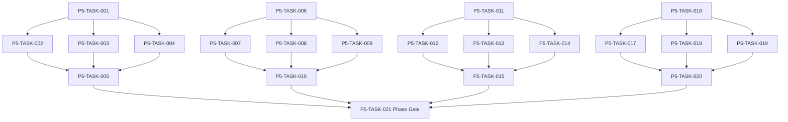

# Phase 5. 장비 · 인벤토리 · 스킬 · 전술설정 상세 설계서

> 버전 v31.0 · 기준원문 v30 · 작성일 2026-09-08  
> 상태: **설계 검토 초안 / 구현 NOT_STARTED / Test NOT_RUN**  
> 마스터: [전체 구현](00_전체_구현_마스터_설계서.md) · 요구추적: [93](93_요구사항_추적표.md) · 결정대장: [94](94_설계보완안_및_결정대장.md)

## 1. 문서 개요
소유권·장착·스킬·전술·전리품의 정합성 있는 전투 입력을 만든다. 기능 설명에서 불명확했던 구현 책임, 입출력, 정합성, 실패 경계, 검증 방법과 인계 조건을 구체화한다. 본문에는 해당 Phase 에 필요한 공통 계약, 메소드, DDL, Task, Test 를 포함한다. 부록에는 담당 원문 117 개 절을 원문 그대로 수록했다.

구현 범위는 아래 4 개 기능 및 담당 원문의 하위 규칙과 카탈로그이다. 다른 Phase 의 핵심 알고리즘 구현, 서버/멀티플레이, 현실시간 기반 방치 진행, 원문에 없는 게임 규칙의 무단 추가는 제외한다. 원문에서 선택 확장으로 제시한 기능도 요구대장에서 유지하며, 활성화 또는 유예 결정과 별개로 연계 설계를 보존한다.

기존 소스가 제공되지 않아 실제 구조에 대한 영향은 확정하지 않았다. 신규 클래스와 테이블은 구현 제안이며, 기존 코드가 확인되면 공통 Interface, DAO, SQL 재사용을 우선한다.

## 2. Phase 목표
완료 후 상태: **스킬 2+3·각인 3 제한·아이템 단일 위치·중복 지급 차단**. 후속 Phase 에는 검증된 DTO/port, 실제 도메인 결과, 세이브 codec/DDL 변경, fixture 와 기준선을 전달한다. 기능 이름만 등록하거나 Fake 성공 응답만 반환하는 상태는 완료로 보지 않는다.

## 3. 선행 조건
| 선행 Phase | Gate | 전달받는 기능 | 미충족시 차단 Task |
|---|---|---|---|
| [Phase 1](02_Phase1_콘텐츠_자산_빌드파이프라인_상세설계서.md) | P1-TASK-021 | 원문 카탈로그를 손실 없이 형식화하고 로컬 자산을 검증·배포한다. | 미충족이면본 Phase 모든계약 Task 의실제 adapter 통합및제품활성화불가. 검토/Mock UI 는별도표시로가능. |
| [Phase 2](03_Phase2_월드명령_시간_예약_RNG_상세설계서.md) | P2-TASK-026 | 단일 월드 작성자와 현실시간에 독립적인 이벤트 경계 진행을 구현한다. | 미충족이면본 Phase 모든계약 Task 의실제 adapter 통합및제품활성화불가. 검토/Mock UI 는별도표시로가능. |
| [Phase 3](04_Phase3_로컬DB_세이브_복구_상세설계서.md) | P3-TASK-031 | 동일 시점의 월드·RNG·예약·세이브 세대를 원자적으로 저장·복원한다. | 미충족이면본 Phase 모든계약 Task 의실제 adapter 통합및제품활성화불가. 검토/Mock UI 는별도표시로가능. |
| [Phase 4](05_Phase4_용병생성_성장_잠재력_이름_상세설계서.md) | P4-TASK-026 | 인물 정체성·성장 내역·이름·초상·정보 공개 계약을 확립한다. | 미충족이면본 Phase 모든계약 Task 의실제 adapter 통합및제품활성화불가. 검토/Mock UI 는별도표시로가능. |

설정: versioned content/balance/engine-order/visibility/limits profile. DB: 선행 schema 및해당 Phase 신규 codec 이필요하다. 외부시스템: 필수없음. 실제이미지/미완성콘텐츠는검증 fixture 로임시대체가능하나 Full 출시검수와구분한다. 미승인규칙을임의0 값으로채운성공 Fixture 는허용하지않는다.

| 결정 ID | 검토 주제 | 상태 | 적용/차단 내용 |
|---|---|---|---|
| C01 | 파티6 명/10 명 혼용 | 원문기준 해결 | 조직10 명·출전6 명. 30/10 과거대화는 첨부본 기준에 적용하지 않음. |
| C04 | 귀걸이 카탈로그와 슬롯누락 | 설계 보완안·승인 대기 | EAR 슬롯 추가, 손/발/목/손가락 alias 정규화. 모든105 귀걸이 보존. |
| C10 | 퍼센트/%p 및 불완전 효과 데이터 | 설계 보완안·승인 대기 | unit=RATIO/BASIS_POINT/FLAT, typed effect AST; description-only effect 를임의숫자로출시하지않음. |
| C21 | 장비 내구 단위 및 감소 기준 | 설계 보완안·승인 대기 | 제안 DB 는0..100 정수내구. 원문절대내구가필요하면현재/최대필드분리 migration;감소의현재/최대기준을승인. |

## 4. 기능 범위 및 요구 연결
| 기능 ID | 기능명 | 중요도 | 선행 기능/Phase | 원문요구/공통근거 |
|---|---|---|---|---|
| FUNC-P5-001 | 인벤토리·장착·소유권 | 필수핵심 또는 원문 선택 확장 명시검토 | P1,P2,P3,P4 | [§50](#src-0050), [§52](#src-0052), [§53](#src-0053), [§55](#src-0055), [§139](#src-0139), [§278](#src-0278), [§279](#src-0279), [§287](#src-0287) 외 22 개 |
| FUNC-P5-002 | 스킬·접사·개인 상성 데이터 | 필수핵심 또는 원문 선택 확장 명시검토 | P1,P2,P3,P4 | [§24](#src-0024), [§25](#src-0025), [§26](#src-0026), [§27](#src-0027), [§274](#src-0274), [§275](#src-0275), [§276](#src-0276), [§280](#src-0280) 외 52 개 |
| FUNC-P5-003 | Loadout·프리셋·전술 조건식 | 필수핵심 또는 원문 선택 확장 명시검토 | P1,P2,P3,P4 | [§277](#src-0277), [§283](#src-0283), [§284](#src-0284), [§306](#src-0306), [§307](#src-0307), [§308](#src-0308), [§328](#src-0328) |
| FUNC-P5-004 | 드롭·보상 예산·타겟파밍 | 필수핵심 또는 원문 선택 확장 명시검토 | P1,P2,P3,P4 | [§312](#src-0312), [§815](#src-0815), [§818](#src-0818), [§819](#src-0819), [§821](#src-0821), [§822](#src-0822), [§824](#src-0824), [§825](#src-0825) 외 12 개 |

## 5. 기능별 상세 설계

### 공통 계약의 적용 범위
모든 새 메소드/클래스명과 물리 DDL 은 **설계 보완안**이다. 제공된 자료에는 실제 저장소·DAO·SQL 이 없으므로 기존 구현에 대한 변경 완료를 뜻하지 않는다. 원문의 객체명/데이터 항목은 최대한 유지하며 기존 코드가 발견되면 adapter 로 연결한다.

`CommandEnvelope(commandId, sessionEpoch, expectedVersion, actorId, payload)`를 사용한다. `GameMinute`, `CombatMillis`, `Money(Long)`, `BasisPoint`, `EntityId`는 혼합 연산을 금지한다. 확률의 기본 표현은 **ppm(0..1,000,000)**이며 세밀한 0.01%도 정수로 표현한다. 표시 반올림과 판정은 분리한다. 정수연산 overflow 는 오류이며 clamp 로 은폐하지 않는다.

`ReadView`는 불변이다. `Delta`는 변경행·RNG 새 상태·도메인 이벤트·명령 receipt 를 포함한다. 콘텐츠 참조/외부 파일 읽기는 transaction 진입 전에 끝낸다. 실패 가능한 대규모 계산은 transaction 밖에서 하고, 성공한 커밋 이후에만 메모리 및 화면 상태를 게시한다. `stateHash`는 canonical 직렬화(키 정렬·정수 표현·버전 포함)에 대한 SHA-256 이며 현실시각·UI 재생위치는 제외한다.

중복 명령은 동일 epoch/commandId 와 payload hash 를 함께 검사한다. 동일 ID/동일 payload 이면 이전 결과를 반환하고, 다른 payload 이면 `IdempotencyKeyReuse`를 반환한다. 인메모리 중복 제거만으로 복구 후 중복을 막았다고 판단하지 않는다.

게임은 한 프로세스·한 활성 WorldSession 을 기준으로 한다. 여러 노드/서버/분산 Lock 은 **해당 없음**이다. 다만 UI 연속 탭·코루틴 완료·예약 이벤트·슬롯 전환·프로세스 재실행 간의 동시성은 실제로 검증한다.

<a id="func-p5-001"></a>
### 5.1. FUNC-P5-001 — 인벤토리·장착·소유권

| 항목 | 설계 |
|---|---|
| 기능 목적 | 인벤토리·장착·소유권을 독립된 책임으로 구현한다. 입력, 실패 처리, 저장 경계가 분리되어 있지 않으면 여러 모듈이 동일 상태를 중복 수정할 수 있다. 이를 명시적인 명령/조회 계약으로 통일한다. |
| 관련 요구사항 | [§50](#src-0050), [§52](#src-0052), [§53](#src-0053), [§55](#src-0055), [§139](#src-0139), [§278](#src-0278), [§279](#src-0279), [§287](#src-0287), [§292](#src-0292), [§297](#src-0297), [§300](#src-0300), [§301](#src-0301), [§309](#src-0309), [§329](#src-0329), [§814](#src-0814) 외 15 개 |
| 기능 요구사항 | 1. 템플릿과 인스턴스를 분리하고 ownerId·holderId·storageId·equippedBy 를 혼용하지 않는다<br>2. 비스택 아이템은 한 위치, 스택은 nonnegative quantity 와 reservation 을 유지한다<br>3. 손/장갑·발/신발·귀 장신구 같은 원문 용어 차이는 slot alias 로 보존하고 귀 슬롯은 C04 승인 기준을 사용한다<br>4. 보호/대여/스토리/유일 아이템은 분해·판매·강화계승에서 공통 guard 를 거친다 |
| 비기능/운영 | 완전 오프라인, 결정론, 재시도 멱등성, 실패 범위 명시, 원문 정보 공개 정책을 준수한다. 로컬 진단은 기록하되 사용자 메모나 숨은 정보를 일반 로그로 수집하지 않는다. |
| 성능/안정성 | 입력 크기, 큐, 재시도에는 유한한 상한을 둔다. DB/이미지/CPU 작업은 Main 에서 실행하지 않는다. P24 의 성능 예산을 추적하되 현재는 측정 전이다. 핵심 상태 처리에 실패하면 완전한 직전 상태를 보존한다. |
| 주요 메소드 | `InventoryService.move(command: MoveItem, view: InventoryState) -> InventoryDelta` |
| 입력 필드/값 | itemId, sourceStorageId, targetStorageId, targetNpcId?, slotKey?, expectedItemVersion; 구체적값: 보관장비 I1 을 주무기 장착 |
| 반환값 | newLocation, equipmentChanges, derivedStatsInvalidation; 정상결과: storage→equipment 원자 이동·동시 위치1 개 |
| 입력 검증 | 같은 item 을 두 NPC 장착 → 두 번째 Conflict·소유권 불변; required ID/enum/범위/상태/version 은변경 전에검사 |
| 예외 계약 | 이동 대상창고 FK 없음 → 정합성오류·출발위치 보존; typed DomainError 로상위호출에전달 |
| Transaction | WorldEngine 의 권위 명령으로 처리한다. 계산은 transaction 밖에서 수행하고, SaveCoordinator 의 단일 write transaction 으로 확정한 뒤 게시한다. 원자적 효과의 중간 성공은 허용하지 않는다. |
| 상태 변화 | STORED ↔ EQUIPPED ↔ IN_TRANSIT; PROTECTED guard |
| 소유 모듈 | :core:simulation/equipment,skill / :feature:party |
| 신규/수정 | 기존 코드 미제공: 신규/adapter 제안이다. 동일 책임의 기존 모듈이 있으면 공개 interface 를 유지하고 내부 추가로 변경을 최소화한다. |
| 관련 Task | [P5-TASK-001](#p5-task-001) · [P5-TASK-002](#p5-task-002) · [P5-TASK-003](#p5-task-003) · [P5-TASK-004](#p5-task-004) · [P5-TASK-005](#p5-task-005) |
| 관련 Test | [P5-UT-001](#p5-ut-001) · [P5-BT-001](#p5-bt-001) · [P5-FT-001](#p5-ft-001) · [P5-CT-001](#p5-ct-001) · [P5-IT-001](#p5-it-001) |

#### 처리 순서 및 데이터 흐름
1. 명령 envelope/현재 epoch/version 과 대상 존재·권한을확인하고 기존 receipt 를 조회한다.
2. 템플릿과 인스턴스를 분리하고 ownerId·holderId·storageId·equippedBy 를 혼용하지 않는다
3. 비스택 아이템은 한 위치, 스택은 nonnegative quantity 와 reservation 을 유지한다
4. 손/장갑·발/신발·귀 장신구 같은 원문 용어 차이는 slot alias 로 보존하고 귀 슬롯은 C04 승인 기준을 사용한다
5. 보호/대여/스토리/유일 아이템은 분해·판매·강화계승에서 공통 guard 를 거친다
6. Delta 불변식→해당행/RNG/event/receipt/codec 원자 commit→PublicView/후속 event 발행. 실패 시메모리/DB 게시를하지않는다.

입력 `itemId, sourceStorageId, targetStorageId, targetNpcId?, slotKey?, expectedItemVersion` → `InventoryService.move` → 검증된 `newLocation, equipmentChanges, derivedStatsInvalidation` → SavePort/영속세대 → PublicProjection/후속 handler.

#### Use Case와 실패 범위
| 상황 | 처리 |
|---|---|
| 정상 | 보관장비 I1 을 주무기 장착 → storage→equipment 원자 이동·동시 위치1 개 |
| 대상 없음 | 조회는 Empty, 단건 쓰기는 NotFound 를 반환한다. 임의의 대상 생성, 기존 아이템 대체, 금화 차감은 하지 않는다. |
| 일부 성공 | 원자적 단건 처리에는 부분 성공을 허용하지 않는다. 정비 프리셋이나 독립 활동 batch 만 항목별 receipt 와 성공/실패 목록을 제공한다. 하나의 원자적 정산을 분할하지 않는다. |
| 일부 실패 | 정합성오류·출발위치 보존 |
| 중복 실행 | 동일 명령의 효과는 1 회만 반영하며, 동일 조회의 출력은 동치여야 한다. 다른 payload 에 같은 멱등키를 재사용하면 오류를 반환한다. |
| 재기동 후 | 동일 COMMITTED snapshot/version 을 기준으로 재조회한다. 미완료 시간 진행과 상태는 checkpoint 에서 이어간다. |
| 비정상 데이터 | 두 번째 Conflict·소유권 불변; 잘못된 FK/enum/NaN 은검증 실패로격리/안전정지. |
| 외부 시스템 장애 | 필수 외부 서버는 없다. 로컬 DB/파일/OS/asset 오류는 실패 테스트로 검증하며, 네트워크를 복구의 필수 조건으로 추가하지 않는다. |

#### 객체 및 메소드 책임 분리
| 모듈/객체 | 신규/수정 | 책임 | 메소드 계약 |
|---|---|---|---|
| InventoryService | 신규/기존 adapter | 인벤토리·장착·소유권 규칙조정자 | InventoryService.move(command: MoveItem, view: InventoryState) -> InventoryDelta |
| 입력 검증 | UseCase 내부 또는 기존 도메인 정책 재사용 | 필수 ID·범위·권한·원문제약 검증; 별도 Validator 클래스는 둘 이상의 UseCase가 공유할 때만 추가 | use case 입력별 명시적 ValidationResult |
| 저장 경계 | 기존 Aggregate별 typed Port/SavePort 재사용 | 코덱·조회 snapshot·commit 연결; simulation 직접 DAO 금지; 기능 전용 RepositoryPort 신규 생성 금지 | use case별 typed read/commit 계약 |
| 표현 변환 | 기존 feature mapper 또는 순수 함수 재사용 | 공개/허용 결과만 변환; 별도 Projection 클래스는 둘 이상의 소비자가 공유할 때만 추가 | use case별 PublicViewOrReport |

<a id="func-p5-002"></a>
### 5.2. FUNC-P5-002 — 스킬·접사·개인 상성 데이터

| 항목 | 설계 |
|---|---|
| 기능 목적 | 스킬·접사·개인 상성 데이터을 독립된 책임으로 구현한다. 입력, 실패 처리, 저장 경계가 분리되어 있지 않으면 여러 모듈이 동일 상태를 중복 수정할 수 있다. 이를 명시적인 명령/조회 계약으로 통일한다. |
| 관련 요구사항 | [§24](#src-0024), [§25](#src-0025), [§26](#src-0026), [§27](#src-0027), [§274](#src-0274), [§275](#src-0275), [§276](#src-0276), [§280](#src-0280), [§281](#src-0281), [§282](#src-0282), [§285](#src-0285), [§286](#src-0286), [§288](#src-0288), [§289](#src-0289), [§290](#src-0290) 외 45 개 |
| 기능 요구사항 | 1. 300 개 기본 스킬과 범용/클래스군/전용 범위를 유지한다<br>2. 접두/접미 각 최대1·본체 등급 유지·금지 태그를 검사한다<br>3. 스킬 중복획득·거래·연구·전승·정련은 acquisition source 와 effect definition 을 공유한다<br>4. 개인 상성은 보유/장착/숙련과 독립으로 계산하고 발견된 범위만 공개한다 |
| 비기능/운영 | 완전 오프라인, 결정론, 재시도 멱등성, 실패 범위 명시, 원문 정보 공개 정책을 준수한다. 로컬 진단은 기록하되 사용자 메모나 숨은 정보를 일반 로그로 수집하지 않는다. |
| 성능/안정성 | 입력 크기, 큐, 재시도에는 유한한 상한을 둔다. DB/이미지/CPU 작업은 Main 에서 실행하지 않는다. P24 의 성능 예산을 추적하되 현재는 측정 전이다. 핵심 상태 처리에 실패하면 완전한 직전 상태를 보존한다. |
| 주요 메소드 | `SkillService.learn(command: LearnSkill, character: CharacterState) -> SkillDelta` |
| 입력 필드/값 | npcId, sourceSkillItemId?, skillTemplateId, prefixId?, suffixId?, sourceEventId; 구체적값: 범용 skill S1 에 허용 prefix1/suffix1 |
| 반환값 | ownedSkillId, mastery, classRestriction, consumedItems; 정상결과: 기본등급 유지·variation count2 |
| 입력 검증 | 같은 prefix2 개 → AffixConflict·보유스킬 불변; required ID/enum/범위/상태/version 은변경 전에검사 |
| 예외 계약 | 제한 클래스 전용 스킬 사용권 없음 → 장착 불가·배우기 규칙과 사용 규칙 분리; typed DomainError 로상위호출에전달 |
| Transaction | WorldEngine 의 권위 명령으로 처리한다. 계산은 transaction 밖에서 수행하고, SaveCoordinator 의 단일 write transaction 으로 확정한 뒤 게시한다. 원자적 효과의 중간 성공은 허용하지 않는다. |
| 상태 변화 | ACQUIRED → LEARNED → AVAILABLE/CLASS_RESTRICTED |
| 소유 모듈 | :core:simulation/equipment,skill / :feature:party |
| 신규/수정 | 기존 코드 미제공: 신규/adapter 제안이다. 동일 책임의 기존 모듈이 있으면 공개 interface 를 유지하고 내부 추가로 변경을 최소화한다. |
| 관련 Task | [P5-TASK-006](#p5-task-006) · [P5-TASK-007](#p5-task-007) · [P5-TASK-008](#p5-task-008) · [P5-TASK-009](#p5-task-009) · [P5-TASK-010](#p5-task-010) |
| 관련 Test | [P5-UT-002](#p5-ut-002) · [P5-BT-002](#p5-bt-002) · [P5-FT-002](#p5-ft-002) · [P5-CT-002](#p5-ct-002) · [P5-IT-002](#p5-it-002) |

#### 처리 순서 및 데이터 흐름
1. 명령 envelope/현재 epoch/version 과 대상 존재·권한을확인하고 기존 receipt 를 조회한다.
2. 300 개 기본 스킬과 범용/클래스군/전용 범위를 유지한다
3. 접두/접미 각 최대1·본체 등급 유지·금지 태그를 검사한다
4. 스킬 중복획득·거래·연구·전승·정련은 acquisition source 와 effect definition 을 공유한다
5. 개인 상성은 보유/장착/숙련과 독립으로 계산하고 발견된 범위만 공개한다
6. Delta 불변식→해당행/RNG/event/receipt/codec 원자 commit→PublicView/후속 event 발행. 실패 시메모리/DB 게시를하지않는다.

입력 `npcId, sourceSkillItemId?, skillTemplateId, prefixId?, suffixId?, sourceEventId` → `SkillService.learn` → 검증된 `ownedSkillId, mastery, classRestriction, consumedItems` → SavePort/영속세대 → PublicProjection/후속 handler.

#### Use Case와 실패 범위
| 상황 | 처리 |
|---|---|
| 정상 | 범용 skill S1 에 허용 prefix1/suffix1 → 기본등급 유지·variation count2 |
| 대상 없음 | 조회는 Empty, 단건 쓰기는 NotFound 를 반환한다. 임의의 대상 생성, 기존 아이템 대체, 금화 차감은 하지 않는다. |
| 일부 성공 | 원자적 단건 처리에는 부분 성공을 허용하지 않는다. 정비 프리셋이나 독립 활동 batch 만 항목별 receipt 와 성공/실패 목록을 제공한다. 하나의 원자적 정산을 분할하지 않는다. |
| 일부 실패 | 장착 불가·배우기 규칙과 사용 규칙 분리 |
| 중복 실행 | 동일 명령의 효과는 1 회만 반영하며, 동일 조회의 출력은 동치여야 한다. 다른 payload 에 같은 멱등키를 재사용하면 오류를 반환한다. |
| 재기동 후 | 동일 COMMITTED snapshot/version 을 기준으로 재조회한다. 미완료 시간 진행과 상태는 checkpoint 에서 이어간다. |
| 비정상 데이터 | AffixConflict·보유스킬 불변; 잘못된 FK/enum/NaN 은검증 실패로격리/안전정지. |
| 외부 시스템 장애 | 필수 외부 서버는 없다. 로컬 DB/파일/OS/asset 오류는 실패 테스트로 검증하며, 네트워크를 복구의 필수 조건으로 추가하지 않는다. |

#### 객체 및 메소드 책임 분리
| 모듈/객체 | 신규/수정 | 책임 | 메소드 계약 |
|---|---|---|---|
| SkillService | 신규/기존 adapter | 스킬·접사·개인 상성 데이터 규칙조정자 | SkillService.learn(command: LearnSkill, character: CharacterState) -> SkillDelta |
| 입력 검증 | UseCase 내부 또는 기존 도메인 정책 재사용 | 필수 ID·범위·권한·원문제약 검증; 별도 Validator 클래스는 둘 이상의 UseCase가 공유할 때만 추가 | use case 입력별 명시적 ValidationResult |
| 저장 경계 | 기존 Aggregate별 typed Port/SavePort 재사용 | 코덱·조회 snapshot·commit 연결; simulation 직접 DAO 금지; 기능 전용 RepositoryPort 신규 생성 금지 | use case별 typed read/commit 계약 |
| 표현 변환 | 기존 feature mapper 또는 순수 함수 재사용 | 공개/허용 결과만 변환; 별도 Projection 클래스는 둘 이상의 소비자가 공유할 때만 추가 | use case별 PublicViewOrReport |

<a id="func-p5-003"></a>
### 5.3. FUNC-P5-003 — Loadout·프리셋·전술 조건식

| 항목 | 설계 |
|---|---|
| 기능 목적 | Loadout·프리셋·전술 조건식을 독립된 책임으로 구현한다. 입력, 실패 처리, 저장 경계가 분리되어 있지 않으면 여러 모듈이 동일 상태를 중복 수정할 수 있다. 이를 명시적인 명령/조회 계약으로 통일한다. |
| 관련 요구사항 | [§277](#src-0277), [§283](#src-0283), [§284](#src-0284), [§306](#src-0306), [§307](#src-0307), [§308](#src-0308), [§328](#src-0328) |
| 기능 요구사항 | 1. 패시브2/액티브3 와 강화각인 활성3 을 별도 제한한다<br>2. 장비 부여 액티브도 액티브3 에 포함하며 아이템 변경시 사용권을 재검사한다<br>3. 조건식은 허용 AST 비교/AND/OR/대상 selector 로 제한해 eval 과 스크립트 실행을 금지한다<br>4. 우선순위 평가 후 자원/쿨다운/타겟 부적합은 다음 조건,끝은 기본행동으로 이어진다 |
| 비기능/운영 | 완전 오프라인, 결정론, 재시도 멱등성, 실패 범위 명시, 원문 정보 공개 정책을 준수한다. 로컬 진단은 기록하되 사용자 메모나 숨은 정보를 일반 로그로 수집하지 않는다. |
| 성능/안정성 | 입력 크기, 큐, 재시도에는 유한한 상한을 둔다. DB/이미지/CPU 작업은 Main 에서 실행하지 않는다. P24 의 성능 예산을 추적하되 현재는 측정 전이다. 핵심 상태 처리에 실패하면 완전한 직전 상태를 보존한다. |
| 주요 메소드 | `LoadoutService.validate(loadout: Loadout, actor: CharacterState) -> LoadoutResult` |
| 입력 필드/값 | npcId, passiveSkillIds[], activeSkillIds[], activeInscriptionIds[], rules[]; 구체적값: 3 액티브 중1 개 장비스킬 장착 |
| 반환값 | ValidatedLoadout 또는 Errors{slot,reason}[]; 정상결과: 정상; 해당 장비 해제시 그 슬롯만 비활성 |
| 입력 검증 | 4 번째 액티브 또는 각인4 개 → 검증 거절·원본 preset 유지; required ID/enum/범위/상태/version 은변경 전에검사 |
| 예외 계약 | 조건식에 파일/Reflection 호출 → UnsupportedExpression·평가하지 않음; typed DomainError 로상위호출에전달 |
| Transaction | WorldEngine 의 권위 명령으로 처리한다. 계산은 transaction 밖에서 수행하고, SaveCoordinator 의 단일 write transaction 으로 확정한 뒤 게시한다. 원자적 효과의 중간 성공은 허용하지 않는다. |
| 상태 변화 | DRAFT → VALIDATED → ACTIVE/NEEDS_REVIEW |
| 소유 모듈 | :core:simulation/equipment,skill / :feature:party |
| 신규/수정 | 기존 코드 미제공: 신규/adapter 제안이다. 동일 책임의 기존 모듈이 있으면 공개 interface 를 유지하고 내부 추가로 변경을 최소화한다. |
| 관련 Task | [P5-TASK-011](#p5-task-011) · [P5-TASK-012](#p5-task-012) · [P5-TASK-013](#p5-task-013) · [P5-TASK-014](#p5-task-014) · [P5-TASK-015](#p5-task-015) |
| 관련 Test | [P5-UT-003](#p5-ut-003) · [P5-BT-003](#p5-bt-003) · [P5-FT-003](#p5-ft-003) · [P5-CT-003](#p5-ct-003) · [P5-IT-003](#p5-it-003) |

#### 처리 순서 및 데이터 흐름
1. 명령 envelope/현재 epoch/version 과 대상 존재·권한을확인하고 기존 receipt 를 조회한다.
2. 패시브2/액티브3 와 강화각인 활성3 을 별도 제한한다
3. 장비 부여 액티브도 액티브3 에 포함하며 아이템 변경시 사용권을 재검사한다
4. 조건식은 허용 AST 비교/AND/OR/대상 selector 로 제한해 eval 과 스크립트 실행을 금지한다
5. 우선순위 평가 후 자원/쿨다운/타겟 부적합은 다음 조건,끝은 기본행동으로 이어진다
6. Delta 불변식→해당행/RNG/event/receipt/codec 원자 commit→PublicView/후속 event 발행. 실패 시메모리/DB 게시를하지않는다.

입력 `npcId, passiveSkillIds[], activeSkillIds[], activeInscriptionIds[], rules[]` → `LoadoutService.validate` → 검증된 `ValidatedLoadout 또는 Errors{slot,reason}[]` → SavePort/영속세대 → PublicProjection/후속 handler.

#### Use Case와 실패 범위
| 상황 | 처리 |
|---|---|
| 정상 | 3 액티브 중1 개 장비스킬 장착 → 정상; 해당 장비 해제시 그 슬롯만 비활성 |
| 대상 없음 | 조회는 Empty, 단건 쓰기는 NotFound 를 반환한다. 임의의 대상 생성, 기존 아이템 대체, 금화 차감은 하지 않는다. |
| 일부 성공 | 원자적 단건 처리에는 부분 성공을 허용하지 않는다. 정비 프리셋이나 독립 활동 batch 만 항목별 receipt 와 성공/실패 목록을 제공한다. 하나의 원자적 정산을 분할하지 않는다. |
| 일부 실패 | UnsupportedExpression·평가하지 않음 |
| 중복 실행 | 동일 명령의 효과는 1 회만 반영하며, 동일 조회의 출력은 동치여야 한다. 다른 payload 에 같은 멱등키를 재사용하면 오류를 반환한다. |
| 재기동 후 | 동일 COMMITTED snapshot/version 을 기준으로 재조회한다. 미완료 시간 진행과 상태는 checkpoint 에서 이어간다. |
| 비정상 데이터 | 검증 거절·원본 preset 유지; 잘못된 FK/enum/NaN 은검증 실패로격리/안전정지. |
| 외부 시스템 장애 | 필수 외부 서버는 없다. 로컬 DB/파일/OS/asset 오류는 실패 테스트로 검증하며, 네트워크를 복구의 필수 조건으로 추가하지 않는다. |

#### 객체 및 메소드 책임 분리
| 모듈/객체 | 신규/수정 | 책임 | 메소드 계약 |
|---|---|---|---|
| LoadoutService | 신규/기존 adapter | Loadout·프리셋·전술 조건식 규칙조정자 | LoadoutService.validate(loadout: Loadout, actor: CharacterState) -> LoadoutResult |
| 입력 검증 | UseCase 내부 또는 기존 도메인 정책 재사용 | 필수 ID·범위·권한·원문제약 검증; 별도 Validator 클래스는 둘 이상의 UseCase가 공유할 때만 추가 | use case 입력별 명시적 ValidationResult |
| 저장 경계 | 기존 Aggregate별 typed Port/SavePort 재사용 | 코덱·조회 snapshot·commit 연결; simulation 직접 DAO 금지; 기능 전용 RepositoryPort 신규 생성 금지 | use case별 typed read/commit 계약 |
| 표현 변환 | 기존 feature mapper 또는 순수 함수 재사용 | 공개/허용 결과만 변환; 별도 Projection 클래스는 둘 이상의 소비자가 공유할 때만 추가 | use case별 PublicViewOrReport |

<a id="func-p5-004"></a>
### 5.4. FUNC-P5-004 — 드롭·보상 예산·타겟파밍

| 항목 | 설계 |
|---|---|
| 기능 목적 | 드롭·보상 예산·타겟파밍을 독립된 책임으로 구현한다. 입력, 실패 처리, 저장 경계가 분리되어 있지 않으면 여러 모듈이 동일 상태를 중복 수정할 수 있다. 이를 명시적인 명령/조회 계약으로 통일한다. |
| 관련 요구사항 | [§312](#src-0312), [§815](#src-0815), [§818](#src-0818), [§819](#src-0819), [§821](#src-0821), [§822](#src-0822), [§824](#src-0824), [§825](#src-0825), [§827](#src-0827), [§828](#src-0828), [§829](#src-0829), [§830](#src-0830), [§833](#src-0833), [§834](#src-0834), [§835](#src-0835) 외 5 개 |
| 기능 요구사항 | 1. 몹/상자/보스별 LootProfile 과 소유권 출처를 기록한다<br>2. boss 고유재료 보장과 smart drop 상한은 원문 profile 값으로 분리한다<br>3. generationSeed 만이 아니라 lootVersion·sourceEventId·claim receipt 를 저장한다<br>4. 보상 지급은 원자적 기본단위이며 가방 초과는 임시 전리품 보관함으로 처리하고 묵시 삭제하지 않는다 |
| 비기능/운영 | 완전 오프라인, 결정론, 재시도 멱등성, 실패 범위 명시, 원문 정보 공개 정책을 준수한다. 로컬 진단은 기록하되 사용자 메모나 숨은 정보를 일반 로그로 수집하지 않는다. |
| 성능/안정성 | 입력 크기, 큐, 재시도에는 유한한 상한을 둔다. DB/이미지/CPU 작업은 Main 에서 실행하지 않는다. P24 의 성능 예산을 추적하되 현재는 측정 전이다. 핵심 상태 처리에 실패하면 완전한 직전 상태를 보존한다. |
| 주요 메소드 | `LootService.roll(context: LootContext, stream: RngStream) -> LootPlan` |
| 입력 필드/값 | sourceEventId, claimantId, lootProfileId, lootVersion, inventoryCapacity; 구체적값: 동일 chestId 첫 개봉 보상 I1, 두 번째개봉 |
| 반환값 | lootItems[], overflowStorageId?, claimReceipt; 정상결과: 첫1 회 지급·두 번째 AlreadyClaimed |
| 입력 검증 | 인벤토리 용량0 → overflow loot storage 에 동일 보상 보존; required ID/enum/범위/상태/version 은변경 전에검사 |
| 예외 계약 | 아이템생성 후 보상 receipt 저장 실패 → 아이템과 receipt 모두 rollback; typed DomainError 로상위호출에전달 |
| Transaction | WorldEngine 의 권위 명령으로 처리한다. 계산은 transaction 밖에서 수행하고, SaveCoordinator 의 단일 write transaction 으로 확정한 뒤 게시한다. 원자적 효과의 중간 성공은 허용하지 않는다. |
| 상태 변화 | UNROLLED → ROLLED → CLAIMED 또는 OVERFLOW_STORED |
| 소유 모듈 | :core:simulation/equipment,skill / :feature:party |
| 신규/수정 | 기존 코드 미제공: 신규/adapter 제안이다. 동일 책임의 기존 모듈이 있으면 공개 interface 를 유지하고 내부 추가로 변경을 최소화한다. |
| 관련 Task | [P5-TASK-016](#p5-task-016) · [P5-TASK-017](#p5-task-017) · [P5-TASK-018](#p5-task-018) · [P5-TASK-019](#p5-task-019) · [P5-TASK-020](#p5-task-020) |
| 관련 Test | [P5-UT-004](#p5-ut-004) · [P5-BT-004](#p5-bt-004) · [P5-FT-004](#p5-ft-004) · [P5-CT-004](#p5-ct-004) · [P5-IT-004](#p5-it-004) |

#### 처리 순서 및 데이터 흐름
1. 명령 envelope/현재 epoch/version 과 대상 존재·권한을확인하고 기존 receipt 를 조회한다.
2. 몹/상자/보스별 LootProfile 과 소유권 출처를 기록한다
3. boss 고유재료 보장과 smart drop 상한은 원문 profile 값으로 분리한다
4. generationSeed 만이 아니라 lootVersion·sourceEventId·claim receipt 를 저장한다
5. 보상 지급은 원자적 기본단위이며 가방 초과는 임시 전리품 보관함으로 처리하고 묵시 삭제하지 않는다
6. Delta 불변식→해당행/RNG/event/receipt/codec 원자 commit→PublicView/후속 event 발행. 실패 시메모리/DB 게시를하지않는다.

입력 `sourceEventId, claimantId, lootProfileId, lootVersion, inventoryCapacity` → `LootService.roll` → 검증된 `lootItems[], overflowStorageId?, claimReceipt` → SavePort/영속세대 → PublicProjection/후속 handler.

#### Use Case와 실패 범위
| 상황 | 처리 |
|---|---|
| 정상 | 동일 chestId 첫 개봉 보상 I1, 두 번째개봉 → 첫1 회 지급·두 번째 AlreadyClaimed |
| 대상 없음 | 조회는 Empty, 단건 쓰기는 NotFound 를 반환한다. 임의의 대상 생성, 기존 아이템 대체, 금화 차감은 하지 않는다. |
| 일부 성공 | 원자적 단건 처리에는 부분 성공을 허용하지 않는다. 정비 프리셋이나 독립 활동 batch 만 항목별 receipt 와 성공/실패 목록을 제공한다. 하나의 원자적 정산을 분할하지 않는다. |
| 일부 실패 | 아이템과 receipt 모두 rollback |
| 중복 실행 | 동일 명령의 효과는 1 회만 반영하며, 동일 조회의 출력은 동치여야 한다. 다른 payload 에 같은 멱등키를 재사용하면 오류를 반환한다. |
| 재기동 후 | 동일 COMMITTED snapshot/version 을 기준으로 재조회한다. 미완료 시간 진행과 상태는 checkpoint 에서 이어간다. |
| 비정상 데이터 | overflow loot storage 에 동일 보상 보존; 잘못된 FK/enum/NaN 은검증 실패로격리/안전정지. |
| 외부 시스템 장애 | 필수 외부 서버는 없다. 로컬 DB/파일/OS/asset 오류는 실패 테스트로 검증하며, 네트워크를 복구의 필수 조건으로 추가하지 않는다. |

#### 객체 및 메소드 책임 분리
| 모듈/객체 | 신규/수정 | 책임 | 메소드 계약 |
|---|---|---|---|
| LootService | 신규/기존 adapter | 드롭·보상 예산·타겟파밍 규칙조정자 | LootService.roll(context: LootContext, stream: RngStream) -> LootPlan |
| 입력 검증 | UseCase 내부 또는 기존 도메인 정책 재사용 | 필수 ID·범위·권한·원문제약 검증; 별도 Validator 클래스는 둘 이상의 UseCase가 공유할 때만 추가 | use case 입력별 명시적 ValidationResult |
| 저장 경계 | 기존 Aggregate별 typed Port/SavePort 재사용 | 코덱·조회 snapshot·commit 연결; simulation 직접 DAO 금지; 기능 전용 RepositoryPort 신규 생성 금지 | use case별 typed read/commit 계약 |
| 표현 변환 | 기존 feature mapper 또는 순수 함수 재사용 | 공개/허용 결과만 변환; 별도 Projection 클래스는 둘 이상의 소비자가 공유할 때만 추가 | use case별 PublicViewOrReport |


### Phase 특화 알고리즘·수치·판단

### 소유권과 스킬 계약
아이템의 단일 물리위치는 `item_instance.storage_id`이다. 장착위치와 운송중위치도 storage kind 로 모델링한다. equipment_slot 은 이 위치와 일치해야 하는 관계이며 별도 복제 소유가 아니다. `wallet`/`storage`는 원문/기존호출 이름의 adapter alias 이고 별도의 권위 테이블로 만들지 않는다.

스킬 장착은 패시브2+액티브3. 장비 부여 액티브도3 에 포함한다. 각인 활성 최대3 은 별도 guard 이며 자동발동도 무제한 누적되지 않는다. 장비 해제→제공스킬 사용권 무효→해당 loadout slot 비활성→기본행동 fallback 순서로 처리한다.

조건 AST: `Compare(field,op,literal)`, `All`, `Any`, `Not`, `ExistsTarget(selector)`. field 는 공개/전투운영 허용 목록,op 는 EQ/LT/LTE/GT/GTE,깊이최대8/노드64(보완 제한)이다. 임의문자열 eval/Reflection/파일호출은 없다. 우선순위 동일값은 loadout 검증에서 거절한다.

콘텐츠 effect 는 `effectId, trigger, targetSelector, statKey?, amount, unit, duration, timeDomain, stackPolicy, cap?, exclusionTags[]`를 가진다. 접사에 숫자가 없으면 허용된 기본값을 명시 승인받기 전 release ready 가 아니다. `치명타+4%`의 상대증가/퍼센트포인트 의미를 단위 필드로 구분한다(C10).


## 6. DB 상세 설계

다음은 **신규 제안 스키마**다. 실제 기존 DB 가 제공되지 않아 기존 컬럼 변경 사실을 가정하지 않는다. 실제 구현에서는 Room Entity/DAO 와 export 된 schema 를 기준으로 N→N+1 migration 을 작성한다. 아래 CREATE 예시는 **완성 스키마 계약**이며 기존 DB migration 을 IF NOT EXISTS 로 대체하지 않는다.

| 논리/물리 객체 | 저장영역 | 최초 계약 Phase | 접근 | PK/유일조건 | 조회 Index |
|---|---|---|---|---|---|
| equipment_slot | save.db | P5 | R/I/U(도메인명령에따름); tombstone/GC 만 D | mercenary_id,slot_key, item_id | mercenary_id |
| inventory_stack | save.db | P5 | R/I/U(도메인명령에따름); tombstone/GC 만 D | storage_id,template_id,stack_signature | template_id |
| item_instance | save.db | P5 | R/I/U(도메인명령에따름); tombstone/GC 만 D | id PK | owner_id, storage_id, template_id, source_event_id |
| loadout | save.db | P5 | R/I/U(도메인명령에따름); tombstone/GC 만 D | id PK | mercenary_id,status |
| loot_receipt | save.db | P5 | R/I/U(도메인명령에따름); tombstone/GC 만 D | source_event_id,claimant_id | claimant_id |
| mastery | save.db | P4 | R/I/U(도메인명령에따름); tombstone/GC 만 D | mercenary_id,domain_key | PK/UNIQUE |
| money_account | save.db | P5 | R/I/U(도메인명령에따름); tombstone/GC 만 D | owner_kind,owner_id,purpose | owner_id |
| skill_affinity | save.db | P5 | R/I/U(도메인명령에따름); tombstone/GC 만 D | mercenary_id,skill_template_id | PK/UNIQUE |
| skill_instance | save.db | P5 | R/I/U(도메인명령에따름); tombstone/GC 만 D | id PK | mercenary_id,template_id, source_event_id |
| storage_location | save.db | P5 | R/I/U(도메인명령에따름); tombstone/GC 만 D | id PK | owner_kind,owner_id, parent_location_id |
| tactic_rule | save.db | P5 | R/I/U(도메인명령에따름); tombstone/GC 만 D | loadout_id,priority | PK/UNIQUE |

모든일반 SQL 테이블은 `id TEXT NOT NULL PRIMARY KEY`, `row_version INTEGER NOT NULL DEFAULT 0`을공통필드로갖는다. nullable 는 DDL 에 NOT NULL 없는필드만이다. 단위는 `_minute`게임분/`_ms`밀리초/`_bp`0.01%p/`_ppm`0.0001%p,금액/수량 Long 정수. ID 는재사용하지않는다.

#### `equipment_slot` 필드 및 관계

| 필드/제약 | 용도 |
|---|---|
| mercenary_id TEXT NOT NULL REFERENCES mercenary(id) ON DELETE RESTRICT | 선언된 타입·NULL/참조조건을 준수. 값의 의미는 이름과 해당기능 계약을 기준으로 함 |
| slot_key TEXT NOT NULL | 선언된 타입·NULL/참조조건을 준수. 값의 의미는 이름과 해당기능 계약을 기준으로 함 |
| item_id TEXT NOT NULL REFERENCES item_instance(id) ON DELETE RESTRICT | 선언된 타입·NULL/참조조건을 준수. 값의 의미는 이름과 해당기능 계약을 기준으로 함 |
#### `inventory_stack` 필드 및 관계

| 필드/제약 | 용도 |
|---|---|
| storage_id TEXT NOT NULL REFERENCES storage_location(id) ON DELETE RESTRICT | 선언된 타입·NULL/참조조건을 준수. 값의 의미는 이름과 해당기능 계약을 기준으로 함 |
| template_id TEXT NOT NULL | 선언된 타입·NULL/참조조건을 준수. 값의 의미는 이름과 해당기능 계약을 기준으로 함 |
| stack_signature TEXT NOT NULL | 선언된 타입·NULL/참조조건을 준수. 값의 의미는 이름과 해당기능 계약을 기준으로 함 |
| quantity INTEGER NOT NULL CHECK(quantity>=0) | 선언된 타입·NULL/참조조건을 준수. 값의 의미는 이름과 해당기능 계약을 기준으로 함 |
| reserved INTEGER NOT NULL DEFAULT 0 CHECK(reserved>=0 AND reserved<=quantity) | 선언된 타입·NULL/참조조건을 준수. 값의 의미는 이름과 해당기능 계약을 기준으로 함 |
#### `item_instance` 필드 및 관계

| 필드/제약 | 용도 |
|---|---|
| template_id TEXT NOT NULL | 선언된 타입·NULL/참조조건을 준수. 값의 의미는 이름과 해당기능 계약을 기준으로 함 |
| owner_kind TEXT NOT NULL | 선언된 타입·NULL/참조조건을 준수. 값의 의미는 이름과 해당기능 계약을 기준으로 함 |
| owner_id TEXT NOT NULL | 선언된 타입·NULL/참조조건을 준수. 값의 의미는 이름과 해당기능 계약을 기준으로 함 |
| custodian_id TEXT | 선언된 타입·NULL/참조조건을 준수. 값의 의미는 이름과 해당기능 계약을 기준으로 함 |
| storage_id TEXT NOT NULL REFERENCES storage_location(id) ON DELETE RESTRICT | 선언된 타입·NULL/참조조건을 준수. 값의 의미는 이름과 해당기능 계약을 기준으로 함 |
| durability INTEGER NOT NULL CHECK(durability BETWEEN 0 AND 100) | 선언된 타입·NULL/참조조건을 준수. 값의 의미는 이름과 해당기능 계약을 기준으로 함 |
| grade TEXT NOT NULL | 선언된 타입·NULL/참조조건을 준수. 값의 의미는 이름과 해당기능 계약을 기준으로 함 |
| prefix_id TEXT | 선언된 타입·NULL/참조조건을 준수. 값의 의미는 이름과 해당기능 계약을 기준으로 함 |
| suffix_id TEXT | 선언된 타입·NULL/참조조건을 준수. 값의 의미는 이름과 해당기능 계약을 기준으로 함 |
| protection_flags INTEGER NOT NULL | 선언된 타입·NULL/참조조건을 준수. 값의 의미는 이름과 해당기능 계약을 기준으로 함 |
| lifecycle_status TEXT NOT NULL | 선언된 타입·NULL/참조조건을 준수. 값의 의미는 이름과 해당기능 계약을 기준으로 함 |
| source_event_id TEXT NOT NULL | 선언된 타입·NULL/참조조건을 준수. 값의 의미는 이름과 해당기능 계약을 기준으로 함 |

단일 storage_id 가 진실. 장착/운송은 해당 location kind 와 연계. 장비 instance 와 동질 스택 중복 생성 금지.
#### `loadout` 필드 및 관계

| 필드/제약 | 용도 |
|---|---|
| mercenary_id TEXT NOT NULL REFERENCES mercenary(id) ON DELETE RESTRICT | 선언된 타입·NULL/참조조건을 준수. 값의 의미는 이름과 해당기능 계약을 기준으로 함 |
| name TEXT NOT NULL | 선언된 타입·NULL/참조조건을 준수. 값의 의미는 이름과 해당기능 계약을 기준으로 함 |
| status TEXT NOT NULL | 선언된 타입·NULL/참조조건을 준수. 값의 의미는 이름과 해당기능 계약을 기준으로 함 |
| definition_json TEXT NOT NULL | 선언된 타입·NULL/참조조건을 준수. 값의 의미는 이름과 해당기능 계약을 기준으로 함 |
| validation_version TEXT NOT NULL | 선언된 타입·NULL/참조조건을 준수. 값의 의미는 이름과 해당기능 계약을 기준으로 함 |

definition_json: passive[0..2],active[0..3],inscription[0..3], formationSlot. 강제 검증필수.
#### `loot_receipt` 필드 및 관계

| 필드/제약 | 용도 |
|---|---|
| source_event_id TEXT NOT NULL | 선언된 타입·NULL/참조조건을 준수. 값의 의미는 이름과 해당기능 계약을 기준으로 함 |
| claimant_id TEXT NOT NULL | 선언된 타입·NULL/참조조건을 준수. 값의 의미는 이름과 해당기능 계약을 기준으로 함 |
| reward_json TEXT NOT NULL | 선언된 타입·NULL/참조조건을 준수. 값의 의미는 이름과 해당기능 계약을 기준으로 함 |
| loot_version TEXT NOT NULL | 선언된 타입·NULL/참조조건을 준수. 값의 의미는 이름과 해당기능 계약을 기준으로 함 |
| status TEXT NOT NULL | 선언된 타입·NULL/참조조건을 준수. 값의 의미는 이름과 해당기능 계약을 기준으로 함 |
#### `mastery` 필드 및 관계

| 필드/제약 | 용도 |
|---|---|
| mercenary_id TEXT NOT NULL REFERENCES mercenary(id) ON DELETE RESTRICT | 선언된 타입·NULL/참조조건을 준수. 값의 의미는 이름과 해당기능 계약을 기준으로 함 |
| domain_key TEXT NOT NULL | 선언된 타입·NULL/참조조건을 준수. 값의 의미는 이름과 해당기능 계약을 기준으로 함 |
| experience INTEGER NOT NULL CHECK(experience>=0) | 선언된 타입·NULL/참조조건을 준수. 값의 의미는 이름과 해당기능 계약을 기준으로 함 |
| mastery_level INTEGER NOT NULL CHECK(mastery_level>=0) | 선언된 타입·NULL/참조조건을 준수. 값의 의미는 이름과 해당기능 계약을 기준으로 함 |
#### `money_account` 필드 및 관계

| 필드/제약 | 용도 |
|---|---|
| owner_kind TEXT NOT NULL | 선언된 타입·NULL/참조조건을 준수. 값의 의미는 이름과 해당기능 계약을 기준으로 함 |
| owner_id TEXT NOT NULL | 선언된 타입·NULL/참조조건을 준수. 값의 의미는 이름과 해당기능 계약을 기준으로 함 |
| purpose TEXT NOT NULL | 선언된 타입·NULL/참조조건을 준수. 값의 의미는 이름과 해당기능 계약을 기준으로 함 |
| balance INTEGER NOT NULL CHECK(balance>=0) | 선언된 타입·NULL/참조조건을 준수. 값의 의미는 이름과 해당기능 계약을 기준으로 함 |
| reserved INTEGER NOT NULL DEFAULT 0 CHECK(reserved>=0 AND reserved<=balance) | 선언된 타입·NULL/참조조건을 준수. 값의 의미는 이름과 해당기능 계약을 기준으로 함 |

보유와 예약은 구분; 출금가능=balance-reserved. 정수금화 Long overflow 검증.
#### `skill_affinity` 필드 및 관계

| 필드/제약 | 용도 |
|---|---|
| mercenary_id TEXT NOT NULL REFERENCES mercenary(id) ON DELETE RESTRICT | 선언된 타입·NULL/참조조건을 준수. 값의 의미는 이름과 해당기능 계약을 기준으로 함 |
| skill_template_id TEXT NOT NULL | 선언된 타입·NULL/참조조건을 준수. 값의 의미는 이름과 해당기능 계약을 기준으로 함 |
| base_affinity INTEGER NOT NULL | 선언된 타입·NULL/참조조건을 준수. 값의 의미는 이름과 해당기능 계약을 기준으로 함 |
| modifier INTEGER NOT NULL | 선언된 타입·NULL/참조조건을 준수. 값의 의미는 이름과 해당기능 계약을 기준으로 함 |
| disclosed_level TEXT NOT NULL | 선언된 타입·NULL/참조조건을 준수. 값의 의미는 이름과 해당기능 계약을 기준으로 함 |
#### `skill_instance` 필드 및 관계

| 필드/제약 | 용도 |
|---|---|
| mercenary_id TEXT NOT NULL REFERENCES mercenary(id) ON DELETE RESTRICT | 선언된 타입·NULL/참조조건을 준수. 값의 의미는 이름과 해당기능 계약을 기준으로 함 |
| template_id TEXT NOT NULL | 선언된 타입·NULL/참조조건을 준수. 값의 의미는 이름과 해당기능 계약을 기준으로 함 |
| prefix_id TEXT | 선언된 타입·NULL/참조조건을 준수. 값의 의미는 이름과 해당기능 계약을 기준으로 함 |
| suffix_id TEXT | 선언된 타입·NULL/참조조건을 준수. 값의 의미는 이름과 해당기능 계약을 기준으로 함 |
| source_event_id TEXT NOT NULL | 선언된 타입·NULL/참조조건을 준수. 값의 의미는 이름과 해당기능 계약을 기준으로 함 |
| mastery_exp INTEGER NOT NULL | 선언된 타입·NULL/참조조건을 준수. 값의 의미는 이름과 해당기능 계약을 기준으로 함 |
| status TEXT NOT NULL | 선언된 타입·NULL/참조조건을 준수. 값의 의미는 이름과 해당기능 계약을 기준으로 함 |
#### `storage_location` 필드 및 관계

| 필드/제약 | 용도 |
|---|---|
| owner_kind TEXT NOT NULL | 선언된 타입·NULL/참조조건을 준수. 값의 의미는 이름과 해당기능 계약을 기준으로 함 |
| owner_id TEXT NOT NULL | 선언된 타입·NULL/참조조건을 준수. 값의 의미는 이름과 해당기능 계약을 기준으로 함 |
| location_kind TEXT NOT NULL | 선언된 타입·NULL/참조조건을 준수. 값의 의미는 이름과 해당기능 계약을 기준으로 함 |
| parent_location_id TEXT | 선언된 타입·NULL/참조조건을 준수. 값의 의미는 이름과 해당기능 계약을 기준으로 함 |
| capacity INTEGER NOT NULL | 선언된 타입·NULL/참조조건을 준수. 값의 의미는 이름과 해당기능 계약을 기준으로 함 |
| weight_limit INTEGER NOT NULL | 선언된 타입·NULL/참조조건을 준수. 값의 의미는 이름과 해당기능 계약을 기준으로 함 |
| access_policy_json TEXT NOT NULL | 선언된 타입·NULL/참조조건을 준수. 값의 의미는 이름과 해당기능 계약을 기준으로 함 |
#### `tactic_rule` 필드 및 관계

| 필드/제약 | 용도 |
|---|---|
| loadout_id TEXT NOT NULL REFERENCES loadout(id) ON DELETE RESTRICT | 선언된 타입·NULL/참조조건을 준수. 값의 의미는 이름과 해당기능 계약을 기준으로 함 |
| priority INTEGER NOT NULL | 선언된 타입·NULL/참조조건을 준수. 값의 의미는 이름과 해당기능 계약을 기준으로 함 |
| condition_ast_json TEXT NOT NULL | 선언된 타입·NULL/참조조건을 준수. 값의 의미는 이름과 해당기능 계약을 기준으로 함 |
| action_json TEXT NOT NULL | 선언된 타입·NULL/참조조건을 준수. 값의 의미는 이름과 해당기능 계약을 기준으로 함 |
| enabled INTEGER NOT NULL CHECK(enabled IN(0,1)) | 선언된 타입·NULL/참조조건을 준수. 값의 의미는 이름과 해당기능 계약을 기준으로 함 |

### FK·대량처리·Lock·Isolation
권위관계는선언된 FK/UNIQUE 와명령불변식을함께사용한다. polymorphic owner/subject/contentId 는 cross-DB FK 를만들지않고 ReferenceValidator 로검사한다. 가족/역사/증표/유일물품은 ON DELETE RESTRICT/보존요약으로보호한다. FK 다형성검사를 DB 가자동보장한다고가정하지않는다.

읽기는 WAL snapshot,쓰기는단일 writer 짧은 transaction 이다. SQLite 에 SELECT FOR UPDATE 를사용하지않는다. stale version 의 affectedRows=0 은 Conflict,SQLITE_BUSY 는제한재시도,손상/공간부족은안전정지다. 외부파일/콘텐츠다른 DB 접근은 transaction 전에끝낸다. 대량입출력은1batch 최대500 행/1 청크최대1MiB(보완설정)로시작하되 **한 의미적 작업을 원자적이지 않게 쪼개지 않는다**. 큰작업은 staging→검증→짧은 pointer 승격으로원자성을유지한다.

Index 는조회조건/정렬을기준으로추가하고 EXPLAIN QUERY PLAN 과쓰기공수/파일크기를측정한다. 삭제는이 Phase 에서소유한종료/취소/GC 대상만가능하며전체테이블 DELETE 를일상정리로사용하지않는다.

### 예상 SQL / DAO 처리
```sql
UPDATE inventory_stack
SET quantity=quantity-:consume, row_version=row_version+1
WHERE id=:stackId AND quantity-reserved>=:consume AND :consume>0
  AND row_version=:expected;
-- affectedRows=1만 인정. 다른 스택 소모/생성품/receipt와 함께 commit.
SELECT item_id FROM equipment_slot WHERE mercenary_id=:npcId;
```

### 관련 DDL 계약
content.db 와 save.db 는**별도로**생성하며 cross-DB JOIN/transaction 을하지않는다. 아래구문은각각해당 DB 에서실행한다. 부모 FK 테이블은선행 Phase 의완료스키마가제공해야한다. 전체초기 schema 는공통부록 SQL 에있다.

**save.db**
```sql
-- 제안 DDL; 실제 Room 생성 schema와 검토 후 동기화.
PRAGMA foreign_keys=ON;

CREATE TABLE IF NOT EXISTS equipment_slot (
  id TEXT PRIMARY KEY NOT NULL,
  row_version INTEGER NOT NULL DEFAULT 0 CHECK(row_version>=0),
  mercenary_id TEXT NOT NULL REFERENCES mercenary(id) ON DELETE RESTRICT,
  slot_key TEXT NOT NULL,
  item_id TEXT NOT NULL REFERENCES item_instance(id) ON DELETE RESTRICT,
  UNIQUE(mercenary_id,slot_key),
  UNIQUE(item_id)
);
CREATE INDEX IF NOT EXISTS ix_equipment_slot_1 ON equipment_slot(mercenary_id);

CREATE TABLE IF NOT EXISTS inventory_stack (
  id TEXT PRIMARY KEY NOT NULL,
  row_version INTEGER NOT NULL DEFAULT 0 CHECK(row_version>=0),
  storage_id TEXT NOT NULL REFERENCES storage_location(id) ON DELETE RESTRICT,
  template_id TEXT NOT NULL,
  stack_signature TEXT NOT NULL,
  quantity INTEGER NOT NULL CHECK(quantity>=0),
  reserved INTEGER NOT NULL DEFAULT 0 CHECK(reserved>=0 AND reserved<=quantity),
  UNIQUE(storage_id,template_id,stack_signature)
);
CREATE INDEX IF NOT EXISTS ix_inventory_stack_1 ON inventory_stack(template_id);

CREATE TABLE IF NOT EXISTS item_instance (
  id TEXT PRIMARY KEY NOT NULL,
  row_version INTEGER NOT NULL DEFAULT 0 CHECK(row_version>=0),
  template_id TEXT NOT NULL,
  owner_kind TEXT NOT NULL,
  owner_id TEXT NOT NULL,
  custodian_id TEXT,
  storage_id TEXT NOT NULL REFERENCES storage_location(id) ON DELETE RESTRICT,
  durability INTEGER NOT NULL CHECK(durability BETWEEN 0 AND 100),
  grade TEXT NOT NULL,
  prefix_id TEXT,
  suffix_id TEXT,
  protection_flags INTEGER NOT NULL,
  lifecycle_status TEXT NOT NULL,
  source_event_id TEXT NOT NULL
);
CREATE INDEX IF NOT EXISTS ix_item_instance_1 ON item_instance(owner_id);
CREATE INDEX IF NOT EXISTS ix_item_instance_2 ON item_instance(storage_id);
CREATE INDEX IF NOT EXISTS ix_item_instance_3 ON item_instance(template_id);
CREATE INDEX IF NOT EXISTS ix_item_instance_4 ON item_instance(source_event_id);

CREATE TABLE IF NOT EXISTS loadout (
  id TEXT PRIMARY KEY NOT NULL,
  row_version INTEGER NOT NULL DEFAULT 0 CHECK(row_version>=0),
  mercenary_id TEXT NOT NULL REFERENCES mercenary(id) ON DELETE RESTRICT,
  name TEXT NOT NULL,
  status TEXT NOT NULL,
  definition_json TEXT NOT NULL,
  validation_version TEXT NOT NULL
);
CREATE INDEX IF NOT EXISTS ix_loadout_1 ON loadout(mercenary_id,status);

CREATE TABLE IF NOT EXISTS loot_receipt (
  id TEXT PRIMARY KEY NOT NULL,
  row_version INTEGER NOT NULL DEFAULT 0 CHECK(row_version>=0),
  source_event_id TEXT NOT NULL,
  claimant_id TEXT NOT NULL,
  reward_json TEXT NOT NULL,
  loot_version TEXT NOT NULL,
  status TEXT NOT NULL,
  UNIQUE(source_event_id,claimant_id)
);
CREATE INDEX IF NOT EXISTS ix_loot_receipt_1 ON loot_receipt(claimant_id);

CREATE TABLE IF NOT EXISTS mastery (
  id TEXT PRIMARY KEY NOT NULL,
  row_version INTEGER NOT NULL DEFAULT 0 CHECK(row_version>=0),
  mercenary_id TEXT NOT NULL REFERENCES mercenary(id) ON DELETE RESTRICT,
  domain_key TEXT NOT NULL,
  experience INTEGER NOT NULL CHECK(experience>=0),
  mastery_level INTEGER NOT NULL CHECK(mastery_level>=0),
  UNIQUE(mercenary_id,domain_key)
);

CREATE TABLE IF NOT EXISTS money_account (
  id TEXT PRIMARY KEY NOT NULL,
  row_version INTEGER NOT NULL DEFAULT 0 CHECK(row_version>=0),
  owner_kind TEXT NOT NULL,
  owner_id TEXT NOT NULL,
  purpose TEXT NOT NULL,
  balance INTEGER NOT NULL CHECK(balance>=0),
  reserved INTEGER NOT NULL DEFAULT 0 CHECK(reserved>=0 AND reserved<=balance),
  UNIQUE(owner_kind,owner_id,purpose)
);
CREATE INDEX IF NOT EXISTS ix_money_account_1 ON money_account(owner_id);

CREATE TABLE IF NOT EXISTS skill_affinity (
  id TEXT PRIMARY KEY NOT NULL,
  row_version INTEGER NOT NULL DEFAULT 0 CHECK(row_version>=0),
  mercenary_id TEXT NOT NULL REFERENCES mercenary(id) ON DELETE RESTRICT,
  skill_template_id TEXT NOT NULL,
  base_affinity INTEGER NOT NULL,
  modifier INTEGER NOT NULL,
  disclosed_level TEXT NOT NULL,
  UNIQUE(mercenary_id,skill_template_id)
);

CREATE TABLE IF NOT EXISTS skill_instance (
  id TEXT PRIMARY KEY NOT NULL,
  row_version INTEGER NOT NULL DEFAULT 0 CHECK(row_version>=0),
  mercenary_id TEXT NOT NULL REFERENCES mercenary(id) ON DELETE RESTRICT,
  template_id TEXT NOT NULL,
  prefix_id TEXT,
  suffix_id TEXT,
  source_event_id TEXT NOT NULL,
  mastery_exp INTEGER NOT NULL,
  status TEXT NOT NULL
);
CREATE INDEX IF NOT EXISTS ix_skill_instance_1 ON skill_instance(mercenary_id,template_id);
CREATE INDEX IF NOT EXISTS ix_skill_instance_2 ON skill_instance(source_event_id);

CREATE TABLE IF NOT EXISTS storage_location (
  id TEXT PRIMARY KEY NOT NULL,
  row_version INTEGER NOT NULL DEFAULT 0 CHECK(row_version>=0),
  owner_kind TEXT NOT NULL,
  owner_id TEXT NOT NULL,
  location_kind TEXT NOT NULL,
  parent_location_id TEXT,
  capacity INTEGER NOT NULL,
  weight_limit INTEGER NOT NULL,
  access_policy_json TEXT NOT NULL
);
CREATE INDEX IF NOT EXISTS ix_storage_location_1 ON storage_location(owner_kind,owner_id);
CREATE INDEX IF NOT EXISTS ix_storage_location_2 ON storage_location(parent_location_id);

CREATE TABLE IF NOT EXISTS tactic_rule (
  id TEXT PRIMARY KEY NOT NULL,
  row_version INTEGER NOT NULL DEFAULT 0 CHECK(row_version>=0),
  loadout_id TEXT NOT NULL REFERENCES loadout(id) ON DELETE RESTRICT,
  priority INTEGER NOT NULL,
  condition_ast_json TEXT NOT NULL,
  action_json TEXT NOT NULL,
  enabled INTEGER NOT NULL CHECK(enabled IN(0,1)),
  UNIQUE(loadout_id,priority)
);
```

## 7. Transaction / 동시성 / Thread 설계

| 관점 | 이 Phase 의 구현 기준 |
|---|---|
| Transaction 시작/종료 | WorldEngine/UseCase 가불변 Delta 계산완료 후 SaveCoordinator 진입. 실제 Roomwrite 시작→변경행/receipt/RNG/event/manifest→검증→commit. compute/read/tool 은 live transaction 해당없음. |
| Rollback | 필수입력/FK/버전/금액/소유권/일정/메소드예외,affectedRows 예상불일치면해당 semantic 작업전부 rollback.이미게시된 UI 값으로 DB 복구하지않음. |
| 부분 실패 | 하나의거래/강화/승계/보상은부분성공없음. 서로독립정비항목/검증 case/선택 background 활동만항목 receipt 로부분결과를허용. |
| 동시 처리/중복 | UI 연속탭·시간경계·NPC 명령이같은 data 를건드려도단일 writer 로직렬화. epoch/version/unique receipt 로재기동중복차단. |
| 여러 노드 | 오프라인싱글:해당없음. 분산 lock/서버 leader election/remoteDB 를신설하지않음. |
| Thread 생성 주체 | Application 이인프라 scope, WorldSessionFactory 가세션 scope/전용직렬 dispatcher 를소유. CPU 계산 Default/전용 dispatcher, DB/파일 IO 는 IO/context 를사용. Main 은 UI 만. |
| Daemon/Pool | 직접 Java daemon Thread 를게임수명보장으로사용하지않음. 고정·제한 dispatcher/pool 만허용. NPC/이벤트마다 Thread 생성금지. daemon 여부에무관하게구조화 scope 종료를검증. |
| 생명주기/종료 | OPEN→PAUSING→PAUSED→CLOSING→CLOSED.새명령차단→안전경계→commit drain→child job 취소/join→connection/handle 닫기. 프로세스 kill 은콜백없음을가정. |
| Exception 처리 | CancellationException 전파. 예상 DomainError 는 typed 결과,Invariant 오류는안전정지,장식/파생 consumer 오류는격리. 일반 catch 에서실패를성공으로변환하지않음. |
| 메모리/누수 | Domain 에 Context/Bitmap/ViewModel 참조금지.세션폐기후 observer/job/callback/파일 FD 잔존0.캐시최대 size 와 in-flight 작업한도 profile 필수. |

## 8. 예외 처리·장애 격리

| 예외 상황 | 시스템 동작 | 로그 | 재시도 | 기존 기능 영향 |
|---|---|---|---|---|
| DB 조회/쓰기실패 | 권위명령 commit 중단·최신정상세대보존 | ERROR code/epoch/version/command | busy 만제한;IO/손상은복구 | 이미완료한진행보존·새권위변경정지 |
| 대상없음/NULL | Empty/NotFound/InvalidInput;임의타깃대체없음 | INFO 또는 WARN·targetId | 사용자재선택 | 다른대상무변경 |
| 잘못된 상태/version | Conflict/StateNotAllowed | WARN before/expected | 새 snapshot 으로재확인 | 중복소모0 |
| Timeout/작업취소 | 미 commitdelta 폐기·불명확 commit 은 receipt 조회 | WARN timeout/cancel | 동일 ID 로결과확인 | 기존세대유지 |
| dispatcher/pool 초기화실패 | 세션시작실패화면;새명령접수안함 | ERROR lifecycle | 환경복구후명시재시작 | 기존파일/세이브무손상 |
| Runtime/불변식오류 | 핵심 상태안전정지·재현 snapshot | ERROR first failure seed/버전 | 자동무한재시도금지 | 손상확대방지 |
| 중복명령 | 기존 receipt 반환/키재사용오류 | INFO duplicate key | 추가실행없음 | 정상결과보존 |
| 부분 batch 실패 | 성공항목 receipt 유지·실패항목만재검토 | WARN item status 목록 | 정책상명시재시도 | 핵심원자작업분할금지 |
| 프로세스종료 | 마지막 COMMITTED 전체 snapshot 복구 | 재실행 RECOVERY 이력 | 로드시 checksum 검증 | 시간/RNG 섞지않음 |
| 이미지/뉴스/검색파생실패 | fallback/재구축/집계중표시 | WARN component 범위 | 제한재로딩 | 핵심전투/금화/저장흐름계속 |

## 9. 세부 구현 Task

각 Task 는작은 PR 를의도하지만코드확인 후3 집중인일을넘을것으로예상되면하위 Task 로분해한다.별도후속작업을숨겨완료로표시하지않는다.현재전 Task 는 NOT_STARTED 이며실제대상파일/PR/담당자는착수시입력한다.

<a id="p5-task-001"></a>
### P5-TASK-001 — 인벤토리·장착·소유권 — 계약·Fixture

| 항목 | 설계 |
|---|---|
| Task ID | P5-TASK-001 |
| 목적 | 계약 책임을 하나의 리뷰 가능한 PR 로 완성한다. |
| 상세 구현 내용 | InventoryService.move(command: MoveItem, view: InventoryState) -> InventoryDelta 의 DTO/오류/불변식 정의. 입력 itemId, sourceStorageId, targetStorageId, targetNpcId?, slotKey?, expectedItemVersion. 원문 소유절의 고정/권장/예시를 분리해 각 규칙을 assertion manifest 에 옮기고 정상/경계/실패 fixture 작성. |
| 대상 모듈 | :core:simulation/equipment,skill / :feature:party |
| 신규/수정 | 신규/adapter 제안. 기존 저장소 확인 후 file/line 과 기존 interface 에 대한 영향을 PR 에 첨부한다. |
| DB 변경 | item_instance, storage_location, inventory_stack, equipment_slot, money_account; 실제 변경은 DDL, DAO, codec migration 영향으로 구분한다. |
| 설정 변경 | config.func_p5_001 profile/한도/flag 를버전 관리. 원문 값과보완 값구분; dynamic version 금지. |
| 선행 Task | P1-TASK-021, P2-TASK-026, P3-TASK-031, P4-TASK-026 |
| 후속 Task | P5-TASK-002, P5-TASK-003, P5-TASK-004 |
| 병렬 가능 | 선행 Task 완료 후 다른 feature 의 계약/알고리즘/adapter/UI PR 과 병렬 진행할 수 있다. 공통 DDL/version catalog 충돌은 직렬 리뷰로 조정한다. |
| 구현 주의사항 | 원문의 원자성 규칙, 불변식, 비공개 정보를 보존한다. 기존 source SQL 이 제공되면 재사용을 우선한다. 미구현 후속 port 가 성공한 것처럼 응답하지 않는다. |
| 설계 결정 의존 | C04, C10, C21 |
| 현재 차단/상태 | NOT_STARTED |
| 담당 역할/담당자 | 담당 개발자 / 미지정 |
| 공수 O/M/P / 기대 인일 | 0.65/1.0/1.7 / 1.06; 초기 계획 가정 |
| Test | P5-UT-001, P5-BT-001, P5-FT-001, P5-CT-001, P5-IT-001 |
| 완료 조건 | DTO schema·source assertion manifest·3 종 fixture 를 리뷰 승인 |
| 리뷰/PR/증거 | 미지정 / 미작성 / 미실행; 관리데이터에 갱신 |

<a id="p5-task-002"></a>
### P5-TASK-002 — 인벤토리·장착·소유권 — 핵심 규칙

| 항목 | 설계 |
|---|---|
| Task ID | P5-TASK-002 |
| 목적 | 알고리즘 책임을 하나의 리뷰 가능한 PR 로 완성한다. |
| 상세 구현 내용 | 템플릿과 인스턴스를 분리하고 ownerId·holderId·storageId·equippedBy 를 혼용하지 않는다; 비스택 아이템은 한 위치, 스택은 nonnegative quantity 와 reservation 을 유지한다; 손/장갑·발/신발·귀 장신구 같은 원문 용어 차이는 slot alias 로 보존하고 귀 슬롯은 C04 승인 기준을 사용한다; 보호/대여/스토리/유일 아이템은 분해·판매·강화계승에서 공통 guard 를 거친다. 정해진 입력에서는 'storage→equipment 원자 이동·동시 위치1 개'을 만족해야 한다. |
| 대상 모듈 | :core:simulation/equipment,skill / :feature:party |
| 신규/수정 | 신규/adapter 제안. 기존 저장소 확인 후 file/line 과 기존 interface 에 대한 영향을 PR 에 첨부한다. |
| DB 변경 | item_instance, storage_location, inventory_stack, equipment_slot, money_account; 실제 변경은 DDL, DAO, codec migration 영향으로 구분한다. |
| 설정 변경 | config.func_p5_001 profile/한도/flag 를버전 관리. 원문 값과보완 값구분; dynamic version 금지. |
| 선행 Task | P5-TASK-001 |
| 후속 Task | P5-TASK-005 |
| 병렬 가능 | 선행 Task 완료 후 다른 feature 의 계약/알고리즘/adapter/UI PR 과 병렬 진행할 수 있다. 공통 DDL/version catalog 충돌은 직렬 리뷰로 조정한다. |
| 구현 주의사항 | 원문의 원자성 규칙, 불변식, 비공개 정보를 보존한다. 기존 source SQL 이 제공되면 재사용을 우선한다. 미구현 후속 port 가 성공한 것처럼 응답하지 않는다. |
| 설계 결정 의존 | C04, C10, C21 |
| 현재 차단/상태 | C04, C10, C21 / NOT_STARTED |
| 담당 역할/담당자 | 담당 개발자 / 미지정 |
| 공수 O/M/P / 기대 인일 | 1.3/2.0/3.4 / 2.12; 초기 계획 가정 |
| Test | P5-UT-001, P5-BT-001, P5-FT-001 |
| 완료 조건 | 순수핵심 메소드·경계검사·결정론 golden 결과 구현; 미정규칙 활성금지 |
| 리뷰/PR/증거 | 미지정 / 미작성 / 미실행; 관리데이터에 갱신 |

<a id="p5-task-003"></a>
### P5-TASK-003 — 인벤토리·장착·소유권 — 저장·연계

| 항목 | 설계 |
|---|---|
| Task ID | P5-TASK-003 |
| 목적 | 어댑터 책임을 하나의 리뷰 가능한 PR 로 완성한다. |
| 상세 구현 내용 | 대상 item_instance, storage_location, inventory_stack, equipment_slot, money_account. Delta+receipt+RNG+source events+codec 을원자 commit 에연결하고 affected rows/충돌/재실행을 검사한다. 선행 상태와 후속 port 계약을 등록한다. |
| 대상 모듈 | :core:simulation/equipment,skill / :feature:party |
| 신규/수정 | 신규/adapter 제안. 기존 저장소 확인 후 file/line 과 기존 interface 에 대한 영향을 PR 에 첨부한다. |
| DB 변경 | item_instance, storage_location, inventory_stack, equipment_slot, money_account; 실제 변경은 DDL, DAO, codec migration 영향으로 구분한다. |
| 설정 변경 | config.func_p5_001 profile/한도/flag 를버전 관리. 원문 값과보완 값구분; dynamic version 금지. |
| 선행 Task | P5-TASK-001 |
| 후속 Task | P5-TASK-005 |
| 병렬 가능 | 선행 Task 완료 후 다른 feature 의 계약/알고리즘/adapter/UI PR 과 병렬 진행할 수 있다. 공통 DDL/version catalog 충돌은 직렬 리뷰로 조정한다. |
| 구현 주의사항 | 원문의 원자성 규칙, 불변식, 비공개 정보를 보존한다. 기존 source SQL 이 제공되면 재사용을 우선한다. 미구현 후속 port 가 성공한 것처럼 응답하지 않는다. |
| 설계 결정 의존 | C04, C10, C21 |
| 현재 차단/상태 | C04, C10, C21 / NOT_STARTED |
| 담당 역할/담당자 | 담당 개발자 / 미지정 |
| 공수 O/M/P / 기대 인일 | 0.98/1.5/2.55 / 1.59; 초기 계획 가정 |
| Test | P5-CT-001, P5-IT-001 |
| 완료 조건 | 실제 adapter 통합·필요 migration/codec·FK/취소경계 검증 |
| 리뷰/PR/증거 | 미지정 / 미작성 / 미실행; 관리데이터에 갱신 |

<a id="p5-task-004"></a>
### P5-TASK-004 — 인벤토리·장착·소유권 — UI·호출 경로

| 항목 | 설계 |
|---|---|
| Task ID | P5-TASK-004 |
| 목적 | 표현/진입 책임을 하나의 리뷰 가능한 PR 로 완성한다. |
| 상세 구현 내용 | ID 기반호출/공개 ViewState/Loading·Empty·Error·Blocked·성공상태를구현한다. domain 기능은해당 feature 화면의실제버튼/대화/예약 handler 에연결하며데이터를직접수정하지않는다. tool 기능은 CLI/검증리포트/관리화면으로동등한진입점을제공한다. |
| 대상 모듈 | :core:simulation/equipment,skill / :feature:party |
| 신규/수정 | 신규/adapter 제안. 기존 저장소 확인 후 file/line 과 기존 interface 에 대한 영향을 PR 에 첨부한다. |
| DB 변경 | item_instance, storage_location, inventory_stack, equipment_slot, money_account; 실제 변경은 DDL, DAO, codec migration 영향으로 구분한다. |
| 설정 변경 | config.func_p5_001 profile/한도/flag 를버전 관리. 원문 값과보완 값구분; dynamic version 금지. |
| 선행 Task | P5-TASK-001 |
| 후속 Task | P5-TASK-005 |
| 병렬 가능 | 선행 Task 완료 후 다른 feature 의 계약/알고리즘/adapter/UI PR 과 병렬 진행할 수 있다. 공통 DDL/version catalog 충돌은 직렬 리뷰로 조정한다. |
| 구현 주의사항 | 원문의 원자성 규칙, 불변식, 비공개 정보를 보존한다. 기존 source SQL 이 제공되면 재사용을 우선한다. 미구현 후속 port 가 성공한 것처럼 응답하지 않는다. |
| 설계 결정 의존 | C04, C10, C21 |
| 현재 차단/상태 | C04, C10, C21 / NOT_STARTED |
| 담당 역할/담당자 | 담당 개발자 / 미지정 |
| 공수 O/M/P / 기대 인일 | 0.65/1.0/1.7 / 1.06; 초기 계획 가정 |
| Test | P5-CT-001, P5-IT-001 |
| 완료 조건 | 정상·경계·실패가관측가능한최소진입점과접근성 labels; 핵심권한우회0 |
| 리뷰/PR/증거 | 미지정 / 미작성 / 미실행; 관리데이터에 갱신 |

<a id="p5-task-005"></a>
### P5-TASK-005 — 인벤토리·장착·소유권 — Test·리뷰

| 항목 | 설계 |
|---|---|
| Task ID | P5-TASK-005 |
| 목적 | 검증 책임을 하나의 리뷰 가능한 PR 로 완성한다. |
| 상세 구현 내용 | P5-UT-001, P5-BT-001, P5-FT-001, P5-CT-001, P5-IT-001 구현/실행. 원문 소유절별 assertion manifest 의 각항목을 데이터행/프로필/파라미터시험에 연결하고 불명확항목은결정대장에등록. PR 코드·DDL·transaction·정보공개·원문변경 유무를독립리뷰. |
| 대상 모듈 | :core:simulation/equipment,skill / :feature:party |
| 신규/수정 | 신규/adapter 제안. 기존 저장소 확인 후 file/line 과 기존 interface 에 대한 영향을 PR 에 첨부한다. |
| DB 변경 | item_instance, storage_location, inventory_stack, equipment_slot, money_account; 실제 변경은 DDL, DAO, codec migration 영향으로 구분한다. |
| 설정 변경 | config.func_p5_001 profile/한도/flag 를버전 관리. 원문 값과보완 값구분; dynamic version 금지. |
| 선행 Task | P5-TASK-002, P5-TASK-003, P5-TASK-004 |
| 후속 Task | P5-TASK-021 |
| 병렬 가능 | 선행 Task 완료 후 다른 feature 의 계약/알고리즘/adapter/UI PR 과 병렬 진행할 수 있다. 공통 DDL/version catalog 충돌은 직렬 리뷰로 조정한다. |
| 구현 주의사항 | 원문의 원자성 규칙, 불변식, 비공개 정보를 보존한다. 기존 source SQL 이 제공되면 재사용을 우선한다. 미구현 후속 port 가 성공한 것처럼 응답하지 않는다. |
| 설계 결정 의존 | C04, C10, C21 |
| 현재 차단/상태 | C04, C10, C21 / NOT_STARTED |
| 담당 역할/담당자 | QA/리뷰어 / 미지정 |
| 공수 O/M/P / 기대 인일 | 0.65/1.0/1.7 / 1.06; 초기 계획 가정 |
| Test | P5-UT-001, P5-BT-001, P5-FT-001, P5-CT-001, P5-IT-001 |
| 완료 조건 | 대표5 개 Test 와원문세부 assertion coverage 검토완료·관련중대결함0·리뷰승인 |
| 리뷰/PR/증거 | 미지정 / 미작성 / 미실행; 관리데이터에 갱신 |

<a id="p5-task-006"></a>
### P5-TASK-006 — 스킬·접사·개인 상성 데이터 — 계약·Fixture

| 항목 | 설계 |
|---|---|
| Task ID | P5-TASK-006 |
| 목적 | 계약 책임을 하나의 리뷰 가능한 PR 로 완성한다. |
| 상세 구현 내용 | SkillService.learn(command: LearnSkill, character: CharacterState) -> SkillDelta 의 DTO/오류/불변식 정의. 입력 npcId, sourceSkillItemId?, skillTemplateId, prefixId?, suffixId?, sourceEventId. 원문 소유절의 고정/권장/예시를 분리해 각 규칙을 assertion manifest 에 옮기고 정상/경계/실패 fixture 작성. |
| 대상 모듈 | :core:simulation/equipment,skill / :feature:party |
| 신규/수정 | 신규/adapter 제안. 기존 저장소 확인 후 file/line 과 기존 interface 에 대한 영향을 PR 에 첨부한다. |
| DB 변경 | skill_instance, skill_affinity, mastery; 실제 변경은 DDL, DAO, codec migration 영향으로 구분한다. |
| 설정 변경 | config.func_p5_002 profile/한도/flag 를버전 관리. 원문 값과보완 값구분; dynamic version 금지. |
| 선행 Task | P1-TASK-021, P2-TASK-026, P3-TASK-031, P4-TASK-026 |
| 후속 Task | P5-TASK-007, P5-TASK-008, P5-TASK-009 |
| 병렬 가능 | 선행 Task 완료 후 다른 feature 의 계약/알고리즘/adapter/UI PR 과 병렬 진행할 수 있다. 공통 DDL/version catalog 충돌은 직렬 리뷰로 조정한다. |
| 구현 주의사항 | 원문의 원자성 규칙, 불변식, 비공개 정보를 보존한다. 기존 source SQL 이 제공되면 재사용을 우선한다. 미구현 후속 port 가 성공한 것처럼 응답하지 않는다. |
| 설계 결정 의존 | C04, C10, C21 |
| 현재 차단/상태 | NOT_STARTED |
| 담당 역할/담당자 | 담당 개발자 / 미지정 |
| 공수 O/M/P / 기대 인일 | 0.65/1.0/1.7 / 1.06; 초기 계획 가정 |
| Test | P5-UT-002, P5-BT-002, P5-FT-002, P5-CT-002, P5-IT-002 |
| 완료 조건 | DTO schema·source assertion manifest·3 종 fixture 를 리뷰 승인 |
| 리뷰/PR/증거 | 미지정 / 미작성 / 미실행; 관리데이터에 갱신 |

<a id="p5-task-007"></a>
### P5-TASK-007 — 스킬·접사·개인 상성 데이터 — 핵심 규칙

| 항목 | 설계 |
|---|---|
| Task ID | P5-TASK-007 |
| 목적 | 알고리즘 책임을 하나의 리뷰 가능한 PR 로 완성한다. |
| 상세 구현 내용 | 300 개 기본 스킬과 범용/클래스군/전용 범위를 유지한다; 접두/접미 각 최대1·본체 등급 유지·금지 태그를 검사한다; 스킬 중복획득·거래·연구·전승·정련은 acquisition source 와 effect definition 을 공유한다; 개인 상성은 보유/장착/숙련과 독립으로 계산하고 발견된 범위만 공개한다. 정해진 입력에서는 '기본등급 유지·variation count2'을 만족해야 한다. |
| 대상 모듈 | :core:simulation/equipment,skill / :feature:party |
| 신규/수정 | 신규/adapter 제안. 기존 저장소 확인 후 file/line 과 기존 interface 에 대한 영향을 PR 에 첨부한다. |
| DB 변경 | skill_instance, skill_affinity, mastery; 실제 변경은 DDL, DAO, codec migration 영향으로 구분한다. |
| 설정 변경 | config.func_p5_002 profile/한도/flag 를버전 관리. 원문 값과보완 값구분; dynamic version 금지. |
| 선행 Task | P5-TASK-006 |
| 후속 Task | P5-TASK-010 |
| 병렬 가능 | 선행 Task 완료 후 다른 feature 의 계약/알고리즘/adapter/UI PR 과 병렬 진행할 수 있다. 공통 DDL/version catalog 충돌은 직렬 리뷰로 조정한다. |
| 구현 주의사항 | 원문의 원자성 규칙, 불변식, 비공개 정보를 보존한다. 기존 source SQL 이 제공되면 재사용을 우선한다. 미구현 후속 port 가 성공한 것처럼 응답하지 않는다. |
| 설계 결정 의존 | C04, C10, C21 |
| 현재 차단/상태 | C04, C10, C21 / NOT_STARTED |
| 담당 역할/담당자 | 담당 개발자 / 미지정 |
| 공수 O/M/P / 기대 인일 | 1.3/2.0/3.4 / 2.12; 초기 계획 가정 |
| Test | P5-UT-002, P5-BT-002, P5-FT-002 |
| 완료 조건 | 순수핵심 메소드·경계검사·결정론 golden 결과 구현; 미정규칙 활성금지 |
| 리뷰/PR/증거 | 미지정 / 미작성 / 미실행; 관리데이터에 갱신 |

<a id="p5-task-008"></a>
### P5-TASK-008 — 스킬·접사·개인 상성 데이터 — 저장·연계

| 항목 | 설계 |
|---|---|
| Task ID | P5-TASK-008 |
| 목적 | 어댑터 책임을 하나의 리뷰 가능한 PR 로 완성한다. |
| 상세 구현 내용 | 대상 skill_instance, skill_affinity, mastery. Delta+receipt+RNG+source events+codec 을원자 commit 에연결하고 affected rows/충돌/재실행을 검사한다. 선행 상태와 후속 port 계약을 등록한다. |
| 대상 모듈 | :core:simulation/equipment,skill / :feature:party |
| 신규/수정 | 신규/adapter 제안. 기존 저장소 확인 후 file/line 과 기존 interface 에 대한 영향을 PR 에 첨부한다. |
| DB 변경 | skill_instance, skill_affinity, mastery; 실제 변경은 DDL, DAO, codec migration 영향으로 구분한다. |
| 설정 변경 | config.func_p5_002 profile/한도/flag 를버전 관리. 원문 값과보완 값구분; dynamic version 금지. |
| 선행 Task | P5-TASK-006 |
| 후속 Task | P5-TASK-010 |
| 병렬 가능 | 선행 Task 완료 후 다른 feature 의 계약/알고리즘/adapter/UI PR 과 병렬 진행할 수 있다. 공통 DDL/version catalog 충돌은 직렬 리뷰로 조정한다. |
| 구현 주의사항 | 원문의 원자성 규칙, 불변식, 비공개 정보를 보존한다. 기존 source SQL 이 제공되면 재사용을 우선한다. 미구현 후속 port 가 성공한 것처럼 응답하지 않는다. |
| 설계 결정 의존 | C04, C10, C21 |
| 현재 차단/상태 | C04, C10, C21 / NOT_STARTED |
| 담당 역할/담당자 | 담당 개발자 / 미지정 |
| 공수 O/M/P / 기대 인일 | 0.98/1.5/2.55 / 1.59; 초기 계획 가정 |
| Test | P5-CT-002, P5-IT-002 |
| 완료 조건 | 실제 adapter 통합·필요 migration/codec·FK/취소경계 검증 |
| 리뷰/PR/증거 | 미지정 / 미작성 / 미실행; 관리데이터에 갱신 |

<a id="p5-task-009"></a>
### P5-TASK-009 — 스킬·접사·개인 상성 데이터 — UI·호출 경로

| 항목 | 설계 |
|---|---|
| Task ID | P5-TASK-009 |
| 목적 | 표현/진입 책임을 하나의 리뷰 가능한 PR 로 완성한다. |
| 상세 구현 내용 | ID 기반호출/공개 ViewState/Loading·Empty·Error·Blocked·성공상태를구현한다. domain 기능은해당 feature 화면의실제버튼/대화/예약 handler 에연결하며데이터를직접수정하지않는다. tool 기능은 CLI/검증리포트/관리화면으로동등한진입점을제공한다. |
| 대상 모듈 | :core:simulation/equipment,skill / :feature:party |
| 신규/수정 | 신규/adapter 제안. 기존 저장소 확인 후 file/line 과 기존 interface 에 대한 영향을 PR 에 첨부한다. |
| DB 변경 | skill_instance, skill_affinity, mastery; 실제 변경은 DDL, DAO, codec migration 영향으로 구분한다. |
| 설정 변경 | config.func_p5_002 profile/한도/flag 를버전 관리. 원문 값과보완 값구분; dynamic version 금지. |
| 선행 Task | P5-TASK-006 |
| 후속 Task | P5-TASK-010 |
| 병렬 가능 | 선행 Task 완료 후 다른 feature 의 계약/알고리즘/adapter/UI PR 과 병렬 진행할 수 있다. 공통 DDL/version catalog 충돌은 직렬 리뷰로 조정한다. |
| 구현 주의사항 | 원문의 원자성 규칙, 불변식, 비공개 정보를 보존한다. 기존 source SQL 이 제공되면 재사용을 우선한다. 미구현 후속 port 가 성공한 것처럼 응답하지 않는다. |
| 설계 결정 의존 | C04, C10, C21 |
| 현재 차단/상태 | C04, C10, C21 / NOT_STARTED |
| 담당 역할/담당자 | 담당 개발자 / 미지정 |
| 공수 O/M/P / 기대 인일 | 0.65/1.0/1.7 / 1.06; 초기 계획 가정 |
| Test | P5-CT-002, P5-IT-002 |
| 완료 조건 | 정상·경계·실패가관측가능한최소진입점과접근성 labels; 핵심권한우회0 |
| 리뷰/PR/증거 | 미지정 / 미작성 / 미실행; 관리데이터에 갱신 |

<a id="p5-task-010"></a>
### P5-TASK-010 — 스킬·접사·개인 상성 데이터 — Test·리뷰

| 항목 | 설계 |
|---|---|
| Task ID | P5-TASK-010 |
| 목적 | 검증 책임을 하나의 리뷰 가능한 PR 로 완성한다. |
| 상세 구현 내용 | P5-UT-002, P5-BT-002, P5-FT-002, P5-CT-002, P5-IT-002 구현/실행. 원문 소유절별 assertion manifest 의 각항목을 데이터행/프로필/파라미터시험에 연결하고 불명확항목은결정대장에등록. PR 코드·DDL·transaction·정보공개·원문변경 유무를독립리뷰. |
| 대상 모듈 | :core:simulation/equipment,skill / :feature:party |
| 신규/수정 | 신규/adapter 제안. 기존 저장소 확인 후 file/line 과 기존 interface 에 대한 영향을 PR 에 첨부한다. |
| DB 변경 | skill_instance, skill_affinity, mastery; 실제 변경은 DDL, DAO, codec migration 영향으로 구분한다. |
| 설정 변경 | config.func_p5_002 profile/한도/flag 를버전 관리. 원문 값과보완 값구분; dynamic version 금지. |
| 선행 Task | P5-TASK-007, P5-TASK-008, P5-TASK-009 |
| 후속 Task | P5-TASK-021 |
| 병렬 가능 | 선행 Task 완료 후 다른 feature 의 계약/알고리즘/adapter/UI PR 과 병렬 진행할 수 있다. 공통 DDL/version catalog 충돌은 직렬 리뷰로 조정한다. |
| 구현 주의사항 | 원문의 원자성 규칙, 불변식, 비공개 정보를 보존한다. 기존 source SQL 이 제공되면 재사용을 우선한다. 미구현 후속 port 가 성공한 것처럼 응답하지 않는다. |
| 설계 결정 의존 | C04, C10, C21 |
| 현재 차단/상태 | C04, C10, C21 / NOT_STARTED |
| 담당 역할/담당자 | QA/리뷰어 / 미지정 |
| 공수 O/M/P / 기대 인일 | 0.65/1.0/1.7 / 1.06; 초기 계획 가정 |
| Test | P5-UT-002, P5-BT-002, P5-FT-002, P5-CT-002, P5-IT-002 |
| 완료 조건 | 대표5 개 Test 와원문세부 assertion coverage 검토완료·관련중대결함0·리뷰승인 |
| 리뷰/PR/증거 | 미지정 / 미작성 / 미실행; 관리데이터에 갱신 |

<a id="p5-task-011"></a>
### P5-TASK-011 — Loadout·프리셋·전술 조건식 — 계약·Fixture

| 항목 | 설계 |
|---|---|
| Task ID | P5-TASK-011 |
| 목적 | 계약 책임을 하나의 리뷰 가능한 PR 로 완성한다. |
| 상세 구현 내용 | LoadoutService.validate(loadout: Loadout, actor: CharacterState) -> LoadoutResult 의 DTO/오류/불변식 정의. 입력 npcId, passiveSkillIds[], activeSkillIds[], activeInscriptionIds[], rules[]. 원문 소유절의 고정/권장/예시를 분리해 각 규칙을 assertion manifest 에 옮기고 정상/경계/실패 fixture 작성. |
| 대상 모듈 | :core:simulation/equipment,skill / :feature:party |
| 신규/수정 | 신규/adapter 제안. 기존 저장소 확인 후 file/line 과 기존 interface 에 대한 영향을 PR 에 첨부한다. |
| DB 변경 | loadout, tactic_rule, equipment_slot, skill_instance; 실제 변경은 DDL, DAO, codec migration 영향으로 구분한다. |
| 설정 변경 | config.func_p5_003 profile/한도/flag 를버전 관리. 원문 값과보완 값구분; dynamic version 금지. |
| 선행 Task | P1-TASK-021, P2-TASK-026, P3-TASK-031, P4-TASK-026 |
| 후속 Task | P5-TASK-012, P5-TASK-013, P5-TASK-014 |
| 병렬 가능 | 선행 Task 완료 후 다른 feature 의 계약/알고리즘/adapter/UI PR 과 병렬 진행할 수 있다. 공통 DDL/version catalog 충돌은 직렬 리뷰로 조정한다. |
| 구현 주의사항 | 원문의 원자성 규칙, 불변식, 비공개 정보를 보존한다. 기존 source SQL 이 제공되면 재사용을 우선한다. 미구현 후속 port 가 성공한 것처럼 응답하지 않는다. |
| 설계 결정 의존 | C04, C10, C21 |
| 현재 차단/상태 | NOT_STARTED |
| 담당 역할/담당자 | 담당 개발자 / 미지정 |
| 공수 O/M/P / 기대 인일 | 0.65/1.0/1.7 / 1.06; 초기 계획 가정 |
| Test | P5-UT-003, P5-BT-003, P5-FT-003, P5-CT-003, P5-IT-003 |
| 완료 조건 | DTO schema·source assertion manifest·3 종 fixture 를 리뷰 승인 |
| 리뷰/PR/증거 | 미지정 / 미작성 / 미실행; 관리데이터에 갱신 |

<a id="p5-task-012"></a>
### P5-TASK-012 — Loadout·프리셋·전술 조건식 — 핵심 규칙

| 항목 | 설계 |
|---|---|
| Task ID | P5-TASK-012 |
| 목적 | 알고리즘 책임을 하나의 리뷰 가능한 PR 로 완성한다. |
| 상세 구현 내용 | 패시브2/액티브3 와 강화각인 활성3 을 별도 제한한다; 장비 부여 액티브도 액티브3 에 포함하며 아이템 변경시 사용권을 재검사한다; 조건식은 허용 AST 비교/AND/OR/대상 selector 로 제한해 eval 과 스크립트 실행을 금지한다; 우선순위 평가 후 자원/쿨다운/타겟 부적합은 다음 조건,끝은 기본행동으로 이어진다. 정해진 입력에서는 '정상; 해당 장비 해제시 그 슬롯만 비활성'을 만족해야 한다. |
| 대상 모듈 | :core:simulation/equipment,skill / :feature:party |
| 신규/수정 | 신규/adapter 제안. 기존 저장소 확인 후 file/line 과 기존 interface 에 대한 영향을 PR 에 첨부한다. |
| DB 변경 | loadout, tactic_rule, equipment_slot, skill_instance; 실제 변경은 DDL, DAO, codec migration 영향으로 구분한다. |
| 설정 변경 | config.func_p5_003 profile/한도/flag 를버전 관리. 원문 값과보완 값구분; dynamic version 금지. |
| 선행 Task | P5-TASK-011 |
| 후속 Task | P5-TASK-015 |
| 병렬 가능 | 선행 Task 완료 후 다른 feature 의 계약/알고리즘/adapter/UI PR 과 병렬 진행할 수 있다. 공통 DDL/version catalog 충돌은 직렬 리뷰로 조정한다. |
| 구현 주의사항 | 원문의 원자성 규칙, 불변식, 비공개 정보를 보존한다. 기존 source SQL 이 제공되면 재사용을 우선한다. 미구현 후속 port 가 성공한 것처럼 응답하지 않는다. |
| 설계 결정 의존 | C04, C10, C21 |
| 현재 차단/상태 | C04, C10, C21 / NOT_STARTED |
| 담당 역할/담당자 | 담당 개발자 / 미지정 |
| 공수 O/M/P / 기대 인일 | 1.3/2.0/3.4 / 2.12; 초기 계획 가정 |
| Test | P5-UT-003, P5-BT-003, P5-FT-003 |
| 완료 조건 | 순수핵심 메소드·경계검사·결정론 golden 결과 구현; 미정규칙 활성금지 |
| 리뷰/PR/증거 | 미지정 / 미작성 / 미실행; 관리데이터에 갱신 |

<a id="p5-task-013"></a>
### P5-TASK-013 — Loadout·프리셋·전술 조건식 — 저장·연계

| 항목 | 설계 |
|---|---|
| Task ID | P5-TASK-013 |
| 목적 | 어댑터 책임을 하나의 리뷰 가능한 PR 로 완성한다. |
| 상세 구현 내용 | 대상 loadout, tactic_rule, equipment_slot, skill_instance. Delta+receipt+RNG+source events+codec 을원자 commit 에연결하고 affected rows/충돌/재실행을 검사한다. 선행 상태와 후속 port 계약을 등록한다. |
| 대상 모듈 | :core:simulation/equipment,skill / :feature:party |
| 신규/수정 | 신규/adapter 제안. 기존 저장소 확인 후 file/line 과 기존 interface 에 대한 영향을 PR 에 첨부한다. |
| DB 변경 | loadout, tactic_rule, equipment_slot, skill_instance; 실제 변경은 DDL, DAO, codec migration 영향으로 구분한다. |
| 설정 변경 | config.func_p5_003 profile/한도/flag 를버전 관리. 원문 값과보완 값구분; dynamic version 금지. |
| 선행 Task | P5-TASK-011 |
| 후속 Task | P5-TASK-015 |
| 병렬 가능 | 선행 Task 완료 후 다른 feature 의 계약/알고리즘/adapter/UI PR 과 병렬 진행할 수 있다. 공통 DDL/version catalog 충돌은 직렬 리뷰로 조정한다. |
| 구현 주의사항 | 원문의 원자성 규칙, 불변식, 비공개 정보를 보존한다. 기존 source SQL 이 제공되면 재사용을 우선한다. 미구현 후속 port 가 성공한 것처럼 응답하지 않는다. |
| 설계 결정 의존 | C04, C10, C21 |
| 현재 차단/상태 | C04, C10, C21 / NOT_STARTED |
| 담당 역할/담당자 | 담당 개발자 / 미지정 |
| 공수 O/M/P / 기대 인일 | 0.98/1.5/2.55 / 1.59; 초기 계획 가정 |
| Test | P5-CT-003, P5-IT-003 |
| 완료 조건 | 실제 adapter 통합·필요 migration/codec·FK/취소경계 검증 |
| 리뷰/PR/증거 | 미지정 / 미작성 / 미실행; 관리데이터에 갱신 |

<a id="p5-task-014"></a>
### P5-TASK-014 — Loadout·프리셋·전술 조건식 — UI·호출 경로

| 항목 | 설계 |
|---|---|
| Task ID | P5-TASK-014 |
| 목적 | 표현/진입 책임을 하나의 리뷰 가능한 PR 로 완성한다. |
| 상세 구현 내용 | ID 기반호출/공개 ViewState/Loading·Empty·Error·Blocked·성공상태를구현한다. domain 기능은해당 feature 화면의실제버튼/대화/예약 handler 에연결하며데이터를직접수정하지않는다. tool 기능은 CLI/검증리포트/관리화면으로동등한진입점을제공한다. |
| 대상 모듈 | :core:simulation/equipment,skill / :feature:party |
| 신규/수정 | 신규/adapter 제안. 기존 저장소 확인 후 file/line 과 기존 interface 에 대한 영향을 PR 에 첨부한다. |
| DB 변경 | loadout, tactic_rule, equipment_slot, skill_instance; 실제 변경은 DDL, DAO, codec migration 영향으로 구분한다. |
| 설정 변경 | config.func_p5_003 profile/한도/flag 를버전 관리. 원문 값과보완 값구분; dynamic version 금지. |
| 선행 Task | P5-TASK-011 |
| 후속 Task | P5-TASK-015 |
| 병렬 가능 | 선행 Task 완료 후 다른 feature 의 계약/알고리즘/adapter/UI PR 과 병렬 진행할 수 있다. 공통 DDL/version catalog 충돌은 직렬 리뷰로 조정한다. |
| 구현 주의사항 | 원문의 원자성 규칙, 불변식, 비공개 정보를 보존한다. 기존 source SQL 이 제공되면 재사용을 우선한다. 미구현 후속 port 가 성공한 것처럼 응답하지 않는다. |
| 설계 결정 의존 | C04, C10, C21 |
| 현재 차단/상태 | C04, C10, C21 / NOT_STARTED |
| 담당 역할/담당자 | 담당 개발자 / 미지정 |
| 공수 O/M/P / 기대 인일 | 0.65/1.0/1.7 / 1.06; 초기 계획 가정 |
| Test | P5-CT-003, P5-IT-003 |
| 완료 조건 | 정상·경계·실패가관측가능한최소진입점과접근성 labels; 핵심권한우회0 |
| 리뷰/PR/증거 | 미지정 / 미작성 / 미실행; 관리데이터에 갱신 |

<a id="p5-task-015"></a>
### P5-TASK-015 — Loadout·프리셋·전술 조건식 — Test·리뷰

| 항목 | 설계 |
|---|---|
| Task ID | P5-TASK-015 |
| 목적 | 검증 책임을 하나의 리뷰 가능한 PR 로 완성한다. |
| 상세 구현 내용 | P5-UT-003, P5-BT-003, P5-FT-003, P5-CT-003, P5-IT-003 구현/실행. 원문 소유절별 assertion manifest 의 각항목을 데이터행/프로필/파라미터시험에 연결하고 불명확항목은결정대장에등록. PR 코드·DDL·transaction·정보공개·원문변경 유무를독립리뷰. |
| 대상 모듈 | :core:simulation/equipment,skill / :feature:party |
| 신규/수정 | 신규/adapter 제안. 기존 저장소 확인 후 file/line 과 기존 interface 에 대한 영향을 PR 에 첨부한다. |
| DB 변경 | loadout, tactic_rule, equipment_slot, skill_instance; 실제 변경은 DDL, DAO, codec migration 영향으로 구분한다. |
| 설정 변경 | config.func_p5_003 profile/한도/flag 를버전 관리. 원문 값과보완 값구분; dynamic version 금지. |
| 선행 Task | P5-TASK-012, P5-TASK-013, P5-TASK-014 |
| 후속 Task | P5-TASK-021 |
| 병렬 가능 | 선행 Task 완료 후 다른 feature 의 계약/알고리즘/adapter/UI PR 과 병렬 진행할 수 있다. 공통 DDL/version catalog 충돌은 직렬 리뷰로 조정한다. |
| 구현 주의사항 | 원문의 원자성 규칙, 불변식, 비공개 정보를 보존한다. 기존 source SQL 이 제공되면 재사용을 우선한다. 미구현 후속 port 가 성공한 것처럼 응답하지 않는다. |
| 설계 결정 의존 | C04, C10, C21 |
| 현재 차단/상태 | C04, C10, C21 / NOT_STARTED |
| 담당 역할/담당자 | QA/리뷰어 / 미지정 |
| 공수 O/M/P / 기대 인일 | 0.65/1.0/1.7 / 1.06; 초기 계획 가정 |
| Test | P5-UT-003, P5-BT-003, P5-FT-003, P5-CT-003, P5-IT-003 |
| 완료 조건 | 대표5 개 Test 와원문세부 assertion coverage 검토완료·관련중대결함0·리뷰승인 |
| 리뷰/PR/증거 | 미지정 / 미작성 / 미실행; 관리데이터에 갱신 |

<a id="p5-task-016"></a>
### P5-TASK-016 — 드롭·보상 예산·타겟파밍 — 계약·Fixture

| 항목 | 설계 |
|---|---|
| Task ID | P5-TASK-016 |
| 목적 | 계약 책임을 하나의 리뷰 가능한 PR 로 완성한다. |
| 상세 구현 내용 | LootService.roll(context: LootContext, stream: RngStream) -> LootPlan 의 DTO/오류/불변식 정의. 입력 sourceEventId, claimantId, lootProfileId, lootVersion, inventoryCapacity. 원문 소유절의 고정/권장/예시를 분리해 각 규칙을 assertion manifest 에 옮기고 정상/경계/실패 fixture 작성. |
| 대상 모듈 | :core:simulation/equipment,skill / :feature:party |
| 신규/수정 | 신규/adapter 제안. 기존 저장소 확인 후 file/line 과 기존 interface 에 대한 영향을 PR 에 첨부한다. |
| DB 변경 | loot_receipt, item_instance, inventory_stack; 실제 변경은 DDL, DAO, codec migration 영향으로 구분한다. |
| 설정 변경 | config.func_p5_004 profile/한도/flag 를버전 관리. 원문 값과보완 값구분; dynamic version 금지. |
| 선행 Task | P1-TASK-021, P2-TASK-026, P3-TASK-031, P4-TASK-026 |
| 후속 Task | P5-TASK-017, P5-TASK-018, P5-TASK-019 |
| 병렬 가능 | 선행 Task 완료 후 다른 feature 의 계약/알고리즘/adapter/UI PR 과 병렬 진행할 수 있다. 공통 DDL/version catalog 충돌은 직렬 리뷰로 조정한다. |
| 구현 주의사항 | 원문의 원자성 규칙, 불변식, 비공개 정보를 보존한다. 기존 source SQL 이 제공되면 재사용을 우선한다. 미구현 후속 port 가 성공한 것처럼 응답하지 않는다. |
| 설계 결정 의존 | C04, C10, C21 |
| 현재 차단/상태 | NOT_STARTED |
| 담당 역할/담당자 | 담당 개발자 / 미지정 |
| 공수 O/M/P / 기대 인일 | 0.65/1.0/1.7 / 1.06; 초기 계획 가정 |
| Test | P5-UT-004, P5-BT-004, P5-FT-004, P5-CT-004, P5-IT-004 |
| 완료 조건 | DTO schema·source assertion manifest·3 종 fixture 를 리뷰 승인 |
| 리뷰/PR/증거 | 미지정 / 미작성 / 미실행; 관리데이터에 갱신 |

<a id="p5-task-017"></a>
### P5-TASK-017 — 드롭·보상 예산·타겟파밍 — 핵심 규칙

| 항목 | 설계 |
|---|---|
| Task ID | P5-TASK-017 |
| 목적 | 알고리즘 책임을 하나의 리뷰 가능한 PR 로 완성한다. |
| 상세 구현 내용 | 몹/상자/보스별 LootProfile 과 소유권 출처를 기록한다; boss 고유재료 보장과 smart drop 상한은 원문 profile 값으로 분리한다; generationSeed 만이 아니라 lootVersion·sourceEventId·claim receipt 를 저장한다; 보상 지급은 원자적 기본단위이며 가방 초과는 임시 전리품 보관함으로 처리하고 묵시 삭제하지 않는다. 정해진 입력에서는 '첫1 회 지급·두 번째 AlreadyClaimed'을 만족해야 한다. |
| 대상 모듈 | :core:simulation/equipment,skill / :feature:party |
| 신규/수정 | 신규/adapter 제안. 기존 저장소 확인 후 file/line 과 기존 interface 에 대한 영향을 PR 에 첨부한다. |
| DB 변경 | loot_receipt, item_instance, inventory_stack; 실제 변경은 DDL, DAO, codec migration 영향으로 구분한다. |
| 설정 변경 | config.func_p5_004 profile/한도/flag 를버전 관리. 원문 값과보완 값구분; dynamic version 금지. |
| 선행 Task | P5-TASK-016 |
| 후속 Task | P5-TASK-020 |
| 병렬 가능 | 선행 Task 완료 후 다른 feature 의 계약/알고리즘/adapter/UI PR 과 병렬 진행할 수 있다. 공통 DDL/version catalog 충돌은 직렬 리뷰로 조정한다. |
| 구현 주의사항 | 원문의 원자성 규칙, 불변식, 비공개 정보를 보존한다. 기존 source SQL 이 제공되면 재사용을 우선한다. 미구현 후속 port 가 성공한 것처럼 응답하지 않는다. |
| 설계 결정 의존 | C04, C10, C21 |
| 현재 차단/상태 | C04, C10, C21 / NOT_STARTED |
| 담당 역할/담당자 | 담당 개발자 / 미지정 |
| 공수 O/M/P / 기대 인일 | 1.3/2.0/3.4 / 2.12; 초기 계획 가정 |
| Test | P5-UT-004, P5-BT-004, P5-FT-004 |
| 완료 조건 | 순수핵심 메소드·경계검사·결정론 golden 결과 구현; 미정규칙 활성금지 |
| 리뷰/PR/증거 | 미지정 / 미작성 / 미실행; 관리데이터에 갱신 |

<a id="p5-task-018"></a>
### P5-TASK-018 — 드롭·보상 예산·타겟파밍 — 저장·연계

| 항목 | 설계 |
|---|---|
| Task ID | P5-TASK-018 |
| 목적 | 어댑터 책임을 하나의 리뷰 가능한 PR 로 완성한다. |
| 상세 구현 내용 | 대상 loot_receipt, item_instance, inventory_stack. Delta+receipt+RNG+source events+codec 을원자 commit 에연결하고 affected rows/충돌/재실행을 검사한다. 선행 상태와 후속 port 계약을 등록한다. |
| 대상 모듈 | :core:simulation/equipment,skill / :feature:party |
| 신규/수정 | 신규/adapter 제안. 기존 저장소 확인 후 file/line 과 기존 interface 에 대한 영향을 PR 에 첨부한다. |
| DB 변경 | loot_receipt, item_instance, inventory_stack; 실제 변경은 DDL, DAO, codec migration 영향으로 구분한다. |
| 설정 변경 | config.func_p5_004 profile/한도/flag 를버전 관리. 원문 값과보완 값구분; dynamic version 금지. |
| 선행 Task | P5-TASK-016 |
| 후속 Task | P5-TASK-020 |
| 병렬 가능 | 선행 Task 완료 후 다른 feature 의 계약/알고리즘/adapter/UI PR 과 병렬 진행할 수 있다. 공통 DDL/version catalog 충돌은 직렬 리뷰로 조정한다. |
| 구현 주의사항 | 원문의 원자성 규칙, 불변식, 비공개 정보를 보존한다. 기존 source SQL 이 제공되면 재사용을 우선한다. 미구현 후속 port 가 성공한 것처럼 응답하지 않는다. |
| 설계 결정 의존 | C04, C10, C21 |
| 현재 차단/상태 | C04, C10, C21 / NOT_STARTED |
| 담당 역할/담당자 | 담당 개발자 / 미지정 |
| 공수 O/M/P / 기대 인일 | 0.98/1.5/2.55 / 1.59; 초기 계획 가정 |
| Test | P5-CT-004, P5-IT-004 |
| 완료 조건 | 실제 adapter 통합·필요 migration/codec·FK/취소경계 검증 |
| 리뷰/PR/증거 | 미지정 / 미작성 / 미실행; 관리데이터에 갱신 |

<a id="p5-task-019"></a>
### P5-TASK-019 — 드롭·보상 예산·타겟파밍 — UI·호출 경로

| 항목 | 설계 |
|---|---|
| Task ID | P5-TASK-019 |
| 목적 | 표현/진입 책임을 하나의 리뷰 가능한 PR 로 완성한다. |
| 상세 구현 내용 | ID 기반호출/공개 ViewState/Loading·Empty·Error·Blocked·성공상태를구현한다. domain 기능은해당 feature 화면의실제버튼/대화/예약 handler 에연결하며데이터를직접수정하지않는다. tool 기능은 CLI/검증리포트/관리화면으로동등한진입점을제공한다. |
| 대상 모듈 | :core:simulation/equipment,skill / :feature:party |
| 신규/수정 | 신규/adapter 제안. 기존 저장소 확인 후 file/line 과 기존 interface 에 대한 영향을 PR 에 첨부한다. |
| DB 변경 | loot_receipt, item_instance, inventory_stack; 실제 변경은 DDL, DAO, codec migration 영향으로 구분한다. |
| 설정 변경 | config.func_p5_004 profile/한도/flag 를버전 관리. 원문 값과보완 값구분; dynamic version 금지. |
| 선행 Task | P5-TASK-016 |
| 후속 Task | P5-TASK-020 |
| 병렬 가능 | 선행 Task 완료 후 다른 feature 의 계약/알고리즘/adapter/UI PR 과 병렬 진행할 수 있다. 공통 DDL/version catalog 충돌은 직렬 리뷰로 조정한다. |
| 구현 주의사항 | 원문의 원자성 규칙, 불변식, 비공개 정보를 보존한다. 기존 source SQL 이 제공되면 재사용을 우선한다. 미구현 후속 port 가 성공한 것처럼 응답하지 않는다. |
| 설계 결정 의존 | C04, C10, C21 |
| 현재 차단/상태 | C04, C10, C21 / NOT_STARTED |
| 담당 역할/담당자 | 담당 개발자 / 미지정 |
| 공수 O/M/P / 기대 인일 | 0.65/1.0/1.7 / 1.06; 초기 계획 가정 |
| Test | P5-CT-004, P5-IT-004 |
| 완료 조건 | 정상·경계·실패가관측가능한최소진입점과접근성 labels; 핵심권한우회0 |
| 리뷰/PR/증거 | 미지정 / 미작성 / 미실행; 관리데이터에 갱신 |

<a id="p5-task-020"></a>
### P5-TASK-020 — 드롭·보상 예산·타겟파밍 — Test·리뷰

| 항목 | 설계 |
|---|---|
| Task ID | P5-TASK-020 |
| 목적 | 검증 책임을 하나의 리뷰 가능한 PR 로 완성한다. |
| 상세 구현 내용 | P5-UT-004, P5-BT-004, P5-FT-004, P5-CT-004, P5-IT-004 구현/실행. 원문 소유절별 assertion manifest 의 각항목을 데이터행/프로필/파라미터시험에 연결하고 불명확항목은결정대장에등록. PR 코드·DDL·transaction·정보공개·원문변경 유무를독립리뷰. |
| 대상 모듈 | :core:simulation/equipment,skill / :feature:party |
| 신규/수정 | 신규/adapter 제안. 기존 저장소 확인 후 file/line 과 기존 interface 에 대한 영향을 PR 에 첨부한다. |
| DB 변경 | loot_receipt, item_instance, inventory_stack; 실제 변경은 DDL, DAO, codec migration 영향으로 구분한다. |
| 설정 변경 | config.func_p5_004 profile/한도/flag 를버전 관리. 원문 값과보완 값구분; dynamic version 금지. |
| 선행 Task | P5-TASK-017, P5-TASK-018, P5-TASK-019 |
| 후속 Task | P5-TASK-021 |
| 병렬 가능 | 선행 Task 완료 후 다른 feature 의 계약/알고리즘/adapter/UI PR 과 병렬 진행할 수 있다. 공통 DDL/version catalog 충돌은 직렬 리뷰로 조정한다. |
| 구현 주의사항 | 원문의 원자성 규칙, 불변식, 비공개 정보를 보존한다. 기존 source SQL 이 제공되면 재사용을 우선한다. 미구현 후속 port 가 성공한 것처럼 응답하지 않는다. |
| 설계 결정 의존 | C04, C10, C21 |
| 현재 차단/상태 | C04, C10, C21 / NOT_STARTED |
| 담당 역할/담당자 | QA/리뷰어 / 미지정 |
| 공수 O/M/P / 기대 인일 | 0.65/1.0/1.7 / 1.06; 초기 계획 가정 |
| Test | P5-UT-004, P5-BT-004, P5-FT-004, P5-CT-004, P5-IT-004 |
| 완료 조건 | 대표5 개 Test 와원문세부 assertion coverage 검토완료·관련중대결함0·리뷰승인 |
| 리뷰/PR/증거 | 미지정 / 미작성 / 미실행; 관리데이터에 갱신 |

<a id="p5-task-021"></a>
### P5-TASK-021 — Phase 5 통합 검증·인계 Gate

| 항목 | 설계 |
|---|---|
| Task ID | P5-TASK-021 |
| 목적 | Gate 책임을 하나의 리뷰 가능한 PR 로 완성한다. |
| 상세 구현 내용 | 스킬 2+3·각인 3 제한·아이템 단일 위치·중복 지급 차단; 기능별리뷰/예외/회귀/세이브호환/후속 port 확인. 미승인설계 보완안은해당기능구현활성화를차단하고상태를은폐하지않는다. |
| 대상 모듈 | :core:simulation/equipment,skill / :feature:party |
| 신규/수정 | 신규/adapter 제안. 기존 저장소 확인 후 file/line 과 기존 interface 에 대한 영향을 PR 에 첨부한다. |
| DB 변경 | 직접 DB 변경 없음; 파일/계약/검증 산출물; 실제 변경은 DDL, DAO, codec migration 영향으로 구분한다. |
| 설정 변경 | config.phase_5 profile/한도/flag 를버전 관리. 원문 값과보완 값구분; dynamic version 금지. |
| 선행 Task | P5-TASK-005, P5-TASK-010, P5-TASK-015, P5-TASK-020 |
| 후속 Task | P6-TASK-001, P6-TASK-006, P6-TASK-011, P6-TASK-016, P6-TASK-021, P6-TASK-026, P9-TASK-001, P9-TASK-006, P9-TASK-011, P9-TASK-016, P9-TASK-021, P10-TASK-001, P10-TASK-006, P10-TASK-011, P10-TASK-016, P11-TASK-001, P11-TASK-006, P11-TASK-011, P11-TASK-016, P12-TASK-001, P12-TASK-006, P12-TASK-011, P12-TASK-016 |
| 병렬 가능 | 선행 Task 완료 후 다른 feature 의 계약/알고리즘/adapter/UI PR 과 병렬 진행할 수 있다. 공통 DDL/version catalog 충돌은 직렬 리뷰로 조정한다. |
| 구현 주의사항 | 원문의 원자성 규칙, 불변식, 비공개 정보를 보존한다. 기존 source SQL 이 제공되면 재사용을 우선한다. 미구현 후속 port 가 성공한 것처럼 응답하지 않는다. |
| 설계 결정 의존 | C04, C10, C21 |
| 현재 차단/상태 | C04, C10, C21 / NOT_STARTED |
| 담당 역할/담당자 | QA/리뷰어 / 미지정 |
| 공수 O/M/P / 기대 인일 | 0.98/1.5/2.55 / 1.59; 초기 계획 가정 |
| Test | P5-UT-001, P5-BT-001, P5-FT-001, P5-CT-001, P5-IT-001, P5-UT-002, P5-BT-002, P5-FT-002, P5-CT-002, P5-IT-002, P5-UT-003, P5-BT-003, P5-FT-003, P5-CT-003, P5-IT-003, P5-UT-004, P5-BT-004, P5-FT-004, P5-CT-004, P5-IT-004, P5-RT-001, P5-CN-001, P5-REC-001, P5-PT-001, P5-OP-001, P5-ET-001, P5-IT-005 |
| 완료 조건 | 필수 Test PASS·Gate 승인·인계 DTO/codec/fixture·미해결중대결함0 |
| 리뷰/PR/증거 | 미지정 / 미작성 / 미실행; 관리데이터에 갱신 |


## 10. Phase 내부 Task Dependency



반드시순차:선행 PhaseGate→계약/fixture→구현→통합/검증→본 PhaseGate. 병렬 가능:같은기능의계약고정후알고리즘/adapter/UI,서로독립된기능들. 같은 table migration 과 version catalog 편집은 schema owner 가직렬조정한다.선택 확장은활성화결정후관련 Task 를실행하며유예를 source 삭제로처리하지않는다.후속 codec/handler 는이문서의 handoff 규격에맞춰다음 Phase 에서연결한다.

## 11. Phase별 Test 설계

UT=Unit,CT=Component,IT=Integration,BT=Boundary,FT=Failure,RT=Regression,CN=Concurrency,REC=Recovery,PT=Performance,OP=운영,ET=Exception 이다. 모든 case 는 실행 계획이며 현재 NOT_RUN 이다. 정상 예제에 사용한 fixture profile 수치를 제품 확정값으로 해석하지 않는다.

<a id="p5-ut-001"></a>
### P5-UT-001 — 인벤토리·장착·소유권 / 정상 규칙

| 항목 | 설계 |
|---|---|
| Test ID | P5-UT-001 |
| 테스트 종류 | UT |
| 대상 기능 | FUNC-P5-001 |
| 사전 조건 | 격리된 테스트 저장소·원문 수치가 고정된 fixture·ScriptedRng/seed42·해당 메소드와 adapter 등록. 제품 설정 미승인 값은 시험 fixture 임을 표시. |
| 입력값 | 보관장비 I1 을 주무기 장착 |
| 수행 절차 | ① 입력 fixture 생성 및 before snapshot/hash 보관 ② 대상 메소드 호출 ③ 반환값과 변경 delta 검증 ④ DB/로그/상태를 아래 예상값과 대조 ⑤ result 와 증거를 testcase ID 로 저장 |
| 예상 결과 | storage→equipment 원자 이동·동시 위치1 개 |
| DB/파일 확인 | 권위쓰기 기능은 본 기능 표의 대상 테이블과 receipt 를 before/after 조회; 조회/순수계산/빌드기능은 live save.db hash 불변을 확인. |
| 로그 확인 | feature=FUNC-P5-001, testId=P5-UT-001, sourceCommandId/seed/version, 결과코드 확인. 숨은 능력치는 일반 플레이 로그에 포함하지 않음. |
| 상태 확인 | storage→equipment 원자 이동·동시 위치1 개 |
| 성공 기준 | 예상 반환값·DB·로그·상태가 모두 일치하고 예상 밖 mutation/중복효과/미해제자원이 0 건이다. |
| 실행 상태/실제 결과/증거 | NOT_RUN / 미실행 / 없음 |

<a id="p5-bt-001"></a>
### P5-BT-001 — 인벤토리·장착·소유권 / 경계·거절

| 항목 | 설계 |
|---|---|
| Test ID | P5-BT-001 |
| 테스트 종류 | BT |
| 대상 기능 | FUNC-P5-001 |
| 사전 조건 | 격리된 테스트 저장소·원문 수치가 고정된 fixture·ScriptedRng/seed42·해당 메소드와 adapter 등록. 제품 설정 미승인 값은 시험 fixture 임을 표시. |
| 입력값 | 같은 item 을 두 NPC 장착 |
| 수행 절차 | ① 입력 fixture 생성 및 before snapshot/hash 보관 ② 대상 메소드 호출 ③ 반환값과 변경 delta 검증 ④ DB/로그/상태를 아래 예상값과 대조 ⑤ result 와 증거를 testcase ID 로 저장 |
| 예상 결과 | 두 번째 Conflict·소유권 불변 |
| DB/파일 확인 | 권위쓰기 기능은 본 기능 표의 대상 테이블과 receipt 를 before/after 조회; 조회/순수계산/빌드기능은 live save.db hash 불변을 확인. |
| 로그 확인 | feature=FUNC-P5-001, testId=P5-BT-001, sourceCommandId/seed/version, 결과코드 확인. 숨은 능력치는 일반 플레이 로그에 포함하지 않음. |
| 상태 확인 | 두 번째 Conflict·소유권 불변 |
| 성공 기준 | 예상 반환값·DB·로그·상태가 모두 일치하고 예상 밖 mutation/중복효과/미해제자원이 0 건이다. |
| 실행 상태/실제 결과/증거 | NOT_RUN / 미실행 / 없음 |

<a id="p5-ft-001"></a>
### P5-FT-001 — 인벤토리·장착·소유권 / 실패·복구 방어

| 항목 | 설계 |
|---|---|
| Test ID | P5-FT-001 |
| 테스트 종류 | FT |
| 대상 기능 | FUNC-P5-001 |
| 사전 조건 | 격리된 테스트 저장소·원문 수치가 고정된 fixture·ScriptedRng/seed42·해당 메소드와 adapter 등록. 제품 설정 미승인 값은 시험 fixture 임을 표시. |
| 입력값 | 이동 대상창고 FK 없음 |
| 수행 절차 | ① 입력 fixture 생성 및 before snapshot/hash 보관 ② 대상 메소드 호출 ③ 반환값과 변경 delta 검증 ④ DB/로그/상태를 아래 예상값과 대조 ⑤ result 와 증거를 testcase ID 로 저장 |
| 예상 결과 | 정합성오류·출발위치 보존 |
| DB/파일 확인 | 권위쓰기 기능은 본 기능 표의 대상 테이블과 receipt 를 before/after 조회; 조회/순수계산/빌드기능은 live save.db hash 불변을 확인. |
| 로그 확인 | feature=FUNC-P5-001, testId=P5-FT-001, sourceCommandId/seed/version, 결과코드 확인. 숨은 능력치는 일반 플레이 로그에 포함하지 않음. |
| 상태 확인 | 정합성오류·출발위치 보존 |
| 성공 기준 | 예상 반환값·DB·로그·상태가 모두 일치하고 예상 밖 mutation/중복효과/미해제자원이 0 건이다. |
| 실행 상태/실제 결과/증거 | NOT_RUN / 미실행 / 없음 |

<a id="p5-ct-001"></a>
### P5-CT-001 — 인벤토리·장착·소유권 / 컴포넌트 계약·재호출

| 항목 | 설계 |
|---|---|
| Test ID | P5-CT-001 |
| 테스트 종류 | CT |
| 대상 기능 | FUNC-P5-001 |
| 사전 조건 | 격리된 테스트 저장소·원문 수치가 고정된 fixture·ScriptedRng/seed42·해당 메소드와 adapter 등록. 제품 설정 미승인 값은 시험 fixture 임을 표시. |
| 입력값 | 보관장비 I1 을 주무기 장착; 같은요청2 회 |
| 수행 절차 | ① 실제 컴포넌트+Fake 외부 port 를 조립 ② 원입력호출 ③ 같은입력재호출 ④ mutation 이면 receipt/영향행수 비교, non-mutation 이면출력동치/원본 hash 비교 |
| 예상 결과 | storage→equipment 원자 이동·동시 위치1 개; 동일 commandId/payload 반복은 효과1 회, 같은 ID/다른 payload 는 IdempotencyKeyReuse |
| DB/파일 확인 | 권위쓰기 기능은 본 기능 표의 대상 테이블과 receipt 를 before/after 조회; 조회/순수계산/빌드기능은 live save.db hash 불변을 확인. |
| 로그 확인 | feature=FUNC-P5-001, testId=P5-CT-001, sourceCommandId/seed/version, 결과코드 확인. 숨은 능력치는 일반 플레이 로그에 포함하지 않음. |
| 상태 확인 | storage→equipment 원자 이동·동시 위치1 개; 동일 commandId/payload 반복은 효과1 회, 같은 ID/다른 payload 는 IdempotencyKeyReuse |
| 성공 기준 | 예상 반환값·DB·로그·상태가 모두 일치하고 예상 밖 mutation/중복효과/미해제자원이 0 건이다. |
| 실행 상태/실제 결과/증거 | NOT_RUN / 미실행 / 없음 |

<a id="p5-it-001"></a>
### P5-IT-001 — 인벤토리·장착·소유권 / adapter·영속 경계

| 항목 | 설계 |
|---|---|
| Test ID | P5-IT-001 |
| 테스트 종류 | IT |
| 대상 기능 | FUNC-P5-001 |
| 사전 조건 | 격리된 테스트 저장소·원문 수치가 고정된 fixture·ScriptedRng/seed42·해당 메소드와 adapter 등록. 제품 설정 미승인 값은 시험 fixture 임을 표시. |
| 입력값 | 보관장비 I1 을 주무기 장착; 모듈 adapter 를실제 구현으로교체 |
| 수행 절차 | ① 테스트용실제 DB/파일 adapter 구성(빌드기능은임시파일 root) ② 정상입력1 회 ③ connection/session 닫기 ④ 동일 data 재오픈 ⑤ 기대값/출처 version 확인. 외부서비스는필수없음. |
| 예상 결과 | storage→equipment 원자 이동·동시 위치1 개; 앱/헤드리스 entry 가 동일핵심 use case 를호출하고 새세션으로재조회시동일결과 |
| DB/파일 확인 | 권위쓰기 기능은 본 기능 표의 대상 테이블과 receipt 를 before/after 조회; 조회/순수계산/빌드기능은 live save.db hash 불변을 확인. |
| 로그 확인 | feature=FUNC-P5-001, testId=P5-IT-001, sourceCommandId/seed/version, 결과코드 확인. 숨은 능력치는 일반 플레이 로그에 포함하지 않음. |
| 상태 확인 | storage→equipment 원자 이동·동시 위치1 개; 앱/헤드리스 entry 가 동일핵심 use case 를호출하고 새세션으로재조회시동일결과 |
| 성공 기준 | 예상 반환값·DB·로그·상태가 모두 일치하고 예상 밖 mutation/중복효과/미해제자원이 0 건이다. |
| 실행 상태/실제 결과/증거 | NOT_RUN / 미실행 / 없음 |

<a id="p5-ut-002"></a>
### P5-UT-002 — 스킬·접사·개인 상성 데이터 / 정상 규칙

| 항목 | 설계 |
|---|---|
| Test ID | P5-UT-002 |
| 테스트 종류 | UT |
| 대상 기능 | FUNC-P5-002 |
| 사전 조건 | 격리된 테스트 저장소·원문 수치가 고정된 fixture·ScriptedRng/seed42·해당 메소드와 adapter 등록. 제품 설정 미승인 값은 시험 fixture 임을 표시. |
| 입력값 | 범용 skill S1 에 허용 prefix1/suffix1 |
| 수행 절차 | ① 입력 fixture 생성 및 before snapshot/hash 보관 ② 대상 메소드 호출 ③ 반환값과 변경 delta 검증 ④ DB/로그/상태를 아래 예상값과 대조 ⑤ result 와 증거를 testcase ID 로 저장 |
| 예상 결과 | 기본등급 유지·variation count2 |
| DB/파일 확인 | 권위쓰기 기능은 본 기능 표의 대상 테이블과 receipt 를 before/after 조회; 조회/순수계산/빌드기능은 live save.db hash 불변을 확인. |
| 로그 확인 | feature=FUNC-P5-002, testId=P5-UT-002, sourceCommandId/seed/version, 결과코드 확인. 숨은 능력치는 일반 플레이 로그에 포함하지 않음. |
| 상태 확인 | 기본등급 유지·variation count2 |
| 성공 기준 | 예상 반환값·DB·로그·상태가 모두 일치하고 예상 밖 mutation/중복효과/미해제자원이 0 건이다. |
| 실행 상태/실제 결과/증거 | NOT_RUN / 미실행 / 없음 |

<a id="p5-bt-002"></a>
### P5-BT-002 — 스킬·접사·개인 상성 데이터 / 경계·거절

| 항목 | 설계 |
|---|---|
| Test ID | P5-BT-002 |
| 테스트 종류 | BT |
| 대상 기능 | FUNC-P5-002 |
| 사전 조건 | 격리된 테스트 저장소·원문 수치가 고정된 fixture·ScriptedRng/seed42·해당 메소드와 adapter 등록. 제품 설정 미승인 값은 시험 fixture 임을 표시. |
| 입력값 | 같은 prefix2 개 |
| 수행 절차 | ① 입력 fixture 생성 및 before snapshot/hash 보관 ② 대상 메소드 호출 ③ 반환값과 변경 delta 검증 ④ DB/로그/상태를 아래 예상값과 대조 ⑤ result 와 증거를 testcase ID 로 저장 |
| 예상 결과 | AffixConflict·보유스킬 불변 |
| DB/파일 확인 | 권위쓰기 기능은 본 기능 표의 대상 테이블과 receipt 를 before/after 조회; 조회/순수계산/빌드기능은 live save.db hash 불변을 확인. |
| 로그 확인 | feature=FUNC-P5-002, testId=P5-BT-002, sourceCommandId/seed/version, 결과코드 확인. 숨은 능력치는 일반 플레이 로그에 포함하지 않음. |
| 상태 확인 | AffixConflict·보유스킬 불변 |
| 성공 기준 | 예상 반환값·DB·로그·상태가 모두 일치하고 예상 밖 mutation/중복효과/미해제자원이 0 건이다. |
| 실행 상태/실제 결과/증거 | NOT_RUN / 미실행 / 없음 |

<a id="p5-ft-002"></a>
### P5-FT-002 — 스킬·접사·개인 상성 데이터 / 실패·복구 방어

| 항목 | 설계 |
|---|---|
| Test ID | P5-FT-002 |
| 테스트 종류 | FT |
| 대상 기능 | FUNC-P5-002 |
| 사전 조건 | 격리된 테스트 저장소·원문 수치가 고정된 fixture·ScriptedRng/seed42·해당 메소드와 adapter 등록. 제품 설정 미승인 값은 시험 fixture 임을 표시. |
| 입력값 | 제한 클래스 전용 스킬 사용권 없음 |
| 수행 절차 | ① 입력 fixture 생성 및 before snapshot/hash 보관 ② 대상 메소드 호출 ③ 반환값과 변경 delta 검증 ④ DB/로그/상태를 아래 예상값과 대조 ⑤ result 와 증거를 testcase ID 로 저장 |
| 예상 결과 | 장착 불가·배우기 규칙과 사용 규칙 분리 |
| DB/파일 확인 | 권위쓰기 기능은 본 기능 표의 대상 테이블과 receipt 를 before/after 조회; 조회/순수계산/빌드기능은 live save.db hash 불변을 확인. |
| 로그 확인 | feature=FUNC-P5-002, testId=P5-FT-002, sourceCommandId/seed/version, 결과코드 확인. 숨은 능력치는 일반 플레이 로그에 포함하지 않음. |
| 상태 확인 | 장착 불가·배우기 규칙과 사용 규칙 분리 |
| 성공 기준 | 예상 반환값·DB·로그·상태가 모두 일치하고 예상 밖 mutation/중복효과/미해제자원이 0 건이다. |
| 실행 상태/실제 결과/증거 | NOT_RUN / 미실행 / 없음 |

<a id="p5-ct-002"></a>
### P5-CT-002 — 스킬·접사·개인 상성 데이터 / 컴포넌트 계약·재호출

| 항목 | 설계 |
|---|---|
| Test ID | P5-CT-002 |
| 테스트 종류 | CT |
| 대상 기능 | FUNC-P5-002 |
| 사전 조건 | 격리된 테스트 저장소·원문 수치가 고정된 fixture·ScriptedRng/seed42·해당 메소드와 adapter 등록. 제품 설정 미승인 값은 시험 fixture 임을 표시. |
| 입력값 | 범용 skill S1 에 허용 prefix1/suffix1; 같은요청2 회 |
| 수행 절차 | ① 실제 컴포넌트+Fake 외부 port 를 조립 ② 원입력호출 ③ 같은입력재호출 ④ mutation 이면 receipt/영향행수 비교, non-mutation 이면출력동치/원본 hash 비교 |
| 예상 결과 | 기본등급 유지·variation count2; 동일 commandId/payload 반복은 효과1 회, 같은 ID/다른 payload 는 IdempotencyKeyReuse |
| DB/파일 확인 | 권위쓰기 기능은 본 기능 표의 대상 테이블과 receipt 를 before/after 조회; 조회/순수계산/빌드기능은 live save.db hash 불변을 확인. |
| 로그 확인 | feature=FUNC-P5-002, testId=P5-CT-002, sourceCommandId/seed/version, 결과코드 확인. 숨은 능력치는 일반 플레이 로그에 포함하지 않음. |
| 상태 확인 | 기본등급 유지·variation count2; 동일 commandId/payload 반복은 효과1 회, 같은 ID/다른 payload 는 IdempotencyKeyReuse |
| 성공 기준 | 예상 반환값·DB·로그·상태가 모두 일치하고 예상 밖 mutation/중복효과/미해제자원이 0 건이다. |
| 실행 상태/실제 결과/증거 | NOT_RUN / 미실행 / 없음 |

<a id="p5-it-002"></a>
### P5-IT-002 — 스킬·접사·개인 상성 데이터 / adapter·영속 경계

| 항목 | 설계 |
|---|---|
| Test ID | P5-IT-002 |
| 테스트 종류 | IT |
| 대상 기능 | FUNC-P5-002 |
| 사전 조건 | 격리된 테스트 저장소·원문 수치가 고정된 fixture·ScriptedRng/seed42·해당 메소드와 adapter 등록. 제품 설정 미승인 값은 시험 fixture 임을 표시. |
| 입력값 | 범용 skill S1 에 허용 prefix1/suffix1; 모듈 adapter 를실제 구현으로교체 |
| 수행 절차 | ① 테스트용실제 DB/파일 adapter 구성(빌드기능은임시파일 root) ② 정상입력1 회 ③ connection/session 닫기 ④ 동일 data 재오픈 ⑤ 기대값/출처 version 확인. 외부서비스는필수없음. |
| 예상 결과 | 기본등급 유지·variation count2; 앱/헤드리스 entry 가 동일핵심 use case 를호출하고 새세션으로재조회시동일결과 |
| DB/파일 확인 | 권위쓰기 기능은 본 기능 표의 대상 테이블과 receipt 를 before/after 조회; 조회/순수계산/빌드기능은 live save.db hash 불변을 확인. |
| 로그 확인 | feature=FUNC-P5-002, testId=P5-IT-002, sourceCommandId/seed/version, 결과코드 확인. 숨은 능력치는 일반 플레이 로그에 포함하지 않음. |
| 상태 확인 | 기본등급 유지·variation count2; 앱/헤드리스 entry 가 동일핵심 use case 를호출하고 새세션으로재조회시동일결과 |
| 성공 기준 | 예상 반환값·DB·로그·상태가 모두 일치하고 예상 밖 mutation/중복효과/미해제자원이 0 건이다. |
| 실행 상태/실제 결과/증거 | NOT_RUN / 미실행 / 없음 |

<a id="p5-ut-003"></a>
### P5-UT-003 — Loadout·프리셋·전술 조건식 / 정상 규칙

| 항목 | 설계 |
|---|---|
| Test ID | P5-UT-003 |
| 테스트 종류 | UT |
| 대상 기능 | FUNC-P5-003 |
| 사전 조건 | 격리된 테스트 저장소·원문 수치가 고정된 fixture·ScriptedRng/seed42·해당 메소드와 adapter 등록. 제품 설정 미승인 값은 시험 fixture 임을 표시. |
| 입력값 | 3 액티브 중1 개 장비스킬 장착 |
| 수행 절차 | ① 입력 fixture 생성 및 before snapshot/hash 보관 ② 대상 메소드 호출 ③ 반환값과 변경 delta 검증 ④ DB/로그/상태를 아래 예상값과 대조 ⑤ result 와 증거를 testcase ID 로 저장 |
| 예상 결과 | 정상; 해당 장비 해제시 그 슬롯만 비활성 |
| DB/파일 확인 | 권위쓰기 기능은 본 기능 표의 대상 테이블과 receipt 를 before/after 조회; 조회/순수계산/빌드기능은 live save.db hash 불변을 확인. |
| 로그 확인 | feature=FUNC-P5-003, testId=P5-UT-003, sourceCommandId/seed/version, 결과코드 확인. 숨은 능력치는 일반 플레이 로그에 포함하지 않음. |
| 상태 확인 | 정상; 해당 장비 해제시 그 슬롯만 비활성 |
| 성공 기준 | 예상 반환값·DB·로그·상태가 모두 일치하고 예상 밖 mutation/중복효과/미해제자원이 0 건이다. |
| 실행 상태/실제 결과/증거 | NOT_RUN / 미실행 / 없음 |

<a id="p5-bt-003"></a>
### P5-BT-003 — Loadout·프리셋·전술 조건식 / 경계·거절

| 항목 | 설계 |
|---|---|
| Test ID | P5-BT-003 |
| 테스트 종류 | BT |
| 대상 기능 | FUNC-P5-003 |
| 사전 조건 | 격리된 테스트 저장소·원문 수치가 고정된 fixture·ScriptedRng/seed42·해당 메소드와 adapter 등록. 제품 설정 미승인 값은 시험 fixture 임을 표시. |
| 입력값 | 4 번째 액티브 또는 각인4 개 |
| 수행 절차 | ① 입력 fixture 생성 및 before snapshot/hash 보관 ② 대상 메소드 호출 ③ 반환값과 변경 delta 검증 ④ DB/로그/상태를 아래 예상값과 대조 ⑤ result 와 증거를 testcase ID 로 저장 |
| 예상 결과 | 검증 거절·원본 preset 유지 |
| DB/파일 확인 | 권위쓰기 기능은 본 기능 표의 대상 테이블과 receipt 를 before/after 조회; 조회/순수계산/빌드기능은 live save.db hash 불변을 확인. |
| 로그 확인 | feature=FUNC-P5-003, testId=P5-BT-003, sourceCommandId/seed/version, 결과코드 확인. 숨은 능력치는 일반 플레이 로그에 포함하지 않음. |
| 상태 확인 | 검증 거절·원본 preset 유지 |
| 성공 기준 | 예상 반환값·DB·로그·상태가 모두 일치하고 예상 밖 mutation/중복효과/미해제자원이 0 건이다. |
| 실행 상태/실제 결과/증거 | NOT_RUN / 미실행 / 없음 |

<a id="p5-ft-003"></a>
### P5-FT-003 — Loadout·프리셋·전술 조건식 / 실패·복구 방어

| 항목 | 설계 |
|---|---|
| Test ID | P5-FT-003 |
| 테스트 종류 | FT |
| 대상 기능 | FUNC-P5-003 |
| 사전 조건 | 격리된 테스트 저장소·원문 수치가 고정된 fixture·ScriptedRng/seed42·해당 메소드와 adapter 등록. 제품 설정 미승인 값은 시험 fixture 임을 표시. |
| 입력값 | 조건식에 파일/Reflection 호출 |
| 수행 절차 | ① 입력 fixture 생성 및 before snapshot/hash 보관 ② 대상 메소드 호출 ③ 반환값과 변경 delta 검증 ④ DB/로그/상태를 아래 예상값과 대조 ⑤ result 와 증거를 testcase ID 로 저장 |
| 예상 결과 | UnsupportedExpression·평가하지 않음 |
| DB/파일 확인 | 권위쓰기 기능은 본 기능 표의 대상 테이블과 receipt 를 before/after 조회; 조회/순수계산/빌드기능은 live save.db hash 불변을 확인. |
| 로그 확인 | feature=FUNC-P5-003, testId=P5-FT-003, sourceCommandId/seed/version, 결과코드 확인. 숨은 능력치는 일반 플레이 로그에 포함하지 않음. |
| 상태 확인 | UnsupportedExpression·평가하지 않음 |
| 성공 기준 | 예상 반환값·DB·로그·상태가 모두 일치하고 예상 밖 mutation/중복효과/미해제자원이 0 건이다. |
| 실행 상태/실제 결과/증거 | NOT_RUN / 미실행 / 없음 |

<a id="p5-ct-003"></a>
### P5-CT-003 — Loadout·프리셋·전술 조건식 / 컴포넌트 계약·재호출

| 항목 | 설계 |
|---|---|
| Test ID | P5-CT-003 |
| 테스트 종류 | CT |
| 대상 기능 | FUNC-P5-003 |
| 사전 조건 | 격리된 테스트 저장소·원문 수치가 고정된 fixture·ScriptedRng/seed42·해당 메소드와 adapter 등록. 제품 설정 미승인 값은 시험 fixture 임을 표시. |
| 입력값 | 3 액티브 중1 개 장비스킬 장착; 같은요청2 회 |
| 수행 절차 | ① 실제 컴포넌트+Fake 외부 port 를 조립 ② 원입력호출 ③ 같은입력재호출 ④ mutation 이면 receipt/영향행수 비교, non-mutation 이면출력동치/원본 hash 비교 |
| 예상 결과 | 정상; 해당 장비 해제시 그 슬롯만 비활성; 동일 commandId/payload 반복은 효과1 회, 같은 ID/다른 payload 는 IdempotencyKeyReuse |
| DB/파일 확인 | 권위쓰기 기능은 본 기능 표의 대상 테이블과 receipt 를 before/after 조회; 조회/순수계산/빌드기능은 live save.db hash 불변을 확인. |
| 로그 확인 | feature=FUNC-P5-003, testId=P5-CT-003, sourceCommandId/seed/version, 결과코드 확인. 숨은 능력치는 일반 플레이 로그에 포함하지 않음. |
| 상태 확인 | 정상; 해당 장비 해제시 그 슬롯만 비활성; 동일 commandId/payload 반복은 효과1 회, 같은 ID/다른 payload 는 IdempotencyKeyReuse |
| 성공 기준 | 예상 반환값·DB·로그·상태가 모두 일치하고 예상 밖 mutation/중복효과/미해제자원이 0 건이다. |
| 실행 상태/실제 결과/증거 | NOT_RUN / 미실행 / 없음 |

<a id="p5-it-003"></a>
### P5-IT-003 — Loadout·프리셋·전술 조건식 / adapter·영속 경계

| 항목 | 설계 |
|---|---|
| Test ID | P5-IT-003 |
| 테스트 종류 | IT |
| 대상 기능 | FUNC-P5-003 |
| 사전 조건 | 격리된 테스트 저장소·원문 수치가 고정된 fixture·ScriptedRng/seed42·해당 메소드와 adapter 등록. 제품 설정 미승인 값은 시험 fixture 임을 표시. |
| 입력값 | 3 액티브 중1 개 장비스킬 장착; 모듈 adapter 를실제 구현으로교체 |
| 수행 절차 | ① 테스트용실제 DB/파일 adapter 구성(빌드기능은임시파일 root) ② 정상입력1 회 ③ connection/session 닫기 ④ 동일 data 재오픈 ⑤ 기대값/출처 version 확인. 외부서비스는필수없음. |
| 예상 결과 | 정상; 해당 장비 해제시 그 슬롯만 비활성; 앱/헤드리스 entry 가 동일핵심 use case 를호출하고 새세션으로재조회시동일결과 |
| DB/파일 확인 | 권위쓰기 기능은 본 기능 표의 대상 테이블과 receipt 를 before/after 조회; 조회/순수계산/빌드기능은 live save.db hash 불변을 확인. |
| 로그 확인 | feature=FUNC-P5-003, testId=P5-IT-003, sourceCommandId/seed/version, 결과코드 확인. 숨은 능력치는 일반 플레이 로그에 포함하지 않음. |
| 상태 확인 | 정상; 해당 장비 해제시 그 슬롯만 비활성; 앱/헤드리스 entry 가 동일핵심 use case 를호출하고 새세션으로재조회시동일결과 |
| 성공 기준 | 예상 반환값·DB·로그·상태가 모두 일치하고 예상 밖 mutation/중복효과/미해제자원이 0 건이다. |
| 실행 상태/실제 결과/증거 | NOT_RUN / 미실행 / 없음 |

<a id="p5-ut-004"></a>
### P5-UT-004 — 드롭·보상 예산·타겟파밍 / 정상 규칙

| 항목 | 설계 |
|---|---|
| Test ID | P5-UT-004 |
| 테스트 종류 | UT |
| 대상 기능 | FUNC-P5-004 |
| 사전 조건 | 격리된 테스트 저장소·원문 수치가 고정된 fixture·ScriptedRng/seed42·해당 메소드와 adapter 등록. 제품 설정 미승인 값은 시험 fixture 임을 표시. |
| 입력값 | 동일 chestId 첫 개봉 보상 I1, 두 번째개봉 |
| 수행 절차 | ① 입력 fixture 생성 및 before snapshot/hash 보관 ② 대상 메소드 호출 ③ 반환값과 변경 delta 검증 ④ DB/로그/상태를 아래 예상값과 대조 ⑤ result 와 증거를 testcase ID 로 저장 |
| 예상 결과 | 첫1 회 지급·두 번째 AlreadyClaimed |
| DB/파일 확인 | 권위쓰기 기능은 본 기능 표의 대상 테이블과 receipt 를 before/after 조회; 조회/순수계산/빌드기능은 live save.db hash 불변을 확인. |
| 로그 확인 | feature=FUNC-P5-004, testId=P5-UT-004, sourceCommandId/seed/version, 결과코드 확인. 숨은 능력치는 일반 플레이 로그에 포함하지 않음. |
| 상태 확인 | 첫1 회 지급·두 번째 AlreadyClaimed |
| 성공 기준 | 예상 반환값·DB·로그·상태가 모두 일치하고 예상 밖 mutation/중복효과/미해제자원이 0 건이다. |
| 실행 상태/실제 결과/증거 | NOT_RUN / 미실행 / 없음 |

<a id="p5-bt-004"></a>
### P5-BT-004 — 드롭·보상 예산·타겟파밍 / 경계·거절

| 항목 | 설계 |
|---|---|
| Test ID | P5-BT-004 |
| 테스트 종류 | BT |
| 대상 기능 | FUNC-P5-004 |
| 사전 조건 | 격리된 테스트 저장소·원문 수치가 고정된 fixture·ScriptedRng/seed42·해당 메소드와 adapter 등록. 제품 설정 미승인 값은 시험 fixture 임을 표시. |
| 입력값 | 인벤토리 용량0 |
| 수행 절차 | ① 입력 fixture 생성 및 before snapshot/hash 보관 ② 대상 메소드 호출 ③ 반환값과 변경 delta 검증 ④ DB/로그/상태를 아래 예상값과 대조 ⑤ result 와 증거를 testcase ID 로 저장 |
| 예상 결과 | overflow loot storage 에 동일 보상 보존 |
| DB/파일 확인 | 권위쓰기 기능은 본 기능 표의 대상 테이블과 receipt 를 before/after 조회; 조회/순수계산/빌드기능은 live save.db hash 불변을 확인. |
| 로그 확인 | feature=FUNC-P5-004, testId=P5-BT-004, sourceCommandId/seed/version, 결과코드 확인. 숨은 능력치는 일반 플레이 로그에 포함하지 않음. |
| 상태 확인 | overflow loot storage 에 동일 보상 보존 |
| 성공 기준 | 예상 반환값·DB·로그·상태가 모두 일치하고 예상 밖 mutation/중복효과/미해제자원이 0 건이다. |
| 실행 상태/실제 결과/증거 | NOT_RUN / 미실행 / 없음 |

<a id="p5-ft-004"></a>
### P5-FT-004 — 드롭·보상 예산·타겟파밍 / 실패·복구 방어

| 항목 | 설계 |
|---|---|
| Test ID | P5-FT-004 |
| 테스트 종류 | FT |
| 대상 기능 | FUNC-P5-004 |
| 사전 조건 | 격리된 테스트 저장소·원문 수치가 고정된 fixture·ScriptedRng/seed42·해당 메소드와 adapter 등록. 제품 설정 미승인 값은 시험 fixture 임을 표시. |
| 입력값 | 아이템생성 후 보상 receipt 저장 실패 |
| 수행 절차 | ① 입력 fixture 생성 및 before snapshot/hash 보관 ② 대상 메소드 호출 ③ 반환값과 변경 delta 검증 ④ DB/로그/상태를 아래 예상값과 대조 ⑤ result 와 증거를 testcase ID 로 저장 |
| 예상 결과 | 아이템과 receipt 모두 rollback |
| DB/파일 확인 | 권위쓰기 기능은 본 기능 표의 대상 테이블과 receipt 를 before/after 조회; 조회/순수계산/빌드기능은 live save.db hash 불변을 확인. |
| 로그 확인 | feature=FUNC-P5-004, testId=P5-FT-004, sourceCommandId/seed/version, 결과코드 확인. 숨은 능력치는 일반 플레이 로그에 포함하지 않음. |
| 상태 확인 | 아이템과 receipt 모두 rollback |
| 성공 기준 | 예상 반환값·DB·로그·상태가 모두 일치하고 예상 밖 mutation/중복효과/미해제자원이 0 건이다. |
| 실행 상태/실제 결과/증거 | NOT_RUN / 미실행 / 없음 |

<a id="p5-ct-004"></a>
### P5-CT-004 — 드롭·보상 예산·타겟파밍 / 컴포넌트 계약·재호출

| 항목 | 설계 |
|---|---|
| Test ID | P5-CT-004 |
| 테스트 종류 | CT |
| 대상 기능 | FUNC-P5-004 |
| 사전 조건 | 격리된 테스트 저장소·원문 수치가 고정된 fixture·ScriptedRng/seed42·해당 메소드와 adapter 등록. 제품 설정 미승인 값은 시험 fixture 임을 표시. |
| 입력값 | 동일 chestId 첫 개봉 보상 I1, 두 번째개봉; 같은요청2 회 |
| 수행 절차 | ① 실제 컴포넌트+Fake 외부 port 를 조립 ② 원입력호출 ③ 같은입력재호출 ④ mutation 이면 receipt/영향행수 비교, non-mutation 이면출력동치/원본 hash 비교 |
| 예상 결과 | 첫1 회 지급·두 번째 AlreadyClaimed; 동일 commandId/payload 반복은 효과1 회, 같은 ID/다른 payload 는 IdempotencyKeyReuse |
| DB/파일 확인 | 권위쓰기 기능은 본 기능 표의 대상 테이블과 receipt 를 before/after 조회; 조회/순수계산/빌드기능은 live save.db hash 불변을 확인. |
| 로그 확인 | feature=FUNC-P5-004, testId=P5-CT-004, sourceCommandId/seed/version, 결과코드 확인. 숨은 능력치는 일반 플레이 로그에 포함하지 않음. |
| 상태 확인 | 첫1 회 지급·두 번째 AlreadyClaimed; 동일 commandId/payload 반복은 효과1 회, 같은 ID/다른 payload 는 IdempotencyKeyReuse |
| 성공 기준 | 예상 반환값·DB·로그·상태가 모두 일치하고 예상 밖 mutation/중복효과/미해제자원이 0 건이다. |
| 실행 상태/실제 결과/증거 | NOT_RUN / 미실행 / 없음 |

<a id="p5-it-004"></a>
### P5-IT-004 — 드롭·보상 예산·타겟파밍 / adapter·영속 경계

| 항목 | 설계 |
|---|---|
| Test ID | P5-IT-004 |
| 테스트 종류 | IT |
| 대상 기능 | FUNC-P5-004 |
| 사전 조건 | 격리된 테스트 저장소·원문 수치가 고정된 fixture·ScriptedRng/seed42·해당 메소드와 adapter 등록. 제품 설정 미승인 값은 시험 fixture 임을 표시. |
| 입력값 | 동일 chestId 첫 개봉 보상 I1, 두 번째개봉; 모듈 adapter 를실제 구현으로교체 |
| 수행 절차 | ① 테스트용실제 DB/파일 adapter 구성(빌드기능은임시파일 root) ② 정상입력1 회 ③ connection/session 닫기 ④ 동일 data 재오픈 ⑤ 기대값/출처 version 확인. 외부서비스는필수없음. |
| 예상 결과 | 첫1 회 지급·두 번째 AlreadyClaimed; 앱/헤드리스 entry 가 동일핵심 use case 를호출하고 새세션으로재조회시동일결과 |
| DB/파일 확인 | 권위쓰기 기능은 본 기능 표의 대상 테이블과 receipt 를 before/after 조회; 조회/순수계산/빌드기능은 live save.db hash 불변을 확인. |
| 로그 확인 | feature=FUNC-P5-004, testId=P5-IT-004, sourceCommandId/seed/version, 결과코드 확인. 숨은 능력치는 일반 플레이 로그에 포함하지 않음. |
| 상태 확인 | 첫1 회 지급·두 번째 AlreadyClaimed; 앱/헤드리스 entry 가 동일핵심 use case 를호출하고 새세션으로재조회시동일결과 |
| 성공 기준 | 예상 반환값·DB·로그·상태가 모두 일치하고 예상 밖 mutation/중복효과/미해제자원이 0 건이다. |
| 실행 상태/실제 결과/증거 | NOT_RUN / 미실행 / 없음 |

<a id="p5-rt-001"></a>
### P5-RT-001 — 기존 정상 흐름 보존

| 항목 | 설계 |
|---|---|
| Test ID | P5-RT-001 |
| 테스트 종류 | RT |
| 대상 기능 | PHASE-5 |
| 사전 조건 | 본 Phase 모든기능 구현·앞선 Phase Gate 충족 또는명시계약 fixture. 실제대상 kind 에따라 DB/파일/도구테스트 root 분리. 인과관계없는예제값은 각자의하위 fixture 로 순차수행. |
| 입력값 | 보관장비 I1 을 주무기 장착; 선행 Phase 의승인 fixture 전체 |
| 수행 절차 | ① 입력 fixture 생성 및 before snapshot/hash 보관 ② 대상 메소드 호출 ③ 반환값과 변경 delta 검증 ④ DB/로그/상태를 아래 예상값과 대조 ⑤ result 와 증거를 testcase ID 로 저장 |
| 예상 결과 | storage→equipment 원자 이동·동시 위치1 개; 선행의권위 hash/금액/아이템/시간/기존오류동작동일 |
| DB/파일 확인 | 권위쓰기 기능은 본 기능 표의 대상 테이블과 receipt 를 before/after 조회; 조회/순수계산/빌드기능은 live save.db hash 불변을 확인. |
| 로그 확인 | feature=PHASE-5, testId=P5-RT-001, sourceCommandId/seed/version, 결과코드 확인. 숨은 능력치는 일반 플레이 로그에 포함하지 않음. |
| 상태 확인 | storage→equipment 원자 이동·동시 위치1 개; 선행의권위 hash/금액/아이템/시간/기존오류동작동일 |
| 성공 기준 | 예상 반환값·DB·로그·상태가 모두 일치하고 예상 밖 mutation/중복효과/미해제자원이 0 건이다. |
| 실행 상태/실제 결과/증거 | NOT_RUN / 미실행 / 없음 |

<a id="p5-cn-001"></a>
### P5-CN-001 — 동시 요청·세션 격리

| 항목 | 설계 |
|---|---|
| Test ID | P5-CN-001 |
| 테스트 종류 | CN |
| 대상 기능 | PHASE-5 |
| 사전 조건 | 본 Phase 모든기능 구현·앞선 Phase Gate 충족 또는명시계약 fixture. 실제대상 kind 에따라 DB/파일/도구테스트 root 분리. 인과관계없는예제값은 각자의하위 fixture 로 순차수행. |
| 입력값 | 보관장비 I1 을 주무기 장착; 요청2 개동시에제출/이전 epoch 응답지연 |
| 수행 절차 | ① 입력 fixture 생성 및 before snapshot/hash 보관 ② 대상 메소드 호출 ③ 반환값과 변경 delta 검증 ④ DB/로그/상태를 아래 예상값과 대조 ⑤ result 와 증거를 testcase ID 로 저장 |
| 예상 결과 | mutation 은직렬화·동일 명령효과1 회·오래된 epoch 쓰기0; 순수/도구기능은출력동치및독립임시경로,live 쓰기0 |
| DB/파일 확인 | 권위쓰기 기능은 본 기능 표의 대상 테이블과 receipt 를 before/after 조회; 조회/순수계산/빌드기능은 live save.db hash 불변을 확인. |
| 로그 확인 | feature=PHASE-5, testId=P5-CN-001, sourceCommandId/seed/version, 결과코드 확인. 숨은 능력치는 일반 플레이 로그에 포함하지 않음. |
| 상태 확인 | mutation 은직렬화·동일 명령효과1 회·오래된 epoch 쓰기0; 순수/도구기능은출력동치및독립임시경로,live 쓰기0 |
| 성공 기준 | 예상 반환값·DB·로그·상태가 모두 일치하고 예상 밖 mutation/중복효과/미해제자원이 0 건이다. |
| 실행 상태/실제 결과/증거 | NOT_RUN / 미실행 / 없음 |

<a id="p5-rec-001"></a>
### P5-REC-001 — 종료 후 복구

| 항목 | 설계 |
|---|---|
| Test ID | P5-REC-001 |
| 테스트 종류 | REC |
| 대상 기능 | PHASE-5 |
| 사전 조건 | 본 Phase 모든기능 구현·앞선 Phase Gate 충족 또는명시계약 fixture. 실제대상 kind 에따라 DB/파일/도구테스트 root 분리. 인과관계없는예제값은 각자의하위 fixture 로 순차수행. |
| 입력값 | 이동 대상창고 FK 없음; 정상요청직전/커밋직전/직후 kill |
| 수행 절차 | ① 입력 fixture 생성 및 before snapshot/hash 보관 ② 대상 메소드 호출 ③ 반환값과 변경 delta 검증 ④ DB/로그/상태를 아래 예상값과 대조 ⑤ result 와 증거를 testcase ID 로 저장 |
| 예상 결과 | 원문 규칙상예상실패를유지하면서완전이전또는완전다음세대/산출물만보존·부분 혼합0 |
| DB/파일 확인 | 권위쓰기 기능은 본 기능 표의 대상 테이블과 receipt 를 before/after 조회; 조회/순수계산/빌드기능은 live save.db hash 불변을 확인. |
| 로그 확인 | feature=PHASE-5, testId=P5-REC-001, sourceCommandId/seed/version, 결과코드 확인. 숨은 능력치는 일반 플레이 로그에 포함하지 않음. |
| 상태 확인 | 원문 규칙상예상실패를유지하면서완전이전또는완전다음세대/산출물만보존·부분 혼합0 |
| 성공 기준 | 예상 반환값·DB·로그·상태가 모두 일치하고 예상 밖 mutation/중복효과/미해제자원이 0 건이다. |
| 실행 상태/실제 결과/증거 | NOT_RUN / 미실행 / 없음 |

<a id="p5-pt-001"></a>
### P5-PT-001 — 규모·호출량·상한

| 항목 | 설계 |
|---|---|
| Test ID | P5-PT-001 |
| 테스트 종류 | PT |
| 대상 기능 | PHASE-5 |
| 사전 조건 | 본 Phase 모든기능 구현·앞선 Phase Gate 충족 또는명시계약 fixture. 실제대상 kind 에따라 DB/파일/도구테스트 root 분리. 인과관계없는예제값은 각자의하위 fixture 로 순차수행. |
| 입력값 | 보관장비 I1 을 주무기 장착; seed0..99 를반복하고대표최대 fixture 사용 |
| 수행 절차 | ① 입력 fixture 생성 및 before snapshot/hash 보관 ② 대상 메소드 호출 ③ 반환값과 변경 delta 검증 ④ DB/로그/상태를 아래 예상값과 대조 ⑤ result 와 증거를 testcase ID 로 저장 |
| 예상 결과 | 결과와 bounded 종료확인; latency/PSS/DB bytes 실측기록. 성능목표는 P24 표/본 Phase 특화 fixture 에대조하며미측정 PASS 금지 |
| DB/파일 확인 | 권위쓰기 기능은 본 기능 표의 대상 테이블과 receipt 를 before/after 조회; 조회/순수계산/빌드기능은 live save.db hash 불변을 확인. |
| 로그 확인 | feature=PHASE-5, testId=P5-PT-001, sourceCommandId/seed/version, 결과코드 확인. 숨은 능력치는 일반 플레이 로그에 포함하지 않음. |
| 상태 확인 | 결과와 bounded 종료확인; latency/PSS/DB bytes 실측기록. 성능목표는 P24 표/본 Phase 특화 fixture 에대조하며미측정 PASS 금지 |
| 성공 기준 | 예상 반환값·DB·로그·상태가 모두 일치하고 예상 밖 mutation/중복효과/미해제자원이 0 건이다. |
| 실행 상태/실제 결과/증거 | NOT_RUN / 미실행 / 없음 |

<a id="p5-op-001"></a>
### P5-OP-001 — 오프라인 운영 시나리오

| 항목 | 설계 |
|---|---|
| Test ID | P5-OP-001 |
| 테스트 종류 | OP |
| 대상 기능 | PHASE-5 |
| 사전 조건 | 본 Phase 모든기능 구현·앞선 Phase Gate 충족 또는명시계약 fixture. 실제대상 kind 에따라 DB/파일/도구테스트 root 분리. 인과관계없는예제값은 각자의하위 fixture 로 순차수행. |
| 입력값 | 동일 chestId 첫 개봉 보상 I1, 두 번째개봉; 네트워크차단·앱재실행/도구재실행 |
| 수행 절차 | ① 입력 fixture 생성 및 before snapshot/hash 보관 ② 대상 메소드 호출 ③ 반환값과 변경 delta 검증 ④ DB/로그/상태를 아래 예상값과 대조 ⑤ result 와 증거를 testcase ID 로 저장 |
| 예상 결과 | 첫1 회 지급·두 번째 AlreadyClaimed; 필수 네트워크요청0·게임현실시간 catchup0 |
| DB/파일 확인 | 권위쓰기 기능은 본 기능 표의 대상 테이블과 receipt 를 before/after 조회; 조회/순수계산/빌드기능은 live save.db hash 불변을 확인. |
| 로그 확인 | feature=PHASE-5, testId=P5-OP-001, sourceCommandId/seed/version, 결과코드 확인. 숨은 능력치는 일반 플레이 로그에 포함하지 않음. |
| 상태 확인 | 첫1 회 지급·두 번째 AlreadyClaimed; 필수 네트워크요청0·게임현실시간 catchup0 |
| 성공 기준 | 예상 반환값·DB·로그·상태가 모두 일치하고 예상 밖 mutation/중복효과/미해제자원이 0 건이다. |
| 실행 상태/실제 결과/증거 | NOT_RUN / 미실행 / 없음 |

<a id="p5-et-001"></a>
### P5-ET-001 — 오류 분류·장애 전파

| 항목 | 설계 |
|---|---|
| Test ID | P5-ET-001 |
| 테스트 종류 | ET |
| 대상 기능 | PHASE-5 |
| 사전 조건 | 본 Phase 모든기능 구현·앞선 Phase Gate 충족 또는명시계약 fixture. 실제대상 kind 에따라 DB/파일/도구테스트 root 분리. 인과관계없는예제값은 각자의하위 fixture 로 순차수행. |
| 입력값 | 아이템생성 후 보상 receipt 저장 실패 |
| 수행 절차 | ① 입력 fixture 생성 및 before snapshot/hash 보관 ② 대상 메소드 호출 ③ 반환값과 변경 delta 검증 ④ DB/로그/상태를 아래 예상값과 대조 ⑤ result 와 증거를 testcase ID 로 저장 |
| 예상 결과 | 아이템과 receipt 모두 rollback; 권위 상태오류는안전정지,이미지/파생리포트오류는격리·로그에오류범위명시 |
| DB/파일 확인 | 권위쓰기 기능은 본 기능 표의 대상 테이블과 receipt 를 before/after 조회; 조회/순수계산/빌드기능은 live save.db hash 불변을 확인. |
| 로그 확인 | feature=PHASE-5, testId=P5-ET-001, sourceCommandId/seed/version, 결과코드 확인. 숨은 능력치는 일반 플레이 로그에 포함하지 않음. |
| 상태 확인 | 아이템과 receipt 모두 rollback; 권위 상태오류는안전정지,이미지/파생리포트오류는격리·로그에오류범위명시 |
| 성공 기준 | 예상 반환값·DB·로그·상태가 모두 일치하고 예상 밖 mutation/중복효과/미해제자원이 0 건이다. |
| 실행 상태/실제 결과/증거 | NOT_RUN / 미실행 / 없음 |

<a id="p5-it-005"></a>
### P5-IT-005 — Phase 통합 인계

| 항목 | 설계 |
|---|---|
| Test ID | P5-IT-005 |
| 테스트 종류 | IT |
| 대상 기능 | PHASE-5 |
| 사전 조건 | 본 Phase 모든기능 구현·앞선 Phase Gate 충족 또는명시계약 fixture. 실제대상 kind 에따라 DB/파일/도구테스트 root 분리. 인과관계없는예제값은 각자의하위 fixture 로 순차수행. |
| 입력값 | 보관장비 I1 을 주무기 장착→동일 chestId 첫 개봉 보상 I1, 두 번째개봉 |
| 수행 절차 | ① 입력 fixture 생성 및 before snapshot/hash 보관 ② 대상 메소드 호출 ③ 반환값과 변경 delta 검증 ④ DB/로그/상태를 아래 예상값과 대조 ⑤ result 와 증거를 testcase ID 로 저장 |
| 예상 결과 | storage→equipment 원자 이동·동시 위치1 개 및 첫1 회 지급·두 번째 AlreadyClaimed; 선행 port/DTO/version 인계완료 |
| DB/파일 확인 | 권위쓰기 기능은 본 기능 표의 대상 테이블과 receipt 를 before/after 조회; 조회/순수계산/빌드기능은 live save.db hash 불변을 확인. |
| 로그 확인 | feature=PHASE-5, testId=P5-IT-005, sourceCommandId/seed/version, 결과코드 확인. 숨은 능력치는 일반 플레이 로그에 포함하지 않음. |
| 상태 확인 | storage→equipment 원자 이동·동시 위치1 개 및 첫1 회 지급·두 번째 AlreadyClaimed; 선행 port/DTO/version 인계완료 |
| 성공 기준 | 예상 반환값·DB·로그·상태가 모두 일치하고 예상 밖 mutation/중복효과/미해제자원이 0 건이다. |
| 실행 상태/실제 결과/증거 | NOT_RUN / 미실행 / 없음 |


## 12. Phase별 Regression Test

| 기존 기능 | 영향 원인 | 영향 가능성 | Regression Test/검증 |
|---|---|---|---|
| 선행 정상플레이/읽기 | 공통 DTO/이벤트/조건식확장 | 중간 | P5-RT-001;선행 golden fixture 전체 |
| 기존 DB/소유권/저장 | 새행/인덱스/코덱/참조추가 | 높음 | P5-RT-001;구 fixture roundtrip·원래 ID/금/시간동일 |
| 기존 모니터링/뉴스/기록 | event payload/visibility 변경 | 중간 | P5-RT-001;필드호환·중복원본0·숨은값0 |
| 기존 Thread/Coroutine | scope/observer/비동기 adapter | 높음 | P5-RT-001;슬롯전환/취소후작업0 |
| 기존 Transaction | 새로직의의미적원자범위확장 | 높음 | P5-RT-001;각 write cut old/new 전체일치 |
| 기존 장애처리 | 새 fallback/catch 추가 | 높음 | P5-RT-001;expected failure 코드유지·핵심오류무시금지 |

## 13. Phase 완료 기준 / 다음 단계 허용

| 분류 | 조건 | 미충족시 |
|---|---|---|
| 필수 | 본문/원문하위규칙·결정대장·실제 코드일치·독립리뷰승인 | Gate 불가 |
| 필수 | 모든필수 Task 구현·Unit/Component/Integration/Boundary/Exception/Failure/Regression PASS | Gate 불가 |
| 필수 | DB/소유권/시간/RNG/세이브/가문중관련불변식·crash 복구 | 후속제품활성화불가 |
| 필수 | 다음 Phase input DTO/codec/schema/fixture 와오류계약검증 | 다음 Phase 통합불가 |
| 병렬착수허용 | 공개 interface 고정상태에서후속 UIprototype/fixture 작성 | Mock/IN_PROGRESS 표시;완료주장금지 |
| 조건부이월 | 문구/선택표정/비필수장식/원문 선택 확장 | 담당자/대체동작/목표 Phase/승인기록필수 |
| 이월불가 | 저장손상·중복자원·숨은정보노출·핵심소프트락·미지원 schema 파괴 | 출시및관련후속 Gate 차단 |

Phase Gate Task 는 **P5-TASK-021**, 결과상태는 DESIGN_REVIEW→IMPLEMENTED→TESTED→REVIEWED→ACCEPTED 로분리한다.현재는설계초안만작성된상태다.

## 14. Phase 리스크 관리

| Risk ID | 내용 | 발생가능성 | 영향도 | 대응/책임 | 회귀근거 |
|---|---|---|---|---|---|
| R-P5-01 | 슬롯 정의 불일치 | 중간(초기평가) | 높음 | 해당기능 guard/typed error/원자 commit/검증 fixture. P5-TASK-021 에서증거심의 | P5-RT-001 |
| R-P5-02 | 장비 액티브 우회 | 중간(초기평가) | 높음 | 해당기능 guard/typed error/원자 commit/검증 fixture. P5-TASK-021 에서증거심의 | P5-RT-001 |
| R-P5-03 | 데이터 효과 미정 | 중간(초기평가) | 높음 | 해당기능 guard/typed error/원자 commit/검증 fixture. P5-TASK-021 에서증거심의 | P5-RT-001 |

## 15. Phase 간 연계 및 인계 계약

| 구분 | 전달항목 | version/유효성 | 수신/검증 |
|---|---|---|---|
| 이전 Phase 에서수신 | 공통 EntityId/Time/Money,CommandEnvelope,DomainEvent,SavePort,ReadView,Fixture | sourceHash/content/balance/engine/rng/schema 일치 | 선행 Gate 와메소드 input 검증 |
| 이 Phase 에서생성 | 본 Phase 메소드의반환 DTO/불변 Delta/PublicView·새 codec·DDL/migration·fixture | schema export 와 contract hash 를 PR 에보관 | 다음 Phase 는직접 DB 우회대신 public port 사용 |
| 후속 Phase 로전달 | 처리결과/권위 source event/확장 handler 등록지점/실패 TypedError | 미등록 handler 는 UnsupportedFeature·이벤트보존 | 후속: P6,P9,P10,P11,P12 |
| Test Fixture | 본 Phase 정상/경계/실패·RNG golden vector·save snapshot | mutable live save 공유금지;명시 fixtureVersion | 후속 Regression 에본 Phase fixture 포함 |
| 기존 코드연계 | 기존 module/DAO/SQL 발견시 adapter 와영향도 diff | 변경사유/호환성/rollback 검토 | 전면리팩토링은별도승인 |
## 16. 원문 상세 규칙·카탈로그·화면 부록

아래는 담당 원문을 **그대로 보존한 요구 근거**다. 상충하는 초기예시까지숨기지않았다. 최종적용우선순위는본문/결정대장을따른다. 원문의 `권장`, `예`, `선택` 표현은확정수치와다르다. 코드/데이터반영시각절의하위조건을assertion manifest에연결한다. 원문부록 자체가구현/테스트실행증거는아니다.

<a id="src-0024"></a>
<details>
<summary>담당 원문 · REQ-S0024 · §24 스킬 시스템 · 원본 L833–L850</summary>

### 24. 스킬 시스템

기본 스킬 템플릿 최소 200개 이상을 목표로 한다.

권장 최종 규모:

- 기본 스킬 240개 이상
- 몬스터 전용 스킬 별도 300~500개

플레이어가 실제 전투에 장착할 수 있는 스킬은 총 5개다.

- 기본 패시브 2개
- 액티브 3개

보유 스킬 수에는 제한을 두지 않는다.

---


</details>

<a id="src-0025"></a>
<details>
<summary>담당 원문 · REQ-S0025 · §25 스킬 획득 · 원본 L851–L870</summary>

### 25. 스킬 획득

스킬은 다음 경로로 얻는다.

- 던전 드롭
- 의뢰 보상
- 상점
- 길드 상점
- 스승
- 고대 기록
- 이벤트
- 보스 보상
- 특수 몬스터
- 유물
- 악마
- 연구
- 조합

---


</details>

<a id="src-0026"></a>
<details>
<summary>담당 원문 · REQ-S0026 · §26 스킬 접두어·접미어 · 원본 L871–L898</summary>

### 26. 스킬 접두어·접미어

스킬 역시 기본 스킬에 접사를 붙일 수 있다.

예:

```text
화염구
신속한 화염구
강력한 화염구
정밀한 화염구
화염구 - 관통
화염구 - 연쇄
신속한 화염구 - 관통
```

구조:

```text
기본 스킬
+ 접두어
+ 접미어
+ 등급
+ 클래스 보정
```

---


</details>

<a id="src-0027"></a>
<details>
<summary>담당 원문 · REQ-S0027 · §27 클래스별 스킬 차이 · 원본 L899–L930</summary>

### 27. 클래스별 스킬 차이

같은 스킬이라도 클래스에 따라 결과를 달리할 수 있다.

예: `돌진`

검사:

- 적에게 접근
- 검 공격
- 반격 확률 상승

창병:

- 직선 돌진
- 관통 공격
- 경직

방패병:

- 방패 충돌
- 도발
- 방어 상승

도적:

- 적을 통과
- 후방 이동
- 회피 상승

---


</details>

<a id="src-0050"></a>
<details>
<summary>담당 원문 · REQ-S0050 · §50 장비 슬롯 · 원본 L1674–L1693</summary>

### 50. 장비 슬롯

추천:

- 주무기
- 보조무기/방패
- 머리
- 가슴
- 어깨
- 장갑
- 허리
- 다리
- 신발
- 목걸이
- 반지 1
- 반지 2
- 부적

---


</details>

<a id="src-0052"></a>
<details>
<summary>담당 원문 · REQ-S0052 · §52 장비 등급 · 원본 L1711–L1734</summary>

### 52. 장비 등급

추천:

```text
일반
고급
희귀
특급
영웅
전설
유물
신화
```

상위 등급일수록:

- 접사 슬롯 증가
- 고유 효과 등장
- 세트 효과 강화
- 강화 잠재력 증가

---


</details>

<a id="src-0053"></a>
<details>
<summary>담당 원문 · REQ-S0053 · §53 장비 접사 예시 · 원본 L1735–L1753</summary>

### 53. 장비 접사 예시

```text
날카로운 용병 장검 - 화염

공격력 +81
치명타율 +4%

접두어: 날카로운
공격력 +12%

접미어: 화염
공격 시 일정 확률로 화상

강화: +7
```

---


</details>

<a id="src-0055"></a>
<details>
<summary>담당 원문 · REQ-S0055 · §55 세트 장비 · 원본 L1796–L1810</summary>

### 55. 세트 장비

예:

`몰락한 왕실 기사 세트`

- 2세트: 방어력 증가
- 3세트: 상태이상 저항 증가
- 4세트: 방어 성공 시 공격력 상승
- 5세트: 낮은 생명력에서 피해 감소

세트가 항상 최적 장비가 되지 않도록 개별 고성능 장비 조합도 경쟁 가능해야 한다.

---


</details>

<a id="src-0139"></a>
<details>
<summary>담당 원문 · REQ-S0139 · §139 실제 데이터 조합 규칙 · 원본 L6655–L6758</summary>

### 139. 실제 데이터 조합 규칙

#### 139.1 장비 실제 이름 생성 예

기본 무기:

```text
흑철 장검
```

접두어 적용:

```text
날카로운 흑철 장검
```

접미어 적용:

```text
날카로운 흑철 장검 - 흡혈
```

강화 적용:

```text
+12 날카로운 흑철 장검 - 흡혈
```

최종 표시 예:

```text
+12 날카로운 흑철 장검 - 흡혈
[영웅]

요구 레벨 73
물리 공격력 428

접두어
날카로운
물리 공격력 +4%

접미어
- 흡혈
피해 흡혈 +3%
```

#### 139.2 몬스터 실제 이름 생성 예

기본 몬스터:

```text
고블린 암살자
```

레벨:

```text
Lv.41 고블린 암살자
```

접두어:

```text
Lv.41 민첩한 고블린 암살자
```

접미어:

```text
Lv.41 민첩한 고블린 암살자 - 처형
```

개체 등급 포함:

```text
[희귀]
Lv.41 민첩한 고블린 암살자 - 처형
```

#### 139.3 데이터 저장 원칙

표시명과 내부 데이터는 분리한다.

예:

```text
template_id = MON-0091
level = 41
grade = RARE
prefix_id = MPRE-007
suffix_id = MSUF-076
```

화면 표시명은 런타임에 조합한다.

```text
[희귀] Lv.41 민첩한 고블린 암살자 - 처형
```

이 방식은 수십만 개의 조합을 DB에 개별 저장하지 않고도
대규모 콘텐츠를 만들 수 있다는 장점이 있다.

---


</details>

<a id="src-0274"></a>
<details>
<summary>담당 원문 · REQ-S0274 · §274 스킬 시스템 통합 상세 설계 · 원본 L10968–L11006</summary>

### 274. 스킬 시스템 통합 상세 설계

스킬은 캐릭터 빌드의 핵심이며 다음 세 축을 동시에 가진다.

```text
사용 범위
+
전투 유형
+
스킬 등급
```

사용 범위:

```text
전 클래스 범용 스킬
클래스군 공용 스킬
특정 클래스 전용 스킬
```

전투 유형:

```text
액티브
패시브
```

기본 장착 제한은 기존 설계대로 유지한다.

```text
패시브 슬롯 2
액티브 슬롯 3
총 5개
```

캐릭터는 많은 스킬을 배울 수 있지만 실제 전투에서 사용할 수 있는 것은 5개뿐이다.

---


</details>

<a id="src-0275"></a>
<details>
<summary>담당 원문 · REQ-S0275 · §275 스킬 사용 범위 · 원본 L11007–L11067</summary>

### 275. 스킬 사용 범위

#### 275.1 전 클래스 범용

모든 클래스가 사용할 수 있다.

예:

- 응급 회피
- 긴급 방어
- 응급 처치
- 전투 호흡
- 위험 감지

특징:

- 범용성이 높음
- 위력은 클래스 전용 스킬보다 낮은 경우가 많음
- 초중반 빌드 구성에 유용
- 클래스 변경이나 세대 계승에서도 활용성이 높음

#### 275.2 클래스군 공용

2개 이상의 관련 클래스가 함께 사용할 수 있다.

예:

```text
전위 전사군
검사 / 창병 / 방패병 / 격투가

마도군
마법사 / 사제 / 전투마도사 / 연금술사

정찰군
궁수 / 도적 / 연금술사
```

같은 스킬이라도 클래스에 따라 세부 계수나 부가효과가 조금 달라질 수 있다.

#### 275.3 특정 클래스 전용

하나의 클래스에서만 사용할 수 있다.

전용 스킬은 해당 클래스의 개성을 가장 강하게 만든다.

예:

```text
검사
검기 폭발

마법사
대마력 폭풍

사제
기적의 성역
```

---


</details>

<a id="src-0276"></a>
<details>
<summary>담당 원문 · REQ-S0276 · §276 액티브 스킬 · 원본 L11068–L11097</summary>

### 276. 액티브 스킬

직접 전투 행동으로 사용되는 스킬이다.

데이터:

```text
자원 소모
재사용 대기시간
시전시간
사거리
대상
효과
위력 계수
속성
상태이상
```

자원 유형:

```text
기력
마력
기력+마력
아이템
없음
```

---


</details>

<a id="src-0277"></a>
<details>
<summary>담당 원문 · REQ-S0277 · §277 패시브 스킬 · 원본 L11098–L11114</summary>

### 277. 패시브 스킬

패시브 슬롯에 장착하면 항상 적용된다.

예:

- 검 숙련 강화
- 방패 방어 강화
- 마력 순환
- 독 저항
- 탐색자의 감각

패시브는 슬롯 2개가 매우 제한적이므로
단순 `공격력 +5%`만 반복하기보다 플레이 방식을 바꾸는 효과를 우선한다.

---


</details>

<a id="src-0278"></a>
<details>
<summary>담당 원문 · REQ-S0278 · §278 스킬 등급 · 원본 L11115–L11152</summary>

### 278. 스킬 등급

추천 등급:

```text
일반
고급
희귀
특급
영웅
전설
유물
신화
```

등급은 단순 위력만 뜻하지 않는다.

높은 등급일수록 일반적으로:

- 더 강한 효과
- 독특한 메커니즘
- 높은 획득 난이도
- 강한 조건부 효과
- 더 높은 숙련 상한

을 가진다.

그러나 낮은 등급 스킬은:

- 낮은 자원 소모
- 짧은 재사용시간
- 빠른 시전
- 높은 범용성

으로 끝까지 활용할 수 있어야 한다.

---


</details>

<a id="src-0279"></a>
<details>
<summary>담당 원문 · REQ-S0279 · §279 스킬 등급별 권장 특성 · 원본 L11153–L11167</summary>

### 279. 스킬 등급별 권장 특성

| 등급 | 획득성 | 특징 | 최대 숙련 단계 |
|---|---|---|---:|
| 일반 | 매우 높음 | 단순·저비용 | 5 |
| 고급 | 높음 | 기본 빌드 핵심 | 6 |
| 희귀 | 보통 | 뚜렷한 특수효과 | 7 |
| 특급 | 낮음 | 빌드 중심축 | 8 |
| 영웅 | 매우 낮음 | 강력한 조건부/연계 | 9 |
| 전설 | 극희귀 | 전투방식 변화 | 10 |
| 유물 | 특수 | 고유 메커니즘 | 10 |
| 신화 | 세계급 | 최상위 고유효과 | 10 |

---


</details>

<a id="src-0280"></a>
<details>
<summary>담당 원문 · REQ-S0280 · §280 스킬 숙련 · 원본 L11168–L11189</summary>

### 280. 스킬 숙련

스킬을 사용하거나 훈련하면 숙련 경험치를 얻는다.

```text
스킬 숙련 Lv.1 ~ Lv.10
```

단 스킬 등급에 따라 최대 단계가 다를 수 있다.

숙련 상승 효과 예:

- 위력 증가
- 자원 소모 감소
- 재사용시간 감소
- 상태이상 확률 증가
- 지속시간 증가

숙련으로 스킬 자체의 핵심 정체성이 바뀌지는 않는다.

---


</details>

<a id="src-0281"></a>
<details>
<summary>담당 원문 · REQ-S0281 · §281 스킬 숙련 경험치 · 원본 L11190–L11205</summary>

### 281. 스킬 숙련 경험치

획득:

- 실제 전투 사용
- 성공적인 상태이상 적용
- 치유/보호
- 훈련
- 스승 지도
- 스킬 연구서

같은 약한 적을 반복해서 공격하는 방식의 악용을 막기 위해
상대 위협도가 너무 낮으면 숙련 경험치를 크게 줄인다.

---


</details>

<a id="src-0282"></a>
<details>
<summary>담당 원문 · REQ-S0282 · §282 스킬 장착 변경 · 원본 L11206–L11229</summary>

### 282. 스킬 장착 변경

도시와 안전지역에서는 자유롭게 변경한다.

던전 내부:

```text
일반 방
변경 불가

안전방
변경 가능

캠프
변경 가능

특정 유물/스킬
예외적으로 변경 가능
```

이 규칙은 던전 입장 전 빌드 준비를 중요하게 만든다.

---


</details>

<a id="src-0283"></a>
<details>
<summary>담당 원문 · REQ-S0283 · §283 스킬 프리셋 · 원본 L11230–L11254</summary>

### 283. 스킬 프리셋

캐릭터마다 여러 프리셋을 저장할 수 있다.

예:

```text
프리셋 1
일반 던전

프리셋 2
보스전

프리셋 3
탐색

프리셋 4
언데드전
```

프리셋은 스킬 슬롯 설정만 저장한다.
실제 변경 규칙은 동일하게 적용한다.

---


</details>

<a id="src-0284"></a>
<details>
<summary>담당 원문 · REQ-S0284 · §284 스킬 요구조건 · 원본 L11255–L11283</summary>

### 284. 스킬 요구조건

스킬에 따라 다음 조건을 둘 수 있다.

- 클래스
- 클래스군
- 최소 레벨
- 특정 기본 스탯
- 무기 종류
- 방패 장착
- 마법매개체 장착
- 숙련도
- 선행 스킬
- 특정 업적
- 스승
- 길드 직급

예:

```text
대검 회오리

검사
양손검 장착
근력 30 이상
```

---


</details>

<a id="src-0285"></a>
<details>
<summary>담당 원문 · REQ-S0285 · §285 스킬 획득 · 원본 L11284–L11307</summary>

### 285. 스킬 획득

획득 경로:

- 스킬 상점
- 용병 조합
- 길드 상점
- 던전 보물
- 몬스터 드롭
- 보스
- 의뢰
- 스승
- 고대 문서
- 마도서
- 연구
- 이벤트
- 악마
- 가문 유산

고등급일수록 상점 판매보다는
특정 던전·스승·보스·스토리 비중을 높인다.

---


</details>

<a id="src-0286"></a>
<details>
<summary>담당 원문 · REQ-S0286 · §286 동일 스킬 중복 획득 · 원본 L11308–L11324</summary>

### 286. 동일 스킬 중복 획득

이미 배운 스킬을 다시 획득한 경우:

```text
스킬 연구자료로 변환
판매
동료에게 전달
스킬 정련 재료로 사용
```

할 수 있다.

중복 획득을 강제 성장 재료로 만들지는 않는다.

---


</details>

<a id="src-0287"></a>
<details>
<summary>담당 원문 · REQ-S0287 · §287 클래스군 정의 · 원본 L11325–L11343</summary>

### 287. 클래스군 정의

본 설계 기준 주요 클래스군:

| 클래스군 | 사용 클래스 |
|---|---|
| 전위 전사군 | 검사, 창병, 방패병, 격투가 |
| 무기 전문가군 | 검사, 창병, 궁수, 도적, 방패병, 격투가 |
| 기동 전투군 | 검사, 창병, 궁수, 도적, 격투가 |
| 원거리 전투군 | 궁수, 마법사, 사제, 연금술사, 전투마도사 |
| 마도군 | 마법사, 사제, 연금술사, 전투마도사 |
| 지원군 | 마법사, 사제, 연금술사 |
| 수호군 | 검사, 방패병, 사제, 전투마도사 |
| 정찰군 | 궁수, 도적, 연금술사 |
| 상태이상군 | 도적, 마법사, 연금술사, 전투마도사 |
| 지휘군 | 검사, 방패병, 사제 |

---


</details>

<a id="src-0288"></a>
<details>
<summary>담당 원문 · REQ-S0288 · §288 클래스군 스킬의 클래스 보정 · 원본 L11344–L11378</summary>

### 288. 클래스군 스킬의 클래스 보정

같은 클래스군 스킬도 클래스별 효과가 조금씩 달라질 수 있다.

예: `전진 돌파`

검사:

```text
추가 베기 피해
```

창병:

```text
관통 증가
```

방패병:

```text
이동 후 도발
```

격투가:

```text
이동 후 기절 확률 증가
```

기본 스킬 템플릿은 하나지만
클래스별 `modifier`를 데이터로 둔다.

---


</details>

<a id="src-0289"></a>
<details>
<summary>담당 원문 · REQ-S0289 · §289 스킬 태그 · 원본 L11379–L11411</summary>

### 289. 스킬 태그

스킬에는 검색·시너지용 태그를 둔다.

예:

```text
근접
원거리
마법
화염
냉기
번개
독
출혈
치유
보호막
기절
공포
정찰
탐색
기동
후열공격
광역
단일
소환
지속피해
```

장비와 다른 스킬은 이 태그를 참조해 시너지를 만든다.

---


</details>

<a id="src-0290"></a>
<details>
<summary>담당 원문 · REQ-S0290 · §290 스킬 연계 · 원본 L11412–L11442</summary>

### 290. 스킬 연계

직접적인 콤보를 일부 제공한다.

예:

```text
젖음
+
번개 스킬
→ 감전 확률 증가
```

```text
출혈
+
처형 스킬
→ 추가 피해
```

```text
빙결
+
강타
→ 방어 파괴
```

연계는 파티 구성의 의미를 높인다.

---


</details>

<a id="src-0291"></a>
<details>
<summary>담당 원문 · REQ-S0291 · §291 스킬 쿨다운과 자동전투 · 원본 L11443–L11466</summary>

### 291. 스킬 쿨다운과 자동전투

자동전투에서는 전술 조건식이 스킬 사용을 결정한다.

예:

```text
적 3명 이상
→ 화염 폭발

적 보스
→ 마력 창

마력 20% 이하
→ 기본 공격

아군 생명력 30% 이하
→ 대치유
```

스킬 데이터의 쿨다운·자원 소모가 전술 AI에 직접 사용된다.

---


</details>

<a id="src-0292"></a>
<details>
<summary>담당 원문 · REQ-S0292 · §292 스킬 데이터 구조 · 원본 L11467–L11514</summary>

### 292. 스킬 데이터 구조

```text
SkillTemplate

skillId
name

scopeType
UNIVERSAL
CLASS_GROUP
CLASS_SPECIFIC

skillType
ACTIVE
PASSIVE

baseGrade

allowedClasses[]
classGroupId

requiredLevel
requiredStats{}
requiredEquipmentTags[]

resourceType
resourceCost

cooldown
castTime

targetType
range

powerCoefficient

effectTags[]

description

classModifiers{}

acquisitionTags[]
```

---


</details>

<a id="src-0293"></a>
<details>
<summary>담당 원문 · REQ-S0293 · §293 스킬 인스턴스 · 원본 L11515–L11537</summary>

### 293. 스킬 인스턴스

캐릭터가 실제로 배운 스킬은 다음을 추가로 가진다.

```text
SkillInstance

skillInstanceId
skillTemplateId
ownerCharacterId

masteryLevel
masteryExp

prefixId
suffixId

learnedDate
learnedSource
```

---


</details>

<a id="src-0294"></a>
<details>
<summary>담당 원문 · REQ-S0294 · §294 스킬 접두어·접미어 · 원본 L11538–L11570</summary>

### 294. 스킬 접두어·접미어

스킬도 장비처럼 변형 가능하다.

예:

```text
화염구
```

접두어:

```text
신속한 화염구
```

접미어:

```text
화염구 - 관통
```

양쪽:

```text
신속한 화염구 - 관통
```

접두어는 주로 `성능 방향`,
접미어는 `부가 행동`을 바꾼다.

---


</details>

<a id="src-0295"></a>
<details>
<summary>담당 원문 · REQ-S0295 · §295 스킬 접사 제한 · 원본 L11571–L11595</summary>

### 295. 스킬 접사 제한

모든 접사가 모든 스킬에 붙지는 않는다.

예:

```text
- 관통
허용:
투사체, 직선, 원거리

금지:
치유, 자기강화
```

```text
신속한
허용:
시전시간이 존재하는 액티브
```

접사는 스킬 태그 기반으로 적용한다.

---


</details>

<a id="src-0296"></a>
<details>
<summary>담당 원문 · REQ-S0296 · §296 스킬 데이터 규모 · 원본 L11596–L11617</summary>

### 296. 스킬 데이터 규모

현재 통합 카탈로그 기준:

```text
전 클래스 범용       60
클래스군 공용        60
클래스 전용         180
------------------------
총                  300
```

추가:

```text
스킬 접두어          80
스킬 접미어          80
```

으로 설계한다.


</details>

<a id="src-0297"></a>
<details>
<summary>담당 원문 · REQ-S0297 · §297 전 클래스 범용 스킬 실제 데이터 60종 · 원본 L11618–L11682</summary>

### 297. 전 클래스 범용 스킬 실제 데이터 60종

| ID | 스킬명 | 범위 | 유형 | 등급 | 사용 클래스 | 소모 | 재사용 | 효과 | 태그 |
|---|---|---|---|---|---|---|---|---|---|
| SKL-0001 | 기본 강타 | 범용 | 액티브 | 일반 | 전 클래스 | 기력 12 | 8초 | 대상 1명에게 125% 물리 피해. | 근접,단일 |
| SKL-0002 | 응급 회피 | 범용 | 액티브 | 일반 | 전 클래스 | 기력 15 | 18초 | 다음 2초 동안 회피 +25%. | 기동,방어 |
| SKL-0003 | 긴급 방어 | 범용 | 액티브 | 일반 | 전 클래스 | 기력 14 | 20초 | 4초 동안 받는 물리 피해 -18%. | 방어 |
| SKL-0004 | 집중 공격 | 범용 | 액티브 | 일반 | 전 클래스 | 기력 10 | 12초 | 다음 공격 명중 +20%, 치명타율 +8%. | 공격,정밀 |
| SKL-0005 | 응급 처치 | 범용 | 액티브 | 일반 | 전 클래스 | 기력 8 | 30초 | 자신 또는 아군 1명의 생명력을 소량 회복. | 회복 |
| SKL-0006 | 전투 호흡 | 범용 | 액티브 | 일반 | 전 클래스 | 없음 | 24초 | 즉시 기력 25 회복. | 자원 |
| SKL-0007 | 위험 감지 | 범용 | 액티브 | 일반 | 전 클래스 | 없음 | 35초 | 5초 동안 기습 면역 및 회피 +10%. | 감지,방어 |
| SKL-0008 | 집중 자세 | 범용 | 액티브 | 일반 | 전 클래스 | 기력 8 | 20초 | 8초 동안 명중 +12%. | 정밀 |
| SKL-0009 | 후퇴 엄호 | 범용 | 액티브 | 일반 | 전 클래스 | 기력 12 | 25초 | 후퇴 시 아군 전체가 받는 피해 -15%. | 후퇴,지원 |
| SKL-0010 | 방어 자세 | 범용 | 액티브 | 일반 | 전 클래스 | 기력 10 | 16초 | 5초 동안 방어력 +15%, 공격력 -10%. | 방어 |
| SKL-0011 | 상처 압박 | 범용 | 액티브 | 고급 | 전 클래스 | 기력 6 | 22초 | 출혈 중인 아군의 출혈 중첩을 2 감소. | 회복,출혈 |
| SKL-0012 | 불굴의 외침 | 범용 | 액티브 | 고급 | 전 클래스 | 기력 15 | 35초 | 아군 전체 공포 저항 +20%, 8초 지속. | 지원,공포 |
| SKL-0013 | 표적 집중 | 범용 | 액티브 | 고급 | 전 클래스 | 기력 10 | 18초 | 적 1명에게 표식을 남겨 명중 +10%. | 표식,지원 |
| SKL-0014 | 기습 대응 | 범용 | 액티브 | 고급 | 전 클래스 | 기력 12 | 25초 | 기습당했을 때 즉시 방어태세를 취한다. | 반응,방어 |
| SKL-0015 | 전열 교대 | 범용 | 액티브 | 고급 | 전 클래스 | 기력 8 | 12초 | 아군과 전열/후열 위치를 교대한다. | 기동,진형 |
| SKL-0016 | 응급 해독 | 범용 | 액티브 | 고급 | 전 클래스 | 없음 | 30초 | 약한 독 1단계를 제거한다. | 독,회복 |
| SKL-0017 | 정신 집중 | 범용 | 액티브 | 고급 | 전 클래스 | 없음 | 28초 | 정신/공포 효과 1개를 약화한다. | 정신 |
| SKL-0018 | 휴대식 섭취 | 범용 | 액티브 | 고급 | 전 클래스 | 아이템 | 45초 | 전투식량을 사용해 기력과 생명력을 소량 회복. | 아이템,회복 |
| SKL-0019 | 보호 자세 | 범용 | 액티브 | 고급 | 전 클래스 | 기력 14 | 22초 | 지정 아군이 받는 피해의 20%를 대신 받는다. | 보호 |
| SKL-0020 | 집단 후퇴 | 범용 | 액티브 | 고급 | 전 클래스 | 기력 20 | 60초 | 후퇴 성공률을 크게 높인다. | 후퇴 |
| SKL-0021 | 발목 걸기 | 범용 | 액티브 | 희귀 | 전 클래스 | 기력 12 | 16초 | 적 1명의 행동속도를 15% 감소. | 제어 |
| SKL-0022 | 정면 압박 | 범용 | 액티브 | 희귀 | 전 클래스 | 기력 14 | 18초 | 적 전열 1명에게 110% 피해와 명중 -8%. | 근접,약화 |
| SKL-0023 | 도약 이동 | 범용 | 액티브 | 희귀 | 전 클래스 | 기력 15 | 20초 | 진형 내 원하는 위치로 즉시 이동. | 기동 |
| SKL-0024 | 위협 분산 | 범용 | 액티브 | 희귀 | 전 클래스 | 기력 12 | 24초 | 자신의 위협도를 30% 감소. | 위협 |
| SKL-0025 | 도발 흉내 | 범용 | 액티브 | 희귀 | 전 클래스 | 기력 10 | 25초 | 적 1명의 위협을 자신에게 일부 유도. | 도발 |
| SKL-0026 | 약점 찌르기 | 범용 | 액티브 | 희귀 | 전 클래스 | 기력 16 | 22초 | 상태이상 대상에게 145% 피해. | 단일,연계 |
| SKL-0027 | 전투 집중 | 범용 | 액티브 | 특급 | 전 클래스 | 기력 18 | 30초 | 6초 동안 치명타 피해 +18%. | 공격 |
| SKL-0028 | 소리 지르기 | 범용 | 액티브 | 특급 | 전 클래스 | 기력 8 | 20초 | 약한 적에게 낮은 확률로 공포. | 공포 |
| SKL-0029 | 빠른 복구 | 범용 | 액티브 | 특급 | 전 클래스 | 없음 | 40초 | 자신의 약화효과 지속시간을 30% 단축. | 정화 |
| SKL-0030 | 최후의 버팀 | 범용 | 액티브 | 영웅 | 전 클래스 | 기력 20 | 90초 | 5초 동안 생명력이 1 아래로 내려가지 않을 확률 50%. | 생존 |
| SKL-0031 | 튼튼한 호흡 | 범용 | 패시브 | 일반 | 전 클래스 | - | - | 최대 기력 +8%. | 자원 |
| SKL-0032 | 생존 본능 | 범용 | 패시브 | 일반 | 전 클래스 | - | - | 생명력 30% 이하에서 회피 +8%. | 생존 |
| SKL-0033 | 응급 지식 | 범용 | 패시브 | 일반 | 전 클래스 | - | - | 회복 아이템 효과 +10%. | 회복,아이템 |
| SKL-0034 | 기본 전투 숙련 | 범용 | 패시브 | 일반 | 전 클래스 | - | - | 기본 공격 피해 +6%. | 공격 |
| SKL-0035 | 방어 습관 | 범용 | 패시브 | 일반 | 전 클래스 | - | - | 받는 물리 피해 -3%. | 방어 |
| SKL-0036 | 마법 저항 습관 | 범용 | 패시브 | 일반 | 전 클래스 | - | - | 받는 마법 피해 -3%. | 마법방어 |
| SKL-0037 | 빠른 발 | 범용 | 패시브 | 일반 | 전 클래스 | - | - | 이동/진형 변경 행동속도 +8%. | 기동 |
| SKL-0038 | 정확한 눈 | 범용 | 패시브 | 일반 | 전 클래스 | - | - | 명중 +5%. | 정밀 |
| SKL-0039 | 차분한 정신 | 범용 | 패시브 | 일반 | 전 클래스 | - | - | 공포 저항 +10%. | 정신 |
| SKL-0040 | 독성 적응 | 범용 | 패시브 | 일반 | 전 클래스 | - | - | 독 저항 +10%. | 독 |
| SKL-0041 | 출혈 억제 | 범용 | 패시브 | 고급 | 전 클래스 | - | - | 출혈 지속 피해 -10%. | 출혈 |
| SKL-0042 | 휴식 전문가 | 범용 | 패시브 | 고급 | 전 클래스 | - | - | 휴식 시 피로 회복 +15%. | 휴식 |
| SKL-0043 | 야영 습관 | 범용 | 패시브 | 고급 | 전 클래스 | - | - | 야영 습격 확률 -5%. | 야영 |
| SKL-0044 | 탐색 습관 | 범용 | 패시브 | 고급 | 전 클래스 | - | - | 탐색력 +8%. | 탐색 |
| SKL-0045 | 함정 경계 | 범용 | 패시브 | 고급 | 전 클래스 | - | - | 함정 발견 +10%. | 함정 |
| SKL-0046 | 보물 감각 | 범용 | 패시브 | 고급 | 전 클래스 | - | - | 숨겨진 보물 발견 +5%. | 탐색,보물 |
| SKL-0047 | 집중 회복 | 범용 | 패시브 | 고급 | 전 클래스 | - | - | 전투 종료 후 마력 회복 +8%. | 마력 |
| SKL-0048 | 기력 순환 | 범용 | 패시브 | 고급 | 전 클래스 | - | - | 전투 중 기력 회복 +5%. | 기력 |
| SKL-0049 | 강한 체질 | 범용 | 패시브 | 고급 | 전 클래스 | - | - | 부상 판정 -5%. | 부상 |
| SKL-0050 | 무게 적응 | 범용 | 패시브 | 고급 | 전 클래스 | - | - | 장비 무게 페널티 -8%. | 장비 |
| SKL-0051 | 신속 대응 | 범용 | 패시브 | 희귀 | 전 클래스 | - | - | 전투 시작 행동 게이지 +8%. | 선제 |
| SKL-0052 | 약점 관찰 | 범용 | 패시브 | 희귀 | 전 클래스 | - | - | 같은 적을 오래 공격할수록 명중 최대 +5%. | 분석 |
| SKL-0053 | 위기 대처 | 범용 | 패시브 | 희귀 | 전 클래스 | - | - | 아군 전투불능 시 5초간 방어 +10%. | 생존 |
| SKL-0054 | 전리품 정리 | 범용 | 패시브 | 희귀 | 전 클래스 | - | - | 운반 가능한 전리품 무게 +8%. | 운반 |
| SKL-0055 | 파티 배려 | 범용 | 패시브 | 희귀 | 전 클래스 | - | - | 파티 결속도 성장 +5%. | 관계 |
| SKL-0056 | 계약 성실 | 범용 | 패시브 | 희귀 | 전 클래스 | - | - | 고용 계약 신뢰도 상승량 +5%. | 사회 |
| SKL-0057 | 회복 집중 | 범용 | 패시브 | 특급 | 전 클래스 | - | - | 받는 치유량 +6%. | 회복 |
| SKL-0058 | 피로 관리 | 범용 | 패시브 | 특급 | 전 클래스 | - | - | 피로 누적 -8%. | 피로 |
| SKL-0059 | 위험 판단 | 범용 | 패시브 | 특급 | 전 클래스 | - | - | 던전 위험도 추정 오차 감소. | 탐색 |
| SKL-0060 | 귀환 감각 | 범용 | 패시브 | 영웅 | 전 클래스 | - | - | 안전 복귀 경로 계산 시간 -15%. | 탐색,귀환 |


</details>

<a id="src-0298"></a>
<details>
<summary>담당 원문 · REQ-S0298 · §298 클래스군 공용 스킬 실제 데이터 60종 · 원본 L11683–L11747</summary>

### 298. 클래스군 공용 스킬 실제 데이터 60종

| ID | 스킬명 | 클래스군 | 유형 | 등급 | 사용 클래스 | 소모 | 재사용 | 효과 | 태그 |
|---|---|---|---|---|---|---|---|---|---|
| SKL-0061 | 전진 돌파 | 전위 전사군 | 액티브 | 고급 | 검사/창병/방패병/격투가 | 기력 18 | 20초 | 전열을 밀고 들어가 135% 피해. 클래스별 추가효과 적용. | 돌진,근접 |
| SKL-0062 | 철벽 진형 | 전위 전사군 | 액티브 | 고급 | 검사/창병/방패병/격투가 | 기력 20 | 30초 | 전열 아군의 방어력 +12%, 8초. | 방어,진형 |
| SKL-0063 | 전선 유지 | 전위 전사군 | 액티브 | 희귀 | 검사/창병/방패병/격투가 | 기력 16 | 25초 | 자신과 인접 전열의 밀려남 저항 증가. | 전열,방어 |
| SKL-0064 | 집중 압박 | 전위 전사군 | 액티브 | 희귀 | 검사/창병/방패병/격투가 | 기력 15 | 18초 | 적 전열의 방어력을 8% 낮춘다. | 약화,근접 |
| SKL-0065 | 전열 숙련 | 전위 전사군 | 패시브 | 특급 | 검사/창병/방패병/격투가 | - | - | 전열 배치 시 받는 피해 -4%. | 전열 |
| SKL-0066 | 강행군 | 전위 전사군 | 패시브 | 영웅 | 검사/창병/방패병/격투가 | - | - | 중량 장비 이동 페널티 -8%. | 중량,기동 |
| SKL-0067 | 무기 전환 | 무기 전문가군 | 액티브 | 고급 | 검사/창병/궁수/도적/방패병/격투가 | 기력 8 | 12초 | 보조 무기로 교체하며 다음 공격 명중 +10%. | 무기 |
| SKL-0068 | 정밀 타격 | 무기 전문가군 | 액티브 | 고급 | 검사/창병/궁수/도적/방패병/격투가 | 기력 14 | 16초 | 140% 피해, 치명타율 +6%. | 정밀 |
| SKL-0069 | 방어 틈 노리기 | 무기 전문가군 | 액티브 | 희귀 | 검사/창병/궁수/도적/방패병/격투가 | 기력 16 | 22초 | 120% 피해, 방어 관통 +15%. | 관통 |
| SKL-0070 | 무장 해제 시도 | 무기 전문가군 | 액티브 | 희귀 | 검사/창병/궁수/도적/방패병/격투가 | 기력 18 | 30초 | 인간형 적의 공격력 일시 감소. | 제어 |
| SKL-0071 | 무기 감각 | 무기 전문가군 | 패시브 | 특급 | 검사/창병/궁수/도적/방패병/격투가 | - | - | 무기 숙련 경험치 +10%. | 숙련 |
| SKL-0072 | 손에 익은 무기 | 무기 전문가군 | 패시브 | 영웅 | 검사/창병/궁수/도적/방패병/격투가 | - | - | 같은 무기 유형 30일 이상 사용 시 명중 +4%. | 숙련 |
| SKL-0073 | 측면 이동 | 기동 전투군 | 액티브 | 고급 | 검사/창병/궁수/도적/격투가 | 기력 12 | 14초 | 측면 위치로 이동하고 회피 +12%. | 기동 |
| SKL-0074 | 잔상 회피 | 기동 전투군 | 액티브 | 고급 | 검사/창병/궁수/도적/격투가 | 기력 18 | 24초 | 2초 동안 회피 +35%. | 회피 |
| SKL-0075 | 추격 | 기동 전투군 | 액티브 | 희귀 | 검사/창병/궁수/도적/격투가 | 기력 15 | 18초 | 후퇴/이동한 적을 추격하여 105% 피해. | 추격 |
| SKL-0076 | 거리 벌리기 | 기동 전투군 | 액티브 | 희귀 | 검사/창병/궁수/도적/격투가 | 기력 12 | 16초 | 후열로 이동하며 다음 피격 피해 -10%. | 기동 |
| SKL-0077 | 가벼운 발놀림 | 기동 전투군 | 패시브 | 특급 | 검사/창병/궁수/도적/격투가 | - | - | 행동속도 +4%. | 기동 |
| SKL-0078 | 진형 감각 | 기동 전투군 | 패시브 | 영웅 | 검사/창병/궁수/도적/격투가 | - | - | 위치 이동 소요시간 -15%. | 진형 |
| SKL-0079 | 후열 집중 | 원거리 전투군 | 액티브 | 고급 | 궁수/마법사/사제/연금술사/전투마도사 | 마력/기력 14 | 20초 | 후열 적 공격 시 명중 +15%. | 원거리,후열 |
| SKL-0080 | 사거리 확보 | 원거리 전투군 | 액티브 | 고급 | 궁수/마법사/사제/연금술사/전투마도사 | 기력 10 | 18초 | 후열 유지 및 원거리 피해 +8%, 6초. | 원거리 |
| SKL-0081 | 차단 사격 | 원거리 전투군 | 액티브 | 희귀 | 궁수/마법사/사제/연금술사/전투마도사 | 마력/기력 16 | 24초 | 적의 전진 행동을 방해한다. | 제어,원거리 |
| SKL-0082 | 집중 포격 | 원거리 전투군 | 액티브 | 희귀 | 궁수/마법사/사제/연금술사/전투마도사 | 마력/기력 20 | 28초 | 지정 적에게 파티 원거리 공격 집중 보정. | 집중 |
| SKL-0083 | 원거리 감각 | 원거리 전투군 | 패시브 | 특급 | 궁수/마법사/사제/연금술사/전투마도사 | - | - | 후열 배치 시 명중 +5%. | 후열 |
| SKL-0084 | 거리 계산 | 원거리 전투군 | 패시브 | 영웅 | 궁수/마법사/사제/연금술사/전투마도사 | - | - | 원거리 공격 최소 피해 편차 감소. | 원거리 |
| SKL-0085 | 마력 집중 | 마도군 | 액티브 | 고급 | 마법사/사제/연금술사/전투마도사 | 마력 10 | 20초 | 8초 동안 마법 위력 +10%. | 마법 |
| SKL-0086 | 마력 보호막 | 마도군 | 액티브 | 고급 | 마법사/사제/연금술사/전투마도사 | 마력 22 | 30초 | 마력 기반 보호막 생성. | 보호막,마법 |
| SKL-0087 | 마력 환류 | 마도군 | 액티브 | 희귀 | 마법사/사제/연금술사/전투마도사 | 없음 | 35초 | 사용한 마력 일부를 즉시 회복. | 마력 |
| SKL-0088 | 주문 안정화 | 마도군 | 액티브 | 희귀 | 마법사/사제/연금술사/전투마도사 | 마력 12 | 26초 | 시전 방해 저항 +30%, 8초. | 집중 |
| SKL-0089 | 마나 순환 | 마도군 | 패시브 | 특급 | 마법사/사제/연금술사/전투마도사 | - | - | 마력 회복 +6%. | 마력 |
| SKL-0090 | 주문 이해 | 마도군 | 패시브 | 영웅 | 마법사/사제/연금술사/전투마도사 | - | - | 마법 스킬 숙련 경험치 +8%. | 숙련,마법 |
| SKL-0091 | 전투 격려 | 지원군 | 액티브 | 고급 | 마법사/사제/연금술사 | 마력 16 | 30초 | 아군 전체 공격력 +6%, 8초. | 지원 |
| SKL-0092 | 응급 강화 | 지원군 | 액티브 | 고급 | 마법사/사제/연금술사 | 마력 18 | 32초 | 가장 낮은 생명력 아군의 방어 +15%. | 지원,방어 |
| SKL-0093 | 상태 정리 | 지원군 | 액티브 | 희귀 | 마법사/사제/연금술사 | 마력 20 | 36초 | 아군 1명의 약화효과 1개 제거. | 정화 |
| SKL-0094 | 집단 집중 | 지원군 | 액티브 | 희귀 | 마법사/사제/연금술사 | 마력 22 | 40초 | 아군 전체 명중 +8%, 10초. | 지원 |
| SKL-0095 | 지원 전문가 | 지원군 | 패시브 | 특급 | 마법사/사제/연금술사 | - | - | 버프 지속시간 +8%. | 지원 |
| SKL-0096 | 현장 판단 | 지원군 | 패시브 | 영웅 | 마법사/사제/연금술사 | - | - | 아군 생명력 30% 이하 시 행동속도 +5%. | 지원 |
| SKL-0097 | 동료 엄호 | 수호군 | 액티브 | 고급 | 검사/방패병/사제/전투마도사 | 기력/마력 16 | 22초 | 지정 아군 피해 일부를 대신 받거나 흡수. | 보호 |
| SKL-0098 | 수호 결계 | 수호군 | 액티브 | 고급 | 검사/방패병/사제/전투마도사 | 기력/마력 22 | 32초 | 전열 아군 피해 감소 10%, 8초. | 방어 |
| SKL-0099 | 위기 차단 | 수호군 | 액티브 | 희귀 | 검사/방패병/사제/전투마도사 | 기력/마력 18 | 28초 | 치명 피해 직전 아군 1명에게 보호막. | 보호막 |
| SKL-0100 | 전열 회복 | 수호군 | 액티브 | 희귀 | 검사/방패병/사제/전투마도사 | 기력/마력 20 | 35초 | 전열 아군의 생명력 소량 회복. | 회복 |
| SKL-0101 | 수호 본능 | 수호군 | 패시브 | 특급 | 검사/방패병/사제/전투마도사 | - | - | 인접 아군이 낮은 생명력일 때 방어 +6%. | 보호 |
| SKL-0102 | 방벽 유지 | 수호군 | 패시브 | 영웅 | 검사/방패병/사제/전투마도사 | - | - | 보호막 효과 +8%. | 보호막 |
| SKL-0103 | 흔적 추적 | 정찰군 | 액티브 | 고급 | 궁수/도적/연금술사 | 기력 8 | 25초 | 인접 방 몬스터 종류 추정 정확도 상승. | 탐색 |
| SKL-0104 | 함정 탐색 | 정찰군 | 액티브 | 고급 | 궁수/도적/연금술사 | 기력 10 | 30초 | 현재 방 함정 탐지 보정. | 함정 |
| SKL-0105 | 조용한 이동 | 정찰군 | 액티브 | 희귀 | 궁수/도적/연금술사 | 기력 12 | 24초 | 다음 방 진입 시 조우 확률 감소. | 은신 |
| SKL-0106 | 전방 정찰 | 정찰군 | 액티브 | 희귀 | 궁수/도적/연금술사 | 기력 14 | 28초 | 연결 통로 하나의 위험도를 미리 확인. | 정찰 |
| SKL-0107 | 추적자 | 정찰군 | 패시브 | 특급 | 궁수/도적/연금술사 | - | - | 몬스터 흔적 정보율 +10%. | 추적 |
| SKL-0108 | 탐색 전문가 | 정찰군 | 패시브 | 영웅 | 궁수/도적/연금술사 | - | - | 방 조사 효율 +8%. | 탐색 |
| SKL-0109 | 약화 증폭 | 상태이상군 | 액티브 | 고급 | 도적/마법사/연금술사/전투마도사 | 마력/기력 16 | 24초 | 적의 기존 상태이상 지속시간 +20%. | 상태이상 |
| SKL-0110 | 취약 표식 | 상태이상군 | 액티브 | 고급 | 도적/마법사/연금술사/전투마도사 | 마력/기력 18 | 26초 | 상태이상 대상이 받는 피해 +8%. | 약화 |
| SKL-0111 | 이상 연쇄 | 상태이상군 | 액티브 | 희귀 | 도적/마법사/연금술사/전투마도사 | 마력/기력 22 | 32초 | 적의 상태이상 하나를 인접 적에게 낮은 확률로 전파. | 연쇄 |
| SKL-0112 | 저항 붕괴 | 상태이상군 | 액티브 | 희귀 | 도적/마법사/연금술사/전투마도사 | 마력/기력 20 | 30초 | 적 상태이상 저항 -12%, 8초. | 약화 |
| SKL-0113 | 약화 전문가 | 상태이상군 | 패시브 | 특급 | 도적/마법사/연금술사/전투마도사 | - | - | 상태이상 적중률 +5%. | 상태이상 |
| SKL-0114 | 지속 피해 연구 | 상태이상군 | 패시브 | 영웅 | 도적/마법사/연금술사/전투마도사 | - | - | 지속피해 +6%. | 지속피해 |
| SKL-0115 | 집결 명령 | 지휘군 | 액티브 | 고급 | 검사/방패병/사제 | 기력/마력 18 | 35초 | 아군 전체 사기와 명중을 소폭 증가. | 지휘 |
| SKL-0116 | 후퇴 명령 | 지휘군 | 액티브 | 고급 | 검사/방패병/사제 | 기력/마력 16 | 45초 | 파티 후퇴 성공률 증가. | 지휘,후퇴 |
| SKL-0117 | 표적 명령 | 지휘군 | 액티브 | 희귀 | 검사/방패병/사제 | 기력/마력 16 | 28초 | 적 1명을 집중 공격 대상으로 지정. | 지휘,표식 |
| SKL-0118 | 방어 명령 | 지휘군 | 액티브 | 희귀 | 검사/방패병/사제 | 기력/마력 18 | 32초 | 아군 전체 방어 +6%, 8초. | 지휘,방어 |
| SKL-0119 | 지휘관의 시야 | 지휘군 | 패시브 | 특급 | 검사/방패병/사제 | - | - | 파티 위험도 추정 정확도 상승. | 지휘 |
| SKL-0120 | 사기 관리 | 지휘군 | 패시브 | 영웅 | 검사/방패병/사제 | - | - | 전투 중 사기 감소량 -10%. | 지휘 |


</details>

<a id="src-0299"></a>
<details>
<summary>담당 원문 · REQ-S0299 · §299 특정 클래스 전용 스킬 실제 데이터 180종 · 원본 L11748–L11980</summary>

### 299. 특정 클래스 전용 스킬 실제 데이터 180종


#### 299.1 검사 전용 18종

| ID | 스킬명 | 범위 | 유형 | 등급 | 사용 클래스 | 소모 | 재사용 | 효과 | 태그 |
|---|---|---|---|---|---|---|---|---|---|
| SKL-0121 | 연속 베기 | 클래스 전용 | 액티브 | 일반 | 검사 | 기력 14 | 10초 | 적 1명에게 70% 피해를 2회. | 근접,연타 |
| SKL-0122 | 반월참 | 클래스 전용 | 액티브 | 일반 | 검사 | 기력 18 | 16초 | 전열 최대 2명에게 120% 베기 피해. | 광역,베기 |
| SKL-0123 | 받아치기 | 클래스 전용 | 액티브 | 고급 | 검사 | 기력 16 | 20초 | 3초 내 근접 공격을 받으면 즉시 반격. | 반격 |
| SKL-0124 | 검기 찌르기 | 클래스 전용 | 액티브 | 고급 | 검사 | 기력 20 | 18초 | 직선 적에게 150% 관통 피해. | 관통 |
| SKL-0125 | 회전 베기 | 클래스 전용 | 액티브 | 고급 | 검사 | 기력 22 | 24초 | 주변 적에게 135% 피해. | 광역 |
| SKL-0126 | 방어 절단 | 클래스 전용 | 액티브 | 희귀 | 검사 | 기력 20 | 26초 | 125% 피해와 방어력 -10%. | 약화 |
| SKL-0127 | 승부수 | 클래스 전용 | 액티브 | 희귀 | 검사 | 기력 24 | 32초 | 치명타율 +20%로 180% 피해, 실패 시 방어 -10%. | 치명타 |
| SKL-0128 | 검기 폭발 | 클래스 전용 | 액티브 | 희귀 | 검사 | 기력 28 | 36초 | 원거리 검기로 210% 물리 피해. | 원거리,검기 |
| SKL-0129 | 검무 | 클래스 전용 | 액티브 | 특급 | 검사 | 기력 32 | 42초 | 3회 연속 공격, 각 85% 피해. | 연타 |
| SKL-0130 | 일섬 | 클래스 전용 | 액티브 | 특급 | 검사 | 기력 30 | 45초 | 행동속도가 빠른 단일 240% 피해. | 단일,고위력 |
| SKL-0131 | 절명참 | 클래스 전용 | 액티브 | 전설 | 검사 | 기력 38 | 55초 | 생명력 25% 이하 적에게 큰 추가 피해. | 처형 |
| SKL-0132 | 천검난무 | 클래스 전용 | 액티브 | 신화 | 검사 | 기력 50 | 90초 | 적 전체에 다단 베기, 총 420% 피해. | 신화,광역 |
| SKL-0133 | 검술 숙련 | 클래스 전용 | 패시브 | 고급 | 검사 | - | - | 검 무기 피해 +8%. | 숙련 |
| SKL-0134 | 예리한 감각 | 클래스 전용 | 패시브 | 희귀 | 검사 | - | - | 치명타율 +5%. | 치명타 |
| SKL-0135 | 반격 자세 | 클래스 전용 | 패시브 | 희귀 | 검사 | - | - | 근접 피격 시 6% 확률로 반격. | 반격 |
| SKL-0136 | 검기 순환 | 클래스 전용 | 패시브 | 특급 | 검사 | - | - | 검기 태그 스킬 기력 소모 -8%. | 검기 |
| SKL-0137 | 결투가 | 클래스 전용 | 패시브 | 영웅 | 검사 | - | - | 적이 1명일 때 피해 +8%. | 단일 |
| SKL-0138 | 검성의 경지 | 클래스 전용 | 패시브 | 유물 | 검사 | - | - | 검 스킬 숙련 최대치 증가 및 명중 +6%. | 신화,숙련 |

#### 299.2 창병 전용 18종

| ID | 스킬명 | 범위 | 유형 | 등급 | 사용 클래스 | 소모 | 재사용 | 효과 | 태그 |
|---|---|---|---|---|---|---|---|---|---|
| SKL-0139 | 찌르기 연타 | 클래스 전용 | 액티브 | 일반 | 창병 | 기력 14 | 10초 | 적 1명에게 65% 피해 2회. | 찌르기 |
| SKL-0140 | 긴 사거리 찌르기 | 클래스 전용 | 액티브 | 일반 | 창병 | 기력 16 | 14초 | 전열 뒤에서 적 전열을 공격 가능. | 장창 |
| SKL-0141 | 쓸어넘기기 | 클래스 전용 | 액티브 | 고급 | 창병 | 기력 18 | 18초 | 전열 적 2명에게 115% 피해. | 광역 |
| SKL-0142 | 관통 돌진 | 클래스 전용 | 액티브 | 고급 | 창병 | 기력 22 | 22초 | 직선 적 최대 2명을 관통. | 돌진,관통 |
| SKL-0143 | 발목 꿰기 | 클래스 전용 | 액티브 | 고급 | 창병 | 기력 18 | 20초 | 피해와 이동/행동속도 감소. | 제어 |
| SKL-0144 | 창벽 | 클래스 전용 | 액티브 | 희귀 | 창병 | 기력 20 | 26초 | 전진하는 적에게 반격하고 이동을 방해. | 방어 |
| SKL-0145 | 용맹 찌르기 | 클래스 전용 | 액티브 | 희귀 | 창병 | 기력 24 | 28초 | 160% 피해, 대형 적 추가 피해. | 대형 |
| SKL-0146 | 꿰뚫는 창 | 클래스 전용 | 액티브 | 희귀 | 창병 | 기력 28 | 34초 | 방어 관통 25%의 210% 피해. | 관통 |
| SKL-0147 | 낙성창 | 클래스 전용 | 액티브 | 특급 | 창병 | 기력 30 | 40초 | 후열 적 1명에게 도약 찌르기. | 후열 |
| SKL-0148 | 창풍 | 클래스 전용 | 액티브 | 특급 | 창병 | 기력 34 | 46초 | 직선 범위에 230% 피해. | 광역 |
| SKL-0149 | 용격창 | 클래스 전용 | 액티브 | 전설 | 창병 | 기력 40 | 58초 | 대형/보스에게 300% 피해. | 보스 |
| SKL-0150 | 천공관통 | 클래스 전용 | 액티브 | 신화 | 창병 | 기력 52 | 90초 | 전열과 후열을 모두 꿰뚫는 430% 피해. | 신화,관통 |
| SKL-0151 | 창술 숙련 | 클래스 전용 | 패시브 | 고급 | 창병 | - | - | 창 피해 +8%. | 숙련 |
| SKL-0152 | 거리 우위 | 클래스 전용 | 패시브 | 희귀 | 창병 | - | - | 전열 두 번째 위치에서도 명중 페널티 없음. | 사거리 |
| SKL-0153 | 관통 전문가 | 클래스 전용 | 패시브 | 희귀 | 창병 | - | - | 방어 관통 +6%. | 관통 |
| SKL-0154 | 대형 사냥꾼 | 클래스 전용 | 패시브 | 특급 | 창병 | - | - | 대형 적 피해 +8%. | 대형 |
| SKL-0155 | 창벽 숙련 | 클래스 전용 | 패시브 | 영웅 | 창병 | - | - | 접근하는 적에게 반격 확률 +5%. | 반격 |
| SKL-0156 | 창성의 경지 | 클래스 전용 | 패시브 | 유물 | 창병 | - | - | 창 스킬 피해와 명중 +6%. | 신화 |

#### 299.3 궁수 전용 18종

| ID | 스킬명 | 범위 | 유형 | 등급 | 사용 클래스 | 소모 | 재사용 | 효과 | 태그 |
|---|---|---|---|---|---|---|---|---|---|
| SKL-0157 | 정밀 사격 | 클래스 전용 | 액티브 | 일반 | 궁수 | 기력 12 | 10초 | 적 1명에게 125% 원거리 피해. | 원거리 |
| SKL-0158 | 연속 사격 | 클래스 전용 | 액티브 | 일반 | 궁수 | 기력 16 | 14초 | 70% 피해 2회. | 연타 |
| SKL-0159 | 발목 사격 | 클래스 전용 | 액티브 | 고급 | 궁수 | 기력 14 | 18초 | 피해와 행동속도 -12%. | 제어 |
| SKL-0160 | 관통 화살 | 클래스 전용 | 액티브 | 고급 | 궁수 | 기력 18 | 20초 | 직선 적 2명에게 관통 피해. | 관통 |
| SKL-0161 | 다중 사격 | 클래스 전용 | 액티브 | 고급 | 궁수 | 기력 20 | 22초 | 적 최대 3명에게 95% 피해. | 광역 |
| SKL-0162 | 후열 저격 | 클래스 전용 | 액티브 | 희귀 | 궁수 | 기력 22 | 26초 | 후열 적에게 165% 피해. | 후열 |
| SKL-0163 | 독화살 | 클래스 전용 | 액티브 | 희귀 | 궁수 | 기력 18 | 24초 | 110% 피해와 독. | 독 |
| SKL-0164 | 폭발 화살 | 클래스 전용 | 액티브 | 희귀 | 궁수 | 기력 26 | 32초 | 대상과 인접 적에게 화염 피해. | 화염,광역 |
| SKL-0165 | 집중 저격 | 클래스 전용 | 액티브 | 특급 | 궁수 | 기력 28 | 38초 | 1.5초 준비 후 240% 피해. | 저격 |
| SKL-0166 | 사냥꾼의 표식 | 클래스 전용 | 액티브 | 특급 | 궁수 | 기력 16 | 30초 | 대상에게 받는 원거리 피해 +10%. | 표식 |
| SKL-0167 | 혜성 사격 | 클래스 전용 | 액티브 | 전설 | 궁수 | 기력 38 | 60초 | 적 1명에게 320% 피해, 명중 보정 높음. | 전설,저격 |
| SKL-0168 | 천우 | 클래스 전용 | 액티브 | 신화 | 궁수 | 기력 50 | 90초 | 적 전체에 화살비, 총 400% 피해. | 신화,광역 |
| SKL-0169 | 궁술 숙련 | 클래스 전용 | 패시브 | 고급 | 궁수 | - | - | 활 피해 +8%. | 숙련 |
| SKL-0170 | 매의 눈 | 클래스 전용 | 패시브 | 희귀 | 궁수 | - | - | 명중 +6%, 탐색력 +4%. | 명중,탐색 |
| SKL-0171 | 거리 유지 | 클래스 전용 | 패시브 | 희귀 | 궁수 | - | - | 후열에서 회피 +5%. | 후열 |
| SKL-0172 | 약점 조준 | 클래스 전용 | 패시브 | 특급 | 궁수 | - | - | 표식 대상 치명타율 +6%. | 표식 |
| SKL-0173 | 사냥꾼 | 클래스 전용 | 패시브 | 영웅 | 궁수 | - | - | 야수/마수 대상 피해 +7%. | 사냥 |
| SKL-0174 | 궁성의 경지 | 클래스 전용 | 패시브 | 유물 | 궁수 | - | - | 저격 태그 스킬 치명타 피해 +15%. | 신화 |

#### 299.4 마법사 전용 18종

| ID | 스킬명 | 범위 | 유형 | 등급 | 사용 클래스 | 소모 | 재사용 | 효과 | 태그 |
|---|---|---|---|---|---|---|---|---|---|
| SKL-0175 | 마력탄 | 클래스 전용 | 액티브 | 일반 | 마법사 | 마력 10 | 8초 | 적 1명에게 120% 마법 피해. | 마법 |
| SKL-0176 | 화염구 | 클래스 전용 | 액티브 | 일반 | 마법사 | 마력 18 | 14초 | 적과 인접 대상에게 화염 피해. | 화염 |
| SKL-0177 | 얼음창 | 클래스 전용 | 액티브 | 고급 | 마법사 | 마력 18 | 15초 | 145% 냉기 피해와 둔화. | 냉기 |
| SKL-0178 | 번개화살 | 클래스 전용 | 액티브 | 고급 | 마법사 | 마력 20 | 16초 | 150% 번개 피해, 낮은 감전 확률. | 번개 |
| SKL-0179 | 마력 폭발 | 클래스 전용 | 액티브 | 고급 | 마법사 | 마력 24 | 22초 | 적 최대 3명에게 130% 마법 피해. | 광역 |
| SKL-0180 | 화염장벽 | 클래스 전용 | 액티브 | 희귀 | 마법사 | 마력 26 | 28초 | 전열에 화염 지속피해 장벽 생성. | 화염,제어 |
| SKL-0181 | 빙결장 | 클래스 전용 | 액티브 | 희귀 | 마법사 | 마력 28 | 30초 | 적 전체 행동속도 감소. | 냉기,제어 |
| SKL-0182 | 연쇄번개 | 클래스 전용 | 액티브 | 희귀 | 마법사 | 마력 30 | 32초 | 최대 4명에게 연쇄 번개. | 번개,연쇄 |
| SKL-0183 | 마력창 | 클래스 전용 | 액티브 | 특급 | 마법사 | 마력 34 | 36초 | 방어 관통 마법 피해 230%. | 관통,마법 |
| SKL-0184 | 대폭발 | 클래스 전용 | 액티브 | 특급 | 마법사 | 마력 42 | 48초 | 넓은 범위에 280% 화염 피해. | 화염,광역 |
| SKL-0185 | 대마력 폭풍 | 클래스 전용 | 액티브 | 전설 | 마법사 | 마력 55 | 65초 | 적 전체에 340% 순수 마법 피해. | 전설,광역 |
| SKL-0186 | 별낙하 | 클래스 전용 | 액티브 | 신화 | 마법사 | 마력 75 | 100초 | 모든 적에게 매우 큰 마법 피해와 기절 가능. | 신화,광역 |
| SKL-0187 | 마법 이해 | 클래스 전용 | 패시브 | 고급 | 마법사 | - | - | 마법 피해 +7%. | 마법 |
| SKL-0188 | 원소 조율 | 클래스 전용 | 패시브 | 희귀 | 마법사 | - | - | 화염/냉기/번개 피해 +5%. | 원소 |
| SKL-0189 | 마력 과충전 | 클래스 전용 | 패시브 | 희귀 | 마법사 | - | - | 최대 마력 +12%, 생명력 -5%. | 마력 |
| SKL-0190 | 주문 집중 | 클래스 전용 | 패시브 | 특급 | 마법사 | - | - | 시전 방해 저항 +15%. | 집중 |
| SKL-0191 | 대마법사 기억 | 클래스 전용 | 패시브 | 영웅 | 마법사 | - | - | 마법 스킬 숙련 획득 +12%. | 숙련 |
| SKL-0192 | 별의 지식 | 클래스 전용 | 패시브 | 유물 | 마법사 | - | - | 신화/전설 마법의 마력 소모 -10%. | 신화 |

#### 299.5 사제 전용 18종

| ID | 스킬명 | 범위 | 유형 | 등급 | 사용 클래스 | 소모 | 재사용 | 효과 | 태그 |
|---|---|---|---|---|---|---|---|---|---|
| SKL-0193 | 소치유 | 클래스 전용 | 액티브 | 일반 | 사제 | 마력 14 | 10초 | 아군 1명 생명력 소량 회복. | 치유 |
| SKL-0194 | 정화 | 클래스 전용 | 액티브 | 일반 | 사제 | 마력 16 | 18초 | 약한 상태이상 1개 제거. | 정화 |
| SKL-0195 | 신성 화살 | 클래스 전용 | 액티브 | 고급 | 사제 | 마력 15 | 12초 | 적 1명에게 신성 피해, 언데드 추가 피해. | 신성 |
| SKL-0196 | 보호 기도 | 클래스 전용 | 액티브 | 고급 | 사제 | 마력 20 | 24초 | 아군 1명 받는 피해 -15%. | 보호 |
| SKL-0197 | 대치유 | 클래스 전용 | 액티브 | 고급 | 사제 | 마력 28 | 24초 | 아군 1명 생명력 크게 회복. | 치유 |
| SKL-0198 | 집단 치유 | 클래스 전용 | 액티브 | 희귀 | 사제 | 마력 34 | 34초 | 아군 전체 생명력 회복. | 치유,광역 |
| SKL-0199 | 축복 | 클래스 전용 | 액티브 | 희귀 | 사제 | 마력 28 | 38초 | 아군 전체 공격/방어 +5%. | 버프 |
| SKL-0200 | 성스러운 방벽 | 클래스 전용 | 액티브 | 희귀 | 사제 | 마력 32 | 40초 | 파티 전체 보호막. | 보호막 |
| SKL-0201 | 부활의 기도 | 클래스 전용 | 액티브 | 특급 | 사제 | 마력 55 | 120초 | 전투불능 아군 1명을 낮은 생명력으로 복귀. | 부활 |
| SKL-0202 | 악마 퇴치 | 클래스 전용 | 액티브 | 특급 | 사제 | 마력 40 | 45초 | 악마에게 큰 신성 피해와 공포. | 신성,악마 |
| SKL-0203 | 대성역 | 클래스 전용 | 액티브 | 전설 | 사제 | 마력 60 | 70초 | 10초 동안 아군 지속 회복 및 상태저항 증가. | 전설,성역 |
| SKL-0204 | 기적의 성역 | 클래스 전용 | 액티브 | 신화 | 사제 | 마력 80 | 120초 | 파티 전투불능 방지와 대규모 회복을 1회 제공. | 신화,치유 |
| SKL-0205 | 치유 숙련 | 클래스 전용 | 패시브 | 고급 | 사제 | - | - | 치유량 +8%. | 치유 |
| SKL-0206 | 신앙 집중 | 클래스 전용 | 패시브 | 희귀 | 사제 | - | - | 정화 성공률과 정신 저항 증가. | 신성 |
| SKL-0207 | 성스러운 보호 | 클래스 전용 | 패시브 | 희귀 | 사제 | - | - | 보호막 효과 +8%. | 보호막 |
| SKL-0208 | 언데드 천적 | 클래스 전용 | 패시브 | 특급 | 사제 | - | - | 언데드 대상 신성 피해 +10%. | 언데드 |
| SKL-0209 | 기도의 호흡 | 클래스 전용 | 패시브 | 영웅 | 사제 | - | - | 마력 회복 +7%. | 마력 |
| SKL-0210 | 성자의 기적 | 클래스 전용 | 패시브 | 유물 | 사제 | - | - | 치명적 상황의 아군에게 치유 효과 +20%. | 신화 |

#### 299.6 도적 전용 18종

| ID | 스킬명 | 범위 | 유형 | 등급 | 사용 클래스 | 소모 | 재사용 | 효과 | 태그 |
|---|---|---|---|---|---|---|---|---|---|
| SKL-0211 | 빠른 찌르기 | 클래스 전용 | 액티브 | 일반 | 도적 | 기력 10 | 8초 | 적 1명에게 115% 피해. | 단검 |
| SKL-0212 | 독 바르기 | 클래스 전용 | 액티브 | 일반 | 도적 | 기력 12 | 20초 | 다음 3회 공격에 독 추가. | 독 |
| SKL-0213 | 후방 이동 | 클래스 전용 | 액티브 | 고급 | 도적 | 기력 14 | 16초 | 후열 또는 적 후방 위치로 이동. | 기동 |
| SKL-0214 | 기습 | 클래스 전용 | 액티브 | 고급 | 도적 | 기력 18 | 20초 | 은신/전투 시작 시 180% 피해. | 기습 |
| SKL-0215 | 출혈 베기 | 클래스 전용 | 액티브 | 고급 | 도적 | 기력 16 | 18초 | 125% 피해와 출혈. | 출혈 |
| SKL-0216 | 연막 | 클래스 전용 | 액티브 | 희귀 | 도적 | 기력 20 | 28초 | 아군 전체 회피 +10%, 적 명중 -10%. | 연막 |
| SKL-0217 | 급소 찌르기 | 클래스 전용 | 액티브 | 희귀 | 도적 | 기력 22 | 26초 | 치명타율 높은 175% 피해. | 치명타 |
| SKL-0218 | 그림자 이동 | 클래스 전용 | 액티브 | 희귀 | 도적 | 기력 24 | 30초 | 지정 위치로 이동하고 2초 은신. | 은신 |
| SKL-0219 | 독무 | 클래스 전용 | 액티브 | 특급 | 도적 | 기력 28 | 36초 | 적 전열에 지속 독 피해. | 독,광역 |
| SKL-0220 | 처형 | 클래스 전용 | 액티브 | 특급 | 도적 | 기력 32 | 42초 | 생명력 20% 이하 적에게 매우 큰 피해. | 처형 |
| SKL-0221 | 그림자 연쇄 | 클래스 전용 | 액티브 | 전설 | 도적 | 기력 40 | 58초 | 무작위 적 4회 공격. | 전설,연타 |
| SKL-0222 | 무영살 | 클래스 전용 | 액티브 | 신화 | 도적 | 기력 50 | 90초 | 은신 후 적 1명에게 430% 피해. | 신화,암살 |
| SKL-0223 | 단검 숙련 | 클래스 전용 | 패시브 | 고급 | 도적 | - | - | 단검 피해 +8%. | 숙련 |
| SKL-0224 | 독 전문가 | 클래스 전용 | 패시브 | 희귀 | 도적 | - | - | 독 지속시간 +15%. | 독 |
| SKL-0225 | 그림자 걸음 | 클래스 전용 | 패시브 | 희귀 | 도적 | - | - | 회피 후 다음 행동속도 +10%. | 회피 |
| SKL-0226 | 약점 포착 | 클래스 전용 | 패시브 | 특급 | 도적 | - | - | 출혈/독 대상 치명타율 +6%. | 연계 |
| SKL-0227 | 탐색 도적 | 클래스 전용 | 패시브 | 영웅 | 도적 | - | - | 함정과 숨겨진 문 탐지 +10%. | 탐색 |
| SKL-0228 | 암살자의 극의 | 클래스 전용 | 패시브 | 유물 | 도적 | - | - | 기습/처형 태그 피해 +12%. | 신화 |

#### 299.7 방패병 전용 18종

| ID | 스킬명 | 범위 | 유형 | 등급 | 사용 클래스 | 소모 | 재사용 | 효과 | 태그 |
|---|---|---|---|---|---|---|---|---|---|
| SKL-0229 | 방패 강타 | 클래스 전용 | 액티브 | 일반 | 방패병 | 기력 14 | 12초 | 110% 피해와 낮은 기절 확률. | 방패 |
| SKL-0230 | 도발 | 클래스 전용 | 액티브 | 일반 | 방패병 | 기력 12 | 18초 | 적 1명의 위협을 크게 끌어온다. | 도발 |
| SKL-0231 | 방패 올리기 | 클래스 전용 | 액티브 | 고급 | 방패병 | 기력 16 | 20초 | 5초 동안 받는 피해 -22%. | 방어 |
| SKL-0232 | 진형 고정 | 클래스 전용 | 액티브 | 고급 | 방패병 | 기력 18 | 24초 | 전열 밀려남/이동 방지. | 진형 |
| SKL-0233 | 방패 밀치기 | 클래스 전용 | 액티브 | 고급 | 방패병 | 기력 18 | 20초 | 적을 밀어내고 행동속도 감소. | 제어 |
| SKL-0234 | 보호 교대 | 클래스 전용 | 액티브 | 희귀 | 방패병 | 기력 20 | 24초 | 아군과 위치 교체 후 4초 피해 감소. | 보호 |
| SKL-0235 | 광역 도발 | 클래스 전용 | 액티브 | 희귀 | 방패병 | 기력 24 | 30초 | 적 전체 위협을 자신에게 유도. | 도발,광역 |
| SKL-0236 | 철벽 | 클래스 전용 | 액티브 | 희귀 | 방패병 | 기력 28 | 38초 | 6초 동안 방어력 크게 증가, 이동 불가. | 방어 |
| SKL-0237 | 방패 반격 | 클래스 전용 | 액티브 | 특급 | 방패병 | 기력 22 | 26초 | 방어 후 즉시 145% 반격. | 반격 |
| SKL-0238 | 수호의 벽 | 클래스 전용 | 액티브 | 특급 | 방패병 | 기력 34 | 45초 | 후열 아군이 받는 피해 일부를 대신 받음. | 수호 |
| SKL-0239 | 성채 자세 | 클래스 전용 | 액티브 | 전설 | 방패병 | 기력 42 | 60초 | 10초 동안 파티 전열 피해 대폭 감소. | 전설,방어 |
| SKL-0240 | 불침성 | 클래스 전용 | 액티브 | 신화 | 방패병 | 기력 55 | 100초 | 8초 동안 치명적 피해를 극도로 감소. | 신화,방어 |
| SKL-0241 | 방패 숙련 | 클래스 전용 | 패시브 | 고급 | 방패병 | - | - | 방패 방어량 +10%. | 숙련 |
| SKL-0242 | 도발 전문가 | 클래스 전용 | 패시브 | 희귀 | 방패병 | - | - | 위협 생성 +15%. | 도발 |
| SKL-0243 | 강철 체구 | 클래스 전용 | 패시브 | 희귀 | 방패병 | - | - | 최대 생명력 +10%. | 생명력 |
| SKL-0244 | 철벽 반사 | 클래스 전용 | 패시브 | 특급 | 방패병 | - | - | 방어 성공 시 피해 일부 반사. | 반사 |
| SKL-0245 | 수호자 | 클래스 전용 | 패시브 | 영웅 | 방패병 | - | - | 후열 아군이 받는 피해 -3%. | 수호 |
| SKL-0246 | 성채의 혼 | 클래스 전용 | 패시브 | 유물 | 방패병 | - | - | 생명력 30% 이하일 때 방어 +15%. | 신화 |

#### 299.8 격투가 전용 18종

| ID | 스킬명 | 범위 | 유형 | 등급 | 사용 클래스 | 소모 | 재사용 | 효과 | 태그 |
|---|---|---|---|---|---|---|---|---|---|
| SKL-0247 | 연타 | 클래스 전용 | 액티브 | 일반 | 격투가 | 기력 12 | 8초 | 60% 피해 3회. | 연타 |
| SKL-0248 | 정권 | 클래스 전용 | 액티브 | 일반 | 격투가 | 기력 14 | 10초 | 135% 타격 피해. | 타격 |
| SKL-0249 | 회피 반격 | 클래스 전용 | 액티브 | 고급 | 격투가 | 기력 16 | 18초 | 회피 성공 시 자동 반격. | 반격 |
| SKL-0250 | 무릎차기 | 클래스 전용 | 액티브 | 고급 | 격투가 | 기력 16 | 16초 | 120% 피해와 낮은 기절 확률. | 기절 |
| SKL-0251 | 쇄골타 | 클래스 전용 | 액티브 | 고급 | 격투가 | 기력 18 | 20초 | 125% 피해와 공격력 감소. | 약화 |
| SKL-0252 | 기공탄 | 클래스 전용 | 액티브 | 희귀 | 격투가 | 기력 20 | 22초 | 원거리 150% 기력 피해. | 원거리 |
| SKL-0253 | 맹호연타 | 클래스 전용 | 액티브 | 희귀 | 격투가 | 기력 24 | 26초 | 75% 피해 4회. | 연타 |
| SKL-0254 | 철산고 | 클래스 전용 | 액티브 | 희귀 | 격투가 | 기력 26 | 30초 | 180% 피해와 강한 밀려남. | 제어 |
| SKL-0255 | 기폭 | 클래스 전용 | 액티브 | 특급 | 격투가 | 기력 28 | 34초 | 자신 주변 적에게 170% 피해. | 광역 |
| SKL-0256 | 혈맥 타격 | 클래스 전용 | 액티브 | 특급 | 격투가 | 기력 30 | 38초 | 적 행동속도와 명중 감소. | 약화 |
| SKL-0257 | 용호난무 | 클래스 전용 | 액티브 | 전설 | 격투가 | 기력 40 | 58초 | 적 1명에게 8회 연속 공격. | 전설,연타 |
| SKL-0258 | 무극 | 클래스 전용 | 액티브 | 신화 | 격투가 | 기력 50 | 90초 | 짧은 시간 기력 소모 감소 및 연속 공격 강화. | 신화,강화 |
| SKL-0259 | 격투 숙련 | 클래스 전용 | 패시브 | 고급 | 격투가 | - | - | 건틀릿/맨손 피해 +8%. | 숙련 |
| SKL-0260 | 호흡법 | 클래스 전용 | 패시브 | 희귀 | 격투가 | - | - | 기력 회복 +8%. | 기력 |
| SKL-0261 | 반사 신경 | 클래스 전용 | 패시브 | 희귀 | 격투가 | - | - | 회피 +5%. | 회피 |
| SKL-0262 | 연타 감각 | 클래스 전용 | 패시브 | 특급 | 격투가 | - | - | 연속 공격 마지막 타격 피해 +15%. | 연타 |
| SKL-0263 | 강체 | 클래스 전용 | 패시브 | 영웅 | 격투가 | - | - | 기절 저항 +15%. | 기절 |
| SKL-0264 | 무인의 극의 | 클래스 전용 | 패시브 | 유물 | 격투가 | - | - | 기력이 50% 이상이면 피해 +8%. | 신화 |

#### 299.9 연금술사 전용 18종

| ID | 스킬명 | 범위 | 유형 | 등급 | 사용 클래스 | 소모 | 재사용 | 효과 | 태그 |
|---|---|---|---|---|---|---|---|---|---|
| SKL-0265 | 산성병 | 클래스 전용 | 액티브 | 일반 | 연금술사 | 아이템 | 14초 | 적 1명에게 산성 피해와 방어 감소. | 산성 |
| SKL-0266 | 화염병 | 클래스 전용 | 액티브 | 일반 | 연금술사 | 아이템 | 16초 | 적과 인접 대상에게 화염 피해. | 화염 |
| SKL-0267 | 냉각병 | 클래스 전용 | 액티브 | 고급 | 연금술사 | 아이템 | 18초 | 냉기 피해와 행동속도 감소. | 냉기 |
| SKL-0268 | 독병 | 클래스 전용 | 액티브 | 고급 | 연금술사 | 아이템 | 18초 | 독 중첩 부여. | 독 |
| SKL-0269 | 응급 약제 | 클래스 전용 | 액티브 | 고급 | 연금술사 | 아이템 | 20초 | 아군 1명 생명력 회복. | 회복 |
| SKL-0270 | 각성제 | 클래스 전용 | 액티브 | 희귀 | 연금술사 | 아이템 | 28초 | 아군 행동속도 +12%, 8초. | 버프 |
| SKL-0271 | 강화 촉매 | 클래스 전용 | 액티브 | 희귀 | 연금술사 | 아이템 | 32초 | 아군 1명의 공격 또는 마법 위력 +15%. | 버프 |
| SKL-0272 | 부식 연막 | 클래스 전용 | 액티브 | 희귀 | 연금술사 | 아이템 | 34초 | 적 전체 방어력 -8%. | 약화,광역 |
| SKL-0273 | 정화 안개 | 클래스 전용 | 액티브 | 특급 | 연금술사 | 아이템 | 38초 | 아군 전체의 약한 상태이상 제거. | 정화 |
| SKL-0274 | 폭발 혼합물 | 클래스 전용 | 액티브 | 특급 | 연금술사 | 아이템 | 42초 | 적 전체에 큰 화염/물리 혼합 피해. | 폭발 |
| SKL-0275 | 현자의 촉매 | 클래스 전용 | 액티브 | 전설 | 연금술사 | 아이템 | 60초 | 아군 전체 스킬 자원 소모 -12%, 10초. | 전설,지원 |
| SKL-0276 | 대연성 | 클래스 전용 | 액티브 | 신화 | 연금술사 | 아이템 | 100초 | 전투 중 선택한 약제 효과 3개를 동시에 발동. | 신화,연금 |
| SKL-0277 | 약제 지식 | 클래스 전용 | 패시브 | 고급 | 연금술사 | - | - | 전투도구 효과 +10%. | 연금 |
| SKL-0278 | 재료 절약 | 클래스 전용 | 패시브 | 희귀 | 연금술사 | - | - | 아이템 기반 스킬 재료 소모 확률 10% 감소. | 아이템 |
| SKL-0279 | 독성 연구 | 클래스 전용 | 패시브 | 희귀 | 연금술사 | - | - | 독/산성 피해 +7%. | 독,산성 |
| SKL-0280 | 현장 조제 | 클래스 전용 | 패시브 | 특급 | 연금술사 | - | - | 던전 캠프에서 일부 약제 제작 가능. | 제작 |
| SKL-0281 | 정찰 약학 | 클래스 전용 | 패시브 | 영웅 | 연금술사 | - | - | 독지형과 함정 분석 +10%. | 탐색 |
| SKL-0282 | 현자의 배합 | 클래스 전용 | 패시브 | 유물 | 연금술사 | - | - | 버프 약제 지속시간 +15%. | 신화,지원 |

#### 299.10 전투마도사 전용 18종

| ID | 스킬명 | 범위 | 유형 | 등급 | 사용 클래스 | 소모 | 재사용 | 효과 | 태그 |
|---|---|---|---|---|---|---|---|---|---|
| SKL-0283 | 마력검 | 클래스 전용 | 액티브 | 일반 | 전투마도사 | 기력 8+마력 10 | 10초 | 무기에 마력을 실어 145% 혼합 피해. | 혼합 |
| SKL-0284 | 마력 방패 | 클래스 전용 | 액티브 | 일반 | 전투마도사 | 마력 18 | 18초 | 4초 동안 받는 피해 일부를 마력으로 흡수. | 방어 |
| SKL-0285 | 번개 돌진 | 클래스 전용 | 액티브 | 고급 | 전투마도사 | 기력 16+마력 14 | 22초 | 돌진하며 번개 피해. | 번개,돌진 |
| SKL-0286 | 화염 참격 | 클래스 전용 | 액티브 | 고급 | 전투마도사 | 기력 14+마력 16 | 20초 | 베기와 화염 혼합 피해. | 화염 |
| SKL-0287 | 빙결 방패 | 클래스 전용 | 액티브 | 고급 | 전투마도사 | 마력 22 | 26초 | 피격 적을 둔화시키는 보호막. | 냉기,보호 |
| SKL-0288 | 마력 폭진 | 클래스 전용 | 액티브 | 희귀 | 전투마도사 | 기력 18+마력 20 | 28초 | 주변 적에게 혼합 광역 피해. | 광역 |
| SKL-0289 | 룬 각인 | 클래스 전용 | 액티브 | 희귀 | 전투마도사 | 마력 24 | 32초 | 무기에 10초 동안 선택 속성 부여. | 룬 |
| SKL-0290 | 마법 반격 | 클래스 전용 | 액티브 | 희귀 | 전투마도사 | 마력 22 | 30초 | 마법 피격 시 반격 주문. | 반격 |
| SKL-0291 | 마력쇄 | 클래스 전용 | 액티브 | 특급 | 전투마도사 | 마력 28 | 36초 | 적 1명의 마법 위력과 마력 회복 감소. | 약화 |
| SKL-0292 | 쌍극 폭발 | 클래스 전용 | 액티브 | 특급 | 전투마도사 | 기력 22+마력 28 | 44초 | 물리+마법 동시 폭발 250%. | 혼합 |
| SKL-0293 | 룬 블레이드 | 클래스 전용 | 액티브 | 전설 | 전투마도사 | 기력 30+마력 35 | 60초 | 15초 동안 모든 기본 공격에 마법 추가피해. | 전설,강화 |
| SKL-0294 | 마검 해방 | 클래스 전용 | 액티브 | 신화 | 전투마도사 | 기력 40+마력 50 | 100초 | 10초 동안 물리/마법 위력과 행동속도 대폭 증가. | 신화,강화 |
| SKL-0295 | 마검 숙련 | 클래스 전용 | 패시브 | 고급 | 전투마도사 | - | - | 근접 공격과 마법 위력 +4%. | 혼합 |
| SKL-0296 | 이중 자원 순환 | 클래스 전용 | 패시브 | 희귀 | 전투마도사 | - | - | 기력과 마력 회복 +5%. | 자원 |
| SKL-0297 | 룬 이해 | 클래스 전용 | 패시브 | 희귀 | 전투마도사 | - | - | 룬 스킬 지속시간 +12%. | 룬 |
| SKL-0298 | 마법 갑주 | 클래스 전용 | 패시브 | 특급 | 전투마도사 | - | - | 마력이 50% 이상이면 마법 방어 +8%. | 방어 |
| SKL-0299 | 전투 시전 | 클래스 전용 | 패시브 | 영웅 | 전투마도사 | - | - | 근접 피격 시 시전 방해 확률 감소. | 집중 |
| SKL-0300 | 마검사의 완성 | 클래스 전용 | 패시브 | 유물 | 전투마도사 | - | - | 물리와 마법 중 낮은 쪽 위력의 10%를 높은 쪽에 추가. | 신화 |


</details>

<a id="src-0300"></a>
<details>
<summary>담당 원문 · REQ-S0300 · §300 스킬 접두어 실제 데이터 80종 · 원본 L11981–L12065</summary>

### 300. 스킬 접두어 실제 데이터 80종

| ID | 접두어 | 등급 | 효과 | 기본 보정 | 적용 조건 |
|---|---|---|---|---|---|
| SPRE-001 | 신속한 | 일반 | 재사용 대기시간 감소 | +4% 계수 | 시전/쿨다운 |
| SPRE-002 | 재빠른 | 고급 | 재사용 대기시간 감소 | +7% 계수 | 시전/쿨다운 |
| SPRE-003 | 질풍의 | 희귀 | 재사용 대기시간 감소 | +11% 계수 | 시전/쿨다운 |
| SPRE-004 | 초고속의 | 영웅 | 재사용 대기시간 감소 | +16% 계수 | 시전/쿨다운 |
| SPRE-005 | 시간가속의 | 전설 | 재사용 대기시간 감소 | +24% 계수 | 시전/쿨다운 |
| SPRE-006 | 강력한 | 일반 | 기본 위력 증가 | +4% 계수 | 공격/치유 |
| SPRE-007 | 강대한 | 고급 | 기본 위력 증가 | +7% 계수 | 공격/치유 |
| SPRE-008 | 파괴적인 | 희귀 | 기본 위력 증가 | +11% 계수 | 공격/치유 |
| SPRE-009 | 압도적인 | 영웅 | 기본 위력 증가 | +16% 계수 | 공격/치유 |
| SPRE-010 | 절멸의 | 전설 | 기본 위력 증가 | +24% 계수 | 공격/치유 |
| SPRE-011 | 정밀한 | 일반 | 명중 증가 | +4% 계수 | 공격 |
| SPRE-012 | 정확한 | 고급 | 명중 증가 | +7% 계수 | 공격 |
| SPRE-013 | 명중의 | 희귀 | 명중 증가 | +11% 계수 | 공격 |
| SPRE-014 | 필중의 | 영웅 | 명중 증가 | +16% 계수 | 공격 |
| SPRE-015 | 천리안의 | 전설 | 명중 증가 | +24% 계수 | 공격 |
| SPRE-016 | 절약형 | 일반 | 자원 소모 감소 | +4% 계수 | 자원 사용 |
| SPRE-017 | 효율적인 | 고급 | 자원 소모 감소 | +7% 계수 | 자원 사용 |
| SPRE-018 | 고효율의 | 희귀 | 자원 소모 감소 | +11% 계수 | 자원 사용 |
| SPRE-019 | 순환형 | 영웅 | 자원 소모 감소 | +16% 계수 | 자원 사용 |
| SPRE-020 | 무소모의 | 전설 | 자원 소모 감소 | +24% 계수 | 자원 사용 |
| SPRE-021 | 집중된 | 일반 | 시전 방해 저항 증가 | +4% 계수 | 시전 |
| SPRE-022 | 안정된 | 고급 | 시전 방해 저항 증가 | +7% 계수 | 시전 |
| SPRE-023 | 고집중의 | 희귀 | 시전 방해 저항 증가 | +11% 계수 | 시전 |
| SPRE-024 | 대집중의 | 영웅 | 시전 방해 저항 증가 | +16% 계수 | 시전 |
| SPRE-025 | 완전집중의 | 전설 | 시전 방해 저항 증가 | +24% 계수 | 시전 |
| SPRE-026 | 광역화된 | 일반 | 범위 증가 | +4% 계수 | 광역 가능 |
| SPRE-027 | 넓은 | 고급 | 범위 증가 | +7% 계수 | 광역 가능 |
| SPRE-028 | 확산하는 | 희귀 | 범위 증가 | +11% 계수 | 광역 가능 |
| SPRE-029 | 대범위의 | 영웅 | 범위 증가 | +16% 계수 | 광역 가능 |
| SPRE-030 | 전장전체의 | 전설 | 범위 증가 | +24% 계수 | 광역 가능 |
| SPRE-031 | 긴 | 일반 | 사거리 증가 | +4% 계수 | 원거리 |
| SPRE-032 | 장거리의 | 고급 | 사거리 증가 | +7% 계수 | 원거리 |
| SPRE-033 | 초장거리의 | 희귀 | 사거리 증가 | +11% 계수 | 원거리 |
| SPRE-034 | 저격의 | 영웅 | 사거리 증가 | +16% 계수 | 원거리 |
| SPRE-035 | 천공사거리의 | 전설 | 사거리 증가 | +24% 계수 | 원거리 |
| SPRE-036 | 맹렬한 | 일반 | 다단 공격 효율 증가 | +4% 계수 | 연타 |
| SPRE-037 | 연속적인 | 고급 | 다단 공격 효율 증가 | +7% 계수 | 연타 |
| SPRE-038 | 연타의 | 희귀 | 다단 공격 효율 증가 | +11% 계수 | 연타 |
| SPRE-039 | 폭주의 | 영웅 | 다단 공격 효율 증가 | +16% 계수 | 연타 |
| SPRE-040 | 무한연격의 | 전설 | 다단 공격 효율 증가 | +24% 계수 | 연타 |
| SPRE-041 | 치명적인 | 일반 | 치명타 관련 강화 | +4% 계수 | 공격 |
| SPRE-042 | 잔혹한 | 고급 | 치명타 관련 강화 | +7% 계수 | 공격 |
| SPRE-043 | 처형자의 | 희귀 | 치명타 관련 강화 | +11% 계수 | 공격 |
| SPRE-044 | 필살의 | 영웅 | 치명타 관련 강화 | +16% 계수 | 공격 |
| SPRE-045 | 절명의 | 전설 | 치명타 관련 강화 | +24% 계수 | 공격 |
| SPRE-046 | 관통하는 | 일반 | 방어 관통 증가 | +4% 계수 | 공격 |
| SPRE-047 | 꿰뚫는 | 고급 | 방어 관통 증가 | +7% 계수 | 공격 |
| SPRE-048 | 철갑파쇄의 | 희귀 | 방어 관통 증가 | +11% 계수 | 공격 |
| SPRE-049 | 무시하는 | 영웅 | 방어 관통 증가 | +16% 계수 | 공격 |
| SPRE-050 | 절대관통의 | 전설 | 방어 관통 증가 | +24% 계수 | 공격 |
| SPRE-051 | 지속적인 | 일반 | 지속시간 증가 | +4% 계수 | 버프/디버프 |
| SPRE-052 | 오래가는 | 고급 | 지속시간 증가 | +7% 계수 | 버프/디버프 |
| SPRE-053 | 장기지속의 | 희귀 | 지속시간 증가 | +11% 계수 | 버프/디버프 |
| SPRE-054 | 영속의 | 영웅 | 지속시간 증가 | +16% 계수 | 버프/디버프 |
| SPRE-055 | 불멸지속의 | 전설 | 지속시간 증가 | +24% 계수 | 버프/디버프 |
| SPRE-056 | 회복하는 | 일반 | 회복 효과 증가 | +4% 계수 | 치유 |
| SPRE-057 | 재생의 | 고급 | 회복 효과 증가 | +7% 계수 | 치유 |
| SPRE-058 | 고속회복의 | 희귀 | 회복 효과 증가 | +11% 계수 | 치유 |
| SPRE-059 | 생명순환의 | 영웅 | 회복 효과 증가 | +16% 계수 | 치유 |
| SPRE-060 | 불사재생의 | 전설 | 회복 효과 증가 | +24% 계수 | 치유 |
| SPRE-061 | 불타는 | 일반 | 화염 변환/강화 | +4% 계수 | 속성 가능 |
| SPRE-062 | 화염의 | 고급 | 화염 변환/강화 | +7% 계수 | 속성 가능 |
| SPRE-063 | 업화의 | 희귀 | 화염 변환/강화 | +11% 계수 | 속성 가능 |
| SPRE-064 | 용염의 | 영웅 | 화염 변환/강화 | +16% 계수 | 속성 가능 |
| SPRE-065 | 태양화염의 | 전설 | 화염 변환/강화 | +24% 계수 | 속성 가능 |
| SPRE-066 | 얼어붙는 | 일반 | 냉기 변환/강화 | +4% 계수 | 속성 가능 |
| SPRE-067 | 냉기의 | 고급 | 냉기 변환/강화 | +7% 계수 | 속성 가능 |
| SPRE-068 | 빙결의 | 희귀 | 냉기 변환/강화 | +11% 계수 | 속성 가능 |
| SPRE-069 | 빙룡의 | 영웅 | 냉기 변환/강화 | +16% 계수 | 속성 가능 |
| SPRE-070 | 절대영도의 | 전설 | 냉기 변환/강화 | +24% 계수 | 속성 가능 |
| SPRE-071 | 번뜩이는 | 일반 | 번개 변환/강화 | +4% 계수 | 속성 가능 |
| SPRE-072 | 번개의 | 고급 | 번개 변환/강화 | +7% 계수 | 속성 가능 |
| SPRE-073 | 뇌광의 | 희귀 | 번개 변환/강화 | +11% 계수 | 속성 가능 |
| SPRE-074 | 폭풍뇌의 | 영웅 | 번개 변환/강화 | +16% 계수 | 속성 가능 |
| SPRE-075 | 천뢰의 | 전설 | 번개 변환/강화 | +24% 계수 | 속성 가능 |
| SPRE-076 | 독묻은 | 일반 | 독 효과 추가/강화 | +4% 계수 | 공격/상태이상 |
| SPRE-077 | 맹독의 | 고급 | 독 효과 추가/강화 | +7% 계수 | 공격/상태이상 |
| SPRE-078 | 독안개의 | 희귀 | 독 효과 추가/강화 | +11% 계수 | 공격/상태이상 |
| SPRE-079 | 부패독의 | 영웅 | 독 효과 추가/강화 | +16% 계수 | 공격/상태이상 |
| SPRE-080 | 절독의 | 전설 | 독 효과 추가/강화 | +24% 계수 | 공격/상태이상 |


</details>

<a id="src-0301"></a>
<details>
<summary>담당 원문 · REQ-S0301 · §301 스킬 접미어 실제 데이터 80종 · 원본 L12066–L12150</summary>

### 301. 스킬 접미어 실제 데이터 80종

| ID | 접미어 | 등급 | 효과 | 기본 보정 | 적용 조건 |
|---|---|---|---|---|---|
| SSUF-001 | - 관통 | 일반 | 방어 관통 추가 | 3% 수준 | 공격 |
| SSUF-002 | - 꿰뚫음 | 고급 | 방어 관통 추가 | 5% 수준 | 공격 |
| SSUF-003 | - 철갑관통 | 희귀 | 방어 관통 추가 | 8% 수준 | 공격 |
| SSUF-004 | - 절대관통 | 영웅 | 방어 관통 추가 | 12% 수준 | 공격 |
| SSUF-005 | - 무시 | 전설 | 방어 관통 추가 | 18% 수준 | 공격 |
| SSUF-006 | - 연쇄 | 일반 | 효과가 추가 대상에게 전파 | 3% 수준 | 단일/투사체 |
| SSUF-007 | - 도약 | 고급 | 효과가 추가 대상에게 전파 | 5% 수준 | 단일/투사체 |
| SSUF-008 | - 연쇄타격 | 희귀 | 효과가 추가 대상에게 전파 | 8% 수준 | 단일/투사체 |
| SSUF-009 | - 천쇄 | 영웅 | 효과가 추가 대상에게 전파 | 12% 수준 | 단일/투사체 |
| SSUF-010 | - 무한연쇄 | 전설 | 효과가 추가 대상에게 전파 | 18% 수준 | 단일/투사체 |
| SSUF-011 | - 폭발 | 일반 | 적중/종료 시 광역 피해 | 3% 수준 | 공격 |
| SSUF-012 | - 파열 | 고급 | 적중/종료 시 광역 피해 | 5% 수준 | 공격 |
| SSUF-013 | - 대폭발 | 희귀 | 적중/종료 시 광역 피해 | 8% 수준 | 공격 |
| SSUF-014 | - 연쇄폭발 | 영웅 | 적중/종료 시 광역 피해 | 12% 수준 | 공격 |
| SSUF-015 | - 종말폭발 | 전설 | 적중/종료 시 광역 피해 | 18% 수준 | 공격 |
| SSUF-016 | - 흡혈 | 일반 | 피해 일부 생명력 회복 | 3% 수준 | 피해 |
| SSUF-017 | - 생명흡수 | 고급 | 피해 일부 생명력 회복 | 5% 수준 | 피해 |
| SSUF-018 | - 혈귀 | 희귀 | 피해 일부 생명력 회복 | 8% 수준 | 피해 |
| SSUF-019 | - 생명포식 | 영웅 | 피해 일부 생명력 회복 | 12% 수준 | 피해 |
| SSUF-020 | - 적혈왕 | 전설 | 피해 일부 생명력 회복 | 18% 수준 | 피해 |
| SSUF-021 | - 마력환류 | 일반 | 사용 후 마력 일부 회복 | 3% 수준 | 마력 사용 |
| SSUF-022 | - 마력회복 | 고급 | 사용 후 마력 일부 회복 | 5% 수준 | 마력 사용 |
| SSUF-023 | - 마나순환 | 희귀 | 사용 후 마력 일부 회복 | 8% 수준 | 마력 사용 |
| SSUF-024 | - 대환류 | 영웅 | 사용 후 마력 일부 회복 | 12% 수준 | 마력 사용 |
| SSUF-025 | - 영구기관 | 전설 | 사용 후 마력 일부 회복 | 18% 수준 | 마력 사용 |
| SSUF-026 | - 기력환류 | 일반 | 사용 후 기력 일부 회복 | 3% 수준 | 기력 사용 |
| SSUF-027 | - 기력회복 | 고급 | 사용 후 기력 일부 회복 | 5% 수준 | 기력 사용 |
| SSUF-028 | - 전투호흡 | 희귀 | 사용 후 기력 일부 회복 | 8% 수준 | 기력 사용 |
| SSUF-029 | - 대순환 | 영웅 | 사용 후 기력 일부 회복 | 12% 수준 | 기력 사용 |
| SSUF-030 | - 무한호흡 | 전설 | 사용 후 기력 일부 회복 | 18% 수준 | 기력 사용 |
| SSUF-031 | - 화상 | 일반 | 화상 부여 | 3% 수준 | 피해 |
| SSUF-032 | - 연소 | 고급 | 화상 부여 | 5% 수준 | 피해 |
| SSUF-033 | - 맹화 | 희귀 | 화상 부여 | 8% 수준 | 피해 |
| SSUF-034 | - 업화 | 영웅 | 화상 부여 | 12% 수준 | 피해 |
| SSUF-035 | - 태양화상 | 전설 | 화상 부여 | 18% 수준 | 피해 |
| SSUF-036 | - 빙결 | 일반 | 빙결/둔화 부여 | 3% 수준 | 피해 |
| SSUF-037 | - 서리 | 고급 | 빙결/둔화 부여 | 5% 수준 | 피해 |
| SSUF-038 | - 동결 | 희귀 | 빙결/둔화 부여 | 8% 수준 | 피해 |
| SSUF-039 | - 극한빙결 | 영웅 | 빙결/둔화 부여 | 12% 수준 | 피해 |
| SSUF-040 | - 절대동결 | 전설 | 빙결/둔화 부여 | 18% 수준 | 피해 |
| SSUF-041 | - 감전 | 일반 | 감전 부여 | 3% 수준 | 피해 |
| SSUF-042 | - 전류 | 고급 | 감전 부여 | 5% 수준 | 피해 |
| SSUF-043 | - 뇌격 | 희귀 | 감전 부여 | 8% 수준 | 피해 |
| SSUF-044 | - 연쇄뇌격 | 영웅 | 감전 부여 | 12% 수준 | 피해 |
| SSUF-045 | - 천뢰 | 전설 | 감전 부여 | 18% 수준 | 피해 |
| SSUF-046 | - 중독 | 일반 | 독 부여 | 3% 수준 | 피해 |
| SSUF-047 | - 독침 | 고급 | 독 부여 | 5% 수준 | 피해 |
| SSUF-048 | - 맹독 | 희귀 | 독 부여 | 8% 수준 | 피해 |
| SSUF-049 | - 부패독 | 영웅 | 독 부여 | 12% 수준 | 피해 |
| SSUF-050 | - 절독 | 전설 | 독 부여 | 18% 수준 | 피해 |
| SSUF-051 | - 출혈 | 일반 | 출혈 부여 | 3% 수준 | 물리 |
| SSUF-052 | - 과다출혈 | 고급 | 출혈 부여 | 5% 수준 | 물리 |
| SSUF-053 | - 혈흔 | 희귀 | 출혈 부여 | 8% 수준 | 물리 |
| SSUF-054 | - 혈폭 | 영웅 | 출혈 부여 | 12% 수준 | 물리 |
| SSUF-055 | - 혈재 | 전설 | 출혈 부여 | 18% 수준 | 물리 |
| SSUF-056 | - 기절 | 일반 | 기절 확률 추가 | 3% 수준 | 타격/강타 |
| SSUF-057 | - 충격 | 고급 | 기절 확률 추가 | 5% 수준 | 타격/강타 |
| SSUF-058 | - 혼절 | 희귀 | 기절 확률 추가 | 8% 수준 | 타격/강타 |
| SSUF-059 | - 분쇄 | 영웅 | 기절 확률 추가 | 12% 수준 | 타격/강타 |
| SSUF-060 | - 대지충격 | 전설 | 기절 확률 추가 | 18% 수준 | 타격/강타 |
| SSUF-061 | - 침묵 | 일반 | 침묵 확률 추가 | 3% 수준 | 마법/제어 |
| SSUF-062 | - 봉마 | 고급 | 침묵 확률 추가 | 5% 수준 | 마법/제어 |
| SSUF-063 | - 주문봉쇄 | 희귀 | 침묵 확률 추가 | 8% 수준 | 마법/제어 |
| SSUF-064 | - 대봉마 | 영웅 | 침묵 확률 추가 | 12% 수준 | 마법/제어 |
| SSUF-065 | - 절대침묵 | 전설 | 침묵 확률 추가 | 18% 수준 | 마법/제어 |
| SSUF-066 | - 보호막 | 일반 | 사용 후 보호막 | 3% 수준 | 지원/방어 |
| SSUF-067 | - 방벽 | 고급 | 사용 후 보호막 | 5% 수준 | 지원/방어 |
| SSUF-068 | - 수호막 | 희귀 | 사용 후 보호막 | 8% 수준 | 지원/방어 |
| SSUF-069 | - 절대방벽 | 영웅 | 사용 후 보호막 | 12% 수준 | 지원/방어 |
| SSUF-070 | - 무적장 | 전설 | 사용 후 보호막 | 18% 수준 | 지원/방어 |
| SSUF-071 | - 가속 | 일반 | 사용 후 행동속도 증가 | 3% 수준 | 버프 가능 |
| SSUF-072 | - 신속 | 고급 | 사용 후 행동속도 증가 | 5% 수준 | 버프 가능 |
| SSUF-073 | - 질주 | 희귀 | 사용 후 행동속도 증가 | 8% 수준 | 버프 가능 |
| SSUF-074 | - 초가속 | 영웅 | 사용 후 행동속도 증가 | 12% 수준 | 버프 가능 |
| SSUF-075 | - 시간왜곡 | 전설 | 사용 후 행동속도 증가 | 18% 수준 | 버프 가능 |
| SSUF-076 | - 정화 | 일반 | 부가적으로 약화효과 제거 | 3% 수준 | 치유/지원 |
| SSUF-077 | - 해독 | 고급 | 부가적으로 약화효과 제거 | 5% 수준 | 치유/지원 |
| SSUF-078 | - 성결 | 희귀 | 부가적으로 약화효과 제거 | 8% 수준 | 치유/지원 |
| SSUF-079 | - 완전정화 | 영웅 | 부가적으로 약화효과 제거 | 12% 수준 | 치유/지원 |
| SSUF-080 | - 신성정화 | 전설 | 부가적으로 약화효과 제거 | 18% 수준 | 치유/지원 |


</details>

<a id="src-0302"></a>
<details>
<summary>담당 원문 · REQ-S0302 · §302 스킬 접사 슬롯 · 원본 L12151–L12184</summary>

### 302. 스킬 접사 슬롯

스킬 하나에 기본적으로:

```text
접두어 최대 1
접미어 최대 1
```

을 권장한다.

예:

```text
화염구
```

```text
신속한 화염구
```

```text
화염구 - 폭발
```

```text
신속한 화염구 - 폭발
```

접사 때문에 기본 스킬의 정체성이 사라지지 않도록
원본 효과의 약 20~30% 수준까지 부가변형하는 것을 기본으로 한다.

---


</details>

<a id="src-0303"></a>
<details>
<summary>담당 원문 · REQ-S0303 · §303 스킬 등급과 접사 · 원본 L12185–L12204</summary>

### 303. 스킬 등급과 접사

접사가 붙는다고 원본 스킬의 기본 등급이 자동 상승하지 않는다.

대신 별도 `품질 표시`를 사용할 수 있다.

예:

```text
화염구
[고급]

신속한 화염구 - 폭발
[고급 / 변형 2]
```

거래가치나 희귀도 계산에서는 접사 희귀도를 추가 반영한다.

---


</details>

<a id="src-0304"></a>
<details>
<summary>담당 원문 · REQ-S0304 · §304 클래스별 같은 스킬의 차이 · 원본 L12205–L12243</summary>

### 304. 클래스별 같은 스킬의 차이

클래스군 공용 스킬은 클래스 modifier를 가진다.

예:

```text
마력 보호막
```

마법사:

```text
보호막량
지능 비중 증가
```

사제:

```text
보호막 유지시간 증가
```

연금술사:

```text
보호막 종료 시 약한 회복
```

전투마도사:

```text
보호막이 남아 있으면 근접 피해 증가
```

이 방식으로 공용 스킬도 클래스 개성이 유지된다.

---


</details>

<a id="src-0305"></a>
<details>
<summary>담당 원문 · REQ-S0305 · §305 스킬 계수 · 원본 L12244–L12277</summary>

### 305. 스킬 계수

스킬 위력은 단순 레벨 고정값으로 만들지 않는다.

예:

```text
스킬 최종 피해
=
무기 또는 마법매개체 위력
× 스킬 계수
× 관련 스탯 보정
× 스킬 숙련 보정
× 접사 보정
× 대상 저항
```

예:

```text
화염구

기본 계수
1.45

지능 보정
적용

화염 피해 보정
적용
```

---


</details>

<a id="src-0306"></a>
<details>
<summary>담당 원문 · REQ-S0306 · §306 액티브 자원 설계 · 원본 L12278–L12310</summary>

### 306. 액티브 자원 설계

#### 물리계

주로 기력을 사용한다.

#### 마법계

주로 마력을 사용한다.

#### 혼합계

기력과 마력을 동시에 사용할 수 있다.

예:

```text
전투마도사
마력검

기력 8
마력 10
```

#### 연금술사

일부 스킬은 실제 전투도구 아이템을 소모한다.

이때 스킬 슬롯은 전술을 결정하고
재료 아이템은 실제 사용 횟수를 제한한다.

---


</details>

<a id="src-0307"></a>
<details>
<summary>담당 원문 · REQ-S0307 · §307 자원 부족 시 자동전투 · 원본 L12311–L12332</summary>

### 307. 자원 부족 시 자동전투

전술 조건이 만족돼도 자원이 부족하면
다음 우선순위 조건을 평가한다.

모든 액티브가 사용 불가능하면 기본 행동을 한다.

예:

```text
1. 화염구
마력 부족

2. 마력탄
마력 부족

3. 기본 공격
실행
```

---


</details>

<a id="src-0308"></a>
<details>
<summary>담당 원문 · REQ-S0308 · §308 패시브 설계 원칙 · 원본 L12333–L12350</summary>

### 308. 패시브 설계 원칙

패시브 2슬롯은 매우 귀중하다.

따라서 다음 유형을 균형 있게 제공한다.

- 순수 능력 강화
- 특정 스킬군 강화
- 자원 순환
- 상태이상 특화
- 던전 탐색
- 생존
- 클래스 메커니즘 변화

최상위 패시브는 빌드 방향 자체를 바꿀 수 있다.

---


</details>

<a id="src-0309"></a>
<details>
<summary>담당 원문 · REQ-S0309 · §309 스킬과 장비 시너지 · 원본 L12351–L12374</summary>

### 309. 스킬과 장비 시너지

장비는 스킬 태그를 참조할 수 있다.

예:

```text
화염술사 지팡이

화염 태그 스킬 피해 +12%
```

```text
처형자의 반지

처형 태그 스킬
치명타 피해 +18%
```

따라서 특정 장비를 얻으면
기존에 사용하지 않던 스킬 빌드가 활성화될 수 있다.

---


</details>

<a id="src-0310"></a>
<details>
<summary>담당 원문 · REQ-S0310 · §310 스킬과 지형 · 원본 L12375–L12400</summary>

### 310. 스킬과 지형

스킬은 지형과 상호작용한다.

예:

```text
깊은 물
화염 피해 -20%
번개 피해 +30%
```

```text
진흙
돌진 이동거리 감소
```

```text
좁은 통로
일부 광역 스킬 범위 감소
```

이 효과는 플레이어와 몬스터 모두 동일 원칙을 적용한다.

---


</details>

<a id="src-0311"></a>
<details>
<summary>담당 원문 · REQ-S0311 · §311 스킬과 탐색 · 원본 L12401–L12419</summary>

### 311. 스킬과 탐색

일부 스킬은 전투 외에도 작동한다.

예:

- 흔적 추적
- 함정 탐색
- 전방 정찰
- 현장 조제
- 보물 감각

이런 스킬도 5개 슬롯에 장착하도록 하면
`전투 중심 빌드`와 `탐색 중심 빌드` 사이 선택이 생긴다.

다만 캠프나 안전방에서 교체할 수 있다.

---


</details>

<a id="src-0312"></a>
<details>
<summary>담당 원문 · REQ-S0312 · §312 스킬 습득 확률과 드롭 · 원본 L12420–L12440</summary>

### 312. 스킬 습득 확률과 드롭

던전 보상에서는 스킬북/룬/기술서를 드롭한다.

등급별 기본 출현 비중 예:

| 등급 | 상대적 출현 비중 |
|---|---:|
| 일반 | 45% |
| 고급 | 28% |
| 희귀 | 15% |
| 특급 | 7% |
| 영웅 | 3.5% |
| 전설 | 1.1% |
| 유물 | 0.35% |
| 신화 | 0.05% |

던전 등급과 보스 종류에 따라 테이블이 달라진다.

---


</details>

<a id="src-0313"></a>
<details>
<summary>담당 원문 · REQ-S0313 · §313 스킬 판매 · 원본 L12441–L12465</summary>

### 313. 스킬 판매

낮은 등급 스킬은 상점에서 구매 가능하다.

예:

```text
일반
대부분 판매

고급
일부 판매

희귀
길드/전문상점

특급
제한적

영웅 이상
일반 상점 판매 거의 없음
```

---


</details>

<a id="src-0314"></a>
<details>
<summary>담당 원문 · REQ-S0314 · §314 스승 시스템 · 원본 L12466–L12482</summary>

### 314. 스승 시스템

강한 NPC가 특정 스킬을 직접 전수할 수 있다.

조건:

- 관계
- 존경
- 용병 등급
- 특정 업적
- 대가
- 제자 계약

일부 전설/유물급 스킬은 스승을 통해서만 획득 가능하다.

---


</details>

<a id="src-0315"></a>
<details>
<summary>담당 원문 · REQ-S0315 · §315 스킬 연구 · 원본 L12483–L12499</summary>

### 315. 스킬 연구

도시의 훈련소, 마도원, 길드 시설에서
스킬 연구를 진행할 수 있다.

가능 기능:

- 숙련 상승
- 접사 정련
- 접사 제거
- 스킬 분석
- 클래스 modifier 확인

접사를 재추첨할 때 원본 스킬은 사라지지 않는다.

---


</details>

<a id="src-0316"></a>
<details>
<summary>담당 원문 · REQ-S0316 · §316 스킬 접사 정련 · 원본 L12500–L12513</summary>

### 316. 스킬 접사 정련

스킬 접두어 또는 접미어를 하나 선택해 재추첨할 수 있다.

비용:

- 금화
- 스킬 연구자료
- 등급별 정련 재료

전설 이상 접사는 매우 비싸게 설정한다.

---


</details>

<a id="src-0317"></a>
<details>
<summary>담당 원문 · REQ-S0317 · §317 스킬 전승 · 원본 L12514–L12530</summary>

### 317. 스킬 전승

세대 계승 시 배운 스킬 자체는 자동으로 자녀에게 복사되지 않는다.

대신:

- 가문 스킬북 보관
- 스승 역할
- 연구기록
- 교육

을 통해 후계자가 다시 배울 수 있다.

희귀 스킬을 가문 자산으로 보존하는 의미가 생긴다.

---


</details>

<a id="src-0318"></a>
<details>
<summary>담당 원문 · REQ-S0318 · §318 스킬 거래 · 원본 L12531–L12547</summary>

### 318. 스킬 거래

습득 전 스킬북/기술서는 거래 가능하다.

이미 배운 스킬 자체는 거래하지 않는다.

희귀 스킬북은:

- 시장
- 경매장
- 길드
- 개인 거래

에서 높은 가치를 가진다.

---


</details>

<a id="src-0319"></a>
<details>
<summary>담당 원문 · REQ-S0319 · §319 NPC 스킬 선택 · 원본 L12548–L12595</summary>

### 319. NPC 스킬 선택

NPC도 5개 스킬 슬롯을 사용한다.

NPC AI는:

```text
클래스
스탯
장비
성격
파티 역할
보유 스킬
던전 환경
```

을 기준으로 프리셋을 선택한다.

예:

보수적인 사제:

```text
패시브
치유 숙련
성스러운 보호

액티브
소치유
대치유
정화
```

공격적인 사제:

```text
패시브
언데드 천적
기도의 호흡

액티브
신성 화살
악마 퇴치
대치유
```

---


</details>

<a id="src-0320"></a>
<details>
<summary>담당 원문 · REQ-S0320 · §320 스킬 AI 평가점수 · 원본 L12596–L12616</summary>

### 320. 스킬 AI 평가점수

자동 장착을 위한 개념 점수:

```text
스킬 평가
=
역할 적합도
+ 스탯 적합도
+ 장비 시너지
+ 파티 필요도
+ 던전 적합도
+ 숙련도
- 자원 부담
- 역할 중복
```

NPC와 자동 추천 기능에서 사용한다.

---


</details>

<a id="src-0321"></a>
<details>
<summary>담당 원문 · REQ-S0321 · §321 스킬 도감 · 원본 L12617–L12639</summary>

### 321. 스킬 도감

도감에서 다음 정보를 확인한다.

```text
스킬명
등급
유형
범위
사용 클래스
획득처
기본 효과
숙련 효과
가능 접두어
가능 접미어
관련 장비
발견 여부
```

미발견 스킬은 일부 정보만 표시한다.

---


</details>

<a id="src-0322"></a>
<details>
<summary>담당 원문 · REQ-S0322 · §322 스킬 검색 필터 · 원본 L12640–L12661</summary>

### 322. 스킬 검색 필터

300개 이상이므로 필터가 필수다.

필터:

- 범용
- 클래스군
- 클래스 전용
- 액티브
- 패시브
- 등급
- 클래스
- 자원
- 속성
- 태그
- 보유 여부
- 장착 가능 여부
- 숙련도

---


</details>

<a id="src-0323"></a>
<details>
<summary>담당 원문 · REQ-S0323 · §323 스킬 획득 로그 · 원본 L12662–L12701</summary>

### 323. 스킬 획득 로그

예:

```text
새로운 기술서를 발견했습니다.

[관통 화살]

등급
희귀

사용 가능
궁수

[배우기]
[보관]
[동료에게 전달]
[판매]
```

접사 포함:

```text
새로운 기술서를 발견했습니다.

[신속한 관통 화살 - 연쇄]

기본 스킬
관통 화살

접두어
신속한

접미어
- 연쇄
```

---


</details>

<a id="src-0324"></a>
<details>
<summary>담당 원문 · REQ-S0324 · §324 스킬 슬롯 UI · 원본 L12702–L12738</summary>

### 324. 스킬 슬롯 UI

```text
━━━━━━━━━━━━━━━━━━━━
스킬 구성
━━━━━━━━━━━━━━━━━━━━

[패시브]

1. 궁술 숙련
2. 매의 눈

[액티브]

1. 관통 화살
2. 다중 사격
3. 후열 저격

현재 위치
도시

스킬 변경
가능
```

던전 일반방:

```text
스킬 변경
불가

다음 변경 가능 장소
안전방 / 캠프
```

---


</details>

<a id="src-0325"></a>
<details>
<summary>담당 원문 · REQ-S0325 · §325 스킬 상세 UI · 원본 L12739–L12786</summary>

### 325. 스킬 상세 UI

예:

```text
━━━━━━━━━━━━━━━━━━━━
관통 화살
━━━━━━━━━━━━━━━━━━━━

등급
희귀

유형
액티브

사용 클래스
궁수

기력
18

재사용
20초

효과
직선상의 적 최대 2명에게
물리 피해를 입힙니다.

첫 번째 대상
145%

두 번째 대상
110%

방어 관통
+15%

현재 숙련
Lv.4 / 7

태그
원거리
관통
물리
```

---


</details>

<a id="src-0326"></a>
<details>
<summary>담당 원문 · REQ-S0326 · §326 300개 스킬 구성 요약 · 원본 L12787–L12813</summary>

### 326. 300개 스킬 구성 요약

| 범주 | 수량 |
|---|---:|
| 전 클래스 범용 | 60 |
| 클래스군 공용 | 60 |
| 검사 전용 | 18 |
| 창병 전용 | 18 |
| 궁수 전용 | 18 |
| 마법사 전용 | 18 |
| 사제 전용 | 18 |
| 도적 전용 | 18 |
| 방패병 전용 | 18 |
| 격투가 전용 | 18 |
| 연금술사 전용 | 18 |
| 전투마도사 전용 | 18 |
| **합계** | **300** |

추가 변형 데이터:

```text
스킬 접두어 80
스킬 접미어 80
```

---


</details>

<a id="src-0327"></a>
<details>
<summary>담당 원문 · REQ-S0327 · §327 스킬 콘텐츠 확장 원칙 · 원본 L12814–L12832</summary>

### 327. 스킬 콘텐츠 확장 원칙

향후 클래스가 늘어나더라도
기존 스킬을 모두 복제하지 않는다.

새 클래스는:

1. 범용 스킬 사용
2. 기존 클래스군 일부 참여
3. 신규 클래스군 추가
4. 신규 전용 스킬 추가

방식으로 확장한다.

이 구조는 콘텐츠 증가 속도를 크게 줄이면서도
클래스 간 공통점과 차이를 동시에 유지한다.

---


</details>

<a id="src-0328"></a>
<details>
<summary>담당 원문 · REQ-S0328 · §328 핵심 밸런스 원칙 · 원본 L12833–L12849</summary>

### 328. 핵심 밸런스 원칙

1. 클래스 전용 스킬이 항상 범용 스킬보다 강한 것은 아니다.
2. 범용 스킬은 값싸고 빠르며 안정적인 장점을 가진다.
3. 클래스군 스킬은 여러 클래스 사이 빌드 연결 역할을 한다.
4. 패시브 2개 제한을 통해 무한 패시브 중첩을 막는다.
5. 액티브 3개 제한으로 전술 선택을 강제한다.
6. 낮은 등급 스킬도 끝까지 사용할 이유가 있어야 한다.
7. 고등급 스킬은 강하지만 자원·쿨다운·조건이 무거울 수 있다.
8. 스킬 접사는 원본 스킬을 완전히 다른 기술로 만들 정도로 과도하면 안 된다.
9. 자동전투에서는 스킬 자체보다 전술 조건 설정이 중요하다.
10. 스킬은 장비·지형·몬스터·파티와 연계되어야 한다.
11. NPC도 플레이어와 같은 스킬 슬롯 규칙을 사용한다.
12. 탐색 스킬과 전투 스킬 사이 선택이 존재해야 한다.

---


</details>

<a id="src-0329"></a>
<details>
<summary>담당 원문 · REQ-S0329 · §329 개발용 스킬 데이터 파일 · 원본 L12850–L12886</summary>

### 329. 개발용 스킬 데이터 파일

추천 파일 구조:

```text
skill.csv
skill-class-group.csv
skill-class-modifier.csv
skill-prefix.csv
skill-suffix.csv
skill-acquisition.csv
skill-master-data.csv
```

`skill.csv` 기본 컬럼 예:

```text
skill_id
name
scope_type
skill_type
base_grade
allowed_classes
class_group_id
resource_type
resource_cost
cooldown
cast_time
target_type
range
power_coefficient
effect_tags
description
```

---


</details>

<a id="src-0330"></a>
<details>
<summary>담당 원문 · REQ-S0330 · §330 현재 스킬 설계 결론 · 원본 L12887–L12930</summary>

### 330. 현재 스킬 설계 결론

본 게임의 스킬 시스템은
`300개의 고정 버튼`이 아니라 다음 조합 구조로 본다.

```text
기본 스킬 300종
+
클래스별 사용 범위
+
숙련
+
접두어 80종
+
접미어 80종
+
장비 시너지
+
지형 시너지
+
전술 조건
```

따라서 같은 `화염구`를 배운 두 마법사라도:

```text
신속한 화염구 - 연쇄
```

와

```text
강력한 화염구 - 폭발
```

처럼 서로 다른 빌드를 만들 수 있다.

또 같은 클래스군 스킬도
검사, 창병, 방패병, 격투가에게 서로 다른 보정이 적용되므로
스킬 데이터량을 무작정 늘리지 않고도
실제 플레이 조합 수를 크게 확장할 수 있다.

---


</details>

<a id="src-0814"></a>
<details>
<summary>담당 원문 · REQ-S0814 · §814 장비 파밍 구조와 제작 시스템 통합 개요 · 원본 L22228–L22245</summary>

### 814. 장비 파밍 구조와 제작 시스템 통합 개요

장비 파밍과 제작은 서로 경쟁하는 시스템이 아니라 서로 보완한다.

```text
던전/몬스터 → 원본 장비와 재료
보스 → 고유 장비/핵심 재료
탐색 → 숨겨진 보물/제작법
제작 → 필요한 부위 보완
강화 → 장비 장기 성장
정련 → 접사 조정
분해 → 실패한 파밍을 재료로 회수
```

핵심 목표는 플레이어가 `내가 원하는 장비는 어디서 구하는가`, `직접 먹을 것인가`, `재료를 모아 제작할 것인가`, `현재 장비를 강화할 것인가`를 판단할 수 있게 하는 것이다.

---


</details>

<a id="src-0815"></a>
<details>
<summary>담당 원문 · REQ-S0815 · §815 파밍의 핵심 원칙 · 원본 L22246–L22260</summary>

### 815. 파밍의 핵심 원칙

1. 모든 최고 장비를 완전 랜덤 월드 드롭으로 만들지 않는다.
2. 던전마다 명확한 보상 정체성을 가진다.
3. 몬스터 종족과 드롭 재료가 연결된다.
4. 보스는 고유 파밍 목표를 가진다.
5. 비밀방은 높은 기대값을 주지만 필수는 아니다.
6. 제작으로 모든 고유 보스를 대체할 수는 없다.
7. 드롭만으로 제작 전체를 무시할 수도 없다.
8. 같은 던전을 반복해도 완전히 헛도는 경험을 줄인다.
9. 낮은 등급 재료도 상위 재료 제작에 사용한다.
10. 싱글 플레이이므로 일일 제한·입장권·에너지 시스템은 사용하지 않는다.

---


</details>

<a id="src-0816"></a>
<details>
<summary>담당 원문 · REQ-S0816 · §816 장비 획득 경로 · 원본 L22261–L22277</summary>

### 816. 장비 획득 경로

- 일반 몬스터 드롭
- 정예 몬스터
- 보스
- 보물상자
- 숨겨진 보물
- 의뢰
- 길드 보상
- 상점
- 제작
- NPC 거래
- 유물 복원
- 가문 계승

---


</details>

<a id="src-0817"></a>
<details>
<summary>담당 원문 · REQ-S0817 · §817 획득 경로별 역할 · 원본 L22278–L22293</summary>

### 817. 획득 경로별 역할

| 경로 | 주 역할 |
|---|---|
| 일반 몬스터 | 기본장비, 재료, 낮은 확률 접사 |
| 정예 | 좋은 접사, 강화재료 |
| 보스 | 고유장비, 세트 핵심, 희귀 스킬/재료 |
| 일반 상자 | 금화, 기본 장비, 재료 |
| 비밀 상자 | 높은 접사 품질, 희귀 제작법 |
| 의뢰 | 선택형 보상, 부족 부위 보완 |
| 제작 | 원하는 슬롯/종류 확보 |
| 상점 | 저~중급 장비 공급 |
| 유물 복원 | 최상위 장기 목표 |

---


</details>

<a id="src-0818"></a>
<details>
<summary>담당 원문 · REQ-S0818 · §818 타겟 파밍 LootProfile · 원본 L22294–L22314</summary>

### 818. 타겟 파밍 LootProfile

던전마다 LootProfile을 둔다.

```text
equipmentCategoryWeights
equipmentTemplateTags
materialTable
gradeWeights
qualityWeights
prefixTagWeights
suffixTagWeights
uniqueDrops
setDrops
recipeDrops
```

예를 들어 고블린 광산은 창·검·방패·철·흑철·강화석의 가중치가 높다. 플레이어는 원하는 빌드에 맞춰 던전을 선택할 수 있다.

---


</details>

<a id="src-0819"></a>
<details>
<summary>담당 원문 · REQ-S0819 · §819 아이템 드롭 결정 순서 · 원본 L22315–L22334</summary>

### 819. 아이템 드롭 결정 순서

```text
1 드롭 발생 여부
2 드롭 카테고리
3 기본 템플릿
4 아이템 레벨
5 등급
6 접두어
7 접미어
8 추가 옵션
9 세트 여부
10 강화 상태
11 고유/희귀 판정
```

모든 결과는 던전/전투 Seed와 연결한다.

---


</details>

<a id="src-0820"></a>
<details>
<summary>담당 원문 · REQ-S0820 · §820 아이템 레벨 · 원본 L22335–L22346</summary>

### 820. 아이템 레벨

장비는 요구레벨과 별도로 내부 itemLevel을 가진다. 기본 능력치 산정에 사용한다.

```text
Lv.50 던전 → itemLevel 45~55
정예 → +3~6
보스 → +5~10
```

---


</details>

<a id="src-0821"></a>
<details>
<summary>담당 원문 · REQ-S0821 · §821 몬스터별 드롭 성향 · 원본 L22347–L22359</summary>

### 821. 몬스터별 드롭 성향

```text
고블린 → 철 장비, 단검, 창, 금화
오우거 → 대형 무기, 중갑 재료
거미 → 독, 가죽, 기교 장비
언데드 기사 → 검, 갑옷, 방패, 신성/암흑 재료
마법생물 → 마력결정, 룬, 마법장비
용족 → 용린, 고급 중갑, 창, 유물재료
```

---


</details>

<a id="src-0822"></a>
<details>
<summary>담당 원문 · REQ-S0822 · §822 직접 드롭과 재료 드롭 · 원본 L22360–L22365</summary>

### 822. 직접 드롭과 재료 드롭

일반 몬스터는 재료 중심, 정예는 재료+장비, 보스는 장비+고급재료 중심으로 한다. 고레벨에서도 재료의 가치가 계속 유지되어야 한다.

---


</details>

<a id="src-0823"></a>
<details>
<summary>담당 원문 · REQ-S0823 · §823 일반 몬스터 장비 드롭량 · 원본 L22366–L22371</summary>

### 823. 일반 몬스터 장비 드롭량

일반전 한 번에서 완제품 장비 기대값은 0~2개 수준으로 제한한다. 전투마다 장비가 10개씩 쏟아지는 구조를 피하고 재료·금화·소모품을 섞는다.

---


</details>

<a id="src-0824"></a>
<details>
<summary>담당 원문 · REQ-S0824 · §824 정예 드롭 · 원본 L22372–L22379</summary>

### 824. 정예 드롭

정예는 장비 드롭률, 접사 품질, 강화재료 확률이 높다. 몬스터 접사와 관련된 정련재료도 드롭할 수 있다.

예: `철갑의 오우거 → 철갑 파편 → 방어계 접사 정련재료`.

---


</details>

<a id="src-0825"></a>
<details>
<summary>담당 원문 · REQ-S0825 · §825 보스 고유 드롭 · 원본 L22380–L22385</summary>

### 825. 보스 고유 드롭

보스는 `고유 장비 풀 + 고유 재료 풀 + 일반 보상 풀 + 스킬 풀 + 세트 풀`을 가진다. 보스마다 최소 하나의 고유 파밍 이유를 만든다.

---


</details>

<a id="src-0826"></a>
<details>
<summary>담당 원문 · REQ-S0826 · §826 보스 고유품 제작 재료 보장 · 원본 L22386–L22398</summary>

### 826. 보스 고유품 제작 재료 보장

희귀 장비가 영원히 안 나오는 문제를 줄이기 위해 보스는 고유 제작재료를 일정량 보장한다.

```text
죽음기사 인장 1~3개 보장
12개 → 죽음기사 장검 제작
```

직접 드롭과 누적 제작 경로가 동시에 존재한다.

---


</details>

<a id="src-0827"></a>
<details>
<summary>담당 원문 · REQ-S0827 · §827 파밍 천장 방식 · 원본 L22399–L22404</summary>

### 827. 파밍 천장 방식

숨은 횟수 천장보다 `보스 재료 누적 제작`을 기본으로 한다. 진척도를 UI에서 확인할 수 있게 한다.

---


</details>

<a id="src-0828"></a>
<details>
<summary>담당 원문 · REQ-S0828 · §828 보물상자 파밍 역할 · 원본 L22405–L22410</summary>

### 828. 보물상자 파밍 역할

상자는 다양한 슬롯, 접사 품질, 희귀 제작법, 정련재료, 금화에 강점을 둔다. 몬스터보다 카테고리가 넓다.

---


</details>

<a id="src-0829"></a>
<details>
<summary>담당 원문 · REQ-S0829 · §829 비밀방 보상 · 원본 L22411–L22416</summary>

### 829. 비밀방 보상

비밀방은 평균 등급 보정, 접사 품질, 제작법, 희귀재료 확률을 높인다. 메인 진행 필수 장비는 비밀방에만 배치하지 않는다.

---


</details>

<a id="src-0830"></a>
<details>
<summary>담당 원문 · REQ-S0830 · §830 탐색률과 보상 · 원본 L22417–L22422</summary>

### 830. 탐색률과 보상

탐색률 자체가 드롭률을 직접 올리지는 않는다. 탐색을 많이 할수록 더 많은 보물방·희귀 몬스터·제작법·보스 약화 장치를 찾는 구조다.

---


</details>

<a id="src-0831"></a>
<details>
<summary>담당 원문 · REQ-S0831 · §831 기준 장비 등급 분포 · 원본 L22423–L22439</summary>

### 831. 기준 장비 등급 분포

일반 몬스터 기준 초기 예:

```text
일반 55%
고급 28%
희귀 12%
특급 4%
영웅 0.9%
전설 0.1%
```

던전 등급이 올라가면 낮은 등급 비중은 줄고 상위 등급이 열린다.

---


</details>

<a id="src-0832"></a>
<details>
<summary>담당 원문 · REQ-S0832 · §832 보스 장비 등급 범위 · 원본 L22440–L22451</summary>

### 832. 보스 장비 등급 범위

```text
C급 보스: 희귀~특급 중심 / 영웅 가능
B급: 특급~영웅 / 전설 극희귀
A급: 영웅~전설 / 유물 극희귀
S급: 전설~유물 / 신화 극희귀
SS/EX: 유물~신화
```

---


</details>

<a id="src-0833"></a>
<details>
<summary>담당 원문 · REQ-S0833 · §833 스마트 드롭 · 원본 L22452–L22457</summary>

### 833. 스마트 드롭

검사라고 검만 떨어지는 완전 스마트루팅은 쓰지 않는다. 다만 파티 전체가 사용할 수 없는 장비가 장기간 연속될 때 최대 +10~15% 수준의 약한 보정은 허용할 수 있다.

---


</details>

<a id="src-0834"></a>
<details>
<summary>담당 원문 · REQ-S0834 · §834 파티 파밍 목표 · 원본 L22458–L22463</summary>

### 834. 파티 파밍 목표

고정 파티는 `이번 원정 목표`를 지정할 수 있다. 예: `세라의 사제 목걸이`. 해당 태그 아이템이 나오면 전리품 분배 UI에서 우선 표시한다.

---


</details>

<a id="src-0835"></a>
<details>
<summary>담당 원문 · REQ-S0835 · §835 개인 파밍 목표 · 원본 L22464–L22469</summary>

### 835. 개인 파밍 목표

플레이어는 최대 5개의 목표를 등록한다. 장비, 스킬북, 강화재료, 세트 부위 모두 가능하다.

---


</details>

<a id="src-0836"></a>
<details>
<summary>담당 원문 · REQ-S0836 · §836 파밍 목표 추적 · 원본 L22470–L22475</summary>

### 836. 파밍 목표 추적

목표 아이템 상세 화면에서 직접 드롭 지역, 제작 가능 여부, 필요한 재료, 관련 보스를 보여준다.

---


</details>

<a id="src-0837"></a>
<details>
<summary>담당 원문 · REQ-S0837 · §837 드롭 정보 공개 단계 · 원본 L22476–L22481</summary>

### 837. 드롭 정보 공개 단계

도감/정보율이 낮으면 `희귀 장비 가능`, 높아지면 정확한 아이템 이름과 대략적인 획득 난이도까지 공개한다. 외부 위키 없이 게임 안에서 파밍 계획을 세울 수 있게 한다.

---


</details>

<a id="src-0838"></a>
<details>
<summary>담당 원문 · REQ-S0838 · §838 장비 품질 · 원본 L22482–L22497</summary>

### 838. 장비 품질

동일 템플릿/등급 안에서도 품질을 둔다.

```text
조악 -8~-3%
보통 -2~+2%
양질 +3~5%
우수 +6~8%
명품 +9~12%
```

품질은 기본 수치에만 적용하고 접사 개수를 직접 늘리지는 않는다.

---


</details>

<a id="src-0839"></a>
<details>
<summary>담당 원문 · REQ-S0839 · §839 품질 획득 경향 · 원본 L22498–L22503</summary>

### 839. 품질 획득 경향

일반 드롭은 보통 중심, 정예·보스·비밀 상자는 양질 이상 확률이 높다. 제작은 제작자 숙련/시설/재료에 따라 품질이 정해진다.

---


</details>

<a id="src-0840"></a>
<details>
<summary>담당 원문 · REQ-S0840 · §840 재료 품질 · 원본 L22504–L22509</summary>

### 840. 재료 품질

모든 재료에 품질을 붙이지 않는다. 용린, 균열결정, 유물파편, 고대수 목재 등 최상위 핵심재료에만 선택적으로 사용한다.

---


</details>

<a id="src-0841"></a>
<details>
<summary>담당 원문 · REQ-S0841 · §841 세트 장비 파밍 · 원본 L22510–L22515</summary>

### 841. 세트 장비 파밍

세트 부위를 여러 던전과 보스에 분산한다. 한 던전만 반복하는 것이 전체 최적해가 되지 않도록 한다.

---


</details>

<a id="src-0842"></a>
<details>
<summary>담당 원문 · REQ-S0842 · §842 세트 핵 · 원본 L22516–L22521</summary>

### 842. 세트 핵

상위 세트 제작은 `세트 핵/고유 인장 + 일반 재료`를 요구한다. 일반 재료만으로 전설 세트를 무한 제작하지 못한다.

---


</details>

<a id="src-0843"></a>
<details>
<summary>담당 원문 · REQ-S0843 · §843 유물 파밍 · 원본 L22522–L22527</summary>

### 843. 유물 파밍

유물은 완제품보다 파편·룬·복원 기록 형태로 많이 발견한다. 여러 던전을 돌며 복원 조건을 맞추는 장기 목표다.

---


</details>

<a id="src-0844"></a>
<details>
<summary>담당 원문 · REQ-S0844 · §844 장비 분해 · 원본 L22528–L22533</summary>

### 844. 장비 분해

필요 없는 장비는 분해하여 기본재료, 강화재료 조각, 접사 파편, 세트 파편 등을 회수한다. 판매와 분해 사이 선택이 생긴다.

---


</details>

<a id="src-0845"></a>
<details>
<summary>담당 원문 · REQ-S0845 · §845 분해 회수율 · 원본 L22534–L22545</summary>

### 845. 분해 회수율

```text
일반/고급 20~35%
희귀/특급 30~45%
영웅 40~50%
전설 45~60%
유물/신화 개별 규칙
```

---


</details>

<a id="src-0846"></a>
<details>
<summary>담당 원문 · REQ-S0846 · §846 강화 장비 분해 · 원본 L22546–L22551</summary>

### 846. 강화 장비 분해

고강화 장비는 강화재료 일부를 회수하지만 투자 전체를 반환하지 않는다.

---


</details>

<a id="src-0847"></a>
<details>
<summary>담당 원문 · REQ-S0847 · §847 접사 분해 · 원본 L22552–L22557</summary>

### 847. 접사 분해

접사 장비 분해 시 낮은 확률로 같은 계열의 정련파편을 준다. 실패 파밍을 접사 개선으로 연결한다.

---


</details>

<a id="src-0848"></a>
<details>
<summary>담당 원문 · REQ-S0848 · §848 장비 보호 표시 · 원본 L22558–L22563</summary>

### 848. 장비 보호 표시

잠금, 즐겨찾기, 장착중, 가문유물 상태를 제공하고 잠금 장비는 판매/분해/제작재료 사용을 막는다.

---


</details>

<a id="src-0849"></a>
<details>
<summary>담당 원문 · REQ-S0849 · §849 인벤토리 자동 정리 · 원본 L22564–L22576</summary>

### 849. 인벤토리 자동 정리

```text
일반 이하 자동 판매
고급 이하 자동 분해
특정 접사 자동 보관
세트 자동 잠금
```

등을 설정해 모바일 인벤토리 피로를 줄인다.

---


</details>

<a id="src-1439"></a>
<details>
<summary>담당 원문 · REQ-S1439 · §1439 스킬 상성 시스템 개요 · 원본 L33226–L33249</summary>

### 1439. 스킬 상성 시스템 개요

스킬은 클래스 사용 가능 여부와 별개로
캐릭터 개인에게 `잘 맞는 정도`가 존재한다.

예:

```text
같은 검사

A
반격 스킬과 매우 잘 맞음

B
연속공격과 잘 맞음

C
강타가 잘 맞지 않음
```

이를 `스킬 상성` 또는 `개인 스킬 적합도`로 관리한다.

---


</details>

<a id="src-1440"></a>
<details>
<summary>담당 원문 · REQ-S1440 · §1440 스킬 적합 프로필 · 원본 L33250–L33285</summary>

### 1440. 스킬 적합 프로필

각 스킬은 내부적으로:

```text
필요 잠재력 가중치
현재 스탯 가중치
클래스 적합
스킬 태그
```

를 가진다.

예:

```text
절명참

근력 잠재력
35%

기교 잠재력
35%

감각 잠재력
15%

의지 잠재력
15%

태그
강타 / 정밀 / 처형
```

---


</details>

<a id="src-1441"></a>
<details>
<summary>담당 원문 · REQ-S1441 · §1441 개인 스킬 성향 태그 · 원본 L33286–L33305</summary>

### 1441. 개인 스킬 성향 태그

모든 용병은 잠재력 외에도 소수의 개인 성향 태그를 가진다.

예:

```text
강점
반격 +12
정밀 +8

약점
채널링 -10
광역 -7
```

동일 잠재력 캐릭터도 다른 스킬 취향이 생긴다.

---


</details>

<a id="src-1442"></a>
<details>
<summary>담당 원문 · REQ-S1442 · §1442 주요 상성 태그 · 원본 L33306–L33330</summary>

### 1442. 주요 상성 태그

| 태그 | 대표 스킬 | 관련 능력 |
|---|---|---|
| 강타 | 높은 단일타·강인도 공격 | 근력/체력 |
| 연타 | 빠른 다단공격 | 민첩/기교 |
| 정밀 | 명중·치명·약점 | 기교/감각 |
| 반격 | 피격 대응 | 기교/감각/의지 |
| 수호 | 막기·보호 | 체력/근력/의지 |
| 기동 | 회피·위치 이동 | 민첩/감각 |
| 화염 | 화염 마법/상태 | 지능/의지 |
| 냉기 | 빙결/제어 | 지능/감각 |
| 번개 | 속도/연쇄 | 지능/민첩 |
| 회복 | 치유/정화 | 의지/지능 |
| 제어 | 기절/속박/침묵 | 의지/감각/지능 |
| 독 | 독/부식 | 기교/지능 |
| 출혈 | 출혈/처형 | 기교/감각 |
| 소환 | 소환물 운용 | 지능/의지 |
| 채널링 | 지속 시전 | 의지/지능 |
| 광역 | 다수 대상 | 지능/감각 |
| 지휘 | 파티 지원/명령 | 의지/감각 |
| 탐색 | 정찰/함정 | 감각/기교 |

---


</details>

<a id="src-1443"></a>
<details>
<summary>담당 원문 · REQ-S1443 · §1443 스킬 상성 점수 · 원본 L33331–L33350</summary>

### 1443. 스킬 상성 점수

개념:

```text
스킬 상성
=
잠재력 적합 50%
+
현재 스탯 적합 20%
+
클래스 적합 20%
+
개인 성향 태그 10%
```

0~100으로 내부 계산.

---


</details>

<a id="src-1444"></a>
<details>
<summary>담당 원문 · REQ-S1444 · §1444 스킬 상성 단계 · 원본 L33351–L33363</summary>

### 1444. 스킬 상성 단계

| 점수 | 표현 | 의미 |
|---|---|---|
| 90~100 | 탁월하게 맞음 | 학습/운용 효율 매우 높음 |
| 75~89 | 매우 잘 맞음 | 주력 스킬 후보 |
| 60~74 | 잘 맞음 | 안정적으로 효율적 |
| 45~59 | 보통 | 큰 보정 없음 |
| 30~44 | 잘 맞지 않음 | 학습/자원 효율 불리 |
| 0~29 | 매우 안 맞음 | 사용은 가능하나 비효율 큼 |

---


</details>

<a id="src-1445"></a>
<details>
<summary>담당 원문 · REQ-S1445 · §1445 스킬 상성 효과 · 원본 L33364–L33394</summary>

### 1445. 스킬 상성 효과

상성은 스킬을 못 쓰게 만드는 하드 제한이 아니다.

영향:

```text
스킬 숙련 성장속도
자원 효율
시전 안정
상태 축적
일부 위력
AI 사용 선호
```

권장 총 성능 차이는:

```text
매우 안 맞음
약 90~95%

탁월하게 맞음
약 105~112%
```

정도로 제한한다.

스킬 자체 등급보다 상성이 압도적으로 중요해지지 않게 한다.

---


</details>

<a id="src-1446"></a>
<details>
<summary>담당 원문 · REQ-S1446 · §1446 상성이 좋은 스킬의 체감 · 원본 L33395–L33408</summary>

### 1446. 상성이 좋은 스킬의 체감

좋은 상성은:

- 더 빨리 익숙해짐
- 자원 낭비가 적음
- 시전 중단이 적음
- 상태이상 축적이 안정적
- 전술 AI가 높은 효율을 보임

으로 체감한다.

---


</details>

<a id="src-1447"></a>
<details>
<summary>담당 원문 · REQ-S1447 · §1447 상성이 나쁜 스킬 · 원본 L33409–L33432</summary>

### 1447. 상성이 나쁜 스킬

나쁜 상성도 사용 가능.

예:

```text
강력한 전설 스킬
+
개인 상성 낮음
```

이면 여전히 쓸 만할 수 있다.

따라서:

```text
무조건 최고 상성 스킬만 사용
```

하는 단순 퍼즐이 되지 않는다.

---


</details>

<a id="src-1448"></a>
<details>
<summary>담당 원문 · REQ-S1448 · §1448 스킬 상성 발견 · 원본 L33433–L33459</summary>

### 1448. 스킬 상성 발견

새 스킬을 배웠다고 상성이 즉시 표시되지 않는다.

초기:

```text
상성
?
```

사용 후:

```text
이 스킬은 손에 잘 맞는 것 같다.
```

훈련/실전 누적:

```text
매우 잘 맞음
```

까지 좁혀진다.

---


</details>

<a id="src-1449"></a>
<details>
<summary>담당 원문 · REQ-S1449 · §1449 스킬 시험 · 원본 L33460–L33473</summary>

### 1449. 스킬 시험

도시 훈련장에서 스킬을 시험할 수 있다.

비용:

- 시간
- 마력/기력
- 소액 훈련비

전투 위험 없이 상성을 일부 파악한다.

---


</details>

<a id="src-1450"></a>
<details>
<summary>담당 원문 · REQ-S1450 · §1450 스킬 선택 재미 · 원본 L33474–L33504</summary>

### 1450. 스킬 선택 재미

새로운 스킬 획득 시:

```text
등급
위력
자원
쿨다운
현재 장비
개인 상성
```

을 함께 고민한다.

예:

```text
전설 스킬
상성 낮음

vs

희귀 스킬
상성 탁월
```

상황에 따라 희귀 스킬이 더 좋은 선택이 될 수 있다.

---


</details>

<a id="src-1451"></a>
<details>
<summary>담당 원문 · REQ-S1451 · §1451 NPC의 스킬 탐색 AI · 원본 L33505–L33522</summary>

### 1451. NPC의 스킬 탐색 AI

NPC도 처음부터 자기 최적 스킬을 완벽히 알지 못한다.

실전/훈련에서:

```text
사용 만족도
전투 효율
숙련 속도
```

를 보고 빌드를 바꾼다.

장기 AI에서 자기에게 맞는 스킬을 찾아가는 과정이 발생한다.

---


</details>

<a id="src-1452"></a>
<details>
<summary>담당 원문 · REQ-S1452 · §1452 잘못된 스킬 선택 NPC · 원본 L33523–L33538</summary>

### 1452. 잘못된 스킬 선택 NPC

젊은 NPC가:

```text
상성 낮은 유명 스킬
```

을 고집할 수 있다.

스승/파티 경험을 통해 더 맞는 스킬로 교체할 수 있다.

NPC 성장에 이야기성을 만든다.

---


</details>

<a id="src-1453"></a>
<details>
<summary>담당 원문 · REQ-S1453 · §1453 스킬 상성과 정보 공개 · 원본 L33539–L33561</summary>

### 1453. 스킬 상성과 정보 공개

영입 후보의 스킬 상성도 처음에는 알 수 없다.

같이 싸우며:

```text
이 용병은 반격 계열을 매우 자연스럽게 사용한다.
```

같은 관찰 정보가 쌓인다.

깊은 관계에서는:

```text
반격 계열
매우 적합 추정
```

까지 공개.

---


</details>
