# Phase 6. 전투시간축 · 수치 · 상태이상 상세 설계서

> 버전 v31.0 · 기준원문 v30 · 작성일 2026-09-08  
> 상태: **설계 검토 초안 / 구현 NOT_STARTED / Test NOT_RUN**  
> 마스터: [전체 구현](00_전체_구현_마스터_설계서.md) · 요구추적: [93](93_요구사항_추적표.md) · 결정대장: [94](94_설계보완안_및_결정대장.md)

## 1. 문서 개요
순수 Kotlin 자동 전투를 같은 시각 배치·상태·자원 규칙으로 재현한다. 기능 설명에서 불명확했던 구현 책임, 입출력, 정합성, 실패 경계, 검증 방법과 인계 조건을 구체화한다. 본문에는 해당 Phase 에 필요한 공통 계약, 메소드, DDL, Task, Test 를 포함한다. 부록에는 담당 원문 287 개 절을 원문 그대로 수록했다.

구현 범위는 아래 6 개 기능 및 담당 원문의 하위 규칙과 카탈로그이다. 다른 Phase 의 핵심 알고리즘 구현, 서버/멀티플레이, 현실시간 기반 방치 진행, 원문에 없는 게임 규칙의 무단 추가는 제외한다. 원문에서 선택 확장으로 제시한 기능도 요구대장에서 유지하며, 활성화 또는 유예 결정과 별개로 연계 설계를 보존한다.

기존 소스가 제공되지 않아 실제 구조에 대한 영향은 확정하지 않았다. 신규 클래스와 테이블은 구현 제안이며, 기존 코드가 확인되면 공통 Interface, DAO, SQL 재사용을 우선한다.

## 2. Phase 목표
완료 후 상태: **즉시결과·배속·복구 hash 일치와 동시 전투불능 재현 및 Early Playable Gate 통과**. 고정 파티·장비·몬스터·전리품 fixture로 준비→자동 전투→정산→save/load를 실제 `WorldEngine`/`SavePort`에서 완주한다. 후속 Phase 에는 검증된 DTO/port, 실제 도메인 결과, 세이브 codec/DDL 변경, fixture 와 기준선을 전달한다. 기능 이름만 등록하거나 Fake·Mock·`UnsupportedFeature` 성공 응답만 반환하는 상태는 완료로 보지 않는다.

## 3. 선행 조건
| 선행 Phase | Gate | 전달받는 기능 | 미충족시 차단 Task |
|---|---|---|---|
| [Phase 2](03_Phase2_월드명령_시간_예약_RNG_상세설계서.md) | P2-TASK-026 | 단일 월드 작성자와 현실시간에 독립적인 이벤트 경계 진행을 구현한다. | 미충족이면본 Phase 모든계약 Task 의실제 adapter 통합및제품활성화불가. 검토/Mock UI 는별도표시로가능. |
| [Phase 3](04_Phase3_로컬DB_세이브_복구_상세설계서.md) | P3-TASK-031 | 동일 시점의 월드·RNG·예약·세이브 세대를 원자적으로 저장·복원한다. | 미충족이면본 Phase 모든계약 Task 의실제 adapter 통합및제품활성화불가. 검토/Mock UI 는별도표시로가능. |
| [Phase 4](05_Phase4_용병생성_성장_잠재력_이름_상세설계서.md) | P4-TASK-026 | 인물 정체성·성장 내역·이름·초상·정보 공개 계약을 확립한다. | 미충족이면본 Phase 모든계약 Task 의실제 adapter 통합및제품활성화불가. 검토/Mock UI 는별도표시로가능. |
| [Phase 5](06_Phase5_장비_인벤토리_스킬_전술설정_상세설계서.md) | P5-TASK-021 | 소유권·장착·스킬·전술·전리품의 정합성 있는 전투 입력을 만든다. | 미충족이면본 Phase 모든계약 Task 의실제 adapter 통합및제품활성화불가. 검토/Mock UI 는별도표시로가능. |

설정: versioned content/balance/engine-order/visibility/limits profile. DB: 선행 schema 및해당 Phase 신규 codec 이필요하다. 외부시스템: 필수없음. 실제이미지/미완성콘텐츠는검증 fixture 로임시대체가능하나 Full 출시검수와구분한다. 미승인규칙을임의0 값으로채운성공 Fixture 는허용하지않는다.

| 결정 ID | 검토 주제 | 상태 | 적용/차단 내용 |
|---|---|---|---|
| C05 | 피해증가 이중적용·회피 이중판정 | 설계 보완안·승인 대기 | 피해증가는 한 계층에서 한 번; 명중에회피 포함후 별도 회피추첨 생략 후보. |
| C06 | 동시 HP/보호막/흡혈 배분 | 설계 보완안·승인 대기 | 동시 HP 합산·흡수기여 안정비례배분·잔여정수 stable tie-break; golden fixture 승인. |
| C10 | 퍼센트/%p 및 불완전 효과 데이터 | 설계 보완안·승인 대기 | unit=RATIO/BASIS_POINT/FLAT, typed effect AST; description-only effect 를임의숫자로출시하지않음. |
| C15 | 월드분과전투10ms 연결 | 설계 보완안·승인 대기 | subMinuteMs 누적, 6×10 초=1 분; 동일시각월드 phase order 버전 고정. |

## 4. 기능 범위 및 요구 연결
| 기능 ID | 기능명 | 중요도 | 선행 기능/Phase | 원문요구/공통근거 |
|---|---|---|---|---|
| FUNC-P6-001 | 이벤트 큐·동시 해결 배치 | 필수핵심 또는 원문 선택 확장 명시검토 | P2,P3,P4,P5 | [§336](#src-0336), [§341](#src-0341), [§342](#src-0342), [§343](#src-0343), [§378](#src-0378), [§406](#src-0406), [§427](#src-0427), [§429](#src-0429) 외 32 개 |
| FUNC-P6-002 | 피해·치유·명중·보호막 공식 | 필수핵심 또는 원문 선택 확장 명시검토 | P2,P3,P4,P5 | [§32](#src-0032), [§33](#src-0033), [§335](#src-0335), [§339](#src-0339), [§344](#src-0344), [§345](#src-0345), [§346](#src-0346), [§347](#src-0347) 외 65 개 |
| FUNC-P6-003 | 액션 상태·자원·발사체 스냅샷 | 필수핵심 또는 원문 선택 확장 명시검토 | P2,P3,P4,P5 | [§333](#src-0333), [§334](#src-0334), [§337](#src-0337), [§340](#src-0340), [§375](#src-0375), [§376](#src-0376), [§377](#src-0377), [§379](#src-0379) 외 53 개 |
| FUNC-P6-004 | 상태이상·축적·Tick·점감 | 필수핵심 또는 원문 선택 확장 명시검토 | P2,P3,P4,P5 | [§369](#src-0369), [§370](#src-0370), [§371](#src-0371), [§372](#src-0372), [§373](#src-0373), [§374](#src-0374), [§408](#src-0408), [§433](#src-0433) 외 41 개 |
| FUNC-P6-005 | 후퇴·반응·전투 종료 정산 | 필수핵심 또는 원문 선택 확장 명시검토 | P2,P3,P4,P5 | [§399](#src-0399), [§402](#src-0402), [§403](#src-0403), [§404](#src-0404), [§405](#src-0405), [§482](#src-0482), [§499](#src-0499), [§501](#src-0501) 외 8 개 |
| FUNC-P6-006 | 재생·로그·전투 버전 일치 | 필수핵심 또는 원문 선택 확장 명시검토 | P2,P3,P4,P5 | [§31](#src-0031), [§34](#src-0034), [§331](#src-0331), [§332](#src-0332), [§338](#src-0338), [§362](#src-0362), [§396](#src-0396), [§400](#src-0400) 외 40 개 |

## 5. 기능별 상세 설계

### 공통 계약의 적용 범위
모든 새 메소드/클래스명과 물리 DDL 은 **설계 보완안**이다. 제공된 자료에는 실제 저장소·DAO·SQL 이 없으므로 기존 구현에 대한 변경 완료를 뜻하지 않는다. 원문의 객체명/데이터 항목은 최대한 유지하며 기존 코드가 발견되면 adapter 로 연결한다.

`CommandEnvelope(commandId, sessionEpoch, expectedVersion, actorId, payload)`를 사용한다. `GameMinute`, `CombatMillis`, `Money(Long)`, `BasisPoint`, `EntityId`는 혼합 연산을 금지한다. 확률의 기본 표현은 **ppm(0..1,000,000)**이며 세밀한 0.01%도 정수로 표현한다. 표시 반올림과 판정은 분리한다. 정수연산 overflow 는 오류이며 clamp 로 은폐하지 않는다.

`ReadView`는 불변이다. `Delta`는 변경행·RNG 새 상태·도메인 이벤트·명령 receipt 를 포함한다. 콘텐츠 참조/외부 파일 읽기는 transaction 진입 전에 끝낸다. 실패 가능한 대규모 계산은 transaction 밖에서 하고, 성공한 커밋 이후에만 메모리 및 화면 상태를 게시한다. `stateHash`는 canonical 직렬화(키 정렬·정수 표현·버전 포함)에 대한 SHA-256 이며 현실시각·UI 재생위치는 제외한다.

중복 명령은 동일 epoch/commandId 와 payload hash 를 함께 검사한다. 동일 ID/동일 payload 이면 이전 결과를 반환하고, 다른 payload 이면 `IdempotencyKeyReuse`를 반환한다. 인메모리 중복 제거만으로 복구 후 중복을 막았다고 판단하지 않는다.

게임은 한 프로세스·한 활성 WorldSession 을 기준으로 한다. 여러 노드/서버/분산 Lock 은 **해당 없음**이다. 다만 UI 연속 탭·코루틴 완료·예약 이벤트·슬롯 전환·프로세스 재실행 간의 동시성은 실제로 검증한다.

<a id="func-p6-001"></a>
### 5.1. FUNC-P6-001 — 이벤트 큐·동시 해결 배치

| 항목 | 설계 |
|---|---|
| 기능 목적 | 이벤트 큐·동시 해결 배치을 독립된 책임으로 구현한다. 입력, 실패 처리, 저장 경계가 분리되어 있지 않으면 여러 모듈이 동일 상태를 중복 수정할 수 있다. 이를 명시적인 명령/조회 계약으로 통일한다. |
| 관련 요구사항 | [§336](#src-0336), [§341](#src-0341), [§342](#src-0342), [§343](#src-0343), [§378](#src-0378), [§406](#src-0406), [§427](#src-0427), [§429](#src-0429), [§430](#src-0430), [§431](#src-0431), [§432](#src-0432), [§440](#src-0440), [§450](#src-0450), [§470](#src-0470), [§481](#src-0481) 외 25 개 |
| 기능 요구사항 | 1. Long ms/10ms 양자화와(time,priority,sequence) 정렬을 고정한다<br>2. 같은 시각 A~J 단계에서 확정 active/impact/tick 을 모은 뒤 피해·치유를 동시 적용한다<br>3. actionInstanceId 와 actor lifecycle version 으로 stale action 을 폐기하되 이미 발사된 projectile 은 독립 생명주기를 유지한다<br>4. timestamp 내 발생 사건은 phase 별 worklist 로 처리하고 재귀 무한 큐는 hard limit 오류로 정지한다 |
| 비기능/운영 | 완전 오프라인, 결정론, 재시도 멱등성, 실패 범위 명시, 원문 정보 공개 정책을 준수한다. 로컬 진단은 기록하되 사용자 메모나 숨은 정보를 일반 로그로 수집하지 않는다. |
| 성능/안정성 | 입력 크기, 큐, 재시도에는 유한한 상한을 둔다. DB/이미지/CPU 작업은 Main 에서 실행하지 않는다. P24 의 성능 예산을 추적하되 현재는 측정 전이다. 핵심 상태 처리에 실패하면 완전한 직전 상태를 보존한다. |
| 주요 메소드 | `CombatTimeline.resolveNext(state: CombatState) -> CombatStep` |
| 입력 필드/값 | combatState, nextTimestamp, eventPhaseOrderVersion, maxEventsPerTimestamp; 구체적값: T=1000 에 A/B 각 HP10, 서로10 피해 확정 |
| 반환값 | nextCombatState, appliedEvents[], nextTimestamp; 정상결과: A/B 동시 전투불능·먼저 정렬된 ID 우대 없음 |
| 입력 검증 | T=5000 만료 버프와 신규공격 → 버프 미적용; required ID/enum/범위/상태/version 은변경 전에검사 |
| 예외 계약 | eventTime 이 현재보다 작음 → InvariantViolation·세이브복구 안내·피해 적용0; typed DomainError 로상위호출에전달 |
| Transaction | WorldEngine 의 권위 명령으로 처리한다. 계산은 transaction 밖에서 수행하고, SaveCoordinator 의 단일 write transaction 으로 확정한 뒤 게시한다. 원자적 효과의 중간 성공은 허용하지 않는다. |
| 상태 변화 | READY → COLLECT → CALCULATE → APPLY → REACT → DECIDE |
| 소유 모듈 | :core:simulation/combat / :feature:combat |
| 신규/수정 | 기존 코드 미제공: 신규/adapter 제안이다. 동일 책임의 기존 모듈이 있으면 공개 interface 를 유지하고 내부 추가로 변경을 최소화한다. |
| 관련 Task | [P6-TASK-001](#p6-task-001) · [P6-TASK-002](#p6-task-002) · [P6-TASK-003](#p6-task-003) · [P6-TASK-004](#p6-task-004) · [P6-TASK-005](#p6-task-005) |
| 관련 Test | [P6-UT-001](#p6-ut-001) · [P6-BT-001](#p6-bt-001) · [P6-FT-001](#p6-ft-001) · [P6-CT-001](#p6-ct-001) · [P6-IT-001](#p6-it-001) |

#### 처리 순서 및 데이터 흐름
1. 명령 envelope/현재 epoch/version 과 대상 존재·권한을확인하고 기존 receipt 를 조회한다.
2. Long ms/10ms 양자화와(time,priority,sequence) 정렬을 고정한다
3. 같은 시각 A~J 단계에서 확정 active/impact/tick 을 모은 뒤 피해·치유를 동시 적용한다
4. actionInstanceId 와 actor lifecycle version 으로 stale action 을 폐기하되 이미 발사된 projectile 은 독립 생명주기를 유지한다
5. timestamp 내 발생 사건은 phase 별 worklist 로 처리하고 재귀 무한 큐는 hard limit 오류로 정지한다
6. Delta 불변식→해당행/RNG/event/receipt/codec 원자 commit→PublicView/후속 event 발행. 실패 시메모리/DB 게시를하지않는다.

입력 `combatState, nextTimestamp, eventPhaseOrderVersion, maxEventsPerTimestamp` → `CombatTimeline.resolveNext` → 검증된 `nextCombatState, appliedEvents[], nextTimestamp` → SavePort/영속세대 → PublicProjection/후속 handler.

#### Use Case와 실패 범위
| 상황 | 처리 |
|---|---|
| 정상 | T=1000 에 A/B 각 HP10, 서로10 피해 확정 → A/B 동시 전투불능·먼저 정렬된 ID 우대 없음 |
| 대상 없음 | 조회는 Empty, 단건 쓰기는 NotFound 를 반환한다. 임의의 대상 생성, 기존 아이템 대체, 금화 차감은 하지 않는다. |
| 일부 성공 | 원자적 단건 처리에는 부분 성공을 허용하지 않는다. 정비 프리셋이나 독립 활동 batch 만 항목별 receipt 와 성공/실패 목록을 제공한다. 하나의 원자적 정산을 분할하지 않는다. |
| 일부 실패 | InvariantViolation·세이브복구 안내·피해 적용0 |
| 중복 실행 | 동일 명령의 효과는 1 회만 반영하며, 동일 조회의 출력은 동치여야 한다. 다른 payload 에 같은 멱등키를 재사용하면 오류를 반환한다. |
| 재기동 후 | 동일 COMMITTED snapshot/version 을 기준으로 재조회한다. 미완료 시간 진행과 상태는 checkpoint 에서 이어간다. |
| 비정상 데이터 | 버프 미적용; 잘못된 FK/enum/NaN 은검증 실패로격리/안전정지. |
| 외부 시스템 장애 | 필수 외부 서버는 없다. 로컬 DB/파일/OS/asset 오류는 실패 테스트로 검증하며, 네트워크를 복구의 필수 조건으로 추가하지 않는다. |

#### 객체 및 메소드 책임 분리
| 모듈/객체 | 신규/수정 | 책임 | 메소드 계약 |
|---|---|---|---|
| CombatTimeline | 신규/기존 adapter | 이벤트 큐·동시 해결 배치 규칙조정자 | CombatTimeline.resolveNext(state: CombatState) -> CombatStep |
| 입력 검증 | UseCase 내부 또는 기존 도메인 정책 재사용 | 필수 ID·범위·권한·원문제약 검증; 별도 Validator 클래스는 둘 이상의 UseCase가 공유할 때만 추가 | use case 입력별 명시적 ValidationResult |
| 저장 경계 | 기존 Aggregate별 typed Port/SavePort 재사용 | 코덱·조회 snapshot·commit 연결; simulation 직접 DAO 금지; 기능 전용 RepositoryPort 신규 생성 금지 | use case별 typed read/commit 계약 |
| 표현 변환 | 기존 feature mapper 또는 순수 함수 재사용 | 공개/허용 결과만 변환; 별도 Projection 클래스는 둘 이상의 소비자가 공유할 때만 추가 | use case별 PublicViewOrReport |

<a id="func-p6-002"></a>
### 5.2. FUNC-P6-002 — 피해·치유·명중·보호막 공식

| 항목 | 설계 |
|---|---|
| 기능 목적 | 피해·치유·명중·보호막 공식을 독립된 책임으로 구현한다. 입력, 실패 처리, 저장 경계가 분리되어 있지 않으면 여러 모듈이 동일 상태를 중복 수정할 수 있다. 이를 명시적인 명령/조회 계약으로 통일한다. |
| 관련 요구사항 | [§32](#src-0032), [§33](#src-0033), [§335](#src-0335), [§339](#src-0339), [§344](#src-0344), [§345](#src-0345), [§346](#src-0346), [§347](#src-0347), [§348](#src-0348), [§349](#src-0349), [§350](#src-0350), [§351](#src-0351), [§352](#src-0352), [§353](#src-0353), [§354](#src-0354) 외 58 개 |
| 기능 요구사항 | 1. §357 의 계산순서를 사용하되 §351 의 피해증가가 두 번 곱해지지 않도록 raw/attacker layer 를 명확히 분리한다<br>2. 명중5~95%·방어관통 순서·저항-75~75%·면역태그·최종감소 cap 을 데이터화한다<br>3. 회피를 별도 두 번 굴리지 않도록 명중 성공 뒤 막기 판정을 연결하는 보완안 C05 를 적용한다<br>4. 같은 시각 다중 보호막 소비/회복은 deterministic apportioning 정책으로 총 흡수량을 넘지 않게 한다 |
| 비기능/운영 | 완전 오프라인, 결정론, 재시도 멱등성, 실패 범위 명시, 원문 정보 공개 정책을 준수한다. 로컬 진단은 기록하되 사용자 메모나 숨은 정보를 일반 로그로 수집하지 않는다. |
| 성능/안정성 | 입력 크기, 큐, 재시도에는 유한한 상한을 둔다. DB/이미지/CPU 작업은 Main 에서 실행하지 않는다. P24 의 성능 예산을 추적하되 현재는 측정 전이다. 핵심 상태 처리에 실패하면 완전한 직전 상태를 보존한다. |
| 주요 메소드 | `CombatMath.resolve(input: DamageInput, rng: CombatRng) -> DamageOutcome` |
| 입력 필드/값 | rawPower, skillCoeff, flatBonus, attackerModifiers, hit/evasion, defenses, resistances, shields; 구체적값: 명중90 회피30 |
| 반환값 | hit, block, crit, absorbed, hpDamage, contributions[]; 정상결과: 확률0.935384615…; 표시93.5%, 내부 clamp 전 정밀값 |
| 입력 검증 | 원시피해100,방어0,저항0,shield30,HP100 → shield0·HP30·실 HP 피해70; required ID/enum/범위/상태/version 은변경 전에검사 |
| 예외 계약 | NaN/음수 damage definition → 콘텐츠/계산 오류로 차단·HP 변경0; typed DomainError 로상위호출에전달 |
| Transaction | 조회/순수계산/도구핵심에는게임 write transaction 없음. 빌드/리포트파일은 staging 완료 후발행. 참조 DB 는읽기 snapshot. |
| 상태 변화 | RAW → MITIGATED → ABSORBED → HP_DELTA |
| 소유 모듈 | :core:simulation/combat / :feature:combat |
| 신규/수정 | 기존 코드 미제공: 신규/adapter 제안이다. 동일 책임의 기존 모듈이 있으면 공개 interface 를 유지하고 내부 추가로 변경을 최소화한다. |
| 관련 Task | [P6-TASK-006](#p6-task-006) · [P6-TASK-007](#p6-task-007) · [P6-TASK-008](#p6-task-008) · [P6-TASK-009](#p6-task-009) · [P6-TASK-010](#p6-task-010) |
| 관련 Test | [P6-UT-002](#p6-ut-002) · [P6-BT-002](#p6-bt-002) · [P6-FT-002](#p6-ft-002) · [P6-CT-002](#p6-ct-002) · [P6-IT-002](#p6-it-002) |

#### 처리 순서 및 데이터 흐름
1. 입력/참조 version 을검사하고불변 snapshot 또는격리된파일 root 를확보한다.
2. §357 의 계산순서를 사용하되 §351 의 피해증가가 두 번 곱해지지 않도록 raw/attacker layer 를 명확히 분리한다
3. 명중5~95%·방어관통 순서·저항-75~75%·면역태그·최종감소 cap 을 데이터화한다
4. 회피를 별도 두 번 굴리지 않도록 명중 성공 뒤 막기 판정을 연결하는 보완안 C05 를 적용한다
5. 같은 시각 다중 보호막 소비/회복은 deterministic apportioning 정책으로 총 흡수량을 넘지 않게 한다
6. 출력계약과원본불변을검증하고 view/report 만반환한다.

입력 `rawPower, skillCoeff, flatBonus, attackerModifiers, hit/evasion, defenses, resistances, shields` → `CombatMath.resolve` → 검증된 `hit, block, crit, absorbed, hpDamage, contributions[]` → 호출 UI/검증리포트; live world 변경 없음.

#### Use Case와 실패 범위
| 상황 | 처리 |
|---|---|
| 정상 | 명중90 회피30 → 확률0.935384615…; 표시93.5%, 내부 clamp 전 정밀값 |
| 대상 없음 | 조회는 Empty, 단건 쓰기는 NotFound 를 반환한다. 임의의 대상 생성, 기존 아이템 대체, 금화 차감은 하지 않는다. |
| 일부 성공 | 원자적 단건 처리에는 부분 성공을 허용하지 않는다. 정비 프리셋이나 독립 활동 batch 만 항목별 receipt 와 성공/실패 목록을 제공한다. 하나의 원자적 정산을 분할하지 않는다. |
| 일부 실패 | 콘텐츠/계산 오류로 차단·HP 변경0 |
| 중복 실행 | 동일 명령의 효과는 1 회만 반영하며, 동일 조회의 출력은 동치여야 한다. 다른 payload 에 같은 멱등키를 재사용하면 오류를 반환한다. |
| 재기동 후 | 동일 COMMITTED snapshot/version 을 기준으로 재조회한다. 미완료 시간 진행과 상태는 checkpoint 에서 이어간다. |
| 비정상 데이터 | shield0·HP30·실 HP 피해70; 잘못된 FK/enum/NaN 은검증 실패로격리/안전정지. |
| 외부 시스템 장애 | 필수 외부 서버는 없다. 로컬 DB/파일/OS/asset 오류는 실패 테스트로 검증하며, 네트워크를 복구의 필수 조건으로 추가하지 않는다. |

#### 객체 및 메소드 책임 분리
| 모듈/객체 | 신규/수정 | 책임 | 메소드 계약 |
|---|---|---|---|
| CombatMath | 신규/기존 adapter | 피해·치유·명중·보호막 공식 규칙조정자 | CombatMath.resolve(input: DamageInput, rng: CombatRng) -> DamageOutcome |
| 입력 검증 | UseCase 내부 또는 기존 도메인 정책 재사용 | 필수 ID·범위·권한·원문제약 검증; 별도 Validator 클래스는 둘 이상의 UseCase가 공유할 때만 추가 | use case 입력별 명시적 ValidationResult |
| 저장 경계 | 기존 Aggregate별 typed Port/SavePort 재사용 | 코덱·조회 snapshot·commit 연결; simulation 직접 DAO 금지; 기능 전용 RepositoryPort 신규 생성 금지 | use case별 typed read/commit 계약 |
| 표현 변환 | 기존 feature mapper 또는 순수 함수 재사용 | 공개/허용 결과만 변환; 별도 Projection 클래스는 둘 이상의 소비자가 공유할 때만 추가 | use case별 PublicViewOrReport |

<a id="func-p6-003"></a>
### 5.3. FUNC-P6-003 — 액션 상태·자원·발사체 스냅샷

| 항목 | 설계 |
|---|---|
| 기능 목적 | 액션 상태·자원·발사체 스냅샷을 독립된 책임으로 구현한다. 입력, 실패 처리, 저장 경계가 분리되어 있지 않으면 여러 모듈이 동일 상태를 중복 수정할 수 있다. 이를 명시적인 명령/조회 계약으로 통일한다. |
| 관련 요구사항 | [§333](#src-0333), [§334](#src-0334), [§337](#src-0337), [§340](#src-0340), [§375](#src-0375), [§376](#src-0376), [§377](#src-0377), [§379](#src-0379), [§386](#src-0386), [§398](#src-0398), [§435](#src-0435), [§436](#src-0436), [§437](#src-0437), [§439](#src-0439), [§441](#src-0441) 외 46 개 |
| 기능 요구사항 | 1. 자원은 ACTION_START/CAST_START,쿨다운은 ACTIVE_FRAME 에서 확정한다<br>2. 중단 환급은 skill refundRate 와 실제 소비 원장을 기준으로 한 번만 처리한다<br>3. 공격수치는 발사/active 시점,대상 방어는 impact 시점의 snapshot 을 사용한다<br>4. WINDUP/CAST/ACTIVE/RECOVERY/MOVING/STAGGER 를 구분하고 진행 중 속도변경 정책을 원문대로 유지한다 |
| 비기능/운영 | 완전 오프라인, 결정론, 재시도 멱등성, 실패 범위 명시, 원문 정보 공개 정책을 준수한다. 로컬 진단은 기록하되 사용자 메모나 숨은 정보를 일반 로그로 수집하지 않는다. |
| 성능/안정성 | 입력 크기, 큐, 재시도에는 유한한 상한을 둔다. DB/이미지/CPU 작업은 Main 에서 실행하지 않는다. P24 의 성능 예산을 추적하되 현재는 측정 전이다. 핵심 상태 처리에 실패하면 완전한 직전 상태를 보존한다. |
| 주요 메소드 | `ActionExecutor.start(action: ActionSpec, actor: ActorState) -> ActionPlan` |
| 입력 필드/값 | actorId, actionDefinition, targetIds[], actorVersion, combatTime; 구체적값: MP100,cost20,refundRate0.5,시전중단 |
| 반환값 | actionInstance, consumedResources, windupEnd, activeAt, recoverAt; 정상결과: MP90,환급1 회·발사체 생성0 |
| 입력 검증 | 시전중단 이벤트2 번 → 두 번째 환급0; required ID/enum/범위/상태/version 은변경 전에검사 |
| 예외 계약 | 이미 발사한 시전자 전투불능 → 발사체는 유효타겟에 도착·미래 새 행동만 취소; typed DomainError 로상위호출에전달 |
| Transaction | WorldEngine 의 권위 명령으로 처리한다. 계산은 transaction 밖에서 수행하고, SaveCoordinator 의 단일 write transaction 으로 확정한 뒤 게시한다. 원자적 효과의 중간 성공은 허용하지 않는다. |
| 상태 변화 | IDLE → WINDUP/CASTING → ACTIVE → RECOVERY → READY |
| 소유 모듈 | :core:simulation/combat / :feature:combat |
| 신규/수정 | 기존 코드 미제공: 신규/adapter 제안이다. 동일 책임의 기존 모듈이 있으면 공개 interface 를 유지하고 내부 추가로 변경을 최소화한다. |
| 관련 Task | [P6-TASK-011](#p6-task-011) · [P6-TASK-012](#p6-task-012) · [P6-TASK-013](#p6-task-013) · [P6-TASK-014](#p6-task-014) · [P6-TASK-015](#p6-task-015) |
| 관련 Test | [P6-UT-003](#p6-ut-003) · [P6-BT-003](#p6-bt-003) · [P6-FT-003](#p6-ft-003) · [P6-CT-003](#p6-ct-003) · [P6-IT-003](#p6-it-003) |

#### 처리 순서 및 데이터 흐름
1. 명령 envelope/현재 epoch/version 과 대상 존재·권한을확인하고 기존 receipt 를 조회한다.
2. 자원은 ACTION_START/CAST_START,쿨다운은 ACTIVE_FRAME 에서 확정한다
3. 중단 환급은 skill refundRate 와 실제 소비 원장을 기준으로 한 번만 처리한다
4. 공격수치는 발사/active 시점,대상 방어는 impact 시점의 snapshot 을 사용한다
5. WINDUP/CAST/ACTIVE/RECOVERY/MOVING/STAGGER 를 구분하고 진행 중 속도변경 정책을 원문대로 유지한다
6. Delta 불변식→해당행/RNG/event/receipt/codec 원자 commit→PublicView/후속 event 발행. 실패 시메모리/DB 게시를하지않는다.

입력 `actorId, actionDefinition, targetIds[], actorVersion, combatTime` → `ActionExecutor.start` → 검증된 `actionInstance, consumedResources, windupEnd, activeAt, recoverAt` → SavePort/영속세대 → PublicProjection/후속 handler.

#### Use Case와 실패 범위
| 상황 | 처리 |
|---|---|
| 정상 | MP100,cost20,refundRate0.5,시전중단 → MP90,환급1 회·발사체 생성0 |
| 대상 없음 | 조회는 Empty, 단건 쓰기는 NotFound 를 반환한다. 임의의 대상 생성, 기존 아이템 대체, 금화 차감은 하지 않는다. |
| 일부 성공 | 원자적 단건 처리에는 부분 성공을 허용하지 않는다. 정비 프리셋이나 독립 활동 batch 만 항목별 receipt 와 성공/실패 목록을 제공한다. 하나의 원자적 정산을 분할하지 않는다. |
| 일부 실패 | 발사체는 유효타겟에 도착·미래 새 행동만 취소 |
| 중복 실행 | 동일 명령의 효과는 1 회만 반영하며, 동일 조회의 출력은 동치여야 한다. 다른 payload 에 같은 멱등키를 재사용하면 오류를 반환한다. |
| 재기동 후 | 동일 COMMITTED snapshot/version 을 기준으로 재조회한다. 미완료 시간 진행과 상태는 checkpoint 에서 이어간다. |
| 비정상 데이터 | 두 번째 환급0; 잘못된 FK/enum/NaN 은검증 실패로격리/안전정지. |
| 외부 시스템 장애 | 필수 외부 서버는 없다. 로컬 DB/파일/OS/asset 오류는 실패 테스트로 검증하며, 네트워크를 복구의 필수 조건으로 추가하지 않는다. |

#### 객체 및 메소드 책임 분리
| 모듈/객체 | 신규/수정 | 책임 | 메소드 계약 |
|---|---|---|---|
| ActionExecutor | 신규/기존 adapter | 액션 상태·자원·발사체 스냅샷 규칙조정자 | ActionExecutor.start(action: ActionSpec, actor: ActorState) -> ActionPlan |
| 입력 검증 | UseCase 내부 또는 기존 도메인 정책 재사용 | 필수 ID·범위·권한·원문제약 검증; 별도 Validator 클래스는 둘 이상의 UseCase가 공유할 때만 추가 | use case 입력별 명시적 ValidationResult |
| 저장 경계 | 기존 Aggregate별 typed Port/SavePort 재사용 | 코덱·조회 snapshot·commit 연결; simulation 직접 DAO 금지; 기능 전용 RepositoryPort 신규 생성 금지 | use case별 typed read/commit 계약 |
| 표현 변환 | 기존 feature mapper 또는 순수 함수 재사용 | 공개/허용 결과만 변환; 별도 Projection 클래스는 둘 이상의 소비자가 공유할 때만 추가 | use case별 PublicViewOrReport |

<a id="func-p6-004"></a>
### 5.4. FUNC-P6-004 — 상태이상·축적·Tick·점감

| 항목 | 설계 |
|---|---|
| 기능 목적 | 상태이상·축적·Tick·점감을 독립된 책임으로 구현한다. 입력, 실패 처리, 저장 경계가 분리되어 있지 않으면 여러 모듈이 동일 상태를 중복 수정할 수 있다. 이를 명시적인 명령/조회 계약으로 통일한다. |
| 관련 요구사항 | [§369](#src-0369), [§370](#src-0370), [§371](#src-0371), [§372](#src-0372), [§373](#src-0373), [§374](#src-0374), [§408](#src-0408), [§433](#src-0433), [§457](#src-0457), [§485](#src-0485), [§486](#src-0486), [§487](#src-0487), [§488](#src-0488), [§489](#src-0489), [§550](#src-0550) 외 34 개 |
| 기능 요구사항 | 1. STACK_INTENSITY/REFRESH/REPLACE/ACCUMULATION/UNIQUE 를 정의별로 실행한다<br>2. 독10·출혈5·화상3 중첩, tick<expire,면역과 저항을 분리한다<br>3. 기절/빙결/수면/매혹의 반복점감 및 원문 장기오염을 서로 다른 시간 domain 에 둔다<br>4. DoT actor source 를 보존하고 재적용 tick/환급/해제의 중복을 막는다 |
| 비기능/운영 | 완전 오프라인, 결정론, 재시도 멱등성, 실패 범위 명시, 원문 정보 공개 정책을 준수한다. 로컬 진단은 기록하되 사용자 메모나 숨은 정보를 일반 로그로 수집하지 않는다. |
| 성능/안정성 | 입력 크기, 큐, 재시도에는 유한한 상한을 둔다. DB/이미지/CPU 작업은 Main 에서 실행하지 않는다. P24 의 성능 예산을 추적하되 현재는 측정 전이다. 핵심 상태 처리에 실패하면 완전한 직전 상태를 보존한다. |
| 주요 메소드 | `StatusEngine.apply(effect: StatusApplication, now: CombatMillis) -> StatusDelta` |
| 입력 필드/값 | targetId, definitionId, sourceId, stacks, durationMs, applySequence; 구체적값: 독9 스택에2 스택 재적용 |
| 반환값 | statusInstances[], stackDelta, nextTickAt, expiresAt; 정상결과: 최대10 스택·source policy 적용 |
| 입력 검증 | expire=4000,ticks=2000,4000 → 2000 만실행·4000 제외; required ID/enum/범위/상태/version 은변경 전에검사 |
| 예외 계약 | 알 수 없는 status enum → 로드 compatibility 오류 또는 명시 alias; 조용한 삭제 금지; typed DomainError 로상위호출에전달 |
| Transaction | WorldEngine 의 권위 명령으로 처리한다. 계산은 transaction 밖에서 수행하고, SaveCoordinator 의 단일 write transaction 으로 확정한 뒤 게시한다. 원자적 효과의 중간 성공은 허용하지 않는다. |
| 상태 변화 | APPLIED → TICKING/ACCUMULATING → EXPIRED/DISPELLED |
| 소유 모듈 | :core:simulation/combat / :feature:combat |
| 신규/수정 | 기존 코드 미제공: 신규/adapter 제안이다. 동일 책임의 기존 모듈이 있으면 공개 interface 를 유지하고 내부 추가로 변경을 최소화한다. |
| 관련 Task | [P6-TASK-016](#p6-task-016) · [P6-TASK-017](#p6-task-017) · [P6-TASK-018](#p6-task-018) · [P6-TASK-019](#p6-task-019) · [P6-TASK-020](#p6-task-020) |
| 관련 Test | [P6-UT-004](#p6-ut-004) · [P6-BT-004](#p6-bt-004) · [P6-FT-004](#p6-ft-004) · [P6-CT-004](#p6-ct-004) · [P6-IT-004](#p6-it-004) |

#### 처리 순서 및 데이터 흐름
1. 명령 envelope/현재 epoch/version 과 대상 존재·권한을확인하고 기존 receipt 를 조회한다.
2. STACK_INTENSITY/REFRESH/REPLACE/ACCUMULATION/UNIQUE 를 정의별로 실행한다
3. 독10·출혈5·화상3 중첩, tick<expire,면역과 저항을 분리한다
4. 기절/빙결/수면/매혹의 반복점감 및 원문 장기오염을 서로 다른 시간 domain 에 둔다
5. DoT actor source 를 보존하고 재적용 tick/환급/해제의 중복을 막는다
6. Delta 불변식→해당행/RNG/event/receipt/codec 원자 commit→PublicView/후속 event 발행. 실패 시메모리/DB 게시를하지않는다.

입력 `targetId, definitionId, sourceId, stacks, durationMs, applySequence` → `StatusEngine.apply` → 검증된 `statusInstances[], stackDelta, nextTickAt, expiresAt` → SavePort/영속세대 → PublicProjection/후속 handler.

#### Use Case와 실패 범위
| 상황 | 처리 |
|---|---|
| 정상 | 독9 스택에2 스택 재적용 → 최대10 스택·source policy 적용 |
| 대상 없음 | 조회는 Empty, 단건 쓰기는 NotFound 를 반환한다. 임의의 대상 생성, 기존 아이템 대체, 금화 차감은 하지 않는다. |
| 일부 성공 | 원자적 단건 처리에는 부분 성공을 허용하지 않는다. 정비 프리셋이나 독립 활동 batch 만 항목별 receipt 와 성공/실패 목록을 제공한다. 하나의 원자적 정산을 분할하지 않는다. |
| 일부 실패 | 로드 compatibility 오류 또는 명시 alias; 조용한 삭제 금지 |
| 중복 실행 | 동일 명령의 효과는 1 회만 반영하며, 동일 조회의 출력은 동치여야 한다. 다른 payload 에 같은 멱등키를 재사용하면 오류를 반환한다. |
| 재기동 후 | 동일 COMMITTED snapshot/version 을 기준으로 재조회한다. 미완료 시간 진행과 상태는 checkpoint 에서 이어간다. |
| 비정상 데이터 | 2000 만실행·4000 제외; 잘못된 FK/enum/NaN 은검증 실패로격리/안전정지. |
| 외부 시스템 장애 | 필수 외부 서버는 없다. 로컬 DB/파일/OS/asset 오류는 실패 테스트로 검증하며, 네트워크를 복구의 필수 조건으로 추가하지 않는다. |

#### 객체 및 메소드 책임 분리
| 모듈/객체 | 신규/수정 | 책임 | 메소드 계약 |
|---|---|---|---|
| StatusEngine | 신규/기존 adapter | 상태이상·축적·Tick·점감 규칙조정자 | StatusEngine.apply(effect: StatusApplication, now: CombatMillis) -> StatusDelta |
| 입력 검증 | UseCase 내부 또는 기존 도메인 정책 재사용 | 필수 ID·범위·권한·원문제약 검증; 별도 Validator 클래스는 둘 이상의 UseCase가 공유할 때만 추가 | use case 입력별 명시적 ValidationResult |
| 저장 경계 | 기존 Aggregate별 typed Port/SavePort 재사용 | 코덱·조회 snapshot·commit 연결; simulation 직접 DAO 금지; 기능 전용 RepositoryPort 신규 생성 금지 | use case별 typed read/commit 계약 |
| 표현 변환 | 기존 feature mapper 또는 순수 함수 재사용 | 공개/허용 결과만 변환; 별도 Projection 클래스는 둘 이상의 소비자가 공유할 때만 추가 | use case별 PublicViewOrReport |

<a id="func-p6-005"></a>
### 5.5. FUNC-P6-005 — 후퇴·반응·전투 종료 정산

| 항목 | 설계 |
|---|---|
| 기능 목적 | 후퇴·반응·전투 종료 정산을 독립된 책임으로 구현한다. 입력, 실패 처리, 저장 경계가 분리되어 있지 않으면 여러 모듈이 동일 상태를 중복 수정할 수 있다. 이를 명시적인 명령/조회 계약으로 통일한다. |
| 관련 요구사항 | [§399](#src-0399), [§402](#src-0402), [§403](#src-0403), [§404](#src-0404), [§405](#src-0405), [§482](#src-0482), [§499](#src-0499), [§501](#src-0501), [§502](#src-0502), [§503](#src-0503), [§513](#src-0513), [§514](#src-0514), [§532](#src-0532), [§534](#src-0534), [§548](#src-0548) 외 1 개 |
| 기능 요구사항 | 1. 피해배치/전투불능/페이즈/action-ready 경계에서 자동후퇴를 검사한다<br>2. reaction lock500ms 와 반격의 재반격 금지를 적용한다<br>3. 적 전멸만으로 종료하지 않고 이미 발사된 투사체/사망폭발/폭탄 위험 이벤트를 확인한다<br>4. resultId 단위로 XP·loot·부상 요청을 한번 발행하며 실제 지급은 P9 에서 world transaction 으로 수행한다 |
| 비기능/운영 | 완전 오프라인, 결정론, 재시도 멱등성, 실패 범위 명시, 원문 정보 공개 정책을 준수한다. 로컬 진단은 기록하되 사용자 메모나 숨은 정보를 일반 로그로 수집하지 않는다. |
| 성능/안정성 | 입력 크기, 큐, 재시도에는 유한한 상한을 둔다. DB/이미지/CPU 작업은 Main 에서 실행하지 않는다. P24 의 성능 예산을 추적하되 현재는 측정 전이다. 핵심 상태 처리에 실패하면 완전한 직전 상태를 보존한다. |
| 주요 메소드 | `CombatFinalizer.evaluate(state: CombatState) -> CombatResolution` |
| 입력 필드/값 | actorStates[], pendingDangerEvents[], retreatPolicy, resultVersion; 구체적값: 마지막 몹 HP0,200ms 뒤 사망폭발 대기 |
| 반환값 | Running 또는 Won/Lost/Retreated{pendingSettlement}; 정상결과: 폭발 처리까지 승리확정 유보 |
| 입력 검증 | 쌍방 반사/반격 능력 → 추가반응 연쇄 무한 발생 없음; required ID/enum/범위/상태/version 은변경 전에검사 |
| 예외 계약 | 정산 receipt 중복 → XP/보상 요청 중복0; typed DomainError 로상위호출에전달 |
| Transaction | WorldEngine 의 권위 명령으로 처리한다. 계산은 transaction 밖에서 수행하고, SaveCoordinator 의 단일 write transaction 으로 확정한 뒤 게시한다. 원자적 효과의 중간 성공은 허용하지 않는다. |
| 상태 변화 | RUNNING → RETREATING/RESOLVING → WON/LOST/RETREATED |
| 소유 모듈 | :core:simulation/combat / :feature:combat |
| 신규/수정 | 기존 코드 미제공: 신규/adapter 제안이다. 동일 책임의 기존 모듈이 있으면 공개 interface 를 유지하고 내부 추가로 변경을 최소화한다. |
| 관련 Task | [P6-TASK-021](#p6-task-021) · [P6-TASK-022](#p6-task-022) · [P6-TASK-023](#p6-task-023) · [P6-TASK-024](#p6-task-024) · [P6-TASK-025](#p6-task-025) |
| 관련 Test | [P6-UT-005](#p6-ut-005) · [P6-BT-005](#p6-bt-005) · [P6-FT-005](#p6-ft-005) · [P6-CT-005](#p6-ct-005) · [P6-IT-005](#p6-it-005) |

#### 처리 순서 및 데이터 흐름
1. 명령 envelope/현재 epoch/version 과 대상 존재·권한을확인하고 기존 receipt 를 조회한다.
2. 피해배치/전투불능/페이즈/action-ready 경계에서 자동후퇴를 검사한다
3. reaction lock500ms 와 반격의 재반격 금지를 적용한다
4. 적 전멸만으로 종료하지 않고 이미 발사된 투사체/사망폭발/폭탄 위험 이벤트를 확인한다
5. resultId 단위로 XP·loot·부상 요청을 한번 발행하며 실제 지급은 P9 에서 world transaction 으로 수행한다
6. Delta 불변식→해당행/RNG/event/receipt/codec 원자 commit→PublicView/후속 event 발행. 실패 시메모리/DB 게시를하지않는다.

입력 `actorStates[], pendingDangerEvents[], retreatPolicy, resultVersion` → `CombatFinalizer.evaluate` → 검증된 `Running 또는 Won/Lost/Retreated{pendingSettlement}` → SavePort/영속세대 → PublicProjection/후속 handler.

#### Use Case와 실패 범위
| 상황 | 처리 |
|---|---|
| 정상 | 마지막 몹 HP0,200ms 뒤 사망폭발 대기 → 폭발 처리까지 승리확정 유보 |
| 대상 없음 | 조회는 Empty, 단건 쓰기는 NotFound 를 반환한다. 임의의 대상 생성, 기존 아이템 대체, 금화 차감은 하지 않는다. |
| 일부 성공 | 원자적 단건 처리에는 부분 성공을 허용하지 않는다. 정비 프리셋이나 독립 활동 batch 만 항목별 receipt 와 성공/실패 목록을 제공한다. 하나의 원자적 정산을 분할하지 않는다. |
| 일부 실패 | XP/보상 요청 중복0 |
| 중복 실행 | 동일 명령의 효과는 1 회만 반영하며, 동일 조회의 출력은 동치여야 한다. 다른 payload 에 같은 멱등키를 재사용하면 오류를 반환한다. |
| 재기동 후 | 동일 COMMITTED snapshot/version 을 기준으로 재조회한다. 미완료 시간 진행과 상태는 checkpoint 에서 이어간다. |
| 비정상 데이터 | 추가반응 연쇄 무한 발생 없음; 잘못된 FK/enum/NaN 은검증 실패로격리/안전정지. |
| 외부 시스템 장애 | 필수 외부 서버는 없다. 로컬 DB/파일/OS/asset 오류는 실패 테스트로 검증하며, 네트워크를 복구의 필수 조건으로 추가하지 않는다. |

#### 객체 및 메소드 책임 분리
| 모듈/객체 | 신규/수정 | 책임 | 메소드 계약 |
|---|---|---|---|
| CombatFinalizer | 신규/기존 adapter | 후퇴·반응·전투 종료 정산 규칙조정자 | CombatFinalizer.evaluate(state: CombatState) -> CombatResolution |
| 입력 검증 | UseCase 내부 또는 기존 도메인 정책 재사용 | 필수 ID·범위·권한·원문제약 검증; 별도 Validator 클래스는 둘 이상의 UseCase가 공유할 때만 추가 | use case 입력별 명시적 ValidationResult |
| 저장 경계 | 기존 Aggregate별 typed Port/SavePort 재사용 | 코덱·조회 snapshot·commit 연결; simulation 직접 DAO 금지; 기능 전용 RepositoryPort 신규 생성 금지 | use case별 typed read/commit 계약 |
| 표현 변환 | 기존 feature mapper 또는 순수 함수 재사용 | 공개/허용 결과만 변환; 별도 Projection 클래스는 둘 이상의 소비자가 공유할 때만 추가 | use case별 PublicViewOrReport |

<a id="func-p6-006"></a>
### 5.6. FUNC-P6-006 — 재생·로그·전투 버전 일치

| 항목 | 설계 |
|---|---|
| 기능 목적 | 재생·로그·전투 버전 일치을 독립된 책임으로 구현한다. 입력, 실패 처리, 저장 경계가 분리되어 있지 않으면 여러 모듈이 동일 상태를 중복 수정할 수 있다. 이를 명시적인 명령/조회 계약으로 통일한다. |
| 관련 요구사항 | [§31](#src-0031), [§34](#src-0034), [§331](#src-0331), [§332](#src-0332), [§338](#src-0338), [§362](#src-0362), [§396](#src-0396), [§400](#src-0400), [§407](#src-0407), [§409](#src-0409), [§410](#src-0410), [§415](#src-0415), [§416](#src-0416), [§417](#src-0417), [§418](#src-0418) 외 33 개 |
| 기능 요구사항 | 1. 전투계산과 UI 재생을 분리하고 ×1/×2/×4/즉시결과는 동일 trace 를 읽는다<br>2. 사용자 긴급후퇴는 presentation frame 이 아니라 허용 논리시각 command 로 기록한다<br>3. LOG_FULL/COMPRESSED/NONE 은 RNG 호출과 결과를 바꾸지 않는다<br>4. checkpoint 와 trace 는 combatVersion·contentVersion 을 포함하며 과거 replay 불가 시 요약기록은 보존한다 |
| 비기능/운영 | 완전 오프라인, 결정론, 재시도 멱등성, 실패 범위 명시, 원문 정보 공개 정책을 준수한다. 로컬 진단은 기록하되 사용자 메모나 숨은 정보를 일반 로그로 수집하지 않는다. |
| 성능/안정성 | 입력 크기, 큐, 재시도에는 유한한 상한을 둔다. DB/이미지/CPU 작업은 Main 에서 실행하지 않는다. P24 의 성능 예산을 추적하되 현재는 측정 전이다. 핵심 상태 처리에 실패하면 완전한 직전 상태를 보존한다. |
| 주요 메소드 | `CombatReplay.play(trace: CombatTrace, mode: PlaybackMode) -> PlaybackView` |
| 입력 필드/값 | combatTrace, replayVersion, speed, presentationCursor; 구체적값: 동일 seed/입력 네 재생모드 |
| 반환값 | PlaybackView 와논리결과 hash; RNG 와 worldClock 쓰기없음; 정상결과: stateHash·worldDuration·loot seed 동일 |
| 입력 검증 | 로그상세 OFF → 결과/난수 counter 동일; required ID/enum/범위/상태/version 은변경 전에검사 |
| 예외 계약 | 미지원 combatVersion replay → 요약 표시·현재엔진으로 다른 결과를 재연하지 않음; typed DomainError 로상위호출에전달 |
| Transaction | 조회/순수계산/도구핵심에는게임 write transaction 없음. 빌드/리포트파일은 staging 완료 후발행. 참조 DB 는읽기 snapshot. |
| 상태 변화 | TRACE_READY → PLAYING/PAUSED → FINISHED |
| 소유 모듈 | :core:simulation/combat / :feature:combat |
| 신규/수정 | 기존 코드 미제공: 신규/adapter 제안이다. 동일 책임의 기존 모듈이 있으면 공개 interface 를 유지하고 내부 추가로 변경을 최소화한다. |
| 관련 Task | [P6-TASK-026](#p6-task-026) · [P6-TASK-027](#p6-task-027) · [P6-TASK-028](#p6-task-028) · [P6-TASK-029](#p6-task-029) · [P6-TASK-030](#p6-task-030) |
| 관련 Test | [P6-UT-006](#p6-ut-006) · [P6-BT-006](#p6-bt-006) · [P6-FT-006](#p6-ft-006) · [P6-CT-006](#p6-ct-006) · [P6-IT-006](#p6-it-006) |

#### 처리 순서 및 데이터 흐름
1. 입력/참조 version 을검사하고불변 snapshot 또는격리된파일 root 를확보한다.
2. 전투계산과 UI 재생을 분리하고 ×1/×2/×4/즉시결과는 동일 trace 를 읽는다
3. 사용자 긴급후퇴는 presentation frame 이 아니라 허용 논리시각 command 로 기록한다
4. LOG_FULL/COMPRESSED/NONE 은 RNG 호출과 결과를 바꾸지 않는다
5. checkpoint 와 trace 는 combatVersion·contentVersion 을 포함하며 과거 replay 불가 시 요약기록은 보존한다
6. 출력계약과원본불변을검증하고 view/report 만반환한다.

입력 `combatTrace, replayVersion, speed, presentationCursor` → `CombatReplay.play` → 검증된 `PlaybackView와논리결과hash; RNG와worldClock쓰기없음` → 호출 UI/검증리포트; live world 변경 없음.

#### Use Case와 실패 범위
| 상황 | 처리 |
|---|---|
| 정상 | 동일 seed/입력 네 재생모드 → stateHash·worldDuration·loot seed 동일 |
| 대상 없음 | 조회는 Empty, 단건 쓰기는 NotFound 를 반환한다. 임의의 대상 생성, 기존 아이템 대체, 금화 차감은 하지 않는다. |
| 일부 성공 | 원자적 단건 처리에는 부분 성공을 허용하지 않는다. 정비 프리셋이나 독립 활동 batch 만 항목별 receipt 와 성공/실패 목록을 제공한다. 하나의 원자적 정산을 분할하지 않는다. |
| 일부 실패 | 요약 표시·현재엔진으로 다른 결과를 재연하지 않음 |
| 중복 실행 | 동일 명령의 효과는 1 회만 반영하며, 동일 조회의 출력은 동치여야 한다. 다른 payload 에 같은 멱등키를 재사용하면 오류를 반환한다. |
| 재기동 후 | 동일 COMMITTED snapshot/version 을 기준으로 재조회한다. 미완료 시간 진행과 상태는 checkpoint 에서 이어간다. |
| 비정상 데이터 | 결과/난수 counter 동일; 잘못된 FK/enum/NaN 은검증 실패로격리/안전정지. |
| 외부 시스템 장애 | 필수 외부 서버는 없다. 로컬 DB/파일/OS/asset 오류는 실패 테스트로 검증하며, 네트워크를 복구의 필수 조건으로 추가하지 않는다. |

#### 객체 및 메소드 책임 분리
| 모듈/객체 | 신규/수정 | 책임 | 메소드 계약 |
|---|---|---|---|
| CombatReplay | 신규/기존 adapter | 재생·로그·전투 버전 일치 규칙조정자 | CombatReplay.play(trace: CombatTrace, mode: PlaybackMode) -> PlaybackView |
| 입력 검증 | UseCase 내부 또는 기존 도메인 정책 재사용 | 필수 ID·범위·권한·원문제약 검증; 별도 Validator 클래스는 둘 이상의 UseCase가 공유할 때만 추가 | use case 입력별 명시적 ValidationResult |
| 저장 경계 | 기존 Aggregate별 typed Port/SavePort 재사용 | 코덱·조회 snapshot·commit 연결; simulation 직접 DAO 금지; 기능 전용 RepositoryPort 신규 생성 금지 | use case별 typed read/commit 계약 |
| 표현 변환 | 기존 feature mapper 또는 순수 함수 재사용 | 공개/허용 결과만 변환; 별도 Projection 클래스는 둘 이상의 소비자가 공유할 때만 추가 | use case별 PublicViewOrReport |


### Phase 특화 알고리즘·수치·판단

### 전투의 한 timestamp 처리
동일시각 순서는 원문 §431~433 의 **A..J** 단계와 §522 의10ms 단위를 우선한다: 만료→active frame 확정→impact/tick 수집→수치계산→동시적용→전투불능/보스 phase→반응→경직/중단→회복/ready→새결정. actor ID 순 피해를 즉시 적용해 먼저 죽은 쪽 공격을 취소하면 안 된다. 이미 확정한 attack batch 와 발사된 projectile 의 생명주기는 시전자의 미래행동과 분리한다.

같은 timestamp 보호막 소진은 총흡수예산을 먼저 계산하고 sourceEventId 안정순서로 잔여1 단위를 분배하는 **보완안 C06**을 사용한다. 피해/치유의 동시 HP 적용 규칙도 `clamp(hp - totalHpDamage + totalHeal,0,maxHp)` 후보로 명시하며 overkill/흡혈/처치기여에는 실제 HP 피해 상한을 별도 적용한다. 이 선택은 밸런스와 동시생존에 영향을 주므로 golden tests 후 승인한다.

### 수치 계층의 기준
- HP=`100+L×5+체력×12+근력×2+장비보너스`.
- MP=`30+L×3+지능×12+의지×5+장비보너스`.
- 기력=`50+체력×4+민첩×2+의지+장비보너스`.
- 물리기본=`무기위력×(1+근력×.012+기교×.004)+고정가산`.
- 마법기본=`매개위력×(1+지능×.014+의지×.004)+고정가산`.
- 명중=`clamp(.82+(hit-evasion)/(400+hit+evasion),.05,.95)`.
- 방어처리: 고정방어감소→고정관통→비율관통→`K/(K+effectiveDefense)`, `K=120+대상레벨×5`; 일반방어피해감소80%상한.
- 저항-75..75%, 태그면역은 별도. 피해증가와 최종감소층을 중복 적용하지 않는다.
- 치명타율 soft40%/hard70%, 치명피해 기본150%/soft250%/hard350%; 자세한 보정은 원문 부록 수식.

§351 의 '각종 피해증가'와 §357 증가단계가 겹치는 부분은 rawPower 에서 제외하고 한 곳만 곱하는 **C05**이다. 명중식에 회피가 포함되므로 별도 회피를 재판정하지 않는 후보도 같은 C05 에서 승인한다. 원문 중복기술을 두 번 곱하거나 두 번 회피로 임의 확정하지 않는다.

자원은 start 에서 소비, cooldown 은 active 에서 시작한다. 환급은 실제소모액×정의환급률에 대한 한 번의 원장기록이다. 일반환급50%/특수강력25%는 각스킬값으로 다룬다. 반응 lock500ms, 반응이반응을재귀발생시키지않는 기본규칙과 유한 event cap 을 적용한다. 캡초과는승리로처리하지않고 재현오류로정지한다.

만료시각 T 의 상태는 `now<T`일 때만활성이다. Tick 은 `tickAt<expireAt`만발생한다. 전투끝에서 다음위험(projectile/폭발/폭탄)이 남았는지 검사한다. UI×1/×2/×4/즉시결과는 동일계산 trace 를 재생하며 로그상세 변경이 RNG 소비를 바꾸지않는다.


## 6. DB 상세 설계

다음은 **신규 제안 스키마**다. 실제 기존 DB 가 제공되지 않아 기존 컬럼 변경 사실을 가정하지 않는다. 실제 구현에서는 Room Entity/DAO 와 export 된 schema 를 기준으로 N→N+1 migration 을 작성한다. 아래 CREATE 예시는 **완성 스키마 계약**이며 기존 DB migration 을 IF NOT EXISTS 로 대체하지 않는다.

| 논리/물리 객체 | 저장영역 | 최초 계약 Phase | 접근 | PK/유일조건 | 조회 Index |
|---|---|---|---|---|---|
| combat_checkpoint | save.db | P6 | R/I/U(도메인명령에따름); tombstone/GC 만 D | id PK | run_id,combat_ms |
| combat_result | save.db | P6 | R/I/U(도메인명령에따름); tombstone/GC 만 D | encounter_id | run_id |
| command_receipt | save.db | P2 | R/I/U(도메인명령에따름); tombstone/GC 만 D | epoch,command_id | state_version |
| status_effect | save.db | P6 | R/I/U(도메인명령에따름); tombstone/GC 만 D | id PK | subject_id,definition_id |

모든일반 SQL 테이블은 `id TEXT NOT NULL PRIMARY KEY`, `row_version INTEGER NOT NULL DEFAULT 0`을공통필드로갖는다. nullable 는 DDL 에 NOT NULL 없는필드만이다. 단위는 `_minute`게임분/`_ms`밀리초/`_bp`0.01%p/`_ppm`0.0001%p,금액/수량 Long 정수. ID 는재사용하지않는다.

#### `combat_checkpoint` 필드 및 관계

| 필드/제약 | 용도 |
|---|---|
| run_id TEXT NOT NULL | 선언된 타입·NULL/참조조건을 준수. 값의 의미는 이름과 해당기능 계약을 기준으로 함 |
| combat_version TEXT NOT NULL | 선언된 타입·NULL/참조조건을 준수. 값의 의미는 이름과 해당기능 계약을 기준으로 함 |
| content_version TEXT NOT NULL | 선언된 타입·NULL/참조조건을 준수. 값의 의미는 이름과 해당기능 계약을 기준으로 함 |
| combat_ms INTEGER NOT NULL CHECK(combat_ms>=0) | 선언된 타입·NULL/참조조건을 준수. 값의 의미는 이름과 해당기능 계약을 기준으로 함 |
| combat_payload BLOB NOT NULL | 선언된 타입·NULL/참조조건을 준수. 값의 의미는 이름과 해당기능 계약을 기준으로 함 |
| rng_payload BLOB NOT NULL | 선언된 타입·NULL/참조조건을 준수. 값의 의미는 이름과 해당기능 계약을 기준으로 함 |
| checksum TEXT NOT NULL | 선언된 타입·NULL/참조조건을 준수. 값의 의미는 이름과 해당기능 계약을 기준으로 함 |

전투 actor/action/status/queue/projectile 의 완전 codec. Tick 별 SQL 하지 않음.
#### `combat_result` 필드 및 관계

| 필드/제약 | 용도 |
|---|---|
| run_id TEXT NOT NULL | 선언된 타입·NULL/참조조건을 준수. 값의 의미는 이름과 해당기능 계약을 기준으로 함 |
| encounter_id TEXT NOT NULL | 선언된 타입·NULL/참조조건을 준수. 값의 의미는 이름과 해당기능 계약을 기준으로 함 |
| result TEXT NOT NULL | 선언된 타입·NULL/참조조건을 준수. 값의 의미는 이름과 해당기능 계약을 기준으로 함 |
| duration_ms INTEGER NOT NULL | 선언된 타입·NULL/참조조건을 준수. 값의 의미는 이름과 해당기능 계약을 기준으로 함 |
| outcome_json TEXT NOT NULL | 선언된 타입·NULL/참조조건을 준수. 값의 의미는 이름과 해당기능 계약을 기준으로 함 |
| trace_hash TEXT NOT NULL | 선언된 타입·NULL/참조조건을 준수. 값의 의미는 이름과 해당기능 계약을 기준으로 함 |
| settlement_status TEXT NOT NULL | 선언된 타입·NULL/참조조건을 준수. 값의 의미는 이름과 해당기능 계약을 기준으로 함 |
#### `command_receipt` 필드 및 관계

| 필드/제약 | 용도 |
|---|---|
| command_id TEXT NOT NULL | 선언된 타입·NULL/참조조건을 준수. 값의 의미는 이름과 해당기능 계약을 기준으로 함 |
| epoch TEXT NOT NULL | 선언된 타입·NULL/참조조건을 준수. 값의 의미는 이름과 해당기능 계약을 기준으로 함 |
| payload_hash TEXT NOT NULL | 선언된 타입·NULL/참조조건을 준수. 값의 의미는 이름과 해당기능 계약을 기준으로 함 |
| result_code TEXT NOT NULL | 선언된 타입·NULL/참조조건을 준수. 값의 의미는 이름과 해당기능 계약을 기준으로 함 |
| result_json TEXT NOT NULL | 선언된 타입·NULL/참조조건을 준수. 값의 의미는 이름과 해당기능 계약을 기준으로 함 |
| state_version INTEGER NOT NULL | 선언된 타입·NULL/참조조건을 준수. 값의 의미는 이름과 해당기능 계약을 기준으로 함 |
| game_minute INTEGER NOT NULL | 선언된 타입·NULL/참조조건을 준수. 값의 의미는 이름과 해당기능 계약을 기준으로 함 |

같은 ID+다른 payload 는 거절. generation snapshot 에 함께 포함.
#### `status_effect` 필드 및 관계

| 필드/제약 | 용도 |
|---|---|
| subject_id TEXT NOT NULL | 선언된 타입·NULL/참조조건을 준수. 값의 의미는 이름과 해당기능 계약을 기준으로 함 |
| definition_id TEXT NOT NULL | 선언된 타입·NULL/참조조건을 준수. 값의 의미는 이름과 해당기능 계약을 기준으로 함 |
| source_id TEXT NOT NULL | 선언된 타입·NULL/참조조건을 준수. 값의 의미는 이름과 해당기능 계약을 기준으로 함 |
| time_domain TEXT NOT NULL CHECK(time_domain IN('COMBAT_MS','WORLD_MINUTE')) | 선언된 타입·NULL/참조조건을 준수. 값의 의미는 이름과 해당기능 계약을 기준으로 함 |
| applied_at INTEGER NOT NULL | 선언된 타입·NULL/참조조건을 준수. 값의 의미는 이름과 해당기능 계약을 기준으로 함 |
| expires_at INTEGER | 선언된 타입·NULL/참조조건을 준수. 값의 의미는 이름과 해당기능 계약을 기준으로 함 |
| stack_count INTEGER NOT NULL | 선언된 타입·NULL/참조조건을 준수. 값의 의미는 이름과 해당기능 계약을 기준으로 함 |
| payload_json TEXT NOT NULL | 선언된 타입·NULL/참조조건을 준수. 값의 의미는 이름과 해당기능 계약을 기준으로 함 |

전투 내부 상태는 checkpoint codec, 월드 지속상태/중단 snapshot 용 투영만 기록.

### FK·대량처리·Lock·Isolation
권위관계는선언된 FK/UNIQUE 와명령불변식을함께사용한다. polymorphic owner/subject/contentId 는 cross-DB FK 를만들지않고 ReferenceValidator 로검사한다. 가족/역사/증표/유일물품은 ON DELETE RESTRICT/보존요약으로보호한다. FK 다형성검사를 DB 가자동보장한다고가정하지않는다.

읽기는 WAL snapshot,쓰기는단일 writer 짧은 transaction 이다. SQLite 에 SELECT FOR UPDATE 를사용하지않는다. stale version 의 affectedRows=0 은 Conflict,SQLITE_BUSY 는제한재시도,손상/공간부족은안전정지다. 외부파일/콘텐츠다른 DB 접근은 transaction 전에끝낸다. 대량입출력은1batch 최대500 행/1 청크최대1MiB(보완설정)로시작하되 **한 의미적 작업을 원자적이지 않게 쪼개지 않는다**. 큰작업은 staging→검증→짧은 pointer 승격으로원자성을유지한다.

Index 는조회조건/정렬을기준으로추가하고 EXPLAIN QUERY PLAN 과쓰기공수/파일크기를측정한다. 삭제는이 Phase 에서소유한종료/취소/GC 대상만가능하며전체테이블 DELETE 를일상정리로사용하지않는다.

### 관련 DDL 계약
content.db 와 save.db 는**별도로**생성하며 cross-DB JOIN/transaction 을하지않는다. 아래구문은각각해당 DB 에서실행한다. 부모 FK 테이블은선행 Phase 의완료스키마가제공해야한다. 전체초기 schema 는공통부록 SQL 에있다.

**save.db**
```sql
-- 제안 DDL; 실제 Room 생성 schema와 검토 후 동기화.
PRAGMA foreign_keys=ON;

CREATE TABLE IF NOT EXISTS combat_checkpoint (
  id TEXT PRIMARY KEY NOT NULL,
  row_version INTEGER NOT NULL DEFAULT 0 CHECK(row_version>=0),
  run_id TEXT NOT NULL,
  combat_version TEXT NOT NULL,
  content_version TEXT NOT NULL,
  combat_ms INTEGER NOT NULL CHECK(combat_ms>=0),
  combat_payload BLOB NOT NULL,
  rng_payload BLOB NOT NULL,
  checksum TEXT NOT NULL
);
CREATE INDEX IF NOT EXISTS ix_combat_checkpoint_1 ON combat_checkpoint(run_id,combat_ms);

CREATE TABLE IF NOT EXISTS combat_result (
  id TEXT PRIMARY KEY NOT NULL,
  row_version INTEGER NOT NULL DEFAULT 0 CHECK(row_version>=0),
  run_id TEXT NOT NULL,
  encounter_id TEXT NOT NULL,
  result TEXT NOT NULL,
  duration_ms INTEGER NOT NULL,
  outcome_json TEXT NOT NULL,
  trace_hash TEXT NOT NULL,
  settlement_status TEXT NOT NULL,
  UNIQUE(encounter_id)
);
CREATE INDEX IF NOT EXISTS ix_combat_result_1 ON combat_result(run_id);

CREATE TABLE IF NOT EXISTS command_receipt (
  id TEXT PRIMARY KEY NOT NULL,
  row_version INTEGER NOT NULL DEFAULT 0 CHECK(row_version>=0),
  command_id TEXT NOT NULL,
  epoch TEXT NOT NULL,
  payload_hash TEXT NOT NULL,
  result_code TEXT NOT NULL,
  result_json TEXT NOT NULL,
  state_version INTEGER NOT NULL,
  game_minute INTEGER NOT NULL,
  UNIQUE(epoch,command_id)
);
CREATE INDEX IF NOT EXISTS ix_command_receipt_1 ON command_receipt(state_version);

CREATE TABLE IF NOT EXISTS status_effect (
  id TEXT PRIMARY KEY NOT NULL,
  row_version INTEGER NOT NULL DEFAULT 0 CHECK(row_version>=0),
  subject_id TEXT NOT NULL,
  definition_id TEXT NOT NULL,
  source_id TEXT NOT NULL,
  time_domain TEXT NOT NULL CHECK(time_domain IN('COMBAT_MS','WORLD_MINUTE')),
  applied_at INTEGER NOT NULL,
  expires_at INTEGER,
  stack_count INTEGER NOT NULL,
  payload_json TEXT NOT NULL
);
CREATE INDEX IF NOT EXISTS ix_status_effect_1 ON status_effect(subject_id,definition_id);
```

## 7. Transaction / 동시성 / Thread 설계

| 관점 | 이 Phase 의 구현 기준 |
|---|---|
| Transaction 시작/종료 | WorldEngine/UseCase 가불변 Delta 계산완료 후 SaveCoordinator 진입. 실제 Roomwrite 시작→변경행/receipt/RNG/event/manifest→검증→commit. compute/read/tool 은 live transaction 해당없음. |
| Rollback | 필수입력/FK/버전/금액/소유권/일정/메소드예외,affectedRows 예상불일치면해당 semantic 작업전부 rollback.이미게시된 UI 값으로 DB 복구하지않음. |
| 부분 실패 | 하나의거래/강화/승계/보상은부분성공없음. 서로독립정비항목/검증 case/선택 background 활동만항목 receipt 로부분결과를허용. |
| 동시 처리/중복 | UI 연속탭·시간경계·NPC 명령이같은 data 를건드려도단일 writer 로직렬화. epoch/version/unique receipt 로재기동중복차단. |
| 여러 노드 | 오프라인싱글:해당없음. 분산 lock/서버 leader election/remoteDB 를신설하지않음. |
| Thread 생성 주체 | Application 이인프라 scope, WorldSessionFactory 가세션 scope/전용직렬 dispatcher 를소유. CPU 계산 Default/전용 dispatcher, DB/파일 IO 는 IO/context 를사용. Main 은 UI 만. |
| Daemon/Pool | 직접 Java daemon Thread 를게임수명보장으로사용하지않음. 고정·제한 dispatcher/pool 만허용. NPC/이벤트마다 Thread 생성금지. daemon 여부에무관하게구조화 scope 종료를검증. |
| 생명주기/종료 | OPEN→PAUSING→PAUSED→CLOSING→CLOSED.새명령차단→안전경계→commit drain→child job 취소/join→connection/handle 닫기. 프로세스 kill 은콜백없음을가정. |
| Exception 처리 | CancellationException 전파. 예상 DomainError 는 typed 결과,Invariant 오류는안전정지,장식/파생 consumer 오류는격리. 일반 catch 에서실패를성공으로변환하지않음. |
| 메모리/누수 | Domain 에 Context/Bitmap/ViewModel 참조금지.세션폐기후 observer/job/callback/파일 FD 잔존0.캐시최대 size 와 in-flight 작업한도 profile 필수. |

## 8. 예외 처리·장애 격리

| 예외 상황 | 시스템 동작 | 로그 | 재시도 | 기존 기능 영향 |
|---|---|---|---|---|
| DB 조회/쓰기실패 | 권위명령 commit 중단·최신정상세대보존 | ERROR code/epoch/version/command | busy 만제한;IO/손상은복구 | 이미완료한진행보존·새권위변경정지 |
| 대상없음/NULL | Empty/NotFound/InvalidInput;임의타깃대체없음 | INFO 또는 WARN·targetId | 사용자재선택 | 다른대상무변경 |
| 잘못된 상태/version | Conflict/StateNotAllowed | WARN before/expected | 새 snapshot 으로재확인 | 중복소모0 |
| Timeout/작업취소 | 미 commitdelta 폐기·불명확 commit 은 receipt 조회 | WARN timeout/cancel | 동일 ID 로결과확인 | 기존세대유지 |
| dispatcher/pool 초기화실패 | 세션시작실패화면;새명령접수안함 | ERROR lifecycle | 환경복구후명시재시작 | 기존파일/세이브무손상 |
| Runtime/불변식오류 | 핵심 상태안전정지·재현 snapshot | ERROR first failure seed/버전 | 자동무한재시도금지 | 손상확대방지 |
| 중복명령 | 기존 receipt 반환/키재사용오류 | INFO duplicate key | 추가실행없음 | 정상결과보존 |
| 부분 batch 실패 | 성공항목 receipt 유지·실패항목만재검토 | WARN item status 목록 | 정책상명시재시도 | 핵심원자작업분할금지 |
| 프로세스종료 | 마지막 COMMITTED 전체 snapshot 복구 | 재실행 RECOVERY 이력 | 로드시 checksum 검증 | 시간/RNG 섞지않음 |
| 이미지/뉴스/검색파생실패 | fallback/재구축/집계중표시 | WARN component 범위 | 제한재로딩 | 핵심전투/금화/저장흐름계속 |

## 9. 세부 구현 Task

각 Task 는작은 PR 를의도하지만코드확인 후3 집중인일을넘을것으로예상되면하위 Task 로분해한다.별도후속작업을숨겨완료로표시하지않는다.현재전 Task 는 NOT_STARTED 이며실제대상파일/PR/담당자는착수시입력한다.

<a id="p6-task-001"></a>
### P6-TASK-001 — 이벤트 큐·동시 해결 배치 — 계약·Fixture

| 항목 | 설계 |
|---|---|
| Task ID | P6-TASK-001 |
| 목적 | 계약 책임을 하나의 리뷰 가능한 PR 로 완성한다. |
| 상세 구현 내용 | CombatTimeline.resolveNext(state: CombatState) -> CombatStep 의 DTO/오류/불변식 정의. 입력 combatState, nextTimestamp, eventPhaseOrderVersion, maxEventsPerTimestamp. 원문 소유절의 고정/권장/예시를 분리해 각 규칙을 assertion manifest 에 옮기고 정상/경계/실패 fixture 작성. |
| 대상 모듈 | :core:simulation/combat / :feature:combat |
| 신규/수정 | 신규/adapter 제안. 기존 저장소 확인 후 file/line 과 기존 interface 에 대한 영향을 PR 에 첨부한다. |
| DB 변경 | combat_checkpoint; 실제 변경은 DDL, DAO, codec migration 영향으로 구분한다. |
| 설정 변경 | config.func_p6_001 profile/한도/flag 를버전 관리. 원문 값과보완 값구분; dynamic version 금지. |
| 선행 Task | P2-TASK-026, P3-TASK-031, P4-TASK-026, P5-TASK-021 |
| 후속 Task | P6-TASK-002, P6-TASK-003, P6-TASK-004 |
| 병렬 가능 | 선행 Task 완료 후 다른 feature 의 계약/알고리즘/adapter/UI PR 과 병렬 진행할 수 있다. 공통 DDL/version catalog 충돌은 직렬 리뷰로 조정한다. |
| 구현 주의사항 | 원문의 원자성 규칙, 불변식, 비공개 정보를 보존한다. 기존 source SQL 이 제공되면 재사용을 우선한다. 미구현 후속 port 가 성공한 것처럼 응답하지 않는다. |
| 설계 결정 의존 | C05, C06, C10, C15 |
| 현재 차단/상태 | NOT_STARTED |
| 담당 역할/담당자 | 담당 개발자 / 미지정 |
| 공수 O/M/P / 기대 인일 | 0.65/1.0/1.7 / 1.06; 초기 계획 가정 |
| Test | P6-UT-001, P6-BT-001, P6-FT-001, P6-CT-001, P6-IT-001 |
| 완료 조건 | DTO schema·source assertion manifest·3 종 fixture 를 리뷰 승인 |
| 리뷰/PR/증거 | 미지정 / 미작성 / 미실행; 관리데이터에 갱신 |

<a id="p6-task-002"></a>
### P6-TASK-002 — 이벤트 큐·동시 해결 배치 — 핵심 규칙

| 항목 | 설계 |
|---|---|
| Task ID | P6-TASK-002 |
| 목적 | 알고리즘 책임을 하나의 리뷰 가능한 PR 로 완성한다. |
| 상세 구현 내용 | Long ms/10ms 양자화와(time,priority,sequence) 정렬을 고정한다; 같은 시각 A~J 단계에서 확정 active/impact/tick 을 모은 뒤 피해·치유를 동시 적용한다; actionInstanceId 와 actor lifecycle version 으로 stale action 을 폐기하되 이미 발사된 projectile 은 독립 생명주기를 유지한다; timestamp 내 발생 사건은 phase 별 worklist 로 처리하고 재귀 무한 큐는 hard limit 오류로 정지한다. 정해진 입력에서는 'A/B 동시 전투불능·먼저 정렬된 ID 우대 없음'을 만족해야 한다. |
| 대상 모듈 | :core:simulation/combat / :feature:combat |
| 신규/수정 | 신규/adapter 제안. 기존 저장소 확인 후 file/line 과 기존 interface 에 대한 영향을 PR 에 첨부한다. |
| DB 변경 | combat_checkpoint; 실제 변경은 DDL, DAO, codec migration 영향으로 구분한다. |
| 설정 변경 | config.func_p6_001 profile/한도/flag 를버전 관리. 원문 값과보완 값구분; dynamic version 금지. |
| 선행 Task | P6-TASK-001 |
| 후속 Task | P6-TASK-005 |
| 병렬 가능 | 선행 Task 완료 후 다른 feature 의 계약/알고리즘/adapter/UI PR 과 병렬 진행할 수 있다. 공통 DDL/version catalog 충돌은 직렬 리뷰로 조정한다. |
| 구현 주의사항 | 원문의 원자성 규칙, 불변식, 비공개 정보를 보존한다. 기존 source SQL 이 제공되면 재사용을 우선한다. 미구현 후속 port 가 성공한 것처럼 응답하지 않는다. |
| 설계 결정 의존 | C05, C06, C10, C15 |
| 현재 차단/상태 | C05, C06, C10, C15 / NOT_STARTED |
| 담당 역할/담당자 | 담당 개발자 / 미지정 |
| 공수 O/M/P / 기대 인일 | 1.3/2.0/3.4 / 2.12; 초기 계획 가정 |
| Test | P6-UT-001, P6-BT-001, P6-FT-001 |
| 완료 조건 | 순수핵심 메소드·경계검사·결정론 golden 결과 구현; 미정규칙 활성금지 |
| 리뷰/PR/증거 | 미지정 / 미작성 / 미실행; 관리데이터에 갱신 |

<a id="p6-task-003"></a>
### P6-TASK-003 — 이벤트 큐·동시 해결 배치 — 저장·연계

| 항목 | 설계 |
|---|---|
| Task ID | P6-TASK-003 |
| 목적 | 어댑터 책임을 하나의 리뷰 가능한 PR 로 완성한다. |
| 상세 구현 내용 | 대상 combat_checkpoint. Delta+receipt+RNG+source events+codec 을원자 commit 에연결하고 affected rows/충돌/재실행을 검사한다. 선행 상태와 후속 port 계약을 등록한다. |
| 대상 모듈 | :core:simulation/combat / :feature:combat |
| 신규/수정 | 신규/adapter 제안. 기존 저장소 확인 후 file/line 과 기존 interface 에 대한 영향을 PR 에 첨부한다. |
| DB 변경 | combat_checkpoint; 실제 변경은 DDL, DAO, codec migration 영향으로 구분한다. |
| 설정 변경 | config.func_p6_001 profile/한도/flag 를버전 관리. 원문 값과보완 값구분; dynamic version 금지. |
| 선행 Task | P6-TASK-001 |
| 후속 Task | P6-TASK-005 |
| 병렬 가능 | 선행 Task 완료 후 다른 feature 의 계약/알고리즘/adapter/UI PR 과 병렬 진행할 수 있다. 공통 DDL/version catalog 충돌은 직렬 리뷰로 조정한다. |
| 구현 주의사항 | 원문의 원자성 규칙, 불변식, 비공개 정보를 보존한다. 기존 source SQL 이 제공되면 재사용을 우선한다. 미구현 후속 port 가 성공한 것처럼 응답하지 않는다. |
| 설계 결정 의존 | C05, C06, C10, C15 |
| 현재 차단/상태 | C05, C06, C10, C15 / NOT_STARTED |
| 담당 역할/담당자 | 담당 개발자 / 미지정 |
| 공수 O/M/P / 기대 인일 | 0.98/1.5/2.55 / 1.59; 초기 계획 가정 |
| Test | P6-CT-001, P6-IT-001 |
| 완료 조건 | 실제 adapter 통합·필요 migration/codec·FK/취소경계 검증 |
| 리뷰/PR/증거 | 미지정 / 미작성 / 미실행; 관리데이터에 갱신 |

<a id="p6-task-004"></a>
### P6-TASK-004 — 이벤트 큐·동시 해결 배치 — UI·호출 경로

| 항목 | 설계 |
|---|---|
| Task ID | P6-TASK-004 |
| 목적 | 표현/진입 책임을 하나의 리뷰 가능한 PR 로 완성한다. |
| 상세 구현 내용 | ID 기반호출/공개 ViewState/Loading·Empty·Error·Blocked·성공상태를구현한다. domain 기능은해당 feature 화면의실제버튼/대화/예약 handler 에연결하며데이터를직접수정하지않는다. tool 기능은 CLI/검증리포트/관리화면으로동등한진입점을제공한다. |
| 대상 모듈 | :core:simulation/combat / :feature:combat |
| 신규/수정 | 신규/adapter 제안. 기존 저장소 확인 후 file/line 과 기존 interface 에 대한 영향을 PR 에 첨부한다. |
| DB 변경 | combat_checkpoint; 실제 변경은 DDL, DAO, codec migration 영향으로 구분한다. |
| 설정 변경 | config.func_p6_001 profile/한도/flag 를버전 관리. 원문 값과보완 값구분; dynamic version 금지. |
| 선행 Task | P6-TASK-001 |
| 후속 Task | P6-TASK-005 |
| 병렬 가능 | 선행 Task 완료 후 다른 feature 의 계약/알고리즘/adapter/UI PR 과 병렬 진행할 수 있다. 공통 DDL/version catalog 충돌은 직렬 리뷰로 조정한다. |
| 구현 주의사항 | 원문의 원자성 규칙, 불변식, 비공개 정보를 보존한다. 기존 source SQL 이 제공되면 재사용을 우선한다. 미구현 후속 port 가 성공한 것처럼 응답하지 않는다. |
| 설계 결정 의존 | C05, C06, C10, C15 |
| 현재 차단/상태 | C05, C06, C10, C15 / NOT_STARTED |
| 담당 역할/담당자 | 담당 개발자 / 미지정 |
| 공수 O/M/P / 기대 인일 | 0.65/1.0/1.7 / 1.06; 초기 계획 가정 |
| Test | P6-CT-001, P6-IT-001 |
| 완료 조건 | 정상·경계·실패가관측가능한최소진입점과접근성 labels; 핵심권한우회0 |
| 리뷰/PR/증거 | 미지정 / 미작성 / 미실행; 관리데이터에 갱신 |

<a id="p6-task-005"></a>
### P6-TASK-005 — 이벤트 큐·동시 해결 배치 — Test·리뷰

| 항목 | 설계 |
|---|---|
| Task ID | P6-TASK-005 |
| 목적 | 검증 책임을 하나의 리뷰 가능한 PR 로 완성한다. |
| 상세 구현 내용 | P6-UT-001, P6-BT-001, P6-FT-001, P6-CT-001, P6-IT-001 구현/실행. 원문 소유절별 assertion manifest 의 각항목을 데이터행/프로필/파라미터시험에 연결하고 불명확항목은결정대장에등록. PR 코드·DDL·transaction·정보공개·원문변경 유무를독립리뷰. |
| 대상 모듈 | :core:simulation/combat / :feature:combat |
| 신규/수정 | 신규/adapter 제안. 기존 저장소 확인 후 file/line 과 기존 interface 에 대한 영향을 PR 에 첨부한다. |
| DB 변경 | combat_checkpoint; 실제 변경은 DDL, DAO, codec migration 영향으로 구분한다. |
| 설정 변경 | config.func_p6_001 profile/한도/flag 를버전 관리. 원문 값과보완 값구분; dynamic version 금지. |
| 선행 Task | P6-TASK-002, P6-TASK-003, P6-TASK-004 |
| 후속 Task | P6-TASK-031 |
| 병렬 가능 | 선행 Task 완료 후 다른 feature 의 계약/알고리즘/adapter/UI PR 과 병렬 진행할 수 있다. 공통 DDL/version catalog 충돌은 직렬 리뷰로 조정한다. |
| 구현 주의사항 | 원문의 원자성 규칙, 불변식, 비공개 정보를 보존한다. 기존 source SQL 이 제공되면 재사용을 우선한다. 미구현 후속 port 가 성공한 것처럼 응답하지 않는다. |
| 설계 결정 의존 | C05, C06, C10, C15 |
| 현재 차단/상태 | C05, C06, C10, C15 / NOT_STARTED |
| 담당 역할/담당자 | QA/리뷰어 / 미지정 |
| 공수 O/M/P / 기대 인일 | 0.65/1.0/1.7 / 1.06; 초기 계획 가정 |
| Test | P6-UT-001, P6-BT-001, P6-FT-001, P6-CT-001, P6-IT-001 |
| 완료 조건 | 대표5 개 Test 와원문세부 assertion coverage 검토완료·관련중대결함0·리뷰승인 |
| 리뷰/PR/증거 | 미지정 / 미작성 / 미실행; 관리데이터에 갱신 |

<a id="p6-task-006"></a>
### P6-TASK-006 — 피해·치유·명중·보호막 공식 — 계약·Fixture

| 항목 | 설계 |
|---|---|
| Task ID | P6-TASK-006 |
| 목적 | 계약 책임을 하나의 리뷰 가능한 PR 로 완성한다. |
| 상세 구현 내용 | CombatMath.resolve(input: DamageInput, rng: CombatRng) -> DamageOutcome 의 DTO/오류/불변식 정의. 입력 rawPower, skillCoeff, flatBonus, attackerModifiers, hit/evasion, defenses, resistances, shields. 원문 소유절의 고정/권장/예시를 분리해 각 규칙을 assertion manifest 에 옮기고 정상/경계/실패 fixture 작성. |
| 대상 모듈 | :core:simulation/combat / :feature:combat |
| 신규/수정 | 신규/adapter 제안. 기존 저장소 확인 후 file/line 과 기존 interface 에 대한 영향을 PR 에 첨부한다. |
| DB 변경 | 직접 DB 변경 없음; 파일/계약/검증 산출물; 실제 변경은 DDL, DAO, codec migration 영향으로 구분한다. |
| 설정 변경 | config.func_p6_002 profile/한도/flag 를버전 관리. 원문 값과보완 값구분; dynamic version 금지. |
| 선행 Task | P2-TASK-026, P3-TASK-031, P4-TASK-026, P5-TASK-021 |
| 후속 Task | P6-TASK-007, P6-TASK-008, P6-TASK-009 |
| 병렬 가능 | 선행 Task 완료 후 다른 feature 의 계약/알고리즘/adapter/UI PR 과 병렬 진행할 수 있다. 공통 DDL/version catalog 충돌은 직렬 리뷰로 조정한다. |
| 구현 주의사항 | 원문의 원자성 규칙, 불변식, 비공개 정보를 보존한다. 기존 source SQL 이 제공되면 재사용을 우선한다. 미구현 후속 port 가 성공한 것처럼 응답하지 않는다. |
| 설계 결정 의존 | C05, C06, C10, C15 |
| 현재 차단/상태 | NOT_STARTED |
| 담당 역할/담당자 | 담당 개발자 / 미지정 |
| 공수 O/M/P / 기대 인일 | 0.65/1.0/1.7 / 1.06; 초기 계획 가정 |
| Test | P6-UT-002, P6-BT-002, P6-FT-002, P6-CT-002, P6-IT-002 |
| 완료 조건 | DTO schema·source assertion manifest·3 종 fixture 를 리뷰 승인 |
| 리뷰/PR/증거 | 미지정 / 미작성 / 미실행; 관리데이터에 갱신 |

<a id="p6-task-007"></a>
### P6-TASK-007 — 피해·치유·명중·보호막 공식 — 핵심 규칙

| 항목 | 설계 |
|---|---|
| Task ID | P6-TASK-007 |
| 목적 | 알고리즘 책임을 하나의 리뷰 가능한 PR 로 완성한다. |
| 상세 구현 내용 | §357 의 계산순서를 사용하되 §351 의 피해증가가 두 번 곱해지지 않도록 raw/attacker layer 를 명확히 분리한다; 명중5~95%·방어관통 순서·저항-75~75%·면역태그·최종감소 cap 을 데이터화한다; 회피를 별도 두 번 굴리지 않도록 명중 성공 뒤 막기 판정을 연결하는 보완안 C05 를 적용한다; 같은 시각 다중 보호막 소비/회복은 deterministic apportioning 정책으로 총 흡수량을 넘지 않게 한다. 정해진 입력에서는 '확률0.935384615…; 표시93.5%, 내부 clamp 전 정밀값'을 만족해야 한다. |
| 대상 모듈 | :core:simulation/combat / :feature:combat |
| 신규/수정 | 신규/adapter 제안. 기존 저장소 확인 후 file/line 과 기존 interface 에 대한 영향을 PR 에 첨부한다. |
| DB 변경 | 직접 DB 변경 없음; 파일/계약/검증 산출물; 실제 변경은 DDL, DAO, codec migration 영향으로 구분한다. |
| 설정 변경 | config.func_p6_002 profile/한도/flag 를버전 관리. 원문 값과보완 값구분; dynamic version 금지. |
| 선행 Task | P6-TASK-006 |
| 후속 Task | P6-TASK-010 |
| 병렬 가능 | 선행 Task 완료 후 다른 feature 의 계약/알고리즘/adapter/UI PR 과 병렬 진행할 수 있다. 공통 DDL/version catalog 충돌은 직렬 리뷰로 조정한다. |
| 구현 주의사항 | 원문의 원자성 규칙, 불변식, 비공개 정보를 보존한다. 기존 source SQL 이 제공되면 재사용을 우선한다. 미구현 후속 port 가 성공한 것처럼 응답하지 않는다. |
| 설계 결정 의존 | C05, C06, C10, C15 |
| 현재 차단/상태 | C05, C06, C10, C15 / NOT_STARTED |
| 담당 역할/담당자 | 담당 개발자 / 미지정 |
| 공수 O/M/P / 기대 인일 | 1.3/2.0/3.4 / 2.12; 초기 계획 가정 |
| Test | P6-UT-002, P6-BT-002, P6-FT-002 |
| 완료 조건 | 순수핵심 메소드·경계검사·결정론 golden 결과 구현; 미정규칙 활성금지 |
| 리뷰/PR/증거 | 미지정 / 미작성 / 미실행; 관리데이터에 갱신 |

<a id="p6-task-008"></a>
### P6-TASK-008 — 피해·치유·명중·보호막 공식 — 저장·연계

| 항목 | 설계 |
|---|---|
| Task ID | P6-TASK-008 |
| 목적 | 어댑터 책임을 하나의 리뷰 가능한 PR 로 완성한다. |
| 상세 구현 내용 | 파일/빌드 산출물 adapter. 조회/계산/검증결과 adapter 를구현하고 live world mutation 이없음을검사한다. 선행 상태와 후속 port 계약을 등록한다. |
| 대상 모듈 | :core:simulation/combat / :feature:combat |
| 신규/수정 | 신규/adapter 제안. 기존 저장소 확인 후 file/line 과 기존 interface 에 대한 영향을 PR 에 첨부한다. |
| DB 변경 | 직접 DB 변경 없음; 파일/계약/검증 산출물; 실제 변경은 DDL, DAO, codec migration 영향으로 구분한다. |
| 설정 변경 | config.func_p6_002 profile/한도/flag 를버전 관리. 원문 값과보완 값구분; dynamic version 금지. |
| 선행 Task | P6-TASK-006 |
| 후속 Task | P6-TASK-010 |
| 병렬 가능 | 선행 Task 완료 후 다른 feature 의 계약/알고리즘/adapter/UI PR 과 병렬 진행할 수 있다. 공통 DDL/version catalog 충돌은 직렬 리뷰로 조정한다. |
| 구현 주의사항 | 원문의 원자성 규칙, 불변식, 비공개 정보를 보존한다. 기존 source SQL 이 제공되면 재사용을 우선한다. 미구현 후속 port 가 성공한 것처럼 응답하지 않는다. |
| 설계 결정 의존 | C05, C06, C10, C15 |
| 현재 차단/상태 | C05, C06, C10, C15 / NOT_STARTED |
| 담당 역할/담당자 | 담당 개발자 / 미지정 |
| 공수 O/M/P / 기대 인일 | 0.98/1.5/2.55 / 1.59; 초기 계획 가정 |
| Test | P6-CT-002, P6-IT-002 |
| 완료 조건 | 실제 adapter 통합·필요 migration/codec·FK/취소경계 검증 |
| 리뷰/PR/증거 | 미지정 / 미작성 / 미실행; 관리데이터에 갱신 |

<a id="p6-task-009"></a>
### P6-TASK-009 — 피해·치유·명중·보호막 공식 — UI·호출 경로

| 항목 | 설계 |
|---|---|
| Task ID | P6-TASK-009 |
| 목적 | 표현/진입 책임을 하나의 리뷰 가능한 PR 로 완성한다. |
| 상세 구현 내용 | ID 기반호출/공개 ViewState/Loading·Empty·Error·Blocked·성공상태를구현한다. domain 기능은해당 feature 화면의실제버튼/대화/예약 handler 에연결하며데이터를직접수정하지않는다. tool 기능은 CLI/검증리포트/관리화면으로동등한진입점을제공한다. |
| 대상 모듈 | :core:simulation/combat / :feature:combat |
| 신규/수정 | 신규/adapter 제안. 기존 저장소 확인 후 file/line 과 기존 interface 에 대한 영향을 PR 에 첨부한다. |
| DB 변경 | 직접 DB 변경 없음; 파일/계약/검증 산출물; 실제 변경은 DDL, DAO, codec migration 영향으로 구분한다. |
| 설정 변경 | config.func_p6_002 profile/한도/flag 를버전 관리. 원문 값과보완 값구분; dynamic version 금지. |
| 선행 Task | P6-TASK-006 |
| 후속 Task | P6-TASK-010 |
| 병렬 가능 | 선행 Task 완료 후 다른 feature 의 계약/알고리즘/adapter/UI PR 과 병렬 진행할 수 있다. 공통 DDL/version catalog 충돌은 직렬 리뷰로 조정한다. |
| 구현 주의사항 | 원문의 원자성 규칙, 불변식, 비공개 정보를 보존한다. 기존 source SQL 이 제공되면 재사용을 우선한다. 미구현 후속 port 가 성공한 것처럼 응답하지 않는다. |
| 설계 결정 의존 | C05, C06, C10, C15 |
| 현재 차단/상태 | C05, C06, C10, C15 / NOT_STARTED |
| 담당 역할/담당자 | 담당 개발자 / 미지정 |
| 공수 O/M/P / 기대 인일 | 0.65/1.0/1.7 / 1.06; 초기 계획 가정 |
| Test | P6-CT-002, P6-IT-002 |
| 완료 조건 | 정상·경계·실패가관측가능한최소진입점과접근성 labels; 핵심권한우회0 |
| 리뷰/PR/증거 | 미지정 / 미작성 / 미실행; 관리데이터에 갱신 |

<a id="p6-task-010"></a>
### P6-TASK-010 — 피해·치유·명중·보호막 공식 — Test·리뷰

| 항목 | 설계 |
|---|---|
| Task ID | P6-TASK-010 |
| 목적 | 검증 책임을 하나의 리뷰 가능한 PR 로 완성한다. |
| 상세 구현 내용 | P6-UT-002, P6-BT-002, P6-FT-002, P6-CT-002, P6-IT-002 구현/실행. 원문 소유절별 assertion manifest 의 각항목을 데이터행/프로필/파라미터시험에 연결하고 불명확항목은결정대장에등록. PR 코드·DDL·transaction·정보공개·원문변경 유무를독립리뷰. |
| 대상 모듈 | :core:simulation/combat / :feature:combat |
| 신규/수정 | 신규/adapter 제안. 기존 저장소 확인 후 file/line 과 기존 interface 에 대한 영향을 PR 에 첨부한다. |
| DB 변경 | 직접 DB 변경 없음; 파일/계약/검증 산출물; 실제 변경은 DDL, DAO, codec migration 영향으로 구분한다. |
| 설정 변경 | config.func_p6_002 profile/한도/flag 를버전 관리. 원문 값과보완 값구분; dynamic version 금지. |
| 선행 Task | P6-TASK-007, P6-TASK-008, P6-TASK-009 |
| 후속 Task | P6-TASK-031 |
| 병렬 가능 | 선행 Task 완료 후 다른 feature 의 계약/알고리즘/adapter/UI PR 과 병렬 진행할 수 있다. 공통 DDL/version catalog 충돌은 직렬 리뷰로 조정한다. |
| 구현 주의사항 | 원문의 원자성 규칙, 불변식, 비공개 정보를 보존한다. 기존 source SQL 이 제공되면 재사용을 우선한다. 미구현 후속 port 가 성공한 것처럼 응답하지 않는다. |
| 설계 결정 의존 | C05, C06, C10, C15 |
| 현재 차단/상태 | C05, C06, C10, C15 / NOT_STARTED |
| 담당 역할/담당자 | QA/리뷰어 / 미지정 |
| 공수 O/M/P / 기대 인일 | 0.65/1.0/1.7 / 1.06; 초기 계획 가정 |
| Test | P6-UT-002, P6-BT-002, P6-FT-002, P6-CT-002, P6-IT-002 |
| 완료 조건 | 대표5 개 Test 와원문세부 assertion coverage 검토완료·관련중대결함0·리뷰승인 |
| 리뷰/PR/증거 | 미지정 / 미작성 / 미실행; 관리데이터에 갱신 |

<a id="p6-task-011"></a>
### P6-TASK-011 — 액션 상태·자원·발사체 스냅샷 — 계약·Fixture

| 항목 | 설계 |
|---|---|
| Task ID | P6-TASK-011 |
| 목적 | 계약 책임을 하나의 리뷰 가능한 PR 로 완성한다. |
| 상세 구현 내용 | ActionExecutor.start(action: ActionSpec, actor: ActorState) -> ActionPlan 의 DTO/오류/불변식 정의. 입력 actorId, actionDefinition, targetIds[], actorVersion, combatTime. 원문 소유절의 고정/권장/예시를 분리해 각 규칙을 assertion manifest 에 옮기고 정상/경계/실패 fixture 작성. |
| 대상 모듈 | :core:simulation/combat / :feature:combat |
| 신규/수정 | 신규/adapter 제안. 기존 저장소 확인 후 file/line 과 기존 interface 에 대한 영향을 PR 에 첨부한다. |
| DB 변경 | combat_checkpoint; 실제 변경은 DDL, DAO, codec migration 영향으로 구분한다. |
| 설정 변경 | config.func_p6_003 profile/한도/flag 를버전 관리. 원문 값과보완 값구분; dynamic version 금지. |
| 선행 Task | P2-TASK-026, P3-TASK-031, P4-TASK-026, P5-TASK-021 |
| 후속 Task | P6-TASK-012, P6-TASK-013, P6-TASK-014 |
| 병렬 가능 | 선행 Task 완료 후 다른 feature 의 계약/알고리즘/adapter/UI PR 과 병렬 진행할 수 있다. 공통 DDL/version catalog 충돌은 직렬 리뷰로 조정한다. |
| 구현 주의사항 | 원문의 원자성 규칙, 불변식, 비공개 정보를 보존한다. 기존 source SQL 이 제공되면 재사용을 우선한다. 미구현 후속 port 가 성공한 것처럼 응답하지 않는다. |
| 설계 결정 의존 | C05, C06, C10, C15 |
| 현재 차단/상태 | NOT_STARTED |
| 담당 역할/담당자 | 담당 개발자 / 미지정 |
| 공수 O/M/P / 기대 인일 | 0.65/1.0/1.7 / 1.06; 초기 계획 가정 |
| Test | P6-UT-003, P6-BT-003, P6-FT-003, P6-CT-003, P6-IT-003 |
| 완료 조건 | DTO schema·source assertion manifest·3 종 fixture 를 리뷰 승인 |
| 리뷰/PR/증거 | 미지정 / 미작성 / 미실행; 관리데이터에 갱신 |

<a id="p6-task-012"></a>
### P6-TASK-012 — 액션 상태·자원·발사체 스냅샷 — 핵심 규칙

| 항목 | 설계 |
|---|---|
| Task ID | P6-TASK-012 |
| 목적 | 알고리즘 책임을 하나의 리뷰 가능한 PR 로 완성한다. |
| 상세 구현 내용 | 자원은 ACTION_START/CAST_START,쿨다운은 ACTIVE_FRAME 에서 확정한다; 중단 환급은 skill refundRate 와 실제 소비 원장을 기준으로 한 번만 처리한다; 공격수치는 발사/active 시점,대상 방어는 impact 시점의 snapshot 을 사용한다; WINDUP/CAST/ACTIVE/RECOVERY/MOVING/STAGGER 를 구분하고 진행 중 속도변경 정책을 원문대로 유지한다. 정해진 입력에서는 'MP90,환급1 회·발사체 생성0'을 만족해야 한다. |
| 대상 모듈 | :core:simulation/combat / :feature:combat |
| 신규/수정 | 신규/adapter 제안. 기존 저장소 확인 후 file/line 과 기존 interface 에 대한 영향을 PR 에 첨부한다. |
| DB 변경 | combat_checkpoint; 실제 변경은 DDL, DAO, codec migration 영향으로 구분한다. |
| 설정 변경 | config.func_p6_003 profile/한도/flag 를버전 관리. 원문 값과보완 값구분; dynamic version 금지. |
| 선행 Task | P6-TASK-011 |
| 후속 Task | P6-TASK-015 |
| 병렬 가능 | 선행 Task 완료 후 다른 feature 의 계약/알고리즘/adapter/UI PR 과 병렬 진행할 수 있다. 공통 DDL/version catalog 충돌은 직렬 리뷰로 조정한다. |
| 구현 주의사항 | 원문의 원자성 규칙, 불변식, 비공개 정보를 보존한다. 기존 source SQL 이 제공되면 재사용을 우선한다. 미구현 후속 port 가 성공한 것처럼 응답하지 않는다. |
| 설계 결정 의존 | C05, C06, C10, C15 |
| 현재 차단/상태 | C05, C06, C10, C15 / NOT_STARTED |
| 담당 역할/담당자 | 담당 개발자 / 미지정 |
| 공수 O/M/P / 기대 인일 | 1.3/2.0/3.4 / 2.12; 초기 계획 가정 |
| Test | P6-UT-003, P6-BT-003, P6-FT-003 |
| 완료 조건 | 순수핵심 메소드·경계검사·결정론 golden 결과 구현; 미정규칙 활성금지 |
| 리뷰/PR/증거 | 미지정 / 미작성 / 미실행; 관리데이터에 갱신 |

<a id="p6-task-013"></a>
### P6-TASK-013 — 액션 상태·자원·발사체 스냅샷 — 저장·연계

| 항목 | 설계 |
|---|---|
| Task ID | P6-TASK-013 |
| 목적 | 어댑터 책임을 하나의 리뷰 가능한 PR 로 완성한다. |
| 상세 구현 내용 | 대상 combat_checkpoint. Delta+receipt+RNG+source events+codec 을원자 commit 에연결하고 affected rows/충돌/재실행을 검사한다. 선행 상태와 후속 port 계약을 등록한다. |
| 대상 모듈 | :core:simulation/combat / :feature:combat |
| 신규/수정 | 신규/adapter 제안. 기존 저장소 확인 후 file/line 과 기존 interface 에 대한 영향을 PR 에 첨부한다. |
| DB 변경 | combat_checkpoint; 실제 변경은 DDL, DAO, codec migration 영향으로 구분한다. |
| 설정 변경 | config.func_p6_003 profile/한도/flag 를버전 관리. 원문 값과보완 값구분; dynamic version 금지. |
| 선행 Task | P6-TASK-011 |
| 후속 Task | P6-TASK-015 |
| 병렬 가능 | 선행 Task 완료 후 다른 feature 의 계약/알고리즘/adapter/UI PR 과 병렬 진행할 수 있다. 공통 DDL/version catalog 충돌은 직렬 리뷰로 조정한다. |
| 구현 주의사항 | 원문의 원자성 규칙, 불변식, 비공개 정보를 보존한다. 기존 source SQL 이 제공되면 재사용을 우선한다. 미구현 후속 port 가 성공한 것처럼 응답하지 않는다. |
| 설계 결정 의존 | C05, C06, C10, C15 |
| 현재 차단/상태 | C05, C06, C10, C15 / NOT_STARTED |
| 담당 역할/담당자 | 담당 개발자 / 미지정 |
| 공수 O/M/P / 기대 인일 | 0.98/1.5/2.55 / 1.59; 초기 계획 가정 |
| Test | P6-CT-003, P6-IT-003 |
| 완료 조건 | 실제 adapter 통합·필요 migration/codec·FK/취소경계 검증 |
| 리뷰/PR/증거 | 미지정 / 미작성 / 미실행; 관리데이터에 갱신 |

<a id="p6-task-014"></a>
### P6-TASK-014 — 액션 상태·자원·발사체 스냅샷 — UI·호출 경로

| 항목 | 설계 |
|---|---|
| Task ID | P6-TASK-014 |
| 목적 | 표현/진입 책임을 하나의 리뷰 가능한 PR 로 완성한다. |
| 상세 구현 내용 | ID 기반호출/공개 ViewState/Loading·Empty·Error·Blocked·성공상태를구현한다. domain 기능은해당 feature 화면의실제버튼/대화/예약 handler 에연결하며데이터를직접수정하지않는다. tool 기능은 CLI/검증리포트/관리화면으로동등한진입점을제공한다. |
| 대상 모듈 | :core:simulation/combat / :feature:combat |
| 신규/수정 | 신규/adapter 제안. 기존 저장소 확인 후 file/line 과 기존 interface 에 대한 영향을 PR 에 첨부한다. |
| DB 변경 | combat_checkpoint; 실제 변경은 DDL, DAO, codec migration 영향으로 구분한다. |
| 설정 변경 | config.func_p6_003 profile/한도/flag 를버전 관리. 원문 값과보완 값구분; dynamic version 금지. |
| 선행 Task | P6-TASK-011 |
| 후속 Task | P6-TASK-015 |
| 병렬 가능 | 선행 Task 완료 후 다른 feature 의 계약/알고리즘/adapter/UI PR 과 병렬 진행할 수 있다. 공통 DDL/version catalog 충돌은 직렬 리뷰로 조정한다. |
| 구현 주의사항 | 원문의 원자성 규칙, 불변식, 비공개 정보를 보존한다. 기존 source SQL 이 제공되면 재사용을 우선한다. 미구현 후속 port 가 성공한 것처럼 응답하지 않는다. |
| 설계 결정 의존 | C05, C06, C10, C15 |
| 현재 차단/상태 | C05, C06, C10, C15 / NOT_STARTED |
| 담당 역할/담당자 | 담당 개발자 / 미지정 |
| 공수 O/M/P / 기대 인일 | 0.65/1.0/1.7 / 1.06; 초기 계획 가정 |
| Test | P6-CT-003, P6-IT-003 |
| 완료 조건 | 정상·경계·실패가관측가능한최소진입점과접근성 labels; 핵심권한우회0 |
| 리뷰/PR/증거 | 미지정 / 미작성 / 미실행; 관리데이터에 갱신 |

<a id="p6-task-015"></a>
### P6-TASK-015 — 액션 상태·자원·발사체 스냅샷 — Test·리뷰

| 항목 | 설계 |
|---|---|
| Task ID | P6-TASK-015 |
| 목적 | 검증 책임을 하나의 리뷰 가능한 PR 로 완성한다. |
| 상세 구현 내용 | P6-UT-003, P6-BT-003, P6-FT-003, P6-CT-003, P6-IT-003 구현/실행. 원문 소유절별 assertion manifest 의 각항목을 데이터행/프로필/파라미터시험에 연결하고 불명확항목은결정대장에등록. PR 코드·DDL·transaction·정보공개·원문변경 유무를독립리뷰. |
| 대상 모듈 | :core:simulation/combat / :feature:combat |
| 신규/수정 | 신규/adapter 제안. 기존 저장소 확인 후 file/line 과 기존 interface 에 대한 영향을 PR 에 첨부한다. |
| DB 변경 | combat_checkpoint; 실제 변경은 DDL, DAO, codec migration 영향으로 구분한다. |
| 설정 변경 | config.func_p6_003 profile/한도/flag 를버전 관리. 원문 값과보완 값구분; dynamic version 금지. |
| 선행 Task | P6-TASK-012, P6-TASK-013, P6-TASK-014 |
| 후속 Task | P6-TASK-031 |
| 병렬 가능 | 선행 Task 완료 후 다른 feature 의 계약/알고리즘/adapter/UI PR 과 병렬 진행할 수 있다. 공통 DDL/version catalog 충돌은 직렬 리뷰로 조정한다. |
| 구현 주의사항 | 원문의 원자성 규칙, 불변식, 비공개 정보를 보존한다. 기존 source SQL 이 제공되면 재사용을 우선한다. 미구현 후속 port 가 성공한 것처럼 응답하지 않는다. |
| 설계 결정 의존 | C05, C06, C10, C15 |
| 현재 차단/상태 | C05, C06, C10, C15 / NOT_STARTED |
| 담당 역할/담당자 | QA/리뷰어 / 미지정 |
| 공수 O/M/P / 기대 인일 | 0.65/1.0/1.7 / 1.06; 초기 계획 가정 |
| Test | P6-UT-003, P6-BT-003, P6-FT-003, P6-CT-003, P6-IT-003 |
| 완료 조건 | 대표5 개 Test 와원문세부 assertion coverage 검토완료·관련중대결함0·리뷰승인 |
| 리뷰/PR/증거 | 미지정 / 미작성 / 미실행; 관리데이터에 갱신 |

<a id="p6-task-016"></a>
### P6-TASK-016 — 상태이상·축적·Tick·점감 — 계약·Fixture

| 항목 | 설계 |
|---|---|
| Task ID | P6-TASK-016 |
| 목적 | 계약 책임을 하나의 리뷰 가능한 PR 로 완성한다. |
| 상세 구현 내용 | StatusEngine.apply(effect: StatusApplication, now: CombatMillis) -> StatusDelta 의 DTO/오류/불변식 정의. 입력 targetId, definitionId, sourceId, stacks, durationMs, applySequence. 원문 소유절의 고정/권장/예시를 분리해 각 규칙을 assertion manifest 에 옮기고 정상/경계/실패 fixture 작성. |
| 대상 모듈 | :core:simulation/combat / :feature:combat |
| 신규/수정 | 신규/adapter 제안. 기존 저장소 확인 후 file/line 과 기존 interface 에 대한 영향을 PR 에 첨부한다. |
| DB 변경 | combat_checkpoint, status_effect; 실제 변경은 DDL, DAO, codec migration 영향으로 구분한다. |
| 설정 변경 | config.func_p6_004 profile/한도/flag 를버전 관리. 원문 값과보완 값구분; dynamic version 금지. |
| 선행 Task | P2-TASK-026, P3-TASK-031, P4-TASK-026, P5-TASK-021 |
| 후속 Task | P6-TASK-017, P6-TASK-018, P6-TASK-019 |
| 병렬 가능 | 선행 Task 완료 후 다른 feature 의 계약/알고리즘/adapter/UI PR 과 병렬 진행할 수 있다. 공통 DDL/version catalog 충돌은 직렬 리뷰로 조정한다. |
| 구현 주의사항 | 원문의 원자성 규칙, 불변식, 비공개 정보를 보존한다. 기존 source SQL 이 제공되면 재사용을 우선한다. 미구현 후속 port 가 성공한 것처럼 응답하지 않는다. |
| 설계 결정 의존 | C05, C06, C10, C15 |
| 현재 차단/상태 | NOT_STARTED |
| 담당 역할/담당자 | 담당 개발자 / 미지정 |
| 공수 O/M/P / 기대 인일 | 0.65/1.0/1.7 / 1.06; 초기 계획 가정 |
| Test | P6-UT-004, P6-BT-004, P6-FT-004, P6-CT-004, P6-IT-004 |
| 완료 조건 | DTO schema·source assertion manifest·3 종 fixture 를 리뷰 승인 |
| 리뷰/PR/증거 | 미지정 / 미작성 / 미실행; 관리데이터에 갱신 |

<a id="p6-task-017"></a>
### P6-TASK-017 — 상태이상·축적·Tick·점감 — 핵심 규칙

| 항목 | 설계 |
|---|---|
| Task ID | P6-TASK-017 |
| 목적 | 알고리즘 책임을 하나의 리뷰 가능한 PR 로 완성한다. |
| 상세 구현 내용 | STACK_INTENSITY/REFRESH/REPLACE/ACCUMULATION/UNIQUE 를 정의별로 실행한다; 독10·출혈5·화상3 중첩, tick<expire,면역과 저항을 분리한다; 기절/빙결/수면/매혹의 반복점감 및 원문 장기오염을 서로 다른 시간 domain 에 둔다; DoT actor source 를 보존하고 재적용 tick/환급/해제의 중복을 막는다. 정해진 입력에서는 '최대10 스택·source policy 적용'을 만족해야 한다. |
| 대상 모듈 | :core:simulation/combat / :feature:combat |
| 신규/수정 | 신규/adapter 제안. 기존 저장소 확인 후 file/line 과 기존 interface 에 대한 영향을 PR 에 첨부한다. |
| DB 변경 | combat_checkpoint, status_effect; 실제 변경은 DDL, DAO, codec migration 영향으로 구분한다. |
| 설정 변경 | config.func_p6_004 profile/한도/flag 를버전 관리. 원문 값과보완 값구분; dynamic version 금지. |
| 선행 Task | P6-TASK-016 |
| 후속 Task | P6-TASK-020 |
| 병렬 가능 | 선행 Task 완료 후 다른 feature 의 계약/알고리즘/adapter/UI PR 과 병렬 진행할 수 있다. 공통 DDL/version catalog 충돌은 직렬 리뷰로 조정한다. |
| 구현 주의사항 | 원문의 원자성 규칙, 불변식, 비공개 정보를 보존한다. 기존 source SQL 이 제공되면 재사용을 우선한다. 미구현 후속 port 가 성공한 것처럼 응답하지 않는다. |
| 설계 결정 의존 | C05, C06, C10, C15 |
| 현재 차단/상태 | C05, C06, C10, C15 / NOT_STARTED |
| 담당 역할/담당자 | 담당 개발자 / 미지정 |
| 공수 O/M/P / 기대 인일 | 1.3/2.0/3.4 / 2.12; 초기 계획 가정 |
| Test | P6-UT-004, P6-BT-004, P6-FT-004 |
| 완료 조건 | 순수핵심 메소드·경계검사·결정론 golden 결과 구현; 미정규칙 활성금지 |
| 리뷰/PR/증거 | 미지정 / 미작성 / 미실행; 관리데이터에 갱신 |

<a id="p6-task-018"></a>
### P6-TASK-018 — 상태이상·축적·Tick·점감 — 저장·연계

| 항목 | 설계 |
|---|---|
| Task ID | P6-TASK-018 |
| 목적 | 어댑터 책임을 하나의 리뷰 가능한 PR 로 완성한다. |
| 상세 구현 내용 | 대상 combat_checkpoint, status_effect. Delta+receipt+RNG+source events+codec 을원자 commit 에연결하고 affected rows/충돌/재실행을 검사한다. 선행 상태와 후속 port 계약을 등록한다. |
| 대상 모듈 | :core:simulation/combat / :feature:combat |
| 신규/수정 | 신규/adapter 제안. 기존 저장소 확인 후 file/line 과 기존 interface 에 대한 영향을 PR 에 첨부한다. |
| DB 변경 | combat_checkpoint, status_effect; 실제 변경은 DDL, DAO, codec migration 영향으로 구분한다. |
| 설정 변경 | config.func_p6_004 profile/한도/flag 를버전 관리. 원문 값과보완 값구분; dynamic version 금지. |
| 선행 Task | P6-TASK-016 |
| 후속 Task | P6-TASK-020 |
| 병렬 가능 | 선행 Task 완료 후 다른 feature 의 계약/알고리즘/adapter/UI PR 과 병렬 진행할 수 있다. 공통 DDL/version catalog 충돌은 직렬 리뷰로 조정한다. |
| 구현 주의사항 | 원문의 원자성 규칙, 불변식, 비공개 정보를 보존한다. 기존 source SQL 이 제공되면 재사용을 우선한다. 미구현 후속 port 가 성공한 것처럼 응답하지 않는다. |
| 설계 결정 의존 | C05, C06, C10, C15 |
| 현재 차단/상태 | C05, C06, C10, C15 / NOT_STARTED |
| 담당 역할/담당자 | 담당 개발자 / 미지정 |
| 공수 O/M/P / 기대 인일 | 0.98/1.5/2.55 / 1.59; 초기 계획 가정 |
| Test | P6-CT-004, P6-IT-004 |
| 완료 조건 | 실제 adapter 통합·필요 migration/codec·FK/취소경계 검증 |
| 리뷰/PR/증거 | 미지정 / 미작성 / 미실행; 관리데이터에 갱신 |

<a id="p6-task-019"></a>
### P6-TASK-019 — 상태이상·축적·Tick·점감 — UI·호출 경로

| 항목 | 설계 |
|---|---|
| Task ID | P6-TASK-019 |
| 목적 | 표현/진입 책임을 하나의 리뷰 가능한 PR 로 완성한다. |
| 상세 구현 내용 | ID 기반호출/공개 ViewState/Loading·Empty·Error·Blocked·성공상태를구현한다. domain 기능은해당 feature 화면의실제버튼/대화/예약 handler 에연결하며데이터를직접수정하지않는다. tool 기능은 CLI/검증리포트/관리화면으로동등한진입점을제공한다. |
| 대상 모듈 | :core:simulation/combat / :feature:combat |
| 신규/수정 | 신규/adapter 제안. 기존 저장소 확인 후 file/line 과 기존 interface 에 대한 영향을 PR 에 첨부한다. |
| DB 변경 | combat_checkpoint, status_effect; 실제 변경은 DDL, DAO, codec migration 영향으로 구분한다. |
| 설정 변경 | config.func_p6_004 profile/한도/flag 를버전 관리. 원문 값과보완 값구분; dynamic version 금지. |
| 선행 Task | P6-TASK-016 |
| 후속 Task | P6-TASK-020 |
| 병렬 가능 | 선행 Task 완료 후 다른 feature 의 계약/알고리즘/adapter/UI PR 과 병렬 진행할 수 있다. 공통 DDL/version catalog 충돌은 직렬 리뷰로 조정한다. |
| 구현 주의사항 | 원문의 원자성 규칙, 불변식, 비공개 정보를 보존한다. 기존 source SQL 이 제공되면 재사용을 우선한다. 미구현 후속 port 가 성공한 것처럼 응답하지 않는다. |
| 설계 결정 의존 | C05, C06, C10, C15 |
| 현재 차단/상태 | C05, C06, C10, C15 / NOT_STARTED |
| 담당 역할/담당자 | 담당 개발자 / 미지정 |
| 공수 O/M/P / 기대 인일 | 0.65/1.0/1.7 / 1.06; 초기 계획 가정 |
| Test | P6-CT-004, P6-IT-004 |
| 완료 조건 | 정상·경계·실패가관측가능한최소진입점과접근성 labels; 핵심권한우회0 |
| 리뷰/PR/증거 | 미지정 / 미작성 / 미실행; 관리데이터에 갱신 |

<a id="p6-task-020"></a>
### P6-TASK-020 — 상태이상·축적·Tick·점감 — Test·리뷰

| 항목 | 설계 |
|---|---|
| Task ID | P6-TASK-020 |
| 목적 | 검증 책임을 하나의 리뷰 가능한 PR 로 완성한다. |
| 상세 구현 내용 | P6-UT-004, P6-BT-004, P6-FT-004, P6-CT-004, P6-IT-004 구현/실행. 원문 소유절별 assertion manifest 의 각항목을 데이터행/프로필/파라미터시험에 연결하고 불명확항목은결정대장에등록. PR 코드·DDL·transaction·정보공개·원문변경 유무를독립리뷰. |
| 대상 모듈 | :core:simulation/combat / :feature:combat |
| 신규/수정 | 신규/adapter 제안. 기존 저장소 확인 후 file/line 과 기존 interface 에 대한 영향을 PR 에 첨부한다. |
| DB 변경 | combat_checkpoint, status_effect; 실제 변경은 DDL, DAO, codec migration 영향으로 구분한다. |
| 설정 변경 | config.func_p6_004 profile/한도/flag 를버전 관리. 원문 값과보완 값구분; dynamic version 금지. |
| 선행 Task | P6-TASK-017, P6-TASK-018, P6-TASK-019 |
| 후속 Task | P6-TASK-031 |
| 병렬 가능 | 선행 Task 완료 후 다른 feature 의 계약/알고리즘/adapter/UI PR 과 병렬 진행할 수 있다. 공통 DDL/version catalog 충돌은 직렬 리뷰로 조정한다. |
| 구현 주의사항 | 원문의 원자성 규칙, 불변식, 비공개 정보를 보존한다. 기존 source SQL 이 제공되면 재사용을 우선한다. 미구현 후속 port 가 성공한 것처럼 응답하지 않는다. |
| 설계 결정 의존 | C05, C06, C10, C15 |
| 현재 차단/상태 | C05, C06, C10, C15 / NOT_STARTED |
| 담당 역할/담당자 | QA/리뷰어 / 미지정 |
| 공수 O/M/P / 기대 인일 | 0.65/1.0/1.7 / 1.06; 초기 계획 가정 |
| Test | P6-UT-004, P6-BT-004, P6-FT-004, P6-CT-004, P6-IT-004 |
| 완료 조건 | 대표5 개 Test 와원문세부 assertion coverage 검토완료·관련중대결함0·리뷰승인 |
| 리뷰/PR/증거 | 미지정 / 미작성 / 미실행; 관리데이터에 갱신 |

<a id="p6-task-021"></a>
### P6-TASK-021 — 후퇴·반응·전투 종료 정산 — 계약·Fixture

| 항목 | 설계 |
|---|---|
| Task ID | P6-TASK-021 |
| 목적 | 계약 책임을 하나의 리뷰 가능한 PR 로 완성한다. |
| 상세 구현 내용 | CombatFinalizer.evaluate(state: CombatState) -> CombatResolution 의 DTO/오류/불변식 정의. 입력 actorStates[], pendingDangerEvents[], retreatPolicy, resultVersion. 원문 소유절의 고정/권장/예시를 분리해 각 규칙을 assertion manifest 에 옮기고 정상/경계/실패 fixture 작성. |
| 대상 모듈 | :core:simulation/combat / :feature:combat |
| 신규/수정 | 신규/adapter 제안. 기존 저장소 확인 후 file/line 과 기존 interface 에 대한 영향을 PR 에 첨부한다. |
| DB 변경 | combat_result, command_receipt; 실제 변경은 DDL, DAO, codec migration 영향으로 구분한다. |
| 설정 변경 | config.func_p6_005 profile/한도/flag 를버전 관리. 원문 값과보완 값구분; dynamic version 금지. |
| 선행 Task | P2-TASK-026, P3-TASK-031, P4-TASK-026, P5-TASK-021 |
| 후속 Task | P6-TASK-022, P6-TASK-023, P6-TASK-024 |
| 병렬 가능 | 선행 Task 완료 후 다른 feature 의 계약/알고리즘/adapter/UI PR 과 병렬 진행할 수 있다. 공통 DDL/version catalog 충돌은 직렬 리뷰로 조정한다. |
| 구현 주의사항 | 원문의 원자성 규칙, 불변식, 비공개 정보를 보존한다. 기존 source SQL 이 제공되면 재사용을 우선한다. 미구현 후속 port 가 성공한 것처럼 응답하지 않는다. |
| 설계 결정 의존 | C05, C06, C10, C15 |
| 현재 차단/상태 | NOT_STARTED |
| 담당 역할/담당자 | 담당 개발자 / 미지정 |
| 공수 O/M/P / 기대 인일 | 0.65/1.0/1.7 / 1.06; 초기 계획 가정 |
| Test | P6-UT-005, P6-BT-005, P6-FT-005, P6-CT-005, P6-IT-005 |
| 완료 조건 | DTO schema·source assertion manifest·3 종 fixture 를 리뷰 승인 |
| 리뷰/PR/증거 | 미지정 / 미작성 / 미실행; 관리데이터에 갱신 |

<a id="p6-task-022"></a>
### P6-TASK-022 — 후퇴·반응·전투 종료 정산 — 핵심 규칙

| 항목 | 설계 |
|---|---|
| Task ID | P6-TASK-022 |
| 목적 | 알고리즘 책임을 하나의 리뷰 가능한 PR 로 완성한다. |
| 상세 구현 내용 | 피해배치/전투불능/페이즈/action-ready 경계에서 자동후퇴를 검사한다; reaction lock500ms 와 반격의 재반격 금지를 적용한다; 적 전멸만으로 종료하지 않고 이미 발사된 투사체/사망폭발/폭탄 위험 이벤트를 확인한다; resultId 단위로 XP·loot·부상 요청을 한번 발행하며 실제 지급은 P9 에서 world transaction 으로 수행한다. 정해진 입력에서는 '폭발 처리까지 승리확정 유보'을 만족해야 한다. |
| 대상 모듈 | :core:simulation/combat / :feature:combat |
| 신규/수정 | 신규/adapter 제안. 기존 저장소 확인 후 file/line 과 기존 interface 에 대한 영향을 PR 에 첨부한다. |
| DB 변경 | combat_result, command_receipt; 실제 변경은 DDL, DAO, codec migration 영향으로 구분한다. |
| 설정 변경 | config.func_p6_005 profile/한도/flag 를버전 관리. 원문 값과보완 값구분; dynamic version 금지. |
| 선행 Task | P6-TASK-021 |
| 후속 Task | P6-TASK-025 |
| 병렬 가능 | 선행 Task 완료 후 다른 feature 의 계약/알고리즘/adapter/UI PR 과 병렬 진행할 수 있다. 공통 DDL/version catalog 충돌은 직렬 리뷰로 조정한다. |
| 구현 주의사항 | 원문의 원자성 규칙, 불변식, 비공개 정보를 보존한다. 기존 source SQL 이 제공되면 재사용을 우선한다. 미구현 후속 port 가 성공한 것처럼 응답하지 않는다. |
| 설계 결정 의존 | C05, C06, C10, C15 |
| 현재 차단/상태 | C05, C06, C10, C15 / NOT_STARTED |
| 담당 역할/담당자 | 담당 개발자 / 미지정 |
| 공수 O/M/P / 기대 인일 | 1.3/2.0/3.4 / 2.12; 초기 계획 가정 |
| Test | P6-UT-005, P6-BT-005, P6-FT-005 |
| 완료 조건 | 순수핵심 메소드·경계검사·결정론 golden 결과 구현; 미정규칙 활성금지 |
| 리뷰/PR/증거 | 미지정 / 미작성 / 미실행; 관리데이터에 갱신 |

<a id="p6-task-023"></a>
### P6-TASK-023 — 후퇴·반응·전투 종료 정산 — 저장·연계

| 항목 | 설계 |
|---|---|
| Task ID | P6-TASK-023 |
| 목적 | 어댑터 책임을 하나의 리뷰 가능한 PR 로 완성한다. |
| 상세 구현 내용 | 대상 combat_result, command_receipt. Delta+receipt+RNG+source events+codec 을원자 commit 에연결하고 affected rows/충돌/재실행을 검사한다. 선행 상태와 후속 port 계약을 등록한다. |
| 대상 모듈 | :core:simulation/combat / :feature:combat |
| 신규/수정 | 신규/adapter 제안. 기존 저장소 확인 후 file/line 과 기존 interface 에 대한 영향을 PR 에 첨부한다. |
| DB 변경 | combat_result, command_receipt; 실제 변경은 DDL, DAO, codec migration 영향으로 구분한다. |
| 설정 변경 | config.func_p6_005 profile/한도/flag 를버전 관리. 원문 값과보완 값구분; dynamic version 금지. |
| 선행 Task | P6-TASK-021 |
| 후속 Task | P6-TASK-025 |
| 병렬 가능 | 선행 Task 완료 후 다른 feature 의 계약/알고리즘/adapter/UI PR 과 병렬 진행할 수 있다. 공통 DDL/version catalog 충돌은 직렬 리뷰로 조정한다. |
| 구현 주의사항 | 원문의 원자성 규칙, 불변식, 비공개 정보를 보존한다. 기존 source SQL 이 제공되면 재사용을 우선한다. 미구현 후속 port 가 성공한 것처럼 응답하지 않는다. |
| 설계 결정 의존 | C05, C06, C10, C15 |
| 현재 차단/상태 | C05, C06, C10, C15 / NOT_STARTED |
| 담당 역할/담당자 | 담당 개발자 / 미지정 |
| 공수 O/M/P / 기대 인일 | 0.98/1.5/2.55 / 1.59; 초기 계획 가정 |
| Test | P6-CT-005, P6-IT-005 |
| 완료 조건 | 실제 adapter 통합·필요 migration/codec·FK/취소경계 검증 |
| 리뷰/PR/증거 | 미지정 / 미작성 / 미실행; 관리데이터에 갱신 |

<a id="p6-task-024"></a>
### P6-TASK-024 — 후퇴·반응·전투 종료 정산 — UI·호출 경로

| 항목 | 설계 |
|---|---|
| Task ID | P6-TASK-024 |
| 목적 | 표현/진입 책임을 하나의 리뷰 가능한 PR 로 완성한다. |
| 상세 구현 내용 | ID 기반호출/공개 ViewState/Loading·Empty·Error·Blocked·성공상태를구현한다. domain 기능은해당 feature 화면의실제버튼/대화/예약 handler 에연결하며데이터를직접수정하지않는다. tool 기능은 CLI/검증리포트/관리화면으로동등한진입점을제공한다. |
| 대상 모듈 | :core:simulation/combat / :feature:combat |
| 신규/수정 | 신규/adapter 제안. 기존 저장소 확인 후 file/line 과 기존 interface 에 대한 영향을 PR 에 첨부한다. |
| DB 변경 | combat_result, command_receipt; 실제 변경은 DDL, DAO, codec migration 영향으로 구분한다. |
| 설정 변경 | config.func_p6_005 profile/한도/flag 를버전 관리. 원문 값과보완 값구분; dynamic version 금지. |
| 선행 Task | P6-TASK-021 |
| 후속 Task | P6-TASK-025 |
| 병렬 가능 | 선행 Task 완료 후 다른 feature 의 계약/알고리즘/adapter/UI PR 과 병렬 진행할 수 있다. 공통 DDL/version catalog 충돌은 직렬 리뷰로 조정한다. |
| 구현 주의사항 | 원문의 원자성 규칙, 불변식, 비공개 정보를 보존한다. 기존 source SQL 이 제공되면 재사용을 우선한다. 미구현 후속 port 가 성공한 것처럼 응답하지 않는다. |
| 설계 결정 의존 | C05, C06, C10, C15 |
| 현재 차단/상태 | C05, C06, C10, C15 / NOT_STARTED |
| 담당 역할/담당자 | 담당 개발자 / 미지정 |
| 공수 O/M/P / 기대 인일 | 0.65/1.0/1.7 / 1.06; 초기 계획 가정 |
| Test | P6-CT-005, P6-IT-005 |
| 완료 조건 | 정상·경계·실패가관측가능한최소진입점과접근성 labels; 핵심권한우회0 |
| 리뷰/PR/증거 | 미지정 / 미작성 / 미실행; 관리데이터에 갱신 |

<a id="p6-task-025"></a>
### P6-TASK-025 — 후퇴·반응·전투 종료 정산 — Test·리뷰

| 항목 | 설계 |
|---|---|
| Task ID | P6-TASK-025 |
| 목적 | 검증 책임을 하나의 리뷰 가능한 PR 로 완성한다. |
| 상세 구현 내용 | P6-UT-005, P6-BT-005, P6-FT-005, P6-CT-005, P6-IT-005 구현/실행. 원문 소유절별 assertion manifest 의 각항목을 데이터행/프로필/파라미터시험에 연결하고 불명확항목은결정대장에등록. PR 코드·DDL·transaction·정보공개·원문변경 유무를독립리뷰. |
| 대상 모듈 | :core:simulation/combat / :feature:combat |
| 신규/수정 | 신규/adapter 제안. 기존 저장소 확인 후 file/line 과 기존 interface 에 대한 영향을 PR 에 첨부한다. |
| DB 변경 | combat_result, command_receipt; 실제 변경은 DDL, DAO, codec migration 영향으로 구분한다. |
| 설정 변경 | config.func_p6_005 profile/한도/flag 를버전 관리. 원문 값과보완 값구분; dynamic version 금지. |
| 선행 Task | P6-TASK-022, P6-TASK-023, P6-TASK-024 |
| 후속 Task | P6-TASK-031 |
| 병렬 가능 | 선행 Task 완료 후 다른 feature 의 계약/알고리즘/adapter/UI PR 과 병렬 진행할 수 있다. 공통 DDL/version catalog 충돌은 직렬 리뷰로 조정한다. |
| 구현 주의사항 | 원문의 원자성 규칙, 불변식, 비공개 정보를 보존한다. 기존 source SQL 이 제공되면 재사용을 우선한다. 미구현 후속 port 가 성공한 것처럼 응답하지 않는다. |
| 설계 결정 의존 | C05, C06, C10, C15 |
| 현재 차단/상태 | C05, C06, C10, C15 / NOT_STARTED |
| 담당 역할/담당자 | QA/리뷰어 / 미지정 |
| 공수 O/M/P / 기대 인일 | 0.65/1.0/1.7 / 1.06; 초기 계획 가정 |
| Test | P6-UT-005, P6-BT-005, P6-FT-005, P6-CT-005, P6-IT-005 |
| 완료 조건 | 대표5 개 Test 와원문세부 assertion coverage 검토완료·관련중대결함0·리뷰승인 |
| 리뷰/PR/증거 | 미지정 / 미작성 / 미실행; 관리데이터에 갱신 |

<a id="p6-task-026"></a>
### P6-TASK-026 — 재생·로그·전투 버전 일치 — 계약·Fixture

| 항목 | 설계 |
|---|---|
| Task ID | P6-TASK-026 |
| 목적 | 계약 책임을 하나의 리뷰 가능한 PR 로 완성한다. |
| 상세 구현 내용 | CombatReplay.play(trace: CombatTrace, mode: PlaybackMode) -> PlaybackView 의 DTO/오류/불변식 정의. 입력 combatTrace, replayVersion, speed, presentationCursor. 원문 소유절의 고정/권장/예시를 분리해 각 규칙을 assertion manifest 에 옮기고 정상/경계/실패 fixture 작성. |
| 대상 모듈 | :core:simulation/combat / :feature:combat |
| 신규/수정 | 신규/adapter 제안. 기존 저장소 확인 후 file/line 과 기존 interface 에 대한 영향을 PR 에 첨부한다. |
| DB 변경 | combat_result, combat_checkpoint; 실제 변경은 DDL, DAO, codec migration 영향으로 구분한다. |
| 설정 변경 | config.func_p6_006 profile/한도/flag 를버전 관리. 원문 값과보완 값구분; dynamic version 금지. |
| 선행 Task | P2-TASK-026, P3-TASK-031, P4-TASK-026, P5-TASK-021 |
| 후속 Task | P6-TASK-027, P6-TASK-028, P6-TASK-029 |
| 병렬 가능 | 선행 Task 완료 후 다른 feature 의 계약/알고리즘/adapter/UI PR 과 병렬 진행할 수 있다. 공통 DDL/version catalog 충돌은 직렬 리뷰로 조정한다. |
| 구현 주의사항 | 원문의 원자성 규칙, 불변식, 비공개 정보를 보존한다. 기존 source SQL 이 제공되면 재사용을 우선한다. 미구현 후속 port 가 성공한 것처럼 응답하지 않는다. |
| 설계 결정 의존 | C05, C06, C10, C15 |
| 현재 차단/상태 | NOT_STARTED |
| 담당 역할/담당자 | 담당 개발자 / 미지정 |
| 공수 O/M/P / 기대 인일 | 0.65/1.0/1.7 / 1.06; 초기 계획 가정 |
| Test | P6-UT-006, P6-BT-006, P6-FT-006, P6-CT-006, P6-IT-006 |
| 완료 조건 | DTO schema·source assertion manifest·3 종 fixture 를 리뷰 승인 |
| 리뷰/PR/증거 | 미지정 / 미작성 / 미실행; 관리데이터에 갱신 |

<a id="p6-task-027"></a>
### P6-TASK-027 — 재생·로그·전투 버전 일치 — 핵심 규칙

| 항목 | 설계 |
|---|---|
| Task ID | P6-TASK-027 |
| 목적 | 알고리즘 책임을 하나의 리뷰 가능한 PR 로 완성한다. |
| 상세 구현 내용 | 전투계산과 UI 재생을 분리하고 ×1/×2/×4/즉시결과는 동일 trace 를 읽는다; 사용자 긴급후퇴는 presentation frame 이 아니라 허용 논리시각 command 로 기록한다; LOG_FULL/COMPRESSED/NONE 은 RNG 호출과 결과를 바꾸지 않는다; checkpoint 와 trace 는 combatVersion·contentVersion 을 포함하며 과거 replay 불가 시 요약기록은 보존한다. 정해진 입력에서는 'stateHash·worldDuration·loot seed 동일'을 만족해야 한다. |
| 대상 모듈 | :core:simulation/combat / :feature:combat |
| 신규/수정 | 신규/adapter 제안. 기존 저장소 확인 후 file/line 과 기존 interface 에 대한 영향을 PR 에 첨부한다. |
| DB 변경 | combat_result, combat_checkpoint; 실제 변경은 DDL, DAO, codec migration 영향으로 구분한다. |
| 설정 변경 | config.func_p6_006 profile/한도/flag 를버전 관리. 원문 값과보완 값구분; dynamic version 금지. |
| 선행 Task | P6-TASK-026 |
| 후속 Task | P6-TASK-030 |
| 병렬 가능 | 선행 Task 완료 후 다른 feature 의 계약/알고리즘/adapter/UI PR 과 병렬 진행할 수 있다. 공통 DDL/version catalog 충돌은 직렬 리뷰로 조정한다. |
| 구현 주의사항 | 원문의 원자성 규칙, 불변식, 비공개 정보를 보존한다. 기존 source SQL 이 제공되면 재사용을 우선한다. 미구현 후속 port 가 성공한 것처럼 응답하지 않는다. |
| 설계 결정 의존 | C05, C06, C10, C15 |
| 현재 차단/상태 | C05, C06, C10, C15 / NOT_STARTED |
| 담당 역할/담당자 | 담당 개발자 / 미지정 |
| 공수 O/M/P / 기대 인일 | 1.3/2.0/3.4 / 2.12; 초기 계획 가정 |
| Test | P6-UT-006, P6-BT-006, P6-FT-006 |
| 완료 조건 | 순수핵심 메소드·경계검사·결정론 golden 결과 구현; 미정규칙 활성금지 |
| 리뷰/PR/증거 | 미지정 / 미작성 / 미실행; 관리데이터에 갱신 |

<a id="p6-task-028"></a>
### P6-TASK-028 — 재생·로그·전투 버전 일치 — 저장·연계

| 항목 | 설계 |
|---|---|
| Task ID | P6-TASK-028 |
| 목적 | 어댑터 책임을 하나의 리뷰 가능한 PR 로 완성한다. |
| 상세 구현 내용 | 대상 combat_result, combat_checkpoint. 조회/계산/검증결과 adapter 를구현하고 live world mutation 이없음을검사한다. 선행 상태와 후속 port 계약을 등록한다. |
| 대상 모듈 | :core:simulation/combat / :feature:combat |
| 신규/수정 | 신규/adapter 제안. 기존 저장소 확인 후 file/line 과 기존 interface 에 대한 영향을 PR 에 첨부한다. |
| DB 변경 | combat_result, combat_checkpoint; 실제 변경은 DDL, DAO, codec migration 영향으로 구분한다. |
| 설정 변경 | config.func_p6_006 profile/한도/flag 를버전 관리. 원문 값과보완 값구분; dynamic version 금지. |
| 선행 Task | P6-TASK-026 |
| 후속 Task | P6-TASK-030 |
| 병렬 가능 | 선행 Task 완료 후 다른 feature 의 계약/알고리즘/adapter/UI PR 과 병렬 진행할 수 있다. 공통 DDL/version catalog 충돌은 직렬 리뷰로 조정한다. |
| 구현 주의사항 | 원문의 원자성 규칙, 불변식, 비공개 정보를 보존한다. 기존 source SQL 이 제공되면 재사용을 우선한다. 미구현 후속 port 가 성공한 것처럼 응답하지 않는다. |
| 설계 결정 의존 | C05, C06, C10, C15 |
| 현재 차단/상태 | C05, C06, C10, C15 / NOT_STARTED |
| 담당 역할/담당자 | 담당 개발자 / 미지정 |
| 공수 O/M/P / 기대 인일 | 0.98/1.5/2.55 / 1.59; 초기 계획 가정 |
| Test | P6-CT-006, P6-IT-006 |
| 완료 조건 | 실제 adapter 통합·필요 migration/codec·FK/취소경계 검증 |
| 리뷰/PR/증거 | 미지정 / 미작성 / 미실행; 관리데이터에 갱신 |

<a id="p6-task-029"></a>
### P6-TASK-029 — 재생·로그·전투 버전 일치 — UI·호출 경로

| 항목 | 설계 |
|---|---|
| Task ID | P6-TASK-029 |
| 목적 | 표현/진입 책임을 하나의 리뷰 가능한 PR 로 완성한다. |
| 상세 구현 내용 | ID 기반호출/공개 ViewState/Loading·Empty·Error·Blocked·성공상태를구현한다. domain 기능은해당 feature 화면의실제버튼/대화/예약 handler 에연결하며데이터를직접수정하지않는다. tool 기능은 CLI/검증리포트/관리화면으로동등한진입점을제공한다. |
| 대상 모듈 | :core:simulation/combat / :feature:combat |
| 신규/수정 | 신규/adapter 제안. 기존 저장소 확인 후 file/line 과 기존 interface 에 대한 영향을 PR 에 첨부한다. |
| DB 변경 | combat_result, combat_checkpoint; 실제 변경은 DDL, DAO, codec migration 영향으로 구분한다. |
| 설정 변경 | config.func_p6_006 profile/한도/flag 를버전 관리. 원문 값과보완 값구분; dynamic version 금지. |
| 선행 Task | P6-TASK-026 |
| 후속 Task | P6-TASK-030 |
| 병렬 가능 | 선행 Task 완료 후 다른 feature 의 계약/알고리즘/adapter/UI PR 과 병렬 진행할 수 있다. 공통 DDL/version catalog 충돌은 직렬 리뷰로 조정한다. |
| 구현 주의사항 | 원문의 원자성 규칙, 불변식, 비공개 정보를 보존한다. 기존 source SQL 이 제공되면 재사용을 우선한다. 미구현 후속 port 가 성공한 것처럼 응답하지 않는다. |
| 설계 결정 의존 | C05, C06, C10, C15 |
| 현재 차단/상태 | C05, C06, C10, C15 / NOT_STARTED |
| 담당 역할/담당자 | 담당 개발자 / 미지정 |
| 공수 O/M/P / 기대 인일 | 0.65/1.0/1.7 / 1.06; 초기 계획 가정 |
| Test | P6-CT-006, P6-IT-006 |
| 완료 조건 | 정상·경계·실패가관측가능한최소진입점과접근성 labels; 핵심권한우회0 |
| 리뷰/PR/증거 | 미지정 / 미작성 / 미실행; 관리데이터에 갱신 |

<a id="p6-task-030"></a>
### P6-TASK-030 — 재생·로그·전투 버전 일치 — Test·리뷰

| 항목 | 설계 |
|---|---|
| Task ID | P6-TASK-030 |
| 목적 | 검증 책임을 하나의 리뷰 가능한 PR 로 완성한다. |
| 상세 구현 내용 | P6-UT-006, P6-BT-006, P6-FT-006, P6-CT-006, P6-IT-006 구현/실행. 원문 소유절별 assertion manifest 의 각항목을 데이터행/프로필/파라미터시험에 연결하고 불명확항목은결정대장에등록. PR 코드·DDL·transaction·정보공개·원문변경 유무를독립리뷰. |
| 대상 모듈 | :core:simulation/combat / :feature:combat |
| 신규/수정 | 신규/adapter 제안. 기존 저장소 확인 후 file/line 과 기존 interface 에 대한 영향을 PR 에 첨부한다. |
| DB 변경 | combat_result, combat_checkpoint; 실제 변경은 DDL, DAO, codec migration 영향으로 구분한다. |
| 설정 변경 | config.func_p6_006 profile/한도/flag 를버전 관리. 원문 값과보완 값구분; dynamic version 금지. |
| 선행 Task | P6-TASK-027, P6-TASK-028, P6-TASK-029 |
| 후속 Task | P6-TASK-031 |
| 병렬 가능 | 선행 Task 완료 후 다른 feature 의 계약/알고리즘/adapter/UI PR 과 병렬 진행할 수 있다. 공통 DDL/version catalog 충돌은 직렬 리뷰로 조정한다. |
| 구현 주의사항 | 원문의 원자성 규칙, 불변식, 비공개 정보를 보존한다. 기존 source SQL 이 제공되면 재사용을 우선한다. 미구현 후속 port 가 성공한 것처럼 응답하지 않는다. |
| 설계 결정 의존 | C05, C06, C10, C15 |
| 현재 차단/상태 | C05, C06, C10, C15 / NOT_STARTED |
| 담당 역할/담당자 | QA/리뷰어 / 미지정 |
| 공수 O/M/P / 기대 인일 | 0.65/1.0/1.7 / 1.06; 초기 계획 가정 |
| Test | P6-UT-006, P6-BT-006, P6-FT-006, P6-CT-006, P6-IT-006 |
| 완료 조건 | 대표5 개 Test 와원문세부 assertion coverage 검토완료·관련중대결함0·리뷰승인 |
| 리뷰/PR/증거 | 미지정 / 미작성 / 미실행; 관리데이터에 갱신 |

<a id="p6-task-031"></a>
### P6-TASK-031 — Phase 6 통합 검증·인계 Gate

| 항목 | 설계 |
|---|---|
| Task ID | P6-TASK-031 |
| 목적 | Gate 책임을 하나의 리뷰 가능한 PR 로 완성한다. |
| 상세 구현 내용 | 즉시결과·배속·복구 hash 일치와 동시 전투불능 재현; Early Playable Gate로 고정 파티/장비/몬스터/전리품 fixture의 준비→자동 전투→정산→save/load를 실제 WorldEngine/SavePort에서 완주한다; 기능별리뷰/예외/회귀/세이브호환/후속 port 확인. 미승인설계 보완안은해당기능구현활성화를차단하고상태를은폐하지않는다. |
| 대상 모듈 | :core:simulation/combat / :feature:combat |
| 신규/수정 | 신규/adapter 제안. 기존 저장소 확인 후 file/line 과 기존 interface 에 대한 영향을 PR 에 첨부한다. |
| DB 변경 | 직접 DB 변경 없음; 파일/계약/검증 산출물; 실제 변경은 DDL, DAO, codec migration 영향으로 구분한다. |
| 설정 변경 | config.phase_6 profile/한도/flag 를버전 관리. 원문 값과보완 값구분; dynamic version 금지. |
| 선행 Task | P6-TASK-005, P6-TASK-010, P6-TASK-015, P6-TASK-020, P6-TASK-025, P6-TASK-030 |
| 후속 Task | P7-TASK-001, P7-TASK-006, P7-TASK-011, P7-TASK-016, P8-TASK-001, P8-TASK-006, P8-TASK-011, P8-TASK-016, P9-TASK-001, P9-TASK-006, P9-TASK-011, P9-TASK-016, P9-TASK-021, P13-TASK-001, P13-TASK-006, P13-TASK-011, P13-TASK-016 |
| 병렬 가능 | 선행 Task 완료 후 다른 feature 의 계약/알고리즘/adapter/UI PR 과 병렬 진행할 수 있다. 공통 DDL/version catalog 충돌은 직렬 리뷰로 조정한다. |
| 구현 주의사항 | 원문의 원자성 규칙, 불변식, 비공개 정보를 보존한다. 기존 source SQL 이 제공되면 재사용을 우선한다. 미구현 후속 port 가 성공한 것처럼 응답하지 않는다. |
| 설계 결정 의존 | C05, C06, C10, C15 |
| 현재 차단/상태 | C05, C06, C10, C15 / NOT_STARTED |
| 담당 역할/담당자 | QA/리뷰어 / 미지정 |
| 공수 O/M/P / 기대 인일 | 0.98/1.5/2.55 / 1.59; 초기 계획 가정 |
| Test | P6-UT-001, P6-BT-001, P6-FT-001, P6-CT-001, P6-IT-001, P6-UT-002, P6-BT-002, P6-FT-002, P6-CT-002, P6-IT-002, P6-UT-003, P6-BT-003, P6-FT-003, P6-CT-003, P6-IT-003, P6-UT-004, P6-BT-004, P6-FT-004, P6-CT-004, P6-IT-004, P6-UT-005, P6-BT-005, P6-FT-005, P6-CT-005, P6-IT-005, P6-UT-006, P6-BT-006, P6-FT-006, P6-CT-006, P6-IT-006, P6-RT-001, P6-CN-001, P6-REC-001, P6-PT-001, P6-OP-001, P6-ET-001, P6-IT-007 |
| 완료 조건 | 필수 Test PASS·P6-IT-007 Early Playable Gate PASS·인계 DTO/codec/fixture·미해결중대결함0 |
| 리뷰/PR/증거 | 미지정 / 미작성 / 미실행; 관리데이터에 갱신 |


## 10. Phase 내부 Task Dependency

```mermaid
flowchart TB
 P6_TASK_001["P6-TASK-001"]
 P6_TASK_002["P6-TASK-002"]
 P6_TASK_003["P6-TASK-003"]
 P6_TASK_004["P6-TASK-004"]
 P6_TASK_005["P6-TASK-005"]
 P6_TASK_001 --> P6_TASK_002
 P6_TASK_001 --> P6_TASK_003
 P6_TASK_001 --> P6_TASK_004
 P6_TASK_002 --> P6_TASK_005
 P6_TASK_003 --> P6_TASK_005
 P6_TASK_004 --> P6_TASK_005
 P6_TASK_005 --> G["P6-TASK-031 Phase Gate"]
 P6_TASK_006["P6-TASK-006"]
 P6_TASK_007["P6-TASK-007"]
 P6_TASK_008["P6-TASK-008"]
 P6_TASK_009["P6-TASK-009"]
 P6_TASK_010["P6-TASK-010"]
 P6_TASK_006 --> P6_TASK_007
 P6_TASK_006 --> P6_TASK_008
 P6_TASK_006 --> P6_TASK_009
 P6_TASK_007 --> P6_TASK_010
 P6_TASK_008 --> P6_TASK_010
 P6_TASK_009 --> P6_TASK_010
 P6_TASK_010 --> G["P6-TASK-031 Phase Gate"]
 P6_TASK_011["P6-TASK-011"]
 P6_TASK_012["P6-TASK-012"]
 P6_TASK_013["P6-TASK-013"]
 P6_TASK_014["P6-TASK-014"]
 P6_TASK_015["P6-TASK-015"]
 P6_TASK_011 --> P6_TASK_012
 P6_TASK_011 --> P6_TASK_013
 P6_TASK_011 --> P6_TASK_014
 P6_TASK_012 --> P6_TASK_015
 P6_TASK_013 --> P6_TASK_015
 P6_TASK_014 --> P6_TASK_015
 P6_TASK_015 --> G["P6-TASK-031 Phase Gate"]
 P6_TASK_016["P6-TASK-016"]
 P6_TASK_017["P6-TASK-017"]
 P6_TASK_018["P6-TASK-018"]
 P6_TASK_019["P6-TASK-019"]
 P6_TASK_020["P6-TASK-020"]
 P6_TASK_016 --> P6_TASK_017
 P6_TASK_016 --> P6_TASK_018
 P6_TASK_016 --> P6_TASK_019
 P6_TASK_017 --> P6_TASK_020
 P6_TASK_018 --> P6_TASK_020
 P6_TASK_019 --> P6_TASK_020
 P6_TASK_020 --> G["P6-TASK-031 Phase Gate"]
 P6_TASK_021["P6-TASK-021"]
 P6_TASK_022["P6-TASK-022"]
 P6_TASK_023["P6-TASK-023"]
 P6_TASK_024["P6-TASK-024"]
 P6_TASK_025["P6-TASK-025"]
 P6_TASK_021 --> P6_TASK_022
 P6_TASK_021 --> P6_TASK_023
 P6_TASK_021 --> P6_TASK_024
 P6_TASK_022 --> P6_TASK_025
 P6_TASK_023 --> P6_TASK_025
 P6_TASK_024 --> P6_TASK_025
 P6_TASK_025 --> G["P6-TASK-031 Phase Gate"]
 P6_TASK_026["P6-TASK-026"]
 P6_TASK_027["P6-TASK-027"]
 P6_TASK_028["P6-TASK-028"]
 P6_TASK_029["P6-TASK-029"]
 P6_TASK_030["P6-TASK-030"]
 P6_TASK_026 --> P6_TASK_027
 P6_TASK_026 --> P6_TASK_028
 P6_TASK_026 --> P6_TASK_029
 P6_TASK_027 --> P6_TASK_030
 P6_TASK_028 --> P6_TASK_030
 P6_TASK_029 --> P6_TASK_030
 P6_TASK_030 --> G["P6-TASK-031 Phase Gate"]
```



반드시순차:선행 PhaseGate→계약/fixture→구현→통합/검증→본 PhaseGate. 병렬 가능:같은기능의계약고정후알고리즘/adapter/UI,서로독립된기능들. 같은 table migration 과 version catalog 편집은 schema owner 가직렬조정한다.선택 확장은활성화결정후관련 Task 를실행하며유예를 source 삭제로처리하지않는다.후속 codec/handler 는이문서의 handoff 규격에맞춰다음 Phase 에서연결한다.

## 11. Phase별 Test 설계

UT=Unit,CT=Component,IT=Integration,BT=Boundary,FT=Failure,RT=Regression,CN=Concurrency,REC=Recovery,PT=Performance,OP=운영,ET=Exception 이다. 모든 case 는 실행 계획이며 현재 NOT_RUN 이다. 정상 예제에 사용한 fixture profile 수치를 제품 확정값으로 해석하지 않는다.

<a id="p6-ut-001"></a>
### P6-UT-001 — 이벤트 큐·동시 해결 배치 / 정상 규칙

| 항목 | 설계 |
|---|---|
| Test ID | P6-UT-001 |
| 테스트 종류 | UT |
| 대상 기능 | FUNC-P6-001 |
| 사전 조건 | 격리된 테스트 저장소·원문 수치가 고정된 fixture·ScriptedRng/seed42·해당 메소드와 adapter 등록. 제품 설정 미승인 값은 시험 fixture 임을 표시. |
| 입력값 | T=1000 에 A/B 각 HP10, 서로10 피해 확정 |
| 수행 절차 | ① HP10인 A/B와 T=1000 상호 피해10 이벤트를 같은 배치에 넣는다 ② stable ID 정순과 역순으로 각각 resolve한다 ③ 배치 중간 승패 판정을 하지 않았는지 확인한다 ④ 두 결과의 HP/전투상태/event order를 비교한다 |
| 예상 결과 | A/B 동시 전투불능·먼저 정렬된 ID 우대 없음 |
| DB/파일 확인 | 권위쓰기 기능은 본 기능 표의 대상 테이블과 receipt 를 before/after 조회; 조회/순수계산/빌드기능은 live save.db hash 불변을 확인. |
| 로그 확인 | feature=FUNC-P6-001, testId=P6-UT-001, sourceCommandId/seed/version, 결과코드 확인. 숨은 능력치는 일반 플레이 로그에 포함하지 않음. |
| 상태 확인 | A/B 동시 전투불능·먼저 정렬된 ID 우대 없음 |
| 성공 기준 | 예상 반환값·DB·로그·상태가 모두 일치하고 예상 밖 mutation/중복효과/미해제자원이 0 건이다. |
| 실행 상태/실제 결과/증거 | NOT_RUN / 미실행 / 없음 |

<a id="p6-bt-001"></a>
### P6-BT-001 — 이벤트 큐·동시 해결 배치 / 경계·거절

| 항목 | 설계 |
|---|---|
| Test ID | P6-BT-001 |
| 테스트 종류 | BT |
| 대상 기능 | FUNC-P6-001 |
| 사전 조건 | 격리된 테스트 저장소·원문 수치가 고정된 fixture·ScriptedRng/seed42·해당 메소드와 adapter 등록. 제품 설정 미승인 값은 시험 fixture 임을 표시. |
| 입력값 | T=5000 만료 버프와 신규공격 |
| 수행 절차 | ① 입력 fixture 생성 및 before snapshot/hash 보관 ② 대상 메소드 호출 ③ 반환값과 변경 delta 검증 ④ DB/로그/상태를 아래 예상값과 대조 ⑤ result 와 증거를 testcase ID 로 저장 |
| 예상 결과 | 버프 미적용 |
| DB/파일 확인 | 권위쓰기 기능은 본 기능 표의 대상 테이블과 receipt 를 before/after 조회; 조회/순수계산/빌드기능은 live save.db hash 불변을 확인. |
| 로그 확인 | feature=FUNC-P6-001, testId=P6-BT-001, sourceCommandId/seed/version, 결과코드 확인. 숨은 능력치는 일반 플레이 로그에 포함하지 않음. |
| 상태 확인 | 버프 미적용 |
| 성공 기준 | 예상 반환값·DB·로그·상태가 모두 일치하고 예상 밖 mutation/중복효과/미해제자원이 0 건이다. |
| 실행 상태/실제 결과/증거 | NOT_RUN / 미실행 / 없음 |

<a id="p6-ft-001"></a>
### P6-FT-001 — 이벤트 큐·동시 해결 배치 / 실패·복구 방어

| 항목 | 설계 |
|---|---|
| Test ID | P6-FT-001 |
| 테스트 종류 | FT |
| 대상 기능 | FUNC-P6-001 |
| 사전 조건 | 격리된 테스트 저장소·원문 수치가 고정된 fixture·ScriptedRng/seed42·해당 메소드와 adapter 등록. 제품 설정 미승인 값은 시험 fixture 임을 표시. |
| 입력값 | eventTime 이 현재보다 작음 |
| 수행 절차 | ① 입력 fixture 생성 및 before snapshot/hash 보관 ② 대상 메소드 호출 ③ 반환값과 변경 delta 검증 ④ DB/로그/상태를 아래 예상값과 대조 ⑤ result 와 증거를 testcase ID 로 저장 |
| 예상 결과 | InvariantViolation·세이브복구 안내·피해 적용0 |
| DB/파일 확인 | 권위쓰기 기능은 본 기능 표의 대상 테이블과 receipt 를 before/after 조회; 조회/순수계산/빌드기능은 live save.db hash 불변을 확인. |
| 로그 확인 | feature=FUNC-P6-001, testId=P6-FT-001, sourceCommandId/seed/version, 결과코드 확인. 숨은 능력치는 일반 플레이 로그에 포함하지 않음. |
| 상태 확인 | InvariantViolation·세이브복구 안내·피해 적용0 |
| 성공 기준 | 예상 반환값·DB·로그·상태가 모두 일치하고 예상 밖 mutation/중복효과/미해제자원이 0 건이다. |
| 실행 상태/실제 결과/증거 | NOT_RUN / 미실행 / 없음 |

<a id="p6-ct-001"></a>
### P6-CT-001 — 이벤트 큐·동시 해결 배치 / 컴포넌트 계약·재호출

| 항목 | 설계 |
|---|---|
| Test ID | P6-CT-001 |
| 테스트 종류 | CT |
| 대상 기능 | FUNC-P6-001 |
| 사전 조건 | 격리된 테스트 저장소·원문 수치가 고정된 fixture·ScriptedRng/seed42·해당 메소드와 adapter 등록. 제품 설정 미승인 값은 시험 fixture 임을 표시. |
| 입력값 | T=1000 에 A/B 각 HP10, 서로10 피해 확정; 같은요청2 회 |
| 수행 절차 | ① 실제 컴포넌트+Fake 외부 port 를 조립 ② 원입력호출 ③ 같은입력재호출 ④ mutation 이면 receipt/영향행수 비교, non-mutation 이면출력동치/원본 hash 비교 |
| 예상 결과 | A/B 동시 전투불능·먼저 정렬된 ID 우대 없음; 동일 commandId/payload 반복은 효과1 회, 같은 ID/다른 payload 는 IdempotencyKeyReuse |
| DB/파일 확인 | 권위쓰기 기능은 본 기능 표의 대상 테이블과 receipt 를 before/after 조회; 조회/순수계산/빌드기능은 live save.db hash 불변을 확인. |
| 로그 확인 | feature=FUNC-P6-001, testId=P6-CT-001, sourceCommandId/seed/version, 결과코드 확인. 숨은 능력치는 일반 플레이 로그에 포함하지 않음. |
| 상태 확인 | A/B 동시 전투불능·먼저 정렬된 ID 우대 없음; 동일 commandId/payload 반복은 효과1 회, 같은 ID/다른 payload 는 IdempotencyKeyReuse |
| 성공 기준 | 예상 반환값·DB·로그·상태가 모두 일치하고 예상 밖 mutation/중복효과/미해제자원이 0 건이다. |
| 실행 상태/실제 결과/증거 | NOT_RUN / 미실행 / 없음 |

<a id="p6-it-001"></a>
### P6-IT-001 — 이벤트 큐·동시 해결 배치 / adapter·영속 경계

| 항목 | 설계 |
|---|---|
| Test ID | P6-IT-001 |
| 테스트 종류 | IT |
| 대상 기능 | FUNC-P6-001 |
| 사전 조건 | 격리된 테스트 저장소·원문 수치가 고정된 fixture·ScriptedRng/seed42·해당 메소드와 adapter 등록. 제품 설정 미승인 값은 시험 fixture 임을 표시. |
| 입력값 | T=1000 에 A/B 각 HP10, 서로10 피해 확정; 모듈 adapter 를실제 구현으로교체 |
| 수행 절차 | ① 테스트용실제 DB/파일 adapter 구성(빌드기능은임시파일 root) ② 정상입력1 회 ③ connection/session 닫기 ④ 동일 data 재오픈 ⑤ 기대값/출처 version 확인. 외부서비스는필수없음. |
| 예상 결과 | A/B 동시 전투불능·먼저 정렬된 ID 우대 없음; 앱/헤드리스 entry 가 동일핵심 use case 를호출하고 새세션으로재조회시동일결과 |
| DB/파일 확인 | 권위쓰기 기능은 본 기능 표의 대상 테이블과 receipt 를 before/after 조회; 조회/순수계산/빌드기능은 live save.db hash 불변을 확인. |
| 로그 확인 | feature=FUNC-P6-001, testId=P6-IT-001, sourceCommandId/seed/version, 결과코드 확인. 숨은 능력치는 일반 플레이 로그에 포함하지 않음. |
| 상태 확인 | A/B 동시 전투불능·먼저 정렬된 ID 우대 없음; 앱/헤드리스 entry 가 동일핵심 use case 를호출하고 새세션으로재조회시동일결과 |
| 성공 기준 | 예상 반환값·DB·로그·상태가 모두 일치하고 예상 밖 mutation/중복효과/미해제자원이 0 건이다. |
| 실행 상태/실제 결과/증거 | NOT_RUN / 미실행 / 없음 |

<a id="p6-ut-002"></a>
### P6-UT-002 — 피해·치유·명중·보호막 공식 / 정상 규칙

| 항목 | 설계 |
|---|---|
| Test ID | P6-UT-002 |
| 테스트 종류 | UT |
| 대상 기능 | FUNC-P6-002 |
| 사전 조건 | 격리된 테스트 저장소·원문 수치가 고정된 fixture·ScriptedRng/seed42·해당 메소드와 adapter 등록. 제품 설정 미승인 값은 시험 fixture 임을 표시. |
| 입력값 | 명중90 회피30 |
| 수행 절차 | ① 입력 fixture 생성 및 before snapshot/hash 보관 ② 대상 메소드 호출 ③ 반환값과 변경 delta 검증 ④ DB/로그/상태를 아래 예상값과 대조 ⑤ result 와 증거를 testcase ID 로 저장 |
| 예상 결과 | 확률0.935384615…; 표시93.5%, 내부 clamp 전 정밀값 |
| DB/파일 확인 | 권위쓰기 기능은 본 기능 표의 대상 테이블과 receipt 를 before/after 조회; 조회/순수계산/빌드기능은 live save.db hash 불변을 확인. |
| 로그 확인 | feature=FUNC-P6-002, testId=P6-UT-002, sourceCommandId/seed/version, 결과코드 확인. 숨은 능력치는 일반 플레이 로그에 포함하지 않음. |
| 상태 확인 | 확률0.935384615…; 표시93.5%, 내부 clamp 전 정밀값 |
| 성공 기준 | 예상 반환값·DB·로그·상태가 모두 일치하고 예상 밖 mutation/중복효과/미해제자원이 0 건이다. |
| 실행 상태/실제 결과/증거 | NOT_RUN / 미실행 / 없음 |

<a id="p6-bt-002"></a>
### P6-BT-002 — 피해·치유·명중·보호막 공식 / 경계·거절

| 항목 | 설계 |
|---|---|
| Test ID | P6-BT-002 |
| 테스트 종류 | BT |
| 대상 기능 | FUNC-P6-002 |
| 사전 조건 | 격리된 테스트 저장소·원문 수치가 고정된 fixture·ScriptedRng/seed42·해당 메소드와 adapter 등록. 제품 설정 미승인 값은 시험 fixture 임을 표시. |
| 입력값 | 원시피해100,방어0,저항0,shield30,HP100 |
| 수행 절차 | ① 입력 fixture 생성 및 before snapshot/hash 보관 ② 대상 메소드 호출 ③ 반환값과 변경 delta 검증 ④ DB/로그/상태를 아래 예상값과 대조 ⑤ result 와 증거를 testcase ID 로 저장 |
| 예상 결과 | shield0·HP30·실 HP 피해70 |
| DB/파일 확인 | 권위쓰기 기능은 본 기능 표의 대상 테이블과 receipt 를 before/after 조회; 조회/순수계산/빌드기능은 live save.db hash 불변을 확인. |
| 로그 확인 | feature=FUNC-P6-002, testId=P6-BT-002, sourceCommandId/seed/version, 결과코드 확인. 숨은 능력치는 일반 플레이 로그에 포함하지 않음. |
| 상태 확인 | shield0·HP30·실 HP 피해70 |
| 성공 기준 | 예상 반환값·DB·로그·상태가 모두 일치하고 예상 밖 mutation/중복효과/미해제자원이 0 건이다. |
| 실행 상태/실제 결과/증거 | NOT_RUN / 미실행 / 없음 |

<a id="p6-ft-002"></a>
### P6-FT-002 — 피해·치유·명중·보호막 공식 / 실패·복구 방어

| 항목 | 설계 |
|---|---|
| Test ID | P6-FT-002 |
| 테스트 종류 | FT |
| 대상 기능 | FUNC-P6-002 |
| 사전 조건 | 격리된 테스트 저장소·원문 수치가 고정된 fixture·ScriptedRng/seed42·해당 메소드와 adapter 등록. 제품 설정 미승인 값은 시험 fixture 임을 표시. |
| 입력값 | NaN/음수 damage definition |
| 수행 절차 | ① 입력 fixture 생성 및 before snapshot/hash 보관 ② 대상 메소드 호출 ③ 반환값과 변경 delta 검증 ④ DB/로그/상태를 아래 예상값과 대조 ⑤ result 와 증거를 testcase ID 로 저장 |
| 예상 결과 | 콘텐츠/계산 오류로 차단·HP 변경0 |
| DB/파일 확인 | 권위쓰기 기능은 본 기능 표의 대상 테이블과 receipt 를 before/after 조회; 조회/순수계산/빌드기능은 live save.db hash 불변을 확인. |
| 로그 확인 | feature=FUNC-P6-002, testId=P6-FT-002, sourceCommandId/seed/version, 결과코드 확인. 숨은 능력치는 일반 플레이 로그에 포함하지 않음. |
| 상태 확인 | 콘텐츠/계산 오류로 차단·HP 변경0 |
| 성공 기준 | 예상 반환값·DB·로그·상태가 모두 일치하고 예상 밖 mutation/중복효과/미해제자원이 0 건이다. |
| 실행 상태/실제 결과/증거 | NOT_RUN / 미실행 / 없음 |

<a id="p6-ct-002"></a>
### P6-CT-002 — 피해·치유·명중·보호막 공식 / 컴포넌트 계약·재호출

| 항목 | 설계 |
|---|---|
| Test ID | P6-CT-002 |
| 테스트 종류 | CT |
| 대상 기능 | FUNC-P6-002 |
| 사전 조건 | 격리된 테스트 저장소·원문 수치가 고정된 fixture·ScriptedRng/seed42·해당 메소드와 adapter 등록. 제품 설정 미승인 값은 시험 fixture 임을 표시. |
| 입력값 | 명중90 회피30; 같은요청2 회 |
| 수행 절차 | ① 실제 컴포넌트+Fake 외부 port 를 조립 ② 원입력호출 ③ 같은입력재호출 ④ mutation 이면 receipt/영향행수 비교, non-mutation 이면출력동치/원본 hash 비교 |
| 예상 결과 | 확률0.935384615…; 표시93.5%, 내부 clamp 전 정밀값; 같은입력2 회 결과동일·live state/RNG 쓰기0 |
| DB/파일 확인 | 권위쓰기 기능은 본 기능 표의 대상 테이블과 receipt 를 before/after 조회; 조회/순수계산/빌드기능은 live save.db hash 불변을 확인. |
| 로그 확인 | feature=FUNC-P6-002, testId=P6-CT-002, sourceCommandId/seed/version, 결과코드 확인. 숨은 능력치는 일반 플레이 로그에 포함하지 않음. |
| 상태 확인 | 확률0.935384615…; 표시93.5%, 내부 clamp 전 정밀값; 같은입력2 회 결과동일·live state/RNG 쓰기0 |
| 성공 기준 | 예상 반환값·DB·로그·상태가 모두 일치하고 예상 밖 mutation/중복효과/미해제자원이 0 건이다. |
| 실행 상태/실제 결과/증거 | NOT_RUN / 미실행 / 없음 |

<a id="p6-it-002"></a>
### P6-IT-002 — 피해·치유·명중·보호막 공식 / adapter·영속 경계

| 항목 | 설계 |
|---|---|
| Test ID | P6-IT-002 |
| 테스트 종류 | IT |
| 대상 기능 | FUNC-P6-002 |
| 사전 조건 | 격리된 테스트 저장소·원문 수치가 고정된 fixture·ScriptedRng/seed42·해당 메소드와 adapter 등록. 제품 설정 미승인 값은 시험 fixture 임을 표시. |
| 입력값 | 명중90 회피30; 모듈 adapter 를실제 구현으로교체 |
| 수행 절차 | ① 테스트용실제 DB/파일 adapter 구성(빌드기능은임시파일 root) ② 정상입력1 회 ③ connection/session 닫기 ④ 동일 data 재오픈 ⑤ 기대값/출처 version 확인. 외부서비스는필수없음. |
| 예상 결과 | 확률0.935384615…; 표시93.5%, 내부 clamp 전 정밀값; 앱/헤드리스 entry 가 동일핵심 use case 를호출하고 새세션으로재조회시동일결과 |
| DB/파일 확인 | 권위쓰기 기능은 본 기능 표의 대상 테이블과 receipt 를 before/after 조회; 조회/순수계산/빌드기능은 live save.db hash 불변을 확인. |
| 로그 확인 | feature=FUNC-P6-002, testId=P6-IT-002, sourceCommandId/seed/version, 결과코드 확인. 숨은 능력치는 일반 플레이 로그에 포함하지 않음. |
| 상태 확인 | 확률0.935384615…; 표시93.5%, 내부 clamp 전 정밀값; 앱/헤드리스 entry 가 동일핵심 use case 를호출하고 새세션으로재조회시동일결과 |
| 성공 기준 | 예상 반환값·DB·로그·상태가 모두 일치하고 예상 밖 mutation/중복효과/미해제자원이 0 건이다. |
| 실행 상태/실제 결과/증거 | NOT_RUN / 미실행 / 없음 |

<a id="p6-ut-003"></a>
### P6-UT-003 — 액션 상태·자원·발사체 스냅샷 / 정상 규칙

| 항목 | 설계 |
|---|---|
| Test ID | P6-UT-003 |
| 테스트 종류 | UT |
| 대상 기능 | FUNC-P6-003 |
| 사전 조건 | 격리된 테스트 저장소·원문 수치가 고정된 fixture·ScriptedRng/seed42·해당 메소드와 adapter 등록. 제품 설정 미승인 값은 시험 fixture 임을 표시. |
| 입력값 | MP100,cost20,refundRate0.5,시전중단 |
| 수행 절차 | ① 입력 fixture 생성 및 before snapshot/hash 보관 ② 대상 메소드 호출 ③ 반환값과 변경 delta 검증 ④ DB/로그/상태를 아래 예상값과 대조 ⑤ result 와 증거를 testcase ID 로 저장 |
| 예상 결과 | MP90,환급1 회·발사체 생성0 |
| DB/파일 확인 | 권위쓰기 기능은 본 기능 표의 대상 테이블과 receipt 를 before/after 조회; 조회/순수계산/빌드기능은 live save.db hash 불변을 확인. |
| 로그 확인 | feature=FUNC-P6-003, testId=P6-UT-003, sourceCommandId/seed/version, 결과코드 확인. 숨은 능력치는 일반 플레이 로그에 포함하지 않음. |
| 상태 확인 | MP90,환급1 회·발사체 생성0 |
| 성공 기준 | 예상 반환값·DB·로그·상태가 모두 일치하고 예상 밖 mutation/중복효과/미해제자원이 0 건이다. |
| 실행 상태/실제 결과/증거 | NOT_RUN / 미실행 / 없음 |

<a id="p6-bt-003"></a>
### P6-BT-003 — 액션 상태·자원·발사체 스냅샷 / 경계·거절

| 항목 | 설계 |
|---|---|
| Test ID | P6-BT-003 |
| 테스트 종류 | BT |
| 대상 기능 | FUNC-P6-003 |
| 사전 조건 | 격리된 테스트 저장소·원문 수치가 고정된 fixture·ScriptedRng/seed42·해당 메소드와 adapter 등록. 제품 설정 미승인 값은 시험 fixture 임을 표시. |
| 입력값 | 시전중단 이벤트2 번 |
| 수행 절차 | ① 입력 fixture 생성 및 before snapshot/hash 보관 ② 대상 메소드 호출 ③ 반환값과 변경 delta 검증 ④ DB/로그/상태를 아래 예상값과 대조 ⑤ result 와 증거를 testcase ID 로 저장 |
| 예상 결과 | 두 번째 환급0 |
| DB/파일 확인 | 권위쓰기 기능은 본 기능 표의 대상 테이블과 receipt 를 before/after 조회; 조회/순수계산/빌드기능은 live save.db hash 불변을 확인. |
| 로그 확인 | feature=FUNC-P6-003, testId=P6-BT-003, sourceCommandId/seed/version, 결과코드 확인. 숨은 능력치는 일반 플레이 로그에 포함하지 않음. |
| 상태 확인 | 두 번째 환급0 |
| 성공 기준 | 예상 반환값·DB·로그·상태가 모두 일치하고 예상 밖 mutation/중복효과/미해제자원이 0 건이다. |
| 실행 상태/실제 결과/증거 | NOT_RUN / 미실행 / 없음 |

<a id="p6-ft-003"></a>
### P6-FT-003 — 액션 상태·자원·발사체 스냅샷 / 실패·복구 방어

| 항목 | 설계 |
|---|---|
| Test ID | P6-FT-003 |
| 테스트 종류 | FT |
| 대상 기능 | FUNC-P6-003 |
| 사전 조건 | 격리된 테스트 저장소·원문 수치가 고정된 fixture·ScriptedRng/seed42·해당 메소드와 adapter 등록. 제품 설정 미승인 값은 시험 fixture 임을 표시. |
| 입력값 | 이미 발사한 시전자 전투불능 |
| 수행 절차 | ① 입력 fixture 생성 및 before snapshot/hash 보관 ② 대상 메소드 호출 ③ 반환값과 변경 delta 검증 ④ DB/로그/상태를 아래 예상값과 대조 ⑤ result 와 증거를 testcase ID 로 저장 |
| 예상 결과 | 발사체는 유효타겟에 도착·미래 새 행동만 취소 |
| DB/파일 확인 | 권위쓰기 기능은 본 기능 표의 대상 테이블과 receipt 를 before/after 조회; 조회/순수계산/빌드기능은 live save.db hash 불변을 확인. |
| 로그 확인 | feature=FUNC-P6-003, testId=P6-FT-003, sourceCommandId/seed/version, 결과코드 확인. 숨은 능력치는 일반 플레이 로그에 포함하지 않음. |
| 상태 확인 | 발사체는 유효타겟에 도착·미래 새 행동만 취소 |
| 성공 기준 | 예상 반환값·DB·로그·상태가 모두 일치하고 예상 밖 mutation/중복효과/미해제자원이 0 건이다. |
| 실행 상태/실제 결과/증거 | NOT_RUN / 미실행 / 없음 |

<a id="p6-ct-003"></a>
### P6-CT-003 — 액션 상태·자원·발사체 스냅샷 / 컴포넌트 계약·재호출

| 항목 | 설계 |
|---|---|
| Test ID | P6-CT-003 |
| 테스트 종류 | CT |
| 대상 기능 | FUNC-P6-003 |
| 사전 조건 | 격리된 테스트 저장소·원문 수치가 고정된 fixture·ScriptedRng/seed42·해당 메소드와 adapter 등록. 제품 설정 미승인 값은 시험 fixture 임을 표시. |
| 입력값 | MP100,cost20,refundRate0.5,시전중단; 같은요청2 회 |
| 수행 절차 | ① 실제 컴포넌트+Fake 외부 port 를 조립 ② 원입력호출 ③ 같은입력재호출 ④ mutation 이면 receipt/영향행수 비교, non-mutation 이면출력동치/원본 hash 비교 |
| 예상 결과 | MP90,환급1 회·발사체 생성0; 동일 commandId/payload 반복은 효과1 회, 같은 ID/다른 payload 는 IdempotencyKeyReuse |
| DB/파일 확인 | 권위쓰기 기능은 본 기능 표의 대상 테이블과 receipt 를 before/after 조회; 조회/순수계산/빌드기능은 live save.db hash 불변을 확인. |
| 로그 확인 | feature=FUNC-P6-003, testId=P6-CT-003, sourceCommandId/seed/version, 결과코드 확인. 숨은 능력치는 일반 플레이 로그에 포함하지 않음. |
| 상태 확인 | MP90,환급1 회·발사체 생성0; 동일 commandId/payload 반복은 효과1 회, 같은 ID/다른 payload 는 IdempotencyKeyReuse |
| 성공 기준 | 예상 반환값·DB·로그·상태가 모두 일치하고 예상 밖 mutation/중복효과/미해제자원이 0 건이다. |
| 실행 상태/실제 결과/증거 | NOT_RUN / 미실행 / 없음 |

<a id="p6-it-003"></a>
### P6-IT-003 — 액션 상태·자원·발사체 스냅샷 / adapter·영속 경계

| 항목 | 설계 |
|---|---|
| Test ID | P6-IT-003 |
| 테스트 종류 | IT |
| 대상 기능 | FUNC-P6-003 |
| 사전 조건 | 격리된 테스트 저장소·원문 수치가 고정된 fixture·ScriptedRng/seed42·해당 메소드와 adapter 등록. 제품 설정 미승인 값은 시험 fixture 임을 표시. |
| 입력값 | MP100,cost20,refundRate0.5,시전중단; 모듈 adapter 를실제 구현으로교체 |
| 수행 절차 | ① 테스트용실제 DB/파일 adapter 구성(빌드기능은임시파일 root) ② 정상입력1 회 ③ connection/session 닫기 ④ 동일 data 재오픈 ⑤ 기대값/출처 version 확인. 외부서비스는필수없음. |
| 예상 결과 | MP90,환급1 회·발사체 생성0; 앱/헤드리스 entry 가 동일핵심 use case 를호출하고 새세션으로재조회시동일결과 |
| DB/파일 확인 | 권위쓰기 기능은 본 기능 표의 대상 테이블과 receipt 를 before/after 조회; 조회/순수계산/빌드기능은 live save.db hash 불변을 확인. |
| 로그 확인 | feature=FUNC-P6-003, testId=P6-IT-003, sourceCommandId/seed/version, 결과코드 확인. 숨은 능력치는 일반 플레이 로그에 포함하지 않음. |
| 상태 확인 | MP90,환급1 회·발사체 생성0; 앱/헤드리스 entry 가 동일핵심 use case 를호출하고 새세션으로재조회시동일결과 |
| 성공 기준 | 예상 반환값·DB·로그·상태가 모두 일치하고 예상 밖 mutation/중복효과/미해제자원이 0 건이다. |
| 실행 상태/실제 결과/증거 | NOT_RUN / 미실행 / 없음 |

<a id="p6-ut-004"></a>
### P6-UT-004 — 상태이상·축적·Tick·점감 / 정상 규칙

| 항목 | 설계 |
|---|---|
| Test ID | P6-UT-004 |
| 테스트 종류 | UT |
| 대상 기능 | FUNC-P6-004 |
| 사전 조건 | 격리된 테스트 저장소·원문 수치가 고정된 fixture·ScriptedRng/seed42·해당 메소드와 adapter 등록. 제품 설정 미승인 값은 시험 fixture 임을 표시. |
| 입력값 | 독9 스택에2 스택 재적용 |
| 수행 절차 | ① 입력 fixture 생성 및 before snapshot/hash 보관 ② 대상 메소드 호출 ③ 반환값과 변경 delta 검증 ④ DB/로그/상태를 아래 예상값과 대조 ⑤ result 와 증거를 testcase ID 로 저장 |
| 예상 결과 | 최대10 스택·source policy 적용 |
| DB/파일 확인 | 권위쓰기 기능은 본 기능 표의 대상 테이블과 receipt 를 before/after 조회; 조회/순수계산/빌드기능은 live save.db hash 불변을 확인. |
| 로그 확인 | feature=FUNC-P6-004, testId=P6-UT-004, sourceCommandId/seed/version, 결과코드 확인. 숨은 능력치는 일반 플레이 로그에 포함하지 않음. |
| 상태 확인 | 최대10 스택·source policy 적용 |
| 성공 기준 | 예상 반환값·DB·로그·상태가 모두 일치하고 예상 밖 mutation/중복효과/미해제자원이 0 건이다. |
| 실행 상태/실제 결과/증거 | NOT_RUN / 미실행 / 없음 |

<a id="p6-bt-004"></a>
### P6-BT-004 — 상태이상·축적·Tick·점감 / 경계·거절

| 항목 | 설계 |
|---|---|
| Test ID | P6-BT-004 |
| 테스트 종류 | BT |
| 대상 기능 | FUNC-P6-004 |
| 사전 조건 | 격리된 테스트 저장소·원문 수치가 고정된 fixture·ScriptedRng/seed42·해당 메소드와 adapter 등록. 제품 설정 미승인 값은 시험 fixture 임을 표시. |
| 입력값 | expire=4000,ticks=2000,4000 |
| 수행 절차 | ① 입력 fixture 생성 및 before snapshot/hash 보관 ② 대상 메소드 호출 ③ 반환값과 변경 delta 검증 ④ DB/로그/상태를 아래 예상값과 대조 ⑤ result 와 증거를 testcase ID 로 저장 |
| 예상 결과 | 2000 만실행·4000 제외 |
| DB/파일 확인 | 권위쓰기 기능은 본 기능 표의 대상 테이블과 receipt 를 before/after 조회; 조회/순수계산/빌드기능은 live save.db hash 불변을 확인. |
| 로그 확인 | feature=FUNC-P6-004, testId=P6-BT-004, sourceCommandId/seed/version, 결과코드 확인. 숨은 능력치는 일반 플레이 로그에 포함하지 않음. |
| 상태 확인 | 2000 만실행·4000 제외 |
| 성공 기준 | 예상 반환값·DB·로그·상태가 모두 일치하고 예상 밖 mutation/중복효과/미해제자원이 0 건이다. |
| 실행 상태/실제 결과/증거 | NOT_RUN / 미실행 / 없음 |

<a id="p6-ft-004"></a>
### P6-FT-004 — 상태이상·축적·Tick·점감 / 실패·복구 방어

| 항목 | 설계 |
|---|---|
| Test ID | P6-FT-004 |
| 테스트 종류 | FT |
| 대상 기능 | FUNC-P6-004 |
| 사전 조건 | 격리된 테스트 저장소·원문 수치가 고정된 fixture·ScriptedRng/seed42·해당 메소드와 adapter 등록. 제품 설정 미승인 값은 시험 fixture 임을 표시. |
| 입력값 | 알 수 없는 status enum |
| 수행 절차 | ① 입력 fixture 생성 및 before snapshot/hash 보관 ② 대상 메소드 호출 ③ 반환값과 변경 delta 검증 ④ DB/로그/상태를 아래 예상값과 대조 ⑤ result 와 증거를 testcase ID 로 저장 |
| 예상 결과 | 로드 compatibility 오류 또는 명시 alias; 조용한 삭제 금지 |
| DB/파일 확인 | 권위쓰기 기능은 본 기능 표의 대상 테이블과 receipt 를 before/after 조회; 조회/순수계산/빌드기능은 live save.db hash 불변을 확인. |
| 로그 확인 | feature=FUNC-P6-004, testId=P6-FT-004, sourceCommandId/seed/version, 결과코드 확인. 숨은 능력치는 일반 플레이 로그에 포함하지 않음. |
| 상태 확인 | 로드 compatibility 오류 또는 명시 alias; 조용한 삭제 금지 |
| 성공 기준 | 예상 반환값·DB·로그·상태가 모두 일치하고 예상 밖 mutation/중복효과/미해제자원이 0 건이다. |
| 실행 상태/실제 결과/증거 | NOT_RUN / 미실행 / 없음 |

<a id="p6-ct-004"></a>
### P6-CT-004 — 상태이상·축적·Tick·점감 / 컴포넌트 계약·재호출

| 항목 | 설계 |
|---|---|
| Test ID | P6-CT-004 |
| 테스트 종류 | CT |
| 대상 기능 | FUNC-P6-004 |
| 사전 조건 | 격리된 테스트 저장소·원문 수치가 고정된 fixture·ScriptedRng/seed42·해당 메소드와 adapter 등록. 제품 설정 미승인 값은 시험 fixture 임을 표시. |
| 입력값 | 독9 스택에2 스택 재적용; 같은요청2 회 |
| 수행 절차 | ① 실제 컴포넌트+Fake 외부 port 를 조립 ② 원입력호출 ③ 같은입력재호출 ④ mutation 이면 receipt/영향행수 비교, non-mutation 이면출력동치/원본 hash 비교 |
| 예상 결과 | 최대10 스택·source policy 적용; 동일 commandId/payload 반복은 효과1 회, 같은 ID/다른 payload 는 IdempotencyKeyReuse |
| DB/파일 확인 | 권위쓰기 기능은 본 기능 표의 대상 테이블과 receipt 를 before/after 조회; 조회/순수계산/빌드기능은 live save.db hash 불변을 확인. |
| 로그 확인 | feature=FUNC-P6-004, testId=P6-CT-004, sourceCommandId/seed/version, 결과코드 확인. 숨은 능력치는 일반 플레이 로그에 포함하지 않음. |
| 상태 확인 | 최대10 스택·source policy 적용; 동일 commandId/payload 반복은 효과1 회, 같은 ID/다른 payload 는 IdempotencyKeyReuse |
| 성공 기준 | 예상 반환값·DB·로그·상태가 모두 일치하고 예상 밖 mutation/중복효과/미해제자원이 0 건이다. |
| 실행 상태/실제 결과/증거 | NOT_RUN / 미실행 / 없음 |

<a id="p6-it-004"></a>
### P6-IT-004 — 상태이상·축적·Tick·점감 / adapter·영속 경계

| 항목 | 설계 |
|---|---|
| Test ID | P6-IT-004 |
| 테스트 종류 | IT |
| 대상 기능 | FUNC-P6-004 |
| 사전 조건 | 격리된 테스트 저장소·원문 수치가 고정된 fixture·ScriptedRng/seed42·해당 메소드와 adapter 등록. 제품 설정 미승인 값은 시험 fixture 임을 표시. |
| 입력값 | 독9 스택에2 스택 재적용; 모듈 adapter 를실제 구현으로교체 |
| 수행 절차 | ① 테스트용실제 DB/파일 adapter 구성(빌드기능은임시파일 root) ② 정상입력1 회 ③ connection/session 닫기 ④ 동일 data 재오픈 ⑤ 기대값/출처 version 확인. 외부서비스는필수없음. |
| 예상 결과 | 최대10 스택·source policy 적용; 앱/헤드리스 entry 가 동일핵심 use case 를호출하고 새세션으로재조회시동일결과 |
| DB/파일 확인 | 권위쓰기 기능은 본 기능 표의 대상 테이블과 receipt 를 before/after 조회; 조회/순수계산/빌드기능은 live save.db hash 불변을 확인. |
| 로그 확인 | feature=FUNC-P6-004, testId=P6-IT-004, sourceCommandId/seed/version, 결과코드 확인. 숨은 능력치는 일반 플레이 로그에 포함하지 않음. |
| 상태 확인 | 최대10 스택·source policy 적용; 앱/헤드리스 entry 가 동일핵심 use case 를호출하고 새세션으로재조회시동일결과 |
| 성공 기준 | 예상 반환값·DB·로그·상태가 모두 일치하고 예상 밖 mutation/중복효과/미해제자원이 0 건이다. |
| 실행 상태/실제 결과/증거 | NOT_RUN / 미실행 / 없음 |

<a id="p6-ut-005"></a>
### P6-UT-005 — 후퇴·반응·전투 종료 정산 / 정상 규칙

| 항목 | 설계 |
|---|---|
| Test ID | P6-UT-005 |
| 테스트 종류 | UT |
| 대상 기능 | FUNC-P6-005 |
| 사전 조건 | 격리된 테스트 저장소·원문 수치가 고정된 fixture·ScriptedRng/seed42·해당 메소드와 adapter 등록. 제품 설정 미승인 값은 시험 fixture 임을 표시. |
| 입력값 | 마지막 몹 HP0,200ms 뒤 사망폭발 대기 |
| 수행 절차 | ① 입력 fixture 생성 및 before snapshot/hash 보관 ② 대상 메소드 호출 ③ 반환값과 변경 delta 검증 ④ DB/로그/상태를 아래 예상값과 대조 ⑤ result 와 증거를 testcase ID 로 저장 |
| 예상 결과 | 폭발 처리까지 승리확정 유보 |
| DB/파일 확인 | 권위쓰기 기능은 본 기능 표의 대상 테이블과 receipt 를 before/after 조회; 조회/순수계산/빌드기능은 live save.db hash 불변을 확인. |
| 로그 확인 | feature=FUNC-P6-005, testId=P6-UT-005, sourceCommandId/seed/version, 결과코드 확인. 숨은 능력치는 일반 플레이 로그에 포함하지 않음. |
| 상태 확인 | 폭발 처리까지 승리확정 유보 |
| 성공 기준 | 예상 반환값·DB·로그·상태가 모두 일치하고 예상 밖 mutation/중복효과/미해제자원이 0 건이다. |
| 실행 상태/실제 결과/증거 | NOT_RUN / 미실행 / 없음 |

<a id="p6-bt-005"></a>
### P6-BT-005 — 후퇴·반응·전투 종료 정산 / 경계·거절

| 항목 | 설계 |
|---|---|
| Test ID | P6-BT-005 |
| 테스트 종류 | BT |
| 대상 기능 | FUNC-P6-005 |
| 사전 조건 | 격리된 테스트 저장소·원문 수치가 고정된 fixture·ScriptedRng/seed42·해당 메소드와 adapter 등록. 제품 설정 미승인 값은 시험 fixture 임을 표시. |
| 입력값 | 쌍방 반사/반격 능력 |
| 수행 절차 | ① 입력 fixture 생성 및 before snapshot/hash 보관 ② 대상 메소드 호출 ③ 반환값과 변경 delta 검증 ④ DB/로그/상태를 아래 예상값과 대조 ⑤ result 와 증거를 testcase ID 로 저장 |
| 예상 결과 | 추가반응 연쇄 무한 발생 없음 |
| DB/파일 확인 | 권위쓰기 기능은 본 기능 표의 대상 테이블과 receipt 를 before/after 조회; 조회/순수계산/빌드기능은 live save.db hash 불변을 확인. |
| 로그 확인 | feature=FUNC-P6-005, testId=P6-BT-005, sourceCommandId/seed/version, 결과코드 확인. 숨은 능력치는 일반 플레이 로그에 포함하지 않음. |
| 상태 확인 | 추가반응 연쇄 무한 발생 없음 |
| 성공 기준 | 예상 반환값·DB·로그·상태가 모두 일치하고 예상 밖 mutation/중복효과/미해제자원이 0 건이다. |
| 실행 상태/실제 결과/증거 | NOT_RUN / 미실행 / 없음 |

<a id="p6-ft-005"></a>
### P6-FT-005 — 후퇴·반응·전투 종료 정산 / 실패·복구 방어

| 항목 | 설계 |
|---|---|
| Test ID | P6-FT-005 |
| 테스트 종류 | FT |
| 대상 기능 | FUNC-P6-005 |
| 사전 조건 | 격리된 테스트 저장소·원문 수치가 고정된 fixture·ScriptedRng/seed42·해당 메소드와 adapter 등록. 제품 설정 미승인 값은 시험 fixture 임을 표시. |
| 입력값 | 정산 receipt 중복 |
| 수행 절차 | ① 입력 fixture 생성 및 before snapshot/hash 보관 ② 대상 메소드 호출 ③ 반환값과 변경 delta 검증 ④ DB/로그/상태를 아래 예상값과 대조 ⑤ result 와 증거를 testcase ID 로 저장 |
| 예상 결과 | XP/보상 요청 중복0 |
| DB/파일 확인 | 권위쓰기 기능은 본 기능 표의 대상 테이블과 receipt 를 before/after 조회; 조회/순수계산/빌드기능은 live save.db hash 불변을 확인. |
| 로그 확인 | feature=FUNC-P6-005, testId=P6-FT-005, sourceCommandId/seed/version, 결과코드 확인. 숨은 능력치는 일반 플레이 로그에 포함하지 않음. |
| 상태 확인 | XP/보상 요청 중복0 |
| 성공 기준 | 예상 반환값·DB·로그·상태가 모두 일치하고 예상 밖 mutation/중복효과/미해제자원이 0 건이다. |
| 실행 상태/실제 결과/증거 | NOT_RUN / 미실행 / 없음 |

<a id="p6-ct-005"></a>
### P6-CT-005 — 후퇴·반응·전투 종료 정산 / 컴포넌트 계약·재호출

| 항목 | 설계 |
|---|---|
| Test ID | P6-CT-005 |
| 테스트 종류 | CT |
| 대상 기능 | FUNC-P6-005 |
| 사전 조건 | 격리된 테스트 저장소·원문 수치가 고정된 fixture·ScriptedRng/seed42·해당 메소드와 adapter 등록. 제품 설정 미승인 값은 시험 fixture 임을 표시. |
| 입력값 | 마지막 몹 HP0,200ms 뒤 사망폭발 대기; 같은요청2 회 |
| 수행 절차 | ① 실제 컴포넌트+Fake 외부 port 를 조립 ② 원입력호출 ③ 같은입력재호출 ④ mutation 이면 receipt/영향행수 비교, non-mutation 이면출력동치/원본 hash 비교 |
| 예상 결과 | 폭발 처리까지 승리확정 유보; 동일 commandId/payload 반복은 효과1 회, 같은 ID/다른 payload 는 IdempotencyKeyReuse |
| DB/파일 확인 | 권위쓰기 기능은 본 기능 표의 대상 테이블과 receipt 를 before/after 조회; 조회/순수계산/빌드기능은 live save.db hash 불변을 확인. |
| 로그 확인 | feature=FUNC-P6-005, testId=P6-CT-005, sourceCommandId/seed/version, 결과코드 확인. 숨은 능력치는 일반 플레이 로그에 포함하지 않음. |
| 상태 확인 | 폭발 처리까지 승리확정 유보; 동일 commandId/payload 반복은 효과1 회, 같은 ID/다른 payload 는 IdempotencyKeyReuse |
| 성공 기준 | 예상 반환값·DB·로그·상태가 모두 일치하고 예상 밖 mutation/중복효과/미해제자원이 0 건이다. |
| 실행 상태/실제 결과/증거 | NOT_RUN / 미실행 / 없음 |

<a id="p6-it-005"></a>
### P6-IT-005 — 후퇴·반응·전투 종료 정산 / adapter·영속 경계

| 항목 | 설계 |
|---|---|
| Test ID | P6-IT-005 |
| 테스트 종류 | IT |
| 대상 기능 | FUNC-P6-005 |
| 사전 조건 | 격리된 테스트 저장소·원문 수치가 고정된 fixture·ScriptedRng/seed42·해당 메소드와 adapter 등록. 제품 설정 미승인 값은 시험 fixture 임을 표시. |
| 입력값 | 마지막 몹 HP0,200ms 뒤 사망폭발 대기; 모듈 adapter 를실제 구현으로교체 |
| 수행 절차 | ① 테스트용실제 DB/파일 adapter 구성(빌드기능은임시파일 root) ② 정상입력1 회 ③ connection/session 닫기 ④ 동일 data 재오픈 ⑤ 기대값/출처 version 확인. 외부서비스는필수없음. |
| 예상 결과 | 폭발 처리까지 승리확정 유보; 앱/헤드리스 entry 가 동일핵심 use case 를호출하고 새세션으로재조회시동일결과 |
| DB/파일 확인 | 권위쓰기 기능은 본 기능 표의 대상 테이블과 receipt 를 before/after 조회; 조회/순수계산/빌드기능은 live save.db hash 불변을 확인. |
| 로그 확인 | feature=FUNC-P6-005, testId=P6-IT-005, sourceCommandId/seed/version, 결과코드 확인. 숨은 능력치는 일반 플레이 로그에 포함하지 않음. |
| 상태 확인 | 폭발 처리까지 승리확정 유보; 앱/헤드리스 entry 가 동일핵심 use case 를호출하고 새세션으로재조회시동일결과 |
| 성공 기준 | 예상 반환값·DB·로그·상태가 모두 일치하고 예상 밖 mutation/중복효과/미해제자원이 0 건이다. |
| 실행 상태/실제 결과/증거 | NOT_RUN / 미실행 / 없음 |

<a id="p6-ut-006"></a>
### P6-UT-006 — 재생·로그·전투 버전 일치 / 정상 규칙

| 항목 | 설계 |
|---|---|
| Test ID | P6-UT-006 |
| 테스트 종류 | UT |
| 대상 기능 | FUNC-P6-006 |
| 사전 조건 | 격리된 테스트 저장소·원문 수치가 고정된 fixture·ScriptedRng/seed42·해당 메소드와 adapter 등록. 제품 설정 미승인 값은 시험 fixture 임을 표시. |
| 입력값 | 동일 seed/입력 네 재생모드 |
| 수행 절차 | ① 입력 fixture 생성 및 before snapshot/hash 보관 ② 대상 메소드 호출 ③ 반환값과 변경 delta 검증 ④ DB/로그/상태를 아래 예상값과 대조 ⑤ result 와 증거를 testcase ID 로 저장 |
| 예상 결과 | stateHash·worldDuration·loot seed 동일 |
| DB/파일 확인 | 권위쓰기 기능은 본 기능 표의 대상 테이블과 receipt 를 before/after 조회; 조회/순수계산/빌드기능은 live save.db hash 불변을 확인. |
| 로그 확인 | feature=FUNC-P6-006, testId=P6-UT-006, sourceCommandId/seed/version, 결과코드 확인. 숨은 능력치는 일반 플레이 로그에 포함하지 않음. |
| 상태 확인 | stateHash·worldDuration·loot seed 동일 |
| 성공 기준 | 예상 반환값·DB·로그·상태가 모두 일치하고 예상 밖 mutation/중복효과/미해제자원이 0 건이다. |
| 실행 상태/실제 결과/증거 | NOT_RUN / 미실행 / 없음 |

<a id="p6-bt-006"></a>
### P6-BT-006 — 재생·로그·전투 버전 일치 / 경계·거절

| 항목 | 설계 |
|---|---|
| Test ID | P6-BT-006 |
| 테스트 종류 | BT |
| 대상 기능 | FUNC-P6-006 |
| 사전 조건 | 격리된 테스트 저장소·원문 수치가 고정된 fixture·ScriptedRng/seed42·해당 메소드와 adapter 등록. 제품 설정 미승인 값은 시험 fixture 임을 표시. |
| 입력값 | 로그상세 OFF |
| 수행 절차 | ① 입력 fixture 생성 및 before snapshot/hash 보관 ② 대상 메소드 호출 ③ 반환값과 변경 delta 검증 ④ DB/로그/상태를 아래 예상값과 대조 ⑤ result 와 증거를 testcase ID 로 저장 |
| 예상 결과 | 결과/난수 counter 동일 |
| DB/파일 확인 | 권위쓰기 기능은 본 기능 표의 대상 테이블과 receipt 를 before/after 조회; 조회/순수계산/빌드기능은 live save.db hash 불변을 확인. |
| 로그 확인 | feature=FUNC-P6-006, testId=P6-BT-006, sourceCommandId/seed/version, 결과코드 확인. 숨은 능력치는 일반 플레이 로그에 포함하지 않음. |
| 상태 확인 | 결과/난수 counter 동일 |
| 성공 기준 | 예상 반환값·DB·로그·상태가 모두 일치하고 예상 밖 mutation/중복효과/미해제자원이 0 건이다. |
| 실행 상태/실제 결과/증거 | NOT_RUN / 미실행 / 없음 |

<a id="p6-ft-006"></a>
### P6-FT-006 — 재생·로그·전투 버전 일치 / 실패·복구 방어

| 항목 | 설계 |
|---|---|
| Test ID | P6-FT-006 |
| 테스트 종류 | FT |
| 대상 기능 | FUNC-P6-006 |
| 사전 조건 | 격리된 테스트 저장소·원문 수치가 고정된 fixture·ScriptedRng/seed42·해당 메소드와 adapter 등록. 제품 설정 미승인 값은 시험 fixture 임을 표시. |
| 입력값 | 미지원 combatVersion replay |
| 수행 절차 | ① 입력 fixture 생성 및 before snapshot/hash 보관 ② 대상 메소드 호출 ③ 반환값과 변경 delta 검증 ④ DB/로그/상태를 아래 예상값과 대조 ⑤ result 와 증거를 testcase ID 로 저장 |
| 예상 결과 | 요약 표시·현재엔진으로 다른 결과를 재연하지 않음 |
| DB/파일 확인 | 권위쓰기 기능은 본 기능 표의 대상 테이블과 receipt 를 before/after 조회; 조회/순수계산/빌드기능은 live save.db hash 불변을 확인. |
| 로그 확인 | feature=FUNC-P6-006, testId=P6-FT-006, sourceCommandId/seed/version, 결과코드 확인. 숨은 능력치는 일반 플레이 로그에 포함하지 않음. |
| 상태 확인 | 요약 표시·현재엔진으로 다른 결과를 재연하지 않음 |
| 성공 기준 | 예상 반환값·DB·로그·상태가 모두 일치하고 예상 밖 mutation/중복효과/미해제자원이 0 건이다. |
| 실행 상태/실제 결과/증거 | NOT_RUN / 미실행 / 없음 |

<a id="p6-ct-006"></a>
### P6-CT-006 — 재생·로그·전투 버전 일치 / 컴포넌트 계약·재호출

| 항목 | 설계 |
|---|---|
| Test ID | P6-CT-006 |
| 테스트 종류 | CT |
| 대상 기능 | FUNC-P6-006 |
| 사전 조건 | 격리된 테스트 저장소·원문 수치가 고정된 fixture·ScriptedRng/seed42·해당 메소드와 adapter 등록. 제품 설정 미승인 값은 시험 fixture 임을 표시. |
| 입력값 | 동일 seed/입력 네 재생모드; 같은요청2 회 |
| 수행 절차 | ① 실제 컴포넌트+Fake 외부 port 를 조립 ② 원입력호출 ③ 같은입력재호출 ④ mutation 이면 receipt/영향행수 비교, non-mutation 이면출력동치/원본 hash 비교 |
| 예상 결과 | stateHash·worldDuration·loot seed 동일; 같은입력2 회 결과동일·live state/RNG 쓰기0 |
| DB/파일 확인 | 권위쓰기 기능은 본 기능 표의 대상 테이블과 receipt 를 before/after 조회; 조회/순수계산/빌드기능은 live save.db hash 불변을 확인. |
| 로그 확인 | feature=FUNC-P6-006, testId=P6-CT-006, sourceCommandId/seed/version, 결과코드 확인. 숨은 능력치는 일반 플레이 로그에 포함하지 않음. |
| 상태 확인 | stateHash·worldDuration·loot seed 동일; 같은입력2 회 결과동일·live state/RNG 쓰기0 |
| 성공 기준 | 예상 반환값·DB·로그·상태가 모두 일치하고 예상 밖 mutation/중복효과/미해제자원이 0 건이다. |
| 실행 상태/실제 결과/증거 | NOT_RUN / 미실행 / 없음 |

<a id="p6-it-006"></a>
### P6-IT-006 — 재생·로그·전투 버전 일치 / adapter·영속 경계

| 항목 | 설계 |
|---|---|
| Test ID | P6-IT-006 |
| 테스트 종류 | IT |
| 대상 기능 | FUNC-P6-006 |
| 사전 조건 | 격리된 테스트 저장소·원문 수치가 고정된 fixture·ScriptedRng/seed42·해당 메소드와 adapter 등록. 제품 설정 미승인 값은 시험 fixture 임을 표시. |
| 입력값 | 동일 seed/입력 네 재생모드; 모듈 adapter 를실제 구현으로교체 |
| 수행 절차 | ① 테스트용실제 DB/파일 adapter 구성(빌드기능은임시파일 root) ② 정상입력1 회 ③ connection/session 닫기 ④ 동일 data 재오픈 ⑤ 기대값/출처 version 확인. 외부서비스는필수없음. |
| 예상 결과 | stateHash·worldDuration·loot seed 동일; 앱/헤드리스 entry 가 동일핵심 use case 를호출하고 새세션으로재조회시동일결과 |
| DB/파일 확인 | 권위쓰기 기능은 본 기능 표의 대상 테이블과 receipt 를 before/after 조회; 조회/순수계산/빌드기능은 live save.db hash 불변을 확인. |
| 로그 확인 | feature=FUNC-P6-006, testId=P6-IT-006, sourceCommandId/seed/version, 결과코드 확인. 숨은 능력치는 일반 플레이 로그에 포함하지 않음. |
| 상태 확인 | stateHash·worldDuration·loot seed 동일; 앱/헤드리스 entry 가 동일핵심 use case 를호출하고 새세션으로재조회시동일결과 |
| 성공 기준 | 예상 반환값·DB·로그·상태가 모두 일치하고 예상 밖 mutation/중복효과/미해제자원이 0 건이다. |
| 실행 상태/실제 결과/증거 | NOT_RUN / 미실행 / 없음 |

<a id="p6-rt-001"></a>
### P6-RT-001 — 기존 정상 흐름 보존

| 항목 | 설계 |
|---|---|
| Test ID | P6-RT-001 |
| 테스트 종류 | RT |
| 대상 기능 | PHASE-6 |
| 사전 조건 | 본 Phase 모든기능 구현·앞선 Phase Gate 충족 또는명시계약 fixture. 실제대상 kind 에따라 DB/파일/도구테스트 root 분리. 인과관계없는예제값은 각자의하위 fixture 로 순차수행. |
| 입력값 | T=1000 에 A/B 각 HP10, 서로10 피해 확정; 선행 Phase 의승인 fixture 전체 |
| 수행 절차 | ① 입력 fixture 생성 및 before snapshot/hash 보관 ② 대상 메소드 호출 ③ 반환값과 변경 delta 검증 ④ DB/로그/상태를 아래 예상값과 대조 ⑤ result 와 증거를 testcase ID 로 저장 |
| 예상 결과 | A/B 동시 전투불능·먼저 정렬된 ID 우대 없음; 선행의권위 hash/금액/아이템/시간/기존오류동작동일 |
| DB/파일 확인 | 권위쓰기 기능은 본 기능 표의 대상 테이블과 receipt 를 before/after 조회; 조회/순수계산/빌드기능은 live save.db hash 불변을 확인. |
| 로그 확인 | feature=PHASE-6, testId=P6-RT-001, sourceCommandId/seed/version, 결과코드 확인. 숨은 능력치는 일반 플레이 로그에 포함하지 않음. |
| 상태 확인 | A/B 동시 전투불능·먼저 정렬된 ID 우대 없음; 선행의권위 hash/금액/아이템/시간/기존오류동작동일 |
| 성공 기준 | 예상 반환값·DB·로그·상태가 모두 일치하고 예상 밖 mutation/중복효과/미해제자원이 0 건이다. |
| 실행 상태/실제 결과/증거 | NOT_RUN / 미실행 / 없음 |

<a id="p6-cn-001"></a>
### P6-CN-001 — 동시 요청·세션 격리

| 항목 | 설계 |
|---|---|
| Test ID | P6-CN-001 |
| 테스트 종류 | CN |
| 대상 기능 | PHASE-6 |
| 사전 조건 | 본 Phase 모든기능 구현·앞선 Phase Gate 충족 또는명시계약 fixture. 실제대상 kind 에따라 DB/파일/도구테스트 root 분리. 인과관계없는예제값은 각자의하위 fixture 로 순차수행. |
| 입력값 | T=1000 에 A/B 각 HP10, 서로10 피해 확정; 요청2 개동시에제출/이전 epoch 응답지연 |
| 수행 절차 | ① 입력 fixture 생성 및 before snapshot/hash 보관 ② 대상 메소드 호출 ③ 반환값과 변경 delta 검증 ④ DB/로그/상태를 아래 예상값과 대조 ⑤ result 와 증거를 testcase ID 로 저장 |
| 예상 결과 | mutation 은직렬화·동일 명령효과1 회·오래된 epoch 쓰기0; 순수/도구기능은출력동치및독립임시경로,live 쓰기0 |
| DB/파일 확인 | 권위쓰기 기능은 본 기능 표의 대상 테이블과 receipt 를 before/after 조회; 조회/순수계산/빌드기능은 live save.db hash 불변을 확인. |
| 로그 확인 | feature=PHASE-6, testId=P6-CN-001, sourceCommandId/seed/version, 결과코드 확인. 숨은 능력치는 일반 플레이 로그에 포함하지 않음. |
| 상태 확인 | mutation 은직렬화·동일 명령효과1 회·오래된 epoch 쓰기0; 순수/도구기능은출력동치및독립임시경로,live 쓰기0 |
| 성공 기준 | 예상 반환값·DB·로그·상태가 모두 일치하고 예상 밖 mutation/중복효과/미해제자원이 0 건이다. |
| 실행 상태/실제 결과/증거 | NOT_RUN / 미실행 / 없음 |

<a id="p6-rec-001"></a>
### P6-REC-001 — 종료 후 복구

| 항목 | 설계 |
|---|---|
| Test ID | P6-REC-001 |
| 테스트 종류 | REC |
| 대상 기능 | PHASE-6 |
| 사전 조건 | 본 Phase 모든기능 구현·앞선 Phase Gate 충족 또는명시계약 fixture. 실제대상 kind 에따라 DB/파일/도구테스트 root 분리. 인과관계없는예제값은 각자의하위 fixture 로 순차수행. |
| 입력값 | eventTime 이 현재보다 작음; 정상요청직전/커밋직전/직후 kill |
| 수행 절차 | ① 입력 fixture 생성 및 before snapshot/hash 보관 ② 대상 메소드 호출 ③ 반환값과 변경 delta 검증 ④ DB/로그/상태를 아래 예상값과 대조 ⑤ result 와 증거를 testcase ID 로 저장 |
| 예상 결과 | 원문 규칙상예상실패를유지하면서완전이전또는완전다음세대/산출물만보존·부분 혼합0 |
| DB/파일 확인 | 권위쓰기 기능은 본 기능 표의 대상 테이블과 receipt 를 before/after 조회; 조회/순수계산/빌드기능은 live save.db hash 불변을 확인. |
| 로그 확인 | feature=PHASE-6, testId=P6-REC-001, sourceCommandId/seed/version, 결과코드 확인. 숨은 능력치는 일반 플레이 로그에 포함하지 않음. |
| 상태 확인 | 원문 규칙상예상실패를유지하면서완전이전또는완전다음세대/산출물만보존·부분 혼합0 |
| 성공 기준 | 예상 반환값·DB·로그·상태가 모두 일치하고 예상 밖 mutation/중복효과/미해제자원이 0 건이다. |
| 실행 상태/실제 결과/증거 | NOT_RUN / 미실행 / 없음 |

<a id="p6-pt-001"></a>
### P6-PT-001 — 규모·호출량·상한

| 항목 | 설계 |
|---|---|
| Test ID | P6-PT-001 |
| 테스트 종류 | PT |
| 대상 기능 | PHASE-6 |
| 사전 조건 | 본 Phase 모든기능 구현·앞선 Phase Gate 충족 또는명시계약 fixture. 실제대상 kind 에따라 DB/파일/도구테스트 root 분리. 인과관계없는예제값은 각자의하위 fixture 로 순차수행. |
| 입력값 | T=1000 에 A/B 각 HP10, 서로10 피해 확정; seed0..99 를반복하고대표최대 fixture 사용 |
| 수행 절차 | ① 입력 fixture 생성 및 before snapshot/hash 보관 ② 대상 메소드 호출 ③ 반환값과 변경 delta 검증 ④ DB/로그/상태를 아래 예상값과 대조 ⑤ result 와 증거를 testcase ID 로 저장 |
| 예상 결과 | 결과와 bounded 종료확인; latency/PSS/DB bytes 실측기록. 성능목표는 P24 표/본 Phase 특화 fixture 에대조하며미측정 PASS 금지 |
| DB/파일 확인 | 권위쓰기 기능은 본 기능 표의 대상 테이블과 receipt 를 before/after 조회; 조회/순수계산/빌드기능은 live save.db hash 불변을 확인. |
| 로그 확인 | feature=PHASE-6, testId=P6-PT-001, sourceCommandId/seed/version, 결과코드 확인. 숨은 능력치는 일반 플레이 로그에 포함하지 않음. |
| 상태 확인 | 결과와 bounded 종료확인; latency/PSS/DB bytes 실측기록. 성능목표는 P24 표/본 Phase 특화 fixture 에대조하며미측정 PASS 금지 |
| 성공 기준 | 예상 반환값·DB·로그·상태가 모두 일치하고 예상 밖 mutation/중복효과/미해제자원이 0 건이다. |
| 실행 상태/실제 결과/증거 | NOT_RUN / 미실행 / 없음 |

<a id="p6-op-001"></a>
### P6-OP-001 — 오프라인 운영 시나리오

| 항목 | 설계 |
|---|---|
| Test ID | P6-OP-001 |
| 테스트 종류 | OP |
| 대상 기능 | PHASE-6 |
| 사전 조건 | 본 Phase 모든기능 구현·앞선 Phase Gate 충족 또는명시계약 fixture. 실제대상 kind 에따라 DB/파일/도구테스트 root 분리. 인과관계없는예제값은 각자의하위 fixture 로 순차수행. |
| 입력값 | 동일 seed/입력 네 재생모드; 네트워크차단·앱재실행/도구재실행 |
| 수행 절차 | ① 입력 fixture 생성 및 before snapshot/hash 보관 ② 대상 메소드 호출 ③ 반환값과 변경 delta 검증 ④ DB/로그/상태를 아래 예상값과 대조 ⑤ result 와 증거를 testcase ID 로 저장 |
| 예상 결과 | stateHash·worldDuration·loot seed 동일; 필수 네트워크요청0·게임현실시간 catchup0 |
| DB/파일 확인 | 권위쓰기 기능은 본 기능 표의 대상 테이블과 receipt 를 before/after 조회; 조회/순수계산/빌드기능은 live save.db hash 불변을 확인. |
| 로그 확인 | feature=PHASE-6, testId=P6-OP-001, sourceCommandId/seed/version, 결과코드 확인. 숨은 능력치는 일반 플레이 로그에 포함하지 않음. |
| 상태 확인 | stateHash·worldDuration·loot seed 동일; 필수 네트워크요청0·게임현실시간 catchup0 |
| 성공 기준 | 예상 반환값·DB·로그·상태가 모두 일치하고 예상 밖 mutation/중복효과/미해제자원이 0 건이다. |
| 실행 상태/실제 결과/증거 | NOT_RUN / 미실행 / 없음 |

<a id="p6-et-001"></a>
### P6-ET-001 — 오류 분류·장애 전파

| 항목 | 설계 |
|---|---|
| Test ID | P6-ET-001 |
| 테스트 종류 | ET |
| 대상 기능 | PHASE-6 |
| 사전 조건 | 본 Phase 모든기능 구현·앞선 Phase Gate 충족 또는명시계약 fixture. 실제대상 kind 에따라 DB/파일/도구테스트 root 분리. 인과관계없는예제값은 각자의하위 fixture 로 순차수행. |
| 입력값 | 미지원 combatVersion replay |
| 수행 절차 | ① 입력 fixture 생성 및 before snapshot/hash 보관 ② 대상 메소드 호출 ③ 반환값과 변경 delta 검증 ④ DB/로그/상태를 아래 예상값과 대조 ⑤ result 와 증거를 testcase ID 로 저장 |
| 예상 결과 | 요약 표시·현재엔진으로 다른 결과를 재연하지 않음; 권위 상태오류는안전정지,이미지/파생리포트오류는격리·로그에오류범위명시 |
| DB/파일 확인 | 권위쓰기 기능은 본 기능 표의 대상 테이블과 receipt 를 before/after 조회; 조회/순수계산/빌드기능은 live save.db hash 불변을 확인. |
| 로그 확인 | feature=PHASE-6, testId=P6-ET-001, sourceCommandId/seed/version, 결과코드 확인. 숨은 능력치는 일반 플레이 로그에 포함하지 않음. |
| 상태 확인 | 요약 표시·현재엔진으로 다른 결과를 재연하지 않음; 권위 상태오류는안전정지,이미지/파생리포트오류는격리·로그에오류범위명시 |
| 성공 기준 | 예상 반환값·DB·로그·상태가 모두 일치하고 예상 밖 mutation/중복효과/미해제자원이 0 건이다. |
| 실행 상태/실제 결과/증거 | NOT_RUN / 미실행 / 없음 |

<a id="p6-it-007"></a>
### P6-IT-007 — Phase 통합 인계·Early Playable Gate

| 항목 | 설계 |
|---|---|
| Test ID | P6-IT-007 |
| 테스트 종류 | IT |
| 대상 기능 | PHASE-6 |
| 사전 조건 | 본 Phase 모든기능 구현·앞선 Phase Gate 충족. Early Playable 시나리오는 실제 WorldEngine/SavePort와 격리된 실제 save DB를 사용하며 Fake·Mock·UnsupportedFeature 성공 응답을 금지한다. 인과관계없는 동시 전투불능 fixture는 별도 하위 시나리오로 수행한다. |
| 입력값 | 고정 파티/장비/몬스터/전리품 fixture로 파티 준비→자동 전투→전리품 정산→save/load; T=1000 에 A/B 각 HP10, 서로10 피해 확정→동일 seed/입력 네 재생모드 |
| 수행 절차 | ① 앱 조립 루트에서 고정 파티/장비/몬스터/전리품 fixture와 격리 DB 생성 ② `WorldSession.execute`로 준비·자동전투·정산·checkpoint 명령 실행 ③ session/DB 종료 후 새 session으로 load ④ 동일 seed의 즉시/1x/가속/복구 재생 stateHash·worldDuration·loot 비교 ⑤ 별도 T=1000 동시 전투불능 fixture 실행 ⑥ 같은 commandId 재실행으로 중복 정산 0건 확인 |
| 예상 결과 | Early Playable Gate에서 실제 WorldEngine/SavePort로 전투·정산·복원하고 Fake/Mock/UnsupportedFeature 성공0건; load 후 stateHash·전리품 소유권·worldDuration 동일; A/B 동시 전투불능·먼저 정렬된 ID 우대 없음; 선행 port/DTO/version 인계완료 |
| DB/파일 확인 | command receipt·전투 checkpoint·전리품 소유권·RNG·save generation을 before/after/load 후 조회하고 동일 명령 재실행의 중복 정산0건을 확인한다. |
| 로그 확인 | feature=PHASE-6, testId=P6-IT-007, sourceCommandId/seed/version, 결과코드 확인. 숨은 능력치는 일반 플레이 로그에 포함하지 않음. |
| 상태 확인 | Early Playable Gate 실제 경로 완주·load 후 stateHash/전리품 소유권/worldDuration 동일·A/B 동시 전투불능·먼저 정렬된 ID 우대 없음·선행 port/DTO/version 인계완료 |
| 성공 기준 | 실제 플레이 경로에 Fake/Mock/UnsupportedFeature 성공이 0건이고 예상 반환값·DB·로그·상태가 모두 일치하며 예상 밖 mutation/중복효과/미해제자원이 0 건이다. |
| 실행 상태/실제 결과/증거 | NOT_RUN / 미실행 / 없음 |


## 12. Phase별 Regression Test

| 기존 기능 | 영향 원인 | 영향 가능성 | Regression Test/검증 |
|---|---|---|---|
| 선행 정상플레이/읽기 | 공통 DTO/이벤트/조건식확장 | 중간 | P6-RT-001;선행 golden fixture 전체 |
| 기존 DB/소유권/저장 | 새행/인덱스/코덱/참조추가 | 높음 | P6-RT-001;구 fixture roundtrip·원래 ID/금/시간동일 |
| 기존 모니터링/뉴스/기록 | event payload/visibility 변경 | 중간 | P6-RT-001;필드호환·중복원본0·숨은값0 |
| 기존 Thread/Coroutine | scope/observer/비동기 adapter | 높음 | P6-RT-001;슬롯전환/취소후작업0 |
| 기존 Transaction | 새로직의의미적원자범위확장 | 높음 | P6-RT-001;각 write cut old/new 전체일치 |
| 기존 장애처리 | 새 fallback/catch 추가 | 높음 | P6-RT-001;expected failure 코드유지·핵심오류무시금지 |

## 13. Phase 완료 기준 / 다음 단계 허용

| 분류 | 조건 | 미충족시 |
|---|---|---|
| 필수 | 본문/원문하위규칙·결정대장·실제 코드일치·독립리뷰승인 | Gate 불가 |
| 필수 | 모든필수 Task 구현·Unit/Component/Integration/Boundary/Exception/Failure/Regression PASS | Gate 불가 |
| 필수 | DB/소유권/시간/RNG/세이브/가문중관련불변식·crash 복구 | 후속제품활성화불가 |
| 필수 | 다음 Phase input DTO/codec/schema/fixture 와오류계약검증 | 다음 Phase 통합불가 |
| 병렬착수허용 | 공개 interface 고정상태에서후속 UIprototype/fixture 작성 | Mock/IN_PROGRESS 표시;완료주장금지 |
| 조건부이월 | 문구/선택표정/비필수장식/원문 선택 확장 | 담당자/대체동작/목표 Phase/승인기록필수 |
| 이월불가 | 저장손상·중복자원·숨은정보노출·핵심소프트락·미지원 schema 파괴 | 출시및관련후속 Gate 차단 |

Phase Gate Task 는 **P6-TASK-031**, 결과상태는 DESIGN_REVIEW→IMPLEMENTED→TESTED→REVIEWED→ACCEPTED 로분리한다.현재는설계초안만작성된상태다.

## 14. Phase 리스크 관리

| Risk ID | 내용 | 발생가능성 | 영향도 | 대응/책임 | 회귀근거 |
|---|---|---|---|---|---|
| R-P6-01 | 이벤트 순서 편향 | 중간(초기평가) | 높음 | 해당기능 guard/typed error/원자 commit/검증 fixture. P6-TASK-031 에서증거심의 | P6-RT-001 |
| R-P6-02 | 반사 무한루프 | 중간(초기평가) | 높음 | 해당기능 guard/typed error/원자 commit/검증 fixture. P6-TASK-031 에서증거심의 | P6-RT-001 |
| R-P6-03 | 자원 이중 소비 | 중간(초기평가) | 높음 | 해당기능 guard/typed error/원자 commit/검증 fixture. P6-TASK-031 에서증거심의 | P6-RT-001 |

## 15. Phase 간 연계 및 인계 계약

| 구분 | 전달항목 | version/유효성 | 수신/검증 |
|---|---|---|---|
| 이전 Phase 에서수신 | 공통 EntityId/Time/Money,CommandEnvelope,DomainEvent,SavePort,ReadView,Fixture | sourceHash/content/balance/engine/rng/schema 일치 | 선행 Gate 와메소드 input 검증 |
| 이 Phase 에서생성 | 본 Phase 메소드의반환 DTO/불변 Delta/PublicView·새 codec·DDL/migration·fixture | schema export 와 contract hash 를 PR 에보관 | 다음 Phase 는직접 DB 우회대신 public port 사용 |
| 후속 Phase 로전달 | 처리결과/권위 source event/확장 handler 등록지점/실패 TypedError | 미등록 handler 는 UnsupportedFeature·이벤트보존 | 후속: P7,P8,P9,P13 |
| Test Fixture | 본 Phase 정상/경계/실패·RNG golden vector·save snapshot | mutable live save 공유금지;명시 fixtureVersion | 후속 Regression 에본 Phase fixture 포함 |
| 기존 코드연계 | 기존 module/DAO/SQL 발견시 adapter 와영향도 diff | 변경사유/호환성/rollback 검토 | 전면리팩토링은별도승인 |
## 16. 원문 상세 규칙·카탈로그·화면 부록

아래는 담당 원문을 **그대로 보존한 요구 근거**다. 상충하는 초기예시까지숨기지않았다. 최종적용우선순위는본문/결정대장을따른다. 원문의 `권장`, `예`, `선택` 표현은확정수치와다르다. 코드/데이터반영시각절의하위조건을assertion manifest에연결한다. 원문부록 자체가구현/테스트실행증거는아니다.

<a id="src-0031"></a>
<details>
<summary>담당 원문 · REQ-S0031 · §31 자동 전투 · 원본 L992–L1009</summary>

### 31. 자동 전투

던전 이동과 탐색은 플레이어가 직접 선택한다.

전투는 시뮬레이션 방식으로 자동 진행한다.

플레이어가 결정하는 핵심은:

- 파티 구성
- 진형
- 장비
- 스킬
- 행동 우선순위
- 전술
- 후퇴 조건

---


</details>

<a id="src-0032"></a>
<details>
<summary>담당 원문 · REQ-S0032 · §32 파티 진형 · 원본 L1010–L1036</summary>

### 32. 파티 진형

기본 2×3 진형:

```text
전열1   전열2   전열3
후열1   후열2   후열3
```

전열:

- 검사
- 창병
- 방패병
- 근접 클래스

후열:

- 궁수
- 마법사
- 사제
- 지원형

일부 몬스터는 전열을 무시하고 후열을 공격한다.

---


</details>

<a id="src-0033"></a>
<details>
<summary>담당 원문 · REQ-S0033 · §33 전술 조건식 · 원본 L1037–L1059</summary>

### 33. 전술 조건식

예: 사제

```text
1. 아군 생명력 30% 이하 → 대치유
2. 아군 생명력 60% 이하 → 치유
3. 중독 아군 2명 이상 → 정화
4. 보스 존재 → 신성 표식
5. 그 외 → 기본 행동
```

예: 궁수

```text
1. 적 마법사 존재 → 집중 사격
2. 적 생명력 20% 이하 → 마무리 사격
3. 적 3명 이상 → 다중 사격
4. 그 외 → 기본 공격
```

---


</details>

<a id="src-0034"></a>
<details>
<summary>담당 원문 · REQ-S0034 · §34 전투 로그 · 원본 L1060–L1099</summary>

### 34. 전투 로그

텍스트 게임이므로 전투 로그는 핵심 콘텐츠다.

예:

```text
[전투 시작]

카엘이 고블린 전사를 공격했습니다.
→ 42 피해

고블린 전사가 카엘을 공격합니다.
→ 방패 방어
→ 9 피해

리아가 화염구를 사용합니다.
→ 3명의 적에게 71 / 68 / 74 피해

세라가 치유를 사용했습니다.
→ 카엘 생명력 +55
```

전투 후 통계:

- 전투 시간
- 총 피해량
- 받은 피해량
- 회복량
- 스킬 사용 횟수
- 기력 소비
- 마력 소비
- 상태이상
- MVP
- 부상
- 경험치
- 획득품

---


</details>

<a id="src-0331"></a>
<details>
<summary>담당 원문 · REQ-S0331 · §331 전투 엔진 기본 방향 · 원본 L12931–L12965</summary>

### 331. 전투 엔진 기본 방향

전투는 `실시간 입력형 액션게임`이 아니라
플레이어가 사전에 설정한 파티·진형·장비·스킬·전술을 기반으로
자동 진행되는 `이벤트 기반 전투 시뮬레이션`으로 설계한다.

플레이어가 전투 전에 결정하는 것:

```text
출전 용병
진형
장비
스킬 5개
스킬 우선순위
대상 우선순위
자원 사용 조건
회복 조건
후퇴 조건
```

전투가 시작되면 캐릭터와 몬스터는
각자의 행동시간, 재사용시간, 자원, AI 조건에 따라 행동한다.

핵심 원칙:

1. 레벨만으로 승패가 결정되지 않는다.
2. 실제 스탯, 장비, 스킬, 지형, 파티 구성이 승패를 결정한다.
3. 같은 레벨의 다른 종족 몬스터는 동일한 강함이 아니다.
4. 준비가 잘 된 저레벨 파티가 조금 높은 레벨 적을 이길 수 있다.
5. 극단적인 회피·방어·치명타 빌드는 소프트캡으로 통제한다.
6. 모든 확률은 Seed 기반으로 재현 가능해야 한다.
7. 플레이어와 NPC, 몬스터는 가능한 한 같은 계산 원칙을 사용한다.

---


</details>

<a id="src-0332"></a>
<details>
<summary>담당 원문 · REQ-S0332 · §332 전투 시간 체계 · 원본 L12966–L12997</summary>

### 332. 전투 시간 체계

내부 전투는 `0.1초 단위 시간값`을 사용하되,
매 틱 모든 캐릭터를 계산하지 않고 `다음 행동 이벤트`를 처리한다.

예:

```text
0.0초
전투 시작

1.7초
궁수 행동

2.1초
고블린 궁수 행동

2.4초
검사 행동

3.0초
마법사 화염구 시전 시작

4.2초
화염구 발동
```

이 방식은 Android 싱글 플레이에서
불필요한 반복 계산을 줄이는 데 유리하다.

---


</details>

<a id="src-0333"></a>
<details>
<summary>담당 원문 · REQ-S0333 · §333 행동의 구성 · 원본 L12998–L13028</summary>

### 333. 행동의 구성

모든 행동은 다음 시간을 가질 수 있다.

```text
준비시간
+
시전/동작시간
+
후딜레이
```

일반적인 기본 공격은 이를 하나의 `기본 행동시간`으로 합쳐 관리해도 된다.

예:

| 행동 | 기본 행동시간 |
|---|---:|
| 단검 기본공격 | 1.5초 |
| 한손검 기본공격 | 2.0초 |
| 창 기본공격 | 2.2초 |
| 양손검 기본공격 | 2.8초 |
| 활 기본사격 | 2.1초 |
| 석궁 기본사격 | 3.0초 |
| 마력탄 | 2.0초 |
| 방패 방어 | 1.8초 |

스킬별로 별도 시전시간이 있을 수 있다.

---


</details>

<a id="src-0334"></a>
<details>
<summary>담당 원문 · REQ-S0334 · §334 행동속도 · 원본 L13029–L13075</summary>

### 334. 행동속도

행동속도는 주로 `민첩`의 영향을 받는다.

기본 행동속도 보정:

```text
행동속도 배율
=
1
+ (민첩 - 10) × 0.006
+ 장비 보정
+ 스킬 보정
+ 지형 보정
```

권장 제한:

```text
최소 0.60배
최대 1.80배
```

실제 행동시간:

```text
실제 행동시간
=
기본 행동시간
÷ 행동속도 배율
```

예:

```text
기본 공격시간
2.0초

행동속도
1.25배

실제 행동시간
1.6초
```

---


</details>

<a id="src-0335"></a>
<details>
<summary>담당 원문 · REQ-S0335 · §335 마법 시전속도 · 원본 L13076–L13107</summary>

### 335. 마법 시전속도

마법의 시전속도는 민첩과 의지의 영향을 함께 받는다.

```text
시전속도 배율
=
1
+ (민첩 - 10) × 0.003
+ (의지 - 10) × 0.003
+ 장비
+ 스킬
```

권장 범위:

```text
0.70 ~ 1.60배
```

실제 시전시간:

```text
기본 시전시간
÷ 시전속도 배율
```

즉 민첩한 마법사와 집중력이 높은 마법사는
같은 주문도 더 빠르게 사용할 수 있다.

---


</details>

<a id="src-0336"></a>
<details>
<summary>담당 원문 · REQ-S0336 · §336 재사용 대기시간 · 원본 L13108–L13139</summary>

### 336. 재사용 대기시간

스킬의 재사용 대기시간은 별도로 관리한다.

기본:

```text
실제 재사용시간
=
기본 재사용시간
× (1 - 재사용시간 감소율)
```

일반 캐릭터 소프트캡:

```text
재사용시간 감소
최대 40%
```

일부 신화급 효과만 이를 초과할 수 있다.

최소 재사용시간:

```text
기본 재사용시간의 35%
```

이하로 내려가지 않도록 한다.

---


</details>

<a id="src-0337"></a>
<details>
<summary>담당 원문 · REQ-S0337 · §337 전투 자원 · 원본 L13140–L13157</summary>

### 337. 전투 자원

전투 중 핵심 자원:

```text
생명력
마력
기력
```

생명력은 자동 자연회복하지 않는다.

기력은 빠르게 회복한다.

마력은 느리게 회복한다.

---


</details>

<a id="src-0338"></a>
<details>
<summary>담당 원문 · REQ-S0338 · §338 기력 회복 · 원본 L13158–L13197</summary>

### 338. 기력 회복

전투 중 초당 기력 회복 기본식:

```text
초당 기력 회복
=
2
+ 체력 × 0.03
+ 민첩 × 0.015
+ 장비/스킬 보정
```

예:

```text
체력 30
민첩 30

2
+ 0.9
+ 0.45

= 초당 3.35
```

일부 무기 기본공격은 기력을 추가 회복할 수 있다.

예:

```text
한손검 기본공격 적중
기력 +2

격투 기본공격 적중
기력 +3
```

---


</details>

<a id="src-0339"></a>
<details>
<summary>담당 원문 · REQ-S0339 · §339 마력 회복 · 원본 L13198–L13217</summary>

### 339. 마력 회복

전투 중 초당 마력 회복:

```text
초당 마력 회복
=
0.5
+ 의지 × 0.02
+ 지능 × 0.005
+ 장비/스킬 보정
```

마력은 기력보다 훨씬 천천히 회복된다.

따라서 마법사는 장기전에서
마력 관리가 중요하다.

---


</details>

<a id="src-0340"></a>
<details>
<summary>담당 원문 · REQ-S0340 · §340 전투 시작 초기 자원 · 원본 L13218–L13240</summary>

### 340. 전투 시작 초기 자원

기본적으로 전투 시작 시:

```text
생명력
현재 상태 유지

마력
현재 상태 유지

기력
전투 직전 상태 유지
```

한다.

방 하나를 이동할 때마다 자원이 전부 채워지지 않는다.

따라서 긴 던전에서는 이전 전투의 자원 소비가 다음 전투에 영향을 준다.

---


</details>

<a id="src-0341"></a>
<details>
<summary>담당 원문 · REQ-S0341 · §341 최대 생명력 · 원본 L13241–L13260</summary>

### 341. 최대 생명력

기존 기본식 유지:

```text
최대 생명력
=
100
+ 레벨 × 5
+ 체력 × 12
+ 근력 × 2
+ 장비
+ 패시브
```

레벨은 생존 기반을 제공하지만
체력과 장비의 영향도 크게 유지한다.

---


</details>

<a id="src-0342"></a>
<details>
<summary>담당 원문 · REQ-S0342 · §342 최대 마력 · 원본 L13261–L13275</summary>

### 342. 최대 마력

```text
최대 마력
=
30
+ 레벨 × 3
+ 지능 × 12
+ 의지 × 5
+ 장비
+ 패시브
```

---


</details>

<a id="src-0343"></a>
<details>
<summary>담당 원문 · REQ-S0343 · §343 최대 기력 · 원본 L13276–L13290</summary>

### 343. 최대 기력

```text
최대 기력
=
50
+ 체력 × 4
+ 민첩 × 2
+ 의지
+ 장비
+ 패시브
```

---


</details>

<a id="src-0344"></a>
<details>
<summary>담당 원문 · REQ-S0344 · §344 물리 공격력 · 원본 L13291–L13315</summary>

### 344. 물리 공격력

물리 공격력은 무기가 가장 큰 비중을 가진다.

기본식:

```text
물리 공격력
=
무기 기본 물리위력
×
(
1
+ 근력 × 0.012
+ 기교 × 0.004
)
+
고정 공격력 보너스
```

장비나 버프의 `물리 공격력 +X%`는
위 계산 뒤에 곱연산으로 적용한다.

---


</details>

<a id="src-0345"></a>
<details>
<summary>담당 원문 · REQ-S0345 · §345 마법 위력 · 원본 L13316–L13341</summary>

### 345. 마법 위력

```text
마법 위력
=
마법매개체 기본 마법위력
×
(
1
+ 지능 × 0.014
+ 의지 × 0.004
)
+
고정 마법위력 보너스
```

마법매개체:

- 지팡이
- 마법봉
- 마도서
- 전투마도사 무기
- 일부 성물

---


</details>

<a id="src-0346"></a>
<details>
<summary>담당 원문 · REQ-S0346 · §346 치유 위력 · 원본 L13342–L13363</summary>

### 346. 치유 위력

치유는 공격 마법과 다른 계수를 사용한다.

```text
치유 위력
=
마법매개체 마법위력
×
(
1
+ 의지 × 0.012
+ 지능 × 0.006
)
```

사제는 의지 효율이 높고
마법사는 지능 효율이 상대적으로 높도록
클래스 modifier를 추가할 수 있다.

---


</details>

<a id="src-0347"></a>
<details>
<summary>담당 원문 · REQ-S0347 · §347 명중 · 원본 L13364–L13400</summary>

### 347. 명중

기본 명중:

```text
명중
=
무기 명중
+ 기교 × 1.2
+ 감각 × 0.6
+ 장비
+ 스킬
```

마법 투사체도 기본적으로 명중 판정을 할 수 있다.

마법의 경우 일부 스킬은:

```text
기교 대신 지능 일부
```

를 사용할 수 있다.

예:

```text
마법 명중
=
주문 기본 명중
+ 지능 × 0.6
+ 감각 × 0.8
+ 장비
```

---


</details>

<a id="src-0348"></a>
<details>
<summary>담당 원문 · REQ-S0348 · §348 회피 · 원본 L13401–L13427</summary>

### 348. 회피

```text
회피
=
민첩 × 1.1
+ 감각 × 0.3
+ 장비
+ 스킬
```

중량 장비는 회피에 보정이 있다.

권장:

| 장비 중량 | 회피 효율 |
|---|---:|
| 천/초경량 | 100% |
| 경량 | 95% |
| 중량 | 80% |
| 초중량 | 65% |

방패 자체는 회피를 낮추는 대신
막기 능력을 제공한다.

---


</details>

<a id="src-0349"></a>
<details>
<summary>담당 원문 · REQ-S0349 · §349 최종 명중 확률 · 원본 L13428–L13464</summary>

### 349. 최종 명중 확률

명중과 회피의 차이를 다음 식으로 환산한다.

```text
명중확률
=
82%
+
(공격자 명중 - 대상 회피)
/
(400 + 공격자 명중 + 대상 회피)
× 100
```

최종 제한:

```text
최소 5%
최대 95%
```

예:

```text
명중 90
회피 30

82%
+
60 / 520 × 100

≈ 93.5%
```

---


</details>

<a id="src-0350"></a>
<details>
<summary>담당 원문 · REQ-S0350 · §350 무조건 명중과 무조건 회피 · 원본 L13465–L13488</summary>

### 350. 무조건 명중과 무조건 회피

일부 스킬은:

```text
필중
```

태그를 가질 수 있다.

필중 공격은 일반 회피 판정을 무시한다.

그러나:

- 무적
- 공간회피
- 특수 보호막

등은 별도로 적용될 수 있다.

`절대 회피` 효과 역시 극희귀하게만 사용한다.

---


</details>

<a id="src-0351"></a>
<details>
<summary>담당 원문 · REQ-S0351 · §351 물리 스킬 원시 피해 · 원본 L13489–L13525</summary>

### 351. 물리 스킬 원시 피해

물리 스킬의 방어 적용 전 피해:

```text
원시 물리피해
=
물리 공격력
× 스킬 위력계수
× 피해 편차
× 각종 피해증가
```

기본 피해 편차:

```text
0.95 ~ 1.05
```

예:

```text
물리 공격력
180

스킬 계수
1.40

편차
1.00

원시 피해
252
```

---


</details>

<a id="src-0352"></a>
<details>
<summary>담당 원문 · REQ-S0352 · §352 마법 스킬 원시 피해 · 원본 L13526–L13538</summary>

### 352. 마법 스킬 원시 피해

```text
원시 마법피해
=
마법 위력
× 스킬 위력계수
× 피해 편차
× 속성/마법 피해증가
```

---


</details>

<a id="src-0353"></a>
<details>
<summary>담당 원문 · REQ-S0353 · §353 방어 관통 · 원본 L13539–L13572</summary>

### 353. 방어 관통

물리 방어 관통은:

```text
고정 관통
+
비율 관통
```

두 종류를 지원한다.

적용 순서:

```text
1. 고정 방어 감소
2. 고정 관통
3. 비율 관통
```

최종 유효 방어:

```text
유효 방어력
=
max(
0,
(방어력 - 고정 감소 - 고정 관통)
× (1 - 비율 관통)
)
```

---


</details>

<a id="src-0354"></a>
<details>
<summary>담당 원문 · REQ-S0354 · §354 물리 방어 감소율 · 원본 L13573–L13603</summary>

### 354. 물리 방어 감소율

방어력은 직접 피해를 빼는 방식이 아니라
완만한 감소곡선을 사용한다.

```text
방어 기준값
=
120
+ 대상 레벨 × 5
```

```text
물리 피해 배율
=
방어 기준값
/
(방어 기준값 + 유효 물리방어)
```

최종 물리피해:

```text
원시 물리피해
× 물리 피해 배율
```

일반적인 방어 감소 최대치는 약 80%로 제한한다.

---


</details>

<a id="src-0355"></a>
<details>
<summary>담당 원문 · REQ-S0355 · §355 마법 방어 · 원본 L13604–L13626</summary>

### 355. 마법 방어

마법도 동일한 구조를 사용한다.

```text
마법방어 기준값
=
120
+ 대상 레벨 × 5
```

```text
마법 피해 배율
=
마법방어 기준값
/
(마법방어 기준값 + 유효 마법방어)
```

그 뒤 속성 저항을 적용한다.

---


</details>

<a id="src-0356"></a>
<details>
<summary>담당 원문 · REQ-S0356 · §356 속성 저항 · 원본 L13627–L13663</summary>

### 356. 속성 저항

기본 속성:

- 화염
- 냉기
- 번개
- 대지
- 바람
- 독
- 산성
- 신성
- 암흑
- 정신

저항값은 백분율 형태로 관리한다.

권장 일반 범위:

```text
-75% ~ +75%
```

예:

```text
화염 저항 +30%
→ 최종 화염 피해 ×0.70

화염 저항 -20%
→ 최종 화염 피해 ×1.20
```

면역은 저항 100%와 별개인 `면역 태그`로 관리한다.

---


</details>

<a id="src-0357"></a>
<details>
<summary>담당 원문 · REQ-S0357 · §357 최종 피해 계산 순서 · 원본 L13664–L13693</summary>

### 357. 최종 피해 계산 순서

물리/마법 공통 개념 순서:

```text
1. 명중 판정

2. 원시 피해 계산

3. 치명타 판정

4. 공격자 피해 증가/감소

5. 대상 방어력 적용

6. 속성 저항 적용

7. 대상 최종 피해 감소

8. 보호막 적용

9. 생명력 감소

10. 피격 후 반응 효과
```

순서를 고정해야 장비·스킬 효과끼리 충돌하지 않는다.

---


</details>

<a id="src-0358"></a>
<details>
<summary>담당 원문 · REQ-S0358 · §358 치명타율 · 원본 L13694–L13726</summary>

### 358. 치명타율

기본식:

```text
치명타율
=
3%
+ 기교 × 0.08%
+ 감각 × 0.04%
+ 장비
+ 스킬
```

일반 소프트캡:

```text
40%
```

40% 이후의 치명타율 증가는
50% 효율로 적용한다.

일반 하드캡:

```text
70%
```

특정 일회성 스킬은 하드캡을 넘어 필살 판정을 가질 수 있다.

---


</details>

<a id="src-0359"></a>
<details>
<summary>담당 원문 · REQ-S0359 · §359 치명타 피해 · 원본 L13727–L13757</summary>

### 359. 치명타 피해

기본 치명타 피해:

```text
150%
```

즉:

```text
일반 피해 100
→ 치명타 150
```

장비/스킬로 증가 가능.

일반 소프트캡:

```text
250%
```

일반 하드캡:

```text
350%
```

---


</details>

<a id="src-0360"></a>
<details>
<summary>담당 원문 · REQ-S0360 · §360 치유 치명타 · 원본 L13758–L13777</summary>

### 360. 치유 치명타

기본적으로 일반 치유에는 치명타가 발생하지 않는다.

특정 패시브 또는 장비가 있을 때만:

```text
치유 치명타
```

가 가능하다.

치유 치명타 기본 배율:

```text
150%
```

---


</details>

<a id="src-0361"></a>
<details>
<summary>담당 원문 · REQ-S0361 · §361 기본 공격 · 원본 L13778–L13803</summary>

### 361. 기본 공격

스킬을 사용하지 못하거나
전술상 스킬을 사용하지 않을 경우 기본 공격을 한다.

기본 공격 계수:

```text
일반 무기
1.00

양손 중무기
1.10~1.20

빠른 단검
0.75~0.85
대신 빠른 공격속도

마법 기본탄
0.75~0.90
```

무기마다 `기본공격계수`를 데이터로 둘 수 있다.

---


</details>

<a id="src-0362"></a>
<details>
<summary>담당 원문 · REQ-S0362 · §362 무기별 전투 특징 · 원본 L13804–L13847</summary>

### 362. 무기별 전투 특징

#### 단검

- 빠른 공격
- 낮은 기본 위력
- 높은 치명타 시너지

#### 한손검

- 균형형
- 명중 안정적
- 반격 시너지

#### 양손검

- 높은 위력
- 느린 공격
- 광역/강타

#### 창

- 긴 사거리
- 전열 2선에서도 공격 가능
- 관통

#### 활

- 후열 공격
- 거리 유지
- 정밀

#### 석궁

- 높은 관통
- 긴 재장전

#### 지팡이/마도서

- 마법 위력 중심
- 기본 물리공격 약함

---


</details>

<a id="src-0363"></a>
<details>
<summary>담당 원문 · REQ-S0363 · §363 막기 · 원본 L13848–L13890</summary>

### 363. 막기

방패 또는 특정 무기를 사용하면 `막기`가 가능하다.

막기 확률:

```text
막기확률
=
방패 기본 막기
+ 근력 × 0.05%
+ 기교 × 0.03%
+ 스킬
```

일반 최대:

```text
60%
```

막기 성공 시:

```text
받는 물리피해
× 막기 피해배율
```

방패별 기본 피해배율 예:

```text
소형 방패
0.65

중형 방패
0.50

대형 방패
0.35
```

---


</details>

<a id="src-0364"></a>
<details>
<summary>담당 원문 · REQ-S0364 · §364 막기 방향 · 원본 L13891–L13905</summary>

### 364. 막기 방향

기본 막기는 전방 공격에만 적용된다.

다음 공격에는 일반적으로 막기 불가:

- 후방 공격
- 일부 광역
- 정신 공격
- 지형 피해

특수 스킬이 있으면 전방 외 공격도 막을 수 있다.

---


</details>

<a id="src-0365"></a>
<details>
<summary>담당 원문 · REQ-S0365 · §365 회피와 막기의 처리 순서 · 원본 L13906–L13918</summary>

### 365. 회피와 막기의 처리 순서

```text
1. 회피 판정
2. 실패 시 막기 판정
3. 실패 시 일반 피격
```

따라서 방패병도 민첩이 높으면
먼저 회피를 시도한다.

---


</details>

<a id="src-0366"></a>
<details>
<summary>담당 원문 · REQ-S0366 · §366 보호막 · 원본 L13919–L13945</summary>

### 366. 보호막

보호막은 생명력보다 먼저 피해를 흡수한다.

처리:

```text
피해
→ 보호막
→ 남은 피해
→ 생명력
```

보호막은 다음 유형으로 나눈다.

- 모든 피해 보호막
- 물리 보호막
- 마법 보호막
- 특정 속성 보호막

동일 유형 보호막은 기본적으로 중첩하지 않고
더 강한 값으로 갱신한다.

서로 다른 유형은 동시 존재 가능하다.

---


</details>

<a id="src-0367"></a>
<details>
<summary>담당 원문 · REQ-S0367 · §367 보호막 상한 · 원본 L13946–L13960</summary>

### 367. 보호막 상한

한 캐릭터에게 존재하는 전체 보호막은
기본적으로:

```text
최대 생명력의 60%
```

까지.

일부 보스/신화 스킬만 이를 초과할 수 있다.

---


</details>

<a id="src-0368"></a>
<details>
<summary>담당 원문 · REQ-S0368 · §368 회복 · 원본 L13961–L13979</summary>

### 368. 회복

치유 스킬:

```text
회복량
=
치유 위력
× 스킬 치유계수
× 시전자 치유보정
× 대상 받는치유 보정
```

과잉 회복은 기본적으로 사라진다.

특수 패시브가 있으면 일부 과잉 회복이 보호막으로 바뀔 수 있다.

---


</details>

<a id="src-0369"></a>
<details>
<summary>담당 원문 · REQ-S0369 · §369 상태이상 종류 · 원본 L13980–L14015</summary>

### 369. 상태이상 종류

핵심 상태이상:

#### 지속 피해

- 출혈
- 독
- 화상
- 산성부식

#### 행동 제한

- 기절
- 빙결
- 수면
- 속박
- 침묵

#### 정신

- 공포
- 혼란
- 매혹

#### 약화

- 공격력 감소
- 방어 감소
- 명중 감소
- 회피 감소
- 행동속도 감소
- 마력 회복 감소

---


</details>

<a id="src-0370"></a>
<details>
<summary>담당 원문 · REQ-S0370 · §370 상태이상 적중 · 원본 L14016–L14042</summary>

### 370. 상태이상 적중

스킬은 `기본 상태이상 확률`을 가진다.

최종 적용확률:

```text
최종 확률
=
기본 확률
×
(1 + 공격자의 상태이상 적중 / 100)
×
100 / (100 + 대상 상태이상 저항)
```

최종 제한:

```text
최소 5%
최대 95%
```

면역 대상은 0%.

---


</details>

<a id="src-0371"></a>
<details>
<summary>담당 원문 · REQ-S0371 · §371 상태이상 적중 능력 · 원본 L14043–L14057</summary>

### 371. 상태이상 적중 능력

기본 상태이상 적중:

```text
기교 × 0.3
+ 감각 × 0.3
+ 지능 × 0.2
+ 스킬/장비
```

마법계 상태이상은 지능 비중을 더 높일 수 있다.

---


</details>

<a id="src-0372"></a>
<details>
<summary>담당 원문 · REQ-S0372 · §372 상태이상 저항 · 원본 L14058–L14079</summary>

### 372. 상태이상 저항

```text
상태이상 저항
=
체력 × 0.3
+ 의지 × 0.5
+ 장비
+ 스킬
+ 종족 특성
```

세부 상태별 별도 저항도 존재할 수 있다.

예:

- 독 저항
- 공포 저항
- 빙결 저항

---


</details>

<a id="src-0373"></a>
<details>
<summary>담당 원문 · REQ-S0373 · §373 상태이상 중첩 · 원본 L14080–L14112</summary>

### 373. 상태이상 중첩

모든 상태이상에 같은 중첩 규칙을 사용하지 않는다.

예:

```text
독
최대 10중첩

출혈
최대 5중첩

화상
최대 3중첩

기절
중첩 불가

공포
중첩 불가
```

같은 상태이상을 반복 적용하면:

- 중첩 증가
- 지속시간 갱신
- 강도 증가

중 하나를 상태별로 정의한다.

---


</details>

<a id="src-0374"></a>
<details>
<summary>담당 원문 · REQ-S0374 · §374 상태이상 점감 · 원본 L14113–L14137</summary>

### 374. 상태이상 점감

기절·빙결 같은 완전 행동불능 효과는
보스에게 연속 적용하기 어렵게 만든다.

점감 예:

```text
첫 기절
100% 지속시간

두 번째
60%

세 번째
30%

네 번째 이후
10%
```

일정 시간 상태이상이 없으면 점감이 초기화된다.

---


</details>

<a id="src-0375"></a>
<details>
<summary>담당 원문 · REQ-S0375 · §375 시전 방해 · 원본 L14138–L14173</summary>

### 375. 시전 방해

시전 중 피해를 받으면
일부 마법은 중단될 수 있다.

기본 시전 방해력:

```text
피격 피해 / 최대 생명력 × 100
+
공격 스킬의 방해 수치
```

시전 저항:

```text
의지 × 0.5
+ 집중 보정
+ 장비
```

최종 중단확률:

```text
max(
0,
방해력 - 시전저항 + 스킬 기본중단률
)
```

최대 80%.

모든 주문에 시전 방해가 적용되는 것은 아니다.

---


</details>

<a id="src-0376"></a>
<details>
<summary>담당 원문 · REQ-S0376 · §376 경직 · 원본 L14174–L14189</summary>

### 376. 경직

강한 공격은 행동을 약간 늦출 수 있다.

경직은 행동불능이 아니라:

```text
다음 행동시간 +0.2~1.5초
```

형태로 적용한다.

거대한 몬스터와 방패병은 경직 저항이 높다.

---


</details>

<a id="src-0377"></a>
<details>
<summary>담당 원문 · REQ-S0377 · §377 넉백과 진형 이동 · 원본 L14190–L14212</summary>

### 377. 넉백과 진형 이동

스킬은 적을:

- 전열 → 후열
- 후열 → 전열
- 진형 바깥

으로 밀어낼 수 있다.

넉백 저항:

```text
근력
+ 체력
+ 크기 등급
+ 방패
```

대형/거대 몬스터는 높은 저항을 가진다.

---


</details>

<a id="src-0378"></a>
<details>
<summary>담당 원문 · REQ-S0378 · §378 파티 진형 · 원본 L14213–L14225</summary>

### 378. 파티 진형

기본 2×3:

```text
전열1   전열2   전열3
후열1   후열2   후열3
```

실제 파티가 6명 미만이면 빈 칸이 존재할 수 있다.

---


</details>

<a id="src-0379"></a>
<details>
<summary>담당 원문 · REQ-S0379 · §379 근접 대상 선택 · 원본 L14226–L14249</summary>

### 379. 근접 대상 선택

일반 근접 공격은:

```text
현재 공격자와 대응되는 전열
→ 인접 전열
```

순으로 대상을 선택한다.

전열이 존재하는 동안 후열을 직접 공격할 수 없다.

예외:

- 암살
- 도약
- 긴 사거리
- 후열 공격
- 순간이동
- 몬스터 특수능력

---


</details>

<a id="src-0380"></a>
<details>
<summary>담당 원문 · REQ-S0380 · §380 창/장병기 사거리 · 원본 L14250–L14267</summary>

### 380. 창/장병기 사거리

창 계열은 후열에서도
아군 전열 뒤에서 적 전열을 공격할 수 있다.

단:

```text
후열 창 공격
피해 -5%
```

등의 작은 페널티를 줄 수 있다.

전용 스킬이나 숙련으로 제거 가능하다.

---


</details>

<a id="src-0381"></a>
<details>
<summary>담당 원문 · REQ-S0381 · §381 원거리 공격 · 원본 L14268–L14284</summary>

### 381. 원거리 공격

활·석궁·마법은 후열 직접 공격 가능.

적 전열이 살아 있는 상태에서
특정 후열을 노리면 기본적으로:

```text
명중 -10%
```

정도를 적용한다.

`후열 저격`, `정밀`, `유도` 태그는 이 페널티를 줄인다.

---


</details>

<a id="src-0382"></a>
<details>
<summary>담당 원문 · REQ-S0382 · §382 전열 붕괴 · 원본 L14285–L14302</summary>

### 382. 전열 붕괴

전열 용병이 모두 전투불능이 되면
후열이 자동으로 전열로 노출된다.

이때:

```text
3초 동안
후열 방어 -10%
```

같은 `진형 붕괴` 페널티를 줄 수 있다.

방패병/지휘 스킬로 완화 가능.

---


</details>

<a id="src-0383"></a>
<details>
<summary>담당 원문 · REQ-S0383 · §383 위협도 · 원본 L14303–L14331</summary>

### 383. 위협도

일반 몬스터는 `위협도`를 이용해 대상을 선택한다.

기본 생성량:

```text
피해 1
→ 위협 1

치유 1
→ 위협 0.6

보호막 1
→ 위협 0.4
```

도발 스킬:

```text
고정 위협
+
위협 배율
```

을 크게 올린다.

---


</details>

<a id="src-0384"></a>
<details>
<summary>담당 원문 · REQ-S0384 · §384 몬스터 대상 선택 · 원본 L14332–L14358</summary>

### 384. 몬스터 대상 선택

일반 몬스터:

```text
위협도
거리
현재 공격가능 여부
```

를 중심으로 선택한다.

교활한 몬스터:

```text
사제
마법사
낮은 생명력
후열
```

에 추가 가중치를 둔다.

광폭 몬스터는 가장 가까운 적을 우선할 수 있다.

---


</details>

<a id="src-0385"></a>
<details>
<summary>담당 원문 · REQ-S0385 · §385 플레이어 파티 대상 우선순위 · 원본 L14359–L14377</summary>

### 385. 플레이어 파티 대상 우선순위

자동전투 전술에서 설정 가능:

```text
보스
회복형
마법형
원거리
생명력 낮은 적
위협도 높은 적
정예
가까운 적
```

캐릭터별로 다르게 설정할 수 있다.

---


</details>

<a id="src-0386"></a>
<details>
<summary>담당 원문 · REQ-S0386 · §386 전술 조건 평가 · 원본 L14378–L14400</summary>

### 386. 전술 조건 평가

행동 가능 시점마다:

```text
1. 우선순위 1 조건 검사
2. 사용 가능하면 실행
3. 불가능하면 다음 조건
4. 모든 조건 실패 시 기본 행동
```

사용 불가능 사유:

- 자원 부족
- 재사용 중
- 대상 없음
- 사거리 불가
- 장비 조건 불충족
- 침묵
- 위치 조건 불충족

---


</details>

<a id="src-0387"></a>
<details>
<summary>담당 원문 · REQ-S0387 · §387 기본 전술 예 · 원본 L14401–L14427</summary>

### 387. 기본 전술 예

사제:

```text
1.
아군 생명력 ≤30%
→ 대치유

2.
아군 2명 이상 생명력 ≤60%
→ 집단 치유

3.
아군 중독
→ 정화

4.
언데드 존재
→ 신성 화살

5.
기본 공격
```

---


</details>

<a id="src-0388"></a>
<details>
<summary>담당 원문 · REQ-S0388 · §388 피해 유형 · 원본 L14428–L14445</summary>

### 388. 피해 유형

최종적으로 피해는 다음 유형으로 구분한다.

```text
물리
마법
고정 피해
지형 피해
지속 피해
반사 피해
```

고정 피해는 방어력을 무시하지만
매우 제한적으로 사용한다.

---


</details>

<a id="src-0389"></a>
<details>
<summary>담당 원문 · REQ-S0389 · §389 고정 피해 · 원본 L14446–L14467</summary>

### 389. 고정 피해

고정 피해는:

```text
방어력 무시
속성 저항은 스킬 정의에 따라 적용
```

한다.

일반 플레이어 스킬에서는 남용하지 않는다.

주 사용처:

- 특정 유물
- 보스 기믹
- 함정
- 세계급 기술

---


</details>

<a id="src-0390"></a>
<details>
<summary>담당 원문 · REQ-S0390 · §390 지속 피해 · 원본 L14468–L14485</summary>

### 390. 지속 피해

출혈·독·화상 등은 일정 주기로 피해를 준다.

기본 주기:

```text
2초
```

종류에 따라 변경 가능.

지속 피해는 일반적으로 치명타가 발생하지 않는다.

특수 스킬은 예외.

---


</details>

<a id="src-0391"></a>
<details>
<summary>담당 원문 · REQ-S0391 · §391 반사 피해 · 원본 L14486–L14502</summary>

### 391. 반사 피해

반사 피해는 원래 받은 피해를 기준으로 한다.

예:

```text
피해 반사 10%
```

대상이 실제로 생명력/보호막에 받은 피해의 10%를 반환한다.

무한 반사 루프 방지를 위해
반사 피해는 다시 반사되지 않는다.

---


</details>

<a id="src-0392"></a>
<details>
<summary>담당 원문 · REQ-S0392 · §392 피해 증가 효과 합산 · 원본 L14503–L14534</summary>

### 392. 피해 증가 효과 합산

같은 종류의 일반 피해 증가:

```text
합산
```

예:

```text
물리 피해 +10%
물리 피해 +8%

= +18%
```

서로 다른 최종 계층은 곱연산.

예:

```text
물리 피해 +18%
보스 피해 +10%

= ×1.18 ×1.10
```

이렇게 해야 극단적 수치 폭증을 관리하기 쉽다.

---


</details>

<a id="src-0393"></a>
<details>
<summary>담당 원문 · REQ-S0393 · §393 피해 감소 효과 · 원본 L14535–L14552</summary>

### 393. 피해 감소 효과

일반 피해감소는 합산 후 소프트캡 적용.

권장:

```text
일반 피해감소 소프트캡
50%

하드캡
75%
```

방어력 감소와 별개의 최종 계층이다.

---


</details>

<a id="src-0394"></a>
<details>
<summary>담당 원문 · REQ-S0394 · §394 종족 크기 · 원본 L14553–L14581</summary>

### 394. 종족 크기

크기:

```text
극소형
소형
중형
대형
거대
초거대
```

영향:

- 넉백 저항
- 일부 공격 명중
- 범위공격 피격 수
- 특정 스킬 추가 피해

예:

```text
대형 적 대상 스킬
+15% 피해
```

---


</details>

<a id="src-0395"></a>
<details>
<summary>담당 원문 · REQ-S0395 · §395 다수전 보정 · 원본 L14582–L14604</summary>

### 395. 다수전 보정

한 명의 캐릭터가 너무 많은 적에게 동시에 포위되면
방어가 어려워진다.

전열 캐릭터 1명에게
동시에 3명 이상의 근접 적이 붙는 경우:

```text
3번째 공격자부터
대상 회피 -5%씩
```

최대:

```text
-20%
```

방패병의 일부 스킬은 이를 줄인다.

---


</details>

<a id="src-0396"></a>
<details>
<summary>담당 원문 · REQ-S0396 · §396 지형 전투 보정 · 원본 L14605–L14644</summary>

### 396. 지형 전투 보정

예:

#### 얕은 물

```text
행동속도 -10%
번개 피해 +10%
```

#### 깊은 물

```text
행동속도 -25%
회피 -20%
화염 피해 -20%
번개 피해 +30%
```

#### 진흙

```text
민첩 기반 회피 -15%
중량 장비 추가 -10%
```

#### 암흑

광원 없음:

```text
명중 -30%
회피 -10%
```

야간시야 보유자는 일부 또는 전부 무시한다.

---


</details>

<a id="src-0397"></a>
<details>
<summary>담당 원문 · REQ-S0397 · §397 기습 · 원본 L14645–L14664</summary>

### 397. 기습

기습 성공 시 공격측:

```text
첫 행동 게이지 +30%
```

수비측:

```text
초기 2초 동안
회피 -10%
막기 -10%
```

`위험 감지`, 감각, 정찰 능력이 기습 확률을 낮춘다.

---


</details>

<a id="src-0398"></a>
<details>
<summary>담당 원문 · REQ-S0398 · §398 선제권 · 원본 L14665–L14680</summary>

### 398. 선제권

기습이 아닌 일반 전투의 첫 행동시간은:

```text
기본 행동 준비시간
÷ 행동속도
× 0.8~1.2 랜덤
```

으로 약간의 편차를 둔다.

감각이 높은 캐릭터는 편차의 불리한 부분을 줄일 수 있다.

---


</details>

<a id="src-0399"></a>
<details>
<summary>담당 원문 · REQ-S0399 · §399 전투불능 · 원본 L14681–L14701</summary>

### 399. 전투불능

생명력이 0 이하가 되면:

```text
전투불능
```

상태가 된다.

기본적으로 즉시 사망하지 않는다.

전투불능 캐릭터:

- 행동 불가
- 진형에서 제외
- 일부 광역 피해 대상 제외
- 부활/응급처치 스킬 대상 가능

---


</details>

<a id="src-0400"></a>
<details>
<summary>담당 원문 · REQ-S0400 · §400 전투 후 부상 · 원본 L14702–L14722</summary>

### 400. 전투 후 부상

전투불능 또는 큰 피해를 받은 캐릭터는
전투 종료 후 부상 판정을 한다.

부상 위험:

```text
전투 종료 생명력 비율
전투불능 여부
받은 최대 단일 피해
독/출혈
체력
방어구
부상 저항
```

에 따라 결정한다.

---


</details>

<a id="src-0401"></a>
<details>
<summary>담당 원문 · REQ-S0401 · §401 부상 단계 · 원본 L14723–L14761</summary>

### 401. 부상 단계

추천:

```text
없음
경상
중상
중증
치명상
```

효과 예:

#### 경상

```text
1~3일
특정 능력 -3%
```

#### 중상

```text
3~14일
특정 능력 -10%
```

#### 중증

```text
수 주
던전 출전 제한 가능
```

치명상은 장기 치료/후유증 이벤트로 연결할 수 있다.

---


</details>

<a id="src-0402"></a>
<details>
<summary>담당 원문 · REQ-S0402 · §402 전투 중 후퇴 · 원본 L14762–L14785</summary>

### 402. 전투 중 후퇴

파티는 전술 조건에 따라 후퇴를 시도한다.

후퇴 기본 성공률:

```text
55%
+
파티 평균 민첩 보정
+
탐색/지형 정보
+
후퇴 스킬
-
적 추적 능력
-
포위 상태
```

최소 10%, 최대 95%.

---


</details>

<a id="src-0403"></a>
<details>
<summary>담당 원문 · REQ-S0403 · §403 후퇴 준비시간 · 원본 L14786–L14803</summary>

### 403. 후퇴 준비시간

후퇴는 즉시 이루어지지 않는다.

기본:

```text
3~8초
```

동안 파티가 이탈 준비를 한다.

이 시간 동안 적의 공격을 받을 수 있다.

`후퇴 엄호`, `집단 후퇴` 등이 시간을 줄인다.

---


</details>

<a id="src-0404"></a>
<details>
<summary>담당 원문 · REQ-S0404 · §404 부분 후퇴 · 원본 L14804–L14826</summary>

### 404. 부분 후퇴

일부 파티원이:

- 기절
- 속박
- 전투불능

상태라면 후퇴에 실패할 수 있다.

기본적으로 파티는 동료를 버리지 않으려 한다.

리더의 전술에:

```text
전투불능 동료가 있어도 후퇴
```

같은 위험한 옵션을 설정할 수 있으나
관계/평판에 큰 영향을 줄 수 있다.

---


</details>

<a id="src-0405"></a>
<details>
<summary>담당 원문 · REQ-S0405 · §405 전투 종료 조건 · 원본 L14827–L14840</summary>

### 405. 전투 종료 조건

전투는 다음 중 하나로 종료된다.

```text
적 전멸
적 후퇴
파티 후퇴
파티 전투불능
이벤트 종료조건 충족
```

---


</details>

<a id="src-0406"></a>
<details>
<summary>담당 원문 · REQ-S0406 · §406 보스 페이즈 · 원본 L14841–L14869</summary>

### 406. 보스 페이즈

보스는 생명력 비율 또는 조건에 따라 페이즈가 변한다.

예:

```text
100~70%
1페이즈

70~35%
2페이즈

35% 이하
3페이즈
```

페이즈 변경 시:

- 스킬 추가
- AI 변경
- 지형 변화
- 소환
- 광폭화

가 가능하다.

---


</details>

<a id="src-0407"></a>
<details>
<summary>담당 원문 · REQ-S0407 · §407 광폭화 · 원본 L14870–L14887</summary>

### 407. 광폭화

일부 보스는 전투가 너무 길어지면 광폭화한다.

예:

```text
전투 180초 경과

공격력 +30%
행동속도 +20%
상태이상 저항 +30%
```

무한 방어/회복 빌드 방지 목적이다.

---


</details>

<a id="src-0408"></a>
<details>
<summary>담당 원문 · REQ-S0408 · §408 보스 제어 저항 · 원본 L14888–L14911</summary>

### 408. 보스 제어 저항

보스는 단순 면역보다 `제어 저항`을 높게 둔다.

예:

```text
일반 몬스터
상태저항 20

정예
50

보스
100+

세계급
150+
```

기절/빙결은 점감도 함께 적용한다.

---


</details>

<a id="src-0409"></a>
<details>
<summary>담당 원문 · REQ-S0409 · §409 클래스 역할별 전투 목표 · 원본 L14912–L14995</summary>

### 409. 클래스 역할별 전투 목표

#### 검사

```text
안정적 근접 피해
반격
단일 보스 대응
```

#### 창병

```text
관통
대형 몬스터
진형 압박
```

#### 궁수

```text
후열 제거
정밀 공격
원거리 지속피해
```

#### 마법사

```text
광역
속성
강한 순간 피해
```

#### 사제

```text
회복
정화
보호
```

#### 도적

```text
후열
독/출혈
처형
```

#### 방패병

```text
위협
막기
파티 보호
```

#### 격투가

```text
연타
기절
빠른 기력 순환
```

#### 연금술사

```text
상태이상
도구
지원
```

#### 전투마도사

```text
물리/마법 혼합
보호
근거리 마법
```

---


</details>

<a id="src-0410"></a>
<details>
<summary>담당 원문 · REQ-S0410 · §410 전투력 표시는 참고값 · 원본 L14996–L15026</summary>

### 410. 전투력 표시는 참고값

UI에 표시되는 `전투력`은
실제 전투 계산에 직접 사용하지 않는다.

전투력은 위험도 비교용 추정치다.

개념:

```text
개인 전투력
=
공격 기대값
+ 생존 기대값
+ 스킬 가치
+ 장비 가치
+ 상태이상/지원 가치
```

따라서:

```text
전투력 10,000
vs
전투력 9,500
```

이라고 반드시 10,000이 승리하는 것은 아니다.

---


</details>

<a id="src-0411"></a>
<details>
<summary>담당 원문 · REQ-S0411 · §411 레벨 차이 보정 원칙 · 원본 L15027–L15060</summary>

### 411. 레벨 차이 보정 원칙

레벨 차이에 따른 숨은:

- 명중 보너스
- 피해 보너스
- 강제 회피
- 강제 피해감소

는 적용하지 않는다.

레벨이 강함에 영향을 주는 이유는:

```text
스탯 성장
생명력 성장
장비 접근
스킬 접근
숙련
```

때문이다.

따라서:

```text
Lv.50 슬라임
```

은 실제 스탯과 성장계수 때문에 강한 것이지
`레벨 50 보정` 때문에 강한 것이 아니다.

---


</details>

<a id="src-0412"></a>
<details>
<summary>담당 원문 · REQ-S0412 · §412 실제 계산 예시 - 검사 · 원본 L15061–L15133</summary>

### 412. 실제 계산 예시 - 검사

Lv.30 검사:

```text
근력 32
체력 24
기교 25
민첩 19
감각 15

무기 물리위력
120

무기 명중
50
```

물리 공격력:

```text
120
×
(1 + 32×0.012 + 25×0.004)

=
약 178
```

`강한 베기` 계수 1.40이라고 가정:

```text
원시 피해
178 × 1.40
≈ 249
```

대상:

```text
Lv.28 고블린 전사
물리방어 150
```

방어 기준값:

```text
120 + 28×5
= 260
```

피해 배율:

```text
260 / (260+150)
≈ 0.634
```

최종 일반 피해:

```text
249 × 0.634
≈ 158
```

치명타 발생 시 기본 150%라면:

```text
약 237
```

---


</details>

<a id="src-0413"></a>
<details>
<summary>담당 원문 · REQ-S0413 · §413 실제 계산 예시 - 명중 · 원본 L15134–L15171</summary>

### 413. 실제 계산 예시 - 명중

검사 명중:

```text
무기 명중 50
기교 25 ×1.2 =30
감각 15 ×0.6 =9

총 명중
89
```

대상 회피:

```text
민첩 18 ×1.1 =19.8
감각 15 ×0.3 =4.5
장비 +5

≈29.3
```

명중확률:

```text
82
+
(89 - 29.3)
/
(400 + 89 + 29.3)
×100

≈93.5%
```

---


</details>

<a id="src-0414"></a>
<details>
<summary>담당 원문 · REQ-S0414 · §414 실제 계산 예시 - 마법사 · 원본 L15172–L15242</summary>

### 414. 실제 계산 예시 - 마법사

Lv.30 마법사:

```text
지능 40
의지 30

마법매개체 위력
100
```

마법 위력:

```text
100
×
(1 + 40×0.014 + 30×0.004)

=
168
```

화염구 계수:

```text
1.45
```

원시 피해:

```text
168 ×1.45
≈244
```

대상 마법방어:

```text
120
```

대상 Lv.28:

```text
기준값
260
```

방어 적용:

```text
244 × 260/(260+120)
≈167
```

대상 화염저항:

```text
-10%
```

최종:

```text
167 ×1.10
≈184
```

---


</details>

<a id="src-0415"></a>
<details>
<summary>담당 원문 · REQ-S0415 · §415 평균 전투시간 목표 · 원본 L15243–L15272</summary>

### 415. 평균 전투시간 목표

일반 전투가 너무 길면 텍스트 로그가 지루해진다.

권장 목표:

| 전투 | 목표 시간 |
|---|---:|
| 약한 일반전 | 10~20초 |
| 적정 일반전 | 20~45초 |
| 정예전 | 30~70초 |
| 중간보스 | 60~120초 |
| 보스 | 90~240초 |
| 세계급 보스 | 특수 |

실제 UI에서는 전투속도:

```text
×1
×2
×4
즉시 결과
```

를 제공할 수 있다.

단 중요한 보스전은 즉시 결과 사용 제한 옵션을 둘 수 있다.

---


</details>

<a id="src-0416"></a>
<details>
<summary>담당 원문 · REQ-S0416 · §416 전투 로그 압축 · 원본 L15273–L15297</summary>

### 416. 전투 로그 압축

전투속도 ×4 이상에서는 모든 공격을 그대로 표시하지 않는다.

예:

```text
[5초 요약]

카엘
총 피해 412

리아
화염구 2회
총 피해 688

세라
치유 2회
총 회복 355
```

사용자가 원하면 상세 로그를 펼칠 수 있다.

---


</details>

<a id="src-0417"></a>
<details>
<summary>담당 원문 · REQ-S0417 · §417 전투 Seed · 원본 L15298–L15323</summary>

### 417. 전투 Seed

전투 결과는 Seed 기반 난수로 처리한다.

```text
combatSeed
=
worldSeed
+ dungeonId
+ encounterId
+ combatSequence
```

전투 시작 시 Seed를 고정한다.

이후:

- 명중
- 치명타
- 상태이상
- 드롭

등은 결정론적으로 재현 가능하게 한다.

---


</details>

<a id="src-0418"></a>
<details>
<summary>담당 원문 · REQ-S0418 · §418 저장과 전투 · 원본 L15324–L15343</summary>

### 418. 저장과 전투

전투 시작 직전:

```text
전투 Seed
현재 파티 상태
적 상태
```

를 저장한다.

앱 강제종료 후 재접속해도
같은 전투를 동일한 초기 상태에서 재개할 수 있다.

Android 싱글 플레이에서
비정상 종료로 세이브가 망가지지 않게 한다.

---


</details>

<a id="src-0419"></a>
<details>
<summary>담당 원문 · REQ-S0419 · §419 전투 성능 최적화 · 원본 L15344–L15375</summary>

### 419. 전투 성능 최적화

NPC 2,000명의 모든 전투를 상세 엔진으로 돌리지 않는다.

#### 플레이어 관련 전투

```text
상세 전투 엔진
```

#### 주요 라이벌/중요 사건

```text
중간 수준 시뮬레이션
```

#### 일반 NPC 활동

```text
전투력
파티 조합
위험도
상태
난수

→ 결과만 계산
```

이렇게 Android 성능을 보호한다.

---


</details>

<a id="src-0420"></a>
<details>
<summary>담당 원문 · REQ-S0420 · §420 전투 밸런스 검증 지표 · 원본 L15376–L15398</summary>

### 420. 전투 밸런스 검증 지표

각 클래스/레벨 구간별로 자동 시뮬레이션해야 한다.

핵심 지표:

```text
평균 전투시간
평균 피해량
평균 받은 피해
스킬 사용 횟수
마력 고갈 시간
기력 고갈 빈도
치명타 비율
회피율
막기율
상태이상 성공률
전투불능률
후퇴율
```

---


</details>

<a id="src-0421"></a>
<details>
<summary>담당 원문 · REQ-S0421 · §421 권장 정상 범위 · 원본 L15399–L15426</summary>

### 421. 권장 정상 범위

적정 난이도 일반 던전 기준:

```text
플레이어 평균 명중
75~92%

일반 회피율
5~25%

치명타율
8~25%

상태이상 실효 성공률
20~65%

일반전 전투불능률
5% 이하

정예전 전투불능률
5~15%
```

보스전은 훨씬 높아질 수 있다.

---


</details>

<a id="src-0422"></a>
<details>
<summary>담당 원문 · REQ-S0422 · §422 극단 빌드 방지 · 원본 L15427–L15456</summary>

### 422. 극단 빌드 방지

#### 회피

소프트캡과 최소 명중 5%.

#### 치명타

소프트캡 40%, 일반 하드캡 70%.

#### 피해 감소

일반 하드캡 75%.

#### 재사용 감소

일반 소프트캡 40%.

#### 상태이상

보스 점감.

#### 보호막

최대 생명력 비율 제한.

이 방식으로 특정 스탯 하나만 무한히 쌓는 메타를 막는다.

---


</details>

<a id="src-0423"></a>
<details>
<summary>담당 원문 · REQ-S0423 · §423 전투 난이도 평가 · 원본 L15457–L15493</summary>

### 423. 전투 난이도 평가

던전 위험도는 단순 적 레벨 평균이 아니다.

평가 요소:

```text
몬스터 총 전투력
몬스터 수
몬스터 역할 조합
정예 접사
보스
지형
파티 상성
상태이상
정보 부족
```

예:

```text
Lv.40 몬스터 6명
```

이라도:

```text
방패형 2
치유형 1
마법형 2
암살형 1
```

이면 단순 근접 6명보다 훨씬 위험할 수 있다.

---


</details>

<a id="src-0424"></a>
<details>
<summary>담당 원문 · REQ-S0424 · §424 전투 공식 개발 우선순위 · 원본 L15494–L15549</summary>

### 424. 전투 공식 개발 우선순위

실제 구현 시 다음 순서로 개발한다.

```text
1.
시간/행동 큐

2.
기본 공격

3.
명중/회피

4.
물리 피해/방어

5.
마법 피해/저항

6.
치명타

7.
자원

8.
스킬

9.
상태이상

10.
진형/위협

11.
치유/보호막

12.
후퇴

13.
보스 페이즈

14.
전투 AI

15.
전투 로그

16.
대량 자동 테스트
```

---


</details>

<a id="src-0425"></a>
<details>
<summary>담당 원문 · REQ-S0425 · §425 전투 공식 최종 요약 · 원본 L15550–L15608</summary>

### 425. 전투 공식 최종 요약

본 게임의 핵심 전투식은 다음 흐름으로 정리한다.

```text
[행동 가능]

전술 조건 검사
↓
스킬/기본공격 선택
↓
자원 확인
↓
명중 판정
↓
공격력 × 스킬 계수
↓
치명타
↓
방어력/마법방어
↓
속성 저항
↓
최종 피해 감소
↓
보호막
↓
생명력
↓
상태이상
↓
피격 반응
↓
다음 행동 예약
```

전투 결과는 레벨 자체가 아니라:

```text
기본 스탯
장비
강화
스킬
숙련
진형
전술
지형
몬스터 특성
파티 시너지
```

의 조합으로 결정한다.

이 원칙을 유지하면
고레벨이 무조건 승리하는 단순 RPG가 아니라
`준비와 조합이 중요한 장기 용병 전술 RPG`라는 게임의 핵심 정체성을 유지할 수 있다.

---


</details>

<a id="src-0426"></a>
<details>
<summary>담당 원문 · REQ-S0426 · §426 전투 시간축 상세 설계 개요 · 원본 L15609–L15643</summary>

### 426. 전투 시간축 상세 설계 개요

본 게임의 전투 시간축은 `프레임 기반 실시간 전투`가 아니라
`결정론적 이벤트 큐 기반 시간 시뮬레이션`으로 구현한다.

핵심 개념:

```text
전투 논리시간
+
이벤트 큐
+
행동 상태머신
+
결정론적 난수
+
UI 재생속도
```

전투 결과는 UI 프레임률이나 배속에 영향을 받지 않는다.

예:

```text
×1 재생
×2 재생
×4 재생
즉시 결과
```

모두 같은 전투 Seed와 같은 초기 상태라면
완전히 동일한 결과를 만들어야 한다.

---


</details>

<a id="src-0427"></a>
<details>
<summary>담당 원문 · REQ-S0427 · §427 논리시간과 표시시간 · 원본 L15644–L15679</summary>

### 427. 논리시간과 표시시간

내부 시간은 정수형 `밀리초(ms)`로 저장한다.

권장:

```text
Long combatTimeMs
```

실제 이벤트 예약은 최소 10ms 단위로 정규화한다.

예:

```text
1.37초
→ 1370ms

2.84초
→ 2840ms
```

UI에서는 일반적으로 0.1초 단위까지만 표시한다.

예:

```text
[00:03.4]
리아가 화염구 시전을 시작합니다.
```

내부는 10ms 단위지만
사용자가 복잡한 소수점 시간을 볼 필요는 없다.

---


</details>

<a id="src-0428"></a>
<details>
<summary>담당 원문 · REQ-S0428 · §428 프레임과 전투 논리 분리 · 원본 L15680–L15716</summary>

### 428. 프레임과 전투 논리 분리

렌더링 프레임:

```text
30fps
60fps
기기 상태에 따라 변화 가능
```

전투 논리:

```text
렌더링 프레임과 무관
```

한다.

잘못된 방식:

```text
매 프레임마다 모든 캐릭터의 행동게이지 증가
```

권장 방식:

```text
PriorityQueue<CombatEvent>

가장 빠른 이벤트 1개 또는
같은 시간대 이벤트 묶음을 꺼내 처리
```

따라서 Android에서 배터리와 CPU 사용량을 줄일 수 있다.

---


</details>

<a id="src-0429"></a>
<details>
<summary>담당 원문 · REQ-S0429 · §429 전투 이벤트 큐 · 원본 L15717–L15778</summary>

### 429. 전투 이벤트 큐

모든 미래 전투 사건은 이벤트 큐에 등록된다.

기본 이벤트:

```text
COMBAT_START

ACTION_READY
ACTION_START
CAST_START
ACTIVE_FRAME

PROJECTILE_LAUNCH
PROJECTILE_IMPACT

DAMAGE_APPLY
HEAL_APPLY

STATUS_APPLY
STATUS_TICK
STATUS_EXPIRE

MOVE_START
MOVE_COMPLETE

RECOVERY_COMPLETE

INTERRUPT
STAGGER
KNOCKBACK

REACTION_TRIGGER
COUNTER_ATTACK

SUMMON_START
SUMMON_APPEAR

RETREAT_START
RETREAT_COMPLETE

BOSS_PHASE_CHANGE

COMBAT_END
```

이벤트는:

```text
eventTime
eventPriority
sequenceNo
actorId
targetId
payload
```

를 가진다.

---


</details>

<a id="src-0430"></a>
<details>
<summary>담당 원문 · REQ-S0430 · §430 이벤트 정렬 · 원본 L15779–L15796</summary>

### 430. 이벤트 정렬

기본 정렬:

```text
1. eventTime 오름차순
2. eventPriority 오름차순
3. sequenceNo 오름차순
```

`sequenceNo`는 이벤트 생성 순서를 나타낸다.

같은 시간과 우선순위라도
항상 동일한 순서로 처리되게 하여
기기마다 결과가 달라지는 문제를 방지한다.

---


</details>

<a id="src-0431"></a>
<details>
<summary>담당 원문 · REQ-S0431 · §431 동일 시각 이벤트 묶음 · 원본 L15797–L15833</summary>

### 431. 동일 시각 이벤트 묶음

같은 시각에 발생한 공격을 단순히 ID 순서로 하나씩 적용하면:

```text
A가 B를 죽임
→ B의 같은 시각 공격이 취소됨
```

같은 불공정한 결과가 발생할 수 있다.

따라서 같은 `logical timestamp`의
직접 피해·치유 이벤트는 `동시 해결 배치`로 처리한다.

예:

```text
3.500초

검사 공격
오우거 공격
사제 치유
```

세 행동이 모두 이미 `ACTIVE_FRAME`에 도달했다면
같은 시각의 결과를 먼저 산출한 뒤 한꺼번에 적용한다.

이를 통해:

```text
서로 동시에 쓰러지는 상황
```

도 가능하다.

---


</details>

<a id="src-0432"></a>
<details>
<summary>담당 원문 · REQ-S0432 · §432 동일 시각 처리 단계 · 원본 L15834–L15864</summary>

### 432. 동일 시각 처리 단계

같은 시각 `T`의 이벤트는 내부적으로 다음 단계로 해결한다.

```text
A. 만료 여부 확인

B. 이미 확정된 액티브 프레임 실행

C. 발사체 도착/지속효과 Tick 수집

D. 피해·치유·보호막 변화 계산

E. 결과 동시 적용

F. 전투불능/페이즈 변화 판정

G. 반격·피격 반응 예약

H. 경직/시전중단 적용

I. 회복 완료/행동 준비 완료

J. 신규 행동 결정
```

이미 이전 시각에 전투불능이 된 캐릭터의
미래 이벤트는 실행하지 않는다.

---


</details>

<a id="src-0433"></a>
<details>
<summary>담당 원문 · REQ-S0433 · §433 상태효과 만료 시각 · 원본 L15865–L15886</summary>

### 433. 상태효과 만료 시각

상태효과는:

```text
현재시간 < 만료시간
```

인 동안에만 유효하다.

즉:

```text
만료시간 = 5.000초
```

인 버프는 정확히 5.000초에 발생하는 신규 공격에는 적용하지 않는다.

이 규칙을 모든 효과에 동일하게 사용한다.

---


</details>

<a id="src-0434"></a>
<details>
<summary>담당 원문 · REQ-S0434 · §434 캐릭터 전투 상태머신 · 원본 L15887–L15940</summary>

### 434. 캐릭터 전투 상태머신

각 전투 참여자는 다음 상태를 가진다.

```text
대기
READY

행동 준비
WINDUP

시전
CASTING

채널링
CHANNELING

발동
ACTIVE

후딜레이
RECOVERY

이동
MOVING

경직
STAGGERED

기절
STUNNED

속박
ROOTED

침묵
SILENCED

후퇴 준비
RETREATING

전투불능
INCAPACITATED

전투 이탈
LEFT_COMBAT
```

한 캐릭터는 기본적으로 하나의 `주 행동 상태`를 가진다.

상태이상 태그는 별도로 복수 적용할 수 있다.

---


</details>

<a id="src-0435"></a>
<details>
<summary>담당 원문 · REQ-S0435 · §435 기본 행동 흐름 · 원본 L15941–L15980</summary>

### 435. 기본 행동 흐름

일반적인 물리 행동:

```text
READY
↓
ACTION_START
↓
WINDUP
↓
ACTIVE_FRAME
↓
피해 판정
↓
RECOVERY
↓
READY
```

예:

```text
한손검 기본공격

준비
0.70초

타격
즉시

후딜
1.30초

총 행동주기
2.00초
```

---


</details>

<a id="src-0436"></a>
<details>
<summary>담당 원문 · REQ-S0436 · §436 마법 행동 흐름 · 원본 L15981–L16022</summary>

### 436. 마법 행동 흐름

마법은 일반적으로:

```text
READY
↓
CAST_START
↓
CASTING
↓
ACTIVE_FRAME
↓
PROJECTILE 또는 즉시 효과
↓
RECOVERY
↓
READY
```

예:

```text
화염구

기본 시전
1.50초

발사
즉시

투사체 이동
0.40초

후딜
0.60초
```

따라서 실제 피해는 행동 시작 후 약 1.90초 뒤 발생한다.

---


</details>

<a id="src-0437"></a>
<details>
<summary>담당 원문 · REQ-S0437 · §437 행동 시간 구성요소 · 원본 L16023–L16043</summary>

### 437. 행동 시간 구성요소

모든 액티브 행동은 다음 필드를 가질 수 있다.

```text
baseWindupMs
baseCastMs
activeDelayMs
projectileTravelMs
baseRecoveryMs
baseCooldownMs
```

물리 공격은 `baseCastMs = 0`일 수 있다.

즉시 마법은 `baseCastMs = 0`일 수 있다.

근접 공격은 `projectileTravelMs = 0`이다.

---


</details>

<a id="src-0438"></a>
<details>
<summary>담당 원문 · REQ-S0438 · §438 ACTION_READY · 원본 L16044–L16059</summary>

### 438. ACTION_READY

캐릭터가 `READY`가 되면 즉시 AI 전술을 평가한다.

별도의 사람 반응속도 지연은 기본적으로 두지 않는다.

```text
READY
→ 전술 평가
→ 같은 논리시각에 ACTION_START 예약
```

자동전투에서 AI 연산시간이 실제 행동속도에 영향을 주면 안 된다.

---


</details>

<a id="src-0439"></a>
<details>
<summary>담당 원문 · REQ-S0439 · §439 첫 행동 준비시간 · 원본 L16060–L16087</summary>

### 439. 첫 행동 준비시간

전투 시작 시 모든 캐릭터가 즉시 동시에 공격하지 않도록 `초기 준비시간`을 계산한다.

```text
초기 준비시간
=
기본 초기준비시간
÷ 행동속도 배율
× 선제권 보정
```

기본 초기준비시간:

```text
1.0초
```

선제권 편차:

```text
0.85 ~ 1.15
```

감각이 높으면 불리한 편차가 줄어든다.

---


</details>

<a id="src-0440"></a>
<details>
<summary>담당 원문 · REQ-S0440 · §440 기습 시 초기 시간축 · 원본 L16088–L16104</summary>

### 440. 기습 시 초기 시간축

공격측이 기습에 성공하면:

```text
공격측 초기 준비시간 ×0.70
수비측 초기 준비시간 ×1.20
```

정도로 적용한다.

추가로 수비측은 초기 2초 동안 회피·막기 감소 효과를 받을 수 있다.

`위험 감지` 등이 있으면 페널티를 줄인다.

---


</details>

<a id="src-0441"></a>
<details>
<summary>담당 원문 · REQ-S0441 · §441 행동속도 적용 대상 · 원본 L16105–L16120</summary>

### 441. 행동속도 적용 대상

행동속도는 기본적으로 다음에 적용한다.

```text
물리 WINDUP
물리 RECOVERY
일반 이동시간 일부
```

마법 CASTING에는 `시전속도`를 사용한다.

행동속도가 마법 시전과 재사용시간까지 전부 줄이면 민첩이 지나치게 강해지므로 역할을 분리한다.

---


</details>

<a id="src-0442"></a>
<details>
<summary>담당 원문 · REQ-S0442 · §442 행동속도 중간 변경 · 원본 L16121–L16137</summary>

### 442. 행동속도 중간 변경

행동이 이미 시작된 후 행동속도 버프/디버프가 생겨도 현재 행동의 계산된 시간은 기본적으로 변경하지 않는다.

예:

```text
검사 공격 준비 시작
행동 종료 예정 3.4초

3.0초에 행동속도 버프 획득
```

현재 공격은 그대로 3.4초에 완료하고 다음 행동부터 새 속도를 적용한다.

---


</details>

<a id="src-0443"></a>
<details>
<summary>담당 원문 · REQ-S0443 · §443 시전속도 중간 변경 · 원본 L16138–L16147</summary>

### 443. 시전속도 중간 변경

마법 시전도 `CAST_START` 시점의 시전속도를 스냅샷한다.

시전 중 의지 버프를 받아도 현재 주문 완료시각은 바뀌지 않는다.

단 `즉시 시전`, `시전 강제 단축`, `시간가속`처럼 명시된 특수 효과만 예외다.

---


</details>

<a id="src-0444"></a>
<details>
<summary>담당 원문 · REQ-S0444 · §444 쿨다운 시작 시점 · 원본 L16148–L16166</summary>

### 444. 쿨다운 시작 시점

기본적으로 스킬 쿨다운은 `ACTIVE_FRAME`부터 시작한다.

예:

```text
화염구 시전 시작
2.0초

발동
3.5초

쿨다운 14초
→ 17.5초에 재사용 가능
```

---


</details>

<a id="src-0445"></a>
<details>
<summary>담당 원문 · REQ-S0445 · §445 시전 실패 쿨다운 · 원본 L16167–L16186</summary>

### 445. 시전 실패 쿨다운

시전 도중 중단된 스킬은 기본 전체 쿨다운을 적용하지 않는다.

```text
실패 쿨다운
=
기본 쿨다운 × failureCooldownRatio
```

기본 권장값:

```text
25%
```

스킬별로 0~100% 설정 가능하다.

---


</details>

<a id="src-0446"></a>
<details>
<summary>담당 원문 · REQ-S0446 · §446 자원 소비 시점 · 원본 L16187–L16198</summary>

### 446. 자원 소비 시점

기본적으로 스킬 자원은 `ACTION_START / CAST_START`에 소비한다.

이유:

- 자원이 없는 상태에서 긴 시전을 시작하는 문제 방지
- 자동전투 판단 단순화
- 동시에 여러 자원을 예약하는 문제 방지

---


</details>

<a id="src-0447"></a>
<details>
<summary>담당 원문 · REQ-S0447 · §447 시전중단 자원 환급 · 원본 L16199–L16212</summary>

### 447. 시전중단 자원 환급

시전이 중단되면 스킬의 `interruptRefundRate`에 따라 자원 일부를 반환한다.

권장:

```text
일반 스킬 50%
고등급 강력 스킬 25%
채널링 남은 구간 비례
```

---


</details>

<a id="src-0448"></a>
<details>
<summary>담당 원문 · REQ-S0448 · §448 기본 공격 자원 · 원본 L16213–L16222</summary>

### 448. 기본 공격 자원

기본 공격은 기본적으로 마력/기력을 소비하지 않는다.

일부 무기는 기본 공격 적중 시 오히려 자원을 회복한다.

따라서 자원 고갈 시에도 캐릭터가 완전히 정지하지 않는다.

---


</details>

<a id="src-0449"></a>
<details>
<summary>담당 원문 · REQ-S0449 · §449 ACTIVE_FRAME · 원본 L16223–L16241</summary>

### 449. ACTIVE_FRAME

`ACTIVE_FRAME`은 스킬이 실제 효력을 갖기 시작한 순간이다.

이 시점에서:

- 근접 피해 생성
- 투사체 발사
- 버프 적용
- 보호막 생성
- 즉시 치유
- 소환 시작

등을 처리한다.

ACTIVE_FRAME에 도달한 행동은 같은 시각에 캐릭터가 전투불능이 되더라도 동시 해결 규칙에 따라 정상 발동할 수 있다.

---


</details>

<a id="src-0450"></a>
<details>
<summary>담당 원문 · REQ-S0450 · §450 근접 공격 적중시각 · 원본 L16242–L16249</summary>

### 450. 근접 공격 적중시각

근접 공격은 `ACTIVE_FRAME = 피해 판정 시각`으로 본다.

별도의 투사체 시간은 없다.

---


</details>

<a id="src-0451"></a>
<details>
<summary>담당 원문 · REQ-S0451 · §451 원거리 투사체 · 원본 L16250–L16275</summary>

### 451. 원거리 투사체

활, 석궁, 일부 마법은:

```text
ACTIVE_FRAME
→ PROJECTILE_LAUNCH
→ PROJECTILE_IMPACT
```

과정을 거친다.

기본 이동시간 예:

| 공격 | 이동시간 |
|---|---:|
| 근거리 화살 | 0.20초 |
| 일반 화살 | 0.35초 |
| 후열 저격 | 0.45초 |
| 석궁 볼트 | 0.30초 |
| 마력탄 | 0.35초 |
| 화염구 | 0.40초 |
| 느린 마법구 | 0.70초 |

---


</details>

<a id="src-0452"></a>
<details>
<summary>담당 원문 · REQ-S0452 · §452 투사체 이동 중 대상 변화 · 원본 L16276–L16295</summary>

### 452. 투사체 이동 중 대상 변화

스킬별 `targetTrackingPolicy`를 둔다.

#### LOCKED

기존 대상만 추적. 대상이 전투에서 이탈하면 빗나감.

#### HOMING

대상이 진형을 이동해도 추적.

#### RETARGET

기존 대상이 무효가 되면 다른 유효 대상 재선택.

일반 화살은 LOCKED, 유도 마법은 HOMING, 연쇄마법은 RETARGET을 사용할 수 있다.

---


</details>

<a id="src-0453"></a>
<details>
<summary>담당 원문 · REQ-S0453 · §453 투사체 회피 판정 시점 · 원본 L16296–L16303</summary>

### 453. 투사체 회피 판정 시점

원거리 공격의 회피 판정은 발사 시점이 아니라 `IMPACT` 시점에 한다.

따라서 비행 중 대상이 회피 버프를 얻으면 실제 판정에 반영된다.

---


</details>

<a id="src-0454"></a>
<details>
<summary>담당 원문 · REQ-S0454 · §454 공격 스냅샷 원칙 · 원본 L16304–L16332</summary>

### 454. 공격 스냅샷 원칙

공격자 관련 수치:

```text
공격력
스킬 계수
치명타율
치명타 피해
속성 피해 증가
```

는 ACTIVE/발사 시점에 스냅샷한다.

대상 관련 수치:

```text
회피
막기
방어력
저항
피해감소
보호막
```

은 실제 IMPACT 시점 값을 사용한다.

---


</details>

<a id="src-0455"></a>
<details>
<summary>담당 원문 · REQ-S0455 · §455 채널링 스킬 · 원본 L16333–L16367</summary>

### 455. 채널링 스킬

구조:

```text
CAST_START
↓
초기 시전
↓
CHANNEL_START
↓
Tick 1
↓
Tick 2
↓
...
↓
CHANNEL_END
↓
RECOVERY
```

예:

```text
마력 광선

초기 시전 1.0초
채널 3.0초
Tick 0.5초
총 6회
```

---


</details>

<a id="src-0456"></a>
<details>
<summary>담당 원문 · REQ-S0456 · §456 채널링 자원 · 원본 L16368–L16385</summary>

### 456. 채널링 자원

두 방식을 지원한다.

```text
선불형
시작 시 전체 소비

틱 소비형
각 Tick마다 소비
```

지속 광선류는 틱 소비형을 권장한다.

자원이 부족하면 채널링이 자동 종료된다.

---


</details>

<a id="src-0457"></a>
<details>
<summary>담당 원문 · REQ-S0457 · §457 채널링 중단 · 원본 L16386–L16393</summary>

### 457. 채널링 중단

채널링 중 기절·넉백·강한 경직·침묵·시전방해가 발생하면 중단될 수 있다.

이미 발생한 Tick은 유지하고 미래 Tick만 무효화한다.

---


</details>

<a id="src-0458"></a>
<details>
<summary>담당 원문 · REQ-S0458 · §458 충전형 스킬 · 원본 L16394–L16411</summary>

### 458. 충전형 스킬

일부 고급 스킬은 충전 단계를 가진다.

예:

```text
마력포

1초 100%
2초 160%
3초 230%
```

자동전투 전술에 최소/최대/조건부 충전 설정을 둘 수 있다.

---


</details>

<a id="src-0459"></a>
<details>
<summary>담당 원문 · REQ-S0459 · §459 후딜레이 RECOVERY · 원본 L16412–L16421</summary>

### 459. 후딜레이 RECOVERY

발동 후 다음 행동을 시작하지 못하는 시간이다.

행동속도는 물리계 RECOVERY를 줄일 수 있다.

대형 고위력 스킬은 긴 후딜로 리스크를 만든다.

---


</details>

<a id="src-0460"></a>
<details>
<summary>담당 원문 · REQ-S0460 · §460 RECOVERY 중 피격 · 원본 L16422–L16429</summary>

### 460. RECOVERY 중 피격

RECOVERY 상태에서도 기본 회피·막기·자동 반응은 가능하다.

단 일부 고위력 기술에는 `무방비 후딜`을 두어 회피/막기 페널티를 줄 수 있다.

---


</details>

<a id="src-0461"></a>
<details>
<summary>담당 원문 · REQ-S0461 · §461 행동 취소 · 원본 L16430–L16443</summary>

### 461. 행동 취소

기본적으로 전투 중 플레이어가 직접 행동을 취소하지 않는다.

취소는 다음 상황에서만 발생한다.

- 대상 완전 무효
- 기절
- 넉백
- 특수 시전중단
- 후퇴 명령의 강제 우선처리

---


</details>

<a id="src-0462"></a>
<details>
<summary>담당 원문 · REQ-S0462 · §462 대상 무효 처리 · 원본 L16444–L16453</summary>

### 462. 대상 무효 처리

근접 WINDUP 중 대상이 사라지면 행동을 취소하고 RECOVERY 30%를 적용한다.

마법 CASTING 중에는 스킬 정책에 따라 취소 또는 재타겟한다.

지역지정 광역기는 중심 대상이 사라져도 계속 발동 가능하다.

---


</details>

<a id="src-0463"></a>
<details>
<summary>담당 원문 · REQ-S0463 · §463 이동 시간 · 원본 L16454–L16467</summary>

### 463. 이동 시간

진형 내 일반 위치 변경:

```text
전열 ↔ 후열 1.0초
좌우 인접 0.7초
대각선 1.2초
```

민첩과 지형 보정을 받는다.

---


</details>

<a id="src-0464"></a>
<details>
<summary>담당 원문 · REQ-S0464 · §464 이동 중 행동 · 원본 L16468–L16480</summary>

### 464. 이동 중 행동

MOVING 상태에서는 기본적으로 공격·시전 불가.

예외 태그:

- 이동 사격
- 돌진
- 이동 시전
- 순간이동

---


</details>

<a id="src-0465"></a>
<details>
<summary>담당 원문 · REQ-S0465 · §465 이동 중 피격 · 원본 L16481–L16488</summary>

### 465. 이동 중 피격

이동 중에도 회피/막기 판정은 수행한다.

좁은 통로·진흙·빙판에서는 이동 중 회피 페널티가 추가될 수 있다.

---


</details>

<a id="src-0466"></a>
<details>
<summary>담당 원문 · REQ-S0466 · §466 돌진 스킬 시간 · 원본 L16489–L16503</summary>

### 466. 돌진 스킬 시간

예:

```text
돌진 준비 0.4초
이동 0.5초
충돌 0.9초
후딜 0.5초
```

피해는 충돌 시점에 발생한다.

---


</details>

<a id="src-0467"></a>
<details>
<summary>담당 원문 · REQ-S0467 · §467 순간이동 · 원본 L16504–L16511</summary>

### 467. 순간이동

일반 이동시간을 무시하지만 시전시간·재사용시간·마력 소모가 있을 수 있다.

위치는 순간이동 완료시점에 실제 변경한다.

---


</details>

<a id="src-0468"></a>
<details>
<summary>담당 원문 · REQ-S0468 · §468 경직 STAGGER · 원본 L16512–L16525</summary>

### 468. 경직 STAGGER

경직은 완전 행동불능이 아니라 현재/다음 행동을 지연한다.

권장 경직시간:

```text
0 ~ 1.5초
```

경직은 공격 충격과 대상 저항으로 계산한다.

---


</details>

<a id="src-0469"></a>
<details>
<summary>담당 원문 · REQ-S0469 · §469 경직 적용 방식 · 원본 L16526–L16535</summary>

### 469. 경직 적용 방식

READY/RECOVERY에서 경직되면 다음 READY 시각을 뒤로 미룬다.

WINDUP에서는 남은 준비시간을 늘린다.

CASTING에서는 경직 자체보다 시전중단 판정을 우선한다.

---


</details>

<a id="src-0470"></a>
<details>
<summary>담당 원문 · REQ-S0470 · §470 경직 저항 · 원본 L16536–L16550</summary>

### 470. 경직 저항

주요 영향:

- 체력
- 근력
- 크기
- 방패
- 장비
- 특성

거대 몬스터는 작은 공격에 거의 경직되지 않는다.

---


</details>

<a id="src-0471"></a>
<details>
<summary>담당 원문 · REQ-S0471 · §471 기절 STUN · 원본 L16551–L16564</summary>

### 471. 기절 STUN

기절 중:

```text
행동 불가
이동 불가
시전 불가
```

미래 ACTION_READY는 기절 종료 이후로 연기한다.

---


</details>

<a id="src-0472"></a>
<details>
<summary>담당 원문 · REQ-S0472 · §472 기절 중 시간 흐름 · 원본 L16565–L16579</summary>

### 472. 기절 중 시간 흐름

기절 중에도:

```text
쿨다운
버프/디버프 지속시간
DoT/HoT
자원 자연회복
```

은 계속 흐른다.

---


</details>

<a id="src-0473"></a>
<details>
<summary>담당 원문 · REQ-S0473 · §473 속박 ROOT · 원본 L16580–L16587</summary>

### 473. 속박 ROOT

속박은 이동만 막는다.

공격과 시전은 가능하며 돌진/이동 스킬은 사용할 수 없다.

---


</details>

<a id="src-0474"></a>
<details>
<summary>담당 원문 · REQ-S0474 · §474 침묵 SILENCE · 원본 L16588–L16595</summary>

### 474. 침묵 SILENCE

침묵 중 마법 태그 스킬을 사용할 수 없다.

기본적으로 침묵 적중 시 현재 시전 중인 마법도 중단시키는 것을 권장한다.

---


</details>

<a id="src-0475"></a>
<details>
<summary>담당 원문 · REQ-S0475 · §475 수면 · 원본 L16596–L16603</summary>

### 475. 수면

수면 중 행동하지 못하고 피해를 받으면 해제된다.

같은 timestamp의 동시피해는 배치 처리 후 수면을 해제한다.

---


</details>

<a id="src-0476"></a>
<details>
<summary>담당 원문 · REQ-S0476 · §476 공포 · 원본 L16604–L16619</summary>

### 476. 공포

공포는 완전 행동불능보다 행동 선택을 왜곡하는 상태로 설계한다.

예:

```text
정상 행동 60%
방어 25%
후퇴 이동 15%
```

의지가 높으면 정상 행동 확률이 증가한다.

---


</details>

<a id="src-0477"></a>
<details>
<summary>담당 원문 · REQ-S0477 · §477 혼란 · 원본 L16620–L16632</summary>

### 477. 혼란

ACTION_READY 시 정상 전술 대신 혼란 행동표를 평가한다.

- 정상 행동
- 잘못된 대상 공격
- 방어
- 행동 낭비

아군 직접 공격은 낮은 확률 또는 옵션으로 제한한다.

---


</details>

<a id="src-0478"></a>
<details>
<summary>담당 원문 · REQ-S0478 · §478 시전중단 가능 구간 · 원본 L16633–L16648</summary>

### 478. 시전중단 가능 구간

```text
CAST_START
~
ACTIVE_FRAME 직전
```

까지 중단 가능.

ACTIVE_FRAME 이후에는 이미 발동된 것으로 처리한다.

발사된 투사체는 시전자가 쓰러져도 유지된다.

---


</details>

<a id="src-0479"></a>
<details>
<summary>담당 원문 · REQ-S0479 · §479 시전중단 판정 · 원본 L16649–L16671</summary>

### 479. 시전중단 판정

```text
방해력
=
받은 피해 / 최대 생명력 × 80
+ 공격 스킬 방해수치
+ 경직수치
```

```text
시전 안정
=
의지 ×0.5
+ 집중
+ 장비
+ 스킬
```

최종 중단확률은 0~80%로 제한한다.

---


</details>

<a id="src-0480"></a>
<details>
<summary>담당 원문 · REQ-S0480 · §480 반응 행동 · 원본 L16672–L16685</summary>

### 480. 반응 행동

반격·자동방어막·긴급회피는 일반 ACTION_READY와 별도의 반응 행동으로 처리한다.

예:

```text
피격
→ 반격 조건 만족
→ 0.20초 뒤 COUNTER_ATTACK
```

---


</details>

<a id="src-0481"></a>
<details>
<summary>담당 원문 · REQ-S0481 · §481 반응 잠금 · 원본 L16686–L16697</summary>

### 481. 반응 잠금

무한 반응을 막기 위해 `reactionLockUntil`을 둔다.

기본 반응 잠금:

```text
0.5초
```

---


</details>

<a id="src-0482"></a>
<details>
<summary>담당 원문 · REQ-S0482 · §482 반응 공격 재반응 제한 · 원본 L16698–L16705</summary>

### 482. 반응 공격 재반응 제한

기본적으로 반응으로 발생한 공격은 다른 자동 반격을 유발하지 않는다.

특수 전설 스킬만 예외 가능.

---


</details>

<a id="src-0483"></a>
<details>
<summary>담당 원문 · REQ-S0483 · §483 막기와 시간축 · 원본 L16706–L16713</summary>

### 483. 막기와 시간축

기본 막기는 별도 행동시간을 소비하지 않는 피격 반응 판정이다.

`방패 올리기` 같은 스킬만 명시적 액티브 시간축을 가진다.

---


</details>

<a id="src-0484"></a>
<details>
<summary>담당 원문 · REQ-S0484 · §484 회피와 시간축 · 원본 L16714–L16721</summary>

### 484. 회피와 시간축

기본 회피도 피격 시 확률 판정이며 행동시간을 소비하지 않는다.

회피 성공 시 애니메이션이 있어도 논리적 진형 위치는 바뀌지 않는다.

---


</details>

<a id="src-0485"></a>
<details>
<summary>담당 원문 · REQ-S0485 · §485 상태이상 Tick · 원본 L16722–L16734</summary>

### 485. 상태이상 Tick

기본 주기 예:

```text
독 2.0초
출혈 2.0초
화상 1.5초
재생 2.0초
```

---


</details>

<a id="src-0486"></a>
<details>
<summary>담당 원문 · REQ-S0486 · §486 첫 Tick · 원본 L16735–L16748</summary>

### 486. 첫 Tick

기본적으로 상태 적용 직후에는 즉시 Tick하지 않는다.

```text
3.0초 독 적용
5.0초 첫 피해
7.0초 두 번째 피해
```

`initialTick=true`인 효과만 즉시 Tick한다.

---


</details>

<a id="src-0487"></a>
<details>
<summary>담당 원문 · REQ-S0487 · §487 마지막 Tick · 원본 L16749–L16760</summary>

### 487. 마지막 Tick

```text
tickTime < expireTime
```

일 때만 발생한다.

만료시각과 정확히 같은 Tick은 기본적으로 발생하지 않는다.

---


</details>

<a id="src-0488"></a>
<details>
<summary>담당 원문 · REQ-S0488 · §488 지속효과 스냅샷 · 원본 L16761–L16768</summary>

### 488. 지속효과 스냅샷

DoT 원시위력은 상태 적용 시점의 공격자 능력을 스냅샷한다.

대상 저항은 각 Tick 시점에 다시 확인한다.

---


</details>

<a id="src-0489"></a>
<details>
<summary>담당 원문 · REQ-S0489 · §489 재적용과 Tick · 원본 L16769–L16776</summary>

### 489. 재적용과 Tick

기본 독은 중첩 증가·지속시간 갱신을 하되 기존 Tick 주기를 유지한다.

상태별로 Tick 리셋 여부를 데이터화한다.

---


</details>

<a id="src-0490"></a>
<details>
<summary>담당 원문 · REQ-S0490 · §490 쿨다운 이벤트 최적화 · 원본 L16777–L16784</summary>

### 490. 쿨다운 이벤트 최적화

쿨다운 완료 이벤트를 매번 큐에 넣지 않고 `cooldownReadyAt`만 저장한다.

ACTION_READY 시 현재시간과 비교한다.

---


</details>

<a id="src-0491"></a>
<details>
<summary>담당 원문 · REQ-S0491 · §491 자원 회복 최적화 · 원본 L16785–L16800</summary>

### 491. 자원 회복 최적화

마력/기력을 매 틱 갱신하지 않고 마지막 갱신시각과 현재시간 차이로 지연 계산한다.

예:

```text
경과 2.2초
기력회복 3.0/초
→ +6.6
```

이를 `lazy resource update`로 정의한다.

---


</details>

<a id="src-0492"></a>
<details>
<summary>담당 원문 · REQ-S0492 · §492 자원 회복률 변화 · 원본 L16801–L16806</summary>

### 492. 자원 회복률 변화

마력봉쇄·탈진 등으로 회복률이 바뀌는 순간 resource checkpoint를 생성해 구간별 회복량을 정확히 계산한다.

---


</details>

<a id="src-0493"></a>
<details>
<summary>담당 원문 · REQ-S0493 · §493 전투속도 배율 · 원본 L16807–L16821</summary>

### 493. 전투속도 배율

UI:

```text
×1
×2
×4
즉시 결과
```

배율은 논리시간에 영향을 주지 않고 표현 속도만 변경한다.

---


</details>

<a id="src-0494"></a>
<details>
<summary>담당 원문 · REQ-S0494 · §494 ×1 재생 · 원본 L16822–L16829</summary>

### 494. ×1 재생

논리 1초 = 현실 1초에 가깝게 재생.

상세 로그와 핵심 연출을 모두 보여준다.

---


</details>

<a id="src-0495"></a>
<details>
<summary>담당 원문 · REQ-S0495 · §495 ×2 재생 · 원본 L16830–L16837</summary>

### 495. ×2 재생

논리 2초 ≈ 현실 1초.

중복 기본공격 로그를 일부 묶어서 표시할 수 있다.

---


</details>

<a id="src-0496"></a>
<details>
<summary>담당 원문 · REQ-S0496 · §496 ×4 재생 · 원본 L16838–L16845</summary>

### 496. ×4 재생

논리 4초 ≈ 현실 1초.

중요 이벤트 중심으로 로그를 압축한다.

---


</details>

<a id="src-0497"></a>
<details>
<summary>담당 원문 · REQ-S0497 · §497 즉시 결과 · 원본 L16846–L16853</summary>

### 497. 즉시 결과

렌더링 대기 없이 같은 상세 이벤트 엔진을 끝까지 처리한다.

별도의 간략 전투 공식은 사용하지 않는다.

---


</details>

<a id="src-0498"></a>
<details>
<summary>담당 원문 · REQ-S0498 · §498 일시정지 · 원본 L16854–L16873</summary>

### 498. 일시정지

Android 싱글 플레이이므로 전투 관전 중 일시정지를 지원할 수 있다.

가능:

- 상세 로그
- 캐릭터 상태
- 버프/디버프
- 전술 설명

기본 불가:

- 스킬 변경
- 장비 변경
- 진형 재설정
- 임의 전투 아이템 사용

---


</details>

<a id="src-0499"></a>
<details>
<summary>담당 원문 · REQ-S0499 · §499 긴급 후퇴 · 원본 L16874–L16881</summary>

### 499. 긴급 후퇴

선택 기능으로 `긴급 후퇴` 버튼을 제공할 수 있다.

버튼은 즉시 종료가 아니라 현재 논리시각에 RETREAT_START를 예약하고 기존 후퇴 준비시간·성공판정을 그대로 거친다.

---


</details>

<a id="src-0500"></a>
<details>
<summary>담당 원문 · REQ-S0500 · §500 즉시 결과와 긴급 후퇴 · 원본 L16882–L16889</summary>

### 500. 즉시 결과와 긴급 후퇴

즉시 결과에서는 중간 수동 후퇴 입력을 사용할 수 없다.

전투 전에 설정한 자동 후퇴 조건만 적용한다.

---


</details>

<a id="src-0501"></a>
<details>
<summary>담당 원문 · REQ-S0501 · §501 자동 후퇴 조건 검사 · 원본 L16890–L16902</summary>

### 501. 자동 후퇴 조건 검사

검사 시점:

- 피해/치유 배치 후
- 전투불능 발생 후
- 보스 페이즈 변화 후
- ACTION_READY 직전

조건 충족 시 같은 시각에 RETREAT_START를 예약한다.

---


</details>

<a id="src-0502"></a>
<details>
<summary>담당 원문 · REQ-S0502 · §502 후퇴 준비 중 행동 · 원본 L16903–L16916</summary>

### 502. 후퇴 준비 중 행동

후퇴 준비 후 일반 공격은 중단한다.

전술에 따라:

- 방패병 엄호
- 사제 응급치유
- 나머지 이탈 준비

등을 수행한다.

---


</details>

<a id="src-0503"></a>
<details>
<summary>담당 원문 · REQ-S0503 · §503 후퇴 완료시각 · 원본 L16917–L16930</summary>

### 503. 후퇴 완료시각

예:

```text
35.0초 후퇴 시작
5.0초 준비
40.0초 완료 판정
```

준비 중 기절/속박되면 지연 또는 부분 후퇴 문제가 생긴다.

---


</details>

<a id="src-0504"></a>
<details>
<summary>담당 원문 · REQ-S0504 · §504 전투불능과 미래 이벤트 · 원본 L16931–L16938</summary>

### 504. 전투불능과 미래 이벤트

전투불능 캐릭터의 미래 행동 이벤트는 논리적으로 무효화한다.

PriorityQueue에서 즉시 삭제하기보다 처리 시 actorState/actionInstanceId를 확인해 stale event면 건너뛴다.

---


</details>

<a id="src-0505"></a>
<details>
<summary>담당 원문 · REQ-S0505 · §505 Action Instance ID · 원본 L16939–L16952</summary>

### 505. Action Instance ID

행동 시작마다:

```text
actionInstanceId++
```

미래 이벤트에 해당 ID를 저장한다.

행동이 취소되면 ID가 바뀌므로 이전 행동 이벤트는 자동 무효화된다.

---


</details>

<a id="src-0506"></a>
<details>
<summary>담당 원문 · REQ-S0506 · §506 투사체 Instance · 원본 L16953–L16960</summary>

### 506. 투사체 Instance

발사된 투사체는 별도의 `projectileInstanceId`를 가진다.

시전자가 전투불능이 되어도 이미 발사된 투사체는 계속 처리한다.

---


</details>

<a id="src-0507"></a>
<details>
<summary>담당 원문 · REQ-S0507 · §507 소환 시간축 · 원본 L16961–L16973</summary>

### 507. 소환 시간축

```text
CASTING
→ SUMMON_START
→ 소환 지연
→ SUMMON_APPEAR
```

등장한 소환물은 보통 0.5~1.0초의 초기 준비시간 뒤 행동한다.

---


</details>

<a id="src-0508"></a>
<details>
<summary>담당 원문 · REQ-S0508 · §508 증원 몬스터 · 원본 L16974–L16988</summary>

### 508. 증원 몬스터

표준 활성 적 수를 넘으면 증원 웨이브를 사용할 수 있다.

권장:

```text
활성 적 6~8
추가 적은 증원 큐
```

활성 적 감소 또는 특정 시간 경과 시 진입한다.

---


</details>

<a id="src-0509"></a>
<details>
<summary>담당 원문 · REQ-S0509 · §509 웨이브 전투 · 원본 L16989–L16998</summary>

### 509. 웨이브 전투

웨이브 사이에도 전투를 완전히 종료하지 않을 수 있다.

그 사이 기력/마력 회복, 쿨다운, 버프 시간이 그대로 흐른다.

전체를 하나의 encounter로 취급한다.

---


</details>

<a id="src-0510"></a>
<details>
<summary>담당 원문 · REQ-S0510 · §510 보스 페이즈 전환 · 원본 L16999–L17006</summary>

### 510. 보스 페이즈 전환

페이즈 조건 충족 시 현재 timestamp 피해 배치를 끝낸 뒤 BOSS_PHASE_CHANGE를 실행한다.

필요하면 1~3초의 논리적 전환시간/무적시간을 둔다.

---


</details>

<a id="src-0511"></a>
<details>
<summary>담당 원문 · REQ-S0511 · §511 보스 연출과 논리시간 · 원본 L17007–L17014</summary>

### 511. 보스 연출과 논리시간

UI 애니메이션 길이가 전투 논리시간을 바꾸면 안 된다.

연출은 배속에 따라 축약되지만 논리적 phaseTransitionLock은 고정한다.

---


</details>

<a id="src-0512"></a>
<details>
<summary>담당 원문 · REQ-S0512 · §512 광폭화 타이머 · 원본 L17015–L17022</summary>

### 512. 광폭화 타이머

보스 광폭화는 전투 시작 논리시간 기준으로 계산한다.

UI 일시정지와 재생 배율은 광폭화 조건에 영향을 주지 않는다.

---


</details>

<a id="src-0513"></a>
<details>
<summary>담당 원문 · REQ-S0513 · §513 전투 종료 판정 · 원본 L17023–L17030</summary>

### 513. 전투 종료 판정

마지막 적/아군이 쓰러져도 동일 timestamp 배치를 모두 처리한 후 전투 종료 여부를 판정한다.

동시공격·치유·반격·자폭을 올바르게 해결하기 위함이다.

---


</details>

<a id="src-0514"></a>
<details>
<summary>담당 원문 · REQ-S0514 · §514 사망 반응 · 원본 L17031–L17044</summary>

### 514. 사망 반응

자폭/폭발 몬스터는 전투불능 후 DEATH_REACTION 이벤트를 예약할 수 있다.

예:

```text
사망
→ 0.20초
→ 폭발
```

---


</details>

<a id="src-0515"></a>
<details>
<summary>담당 원문 · REQ-S0515 · §515 남은 위험 이벤트 · 원본 L17045–L17055</summary>

### 515. 남은 위험 이벤트

다음 이벤트가 남아 있으면 전투 종료를 지연할 수 있다.

- 사망 폭발
- 이미 발사된 적 투사체
- 지연 폭탄
- 보스 마지막 기믹

---


</details>

<a id="src-0516"></a>
<details>
<summary>담당 원문 · REQ-S0516 · §516 전투 종료 정리 · 원본 L17056–L17071</summary>

### 516. 전투 종료 정리

COMBAT_END 후:

1. 전투 전용 버프 제거
2. 전투용 보호막 제거
3. 지속 상태 분류
4. 부상 판정
5. 자원 최종값 기록
6. 경험치/숙련 계산
7. 드롭 생성
8. 로그 저장
9. 던전 시간 반영

---


</details>

<a id="src-0517"></a>
<details>
<summary>담당 원문 · REQ-S0517 · §517 전투시간과 던전시간 · 원본 L17072–L17079</summary>

### 517. 전투시간과 던전시간

논리 전투시간을 실제 던전 시간에 더한다.

×4로 빠르게 봐도 던전 시간은 실제 논리 전투시간만큼 흐른다.

---


</details>

<a id="src-0518"></a>
<details>
<summary>담당 원문 · REQ-S0518 · §518 전투 후 지속 상태 · 원본 L17080–L17094</summary>

### 518. 전투 후 지속 상태

독 같은 일부 상태는 전투 종료 후 `탐색 지속상태`로 변환한다.

예:

```text
독 4중첩
→ 중독 상태 / 경도 42
```

던전 이동·휴식 시스템에서 별도로 처리한다.

---


</details>

<a id="src-0519"></a>
<details>
<summary>담당 원문 · REQ-S0519 · §519 버프 지속시간 · 원본 L17095–L17102</summary>

### 519. 버프 지속시간

버프/디버프는 논리시간 기준으로 정확히 지속된다.

UI 일시정지 중에는 논리시간이 흐르지 않는다.

---


</details>

<a id="src-0520"></a>
<details>
<summary>담당 원문 · REQ-S0520 · §520 쿨다운 스냅샷 · 원본 L17103–L17110</summary>

### 520. 쿨다운 스냅샷

ACTIVE_FRAME에 현재 재사용시간 감소율을 스냅샷해 cooldownReadyAt을 계산한다.

이후 새 쿨다운 감소 버프를 받아도 이미 돌고 있는 쿨다운은 기본적으로 줄어들지 않는다.

---


</details>

<a id="src-0521"></a>
<details>
<summary>담당 원문 · REQ-S0521 · §521 같은 시각 버프와 공격 · 원본 L17111–L17126</summary>

### 521. 같은 시각 버프와 공격

같은 timestamp의 상태 적용과 공격 스냅샷 우선순위를 명확히 고정한다.

기본 우선순위:

```text
상태 적용
→ 공격 스냅샷
→ 피해 배치
```

복잡한 동시효과는 자동 테스트 대상으로 둔다.

---


</details>

<a id="src-0522"></a>
<details>
<summary>담당 원문 · REQ-S0522 · §522 시간 반올림 · 원본 L17127–L17139</summary>

### 522. 시간 반올림

모든 시간 보정 후 10ms 단위로 반올림한다.

```text
1736ms
→ 1740ms
```

기기별 부동소수점 차이를 줄인다.

---


</details>

<a id="src-0523"></a>
<details>
<summary>담당 원문 · REQ-S0523 · §523 수치 정밀도 · 원본 L17140–L17147</summary>

### 523. 수치 정밀도

피해/회복/자원은 내부 정밀 계산 후 UI에는 정수로 표시한다.

계산 순서와 반올림 위치를 고정해 Seed 재현성을 유지한다.

---


</details>

<a id="src-0524"></a>
<details>
<summary>담당 원문 · REQ-S0524 · §524 CombatEvent 데이터 구조 · 원본 L17148–L17168</summary>

### 524. CombatEvent 데이터 구조

```text
CombatEvent

eventId
combatId
eventTimeMs
priority
sequenceNo
eventType
actorId
targetId
actionInstanceId
projectileInstanceId
payload
cancelled
```

---


</details>

<a id="src-0525"></a>
<details>
<summary>담당 원문 · REQ-S0525 · §525 CombatActorState 시간 데이터 · 원본 L17169–L17189</summary>

### 525. CombatActorState 시간 데이터

```text
actorId
combatState
nextReadyAt
recoveryEndAt
stunEndAt
rootEndAt
silenceEndAt
currentActionInstanceId
currentTargetId
reactionLockUntil
lastResourceUpdateAt
currentHp
currentMp
currentStamina
```

---


</details>

<a id="src-0526"></a>
<details>
<summary>담당 원문 · REQ-S0526 · §526 SkillTiming 데이터 · 원본 L17190–L17209</summary>

### 526. SkillTiming 데이터

```text
windupMs
castMs
activeDelayMs
projectileTravelMs
channelDurationMs
channelTickMs
recoveryMs
cooldownMs
failureCooldownRatio
interruptRefundRate
movementAllowed
interruptible
targetTrackingPolicy
```

---


</details>

<a id="src-0527"></a>
<details>
<summary>담당 원문 · REQ-S0527 · §527 TimingSnapshot · 원본 L17210–L17224</summary>

### 527. TimingSnapshot

행동 시작 시:

```text
actionSpeedMultiplier
castSpeedMultiplier
cooldownReduction
terrainSpeedMultiplier
```

를 저장하고 현재 행동이 끝날 때까지 유지한다.

---


</details>

<a id="src-0528"></a>
<details>
<summary>담당 원문 · REQ-S0528 · §528 상세 로그 시간 표기 · 원본 L17225–L17239</summary>

### 528. 상세 로그 시간 표기

```text
[00:00.0] 전투 시작
[00:01.2] 카엘이 검을 휘두르기 시작합니다.
[00:01.5] 리아가 화염구 시전을 시작합니다.
[00:02.3] 카엘의 공격 적중. 고블린 -158
[00:03.0] 고블린 궁수가 화살을 발사합니다.
[00:03.2] 리아가 화염구를 발사했습니다.
[00:03.4] 화살이 세라에게 적중. -42
[00:03.6] 화염구 폭발. 적 2명 피해.
```

---


</details>

<a id="src-0529"></a>
<details>
<summary>담당 원문 · REQ-S0529 · §529 압축 로그 · 원본 L17240–L17245</summary>

### 529. 압축 로그

×4에서는 기본공격을 구간 요약하고 전투불능·보스 페이즈·각인·후퇴·강한 치유·상태이상은 개별 표시한다.

---


</details>

<a id="src-0530"></a>
<details>
<summary>담당 원문 · REQ-S0530 · §530 예제 - 일반전 · 원본 L17246–L17266</summary>

### 530. 예제 - 일반전

```text
00.000 전투 시작
00.850 고블린 궁수 READY
00.930 검사 READY / 연속베기 시작
01.020 마법사 READY / 화염구 시전
01.110 사제 READY / 신성화살 시전
01.780 검사 ACTIVE / 1타
01.980 검사 2타
02.300 고블린 궁수 화살 발사
02.510 마법사 화염구 발사
02.700 화살 IMPACT / 검사 막기 성공
02.910 화염구 IMPACT / 고블린 2명 피해
03.000 사제 신성화살 발사
03.340 신성화살 IMPACT
03.500 검사 RECOVERY 완료 / 다음 행동 판단
```

---


</details>

<a id="src-0531"></a>
<details>
<summary>담당 원문 · REQ-S0531 · §531 예제 - 시전중단 · 원본 L17267–L17288</summary>

### 531. 예제 - 시전중단

```text
05.000 리아 대폭발 시전 시작
예정 ACTIVE 07.500

06.200 오크 투척도끼 IMPACT
리아 -182
시전중단 성공
```

결과:

```text
대폭발 취소
마력 일부 환급
실패 쿨다운 적용
리아 짧은 RECOVERY 후 다음 행동
```

---


</details>

<a id="src-0532"></a>
<details>
<summary>담당 원문 · REQ-S0532 · §532 예제 - 동시 전투불능 · 원본 L17289–L17299</summary>

### 532. 예제 - 동시 전투불능

```text
12.000 검사 절명참 ACTIVE
12.000 오우거 강타 ACTIVE
```

같은 시각의 피해를 모두 계산한 뒤 적용하므로 양쪽이 동시에 전투불능이 될 수 있다.

---


</details>

<a id="src-0533"></a>
<details>
<summary>담당 원문 · REQ-S0533 · §533 예제 - 투사체와 시전자 전투불능 · 원본 L17300–L17311</summary>

### 533. 예제 - 투사체와 시전자 전투불능

```text
20.000 마법사 화염구 발사
20.100 마법사 전투불능
20.400 화염구 IMPACT
```

이미 발사된 화염구는 정상 피해를 준다.

---


</details>

<a id="src-0534"></a>
<details>
<summary>담당 원문 · REQ-S0534 · §534 예제 - 후퇴 · 원본 L17312–L17329</summary>

### 534. 예제 - 후퇴

```text
40.200 적 광역공격
파티 평균 생명력 28%
자동 후퇴 조건 충족
RETREAT_START

40.200~45.200
엄호/응급치유/이탈 준비

45.200
후퇴 판정 성공
전투 종료
```

---


</details>

<a id="src-0535"></a>
<details>
<summary>담당 원문 · REQ-S0535 · §535 시간축 밸런스 기준 · 원본 L17330–L17342</summary>

### 535. 시간축 밸런스 기준

체감 행동주기 권장:

| 유형 | 평균 주기 |
|---|---:|
| 빠른 클래스 | 1.3~2.0초 |
| 일반 | 1.8~2.8초 |
| 느린 중무기 | 2.5~3.8초 |
| 일반 마법 | 2.0~4.0초 |

---


</details>

<a id="src-0536"></a>
<details>
<summary>담당 원문 · REQ-S0536 · §536 초고속 빌드 제한 · 원본 L17343–L17353</summary>

### 536. 초고속 빌드 제한

```text
행동속도 배율 일반 최대 1.80
WINDUP 최소 0.15초
RECOVERY 최소 0.15초
일반 공격 전체 주기 최소 0.50초
```

---


</details>

<a id="src-0537"></a>
<details>
<summary>담당 원문 · REQ-S0537 · §537 초고속 시전 제한 · 원본 L17354–L17362</summary>

### 537. 초고속 시전 제한

```text
시전속도 일반 최대 1.60
즉시시전 제외 최소 CAST 0.20초
```

---


</details>

<a id="src-0538"></a>
<details>
<summary>담당 원문 · REQ-S0538 · §538 대규모 전투 · 원본 L17363–L17370</summary>

### 538. 대규모 전투

공략대 10~30명도 같은 이벤트 큐를 사용한다.

UI는 플레이어 파티·중요 보스·주요 지원 파티 중심으로 표시하고 나머지 기본공격 로그는 요약한다.

---


</details>

<a id="src-0539"></a>
<details>
<summary>담당 원문 · REQ-S0539 · §539 공략대 시간 동기화 · 원본 L17371–L17378</summary>

### 539. 공략대 시간 동기화

공략대 전체는 같은 `combatTimeMs`를 공유한다.

한 파티가 방어막을 파괴한 직후 다른 파티 공격이 같은 시간축에서 연계될 수 있다.

---


</details>

<a id="src-0540"></a>
<details>
<summary>담당 원문 · REQ-S0540 · §540 이벤트 수 목표 · 원본 L17379–L17386</summary>

### 540. 이벤트 수 목표

일반 6 vs 6, 평균 40초 기준 대략 500~2,000 이벤트 수준을 목표로 한다.

PriorityQueue 방식으로 Android에서도 충분히 처리 가능한 수준이다.

---


</details>

<a id="src-0541"></a>
<details>
<summary>담당 원문 · REQ-S0541 · §541 전투 시간축 테스트 · 원본 L17387–L17404</summary>

### 541. 전투 시간축 테스트

필수 테스트:

- 동일 Seed 결정론
- ×1/×2/×4/즉시결과 동일 결과
- 동시 사망
- 동시 치유
- 동시 버프
- 동시 폭발
- 시전중단
- 기절
- 넉백
- 침묵
- stale event 무효화

---


</details>

<a id="src-0542"></a>
<details>
<summary>담당 원문 · REQ-S0542 · §542 성능 테스트 · 원본 L17405–L17418</summary>

### 542. 성능 테스트

테스트 케이스:

```text
6 vs 6 / 60초
6 vs 20 / 120초
공략대 24명 vs 보스+소환 20 / 240초
DoT 50개 이상
투사체 100개 이상
```

---


</details>

<a id="src-0543"></a>
<details>
<summary>담당 원문 · REQ-S0543 · §543 디버그 모드 · 원본 L17419–L17434</summary>

### 543. 디버그 모드

개발 화면:

- 현재 논리시간
- 이벤트 큐 상위 20개
- 캐릭터 상태
- actionInstanceId
- 다음 READY
- cooldownReadyAt
- 버프 만료시간
- 투사체 목록
- Seed

---


</details>

<a id="src-0544"></a>
<details>
<summary>담당 원문 · REQ-S0544 · §544 전투 재생 기록 · 원본 L17435–L17451</summary>

### 544. 전투 재생 기록

중요 전투는 전체 이벤트를 영구저장하기보다:

```text
combatSeed
초기 상태
전술
장비/스킬 버전
요약 로그
최종 결과
```

를 저장한다.

---


</details>

<a id="src-0545"></a>
<details>
<summary>담당 원문 · REQ-S0545 · §545 전투 버전 · 원본 L17452–L17465</summary>

### 545. 전투 버전

세이브 호환성:

```text
combatFormulaVersion
skillDataVersion
monsterDataVersion
```

을 기록한다.

---


</details>

<a id="src-0546"></a>
<details>
<summary>담당 원문 · REQ-S0546 · §546 Android 생명주기 대응 · 원본 L17466–L17479</summary>

### 546. Android 생명주기 대응

앱이 백그라운드로 가면 논리시간을 자동 진행하지 않는다.

```text
onPause
→ 체크포인트 저장

onResume
→ 같은 logicalTime부터 계속
```

---


</details>

<a id="src-0547"></a>
<details>
<summary>담당 원문 · REQ-S0547 · §547 전투 체크포인트 · 원본 L17480–L17495</summary>

### 547. 전투 체크포인트

필수 저장:

- 전투 시작
- 앱 백그라운드 전환
- 전투 종료

선택 저장:

- 중요 보스 페이즈 변경

매 이벤트마다 디스크 저장하지 않는다.

---


</details>

<a id="src-0548"></a>
<details>
<summary>담당 원문 · REQ-S0548 · §548 강제 종료 복구 · 원본 L17496–L17503</summary>

### 548. 강제 종료 복구

비정상 종료 시 마지막 체크포인트와 Seed로 전투 상태를 재구성한다.

초기 구현에서는 전투 시작부터 같은 Seed로 고속 재실행하는 방식도 가능하다.

---


</details>

<a id="src-0549"></a>
<details>
<summary>담당 원문 · REQ-S0549 · §549 RNG 호출 규칙 · 원본 L17504–L17520</summary>

### 549. RNG 호출 규칙

난수 호출 위치를 고정한다.

예:

```text
명중 RNG
막기 RNG
치명타 RNG
상태이상 RNG
```

불필요한 호출 추가로 전체 난수열이 바뀌지 않도록 주의한다.

---


</details>

<a id="src-0550"></a>
<details>
<summary>담당 원문 · REQ-S0550 · §550 독립 RNG 스트림 · 원본 L17521–L17537</summary>

### 550. 독립 RNG 스트림

권장:

```text
hitRng
critRng
statusRng
aiRng
targetRng
reactionRng
```

각 스트림은 combatSeed에서 파생한다.

---


</details>

<a id="src-0551"></a>
<details>
<summary>담당 원문 · REQ-S0551 · §551 전투 시간축 최종 원칙 · 원본 L17538–L17562</summary>

### 551. 전투 시간축 최종 원칙

1. 내부 시간은 ms 정수값을 사용한다.
2. 이벤트는 10ms 단위로 정규화한다.
3. 매 프레임 전체 캐릭터를 갱신하지 않는다.
4. PriorityQueue 기반 다음 이벤트 처리를 사용한다.
5. 같은 timestamp의 확정 행동은 동시 해결한다.
6. ACTIVE_FRAME에 도달한 행동은 같은 시각 전투불능으로 취소되지 않는다.
7. 행동 시작 시 속도값을 스냅샷한다.
8. 투사체는 발사 후 시전자와 독립한다.
9. 자원은 기본적으로 행동 시작 시 소비한다.
10. 시전중단 시 자원 일부 환급과 실패 쿨다운을 적용한다.
11. 기절 중에도 쿨다운·상태 지속시간·자원회복은 흐른다.
12. DoT/HoT는 고정 Tick 시각을 가진다.
13. UI 배속과 논리시간은 완전히 분리한다.
14. 즉시 결과도 동일한 상세 엔진을 사용한다.
15. 백그라운드에서는 논리시간이 멈춘다.
16. Seed와 이벤트 순서를 고정해 전투를 재현할 수 있어야 한다.
17. 전투 논리시간은 던전 시간에 반영한다.
18. lazy resource update와 stale event 무효화를 사용한다.
19. FPS나 기기 성능에 따라 결과가 달라지지 않는다.
20. 모든 시간 규칙은 자동 테스트 가능해야 한다.

---


</details>

<a id="src-0984"></a>
<details>
<summary>담당 원문 · REQ-S0984 · §984 상태이상 시스템 상세 설계 개요 · 원본 L24151–L24172</summary>

### 984. 상태이상 시스템 상세 설계 개요

상태이상은 단순히 `30% 확률로 중독`만 사용하는 시스템이 아니다.

본 게임에서는 상태효과를 다음 요소로 구성한다.

```text
적중
축적
중첩
강도
지속시간
Tick
저항
점감
해제
면역
상태 연계
```

플레이어·NPC·몬스터 모두 동일한 기본 규칙을 사용한다.


</details>

<a id="src-0985"></a>
<details>
<summary>담당 원문 · REQ-S0985 · §985 상태효과 대분류 · 원본 L24173–L24186</summary>

### 985. 상태효과 대분류

```text
지속피해
행동제어
이동제어
정신
능력약화
자원제어
환경상태
장기오염
특수표식
```


</details>

<a id="src-0986"></a>
<details>
<summary>담당 원문 · REQ-S0986 · §986 상태 적용 방식 2종 · 원본 L24187–L24210</summary>

### 986. 상태 적용 방식 2종

#### 즉시 판정형

예:

- 침묵
- 실명
- 약화
- 방어붕괴

스킬 적중 시 확률 판정한다.

#### 축적형

예:

- 빙결
- 기절
- 공포
- 심연오염

게이지가 100에 도달하면 발동한다.


</details>

<a id="src-0987"></a>
<details>
<summary>담당 원문 · REQ-S0987 · §987 즉시 상태이상 적중 공식 · 원본 L24211–L24230</summary>

### 987. 즉시 상태이상 적중 공식

```text
최종 적용률
=
기본 적용률
× (1 + 상태이상 적중 / 100)
× 100 / (100 + 상태이상 저항)
× 점감 보정
```

최종 제한:

```text
최소 5%
최대 95%
```

면역 대상은 0%.


</details>

<a id="src-0988"></a>
<details>
<summary>담당 원문 · REQ-S0988 · §988 상태이상 적중 능력 · 원본 L24231–L24246</summary>

### 988. 상태이상 적중 능력

기본:

```text
상태이상 적중
=
기교 ×0.30
+ 감각 ×0.30
+ 지능 ×0.20
+ 장비
+ 스킬
```

마법 상태는 스킬별로 지능/의지 비중을 바꿀 수 있다.


</details>

<a id="src-0989"></a>
<details>
<summary>담당 원문 · REQ-S0989 · §989 상태이상 저항 · 원본 L24247–L24272</summary>

### 989. 상태이상 저항

기본:

```text
상태이상 저항
=
체력 ×0.30
+ 의지 ×0.50
+ 장비
+ 종족
+ 스킬
```

세부 저항:

- 독 저항
- 출혈 저항
- 화염 저항
- 냉기 저항
- 번개 저항
- 정신 저항
- 공포 저항
- 침묵 저항
- 저주 저항


</details>

<a id="src-0990"></a>
<details>
<summary>담당 원문 · REQ-S0990 · §990 축적형 상태 · 원본 L24273–L24289</summary>

### 990. 축적형 상태

축적 게이지:

```text
0 ~ 100
```

예:

```text
얼음창
빙결축적 +35
```

100 도달 시 빙결 발동.


</details>

<a id="src-0991"></a>
<details>
<summary>담당 원문 · REQ-S0991 · §991 축적 저항 · 원본 L24290–L24300</summary>

### 991. 축적 저항

```text
실제 축적량
=
기본 축적량
× 100 / (100 + 축적저항)
```

보스는 높은 축적저항으로 한두 번의 공격에 바로 기절/빙결되지 않게 한다.


</details>

<a id="src-0992"></a>
<details>
<summary>담당 원문 · REQ-S0992 · §992 축적 자연감소 · 원본 L24301–L24316</summary>

### 992. 축적 자연감소

일정 시간 추가 축적을 받지 않으면 감소한다.

예:

```text
충격축적
3초 후
초당 -12

빙결축적
2초 후
초당 -8
```


</details>

<a id="src-0993"></a>
<details>
<summary>담당 원문 · REQ-S0993 · §993 상태 중첩 정책 · 원본 L24317–L24335</summary>

### 993. 상태 중첩 정책

```text
STACK_INTENSITY
중첩 수 증가

REFRESH_DURATION
지속시간 갱신

REPLACE_STRONGER
강한 효과로 교체

ACCUMULATION
게이지 축적

UNIQUE
중첩 불가
```


</details>

<a id="src-0994"></a>
<details>
<summary>담당 원문 · REQ-S0994 · §994 주요 상태이상 실제 데이터 · 원본 L24336–L24374</summary>

### 994. 주요 상태이상 실제 데이터

| 상태 | 분류 | 중첩/축적 | Tick | 주 저항 | 주 해제 | 핵심 효과 |
|---|---|---|---|---|---|---|
| 출혈 | 지속피해 | 최대 5중첩 | 2초 | 체력/출혈저항 | 지혈/정화 | 중첩당 지속 물리 피해 |
| 독 | 지속피해 | 최대 10중첩 | 2초 | 체력/독저항 | 해독제/정화 | 고중첩에서 치유 저하 |
| 화상 | 지속피해 | 최대 3중첩 | 1.5초 | 화염저항 | 냉기/소화 | 지속 화염 피해 |
| 산성부식 | 지속피해/약화 | 최대 5중첩 | 2초 | 산성저항 | 중화제 | 피해 + 방어 감소 |
| 동상 | 약화 | 최대 3중첩 | 없음 | 냉기저항 | 가열 | 행동속도 감소 |
| 빙결 | 행동제어 | 축적 100 | 없음 | 냉기/체력 | 화염/시간 | 행동 불가 |
| 감전 | 약화/연계 | 최대 5중첩 | 없음 | 번개저항 | 접지/정화 | 행동속도 감소, 번개 연계 |
| 기절 | 행동제어 | 충격축적 100 | 없음 | 체력/크기 | 시간 | 행동·이동·시전 불가 |
| 경직 | 행동지연 | 누적형 | 없음 | 체력/근력 | 시간 | 다음 행동 지연 |
| 속박 | 이동제어 | 중첩불가 | 없음 | 근력/기교 | 절단/해제 | 이동·돌진 불가 |
| 수면 | 행동제어 | 중첩불가 | 없음 | 의지 | 피해/정화 | 행동불가, 피해 시 해제 |
| 침묵 | 행동제어 | 중첩불가 | 없음 | 의지 | 정화 | 마법 스킬 사용 불가 |
| 공포 | 정신 | 3단계/축적 | 없음 | 의지 | 격려/정화 | 행동 왜곡/후퇴 가능 |
| 혼란 | 정신 | 중첩불가 | 없음 | 의지 | 정화 | 전술 우선순위 왜곡 |
| 매혹 | 정신 | 중첩불가 | 없음 | 의지 | 피해/정화 | 타겟 선택 왜곡 |
| 실명 | 약화 | 최대 2 | 없음 | 감각 | 정화/시간 | 명중·탐색 감소 |
| 청각마비 | 약화 | 최대 2 | 없음 | 의지 | 시간 | 시전 안정/경보인지 감소 |
| 둔화 | 약화 | 최대 3 | 없음 | 민첩 | 정화 | 행동·이동속도 감소 |
| 쇠약 | 약화 | 최대 3 | 없음 | 체력/의지 | 정화 | 공격·방어 감소 |
| 방어붕괴 | 약화 | 최대 5 | 없음 | 체력 | 시간 | 방어력 감소 |
| 마력봉쇄 | 자원제어 | 중첩불가 | 없음 | 의지 | 정화 | 마력 자연회복 정지 |
| 기력탈진 | 자원제어 | 최대 3 | 없음 | 체력 | 휴식/정화 | 기력 회복 감소 |
| 회복저해 | 약화 | 최대 3 | 없음 | 체력/의지 | 정화 | 받는 치유 감소 |
| 저주 | 특수약화 | 개별 | 개별 | 의지 | 성수/정화 | 스킬별 특수 페널티 |
| 표식 | 특수 | 중첩불가 | 없음 | 개별 | 해제/시간 | 특정 AI/스킬의 우선대상 |
| 젖음 | 환경/연계 | 중첩불가 | 없음 | 환경 | 건조/화염 | 번개 피해↑ 화염 피해↓ |
| 기름묻음 | 환경/연계 | 중첩불가 | 없음 | 환경 | 세척 | 화염 적중 시 강한 화상 |
| 정신균열 | 정신/특수 | 최대 5 | 없음 | 의지 | 강한 정화 | 공포·혼란 저항 감소 |
| 심연오염 | 장기상태 | 0~100 | 탐색시간 | 의지/암흑 | 성역치료 | 전투/탐색 장기 페널티 |
| 균열오염 | 장기상태 | 0~100 | 탐색시간 | 의지/균열 | 특수치료 | 피로·스킬 불안정 |
| 과열 | 자원/특수 | 0~100 | 시간 | 체력/화염 | 냉각 | 100에서 피해/스킬 제한 |
| 동결축적 | 축적 | 0~100 | 없음 | 냉기 | 가열 | 100에서 빙결 |
| 충격축적 | 축적 | 0~100 | 없음 | 체력/크기 | 시간 | 100에서 기절 |
| 공포축적 | 축적 | 0~100 | 없음 | 의지 | 격려 | 100에서 공포 단계 상승 |


</details>

<a id="src-0995"></a>
<details>
<summary>담당 원문 · REQ-S0995 · §995 출혈 상세 · 원본 L24375–L24387</summary>

### 995. 출혈 상세

```text
최대 5중첩
Tick 2초
```

중첩마다 공격자 물리위력 기반 지속 피해.

격한 이동/돌진 시 특정 스킬로 추가 피해 가능.

골렘·일부 언데드는 면역.


</details>

<a id="src-0996"></a>
<details>
<summary>담당 원문 · REQ-S0996 · §996 독 상세 · 원본 L24388–L24404</summary>

### 996. 독 상세

```text
최대 10중첩
Tick 2초
```

고중첩 효과 예:

```text
5중첩 이상
받는 치유 -5%

10중첩
받는 치유 -15%
```


</details>

<a id="src-0997"></a>
<details>
<summary>담당 원문 · REQ-S0997 · §997 화상 상세 · 원본 L24405–L24417</summary>

### 997. 화상 상세

```text
최대 3중첩
Tick 1.5초
```

- 지속 화염 피해
- 회복 효율 소폭 감소
- 동상/빙결축적 감소

깊은 물에서는 중첩이 빠르게 감소한다.


</details>

<a id="src-0998"></a>
<details>
<summary>담당 원문 · REQ-S0998 · §998 산성부식 상세 · 원본 L24418–L24431</summary>

### 998. 산성부식 상세

예:

```text
중첩당
물리방어 -3%
마법방어 -1%
```

최대 5중첩.

내구도 시스템 사용 시 장비 손상 연계 가능.


</details>

<a id="src-0999"></a>
<details>
<summary>담당 원문 · REQ-S0999 · §999 감전 상세 · 원본 L24432–L24439</summary>

### 999. 감전 상세

감전은 직접 큰 피해보다 연계형 상태다.

- 행동속도 소폭 감소
- 번개 연쇄피해 증가
- 젖음 상태에서 축적/적용 증가


</details>

<a id="src-1000"></a>
<details>
<summary>담당 원문 · REQ-S1000 · §1000 동상과 빙결 · 원본 L24440–L24453</summary>

### 1000. 동상과 빙결

냉기 공격은 우선 동상 또는 빙결축적을 만든다.

```text
동상
→ 행동속도 감소

빙결축적 100
→ 빙결
```

빙결 중 강한 타격은 추가 강인도 피해와 연계 가능.


</details>

<a id="src-1001"></a>
<details>
<summary>담당 원문 · REQ-S1001 · §1001 기절 · 원본 L24454–L24464</summary>

### 1001. 기절

기절은 강한 제어기다.

주로 충격축적 100으로 발생.

```text
일반 지속 1~3초
보스 점감 적용
```


</details>

<a id="src-1002"></a>
<details>
<summary>담당 원문 · REQ-S1002 · §1002 침묵 · 원본 L24465–L24470</summary>

### 1002. 침묵

마법 태그 액티브 사용 불가.

이미 시전 중인 주문은 스킬 정의에 따라 즉시 중단될 수 있다.


</details>

<a id="src-1003"></a>
<details>
<summary>담당 원문 · REQ-S1003 · §1003 공포 단계 · 원본 L24471–L24485</summary>

### 1003. 공포 단계

```text
1단계 불안
명중/시전안정 소폭 감소

2단계 공포
행동 왜곡

3단계 패닉
방어/후퇴 행동 가능
```

의지와 파티 사기가 중요하다.


</details>

<a id="src-1004"></a>
<details>
<summary>담당 원문 · REQ-S1004 · §1004 혼란 · 원본 L24486–L24501</summary>

### 1004. 혼란

자동전술 우선순위를 왜곡한다.

예:

```text
정상
치유 → 정화 → 공격

혼란
공격 → 방어 → 무작위 유효스킬
```

아군 공격은 기본적으로 제한한다.


</details>

<a id="src-1005"></a>
<details>
<summary>담당 원문 · REQ-S1005 · §1005 매혹 · 원본 L24502–L24511</summary>

### 1005. 매혹

매혹은 플레이어 통제권을 완전히 빼앗기보다:

- 특정 적 공격 우선도 감소
- 잘못된 타겟 선택
- 지원 행동 왜곡

정도로 설계한다.


</details>

<a id="src-1006"></a>
<details>
<summary>담당 원문 · REQ-S1006 · §1006 둔화 · 원본 L24512–L24523</summary>

### 1006. 둔화

예:

```text
중첩당
행동속도 -5%
이동속도 -7%
```

최대 3중첩.


</details>

<a id="src-1007"></a>
<details>
<summary>담당 원문 · REQ-S1007 · §1007 방어붕괴 · 원본 L24524–L24535</summary>

### 1007. 방어붕괴

예:

```text
중첩당
물리방어 -4%
마법방어 -2%
```

최대 5중첩.


</details>

<a id="src-1008"></a>
<details>
<summary>담당 원문 · REQ-S1008 · §1008 회복저해 · 원본 L24536–L24550</summary>

### 1008. 회복저해

```text
중첩당
받는 치유 -10%

최대 3중첩
```

전체 치유감소 하드캡 권장:

```text
60%
```


</details>

<a id="src-1009"></a>
<details>
<summary>담당 원문 · REQ-S1009 · §1009 장기 오염 · 원본 L24551–L24562</summary>

### 1009. 장기 오염

심연/균열 오염은 전투 종료 후에도 유지된다.

```text
0~24 정상
25~49 경미
50~74 중증
75~99 위험
100 임계
```


</details>

<a id="src-1010"></a>
<details>
<summary>담당 원문 · REQ-S1010 · §1010 장기 오염 효과 · 원본 L24563–L24582</summary>

### 1010. 장기 오염 효과

예:

```text
심연오염 50+
공포저항 감소
휴식 효율 감소

75+
환각 이벤트 가능
```

치료:

- 성역
- 전문 사제
- 희귀 약품
- 장기 휴식


</details>

<a id="src-1011"></a>
<details>
<summary>담당 원문 · REQ-S1011 · §1011 상태 해제력 · 원본 L24583–L24590</summary>

### 1011. 상태 해제력

정화 스킬/아이템에도 `해제력`을 둔다.

상태에는 `해제난이도`가 있다.

강한 저주와 오염을 값싼 정화 한 번으로 제거하지 못하게 한다.


</details>

<a id="src-1012"></a>
<details>
<summary>담당 원문 · REQ-S1012 · §1012 자동 정화 우선순위 · 원본 L24591–L24606</summary>

### 1012. 자동 정화 우선순위

기본 추천:

```text
기절/침묵
>
치명적 DoT
>
공포/혼란
>
일반 약화
```

사용자가 전술에서 수정 가능.


</details>

<a id="src-1013"></a>
<details>
<summary>담당 원문 · REQ-S1013 · §1013 상태 면역 · 원본 L24607–L24621</summary>

### 1013. 상태 면역

면역은 종족 논리에 사용한다.

```text
해골
출혈 면역
독 면역

골렘
출혈/독/정신 면역
```

보스라는 이유만으로 모든 상태 면역을 주지 않는다.


</details>

<a id="src-1014"></a>
<details>
<summary>담당 원문 · REQ-S1014 · §1014 상태 점감 · 원본 L24622–L24643</summary>

### 1014. 상태 점감

강한 행동제어:

- 기절
- 빙결
- 수면
- 매혹

은 점감 적용.

기본 예:

```text
1회 100%
2회 60%
3회 30%
4회 10%
```

20~30초 동안 해당 제어를 받지 않으면 점감이 회복된다.


</details>

<a id="src-1015"></a>
<details>
<summary>담당 원문 · REQ-S1015 · §1015 일반 몬스터 점감 · 원본 L24644–L24656</summary>

### 1015. 일반 몬스터 점감

일반 몬스터는 더 약한 점감:

```text
100%
80%
60%
40%
```

제어 특화 빌드가 일반전에서는 충분히 강해야 한다.


</details>

<a id="src-1016"></a>
<details>
<summary>담당 원문 · REQ-S1016 · §1016 보스 점감 · 원본 L24657–L24678</summary>

### 1016. 보스 점감

보스:

```text
100%
60%
30%
10%
```

세계급:

```text
70%
35%
15%
5%
```

완전면역보다 짧게라도 적용되는 편을 우선한다.


</details>

<a id="src-1017"></a>
<details>
<summary>담당 원문 · REQ-S1017 · §1017 동일 CC 면역시간 · 원본 L24679–L24689</summary>

### 1017. 동일 CC 면역시간

강한 CC 종료 후 짧은 동일 CC 면역시간을 둘 수 있다.

예:

```text
기절 종료 후 2초
기절 면역
```


</details>

<a id="src-1018"></a>
<details>
<summary>담당 원문 · REQ-S1018 · §1018 DoT 스냅샷 · 원본 L24690–L24701</summary>

### 1018. DoT 스냅샷

기존 전투 시간축과 동일:

```text
공격자 위력
적용 시 스냅샷

대상 저항
각 Tick 시 재계산
```


</details>

<a id="src-1019"></a>
<details>
<summary>담당 원문 · REQ-S1019 · §1019 DoT 치명타 · 원본 L24702–L24707</summary>

### 1019. DoT 치명타

기본 DoT는 치명타 불가.

특수 패시브가 있을 때만 허용하며 치명배율은 일반 공격보다 낮게 시작한다.


</details>

<a id="src-1020"></a>
<details>
<summary>담당 원문 · REQ-S1020 · §1020 상태 연계 · 원본 L24708–L24731</summary>

### 1020. 상태 연계

대표 연계:

```text
젖음 + 번개
→ 감전 축적 증가

기름묻음 + 화염
→ 강한 화상

동상 + 강타
→ 강인도 피해 증가

출혈 + 처형
→ 처형 피해 증가

산성부식 + 관통
→ 관통 효율 증가

공포 + 암흑
→ 정신균열 축적
```


</details>

<a id="src-1021"></a>
<details>
<summary>담당 원문 · REQ-S1021 · §1021 반대 속성 상쇄 · 원본 L24732–L24742</summary>

### 1021. 반대 속성 상쇄

```text
화상 + 강한 냉기
→ 화상 중첩 감소
→ 동상 축적

빙결 + 강한 화염
→ 빙결 지속 감소
```


</details>

<a id="src-1022"></a>
<details>
<summary>담당 원문 · REQ-S1022 · §1022 지형과 상태이상 · 원본 L24743–L24764</summary>

### 1022. 지형과 상태이상

#### 깊은 물

```text
젖음 부여
화상 감소
감전 위험 증가
```

#### 독안개

시간마다 독 축적.

#### 설원/빙판

동상 축적 증가.

#### 용암

화상 축적 증가.


</details>

<a id="src-1023"></a>
<details>
<summary>담당 원문 · REQ-S1023 · §1023 장비와 상태이상 · 원본 L24765–L24775</summary>

### 1023. 장비와 상태이상

장비 옵션:

- 상태 적중
- 상태 저항
- 특정 축적 감소
- 중첩 상한 감소
- 해제력
- 상태 지속시간 증가/감소


</details>

<a id="src-1024"></a>
<details>
<summary>담당 원문 · REQ-S1024 · §1024 스킬 상태 데이터 · 원본 L24776–L24787</summary>

### 1024. 스킬 상태 데이터

```text
statusId
applicationMode
baseChance
buildupAmount
stackAmount
duration
dispelDifficulty
```


</details>

<a id="src-1025"></a>
<details>
<summary>담당 원문 · REQ-S1025 · §1025 StatusDefinition · 원본 L24788–L24808</summary>

### 1025. StatusDefinition

```text
statusId
name
category
applicationMode
stackPolicy
maxStacks
baseDuration
tickInterval
resistanceType
buildupDecay
dispelType
dispelDifficulty
diminishingGroup
effects[]
interactions[]
immunityTags[]
```


</details>

<a id="src-1026"></a>
<details>
<summary>담당 원문 · REQ-S1026 · §1026 StatusInstance · 원본 L24809–L24824</summary>

### 1026. StatusInstance

```text
statusInstanceId
statusId
sourceActorId
targetActorId
stacks
intensity
appliedAt
expireAt
nextTickAt
snapshotPower
diminishingLevel
```


</details>

<a id="src-1027"></a>
<details>
<summary>담당 원문 · REQ-S1027 · §1027 StatusBuildup · 원본 L24825–L24834</summary>

### 1027. StatusBuildup

```text
targetId
statusGroup
currentValue
lastAppliedAt
lastDecayAt
```


</details>

<a id="src-1028"></a>
<details>
<summary>담당 원문 · REQ-S1028 · §1028 상태 UI · 원본 L24835–L24859</summary>

### 1028. 상태 UI

예:

```text
[독 6]
남은 8.4초
Tick 2초
위험 높음
```

축적형:

```text
빙결 축적
72 / 100
```

보스:

```text
기절 점감
2단계
```


</details>

<a id="src-1029"></a>
<details>
<summary>담당 원문 · REQ-S1029 · §1029 상태 로그 · 원본 L24860–L24876</summary>

### 1029. 상태 로그

```text
[00:12.4]
거대거미의 독니 적중

독 축적 +28
현재 64 / 100
```

100 도달 시:

```text
[중독]
독 1중첩 적용
```


</details>

<a id="src-1030"></a>
<details>
<summary>담당 원문 · REQ-S1030 · §1030 정보 부족 표현 · 원본 L24877–L24892</summary>

### 1030. 정보 부족 표현

첫 조우:

```text
정체불명의 독성 물질이 축적되고 있습니다.
```

도감 정보 상승 후:

```text
맹독
축적 +34
해독제 효과 있음
```


</details>

<a id="src-1031"></a>
<details>
<summary>담당 원문 · REQ-S1031 · §1031 상태이상 AI · 원본 L24893–L24911</summary>

### 1031. 상태이상 AI

NPC/몬스터 AI는:

- 상태 위험
- 해제 가능 여부
- 남은 지속시간
- 중첩
- 연계 상태

를 평가한다.

예:

```text
적 젖음
→ 번개 스킬 가치 상승
```


</details>

<a id="src-1032"></a>
<details>
<summary>담당 원문 · REQ-S1032 · §1032 상태 전술 조건 · 원본 L24912–L24926</summary>

### 1032. 상태 전술 조건

플레이어 자동전술 예:

```text
아군 독 5중첩 이상
→ 정화

적 출혈 3중첩 이상
→ 처형

보스 충격축적 80 이상
→ 강타 스킬
```


</details>

<a id="src-1033"></a>
<details>
<summary>담당 원문 · REQ-S1033 · §1033 클래스별 상태 역할 · 원본 L24927–L24948</summary>

### 1033. 클래스별 상태 역할

```text
도적
독/출혈

마법사
원소/제어

연금술사
독/산성/약화

전투마도사
원소/봉쇄

사제
정화/저항

방패병/격투가
충격/기절
```


</details>

<a id="src-1034"></a>
<details>
<summary>담당 원문 · REQ-S1034 · §1034 상태이상 파워 예산 · 원본 L24949–L24963</summary>

### 1034. 상태이상 파워 예산

```text
강한 CC
→ 직접피해 낮음

강한 DoT
→ 즉시피해 낮음

강한 약화
→ 긴 쿨다운 또는 높은 자원
```

피해와 제어를 동시에 최고 수준으로 주지 않는다.


</details>

<a id="src-1035"></a>
<details>
<summary>담당 원문 · REQ-S1035 · §1035 상태 저항 소프트캡 · 원본 L24964–L24975</summary>

### 1035. 상태 저항 소프트캡

```text
저항 0~100
효율 정상

100 초과
추가 효율 50%
```

종족 면역은 별도 태그.


</details>

<a id="src-1036"></a>
<details>
<summary>담당 원문 · REQ-S1036 · §1036 디버프 지속시간 하한 · 원본 L24976–L24986</summary>

### 1036. 디버프 지속시간 하한

성공한 상태가 너무 짧아 체감되지 않는 것을 방지한다.

권장:

```text
일반 약화 최소 1초
강한 CC 최소 0.2~0.5초
```


</details>

<a id="src-1037"></a>
<details>
<summary>담당 원문 · REQ-S1037 · §1037 DoT 처치 기여 · 원본 L24987–L24992</summary>

### 1037. DoT 처치 기여

지속피해로 적을 처치하면 원래 상태를 부여한 캐릭터에게 처치 기여를 준다.

숙련/파티 기여도에 반영한다.


</details>

<a id="src-1038"></a>
<details>
<summary>담당 원문 · REQ-S1038 · §1038 상태 스킬 숙련 · 원본 L24993–L25003</summary>

### 1038. 상태 스킬 숙련

숙련 상승 시 다음 중 일부만 개선한다.

- 상태 적중
- 축적량
- 지속시간
- 자원 효율

모든 항목을 동시에 크게 올리지 않는다.


</details>

<a id="src-1039"></a>
<details>
<summary>담당 원문 · REQ-S1039 · §1039 장기 상태와 치료비 · 원본 L25004–L25009</summary>

### 1039. 장기 상태와 치료비

심연오염·균열오염·중독 후유증은 도시 치료비와 연결된다.

고등급 던전의 실제 경제적 위험이 된다.


</details>

<a id="src-1040"></a>
<details>
<summary>담당 원문 · REQ-S1040 · §1040 상태이상 자동 테스트 · 원본 L25010–L25024</summary>

### 1040. 상태이상 자동 테스트

필수:

- 중첩 상한
- Tick 개수
- 만료시각
- 재적용
- 정화
- 면역
- 보스 점감
- 속성 상쇄
- 지형 상호작용
- Seed 재현


</details>

<a id="src-1041"></a>
<details>
<summary>담당 원문 · REQ-S1041 · §1041 상태이상 밸런스 목표 · 원본 L25025–L25039</summary>

### 1041. 상태이상 밸런스 목표

적정 일반전은 상태이상 없이도 승리 가능해야 한다.

적절한 상태 연계를 사용하면:

```text
전투시간 10~25% 단축
자원 소모 감소
```

정도의 이점을 목표로 한다.

보스전에서는 기믹에 따라 더 중요할 수 있다.


</details>

<a id="src-1042"></a>
<details>
<summary>담당 원문 · REQ-S1042 · §1042 상태이상 최종 원칙 · 원본 L25040–L25055</summary>

### 1042. 상태이상 최종 원칙

1. 즉시 확률형과 축적형을 함께 사용한다.
2. 모든 상태에 중첩·지속·해제 규칙을 명시한다.
3. 종족 면역과 높은 저항을 구분한다.
4. 보스는 면역 남발보다 점감을 사용한다.
5. 지형·속성·스킬 연계를 적극 활용한다.
6. 강한 CC는 직접피해와 파워 예산을 공유한다.
7. 축적 게이지가 UI로 보여 대응 가능해야 한다.
8. 장기 오염은 탐색/치료 시스템과 연결한다.
9. 자동전술에서 상태 조건을 사용할 수 있어야 한다.
10. 모든 상태효과는 동일 전투 시간축에서 결정론적으로 처리한다.


---


</details>

<a id="src-3063"></a>
<details>
<summary>담당 원문 · REQ-S3063 · §3063 전투 엔진 · 원본 L63275–L63293</summary>

### 3063. 전투 엔진

`core:simulation`의 순수 Kotlin.

자료구조:

```text
CombatState
ActorState[]
Priority Event Heap
StatusIndex
ProjectileIndex
RngStreams
```

Compose/Room 의존 없음.

---


</details>

<a id="src-3064"></a>
<details>
<summary>담당 원문 · REQ-S3064 · §3064 Combat Event Queue · 원본 L63294–L63310</summary>

### 3064. Combat Event Queue

JDK PriorityQueue 또는
검증된 Binary Heap 구현 사용.

정렬키:

```text
combatTimeMs
eventPriority
sequenceNo
```

V23 simultaneous batch 규칙을 구현.

---


</details>

<a id="src-3065"></a>
<details>
<summary>담당 원문 · REQ-S3065 · §3065 전투 시간 표현 · 원본 L63311–L63322</summary>

### 3065. 전투 시간 표현

```text
Long combatTimeMs
```

사용.

Double/Float 시간을 scheduling key로 사용하지 않는다.

---


</details>
