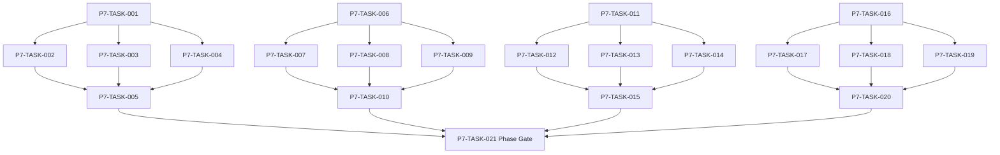

# Phase 7. 몬스터AI · 보스 · 공략대전투 상세 설계서

> 버전 v31.0 · 기준원문 v30 · 작성일 2026-09-08  
> 상태: **설계 검토 초안 / 구현 NOT_STARTED / Test NOT_RUN**  
> 마스터: [전체 구현](00_전체_구현_마스터_설계서.md) · 요구추적: [93](93_요구사항_추적표.md) · 결정대장: [94](94_설계보완안_및_결정대장.md)

## 1. 문서 개요
지각 기반 몬스터 행동과 전조·기믹·공동 시간축의 보스전을 구현한다. 기능 설명에서 불명확했던 구현 책임, 입출력, 정합성, 실패 경계, 검증 방법과 인계 조건을 구체화한다. 본문에는 해당 Phase 에 필요한 공통 계약, 메소드, DDL, Task, Test 를 포함한다. 부록에는 담당 원문 144 개 절을 원문 그대로 수록했다.

구현 범위는 아래 4 개 기능 및 담당 원문의 하위 규칙과 카탈로그이다. 다른 Phase 의 핵심 알고리즘 구현, 서버/멀티플레이, 현실시간 기반 방치 진행, 원문에 없는 게임 규칙의 무단 추가는 제외한다. 원문에서 선택 확장으로 제시한 기능도 요구대장에서 유지하며, 활성화 또는 유예 결정과 별개로 연계 설계를 보존한다.

기존 소스가 제공되지 않아 실제 구조에 대한 영향은 확정하지 않았다. 신규 클래스와 테이블은 구현 제안이며, 기존 코드가 확인되면 공통 Interface, DAO, SQL 재사용을 우선한다.

## 2. Phase 목표
완료 후 상태: **비공개 정보 비참조·페이즈 한 번 전환·증원 상한 준수**. 후속 Phase 에는 검증된 DTO/port, 실제 도메인 결과, 세이브 codec/DDL 변경, fixture 와 기준선을 전달한다. 기능 이름만 등록하거나 Fake 성공 응답만 반환하는 상태는 완료로 보지 않는다.

## 3. 선행 조건
| 선행 Phase | Gate | 전달받는 기능 | 미충족시 차단 Task |
|---|---|---|---|
| [Phase 1](02_Phase1_콘텐츠_자산_빌드파이프라인_상세설계서.md) | P1-TASK-021 | 원문 카탈로그를 손실 없이 형식화하고 로컬 자산을 검증·배포한다. | 미충족이면본 Phase 모든계약 Task 의실제 adapter 통합및제품활성화불가. 검토/Mock UI 는별도표시로가능. |
| [Phase 6](07_Phase6_전투시간축_수치_상태이상_상세설계서.md) | P6-TASK-031 | 순수 Kotlin 자동 전투를 같은 시각 배치·상태·자원 규칙으로 재현한다. | 미충족이면본 Phase 모든계약 Task 의실제 adapter 통합및제품활성화불가. 검토/Mock UI 는별도표시로가능. |

설정: versioned content/balance/engine-order/visibility/limits profile. DB: 선행 schema 및해당 Phase 신규 codec 이필요하다. 외부시스템: 필수없음. 실제이미지/미완성콘텐츠는검증 fixture 로임시대체가능하나 Full 출시검수와구분한다. 미승인규칙을임의0 값으로채운성공 Fixture 는허용하지않는다.

| 결정 ID | 검토 주제 | 상태 | 적용/차단 내용 |
|---|---|---|---|
| C01 | 파티6 명/10 명 혼용 | 원문기준 해결 | 조직10 명·출전6 명. 30/10 과거대화는 첨부본 기준에 적용하지 않음. |
| C05 | 피해증가 이중적용·회피 이중판정 | 설계 보완안·승인 대기 | 피해증가는 한 계층에서 한 번; 명중에회피 포함후 별도 회피추첨 생략 후보. |
| C06 | 동시 HP/보호막/흡혈 배분 | 설계 보완안·승인 대기 | 동시 HP 합산·흡수기여 안정비례배분·잔여정수 stable tie-break; golden fixture 승인. |
| C17 | 축약전투와상세전투 기대값 편차 | 설계 보완안·승인 대기 | 활동 ID/정산 receipt 통합, 구간별성공률/자산/부상모형을실제엔진표본으로교정. |

## 4. 기능 범위 및 요구 연결
| 기능 ID | 기능명 | 중요도 | 선행 기능/Phase | 원문요구/공통근거 |
|---|---|---|---|---|
| FUNC-P7-001 | 몬스터 감지·Utility·역할 AI | 필수핵심 또는 원문 선택 확장 명시검토 | P1,P6 | [§58](#src-0058), [§59](#src-0059), [§61](#src-0061), [§62](#src-0062), [§64](#src-0064), [§65](#src-0065), [§67](#src-0067), [§68](#src-0068) 외 57 개 |
| FUNC-P7-002 | 그룹 Blackboard·순찰·학습 | 필수핵심 또는 원문 선택 확장 명시검토 | P1,P6 | [§63](#src-0063), [§83](#src-0083), [§84](#src-0084), [§690](#src-0690), [§693](#src-0693), [§702](#src-0702), [§723](#src-0723), [§724](#src-0724) 외 8 개 |
| FUNC-P7-003 | 보스 전조·페이즈·강인도 | 필수핵심 또는 원문 선택 확장 명시검토 | P1,P6 | [§57](#src-0057), [§82](#src-0082), [§90](#src-0090), [§751](#src-0751), [§753](#src-0753), [§755](#src-0755), [§756](#src-0756), [§757](#src-0757) 외 31 개 |
| FUNC-P7-004 | 보스 카탈로그·공략대·웨이브 | 필수핵심 또는 원문 선택 확장 명시검토 | P1,P6 | [§60](#src-0060), [§66](#src-0066), [§734](#src-0734), [§752](#src-0752), [§754](#src-0754), [§771](#src-0771), [§772](#src-0772), [§784](#src-0784) 외 16 개 |

## 5. 기능별 상세 설계

### 공통 계약의 적용 범위
모든 새 메소드/클래스명과 물리 DDL 은 **설계 보완안**이다. 제공된 자료에는 실제 저장소·DAO·SQL 이 없으므로 기존 구현에 대한 변경 완료를 뜻하지 않는다. 원문의 객체명/데이터 항목은 최대한 유지하며 기존 코드가 발견되면 adapter 로 연결한다.

`CommandEnvelope(commandId, sessionEpoch, expectedVersion, actorId, payload)`를 사용한다. `GameMinute`, `CombatMillis`, `Money(Long)`, `BasisPoint`, `EntityId`는 혼합 연산을 금지한다. 확률의 기본 표현은 **ppm(0..1,000,000)**이며 세밀한 0.01%도 정수로 표현한다. 표시 반올림과 판정은 분리한다. 정수연산 overflow 는 오류이며 clamp 로 은폐하지 않는다.

`ReadView`는 불변이다. `Delta`는 변경행·RNG 새 상태·도메인 이벤트·명령 receipt 를 포함한다. 콘텐츠 참조/외부 파일 읽기는 transaction 진입 전에 끝낸다. 실패 가능한 대규모 계산은 transaction 밖에서 하고, 성공한 커밋 이후에만 메모리 및 화면 상태를 게시한다. `stateHash`는 canonical 직렬화(키 정렬·정수 표현·버전 포함)에 대한 SHA-256 이며 현실시각·UI 재생위치는 제외한다.

중복 명령은 동일 epoch/commandId 와 payload hash 를 함께 검사한다. 동일 ID/동일 payload 이면 이전 결과를 반환하고, 다른 payload 이면 `IdempotencyKeyReuse`를 반환한다. 인메모리 중복 제거만으로 복구 후 중복을 막았다고 판단하지 않는다.

게임은 한 프로세스·한 활성 WorldSession 을 기준으로 한다. 여러 노드/서버/분산 Lock 은 **해당 없음**이다. 다만 UI 연속 탭·코루틴 완료·예약 이벤트·슬롯 전환·프로세스 재실행 간의 동시성은 실제로 검증한다.

<a id="func-p7-001"></a>
### 5.1. FUNC-P7-001 — 몬스터 감지·Utility·역할 AI

| 항목 | 설계 |
|---|---|
| 기능 목적 | 몬스터 감지·Utility·역할 AI 을 독립된 책임으로 구현한다. 입력, 실패 처리, 저장 경계가 분리되어 있지 않으면 여러 모듈이 동일 상태를 중복 수정할 수 있다. 이를 명시적인 명령/조회 계약으로 통일한다. |
| 관련 요구사항 | [§58](#src-0058), [§59](#src-0059), [§61](#src-0061), [§62](#src-0062), [§64](#src-0064), [§65](#src-0065), [§67](#src-0067), [§68](#src-0068), [§85](#src-0085), [§687](#src-0687), [§688](#src-0688), [§689](#src-0689), [§691](#src-0691), [§692](#src-0692), [§694](#src-0694) 외 50 개 |
| 기능 요구사항 | 1. AI 입력은 지각·known threat·학습 메모리이며 플레이어 비공개 잠재력/미관측쿨다운을 직접 읽지 않는다<br>2. 합법 후보 생성→점수평가→안정 tie-break→행동제안 순서를 고정한다<br>3. 공격/방어/치유/제어/암살/소환/자폭/도주 역할 profile 을 데이터로 구분한다<br>4. 점수 캐시는 contextVersion 이 달라지면 무효화한다 |
| 비기능/운영 | 완전 오프라인, 결정론, 재시도 멱등성, 실패 범위 명시, 원문 정보 공개 정책을 준수한다. 로컬 진단은 기록하되 사용자 메모나 숨은 정보를 일반 로그로 수집하지 않는다. |
| 성능/안정성 | 입력 크기, 큐, 재시도에는 유한한 상한을 둔다. DB/이미지/CPU 작업은 Main 에서 실행하지 않는다. P24 의 성능 예산을 추적하되 현재는 측정 전이다. 핵심 상태 처리에 실패하면 완전한 직전 상태를 보존한다. |
| 주요 메소드 | `MonsterDecisionEngine.decide(ctx: CombatDecisionContext) -> ActionIntent` |
| 입력 필드/값 | knownTargets[], availableActions[], roleProfile, resources, perceivedThreat; 구체적값: 후열 사제 존재를 아직 감지 못한 몹 |
| 반환값 | intent{action,target,reason,score}; 불법후보 제외; 정상결과: 미관측 사제를 이름/직업 근거로 우선공격하지 않음 |
| 입력 검증 | 가능한 스킬후보0 → 기본공격 또는 방어대기; required ID/enum/범위/상태/version 은변경 전에검사 |
| 예외 계약 | AI profile 파손 → 직전 상태 보존·콘텐츠 오류; 승리 자동처리 금지; typed DomainError 로상위호출에전달 |
| Transaction | WorldEngine 의 권위 명령으로 처리한다. 계산은 transaction 밖에서 수행하고, SaveCoordinator 의 단일 write transaction 으로 확정한 뒤 게시한다. 원자적 효과의 중간 성공은 허용하지 않는다. |
| 상태 변화 | PERCEIVE → CANDIDATES → SCORE → INTENT |
| 소유 모듈 | :core:simulation/ai,boss / :feature:combat |
| 신규/수정 | 기존 코드 미제공: 신규/adapter 제안이다. 동일 책임의 기존 모듈이 있으면 공개 interface 를 유지하고 내부 추가로 변경을 최소화한다. |
| 관련 Task | [P7-TASK-001](#p7-task-001) · [P7-TASK-002](#p7-task-002) · [P7-TASK-003](#p7-task-003) · [P7-TASK-004](#p7-task-004) · [P7-TASK-005](#p7-task-005) |
| 관련 Test | [P7-UT-001](#p7-ut-001) · [P7-BT-001](#p7-bt-001) · [P7-FT-001](#p7-ft-001) · [P7-CT-001](#p7-ct-001) · [P7-IT-001](#p7-it-001) |

#### 처리 순서 및 데이터 흐름
1. 명령 envelope/현재 epoch/version 과 대상 존재·권한을확인하고 기존 receipt 를 조회한다.
2. AI 입력은 지각·known threat·학습 메모리이며 플레이어 비공개 잠재력/미관측쿨다운을 직접 읽지 않는다
3. 합법 후보 생성→점수평가→안정 tie-break→행동제안 순서를 고정한다
4. 공격/방어/치유/제어/암살/소환/자폭/도주 역할 profile 을 데이터로 구분한다
5. 점수 캐시는 contextVersion 이 달라지면 무효화한다
6. Delta 불변식→해당행/RNG/event/receipt/codec 원자 commit→PublicView/후속 event 발행. 실패 시메모리/DB 게시를하지않는다.

입력 `knownTargets[], availableActions[], roleProfile, resources, perceivedThreat` → `MonsterDecisionEngine.decide` → 검증된 `intent{action,target,reason,score}; 불법후보 제외` → SavePort/영속세대 → PublicProjection/후속 handler.

#### Use Case와 실패 범위
| 상황 | 처리 |
|---|---|
| 정상 | 후열 사제 존재를 아직 감지 못한 몹 → 미관측 사제를 이름/직업 근거로 우선공격하지 않음 |
| 대상 없음 | 조회는 Empty, 단건 쓰기는 NotFound 를 반환한다. 임의의 대상 생성, 기존 아이템 대체, 금화 차감은 하지 않는다. |
| 일부 성공 | 원자적 단건 처리에는 부분 성공을 허용하지 않는다. 정비 프리셋이나 독립 활동 batch 만 항목별 receipt 와 성공/실패 목록을 제공한다. 하나의 원자적 정산을 분할하지 않는다. |
| 일부 실패 | 직전 상태 보존·콘텐츠 오류; 승리 자동처리 금지 |
| 중복 실행 | 동일 명령의 효과는 1 회만 반영하며, 동일 조회의 출력은 동치여야 한다. 다른 payload 에 같은 멱등키를 재사용하면 오류를 반환한다. |
| 재기동 후 | 동일 COMMITTED snapshot/version 을 기준으로 재조회한다. 미완료 시간 진행과 상태는 checkpoint 에서 이어간다. |
| 비정상 데이터 | 기본공격 또는 방어대기; 잘못된 FK/enum/NaN 은검증 실패로격리/안전정지. |
| 외부 시스템 장애 | 필수 외부 서버는 없다. 로컬 DB/파일/OS/asset 오류는 실패 테스트로 검증하며, 네트워크를 복구의 필수 조건으로 추가하지 않는다. |

#### 객체 및 메소드 책임 분리
| 모듈/객체 | 신규/수정 | 책임 | 메소드 계약 |
|---|---|---|---|
| MonsterDecisionEngine | 신규/기존 adapter | 몬스터 감지·Utility·역할 AI 규칙조정자 | MonsterDecisionEngine.decide(ctx: CombatDecisionContext) -> ActionIntent |
| 입력 검증 | UseCase 내부 또는 기존 도메인 정책 재사용 | 필수 ID·범위·권한·원문제약 검증; 별도 Validator 클래스는 둘 이상의 UseCase가 공유할 때만 추가 | use case 입력별 명시적 ValidationResult |
| 저장 경계 | 기존 Aggregate별 typed Port/SavePort 재사용 | 코덱·조회 snapshot·commit 연결; simulation 직접 DAO 금지; 기능 전용 RepositoryPort 신규 생성 금지 | use case별 typed read/commit 계약 |
| 표현 변환 | 기존 feature mapper 또는 순수 함수 재사용 | 공개/허용 결과만 변환; 별도 Projection 클래스는 둘 이상의 소비자가 공유할 때만 추가 | use case별 PublicViewOrReport |

<a id="func-p7-002"></a>
### 5.2. FUNC-P7-002 — 그룹 Blackboard·순찰·학습

| 항목 | 설계 |
|---|---|
| 기능 목적 | 그룹 Blackboard·순찰·학습을 독립된 책임으로 구현한다. 입력, 실패 처리, 저장 경계가 분리되어 있지 않으면 여러 모듈이 동일 상태를 중복 수정할 수 있다. 이를 명시적인 명령/조회 계약으로 통일한다. |
| 관련 요구사항 | [§63](#src-0063), [§83](#src-0083), [§84](#src-0084), [§690](#src-0690), [§693](#src-0693), [§702](#src-0702), [§723](#src-0723), [§724](#src-0724), [§726](#src-0726), [§730](#src-0730), [§732](#src-0732), [§735](#src-0735), [§736](#src-0736), [§737](#src-0737), [§738](#src-0738) 외 1 개 |
| 기능 요구사항 | 1. 리더·소음·흔적·증원요청·공격집중을 group blackboard 로 공유한다<br>2. 정보 source 와 expiresAt 을 기록하고 벽/연결통로를 무시한 감지를 금지한다<br>3. 몬스터 접두/접미는 허용태그와 행동능력만 확장하며 명칭상 무한소환도 엔진 hard bound 아래서 동작한다<br>4. 플레이어와 몬스터에 동일 지형 penalty/면역을 적용한다 |
| 비기능/운영 | 완전 오프라인, 결정론, 재시도 멱등성, 실패 범위 명시, 원문 정보 공개 정책을 준수한다. 로컬 진단은 기록하되 사용자 메모나 숨은 정보를 일반 로그로 수집하지 않는다. |
| 성능/안정성 | 입력 크기, 큐, 재시도에는 유한한 상한을 둔다. DB/이미지/CPU 작업은 Main 에서 실행하지 않는다. P24 의 성능 예산을 추적하되 현재는 측정 전이다. 핵심 상태 처리에 실패하면 완전한 직전 상태를 보존한다. |
| 주요 메소드 | `MonsterGroupAI.update(input: GroupPerception) -> GroupPlan` |
| 입력 필드/값 | groupId, observationEvents[], graphAccess, leaderState, currentTime; 구체적값: A-B-C 통로,문 B 닫힘,소음전파차단 |
| 반환값 | blackboardDelta, patrolRoute, alertedGroups[]; 정상결과: C 의 그룹이 소음을 감지하지 않음 |
| 입력 검증 | 리더가 전투불능 → 정의된 fallback leader 로만 이전; required ID/enum/범위/상태/version 은변경 전에검사 |
| 예외 계약 | blackboard 타겟 소멸 → 후보 재평가·null dereference 없음; typed DomainError 로상위호출에전달 |
| Transaction | WorldEngine 의 권위 명령으로 처리한다. 계산은 transaction 밖에서 수행하고, SaveCoordinator 의 단일 write transaction 으로 확정한 뒤 게시한다. 원자적 효과의 중간 성공은 허용하지 않는다. |
| 상태 변화 | IDLE → PATROL → ALERT → SEARCH/CHASE → RETURN |
| 소유 모듈 | :core:simulation/ai,boss / :feature:combat |
| 신규/수정 | 기존 코드 미제공: 신규/adapter 제안이다. 동일 책임의 기존 모듈이 있으면 공개 interface 를 유지하고 내부 추가로 변경을 최소화한다. |
| 관련 Task | [P7-TASK-006](#p7-task-006) · [P7-TASK-007](#p7-task-007) · [P7-TASK-008](#p7-task-008) · [P7-TASK-009](#p7-task-009) · [P7-TASK-010](#p7-task-010) |
| 관련 Test | [P7-UT-002](#p7-ut-002) · [P7-BT-002](#p7-bt-002) · [P7-FT-002](#p7-ft-002) · [P7-CT-002](#p7-ct-002) · [P7-IT-002](#p7-it-002) |

#### 처리 순서 및 데이터 흐름
1. 명령 envelope/현재 epoch/version 과 대상 존재·권한을확인하고 기존 receipt 를 조회한다.
2. 리더·소음·흔적·증원요청·공격집중을 group blackboard 로 공유한다
3. 정보 source 와 expiresAt 을 기록하고 벽/연결통로를 무시한 감지를 금지한다
4. 몬스터 접두/접미는 허용태그와 행동능력만 확장하며 명칭상 무한소환도 엔진 hard bound 아래서 동작한다
5. 플레이어와 몬스터에 동일 지형 penalty/면역을 적용한다
6. Delta 불변식→해당행/RNG/event/receipt/codec 원자 commit→PublicView/후속 event 발행. 실패 시메모리/DB 게시를하지않는다.

입력 `groupId, observationEvents[], graphAccess, leaderState, currentTime` → `MonsterGroupAI.update` → 검증된 `blackboardDelta, patrolRoute, alertedGroups[]` → SavePort/영속세대 → PublicProjection/후속 handler.

#### Use Case와 실패 범위
| 상황 | 처리 |
|---|---|
| 정상 | A-B-C 통로,문 B 닫힘,소음전파차단 → C 의 그룹이 소음을 감지하지 않음 |
| 대상 없음 | 조회는 Empty, 단건 쓰기는 NotFound 를 반환한다. 임의의 대상 생성, 기존 아이템 대체, 금화 차감은 하지 않는다. |
| 일부 성공 | 원자적 단건 처리에는 부분 성공을 허용하지 않는다. 정비 프리셋이나 독립 활동 batch 만 항목별 receipt 와 성공/실패 목록을 제공한다. 하나의 원자적 정산을 분할하지 않는다. |
| 일부 실패 | 후보 재평가·null dereference 없음 |
| 중복 실행 | 동일 명령의 효과는 1 회만 반영하며, 동일 조회의 출력은 동치여야 한다. 다른 payload 에 같은 멱등키를 재사용하면 오류를 반환한다. |
| 재기동 후 | 동일 COMMITTED snapshot/version 을 기준으로 재조회한다. 미완료 시간 진행과 상태는 checkpoint 에서 이어간다. |
| 비정상 데이터 | 정의된 fallback leader 로만 이전; 잘못된 FK/enum/NaN 은검증 실패로격리/안전정지. |
| 외부 시스템 장애 | 필수 외부 서버는 없다. 로컬 DB/파일/OS/asset 오류는 실패 테스트로 검증하며, 네트워크를 복구의 필수 조건으로 추가하지 않는다. |

#### 객체 및 메소드 책임 분리
| 모듈/객체 | 신규/수정 | 책임 | 메소드 계약 |
|---|---|---|---|
| MonsterGroupAI | 신규/기존 adapter | 그룹 Blackboard·순찰·학습 규칙조정자 | MonsterGroupAI.update(input: GroupPerception) -> GroupPlan |
| 입력 검증 | UseCase 내부 또는 기존 도메인 정책 재사용 | 필수 ID·범위·권한·원문제약 검증; 별도 Validator 클래스는 둘 이상의 UseCase가 공유할 때만 추가 | use case 입력별 명시적 ValidationResult |
| 저장 경계 | 기존 Aggregate별 typed Port/SavePort 재사용 | 코덱·조회 snapshot·commit 연결; simulation 직접 DAO 금지; 기능 전용 RepositoryPort 신규 생성 금지 | use case별 typed read/commit 계약 |
| 표현 변환 | 기존 feature mapper 또는 순수 함수 재사용 | 공개/허용 결과만 변환; 별도 Projection 클래스는 둘 이상의 소비자가 공유할 때만 추가 | use case별 PublicViewOrReport |

<a id="func-p7-003"></a>
### 5.3. FUNC-P7-003 — 보스 전조·페이즈·강인도

| 항목 | 설계 |
|---|---|
| 기능 목적 | 보스 전조·페이즈·강인도을 독립된 책임으로 구현한다. 입력, 실패 처리, 저장 경계가 분리되어 있지 않으면 여러 모듈이 동일 상태를 중복 수정할 수 있다. 이를 명시적인 명령/조회 계약으로 통일한다. |
| 관련 요구사항 | [§57](#src-0057), [§82](#src-0082), [§90](#src-0090), [§751](#src-0751), [§753](#src-0753), [§755](#src-0755), [§756](#src-0756), [§757](#src-0757), [§758](#src-0758), [§759](#src-0759), [§760](#src-0760), [§761](#src-0761), [§762](#src-0762), [§763](#src-0763), [§764](#src-0764) 외 24 개 |
| 기능 요구사항 | 1. 보스 phase 조건은 같은 timestamp 배치후 평가하고 동일 transitionId 는1 회만 적용한다<br>2. telegraph 시작/피해시각/대응태그를 공개 정보로 노출해 자동전술이 대응하게 한다<br>3. 강인도 BREAK·부위파괴·CC 점감·무적종료시각을 명시한다<br>4. phase 전환 연출시간은 논리 lock 시간과 분리한다 |
| 비기능/운영 | 완전 오프라인, 결정론, 재시도 멱등성, 실패 범위 명시, 원문 정보 공개 정책을 준수한다. 로컬 진단은 기록하되 사용자 메모나 숨은 정보를 일반 로그로 수집하지 않는다. |
| 성능/안정성 | 입력 크기, 큐, 재시도에는 유한한 상한을 둔다. DB/이미지/CPU 작업은 Main 에서 실행하지 않는다. P24 의 성능 예산을 추적하되 현재는 측정 전이다. 핵심 상태 처리에 실패하면 완전한 직전 상태를 보존한다. |
| 주요 메소드 | `BossController.transition(input: BossFrame) -> BossPhaseDelta` |
| 입력 필드/값 | bossId, hpAfterBatch, breakGauge, flags, currentPhase, transitionSequence; 구체적값: HP60→20 으로 한 배치,50/25 phase 경계 |
| 반환값 | phaseDelta, telegraphs[], summons[], oneTransitionReceipt; 정상결과: 정책상 도달최종 phase 로1 회 전환·보상 중복0 |
| 입력 검증 | BREAK 게이지 정확0 → 해당 phase BREAK event1 개; required ID/enum/범위/상태/version 은변경 전에검사 |
| 예외 계약 | 무적 phase 에 해제조건 없음 → 콘텐츠 검증에서 차단·원정 생성금지; typed DomainError 로상위호출에전달 |
| Transaction | WorldEngine 의 권위 명령으로 처리한다. 계산은 transaction 밖에서 수행하고, SaveCoordinator 의 단일 write transaction 으로 확정한 뒤 게시한다. 원자적 효과의 중간 성공은 허용하지 않는다. |
| 상태 변화 | PHASE_n → TRANSITION → PHASE_n+1 → DEFEATED |
| 소유 모듈 | :core:simulation/ai,boss / :feature:combat |
| 신규/수정 | 기존 코드 미제공: 신규/adapter 제안이다. 동일 책임의 기존 모듈이 있으면 공개 interface 를 유지하고 내부 추가로 변경을 최소화한다. |
| 관련 Task | [P7-TASK-011](#p7-task-011) · [P7-TASK-012](#p7-task-012) · [P7-TASK-013](#p7-task-013) · [P7-TASK-014](#p7-task-014) · [P7-TASK-015](#p7-task-015) |
| 관련 Test | [P7-UT-003](#p7-ut-003) · [P7-BT-003](#p7-bt-003) · [P7-FT-003](#p7-ft-003) · [P7-CT-003](#p7-ct-003) · [P7-IT-003](#p7-it-003) |

#### 처리 순서 및 데이터 흐름
1. 명령 envelope/현재 epoch/version 과 대상 존재·권한을확인하고 기존 receipt 를 조회한다.
2. 보스 phase 조건은 같은 timestamp 배치후 평가하고 동일 transitionId 는1 회만 적용한다
3. telegraph 시작/피해시각/대응태그를 공개 정보로 노출해 자동전술이 대응하게 한다
4. 강인도 BREAK·부위파괴·CC 점감·무적종료시각을 명시한다
5. phase 전환 연출시간은 논리 lock 시간과 분리한다
6. Delta 불변식→해당행/RNG/event/receipt/codec 원자 commit→PublicView/후속 event 발행. 실패 시메모리/DB 게시를하지않는다.

입력 `bossId, hpAfterBatch, breakGauge, flags, currentPhase, transitionSequence` → `BossController.transition` → 검증된 `phaseDelta, telegraphs[], summons[], oneTransitionReceipt` → SavePort/영속세대 → PublicProjection/후속 handler.

#### Use Case와 실패 범위
| 상황 | 처리 |
|---|---|
| 정상 | HP60→20 으로 한 배치,50/25 phase 경계 → 정책상 도달최종 phase 로1 회 전환·보상 중복0 |
| 대상 없음 | 조회는 Empty, 단건 쓰기는 NotFound 를 반환한다. 임의의 대상 생성, 기존 아이템 대체, 금화 차감은 하지 않는다. |
| 일부 성공 | 원자적 단건 처리에는 부분 성공을 허용하지 않는다. 정비 프리셋이나 독립 활동 batch 만 항목별 receipt 와 성공/실패 목록을 제공한다. 하나의 원자적 정산을 분할하지 않는다. |
| 일부 실패 | 콘텐츠 검증에서 차단·원정 생성금지 |
| 중복 실행 | 동일 명령의 효과는 1 회만 반영하며, 동일 조회의 출력은 동치여야 한다. 다른 payload 에 같은 멱등키를 재사용하면 오류를 반환한다. |
| 재기동 후 | 동일 COMMITTED snapshot/version 을 기준으로 재조회한다. 미완료 시간 진행과 상태는 checkpoint 에서 이어간다. |
| 비정상 데이터 | 해당 phase BREAK event1 개; 잘못된 FK/enum/NaN 은검증 실패로격리/안전정지. |
| 외부 시스템 장애 | 필수 외부 서버는 없다. 로컬 DB/파일/OS/asset 오류는 실패 테스트로 검증하며, 네트워크를 복구의 필수 조건으로 추가하지 않는다. |

#### 객체 및 메소드 책임 분리
| 모듈/객체 | 신규/수정 | 책임 | 메소드 계약 |
|---|---|---|---|
| BossController | 신규/기존 adapter | 보스 전조·페이즈·강인도 규칙조정자 | BossController.transition(input: BossFrame) -> BossPhaseDelta |
| 입력 검증 | UseCase 내부 또는 기존 도메인 정책 재사용 | 필수 ID·범위·권한·원문제약 검증; 별도 Validator 클래스는 둘 이상의 UseCase가 공유할 때만 추가 | use case 입력별 명시적 ValidationResult |
| 저장 경계 | 기존 Aggregate별 typed Port/SavePort 재사용 | 코덱·조회 snapshot·commit 연결; simulation 직접 DAO 금지; 기능 전용 RepositoryPort 신규 생성 금지 | use case별 typed read/commit 계약 |
| 표현 변환 | 기존 feature mapper 또는 순수 함수 재사용 | 공개/허용 결과만 변환; 별도 Projection 클래스는 둘 이상의 소비자가 공유할 때만 추가 | use case별 PublicViewOrReport |

<a id="func-p7-004"></a>
### 5.4. FUNC-P7-004 — 보스 카탈로그·공략대·웨이브

| 항목 | 설계 |
|---|---|
| 기능 목적 | 보스 카탈로그·공략대·웨이브을 독립된 책임으로 구현한다. 입력, 실패 처리, 저장 경계가 분리되어 있지 않으면 여러 모듈이 동일 상태를 중복 수정할 수 있다. 이를 명시적인 명령/조회 계약으로 통일한다. |
| 관련 요구사항 | [§60](#src-0060), [§66](#src-0066), [§734](#src-0734), [§752](#src-0752), [§754](#src-0754), [§771](#src-0771), [§772](#src-0772), [§784](#src-0784), [§785](#src-0785), [§788](#src-0788), [§794](#src-0794), [§795](#src-0795), [§796](#src-0796), [§797](#src-0797), [§798](#src-0798) 외 9 개 |
| 기능 요구사항 | 1. 원문12 종 상세보스와100 종 카탈로그를 동일 template 체계로 구현한다<br>2. 플레이어 출전6 제한과 여러 파티의 raid actor 수를 분리한다<br>3. raid 는 공통 combatTimeMs 를 공유하며 wave/소환/증원 대기열을 유한하게 유지한다<br>4. 고유보상·최초보상·도주후재등장·네임드 기억은 bossInstanceId 로 이어진다 |
| 비기능/운영 | 완전 오프라인, 결정론, 재시도 멱등성, 실패 범위 명시, 원문 정보 공개 정책을 준수한다. 로컬 진단은 기록하되 사용자 메모나 숨은 정보를 일반 로그로 수집하지 않는다. |
| 성능/안정성 | 입력 크기, 큐, 재시도에는 유한한 상한을 둔다. DB/이미지/CPU 작업은 Main 에서 실행하지 않는다. P24 의 성능 예산을 추적하되 현재는 측정 전이다. 핵심 상태 처리에 실패하면 완전한 직전 상태를 보존한다. |
| 주요 메소드 | `EncounterFactory.create(spec: EncounterSpec) -> EncounterPlan` |
| 입력 필드/값 | bossTemplateId, difficultyProfile, parties{max6}[], waveBudget, seed; 구체적값: 2 개 파티 각6 인 공략대 |
| 반환값 | boundedActors[], waveQueue, victoryConditions, uniqueLoot; 정상결과: 공유 시간축12 인,파티당6 제한 유지 |
| 입력 검증 | 활성적8 과 증원3 → 3 개는 wave 대기·즉시 actor 증식없음; required ID/enum/범위/상태/version 은변경 전에검사 |
| 예외 계약 | 최초보스보상 receipt 이미있음 → 재공략 일반보상만·최초보상0; typed DomainError 로상위호출에전달 |
| Transaction | WorldEngine 의 권위 명령으로 처리한다. 계산은 transaction 밖에서 수행하고, SaveCoordinator 의 단일 write transaction 으로 확정한 뒤 게시한다. 원자적 효과의 중간 성공은 허용하지 않는다. |
| 상태 변화 | CREATED → ACTIVE_WAVES → DEFEATED/ESCAPED |
| 소유 모듈 | :core:simulation/ai,boss / :feature:combat |
| 신규/수정 | 기존 코드 미제공: 신규/adapter 제안이다. 동일 책임의 기존 모듈이 있으면 공개 interface 를 유지하고 내부 추가로 변경을 최소화한다. |
| 관련 Task | [P7-TASK-016](#p7-task-016) · [P7-TASK-017](#p7-task-017) · [P7-TASK-018](#p7-task-018) · [P7-TASK-019](#p7-task-019) · [P7-TASK-020](#p7-task-020) |
| 관련 Test | [P7-UT-004](#p7-ut-004) · [P7-BT-004](#p7-bt-004) · [P7-FT-004](#p7-ft-004) · [P7-CT-004](#p7-ct-004) · [P7-IT-004](#p7-it-004) |

#### 처리 순서 및 데이터 흐름
1. 명령 envelope/현재 epoch/version 과 대상 존재·권한을확인하고 기존 receipt 를 조회한다.
2. 원문12 종 상세보스와100 종 카탈로그를 동일 template 체계로 구현한다
3. 플레이어 출전6 제한과 여러 파티의 raid actor 수를 분리한다
4. raid 는 공통 combatTimeMs 를 공유하며 wave/소환/증원 대기열을 유한하게 유지한다
5. 고유보상·최초보상·도주후재등장·네임드 기억은 bossInstanceId 로 이어진다
6. Delta 불변식→해당행/RNG/event/receipt/codec 원자 commit→PublicView/후속 event 발행. 실패 시메모리/DB 게시를하지않는다.

입력 `bossTemplateId, difficultyProfile, parties{max6}[], waveBudget, seed` → `EncounterFactory.create` → 검증된 `boundedActors[], waveQueue, victoryConditions, uniqueLoot` → SavePort/영속세대 → PublicProjection/후속 handler.

#### Use Case와 실패 범위
| 상황 | 처리 |
|---|---|
| 정상 | 2 개 파티 각6 인 공략대 → 공유 시간축12 인,파티당6 제한 유지 |
| 대상 없음 | 조회는 Empty, 단건 쓰기는 NotFound 를 반환한다. 임의의 대상 생성, 기존 아이템 대체, 금화 차감은 하지 않는다. |
| 일부 성공 | 원자적 단건 처리에는 부분 성공을 허용하지 않는다. 정비 프리셋이나 독립 활동 batch 만 항목별 receipt 와 성공/실패 목록을 제공한다. 하나의 원자적 정산을 분할하지 않는다. |
| 일부 실패 | 재공략 일반보상만·최초보상0 |
| 중복 실행 | 동일 명령의 효과는 1 회만 반영하며, 동일 조회의 출력은 동치여야 한다. 다른 payload 에 같은 멱등키를 재사용하면 오류를 반환한다. |
| 재기동 후 | 동일 COMMITTED snapshot/version 을 기준으로 재조회한다. 미완료 시간 진행과 상태는 checkpoint 에서 이어간다. |
| 비정상 데이터 | 3 개는 wave 대기·즉시 actor 증식없음; 잘못된 FK/enum/NaN 은검증 실패로격리/안전정지. |
| 외부 시스템 장애 | 필수 외부 서버는 없다. 로컬 DB/파일/OS/asset 오류는 실패 테스트로 검증하며, 네트워크를 복구의 필수 조건으로 추가하지 않는다. |

#### 객체 및 메소드 책임 분리
| 모듈/객체 | 신규/수정 | 책임 | 메소드 계약 |
|---|---|---|---|
| EncounterFactory | 신규/기존 adapter | 보스 카탈로그·공략대·웨이브 규칙조정자 | EncounterFactory.create(spec: EncounterSpec) -> EncounterPlan |
| 입력 검증 | UseCase 내부 또는 기존 도메인 정책 재사용 | 필수 ID·범위·권한·원문제약 검증; 별도 Validator 클래스는 둘 이상의 UseCase가 공유할 때만 추가 | use case 입력별 명시적 ValidationResult |
| 저장 경계 | 기존 Aggregate별 typed Port/SavePort 재사용 | 코덱·조회 snapshot·commit 연결; simulation 직접 DAO 금지; 기능 전용 RepositoryPort 신규 생성 금지 | use case별 typed read/commit 계약 |
| 표현 변환 | 기존 feature mapper 또는 순수 함수 재사용 | 공개/허용 결과만 변환; 별도 Projection 클래스는 둘 이상의 소비자가 공유할 때만 추가 | use case별 PublicViewOrReport |


### Phase 특화 알고리즘·수치·판단

각기능의처리순서와입출력계약을기준으로구현한다. 자세한유형별원문정의/수치/카탈로그는문서끝에모두수록했다. 이 Phase 에서새로제안한정책은결정대장의승인상태를따른다.

## 6. DB 상세 설계

다음은 **신규 제안 스키마**다. 실제 기존 DB 가 제공되지 않아 기존 컬럼 변경 사실을 가정하지 않는다. 실제 구현에서는 Room Entity/DAO 와 export 된 schema 를 기준으로 N→N+1 migration 을 작성한다. 아래 CREATE 예시는 **완성 스키마 계약**이며 기존 DB migration 을 IF NOT EXISTS 로 대체하지 않는다.

| 논리/물리 객체 | 저장영역 | 최초 계약 Phase | 접근 | PK/유일조건 | 조회 Index |
|---|---|---|---|---|---|
| boss_state | save.db | P7 | R/I/U(도메인명령에따름); tombstone/GC 만 D | monster_id | dungeon_id |
| combat_checkpoint | save.db | P6 | R/I/U(도메인명령에따름); tombstone/GC 만 D | id PK | run_id,combat_ms |
| monster_state | save.db | P7 | R/I/U(도메인명령에따름); tombstone/GC 만 D | id PK | dungeon_id,room_id, group_id |
| patrol_state | save.db | P7 | R/I/U(도메인명령에따름); tombstone/GC 만 D | dungeon_id,group_id | next_due_minute |

모든일반 SQL 테이블은 `id TEXT NOT NULL PRIMARY KEY`, `row_version INTEGER NOT NULL DEFAULT 0`을공통필드로갖는다. nullable 는 DDL 에 NOT NULL 없는필드만이다. 단위는 `_minute`게임분/`_ms`밀리초/`_bp`0.01%p/`_ppm`0.0001%p,금액/수량 Long 정수. ID 는재사용하지않는다.

#### `boss_state` 필드 및 관계

| 필드/제약 | 용도 |
|---|---|
| dungeon_id TEXT NOT NULL | 선언된 타입·NULL/참조조건을 준수. 값의 의미는 이름과 해당기능 계약을 기준으로 함 |
| monster_id TEXT NOT NULL | 선언된 타입·NULL/참조조건을 준수. 값의 의미는 이름과 해당기능 계약을 기준으로 함 |
| phase_key TEXT NOT NULL | 선언된 타입·NULL/참조조건을 준수. 값의 의미는 이름과 해당기능 계약을 기준으로 함 |
| phase_sequence INTEGER NOT NULL | 선언된 타입·NULL/참조조건을 준수. 값의 의미는 이름과 해당기능 계약을 기준으로 함 |
| break_gauge INTEGER NOT NULL | 선언된 타입·NULL/참조조건을 준수. 값의 의미는 이름과 해당기능 계약을 기준으로 함 |
| flags_json TEXT NOT NULL | 선언된 타입·NULL/참조조건을 준수. 값의 의미는 이름과 해당기능 계약을 기준으로 함 |
| reward_claimed INTEGER NOT NULL CHECK(reward_claimed IN(0,1)) | 선언된 타입·NULL/참조조건을 준수. 값의 의미는 이름과 해당기능 계약을 기준으로 함 |
#### `combat_checkpoint` 필드 및 관계

| 필드/제약 | 용도 |
|---|---|
| run_id TEXT NOT NULL | 선언된 타입·NULL/참조조건을 준수. 값의 의미는 이름과 해당기능 계약을 기준으로 함 |
| combat_version TEXT NOT NULL | 선언된 타입·NULL/참조조건을 준수. 값의 의미는 이름과 해당기능 계약을 기준으로 함 |
| content_version TEXT NOT NULL | 선언된 타입·NULL/참조조건을 준수. 값의 의미는 이름과 해당기능 계약을 기준으로 함 |
| combat_ms INTEGER NOT NULL CHECK(combat_ms>=0) | 선언된 타입·NULL/참조조건을 준수. 값의 의미는 이름과 해당기능 계약을 기준으로 함 |
| combat_payload BLOB NOT NULL | 선언된 타입·NULL/참조조건을 준수. 값의 의미는 이름과 해당기능 계약을 기준으로 함 |
| rng_payload BLOB NOT NULL | 선언된 타입·NULL/참조조건을 준수. 값의 의미는 이름과 해당기능 계약을 기준으로 함 |
| checksum TEXT NOT NULL | 선언된 타입·NULL/참조조건을 준수. 값의 의미는 이름과 해당기능 계약을 기준으로 함 |

전투 actor/action/status/queue/projectile 의 완전 codec. Tick 별 SQL 하지 않음.
#### `monster_state` 필드 및 관계

| 필드/제약 | 용도 |
|---|---|
| dungeon_id TEXT NOT NULL | 선언된 타입·NULL/참조조건을 준수. 값의 의미는 이름과 해당기능 계약을 기준으로 함 |
| template_id TEXT NOT NULL | 선언된 타입·NULL/참조조건을 준수. 값의 의미는 이름과 해당기능 계약을 기준으로 함 |
| level INTEGER NOT NULL | 선언된 타입·NULL/참조조건을 준수. 값의 의미는 이름과 해당기능 계약을 기준으로 함 |
| grade TEXT NOT NULL | 선언된 타입·NULL/참조조건을 준수. 값의 의미는 이름과 해당기능 계약을 기준으로 함 |
| room_id TEXT | 선언된 타입·NULL/참조조건을 준수. 값의 의미는 이름과 해당기능 계약을 기준으로 함 |
| group_id TEXT | 선언된 타입·NULL/참조조건을 준수. 값의 의미는 이름과 해당기능 계약을 기준으로 함 |
| state_payload BLOB NOT NULL | 선언된 타입·NULL/참조조건을 준수. 값의 의미는 이름과 해당기능 계약을 기준으로 함 |
| status TEXT NOT NULL | 선언된 타입·NULL/참조조건을 준수. 값의 의미는 이름과 해당기능 계약을 기준으로 함 |
#### `patrol_state` 필드 및 관계

| 필드/제약 | 용도 |
|---|---|
| dungeon_id TEXT NOT NULL | 선언된 타입·NULL/참조조건을 준수. 값의 의미는 이름과 해당기능 계약을 기준으로 함 |
| group_id TEXT NOT NULL | 선언된 타입·NULL/참조조건을 준수. 값의 의미는 이름과 해당기능 계약을 기준으로 함 |
| current_room_id TEXT NOT NULL | 선언된 타입·NULL/참조조건을 준수. 값의 의미는 이름과 해당기능 계약을 기준으로 함 |
| next_due_minute INTEGER | 선언된 타입·NULL/참조조건을 준수. 값의 의미는 이름과 해당기능 계약을 기준으로 함 |
| route_json TEXT NOT NULL | 선언된 타입·NULL/참조조건을 준수. 값의 의미는 이름과 해당기능 계약을 기준으로 함 |
| blackboard_json TEXT NOT NULL | 선언된 타입·NULL/참조조건을 준수. 값의 의미는 이름과 해당기능 계약을 기준으로 함 |

### FK·대량처리·Lock·Isolation
권위관계는선언된 FK/UNIQUE 와명령불변식을함께사용한다. polymorphic owner/subject/contentId 는 cross-DB FK 를만들지않고 ReferenceValidator 로검사한다. 가족/역사/증표/유일물품은 ON DELETE RESTRICT/보존요약으로보호한다. FK 다형성검사를 DB 가자동보장한다고가정하지않는다.

읽기는 WAL snapshot,쓰기는단일 writer 짧은 transaction 이다. SQLite 에 SELECT FOR UPDATE 를사용하지않는다. stale version 의 affectedRows=0 은 Conflict,SQLITE_BUSY 는제한재시도,손상/공간부족은안전정지다. 외부파일/콘텐츠다른 DB 접근은 transaction 전에끝낸다. 대량입출력은1batch 최대500 행/1 청크최대1MiB(보완설정)로시작하되 **한 의미적 작업을 원자적이지 않게 쪼개지 않는다**. 큰작업은 staging→검증→짧은 pointer 승격으로원자성을유지한다.

Index 는조회조건/정렬을기준으로추가하고 EXPLAIN QUERY PLAN 과쓰기공수/파일크기를측정한다. 삭제는이 Phase 에서소유한종료/취소/GC 대상만가능하며전체테이블 DELETE 를일상정리로사용하지않는다.

### 관련 DDL 계약
content.db 와 save.db 는**별도로**생성하며 cross-DB JOIN/transaction 을하지않는다. 아래구문은각각해당 DB 에서실행한다. 부모 FK 테이블은선행 Phase 의완료스키마가제공해야한다. 전체초기 schema 는공통부록 SQL 에있다.

**save.db**
```sql
-- 제안 DDL; 실제 Room 생성 schema와 검토 후 동기화.
PRAGMA foreign_keys=ON;

CREATE TABLE IF NOT EXISTS boss_state (
  id TEXT PRIMARY KEY NOT NULL,
  row_version INTEGER NOT NULL DEFAULT 0 CHECK(row_version>=0),
  dungeon_id TEXT NOT NULL,
  monster_id TEXT NOT NULL,
  phase_key TEXT NOT NULL,
  phase_sequence INTEGER NOT NULL,
  break_gauge INTEGER NOT NULL,
  flags_json TEXT NOT NULL,
  reward_claimed INTEGER NOT NULL CHECK(reward_claimed IN(0,1)),
  UNIQUE(monster_id)
);
CREATE INDEX IF NOT EXISTS ix_boss_state_1 ON boss_state(dungeon_id);

CREATE TABLE IF NOT EXISTS combat_checkpoint (
  id TEXT PRIMARY KEY NOT NULL,
  row_version INTEGER NOT NULL DEFAULT 0 CHECK(row_version>=0),
  run_id TEXT NOT NULL,
  combat_version TEXT NOT NULL,
  content_version TEXT NOT NULL,
  combat_ms INTEGER NOT NULL CHECK(combat_ms>=0),
  combat_payload BLOB NOT NULL,
  rng_payload BLOB NOT NULL,
  checksum TEXT NOT NULL
);
CREATE INDEX IF NOT EXISTS ix_combat_checkpoint_1 ON combat_checkpoint(run_id,combat_ms);

CREATE TABLE IF NOT EXISTS monster_state (
  id TEXT PRIMARY KEY NOT NULL,
  row_version INTEGER NOT NULL DEFAULT 0 CHECK(row_version>=0),
  dungeon_id TEXT NOT NULL,
  template_id TEXT NOT NULL,
  level INTEGER NOT NULL,
  grade TEXT NOT NULL,
  room_id TEXT,
  group_id TEXT,
  state_payload BLOB NOT NULL,
  status TEXT NOT NULL
);
CREATE INDEX IF NOT EXISTS ix_monster_state_1 ON monster_state(dungeon_id,room_id);
CREATE INDEX IF NOT EXISTS ix_monster_state_2 ON monster_state(group_id);

CREATE TABLE IF NOT EXISTS patrol_state (
  id TEXT PRIMARY KEY NOT NULL,
  row_version INTEGER NOT NULL DEFAULT 0 CHECK(row_version>=0),
  dungeon_id TEXT NOT NULL,
  group_id TEXT NOT NULL,
  current_room_id TEXT NOT NULL,
  next_due_minute INTEGER,
  route_json TEXT NOT NULL,
  blackboard_json TEXT NOT NULL,
  UNIQUE(dungeon_id,group_id)
);
CREATE INDEX IF NOT EXISTS ix_patrol_state_1 ON patrol_state(next_due_minute);
```

## 7. Transaction / 동시성 / Thread 설계

| 관점 | 이 Phase 의 구현 기준 |
|---|---|
| Transaction 시작/종료 | WorldEngine/UseCase 가불변 Delta 계산완료 후 SaveCoordinator 진입. 실제 Roomwrite 시작→변경행/receipt/RNG/event/manifest→검증→commit. compute/read/tool 은 live transaction 해당없음. |
| Rollback | 필수입력/FK/버전/금액/소유권/일정/메소드예외,affectedRows 예상불일치면해당 semantic 작업전부 rollback.이미게시된 UI 값으로 DB 복구하지않음. |
| 부분 실패 | 하나의거래/강화/승계/보상은부분성공없음. 서로독립정비항목/검증 case/선택 background 활동만항목 receipt 로부분결과를허용. |
| 동시 처리/중복 | UI 연속탭·시간경계·NPC 명령이같은 data 를건드려도단일 writer 로직렬화. epoch/version/unique receipt 로재기동중복차단. |
| 여러 노드 | 오프라인싱글:해당없음. 분산 lock/서버 leader election/remoteDB 를신설하지않음. |
| Thread 생성 주체 | Application 이인프라 scope, WorldSessionFactory 가세션 scope/전용직렬 dispatcher 를소유. CPU 계산 Default/전용 dispatcher, DB/파일 IO 는 IO/context 를사용. Main 은 UI 만. |
| Daemon/Pool | 직접 Java daemon Thread 를게임수명보장으로사용하지않음. 고정·제한 dispatcher/pool 만허용. NPC/이벤트마다 Thread 생성금지. daemon 여부에무관하게구조화 scope 종료를검증. |
| 생명주기/종료 | OPEN→PAUSING→PAUSED→CLOSING→CLOSED.새명령차단→안전경계→commit drain→child job 취소/join→connection/handle 닫기. 프로세스 kill 은콜백없음을가정. |
| Exception 처리 | CancellationException 전파. 예상 DomainError 는 typed 결과,Invariant 오류는안전정지,장식/파생 consumer 오류는격리. 일반 catch 에서실패를성공으로변환하지않음. |
| 메모리/누수 | Domain 에 Context/Bitmap/ViewModel 참조금지.세션폐기후 observer/job/callback/파일 FD 잔존0.캐시최대 size 와 in-flight 작업한도 profile 필수. |

## 8. 예외 처리·장애 격리

| 예외 상황 | 시스템 동작 | 로그 | 재시도 | 기존 기능 영향 |
|---|---|---|---|---|
| DB 조회/쓰기실패 | 권위명령 commit 중단·최신정상세대보존 | ERROR code/epoch/version/command | busy 만제한;IO/손상은복구 | 이미완료한진행보존·새권위변경정지 |
| 대상없음/NULL | Empty/NotFound/InvalidInput;임의타깃대체없음 | INFO 또는 WARN·targetId | 사용자재선택 | 다른대상무변경 |
| 잘못된 상태/version | Conflict/StateNotAllowed | WARN before/expected | 새 snapshot 으로재확인 | 중복소모0 |
| Timeout/작업취소 | 미 commitdelta 폐기·불명확 commit 은 receipt 조회 | WARN timeout/cancel | 동일 ID 로결과확인 | 기존세대유지 |
| dispatcher/pool 초기화실패 | 세션시작실패화면;새명령접수안함 | ERROR lifecycle | 환경복구후명시재시작 | 기존파일/세이브무손상 |
| Runtime/불변식오류 | 핵심 상태안전정지·재현 snapshot | ERROR first failure seed/버전 | 자동무한재시도금지 | 손상확대방지 |
| 중복명령 | 기존 receipt 반환/키재사용오류 | INFO duplicate key | 추가실행없음 | 정상결과보존 |
| 부분 batch 실패 | 성공항목 receipt 유지·실패항목만재검토 | WARN item status 목록 | 정책상명시재시도 | 핵심원자작업분할금지 |
| 프로세스종료 | 마지막 COMMITTED 전체 snapshot 복구 | 재실행 RECOVERY 이력 | 로드시 checksum 검증 | 시간/RNG 섞지않음 |
| 이미지/뉴스/검색파생실패 | fallback/재구축/집계중표시 | WARN component 범위 | 제한재로딩 | 핵심전투/금화/저장흐름계속 |

## 9. 세부 구현 Task

각 Task 는작은 PR 를의도하지만코드확인 후3 집중인일을넘을것으로예상되면하위 Task 로분해한다.별도후속작업을숨겨완료로표시하지않는다.현재전 Task 는 NOT_STARTED 이며실제대상파일/PR/담당자는착수시입력한다.

<a id="p7-task-001"></a>
### P7-TASK-001 — 몬스터 감지·Utility·역할 AI — 계약·Fixture

| 항목 | 설계 |
|---|---|
| Task ID | P7-TASK-001 |
| 목적 | 계약 책임을 하나의 리뷰 가능한 PR 로 완성한다. |
| 상세 구현 내용 | MonsterDecisionEngine.decide(ctx: CombatDecisionContext) -> ActionIntent 의 DTO/오류/불변식 정의. 입력 knownTargets[], availableActions[], roleProfile, resources, perceivedThreat. 원문 소유절의 고정/권장/예시를 분리해 각 규칙을 assertion manifest 에 옮기고 정상/경계/실패 fixture 작성. |
| 대상 모듈 | :core:simulation/ai,boss / :feature:combat |
| 신규/수정 | 신규/adapter 제안. 기존 저장소 확인 후 file/line 과 기존 interface 에 대한 영향을 PR 에 첨부한다. |
| DB 변경 | monster_state; 실제 변경은 DDL, DAO, codec migration 영향으로 구분한다. |
| 설정 변경 | config.func_p7_001 profile/한도/flag 를버전 관리. 원문 값과보완 값구분; dynamic version 금지. |
| 선행 Task | P1-TASK-021, P6-TASK-031 |
| 후속 Task | P7-TASK-002, P7-TASK-003, P7-TASK-004 |
| 병렬 가능 | 선행 Task 완료 후 다른 feature 의 계약/알고리즘/adapter/UI PR 과 병렬 진행할 수 있다. 공통 DDL/version catalog 충돌은 직렬 리뷰로 조정한다. |
| 구현 주의사항 | 원문의 원자성 규칙, 불변식, 비공개 정보를 보존한다. 기존 source SQL 이 제공되면 재사용을 우선한다. 미구현 후속 port 가 성공한 것처럼 응답하지 않는다. |
| 설계 결정 의존 | C05, C06, C17 |
| 현재 차단/상태 | NOT_STARTED |
| 담당 역할/담당자 | 담당 개발자 / 미지정 |
| 공수 O/M/P / 기대 인일 | 0.65/1.0/1.7 / 1.06; 초기 계획 가정 |
| Test | P7-UT-001, P7-BT-001, P7-FT-001, P7-CT-001, P7-IT-001 |
| 완료 조건 | DTO schema·source assertion manifest·3 종 fixture 를 리뷰 승인 |
| 리뷰/PR/증거 | 미지정 / 미작성 / 미실행; 관리데이터에 갱신 |

<a id="p7-task-002"></a>
### P7-TASK-002 — 몬스터 감지·Utility·역할 AI — 핵심 규칙

| 항목 | 설계 |
|---|---|
| Task ID | P7-TASK-002 |
| 목적 | 알고리즘 책임을 하나의 리뷰 가능한 PR 로 완성한다. |
| 상세 구현 내용 | AI 입력은 지각·known threat·학습 메모리이며 플레이어 비공개 잠재력/미관측쿨다운을 직접 읽지 않는다; 합법 후보 생성→점수평가→안정 tie-break→행동제안 순서를 고정한다; 공격/방어/치유/제어/암살/소환/자폭/도주 역할 profile 을 데이터로 구분한다; 점수 캐시는 contextVersion 이 달라지면 무효화한다. 정해진 입력에서는 '미관측 사제를 이름/직업 근거로 우선공격하지 않음'을 만족해야 한다. |
| 대상 모듈 | :core:simulation/ai,boss / :feature:combat |
| 신규/수정 | 신규/adapter 제안. 기존 저장소 확인 후 file/line 과 기존 interface 에 대한 영향을 PR 에 첨부한다. |
| DB 변경 | monster_state; 실제 변경은 DDL, DAO, codec migration 영향으로 구분한다. |
| 설정 변경 | config.func_p7_001 profile/한도/flag 를버전 관리. 원문 값과보완 값구분; dynamic version 금지. |
| 선행 Task | P7-TASK-001 |
| 후속 Task | P7-TASK-005 |
| 병렬 가능 | 선행 Task 완료 후 다른 feature 의 계약/알고리즘/adapter/UI PR 과 병렬 진행할 수 있다. 공통 DDL/version catalog 충돌은 직렬 리뷰로 조정한다. |
| 구현 주의사항 | 원문의 원자성 규칙, 불변식, 비공개 정보를 보존한다. 기존 source SQL 이 제공되면 재사용을 우선한다. 미구현 후속 port 가 성공한 것처럼 응답하지 않는다. |
| 설계 결정 의존 | C05, C06, C17 |
| 현재 차단/상태 | C05, C06, C17 / NOT_STARTED |
| 담당 역할/담당자 | 담당 개발자 / 미지정 |
| 공수 O/M/P / 기대 인일 | 1.3/2.0/3.4 / 2.12; 초기 계획 가정 |
| Test | P7-UT-001, P7-BT-001, P7-FT-001 |
| 완료 조건 | 순수핵심 메소드·경계검사·결정론 golden 결과 구현; 미정규칙 활성금지 |
| 리뷰/PR/증거 | 미지정 / 미작성 / 미실행; 관리데이터에 갱신 |

<a id="p7-task-003"></a>
### P7-TASK-003 — 몬스터 감지·Utility·역할 AI — 저장·연계

| 항목 | 설계 |
|---|---|
| Task ID | P7-TASK-003 |
| 목적 | 어댑터 책임을 하나의 리뷰 가능한 PR 로 완성한다. |
| 상세 구현 내용 | 대상 monster_state. Delta+receipt+RNG+source events+codec 을원자 commit 에연결하고 affected rows/충돌/재실행을 검사한다. 선행 상태와 후속 port 계약을 등록한다. |
| 대상 모듈 | :core:simulation/ai,boss / :feature:combat |
| 신규/수정 | 신규/adapter 제안. 기존 저장소 확인 후 file/line 과 기존 interface 에 대한 영향을 PR 에 첨부한다. |
| DB 변경 | monster_state; 실제 변경은 DDL, DAO, codec migration 영향으로 구분한다. |
| 설정 변경 | config.func_p7_001 profile/한도/flag 를버전 관리. 원문 값과보완 값구분; dynamic version 금지. |
| 선행 Task | P7-TASK-001 |
| 후속 Task | P7-TASK-005 |
| 병렬 가능 | 선행 Task 완료 후 다른 feature 의 계약/알고리즘/adapter/UI PR 과 병렬 진행할 수 있다. 공통 DDL/version catalog 충돌은 직렬 리뷰로 조정한다. |
| 구현 주의사항 | 원문의 원자성 규칙, 불변식, 비공개 정보를 보존한다. 기존 source SQL 이 제공되면 재사용을 우선한다. 미구현 후속 port 가 성공한 것처럼 응답하지 않는다. |
| 설계 결정 의존 | C05, C06, C17 |
| 현재 차단/상태 | C05, C06, C17 / NOT_STARTED |
| 담당 역할/담당자 | 담당 개발자 / 미지정 |
| 공수 O/M/P / 기대 인일 | 0.98/1.5/2.55 / 1.59; 초기 계획 가정 |
| Test | P7-CT-001, P7-IT-001 |
| 완료 조건 | 실제 adapter 통합·필요 migration/codec·FK/취소경계 검증 |
| 리뷰/PR/증거 | 미지정 / 미작성 / 미실행; 관리데이터에 갱신 |

<a id="p7-task-004"></a>
### P7-TASK-004 — 몬스터 감지·Utility·역할 AI — UI·호출 경로

| 항목 | 설계 |
|---|---|
| Task ID | P7-TASK-004 |
| 목적 | 표현/진입 책임을 하나의 리뷰 가능한 PR 로 완성한다. |
| 상세 구현 내용 | ID 기반호출/공개 ViewState/Loading·Empty·Error·Blocked·성공상태를구현한다. domain 기능은해당 feature 화면의실제버튼/대화/예약 handler 에연결하며데이터를직접수정하지않는다. tool 기능은 CLI/검증리포트/관리화면으로동등한진입점을제공한다. |
| 대상 모듈 | :core:simulation/ai,boss / :feature:combat |
| 신규/수정 | 신규/adapter 제안. 기존 저장소 확인 후 file/line 과 기존 interface 에 대한 영향을 PR 에 첨부한다. |
| DB 변경 | monster_state; 실제 변경은 DDL, DAO, codec migration 영향으로 구분한다. |
| 설정 변경 | config.func_p7_001 profile/한도/flag 를버전 관리. 원문 값과보완 값구분; dynamic version 금지. |
| 선행 Task | P7-TASK-001 |
| 후속 Task | P7-TASK-005 |
| 병렬 가능 | 선행 Task 완료 후 다른 feature 의 계약/알고리즘/adapter/UI PR 과 병렬 진행할 수 있다. 공통 DDL/version catalog 충돌은 직렬 리뷰로 조정한다. |
| 구현 주의사항 | 원문의 원자성 규칙, 불변식, 비공개 정보를 보존한다. 기존 source SQL 이 제공되면 재사용을 우선한다. 미구현 후속 port 가 성공한 것처럼 응답하지 않는다. |
| 설계 결정 의존 | C05, C06, C17 |
| 현재 차단/상태 | C05, C06, C17 / NOT_STARTED |
| 담당 역할/담당자 | 담당 개발자 / 미지정 |
| 공수 O/M/P / 기대 인일 | 0.65/1.0/1.7 / 1.06; 초기 계획 가정 |
| Test | P7-CT-001, P7-IT-001 |
| 완료 조건 | 정상·경계·실패가관측가능한최소진입점과접근성 labels; 핵심권한우회0 |
| 리뷰/PR/증거 | 미지정 / 미작성 / 미실행; 관리데이터에 갱신 |

<a id="p7-task-005"></a>
### P7-TASK-005 — 몬스터 감지·Utility·역할 AI — Test·리뷰

| 항목 | 설계 |
|---|---|
| Task ID | P7-TASK-005 |
| 목적 | 검증 책임을 하나의 리뷰 가능한 PR 로 완성한다. |
| 상세 구현 내용 | P7-UT-001, P7-BT-001, P7-FT-001, P7-CT-001, P7-IT-001 구현/실행. 원문 소유절별 assertion manifest 의 각항목을 데이터행/프로필/파라미터시험에 연결하고 불명확항목은결정대장에등록. PR 코드·DDL·transaction·정보공개·원문변경 유무를독립리뷰. |
| 대상 모듈 | :core:simulation/ai,boss / :feature:combat |
| 신규/수정 | 신규/adapter 제안. 기존 저장소 확인 후 file/line 과 기존 interface 에 대한 영향을 PR 에 첨부한다. |
| DB 변경 | monster_state; 실제 변경은 DDL, DAO, codec migration 영향으로 구분한다. |
| 설정 변경 | config.func_p7_001 profile/한도/flag 를버전 관리. 원문 값과보완 값구분; dynamic version 금지. |
| 선행 Task | P7-TASK-002, P7-TASK-003, P7-TASK-004 |
| 후속 Task | P7-TASK-021 |
| 병렬 가능 | 선행 Task 완료 후 다른 feature 의 계약/알고리즘/adapter/UI PR 과 병렬 진행할 수 있다. 공통 DDL/version catalog 충돌은 직렬 리뷰로 조정한다. |
| 구현 주의사항 | 원문의 원자성 규칙, 불변식, 비공개 정보를 보존한다. 기존 source SQL 이 제공되면 재사용을 우선한다. 미구현 후속 port 가 성공한 것처럼 응답하지 않는다. |
| 설계 결정 의존 | C05, C06, C17 |
| 현재 차단/상태 | C05, C06, C17 / NOT_STARTED |
| 담당 역할/담당자 | QA/리뷰어 / 미지정 |
| 공수 O/M/P / 기대 인일 | 0.65/1.0/1.7 / 1.06; 초기 계획 가정 |
| Test | P7-UT-001, P7-BT-001, P7-FT-001, P7-CT-001, P7-IT-001 |
| 완료 조건 | 대표5 개 Test 와원문세부 assertion coverage 검토완료·관련중대결함0·리뷰승인 |
| 리뷰/PR/증거 | 미지정 / 미작성 / 미실행; 관리데이터에 갱신 |

<a id="p7-task-006"></a>
### P7-TASK-006 — 그룹 Blackboard·순찰·학습 — 계약·Fixture

| 항목 | 설계 |
|---|---|
| Task ID | P7-TASK-006 |
| 목적 | 계약 책임을 하나의 리뷰 가능한 PR 로 완성한다. |
| 상세 구현 내용 | MonsterGroupAI.update(input: GroupPerception) -> GroupPlan 의 DTO/오류/불변식 정의. 입력 groupId, observationEvents[], graphAccess, leaderState, currentTime. 원문 소유절의 고정/권장/예시를 분리해 각 규칙을 assertion manifest 에 옮기고 정상/경계/실패 fixture 작성. |
| 대상 모듈 | :core:simulation/ai,boss / :feature:combat |
| 신규/수정 | 신규/adapter 제안. 기존 저장소 확인 후 file/line 과 기존 interface 에 대한 영향을 PR 에 첨부한다. |
| DB 변경 | monster_state, patrol_state; 실제 변경은 DDL, DAO, codec migration 영향으로 구분한다. |
| 설정 변경 | config.func_p7_002 profile/한도/flag 를버전 관리. 원문 값과보완 값구분; dynamic version 금지. |
| 선행 Task | P1-TASK-021, P6-TASK-031 |
| 후속 Task | P7-TASK-007, P7-TASK-008, P7-TASK-009 |
| 병렬 가능 | 선행 Task 완료 후 다른 feature 의 계약/알고리즘/adapter/UI PR 과 병렬 진행할 수 있다. 공통 DDL/version catalog 충돌은 직렬 리뷰로 조정한다. |
| 구현 주의사항 | 원문의 원자성 규칙, 불변식, 비공개 정보를 보존한다. 기존 source SQL 이 제공되면 재사용을 우선한다. 미구현 후속 port 가 성공한 것처럼 응답하지 않는다. |
| 설계 결정 의존 | C05, C06, C17 |
| 현재 차단/상태 | NOT_STARTED |
| 담당 역할/담당자 | 담당 개발자 / 미지정 |
| 공수 O/M/P / 기대 인일 | 0.65/1.0/1.7 / 1.06; 초기 계획 가정 |
| Test | P7-UT-002, P7-BT-002, P7-FT-002, P7-CT-002, P7-IT-002 |
| 완료 조건 | DTO schema·source assertion manifest·3 종 fixture 를 리뷰 승인 |
| 리뷰/PR/증거 | 미지정 / 미작성 / 미실행; 관리데이터에 갱신 |

<a id="p7-task-007"></a>
### P7-TASK-007 — 그룹 Blackboard·순찰·학습 — 핵심 규칙

| 항목 | 설계 |
|---|---|
| Task ID | P7-TASK-007 |
| 목적 | 알고리즘 책임을 하나의 리뷰 가능한 PR 로 완성한다. |
| 상세 구현 내용 | 리더·소음·흔적·증원요청·공격집중을 group blackboard 로 공유한다; 정보 source 와 expiresAt 을 기록하고 벽/연결통로를 무시한 감지를 금지한다; 몬스터 접두/접미는 허용태그와 행동능력만 확장하며 명칭상 무한소환도 엔진 hard bound 아래서 동작한다; 플레이어와 몬스터에 동일 지형 penalty/면역을 적용한다. 정해진 입력에서는 'C 의 그룹이 소음을 감지하지 않음'을 만족해야 한다. |
| 대상 모듈 | :core:simulation/ai,boss / :feature:combat |
| 신규/수정 | 신규/adapter 제안. 기존 저장소 확인 후 file/line 과 기존 interface 에 대한 영향을 PR 에 첨부한다. |
| DB 변경 | monster_state, patrol_state; 실제 변경은 DDL, DAO, codec migration 영향으로 구분한다. |
| 설정 변경 | config.func_p7_002 profile/한도/flag 를버전 관리. 원문 값과보완 값구분; dynamic version 금지. |
| 선행 Task | P7-TASK-006 |
| 후속 Task | P7-TASK-010 |
| 병렬 가능 | 선행 Task 완료 후 다른 feature 의 계약/알고리즘/adapter/UI PR 과 병렬 진행할 수 있다. 공통 DDL/version catalog 충돌은 직렬 리뷰로 조정한다. |
| 구현 주의사항 | 원문의 원자성 규칙, 불변식, 비공개 정보를 보존한다. 기존 source SQL 이 제공되면 재사용을 우선한다. 미구현 후속 port 가 성공한 것처럼 응답하지 않는다. |
| 설계 결정 의존 | C05, C06, C17 |
| 현재 차단/상태 | C05, C06, C17 / NOT_STARTED |
| 담당 역할/담당자 | 담당 개발자 / 미지정 |
| 공수 O/M/P / 기대 인일 | 1.3/2.0/3.4 / 2.12; 초기 계획 가정 |
| Test | P7-UT-002, P7-BT-002, P7-FT-002 |
| 완료 조건 | 순수핵심 메소드·경계검사·결정론 golden 결과 구현; 미정규칙 활성금지 |
| 리뷰/PR/증거 | 미지정 / 미작성 / 미실행; 관리데이터에 갱신 |

<a id="p7-task-008"></a>
### P7-TASK-008 — 그룹 Blackboard·순찰·학습 — 저장·연계

| 항목 | 설계 |
|---|---|
| Task ID | P7-TASK-008 |
| 목적 | 어댑터 책임을 하나의 리뷰 가능한 PR 로 완성한다. |
| 상세 구현 내용 | 대상 monster_state, patrol_state. Delta+receipt+RNG+source events+codec 을원자 commit 에연결하고 affected rows/충돌/재실행을 검사한다. 선행 상태와 후속 port 계약을 등록한다. |
| 대상 모듈 | :core:simulation/ai,boss / :feature:combat |
| 신규/수정 | 신규/adapter 제안. 기존 저장소 확인 후 file/line 과 기존 interface 에 대한 영향을 PR 에 첨부한다. |
| DB 변경 | monster_state, patrol_state; 실제 변경은 DDL, DAO, codec migration 영향으로 구분한다. |
| 설정 변경 | config.func_p7_002 profile/한도/flag 를버전 관리. 원문 값과보완 값구분; dynamic version 금지. |
| 선행 Task | P7-TASK-006 |
| 후속 Task | P7-TASK-010 |
| 병렬 가능 | 선행 Task 완료 후 다른 feature 의 계약/알고리즘/adapter/UI PR 과 병렬 진행할 수 있다. 공통 DDL/version catalog 충돌은 직렬 리뷰로 조정한다. |
| 구현 주의사항 | 원문의 원자성 규칙, 불변식, 비공개 정보를 보존한다. 기존 source SQL 이 제공되면 재사용을 우선한다. 미구현 후속 port 가 성공한 것처럼 응답하지 않는다. |
| 설계 결정 의존 | C05, C06, C17 |
| 현재 차단/상태 | C05, C06, C17 / NOT_STARTED |
| 담당 역할/담당자 | 담당 개발자 / 미지정 |
| 공수 O/M/P / 기대 인일 | 0.98/1.5/2.55 / 1.59; 초기 계획 가정 |
| Test | P7-CT-002, P7-IT-002 |
| 완료 조건 | 실제 adapter 통합·필요 migration/codec·FK/취소경계 검증 |
| 리뷰/PR/증거 | 미지정 / 미작성 / 미실행; 관리데이터에 갱신 |

<a id="p7-task-009"></a>
### P7-TASK-009 — 그룹 Blackboard·순찰·학습 — UI·호출 경로

| 항목 | 설계 |
|---|---|
| Task ID | P7-TASK-009 |
| 목적 | 표현/진입 책임을 하나의 리뷰 가능한 PR 로 완성한다. |
| 상세 구현 내용 | ID 기반호출/공개 ViewState/Loading·Empty·Error·Blocked·성공상태를구현한다. domain 기능은해당 feature 화면의실제버튼/대화/예약 handler 에연결하며데이터를직접수정하지않는다. tool 기능은 CLI/검증리포트/관리화면으로동등한진입점을제공한다. |
| 대상 모듈 | :core:simulation/ai,boss / :feature:combat |
| 신규/수정 | 신규/adapter 제안. 기존 저장소 확인 후 file/line 과 기존 interface 에 대한 영향을 PR 에 첨부한다. |
| DB 변경 | monster_state, patrol_state; 실제 변경은 DDL, DAO, codec migration 영향으로 구분한다. |
| 설정 변경 | config.func_p7_002 profile/한도/flag 를버전 관리. 원문 값과보완 값구분; dynamic version 금지. |
| 선행 Task | P7-TASK-006 |
| 후속 Task | P7-TASK-010 |
| 병렬 가능 | 선행 Task 완료 후 다른 feature 의 계약/알고리즘/adapter/UI PR 과 병렬 진행할 수 있다. 공통 DDL/version catalog 충돌은 직렬 리뷰로 조정한다. |
| 구현 주의사항 | 원문의 원자성 규칙, 불변식, 비공개 정보를 보존한다. 기존 source SQL 이 제공되면 재사용을 우선한다. 미구현 후속 port 가 성공한 것처럼 응답하지 않는다. |
| 설계 결정 의존 | C05, C06, C17 |
| 현재 차단/상태 | C05, C06, C17 / NOT_STARTED |
| 담당 역할/담당자 | 담당 개발자 / 미지정 |
| 공수 O/M/P / 기대 인일 | 0.65/1.0/1.7 / 1.06; 초기 계획 가정 |
| Test | P7-CT-002, P7-IT-002 |
| 완료 조건 | 정상·경계·실패가관측가능한최소진입점과접근성 labels; 핵심권한우회0 |
| 리뷰/PR/증거 | 미지정 / 미작성 / 미실행; 관리데이터에 갱신 |

<a id="p7-task-010"></a>
### P7-TASK-010 — 그룹 Blackboard·순찰·학습 — Test·리뷰

| 항목 | 설계 |
|---|---|
| Task ID | P7-TASK-010 |
| 목적 | 검증 책임을 하나의 리뷰 가능한 PR 로 완성한다. |
| 상세 구현 내용 | P7-UT-002, P7-BT-002, P7-FT-002, P7-CT-002, P7-IT-002 구현/실행. 원문 소유절별 assertion manifest 의 각항목을 데이터행/프로필/파라미터시험에 연결하고 불명확항목은결정대장에등록. PR 코드·DDL·transaction·정보공개·원문변경 유무를독립리뷰. |
| 대상 모듈 | :core:simulation/ai,boss / :feature:combat |
| 신규/수정 | 신규/adapter 제안. 기존 저장소 확인 후 file/line 과 기존 interface 에 대한 영향을 PR 에 첨부한다. |
| DB 변경 | monster_state, patrol_state; 실제 변경은 DDL, DAO, codec migration 영향으로 구분한다. |
| 설정 변경 | config.func_p7_002 profile/한도/flag 를버전 관리. 원문 값과보완 값구분; dynamic version 금지. |
| 선행 Task | P7-TASK-007, P7-TASK-008, P7-TASK-009 |
| 후속 Task | P7-TASK-021 |
| 병렬 가능 | 선행 Task 완료 후 다른 feature 의 계약/알고리즘/adapter/UI PR 과 병렬 진행할 수 있다. 공통 DDL/version catalog 충돌은 직렬 리뷰로 조정한다. |
| 구현 주의사항 | 원문의 원자성 규칙, 불변식, 비공개 정보를 보존한다. 기존 source SQL 이 제공되면 재사용을 우선한다. 미구현 후속 port 가 성공한 것처럼 응답하지 않는다. |
| 설계 결정 의존 | C05, C06, C17 |
| 현재 차단/상태 | C05, C06, C17 / NOT_STARTED |
| 담당 역할/담당자 | QA/리뷰어 / 미지정 |
| 공수 O/M/P / 기대 인일 | 0.65/1.0/1.7 / 1.06; 초기 계획 가정 |
| Test | P7-UT-002, P7-BT-002, P7-FT-002, P7-CT-002, P7-IT-002 |
| 완료 조건 | 대표5 개 Test 와원문세부 assertion coverage 검토완료·관련중대결함0·리뷰승인 |
| 리뷰/PR/증거 | 미지정 / 미작성 / 미실행; 관리데이터에 갱신 |

<a id="p7-task-011"></a>
### P7-TASK-011 — 보스 전조·페이즈·강인도 — 계약·Fixture

| 항목 | 설계 |
|---|---|
| Task ID | P7-TASK-011 |
| 목적 | 계약 책임을 하나의 리뷰 가능한 PR 로 완성한다. |
| 상세 구현 내용 | BossController.transition(input: BossFrame) -> BossPhaseDelta 의 DTO/오류/불변식 정의. 입력 bossId, hpAfterBatch, breakGauge, flags, currentPhase, transitionSequence. 원문 소유절의 고정/권장/예시를 분리해 각 규칙을 assertion manifest 에 옮기고 정상/경계/실패 fixture 작성. |
| 대상 모듈 | :core:simulation/ai,boss / :feature:combat |
| 신규/수정 | 신규/adapter 제안. 기존 저장소 확인 후 file/line 과 기존 interface 에 대한 영향을 PR 에 첨부한다. |
| DB 변경 | boss_state, combat_checkpoint; 실제 변경은 DDL, DAO, codec migration 영향으로 구분한다. |
| 설정 변경 | config.func_p7_003 profile/한도/flag 를버전 관리. 원문 값과보완 값구분; dynamic version 금지. |
| 선행 Task | P1-TASK-021, P6-TASK-031 |
| 후속 Task | P7-TASK-012, P7-TASK-013, P7-TASK-014 |
| 병렬 가능 | 선행 Task 완료 후 다른 feature 의 계약/알고리즘/adapter/UI PR 과 병렬 진행할 수 있다. 공통 DDL/version catalog 충돌은 직렬 리뷰로 조정한다. |
| 구현 주의사항 | 원문의 원자성 규칙, 불변식, 비공개 정보를 보존한다. 기존 source SQL 이 제공되면 재사용을 우선한다. 미구현 후속 port 가 성공한 것처럼 응답하지 않는다. |
| 설계 결정 의존 | C05, C06, C17 |
| 현재 차단/상태 | NOT_STARTED |
| 담당 역할/담당자 | 담당 개발자 / 미지정 |
| 공수 O/M/P / 기대 인일 | 0.65/1.0/1.7 / 1.06; 초기 계획 가정 |
| Test | P7-UT-003, P7-BT-003, P7-FT-003, P7-CT-003, P7-IT-003 |
| 완료 조건 | DTO schema·source assertion manifest·3 종 fixture 를 리뷰 승인 |
| 리뷰/PR/증거 | 미지정 / 미작성 / 미실행; 관리데이터에 갱신 |

<a id="p7-task-012"></a>
### P7-TASK-012 — 보스 전조·페이즈·강인도 — 핵심 규칙

| 항목 | 설계 |
|---|---|
| Task ID | P7-TASK-012 |
| 목적 | 알고리즘 책임을 하나의 리뷰 가능한 PR 로 완성한다. |
| 상세 구현 내용 | 보스 phase 조건은 같은 timestamp 배치후 평가하고 동일 transitionId 는1 회만 적용한다; telegraph 시작/피해시각/대응태그를 공개 정보로 노출해 자동전술이 대응하게 한다; 강인도 BREAK·부위파괴·CC 점감·무적종료시각을 명시한다; phase 전환 연출시간은 논리 lock 시간과 분리한다. 정해진 입력에서는 '정책상 도달최종 phase 로1 회 전환·보상 중복0'을 만족해야 한다. |
| 대상 모듈 | :core:simulation/ai,boss / :feature:combat |
| 신규/수정 | 신규/adapter 제안. 기존 저장소 확인 후 file/line 과 기존 interface 에 대한 영향을 PR 에 첨부한다. |
| DB 변경 | boss_state, combat_checkpoint; 실제 변경은 DDL, DAO, codec migration 영향으로 구분한다. |
| 설정 변경 | config.func_p7_003 profile/한도/flag 를버전 관리. 원문 값과보완 값구분; dynamic version 금지. |
| 선행 Task | P7-TASK-011 |
| 후속 Task | P7-TASK-015 |
| 병렬 가능 | 선행 Task 완료 후 다른 feature 의 계약/알고리즘/adapter/UI PR 과 병렬 진행할 수 있다. 공통 DDL/version catalog 충돌은 직렬 리뷰로 조정한다. |
| 구현 주의사항 | 원문의 원자성 규칙, 불변식, 비공개 정보를 보존한다. 기존 source SQL 이 제공되면 재사용을 우선한다. 미구현 후속 port 가 성공한 것처럼 응답하지 않는다. |
| 설계 결정 의존 | C05, C06, C17 |
| 현재 차단/상태 | C05, C06, C17 / NOT_STARTED |
| 담당 역할/담당자 | 담당 개발자 / 미지정 |
| 공수 O/M/P / 기대 인일 | 1.3/2.0/3.4 / 2.12; 초기 계획 가정 |
| Test | P7-UT-003, P7-BT-003, P7-FT-003 |
| 완료 조건 | 순수핵심 메소드·경계검사·결정론 golden 결과 구현; 미정규칙 활성금지 |
| 리뷰/PR/증거 | 미지정 / 미작성 / 미실행; 관리데이터에 갱신 |

<a id="p7-task-013"></a>
### P7-TASK-013 — 보스 전조·페이즈·강인도 — 저장·연계

| 항목 | 설계 |
|---|---|
| Task ID | P7-TASK-013 |
| 목적 | 어댑터 책임을 하나의 리뷰 가능한 PR 로 완성한다. |
| 상세 구현 내용 | 대상 boss_state, combat_checkpoint. Delta+receipt+RNG+source events+codec 을원자 commit 에연결하고 affected rows/충돌/재실행을 검사한다. 선행 상태와 후속 port 계약을 등록한다. |
| 대상 모듈 | :core:simulation/ai,boss / :feature:combat |
| 신규/수정 | 신규/adapter 제안. 기존 저장소 확인 후 file/line 과 기존 interface 에 대한 영향을 PR 에 첨부한다. |
| DB 변경 | boss_state, combat_checkpoint; 실제 변경은 DDL, DAO, codec migration 영향으로 구분한다. |
| 설정 변경 | config.func_p7_003 profile/한도/flag 를버전 관리. 원문 값과보완 값구분; dynamic version 금지. |
| 선행 Task | P7-TASK-011 |
| 후속 Task | P7-TASK-015 |
| 병렬 가능 | 선행 Task 완료 후 다른 feature 의 계약/알고리즘/adapter/UI PR 과 병렬 진행할 수 있다. 공통 DDL/version catalog 충돌은 직렬 리뷰로 조정한다. |
| 구현 주의사항 | 원문의 원자성 규칙, 불변식, 비공개 정보를 보존한다. 기존 source SQL 이 제공되면 재사용을 우선한다. 미구현 후속 port 가 성공한 것처럼 응답하지 않는다. |
| 설계 결정 의존 | C05, C06, C17 |
| 현재 차단/상태 | C05, C06, C17 / NOT_STARTED |
| 담당 역할/담당자 | 담당 개발자 / 미지정 |
| 공수 O/M/P / 기대 인일 | 0.98/1.5/2.55 / 1.59; 초기 계획 가정 |
| Test | P7-CT-003, P7-IT-003 |
| 완료 조건 | 실제 adapter 통합·필요 migration/codec·FK/취소경계 검증 |
| 리뷰/PR/증거 | 미지정 / 미작성 / 미실행; 관리데이터에 갱신 |

<a id="p7-task-014"></a>
### P7-TASK-014 — 보스 전조·페이즈·강인도 — UI·호출 경로

| 항목 | 설계 |
|---|---|
| Task ID | P7-TASK-014 |
| 목적 | 표현/진입 책임을 하나의 리뷰 가능한 PR 로 완성한다. |
| 상세 구현 내용 | ID 기반호출/공개 ViewState/Loading·Empty·Error·Blocked·성공상태를구현한다. domain 기능은해당 feature 화면의실제버튼/대화/예약 handler 에연결하며데이터를직접수정하지않는다. tool 기능은 CLI/검증리포트/관리화면으로동등한진입점을제공한다. |
| 대상 모듈 | :core:simulation/ai,boss / :feature:combat |
| 신규/수정 | 신규/adapter 제안. 기존 저장소 확인 후 file/line 과 기존 interface 에 대한 영향을 PR 에 첨부한다. |
| DB 변경 | boss_state, combat_checkpoint; 실제 변경은 DDL, DAO, codec migration 영향으로 구분한다. |
| 설정 변경 | config.func_p7_003 profile/한도/flag 를버전 관리. 원문 값과보완 값구분; dynamic version 금지. |
| 선행 Task | P7-TASK-011 |
| 후속 Task | P7-TASK-015 |
| 병렬 가능 | 선행 Task 완료 후 다른 feature 의 계약/알고리즘/adapter/UI PR 과 병렬 진행할 수 있다. 공통 DDL/version catalog 충돌은 직렬 리뷰로 조정한다. |
| 구현 주의사항 | 원문의 원자성 규칙, 불변식, 비공개 정보를 보존한다. 기존 source SQL 이 제공되면 재사용을 우선한다. 미구현 후속 port 가 성공한 것처럼 응답하지 않는다. |
| 설계 결정 의존 | C05, C06, C17 |
| 현재 차단/상태 | C05, C06, C17 / NOT_STARTED |
| 담당 역할/담당자 | 담당 개발자 / 미지정 |
| 공수 O/M/P / 기대 인일 | 0.65/1.0/1.7 / 1.06; 초기 계획 가정 |
| Test | P7-CT-003, P7-IT-003 |
| 완료 조건 | 정상·경계·실패가관측가능한최소진입점과접근성 labels; 핵심권한우회0 |
| 리뷰/PR/증거 | 미지정 / 미작성 / 미실행; 관리데이터에 갱신 |

<a id="p7-task-015"></a>
### P7-TASK-015 — 보스 전조·페이즈·강인도 — Test·리뷰

| 항목 | 설계 |
|---|---|
| Task ID | P7-TASK-015 |
| 목적 | 검증 책임을 하나의 리뷰 가능한 PR 로 완성한다. |
| 상세 구현 내용 | P7-UT-003, P7-BT-003, P7-FT-003, P7-CT-003, P7-IT-003 구현/실행. 원문 소유절별 assertion manifest 의 각항목을 데이터행/프로필/파라미터시험에 연결하고 불명확항목은결정대장에등록. PR 코드·DDL·transaction·정보공개·원문변경 유무를독립리뷰. |
| 대상 모듈 | :core:simulation/ai,boss / :feature:combat |
| 신규/수정 | 신규/adapter 제안. 기존 저장소 확인 후 file/line 과 기존 interface 에 대한 영향을 PR 에 첨부한다. |
| DB 변경 | boss_state, combat_checkpoint; 실제 변경은 DDL, DAO, codec migration 영향으로 구분한다. |
| 설정 변경 | config.func_p7_003 profile/한도/flag 를버전 관리. 원문 값과보완 값구분; dynamic version 금지. |
| 선행 Task | P7-TASK-012, P7-TASK-013, P7-TASK-014 |
| 후속 Task | P7-TASK-021 |
| 병렬 가능 | 선행 Task 완료 후 다른 feature 의 계약/알고리즘/adapter/UI PR 과 병렬 진행할 수 있다. 공통 DDL/version catalog 충돌은 직렬 리뷰로 조정한다. |
| 구현 주의사항 | 원문의 원자성 규칙, 불변식, 비공개 정보를 보존한다. 기존 source SQL 이 제공되면 재사용을 우선한다. 미구현 후속 port 가 성공한 것처럼 응답하지 않는다. |
| 설계 결정 의존 | C05, C06, C17 |
| 현재 차단/상태 | C05, C06, C17 / NOT_STARTED |
| 담당 역할/담당자 | QA/리뷰어 / 미지정 |
| 공수 O/M/P / 기대 인일 | 0.65/1.0/1.7 / 1.06; 초기 계획 가정 |
| Test | P7-UT-003, P7-BT-003, P7-FT-003, P7-CT-003, P7-IT-003 |
| 완료 조건 | 대표5 개 Test 와원문세부 assertion coverage 검토완료·관련중대결함0·리뷰승인 |
| 리뷰/PR/증거 | 미지정 / 미작성 / 미실행; 관리데이터에 갱신 |

<a id="p7-task-016"></a>
### P7-TASK-016 — 보스 카탈로그·공략대·웨이브 — 계약·Fixture

| 항목 | 설계 |
|---|---|
| Task ID | P7-TASK-016 |
| 목적 | 계약 책임을 하나의 리뷰 가능한 PR 로 완성한다. |
| 상세 구현 내용 | EncounterFactory.create(spec: EncounterSpec) -> EncounterPlan 의 DTO/오류/불변식 정의. 입력 bossTemplateId, difficultyProfile, parties{max6}[], waveBudget, seed. 원문 소유절의 고정/권장/예시를 분리해 각 규칙을 assertion manifest 에 옮기고 정상/경계/실패 fixture 작성. |
| 대상 모듈 | :core:simulation/ai,boss / :feature:combat |
| 신규/수정 | 신규/adapter 제안. 기존 저장소 확인 후 file/line 과 기존 interface 에 대한 영향을 PR 에 첨부한다. |
| DB 변경 | boss_state, monster_state; 실제 변경은 DDL, DAO, codec migration 영향으로 구분한다. |
| 설정 변경 | config.func_p7_004 profile/한도/flag 를버전 관리. 원문 값과보완 값구분; dynamic version 금지. |
| 선행 Task | P1-TASK-021, P6-TASK-031 |
| 후속 Task | P7-TASK-017, P7-TASK-018, P7-TASK-019 |
| 병렬 가능 | 선행 Task 완료 후 다른 feature 의 계약/알고리즘/adapter/UI PR 과 병렬 진행할 수 있다. 공통 DDL/version catalog 충돌은 직렬 리뷰로 조정한다. |
| 구현 주의사항 | 원문의 원자성 규칙, 불변식, 비공개 정보를 보존한다. 기존 source SQL 이 제공되면 재사용을 우선한다. 미구현 후속 port 가 성공한 것처럼 응답하지 않는다. |
| 설계 결정 의존 | C05, C06, C17 |
| 현재 차단/상태 | NOT_STARTED |
| 담당 역할/담당자 | 담당 개발자 / 미지정 |
| 공수 O/M/P / 기대 인일 | 0.65/1.0/1.7 / 1.06; 초기 계획 가정 |
| Test | P7-UT-004, P7-BT-004, P7-FT-004, P7-CT-004, P7-IT-004 |
| 완료 조건 | DTO schema·source assertion manifest·3 종 fixture 를 리뷰 승인 |
| 리뷰/PR/증거 | 미지정 / 미작성 / 미실행; 관리데이터에 갱신 |

<a id="p7-task-017"></a>
### P7-TASK-017 — 보스 카탈로그·공략대·웨이브 — 핵심 규칙

| 항목 | 설계 |
|---|---|
| Task ID | P7-TASK-017 |
| 목적 | 알고리즘 책임을 하나의 리뷰 가능한 PR 로 완성한다. |
| 상세 구현 내용 | 원문12 종 상세보스와100 종 카탈로그를 동일 template 체계로 구현한다; 플레이어 출전6 제한과 여러 파티의 raid actor 수를 분리한다; raid 는 공통 combatTimeMs 를 공유하며 wave/소환/증원 대기열을 유한하게 유지한다; 고유보상·최초보상·도주후재등장·네임드 기억은 bossInstanceId 로 이어진다. 정해진 입력에서는 '공유 시간축12 인,파티당6 제한 유지'을 만족해야 한다. |
| 대상 모듈 | :core:simulation/ai,boss / :feature:combat |
| 신규/수정 | 신규/adapter 제안. 기존 저장소 확인 후 file/line 과 기존 interface 에 대한 영향을 PR 에 첨부한다. |
| DB 변경 | boss_state, monster_state; 실제 변경은 DDL, DAO, codec migration 영향으로 구분한다. |
| 설정 변경 | config.func_p7_004 profile/한도/flag 를버전 관리. 원문 값과보완 값구분; dynamic version 금지. |
| 선행 Task | P7-TASK-016 |
| 후속 Task | P7-TASK-020 |
| 병렬 가능 | 선행 Task 완료 후 다른 feature 의 계약/알고리즘/adapter/UI PR 과 병렬 진행할 수 있다. 공통 DDL/version catalog 충돌은 직렬 리뷰로 조정한다. |
| 구현 주의사항 | 원문의 원자성 규칙, 불변식, 비공개 정보를 보존한다. 기존 source SQL 이 제공되면 재사용을 우선한다. 미구현 후속 port 가 성공한 것처럼 응답하지 않는다. |
| 설계 결정 의존 | C05, C06, C17 |
| 현재 차단/상태 | C05, C06, C17 / NOT_STARTED |
| 담당 역할/담당자 | 담당 개발자 / 미지정 |
| 공수 O/M/P / 기대 인일 | 1.3/2.0/3.4 / 2.12; 초기 계획 가정 |
| Test | P7-UT-004, P7-BT-004, P7-FT-004 |
| 완료 조건 | 순수핵심 메소드·경계검사·결정론 golden 결과 구현; 미정규칙 활성금지 |
| 리뷰/PR/증거 | 미지정 / 미작성 / 미실행; 관리데이터에 갱신 |

<a id="p7-task-018"></a>
### P7-TASK-018 — 보스 카탈로그·공략대·웨이브 — 저장·연계

| 항목 | 설계 |
|---|---|
| Task ID | P7-TASK-018 |
| 목적 | 어댑터 책임을 하나의 리뷰 가능한 PR 로 완성한다. |
| 상세 구현 내용 | 대상 boss_state, monster_state. Delta+receipt+RNG+source events+codec 을원자 commit 에연결하고 affected rows/충돌/재실행을 검사한다. 선행 상태와 후속 port 계약을 등록한다. |
| 대상 모듈 | :core:simulation/ai,boss / :feature:combat |
| 신규/수정 | 신규/adapter 제안. 기존 저장소 확인 후 file/line 과 기존 interface 에 대한 영향을 PR 에 첨부한다. |
| DB 변경 | boss_state, monster_state; 실제 변경은 DDL, DAO, codec migration 영향으로 구분한다. |
| 설정 변경 | config.func_p7_004 profile/한도/flag 를버전 관리. 원문 값과보완 값구분; dynamic version 금지. |
| 선행 Task | P7-TASK-016 |
| 후속 Task | P7-TASK-020 |
| 병렬 가능 | 선행 Task 완료 후 다른 feature 의 계약/알고리즘/adapter/UI PR 과 병렬 진행할 수 있다. 공통 DDL/version catalog 충돌은 직렬 리뷰로 조정한다. |
| 구현 주의사항 | 원문의 원자성 규칙, 불변식, 비공개 정보를 보존한다. 기존 source SQL 이 제공되면 재사용을 우선한다. 미구현 후속 port 가 성공한 것처럼 응답하지 않는다. |
| 설계 결정 의존 | C05, C06, C17 |
| 현재 차단/상태 | C05, C06, C17 / NOT_STARTED |
| 담당 역할/담당자 | 담당 개발자 / 미지정 |
| 공수 O/M/P / 기대 인일 | 0.98/1.5/2.55 / 1.59; 초기 계획 가정 |
| Test | P7-CT-004, P7-IT-004 |
| 완료 조건 | 실제 adapter 통합·필요 migration/codec·FK/취소경계 검증 |
| 리뷰/PR/증거 | 미지정 / 미작성 / 미실행; 관리데이터에 갱신 |

<a id="p7-task-019"></a>
### P7-TASK-019 — 보스 카탈로그·공략대·웨이브 — UI·호출 경로

| 항목 | 설계 |
|---|---|
| Task ID | P7-TASK-019 |
| 목적 | 표현/진입 책임을 하나의 리뷰 가능한 PR 로 완성한다. |
| 상세 구현 내용 | ID 기반호출/공개 ViewState/Loading·Empty·Error·Blocked·성공상태를구현한다. domain 기능은해당 feature 화면의실제버튼/대화/예약 handler 에연결하며데이터를직접수정하지않는다. tool 기능은 CLI/검증리포트/관리화면으로동등한진입점을제공한다. |
| 대상 모듈 | :core:simulation/ai,boss / :feature:combat |
| 신규/수정 | 신규/adapter 제안. 기존 저장소 확인 후 file/line 과 기존 interface 에 대한 영향을 PR 에 첨부한다. |
| DB 변경 | boss_state, monster_state; 실제 변경은 DDL, DAO, codec migration 영향으로 구분한다. |
| 설정 변경 | config.func_p7_004 profile/한도/flag 를버전 관리. 원문 값과보완 값구분; dynamic version 금지. |
| 선행 Task | P7-TASK-016 |
| 후속 Task | P7-TASK-020 |
| 병렬 가능 | 선행 Task 완료 후 다른 feature 의 계약/알고리즘/adapter/UI PR 과 병렬 진행할 수 있다. 공통 DDL/version catalog 충돌은 직렬 리뷰로 조정한다. |
| 구현 주의사항 | 원문의 원자성 규칙, 불변식, 비공개 정보를 보존한다. 기존 source SQL 이 제공되면 재사용을 우선한다. 미구현 후속 port 가 성공한 것처럼 응답하지 않는다. |
| 설계 결정 의존 | C05, C06, C17 |
| 현재 차단/상태 | C05, C06, C17 / NOT_STARTED |
| 담당 역할/담당자 | 담당 개발자 / 미지정 |
| 공수 O/M/P / 기대 인일 | 0.65/1.0/1.7 / 1.06; 초기 계획 가정 |
| Test | P7-CT-004, P7-IT-004 |
| 완료 조건 | 정상·경계·실패가관측가능한최소진입점과접근성 labels; 핵심권한우회0 |
| 리뷰/PR/증거 | 미지정 / 미작성 / 미실행; 관리데이터에 갱신 |

<a id="p7-task-020"></a>
### P7-TASK-020 — 보스 카탈로그·공략대·웨이브 — Test·리뷰

| 항목 | 설계 |
|---|---|
| Task ID | P7-TASK-020 |
| 목적 | 검증 책임을 하나의 리뷰 가능한 PR 로 완성한다. |
| 상세 구현 내용 | P7-UT-004, P7-BT-004, P7-FT-004, P7-CT-004, P7-IT-004 구현/실행. 원문 소유절별 assertion manifest 의 각항목을 데이터행/프로필/파라미터시험에 연결하고 불명확항목은결정대장에등록. PR 코드·DDL·transaction·정보공개·원문변경 유무를독립리뷰. |
| 대상 모듈 | :core:simulation/ai,boss / :feature:combat |
| 신규/수정 | 신규/adapter 제안. 기존 저장소 확인 후 file/line 과 기존 interface 에 대한 영향을 PR 에 첨부한다. |
| DB 변경 | boss_state, monster_state; 실제 변경은 DDL, DAO, codec migration 영향으로 구분한다. |
| 설정 변경 | config.func_p7_004 profile/한도/flag 를버전 관리. 원문 값과보완 값구분; dynamic version 금지. |
| 선행 Task | P7-TASK-017, P7-TASK-018, P7-TASK-019 |
| 후속 Task | P7-TASK-021 |
| 병렬 가능 | 선행 Task 완료 후 다른 feature 의 계약/알고리즘/adapter/UI PR 과 병렬 진행할 수 있다. 공통 DDL/version catalog 충돌은 직렬 리뷰로 조정한다. |
| 구현 주의사항 | 원문의 원자성 규칙, 불변식, 비공개 정보를 보존한다. 기존 source SQL 이 제공되면 재사용을 우선한다. 미구현 후속 port 가 성공한 것처럼 응답하지 않는다. |
| 설계 결정 의존 | C05, C06, C17 |
| 현재 차단/상태 | C05, C06, C17 / NOT_STARTED |
| 담당 역할/담당자 | QA/리뷰어 / 미지정 |
| 공수 O/M/P / 기대 인일 | 0.65/1.0/1.7 / 1.06; 초기 계획 가정 |
| Test | P7-UT-004, P7-BT-004, P7-FT-004, P7-CT-004, P7-IT-004 |
| 완료 조건 | 대표5 개 Test 와원문세부 assertion coverage 검토완료·관련중대결함0·리뷰승인 |
| 리뷰/PR/증거 | 미지정 / 미작성 / 미실행; 관리데이터에 갱신 |

<a id="p7-task-021"></a>
### P7-TASK-021 — Phase 7 통합 검증·인계 Gate

| 항목 | 설계 |
|---|---|
| Task ID | P7-TASK-021 |
| 목적 | Gate 책임을 하나의 리뷰 가능한 PR 로 완성한다. |
| 상세 구현 내용 | 비공개 정보 비참조·페이즈 한 번 전환·증원 상한 준수; 기능별리뷰/예외/회귀/세이브호환/후속 port 확인. 미승인설계 보완안은해당기능구현활성화를차단하고상태를은폐하지않는다. |
| 대상 모듈 | :core:simulation/ai,boss / :feature:combat |
| 신규/수정 | 신규/adapter 제안. 기존 저장소 확인 후 file/line 과 기존 interface 에 대한 영향을 PR 에 첨부한다. |
| DB 변경 | 직접 DB 변경 없음; 파일/계약/검증 산출물; 실제 변경은 DDL, DAO, codec migration 영향으로 구분한다. |
| 설정 변경 | config.phase_7 profile/한도/flag 를버전 관리. 원문 값과보완 값구분; dynamic version 금지. |
| 선행 Task | P7-TASK-005, P7-TASK-010, P7-TASK-015, P7-TASK-020 |
| 후속 Task | P8-TASK-001, P8-TASK-006, P8-TASK-011, P8-TASK-016, P9-TASK-001, P9-TASK-006, P9-TASK-011, P9-TASK-016, P9-TASK-021 |
| 병렬 가능 | 선행 Task 완료 후 다른 feature 의 계약/알고리즘/adapter/UI PR 과 병렬 진행할 수 있다. 공통 DDL/version catalog 충돌은 직렬 리뷰로 조정한다. |
| 구현 주의사항 | 원문의 원자성 규칙, 불변식, 비공개 정보를 보존한다. 기존 source SQL 이 제공되면 재사용을 우선한다. 미구현 후속 port 가 성공한 것처럼 응답하지 않는다. |
| 설계 결정 의존 | C05, C06, C17 |
| 현재 차단/상태 | C05, C06, C17 / NOT_STARTED |
| 담당 역할/담당자 | QA/리뷰어 / 미지정 |
| 공수 O/M/P / 기대 인일 | 0.98/1.5/2.55 / 1.59; 초기 계획 가정 |
| Test | P7-UT-001, P7-BT-001, P7-FT-001, P7-CT-001, P7-IT-001, P7-UT-002, P7-BT-002, P7-FT-002, P7-CT-002, P7-IT-002, P7-UT-003, P7-BT-003, P7-FT-003, P7-CT-003, P7-IT-003, P7-UT-004, P7-BT-004, P7-FT-004, P7-CT-004, P7-IT-004, P7-RT-001, P7-CN-001, P7-REC-001, P7-PT-001, P7-OP-001, P7-ET-001, P7-IT-005 |
| 완료 조건 | 필수 Test PASS·Gate 승인·인계 DTO/codec/fixture·미해결중대결함0 |
| 리뷰/PR/증거 | 미지정 / 미작성 / 미실행; 관리데이터에 갱신 |


## 10. Phase 내부 Task Dependency



반드시순차:선행 PhaseGate→계약/fixture→구현→통합/검증→본 PhaseGate. 병렬 가능:같은기능의계약고정후알고리즘/adapter/UI,서로독립된기능들. 같은 table migration 과 version catalog 편집은 schema owner 가직렬조정한다.선택 확장은활성화결정후관련 Task 를실행하며유예를 source 삭제로처리하지않는다.후속 codec/handler 는이문서의 handoff 규격에맞춰다음 Phase 에서연결한다.

## 11. Phase별 Test 설계

UT=Unit,CT=Component,IT=Integration,BT=Boundary,FT=Failure,RT=Regression,CN=Concurrency,REC=Recovery,PT=Performance,OP=운영,ET=Exception 이다. 모든 case 는 실행 계획이며 현재 NOT_RUN 이다. 정상 예제에 사용한 fixture profile 수치를 제품 확정값으로 해석하지 않는다.

<a id="p7-ut-001"></a>
### P7-UT-001 — 몬스터 감지·Utility·역할 AI / 정상 규칙

| 항목 | 설계 |
|---|---|
| Test ID | P7-UT-001 |
| 테스트 종류 | UT |
| 대상 기능 | FUNC-P7-001 |
| 사전 조건 | 격리된 테스트 저장소·원문 수치가 고정된 fixture·ScriptedRng/seed42·해당 메소드와 adapter 등록. 제품 설정 미승인 값은 시험 fixture 임을 표시. |
| 입력값 | 후열 사제 존재를 아직 감지 못한 몹 |
| 수행 절차 | ① 입력 fixture 생성 및 before snapshot/hash 보관 ② 대상 메소드 호출 ③ 반환값과 변경 delta 검증 ④ DB/로그/상태를 아래 예상값과 대조 ⑤ result 와 증거를 testcase ID 로 저장 |
| 예상 결과 | 미관측 사제를 이름/직업 근거로 우선공격하지 않음 |
| DB/파일 확인 | 권위쓰기 기능은 본 기능 표의 대상 테이블과 receipt 를 before/after 조회; 조회/순수계산/빌드기능은 live save.db hash 불변을 확인. |
| 로그 확인 | feature=FUNC-P7-001, testId=P7-UT-001, sourceCommandId/seed/version, 결과코드 확인. 숨은 능력치는 일반 플레이 로그에 포함하지 않음. |
| 상태 확인 | 미관측 사제를 이름/직업 근거로 우선공격하지 않음 |
| 성공 기준 | 예상 반환값·DB·로그·상태가 모두 일치하고 예상 밖 mutation/중복효과/미해제자원이 0 건이다. |
| 실행 상태/실제 결과/증거 | NOT_RUN / 미실행 / 없음 |

<a id="p7-bt-001"></a>
### P7-BT-001 — 몬스터 감지·Utility·역할 AI / 경계·거절

| 항목 | 설계 |
|---|---|
| Test ID | P7-BT-001 |
| 테스트 종류 | BT |
| 대상 기능 | FUNC-P7-001 |
| 사전 조건 | 격리된 테스트 저장소·원문 수치가 고정된 fixture·ScriptedRng/seed42·해당 메소드와 adapter 등록. 제품 설정 미승인 값은 시험 fixture 임을 표시. |
| 입력값 | 가능한 스킬후보0 |
| 수행 절차 | ① 입력 fixture 생성 및 before snapshot/hash 보관 ② 대상 메소드 호출 ③ 반환값과 변경 delta 검증 ④ DB/로그/상태를 아래 예상값과 대조 ⑤ result 와 증거를 testcase ID 로 저장 |
| 예상 결과 | 기본공격 또는 방어대기 |
| DB/파일 확인 | 권위쓰기 기능은 본 기능 표의 대상 테이블과 receipt 를 before/after 조회; 조회/순수계산/빌드기능은 live save.db hash 불변을 확인. |
| 로그 확인 | feature=FUNC-P7-001, testId=P7-BT-001, sourceCommandId/seed/version, 결과코드 확인. 숨은 능력치는 일반 플레이 로그에 포함하지 않음. |
| 상태 확인 | 기본공격 또는 방어대기 |
| 성공 기준 | 예상 반환값·DB·로그·상태가 모두 일치하고 예상 밖 mutation/중복효과/미해제자원이 0 건이다. |
| 실행 상태/실제 결과/증거 | NOT_RUN / 미실행 / 없음 |

<a id="p7-ft-001"></a>
### P7-FT-001 — 몬스터 감지·Utility·역할 AI / 실패·복구 방어

| 항목 | 설계 |
|---|---|
| Test ID | P7-FT-001 |
| 테스트 종류 | FT |
| 대상 기능 | FUNC-P7-001 |
| 사전 조건 | 격리된 테스트 저장소·원문 수치가 고정된 fixture·ScriptedRng/seed42·해당 메소드와 adapter 등록. 제품 설정 미승인 값은 시험 fixture 임을 표시. |
| 입력값 | AI profile 파손 |
| 수행 절차 | ① 입력 fixture 생성 및 before snapshot/hash 보관 ② 대상 메소드 호출 ③ 반환값과 변경 delta 검증 ④ DB/로그/상태를 아래 예상값과 대조 ⑤ result 와 증거를 testcase ID 로 저장 |
| 예상 결과 | 직전 상태 보존·콘텐츠 오류; 승리 자동처리 금지 |
| DB/파일 확인 | 권위쓰기 기능은 본 기능 표의 대상 테이블과 receipt 를 before/after 조회; 조회/순수계산/빌드기능은 live save.db hash 불변을 확인. |
| 로그 확인 | feature=FUNC-P7-001, testId=P7-FT-001, sourceCommandId/seed/version, 결과코드 확인. 숨은 능력치는 일반 플레이 로그에 포함하지 않음. |
| 상태 확인 | 직전 상태 보존·콘텐츠 오류; 승리 자동처리 금지 |
| 성공 기준 | 예상 반환값·DB·로그·상태가 모두 일치하고 예상 밖 mutation/중복효과/미해제자원이 0 건이다. |
| 실행 상태/실제 결과/증거 | NOT_RUN / 미실행 / 없음 |

<a id="p7-ct-001"></a>
### P7-CT-001 — 몬스터 감지·Utility·역할 AI / 컴포넌트 계약·재호출

| 항목 | 설계 |
|---|---|
| Test ID | P7-CT-001 |
| 테스트 종류 | CT |
| 대상 기능 | FUNC-P7-001 |
| 사전 조건 | 격리된 테스트 저장소·원문 수치가 고정된 fixture·ScriptedRng/seed42·해당 메소드와 adapter 등록. 제품 설정 미승인 값은 시험 fixture 임을 표시. |
| 입력값 | 후열 사제 존재를 아직 감지 못한 몹; 같은요청2 회 |
| 수행 절차 | ① 실제 컴포넌트+Fake 외부 port 를 조립 ② 원입력호출 ③ 같은입력재호출 ④ mutation 이면 receipt/영향행수 비교, non-mutation 이면출력동치/원본 hash 비교 |
| 예상 결과 | 미관측 사제를 이름/직업 근거로 우선공격하지 않음; 동일 commandId/payload 반복은 효과1 회, 같은 ID/다른 payload 는 IdempotencyKeyReuse |
| DB/파일 확인 | 권위쓰기 기능은 본 기능 표의 대상 테이블과 receipt 를 before/after 조회; 조회/순수계산/빌드기능은 live save.db hash 불변을 확인. |
| 로그 확인 | feature=FUNC-P7-001, testId=P7-CT-001, sourceCommandId/seed/version, 결과코드 확인. 숨은 능력치는 일반 플레이 로그에 포함하지 않음. |
| 상태 확인 | 미관측 사제를 이름/직업 근거로 우선공격하지 않음; 동일 commandId/payload 반복은 효과1 회, 같은 ID/다른 payload 는 IdempotencyKeyReuse |
| 성공 기준 | 예상 반환값·DB·로그·상태가 모두 일치하고 예상 밖 mutation/중복효과/미해제자원이 0 건이다. |
| 실행 상태/실제 결과/증거 | NOT_RUN / 미실행 / 없음 |

<a id="p7-it-001"></a>
### P7-IT-001 — 몬스터 감지·Utility·역할 AI / adapter·영속 경계

| 항목 | 설계 |
|---|---|
| Test ID | P7-IT-001 |
| 테스트 종류 | IT |
| 대상 기능 | FUNC-P7-001 |
| 사전 조건 | 격리된 테스트 저장소·원문 수치가 고정된 fixture·ScriptedRng/seed42·해당 메소드와 adapter 등록. 제품 설정 미승인 값은 시험 fixture 임을 표시. |
| 입력값 | 후열 사제 존재를 아직 감지 못한 몹; 모듈 adapter 를실제 구현으로교체 |
| 수행 절차 | ① 테스트용실제 DB/파일 adapter 구성(빌드기능은임시파일 root) ② 정상입력1 회 ③ connection/session 닫기 ④ 동일 data 재오픈 ⑤ 기대값/출처 version 확인. 외부서비스는필수없음. |
| 예상 결과 | 미관측 사제를 이름/직업 근거로 우선공격하지 않음; 앱/헤드리스 entry 가 동일핵심 use case 를호출하고 새세션으로재조회시동일결과 |
| DB/파일 확인 | 권위쓰기 기능은 본 기능 표의 대상 테이블과 receipt 를 before/after 조회; 조회/순수계산/빌드기능은 live save.db hash 불변을 확인. |
| 로그 확인 | feature=FUNC-P7-001, testId=P7-IT-001, sourceCommandId/seed/version, 결과코드 확인. 숨은 능력치는 일반 플레이 로그에 포함하지 않음. |
| 상태 확인 | 미관측 사제를 이름/직업 근거로 우선공격하지 않음; 앱/헤드리스 entry 가 동일핵심 use case 를호출하고 새세션으로재조회시동일결과 |
| 성공 기준 | 예상 반환값·DB·로그·상태가 모두 일치하고 예상 밖 mutation/중복효과/미해제자원이 0 건이다. |
| 실행 상태/실제 결과/증거 | NOT_RUN / 미실행 / 없음 |

<a id="p7-ut-002"></a>
### P7-UT-002 — 그룹 Blackboard·순찰·학습 / 정상 규칙

| 항목 | 설계 |
|---|---|
| Test ID | P7-UT-002 |
| 테스트 종류 | UT |
| 대상 기능 | FUNC-P7-002 |
| 사전 조건 | 격리된 테스트 저장소·원문 수치가 고정된 fixture·ScriptedRng/seed42·해당 메소드와 adapter 등록. 제품 설정 미승인 값은 시험 fixture 임을 표시. |
| 입력값 | A-B-C 통로,문 B 닫힘,소음전파차단 |
| 수행 절차 | ① 입력 fixture 생성 및 before snapshot/hash 보관 ② 대상 메소드 호출 ③ 반환값과 변경 delta 검증 ④ DB/로그/상태를 아래 예상값과 대조 ⑤ result 와 증거를 testcase ID 로 저장 |
| 예상 결과 | C 의 그룹이 소음을 감지하지 않음 |
| DB/파일 확인 | 권위쓰기 기능은 본 기능 표의 대상 테이블과 receipt 를 before/after 조회; 조회/순수계산/빌드기능은 live save.db hash 불변을 확인. |
| 로그 확인 | feature=FUNC-P7-002, testId=P7-UT-002, sourceCommandId/seed/version, 결과코드 확인. 숨은 능력치는 일반 플레이 로그에 포함하지 않음. |
| 상태 확인 | C 의 그룹이 소음을 감지하지 않음 |
| 성공 기준 | 예상 반환값·DB·로그·상태가 모두 일치하고 예상 밖 mutation/중복효과/미해제자원이 0 건이다. |
| 실행 상태/실제 결과/증거 | NOT_RUN / 미실행 / 없음 |

<a id="p7-bt-002"></a>
### P7-BT-002 — 그룹 Blackboard·순찰·학습 / 경계·거절

| 항목 | 설계 |
|---|---|
| Test ID | P7-BT-002 |
| 테스트 종류 | BT |
| 대상 기능 | FUNC-P7-002 |
| 사전 조건 | 격리된 테스트 저장소·원문 수치가 고정된 fixture·ScriptedRng/seed42·해당 메소드와 adapter 등록. 제품 설정 미승인 값은 시험 fixture 임을 표시. |
| 입력값 | 리더가 전투불능 |
| 수행 절차 | ① 입력 fixture 생성 및 before snapshot/hash 보관 ② 대상 메소드 호출 ③ 반환값과 변경 delta 검증 ④ DB/로그/상태를 아래 예상값과 대조 ⑤ result 와 증거를 testcase ID 로 저장 |
| 예상 결과 | 정의된 fallback leader 로만 이전 |
| DB/파일 확인 | 권위쓰기 기능은 본 기능 표의 대상 테이블과 receipt 를 before/after 조회; 조회/순수계산/빌드기능은 live save.db hash 불변을 확인. |
| 로그 확인 | feature=FUNC-P7-002, testId=P7-BT-002, sourceCommandId/seed/version, 결과코드 확인. 숨은 능력치는 일반 플레이 로그에 포함하지 않음. |
| 상태 확인 | 정의된 fallback leader 로만 이전 |
| 성공 기준 | 예상 반환값·DB·로그·상태가 모두 일치하고 예상 밖 mutation/중복효과/미해제자원이 0 건이다. |
| 실행 상태/실제 결과/증거 | NOT_RUN / 미실행 / 없음 |

<a id="p7-ft-002"></a>
### P7-FT-002 — 그룹 Blackboard·순찰·학습 / 실패·복구 방어

| 항목 | 설계 |
|---|---|
| Test ID | P7-FT-002 |
| 테스트 종류 | FT |
| 대상 기능 | FUNC-P7-002 |
| 사전 조건 | 격리된 테스트 저장소·원문 수치가 고정된 fixture·ScriptedRng/seed42·해당 메소드와 adapter 등록. 제품 설정 미승인 값은 시험 fixture 임을 표시. |
| 입력값 | blackboard 타겟 소멸 |
| 수행 절차 | ① 입력 fixture 생성 및 before snapshot/hash 보관 ② 대상 메소드 호출 ③ 반환값과 변경 delta 검증 ④ DB/로그/상태를 아래 예상값과 대조 ⑤ result 와 증거를 testcase ID 로 저장 |
| 예상 결과 | 후보 재평가·null dereference 없음 |
| DB/파일 확인 | 권위쓰기 기능은 본 기능 표의 대상 테이블과 receipt 를 before/after 조회; 조회/순수계산/빌드기능은 live save.db hash 불변을 확인. |
| 로그 확인 | feature=FUNC-P7-002, testId=P7-FT-002, sourceCommandId/seed/version, 결과코드 확인. 숨은 능력치는 일반 플레이 로그에 포함하지 않음. |
| 상태 확인 | 후보 재평가·null dereference 없음 |
| 성공 기준 | 예상 반환값·DB·로그·상태가 모두 일치하고 예상 밖 mutation/중복효과/미해제자원이 0 건이다. |
| 실행 상태/실제 결과/증거 | NOT_RUN / 미실행 / 없음 |

<a id="p7-ct-002"></a>
### P7-CT-002 — 그룹 Blackboard·순찰·학습 / 컴포넌트 계약·재호출

| 항목 | 설계 |
|---|---|
| Test ID | P7-CT-002 |
| 테스트 종류 | CT |
| 대상 기능 | FUNC-P7-002 |
| 사전 조건 | 격리된 테스트 저장소·원문 수치가 고정된 fixture·ScriptedRng/seed42·해당 메소드와 adapter 등록. 제품 설정 미승인 값은 시험 fixture 임을 표시. |
| 입력값 | A-B-C 통로,문 B 닫힘,소음전파차단; 같은요청2 회 |
| 수행 절차 | ① 실제 컴포넌트+Fake 외부 port 를 조립 ② 원입력호출 ③ 같은입력재호출 ④ mutation 이면 receipt/영향행수 비교, non-mutation 이면출력동치/원본 hash 비교 |
| 예상 결과 | C 의 그룹이 소음을 감지하지 않음; 동일 commandId/payload 반복은 효과1 회, 같은 ID/다른 payload 는 IdempotencyKeyReuse |
| DB/파일 확인 | 권위쓰기 기능은 본 기능 표의 대상 테이블과 receipt 를 before/after 조회; 조회/순수계산/빌드기능은 live save.db hash 불변을 확인. |
| 로그 확인 | feature=FUNC-P7-002, testId=P7-CT-002, sourceCommandId/seed/version, 결과코드 확인. 숨은 능력치는 일반 플레이 로그에 포함하지 않음. |
| 상태 확인 | C 의 그룹이 소음을 감지하지 않음; 동일 commandId/payload 반복은 효과1 회, 같은 ID/다른 payload 는 IdempotencyKeyReuse |
| 성공 기준 | 예상 반환값·DB·로그·상태가 모두 일치하고 예상 밖 mutation/중복효과/미해제자원이 0 건이다. |
| 실행 상태/실제 결과/증거 | NOT_RUN / 미실행 / 없음 |

<a id="p7-it-002"></a>
### P7-IT-002 — 그룹 Blackboard·순찰·학습 / adapter·영속 경계

| 항목 | 설계 |
|---|---|
| Test ID | P7-IT-002 |
| 테스트 종류 | IT |
| 대상 기능 | FUNC-P7-002 |
| 사전 조건 | 격리된 테스트 저장소·원문 수치가 고정된 fixture·ScriptedRng/seed42·해당 메소드와 adapter 등록. 제품 설정 미승인 값은 시험 fixture 임을 표시. |
| 입력값 | A-B-C 통로,문 B 닫힘,소음전파차단; 모듈 adapter 를실제 구현으로교체 |
| 수행 절차 | ① 테스트용실제 DB/파일 adapter 구성(빌드기능은임시파일 root) ② 정상입력1 회 ③ connection/session 닫기 ④ 동일 data 재오픈 ⑤ 기대값/출처 version 확인. 외부서비스는필수없음. |
| 예상 결과 | C 의 그룹이 소음을 감지하지 않음; 앱/헤드리스 entry 가 동일핵심 use case 를호출하고 새세션으로재조회시동일결과 |
| DB/파일 확인 | 권위쓰기 기능은 본 기능 표의 대상 테이블과 receipt 를 before/after 조회; 조회/순수계산/빌드기능은 live save.db hash 불변을 확인. |
| 로그 확인 | feature=FUNC-P7-002, testId=P7-IT-002, sourceCommandId/seed/version, 결과코드 확인. 숨은 능력치는 일반 플레이 로그에 포함하지 않음. |
| 상태 확인 | C 의 그룹이 소음을 감지하지 않음; 앱/헤드리스 entry 가 동일핵심 use case 를호출하고 새세션으로재조회시동일결과 |
| 성공 기준 | 예상 반환값·DB·로그·상태가 모두 일치하고 예상 밖 mutation/중복효과/미해제자원이 0 건이다. |
| 실행 상태/실제 결과/증거 | NOT_RUN / 미실행 / 없음 |

<a id="p7-ut-003"></a>
### P7-UT-003 — 보스 전조·페이즈·강인도 / 정상 규칙

| 항목 | 설계 |
|---|---|
| Test ID | P7-UT-003 |
| 테스트 종류 | UT |
| 대상 기능 | FUNC-P7-003 |
| 사전 조건 | 격리된 테스트 저장소·원문 수치가 고정된 fixture·ScriptedRng/seed42·해당 메소드와 adapter 등록. 제품 설정 미승인 값은 시험 fixture 임을 표시. |
| 입력값 | HP60→20 으로 한 배치,50/25 phase 경계 |
| 수행 절차 | ① 입력 fixture 생성 및 before snapshot/hash 보관 ② 대상 메소드 호출 ③ 반환값과 변경 delta 검증 ④ DB/로그/상태를 아래 예상값과 대조 ⑤ result 와 증거를 testcase ID 로 저장 |
| 예상 결과 | 정책상 도달최종 phase 로1 회 전환·보상 중복0 |
| DB/파일 확인 | 권위쓰기 기능은 본 기능 표의 대상 테이블과 receipt 를 before/after 조회; 조회/순수계산/빌드기능은 live save.db hash 불변을 확인. |
| 로그 확인 | feature=FUNC-P7-003, testId=P7-UT-003, sourceCommandId/seed/version, 결과코드 확인. 숨은 능력치는 일반 플레이 로그에 포함하지 않음. |
| 상태 확인 | 정책상 도달최종 phase 로1 회 전환·보상 중복0 |
| 성공 기준 | 예상 반환값·DB·로그·상태가 모두 일치하고 예상 밖 mutation/중복효과/미해제자원이 0 건이다. |
| 실행 상태/실제 결과/증거 | NOT_RUN / 미실행 / 없음 |

<a id="p7-bt-003"></a>
### P7-BT-003 — 보스 전조·페이즈·강인도 / 경계·거절

| 항목 | 설계 |
|---|---|
| Test ID | P7-BT-003 |
| 테스트 종류 | BT |
| 대상 기능 | FUNC-P7-003 |
| 사전 조건 | 격리된 테스트 저장소·원문 수치가 고정된 fixture·ScriptedRng/seed42·해당 메소드와 adapter 등록. 제품 설정 미승인 값은 시험 fixture 임을 표시. |
| 입력값 | BREAK 게이지 정확0 |
| 수행 절차 | ① 입력 fixture 생성 및 before snapshot/hash 보관 ② 대상 메소드 호출 ③ 반환값과 변경 delta 검증 ④ DB/로그/상태를 아래 예상값과 대조 ⑤ result 와 증거를 testcase ID 로 저장 |
| 예상 결과 | 해당 phase BREAK event1 개 |
| DB/파일 확인 | 권위쓰기 기능은 본 기능 표의 대상 테이블과 receipt 를 before/after 조회; 조회/순수계산/빌드기능은 live save.db hash 불변을 확인. |
| 로그 확인 | feature=FUNC-P7-003, testId=P7-BT-003, sourceCommandId/seed/version, 결과코드 확인. 숨은 능력치는 일반 플레이 로그에 포함하지 않음. |
| 상태 확인 | 해당 phase BREAK event1 개 |
| 성공 기준 | 예상 반환값·DB·로그·상태가 모두 일치하고 예상 밖 mutation/중복효과/미해제자원이 0 건이다. |
| 실행 상태/실제 결과/증거 | NOT_RUN / 미실행 / 없음 |

<a id="p7-ft-003"></a>
### P7-FT-003 — 보스 전조·페이즈·강인도 / 실패·복구 방어

| 항목 | 설계 |
|---|---|
| Test ID | P7-FT-003 |
| 테스트 종류 | FT |
| 대상 기능 | FUNC-P7-003 |
| 사전 조건 | 격리된 테스트 저장소·원문 수치가 고정된 fixture·ScriptedRng/seed42·해당 메소드와 adapter 등록. 제품 설정 미승인 값은 시험 fixture 임을 표시. |
| 입력값 | 무적 phase 에 해제조건 없음 |
| 수행 절차 | ① 입력 fixture 생성 및 before snapshot/hash 보관 ② 대상 메소드 호출 ③ 반환값과 변경 delta 검증 ④ DB/로그/상태를 아래 예상값과 대조 ⑤ result 와 증거를 testcase ID 로 저장 |
| 예상 결과 | 콘텐츠 검증에서 차단·원정 생성금지 |
| DB/파일 확인 | 권위쓰기 기능은 본 기능 표의 대상 테이블과 receipt 를 before/after 조회; 조회/순수계산/빌드기능은 live save.db hash 불변을 확인. |
| 로그 확인 | feature=FUNC-P7-003, testId=P7-FT-003, sourceCommandId/seed/version, 결과코드 확인. 숨은 능력치는 일반 플레이 로그에 포함하지 않음. |
| 상태 확인 | 콘텐츠 검증에서 차단·원정 생성금지 |
| 성공 기준 | 예상 반환값·DB·로그·상태가 모두 일치하고 예상 밖 mutation/중복효과/미해제자원이 0 건이다. |
| 실행 상태/실제 결과/증거 | NOT_RUN / 미실행 / 없음 |

<a id="p7-ct-003"></a>
### P7-CT-003 — 보스 전조·페이즈·강인도 / 컴포넌트 계약·재호출

| 항목 | 설계 |
|---|---|
| Test ID | P7-CT-003 |
| 테스트 종류 | CT |
| 대상 기능 | FUNC-P7-003 |
| 사전 조건 | 격리된 테스트 저장소·원문 수치가 고정된 fixture·ScriptedRng/seed42·해당 메소드와 adapter 등록. 제품 설정 미승인 값은 시험 fixture 임을 표시. |
| 입력값 | HP60→20 으로 한 배치,50/25 phase 경계; 같은요청2 회 |
| 수행 절차 | ① 실제 컴포넌트+Fake 외부 port 를 조립 ② 원입력호출 ③ 같은입력재호출 ④ mutation 이면 receipt/영향행수 비교, non-mutation 이면출력동치/원본 hash 비교 |
| 예상 결과 | 정책상 도달최종 phase 로1 회 전환·보상 중복0; 동일 commandId/payload 반복은 효과1 회, 같은 ID/다른 payload 는 IdempotencyKeyReuse |
| DB/파일 확인 | 권위쓰기 기능은 본 기능 표의 대상 테이블과 receipt 를 before/after 조회; 조회/순수계산/빌드기능은 live save.db hash 불변을 확인. |
| 로그 확인 | feature=FUNC-P7-003, testId=P7-CT-003, sourceCommandId/seed/version, 결과코드 확인. 숨은 능력치는 일반 플레이 로그에 포함하지 않음. |
| 상태 확인 | 정책상 도달최종 phase 로1 회 전환·보상 중복0; 동일 commandId/payload 반복은 효과1 회, 같은 ID/다른 payload 는 IdempotencyKeyReuse |
| 성공 기준 | 예상 반환값·DB·로그·상태가 모두 일치하고 예상 밖 mutation/중복효과/미해제자원이 0 건이다. |
| 실행 상태/실제 결과/증거 | NOT_RUN / 미실행 / 없음 |

<a id="p7-it-003"></a>
### P7-IT-003 — 보스 전조·페이즈·강인도 / adapter·영속 경계

| 항목 | 설계 |
|---|---|
| Test ID | P7-IT-003 |
| 테스트 종류 | IT |
| 대상 기능 | FUNC-P7-003 |
| 사전 조건 | 격리된 테스트 저장소·원문 수치가 고정된 fixture·ScriptedRng/seed42·해당 메소드와 adapter 등록. 제품 설정 미승인 값은 시험 fixture 임을 표시. |
| 입력값 | HP60→20 으로 한 배치,50/25 phase 경계; 모듈 adapter 를실제 구현으로교체 |
| 수행 절차 | ① 테스트용실제 DB/파일 adapter 구성(빌드기능은임시파일 root) ② 정상입력1 회 ③ connection/session 닫기 ④ 동일 data 재오픈 ⑤ 기대값/출처 version 확인. 외부서비스는필수없음. |
| 예상 결과 | 정책상 도달최종 phase 로1 회 전환·보상 중복0; 앱/헤드리스 entry 가 동일핵심 use case 를호출하고 새세션으로재조회시동일결과 |
| DB/파일 확인 | 권위쓰기 기능은 본 기능 표의 대상 테이블과 receipt 를 before/after 조회; 조회/순수계산/빌드기능은 live save.db hash 불변을 확인. |
| 로그 확인 | feature=FUNC-P7-003, testId=P7-IT-003, sourceCommandId/seed/version, 결과코드 확인. 숨은 능력치는 일반 플레이 로그에 포함하지 않음. |
| 상태 확인 | 정책상 도달최종 phase 로1 회 전환·보상 중복0; 앱/헤드리스 entry 가 동일핵심 use case 를호출하고 새세션으로재조회시동일결과 |
| 성공 기준 | 예상 반환값·DB·로그·상태가 모두 일치하고 예상 밖 mutation/중복효과/미해제자원이 0 건이다. |
| 실행 상태/실제 결과/증거 | NOT_RUN / 미실행 / 없음 |

<a id="p7-ut-004"></a>
### P7-UT-004 — 보스 카탈로그·공략대·웨이브 / 정상 규칙

| 항목 | 설계 |
|---|---|
| Test ID | P7-UT-004 |
| 테스트 종류 | UT |
| 대상 기능 | FUNC-P7-004 |
| 사전 조건 | 격리된 테스트 저장소·원문 수치가 고정된 fixture·ScriptedRng/seed42·해당 메소드와 adapter 등록. 제품 설정 미승인 값은 시험 fixture 임을 표시. |
| 입력값 | 2 개 파티 각6 인 공략대 |
| 수행 절차 | ① 입력 fixture 생성 및 before snapshot/hash 보관 ② 대상 메소드 호출 ③ 반환값과 변경 delta 검증 ④ DB/로그/상태를 아래 예상값과 대조 ⑤ result 와 증거를 testcase ID 로 저장 |
| 예상 결과 | 공유 시간축12 인,파티당6 제한 유지 |
| DB/파일 확인 | 권위쓰기 기능은 본 기능 표의 대상 테이블과 receipt 를 before/after 조회; 조회/순수계산/빌드기능은 live save.db hash 불변을 확인. |
| 로그 확인 | feature=FUNC-P7-004, testId=P7-UT-004, sourceCommandId/seed/version, 결과코드 확인. 숨은 능력치는 일반 플레이 로그에 포함하지 않음. |
| 상태 확인 | 공유 시간축12 인,파티당6 제한 유지 |
| 성공 기준 | 예상 반환값·DB·로그·상태가 모두 일치하고 예상 밖 mutation/중복효과/미해제자원이 0 건이다. |
| 실행 상태/실제 결과/증거 | NOT_RUN / 미실행 / 없음 |

<a id="p7-bt-004"></a>
### P7-BT-004 — 보스 카탈로그·공략대·웨이브 / 경계·거절

| 항목 | 설계 |
|---|---|
| Test ID | P7-BT-004 |
| 테스트 종류 | BT |
| 대상 기능 | FUNC-P7-004 |
| 사전 조건 | 격리된 테스트 저장소·원문 수치가 고정된 fixture·ScriptedRng/seed42·해당 메소드와 adapter 등록. 제품 설정 미승인 값은 시험 fixture 임을 표시. |
| 입력값 | 활성적8 과 증원3 |
| 수행 절차 | ① 입력 fixture 생성 및 before snapshot/hash 보관 ② 대상 메소드 호출 ③ 반환값과 변경 delta 검증 ④ DB/로그/상태를 아래 예상값과 대조 ⑤ result 와 증거를 testcase ID 로 저장 |
| 예상 결과 | 3 개는 wave 대기·즉시 actor 증식없음 |
| DB/파일 확인 | 권위쓰기 기능은 본 기능 표의 대상 테이블과 receipt 를 before/after 조회; 조회/순수계산/빌드기능은 live save.db hash 불변을 확인. |
| 로그 확인 | feature=FUNC-P7-004, testId=P7-BT-004, sourceCommandId/seed/version, 결과코드 확인. 숨은 능력치는 일반 플레이 로그에 포함하지 않음. |
| 상태 확인 | 3 개는 wave 대기·즉시 actor 증식없음 |
| 성공 기준 | 예상 반환값·DB·로그·상태가 모두 일치하고 예상 밖 mutation/중복효과/미해제자원이 0 건이다. |
| 실행 상태/실제 결과/증거 | NOT_RUN / 미실행 / 없음 |

<a id="p7-ft-004"></a>
### P7-FT-004 — 보스 카탈로그·공략대·웨이브 / 실패·복구 방어

| 항목 | 설계 |
|---|---|
| Test ID | P7-FT-004 |
| 테스트 종류 | FT |
| 대상 기능 | FUNC-P7-004 |
| 사전 조건 | 격리된 테스트 저장소·원문 수치가 고정된 fixture·ScriptedRng/seed42·해당 메소드와 adapter 등록. 제품 설정 미승인 값은 시험 fixture 임을 표시. |
| 입력값 | 최초보스보상 receipt 이미있음 |
| 수행 절차 | ① 입력 fixture 생성 및 before snapshot/hash 보관 ② 대상 메소드 호출 ③ 반환값과 변경 delta 검증 ④ DB/로그/상태를 아래 예상값과 대조 ⑤ result 와 증거를 testcase ID 로 저장 |
| 예상 결과 | 재공략 일반보상만·최초보상0 |
| DB/파일 확인 | 권위쓰기 기능은 본 기능 표의 대상 테이블과 receipt 를 before/after 조회; 조회/순수계산/빌드기능은 live save.db hash 불변을 확인. |
| 로그 확인 | feature=FUNC-P7-004, testId=P7-FT-004, sourceCommandId/seed/version, 결과코드 확인. 숨은 능력치는 일반 플레이 로그에 포함하지 않음. |
| 상태 확인 | 재공략 일반보상만·최초보상0 |
| 성공 기준 | 예상 반환값·DB·로그·상태가 모두 일치하고 예상 밖 mutation/중복효과/미해제자원이 0 건이다. |
| 실행 상태/실제 결과/증거 | NOT_RUN / 미실행 / 없음 |

<a id="p7-ct-004"></a>
### P7-CT-004 — 보스 카탈로그·공략대·웨이브 / 컴포넌트 계약·재호출

| 항목 | 설계 |
|---|---|
| Test ID | P7-CT-004 |
| 테스트 종류 | CT |
| 대상 기능 | FUNC-P7-004 |
| 사전 조건 | 격리된 테스트 저장소·원문 수치가 고정된 fixture·ScriptedRng/seed42·해당 메소드와 adapter 등록. 제품 설정 미승인 값은 시험 fixture 임을 표시. |
| 입력값 | 2 개 파티 각6 인 공략대; 같은요청2 회 |
| 수행 절차 | ① 실제 컴포넌트+Fake 외부 port 를 조립 ② 원입력호출 ③ 같은입력재호출 ④ mutation 이면 receipt/영향행수 비교, non-mutation 이면출력동치/원본 hash 비교 |
| 예상 결과 | 공유 시간축12 인,파티당6 제한 유지; 동일 commandId/payload 반복은 효과1 회, 같은 ID/다른 payload 는 IdempotencyKeyReuse |
| DB/파일 확인 | 권위쓰기 기능은 본 기능 표의 대상 테이블과 receipt 를 before/after 조회; 조회/순수계산/빌드기능은 live save.db hash 불변을 확인. |
| 로그 확인 | feature=FUNC-P7-004, testId=P7-CT-004, sourceCommandId/seed/version, 결과코드 확인. 숨은 능력치는 일반 플레이 로그에 포함하지 않음. |
| 상태 확인 | 공유 시간축12 인,파티당6 제한 유지; 동일 commandId/payload 반복은 효과1 회, 같은 ID/다른 payload 는 IdempotencyKeyReuse |
| 성공 기준 | 예상 반환값·DB·로그·상태가 모두 일치하고 예상 밖 mutation/중복효과/미해제자원이 0 건이다. |
| 실행 상태/실제 결과/증거 | NOT_RUN / 미실행 / 없음 |

<a id="p7-it-004"></a>
### P7-IT-004 — 보스 카탈로그·공략대·웨이브 / adapter·영속 경계

| 항목 | 설계 |
|---|---|
| Test ID | P7-IT-004 |
| 테스트 종류 | IT |
| 대상 기능 | FUNC-P7-004 |
| 사전 조건 | 격리된 테스트 저장소·원문 수치가 고정된 fixture·ScriptedRng/seed42·해당 메소드와 adapter 등록. 제품 설정 미승인 값은 시험 fixture 임을 표시. |
| 입력값 | 2 개 파티 각6 인 공략대; 모듈 adapter 를실제 구현으로교체 |
| 수행 절차 | ① 테스트용실제 DB/파일 adapter 구성(빌드기능은임시파일 root) ② 정상입력1 회 ③ connection/session 닫기 ④ 동일 data 재오픈 ⑤ 기대값/출처 version 확인. 외부서비스는필수없음. |
| 예상 결과 | 공유 시간축12 인,파티당6 제한 유지; 앱/헤드리스 entry 가 동일핵심 use case 를호출하고 새세션으로재조회시동일결과 |
| DB/파일 확인 | 권위쓰기 기능은 본 기능 표의 대상 테이블과 receipt 를 before/after 조회; 조회/순수계산/빌드기능은 live save.db hash 불변을 확인. |
| 로그 확인 | feature=FUNC-P7-004, testId=P7-IT-004, sourceCommandId/seed/version, 결과코드 확인. 숨은 능력치는 일반 플레이 로그에 포함하지 않음. |
| 상태 확인 | 공유 시간축12 인,파티당6 제한 유지; 앱/헤드리스 entry 가 동일핵심 use case 를호출하고 새세션으로재조회시동일결과 |
| 성공 기준 | 예상 반환값·DB·로그·상태가 모두 일치하고 예상 밖 mutation/중복효과/미해제자원이 0 건이다. |
| 실행 상태/실제 결과/증거 | NOT_RUN / 미실행 / 없음 |

<a id="p7-rt-001"></a>
### P7-RT-001 — 기존 정상 흐름 보존

| 항목 | 설계 |
|---|---|
| Test ID | P7-RT-001 |
| 테스트 종류 | RT |
| 대상 기능 | PHASE-7 |
| 사전 조건 | 본 Phase 모든기능 구현·앞선 Phase Gate 충족 또는명시계약 fixture. 실제대상 kind 에따라 DB/파일/도구테스트 root 분리. 인과관계없는예제값은 각자의하위 fixture 로 순차수행. |
| 입력값 | 후열 사제 존재를 아직 감지 못한 몹; 선행 Phase 의승인 fixture 전체 |
| 수행 절차 | ① 입력 fixture 생성 및 before snapshot/hash 보관 ② 대상 메소드 호출 ③ 반환값과 변경 delta 검증 ④ DB/로그/상태를 아래 예상값과 대조 ⑤ result 와 증거를 testcase ID 로 저장 |
| 예상 결과 | 미관측 사제를 이름/직업 근거로 우선공격하지 않음; 선행의권위 hash/금액/아이템/시간/기존오류동작동일 |
| DB/파일 확인 | 권위쓰기 기능은 본 기능 표의 대상 테이블과 receipt 를 before/after 조회; 조회/순수계산/빌드기능은 live save.db hash 불변을 확인. |
| 로그 확인 | feature=PHASE-7, testId=P7-RT-001, sourceCommandId/seed/version, 결과코드 확인. 숨은 능력치는 일반 플레이 로그에 포함하지 않음. |
| 상태 확인 | 미관측 사제를 이름/직업 근거로 우선공격하지 않음; 선행의권위 hash/금액/아이템/시간/기존오류동작동일 |
| 성공 기준 | 예상 반환값·DB·로그·상태가 모두 일치하고 예상 밖 mutation/중복효과/미해제자원이 0 건이다. |
| 실행 상태/실제 결과/증거 | NOT_RUN / 미실행 / 없음 |

<a id="p7-cn-001"></a>
### P7-CN-001 — 동시 요청·세션 격리

| 항목 | 설계 |
|---|---|
| Test ID | P7-CN-001 |
| 테스트 종류 | CN |
| 대상 기능 | PHASE-7 |
| 사전 조건 | 본 Phase 모든기능 구현·앞선 Phase Gate 충족 또는명시계약 fixture. 실제대상 kind 에따라 DB/파일/도구테스트 root 분리. 인과관계없는예제값은 각자의하위 fixture 로 순차수행. |
| 입력값 | 후열 사제 존재를 아직 감지 못한 몹; 요청2 개동시에제출/이전 epoch 응답지연 |
| 수행 절차 | ① 입력 fixture 생성 및 before snapshot/hash 보관 ② 대상 메소드 호출 ③ 반환값과 변경 delta 검증 ④ DB/로그/상태를 아래 예상값과 대조 ⑤ result 와 증거를 testcase ID 로 저장 |
| 예상 결과 | mutation 은직렬화·동일 명령효과1 회·오래된 epoch 쓰기0; 순수/도구기능은출력동치및독립임시경로,live 쓰기0 |
| DB/파일 확인 | 권위쓰기 기능은 본 기능 표의 대상 테이블과 receipt 를 before/after 조회; 조회/순수계산/빌드기능은 live save.db hash 불변을 확인. |
| 로그 확인 | feature=PHASE-7, testId=P7-CN-001, sourceCommandId/seed/version, 결과코드 확인. 숨은 능력치는 일반 플레이 로그에 포함하지 않음. |
| 상태 확인 | mutation 은직렬화·동일 명령효과1 회·오래된 epoch 쓰기0; 순수/도구기능은출력동치및독립임시경로,live 쓰기0 |
| 성공 기준 | 예상 반환값·DB·로그·상태가 모두 일치하고 예상 밖 mutation/중복효과/미해제자원이 0 건이다. |
| 실행 상태/실제 결과/증거 | NOT_RUN / 미실행 / 없음 |

<a id="p7-rec-001"></a>
### P7-REC-001 — 종료 후 복구

| 항목 | 설계 |
|---|---|
| Test ID | P7-REC-001 |
| 테스트 종류 | REC |
| 대상 기능 | PHASE-7 |
| 사전 조건 | 본 Phase 모든기능 구현·앞선 Phase Gate 충족 또는명시계약 fixture. 실제대상 kind 에따라 DB/파일/도구테스트 root 분리. 인과관계없는예제값은 각자의하위 fixture 로 순차수행. |
| 입력값 | AI profile 파손; 정상요청직전/커밋직전/직후 kill |
| 수행 절차 | ① 입력 fixture 생성 및 before snapshot/hash 보관 ② 대상 메소드 호출 ③ 반환값과 변경 delta 검증 ④ DB/로그/상태를 아래 예상값과 대조 ⑤ result 와 증거를 testcase ID 로 저장 |
| 예상 결과 | 원문 규칙상예상실패를유지하면서완전이전또는완전다음세대/산출물만보존·부분 혼합0 |
| DB/파일 확인 | 권위쓰기 기능은 본 기능 표의 대상 테이블과 receipt 를 before/after 조회; 조회/순수계산/빌드기능은 live save.db hash 불변을 확인. |
| 로그 확인 | feature=PHASE-7, testId=P7-REC-001, sourceCommandId/seed/version, 결과코드 확인. 숨은 능력치는 일반 플레이 로그에 포함하지 않음. |
| 상태 확인 | 원문 규칙상예상실패를유지하면서완전이전또는완전다음세대/산출물만보존·부분 혼합0 |
| 성공 기준 | 예상 반환값·DB·로그·상태가 모두 일치하고 예상 밖 mutation/중복효과/미해제자원이 0 건이다. |
| 실행 상태/실제 결과/증거 | NOT_RUN / 미실행 / 없음 |

<a id="p7-pt-001"></a>
### P7-PT-001 — 규모·호출량·상한

| 항목 | 설계 |
|---|---|
| Test ID | P7-PT-001 |
| 테스트 종류 | PT |
| 대상 기능 | PHASE-7 |
| 사전 조건 | 본 Phase 모든기능 구현·앞선 Phase Gate 충족 또는명시계약 fixture. 실제대상 kind 에따라 DB/파일/도구테스트 root 분리. 인과관계없는예제값은 각자의하위 fixture 로 순차수행. |
| 입력값 | 후열 사제 존재를 아직 감지 못한 몹; seed0..99 를반복하고대표최대 fixture 사용 |
| 수행 절차 | ① 입력 fixture 생성 및 before snapshot/hash 보관 ② 대상 메소드 호출 ③ 반환값과 변경 delta 검증 ④ DB/로그/상태를 아래 예상값과 대조 ⑤ result 와 증거를 testcase ID 로 저장 |
| 예상 결과 | 결과와 bounded 종료확인; latency/PSS/DB bytes 실측기록. 성능목표는 P24 표/본 Phase 특화 fixture 에대조하며미측정 PASS 금지 |
| DB/파일 확인 | 권위쓰기 기능은 본 기능 표의 대상 테이블과 receipt 를 before/after 조회; 조회/순수계산/빌드기능은 live save.db hash 불변을 확인. |
| 로그 확인 | feature=PHASE-7, testId=P7-PT-001, sourceCommandId/seed/version, 결과코드 확인. 숨은 능력치는 일반 플레이 로그에 포함하지 않음. |
| 상태 확인 | 결과와 bounded 종료확인; latency/PSS/DB bytes 실측기록. 성능목표는 P24 표/본 Phase 특화 fixture 에대조하며미측정 PASS 금지 |
| 성공 기준 | 예상 반환값·DB·로그·상태가 모두 일치하고 예상 밖 mutation/중복효과/미해제자원이 0 건이다. |
| 실행 상태/실제 결과/증거 | NOT_RUN / 미실행 / 없음 |

<a id="p7-op-001"></a>
### P7-OP-001 — 오프라인 운영 시나리오

| 항목 | 설계 |
|---|---|
| Test ID | P7-OP-001 |
| 테스트 종류 | OP |
| 대상 기능 | PHASE-7 |
| 사전 조건 | 본 Phase 모든기능 구현·앞선 Phase Gate 충족 또는명시계약 fixture. 실제대상 kind 에따라 DB/파일/도구테스트 root 분리. 인과관계없는예제값은 각자의하위 fixture 로 순차수행. |
| 입력값 | 2 개 파티 각6 인 공략대; 네트워크차단·앱재실행/도구재실행 |
| 수행 절차 | ① 입력 fixture 생성 및 before snapshot/hash 보관 ② 대상 메소드 호출 ③ 반환값과 변경 delta 검증 ④ DB/로그/상태를 아래 예상값과 대조 ⑤ result 와 증거를 testcase ID 로 저장 |
| 예상 결과 | 공유 시간축12 인,파티당6 제한 유지; 필수 네트워크요청0·게임현실시간 catchup0 |
| DB/파일 확인 | 권위쓰기 기능은 본 기능 표의 대상 테이블과 receipt 를 before/after 조회; 조회/순수계산/빌드기능은 live save.db hash 불변을 확인. |
| 로그 확인 | feature=PHASE-7, testId=P7-OP-001, sourceCommandId/seed/version, 결과코드 확인. 숨은 능력치는 일반 플레이 로그에 포함하지 않음. |
| 상태 확인 | 공유 시간축12 인,파티당6 제한 유지; 필수 네트워크요청0·게임현실시간 catchup0 |
| 성공 기준 | 예상 반환값·DB·로그·상태가 모두 일치하고 예상 밖 mutation/중복효과/미해제자원이 0 건이다. |
| 실행 상태/실제 결과/증거 | NOT_RUN / 미실행 / 없음 |

<a id="p7-et-001"></a>
### P7-ET-001 — 오류 분류·장애 전파

| 항목 | 설계 |
|---|---|
| Test ID | P7-ET-001 |
| 테스트 종류 | ET |
| 대상 기능 | PHASE-7 |
| 사전 조건 | 본 Phase 모든기능 구현·앞선 Phase Gate 충족 또는명시계약 fixture. 실제대상 kind 에따라 DB/파일/도구테스트 root 분리. 인과관계없는예제값은 각자의하위 fixture 로 순차수행. |
| 입력값 | 최초보스보상 receipt 이미있음 |
| 수행 절차 | ① 입력 fixture 생성 및 before snapshot/hash 보관 ② 대상 메소드 호출 ③ 반환값과 변경 delta 검증 ④ DB/로그/상태를 아래 예상값과 대조 ⑤ result 와 증거를 testcase ID 로 저장 |
| 예상 결과 | 재공략 일반보상만·최초보상0; 권위 상태오류는안전정지,이미지/파생리포트오류는격리·로그에오류범위명시 |
| DB/파일 확인 | 권위쓰기 기능은 본 기능 표의 대상 테이블과 receipt 를 before/after 조회; 조회/순수계산/빌드기능은 live save.db hash 불변을 확인. |
| 로그 확인 | feature=PHASE-7, testId=P7-ET-001, sourceCommandId/seed/version, 결과코드 확인. 숨은 능력치는 일반 플레이 로그에 포함하지 않음. |
| 상태 확인 | 재공략 일반보상만·최초보상0; 권위 상태오류는안전정지,이미지/파생리포트오류는격리·로그에오류범위명시 |
| 성공 기준 | 예상 반환값·DB·로그·상태가 모두 일치하고 예상 밖 mutation/중복효과/미해제자원이 0 건이다. |
| 실행 상태/실제 결과/증거 | NOT_RUN / 미실행 / 없음 |

<a id="p7-it-005"></a>
### P7-IT-005 — Phase 통합 인계

| 항목 | 설계 |
|---|---|
| Test ID | P7-IT-005 |
| 테스트 종류 | IT |
| 대상 기능 | PHASE-7 |
| 사전 조건 | 본 Phase 모든기능 구현·앞선 Phase Gate 충족 또는명시계약 fixture. 실제대상 kind 에따라 DB/파일/도구테스트 root 분리. 인과관계없는예제값은 각자의하위 fixture 로 순차수행. |
| 입력값 | 후열 사제 존재를 아직 감지 못한 몹→2 개 파티 각6 인 공략대 |
| 수행 절차 | ① 입력 fixture 생성 및 before snapshot/hash 보관 ② 대상 메소드 호출 ③ 반환값과 변경 delta 검증 ④ DB/로그/상태를 아래 예상값과 대조 ⑤ result 와 증거를 testcase ID 로 저장 |
| 예상 결과 | 미관측 사제를 이름/직업 근거로 우선공격하지 않음 및 공유 시간축12 인,파티당6 제한 유지; 선행 port/DTO/version 인계완료 |
| DB/파일 확인 | 권위쓰기 기능은 본 기능 표의 대상 테이블과 receipt 를 before/after 조회; 조회/순수계산/빌드기능은 live save.db hash 불변을 확인. |
| 로그 확인 | feature=PHASE-7, testId=P7-IT-005, sourceCommandId/seed/version, 결과코드 확인. 숨은 능력치는 일반 플레이 로그에 포함하지 않음. |
| 상태 확인 | 미관측 사제를 이름/직업 근거로 우선공격하지 않음 및 공유 시간축12 인,파티당6 제한 유지; 선행 port/DTO/version 인계완료 |
| 성공 기준 | 예상 반환값·DB·로그·상태가 모두 일치하고 예상 밖 mutation/중복효과/미해제자원이 0 건이다. |
| 실행 상태/실제 결과/증거 | NOT_RUN / 미실행 / 없음 |


## 12. Phase별 Regression Test

| 기존 기능 | 영향 원인 | 영향 가능성 | Regression Test/검증 |
|---|---|---|---|
| 선행 정상플레이/읽기 | 공통 DTO/이벤트/조건식확장 | 중간 | P7-RT-001;선행 golden fixture 전체 |
| 기존 DB/소유권/저장 | 새행/인덱스/코덱/참조추가 | 높음 | P7-RT-001;구 fixture roundtrip·원래 ID/금/시간동일 |
| 기존 모니터링/뉴스/기록 | event payload/visibility 변경 | 중간 | P7-RT-001;필드호환·중복원본0·숨은값0 |
| 기존 Thread/Coroutine | scope/observer/비동기 adapter | 높음 | P7-RT-001;슬롯전환/취소후작업0 |
| 기존 Transaction | 새로직의의미적원자범위확장 | 높음 | P7-RT-001;각 write cut old/new 전체일치 |
| 기존 장애처리 | 새 fallback/catch 추가 | 높음 | P7-RT-001;expected failure 코드유지·핵심오류무시금지 |

## 13. Phase 완료 기준 / 다음 단계 허용

| 분류 | 조건 | 미충족시 |
|---|---|---|
| 필수 | 본문/원문하위규칙·결정대장·실제 코드일치·독립리뷰승인 | Gate 불가 |
| 필수 | 모든필수 Task 구현·Unit/Component/Integration/Boundary/Exception/Failure/Regression PASS | Gate 불가 |
| 필수 | DB/소유권/시간/RNG/세이브/가문중관련불변식·crash 복구 | 후속제품활성화불가 |
| 필수 | 다음 Phase input DTO/codec/schema/fixture 와오류계약검증 | 다음 Phase 통합불가 |
| 병렬착수허용 | 공개 interface 고정상태에서후속 UIprototype/fixture 작성 | Mock/IN_PROGRESS 표시;완료주장금지 |
| 조건부이월 | 문구/선택표정/비필수장식/원문 선택 확장 | 담당자/대체동작/목표 Phase/승인기록필수 |
| 이월불가 | 저장손상·중복자원·숨은정보노출·핵심소프트락·미지원 schema 파괴 | 출시및관련후속 Gate 차단 |

Phase Gate Task 는 **P7-TASK-021**, 결과상태는 DESIGN_REVIEW→IMPLEMENTED→TESTED→REVIEWED→ACCEPTED 로분리한다.현재는설계초안만작성된상태다.

## 14. Phase 리스크 관리

| Risk ID | 내용 | 발생가능성 | 영향도 | 대응/책임 | 회귀근거 |
|---|---|---|---|---|---|
| R-P7-01 | 전지적 AI | 중간(초기평가) | 높음 | 해당기능 guard/typed error/원자 commit/검증 fixture. P7-TASK-021 에서증거심의 | P7-RT-001 |
| R-P7-02 | 보스 영구무적 | 중간(초기평가) | 높음 | 해당기능 guard/typed error/원자 commit/검증 fixture. P7-TASK-021 에서증거심의 | P7-RT-001 |
| R-P7-03 | 동일 시각 페이즈 중복 | 중간(초기평가) | 높음 | 해당기능 guard/typed error/원자 commit/검증 fixture. P7-TASK-021 에서증거심의 | P7-RT-001 |

## 15. Phase 간 연계 및 인계 계약

| 구분 | 전달항목 | version/유효성 | 수신/검증 |
|---|---|---|---|
| 이전 Phase 에서수신 | 공통 EntityId/Time/Money,CommandEnvelope,DomainEvent,SavePort,ReadView,Fixture | sourceHash/content/balance/engine/rng/schema 일치 | 선행 Gate 와메소드 input 검증 |
| 이 Phase 에서생성 | 본 Phase 메소드의반환 DTO/불변 Delta/PublicView·새 codec·DDL/migration·fixture | schema export 와 contract hash 를 PR 에보관 | 다음 Phase 는직접 DB 우회대신 public port 사용 |
| 후속 Phase 로전달 | 처리결과/권위 source event/확장 handler 등록지점/실패 TypedError | 미등록 handler 는 UnsupportedFeature·이벤트보존 | 후속: P8,P9 |
| Test Fixture | 본 Phase 정상/경계/실패·RNG golden vector·save snapshot | mutable live save 공유금지;명시 fixtureVersion | 후속 Regression 에본 Phase fixture 포함 |
| 기존 코드연계 | 기존 module/DAO/SQL 발견시 adapter 와영향도 diff | 변경사유/호환성/rollback 검토 | 전면리팩토링은별도승인 |
## 16. 원문 상세 규칙·카탈로그·화면 부록

아래는 담당 원문을 **그대로 보존한 요구 근거**다. 상충하는 초기예시까지숨기지않았다. 최종적용우선순위는본문/결정대장을따른다. 원문의 `권장`, `예`, `선택` 표현은확정수치와다르다. 코드/데이터반영시각절의하위조건을assertion manifest에연결한다. 원문부록 자체가구현/테스트실행증거는아니다.

<a id="src-0057"></a>
<details>
<summary>담당 원문 · REQ-S0057 · §57 몬스터 레벨 · 원본 L1840–L1865</summary>

### 57. 몬스터 레벨

몬스터도 레벨을 가진다.

예:

```text
Lv.50 슬라임
Lv.5 고블린
Lv.72 오우거
Lv.121 악마 기사
```

`몬스터 종류 = 강함`으로 고정하지 않는다.

따라서 고레벨 슬라임이 저레벨 고블린보다 훨씬 강할 수 있다.

권장 일반 범위:

- 일반 몬스터: 1~100
- 고등급 던전: 50~150
- S/SS 던전: 100~200
- 특수 보스: 200 이상 가능

---


</details>

<a id="src-0058"></a>
<details>
<summary>담당 원문 · REQ-S0058 · §58 종족 위협 계수 · 원본 L1866–L1898</summary>

### 58. 종족 위협 계수

같은 레벨이라도 종족마다 기본 강함이 다르다.

예:

| 몬스터 | 위협 계수 예 |
|---|---:|
| 쥐 | 0.45 |
| 슬라임 | 0.55 |
| 코볼트 | 0.75 |
| 고블린 | 0.85 |
| 해골병사 | 0.90 |
| 늑대 | 1.00 |
| 오크 | 1.20 |
| 리자드맨 | 1.25 |
| 트롤 | 1.60 |
| 오우거 | 1.75 |
| 하급 악마 | 2.00 |
| 와이번 | 2.20 |
| 거인 | 2.50 |
| 상급 악마 | 3.50 |
| 드래곤 | 4.00+ |

개념:

```text
기본 전투력
= 레벨 기반 전투력 × 종족 위협 계수
```

---


</details>

<a id="src-0059"></a>
<details>
<summary>담당 원문 · REQ-S0059 · §59 몬스터 기본 계열 · 원본 L1899–L1920</summary>

### 59. 몬스터 기본 계열

최종 280~320종을 다음 계열로 구성할 수 있다.

- 야수
- 곤충/절지류
- 식물/균류
- 슬라임/점액체
- 고블린/코볼트
- 오크/오우거/트롤
- 인간형 적대 세력
- 언데드
- 마수
- 정령
- 골렘/마법생물
- 수생/습지 생물
- 용/용족
- 악마
- 이형/심연 생물

---


</details>

<a id="src-0060"></a>
<details>
<summary>담당 원문 · REQ-S0060 · §60 몬스터 개체 등급 · 원본 L1921–L1952</summary>

### 60. 몬스터 개체 등급

레벨과 별도다.

추천:

```text
일반
강화
정예
희귀
영웅
우두머리
보스
대보스
세계급
```

예시 보정:

| 등급 | 생명력 | 공격력 | 접사 |
|---|---:|---:|---:|
| 일반 | ×1.0 | ×1.0 | 0 |
| 강화 | ×1.3 | ×1.15 | 0~1 |
| 정예 | ×1.8 | ×1.35 | 1 |
| 희귀 | ×2.5 | ×1.55 | 2 |
| 영웅 | ×4.0 | ×1.8 | 2~3 |
| 우두머리 | ×6.0 | ×2.0 | 3 |
| 보스 | 별도 설계 | 별도 설계 | 3~5 |

---


</details>

<a id="src-0061"></a>
<details>
<summary>담당 원문 · REQ-S0061 · §61 몬스터 접두어 · 원본 L1953–L1997</summary>

### 61. 몬스터 접두어

접두어는 주로 몬스터의 신체·속성·성질을 변화시킨다.

예:

- 거대한
- 작은
- 민첩한
- 날렵한
- 흉포한
- 광폭한
- 굶주린
- 단단한
- 철갑의
- 재빠른
- 잔혹한
- 교활한
- 고대의
- 변이된
- 타락한
- 저주받은
- 심연의
- 불타는
- 얼어붙은
- 번개를 두른
- 독을 품은
- 피에 굶주린
- 마력에 물든

예: `거대한`

- 생명력 +60%
- 공격력 +25%
- 행동속도 감소
- 넉백 저항 증가

예: `민첩한`

- 행동속도 증가
- 회피 증가
- 생명력 일부 감소

---


</details>

<a id="src-0062"></a>
<details>
<summary>담당 원문 · REQ-S0062 · §62 몬스터 접미어 · 원본 L1998–L2035</summary>

### 62. 몬스터 접미어

접미어는 주로 특수 행동 패턴을 추가한다.

예:

- 재생
- 분열
- 폭발
- 흡혈
- 반격
- 광기
- 독무
- 순간이동
- 마력흡수
- 생명흡수
- 자폭
- 부활
- 소환
- 보호막
- 광역화
- 연쇄
- 처형
- 저주
- 복수
- 불멸

예:

`Lv.72 불타는 오우거 - 재생`

- 높은 생명력
- 화염 공격
- 화염 저항
- 지속 재생

---


</details>

<a id="src-0063"></a>
<details>
<summary>담당 원문 · REQ-S0063 · §63 접사 제한 · 원본 L2036–L2052</summary>

### 63. 접사 제한

모든 접사가 모든 종족에 붙을 수 있으면 안 된다.

접사 데이터에 태그를 둔다.

예:

```text
허용: 야수, 인간형, 악마
금지: 언데드, 골렘, 슬라임
```

또한 중복 의미 접사는 제한한다.

---


</details>

<a id="src-0064"></a>
<details>
<summary>담당 원문 · REQ-S0064 · §64 몬스터 역할 · 원본 L2053–L2080</summary>

### 64. 몬스터 역할

몬스터마다 전투 역할을 지정한다.

- 공격형
- 방어형
- 암살형
- 원거리형
- 마법형
- 지원형
- 회복형
- 제어형
- 소환형
- 자폭형

몬스터 그룹 생성 시 역할 조합을 고려한다.

예:

```text
고블린 방패병 ×2
고블린 전사 ×2
고블린 궁수 ×2
고블린 주술사 ×1
```

---


</details>

<a id="src-0065"></a>
<details>
<summary>담당 원문 · REQ-S0065 · §65 몬스터 스킬 성장 · 원본 L2081–L2098</summary>

### 65. 몬스터 스킬 성장

몬스터 레벨에 따라 스킬이 추가될 수 있다.

예: 슬라임

```text
Lv.1    몸통박치기
Lv.20   점액 분사
Lv.40   점액 구속
Lv.70   분열
Lv.100  포식
```

고레벨 슬라임은 단순히 수치만 높은 개체가 아니라 행동 패턴 자체가 달라진다.

---


</details>

<a id="src-0066"></a>
<details>
<summary>담당 원문 · REQ-S0066 · §66 몬스터 진화 · 원본 L2099–L2127</summary>

### 66. 몬스터 진화

장기 생존한 일부 개체는 진화 가능.

예:

```text
고블린
→ 고블린 전사
→ 고블린 정예병
→ 고블린 대장
→ 고블린 군주
```

특정 개체가 용병을 지속적으로 처치하면 네임드 몬스터가 될 수 있다.

예:

```text
Lv.84 붉은 송곳니
광폭한 오우거 대장 - 흡혈

용병 17명 살해
공략대 4개 격파
활동기간 3년 2개월
```

---


</details>

<a id="src-0067"></a>
<details>
<summary>담당 원문 · REQ-S0067 · §67 몬스터 AI · 원본 L2128–L2141</summary>

### 67. 몬스터 AI

행동 성향 예:

- 겁쟁이: 생명력이 낮으면 도주
- 광폭: 절대 후퇴하지 않음
- 교활: 후열 우선 공격
- 무리형: 집단 행동
- 영역형: 영역 침입 시 공격
- 사냥꾼: 파티 추적
- 포식자: 부상자 우선 공격

---


</details>

<a id="src-0068"></a>
<details>
<summary>담당 원문 · REQ-S0068 · §68 몬스터 속성 · 원본 L2142–L2177</summary>

### 68. 몬스터 속성

추천:

- 물리
- 화염
- 냉기
- 번개
- 대지
- 바람
- 독
- 산성
- 신성
- 암흑
- 정신

종족별 면역·저항·약점을 설정한다.

예:

언데드:

- 독 면역
- 출혈 면역
- 공포 면역
- 신성 약점

골렘:

- 독 면역
- 정신 면역
- 출혈 면역
- 높은 물리 방어

---


</details>

<a id="src-0082"></a>
<details>
<summary>담당 원문 · REQ-S0082 · §82 던전 몬스터 종류 수 · 원본 L2574–L2597</summary>

### 82. 던전 몬스터 종류 수

규모별 권장:

| 규모 | 일반 몬스터 종류 |
|---|---:|
| 극소형 | 1~3 |
| 소형 | 2~5 |
| 중형 | 4~8 |
| 대형 | 6~12 |
| 거대 | 10~18 |
| 초거대 | 15~30 |

여기에:

- 정예 변이
- 희귀종
- 중간보스
- 보스

가 추가된다.

---


</details>

<a id="src-0083"></a>
<details>
<summary>담당 원문 · REQ-S0083 · §83 몬스터 전체 수 · 원본 L2598–L2614</summary>

### 83. 몬스터 전체 수

던전 생성 시 각 방에서 즉시 무작위 생성하기보다 먼저 `몬스터 예산`을 만든다.

예: C급 중형

```text
일반 몬스터 65~95
정예 5~10
중간보스 1~2
최종보스 1
```

그 후 방과 순찰 그룹에 배분한다.

---


</details>

<a id="src-0084"></a>
<details>
<summary>담당 원문 · REQ-S0084 · §84 몬스터 배치 유형 · 원본 L2615–L2645</summary>

### 84. 몬스터 배치 유형

#### 고정형

특정 장소를 지킨다.

예:

- 보물방
- 둥지
- 보스 호위
- 봉인 장치

#### 순찰형

여러 방을 이동한다.

예:

```text
A → B → C → D → A
```

#### 사냥형

플레이어 흔적을 감지하면 추적한다.

고위 몬스터, 악마, 사냥꾼 계열 등에 사용한다.

---


</details>

<a id="src-0085"></a>
<details>
<summary>담당 원문 · REQ-S0085 · §85 몬스터 세력 · 원본 L2646–L2671</summary>

### 85. 몬스터 세력

몬스터를 완전히 무작위 혼합하지 않는다.

던전마다 주요 세력을 결정한다.

예:

```text
주 세력: 고블린
보조 세력: 동굴 짐승
희귀 개체: 오우거
```

여러 세력이 서로 적대할 수도 있다.

예:

- 서부: 언데드
- 동부: 고블린
- 심층: 악마

플레이어가 오기 전에도 이들 사이에서 전투가 발생할 수 있다.

---


</details>

<a id="src-0090"></a>
<details>
<summary>담당 원문 · REQ-S0090 · §90 보스 · 원본 L2756–L2781</summary>

### 90. 보스

모든 던전에 반드시 보스가 있을 필요는 없다.

예:

```text
F급 자연 동굴
→ 보스 없음

D급 고블린 둥지
→ 고블린 족장

B급 고대 성채
→ 중간보스 2 + 보스 1
```

보스방 접근 조건 예:

- 봉인석 파괴
- 열쇠 확보
- 중간보스 제거
- 마법 장치 해제

---


</details>

<a id="src-0687"></a>
<details>
<summary>담당 원문 · REQ-S0687 · §687 몬스터 AI 및 보스 시스템 상세 설계 개요 · 원본 L19428–L19457</summary>

### 687. 몬스터 AI 및 보스 시스템 상세 설계 개요

몬스터 AI는 단순한 `가장 가까운 적 공격` 또는 `위협도 1위 공격`을 반복하는 구조로 만들지 않는다.

본 게임의 몬스터는 다음 3개 레이어에서 행동한다.

```text
던전 행동 AI
+
전투 전술 AI
+
개체 성향/종족 AI
```

보스는 여기에 추가로:

```text
보스 페이즈
보스 기믹
보스 지휘
전장 상태
```

를 사용한다.

핵심 목표는 `AI가 치팅해서 강한 것`이 아니라
`몬스터의 성격과 역할을 이해하면 플레이어가 대응할 수 있는 것`이다.

---


</details>

<a id="src-0688"></a>
<details>
<summary>담당 원문 · REQ-S0688 · §688 AI의 정보 원칙 · 원본 L19458–L19487</summary>

### 688. AI의 정보 원칙

일반 몬스터 AI는 플레이어의 숨겨진 데이터를 직접 읽지 않는다.

알 수 있는 정보:

- 현재 보이는 위치
- 현재 생명력의 대략적인 상태
- 자신이 직접 목격한 스킬
- 받은 피해 속성
- 눈에 보이는 무기/방패
- 아군이 전달한 경보
- 전투 중 발생한 치유/보호막
- 소리와 흔적

기본적으로 알 수 없는 정보:

- 플레이어 정확한 스탯 수치
- 사용하지 않은 스킬
- 정확한 쿨다운
- 숨겨진 장비 접사
- 전술 조건식
- 남은 포션 수
- 숨겨진 저항 수치

보스도 원칙적으로 동일하지만,
일부 `예지`, `감지`, `기억포식` 같은 고유 능력이 있을 때만 추가 정보를 얻는다.

---


</details>

<a id="src-0689"></a>
<details>
<summary>담당 원문 · REQ-S0689 · §689 몬스터 지능 등급 · 원본 L19488–L19515</summary>

### 689. 몬스터 지능 등급

몬스터에게 `AI 지능등급`을 둔다.

```text
0 본능
1 단순
2 보통
3 영리
4 전술
5 지휘관
6 초월
```

예:

| 지능 | 예시 | 행동 |
|---:|---|---|
| 0 | 슬라임, 식물 | 가장 단순한 조건반응 |
| 1 | 야수 | 약한 목표, 도주, 무리 행동 |
| 2 | 고블린 병사 | 역할 기반 타겟 선택 |
| 3 | 정예 고블린, 도적 | 후열·치유사 인식 |
| 4 | 기사, 상급 악마 | 스킬/상태 연계 |
| 5 | 장군, 군주 | 그룹 전체 지휘 |
| 6 | 고위 보스 | 기믹과 전장 상태 기반 판단 |

---


</details>

<a id="src-0690"></a>
<details>
<summary>담당 원문 · REQ-S0690 · §690 던전 비전투 상태머신 · 원본 L19516–L19546</summary>

### 690. 던전 비전투 상태머신

몬스터는 던전 안에서 다음 상태를 가진다.

```text
휴식
순찰
경계
조사
수색
추적
집결
전투
도주
귀환
```

예:

```text
순찰
→ 큰 소음 감지
→ 조사
→ 플레이어 흔적 발견
→ 추적
→ 플레이어 발견
→ 전투
```

---


</details>

<a id="src-0691"></a>
<details>
<summary>담당 원문 · REQ-S0691 · §691 감지 시스템 · 원본 L19547–L19573</summary>

### 691. 감지 시스템

몬스터는 다음 감각을 가질 수 있다.

- 시각
- 청각
- 후각
- 마력감지
- 진동감지
- 생명감지

감지 점수는 상황에 따라 계산한다.

```text
감지점수
=
몬스터 감각
+ 종족 감지보정
+ 경계도 보정
+ 단서강도
- 거리 페널티
- 은신 보정
- 지형 차단
```

---


</details>

<a id="src-0692"></a>
<details>
<summary>담당 원문 · REQ-S0692 · §692 소음과 AI · 원본 L19574–L19598</summary>

### 692. 소음과 AI

던전 탐색에서 발생한 소음은 AI 상태를 변화시킨다.

예:

```text
소음 약함
→ 고개를 돌림 / 조사 가능

소음 중간
→ 인접방 조사

소음 강함
→ 경계 상태

전투/폭발
→ 증원 또는 집결
```

지능이 높은 적은 단순히 소음 지점으로 달려오지 않고
우회로를 이용해 매복할 수도 있다.

---


</details>

<a id="src-0693"></a>
<details>
<summary>담당 원문 · REQ-S0693 · §693 흔적 추적 · 원본 L19599–L19613</summary>

### 693. 흔적 추적

일부 몬스터는 다음을 추적한다.

- 피
- 냄새
- 발자국
- 마력 흔적
- 시체
- 열린 문

사냥꾼형 몬스터는 플레이어가 이미 지나간 방을 따라올 수 있다.

---


</details>

<a id="src-0694"></a>
<details>
<summary>담당 원문 · REQ-S0694 · §694 전투 의사결정 시점 · 원본 L19614–L19637</summary>

### 694. 전투 의사결정 시점

AI는 매 프레임 생각하지 않는다.

기존 전투 시간축의:

```text
ACTION_READY
```

에서만 기본 행동을 결정한다.

추가 재평가 시점:

- 보스 페이즈 전환
- 타겟 무효
- 강제 반응
- 아군 지휘 명령
- 후퇴 조건 충족

이 방식으로 Android 성능을 보호한다.

---


</details>

<a id="src-0695"></a>
<details>
<summary>담당 원문 · REQ-S0695 · §695 CombatDecisionContext · 원본 L19638–L19659</summary>

### 695. CombatDecisionContext

행동 결정 시 다음 컨텍스트를 생성한다.

```text
selfState
knownEnemies
knownAllies
availableSkills
currentFormation
terrain
threatTable
statusEffects
bossOrders
groupBlackboard
dungeonAlert
```

AI는 이 정보 안에서만 판단한다.

---


</details>

<a id="src-0696"></a>
<details>
<summary>담당 원문 · REQ-S0696 · §696 행동 후보 생성 · 원본 L19660–L19677</summary>

### 696. 행동 후보 생성

먼저 사용 가능한 후보만 만든다.

제외:

- 쿨다운
- 자원 부족
- 사거리 불가
- 침묵
- 무기 조건 불충족
- 타겟 없음
- 위치 조건 불충족

그 후 남은 행동에 Utility 점수를 계산한다.

---


</details>

<a id="src-0697"></a>
<details>
<summary>담당 원문 · REQ-S0697 · §697 행동 Utility 공식 · 원본 L19678–L19701</summary>

### 697. 행동 Utility 공식

개념식:

```text
행동점수
=
기본선호
+ 역할적합
+ 대상적합
+ 현재상황
+ 연계보너스
+ 지휘명령
+ 성향보정
- 위험비용
- 자원비용
- 중복행동
```

가장 높은 행동을 선택하되,
완전히 동일한 행동만 반복하지 않도록 작은 결정론적 변동을 허용한다.

---


</details>

<a id="src-0698"></a>
<details>
<summary>담당 원문 · REQ-S0698 · §698 타겟 점수 · 원본 L19702–L19721</summary>

### 698. 타겟 점수

```text
타겟점수
=
위협도 × 위협가중치
+ 역할가치
+ 낮은생명력 보너스
+ 거리/사거리 보정
+ 약점 보정
+ 표식
+ 지휘명령
- 접근불가
- 위험한 반격
```

몬스터 성향에 따라 각 가중치가 달라진다.

---


</details>

<a id="src-0699"></a>
<details>
<summary>담당 원문 · REQ-S0699 · §699 위협도 · 원본 L19722–L19742</summary>

### 699. 위협도

기본:

```text
피해 1
→ 위협 1.0

치유 1
→ 위협 0.6

보호막 1
→ 위협 0.4
```

도발은 별도의 높은 위협을 생성한다.

위협도는 전투 시간이 지나면 완만하게 감소할 수 있다.

---


</details>

<a id="src-0700"></a>
<details>
<summary>담당 원문 · REQ-S0700 · §700 위협도 고정 · 원본 L19743–L19758</summary>

### 700. 위협도 고정

일부 스킬은 일정 시간:

```text
타겟 고정
```

을 발생시킨다.

보스에게는 지속시간을 줄여 적용할 수 있다.

암살자형 몬스터는 위협도보다 후열가치 가중치가 높아 도발을 일부 무시할 수 있다.

---


</details>

<a id="src-0701"></a>
<details>
<summary>담당 원문 · REQ-S0701 · §701 역할 인식 · 원본 L19759–L19779</summary>

### 701. 역할 인식

지능 2 이상 몬스터는 전투 중 관찰한 행동으로 플레이어 역할을 추정한다.

예:

```text
대량 치유 2회
→ 치유사 가능성 높음

강한 도발
→ 방어 담당

장거리 마법
→ 마법 공격자
```

처음부터 클래스명을 정확하게 아는 것은 아니다.

---


</details>

<a id="src-0702"></a>
<details>
<summary>담당 원문 · REQ-S0702 · §702 학습 메모리 · 원본 L19780–L19799</summary>

### 702. 학습 메모리

한 전투 안에서 몬스터 그룹은 간단한 관찰정보를 공유할 수 있다.

예:

```text
화염 공격이 거의 통하지 않음
→ 화염 저항 높음 추정

사제가 반복 치유
→ 사제 우선도 상승
```

일반 몬스터는 전투 종료 후 이 정보를 잃는다.

네임드/보스는 재조우 시 일부 기억할 수 있다.

---


</details>

<a id="src-0703"></a>
<details>
<summary>담당 원문 · REQ-S0703 · §703 반복 공격 방지 · 원본 L19800–L19819</summary>

### 703. 반복 공격 방지

AI는 동일 행동을 무조건 연속 사용하는 것을 피한다.

```text
repeatPenalty
```

를 둔다.

단:

- 기본공격
- 보스 핵심 패턴
- 자원이 없는 상태

는 예외.

---


</details>

<a id="src-0704"></a>
<details>
<summary>담당 원문 · REQ-S0704 · §704 공격형 AI · 원본 L19820–L19836</summary>

### 704. 공격형 AI

특징:

- 높은 피해 기대값
- 낮은 생명력 적 선호
- 공격 스킬 우선
- 후퇴 기준 낮음

예:

- 오크 광전사
- 마수
- 악마병

---


</details>

<a id="src-0705"></a>
<details>
<summary>담당 원문 · REQ-S0705 · §705 방어형 AI · 원본 L19837–L19854</summary>

### 705. 방어형 AI

특징:

- 아군 후열 보호
- 도발
- 보호막
- 진형 유지
- 위험한 공격 차단

예:

- 고블린 방패병
- 철골렘
- 악마기사

---


</details>

<a id="src-0706"></a>
<details>
<summary>담당 원문 · REQ-S0706 · §706 원거리 AI · 원본 L19855–L19873</summary>

### 706. 원거리 AI

거리 유지가 핵심이다.

적 접근 시:

```text
공격
→ 거리 부족 판단
→ 후열 이동
→ 제어 스킬
```

을 선택할 수 있다.

고지대가 있으면 선호한다.

---


</details>

<a id="src-0707"></a>
<details>
<summary>담당 원문 · REQ-S0707 · §707 마법형 AI · 원본 L19874–L19894</summary>

### 707. 마법형 AI

마력 자원을 고려한다.

전투 초반부터 최고비용 주문만 난사하지 않고:

```text
일반전
효율 주문

위험한 순간
고비용 주문

마력 부족
기본 공격/회복
```

으로 판단한다.

---


</details>

<a id="src-0708"></a>
<details>
<summary>담당 원문 · REQ-S0708 · §708 치유형 AI · 원본 L19895–L19909</summary>

### 708. 치유형 AI

기본 우선순위:

```text
1. 자신이 곧 쓰러질 위험
2. 보스/지휘관
3. 전열 핵심
4. 다른 아군
```

단 광신도처럼 보스를 위해 자신을 희생하는 성향도 설정 가능하다.

---


</details>

<a id="src-0709"></a>
<details>
<summary>담당 원문 · REQ-S0709 · §709 지원형 AI · 원본 L19910–L19923</summary>

### 709. 지원형 AI

다음 중 전투 상황에 가장 큰 효과를 주는 것을 선택한다.

- 공격 버프
- 방어 버프
- 상태 해제
- 적 약화
- 자원 지원

이미 같은 버프가 충분히 남아 있으면 재사용 우선도가 낮아진다.

---


</details>

<a id="src-0710"></a>
<details>
<summary>담당 원문 · REQ-S0710 · §710 암살형 AI · 원본 L19924–L19938</summary>

### 710. 암살형 AI

암살형은 일반 위협도 규칙을 일부 무시한다.

선호:

- 후열
- 낮은 생명력
- 치유사
- 시전 중 마법사

하지만 전열이 완전히 막고 있고 우회수단이 없으면 무리하게 후열을 공격하지 않는다.

---


</details>

<a id="src-0711"></a>
<details>
<summary>담당 원문 · REQ-S0711 · §711 제어형 AI · 원본 L19939–L19957</summary>

### 711. 제어형 AI

제어기는 다음을 선호한다.

```text
현재 강한 스킬 시전 중
→ 시전중단

빠른 딜러
→ 둔화

전열 탱커
→ 방어 감소/넉백
```

같은 상태이상을 이미 가진 대상에게 중복 사용하지 않도록 한다.

---


</details>

<a id="src-0712"></a>
<details>
<summary>담당 원문 · REQ-S0712 · §712 소환형 AI · 원본 L19958–L19967</summary>

### 712. 소환형 AI

소환물 수 상한을 인식한다.

이미 소환수가 충분하면 공격/지원 행동으로 전환한다.

소환 장치가 파괴될 위험이 높으면 방어할 수도 있다.

---


</details>

<a id="src-0713"></a>
<details>
<summary>담당 원문 · REQ-S0713 · §713 자폭형 AI · 원본 L19968–L19982</summary>

### 713. 자폭형 AI

자폭은 무조건 즉시 사용하지 않는다.

조건 예:

- 생명력 낮음
- 주변 적 2명 이상
- 주요 목표 근접
- 아군 피해가 과도하지 않음

낮은 지능의 자폭 몬스터는 아군 피해를 신경 쓰지 않을 수 있다.

---


</details>

<a id="src-0714"></a>
<details>
<summary>담당 원문 · REQ-S0714 · §714 무리형 야수 AI · 원본 L19983–L19995</summary>

### 714. 무리형 야수 AI

무리 리더의 표식을 공유한다.

```text
리더 표식
→ 여러 개체 집중공격
```

리더가 쓰러지면 사기가 크게 감소하고 일부가 도주할 수 있다.

---


</details>

<a id="src-0715"></a>
<details>
<summary>담당 원문 · REQ-S0715 · §715 언데드 AI · 원본 L19996–L20012</summary>

### 715. 언데드 AI

기본적으로 사기와 공포에 강하다.

저지능 언데드는 단순 전진.

고지능 언데드는:

- 시체 이용
- 부활
- 암흑지형 유지
- 신성 사용자 우선 견제

를 한다.

---


</details>

<a id="src-0716"></a>
<details>
<summary>담당 원문 · REQ-S0716 · §716 골렘 AI · 원본 L20013–L20030</summary>

### 716. 골렘 AI

감정/사기 없음.

명령 우선순위가 명확하다.

예:

```text
핵 보호
→ 침입자 제거
→ 문 방어
```

지정 목표를 쉽게 포기하지 않는다.

---


</details>

<a id="src-0717"></a>
<details>
<summary>담당 원문 · REQ-S0717 · §717 악마 AI · 원본 L20031–L20045</summary>

### 717. 악마 AI

악마는 일반적으로:

- 약한 정신력 탐지
- 계약/저주 활용
- 공포 조성
- 부하 희생

등을 적극 사용한다.

상급 악마일수록 전술 지능이 높다.

---


</details>

<a id="src-0718"></a>
<details>
<summary>담당 원문 · REQ-S0718 · §718 용족 AI · 원본 L20046–L20060</summary>

### 718. 용족 AI

용족은 크기와 비행, 브레스를 활용한다.

전열에 계속 붙어 있기보다:

- 비행
- 측면 이동
- 광역 브레스
- 착지 강타

를 조합한다.

---


</details>

<a id="src-0719"></a>
<details>
<summary>담당 원문 · REQ-S0719 · §719 심연형 AI · 원본 L20061–L20075</summary>

### 719. 심연형 AI

심연 몬스터는 일반 규칙을 일부 비틀 수 있다.

예:

- 진형 위치 왜곡
- 최근 사용 스킬 봉인
- 시야/로그 교란
- 시간축 변화

단 반드시 전조와 대응 방법을 제공한다.

---


</details>

<a id="src-0720"></a>
<details>
<summary>담당 원문 · REQ-S0720 · §720 생존 본능 · 원본 L20076–L20092</summary>

### 720. 생존 본능

몬스터마다 `생존성향`을 둔다.

```text
0 죽을 때까지 싸움
1 거의 도주 안 함
2 위험하면 도주
3 적극 생존
4 매우 겁이 많음
```

언데드/골렘은 0에 가깝고,
야수/고블린은 다양하다.

---


</details>

<a id="src-0721"></a>
<details>
<summary>담당 원문 · REQ-S0721 · §721 도주 판단 · 원본 L20093–L20113</summary>

### 721. 도주 판단

개념:

```text
도주점수
=
낮은 생명력
+ 아군 사망비율
+ 리더 사망
+ 공포
+ 적 전투우세
- 광폭
- 충성
- 퇴로 없음
```

기준을 넘으면 후퇴 행동을 선택한다.

---


</details>

<a id="src-0722"></a>
<details>
<summary>담당 원문 · REQ-S0722 · §722 항복 · 원본 L20114–L20134</summary>

### 722. 항복

인간형 적 일부는 항복 가능하다.

조건:

- 생명력 낮음
- 아군 대부분 전투불능
- 도주 불가
- 광신/광폭 아님

플레이어는:

- 체포
- 풀어줌
- 정보 요구

등의 선택을 할 수 있다.

---


</details>

<a id="src-0723"></a>
<details>
<summary>담당 원문 · REQ-S0723 · §723 그룹 Blackboard · 원본 L20135–L20152</summary>

### 723. 그룹 Blackboard

같은 전투 그룹은 공용 정보를 가진다.

```text
focusTarget
defendTarget
retreatPoint
knownPlayerRoles
knownResistances
leaderOrder
dangerZones
```

모든 몬스터가 직접 모든 정보를 계산하지 않게 한다.

---


</details>

<a id="src-0724"></a>
<details>
<summary>담당 원문 · REQ-S0724 · §724 리더 몬스터 · 원본 L20153–L20179</summary>

### 724. 리더 몬스터

리더가 있는 그룹은 명령을 내릴 수 있다.

예:

```text
궁수
사제 집중

방패병
전열 유지

주술사
후퇴 경로 봉쇄
```

리더 사망 시:

- 명령 제거
- 사기 감소
- AI 단순화

가 발생할 수 있다.

---


</details>

<a id="src-0725"></a>
<details>
<summary>담당 원문 · REQ-S0725 · §725 진형 AI · 원본 L20180–L20198</summary>

### 725. 진형 AI

몬스터도 전열/후열 개념을 사용한다.

전열:

- 방어형
- 근접형

후열:

- 원거리
- 마법
- 지원

전열이 무너지면 후열이 후퇴하거나 새 전열을 구성할 수 있다.

---


</details>

<a id="src-0726"></a>
<details>
<summary>담당 원문 · REQ-S0726 · §726 측면 공격 · 원본 L20199–L20212</summary>

### 726. 측면 공격

기동형 몬스터는 조건이 맞으면 측면/후열로 이동한다.

조건:

- 전열 압박 약함
- 이동 경로 존재
- 목표 가치 높음

지형이 좁으면 사용 불가할 수 있다.

---


</details>

<a id="src-0727"></a>
<details>
<summary>담당 원문 · REQ-S0727 · §727 집중공격 · 원본 L20213–L20227</summary>

### 727. 집중공격

지휘형 AI는 특정 대상을 집중시킬 수 있다.

과도한 즉사 방지를 위해 일반 몬스터의 전체 집단이 항상 한 명만 공격하지 않도록 `focus saturation`을 둔다.

예:

```text
동일 대상 집중 공격자
3명 이후 효율 감소
```

---


</details>

<a id="src-0728"></a>
<details>
<summary>담당 원문 · REQ-S0728 · §728 치유사 견제 · 원본 L20228–L20236</summary>

### 728. 치유사 견제

지능 3 이상 적은 치유량을 실제 관찰하면 치유사를 위협 대상으로 평가한다.

단 치유사에게 접근할 수 없는 경우
전열을 무시하고 치팅 공격하지 않는다.

---


</details>

<a id="src-0729"></a>
<details>
<summary>담당 원문 · REQ-S0729 · §729 자원 압박 AI · 원본 L20237–L20250</summary>

### 729. 자원 압박 AI

일부 몬스터는:

- 마력 많은 대상
- 기력 의존 근접
- 보호막 사용자

를 직접 관찰한 뒤 자원 약화 스킬을 사용할 수 있다.

정확한 현재 MP 수치를 읽는 것은 금지한다.

---


</details>

<a id="src-0730"></a>
<details>
<summary>담당 원문 · REQ-S0730 · §730 속성 상성 학습 · 원본 L20251–L20260</summary>

### 730. 속성 상성 학습

지능이 높은 적은 같은 속성 공격이 반복적으로 약하게 들어오면 해당 속성 저항이 높다고 추정한다.

가능하면 다른 속성 스킬로 전환한다.

이것은 실제 피해 결과를 보고 판단한다.

---


</details>

<a id="src-0731"></a>
<details>
<summary>담당 원문 · REQ-S0731 · §731 지형 활용 AI · 원본 L20261–L20279</summary>

### 731. 지형 활용 AI

AI는 자신에게 유리한 지형을 인식한다.

예:

```text
늪 슬라임
→ 늪에서 싸우려 함

궁수
→ 넓은 방/고지 선호

화염 정령
→ 용암지대 유지
```

---


</details>

<a id="src-0732"></a>
<details>
<summary>담당 원문 · REQ-S0732 · §732 위험지형 회피 · 원본 L20280–L20294</summary>

### 732. 위험지형 회피

일반 지능 이상의 적은 자신에게 해로운:

- 화염
- 독
- 붕괴
- 플레이어 설치 함정

을 피한다.

지능 0 생물은 무시할 수 있다.

---


</details>

<a id="src-0733"></a>
<details>
<summary>담당 원문 · REQ-S0733 · §733 경계도와 전투 AI · 원본 L20295–L20316</summary>

### 733. 경계도와 전투 AI

던전 경계도가 높으면 몬스터의 전투 시작 상태도 달라진다.

평온:

```text
일부 미준비
```

전면 경보:

```text
진형 완료
보호 스킬 사전 준비
지원병 인접
```

플레이어의 탐색 방식이 전투 난이도에 직접 영향을 준다.

---


</details>

<a id="src-0734"></a>
<details>
<summary>담당 원문 · REQ-S0734 · §734 증원 요청 · 원본 L20317–L20332</summary>

### 734. 증원 요청

지능과 역할에 따라 전투 중 증원을 부를 수 있다.

```text
경보병
주술사
지휘관
```

이 우선 사용한다.

증원 요청은 시전/행동이며 플레이어가 중단할 수 있어야 한다.

---


</details>

<a id="src-0735"></a>
<details>
<summary>담당 원문 · REQ-S0735 · §735 도주 몬스터의 신고 · 원본 L20333–L20346</summary>

### 735. 도주 몬스터의 신고

도주한 몬스터가 다른 그룹에 도달하면:

- 플레이어 위치
- 대략적 파티 인원
- 관찰한 스킬 일부

를 전달한다.

모든 정보를 완벽하게 전달하지 않는다.

---


</details>

<a id="src-0736"></a>
<details>
<summary>담당 원문 · REQ-S0736 · §736 순찰 AI · 원본 L20347–L20362</summary>

### 736. 순찰 AI

순찰은 고정 경로 + 변동 노드를 섞는다.

```text
70%
기본 순찰 경로

30%
현재 경계도와 소음에 따라 변경
```

매번 완전히 같은 패턴을 피한다.

---


</details>

<a id="src-0737"></a>
<details>
<summary>담당 원문 · REQ-S0737 · §737 수색 AI · 원본 L20363–L20380</summary>

### 737. 수색 AI

플레이어를 놓치면 마지막 확인 위치를 중심으로 수색한다.

```text
마지막 위치
↓
인접 방
↓
가능한 흔적
↓
시간 경과 후 포기
```

영리한 적은 출구/단축로를 먼저 막을 수 있다.

---


</details>

<a id="src-0738"></a>
<details>
<summary>담당 원문 · REQ-S0738 · §738 몬스터 매복 · 원본 L20381–L20393</summary>

### 738. 몬스터 매복

매복 가능한 조건:

- 은신 가능 지형
- 플레이어 예상 경로 파악
- 높은 지능/사냥 성향
- 충분한 준비시간

매복 성공 시 기존 기습 시간축을 사용한다.

---


</details>

<a id="src-0739"></a>
<details>
<summary>담당 원문 · REQ-S0739 · §739 AI와 접두어 · 원본 L20394–L20416</summary>

### 739. AI와 접두어

몬스터 접두어는 AI도 변화시킨다.

예:

```text
광폭한
도주 금지
공격 선호 증가

교활한
후열/치유사 가치 증가

수호하는
아군 보호 우선

굶주린
낮은 생명력 적 포식 우선
```

---


</details>

<a id="src-0740"></a>
<details>
<summary>담당 원문 · REQ-S0740 · §740 AI와 접미어 · 원본 L20417–L20441</summary>

### 740. AI와 접미어

예:

```text
- 재생
생명력 낮을 때 거리 벌리기 가능

- 소환
소환수 수를 계산

- 처형
낮은 생명력 타겟 선호

- 추적
후퇴 파티 추적 우선

- 공간왜곡
진형 밀집 시 사용
```

접사가 단순 수치만 바꾸지 않게 한다.

---


</details>

<a id="src-0741"></a>
<details>
<summary>담당 원문 · REQ-S0741 · §741 정예 AI · 원본 L20442–L20456</summary>

### 741. 정예 AI

정예 이상은 일반 개체보다:

- 역할 판단 정확도
- 지형 활용
- 타겟 전환
- 상태이상 연계

가 좋아진다.

단 반응시간 자체를 비현실적으로 빠르게 만들지는 않는다.

---


</details>

<a id="src-0742"></a>
<details>
<summary>담당 원문 · REQ-S0742 · §742 네임드 몬스터 기억 · 원본 L20457–L20471</summary>

### 742. 네임드 몬스터 기억

월드에 지속되는 네임드 몬스터는 플레이어와 재조우하면 일부 정보를 기억할 수 있다.

예:

```text
지난 전투에서 화염 공격을 많이 받음
→ 화염 견제 행동 비중 증가
```

기억 슬롯은 3~5개 정도로 제한한다.

---


</details>

<a id="src-0743"></a>
<details>
<summary>담당 원문 · REQ-S0743 · §743 AI 결정론 · 원본 L20472–L20481</summary>

### 743. AI 결정론

AI가 동률 후보 중 하나를 고를 때는 `aiRng`를 사용한다.

같은 Seed와 상태에서는 같은 결정을 내려야 한다.

UI 배속과 기기 성능이 AI 행동에 영향을 주지 않는다.

---


</details>

<a id="src-0744"></a>
<details>
<summary>담당 원문 · REQ-S0744 · §744 AI 성능 최적화 · 원본 L20482–L20497</summary>

### 744. AI 성능 최적화

일반 몬스터는 ACTION_READY 시점에만 Utility 계산.

후보 스킬도:

```text
최대 3~6개
```

정도로 사전 필터링한다.

모든 적과 모든 스킬의 조합을 매번 전수 계산하지 않는다.

---


</details>

<a id="src-0745"></a>
<details>
<summary>담당 원문 · REQ-S0745 · §745 축약 NPC 전투 AI · 원본 L20498–L20514</summary>

### 745. 축약 NPC 전투 AI

플레이어가 참여하지 않는 NPC 전투는 상세 AI를 돌리지 않는다.

축약 요소:

- 역할 구성
- 지휘관 유무
- 몬스터 지능
- 상성
- 지형
- 위험도

를 전투결과 보정값으로 환산한다.

---


</details>

<a id="src-0746"></a>
<details>
<summary>담당 원문 · REQ-S0746 · §746 MonsterAIProfile 데이터 구조 · 원본 L20515–L20548</summary>

### 746. MonsterAIProfile 데이터 구조

```text
MonsterAIProfile

aiProfileId
intelligenceLevel
aggression
survivalInstinct
teamwork
discipline

preferredRange
targetWeights

skillPreferences
statusPreferences

fleeThreshold
retreatThreshold

terrainPreferences
terrainAvoidance

canCallReinforcement
canAmbush
canSearch
canSurrender

memorySlots
```

---


</details>

<a id="src-0747"></a>
<details>
<summary>담당 원문 · REQ-S0747 · §747 AI 행동 평가 데이터 · 원본 L20549–L20576</summary>

### 747. AI 행동 평가 데이터

```text
ActionUtilityRule

skillTag
baseUtility

hpCondition
allyHpCondition
enemyHpCondition

targetRoleWeight
targetStatusWeight

terrainWeight
formationWeight

repeatPenalty
resourcePenalty

leaderOrderBonus
```

코드 하드코딩보다 데이터 중심으로 관리한다.

---


</details>

<a id="src-0748"></a>
<details>
<summary>담당 원문 · REQ-S0748 · §748 AI 의사코드 · 원본 L20577–L20611</summary>

### 748. AI 의사코드

```text
onActionReady(actor):

    updateKnownInformation(actor)

    candidates =
        buildAvailableActions(actor)

    best = BasicAttack

    bestScore = score(best)

    for action in candidates:
        targets = validTargets(action)

        for target in targets:
            score =
                evaluateAction(action)
                + evaluateTarget(target)
                + evaluateSituation()
                + evaluateGroupOrder()
                - repeatPenalty()
                - resourceRisk()

            if score > bestScore:
                best = action(target)
                bestScore = score

    execute(best)
```

---


</details>

<a id="src-0749"></a>
<details>
<summary>담당 원문 · REQ-S0749 · §749 AI 테스트 항목 · 원본 L20612–L20627</summary>

### 749. AI 테스트 항목

필수 테스트:

- 힐러를 처음부터 알고 공격하지 않는지
- 도발이 정상 작동하는지
- 암살형이 조건 없이 전열을 무시하지 않는지
- 자원 없는 스킬을 선택하지 않는지
- 동일 버프를 계속 재사용하지 않는지
- 도주 몬스터가 실제로 신고하는지
- 지형에서 스스로 죽는 행동을 반복하지 않는지
- 소환 상한을 초과하지 않는지
- AI Seed 재현성이 유지되는지

---


</details>

<a id="src-0750"></a>
<details>
<summary>담당 원문 · REQ-S0750 · §750 AI 품질 지표 · 원본 L20628–L20644</summary>

### 750. AI 품질 지표

자동 전투에서 측정:

- 스킬 낭비율
- 유효 대상 선택률
- 상태이상 중복 낭비율
- 평균 타겟 전환 횟수
- 도주 성공률
- 증원 성공률
- 지형 활용률
- 역할 수행률

`강한 AI = 승률이 높음`만으로 평가하지 않는다.

---


</details>

<a id="src-0751"></a>
<details>
<summary>담당 원문 · REQ-S0751 · §751 보스 설계 핵심 원칙 · 원본 L20645–L20675</summary>

### 751. 보스 설계 핵심 원칙

보스는 일반 몬스터의 생명력과 공격력만 키운 존재가 아니다.

좋은 보스는:

```text
알아차릴 수 있는 위험
+
대응 방법
+
실패의 결과
+
공략을 통한 개선
```

을 가진다.

핵심 원칙:

1. 강한 공격에는 전조가 있다.
2. 대응할 시간이 있다.
3. 실패 이유를 로그로 이해할 수 있다.
4. 보스마다 최소 하나의 고유 메커니즘을 가진다.
5. 페이즈가 변하면 플레이 방식도 변해야 한다.
6. 상태이상 완전면역 남용을 피한다.
7. 단순 DPS 검사만 반복하지 않는다.
8. 사전 탐색 정보가 실제 공략에 도움이 되어야 한다.

---


</details>

<a id="src-0752"></a>
<details>
<summary>담당 원문 · REQ-S0752 · §752 보스 등급 · 원본 L20676–L20690</summary>

### 752. 보스 등급

```text
지역 우두머리
던전 보스
대보스
세계급
균열핵 수호자
최종보스
```

전투 데이터의 개체등급과 별도로 `bossTier`를 관리할 수 있다.

---


</details>

<a id="src-0753"></a>
<details>
<summary>담당 원문 · REQ-S0753 · §753 보스 위험 구성 · 원본 L20691–L20720</summary>

### 753. 보스 위험 구성

보스의 총 난이도는 대략:

```text
기본 전투력
35%

기믹
25%

부하/소환
15%

지형
10%

정보 부족
10%

시간 압박
5%
```

정도로 본다.

고레벨로 갈수록 단순 기본 수치보다 기믹 비중을 높인다.

---


</details>

<a id="src-0754"></a>
<details>
<summary>담당 원문 · REQ-S0754 · §754 보스 정체성 패키지 · 원본 L20721–L20738</summary>

### 754. 보스 정체성 패키지

보스 하나는 반드시 다음을 가진다.

```text
실루엣/텍스트 정체성
전투 역할
대표 스킬 2~4개
고유 기믹 1~2개
페이즈 변화
약점 또는 대응법
대표 드롭
도감 정보
전조 문장
```

---


</details>

<a id="src-0755"></a>
<details>
<summary>담당 원문 · REQ-S0755 · §755 보스 archetype · 원본 L20739–L20763</summary>

### 755. 보스 archetype

기본 archetype:

1. 중장갑 수호자
2. 초고속 암살자
3. 소환사
4. 광역 마법사
5. 재생형
6. 분열형
7. 지형 조작형
8. 진형 파괴형
9. 상태이상형
10. 자원 고갈형
11. 무기 전환형
12. 비행형
13. 부위 파괴형
14. 반사/보호막형
15. 지휘관형
16. 시간/공간 조작형

보스는 1~3개 archetype을 결합한다.

---


</details>

<a id="src-0756"></a>
<details>
<summary>담당 원문 · REQ-S0756 · §756 보스 페이즈 · 원본 L20764–L20788</summary>

### 756. 보스 페이즈

기본:

```text
지역 우두머리
1~2페이즈

일반 보스
2~3페이즈

A/S급
3~4페이즈

SS급
4~5페이즈

EX
5~7페이즈
```

페이즈 수 자체보다 각 페이즈의 차이가 중요하다.

---


</details>

<a id="src-0757"></a>
<details>
<summary>담당 원문 · REQ-S0757 · §757 페이즈 전환 조건 · 원본 L20789–L20804</summary>

### 757. 페이즈 전환 조건

가능 조건:

- 생명력 %
- 특정 부위 파괴
- 특정 오브젝트 파괴
- 시간
- 소환수 사망
- 전장 상태
- 특정 스킬 중단 여부

생명력 페이즈만 반복하지 않는다.

---


</details>

<a id="src-0758"></a>
<details>
<summary>담당 원문 · REQ-S0758 · §758 페이즈 전환 안전규칙 · 원본 L20805–L20822</summary>

### 758. 페이즈 전환 안전규칙

페이즈 전환 순간에 예고 없이 즉사급 공격을 발생시키지 않는다.

기본:

```text
전환 알림
0.5~2초

새 기믹 전조
추가 1초 이상
```

고난도 보스도 학습 가능해야 한다.

---


</details>

<a id="src-0759"></a>
<details>
<summary>담당 원문 · REQ-S0759 · §759 보스 전조 · 원본 L20823–L20844</summary>

### 759. 보스 전조

전조 수단:

- 텍스트
- 아이콘
- 캐릭터 자세
- 마력 변화
- 바닥 표시
- 소리
- 전투 로그

예:

```text
[카론의 균열핵이 붉게 과열됩니다.]

대규모 화염 방출이 예상됩니다.
```

---


</details>

<a id="src-0760"></a>
<details>
<summary>담당 원문 · REQ-S0760 · §760 전조 시간 기준 · 원본 L20845–L20860</summary>

### 760. 전조 시간 기준

위험도에 따른 최소 대응시간 권장:

| 위험 | 권장 전조 |
|---|---:|
| 경미 | 0.5초+ |
| 중간 | 1.0초+ |
| 큼 | 1.5초+ |
| 치명적 | 2.0~4.0초 |
| 전장 전체급 | 3.0초+ |

자동전투이므로 대응은 미리 설정된 전술/스킬/진형을 통해 수행한다.

---


</details>

<a id="src-0761"></a>
<details>
<summary>담당 원문 · REQ-S0761 · §761 전조와 자동전술 · 원본 L20861–L20881</summary>

### 761. 전조와 자동전술

보스 전조는 전술 조건으로 사용할 수 있다.

예:

```text
보스가 [대규모 화염] 준비
→ 사제 성스러운 방벽

보스가 [돌진] 준비
→ 방패병 철벽

보스가 비행
→ 궁수 후열 저격
```

전투 전에 대응 규칙을 설정할 수 있다.

---


</details>

<a id="src-0762"></a>
<details>
<summary>담당 원문 · REQ-S0762 · §762 공략 정보 · 원본 L20882–L20902</summary>

### 762. 공략 정보

처음에는 스킬명이 숨겨질 수 있다.

```text
붉은 마력이 크게 요동칩니다.
```

도감 정보가 쌓이면:

```text
[대화염 붕괴]
3초 뒤 전체 화염 피해
```

까지 표시한다.

탐색·도감 시스템이 보스전에 직접 기여한다.

---


</details>

<a id="src-0763"></a>
<details>
<summary>담당 원문 · REQ-S0763 · §763 보스 강인도 · 원본 L20903–L20923</summary>

### 763. 보스 강인도

보스에는 생명력과 별도로 `강인도`를 둘 수 있다.

```text
강인도
0~100
```

강타·관통·특정 스킬이 강인도 피해를 준다.

0이 되면:

```text
BREAK
```

상태.

---


</details>

<a id="src-0764"></a>
<details>
<summary>담당 원문 · REQ-S0764 · §764 BREAK · 원본 L20924–L20944</summary>

### 764. BREAK

BREAK 시:

- 현재 강력 스킬 중단 가능
- 짧은 경직
- 받는 피해 증가
- 부위 공격 기회

권장 지속:

```text
2~6초
```

보스별로 다르다.

BREAK 후 강인도는 재충전한다.

---


</details>

<a id="src-0765"></a>
<details>
<summary>담당 원문 · REQ-S0765 · §765 강인도 남용 방지 · 원본 L20945–L20965</summary>

### 765. 강인도 남용 방지

강인도 파괴를 무한 반복하지 못하게:

```text
BREAK 후
일시 강인도 저항 증가
```

를 준다.

예:

```text
첫 BREAK 100%
둘째 필요량 +25%
셋째 +50%
```

---


</details>

<a id="src-0766"></a>
<details>
<summary>담당 원문 · REQ-S0766 · §766 부위 파괴 · 원본 L20966–L20984</summary>

### 766. 부위 파괴

대형 보스는 별도 부위를 가질 수 있다.

예:

```text
날개
뿔
꼬리
갑주
마력핵
무기
```

부위는 별도 생명력 또는 누적 피해량을 가진다.

---


</details>

<a id="src-0767"></a>
<details>
<summary>담당 원문 · REQ-S0767 · §767 부위 파괴 효과 · 원본 L20985–L21003</summary>

### 767. 부위 파괴 효과

예:

```text
와이번 날개 파괴
→ 비행 횟수 감소

용 뿔 파괴
→ 마법 위력 감소

골렘 갑주 파괴
→ 물리 방어 감소
```

선택적인 공략 루트를 만든다.

---


</details>

<a id="src-0768"></a>
<details>
<summary>담당 원문 · REQ-S0768 · §768 보스 상태이상 · 원본 L21004–L21020</summary>

### 768. 보스 상태이상

보스에게 상태이상을 완전히 금지하지 않는다.

대신:

- 높은 저항
- 짧은 지속시간
- 점감
- 일부 기믹 중 면역

을 사용한다.

제어 빌드도 의미가 있어야 한다.

---


</details>

<a id="src-0769"></a>
<details>
<summary>담당 원문 · REQ-S0769 · §769 보스 타겟 AI · 원본 L21021–L21042</summary>

### 769. 보스 타겟 AI

보스는 일반 위협도를 사용하지만
고유 패턴에서는 타겟 규칙을 바꿀 수 있다.

예:

```text
암살 패턴
후열 중 가장 최근 큰 치유를 한 대상

결투 패턴
현재 위협 1위

마력 폭발
마법 사용자 중 하나
```

전조가 있어야 한다.

---


</details>

<a id="src-0770"></a>
<details>
<summary>담당 원문 · REQ-S0770 · §770 보스 지휘 · 원본 L21043–L21059</summary>

### 770. 보스 지휘

지휘관 보스는 부하에게 명령한다.

예:

```text
궁수대 후열 집중
방패대 전열 재구성
주술사 보호
```

부하가 무작위로 따로 행동하는 것보다
보스의 존재감을 높인다.

---


</details>

<a id="src-0771"></a>
<details>
<summary>담당 원문 · REQ-S0771 · §771 소환 설계 · 원본 L21060–L21073</summary>

### 771. 소환 설계

소환형 보스의 부하는 역할을 가져야 한다.

- 회복
- 방패
- 폭발
- 제어
- 보스 강화

단순 잡몹 HP 추가가 되지 않게 한다.

---


</details>

<a id="src-0772"></a>
<details>
<summary>담당 원문 · REQ-S0772 · §772 소환 상한 · 원본 L21074–L21093</summary>

### 772. 소환 상한

활성 소환수 상한을 둔다.

예:

```text
일반 보스
3~6

대보스
6~10
```

무한 소환은 금지.

소환 장치를 파괴하거나 소환을 중단할 수 있는 대응법을 제공한다.

---


</details>

<a id="src-0773"></a>
<details>
<summary>담당 원문 · REQ-S0773 · §773 보스 전장 · 원본 L21094–L21113</summary>

### 773. 보스 전장

보스방 자체도 전투 시스템이다.

가능 요소:

- 기둥
- 고지
- 수문
- 안전구역
- 독 웅덩이
- 용암
- 룬장치
- 수정핵
- 봉인석

플레이어가 탐색 과정에서 일부 장치를 미리 조작할 수도 있다.

---


</details>

<a id="src-0774"></a>
<details>
<summary>담당 원문 · REQ-S0774 · §774 탐색과 보스 약화 · 원본 L21114–L21129</summary>

### 774. 탐색과 보스 약화

보스방 전 탐색으로:

- 보스 부하 감소
- 함정 해제
- 약점 발견
- 강화 장치 파괴
- 안전 통로 개방

가 가능하다.

보스 직행은 빠르지만 더 어려워진다.

---


</details>

<a id="src-0775"></a>
<details>
<summary>담당 원문 · REQ-S0775 · §775 보스 자원 · 원본 L21130–L21147</summary>

### 775. 보스 자원

일부 보스는 별도 자원을 가진다.

예:

```text
분노
마력핵
혈액
심연게이지
왕권
```

플레이어가 자원 증가 조건을 파악하면 패턴을 예측할 수 있다.

---


</details>

<a id="src-0776"></a>
<details>
<summary>담당 원문 · REQ-S0776 · §776 광폭화 · 원본 L21148–L21165</summary>

### 776. 광폭화

장기전 방지용 최종 타이머.

예:

```text
180초 경과
→ 공격 +30%
→ 행동속도 +20%
```

그러나 모든 보스에 광폭화를 넣지는 않는다.

회복형/기믹형 보스에 주로 사용한다.

---


</details>

<a id="src-0777"></a>
<details>
<summary>담당 원문 · REQ-S0777 · §777 체력 기반 광폭화 · 원본 L21166–L21175</summary>

### 777. 체력 기반 광폭화

낮은 생명력에서 강해지는 `최후 발악`은 시간 광폭화와 별개다.

전조와 새로운 패턴을 준다.

단 단순 공격력 +100%만 적용하지 않는다.

---


</details>

<a id="src-0778"></a>
<details>
<summary>담당 원문 · REQ-S0778 · §778 반복 공략 학습 · 원본 L21176–L21190</summary>

### 778. 반복 공략 학습

플레이어가 패배하더라도:

- 도감 정보
- 스킬 전조
- 약점
- 실패 로그

일부가 남을 수 있다.

재도전할수록 플레이어가 더 잘 준비할 수 있다.

---


</details>

<a id="src-0779"></a>
<details>
<summary>담당 원문 · REQ-S0779 · §779 보스 난이도와 레벨 · 원본 L21191–L21207</summary>

### 779. 보스 난이도와 레벨

보스는 같은 레벨 일반 몬스터보다 강하다.

그러나 숨은 `레벨 차이 보정`을 주는 것이 아니라:

- 높은 종족계수
- 보스 스탯
- 기믹
- 스킬
- 페이즈
- 강인도

로 강하게 만든다.

---


</details>

<a id="src-0780"></a>
<details>
<summary>담당 원문 · REQ-S0780 · §780 안티 치즈 · 원본 L21208–L21222</summary>

### 780. 안티 치즈

특정 전략 하나가 보스를 완전히 무력화하지 않도록 한다.

예:

- 무한 기절 → 점감
- 무한 카이팅 → 이동/원거리 대응
- 무한 회복 → 시간 광폭 또는 자원압박
- 한 속성 폭딜 → 일부 보스는 페이즈 상성

하지만 플레이어의 좋은 빌드를 단순히 무효화해서는 안 된다.

---


</details>

<a id="src-0781"></a>
<details>
<summary>담당 원문 · REQ-S0781 · §781 반복 스킬 적응 · 원본 L21223–L21247</summary>

### 781. 반복 스킬 적응

일부 고지능 보스만 사용.

같은 태그 스킬을 반복 맞으면:

```text
임시 대응도
```

가 올라간다.

예:

```text
화염 6회 연속
→ 화염 피해감소 +10%
```

다른 속성을 사용하면 빠르게 감소한다.

일반 보스 전체에 적용하지 않는다.

---


</details>

<a id="src-0782"></a>
<details>
<summary>담당 원문 · REQ-S0782 · §782 보스 실패 원인 로그 · 원본 L21248–L21267</summary>

### 782. 보스 실패 원인 로그

전투 종료 후:

```text
주요 실패 원인

화염 저항 부족
후열 보호 실패
보스 재생 차단 실패
3페이즈 광역공격 대응 실패
```

를 제공할 수 있다.

이는 정답을 자동으로 알려주는 것이 아니라
실제 전투 로그 분석 결과로 만든다.

---


</details>

<a id="src-0783"></a>
<details>
<summary>담당 원문 · REQ-S0783 · §783 보스 보상 · 원본 L21268–L21287</summary>

### 783. 보스 보상

보스는 자신의 정체성과 연결된 타겟 파밍을 제공한다.

예:

```text
와이번왕
→ 용린
→ 독/비행 관련 장비
→ 궁수/창병 스킬

리치
→ 마도서
→ 암흑 스킬
→ 고대 마력 재료
```

---


</details>

<a id="src-0784"></a>
<details>
<summary>담당 원문 · REQ-S0784 · §784 보스 최초 처치 보상 · 원본 L21288–L21302</summary>

### 784. 보스 최초 처치 보상

첫 처치에는:

- 도감 대량 정보
- 고유 재료
- 칭호/연대기
- 길드/용병 평판

을 줄 수 있다.

반복 처치에서만 얻을 수 있는 필수 보상은 최소화한다.

---


</details>

<a id="src-0785"></a>
<details>
<summary>담당 원문 · REQ-S0785 · §785 보스 희귀 드롭 · 원본 L21303–L21319</summary>

### 785. 보스 희귀 드롭

고유 희귀 드롭 예:

```text
고유 장비
고유 스킬북
유물 조각
강화 각인 재료
세트 핵심 부위
```

너무 낮은 확률의 반복노동을 막기 위해
첫 처치/누적 처치 보정 또는 제작 대체 경로를 둘 수 있다.

---


</details>

<a id="src-0786"></a>
<details>
<summary>담당 원문 · REQ-S0786 · §786 네임드 보스 지속성 · 원본 L21320–L21334</summary>

### 786. 네임드 보스 지속성

일부 보스는 던전과 함께 지속된다.

플레이어가 패배하거나 보스가 도주하면:

- 레벨 상승
- 접사 획득
- 상처/부위손상 유지
- 플레이어 기억

이 가능하다.

---


</details>

<a id="src-0787"></a>
<details>
<summary>담당 원문 · REQ-S0787 · §787 도주 보스 · 원본 L21335–L21344</summary>

### 787. 도주 보스

모든 보스가 죽을 때까지 싸우지 않는다.

지능 높은 인간형/악마는 조건에 따라 후퇴할 수 있다.

도주에 성공하면 향후 네임드 사건으로 이어질 수 있다.

---


</details>

<a id="src-0788"></a>
<details>
<summary>담당 원문 · REQ-S0788 · §788 세계급 보스 · 원본 L21345–L21354</summary>

### 788. 세계급 보스

세계급 보스는 단일 6인 파티보다
길드 공략대가 적절할 수 있다.

하지만 싱글플레이이므로
모든 참여자는 NPC 파티이며 플레이어가 공략대를 지휘하거나 한 파티로 참가한다.

---


</details>

<a id="src-0789"></a>
<details>
<summary>담당 원문 · REQ-S0789 · §789 보스와 즉시 결과 · 원본 L21355–L21370</summary>

### 789. 보스와 즉시 결과

즉시 결과도 동일한 상세 전투 엔진을 사용한다.

다만 미확인 보스의 첫 조우는
설정에 따라 즉시 결과를 제한하거나 경고할 수 있다.

예:

```text
미확인 보스 기믹이 존재합니다.
즉시 결과를 사용할 경우 수동 긴급후퇴가 불가능합니다.
```

---


</details>

<a id="src-0790"></a>
<details>
<summary>담당 원문 · REQ-S0790 · §790 보스 AI 레이어 · 원본 L21371–L21390</summary>

### 790. 보스 AI 레이어

보스 행동은 다음 순서로 결정한다.

```text
강제 페이즈 행동
↓
치명 기믹 타이머
↓
보스 고유 Utility
↓
일반 전투 Utility
↓
기본 행동
```

보스 고유 패턴이 일반 AI에 묻히지 않게 한다.

---


</details>

<a id="src-0791"></a>
<details>
<summary>담당 원문 · REQ-S0791 · §791 BossPhase 데이터 · 원본 L21391–L21415</summary>

### 791. BossPhase 데이터

```text
BossPhase

phaseId
entryCondition
exitCondition

aiModifier
availableSkills
disabledSkills

terrainChanges
summonRules

resistanceModifiers
poiseModifiers

enrageTimer
transitionText
```

---


</details>

<a id="src-0792"></a>
<details>
<summary>담당 원문 · REQ-S0792 · §792 BossTemplate 데이터 · 원본 L21416–L21448</summary>

### 792. BossTemplate 데이터

```text
BossTemplate

bossId
name
monsterTemplateId

bossTier
recommendedLevel
dungeonGrade

archetypes[]
aiProfileId

maxPhases
phaseIds[]

poiseMax
breakDuration

breakParts[]

signatureSkills[]
signatureMechanics[]

lootProfileId
codexProfileId
```

---


</details>

<a id="src-0793"></a>
<details>
<summary>담당 원문 · REQ-S0793 · §793 보스 기믹 라이브러리 · 원본 L21449–L21475</summary>

### 793. 보스 기믹 라이브러리

| 기믹 | 설명 | 주 대응 |
|---|---|---|
| 강인도 파괴 | 보스의 강인도를 공격해 특정 강력 행동을 중단하거나 짧게 노출시킨다. | 강타/관통/특수 스킬 |
| 부위 파괴 | 뿔·날개·갑주·핵 등 부위를 파괴해 스킬 또는 방어를 약화한다. | 집중 공격 |
| 이동 안전구역 | 전조 후 일부 구역만 안전해진다. | 진형 이동 |
| 위험구역 생성 | 불·독·빙결·균열 지역이 남아 전장을 좁힌다. | 위치 관리 |
| 소환 차단 | 소환 장치/알/문을 먼저 파괴하면 증원 규모가 감소한다. | 우선순위 |
| 치유 차단 | 보스의 회복 스킬을 중단하거나 특정 오브젝트를 제거한다. | 시전중단 |
| 보호막 해제 | 특정 속성/오브젝트/부하 제거로 보호막을 제거한다. | 기믹 |
| 표식 교대 | 한 캐릭터에게 누적되는 표식을 파티원 교대로 분산한다. | 파티 운영 |
| 결투 | 특정 전열 캐릭터를 고립시켜 일대일 압박한다. | 탱킹/생존 |
| 전술 교란 | 스킬 우선순위나 자동전술 일부를 잠시 왜곡한다. | 의지/정화 |
| 자원 압박 | 마력/기력 회복을 감소시키거나 소모량을 높인다. | 자원 관리 |
| 반복 대응 | 동일 스킬/속성 반복 사용 시 보스가 임시 저항을 얻는다. | 빌드 다양성 |
| 원소 순환 | 페이즈마다 약점과 공격속성이 바뀐다. | 속성 준비 |
| 시간 제한 | 특정 시간 내 장치/부하를 처리하지 않으면 강화된다. | DPS/판단 |
| 후열 습격 | 일반 위협도를 무시하고 후열에 접근한다. | 진형 보호 |
| 전열 파괴 | 넉백·경직으로 전열을 붕괴시킨다. | 방패/강인도 |
| 시야 차단 | 암흑·안개로 명중과 탐지력을 낮춘다. | 광원 |
| 가짜 대상 | 분신·환영 중 진짜를 단서로 판별한다. | 감각/정보 |
| 전장 분할 | 벽/균열로 파티를 둘 이상의 구역으로 나눈다. | 기동 |
| 최후 발악 | 낮은 생명력에서 새로운 패턴이 추가되지만 대응 전조는 유지한다. | 마무리 |

---


</details>

<a id="src-0794"></a>
<details>
<summary>담당 원문 · REQ-S0794 · §794 대표 보스 상세 설계 1 - 점액왕 글루마 · 원본 L21476–L21523</summary>

### 794. 대표 보스 상세 설계 1 - 점액왕 글루마

```text
Lv.12
E급
슬라임 계열
2페이즈
```

핵심:

```text
분열
흡수
재생
```

1페이즈:

- 느린 몸통박치기
- 점액 투척
- 생명력 60%에서 분열

분열:

```text
소형 점액 4개
```

소형 점액을 일정 시간 내 제거하지 않으면 글루마가 다시 흡수한다.

흡수 1개당:

```text
생명력 회복
공격력 소폭 증가
```

대응:

- 광역 스킬
- 분열체 우선 타겟
- 화염 공격

초반 플레이어에게 `보스 기믹 = 보스만 때리면 안 됨`을 가르치는 역할이다.

---


</details>

<a id="src-0795"></a>
<details>
<summary>담당 원문 · REQ-S0795 · §795 대표 보스 상세 설계 2 - 철투구 고블린왕 무르크 · 원본 L21524–L21570</summary>

### 795. 대표 보스 상세 설계 2 - 철투구 고블린왕 무르크

```text
Lv.38
C급
지휘형
3페이즈
```

부하:

- 방패병
- 궁수
- 주술사

1페이즈:

```text
방패병 전열
궁수 후열
```

2페이즈:

무르크가:

```text
"궁수! 사제를 노려라!"
```

같은 명령을 내린다.

플레이어는 주술사 또는 지휘 명령을 방해할 수 있다.

3페이즈:

부하 대부분이 쓰러지면 무르크가 직접 광폭화.

대응:

- 지휘관 먼저 압박
- 궁수 접근 차단
- 광역 도발
- 명령 시전중단

---


</details>

<a id="src-0796"></a>
<details>
<summary>담당 원문 · REQ-S0796 · §796 대표 보스 상세 설계 3 - 죽음기사 바르켄 · 원본 L21571–L21602</summary>

### 796. 대표 보스 상세 설계 3 - 죽음기사 바르켄

```text
Lv.60
B급
중장갑/결투
3페이즈
```

핵심:

```text
위협 1위와 결투
```

`죽음의 결투` 전조 후
위협 1위 캐릭터와 짧은 결투 상태가 된다.

결투 중 다른 캐릭터의 직접 단일공격 효과 일부 감소.

대신 파티는:

- 보호막
- 치유
- 약화

로 지원 가능.

BREAK 시 결투를 강제로 끊을 수 있다.

---


</details>

<a id="src-0797"></a>
<details>
<summary>담당 원문 · REQ-S0797 · §797 대표 보스 상세 설계 4 - 흑마도사 셀베른 · 원본 L21603–L21641</summary>

### 797. 대표 보스 상세 설계 4 - 흑마도사 셀베른

```text
Lv.50
B급
저주형
3페이즈
```

고유기믹:

```text
축복 반전
```

파티에게 존재하는 강한 버프 하나를 복제해
반대 효과의 저주로 만든다.

예:

```text
공격력 +10%
→ 공격력 -10%
```

전조:

```text
셀베른이 파티의 마력을 관찰합니다.
```

대응:

- 정화
- 위험 전조 때 강한 버프 사용 지연
- 시전 중단

---


</details>

<a id="src-0798"></a>
<details>
<summary>담당 원문 · REQ-S0798 · §798 대표 보스 상세 설계 5 - 전쟁골렘 제로스-7 · 원본 L21642–L21685</summary>

### 798. 대표 보스 상세 설계 5 - 전쟁골렘 제로스-7

```text
Lv.88
A급
4페이즈
```

모드:

```text
방어
근접
포격
과열
```

방어모드:

- 높은 물리방어
- 마력핵 노출 적음

포격모드:

- 후열 광역
- 이동 전조 길음

과열모드:

- 공격력 상승
- 갑주 방어 감소

부위:

```text
왼팔
오른팔
마력핵
```

부위 파괴로 특정 스킬을 제거할 수 있다.

---


</details>

<a id="src-0799"></a>
<details>
<summary>담당 원문 · REQ-S0799 · §799 대표 보스 상세 설계 6 - 마수왕 베르가 · 원본 L21686–L21721</summary>

### 799. 대표 보스 상세 설계 6 - 마수왕 베르가

```text
Lv.90
A급
형태전환
4페이즈
```

형태:

```text
늑대
사자
곰
혼합
```

늑대:

- 빠른 후열 추격

사자:

- 포효와 광역 피해

곰:

- 높은 강인도와 전열 압박

최종 혼합:

세 형태 스킬을 섞지만 각 공격 전조는 유지한다.

---


</details>

<a id="src-0800"></a>
<details>
<summary>담당 원문 · REQ-S0800 · §800 대표 보스 상세 설계 7 - 와이번왕 스카르 · 원본 L21722–L21753</summary>

### 800. 대표 보스 상세 설계 7 - 와이번왕 스카르

```text
Lv.78
A급
비행/독
4페이즈
```

지상:

- 꼬리
- 물기
- 독 분사

공중:

- 궁수/마법 우선 대응 가능
- 전열 근접은 일부 스킬 사용 제한

날개 부위 파괴:

```text
공중 페이즈 시간 감소
```

보스방 바람 방향으로 독안개가 움직인다.

탐색 중 환기장치를 작동하면 독 지속시간을 줄일 수 있다.

---


</details>

<a id="src-0801"></a>
<details>
<summary>담당 원문 · REQ-S0801 · §801 대표 보스 상세 설계 8 - 악마장군 바르칸 · 원본 L21754–L21784</summary>

### 801. 대표 보스 상세 설계 8 - 악마장군 바르칸

```text
Lv.136
S급
지휘관
5페이즈
```

핵심은 보스 개인보다 `악마 부대 운용`.

명령:

- 방패진
- 후열 사냥
- 마력 집중
- 전원 돌격
- 전술 후퇴

플레이어는:

```text
부관 처치
명령 시전중단
지휘 깃발 파괴
```

로 지휘 효율을 감소시킬 수 있다.

---


</details>

<a id="src-0802"></a>
<details>
<summary>담당 원문 · REQ-S0802 · §802 대표 보스 상세 설계 9 - 기억포식자 므네모스 · 원본 L21785–L21813</summary>

### 802. 대표 보스 상세 설계 9 - 기억포식자 므네모스

```text
Lv.116
S급
심연/스킬 봉인
4페이즈
```

고유기믹:

```text
최근 가장 많이 사용한 액티브 스킬 1개 기억
```

전조 후 일정 시간 해당 스킬을 봉인한다.

AI는 실제 사용횟수를 관찰해 결정한다.

대응:

- 액티브 3개 사용 분산
- 봉인 전조에 자원 보존
- 범용 기본행동 활용

게임의 3액티브 제한을 활용하는 고난도 보스다.

---


</details>

<a id="src-0803"></a>
<details>
<summary>담당 원문 · REQ-S0803 · §803 대표 보스 상세 설계 10 - 제1균열핵 수호자 카론 · 원본 L21814–L21846</summary>

### 803. 대표 보스 상세 설계 10 - 제1균열핵 수호자 카론

```text
Lv.150
SS급
균열핵
5페이즈
```

전장 중앙에 화염 균열핵 존재.

핵의 과열도:

```text
0~100
```

보스 공격과 시간이 지나며 상승한다.

100 도달:

```text
전장 전체 대화염
```

플레이어는 주변 냉각장치 3개를 작동시켜 과열을 낮춘다.

하지만 냉각장치를 사용하면 몬스터 증원이 등장한다.

`피해 집중 vs 장치 관리` 선택이 핵심이다.

---


</details>

<a id="src-0804"></a>
<details>
<summary>담당 원문 · REQ-S0804 · §804 대표 보스 상세 설계 11 - 악마황제 마르도크 · 원본 L21847–L21873</summary>

### 804. 대표 보스 상세 설계 11 - 악마황제 마르도크

```text
Lv.215
EX급
6페이즈
```

전장은 `악마 황좌`.

초반에는 황좌가 마르도크에게:

- 보호막
- 부하 강화
- 마력 회복

을 제공한다.

플레이어 공략대는 황좌의 3개 권능을 순차 파괴한다.

마지막 페이즈에는 모든 외부 권능을 잃은 대신
마르도크 본체가 가장 강해진다.

단순 부하전 → 기믹전 → 순수 최종결투로 흐름이 바뀐다.

---


</details>

<a id="src-0805"></a>
<details>
<summary>담당 원문 · REQ-S0805 · §805 대표 보스 상세 설계 12 - 차원포식자 에테르노스 · 원본 L21874–L21918</summary>

### 805. 대표 보스 상세 설계 12 - 차원포식자 에테르노스

```text
Lv.225
EX급 최종보스
7페이즈
```

최종보스는 이전 시스템을 종합한다.

페이즈 예:

```text
1
공간 왜곡

2
시간 가속/지연

3
과거 균열핵 패턴 일부

4
파티 분리

5
악마 잔재 소환

6
차원 붕괴 제한시간

7
귀환 인장 활성화 상태에서 최종 결전
```

중요 원칙:

- 이전 보스에서 배운 대응을 재사용할 수 있음
- 처음 보는 즉사 기믹 남발 금지
- 마지막 페이즈는 복잡성보다 감정적 클라이맥스에 집중

최종 승리 후 신규 던전 생성이 완전히 중단되는 세계 상태로 연결한다.

---


</details>

<a id="src-0806"></a>
<details>
<summary>담당 원문 · REQ-S0806 · §806 실제 보스 카탈로그 100종 · 원본 L21919–L22025</summary>

### 806. 실제 보스 카탈로그 100종

| ID | 보스명 | 계열 | 권장 Lv. | 던전 | 아키타입 | 페이즈 | 핵심 기믹 | 대표 보상 태그 |
|---|---|---|---|---|---|---|---|---|
| BOS-001 | 점액왕 글루마 | 슬라임 | 12 | E | 분열/재생 | 2 | 분열 개체를 흡수해 재생 | 점액·재생 |
| BOS-002 | 붉은이빨 쥐왕 | 야수 | 14 | E | 군체 지휘 | 2 | 쥐떼가 후열을 포위 | 가죽·송곳니 |
| BOS-003 | 동굴포식자 크락 | 야수 | 17 | E | 매복/포식 | 2 | 암흑 매복 후 부상자 추적 | 기교·사냥 |
| BOS-004 | 철갑멧돼지 가론 | 야수 | 20 | D | 돌진/갑주 | 2 | 직선 돌진과 벽 충돌 | 방어·돌진 |
| BOS-005 | 흡혈박쥐군주 네브 | 야수 | 22 | D | 흡혈/비행 | 2 | 후열 흡혈 후 공중 이탈 | 흡혈·민첩 |
| BOS-006 | 검은늑대장 카르 | 야수 | 24 | D | 무리 사냥 | 2 | 표식 대상 집중공격 | 늑대·치명 |
| BOS-007 | 독침여왕 스카라 | 곤충 | 26 | D | 독/소환 | 2 | 알주머니와 독지대 | 독·연금 |
| BOS-008 | 식인화왕 로제트 | 식물 | 28 | D | 속박/포식 | 2 | 뿌리 속박 후 생명흡수 | 식물·회복 |
| BOS-009 | 균사군주 모르 | 균류 | 30 | D | 포자/지형 | 3 | 포자 농도에 따라 상태이상 | 독·정화 |
| BOS-010 | 늪악어왕 드라그 | 수생 | 32 | D | 잠복/끌어당김 | 2 | 후열을 물속으로 끌어감 | 가죽·수생 |
| BOS-011 | 잿불족장 그리크 | 고블린 | 34 | D | 지휘/화염 | 2 | 부하에게 화염병 명령 | 고블린·화염 |
| BOS-012 | 철투구 고블린왕 무르크 | 고블린 | 38 | C | 지휘/방어 | 3 | 방패대와 궁수대를 재배치 | 지휘·방패 |
| BOS-013 | 덫의 왕 스키브 | 고블린 | 40 | C | 함정/기동 | 3 | 전투 중 함정 위치 변경 | 함정·기교 |
| BOS-014 | 광산군주 볼간 | 고블린 | 43 | C | 낙석/증원 | 3 | 광산 지지대 파괴와 증원 | 광석·방어 |
| BOS-015 | 붉은오크 전쟁대장 카로스 | 오크 | 46 | C | 광폭/지휘 | 3 | 전사 사망 시 분노 누적 | 오크·근력 |
| BOS-016 | 검은오크 무쇠팔 바르그 | 오크 | 49 | C | 방어파괴 | 2 | 중갑 파쇄와 전열 압박 | 관통·흑철 |
| BOS-017 | 쌍두오우거 고르마크 | 오우거 | 52 | B | 이중행동 | 3 | 두 머리가 서로 다른 스킬 사용 | 대형·강타 |
| BOS-018 | 산맥트롤 우르둔 | 트롤 | 55 | B | 초재생 | 3 | 화염/산성으로 재생 억제 | 재생·거인 |
| BOS-019 | 전쟁트롤 드락샤 | 트롤 | 58 | B | 광역/경직 | 3 | 지면강타로 진형 붕괴 | 경직·중갑 |
| BOS-020 | 오크왕 가르칸 | 오크 | 62 | B | 군단 지휘 | 3 | 부대 사기와 전열 교대 | 지휘·영웅 |
| BOS-021 | 묘지기사 렌 | 언데드 | 35 | C | 반격/방패 | 2 | 방패 자세에 따라 공방 전환 | 언데드·검 |
| BOS-022 | 익사한 수문장 바일 | 언데드 | 39 | C | 수위조작 | 3 | 전장 수위를 단계적으로 상승 | 냉기·수생 |
| BOS-023 | 붉은관의 미라 사헴 | 언데드 | 44 | C | 저주 | 3 | 관마다 다른 저주 생성 | 저주·사제 |
| BOS-024 | 백골사제 오르디스 | 언데드 | 48 | C | 회복/부활 | 3 | 해골 부활과 암흑 치유 | 신성·정화 |
| BOS-025 | 영혼수확자 메르 | 언데드 | 53 | B | 영혼표식 | 3 | 표식 사망 시 보스 강화 | 암흑·의지 |
| BOS-026 | 죽음기사 바르켄 | 언데드 | 60 | B | 결투/언데드 | 3 | 위협 1위와 결투 상태 | 검·중갑 |
| BOS-027 | 목없는 군주 알데르 | 언데드 | 66 | B | 공포/참수 | 3 | 공포 누적 후 처형 시도 | 공포·기사 |
| BOS-028 | 피묻은 왕비 모르벨라 | 언데드 | 73 | A | 흡혈/소환 | 3 | 피 웅덩이와 시종 소환 | 흡혈·장신구 |
| BOS-029 | 리치 아르카논 | 언데드 | 82 | A | 마법/성물 | 4 | 성물 파괴 전 부활 가능 | 마도서·암흑 |
| BOS-030 | 죽은왕 칼드리온 | 언데드 | 92 | A | 군단/왕권 | 4 | 언데드 군단과 왕좌 페이즈 | 왕실·유물 |
| BOS-031 | 검은가면 라스 | 인간형 | 42 | C | 암살 | 3 | 연막 속 후열 표적 전환 | 단검·민첩 |
| BOS-032 | 흑마도사 셀베른 | 인간형 | 50 | B | 저주/마법 | 3 | 파티 버프를 반전시키는 저주 | 마도서·저주 |
| BOS-033 | 타락성기사 로드릭 | 인간형 | 56 | B | 방벽/신성오염 | 3 | 신성 보호막과 암흑 반격 | 중갑·성광 |
| BOS-034 | 심문관 카시엘 | 인간형 | 61 | B | 침묵/판결 | 3 | 마법 사용자를 우선 판결 | 의지·봉마 |
| BOS-035 | 붉은손 암살단장 페라 | 인간형 | 67 | B | 분신/출혈 | 3 | 가짜 분신과 출혈 처형 | 단검·출혈 |
| BOS-036 | 전쟁광 용병왕 헤그 | 인간형 | 74 | A | 무기전환 | 4 | 페이즈마다 무기 교체 | 용병·무기 |
| BOS-037 | 도굴왕 브람 | 인간형 | 78 | A | 도구/함정 | 3 | 유물 도구와 즉석 함정 | 보물·기교 |
| BOS-038 | 광신대사제 엘로안 | 인간형 | 84 | A | 신앙/소환 | 4 | 광신도 희생으로 강화 | 사제·성물 |
| BOS-039 | 악마계약검사 세르칸 | 인간형 | 89 | A | 마검/대가 | 4 | 생명력 소모로 악마기술 사용 | 마검·악마 |
| BOS-040 | 검은가면 총수 발테르 | 인간형 | 96 | A | 지휘/암살 | 4 | 암살대 재배치와 가짜 지휘자 | 암살·전설 |
| BOS-041 | 잿불정령왕 이그니스 | 정령 | 58 | B | 화염/지형 | 3 | 화염지대 확장 | 화염·정령 |
| BOS-042 | 서리심장 프리나 | 정령 | 62 | B | 빙결/결정 | 3 | 얼음결정 파괴로 빙결 억제 | 냉기·정령 |
| BOS-043 | 폭풍핵 볼테르 | 정령 | 68 | B | 번개/연쇄 | 3 | 젖음 대상 연쇄번개 | 번개·정령 |
| BOS-044 | 대지심장 가이온 | 정령 | 72 | A | 벽/지진 | 3 | 돌벽으로 진형 분리 | 대지·방어 |
| BOS-045 | 독안개여왕 미스트라 | 정령 | 76 | A | 독안개 | 3 | 안전지대가 이동함 | 독·정화 |
| BOS-046 | 수정거인 크리스탈로스 | 골렘 | 82 | A | 부위파괴 | 4 | 수정핵 부위 파괴 | 수정·강타 |
| BOS-047 | 전쟁골렘 제로스-7 | 골렘 | 88 | A | 모드전환 | 4 | 공격/방어/포격 모드 | 골렘·룬 |
| BOS-048 | 룬수호자 탈론 | 골렘 | 94 | A | 룬조합 | 4 | 룬 순서에 따라 스킬 변화 | 룬·마법 |
| BOS-049 | 성역자동인형 세라피움 | 마법생물 | 102 | S | 복제/성광 | 4 | 플레이어 스킬 일부 모사 | 성광·유물 |
| BOS-050 | 고대수호기 오르비스 | 골렘 | 110 | S | 회전기믹 | 4 | 전장 구획 회전과 레이저 | 고대·기계 |
| BOS-051 | 혈갈기사자 라온 | 마수 | 60 | B | 포효/출혈 | 3 | 사기 감소와 출혈 | 야수·근력 |
| BOS-052 | 월광수 아르젠 | 마수 | 66 | B | 은신/월광 | 3 | 어둠에서 은신 강화 | 월광·민첩 |
| BOS-053 | 악몽수 녹테라 | 마수 | 72 | A | 공포/꿈 | 3 | 공포 대상에게 환영 공격 | 정신·악몽 |
| BOS-054 | 수정사슴 루미엘 | 마수 | 78 | A | 반사/치유 | 3 | 수정뿔로 마법 반사 | 수정·회복 |
| BOS-055 | 심연박쥐 모르카 | 마수 | 84 | A | 음파/암흑 | 3 | 음파로 시전 방해 | 암흑·감각 |
| BOS-056 | 마수왕 베르가 | 마수 | 90 | A | 형태전환 | 4 | 늑대/사자/곰 형태 전환 | 마수·유물 |
| BOS-057 | 폭풍독수리 칼리온 | 마수 | 96 | A | 비행/번개 | 4 | 비행 강습과 낙뢰 표식 | 번개·궁 |
| BOS-058 | 철갑곰 그롬 | 마수 | 101 | S | 방어/분노 | 3 | 갑주 파괴 후 광폭화 | 방어·근력 |
| BOS-059 | 화염사자 이그라 | 마수 | 106 | S | 화염/추격 | 4 | 화상 대상 추격 | 화염·치명 |
| BOS-060 | 밤갈기왕 펜리스 | 마수 | 114 | S | 무리/월식 | 4 | 월식 페이즈에서 분신무리 | 암흑·전설 |
| BOS-061 | 와이번왕 스카르 | 용족 | 78 | A | 비행/독 | 4 | 지상·공중 전환 | 와이번·독 |
| BOS-062 | 독와이번 베노크 | 용족 | 84 | A | 독지형 | 3 | 독 웅덩이와 꼬리 휩쓸기 | 독·용린 |
| BOS-063 | 빙결드레이크 니발 | 용족 | 91 | A | 빙결/브레스 | 4 | 얼음벽과 브레스 안전구역 | 냉기·용린 |
| BOS-064 | 화염드레이크 라그나 | 용족 | 98 | A | 화염/브레스 | 4 | 바닥 연소와 돌진 | 화염·용린 |
| BOS-065 | 폭풍드레이크 세라온 | 용족 | 106 | S | 번개/비행 | 4 | 낙뢰 표식과 돌풍 | 번개·용린 |
| BOS-066 | 대지용 가르딘 | 용족 | 116 | S | 지진/갑주 | 4 | 비늘갑주 부위파괴 | 대지·유물 |
| BOS-067 | 암흑룡 녹투스 | 용족 | 128 | S | 암흑/시야 | 4 | 광원 소멸과 그림자 브레스 | 암흑·유물 |
| BOS-068 | 성광룡 아우렐 | 용족 | 138 | S | 성광/심판 | 4 | 빛기둥 위치기믹 | 성광·유물 |
| BOS-069 | 고대용 벨카리온 | 용족 | 152 | SS | 다속성 | 5 | 4원소 페이즈 순환 | 고대·신화 |
| BOS-070 | 용왕 아르드라스 | 용족 | 168 | SS | 왕권/다단계 | 5 | 용족 소환과 천재지변 | 용왕·신화 |
| BOS-071 | 피의백작 벨제르 | 악마 | 86 | A | 흡혈/계약 | 3 | 피 계약 대상과 생명 공유 | 악마·흡혈 |
| BOS-072 | 고통집행자 모르간 | 악마 | 94 | A | 고통/구속 | 4 | 피해 누적으로 사슬 강화 | 악마·의지 |
| BOS-073 | 탐욕대공 그리디온 | 악마 | 102 | S | 약탈/보물 | 4 | 플레이어 버프를 훔침 | 악마·보물 |
| BOS-074 | 부패대공 나르굴 | 악마 | 110 | S | 부패/소환 | 4 | 시체를 부패종으로 변환 | 독·악마 |
| BOS-075 | 광기대공 자하르 | 악마 | 118 | S | 혼란/환영 | 4 | 가짜 전투로그 일부 생성 | 정신·악마 |
| BOS-076 | 심연기사단장 카제른 | 악마 | 126 | S | 지휘/진형 | 4 | 악마기사 진형 전환 | 방패·악마 |
| BOS-077 | 악마장군 바르칸 | 악마 | 136 | S | 군단/전술 | 5 | 전투 중 부대 명령 변경 | 악마·전설 |
| BOS-078 | 악마공작 셀도르 | 악마 | 148 | SS | 계약/마법 | 5 | 파티 자원에 저주 계약 | 마법·악마 |
| BOS-079 | 붉은악마왕 아바돈 | 악마 | 162 | SS | 화염/광폭 | 5 | 전장 전체 화염 압박 | 악마·신화 |
| BOS-080 | 칠흑군주 말카르 | 악마 | 178 | SS | 암흑/소거 | 5 | 버프 소거와 암흑 영역 | 암흑·신화 |
| BOS-081 | 천개의눈 오큘라 | 심연 | 104 | S | 시선/감지 | 4 | 주시 대상 행동을 예측해 대응 | 감각·심연 |
| BOS-082 | 기억포식자 므네모스 | 심연 | 116 | S | 스킬봉인 | 4 | 최근 사용 스킬을 임시 봉인 | 기억·심연 |
| BOS-083 | 꿈먹는여왕 소므니아 | 심연 | 126 | S | 수면/환상 | 4 | 잠든 아군의 악몽 분신 소환 | 정신·심연 |
| BOS-084 | 시간벌레 크로노스 | 심연 | 138 | S | 시간왜곡 | 5 | 쿨다운 지연/가속 구역 | 시간·유물 |
| BOS-085 | 공간포식자 보이드마 | 심연 | 148 | SS | 진형왜곡 | 5 | 칸 위치를 강제로 교환 | 공간·유물 |
| BOS-086 | 검은별사도 아스테르 | 심연 | 158 | SS | 별낙하/공허 | 5 | 전조 후 구역 소멸 공격 | 공허·신화 |
| BOS-087 | 균열괴수 브레카 | 심연 | 168 | SS | 균열/재생 | 5 | 균열을 닫아야 재생 중지 | 균열·신화 |
| BOS-088 | 공허의눈 제로스 | 심연 | 178 | SS | 무효화/주시 | 5 | 반복 스킬에 내성 획득 | 공허·신화 |
| BOS-089 | 뒤틀린거인 우르마 | 심연 | 188 | SS | 크기/지형파괴 | 5 | 전장 자체를 단계적으로 파괴 | 거인·신화 |
| BOS-090 | 심연군주 아비스론 | 심연 | 198 | SS | 심연군단/영역 | 5 | 심연게이지와 군단 소환 | 심연·신화 |
| BOS-091 | 제1균열핵 수호자 카론 | 균열 | 150 | SS | 화염균열 | 5 | 균열핵 과열과 냉각장치 | 균열·화염 |
| BOS-092 | 제2균열핵 수호자 벨티아 | 균열 | 158 | SS | 빙결균열 | 5 | 시간제 빙결봉인 해제 | 균열·냉기 |
| BOS-093 | 제3균열핵 수호자 로고스 | 균열 | 166 | SS | 정신균열 | 5 | 파티 전술 규칙을 교란 | 균열·정신 |
| BOS-094 | 제4균열핵 수호자 미르카 | 균열 | 174 | SS | 생명균열 | 5 | 소환체 생명 연결망 | 균열·생명 |
| BOS-095 | 제5균열핵 수호자 타르곤 | 균열 | 182 | SS | 대지균열 | 5 | 전장 분할과 지진 | 균열·대지 |
| BOS-096 | 제6균열핵 수호자 이리아 | 균열 | 190 | SS | 시간균열 | 5 | 행동시간축 왜곡 구역 | 균열·시간 |
| BOS-097 | 제7균열핵 수호자 자르 | 균열 | 198 | SS | 공간균열 | 5 | 공간문과 진형재배치 | 균열·공간 |
| BOS-098 | 균열문지기 아르케온 | 균열 | 205 | EX | 복합균열 | 6 | 7개 균열기믹 일부 연속 사용 | 균열·유물 |
| BOS-099 | 악마황제 마르도크 | 악마 | 215 | EX | 황제/군단 | 6 | 악마군 전체 지휘와 왕좌 파괴 | 악마·신화 |
| BOS-100 | 차원포식자 에테르노스 | 최종 | 225 | EX | 차원/최종 | 7 | 시간·공간·균열을 단계적으로 봉인 | 귀환·신화 |

---


</details>

<a id="src-0807"></a>
<details>
<summary>담당 원문 · REQ-S0807 · §807 보스 레벨 분포 원칙 · 원본 L22026–L22055</summary>

### 807. 보스 레벨 분포 원칙

100종 보스는 특정 고레벨에 몰리지 않게 한다.

대략:

```text
Lv.1~40
초기 보스

Lv.41~80
중급 보스

Lv.81~120
상급 보스

Lv.121~160
S/SS 진입

Lv.161~200
최상위

Lv.200+
EX/스토리
```

동일 보스가 접두어/성장으로 더 높은 레벨에서 재등장할 수도 있다.

---


</details>

<a id="src-0808"></a>
<details>
<summary>담당 원문 · REQ-S0808 · §808 보스 고유 드롭 설계 · 원본 L22056–L22077</summary>

### 808. 보스 고유 드롭 설계

각 보스는 최소 하나의 고유 파밍 정체성을 가진다.

예:

```text
죽음기사 바르켄
→ 죽음기사 검
→ 언데드 기사 세트 조각
→ 반격 계열 스킬북

전쟁골렘 제로스-7
→ 고대 마력핵
→ 룬 장비
→ 골렘 강화재료
```

고유 드롭과 일반 보상 테이블을 분리한다.

---


</details>

<a id="src-0809"></a>
<details>
<summary>담당 원문 · REQ-S0809 · §809 보스 자동 테스트 매트릭스 · 원본 L22078–L22104</summary>

### 809. 보스 자동 테스트 매트릭스

각 보스는 최소 다음 파티로 반복 검증한다.

```text
균형형
공격형
방어형
마법형
상태이상형
저예산 장비형
```

측정:

- 정복률
- 평균 전투시간
- 페이즈별 전멸률
- 스킬별 피해 비중
- 기믹 실패율
- 강인도 BREAK 횟수
- 치유량
- 자원 고갈시점
- 후퇴율

---


</details>

<a id="src-0810"></a>
<details>
<summary>담당 원문 · REQ-S0810 · §810 보스 난이도 이상 징후 · 원본 L22105–L22131</summary>

### 810. 보스 난이도 이상 징후

다음은 재조정 대상이다.

```text
특정 클래스 없으면 정복률 5% 미만

특정 스킬 하나로 보스 완전 무력화

전조가 있지만 자동전술로 대응 불가능

한 페이즈에서 전체 전멸의 70% 이상 발생

평균 보스전이 목표시간 2배 초과

힐러가 없으면 절대 불가능

탱커가 없으면 절대 불가능

상태이상 빌드가 전혀 의미 없음
```

특정 역할을 유리하게 만드는 것은 괜찮지만
하나의 고정 파티 구성을 강제하지 않는다.

---


</details>

<a id="src-0811"></a>
<details>
<summary>담당 원문 · REQ-S0811 · §811 몬스터 AI 난이도와 플레이어 학습 · 원본 L22132–L22162</summary>

### 811. 몬스터 AI 난이도와 플레이어 학습

AI가 강해지는 방식은:

```text
숨은 수치 보정
```

이 아니라:

```text
더 나은 역할 선택
더 나은 타겟 전환
더 나은 지형 활용
더 나은 그룹 협력
```

이어야 한다.

플레이어는 실패 후:

```text
왜 사제가 집중공격당했는지
왜 증원이 왔는지
왜 보스가 회복했는지
```

를 전투/탐색 로그에서 이해할 수 있어야 한다.

---


</details>

<a id="src-0812"></a>
<details>
<summary>담당 원문 · REQ-S0812 · §812 Android 싱글 플레이 AI 원칙 · 원본 L22163–L22180</summary>

### 812. Android 싱글 플레이 AI 원칙

본 게임은 Android 싱글 플레이이므로:

- 서버 AI 없음
- 네트워크 동기화 없음
- 실시간 다른 플레이어 없음
- AI 계산은 로컬에서 수행
- 백그라운드에서 전투 진행 안 함
- 동일 Seed로 재현 가능
- 일반 NPC 전투는 축약 시뮬레이션

으로 확정한다.

플레이어가 보는 전투만 상세 Utility AI와 이벤트 기반 시간축을 사용한다.

---


</details>

<a id="src-0813"></a>
<details>
<summary>담당 원문 · REQ-S0813 · §813 몬스터 AI·보스 시스템 최종 결론 · 원본 L22181–L22227</summary>

### 813. 몬스터 AI·보스 시스템 최종 결론

몬스터의 강함은 다음 조합으로 만든다.

```text
스탯
+
종족
+
역할
+
스킬
+
접사
+
AI 지능
+
그룹 협력
+
지형
```

보스의 강함은 여기에:

```text
고유 기믹
+
강인도
+
부위 파괴
+
페이즈
+
전장
+
전조와 대응
```

를 추가한다.

따라서 일반 몬스터는 `생태계 속 전투원`,
정예는 `전술적으로 위험한 개체`,
보스는 `공략 방법을 학습하고 준비해야 하는 전투 콘텐츠`
라는 명확한 차이를 가진다.

---


</details>
