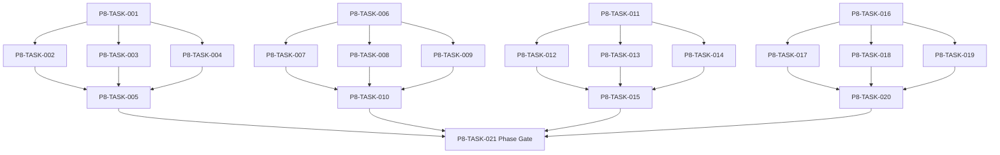

# Phase 8. 던전생성 · 그래프 · 위험예산 상세 설계서

> 버전 v31.0 · 기준원문 v30 · 작성일 2026-09-08  
> 상태: **설계 검토 초안 / 구현 NOT_STARTED / Test NOT_RUN**  
> 마스터: [전체 구현](00_전체_구현_마스터_설계서.md) · 요구추적: [93](93_요구사항_추적표.md) · 결정대장: [94](94_설계보완안_및_결정대장.md)

## 1. 문서 개요
Seed·버전 고정 던전을 그래프와 열쇠/문 상태공간으로 검증한다. 기능 설명에서 불명확했던 구현 책임, 입출력, 정합성, 실패 경계, 검증 방법과 인계 조건을 구체화한다. 본문에는 해당 Phase 에 필요한 공통 계약, 메소드, DDL, Task, Test 를 포함한다. 부록에는 담당 원문 91 개 절을 원문 그대로 수록했다.

구현 범위는 아래 4 개 기능 및 담당 원문의 하위 규칙과 카탈로그이다. 다른 Phase 의 핵심 알고리즘 구현, 서버/멀티플레이, 현실시간 기반 방치 진행, 원문에 없는 게임 규칙의 무단 추가는 제외한다. 원문에서 선택 확장으로 제시한 기능도 요구대장에서 유지하며, 활성화 또는 유예 결정과 별개로 연계 설계를 보존한다.

기존 소스가 제공되지 않아 실제 구조에 대한 영향은 확정하지 않았다. 신규 클래스와 테이블은 구현 제안이며, 기존 코드가 확인되면 공통 Interface, DAO, SQL 재사용을 우선한다.

## 2. Phase 목표
완료 후 상태: **필수목표·퇴로 접근성 및 생성 재시도 상한 보장**. 후속 Phase 에는 검증된 DTO/port, 실제 도메인 결과, 세이브 codec/DDL 변경, fixture 와 기준선을 전달한다. 기능 이름만 등록하거나 Fake 성공 응답만 반환하는 상태는 완료로 보지 않는다.

## 3. 선행 조건
| 선행 Phase | Gate | 전달받는 기능 | 미충족시 차단 Task |
|---|---|---|---|
| [Phase 1](02_Phase1_콘텐츠_자산_빌드파이프라인_상세설계서.md) | P1-TASK-021 | 원문 카탈로그를 손실 없이 형식화하고 로컬 자산을 검증·배포한다. | 미충족이면본 Phase 모든계약 Task 의실제 adapter 통합및제품활성화불가. 검토/Mock UI 는별도표시로가능. |
| [Phase 2](03_Phase2_월드명령_시간_예약_RNG_상세설계서.md) | P2-TASK-026 | 단일 월드 작성자와 현실시간에 독립적인 이벤트 경계 진행을 구현한다. | 미충족이면본 Phase 모든계약 Task 의실제 adapter 통합및제품활성화불가. 검토/Mock UI 는별도표시로가능. |
| [Phase 6](07_Phase6_전투시간축_수치_상태이상_상세설계서.md) | P6-TASK-031 | 순수 Kotlin 자동 전투를 같은 시각 배치·상태·자원 규칙으로 재현한다. | 미충족이면본 Phase 모든계약 Task 의실제 adapter 통합및제품활성화불가. 검토/Mock UI 는별도표시로가능. |
| [Phase 7](08_Phase7_몬스터AI_보스_공략대전투_상세설계서.md) | P7-TASK-021 | 지각 기반 몬스터 행동과 전조·기믹·공동 시간축의 보스전을 구현한다. | 미충족이면본 Phase 모든계약 Task 의실제 adapter 통합및제품활성화불가. 검토/Mock UI 는별도표시로가능. |

설정: versioned content/balance/engine-order/visibility/limits profile. DB: 선행 schema 및해당 Phase 신규 codec 이필요하다. 외부시스템: 필수없음. 실제이미지/미완성콘텐츠는검증 fixture 로임시대체가능하나 Full 출시검수와구분한다. 미승인규칙을임의0 값으로채운성공 Fixture 는허용하지않는다.

| 결정 ID | 검토 주제 | 상태 | 적용/차단 내용 |
|---|---|---|---|

## 4. 기능 범위 및 요구 연결
| 기능 ID | 기능명 | 중요도 | 선행 기능/Phase | 원문요구/공통근거 |
|---|---|---|---|---|
| FUNC-P8-001 | 던전 그래프·열쇠/문 위상 생성 | 필수핵심 또는 원문 선택 확장 명시검토 | P1,P2,P6,P7 | [§5](#src-0005), [§91](#src-0091), [§103](#src-0103), [§552](#src-0552), [§553](#src-0553), [§554](#src-0554), [§555](#src-0555), [§561](#src-0561) 외 23 개 |
| FUNC-P8-002 | 지형·구역·위험/보상 예산 | 필수핵심 또는 원문 선택 확장 명시검토 | P1,P2,P6,P7 | [§73](#src-0073), [§74](#src-0074), [§75](#src-0075), [§76](#src-0076), [§89](#src-0089), [§92](#src-0092), [§93](#src-0093), [§94](#src-0094) 외 34 개 |
| FUNC-P8-003 | 몬스터·상자·함정·정복목표 배치 | 필수핵심 또는 원문 선택 확장 명시검토 | P1,P2,P6,P7 | [§71](#src-0071), [§72](#src-0072), [§105](#src-0105), [§575](#src-0575), [§576](#src-0576), [§581](#src-0581), [§591](#src-0591), [§592](#src-0592) 외 6 개 |
| FUNC-P8-004 | 던전 생명주기·Seed·재방문 | 필수핵심 또는 원문 선택 확장 명시검토 | P1,P2,P6,P7 | [§69](#src-0069), [§70](#src-0070), [§599](#src-0599), [§620](#src-0620) |

## 5. 기능별 상세 설계

### 공통 계약의 적용 범위
모든 새 메소드/클래스명과 물리 DDL 은 **설계 보완안**이다. 제공된 자료에는 실제 저장소·DAO·SQL 이 없으므로 기존 구현에 대한 변경 완료를 뜻하지 않는다. 원문의 객체명/데이터 항목은 최대한 유지하며 기존 코드가 발견되면 adapter 로 연결한다.

`CommandEnvelope(commandId, sessionEpoch, expectedVersion, actorId, payload)`를 사용한다. `GameMinute`, `CombatMillis`, `Money(Long)`, `BasisPoint`, `EntityId`는 혼합 연산을 금지한다. 확률의 기본 표현은 **ppm(0..1,000,000)**이며 세밀한 0.01%도 정수로 표현한다. 표시 반올림과 판정은 분리한다. 정수연산 overflow 는 오류이며 clamp 로 은폐하지 않는다.

`ReadView`는 불변이다. `Delta`는 변경행·RNG 새 상태·도메인 이벤트·명령 receipt 를 포함한다. 콘텐츠 참조/외부 파일 읽기는 transaction 진입 전에 끝낸다. 실패 가능한 대규모 계산은 transaction 밖에서 하고, 성공한 커밋 이후에만 메모리 및 화면 상태를 게시한다. `stateHash`는 canonical 직렬화(키 정렬·정수 표현·버전 포함)에 대한 SHA-256 이며 현실시각·UI 재생위치는 제외한다.

중복 명령은 동일 epoch/commandId 와 payload hash 를 함께 검사한다. 동일 ID/동일 payload 이면 이전 결과를 반환하고, 다른 payload 이면 `IdempotencyKeyReuse`를 반환한다. 인메모리 중복 제거만으로 복구 후 중복을 막았다고 판단하지 않는다.

게임은 한 프로세스·한 활성 WorldSession 을 기준으로 한다. 여러 노드/서버/분산 Lock 은 **해당 없음**이다. 다만 UI 연속 탭·코루틴 완료·예약 이벤트·슬롯 전환·프로세스 재실행 간의 동시성은 실제로 검증한다.

<a id="func-p8-001"></a>
### 5.1. FUNC-P8-001 — 던전 그래프·열쇠/문 위상 생성

| 항목 | 설계 |
|---|---|
| 기능 목적 | 던전 그래프·열쇠/문 위상 생성을 독립된 책임으로 구현한다. 입력, 실패 처리, 저장 경계가 분리되어 있지 않으면 여러 모듈이 동일 상태를 중복 수정할 수 있다. 이를 명시적인 명령/조회 계약으로 통일한다. |
| 관련 요구사항 | [§5](#src-0005), [§91](#src-0091), [§103](#src-0103), [§552](#src-0552), [§553](#src-0553), [§554](#src-0554), [§555](#src-0555), [§561](#src-0561), [§562](#src-0562), [§563](#src-0563), [§565](#src-0565), [§566](#src-0566), [§580](#src-0580), [§585](#src-0585), [§587](#src-0587) 외 16 개 |
| 기능 요구사항 | 1. 핵심경로30~45%·분기·루프·단축로·비밀방을 구조로 생성한다<br>2. 단순 BFS 외에(방,보유열쇠,활성스위치) 상태공간으로 필수목표 접근성을 검증한다<br>3. 생성재시도 최대8 회 후 검증된 같은등급 fallback template 을 쓰는 보완안으로 무한루프를 막는다<br>4. fallback 은 던전등급을 몰래 낮추지 않고 generatorVersion/attempt 를 기록한다 |
| 비기능/운영 | 완전 오프라인, 결정론, 재시도 멱등성, 실패 범위 명시, 원문 정보 공개 정책을 준수한다. 로컬 진단은 기록하되 사용자 메모나 숨은 정보를 일반 로그로 수집하지 않는다. |
| 성능/안정성 | 입력 크기, 큐, 재시도에는 유한한 상한을 둔다. DB/이미지/CPU 작업은 Main 에서 실행하지 않는다. P24 의 성능 예산을 추적하되 현재는 측정 전이다. 핵심 상태 처리에 실패하면 완전한 직전 상태를 보존한다. |
| 주요 메소드 | `DungeonGenerator.generate(spec: DungeonSpec, seed: Long) -> GenerationResult` |
| 입력 필드/값 | grade, size, theme, generatorVersion, worldSeed, dungeonSeed, maxRetries=8; 구체적값: 문 K 뒤에만 열쇠 K 가 있음 |
| 반환값 | graph, validatedObjectivePaths, retriesUsed, fallbackInfo; 정상결과: 토폴로지 실패,검증된 다른 구조로 재생성 |
| 입력 검증 | 보스없는 F 자연동굴 → 목표 room 도달성 검증으로 정상; required ID/enum/범위/상태/version 은변경 전에검사 |
| 예외 계약 | 8 회 연속 위상 실패 → 검증 fallback 또는 생성보류; 끝없는 retry 없음; typed DomainError 로상위호출에전달 |
| Transaction | WorldEngine 의 권위 명령으로 처리한다. 계산은 transaction 밖에서 수행하고, SaveCoordinator 의 단일 write transaction 으로 확정한 뒤 게시한다. 원자적 효과의 중간 성공은 허용하지 않는다. |
| 상태 변화 | SPEC → GRAPH → VALIDATED → FROZEN |
| 소유 모듈 | :core:simulation/dungeon / :feature:dungeon |
| 신규/수정 | 기존 코드 미제공: 신규/adapter 제안이다. 동일 책임의 기존 모듈이 있으면 공개 interface 를 유지하고 내부 추가로 변경을 최소화한다. |
| 관련 Task | [P8-TASK-001](#p8-task-001) · [P8-TASK-002](#p8-task-002) · [P8-TASK-003](#p8-task-003) · [P8-TASK-004](#p8-task-004) · [P8-TASK-005](#p8-task-005) |
| 관련 Test | [P8-UT-001](#p8-ut-001) · [P8-BT-001](#p8-bt-001) · [P8-FT-001](#p8-ft-001) · [P8-CT-001](#p8-ct-001) · [P8-IT-001](#p8-it-001) |

#### 처리 순서 및 데이터 흐름
1. 명령 envelope/현재 epoch/version 과 대상 존재·권한을확인하고 기존 receipt 를 조회한다.
2. 핵심경로30~45%·분기·루프·단축로·비밀방을 구조로 생성한다
3. 단순 BFS 외에(방,보유열쇠,활성스위치) 상태공간으로 필수목표 접근성을 검증한다
4. 생성재시도 최대8 회 후 검증된 같은등급 fallback template 을 쓰는 보완안으로 무한루프를 막는다
5. fallback 은 던전등급을 몰래 낮추지 않고 generatorVersion/attempt 를 기록한다
6. Delta 불변식→해당행/RNG/event/receipt/codec 원자 commit→PublicView/후속 event 발행. 실패 시메모리/DB 게시를하지않는다.

입력 `grade, size, theme, generatorVersion, worldSeed, dungeonSeed, maxRetries=8` → `DungeonGenerator.generate` → 검증된 `graph, validatedObjectivePaths, retriesUsed, fallbackInfo` → SavePort/영속세대 → PublicProjection/후속 handler.

#### Use Case와 실패 범위
| 상황 | 처리 |
|---|---|
| 정상 | 문 K 뒤에만 열쇠 K 가 있음 → 토폴로지 실패,검증된 다른 구조로 재생성 |
| 대상 없음 | 조회는 Empty, 단건 쓰기는 NotFound 를 반환한다. 임의의 대상 생성, 기존 아이템 대체, 금화 차감은 하지 않는다. |
| 일부 성공 | 원자적 단건 처리에는 부분 성공을 허용하지 않는다. 정비 프리셋이나 독립 활동 batch 만 항목별 receipt 와 성공/실패 목록을 제공한다. 하나의 원자적 정산을 분할하지 않는다. |
| 일부 실패 | 검증 fallback 또는 생성보류; 끝없는 retry 없음 |
| 중복 실행 | 동일 명령의 효과는 1 회만 반영하며, 동일 조회의 출력은 동치여야 한다. 다른 payload 에 같은 멱등키를 재사용하면 오류를 반환한다. |
| 재기동 후 | 동일 COMMITTED snapshot/version 을 기준으로 재조회한다. 미완료 시간 진행과 상태는 checkpoint 에서 이어간다. |
| 비정상 데이터 | 목표 room 도달성 검증으로 정상; 잘못된 FK/enum/NaN 은검증 실패로격리/안전정지. |
| 외부 시스템 장애 | 필수 외부 서버는 없다. 로컬 DB/파일/OS/asset 오류는 실패 테스트로 검증하며, 네트워크를 복구의 필수 조건으로 추가하지 않는다. |

#### 객체 및 메소드 책임 분리
| 모듈/객체 | 신규/수정 | 책임 | 메소드 계약 |
|---|---|---|---|
| DungeonGenerator | 신규/기존 adapter | 던전 그래프·열쇠/문 위상 생성 규칙조정자 | DungeonGenerator.generate(spec: DungeonSpec, seed: Long) -> GenerationResult |
| 입력 검증 | UseCase 내부 또는 기존 도메인 정책 재사용 | 필수 ID·범위·권한·원문제약 검증; 별도 Validator 클래스는 둘 이상의 UseCase가 공유할 때만 추가 | use case 입력별 명시적 ValidationResult |
| 저장 경계 | 기존 Aggregate별 typed Port/SavePort 재사용 | 코덱·조회 snapshot·commit 연결; simulation 직접 DAO 금지; 기능 전용 RepositoryPort 신규 생성 금지 | use case별 typed read/commit 계약 |
| 표현 변환 | 기존 feature mapper 또는 순수 함수 재사용 | 공개/허용 결과만 변환; 별도 Projection 클래스는 둘 이상의 소비자가 공유할 때만 추가 | use case별 PublicViewOrReport |

<a id="func-p8-002"></a>
### 5.2. FUNC-P8-002 — 지형·구역·위험/보상 예산

| 항목 | 설계 |
|---|---|
| 기능 목적 | 지형·구역·위험/보상 예산을 독립된 책임으로 구현한다. 입력, 실패 처리, 저장 경계가 분리되어 있지 않으면 여러 모듈이 동일 상태를 중복 수정할 수 있다. 이를 명시적인 명령/조회 계약으로 통일한다. |
| 관련 요구사항 | [§73](#src-0073), [§74](#src-0074), [§75](#src-0075), [§76](#src-0076), [§89](#src-0089), [§92](#src-0092), [§93](#src-0093), [§94](#src-0094), [§95](#src-0095), [§104](#src-0104), [§556](#src-0556), [§557](#src-0557), [§558](#src-0558), [§559](#src-0559), [§560](#src-0560) 외 27 개 |
| 기능 요구사항 | 1. 등급×규모×성장×변이 예산을 사용하고 위험도 UI 전투력과 혼동하지 않는다<br>2. 범위형 비율을 모두 최대치로 더하지 않고 합1 이 되는 선택벡터로 정규화한다<br>3. 지형 전이·방역할 연속제한·위험방 경고를 배치한다<br>4. 정복필수 경로와 선택고위험/보상경로를 구분한다 |
| 비기능/운영 | 완전 오프라인, 결정론, 재시도 멱등성, 실패 범위 명시, 원문 정보 공개 정책을 준수한다. 로컬 진단은 기록하되 사용자 메모나 숨은 정보를 일반 로그로 수집하지 않는다. |
| 성능/안정성 | 입력 크기, 큐, 재시도에는 유한한 상한을 둔다. DB/이미지/CPU 작업은 Main 에서 실행하지 않는다. P24 의 성능 예산을 추적하되 현재는 측정 전이다. 핵심 상태 처리에 실패하면 완전한 직전 상태를 보존한다. |
| 주요 메소드 | `DungeonBudgetAllocator.allocate(graph: DungeonGraph, budget: Budget) -> DungeonPlan` |
| 입력 필드/값 | graph, gradeBudget, sizeMultiplier, riskWeights[], lootBudget; 구체적값: C 중형 예산560,배분280/90/70/90/30 |
| 반환값 | normalizedAllocation, roomBudgets, unusedBudget; 정상결과: 합계560·불일치0 |
| 입력 검증 | 초거대300+ 방 → 상한은 profile 의 explicit maxRooms 로 유한화; required ID/enum/범위/상태/version 은변경 전에검사 |
| 예외 계약 | 예산 음수/NaN → InvalidDungeonBudget·상태저장0; typed DomainError 로상위호출에전달 |
| Transaction | WorldEngine 의 권위 명령으로 처리한다. 계산은 transaction 밖에서 수행하고, SaveCoordinator 의 단일 write transaction 으로 확정한 뒤 게시한다. 원자적 효과의 중간 성공은 허용하지 않는다. |
| 상태 변화 | BUDGETED → ALLOCATED → REBALANCED → ACCEPTED |
| 소유 모듈 | :core:simulation/dungeon / :feature:dungeon |
| 신규/수정 | 기존 코드 미제공: 신규/adapter 제안이다. 동일 책임의 기존 모듈이 있으면 공개 interface 를 유지하고 내부 추가로 변경을 최소화한다. |
| 관련 Task | [P8-TASK-006](#p8-task-006) · [P8-TASK-007](#p8-task-007) · [P8-TASK-008](#p8-task-008) · [P8-TASK-009](#p8-task-009) · [P8-TASK-010](#p8-task-010) |
| 관련 Test | [P8-UT-002](#p8-ut-002) · [P8-BT-002](#p8-bt-002) · [P8-FT-002](#p8-ft-002) · [P8-CT-002](#p8-ct-002) · [P8-IT-002](#p8-it-002) |

#### 처리 순서 및 데이터 흐름
1. 명령 envelope/현재 epoch/version 과 대상 존재·권한을확인하고 기존 receipt 를 조회한다.
2. 등급×규모×성장×변이 예산을 사용하고 위험도 UI 전투력과 혼동하지 않는다
3. 범위형 비율을 모두 최대치로 더하지 않고 합1 이 되는 선택벡터로 정규화한다
4. 지형 전이·방역할 연속제한·위험방 경고를 배치한다
5. 정복필수 경로와 선택고위험/보상경로를 구분한다
6. Delta 불변식→해당행/RNG/event/receipt/codec 원자 commit→PublicView/후속 event 발행. 실패 시메모리/DB 게시를하지않는다.

입력 `graph, gradeBudget, sizeMultiplier, riskWeights[], lootBudget` → `DungeonBudgetAllocator.allocate` → 검증된 `normalizedAllocation, roomBudgets, unusedBudget` → SavePort/영속세대 → PublicProjection/후속 handler.

#### Use Case와 실패 범위
| 상황 | 처리 |
|---|---|
| 정상 | C 중형 예산560,배분280/90/70/90/30 → 합계560·불일치0 |
| 대상 없음 | 조회는 Empty, 단건 쓰기는 NotFound 를 반환한다. 임의의 대상 생성, 기존 아이템 대체, 금화 차감은 하지 않는다. |
| 일부 성공 | 원자적 단건 처리에는 부분 성공을 허용하지 않는다. 정비 프리셋이나 독립 활동 batch 만 항목별 receipt 와 성공/실패 목록을 제공한다. 하나의 원자적 정산을 분할하지 않는다. |
| 일부 실패 | InvalidDungeonBudget·상태저장0 |
| 중복 실행 | 동일 명령의 효과는 1 회만 반영하며, 동일 조회의 출력은 동치여야 한다. 다른 payload 에 같은 멱등키를 재사용하면 오류를 반환한다. |
| 재기동 후 | 동일 COMMITTED snapshot/version 을 기준으로 재조회한다. 미완료 시간 진행과 상태는 checkpoint 에서 이어간다. |
| 비정상 데이터 | 상한은 profile 의 explicit maxRooms 로 유한화; 잘못된 FK/enum/NaN 은검증 실패로격리/안전정지. |
| 외부 시스템 장애 | 필수 외부 서버는 없다. 로컬 DB/파일/OS/asset 오류는 실패 테스트로 검증하며, 네트워크를 복구의 필수 조건으로 추가하지 않는다. |

#### 객체 및 메소드 책임 분리
| 모듈/객체 | 신규/수정 | 책임 | 메소드 계약 |
|---|---|---|---|
| DungeonBudgetAllocator | 신규/기존 adapter | 지형·구역·위험/보상 예산 규칙조정자 | DungeonBudgetAllocator.allocate(graph: DungeonGraph, budget: Budget) -> DungeonPlan |
| 입력 검증 | UseCase 내부 또는 기존 도메인 정책 재사용 | 필수 ID·범위·권한·원문제약 검증; 별도 Validator 클래스는 둘 이상의 UseCase가 공유할 때만 추가 | use case 입력별 명시적 ValidationResult |
| 저장 경계 | 기존 Aggregate별 typed Port/SavePort 재사용 | 코덱·조회 snapshot·commit 연결; simulation 직접 DAO 금지; 기능 전용 RepositoryPort 신규 생성 금지 | use case별 typed read/commit 계약 |
| 표현 변환 | 기존 feature mapper 또는 순수 함수 재사용 | 공개/허용 결과만 변환; 별도 Projection 클래스는 둘 이상의 소비자가 공유할 때만 추가 | use case별 PublicViewOrReport |

<a id="func-p8-003"></a>
### 5.3. FUNC-P8-003 — 몬스터·상자·함정·정복목표 배치

| 항목 | 설계 |
|---|---|
| 기능 목적 | 몬스터·상자·함정·정복목표 배치을 독립된 책임으로 구현한다. 입력, 실패 처리, 저장 경계가 분리되어 있지 않으면 여러 모듈이 동일 상태를 중복 수정할 수 있다. 이를 명시적인 명령/조회 계약으로 통일한다. |
| 관련 요구사항 | [§71](#src-0071), [§72](#src-0072), [§105](#src-0105), [§575](#src-0575), [§576](#src-0576), [§581](#src-0581), [§591](#src-0591), [§592](#src-0592), [§593](#src-0593), [§602](#src-0602), [§606](#src-0606), [§608](#src-0608), [§611](#src-0611), [§612](#src-0612) |
| 기능 요구사항 | 1. 전체 몬스터/보물 budget 부터 만든 뒤 방·고정/순찰/사냥그룹에 배분한다<br>2. 세력/역할/레벨/접사·보스문/봉인/열쇠 관계를 검사한다<br>3. 미믹/함정은 관찰가능 단서를 함께 생성하며 미발견 수량은 UI 에 전송하지 않는다<br>4. 핵 제거/주목표 완료와 탐색100%를 분리한다 |
| 비기능/운영 | 완전 오프라인, 결정론, 재시도 멱등성, 실패 범위 명시, 원문 정보 공개 정책을 준수한다. 로컬 진단은 기록하되 사용자 메모나 숨은 정보를 일반 로그로 수집하지 않는다. |
| 성능/안정성 | 입력 크기, 큐, 재시도에는 유한한 상한을 둔다. DB/이미지/CPU 작업은 Main 에서 실행하지 않는다. P24 의 성능 예산을 추적하되 현재는 측정 전이다. 핵심 상태 처리에 실패하면 완전한 직전 상태를 보존한다. |
| 주요 메소드 | `DungeonPopulationBuilder.place(plan: DungeonPlan) -> PopulationPlan` |
| 입력 필드/값 | dungeonPlan, factionRules, spawnTags, treasureProfile, trapProfile; 구체적값: 전부알려진방 조사완료·보스미처치 |
| 반환값 | groups[], treasures[], traps[], guaranteedClues[]; 정상결과: 탐색100% 가능·정복미완료 |
| 입력 검증 | 상자0 개인 극소형 → empty loot 정상·최소상자 강제생성없음; required ID/enum/범위/상태/version 은변경 전에검사 |
| 예외 계약 | 필수열쇠 드롭그룹 배치불가 → 생성실패·잠긴던전 발행없음; typed DomainError 로상위호출에전달 |
| Transaction | WorldEngine 의 권위 명령으로 처리한다. 계산은 transaction 밖에서 수행하고, SaveCoordinator 의 단일 write transaction 으로 확정한 뒤 게시한다. 원자적 효과의 중간 성공은 허용하지 않는다. |
| 상태 변화 | BUDGET → GROUPS/OBJECTS → CLUES → FROZEN |
| 소유 모듈 | :core:simulation/dungeon / :feature:dungeon |
| 신규/수정 | 기존 코드 미제공: 신규/adapter 제안이다. 동일 책임의 기존 모듈이 있으면 공개 interface 를 유지하고 내부 추가로 변경을 최소화한다. |
| 관련 Task | [P8-TASK-011](#p8-task-011) · [P8-TASK-012](#p8-task-012) · [P8-TASK-013](#p8-task-013) · [P8-TASK-014](#p8-task-014) · [P8-TASK-015](#p8-task-015) |
| 관련 Test | [P8-UT-003](#p8-ut-003) · [P8-BT-003](#p8-bt-003) · [P8-FT-003](#p8-ft-003) · [P8-CT-003](#p8-ct-003) · [P8-IT-003](#p8-it-003) |

#### 처리 순서 및 데이터 흐름
1. 명령 envelope/현재 epoch/version 과 대상 존재·권한을확인하고 기존 receipt 를 조회한다.
2. 전체 몬스터/보물 budget 부터 만든 뒤 방·고정/순찰/사냥그룹에 배분한다
3. 세력/역할/레벨/접사·보스문/봉인/열쇠 관계를 검사한다
4. 미믹/함정은 관찰가능 단서를 함께 생성하며 미발견 수량은 UI 에 전송하지 않는다
5. 핵 제거/주목표 완료와 탐색100%를 분리한다
6. Delta 불변식→해당행/RNG/event/receipt/codec 원자 commit→PublicView/후속 event 발행. 실패 시메모리/DB 게시를하지않는다.

입력 `dungeonPlan, factionRules, spawnTags, treasureProfile, trapProfile` → `DungeonPopulationBuilder.place` → 검증된 `groups[], treasures[], traps[], guaranteedClues[]` → SavePort/영속세대 → PublicProjection/후속 handler.

#### Use Case와 실패 범위
| 상황 | 처리 |
|---|---|
| 정상 | 전부알려진방 조사완료·보스미처치 → 탐색100% 가능·정복미완료 |
| 대상 없음 | 조회는 Empty, 단건 쓰기는 NotFound 를 반환한다. 임의의 대상 생성, 기존 아이템 대체, 금화 차감은 하지 않는다. |
| 일부 성공 | 원자적 단건 처리에는 부분 성공을 허용하지 않는다. 정비 프리셋이나 독립 활동 batch 만 항목별 receipt 와 성공/실패 목록을 제공한다. 하나의 원자적 정산을 분할하지 않는다. |
| 일부 실패 | 생성실패·잠긴던전 발행없음 |
| 중복 실행 | 동일 명령의 효과는 1 회만 반영하며, 동일 조회의 출력은 동치여야 한다. 다른 payload 에 같은 멱등키를 재사용하면 오류를 반환한다. |
| 재기동 후 | 동일 COMMITTED snapshot/version 을 기준으로 재조회한다. 미완료 시간 진행과 상태는 checkpoint 에서 이어간다. |
| 비정상 데이터 | empty loot 정상·최소상자 강제생성없음; 잘못된 FK/enum/NaN 은검증 실패로격리/안전정지. |
| 외부 시스템 장애 | 필수 외부 서버는 없다. 로컬 DB/파일/OS/asset 오류는 실패 테스트로 검증하며, 네트워크를 복구의 필수 조건으로 추가하지 않는다. |

#### 객체 및 메소드 책임 분리
| 모듈/객체 | 신규/수정 | 책임 | 메소드 계약 |
|---|---|---|---|
| DungeonPopulationBuilder | 신규/기존 adapter | 몬스터·상자·함정·정복목표 배치 규칙조정자 | DungeonPopulationBuilder.place(plan: DungeonPlan) -> PopulationPlan |
| 입력 검증 | UseCase 내부 또는 기존 도메인 정책 재사용 | 필수 ID·범위·권한·원문제약 검증; 별도 Validator 클래스는 둘 이상의 UseCase가 공유할 때만 추가 | use case 입력별 명시적 ValidationResult |
| 저장 경계 | 기존 Aggregate별 typed Port/SavePort 재사용 | 코덱·조회 snapshot·commit 연결; simulation 직접 DAO 금지; 기능 전용 RepositoryPort 신규 생성 금지 | use case별 typed read/commit 계약 |
| 표현 변환 | 기존 feature mapper 또는 순수 함수 재사용 | 공개/허용 결과만 변환; 별도 Projection 클래스는 둘 이상의 소비자가 공유할 때만 추가 | use case별 PublicViewOrReport |

<a id="func-p8-004"></a>
### 5.4. FUNC-P8-004 — 던전 생명주기·Seed·재방문

| 항목 | 설계 |
|---|---|
| 기능 목적 | 던전 생명주기·Seed·재방문을 독립된 책임으로 구현한다. 입력, 실패 처리, 저장 경계가 분리되어 있지 않으면 여러 모듈이 동일 상태를 중복 수정할 수 있다. 이를 명시적인 명령/조회 계약으로 통일한다. |
| 관련 요구사항 | [§69](#src-0069), [§70](#src-0070), [§599](#src-0599), [§620](#src-0620) |
| 기능 요구사항 | 1. 발생→안정→성장→불안정→브레이크를 절대게임시각 deadline 으로 처리한다<br>2. worldSeed/dungeonSeed/generatorVersion 을 저장하며 이미 탐색한 구조는 패치시 재추첨하지 않는다<br>3. 재방문시 기존 조사·보상 receipt·몬스터 이동/성장 상태를 불러온다<br>4. 자연발생률 봉인은 P20 port 가 제어하며 초기에는 명시 profile rate 만 사용한다 |
| 비기능/운영 | 완전 오프라인, 결정론, 재시도 멱등성, 실패 범위 명시, 원문 정보 공개 정책을 준수한다. 로컬 진단은 기록하되 사용자 메모나 숨은 정보를 일반 로그로 수집하지 않는다. |
| 성능/안정성 | 입력 크기, 큐, 재시도에는 유한한 상한을 둔다. DB/이미지/CPU 작업은 Main 에서 실행하지 않는다. P24 의 성능 예산을 추적하되 현재는 측정 전이다. 핵심 상태 처리에 실패하면 완전한 직전 상태를 보존한다. |
| 주요 메소드 | `DungeonLifecycle.advance(dungeon: DungeonState, to: GameMinute) -> DungeonDelta` |
| 입력 필드/값 | dungeonId, currentState, targetMinute, lifecycleProfile, campaignSpawnPolicy; 구체적값: 던전 D 저장 후로드 같은버전 |
| 반환값 | stateTransition, spawnEvents, breakEvents, retainedMap; 정상결과: 연결·상자·보스·Seed hash 동일 |
| 입력 검증 | deadline 정확도달 → 브레이크 event1 개; required ID/enum/범위/상태/version 은변경 전에검사 |
| 예외 계약 | 기존 generatorVersion 미지원 → 보존된 map 사용·없으면 compatibility 차단; typed DomainError 로상위호출에전달 |
| Transaction | WorldEngine 의 권위 명령으로 처리한다. 계산은 transaction 밖에서 수행하고, SaveCoordinator 의 단일 write transaction 으로 확정한 뒤 게시한다. 원자적 효과의 중간 성공은 허용하지 않는다. |
| 상태 변화 | SPAWNED → STABLE → GROWING → UNSTABLE → CLEARED/BREAK |
| 소유 모듈 | :core:simulation/dungeon / :feature:dungeon |
| 신규/수정 | 기존 코드 미제공: 신규/adapter 제안이다. 동일 책임의 기존 모듈이 있으면 공개 interface 를 유지하고 내부 추가로 변경을 최소화한다. |
| 관련 Task | [P8-TASK-016](#p8-task-016) · [P8-TASK-017](#p8-task-017) · [P8-TASK-018](#p8-task-018) · [P8-TASK-019](#p8-task-019) · [P8-TASK-020](#p8-task-020) |
| 관련 Test | [P8-UT-004](#p8-ut-004) · [P8-BT-004](#p8-bt-004) · [P8-FT-004](#p8-ft-004) · [P8-CT-004](#p8-ct-004) · [P8-IT-004](#p8-it-004) |

#### 처리 순서 및 데이터 흐름
1. 명령 envelope/현재 epoch/version 과 대상 존재·권한을확인하고 기존 receipt 를 조회한다.
2. 발생→안정→성장→불안정→브레이크를 절대게임시각 deadline 으로 처리한다
3. worldSeed/dungeonSeed/generatorVersion 을 저장하며 이미 탐색한 구조는 패치시 재추첨하지 않는다
4. 재방문시 기존 조사·보상 receipt·몬스터 이동/성장 상태를 불러온다
5. 자연발생률 봉인은 P20 port 가 제어하며 초기에는 명시 profile rate 만 사용한다
6. Delta 불변식→해당행/RNG/event/receipt/codec 원자 commit→PublicView/후속 event 발행. 실패 시메모리/DB 게시를하지않는다.

입력 `dungeonId, currentState, targetMinute, lifecycleProfile, campaignSpawnPolicy` → `DungeonLifecycle.advance` → 검증된 `stateTransition, spawnEvents, breakEvents, retainedMap` → SavePort/영속세대 → PublicProjection/후속 handler.

#### Use Case와 실패 범위
| 상황 | 처리 |
|---|---|
| 정상 | 던전 D 저장 후로드 같은버전 → 연결·상자·보스·Seed hash 동일 |
| 대상 없음 | 조회는 Empty, 단건 쓰기는 NotFound 를 반환한다. 임의의 대상 생성, 기존 아이템 대체, 금화 차감은 하지 않는다. |
| 일부 성공 | 원자적 단건 처리에는 부분 성공을 허용하지 않는다. 정비 프리셋이나 독립 활동 batch 만 항목별 receipt 와 성공/실패 목록을 제공한다. 하나의 원자적 정산을 분할하지 않는다. |
| 일부 실패 | 보존된 map 사용·없으면 compatibility 차단 |
| 중복 실행 | 동일 명령의 효과는 1 회만 반영하며, 동일 조회의 출력은 동치여야 한다. 다른 payload 에 같은 멱등키를 재사용하면 오류를 반환한다. |
| 재기동 후 | 동일 COMMITTED snapshot/version 을 기준으로 재조회한다. 미완료 시간 진행과 상태는 checkpoint 에서 이어간다. |
| 비정상 데이터 | 브레이크 event1 개; 잘못된 FK/enum/NaN 은검증 실패로격리/안전정지. |
| 외부 시스템 장애 | 필수 외부 서버는 없다. 로컬 DB/파일/OS/asset 오류는 실패 테스트로 검증하며, 네트워크를 복구의 필수 조건으로 추가하지 않는다. |

#### 객체 및 메소드 책임 분리
| 모듈/객체 | 신규/수정 | 책임 | 메소드 계약 |
|---|---|---|---|
| DungeonLifecycle | 신규/기존 adapter | 던전 생명주기·Seed·재방문 규칙조정자 | DungeonLifecycle.advance(dungeon: DungeonState, to: GameMinute) -> DungeonDelta |
| 입력 검증 | UseCase 내부 또는 기존 도메인 정책 재사용 | 필수 ID·범위·권한·원문제약 검증; 별도 Validator 클래스는 둘 이상의 UseCase가 공유할 때만 추가 | use case 입력별 명시적 ValidationResult |
| 저장 경계 | 기존 Aggregate별 typed Port/SavePort 재사용 | 코덱·조회 snapshot·commit 연결; simulation 직접 DAO 금지; 기능 전용 RepositoryPort 신규 생성 금지 | use case별 typed read/commit 계약 |
| 표현 변환 | 기존 feature mapper 또는 순수 함수 재사용 | 공개/허용 결과만 변환; 별도 Projection 클래스는 둘 이상의 소비자가 공유할 때만 추가 | use case별 PublicViewOrReport |


### Phase 특화 알고리즘·수치·판단

### 생성과 검증을 분리
핵심경로→분기/루프→비밀/단축로→지형/문/열쇠→몬스터예산→상자/함정→단서→검증 순서이다. 방수 범위의 최신 상세값과 초반 대략값은 부록에서 구별한다. 보스가 없는 던전은 주목표를 검증하며 보스를 강제로 추가하지 않는다.

필수도달성은 BFS `(roomId, keyMask, switchMask)`로 검사한다. 상태공간이 큰 경우 지배상태 pruning 을 사용하고 그래도 상한초과이면 생성실패로 돌린다. 열쇠는 자기 잠금문 뒤에만 존재할 수 없고, 필수열쇠를 파괴 가능한상자에 넣으면 대체경로를 정의한다. 통로붕괴 가능 이벤트는 되돌아오는 경로 검증을 포함한다.

기본등급예산 F100/E180/D320/C560/B950/A1550/S2500/SS4200/EX 별도, 규모계수는 원문 profile. C 중형560 을 일반280/정예90/중간70/보스90/환경30 으로 배분한 예의합은560 이다. 단위는 내부위험예산이며 UI 추정전투력과 동일숫자로 취급하지 않는다.

생성재시도8 회·maxRooms/maxStates/maxSpawnActors 는 **보완 한도**다. 실패 fallback 은 같은등급/목표를 유지하는 사전검증 template 만 허용한다. 적절한 fallback 이 없으면 생성보류를 기록하고 플레이어에게깨진던전을내보내지않는다.


## 6. DB 상세 설계

다음은 **신규 제안 스키마**다. 실제 기존 DB 가 제공되지 않아 기존 컬럼 변경 사실을 가정하지 않는다. 실제 구현에서는 Room Entity/DAO 와 export 된 schema 를 기준으로 N→N+1 migration 을 작성한다. 아래 CREATE 예시는 **완성 스키마 계약**이며 기존 DB migration 을 IF NOT EXISTS 로 대체하지 않는다.

| 논리/물리 객체 | 저장영역 | 최초 계약 Phase | 접근 | PK/유일조건 | 조회 Index |
|---|---|---|---|---|---|
| dungeon_connection | save.db | P8 | R/I/U(도메인명령에따름); tombstone/GC 만 D | dungeon_id,from_room_id,to_room_id | from_room_id, to_room_id |
| dungeon_instance | save.db | P8 | R/I/U(도메인명령에따름); tombstone/GC 만 D | id PK | lifecycle_status,deadline_minute, grade,spawn_minute |
| dungeon_population | save.db | P8 | R/I/U(도메인명령에따름); tombstone/GC 만 D | dungeon_id,group_key,template_id | PK/UNIQUE |
| dungeon_room | save.db | P8 | R/I/U(도메인명령에따름); tombstone/GC 만 D | id PK | dungeon_id,zone_key |
| dungeon_trap | save.db | P8 | R/I/U(도메인명령에따름); tombstone/GC 만 D | trigger_event_id | room_id |
| dungeon_treasure | save.db | P8 | R/I/U(도메인명령에따름); tombstone/GC 만 D | claim_event_id | room_id |
| monster_state | save.db | P7 | R/I/U(도메인명령에따름); tombstone/GC 만 D | id PK | dungeon_id,room_id, group_id |
| world_event | save.db | P2 | R/I/U(도메인명령에따름); tombstone/GC 만 D | source_epoch,source_command_id,event_sequence | game_minute,id, event_type,game_minute, source_epoch,source_command_id,event_sequence |

모든일반 SQL 테이블은 `id TEXT NOT NULL PRIMARY KEY`, `row_version INTEGER NOT NULL DEFAULT 0`을공통필드로갖는다. nullable 는 DDL 에 NOT NULL 없는필드만이다. 단위는 `_minute`게임분/`_ms`밀리초/`_bp`0.01%p/`_ppm`0.0001%p,금액/수량 Long 정수. ID 는재사용하지않는다.

#### `dungeon_connection` 필드 및 관계

| 필드/제약 | 용도 |
|---|---|
| dungeon_id TEXT NOT NULL REFERENCES dungeon_instance(id) ON DELETE RESTRICT | 선언된 타입·NULL/참조조건을 준수. 값의 의미는 이름과 해당기능 계약을 기준으로 함 |
| from_room_id TEXT NOT NULL REFERENCES dungeon_room(id) ON DELETE RESTRICT | 선언된 타입·NULL/참조조건을 준수. 값의 의미는 이름과 해당기능 계약을 기준으로 함 |
| to_room_id TEXT NOT NULL REFERENCES dungeon_room(id) ON DELETE RESTRICT | 선언된 타입·NULL/참조조건을 준수. 값의 의미는 이름과 해당기능 계약을 기준으로 함 |
| travel_minutes INTEGER NOT NULL CHECK(travel_minutes>=0) | 선언된 타입·NULL/참조조건을 준수. 값의 의미는 이름과 해당기능 계약을 기준으로 함 |
| requirement_ast_json TEXT NOT NULL | 선언된 타입·NULL/참조조건을 준수. 값의 의미는 이름과 해당기능 계약을 기준으로 함 |
| status TEXT NOT NULL | 선언된 타입·NULL/참조조건을 준수. 값의 의미는 이름과 해당기능 계약을 기준으로 함 |
#### `dungeon_instance` 필드 및 관계

| 필드/제약 | 용도 |
|---|---|
| seed_hex TEXT NOT NULL | 선언된 타입·NULL/참조조건을 준수. 값의 의미는 이름과 해당기능 계약을 기준으로 함 |
| generator_version TEXT NOT NULL | 선언된 타입·NULL/참조조건을 준수. 값의 의미는 이름과 해당기능 계약을 기준으로 함 |
| grade TEXT NOT NULL | 선언된 타입·NULL/참조조건을 준수. 값의 의미는 이름과 해당기능 계약을 기준으로 함 |
| size_key TEXT NOT NULL | 선언된 타입·NULL/참조조건을 준수. 값의 의미는 이름과 해당기능 계약을 기준으로 함 |
| theme_id TEXT NOT NULL | 선언된 타입·NULL/참조조건을 준수. 값의 의미는 이름과 해당기능 계약을 기준으로 함 |
| lifecycle_status TEXT NOT NULL | 선언된 타입·NULL/참조조건을 준수. 값의 의미는 이름과 해당기능 계약을 기준으로 함 |
| spawn_minute INTEGER NOT NULL | 선언된 타입·NULL/참조조건을 준수. 값의 의미는 이름과 해당기능 계약을 기준으로 함 |
| deadline_minute INTEGER | 선언된 타입·NULL/참조조건을 준수. 값의 의미는 이름과 해당기능 계약을 기준으로 함 |
| conquest_status TEXT NOT NULL | 선언된 타입·NULL/참조조건을 준수. 값의 의미는 이름과 해당기능 계약을 기준으로 함 |
| graph_hash TEXT NOT NULL | 선언된 타입·NULL/참조조건을 준수. 값의 의미는 이름과 해당기능 계약을 기준으로 함 |
#### `dungeon_population` 필드 및 관계

| 필드/제약 | 용도 |
|---|---|
| dungeon_id TEXT NOT NULL REFERENCES dungeon_instance(id) ON DELETE RESTRICT | 선언된 타입·NULL/참조조건을 준수. 값의 의미는 이름과 해당기능 계약을 기준으로 함 |
| group_key TEXT NOT NULL | 선언된 타입·NULL/참조조건을 준수. 값의 의미는 이름과 해당기능 계약을 기준으로 함 |
| template_id TEXT NOT NULL | 선언된 타입·NULL/참조조건을 준수. 값의 의미는 이름과 해당기능 계약을 기준으로 함 |
| initial_count INTEGER NOT NULL | 선언된 타입·NULL/참조조건을 준수. 값의 의미는 이름과 해당기능 계약을 기준으로 함 |
| remaining_count INTEGER NOT NULL CHECK(remaining_count>=0) | 선언된 타입·NULL/참조조건을 준수. 값의 의미는 이름과 해당기능 계약을 기준으로 함 |
| reserved_budget INTEGER NOT NULL | 선언된 타입·NULL/참조조건을 준수. 값의 의미는 이름과 해당기능 계약을 기준으로 함 |
#### `dungeon_room` 필드 및 관계

| 필드/제약 | 용도 |
|---|---|
| dungeon_id TEXT NOT NULL REFERENCES dungeon_instance(id) ON DELETE RESTRICT | 선언된 타입·NULL/참조조건을 준수. 값의 의미는 이름과 해당기능 계약을 기준으로 함 |
| zone_key TEXT NOT NULL | 선언된 타입·NULL/참조조건을 준수. 값의 의미는 이름과 해당기능 계약을 기준으로 함 |
| room_type TEXT NOT NULL | 선언된 타입·NULL/참조조건을 준수. 값의 의미는 이름과 해당기능 계약을 기준으로 함 |
| terrain_json TEXT NOT NULL | 선언된 타입·NULL/참조조건을 준수. 값의 의미는 이름과 해당기능 계약을 기준으로 함 |
| weight INTEGER NOT NULL | 선언된 타입·NULL/참조조건을 준수. 값의 의미는 이름과 해당기능 계약을 기준으로 함 |
| hidden INTEGER NOT NULL CHECK(hidden IN(0,1)) | 선언된 타입·NULL/참조조건을 준수. 값의 의미는 이름과 해당기능 계약을 기준으로 함 |
| room_payload_json TEXT NOT NULL | 선언된 타입·NULL/참조조건을 준수. 값의 의미는 이름과 해당기능 계약을 기준으로 함 |
#### `dungeon_trap` 필드 및 관계

| 필드/제약 | 용도 |
|---|---|
| room_id TEXT NOT NULL REFERENCES dungeon_room(id) ON DELETE RESTRICT | 선언된 타입·NULL/참조조건을 준수. 값의 의미는 이름과 해당기능 계약을 기준으로 함 |
| definition_id TEXT NOT NULL | 선언된 타입·NULL/참조조건을 준수. 값의 의미는 이름과 해당기능 계약을 기준으로 함 |
| hidden INTEGER NOT NULL | 선언된 타입·NULL/참조조건을 준수. 값의 의미는 이름과 해당기능 계약을 기준으로 함 |
| status TEXT NOT NULL | 선언된 타입·NULL/참조조건을 준수. 값의 의미는 이름과 해당기능 계약을 기준으로 함 |
| trigger_event_id TEXT | 선언된 타입·NULL/참조조건을 준수. 값의 의미는 이름과 해당기능 계약을 기준으로 함 |
#### `dungeon_treasure` 필드 및 관계

| 필드/제약 | 용도 |
|---|---|
| dungeon_id TEXT NOT NULL REFERENCES dungeon_instance(id) ON DELETE RESTRICT | 선언된 타입·NULL/참조조건을 준수. 값의 의미는 이름과 해당기능 계약을 기준으로 함 |
| room_id TEXT NOT NULL REFERENCES dungeon_room(id) ON DELETE RESTRICT | 선언된 타입·NULL/참조조건을 준수. 값의 의미는 이름과 해당기능 계약을 기준으로 함 |
| loot_profile_id TEXT NOT NULL | 선언된 타입·NULL/참조조건을 준수. 값의 의미는 이름과 해당기능 계약을 기준으로 함 |
| lock_difficulty INTEGER NOT NULL | 선언된 타입·NULL/참조조건을 준수. 값의 의미는 이름과 해당기능 계약을 기준으로 함 |
| mimic_flag INTEGER NOT NULL | 선언된 타입·NULL/참조조건을 준수. 값의 의미는 이름과 해당기능 계약을 기준으로 함 |
| status TEXT NOT NULL | 선언된 타입·NULL/참조조건을 준수. 값의 의미는 이름과 해당기능 계약을 기준으로 함 |
| claim_event_id TEXT | 선언된 타입·NULL/참조조건을 준수. 값의 의미는 이름과 해당기능 계약을 기준으로 함 |
#### `monster_state` 필드 및 관계

| 필드/제약 | 용도 |
|---|---|
| dungeon_id TEXT NOT NULL | 선언된 타입·NULL/참조조건을 준수. 값의 의미는 이름과 해당기능 계약을 기준으로 함 |
| template_id TEXT NOT NULL | 선언된 타입·NULL/참조조건을 준수. 값의 의미는 이름과 해당기능 계약을 기준으로 함 |
| level INTEGER NOT NULL | 선언된 타입·NULL/참조조건을 준수. 값의 의미는 이름과 해당기능 계약을 기준으로 함 |
| grade TEXT NOT NULL | 선언된 타입·NULL/참조조건을 준수. 값의 의미는 이름과 해당기능 계약을 기준으로 함 |
| room_id TEXT | 선언된 타입·NULL/참조조건을 준수. 값의 의미는 이름과 해당기능 계약을 기준으로 함 |
| group_id TEXT | 선언된 타입·NULL/참조조건을 준수. 값의 의미는 이름과 해당기능 계약을 기준으로 함 |
| state_payload BLOB NOT NULL | 선언된 타입·NULL/참조조건을 준수. 값의 의미는 이름과 해당기능 계약을 기준으로 함 |
| status TEXT NOT NULL | 선언된 타입·NULL/참조조건을 준수. 값의 의미는 이름과 해당기능 계약을 기준으로 함 |
#### `world_event` 필드 및 관계

| 필드/제약 | 용도 |
|---|---|
| source_id TEXT | 사건을 발생시킨 도메인 Entity ID. 원인이 Entity가 아니면 NULL |
| source_event_id TEXT | 다른 사건에서 파생됐을 때의 원본 Event ID |
| source_epoch TEXT NOT NULL CHECK(length(source_epoch)>0) | 원인 command receipt의 epoch. source_command_id와 복합 FK |
| source_command_id TEXT NOT NULL CHECK(length(source_command_id)>0) | 원인 command receipt의 command_id. source_epoch와 복합 FK |
| source_version INTEGER NOT NULL CHECK(source_version>=0) | 원인 command receipt와 동일한 state_version |
| event_type TEXT NOT NULL | 선언된 타입·NULL/참조조건을 준수. 값의 의미는 이름과 해당기능 계약을 기준으로 함 |
| event_sequence INTEGER NOT NULL CHECK(event_sequence>=0) | 같은 (source_epoch,source_command_id) 안에서 0부터 단조 증가하는 발행 순서 |
| game_minute INTEGER NOT NULL CHECK(game_minute>=0) | 월드 시작 후 누적 게임 분 |
| sub_ms INTEGER NOT NULL CHECK(sub_ms BETWEEN 0 AND 59999) | 같은 game_minute 안의 0..59,999 밀리초 |
| visibility TEXT NOT NULL | 선언된 타입·NULL/참조조건을 준수. 값의 의미는 이름과 해당기능 계약을 기준으로 함 |
| importance INTEGER NOT NULL | 선언된 타입·NULL/참조조건을 준수. 값의 의미는 이름과 해당기능 계약을 기준으로 함 |
| payload_json TEXT NOT NULL | 선언된 타입·NULL/참조조건을 준수. 값의 의미는 이름과 해당기능 계약을 기준으로 함 |
| consumed_mask INTEGER NOT NULL DEFAULT 0 | 선언된 타입·NULL/참조조건을 준수. 값의 의미는 이름과 해당기능 계약을 기준으로 함 |

권위 사건 원본/outbox. `event_sequence`는 `(source_epoch,source_command_id)` 안에서 단조 증가하며 같은 두 열은 command_receipt 복합 FK다. 소비 플래그만 믿지 않고 consumer 별 receipt가 필요하다.

### FK·대량처리·Lock·Isolation
권위관계는선언된 FK/UNIQUE 와명령불변식을함께사용한다. polymorphic owner/subject/contentId 는 cross-DB FK 를만들지않고 ReferenceValidator 로검사한다. 가족/역사/증표/유일물품은 ON DELETE RESTRICT/보존요약으로보호한다. FK 다형성검사를 DB 가자동보장한다고가정하지않는다.

읽기는 WAL snapshot,쓰기는단일 writer 짧은 transaction 이다. SQLite 에 SELECT FOR UPDATE 를사용하지않는다. stale version 의 affectedRows=0 은 Conflict,SQLITE_BUSY 는제한재시도,손상/공간부족은안전정지다. 외부파일/콘텐츠다른 DB 접근은 transaction 전에끝낸다. 대량입출력은1batch 최대500 행/1 청크최대1MiB(보완설정)로시작하되 **한 의미적 작업을 원자적이지 않게 쪼개지 않는다**. 큰작업은 staging→검증→짧은 pointer 승격으로원자성을유지한다.

Index 는조회조건/정렬을기준으로추가하고 EXPLAIN QUERY PLAN 과쓰기공수/파일크기를측정한다. 삭제는이 Phase 에서소유한종료/취소/GC 대상만가능하며전체테이블 DELETE 를일상정리로사용하지않는다.

### 예상 SQL / DAO 처리
```sql
SELECT c.id,c.from_room_id,c.to_room_id,c.requirement_ast_json
FROM dungeon_connection c WHERE c.dungeon_id=:dungeonId;
-- 그래프/열쇠 검증은 로드한 메모리에서 수행; BFS 매 방문 SQL 금지.
UPDATE dungeon_instance SET lifecycle_status=:nextStatus,row_version=row_version+1
WHERE id=:dungeonId AND lifecycle_status=:expectedStatus AND row_version=:expected;
```

### 관련 DDL 계약
content.db 와 save.db 는**별도로**생성하며 cross-DB JOIN/transaction 을하지않는다. 아래구문은각각해당 DB 에서실행한다. 부모 FK 테이블은선행 Phase 의완료스키마가제공해야한다. 전체초기 schema 는공통부록 SQL 에있다.

**save.db**
```sql
-- 제안 DDL; 실제 Room 생성 schema와 검토 후 동기화.
PRAGMA foreign_keys=ON;

CREATE TABLE IF NOT EXISTS dungeon_connection (
  id TEXT PRIMARY KEY NOT NULL,
  row_version INTEGER NOT NULL DEFAULT 0 CHECK(row_version>=0),
  dungeon_id TEXT NOT NULL REFERENCES dungeon_instance(id) ON DELETE RESTRICT,
  from_room_id TEXT NOT NULL REFERENCES dungeon_room(id) ON DELETE RESTRICT,
  to_room_id TEXT NOT NULL REFERENCES dungeon_room(id) ON DELETE RESTRICT,
  travel_minutes INTEGER NOT NULL CHECK(travel_minutes>=0),
  requirement_ast_json TEXT NOT NULL,
  status TEXT NOT NULL,
  UNIQUE(dungeon_id,from_room_id,to_room_id)
);
CREATE INDEX IF NOT EXISTS ix_dungeon_connection_1 ON dungeon_connection(from_room_id);
CREATE INDEX IF NOT EXISTS ix_dungeon_connection_2 ON dungeon_connection(to_room_id);

CREATE TABLE IF NOT EXISTS dungeon_instance (
  id TEXT PRIMARY KEY NOT NULL,
  row_version INTEGER NOT NULL DEFAULT 0 CHECK(row_version>=0),
  seed_hex TEXT NOT NULL,
  generator_version TEXT NOT NULL,
  grade TEXT NOT NULL,
  size_key TEXT NOT NULL,
  theme_id TEXT NOT NULL,
  lifecycle_status TEXT NOT NULL,
  spawn_minute INTEGER NOT NULL,
  deadline_minute INTEGER,
  conquest_status TEXT NOT NULL,
  graph_hash TEXT NOT NULL
);
CREATE INDEX IF NOT EXISTS ix_dungeon_instance_1 ON dungeon_instance(lifecycle_status,deadline_minute);
CREATE INDEX IF NOT EXISTS ix_dungeon_instance_2 ON dungeon_instance(grade,spawn_minute);

CREATE TABLE IF NOT EXISTS dungeon_population (
  id TEXT PRIMARY KEY NOT NULL,
  row_version INTEGER NOT NULL DEFAULT 0 CHECK(row_version>=0),
  dungeon_id TEXT NOT NULL REFERENCES dungeon_instance(id) ON DELETE RESTRICT,
  group_key TEXT NOT NULL,
  template_id TEXT NOT NULL,
  initial_count INTEGER NOT NULL,
  remaining_count INTEGER NOT NULL CHECK(remaining_count>=0),
  reserved_budget INTEGER NOT NULL,
  UNIQUE(dungeon_id,group_key,template_id)
);

CREATE TABLE IF NOT EXISTS dungeon_room (
  id TEXT PRIMARY KEY NOT NULL,
  row_version INTEGER NOT NULL DEFAULT 0 CHECK(row_version>=0),
  dungeon_id TEXT NOT NULL REFERENCES dungeon_instance(id) ON DELETE RESTRICT,
  zone_key TEXT NOT NULL,
  room_type TEXT NOT NULL,
  terrain_json TEXT NOT NULL,
  weight INTEGER NOT NULL,
  hidden INTEGER NOT NULL CHECK(hidden IN(0,1)),
  room_payload_json TEXT NOT NULL
);
CREATE INDEX IF NOT EXISTS ix_dungeon_room_1 ON dungeon_room(dungeon_id,zone_key);

CREATE TABLE IF NOT EXISTS dungeon_trap (
  id TEXT PRIMARY KEY NOT NULL,
  row_version INTEGER NOT NULL DEFAULT 0 CHECK(row_version>=0),
  room_id TEXT NOT NULL REFERENCES dungeon_room(id) ON DELETE RESTRICT,
  definition_id TEXT NOT NULL,
  hidden INTEGER NOT NULL,
  status TEXT NOT NULL,
  trigger_event_id TEXT,
  UNIQUE(trigger_event_id)
);
CREATE INDEX IF NOT EXISTS ix_dungeon_trap_1 ON dungeon_trap(room_id);

CREATE TABLE IF NOT EXISTS dungeon_treasure (
  id TEXT PRIMARY KEY NOT NULL,
  row_version INTEGER NOT NULL DEFAULT 0 CHECK(row_version>=0),
  dungeon_id TEXT NOT NULL REFERENCES dungeon_instance(id) ON DELETE RESTRICT,
  room_id TEXT NOT NULL REFERENCES dungeon_room(id) ON DELETE RESTRICT,
  loot_profile_id TEXT NOT NULL,
  lock_difficulty INTEGER NOT NULL,
  mimic_flag INTEGER NOT NULL,
  status TEXT NOT NULL,
  claim_event_id TEXT,
  UNIQUE(claim_event_id)
);
CREATE INDEX IF NOT EXISTS ix_dungeon_treasure_1 ON dungeon_treasure(room_id);

CREATE TABLE IF NOT EXISTS monster_state (
  id TEXT PRIMARY KEY NOT NULL,
  row_version INTEGER NOT NULL DEFAULT 0 CHECK(row_version>=0),
  dungeon_id TEXT NOT NULL,
  template_id TEXT NOT NULL,
  level INTEGER NOT NULL,
  grade TEXT NOT NULL,
  room_id TEXT,
  group_id TEXT,
  state_payload BLOB NOT NULL,
  status TEXT NOT NULL
);
CREATE INDEX IF NOT EXISTS ix_monster_state_1 ON monster_state(dungeon_id,room_id);
CREATE INDEX IF NOT EXISTS ix_monster_state_2 ON monster_state(group_id);

CREATE TABLE IF NOT EXISTS world_event (
  id TEXT PRIMARY KEY NOT NULL,
  row_version INTEGER NOT NULL DEFAULT 0 CHECK(row_version>=0),
  source_id TEXT,
  source_event_id TEXT,
  source_epoch TEXT NOT NULL CHECK(length(source_epoch)>0),
  source_command_id TEXT NOT NULL CHECK(length(source_command_id)>0),
  source_version INTEGER NOT NULL CHECK(source_version>=0),
  event_type TEXT NOT NULL,
  event_sequence INTEGER NOT NULL CHECK(event_sequence>=0),
  game_minute INTEGER NOT NULL CHECK(game_minute>=0),
  sub_ms INTEGER NOT NULL CHECK(sub_ms BETWEEN 0 AND 59999),
  visibility TEXT NOT NULL,
  importance INTEGER NOT NULL,
  payload_json TEXT NOT NULL,
  consumed_mask INTEGER NOT NULL DEFAULT 0,
  UNIQUE(source_epoch,source_command_id,event_sequence),
  FOREIGN KEY(source_epoch,source_command_id) REFERENCES command_receipt(epoch,command_id) ON DELETE RESTRICT
);
CREATE INDEX IF NOT EXISTS ix_world_event_1 ON world_event(game_minute,id);
CREATE INDEX IF NOT EXISTS ix_world_event_2 ON world_event(event_type,game_minute);
CREATE INDEX IF NOT EXISTS ix_world_event_3 ON world_event(source_epoch,source_command_id,event_sequence);
```

## 7. Transaction / 동시성 / Thread 설계

| 관점 | 이 Phase 의 구현 기준 |
|---|---|
| Transaction 시작/종료 | WorldEngine/UseCase 가불변 Delta 계산완료 후 SaveCoordinator 진입. 실제 Roomwrite 시작→변경행/receipt/RNG/event/manifest→검증→commit. compute/read/tool 은 live transaction 해당없음. |
| Rollback | 필수입력/FK/버전/금액/소유권/일정/메소드예외,affectedRows 예상불일치면해당 semantic 작업전부 rollback.이미게시된 UI 값으로 DB 복구하지않음. |
| 부분 실패 | 하나의거래/강화/승계/보상은부분성공없음. 서로독립정비항목/검증 case/선택 background 활동만항목 receipt 로부분결과를허용. |
| 동시 처리/중복 | UI 연속탭·시간경계·NPC 명령이같은 data 를건드려도단일 writer 로직렬화. epoch/version/unique receipt 로재기동중복차단. |
| 여러 노드 | 오프라인싱글:해당없음. 분산 lock/서버 leader election/remoteDB 를신설하지않음. |
| Thread 생성 주체 | Application 이인프라 scope, WorldSessionFactory 가세션 scope/전용직렬 dispatcher 를소유. CPU 계산 Default/전용 dispatcher, DB/파일 IO 는 IO/context 를사용. Main 은 UI 만. |
| Daemon/Pool | 직접 Java daemon Thread 를게임수명보장으로사용하지않음. 고정·제한 dispatcher/pool 만허용. NPC/이벤트마다 Thread 생성금지. daemon 여부에무관하게구조화 scope 종료를검증. |
| 생명주기/종료 | OPEN→PAUSING→PAUSED→CLOSING→CLOSED.새명령차단→안전경계→commit drain→child job 취소/join→connection/handle 닫기. 프로세스 kill 은콜백없음을가정. |
| Exception 처리 | CancellationException 전파. 예상 DomainError 는 typed 결과,Invariant 오류는안전정지,장식/파생 consumer 오류는격리. 일반 catch 에서실패를성공으로변환하지않음. |
| 메모리/누수 | Domain 에 Context/Bitmap/ViewModel 참조금지.세션폐기후 observer/job/callback/파일 FD 잔존0.캐시최대 size 와 in-flight 작업한도 profile 필수. |

## 8. 예외 처리·장애 격리

| 예외 상황 | 시스템 동작 | 로그 | 재시도 | 기존 기능 영향 |
|---|---|---|---|---|
| DB 조회/쓰기실패 | 권위명령 commit 중단·최신정상세대보존 | ERROR code/epoch/version/command | busy 만제한;IO/손상은복구 | 이미완료한진행보존·새권위변경정지 |
| 대상없음/NULL | Empty/NotFound/InvalidInput;임의타깃대체없음 | INFO 또는 WARN·targetId | 사용자재선택 | 다른대상무변경 |
| 잘못된 상태/version | Conflict/StateNotAllowed | WARN before/expected | 새 snapshot 으로재확인 | 중복소모0 |
| Timeout/작업취소 | 미 commitdelta 폐기·불명확 commit 은 receipt 조회 | WARN timeout/cancel | 동일 ID 로결과확인 | 기존세대유지 |
| dispatcher/pool 초기화실패 | 세션시작실패화면;새명령접수안함 | ERROR lifecycle | 환경복구후명시재시작 | 기존파일/세이브무손상 |
| Runtime/불변식오류 | 핵심 상태안전정지·재현 snapshot | ERROR first failure seed/버전 | 자동무한재시도금지 | 손상확대방지 |
| 중복명령 | 기존 receipt 반환/키재사용오류 | INFO duplicate key | 추가실행없음 | 정상결과보존 |
| 부분 batch 실패 | 성공항목 receipt 유지·실패항목만재검토 | WARN item status 목록 | 정책상명시재시도 | 핵심원자작업분할금지 |
| 프로세스종료 | 마지막 COMMITTED 전체 snapshot 복구 | 재실행 RECOVERY 이력 | 로드시 checksum 검증 | 시간/RNG 섞지않음 |
| 이미지/뉴스/검색파생실패 | fallback/재구축/집계중표시 | WARN component 범위 | 제한재로딩 | 핵심전투/금화/저장흐름계속 |

## 9. 세부 구현 Task

각 Task 는작은 PR 를의도하지만코드확인 후3 집중인일을넘을것으로예상되면하위 Task 로분해한다.별도후속작업을숨겨완료로표시하지않는다.현재전 Task 는 NOT_STARTED 이며실제대상파일/PR/담당자는착수시입력한다.

<a id="p8-task-001"></a>
### P8-TASK-001 — 던전 그래프·열쇠/문 위상 생성 — 계약·Fixture

| 항목 | 설계 |
|---|---|
| Task ID | P8-TASK-001 |
| 목적 | 계약 책임을 하나의 리뷰 가능한 PR 로 완성한다. |
| 상세 구현 내용 | DungeonGenerator.generate(spec: DungeonSpec, seed: Long) -> GenerationResult 의 DTO/오류/불변식 정의. 입력 grade, size, theme, generatorVersion, worldSeed, dungeonSeed, maxRetries=8. 원문 소유절의 고정/권장/예시를 분리해 각 규칙을 assertion manifest 에 옮기고 정상/경계/실패 fixture 작성. |
| 대상 모듈 | :core:simulation/dungeon / :feature:dungeon |
| 신규/수정 | 신규/adapter 제안. 기존 저장소 확인 후 file/line 과 기존 interface 에 대한 영향을 PR 에 첨부한다. |
| DB 변경 | dungeon_instance, dungeon_room, dungeon_connection; 실제 변경은 DDL, DAO, codec migration 영향으로 구분한다. |
| 설정 변경 | config.func_p8_001 profile/한도/flag 를버전 관리. 원문 값과보완 값구분; dynamic version 금지. |
| 선행 Task | P1-TASK-021, P2-TASK-026, P6-TASK-031, P7-TASK-021 |
| 후속 Task | P8-TASK-002, P8-TASK-003, P8-TASK-004 |
| 병렬 가능 | 선행 Task 완료 후 다른 feature 의 계약/알고리즘/adapter/UI PR 과 병렬 진행할 수 있다. 공통 DDL/version catalog 충돌은 직렬 리뷰로 조정한다. |
| 구현 주의사항 | 원문의 원자성 규칙, 불변식, 비공개 정보를 보존한다. 기존 source SQL 이 제공되면 재사용을 우선한다. 미구현 후속 port 가 성공한 것처럼 응답하지 않는다. |
| 설계 결정 의존 | 별도결정없음 |
| 현재 차단/상태 | NOT_STARTED |
| 담당 역할/담당자 | 담당 개발자 / 미지정 |
| 공수 O/M/P / 기대 인일 | 0.65/1.0/1.7 / 1.06; 초기 계획 가정 |
| Test | P8-UT-001, P8-BT-001, P8-FT-001, P8-CT-001, P8-IT-001 |
| 완료 조건 | DTO schema·source assertion manifest·3 종 fixture 를 리뷰 승인 |
| 리뷰/PR/증거 | 미지정 / 미작성 / 미실행; 관리데이터에 갱신 |

<a id="p8-task-002"></a>
### P8-TASK-002 — 던전 그래프·열쇠/문 위상 생성 — 핵심 규칙

| 항목 | 설계 |
|---|---|
| Task ID | P8-TASK-002 |
| 목적 | 알고리즘 책임을 하나의 리뷰 가능한 PR 로 완성한다. |
| 상세 구현 내용 | 핵심경로30~45%·분기·루프·단축로·비밀방을 구조로 생성한다; 단순 BFS 외에(방,보유열쇠,활성스위치) 상태공간으로 필수목표 접근성을 검증한다; 생성재시도 최대8 회 후 검증된 같은등급 fallback template 을 쓰는 보완안으로 무한루프를 막는다; fallback 은 던전등급을 몰래 낮추지 않고 generatorVersion/attempt 를 기록한다. 정해진 입력에서는 '토폴로지 실패,검증된 다른 구조로 재생성'을 만족해야 한다. |
| 대상 모듈 | :core:simulation/dungeon / :feature:dungeon |
| 신규/수정 | 신규/adapter 제안. 기존 저장소 확인 후 file/line 과 기존 interface 에 대한 영향을 PR 에 첨부한다. |
| DB 변경 | dungeon_instance, dungeon_room, dungeon_connection; 실제 변경은 DDL, DAO, codec migration 영향으로 구분한다. |
| 설정 변경 | config.func_p8_001 profile/한도/flag 를버전 관리. 원문 값과보완 값구분; dynamic version 금지. |
| 선행 Task | P8-TASK-001 |
| 후속 Task | P8-TASK-005 |
| 병렬 가능 | 선행 Task 완료 후 다른 feature 의 계약/알고리즘/adapter/UI PR 과 병렬 진행할 수 있다. 공통 DDL/version catalog 충돌은 직렬 리뷰로 조정한다. |
| 구현 주의사항 | 원문의 원자성 규칙, 불변식, 비공개 정보를 보존한다. 기존 source SQL 이 제공되면 재사용을 우선한다. 미구현 후속 port 가 성공한 것처럼 응답하지 않는다. |
| 설계 결정 의존 | 별도결정없음 |
| 현재 차단/상태 | NOT_STARTED |
| 담당 역할/담당자 | 담당 개발자 / 미지정 |
| 공수 O/M/P / 기대 인일 | 1.3/2.0/3.4 / 2.12; 초기 계획 가정 |
| Test | P8-UT-001, P8-BT-001, P8-FT-001 |
| 완료 조건 | 순수핵심 메소드·경계검사·결정론 golden 결과 구현; 미정규칙 활성금지 |
| 리뷰/PR/증거 | 미지정 / 미작성 / 미실행; 관리데이터에 갱신 |

<a id="p8-task-003"></a>
### P8-TASK-003 — 던전 그래프·열쇠/문 위상 생성 — 저장·연계

| 항목 | 설계 |
|---|---|
| Task ID | P8-TASK-003 |
| 목적 | 어댑터 책임을 하나의 리뷰 가능한 PR 로 완성한다. |
| 상세 구현 내용 | 대상 dungeon_instance, dungeon_room, dungeon_connection. Delta+receipt+RNG+source events+codec 을원자 commit 에연결하고 affected rows/충돌/재실행을 검사한다. 선행 상태와 후속 port 계약을 등록한다. |
| 대상 모듈 | :core:simulation/dungeon / :feature:dungeon |
| 신규/수정 | 신규/adapter 제안. 기존 저장소 확인 후 file/line 과 기존 interface 에 대한 영향을 PR 에 첨부한다. |
| DB 변경 | dungeon_instance, dungeon_room, dungeon_connection; 실제 변경은 DDL, DAO, codec migration 영향으로 구분한다. |
| 설정 변경 | config.func_p8_001 profile/한도/flag 를버전 관리. 원문 값과보완 값구분; dynamic version 금지. |
| 선행 Task | P8-TASK-001 |
| 후속 Task | P8-TASK-005 |
| 병렬 가능 | 선행 Task 완료 후 다른 feature 의 계약/알고리즘/adapter/UI PR 과 병렬 진행할 수 있다. 공통 DDL/version catalog 충돌은 직렬 리뷰로 조정한다. |
| 구현 주의사항 | 원문의 원자성 규칙, 불변식, 비공개 정보를 보존한다. 기존 source SQL 이 제공되면 재사용을 우선한다. 미구현 후속 port 가 성공한 것처럼 응답하지 않는다. |
| 설계 결정 의존 | 별도결정없음 |
| 현재 차단/상태 | NOT_STARTED |
| 담당 역할/담당자 | 담당 개발자 / 미지정 |
| 공수 O/M/P / 기대 인일 | 0.98/1.5/2.55 / 1.59; 초기 계획 가정 |
| Test | P8-CT-001, P8-IT-001 |
| 완료 조건 | 실제 adapter 통합·필요 migration/codec·FK/취소경계 검증 |
| 리뷰/PR/증거 | 미지정 / 미작성 / 미실행; 관리데이터에 갱신 |

<a id="p8-task-004"></a>
### P8-TASK-004 — 던전 그래프·열쇠/문 위상 생성 — UI·호출 경로

| 항목 | 설계 |
|---|---|
| Task ID | P8-TASK-004 |
| 목적 | 표현/진입 책임을 하나의 리뷰 가능한 PR 로 완성한다. |
| 상세 구현 내용 | ID 기반호출/공개 ViewState/Loading·Empty·Error·Blocked·성공상태를구현한다. domain 기능은해당 feature 화면의실제버튼/대화/예약 handler 에연결하며데이터를직접수정하지않는다. tool 기능은 CLI/검증리포트/관리화면으로동등한진입점을제공한다. |
| 대상 모듈 | :core:simulation/dungeon / :feature:dungeon |
| 신규/수정 | 신규/adapter 제안. 기존 저장소 확인 후 file/line 과 기존 interface 에 대한 영향을 PR 에 첨부한다. |
| DB 변경 | dungeon_instance, dungeon_room, dungeon_connection; 실제 변경은 DDL, DAO, codec migration 영향으로 구분한다. |
| 설정 변경 | config.func_p8_001 profile/한도/flag 를버전 관리. 원문 값과보완 값구분; dynamic version 금지. |
| 선행 Task | P8-TASK-001 |
| 후속 Task | P8-TASK-005 |
| 병렬 가능 | 선행 Task 완료 후 다른 feature 의 계약/알고리즘/adapter/UI PR 과 병렬 진행할 수 있다. 공통 DDL/version catalog 충돌은 직렬 리뷰로 조정한다. |
| 구현 주의사항 | 원문의 원자성 규칙, 불변식, 비공개 정보를 보존한다. 기존 source SQL 이 제공되면 재사용을 우선한다. 미구현 후속 port 가 성공한 것처럼 응답하지 않는다. |
| 설계 결정 의존 | 별도결정없음 |
| 현재 차단/상태 | NOT_STARTED |
| 담당 역할/담당자 | 담당 개발자 / 미지정 |
| 공수 O/M/P / 기대 인일 | 0.65/1.0/1.7 / 1.06; 초기 계획 가정 |
| Test | P8-CT-001, P8-IT-001 |
| 완료 조건 | 정상·경계·실패가관측가능한최소진입점과접근성 labels; 핵심권한우회0 |
| 리뷰/PR/증거 | 미지정 / 미작성 / 미실행; 관리데이터에 갱신 |

<a id="p8-task-005"></a>
### P8-TASK-005 — 던전 그래프·열쇠/문 위상 생성 — Test·리뷰

| 항목 | 설계 |
|---|---|
| Task ID | P8-TASK-005 |
| 목적 | 검증 책임을 하나의 리뷰 가능한 PR 로 완성한다. |
| 상세 구현 내용 | P8-UT-001, P8-BT-001, P8-FT-001, P8-CT-001, P8-IT-001 구현/실행. 원문 소유절별 assertion manifest 의 각항목을 데이터행/프로필/파라미터시험에 연결하고 불명확항목은결정대장에등록. PR 코드·DDL·transaction·정보공개·원문변경 유무를독립리뷰. |
| 대상 모듈 | :core:simulation/dungeon / :feature:dungeon |
| 신규/수정 | 신규/adapter 제안. 기존 저장소 확인 후 file/line 과 기존 interface 에 대한 영향을 PR 에 첨부한다. |
| DB 변경 | dungeon_instance, dungeon_room, dungeon_connection; 실제 변경은 DDL, DAO, codec migration 영향으로 구분한다. |
| 설정 변경 | config.func_p8_001 profile/한도/flag 를버전 관리. 원문 값과보완 값구분; dynamic version 금지. |
| 선행 Task | P8-TASK-002, P8-TASK-003, P8-TASK-004 |
| 후속 Task | P8-TASK-021 |
| 병렬 가능 | 선행 Task 완료 후 다른 feature 의 계약/알고리즘/adapter/UI PR 과 병렬 진행할 수 있다. 공통 DDL/version catalog 충돌은 직렬 리뷰로 조정한다. |
| 구현 주의사항 | 원문의 원자성 규칙, 불변식, 비공개 정보를 보존한다. 기존 source SQL 이 제공되면 재사용을 우선한다. 미구현 후속 port 가 성공한 것처럼 응답하지 않는다. |
| 설계 결정 의존 | 별도결정없음 |
| 현재 차단/상태 | NOT_STARTED |
| 담당 역할/담당자 | QA/리뷰어 / 미지정 |
| 공수 O/M/P / 기대 인일 | 0.65/1.0/1.7 / 1.06; 초기 계획 가정 |
| Test | P8-UT-001, P8-BT-001, P8-FT-001, P8-CT-001, P8-IT-001 |
| 완료 조건 | 대표5 개 Test 와원문세부 assertion coverage 검토완료·관련중대결함0·리뷰승인 |
| 리뷰/PR/증거 | 미지정 / 미작성 / 미실행; 관리데이터에 갱신 |

<a id="p8-task-006"></a>
### P8-TASK-006 — 지형·구역·위험/보상 예산 — 계약·Fixture

| 항목 | 설계 |
|---|---|
| Task ID | P8-TASK-006 |
| 목적 | 계약 책임을 하나의 리뷰 가능한 PR 로 완성한다. |
| 상세 구현 내용 | DungeonBudgetAllocator.allocate(graph: DungeonGraph, budget: Budget) -> DungeonPlan 의 DTO/오류/불변식 정의. 입력 graph, gradeBudget, sizeMultiplier, riskWeights[], lootBudget. 원문 소유절의 고정/권장/예시를 분리해 각 규칙을 assertion manifest 에 옮기고 정상/경계/실패 fixture 작성. |
| 대상 모듈 | :core:simulation/dungeon / :feature:dungeon |
| 신규/수정 | 신규/adapter 제안. 기존 저장소 확인 후 file/line 과 기존 interface 에 대한 영향을 PR 에 첨부한다. |
| DB 변경 | dungeon_room, dungeon_population, dungeon_treasure; 실제 변경은 DDL, DAO, codec migration 영향으로 구분한다. |
| 설정 변경 | config.func_p8_002 profile/한도/flag 를버전 관리. 원문 값과보완 값구분; dynamic version 금지. |
| 선행 Task | P1-TASK-021, P2-TASK-026, P6-TASK-031, P7-TASK-021 |
| 후속 Task | P8-TASK-007, P8-TASK-008, P8-TASK-009 |
| 병렬 가능 | 선행 Task 완료 후 다른 feature 의 계약/알고리즘/adapter/UI PR 과 병렬 진행할 수 있다. 공통 DDL/version catalog 충돌은 직렬 리뷰로 조정한다. |
| 구현 주의사항 | 원문의 원자성 규칙, 불변식, 비공개 정보를 보존한다. 기존 source SQL 이 제공되면 재사용을 우선한다. 미구현 후속 port 가 성공한 것처럼 응답하지 않는다. |
| 설계 결정 의존 | 별도결정없음 |
| 현재 차단/상태 | NOT_STARTED |
| 담당 역할/담당자 | 담당 개발자 / 미지정 |
| 공수 O/M/P / 기대 인일 | 0.65/1.0/1.7 / 1.06; 초기 계획 가정 |
| Test | P8-UT-002, P8-BT-002, P8-FT-002, P8-CT-002, P8-IT-002 |
| 완료 조건 | DTO schema·source assertion manifest·3 종 fixture 를 리뷰 승인 |
| 리뷰/PR/증거 | 미지정 / 미작성 / 미실행; 관리데이터에 갱신 |

<a id="p8-task-007"></a>
### P8-TASK-007 — 지형·구역·위험/보상 예산 — 핵심 규칙

| 항목 | 설계 |
|---|---|
| Task ID | P8-TASK-007 |
| 목적 | 알고리즘 책임을 하나의 리뷰 가능한 PR 로 완성한다. |
| 상세 구현 내용 | 등급×규모×성장×변이 예산을 사용하고 위험도 UI 전투력과 혼동하지 않는다; 범위형 비율을 모두 최대치로 더하지 않고 합1 이 되는 선택벡터로 정규화한다; 지형 전이·방역할 연속제한·위험방 경고를 배치한다; 정복필수 경로와 선택고위험/보상경로를 구분한다. 정해진 입력에서는 '합계560·불일치0'을 만족해야 한다. |
| 대상 모듈 | :core:simulation/dungeon / :feature:dungeon |
| 신규/수정 | 신규/adapter 제안. 기존 저장소 확인 후 file/line 과 기존 interface 에 대한 영향을 PR 에 첨부한다. |
| DB 변경 | dungeon_room, dungeon_population, dungeon_treasure; 실제 변경은 DDL, DAO, codec migration 영향으로 구분한다. |
| 설정 변경 | config.func_p8_002 profile/한도/flag 를버전 관리. 원문 값과보완 값구분; dynamic version 금지. |
| 선행 Task | P8-TASK-006 |
| 후속 Task | P8-TASK-010 |
| 병렬 가능 | 선행 Task 완료 후 다른 feature 의 계약/알고리즘/adapter/UI PR 과 병렬 진행할 수 있다. 공통 DDL/version catalog 충돌은 직렬 리뷰로 조정한다. |
| 구현 주의사항 | 원문의 원자성 규칙, 불변식, 비공개 정보를 보존한다. 기존 source SQL 이 제공되면 재사용을 우선한다. 미구현 후속 port 가 성공한 것처럼 응답하지 않는다. |
| 설계 결정 의존 | 별도결정없음 |
| 현재 차단/상태 | NOT_STARTED |
| 담당 역할/담당자 | 담당 개발자 / 미지정 |
| 공수 O/M/P / 기대 인일 | 1.3/2.0/3.4 / 2.12; 초기 계획 가정 |
| Test | P8-UT-002, P8-BT-002, P8-FT-002 |
| 완료 조건 | 순수핵심 메소드·경계검사·결정론 golden 결과 구현; 미정규칙 활성금지 |
| 리뷰/PR/증거 | 미지정 / 미작성 / 미실행; 관리데이터에 갱신 |

<a id="p8-task-008"></a>
### P8-TASK-008 — 지형·구역·위험/보상 예산 — 저장·연계

| 항목 | 설계 |
|---|---|
| Task ID | P8-TASK-008 |
| 목적 | 어댑터 책임을 하나의 리뷰 가능한 PR 로 완성한다. |
| 상세 구현 내용 | 대상 dungeon_room, dungeon_population, dungeon_treasure. Delta+receipt+RNG+source events+codec 을원자 commit 에연결하고 affected rows/충돌/재실행을 검사한다. 선행 상태와 후속 port 계약을 등록한다. |
| 대상 모듈 | :core:simulation/dungeon / :feature:dungeon |
| 신규/수정 | 신규/adapter 제안. 기존 저장소 확인 후 file/line 과 기존 interface 에 대한 영향을 PR 에 첨부한다. |
| DB 변경 | dungeon_room, dungeon_population, dungeon_treasure; 실제 변경은 DDL, DAO, codec migration 영향으로 구분한다. |
| 설정 변경 | config.func_p8_002 profile/한도/flag 를버전 관리. 원문 값과보완 값구분; dynamic version 금지. |
| 선행 Task | P8-TASK-006 |
| 후속 Task | P8-TASK-010 |
| 병렬 가능 | 선행 Task 완료 후 다른 feature 의 계약/알고리즘/adapter/UI PR 과 병렬 진행할 수 있다. 공통 DDL/version catalog 충돌은 직렬 리뷰로 조정한다. |
| 구현 주의사항 | 원문의 원자성 규칙, 불변식, 비공개 정보를 보존한다. 기존 source SQL 이 제공되면 재사용을 우선한다. 미구현 후속 port 가 성공한 것처럼 응답하지 않는다. |
| 설계 결정 의존 | 별도결정없음 |
| 현재 차단/상태 | NOT_STARTED |
| 담당 역할/담당자 | 담당 개발자 / 미지정 |
| 공수 O/M/P / 기대 인일 | 0.98/1.5/2.55 / 1.59; 초기 계획 가정 |
| Test | P8-CT-002, P8-IT-002 |
| 완료 조건 | 실제 adapter 통합·필요 migration/codec·FK/취소경계 검증 |
| 리뷰/PR/증거 | 미지정 / 미작성 / 미실행; 관리데이터에 갱신 |

<a id="p8-task-009"></a>
### P8-TASK-009 — 지형·구역·위험/보상 예산 — UI·호출 경로

| 항목 | 설계 |
|---|---|
| Task ID | P8-TASK-009 |
| 목적 | 표현/진입 책임을 하나의 리뷰 가능한 PR 로 완성한다. |
| 상세 구현 내용 | ID 기반호출/공개 ViewState/Loading·Empty·Error·Blocked·성공상태를구현한다. domain 기능은해당 feature 화면의실제버튼/대화/예약 handler 에연결하며데이터를직접수정하지않는다. tool 기능은 CLI/검증리포트/관리화면으로동등한진입점을제공한다. |
| 대상 모듈 | :core:simulation/dungeon / :feature:dungeon |
| 신규/수정 | 신규/adapter 제안. 기존 저장소 확인 후 file/line 과 기존 interface 에 대한 영향을 PR 에 첨부한다. |
| DB 변경 | dungeon_room, dungeon_population, dungeon_treasure; 실제 변경은 DDL, DAO, codec migration 영향으로 구분한다. |
| 설정 변경 | config.func_p8_002 profile/한도/flag 를버전 관리. 원문 값과보완 값구분; dynamic version 금지. |
| 선행 Task | P8-TASK-006 |
| 후속 Task | P8-TASK-010 |
| 병렬 가능 | 선행 Task 완료 후 다른 feature 의 계약/알고리즘/adapter/UI PR 과 병렬 진행할 수 있다. 공통 DDL/version catalog 충돌은 직렬 리뷰로 조정한다. |
| 구현 주의사항 | 원문의 원자성 규칙, 불변식, 비공개 정보를 보존한다. 기존 source SQL 이 제공되면 재사용을 우선한다. 미구현 후속 port 가 성공한 것처럼 응답하지 않는다. |
| 설계 결정 의존 | 별도결정없음 |
| 현재 차단/상태 | NOT_STARTED |
| 담당 역할/담당자 | 담당 개발자 / 미지정 |
| 공수 O/M/P / 기대 인일 | 0.65/1.0/1.7 / 1.06; 초기 계획 가정 |
| Test | P8-CT-002, P8-IT-002 |
| 완료 조건 | 정상·경계·실패가관측가능한최소진입점과접근성 labels; 핵심권한우회0 |
| 리뷰/PR/증거 | 미지정 / 미작성 / 미실행; 관리데이터에 갱신 |

<a id="p8-task-010"></a>
### P8-TASK-010 — 지형·구역·위험/보상 예산 — Test·리뷰

| 항목 | 설계 |
|---|---|
| Task ID | P8-TASK-010 |
| 목적 | 검증 책임을 하나의 리뷰 가능한 PR 로 완성한다. |
| 상세 구현 내용 | P8-UT-002, P8-BT-002, P8-FT-002, P8-CT-002, P8-IT-002 구현/실행. 원문 소유절별 assertion manifest 의 각항목을 데이터행/프로필/파라미터시험에 연결하고 불명확항목은결정대장에등록. PR 코드·DDL·transaction·정보공개·원문변경 유무를독립리뷰. |
| 대상 모듈 | :core:simulation/dungeon / :feature:dungeon |
| 신규/수정 | 신규/adapter 제안. 기존 저장소 확인 후 file/line 과 기존 interface 에 대한 영향을 PR 에 첨부한다. |
| DB 변경 | dungeon_room, dungeon_population, dungeon_treasure; 실제 변경은 DDL, DAO, codec migration 영향으로 구분한다. |
| 설정 변경 | config.func_p8_002 profile/한도/flag 를버전 관리. 원문 값과보완 값구분; dynamic version 금지. |
| 선행 Task | P8-TASK-007, P8-TASK-008, P8-TASK-009 |
| 후속 Task | P8-TASK-021 |
| 병렬 가능 | 선행 Task 완료 후 다른 feature 의 계약/알고리즘/adapter/UI PR 과 병렬 진행할 수 있다. 공통 DDL/version catalog 충돌은 직렬 리뷰로 조정한다. |
| 구현 주의사항 | 원문의 원자성 규칙, 불변식, 비공개 정보를 보존한다. 기존 source SQL 이 제공되면 재사용을 우선한다. 미구현 후속 port 가 성공한 것처럼 응답하지 않는다. |
| 설계 결정 의존 | 별도결정없음 |
| 현재 차단/상태 | NOT_STARTED |
| 담당 역할/담당자 | QA/리뷰어 / 미지정 |
| 공수 O/M/P / 기대 인일 | 0.65/1.0/1.7 / 1.06; 초기 계획 가정 |
| Test | P8-UT-002, P8-BT-002, P8-FT-002, P8-CT-002, P8-IT-002 |
| 완료 조건 | 대표5 개 Test 와원문세부 assertion coverage 검토완료·관련중대결함0·리뷰승인 |
| 리뷰/PR/증거 | 미지정 / 미작성 / 미실행; 관리데이터에 갱신 |

<a id="p8-task-011"></a>
### P8-TASK-011 — 몬스터·상자·함정·정복목표 배치 — 계약·Fixture

| 항목 | 설계 |
|---|---|
| Task ID | P8-TASK-011 |
| 목적 | 계약 책임을 하나의 리뷰 가능한 PR 로 완성한다. |
| 상세 구현 내용 | DungeonPopulationBuilder.place(plan: DungeonPlan) -> PopulationPlan 의 DTO/오류/불변식 정의. 입력 dungeonPlan, factionRules, spawnTags, treasureProfile, trapProfile. 원문 소유절의 고정/권장/예시를 분리해 각 규칙을 assertion manifest 에 옮기고 정상/경계/실패 fixture 작성. |
| 대상 모듈 | :core:simulation/dungeon / :feature:dungeon |
| 신규/수정 | 신규/adapter 제안. 기존 저장소 확인 후 file/line 과 기존 interface 에 대한 영향을 PR 에 첨부한다. |
| DB 변경 | dungeon_population, dungeon_treasure, dungeon_trap, monster_state; 실제 변경은 DDL, DAO, codec migration 영향으로 구분한다. |
| 설정 변경 | config.func_p8_003 profile/한도/flag 를버전 관리. 원문 값과보완 값구분; dynamic version 금지. |
| 선행 Task | P1-TASK-021, P2-TASK-026, P6-TASK-031, P7-TASK-021 |
| 후속 Task | P8-TASK-012, P8-TASK-013, P8-TASK-014 |
| 병렬 가능 | 선행 Task 완료 후 다른 feature 의 계약/알고리즘/adapter/UI PR 과 병렬 진행할 수 있다. 공통 DDL/version catalog 충돌은 직렬 리뷰로 조정한다. |
| 구현 주의사항 | 원문의 원자성 규칙, 불변식, 비공개 정보를 보존한다. 기존 source SQL 이 제공되면 재사용을 우선한다. 미구현 후속 port 가 성공한 것처럼 응답하지 않는다. |
| 설계 결정 의존 | 별도결정없음 |
| 현재 차단/상태 | NOT_STARTED |
| 담당 역할/담당자 | 담당 개발자 / 미지정 |
| 공수 O/M/P / 기대 인일 | 0.65/1.0/1.7 / 1.06; 초기 계획 가정 |
| Test | P8-UT-003, P8-BT-003, P8-FT-003, P8-CT-003, P8-IT-003 |
| 완료 조건 | DTO schema·source assertion manifest·3 종 fixture 를 리뷰 승인 |
| 리뷰/PR/증거 | 미지정 / 미작성 / 미실행; 관리데이터에 갱신 |

<a id="p8-task-012"></a>
### P8-TASK-012 — 몬스터·상자·함정·정복목표 배치 — 핵심 규칙

| 항목 | 설계 |
|---|---|
| Task ID | P8-TASK-012 |
| 목적 | 알고리즘 책임을 하나의 리뷰 가능한 PR 로 완성한다. |
| 상세 구현 내용 | 전체 몬스터/보물 budget 부터 만든 뒤 방·고정/순찰/사냥그룹에 배분한다; 세력/역할/레벨/접사·보스문/봉인/열쇠 관계를 검사한다; 미믹/함정은 관찰가능 단서를 함께 생성하며 미발견 수량은 UI 에 전송하지 않는다; 핵 제거/주목표 완료와 탐색100%를 분리한다. 정해진 입력에서는 '탐색100% 가능·정복미완료'을 만족해야 한다. |
| 대상 모듈 | :core:simulation/dungeon / :feature:dungeon |
| 신규/수정 | 신규/adapter 제안. 기존 저장소 확인 후 file/line 과 기존 interface 에 대한 영향을 PR 에 첨부한다. |
| DB 변경 | dungeon_population, dungeon_treasure, dungeon_trap, monster_state; 실제 변경은 DDL, DAO, codec migration 영향으로 구분한다. |
| 설정 변경 | config.func_p8_003 profile/한도/flag 를버전 관리. 원문 값과보완 값구분; dynamic version 금지. |
| 선행 Task | P8-TASK-011 |
| 후속 Task | P8-TASK-015 |
| 병렬 가능 | 선행 Task 완료 후 다른 feature 의 계약/알고리즘/adapter/UI PR 과 병렬 진행할 수 있다. 공통 DDL/version catalog 충돌은 직렬 리뷰로 조정한다. |
| 구현 주의사항 | 원문의 원자성 규칙, 불변식, 비공개 정보를 보존한다. 기존 source SQL 이 제공되면 재사용을 우선한다. 미구현 후속 port 가 성공한 것처럼 응답하지 않는다. |
| 설계 결정 의존 | 별도결정없음 |
| 현재 차단/상태 | NOT_STARTED |
| 담당 역할/담당자 | 담당 개발자 / 미지정 |
| 공수 O/M/P / 기대 인일 | 1.3/2.0/3.4 / 2.12; 초기 계획 가정 |
| Test | P8-UT-003, P8-BT-003, P8-FT-003 |
| 완료 조건 | 순수핵심 메소드·경계검사·결정론 golden 결과 구현; 미정규칙 활성금지 |
| 리뷰/PR/증거 | 미지정 / 미작성 / 미실행; 관리데이터에 갱신 |

<a id="p8-task-013"></a>
### P8-TASK-013 — 몬스터·상자·함정·정복목표 배치 — 저장·연계

| 항목 | 설계 |
|---|---|
| Task ID | P8-TASK-013 |
| 목적 | 어댑터 책임을 하나의 리뷰 가능한 PR 로 완성한다. |
| 상세 구현 내용 | 대상 dungeon_population, dungeon_treasure, dungeon_trap, monster_state. Delta+receipt+RNG+source events+codec 을원자 commit 에연결하고 affected rows/충돌/재실행을 검사한다. 선행 상태와 후속 port 계약을 등록한다. |
| 대상 모듈 | :core:simulation/dungeon / :feature:dungeon |
| 신규/수정 | 신규/adapter 제안. 기존 저장소 확인 후 file/line 과 기존 interface 에 대한 영향을 PR 에 첨부한다. |
| DB 변경 | dungeon_population, dungeon_treasure, dungeon_trap, monster_state; 실제 변경은 DDL, DAO, codec migration 영향으로 구분한다. |
| 설정 변경 | config.func_p8_003 profile/한도/flag 를버전 관리. 원문 값과보완 값구분; dynamic version 금지. |
| 선행 Task | P8-TASK-011 |
| 후속 Task | P8-TASK-015 |
| 병렬 가능 | 선행 Task 완료 후 다른 feature 의 계약/알고리즘/adapter/UI PR 과 병렬 진행할 수 있다. 공통 DDL/version catalog 충돌은 직렬 리뷰로 조정한다. |
| 구현 주의사항 | 원문의 원자성 규칙, 불변식, 비공개 정보를 보존한다. 기존 source SQL 이 제공되면 재사용을 우선한다. 미구현 후속 port 가 성공한 것처럼 응답하지 않는다. |
| 설계 결정 의존 | 별도결정없음 |
| 현재 차단/상태 | NOT_STARTED |
| 담당 역할/담당자 | 담당 개발자 / 미지정 |
| 공수 O/M/P / 기대 인일 | 0.98/1.5/2.55 / 1.59; 초기 계획 가정 |
| Test | P8-CT-003, P8-IT-003 |
| 완료 조건 | 실제 adapter 통합·필요 migration/codec·FK/취소경계 검증 |
| 리뷰/PR/증거 | 미지정 / 미작성 / 미실행; 관리데이터에 갱신 |

<a id="p8-task-014"></a>
### P8-TASK-014 — 몬스터·상자·함정·정복목표 배치 — UI·호출 경로

| 항목 | 설계 |
|---|---|
| Task ID | P8-TASK-014 |
| 목적 | 표현/진입 책임을 하나의 리뷰 가능한 PR 로 완성한다. |
| 상세 구현 내용 | ID 기반호출/공개 ViewState/Loading·Empty·Error·Blocked·성공상태를구현한다. domain 기능은해당 feature 화면의실제버튼/대화/예약 handler 에연결하며데이터를직접수정하지않는다. tool 기능은 CLI/검증리포트/관리화면으로동등한진입점을제공한다. |
| 대상 모듈 | :core:simulation/dungeon / :feature:dungeon |
| 신규/수정 | 신규/adapter 제안. 기존 저장소 확인 후 file/line 과 기존 interface 에 대한 영향을 PR 에 첨부한다. |
| DB 변경 | dungeon_population, dungeon_treasure, dungeon_trap, monster_state; 실제 변경은 DDL, DAO, codec migration 영향으로 구분한다. |
| 설정 변경 | config.func_p8_003 profile/한도/flag 를버전 관리. 원문 값과보완 값구분; dynamic version 금지. |
| 선행 Task | P8-TASK-011 |
| 후속 Task | P8-TASK-015 |
| 병렬 가능 | 선행 Task 완료 후 다른 feature 의 계약/알고리즘/adapter/UI PR 과 병렬 진행할 수 있다. 공통 DDL/version catalog 충돌은 직렬 리뷰로 조정한다. |
| 구현 주의사항 | 원문의 원자성 규칙, 불변식, 비공개 정보를 보존한다. 기존 source SQL 이 제공되면 재사용을 우선한다. 미구현 후속 port 가 성공한 것처럼 응답하지 않는다. |
| 설계 결정 의존 | 별도결정없음 |
| 현재 차단/상태 | NOT_STARTED |
| 담당 역할/담당자 | 담당 개발자 / 미지정 |
| 공수 O/M/P / 기대 인일 | 0.65/1.0/1.7 / 1.06; 초기 계획 가정 |
| Test | P8-CT-003, P8-IT-003 |
| 완료 조건 | 정상·경계·실패가관측가능한최소진입점과접근성 labels; 핵심권한우회0 |
| 리뷰/PR/증거 | 미지정 / 미작성 / 미실행; 관리데이터에 갱신 |

<a id="p8-task-015"></a>
### P8-TASK-015 — 몬스터·상자·함정·정복목표 배치 — Test·리뷰

| 항목 | 설계 |
|---|---|
| Task ID | P8-TASK-015 |
| 목적 | 검증 책임을 하나의 리뷰 가능한 PR 로 완성한다. |
| 상세 구현 내용 | P8-UT-003, P8-BT-003, P8-FT-003, P8-CT-003, P8-IT-003 구현/실행. 원문 소유절별 assertion manifest 의 각항목을 데이터행/프로필/파라미터시험에 연결하고 불명확항목은결정대장에등록. PR 코드·DDL·transaction·정보공개·원문변경 유무를독립리뷰. |
| 대상 모듈 | :core:simulation/dungeon / :feature:dungeon |
| 신규/수정 | 신규/adapter 제안. 기존 저장소 확인 후 file/line 과 기존 interface 에 대한 영향을 PR 에 첨부한다. |
| DB 변경 | dungeon_population, dungeon_treasure, dungeon_trap, monster_state; 실제 변경은 DDL, DAO, codec migration 영향으로 구분한다. |
| 설정 변경 | config.func_p8_003 profile/한도/flag 를버전 관리. 원문 값과보완 값구분; dynamic version 금지. |
| 선행 Task | P8-TASK-012, P8-TASK-013, P8-TASK-014 |
| 후속 Task | P8-TASK-021 |
| 병렬 가능 | 선행 Task 완료 후 다른 feature 의 계약/알고리즘/adapter/UI PR 과 병렬 진행할 수 있다. 공통 DDL/version catalog 충돌은 직렬 리뷰로 조정한다. |
| 구현 주의사항 | 원문의 원자성 규칙, 불변식, 비공개 정보를 보존한다. 기존 source SQL 이 제공되면 재사용을 우선한다. 미구현 후속 port 가 성공한 것처럼 응답하지 않는다. |
| 설계 결정 의존 | 별도결정없음 |
| 현재 차단/상태 | NOT_STARTED |
| 담당 역할/담당자 | QA/리뷰어 / 미지정 |
| 공수 O/M/P / 기대 인일 | 0.65/1.0/1.7 / 1.06; 초기 계획 가정 |
| Test | P8-UT-003, P8-BT-003, P8-FT-003, P8-CT-003, P8-IT-003 |
| 완료 조건 | 대표5 개 Test 와원문세부 assertion coverage 검토완료·관련중대결함0·리뷰승인 |
| 리뷰/PR/증거 | 미지정 / 미작성 / 미실행; 관리데이터에 갱신 |

<a id="p8-task-016"></a>
### P8-TASK-016 — 던전 생명주기·Seed·재방문 — 계약·Fixture

| 항목 | 설계 |
|---|---|
| Task ID | P8-TASK-016 |
| 목적 | 계약 책임을 하나의 리뷰 가능한 PR 로 완성한다. |
| 상세 구현 내용 | DungeonLifecycle.advance(dungeon: DungeonState, to: GameMinute) -> DungeonDelta 의 DTO/오류/불변식 정의. 입력 dungeonId, currentState, targetMinute, lifecycleProfile, campaignSpawnPolicy. 원문 소유절의 고정/권장/예시를 분리해 각 규칙을 assertion manifest 에 옮기고 정상/경계/실패 fixture 작성. |
| 대상 모듈 | :core:simulation/dungeon / :feature:dungeon |
| 신규/수정 | 신규/adapter 제안. 기존 저장소 확인 후 file/line 과 기존 interface 에 대한 영향을 PR 에 첨부한다. |
| DB 변경 | dungeon_instance, dungeon_population, world_event; 실제 변경은 DDL, DAO, codec migration 영향으로 구분한다. |
| 설정 변경 | config.func_p8_004 profile/한도/flag 를버전 관리. 원문 값과보완 값구분; dynamic version 금지. |
| 선행 Task | P1-TASK-021, P2-TASK-026, P6-TASK-031, P7-TASK-021 |
| 후속 Task | P8-TASK-017, P8-TASK-018, P8-TASK-019 |
| 병렬 가능 | 선행 Task 완료 후 다른 feature 의 계약/알고리즘/adapter/UI PR 과 병렬 진행할 수 있다. 공통 DDL/version catalog 충돌은 직렬 리뷰로 조정한다. |
| 구현 주의사항 | 원문의 원자성 규칙, 불변식, 비공개 정보를 보존한다. 기존 source SQL 이 제공되면 재사용을 우선한다. 미구현 후속 port 가 성공한 것처럼 응답하지 않는다. |
| 설계 결정 의존 | 별도결정없음 |
| 현재 차단/상태 | NOT_STARTED |
| 담당 역할/담당자 | 담당 개발자 / 미지정 |
| 공수 O/M/P / 기대 인일 | 0.65/1.0/1.7 / 1.06; 초기 계획 가정 |
| Test | P8-UT-004, P8-BT-004, P8-FT-004, P8-CT-004, P8-IT-004 |
| 완료 조건 | DTO schema·source assertion manifest·3 종 fixture 를 리뷰 승인 |
| 리뷰/PR/증거 | 미지정 / 미작성 / 미실행; 관리데이터에 갱신 |

<a id="p8-task-017"></a>
### P8-TASK-017 — 던전 생명주기·Seed·재방문 — 핵심 규칙

| 항목 | 설계 |
|---|---|
| Task ID | P8-TASK-017 |
| 목적 | 알고리즘 책임을 하나의 리뷰 가능한 PR 로 완성한다. |
| 상세 구현 내용 | 발생→안정→성장→불안정→브레이크를 절대게임시각 deadline 으로 처리한다; worldSeed/dungeonSeed/generatorVersion 을 저장하며 이미 탐색한 구조는 패치시 재추첨하지 않는다; 재방문시 기존 조사·보상 receipt·몬스터 이동/성장 상태를 불러온다; 자연발생률 봉인은 P20 port 가 제어하며 초기에는 명시 profile rate 만 사용한다. 정해진 입력에서는 '연결·상자·보스·Seed hash 동일'을 만족해야 한다. |
| 대상 모듈 | :core:simulation/dungeon / :feature:dungeon |
| 신규/수정 | 신규/adapter 제안. 기존 저장소 확인 후 file/line 과 기존 interface 에 대한 영향을 PR 에 첨부한다. |
| DB 변경 | dungeon_instance, dungeon_population, world_event; 실제 변경은 DDL, DAO, codec migration 영향으로 구분한다. |
| 설정 변경 | config.func_p8_004 profile/한도/flag 를버전 관리. 원문 값과보완 값구분; dynamic version 금지. |
| 선행 Task | P8-TASK-016 |
| 후속 Task | P8-TASK-020 |
| 병렬 가능 | 선행 Task 완료 후 다른 feature 의 계약/알고리즘/adapter/UI PR 과 병렬 진행할 수 있다. 공통 DDL/version catalog 충돌은 직렬 리뷰로 조정한다. |
| 구현 주의사항 | 원문의 원자성 규칙, 불변식, 비공개 정보를 보존한다. 기존 source SQL 이 제공되면 재사용을 우선한다. 미구현 후속 port 가 성공한 것처럼 응답하지 않는다. |
| 설계 결정 의존 | 별도결정없음 |
| 현재 차단/상태 | NOT_STARTED |
| 담당 역할/담당자 | 담당 개발자 / 미지정 |
| 공수 O/M/P / 기대 인일 | 1.3/2.0/3.4 / 2.12; 초기 계획 가정 |
| Test | P8-UT-004, P8-BT-004, P8-FT-004 |
| 완료 조건 | 순수핵심 메소드·경계검사·결정론 golden 결과 구현; 미정규칙 활성금지 |
| 리뷰/PR/증거 | 미지정 / 미작성 / 미실행; 관리데이터에 갱신 |

<a id="p8-task-018"></a>
### P8-TASK-018 — 던전 생명주기·Seed·재방문 — 저장·연계

| 항목 | 설계 |
|---|---|
| Task ID | P8-TASK-018 |
| 목적 | 어댑터 책임을 하나의 리뷰 가능한 PR 로 완성한다. |
| 상세 구현 내용 | 대상 dungeon_instance, dungeon_population, world_event. Delta+receipt+RNG+source events+codec 을원자 commit 에연결하고 affected rows/충돌/재실행을 검사한다. 선행 상태와 후속 port 계약을 등록한다. |
| 대상 모듈 | :core:simulation/dungeon / :feature:dungeon |
| 신규/수정 | 신규/adapter 제안. 기존 저장소 확인 후 file/line 과 기존 interface 에 대한 영향을 PR 에 첨부한다. |
| DB 변경 | dungeon_instance, dungeon_population, world_event; 실제 변경은 DDL, DAO, codec migration 영향으로 구분한다. |
| 설정 변경 | config.func_p8_004 profile/한도/flag 를버전 관리. 원문 값과보완 값구분; dynamic version 금지. |
| 선행 Task | P8-TASK-016 |
| 후속 Task | P8-TASK-020 |
| 병렬 가능 | 선행 Task 완료 후 다른 feature 의 계약/알고리즘/adapter/UI PR 과 병렬 진행할 수 있다. 공통 DDL/version catalog 충돌은 직렬 리뷰로 조정한다. |
| 구현 주의사항 | 원문의 원자성 규칙, 불변식, 비공개 정보를 보존한다. 기존 source SQL 이 제공되면 재사용을 우선한다. 미구현 후속 port 가 성공한 것처럼 응답하지 않는다. |
| 설계 결정 의존 | 별도결정없음 |
| 현재 차단/상태 | NOT_STARTED |
| 담당 역할/담당자 | 담당 개발자 / 미지정 |
| 공수 O/M/P / 기대 인일 | 0.98/1.5/2.55 / 1.59; 초기 계획 가정 |
| Test | P8-CT-004, P8-IT-004 |
| 완료 조건 | 실제 adapter 통합·필요 migration/codec·FK/취소경계 검증 |
| 리뷰/PR/증거 | 미지정 / 미작성 / 미실행; 관리데이터에 갱신 |

<a id="p8-task-019"></a>
### P8-TASK-019 — 던전 생명주기·Seed·재방문 — UI·호출 경로

| 항목 | 설계 |
|---|---|
| Task ID | P8-TASK-019 |
| 목적 | 표현/진입 책임을 하나의 리뷰 가능한 PR 로 완성한다. |
| 상세 구현 내용 | ID 기반호출/공개 ViewState/Loading·Empty·Error·Blocked·성공상태를구현한다. domain 기능은해당 feature 화면의실제버튼/대화/예약 handler 에연결하며데이터를직접수정하지않는다. tool 기능은 CLI/검증리포트/관리화면으로동등한진입점을제공한다. |
| 대상 모듈 | :core:simulation/dungeon / :feature:dungeon |
| 신규/수정 | 신규/adapter 제안. 기존 저장소 확인 후 file/line 과 기존 interface 에 대한 영향을 PR 에 첨부한다. |
| DB 변경 | dungeon_instance, dungeon_population, world_event; 실제 변경은 DDL, DAO, codec migration 영향으로 구분한다. |
| 설정 변경 | config.func_p8_004 profile/한도/flag 를버전 관리. 원문 값과보완 값구분; dynamic version 금지. |
| 선행 Task | P8-TASK-016 |
| 후속 Task | P8-TASK-020 |
| 병렬 가능 | 선행 Task 완료 후 다른 feature 의 계약/알고리즘/adapter/UI PR 과 병렬 진행할 수 있다. 공통 DDL/version catalog 충돌은 직렬 리뷰로 조정한다. |
| 구현 주의사항 | 원문의 원자성 규칙, 불변식, 비공개 정보를 보존한다. 기존 source SQL 이 제공되면 재사용을 우선한다. 미구현 후속 port 가 성공한 것처럼 응답하지 않는다. |
| 설계 결정 의존 | 별도결정없음 |
| 현재 차단/상태 | NOT_STARTED |
| 담당 역할/담당자 | 담당 개발자 / 미지정 |
| 공수 O/M/P / 기대 인일 | 0.65/1.0/1.7 / 1.06; 초기 계획 가정 |
| Test | P8-CT-004, P8-IT-004 |
| 완료 조건 | 정상·경계·실패가관측가능한최소진입점과접근성 labels; 핵심권한우회0 |
| 리뷰/PR/증거 | 미지정 / 미작성 / 미실행; 관리데이터에 갱신 |

<a id="p8-task-020"></a>
### P8-TASK-020 — 던전 생명주기·Seed·재방문 — Test·리뷰

| 항목 | 설계 |
|---|---|
| Task ID | P8-TASK-020 |
| 목적 | 검증 책임을 하나의 리뷰 가능한 PR 로 완성한다. |
| 상세 구현 내용 | P8-UT-004, P8-BT-004, P8-FT-004, P8-CT-004, P8-IT-004 구현/실행. 원문 소유절별 assertion manifest 의 각항목을 데이터행/프로필/파라미터시험에 연결하고 불명확항목은결정대장에등록. PR 코드·DDL·transaction·정보공개·원문변경 유무를독립리뷰. |
| 대상 모듈 | :core:simulation/dungeon / :feature:dungeon |
| 신규/수정 | 신규/adapter 제안. 기존 저장소 확인 후 file/line 과 기존 interface 에 대한 영향을 PR 에 첨부한다. |
| DB 변경 | dungeon_instance, dungeon_population, world_event; 실제 변경은 DDL, DAO, codec migration 영향으로 구분한다. |
| 설정 변경 | config.func_p8_004 profile/한도/flag 를버전 관리. 원문 값과보완 값구분; dynamic version 금지. |
| 선행 Task | P8-TASK-017, P8-TASK-018, P8-TASK-019 |
| 후속 Task | P8-TASK-021 |
| 병렬 가능 | 선행 Task 완료 후 다른 feature 의 계약/알고리즘/adapter/UI PR 과 병렬 진행할 수 있다. 공통 DDL/version catalog 충돌은 직렬 리뷰로 조정한다. |
| 구현 주의사항 | 원문의 원자성 규칙, 불변식, 비공개 정보를 보존한다. 기존 source SQL 이 제공되면 재사용을 우선한다. 미구현 후속 port 가 성공한 것처럼 응답하지 않는다. |
| 설계 결정 의존 | 별도결정없음 |
| 현재 차단/상태 | NOT_STARTED |
| 담당 역할/담당자 | QA/리뷰어 / 미지정 |
| 공수 O/M/P / 기대 인일 | 0.65/1.0/1.7 / 1.06; 초기 계획 가정 |
| Test | P8-UT-004, P8-BT-004, P8-FT-004, P8-CT-004, P8-IT-004 |
| 완료 조건 | 대표5 개 Test 와원문세부 assertion coverage 검토완료·관련중대결함0·리뷰승인 |
| 리뷰/PR/증거 | 미지정 / 미작성 / 미실행; 관리데이터에 갱신 |

<a id="p8-task-021"></a>
### P8-TASK-021 — Phase 8 통합 검증·인계 Gate

| 항목 | 설계 |
|---|---|
| Task ID | P8-TASK-021 |
| 목적 | Gate 책임을 하나의 리뷰 가능한 PR 로 완성한다. |
| 상세 구현 내용 | 필수목표·퇴로 접근성 및 생성 재시도 상한 보장; 기능별리뷰/예외/회귀/세이브호환/후속 port 확인. 미승인설계 보완안은해당기능구현활성화를차단하고상태를은폐하지않는다. |
| 대상 모듈 | :core:simulation/dungeon / :feature:dungeon |
| 신규/수정 | 신규/adapter 제안. 기존 저장소 확인 후 file/line 과 기존 interface 에 대한 영향을 PR 에 첨부한다. |
| DB 변경 | 직접 DB 변경 없음; 파일/계약/검증 산출물; 실제 변경은 DDL, DAO, codec migration 영향으로 구분한다. |
| 설정 변경 | config.phase_8 profile/한도/flag 를버전 관리. 원문 값과보완 값구분; dynamic version 금지. |
| 선행 Task | P8-TASK-005, P8-TASK-010, P8-TASK-015, P8-TASK-020 |
| 후속 Task | P9-TASK-001, P9-TASK-006, P9-TASK-011, P9-TASK-016, P9-TASK-021 |
| 병렬 가능 | 선행 Task 완료 후 다른 feature 의 계약/알고리즘/adapter/UI PR 과 병렬 진행할 수 있다. 공통 DDL/version catalog 충돌은 직렬 리뷰로 조정한다. |
| 구현 주의사항 | 원문의 원자성 규칙, 불변식, 비공개 정보를 보존한다. 기존 source SQL 이 제공되면 재사용을 우선한다. 미구현 후속 port 가 성공한 것처럼 응답하지 않는다. |
| 설계 결정 의존 | 별도결정없음 |
| 현재 차단/상태 | NOT_STARTED |
| 담당 역할/담당자 | QA/리뷰어 / 미지정 |
| 공수 O/M/P / 기대 인일 | 0.98/1.5/2.55 / 1.59; 초기 계획 가정 |
| Test | P8-UT-001, P8-BT-001, P8-FT-001, P8-CT-001, P8-IT-001, P8-UT-002, P8-BT-002, P8-FT-002, P8-CT-002, P8-IT-002, P8-UT-003, P8-BT-003, P8-FT-003, P8-CT-003, P8-IT-003, P8-UT-004, P8-BT-004, P8-FT-004, P8-CT-004, P8-IT-004, P8-RT-001, P8-CN-001, P8-REC-001, P8-PT-001, P8-OP-001, P8-ET-001, P8-IT-005 |
| 완료 조건 | 필수 Test PASS·Gate 승인·인계 DTO/codec/fixture·미해결중대결함0 |
| 리뷰/PR/증거 | 미지정 / 미작성 / 미실행; 관리데이터에 갱신 |


## 10. Phase 내부 Task Dependency



반드시순차:선행 PhaseGate→계약/fixture→구현→통합/검증→본 PhaseGate. 병렬 가능:같은기능의계약고정후알고리즘/adapter/UI,서로독립된기능들. 같은 table migration 과 version catalog 편집은 schema owner 가직렬조정한다.선택 확장은활성화결정후관련 Task 를실행하며유예를 source 삭제로처리하지않는다.후속 codec/handler 는이문서의 handoff 규격에맞춰다음 Phase 에서연결한다.

## 11. Phase별 Test 설계

UT=Unit,CT=Component,IT=Integration,BT=Boundary,FT=Failure,RT=Regression,CN=Concurrency,REC=Recovery,PT=Performance,OP=운영,ET=Exception 이다. 모든 case 는 실행 계획이며 현재 NOT_RUN 이다. 정상 예제에 사용한 fixture profile 수치를 제품 확정값으로 해석하지 않는다.

<a id="p8-ut-001"></a>
### P8-UT-001 — 던전 그래프·열쇠/문 위상 생성 / 정상 규칙

| 항목 | 설계 |
|---|---|
| Test ID | P8-UT-001 |
| 테스트 종류 | UT |
| 대상 기능 | FUNC-P8-001 |
| 사전 조건 | 격리된 테스트 저장소·원문 수치가 고정된 fixture·ScriptedRng/seed42·해당 메소드와 adapter 등록. 제품 설정 미승인 값은 시험 fixture 임을 표시. |
| 입력값 | 문 K 뒤에만 열쇠 K 가 있음 |
| 수행 절차 | ① 입력 fixture 생성 및 before snapshot/hash 보관 ② 대상 메소드 호출 ③ 반환값과 변경 delta 검증 ④ DB/로그/상태를 아래 예상값과 대조 ⑤ result 와 증거를 testcase ID 로 저장 |
| 예상 결과 | 토폴로지 실패,검증된 다른 구조로 재생성 |
| DB/파일 확인 | 권위쓰기 기능은 본 기능 표의 대상 테이블과 receipt 를 before/after 조회; 조회/순수계산/빌드기능은 live save.db hash 불변을 확인. |
| 로그 확인 | feature=FUNC-P8-001, testId=P8-UT-001, sourceCommandId/seed/version, 결과코드 확인. 숨은 능력치는 일반 플레이 로그에 포함하지 않음. |
| 상태 확인 | 토폴로지 실패,검증된 다른 구조로 재생성 |
| 성공 기준 | 예상 반환값·DB·로그·상태가 모두 일치하고 예상 밖 mutation/중복효과/미해제자원이 0 건이다. |
| 실행 상태/실제 결과/증거 | NOT_RUN / 미실행 / 없음 |

<a id="p8-bt-001"></a>
### P8-BT-001 — 던전 그래프·열쇠/문 위상 생성 / 경계·거절

| 항목 | 설계 |
|---|---|
| Test ID | P8-BT-001 |
| 테스트 종류 | BT |
| 대상 기능 | FUNC-P8-001 |
| 사전 조건 | 격리된 테스트 저장소·원문 수치가 고정된 fixture·ScriptedRng/seed42·해당 메소드와 adapter 등록. 제품 설정 미승인 값은 시험 fixture 임을 표시. |
| 입력값 | 보스없는 F 자연동굴 |
| 수행 절차 | ① 입력 fixture 생성 및 before snapshot/hash 보관 ② 대상 메소드 호출 ③ 반환값과 변경 delta 검증 ④ DB/로그/상태를 아래 예상값과 대조 ⑤ result 와 증거를 testcase ID 로 저장 |
| 예상 결과 | 목표 room 도달성 검증으로 정상 |
| DB/파일 확인 | 권위쓰기 기능은 본 기능 표의 대상 테이블과 receipt 를 before/after 조회; 조회/순수계산/빌드기능은 live save.db hash 불변을 확인. |
| 로그 확인 | feature=FUNC-P8-001, testId=P8-BT-001, sourceCommandId/seed/version, 결과코드 확인. 숨은 능력치는 일반 플레이 로그에 포함하지 않음. |
| 상태 확인 | 목표 room 도달성 검증으로 정상 |
| 성공 기준 | 예상 반환값·DB·로그·상태가 모두 일치하고 예상 밖 mutation/중복효과/미해제자원이 0 건이다. |
| 실행 상태/실제 결과/증거 | NOT_RUN / 미실행 / 없음 |

<a id="p8-ft-001"></a>
### P8-FT-001 — 던전 그래프·열쇠/문 위상 생성 / 실패·복구 방어

| 항목 | 설계 |
|---|---|
| Test ID | P8-FT-001 |
| 테스트 종류 | FT |
| 대상 기능 | FUNC-P8-001 |
| 사전 조건 | 격리된 테스트 저장소·원문 수치가 고정된 fixture·ScriptedRng/seed42·해당 메소드와 adapter 등록. 제품 설정 미승인 값은 시험 fixture 임을 표시. |
| 입력값 | 8 회 연속 위상 실패 |
| 수행 절차 | ① 입력 fixture 생성 및 before snapshot/hash 보관 ② 대상 메소드 호출 ③ 반환값과 변경 delta 검증 ④ DB/로그/상태를 아래 예상값과 대조 ⑤ result 와 증거를 testcase ID 로 저장 |
| 예상 결과 | 검증 fallback 또는 생성보류; 끝없는 retry 없음 |
| DB/파일 확인 | 권위쓰기 기능은 본 기능 표의 대상 테이블과 receipt 를 before/after 조회; 조회/순수계산/빌드기능은 live save.db hash 불변을 확인. |
| 로그 확인 | feature=FUNC-P8-001, testId=P8-FT-001, sourceCommandId/seed/version, 결과코드 확인. 숨은 능력치는 일반 플레이 로그에 포함하지 않음. |
| 상태 확인 | 검증 fallback 또는 생성보류; 끝없는 retry 없음 |
| 성공 기준 | 예상 반환값·DB·로그·상태가 모두 일치하고 예상 밖 mutation/중복효과/미해제자원이 0 건이다. |
| 실행 상태/실제 결과/증거 | NOT_RUN / 미실행 / 없음 |

<a id="p8-ct-001"></a>
### P8-CT-001 — 던전 그래프·열쇠/문 위상 생성 / 컴포넌트 계약·재호출

| 항목 | 설계 |
|---|---|
| Test ID | P8-CT-001 |
| 테스트 종류 | CT |
| 대상 기능 | FUNC-P8-001 |
| 사전 조건 | 격리된 테스트 저장소·원문 수치가 고정된 fixture·ScriptedRng/seed42·해당 메소드와 adapter 등록. 제품 설정 미승인 값은 시험 fixture 임을 표시. |
| 입력값 | 문 K 뒤에만 열쇠 K 가 있음; 같은요청2 회 |
| 수행 절차 | ① 실제 컴포넌트+Fake 외부 port 를 조립 ② 원입력호출 ③ 같은입력재호출 ④ mutation 이면 receipt/영향행수 비교, non-mutation 이면출력동치/원본 hash 비교 |
| 예상 결과 | 토폴로지 실패,검증된 다른 구조로 재생성; 동일 commandId/payload 반복은 효과1 회, 같은 ID/다른 payload 는 IdempotencyKeyReuse |
| DB/파일 확인 | 권위쓰기 기능은 본 기능 표의 대상 테이블과 receipt 를 before/after 조회; 조회/순수계산/빌드기능은 live save.db hash 불변을 확인. |
| 로그 확인 | feature=FUNC-P8-001, testId=P8-CT-001, sourceCommandId/seed/version, 결과코드 확인. 숨은 능력치는 일반 플레이 로그에 포함하지 않음. |
| 상태 확인 | 토폴로지 실패,검증된 다른 구조로 재생성; 동일 commandId/payload 반복은 효과1 회, 같은 ID/다른 payload 는 IdempotencyKeyReuse |
| 성공 기준 | 예상 반환값·DB·로그·상태가 모두 일치하고 예상 밖 mutation/중복효과/미해제자원이 0 건이다. |
| 실행 상태/실제 결과/증거 | NOT_RUN / 미실행 / 없음 |

<a id="p8-it-001"></a>
### P8-IT-001 — 던전 그래프·열쇠/문 위상 생성 / adapter·영속 경계

| 항목 | 설계 |
|---|---|
| Test ID | P8-IT-001 |
| 테스트 종류 | IT |
| 대상 기능 | FUNC-P8-001 |
| 사전 조건 | 격리된 테스트 저장소·원문 수치가 고정된 fixture·ScriptedRng/seed42·해당 메소드와 adapter 등록. 제품 설정 미승인 값은 시험 fixture 임을 표시. |
| 입력값 | 문 K 뒤에만 열쇠 K 가 있음; 모듈 adapter 를실제 구현으로교체 |
| 수행 절차 | ① 테스트용실제 DB/파일 adapter 구성(빌드기능은임시파일 root) ② 정상입력1 회 ③ connection/session 닫기 ④ 동일 data 재오픈 ⑤ 기대값/출처 version 확인. 외부서비스는필수없음. |
| 예상 결과 | 토폴로지 실패,검증된 다른 구조로 재생성; 앱/헤드리스 entry 가 동일핵심 use case 를호출하고 새세션으로재조회시동일결과 |
| DB/파일 확인 | 권위쓰기 기능은 본 기능 표의 대상 테이블과 receipt 를 before/after 조회; 조회/순수계산/빌드기능은 live save.db hash 불변을 확인. |
| 로그 확인 | feature=FUNC-P8-001, testId=P8-IT-001, sourceCommandId/seed/version, 결과코드 확인. 숨은 능력치는 일반 플레이 로그에 포함하지 않음. |
| 상태 확인 | 토폴로지 실패,검증된 다른 구조로 재생성; 앱/헤드리스 entry 가 동일핵심 use case 를호출하고 새세션으로재조회시동일결과 |
| 성공 기준 | 예상 반환값·DB·로그·상태가 모두 일치하고 예상 밖 mutation/중복효과/미해제자원이 0 건이다. |
| 실행 상태/실제 결과/증거 | NOT_RUN / 미실행 / 없음 |

<a id="p8-ut-002"></a>
### P8-UT-002 — 지형·구역·위험/보상 예산 / 정상 규칙

| 항목 | 설계 |
|---|---|
| Test ID | P8-UT-002 |
| 테스트 종류 | UT |
| 대상 기능 | FUNC-P8-002 |
| 사전 조건 | 격리된 테스트 저장소·원문 수치가 고정된 fixture·ScriptedRng/seed42·해당 메소드와 adapter 등록. 제품 설정 미승인 값은 시험 fixture 임을 표시. |
| 입력값 | C 중형 예산560,배분280/90/70/90/30 |
| 수행 절차 | ① 입력 fixture 생성 및 before snapshot/hash 보관 ② 대상 메소드 호출 ③ 반환값과 변경 delta 검증 ④ DB/로그/상태를 아래 예상값과 대조 ⑤ result 와 증거를 testcase ID 로 저장 |
| 예상 결과 | 합계560·불일치0 |
| DB/파일 확인 | 권위쓰기 기능은 본 기능 표의 대상 테이블과 receipt 를 before/after 조회; 조회/순수계산/빌드기능은 live save.db hash 불변을 확인. |
| 로그 확인 | feature=FUNC-P8-002, testId=P8-UT-002, sourceCommandId/seed/version, 결과코드 확인. 숨은 능력치는 일반 플레이 로그에 포함하지 않음. |
| 상태 확인 | 합계560·불일치0 |
| 성공 기준 | 예상 반환값·DB·로그·상태가 모두 일치하고 예상 밖 mutation/중복효과/미해제자원이 0 건이다. |
| 실행 상태/실제 결과/증거 | NOT_RUN / 미실행 / 없음 |

<a id="p8-bt-002"></a>
### P8-BT-002 — 지형·구역·위험/보상 예산 / 경계·거절

| 항목 | 설계 |
|---|---|
| Test ID | P8-BT-002 |
| 테스트 종류 | BT |
| 대상 기능 | FUNC-P8-002 |
| 사전 조건 | 격리된 테스트 저장소·원문 수치가 고정된 fixture·ScriptedRng/seed42·해당 메소드와 adapter 등록. 제품 설정 미승인 값은 시험 fixture 임을 표시. |
| 입력값 | 초거대300+ 방 |
| 수행 절차 | ① 입력 fixture 생성 및 before snapshot/hash 보관 ② 대상 메소드 호출 ③ 반환값과 변경 delta 검증 ④ DB/로그/상태를 아래 예상값과 대조 ⑤ result 와 증거를 testcase ID 로 저장 |
| 예상 결과 | 상한은 profile 의 explicit maxRooms 로 유한화 |
| DB/파일 확인 | 권위쓰기 기능은 본 기능 표의 대상 테이블과 receipt 를 before/after 조회; 조회/순수계산/빌드기능은 live save.db hash 불변을 확인. |
| 로그 확인 | feature=FUNC-P8-002, testId=P8-BT-002, sourceCommandId/seed/version, 결과코드 확인. 숨은 능력치는 일반 플레이 로그에 포함하지 않음. |
| 상태 확인 | 상한은 profile 의 explicit maxRooms 로 유한화 |
| 성공 기준 | 예상 반환값·DB·로그·상태가 모두 일치하고 예상 밖 mutation/중복효과/미해제자원이 0 건이다. |
| 실행 상태/실제 결과/증거 | NOT_RUN / 미실행 / 없음 |

<a id="p8-ft-002"></a>
### P8-FT-002 — 지형·구역·위험/보상 예산 / 실패·복구 방어

| 항목 | 설계 |
|---|---|
| Test ID | P8-FT-002 |
| 테스트 종류 | FT |
| 대상 기능 | FUNC-P8-002 |
| 사전 조건 | 격리된 테스트 저장소·원문 수치가 고정된 fixture·ScriptedRng/seed42·해당 메소드와 adapter 등록. 제품 설정 미승인 값은 시험 fixture 임을 표시. |
| 입력값 | 예산 음수/NaN |
| 수행 절차 | ① 입력 fixture 생성 및 before snapshot/hash 보관 ② 대상 메소드 호출 ③ 반환값과 변경 delta 검증 ④ DB/로그/상태를 아래 예상값과 대조 ⑤ result 와 증거를 testcase ID 로 저장 |
| 예상 결과 | InvalidDungeonBudget·상태저장0 |
| DB/파일 확인 | 권위쓰기 기능은 본 기능 표의 대상 테이블과 receipt 를 before/after 조회; 조회/순수계산/빌드기능은 live save.db hash 불변을 확인. |
| 로그 확인 | feature=FUNC-P8-002, testId=P8-FT-002, sourceCommandId/seed/version, 결과코드 확인. 숨은 능력치는 일반 플레이 로그에 포함하지 않음. |
| 상태 확인 | InvalidDungeonBudget·상태저장0 |
| 성공 기준 | 예상 반환값·DB·로그·상태가 모두 일치하고 예상 밖 mutation/중복효과/미해제자원이 0 건이다. |
| 실행 상태/실제 결과/증거 | NOT_RUN / 미실행 / 없음 |

<a id="p8-ct-002"></a>
### P8-CT-002 — 지형·구역·위험/보상 예산 / 컴포넌트 계약·재호출

| 항목 | 설계 |
|---|---|
| Test ID | P8-CT-002 |
| 테스트 종류 | CT |
| 대상 기능 | FUNC-P8-002 |
| 사전 조건 | 격리된 테스트 저장소·원문 수치가 고정된 fixture·ScriptedRng/seed42·해당 메소드와 adapter 등록. 제품 설정 미승인 값은 시험 fixture 임을 표시. |
| 입력값 | C 중형 예산560,배분280/90/70/90/30; 같은요청2 회 |
| 수행 절차 | ① 실제 컴포넌트+Fake 외부 port 를 조립 ② 원입력호출 ③ 같은입력재호출 ④ mutation 이면 receipt/영향행수 비교, non-mutation 이면출력동치/원본 hash 비교 |
| 예상 결과 | 합계560·불일치0; 동일 commandId/payload 반복은 효과1 회, 같은 ID/다른 payload 는 IdempotencyKeyReuse |
| DB/파일 확인 | 권위쓰기 기능은 본 기능 표의 대상 테이블과 receipt 를 before/after 조회; 조회/순수계산/빌드기능은 live save.db hash 불변을 확인. |
| 로그 확인 | feature=FUNC-P8-002, testId=P8-CT-002, sourceCommandId/seed/version, 결과코드 확인. 숨은 능력치는 일반 플레이 로그에 포함하지 않음. |
| 상태 확인 | 합계560·불일치0; 동일 commandId/payload 반복은 효과1 회, 같은 ID/다른 payload 는 IdempotencyKeyReuse |
| 성공 기준 | 예상 반환값·DB·로그·상태가 모두 일치하고 예상 밖 mutation/중복효과/미해제자원이 0 건이다. |
| 실행 상태/실제 결과/증거 | NOT_RUN / 미실행 / 없음 |

<a id="p8-it-002"></a>
### P8-IT-002 — 지형·구역·위험/보상 예산 / adapter·영속 경계

| 항목 | 설계 |
|---|---|
| Test ID | P8-IT-002 |
| 테스트 종류 | IT |
| 대상 기능 | FUNC-P8-002 |
| 사전 조건 | 격리된 테스트 저장소·원문 수치가 고정된 fixture·ScriptedRng/seed42·해당 메소드와 adapter 등록. 제품 설정 미승인 값은 시험 fixture 임을 표시. |
| 입력값 | C 중형 예산560,배분280/90/70/90/30; 모듈 adapter 를실제 구현으로교체 |
| 수행 절차 | ① 테스트용실제 DB/파일 adapter 구성(빌드기능은임시파일 root) ② 정상입력1 회 ③ connection/session 닫기 ④ 동일 data 재오픈 ⑤ 기대값/출처 version 확인. 외부서비스는필수없음. |
| 예상 결과 | 합계560·불일치0; 앱/헤드리스 entry 가 동일핵심 use case 를호출하고 새세션으로재조회시동일결과 |
| DB/파일 확인 | 권위쓰기 기능은 본 기능 표의 대상 테이블과 receipt 를 before/after 조회; 조회/순수계산/빌드기능은 live save.db hash 불변을 확인. |
| 로그 확인 | feature=FUNC-P8-002, testId=P8-IT-002, sourceCommandId/seed/version, 결과코드 확인. 숨은 능력치는 일반 플레이 로그에 포함하지 않음. |
| 상태 확인 | 합계560·불일치0; 앱/헤드리스 entry 가 동일핵심 use case 를호출하고 새세션으로재조회시동일결과 |
| 성공 기준 | 예상 반환값·DB·로그·상태가 모두 일치하고 예상 밖 mutation/중복효과/미해제자원이 0 건이다. |
| 실행 상태/실제 결과/증거 | NOT_RUN / 미실행 / 없음 |

<a id="p8-ut-003"></a>
### P8-UT-003 — 몬스터·상자·함정·정복목표 배치 / 정상 규칙

| 항목 | 설계 |
|---|---|
| Test ID | P8-UT-003 |
| 테스트 종류 | UT |
| 대상 기능 | FUNC-P8-003 |
| 사전 조건 | 격리된 테스트 저장소·원문 수치가 고정된 fixture·ScriptedRng/seed42·해당 메소드와 adapter 등록. 제품 설정 미승인 값은 시험 fixture 임을 표시. |
| 입력값 | 전부알려진방 조사완료·보스미처치 |
| 수행 절차 | ① 입력 fixture 생성 및 before snapshot/hash 보관 ② 대상 메소드 호출 ③ 반환값과 변경 delta 검증 ④ DB/로그/상태를 아래 예상값과 대조 ⑤ result 와 증거를 testcase ID 로 저장 |
| 예상 결과 | 탐색100% 가능·정복미완료 |
| DB/파일 확인 | 권위쓰기 기능은 본 기능 표의 대상 테이블과 receipt 를 before/after 조회; 조회/순수계산/빌드기능은 live save.db hash 불변을 확인. |
| 로그 확인 | feature=FUNC-P8-003, testId=P8-UT-003, sourceCommandId/seed/version, 결과코드 확인. 숨은 능력치는 일반 플레이 로그에 포함하지 않음. |
| 상태 확인 | 탐색100% 가능·정복미완료 |
| 성공 기준 | 예상 반환값·DB·로그·상태가 모두 일치하고 예상 밖 mutation/중복효과/미해제자원이 0 건이다. |
| 실행 상태/실제 결과/증거 | NOT_RUN / 미실행 / 없음 |

<a id="p8-bt-003"></a>
### P8-BT-003 — 몬스터·상자·함정·정복목표 배치 / 경계·거절

| 항목 | 설계 |
|---|---|
| Test ID | P8-BT-003 |
| 테스트 종류 | BT |
| 대상 기능 | FUNC-P8-003 |
| 사전 조건 | 격리된 테스트 저장소·원문 수치가 고정된 fixture·ScriptedRng/seed42·해당 메소드와 adapter 등록. 제품 설정 미승인 값은 시험 fixture 임을 표시. |
| 입력값 | 상자0 개인 극소형 |
| 수행 절차 | ① 입력 fixture 생성 및 before snapshot/hash 보관 ② 대상 메소드 호출 ③ 반환값과 변경 delta 검증 ④ DB/로그/상태를 아래 예상값과 대조 ⑤ result 와 증거를 testcase ID 로 저장 |
| 예상 결과 | empty loot 정상·최소상자 강제생성없음 |
| DB/파일 확인 | 권위쓰기 기능은 본 기능 표의 대상 테이블과 receipt 를 before/after 조회; 조회/순수계산/빌드기능은 live save.db hash 불변을 확인. |
| 로그 확인 | feature=FUNC-P8-003, testId=P8-BT-003, sourceCommandId/seed/version, 결과코드 확인. 숨은 능력치는 일반 플레이 로그에 포함하지 않음. |
| 상태 확인 | empty loot 정상·최소상자 강제생성없음 |
| 성공 기준 | 예상 반환값·DB·로그·상태가 모두 일치하고 예상 밖 mutation/중복효과/미해제자원이 0 건이다. |
| 실행 상태/실제 결과/증거 | NOT_RUN / 미실행 / 없음 |

<a id="p8-ft-003"></a>
### P8-FT-003 — 몬스터·상자·함정·정복목표 배치 / 실패·복구 방어

| 항목 | 설계 |
|---|---|
| Test ID | P8-FT-003 |
| 테스트 종류 | FT |
| 대상 기능 | FUNC-P8-003 |
| 사전 조건 | 격리된 테스트 저장소·원문 수치가 고정된 fixture·ScriptedRng/seed42·해당 메소드와 adapter 등록. 제품 설정 미승인 값은 시험 fixture 임을 표시. |
| 입력값 | 필수열쇠 드롭그룹 배치불가 |
| 수행 절차 | ① 입력 fixture 생성 및 before snapshot/hash 보관 ② 대상 메소드 호출 ③ 반환값과 변경 delta 검증 ④ DB/로그/상태를 아래 예상값과 대조 ⑤ result 와 증거를 testcase ID 로 저장 |
| 예상 결과 | 생성실패·잠긴던전 발행없음 |
| DB/파일 확인 | 권위쓰기 기능은 본 기능 표의 대상 테이블과 receipt 를 before/after 조회; 조회/순수계산/빌드기능은 live save.db hash 불변을 확인. |
| 로그 확인 | feature=FUNC-P8-003, testId=P8-FT-003, sourceCommandId/seed/version, 결과코드 확인. 숨은 능력치는 일반 플레이 로그에 포함하지 않음. |
| 상태 확인 | 생성실패·잠긴던전 발행없음 |
| 성공 기준 | 예상 반환값·DB·로그·상태가 모두 일치하고 예상 밖 mutation/중복효과/미해제자원이 0 건이다. |
| 실행 상태/실제 결과/증거 | NOT_RUN / 미실행 / 없음 |

<a id="p8-ct-003"></a>
### P8-CT-003 — 몬스터·상자·함정·정복목표 배치 / 컴포넌트 계약·재호출

| 항목 | 설계 |
|---|---|
| Test ID | P8-CT-003 |
| 테스트 종류 | CT |
| 대상 기능 | FUNC-P8-003 |
| 사전 조건 | 격리된 테스트 저장소·원문 수치가 고정된 fixture·ScriptedRng/seed42·해당 메소드와 adapter 등록. 제품 설정 미승인 값은 시험 fixture 임을 표시. |
| 입력값 | 전부알려진방 조사완료·보스미처치; 같은요청2 회 |
| 수행 절차 | ① 실제 컴포넌트+Fake 외부 port 를 조립 ② 원입력호출 ③ 같은입력재호출 ④ mutation 이면 receipt/영향행수 비교, non-mutation 이면출력동치/원본 hash 비교 |
| 예상 결과 | 탐색100% 가능·정복미완료; 동일 commandId/payload 반복은 효과1 회, 같은 ID/다른 payload 는 IdempotencyKeyReuse |
| DB/파일 확인 | 권위쓰기 기능은 본 기능 표의 대상 테이블과 receipt 를 before/after 조회; 조회/순수계산/빌드기능은 live save.db hash 불변을 확인. |
| 로그 확인 | feature=FUNC-P8-003, testId=P8-CT-003, sourceCommandId/seed/version, 결과코드 확인. 숨은 능력치는 일반 플레이 로그에 포함하지 않음. |
| 상태 확인 | 탐색100% 가능·정복미완료; 동일 commandId/payload 반복은 효과1 회, 같은 ID/다른 payload 는 IdempotencyKeyReuse |
| 성공 기준 | 예상 반환값·DB·로그·상태가 모두 일치하고 예상 밖 mutation/중복효과/미해제자원이 0 건이다. |
| 실행 상태/실제 결과/증거 | NOT_RUN / 미실행 / 없음 |

<a id="p8-it-003"></a>
### P8-IT-003 — 몬스터·상자·함정·정복목표 배치 / adapter·영속 경계

| 항목 | 설계 |
|---|---|
| Test ID | P8-IT-003 |
| 테스트 종류 | IT |
| 대상 기능 | FUNC-P8-003 |
| 사전 조건 | 격리된 테스트 저장소·원문 수치가 고정된 fixture·ScriptedRng/seed42·해당 메소드와 adapter 등록. 제품 설정 미승인 값은 시험 fixture 임을 표시. |
| 입력값 | 전부알려진방 조사완료·보스미처치; 모듈 adapter 를실제 구현으로교체 |
| 수행 절차 | ① 테스트용실제 DB/파일 adapter 구성(빌드기능은임시파일 root) ② 정상입력1 회 ③ connection/session 닫기 ④ 동일 data 재오픈 ⑤ 기대값/출처 version 확인. 외부서비스는필수없음. |
| 예상 결과 | 탐색100% 가능·정복미완료; 앱/헤드리스 entry 가 동일핵심 use case 를호출하고 새세션으로재조회시동일결과 |
| DB/파일 확인 | 권위쓰기 기능은 본 기능 표의 대상 테이블과 receipt 를 before/after 조회; 조회/순수계산/빌드기능은 live save.db hash 불변을 확인. |
| 로그 확인 | feature=FUNC-P8-003, testId=P8-IT-003, sourceCommandId/seed/version, 결과코드 확인. 숨은 능력치는 일반 플레이 로그에 포함하지 않음. |
| 상태 확인 | 탐색100% 가능·정복미완료; 앱/헤드리스 entry 가 동일핵심 use case 를호출하고 새세션으로재조회시동일결과 |
| 성공 기준 | 예상 반환값·DB·로그·상태가 모두 일치하고 예상 밖 mutation/중복효과/미해제자원이 0 건이다. |
| 실행 상태/실제 결과/증거 | NOT_RUN / 미실행 / 없음 |

<a id="p8-ut-004"></a>
### P8-UT-004 — 던전 생명주기·Seed·재방문 / 정상 규칙

| 항목 | 설계 |
|---|---|
| Test ID | P8-UT-004 |
| 테스트 종류 | UT |
| 대상 기능 | FUNC-P8-004 |
| 사전 조건 | 격리된 테스트 저장소·원문 수치가 고정된 fixture·ScriptedRng/seed42·해당 메소드와 adapter 등록. 제품 설정 미승인 값은 시험 fixture 임을 표시. |
| 입력값 | 던전 D 저장 후로드 같은버전 |
| 수행 절차 | ① 입력 fixture 생성 및 before snapshot/hash 보관 ② 대상 메소드 호출 ③ 반환값과 변경 delta 검증 ④ DB/로그/상태를 아래 예상값과 대조 ⑤ result 와 증거를 testcase ID 로 저장 |
| 예상 결과 | 연결·상자·보스·Seed hash 동일 |
| DB/파일 확인 | 권위쓰기 기능은 본 기능 표의 대상 테이블과 receipt 를 before/after 조회; 조회/순수계산/빌드기능은 live save.db hash 불변을 확인. |
| 로그 확인 | feature=FUNC-P8-004, testId=P8-UT-004, sourceCommandId/seed/version, 결과코드 확인. 숨은 능력치는 일반 플레이 로그에 포함하지 않음. |
| 상태 확인 | 연결·상자·보스·Seed hash 동일 |
| 성공 기준 | 예상 반환값·DB·로그·상태가 모두 일치하고 예상 밖 mutation/중복효과/미해제자원이 0 건이다. |
| 실행 상태/실제 결과/증거 | NOT_RUN / 미실행 / 없음 |

<a id="p8-bt-004"></a>
### P8-BT-004 — 던전 생명주기·Seed·재방문 / 경계·거절

| 항목 | 설계 |
|---|---|
| Test ID | P8-BT-004 |
| 테스트 종류 | BT |
| 대상 기능 | FUNC-P8-004 |
| 사전 조건 | 격리된 테스트 저장소·원문 수치가 고정된 fixture·ScriptedRng/seed42·해당 메소드와 adapter 등록. 제품 설정 미승인 값은 시험 fixture 임을 표시. |
| 입력값 | deadline 정확도달 |
| 수행 절차 | ① 입력 fixture 생성 및 before snapshot/hash 보관 ② 대상 메소드 호출 ③ 반환값과 변경 delta 검증 ④ DB/로그/상태를 아래 예상값과 대조 ⑤ result 와 증거를 testcase ID 로 저장 |
| 예상 결과 | 브레이크 event1 개 |
| DB/파일 확인 | 권위쓰기 기능은 본 기능 표의 대상 테이블과 receipt 를 before/after 조회; 조회/순수계산/빌드기능은 live save.db hash 불변을 확인. |
| 로그 확인 | feature=FUNC-P8-004, testId=P8-BT-004, sourceCommandId/seed/version, 결과코드 확인. 숨은 능력치는 일반 플레이 로그에 포함하지 않음. |
| 상태 확인 | 브레이크 event1 개 |
| 성공 기준 | 예상 반환값·DB·로그·상태가 모두 일치하고 예상 밖 mutation/중복효과/미해제자원이 0 건이다. |
| 실행 상태/실제 결과/증거 | NOT_RUN / 미실행 / 없음 |

<a id="p8-ft-004"></a>
### P8-FT-004 — 던전 생명주기·Seed·재방문 / 실패·복구 방어

| 항목 | 설계 |
|---|---|
| Test ID | P8-FT-004 |
| 테스트 종류 | FT |
| 대상 기능 | FUNC-P8-004 |
| 사전 조건 | 격리된 테스트 저장소·원문 수치가 고정된 fixture·ScriptedRng/seed42·해당 메소드와 adapter 등록. 제품 설정 미승인 값은 시험 fixture 임을 표시. |
| 입력값 | 기존 generatorVersion 미지원 |
| 수행 절차 | ① 입력 fixture 생성 및 before snapshot/hash 보관 ② 대상 메소드 호출 ③ 반환값과 변경 delta 검증 ④ DB/로그/상태를 아래 예상값과 대조 ⑤ result 와 증거를 testcase ID 로 저장 |
| 예상 결과 | 보존된 map 사용·없으면 compatibility 차단 |
| DB/파일 확인 | 권위쓰기 기능은 본 기능 표의 대상 테이블과 receipt 를 before/after 조회; 조회/순수계산/빌드기능은 live save.db hash 불변을 확인. |
| 로그 확인 | feature=FUNC-P8-004, testId=P8-FT-004, sourceCommandId/seed/version, 결과코드 확인. 숨은 능력치는 일반 플레이 로그에 포함하지 않음. |
| 상태 확인 | 보존된 map 사용·없으면 compatibility 차단 |
| 성공 기준 | 예상 반환값·DB·로그·상태가 모두 일치하고 예상 밖 mutation/중복효과/미해제자원이 0 건이다. |
| 실행 상태/실제 결과/증거 | NOT_RUN / 미실행 / 없음 |

<a id="p8-ct-004"></a>
### P8-CT-004 — 던전 생명주기·Seed·재방문 / 컴포넌트 계약·재호출

| 항목 | 설계 |
|---|---|
| Test ID | P8-CT-004 |
| 테스트 종류 | CT |
| 대상 기능 | FUNC-P8-004 |
| 사전 조건 | 격리된 테스트 저장소·원문 수치가 고정된 fixture·ScriptedRng/seed42·해당 메소드와 adapter 등록. 제품 설정 미승인 값은 시험 fixture 임을 표시. |
| 입력값 | 던전 D 저장 후로드 같은버전; 같은요청2 회 |
| 수행 절차 | ① 실제 컴포넌트+Fake 외부 port 를 조립 ② 원입력호출 ③ 같은입력재호출 ④ mutation 이면 receipt/영향행수 비교, non-mutation 이면출력동치/원본 hash 비교 |
| 예상 결과 | 연결·상자·보스·Seed hash 동일; 동일 commandId/payload 반복은 효과1 회, 같은 ID/다른 payload 는 IdempotencyKeyReuse |
| DB/파일 확인 | 권위쓰기 기능은 본 기능 표의 대상 테이블과 receipt 를 before/after 조회; 조회/순수계산/빌드기능은 live save.db hash 불변을 확인. |
| 로그 확인 | feature=FUNC-P8-004, testId=P8-CT-004, sourceCommandId/seed/version, 결과코드 확인. 숨은 능력치는 일반 플레이 로그에 포함하지 않음. |
| 상태 확인 | 연결·상자·보스·Seed hash 동일; 동일 commandId/payload 반복은 효과1 회, 같은 ID/다른 payload 는 IdempotencyKeyReuse |
| 성공 기준 | 예상 반환값·DB·로그·상태가 모두 일치하고 예상 밖 mutation/중복효과/미해제자원이 0 건이다. |
| 실행 상태/실제 결과/증거 | NOT_RUN / 미실행 / 없음 |

<a id="p8-it-004"></a>
### P8-IT-004 — 던전 생명주기·Seed·재방문 / adapter·영속 경계

| 항목 | 설계 |
|---|---|
| Test ID | P8-IT-004 |
| 테스트 종류 | IT |
| 대상 기능 | FUNC-P8-004 |
| 사전 조건 | 격리된 테스트 저장소·원문 수치가 고정된 fixture·ScriptedRng/seed42·해당 메소드와 adapter 등록. 제품 설정 미승인 값은 시험 fixture 임을 표시. |
| 입력값 | 던전 D 저장 후로드 같은버전; 모듈 adapter 를실제 구현으로교체 |
| 수행 절차 | ① 테스트용실제 DB/파일 adapter 구성(빌드기능은임시파일 root) ② 정상입력1 회 ③ connection/session 닫기 ④ 동일 data 재오픈 ⑤ 기대값/출처 version 확인. 외부서비스는필수없음. |
| 예상 결과 | 연결·상자·보스·Seed hash 동일; 앱/헤드리스 entry 가 동일핵심 use case 를호출하고 새세션으로재조회시동일결과 |
| DB/파일 확인 | 권위쓰기 기능은 본 기능 표의 대상 테이블과 receipt 를 before/after 조회; 조회/순수계산/빌드기능은 live save.db hash 불변을 확인. |
| 로그 확인 | feature=FUNC-P8-004, testId=P8-IT-004, sourceCommandId/seed/version, 결과코드 확인. 숨은 능력치는 일반 플레이 로그에 포함하지 않음. |
| 상태 확인 | 연결·상자·보스·Seed hash 동일; 앱/헤드리스 entry 가 동일핵심 use case 를호출하고 새세션으로재조회시동일결과 |
| 성공 기준 | 예상 반환값·DB·로그·상태가 모두 일치하고 예상 밖 mutation/중복효과/미해제자원이 0 건이다. |
| 실행 상태/실제 결과/증거 | NOT_RUN / 미실행 / 없음 |

<a id="p8-rt-001"></a>
### P8-RT-001 — 기존 정상 흐름 보존

| 항목 | 설계 |
|---|---|
| Test ID | P8-RT-001 |
| 테스트 종류 | RT |
| 대상 기능 | PHASE-8 |
| 사전 조건 | 본 Phase 모든기능 구현·앞선 Phase Gate 충족 또는명시계약 fixture. 실제대상 kind 에따라 DB/파일/도구테스트 root 분리. 인과관계없는예제값은 각자의하위 fixture 로 순차수행. |
| 입력값 | 문 K 뒤에만 열쇠 K 가 있음; 선행 Phase 의승인 fixture 전체 |
| 수행 절차 | ① 입력 fixture 생성 및 before snapshot/hash 보관 ② 대상 메소드 호출 ③ 반환값과 변경 delta 검증 ④ DB/로그/상태를 아래 예상값과 대조 ⑤ result 와 증거를 testcase ID 로 저장 |
| 예상 결과 | 토폴로지 실패,검증된 다른 구조로 재생성; 선행의권위 hash/금액/아이템/시간/기존오류동작동일 |
| DB/파일 확인 | 권위쓰기 기능은 본 기능 표의 대상 테이블과 receipt 를 before/after 조회; 조회/순수계산/빌드기능은 live save.db hash 불변을 확인. |
| 로그 확인 | feature=PHASE-8, testId=P8-RT-001, sourceCommandId/seed/version, 결과코드 확인. 숨은 능력치는 일반 플레이 로그에 포함하지 않음. |
| 상태 확인 | 토폴로지 실패,검증된 다른 구조로 재생성; 선행의권위 hash/금액/아이템/시간/기존오류동작동일 |
| 성공 기준 | 예상 반환값·DB·로그·상태가 모두 일치하고 예상 밖 mutation/중복효과/미해제자원이 0 건이다. |
| 실행 상태/실제 결과/증거 | NOT_RUN / 미실행 / 없음 |

<a id="p8-cn-001"></a>
### P8-CN-001 — 동시 요청·세션 격리

| 항목 | 설계 |
|---|---|
| Test ID | P8-CN-001 |
| 테스트 종류 | CN |
| 대상 기능 | PHASE-8 |
| 사전 조건 | 본 Phase 모든기능 구현·앞선 Phase Gate 충족 또는명시계약 fixture. 실제대상 kind 에따라 DB/파일/도구테스트 root 분리. 인과관계없는예제값은 각자의하위 fixture 로 순차수행. |
| 입력값 | 문 K 뒤에만 열쇠 K 가 있음; 요청2 개동시에제출/이전 epoch 응답지연 |
| 수행 절차 | ① 입력 fixture 생성 및 before snapshot/hash 보관 ② 대상 메소드 호출 ③ 반환값과 변경 delta 검증 ④ DB/로그/상태를 아래 예상값과 대조 ⑤ result 와 증거를 testcase ID 로 저장 |
| 예상 결과 | mutation 은직렬화·동일 명령효과1 회·오래된 epoch 쓰기0; 순수/도구기능은출력동치및독립임시경로,live 쓰기0 |
| DB/파일 확인 | 권위쓰기 기능은 본 기능 표의 대상 테이블과 receipt 를 before/after 조회; 조회/순수계산/빌드기능은 live save.db hash 불변을 확인. |
| 로그 확인 | feature=PHASE-8, testId=P8-CN-001, sourceCommandId/seed/version, 결과코드 확인. 숨은 능력치는 일반 플레이 로그에 포함하지 않음. |
| 상태 확인 | mutation 은직렬화·동일 명령효과1 회·오래된 epoch 쓰기0; 순수/도구기능은출력동치및독립임시경로,live 쓰기0 |
| 성공 기준 | 예상 반환값·DB·로그·상태가 모두 일치하고 예상 밖 mutation/중복효과/미해제자원이 0 건이다. |
| 실행 상태/실제 결과/증거 | NOT_RUN / 미실행 / 없음 |

<a id="p8-rec-001"></a>
### P8-REC-001 — 종료 후 복구

| 항목 | 설계 |
|---|---|
| Test ID | P8-REC-001 |
| 테스트 종류 | REC |
| 대상 기능 | PHASE-8 |
| 사전 조건 | 본 Phase 모든기능 구현·앞선 Phase Gate 충족 또는명시계약 fixture. 실제대상 kind 에따라 DB/파일/도구테스트 root 분리. 인과관계없는예제값은 각자의하위 fixture 로 순차수행. |
| 입력값 | 8 회 연속 위상 실패; 정상요청직전/커밋직전/직후 kill |
| 수행 절차 | ① 입력 fixture 생성 및 before snapshot/hash 보관 ② 대상 메소드 호출 ③ 반환값과 변경 delta 검증 ④ DB/로그/상태를 아래 예상값과 대조 ⑤ result 와 증거를 testcase ID 로 저장 |
| 예상 결과 | 원문 규칙상예상실패를유지하면서완전이전또는완전다음세대/산출물만보존·부분 혼합0 |
| DB/파일 확인 | 권위쓰기 기능은 본 기능 표의 대상 테이블과 receipt 를 before/after 조회; 조회/순수계산/빌드기능은 live save.db hash 불변을 확인. |
| 로그 확인 | feature=PHASE-8, testId=P8-REC-001, sourceCommandId/seed/version, 결과코드 확인. 숨은 능력치는 일반 플레이 로그에 포함하지 않음. |
| 상태 확인 | 원문 규칙상예상실패를유지하면서완전이전또는완전다음세대/산출물만보존·부분 혼합0 |
| 성공 기준 | 예상 반환값·DB·로그·상태가 모두 일치하고 예상 밖 mutation/중복효과/미해제자원이 0 건이다. |
| 실행 상태/실제 결과/증거 | NOT_RUN / 미실행 / 없음 |

<a id="p8-pt-001"></a>
### P8-PT-001 — 규모·호출량·상한

| 항목 | 설계 |
|---|---|
| Test ID | P8-PT-001 |
| 테스트 종류 | PT |
| 대상 기능 | PHASE-8 |
| 사전 조건 | 본 Phase 모든기능 구현·앞선 Phase Gate 충족 또는명시계약 fixture. 실제대상 kind 에따라 DB/파일/도구테스트 root 분리. 인과관계없는예제값은 각자의하위 fixture 로 순차수행. |
| 입력값 | 문 K 뒤에만 열쇠 K 가 있음; seed0..99 를반복하고대표최대 fixture 사용 |
| 수행 절차 | ① 입력 fixture 생성 및 before snapshot/hash 보관 ② 대상 메소드 호출 ③ 반환값과 변경 delta 검증 ④ DB/로그/상태를 아래 예상값과 대조 ⑤ result 와 증거를 testcase ID 로 저장 |
| 예상 결과 | 결과와 bounded 종료확인; latency/PSS/DB bytes 실측기록. 성능목표는 P24 표/본 Phase 특화 fixture 에대조하며미측정 PASS 금지 |
| DB/파일 확인 | 권위쓰기 기능은 본 기능 표의 대상 테이블과 receipt 를 before/after 조회; 조회/순수계산/빌드기능은 live save.db hash 불변을 확인. |
| 로그 확인 | feature=PHASE-8, testId=P8-PT-001, sourceCommandId/seed/version, 결과코드 확인. 숨은 능력치는 일반 플레이 로그에 포함하지 않음. |
| 상태 확인 | 결과와 bounded 종료확인; latency/PSS/DB bytes 실측기록. 성능목표는 P24 표/본 Phase 특화 fixture 에대조하며미측정 PASS 금지 |
| 성공 기준 | 예상 반환값·DB·로그·상태가 모두 일치하고 예상 밖 mutation/중복효과/미해제자원이 0 건이다. |
| 실행 상태/실제 결과/증거 | NOT_RUN / 미실행 / 없음 |

<a id="p8-op-001"></a>
### P8-OP-001 — 오프라인 운영 시나리오

| 항목 | 설계 |
|---|---|
| Test ID | P8-OP-001 |
| 테스트 종류 | OP |
| 대상 기능 | PHASE-8 |
| 사전 조건 | 본 Phase 모든기능 구현·앞선 Phase Gate 충족 또는명시계약 fixture. 실제대상 kind 에따라 DB/파일/도구테스트 root 분리. 인과관계없는예제값은 각자의하위 fixture 로 순차수행. |
| 입력값 | 던전 D 저장 후로드 같은버전; 네트워크차단·앱재실행/도구재실행 |
| 수행 절차 | ① 입력 fixture 생성 및 before snapshot/hash 보관 ② 대상 메소드 호출 ③ 반환값과 변경 delta 검증 ④ DB/로그/상태를 아래 예상값과 대조 ⑤ result 와 증거를 testcase ID 로 저장 |
| 예상 결과 | 연결·상자·보스·Seed hash 동일; 필수 네트워크요청0·게임현실시간 catchup0 |
| DB/파일 확인 | 권위쓰기 기능은 본 기능 표의 대상 테이블과 receipt 를 before/after 조회; 조회/순수계산/빌드기능은 live save.db hash 불변을 확인. |
| 로그 확인 | feature=PHASE-8, testId=P8-OP-001, sourceCommandId/seed/version, 결과코드 확인. 숨은 능력치는 일반 플레이 로그에 포함하지 않음. |
| 상태 확인 | 연결·상자·보스·Seed hash 동일; 필수 네트워크요청0·게임현실시간 catchup0 |
| 성공 기준 | 예상 반환값·DB·로그·상태가 모두 일치하고 예상 밖 mutation/중복효과/미해제자원이 0 건이다. |
| 실행 상태/실제 결과/증거 | NOT_RUN / 미실행 / 없음 |

<a id="p8-et-001"></a>
### P8-ET-001 — 오류 분류·장애 전파

| 항목 | 설계 |
|---|---|
| Test ID | P8-ET-001 |
| 테스트 종류 | ET |
| 대상 기능 | PHASE-8 |
| 사전 조건 | 본 Phase 모든기능 구현·앞선 Phase Gate 충족 또는명시계약 fixture. 실제대상 kind 에따라 DB/파일/도구테스트 root 분리. 인과관계없는예제값은 각자의하위 fixture 로 순차수행. |
| 입력값 | 기존 generatorVersion 미지원 |
| 수행 절차 | ① 입력 fixture 생성 및 before snapshot/hash 보관 ② 대상 메소드 호출 ③ 반환값과 변경 delta 검증 ④ DB/로그/상태를 아래 예상값과 대조 ⑤ result 와 증거를 testcase ID 로 저장 |
| 예상 결과 | 보존된 map 사용·없으면 compatibility 차단; 권위 상태오류는안전정지,이미지/파생리포트오류는격리·로그에오류범위명시 |
| DB/파일 확인 | 권위쓰기 기능은 본 기능 표의 대상 테이블과 receipt 를 before/after 조회; 조회/순수계산/빌드기능은 live save.db hash 불변을 확인. |
| 로그 확인 | feature=PHASE-8, testId=P8-ET-001, sourceCommandId/seed/version, 결과코드 확인. 숨은 능력치는 일반 플레이 로그에 포함하지 않음. |
| 상태 확인 | 보존된 map 사용·없으면 compatibility 차단; 권위 상태오류는안전정지,이미지/파생리포트오류는격리·로그에오류범위명시 |
| 성공 기준 | 예상 반환값·DB·로그·상태가 모두 일치하고 예상 밖 mutation/중복효과/미해제자원이 0 건이다. |
| 실행 상태/실제 결과/증거 | NOT_RUN / 미실행 / 없음 |

<a id="p8-it-005"></a>
### P8-IT-005 — Phase 통합 인계

| 항목 | 설계 |
|---|---|
| Test ID | P8-IT-005 |
| 테스트 종류 | IT |
| 대상 기능 | PHASE-8 |
| 사전 조건 | 본 Phase 모든기능 구현·앞선 Phase Gate 충족 또는명시계약 fixture. 실제대상 kind 에따라 DB/파일/도구테스트 root 분리. 인과관계없는예제값은 각자의하위 fixture 로 순차수행. |
| 입력값 | 문 K 뒤에만 열쇠 K 가 있음→던전 D 저장 후로드 같은버전 |
| 수행 절차 | ① 입력 fixture 생성 및 before snapshot/hash 보관 ② 대상 메소드 호출 ③ 반환값과 변경 delta 검증 ④ DB/로그/상태를 아래 예상값과 대조 ⑤ result 와 증거를 testcase ID 로 저장 |
| 예상 결과 | 토폴로지 실패,검증된 다른 구조로 재생성 및 연결·상자·보스·Seed hash 동일; 선행 port/DTO/version 인계완료 |
| DB/파일 확인 | 권위쓰기 기능은 본 기능 표의 대상 테이블과 receipt 를 before/after 조회; 조회/순수계산/빌드기능은 live save.db hash 불변을 확인. |
| 로그 확인 | feature=PHASE-8, testId=P8-IT-005, sourceCommandId/seed/version, 결과코드 확인. 숨은 능력치는 일반 플레이 로그에 포함하지 않음. |
| 상태 확인 | 토폴로지 실패,검증된 다른 구조로 재생성 및 연결·상자·보스·Seed hash 동일; 선행 port/DTO/version 인계완료 |
| 성공 기준 | 예상 반환값·DB·로그·상태가 모두 일치하고 예상 밖 mutation/중복효과/미해제자원이 0 건이다. |
| 실행 상태/실제 결과/증거 | NOT_RUN / 미실행 / 없음 |


## 12. Phase별 Regression Test

| 기존 기능 | 영향 원인 | 영향 가능성 | Regression Test/검증 |
|---|---|---|---|
| 선행 정상플레이/읽기 | 공통 DTO/이벤트/조건식확장 | 중간 | P8-RT-001;선행 golden fixture 전체 |
| 기존 DB/소유권/저장 | 새행/인덱스/코덱/참조추가 | 높음 | P8-RT-001;구 fixture roundtrip·원래 ID/금/시간동일 |
| 기존 모니터링/뉴스/기록 | event payload/visibility 변경 | 중간 | P8-RT-001;필드호환·중복원본0·숨은값0 |
| 기존 Thread/Coroutine | scope/observer/비동기 adapter | 높음 | P8-RT-001;슬롯전환/취소후작업0 |
| 기존 Transaction | 새로직의의미적원자범위확장 | 높음 | P8-RT-001;각 write cut old/new 전체일치 |
| 기존 장애처리 | 새 fallback/catch 추가 | 높음 | P8-RT-001;expected failure 코드유지·핵심오류무시금지 |

## 13. Phase 완료 기준 / 다음 단계 허용

| 분류 | 조건 | 미충족시 |
|---|---|---|
| 필수 | 본문/원문하위규칙·결정대장·실제 코드일치·독립리뷰승인 | Gate 불가 |
| 필수 | 모든필수 Task 구현·Unit/Component/Integration/Boundary/Exception/Failure/Regression PASS | Gate 불가 |
| 필수 | DB/소유권/시간/RNG/세이브/가문중관련불변식·crash 복구 | 후속제품활성화불가 |
| 필수 | 다음 Phase input DTO/codec/schema/fixture 와오류계약검증 | 다음 Phase 통합불가 |
| 병렬착수허용 | 공개 interface 고정상태에서후속 UIprototype/fixture 작성 | Mock/IN_PROGRESS 표시;완료주장금지 |
| 조건부이월 | 문구/선택표정/비필수장식/원문 선택 확장 | 담당자/대체동작/목표 Phase/승인기록필수 |
| 이월불가 | 저장손상·중복자원·숨은정보노출·핵심소프트락·미지원 schema 파괴 | 출시및관련후속 Gate 차단 |

Phase Gate Task 는 **P8-TASK-021**, 결과상태는 DESIGN_REVIEW→IMPLEMENTED→TESTED→REVIEWED→ACCEPTED 로분리한다.현재는설계초안만작성된상태다.

## 14. Phase 리스크 관리

| Risk ID | 내용 | 발생가능성 | 영향도 | 대응/책임 | 회귀근거 |
|---|---|---|---|---|---|
| R-P8-01 | 키-문 소프트락 | 중간(초기평가) | 높음 | 해당기능 guard/typed error/원자 commit/검증 fixture. P8-TASK-021 에서증거심의 | P8-RT-001 |
| R-P8-02 | 예산 합계 | 중간(초기평가) | 높음 | 해당기능 guard/typed error/원자 commit/검증 fixture. P8-TASK-021 에서증거심의 | P8-RT-001 |
| R-P8-03 | 생성 무한 재시도 | 중간(초기평가) | 높음 | 해당기능 guard/typed error/원자 commit/검증 fixture. P8-TASK-021 에서증거심의 | P8-RT-001 |

## 15. Phase 간 연계 및 인계 계약

| 구분 | 전달항목 | version/유효성 | 수신/검증 |
|---|---|---|---|
| 이전 Phase 에서수신 | 공통 EntityId/Time/Money,CommandEnvelope,DomainEvent,SavePort,ReadView,Fixture | sourceHash/content/balance/engine/rng/schema 일치 | 선행 Gate 와메소드 input 검증 |
| 이 Phase 에서생성 | 본 Phase 메소드의반환 DTO/불변 Delta/PublicView·새 codec·DDL/migration·fixture | schema export 와 contract hash 를 PR 에보관 | 다음 Phase 는직접 DB 우회대신 public port 사용 |
| 후속 Phase 로전달 | 처리결과/권위 source event/확장 handler 등록지점/실패 TypedError | 미등록 handler 는 UnsupportedFeature·이벤트보존 | 후속: P9 |
| Test Fixture | 본 Phase 정상/경계/실패·RNG golden vector·save snapshot | mutable live save 공유금지;명시 fixtureVersion | 후속 Regression 에본 Phase fixture 포함 |
| 기존 코드연계 | 기존 module/DAO/SQL 발견시 adapter 와영향도 diff | 변경사유/호환성/rollback 검토 | 전면리팩토링은별도승인 |
## 16. 원문 상세 규칙·카탈로그·화면 부록

아래는 담당 원문을 **그대로 보존한 요구 근거**다. 상충하는 초기예시까지숨기지않았다. 최종적용우선순위는본문/결정대장을따른다. 원문의 `권장`, `예`, `선택` 표현은확정수치와다르다. 코드/데이터반영시각절의하위조건을assertion manifest에연결한다. 원문부록 자체가구현/테스트실행증거는아니다.

<a id="src-0005"></a>
<details>
<summary>담당 원문 · REQ-S0005 · §5 세계의 핵심 지역 · 원본 L113–L147</summary>

### 5. 세계의 핵심 지역

#### 5.1 던전 발생 지역

세계 전체에서 자연 발생 던전이 생성되는 핵심 지역은 기본적으로 한 곳이다.

가칭:

**카르벨 대균열지대**

특징:

- 수백 km 규모의 광대한 위험지역
- 매일 수십 개의 던전 발생
- 자연 발생 던전의 근원
- 오래된 유적과 악마의 흔적 다수
- 지역 전체에 용병 산업이 발달
- 고등급 던전 출현 시 세계 각지의 강자가 모여듦

지역 내부에는 여러 지형이 존재한다.

- 황무지
- 폐허
- 고대 숲
- 습지
- 산악
- 폐광
- 협곡
- 지하 공동
- 옛 전쟁터
- 마력 오염지
- 균열지대

---


</details>

<a id="src-0069"></a>
<details>
<summary>담당 원문 · REQ-S0069 · §69 던전 발생 · 원본 L2178–L2206</summary>

### 69. 던전 발생

던전은 하루에 수십 개 발생한다.

권장 평균:

```text
하루 25~50개
평균 약 35개
```

예시 등급 분포:

| 등급 | 비율 |
|---|---:|
| F | 30% |
| E | 25% |
| D | 20% |
| C | 13% |
| B | 7% |
| A | 3.5% |
| S | 1.3% |
| SS | 0.2% |
| EX | 자연 발생하지 않음 |

EX는 메인 스토리, 세계급 균열 등 특수 던전 전용으로 둔다.

---


</details>

<a id="src-0070"></a>
<details>
<summary>담당 원문 · REQ-S0070 · §70 던전 생명주기 · 원본 L2207–L2238</summary>

### 70. 던전 생명주기

던전은 생성 후 상태가 변화한다.

```text
발생
→ 안정
→ 성장
→ 불안정
→ 붕괴 위험
→ 던전 브레이크
```

방치하면:

- 내부 몬스터 성장
- 몬스터 수 증가
- 정예화
- 보스 강화
- 외부 유출 위험 증가

던전 브레이크가 발생하면:

- 주변 마을 피해
- 물가 상승
- 의뢰 증가
- 용병 사상자
- 악마 영향력 상승
- 길드 평판 변동

---


</details>

<a id="src-0071"></a>
<details>
<summary>담당 원문 · REQ-S0071 · §71 던전 등급과 몬스터 레벨 · 원본 L2239–L2258</summary>

### 71. 던전 등급과 몬스터 레벨

권장 기본 범위:

| 던전 등급 | 일반 몬스터 레벨 |
|---|---:|
| F | 1~10 |
| E | 6~20 |
| D | 15~35 |
| C | 25~50 |
| B | 40~70 |
| A | 60~100 |
| S | 90~140 |
| SS | 130~200 |
| EX | 180 이상 |

범위가 서로 겹치도록 한다.

---


</details>

<a id="src-0072"></a>
<details>
<summary>담당 원문 · REQ-S0072 · §72 MUD 던전 맵 구조 · 원본 L2259–L2284</summary>

### 72. MUD 던전 맵 구조

던전 맵은 격자형 타일맵보다 `방 + 통로 그래프` 구조를 기본으로 한다.

예:

```text
                  [숨겨진 방]
                      │
[입구]─[복도]─[경비실]─[대회랑]─[제단]
                │          │
              [창고]      [침수로]
                           │
                        [중간보스]
                           │
                        [심층통로]
                         /      \
                     [보물고] [휴식실]
                         \      /
                         [보스실]
```

플레이어에게는 처음부터 전체 맵을 보여주지 않는다.

---


</details>

<a id="src-0073"></a>
<details>
<summary>담당 원문 · REQ-S0073 · §73 던전 규모 · 원본 L2285–L2301</summary>

### 73. 던전 규모

| 규모 | 방 수 | 예상 성격 |
|---|---:|---|
| 극소형 | 5~10 | 짧은 탐색 |
| 소형 | 10~20 | 짧은 던전 |
| 중형 | 20~40 | 일반적 주력 던전 |
| 대형 | 40~80 | 장기 탐험 |
| 거대 | 80~150 | 복수 원정 |
| 초거대 | 150 이상 | 특수 콘텐츠 |

등급과 규모는 별개다.

`A급 소형 던전`과 `F급 대형 던전` 모두 가능하다.

---


</details>

<a id="src-0074"></a>
<details>
<summary>담당 원문 · REQ-S0074 · §74 던전 구역 · 원본 L2302–L2328</summary>

### 74. 던전 구역

대형 던전은 여러 구역으로 분리한다.

예:

```text
폐허가 된 수도원

1구역 외부 회랑
2구역 수도원 본관
3구역 지하 납골당
4구역 봉인된 성소
```

구역별로 다음이 다를 수 있다.

- 지형
- 몬스터 세력
- 레벨
- 위험도
- 보물
- 환경 효과
- 사건

---


</details>

<a id="src-0075"></a>
<details>
<summary>담당 원문 · REQ-S0075 · §75 방 종류 · 원본 L2329–L2390</summary>

### 75. 방 종류

#### 75.1 일반

- 복도
- 교차로
- 빈 방
- 계단
- 대형 회랑

#### 75.2 전투

- 몬스터 방
- 매복 방
- 정예 방
- 둥지
- 경비실
- 소환실

#### 75.3 탐색

- 서고
- 연구실
- 창고
- 병영
- 제단
- 무덤
- 광산

#### 75.4 위험

- 독가스 방
- 침수 구역
- 용암
- 붕괴 구역
- 암흑
- 함정방

#### 75.5 보상

- 보물고
- 무기고
- 비밀창고
- 유물실

#### 75.6 특수

- 휴식구역
- 안전지대
- 퍼즐
- 봉인문
- 워프장치
- 생존 NPC

#### 75.7 보스

- 중간보스실
- 보스실
- 숨겨진 보스실

---


</details>

<a id="src-0076"></a>
<details>
<summary>담당 원문 · REQ-S0076 · §76 방 데이터 · 원본 L2391–L2416</summary>

### 76. 방 데이터

각 방은 다음을 가진다.

```text
방 ID
구역 ID
방 이름
방 종류
설명
크기
지형
탐색 난이도
탐색 진행도
연결 통로
몬스터
보물
함정
오브젝트
숨겨진 요소
휴식 가능 여부
환경 효과
```

---


</details>

<a id="src-0089"></a>
<details>
<summary>담당 원문 · REQ-S0089 · §89 보물 수량 · 원본 L2740–L2755</summary>

### 89. 보물 수량

규모 기준 예:

| 규모 | 일반 상자 | 희귀 상자 |
|---|---:|---:|
| 극소형 | 0~2 | 0~1 |
| 소형 | 1~4 | 0~1 |
| 중형 | 3~8 | 0~2 |
| 대형 | 6~15 | 1~4 |
| 거대 | 10~30 | 2~7 |

보스 보상은 별도 계산한다.

---


</details>

<a id="src-0091"></a>
<details>
<summary>담당 원문 · REQ-S0091 · §91 우회로와 단축로 · 원본 L2782–L2806</summary>

### 91. 우회로와 단축로

던전은 직선으로 만들지 않는다.

예:

```text
                   ┌─[강한 몬스터]─┐
[입구]─[갈림길]──┤                ├─[심층]
                   └─[함정 통로]────┘
```

숨겨진 길은:

- 중간보스 우회
- 보물실 접근
- 보스 후방 접근
- 탈출 단축

등을 제공할 수 있다.

단축로는 반대편에서 문을 열어 활성화하는 방식도 좋다.

---


</details>

<a id="src-0092"></a>
<details>
<summary>담당 원문 · REQ-S0092 · §92 지형 시스템 · 원본 L2807–L2835</summary>

### 92. 지형 시스템

방마다 하나 이상의 지형 속성을 가진다.

기본 지형:

- 평지
- 좁은 통로
- 넓은 공간
- 고지대
- 저지대
- 얕은 물
- 깊은 물
- 진흙
- 늪
- 얼음
- 눈
- 모래
- 용암
- 화염지대
- 독지대
- 산성지대
- 암흑
- 안개
- 붕괴지역
- 절벽

---


</details>

<a id="src-0093"></a>
<details>
<summary>담당 원문 · REQ-S0093 · §93 지형 효과 · 원본 L2836–L2895</summary>

### 93. 지형 효과

#### 좁은 통로

- 전열 최대 인원 감소 가능
- 대형 무기 페널티
- 광역 범위 감소
- 대형 몬스터 이동 제한

#### 넓은 공간

- 원거리 공격 유리
- 포위 위험 증가
- 대형 몬스터 활동 증가

#### 얕은 물

- 이동속도 감소
- 번개 피해 증가

#### 깊은 물

- 이동속도 크게 감소
- 회피 감소
- 화염 피해 감소
- 번개 피해 증가

#### 진흙

- 행동속도 감소
- 회피 감소
- 중갑 페널티 강화

#### 얼음

- 기동 실패 가능
- 돌진 위험
- 일부 화염 효과 증가

#### 암흑

광원 없을 경우:

- 명중 감소
- 탐색력 감소
- 기습당할 확률 증가

#### 독지대

- 시간에 따라 독 누적
- 방독·정화 준비 필요

#### 용암

- 지속 화염 피해
- 화염 저항 중요
- 이동 경로 제한

---


</details>

<a id="src-0094"></a>
<details>
<summary>담당 원문 · REQ-S0094 · §94 지형은 몬스터에도 적용 · 원본 L2896–L2914</summary>

### 94. 지형은 몬스터에도 적용

플레이어만 페널티를 받으면 안 된다.

예:

`늪 슬라임`

- 늪 페널티 없음

`화염 정령`

- 용암 지형에서 공격력 증가
- 일정 생명력 회복

따라서 던전 전 사전 준비가 중요해진다.

---


</details>

<a id="src-0095"></a>
<details>
<summary>담당 원문 · REQ-S0095 · §95 방 환경 변화 · 원본 L2915–L2933</summary>

### 95. 방 환경 변화

플레이어 행동으로 지형을 바꿀 수 있다.

예:

```text
수문 개방
→ 침수지역 수위 감소

화염 제단 파괴
→ 화염지대 제거

지지대 파괴
→ 통로 붕괴
```

---


</details>

<a id="src-0103"></a>
<details>
<summary>담당 원문 · REQ-S0103 · §103 던전 자동 생성 절차 · 원본 L3102–L3130</summary>

### 103. 던전 자동 생성 절차

추천 순서:

1. 던전 등급 결정
2. 규모 결정
3. 기본 레벨 결정
4. 테마 결정
5. 구역 수 결정
6. 구역별 지형 결정
7. 핵심 경로 생성
8. 분기 경로 생성
9. 막다른 길 생성
10. 비밀방 생성
11. 단축로 생성
12. 몬스터 세력 생성
13. 전체 몬스터 예산 계산
14. 방별 몬스터 배치
15. 순찰 그룹 생성
16. 보물 예산 계산
17. 함정 배치
18. 중간보스 배치
19. 최종보스 배치
20. 탐색 단서 배치
21. 탈출 가능성 검증
22. 생성 Seed 저장

---


</details>

<a id="src-0104"></a>
<details>
<summary>담당 원문 · REQ-S0104 · §104 중형 던전 방 비율 · 원본 L3131–L3155</summary>

### 104. 중형 던전 방 비율

30개 방 기준 예:

```text
핵심 경로      10~12
분기           8~10
막다른 길      4~6
특수방         2~4
숨겨진 방      1~3
```

기능 비중 예:

```text
일반/이동      30%
전투           25%
탐색/이벤트    20%
위험/지형      10%
보상            8%
보스/특수       7%
```

---


</details>

<a id="src-0105"></a>
<details>
<summary>담당 원문 · REQ-S0105 · §105 예제 던전 · 원본 L3156–L3220</summary>

### 105. 예제 던전

#### D급 버려진 철광 갱도

기본:

```text
권장 레벨      18~27
규모           중형
방 수          28
구역           3
예상 탐험시간  10~18시간
```

몬스터:

```text
고블린 광부        Lv.16~22 / 18~25마리
고블린 전사        Lv.19~24 / 10~15마리
고블린 궁수        Lv.18~23 / 5~8마리
동굴박쥐           Lv.13~18 / 10~20마리
거대 광산거미      Lv.20~25 / 4~8마리
```

정예:

```text
철갑의 고블린 전사
Lv.27
1~2마리
```

중간보스:

```text
Lv.29
거대한 광산거미 - 독무
```

최종보스:

```text
Lv.32
광폭한 고블린 광산장 - 반격
```

구역:

1. 버려진 갱도
   - 좁은 통로
   - 낮은 시야
   - 낙석

2. 침수된 채굴장
   - 얕은 물
   - 진흙
   - 번개 취약

3. 심층 광맥
   - 마력 광석
   - 마법 공격 보정
   - 마법 몬스터도 동일 보너스

---


</details>

<a id="src-0552"></a>
<details>
<summary>담당 원문 · REQ-S0552 · §552 던전 생성 알고리즘·탐색 재미·밸런스 곡선 통합 설계 개요 · 원본 L17563–L17579</summary>

### 552. 던전 생성 알고리즘·탐색 재미·밸런스 곡선 통합 설계 개요

본 장은 자동 생성 던전을 단순한 랜덤 방의 집합이 아니라 `제약조건이 있는 절차적 탐험 콘텐츠`로 만들기 위한 실제 규칙을 정의한다.

핵심 연결 구조:

```text
플레이어 성장
→ 더 높은 위험대 선택
→ 다른 구조/지형/몬스터 조합의 던전
→ 새로운 재료·장비·스킬
→ 빌드 변화
→ 더 높은 위험대
```

던전 생성기는 반드시 현재 월드 상태, 던전 등급, 규모, 세력, 지형, 보상 테이블과 연결되어야 한다.


</details>

<a id="src-0553"></a>
<details>
<summary>담당 원문 · REQ-S0553 · §553 던전 생성 핵심 원칙 · 원본 L17580–L17590</summary>

### 553. 던전 생성 핵심 원칙

1. 입구에서 주요 목표까지 최소 1개 정상 경로를 보장한다.
2. 최소 1개 이상의 의미 있는 갈림길을 보장한다.
3. 막다른 길은 보상·정보·지름길·이벤트 중 하나를 가져야 한다.
4. 전투방 3개 초과 연속을 금지한다.
5. 고위험 방 앞에는 탐지 가능한 경고 단서를 배치한다.
6. 비밀방은 선택 보너스이며 진행 필수 요소를 독점하지 않는다.
7. 중형 이상에는 최소 1개 단축로나 순환 경로를 권장한다.
8. 생성 후 위상·난이도·보상 검증을 통과하지 못하면 재생성한다.


</details>

<a id="src-0554"></a>
<details>
<summary>담당 원문 · REQ-S0554 · §554 생성 입력 데이터 · 원본 L17591–L17623</summary>

### 554. 생성 입력 데이터

```text
worldSeed
dungeonSeed
dungeonGeneratorVersion
등급
규모
기준 레벨
위험 변동폭
테마
주/보조 지형
주/보조 몬스터 세력
던전 성장단계
남은 수명
특수 규칙
스토리 태그
보상 태그
```

예:

```text
등급 C
규모 중형
기준 레벨 36
테마 침수된 왕실 묘지
주 세력 언데드
보조 세력 수생 생물
특수 규칙 수위 변화
보상 태그 기사/신성/은/방패
```


</details>

<a id="src-0555"></a>
<details>
<summary>담당 원문 · REQ-S0555 · §555 전체 생성 파이프라인 · 원본 L17624–L17649</summary>

### 555. 전체 생성 파이프라인

```text
1. 던전 정체성 결정
2. 위험 예산 계산
3. 보상 예산 계산
4. 방 수와 구역 수 결정
5. 핵심 경로 생성
6. 분기 경로 생성
7. 순환 경로 생성
8. 단축로/비밀방 배치
9. 방 역할 배정
10. 지형 배정
11. 몬스터 세력 생성
12. 몬스터 위험예산 분배
13. 보물예산 분배
14. 함정/환경위험 배치
15. 중간보스/최종보스 배치
16. 정보 단서 배치
17. 캠프/복귀 지점 검증
18. 위상 검증
19. 난이도 자동검증
20. 품질점수 계산
21. Seed 고정
```


</details>

<a id="src-0556"></a>
<details>
<summary>담당 원문 · REQ-S0556 · §556 던전 위험 예산 · 원본 L17650–L17679</summary>

### 556. 던전 위험 예산

```text
던전 위험 예산
= 등급 기본예산 × 규모계수 × 성장단계계수 × 변이계수
```

| 등급 | 기준 위험예산 |
|---|---:|
| F | 100 |
| E | 180 |
| D | 320 |
| C | 560 |
| B | 950 |
| A | 1,550 |
| S | 2,500 |
| SS | 4,200 |
| EX | 개별 설계 |

| 규모 | 계수 |
|---|---:|
| 극소형 | 0.55 |
| 소형 | 0.80 |
| 중형 | 1.00 |
| 대형 | 1.55 |
| 거대 | 2.40 |
| 초거대 | 3.50+ |

위험예산은 UI 전투력과 별개의 생성용 상대수치다.


</details>

<a id="src-0557"></a>
<details>
<summary>담당 원문 · REQ-S0557 · §557 위험 예산 분배 · 원본 L17680–L17701</summary>

### 557. 위험 예산 분배

기본 비율:

```text
일반전          45~55%
정예/특수전     15~20%
중간보스        10~15%
최종보스        15~25%
함정/환경        5~10%
```

예: C급 중형 / 총 560

```text
일반전 280
정예 90
중간보스 70
보스 90
함정/환경 30
```


</details>

<a id="src-0558"></a>
<details>
<summary>담당 원문 · REQ-S0558 · §558 방 수 · 원본 L17702–L17714</summary>

### 558. 방 수

| 규모 | 방 수 |
|---|---:|
| 극소형 | 6~10 |
| 소형 | 11~20 |
| 중형 | 21~40 |
| 대형 | 41~80 |
| 거대 | 81~150 |
| 초거대 | 151~300+ |

주력 자동생성 콘텐츠는 소형~대형으로 한다.


</details>

<a id="src-0559"></a>
<details>
<summary>담당 원문 · REQ-S0559 · §559 구역 수 · 원본 L17715–L17727</summary>

### 559. 구역 수

```text
극소형 1
소형 1~2
중형 2~4
대형 3~6
거대 5~10
초거대 8+
```

구역은 하나의 작은 탐험 챕터처럼 역할을 가진다.


</details>

<a id="src-0560"></a>
<details>
<summary>담당 원문 · REQ-S0560 · §560 구역 역할 · 원본 L17728–L17742</summary>

### 560. 구역 역할

예:

```text
입구 구역     위험 소개
생활 흔적     세계관/정보
주 세력 구역  핵심 전투
환경 구역     지형 기믹
심층 구역     정예/비밀
보스 구역     최종 목표
```

모든 구역이 같은 전투 밀도를 가지지 않는다.


</details>

<a id="src-0561"></a>
<details>
<summary>담당 원문 · REQ-S0561 · §561 핵심 경로 · 원본 L17743–L17757</summary>

### 561. 핵심 경로

입구에서 최종 목표까지의 핵심 경로 길이는 전체 방의 약 30~45%로 한다.

최소 권장:

```text
극소형 4
소형 5
중형 8
대형 12
```

핵심 경로 생성 후에 역할과 몬스터를 배치한다.


</details>

<a id="src-0562"></a>
<details>
<summary>담당 원문 · REQ-S0562 · §562 핵심 경로 의사코드 · 원본 L17758–L17773</summary>

### 562. 핵심 경로 의사코드

```text
mainPathLength = chooseBySize()
create Entrance
current = Entrance

repeat mainPathLength - 2:
    next = createRoom()
    connect(current, next)
    current = next

BossRoom = createBossRoom()
connect(current, BossRoom)
```


</details>

<a id="src-0563"></a>
<details>
<summary>담당 원문 · REQ-S0563 · §563 분기 생성 · 원본 L17774–L17790</summary>

### 563. 분기 생성

분기 방은 전체의 약 25~40%를 사용한다.

분기 길이 1~6방.

분기 끝에는 반드시 다음 중 하나를 둔다.

- 보물
- 정보
- 휴식
- 정예
- 지름길
- 퍼즐
- 특수 이벤트
- 숨겨진 목표


</details>

<a id="src-0564"></a>
<details>
<summary>담당 원문 · REQ-S0564 · §564 의미 있는 갈림길 · 원본 L17791–L17814</summary>

### 564. 의미 있는 갈림길

예:

```text
좌측
몬스터 많음 / 보상 높음

우측
함정 많음 / 보스까지 빠름
```

또는:

```text
상층
안전하지만 긴 길

하층
침수 + 정예 / 짧은 길
```

단순히 북/남 선택이 아니라 위험의 종류를 선택하게 한다.


</details>

<a id="src-0565"></a>
<details>
<summary>담당 원문 · REQ-S0565 · §565 순환 경로 · 원본 L17815–L17826</summary>

### 565. 순환 경로

| 규모 | 권장 루프 |
|---|---:|
| 극소형 | 0~1 |
| 소형 | 1~2 |
| 중형 | 2~4 |
| 대형 | 4~8 |
| 거대 | 8+ |

루프는 백트래킹을 줄이고 여러 접근 경로를 만든다.


</details>

<a id="src-0566"></a>
<details>
<summary>담당 원문 · REQ-S0566 · §566 단축로 · 원본 L17827–L17838</summary>

### 566. 단축로

중형 이상은 최소 1개 단축로를 권장한다.

예:

```text
심층 철문을 반대편에서 개방
입구 ↔ 제3구역 연결
복귀시간 약 70% 감소
```


</details>

<a id="src-0567"></a>
<details>
<summary>담당 원문 · REQ-S0567 · §567 비밀방 · 원본 L17839–L17856</summary>

### 567. 비밀방

```text
전체 방의 3~8%
```

권장 범위:

```text
극소형 0~1
소형 0~2
중형 1~3
대형 1~5
거대 2~8
```

미발견 상태에서는 탐색률 분모에 포함하지 않는다.


</details>

<a id="src-0568"></a>
<details>
<summary>담당 원문 · REQ-S0568 · §568 비밀방 종류 · 원본 L17857–L17869</summary>

### 568. 비밀방 종류

- 숨겨진 보물고
- 죽은 공략대 캠프
- 고대 기록실
- 은신처
- 희귀 NPC
- 비밀 보스
- 스킬 기록
- 균열 조각
- 탈출 통로
- 메인스토리 단서


</details>

<a id="src-0569"></a>
<details>
<summary>담당 원문 · REQ-S0569 · §569 방 역할 비율 · 원본 L17870–L17883</summary>

### 569. 방 역할 비율

```text
이동/일반   25~35%
전투        20~30%
탐색/정보   15~20%
이벤트       8~15%
위험/함정    8~12%
보상          5~10%
보스/특수     5~8%
```

테마별 ±10% 변동 가능.


</details>

<a id="src-0570"></a>
<details>
<summary>담당 원문 · REQ-S0570 · §570 연속 방 제한 · 원본 L17884–L17894</summary>

### 570. 연속 방 제한

```text
전투방 연속 최대 3
빈 이동방 최대 3
함정방 최대 2
보상방 최대 2
```

최근 방 역할 이력을 참조해 반복 패턴을 억제한다.


</details>

<a id="src-0571"></a>
<details>
<summary>담당 원문 · REQ-S0571 · §571 방 크기 · 원본 L17895–L17908</summary>

### 571. 방 크기

```text
극소 / 소 / 중 / 대 / 거대
```

실제 영향:

- 진형 슬롯
- 대형 몬스터 사용 가능 여부
- 광역기 효율
- 원거리 유불리
- 도주/포위 가능성


</details>

<a id="src-0572"></a>
<details>
<summary>담당 원문 · REQ-S0572 · §572 지형 배치 · 원본 L17909–L17921</summary>

### 572. 지형 배치

방마다 독립 랜덤이 아니라 구역별 주 지형을 먼저 정한다.

```text
제1구역 폐허
제2구역 침수
제3구역 독성 습지
제4구역 균열 마력
```

구역 내 60~80%는 주 지형 계열을 공유한다.


</details>

<a id="src-0573"></a>
<details>
<summary>담당 원문 · REQ-S0573 · §573 지형 전이 규칙 · 원본 L17922–L17933</summary>

### 573. 지형 전이 규칙

지형에는 호환 태그를 둔다.

자연스러운 예:

```text
일반 폐허 → 얕은 침수 → 깊은 침수
```

특수 설명 없이 용암→빙하 같은 급격한 변화는 금지한다.


</details>

<a id="src-0574"></a>
<details>
<summary>담당 원문 · REQ-S0574 · §574 지형 위험 예산 · 원본 L17934–L17948</summary>

### 574. 지형 위험 예산

| 지형 | 위험비용 예 |
|---|---:|
| 암흑 | 5 |
| 얕은 물 | 6 |
| 진흙 | 7 |
| 빙판 | 9 |
| 깊은 물 | 12 |
| 독안개 | 15 |
| 붕괴 | 18 |
| 용암 | 25 |

환경도 전체 위험예산을 소비한다.


</details>

<a id="src-0575"></a>
<details>
<summary>담당 원문 · REQ-S0575 · §575 몬스터 세력 생성 · 원본 L17949–L17960</summary>

### 575. 몬스터 세력 생성

기본:

```text
주 세력 1
보조 세력 0~2
희귀 개체군 0~1
```

대형 이상에서는 서로 적대하는 주요 세력 2개도 가능하다.


</details>

<a id="src-0576"></a>
<details>
<summary>담당 원문 · REQ-S0576 · §576 세력 역할 구성 · 원본 L17961–L17973</summary>

### 576. 세력 역할 구성

기본 전투그룹 역할비:

```text
전열 40~60%
원거리 10~30%
지원/마법 0~20%
특수 0~15%
```

탱커+회복+원거리 같은 조합에는 시너지 위험계수를 추가한다.


</details>

<a id="src-0577"></a>
<details>
<summary>담당 원문 · REQ-S0577 · §577 개체/그룹 위험값 · 원본 L17974–L17985</summary>

### 577. 개체/그룹 위험값

```text
개체 위험값
= 레벨위험 × 종족계수 × 개체등급 × 접사계수 × 역할계수
```

```text
그룹 위험값
= 개체위험 합 × 조합시너지
```


</details>

<a id="src-0578"></a>
<details>
<summary>담당 원문 · REQ-S0578 · §578 방별 난이도 분포 · 원본 L17986–L17999</summary>

### 578. 방별 난이도 분포

일반방 기준:

```text
쉬움 25%
보통 45%
어려움 20%
위험 8%
극위험 2%
```

정예/보스방은 별도.


</details>

<a id="src-0579"></a>
<details>
<summary>담당 원문 · REQ-S0579 · §579 위험방 경고 · 원본 L18000–L18013</summary>

### 579. 위험방 경고

어려움 이상 방 앞에는 탐지 가능한 단서를 둔다.

- 큰 발자국
- 피 냄새
- 부서진 갑옷
- 마력 진동
- 탄 흔적
- 시체
- 불에 그을린 벽

감각/지능이 높을수록 더 구체적으로 해석한다.


</details>

<a id="src-0580"></a>
<details>
<summary>담당 원문 · REQ-S0580 · §580 보스 생성 · 원본 L18014–L18029</summary>

### 580. 보스 생성

보스는 단순 최고레벨 개체가 아니라 archetype을 가진다.

필드:

```text
역할
주 기믹
페이즈
소환
지형 상호작용
약점
핵심 드롭
```


</details>

<a id="src-0581"></a>
<details>
<summary>담당 원문 · REQ-S0581 · §581 보스 archetype · 원본 L18030–L18042</summary>

### 581. 보스 archetype

- 중장갑 수호자
- 고속 암살자
- 소환사
- 광역 마법사
- 재생형
- 분열형
- 지형 조작형
- 자원 고갈형
- 상태이상형
- 변신/페이즈형


</details>

<a id="src-0582"></a>
<details>
<summary>담당 원문 · REQ-S0582 · §582 보물 예산 · 원본 L18043–L18051</summary>

### 582. 보물 예산

```text
보물 예산
= 위험예산 × 보상계수 × 희귀변동
```

기본 보상계수 0.8~1.2.


</details>

<a id="src-0583"></a>
<details>
<summary>담당 원문 · REQ-S0583 · §583 보물 예산 분배 · 원본 L18052–L18064</summary>

### 583. 보물 예산 분배

```text
일반 상자 25%
숨겨진 보물 15%
정예 드롭 15%
중간보스 15%
최종보스 25%
이벤트 5%
```

보스 직행도 보상이 있지만 탐색하면 전체 기대값이 커진다.


</details>

<a id="src-0584"></a>
<details>
<summary>담당 원문 · REQ-S0584 · §584 타겟 파밍 태그 · 원본 L18065–L18082</summary>

### 584. 타겟 파밍 태그

던전마다 보상 정체성을 둔다.

```text
고블린 광산
금속/광석/창/방패

언데드 기사단
검/갑옷/신성/은

화염 균열
화염장비/화염스킬/강화재료

거미 군락
독/기교/가죽/연금재료
```


</details>

<a id="src-0585"></a>
<details>
<summary>담당 원문 · REQ-S0585 · §585 던전 위상 검증 · 원본 L18083–L18099</summary>

### 585. 던전 위상 검증

필수 검사:

```text
입구→보스 도달 가능
모든 필수 목표 접근 가능
열쇠가 잠긴문 뒤에 있지 않음
필수 스위치 순환참조 없음
탈출경로 존재
보스방 접근 가능
전투방 연속 제한 준수
무보상 장거리 막다른 길 없음
위험예산 범위 준수
보상예산 범위 준수
```


</details>

<a id="src-0586"></a>
<details>
<summary>담당 원문 · REQ-S0586 · §586 난이도 자동 검증 · 원본 L18100–L18119</summary>

### 586. 난이도 자동 검증

생성 후 해당 등급의 표준 파티를 축약 시뮬레이터에 투입한다.

권장:

```text
표준 파티 1,000회 축약 시뮬레이션
```

측정:

- 정복률
- 보스 도달률
- 평균 생명력/마력 소모
- 평균 부상
- 후퇴율

목표범위를 벗어나면 위험예산을 조정한다.


</details>

<a id="src-0587"></a>
<details>
<summary>담당 원문 · REQ-S0587 · §587 검증용 표준 파티 · 원본 L18120–L18132</summary>

### 587. 검증용 표준 파티

최소 프로필:

```text
균형형
공격형
마법형
저비용형
```

특정 구성 하나만 통과할 수 있는 던전이 되지 않게 한다.


</details>

<a id="src-0588"></a>
<details>
<summary>담당 원문 · REQ-S0588 · §588 탐색 재미 핵심 자원 · 원본 L18133–L18148</summary>

### 588. 탐색 재미 핵심 자원

탐색은 다음 7개 축을 동시에 관리한다.

```text
탐색률
정보율
시간
피로
소음
경계도
보급
```

모든 방에서 정밀탐색만 누르는 전략이 항상 최적이 되지 않게 한다.


</details>

<a id="src-0589"></a>
<details>
<summary>담당 원문 · REQ-S0589 · §589 소음 · 원본 L18149–L18159</summary>

### 589. 소음

| 행동 | 소음 예 |
|---|---:|
| 조용한 조사 | +2 |
| 일반 이동 | +3 |
| 달리기 | +8 |
| 일반 전투 | +20~35 |
| 폭발마법 | +30 |
| 문 강제파괴 | +25 |


</details>

<a id="src-0590"></a>
<details>
<summary>담당 원문 · REQ-S0590 · §590 소음 전파 · 원본 L18160–L18171</summary>

### 590. 소음 전파

기본 감쇠:

```text
인접방 60%
2칸 30%
3칸 10%
```

문/벽/물길/대형공간에 따라 수정한다.


</details>

<a id="src-0591"></a>
<details>
<summary>담당 원문 · REQ-S0591 · §591 던전 경계도 · 원본 L18172–L18183</summary>

### 591. 던전 경계도

```text
0~19 평온
20~39 주의
40~59 경계
60~79 수색
80~100 전면경보
```

세력별 경계도를 따로 가질 수도 있다.


</details>

<a id="src-0592"></a>
<details>
<summary>담당 원문 · REQ-S0592 · §592 경계도 변화 · 원본 L18184–L18201</summary>

### 592. 경계도 변화

상승:

- 소음 큰 전투
- 몬스터 도주
- 경보 함정
- 시체 발견
- 경보장치
- 폭발

감소/억제:

- 긴 시간 은밀 이동
- 경보장치 파괴
- 흔적 은폐
- 특정 정찰 스킬


</details>

<a id="src-0593"></a>
<details>
<summary>담당 원문 · REQ-S0593 · §593 경계도 효과 · 원본 L18202–L18212</summary>

### 593. 경계도 효과

높아질수록:

- 순찰 증가
- 여러 그룹 합류
- 매복 증가
- 보스 호위 강화
- 바리케이드 설치
- 보물 봉인/이동


</details>

<a id="src-0594"></a>
<details>
<summary>담당 원문 · REQ-S0594 · §594 은밀 탐색 · 원본 L18213–L18224</summary>

### 594. 은밀 탐색

가능 행동:

- 조용히 이동
- 문 천천히 열기
- 정찰병 우선 제거
- 시체 숨기기
- 우회로 사용

도적/궁수/연금술사의 비전투 가치가 올라간다.


</details>

<a id="src-0595"></a>
<details>
<summary>담당 원문 · REQ-S0595 · §595 광원 · 원본 L18225–L18236</summary>

### 595. 광원

광원은 탐색력·기습방지·함정탐지에 유리하지만 강한 빛은 발각 위험을 올릴 수 있다.

종류:

- 횃불
- 랜턴
- 마력등
- 성광
- 야간시야


</details>

<a id="src-0596"></a>
<details>
<summary>담당 원문 · REQ-S0596 · §596 광원 선택 · 원본 L18237–L18249</summary>

### 596. 광원 선택

```text
횃불
시야 좋음 / 소모품 / 발각 보통

약한 마력등
시야 보통 / 발각 낮음

암흑 이동
탐색 불리 / 은신 유리
```


</details>

<a id="src-0597"></a>
<details>
<summary>담당 원문 · REQ-S0597 · §597 보급 압박 · 원본 L18250–L18264</summary>

### 597. 보급 압박

대형 이상에서는:

- 식량
- 물
- 광원
- 포션
- 해독제
- 캠프 물자

를 관리한다.

소형 던전은 자동 소비 설정을 제공해 번거로움을 줄인다.


</details>

<a id="src-0598"></a>
<details>
<summary>담당 원문 · REQ-S0598 · §598 피로 · 원본 L18265–L18276</summary>

### 598. 피로

```text
0~29 정상
30~59 경미
60~79 피로
80~99 극심
100 탈진
```

높은 피로는 행동속도·탐색력·기력회복·부상판정에 악영향.


</details>

<a id="src-0599"></a>
<details>
<summary>담당 원문 · REQ-S0599 · §599 휴식 · 원본 L18277–L18287</summary>

### 599. 휴식

휴식으로 피로와 일부 자원을 회복하지만:

- 시간 경과
- 습격 가능성
- 던전 수명 감소
- 경계 상황 변화

가 따른다.


</details>

<a id="src-0600"></a>
<details>
<summary>담당 원문 · REQ-S0600 · §600 탐색 행동 비용 · 원본 L18288–L18296</summary>

### 600. 탐색 행동 비용

| 행동 | 시간 | 발견 보정 | 소음 | 위험 |
|---|---:|---:|---:|---:|
| 빠르게 훑기 | 3분 | -20% | 낮음 | 낮음 |
| 일반 조사 | 10분 | 기준 | 보통 | 보통 |
| 정밀 탐색 | 30분 | +40% | 보통 | 높음 |
| 조용한 탐색 | 20분 | +10% | 매우 낮음 | 낮음 |


</details>

<a id="src-0601"></a>
<details>
<summary>담당 원문 · REQ-S0601 · §601 탐색 실패 표현 · 원본 L18297–L18306</summary>

### 601. 탐색 실패 표현

실패 시 `아무것도 없다`고 확정하지 않는다.

```text
특별한 것은 찾지 못했습니다.
```

정밀 탐색 전까지 숨겨진 요소 가능성을 남긴다.


</details>

<a id="src-0602"></a>
<details>
<summary>담당 원문 · REQ-S0602 · §602 정보 단서 · 원본 L18307–L18317</summary>

### 602. 정보 단서

- 발자국
- 혈흔
- 냄새
- 소리
- 벽 흔적
- 기록
- 시체
- 마력잔향


</details>

<a id="src-0603"></a>
<details>
<summary>담당 원문 · REQ-S0603 · §603 단서 결합 · 원본 L18318–L18330</summary>

### 603. 단서 결합

예:

```text
큰 발자국
+ 불에 그을린 벽
+ 용 비늘
→ 화염계 대형 용족 존재 가능성 높음
```

지능·관련 지식이 높으면 적은 단서로 결론을 낸다.


</details>

<a id="src-0604"></a>
<details>
<summary>담당 원문 · REQ-S0604 · §604 위험 예측 정확도 · 원본 L18331–L18340</summary>

### 604. 위험 예측 정확도

정보율이 낮으면 성공률 추정범위가 넓다.

```text
정보율 20%  → 35~85%
정보율 70%  → 58~74%
정보율 95%  → 63~69%
```


</details>

<a id="src-0605"></a>
<details>
<summary>담당 원문 · REQ-S0605 · §605 동적 순찰 · 원본 L18341–L18354</summary>

### 605. 동적 순찰

상태:

```text
평시순찰
경계순찰
수색
집결
후퇴
```

경계도에 따라 경로와 목적이 바뀐다.


</details>

<a id="src-0606"></a>
<details>
<summary>담당 원문 · REQ-S0606 · §606 몬스터 도주/신고 · 원본 L18355–L18366</summary>

### 606. 몬스터 도주/신고

겁쟁이·정찰형 몬스터가 도주하면:

```text
인접방 이동
→ 동료 경고
→ 경계도 상승
```

따라서 `도망치는 적을 먼저 잡을 것인가`가 전투 선택이 된다.


</details>

<a id="src-0607"></a>
<details>
<summary>담당 원문 · REQ-S0607 · §607 시체와 흔적 · 원본 L18367–L18372</summary>

### 607. 시체와 흔적

시체는 일정 시간 남고 다른 순찰대가 발견하면 경계도가 오를 수 있다.

일부 스킬로 시체/흔적 은폐 가능.


</details>

<a id="src-0608"></a>
<details>
<summary>담당 원문 · REQ-S0608 · §608 동적 봉쇄 · 원본 L18373–L18383</summary>

### 608. 동적 봉쇄

경계가 높으면 몬스터가:

- 문 잠금
- 바리케이드
- 임시 함정
- 보스방 증원

을 수행할 수 있다.


</details>

<a id="src-0609"></a>
<details>
<summary>담당 원문 · REQ-S0609 · §609 지형 변화 · 원본 L18384–L18394</summary>

### 609. 지형 변화

예:

```text
수문 조작 → 수위 감소
화염 제단 파괴 → 화염지대 제거
붕괴 → 통로 폐쇄
보스 분노 → 용암 증가
```


</details>

<a id="src-0610"></a>
<details>
<summary>담당 원문 · REQ-S0610 · §610 경로 폐쇄 안전규칙 · 원본 L18395–L18400</summary>

### 610. 경로 폐쇄 안전규칙

무작위 사건으로 필수 탈출로를 영구 차단하지 않는다.

경로 폐쇄 후에도 대체 탈출 경로 존재를 검증한다.


</details>

<a id="src-0611"></a>
<details>
<summary>담당 원문 · REQ-S0611 · §611 다른 용병 파티 · 원본 L18401–L18413</summary>

### 611. 다른 용병 파티

같은 던전에 NPC 파티가 있을 수 있다.

- 흔적
- 전투 소리
- 부상자
- 보물 선점
- 정보 거래
- 공동전투
- 구조
- 경쟁


</details>

<a id="src-0612"></a>
<details>
<summary>담당 원문 · REQ-S0612 · §612 NPC 탐색 영향 · 원본 L18414–L18425</summary>

### 612. NPC 탐색 영향

NPC가 먼저 움직이면:

- 몬스터 일부 제거
- 보물 일부 획득
- 경계도 변화
- 지도 정보 생성
- 보스 상태 변화

가 발생할 수 있다.


</details>

<a id="src-0613"></a>
<details>
<summary>담당 원문 · REQ-S0613 · §613 의미 있는 선택 이벤트 · 원본 L18426–L18444</summary>

### 613. 의미 있는 선택 이벤트

예:

```text
불안정한 다리

[우회]
+20분

[빠르게 건넌다]
붕괴 위험

[로프 사용]
로프 1개 / 안전
```

팝업 빈도는 낮추고 결정의 의미를 높인다.


</details>

<a id="src-0614"></a>
<details>
<summary>담당 원문 · REQ-S0614 · §614 위험과 보상 · 원본 L18445–L18458</summary>

### 614. 위험과 보상

정상 경로 밖으로 갈수록 대체로:

```text
위험 ↑
보상 ↑
정보 ↑
```

가 되게 한다.

안전 경로만으로도 정복은 가능해야 한다.


</details>

<a id="src-0615"></a>
<details>
<summary>담당 원문 · REQ-S0615 · §615 비밀 보상 · 원본 L18459–L18470</summary>

### 615. 비밀 보상

비밀방은 평균 보상보다 좋지만 필수 성장요소를 독점하지 않는다.

권장 보상:

- 희귀 재료
- 접사 고품질 확률
- 스킬북
- 유물 조각
- 정보


</details>

<a id="src-0616"></a>
<details>
<summary>담당 원문 · REQ-S0616 · §616 긴장도 · 원본 L18471–L18481</summary>

### 616. 긴장도

내부 계산:

```text
긴장도
= 경계도 + 피로 + 보급부족 + 주변위험 + 보스근접
```

숫자를 직접 노출하지 않고 묘사에 사용한다.


</details>

<a id="src-0617"></a>
<details>
<summary>담당 원문 · REQ-S0617 · §617 반복 피로 방지 · 원본 L18482–L18492</summary>

### 617. 반복 피로 방지

최근 5~10개 방에서 사용한:

- 방 설명 패턴
- 이벤트 유형
- 몬스터 조합
- 함정 유형

을 기록해 반복 가중치를 낮춘다.


</details>

<a id="src-0618"></a>
<details>
<summary>담당 원문 · REQ-S0618 · §618 탐험 archetype · 원본 L18493–L18503</summary>

### 618. 탐험 archetype

- 전투형
- 탐색형
- 생존형
- 추적형
- 퍼즐형
- 경쟁형

던전마다 1개 주 archetype과 0~2개 보조 archetype을 가진다.


</details>

<a id="src-0619"></a>
<details>
<summary>담당 원문 · REQ-S0619 · §619 던전 수명과 압박 · 원본 L18504–L18515</summary>

### 619. 던전 수명과 압박

남은 수명이 짧을수록:

- 붕괴
- 지형 불안정
- 몬스터 이동
- 보상핵 불안정
- 탈출 위험

이 증가한다.


</details>

<a id="src-0620"></a>
<details>
<summary>담당 원문 · REQ-S0620 · §620 재방문과 성장 · 원본 L18516–L18526</summary>

### 620. 재방문과 성장

정복하지 않은 던전은 시간이 지나며 변화한다.

```text
첫 방문 Lv.25~32
10일 후 Lv.28~36 / 정예 증가 / 보스 강화
```

반대로 플레이어가 세력을 크게 줄였다면 일부 구역은 약해질 수 있다.


</details>

<a id="src-0621"></a>
<details>
<summary>담당 원문 · REQ-S0621 · §621 맵 기억 · 원본 L18527–L18532</summary>

### 621. 맵 기억

발견 방/통로는 유지하되 `마지막 확인시각`을 기록한다.

붕괴·수위·봉쇄로 현재 상태가 바뀔 수 있다.


</details>

<a id="src-0622"></a>
<details>
<summary>담당 원문 · REQ-S0622 · §622 완전 탐사 보상 · 원본 L18533–L18546</summary>

### 622. 완전 탐사 보상

100% 탐사는 선택 콘텐츠다.

보상:

- 소량 평판
- 지도 판매가치
- 도감 정보
- 연대기
- 업적

강제 전투력 보상은 최소화한다.


</details>

<a id="src-0623"></a>
<details>
<summary>담당 원문 · REQ-S0623 · §623 던전 생성 품질 점수 · 원본 L18547–L18564</summary>

### 623. 던전 생성 품질 점수

생성 후 다음을 점수화한다.

```text
갈림길 다양성
루프 수
방 역할 다양성
전투 연속도
보상 위치
지형 변화
위험 단서
복귀 편의
비밀 적절성
```

최소 품질점수 이하이면 재생성한다.


</details>

<a id="src-0624"></a>
<details>
<summary>담당 원문 · REQ-S0624 · §624 생성 알고리즘 최종 의사코드 · 원본 L18565–L18601</summary>

### 624. 생성 알고리즘 최종 의사코드

```text
function generateDungeon(spec, seed):
    rng = RNG(seed)

    identity = chooseIdentity(spec, rng)
    riskBudget = calcRiskBudget(identity)
    rewardBudget = calcRewardBudget(identity)

    graph = createMainPath(identity)
    addBranches(graph)
    addLoops(graph)
    addShortcuts(graph)
    addSecrets(graph)

    zones = partitionZones(graph)
    assignRoomRoles(graph, zones)
    assignTerrain(graph, zones)

    factions = createFactions(identity)
    allocateCombatBudget(graph, factions, riskBudget)
    allocateTreasure(graph, rewardBudget)
    placeTrapsAndEvents(graph)
    placeBosses(graph)
    placeClues(graph)

    if !validateTopology(graph): retry()
    if !validateRisk(graph): rebalance()
    if !validateReward(graph): rebalance()

    if scoreDungeon(graph) < minimumQuality: retry()

    return freezeBySeed(graph)
```


</details>
