# Phase 9. 탐색 · 야영 · 패배 · 핵심플레이 상세 설계서

> 버전 v31.0 · 기준원문 v30 · 작성일 2026-09-08  
> 상태: **설계 검토 초안 / 구현 NOT_STARTED / Test NOT_RUN**  
> 마스터: [전체 구현](00_전체_구현_마스터_설계서.md) · 요구추적: [93](93_요구사항_추적표.md) · 결정대장: [94](94_설계보완안_및_결정대장.md)

## 1. 문서 개요
탐색→전투→전리품→후퇴/정복→저장·로드의 첫 완결 루프를 만든다. 기능 설명에서 불명확했던 구현 책임, 입출력, 정합성, 실패 경계, 검증 방법과 인계 조건을 구체화한다. 본문에는 해당 Phase 에 필요한 공통 계약, 메소드, DDL, Task, Test 를 포함한다. 부록에는 담당 원문 38 개 절을 원문 그대로 수록했다.

구현 범위는 아래 5 개 기능 및 담당 원문의 하위 규칙과 카탈로그이다. 다른 Phase 의 핵심 알고리즘 구현, 서버/멀티플레이, 현실시간 기반 방치 진행, 원문에 없는 게임 규칙의 무단 추가는 제외한다. 원문에서 선택 확장으로 제시한 기능도 요구대장에서 유지하며, 활성화 또는 유예 결정과 별개로 연계 설계를 보존한다.

기존 소스가 제공되지 않아 실제 구조에 대한 영향은 확정하지 않았다. 신규 클래스와 테이블은 구현 제안이며, 기존 코드가 확인되면 공통 Interface, DAO, SQL 재사용을 우선한다.

## 2. Phase 목표
완료 후 상태: **첫 Vertical Slice E2E 와 안전 회귀 비되감기 통과**. 후속 Phase 에는 검증된 DTO/port, 실제 도메인 결과, 세이브 codec/DDL 변경, fixture 와 기준선을 전달한다. 기능 이름만 등록하거나 Fake 성공 응답만 반환하는 상태는 완료로 보지 않는다.

## 3. 선행 조건
| 선행 Phase | Gate | 전달받는 기능 | 미충족시 차단 Task |
|---|---|---|---|
| [Phase 3](04_Phase3_로컬DB_세이브_복구_상세설계서.md) | P3-TASK-031 | 동일 시점의 월드·RNG·예약·세이브 세대를 원자적으로 저장·복원한다. | 미충족이면본 Phase 모든계약 Task 의실제 adapter 통합및제품활성화불가. 검토/Mock UI 는별도표시로가능. |
| [Phase 5](06_Phase5_장비_인벤토리_스킬_전술설정_상세설계서.md) | P5-TASK-021 | 소유권·장착·스킬·전술·전리품의 정합성 있는 전투 입력을 만든다. | 미충족이면본 Phase 모든계약 Task 의실제 adapter 통합및제품활성화불가. 검토/Mock UI 는별도표시로가능. |
| [Phase 6](07_Phase6_전투시간축_수치_상태이상_상세설계서.md) | P6-TASK-031 | 순수 Kotlin 자동 전투를 같은 시각 배치·상태·자원 규칙으로 재현한다. | 미충족이면본 Phase 모든계약 Task 의실제 adapter 통합및제품활성화불가. 검토/Mock UI 는별도표시로가능. |
| [Phase 7](08_Phase7_몬스터AI_보스_공략대전투_상세설계서.md) | P7-TASK-021 | 지각 기반 몬스터 행동과 전조·기믹·공동 시간축의 보스전을 구현한다. | 미충족이면본 Phase 모든계약 Task 의실제 adapter 통합및제품활성화불가. 검토/Mock UI 는별도표시로가능. |
| [Phase 8](09_Phase8_던전생성_그래프_위험예산_상세설계서.md) | P8-TASK-021 | Seed·버전 고정 던전을 그래프와 열쇠/문 상태공간으로 검증한다. | 미충족이면본 Phase 모든계약 Task 의실제 adapter 통합및제품활성화불가. 검토/Mock UI 는별도표시로가능. |

설정: versioned content/balance/engine-order/visibility/limits profile. DB: 선행 schema 및해당 Phase 신규 codec 이필요하다. 외부시스템: 필수없음. 실제이미지/미완성콘텐츠는검증 fixture 로임시대체가능하나 Full 출시검수와구분한다. 미승인규칙을임의0 값으로채운성공 Fixture 는허용하지않는다.

| 결정 ID | 검토 주제 | 상태 | 적용/차단 내용 |
|---|---|---|---|
| C06 | 동시 HP/보호막/흡혈 배분 | 승인·기준선 반영 | 동시 HP 합산·흡수기여 안정비례배분·잔여정수 stable tie-break; golden fixture 승인. |
| C15 | 월드분과전투10ms 연결 | 승인·기준선 반영 | subMinuteMs 누적, 6×10 초=1 분; 동일시각월드 phase order 버전 고정. |
| C20 | SAFE_RECOVERY 반올림/거리시간 | 승인·기준선 반영 | 손실은 floor, 복귀 HP는 최소 1이며 거리/깊이 시간은 versioned profile을 사용하고 구조·안전회귀 비용은 한 번만 적용한다. |
| C21 | 장비 내구 단위 및 감소 기준 | 승인·기준선 반영 | v1 내구는 0..100 정수 현재값이며 현재값에서 차감한다. 절대 최대 내구가 실제 필요할 때만 current/max 분리 migration을 추가한다. |

## 4. 기능 범위 및 요구 연결
| 기능 ID | 기능명 | 중요도 | 선행 기능/Phase | 원문요구/공통근거 |
|---|---|---|---|---|
| FUNC-P9-001 | MUD 이동·조사·점진 공개 | 필수핵심 또는 원문 선택 확장 명시검토 | P3,P5,P6,P7,P8 | [§77](#src-0077), [§78](#src-0078), [§79](#src-0079), [§80](#src-0080), [§81](#src-0081), [§86](#src-0086), [§87](#src-0087), [§88](#src-0088) 외 5 개 |
| FUNC-P9-002 | 지도·주석·안전 복귀 경로 | 필수핵심 또는 원문 선택 확장 명시검토 | P3,P5,P6,P7,P8 | [§72](#src-0072), [§91](#src-0091), [§97](#src-0097), [§102](#src-0102), [§2600](#src-2600) |
| FUNC-P9-003 | 야영·보급·경계·응급처치 | 필수핵심 또는 원문 선택 확장 명시검토 | P3,P5,P6,P7,P8 | [§98](#src-0098) |
| FUNC-P9-004 | 패배·구조·SAFE_RECOVERY | 필수핵심 또는 원문 선택 확장 명시검토 | P3,P5,P6,P7,P8 | [§35](#src-0035), [§99](#src-0099), [§1367](#src-1367), [§1368](#src-1368), [§1369](#src-1369), [§1370](#src-1370), [§1371](#src-1371), [§1372](#src-1372) 외 12 개 |
| FUNC-P9-005 | 정복·보상·첫 완결 플레이 루프 | 필수핵심 또는 원문 선택 확장 명시검토 | P3,P5,P6,P7,P8 | [§100](#src-0100), [§116](#src-0116) |

## 5. 기능별 상세 설계

### 공통 계약의 적용 범위
이 Phase의 전역 규범은 [공통 계약](설계부록/04_공통계약_및_콘텐츠_스키마.md)과 [84 Command/Event 계약](84_전체_Command_Event_계약서.md)을 단일 기준으로 따른다. 이 절은 적용 선언이지 계약 복사본이 아니며, 차이가 생기면 전역 계약이 우선하고 Phase 문서를 같은 revision에서 고친다. 모든 새 메소드/클래스명과 물리 DDL은 실제 저장소 확인 전 **설계 보완안**이다.

탐색·야영·던전 행동의 경과 시간은 Phase 2 `WorldTimeTraversal(DUNGEON_ACTION|NORMAL_ACTION|TRAVEL)`을 사용한다. 이 Phase는 Phase 2 `ScheduledAction`의 start/complete·중단·claim 계약을 소비하고 별도 clock/boundary engine을 만들지 않는다. 장시간 안전 복귀와 SAFE_RECOVERY는 ScheduledAction이며 중간 DECISION_GATE에서 잔여 여정을 보존해 continuation한다. 야영/구조 action kind마다 resumable·progress basis·stage별 취소 결과·namespaced consequence event를 `ActionKindPolicyProfile.v1` fixture로 제공한다.

`CommandEnvelope(commandId, sessionEpoch, expectedVersion, actorId, payload, payloadHash)`를 사용한다. `DomainDelta`는 typed aggregate change·RNG state/counter·typed event·command result만 포함하고 table/DAO/SQL/`dirtyRows[]`를 포함하지 않는다. SaveCoordinator가 persistence plan과 dirty shard key로 변환한다. `stateHash` 범위·byte encoding·계산 시점과 payload canonical hash는 전역 계약을 따른다.

게임은 한 프로세스·한 활성 `WorldSession`을 기준으로 한다. 여러 노드/서버/분산 Lock은 해당 없으며 UI 연속 탭·코루틴 완료·예약 이벤트·슬롯 전환·프로세스 재실행 동시성은 실제로 검증한다. `GameMinute`, `CombatMillis`, `Money(Long)`, 확률 ppm의 혼합·부동소수 권위 계산을 금지한다.

<a id="func-p9-001"></a>
### 5.1. FUNC-P9-001 — MUD 이동·조사·점진 공개

| 항목 | 설계 |
|---|---|
| 기능 목적 | MUD 이동·조사·점진 공개을 독립된 책임으로 구현한다. 입력, 실패 처리, 저장 경계가 분리되어 있지 않으면 여러 모듈이 동일 상태를 중복 수정할 수 있다. 이를 명시적인 명령/조회 계약으로 통일한다. |
| 관련 요구사항 | [§77](#src-0077), [§78](#src-0078), [§79](#src-0079), [§80](#src-0080), [§81](#src-0081), [§86](#src-0086), [§87](#src-0087), [§88](#src-0088), [§96](#src-0096), [§101](#src-0101), [§106](#src-0106), [§107](#src-0107), [§117](#src-0117) |
| 기능 요구사항 | 1. 방 이동/일반조사/정밀탐색은 각각 통로/행동 profile 의 게임시간을 소비한다<br>2. 발견/방문/부분/완전조사를 별도 저장하고 알려진 공간만 탐색률 분모에 넣는다<br>3. 정보율·정복도는 탐색률과 별도 계산하며 미확인 수량을 화면 DTO 에 넣지 않는다<br>4. 통로 붕괴/수문/제단 같은 환경변화는 타겟 roomVersion 을 재확인하고 적용한다 |
| 비기능/운영 | 완전 오프라인, 결정론, 재시도 멱등성, 실패 범위 명시, 원문 정보 공개 정책을 준수한다. 로컬 진단은 기록하되 사용자 메모나 숨은 정보를 일반 로그로 수집하지 않는다. |
| 성능/안정성 | 입력 크기, 큐, 재시도에는 유한한 상한을 둔다. DB/이미지/CPU 작업은 Main 에서 실행하지 않는다. P24 의 성능 예산을 추적하되 현재는 측정 전이다. 핵심 상태 처리에 실패하면 완전한 직전 상태를 보존한다. |
| 주요 메소드 | `ExplorationService.act(command: ExploreAction, state: RunState) -> ExplorationDelta` |
| 입력 필드/값 | runId, roomId, actionType, targetObjectId?, currentVersion; 구체적값: 조사점수100/100 에서 비밀방 점수10 발견 |
| 반환값 | changedKnowledge, timeDelta, suppliesDelta, encounterRequest?; 정상결과: 100/110=90.9%로 감소·새 조사대상 안내 |
| 입력 검증 | 연결되지 않은 방으로 이동 명령 → InvalidConnection·시간/식량 소비0; required ID/enum/범위/상태/version 은변경 전에검사 |
| 예외 계약 | 조사 중 저장실패 → 발견·시간·RNG 모두 직전 커밋 상태; typed DomainError 로상위호출에전달 |
| Transaction | WorldEngine 의 권위 명령으로 처리한다. 계산은 transaction 밖에서 수행하고, SaveCoordinator 의 단일 write transaction 으로 확정한 뒤 게시한다. 원자적 효과의 중간 성공은 허용하지 않는다. |
| 상태 변화 | OUTSIDE → EXPLORING → ROOM_ACTION → EXPLORING |
| 소유 모듈 | :core:simulation/exploration / :feature:dungeon |
| 신규/수정 | 기존 코드 미제공: 신규/adapter 제안이다. 동일 책임의 기존 모듈이 있으면 공개 interface 를 유지하고 내부 추가로 변경을 최소화한다. |
| 관련 Task | [P9-TASK-001](#p9-task-001) · [P9-TASK-002](#p9-task-002) · [P9-TASK-003](#p9-task-003) · [P9-TASK-004](#p9-task-004) · [P9-TASK-005](#p9-task-005) |
| 관련 Test | [P9-UT-001](#p9-ut-001) · [P9-BT-001](#p9-bt-001) · [P9-FT-001](#p9-ft-001) · [P9-CT-001](#p9-ct-001) · [P9-IT-001](#p9-it-001) |

#### 처리 순서 및 데이터 흐름
1. 명령 envelope/현재 epoch/version 과 대상 존재·권한을확인하고 기존 receipt 를 조회한다.
2. 방 이동/일반조사/정밀탐색은 각각 통로/행동 profile 의 게임시간을 소비한다
3. 발견/방문/부분/완전조사를 별도 저장하고 알려진 공간만 탐색률 분모에 넣는다
4. 정보율·정복도는 탐색률과 별도 계산하며 미확인 수량을 화면 DTO 에 넣지 않는다
5. 통로 붕괴/수문/제단 같은 환경변화는 타겟 roomVersion 을 재확인하고 적용한다
6. Delta 불변식→해당행/RNG/event/receipt/codec 원자 commit→PublicView/후속 event 발행. 실패 시메모리/DB 게시를하지않는다.

입력 `runId, roomId, actionType, targetObjectId?, currentVersion` → `ExplorationService.act` → 검증된 `changedKnowledge, timeDelta, suppliesDelta, encounterRequest?` → SavePort/영속세대 → PublicProjection/후속 handler.

#### Use Case와 실패 범위
| 상황 | 처리 |
|---|---|
| 정상 | 조사점수100/100 에서 비밀방 점수10 발견 → 100/110=90.9%로 감소·새 조사대상 안내 |
| 대상 없음 | 조회는 Empty, 단건 쓰기는 NotFound 를 반환한다. 임의의 대상 생성, 기존 아이템 대체, 금화 차감은 하지 않는다. |
| 일부 성공 | 원자적 단건 처리에는 부분 성공을 허용하지 않는다. 정비 프리셋이나 독립 활동 batch 만 항목별 receipt 와 성공/실패 목록을 제공한다. 하나의 원자적 정산을 분할하지 않는다. |
| 일부 실패 | 발견·시간·RNG 모두 직전 커밋 상태 |
| 중복 실행 | 동일 명령의 효과는 1 회만 반영하며, 동일 조회의 출력은 동치여야 한다. 다른 payload 에 같은 멱등키를 재사용하면 오류를 반환한다. |
| 재기동 후 | 동일 COMMITTED snapshot/version 을 기준으로 재조회한다. 미완료 시간 진행과 상태는 checkpoint 에서 이어간다. |
| 비정상 데이터 | InvalidConnection·시간/식량 소비0; 잘못된 FK/enum/NaN 은검증 실패로격리/안전정지. |
| 외부 시스템 장애 | 필수 외부 서버는 없다. 로컬 DB/파일/OS/asset 오류는 실패 테스트로 검증하며, 네트워크를 복구의 필수 조건으로 추가하지 않는다. |

#### 객체 및 메소드 책임 분리
| 모듈/객체 | 신규/수정 | 책임 | 메소드 계약 |
|---|---|---|---|
| ExplorationService | 신규/기존 adapter | MUD 이동·조사·점진 공개 규칙조정자 | ExplorationService.act(command: ExploreAction, state: RunState) -> ExplorationDelta |
| 입력 검증 | UseCase 내부 또는 기존 도메인 정책 재사용 | 필수 ID·범위·권한·원문제약 검증; 별도 Validator 클래스는 둘 이상의 UseCase가 공유할 때만 추가 | use case 입력별 명시적 ValidationResult |
| 저장 경계 | 기존 Aggregate별 typed Port/SavePort 재사용 | 코덱·조회 snapshot·commit 연결; simulation 직접 DAO 금지; 기능 전용 RepositoryPort 신규 생성 금지 | use case별 typed read/commit 계약 |
| 표현 변환 | 기존 feature mapper 또는 순수 함수 재사용 | 공개/허용 결과만 변환; 별도 Projection 클래스는 둘 이상의 소비자가 공유할 때만 추가 | use case별 PublicViewOrReport |

<a id="func-p9-002"></a>
### 5.2. FUNC-P9-002 — 지도·주석·안전 복귀 경로

| 항목 | 설계 |
|---|---|
| 기능 목적 | 지도·주석·안전 복귀 경로을 독립된 책임으로 구현한다. 입력, 실패 처리, 저장 경계가 분리되어 있지 않으면 여러 모듈이 동일 상태를 중복 수정할 수 있다. 이를 명시적인 명령/조회 계약으로 통일한다. |
| 관련 요구사항 | [§72](#src-0072), [§91](#src-0091), [§97](#src-0097), [§102](#src-0102), [§2600](#src-2600) |
| 기능 요구사항 | 1. 맵은 실제 그래프의 공개 projection 이며 알려진 통로만 경로계산한다<br>2. 플레이어 주석/위험표시/구역 레이어는 정적 graph 와 별도 저장한다<br>3. 안전복귀는 이동시간0 순간이동이 아니며 지나갈 경계에서 사건/순찰을 처리한다<br>4. 단축로 개방과 붕괴 시 routeVersion 을 변경하고 진행 중 경로는 다음 이동 전에 재계산한다 |
| 비기능/운영 | 완전 오프라인, 결정론, 재시도 멱등성, 실패 범위 명시, 원문 정보 공개 정책을 준수한다. 로컬 진단은 기록하되 사용자 메모나 숨은 정보를 일반 로그로 수집하지 않는다. |
| 성능/안정성 | 입력 크기, 큐, 재시도에는 유한한 상한을 둔다. DB/이미지/CPU 작업은 Main 에서 실행하지 않는다. P24 의 성능 예산을 추적하되 현재는 측정 전이다. 핵심 상태 처리에 실패하면 완전한 직전 상태를 보존한다. |
| 주요 메소드 | 조회: `DungeonMapService.route(input: KnownRouteRequest) -> RoutePlan`<br>변경: `DungeonMapCommandService.execute(command: DungeonMapCommand) -> DungeonMapDelta` (`SaveAnnotation`/`RemoveAnnotation`/`StartSafeReturn`) |
| 입력 필드/값 | 조회: runId, fromKnownRoom, targetKnownRoom, graphVersion, safetyMode<br>변경: CommandEnvelope + annotation 또는 targetKnownRoom/routeVersion; 구체적값: 알려진 A-B 10 분/B-C20 분 경로 |
| 반환값 | 조회: knownPath[], totalMinutes, blockers[], routeVersion<br>변경: annotationChanges, traversalState, elapsedMinutes, interruption?, events; 정상결과: route 조회는 write0, 안전 복귀는 30 분 진행 후 C·중간 사건을 경계별 처리 |
| 입력 검증 | 유일 통로 붕괴 → 경로불가 표시·정복 성공으로 처리하지 않음; required ID/enum/범위/상태/version 은변경 전에검사 |
| 예외 계약 | map annotation 손상 → 지도 원본은 유지·손상 주석 격리·경고; typed DomainError 로상위호출에전달 |
| Transaction | `route`는 불변 snapshot만 읽고 command receipt를 만들지 않는다. 주석 추가/삭제와 안전 복귀는 `CMD-P9-F002`로 WorldEngine에 제출하며, 계산 뒤 SaveCoordinator가 Delta+RNG+Event+receipt를 단일 write transaction으로 확정한다. |
| 상태 변화 | 조회: QUERY → PLANNED<br>변경: READY → MUTATING/TRAVERSING → READY/ARRIVED/INTERRUPTED |
| 소유 모듈 | :core:simulation/exploration / :feature:dungeon |
| 신규/수정 | 기존 코드 미제공: 신규/adapter 제안이다. 동일 책임의 기존 모듈이 있으면 공개 interface 를 유지하고 내부 추가로 변경을 최소화한다. |
| 관련 Task | [P9-TASK-006](#p9-task-006) · [P9-TASK-007](#p9-task-007) · [P9-TASK-008](#p9-task-008) · [P9-TASK-009](#p9-task-009) · [P9-TASK-010](#p9-task-010) |
| 관련 Test | [P9-UT-002](#p9-ut-002) · [P9-BT-002](#p9-bt-002) · [P9-FT-002](#p9-ft-002) · [P9-CT-002](#p9-ct-002) · [P9-IT-002](#p9-it-002) |

#### 처리 순서 및 데이터 흐름
1. `route`는 공개 projection과 현재 `routeVersion`만 읽어 알려진 통로의 `RoutePlan`을 반환하며 live DB/RNG/receipt를 바꾸지 않는다.
2. `SaveAnnotation`/`RemoveAnnotation`/`StartSafeReturn`은 CommandEnvelope의 epoch/version/idempotency와 대상 권한을 검증하고 기존 receipt를 조회한다. `StartSafeReturn`은 장시간 이동 결과를 즉시 확정하지 않고 `ScheduledAction`과 최초 route/progress만 시작 commit한다.
3. 플레이어 주석/위험표시/구역 레이어는 정적 graph와 분리해 `map_annotation`에 저장한다.
4. 안전 복귀는 이동시간0 순간이동이 아니며 각 시간/이동 경계에서 사건·순찰·routeVersion 변경을 처리한다.
5. 통로가 바뀌면 다음 이동 전에 재계산하며 경로가 끊기면 `INTERRUPTED`로 멈추고 도달하지 않은 효과를 적용하지 않는다.
6. 변경 Delta+RNG+Event+receipt+codec을 원자 commit한 뒤 게시하며, 실패 시 메모리/DB 어느 쪽에도 부분 상태를 게시하지 않는다.

조회: `KnownRouteRequest` → `DungeonMapService.route` → `RoutePlan` → PublicProjection(영속 write 없음). 변경: CommandEnvelope + `DungeonMapCommand` → `DungeonMapCommandService.execute` → `DungeonMapDelta` → SaveCoordinator 원자 commit → PublicProjection/후속 Event.

#### Use Case와 실패 범위
| 상황 | 처리 |
|---|---|
| 정상 | 경로 조회는 A-B-C/30 분을 반환하고 live write0. `StartSafeReturn`은 장시간 `ScheduledAction` 시작을 commit하며 이후 P2 traversal/continuation이 A/B/C 경계를 순차 처리해 총30 분 후 C 도착을 정확히 한 번 확정한다. 중간 DecisionGate는 원 command를 사후 reject하지 않고 잔여 route/progress를 보존한다. |
| 대상 없음 | 조회는 Empty, 단건 쓰기는 NotFound 를 반환한다. 임의의 대상 생성, 기존 아이템 대체, 금화 차감은 하지 않는다. |
| 일부 성공 | 원자적 단건 처리에는 부분 성공을 허용하지 않는다. 정비 프리셋이나 독립 활동 batch 만 항목별 receipt 와 성공/실패 목록을 제공한다. 하나의 원자적 정산을 분할하지 않는다. |
| 일부 실패 | 지도 원본은 유지·손상 주석 격리·경고 |
| 중복 실행 | 동일 명령의 효과는 1 회만 반영하며, 동일 조회의 출력은 동치여야 한다. 다른 payload 에 같은 멱등키를 재사용하면 오류를 반환한다. |
| 재기동 후 | 동일 COMMITTED snapshot/version 을 기준으로 재조회한다. 미완료 시간 진행과 상태는 checkpoint 에서 이어간다. |
| 비정상 데이터 | 경로불가 표시·정복 성공으로 처리하지 않음; 잘못된 FK/enum/NaN 은검증 실패로격리/안전정지. |
| 외부 시스템 장애 | 필수 외부 서버는 없다. 로컬 DB/파일/OS/asset 오류는 실패 테스트로 검증하며, 네트워크를 복구의 필수 조건으로 추가하지 않는다. |

#### 객체 및 메소드 책임 분리
| 모듈/객체 | 신규/수정 | 책임 | 메소드 계약 |
|---|---|---|---|
| DungeonMapService | 신규/기존 adapter | 공개 지도·경로 조회 | DungeonMapService.route(input: KnownRouteRequest) -> RoutePlan |
| DungeonMapCommandService | 신규/기존 adapter | 주석 추가/삭제와 안전 복귀 Delta 생성 | DungeonMapCommandService.execute(command: DungeonMapCommand) -> DungeonMapDelta |
| 입력 검증 | UseCase 내부 또는 기존 도메인 정책 재사용 | 필수 ID·범위·권한·원문제약 검증; 별도 Validator 클래스는 둘 이상의 UseCase가 공유할 때만 추가 | use case 입력별 명시적 ValidationResult |
| 저장 경계 | 기존 Aggregate별 typed Port/SavePort 재사용 | 코덱·조회 snapshot·commit 연결; simulation 직접 DAO 금지; 기능 전용 RepositoryPort 신규 생성 금지 | use case별 typed read/commit 계약 |
| 표현 변환 | 기존 feature mapper 또는 순수 함수 재사용 | 공개/허용 결과만 변환; 별도 Projection 클래스는 둘 이상의 소비자가 공유할 때만 추가 | use case별 PublicViewOrReport |

<a id="func-p9-003"></a>
### 5.3. FUNC-P9-003 — 야영·보급·경계·응급처치

| 항목 | 설계 |
|---|---|
| 기능 목적 | 야영·보급·경계·응급처치을 독립된 책임으로 구현한다. 입력, 실패 처리, 저장 경계가 분리되어 있지 않으면 여러 모듈이 동일 상태를 중복 수정할 수 있다. 이를 명시적인 명령/조회 계약으로 통일한다. |
| 관련 요구사항 | [§98](#src-0098) |
| 기능 요구사항 | 1. 안전도·경계배치·야영숙련·몬스터밀도로 습격 판정시각을 예약한다<br>2. 식량·연료·응급도구를 선점하고 경계자/휴식자 일정 중복을 막는다<br>3. 긴 야영을 한 번의 회복으로 계산하지 않고 습격/중단시점까지의 회복만 적용한다<br>4. 야영 중 대화는 P11 port 가 가용할 때 연결하고 미구현시 주제 비노출로 표시한다 |
| 비기능/운영 | 완전 오프라인, 결정론, 재시도 멱등성, 실패 범위 명시, 원문 정보 공개 정책을 준수한다. 로컬 진단은 기록하되 사용자 메모나 숨은 정보를 일반 로그로 수집하지 않는다. |
| 성능/안정성 | 입력 크기, 큐, 재시도에는 유한한 상한을 둔다. DB/이미지/CPU 작업은 Main 에서 실행하지 않는다. P24 의 성능 예산을 추적하되 현재는 측정 전이다. 핵심 상태 처리에 실패하면 완전한 직전 상태를 보존한다. |
| 주요 메소드 | `CampService.start(command: CampCommand) -> ScheduledCamp` |
| 입력 필드/값 | runId, durationMinutes, guards[], foodClaims[], recoveryProfile; 구체적값: 8 시간야영 예약 중3 시간에 습격 |
| 반환값 | scheduledCampId, recoveryBoundaries, ambushBoundary; 정상결과: 3 시간 회복·소비만 정산 후전투·남은5 시간 취소/재개선택 |
| 입력 검증 | 경계 가능한 인원0 → 위험도 증가 명시·허용여부 profile 판정; required ID/enum/범위/상태/version 은변경 전에검사 |
| 예외 계약 | 야영중 앱종료 후현실24 시간 → 게임시간/회복 추가0·체크포인트부터 재개; typed DomainError 로상위호출에전달 |
| Transaction | WorldEngine 의 권위 명령으로 처리한다. 계산은 transaction 밖에서 수행하고, SaveCoordinator 의 단일 write transaction 으로 확정한 뒤 게시한다. 원자적 효과의 중간 성공은 허용하지 않는다. |
| 상태 변화 | PREPARED → CAMPING → COMPLETE/AMBUSHED/CANCELLED |
| 소유 모듈 | :core:simulation/exploration / :feature:dungeon |
| 신규/수정 | 기존 코드 미제공: 신규/adapter 제안이다. 동일 책임의 기존 모듈이 있으면 공개 interface 를 유지하고 내부 추가로 변경을 최소화한다. |
| 관련 Task | [P9-TASK-011](#p9-task-011) · [P9-TASK-012](#p9-task-012) · [P9-TASK-013](#p9-task-013) · [P9-TASK-014](#p9-task-014) · [P9-TASK-015](#p9-task-015) |
| 관련 Test | [P9-UT-003](#p9-ut-003) · [P9-BT-003](#p9-bt-003) · [P9-FT-003](#p9-ft-003) · [P9-CT-003](#p9-ct-003) · [P9-IT-003](#p9-it-003) |

#### 처리 순서 및 데이터 흐름
1. 명령 envelope/현재 epoch/version 과 대상 존재·권한을확인하고 기존 receipt 를 조회한다.
2. 안전도·경계배치·야영숙련·몬스터밀도로 습격 판정시각을 예약한다
3. 식량·연료·응급도구를 선점하고 경계자/휴식자 일정 중복을 막는다
4. 긴 야영을 한 번의 회복으로 계산하지 않고 습격/중단시점까지의 회복만 적용한다
5. 야영 중 대화는 P11 port 가 가용할 때 연결하고 미구현시 주제 비노출로 표시한다
6. Delta 불변식→해당행/RNG/event/receipt/codec 원자 commit→PublicView/후속 event 발행. 실패 시메모리/DB 게시를하지않는다.

입력 `runId, durationMinutes, guards[], foodClaims[], recoveryProfile` → `CampService.start` → 검증된 `scheduledCampId, recoveryBoundaries, ambushBoundary` → SavePort/영속세대 → PublicProjection/후속 handler.

#### Use Case와 실패 범위
| 상황 | 처리 |
|---|---|
| 정상 | 8 시간야영 예약 중3 시간에 습격 → 3 시간 회복·소비만 정산 후전투·남은5 시간 취소/재개선택 |
| 대상 없음 | 조회는 Empty, 단건 쓰기는 NotFound 를 반환한다. 임의의 대상 생성, 기존 아이템 대체, 금화 차감은 하지 않는다. |
| 일부 성공 | 원자적 단건 처리에는 부분 성공을 허용하지 않는다. 정비 프리셋이나 독립 활동 batch 만 항목별 receipt 와 성공/실패 목록을 제공한다. 하나의 원자적 정산을 분할하지 않는다. |
| 일부 실패 | 게임시간/회복 추가0·체크포인트부터 재개 |
| 중복 실행 | 동일 명령의 효과는 1 회만 반영하며, 동일 조회의 출력은 동치여야 한다. 다른 payload 에 같은 멱등키를 재사용하면 오류를 반환한다. |
| 재기동 후 | 동일 COMMITTED snapshot/version 을 기준으로 재조회한다. 미완료 시간 진행과 상태는 checkpoint 에서 이어간다. |
| 비정상 데이터 | 위험도 증가 명시·허용여부 profile 판정; 잘못된 FK/enum/NaN 은검증 실패로격리/안전정지. |
| 외부 시스템 장애 | 필수 외부 서버는 없다. 로컬 DB/파일/OS/asset 오류는 실패 테스트로 검증하며, 네트워크를 복구의 필수 조건으로 추가하지 않는다. |

#### 객체 및 메소드 책임 분리
| 모듈/객체 | 신규/수정 | 책임 | 메소드 계약 |
|---|---|---|---|
| CampService | 신규/기존 adapter | 야영·보급·경계·응급처치 규칙조정자 | CampService.start(command: CampCommand) -> ScheduledCamp |
| 입력 검증 | UseCase 내부 또는 기존 도메인 정책 재사용 | 필수 ID·범위·권한·원문제약 검증; 별도 Validator 클래스는 둘 이상의 UseCase가 공유할 때만 추가 | use case 입력별 명시적 ValidationResult |
| 저장 경계 | 기존 Aggregate별 typed Port/SavePort 재사용 | 코덱·조회 snapshot·commit 연결; simulation 직접 DAO 금지; 기능 전용 RepositoryPort 신규 생성 금지 | use case별 typed read/commit 계약 |
| 표현 변환 | 기존 feature mapper 또는 순수 함수 재사용 | 공개/허용 결과만 변환; 별도 Projection 클래스는 둘 이상의 소비자가 공유할 때만 추가 | use case별 PublicViewOrReport |

<a id="func-p9-004"></a>
### 5.4. FUNC-P9-004 — 패배·구조·SAFE_RECOVERY

| 항목 | 설계 |
|---|---|
| 기능 목적 | 패배·구조·SAFE_RECOVERY 을 독립된 책임으로 구현한다. 입력, 실패 처리, 저장 경계가 분리되어 있지 않으면 여러 모듈이 동일 상태를 중복 수정할 수 있다. 이를 명시적인 명령/조회 계약으로 통일한다. |
| 관련 요구사항 | [§35](#src-0035), [§99](#src-0099), [§1367](#src-1367), [§1368](#src-1368), [§1369](#src-1369), [§1370](#src-1370), [§1371](#src-1371), [§1372](#src-1372), [§1373](#src-1373), [§1374](#src-1374), [§1375](#src-1375), [§1376](#src-1376), [§1377](#src-1377), [§1378](#src-1378), [§1379](#src-1379) 외 5 개 |
| 기능 요구사항 | 1. 전투불능은 영구사망이 아니며 외부구조를 먼저 판정한다<br>2. 구조실패는 패배 손실과 SAFE_RECOVERY ScheduledAction 시작을 먼저 commit하고 기본12 시간+거리/깊이추가 동안 P2 traversal을 사용한다<br>3. 중간 DecisionGate는 잔여 여정과 손실 receipt를 보존하며 action을 취소하지 않고 새 continuation으로 재개한다<br>4. 완료 boundary에서만 HUB 도착·HP30%·최종 회복을 한 번 적용하며 시간 되감기·보호물품/가문창고 삭제가 없다<br>5. 반올림과 추가시간은 승인된 RecoveryPolicy 로 고정하고 receipt 에 실제 손실값을 보존한다 |
| 비기능/운영 | 완전 오프라인, 결정론, 재시도 멱등성, 실패 범위 명시, 원문 정보 공개 정책을 준수한다. 로컬 진단은 기록하되 사용자 메모나 숨은 정보를 일반 로그로 수집하지 않는다. |
| 성능/안정성 | 입력 크기, 큐, 재시도에는 유한한 상한을 둔다. DB/이미지/CPU 작업은 Main 에서 실행하지 않는다. P24 의 성능 예산을 추적하되 현재는 측정 전이다. 핵심 상태 처리에 실패하면 완전한 직전 상태를 보존한다. |
| 주요 메소드 | `DefeatRecoveryService.resolve(result: DefeatResult) -> RecoveryPlan` |
| 입력 필드/값 | defeatId, runId, carriedAccount, equippedItems[], rescueContext, depth; 구체적값: 휴대금1000,내구80,최대 HP100,구조실패,추가0 |
| 반환값 | recoveryKind, penalties, scheduledActionId, travelMinutes, protectedItemsKept; 정상결과: 금900·내구72·SAFE_RECOVERY 시작, 완료 시 HP30·12 시간 경과·패배기록 유지 |
| 입력 검증 | 휴대금9,정책=floor(gold*10%) → 금9 유지·손실0; 창고금화 미변경; required ID/enum/범위/상태/version 은변경 전에검사 |
| 예외 계약 | 같은 defeatId 두 번 복귀 → 두 번째 금/내구/시간 추가손실0; typed DomainError 로상위호출에전달 |
| Transaction | 첫 command는 패배 사실·실제 손실·취소 불가 SAFE_RECOVERY ScheduledAction 시작을 한 transaction에 commit한다. 이후 세계시간은 P2 WorldTimeTraversal segment/decision continuation이 처리하고 완료 boundary에서 HUB 도착·HP/회복을 정확히 한 번 commit한다. |
| 상태 변화 | DEFEATED → RESCUE_CHECK → RESCUED 또는 SAFE_RECOVERY(RUNNING↔PAUSED_DECISION) → HUB |
| 소유 모듈 | :core:simulation/exploration / :feature:dungeon |
| 신규/수정 | 기존 코드 미제공: 신규/adapter 제안이다. 동일 책임의 기존 모듈이 있으면 공개 interface 를 유지하고 내부 추가로 변경을 최소화한다. |
| 관련 Task | [P9-TASK-016](#p9-task-016) · [P9-TASK-017](#p9-task-017) · [P9-TASK-018](#p9-task-018) · [P9-TASK-019](#p9-task-019) · [P9-TASK-020](#p9-task-020) |
| 관련 Test | [P9-UT-004](#p9-ut-004) · [P9-BT-004](#p9-bt-004) · [P9-FT-004](#p9-ft-004) · [P9-CT-004](#p9-ct-004) · [P9-IT-004](#p9-it-004) |

#### 처리 순서 및 데이터 흐름
1. 명령 envelope/현재 epoch/version 과 대상 존재·권한을확인하고 기존 receipt 를 조회한다.
2. 전투불능은 영구사망이 아니며 외부구조를 먼저 판정한다
3. 구조실패는 휴대금10%·현재 장착내구10%·부상유지와 SAFE_RECOVERY action 시작을 원자 commit한다.
4. P2 traversal이 기본12 시간+거리/깊이 추가를 진행하고 crossed boundary를 모두 처리한다. DecisionGate에서는 잔여 여정과 action을 durable pause한다.
5. 새 continuation만 여정을 재개하고 완료 boundary에서 안전거점 이동·HP30%를 한 번 적용한다.
6. 안전회귀는 패배와 세계 시간을 되감지 않고 보호물품/가문창고를 삭제하지 않는다. 동일 defeatId 재요청은 손실·action·완료 효과를 중복시키지 않는다.

입력 `defeatId, runId, carriedAccount, equippedItems[], rescueContext, depth` → `DefeatRecoveryService.resolve` → 검증된 `recoveryKind, penalties, travelMinutes, protectedItemsKept` → SavePort/영속세대 → PublicProjection/후속 handler.

#### Use Case와 실패 범위
| 상황 | 처리 |
|---|---|
| 정상 | 휴대금1000,내구80,최대 HP100,구조실패,추가0 → 금900·내구72·SAFE_RECOVERY 시작; 12시간 traversal 뒤 HUB·HP30·패배기록 유지 |
| 대상 없음 | 조회는 Empty, 단건 쓰기는 NotFound 를 반환한다. 임의의 대상 생성, 기존 아이템 대체, 금화 차감은 하지 않는다. |
| 일부 성공 | 원자적 단건 처리에는 부분 성공을 허용하지 않는다. 정비 프리셋이나 독립 활동 batch 만 항목별 receipt 와 성공/실패 목록을 제공한다. 하나의 원자적 정산을 분할하지 않는다. |
| 일부 실패 | 두 번째 금/내구/시간 추가손실0 |
| 중복 실행 | 동일 명령의 효과는 1 회만 반영하며, 동일 조회의 출력은 동치여야 한다. 다른 payload 에 같은 멱등키를 재사용하면 오류를 반환한다. |
| 재기동 후 | 동일 COMMITTED snapshot/version 을 기준으로 재조회한다. 미완료 시간 진행과 상태는 checkpoint 에서 이어간다. |
| 비정상 데이터 | 금9 유지·손실0; 창고금화 미변경; 잘못된 FK/enum/NaN 은검증 실패로격리/안전정지. |
| 외부 시스템 장애 | 필수 외부 서버는 없다. 로컬 DB/파일/OS/asset 오류는 실패 테스트로 검증하며, 네트워크를 복구의 필수 조건으로 추가하지 않는다. |

#### 객체 및 메소드 책임 분리
| 모듈/객체 | 신규/수정 | 책임 | 메소드 계약 |
|---|---|---|---|
| DefeatRecoveryService | 신규/기존 adapter | 패배·구조·SAFE_RECOVERY 규칙조정자 | DefeatRecoveryService.resolve(result: DefeatResult) -> RecoveryPlan |
| 입력 검증 | UseCase 내부 또는 기존 도메인 정책 재사용 | 필수 ID·범위·권한·원문제약 검증; 별도 Validator 클래스는 둘 이상의 UseCase가 공유할 때만 추가 | use case 입력별 명시적 ValidationResult |
| 저장 경계 | 기존 Aggregate별 typed Port/SavePort 재사용 | 코덱·조회 snapshot·commit 연결; simulation 직접 DAO 금지; 기능 전용 RepositoryPort 신규 생성 금지 | use case별 typed read/commit 계약 |
| 표현 변환 | 기존 feature mapper 또는 순수 함수 재사용 | 공개/허용 결과만 변환; 별도 Projection 클래스는 둘 이상의 소비자가 공유할 때만 추가 | use case별 PublicViewOrReport |

<a id="func-p9-005"></a>
### 5.5. FUNC-P9-005 — 정복·보상·첫 완결 플레이 루프

| 항목 | 설계 |
|---|---|
| 기능 목적 | 정복·보상·첫 완결 플레이 루프을 독립된 책임으로 구현한다. 입력, 실패 처리, 저장 경계가 분리되어 있지 않으면 여러 모듈이 동일 상태를 중복 수정할 수 있다. 이를 명시적인 명령/조회 계약으로 통일한다. |
| 관련 요구사항 | [§100](#src-0100), [§116](#src-0116) |
| 기능 요구사항 | 1. 전투결과·경험치·전리품·부상·소요시간·정복기록을 runId 와 encounterId 로 정산한다<br>2. 주목표/핵제거 충족 시 정복이며 탐색100%를 강요하지 않는다<br>3. 후퇴/실패 시 해당 시점 확보 보상과 미개봉 상자를 구별한다<br>4. P9 완료는 최소 도시복귀/장비정비/저장로드 UI 를 포함하고 후속도시 기능전체를 기다리지 않는다 |
| 비기능/운영 | 완전 오프라인, 결정론, 재시도 멱등성, 실패 범위 명시, 원문 정보 공개 정책을 준수한다. 로컬 진단은 기록하되 사용자 메모나 숨은 정보를 일반 로그로 수집하지 않는다. |
| 성능/안정성 | 입력 크기, 큐, 재시도에는 유한한 상한을 둔다. DB/이미지/CPU 작업은 Main 에서 실행하지 않는다. P24 의 성능 예산을 추적하되 현재는 측정 전이다. 핵심 상태 처리에 실패하면 완전한 직전 상태를 보존한다. |
| 주요 메소드 | `RunSettlementService.settle(command: SettleRun) -> RunReceipt` |
| 입력 필드/값 | runId, encounterResults[], lootClaims[], objectiveState, exitReason; 구체적값: 시작→F 던전→승리→상자→후퇴→저장로드 |
| 반환값 | RunReceipt{xp,loot,injuries,duration,conquest}; 정상결과: 아이템1 회·시간 증가·같은 방/금/XP 복원 |
| 입력 검증 | 보스처치 탐색71% → 조건충족이면 정복완료·탐색71% 보존; required ID/enum/범위/상태/version 은변경 전에검사 |
| 예외 계약 | 보상생성 후 DB commit 실패 → 지급/정복 모두 rollback·동일정산 재시도 가능; typed DomainError 로상위호출에전달 |
| Transaction | WorldEngine 의 권위 명령으로 처리한다. 계산은 transaction 밖에서 수행하고, SaveCoordinator 의 단일 write transaction 으로 확정한 뒤 게시한다. 원자적 효과의 중간 성공은 허용하지 않는다. |
| 상태 변화 | ACTIVE → SETTLING → RETREATED/CLEARED/FAILED |
| 소유 모듈 | :core:simulation/exploration / :feature:dungeon |
| 신규/수정 | 기존 코드 미제공: 신규/adapter 제안이다. 동일 책임의 기존 모듈이 있으면 공개 interface 를 유지하고 내부 추가로 변경을 최소화한다. |
| 관련 Task | [P9-TASK-021](#p9-task-021) · [P9-TASK-022](#p9-task-022) · [P9-TASK-023](#p9-task-023) · [P9-TASK-024](#p9-task-024) · [P9-TASK-025](#p9-task-025) |
| 관련 Test | [P9-UT-005](#p9-ut-005) · [P9-BT-005](#p9-bt-005) · [P9-FT-005](#p9-ft-005) · [P9-CT-005](#p9-ct-005) · [P9-IT-005](#p9-it-005) |

#### 처리 순서 및 데이터 흐름
1. 명령 envelope/현재 epoch/version 과 대상 존재·권한을확인하고 기존 receipt 를 조회한다.
2. 전투결과·경험치·전리품·부상·소요시간·정복기록을 runId 와 encounterId 로 정산한다
3. 주목표/핵제거 충족 시 정복이며 탐색100%를 강요하지 않는다
4. 후퇴/실패 시 해당 시점 확보 보상과 미개봉 상자를 구별한다
5. P9 완료는 최소 도시복귀/장비정비/저장로드 UI 를 포함하고 후속도시 기능전체를 기다리지 않는다
6. Delta 불변식→해당행/RNG/event/receipt/codec 원자 commit→PublicView/후속 event 발행. 실패 시메모리/DB 게시를하지않는다.

입력 `runId, encounterResults[], lootClaims[], objectiveState, exitReason` → `RunSettlementService.settle` → 검증된 `RunReceipt{xp,loot,injuries,duration,conquest}` → SavePort/영속세대 → PublicProjection/후속 handler.

#### Use Case와 실패 범위
| 상황 | 처리 |
|---|---|
| 정상 | 시작→F 던전→승리→상자→후퇴→저장로드 → 아이템1 회·시간 증가·같은 방/금/XP 복원 |
| 대상 없음 | 조회는 Empty, 단건 쓰기는 NotFound 를 반환한다. 임의의 대상 생성, 기존 아이템 대체, 금화 차감은 하지 않는다. |
| 일부 성공 | 원자적 단건 처리에는 부분 성공을 허용하지 않는다. 정비 프리셋이나 독립 활동 batch 만 항목별 receipt 와 성공/실패 목록을 제공한다. 하나의 원자적 정산을 분할하지 않는다. |
| 일부 실패 | 지급/정복 모두 rollback·동일정산 재시도 가능 |
| 중복 실행 | 동일 명령의 효과는 1 회만 반영하며, 동일 조회의 출력은 동치여야 한다. 다른 payload 에 같은 멱등키를 재사용하면 오류를 반환한다. |
| 재기동 후 | 동일 COMMITTED snapshot/version 을 기준으로 재조회한다. 미완료 시간 진행과 상태는 checkpoint 에서 이어간다. |
| 비정상 데이터 | 조건충족이면 정복완료·탐색71% 보존; 잘못된 FK/enum/NaN 은검증 실패로격리/안전정지. |
| 외부 시스템 장애 | 필수 외부 서버는 없다. 로컬 DB/파일/OS/asset 오류는 실패 테스트로 검증하며, 네트워크를 복구의 필수 조건으로 추가하지 않는다. |

#### 객체 및 메소드 책임 분리
| 모듈/객체 | 신규/수정 | 책임 | 메소드 계약 |
|---|---|---|---|
| RunSettlementService | 신규/기존 adapter | 정복·보상·첫 완결 플레이 루프 규칙조정자 | RunSettlementService.settle(command: SettleRun) -> RunReceipt |
| 입력 검증 | UseCase 내부 또는 기존 도메인 정책 재사용 | 필수 ID·범위·권한·원문제약 검증; 별도 Validator 클래스는 둘 이상의 UseCase가 공유할 때만 추가 | use case 입력별 명시적 ValidationResult |
| 저장 경계 | 기존 Aggregate별 typed Port/SavePort 재사용 | 코덱·조회 snapshot·commit 연결; simulation 직접 DAO 금지; 기능 전용 RepositoryPort 신규 생성 금지 | use case별 typed read/commit 계약 |
| 표현 변환 | 기존 feature mapper 또는 순수 함수 재사용 | 공개/허용 결과만 변환; 별도 Projection 클래스는 둘 이상의 소비자가 공유할 때만 추가 | use case별 PublicViewOrReport |


### Phase 특화 알고리즘·수치·판단

### 패배 복귀와 크래시 복구는 서로 다른 operation
`SAFE_RECOVERY`는 패배를 기록한 상태로 거점까지 시간을 진행하는 게임 규칙이다. `RecoverCheckpoint`는 불완전 저장/프로세스 종료에서 동일 완전시점으로 돌아가는 저장 규칙이다. 둘을 같은 함수/버튼으로 처리하지 않는다.

기본 패널티는 휴대금10%, 현재장착내구10%, HP 최대30%, 기본12 시간+거리/깊이추가, 부상유지다. 금/내구 손실은 floor,복귀 HP 는 max(1,floor(maxHP×.3))을 **보완후보**로 제시한다. 거리추가시간은 검증된탈출경로 이동시간을기초로 두고깊이별추가표는콘텐츠승인이필요하다. 구조가성공하면별도구조계약패널티를사용하고기본안전회귀와중복차감하지않는다.

정복/전리품 receipt 와복귀 receipt 는같은 encounter/source ID 를공유하되효과유형은분리한다. 패배 손실과 SAFE_RECOVERY 시작은 먼저 확정한다. 12시간+거리 진행 중 긴급사건은 경계별 기록하며 DECISION_GATE에서는 action과 RecoveryPlan의 잔여여정을 durable pause한다. 사용자의 새 continuation이 같은 action을 재개하므로 이동 불가 소프트락이나 손실 재적용이 없고, 완료 boundary에서만 HUB 도착과 HP 회복을 적용한다.


## 6. DB 상세 설계

다음은 **신규 제안 스키마**다. 실제 기존 DB 가 제공되지 않아 기존 컬럼 변경 사실을 가정하지 않는다. 실제 구현에서는 Room Entity/DAO 와 export 된 schema 를 기준으로 N→N+1 migration 을 작성한다. 아래 CREATE 예시는 **완성 스키마 계약**이며 기존 DB migration 을 IF NOT EXISTS 로 대체하지 않는다.

| 논리/물리 객체 | 저장영역 | 최초 계약 Phase | 접근 | PK/유일조건 | 조회 Index |
|---|---|---|---|---|---|
| camp_state | save.db | P9 | R/I/U(도메인명령에따름); tombstone/GC 만 D | scheduled_action_id | PK/UNIQUE |
| character_state | save.db | P9 | R/I/U(도메인명령에따름); tombstone/GC 만 D | mercenary_id | location_id,activity_status |
| combat_result | save.db | P6 | R/I/U(도메인명령에따름); tombstone/GC 만 D | encounter_id | run_id |
| command_receipt | save.db | P2 | R/I/U(도메인명령에따름); tombstone/GC 만 D | epoch,command_id | state_version, lifecycle_status,epoch,state_version |
| dungeon_connection | save.db | P8 | R/I/U(도메인명령에따름); tombstone/GC 만 D | dungeon_id,from_room_id,to_room_id | from_room_id, to_room_id |
| dungeon_instance | save.db | P8 | R/I/U(도메인명령에따름); tombstone/GC 만 D | id PK | lifecycle_status,deadline_minute, grade,spawn_minute |
| dungeon_room | save.db | P8 | R/I/U(도메인명령에따름); tombstone/GC 만 D | id PK | dungeon_id,zone_key |
| exploration_state | save.db | P9 | R/I/U(도메인명령에따름); tombstone/GC 만 D | run_id,room_id | PK/UNIQUE |
| inventory_stack | save.db | P5 | R/I/U(도메인명령에따름); tombstone/GC 만 D | storage_id,template_id,stack_signature | template_id |
| item_instance | save.db | P5 | R/I/U(도메인명령에따름); tombstone/GC 만 D | id PK | owner_id, storage_id, template_id, source_event_id |
| knowledge_fact | save.db | P9 | R/I/U(도메인명령에따름); tombstone/GC 만 D | subject_kind,subject_id,predicate | source_event_id |
| loot_receipt | save.db | P5 | R/I/U(도메인명령에따름); tombstone/GC 만 D | source_event_id,claimant_id | claimant_id |
| map_annotation | save.db | P9 | R/I/U(도메인명령에따름); tombstone/GC 만 D | id PK | dungeon_id,observer_id |
| recovery_receipt | save.db | P9 | R/I/U(도메인명령에따름); tombstone/GC 만 D | defeat_id | PK/UNIQUE |
| run_state | save.db | P9 | R/I/U(도메인명령에따름); tombstone/GC 만 D | id PK | dungeon_id,status |
| scheduled_action | save.db | P2 | R/I/U(도메인명령에따름); tombstone/GC 만 D | completion_event_id | status,due_minute,id, actor_id,start_minute |
| status_effect | save.db | P6 | R/I/U(도메인명령에따름); tombstone/GC 만 D | id PK | subject_id,definition_id |
| world_event | save.db | P2 | R/I/U(도메인명령에따름); tombstone/GC 만 D | source_epoch,source_command_id,event_sequence | game_minute,id, event_type,game_minute, source_epoch,source_command_id,event_sequence |

모든일반 SQL 테이블은 `id TEXT NOT NULL PRIMARY KEY`, `row_version INTEGER NOT NULL DEFAULT 0`을공통필드로갖는다. nullable 는 DDL 에 NOT NULL 없는필드만이다. 단위는 `_minute`게임분/`_ms`밀리초/`_bp`0.01%p/`_ppm`0.0001%p,금액/수량 Long 정수. ID 는재사용하지않는다.

#### `camp_state` 필드 및 관계

| 필드/제약 | 용도 |
|---|---|
| run_id TEXT NOT NULL REFERENCES run_state(id) ON DELETE RESTRICT | 선언된 타입·NULL/참조조건을 준수. 값의 의미는 이름과 해당기능 계약을 기준으로 함 |
| scheduled_action_id TEXT NOT NULL REFERENCES scheduled_action(id) ON DELETE RESTRICT | 선언된 타입·NULL/참조조건을 준수. 값의 의미는 이름과 해당기능 계약을 기준으로 함 |
| guards_json TEXT NOT NULL | 선언된 타입·NULL/참조조건을 준수. 값의 의미는 이름과 해당기능 계약을 기준으로 함 |
| recovery_profile TEXT NOT NULL | 선언된 타입·NULL/참조조건을 준수. 값의 의미는 이름과 해당기능 계약을 기준으로 함 |
| elapsed_minutes INTEGER NOT NULL | 선언된 타입·NULL/참조조건을 준수. 값의 의미는 이름과 해당기능 계약을 기준으로 함 |
| status TEXT NOT NULL | 선언된 타입·NULL/참조조건을 준수. 값의 의미는 이름과 해당기능 계약을 기준으로 함 |
#### `character_state` 필드 및 관계

| 필드/제약 | 용도 |
|---|---|
| mercenary_id TEXT NOT NULL REFERENCES mercenary(id) ON DELETE RESTRICT | 선언된 타입·NULL/참조조건을 준수. 값의 의미는 이름과 해당기능 계약을 기준으로 함 |
| hp INTEGER NOT NULL CHECK(hp>=0) | 선언된 타입·NULL/참조조건을 준수. 값의 의미는 이름과 해당기능 계약을 기준으로 함 |
| mp INTEGER NOT NULL CHECK(mp>=0) | 선언된 타입·NULL/참조조건을 준수. 값의 의미는 이름과 해당기능 계약을 기준으로 함 |
| stamina INTEGER NOT NULL CHECK(stamina>=0) | 선언된 타입·NULL/참조조건을 준수. 값의 의미는 이름과 해당기능 계약을 기준으로 함 |
| fatigue INTEGER NOT NULL | 선언된 타입·NULL/참조조건을 준수. 값의 의미는 이름과 해당기능 계약을 기준으로 함 |
| location_id TEXT | 선언된 타입·NULL/참조조건을 준수. 값의 의미는 이름과 해당기능 계약을 기준으로 함 |
| activity_status TEXT NOT NULL | 선언된 타입·NULL/참조조건을 준수. 값의 의미는 이름과 해당기능 계약을 기준으로 함 |
| free_stat_points INTEGER NOT NULL CHECK(free_stat_points>=0) | 선언된 타입·NULL/참조조건을 준수. 값의 의미는 이름과 해당기능 계약을 기준으로 함 |
#### `combat_result` 필드 및 관계

| 필드/제약 | 용도 |
|---|---|
| run_id TEXT NOT NULL | 선언된 타입·NULL/참조조건을 준수. 값의 의미는 이름과 해당기능 계약을 기준으로 함 |
| encounter_id TEXT NOT NULL | 선언된 타입·NULL/참조조건을 준수. 값의 의미는 이름과 해당기능 계약을 기준으로 함 |
| result TEXT NOT NULL | 선언된 타입·NULL/참조조건을 준수. 값의 의미는 이름과 해당기능 계약을 기준으로 함 |
| duration_ms INTEGER NOT NULL | 선언된 타입·NULL/참조조건을 준수. 값의 의미는 이름과 해당기능 계약을 기준으로 함 |
| outcome_json TEXT NOT NULL | 선언된 타입·NULL/참조조건을 준수. 값의 의미는 이름과 해당기능 계약을 기준으로 함 |
| trace_hash TEXT NOT NULL | 선언된 타입·NULL/참조조건을 준수. 값의 의미는 이름과 해당기능 계약을 기준으로 함 |
| settlement_status TEXT NOT NULL | 선언된 타입·NULL/참조조건을 준수. 값의 의미는 이름과 해당기능 계약을 기준으로 함 |
#### `command_receipt` 필드 및 관계

| 필드/제약 | 용도 |
|---|---|
| command_id TEXT NOT NULL | 선언된 타입·NULL/참조조건을 준수. 값의 의미는 이름과 해당기능 계약을 기준으로 함 |
| epoch TEXT NOT NULL | 선언된 타입·NULL/참조조건을 준수. 값의 의미는 이름과 해당기능 계약을 기준으로 함 |
| payload_codec TEXT NOT NULL DEFAULT 'CommandPayloadCodec.v1' | canonical payload codec ID를 보존 |
| payload_hash TEXT NOT NULL | 선언된 타입·NULL/참조조건을 준수. 값의 의미는 이름과 해당기능 계약을 기준으로 함 |
| lifecycle_status TEXT NOT NULL | RUNNING/COMMITTED/INTERRUPTED/REJECTED 상태 |
| result_code TEXT NOT NULL | 선언된 타입·NULL/참조조건을 준수. 값의 의미는 이름과 해당기능 계약을 기준으로 함 |
| result_json TEXT NOT NULL | 선언된 타입·NULL/참조조건을 준수. 값의 의미는 이름과 해당기능 계약을 기준으로 함 |
| state_version INTEGER NOT NULL | 선언된 타입·NULL/참조조건을 준수. 값의 의미는 이름과 해당기능 계약을 기준으로 함 |
| game_minute INTEGER NOT NULL | 선언된 타입·NULL/참조조건을 준수. 값의 의미는 이름과 해당기능 계약을 기준으로 함 |

같은 ID+다른 payload는 거절한다. resumable command도 같은 receipt 한 행을 갱신하며 generation 생성 여부와 분리한다.
#### `dungeon_connection` 필드 및 관계

| 필드/제약 | 용도 |
|---|---|
| dungeon_id TEXT NOT NULL REFERENCES dungeon_instance(id) ON DELETE RESTRICT | 선언된 타입·NULL/참조조건을 준수. 값의 의미는 이름과 해당기능 계약을 기준으로 함 |
| from_room_id TEXT NOT NULL REFERENCES dungeon_room(id) ON DELETE RESTRICT | 선언된 타입·NULL/참조조건을 준수. 값의 의미는 이름과 해당기능 계약을 기준으로 함 |
| to_room_id TEXT NOT NULL REFERENCES dungeon_room(id) ON DELETE RESTRICT | 선언된 타입·NULL/참조조건을 준수. 값의 의미는 이름과 해당기능 계약을 기준으로 함 |
| travel_minutes INTEGER NOT NULL CHECK(travel_minutes>=0) | 선언된 타입·NULL/참조조건을 준수. 값의 의미는 이름과 해당기능 계약을 기준으로 함 |
| requirement_ast_json TEXT NOT NULL | 선언된 타입·NULL/참조조건을 준수. 값의 의미는 이름과 해당기능 계약을 기준으로 함 |
| status TEXT NOT NULL | 선언된 타입·NULL/참조조건을 준수. 값의 의미는 이름과 해당기능 계약을 기준으로 함 |
#### `dungeon_instance` 필드 및 관계

| 필드/제약 | 용도 |
|---|---|
| seed_hex TEXT NOT NULL | 선언된 타입·NULL/참조조건을 준수. 값의 의미는 이름과 해당기능 계약을 기준으로 함 |
| generator_version TEXT NOT NULL | 선언된 타입·NULL/참조조건을 준수. 값의 의미는 이름과 해당기능 계약을 기준으로 함 |
| grade TEXT NOT NULL | 선언된 타입·NULL/참조조건을 준수. 값의 의미는 이름과 해당기능 계약을 기준으로 함 |
| size_key TEXT NOT NULL | 선언된 타입·NULL/참조조건을 준수. 값의 의미는 이름과 해당기능 계약을 기준으로 함 |
| theme_id TEXT NOT NULL | 선언된 타입·NULL/참조조건을 준수. 값의 의미는 이름과 해당기능 계약을 기준으로 함 |
| lifecycle_status TEXT NOT NULL | 선언된 타입·NULL/참조조건을 준수. 값의 의미는 이름과 해당기능 계약을 기준으로 함 |
| spawn_minute INTEGER NOT NULL | 선언된 타입·NULL/참조조건을 준수. 값의 의미는 이름과 해당기능 계약을 기준으로 함 |
| deadline_minute INTEGER | 선언된 타입·NULL/참조조건을 준수. 값의 의미는 이름과 해당기능 계약을 기준으로 함 |
| conquest_status TEXT NOT NULL | 선언된 타입·NULL/참조조건을 준수. 값의 의미는 이름과 해당기능 계약을 기준으로 함 |
| graph_hash TEXT NOT NULL | 선언된 타입·NULL/참조조건을 준수. 값의 의미는 이름과 해당기능 계약을 기준으로 함 |
#### `dungeon_room` 필드 및 관계

| 필드/제약 | 용도 |
|---|---|
| dungeon_id TEXT NOT NULL REFERENCES dungeon_instance(id) ON DELETE RESTRICT | 선언된 타입·NULL/참조조건을 준수. 값의 의미는 이름과 해당기능 계약을 기준으로 함 |
| zone_key TEXT NOT NULL | 선언된 타입·NULL/참조조건을 준수. 값의 의미는 이름과 해당기능 계약을 기준으로 함 |
| room_type TEXT NOT NULL | 선언된 타입·NULL/참조조건을 준수. 값의 의미는 이름과 해당기능 계약을 기준으로 함 |
| terrain_json TEXT NOT NULL | 선언된 타입·NULL/참조조건을 준수. 값의 의미는 이름과 해당기능 계약을 기준으로 함 |
| weight INTEGER NOT NULL | 선언된 타입·NULL/참조조건을 준수. 값의 의미는 이름과 해당기능 계약을 기준으로 함 |
| hidden INTEGER NOT NULL CHECK(hidden IN(0,1)) | 선언된 타입·NULL/참조조건을 준수. 값의 의미는 이름과 해당기능 계약을 기준으로 함 |
| room_payload_json TEXT NOT NULL | 선언된 타입·NULL/참조조건을 준수. 값의 의미는 이름과 해당기능 계약을 기준으로 함 |
#### `exploration_state` 필드 및 관계

| 필드/제약 | 용도 |
|---|---|
| run_id TEXT NOT NULL REFERENCES run_state(id) ON DELETE RESTRICT | 선언된 타입·NULL/참조조건을 준수. 값의 의미는 이름과 해당기능 계약을 기준으로 함 |
| room_id TEXT NOT NULL REFERENCES dungeon_room(id) ON DELETE RESTRICT | 선언된 타입·NULL/참조조건을 준수. 값의 의미는 이름과 해당기능 계약을 기준으로 함 |
| discovery_state TEXT NOT NULL | 선언된 타입·NULL/참조조건을 준수. 값의 의미는 이름과 해당기능 계약을 기준으로 함 |
| progress_bp INTEGER NOT NULL CHECK(progress_bp BETWEEN 0 AND 10000) | 선언된 타입·NULL/참조조건을 준수. 값의 의미는 이름과 해당기능 계약을 기준으로 함 |
| info_bp INTEGER NOT NULL CHECK(info_bp BETWEEN 0 AND 10000) | 선언된 타입·NULL/참조조건을 준수. 값의 의미는 이름과 해당기능 계약을 기준으로 함 |
#### `inventory_stack` 필드 및 관계

| 필드/제약 | 용도 |
|---|---|
| storage_id TEXT NOT NULL REFERENCES storage_location(id) ON DELETE RESTRICT | 선언된 타입·NULL/참조조건을 준수. 값의 의미는 이름과 해당기능 계약을 기준으로 함 |
| template_id TEXT NOT NULL | 선언된 타입·NULL/참조조건을 준수. 값의 의미는 이름과 해당기능 계약을 기준으로 함 |
| stack_signature TEXT NOT NULL | 선언된 타입·NULL/참조조건을 준수. 값의 의미는 이름과 해당기능 계약을 기준으로 함 |
| quantity INTEGER NOT NULL CHECK(quantity>=0) | 선언된 타입·NULL/참조조건을 준수. 값의 의미는 이름과 해당기능 계약을 기준으로 함 |
| reserved INTEGER NOT NULL DEFAULT 0 CHECK(reserved>=0 AND reserved<=quantity) | 선언된 타입·NULL/참조조건을 준수. 값의 의미는 이름과 해당기능 계약을 기준으로 함 |
#### `item_instance` 필드 및 관계

| 필드/제약 | 용도 |
|---|---|
| template_id TEXT NOT NULL | 선언된 타입·NULL/참조조건을 준수. 값의 의미는 이름과 해당기능 계약을 기준으로 함 |
| owner_kind TEXT NOT NULL | 선언된 타입·NULL/참조조건을 준수. 값의 의미는 이름과 해당기능 계약을 기준으로 함 |
| owner_id TEXT NOT NULL | 선언된 타입·NULL/참조조건을 준수. 값의 의미는 이름과 해당기능 계약을 기준으로 함 |
| custodian_id TEXT | 선언된 타입·NULL/참조조건을 준수. 값의 의미는 이름과 해당기능 계약을 기준으로 함 |
| storage_id TEXT NOT NULL REFERENCES storage_location(id) ON DELETE RESTRICT | 선언된 타입·NULL/참조조건을 준수. 값의 의미는 이름과 해당기능 계약을 기준으로 함 |
| durability INTEGER NOT NULL CHECK(durability BETWEEN 0 AND 100) | 선언된 타입·NULL/참조조건을 준수. 값의 의미는 이름과 해당기능 계약을 기준으로 함 |
| grade TEXT NOT NULL | 선언된 타입·NULL/참조조건을 준수. 값의 의미는 이름과 해당기능 계약을 기준으로 함 |
| prefix_id TEXT | 선언된 타입·NULL/참조조건을 준수. 값의 의미는 이름과 해당기능 계약을 기준으로 함 |
| suffix_id TEXT | 선언된 타입·NULL/참조조건을 준수. 값의 의미는 이름과 해당기능 계약을 기준으로 함 |
| protection_flags INTEGER NOT NULL | 선언된 타입·NULL/참조조건을 준수. 값의 의미는 이름과 해당기능 계약을 기준으로 함 |
| lifecycle_status TEXT NOT NULL | 선언된 타입·NULL/참조조건을 준수. 값의 의미는 이름과 해당기능 계약을 기준으로 함 |
| source_event_id TEXT NOT NULL | 선언된 타입·NULL/참조조건을 준수. 값의 의미는 이름과 해당기능 계약을 기준으로 함 |

단일 storage_id 가 진실. 장착/운송은 해당 location kind 와 연계. 장비 instance 와 동질 스택 중복 생성 금지.
#### `knowledge_fact` 필드 및 관계

| 필드/제약 | 용도 |
|---|---|
| subject_kind TEXT NOT NULL | 선언된 타입·NULL/참조조건을 준수. 값의 의미는 이름과 해당기능 계약을 기준으로 함 |
| subject_id TEXT NOT NULL | 선언된 타입·NULL/참조조건을 준수. 값의 의미는 이름과 해당기능 계약을 기준으로 함 |
| predicate TEXT NOT NULL | 선언된 타입·NULL/참조조건을 준수. 값의 의미는 이름과 해당기능 계약을 기준으로 함 |
| value_json TEXT NOT NULL | 선언된 타입·NULL/참조조건을 준수. 값의 의미는 이름과 해당기능 계약을 기준으로 함 |
| source_event_id TEXT NOT NULL | 선언된 타입·NULL/참조조건을 준수. 값의 의미는 이름과 해당기능 계약을 기준으로 함 |
| valid_until INTEGER | 선언된 타입·NULL/참조조건을 준수. 값의 의미는 이름과 해당기능 계약을 기준으로 함 |

권위 사실. observer query DTO 에 직접 사용 금지.
#### `loot_receipt` 필드 및 관계

| 필드/제약 | 용도 |
|---|---|
| source_event_id TEXT NOT NULL | 선언된 타입·NULL/참조조건을 준수. 값의 의미는 이름과 해당기능 계약을 기준으로 함 |
| claimant_id TEXT NOT NULL | 선언된 타입·NULL/참조조건을 준수. 값의 의미는 이름과 해당기능 계약을 기준으로 함 |
| reward_json TEXT NOT NULL | 선언된 타입·NULL/참조조건을 준수. 값의 의미는 이름과 해당기능 계약을 기준으로 함 |
| loot_version TEXT NOT NULL | 선언된 타입·NULL/참조조건을 준수. 값의 의미는 이름과 해당기능 계약을 기준으로 함 |
| status TEXT NOT NULL | 선언된 타입·NULL/참조조건을 준수. 값의 의미는 이름과 해당기능 계약을 기준으로 함 |
#### `map_annotation` 필드 및 관계

| 필드/제약 | 용도 |
|---|---|
| dungeon_id TEXT NOT NULL | 선언된 타입·NULL/참조조건을 준수. 값의 의미는 이름과 해당기능 계약을 기준으로 함 |
| room_id TEXT | 선언된 타입·NULL/참조조건을 준수. 값의 의미는 이름과 해당기능 계약을 기준으로 함 |
| observer_id TEXT NOT NULL | 선언된 타입·NULL/참조조건을 준수. 값의 의미는 이름과 해당기능 계약을 기준으로 함 |
| annotation_kind TEXT NOT NULL | 선언된 타입·NULL/참조조건을 준수. 값의 의미는 이름과 해당기능 계약을 기준으로 함 |
| text TEXT NOT NULL | 선언된 타입·NULL/참조조건을 준수. 값의 의미는 이름과 해당기능 계약을 기준으로 함 |
| created_minute INTEGER NOT NULL | 선언된 타입·NULL/참조조건을 준수. 값의 의미는 이름과 해당기능 계약을 기준으로 함 |
#### `recovery_receipt` 필드 및 관계

| 필드/제약 | 용도 |
|---|---|
| defeat_id TEXT NOT NULL | 선언된 타입·NULL/참조조건을 준수. 값의 의미는 이름과 해당기능 계약을 기준으로 함 |
| destination_id TEXT NOT NULL | 선언된 타입·NULL/참조조건을 준수. 값의 의미는 이름과 해당기능 계약을 기준으로 함 |
| gold_lost INTEGER NOT NULL | 선언된 타입·NULL/참조조건을 준수. 값의 의미는 이름과 해당기능 계약을 기준으로 함 |
| elapsed_minutes INTEGER NOT NULL | 선언된 타입·NULL/참조조건을 준수. 값의 의미는 이름과 해당기능 계약을 기준으로 함 |
| durability_delta_json TEXT NOT NULL | 선언된 타입·NULL/참조조건을 준수. 값의 의미는 이름과 해당기능 계약을 기준으로 함 |
| injury_result_json TEXT NOT NULL | 선언된 타입·NULL/참조조건을 준수. 값의 의미는 이름과 해당기능 계약을 기준으로 함 |
| recovery_kind TEXT NOT NULL | 선언된 타입·NULL/참조조건을 준수. 값의 의미는 이름과 해당기능 계약을 기준으로 함 |
#### `run_state` 필드 및 관계

| 필드/제약 | 용도 |
|---|---|
| dungeon_id TEXT NOT NULL REFERENCES dungeon_instance(id) ON DELETE RESTRICT | 선언된 타입·NULL/참조조건을 준수. 값의 의미는 이름과 해당기능 계약을 기준으로 함 |
| party_id TEXT | 선언된 타입·NULL/참조조건을 준수. 값의 의미는 이름과 해당기능 계약을 기준으로 함 |
| current_room_id TEXT | 선언된 타입·NULL/참조조건을 준수. 값의 의미는 이름과 해당기능 계약을 기준으로 함 |
| started_minute INTEGER NOT NULL | 선언된 타입·NULL/참조조건을 준수. 값의 의미는 이름과 해당기능 계약을 기준으로 함 |
| status TEXT NOT NULL | 선언된 타입·NULL/참조조건을 준수. 값의 의미는 이름과 해당기능 계약을 기준으로 함 |
| supply_payload_json TEXT NOT NULL | 선언된 타입·NULL/참조조건을 준수. 값의 의미는 이름과 해당기능 계약을 기준으로 함 |
#### `scheduled_action` 필드 및 관계

| 필드/제약 | 용도 |
|---|---|
| actor_id TEXT | 선언된 타입·NULL/참조조건을 준수. 값의 의미는 이름과 해당기능 계약을 기준으로 함 |
| action_kind TEXT NOT NULL | 선언된 타입·NULL/참조조건을 준수. 값의 의미는 이름과 해당기능 계약을 기준으로 함 |
| start_minute INTEGER NOT NULL | 선언된 타입·NULL/참조조건을 준수. 값의 의미는 이름과 해당기능 계약을 기준으로 함 |
| due_minute INTEGER NOT NULL | 선언된 타입·NULL/참조조건을 준수. 값의 의미는 이름과 해당기능 계약을 기준으로 함 |
| status TEXT NOT NULL | 선언된 타입·NULL/참조조건을 준수. 값의 의미는 이름과 해당기능 계약을 기준으로 함 |
| reservation_group_id TEXT | 선언된 타입·NULL/참조조건을 준수. 값의 의미는 이름과 해당기능 계약을 기준으로 함 |
| payload_json TEXT NOT NULL | 선언된 타입·NULL/참조조건을 준수. 값의 의미는 이름과 해당기능 계약을 기준으로 함 |
| completion_event_id TEXT | 선언된 타입·NULL/참조조건을 준수. 값의 의미는 이름과 해당기능 계약을 기준으로 함 |
| CHECK(due_minute>start_minute) | Phase 2 v1 0-duration/same-time recursive scheduling 금지 |
#### `status_effect` 필드 및 관계

| 필드/제약 | 용도 |
|---|---|
| subject_id TEXT NOT NULL | 선언된 타입·NULL/참조조건을 준수. 값의 의미는 이름과 해당기능 계약을 기준으로 함 |
| definition_id TEXT NOT NULL | 선언된 타입·NULL/참조조건을 준수. 값의 의미는 이름과 해당기능 계약을 기준으로 함 |
| source_id TEXT NOT NULL | 선언된 타입·NULL/참조조건을 준수. 값의 의미는 이름과 해당기능 계약을 기준으로 함 |
| time_domain TEXT NOT NULL CHECK(time_domain IN('COMBAT_MS','WORLD_MINUTE')) | 선언된 타입·NULL/참조조건을 준수. 값의 의미는 이름과 해당기능 계약을 기준으로 함 |
| applied_at INTEGER NOT NULL | 선언된 타입·NULL/참조조건을 준수. 값의 의미는 이름과 해당기능 계약을 기준으로 함 |
| expires_at INTEGER | 선언된 타입·NULL/참조조건을 준수. 값의 의미는 이름과 해당기능 계약을 기준으로 함 |
| stack_count INTEGER NOT NULL | 선언된 타입·NULL/참조조건을 준수. 값의 의미는 이름과 해당기능 계약을 기준으로 함 |
| payload_json TEXT NOT NULL | 선언된 타입·NULL/참조조건을 준수. 값의 의미는 이름과 해당기능 계약을 기준으로 함 |

전투 내부 상태는 checkpoint codec, 월드 지속상태/중단 snapshot 용 투영만 기록.
#### `world_event` 필드 및 관계

| 필드/제약 | 용도 |
|---|---|
| source_id TEXT | 사건을 발생시킨 도메인 Entity ID. 원인이 Entity가 아니면 NULL |
| source_event_id TEXT | 다른 사건에서 파생됐을 때의 원본 Event ID |
| source_epoch TEXT NOT NULL CHECK(length(source_epoch)>0) | 원인 command receipt의 epoch. source_command_id와 복합 FK |
| source_command_id TEXT NOT NULL CHECK(length(source_command_id)>0) | 원인 command receipt의 command_id. source_epoch와 복합 FK |
| source_version INTEGER NOT NULL CHECK(source_version>=0) | 원인 command receipt와 동일한 state_version |
| event_type TEXT NOT NULL | 선언된 타입·NULL/참조조건을 준수. 값의 의미는 이름과 해당기능 계약을 기준으로 함 |
| event_sequence INTEGER NOT NULL CHECK(event_sequence>=0) | 같은 (source_epoch,source_command_id) 안에서 0부터 단조 증가하는 발행 순서 |
| game_minute INTEGER NOT NULL CHECK(game_minute>=0) | 월드 시작 후 누적 게임 분 |
| sub_ms INTEGER NOT NULL CHECK(sub_ms BETWEEN 0 AND 59999) | 같은 game_minute 안의 0..59,999 밀리초 |
| visibility TEXT NOT NULL | 선언된 타입·NULL/참조조건을 준수. 값의 의미는 이름과 해당기능 계약을 기준으로 함 |
| importance INTEGER NOT NULL | 선언된 타입·NULL/참조조건을 준수. 값의 의미는 이름과 해당기능 계약을 기준으로 함 |
| payload_json TEXT NOT NULL | 선언된 타입·NULL/참조조건을 준수. 값의 의미는 이름과 해당기능 계약을 기준으로 함 |
| consumed_mask INTEGER NOT NULL DEFAULT 0 | 선언된 타입·NULL/참조조건을 준수. 값의 의미는 이름과 해당기능 계약을 기준으로 함 |

권위 사건 원본/outbox. `event_sequence`는 `(source_epoch,source_command_id)` 안에서 단조 증가하며 같은 두 열은 command_receipt 복합 FK다. 소비 플래그만 믿지 않고 consumer 별 receipt가 필요하다.

### FK·대량처리·Lock·Isolation
권위관계는선언된 FK/UNIQUE 와명령불변식을함께사용한다. polymorphic owner/subject/contentId 는 cross-DB FK 를만들지않고 ReferenceValidator 로검사한다. 가족/역사/증표/유일물품은 ON DELETE RESTRICT/보존요약으로보호한다. FK 다형성검사를 DB 가자동보장한다고가정하지않는다.

읽기는 WAL snapshot,쓰기는단일 writer 짧은 transaction 이다. SQLite 에 SELECT FOR UPDATE 를사용하지않는다. stale version 의 affectedRows=0 은 Conflict,SQLITE_BUSY 는제한재시도,손상/공간부족은안전정지다. 외부파일/콘텐츠다른 DB 접근은 transaction 전에끝낸다. 대량입출력은1batch 최대500 행/1 청크최대1MiB(보완설정)로시작하되 **한 의미적 작업을 원자적이지 않게 쪼개지 않는다**. 큰작업은 staging→검증→짧은 pointer 승격으로원자성을유지한다.

Index 는조회조건/정렬을기준으로추가하고 EXPLAIN QUERY PLAN 과쓰기공수/파일크기를측정한다. 삭제는이 Phase 에서소유한종료/취소/GC 대상만가능하며전체테이블 DELETE 를일상정리로사용하지않는다.

### 예상 SQL / DAO 처리
```sql
UPDATE dungeon_treasure SET status='CLAIMED',claim_event_id=:eventId,row_version=row_version+1
WHERE id=:chestId AND status='UNOPENED' AND row_version=:expected;
-- 같은 transaction에 loot_receipt 및 item/stack를 기록. 부분 개봉만 commit 금지.
```

### 관련 DDL 계약
content.db 와 save.db 는**별도로**생성하며 cross-DB JOIN/transaction 을하지않는다. 아래구문은각각해당 DB 에서실행한다. 부모 FK 테이블은선행 Phase 의완료스키마가제공해야한다. 전체초기 schema 는공통부록 SQL 에있다.

**save.db**
```sql
-- 제안 DDL; 실제 Room 생성 schema와 검토 후 동기화.
PRAGMA foreign_keys=ON;

CREATE TABLE IF NOT EXISTS camp_state (
  id TEXT PRIMARY KEY NOT NULL,
  row_version INTEGER NOT NULL DEFAULT 0 CHECK(row_version>=0),
  run_id TEXT NOT NULL REFERENCES run_state(id) ON DELETE RESTRICT,
  scheduled_action_id TEXT NOT NULL REFERENCES scheduled_action(id) ON DELETE RESTRICT,
  guards_json TEXT NOT NULL,
  recovery_profile TEXT NOT NULL,
  elapsed_minutes INTEGER NOT NULL,
  status TEXT NOT NULL,
  UNIQUE(scheduled_action_id)
);

CREATE TABLE IF NOT EXISTS character_state (
  id TEXT PRIMARY KEY NOT NULL,
  row_version INTEGER NOT NULL DEFAULT 0 CHECK(row_version>=0),
  mercenary_id TEXT NOT NULL REFERENCES mercenary(id) ON DELETE RESTRICT,
  hp INTEGER NOT NULL CHECK(hp>=0),
  mp INTEGER NOT NULL CHECK(mp>=0),
  stamina INTEGER NOT NULL CHECK(stamina>=0),
  fatigue INTEGER NOT NULL,
  location_id TEXT,
  activity_status TEXT NOT NULL,
  free_stat_points INTEGER NOT NULL CHECK(free_stat_points>=0),
  UNIQUE(mercenary_id)
);
CREATE INDEX IF NOT EXISTS ix_character_state_1 ON character_state(location_id,activity_status);

CREATE TABLE IF NOT EXISTS combat_result (
  id TEXT PRIMARY KEY NOT NULL,
  row_version INTEGER NOT NULL DEFAULT 0 CHECK(row_version>=0),
  run_id TEXT NOT NULL,
  encounter_id TEXT NOT NULL,
  result TEXT NOT NULL,
  duration_ms INTEGER NOT NULL,
  outcome_json TEXT NOT NULL,
  trace_hash TEXT NOT NULL,
  settlement_status TEXT NOT NULL,
  UNIQUE(encounter_id)
);
CREATE INDEX IF NOT EXISTS ix_combat_result_1 ON combat_result(run_id);

CREATE TABLE IF NOT EXISTS command_receipt (
  id TEXT PRIMARY KEY NOT NULL,
  row_version INTEGER NOT NULL DEFAULT 0 CHECK(row_version>=0),
  command_id TEXT NOT NULL,
  epoch TEXT NOT NULL,
  payload_codec TEXT NOT NULL DEFAULT 'CommandPayloadCodec.v1',
  payload_hash TEXT NOT NULL,
  lifecycle_status TEXT NOT NULL DEFAULT 'COMMITTED' CHECK(lifecycle_status IN ('RUNNING','COMMITTED','INTERRUPTED','REJECTED')),
  result_code TEXT NOT NULL,
  result_json TEXT NOT NULL,
  state_version INTEGER NOT NULL,
  game_minute INTEGER NOT NULL,
  UNIQUE(epoch,command_id)
);
CREATE INDEX IF NOT EXISTS ix_command_receipt_1 ON command_receipt(state_version);
CREATE INDEX IF NOT EXISTS ix_command_receipt_2 ON command_receipt(lifecycle_status,epoch,state_version);

CREATE TABLE IF NOT EXISTS dungeon_connection (
  id TEXT PRIMARY KEY NOT NULL,
  row_version INTEGER NOT NULL DEFAULT 0 CHECK(row_version>=0),
  dungeon_id TEXT NOT NULL REFERENCES dungeon_instance(id) ON DELETE RESTRICT,
  from_room_id TEXT NOT NULL REFERENCES dungeon_room(id) ON DELETE RESTRICT,
  to_room_id TEXT NOT NULL REFERENCES dungeon_room(id) ON DELETE RESTRICT,
  travel_minutes INTEGER NOT NULL CHECK(travel_minutes>=0),
  requirement_ast_json TEXT NOT NULL,
  status TEXT NOT NULL,
  UNIQUE(dungeon_id,from_room_id,to_room_id)
);
CREATE INDEX IF NOT EXISTS ix_dungeon_connection_1 ON dungeon_connection(from_room_id);
CREATE INDEX IF NOT EXISTS ix_dungeon_connection_2 ON dungeon_connection(to_room_id);

CREATE TABLE IF NOT EXISTS dungeon_instance (
  id TEXT PRIMARY KEY NOT NULL,
  row_version INTEGER NOT NULL DEFAULT 0 CHECK(row_version>=0),
  seed_hex TEXT NOT NULL,
  generator_version TEXT NOT NULL,
  grade TEXT NOT NULL,
  size_key TEXT NOT NULL,
  theme_id TEXT NOT NULL,
  lifecycle_status TEXT NOT NULL,
  spawn_minute INTEGER NOT NULL,
  deadline_minute INTEGER,
  conquest_status TEXT NOT NULL,
  graph_hash TEXT NOT NULL
);
CREATE INDEX IF NOT EXISTS ix_dungeon_instance_1 ON dungeon_instance(lifecycle_status,deadline_minute);
CREATE INDEX IF NOT EXISTS ix_dungeon_instance_2 ON dungeon_instance(grade,spawn_minute);

CREATE TABLE IF NOT EXISTS dungeon_room (
  id TEXT PRIMARY KEY NOT NULL,
  row_version INTEGER NOT NULL DEFAULT 0 CHECK(row_version>=0),
  dungeon_id TEXT NOT NULL REFERENCES dungeon_instance(id) ON DELETE RESTRICT,
  zone_key TEXT NOT NULL,
  room_type TEXT NOT NULL,
  terrain_json TEXT NOT NULL,
  weight INTEGER NOT NULL,
  hidden INTEGER NOT NULL CHECK(hidden IN(0,1)),
  room_payload_json TEXT NOT NULL
);
CREATE INDEX IF NOT EXISTS ix_dungeon_room_1 ON dungeon_room(dungeon_id,zone_key);

CREATE TABLE IF NOT EXISTS exploration_state (
  id TEXT PRIMARY KEY NOT NULL,
  row_version INTEGER NOT NULL DEFAULT 0 CHECK(row_version>=0),
  run_id TEXT NOT NULL REFERENCES run_state(id) ON DELETE RESTRICT,
  room_id TEXT NOT NULL REFERENCES dungeon_room(id) ON DELETE RESTRICT,
  discovery_state TEXT NOT NULL,
  progress_bp INTEGER NOT NULL CHECK(progress_bp BETWEEN 0 AND 10000),
  info_bp INTEGER NOT NULL CHECK(info_bp BETWEEN 0 AND 10000),
  UNIQUE(run_id,room_id)
);

CREATE TABLE IF NOT EXISTS inventory_stack (
  id TEXT PRIMARY KEY NOT NULL,
  row_version INTEGER NOT NULL DEFAULT 0 CHECK(row_version>=0),
  storage_id TEXT NOT NULL REFERENCES storage_location(id) ON DELETE RESTRICT,
  template_id TEXT NOT NULL,
  stack_signature TEXT NOT NULL,
  quantity INTEGER NOT NULL CHECK(quantity>=0),
  reserved INTEGER NOT NULL DEFAULT 0 CHECK(reserved>=0 AND reserved<=quantity),
  UNIQUE(storage_id,template_id,stack_signature)
);
CREATE INDEX IF NOT EXISTS ix_inventory_stack_1 ON inventory_stack(template_id);

CREATE TABLE IF NOT EXISTS item_instance (
  id TEXT PRIMARY KEY NOT NULL,
  row_version INTEGER NOT NULL DEFAULT 0 CHECK(row_version>=0),
  template_id TEXT NOT NULL,
  owner_kind TEXT NOT NULL,
  owner_id TEXT NOT NULL,
  custodian_id TEXT,
  storage_id TEXT NOT NULL REFERENCES storage_location(id) ON DELETE RESTRICT,
  durability INTEGER NOT NULL CHECK(durability BETWEEN 0 AND 100),
  grade TEXT NOT NULL,
  prefix_id TEXT,
  suffix_id TEXT,
  protection_flags INTEGER NOT NULL,
  lifecycle_status TEXT NOT NULL,
  source_event_id TEXT NOT NULL
);
CREATE INDEX IF NOT EXISTS ix_item_instance_1 ON item_instance(owner_id);
CREATE INDEX IF NOT EXISTS ix_item_instance_2 ON item_instance(storage_id);
CREATE INDEX IF NOT EXISTS ix_item_instance_3 ON item_instance(template_id);
CREATE INDEX IF NOT EXISTS ix_item_instance_4 ON item_instance(source_event_id);

CREATE TABLE IF NOT EXISTS knowledge_fact (
  id TEXT PRIMARY KEY NOT NULL,
  row_version INTEGER NOT NULL DEFAULT 0 CHECK(row_version>=0),
  subject_kind TEXT NOT NULL,
  subject_id TEXT NOT NULL,
  predicate TEXT NOT NULL,
  value_json TEXT NOT NULL,
  source_event_id TEXT NOT NULL,
  valid_until INTEGER,
  UNIQUE(subject_kind,subject_id,predicate)
);
CREATE INDEX IF NOT EXISTS ix_knowledge_fact_1 ON knowledge_fact(source_event_id);

CREATE TABLE IF NOT EXISTS loot_receipt (
  id TEXT PRIMARY KEY NOT NULL,
  row_version INTEGER NOT NULL DEFAULT 0 CHECK(row_version>=0),
  source_event_id TEXT NOT NULL,
  claimant_id TEXT NOT NULL,
  reward_json TEXT NOT NULL,
  loot_version TEXT NOT NULL,
  status TEXT NOT NULL,
  UNIQUE(source_event_id,claimant_id)
);
CREATE INDEX IF NOT EXISTS ix_loot_receipt_1 ON loot_receipt(claimant_id);

CREATE TABLE IF NOT EXISTS map_annotation (
  id TEXT PRIMARY KEY NOT NULL,
  row_version INTEGER NOT NULL DEFAULT 0 CHECK(row_version>=0),
  dungeon_id TEXT NOT NULL,
  room_id TEXT,
  observer_id TEXT NOT NULL,
  annotation_kind TEXT NOT NULL,
  text TEXT NOT NULL,
  created_minute INTEGER NOT NULL
);
CREATE INDEX IF NOT EXISTS ix_map_annotation_1 ON map_annotation(dungeon_id,observer_id);

CREATE TABLE IF NOT EXISTS recovery_receipt (
  id TEXT PRIMARY KEY NOT NULL,
  row_version INTEGER NOT NULL DEFAULT 0 CHECK(row_version>=0),
  defeat_id TEXT NOT NULL,
  destination_id TEXT NOT NULL,
  gold_lost INTEGER NOT NULL,
  elapsed_minutes INTEGER NOT NULL,
  durability_delta_json TEXT NOT NULL,
  injury_result_json TEXT NOT NULL,
  recovery_kind TEXT NOT NULL,
  UNIQUE(defeat_id)
);

CREATE TABLE IF NOT EXISTS run_state (
  id TEXT PRIMARY KEY NOT NULL,
  row_version INTEGER NOT NULL DEFAULT 0 CHECK(row_version>=0),
  dungeon_id TEXT NOT NULL REFERENCES dungeon_instance(id) ON DELETE RESTRICT,
  party_id TEXT,
  current_room_id TEXT,
  started_minute INTEGER NOT NULL,
  status TEXT NOT NULL,
  supply_payload_json TEXT NOT NULL
);
CREATE INDEX IF NOT EXISTS ix_run_state_1 ON run_state(dungeon_id,status);

CREATE TABLE IF NOT EXISTS scheduled_action (
  id TEXT PRIMARY KEY NOT NULL,
  row_version INTEGER NOT NULL DEFAULT 0 CHECK(row_version>=0),
  actor_id TEXT,
  action_kind TEXT NOT NULL,
  start_minute INTEGER NOT NULL,
  due_minute INTEGER NOT NULL,
  status TEXT NOT NULL CHECK(status IN ('PLANNED','RESERVED','RUNNING','PAUSED','NEEDS_RESCHEDULE','COMPLETED','CANCELLED','FAILED')),
  reservation_group_id TEXT,
  payload_json TEXT NOT NULL,
  completion_event_id TEXT,
  CHECK(due_minute>start_minute),
  UNIQUE(completion_event_id)
);
CREATE INDEX IF NOT EXISTS ix_scheduled_action_1 ON scheduled_action(status,due_minute,id);
CREATE INDEX IF NOT EXISTS ix_scheduled_action_2 ON scheduled_action(status,start_minute,id);
CREATE INDEX IF NOT EXISTS ix_scheduled_action_3 ON scheduled_action(actor_id,start_minute);

CREATE TABLE IF NOT EXISTS status_effect (
  id TEXT PRIMARY KEY NOT NULL,
  row_version INTEGER NOT NULL DEFAULT 0 CHECK(row_version>=0),
  subject_id TEXT NOT NULL,
  definition_id TEXT NOT NULL,
  source_id TEXT NOT NULL,
  time_domain TEXT NOT NULL CHECK(time_domain IN('COMBAT_MS','WORLD_MINUTE')),
  applied_at INTEGER NOT NULL,
  expires_at INTEGER,
  stack_count INTEGER NOT NULL,
  payload_json TEXT NOT NULL
);
CREATE INDEX IF NOT EXISTS ix_status_effect_1 ON status_effect(subject_id,definition_id);

CREATE TABLE IF NOT EXISTS world_event (
  id TEXT PRIMARY KEY NOT NULL,
  row_version INTEGER NOT NULL DEFAULT 0 CHECK(row_version>=0),
  source_id TEXT,
  source_event_id TEXT,
  source_epoch TEXT NOT NULL CHECK(length(source_epoch)>0),
  source_command_id TEXT NOT NULL CHECK(length(source_command_id)>0),
  source_version INTEGER NOT NULL CHECK(source_version>=0),
  event_type TEXT NOT NULL,
  event_sequence INTEGER NOT NULL CHECK(event_sequence>=0),
  game_minute INTEGER NOT NULL CHECK(game_minute>=0),
  sub_ms INTEGER NOT NULL CHECK(sub_ms BETWEEN 0 AND 59999),
  visibility TEXT NOT NULL CHECK(visibility IN ('PUBLIC','PARTICIPANTS','OBSERVER_SCOPED','SYSTEM_HIDDEN')),
  importance INTEGER NOT NULL,
  payload_json TEXT NOT NULL,
  consumed_mask INTEGER NOT NULL DEFAULT 0,
  UNIQUE(source_epoch,source_command_id,event_sequence),
  FOREIGN KEY(source_epoch,source_command_id) REFERENCES command_receipt(epoch,command_id) ON DELETE RESTRICT
);
CREATE INDEX IF NOT EXISTS ix_world_event_1 ON world_event(game_minute,id);
CREATE INDEX IF NOT EXISTS ix_world_event_2 ON world_event(event_type,game_minute);
CREATE INDEX IF NOT EXISTS ix_world_event_3 ON world_event(source_epoch,source_command_id,event_sequence);
```

## 7. Transaction / 동시성 / Thread 설계

| 관점 | 이 Phase 의 구현 기준 |
|---|---|
| Transaction 시작/종료 | WorldEngine/UseCase 가불변 Delta 계산완료 후 SaveCoordinator 진입. 실제 Roomwrite 시작→변경행/receipt/RNG/event/manifest→검증→commit. compute/read/tool 은 live transaction 해당없음. |
| Rollback | 필수입력/FK/버전/금액/소유권/일정/메소드예외,affectedRows 예상불일치면해당 semantic 작업전부 rollback.이미게시된 UI 값으로 DB 복구하지않음. |
| 부분 실패 | 하나의거래/강화/승계/보상은부분성공없음. 서로독립정비항목/검증 case/선택 background 활동만항목 receipt 로부분결과를허용. |
| 동시 처리/중복 | UI 연속탭·시간경계·NPC 명령이같은 data 를건드려도단일 writer 로직렬화. epoch/version/unique receipt 로재기동중복차단. |
| 여러 노드 | 오프라인싱글:해당없음. 분산 lock/서버 leader election/remoteDB 를신설하지않음. |
| Thread 생성 주체 | Application 이인프라 scope, WorldSessionFactory 가세션 scope/전용직렬 dispatcher 를소유. CPU 계산 Default/전용 dispatcher, DB/파일 IO 는 IO/context 를사용. Main 은 UI 만. |
| Daemon/Pool | 직접 Java daemon Thread 를게임수명보장으로사용하지않음. 고정·제한 dispatcher/pool 만허용. NPC/이벤트마다 Thread 생성금지. daemon 여부에무관하게구조화 scope 종료를검증. |
| 생명주기/종료 | OPEN→PAUSING→PAUSED→CLOSING→CLOSED.새명령차단→안전경계→commit drain→child job 취소/join→connection/handle 닫기. 프로세스 kill 은콜백없음을가정. |
| Exception 처리 | CancellationException 전파. 예상 DomainError 는 typed 결과,Invariant 오류는안전정지,장식/파생 consumer 오류는격리. 일반 catch 에서실패를성공으로변환하지않음. |
| 메모리/누수 | Domain 에 Context/Bitmap/ViewModel 참조금지.세션폐기후 observer/job/callback/파일 FD 잔존0.캐시최대 size 와 in-flight 작업한도 profile 필수. |

## 8. 예외 처리·장애 격리

| 예외 상황 | 시스템 동작 | 로그 | 재시도 | 기존 기능 영향 |
|---|---|---|---|---|
| DB 조회/쓰기실패 | 권위명령 commit 중단·최신정상세대보존 | ERROR code/epoch/version/command | busy 만제한;IO/손상은복구 | 이미완료한진행보존·새권위변경정지 |
| 대상없음/NULL | Empty/NotFound/InvalidInput;임의타깃대체없음 | INFO 또는 WARN·targetId | 사용자재선택 | 다른대상무변경 |
| 잘못된 상태/version | Conflict/StateNotAllowed | WARN before/expected | 새 snapshot 으로재확인 | 중복소모0 |
| Timeout/작업취소 | 미 commitdelta 폐기·불명확 commit 은 receipt 조회 | WARN timeout/cancel | 동일 ID 로결과확인 | 기존세대유지 |
| dispatcher/pool 초기화실패 | 세션시작실패화면;새명령접수안함 | ERROR lifecycle | 환경복구후명시재시작 | 기존파일/세이브무손상 |
| Runtime/불변식오류 | 핵심 상태안전정지·재현 snapshot | ERROR first failure seed/버전 | 자동무한재시도금지 | 손상확대방지 |
| 중복명령 | 기존 receipt 반환/키재사용오류 | INFO duplicate key | 추가실행없음 | 정상결과보존 |
| 부분 batch 실패 | 성공항목 receipt 유지·실패항목만재검토 | WARN item status 목록 | 정책상명시재시도 | 핵심원자작업분할금지 |
| 프로세스종료 | 마지막 COMMITTED 전체 snapshot 복구 | 재실행 RECOVERY 이력 | 로드시 checksum 검증 | 시간/RNG 섞지않음 |
| 이미지/뉴스/검색파생실패 | fallback/재구축/집계중표시 | WARN component 범위 | 제한재로딩 | 핵심전투/금화/저장흐름계속 |

## 9. 세부 구현 Task

각 Task 는작은 PR 를의도하지만코드확인 후3 집중인일을넘을것으로예상되면하위 Task 로분해한다.별도후속작업을숨겨완료로표시하지않는다.현재전 Task 는 NOT_STARTED 이며실제대상파일/PR/담당자는착수시입력한다.

<a id="p9-task-001"></a>
### P9-TASK-001 — MUD 이동·조사·점진 공개 — 계약·Fixture

| 항목 | 설계 |
|---|---|
| Task ID | P9-TASK-001 |
| 목적 | 계약 책임을 하나의 리뷰 가능한 PR 로 완성한다. |
| 상세 구현 내용 | ExplorationService.act(command: ExploreAction, state: RunState) -> ExplorationDelta 의 DTO/오류/불변식 정의. 입력 runId, roomId, actionType, targetObjectId?, currentVersion. 원문 소유절의 고정/권장/예시를 분리해 각 규칙을 assertion manifest 에 옮기고 정상/경계/실패 fixture 작성. |
| 대상 모듈 | :core:simulation/exploration / :feature:dungeon |
| 신규/수정 | 신규/adapter 제안. 기존 저장소 확인 후 file/line 과 기존 interface 에 대한 영향을 PR 에 첨부한다. |
| DB 변경 | exploration_state, dungeon_room, dungeon_connection, knowledge_fact; 실제 변경은 DDL, DAO, codec migration 영향으로 구분한다. |
| 설정 변경 | config.func_p9_001 profile/한도/flag 를버전 관리. 원문 값과보완 값구분; dynamic version 금지. |
| 선행 Task | P3-TASK-031, P5-TASK-021, P6-TASK-031, P7-TASK-021, P8-TASK-021 |
| 후속 Task | P9-TASK-002, P9-TASK-003, P9-TASK-004 |
| 병렬 가능 | 선행 Task 완료 후 다른 feature 의 계약/알고리즘/adapter/UI PR 과 병렬 진행할 수 있다. 공통 DDL/version catalog 충돌은 직렬 리뷰로 조정한다. |
| 구현 주의사항 | 원문의 원자성 규칙, 불변식, 비공개 정보를 보존한다. 기존 source SQL 이 제공되면 재사용을 우선한다. 미구현 후속 port 가 성공한 것처럼 응답하지 않는다. |
| 설계 결정 의존 | C06, C15, C20, C21 |
| 현재 차단/상태 | NOT_STARTED |
| 담당 역할/담당자 | 담당 개발자 / 미지정 |
| 공수 O/M/P / 기대 인일 | 0.65/1.0/1.7 / 1.06; 초기 계획 가정 |
| Test | P9-UT-001, P9-BT-001, P9-FT-001, P9-CT-001, P9-IT-001 |
| 완료 조건 | DTO schema·source assertion manifest·3 종 fixture 를 리뷰 승인 |
| 리뷰/PR/증거 | 미지정 / 미작성 / 미실행; 관리데이터에 갱신 |

<a id="p9-task-002"></a>
### P9-TASK-002 — MUD 이동·조사·점진 공개 — 핵심 규칙

| 항목 | 설계 |
|---|---|
| Task ID | P9-TASK-002 |
| 목적 | 알고리즘 책임을 하나의 리뷰 가능한 PR 로 완성한다. |
| 상세 구현 내용 | 방 이동/일반조사/정밀탐색은 각각 통로/행동 profile 의 게임시간을 소비한다; 발견/방문/부분/완전조사를 별도 저장하고 알려진 공간만 탐색률 분모에 넣는다; 정보율·정복도는 탐색률과 별도 계산하며 미확인 수량을 화면 DTO 에 넣지 않는다; 통로 붕괴/수문/제단 같은 환경변화는 타겟 roomVersion 을 재확인하고 적용한다. 정해진 입력에서는 '100/110=90.9%로 감소·새 조사대상 안내'을 만족해야 한다. |
| 대상 모듈 | :core:simulation/exploration / :feature:dungeon |
| 신규/수정 | 신규/adapter 제안. 기존 저장소 확인 후 file/line 과 기존 interface 에 대한 영향을 PR 에 첨부한다. |
| DB 변경 | exploration_state, dungeon_room, dungeon_connection, knowledge_fact; 실제 변경은 DDL, DAO, codec migration 영향으로 구분한다. |
| 설정 변경 | config.func_p9_001 profile/한도/flag 를버전 관리. 원문 값과보완 값구분; dynamic version 금지. |
| 선행 Task | P9-TASK-001 |
| 후속 Task | P9-TASK-005 |
| 병렬 가능 | 선행 Task 완료 후 다른 feature 의 계약/알고리즘/adapter/UI PR 과 병렬 진행할 수 있다. 공통 DDL/version catalog 충돌은 직렬 리뷰로 조정한다. |
| 구현 주의사항 | 원문의 원자성 규칙, 불변식, 비공개 정보를 보존한다. 기존 source SQL 이 제공되면 재사용을 우선한다. 미구현 후속 port 가 성공한 것처럼 응답하지 않는다. |
| 설계 결정 의존 | C06, C15, C20, C21 |
| 현재 차단/상태 | NOT_STARTED |
| 담당 역할/담당자 | 담당 개발자 / 미지정 |
| 공수 O/M/P / 기대 인일 | 1.3/2.0/3.4 / 2.12; 초기 계획 가정 |
| Test | P9-UT-001, P9-BT-001, P9-FT-001 |
| 완료 조건 | 순수핵심 메소드·경계검사·결정론 golden 결과 구현; 미정규칙 활성금지 |
| 리뷰/PR/증거 | 미지정 / 미작성 / 미실행; 관리데이터에 갱신 |

<a id="p9-task-003"></a>
### P9-TASK-003 — MUD 이동·조사·점진 공개 — 저장·연계

| 항목 | 설계 |
|---|---|
| Task ID | P9-TASK-003 |
| 목적 | 어댑터 책임을 하나의 리뷰 가능한 PR 로 완성한다. |
| 상세 구현 내용 | 대상 exploration_state, dungeon_room, dungeon_connection, knowledge_fact. Delta+receipt+RNG+source events+codec 을원자 commit 에연결하고 affected rows/충돌/재실행을 검사한다. 선행 상태와 후속 port 계약을 등록한다. |
| 대상 모듈 | :core:simulation/exploration / :feature:dungeon |
| 신규/수정 | 신규/adapter 제안. 기존 저장소 확인 후 file/line 과 기존 interface 에 대한 영향을 PR 에 첨부한다. |
| DB 변경 | exploration_state, dungeon_room, dungeon_connection, knowledge_fact; 실제 변경은 DDL, DAO, codec migration 영향으로 구분한다. |
| 설정 변경 | config.func_p9_001 profile/한도/flag 를버전 관리. 원문 값과보완 값구분; dynamic version 금지. |
| 선행 Task | P9-TASK-001 |
| 후속 Task | P9-TASK-005 |
| 병렬 가능 | 선행 Task 완료 후 다른 feature 의 계약/알고리즘/adapter/UI PR 과 병렬 진행할 수 있다. 공통 DDL/version catalog 충돌은 직렬 리뷰로 조정한다. |
| 구현 주의사항 | 원문의 원자성 규칙, 불변식, 비공개 정보를 보존한다. 기존 source SQL 이 제공되면 재사용을 우선한다. 미구현 후속 port 가 성공한 것처럼 응답하지 않는다. |
| 설계 결정 의존 | C06, C15, C20, C21 |
| 현재 차단/상태 | NOT_STARTED |
| 담당 역할/담당자 | 담당 개발자 / 미지정 |
| 공수 O/M/P / 기대 인일 | 0.98/1.5/2.55 / 1.59; 초기 계획 가정 |
| Test | P9-CT-001, P9-IT-001 |
| 완료 조건 | 실제 adapter 통합·필요 migration/codec·FK/취소경계 검증 |
| 리뷰/PR/증거 | 미지정 / 미작성 / 미실행; 관리데이터에 갱신 |

<a id="p9-task-004"></a>
### P9-TASK-004 — MUD 이동·조사·점진 공개 — UI·호출 경로

| 항목 | 설계 |
|---|---|
| Task ID | P9-TASK-004 |
| 목적 | 표현/진입 책임을 하나의 리뷰 가능한 PR 로 완성한다. |
| 상세 구현 내용 | ID 기반호출/공개 ViewState/Loading·Empty·Error·Blocked·성공상태를구현한다. domain 기능은해당 feature 화면의실제버튼/대화/예약 handler 에연결하며데이터를직접수정하지않는다. tool 기능은 CLI/검증리포트/관리화면으로동등한진입점을제공한다. |
| 대상 모듈 | :core:simulation/exploration / :feature:dungeon |
| 신규/수정 | 신규/adapter 제안. 기존 저장소 확인 후 file/line 과 기존 interface 에 대한 영향을 PR 에 첨부한다. |
| DB 변경 | exploration_state, dungeon_room, dungeon_connection, knowledge_fact; 실제 변경은 DDL, DAO, codec migration 영향으로 구분한다. |
| 설정 변경 | config.func_p9_001 profile/한도/flag 를버전 관리. 원문 값과보완 값구분; dynamic version 금지. |
| 선행 Task | P9-TASK-001 |
| 후속 Task | P9-TASK-005 |
| 병렬 가능 | 선행 Task 완료 후 다른 feature 의 계약/알고리즘/adapter/UI PR 과 병렬 진행할 수 있다. 공통 DDL/version catalog 충돌은 직렬 리뷰로 조정한다. |
| 구현 주의사항 | 원문의 원자성 규칙, 불변식, 비공개 정보를 보존한다. 기존 source SQL 이 제공되면 재사용을 우선한다. 미구현 후속 port 가 성공한 것처럼 응답하지 않는다. |
| 설계 결정 의존 | C06, C15, C20, C21 |
| 현재 차단/상태 | NOT_STARTED |
| 담당 역할/담당자 | 담당 개발자 / 미지정 |
| 공수 O/M/P / 기대 인일 | 0.65/1.0/1.7 / 1.06; 초기 계획 가정 |
| Test | P9-CT-001, P9-IT-001 |
| 완료 조건 | 정상·경계·실패가관측가능한최소진입점과접근성 labels; 핵심권한우회0 |
| 리뷰/PR/증거 | 미지정 / 미작성 / 미실행; 관리데이터에 갱신 |

<a id="p9-task-005"></a>
### P9-TASK-005 — MUD 이동·조사·점진 공개 — Test·리뷰

| 항목 | 설계 |
|---|---|
| Task ID | P9-TASK-005 |
| 목적 | 검증 책임을 하나의 리뷰 가능한 PR 로 완성한다. |
| 상세 구현 내용 | P9-UT-001, P9-BT-001, P9-FT-001, P9-CT-001, P9-IT-001 구현/실행. 원문 소유절별 assertion manifest 의 각항목을 데이터행/프로필/파라미터시험에 연결하고 불명확항목은결정대장에등록. PR 코드·DDL·transaction·정보공개·원문변경 유무를독립리뷰. |
| 대상 모듈 | :core:simulation/exploration / :feature:dungeon |
| 신규/수정 | 신규/adapter 제안. 기존 저장소 확인 후 file/line 과 기존 interface 에 대한 영향을 PR 에 첨부한다. |
| DB 변경 | exploration_state, dungeon_room, dungeon_connection, knowledge_fact; 실제 변경은 DDL, DAO, codec migration 영향으로 구분한다. |
| 설정 변경 | config.func_p9_001 profile/한도/flag 를버전 관리. 원문 값과보완 값구분; dynamic version 금지. |
| 선행 Task | P9-TASK-002, P9-TASK-003, P9-TASK-004 |
| 후속 Task | P9-TASK-026 |
| 병렬 가능 | 선행 Task 완료 후 다른 feature 의 계약/알고리즘/adapter/UI PR 과 병렬 진행할 수 있다. 공통 DDL/version catalog 충돌은 직렬 리뷰로 조정한다. |
| 구현 주의사항 | 원문의 원자성 규칙, 불변식, 비공개 정보를 보존한다. 기존 source SQL 이 제공되면 재사용을 우선한다. 미구현 후속 port 가 성공한 것처럼 응답하지 않는다. |
| 설계 결정 의존 | C06, C15, C20, C21 |
| 현재 차단/상태 | NOT_STARTED |
| 담당 역할/담당자 | QA/리뷰어 / 미지정 |
| 공수 O/M/P / 기대 인일 | 0.65/1.0/1.7 / 1.06; 초기 계획 가정 |
| Test | P9-UT-001, P9-BT-001, P9-FT-001, P9-CT-001, P9-IT-001 |
| 완료 조건 | 대표5 개 Test 와원문세부 assertion coverage 검토완료·관련중대결함0·리뷰승인 |
| 리뷰/PR/증거 | 미지정 / 미작성 / 미실행; 관리데이터에 갱신 |

<a id="p9-task-006"></a>
### P9-TASK-006 — 지도·주석·안전 복귀 경로 — 계약·Fixture

| 항목 | 설계 |
|---|---|
| Task ID | P9-TASK-006 |
| 목적 | 계약 책임을 하나의 리뷰 가능한 PR 로 완성한다. |
| 상세 구현 내용 | `DungeonMapService.route` 조회와 `DungeonMapCommandService.execute` mutation의 DTO/오류/불변식을 분리한다. route는 live write0, `SaveAnnotation`/`RemoveAnnotation`/`StartSafeReturn`은 `CMD-P9-F002` receipt와 원자 commit을 요구한다. 정상/경계/실패 fixture를 작성한다. |
| 대상 모듈 | :core:simulation/exploration / :feature:dungeon |
| 신규/수정 | 신규/adapter 제안. 기존 저장소 확인 후 file/line 과 기존 interface 에 대한 영향을 PR 에 첨부한다. |
| DB 변경 | map_annotation, exploration_state, dungeon_connection; 실제 변경은 DDL, DAO, codec migration 영향으로 구분한다. |
| 설정 변경 | config.func_p9_002 profile/한도/flag 를버전 관리. 원문 값과보완 값구분; dynamic version 금지. |
| 선행 Task | P3-TASK-031, P5-TASK-021, P6-TASK-031, P7-TASK-021, P8-TASK-021 |
| 후속 Task | P9-TASK-007, P9-TASK-008, P9-TASK-009 |
| 병렬 가능 | 선행 Task 완료 후 다른 feature 의 계약/알고리즘/adapter/UI PR 과 병렬 진행할 수 있다. 공통 DDL/version catalog 충돌은 직렬 리뷰로 조정한다. |
| 구현 주의사항 | 원문의 원자성 규칙, 불변식, 비공개 정보를 보존한다. 기존 source SQL 이 제공되면 재사용을 우선한다. 미구현 후속 port 가 성공한 것처럼 응답하지 않는다. |
| 설계 결정 의존 | C06, C15, C20, C21 |
| 현재 차단/상태 | NOT_STARTED |
| 담당 역할/담당자 | 담당 개발자 / 미지정 |
| 공수 O/M/P / 기대 인일 | 0.65/1.0/1.7 / 1.06; 초기 계획 가정 |
| Test | P9-UT-002, P9-BT-002, P9-FT-002, P9-CT-002, P9-IT-002 |
| 완료 조건 | DTO schema·source assertion manifest·3 종 fixture 를 리뷰 승인 |
| 리뷰/PR/증거 | 미지정 / 미작성 / 미실행; 관리데이터에 갱신 |

<a id="p9-task-007"></a>
### P9-TASK-007 — 지도·주석·안전 복귀 경로 — 핵심 규칙

| 항목 | 설계 |
|---|---|
| Task ID | P9-TASK-007 |
| 목적 | 알고리즘 책임을 하나의 리뷰 가능한 PR 로 완성한다. |
| 상세 구현 내용 | 맵은 실제 그래프의 공개 projection 이며 알려진 통로만 경로계산한다; 플레이어 주석/위험표시/구역 레이어는 정적 graph 와 별도 저장한다; 안전복귀는 이동시간0 순간이동이 아니며 지나갈 경계에서 사건/순찰을 처리한다; 단축로 개방과 붕괴 시 routeVersion 을 변경하고 진행 중 경로는 다음 이동 전에 재계산한다. 정해진 입력에서는 '30 분 진행 후 C·중간 사건은 해당 경계 처리'을 만족해야 한다. |
| 대상 모듈 | :core:simulation/exploration / :feature:dungeon |
| 신규/수정 | 신규/adapter 제안. 기존 저장소 확인 후 file/line 과 기존 interface 에 대한 영향을 PR 에 첨부한다. |
| DB 변경 | map_annotation, exploration_state, dungeon_connection; 실제 변경은 DDL, DAO, codec migration 영향으로 구분한다. |
| 설정 변경 | config.func_p9_002 profile/한도/flag 를버전 관리. 원문 값과보완 값구분; dynamic version 금지. |
| 선행 Task | P9-TASK-006 |
| 후속 Task | P9-TASK-010 |
| 병렬 가능 | 선행 Task 완료 후 다른 feature 의 계약/알고리즘/adapter/UI PR 과 병렬 진행할 수 있다. 공통 DDL/version catalog 충돌은 직렬 리뷰로 조정한다. |
| 구현 주의사항 | 원문의 원자성 규칙, 불변식, 비공개 정보를 보존한다. 기존 source SQL 이 제공되면 재사용을 우선한다. 미구현 후속 port 가 성공한 것처럼 응답하지 않는다. |
| 설계 결정 의존 | C06, C15, C20, C21 |
| 현재 차단/상태 | NOT_STARTED |
| 담당 역할/담당자 | 담당 개발자 / 미지정 |
| 공수 O/M/P / 기대 인일 | 1.3/2.0/3.4 / 2.12; 초기 계획 가정 |
| Test | P9-UT-002, P9-BT-002, P9-FT-002 |
| 완료 조건 | 순수핵심 메소드·경계검사·결정론 golden 결과 구현; 미정규칙 활성금지 |
| 리뷰/PR/증거 | 미지정 / 미작성 / 미실행; 관리데이터에 갱신 |

<a id="p9-task-008"></a>
### P9-TASK-008 — 지도·주석·안전 복귀 경로 — 저장·연계

| 항목 | 설계 |
|---|---|
| Task ID | P9-TASK-008 |
| 목적 | 어댑터 책임을 하나의 리뷰 가능한 PR 로 완성한다. |
| 상세 구현 내용 | 대상 map_annotation, exploration_state, dungeon_connection. Delta+receipt+RNG+source events+codec 을원자 commit 에연결하고 affected rows/충돌/재실행을 검사한다. 선행 상태와 후속 port 계약을 등록한다. |
| 대상 모듈 | :core:simulation/exploration / :feature:dungeon |
| 신규/수정 | 신규/adapter 제안. 기존 저장소 확인 후 file/line 과 기존 interface 에 대한 영향을 PR 에 첨부한다. |
| DB 변경 | map_annotation, exploration_state, dungeon_connection; 실제 변경은 DDL, DAO, codec migration 영향으로 구분한다. |
| 설정 변경 | config.func_p9_002 profile/한도/flag 를버전 관리. 원문 값과보완 값구분; dynamic version 금지. |
| 선행 Task | P9-TASK-006 |
| 후속 Task | P9-TASK-010 |
| 병렬 가능 | 선행 Task 완료 후 다른 feature 의 계약/알고리즘/adapter/UI PR 과 병렬 진행할 수 있다. 공통 DDL/version catalog 충돌은 직렬 리뷰로 조정한다. |
| 구현 주의사항 | 원문의 원자성 규칙, 불변식, 비공개 정보를 보존한다. 기존 source SQL 이 제공되면 재사용을 우선한다. 미구현 후속 port 가 성공한 것처럼 응답하지 않는다. |
| 설계 결정 의존 | C06, C15, C20, C21 |
| 현재 차단/상태 | NOT_STARTED |
| 담당 역할/담당자 | 담당 개발자 / 미지정 |
| 공수 O/M/P / 기대 인일 | 0.98/1.5/2.55 / 1.59; 초기 계획 가정 |
| Test | P9-CT-002, P9-IT-002 |
| 완료 조건 | 실제 adapter 통합·필요 migration/codec·FK/취소경계 검증 |
| 리뷰/PR/증거 | 미지정 / 미작성 / 미실행; 관리데이터에 갱신 |

<a id="p9-task-009"></a>
### P9-TASK-009 — 지도·주석·안전 복귀 경로 — UI·호출 경로

| 항목 | 설계 |
|---|---|
| Task ID | P9-TASK-009 |
| 목적 | 표현/진입 책임을 하나의 리뷰 가능한 PR 로 완성한다. |
| 상세 구현 내용 | ID 기반호출/공개 ViewState/Loading·Empty·Error·Blocked·성공상태를구현한다. domain 기능은해당 feature 화면의실제버튼/대화/예약 handler 에연결하며데이터를직접수정하지않는다. tool 기능은 CLI/검증리포트/관리화면으로동등한진입점을제공한다. |
| 대상 모듈 | :core:simulation/exploration / :feature:dungeon |
| 신규/수정 | 신규/adapter 제안. 기존 저장소 확인 후 file/line 과 기존 interface 에 대한 영향을 PR 에 첨부한다. |
| DB 변경 | map_annotation, exploration_state, dungeon_connection; 실제 변경은 DDL, DAO, codec migration 영향으로 구분한다. |
| 설정 변경 | config.func_p9_002 profile/한도/flag 를버전 관리. 원문 값과보완 값구분; dynamic version 금지. |
| 선행 Task | P9-TASK-006 |
| 후속 Task | P9-TASK-010 |
| 병렬 가능 | 선행 Task 완료 후 다른 feature 의 계약/알고리즘/adapter/UI PR 과 병렬 진행할 수 있다. 공통 DDL/version catalog 충돌은 직렬 리뷰로 조정한다. |
| 구현 주의사항 | 원문의 원자성 규칙, 불변식, 비공개 정보를 보존한다. 기존 source SQL 이 제공되면 재사용을 우선한다. 미구현 후속 port 가 성공한 것처럼 응답하지 않는다. |
| 설계 결정 의존 | C06, C15, C20, C21 |
| 현재 차단/상태 | NOT_STARTED |
| 담당 역할/담당자 | 담당 개발자 / 미지정 |
| 공수 O/M/P / 기대 인일 | 0.65/1.0/1.7 / 1.06; 초기 계획 가정 |
| Test | P9-CT-002, P9-IT-002 |
| 완료 조건 | 정상·경계·실패가관측가능한최소진입점과접근성 labels; 핵심권한우회0 |
| 리뷰/PR/증거 | 미지정 / 미작성 / 미실행; 관리데이터에 갱신 |

<a id="p9-task-010"></a>
### P9-TASK-010 — 지도·주석·안전 복귀 경로 — Test·리뷰

| 항목 | 설계 |
|---|---|
| Task ID | P9-TASK-010 |
| 목적 | 검증 책임을 하나의 리뷰 가능한 PR 로 완성한다. |
| 상세 구현 내용 | P9-UT-002, P9-BT-002, P9-FT-002, P9-CT-002, P9-IT-002 구현/실행. 원문 소유절별 assertion manifest 의 각항목을 데이터행/프로필/파라미터시험에 연결하고 불명확항목은결정대장에등록. PR 코드·DDL·transaction·정보공개·원문변경 유무를독립리뷰. |
| 대상 모듈 | :core:simulation/exploration / :feature:dungeon |
| 신규/수정 | 신규/adapter 제안. 기존 저장소 확인 후 file/line 과 기존 interface 에 대한 영향을 PR 에 첨부한다. |
| DB 변경 | map_annotation, exploration_state, dungeon_connection; 실제 변경은 DDL, DAO, codec migration 영향으로 구분한다. |
| 설정 변경 | config.func_p9_002 profile/한도/flag 를버전 관리. 원문 값과보완 값구분; dynamic version 금지. |
| 선행 Task | P9-TASK-007, P9-TASK-008, P9-TASK-009 |
| 후속 Task | P9-TASK-026 |
| 병렬 가능 | 선행 Task 완료 후 다른 feature 의 계약/알고리즘/adapter/UI PR 과 병렬 진행할 수 있다. 공통 DDL/version catalog 충돌은 직렬 리뷰로 조정한다. |
| 구현 주의사항 | 원문의 원자성 규칙, 불변식, 비공개 정보를 보존한다. 기존 source SQL 이 제공되면 재사용을 우선한다. 미구현 후속 port 가 성공한 것처럼 응답하지 않는다. |
| 설계 결정 의존 | C06, C15, C20, C21 |
| 현재 차단/상태 | NOT_STARTED |
| 담당 역할/담당자 | QA/리뷰어 / 미지정 |
| 공수 O/M/P / 기대 인일 | 0.65/1.0/1.7 / 1.06; 초기 계획 가정 |
| Test | P9-UT-002, P9-BT-002, P9-FT-002, P9-CT-002, P9-IT-002 |
| 완료 조건 | 대표5 개 Test 와원문세부 assertion coverage 검토완료·관련중대결함0·리뷰승인 |
| 리뷰/PR/증거 | 미지정 / 미작성 / 미실행; 관리데이터에 갱신 |

<a id="p9-task-011"></a>
### P9-TASK-011 — 야영·보급·경계·응급처치 — 계약·Fixture

| 항목 | 설계 |
|---|---|
| Task ID | P9-TASK-011 |
| 목적 | 계약 책임을 하나의 리뷰 가능한 PR 로 완성한다. |
| 상세 구현 내용 | CampService.start(command: CampCommand) -> ScheduledCamp 의 DTO/오류/불변식 정의. 입력 runId, durationMinutes, guards[], foodClaims[], recoveryProfile. 원문 소유절의 고정/권장/예시를 분리해 각 규칙을 assertion manifest 에 옮기고 정상/경계/실패 fixture 작성. |
| 대상 모듈 | :core:simulation/exploration / :feature:dungeon |
| 신규/수정 | 신규/adapter 제안. 기존 저장소 확인 후 file/line 과 기존 interface 에 대한 영향을 PR 에 첨부한다. |
| DB 변경 | camp_state, scheduled_action, inventory_stack, status_effect; 실제 변경은 DDL, DAO, codec migration 영향으로 구분한다. |
| 설정 변경 | config.func_p9_003 profile/한도/flag 를버전 관리. 원문 값과보완 값구분; dynamic version 금지. |
| 선행 Task | P3-TASK-031, P5-TASK-021, P6-TASK-031, P7-TASK-021, P8-TASK-021 |
| 후속 Task | P9-TASK-012, P9-TASK-013, P9-TASK-014 |
| 병렬 가능 | 선행 Task 완료 후 다른 feature 의 계약/알고리즘/adapter/UI PR 과 병렬 진행할 수 있다. 공통 DDL/version catalog 충돌은 직렬 리뷰로 조정한다. |
| 구현 주의사항 | 원문의 원자성 규칙, 불변식, 비공개 정보를 보존한다. 기존 source SQL 이 제공되면 재사용을 우선한다. 미구현 후속 port 가 성공한 것처럼 응답하지 않는다. |
| 설계 결정 의존 | C06, C15, C20, C21 |
| 현재 차단/상태 | NOT_STARTED |
| 담당 역할/담당자 | 담당 개발자 / 미지정 |
| 공수 O/M/P / 기대 인일 | 0.65/1.0/1.7 / 1.06; 초기 계획 가정 |
| Test | P9-UT-003, P9-BT-003, P9-FT-003, P9-CT-003, P9-IT-003 |
| 완료 조건 | DTO schema·source assertion manifest·3 종 fixture 를 리뷰 승인 |
| 리뷰/PR/증거 | 미지정 / 미작성 / 미실행; 관리데이터에 갱신 |

<a id="p9-task-012"></a>
### P9-TASK-012 — 야영·보급·경계·응급처치 — 핵심 규칙

| 항목 | 설계 |
|---|---|
| Task ID | P9-TASK-012 |
| 목적 | 알고리즘 책임을 하나의 리뷰 가능한 PR 로 완성한다. |
| 상세 구현 내용 | 안전도·경계배치·야영숙련·몬스터밀도로 습격 판정시각을 예약한다; 식량·연료·응급도구를 선점하고 경계자/휴식자 일정 중복을 막는다; 긴 야영을 한 번의 회복으로 계산하지 않고 습격/중단시점까지의 회복만 적용한다; 야영 중 대화는 P11 port 가 가용할 때 연결하고 미구현시 주제 비노출로 표시한다. 정해진 입력에서는 '3 시간 회복·소비만 정산 후전투·남은5 시간 취소/재개선택'을 만족해야 한다. |
| 대상 모듈 | :core:simulation/exploration / :feature:dungeon |
| 신규/수정 | 신규/adapter 제안. 기존 저장소 확인 후 file/line 과 기존 interface 에 대한 영향을 PR 에 첨부한다. |
| DB 변경 | camp_state, scheduled_action, inventory_stack, status_effect; 실제 변경은 DDL, DAO, codec migration 영향으로 구분한다. |
| 설정 변경 | config.func_p9_003 profile/한도/flag 를버전 관리. 원문 값과보완 값구분; dynamic version 금지. |
| 선행 Task | P9-TASK-011 |
| 후속 Task | P9-TASK-015 |
| 병렬 가능 | 선행 Task 완료 후 다른 feature 의 계약/알고리즘/adapter/UI PR 과 병렬 진행할 수 있다. 공통 DDL/version catalog 충돌은 직렬 리뷰로 조정한다. |
| 구현 주의사항 | 원문의 원자성 규칙, 불변식, 비공개 정보를 보존한다. 기존 source SQL 이 제공되면 재사용을 우선한다. 미구현 후속 port 가 성공한 것처럼 응답하지 않는다. |
| 설계 결정 의존 | C06, C15, C20, C21 |
| 현재 차단/상태 | NOT_STARTED |
| 담당 역할/담당자 | 담당 개발자 / 미지정 |
| 공수 O/M/P / 기대 인일 | 1.3/2.0/3.4 / 2.12; 초기 계획 가정 |
| Test | P9-UT-003, P9-BT-003, P9-FT-003 |
| 완료 조건 | 순수핵심 메소드·경계검사·결정론 golden 결과 구현; 미정규칙 활성금지 |
| 리뷰/PR/증거 | 미지정 / 미작성 / 미실행; 관리데이터에 갱신 |

<a id="p9-task-013"></a>
### P9-TASK-013 — 야영·보급·경계·응급처치 — 저장·연계

| 항목 | 설계 |
|---|---|
| Task ID | P9-TASK-013 |
| 목적 | 어댑터 책임을 하나의 리뷰 가능한 PR 로 완성한다. |
| 상세 구현 내용 | 대상 camp_state, scheduled_action, inventory_stack, status_effect. Delta+receipt+RNG+source events+codec 을원자 commit 에연결하고 affected rows/충돌/재실행을 검사한다. 선행 상태와 후속 port 계약을 등록한다. |
| 대상 모듈 | :core:simulation/exploration / :feature:dungeon |
| 신규/수정 | 신규/adapter 제안. 기존 저장소 확인 후 file/line 과 기존 interface 에 대한 영향을 PR 에 첨부한다. |
| DB 변경 | camp_state, scheduled_action, inventory_stack, status_effect; 실제 변경은 DDL, DAO, codec migration 영향으로 구분한다. |
| 설정 변경 | config.func_p9_003 profile/한도/flag 를버전 관리. 원문 값과보완 값구분; dynamic version 금지. |
| 선행 Task | P9-TASK-011 |
| 후속 Task | P9-TASK-015 |
| 병렬 가능 | 선행 Task 완료 후 다른 feature 의 계약/알고리즘/adapter/UI PR 과 병렬 진행할 수 있다. 공통 DDL/version catalog 충돌은 직렬 리뷰로 조정한다. |
| 구현 주의사항 | 원문의 원자성 규칙, 불변식, 비공개 정보를 보존한다. 기존 source SQL 이 제공되면 재사용을 우선한다. 미구현 후속 port 가 성공한 것처럼 응답하지 않는다. |
| 설계 결정 의존 | C06, C15, C20, C21 |
| 현재 차단/상태 | NOT_STARTED |
| 담당 역할/담당자 | 담당 개발자 / 미지정 |
| 공수 O/M/P / 기대 인일 | 0.98/1.5/2.55 / 1.59; 초기 계획 가정 |
| Test | P9-CT-003, P9-IT-003 |
| 완료 조건 | 실제 adapter 통합·필요 migration/codec·FK/취소경계 검증 |
| 리뷰/PR/증거 | 미지정 / 미작성 / 미실행; 관리데이터에 갱신 |

<a id="p9-task-014"></a>
### P9-TASK-014 — 야영·보급·경계·응급처치 — UI·호출 경로

| 항목 | 설계 |
|---|---|
| Task ID | P9-TASK-014 |
| 목적 | 표현/진입 책임을 하나의 리뷰 가능한 PR 로 완성한다. |
| 상세 구현 내용 | ID 기반호출/공개 ViewState/Loading·Empty·Error·Blocked·성공상태를구현한다. domain 기능은해당 feature 화면의실제버튼/대화/예약 handler 에연결하며데이터를직접수정하지않는다. tool 기능은 CLI/검증리포트/관리화면으로동등한진입점을제공한다. |
| 대상 모듈 | :core:simulation/exploration / :feature:dungeon |
| 신규/수정 | 신규/adapter 제안. 기존 저장소 확인 후 file/line 과 기존 interface 에 대한 영향을 PR 에 첨부한다. |
| DB 변경 | camp_state, scheduled_action, inventory_stack, status_effect; 실제 변경은 DDL, DAO, codec migration 영향으로 구분한다. |
| 설정 변경 | config.func_p9_003 profile/한도/flag 를버전 관리. 원문 값과보완 값구분; dynamic version 금지. |
| 선행 Task | P9-TASK-011 |
| 후속 Task | P9-TASK-015 |
| 병렬 가능 | 선행 Task 완료 후 다른 feature 의 계약/알고리즘/adapter/UI PR 과 병렬 진행할 수 있다. 공통 DDL/version catalog 충돌은 직렬 리뷰로 조정한다. |
| 구현 주의사항 | 원문의 원자성 규칙, 불변식, 비공개 정보를 보존한다. 기존 source SQL 이 제공되면 재사용을 우선한다. 미구현 후속 port 가 성공한 것처럼 응답하지 않는다. |
| 설계 결정 의존 | C06, C15, C20, C21 |
| 현재 차단/상태 | NOT_STARTED |
| 담당 역할/담당자 | 담당 개발자 / 미지정 |
| 공수 O/M/P / 기대 인일 | 0.65/1.0/1.7 / 1.06; 초기 계획 가정 |
| Test | P9-CT-003, P9-IT-003 |
| 완료 조건 | 정상·경계·실패가관측가능한최소진입점과접근성 labels; 핵심권한우회0 |
| 리뷰/PR/증거 | 미지정 / 미작성 / 미실행; 관리데이터에 갱신 |

<a id="p9-task-015"></a>
### P9-TASK-015 — 야영·보급·경계·응급처치 — Test·리뷰

| 항목 | 설계 |
|---|---|
| Task ID | P9-TASK-015 |
| 목적 | 검증 책임을 하나의 리뷰 가능한 PR 로 완성한다. |
| 상세 구현 내용 | P9-UT-003, P9-BT-003, P9-FT-003, P9-CT-003, P9-IT-003 구현/실행. 원문 소유절별 assertion manifest 의 각항목을 데이터행/프로필/파라미터시험에 연결하고 불명확항목은결정대장에등록. PR 코드·DDL·transaction·정보공개·원문변경 유무를독립리뷰. |
| 대상 모듈 | :core:simulation/exploration / :feature:dungeon |
| 신규/수정 | 신규/adapter 제안. 기존 저장소 확인 후 file/line 과 기존 interface 에 대한 영향을 PR 에 첨부한다. |
| DB 변경 | camp_state, scheduled_action, inventory_stack, status_effect; 실제 변경은 DDL, DAO, codec migration 영향으로 구분한다. |
| 설정 변경 | config.func_p9_003 profile/한도/flag 를버전 관리. 원문 값과보완 값구분; dynamic version 금지. |
| 선행 Task | P9-TASK-012, P9-TASK-013, P9-TASK-014 |
| 후속 Task | P9-TASK-026 |
| 병렬 가능 | 선행 Task 완료 후 다른 feature 의 계약/알고리즘/adapter/UI PR 과 병렬 진행할 수 있다. 공통 DDL/version catalog 충돌은 직렬 리뷰로 조정한다. |
| 구현 주의사항 | 원문의 원자성 규칙, 불변식, 비공개 정보를 보존한다. 기존 source SQL 이 제공되면 재사용을 우선한다. 미구현 후속 port 가 성공한 것처럼 응답하지 않는다. |
| 설계 결정 의존 | C06, C15, C20, C21 |
| 현재 차단/상태 | NOT_STARTED |
| 담당 역할/담당자 | QA/리뷰어 / 미지정 |
| 공수 O/M/P / 기대 인일 | 0.65/1.0/1.7 / 1.06; 초기 계획 가정 |
| Test | P9-UT-003, P9-BT-003, P9-FT-003, P9-CT-003, P9-IT-003 |
| 완료 조건 | 대표5 개 Test 와원문세부 assertion coverage 검토완료·관련중대결함0·리뷰승인 |
| 리뷰/PR/증거 | 미지정 / 미작성 / 미실행; 관리데이터에 갱신 |

<a id="p9-task-016"></a>
### P9-TASK-016 — 패배·구조·SAFE_RECOVERY — 계약·Fixture

| 항목 | 설계 |
|---|---|
| Task ID | P9-TASK-016 |
| 목적 | 계약 책임을 하나의 리뷰 가능한 PR 로 완성한다. |
| 상세 구현 내용 | DefeatRecoveryService.resolve(result: DefeatResult) -> RecoveryPlan 의 DTO/오류/불변식 정의. 입력 defeatId, runId, carriedAccount, equippedItems[], rescueContext, depth. 원문 소유절의 고정/권장/예시를 분리해 각 규칙을 assertion manifest 에 옮기고 정상/경계/실패 fixture 작성. |
| 대상 모듈 | :core:simulation/exploration / :feature:dungeon |
| 신규/수정 | 신규/adapter 제안. 기존 저장소 확인 후 file/line 과 기존 interface 에 대한 영향을 PR 에 첨부한다. |
| DB 변경 | recovery_receipt, character_state, item_instance, inventory_stack, scheduled_action, world_event; 실제 변경은 DDL, DAO, codec migration 영향으로 구분한다. |
| 설정 변경 | config.func_p9_004 profile/한도/flag 를버전 관리. 원문 값과보완 값구분; dynamic version 금지. |
| 선행 Task | P3-TASK-031, P5-TASK-021, P6-TASK-031, P7-TASK-021, P8-TASK-021 |
| 후속 Task | P9-TASK-017, P9-TASK-018, P9-TASK-019 |
| 병렬 가능 | 선행 Task 완료 후 다른 feature 의 계약/알고리즘/adapter/UI PR 과 병렬 진행할 수 있다. 공통 DDL/version catalog 충돌은 직렬 리뷰로 조정한다. |
| 구현 주의사항 | 원문의 원자성 규칙, 불변식, 비공개 정보를 보존한다. 기존 source SQL 이 제공되면 재사용을 우선한다. 미구현 후속 port 가 성공한 것처럼 응답하지 않는다. |
| 설계 결정 의존 | C06, C15, C20, C21 |
| 현재 차단/상태 | NOT_STARTED |
| 담당 역할/담당자 | 담당 개발자 / 미지정 |
| 공수 O/M/P / 기대 인일 | 0.65/1.0/1.7 / 1.06; 초기 계획 가정 |
| Test | P9-UT-004, P9-BT-004, P9-FT-004, P9-CT-004, P9-IT-004 |
| 완료 조건 | DTO schema·source assertion manifest·3 종 fixture 를 리뷰 승인 |
| 리뷰/PR/증거 | 미지정 / 미작성 / 미실행; 관리데이터에 갱신 |

<a id="p9-task-017"></a>
### P9-TASK-017 — 패배·구조·SAFE_RECOVERY — 핵심 규칙

| 항목 | 설계 |
|---|---|
| Task ID | P9-TASK-017 |
| 목적 | 알고리즘 책임을 하나의 리뷰 가능한 PR 로 완성한다. |
| 상세 구현 내용 | 전투불능은 영구사망이 아니며 외부구조를 먼저 판정한다; 구조실패는 안전거점 이동·휴대금10%·현재 장착내구10%·HP30%·기본12 시간과 거리/깊이추가·부상유지로 처리한다; 안전회귀는 패배와 세계 시간을 되감지 않고 보호물품/가문창고를 삭제하지 않는다; 반올림과 추가시간은 승인된 RecoveryPolicy 로 고정하고 receipt 에 실제 손실값을 보존한다. 정해진 입력에서는 '금900·내구72·HP30·12 시간 증가·패배기록 유지'을 만족해야 한다. |
| 대상 모듈 | :core:simulation/exploration / :feature:dungeon |
| 신규/수정 | 신규/adapter 제안. 기존 저장소 확인 후 file/line 과 기존 interface 에 대한 영향을 PR 에 첨부한다. |
| DB 변경 | recovery_receipt, character_state, item_instance, inventory_stack, scheduled_action, world_event; 실제 변경은 DDL, DAO, codec migration 영향으로 구분한다. |
| 설정 변경 | config.func_p9_004 profile/한도/flag 를버전 관리. 원문 값과보완 값구분; dynamic version 금지. |
| 선행 Task | P9-TASK-016 |
| 후속 Task | P9-TASK-020 |
| 병렬 가능 | 선행 Task 완료 후 다른 feature 의 계약/알고리즘/adapter/UI PR 과 병렬 진행할 수 있다. 공통 DDL/version catalog 충돌은 직렬 리뷰로 조정한다. |
| 구현 주의사항 | 원문의 원자성 규칙, 불변식, 비공개 정보를 보존한다. 기존 source SQL 이 제공되면 재사용을 우선한다. 미구현 후속 port 가 성공한 것처럼 응답하지 않는다. |
| 설계 결정 의존 | C06, C15, C20, C21 |
| 현재 차단/상태 | NOT_STARTED |
| 담당 역할/담당자 | 담당 개발자 / 미지정 |
| 공수 O/M/P / 기대 인일 | 1.3/2.0/3.4 / 2.12; 초기 계획 가정 |
| Test | P9-UT-004, P9-BT-004, P9-FT-004 |
| 완료 조건 | 순수핵심 메소드·경계검사·결정론 golden 결과 구현; 미정규칙 활성금지 |
| 리뷰/PR/증거 | 미지정 / 미작성 / 미실행; 관리데이터에 갱신 |

<a id="p9-task-018"></a>
### P9-TASK-018 — 패배·구조·SAFE_RECOVERY — 저장·연계

| 항목 | 설계 |
|---|---|
| Task ID | P9-TASK-018 |
| 목적 | 어댑터 책임을 하나의 리뷰 가능한 PR 로 완성한다. |
| 상세 구현 내용 | 대상 recovery_receipt, character_state, item_instance, inventory_stack, scheduled_action, world_event. Delta+receipt+RNG+source events+codec 을원자 commit 에연결하고 affected rows/충돌/재실행을 검사한다. 선행 상태와 후속 port 계약을 등록한다. |
| 대상 모듈 | :core:simulation/exploration / :feature:dungeon |
| 신규/수정 | 신규/adapter 제안. 기존 저장소 확인 후 file/line 과 기존 interface 에 대한 영향을 PR 에 첨부한다. |
| DB 변경 | recovery_receipt, character_state, item_instance, inventory_stack, scheduled_action, world_event; 실제 변경은 DDL, DAO, codec migration 영향으로 구분한다. |
| 설정 변경 | config.func_p9_004 profile/한도/flag 를버전 관리. 원문 값과보완 값구분; dynamic version 금지. |
| 선행 Task | P9-TASK-016 |
| 후속 Task | P9-TASK-020 |
| 병렬 가능 | 선행 Task 완료 후 다른 feature 의 계약/알고리즘/adapter/UI PR 과 병렬 진행할 수 있다. 공통 DDL/version catalog 충돌은 직렬 리뷰로 조정한다. |
| 구현 주의사항 | 원문의 원자성 규칙, 불변식, 비공개 정보를 보존한다. 기존 source SQL 이 제공되면 재사용을 우선한다. 미구현 후속 port 가 성공한 것처럼 응답하지 않는다. |
| 설계 결정 의존 | C06, C15, C20, C21 |
| 현재 차단/상태 | NOT_STARTED |
| 담당 역할/담당자 | 담당 개발자 / 미지정 |
| 공수 O/M/P / 기대 인일 | 0.98/1.5/2.55 / 1.59; 초기 계획 가정 |
| Test | P9-CT-004, P9-IT-004 |
| 완료 조건 | 실제 adapter 통합·필요 migration/codec·FK/취소경계 검증 |
| 리뷰/PR/증거 | 미지정 / 미작성 / 미실행; 관리데이터에 갱신 |

<a id="p9-task-019"></a>
### P9-TASK-019 — 패배·구조·SAFE_RECOVERY — UI·호출 경로

| 항목 | 설계 |
|---|---|
| Task ID | P9-TASK-019 |
| 목적 | 표현/진입 책임을 하나의 리뷰 가능한 PR 로 완성한다. |
| 상세 구현 내용 | ID 기반호출/공개 ViewState/Loading·Empty·Error·Blocked·성공상태를구현한다. domain 기능은해당 feature 화면의실제버튼/대화/예약 handler 에연결하며데이터를직접수정하지않는다. tool 기능은 CLI/검증리포트/관리화면으로동등한진입점을제공한다. |
| 대상 모듈 | :core:simulation/exploration / :feature:dungeon |
| 신규/수정 | 신규/adapter 제안. 기존 저장소 확인 후 file/line 과 기존 interface 에 대한 영향을 PR 에 첨부한다. |
| DB 변경 | recovery_receipt, character_state, item_instance, inventory_stack, scheduled_action, world_event; 실제 변경은 DDL, DAO, codec migration 영향으로 구분한다. |
| 설정 변경 | config.func_p9_004 profile/한도/flag 를버전 관리. 원문 값과보완 값구분; dynamic version 금지. |
| 선행 Task | P9-TASK-016 |
| 후속 Task | P9-TASK-020 |
| 병렬 가능 | 선행 Task 완료 후 다른 feature 의 계약/알고리즘/adapter/UI PR 과 병렬 진행할 수 있다. 공통 DDL/version catalog 충돌은 직렬 리뷰로 조정한다. |
| 구현 주의사항 | 원문의 원자성 규칙, 불변식, 비공개 정보를 보존한다. 기존 source SQL 이 제공되면 재사용을 우선한다. 미구현 후속 port 가 성공한 것처럼 응답하지 않는다. |
| 설계 결정 의존 | C06, C15, C20, C21 |
| 현재 차단/상태 | NOT_STARTED |
| 담당 역할/담당자 | 담당 개발자 / 미지정 |
| 공수 O/M/P / 기대 인일 | 0.65/1.0/1.7 / 1.06; 초기 계획 가정 |
| Test | P9-CT-004, P9-IT-004 |
| 완료 조건 | 정상·경계·실패가관측가능한최소진입점과접근성 labels; 핵심권한우회0 |
| 리뷰/PR/증거 | 미지정 / 미작성 / 미실행; 관리데이터에 갱신 |

<a id="p9-task-020"></a>
### P9-TASK-020 — 패배·구조·SAFE_RECOVERY — Test·리뷰

| 항목 | 설계 |
|---|---|
| Task ID | P9-TASK-020 |
| 목적 | 검증 책임을 하나의 리뷰 가능한 PR 로 완성한다. |
| 상세 구현 내용 | P9-UT-004, P9-BT-004, P9-FT-004, P9-CT-004, P9-IT-004 구현/실행. 원문 소유절별 assertion manifest 의 각항목을 데이터행/프로필/파라미터시험에 연결하고 불명확항목은결정대장에등록. PR 코드·DDL·transaction·정보공개·원문변경 유무를독립리뷰. |
| 대상 모듈 | :core:simulation/exploration / :feature:dungeon |
| 신규/수정 | 신규/adapter 제안. 기존 저장소 확인 후 file/line 과 기존 interface 에 대한 영향을 PR 에 첨부한다. |
| DB 변경 | recovery_receipt, character_state, item_instance, inventory_stack, scheduled_action, world_event; 실제 변경은 DDL, DAO, codec migration 영향으로 구분한다. |
| 설정 변경 | config.func_p9_004 profile/한도/flag 를버전 관리. 원문 값과보완 값구분; dynamic version 금지. |
| 선행 Task | P9-TASK-017, P9-TASK-018, P9-TASK-019 |
| 후속 Task | P9-TASK-026 |
| 병렬 가능 | 선행 Task 완료 후 다른 feature 의 계약/알고리즘/adapter/UI PR 과 병렬 진행할 수 있다. 공통 DDL/version catalog 충돌은 직렬 리뷰로 조정한다. |
| 구현 주의사항 | 원문의 원자성 규칙, 불변식, 비공개 정보를 보존한다. 기존 source SQL 이 제공되면 재사용을 우선한다. 미구현 후속 port 가 성공한 것처럼 응답하지 않는다. |
| 설계 결정 의존 | C06, C15, C20, C21 |
| 현재 차단/상태 | NOT_STARTED |
| 담당 역할/담당자 | QA/리뷰어 / 미지정 |
| 공수 O/M/P / 기대 인일 | 0.65/1.0/1.7 / 1.06; 초기 계획 가정 |
| Test | P9-UT-004, P9-BT-004, P9-FT-004, P9-CT-004, P9-IT-004 |
| 완료 조건 | 대표5 개 Test 와원문세부 assertion coverage 검토완료·관련중대결함0·리뷰승인 |
| 리뷰/PR/증거 | 미지정 / 미작성 / 미실행; 관리데이터에 갱신 |

<a id="p9-task-021"></a>
### P9-TASK-021 — 정복·보상·첫 완결 플레이 루프 — 계약·Fixture

| 항목 | 설계 |
|---|---|
| Task ID | P9-TASK-021 |
| 목적 | 계약 책임을 하나의 리뷰 가능한 PR 로 완성한다. |
| 상세 구현 내용 | RunSettlementService.settle(command: SettleRun) -> RunReceipt 의 DTO/오류/불변식 정의. 입력 runId, encounterResults[], lootClaims[], objectiveState, exitReason. 원문 소유절의 고정/권장/예시를 분리해 각 규칙을 assertion manifest 에 옮기고 정상/경계/실패 fixture 작성. |
| 대상 모듈 | :core:simulation/exploration / :feature:dungeon |
| 신규/수정 | 신규/adapter 제안. 기존 저장소 확인 후 file/line 과 기존 interface 에 대한 영향을 PR 에 첨부한다. |
| DB 변경 | run_state, loot_receipt, combat_result, dungeon_instance, command_receipt; 실제 변경은 DDL, DAO, codec migration 영향으로 구분한다. |
| 설정 변경 | config.func_p9_005 profile/한도/flag 를버전 관리. 원문 값과보완 값구분; dynamic version 금지. |
| 선행 Task | P3-TASK-031, P5-TASK-021, P6-TASK-031, P7-TASK-021, P8-TASK-021 |
| 후속 Task | P9-TASK-022, P9-TASK-023, P9-TASK-024 |
| 병렬 가능 | 선행 Task 완료 후 다른 feature 의 계약/알고리즘/adapter/UI PR 과 병렬 진행할 수 있다. 공통 DDL/version catalog 충돌은 직렬 리뷰로 조정한다. |
| 구현 주의사항 | 원문의 원자성 규칙, 불변식, 비공개 정보를 보존한다. 기존 source SQL 이 제공되면 재사용을 우선한다. 미구현 후속 port 가 성공한 것처럼 응답하지 않는다. |
| 설계 결정 의존 | C06, C15, C20, C21 |
| 현재 차단/상태 | NOT_STARTED |
| 담당 역할/담당자 | 담당 개발자 / 미지정 |
| 공수 O/M/P / 기대 인일 | 0.65/1.0/1.7 / 1.06; 초기 계획 가정 |
| Test | P9-UT-005, P9-BT-005, P9-FT-005, P9-CT-005, P9-IT-005 |
| 완료 조건 | DTO schema·source assertion manifest·3 종 fixture 를 리뷰 승인 |
| 리뷰/PR/증거 | 미지정 / 미작성 / 미실행; 관리데이터에 갱신 |

<a id="p9-task-022"></a>
### P9-TASK-022 — 정복·보상·첫 완결 플레이 루프 — 핵심 규칙

| 항목 | 설계 |
|---|---|
| Task ID | P9-TASK-022 |
| 목적 | 알고리즘 책임을 하나의 리뷰 가능한 PR 로 완성한다. |
| 상세 구현 내용 | 전투결과·경험치·전리품·부상·소요시간·정복기록을 runId 와 encounterId 로 정산한다; 주목표/핵제거 충족 시 정복이며 탐색100%를 강요하지 않는다; 후퇴/실패 시 해당 시점 확보 보상과 미개봉 상자를 구별한다; P9 완료는 최소 도시복귀/장비정비/저장로드 UI 를 포함하고 후속도시 기능전체를 기다리지 않는다. 정해진 입력에서는 '아이템1 회·시간 증가·같은 방/금/XP 복원'을 만족해야 한다. |
| 대상 모듈 | :core:simulation/exploration / :feature:dungeon |
| 신규/수정 | 신규/adapter 제안. 기존 저장소 확인 후 file/line 과 기존 interface 에 대한 영향을 PR 에 첨부한다. |
| DB 변경 | run_state, loot_receipt, combat_result, dungeon_instance, command_receipt; 실제 변경은 DDL, DAO, codec migration 영향으로 구분한다. |
| 설정 변경 | config.func_p9_005 profile/한도/flag 를버전 관리. 원문 값과보완 값구분; dynamic version 금지. |
| 선행 Task | P9-TASK-021 |
| 후속 Task | P9-TASK-025 |
| 병렬 가능 | 선행 Task 완료 후 다른 feature 의 계약/알고리즘/adapter/UI PR 과 병렬 진행할 수 있다. 공통 DDL/version catalog 충돌은 직렬 리뷰로 조정한다. |
| 구현 주의사항 | 원문의 원자성 규칙, 불변식, 비공개 정보를 보존한다. 기존 source SQL 이 제공되면 재사용을 우선한다. 미구현 후속 port 가 성공한 것처럼 응답하지 않는다. |
| 설계 결정 의존 | C06, C15, C20, C21 |
| 현재 차단/상태 | NOT_STARTED |
| 담당 역할/담당자 | 담당 개발자 / 미지정 |
| 공수 O/M/P / 기대 인일 | 1.3/2.0/3.4 / 2.12; 초기 계획 가정 |
| Test | P9-UT-005, P9-BT-005, P9-FT-005 |
| 완료 조건 | 순수핵심 메소드·경계검사·결정론 golden 결과 구현; 미정규칙 활성금지 |
| 리뷰/PR/증거 | 미지정 / 미작성 / 미실행; 관리데이터에 갱신 |

<a id="p9-task-023"></a>
### P9-TASK-023 — 정복·보상·첫 완결 플레이 루프 — 저장·연계

| 항목 | 설계 |
|---|---|
| Task ID | P9-TASK-023 |
| 목적 | 어댑터 책임을 하나의 리뷰 가능한 PR 로 완성한다. |
| 상세 구현 내용 | 대상 run_state, loot_receipt, combat_result, dungeon_instance, command_receipt. Delta+receipt+RNG+source events+codec 을원자 commit 에연결하고 affected rows/충돌/재실행을 검사한다. 선행 상태와 후속 port 계약을 등록한다. |
| 대상 모듈 | :core:simulation/exploration / :feature:dungeon |
| 신규/수정 | 신규/adapter 제안. 기존 저장소 확인 후 file/line 과 기존 interface 에 대한 영향을 PR 에 첨부한다. |
| DB 변경 | run_state, loot_receipt, combat_result, dungeon_instance, command_receipt; 실제 변경은 DDL, DAO, codec migration 영향으로 구분한다. |
| 설정 변경 | config.func_p9_005 profile/한도/flag 를버전 관리. 원문 값과보완 값구분; dynamic version 금지. |
| 선행 Task | P9-TASK-021 |
| 후속 Task | P9-TASK-025 |
| 병렬 가능 | 선행 Task 완료 후 다른 feature 의 계약/알고리즘/adapter/UI PR 과 병렬 진행할 수 있다. 공통 DDL/version catalog 충돌은 직렬 리뷰로 조정한다. |
| 구현 주의사항 | 원문의 원자성 규칙, 불변식, 비공개 정보를 보존한다. 기존 source SQL 이 제공되면 재사용을 우선한다. 미구현 후속 port 가 성공한 것처럼 응답하지 않는다. |
| 설계 결정 의존 | C06, C15, C20, C21 |
| 현재 차단/상태 | NOT_STARTED |
| 담당 역할/담당자 | 담당 개발자 / 미지정 |
| 공수 O/M/P / 기대 인일 | 0.98/1.5/2.55 / 1.59; 초기 계획 가정 |
| Test | P9-CT-005, P9-IT-005 |
| 완료 조건 | 실제 adapter 통합·필요 migration/codec·FK/취소경계 검증 |
| 리뷰/PR/증거 | 미지정 / 미작성 / 미실행; 관리데이터에 갱신 |

<a id="p9-task-024"></a>
### P9-TASK-024 — 정복·보상·첫 완결 플레이 루프 — UI·호출 경로

| 항목 | 설계 |
|---|---|
| Task ID | P9-TASK-024 |
| 목적 | 표현/진입 책임을 하나의 리뷰 가능한 PR 로 완성한다. |
| 상세 구현 내용 | ID 기반호출/공개 ViewState/Loading·Empty·Error·Blocked·성공상태를구현한다. domain 기능은해당 feature 화면의실제버튼/대화/예약 handler 에연결하며데이터를직접수정하지않는다. tool 기능은 CLI/검증리포트/관리화면으로동등한진입점을제공한다. |
| 대상 모듈 | :core:simulation/exploration / :feature:dungeon |
| 신규/수정 | 신규/adapter 제안. 기존 저장소 확인 후 file/line 과 기존 interface 에 대한 영향을 PR 에 첨부한다. |
| DB 변경 | run_state, loot_receipt, combat_result, dungeon_instance, command_receipt; 실제 변경은 DDL, DAO, codec migration 영향으로 구분한다. |
| 설정 변경 | config.func_p9_005 profile/한도/flag 를버전 관리. 원문 값과보완 값구분; dynamic version 금지. |
| 선행 Task | P9-TASK-021 |
| 후속 Task | P9-TASK-025 |
| 병렬 가능 | 선행 Task 완료 후 다른 feature 의 계약/알고리즘/adapter/UI PR 과 병렬 진행할 수 있다. 공통 DDL/version catalog 충돌은 직렬 리뷰로 조정한다. |
| 구현 주의사항 | 원문의 원자성 규칙, 불변식, 비공개 정보를 보존한다. 기존 source SQL 이 제공되면 재사용을 우선한다. 미구현 후속 port 가 성공한 것처럼 응답하지 않는다. |
| 설계 결정 의존 | C06, C15, C20, C21 |
| 현재 차단/상태 | NOT_STARTED |
| 담당 역할/담당자 | 담당 개발자 / 미지정 |
| 공수 O/M/P / 기대 인일 | 0.65/1.0/1.7 / 1.06; 초기 계획 가정 |
| Test | P9-CT-005, P9-IT-005 |
| 완료 조건 | 정상·경계·실패가관측가능한최소진입점과접근성 labels; 핵심권한우회0 |
| 리뷰/PR/증거 | 미지정 / 미작성 / 미실행; 관리데이터에 갱신 |

<a id="p9-task-025"></a>
### P9-TASK-025 — 정복·보상·첫 완결 플레이 루프 — Test·리뷰

| 항목 | 설계 |
|---|---|
| Task ID | P9-TASK-025 |
| 목적 | 검증 책임을 하나의 리뷰 가능한 PR 로 완성한다. |
| 상세 구현 내용 | P9-UT-005, P9-BT-005, P9-FT-005, P9-CT-005, P9-IT-005 구현/실행. 원문 소유절별 assertion manifest 의 각항목을 데이터행/프로필/파라미터시험에 연결하고 불명확항목은결정대장에등록. PR 코드·DDL·transaction·정보공개·원문변경 유무를독립리뷰. |
| 대상 모듈 | :core:simulation/exploration / :feature:dungeon |
| 신규/수정 | 신규/adapter 제안. 기존 저장소 확인 후 file/line 과 기존 interface 에 대한 영향을 PR 에 첨부한다. |
| DB 변경 | run_state, loot_receipt, combat_result, dungeon_instance, command_receipt; 실제 변경은 DDL, DAO, codec migration 영향으로 구분한다. |
| 설정 변경 | config.func_p9_005 profile/한도/flag 를버전 관리. 원문 값과보완 값구분; dynamic version 금지. |
| 선행 Task | P9-TASK-022, P9-TASK-023, P9-TASK-024 |
| 후속 Task | P9-TASK-026 |
| 병렬 가능 | 선행 Task 완료 후 다른 feature 의 계약/알고리즘/adapter/UI PR 과 병렬 진행할 수 있다. 공통 DDL/version catalog 충돌은 직렬 리뷰로 조정한다. |
| 구현 주의사항 | 원문의 원자성 규칙, 불변식, 비공개 정보를 보존한다. 기존 source SQL 이 제공되면 재사용을 우선한다. 미구현 후속 port 가 성공한 것처럼 응답하지 않는다. |
| 설계 결정 의존 | C06, C15, C20, C21 |
| 현재 차단/상태 | NOT_STARTED |
| 담당 역할/담당자 | QA/리뷰어 / 미지정 |
| 공수 O/M/P / 기대 인일 | 0.65/1.0/1.7 / 1.06; 초기 계획 가정 |
| Test | P9-UT-005, P9-BT-005, P9-FT-005, P9-CT-005, P9-IT-005 |
| 완료 조건 | 대표5 개 Test 와원문세부 assertion coverage 검토완료·관련중대결함0·리뷰승인 |
| 리뷰/PR/증거 | 미지정 / 미작성 / 미실행; 관리데이터에 갱신 |

<a id="p9-task-026"></a>
### P9-TASK-026 — Phase 9 통합 검증·인계 Gate

| 항목 | 설계 |
|---|---|
| Task ID | P9-TASK-026 |
| 목적 | Gate 책임을 하나의 리뷰 가능한 PR 로 완성한다. |
| 상세 구현 내용 | 첫 Vertical Slice E2E 와 안전 회귀 비되감기 통과; 기능별리뷰/예외/회귀/세이브호환/후속 port 확인. 미승인설계 보완안은해당기능구현활성화를차단하고상태를은폐하지않는다. |
| 대상 모듈 | :core:simulation/exploration / :feature:dungeon |
| 신규/수정 | 신규/adapter 제안. 기존 저장소 확인 후 file/line 과 기존 interface 에 대한 영향을 PR 에 첨부한다. |
| DB 변경 | 직접 DB 변경 없음; 파일/계약/검증 산출물; 실제 변경은 DDL, DAO, codec migration 영향으로 구분한다. |
| 설정 변경 | config.phase_9 profile/한도/flag 를버전 관리. 원문 값과보완 값구분; dynamic version 금지. |
| 선행 Task | P9-TASK-005, P9-TASK-010, P9-TASK-015, P9-TASK-020, P9-TASK-025 |
| 후속 Task | P10-TASK-001, P10-TASK-006, P10-TASK-011, P10-TASK-016, P11-TASK-001, P11-TASK-006, P11-TASK-011, P11-TASK-016, P19-TASK-001, P19-TASK-006, P19-TASK-011, P19-TASK-016, P20-TASK-001, P20-TASK-006, P20-TASK-011, P20-TASK-016, P22-TASK-001, P22-TASK-006, P22-TASK-011, P22-TASK-016 |
| 병렬 가능 | 선행 Task 완료 후 다른 feature 의 계약/알고리즘/adapter/UI PR 과 병렬 진행할 수 있다. 공통 DDL/version catalog 충돌은 직렬 리뷰로 조정한다. |
| 구현 주의사항 | 원문의 원자성 규칙, 불변식, 비공개 정보를 보존한다. 기존 source SQL 이 제공되면 재사용을 우선한다. 미구현 후속 port 가 성공한 것처럼 응답하지 않는다. |
| 설계 결정 의존 | C06, C15, C20, C21 |
| 현재 차단/상태 | NOT_STARTED |
| 담당 역할/담당자 | QA/리뷰어 / 미지정 |
| 공수 O/M/P / 기대 인일 | 0.98/1.5/2.55 / 1.59; 초기 계획 가정 |
| Test | P9-UT-001, P9-BT-001, P9-FT-001, P9-CT-001, P9-IT-001, P9-UT-002, P9-BT-002, P9-FT-002, P9-CT-002, P9-IT-002, P9-UT-003, P9-BT-003, P9-FT-003, P9-CT-003, P9-IT-003, P9-UT-004, P9-BT-004, P9-FT-004, P9-CT-004, P9-IT-004, P9-UT-005, P9-BT-005, P9-FT-005, P9-CT-005, P9-IT-005, P9-RT-001, P9-CN-001, P9-REC-001, P9-PT-001, P9-OP-001, P9-ET-001, P9-IT-006 |
| 완료 조건 | 필수 Test PASS·Gate 승인·인계 DTO/codec/fixture·미해결중대결함0 |
| 리뷰/PR/증거 | 미지정 / 미작성 / 미실행; 관리데이터에 갱신 |


## 10. Phase 내부 Task Dependency

```mermaid
flowchart TB
 P9_TASK_001["P9-TASK-001"]
 P9_TASK_002["P9-TASK-002"]
 P9_TASK_003["P9-TASK-003"]
 P9_TASK_004["P9-TASK-004"]
 P9_TASK_005["P9-TASK-005"]
 P9_TASK_001 --> P9_TASK_002
 P9_TASK_001 --> P9_TASK_003
 P9_TASK_001 --> P9_TASK_004
 P9_TASK_002 --> P9_TASK_005
 P9_TASK_003 --> P9_TASK_005
 P9_TASK_004 --> P9_TASK_005
 P9_TASK_005 --> G["P9-TASK-026 Phase Gate"]
 P9_TASK_006["P9-TASK-006"]
 P9_TASK_007["P9-TASK-007"]
 P9_TASK_008["P9-TASK-008"]
 P9_TASK_009["P9-TASK-009"]
 P9_TASK_010["P9-TASK-010"]
 P9_TASK_006 --> P9_TASK_007
 P9_TASK_006 --> P9_TASK_008
 P9_TASK_006 --> P9_TASK_009
 P9_TASK_007 --> P9_TASK_010
 P9_TASK_008 --> P9_TASK_010
 P9_TASK_009 --> P9_TASK_010
 P9_TASK_010 --> G["P9-TASK-026 Phase Gate"]
 P9_TASK_011["P9-TASK-011"]
 P9_TASK_012["P9-TASK-012"]
 P9_TASK_013["P9-TASK-013"]
 P9_TASK_014["P9-TASK-014"]
 P9_TASK_015["P9-TASK-015"]
 P9_TASK_011 --> P9_TASK_012
 P9_TASK_011 --> P9_TASK_013
 P9_TASK_011 --> P9_TASK_014
 P9_TASK_012 --> P9_TASK_015
 P9_TASK_013 --> P9_TASK_015
 P9_TASK_014 --> P9_TASK_015
 P9_TASK_015 --> G["P9-TASK-026 Phase Gate"]
 P9_TASK_016["P9-TASK-016"]
 P9_TASK_017["P9-TASK-017"]
 P9_TASK_018["P9-TASK-018"]
 P9_TASK_019["P9-TASK-019"]
 P9_TASK_020["P9-TASK-020"]
 P9_TASK_016 --> P9_TASK_017
 P9_TASK_016 --> P9_TASK_018
 P9_TASK_016 --> P9_TASK_019
 P9_TASK_017 --> P9_TASK_020
 P9_TASK_018 --> P9_TASK_020
 P9_TASK_019 --> P9_TASK_020
 P9_TASK_020 --> G["P9-TASK-026 Phase Gate"]
 P9_TASK_021["P9-TASK-021"]
 P9_TASK_022["P9-TASK-022"]
 P9_TASK_023["P9-TASK-023"]
 P9_TASK_024["P9-TASK-024"]
 P9_TASK_025["P9-TASK-025"]
 P9_TASK_021 --> P9_TASK_022
 P9_TASK_021 --> P9_TASK_023
 P9_TASK_021 --> P9_TASK_024
 P9_TASK_022 --> P9_TASK_025
 P9_TASK_023 --> P9_TASK_025
 P9_TASK_024 --> P9_TASK_025
 P9_TASK_025 --> G["P9-TASK-026 Phase Gate"]
```



반드시순차:선행 PhaseGate→계약/fixture→구현→통합/검증→본 PhaseGate. 병렬 가능:같은기능의계약고정후알고리즘/adapter/UI,서로독립된기능들. 같은 table migration 과 version catalog 편집은 schema owner 가직렬조정한다.선택 확장은활성화결정후관련 Task 를실행하며유예를 source 삭제로처리하지않는다.후속 codec/handler 는이문서의 handoff 규격에맞춰다음 Phase 에서연결한다.

## 11. Phase별 Test 설계

UT=Unit,CT=Component,IT=Integration,BT=Boundary,FT=Failure,RT=Regression,CN=Concurrency,REC=Recovery,PT=Performance,OP=운영,ET=Exception 이다. 모든 case 는 실행 계획이며 현재 NOT_RUN 이다. 정상 예제에 사용한 fixture profile 수치를 제품 확정값으로 해석하지 않는다.

<a id="p9-ut-001"></a>
### P9-UT-001 — MUD 이동·조사·점진 공개 / 정상 규칙

| 항목 | 설계 |
|---|---|
| Test ID | P9-UT-001 |
| 테스트 종류 | UT |
| 대상 기능 | FUNC-P9-001 |
| 사전 조건 | 격리된 테스트 저장소·원문 수치가 고정된 fixture·ScriptedRng/seed42·해당 메소드와 adapter 등록. 제품 설정 미승인 값은 시험 fixture 임을 표시. |
| 입력값 | 조사점수100/100 에서 비밀방 점수10 발견 |
| 수행 절차 | ① 입력 fixture 생성 및 before snapshot/hash 보관 ② 대상 메소드 호출 ③ 반환값과 변경 delta 검증 ④ DB/로그/상태를 아래 예상값과 대조 ⑤ result 와 증거를 testcase ID 로 저장 |
| 예상 결과 | 100/110=90.9%로 감소·새 조사대상 안내 |
| DB/파일 확인 | 권위쓰기 기능은 본 기능 표의 대상 테이블과 receipt 를 before/after 조회; 조회/순수계산/빌드기능은 live save.db hash 불변을 확인. |
| 로그 확인 | feature=FUNC-P9-001, testId=P9-UT-001, sourceCommandId/seed/version, 결과코드 확인. 숨은 능력치는 일반 플레이 로그에 포함하지 않음. |
| 상태 확인 | 100/110=90.9%로 감소·새 조사대상 안내 |
| 성공 기준 | 예상 반환값·DB·로그·상태가 모두 일치하고 예상 밖 mutation/중복효과/미해제자원이 0 건이다. |
| 실행 상태/실제 결과/증거 | NOT_RUN / 미실행 / 없음 |

<a id="p9-bt-001"></a>
### P9-BT-001 — MUD 이동·조사·점진 공개 / 경계·거절

| 항목 | 설계 |
|---|---|
| Test ID | P9-BT-001 |
| 테스트 종류 | BT |
| 대상 기능 | FUNC-P9-001 |
| 사전 조건 | 격리된 테스트 저장소·원문 수치가 고정된 fixture·ScriptedRng/seed42·해당 메소드와 adapter 등록. 제품 설정 미승인 값은 시험 fixture 임을 표시. |
| 입력값 | 연결되지 않은 방으로 이동 명령 |
| 수행 절차 | ① 입력 fixture 생성 및 before snapshot/hash 보관 ② 대상 메소드 호출 ③ 반환값과 변경 delta 검증 ④ DB/로그/상태를 아래 예상값과 대조 ⑤ result 와 증거를 testcase ID 로 저장 |
| 예상 결과 | InvalidConnection·시간/식량 소비0 |
| DB/파일 확인 | 권위쓰기 기능은 본 기능 표의 대상 테이블과 receipt 를 before/after 조회; 조회/순수계산/빌드기능은 live save.db hash 불변을 확인. |
| 로그 확인 | feature=FUNC-P9-001, testId=P9-BT-001, sourceCommandId/seed/version, 결과코드 확인. 숨은 능력치는 일반 플레이 로그에 포함하지 않음. |
| 상태 확인 | InvalidConnection·시간/식량 소비0 |
| 성공 기준 | 예상 반환값·DB·로그·상태가 모두 일치하고 예상 밖 mutation/중복효과/미해제자원이 0 건이다. |
| 실행 상태/실제 결과/증거 | NOT_RUN / 미실행 / 없음 |

<a id="p9-ft-001"></a>
### P9-FT-001 — MUD 이동·조사·점진 공개 / 실패·복구 방어

| 항목 | 설계 |
|---|---|
| Test ID | P9-FT-001 |
| 테스트 종류 | FT |
| 대상 기능 | FUNC-P9-001 |
| 사전 조건 | 격리된 테스트 저장소·원문 수치가 고정된 fixture·ScriptedRng/seed42·해당 메소드와 adapter 등록. 제품 설정 미승인 값은 시험 fixture 임을 표시. |
| 입력값 | 조사 중 저장실패 |
| 수행 절차 | ① 입력 fixture 생성 및 before snapshot/hash 보관 ② 대상 메소드 호출 ③ 반환값과 변경 delta 검증 ④ DB/로그/상태를 아래 예상값과 대조 ⑤ result 와 증거를 testcase ID 로 저장 |
| 예상 결과 | 발견·시간·RNG 모두 직전 커밋 상태 |
| DB/파일 확인 | 권위쓰기 기능은 본 기능 표의 대상 테이블과 receipt 를 before/after 조회; 조회/순수계산/빌드기능은 live save.db hash 불변을 확인. |
| 로그 확인 | feature=FUNC-P9-001, testId=P9-FT-001, sourceCommandId/seed/version, 결과코드 확인. 숨은 능력치는 일반 플레이 로그에 포함하지 않음. |
| 상태 확인 | 발견·시간·RNG 모두 직전 커밋 상태 |
| 성공 기준 | 예상 반환값·DB·로그·상태가 모두 일치하고 예상 밖 mutation/중복효과/미해제자원이 0 건이다. |
| 실행 상태/실제 결과/증거 | NOT_RUN / 미실행 / 없음 |

<a id="p9-ct-001"></a>
### P9-CT-001 — MUD 이동·조사·점진 공개 / 컴포넌트 계약·재호출

| 항목 | 설계 |
|---|---|
| Test ID | P9-CT-001 |
| 테스트 종류 | CT |
| 대상 기능 | FUNC-P9-001 |
| 사전 조건 | 격리된 테스트 저장소·원문 수치가 고정된 fixture·ScriptedRng/seed42·해당 메소드와 adapter 등록. 제품 설정 미승인 값은 시험 fixture 임을 표시. |
| 입력값 | 조사점수100/100 에서 비밀방 점수10 발견; 같은요청2 회 |
| 수행 절차 | ① 실제 컴포넌트+Fake 외부 port 를 조립 ② 원입력호출 ③ 같은입력재호출 ④ mutation 이면 receipt/영향행수 비교, non-mutation 이면출력동치/원본 hash 비교 |
| 예상 결과 | 100/110=90.9%로 감소·새 조사대상 안내; 동일 commandId/payload 반복은 효과1 회, 같은 ID/다른 payload 는 IdempotencyKeyReuse |
| DB/파일 확인 | 권위쓰기 기능은 본 기능 표의 대상 테이블과 receipt 를 before/after 조회; 조회/순수계산/빌드기능은 live save.db hash 불변을 확인. |
| 로그 확인 | feature=FUNC-P9-001, testId=P9-CT-001, sourceCommandId/seed/version, 결과코드 확인. 숨은 능력치는 일반 플레이 로그에 포함하지 않음. |
| 상태 확인 | 100/110=90.9%로 감소·새 조사대상 안내; 동일 commandId/payload 반복은 효과1 회, 같은 ID/다른 payload 는 IdempotencyKeyReuse |
| 성공 기준 | 예상 반환값·DB·로그·상태가 모두 일치하고 예상 밖 mutation/중복효과/미해제자원이 0 건이다. |
| 실행 상태/실제 결과/증거 | NOT_RUN / 미실행 / 없음 |

<a id="p9-it-001"></a>
### P9-IT-001 — MUD 이동·조사·점진 공개 / adapter·영속 경계

| 항목 | 설계 |
|---|---|
| Test ID | P9-IT-001 |
| 테스트 종류 | IT |
| 대상 기능 | FUNC-P9-001 |
| 사전 조건 | 격리된 테스트 저장소·원문 수치가 고정된 fixture·ScriptedRng/seed42·해당 메소드와 adapter 등록. 제품 설정 미승인 값은 시험 fixture 임을 표시. |
| 입력값 | 조사점수100/100 에서 비밀방 점수10 발견; 모듈 adapter 를실제 구현으로교체 |
| 수행 절차 | ① 테스트용실제 DB/파일 adapter 구성(빌드기능은임시파일 root) ② 정상입력1 회 ③ connection/session 닫기 ④ 동일 data 재오픈 ⑤ 기대값/출처 version 확인. 외부서비스는필수없음. |
| 예상 결과 | 100/110=90.9%로 감소·새 조사대상 안내; 앱/헤드리스 entry 가 동일핵심 use case 를호출하고 새세션으로재조회시동일결과 |
| DB/파일 확인 | 권위쓰기 기능은 본 기능 표의 대상 테이블과 receipt 를 before/after 조회; 조회/순수계산/빌드기능은 live save.db hash 불변을 확인. |
| 로그 확인 | feature=FUNC-P9-001, testId=P9-IT-001, sourceCommandId/seed/version, 결과코드 확인. 숨은 능력치는 일반 플레이 로그에 포함하지 않음. |
| 상태 확인 | 100/110=90.9%로 감소·새 조사대상 안내; 앱/헤드리스 entry 가 동일핵심 use case 를호출하고 새세션으로재조회시동일결과 |
| 성공 기준 | 예상 반환값·DB·로그·상태가 모두 일치하고 예상 밖 mutation/중복효과/미해제자원이 0 건이다. |
| 실행 상태/실제 결과/증거 | NOT_RUN / 미실행 / 없음 |

<a id="p9-ut-002"></a>
### P9-UT-002 — 지도·주석·안전 복귀 경로 / 정상 규칙

| 항목 | 설계 |
|---|---|
| Test ID | P9-UT-002 |
| 테스트 종류 | UT |
| 대상 기능 | FUNC-P9-002 |
| 사전 조건 | 격리된 테스트 저장소·원문 수치가 고정된 fixture·ScriptedRng/seed42·해당 메소드와 adapter 등록. 제품 설정 미승인 값은 시험 fixture 임을 표시. |
| 입력값 | 알려진 A-B 10 분/B-C20 분 경로 |
| 수행 절차 | ① 입력 fixture 생성 및 before snapshot/hash 보관 ② 대상 메소드 호출 ③ 반환값과 변경 delta 검증 ④ DB/로그/상태를 아래 예상값과 대조 ⑤ result 와 증거를 testcase ID 로 저장 |
| 예상 결과 | 30 분 진행 후 C·중간 사건은 해당 경계 처리 |
| DB/파일 확인 | 권위쓰기 기능은 본 기능 표의 대상 테이블과 receipt 를 before/after 조회; 조회/순수계산/빌드기능은 live save.db hash 불변을 확인. |
| 로그 확인 | feature=FUNC-P9-002, testId=P9-UT-002, sourceCommandId/seed/version, 결과코드 확인. 숨은 능력치는 일반 플레이 로그에 포함하지 않음. |
| 상태 확인 | 30 분 진행 후 C·중간 사건은 해당 경계 처리 |
| 성공 기준 | 예상 반환값·DB·로그·상태가 모두 일치하고 예상 밖 mutation/중복효과/미해제자원이 0 건이다. |
| 실행 상태/실제 결과/증거 | NOT_RUN / 미실행 / 없음 |

<a id="p9-bt-002"></a>
### P9-BT-002 — 지도·주석·안전 복귀 경로 / 경계·거절

| 항목 | 설계 |
|---|---|
| Test ID | P9-BT-002 |
| 테스트 종류 | BT |
| 대상 기능 | FUNC-P9-002 |
| 사전 조건 | 격리된 테스트 저장소·원문 수치가 고정된 fixture·ScriptedRng/seed42·해당 메소드와 adapter 등록. 제품 설정 미승인 값은 시험 fixture 임을 표시. |
| 입력값 | 유일 통로 붕괴 |
| 수행 절차 | ① 입력 fixture 생성 및 before snapshot/hash 보관 ② 대상 메소드 호출 ③ 반환값과 변경 delta 검증 ④ DB/로그/상태를 아래 예상값과 대조 ⑤ result 와 증거를 testcase ID 로 저장 |
| 예상 결과 | 경로불가 표시·정복 성공으로 처리하지 않음 |
| DB/파일 확인 | 권위쓰기 기능은 본 기능 표의 대상 테이블과 receipt 를 before/after 조회; 조회/순수계산/빌드기능은 live save.db hash 불변을 확인. |
| 로그 확인 | feature=FUNC-P9-002, testId=P9-BT-002, sourceCommandId/seed/version, 결과코드 확인. 숨은 능력치는 일반 플레이 로그에 포함하지 않음. |
| 상태 확인 | 경로불가 표시·정복 성공으로 처리하지 않음 |
| 성공 기준 | 예상 반환값·DB·로그·상태가 모두 일치하고 예상 밖 mutation/중복효과/미해제자원이 0 건이다. |
| 실행 상태/실제 결과/증거 | NOT_RUN / 미실행 / 없음 |

<a id="p9-ft-002"></a>
### P9-FT-002 — 지도·주석·안전 복귀 경로 / 실패·복구 방어

| 항목 | 설계 |
|---|---|
| Test ID | P9-FT-002 |
| 테스트 종류 | FT |
| 대상 기능 | FUNC-P9-002 |
| 사전 조건 | 격리된 테스트 저장소·원문 수치가 고정된 fixture·ScriptedRng/seed42·해당 메소드와 adapter 등록. 제품 설정 미승인 값은 시험 fixture 임을 표시. |
| 입력값 | map annotation 손상 |
| 수행 절차 | ① 입력 fixture 생성 및 before snapshot/hash 보관 ② 대상 메소드 호출 ③ 반환값과 변경 delta 검증 ④ DB/로그/상태를 아래 예상값과 대조 ⑤ result 와 증거를 testcase ID 로 저장 |
| 예상 결과 | 지도 원본은 유지·손상 주석 격리·경고 |
| DB/파일 확인 | 권위쓰기 기능은 본 기능 표의 대상 테이블과 receipt 를 before/after 조회; 조회/순수계산/빌드기능은 live save.db hash 불변을 확인. |
| 로그 확인 | feature=FUNC-P9-002, testId=P9-FT-002, sourceCommandId/seed/version, 결과코드 확인. 숨은 능력치는 일반 플레이 로그에 포함하지 않음. |
| 상태 확인 | 지도 원본은 유지·손상 주석 격리·경고 |
| 성공 기준 | 예상 반환값·DB·로그·상태가 모두 일치하고 예상 밖 mutation/중복효과/미해제자원이 0 건이다. |
| 실행 상태/실제 결과/증거 | NOT_RUN / 미실행 / 없음 |

<a id="p9-ct-002"></a>
### P9-CT-002 — 지도·주석·안전 복귀 경로 / 컴포넌트 계약·재호출

| 항목 | 설계 |
|---|---|
| Test ID | P9-CT-002 |
| 테스트 종류 | CT |
| 대상 기능 | FUNC-P9-002 |
| 사전 조건 | 격리된 테스트 저장소·원문 수치가 고정된 fixture·ScriptedRng/seed42·해당 메소드와 adapter 등록. 제품 설정 미승인 값은 시험 fixture 임을 표시. |
| 입력값 | 같은 주석 저장 CommandEnvelope 2 회; 같은 ID/다른 주석 1 회 |
| 수행 절차 | ① 실제 컴포넌트+Fake 외부 port 를 조립 ② 원입력호출 ③ 같은입력재호출 ④ mutation 이면 receipt/영향행수 비교, non-mutation 이면출력동치/원본 hash 비교 |
| 예상 결과 | map_annotation 1 행·receipt/Event 1 세트; 동일 commandId/payload 반복은 효과1 회, 같은 ID/다른 payload 는 IdempotencyKeyReuse |
| DB/파일 확인 | 권위쓰기 기능은 본 기능 표의 대상 테이블과 receipt 를 before/after 조회; 조회/순수계산/빌드기능은 live save.db hash 불변을 확인. |
| 로그 확인 | feature=FUNC-P9-002, testId=P9-CT-002, sourceCommandId/seed/version, 결과코드 확인. 숨은 능력치는 일반 플레이 로그에 포함하지 않음. |
| 상태 확인 | map_annotation 1 행·receipt/Event 1 세트; 동일 commandId/payload 반복은 효과1 회, 같은 ID/다른 payload 는 IdempotencyKeyReuse |
| 성공 기준 | 예상 반환값·DB·로그·상태가 모두 일치하고 예상 밖 mutation/중복효과/미해제자원이 0 건이다. |
| 실행 상태/실제 결과/증거 | NOT_RUN / 미실행 / 없음 |

<a id="p9-it-002"></a>
### P9-IT-002 — 지도·주석·안전 복귀 경로 / adapter·영속 경계

| 항목 | 설계 |
|---|---|
| Test ID | P9-IT-002 |
| 테스트 종류 | IT |
| 대상 기능 | FUNC-P9-002 |
| 사전 조건 | 격리된 테스트 저장소·원문 수치가 고정된 fixture·ScriptedRng/seed42·해당 메소드와 adapter 등록. 제품 설정 미승인 값은 시험 fixture 임을 표시. |
| 입력값 | 주석 저장 후 A-B 10 분/B-C20 분 안전 복귀; 모듈 adapter 를실제 구현으로교체 |
| 수행 절차 | ① 테스트용실제 DB/파일 adapter 구성(빌드기능은임시파일 root) ② 정상입력1 회 ③ connection/session 닫기 ④ 동일 data 재오픈 ⑤ 기대값/출처 version 확인. 외부서비스는필수없음. |
| 예상 결과 | 주석과 도착 C/30 분/중간 Event/receipt가 새세션에도 동일하고 route 조회만 수행하면 save hash 불변 |
| DB/파일 확인 | 권위쓰기 기능은 본 기능 표의 대상 테이블과 receipt 를 before/after 조회; 조회/순수계산/빌드기능은 live save.db hash 불변을 확인. |
| 로그 확인 | feature=FUNC-P9-002, testId=P9-IT-002, sourceCommandId/seed/version, 결과코드 확인. 숨은 능력치는 일반 플레이 로그에 포함하지 않음. |
| 상태 확인 | 주석과 도착 C/30 분/중간 Event/receipt가 새세션에도 동일하고 route 조회만 수행하면 save hash 불변 |
| 성공 기준 | 예상 반환값·DB·로그·상태가 모두 일치하고 예상 밖 mutation/중복효과/미해제자원이 0 건이다. |
| 실행 상태/실제 결과/증거 | NOT_RUN / 미실행 / 없음 |

<a id="p9-ut-003"></a>
### P9-UT-003 — 야영·보급·경계·응급처치 / 정상 규칙

| 항목 | 설계 |
|---|---|
| Test ID | P9-UT-003 |
| 테스트 종류 | UT |
| 대상 기능 | FUNC-P9-003 |
| 사전 조건 | 격리된 테스트 저장소·원문 수치가 고정된 fixture·ScriptedRng/seed42·해당 메소드와 adapter 등록. 제품 설정 미승인 값은 시험 fixture 임을 표시. |
| 입력값 | 8 시간야영 예약 중3 시간에 습격 |
| 수행 절차 | ① 입력 fixture 생성 및 before snapshot/hash 보관 ② 대상 메소드 호출 ③ 반환값과 변경 delta 검증 ④ DB/로그/상태를 아래 예상값과 대조 ⑤ result 와 증거를 testcase ID 로 저장 |
| 예상 결과 | 3 시간 회복·소비만 정산 후전투·남은5 시간 취소/재개선택 |
| DB/파일 확인 | 권위쓰기 기능은 본 기능 표의 대상 테이블과 receipt 를 before/after 조회; 조회/순수계산/빌드기능은 live save.db hash 불변을 확인. |
| 로그 확인 | feature=FUNC-P9-003, testId=P9-UT-003, sourceCommandId/seed/version, 결과코드 확인. 숨은 능력치는 일반 플레이 로그에 포함하지 않음. |
| 상태 확인 | 3 시간 회복·소비만 정산 후전투·남은5 시간 취소/재개선택 |
| 성공 기준 | 예상 반환값·DB·로그·상태가 모두 일치하고 예상 밖 mutation/중복효과/미해제자원이 0 건이다. |
| 실행 상태/실제 결과/증거 | NOT_RUN / 미실행 / 없음 |

<a id="p9-bt-003"></a>
### P9-BT-003 — 야영·보급·경계·응급처치 / 경계·거절

| 항목 | 설계 |
|---|---|
| Test ID | P9-BT-003 |
| 테스트 종류 | BT |
| 대상 기능 | FUNC-P9-003 |
| 사전 조건 | 격리된 테스트 저장소·원문 수치가 고정된 fixture·ScriptedRng/seed42·해당 메소드와 adapter 등록. 제품 설정 미승인 값은 시험 fixture 임을 표시. |
| 입력값 | 경계 가능한 인원0 |
| 수행 절차 | ① 입력 fixture 생성 및 before snapshot/hash 보관 ② 대상 메소드 호출 ③ 반환값과 변경 delta 검증 ④ DB/로그/상태를 아래 예상값과 대조 ⑤ result 와 증거를 testcase ID 로 저장 |
| 예상 결과 | 위험도 증가 명시·허용여부 profile 판정 |
| DB/파일 확인 | 권위쓰기 기능은 본 기능 표의 대상 테이블과 receipt 를 before/after 조회; 조회/순수계산/빌드기능은 live save.db hash 불변을 확인. |
| 로그 확인 | feature=FUNC-P9-003, testId=P9-BT-003, sourceCommandId/seed/version, 결과코드 확인. 숨은 능력치는 일반 플레이 로그에 포함하지 않음. |
| 상태 확인 | 위험도 증가 명시·허용여부 profile 판정 |
| 성공 기준 | 예상 반환값·DB·로그·상태가 모두 일치하고 예상 밖 mutation/중복효과/미해제자원이 0 건이다. |
| 실행 상태/실제 결과/증거 | NOT_RUN / 미실행 / 없음 |

<a id="p9-ft-003"></a>
### P9-FT-003 — 야영·보급·경계·응급처치 / 실패·복구 방어

| 항목 | 설계 |
|---|---|
| Test ID | P9-FT-003 |
| 테스트 종류 | FT |
| 대상 기능 | FUNC-P9-003 |
| 사전 조건 | 격리된 테스트 저장소·원문 수치가 고정된 fixture·ScriptedRng/seed42·해당 메소드와 adapter 등록. 제품 설정 미승인 값은 시험 fixture 임을 표시. |
| 입력값 | 야영중 앱종료 후현실24 시간 |
| 수행 절차 | ① 입력 fixture 생성 및 before snapshot/hash 보관 ② 대상 메소드 호출 ③ 반환값과 변경 delta 검증 ④ DB/로그/상태를 아래 예상값과 대조 ⑤ result 와 증거를 testcase ID 로 저장 |
| 예상 결과 | 게임시간/회복 추가0·체크포인트부터 재개 |
| DB/파일 확인 | 권위쓰기 기능은 본 기능 표의 대상 테이블과 receipt 를 before/after 조회; 조회/순수계산/빌드기능은 live save.db hash 불변을 확인. |
| 로그 확인 | feature=FUNC-P9-003, testId=P9-FT-003, sourceCommandId/seed/version, 결과코드 확인. 숨은 능력치는 일반 플레이 로그에 포함하지 않음. |
| 상태 확인 | 게임시간/회복 추가0·체크포인트부터 재개 |
| 성공 기준 | 예상 반환값·DB·로그·상태가 모두 일치하고 예상 밖 mutation/중복효과/미해제자원이 0 건이다. |
| 실행 상태/실제 결과/증거 | NOT_RUN / 미실행 / 없음 |

<a id="p9-ct-003"></a>
### P9-CT-003 — 야영·보급·경계·응급처치 / 컴포넌트 계약·재호출

| 항목 | 설계 |
|---|---|
| Test ID | P9-CT-003 |
| 테스트 종류 | CT |
| 대상 기능 | FUNC-P9-003 |
| 사전 조건 | 격리된 테스트 저장소·원문 수치가 고정된 fixture·ScriptedRng/seed42·해당 메소드와 adapter 등록. 제품 설정 미승인 값은 시험 fixture 임을 표시. |
| 입력값 | 8 시간야영 예약 중3 시간에 습격; 같은요청2 회 |
| 수행 절차 | ① 실제 컴포넌트+Fake 외부 port 를 조립 ② 원입력호출 ③ 같은입력재호출 ④ mutation 이면 receipt/영향행수 비교, non-mutation 이면출력동치/원본 hash 비교 |
| 예상 결과 | 3 시간 회복·소비만 정산 후전투·남은5 시간 취소/재개선택; 동일 commandId/payload 반복은 효과1 회, 같은 ID/다른 payload 는 IdempotencyKeyReuse |
| DB/파일 확인 | 권위쓰기 기능은 본 기능 표의 대상 테이블과 receipt 를 before/after 조회; 조회/순수계산/빌드기능은 live save.db hash 불변을 확인. |
| 로그 확인 | feature=FUNC-P9-003, testId=P9-CT-003, sourceCommandId/seed/version, 결과코드 확인. 숨은 능력치는 일반 플레이 로그에 포함하지 않음. |
| 상태 확인 | 3 시간 회복·소비만 정산 후전투·남은5 시간 취소/재개선택; 동일 commandId/payload 반복은 효과1 회, 같은 ID/다른 payload 는 IdempotencyKeyReuse |
| 성공 기준 | 예상 반환값·DB·로그·상태가 모두 일치하고 예상 밖 mutation/중복효과/미해제자원이 0 건이다. |
| 실행 상태/실제 결과/증거 | NOT_RUN / 미실행 / 없음 |

<a id="p9-it-003"></a>
### P9-IT-003 — 야영·보급·경계·응급처치 / adapter·영속 경계

| 항목 | 설계 |
|---|---|
| Test ID | P9-IT-003 |
| 테스트 종류 | IT |
| 대상 기능 | FUNC-P9-003 |
| 사전 조건 | 격리된 테스트 저장소·원문 수치가 고정된 fixture·ScriptedRng/seed42·해당 메소드와 adapter 등록. 제품 설정 미승인 값은 시험 fixture 임을 표시. |
| 입력값 | 8 시간야영 예약 중3 시간에 습격; 모듈 adapter 를실제 구현으로교체 |
| 수행 절차 | ① 테스트용실제 DB/파일 adapter 구성(빌드기능은임시파일 root) ② 정상입력1 회 ③ connection/session 닫기 ④ 동일 data 재오픈 ⑤ 기대값/출처 version 확인. 외부서비스는필수없음. |
| 예상 결과 | 3 시간 회복·소비만 정산 후전투·남은5 시간 취소/재개선택; 앱/헤드리스 entry 가 동일핵심 use case 를호출하고 새세션으로재조회시동일결과 |
| DB/파일 확인 | 권위쓰기 기능은 본 기능 표의 대상 테이블과 receipt 를 before/after 조회; 조회/순수계산/빌드기능은 live save.db hash 불변을 확인. |
| 로그 확인 | feature=FUNC-P9-003, testId=P9-IT-003, sourceCommandId/seed/version, 결과코드 확인. 숨은 능력치는 일반 플레이 로그에 포함하지 않음. |
| 상태 확인 | 3 시간 회복·소비만 정산 후전투·남은5 시간 취소/재개선택; 앱/헤드리스 entry 가 동일핵심 use case 를호출하고 새세션으로재조회시동일결과 |
| 성공 기준 | 예상 반환값·DB·로그·상태가 모두 일치하고 예상 밖 mutation/중복효과/미해제자원이 0 건이다. |
| 실행 상태/실제 결과/증거 | NOT_RUN / 미실행 / 없음 |

<a id="p9-ut-004"></a>
### P9-UT-004 — 패배·구조·SAFE_RECOVERY / 정상 규칙

| 항목 | 설계 |
|---|---|
| Test ID | P9-UT-004 |
| 테스트 종류 | UT |
| 대상 기능 | FUNC-P9-004 |
| 사전 조건 | 격리된 테스트 저장소·원문 수치가 고정된 fixture·ScriptedRng/seed42·해당 메소드와 adapter 등록. 제품 설정 미승인 값은 시험 fixture 임을 표시. |
| 입력값 | 휴대금1000,내구80,최대 HP100,구조실패,추가0 |
| 수행 절차 | ① 입력 fixture 생성 및 before snapshot/hash 보관 ② 대상 메소드 호출 ③ 반환값과 변경 delta 검증 ④ DB/로그/상태를 아래 예상값과 대조 ⑤ result 와 증거를 testcase ID 로 저장 |
| 예상 결과 | 금900·내구72·HP30·12 시간 증가·패배기록 유지 |
| DB/파일 확인 | 권위쓰기 기능은 본 기능 표의 대상 테이블과 receipt 를 before/after 조회; 조회/순수계산/빌드기능은 live save.db hash 불변을 확인. |
| 로그 확인 | feature=FUNC-P9-004, testId=P9-UT-004, sourceCommandId/seed/version, 결과코드 확인. 숨은 능력치는 일반 플레이 로그에 포함하지 않음. |
| 상태 확인 | 금900·내구72·HP30·12 시간 증가·패배기록 유지 |
| 성공 기준 | 예상 반환값·DB·로그·상태가 모두 일치하고 예상 밖 mutation/중복효과/미해제자원이 0 건이다. |
| 실행 상태/실제 결과/증거 | NOT_RUN / 미실행 / 없음 |

<a id="p9-bt-004"></a>
### P9-BT-004 — 패배·구조·SAFE_RECOVERY / 경계·거절

| 항목 | 설계 |
|---|---|
| Test ID | P9-BT-004 |
| 테스트 종류 | BT |
| 대상 기능 | FUNC-P9-004 |
| 사전 조건 | 격리된 테스트 저장소·원문 수치가 고정된 fixture·ScriptedRng/seed42·해당 메소드와 adapter 등록. 제품 설정 미승인 값은 시험 fixture 임을 표시. |
| 입력값 | 휴대금9,정책=floor(gold*10%) |
| 수행 절차 | ① 입력 fixture 생성 및 before snapshot/hash 보관 ② 대상 메소드 호출 ③ 반환값과 변경 delta 검증 ④ DB/로그/상태를 아래 예상값과 대조 ⑤ result 와 증거를 testcase ID 로 저장 |
| 예상 결과 | 금9 유지·손실0; 창고금화 미변경 |
| DB/파일 확인 | 권위쓰기 기능은 본 기능 표의 대상 테이블과 receipt 를 before/after 조회; 조회/순수계산/빌드기능은 live save.db hash 불변을 확인. |
| 로그 확인 | feature=FUNC-P9-004, testId=P9-BT-004, sourceCommandId/seed/version, 결과코드 확인. 숨은 능력치는 일반 플레이 로그에 포함하지 않음. |
| 상태 확인 | 금9 유지·손실0; 창고금화 미변경 |
| 성공 기준 | 예상 반환값·DB·로그·상태가 모두 일치하고 예상 밖 mutation/중복효과/미해제자원이 0 건이다. |
| 실행 상태/실제 결과/증거 | NOT_RUN / 미실행 / 없음 |

<a id="p9-ft-004"></a>
### P9-FT-004 — 패배·구조·SAFE_RECOVERY / 실패·복구 방어

| 항목 | 설계 |
|---|---|
| Test ID | P9-FT-004 |
| 테스트 종류 | FT |
| 대상 기능 | FUNC-P9-004 |
| 사전 조건 | 격리된 테스트 저장소·원문 수치가 고정된 fixture·ScriptedRng/seed42·해당 메소드와 adapter 등록. 제품 설정 미승인 값은 시험 fixture 임을 표시. |
| 입력값 | 같은 defeatId 두 번 복귀 |
| 수행 절차 | ① 입력 fixture 생성 및 before snapshot/hash 보관 ② 대상 메소드 호출 ③ 반환값과 변경 delta 검증 ④ DB/로그/상태를 아래 예상값과 대조 ⑤ result 와 증거를 testcase ID 로 저장 |
| 예상 결과 | 두 번째 금/내구/시간 추가손실0 |
| DB/파일 확인 | 권위쓰기 기능은 본 기능 표의 대상 테이블과 receipt 를 before/after 조회; 조회/순수계산/빌드기능은 live save.db hash 불변을 확인. |
| 로그 확인 | feature=FUNC-P9-004, testId=P9-FT-004, sourceCommandId/seed/version, 결과코드 확인. 숨은 능력치는 일반 플레이 로그에 포함하지 않음. |
| 상태 확인 | 두 번째 금/내구/시간 추가손실0 |
| 성공 기준 | 예상 반환값·DB·로그·상태가 모두 일치하고 예상 밖 mutation/중복효과/미해제자원이 0 건이다. |
| 실행 상태/실제 결과/증거 | NOT_RUN / 미실행 / 없음 |

<a id="p9-ct-004"></a>
### P9-CT-004 — 패배·구조·SAFE_RECOVERY / 컴포넌트 계약·재호출

| 항목 | 설계 |
|---|---|
| Test ID | P9-CT-004 |
| 테스트 종류 | CT |
| 대상 기능 | FUNC-P9-004 |
| 사전 조건 | 격리된 테스트 저장소·원문 수치가 고정된 fixture·ScriptedRng/seed42·해당 메소드와 adapter 등록. 제품 설정 미승인 값은 시험 fixture 임을 표시. |
| 입력값 | 휴대금1000,내구80,최대 HP100,구조실패,추가0; 같은요청2 회 |
| 수행 절차 | ① 실제 컴포넌트+Fake 외부 port 를 조립 ② 원입력호출 ③ 같은입력재호출 ④ mutation 이면 receipt/영향행수 비교, non-mutation 이면출력동치/원본 hash 비교 |
| 예상 결과 | 금900·내구72·HP30·12 시간 증가·패배기록 유지; 동일 commandId/payload 반복은 효과1 회, 같은 ID/다른 payload 는 IdempotencyKeyReuse |
| DB/파일 확인 | 권위쓰기 기능은 본 기능 표의 대상 테이블과 receipt 를 before/after 조회; 조회/순수계산/빌드기능은 live save.db hash 불변을 확인. |
| 로그 확인 | feature=FUNC-P9-004, testId=P9-CT-004, sourceCommandId/seed/version, 결과코드 확인. 숨은 능력치는 일반 플레이 로그에 포함하지 않음. |
| 상태 확인 | 금900·내구72·HP30·12 시간 증가·패배기록 유지; 동일 commandId/payload 반복은 효과1 회, 같은 ID/다른 payload 는 IdempotencyKeyReuse |
| 성공 기준 | 예상 반환값·DB·로그·상태가 모두 일치하고 예상 밖 mutation/중복효과/미해제자원이 0 건이다. |
| 실행 상태/실제 결과/증거 | NOT_RUN / 미실행 / 없음 |

<a id="p9-it-004"></a>
### P9-IT-004 — 패배·구조·SAFE_RECOVERY / adapter·영속 경계

| 항목 | 설계 |
|---|---|
| Test ID | P9-IT-004 |
| 테스트 종류 | IT |
| 대상 기능 | FUNC-P9-004 |
| 사전 조건 | 격리된 테스트 저장소·원문 수치가 고정된 fixture·ScriptedRng/seed42·해당 메소드와 adapter 등록. 제품 설정 미승인 값은 시험 fixture 임을 표시. |
| 입력값 | 휴대금1000,내구80,최대 HP100,구조실패, 12시간 중간에 NPC death·예약 완료·경제 정산·DECISION_GATE; gate commit 전/후 kill |
| 수행 절차 | ① 패배 손실+SAFE_RECOVERY 시작 commit ② P2 traversal로 gate까지 진행 ③ commit 전/후 kill 복원 ④ 새 decision continuation ⑤ due boundary까지 진행·재오픈 ⑥ 동일 defeatId 재요청 |
| 예상 결과 | 패배/금900/내구72/action과 crossed 사건이 보존된다. gate에서 잔여여정을 잃지 않고 continuation 후 HUB·HP30을 한 번 적용하며 손실·시간·사건·RNG 중복/누락 0 |
| DB/파일 확인 | 권위쓰기 기능은 본 기능 표의 대상 테이블과 receipt 를 before/after 조회; 조회/순수계산/빌드기능은 live save.db hash 불변을 확인. |
| 로그 확인 | feature=FUNC-P9-004, testId=P9-IT-004, sourceCommandId/seed/version, 결과코드 확인. 숨은 능력치는 일반 플레이 로그에 포함하지 않음. |
| 상태 확인 | 금900·내구72·HP30·12 시간 증가·패배기록 유지; 앱/헤드리스 entry 가 동일핵심 use case 를호출하고 새세션으로재조회시동일결과 |
| 성공 기준 | 예상 반환값·DB·로그·상태가 모두 일치하고 예상 밖 mutation/중복효과/미해제자원이 0 건이다. |
| 실행 상태/실제 결과/증거 | NOT_RUN / 미실행 / 없음 |

<a id="p9-ut-005"></a>
### P9-UT-005 — 정복·보상·첫 완결 플레이 루프 / 정상 규칙

| 항목 | 설계 |
|---|---|
| Test ID | P9-UT-005 |
| 테스트 종류 | UT |
| 대상 기능 | FUNC-P9-005 |
| 사전 조건 | 격리된 테스트 저장소·원문 수치가 고정된 fixture·ScriptedRng/seed42·해당 메소드와 adapter 등록. 제품 설정 미승인 값은 시험 fixture 임을 표시. |
| 입력값 | 시작→F 던전→승리→상자→후퇴→저장로드 |
| 수행 절차 | ① 입력 fixture 생성 및 before snapshot/hash 보관 ② 대상 메소드 호출 ③ 반환값과 변경 delta 검증 ④ DB/로그/상태를 아래 예상값과 대조 ⑤ result 와 증거를 testcase ID 로 저장 |
| 예상 결과 | 아이템1 회·시간 증가·같은 방/금/XP 복원 |
| DB/파일 확인 | 권위쓰기 기능은 본 기능 표의 대상 테이블과 receipt 를 before/after 조회; 조회/순수계산/빌드기능은 live save.db hash 불변을 확인. |
| 로그 확인 | feature=FUNC-P9-005, testId=P9-UT-005, sourceCommandId/seed/version, 결과코드 확인. 숨은 능력치는 일반 플레이 로그에 포함하지 않음. |
| 상태 확인 | 아이템1 회·시간 증가·같은 방/금/XP 복원 |
| 성공 기준 | 예상 반환값·DB·로그·상태가 모두 일치하고 예상 밖 mutation/중복효과/미해제자원이 0 건이다. |
| 실행 상태/실제 결과/증거 | NOT_RUN / 미실행 / 없음 |

<a id="p9-bt-005"></a>
### P9-BT-005 — 정복·보상·첫 완결 플레이 루프 / 경계·거절

| 항목 | 설계 |
|---|---|
| Test ID | P9-BT-005 |
| 테스트 종류 | BT |
| 대상 기능 | FUNC-P9-005 |
| 사전 조건 | 격리된 테스트 저장소·원문 수치가 고정된 fixture·ScriptedRng/seed42·해당 메소드와 adapter 등록. 제품 설정 미승인 값은 시험 fixture 임을 표시. |
| 입력값 | 보스처치 탐색71% |
| 수행 절차 | ① 입력 fixture 생성 및 before snapshot/hash 보관 ② 대상 메소드 호출 ③ 반환값과 변경 delta 검증 ④ DB/로그/상태를 아래 예상값과 대조 ⑤ result 와 증거를 testcase ID 로 저장 |
| 예상 결과 | 조건충족이면 정복완료·탐색71% 보존 |
| DB/파일 확인 | 권위쓰기 기능은 본 기능 표의 대상 테이블과 receipt 를 before/after 조회; 조회/순수계산/빌드기능은 live save.db hash 불변을 확인. |
| 로그 확인 | feature=FUNC-P9-005, testId=P9-BT-005, sourceCommandId/seed/version, 결과코드 확인. 숨은 능력치는 일반 플레이 로그에 포함하지 않음. |
| 상태 확인 | 조건충족이면 정복완료·탐색71% 보존 |
| 성공 기준 | 예상 반환값·DB·로그·상태가 모두 일치하고 예상 밖 mutation/중복효과/미해제자원이 0 건이다. |
| 실행 상태/실제 결과/증거 | NOT_RUN / 미실행 / 없음 |

<a id="p9-ft-005"></a>
### P9-FT-005 — 정복·보상·첫 완결 플레이 루프 / 실패·복구 방어

| 항목 | 설계 |
|---|---|
| Test ID | P9-FT-005 |
| 테스트 종류 | FT |
| 대상 기능 | FUNC-P9-005 |
| 사전 조건 | 격리된 테스트 저장소·원문 수치가 고정된 fixture·ScriptedRng/seed42·해당 메소드와 adapter 등록. 제품 설정 미승인 값은 시험 fixture 임을 표시. |
| 입력값 | 보상생성 후 DB commit 실패 |
| 수행 절차 | ① 입력 fixture 생성 및 before snapshot/hash 보관 ② 대상 메소드 호출 ③ 반환값과 변경 delta 검증 ④ DB/로그/상태를 아래 예상값과 대조 ⑤ result 와 증거를 testcase ID 로 저장 |
| 예상 결과 | 지급/정복 모두 rollback·동일정산 재시도 가능 |
| DB/파일 확인 | 권위쓰기 기능은 본 기능 표의 대상 테이블과 receipt 를 before/after 조회; 조회/순수계산/빌드기능은 live save.db hash 불변을 확인. |
| 로그 확인 | feature=FUNC-P9-005, testId=P9-FT-005, sourceCommandId/seed/version, 결과코드 확인. 숨은 능력치는 일반 플레이 로그에 포함하지 않음. |
| 상태 확인 | 지급/정복 모두 rollback·동일정산 재시도 가능 |
| 성공 기준 | 예상 반환값·DB·로그·상태가 모두 일치하고 예상 밖 mutation/중복효과/미해제자원이 0 건이다. |
| 실행 상태/실제 결과/증거 | NOT_RUN / 미실행 / 없음 |

<a id="p9-ct-005"></a>
### P9-CT-005 — 정복·보상·첫 완결 플레이 루프 / 컴포넌트 계약·재호출

| 항목 | 설계 |
|---|---|
| Test ID | P9-CT-005 |
| 테스트 종류 | CT |
| 대상 기능 | FUNC-P9-005 |
| 사전 조건 | 격리된 테스트 저장소·원문 수치가 고정된 fixture·ScriptedRng/seed42·해당 메소드와 adapter 등록. 제품 설정 미승인 값은 시험 fixture 임을 표시. |
| 입력값 | 시작→F 던전→승리→상자→후퇴→저장로드; 같은요청2 회 |
| 수행 절차 | ① 실제 컴포넌트+Fake 외부 port 를 조립 ② 원입력호출 ③ 같은입력재호출 ④ mutation 이면 receipt/영향행수 비교, non-mutation 이면출력동치/원본 hash 비교 |
| 예상 결과 | 아이템1 회·시간 증가·같은 방/금/XP 복원; 동일 commandId/payload 반복은 효과1 회, 같은 ID/다른 payload 는 IdempotencyKeyReuse |
| DB/파일 확인 | 권위쓰기 기능은 본 기능 표의 대상 테이블과 receipt 를 before/after 조회; 조회/순수계산/빌드기능은 live save.db hash 불변을 확인. |
| 로그 확인 | feature=FUNC-P9-005, testId=P9-CT-005, sourceCommandId/seed/version, 결과코드 확인. 숨은 능력치는 일반 플레이 로그에 포함하지 않음. |
| 상태 확인 | 아이템1 회·시간 증가·같은 방/금/XP 복원; 동일 commandId/payload 반복은 효과1 회, 같은 ID/다른 payload 는 IdempotencyKeyReuse |
| 성공 기준 | 예상 반환값·DB·로그·상태가 모두 일치하고 예상 밖 mutation/중복효과/미해제자원이 0 건이다. |
| 실행 상태/실제 결과/증거 | NOT_RUN / 미실행 / 없음 |

<a id="p9-it-005"></a>
### P9-IT-005 — 정복·보상·첫 완결 플레이 루프 / adapter·영속 경계

| 항목 | 설계 |
|---|---|
| Test ID | P9-IT-005 |
| 테스트 종류 | IT |
| 대상 기능 | FUNC-P9-005 |
| 사전 조건 | 격리된 테스트 저장소·원문 수치가 고정된 fixture·ScriptedRng/seed42·해당 메소드와 adapter 등록. 제품 설정 미승인 값은 시험 fixture 임을 표시. |
| 입력값 | 시작→F 던전→승리→상자→후퇴→저장로드; 모듈 adapter 를실제 구현으로교체 |
| 수행 절차 | ① 테스트용실제 DB/파일 adapter 구성(빌드기능은임시파일 root) ② 정상입력1 회 ③ connection/session 닫기 ④ 동일 data 재오픈 ⑤ 기대값/출처 version 확인. 외부서비스는필수없음. |
| 예상 결과 | 아이템1 회·시간 증가·같은 방/금/XP 복원; 앱/헤드리스 entry 가 동일핵심 use case 를호출하고 새세션으로재조회시동일결과 |
| DB/파일 확인 | 권위쓰기 기능은 본 기능 표의 대상 테이블과 receipt 를 before/after 조회; 조회/순수계산/빌드기능은 live save.db hash 불변을 확인. |
| 로그 확인 | feature=FUNC-P9-005, testId=P9-IT-005, sourceCommandId/seed/version, 결과코드 확인. 숨은 능력치는 일반 플레이 로그에 포함하지 않음. |
| 상태 확인 | 아이템1 회·시간 증가·같은 방/금/XP 복원; 앱/헤드리스 entry 가 동일핵심 use case 를호출하고 새세션으로재조회시동일결과 |
| 성공 기준 | 예상 반환값·DB·로그·상태가 모두 일치하고 예상 밖 mutation/중복효과/미해제자원이 0 건이다. |
| 실행 상태/실제 결과/증거 | NOT_RUN / 미실행 / 없음 |

<a id="p9-rt-001"></a>
### P9-RT-001 — 기존 정상 흐름 보존

| 항목 | 설계 |
|---|---|
| Test ID | P9-RT-001 |
| 테스트 종류 | RT |
| 대상 기능 | PHASE-9 |
| 사전 조건 | 본 Phase 모든기능 구현·앞선 Phase Gate 충족 또는명시계약 fixture. 실제대상 kind 에따라 DB/파일/도구테스트 root 분리. 인과관계없는예제값은 각자의하위 fixture 로 순차수행. |
| 입력값 | 조사점수100/100 에서 비밀방 점수10 발견; 선행 Phase 의승인 fixture 전체 |
| 수행 절차 | ① 입력 fixture 생성 및 before snapshot/hash 보관 ② 대상 메소드 호출 ③ 반환값과 변경 delta 검증 ④ DB/로그/상태를 아래 예상값과 대조 ⑤ result 와 증거를 testcase ID 로 저장 |
| 예상 결과 | 100/110=90.9%로 감소·새 조사대상 안내; 선행의권위 hash/금액/아이템/시간/기존오류동작동일 |
| DB/파일 확인 | 권위쓰기 기능은 본 기능 표의 대상 테이블과 receipt 를 before/after 조회; 조회/순수계산/빌드기능은 live save.db hash 불변을 확인. |
| 로그 확인 | feature=PHASE-9, testId=P9-RT-001, sourceCommandId/seed/version, 결과코드 확인. 숨은 능력치는 일반 플레이 로그에 포함하지 않음. |
| 상태 확인 | 100/110=90.9%로 감소·새 조사대상 안내; 선행의권위 hash/금액/아이템/시간/기존오류동작동일 |
| 성공 기준 | 예상 반환값·DB·로그·상태가 모두 일치하고 예상 밖 mutation/중복효과/미해제자원이 0 건이다. |
| 실행 상태/실제 결과/증거 | NOT_RUN / 미실행 / 없음 |

<a id="p9-cn-001"></a>
### P9-CN-001 — 동시 요청·세션 격리

| 항목 | 설계 |
|---|---|
| Test ID | P9-CN-001 |
| 테스트 종류 | CN |
| 대상 기능 | PHASE-9 |
| 사전 조건 | 본 Phase 모든기능 구현·앞선 Phase Gate 충족 또는명시계약 fixture. 실제대상 kind 에따라 DB/파일/도구테스트 root 분리. 인과관계없는예제값은 각자의하위 fixture 로 순차수행. |
| 입력값 | 조사점수100/100 에서 비밀방 점수10 발견; 요청2 개동시에제출/이전 epoch 응답지연 |
| 수행 절차 | ① 입력 fixture 생성 및 before snapshot/hash 보관 ② 대상 메소드 호출 ③ 반환값과 변경 delta 검증 ④ DB/로그/상태를 아래 예상값과 대조 ⑤ result 와 증거를 testcase ID 로 저장 |
| 예상 결과 | mutation 은직렬화·동일 명령효과1 회·오래된 epoch 쓰기0; 순수/도구기능은출력동치및독립임시경로,live 쓰기0 |
| DB/파일 확인 | 권위쓰기 기능은 본 기능 표의 대상 테이블과 receipt 를 before/after 조회; 조회/순수계산/빌드기능은 live save.db hash 불변을 확인. |
| 로그 확인 | feature=PHASE-9, testId=P9-CN-001, sourceCommandId/seed/version, 결과코드 확인. 숨은 능력치는 일반 플레이 로그에 포함하지 않음. |
| 상태 확인 | mutation 은직렬화·동일 명령효과1 회·오래된 epoch 쓰기0; 순수/도구기능은출력동치및독립임시경로,live 쓰기0 |
| 성공 기준 | 예상 반환값·DB·로그·상태가 모두 일치하고 예상 밖 mutation/중복효과/미해제자원이 0 건이다. |
| 실행 상태/실제 결과/증거 | NOT_RUN / 미실행 / 없음 |

<a id="p9-rec-001"></a>
### P9-REC-001 — 종료 후 복구

| 항목 | 설계 |
|---|---|
| Test ID | P9-REC-001 |
| 테스트 종류 | REC |
| 대상 기능 | PHASE-9 |
| 사전 조건 | 본 Phase 모든기능 구현·앞선 Phase Gate 충족 또는명시계약 fixture. 실제대상 kind 에따라 DB/파일/도구테스트 root 분리. 인과관계없는예제값은 각자의하위 fixture 로 순차수행. |
| 입력값 | 조사 중 저장실패; 정상요청직전/커밋직전/직후 kill |
| 수행 절차 | ① 입력 fixture 생성 및 before snapshot/hash 보관 ② 대상 메소드 호출 ③ 반환값과 변경 delta 검증 ④ DB/로그/상태를 아래 예상값과 대조 ⑤ result 와 증거를 testcase ID 로 저장 |
| 예상 결과 | 원문 규칙상예상실패를유지하면서완전이전또는완전다음세대/산출물만보존·부분 혼합0 |
| DB/파일 확인 | 권위쓰기 기능은 본 기능 표의 대상 테이블과 receipt 를 before/after 조회; 조회/순수계산/빌드기능은 live save.db hash 불변을 확인. |
| 로그 확인 | feature=PHASE-9, testId=P9-REC-001, sourceCommandId/seed/version, 결과코드 확인. 숨은 능력치는 일반 플레이 로그에 포함하지 않음. |
| 상태 확인 | 원문 규칙상예상실패를유지하면서완전이전또는완전다음세대/산출물만보존·부분 혼합0 |
| 성공 기준 | 예상 반환값·DB·로그·상태가 모두 일치하고 예상 밖 mutation/중복효과/미해제자원이 0 건이다. |
| 실행 상태/실제 결과/증거 | NOT_RUN / 미실행 / 없음 |

<a id="p9-pt-001"></a>
### P9-PT-001 — 규모·호출량·상한

| 항목 | 설계 |
|---|---|
| Test ID | P9-PT-001 |
| 테스트 종류 | PT |
| 대상 기능 | PHASE-9 |
| 사전 조건 | 본 Phase 모든기능 구현·앞선 Phase Gate 충족 또는명시계약 fixture. 실제대상 kind 에따라 DB/파일/도구테스트 root 분리. 인과관계없는예제값은 각자의하위 fixture 로 순차수행. |
| 입력값 | 조사점수100/100 에서 비밀방 점수10 발견; seed0..99 를반복하고대표최대 fixture 사용 |
| 수행 절차 | ① 입력 fixture 생성 및 before snapshot/hash 보관 ② 대상 메소드 호출 ③ 반환값과 변경 delta 검증 ④ DB/로그/상태를 아래 예상값과 대조 ⑤ result 와 증거를 testcase ID 로 저장 |
| 예상 결과 | 결과와 bounded 종료확인; latency/PSS/DB bytes 실측기록. 성능목표는 P24 표/본 Phase 특화 fixture 에대조하며미측정 PASS 금지 |
| DB/파일 확인 | 권위쓰기 기능은 본 기능 표의 대상 테이블과 receipt 를 before/after 조회; 조회/순수계산/빌드기능은 live save.db hash 불변을 확인. |
| 로그 확인 | feature=PHASE-9, testId=P9-PT-001, sourceCommandId/seed/version, 결과코드 확인. 숨은 능력치는 일반 플레이 로그에 포함하지 않음. |
| 상태 확인 | 결과와 bounded 종료확인; latency/PSS/DB bytes 실측기록. 성능목표는 P24 표/본 Phase 특화 fixture 에대조하며미측정 PASS 금지 |
| 성공 기준 | 예상 반환값·DB·로그·상태가 모두 일치하고 예상 밖 mutation/중복효과/미해제자원이 0 건이다. |
| 실행 상태/실제 결과/증거 | NOT_RUN / 미실행 / 없음 |

<a id="p9-op-001"></a>
### P9-OP-001 — 오프라인 운영 시나리오

| 항목 | 설계 |
|---|---|
| Test ID | P9-OP-001 |
| 테스트 종류 | OP |
| 대상 기능 | PHASE-9 |
| 사전 조건 | 본 Phase 모든기능 구현·앞선 Phase Gate 충족 또는명시계약 fixture. 실제대상 kind 에따라 DB/파일/도구테스트 root 분리. 인과관계없는예제값은 각자의하위 fixture 로 순차수행. |
| 입력값 | 시작→F 던전→승리→상자→후퇴→저장로드; 네트워크차단·앱재실행/도구재실행 |
| 수행 절차 | ① 입력 fixture 생성 및 before snapshot/hash 보관 ② 대상 메소드 호출 ③ 반환값과 변경 delta 검증 ④ DB/로그/상태를 아래 예상값과 대조 ⑤ result 와 증거를 testcase ID 로 저장 |
| 예상 결과 | 아이템1 회·시간 증가·같은 방/금/XP 복원; 필수 네트워크요청0·게임현실시간 catchup0 |
| DB/파일 확인 | 권위쓰기 기능은 본 기능 표의 대상 테이블과 receipt 를 before/after 조회; 조회/순수계산/빌드기능은 live save.db hash 불변을 확인. |
| 로그 확인 | feature=PHASE-9, testId=P9-OP-001, sourceCommandId/seed/version, 결과코드 확인. 숨은 능력치는 일반 플레이 로그에 포함하지 않음. |
| 상태 확인 | 아이템1 회·시간 증가·같은 방/금/XP 복원; 필수 네트워크요청0·게임현실시간 catchup0 |
| 성공 기준 | 예상 반환값·DB·로그·상태가 모두 일치하고 예상 밖 mutation/중복효과/미해제자원이 0 건이다. |
| 실행 상태/실제 결과/증거 | NOT_RUN / 미실행 / 없음 |

<a id="p9-et-001"></a>
### P9-ET-001 — 오류 분류·장애 전파

| 항목 | 설계 |
|---|---|
| Test ID | P9-ET-001 |
| 테스트 종류 | ET |
| 대상 기능 | PHASE-9 |
| 사전 조건 | 본 Phase 모든기능 구현·앞선 Phase Gate 충족 또는명시계약 fixture. 실제대상 kind 에따라 DB/파일/도구테스트 root 분리. 인과관계없는예제값은 각자의하위 fixture 로 순차수행. |
| 입력값 | 보상생성 후 DB commit 실패 |
| 수행 절차 | ① 입력 fixture 생성 및 before snapshot/hash 보관 ② 대상 메소드 호출 ③ 반환값과 변경 delta 검증 ④ DB/로그/상태를 아래 예상값과 대조 ⑤ result 와 증거를 testcase ID 로 저장 |
| 예상 결과 | 지급/정복 모두 rollback·동일정산 재시도 가능; 권위 상태오류는안전정지,이미지/파생리포트오류는격리·로그에오류범위명시 |
| DB/파일 확인 | 권위쓰기 기능은 본 기능 표의 대상 테이블과 receipt 를 before/after 조회; 조회/순수계산/빌드기능은 live save.db hash 불변을 확인. |
| 로그 확인 | feature=PHASE-9, testId=P9-ET-001, sourceCommandId/seed/version, 결과코드 확인. 숨은 능력치는 일반 플레이 로그에 포함하지 않음. |
| 상태 확인 | 지급/정복 모두 rollback·동일정산 재시도 가능; 권위 상태오류는안전정지,이미지/파생리포트오류는격리·로그에오류범위명시 |
| 성공 기준 | 예상 반환값·DB·로그·상태가 모두 일치하고 예상 밖 mutation/중복효과/미해제자원이 0 건이다. |
| 실행 상태/실제 결과/증거 | NOT_RUN / 미실행 / 없음 |

<a id="p9-it-006"></a>
### P9-IT-006 — Phase 통합 인계

| 항목 | 설계 |
|---|---|
| Test ID | P9-IT-006 |
| 테스트 종류 | IT |
| 대상 기능 | PHASE-9 |
| 사전 조건 | 본 Phase 모든기능 구현·앞선 Phase Gate 충족 또는명시계약 fixture. 실제대상 kind 에따라 DB/파일/도구테스트 root 분리. 인과관계없는예제값은 각자의하위 fixture 로 순차수행. |
| 입력값 | 조사점수100/100 에서 비밀방 점수10 발견→시작→F 던전→승리→상자→후퇴→저장로드 |
| 수행 절차 | ① 입력 fixture 생성 및 before snapshot/hash 보관 ② 대상 메소드 호출 ③ 반환값과 변경 delta 검증 ④ DB/로그/상태를 아래 예상값과 대조 ⑤ result 와 증거를 testcase ID 로 저장 |
| 예상 결과 | 100/110=90.9%로 감소·새 조사대상 안내 및 아이템1 회·시간 증가·같은 방/금/XP 복원; 선행 port/DTO/version 인계완료 |
| DB/파일 확인 | 권위쓰기 기능은 본 기능 표의 대상 테이블과 receipt 를 before/after 조회; 조회/순수계산/빌드기능은 live save.db hash 불변을 확인. |
| 로그 확인 | feature=PHASE-9, testId=P9-IT-006, sourceCommandId/seed/version, 결과코드 확인. 숨은 능력치는 일반 플레이 로그에 포함하지 않음. |
| 상태 확인 | 100/110=90.9%로 감소·새 조사대상 안내 및 아이템1 회·시간 증가·같은 방/금/XP 복원; 선행 port/DTO/version 인계완료 |
| 성공 기준 | 예상 반환값·DB·로그·상태가 모두 일치하고 예상 밖 mutation/중복효과/미해제자원이 0 건이다. |
| 실행 상태/실제 결과/증거 | NOT_RUN / 미실행 / 없음 |


## 12. Phase별 Regression Test

| 기존 기능 | 영향 원인 | 영향 가능성 | Regression Test/검증 |
|---|---|---|---|
| 선행 정상플레이/읽기 | 공통 DTO/이벤트/조건식확장 | 중간 | P9-RT-001;선행 golden fixture 전체 |
| 기존 DB/소유권/저장 | 새행/인덱스/코덱/참조추가 | 높음 | P9-RT-001;구 fixture roundtrip·원래 ID/금/시간동일 |
| 기존 모니터링/뉴스/기록 | event payload/visibility 변경 | 중간 | P9-RT-001;필드호환·중복원본0·숨은값0 |
| 기존 Thread/Coroutine | scope/observer/비동기 adapter | 높음 | P9-RT-001;슬롯전환/취소후작업0 |
| 기존 Transaction | 새로직의의미적원자범위확장 | 높음 | P9-RT-001;각 write cut old/new 전체일치 |
| 기존 장애처리 | 새 fallback/catch 추가 | 높음 | P9-RT-001;expected failure 코드유지·핵심오류무시금지 |

## 13. Phase 완료 기준 / 다음 단계 허용

| 분류 | 조건 | 미충족시 |
|---|---|---|
| 필수 | 본문/원문하위규칙·결정대장·실제 코드일치·독립리뷰승인 | Gate 불가 |
| 필수 | 모든필수 Task 구현·Unit/Component/Integration/Boundary/Exception/Failure/Regression PASS | Gate 불가 |
| 필수 | DB/소유권/시간/RNG/세이브/가문중관련불변식·crash 복구 | 후속제품활성화불가 |
| 필수 | 다음 Phase input DTO/codec/schema/fixture 와오류계약검증 | 다음 Phase 통합불가 |
| 병렬착수허용 | 공개 interface 고정상태에서후속 UIprototype/fixture 작성 | Mock/IN_PROGRESS 표시;완료주장금지 |
| 조건부이월 | 문구/선택표정/비필수장식/원문 선택 확장 | 담당자/대체동작/목표 Phase/승인기록필수 |
| 이월불가 | 저장손상·중복자원·숨은정보노출·핵심소프트락·미지원 schema 파괴 | 출시및관련후속 Gate 차단 |

Phase Gate Task 는 **P9-TASK-026**, 결과상태는 DESIGN_REVIEW→IMPLEMENTED→TESTED→REVIEWED→ACCEPTED 로분리한다.현재는설계초안만작성된상태다.

## 14. Phase 리스크 관리

| Risk ID | 내용 | 발생가능성 | 영향도 | 대응/책임 | 회귀근거 |
|---|---|---|---|---|---|
| R-P9-01 | 미발견 정보 노출 | 중간(초기평가) | 높음 | 해당기능 guard/typed error/원자 commit/검증 fixture. P9-TASK-026 에서증거심의 | P9-RT-001 |
| R-P9-02 | 탈출로 봉쇄 | 중간(초기평가) | 높음 | 해당기능 guard/typed error/원자 commit/검증 fixture. P9-TASK-026 에서증거심의 | P9-RT-001 |
| R-P9-03 | 보상/패널티 중복 | 중간(초기평가) | 높음 | 해당기능 guard/typed error/원자 commit/검증 fixture. P9-TASK-026 에서증거심의 | P9-RT-001 |

## 15. Phase 간 연계 및 인계 계약

| 구분 | 전달항목 | version/유효성 | 수신/검증 |
|---|---|---|---|
| 이전 Phase 에서수신 | 공통 EntityId/Time/Money,CommandEnvelope,DomainEvent,SavePort,ReadView,Fixture | sourceHash/content/balance/engine/rng/schema 일치 | 선행 Gate 와메소드 input 검증 |
| 이 Phase 에서생성 | 본 Phase 메소드의반환 DTO/불변 Delta/PublicView·새 codec·DDL/migration·fixture | schema export 와 contract hash 를 PR 에보관 | 다음 Phase 는직접 DB 우회대신 public port 사용 |
| 후속 Phase 로전달 | 처리결과/권위 source event/확장 handler 등록지점/실패 TypedError | 미등록 handler 는 UnsupportedFeature·이벤트보존 | 후속: P10,P11,P19,P20,P22 |
| Test Fixture | 본 Phase 정상/경계/실패·RNG golden vector·save snapshot | mutable live save 공유금지;명시 fixtureVersion | 후속 Regression 에본 Phase fixture 포함 |
| 기존 코드연계 | 기존 module/DAO/SQL 발견시 adapter 와영향도 diff | 변경사유/호환성/rollback 검토 | 전면리팩토링은별도승인 |
## 16. 원문 상세 규칙·카탈로그·화면 부록

아래는 담당 원문을 **그대로 보존한 요구 근거**다. 상충하는 초기예시까지숨기지않았다. 최종적용우선순위는본문/결정대장을따른다. 원문의 `권장`, `예`, `선택` 표현은확정수치와다르다. 코드/데이터반영시각절의하위조건을assertion manifest에연결한다. 원문부록 자체가구현/테스트실행증거는아니다.

<a id="src-0035"></a>
<details>
<summary>담당 원문 · REQ-S0035 · §35 사망·패배·구조·안전 회귀 최종 규칙 · 원본 L1100–L1172</summary>

### 35. 사망·패배·구조·안전 회귀 최종 규칙

본 게임의 표준 규칙에서는 `전투 영구사망`을 사용하지 않는다.

전투에서 생명력이 0 이하가 되면:

```text
사망
X

전투불능
O
```

으로 처리한다.

파티 전체가 전투불능이 되었을 때는:

```text
외부 구조 판정
↓
구조 성공
→ 구조 방식에 따른 손실 후 안전지역 복귀

구조 실패
→ 안전 회귀(SAFE_RECOVERY)
→ 가장 가까운 안전 거점으로 강제 복귀
```

한다.

안전 회귀는 `전투 시작 전으로 시간을 되감는 시스템`이 아니다.
패배 사실과 세계 시간은 그대로 남는다.

기본 안전 회귀 페널티:

```text
휴대 금화
10% 손실

장착 장비 내구도
10% 감소

게임 시간
기본 12시간 경과
+ 던전 깊이에 따른 추가시간

복귀 생명력
최대 생명력의 30%

부상
패배 시점의 부상 판정 유지

던전
정복 실패 / 상태 유지
```

보호:

- 메인 진행 열쇠
- 귀환 인장
- 고유 퀘스트 물품
- 유일장비
- 길드 대여 핵심장비

는 안전 회귀로 영구 소실되지 않는다.

기본 설계에서는 하드코어 영구사망 모드를 사용하지 않는다.

자연수명·은퇴·세대교체는 전투 패배와 별개의 장기 인생 시스템으로 처리한다.

---


</details>

<a id="src-0077"></a>
<details>
<summary>담당 원문 · REQ-S0077 · §77 탐색률 · 원본 L2417–L2453</summary>

### 77. 탐색률

탐색률은 단순 방문 방 비율로 계산하지 않는다.

방마다 중요도와 조사 상태가 다르다.

권장 방 점수:

| 방 | 점수 |
|---|---:|
| 짧은 복도 | 1 |
| 일반 방 | 2 |
| 대형 방 | 3 |
| 특수 방 | 4 |
| 보물실 | 4 |
| 중간보스 | 5 |
| 보스실 | 6 |

방 상태:

```text
미발견
→ 발견
→ 방문
→ 부분 조사
→ 완전 조사
```

권장 기여:

- 발견: 20%
- 방문: 40%
- 부분 조사: 40~99%
- 완전 조사: 100%

---


</details>

<a id="src-0078"></a>
<details>
<summary>담당 원문 · REQ-S0078 · §78 숨겨진 구역과 탐색률 · 원본 L2454–L2473</summary>

### 78. 숨겨진 구역과 탐색률

완전히 미발견인 비밀 구역은 탐색률 분모에 포함하지 않는다.

따라서 플레이어가 일단 알려진 공간을 모두 조사하면 100%가 가능하다.

그러나 비밀 구역의 존재를 감지하면 탐색 대상이 추가되어:

```text
탐색률 100%
→ 비밀 통로 감지
→ 탐색률 92%
```

처럼 변할 수 있다.

최종적으로 모든 비밀까지 찾으면 `완전 탐사`를 달성한다.

---


</details>

<a id="src-0079"></a>
<details>
<summary>담당 원문 · REQ-S0079 · §79 탐색률·정보율·정복도 분리 · 원본 L2474–L2511</summary>

### 79. 탐색률·정보율·정복도 분리

세 개를 분리하는 것이 중요하다.

#### 탐색률

맵과 방을 얼마나 조사했는지.

#### 정보율

몬스터, 보스, 보물, 함정, 지형 정보를 얼마나 알고 있는지.

#### 정복도

던전의 주요 목표를 얼마나 완료했는지.

예:

```text
탐색률 58%
정보율 42%
정복도 100%
```

보스만 빠르게 처치한 경우 가능하다.

반대로:

```text
탐색률 92%
정보율 88%
정복도 60%
```

보스를 남겨둔 완전탐사형 플레이도 가능하다.

---


</details>

<a id="src-0080"></a>
<details>
<summary>담당 원문 · REQ-S0080 · §80 탐색 행동 · 원본 L2512–L2544</summary>

### 80. 탐색 행동

상황에 따라 선택:

- 주변 살펴보기
- 일반 조사
- 정밀 탐색
- 몬스터 흔적 조사
- 바닥 조사
- 벽 조사
- 문 조사
- 오브젝트 조사
- 휴식
- 이동

모든 탐색은 시간을 소비한다.

예:

- 주변 살펴보기 5분
- 일반 조사 10분
- 정밀 탐색 30분

정밀 탐색의 대가:

- 시간 경과
- 식량 소비
- 피로 증가
- 순찰 몬스터 조우
- 던전 붕괴 시간 진행

---


</details>

<a id="src-0081"></a>
<details>
<summary>담당 원문 · REQ-S0081 · §81 탐색 정보 공개 · 원본 L2545–L2573</summary>

### 81. 탐색 정보 공개

처음부터 던전 전체 정보를 보여주지 않는다.

입장 전:

```text
던전: 침묵하는 숲의 동굴
등급: D
예상 규모: 중형
탐색률: 0%

확인 몬스터:
회색늑대

추정 몬스터 종류:
3~7종

몬스터 수:
미확인

보스:
미확인
```

탐색이 진행될수록 정보가 구체화된다.

---


</details>

<a id="src-0086"></a>
<details>
<summary>담당 원문 · REQ-S0086 · §86 보물상자 · 원본 L2672–L2706</summary>

### 86. 보물상자

상자 종류:

- 낡은 상자
- 목제 상자
- 철제 상자
- 잠긴 상자
- 마법 상자
- 보물고 상자
- 고대 상자
- 저주받은 상자

상자 데이터:

```text
등급
잠금 난이도
함정 여부
미믹 여부
보상 등급
개봉 여부
```

행동:

- 조사
- 자물쇠 해제
- 강제 개방
- 마법 해제
- 그냥 열기
- 무시

---


</details>

<a id="src-0087"></a>
<details>
<summary>담당 원문 · REQ-S0087 · §87 상자 함정 · 원본 L2707–L2724</summary>

### 87. 상자 함정

예:

- 독침
- 폭발
- 독가스
- 경보
- 저주
- 화염
- 냉기
- 마력 흡수
- 몬스터 소환

경보는 주변 순찰 몬스터를 호출할 수 있다.

---


</details>

<a id="src-0088"></a>
<details>
<summary>담당 원문 · REQ-S0088 · §88 미믹 · 원본 L2725–L2739</summary>

### 88. 미믹

미믹은 완전 랜덤보다 관찰 가능한 단서를 제공해야 한다.

예:

- 상자 주변에 먼지가 없음
- 끌린 흔적
- 위치가 부자연스러움
- 상자 아래 뼛조각

감각과 탐색 숙련도가 높으면 사전에 감지할 수 있다.

---


</details>

<a id="src-0096"></a>
<details>
<summary>담당 원문 · REQ-S0096 · §96 던전 이벤트 · 원본 L2934–L2951</summary>

### 96. 던전 이벤트

이동 중 또는 일정 시간 경과 시:

- 비명
- 벽 붕괴
- 순찰대 접근
- 다른 용병 파티 조우
- 부상자 발견
- 구조 변화
- 보스 이동
- 던전 진동
- 악마 출현

등이 발생할 수 있다.

---


</details>

<a id="src-0097"></a>
<details>
<summary>담당 원문 · REQ-S0097 · §97 이동 시간과 복귀 · 원본 L2952–L2966</summary>

### 97. 이동 시간과 복귀

통로별 이동시간:

- 짧은 통로: 5분
- 일반 통로: 10분
- 긴 통로: 20분
- 험난한 통로: 30분 이상

이미 조사한 안전 경로는 `안전 복귀` 기능을 제공할 수 있다.

단 실제 시간은 흐른다.

---


</details>

<a id="src-0098"></a>
<details>
<summary>담당 원문 · REQ-S0098 · §98 캠프 · 원본 L2967–L2987</summary>

### 98. 캠프

대형 던전에서는 야영 가능.

야영 조건:

- 방 안전도
- 야영 숙련
- 경계 인원
- 주변 몬스터 밀도

예:

```text
안전도: 높음
야영시간: 8시간
습격 가능성: 7%
```

---


</details>

<a id="src-0099"></a>
<details>
<summary>담당 원문 · REQ-S0099 · §99 후퇴 · 원본 L2988–L3007</summary>

### 99. 후퇴

후퇴는 핵심 전략이다.

예:

```text
탐색률        63%
파티 상태     위험
전리품 가치   2,840 금화
보스          미발견

[계속 탐색]
[귀환]
```

욕심과 안전 사이의 선택이 로그라이크 긴장감을 만든다.

---


</details>

<a id="src-0100"></a>
<details>
<summary>담당 원문 · REQ-S0100 · §100 던전 정복 · 원본 L3008–L3031</summary>

### 100. 던전 정복

기본적으로:

```text
주 목표 완료
+ 필요 시 던전 핵 제거
```

를 정복 조건으로 한다.

탐색률 100%가 필수는 아니다.

예:

```text
정복 완료
탐색률 71%
```

가능.

---


</details>

<a id="src-0101"></a>
<details>
<summary>담당 원문 · REQ-S0101 · §101 던전 탐색 UI 예시 · 원본 L3032–L3073</summary>

### 101. 던전 탐색 UI 예시

```text
━━━━━━━━━━━━━━━━━━━━
침수된 왕실 지하묘지
제2구역 - 무너진 회랑
━━━━━━━━━━━━━━━━━━━━

탐색률 47%
현재 방 조사 62%

무릎 아래까지 차가운 물이 차 있습니다.
동쪽 벽은 크게 무너져 있으며,
북쪽에서는 희미한 쇠사슬 소리가 들립니다.

[현재 지형]
얕은 침수

이동속도 -10%
번개 피해 +10%

[확인된 흔적]
북쪽 : 언데드 흔적
동쪽 : 미확인 통로
서쪽 : 지나온 길

[이동]
북쪽
동쪽
서쪽

[행동]
주변 조사
정밀 탐색
흔적 조사
파티 상태
지도
휴식
```

---


</details>

<a id="src-0102"></a>
<details>
<summary>담당 원문 · REQ-S0102 · §102 지도 UI · 원본 L3074–L3101</summary>

### 102. 지도 UI

```text
              [?]
               │
             [E12]
               │
      [E08]─[E09]─[E10]
        │
      [E05]
        │
[입구]─[E02]─[E03]
```

표시:

- 현재 위치
- 조사 완료
- 부분 조사
- 미확인
- 보물
- 위험
- 보스

텍스트 중심 UI에서도 충분히 가독성 있게 구현 가능하다.

---


</details>

<a id="src-0106"></a>
<details>
<summary>담당 원문 · REQ-S0106 · §106 던전 정보 화면 · 원본 L3221–L3261</summary>

### 106. 던전 정보 화면

플레이 중 최소 표시 정보:

```text
던전 이름
던전 등급
던전 기본 레벨
던전 규모

탐색률
정보율
정복도

현재 구역
현재 방

확인 몬스터 종류
추정 몬스터 수
잔존 몬스터 추정

정예
중간보스
최종보스

발견 보물
발견 함정
현재 지형

남은 던전 수명
붕괴 위험

입장 시간
체류 시간
예상 복귀 시간
```

알지 못하는 정보는 반드시 `?`, `미확인`, `추정` 등으로 표현한다.

---


</details>

<a id="src-0107"></a>
<details>
<summary>담당 원문 · REQ-S0107 · §107 던전 정보의 점진적 공개 · 원본 L3262–L3307</summary>

### 107. 던전 정보의 점진적 공개

잘못된 예:

```text
몬스터 67마리
보물 6개
보스 1
방 28개
```

입장 직후부터 이렇게 보여주면 탐색의 의미가 사라진다.

올바른 흐름:

```text
몬스터:
고블린 계열

개체:
다수

보스:
미확인
```

이후:

```text
몬스터 종류:
2 → 4 → 6

개체 추정:
다수
→ 40~70
→ 52~59

보스:
미확인
→ 존재 추정
→ 고블린 계열
→ 고블린 광산장
```

---


</details>

<a id="src-0116"></a>
<details>
<summary>담당 원문 · REQ-S0116 · §116 던전 검색 · 원본 L3529–L3558</summary>

### 116. 던전 검색

필터:

- 등급
- 거리
- 예상 시간
- 보상
- 위험도
- 몬스터 계열
- 지형
- 남은 수명
- 현재 등록 파티

상세 예:

```text
D급
잊힌 지하성채

거리       4시간
예상 위험   적정
남은 수명   3일 11시간
예상 규모   중형
현재 등록   없음
예상 보상   높음
```

---


</details>

<a id="src-0117"></a>
<details>
<summary>담당 원문 · REQ-S0117 · §117 추천 위험도 · 원본 L3559–L3582</summary>

### 117. 추천 위험도

플레이어 레벨만 비교하지 않는다.

```text
현재 파티 전투력
12,841

예상 던전 전투력
11,200~14,900

예상 성공 가능성
61~78%

위험 요소:
독 공격       높음
마법 공격     낮음
전열 압박     매우 높음
```

최종 입장 여부는 플레이어가 직접 결정한다.

---


</details>

<a id="src-1367"></a>
<details>
<summary>담당 원문 · REQ-S1367 · §1367 사망·패배·구조·안전 회귀 최종 상세 설계 · 원본 L31655–L31681</summary>

### 1367. 사망·패배·구조·안전 회귀 최종 상세 설계

전투 패배는 긴장감을 주어야 하지만
수십 년 이상 이어지는 용병·관계·세대 게임에서
한 번의 전투 난수로 핵심 NPC가 영구 삭제되는 구조는 사용하지 않는다.

최종 원칙:

```text
전투 영구사망
없음

생명력 0
전투불능

전체 패배
구조 판정

구조 실패
안전 회귀

전투 전 시간 되감기
없음
```

---


</details>

<a id="src-1368"></a>
<details>
<summary>담당 원문 · REQ-S1368 · §1368 개인 전투불능 · 원본 L31682–L31703</summary>

### 1368. 개인 전투불능

한 캐릭터의 생명력이 0 이하가 되면:

```text
INCAPACITATED
```

상태가 된다.

해당 캐릭터는:

- 행동 불가
- 이동 불가
- 일반 타겟에서 제외
- 응급 안정화 가능
- 전투 종료 후 부상 판정

을 받는다.

---


</details>

<a id="src-1369"></a>
<details>
<summary>담당 원문 · REQ-S1369 · §1369 플레이어가 쓰러져도 전투는 계속될 수 있음 · 원본 L31704–L31722</summary>

### 1369. 플레이어가 쓰러져도 전투는 계속될 수 있음

플레이어 주인공이 전투불능이어도
다른 파티원이 살아 있다면 전투는 즉시 패배가 아니다.

남은 파티 AI가 전투/후퇴를 계속한다.

따라서:

```text
플레이어 전투불능
+
동료가 보스 처치
```

도 가능하다.

---


</details>

<a id="src-1370"></a>
<details>
<summary>담당 원문 · REQ-S1370 · §1370 파티 패배 조건 · 원본 L31723–L31740</summary>

### 1370. 파티 패배 조건

다음 중 하나면 파티 패배다.

```text
전투 가능한 파티원 0명

또는

후퇴 가능한 인원이 모두 전투불능

또는

특수 전투 실패조건 충족
```

---


</details>

<a id="src-1371"></a>
<details>
<summary>담당 원문 · REQ-S1371 · §1371 구조 처리 순서 · 원본 L31741–L31764</summary>

### 1371. 구조 처리 순서

파티 패배 시 다음 순서로 처리한다.

```text
1.
같은 전투/방에서 즉시 구조 가능한 아군 확인

2.
같은 던전의 우호 파티 확인

3.
길드 구조 가능 여부

4.
용병조합/던전관리소 구조 서비스

5.
모두 실패
→ 안전 회귀
```

---


</details>

<a id="src-1372"></a>
<details>
<summary>담당 원문 · REQ-S1372 · §1372 구조 방식 비교 · 원본 L31765–L31776</summary>

### 1372. 구조 방식 비교

| 구조 | 조건 | 결과 | 주 손실 | 특징 |
|---|---|---|---|---|
| 현장 회복 | 아군 1명 이상 전투 가능 + 전투 승리 | 응급처치 후 전투 종료 | 부상/소모품만 | 같은 원정 계속 가능 |
| 동행 파티 구조 | 같은 던전 우호 NPC 파티 접근 가능 | 안전방 또는 입구 후송 | 구조비·관계 변화 | 던전 일부 전리품 유지 |
| 길드 구조대 | 길드 소속 + 길드 구조망 가용 | 길드 치료시설/거점 후송 | 길드 기여/구조비 | 상위 길드일수록 빠름 |
| 용병조합 구조 | 등록 던전 + 구조 서비스 가용 | 가장 가까운 도시 후송 | 표준 구조비 | 시간 추가 |
| 안전 회귀 | 외부 구조 모두 실패 | 가장 가까운 안전 거점 복구 | 금화 10%, 내구도 10%, 12시간+ | 최후 안전장치 |

---


</details>

<a id="src-1373"></a>
<details>
<summary>담당 원문 · REQ-S1373 · §1373 현장 안정화 · 원본 L31777–L31794</summary>

### 1373. 현장 안정화

파티가 승리했지만 일부가 전투불능이면
전투 후 살아 있는 동료가 응급처치를 수행한다.

```text
지혈
부목
해독
마력 안정
```

후 안전방 또는 도시로 후송한다.

이 경우 `파티 패배`는 아니다.

---


</details>

<a id="src-1374"></a>
<details>
<summary>담당 원문 · REQ-S1374 · §1374 외부 구조 확률 · 원본 L31795–L31815</summary>

### 1374. 외부 구조 확률

구조 가능성은 단순 RNG 하나가 아니다.

영향:

```text
던전 등록 여부
현재 깊이
지도 정보
던전 경계도
주변 NPC 파티
길드 구조시설
플레이어 평판
구조 신호 사용
```

깊은 미등록 던전은 구조가 어렵다.

---


</details>

<a id="src-1375"></a>
<details>
<summary>담당 원문 · REQ-S1375 · §1375 구조 신호 · 원본 L31816–L31831</summary>

### 1375. 구조 신호

파티는 다음 장비를 가져갈 수 있다.

```text
연막 신호탄
마력 구조신호
길드 비상표식
```

구조 성공률과 위치 확인 속도를 높인다.

고등급 원정에서 중요한 준비품이다.

---


</details>

<a id="src-1376"></a>
<details>
<summary>담당 원문 · REQ-S1376 · §1376 길드 구조의 가치 · 원본 L31832–L31846</summary>

### 1376. 길드 구조의 가치

강한 길드는:

- 구조대
- 지도망
- 의료시설
- 물류

가 좋기 때문에 패배 비용을 줄여준다.

길드 가입의 실질적인 장점이다.

---


</details>

<a id="src-1377"></a>
<details>
<summary>담당 원문 · REQ-S1377 · §1377 구조 비용 · 원본 L31847–L31867</summary>

### 1377. 구조 비용

구조는 무료가 아니다.

예:

```text
용병조합 구조
거리/등급/인원 기반 금화

길드 구조
길드 기여 또는 비용

NPC 파티 구조
관계/보상/빚 기억
```

NPC가 플레이어를 구조하면 관계 이벤트가 생성될 수 있다.

---


</details>

<a id="src-1378"></a>
<details>
<summary>담당 원문 · REQ-S1378 · §1378 안전 회귀 정의 · 원본 L31868–L31890</summary>

### 1378. 안전 회귀 정의

`안전 회귀`는 세계관상 설명 가능한 최후 복구 규칙이지만
실제 게임 시스템에서는 `SAFE_RECOVERY`다.

중요:

```text
시간 역행
아님

전투 재시도
아님

패배 취소
아님
```

패배 결과를 유지한 채
가장 가까운 안전 거점으로 강제로 복귀한다.

---


</details>

<a id="src-1379"></a>
<details>
<summary>담당 원문 · REQ-S1379 · §1379 안전 회귀 기본 페널티 · 원본 L31891–L31918</summary>

### 1379. 안전 회귀 기본 페널티

기본:

```text
휴대 금화
10% 손실

장착 장비
현재 내구도에서 10% 추가 감소

세계 시간
기본 12시간 경과

복귀 HP
30%

피로
높음

부상
전투 종료 판정 정상 적용
```

던전 깊이/거리로 후송시간 추가.

---


</details>

<a id="src-1380"></a>
<details>
<summary>담당 원문 · REQ-S1380 · §1380 안전 회귀 보호물품 · 원본 L31919–L31933</summary>

### 1380. 안전 회귀 보호물품

영구 손실 금지:

- 귀환 인장
- 메인 스토리 핵심 아이템
- 고유 퀘스트 물품
- 유일 유물
- 길드 핵심 대여장비
- 가문 핵심유물

이들은 손상/회수 지연은 가능하지만 삭제되지 않는다.

---


</details>

<a id="src-1381"></a>
<details>
<summary>담당 원문 · REQ-S1381 · §1381 패배 후 던전 상태 · 원본 L31934–L31951</summary>

### 1381. 패배 후 던전 상태

패배했다고 던전이 초기화되지 않는다.

유지:

- 처치한 몬스터 일부
- 살아남은 몬스터
- 경계도
- 보스 부상/부위 파괴 여부는 던전 규칙에 따라
- 열린 문
- 작동한 장치
- 획득한 정보

시간이 흐르므로 적이 재편성될 수도 있다.

---


</details>

<a id="src-1382"></a>
<details>
<summary>담당 원문 · REQ-S1382 · §1382 패배 기억 · 원본 L31952–L31970</summary>

### 1382. 패배 기억

동료 NPC는 패배를 기억한다.

예:

```text
리더가 무리하게 강행
→ 신뢰 감소

적절히 후퇴를 시도했으나 실패
→ 큰 불만 없음

NPC가 구조됨
→ 구조자와 신뢰 상승
```

---


</details>

<a id="src-1383"></a>
<details>
<summary>담당 원문 · REQ-S1383 · §1383 반복 패배 억제 · 원본 L31971–L31986</summary>

### 1383. 반복 패배 억제

같은 전투에 계속 무계획 재도전하면:

- 치료비
- 시간
- 내구도
- 파티 사기
- 던전 성장

이 누적된다.

별도의 강제 입장 제한은 필요하지 않다.

---


</details>

<a id="src-1384"></a>
<details>
<summary>담당 원문 · REQ-S1384 · §1384 자연수명과 전투사망의 분리 · 원본 L31987–L32005</summary>

### 1384. 자연수명과 전투사망의 분리

전투 영구사망은 없지만
장기 세계의 세대교체를 위해:

```text
노화
은퇴
생애 종료
```

는 별도 인생 이벤트로 관리할 수 있다.

핵심 용병은 충분한 예고와 은퇴/계승 과정을 거친다.

전투 한 번의 실패로 갑작스럽게 사라지지 않는다.

---


</details>

<a id="src-0072"></a>
<details>
<summary>타Phase 공통참조 원문 · REQ-S0072 · §72 MUD 던전 맵 구조 · 원본 L2259–L2284</summary>

### 72. MUD 던전 맵 구조

던전 맵은 격자형 타일맵보다 `방 + 통로 그래프` 구조를 기본으로 한다.

예:

```text
                  [숨겨진 방]
                      │
[입구]─[복도]─[경비실]─[대회랑]─[제단]
                │          │
              [창고]      [침수로]
                           │
                        [중간보스]
                           │
                        [심층통로]
                         /      \
                     [보물고] [휴식실]
                         \      /
                         [보스실]
```

플레이어에게는 처음부터 전체 맵을 보여주지 않는다.

---


</details>

<a id="src-0091"></a>
<details>
<summary>타Phase 공통참조 원문 · REQ-S0091 · §91 우회로와 단축로 · 원본 L2782–L2806</summary>

### 91. 우회로와 단축로

던전은 직선으로 만들지 않는다.

예:

```text
                   ┌─[강한 몬스터]─┐
[입구]─[갈림길]──┤                ├─[심층]
                   └─[함정 통로]────┘
```

숨겨진 길은:

- 중간보스 우회
- 보물실 접근
- 보스 후방 접근
- 탈출 단축

등을 제공할 수 있다.

단축로는 반대편에서 문을 열어 활성화하는 방식도 좋다.

---


</details>

<a id="src-2600"></a>
<details>
<summary>타Phase 공통참조 원문 · REQ-S2600 · §2600 길드 홈 · 원본 L54840–L54864</summary>

### 2600. 길드 홈

```text
황금사자
랭킹 3위

점수
7,824

가용 전력
78%

재정
주의

다음 안건
S급 북부 균열

[공략]
[랭킹]
[운영]
```

---


</details>
