# Phase 10. 도시 · 시설 · 주거 · 치료 상세 설계서

> 버전 v31.0 · 기준원문 v30 · 작성일 2026-09-08  
> 상태: **설계 검토 초안 / 구현 NOT_STARTED / Test NOT_RUN**  
> 마스터: [전체 구현](00_전체_구현_마스터_설계서.md) · 요구추적: [93](93_요구사항_추적표.md) · 결정대장: [94](94_설계보완안_및_결정대장.md)

## 1. 문서 개요
도시 이동·시설 영업·휴식·부상/질병 치료·주거 서비스를 연결한다. 기능 설명에서 불명확했던 구현 책임, 입출력, 정합성, 실패 경계, 검증 방법과 인계 조건을 구체화한다. 본문에는 해당 Phase 에 필요한 공통 계약, 메소드, DDL, Task, Test 를 포함한다. 부록에는 담당 원문 75 개 절을 원문 그대로 수록했다.

구현 범위는 아래 4 개 기능 및 담당 원문의 하위 규칙과 카탈로그이다. 다른 Phase 의 핵심 알고리즘 구현, 서버/멀티플레이, 현실시간 기반 방치 진행, 원문에 없는 게임 규칙의 무단 추가는 제외한다. 원문에서 선택 확장으로 제시한 기능도 요구대장에서 유지하며, 활성화 또는 유예 결정과 별개로 연계 설계를 보존한다.

기존 소스가 제공되지 않아 실제 구조에 대한 영향은 확정하지 않았다. 신규 클래스와 테이블은 구현 제안이며, 기존 코드가 확인되면 공통 Interface, DAO, SQL 재사용을 우선한다.

## 2. Phase 목표
완료 후 상태: **치료 예약/비용 정합성과 앱 종료 중 진척 없음**. 후속 Phase 에는 검증된 DTO/port, 실제 도메인 결과, 세이브 codec/DDL 변경, fixture 와 기준선을 전달한다. 기능 이름만 등록하거나 Fake 성공 응답만 반환하는 상태는 완료로 보지 않는다.

## 3. 선행 조건
| 선행 Phase | Gate | 전달받는 기능 | 미충족시 차단 Task |
|---|---|---|---|
| [Phase 2](03_Phase2_월드명령_시간_예약_RNG_상세설계서.md) | P2-TASK-026 | 단일 월드 작성자와 현실시간에 독립적인 이벤트 경계 진행을 구현한다. | 미충족이면본 Phase 모든계약 Task 의실제 adapter 통합및제품활성화불가. 검토/Mock UI 는별도표시로가능. |
| [Phase 3](04_Phase3_로컬DB_세이브_복구_상세설계서.md) | P3-TASK-031 | 동일 시점의 월드·RNG·예약·세이브 세대를 원자적으로 저장·복원한다. | 미충족이면본 Phase 모든계약 Task 의실제 adapter 통합및제품활성화불가. 검토/Mock UI 는별도표시로가능. |
| [Phase 4](05_Phase4_용병생성_성장_잠재력_이름_상세설계서.md) | P4-TASK-026 | 인물 정체성·성장 내역·이름·초상·정보 공개 계약을 확립한다. | 미충족이면본 Phase 모든계약 Task 의실제 adapter 통합및제품활성화불가. 검토/Mock UI 는별도표시로가능. |
| [Phase 5](06_Phase5_장비_인벤토리_스킬_전술설정_상세설계서.md) | P5-TASK-021 | 소유권·장착·스킬·전술·전리품의 정합성 있는 전투 입력을 만든다. | 미충족이면본 Phase 모든계약 Task 의실제 adapter 통합및제품활성화불가. 검토/Mock UI 는별도표시로가능. |
| [Phase 9](10_Phase9_탐색_야영_패배_핵심플레이_상세설계서.md) | P9-TASK-026 | 탐색→전투→전리품→후퇴/정복→저장·로드의 첫 완결 루프를 만든다. | 미충족이면본 Phase 모든계약 Task 의실제 adapter 통합및제품활성화불가. 검토/Mock UI 는별도표시로가능. |

설정: versioned content/balance/engine-order/visibility/limits profile. DB: 선행 schema 및해당 Phase 신규 codec 이필요하다. 외부시스템: 필수없음. 실제이미지/미완성콘텐츠는검증 fixture 로임시대체가능하나 Full 출시검수와구분한다. 미승인규칙을임의0 값으로채운성공 Fixture 는허용하지않는다.

| 결정 ID | 검토 주제 | 상태 | 적용/차단 내용 |
|---|---|---|---|
| C20 | SAFE_RECOVERY 반올림/거리시간 | 승인·기준선 반영 | 손실은 floor, 복귀 HP는 최소 1이며 거리/깊이 시간은 versioned profile을 사용하고 구조·안전회귀 비용은 한 번만 적용한다. |

## 4. 기능 범위 및 요구 연결
| 기능 ID | 기능명 | 중요도 | 선행 기능/Phase | 원문요구/공통근거 |
|---|---|---|---|---|
| FUNC-P10-001 | 도시 이동·시설·영업·대기 | 필수핵심 또는 원문 선택 확장 명시검토 | P2,P3,P4,P5,P9 | [§6](#src-0006), [§1110](#src-1110), [§1111](#src-1111), [§1137](#src-1137), [§1141](#src-1141), [§1142](#src-1142), [§1143](#src-1143), [§1144](#src-1144) 외 18 개 |
| FUNC-P10-002 | 부상·질병·치료·재활 | 필수핵심 또는 원문 선택 확장 명시검토 | P2,P3,P4,P5,P9 | [§1105](#src-1105), [§1106](#src-1106), [§1107](#src-1107), [§1108](#src-1108), [§1109](#src-1109), [§1112](#src-1112), [§1113](#src-1113), [§1114](#src-1114) 외 23 개 |
| FUNC-P10-003 | 주거·숙식·유지비·시설 확장 | 필수핵심 또는 원문 선택 확장 명시검토 | P2,P3,P4,P5,P9 | [§49](#src-0049), [§1134](#src-1134), [§1135](#src-1135), [§1151](#src-1151), [§1152](#src-1152), [§1154](#src-1154), [§1158](#src-1158), [§1159](#src-1159) 외 4 개 |
| FUNC-P10-004 | 귀환 정비·생활 프리셋·도시 행사 | 필수핵심 또는 원문 선택 확장 명시검토 | P2,P3,P4,P5,P9 | [§1148](#src-1148), [§1149](#src-1149), [§1150](#src-1150), [§1170](#src-1170), [§1171](#src-1171), [§1175](#src-1175) |

## 5. 기능별 상세 설계

### 공통 계약의 적용 범위
이 Phase의 전역 규범은 [공통 계약](설계부록/04_공통계약_및_콘텐츠_스키마.md)과 [84 Command/Event 계약](84_전체_Command_Event_계약서.md)을 단일 기준으로 따른다. 이 절은 적용 선언이지 계약 복사본이 아니며, 차이가 생기면 전역 계약이 우선하고 Phase 문서를 같은 revision에서 고친다. 모든 새 메소드/클래스명과 물리 DDL은 실제 저장소 확인 전 **설계 보완안**이다.

도시 이동·치료·훈련 시간은 Phase 2 `WorldTimeTraversal(TRAVEL|NORMAL_ACTION)`과 `ScheduledActionPayload.v1`을 사용한다. 치료실·비용·중단/취소는 claim별 policy와 action policy를 선언하고 별도 예약 우선순위나 clock 증가 규칙을 만들지 않는다. 치료/훈련/이동별 resumable·progress basis·stage별 취소·악화/손실 event codec은 `ActionKindPolicyProfile.v1` fixture로 제공한다.

`CommandEnvelope(commandId, sessionEpoch, expectedVersion, actorId, payload, payloadHash)`를 사용한다. `DomainDelta`는 typed aggregate change·RNG state/counter·typed event·command result만 포함하고 table/DAO/SQL/`dirtyRows[]`를 포함하지 않는다. SaveCoordinator가 persistence plan과 dirty shard key로 변환한다. `stateHash` 범위·byte encoding·계산 시점과 payload canonical hash는 전역 계약을 따른다.

게임은 한 프로세스·한 활성 `WorldSession`을 기준으로 한다. 여러 노드/서버/분산 Lock은 해당 없으며 UI 연속 탭·코루틴 완료·예약 이벤트·슬롯 전환·프로세스 재실행 동시성은 실제로 검증한다. `GameMinute`, `CombatMillis`, `Money(Long)`, 확률 ppm의 혼합·부동소수 권위 계산을 금지한다.

<a id="func-p10-001"></a>
### 5.1. FUNC-P10-001 — 도시 이동·시설·영업·대기

| 항목 | 설계 |
|---|---|
| 기능 목적 | 도시 이동·시설·영업·대기을 독립된 책임으로 구현한다. 입력, 실패 처리, 저장 경계가 분리되어 있지 않으면 여러 모듈이 동일 상태를 중복 수정할 수 있다. 이를 명시적인 명령/조회 계약으로 통일한다. |
| 관련 요구사항 | [§6](#src-0006), [§1110](#src-1110), [§1111](#src-1111), [§1137](#src-1137), [§1141](#src-1141), [§1142](#src-1142), [§1143](#src-1143), [§1144](#src-1144), [§1145](#src-1145), [§1146](#src-1146), [§1147](#src-1147), [§1153](#src-1153), [§1155](#src-1155), [§1156](#src-1156), [§1157](#src-1157) 외 11 개 |
| 기능 요구사항 | 1. 40 종 시설과 도시구역을 데이터로 등록하고 도시간/도시내 이동비용을 구분한다<br>2. 영업시간은 GameClock 기준이며 폐점이면 다음영업까지 대기 제안만 한다<br>3. 혼잡대기는 예약자원으로 관리하고 이동중/치료중 같은 캐릭터 중복예약을 거절한다<br>4. 현재위치/권한/시설상태 검사는 UI 가 아니라 use case 가 수행한다 |
| 비기능/운영 | 완전 오프라인, 결정론, 재시도 멱등성, 실패 범위 명시, 원문 정보 공개 정책을 준수한다. 로컬 진단은 기록하되 사용자 메모나 숨은 정보를 일반 로그로 수집하지 않는다. |
| 성능/안정성 | 입력 크기, 큐, 재시도에는 유한한 상한을 둔다. DB/이미지/CPU 작업은 Main 에서 실행하지 않는다. P24 의 성능 예산을 추적하되 현재는 측정 전이다. 핵심 상태 처리에 실패하면 완전한 직전 상태를 보존한다. |
| 주요 메소드 | `CityService.visit(command: VisitFacility) -> VisitOutcome` |
| 입력 필드/값 | actorId, currentCity, facilityId, arrivalMinute, serviceType; 구체적값: 18 시폐점 시설에17:50 도착·서비스5 분 |
| 반환값 | serviceQuote 또는 closed/queued/unavailable; 정상결과: 서비스성공17:55 |
| 입력 검증 | 18:00 도착,마감 exclusive → 폐점·금소비0·대기선택; required ID/enum/범위/상태/version 은변경 전에검사 |
| 예외 계약 | 시설 파괴 이벤트와 동시방문 → 새 version 확인 후 FacilityUnavailable·기존예약 보상정책 적용; typed DomainError 로상위호출에전달 |
| Transaction | WorldEngine 의 권위 명령으로 처리한다. 계산은 transaction 밖에서 수행하고, SaveCoordinator 의 단일 write transaction 으로 확정한 뒤 게시한다. 원자적 효과의 중간 성공은 허용하지 않는다. |
| 상태 변화 | TRAVELLING → ARRIVED → QUEUED → SERVED/CLOSED |
| 소유 모듈 | :core:simulation/city,health / :feature:city |
| 신규/수정 | 기존 코드 미제공: 신규/adapter 제안이다. 동일 책임의 기존 모듈이 있으면 공개 interface 를 유지하고 내부 추가로 변경을 최소화한다. |
| 관련 Task | [P10-TASK-001](#p10-task-001) · [P10-TASK-002](#p10-task-002) · [P10-TASK-003](#p10-task-003) · [P10-TASK-004](#p10-task-004) · [P10-TASK-005](#p10-task-005) |
| 관련 Test | [P10-UT-001](#p10-ut-001) · [P10-BT-001](#p10-bt-001) · [P10-FT-001](#p10-ft-001) · [P10-CT-001](#p10-ct-001) · [P10-IT-001](#p10-it-001) |

#### 처리 순서 및 데이터 흐름
1. 명령 envelope/현재 epoch/version 과 대상 존재·권한을확인하고 기존 receipt 를 조회한다.
2. 40 종 시설과 도시구역을 데이터로 등록하고 도시간/도시내 이동비용을 구분한다
3. 영업시간은 GameClock 기준이며 폐점이면 다음영업까지 대기 제안만 한다
4. 혼잡대기는 예약자원으로 관리하고 이동중/치료중 같은 캐릭터 중복예약을 거절한다
5. 현재위치/권한/시설상태 검사는 UI 가 아니라 use case 가 수행한다
6. Delta 불변식→해당행/RNG/event/receipt/codec 원자 commit→PublicView/후속 event 발행. 실패 시메모리/DB 게시를하지않는다.

입력 `actorId, currentCity, facilityId, arrivalMinute, serviceType` → `CityService.visit` → 검증된 `serviceQuote 또는 closed/queued/unavailable` → SavePort/영속세대 → PublicProjection/후속 handler.

#### Use Case와 실패 범위
| 상황 | 처리 |
|---|---|
| 정상 | 18 시폐점 시설에17:50 도착·서비스5 분 → 서비스성공17:55 |
| 대상 없음 | 조회는 Empty, 단건 쓰기는 NotFound 를 반환한다. 임의의 대상 생성, 기존 아이템 대체, 금화 차감은 하지 않는다. |
| 일부 성공 | 원자적 단건 처리에는 부분 성공을 허용하지 않는다. 정비 프리셋이나 독립 활동 batch 만 항목별 receipt 와 성공/실패 목록을 제공한다. 하나의 원자적 정산을 분할하지 않는다. |
| 일부 실패 | 새 version 확인 후 FacilityUnavailable·기존예약 보상정책 적용 |
| 중복 실행 | 동일 명령의 효과는 1 회만 반영하며, 동일 조회의 출력은 동치여야 한다. 다른 payload 에 같은 멱등키를 재사용하면 오류를 반환한다. |
| 재기동 후 | 동일 COMMITTED snapshot/version 을 기준으로 재조회한다. 미완료 시간 진행과 상태는 checkpoint 에서 이어간다. |
| 비정상 데이터 | 폐점·금소비0·대기선택; 잘못된 FK/enum/NaN 은검증 실패로격리/안전정지. |
| 외부 시스템 장애 | 필수 외부 서버는 없다. 로컬 DB/파일/OS/asset 오류는 실패 테스트로 검증하며, 네트워크를 복구의 필수 조건으로 추가하지 않는다. |

#### 객체 및 메소드 책임 분리
| 모듈/객체 | 신규/수정 | 책임 | 메소드 계약 |
|---|---|---|---|
| CityService | 신규/기존 adapter | 도시 이동·시설·영업·대기 규칙조정자 | CityService.visit(command: VisitFacility) -> VisitOutcome |
| 입력 검증 | UseCase 내부 또는 기존 도메인 정책 재사용 | 필수 ID·범위·권한·원문제약 검증; 별도 Validator 클래스는 둘 이상의 UseCase가 공유할 때만 추가 | use case 입력별 명시적 ValidationResult |
| 저장 경계 | 기존 Aggregate별 typed Port/SavePort 재사용 | 코덱·조회 snapshot·commit 연결; simulation 직접 DAO 금지; 기능 전용 RepositoryPort 신규 생성 금지 | use case별 typed read/commit 계약 |
| 표현 변환 | 기존 feature mapper 또는 순수 함수 재사용 | 공개/허용 결과만 변환; 별도 Projection 클래스는 둘 이상의 소비자가 공유할 때만 추가 | use case별 PublicViewOrReport |

<a id="func-p10-002"></a>
### 5.2. FUNC-P10-002 — 부상·질병·치료·재활

| 항목 | 설계 |
|---|---|
| 기능 목적 | 부상·질병·치료·재활을 독립된 책임으로 구현한다. 입력, 실패 처리, 저장 경계가 분리되어 있지 않으면 여러 모듈이 동일 상태를 중복 수정할 수 있다. 이를 명시적인 명령/조회 계약으로 통일한다. |
| 관련 요구사항 | [§1105](#src-1105), [§1106](#src-1106), [§1107](#src-1107), [§1108](#src-1108), [§1109](#src-1109), [§1112](#src-1112), [§1113](#src-1113), [§1114](#src-1114), [§1115](#src-1115), [§1116](#src-1116), [§1117](#src-1117), [§1118](#src-1118), [§1119](#src-1119), [§1120](#src-1120), [§1121](#src-1121) 외 16 개 |
| 기능 요구사항 | 1. 전투 HP 회복과 부상/질병/후유증의 치료를 분리한다<br>2. 20 부상/12 질병 데이터와 잠복/발병/회복/재활 상태를 연결한다<br>3. 치료비·시설자리·치료사·캐릭터 시간을 원자 선점하고 취소환불률은 시작/진행/완료 구간별정책으로 정한다<br>4. 휴식 중 허용활동/출전시 악화/응급처치 지속시간을 명시한다 |
| 비기능/운영 | 완전 오프라인, 결정론, 재시도 멱등성, 실패 범위 명시, 원문 정보 공개 정책을 준수한다. 로컬 진단은 기록하되 사용자 메모나 숨은 정보를 일반 로그로 수집하지 않는다. |
| 성능/안정성 | 입력 크기, 큐, 재시도에는 유한한 상한을 둔다. DB/이미지/CPU 작업은 Main 에서 실행하지 않는다. P24 의 성능 예산을 추적하되 현재는 측정 전이다. 핵심 상태 처리에 실패하면 완전한 직전 상태를 보존한다. |
| 주요 메소드 | `HealthService.treat(command: TreatmentCommand) -> TreatmentPlan` |
| 입력 필드/값 | npcId, injuryIds[], diseaseIds[], facilityId, method, acceptedQuote; 구체적값: 비용100·치료6 시간·금200 |
| 반환값 | orderId, reservedCost, dueMinute, permittedActivities; 정상결과: 금100·치료예약1 개·6 게임시간 후완료 |
| 입력 검증 | 5 시간59 분 상태조회 → 완료아님·HP 회복이 부상소멸을 의미하지 않음; required ID/enum/범위/상태/version 은변경 전에검사 |
| 예외 계약 | 치료완료 경계 재처리 → 부상제거/환급/연대기 이벤트 각1 회; typed DomainError 로상위호출에전달 |
| Transaction | WorldEngine 의 권위 명령으로 처리한다. 계산은 transaction 밖에서 수행하고, SaveCoordinator 의 단일 write transaction 으로 확정한 뒤 게시한다. 원자적 효과의 중간 성공은 허용하지 않는다. |
| 상태 변화 | EXPOSED/INJURED → DIAGNOSED → TREATING → REHAB → RECOVERED |
| 소유 모듈 | :core:simulation/city,health / :feature:city |
| 신규/수정 | 기존 코드 미제공: 신규/adapter 제안이다. 동일 책임의 기존 모듈이 있으면 공개 interface 를 유지하고 내부 추가로 변경을 최소화한다. |
| 관련 Task | [P10-TASK-006](#p10-task-006) · [P10-TASK-007](#p10-task-007) · [P10-TASK-008](#p10-task-008) · [P10-TASK-009](#p10-task-009) · [P10-TASK-010](#p10-task-010) |
| 관련 Test | [P10-UT-002](#p10-ut-002) · [P10-BT-002](#p10-bt-002) · [P10-FT-002](#p10-ft-002) · [P10-CT-002](#p10-ct-002) · [P10-IT-002](#p10-it-002) |

#### 처리 순서 및 데이터 흐름
1. 명령 envelope/현재 epoch/version 과 대상 존재·권한을확인하고 기존 receipt 를 조회한다.
2. 전투 HP 회복과 부상/질병/후유증의 치료를 분리한다
3. 20 부상/12 질병 데이터와 잠복/발병/회복/재활 상태를 연결한다
4. 치료비·시설자리·치료사·캐릭터 시간을 원자 선점하고 취소환불률은 시작/진행/완료 구간별정책으로 정한다
5. 휴식 중 허용활동/출전시 악화/응급처치 지속시간을 명시한다
6. Delta 불변식→해당행/RNG/event/receipt/codec 원자 commit→PublicView/후속 event 발행. 실패 시메모리/DB 게시를하지않는다.

입력 `npcId, injuryIds[], diseaseIds[], facilityId, method, acceptedQuote` → `HealthService.treat` → 검증된 `orderId, reservedCost, dueMinute, permittedActivities` → SavePort/영속세대 → PublicProjection/후속 handler.

#### Use Case와 실패 범위
| 상황 | 처리 |
|---|---|
| 정상 | 비용100·치료6 시간·금200 → 금100·치료예약1 개·6 게임시간 후완료 |
| 대상 없음 | 조회는 Empty, 단건 쓰기는 NotFound 를 반환한다. 임의의 대상 생성, 기존 아이템 대체, 금화 차감은 하지 않는다. |
| 일부 성공 | 원자적 단건 처리에는 부분 성공을 허용하지 않는다. 정비 프리셋이나 독립 활동 batch 만 항목별 receipt 와 성공/실패 목록을 제공한다. 하나의 원자적 정산을 분할하지 않는다. |
| 일부 실패 | 부상제거/환급/연대기 이벤트 각1 회 |
| 중복 실행 | 동일 명령의 효과는 1 회만 반영하며, 동일 조회의 출력은 동치여야 한다. 다른 payload 에 같은 멱등키를 재사용하면 오류를 반환한다. |
| 재기동 후 | 동일 COMMITTED snapshot/version 을 기준으로 재조회한다. 미완료 시간 진행과 상태는 checkpoint 에서 이어간다. |
| 비정상 데이터 | 완료아님·HP 회복이 부상소멸을 의미하지 않음; 잘못된 FK/enum/NaN 은검증 실패로격리/안전정지. |
| 외부 시스템 장애 | 필수 외부 서버는 없다. 로컬 DB/파일/OS/asset 오류는 실패 테스트로 검증하며, 네트워크를 복구의 필수 조건으로 추가하지 않는다. |

#### 객체 및 메소드 책임 분리
| 모듈/객체 | 신규/수정 | 책임 | 메소드 계약 |
|---|---|---|---|
| HealthService | 신규/기존 adapter | 부상·질병·치료·재활 규칙조정자 | HealthService.treat(command: TreatmentCommand) -> TreatmentPlan |
| 입력 검증 | UseCase 내부 또는 기존 도메인 정책 재사용 | 필수 ID·범위·권한·원문제약 검증; 별도 Validator 클래스는 둘 이상의 UseCase가 공유할 때만 추가 | use case 입력별 명시적 ValidationResult |
| 저장 경계 | 기존 Aggregate별 typed Port/SavePort 재사용 | 코덱·조회 snapshot·commit 연결; simulation 직접 DAO 금지; 기능 전용 RepositoryPort 신규 생성 금지 | use case별 typed read/commit 계약 |
| 표현 변환 | 기존 feature mapper 또는 순수 함수 재사용 | 공개/허용 결과만 변환; 별도 Projection 클래스는 둘 이상의 소비자가 공유할 때만 추가 | use case별 PublicViewOrReport |

<a id="func-p10-003"></a>
### 5.3. FUNC-P10-003 — 주거·숙식·유지비·시설 확장

| 항목 | 설계 |
|---|---|
| 기능 목적 | 주거·숙식·유지비·시설 확장을 독립된 책임으로 구현한다. 입력, 실패 처리, 저장 경계가 분리되어 있지 않으면 여러 모듈이 동일 상태를 중복 수정할 수 있다. 이를 명시적인 명령/조회 계약으로 통일한다. |
| 관련 요구사항 | [§49](#src-0049), [§1134](#src-1134), [§1135](#src-1135), [§1151](#src-1151), [§1152](#src-1152), [§1154](#src-1154), [§1158](#src-1158), [§1159](#src-1159), [§1162](#src-1162), [§1163](#src-1163), [§1164](#src-1164), [§1174](#src-1174) |
| 기능 요구사항 | 1. 여관/임대/자가/파티하우스/길드본부의 소유주와 입주자를 분리한다<br>2. 창고권한·수용인원·가족거주·시설모듈은 residenceId 로 연결한다<br>3. 월별유지비는 world monthCloseId 로1 회 청구하고 미납은 안내→유예→제한 정책으로 보호자산 자동삭제를 금지한다<br>4. 전투 HP/피로 회복은 숙식 quality 와 실제 경과게임시간만 사용한다 |
| 비기능/운영 | 완전 오프라인, 결정론, 재시도 멱등성, 실패 범위 명시, 원문 정보 공개 정책을 준수한다. 로컬 진단은 기록하되 사용자 메모나 숨은 정보를 일반 로그로 수집하지 않는다. |
| 성능/안정성 | 입력 크기, 큐, 재시도에는 유한한 상한을 둔다. DB/이미지/CPU 작업은 Main 에서 실행하지 않는다. P24 의 성능 예산을 추적하되 현재는 측정 전이다. 핵심 상태 처리에 실패하면 완전한 직전 상태를 보존한다. |
| 주요 메소드 | `ResidenceService.change(command: HousingCommand) -> HousingDelta` |
| 입력 필드/값 | residenceId?, buyer/tenantId, tenureType, occupants[], action; 구체적값: 같은 월 경계 두 번 처리·월세30 |
| 반환값 | housingRights, storageRights, monthlyObligation; 정상결과: 30 금1 회 차감·두 번째0 |
| 입력 검증 | 이사후 이전창고에보호유물 → 자동소실없음·이관대기 보관 유지; required ID/enum/범위/상태/version 은변경 전에검사 |
| 예외 계약 | 주택구매중잔액부족 → 주택/자금/창고 모두변경0; typed DomainError 로상위호출에전달 |
| Transaction | WorldEngine 의 권위 명령으로 처리한다. 계산은 transaction 밖에서 수행하고, SaveCoordinator 의 단일 write transaction 으로 확정한 뒤 게시한다. 원자적 효과의 중간 성공은 허용하지 않는다. |
| 상태 변화 | TENANT/OWNER → ACTIVE → ARREARS/RELOCATING |
| 소유 모듈 | :core:simulation/city,health / :feature:city |
| 신규/수정 | 기존 코드 미제공: 신규/adapter 제안이다. 동일 책임의 기존 모듈이 있으면 공개 interface 를 유지하고 내부 추가로 변경을 최소화한다. |
| 관련 Task | [P10-TASK-011](#p10-task-011) · [P10-TASK-012](#p10-task-012) · [P10-TASK-013](#p10-task-013) · [P10-TASK-014](#p10-task-014) · [P10-TASK-015](#p10-task-015) |
| 관련 Test | [P10-UT-003](#p10-ut-003) · [P10-BT-003](#p10-bt-003) · [P10-FT-003](#p10-ft-003) · [P10-CT-003](#p10-ct-003) · [P10-IT-003](#p10-it-003) |

#### 처리 순서 및 데이터 흐름
1. 명령 envelope/현재 epoch/version 과 대상 존재·권한을확인하고 기존 receipt 를 조회한다.
2. 여관/임대/자가/파티하우스/길드본부의 소유주와 입주자를 분리한다
3. 창고권한·수용인원·가족거주·시설모듈은 residenceId 로 연결한다
4. 월별유지비는 world monthCloseId 로1 회 청구하고 미납은 안내→유예→제한 정책으로 보호자산 자동삭제를 금지한다
5. 전투 HP/피로 회복은 숙식 quality 와 실제 경과게임시간만 사용한다
6. Delta 불변식→해당행/RNG/event/receipt/codec 원자 commit→PublicView/후속 event 발행. 실패 시메모리/DB 게시를하지않는다.

입력 `residenceId?, buyer/tenantId, tenureType, occupants[], action` → `ResidenceService.change` → 검증된 `housingRights, storageRights, monthlyObligation` → SavePort/영속세대 → PublicProjection/후속 handler.

#### Use Case와 실패 범위
| 상황 | 처리 |
|---|---|
| 정상 | 같은 월 경계 두 번 처리·월세30 → 30 금1 회 차감·두 번째0 |
| 대상 없음 | 조회는 Empty, 단건 쓰기는 NotFound 를 반환한다. 임의의 대상 생성, 기존 아이템 대체, 금화 차감은 하지 않는다. |
| 일부 성공 | 원자적 단건 처리에는 부분 성공을 허용하지 않는다. 정비 프리셋이나 독립 활동 batch 만 항목별 receipt 와 성공/실패 목록을 제공한다. 하나의 원자적 정산을 분할하지 않는다. |
| 일부 실패 | 주택/자금/창고 모두변경0 |
| 중복 실행 | 동일 명령의 효과는 1 회만 반영하며, 동일 조회의 출력은 동치여야 한다. 다른 payload 에 같은 멱등키를 재사용하면 오류를 반환한다. |
| 재기동 후 | 동일 COMMITTED snapshot/version 을 기준으로 재조회한다. 미완료 시간 진행과 상태는 checkpoint 에서 이어간다. |
| 비정상 데이터 | 자동소실없음·이관대기 보관 유지; 잘못된 FK/enum/NaN 은검증 실패로격리/안전정지. |
| 외부 시스템 장애 | 필수 외부 서버는 없다. 로컬 DB/파일/OS/asset 오류는 실패 테스트로 검증하며, 네트워크를 복구의 필수 조건으로 추가하지 않는다. |

#### 객체 및 메소드 책임 분리
| 모듈/객체 | 신규/수정 | 책임 | 메소드 계약 |
|---|---|---|---|
| ResidenceService | 신규/기존 adapter | 주거·숙식·유지비·시설 확장 규칙조정자 | ResidenceService.change(command: HousingCommand) -> HousingDelta |
| 입력 검증 | UseCase 내부 또는 기존 도메인 정책 재사용 | 필수 ID·범위·권한·원문제약 검증; 별도 Validator 클래스는 둘 이상의 UseCase가 공유할 때만 추가 | use case 입력별 명시적 ValidationResult |
| 저장 경계 | 기존 Aggregate별 typed Port/SavePort 재사용 | 코덱·조회 snapshot·commit 연결; simulation 직접 DAO 금지; 기능 전용 RepositoryPort 신규 생성 금지 | use case별 typed read/commit 계약 |
| 표현 변환 | 기존 feature mapper 또는 순수 함수 재사용 | 공개/허용 결과만 변환; 별도 Projection 클래스는 둘 이상의 소비자가 공유할 때만 추가 | use case별 PublicViewOrReport |

<a id="func-p10-004"></a>
### 5.4. FUNC-P10-004 — 귀환 정비·생활 프리셋·도시 행사

| 항목 | 설계 |
|---|---|
| 기능 목적 | 귀환 정비·생활 프리셋·도시 행사을 독립된 책임으로 구현한다. 입력, 실패 처리, 저장 경계가 분리되어 있지 않으면 여러 모듈이 동일 상태를 중복 수정할 수 있다. 이를 명시적인 명령/조회 계약으로 통일한다. |
| 관련 요구사항 | [§1148](#src-1148), [§1149](#src-1149), [§1150](#src-1150), [§1170](#src-1170), [§1171](#src-1171), [§1175](#src-1175) |
| 기능 요구사항 | 1. 치료→수리→소모품보충 등 프리셋은 예상비용을 제시하고 예산한도 내 명시 순서로 실행한다<br>2. batch 전체 rollback 대신 각각의 정비항목을 원자적으로 처리하고 부분성공 목록을 남긴다<br>3. 반복실행은 항목 receipt 로 이미완료 항목을 중복청구하지 않는다<br>4. 축제/행사/훈련은 콘텐츠와 예약서비스를 사용하며 현실날짜로 자동진행하지 않는다 |
| 비기능/운영 | 완전 오프라인, 결정론, 재시도 멱등성, 실패 범위 명시, 원문 정보 공개 정책을 준수한다. 로컬 진단은 기록하되 사용자 메모나 숨은 정보를 일반 로그로 수집하지 않는다. |
| 성능/안정성 | 입력 크기, 큐, 재시도에는 유한한 상한을 둔다. DB/이미지/CPU 작업은 Main 에서 실행하지 않는다. P24 의 성능 예산을 추적하되 현재는 측정 전이다. 핵심 상태 처리에 실패하면 완전한 직전 상태를 보존한다. |
| 주요 메소드 | `MaintenancePlanner.execute(command: MaintenanceBatch) -> BatchReport` |
| 입력 필드/값 | ownerId, presetVersion, tasks[], spendingLimit, continueOnOptionalFailure; 구체적값: 예산50,수리20·포션40 순서 |
| 반환값 | perItemReceipts[], totalSpent, partialFailures[]; 정상결과: 수리성공·포션예산부족·실지출20 |
| 입력 검증 | 항목0 개 프리셋 → 정상 empty report·시간소비0; required ID/enum/범위/상태/version 은변경 전에검사 |
| 예외 계약 | 두번째항목실패후 batch 재시도 → 첫수리 재청구0·실패항목만 재검증; typed DomainError 로상위호출에전달 |
| Transaction | WorldEngine 의 권위 명령으로 처리한다. 계산은 transaction 밖에서 수행하고, SaveCoordinator 의 단일 write transaction 으로 확정한 뒤 게시한다. 원자적 효과의 중간 성공은 허용하지 않는다. |
| 상태 변화 | QUOTED → EXECUTING → COMPLETE/PARTIAL/STOPPED |
| 소유 모듈 | :core:simulation/city,health / :feature:city |
| 신규/수정 | 기존 코드 미제공: 신규/adapter 제안이다. 동일 책임의 기존 모듈이 있으면 공개 interface 를 유지하고 내부 추가로 변경을 최소화한다. |
| 관련 Task | [P10-TASK-016](#p10-task-016) · [P10-TASK-017](#p10-task-017) · [P10-TASK-018](#p10-task-018) · [P10-TASK-019](#p10-task-019) · [P10-TASK-020](#p10-task-020) |
| 관련 Test | [P10-UT-004](#p10-ut-004) · [P10-BT-004](#p10-bt-004) · [P10-FT-004](#p10-ft-004) · [P10-CT-004](#p10-ct-004) · [P10-IT-004](#p10-it-004) |

#### 처리 순서 및 데이터 흐름
1. 명령 envelope/현재 epoch/version 과 대상 존재·권한을확인하고 기존 receipt 를 조회한다.
2. 치료→수리→소모품보충 등 프리셋은 예상비용을 제시하고 예산한도 내 명시 순서로 실행한다
3. batch 전체 rollback 대신 각각의 정비항목을 원자적으로 처리하고 부분성공 목록을 남긴다
4. 반복실행은 항목 receipt 로 이미완료 항목을 중복청구하지 않는다
5. 축제/행사/훈련은 콘텐츠와 예약서비스를 사용하며 현실날짜로 자동진행하지 않는다
6. Delta 불변식→해당행/RNG/event/receipt/codec 원자 commit→PublicView/후속 event 발행. 실패 시메모리/DB 게시를하지않는다.

입력 `ownerId, presetVersion, tasks[], spendingLimit, continueOnOptionalFailure` → `MaintenancePlanner.execute` → 검증된 `perItemReceipts[], totalSpent, partialFailures[]` → SavePort/영속세대 → PublicProjection/후속 handler.

#### Use Case와 실패 범위
| 상황 | 처리 |
|---|---|
| 정상 | 예산50,수리20·포션40 순서 → 수리성공·포션예산부족·실지출20 |
| 대상 없음 | 조회는 Empty, 단건 쓰기는 NotFound 를 반환한다. 임의의 대상 생성, 기존 아이템 대체, 금화 차감은 하지 않는다. |
| 일부 성공 | 원자적 단건 처리에는 부분 성공을 허용하지 않는다. 정비 프리셋이나 독립 활동 batch 만 항목별 receipt 와 성공/실패 목록을 제공한다. 하나의 원자적 정산을 분할하지 않는다. |
| 일부 실패 | 첫수리 재청구0·실패항목만 재검증 |
| 중복 실행 | 동일 명령의 효과는 1 회만 반영하며, 동일 조회의 출력은 동치여야 한다. 다른 payload 에 같은 멱등키를 재사용하면 오류를 반환한다. |
| 재기동 후 | 동일 COMMITTED snapshot/version 을 기준으로 재조회한다. 미완료 시간 진행과 상태는 checkpoint 에서 이어간다. |
| 비정상 데이터 | 정상 empty report·시간소비0; 잘못된 FK/enum/NaN 은검증 실패로격리/안전정지. |
| 외부 시스템 장애 | 필수 외부 서버는 없다. 로컬 DB/파일/OS/asset 오류는 실패 테스트로 검증하며, 네트워크를 복구의 필수 조건으로 추가하지 않는다. |

#### 객체 및 메소드 책임 분리
| 모듈/객체 | 신규/수정 | 책임 | 메소드 계약 |
|---|---|---|---|
| MaintenancePlanner | 신규/기존 adapter | 귀환 정비·생활 프리셋·도시 행사 규칙조정자 | MaintenancePlanner.execute(command: MaintenanceBatch) -> BatchReport |
| 입력 검증 | UseCase 내부 또는 기존 도메인 정책 재사용 | 필수 ID·범위·권한·원문제약 검증; 별도 Validator 클래스는 둘 이상의 UseCase가 공유할 때만 추가 | use case 입력별 명시적 ValidationResult |
| 저장 경계 | 기존 Aggregate별 typed Port/SavePort 재사용 | 코덱·조회 snapshot·commit 연결; simulation 직접 DAO 금지; 기능 전용 RepositoryPort 신규 생성 금지 | use case별 typed read/commit 계약 |
| 표현 변환 | 기존 feature mapper 또는 순수 함수 재사용 | 공개/허용 결과만 변환; 별도 Projection 클래스는 둘 이상의 소비자가 공유할 때만 추가 | use case별 PublicViewOrReport |


### Phase 특화 알고리즘·수치·판단

각기능의처리순서와입출력계약을기준으로구현한다. 자세한유형별원문정의/수치/카탈로그는문서끝에모두수록했다. 이 Phase 에서새로제안한정책은결정대장의승인상태를따른다.

## 6. DB 상세 설계

다음은 **신규 제안 스키마**다. 실제 기존 DB 가 제공되지 않아 기존 컬럼 변경 사실을 가정하지 않는다. 실제 구현에서는 Room Entity/DAO 와 export 된 schema 를 기준으로 N→N+1 migration 을 작성한다. 아래 CREATE 예시는 **완성 스키마 계약**이며 기존 DB migration 을 IF NOT EXISTS 로 대체하지 않는다.

| 논리/물리 객체 | 저장영역 | 최초 계약 Phase | 접근 | PK/유일조건 | 조회 Index |
|---|---|---|---|---|---|
| city_state | save.db | P10 | R/I/U(도메인명령에따름); tombstone/GC 만 D | template_id | PK/UNIQUE |
| disease | save.db | P10 | R/I/U(도메인명령에따름); tombstone/GC 만 D | mercenary_id,exposure_event_id,definition_id | onset_minute,stage |
| facility_state | save.db | P10 | R/I/U(도메인명령에따름); tombstone/GC 만 D | id PK | city_id,template_id |
| injury | save.db | P10 | R/I/U(도메인명령에따름); tombstone/GC 만 D | mercenary_id,source_event_id,body_part | mercenary_id,state |
| inventory_stack | save.db | P5 | R/I/U(도메인명령에따름); tombstone/GC 만 D | storage_id,template_id,stack_signature | template_id |
| maintenance_order | save.db | P10 | R/I/U(도메인명령에따름); tombstone/GC 만 D | batch_id,ordinal, command_id | PK/UNIQUE |
| money_account | save.db | P5 | R/I/U(도메인명령에따름); tombstone/GC 만 D | owner_kind,owner_id,purpose | owner_id |
| residence | save.db | P10 | R/I/U(도메인명령에따름); tombstone/GC 만 D | id PK | owner_id |
| scheduled_action | save.db | P2 | R/I/U(도메인명령에따름); tombstone/GC 만 D | completion_event_id | status,due_minute,id, actor_id,start_minute |
| storage_location | save.db | P5 | R/I/U(도메인명령에따름); tombstone/GC 만 D | id PK | owner_kind,owner_id, parent_location_id |
| treatment_order | save.db | P10 | R/I/U(도메인명령에따름); tombstone/GC 만 D | action_id | PK/UNIQUE |

모든일반 SQL 테이블은 `id TEXT NOT NULL PRIMARY KEY`, `row_version INTEGER NOT NULL DEFAULT 0`을공통필드로갖는다. nullable 는 DDL 에 NOT NULL 없는필드만이다. 단위는 `_minute`게임분/`_ms`밀리초/`_bp`0.01%p/`_ppm`0.0001%p,금액/수량 Long 정수. ID 는재사용하지않는다.

#### `city_state` 필드 및 관계

| 필드/제약 | 용도 |
|---|---|
| template_id TEXT NOT NULL | 선언된 타입·NULL/참조조건을 준수. 값의 의미는 이름과 해당기능 계약을 기준으로 함 |
| safety_index INTEGER NOT NULL | 선언된 타입·NULL/참조조건을 준수. 값의 의미는 이름과 해당기능 계약을 기준으로 함 |
| market_profile_id TEXT NOT NULL | 선언된 타입·NULL/참조조건을 준수. 값의 의미는 이름과 해당기능 계약을 기준으로 함 |
| flags_json TEXT NOT NULL | 선언된 타입·NULL/참조조건을 준수. 값의 의미는 이름과 해당기능 계약을 기준으로 함 |
#### `disease` 필드 및 관계

| 필드/제약 | 용도 |
|---|---|
| mercenary_id TEXT NOT NULL REFERENCES mercenary(id) ON DELETE RESTRICT | 선언된 타입·NULL/참조조건을 준수. 값의 의미는 이름과 해당기능 계약을 기준으로 함 |
| definition_id TEXT NOT NULL | 선언된 타입·NULL/참조조건을 준수. 값의 의미는 이름과 해당기능 계약을 기준으로 함 |
| exposure_event_id TEXT NOT NULL | 선언된 타입·NULL/참조조건을 준수. 값의 의미는 이름과 해당기능 계약을 기준으로 함 |
| onset_minute INTEGER | 선언된 타입·NULL/참조조건을 준수. 값의 의미는 이름과 해당기능 계약을 기준으로 함 |
| stage TEXT NOT NULL | 선언된 타입·NULL/참조조건을 준수. 값의 의미는 이름과 해당기능 계약을 기준으로 함 |
| severity INTEGER NOT NULL | 선언된 타입·NULL/참조조건을 준수. 값의 의미는 이름과 해당기능 계약을 기준으로 함 |
#### `facility_state` 필드 및 관계

| 필드/제약 | 용도 |
|---|---|
| city_id TEXT NOT NULL REFERENCES city_state(id) ON DELETE RESTRICT | 선언된 타입·NULL/참조조건을 준수. 값의 의미는 이름과 해당기능 계약을 기준으로 함 |
| template_id TEXT NOT NULL | 선언된 타입·NULL/참조조건을 준수. 값의 의미는 이름과 해당기능 계약을 기준으로 함 |
| open_schedule_json TEXT NOT NULL | 선언된 타입·NULL/참조조건을 준수. 값의 의미는 이름과 해당기능 계약을 기준으로 함 |
| capacity INTEGER NOT NULL CHECK(capacity>=0) | 선언된 타입·NULL/참조조건을 준수. 값의 의미는 이름과 해당기능 계약을 기준으로 함 |
| service_level INTEGER NOT NULL | 선언된 타입·NULL/참조조건을 준수. 값의 의미는 이름과 해당기능 계약을 기준으로 함 |
| status TEXT NOT NULL | 선언된 타입·NULL/참조조건을 준수. 값의 의미는 이름과 해당기능 계약을 기준으로 함 |
#### `injury` 필드 및 관계

| 필드/제약 | 용도 |
|---|---|
| mercenary_id TEXT NOT NULL REFERENCES mercenary(id) ON DELETE RESTRICT | 선언된 타입·NULL/참조조건을 준수. 값의 의미는 이름과 해당기능 계약을 기준으로 함 |
| definition_id TEXT NOT NULL | 선언된 타입·NULL/참조조건을 준수. 값의 의미는 이름과 해당기능 계약을 기준으로 함 |
| body_part TEXT NOT NULL | 선언된 타입·NULL/참조조건을 준수. 값의 의미는 이름과 해당기능 계약을 기준으로 함 |
| severity TEXT NOT NULL | 선언된 타입·NULL/참조조건을 준수. 값의 의미는 이름과 해당기능 계약을 기준으로 함 |
| source_event_id TEXT NOT NULL | 선언된 타입·NULL/참조조건을 준수. 값의 의미는 이름과 해당기능 계약을 기준으로 함 |
| state TEXT NOT NULL | 선언된 타입·NULL/참조조건을 준수. 값의 의미는 이름과 해당기능 계약을 기준으로 함 |
| treatment_due_minute INTEGER | 선언된 타입·NULL/참조조건을 준수. 값의 의미는 이름과 해당기능 계약을 기준으로 함 |
#### `inventory_stack` 필드 및 관계

| 필드/제약 | 용도 |
|---|---|
| storage_id TEXT NOT NULL REFERENCES storage_location(id) ON DELETE RESTRICT | 선언된 타입·NULL/참조조건을 준수. 값의 의미는 이름과 해당기능 계약을 기준으로 함 |
| template_id TEXT NOT NULL | 선언된 타입·NULL/참조조건을 준수. 값의 의미는 이름과 해당기능 계약을 기준으로 함 |
| stack_signature TEXT NOT NULL | 선언된 타입·NULL/참조조건을 준수. 값의 의미는 이름과 해당기능 계약을 기준으로 함 |
| quantity INTEGER NOT NULL CHECK(quantity>=0) | 선언된 타입·NULL/참조조건을 준수. 값의 의미는 이름과 해당기능 계약을 기준으로 함 |
| reserved INTEGER NOT NULL DEFAULT 0 CHECK(reserved>=0 AND reserved<=quantity) | 선언된 타입·NULL/참조조건을 준수. 값의 의미는 이름과 해당기능 계약을 기준으로 함 |
#### `maintenance_order` 필드 및 관계

| 필드/제약 | 용도 |
|---|---|
| batch_id TEXT NOT NULL | 선언된 타입·NULL/참조조건을 준수. 값의 의미는 이름과 해당기능 계약을 기준으로 함 |
| ordinal INTEGER NOT NULL | 선언된 타입·NULL/참조조건을 준수. 값의 의미는 이름과 해당기능 계약을 기준으로 함 |
| command_id TEXT NOT NULL | 선언된 타입·NULL/참조조건을 준수. 값의 의미는 이름과 해당기능 계약을 기준으로 함 |
| budget_limit INTEGER NOT NULL | 선언된 타입·NULL/참조조건을 준수. 값의 의미는 이름과 해당기능 계약을 기준으로 함 |
| actual_cost INTEGER NOT NULL | 선언된 타입·NULL/참조조건을 준수. 값의 의미는 이름과 해당기능 계약을 기준으로 함 |
| status TEXT NOT NULL | 선언된 타입·NULL/참조조건을 준수. 값의 의미는 이름과 해당기능 계약을 기준으로 함 |
#### `money_account` 필드 및 관계

| 필드/제약 | 용도 |
|---|---|
| owner_kind TEXT NOT NULL | 선언된 타입·NULL/참조조건을 준수. 값의 의미는 이름과 해당기능 계약을 기준으로 함 |
| owner_id TEXT NOT NULL | 선언된 타입·NULL/참조조건을 준수. 값의 의미는 이름과 해당기능 계약을 기준으로 함 |
| purpose TEXT NOT NULL | 선언된 타입·NULL/참조조건을 준수. 값의 의미는 이름과 해당기능 계약을 기준으로 함 |
| balance INTEGER NOT NULL CHECK(balance>=0) | 선언된 타입·NULL/참조조건을 준수. 값의 의미는 이름과 해당기능 계약을 기준으로 함 |
| reserved INTEGER NOT NULL DEFAULT 0 CHECK(reserved>=0 AND reserved<=balance) | 선언된 타입·NULL/참조조건을 준수. 값의 의미는 이름과 해당기능 계약을 기준으로 함 |

보유와 예약은 구분; 출금가능=balance-reserved. 정수금화 Long overflow 검증.
#### `residence` 필드 및 관계

| 필드/제약 | 용도 |
|---|---|
| facility_id TEXT | 선언된 타입·NULL/참조조건을 준수. 값의 의미는 이름과 해당기능 계약을 기준으로 함 |
| owner_kind TEXT NOT NULL | 선언된 타입·NULL/참조조건을 준수. 값의 의미는 이름과 해당기능 계약을 기준으로 함 |
| owner_id TEXT NOT NULL | 선언된 타입·NULL/참조조건을 준수. 값의 의미는 이름과 해당기능 계약을 기준으로 함 |
| tenure TEXT NOT NULL | 선언된 타입·NULL/참조조건을 준수. 값의 의미는 이름과 해당기능 계약을 기준으로 함 |
| occupants_json TEXT NOT NULL | 선언된 타입·NULL/참조조건을 준수. 값의 의미는 이름과 해당기능 계약을 기준으로 함 |
| monthly_cost INTEGER NOT NULL | 선언된 타입·NULL/참조조건을 준수. 값의 의미는 이름과 해당기능 계약을 기준으로 함 |
| last_billing_month INTEGER | 선언된 타입·NULL/참조조건을 준수. 값의 의미는 이름과 해당기능 계약을 기준으로 함 |
| status TEXT NOT NULL | 선언된 타입·NULL/참조조건을 준수. 값의 의미는 이름과 해당기능 계약을 기준으로 함 |
#### `scheduled_action` 필드 및 관계

| 필드/제약 | 용도 |
|---|---|
| actor_id TEXT | 선언된 타입·NULL/참조조건을 준수. 값의 의미는 이름과 해당기능 계약을 기준으로 함 |
| action_kind TEXT NOT NULL | 선언된 타입·NULL/참조조건을 준수. 값의 의미는 이름과 해당기능 계약을 기준으로 함 |
| start_minute INTEGER NOT NULL | 선언된 타입·NULL/참조조건을 준수. 값의 의미는 이름과 해당기능 계약을 기준으로 함 |
| due_minute INTEGER NOT NULL | 선언된 타입·NULL/참조조건을 준수. 값의 의미는 이름과 해당기능 계약을 기준으로 함 |
| status TEXT NOT NULL | 선언된 타입·NULL/참조조건을 준수. 값의 의미는 이름과 해당기능 계약을 기준으로 함 |
| reservation_group_id TEXT | 선언된 타입·NULL/참조조건을 준수. 값의 의미는 이름과 해당기능 계약을 기준으로 함 |
| payload_json TEXT NOT NULL | 선언된 타입·NULL/참조조건을 준수. 값의 의미는 이름과 해당기능 계약을 기준으로 함 |
| completion_event_id TEXT | 선언된 타입·NULL/참조조건을 준수. 값의 의미는 이름과 해당기능 계약을 기준으로 함 |
| CHECK(due_minute>start_minute) | Phase 2 v1 0-duration/same-time recursive scheduling 금지 |
#### `storage_location` 필드 및 관계

| 필드/제약 | 용도 |
|---|---|
| owner_kind TEXT NOT NULL | 선언된 타입·NULL/참조조건을 준수. 값의 의미는 이름과 해당기능 계약을 기준으로 함 |
| owner_id TEXT NOT NULL | 선언된 타입·NULL/참조조건을 준수. 값의 의미는 이름과 해당기능 계약을 기준으로 함 |
| location_kind TEXT NOT NULL | 선언된 타입·NULL/참조조건을 준수. 값의 의미는 이름과 해당기능 계약을 기준으로 함 |
| parent_location_id TEXT | 선언된 타입·NULL/참조조건을 준수. 값의 의미는 이름과 해당기능 계약을 기준으로 함 |
| capacity INTEGER NOT NULL | 선언된 타입·NULL/참조조건을 준수. 값의 의미는 이름과 해당기능 계약을 기준으로 함 |
| weight_limit INTEGER NOT NULL | 선언된 타입·NULL/참조조건을 준수. 값의 의미는 이름과 해당기능 계약을 기준으로 함 |
| access_policy_json TEXT NOT NULL | 선언된 타입·NULL/참조조건을 준수. 값의 의미는 이름과 해당기능 계약을 기준으로 함 |
#### `treatment_order` 필드 및 관계

| 필드/제약 | 용도 |
|---|---|
| mercenary_id TEXT NOT NULL REFERENCES mercenary(id) ON DELETE RESTRICT | 선언된 타입·NULL/참조조건을 준수. 값의 의미는 이름과 해당기능 계약을 기준으로 함 |
| facility_id TEXT NOT NULL REFERENCES facility_state(id) ON DELETE RESTRICT | 선언된 타입·NULL/참조조건을 준수. 값의 의미는 이름과 해당기능 계약을 기준으로 함 |
| action_id TEXT NOT NULL REFERENCES scheduled_action(id) ON DELETE RESTRICT | 선언된 타입·NULL/참조조건을 준수. 값의 의미는 이름과 해당기능 계약을 기준으로 함 |
| treatment_json TEXT NOT NULL | 선언된 타입·NULL/참조조건을 준수. 값의 의미는 이름과 해당기능 계약을 기준으로 함 |
| cost INTEGER NOT NULL | 선언된 타입·NULL/참조조건을 준수. 값의 의미는 이름과 해당기능 계약을 기준으로 함 |
| refund_policy TEXT NOT NULL | 선언된 타입·NULL/참조조건을 준수. 값의 의미는 이름과 해당기능 계약을 기준으로 함 |
| status TEXT NOT NULL | 선언된 타입·NULL/참조조건을 준수. 값의 의미는 이름과 해당기능 계약을 기준으로 함 |

### FK·대량처리·Lock·Isolation
권위관계는선언된 FK/UNIQUE 와명령불변식을함께사용한다. polymorphic owner/subject/contentId 는 cross-DB FK 를만들지않고 ReferenceValidator 로검사한다. 가족/역사/증표/유일물품은 ON DELETE RESTRICT/보존요약으로보호한다. FK 다형성검사를 DB 가자동보장한다고가정하지않는다.

읽기는 WAL snapshot,쓰기는단일 writer 짧은 transaction 이다. SQLite 에 SELECT FOR UPDATE 를사용하지않는다. stale version 의 affectedRows=0 은 Conflict,SQLITE_BUSY 는제한재시도,손상/공간부족은안전정지다. 외부파일/콘텐츠다른 DB 접근은 transaction 전에끝낸다. 대량입출력은1batch 최대500 행/1 청크최대1MiB(보완설정)로시작하되 **한 의미적 작업을 원자적이지 않게 쪼개지 않는다**. 큰작업은 staging→검증→짧은 pointer 승격으로원자성을유지한다.

Index 는조회조건/정렬을기준으로추가하고 EXPLAIN QUERY PLAN 과쓰기공수/파일크기를측정한다. 삭제는이 Phase 에서소유한종료/취소/GC 대상만가능하며전체테이블 DELETE 를일상정리로사용하지않는다.

### 예상 SQL / DAO 처리
```sql
SELECT id,mercenary_id,facility_id,action_id,treatment_json,cost,refund_policy,status,row_version
FROM treatment_order
WHERE action_id=:actionId;
```

`scheduled_action`의 `ACTION_START`/`ACTION_COMPLETE` 시각 조회, 후보 생성과 상태 전이는 Phase 2 `ScheduledActionBoundarySource`/`WorldTimeTraversal`이 소유한다. Phase 10은 전달받은 `actionId`로 치료 도메인 상태를 읽고 순수한 치료·질병·비용·resource claim 정산 `DomainDelta`와 완료 사건만 계산한다. Phase 10 DAO가 별도 due scanner를 만들거나 `scheduled_action`을 직접 완료 처리해서는 안 되며, 최종 변경은 Phase 2 경계 slice의 단일 `SavePort` transaction에 함께 반영한다.

### 관련 DDL 계약
content.db 와 save.db 는**별도로**생성하며 cross-DB JOIN/transaction 을하지않는다. 아래구문은각각해당 DB 에서실행한다. 부모 FK 테이블은선행 Phase 의완료스키마가제공해야한다. 전체초기 schema 는공통부록 SQL 에있다.

**save.db**
```sql
-- 제안 DDL; 실제 Room 생성 schema와 검토 후 동기화.
PRAGMA foreign_keys=ON;

CREATE TABLE IF NOT EXISTS city_state (
  id TEXT PRIMARY KEY NOT NULL,
  row_version INTEGER NOT NULL DEFAULT 0 CHECK(row_version>=0),
  template_id TEXT NOT NULL,
  safety_index INTEGER NOT NULL,
  market_profile_id TEXT NOT NULL,
  flags_json TEXT NOT NULL,
  UNIQUE(template_id)
);

CREATE TABLE IF NOT EXISTS disease (
  id TEXT PRIMARY KEY NOT NULL,
  row_version INTEGER NOT NULL DEFAULT 0 CHECK(row_version>=0),
  mercenary_id TEXT NOT NULL REFERENCES mercenary(id) ON DELETE RESTRICT,
  definition_id TEXT NOT NULL,
  exposure_event_id TEXT NOT NULL,
  onset_minute INTEGER,
  stage TEXT NOT NULL,
  severity INTEGER NOT NULL,
  UNIQUE(mercenary_id,exposure_event_id,definition_id)
);
CREATE INDEX IF NOT EXISTS ix_disease_1 ON disease(onset_minute,stage);

CREATE TABLE IF NOT EXISTS facility_state (
  id TEXT PRIMARY KEY NOT NULL,
  row_version INTEGER NOT NULL DEFAULT 0 CHECK(row_version>=0),
  city_id TEXT NOT NULL REFERENCES city_state(id) ON DELETE RESTRICT,
  template_id TEXT NOT NULL,
  open_schedule_json TEXT NOT NULL,
  capacity INTEGER NOT NULL CHECK(capacity>=0),
  service_level INTEGER NOT NULL,
  status TEXT NOT NULL
);
CREATE INDEX IF NOT EXISTS ix_facility_state_1 ON facility_state(city_id,template_id);

CREATE TABLE IF NOT EXISTS injury (
  id TEXT PRIMARY KEY NOT NULL,
  row_version INTEGER NOT NULL DEFAULT 0 CHECK(row_version>=0),
  mercenary_id TEXT NOT NULL REFERENCES mercenary(id) ON DELETE RESTRICT,
  definition_id TEXT NOT NULL,
  body_part TEXT NOT NULL,
  severity TEXT NOT NULL,
  source_event_id TEXT NOT NULL,
  state TEXT NOT NULL,
  treatment_due_minute INTEGER,
  UNIQUE(mercenary_id,source_event_id,body_part)
);
CREATE INDEX IF NOT EXISTS ix_injury_1 ON injury(mercenary_id,state);

CREATE TABLE IF NOT EXISTS inventory_stack (
  id TEXT PRIMARY KEY NOT NULL,
  row_version INTEGER NOT NULL DEFAULT 0 CHECK(row_version>=0),
  storage_id TEXT NOT NULL REFERENCES storage_location(id) ON DELETE RESTRICT,
  template_id TEXT NOT NULL,
  stack_signature TEXT NOT NULL,
  quantity INTEGER NOT NULL CHECK(quantity>=0),
  reserved INTEGER NOT NULL DEFAULT 0 CHECK(reserved>=0 AND reserved<=quantity),
  UNIQUE(storage_id,template_id,stack_signature)
);
CREATE INDEX IF NOT EXISTS ix_inventory_stack_1 ON inventory_stack(template_id);

CREATE TABLE IF NOT EXISTS maintenance_order (
  id TEXT PRIMARY KEY NOT NULL,
  row_version INTEGER NOT NULL DEFAULT 0 CHECK(row_version>=0),
  batch_id TEXT NOT NULL,
  ordinal INTEGER NOT NULL,
  command_id TEXT NOT NULL,
  budget_limit INTEGER NOT NULL,
  actual_cost INTEGER NOT NULL,
  status TEXT NOT NULL,
  UNIQUE(batch_id,ordinal),
  UNIQUE(command_id)
);

CREATE TABLE IF NOT EXISTS money_account (
  id TEXT PRIMARY KEY NOT NULL,
  row_version INTEGER NOT NULL DEFAULT 0 CHECK(row_version>=0),
  owner_kind TEXT NOT NULL,
  owner_id TEXT NOT NULL,
  purpose TEXT NOT NULL,
  balance INTEGER NOT NULL CHECK(balance>=0),
  reserved INTEGER NOT NULL DEFAULT 0 CHECK(reserved>=0 AND reserved<=balance),
  UNIQUE(owner_kind,owner_id,purpose)
);
CREATE INDEX IF NOT EXISTS ix_money_account_1 ON money_account(owner_id);

CREATE TABLE IF NOT EXISTS residence (
  id TEXT PRIMARY KEY NOT NULL,
  row_version INTEGER NOT NULL DEFAULT 0 CHECK(row_version>=0),
  facility_id TEXT,
  owner_kind TEXT NOT NULL,
  owner_id TEXT NOT NULL,
  tenure TEXT NOT NULL,
  occupants_json TEXT NOT NULL,
  monthly_cost INTEGER NOT NULL,
  last_billing_month INTEGER,
  status TEXT NOT NULL
);
CREATE INDEX IF NOT EXISTS ix_residence_1 ON residence(owner_id);

CREATE TABLE IF NOT EXISTS scheduled_action (
  id TEXT PRIMARY KEY NOT NULL,
  row_version INTEGER NOT NULL DEFAULT 0 CHECK(row_version>=0),
  actor_id TEXT,
  action_kind TEXT NOT NULL,
  start_minute INTEGER NOT NULL,
  due_minute INTEGER NOT NULL,
  status TEXT NOT NULL CHECK(status IN ('PLANNED','RESERVED','RUNNING','PAUSED','NEEDS_RESCHEDULE','COMPLETED','CANCELLED','FAILED')),
  reservation_group_id TEXT,
  payload_json TEXT NOT NULL,
  completion_event_id TEXT,
  CHECK(due_minute>start_minute),
  UNIQUE(completion_event_id)
);
CREATE INDEX IF NOT EXISTS ix_scheduled_action_1 ON scheduled_action(status,due_minute,id);
CREATE INDEX IF NOT EXISTS ix_scheduled_action_2 ON scheduled_action(status,start_minute,id);
CREATE INDEX IF NOT EXISTS ix_scheduled_action_3 ON scheduled_action(actor_id,start_minute);

CREATE TABLE IF NOT EXISTS storage_location (
  id TEXT PRIMARY KEY NOT NULL,
  row_version INTEGER NOT NULL DEFAULT 0 CHECK(row_version>=0),
  owner_kind TEXT NOT NULL,
  owner_id TEXT NOT NULL,
  location_kind TEXT NOT NULL,
  parent_location_id TEXT,
  capacity INTEGER NOT NULL,
  weight_limit INTEGER NOT NULL,
  access_policy_json TEXT NOT NULL
);
CREATE INDEX IF NOT EXISTS ix_storage_location_1 ON storage_location(owner_kind,owner_id);
CREATE INDEX IF NOT EXISTS ix_storage_location_2 ON storage_location(parent_location_id);

CREATE TABLE IF NOT EXISTS treatment_order (
  id TEXT PRIMARY KEY NOT NULL,
  row_version INTEGER NOT NULL DEFAULT 0 CHECK(row_version>=0),
  mercenary_id TEXT NOT NULL REFERENCES mercenary(id) ON DELETE RESTRICT,
  facility_id TEXT NOT NULL REFERENCES facility_state(id) ON DELETE RESTRICT,
  action_id TEXT NOT NULL REFERENCES scheduled_action(id) ON DELETE RESTRICT,
  treatment_json TEXT NOT NULL,
  cost INTEGER NOT NULL,
  refund_policy TEXT NOT NULL,
  status TEXT NOT NULL,
  UNIQUE(action_id)
);
```

## 7. Transaction / 동시성 / Thread 설계

| 관점 | 이 Phase 의 구현 기준 |
|---|---|
| Transaction 시작/종료 | WorldEngine/UseCase 가불변 Delta 계산완료 후 SaveCoordinator 진입. 실제 Roomwrite 시작→변경행/receipt/RNG/event/manifest→검증→commit. compute/read/tool 은 live transaction 해당없음. |
| Rollback | 필수입력/FK/버전/금액/소유권/일정/메소드예외,affectedRows 예상불일치면해당 semantic 작업전부 rollback.이미게시된 UI 값으로 DB 복구하지않음. |
| 부분 실패 | 하나의거래/강화/승계/보상은부분성공없음. 서로독립정비항목/검증 case/선택 background 활동만항목 receipt 로부분결과를허용. |
| 동시 처리/중복 | UI 연속탭·시간경계·NPC 명령이같은 data 를건드려도단일 writer 로직렬화. epoch/version/unique receipt 로재기동중복차단. |
| 여러 노드 | 오프라인싱글:해당없음. 분산 lock/서버 leader election/remoteDB 를신설하지않음. |
| Thread 생성 주체 | Application 이인프라 scope, WorldSessionFactory 가세션 scope/전용직렬 dispatcher 를소유. CPU 계산 Default/전용 dispatcher, DB/파일 IO 는 IO/context 를사용. Main 은 UI 만. |
| Daemon/Pool | 직접 Java daemon Thread 를게임수명보장으로사용하지않음. 고정·제한 dispatcher/pool 만허용. NPC/이벤트마다 Thread 생성금지. daemon 여부에무관하게구조화 scope 종료를검증. |
| 생명주기/종료 | OPEN→PAUSING→PAUSED→CLOSING→CLOSED.새명령차단→안전경계→commit drain→child job 취소/join→connection/handle 닫기. 프로세스 kill 은콜백없음을가정. |
| Exception 처리 | CancellationException 전파. 예상 DomainError 는 typed 결과,Invariant 오류는안전정지,장식/파생 consumer 오류는격리. 일반 catch 에서실패를성공으로변환하지않음. |
| 메모리/누수 | Domain 에 Context/Bitmap/ViewModel 참조금지.세션폐기후 observer/job/callback/파일 FD 잔존0.캐시최대 size 와 in-flight 작업한도 profile 필수. |

## 8. 예외 처리·장애 격리

| 예외 상황 | 시스템 동작 | 로그 | 재시도 | 기존 기능 영향 |
|---|---|---|---|---|
| DB 조회/쓰기실패 | 권위명령 commit 중단·최신정상세대보존 | ERROR code/epoch/version/command | busy 만제한;IO/손상은복구 | 이미완료한진행보존·새권위변경정지 |
| 대상없음/NULL | Empty/NotFound/InvalidInput;임의타깃대체없음 | INFO 또는 WARN·targetId | 사용자재선택 | 다른대상무변경 |
| 잘못된 상태/version | Conflict/StateNotAllowed | WARN before/expected | 새 snapshot 으로재확인 | 중복소모0 |
| Timeout/작업취소 | 미 commitdelta 폐기·불명확 commit 은 receipt 조회 | WARN timeout/cancel | 동일 ID 로결과확인 | 기존세대유지 |
| dispatcher/pool 초기화실패 | 세션시작실패화면;새명령접수안함 | ERROR lifecycle | 환경복구후명시재시작 | 기존파일/세이브무손상 |
| Runtime/불변식오류 | 핵심 상태안전정지·재현 snapshot | ERROR first failure seed/버전 | 자동무한재시도금지 | 손상확대방지 |
| 중복명령 | 기존 receipt 반환/키재사용오류 | INFO duplicate key | 추가실행없음 | 정상결과보존 |
| 부분 batch 실패 | 성공항목 receipt 유지·실패항목만재검토 | WARN item status 목록 | 정책상명시재시도 | 핵심원자작업분할금지 |
| 프로세스종료 | 마지막 COMMITTED 전체 snapshot 복구 | 재실행 RECOVERY 이력 | 로드시 checksum 검증 | 시간/RNG 섞지않음 |
| 이미지/뉴스/검색파생실패 | fallback/재구축/집계중표시 | WARN component 범위 | 제한재로딩 | 핵심전투/금화/저장흐름계속 |

## 9. 세부 구현 Task

각 Task 는작은 PR 를의도하지만코드확인 후3 집중인일을넘을것으로예상되면하위 Task 로분해한다.별도후속작업을숨겨완료로표시하지않는다.현재전 Task 는 NOT_STARTED 이며실제대상파일/PR/담당자는착수시입력한다.

<a id="p10-task-001"></a>
### P10-TASK-001 — 도시 이동·시설·영업·대기 — 계약·Fixture

| 항목 | 설계 |
|---|---|
| Task ID | P10-TASK-001 |
| 목적 | 계약 책임을 하나의 리뷰 가능한 PR 로 완성한다. |
| 상세 구현 내용 | CityService.visit(command: VisitFacility) -> VisitOutcome 의 DTO/오류/불변식 정의. 입력 actorId, currentCity, facilityId, arrivalMinute, serviceType. 원문 소유절의 고정/권장/예시를 분리해 각 규칙을 assertion manifest 에 옮기고 정상/경계/실패 fixture 작성. |
| 대상 모듈 | :core:simulation/city,health / :feature:city |
| 신규/수정 | 신규/adapter 제안. 기존 저장소 확인 후 file/line 과 기존 interface 에 대한 영향을 PR 에 첨부한다. |
| DB 변경 | city_state, facility_state, scheduled_action; 실제 변경은 DDL, DAO, codec migration 영향으로 구분한다. |
| 설정 변경 | config.func_p10_001 profile/한도/flag 를버전 관리. 원문 값과보완 값구분; dynamic version 금지. |
| 선행 Task | P2-TASK-026, P3-TASK-031, P4-TASK-026, P5-TASK-021, P9-TASK-026 |
| 후속 Task | P10-TASK-002, P10-TASK-003, P10-TASK-004 |
| 병렬 가능 | 선행 Task 완료 후 다른 feature 의 계약/알고리즘/adapter/UI PR 과 병렬 진행할 수 있다. 공통 DDL/version catalog 충돌은 직렬 리뷰로 조정한다. |
| 구현 주의사항 | 원문의 원자성 규칙, 불변식, 비공개 정보를 보존한다. 기존 source SQL 이 제공되면 재사용을 우선한다. 미구현 후속 port 가 성공한 것처럼 응답하지 않는다. |
| 설계 결정 의존 | C20 |
| 현재 차단/상태 | NOT_STARTED |
| 담당 역할/담당자 | 담당 개발자 / 미지정 |
| 공수 O/M/P / 기대 인일 | 0.65/1.0/1.7 / 1.06; 초기 계획 가정 |
| Test | P10-UT-001, P10-BT-001, P10-FT-001, P10-CT-001, P10-IT-001 |
| 완료 조건 | DTO schema·source assertion manifest·3 종 fixture 를 리뷰 승인 |
| 리뷰/PR/증거 | 미지정 / 미작성 / 미실행; 관리데이터에 갱신 |

<a id="p10-task-002"></a>
### P10-TASK-002 — 도시 이동·시설·영업·대기 — 핵심 규칙

| 항목 | 설계 |
|---|---|
| Task ID | P10-TASK-002 |
| 목적 | 알고리즘 책임을 하나의 리뷰 가능한 PR 로 완성한다. |
| 상세 구현 내용 | 40 종 시설과 도시구역을 데이터로 등록하고 도시간/도시내 이동비용을 구분한다; 영업시간은 GameClock 기준이며 폐점이면 다음영업까지 대기 제안만 한다; 혼잡대기는 예약자원으로 관리하고 이동중/치료중 같은 캐릭터 중복예약을 거절한다; 현재위치/권한/시설상태 검사는 UI 가 아니라 use case 가 수행한다. 정해진 입력에서는 '서비스성공17:55'을 만족해야 한다. |
| 대상 모듈 | :core:simulation/city,health / :feature:city |
| 신규/수정 | 신규/adapter 제안. 기존 저장소 확인 후 file/line 과 기존 interface 에 대한 영향을 PR 에 첨부한다. |
| DB 변경 | city_state, facility_state, scheduled_action; 실제 변경은 DDL, DAO, codec migration 영향으로 구분한다. |
| 설정 변경 | config.func_p10_001 profile/한도/flag 를버전 관리. 원문 값과보완 값구분; dynamic version 금지. |
| 선행 Task | P10-TASK-001 |
| 후속 Task | P10-TASK-005 |
| 병렬 가능 | 선행 Task 완료 후 다른 feature 의 계약/알고리즘/adapter/UI PR 과 병렬 진행할 수 있다. 공통 DDL/version catalog 충돌은 직렬 리뷰로 조정한다. |
| 구현 주의사항 | 원문의 원자성 규칙, 불변식, 비공개 정보를 보존한다. 기존 source SQL 이 제공되면 재사용을 우선한다. 미구현 후속 port 가 성공한 것처럼 응답하지 않는다. |
| 설계 결정 의존 | C20 |
| 현재 차단/상태 | NOT_STARTED |
| 담당 역할/담당자 | 담당 개발자 / 미지정 |
| 공수 O/M/P / 기대 인일 | 1.3/2.0/3.4 / 2.12; 초기 계획 가정 |
| Test | P10-UT-001, P10-BT-001, P10-FT-001 |
| 완료 조건 | 순수핵심 메소드·경계검사·결정론 golden 결과 구현; 미정규칙 활성금지 |
| 리뷰/PR/증거 | 미지정 / 미작성 / 미실행; 관리데이터에 갱신 |

<a id="p10-task-003"></a>
### P10-TASK-003 — 도시 이동·시설·영업·대기 — 저장·연계

| 항목 | 설계 |
|---|---|
| Task ID | P10-TASK-003 |
| 목적 | 어댑터 책임을 하나의 리뷰 가능한 PR 로 완성한다. |
| 상세 구현 내용 | 대상 city_state, facility_state, scheduled_action. Delta+receipt+RNG+source events+codec 을원자 commit 에연결하고 affected rows/충돌/재실행을 검사한다. 선행 상태와 후속 port 계약을 등록한다. |
| 대상 모듈 | :core:simulation/city,health / :feature:city |
| 신규/수정 | 신규/adapter 제안. 기존 저장소 확인 후 file/line 과 기존 interface 에 대한 영향을 PR 에 첨부한다. |
| DB 변경 | city_state, facility_state, scheduled_action; 실제 변경은 DDL, DAO, codec migration 영향으로 구분한다. |
| 설정 변경 | config.func_p10_001 profile/한도/flag 를버전 관리. 원문 값과보완 값구분; dynamic version 금지. |
| 선행 Task | P10-TASK-001 |
| 후속 Task | P10-TASK-005 |
| 병렬 가능 | 선행 Task 완료 후 다른 feature 의 계약/알고리즘/adapter/UI PR 과 병렬 진행할 수 있다. 공통 DDL/version catalog 충돌은 직렬 리뷰로 조정한다. |
| 구현 주의사항 | 원문의 원자성 규칙, 불변식, 비공개 정보를 보존한다. 기존 source SQL 이 제공되면 재사용을 우선한다. 미구현 후속 port 가 성공한 것처럼 응답하지 않는다. |
| 설계 결정 의존 | C20 |
| 현재 차단/상태 | NOT_STARTED |
| 담당 역할/담당자 | 담당 개발자 / 미지정 |
| 공수 O/M/P / 기대 인일 | 0.98/1.5/2.55 / 1.59; 초기 계획 가정 |
| Test | P10-CT-001, P10-IT-001 |
| 완료 조건 | 실제 adapter 통합·필요 migration/codec·FK/취소경계 검증 |
| 리뷰/PR/증거 | 미지정 / 미작성 / 미실행; 관리데이터에 갱신 |

<a id="p10-task-004"></a>
### P10-TASK-004 — 도시 이동·시설·영업·대기 — UI·호출 경로

| 항목 | 설계 |
|---|---|
| Task ID | P10-TASK-004 |
| 목적 | 표현/진입 책임을 하나의 리뷰 가능한 PR 로 완성한다. |
| 상세 구현 내용 | ID 기반호출/공개 ViewState/Loading·Empty·Error·Blocked·성공상태를구현한다. domain 기능은해당 feature 화면의실제버튼/대화/예약 handler 에연결하며데이터를직접수정하지않는다. tool 기능은 CLI/검증리포트/관리화면으로동등한진입점을제공한다. |
| 대상 모듈 | :core:simulation/city,health / :feature:city |
| 신규/수정 | 신규/adapter 제안. 기존 저장소 확인 후 file/line 과 기존 interface 에 대한 영향을 PR 에 첨부한다. |
| DB 변경 | city_state, facility_state, scheduled_action; 실제 변경은 DDL, DAO, codec migration 영향으로 구분한다. |
| 설정 변경 | config.func_p10_001 profile/한도/flag 를버전 관리. 원문 값과보완 값구분; dynamic version 금지. |
| 선행 Task | P10-TASK-001 |
| 후속 Task | P10-TASK-005 |
| 병렬 가능 | 선행 Task 완료 후 다른 feature 의 계약/알고리즘/adapter/UI PR 과 병렬 진행할 수 있다. 공통 DDL/version catalog 충돌은 직렬 리뷰로 조정한다. |
| 구현 주의사항 | 원문의 원자성 규칙, 불변식, 비공개 정보를 보존한다. 기존 source SQL 이 제공되면 재사용을 우선한다. 미구현 후속 port 가 성공한 것처럼 응답하지 않는다. |
| 설계 결정 의존 | C20 |
| 현재 차단/상태 | NOT_STARTED |
| 담당 역할/담당자 | 담당 개발자 / 미지정 |
| 공수 O/M/P / 기대 인일 | 0.65/1.0/1.7 / 1.06; 초기 계획 가정 |
| Test | P10-CT-001, P10-IT-001 |
| 완료 조건 | 정상·경계·실패가관측가능한최소진입점과접근성 labels; 핵심권한우회0 |
| 리뷰/PR/증거 | 미지정 / 미작성 / 미실행; 관리데이터에 갱신 |

<a id="p10-task-005"></a>
### P10-TASK-005 — 도시 이동·시설·영업·대기 — Test·리뷰

| 항목 | 설계 |
|---|---|
| Task ID | P10-TASK-005 |
| 목적 | 검증 책임을 하나의 리뷰 가능한 PR 로 완성한다. |
| 상세 구현 내용 | P10-UT-001, P10-BT-001, P10-FT-001, P10-CT-001, P10-IT-001 구현/실행. 원문 소유절별 assertion manifest 의 각항목을 데이터행/프로필/파라미터시험에 연결하고 불명확항목은결정대장에등록. PR 코드·DDL·transaction·정보공개·원문변경 유무를독립리뷰. |
| 대상 모듈 | :core:simulation/city,health / :feature:city |
| 신규/수정 | 신규/adapter 제안. 기존 저장소 확인 후 file/line 과 기존 interface 에 대한 영향을 PR 에 첨부한다. |
| DB 변경 | city_state, facility_state, scheduled_action; 실제 변경은 DDL, DAO, codec migration 영향으로 구분한다. |
| 설정 변경 | config.func_p10_001 profile/한도/flag 를버전 관리. 원문 값과보완 값구분; dynamic version 금지. |
| 선행 Task | P10-TASK-002, P10-TASK-003, P10-TASK-004 |
| 후속 Task | P10-TASK-021 |
| 병렬 가능 | 선행 Task 완료 후 다른 feature 의 계약/알고리즘/adapter/UI PR 과 병렬 진행할 수 있다. 공통 DDL/version catalog 충돌은 직렬 리뷰로 조정한다. |
| 구현 주의사항 | 원문의 원자성 규칙, 불변식, 비공개 정보를 보존한다. 기존 source SQL 이 제공되면 재사용을 우선한다. 미구현 후속 port 가 성공한 것처럼 응답하지 않는다. |
| 설계 결정 의존 | C20 |
| 현재 차단/상태 | NOT_STARTED |
| 담당 역할/담당자 | QA/리뷰어 / 미지정 |
| 공수 O/M/P / 기대 인일 | 0.65/1.0/1.7 / 1.06; 초기 계획 가정 |
| Test | P10-UT-001, P10-BT-001, P10-FT-001, P10-CT-001, P10-IT-001 |
| 완료 조건 | 대표5 개 Test 와원문세부 assertion coverage 검토완료·관련중대결함0·리뷰승인 |
| 리뷰/PR/증거 | 미지정 / 미작성 / 미실행; 관리데이터에 갱신 |

<a id="p10-task-006"></a>
### P10-TASK-006 — 부상·질병·치료·재활 — 계약·Fixture

| 항목 | 설계 |
|---|---|
| Task ID | P10-TASK-006 |
| 목적 | 계약 책임을 하나의 리뷰 가능한 PR 로 완성한다. |
| 상세 구현 내용 | HealthService.treat(command: TreatmentCommand) -> TreatmentPlan 의 DTO/오류/불변식 정의. 입력 npcId, injuryIds[], diseaseIds[], facilityId, method, acceptedQuote. 원문 소유절의 고정/권장/예시를 분리해 각 규칙을 assertion manifest 에 옮기고 정상/경계/실패 fixture 작성. |
| 대상 모듈 | :core:simulation/city,health / :feature:city |
| 신규/수정 | 신규/adapter 제안. 기존 저장소 확인 후 file/line 과 기존 interface 에 대한 영향을 PR 에 첨부한다. |
| DB 변경 | injury, disease, treatment_order, scheduled_action, money_account; 실제 변경은 DDL, DAO, codec migration 영향으로 구분한다. |
| 설정 변경 | config.func_p10_002 profile/한도/flag 를버전 관리. 원문 값과보완 값구분; dynamic version 금지. |
| 선행 Task | P2-TASK-026, P3-TASK-031, P4-TASK-026, P5-TASK-021, P9-TASK-026 |
| 후속 Task | P10-TASK-007, P10-TASK-008, P10-TASK-009 |
| 병렬 가능 | 선행 Task 완료 후 다른 feature 의 계약/알고리즘/adapter/UI PR 과 병렬 진행할 수 있다. 공통 DDL/version catalog 충돌은 직렬 리뷰로 조정한다. |
| 구현 주의사항 | 원문의 원자성 규칙, 불변식, 비공개 정보를 보존한다. 기존 source SQL 이 제공되면 재사용을 우선한다. 미구현 후속 port 가 성공한 것처럼 응답하지 않는다. |
| 설계 결정 의존 | C20 |
| 현재 차단/상태 | NOT_STARTED |
| 담당 역할/담당자 | 담당 개발자 / 미지정 |
| 공수 O/M/P / 기대 인일 | 0.65/1.0/1.7 / 1.06; 초기 계획 가정 |
| Test | P10-UT-002, P10-BT-002, P10-FT-002, P10-CT-002, P10-IT-002 |
| 완료 조건 | DTO schema·source assertion manifest·3 종 fixture 를 리뷰 승인 |
| 리뷰/PR/증거 | 미지정 / 미작성 / 미실행; 관리데이터에 갱신 |

<a id="p10-task-007"></a>
### P10-TASK-007 — 부상·질병·치료·재활 — 핵심 규칙

| 항목 | 설계 |
|---|---|
| Task ID | P10-TASK-007 |
| 목적 | 알고리즘 책임을 하나의 리뷰 가능한 PR 로 완성한다. |
| 상세 구현 내용 | 전투 HP 회복과 부상/질병/후유증의 치료를 분리한다; 20 부상/12 질병 데이터와 잠복/발병/회복/재활 상태를 연결한다; 치료비·시설자리·치료사·캐릭터 시간을 원자 선점하고 취소환불률은 시작/진행/완료 구간별정책으로 정한다; 휴식 중 허용활동/출전시 악화/응급처치 지속시간을 명시한다. 정해진 입력에서는 '금100·치료예약1 개·6 게임시간 후완료'을 만족해야 한다. |
| 대상 모듈 | :core:simulation/city,health / :feature:city |
| 신규/수정 | 신규/adapter 제안. 기존 저장소 확인 후 file/line 과 기존 interface 에 대한 영향을 PR 에 첨부한다. |
| DB 변경 | injury, disease, treatment_order, scheduled_action, money_account; 실제 변경은 DDL, DAO, codec migration 영향으로 구분한다. |
| 설정 변경 | config.func_p10_002 profile/한도/flag 를버전 관리. 원문 값과보완 값구분; dynamic version 금지. |
| 선행 Task | P10-TASK-006 |
| 후속 Task | P10-TASK-010 |
| 병렬 가능 | 선행 Task 완료 후 다른 feature 의 계약/알고리즘/adapter/UI PR 과 병렬 진행할 수 있다. 공통 DDL/version catalog 충돌은 직렬 리뷰로 조정한다. |
| 구현 주의사항 | 원문의 원자성 규칙, 불변식, 비공개 정보를 보존한다. 기존 source SQL 이 제공되면 재사용을 우선한다. 미구현 후속 port 가 성공한 것처럼 응답하지 않는다. |
| 설계 결정 의존 | C20 |
| 현재 차단/상태 | NOT_STARTED |
| 담당 역할/담당자 | 담당 개발자 / 미지정 |
| 공수 O/M/P / 기대 인일 | 1.3/2.0/3.4 / 2.12; 초기 계획 가정 |
| Test | P10-UT-002, P10-BT-002, P10-FT-002 |
| 완료 조건 | 순수핵심 메소드·경계검사·결정론 golden 결과 구현; 미정규칙 활성금지 |
| 리뷰/PR/증거 | 미지정 / 미작성 / 미실행; 관리데이터에 갱신 |

<a id="p10-task-008"></a>
### P10-TASK-008 — 부상·질병·치료·재활 — 저장·연계

| 항목 | 설계 |
|---|---|
| Task ID | P10-TASK-008 |
| 목적 | 어댑터 책임을 하나의 리뷰 가능한 PR 로 완성한다. |
| 상세 구현 내용 | 대상 injury, disease, treatment_order, scheduled_action, money_account. Delta+receipt+RNG+source events+codec 을원자 commit 에연결하고 affected rows/충돌/재실행을 검사한다. 선행 상태와 후속 port 계약을 등록한다. |
| 대상 모듈 | :core:simulation/city,health / :feature:city |
| 신규/수정 | 신규/adapter 제안. 기존 저장소 확인 후 file/line 과 기존 interface 에 대한 영향을 PR 에 첨부한다. |
| DB 변경 | injury, disease, treatment_order, scheduled_action, money_account; 실제 변경은 DDL, DAO, codec migration 영향으로 구분한다. |
| 설정 변경 | config.func_p10_002 profile/한도/flag 를버전 관리. 원문 값과보완 값구분; dynamic version 금지. |
| 선행 Task | P10-TASK-006 |
| 후속 Task | P10-TASK-010 |
| 병렬 가능 | 선행 Task 완료 후 다른 feature 의 계약/알고리즘/adapter/UI PR 과 병렬 진행할 수 있다. 공통 DDL/version catalog 충돌은 직렬 리뷰로 조정한다. |
| 구현 주의사항 | 원문의 원자성 규칙, 불변식, 비공개 정보를 보존한다. 기존 source SQL 이 제공되면 재사용을 우선한다. 미구현 후속 port 가 성공한 것처럼 응답하지 않는다. |
| 설계 결정 의존 | C20 |
| 현재 차단/상태 | NOT_STARTED |
| 담당 역할/담당자 | 담당 개발자 / 미지정 |
| 공수 O/M/P / 기대 인일 | 0.98/1.5/2.55 / 1.59; 초기 계획 가정 |
| Test | P10-CT-002, P10-IT-002 |
| 완료 조건 | 실제 adapter 통합·필요 migration/codec·FK/취소경계 검증 |
| 리뷰/PR/증거 | 미지정 / 미작성 / 미실행; 관리데이터에 갱신 |

<a id="p10-task-009"></a>
### P10-TASK-009 — 부상·질병·치료·재활 — UI·호출 경로

| 항목 | 설계 |
|---|---|
| Task ID | P10-TASK-009 |
| 목적 | 표현/진입 책임을 하나의 리뷰 가능한 PR 로 완성한다. |
| 상세 구현 내용 | ID 기반호출/공개 ViewState/Loading·Empty·Error·Blocked·성공상태를구현한다. domain 기능은해당 feature 화면의실제버튼/대화/예약 handler 에연결하며데이터를직접수정하지않는다. tool 기능은 CLI/검증리포트/관리화면으로동등한진입점을제공한다. |
| 대상 모듈 | :core:simulation/city,health / :feature:city |
| 신규/수정 | 신규/adapter 제안. 기존 저장소 확인 후 file/line 과 기존 interface 에 대한 영향을 PR 에 첨부한다. |
| DB 변경 | injury, disease, treatment_order, scheduled_action, money_account; 실제 변경은 DDL, DAO, codec migration 영향으로 구분한다. |
| 설정 변경 | config.func_p10_002 profile/한도/flag 를버전 관리. 원문 값과보완 값구분; dynamic version 금지. |
| 선행 Task | P10-TASK-006 |
| 후속 Task | P10-TASK-010 |
| 병렬 가능 | 선행 Task 완료 후 다른 feature 의 계약/알고리즘/adapter/UI PR 과 병렬 진행할 수 있다. 공통 DDL/version catalog 충돌은 직렬 리뷰로 조정한다. |
| 구현 주의사항 | 원문의 원자성 규칙, 불변식, 비공개 정보를 보존한다. 기존 source SQL 이 제공되면 재사용을 우선한다. 미구현 후속 port 가 성공한 것처럼 응답하지 않는다. |
| 설계 결정 의존 | C20 |
| 현재 차단/상태 | NOT_STARTED |
| 담당 역할/담당자 | 담당 개발자 / 미지정 |
| 공수 O/M/P / 기대 인일 | 0.65/1.0/1.7 / 1.06; 초기 계획 가정 |
| Test | P10-CT-002, P10-IT-002 |
| 완료 조건 | 정상·경계·실패가관측가능한최소진입점과접근성 labels; 핵심권한우회0 |
| 리뷰/PR/증거 | 미지정 / 미작성 / 미실행; 관리데이터에 갱신 |

<a id="p10-task-010"></a>
### P10-TASK-010 — 부상·질병·치료·재활 — Test·리뷰

| 항목 | 설계 |
|---|---|
| Task ID | P10-TASK-010 |
| 목적 | 검증 책임을 하나의 리뷰 가능한 PR 로 완성한다. |
| 상세 구현 내용 | P10-UT-002, P10-BT-002, P10-FT-002, P10-CT-002, P10-IT-002 구현/실행. 원문 소유절별 assertion manifest 의 각항목을 데이터행/프로필/파라미터시험에 연결하고 불명확항목은결정대장에등록. PR 코드·DDL·transaction·정보공개·원문변경 유무를독립리뷰. |
| 대상 모듈 | :core:simulation/city,health / :feature:city |
| 신규/수정 | 신규/adapter 제안. 기존 저장소 확인 후 file/line 과 기존 interface 에 대한 영향을 PR 에 첨부한다. |
| DB 변경 | injury, disease, treatment_order, scheduled_action, money_account; 실제 변경은 DDL, DAO, codec migration 영향으로 구분한다. |
| 설정 변경 | config.func_p10_002 profile/한도/flag 를버전 관리. 원문 값과보완 값구분; dynamic version 금지. |
| 선행 Task | P10-TASK-007, P10-TASK-008, P10-TASK-009 |
| 후속 Task | P10-TASK-021 |
| 병렬 가능 | 선행 Task 완료 후 다른 feature 의 계약/알고리즘/adapter/UI PR 과 병렬 진행할 수 있다. 공통 DDL/version catalog 충돌은 직렬 리뷰로 조정한다. |
| 구현 주의사항 | 원문의 원자성 규칙, 불변식, 비공개 정보를 보존한다. 기존 source SQL 이 제공되면 재사용을 우선한다. 미구현 후속 port 가 성공한 것처럼 응답하지 않는다. |
| 설계 결정 의존 | C20 |
| 현재 차단/상태 | NOT_STARTED |
| 담당 역할/담당자 | QA/리뷰어 / 미지정 |
| 공수 O/M/P / 기대 인일 | 0.65/1.0/1.7 / 1.06; 초기 계획 가정 |
| Test | P10-UT-002, P10-BT-002, P10-FT-002, P10-CT-002, P10-IT-002 |
| 완료 조건 | 대표5 개 Test 와원문세부 assertion coverage 검토완료·관련중대결함0·리뷰승인 |
| 리뷰/PR/증거 | 미지정 / 미작성 / 미실행; 관리데이터에 갱신 |

<a id="p10-task-011"></a>
### P10-TASK-011 — 주거·숙식·유지비·시설 확장 — 계약·Fixture

| 항목 | 설계 |
|---|---|
| Task ID | P10-TASK-011 |
| 목적 | 계약 책임을 하나의 리뷰 가능한 PR 로 완성한다. |
| 상세 구현 내용 | ResidenceService.change(command: HousingCommand) -> HousingDelta 의 DTO/오류/불변식 정의. 입력 residenceId?, buyer/tenantId, tenureType, occupants[], action. 원문 소유절의 고정/권장/예시를 분리해 각 규칙을 assertion manifest 에 옮기고 정상/경계/실패 fixture 작성. |
| 대상 모듈 | :core:simulation/city,health / :feature:city |
| 신규/수정 | 신규/adapter 제안. 기존 저장소 확인 후 file/line 과 기존 interface 에 대한 영향을 PR 에 첨부한다. |
| DB 변경 | residence, facility_state, storage_location, money_account, scheduled_action; 실제 변경은 DDL, DAO, codec migration 영향으로 구분한다. |
| 설정 변경 | config.func_p10_003 profile/한도/flag 를버전 관리. 원문 값과보완 값구분; dynamic version 금지. |
| 선행 Task | P2-TASK-026, P3-TASK-031, P4-TASK-026, P5-TASK-021, P9-TASK-026 |
| 후속 Task | P10-TASK-012, P10-TASK-013, P10-TASK-014 |
| 병렬 가능 | 선행 Task 완료 후 다른 feature 의 계약/알고리즘/adapter/UI PR 과 병렬 진행할 수 있다. 공통 DDL/version catalog 충돌은 직렬 리뷰로 조정한다. |
| 구현 주의사항 | 원문의 원자성 규칙, 불변식, 비공개 정보를 보존한다. 기존 source SQL 이 제공되면 재사용을 우선한다. 미구현 후속 port 가 성공한 것처럼 응답하지 않는다. |
| 설계 결정 의존 | C20 |
| 현재 차단/상태 | NOT_STARTED |
| 담당 역할/담당자 | 담당 개발자 / 미지정 |
| 공수 O/M/P / 기대 인일 | 0.65/1.0/1.7 / 1.06; 초기 계획 가정 |
| Test | P10-UT-003, P10-BT-003, P10-FT-003, P10-CT-003, P10-IT-003 |
| 완료 조건 | DTO schema·source assertion manifest·3 종 fixture 를 리뷰 승인 |
| 리뷰/PR/증거 | 미지정 / 미작성 / 미실행; 관리데이터에 갱신 |

<a id="p10-task-012"></a>
### P10-TASK-012 — 주거·숙식·유지비·시설 확장 — 핵심 규칙

| 항목 | 설계 |
|---|---|
| Task ID | P10-TASK-012 |
| 목적 | 알고리즘 책임을 하나의 리뷰 가능한 PR 로 완성한다. |
| 상세 구현 내용 | 여관/임대/자가/파티하우스/길드본부의 소유주와 입주자를 분리한다; 창고권한·수용인원·가족거주·시설모듈은 residenceId 로 연결한다; 월별유지비는 world monthCloseId 로1 회 청구하고 미납은 안내→유예→제한 정책으로 보호자산 자동삭제를 금지한다; 전투 HP/피로 회복은 숙식 quality 와 실제 경과게임시간만 사용한다. 정해진 입력에서는 '30 금1 회 차감·두 번째0'을 만족해야 한다. |
| 대상 모듈 | :core:simulation/city,health / :feature:city |
| 신규/수정 | 신규/adapter 제안. 기존 저장소 확인 후 file/line 과 기존 interface 에 대한 영향을 PR 에 첨부한다. |
| DB 변경 | residence, facility_state, storage_location, money_account, scheduled_action; 실제 변경은 DDL, DAO, codec migration 영향으로 구분한다. |
| 설정 변경 | config.func_p10_003 profile/한도/flag 를버전 관리. 원문 값과보완 값구분; dynamic version 금지. |
| 선행 Task | P10-TASK-011 |
| 후속 Task | P10-TASK-015 |
| 병렬 가능 | 선행 Task 완료 후 다른 feature 의 계약/알고리즘/adapter/UI PR 과 병렬 진행할 수 있다. 공통 DDL/version catalog 충돌은 직렬 리뷰로 조정한다. |
| 구현 주의사항 | 원문의 원자성 규칙, 불변식, 비공개 정보를 보존한다. 기존 source SQL 이 제공되면 재사용을 우선한다. 미구현 후속 port 가 성공한 것처럼 응답하지 않는다. |
| 설계 결정 의존 | C20 |
| 현재 차단/상태 | NOT_STARTED |
| 담당 역할/담당자 | 담당 개발자 / 미지정 |
| 공수 O/M/P / 기대 인일 | 1.3/2.0/3.4 / 2.12; 초기 계획 가정 |
| Test | P10-UT-003, P10-BT-003, P10-FT-003 |
| 완료 조건 | 순수핵심 메소드·경계검사·결정론 golden 결과 구현; 미정규칙 활성금지 |
| 리뷰/PR/증거 | 미지정 / 미작성 / 미실행; 관리데이터에 갱신 |

<a id="p10-task-013"></a>
### P10-TASK-013 — 주거·숙식·유지비·시설 확장 — 저장·연계

| 항목 | 설계 |
|---|---|
| Task ID | P10-TASK-013 |
| 목적 | 어댑터 책임을 하나의 리뷰 가능한 PR 로 완성한다. |
| 상세 구현 내용 | 대상 residence, facility_state, storage_location, money_account, scheduled_action. Delta+receipt+RNG+source events+codec 을원자 commit 에연결하고 affected rows/충돌/재실행을 검사한다. 선행 상태와 후속 port 계약을 등록한다. |
| 대상 모듈 | :core:simulation/city,health / :feature:city |
| 신규/수정 | 신규/adapter 제안. 기존 저장소 확인 후 file/line 과 기존 interface 에 대한 영향을 PR 에 첨부한다. |
| DB 변경 | residence, facility_state, storage_location, money_account, scheduled_action; 실제 변경은 DDL, DAO, codec migration 영향으로 구분한다. |
| 설정 변경 | config.func_p10_003 profile/한도/flag 를버전 관리. 원문 값과보완 값구분; dynamic version 금지. |
| 선행 Task | P10-TASK-011 |
| 후속 Task | P10-TASK-015 |
| 병렬 가능 | 선행 Task 완료 후 다른 feature 의 계약/알고리즘/adapter/UI PR 과 병렬 진행할 수 있다. 공통 DDL/version catalog 충돌은 직렬 리뷰로 조정한다. |
| 구현 주의사항 | 원문의 원자성 규칙, 불변식, 비공개 정보를 보존한다. 기존 source SQL 이 제공되면 재사용을 우선한다. 미구현 후속 port 가 성공한 것처럼 응답하지 않는다. |
| 설계 결정 의존 | C20 |
| 현재 차단/상태 | NOT_STARTED |
| 담당 역할/담당자 | 담당 개발자 / 미지정 |
| 공수 O/M/P / 기대 인일 | 0.98/1.5/2.55 / 1.59; 초기 계획 가정 |
| Test | P10-CT-003, P10-IT-003 |
| 완료 조건 | 실제 adapter 통합·필요 migration/codec·FK/취소경계 검증 |
| 리뷰/PR/증거 | 미지정 / 미작성 / 미실행; 관리데이터에 갱신 |

<a id="p10-task-014"></a>
### P10-TASK-014 — 주거·숙식·유지비·시설 확장 — UI·호출 경로

| 항목 | 설계 |
|---|---|
| Task ID | P10-TASK-014 |
| 목적 | 표현/진입 책임을 하나의 리뷰 가능한 PR 로 완성한다. |
| 상세 구현 내용 | ID 기반호출/공개 ViewState/Loading·Empty·Error·Blocked·성공상태를구현한다. domain 기능은해당 feature 화면의실제버튼/대화/예약 handler 에연결하며데이터를직접수정하지않는다. tool 기능은 CLI/검증리포트/관리화면으로동등한진입점을제공한다. |
| 대상 모듈 | :core:simulation/city,health / :feature:city |
| 신규/수정 | 신규/adapter 제안. 기존 저장소 확인 후 file/line 과 기존 interface 에 대한 영향을 PR 에 첨부한다. |
| DB 변경 | residence, facility_state, storage_location, money_account, scheduled_action; 실제 변경은 DDL, DAO, codec migration 영향으로 구분한다. |
| 설정 변경 | config.func_p10_003 profile/한도/flag 를버전 관리. 원문 값과보완 값구분; dynamic version 금지. |
| 선행 Task | P10-TASK-011 |
| 후속 Task | P10-TASK-015 |
| 병렬 가능 | 선행 Task 완료 후 다른 feature 의 계약/알고리즘/adapter/UI PR 과 병렬 진행할 수 있다. 공통 DDL/version catalog 충돌은 직렬 리뷰로 조정한다. |
| 구현 주의사항 | 원문의 원자성 규칙, 불변식, 비공개 정보를 보존한다. 기존 source SQL 이 제공되면 재사용을 우선한다. 미구현 후속 port 가 성공한 것처럼 응답하지 않는다. |
| 설계 결정 의존 | C20 |
| 현재 차단/상태 | NOT_STARTED |
| 담당 역할/담당자 | 담당 개발자 / 미지정 |
| 공수 O/M/P / 기대 인일 | 0.65/1.0/1.7 / 1.06; 초기 계획 가정 |
| Test | P10-CT-003, P10-IT-003 |
| 완료 조건 | 정상·경계·실패가관측가능한최소진입점과접근성 labels; 핵심권한우회0 |
| 리뷰/PR/증거 | 미지정 / 미작성 / 미실행; 관리데이터에 갱신 |

<a id="p10-task-015"></a>
### P10-TASK-015 — 주거·숙식·유지비·시설 확장 — Test·리뷰

| 항목 | 설계 |
|---|---|
| Task ID | P10-TASK-015 |
| 목적 | 검증 책임을 하나의 리뷰 가능한 PR 로 완성한다. |
| 상세 구현 내용 | P10-UT-003, P10-BT-003, P10-FT-003, P10-CT-003, P10-IT-003 구현/실행. 원문 소유절별 assertion manifest 의 각항목을 데이터행/프로필/파라미터시험에 연결하고 불명확항목은결정대장에등록. PR 코드·DDL·transaction·정보공개·원문변경 유무를독립리뷰. |
| 대상 모듈 | :core:simulation/city,health / :feature:city |
| 신규/수정 | 신규/adapter 제안. 기존 저장소 확인 후 file/line 과 기존 interface 에 대한 영향을 PR 에 첨부한다. |
| DB 변경 | residence, facility_state, storage_location, money_account, scheduled_action; 실제 변경은 DDL, DAO, codec migration 영향으로 구분한다. |
| 설정 변경 | config.func_p10_003 profile/한도/flag 를버전 관리. 원문 값과보완 값구분; dynamic version 금지. |
| 선행 Task | P10-TASK-012, P10-TASK-013, P10-TASK-014 |
| 후속 Task | P10-TASK-021 |
| 병렬 가능 | 선행 Task 완료 후 다른 feature 의 계약/알고리즘/adapter/UI PR 과 병렬 진행할 수 있다. 공통 DDL/version catalog 충돌은 직렬 리뷰로 조정한다. |
| 구현 주의사항 | 원문의 원자성 규칙, 불변식, 비공개 정보를 보존한다. 기존 source SQL 이 제공되면 재사용을 우선한다. 미구현 후속 port 가 성공한 것처럼 응답하지 않는다. |
| 설계 결정 의존 | C20 |
| 현재 차단/상태 | NOT_STARTED |
| 담당 역할/담당자 | QA/리뷰어 / 미지정 |
| 공수 O/M/P / 기대 인일 | 0.65/1.0/1.7 / 1.06; 초기 계획 가정 |
| Test | P10-UT-003, P10-BT-003, P10-FT-003, P10-CT-003, P10-IT-003 |
| 완료 조건 | 대표5 개 Test 와원문세부 assertion coverage 검토완료·관련중대결함0·리뷰승인 |
| 리뷰/PR/증거 | 미지정 / 미작성 / 미실행; 관리데이터에 갱신 |

<a id="p10-task-016"></a>
### P10-TASK-016 — 귀환 정비·생활 프리셋·도시 행사 — 계약·Fixture

| 항목 | 설계 |
|---|---|
| Task ID | P10-TASK-016 |
| 목적 | 계약 책임을 하나의 리뷰 가능한 PR 로 완성한다. |
| 상세 구현 내용 | MaintenancePlanner.execute(command: MaintenanceBatch) -> BatchReport 의 DTO/오류/불변식 정의. 입력 ownerId, presetVersion, tasks[], spendingLimit, continueOnOptionalFailure. 원문 소유절의 고정/권장/예시를 분리해 각 규칙을 assertion manifest 에 옮기고 정상/경계/실패 fixture 작성. |
| 대상 모듈 | :core:simulation/city,health / :feature:city |
| 신규/수정 | 신규/adapter 제안. 기존 저장소 확인 후 file/line 과 기존 interface 에 대한 영향을 PR 에 첨부한다. |
| DB 변경 | maintenance_order, inventory_stack, money_account, facility_state; 실제 변경은 DDL, DAO, codec migration 영향으로 구분한다. |
| 설정 변경 | config.func_p10_004 profile/한도/flag 를버전 관리. 원문 값과보완 값구분; dynamic version 금지. |
| 선행 Task | P2-TASK-026, P3-TASK-031, P4-TASK-026, P5-TASK-021, P9-TASK-026 |
| 후속 Task | P10-TASK-017, P10-TASK-018, P10-TASK-019 |
| 병렬 가능 | 선행 Task 완료 후 다른 feature 의 계약/알고리즘/adapter/UI PR 과 병렬 진행할 수 있다. 공통 DDL/version catalog 충돌은 직렬 리뷰로 조정한다. |
| 구현 주의사항 | 원문의 원자성 규칙, 불변식, 비공개 정보를 보존한다. 기존 source SQL 이 제공되면 재사용을 우선한다. 미구현 후속 port 가 성공한 것처럼 응답하지 않는다. |
| 설계 결정 의존 | C20 |
| 현재 차단/상태 | NOT_STARTED |
| 담당 역할/담당자 | 담당 개발자 / 미지정 |
| 공수 O/M/P / 기대 인일 | 0.65/1.0/1.7 / 1.06; 초기 계획 가정 |
| Test | P10-UT-004, P10-BT-004, P10-FT-004, P10-CT-004, P10-IT-004 |
| 완료 조건 | DTO schema·source assertion manifest·3 종 fixture 를 리뷰 승인 |
| 리뷰/PR/증거 | 미지정 / 미작성 / 미실행; 관리데이터에 갱신 |

<a id="p10-task-017"></a>
### P10-TASK-017 — 귀환 정비·생활 프리셋·도시 행사 — 핵심 규칙

| 항목 | 설계 |
|---|---|
| Task ID | P10-TASK-017 |
| 목적 | 알고리즘 책임을 하나의 리뷰 가능한 PR 로 완성한다. |
| 상세 구현 내용 | 치료→수리→소모품보충 등 프리셋은 예상비용을 제시하고 예산한도 내 명시 순서로 실행한다; batch 전체 rollback 대신 각각의 정비항목을 원자적으로 처리하고 부분성공 목록을 남긴다; 반복실행은 항목 receipt 로 이미완료 항목을 중복청구하지 않는다; 축제/행사/훈련은 콘텐츠와 예약서비스를 사용하며 현실날짜로 자동진행하지 않는다. 정해진 입력에서는 '수리성공·포션예산부족·실지출20'을 만족해야 한다. |
| 대상 모듈 | :core:simulation/city,health / :feature:city |
| 신규/수정 | 신규/adapter 제안. 기존 저장소 확인 후 file/line 과 기존 interface 에 대한 영향을 PR 에 첨부한다. |
| DB 변경 | maintenance_order, inventory_stack, money_account, facility_state; 실제 변경은 DDL, DAO, codec migration 영향으로 구분한다. |
| 설정 변경 | config.func_p10_004 profile/한도/flag 를버전 관리. 원문 값과보완 값구분; dynamic version 금지. |
| 선행 Task | P10-TASK-016 |
| 후속 Task | P10-TASK-020 |
| 병렬 가능 | 선행 Task 완료 후 다른 feature 의 계약/알고리즘/adapter/UI PR 과 병렬 진행할 수 있다. 공통 DDL/version catalog 충돌은 직렬 리뷰로 조정한다. |
| 구현 주의사항 | 원문의 원자성 규칙, 불변식, 비공개 정보를 보존한다. 기존 source SQL 이 제공되면 재사용을 우선한다. 미구현 후속 port 가 성공한 것처럼 응답하지 않는다. |
| 설계 결정 의존 | C20 |
| 현재 차단/상태 | NOT_STARTED |
| 담당 역할/담당자 | 담당 개발자 / 미지정 |
| 공수 O/M/P / 기대 인일 | 1.3/2.0/3.4 / 2.12; 초기 계획 가정 |
| Test | P10-UT-004, P10-BT-004, P10-FT-004 |
| 완료 조건 | 순수핵심 메소드·경계검사·결정론 golden 결과 구현; 미정규칙 활성금지 |
| 리뷰/PR/증거 | 미지정 / 미작성 / 미실행; 관리데이터에 갱신 |

<a id="p10-task-018"></a>
### P10-TASK-018 — 귀환 정비·생활 프리셋·도시 행사 — 저장·연계

| 항목 | 설계 |
|---|---|
| Task ID | P10-TASK-018 |
| 목적 | 어댑터 책임을 하나의 리뷰 가능한 PR 로 완성한다. |
| 상세 구현 내용 | 대상 maintenance_order, inventory_stack, money_account, facility_state. Delta+receipt+RNG+source events+codec 을원자 commit 에연결하고 affected rows/충돌/재실행을 검사한다. 선행 상태와 후속 port 계약을 등록한다. |
| 대상 모듈 | :core:simulation/city,health / :feature:city |
| 신규/수정 | 신규/adapter 제안. 기존 저장소 확인 후 file/line 과 기존 interface 에 대한 영향을 PR 에 첨부한다. |
| DB 변경 | maintenance_order, inventory_stack, money_account, facility_state; 실제 변경은 DDL, DAO, codec migration 영향으로 구분한다. |
| 설정 변경 | config.func_p10_004 profile/한도/flag 를버전 관리. 원문 값과보완 값구분; dynamic version 금지. |
| 선행 Task | P10-TASK-016 |
| 후속 Task | P10-TASK-020 |
| 병렬 가능 | 선행 Task 완료 후 다른 feature 의 계약/알고리즘/adapter/UI PR 과 병렬 진행할 수 있다. 공통 DDL/version catalog 충돌은 직렬 리뷰로 조정한다. |
| 구현 주의사항 | 원문의 원자성 규칙, 불변식, 비공개 정보를 보존한다. 기존 source SQL 이 제공되면 재사용을 우선한다. 미구현 후속 port 가 성공한 것처럼 응답하지 않는다. |
| 설계 결정 의존 | C20 |
| 현재 차단/상태 | NOT_STARTED |
| 담당 역할/담당자 | 담당 개발자 / 미지정 |
| 공수 O/M/P / 기대 인일 | 0.98/1.5/2.55 / 1.59; 초기 계획 가정 |
| Test | P10-CT-004, P10-IT-004 |
| 완료 조건 | 실제 adapter 통합·필요 migration/codec·FK/취소경계 검증 |
| 리뷰/PR/증거 | 미지정 / 미작성 / 미실행; 관리데이터에 갱신 |

<a id="p10-task-019"></a>
### P10-TASK-019 — 귀환 정비·생활 프리셋·도시 행사 — UI·호출 경로

| 항목 | 설계 |
|---|---|
| Task ID | P10-TASK-019 |
| 목적 | 표현/진입 책임을 하나의 리뷰 가능한 PR 로 완성한다. |
| 상세 구현 내용 | ID 기반호출/공개 ViewState/Loading·Empty·Error·Blocked·성공상태를구현한다. domain 기능은해당 feature 화면의실제버튼/대화/예약 handler 에연결하며데이터를직접수정하지않는다. tool 기능은 CLI/검증리포트/관리화면으로동등한진입점을제공한다. |
| 대상 모듈 | :core:simulation/city,health / :feature:city |
| 신규/수정 | 신규/adapter 제안. 기존 저장소 확인 후 file/line 과 기존 interface 에 대한 영향을 PR 에 첨부한다. |
| DB 변경 | maintenance_order, inventory_stack, money_account, facility_state; 실제 변경은 DDL, DAO, codec migration 영향으로 구분한다. |
| 설정 변경 | config.func_p10_004 profile/한도/flag 를버전 관리. 원문 값과보완 값구분; dynamic version 금지. |
| 선행 Task | P10-TASK-016 |
| 후속 Task | P10-TASK-020 |
| 병렬 가능 | 선행 Task 완료 후 다른 feature 의 계약/알고리즘/adapter/UI PR 과 병렬 진행할 수 있다. 공통 DDL/version catalog 충돌은 직렬 리뷰로 조정한다. |
| 구현 주의사항 | 원문의 원자성 규칙, 불변식, 비공개 정보를 보존한다. 기존 source SQL 이 제공되면 재사용을 우선한다. 미구현 후속 port 가 성공한 것처럼 응답하지 않는다. |
| 설계 결정 의존 | C20 |
| 현재 차단/상태 | NOT_STARTED |
| 담당 역할/담당자 | 담당 개발자 / 미지정 |
| 공수 O/M/P / 기대 인일 | 0.65/1.0/1.7 / 1.06; 초기 계획 가정 |
| Test | P10-CT-004, P10-IT-004 |
| 완료 조건 | 정상·경계·실패가관측가능한최소진입점과접근성 labels; 핵심권한우회0 |
| 리뷰/PR/증거 | 미지정 / 미작성 / 미실행; 관리데이터에 갱신 |

<a id="p10-task-020"></a>
### P10-TASK-020 — 귀환 정비·생활 프리셋·도시 행사 — Test·리뷰

| 항목 | 설계 |
|---|---|
| Task ID | P10-TASK-020 |
| 목적 | 검증 책임을 하나의 리뷰 가능한 PR 로 완성한다. |
| 상세 구현 내용 | P10-UT-004, P10-BT-004, P10-FT-004, P10-CT-004, P10-IT-004 구현/실행. 원문 소유절별 assertion manifest 의 각항목을 데이터행/프로필/파라미터시험에 연결하고 불명확항목은결정대장에등록. PR 코드·DDL·transaction·정보공개·원문변경 유무를독립리뷰. |
| 대상 모듈 | :core:simulation/city,health / :feature:city |
| 신규/수정 | 신규/adapter 제안. 기존 저장소 확인 후 file/line 과 기존 interface 에 대한 영향을 PR 에 첨부한다. |
| DB 변경 | maintenance_order, inventory_stack, money_account, facility_state; 실제 변경은 DDL, DAO, codec migration 영향으로 구분한다. |
| 설정 변경 | config.func_p10_004 profile/한도/flag 를버전 관리. 원문 값과보완 값구분; dynamic version 금지. |
| 선행 Task | P10-TASK-017, P10-TASK-018, P10-TASK-019 |
| 후속 Task | P10-TASK-021 |
| 병렬 가능 | 선행 Task 완료 후 다른 feature 의 계약/알고리즘/adapter/UI PR 과 병렬 진행할 수 있다. 공통 DDL/version catalog 충돌은 직렬 리뷰로 조정한다. |
| 구현 주의사항 | 원문의 원자성 규칙, 불변식, 비공개 정보를 보존한다. 기존 source SQL 이 제공되면 재사용을 우선한다. 미구현 후속 port 가 성공한 것처럼 응답하지 않는다. |
| 설계 결정 의존 | C20 |
| 현재 차단/상태 | NOT_STARTED |
| 담당 역할/담당자 | QA/리뷰어 / 미지정 |
| 공수 O/M/P / 기대 인일 | 0.65/1.0/1.7 / 1.06; 초기 계획 가정 |
| Test | P10-UT-004, P10-BT-004, P10-FT-004, P10-CT-004, P10-IT-004 |
| 완료 조건 | 대표5 개 Test 와원문세부 assertion coverage 검토완료·관련중대결함0·리뷰승인 |
| 리뷰/PR/증거 | 미지정 / 미작성 / 미실행; 관리데이터에 갱신 |

<a id="p10-task-021"></a>
### P10-TASK-021 — Phase 10 통합 검증·인계 Gate

| 항목 | 설계 |
|---|---|
| Task ID | P10-TASK-021 |
| 목적 | Gate 책임을 하나의 리뷰 가능한 PR 로 완성한다. |
| 상세 구현 내용 | 치료 예약/비용 정합성과 앱 종료 중 진척 없음; 기능별리뷰/예외/회귀/세이브호환/후속 port 확인. 미승인설계 보완안은해당기능구현활성화를차단하고상태를은폐하지않는다. |
| 대상 모듈 | :core:simulation/city,health / :feature:city |
| 신규/수정 | 신규/adapter 제안. 기존 저장소 확인 후 file/line 과 기존 interface 에 대한 영향을 PR 에 첨부한다. |
| DB 변경 | 직접 DB 변경 없음; 파일/계약/검증 산출물; 실제 변경은 DDL, DAO, codec migration 영향으로 구분한다. |
| 설정 변경 | config.phase_10 profile/한도/flag 를버전 관리. 원문 값과보완 값구분; dynamic version 금지. |
| 선행 Task | P10-TASK-005, P10-TASK-010, P10-TASK-015, P10-TASK-020 |
| 후속 Task | P11-TASK-001, P11-TASK-006, P11-TASK-011, P11-TASK-016, P12-TASK-001, P12-TASK-006, P12-TASK-011, P12-TASK-016, P14-TASK-001, P14-TASK-006, P14-TASK-011, P14-TASK-016, P22-TASK-001, P22-TASK-006, P22-TASK-011, P22-TASK-016 |
| 병렬 가능 | 선행 Task 완료 후 다른 feature 의 계약/알고리즘/adapter/UI PR 과 병렬 진행할 수 있다. 공통 DDL/version catalog 충돌은 직렬 리뷰로 조정한다. |
| 구현 주의사항 | 원문의 원자성 규칙, 불변식, 비공개 정보를 보존한다. 기존 source SQL 이 제공되면 재사용을 우선한다. 미구현 후속 port 가 성공한 것처럼 응답하지 않는다. |
| 설계 결정 의존 | C20 |
| 현재 차단/상태 | NOT_STARTED |
| 담당 역할/담당자 | QA/리뷰어 / 미지정 |
| 공수 O/M/P / 기대 인일 | 0.98/1.5/2.55 / 1.59; 초기 계획 가정 |
| Test | P10-UT-001, P10-BT-001, P10-FT-001, P10-CT-001, P10-IT-001, P10-UT-002, P10-BT-002, P10-FT-002, P10-CT-002, P10-IT-002, P10-UT-003, P10-BT-003, P10-FT-003, P10-CT-003, P10-IT-003, P10-UT-004, P10-BT-004, P10-FT-004, P10-CT-004, P10-IT-004, P10-RT-001, P10-CN-001, P10-REC-001, P10-PT-001, P10-OP-001, P10-ET-001, P10-IT-005 |
| 완료 조건 | 필수 Test PASS·Gate 승인·인계 DTO/codec/fixture·미해결중대결함0 |
| 리뷰/PR/증거 | 미지정 / 미작성 / 미실행; 관리데이터에 갱신 |


## 10. Phase 내부 Task Dependency

```mermaid
flowchart TB
 P10_TASK_001["P10-TASK-001"]
 P10_TASK_002["P10-TASK-002"]
 P10_TASK_003["P10-TASK-003"]
 P10_TASK_004["P10-TASK-004"]
 P10_TASK_005["P10-TASK-005"]
 P10_TASK_001 --> P10_TASK_002
 P10_TASK_001 --> P10_TASK_003
 P10_TASK_001 --> P10_TASK_004
 P10_TASK_002 --> P10_TASK_005
 P10_TASK_003 --> P10_TASK_005
 P10_TASK_004 --> P10_TASK_005
 P10_TASK_005 --> G["P10-TASK-021 Phase Gate"]
 P10_TASK_006["P10-TASK-006"]
 P10_TASK_007["P10-TASK-007"]
 P10_TASK_008["P10-TASK-008"]
 P10_TASK_009["P10-TASK-009"]
 P10_TASK_010["P10-TASK-010"]
 P10_TASK_006 --> P10_TASK_007
 P10_TASK_006 --> P10_TASK_008
 P10_TASK_006 --> P10_TASK_009
 P10_TASK_007 --> P10_TASK_010
 P10_TASK_008 --> P10_TASK_010
 P10_TASK_009 --> P10_TASK_010
 P10_TASK_010 --> G["P10-TASK-021 Phase Gate"]
 P10_TASK_011["P10-TASK-011"]
 P10_TASK_012["P10-TASK-012"]
 P10_TASK_013["P10-TASK-013"]
 P10_TASK_014["P10-TASK-014"]
 P10_TASK_015["P10-TASK-015"]
 P10_TASK_011 --> P10_TASK_012
 P10_TASK_011 --> P10_TASK_013
 P10_TASK_011 --> P10_TASK_014
 P10_TASK_012 --> P10_TASK_015
 P10_TASK_013 --> P10_TASK_015
 P10_TASK_014 --> P10_TASK_015
 P10_TASK_015 --> G["P10-TASK-021 Phase Gate"]
 P10_TASK_016["P10-TASK-016"]
 P10_TASK_017["P10-TASK-017"]
 P10_TASK_018["P10-TASK-018"]
 P10_TASK_019["P10-TASK-019"]
 P10_TASK_020["P10-TASK-020"]
 P10_TASK_016 --> P10_TASK_017
 P10_TASK_016 --> P10_TASK_018
 P10_TASK_016 --> P10_TASK_019
 P10_TASK_017 --> P10_TASK_020
 P10_TASK_018 --> P10_TASK_020
 P10_TASK_019 --> P10_TASK_020
 P10_TASK_020 --> G["P10-TASK-021 Phase Gate"]
```



반드시순차:선행 PhaseGate→계약/fixture→구현→통합/검증→본 PhaseGate. 병렬 가능:같은기능의계약고정후알고리즘/adapter/UI,서로독립된기능들. 같은 table migration 과 version catalog 편집은 schema owner 가직렬조정한다.선택 확장은활성화결정후관련 Task 를실행하며유예를 source 삭제로처리하지않는다.후속 codec/handler 는이문서의 handoff 규격에맞춰다음 Phase 에서연결한다.

## 11. Phase별 Test 설계

UT=Unit,CT=Component,IT=Integration,BT=Boundary,FT=Failure,RT=Regression,CN=Concurrency,REC=Recovery,PT=Performance,OP=운영,ET=Exception 이다. 모든 case 는 실행 계획이며 현재 NOT_RUN 이다. 정상 예제에 사용한 fixture profile 수치를 제품 확정값으로 해석하지 않는다.

<a id="p10-ut-001"></a>
### P10-UT-001 — 도시 이동·시설·영업·대기 / 정상 규칙

| 항목 | 설계 |
|---|---|
| Test ID | P10-UT-001 |
| 테스트 종류 | UT |
| 대상 기능 | FUNC-P10-001 |
| 사전 조건 | 격리된 테스트 저장소·원문 수치가 고정된 fixture·ScriptedRng/seed42·해당 메소드와 adapter 등록. 제품 설정 미승인 값은 시험 fixture 임을 표시. |
| 입력값 | 18 시폐점 시설에17:50 도착·서비스5 분 |
| 수행 절차 | ① 입력 fixture 생성 및 before snapshot/hash 보관 ② 대상 메소드 호출 ③ 반환값과 변경 delta 검증 ④ DB/로그/상태를 아래 예상값과 대조 ⑤ result 와 증거를 testcase ID 로 저장 |
| 예상 결과 | 서비스성공17:55 |
| DB/파일 확인 | 권위쓰기 기능은 본 기능 표의 대상 테이블과 receipt 를 before/after 조회; 조회/순수계산/빌드기능은 live save.db hash 불변을 확인. |
| 로그 확인 | feature=FUNC-P10-001, testId=P10-UT-001, sourceCommandId/seed/version, 결과코드 확인. 숨은 능력치는 일반 플레이 로그에 포함하지 않음. |
| 상태 확인 | 서비스성공17:55 |
| 성공 기준 | 예상 반환값·DB·로그·상태가 모두 일치하고 예상 밖 mutation/중복효과/미해제자원이 0 건이다. |
| 실행 상태/실제 결과/증거 | NOT_RUN / 미실행 / 없음 |

<a id="p10-bt-001"></a>
### P10-BT-001 — 도시 이동·시설·영업·대기 / 경계·거절

| 항목 | 설계 |
|---|---|
| Test ID | P10-BT-001 |
| 테스트 종류 | BT |
| 대상 기능 | FUNC-P10-001 |
| 사전 조건 | 격리된 테스트 저장소·원문 수치가 고정된 fixture·ScriptedRng/seed42·해당 메소드와 adapter 등록. 제품 설정 미승인 값은 시험 fixture 임을 표시. |
| 입력값 | 18:00 도착,마감 exclusive |
| 수행 절차 | ① 입력 fixture 생성 및 before snapshot/hash 보관 ② 대상 메소드 호출 ③ 반환값과 변경 delta 검증 ④ DB/로그/상태를 아래 예상값과 대조 ⑤ result 와 증거를 testcase ID 로 저장 |
| 예상 결과 | 폐점·금소비0·대기선택 |
| DB/파일 확인 | 권위쓰기 기능은 본 기능 표의 대상 테이블과 receipt 를 before/after 조회; 조회/순수계산/빌드기능은 live save.db hash 불변을 확인. |
| 로그 확인 | feature=FUNC-P10-001, testId=P10-BT-001, sourceCommandId/seed/version, 결과코드 확인. 숨은 능력치는 일반 플레이 로그에 포함하지 않음. |
| 상태 확인 | 폐점·금소비0·대기선택 |
| 성공 기준 | 예상 반환값·DB·로그·상태가 모두 일치하고 예상 밖 mutation/중복효과/미해제자원이 0 건이다. |
| 실행 상태/실제 결과/증거 | NOT_RUN / 미실행 / 없음 |

<a id="p10-ft-001"></a>
### P10-FT-001 — 도시 이동·시설·영업·대기 / 실패·복구 방어

| 항목 | 설계 |
|---|---|
| Test ID | P10-FT-001 |
| 테스트 종류 | FT |
| 대상 기능 | FUNC-P10-001 |
| 사전 조건 | 격리된 테스트 저장소·원문 수치가 고정된 fixture·ScriptedRng/seed42·해당 메소드와 adapter 등록. 제품 설정 미승인 값은 시험 fixture 임을 표시. |
| 입력값 | 시설 파괴 이벤트와 동시방문 |
| 수행 절차 | ① 입력 fixture 생성 및 before snapshot/hash 보관 ② 대상 메소드 호출 ③ 반환값과 변경 delta 검증 ④ DB/로그/상태를 아래 예상값과 대조 ⑤ result 와 증거를 testcase ID 로 저장 |
| 예상 결과 | 새 version 확인 후 FacilityUnavailable·기존예약 보상정책 적용 |
| DB/파일 확인 | 권위쓰기 기능은 본 기능 표의 대상 테이블과 receipt 를 before/after 조회; 조회/순수계산/빌드기능은 live save.db hash 불변을 확인. |
| 로그 확인 | feature=FUNC-P10-001, testId=P10-FT-001, sourceCommandId/seed/version, 결과코드 확인. 숨은 능력치는 일반 플레이 로그에 포함하지 않음. |
| 상태 확인 | 새 version 확인 후 FacilityUnavailable·기존예약 보상정책 적용 |
| 성공 기준 | 예상 반환값·DB·로그·상태가 모두 일치하고 예상 밖 mutation/중복효과/미해제자원이 0 건이다. |
| 실행 상태/실제 결과/증거 | NOT_RUN / 미실행 / 없음 |

<a id="p10-ct-001"></a>
### P10-CT-001 — 도시 이동·시설·영업·대기 / 컴포넌트 계약·재호출

| 항목 | 설계 |
|---|---|
| Test ID | P10-CT-001 |
| 테스트 종류 | CT |
| 대상 기능 | FUNC-P10-001 |
| 사전 조건 | 격리된 테스트 저장소·원문 수치가 고정된 fixture·ScriptedRng/seed42·해당 메소드와 adapter 등록. 제품 설정 미승인 값은 시험 fixture 임을 표시. |
| 입력값 | 18 시폐점 시설에17:50 도착·서비스5 분; 같은요청2 회 |
| 수행 절차 | ① 실제 컴포넌트+Fake 외부 port 를 조립 ② 원입력호출 ③ 같은입력재호출 ④ mutation 이면 receipt/영향행수 비교, non-mutation 이면출력동치/원본 hash 비교 |
| 예상 결과 | 서비스성공17:55; 동일 commandId/payload 반복은 효과1 회, 같은 ID/다른 payload 는 IdempotencyKeyReuse |
| DB/파일 확인 | 권위쓰기 기능은 본 기능 표의 대상 테이블과 receipt 를 before/after 조회; 조회/순수계산/빌드기능은 live save.db hash 불변을 확인. |
| 로그 확인 | feature=FUNC-P10-001, testId=P10-CT-001, sourceCommandId/seed/version, 결과코드 확인. 숨은 능력치는 일반 플레이 로그에 포함하지 않음. |
| 상태 확인 | 서비스성공17:55; 동일 commandId/payload 반복은 효과1 회, 같은 ID/다른 payload 는 IdempotencyKeyReuse |
| 성공 기준 | 예상 반환값·DB·로그·상태가 모두 일치하고 예상 밖 mutation/중복효과/미해제자원이 0 건이다. |
| 실행 상태/실제 결과/증거 | NOT_RUN / 미실행 / 없음 |

<a id="p10-it-001"></a>
### P10-IT-001 — 도시 이동·시설·영업·대기 / adapter·영속 경계

| 항목 | 설계 |
|---|---|
| Test ID | P10-IT-001 |
| 테스트 종류 | IT |
| 대상 기능 | FUNC-P10-001 |
| 사전 조건 | 격리된 테스트 저장소·원문 수치가 고정된 fixture·ScriptedRng/seed42·해당 메소드와 adapter 등록. 제품 설정 미승인 값은 시험 fixture 임을 표시. |
| 입력값 | 18 시폐점 시설에17:50 도착·서비스5 분; 모듈 adapter 를실제 구현으로교체 |
| 수행 절차 | ① 테스트용실제 DB/파일 adapter 구성(빌드기능은임시파일 root) ② 정상입력1 회 ③ connection/session 닫기 ④ 동일 data 재오픈 ⑤ 기대값/출처 version 확인. 외부서비스는필수없음. |
| 예상 결과 | 서비스성공17:55; 앱/헤드리스 entry 가 동일핵심 use case 를호출하고 새세션으로재조회시동일결과 |
| DB/파일 확인 | 권위쓰기 기능은 본 기능 표의 대상 테이블과 receipt 를 before/after 조회; 조회/순수계산/빌드기능은 live save.db hash 불변을 확인. |
| 로그 확인 | feature=FUNC-P10-001, testId=P10-IT-001, sourceCommandId/seed/version, 결과코드 확인. 숨은 능력치는 일반 플레이 로그에 포함하지 않음. |
| 상태 확인 | 서비스성공17:55; 앱/헤드리스 entry 가 동일핵심 use case 를호출하고 새세션으로재조회시동일결과 |
| 성공 기준 | 예상 반환값·DB·로그·상태가 모두 일치하고 예상 밖 mutation/중복효과/미해제자원이 0 건이다. |
| 실행 상태/실제 결과/증거 | NOT_RUN / 미실행 / 없음 |

<a id="p10-ut-002"></a>
### P10-UT-002 — 부상·질병·치료·재활 / 정상 규칙

| 항목 | 설계 |
|---|---|
| Test ID | P10-UT-002 |
| 테스트 종류 | UT |
| 대상 기능 | FUNC-P10-002 |
| 사전 조건 | 격리된 테스트 저장소·원문 수치가 고정된 fixture·ScriptedRng/seed42·해당 메소드와 adapter 등록. 제품 설정 미승인 값은 시험 fixture 임을 표시. |
| 입력값 | 비용100·치료6 시간·금200 |
| 수행 절차 | ① 입력 fixture 생성 및 before snapshot/hash 보관 ② 대상 메소드 호출 ③ 반환값과 변경 delta 검증 ④ DB/로그/상태를 아래 예상값과 대조 ⑤ result 와 증거를 testcase ID 로 저장 |
| 예상 결과 | 금100·치료예약1 개·6 게임시간 후완료 |
| DB/파일 확인 | 권위쓰기 기능은 본 기능 표의 대상 테이블과 receipt 를 before/after 조회; 조회/순수계산/빌드기능은 live save.db hash 불변을 확인. |
| 로그 확인 | feature=FUNC-P10-002, testId=P10-UT-002, sourceCommandId/seed/version, 결과코드 확인. 숨은 능력치는 일반 플레이 로그에 포함하지 않음. |
| 상태 확인 | 금100·치료예약1 개·6 게임시간 후완료 |
| 성공 기준 | 예상 반환값·DB·로그·상태가 모두 일치하고 예상 밖 mutation/중복효과/미해제자원이 0 건이다. |
| 실행 상태/실제 결과/증거 | NOT_RUN / 미실행 / 없음 |

<a id="p10-bt-002"></a>
### P10-BT-002 — 부상·질병·치료·재활 / 경계·거절

| 항목 | 설계 |
|---|---|
| Test ID | P10-BT-002 |
| 테스트 종류 | BT |
| 대상 기능 | FUNC-P10-002 |
| 사전 조건 | 격리된 테스트 저장소·원문 수치가 고정된 fixture·ScriptedRng/seed42·해당 메소드와 adapter 등록. 제품 설정 미승인 값은 시험 fixture 임을 표시. |
| 입력값 | 5 시간59 분 상태조회 |
| 수행 절차 | ① 입력 fixture 생성 및 before snapshot/hash 보관 ② 대상 메소드 호출 ③ 반환값과 변경 delta 검증 ④ DB/로그/상태를 아래 예상값과 대조 ⑤ result 와 증거를 testcase ID 로 저장 |
| 예상 결과 | 완료아님·HP 회복이 부상소멸을 의미하지 않음 |
| DB/파일 확인 | 권위쓰기 기능은 본 기능 표의 대상 테이블과 receipt 를 before/after 조회; 조회/순수계산/빌드기능은 live save.db hash 불변을 확인. |
| 로그 확인 | feature=FUNC-P10-002, testId=P10-BT-002, sourceCommandId/seed/version, 결과코드 확인. 숨은 능력치는 일반 플레이 로그에 포함하지 않음. |
| 상태 확인 | 완료아님·HP 회복이 부상소멸을 의미하지 않음 |
| 성공 기준 | 예상 반환값·DB·로그·상태가 모두 일치하고 예상 밖 mutation/중복효과/미해제자원이 0 건이다. |
| 실행 상태/실제 결과/증거 | NOT_RUN / 미실행 / 없음 |

<a id="p10-ft-002"></a>
### P10-FT-002 — 부상·질병·치료·재활 / 실패·복구 방어

| 항목 | 설계 |
|---|---|
| Test ID | P10-FT-002 |
| 테스트 종류 | FT |
| 대상 기능 | FUNC-P10-002 |
| 사전 조건 | 격리된 테스트 저장소·원문 수치가 고정된 fixture·ScriptedRng/seed42·해당 메소드와 adapter 등록. 제품 설정 미승인 값은 시험 fixture 임을 표시. |
| 입력값 | 치료완료 경계 재처리 |
| 수행 절차 | ① 입력 fixture 생성 및 before snapshot/hash 보관 ② 대상 메소드 호출 ③ 반환값과 변경 delta 검증 ④ DB/로그/상태를 아래 예상값과 대조 ⑤ result 와 증거를 testcase ID 로 저장 |
| 예상 결과 | 부상제거/환급/연대기 이벤트 각1 회 |
| DB/파일 확인 | 권위쓰기 기능은 본 기능 표의 대상 테이블과 receipt 를 before/after 조회; 조회/순수계산/빌드기능은 live save.db hash 불변을 확인. |
| 로그 확인 | feature=FUNC-P10-002, testId=P10-FT-002, sourceCommandId/seed/version, 결과코드 확인. 숨은 능력치는 일반 플레이 로그에 포함하지 않음. |
| 상태 확인 | 부상제거/환급/연대기 이벤트 각1 회 |
| 성공 기준 | 예상 반환값·DB·로그·상태가 모두 일치하고 예상 밖 mutation/중복효과/미해제자원이 0 건이다. |
| 실행 상태/실제 결과/증거 | NOT_RUN / 미실행 / 없음 |

<a id="p10-ct-002"></a>
### P10-CT-002 — 부상·질병·치료·재활 / 컴포넌트 계약·재호출

| 항목 | 설계 |
|---|---|
| Test ID | P10-CT-002 |
| 테스트 종류 | CT |
| 대상 기능 | FUNC-P10-002 |
| 사전 조건 | 격리된 테스트 저장소·원문 수치가 고정된 fixture·ScriptedRng/seed42·해당 메소드와 adapter 등록. 제품 설정 미승인 값은 시험 fixture 임을 표시. |
| 입력값 | 비용100·치료6 시간·금200; 같은요청2 회 |
| 수행 절차 | ① 실제 컴포넌트+Fake 외부 port 를 조립 ② 원입력호출 ③ 같은입력재호출 ④ mutation 이면 receipt/영향행수 비교, non-mutation 이면출력동치/원본 hash 비교 |
| 예상 결과 | 금100·치료예약1 개·6 게임시간 후완료; 동일 commandId/payload 반복은 효과1 회, 같은 ID/다른 payload 는 IdempotencyKeyReuse |
| DB/파일 확인 | 권위쓰기 기능은 본 기능 표의 대상 테이블과 receipt 를 before/after 조회; 조회/순수계산/빌드기능은 live save.db hash 불변을 확인. |
| 로그 확인 | feature=FUNC-P10-002, testId=P10-CT-002, sourceCommandId/seed/version, 결과코드 확인. 숨은 능력치는 일반 플레이 로그에 포함하지 않음. |
| 상태 확인 | 금100·치료예약1 개·6 게임시간 후완료; 동일 commandId/payload 반복은 효과1 회, 같은 ID/다른 payload 는 IdempotencyKeyReuse |
| 성공 기준 | 예상 반환값·DB·로그·상태가 모두 일치하고 예상 밖 mutation/중복효과/미해제자원이 0 건이다. |
| 실행 상태/실제 결과/증거 | NOT_RUN / 미실행 / 없음 |

<a id="p10-it-002"></a>
### P10-IT-002 — 부상·질병·치료·재활 / adapter·영속 경계

| 항목 | 설계 |
|---|---|
| Test ID | P10-IT-002 |
| 테스트 종류 | IT |
| 대상 기능 | FUNC-P10-002 |
| 사전 조건 | 격리된 테스트 저장소·원문 수치가 고정된 fixture·ScriptedRng/seed42·해당 메소드와 adapter 등록. 제품 설정 미승인 값은 시험 fixture 임을 표시. |
| 입력값 | 비용100·치료6 시간·금200; 모듈 adapter 를실제 구현으로교체 |
| 수행 절차 | ① 테스트용실제 DB/파일 adapter 구성(빌드기능은임시파일 root) ② 정상입력1 회 ③ connection/session 닫기 ④ 동일 data 재오픈 ⑤ 기대값/출처 version 확인. 외부서비스는필수없음. |
| 예상 결과 | 금100·치료예약1 개·6 게임시간 후완료; 앱/헤드리스 entry 가 동일핵심 use case 를호출하고 새세션으로재조회시동일결과 |
| DB/파일 확인 | 권위쓰기 기능은 본 기능 표의 대상 테이블과 receipt 를 before/after 조회; 조회/순수계산/빌드기능은 live save.db hash 불변을 확인. |
| 로그 확인 | feature=FUNC-P10-002, testId=P10-IT-002, sourceCommandId/seed/version, 결과코드 확인. 숨은 능력치는 일반 플레이 로그에 포함하지 않음. |
| 상태 확인 | 금100·치료예약1 개·6 게임시간 후완료; 앱/헤드리스 entry 가 동일핵심 use case 를호출하고 새세션으로재조회시동일결과 |
| 성공 기준 | 예상 반환값·DB·로그·상태가 모두 일치하고 예상 밖 mutation/중복효과/미해제자원이 0 건이다. |
| 실행 상태/실제 결과/증거 | NOT_RUN / 미실행 / 없음 |

<a id="p10-ut-003"></a>
### P10-UT-003 — 주거·숙식·유지비·시설 확장 / 정상 규칙

| 항목 | 설계 |
|---|---|
| Test ID | P10-UT-003 |
| 테스트 종류 | UT |
| 대상 기능 | FUNC-P10-003 |
| 사전 조건 | 격리된 테스트 저장소·원문 수치가 고정된 fixture·ScriptedRng/seed42·해당 메소드와 adapter 등록. 제품 설정 미승인 값은 시험 fixture 임을 표시. |
| 입력값 | 같은 월 경계 두 번 처리·월세30 |
| 수행 절차 | ① 입력 fixture 생성 및 before snapshot/hash 보관 ② 대상 메소드 호출 ③ 반환값과 변경 delta 검증 ④ DB/로그/상태를 아래 예상값과 대조 ⑤ result 와 증거를 testcase ID 로 저장 |
| 예상 결과 | 30 금1 회 차감·두 번째0 |
| DB/파일 확인 | 권위쓰기 기능은 본 기능 표의 대상 테이블과 receipt 를 before/after 조회; 조회/순수계산/빌드기능은 live save.db hash 불변을 확인. |
| 로그 확인 | feature=FUNC-P10-003, testId=P10-UT-003, sourceCommandId/seed/version, 결과코드 확인. 숨은 능력치는 일반 플레이 로그에 포함하지 않음. |
| 상태 확인 | 30 금1 회 차감·두 번째0 |
| 성공 기준 | 예상 반환값·DB·로그·상태가 모두 일치하고 예상 밖 mutation/중복효과/미해제자원이 0 건이다. |
| 실행 상태/실제 결과/증거 | NOT_RUN / 미실행 / 없음 |

<a id="p10-bt-003"></a>
### P10-BT-003 — 주거·숙식·유지비·시설 확장 / 경계·거절

| 항목 | 설계 |
|---|---|
| Test ID | P10-BT-003 |
| 테스트 종류 | BT |
| 대상 기능 | FUNC-P10-003 |
| 사전 조건 | 격리된 테스트 저장소·원문 수치가 고정된 fixture·ScriptedRng/seed42·해당 메소드와 adapter 등록. 제품 설정 미승인 값은 시험 fixture 임을 표시. |
| 입력값 | 이사후 이전창고에보호유물 |
| 수행 절차 | ① 입력 fixture 생성 및 before snapshot/hash 보관 ② 대상 메소드 호출 ③ 반환값과 변경 delta 검증 ④ DB/로그/상태를 아래 예상값과 대조 ⑤ result 와 증거를 testcase ID 로 저장 |
| 예상 결과 | 자동소실없음·이관대기 보관 유지 |
| DB/파일 확인 | 권위쓰기 기능은 본 기능 표의 대상 테이블과 receipt 를 before/after 조회; 조회/순수계산/빌드기능은 live save.db hash 불변을 확인. |
| 로그 확인 | feature=FUNC-P10-003, testId=P10-BT-003, sourceCommandId/seed/version, 결과코드 확인. 숨은 능력치는 일반 플레이 로그에 포함하지 않음. |
| 상태 확인 | 자동소실없음·이관대기 보관 유지 |
| 성공 기준 | 예상 반환값·DB·로그·상태가 모두 일치하고 예상 밖 mutation/중복효과/미해제자원이 0 건이다. |
| 실행 상태/실제 결과/증거 | NOT_RUN / 미실행 / 없음 |

<a id="p10-ft-003"></a>
### P10-FT-003 — 주거·숙식·유지비·시설 확장 / 실패·복구 방어

| 항목 | 설계 |
|---|---|
| Test ID | P10-FT-003 |
| 테스트 종류 | FT |
| 대상 기능 | FUNC-P10-003 |
| 사전 조건 | 격리된 테스트 저장소·원문 수치가 고정된 fixture·ScriptedRng/seed42·해당 메소드와 adapter 등록. 제품 설정 미승인 값은 시험 fixture 임을 표시. |
| 입력값 | 주택구매중잔액부족 |
| 수행 절차 | ① 입력 fixture 생성 및 before snapshot/hash 보관 ② 대상 메소드 호출 ③ 반환값과 변경 delta 검증 ④ DB/로그/상태를 아래 예상값과 대조 ⑤ result 와 증거를 testcase ID 로 저장 |
| 예상 결과 | 주택/자금/창고 모두변경0 |
| DB/파일 확인 | 권위쓰기 기능은 본 기능 표의 대상 테이블과 receipt 를 before/after 조회; 조회/순수계산/빌드기능은 live save.db hash 불변을 확인. |
| 로그 확인 | feature=FUNC-P10-003, testId=P10-FT-003, sourceCommandId/seed/version, 결과코드 확인. 숨은 능력치는 일반 플레이 로그에 포함하지 않음. |
| 상태 확인 | 주택/자금/창고 모두변경0 |
| 성공 기준 | 예상 반환값·DB·로그·상태가 모두 일치하고 예상 밖 mutation/중복효과/미해제자원이 0 건이다. |
| 실행 상태/실제 결과/증거 | NOT_RUN / 미실행 / 없음 |

<a id="p10-ct-003"></a>
### P10-CT-003 — 주거·숙식·유지비·시설 확장 / 컴포넌트 계약·재호출

| 항목 | 설계 |
|---|---|
| Test ID | P10-CT-003 |
| 테스트 종류 | CT |
| 대상 기능 | FUNC-P10-003 |
| 사전 조건 | 격리된 테스트 저장소·원문 수치가 고정된 fixture·ScriptedRng/seed42·해당 메소드와 adapter 등록. 제품 설정 미승인 값은 시험 fixture 임을 표시. |
| 입력값 | 같은 월 경계 두 번 처리·월세30; 같은요청2 회 |
| 수행 절차 | ① 실제 컴포넌트+Fake 외부 port 를 조립 ② 원입력호출 ③ 같은입력재호출 ④ mutation 이면 receipt/영향행수 비교, non-mutation 이면출력동치/원본 hash 비교 |
| 예상 결과 | 30 금1 회 차감·두 번째0; 동일 commandId/payload 반복은 효과1 회, 같은 ID/다른 payload 는 IdempotencyKeyReuse |
| DB/파일 확인 | 권위쓰기 기능은 본 기능 표의 대상 테이블과 receipt 를 before/after 조회; 조회/순수계산/빌드기능은 live save.db hash 불변을 확인. |
| 로그 확인 | feature=FUNC-P10-003, testId=P10-CT-003, sourceCommandId/seed/version, 결과코드 확인. 숨은 능력치는 일반 플레이 로그에 포함하지 않음. |
| 상태 확인 | 30 금1 회 차감·두 번째0; 동일 commandId/payload 반복은 효과1 회, 같은 ID/다른 payload 는 IdempotencyKeyReuse |
| 성공 기준 | 예상 반환값·DB·로그·상태가 모두 일치하고 예상 밖 mutation/중복효과/미해제자원이 0 건이다. |
| 실행 상태/실제 결과/증거 | NOT_RUN / 미실행 / 없음 |

<a id="p10-it-003"></a>
### P10-IT-003 — 주거·숙식·유지비·시설 확장 / adapter·영속 경계

| 항목 | 설계 |
|---|---|
| Test ID | P10-IT-003 |
| 테스트 종류 | IT |
| 대상 기능 | FUNC-P10-003 |
| 사전 조건 | 격리된 테스트 저장소·원문 수치가 고정된 fixture·ScriptedRng/seed42·해당 메소드와 adapter 등록. 제품 설정 미승인 값은 시험 fixture 임을 표시. |
| 입력값 | 같은 월 경계 두 번 처리·월세30; 모듈 adapter 를실제 구현으로교체 |
| 수행 절차 | ① 테스트용실제 DB/파일 adapter 구성(빌드기능은임시파일 root) ② 정상입력1 회 ③ connection/session 닫기 ④ 동일 data 재오픈 ⑤ 기대값/출처 version 확인. 외부서비스는필수없음. |
| 예상 결과 | 30 금1 회 차감·두 번째0; 앱/헤드리스 entry 가 동일핵심 use case 를호출하고 새세션으로재조회시동일결과 |
| DB/파일 확인 | 권위쓰기 기능은 본 기능 표의 대상 테이블과 receipt 를 before/after 조회; 조회/순수계산/빌드기능은 live save.db hash 불변을 확인. |
| 로그 확인 | feature=FUNC-P10-003, testId=P10-IT-003, sourceCommandId/seed/version, 결과코드 확인. 숨은 능력치는 일반 플레이 로그에 포함하지 않음. |
| 상태 확인 | 30 금1 회 차감·두 번째0; 앱/헤드리스 entry 가 동일핵심 use case 를호출하고 새세션으로재조회시동일결과 |
| 성공 기준 | 예상 반환값·DB·로그·상태가 모두 일치하고 예상 밖 mutation/중복효과/미해제자원이 0 건이다. |
| 실행 상태/실제 결과/증거 | NOT_RUN / 미실행 / 없음 |

<a id="p10-ut-004"></a>
### P10-UT-004 — 귀환 정비·생활 프리셋·도시 행사 / 정상 규칙

| 항목 | 설계 |
|---|---|
| Test ID | P10-UT-004 |
| 테스트 종류 | UT |
| 대상 기능 | FUNC-P10-004 |
| 사전 조건 | 격리된 테스트 저장소·원문 수치가 고정된 fixture·ScriptedRng/seed42·해당 메소드와 adapter 등록. 제품 설정 미승인 값은 시험 fixture 임을 표시. |
| 입력값 | 예산50,수리20·포션40 순서 |
| 수행 절차 | ① 입력 fixture 생성 및 before snapshot/hash 보관 ② 대상 메소드 호출 ③ 반환값과 변경 delta 검증 ④ DB/로그/상태를 아래 예상값과 대조 ⑤ result 와 증거를 testcase ID 로 저장 |
| 예상 결과 | 수리성공·포션예산부족·실지출20 |
| DB/파일 확인 | 권위쓰기 기능은 본 기능 표의 대상 테이블과 receipt 를 before/after 조회; 조회/순수계산/빌드기능은 live save.db hash 불변을 확인. |
| 로그 확인 | feature=FUNC-P10-004, testId=P10-UT-004, sourceCommandId/seed/version, 결과코드 확인. 숨은 능력치는 일반 플레이 로그에 포함하지 않음. |
| 상태 확인 | 수리성공·포션예산부족·실지출20 |
| 성공 기준 | 예상 반환값·DB·로그·상태가 모두 일치하고 예상 밖 mutation/중복효과/미해제자원이 0 건이다. |
| 실행 상태/실제 결과/증거 | NOT_RUN / 미실행 / 없음 |

<a id="p10-bt-004"></a>
### P10-BT-004 — 귀환 정비·생활 프리셋·도시 행사 / 경계·거절

| 항목 | 설계 |
|---|---|
| Test ID | P10-BT-004 |
| 테스트 종류 | BT |
| 대상 기능 | FUNC-P10-004 |
| 사전 조건 | 격리된 테스트 저장소·원문 수치가 고정된 fixture·ScriptedRng/seed42·해당 메소드와 adapter 등록. 제품 설정 미승인 값은 시험 fixture 임을 표시. |
| 입력값 | 항목0 개 프리셋 |
| 수행 절차 | ① 입력 fixture 생성 및 before snapshot/hash 보관 ② 대상 메소드 호출 ③ 반환값과 변경 delta 검증 ④ DB/로그/상태를 아래 예상값과 대조 ⑤ result 와 증거를 testcase ID 로 저장 |
| 예상 결과 | 정상 empty report·시간소비0 |
| DB/파일 확인 | 권위쓰기 기능은 본 기능 표의 대상 테이블과 receipt 를 before/after 조회; 조회/순수계산/빌드기능은 live save.db hash 불변을 확인. |
| 로그 확인 | feature=FUNC-P10-004, testId=P10-BT-004, sourceCommandId/seed/version, 결과코드 확인. 숨은 능력치는 일반 플레이 로그에 포함하지 않음. |
| 상태 확인 | 정상 empty report·시간소비0 |
| 성공 기준 | 예상 반환값·DB·로그·상태가 모두 일치하고 예상 밖 mutation/중복효과/미해제자원이 0 건이다. |
| 실행 상태/실제 결과/증거 | NOT_RUN / 미실행 / 없음 |

<a id="p10-ft-004"></a>
### P10-FT-004 — 귀환 정비·생활 프리셋·도시 행사 / 실패·복구 방어

| 항목 | 설계 |
|---|---|
| Test ID | P10-FT-004 |
| 테스트 종류 | FT |
| 대상 기능 | FUNC-P10-004 |
| 사전 조건 | 격리된 테스트 저장소·원문 수치가 고정된 fixture·ScriptedRng/seed42·해당 메소드와 adapter 등록. 제품 설정 미승인 값은 시험 fixture 임을 표시. |
| 입력값 | 두번째항목실패후 batch 재시도 |
| 수행 절차 | ① 입력 fixture 생성 및 before snapshot/hash 보관 ② 대상 메소드 호출 ③ 반환값과 변경 delta 검증 ④ DB/로그/상태를 아래 예상값과 대조 ⑤ result 와 증거를 testcase ID 로 저장 |
| 예상 결과 | 첫수리 재청구0·실패항목만 재검증 |
| DB/파일 확인 | 권위쓰기 기능은 본 기능 표의 대상 테이블과 receipt 를 before/after 조회; 조회/순수계산/빌드기능은 live save.db hash 불변을 확인. |
| 로그 확인 | feature=FUNC-P10-004, testId=P10-FT-004, sourceCommandId/seed/version, 결과코드 확인. 숨은 능력치는 일반 플레이 로그에 포함하지 않음. |
| 상태 확인 | 첫수리 재청구0·실패항목만 재검증 |
| 성공 기준 | 예상 반환값·DB·로그·상태가 모두 일치하고 예상 밖 mutation/중복효과/미해제자원이 0 건이다. |
| 실행 상태/실제 결과/증거 | NOT_RUN / 미실행 / 없음 |

<a id="p10-ct-004"></a>
### P10-CT-004 — 귀환 정비·생활 프리셋·도시 행사 / 컴포넌트 계약·재호출

| 항목 | 설계 |
|---|---|
| Test ID | P10-CT-004 |
| 테스트 종류 | CT |
| 대상 기능 | FUNC-P10-004 |
| 사전 조건 | 격리된 테스트 저장소·원문 수치가 고정된 fixture·ScriptedRng/seed42·해당 메소드와 adapter 등록. 제품 설정 미승인 값은 시험 fixture 임을 표시. |
| 입력값 | 예산50,수리20·포션40 순서; 같은요청2 회 |
| 수행 절차 | ① 실제 컴포넌트+Fake 외부 port 를 조립 ② 원입력호출 ③ 같은입력재호출 ④ mutation 이면 receipt/영향행수 비교, non-mutation 이면출력동치/원본 hash 비교 |
| 예상 결과 | 수리성공·포션예산부족·실지출20; 동일 commandId/payload 반복은 효과1 회, 같은 ID/다른 payload 는 IdempotencyKeyReuse |
| DB/파일 확인 | 권위쓰기 기능은 본 기능 표의 대상 테이블과 receipt 를 before/after 조회; 조회/순수계산/빌드기능은 live save.db hash 불변을 확인. |
| 로그 확인 | feature=FUNC-P10-004, testId=P10-CT-004, sourceCommandId/seed/version, 결과코드 확인. 숨은 능력치는 일반 플레이 로그에 포함하지 않음. |
| 상태 확인 | 수리성공·포션예산부족·실지출20; 동일 commandId/payload 반복은 효과1 회, 같은 ID/다른 payload 는 IdempotencyKeyReuse |
| 성공 기준 | 예상 반환값·DB·로그·상태가 모두 일치하고 예상 밖 mutation/중복효과/미해제자원이 0 건이다. |
| 실행 상태/실제 결과/증거 | NOT_RUN / 미실행 / 없음 |

<a id="p10-it-004"></a>
### P10-IT-004 — 귀환 정비·생활 프리셋·도시 행사 / adapter·영속 경계

| 항목 | 설계 |
|---|---|
| Test ID | P10-IT-004 |
| 테스트 종류 | IT |
| 대상 기능 | FUNC-P10-004 |
| 사전 조건 | 격리된 테스트 저장소·원문 수치가 고정된 fixture·ScriptedRng/seed42·해당 메소드와 adapter 등록. 제품 설정 미승인 값은 시험 fixture 임을 표시. |
| 입력값 | 예산50,수리20·포션40 순서; 모듈 adapter 를실제 구현으로교체 |
| 수행 절차 | ① 테스트용실제 DB/파일 adapter 구성(빌드기능은임시파일 root) ② 정상입력1 회 ③ connection/session 닫기 ④ 동일 data 재오픈 ⑤ 기대값/출처 version 확인. 외부서비스는필수없음. |
| 예상 결과 | 수리성공·포션예산부족·실지출20; 앱/헤드리스 entry 가 동일핵심 use case 를호출하고 새세션으로재조회시동일결과 |
| DB/파일 확인 | 권위쓰기 기능은 본 기능 표의 대상 테이블과 receipt 를 before/after 조회; 조회/순수계산/빌드기능은 live save.db hash 불변을 확인. |
| 로그 확인 | feature=FUNC-P10-004, testId=P10-IT-004, sourceCommandId/seed/version, 결과코드 확인. 숨은 능력치는 일반 플레이 로그에 포함하지 않음. |
| 상태 확인 | 수리성공·포션예산부족·실지출20; 앱/헤드리스 entry 가 동일핵심 use case 를호출하고 새세션으로재조회시동일결과 |
| 성공 기준 | 예상 반환값·DB·로그·상태가 모두 일치하고 예상 밖 mutation/중복효과/미해제자원이 0 건이다. |
| 실행 상태/실제 결과/증거 | NOT_RUN / 미실행 / 없음 |

<a id="p10-rt-001"></a>
### P10-RT-001 — 기존 정상 흐름 보존

| 항목 | 설계 |
|---|---|
| Test ID | P10-RT-001 |
| 테스트 종류 | RT |
| 대상 기능 | PHASE-10 |
| 사전 조건 | 본 Phase 모든기능 구현·앞선 Phase Gate 충족 또는명시계약 fixture. 실제대상 kind 에따라 DB/파일/도구테스트 root 분리. 인과관계없는예제값은 각자의하위 fixture 로 순차수행. |
| 입력값 | 18 시폐점 시설에17:50 도착·서비스5 분; 선행 Phase 의승인 fixture 전체 |
| 수행 절차 | ① 입력 fixture 생성 및 before snapshot/hash 보관 ② 대상 메소드 호출 ③ 반환값과 변경 delta 검증 ④ DB/로그/상태를 아래 예상값과 대조 ⑤ result 와 증거를 testcase ID 로 저장 |
| 예상 결과 | 서비스성공17:55; 선행의권위 hash/금액/아이템/시간/기존오류동작동일 |
| DB/파일 확인 | 권위쓰기 기능은 본 기능 표의 대상 테이블과 receipt 를 before/after 조회; 조회/순수계산/빌드기능은 live save.db hash 불변을 확인. |
| 로그 확인 | feature=PHASE-10, testId=P10-RT-001, sourceCommandId/seed/version, 결과코드 확인. 숨은 능력치는 일반 플레이 로그에 포함하지 않음. |
| 상태 확인 | 서비스성공17:55; 선행의권위 hash/금액/아이템/시간/기존오류동작동일 |
| 성공 기준 | 예상 반환값·DB·로그·상태가 모두 일치하고 예상 밖 mutation/중복효과/미해제자원이 0 건이다. |
| 실행 상태/실제 결과/증거 | NOT_RUN / 미실행 / 없음 |

<a id="p10-cn-001"></a>
### P10-CN-001 — 동시 요청·세션 격리

| 항목 | 설계 |
|---|---|
| Test ID | P10-CN-001 |
| 테스트 종류 | CN |
| 대상 기능 | PHASE-10 |
| 사전 조건 | 본 Phase 모든기능 구현·앞선 Phase Gate 충족 또는명시계약 fixture. 실제대상 kind 에따라 DB/파일/도구테스트 root 분리. 인과관계없는예제값은 각자의하위 fixture 로 순차수행. |
| 입력값 | 18 시폐점 시설에17:50 도착·서비스5 분; 요청2 개동시에제출/이전 epoch 응답지연 |
| 수행 절차 | ① 입력 fixture 생성 및 before snapshot/hash 보관 ② 대상 메소드 호출 ③ 반환값과 변경 delta 검증 ④ DB/로그/상태를 아래 예상값과 대조 ⑤ result 와 증거를 testcase ID 로 저장 |
| 예상 결과 | mutation 은직렬화·동일 명령효과1 회·오래된 epoch 쓰기0; 순수/도구기능은출력동치및독립임시경로,live 쓰기0 |
| DB/파일 확인 | 권위쓰기 기능은 본 기능 표의 대상 테이블과 receipt 를 before/after 조회; 조회/순수계산/빌드기능은 live save.db hash 불변을 확인. |
| 로그 확인 | feature=PHASE-10, testId=P10-CN-001, sourceCommandId/seed/version, 결과코드 확인. 숨은 능력치는 일반 플레이 로그에 포함하지 않음. |
| 상태 확인 | mutation 은직렬화·동일 명령효과1 회·오래된 epoch 쓰기0; 순수/도구기능은출력동치및독립임시경로,live 쓰기0 |
| 성공 기준 | 예상 반환값·DB·로그·상태가 모두 일치하고 예상 밖 mutation/중복효과/미해제자원이 0 건이다. |
| 실행 상태/실제 결과/증거 | NOT_RUN / 미실행 / 없음 |

<a id="p10-rec-001"></a>
### P10-REC-001 — 종료 후 복구

| 항목 | 설계 |
|---|---|
| Test ID | P10-REC-001 |
| 테스트 종류 | REC |
| 대상 기능 | PHASE-10 |
| 사전 조건 | 본 Phase 모든기능 구현·앞선 Phase Gate 충족 또는명시계약 fixture. 실제대상 kind 에따라 DB/파일/도구테스트 root 분리. 인과관계없는예제값은 각자의하위 fixture 로 순차수행. |
| 입력값 | 시설 파괴 이벤트와 동시방문; 정상요청직전/커밋직전/직후 kill |
| 수행 절차 | ① 입력 fixture 생성 및 before snapshot/hash 보관 ② 대상 메소드 호출 ③ 반환값과 변경 delta 검증 ④ DB/로그/상태를 아래 예상값과 대조 ⑤ result 와 증거를 testcase ID 로 저장 |
| 예상 결과 | 원문 규칙상예상실패를유지하면서완전이전또는완전다음세대/산출물만보존·부분 혼합0 |
| DB/파일 확인 | 권위쓰기 기능은 본 기능 표의 대상 테이블과 receipt 를 before/after 조회; 조회/순수계산/빌드기능은 live save.db hash 불변을 확인. |
| 로그 확인 | feature=PHASE-10, testId=P10-REC-001, sourceCommandId/seed/version, 결과코드 확인. 숨은 능력치는 일반 플레이 로그에 포함하지 않음. |
| 상태 확인 | 원문 규칙상예상실패를유지하면서완전이전또는완전다음세대/산출물만보존·부분 혼합0 |
| 성공 기준 | 예상 반환값·DB·로그·상태가 모두 일치하고 예상 밖 mutation/중복효과/미해제자원이 0 건이다. |
| 실행 상태/실제 결과/증거 | NOT_RUN / 미실행 / 없음 |

<a id="p10-pt-001"></a>
### P10-PT-001 — 규모·호출량·상한

| 항목 | 설계 |
|---|---|
| Test ID | P10-PT-001 |
| 테스트 종류 | PT |
| 대상 기능 | PHASE-10 |
| 사전 조건 | 본 Phase 모든기능 구현·앞선 Phase Gate 충족 또는명시계약 fixture. 실제대상 kind 에따라 DB/파일/도구테스트 root 분리. 인과관계없는예제값은 각자의하위 fixture 로 순차수행. |
| 입력값 | 18 시폐점 시설에17:50 도착·서비스5 분; seed0..99 를반복하고대표최대 fixture 사용 |
| 수행 절차 | ① 입력 fixture 생성 및 before snapshot/hash 보관 ② 대상 메소드 호출 ③ 반환값과 변경 delta 검증 ④ DB/로그/상태를 아래 예상값과 대조 ⑤ result 와 증거를 testcase ID 로 저장 |
| 예상 결과 | 결과와 bounded 종료확인; latency/PSS/DB bytes 실측기록. 성능목표는 P24 표/본 Phase 특화 fixture 에대조하며미측정 PASS 금지 |
| DB/파일 확인 | 권위쓰기 기능은 본 기능 표의 대상 테이블과 receipt 를 before/after 조회; 조회/순수계산/빌드기능은 live save.db hash 불변을 확인. |
| 로그 확인 | feature=PHASE-10, testId=P10-PT-001, sourceCommandId/seed/version, 결과코드 확인. 숨은 능력치는 일반 플레이 로그에 포함하지 않음. |
| 상태 확인 | 결과와 bounded 종료확인; latency/PSS/DB bytes 실측기록. 성능목표는 P24 표/본 Phase 특화 fixture 에대조하며미측정 PASS 금지 |
| 성공 기준 | 예상 반환값·DB·로그·상태가 모두 일치하고 예상 밖 mutation/중복효과/미해제자원이 0 건이다. |
| 실행 상태/실제 결과/증거 | NOT_RUN / 미실행 / 없음 |

<a id="p10-op-001"></a>
### P10-OP-001 — 오프라인 운영 시나리오

| 항목 | 설계 |
|---|---|
| Test ID | P10-OP-001 |
| 테스트 종류 | OP |
| 대상 기능 | PHASE-10 |
| 사전 조건 | 본 Phase 모든기능 구현·앞선 Phase Gate 충족 또는명시계약 fixture. 실제대상 kind 에따라 DB/파일/도구테스트 root 분리. 인과관계없는예제값은 각자의하위 fixture 로 순차수행. |
| 입력값 | 예산50,수리20·포션40 순서; 네트워크차단·앱재실행/도구재실행 |
| 수행 절차 | ① 입력 fixture 생성 및 before snapshot/hash 보관 ② 대상 메소드 호출 ③ 반환값과 변경 delta 검증 ④ DB/로그/상태를 아래 예상값과 대조 ⑤ result 와 증거를 testcase ID 로 저장 |
| 예상 결과 | 수리성공·포션예산부족·실지출20; 필수 네트워크요청0·게임현실시간 catchup0 |
| DB/파일 확인 | 권위쓰기 기능은 본 기능 표의 대상 테이블과 receipt 를 before/after 조회; 조회/순수계산/빌드기능은 live save.db hash 불변을 확인. |
| 로그 확인 | feature=PHASE-10, testId=P10-OP-001, sourceCommandId/seed/version, 결과코드 확인. 숨은 능력치는 일반 플레이 로그에 포함하지 않음. |
| 상태 확인 | 수리성공·포션예산부족·실지출20; 필수 네트워크요청0·게임현실시간 catchup0 |
| 성공 기준 | 예상 반환값·DB·로그·상태가 모두 일치하고 예상 밖 mutation/중복효과/미해제자원이 0 건이다. |
| 실행 상태/실제 결과/증거 | NOT_RUN / 미실행 / 없음 |

<a id="p10-et-001"></a>
### P10-ET-001 — 오류 분류·장애 전파

| 항목 | 설계 |
|---|---|
| Test ID | P10-ET-001 |
| 테스트 종류 | ET |
| 대상 기능 | PHASE-10 |
| 사전 조건 | 본 Phase 모든기능 구현·앞선 Phase Gate 충족 또는명시계약 fixture. 실제대상 kind 에따라 DB/파일/도구테스트 root 분리. 인과관계없는예제값은 각자의하위 fixture 로 순차수행. |
| 입력값 | 두번째항목실패후 batch 재시도 |
| 수행 절차 | ① 입력 fixture 생성 및 before snapshot/hash 보관 ② 대상 메소드 호출 ③ 반환값과 변경 delta 검증 ④ DB/로그/상태를 아래 예상값과 대조 ⑤ result 와 증거를 testcase ID 로 저장 |
| 예상 결과 | 첫수리 재청구0·실패항목만 재검증; 권위 상태오류는안전정지,이미지/파생리포트오류는격리·로그에오류범위명시 |
| DB/파일 확인 | 권위쓰기 기능은 본 기능 표의 대상 테이블과 receipt 를 before/after 조회; 조회/순수계산/빌드기능은 live save.db hash 불변을 확인. |
| 로그 확인 | feature=PHASE-10, testId=P10-ET-001, sourceCommandId/seed/version, 결과코드 확인. 숨은 능력치는 일반 플레이 로그에 포함하지 않음. |
| 상태 확인 | 첫수리 재청구0·실패항목만 재검증; 권위 상태오류는안전정지,이미지/파생리포트오류는격리·로그에오류범위명시 |
| 성공 기준 | 예상 반환값·DB·로그·상태가 모두 일치하고 예상 밖 mutation/중복효과/미해제자원이 0 건이다. |
| 실행 상태/실제 결과/증거 | NOT_RUN / 미실행 / 없음 |

<a id="p10-it-005"></a>
### P10-IT-005 — Phase 통합 인계

| 항목 | 설계 |
|---|---|
| Test ID | P10-IT-005 |
| 테스트 종류 | IT |
| 대상 기능 | PHASE-10 |
| 사전 조건 | 본 Phase 모든기능 구현·앞선 Phase Gate 충족 또는명시계약 fixture. 실제대상 kind 에따라 DB/파일/도구테스트 root 분리. 인과관계없는예제값은 각자의하위 fixture 로 순차수행. |
| 입력값 | 18 시폐점 시설에17:50 도착·서비스5 분→예산50,수리20·포션40 순서 |
| 수행 절차 | ① 입력 fixture 생성 및 before snapshot/hash 보관 ② 대상 메소드 호출 ③ 반환값과 변경 delta 검증 ④ DB/로그/상태를 아래 예상값과 대조 ⑤ result 와 증거를 testcase ID 로 저장 |
| 예상 결과 | 서비스성공17:55 및 수리성공·포션예산부족·실지출20; 선행 port/DTO/version 인계완료 |
| DB/파일 확인 | 권위쓰기 기능은 본 기능 표의 대상 테이블과 receipt 를 before/after 조회; 조회/순수계산/빌드기능은 live save.db hash 불변을 확인. |
| 로그 확인 | feature=PHASE-10, testId=P10-IT-005, sourceCommandId/seed/version, 결과코드 확인. 숨은 능력치는 일반 플레이 로그에 포함하지 않음. |
| 상태 확인 | 서비스성공17:55 및 수리성공·포션예산부족·실지출20; 선행 port/DTO/version 인계완료 |
| 성공 기준 | 예상 반환값·DB·로그·상태가 모두 일치하고 예상 밖 mutation/중복효과/미해제자원이 0 건이다. |
| 실행 상태/실제 결과/증거 | NOT_RUN / 미실행 / 없음 |


## 12. Phase별 Regression Test

| 기존 기능 | 영향 원인 | 영향 가능성 | Regression Test/검증 |
|---|---|---|---|
| 선행 정상플레이/읽기 | 공통 DTO/이벤트/조건식확장 | 중간 | P10-RT-001;선행 golden fixture 전체 |
| 기존 DB/소유권/저장 | 새행/인덱스/코덱/참조추가 | 높음 | P10-RT-001;구 fixture roundtrip·원래 ID/금/시간동일 |
| 기존 모니터링/뉴스/기록 | event payload/visibility 변경 | 중간 | P10-RT-001;필드호환·중복원본0·숨은값0 |
| 기존 Thread/Coroutine | scope/observer/비동기 adapter | 높음 | P10-RT-001;슬롯전환/취소후작업0 |
| 기존 Transaction | 새로직의의미적원자범위확장 | 높음 | P10-RT-001;각 write cut old/new 전체일치 |
| 기존 장애처리 | 새 fallback/catch 추가 | 높음 | P10-RT-001;expected failure 코드유지·핵심오류무시금지 |

## 13. Phase 완료 기준 / 다음 단계 허용

| 분류 | 조건 | 미충족시 |
|---|---|---|
| 필수 | 본문/원문하위규칙·결정대장·실제 코드일치·독립리뷰승인 | Gate 불가 |
| 필수 | 모든필수 Task 구현·Unit/Component/Integration/Boundary/Exception/Failure/Regression PASS | Gate 불가 |
| 필수 | DB/소유권/시간/RNG/세이브/가문중관련불변식·crash 복구 | 후속제품활성화불가 |
| 필수 | 다음 Phase input DTO/codec/schema/fixture 와오류계약검증 | 다음 Phase 통합불가 |
| 병렬착수허용 | 공개 interface 고정상태에서후속 UIprototype/fixture 작성 | Mock/IN_PROGRESS 표시;완료주장금지 |
| 조건부이월 | 문구/선택표정/비필수장식/원문 선택 확장 | 담당자/대체동작/목표 Phase/승인기록필수 |
| 이월불가 | 저장손상·중복자원·숨은정보노출·핵심소프트락·미지원 schema 파괴 | 출시및관련후속 Gate 차단 |

Phase Gate Task 는 **P10-TASK-021**, 결과상태는 DESIGN_REVIEW→IMPLEMENTED→TESTED→REVIEWED→ACCEPTED 로분리한다.현재는설계초안만작성된상태다.

## 14. Phase 리스크 관리

| Risk ID | 내용 | 발생가능성 | 영향도 | 대응/책임 | 회귀근거 |
|---|---|---|---|---|---|
| R-P10-01 | 예약 충돌 | 중간(초기평가) | 높음 | 해당기능 guard/typed error/원자 commit/검증 fixture. P10-TASK-021 에서증거심의 | P10-RT-001 |
| R-P10-02 | 무상 회복 반복 | 중간(초기평가) | 높음 | 해당기능 guard/typed error/원자 commit/검증 fixture. P10-TASK-021 에서증거심의 | P10-RT-001 |
| R-P10-03 | 잔액 음수 | 중간(초기평가) | 높음 | 해당기능 guard/typed error/원자 commit/검증 fixture. P10-TASK-021 에서증거심의 | P10-RT-001 |

## 15. Phase 간 연계 및 인계 계약

| 구분 | 전달항목 | version/유효성 | 수신/검증 |
|---|---|---|---|
| 이전 Phase 에서수신 | 공통 EntityId/Time/Money,CommandEnvelope,DomainEvent,SavePort,ReadView,Fixture | sourceHash/content/balance/engine/rng/schema 일치 | 선행 Gate 와메소드 input 검증 |
| 이 Phase 에서생성 | 본 Phase 메소드의반환 DTO/불변 Delta/PublicView·새 codec·DDL/migration·fixture | schema export 와 contract hash 를 PR 에보관 | 다음 Phase 는직접 DB 우회대신 public port 사용 |
| 후속 Phase 로전달 | 처리결과/권위 source event/확장 handler 등록지점/실패 TypedError | 미등록 handler 는 UnsupportedFeature·이벤트보존 | 후속: P11,P12,P14,P22 |
| Test Fixture | 본 Phase 정상/경계/실패·RNG golden vector·save snapshot | mutable live save 공유금지;명시 fixtureVersion | 후속 Regression 에본 Phase fixture 포함 |
| 기존 코드연계 | 기존 module/DAO/SQL 발견시 adapter 와영향도 diff | 변경사유/호환성/rollback 검토 | 전면리팩토링은별도승인 |
## 16. 원문 상세 규칙·카탈로그·화면 부록

아래는 담당 원문을 **그대로 보존한 요구 근거**다. 상충하는 초기예시까지숨기지않았다. 최종적용우선순위는본문/결정대장을따른다. 원문의 `권장`, `예`, `선택` 표현은확정수치와다르다. 코드/데이터반영시각절의하위조건을assertion manifest에연결한다. 원문부록 자체가구현/테스트실행증거는아니다.

<a id="src-0006"></a>
<details>
<summary>담당 원문 · REQ-S0006 · §6 중심 용병 도시 · 원본 L148–L181</summary>

### 6. 중심 용병 도시

던전 발생 지역의 핵심 거점에는 자유 용병 도시가 존재한다.

가칭:

**브레노르 자유용병도시**

주요 시설:

- 용병 조합
- 20개 주요 길드
- 여관
- 상점
- 무기점
- 방어구점
- 장신구점
- 스킬 상점
- 대장간
- 강화소
- 연금술점
- 치료소
- 시장
- 경매장
- 훈련장
- 파티 등록소
- 주택 거래소
- 정보상
- 던전 관리소
- 길드 연합회
- 연구기관

---


</details>

<a id="src-0049"></a>
<details>
<summary>담당 원문 · REQ-S0049 · §49 주거 · 원본 L1631–L1673</summary>

### 49. 주거

진행 단계:

```text
공용 숙소
→ 개인 여관방
→ 임대 주택
→ 개인 주택
→ 고급 저택
```

파티:

```text
파티 숙소
→ 파티 하우스
→ 파티 거점
```

길드:

```text
소형 사무소
→ 길드 하우스
→ 길드 본부
→ 길드 요새
```

주택 기능:

- 창고
- 장비 보관
- 스킬 기록
- 휴식
- 배우자·자녀 생활
- 동료 초대
- 훈련
- 제작
- 유물 보관

---


</details>

<a id="src-1105"></a>
<details>
<summary>담당 원문 · REQ-S1105 · §1105 부상·질병·회복 시스템 개요 · 원본 L26382–L26412</summary>

### 1105. 부상·질병·회복 시스템 개요

부상과 질병은 플레이어를 괴롭히기 위한 별도 생존게임 요소가 아니라
`던전 사이의 휴식·치료·도시생활·파티 교체`를 만들어내는 장기 용병 생활 시스템이다.

핵심 흐름:

```text
전투/탐색
↓
부상 또는 질병
↓
응급처치
↓
도시 치료
↓
휴식/재활
↓
부분 회복
↓
완전 복귀
```

부상이 있기 때문에:

- 예비 파티원의 가치가 생기고
- 의뢰/훈련/제작 등 비던전 활동이 의미를 가지며
- 도시 의료시설이 필요해진다.

---


</details>

<a id="src-1106"></a>
<details>
<summary>담당 원문 · REQ-S1106 · §1106 전투불능과 부상의 분리 · 원본 L26413–L26431</summary>

### 1106. 전투불능과 부상의 분리

`생명력 0 = 즉시 사망`으로 처리하지 않는다.

기본:

```text
생명력 0 이하
→ 전투불능

전투 종료
→ 부상 판정
```

전투불능은 부상 위험을 크게 높이지만
항상 치명상이 되는 것은 아니다.

---


</details>

<a id="src-1107"></a>
<details>
<summary>담당 원문 · REQ-S1107 · §1107 부상 판정 조건 · 원본 L26432–L26451</summary>

### 1107. 부상 판정 조건

부상은 모든 전투에서 무조건 발생하지 않는다.

주요 조건:

```text
전투불능 여부
받은 최대 단일 피해
현재 생명력 %
출혈/화상/독 등 상태
보스 공격
지형 사고
체력
장비
부상 저항
```

---


</details>

<a id="src-1108"></a>
<details>
<summary>담당 원문 · REQ-S1108 · §1108 부상 위험도 공식 · 원본 L26452–L26473</summary>

### 1108. 부상 위험도 공식

개념:

```text
부상위험
=
기본위험
+ 전투불능 보정
+ 대형피해 보정
+ 상태이상 보정
+ 지형 보정
- 체력 보정
- 장비 보호
- 부상저항
```

전투불능이 아니고 경미한 피해만 받은 경우
부상 가능성은 매우 낮게 유지한다.

---


</details>

<a id="src-1109"></a>
<details>
<summary>담당 원문 · REQ-S1109 · §1109 부상 심각도 · 원본 L26474–L26493</summary>

### 1109. 부상 심각도

```text
경상
중상
중증
치명상
특수상
```

경상은 던전 활동을 계속할 수 있을 수도 있다.

중상부터 출전 여부를 고민해야 한다.

중증은 기본적으로 휴식/치료를 권장한다.

치명상은 집중 치료가 필요하다.

---


</details>

<a id="src-1110"></a>
<details>
<summary>담당 원문 · REQ-S1110 · §1110 부위 시스템 · 원본 L26494–L26510</summary>

### 1110. 부위 시스템

과도한 신체 시뮬레이션을 피하기 위해 6구역만 사용한다.

```text
머리
몸통
왼팔
오른팔
왼다리
오른다리
```

장신구/세부 손가락 등은 나누지 않는다.

---


</details>

<a id="src-1111"></a>
<details>
<summary>담당 원문 · REQ-S1111 · §1111 부위별 영향 · 원본 L26511–L26538</summary>

### 1111. 부위별 영향

#### 머리

- 감각
- 집중
- 시전안정

#### 몸통

- 최대 생명력
- 기력 회복
- 전반 생존

#### 팔

- 근력/기교
- 무기 사용
- 방패 사용

#### 다리

- 민첩
- 회피
- 이동

---


</details>

<a id="src-1112"></a>
<details>
<summary>담당 원문 · REQ-S1112 · §1112 실제 부상 종류 20종 · 원본 L26539–L26565</summary>

### 1112. 실제 부상 종류 20종

| 부상 | 심각도 | 주 부위 | 기본 회복 | 주 원인 | 대표 영향 |
|---|---|---|---|---|---|
| 찰과상 | 경상 | 피부 | 1~2일 | 부상저항 - | 전투 영향 거의 없음 |
| 열상 | 경상~중상 | 팔/다리/몸통 | 2~7일 | 출혈 | 기교/민첩 소폭 감소 |
| 자상 | 중상 | 몸통/팔 | 4~12일 | 출혈/감염 | 최대 생명력 감소 |
| 타박상 | 경상 | 전신 | 1~4일 | 충격 | 방어/행동속도 소폭 감소 |
| 근육손상 | 중상 | 팔/다리 | 3~10일 | 과부하 | 근력 또는 민첩 감소 |
| 인대손상 | 중상 | 팔/다리 | 5~15일 | 기동 | 이동/회피 감소 |
| 골절 | 중상~중증 | 팔/다리 | 10~40일 | 강타 | 해당 부위 기능 크게 감소 |
| 갈비뼈 골절 | 중증 | 몸통 | 14~35일 | 호흡 | 기력 최대치/회복 감소 |
| 두부 충격 | 중상~중증 | 머리 | 3~20일 | 기절 | 명중/감각/집중 감소 |
| 화상 | 경상~중증 | 전신 | 3~30일 | 화염 | 치유 효율/체력 감소 |
| 동상 | 경상~중증 | 손/발 | 5~30일 | 냉기 | 기교/민첩 감소 |
| 산성 화상 | 중상~중증 | 전신 | 7~35일 | 산성 | 방어구 사용/치료 난도 증가 |
| 독성 손상 | 중상 | 전신 | 3~15일 | 독 | 체력/회복 감소 |
| 마력 손상 | 중상~중증 | 정신/전신 | 5~30일 | 마법 | 최대 마력/시전안정 감소 |
| 영혼 피로 | 중상 | 정신 | 5~20일 | 정신 | 의지/마력회복 감소 |
| 심연 화상 | 중증 | 전신 | 10~60일 | 심연 | 오염 동반 가능 |
| 내상 | 중증 | 몸통 | 14~45일 | 강타 | 생명력/기력 회복 감소 |
| 신경손상 | 중증 | 팔/다리 | 20~90일 | 번개/심연 | 기교/민첩 크게 감소 |
| 치명상 | 치명 | 전신 | 30일+ | 대형피해 | 전투 출전 불가, 집중 치료 필요 |
| 오염성 상흔 | 특수 | 전신 | 개별 | 균열/심연 | 장기 오염과 연계 |

---


</details>

<a id="src-1113"></a>
<details>
<summary>담당 원문 · REQ-S1113 · §1113 부상 효과 강도 · 원본 L26566–L26590</summary>

### 1113. 부상 효과 강도

효과는 부상 등급에 따라 달라진다.

예:

```text
오른팔 근육손상

경상
근력 -3%

중상
근력 -8%
기교 -5%

중증
근력 -18%
무거운 무기 사용 제한
```

동일 이름이라도 심각도가 다를 수 있다.

---


</details>

<a id="src-1114"></a>
<details>
<summary>담당 원문 · REQ-S1114 · §1114 부상 중 출전 · 원본 L26591–L26612</summary>

### 1114. 부상 중 출전

부상했다고 무조건 파티에서 제거하지 않는다.

UI:

```text
현재 출전 가능
예

권장
휴식

예상 페널티
공격력 -8%
부상 악화 위험 +15%
```

플레이어가 위험을 감수할 수 있다.

---


</details>

<a id="src-1115"></a>
<details>
<summary>담당 원문 · REQ-S1115 · §1115 부상 악화 · 원본 L26613–L26630</summary>

### 1115. 부상 악화

부상 상태로 전투/훈련을 계속하면 악화될 수 있다.

```text
경상
→ 중상

중상
→ 중증
```

가능.

단 무조건 악화되는 것은 아니다.

---


</details>

<a id="src-1116"></a>
<details>
<summary>담당 원문 · REQ-S1116 · §1116 응급처치 · 원본 L26631–L26653</summary>

### 1116. 응급처치

던전에서는 완전 치료보다 `안정화`가 목적이다.

가능:

- 지혈
- 부목
- 화상 처치
- 해독
- 통증 완화
- 마력 안정

응급처치 효과:

```text
부상 악화 억제
추가 출혈 방지
도시까지 안전 귀환
```

---


</details>

<a id="src-1117"></a>
<details>
<summary>담당 원문 · REQ-S1117 · §1117 응급처치 자원 · 원본 L26654–L26668</summary>

### 1117. 응급처치 자원

사용:

- 붕대
- 지혈제
- 해독제
- 부목
- 치료 물약
- 정화 성수

사제/연금술사/의료 숙련 캐릭터는 효율 증가.

---


</details>

<a id="src-1118"></a>
<details>
<summary>담당 원문 · REQ-S1118 · §1118 도시 치료 단계 · 원본 L26669–L26688</summary>

### 1118. 도시 치료 단계

치료는 다음 단계로 나눈다.

```text
진단
↓
응급 안정
↓
주 치료
↓
회복
↓
재활
```

경상은 진단/휴식만으로 끝날 수 있다.

---


</details>

<a id="src-1119"></a>
<details>
<summary>담당 원문 · REQ-S1119 · §1119 치료시설 선택 · 원본 L26689–L26719</summary>

### 1119. 치료시설 선택

#### 일반 치료소

- 경상/중상
- 저렴함
- 대기 적음

#### 전문 병원

- 골절/내상/중증
- 비쌈
- 회복시간 감소

#### 사원 치료소

- 저주
- 정신
- 악마오염
- 심연오염

#### 마도 치료원

- 마력손상
- 균열병
- 마법 관련 부상

시설마다 전문영역을 둔다.

---


</details>

<a id="src-1120"></a>
<details>
<summary>담당 원문 · REQ-S1120 · §1120 치료 비용 · 원본 L26720–L26748</summary>

### 1120. 치료 비용

개념:

```text
치료비
=
부상 기본비
× 심각도
× 치료시설
× 치료속도 옵션
```

선택:

```text
저비용
회복 느림

표준
보통

집중치료
비쌈
회복 빠름
```

---


</details>

<a id="src-1121"></a>
<details>
<summary>담당 원문 · REQ-S1121 · §1121 치료 시간 · 원본 L26749–L26764</summary>

### 1121. 치료 시간

회복시간:

```text
기본 회복일
× 치료효율
× 체력 보정
× 휴식환경
```

집/고급 여관에서 회복하면
저렴한 공용 숙소보다 약간 빠를 수 있다.

---


</details>

<a id="src-1122"></a>
<details>
<summary>담당 원문 · REQ-S1122 · §1122 회복 단계 · 원본 L26765–L26794</summary>

### 1122. 회복 단계

부상은 갑자기 100% 사라지지 않을 수 있다.

예:

```text
중상 골절

초기
전투 불가

7일
중증 → 중상

14일
출전 가능
강한 페널티

28일
경미

35일
완치
```

장기 부상의 체감을 높인다.

---


</details>

<a id="src-1123"></a>
<details>
<summary>담당 원문 · REQ-S1123 · §1123 재활 · 원본 L26795–L26812</summary>

### 1123. 재활

골절/신경손상/중증 부상은
주 치료 후 재활이 필요할 수 있다.

재활:

- 치료소
- 훈련장
- 집

에서 수행.

재활을 건너뛰면 회복속도가 느려지거나
일시적 페널티가 오래 남는다.

---


</details>

<a id="src-1124"></a>
<details>
<summary>담당 원문 · REQ-S1124 · §1124 후유증 · 원본 L26813–L26830</summary>

### 1124. 후유증

중증/치명상에서 희귀하게 후유증이 생길 수 있다.

예:

- 오래된 무릎 부상
- 손목 통증
- 화상 흉터
- 마력 불안정
- 악마 공포 기억

후유증은 작은 장기 특성으로 남는다.

완전한 캐릭터 파괴 수준은 피한다.

---


</details>

<a id="src-1125"></a>
<details>
<summary>담당 원문 · REQ-S1125 · §1125 후유증 치료 · 원본 L26831–L26838</summary>

### 1125. 후유증 치료

고급 치료, 유물, 장기 재활로 완화/제거 가능.

따라서 장기 캐릭터가 한 번의 불운으로 영구적으로 망가지지 않게 한다.

---


</details>

<a id="src-1126"></a>
<details>
<summary>담당 원문 · REQ-S1126 · §1126 질병 시스템 개요 · 원본 L26839–L26858</summary>

### 1126. 질병 시스템 개요

질병은 주로:

```text
장기 원정
오염
상처
열악한 음식/물
과훈련
정신충격
마력 과소비
```

에서 발생한다.

일반 도시생활에서 질병 팝업이 너무 자주 뜨지 않게 한다.

---


</details>

<a id="src-1127"></a>
<details>
<summary>담당 원문 · REQ-S1127 · §1127 질병 노출 · 원본 L26859–L26872</summary>

### 1127. 질병 노출

질병은 즉시 확정이 아니라 `노출`을 축적할 수 있다.

```text
노출 0~100
```

100 도달 또는 일정 확률 판정 시 발병.

체력, 저항, 위생, 장비가 영향을 준다.

---


</details>

<a id="src-1128"></a>
<details>
<summary>담당 원문 · REQ-S1128 · §1128 잠복기 · 원본 L26873–L26892</summary>

### 1128. 잠복기

일부 질병은 잠복기를 가진다.

예:

```text
악마독 침식

노출
오늘

증상 발생
2일 후
```

플레이어가 던전 종료 후 도시에서 증상을 발견할 수 있다.

---


</details>

<a id="src-1129"></a>
<details>
<summary>담당 원문 · REQ-S1129 · §1129 실제 질병 12종 · 원본 L26893–L26911</summary>

### 1129. 실제 질병 12종

| 질병 | 분류 | 원인 | 기간 | 대표 효과 | 치료 |
|---|---|---|---|---|---|
| 일반 감염 | 감염 | 상처 오염 | 2~7일 | 체력/회복 감소 | 항생약/치료 |
| 식중독 | 소화 | 오염 음식 | 1~3일 | 기력/피로 악화 | 휴식/약 |
| 늪지 열병 | 환경 | 늪/벌레 | 5~14일 | 고열/기력회복 저하 | 전문 치료 |
| 광산 분진병 | 환경 | 광산 장기 체류 | 3~10일 | 호흡/기력 감소 | 휴식/약 |
| 마력 과부하증 | 마법 | 마력 과소비 | 2~8일 | 최대 마력/시전속도 감소 | 마도 치료 |
| 성광 반동 | 마법 | 과도한 신성 사용 | 1~5일 | 마력회복 감소 | 사원/휴식 |
| 악마독 침식 | 악마 | 악마 독/혈액 | 5~20일 | 체력/의지 감소 | 성수/전문 치료 |
| 심연 오염증 | 오염 | 심연오염 누적 | 장기 | 환각/공포저항 감소 | 성역 치료 |
| 균열병 | 오염 | 균열오염 누적 | 장기 | 피로/스킬 불안정 | 균열 전문 치료 |
| 수면박탈 | 생활 | 장기 야영/휴식 부족 | 1~5일 | 감각/의지/행동속도 감소 | 수면 |
| 과훈련 증후군 | 생활 | 과도한 훈련 | 2~7일 | 근력/기력 회복 저하 | 휴식 |
| 정신충격 | 정신 | 공포/참사 | 3~20일 | 의지/집중 저하 | 상담/휴식 |

---


</details>

<a id="src-1130"></a>
<details>
<summary>담당 원문 · REQ-S1130 · §1130 감염 위험 · 원본 L26912–L26920</summary>

### 1130. 감염 위험

열상/자상/화상 상태에서
오염된 던전에 오래 있으면 감염 위험 증가.

응급처치를 제대로 하면 크게 감소한다.

---


</details>

<a id="src-1131"></a>
<details>
<summary>담당 원문 · REQ-S1131 · §1131 질병 단계 · 원본 L26921–L26940</summary>

### 1131. 질병 단계

```text
잠복
초기
활성
회복
완치
```

일부 오염성 질환:

```text
만성
```

단계 가능.

---


</details>

<a id="src-1132"></a>
<details>
<summary>담당 원문 · REQ-S1132 · §1132 질병 치료 · 원본 L26941–L26956</summary>

### 1132. 질병 치료

치료 방식:

- 약물
- 휴식
- 사원
- 마도 치료
- 전문 병원
- 자연 회복

질병 종류에 맞지 않는 시설에서는
치료효율이 낮다.

---


</details>

<a id="src-1133"></a>
<details>
<summary>담당 원문 · REQ-S1133 · §1133 피로와 회복 · 원본 L26957–L26975</summary>

### 1133. 피로와 회복

피로는 기존 0~100 체계를 유지한다.

도시 회복의 주요 이유 중 하나다.

회복 수단:

```text
짧은 휴식
식사
숙박
목욕
고급 숙소
치료
```

---


</details>

<a id="src-1134"></a>
<details>
<summary>담당 원문 · REQ-S1134 · §1134 숙박 등급 · 원본 L26976–L26998</summary>

### 1134. 숙박 등급

예:

```text
공용 침상
저가

일반 여관
표준

개인실
회복 향상

고급 여관
피로/사기 회복 강화

개인 주택
장기 비용 효율 좋음
```

---


</details>

<a id="src-1135"></a>
<details>
<summary>담당 원문 · REQ-S1135 · §1135 휴식 중 관계 이벤트 · 원본 L26999–L27014</summary>

### 1135. 휴식 중 관계 이벤트

같은 파티가 같은 여관/주택에서 쉬면:

- 대화
- 식사
- 갈등
- 친밀도
- 훈련 이야기

같은 소규모 이벤트가 발생 가능.

치료와 도시생활을 연결한다.

---


</details>

<a id="src-1136"></a>
<details>
<summary>담당 원문 · REQ-S1136 · §1136 회복 중 할 수 있는 활동 · 원본 L27015–L27033</summary>

### 1136. 회복 중 할 수 있는 활동

부상으로 던전에 못 간다고 플레이가 멈추면 안 된다.

가능:

- 의뢰 일부
- 제작
- 연구
- 정보수집
- 관계
- 길드 업무
- 장비정리
- 주택 관리

부위에 따라 가능한 활동을 달리할 수 있다.

---


</details>

<a id="src-1137"></a>
<details>
<summary>담당 원문 · REQ-S1137 · §1137 파티원 치료 운영 · 원본 L27034–L27051</summary>

### 1137. 파티원 치료 운영

파티원 1명이 중상이라면:

```text
치료 대기
예비 파티원 투입
임시 용병 고용
의뢰/도시 활동
전체 휴식
```

중 선택.

파티 조직 10명 / 출전 6명 설계와 직접 연결된다.

---


</details>

<a id="src-1138"></a>
<details>
<summary>담당 원문 · REQ-S1138 · §1138 NPC 부상 AI · 원본 L27052–L27069</summary>

### 1138. NPC 부상 AI

NPC도 동일한 부상/질병을 가진다.

일반 NPC는 상세 부상 종류를 모두 계산하지 않고:

```text
severity
recoveryDays
combatPenalty
```

로 축약 가능.

S0/S1 NPC는 상세 부상 데이터 사용.

---


</details>

<a id="src-1139"></a>
<details>
<summary>담당 원문 · REQ-S1139 · §1139 치료와 경제 · 원본 L27070–L27088</summary>

### 1139. 치료와 경제

의료비는 중요한 금화 소모처다.

하지만 초반에는 저렴하게 유지한다.

상위 용병:

```text
고가 장비
고급 치료
빠른 재활
오염 치료
```

로 비용이 커진다.

---


</details>

<a id="src-1140"></a>
<details>
<summary>담당 원문 · REQ-S1140 · §1140 부상·질병 최종 원칙 · 원본 L27089–L27103</summary>

### 1140. 부상·질병 최종 원칙

1. 전투불능과 사망/치명상을 분리한다.
2. 모든 작은 피해가 부상으로 이어지지 않는다.
3. 중상 이상부터 실제 운영상 의미를 준다.
4. 도시 의료시설과 연결한다.
5. 파티 예비인원의 가치를 만든다.
6. 회복기간에도 다른 콘텐츠를 할 수 있어야 한다.
7. 질병은 장기 원정과 특수 환경 중심으로 발생한다.
8. 후유증은 희귀하고 치료 가능해야 한다.
9. NPC도 같은 원칙을 사용한다.
10. 부상은 던전 사이 리듬을 만드는 시스템이어야 한다.

---


</details>

<a id="src-1141"></a>
<details>
<summary>담당 원문 · REQ-S1141 · §1141 도시/시설 생활 시스템 개요 · 원본 L27104–L27133</summary>

### 1141. 도시/시설 생활 시스템 개요

도시는 단순 메뉴 허브가 아니라
용병이 실제로 `살아가는 장소`로 설계한다.

던전 밖 기본 루프:

```text
귀환
↓
치료/정비
↓
전리품 정리
↓
판매/제작/강화
↓
식사/휴식
↓
파티·길드·관계
↓
정보 확인
↓
다음 던전 또는 보조 의뢰
```

도시 생활이 너무 길어져 던전을 방해해서도 안 되고,
단순 버튼 목록만 되어 세계감이 사라져서도 안 된다.

---


</details>

<a id="src-1142"></a>
<details>
<summary>담당 원문 · REQ-S1142 · §1142 도시 화면 구조 · 원본 L27134–L27155</summary>

### 1142. 도시 화면 구조

추천 상위 화면:

```text
도시 홈

시설
상점
용병
파티
길드
관계
주거
정보
행사
```

시설은 지역/거리별로 묶을 수 있다.

---


</details>

<a id="src-1143"></a>
<details>
<summary>담당 원문 · REQ-S1143 · §1143 도시 구역 · 원본 L27156–L27173</summary>

### 1143. 도시 구역

브레노르 예:

```text
용병지구
시장지구
공방지구
주거지구
사원지구
학술지구
성문/전초지구
```

시설 위치가 이동시간에 영향을 준다.

---


</details>

<a id="src-1144"></a>
<details>
<summary>담당 원문 · REQ-S1144 · §1144 도시 내부 이동 · 원본 L27174–L27195</summary>

### 1144. 도시 내부 이동

도시 안에서도 시간이 조금 흐른다.

예:

```text
같은 구역
5~10분

인접 구역
10~20분

도시 반대편
20~40분
```

단 반복 방문 피로를 줄이기 위해
`자주 가는 시설 빠른이동`을 제공할 수 있다.

---


</details>

<a id="src-1145"></a>
<details>
<summary>담당 원문 · REQ-S1145 · §1145 시설 실제 목록 40종 · 원본 L27196–L27242</summary>

### 1145. 시설 실제 목록 40종

| 시설 | 분류 | 운영 | 주 기능 | 게임 역할 |
|---|---|---|---|---|
| 용병조합 | 공공 | 상시 | 의뢰, 용병등급, 파티등록, 정보 | 용병생활 중심 |
| 던전관리소 | 공공 | 주간 | 신규 던전, 위험도, 입장등록 | 던전 정보 |
| 여관 | 숙박 | 24시간 | 숙박, 식사, 임시용병 만남 | 초기 거점 |
| 고급 여관 | 숙박 | 24시간 | 고급 휴식, 관계 이벤트 | 회복 보너스 |
| 주택관리소 | 주거 | 주간 | 임대/매매, 주택 정보 | 주거 |
| 대장간 | 제작 | 주간 | 무기/중갑 제작, 수리 | 장비 |
| 강화공방 | 제작 | 주간 | 강화, 보호석, 촉매 | 강화 |
| 세공소 | 제작 | 주간 | 장신구 제작/정련 | 장신구 |
| 가죽공방 | 제작 | 주간 | 경갑/장갑/장화 | 경량 장비 |
| 연금술점 | 제작 | 주간 | 포션, 해독제, 전투도구 | 소모품 |
| 마도공방 | 제작 | 주간 | 마법장비, 룬, 마도서 | 마법 |
| 유물연구소 | 연구 | 제한 | 유물분석/복원 | 후반 |
| 일반 치료소 | 의료 | 24시간 | 경상/중상 치료 | 기본 치료 |
| 전문 병원 | 의료 | 24시간 | 중증/수술/재활 | 고급 치료 |
| 사원 치료소 | 의료 | 주간 | 저주/오염/정신 치료 | 신성 |
| 마도 치료원 | 의료 | 주간 | 마력손상/균열병 | 마법 |
| 약초시장 | 상업 | 주간 | 약초/소모품/재료 | 저가 재료 |
| 중앙시장 | 상업 | 주간 | 일반 장비/식량/재료 | 생활경제 |
| 경매장 | 상업 | 지정일 | 고가 장비/유물/희귀재료 | 고급 거래 |
| 암시장 | 상업 | 야간/조건 | 희귀/불법/출처불명 물품 | 악명/위험 |
| 훈련장 | 훈련 | 주간 | 기초 숙련, 파티 훈련 | 전투 성장 |
| 전문 도장 | 훈련 | 예약 | 무기 숙련/전용 훈련 | 고급 숙련 |
| 마도원 | 교육 | 주간 | 마법연구, 스킬훈련 | 마법 성장 |
| 도서관 | 정보 | 주간 | 몬스터/던전/역사 정보 | 지식 |
| 정보상 거리 | 정보 | 오후/야간 | 소문/던전정보/인물정보 | 정보 |
| 술집 | 사회 | 저녁/야간 | NPC 교류, 소문, 임시파티 | 관계 |
| 식당 | 생활 | 주간/저녁 | 식사, 관계, 피로 회복 | 생활 |
| 광장 | 사회 | 상시 | 행사/랭킹/공고 | 도시 이벤트 |
| 길드연합회 | 길드 | 주간 | 길드등록/분쟁/공략대 | 길드 |
| 길드회관 | 길드 | 길드별 | 길드의뢰/파티/시설 | 소속 콘텐츠 |
| 은행/금고 | 경제 | 주간 | 금화 보관, 귀중품 보관 | 자산 |
| 운송조합 | 물류 | 주간 | 창고 이전, 물자 배송 | 물류 |
| 창고업자 | 물류 | 주간 | 개인/파티 창고 임대 | 인벤토리 |
| 사원 | 사회/종교 | 주간 | 의식, 정화, 관계 이벤트 | 세계관 |
| 공원/휴게광장 | 생활 | 상시 | 휴식, 대화 이벤트 | 관계 |
| 목욕탕 | 생활 | 주간 | 피로/위생 회복 | 장기 원정 후 |
| 행정청 | 공공 | 주간 | 범죄/벌금/도시평판 | 법률 |
| 마구간/운송소 | 이동 | 주간 | 이동시간 단축, 짐 운송 | 지역 이동 |
| 장례/추모관 | 사회 | 이벤트 | 연대기, 추모, 관계 이벤트 | 세대감 |
| 학교/교육원 | 교육 | 주간 | 자녀/후계자 교육 | 세대 계승 |

---


</details>

<a id="src-1146"></a>
<details>
<summary>담당 원문 · REQ-S1146 · §1146 시설 운영시간 · 원본 L27243–L27270</summary>

### 1146. 시설 운영시간

모든 시설이 24시간 열려 있지 않아도 된다.

기본 시간대:

```text
아침
06~09

주간
09~18

저녁
18~22

야간
22~06
```

여관/치료소는 24시간.

시장/공방은 주간 중심.

술집/암시장은 저녁·야간.

---


</details>

<a id="src-1147"></a>
<details>
<summary>담당 원문 · REQ-S1147 · §1147 운영시간 편의성 · 원본 L27271–L27284</summary>

### 1147. 운영시간 편의성

운영시간 때문에 플레이어가 단순히 기다리는 일이 반복되지 않도록:

```text
[시설 열릴 때까지 시간 진행]
```

버튼 제공.

중요 이벤트가 생기면 시간 진행 자동 중단.

---


</details>

<a id="src-1148"></a>
<details>
<summary>담당 원문 · REQ-S1148 · §1148 도시 홈 대시보드 · 원본 L27285–L27318</summary>

### 1148. 도시 홈 대시보드

예:

```text
4월 13일 / 08:30
브레노르 자유용병도시

상태
피로 41
오른팔 경상
마력 72%

파티
5/6 출전 가능

오늘 신규 던전
31

적정 던전
3

진행 중 제작
2건

치료 완료 예정
1일 4시간

오늘 행사
중앙시장 경매회
```

---


</details>

<a id="src-1149"></a>
<details>
<summary>담당 원문 · REQ-S1149 · §1149 귀환 후 자동 요약 · 원본 L27319–L27345</summary>

### 1149. 귀환 후 자동 요약

던전 귀환 시:

```text
전리품
부상
수리 필요
소모품 부족
레벨업
스킬 숙련
파티원 상태
```

를 요약.

추천 행동:

```text
[치료]
[장비정리]
[판매]
[휴식]
```

---


</details>

<a id="src-1150"></a>
<details>
<summary>담당 원문 · REQ-S1150 · §1150 자동 정비 프리셋 · 원본 L27346–L27365</summary>

### 1150. 자동 정비 프리셋

반복 작업 감소를 위해 프리셋 제공.

예:

```text
귀환 후 자동처리

일반 이하 판매
고급 이하 분해
포션 10개까지 보충
장비 수리
여관 1박
```

금화/재료 예상 소비를 보여준 뒤 실행.

---


</details>

<a id="src-1151"></a>
<details>
<summary>담당 원문 · REQ-S1151 · §1151 여관 생활 · 원본 L27366–L27380</summary>

### 1151. 여관 생활

여관 기능:

- 숙박
- 식사
- 용병 만남
- 임시파티
- 소문
- 관계 이벤트

초기 플레이의 주요 사회 거점.

---


</details>

<a id="src-1152"></a>
<details>
<summary>담당 원문 · REQ-S1152 · §1152 식사 · 원본 L27381–L27400</summary>

### 1152. 식사

식사는 복잡한 배고픔 관리보다
`피로 회복/사기/관계` 중심으로 사용한다.

예:

```text
저가 식사
피로 소폭 회복

좋은 식사
피로 + 사기

파티 회식
관계/결속 이벤트
```

---


</details>

<a id="src-1153"></a>
<details>
<summary>담당 원문 · REQ-S1153 · §1153 술집 · 원본 L27401–L27418</summary>

### 1153. 술집

술집은:

- 자유용병
- 정보
- 소문
- 간단한 관계 이벤트
- 임시 파티 모집

의 중심.

매일 모든 NPC가 등장하지 않는다.

시간대에 따라 구성원이 달라진다.

---


</details>

<a id="src-1154"></a>
<details>
<summary>담당 원문 · REQ-S1154 · §1154 시장 · 원본 L27419–L27433</summary>

### 1154. 시장

중앙시장:

- 기본 장비
- 식량
- 재료
- 생활품

가격은 시장지수의 영향을 받는다.

던전 브레이크 후 포션 가격 상승 등이 반영된다.

---


</details>

<a id="src-1155"></a>
<details>
<summary>담당 원문 · REQ-S1155 · §1155 경매장 · 원본 L27434–L27445</summary>

### 1155. 경매장

희귀 장비/고급 재료 거래.

싱글 플레이이므로
실제 온라인 경매가 아니다.

NPC 입찰자가 존재하고
게임시간 기준으로 경매 진행.

---


</details>

<a id="src-1156"></a>
<details>
<summary>담당 원문 · REQ-S1156 · §1156 NPC 입찰 · 원본 L27446–L27460</summary>

### 1156. NPC 입찰

NPC는 자신의:

- 자산
- 장비 필요
- 목표
- 성향

을 보고 입찰한다.

플레이어가 항상 원하는 가격으로 살 수 없다.

---


</details>

<a id="src-1157"></a>
<details>
<summary>담당 원문 · REQ-S1157 · §1157 암시장 · 원본 L27461–L27484</summary>

### 1157. 암시장

조건:

- 특정 관계
- 악명
- 정보
- 야간

등으로 접근.

판매 가능:

- 출처 불명 유물
- 금지 마도구
- 희귀 독
- 도난품 가능

강한 장비를 싸게 사는 단순 상점으로 만들지 않는다.

위험/법률과 연결.

---


</details>

<a id="src-1158"></a>
<details>
<summary>담당 원문 · REQ-S1158 · §1158 훈련장 · 원본 L27485–L27497</summary>

### 1158. 훈련장

기능:

- 무기 숙련
- 파티 합동훈련
- 전술 테스트
- 기본 스킬 연습

훈련은 실제 게임시간을 소비한다.

---


</details>

<a id="src-1159"></a>
<details>
<summary>담당 원문 · REQ-S1159 · §1159 파티 합동훈련 · 원본 L27498–L27511</summary>

### 1159. 파티 합동훈련

효과:

- 파티 적응도
- 결속
- 연계 행동 숙련

증가.

전투력 직접 상승보다 협력에 초점.

---


</details>

<a id="src-1160"></a>
<details>
<summary>담당 원문 · REQ-S1160 · §1160 도서관/마도원 · 원본 L27512–L27525</summary>

### 1160. 도서관/마도원

정보 획득:

- 몬스터
- 던전 역사
- 악마
- 유물
- 제작법

일부 연구에는 며칠이 걸릴 수 있다.

---


</details>

<a id="src-1161"></a>
<details>
<summary>담당 원문 · REQ-S1161 · §1161 정보상 · 원본 L27526–L27540</summary>

### 1161. 정보상

금화로:

- 던전 정보
- NPC 소재
- 길드 소문
- 희귀 상점 정보

를 구입.

정보 신뢰도가 존재한다.

---


</details>

<a id="src-1162"></a>
<details>
<summary>담당 원문 · REQ-S1162 · §1162 주거 생활 · 원본 L27541–L27556</summary>

### 1162. 주거 생활

주택 기능:

- 창고
- 휴식
- 가족
- 파티 모임
- 제작시설
- 유물보관
- 후계자 교육

주택 등급에 따라 확장.

---


</details>

<a id="src-1163"></a>
<details>
<summary>담당 원문 · REQ-S1163 · §1163 집의 유지비 · 원본 L27557–L27571</summary>

### 1163. 집의 유지비

주택에는 낮은 유지비를 둘 수 있다.

```text
세금
관리비
수리
```

지나친 집 관리 게임이 되지 않도록
월 단위 일괄 처리.

---


</details>

<a id="src-1164"></a>
<details>
<summary>담당 원문 · REQ-S1164 · §1164 파티 하우스 · 원본 L27572–L27586</summary>

### 1164. 파티 하우스

기능:

- 파티원 숙소
- 공동 창고
- 전술 회의
- 훈련
- 제작
- 예비인원 관리

고정 파티의 실질적인 성장 거점.

---


</details>

<a id="src-1165"></a>
<details>
<summary>담당 원문 · REQ-S1165 · §1165 길드 본부 · 원본 L27587–L27606</summary>

### 1165. 길드 본부

길드 규모가 커지면 시설을 건설한다.

예:

```text
훈련장
대장간
치료실
창고
정보실
회의실
숙소
```

시설 업그레이드가 길드 경쟁력에 직접 영향.

---


</details>

<a id="src-1166"></a>
<details>
<summary>담당 원문 · REQ-S1166 · §1166 도시 NPC 일상 · 원본 L27607–L27625</summary>

### 1166. 도시 NPC 일상

NPC는 시설 간 이동을 간략히 시뮬레이션한다.

예:

```text
08:00 훈련장
12:00 식당
14:00 용병조합
18:00 술집
22:00 여관
```

모든 NPC의 좌표를 실시간 추적하지 않고
현재 `activityLocation`만 갱신.

---


</details>

<a id="src-1167"></a>
<details>
<summary>담당 원문 · REQ-S1167 · §1167 NPC 찾기 · 원본 L27626–L27648</summary>

### 1167. NPC 찾기

NPC 프로필:

```text
현재 위치
술집

예상 체류
20:00까지
```

또는:

```text
현재 원정 중
귀환 예상 3일
```

세계가 살아있는 느낌을 준다.

---


</details>

<a id="src-1168"></a>
<details>
<summary>담당 원문 · REQ-S1168 · §1168 시설 혼잡도 · 원본 L27649–L27666</summary>

### 1168. 시설 혼잡도

일부 시설은 혼잡도가 존재할 수 있다.

예:

```text
던전 브레이크 직후
치료소 매우 혼잡

강화 이벤트 직후
강화공방 혼잡
```

대기시간/가격에 소폭 영향.

---


</details>

<a id="src-1169"></a>
<details>
<summary>담당 원문 · REQ-S1169 · §1169 대기열의 편의성 · 원본 L27667–L27682</summary>

### 1169. 대기열의 편의성

플레이어가 현실적으로 기다릴 필요는 없다.

```text
제작 맡기기
치료 예약
경매 등록
```

후 다른 활동 가능.

게임시간 경과로 완료.

---


</details>

<a id="src-1170"></a>
<details>
<summary>담당 원문 · REQ-S1170 · §1170 도시 사건 · 원본 L27683–L27701</summary>

### 1170. 도시 사건

도시에서는 낮은 빈도로 사건이 발생한다.

예:

- 상점 세일
- 유명 용병 방문
- 경매
- 길드 모집
- 치료소 부족
- 축제
- 범죄 사건
- 던전 브레이크 경보

도시를 단순 메뉴로 느끼지 않게 한다.

---


</details>

<a id="src-1171"></a>
<details>
<summary>담당 원문 · REQ-S1171 · §1171 도시 행사 · 원본 L27702–L27718</summary>

### 1171. 도시 행사

예:

```text
월간 용병시장
분기 경매회
연례 용병제
검술대회
길드 설명회
추모식
```

의무 참여가 아니라 선택 콘텐츠.

---


</details>

<a id="src-1172"></a>
<details>
<summary>담당 원문 · REQ-S1172 · §1172 도시 안전도 · 원본 L27719–L27734</summary>

### 1172. 도시 안전도

도시는 0~100의 안전도를 가질 수 있다.

영향:

- 범죄
- 야간 이동
- 상점 운영
- 주민 평판
- 외부 의뢰

던전 브레이크가 반복되면 안전도 하락.

---


</details>

<a id="src-1173"></a>
<details>
<summary>담당 원문 · REQ-S1173 · §1173 도시 물가 · 원본 L27735–L27749</summary>

### 1173. 도시 물가

시장 지수:

- 식량
- 포션
- 금속
- 마법재료
- 숙박
- 치료

월드 상태에 따라 변한다.

---


</details>

<a id="src-1174"></a>
<details>
<summary>담당 원문 · REQ-S1174 · §1174 도시 생활 비용 · 원본 L27750–L27777</summary>

### 1174. 도시 생활 비용

초급 용병은:

```text
여관
식사
기본 치료
```

정도만 감당.

상위 용병은:

```text
주택
고급 치료
제작
강화
길드
```

에 많은 금화를 소비.

경제 성장곡선과 연결.

---


</details>

<a id="src-1175"></a>
<details>
<summary>담당 원문 · REQ-S1175 · §1175 도시 편의 프리셋 · 원본 L27778–L27796</summary>

### 1175. 도시 편의 프리셋

사용자가 반복 클릭을 싫어하면:

```text
[하루 정비]

수리
포션 보충
식사
숙박
```

같은 묶음 기능 사용 가능.

세부 내역을 확인 후 실행.

---


</details>

<a id="src-1176"></a>
<details>
<summary>담당 원문 · REQ-S1176 · §1176 시간 진행과 도시 · 원본 L27797–L27812</summary>

### 1176. 시간 진행과 도시

도시 행동은 게임시간을 진행시킨다.

그동안:

- NPC 활동
- 던전 생성/성장
- 제작
- 치료
- 길드 변화

도 같이 진행된다.

---


</details>

<a id="src-1177"></a>
<details>
<summary>담당 원문 · REQ-S1177 · §1177 도시 생활 최종 원칙 · 원본 L27813–L27827</summary>

### 1177. 도시 생활 최종 원칙

1. 도시는 실제 생활 거점이다.
2. 던전 사이 회복과 준비를 담당한다.
3. 모든 시설 이용을 강제하지 않는다.
4. 자동 정비/빠른 이동으로 반복 피로를 줄인다.
5. 관계와 NPC 일상을 도시에서 체감하게 한다.
6. 현실시간 대기 시스템은 사용하지 않는다.
7. 시설의 위치와 운영시간은 세계감을 주되 불편은 최소화한다.
8. 상점·치료·제작·정보·주거가 모두 던전 루프와 연결되어야 한다.
9. 도시에서 시간은 흐르고 세계도 함께 변한다.
10. 후반에는 집·파티하우스·길드본부가 도시생활의 중심으로 이동한다.

---


</details>
