# Phase 11. 의뢰 · 영입 · 대화 상세 설계서

> 버전 v31.0 · 기준원문 v30 · 작성일 2026-09-08  
> 상태: **설계 검토 초안 / 구현 NOT_STARTED / Test NOT_RUN**  
> 마스터: [전체 구현](00_전체_구현_마스터_설계서.md) · 요구추적: [93](93_요구사항_추적표.md) · 결정대장: [94](94_설계보완안_및_결정대장.md)

## 1. 문서 개요
보조 의뢰·고용계약·선택형 대화를 공통 도메인 명령에 연결한다. 기능 설명에서 불명확했던 구현 책임, 입출력, 정합성, 실패 경계, 검증 방법과 인계 조건을 구체화한다. 본문에는 해당 Phase 에 필요한 공통 계약, 메소드, DDL, Task, Test 를 포함한다. 부록에는 담당 원문 149 개 절을 원문 그대로 수록했다.

구현 범위는 아래 4 개 기능 및 담당 원문의 하위 규칙과 카탈로그이다. 다른 Phase 의 핵심 알고리즘 구현, 서버/멀티플레이, 현실시간 기반 방치 진행, 원문에 없는 게임 규칙의 무단 추가는 제외한다. 원문에서 선택 확장으로 제시한 기능도 요구대장에서 유지하며, 활성화 또는 유예 결정과 별개로 연계 설계를 보존한다.

기존 소스가 제공되지 않아 실제 구조에 대한 영향은 확정하지 않았다. 신규 클래스와 테이블은 구현 제안이며, 기존 코드가 확인되면 공통 Interface, DAO, SQL 재사용을 우선한다.

## 2. Phase 목표
완료 후 상태: **대화/직접 버튼 결과 일치·서버 없이 모든 Topic 처리**. 후속 Phase 에는 검증된 DTO/port, 실제 도메인 결과, 세이브 codec/DDL 변경, fixture 와 기준선을 전달한다. 기능 이름만 등록하거나 Fake 성공 응답만 반환하는 상태는 완료로 보지 않는다.

## 3. 선행 조건
| 선행 Phase | Gate | 전달받는 기능 | 미충족시 차단 Task |
|---|---|---|---|
| [Phase 2](03_Phase2_월드명령_시간_예약_RNG_상세설계서.md) | P2-TASK-026 | 단일 월드 작성자와 현실시간에 독립적인 이벤트 경계 진행을 구현한다. | 미충족이면본 Phase 모든계약 Task 의실제 adapter 통합및제품활성화불가. 검토/Mock UI 는별도표시로가능. |
| [Phase 4](05_Phase4_용병생성_성장_잠재력_이름_상세설계서.md) | P4-TASK-026 | 인물 정체성·성장 내역·이름·초상·정보 공개 계약을 확립한다. | 미충족이면본 Phase 모든계약 Task 의실제 adapter 통합및제품활성화불가. 검토/Mock UI 는별도표시로가능. |
| [Phase 5](06_Phase5_장비_인벤토리_스킬_전술설정_상세설계서.md) | P5-TASK-021 | 소유권·장착·스킬·전술·전리품의 정합성 있는 전투 입력을 만든다. | 미충족이면본 Phase 모든계약 Task 의실제 adapter 통합및제품활성화불가. 검토/Mock UI 는별도표시로가능. |
| [Phase 9](10_Phase9_탐색_야영_패배_핵심플레이_상세설계서.md) | P9-TASK-026 | 탐색→전투→전리품→후퇴/정복→저장·로드의 첫 완결 루프를 만든다. | 미충족이면본 Phase 모든계약 Task 의실제 adapter 통합및제품활성화불가. 검토/Mock UI 는별도표시로가능. |
| [Phase 10](11_Phase10_도시_시설_주거_치료_상세설계서.md) | P10-TASK-021 | 도시 이동·시설 영업·휴식·부상/질병 치료·주거 서비스를 연결한다. | 미충족이면본 Phase 모든계약 Task 의실제 adapter 통합및제품활성화불가. 검토/Mock UI 는별도표시로가능. |

설정: versioned content/balance/engine-order/visibility/limits profile. DB: 선행 schema 및해당 Phase 신규 codec 이필요하다. 외부시스템: 필수없음. 실제이미지/미완성콘텐츠는검증 fixture 로임시대체가능하나 Full 출시검수와구분한다. 미승인규칙을임의0 값으로채운성공 Fixture 는허용하지않는다.

| 결정 ID | 검토 주제 | 상태 | 적용/차단 내용 |
|---|---|---|---|

## 4. 기능 범위 및 요구 연결
| 기능 ID | 기능명 | 중요도 | 선행 기능/Phase | 원문요구/공통근거 |
|---|---|---|---|---|
| FUNC-P11-001 | 보조 의뢰·생성·수락·정산 | 필수핵심 또는 원문 선택 확장 명시검토 | P2,P4,P5,P9,P10 | [§46](#src-0046), [§187](#src-0187), [§199](#src-0199), [§204](#src-0204), [§205](#src-0205), [§206](#src-0206), [§209](#src-0209), [§212](#src-0212) 외 67 개 |
| FUNC-P11-002 | 모집·협상·단기/상시 고용 | 필수핵심 또는 원문 선택 확장 명시검토 | P2,P4,P5,P9,P10 | [§186](#src-0186), [§188](#src-0188), [§189](#src-0189), [§190](#src-0190), [§191](#src-0191), [§192](#src-0192), [§193](#src-0193), [§194](#src-0194) 외 7 개 |
| FUNC-P11-003 | 계약 종료·퇴출·위약금·신뢰 | 필수핵심 또는 원문 선택 확장 명시검토 | P2,P4,P5,P9,P10 | [§196](#src-0196), [§197](#src-0197), [§198](#src-0198), [§210](#src-0210), [§211](#src-0211) |
| FUNC-P11-004 | 선택형 대화·Topic·기억·말투 | 필수핵심 또는 원문 선택 확장 명시검토 | P2,P4,P5,P9,P10 | [§218](#src-0218), [§2932](#src-2932), [§2933](#src-2933), [§2934](#src-2934), [§2935](#src-2935), [§2936](#src-2936), [§2937](#src-2937), [§2938](#src-2938) 외 46 개 |

## 5. 기능별 상세 설계

### 공통 계약의 적용 범위
이 Phase의 전역 규범은 [공통 계약](설계부록/04_공통계약_및_콘텐츠_스키마.md)과 [84 Command/Event 계약](84_전체_Command_Event_계약서.md)을 단일 기준으로 따른다. 이 절은 적용 선언이지 계약 복사본이 아니며, 차이가 생기면 전역 계약이 우선하고 Phase 문서를 같은 revision에서 고친다. 모든 새 메소드/클래스명과 물리 DDL은 실제 저장소 확인 전 **설계 보완안**이다.

`CommandEnvelope(commandId, sessionEpoch, expectedVersion, actorId, payload, payloadHash)`를 사용한다. `DomainDelta`는 typed aggregate change·RNG state/counter·typed event·command result만 포함하고 table/DAO/SQL/`dirtyRows[]`를 포함하지 않는다. SaveCoordinator가 persistence plan과 dirty shard key로 변환한다. `stateHash` 범위·byte encoding·계산 시점과 payload canonical hash는 전역 계약을 따른다.

게임은 한 프로세스·한 활성 `WorldSession`을 기준으로 한다. 여러 노드/서버/분산 Lock은 해당 없으며 UI 연속 탭·코루틴 완료·예약 이벤트·슬롯 전환·프로세스 재실행 동시성은 실제로 검증한다. `GameMinute`, `CombatMillis`, `Money(Long)`, 확률 ppm의 혼합·부동소수 권위 계산을 금지한다.

<a id="func-p11-001"></a>
### 5.1. FUNC-P11-001 — 보조 의뢰·생성·수락·정산

| 항목 | 설계 |
|---|---|
| 기능 목적 | 보조 의뢰·생성·수락·정산을 독립된 책임으로 구현한다. 입력, 실패 처리, 저장 경계가 분리되어 있지 않으면 여러 모듈이 동일 상태를 중복 수정할 수 있다. 이를 명시적인 명령/조회 계약으로 통일한다. |
| 관련 요구사항 | [§46](#src-0046), [§187](#src-0187), [§199](#src-0199), [§204](#src-0204), [§205](#src-0205), [§206](#src-0206), [§209](#src-0209), [§212](#src-0212), [§213](#src-0213), [§214](#src-0214), [§215](#src-0215), [§216](#src-0216), [§217](#src-0217), [§1043](#src-1043), [§1044](#src-1044) 외 60 개 |
| 기능 요구사항 | 1. 의뢰는 던전 중심플레이를 보조하며80 개 유형의 목표/보상/기한을 데이터화한다<br>2. 던전의뢰는 별도전투가 아니라 일반던전 runId 를 참조한다<br>3. 수락조건은 공개 정보를 사용하며 목표달성은 실제 domain event 로 누적한다<br>4. 완료보상은 contractId/settlementNo 유일 receipt 로 한 번만 지급한다 |
| 비기능/운영 | 완전 오프라인, 결정론, 재시도 멱등성, 실패 범위 명시, 원문 정보 공개 정책을 준수한다. 로컬 진단은 기록하되 사용자 메모나 숨은 정보를 일반 로그로 수집하지 않는다. |
| 성능/안정성 | 입력 크기, 큐, 재시도에는 유한한 상한을 둔다. DB/이미지/CPU 작업은 Main 에서 실행하지 않는다. P24 의 성능 예산을 추적하되 현재는 측정 전이다. 핵심 상태 처리에 실패하면 완전한 직전 상태를 보존한다. |
| 주요 메소드 | `ContractService.accept(command: AcceptContract) -> ContractDelta` |
| 입력 필드/값 | contractId, assigneeId, deadlinePolicy, expectedOfferVersion; 구체적값: 몬스터3 처치 의뢰에 동일 kill event2 번+서로다른2 개 |
| 반환값 | activeContract, objectives[], rewardSnapshot; 정상결과: 진행3/3·완료보상1 회 |
| 입력 검증 | 기한시각과 완료시각같음 → 정의된 inclusive 기한 정책으로 판정·수행순서와무관; required ID/enum/범위/상태/version 은변경 전에검사 |
| 예외 계약 | 보상중인벤토리초과 → overflow 보관·보상분실/중복없음; typed DomainError 로상위호출에전달 |
| Transaction | WorldEngine 의 권위 명령으로 처리한다. 계산은 transaction 밖에서 수행하고, SaveCoordinator 의 단일 write transaction 으로 확정한 뒤 게시한다. 원자적 효과의 중간 성공은 허용하지 않는다. |
| 상태 변화 | OFFERED → ACCEPTED → IN_PROGRESS → READY → PAID/FAILED/EXPIRED |
| 소유 모듈 | :core:simulation/contract,dialogue / :feature:dialogue |
| 신규/수정 | 기존 코드 미제공: 신규/adapter 제안이다. 동일 책임의 기존 모듈이 있으면 공개 interface 를 유지하고 내부 추가로 변경을 최소화한다. |
| 관련 Task | [P11-TASK-001](#p11-task-001) · [P11-TASK-002](#p11-task-002) · [P11-TASK-003](#p11-task-003) · [P11-TASK-004](#p11-task-004) · [P11-TASK-005](#p11-task-005) |
| 관련 Test | [P11-UT-001](#p11-ut-001) · [P11-BT-001](#p11-bt-001) · [P11-FT-001](#p11-ft-001) · [P11-CT-001](#p11-ct-001) · [P11-IT-001](#p11-it-001) |

#### 처리 순서 및 데이터 흐름
1. 명령 envelope/현재 epoch/version 과 대상 존재·권한을확인하고 기존 receipt 를 조회한다.
2. 의뢰는 던전 중심플레이를 보조하며80 개 유형의 목표/보상/기한을 데이터화한다
3. 던전의뢰는 별도전투가 아니라 일반던전 runId 를 참조한다
4. 수락조건은 공개 정보를 사용하며 목표달성은 실제 domain event 로 누적한다
5. 완료보상은 contractId/settlementNo 유일 receipt 로 한 번만 지급한다
6. Delta 불변식→해당행/RNG/event/receipt/codec 원자 commit→PublicView/후속 event 발행. 실패 시메모리/DB 게시를하지않는다.

입력 `contractId, assigneeId, deadlinePolicy, expectedOfferVersion` → `ContractService.accept` → 검증된 `activeContract, objectives[], rewardSnapshot` → SavePort/영속세대 → PublicProjection/후속 handler.

#### Use Case와 실패 범위
| 상황 | 처리 |
|---|---|
| 정상 | 몬스터3 처치 의뢰에 동일 kill event2 번+서로다른2 개 → 진행3/3·완료보상1 회 |
| 대상 없음 | 조회는 Empty, 단건 쓰기는 NotFound 를 반환한다. 임의의 대상 생성, 기존 아이템 대체, 금화 차감은 하지 않는다. |
| 일부 성공 | 원자적 단건 처리에는 부분 성공을 허용하지 않는다. 정비 프리셋이나 독립 활동 batch 만 항목별 receipt 와 성공/실패 목록을 제공한다. 하나의 원자적 정산을 분할하지 않는다. |
| 일부 실패 | overflow 보관·보상분실/중복없음 |
| 중복 실행 | 동일 명령의 효과는 1 회만 반영하며, 동일 조회의 출력은 동치여야 한다. 다른 payload 에 같은 멱등키를 재사용하면 오류를 반환한다. |
| 재기동 후 | 동일 COMMITTED snapshot/version 을 기준으로 재조회한다. 미완료 시간 진행과 상태는 checkpoint 에서 이어간다. |
| 비정상 데이터 | 정의된 inclusive 기한 정책으로 판정·수행순서와무관; 잘못된 FK/enum/NaN 은검증 실패로격리/안전정지. |
| 외부 시스템 장애 | 필수 외부 서버는 없다. 로컬 DB/파일/OS/asset 오류는 실패 테스트로 검증하며, 네트워크를 복구의 필수 조건으로 추가하지 않는다. |

#### 객체 및 메소드 책임 분리
| 모듈/객체 | 신규/수정 | 책임 | 메소드 계약 |
|---|---|---|---|
| ContractService | 신규/기존 adapter | 보조 의뢰·생성·수락·정산 규칙조정자 | ContractService.accept(command: AcceptContract) -> ContractDelta |
| 입력 검증 | UseCase 내부 또는 기존 도메인 정책 재사용 | 필수 ID·범위·권한·원문제약 검증; 별도 Validator 클래스는 둘 이상의 UseCase가 공유할 때만 추가 | use case 입력별 명시적 ValidationResult |
| 저장 경계 | 기존 Aggregate별 typed Port/SavePort 재사용 | 코덱·조회 snapshot·commit 연결; simulation 직접 DAO 금지; 기능 전용 RepositoryPort 신규 생성 금지 | use case별 typed read/commit 계약 |
| 표현 변환 | 기존 feature mapper 또는 순수 함수 재사용 | 공개/허용 결과만 변환; 별도 Projection 클래스는 둘 이상의 소비자가 공유할 때만 추가 | use case별 PublicViewOrReport |

<a id="func-p11-002"></a>
### 5.2. FUNC-P11-002 — 모집·협상·단기/상시 고용

| 항목 | 설계 |
|---|---|
| 기능 목적 | 모집·협상·단기/상시 고용을 독립된 책임으로 구현한다. 입력, 실패 처리, 저장 경계가 분리되어 있지 않으면 여러 모듈이 동일 상태를 중복 수정할 수 있다. 이를 명시적인 명령/조회 계약으로 통일한다. |
| 관련 요구사항 | [§186](#src-0186), [§188](#src-0188), [§189](#src-0189), [§190](#src-0190), [§191](#src-0191), [§192](#src-0192), [§193](#src-0193), [§194](#src-0194), [§195](#src-0195), [§200](#src-0200), [§201](#src-0201), [§202](#src-0202), [§203](#src-0203), [§207](#src-0207), [§208](#src-0208) |
| 기능 요구사항 | 1. 공개모집/직접제안/여관/지인추천/구조후/NPC 역제안을 같은 proposal 모델로 처리한다<br>2. 계약금/급여/분배/치료수리비/위험상한/기간을 snapshot 계약에 고정한다<br>3. 정확잠재력/숨은스킬 조건으로 모집필터를 만들지 않는다<br>4. NPC 활동/길드규약/기존계약/당사자의사를 재확인하고 수락과 계약금차감을 같은 transaction 으로 확정한다 |
| 비기능/운영 | 완전 오프라인, 결정론, 재시도 멱등성, 실패 범위 명시, 원문 정보 공개 정책을 준수한다. 로컬 진단은 기록하되 사용자 메모나 숨은 정보를 일반 로그로 수집하지 않는다. |
| 성능/안정성 | 입력 크기, 큐, 재시도에는 유한한 상한을 둔다. DB/이미지/CPU 작업은 Main 에서 실행하지 않는다. P24 의 성능 예산을 추적하되 현재는 측정 전이다. 핵심 상태 처리에 실패하면 완전한 직전 상태를 보존한다. |
| 주요 메소드 | `RecruitmentService.negotiate(command: RecruitmentProposal) -> ProposalOutcome` |
| 입력 필드/값 | postId?, npcId, employerId, role, terms, proposalRound; 구체적값: 지원자 가용·계약금50·금100·수락 |
| 반환값 | accepted/rejected/counterOffer, contractId?, paidDeposit; 정상결과: 금50·유효계약1·출전예약아직없음 |
| 입력 검증 | 이미 타원정중 NPC 수락 → Unavailable·계약금차감0; required ID/enum/범위/상태/version 은변경 전에검사 |
| 예외 계약 | 수락 버튼동시2 회 → 하나의 계약·하나의 금차감; typed DomainError 로상위호출에전달 |
| Transaction | WorldEngine 의 권위 명령으로 처리한다. 계산은 transaction 밖에서 수행하고, SaveCoordinator 의 단일 write transaction 으로 확정한 뒤 게시한다. 원자적 효과의 중간 성공은 허용하지 않는다. |
| 상태 변화 | PROPOSED → COUNTERED → ACCEPTED/REJECTED/EXPIRED |
| 소유 모듈 | :core:simulation/contract,dialogue / :feature:dialogue |
| 신규/수정 | 기존 코드 미제공: 신규/adapter 제안이다. 동일 책임의 기존 모듈이 있으면 공개 interface 를 유지하고 내부 추가로 변경을 최소화한다. |
| 관련 Task | [P11-TASK-006](#p11-task-006) · [P11-TASK-007](#p11-task-007) · [P11-TASK-008](#p11-task-008) · [P11-TASK-009](#p11-task-009) · [P11-TASK-010](#p11-task-010) |
| 관련 Test | [P11-UT-002](#p11-ut-002) · [P11-BT-002](#p11-bt-002) · [P11-FT-002](#p11-ft-002) · [P11-CT-002](#p11-ct-002) · [P11-IT-002](#p11-it-002) |

#### 처리 순서 및 데이터 흐름
1. 명령 envelope/현재 epoch/version 과 대상 존재·권한을확인하고 기존 receipt 를 조회한다.
2. 공개모집/직접제안/여관/지인추천/구조후/NPC 역제안을 같은 proposal 모델로 처리한다
3. 계약금/급여/분배/치료수리비/위험상한/기간을 snapshot 계약에 고정한다
4. 정확잠재력/숨은스킬 조건으로 모집필터를 만들지 않는다
5. NPC 활동/길드규약/기존계약/당사자의사를 재확인하고 수락과 계약금차감을 같은 transaction 으로 확정한다
6. Delta 불변식→해당행/RNG/event/receipt/codec 원자 commit→PublicView/후속 event 발행. 실패 시메모리/DB 게시를하지않는다.

입력 `postId?, npcId, employerId, role, terms, proposalRound` → `RecruitmentService.negotiate` → 검증된 `accepted/rejected/counterOffer, contractId?, paidDeposit` → SavePort/영속세대 → PublicProjection/후속 handler.

#### Use Case와 실패 범위
| 상황 | 처리 |
|---|---|
| 정상 | 지원자 가용·계약금50·금100·수락 → 금50·유효계약1·출전예약아직없음 |
| 대상 없음 | 조회는 Empty, 단건 쓰기는 NotFound 를 반환한다. 임의의 대상 생성, 기존 아이템 대체, 금화 차감은 하지 않는다. |
| 일부 성공 | 원자적 단건 처리에는 부분 성공을 허용하지 않는다. 정비 프리셋이나 독립 활동 batch 만 항목별 receipt 와 성공/실패 목록을 제공한다. 하나의 원자적 정산을 분할하지 않는다. |
| 일부 실패 | 하나의 계약·하나의 금차감 |
| 중복 실행 | 동일 명령의 효과는 1 회만 반영하며, 동일 조회의 출력은 동치여야 한다. 다른 payload 에 같은 멱등키를 재사용하면 오류를 반환한다. |
| 재기동 후 | 동일 COMMITTED snapshot/version 을 기준으로 재조회한다. 미완료 시간 진행과 상태는 checkpoint 에서 이어간다. |
| 비정상 데이터 | Unavailable·계약금차감0; 잘못된 FK/enum/NaN 은검증 실패로격리/안전정지. |
| 외부 시스템 장애 | 필수 외부 서버는 없다. 로컬 DB/파일/OS/asset 오류는 실패 테스트로 검증하며, 네트워크를 복구의 필수 조건으로 추가하지 않는다. |

#### 객체 및 메소드 책임 분리
| 모듈/객체 | 신규/수정 | 책임 | 메소드 계약 |
|---|---|---|---|
| RecruitmentService | 신규/기존 adapter | 모집·협상·단기/상시 고용 규칙조정자 | RecruitmentService.negotiate(command: RecruitmentProposal) -> ProposalOutcome |
| 입력 검증 | UseCase 내부 또는 기존 도메인 정책 재사용 | 필수 ID·범위·권한·원문제약 검증; 별도 Validator 클래스는 둘 이상의 UseCase가 공유할 때만 추가 | use case 입력별 명시적 ValidationResult |
| 저장 경계 | 기존 Aggregate별 typed Port/SavePort 재사용 | 코덱·조회 snapshot·commit 연결; simulation 직접 DAO 금지; 기능 전용 RepositoryPort 신규 생성 금지 | use case별 typed read/commit 계약 |
| 표현 변환 | 기존 feature mapper 또는 순수 함수 재사용 | 공개/허용 결과만 변환; 별도 Projection 클래스는 둘 이상의 소비자가 공유할 때만 추가 | use case별 PublicViewOrReport |

<a id="func-p11-003"></a>
### 5.3. FUNC-P11-003 — 계약 종료·퇴출·위약금·신뢰

| 항목 | 설계 |
|---|---|
| 기능 목적 | 계약 종료·퇴출·위약금·신뢰을 독립된 책임으로 구현한다. 입력, 실패 처리, 저장 경계가 분리되어 있지 않으면 여러 모듈이 동일 상태를 중복 수정할 수 있다. 이를 명시적인 명령/조회 계약으로 통일한다. |
| 관련 요구사항 | [§196](#src-0196), [§197](#src-0197), [§198](#src-0198), [§210](#src-0210), [§211](#src-0211) |
| 기능 요구사항 | 1. 계약만료/합의해지/일방해지/징계퇴출을 구별한다<br>2. 원정중 즉시방출은 막고 안전거점에서 해지정산한다<br>3. 미지급급여·위약금·대여반환·전리품권리를 원장으로 정산한다<br>4. 정당성/증거/헌장투표는 P13/15 port 를 통해 검증하며 결과없는 강제성공을 금지한다 |
| 비기능/운영 | 완전 오프라인, 결정론, 재시도 멱등성, 실패 범위 명시, 원문 정보 공개 정책을 준수한다. 로컬 진단은 기록하되 사용자 메모나 숨은 정보를 일반 로그로 수집하지 않는다. |
| 성능/안정성 | 입력 크기, 큐, 재시도에는 유한한 상한을 둔다. DB/이미지/CPU 작업은 Main 에서 실행하지 않는다. P24 의 성능 예산을 추적하되 현재는 측정 전이다. 핵심 상태 처리에 실패하면 완전한 직전 상태를 보존한다. |
| 주요 메소드 | `EmploymentService.terminate(command: TerminateEmployment) -> TerminationPlan` |
| 입력 필드/값 | contractId, reason, evidenceIds[], charterVoteId?, safeLocation; 구체적값: 만료·미지급급여20·대여장비 I1 |
| 반환값 | settlement, dueWages, penalty, returnRequests[]; 정상결과: 급여정산·I1 반환/회수대기·부당해지페널티0 |
| 입력 검증 | 던전내 일방퇴출 → 안전지역까지보류·NPC 삭제없음; required ID/enum/범위/상태/version 은변경 전에검사 |
| 예외 계약 | 위약금차감중실패 → 계약종료와차감 모두 rollback; typed DomainError 로상위호출에전달 |
| Transaction | WorldEngine 의 권위 명령으로 처리한다. 계산은 transaction 밖에서 수행하고, SaveCoordinator 의 단일 write transaction 으로 확정한 뒤 게시한다. 원자적 효과의 중간 성공은 허용하지 않는다. |
| 상태 변화 | ACTIVE → END_REQUESTED → SETTLING → CLOSED |
| 소유 모듈 | :core:simulation/contract,dialogue / :feature:dialogue |
| 신규/수정 | 기존 코드 미제공: 신규/adapter 제안이다. 동일 책임의 기존 모듈이 있으면 공개 interface 를 유지하고 내부 추가로 변경을 최소화한다. |
| 관련 Task | [P11-TASK-011](#p11-task-011) · [P11-TASK-012](#p11-task-012) · [P11-TASK-013](#p11-task-013) · [P11-TASK-014](#p11-task-014) · [P11-TASK-015](#p11-task-015) |
| 관련 Test | [P11-UT-003](#p11-ut-003) · [P11-BT-003](#p11-bt-003) · [P11-FT-003](#p11-ft-003) · [P11-CT-003](#p11-ct-003) · [P11-IT-003](#p11-it-003) |

#### 처리 순서 및 데이터 흐름
1. 명령 envelope/현재 epoch/version 과 대상 존재·권한을확인하고 기존 receipt 를 조회한다.
2. 계약만료/합의해지/일방해지/징계퇴출을 구별한다
3. 원정중 즉시방출은 막고 안전거점에서 해지정산한다
4. 미지급급여·위약금·대여반환·전리품권리를 원장으로 정산한다
5. 정당성/증거/헌장투표는 P13/15 port 를 통해 검증하며 결과없는 강제성공을 금지한다
6. Delta 불변식→해당행/RNG/event/receipt/codec 원자 commit→PublicView/후속 event 발행. 실패 시메모리/DB 게시를하지않는다.

입력 `contractId, reason, evidenceIds[], charterVoteId?, safeLocation` → `EmploymentService.terminate` → 검증된 `settlement, dueWages, penalty, returnRequests[]` → SavePort/영속세대 → PublicProjection/후속 handler.

#### Use Case와 실패 범위
| 상황 | 처리 |
|---|---|
| 정상 | 만료·미지급급여20·대여장비 I1 → 급여정산·I1 반환/회수대기·부당해지페널티0 |
| 대상 없음 | 조회는 Empty, 단건 쓰기는 NotFound 를 반환한다. 임의의 대상 생성, 기존 아이템 대체, 금화 차감은 하지 않는다. |
| 일부 성공 | 원자적 단건 처리에는 부분 성공을 허용하지 않는다. 정비 프리셋이나 독립 활동 batch 만 항목별 receipt 와 성공/실패 목록을 제공한다. 하나의 원자적 정산을 분할하지 않는다. |
| 일부 실패 | 계약종료와차감 모두 rollback |
| 중복 실행 | 동일 명령의 효과는 1 회만 반영하며, 동일 조회의 출력은 동치여야 한다. 다른 payload 에 같은 멱등키를 재사용하면 오류를 반환한다. |
| 재기동 후 | 동일 COMMITTED snapshot/version 을 기준으로 재조회한다. 미완료 시간 진행과 상태는 checkpoint 에서 이어간다. |
| 비정상 데이터 | 안전지역까지보류·NPC 삭제없음; 잘못된 FK/enum/NaN 은검증 실패로격리/안전정지. |
| 외부 시스템 장애 | 필수 외부 서버는 없다. 로컬 DB/파일/OS/asset 오류는 실패 테스트로 검증하며, 네트워크를 복구의 필수 조건으로 추가하지 않는다. |

#### 객체 및 메소드 책임 분리
| 모듈/객체 | 신규/수정 | 책임 | 메소드 계약 |
|---|---|---|---|
| EmploymentService | 신규/기존 adapter | 계약 종료·퇴출·위약금·신뢰 규칙조정자 | EmploymentService.terminate(command: TerminateEmployment) -> TerminationPlan |
| 입력 검증 | UseCase 내부 또는 기존 도메인 정책 재사용 | 필수 ID·범위·권한·원문제약 검증; 별도 Validator 클래스는 둘 이상의 UseCase가 공유할 때만 추가 | use case 입력별 명시적 ValidationResult |
| 저장 경계 | 기존 Aggregate별 typed Port/SavePort 재사용 | 코덱·조회 snapshot·commit 연결; simulation 직접 DAO 금지; 기능 전용 RepositoryPort 신규 생성 금지 | use case별 typed read/commit 계약 |
| 표현 변환 | 기존 feature mapper 또는 순수 함수 재사용 | 공개/허용 결과만 변환; 별도 Projection 클래스는 둘 이상의 소비자가 공유할 때만 추가 | use case별 PublicViewOrReport |

<a id="func-p11-004"></a>
### 5.4. FUNC-P11-004 — 선택형 대화·Topic·기억·말투

| 항목 | 설계 |
|---|---|
| 기능 목적 | 선택형 대화·Topic·기억·말투을 독립된 책임으로 구현한다. 입력, 실패 처리, 저장 경계가 분리되어 있지 않으면 여러 모듈이 동일 상태를 중복 수정할 수 있다. 이를 명시적인 명령/조회 계약으로 통일한다. |
| 관련 요구사항 | [§218](#src-0218), [§2932](#src-2932), [§2933](#src-2933), [§2934](#src-2934), [§2935](#src-2935), [§2936](#src-2936), [§2937](#src-2937), [§2938](#src-2938), [§2939](#src-2939), [§2940](#src-2940), [§2941](#src-2941), [§2942](#src-2942), [§2943](#src-2943), [§2944](#src-2944), [§2945](#src-2945) 외 39 개 |
| 기능 요구사항 | 1. 영입/던전진행/사적대화/구매판매/의뢰/길드/파티운영 Topic 을 context 로 노출한다<br>2. 대사템플릿+성격말투+호칭으로 구성하고 외부 LLM/API 를 필수로 사용하지 않는다<br>3. 선택지는 도메인 명령으로 변환하여 직접버튼과 동일 권한/비용/멱등검사를 거친다<br>4. session/node/version 을 검사하며 반복대화 감쇠와게임시간비용은 완료선택 receipt 에 묶는다 |
| 비기능/운영 | 완전 오프라인, 결정론, 재시도 멱등성, 실패 범위 명시, 원문 정보 공개 정책을 준수한다. 로컬 진단은 기록하되 사용자 메모나 숨은 정보를 일반 로그로 수집하지 않는다. |
| 성능/안정성 | 입력 크기, 큐, 재시도에는 유한한 상한을 둔다. DB/이미지/CPU 작업은 Main 에서 실행하지 않는다. P24 의 성능 예산을 추적하되 현재는 측정 전이다. 핵심 상태 처리에 실패하면 완전한 직전 상태를 보존한다. |
| 주요 메소드 | `DialogueDirector.choose(command: DialogueChoiceCommand) -> DialogueOutcome` |
| 입력 필드/값 | sessionId, nodeId, choiceId, expectedContextVersion, actorId; 구체적값: 상점 NPC 대화에서구입→동일 BuyCommand |
| 반환값 | nextNode, effects, domainCommandReceipt, dialogueTime; 정상결과: 직접구입과동일금/재고변화·대화비용정책1 회 |
| 입력 검증 | 선택후예전 node 재전송 → StaleDialogueChoice·추가보상0; required ID/enum/범위/상태/version 은변경 전에검사 |
| 예외 계약 | 필수대사 template 누락 → 안내문+되돌아가기·핵심거래 use case 는직접화면으로가능; typed DomainError 로상위호출에전달 |
| Transaction | WorldEngine 의 권위 명령으로 처리한다. 계산은 transaction 밖에서 수행하고, SaveCoordinator 의 단일 write transaction 으로 확정한 뒤 게시한다. 원자적 효과의 중간 성공은 허용하지 않는다. |
| 상태 변화 | OPEN → TOPIC_SELECTED → CHOICE_PENDING → RESOLVED/CLOSED |
| 소유 모듈 | :core:simulation/contract,dialogue / :feature:dialogue |
| 신규/수정 | 기존 코드 미제공: 신규/adapter 제안이다. 동일 책임의 기존 모듈이 있으면 공개 interface 를 유지하고 내부 추가로 변경을 최소화한다. |
| 관련 Task | [P11-TASK-016](#p11-task-016) · [P11-TASK-017](#p11-task-017) · [P11-TASK-018](#p11-task-018) · [P11-TASK-019](#p11-task-019) · [P11-TASK-020](#p11-task-020) |
| 관련 Test | [P11-UT-004](#p11-ut-004) · [P11-BT-004](#p11-bt-004) · [P11-FT-004](#p11-ft-004) · [P11-CT-004](#p11-ct-004) · [P11-IT-004](#p11-it-004) |

#### 처리 순서 및 데이터 흐름
1. 명령 envelope/현재 epoch/version 과 대상 존재·권한을확인하고 기존 receipt 를 조회한다.
2. 영입/던전진행/사적대화/구매판매/의뢰/길드/파티운영 Topic 을 context 로 노출한다
3. 대사템플릿+성격말투+호칭으로 구성하고 외부 LLM/API 를 필수로 사용하지 않는다
4. 선택지는 도메인 명령으로 변환하여 직접버튼과 동일 권한/비용/멱등검사를 거친다
5. session/node/version 을 검사하며 반복대화 감쇠와게임시간비용은 완료선택 receipt 에 묶는다
6. Delta 불변식→해당행/RNG/event/receipt/codec 원자 commit→PublicView/후속 event 발행. 실패 시메모리/DB 게시를하지않는다.

입력 `sessionId, nodeId, choiceId, expectedContextVersion, actorId` → `DialogueDirector.choose` → 검증된 `nextNode, effects, domainCommandReceipt, dialogueTime` → SavePort/영속세대 → PublicProjection/후속 handler.

#### Use Case와 실패 범위
| 상황 | 처리 |
|---|---|
| 정상 | 상점 NPC 대화에서구입→동일 BuyCommand → 직접구입과동일금/재고변화·대화비용정책1 회 |
| 대상 없음 | 조회는 Empty, 단건 쓰기는 NotFound 를 반환한다. 임의의 대상 생성, 기존 아이템 대체, 금화 차감은 하지 않는다. |
| 일부 성공 | 원자적 단건 처리에는 부분 성공을 허용하지 않는다. 정비 프리셋이나 독립 활동 batch 만 항목별 receipt 와 성공/실패 목록을 제공한다. 하나의 원자적 정산을 분할하지 않는다. |
| 일부 실패 | 안내문+되돌아가기·핵심거래 use case 는직접화면으로가능 |
| 중복 실행 | 동일 명령의 효과는 1 회만 반영하며, 동일 조회의 출력은 동치여야 한다. 다른 payload 에 같은 멱등키를 재사용하면 오류를 반환한다. |
| 재기동 후 | 동일 COMMITTED snapshot/version 을 기준으로 재조회한다. 미완료 시간 진행과 상태는 checkpoint 에서 이어간다. |
| 비정상 데이터 | StaleDialogueChoice·추가보상0; 잘못된 FK/enum/NaN 은검증 실패로격리/안전정지. |
| 외부 시스템 장애 | 필수 외부 서버는 없다. 로컬 DB/파일/OS/asset 오류는 실패 테스트로 검증하며, 네트워크를 복구의 필수 조건으로 추가하지 않는다. |

#### 객체 및 메소드 책임 분리
| 모듈/객체 | 신규/수정 | 책임 | 메소드 계약 |
|---|---|---|---|
| DialogueDirector | 신규/기존 adapter | 선택형 대화·Topic·기억·말투 규칙조정자 | DialogueDirector.choose(command: DialogueChoiceCommand) -> DialogueOutcome |
| 입력 검증 | UseCase 내부 또는 기존 도메인 정책 재사용 | 필수 ID·범위·권한·원문제약 검증; 별도 Validator 클래스는 둘 이상의 UseCase가 공유할 때만 추가 | use case 입력별 명시적 ValidationResult |
| 저장 경계 | 기존 Aggregate별 typed Port/SavePort 재사용 | 코덱·조회 snapshot·commit 연결; simulation 직접 DAO 금지; 기능 전용 RepositoryPort 신규 생성 금지 | use case별 typed read/commit 계약 |
| 표현 변환 | 기존 feature mapper 또는 순수 함수 재사용 | 공개/허용 결과만 변환; 별도 Projection 클래스는 둘 이상의 소비자가 공유할 때만 추가 | use case별 PublicViewOrReport |


### Phase 특화 알고리즘·수치·판단

각기능의처리순서와입출력계약을기준으로구현한다. 자세한유형별원문정의/수치/카탈로그는문서끝에모두수록했다. 이 Phase 에서새로제안한정책은결정대장의승인상태를따른다.

## 6. DB 상세 설계

다음은 **신규 제안 스키마**다. 실제 기존 DB 가 제공되지 않아 기존 컬럼 변경 사실을 가정하지 않는다. 실제 구현에서는 Room Entity/DAO 와 export 된 schema 를 기준으로 N→N+1 migration 을 작성한다. 아래 CREATE 예시는 **완성 스키마 계약**이며 기존 DB migration 을 IF NOT EXISTS 로 대체하지 않는다.

| 논리/물리 객체 | 저장영역 | 최초 계약 Phase | 접근 | PK/유일조건 | 조회 Index |
|---|---|---|---|---|---|
| contract | save.db | P11 | R/I/U(도메인명령에따름); tombstone/GC 만 D | id PK | assignee_id,status, status,deadline_minute |
| contract_objective | save.db | P11 | R/I/U(도메인명령에따름); tombstone/GC 만 D | contract_id,objective_key | PK/UNIQUE |
| contract_receipt | save.db | P11 | R/I/U(도메인명령에따름); tombstone/GC 만 D | contract_id,settlement_no | PK/UNIQUE |
| dialogue_memory | save.db | P11 | R/I/U(도메인명령에따름); tombstone/GC 만 D | speaker_id,target_id,source_event_id | speaker_id,target_id,topic_key |
| dialogue_session | save.db | P3 | R/I/U(도메인명령에따름); tombstone/GC 만 D | id PK | speaker_id,status |
| dialogue_template_binding | save.db | P11 | R/I/U(도메인명령에따름); tombstone/GC 만 D | topic_key,voice_profile,template_id | PK/UNIQUE |
| employment_contract | save.db | P11 | R/I/U(도메인명령에따름); tombstone/GC 만 D | id PK | mercenary_id,status, end_minute |
| loan_contract | save.db | P11 | R/I/U(도메인명령에따름); tombstone/GC 만 D | return_event_id | item_id,status, borrower_id,status |
| money_account | save.db | P5 | R/I/U(도메인명령에따름); tombstone/GC 만 D | owner_kind,owner_id,purpose | owner_id |
| party_member | save.db | P11 | R/I/U(도메인명령에따름); tombstone/GC 만 D | party_id,mercenary_id | mercenary_id,status |
| recruitment_post | save.db | P11 | R/I/U(도메인명령에따름); tombstone/GC 만 D | id PK | status,deadline_minute |
| relationship_memory | save.db | P11 | R/I/U(도메인명령에따름); tombstone/GC 만 D | from_npc_id,to_npc_id,source_event_id | from_npc_id,to_npc_id,occurred_minute |
| scheduled_action | save.db | P2 | R/I/U(도메인명령에따름); tombstone/GC 만 D | completion_event_id | status,due_minute,id, actor_id,start_minute |

모든일반 SQL 테이블은 `id TEXT NOT NULL PRIMARY KEY`, `row_version INTEGER NOT NULL DEFAULT 0`을공통필드로갖는다. nullable 는 DDL 에 NOT NULL 없는필드만이다. 단위는 `_minute`게임분/`_ms`밀리초/`_bp`0.01%p/`_ppm`0.0001%p,금액/수량 Long 정수. ID 는재사용하지않는다.

#### `contract` 필드 및 관계

| 필드/제약 | 용도 |
|---|---|
| template_id TEXT NOT NULL | 선언된 타입·NULL/참조조건을 준수. 값의 의미는 이름과 해당기능 계약을 기준으로 함 |
| issuer_id TEXT NOT NULL | 선언된 타입·NULL/참조조건을 준수. 값의 의미는 이름과 해당기능 계약을 기준으로 함 |
| assignee_id TEXT | 선언된 타입·NULL/참조조건을 준수. 값의 의미는 이름과 해당기능 계약을 기준으로 함 |
| deadline_minute INTEGER NOT NULL | 선언된 타입·NULL/참조조건을 준수. 값의 의미는 이름과 해당기능 계약을 기준으로 함 |
| accepted_minute INTEGER | 선언된 타입·NULL/참조조건을 준수. 값의 의미는 이름과 해당기능 계약을 기준으로 함 |
| status TEXT NOT NULL | 선언된 타입·NULL/참조조건을 준수. 값의 의미는 이름과 해당기능 계약을 기준으로 함 |
| reward_json TEXT NOT NULL | 선언된 타입·NULL/참조조건을 준수. 값의 의미는 이름과 해당기능 계약을 기준으로 함 |
| conditions_json TEXT NOT NULL | 선언된 타입·NULL/참조조건을 준수. 값의 의미는 이름과 해당기능 계약을 기준으로 함 |
#### `contract_objective` 필드 및 관계

| 필드/제약 | 용도 |
|---|---|
| contract_id TEXT NOT NULL REFERENCES contract(id) ON DELETE RESTRICT | 선언된 타입·NULL/참조조건을 준수. 값의 의미는 이름과 해당기능 계약을 기준으로 함 |
| objective_key TEXT NOT NULL | 선언된 타입·NULL/참조조건을 준수. 값의 의미는 이름과 해당기능 계약을 기준으로 함 |
| target INTEGER NOT NULL | 선언된 타입·NULL/참조조건을 준수. 값의 의미는 이름과 해당기능 계약을 기준으로 함 |
| progress INTEGER NOT NULL CHECK(progress>=0) | 선언된 타입·NULL/참조조건을 준수. 값의 의미는 이름과 해당기능 계약을 기준으로 함 |
| matched_event_ids_json TEXT NOT NULL | 선언된 타입·NULL/참조조건을 준수. 값의 의미는 이름과 해당기능 계약을 기준으로 함 |
#### `contract_receipt` 필드 및 관계

| 필드/제약 | 용도 |
|---|---|
| contract_id TEXT NOT NULL REFERENCES contract(id) ON DELETE RESTRICT | 선언된 타입·NULL/참조조건을 준수. 값의 의미는 이름과 해당기능 계약을 기준으로 함 |
| settlement_no INTEGER NOT NULL | 선언된 타입·NULL/참조조건을 준수. 값의 의미는 이름과 해당기능 계약을 기준으로 함 |
| reward_json TEXT NOT NULL | 선언된 타입·NULL/참조조건을 준수. 값의 의미는 이름과 해당기능 계약을 기준으로 함 |
| game_minute INTEGER NOT NULL | 선언된 타입·NULL/참조조건을 준수. 값의 의미는 이름과 해당기능 계약을 기준으로 함 |
#### `dialogue_memory` 필드 및 관계

| 필드/제약 | 용도 |
|---|---|
| speaker_id TEXT NOT NULL | 선언된 타입·NULL/참조조건을 준수. 값의 의미는 이름과 해당기능 계약을 기준으로 함 |
| target_id TEXT NOT NULL | 선언된 타입·NULL/참조조건을 준수. 값의 의미는 이름과 해당기능 계약을 기준으로 함 |
| topic_key TEXT NOT NULL | 선언된 타입·NULL/참조조건을 준수. 값의 의미는 이름과 해당기능 계약을 기준으로 함 |
| source_event_id TEXT NOT NULL | 선언된 타입·NULL/참조조건을 준수. 값의 의미는 이름과 해당기능 계약을 기준으로 함 |
| last_game_minute INTEGER NOT NULL | 선언된 타입·NULL/참조조건을 준수. 값의 의미는 이름과 해당기능 계약을 기준으로 함 |
| repeat_count INTEGER NOT NULL | 선언된 타입·NULL/참조조건을 준수. 값의 의미는 이름과 해당기능 계약을 기준으로 함 |
| importance INTEGER NOT NULL | 선언된 타입·NULL/참조조건을 준수. 값의 의미는 이름과 해당기능 계약을 기준으로 함 |
#### `dialogue_session` 필드 및 관계

| 필드/제약 | 용도 |
|---|---|
| speaker_id TEXT NOT NULL | 선언된 타입·NULL/참조조건을 준수. 값의 의미는 이름과 해당기능 계약을 기준으로 함 |
| topic_key TEXT NOT NULL | 선언된 타입·NULL/참조조건을 준수. 값의 의미는 이름과 해당기능 계약을 기준으로 함 |
| node_key TEXT NOT NULL | 선언된 타입·NULL/참조조건을 준수. 값의 의미는 이름과 해당기능 계약을 기준으로 함 |
| context_version INTEGER NOT NULL | 선언된 타입·NULL/참조조건을 준수. 값의 의미는 이름과 해당기능 계약을 기준으로 함 |
| last_choice_receipt_id TEXT | 선언된 타입·NULL/참조조건을 준수. 값의 의미는 이름과 해당기능 계약을 기준으로 함 |
| status TEXT NOT NULL | 선언된 타입·NULL/참조조건을 준수. 값의 의미는 이름과 해당기능 계약을 기준으로 함 |
#### `dialogue_template_binding` 필드 및 관계

| 필드/제약 | 용도 |
|---|---|
| topic_key TEXT NOT NULL | 선언된 타입·NULL/참조조건을 준수. 값의 의미는 이름과 해당기능 계약을 기준으로 함 |
| voice_profile TEXT NOT NULL | 선언된 타입·NULL/참조조건을 준수. 값의 의미는 이름과 해당기능 계약을 기준으로 함 |
| template_id TEXT NOT NULL | 선언된 타입·NULL/참조조건을 준수. 값의 의미는 이름과 해당기능 계약을 기준으로 함 |
| content_version TEXT NOT NULL | 선언된 타입·NULL/참조조건을 준수. 값의 의미는 이름과 해당기능 계약을 기준으로 함 |
#### `employment_contract` 필드 및 관계

| 필드/제약 | 용도 |
|---|---|
| employer_id TEXT NOT NULL | 선언된 타입·NULL/참조조건을 준수. 값의 의미는 이름과 해당기능 계약을 기준으로 함 |
| mercenary_id TEXT NOT NULL REFERENCES mercenary(id) ON DELETE RESTRICT | 선언된 타입·NULL/참조조건을 준수. 값의 의미는 이름과 해당기능 계약을 기준으로 함 |
| terms_version INTEGER NOT NULL | 선언된 타입·NULL/참조조건을 준수. 값의 의미는 이름과 해당기능 계약을 기준으로 함 |
| terms_json TEXT NOT NULL | 선언된 타입·NULL/참조조건을 준수. 값의 의미는 이름과 해당기능 계약을 기준으로 함 |
| start_minute INTEGER NOT NULL | 선언된 타입·NULL/참조조건을 준수. 값의 의미는 이름과 해당기능 계약을 기준으로 함 |
| end_minute INTEGER | 선언된 타입·NULL/참조조건을 준수. 값의 의미는 이름과 해당기능 계약을 기준으로 함 |
| status TEXT NOT NULL | 선언된 타입·NULL/참조조건을 준수. 값의 의미는 이름과 해당기능 계약을 기준으로 함 |
| outstanding_wages INTEGER NOT NULL | 선언된 타입·NULL/참조조건을 준수. 값의 의미는 이름과 해당기능 계약을 기준으로 함 |
#### `loan_contract` 필드 및 관계

| 필드/제약 | 용도 |
|---|---|
| item_id TEXT NOT NULL REFERENCES item_instance(id) ON DELETE RESTRICT | 선언된 타입·NULL/참조조건을 준수. 값의 의미는 이름과 해당기능 계약을 기준으로 함 |
| owner_id TEXT NOT NULL | 선언된 타입·NULL/참조조건을 준수. 값의 의미는 이름과 해당기능 계약을 기준으로 함 |
| borrower_id TEXT NOT NULL | 선언된 타입·NULL/참조조건을 준수. 값의 의미는 이름과 해당기능 계약을 기준으로 함 |
| terms_json TEXT NOT NULL | 선언된 타입·NULL/참조조건을 준수. 값의 의미는 이름과 해당기능 계약을 기준으로 함 |
| deadline_minute INTEGER | 선언된 타입·NULL/참조조건을 준수. 값의 의미는 이름과 해당기능 계약을 기준으로 함 |
| deposit INTEGER NOT NULL CHECK(deposit>=0) | 선언된 타입·NULL/참조조건을 준수. 값의 의미는 이름과 해당기능 계약을 기준으로 함 |
| status TEXT NOT NULL | 선언된 타입·NULL/참조조건을 준수. 값의 의미는 이름과 해당기능 계약을 기준으로 함 |
| return_event_id TEXT | 선언된 타입·NULL/참조조건을 준수. 값의 의미는 이름과 해당기능 계약을 기준으로 함 |

**후속 계약**: 완전한 `loan_contract` handler/codec 은 P14 에서 연결한다. 이 Phase 에서는 typed port/recovery envelope 만 정의하며 해당후속 기능을성공으로가장하거나 live DB 를미리변경하지않는다.
#### `money_account` 필드 및 관계

| 필드/제약 | 용도 |
|---|---|
| owner_kind TEXT NOT NULL | 선언된 타입·NULL/참조조건을 준수. 값의 의미는 이름과 해당기능 계약을 기준으로 함 |
| owner_id TEXT NOT NULL | 선언된 타입·NULL/참조조건을 준수. 값의 의미는 이름과 해당기능 계약을 기준으로 함 |
| purpose TEXT NOT NULL | 선언된 타입·NULL/참조조건을 준수. 값의 의미는 이름과 해당기능 계약을 기준으로 함 |
| balance INTEGER NOT NULL CHECK(balance>=0) | 선언된 타입·NULL/참조조건을 준수. 값의 의미는 이름과 해당기능 계약을 기준으로 함 |
| reserved INTEGER NOT NULL DEFAULT 0 CHECK(reserved>=0 AND reserved<=balance) | 선언된 타입·NULL/참조조건을 준수. 값의 의미는 이름과 해당기능 계약을 기준으로 함 |

보유와 예약은 구분; 출금가능=balance-reserved. 정수금화 Long overflow 검증.
#### `party_member` 필드 및 관계

| 필드/제약 | 용도 |
|---|---|
| party_id TEXT NOT NULL REFERENCES party(id) ON DELETE RESTRICT | 선언된 타입·NULL/참조조건을 준수. 값의 의미는 이름과 해당기능 계약을 기준으로 함 |
| mercenary_id TEXT NOT NULL REFERENCES mercenary(id) ON DELETE RESTRICT | 선언된 타입·NULL/참조조건을 준수. 값의 의미는 이름과 해당기능 계약을 기준으로 함 |
| member_type TEXT NOT NULL | 선언된 타입·NULL/참조조건을 준수. 값의 의미는 이름과 해당기능 계약을 기준으로 함 |
| status TEXT NOT NULL | 선언된 타입·NULL/참조조건을 준수. 값의 의미는 이름과 해당기능 계약을 기준으로 함 |
| joined_minute INTEGER NOT NULL | 선언된 타입·NULL/참조조건을 준수. 값의 의미는 이름과 해당기능 계약을 기준으로 함 |
| satisfaction INTEGER NOT NULL | 선언된 타입·NULL/참조조건을 준수. 값의 의미는 이름과 해당기능 계약을 기준으로 함 |
| deployed_minutes INTEGER NOT NULL | 선언된 타입·NULL/참조조건을 준수. 값의 의미는 이름과 해당기능 계약을 기준으로 함 |

현역 멤버의 여러 고정파티 동시소속은 서비스/partial index 정책으로 차단.

**후속 계약**: 완전한 `party_member` handler/codec 은 P13 에서 연결한다. 이 Phase 에서는 typed port/recovery envelope 만 정의하며 해당후속 기능을성공으로가장하거나 live DB 를미리변경하지않는다.
#### `recruitment_post` 필드 및 관계

| 필드/제약 | 용도 |
|---|---|
| owner_kind TEXT NOT NULL | 선언된 타입·NULL/참조조건을 준수. 값의 의미는 이름과 해당기능 계약을 기준으로 함 |
| owner_id TEXT NOT NULL | 선언된 타입·NULL/참조조건을 준수. 값의 의미는 이름과 해당기능 계약을 기준으로 함 |
| criteria_public_json TEXT NOT NULL | 선언된 타입·NULL/참조조건을 준수. 값의 의미는 이름과 해당기능 계약을 기준으로 함 |
| conditions_json TEXT NOT NULL | 선언된 타입·NULL/참조조건을 준수. 값의 의미는 이름과 해당기능 계약을 기준으로 함 |
| deadline_minute INTEGER NOT NULL | 선언된 타입·NULL/참조조건을 준수. 값의 의미는 이름과 해당기능 계약을 기준으로 함 |
| status TEXT NOT NULL | 선언된 타입·NULL/참조조건을 준수. 값의 의미는 이름과 해당기능 계약을 기준으로 함 |
#### `relationship_memory` 필드 및 관계

| 필드/제약 | 용도 |
|---|---|
| from_npc_id TEXT NOT NULL | 선언된 타입·NULL/참조조건을 준수. 값의 의미는 이름과 해당기능 계약을 기준으로 함 |
| to_npc_id TEXT NOT NULL | 선언된 타입·NULL/참조조건을 준수. 값의 의미는 이름과 해당기능 계약을 기준으로 함 |
| source_event_id TEXT NOT NULL | 선언된 타입·NULL/참조조건을 준수. 값의 의미는 이름과 해당기능 계약을 기준으로 함 |
| effect_json TEXT NOT NULL | 선언된 타입·NULL/참조조건을 준수. 값의 의미는 이름과 해당기능 계약을 기준으로 함 |
| importance INTEGER NOT NULL | 선언된 타입·NULL/참조조건을 준수. 값의 의미는 이름과 해당기능 계약을 기준으로 함 |
| occurred_minute INTEGER NOT NULL | 선언된 타입·NULL/참조조건을 준수. 값의 의미는 이름과 해당기능 계약을 기준으로 함 |
| decay_profile TEXT NOT NULL | 선언된 타입·NULL/참조조건을 준수. 값의 의미는 이름과 해당기능 계약을 기준으로 함 |

**후속 계약**: 완전한 `relationship_memory` handler/codec 은 P15 에서 연결한다. 이 Phase 에서는 typed port/recovery envelope 만 정의하며 해당후속 기능을성공으로가장하거나 live DB 를미리변경하지않는다.
#### `scheduled_action` 필드 및 관계

| 필드/제약 | 용도 |
|---|---|
| actor_id TEXT | 선언된 타입·NULL/참조조건을 준수. 값의 의미는 이름과 해당기능 계약을 기준으로 함 |
| action_kind TEXT NOT NULL | 선언된 타입·NULL/참조조건을 준수. 값의 의미는 이름과 해당기능 계약을 기준으로 함 |
| start_minute INTEGER NOT NULL | 선언된 타입·NULL/참조조건을 준수. 값의 의미는 이름과 해당기능 계약을 기준으로 함 |
| due_minute INTEGER NOT NULL | 선언된 타입·NULL/참조조건을 준수. 값의 의미는 이름과 해당기능 계약을 기준으로 함 |
| status TEXT NOT NULL | 선언된 타입·NULL/참조조건을 준수. 값의 의미는 이름과 해당기능 계약을 기준으로 함 |
| reservation_group_id TEXT | 선언된 타입·NULL/참조조건을 준수. 값의 의미는 이름과 해당기능 계약을 기준으로 함 |
| payload_json TEXT NOT NULL | 선언된 타입·NULL/참조조건을 준수. 값의 의미는 이름과 해당기능 계약을 기준으로 함 |
| completion_event_id TEXT | 선언된 타입·NULL/참조조건을 준수. 값의 의미는 이름과 해당기능 계약을 기준으로 함 |
| CHECK(due_minute>=start_minute) | 불변/유일성 제약 |

### FK·대량처리·Lock·Isolation
권위관계는선언된 FK/UNIQUE 와명령불변식을함께사용한다. polymorphic owner/subject/contentId 는 cross-DB FK 를만들지않고 ReferenceValidator 로검사한다. 가족/역사/증표/유일물품은 ON DELETE RESTRICT/보존요약으로보호한다. FK 다형성검사를 DB 가자동보장한다고가정하지않는다.

읽기는 WAL snapshot,쓰기는단일 writer 짧은 transaction 이다. SQLite 에 SELECT FOR UPDATE 를사용하지않는다. stale version 의 affectedRows=0 은 Conflict,SQLITE_BUSY 는제한재시도,손상/공간부족은안전정지다. 외부파일/콘텐츠다른 DB 접근은 transaction 전에끝낸다. 대량입출력은1batch 최대500 행/1 청크최대1MiB(보완설정)로시작하되 **한 의미적 작업을 원자적이지 않게 쪼개지 않는다**. 큰작업은 staging→검증→짧은 pointer 승격으로원자성을유지한다.

Index 는조회조건/정렬을기준으로추가하고 EXPLAIN QUERY PLAN 과쓰기공수/파일크기를측정한다. 삭제는이 Phase 에서소유한종료/취소/GC 대상만가능하며전체테이블 DELETE 를일상정리로사용하지않는다.

### 예상 SQL / DAO 처리
```sql
UPDATE contract SET status='PAID',row_version=row_version+1
WHERE id=:contractId AND status='READY' AND row_version=:expected;
-- contract_receipt(contract_id,settlement_no)의 UNIQUE와 함께 중복지급 차단.
-- 다음 node의 선택은 context_version 일치 조건으로 commit한다.
SELECT node_key,context_version,status FROM dialogue_session WHERE id=:sessionId;
```

### 관련 DDL 계약
content.db 와 save.db 는**별도로**생성하며 cross-DB JOIN/transaction 을하지않는다. 아래구문은각각해당 DB 에서실행한다. 부모 FK 테이블은선행 Phase 의완료스키마가제공해야한다. 전체초기 schema 는공통부록 SQL 에있다.

**save.db**
```sql
-- 제안 DDL; 실제 Room 생성 schema와 검토 후 동기화.
PRAGMA foreign_keys=ON;

CREATE TABLE IF NOT EXISTS contract (
  id TEXT PRIMARY KEY NOT NULL,
  row_version INTEGER NOT NULL DEFAULT 0 CHECK(row_version>=0),
  template_id TEXT NOT NULL,
  issuer_id TEXT NOT NULL,
  assignee_id TEXT,
  deadline_minute INTEGER NOT NULL,
  accepted_minute INTEGER,
  status TEXT NOT NULL,
  reward_json TEXT NOT NULL,
  conditions_json TEXT NOT NULL
);
CREATE INDEX IF NOT EXISTS ix_contract_1 ON contract(assignee_id,status);
CREATE INDEX IF NOT EXISTS ix_contract_2 ON contract(status,deadline_minute);

CREATE TABLE IF NOT EXISTS contract_objective (
  id TEXT PRIMARY KEY NOT NULL,
  row_version INTEGER NOT NULL DEFAULT 0 CHECK(row_version>=0),
  contract_id TEXT NOT NULL REFERENCES contract(id) ON DELETE RESTRICT,
  objective_key TEXT NOT NULL,
  target INTEGER NOT NULL,
  progress INTEGER NOT NULL CHECK(progress>=0),
  matched_event_ids_json TEXT NOT NULL,
  UNIQUE(contract_id,objective_key)
);

CREATE TABLE IF NOT EXISTS contract_receipt (
  id TEXT PRIMARY KEY NOT NULL,
  row_version INTEGER NOT NULL DEFAULT 0 CHECK(row_version>=0),
  contract_id TEXT NOT NULL REFERENCES contract(id) ON DELETE RESTRICT,
  settlement_no INTEGER NOT NULL,
  reward_json TEXT NOT NULL,
  game_minute INTEGER NOT NULL,
  UNIQUE(contract_id,settlement_no)
);

CREATE TABLE IF NOT EXISTS dialogue_memory (
  id TEXT PRIMARY KEY NOT NULL,
  row_version INTEGER NOT NULL DEFAULT 0 CHECK(row_version>=0),
  speaker_id TEXT NOT NULL,
  target_id TEXT NOT NULL,
  topic_key TEXT NOT NULL,
  source_event_id TEXT NOT NULL,
  last_game_minute INTEGER NOT NULL,
  repeat_count INTEGER NOT NULL,
  importance INTEGER NOT NULL,
  UNIQUE(speaker_id,target_id,source_event_id)
);
CREATE INDEX IF NOT EXISTS ix_dialogue_memory_1 ON dialogue_memory(speaker_id,target_id,topic_key);

CREATE TABLE IF NOT EXISTS dialogue_session (
  id TEXT PRIMARY KEY NOT NULL,
  row_version INTEGER NOT NULL DEFAULT 0 CHECK(row_version>=0),
  speaker_id TEXT NOT NULL,
  topic_key TEXT NOT NULL,
  node_key TEXT NOT NULL,
  context_version INTEGER NOT NULL,
  last_choice_receipt_id TEXT,
  status TEXT NOT NULL
);
CREATE INDEX IF NOT EXISTS ix_dialogue_session_1 ON dialogue_session(speaker_id,status);

CREATE TABLE IF NOT EXISTS dialogue_template_binding (
  id TEXT PRIMARY KEY NOT NULL,
  row_version INTEGER NOT NULL DEFAULT 0 CHECK(row_version>=0),
  topic_key TEXT NOT NULL,
  voice_profile TEXT NOT NULL,
  template_id TEXT NOT NULL,
  content_version TEXT NOT NULL,
  UNIQUE(topic_key,voice_profile,template_id)
);

CREATE TABLE IF NOT EXISTS employment_contract (
  id TEXT PRIMARY KEY NOT NULL,
  row_version INTEGER NOT NULL DEFAULT 0 CHECK(row_version>=0),
  employer_id TEXT NOT NULL,
  mercenary_id TEXT NOT NULL REFERENCES mercenary(id) ON DELETE RESTRICT,
  terms_version INTEGER NOT NULL,
  terms_json TEXT NOT NULL,
  start_minute INTEGER NOT NULL,
  end_minute INTEGER,
  status TEXT NOT NULL,
  outstanding_wages INTEGER NOT NULL
);
CREATE INDEX IF NOT EXISTS ix_employment_contract_1 ON employment_contract(mercenary_id,status);
CREATE INDEX IF NOT EXISTS ix_employment_contract_2 ON employment_contract(end_minute);

CREATE TABLE IF NOT EXISTS loan_contract (
  id TEXT PRIMARY KEY NOT NULL,
  row_version INTEGER NOT NULL DEFAULT 0 CHECK(row_version>=0),
  item_id TEXT NOT NULL REFERENCES item_instance(id) ON DELETE RESTRICT,
  owner_id TEXT NOT NULL,
  borrower_id TEXT NOT NULL,
  terms_json TEXT NOT NULL,
  deadline_minute INTEGER,
  deposit INTEGER NOT NULL CHECK(deposit>=0),
  status TEXT NOT NULL,
  return_event_id TEXT,
  UNIQUE(return_event_id)
);
CREATE INDEX IF NOT EXISTS ix_loan_contract_1 ON loan_contract(item_id,status);
CREATE INDEX IF NOT EXISTS ix_loan_contract_2 ON loan_contract(borrower_id,status);

CREATE TABLE IF NOT EXISTS money_account (
  id TEXT PRIMARY KEY NOT NULL,
  row_version INTEGER NOT NULL DEFAULT 0 CHECK(row_version>=0),
  owner_kind TEXT NOT NULL,
  owner_id TEXT NOT NULL,
  purpose TEXT NOT NULL,
  balance INTEGER NOT NULL CHECK(balance>=0),
  reserved INTEGER NOT NULL DEFAULT 0 CHECK(reserved>=0 AND reserved<=balance),
  UNIQUE(owner_kind,owner_id,purpose)
);
CREATE INDEX IF NOT EXISTS ix_money_account_1 ON money_account(owner_id);

CREATE TABLE IF NOT EXISTS party_member (
  id TEXT PRIMARY KEY NOT NULL,
  row_version INTEGER NOT NULL DEFAULT 0 CHECK(row_version>=0),
  party_id TEXT NOT NULL REFERENCES party(id) ON DELETE RESTRICT,
  mercenary_id TEXT NOT NULL REFERENCES mercenary(id) ON DELETE RESTRICT,
  member_type TEXT NOT NULL,
  status TEXT NOT NULL,
  joined_minute INTEGER NOT NULL,
  satisfaction INTEGER NOT NULL,
  deployed_minutes INTEGER NOT NULL,
  UNIQUE(party_id,mercenary_id)
);
CREATE INDEX IF NOT EXISTS ix_party_member_1 ON party_member(mercenary_id,status);

CREATE TABLE IF NOT EXISTS recruitment_post (
  id TEXT PRIMARY KEY NOT NULL,
  row_version INTEGER NOT NULL DEFAULT 0 CHECK(row_version>=0),
  owner_kind TEXT NOT NULL,
  owner_id TEXT NOT NULL,
  criteria_public_json TEXT NOT NULL,
  conditions_json TEXT NOT NULL,
  deadline_minute INTEGER NOT NULL,
  status TEXT NOT NULL
);
CREATE INDEX IF NOT EXISTS ix_recruitment_post_1 ON recruitment_post(status,deadline_minute);

CREATE TABLE IF NOT EXISTS relationship_memory (
  id TEXT PRIMARY KEY NOT NULL,
  row_version INTEGER NOT NULL DEFAULT 0 CHECK(row_version>=0),
  from_npc_id TEXT NOT NULL,
  to_npc_id TEXT NOT NULL,
  source_event_id TEXT NOT NULL,
  effect_json TEXT NOT NULL,
  importance INTEGER NOT NULL,
  occurred_minute INTEGER NOT NULL,
  decay_profile TEXT NOT NULL,
  UNIQUE(from_npc_id,to_npc_id,source_event_id)
);
CREATE INDEX IF NOT EXISTS ix_relationship_memory_1 ON relationship_memory(from_npc_id,to_npc_id,occurred_minute);

CREATE TABLE IF NOT EXISTS scheduled_action (
  id TEXT PRIMARY KEY NOT NULL,
  row_version INTEGER NOT NULL DEFAULT 0 CHECK(row_version>=0),
  actor_id TEXT,
  action_kind TEXT NOT NULL,
  start_minute INTEGER NOT NULL,
  due_minute INTEGER NOT NULL,
  status TEXT NOT NULL,
  reservation_group_id TEXT,
  payload_json TEXT NOT NULL,
  completion_event_id TEXT,
  CHECK(due_minute>=start_minute),
  UNIQUE(completion_event_id)
);
CREATE INDEX IF NOT EXISTS ix_scheduled_action_1 ON scheduled_action(status,due_minute,id);
CREATE INDEX IF NOT EXISTS ix_scheduled_action_2 ON scheduled_action(actor_id,start_minute);
```

## 7. Transaction / 동시성 / Thread 설계

| 관점 | 이 Phase 의 구현 기준 |
|---|---|
| Transaction 시작/종료 | WorldEngine/UseCase 가불변 Delta 계산완료 후 SaveCoordinator 진입. 실제 Roomwrite 시작→변경행/receipt/RNG/event/manifest→검증→commit. compute/read/tool 은 live transaction 해당없음. |
| Rollback | 필수입력/FK/버전/금액/소유권/일정/메소드예외,affectedRows 예상불일치면해당 semantic 작업전부 rollback.이미게시된 UI 값으로 DB 복구하지않음. |
| 부분 실패 | 하나의거래/강화/승계/보상은부분성공없음. 서로독립정비항목/검증 case/선택 background 활동만항목 receipt 로부분결과를허용. |
| 동시 처리/중복 | UI 연속탭·시간경계·NPC 명령이같은 data 를건드려도단일 writer 로직렬화. epoch/version/unique receipt 로재기동중복차단. |
| 여러 노드 | 오프라인싱글:해당없음. 분산 lock/서버 leader election/remoteDB 를신설하지않음. |
| Thread 생성 주체 | Application 이인프라 scope, WorldSessionFactory 가세션 scope/전용직렬 dispatcher 를소유. CPU 계산 Default/전용 dispatcher, DB/파일 IO 는 IO/context 를사용. Main 은 UI 만. |
| Daemon/Pool | 직접 Java daemon Thread 를게임수명보장으로사용하지않음. 고정·제한 dispatcher/pool 만허용. NPC/이벤트마다 Thread 생성금지. daemon 여부에무관하게구조화 scope 종료를검증. |
| 생명주기/종료 | OPEN→PAUSING→PAUSED→CLOSING→CLOSED.새명령차단→안전경계→commit drain→child job 취소/join→connection/handle 닫기. 프로세스 kill 은콜백없음을가정. |
| Exception 처리 | CancellationException 전파. 예상 DomainError 는 typed 결과,Invariant 오류는안전정지,장식/파생 consumer 오류는격리. 일반 catch 에서실패를성공으로변환하지않음. |
| 메모리/누수 | Domain 에 Context/Bitmap/ViewModel 참조금지.세션폐기후 observer/job/callback/파일 FD 잔존0.캐시최대 size 와 in-flight 작업한도 profile 필수. |

## 8. 예외 처리·장애 격리

| 예외 상황 | 시스템 동작 | 로그 | 재시도 | 기존 기능 영향 |
|---|---|---|---|---|
| DB 조회/쓰기실패 | 권위명령 commit 중단·최신정상세대보존 | ERROR code/epoch/version/command | busy 만제한;IO/손상은복구 | 이미완료한진행보존·새권위변경정지 |
| 대상없음/NULL | Empty/NotFound/InvalidInput;임의타깃대체없음 | INFO 또는 WARN·targetId | 사용자재선택 | 다른대상무변경 |
| 잘못된 상태/version | Conflict/StateNotAllowed | WARN before/expected | 새 snapshot 으로재확인 | 중복소모0 |
| Timeout/작업취소 | 미 commitdelta 폐기·불명확 commit 은 receipt 조회 | WARN timeout/cancel | 동일 ID 로결과확인 | 기존세대유지 |
| dispatcher/pool 초기화실패 | 세션시작실패화면;새명령접수안함 | ERROR lifecycle | 환경복구후명시재시작 | 기존파일/세이브무손상 |
| Runtime/불변식오류 | 핵심 상태안전정지·재현 snapshot | ERROR first failure seed/버전 | 자동무한재시도금지 | 손상확대방지 |
| 중복명령 | 기존 receipt 반환/키재사용오류 | INFO duplicate key | 추가실행없음 | 정상결과보존 |
| 부분 batch 실패 | 성공항목 receipt 유지·실패항목만재검토 | WARN item status 목록 | 정책상명시재시도 | 핵심원자작업분할금지 |
| 프로세스종료 | 마지막 COMMITTED 전체 snapshot 복구 | 재실행 RECOVERY 이력 | 로드시 checksum 검증 | 시간/RNG 섞지않음 |
| 이미지/뉴스/검색파생실패 | fallback/재구축/집계중표시 | WARN component 범위 | 제한재로딩 | 핵심전투/금화/저장흐름계속 |

## 9. 세부 구현 Task

각 Task 는작은 PR 를의도하지만코드확인 후3 집중인일을넘을것으로예상되면하위 Task 로분해한다.별도후속작업을숨겨완료로표시하지않는다.현재전 Task 는 NOT_STARTED 이며실제대상파일/PR/담당자는착수시입력한다.

<a id="p11-task-001"></a>
### P11-TASK-001 — 보조 의뢰·생성·수락·정산 — 계약·Fixture

| 항목 | 설계 |
|---|---|
| Task ID | P11-TASK-001 |
| 목적 | 계약 책임을 하나의 리뷰 가능한 PR 로 완성한다. |
| 상세 구현 내용 | ContractService.accept(command: AcceptContract) -> ContractDelta 의 DTO/오류/불변식 정의. 입력 contractId, assigneeId, deadlinePolicy, expectedOfferVersion. 원문 소유절의 고정/권장/예시를 분리해 각 규칙을 assertion manifest 에 옮기고 정상/경계/실패 fixture 작성. |
| 대상 모듈 | :core:simulation/contract,dialogue / :feature:dialogue |
| 신규/수정 | 신규/adapter 제안. 기존 저장소 확인 후 file/line 과 기존 interface 에 대한 영향을 PR 에 첨부한다. |
| DB 변경 | contract, contract_objective, contract_receipt, scheduled_action; 실제 변경은 DDL, DAO, codec migration 영향으로 구분한다. |
| 설정 변경 | config.func_p11_001 profile/한도/flag 를버전 관리. 원문 값과보완 값구분; dynamic version 금지. |
| 선행 Task | P2-TASK-026, P4-TASK-026, P5-TASK-021, P9-TASK-026, P10-TASK-021 |
| 후속 Task | P11-TASK-002, P11-TASK-003, P11-TASK-004 |
| 병렬 가능 | 선행 Task 완료 후 다른 feature 의 계약/알고리즘/adapter/UI PR 과 병렬 진행할 수 있다. 공통 DDL/version catalog 충돌은 직렬 리뷰로 조정한다. |
| 구현 주의사항 | 원문의 원자성 규칙, 불변식, 비공개 정보를 보존한다. 기존 source SQL 이 제공되면 재사용을 우선한다. 미구현 후속 port 가 성공한 것처럼 응답하지 않는다. |
| 설계 결정 의존 | 별도결정없음 |
| 현재 차단/상태 | NOT_STARTED |
| 담당 역할/담당자 | 담당 개발자 / 미지정 |
| 공수 O/M/P / 기대 인일 | 0.65/1.0/1.7 / 1.06; 초기 계획 가정 |
| Test | P11-UT-001, P11-BT-001, P11-FT-001, P11-CT-001, P11-IT-001 |
| 완료 조건 | DTO schema·source assertion manifest·3 종 fixture 를 리뷰 승인 |
| 리뷰/PR/증거 | 미지정 / 미작성 / 미실행; 관리데이터에 갱신 |

<a id="p11-task-002"></a>
### P11-TASK-002 — 보조 의뢰·생성·수락·정산 — 핵심 규칙

| 항목 | 설계 |
|---|---|
| Task ID | P11-TASK-002 |
| 목적 | 알고리즘 책임을 하나의 리뷰 가능한 PR 로 완성한다. |
| 상세 구현 내용 | 의뢰는 던전 중심플레이를 보조하며80 개 유형의 목표/보상/기한을 데이터화한다; 던전의뢰는 별도전투가 아니라 일반던전 runId 를 참조한다; 수락조건은 공개 정보를 사용하며 목표달성은 실제 domain event 로 누적한다; 완료보상은 contractId/settlementNo 유일 receipt 로 한 번만 지급한다. 정해진 입력에서는 '진행3/3·완료보상1 회'을 만족해야 한다. |
| 대상 모듈 | :core:simulation/contract,dialogue / :feature:dialogue |
| 신규/수정 | 신규/adapter 제안. 기존 저장소 확인 후 file/line 과 기존 interface 에 대한 영향을 PR 에 첨부한다. |
| DB 변경 | contract, contract_objective, contract_receipt, scheduled_action; 실제 변경은 DDL, DAO, codec migration 영향으로 구분한다. |
| 설정 변경 | config.func_p11_001 profile/한도/flag 를버전 관리. 원문 값과보완 값구분; dynamic version 금지. |
| 선행 Task | P11-TASK-001 |
| 후속 Task | P11-TASK-005 |
| 병렬 가능 | 선행 Task 완료 후 다른 feature 의 계약/알고리즘/adapter/UI PR 과 병렬 진행할 수 있다. 공통 DDL/version catalog 충돌은 직렬 리뷰로 조정한다. |
| 구현 주의사항 | 원문의 원자성 규칙, 불변식, 비공개 정보를 보존한다. 기존 source SQL 이 제공되면 재사용을 우선한다. 미구현 후속 port 가 성공한 것처럼 응답하지 않는다. |
| 설계 결정 의존 | 별도결정없음 |
| 현재 차단/상태 | NOT_STARTED |
| 담당 역할/담당자 | 담당 개발자 / 미지정 |
| 공수 O/M/P / 기대 인일 | 1.3/2.0/3.4 / 2.12; 초기 계획 가정 |
| Test | P11-UT-001, P11-BT-001, P11-FT-001 |
| 완료 조건 | 순수핵심 메소드·경계검사·결정론 golden 결과 구현; 미정규칙 활성금지 |
| 리뷰/PR/증거 | 미지정 / 미작성 / 미실행; 관리데이터에 갱신 |

<a id="p11-task-003"></a>
### P11-TASK-003 — 보조 의뢰·생성·수락·정산 — 저장·연계

| 항목 | 설계 |
|---|---|
| Task ID | P11-TASK-003 |
| 목적 | 어댑터 책임을 하나의 리뷰 가능한 PR 로 완성한다. |
| 상세 구현 내용 | 대상 contract, contract_objective, contract_receipt, scheduled_action. Delta+receipt+RNG+source events+codec 을원자 commit 에연결하고 affected rows/충돌/재실행을 검사한다. 선행 상태와 후속 port 계약을 등록한다. |
| 대상 모듈 | :core:simulation/contract,dialogue / :feature:dialogue |
| 신규/수정 | 신규/adapter 제안. 기존 저장소 확인 후 file/line 과 기존 interface 에 대한 영향을 PR 에 첨부한다. |
| DB 변경 | contract, contract_objective, contract_receipt, scheduled_action; 실제 변경은 DDL, DAO, codec migration 영향으로 구분한다. |
| 설정 변경 | config.func_p11_001 profile/한도/flag 를버전 관리. 원문 값과보완 값구분; dynamic version 금지. |
| 선행 Task | P11-TASK-001 |
| 후속 Task | P11-TASK-005 |
| 병렬 가능 | 선행 Task 완료 후 다른 feature 의 계약/알고리즘/adapter/UI PR 과 병렬 진행할 수 있다. 공통 DDL/version catalog 충돌은 직렬 리뷰로 조정한다. |
| 구현 주의사항 | 원문의 원자성 규칙, 불변식, 비공개 정보를 보존한다. 기존 source SQL 이 제공되면 재사용을 우선한다. 미구현 후속 port 가 성공한 것처럼 응답하지 않는다. |
| 설계 결정 의존 | 별도결정없음 |
| 현재 차단/상태 | NOT_STARTED |
| 담당 역할/담당자 | 담당 개발자 / 미지정 |
| 공수 O/M/P / 기대 인일 | 0.98/1.5/2.55 / 1.59; 초기 계획 가정 |
| Test | P11-CT-001, P11-IT-001 |
| 완료 조건 | 실제 adapter 통합·필요 migration/codec·FK/취소경계 검증 |
| 리뷰/PR/증거 | 미지정 / 미작성 / 미실행; 관리데이터에 갱신 |

<a id="p11-task-004"></a>
### P11-TASK-004 — 보조 의뢰·생성·수락·정산 — UI·호출 경로

| 항목 | 설계 |
|---|---|
| Task ID | P11-TASK-004 |
| 목적 | 표현/진입 책임을 하나의 리뷰 가능한 PR 로 완성한다. |
| 상세 구현 내용 | ID 기반호출/공개 ViewState/Loading·Empty·Error·Blocked·성공상태를구현한다. domain 기능은해당 feature 화면의실제버튼/대화/예약 handler 에연결하며데이터를직접수정하지않는다. tool 기능은 CLI/검증리포트/관리화면으로동등한진입점을제공한다. |
| 대상 모듈 | :core:simulation/contract,dialogue / :feature:dialogue |
| 신규/수정 | 신규/adapter 제안. 기존 저장소 확인 후 file/line 과 기존 interface 에 대한 영향을 PR 에 첨부한다. |
| DB 변경 | contract, contract_objective, contract_receipt, scheduled_action; 실제 변경은 DDL, DAO, codec migration 영향으로 구분한다. |
| 설정 변경 | config.func_p11_001 profile/한도/flag 를버전 관리. 원문 값과보완 값구분; dynamic version 금지. |
| 선행 Task | P11-TASK-001 |
| 후속 Task | P11-TASK-005 |
| 병렬 가능 | 선행 Task 완료 후 다른 feature 의 계약/알고리즘/adapter/UI PR 과 병렬 진행할 수 있다. 공통 DDL/version catalog 충돌은 직렬 리뷰로 조정한다. |
| 구현 주의사항 | 원문의 원자성 규칙, 불변식, 비공개 정보를 보존한다. 기존 source SQL 이 제공되면 재사용을 우선한다. 미구현 후속 port 가 성공한 것처럼 응답하지 않는다. |
| 설계 결정 의존 | 별도결정없음 |
| 현재 차단/상태 | NOT_STARTED |
| 담당 역할/담당자 | 담당 개발자 / 미지정 |
| 공수 O/M/P / 기대 인일 | 0.65/1.0/1.7 / 1.06; 초기 계획 가정 |
| Test | P11-CT-001, P11-IT-001 |
| 완료 조건 | 정상·경계·실패가관측가능한최소진입점과접근성 labels; 핵심권한우회0 |
| 리뷰/PR/증거 | 미지정 / 미작성 / 미실행; 관리데이터에 갱신 |

<a id="p11-task-005"></a>
### P11-TASK-005 — 보조 의뢰·생성·수락·정산 — Test·리뷰

| 항목 | 설계 |
|---|---|
| Task ID | P11-TASK-005 |
| 목적 | 검증 책임을 하나의 리뷰 가능한 PR 로 완성한다. |
| 상세 구현 내용 | P11-UT-001, P11-BT-001, P11-FT-001, P11-CT-001, P11-IT-001 구현/실행. 원문 소유절별 assertion manifest 의 각항목을 데이터행/프로필/파라미터시험에 연결하고 불명확항목은결정대장에등록. PR 코드·DDL·transaction·정보공개·원문변경 유무를독립리뷰. |
| 대상 모듈 | :core:simulation/contract,dialogue / :feature:dialogue |
| 신규/수정 | 신규/adapter 제안. 기존 저장소 확인 후 file/line 과 기존 interface 에 대한 영향을 PR 에 첨부한다. |
| DB 변경 | contract, contract_objective, contract_receipt, scheduled_action; 실제 변경은 DDL, DAO, codec migration 영향으로 구분한다. |
| 설정 변경 | config.func_p11_001 profile/한도/flag 를버전 관리. 원문 값과보완 값구분; dynamic version 금지. |
| 선행 Task | P11-TASK-002, P11-TASK-003, P11-TASK-004 |
| 후속 Task | P11-TASK-021 |
| 병렬 가능 | 선행 Task 완료 후 다른 feature 의 계약/알고리즘/adapter/UI PR 과 병렬 진행할 수 있다. 공통 DDL/version catalog 충돌은 직렬 리뷰로 조정한다. |
| 구현 주의사항 | 원문의 원자성 규칙, 불변식, 비공개 정보를 보존한다. 기존 source SQL 이 제공되면 재사용을 우선한다. 미구현 후속 port 가 성공한 것처럼 응답하지 않는다. |
| 설계 결정 의존 | 별도결정없음 |
| 현재 차단/상태 | NOT_STARTED |
| 담당 역할/담당자 | QA/리뷰어 / 미지정 |
| 공수 O/M/P / 기대 인일 | 0.65/1.0/1.7 / 1.06; 초기 계획 가정 |
| Test | P11-UT-001, P11-BT-001, P11-FT-001, P11-CT-001, P11-IT-001 |
| 완료 조건 | 대표5 개 Test 와원문세부 assertion coverage 검토완료·관련중대결함0·리뷰승인 |
| 리뷰/PR/증거 | 미지정 / 미작성 / 미실행; 관리데이터에 갱신 |

<a id="p11-task-006"></a>
### P11-TASK-006 — 모집·협상·단기/상시 고용 — 계약·Fixture

| 항목 | 설계 |
|---|---|
| Task ID | P11-TASK-006 |
| 목적 | 계약 책임을 하나의 리뷰 가능한 PR 로 완성한다. |
| 상세 구현 내용 | RecruitmentService.negotiate(command: RecruitmentProposal) -> ProposalOutcome 의 DTO/오류/불변식 정의. 입력 postId?, npcId, employerId, role, terms, proposalRound. 원문 소유절의 고정/권장/예시를 분리해 각 규칙을 assertion manifest 에 옮기고 정상/경계/실패 fixture 작성. |
| 대상 모듈 | :core:simulation/contract,dialogue / :feature:dialogue |
| 신규/수정 | 신규/adapter 제안. 기존 저장소 확인 후 file/line 과 기존 interface 에 대한 영향을 PR 에 첨부한다. |
| DB 변경 | recruitment_post, employment_contract, party_member, money_account; 실제 변경은 DDL, DAO, codec migration 영향으로 구분한다. |
| 설정 변경 | config.func_p11_002 profile/한도/flag 를버전 관리. 원문 값과보완 값구분; dynamic version 금지. |
| 선행 Task | P2-TASK-026, P4-TASK-026, P5-TASK-021, P9-TASK-026, P10-TASK-021 |
| 후속 Task | P11-TASK-007, P11-TASK-008, P11-TASK-009 |
| 병렬 가능 | 선행 Task 완료 후 다른 feature 의 계약/알고리즘/adapter/UI PR 과 병렬 진행할 수 있다. 공통 DDL/version catalog 충돌은 직렬 리뷰로 조정한다. |
| 구현 주의사항 | 원문의 원자성 규칙, 불변식, 비공개 정보를 보존한다. 기존 source SQL 이 제공되면 재사용을 우선한다. 미구현 후속 port 가 성공한 것처럼 응답하지 않는다. |
| 설계 결정 의존 | 별도결정없음 |
| 현재 차단/상태 | NOT_STARTED |
| 담당 역할/담당자 | 담당 개발자 / 미지정 |
| 공수 O/M/P / 기대 인일 | 0.65/1.0/1.7 / 1.06; 초기 계획 가정 |
| Test | P11-UT-002, P11-BT-002, P11-FT-002, P11-CT-002, P11-IT-002 |
| 완료 조건 | DTO schema·source assertion manifest·3 종 fixture 를 리뷰 승인 |
| 리뷰/PR/증거 | 미지정 / 미작성 / 미실행; 관리데이터에 갱신 |

<a id="p11-task-007"></a>
### P11-TASK-007 — 모집·협상·단기/상시 고용 — 핵심 규칙

| 항목 | 설계 |
|---|---|
| Task ID | P11-TASK-007 |
| 목적 | 알고리즘 책임을 하나의 리뷰 가능한 PR 로 완성한다. |
| 상세 구현 내용 | 공개모집/직접제안/여관/지인추천/구조후/NPC 역제안을 같은 proposal 모델로 처리한다; 계약금/급여/분배/치료수리비/위험상한/기간을 snapshot 계약에 고정한다; 정확잠재력/숨은스킬 조건으로 모집필터를 만들지 않는다; NPC 활동/길드규약/기존계약/당사자의사를 재확인하고 수락과 계약금차감을 같은 transaction 으로 확정한다. 정해진 입력에서는 '금50·유효계약1·출전예약아직없음'을 만족해야 한다. |
| 대상 모듈 | :core:simulation/contract,dialogue / :feature:dialogue |
| 신규/수정 | 신규/adapter 제안. 기존 저장소 확인 후 file/line 과 기존 interface 에 대한 영향을 PR 에 첨부한다. |
| DB 변경 | recruitment_post, employment_contract, party_member, money_account; 실제 변경은 DDL, DAO, codec migration 영향으로 구분한다. |
| 설정 변경 | config.func_p11_002 profile/한도/flag 를버전 관리. 원문 값과보완 값구분; dynamic version 금지. |
| 선행 Task | P11-TASK-006 |
| 후속 Task | P11-TASK-010 |
| 병렬 가능 | 선행 Task 완료 후 다른 feature 의 계약/알고리즘/adapter/UI PR 과 병렬 진행할 수 있다. 공통 DDL/version catalog 충돌은 직렬 리뷰로 조정한다. |
| 구현 주의사항 | 원문의 원자성 규칙, 불변식, 비공개 정보를 보존한다. 기존 source SQL 이 제공되면 재사용을 우선한다. 미구현 후속 port 가 성공한 것처럼 응답하지 않는다. |
| 설계 결정 의존 | 별도결정없음 |
| 현재 차단/상태 | NOT_STARTED |
| 담당 역할/담당자 | 담당 개발자 / 미지정 |
| 공수 O/M/P / 기대 인일 | 1.3/2.0/3.4 / 2.12; 초기 계획 가정 |
| Test | P11-UT-002, P11-BT-002, P11-FT-002 |
| 완료 조건 | 순수핵심 메소드·경계검사·결정론 golden 결과 구현; 미정규칙 활성금지 |
| 리뷰/PR/증거 | 미지정 / 미작성 / 미실행; 관리데이터에 갱신 |

<a id="p11-task-008"></a>
### P11-TASK-008 — 모집·협상·단기/상시 고용 — 저장·연계

| 항목 | 설계 |
|---|---|
| Task ID | P11-TASK-008 |
| 목적 | 어댑터 책임을 하나의 리뷰 가능한 PR 로 완성한다. |
| 상세 구현 내용 | 대상 recruitment_post, employment_contract, party_member, money_account. Delta+receipt+RNG+source events+codec 을원자 commit 에연결하고 affected rows/충돌/재실행을 검사한다. 선행 상태와 후속 port 계약을 등록한다. |
| 대상 모듈 | :core:simulation/contract,dialogue / :feature:dialogue |
| 신규/수정 | 신규/adapter 제안. 기존 저장소 확인 후 file/line 과 기존 interface 에 대한 영향을 PR 에 첨부한다. |
| DB 변경 | recruitment_post, employment_contract, party_member, money_account; 실제 변경은 DDL, DAO, codec migration 영향으로 구분한다. |
| 설정 변경 | config.func_p11_002 profile/한도/flag 를버전 관리. 원문 값과보완 값구분; dynamic version 금지. |
| 선행 Task | P11-TASK-006 |
| 후속 Task | P11-TASK-010 |
| 병렬 가능 | 선행 Task 완료 후 다른 feature 의 계약/알고리즘/adapter/UI PR 과 병렬 진행할 수 있다. 공통 DDL/version catalog 충돌은 직렬 리뷰로 조정한다. |
| 구현 주의사항 | 원문의 원자성 규칙, 불변식, 비공개 정보를 보존한다. 기존 source SQL 이 제공되면 재사용을 우선한다. 미구현 후속 port 가 성공한 것처럼 응답하지 않는다. |
| 설계 결정 의존 | 별도결정없음 |
| 현재 차단/상태 | NOT_STARTED |
| 담당 역할/담당자 | 담당 개발자 / 미지정 |
| 공수 O/M/P / 기대 인일 | 0.98/1.5/2.55 / 1.59; 초기 계획 가정 |
| Test | P11-CT-002, P11-IT-002 |
| 완료 조건 | 실제 adapter 통합·필요 migration/codec·FK/취소경계 검증 |
| 리뷰/PR/증거 | 미지정 / 미작성 / 미실행; 관리데이터에 갱신 |

<a id="p11-task-009"></a>
### P11-TASK-009 — 모집·협상·단기/상시 고용 — UI·호출 경로

| 항목 | 설계 |
|---|---|
| Task ID | P11-TASK-009 |
| 목적 | 표현/진입 책임을 하나의 리뷰 가능한 PR 로 완성한다. |
| 상세 구현 내용 | ID 기반호출/공개 ViewState/Loading·Empty·Error·Blocked·성공상태를구현한다. domain 기능은해당 feature 화면의실제버튼/대화/예약 handler 에연결하며데이터를직접수정하지않는다. tool 기능은 CLI/검증리포트/관리화면으로동등한진입점을제공한다. |
| 대상 모듈 | :core:simulation/contract,dialogue / :feature:dialogue |
| 신규/수정 | 신규/adapter 제안. 기존 저장소 확인 후 file/line 과 기존 interface 에 대한 영향을 PR 에 첨부한다. |
| DB 변경 | recruitment_post, employment_contract, party_member, money_account; 실제 변경은 DDL, DAO, codec migration 영향으로 구분한다. |
| 설정 변경 | config.func_p11_002 profile/한도/flag 를버전 관리. 원문 값과보완 값구분; dynamic version 금지. |
| 선행 Task | P11-TASK-006 |
| 후속 Task | P11-TASK-010 |
| 병렬 가능 | 선행 Task 완료 후 다른 feature 의 계약/알고리즘/adapter/UI PR 과 병렬 진행할 수 있다. 공통 DDL/version catalog 충돌은 직렬 리뷰로 조정한다. |
| 구현 주의사항 | 원문의 원자성 규칙, 불변식, 비공개 정보를 보존한다. 기존 source SQL 이 제공되면 재사용을 우선한다. 미구현 후속 port 가 성공한 것처럼 응답하지 않는다. |
| 설계 결정 의존 | 별도결정없음 |
| 현재 차단/상태 | NOT_STARTED |
| 담당 역할/담당자 | 담당 개발자 / 미지정 |
| 공수 O/M/P / 기대 인일 | 0.65/1.0/1.7 / 1.06; 초기 계획 가정 |
| Test | P11-CT-002, P11-IT-002 |
| 완료 조건 | 정상·경계·실패가관측가능한최소진입점과접근성 labels; 핵심권한우회0 |
| 리뷰/PR/증거 | 미지정 / 미작성 / 미실행; 관리데이터에 갱신 |

<a id="p11-task-010"></a>
### P11-TASK-010 — 모집·협상·단기/상시 고용 — Test·리뷰

| 항목 | 설계 |
|---|---|
| Task ID | P11-TASK-010 |
| 목적 | 검증 책임을 하나의 리뷰 가능한 PR 로 완성한다. |
| 상세 구현 내용 | P11-UT-002, P11-BT-002, P11-FT-002, P11-CT-002, P11-IT-002 구현/실행. 원문 소유절별 assertion manifest 의 각항목을 데이터행/프로필/파라미터시험에 연결하고 불명확항목은결정대장에등록. PR 코드·DDL·transaction·정보공개·원문변경 유무를독립리뷰. |
| 대상 모듈 | :core:simulation/contract,dialogue / :feature:dialogue |
| 신규/수정 | 신규/adapter 제안. 기존 저장소 확인 후 file/line 과 기존 interface 에 대한 영향을 PR 에 첨부한다. |
| DB 변경 | recruitment_post, employment_contract, party_member, money_account; 실제 변경은 DDL, DAO, codec migration 영향으로 구분한다. |
| 설정 변경 | config.func_p11_002 profile/한도/flag 를버전 관리. 원문 값과보완 값구분; dynamic version 금지. |
| 선행 Task | P11-TASK-007, P11-TASK-008, P11-TASK-009 |
| 후속 Task | P11-TASK-021 |
| 병렬 가능 | 선행 Task 완료 후 다른 feature 의 계약/알고리즘/adapter/UI PR 과 병렬 진행할 수 있다. 공통 DDL/version catalog 충돌은 직렬 리뷰로 조정한다. |
| 구현 주의사항 | 원문의 원자성 규칙, 불변식, 비공개 정보를 보존한다. 기존 source SQL 이 제공되면 재사용을 우선한다. 미구현 후속 port 가 성공한 것처럼 응답하지 않는다. |
| 설계 결정 의존 | 별도결정없음 |
| 현재 차단/상태 | NOT_STARTED |
| 담당 역할/담당자 | QA/리뷰어 / 미지정 |
| 공수 O/M/P / 기대 인일 | 0.65/1.0/1.7 / 1.06; 초기 계획 가정 |
| Test | P11-UT-002, P11-BT-002, P11-FT-002, P11-CT-002, P11-IT-002 |
| 완료 조건 | 대표5 개 Test 와원문세부 assertion coverage 검토완료·관련중대결함0·리뷰승인 |
| 리뷰/PR/증거 | 미지정 / 미작성 / 미실행; 관리데이터에 갱신 |

<a id="p11-task-011"></a>
### P11-TASK-011 — 계약 종료·퇴출·위약금·신뢰 — 계약·Fixture

| 항목 | 설계 |
|---|---|
| Task ID | P11-TASK-011 |
| 목적 | 계약 책임을 하나의 리뷰 가능한 PR 로 완성한다. |
| 상세 구현 내용 | EmploymentService.terminate(command: TerminateEmployment) -> TerminationPlan 의 DTO/오류/불변식 정의. 입력 contractId, reason, evidenceIds[], charterVoteId?, safeLocation. 원문 소유절의 고정/권장/예시를 분리해 각 규칙을 assertion manifest 에 옮기고 정상/경계/실패 fixture 작성. |
| 대상 모듈 | :core:simulation/contract,dialogue / :feature:dialogue |
| 신규/수정 | 신규/adapter 제안. 기존 저장소 확인 후 file/line 과 기존 interface 에 대한 영향을 PR 에 첨부한다. |
| DB 변경 | employment_contract, party_member, loan_contract, relationship_memory, money_account; 실제 변경은 DDL, DAO, codec migration 영향으로 구분한다. |
| 설정 변경 | config.func_p11_003 profile/한도/flag 를버전 관리. 원문 값과보완 값구분; dynamic version 금지. |
| 선행 Task | P2-TASK-026, P4-TASK-026, P5-TASK-021, P9-TASK-026, P10-TASK-021 |
| 후속 Task | P11-TASK-012, P11-TASK-013, P11-TASK-014 |
| 병렬 가능 | 선행 Task 완료 후 다른 feature 의 계약/알고리즘/adapter/UI PR 과 병렬 진행할 수 있다. 공통 DDL/version catalog 충돌은 직렬 리뷰로 조정한다. |
| 구현 주의사항 | 원문의 원자성 규칙, 불변식, 비공개 정보를 보존한다. 기존 source SQL 이 제공되면 재사용을 우선한다. 미구현 후속 port 가 성공한 것처럼 응답하지 않는다. |
| 설계 결정 의존 | 별도결정없음 |
| 현재 차단/상태 | NOT_STARTED |
| 담당 역할/담당자 | 담당 개발자 / 미지정 |
| 공수 O/M/P / 기대 인일 | 0.65/1.0/1.7 / 1.06; 초기 계획 가정 |
| Test | P11-UT-003, P11-BT-003, P11-FT-003, P11-CT-003, P11-IT-003 |
| 완료 조건 | DTO schema·source assertion manifest·3 종 fixture 를 리뷰 승인 |
| 리뷰/PR/증거 | 미지정 / 미작성 / 미실행; 관리데이터에 갱신 |

<a id="p11-task-012"></a>
### P11-TASK-012 — 계약 종료·퇴출·위약금·신뢰 — 핵심 규칙

| 항목 | 설계 |
|---|---|
| Task ID | P11-TASK-012 |
| 목적 | 알고리즘 책임을 하나의 리뷰 가능한 PR 로 완성한다. |
| 상세 구현 내용 | 계약만료/합의해지/일방해지/징계퇴출을 구별한다; 원정중 즉시방출은 막고 안전거점에서 해지정산한다; 미지급급여·위약금·대여반환·전리품권리를 원장으로 정산한다; 정당성/증거/헌장투표는 P13/15 port 를 통해 검증하며 결과없는 강제성공을 금지한다. 정해진 입력에서는 '급여정산·I1 반환/회수대기·부당해지페널티0'을 만족해야 한다. |
| 대상 모듈 | :core:simulation/contract,dialogue / :feature:dialogue |
| 신규/수정 | 신규/adapter 제안. 기존 저장소 확인 후 file/line 과 기존 interface 에 대한 영향을 PR 에 첨부한다. |
| DB 변경 | employment_contract, party_member, loan_contract, relationship_memory, money_account; 실제 변경은 DDL, DAO, codec migration 영향으로 구분한다. |
| 설정 변경 | config.func_p11_003 profile/한도/flag 를버전 관리. 원문 값과보완 값구분; dynamic version 금지. |
| 선행 Task | P11-TASK-011 |
| 후속 Task | P11-TASK-015 |
| 병렬 가능 | 선행 Task 완료 후 다른 feature 의 계약/알고리즘/adapter/UI PR 과 병렬 진행할 수 있다. 공통 DDL/version catalog 충돌은 직렬 리뷰로 조정한다. |
| 구현 주의사항 | 원문의 원자성 규칙, 불변식, 비공개 정보를 보존한다. 기존 source SQL 이 제공되면 재사용을 우선한다. 미구현 후속 port 가 성공한 것처럼 응답하지 않는다. |
| 설계 결정 의존 | 별도결정없음 |
| 현재 차단/상태 | NOT_STARTED |
| 담당 역할/담당자 | 담당 개발자 / 미지정 |
| 공수 O/M/P / 기대 인일 | 1.3/2.0/3.4 / 2.12; 초기 계획 가정 |
| Test | P11-UT-003, P11-BT-003, P11-FT-003 |
| 완료 조건 | 순수핵심 메소드·경계검사·결정론 golden 결과 구현; 미정규칙 활성금지 |
| 리뷰/PR/증거 | 미지정 / 미작성 / 미실행; 관리데이터에 갱신 |

<a id="p11-task-013"></a>
### P11-TASK-013 — 계약 종료·퇴출·위약금·신뢰 — 저장·연계

| 항목 | 설계 |
|---|---|
| Task ID | P11-TASK-013 |
| 목적 | 어댑터 책임을 하나의 리뷰 가능한 PR 로 완성한다. |
| 상세 구현 내용 | 대상 employment_contract, party_member, loan_contract, relationship_memory, money_account. Delta+receipt+RNG+source events+codec 을원자 commit 에연결하고 affected rows/충돌/재실행을 검사한다. 선행 상태와 후속 port 계약을 등록한다. |
| 대상 모듈 | :core:simulation/contract,dialogue / :feature:dialogue |
| 신규/수정 | 신규/adapter 제안. 기존 저장소 확인 후 file/line 과 기존 interface 에 대한 영향을 PR 에 첨부한다. |
| DB 변경 | employment_contract, party_member, loan_contract, relationship_memory, money_account; 실제 변경은 DDL, DAO, codec migration 영향으로 구분한다. |
| 설정 변경 | config.func_p11_003 profile/한도/flag 를버전 관리. 원문 값과보완 값구분; dynamic version 금지. |
| 선행 Task | P11-TASK-011 |
| 후속 Task | P11-TASK-015 |
| 병렬 가능 | 선행 Task 완료 후 다른 feature 의 계약/알고리즘/adapter/UI PR 과 병렬 진행할 수 있다. 공통 DDL/version catalog 충돌은 직렬 리뷰로 조정한다. |
| 구현 주의사항 | 원문의 원자성 규칙, 불변식, 비공개 정보를 보존한다. 기존 source SQL 이 제공되면 재사용을 우선한다. 미구현 후속 port 가 성공한 것처럼 응답하지 않는다. |
| 설계 결정 의존 | 별도결정없음 |
| 현재 차단/상태 | NOT_STARTED |
| 담당 역할/담당자 | 담당 개발자 / 미지정 |
| 공수 O/M/P / 기대 인일 | 0.98/1.5/2.55 / 1.59; 초기 계획 가정 |
| Test | P11-CT-003, P11-IT-003 |
| 완료 조건 | 실제 adapter 통합·필요 migration/codec·FK/취소경계 검증 |
| 리뷰/PR/증거 | 미지정 / 미작성 / 미실행; 관리데이터에 갱신 |

<a id="p11-task-014"></a>
### P11-TASK-014 — 계약 종료·퇴출·위약금·신뢰 — UI·호출 경로

| 항목 | 설계 |
|---|---|
| Task ID | P11-TASK-014 |
| 목적 | 표현/진입 책임을 하나의 리뷰 가능한 PR 로 완성한다. |
| 상세 구현 내용 | ID 기반호출/공개 ViewState/Loading·Empty·Error·Blocked·성공상태를구현한다. domain 기능은해당 feature 화면의실제버튼/대화/예약 handler 에연결하며데이터를직접수정하지않는다. tool 기능은 CLI/검증리포트/관리화면으로동등한진입점을제공한다. |
| 대상 모듈 | :core:simulation/contract,dialogue / :feature:dialogue |
| 신규/수정 | 신규/adapter 제안. 기존 저장소 확인 후 file/line 과 기존 interface 에 대한 영향을 PR 에 첨부한다. |
| DB 변경 | employment_contract, party_member, loan_contract, relationship_memory, money_account; 실제 변경은 DDL, DAO, codec migration 영향으로 구분한다. |
| 설정 변경 | config.func_p11_003 profile/한도/flag 를버전 관리. 원문 값과보완 값구분; dynamic version 금지. |
| 선행 Task | P11-TASK-011 |
| 후속 Task | P11-TASK-015 |
| 병렬 가능 | 선행 Task 완료 후 다른 feature 의 계약/알고리즘/adapter/UI PR 과 병렬 진행할 수 있다. 공통 DDL/version catalog 충돌은 직렬 리뷰로 조정한다. |
| 구현 주의사항 | 원문의 원자성 규칙, 불변식, 비공개 정보를 보존한다. 기존 source SQL 이 제공되면 재사용을 우선한다. 미구현 후속 port 가 성공한 것처럼 응답하지 않는다. |
| 설계 결정 의존 | 별도결정없음 |
| 현재 차단/상태 | NOT_STARTED |
| 담당 역할/담당자 | 담당 개발자 / 미지정 |
| 공수 O/M/P / 기대 인일 | 0.65/1.0/1.7 / 1.06; 초기 계획 가정 |
| Test | P11-CT-003, P11-IT-003 |
| 완료 조건 | 정상·경계·실패가관측가능한최소진입점과접근성 labels; 핵심권한우회0 |
| 리뷰/PR/증거 | 미지정 / 미작성 / 미실행; 관리데이터에 갱신 |

<a id="p11-task-015"></a>
### P11-TASK-015 — 계약 종료·퇴출·위약금·신뢰 — Test·리뷰

| 항목 | 설계 |
|---|---|
| Task ID | P11-TASK-015 |
| 목적 | 검증 책임을 하나의 리뷰 가능한 PR 로 완성한다. |
| 상세 구현 내용 | P11-UT-003, P11-BT-003, P11-FT-003, P11-CT-003, P11-IT-003 구현/실행. 원문 소유절별 assertion manifest 의 각항목을 데이터행/프로필/파라미터시험에 연결하고 불명확항목은결정대장에등록. PR 코드·DDL·transaction·정보공개·원문변경 유무를독립리뷰. |
| 대상 모듈 | :core:simulation/contract,dialogue / :feature:dialogue |
| 신규/수정 | 신규/adapter 제안. 기존 저장소 확인 후 file/line 과 기존 interface 에 대한 영향을 PR 에 첨부한다. |
| DB 변경 | employment_contract, party_member, loan_contract, relationship_memory, money_account; 실제 변경은 DDL, DAO, codec migration 영향으로 구분한다. |
| 설정 변경 | config.func_p11_003 profile/한도/flag 를버전 관리. 원문 값과보완 값구분; dynamic version 금지. |
| 선행 Task | P11-TASK-012, P11-TASK-013, P11-TASK-014 |
| 후속 Task | P11-TASK-021 |
| 병렬 가능 | 선행 Task 완료 후 다른 feature 의 계약/알고리즘/adapter/UI PR 과 병렬 진행할 수 있다. 공통 DDL/version catalog 충돌은 직렬 리뷰로 조정한다. |
| 구현 주의사항 | 원문의 원자성 규칙, 불변식, 비공개 정보를 보존한다. 기존 source SQL 이 제공되면 재사용을 우선한다. 미구현 후속 port 가 성공한 것처럼 응답하지 않는다. |
| 설계 결정 의존 | 별도결정없음 |
| 현재 차단/상태 | NOT_STARTED |
| 담당 역할/담당자 | QA/리뷰어 / 미지정 |
| 공수 O/M/P / 기대 인일 | 0.65/1.0/1.7 / 1.06; 초기 계획 가정 |
| Test | P11-UT-003, P11-BT-003, P11-FT-003, P11-CT-003, P11-IT-003 |
| 완료 조건 | 대표5 개 Test 와원문세부 assertion coverage 검토완료·관련중대결함0·리뷰승인 |
| 리뷰/PR/증거 | 미지정 / 미작성 / 미실행; 관리데이터에 갱신 |

<a id="p11-task-016"></a>
### P11-TASK-016 — 선택형 대화·Topic·기억·말투 — 계약·Fixture

| 항목 | 설계 |
|---|---|
| Task ID | P11-TASK-016 |
| 목적 | 계약 책임을 하나의 리뷰 가능한 PR 로 완성한다. |
| 상세 구현 내용 | DialogueDirector.choose(command: DialogueChoiceCommand) -> DialogueOutcome 의 DTO/오류/불변식 정의. 입력 sessionId, nodeId, choiceId, expectedContextVersion, actorId. 원문 소유절의 고정/권장/예시를 분리해 각 규칙을 assertion manifest 에 옮기고 정상/경계/실패 fixture 작성. |
| 대상 모듈 | :core:simulation/contract,dialogue / :feature:dialogue |
| 신규/수정 | 신규/adapter 제안. 기존 저장소 확인 후 file/line 과 기존 interface 에 대한 영향을 PR 에 첨부한다. |
| DB 변경 | dialogue_session, dialogue_memory, dialogue_template_binding; 실제 변경은 DDL, DAO, codec migration 영향으로 구분한다. |
| 설정 변경 | config.func_p11_004 profile/한도/flag 를버전 관리. 원문 값과보완 값구분; dynamic version 금지. |
| 선행 Task | P2-TASK-026, P4-TASK-026, P5-TASK-021, P9-TASK-026, P10-TASK-021 |
| 후속 Task | P11-TASK-017, P11-TASK-018, P11-TASK-019 |
| 병렬 가능 | 선행 Task 완료 후 다른 feature 의 계약/알고리즘/adapter/UI PR 과 병렬 진행할 수 있다. 공통 DDL/version catalog 충돌은 직렬 리뷰로 조정한다. |
| 구현 주의사항 | 원문의 원자성 규칙, 불변식, 비공개 정보를 보존한다. 기존 source SQL 이 제공되면 재사용을 우선한다. 미구현 후속 port 가 성공한 것처럼 응답하지 않는다. |
| 설계 결정 의존 | 별도결정없음 |
| 현재 차단/상태 | NOT_STARTED |
| 담당 역할/담당자 | 담당 개발자 / 미지정 |
| 공수 O/M/P / 기대 인일 | 0.65/1.0/1.7 / 1.06; 초기 계획 가정 |
| Test | P11-UT-004, P11-BT-004, P11-FT-004, P11-CT-004, P11-IT-004 |
| 완료 조건 | DTO schema·source assertion manifest·3 종 fixture 를 리뷰 승인 |
| 리뷰/PR/증거 | 미지정 / 미작성 / 미실행; 관리데이터에 갱신 |

<a id="p11-task-017"></a>
### P11-TASK-017 — 선택형 대화·Topic·기억·말투 — 핵심 규칙

| 항목 | 설계 |
|---|---|
| Task ID | P11-TASK-017 |
| 목적 | 알고리즘 책임을 하나의 리뷰 가능한 PR 로 완성한다. |
| 상세 구현 내용 | 영입/던전진행/사적대화/구매판매/의뢰/길드/파티운영 Topic 을 context 로 노출한다; 대사템플릿+성격말투+호칭으로 구성하고 외부 LLM/API 를 필수로 사용하지 않는다; 선택지는 도메인 명령으로 변환하여 직접버튼과 동일 권한/비용/멱등검사를 거친다; session/node/version 을 검사하며 반복대화 감쇠와게임시간비용은 완료선택 receipt 에 묶는다. 정해진 입력에서는 '직접구입과동일금/재고변화·대화비용정책1 회'을 만족해야 한다. |
| 대상 모듈 | :core:simulation/contract,dialogue / :feature:dialogue |
| 신규/수정 | 신규/adapter 제안. 기존 저장소 확인 후 file/line 과 기존 interface 에 대한 영향을 PR 에 첨부한다. |
| DB 변경 | dialogue_session, dialogue_memory, dialogue_template_binding; 실제 변경은 DDL, DAO, codec migration 영향으로 구분한다. |
| 설정 변경 | config.func_p11_004 profile/한도/flag 를버전 관리. 원문 값과보완 값구분; dynamic version 금지. |
| 선행 Task | P11-TASK-016 |
| 후속 Task | P11-TASK-020 |
| 병렬 가능 | 선행 Task 완료 후 다른 feature 의 계약/알고리즘/adapter/UI PR 과 병렬 진행할 수 있다. 공통 DDL/version catalog 충돌은 직렬 리뷰로 조정한다. |
| 구현 주의사항 | 원문의 원자성 규칙, 불변식, 비공개 정보를 보존한다. 기존 source SQL 이 제공되면 재사용을 우선한다. 미구현 후속 port 가 성공한 것처럼 응답하지 않는다. |
| 설계 결정 의존 | 별도결정없음 |
| 현재 차단/상태 | NOT_STARTED |
| 담당 역할/담당자 | 담당 개발자 / 미지정 |
| 공수 O/M/P / 기대 인일 | 1.3/2.0/3.4 / 2.12; 초기 계획 가정 |
| Test | P11-UT-004, P11-BT-004, P11-FT-004 |
| 완료 조건 | 순수핵심 메소드·경계검사·결정론 golden 결과 구현; 미정규칙 활성금지 |
| 리뷰/PR/증거 | 미지정 / 미작성 / 미실행; 관리데이터에 갱신 |

<a id="p11-task-018"></a>
### P11-TASK-018 — 선택형 대화·Topic·기억·말투 — 저장·연계

| 항목 | 설계 |
|---|---|
| Task ID | P11-TASK-018 |
| 목적 | 어댑터 책임을 하나의 리뷰 가능한 PR 로 완성한다. |
| 상세 구현 내용 | 대상 dialogue_session, dialogue_memory, dialogue_template_binding. Delta+receipt+RNG+source events+codec 을원자 commit 에연결하고 affected rows/충돌/재실행을 검사한다. 선행 상태와 후속 port 계약을 등록한다. |
| 대상 모듈 | :core:simulation/contract,dialogue / :feature:dialogue |
| 신규/수정 | 신규/adapter 제안. 기존 저장소 확인 후 file/line 과 기존 interface 에 대한 영향을 PR 에 첨부한다. |
| DB 변경 | dialogue_session, dialogue_memory, dialogue_template_binding; 실제 변경은 DDL, DAO, codec migration 영향으로 구분한다. |
| 설정 변경 | config.func_p11_004 profile/한도/flag 를버전 관리. 원문 값과보완 값구분; dynamic version 금지. |
| 선행 Task | P11-TASK-016 |
| 후속 Task | P11-TASK-020 |
| 병렬 가능 | 선행 Task 완료 후 다른 feature 의 계약/알고리즘/adapter/UI PR 과 병렬 진행할 수 있다. 공통 DDL/version catalog 충돌은 직렬 리뷰로 조정한다. |
| 구현 주의사항 | 원문의 원자성 규칙, 불변식, 비공개 정보를 보존한다. 기존 source SQL 이 제공되면 재사용을 우선한다. 미구현 후속 port 가 성공한 것처럼 응답하지 않는다. |
| 설계 결정 의존 | 별도결정없음 |
| 현재 차단/상태 | NOT_STARTED |
| 담당 역할/담당자 | 담당 개발자 / 미지정 |
| 공수 O/M/P / 기대 인일 | 0.98/1.5/2.55 / 1.59; 초기 계획 가정 |
| Test | P11-CT-004, P11-IT-004 |
| 완료 조건 | 실제 adapter 통합·필요 migration/codec·FK/취소경계 검증 |
| 리뷰/PR/증거 | 미지정 / 미작성 / 미실행; 관리데이터에 갱신 |

<a id="p11-task-019"></a>
### P11-TASK-019 — 선택형 대화·Topic·기억·말투 — UI·호출 경로

| 항목 | 설계 |
|---|---|
| Task ID | P11-TASK-019 |
| 목적 | 표현/진입 책임을 하나의 리뷰 가능한 PR 로 완성한다. |
| 상세 구현 내용 | ID 기반호출/공개 ViewState/Loading·Empty·Error·Blocked·성공상태를구현한다. domain 기능은해당 feature 화면의실제버튼/대화/예약 handler 에연결하며데이터를직접수정하지않는다. tool 기능은 CLI/검증리포트/관리화면으로동등한진입점을제공한다. |
| 대상 모듈 | :core:simulation/contract,dialogue / :feature:dialogue |
| 신규/수정 | 신규/adapter 제안. 기존 저장소 확인 후 file/line 과 기존 interface 에 대한 영향을 PR 에 첨부한다. |
| DB 변경 | dialogue_session, dialogue_memory, dialogue_template_binding; 실제 변경은 DDL, DAO, codec migration 영향으로 구분한다. |
| 설정 변경 | config.func_p11_004 profile/한도/flag 를버전 관리. 원문 값과보완 값구분; dynamic version 금지. |
| 선행 Task | P11-TASK-016 |
| 후속 Task | P11-TASK-020 |
| 병렬 가능 | 선행 Task 완료 후 다른 feature 의 계약/알고리즘/adapter/UI PR 과 병렬 진행할 수 있다. 공통 DDL/version catalog 충돌은 직렬 리뷰로 조정한다. |
| 구현 주의사항 | 원문의 원자성 규칙, 불변식, 비공개 정보를 보존한다. 기존 source SQL 이 제공되면 재사용을 우선한다. 미구현 후속 port 가 성공한 것처럼 응답하지 않는다. |
| 설계 결정 의존 | 별도결정없음 |
| 현재 차단/상태 | NOT_STARTED |
| 담당 역할/담당자 | 담당 개발자 / 미지정 |
| 공수 O/M/P / 기대 인일 | 0.65/1.0/1.7 / 1.06; 초기 계획 가정 |
| Test | P11-CT-004, P11-IT-004 |
| 완료 조건 | 정상·경계·실패가관측가능한최소진입점과접근성 labels; 핵심권한우회0 |
| 리뷰/PR/증거 | 미지정 / 미작성 / 미실행; 관리데이터에 갱신 |

<a id="p11-task-020"></a>
### P11-TASK-020 — 선택형 대화·Topic·기억·말투 — Test·리뷰

| 항목 | 설계 |
|---|---|
| Task ID | P11-TASK-020 |
| 목적 | 검증 책임을 하나의 리뷰 가능한 PR 로 완성한다. |
| 상세 구현 내용 | P11-UT-004, P11-BT-004, P11-FT-004, P11-CT-004, P11-IT-004 구현/실행. 원문 소유절별 assertion manifest 의 각항목을 데이터행/프로필/파라미터시험에 연결하고 불명확항목은결정대장에등록. PR 코드·DDL·transaction·정보공개·원문변경 유무를독립리뷰. |
| 대상 모듈 | :core:simulation/contract,dialogue / :feature:dialogue |
| 신규/수정 | 신규/adapter 제안. 기존 저장소 확인 후 file/line 과 기존 interface 에 대한 영향을 PR 에 첨부한다. |
| DB 변경 | dialogue_session, dialogue_memory, dialogue_template_binding; 실제 변경은 DDL, DAO, codec migration 영향으로 구분한다. |
| 설정 변경 | config.func_p11_004 profile/한도/flag 를버전 관리. 원문 값과보완 값구분; dynamic version 금지. |
| 선행 Task | P11-TASK-017, P11-TASK-018, P11-TASK-019 |
| 후속 Task | P11-TASK-021 |
| 병렬 가능 | 선행 Task 완료 후 다른 feature 의 계약/알고리즘/adapter/UI PR 과 병렬 진행할 수 있다. 공통 DDL/version catalog 충돌은 직렬 리뷰로 조정한다. |
| 구현 주의사항 | 원문의 원자성 규칙, 불변식, 비공개 정보를 보존한다. 기존 source SQL 이 제공되면 재사용을 우선한다. 미구현 후속 port 가 성공한 것처럼 응답하지 않는다. |
| 설계 결정 의존 | 별도결정없음 |
| 현재 차단/상태 | NOT_STARTED |
| 담당 역할/담당자 | QA/리뷰어 / 미지정 |
| 공수 O/M/P / 기대 인일 | 0.65/1.0/1.7 / 1.06; 초기 계획 가정 |
| Test | P11-UT-004, P11-BT-004, P11-FT-004, P11-CT-004, P11-IT-004 |
| 완료 조건 | 대표5 개 Test 와원문세부 assertion coverage 검토완료·관련중대결함0·리뷰승인 |
| 리뷰/PR/증거 | 미지정 / 미작성 / 미실행; 관리데이터에 갱신 |

<a id="p11-task-021"></a>
### P11-TASK-021 — Phase 11 통합 검증·인계 Gate

| 항목 | 설계 |
|---|---|
| Task ID | P11-TASK-021 |
| 목적 | Gate 책임을 하나의 리뷰 가능한 PR 로 완성한다. |
| 상세 구현 내용 | 대화/직접 버튼 결과 일치·서버 없이 모든 Topic 처리; 기능별리뷰/예외/회귀/세이브호환/후속 port 확인. 미승인설계 보완안은해당기능구현활성화를차단하고상태를은폐하지않는다. |
| 대상 모듈 | :core:simulation/contract,dialogue / :feature:dialogue |
| 신규/수정 | 신규/adapter 제안. 기존 저장소 확인 후 file/line 과 기존 interface 에 대한 영향을 PR 에 첨부한다. |
| DB 변경 | 직접 DB 변경 없음; 파일/계약/검증 산출물; 실제 변경은 DDL, DAO, codec migration 영향으로 구분한다. |
| 설정 변경 | config.phase_11 profile/한도/flag 를버전 관리. 원문 값과보완 값구분; dynamic version 금지. |
| 선행 Task | P11-TASK-005, P11-TASK-010, P11-TASK-015, P11-TASK-020 |
| 후속 Task | P13-TASK-001, P13-TASK-006, P13-TASK-011, P13-TASK-016, P15-TASK-001, P15-TASK-006, P15-TASK-011, P15-TASK-016, P17-TASK-001, P17-TASK-006, P17-TASK-011, P17-TASK-016, P22-TASK-001, P22-TASK-006, P22-TASK-011, P22-TASK-016 |
| 병렬 가능 | 선행 Task 완료 후 다른 feature 의 계약/알고리즘/adapter/UI PR 과 병렬 진행할 수 있다. 공통 DDL/version catalog 충돌은 직렬 리뷰로 조정한다. |
| 구현 주의사항 | 원문의 원자성 규칙, 불변식, 비공개 정보를 보존한다. 기존 source SQL 이 제공되면 재사용을 우선한다. 미구현 후속 port 가 성공한 것처럼 응답하지 않는다. |
| 설계 결정 의존 | 별도결정없음 |
| 현재 차단/상태 | NOT_STARTED |
| 담당 역할/담당자 | QA/리뷰어 / 미지정 |
| 공수 O/M/P / 기대 인일 | 0.98/1.5/2.55 / 1.59; 초기 계획 가정 |
| Test | P11-UT-001, P11-BT-001, P11-FT-001, P11-CT-001, P11-IT-001, P11-UT-002, P11-BT-002, P11-FT-002, P11-CT-002, P11-IT-002, P11-UT-003, P11-BT-003, P11-FT-003, P11-CT-003, P11-IT-003, P11-UT-004, P11-BT-004, P11-FT-004, P11-CT-004, P11-IT-004, P11-RT-001, P11-CN-001, P11-REC-001, P11-PT-001, P11-OP-001, P11-ET-001, P11-IT-005 |
| 완료 조건 | 필수 Test PASS·Gate 승인·인계 DTO/codec/fixture·미해결중대결함0 |
| 리뷰/PR/증거 | 미지정 / 미작성 / 미실행; 관리데이터에 갱신 |


## 10. Phase 내부 Task Dependency

```mermaid
flowchart TB
 P11_TASK_001["P11-TASK-001"]
 P11_TASK_002["P11-TASK-002"]
 P11_TASK_003["P11-TASK-003"]
 P11_TASK_004["P11-TASK-004"]
 P11_TASK_005["P11-TASK-005"]
 P11_TASK_001 --> P11_TASK_002
 P11_TASK_001 --> P11_TASK_003
 P11_TASK_001 --> P11_TASK_004
 P11_TASK_002 --> P11_TASK_005
 P11_TASK_003 --> P11_TASK_005
 P11_TASK_004 --> P11_TASK_005
 P11_TASK_005 --> G["P11-TASK-021 Phase Gate"]
 P11_TASK_006["P11-TASK-006"]
 P11_TASK_007["P11-TASK-007"]
 P11_TASK_008["P11-TASK-008"]
 P11_TASK_009["P11-TASK-009"]
 P11_TASK_010["P11-TASK-010"]
 P11_TASK_006 --> P11_TASK_007
 P11_TASK_006 --> P11_TASK_008
 P11_TASK_006 --> P11_TASK_009
 P11_TASK_007 --> P11_TASK_010
 P11_TASK_008 --> P11_TASK_010
 P11_TASK_009 --> P11_TASK_010
 P11_TASK_010 --> G["P11-TASK-021 Phase Gate"]
 P11_TASK_011["P11-TASK-011"]
 P11_TASK_012["P11-TASK-012"]
 P11_TASK_013["P11-TASK-013"]
 P11_TASK_014["P11-TASK-014"]
 P11_TASK_015["P11-TASK-015"]
 P11_TASK_011 --> P11_TASK_012
 P11_TASK_011 --> P11_TASK_013
 P11_TASK_011 --> P11_TASK_014
 P11_TASK_012 --> P11_TASK_015
 P11_TASK_013 --> P11_TASK_015
 P11_TASK_014 --> P11_TASK_015
 P11_TASK_015 --> G["P11-TASK-021 Phase Gate"]
 P11_TASK_016["P11-TASK-016"]
 P11_TASK_017["P11-TASK-017"]
 P11_TASK_018["P11-TASK-018"]
 P11_TASK_019["P11-TASK-019"]
 P11_TASK_020["P11-TASK-020"]
 P11_TASK_016 --> P11_TASK_017
 P11_TASK_016 --> P11_TASK_018
 P11_TASK_016 --> P11_TASK_019
 P11_TASK_017 --> P11_TASK_020
 P11_TASK_018 --> P11_TASK_020
 P11_TASK_019 --> P11_TASK_020
 P11_TASK_020 --> G["P11-TASK-021 Phase Gate"]
```



반드시순차:선행 PhaseGate→계약/fixture→구현→통합/검증→본 PhaseGate. 병렬 가능:같은기능의계약고정후알고리즘/adapter/UI,서로독립된기능들. 같은 table migration 과 version catalog 편집은 schema owner 가직렬조정한다.선택 확장은활성화결정후관련 Task 를실행하며유예를 source 삭제로처리하지않는다.후속 codec/handler 는이문서의 handoff 규격에맞춰다음 Phase 에서연결한다.

## 11. Phase별 Test 설계

UT=Unit,CT=Component,IT=Integration,BT=Boundary,FT=Failure,RT=Regression,CN=Concurrency,REC=Recovery,PT=Performance,OP=운영,ET=Exception 이다. 모든 case 는 실행 계획이며 현재 NOT_RUN 이다. 정상 예제에 사용한 fixture profile 수치를 제품 확정값으로 해석하지 않는다.

<a id="p11-ut-001"></a>
### P11-UT-001 — 보조 의뢰·생성·수락·정산 / 정상 규칙

| 항목 | 설계 |
|---|---|
| Test ID | P11-UT-001 |
| 테스트 종류 | UT |
| 대상 기능 | FUNC-P11-001 |
| 사전 조건 | 격리된 테스트 저장소·원문 수치가 고정된 fixture·ScriptedRng/seed42·해당 메소드와 adapter 등록. 제품 설정 미승인 값은 시험 fixture 임을 표시. |
| 입력값 | 몬스터3 처치 의뢰에 동일 kill event2 번+서로다른2 개 |
| 수행 절차 | ① 입력 fixture 생성 및 before snapshot/hash 보관 ② 대상 메소드 호출 ③ 반환값과 변경 delta 검증 ④ DB/로그/상태를 아래 예상값과 대조 ⑤ result 와 증거를 testcase ID 로 저장 |
| 예상 결과 | 진행3/3·완료보상1 회 |
| DB/파일 확인 | 권위쓰기 기능은 본 기능 표의 대상 테이블과 receipt 를 before/after 조회; 조회/순수계산/빌드기능은 live save.db hash 불변을 확인. |
| 로그 확인 | feature=FUNC-P11-001, testId=P11-UT-001, sourceCommandId/seed/version, 결과코드 확인. 숨은 능력치는 일반 플레이 로그에 포함하지 않음. |
| 상태 확인 | 진행3/3·완료보상1 회 |
| 성공 기준 | 예상 반환값·DB·로그·상태가 모두 일치하고 예상 밖 mutation/중복효과/미해제자원이 0 건이다. |
| 실행 상태/실제 결과/증거 | NOT_RUN / 미실행 / 없음 |

<a id="p11-bt-001"></a>
### P11-BT-001 — 보조 의뢰·생성·수락·정산 / 경계·거절

| 항목 | 설계 |
|---|---|
| Test ID | P11-BT-001 |
| 테스트 종류 | BT |
| 대상 기능 | FUNC-P11-001 |
| 사전 조건 | 격리된 테스트 저장소·원문 수치가 고정된 fixture·ScriptedRng/seed42·해당 메소드와 adapter 등록. 제품 설정 미승인 값은 시험 fixture 임을 표시. |
| 입력값 | 기한시각과 완료시각같음 |
| 수행 절차 | ① 입력 fixture 생성 및 before snapshot/hash 보관 ② 대상 메소드 호출 ③ 반환값과 변경 delta 검증 ④ DB/로그/상태를 아래 예상값과 대조 ⑤ result 와 증거를 testcase ID 로 저장 |
| 예상 결과 | 정의된 inclusive 기한 정책으로 판정·수행순서와무관 |
| DB/파일 확인 | 권위쓰기 기능은 본 기능 표의 대상 테이블과 receipt 를 before/after 조회; 조회/순수계산/빌드기능은 live save.db hash 불변을 확인. |
| 로그 확인 | feature=FUNC-P11-001, testId=P11-BT-001, sourceCommandId/seed/version, 결과코드 확인. 숨은 능력치는 일반 플레이 로그에 포함하지 않음. |
| 상태 확인 | 정의된 inclusive 기한 정책으로 판정·수행순서와무관 |
| 성공 기준 | 예상 반환값·DB·로그·상태가 모두 일치하고 예상 밖 mutation/중복효과/미해제자원이 0 건이다. |
| 실행 상태/실제 결과/증거 | NOT_RUN / 미실행 / 없음 |

<a id="p11-ft-001"></a>
### P11-FT-001 — 보조 의뢰·생성·수락·정산 / 실패·복구 방어

| 항목 | 설계 |
|---|---|
| Test ID | P11-FT-001 |
| 테스트 종류 | FT |
| 대상 기능 | FUNC-P11-001 |
| 사전 조건 | 격리된 테스트 저장소·원문 수치가 고정된 fixture·ScriptedRng/seed42·해당 메소드와 adapter 등록. 제품 설정 미승인 값은 시험 fixture 임을 표시. |
| 입력값 | 보상중인벤토리초과 |
| 수행 절차 | ① 입력 fixture 생성 및 before snapshot/hash 보관 ② 대상 메소드 호출 ③ 반환값과 변경 delta 검증 ④ DB/로그/상태를 아래 예상값과 대조 ⑤ result 와 증거를 testcase ID 로 저장 |
| 예상 결과 | overflow 보관·보상분실/중복없음 |
| DB/파일 확인 | 권위쓰기 기능은 본 기능 표의 대상 테이블과 receipt 를 before/after 조회; 조회/순수계산/빌드기능은 live save.db hash 불변을 확인. |
| 로그 확인 | feature=FUNC-P11-001, testId=P11-FT-001, sourceCommandId/seed/version, 결과코드 확인. 숨은 능력치는 일반 플레이 로그에 포함하지 않음. |
| 상태 확인 | overflow 보관·보상분실/중복없음 |
| 성공 기준 | 예상 반환값·DB·로그·상태가 모두 일치하고 예상 밖 mutation/중복효과/미해제자원이 0 건이다. |
| 실행 상태/실제 결과/증거 | NOT_RUN / 미실행 / 없음 |

<a id="p11-ct-001"></a>
### P11-CT-001 — 보조 의뢰·생성·수락·정산 / 컴포넌트 계약·재호출

| 항목 | 설계 |
|---|---|
| Test ID | P11-CT-001 |
| 테스트 종류 | CT |
| 대상 기능 | FUNC-P11-001 |
| 사전 조건 | 격리된 테스트 저장소·원문 수치가 고정된 fixture·ScriptedRng/seed42·해당 메소드와 adapter 등록. 제품 설정 미승인 값은 시험 fixture 임을 표시. |
| 입력값 | 몬스터3 처치 의뢰에 동일 kill event2 번+서로다른2 개; 같은요청2 회 |
| 수행 절차 | ① 실제 컴포넌트+Fake 외부 port 를 조립 ② 원입력호출 ③ 같은입력재호출 ④ mutation 이면 receipt/영향행수 비교, non-mutation 이면출력동치/원본 hash 비교 |
| 예상 결과 | 진행3/3·완료보상1 회; 동일 commandId/payload 반복은 효과1 회, 같은 ID/다른 payload 는 IdempotencyKeyReuse |
| DB/파일 확인 | 권위쓰기 기능은 본 기능 표의 대상 테이블과 receipt 를 before/after 조회; 조회/순수계산/빌드기능은 live save.db hash 불변을 확인. |
| 로그 확인 | feature=FUNC-P11-001, testId=P11-CT-001, sourceCommandId/seed/version, 결과코드 확인. 숨은 능력치는 일반 플레이 로그에 포함하지 않음. |
| 상태 확인 | 진행3/3·완료보상1 회; 동일 commandId/payload 반복은 효과1 회, 같은 ID/다른 payload 는 IdempotencyKeyReuse |
| 성공 기준 | 예상 반환값·DB·로그·상태가 모두 일치하고 예상 밖 mutation/중복효과/미해제자원이 0 건이다. |
| 실행 상태/실제 결과/증거 | NOT_RUN / 미실행 / 없음 |

<a id="p11-it-001"></a>
### P11-IT-001 — 보조 의뢰·생성·수락·정산 / adapter·영속 경계

| 항목 | 설계 |
|---|---|
| Test ID | P11-IT-001 |
| 테스트 종류 | IT |
| 대상 기능 | FUNC-P11-001 |
| 사전 조건 | 격리된 테스트 저장소·원문 수치가 고정된 fixture·ScriptedRng/seed42·해당 메소드와 adapter 등록. 제품 설정 미승인 값은 시험 fixture 임을 표시. |
| 입력값 | 몬스터3 처치 의뢰에 동일 kill event2 번+서로다른2 개; 모듈 adapter 를실제 구현으로교체 |
| 수행 절차 | ① 테스트용실제 DB/파일 adapter 구성(빌드기능은임시파일 root) ② 정상입력1 회 ③ connection/session 닫기 ④ 동일 data 재오픈 ⑤ 기대값/출처 version 확인. 외부서비스는필수없음. |
| 예상 결과 | 진행3/3·완료보상1 회; 앱/헤드리스 entry 가 동일핵심 use case 를호출하고 새세션으로재조회시동일결과 |
| DB/파일 확인 | 권위쓰기 기능은 본 기능 표의 대상 테이블과 receipt 를 before/after 조회; 조회/순수계산/빌드기능은 live save.db hash 불변을 확인. |
| 로그 확인 | feature=FUNC-P11-001, testId=P11-IT-001, sourceCommandId/seed/version, 결과코드 확인. 숨은 능력치는 일반 플레이 로그에 포함하지 않음. |
| 상태 확인 | 진행3/3·완료보상1 회; 앱/헤드리스 entry 가 동일핵심 use case 를호출하고 새세션으로재조회시동일결과 |
| 성공 기준 | 예상 반환값·DB·로그·상태가 모두 일치하고 예상 밖 mutation/중복효과/미해제자원이 0 건이다. |
| 실행 상태/실제 결과/증거 | NOT_RUN / 미실행 / 없음 |

<a id="p11-ut-002"></a>
### P11-UT-002 — 모집·협상·단기/상시 고용 / 정상 규칙

| 항목 | 설계 |
|---|---|
| Test ID | P11-UT-002 |
| 테스트 종류 | UT |
| 대상 기능 | FUNC-P11-002 |
| 사전 조건 | 격리된 테스트 저장소·원문 수치가 고정된 fixture·ScriptedRng/seed42·해당 메소드와 adapter 등록. 제품 설정 미승인 값은 시험 fixture 임을 표시. |
| 입력값 | 지원자 가용·계약금50·금100·수락 |
| 수행 절차 | ① 입력 fixture 생성 및 before snapshot/hash 보관 ② 대상 메소드 호출 ③ 반환값과 변경 delta 검증 ④ DB/로그/상태를 아래 예상값과 대조 ⑤ result 와 증거를 testcase ID 로 저장 |
| 예상 결과 | 금50·유효계약1·출전예약아직없음 |
| DB/파일 확인 | 권위쓰기 기능은 본 기능 표의 대상 테이블과 receipt 를 before/after 조회; 조회/순수계산/빌드기능은 live save.db hash 불변을 확인. |
| 로그 확인 | feature=FUNC-P11-002, testId=P11-UT-002, sourceCommandId/seed/version, 결과코드 확인. 숨은 능력치는 일반 플레이 로그에 포함하지 않음. |
| 상태 확인 | 금50·유효계약1·출전예약아직없음 |
| 성공 기준 | 예상 반환값·DB·로그·상태가 모두 일치하고 예상 밖 mutation/중복효과/미해제자원이 0 건이다. |
| 실행 상태/실제 결과/증거 | NOT_RUN / 미실행 / 없음 |

<a id="p11-bt-002"></a>
### P11-BT-002 — 모집·협상·단기/상시 고용 / 경계·거절

| 항목 | 설계 |
|---|---|
| Test ID | P11-BT-002 |
| 테스트 종류 | BT |
| 대상 기능 | FUNC-P11-002 |
| 사전 조건 | 격리된 테스트 저장소·원문 수치가 고정된 fixture·ScriptedRng/seed42·해당 메소드와 adapter 등록. 제품 설정 미승인 값은 시험 fixture 임을 표시. |
| 입력값 | 이미 타원정중 NPC 수락 |
| 수행 절차 | ① 입력 fixture 생성 및 before snapshot/hash 보관 ② 대상 메소드 호출 ③ 반환값과 변경 delta 검증 ④ DB/로그/상태를 아래 예상값과 대조 ⑤ result 와 증거를 testcase ID 로 저장 |
| 예상 결과 | Unavailable·계약금차감0 |
| DB/파일 확인 | 권위쓰기 기능은 본 기능 표의 대상 테이블과 receipt 를 before/after 조회; 조회/순수계산/빌드기능은 live save.db hash 불변을 확인. |
| 로그 확인 | feature=FUNC-P11-002, testId=P11-BT-002, sourceCommandId/seed/version, 결과코드 확인. 숨은 능력치는 일반 플레이 로그에 포함하지 않음. |
| 상태 확인 | Unavailable·계약금차감0 |
| 성공 기준 | 예상 반환값·DB·로그·상태가 모두 일치하고 예상 밖 mutation/중복효과/미해제자원이 0 건이다. |
| 실행 상태/실제 결과/증거 | NOT_RUN / 미실행 / 없음 |

<a id="p11-ft-002"></a>
### P11-FT-002 — 모집·협상·단기/상시 고용 / 실패·복구 방어

| 항목 | 설계 |
|---|---|
| Test ID | P11-FT-002 |
| 테스트 종류 | FT |
| 대상 기능 | FUNC-P11-002 |
| 사전 조건 | 격리된 테스트 저장소·원문 수치가 고정된 fixture·ScriptedRng/seed42·해당 메소드와 adapter 등록. 제품 설정 미승인 값은 시험 fixture 임을 표시. |
| 입력값 | 수락 버튼동시2 회 |
| 수행 절차 | ① 입력 fixture 생성 및 before snapshot/hash 보관 ② 대상 메소드 호출 ③ 반환값과 변경 delta 검증 ④ DB/로그/상태를 아래 예상값과 대조 ⑤ result 와 증거를 testcase ID 로 저장 |
| 예상 결과 | 하나의 계약·하나의 금차감 |
| DB/파일 확인 | 권위쓰기 기능은 본 기능 표의 대상 테이블과 receipt 를 before/after 조회; 조회/순수계산/빌드기능은 live save.db hash 불변을 확인. |
| 로그 확인 | feature=FUNC-P11-002, testId=P11-FT-002, sourceCommandId/seed/version, 결과코드 확인. 숨은 능력치는 일반 플레이 로그에 포함하지 않음. |
| 상태 확인 | 하나의 계약·하나의 금차감 |
| 성공 기준 | 예상 반환값·DB·로그·상태가 모두 일치하고 예상 밖 mutation/중복효과/미해제자원이 0 건이다. |
| 실행 상태/실제 결과/증거 | NOT_RUN / 미실행 / 없음 |

<a id="p11-ct-002"></a>
### P11-CT-002 — 모집·협상·단기/상시 고용 / 컴포넌트 계약·재호출

| 항목 | 설계 |
|---|---|
| Test ID | P11-CT-002 |
| 테스트 종류 | CT |
| 대상 기능 | FUNC-P11-002 |
| 사전 조건 | 격리된 테스트 저장소·원문 수치가 고정된 fixture·ScriptedRng/seed42·해당 메소드와 adapter 등록. 제품 설정 미승인 값은 시험 fixture 임을 표시. |
| 입력값 | 지원자 가용·계약금50·금100·수락; 같은요청2 회 |
| 수행 절차 | ① 실제 컴포넌트+Fake 외부 port 를 조립 ② 원입력호출 ③ 같은입력재호출 ④ mutation 이면 receipt/영향행수 비교, non-mutation 이면출력동치/원본 hash 비교 |
| 예상 결과 | 금50·유효계약1·출전예약아직없음; 동일 commandId/payload 반복은 효과1 회, 같은 ID/다른 payload 는 IdempotencyKeyReuse |
| DB/파일 확인 | 권위쓰기 기능은 본 기능 표의 대상 테이블과 receipt 를 before/after 조회; 조회/순수계산/빌드기능은 live save.db hash 불변을 확인. |
| 로그 확인 | feature=FUNC-P11-002, testId=P11-CT-002, sourceCommandId/seed/version, 결과코드 확인. 숨은 능력치는 일반 플레이 로그에 포함하지 않음. |
| 상태 확인 | 금50·유효계약1·출전예약아직없음; 동일 commandId/payload 반복은 효과1 회, 같은 ID/다른 payload 는 IdempotencyKeyReuse |
| 성공 기준 | 예상 반환값·DB·로그·상태가 모두 일치하고 예상 밖 mutation/중복효과/미해제자원이 0 건이다. |
| 실행 상태/실제 결과/증거 | NOT_RUN / 미실행 / 없음 |

<a id="p11-it-002"></a>
### P11-IT-002 — 모집·협상·단기/상시 고용 / adapter·영속 경계

| 항목 | 설계 |
|---|---|
| Test ID | P11-IT-002 |
| 테스트 종류 | IT |
| 대상 기능 | FUNC-P11-002 |
| 사전 조건 | 격리된 테스트 저장소·원문 수치가 고정된 fixture·ScriptedRng/seed42·해당 메소드와 adapter 등록. 제품 설정 미승인 값은 시험 fixture 임을 표시. |
| 입력값 | 지원자 가용·계약금50·금100·수락; 모듈 adapter 를실제 구현으로교체 |
| 수행 절차 | ① 테스트용실제 DB/파일 adapter 구성(빌드기능은임시파일 root) ② 정상입력1 회 ③ connection/session 닫기 ④ 동일 data 재오픈 ⑤ 기대값/출처 version 확인. 외부서비스는필수없음. |
| 예상 결과 | 금50·유효계약1·출전예약아직없음; 앱/헤드리스 entry 가 동일핵심 use case 를호출하고 새세션으로재조회시동일결과 |
| DB/파일 확인 | 권위쓰기 기능은 본 기능 표의 대상 테이블과 receipt 를 before/after 조회; 조회/순수계산/빌드기능은 live save.db hash 불변을 확인. |
| 로그 확인 | feature=FUNC-P11-002, testId=P11-IT-002, sourceCommandId/seed/version, 결과코드 확인. 숨은 능력치는 일반 플레이 로그에 포함하지 않음. |
| 상태 확인 | 금50·유효계약1·출전예약아직없음; 앱/헤드리스 entry 가 동일핵심 use case 를호출하고 새세션으로재조회시동일결과 |
| 성공 기준 | 예상 반환값·DB·로그·상태가 모두 일치하고 예상 밖 mutation/중복효과/미해제자원이 0 건이다. |
| 실행 상태/실제 결과/증거 | NOT_RUN / 미실행 / 없음 |

<a id="p11-ut-003"></a>
### P11-UT-003 — 계약 종료·퇴출·위약금·신뢰 / 정상 규칙

| 항목 | 설계 |
|---|---|
| Test ID | P11-UT-003 |
| 테스트 종류 | UT |
| 대상 기능 | FUNC-P11-003 |
| 사전 조건 | 격리된 테스트 저장소·원문 수치가 고정된 fixture·ScriptedRng/seed42·해당 메소드와 adapter 등록. 제품 설정 미승인 값은 시험 fixture 임을 표시. |
| 입력값 | 만료·미지급급여20·대여장비 I1 |
| 수행 절차 | ① 입력 fixture 생성 및 before snapshot/hash 보관 ② 대상 메소드 호출 ③ 반환값과 변경 delta 검증 ④ DB/로그/상태를 아래 예상값과 대조 ⑤ result 와 증거를 testcase ID 로 저장 |
| 예상 결과 | 급여정산·I1 반환/회수대기·부당해지페널티0 |
| DB/파일 확인 | 권위쓰기 기능은 본 기능 표의 대상 테이블과 receipt 를 before/after 조회; 조회/순수계산/빌드기능은 live save.db hash 불변을 확인. |
| 로그 확인 | feature=FUNC-P11-003, testId=P11-UT-003, sourceCommandId/seed/version, 결과코드 확인. 숨은 능력치는 일반 플레이 로그에 포함하지 않음. |
| 상태 확인 | 급여정산·I1 반환/회수대기·부당해지페널티0 |
| 성공 기준 | 예상 반환값·DB·로그·상태가 모두 일치하고 예상 밖 mutation/중복효과/미해제자원이 0 건이다. |
| 실행 상태/실제 결과/증거 | NOT_RUN / 미실행 / 없음 |

<a id="p11-bt-003"></a>
### P11-BT-003 — 계약 종료·퇴출·위약금·신뢰 / 경계·거절

| 항목 | 설계 |
|---|---|
| Test ID | P11-BT-003 |
| 테스트 종류 | BT |
| 대상 기능 | FUNC-P11-003 |
| 사전 조건 | 격리된 테스트 저장소·원문 수치가 고정된 fixture·ScriptedRng/seed42·해당 메소드와 adapter 등록. 제품 설정 미승인 값은 시험 fixture 임을 표시. |
| 입력값 | 던전내 일방퇴출 |
| 수행 절차 | ① 입력 fixture 생성 및 before snapshot/hash 보관 ② 대상 메소드 호출 ③ 반환값과 변경 delta 검증 ④ DB/로그/상태를 아래 예상값과 대조 ⑤ result 와 증거를 testcase ID 로 저장 |
| 예상 결과 | 안전지역까지보류·NPC 삭제없음 |
| DB/파일 확인 | 권위쓰기 기능은 본 기능 표의 대상 테이블과 receipt 를 before/after 조회; 조회/순수계산/빌드기능은 live save.db hash 불변을 확인. |
| 로그 확인 | feature=FUNC-P11-003, testId=P11-BT-003, sourceCommandId/seed/version, 결과코드 확인. 숨은 능력치는 일반 플레이 로그에 포함하지 않음. |
| 상태 확인 | 안전지역까지보류·NPC 삭제없음 |
| 성공 기준 | 예상 반환값·DB·로그·상태가 모두 일치하고 예상 밖 mutation/중복효과/미해제자원이 0 건이다. |
| 실행 상태/실제 결과/증거 | NOT_RUN / 미실행 / 없음 |

<a id="p11-ft-003"></a>
### P11-FT-003 — 계약 종료·퇴출·위약금·신뢰 / 실패·복구 방어

| 항목 | 설계 |
|---|---|
| Test ID | P11-FT-003 |
| 테스트 종류 | FT |
| 대상 기능 | FUNC-P11-003 |
| 사전 조건 | 격리된 테스트 저장소·원문 수치가 고정된 fixture·ScriptedRng/seed42·해당 메소드와 adapter 등록. 제품 설정 미승인 값은 시험 fixture 임을 표시. |
| 입력값 | 위약금차감중실패 |
| 수행 절차 | ① 입력 fixture 생성 및 before snapshot/hash 보관 ② 대상 메소드 호출 ③ 반환값과 변경 delta 검증 ④ DB/로그/상태를 아래 예상값과 대조 ⑤ result 와 증거를 testcase ID 로 저장 |
| 예상 결과 | 계약종료와차감 모두 rollback |
| DB/파일 확인 | 권위쓰기 기능은 본 기능 표의 대상 테이블과 receipt 를 before/after 조회; 조회/순수계산/빌드기능은 live save.db hash 불변을 확인. |
| 로그 확인 | feature=FUNC-P11-003, testId=P11-FT-003, sourceCommandId/seed/version, 결과코드 확인. 숨은 능력치는 일반 플레이 로그에 포함하지 않음. |
| 상태 확인 | 계약종료와차감 모두 rollback |
| 성공 기준 | 예상 반환값·DB·로그·상태가 모두 일치하고 예상 밖 mutation/중복효과/미해제자원이 0 건이다. |
| 실행 상태/실제 결과/증거 | NOT_RUN / 미실행 / 없음 |

<a id="p11-ct-003"></a>
### P11-CT-003 — 계약 종료·퇴출·위약금·신뢰 / 컴포넌트 계약·재호출

| 항목 | 설계 |
|---|---|
| Test ID | P11-CT-003 |
| 테스트 종류 | CT |
| 대상 기능 | FUNC-P11-003 |
| 사전 조건 | 격리된 테스트 저장소·원문 수치가 고정된 fixture·ScriptedRng/seed42·해당 메소드와 adapter 등록. 제품 설정 미승인 값은 시험 fixture 임을 표시. |
| 입력값 | 만료·미지급급여20·대여장비 I1; 같은요청2 회 |
| 수행 절차 | ① 실제 컴포넌트+Fake 외부 port 를 조립 ② 원입력호출 ③ 같은입력재호출 ④ mutation 이면 receipt/영향행수 비교, non-mutation 이면출력동치/원본 hash 비교 |
| 예상 결과 | 급여정산·I1 반환/회수대기·부당해지페널티0; 동일 commandId/payload 반복은 효과1 회, 같은 ID/다른 payload 는 IdempotencyKeyReuse |
| DB/파일 확인 | 권위쓰기 기능은 본 기능 표의 대상 테이블과 receipt 를 before/after 조회; 조회/순수계산/빌드기능은 live save.db hash 불변을 확인. |
| 로그 확인 | feature=FUNC-P11-003, testId=P11-CT-003, sourceCommandId/seed/version, 결과코드 확인. 숨은 능력치는 일반 플레이 로그에 포함하지 않음. |
| 상태 확인 | 급여정산·I1 반환/회수대기·부당해지페널티0; 동일 commandId/payload 반복은 효과1 회, 같은 ID/다른 payload 는 IdempotencyKeyReuse |
| 성공 기준 | 예상 반환값·DB·로그·상태가 모두 일치하고 예상 밖 mutation/중복효과/미해제자원이 0 건이다. |
| 실행 상태/실제 결과/증거 | NOT_RUN / 미실행 / 없음 |

<a id="p11-it-003"></a>
### P11-IT-003 — 계약 종료·퇴출·위약금·신뢰 / adapter·영속 경계

| 항목 | 설계 |
|---|---|
| Test ID | P11-IT-003 |
| 테스트 종류 | IT |
| 대상 기능 | FUNC-P11-003 |
| 사전 조건 | 격리된 테스트 저장소·원문 수치가 고정된 fixture·ScriptedRng/seed42·해당 메소드와 adapter 등록. 제품 설정 미승인 값은 시험 fixture 임을 표시. |
| 입력값 | 만료·미지급급여20·대여장비 I1; 모듈 adapter 를실제 구현으로교체 |
| 수행 절차 | ① 테스트용실제 DB/파일 adapter 구성(빌드기능은임시파일 root) ② 정상입력1 회 ③ connection/session 닫기 ④ 동일 data 재오픈 ⑤ 기대값/출처 version 확인. 외부서비스는필수없음. |
| 예상 결과 | 급여정산·I1 반환/회수대기·부당해지페널티0; 앱/헤드리스 entry 가 동일핵심 use case 를호출하고 새세션으로재조회시동일결과 |
| DB/파일 확인 | 권위쓰기 기능은 본 기능 표의 대상 테이블과 receipt 를 before/after 조회; 조회/순수계산/빌드기능은 live save.db hash 불변을 확인. |
| 로그 확인 | feature=FUNC-P11-003, testId=P11-IT-003, sourceCommandId/seed/version, 결과코드 확인. 숨은 능력치는 일반 플레이 로그에 포함하지 않음. |
| 상태 확인 | 급여정산·I1 반환/회수대기·부당해지페널티0; 앱/헤드리스 entry 가 동일핵심 use case 를호출하고 새세션으로재조회시동일결과 |
| 성공 기준 | 예상 반환값·DB·로그·상태가 모두 일치하고 예상 밖 mutation/중복효과/미해제자원이 0 건이다. |
| 실행 상태/실제 결과/증거 | NOT_RUN / 미실행 / 없음 |

<a id="p11-ut-004"></a>
### P11-UT-004 — 선택형 대화·Topic·기억·말투 / 정상 규칙

| 항목 | 설계 |
|---|---|
| Test ID | P11-UT-004 |
| 테스트 종류 | UT |
| 대상 기능 | FUNC-P11-004 |
| 사전 조건 | 격리된 테스트 저장소·원문 수치가 고정된 fixture·ScriptedRng/seed42·해당 메소드와 adapter 등록. 제품 설정 미승인 값은 시험 fixture 임을 표시. |
| 입력값 | 상점 NPC 대화에서구입→동일 BuyCommand |
| 수행 절차 | ① 입력 fixture 생성 및 before snapshot/hash 보관 ② 대상 메소드 호출 ③ 반환값과 변경 delta 검증 ④ DB/로그/상태를 아래 예상값과 대조 ⑤ result 와 증거를 testcase ID 로 저장 |
| 예상 결과 | 직접구입과동일금/재고변화·대화비용정책1 회 |
| DB/파일 확인 | 권위쓰기 기능은 본 기능 표의 대상 테이블과 receipt 를 before/after 조회; 조회/순수계산/빌드기능은 live save.db hash 불변을 확인. |
| 로그 확인 | feature=FUNC-P11-004, testId=P11-UT-004, sourceCommandId/seed/version, 결과코드 확인. 숨은 능력치는 일반 플레이 로그에 포함하지 않음. |
| 상태 확인 | 직접구입과동일금/재고변화·대화비용정책1 회 |
| 성공 기준 | 예상 반환값·DB·로그·상태가 모두 일치하고 예상 밖 mutation/중복효과/미해제자원이 0 건이다. |
| 실행 상태/실제 결과/증거 | NOT_RUN / 미실행 / 없음 |

<a id="p11-bt-004"></a>
### P11-BT-004 — 선택형 대화·Topic·기억·말투 / 경계·거절

| 항목 | 설계 |
|---|---|
| Test ID | P11-BT-004 |
| 테스트 종류 | BT |
| 대상 기능 | FUNC-P11-004 |
| 사전 조건 | 격리된 테스트 저장소·원문 수치가 고정된 fixture·ScriptedRng/seed42·해당 메소드와 adapter 등록. 제품 설정 미승인 값은 시험 fixture 임을 표시. |
| 입력값 | 선택후예전 node 재전송 |
| 수행 절차 | ① 입력 fixture 생성 및 before snapshot/hash 보관 ② 대상 메소드 호출 ③ 반환값과 변경 delta 검증 ④ DB/로그/상태를 아래 예상값과 대조 ⑤ result 와 증거를 testcase ID 로 저장 |
| 예상 결과 | StaleDialogueChoice·추가보상0 |
| DB/파일 확인 | 권위쓰기 기능은 본 기능 표의 대상 테이블과 receipt 를 before/after 조회; 조회/순수계산/빌드기능은 live save.db hash 불변을 확인. |
| 로그 확인 | feature=FUNC-P11-004, testId=P11-BT-004, sourceCommandId/seed/version, 결과코드 확인. 숨은 능력치는 일반 플레이 로그에 포함하지 않음. |
| 상태 확인 | StaleDialogueChoice·추가보상0 |
| 성공 기준 | 예상 반환값·DB·로그·상태가 모두 일치하고 예상 밖 mutation/중복효과/미해제자원이 0 건이다. |
| 실행 상태/실제 결과/증거 | NOT_RUN / 미실행 / 없음 |

<a id="p11-ft-004"></a>
### P11-FT-004 — 선택형 대화·Topic·기억·말투 / 실패·복구 방어

| 항목 | 설계 |
|---|---|
| Test ID | P11-FT-004 |
| 테스트 종류 | FT |
| 대상 기능 | FUNC-P11-004 |
| 사전 조건 | 격리된 테스트 저장소·원문 수치가 고정된 fixture·ScriptedRng/seed42·해당 메소드와 adapter 등록. 제품 설정 미승인 값은 시험 fixture 임을 표시. |
| 입력값 | 필수대사 template 누락 |
| 수행 절차 | ① 입력 fixture 생성 및 before snapshot/hash 보관 ② 대상 메소드 호출 ③ 반환값과 변경 delta 검증 ④ DB/로그/상태를 아래 예상값과 대조 ⑤ result 와 증거를 testcase ID 로 저장 |
| 예상 결과 | 안내문+되돌아가기·핵심거래 use case 는직접화면으로가능 |
| DB/파일 확인 | 권위쓰기 기능은 본 기능 표의 대상 테이블과 receipt 를 before/after 조회; 조회/순수계산/빌드기능은 live save.db hash 불변을 확인. |
| 로그 확인 | feature=FUNC-P11-004, testId=P11-FT-004, sourceCommandId/seed/version, 결과코드 확인. 숨은 능력치는 일반 플레이 로그에 포함하지 않음. |
| 상태 확인 | 안내문+되돌아가기·핵심거래 use case 는직접화면으로가능 |
| 성공 기준 | 예상 반환값·DB·로그·상태가 모두 일치하고 예상 밖 mutation/중복효과/미해제자원이 0 건이다. |
| 실행 상태/실제 결과/증거 | NOT_RUN / 미실행 / 없음 |

<a id="p11-ct-004"></a>
### P11-CT-004 — 선택형 대화·Topic·기억·말투 / 컴포넌트 계약·재호출

| 항목 | 설계 |
|---|---|
| Test ID | P11-CT-004 |
| 테스트 종류 | CT |
| 대상 기능 | FUNC-P11-004 |
| 사전 조건 | 격리된 테스트 저장소·원문 수치가 고정된 fixture·ScriptedRng/seed42·해당 메소드와 adapter 등록. 제품 설정 미승인 값은 시험 fixture 임을 표시. |
| 입력값 | 상점 NPC 대화에서구입→동일 BuyCommand; 같은요청2 회 |
| 수행 절차 | ① 실제 컴포넌트+Fake 외부 port 를 조립 ② 원입력호출 ③ 같은입력재호출 ④ mutation 이면 receipt/영향행수 비교, non-mutation 이면출력동치/원본 hash 비교 |
| 예상 결과 | 직접구입과동일금/재고변화·대화비용정책1 회; 동일 commandId/payload 반복은 효과1 회, 같은 ID/다른 payload 는 IdempotencyKeyReuse |
| DB/파일 확인 | 권위쓰기 기능은 본 기능 표의 대상 테이블과 receipt 를 before/after 조회; 조회/순수계산/빌드기능은 live save.db hash 불변을 확인. |
| 로그 확인 | feature=FUNC-P11-004, testId=P11-CT-004, sourceCommandId/seed/version, 결과코드 확인. 숨은 능력치는 일반 플레이 로그에 포함하지 않음. |
| 상태 확인 | 직접구입과동일금/재고변화·대화비용정책1 회; 동일 commandId/payload 반복은 효과1 회, 같은 ID/다른 payload 는 IdempotencyKeyReuse |
| 성공 기준 | 예상 반환값·DB·로그·상태가 모두 일치하고 예상 밖 mutation/중복효과/미해제자원이 0 건이다. |
| 실행 상태/실제 결과/증거 | NOT_RUN / 미실행 / 없음 |

<a id="p11-it-004"></a>
### P11-IT-004 — 선택형 대화·Topic·기억·말투 / adapter·영속 경계

| 항목 | 설계 |
|---|---|
| Test ID | P11-IT-004 |
| 테스트 종류 | IT |
| 대상 기능 | FUNC-P11-004 |
| 사전 조건 | 격리된 테스트 저장소·원문 수치가 고정된 fixture·ScriptedRng/seed42·해당 메소드와 adapter 등록. 제품 설정 미승인 값은 시험 fixture 임을 표시. |
| 입력값 | 상점 NPC 대화에서구입→동일 BuyCommand; 모듈 adapter 를실제 구현으로교체 |
| 수행 절차 | ① 테스트용실제 DB/파일 adapter 구성(빌드기능은임시파일 root) ② 정상입력1 회 ③ connection/session 닫기 ④ 동일 data 재오픈 ⑤ 기대값/출처 version 확인. 외부서비스는필수없음. |
| 예상 결과 | 직접구입과동일금/재고변화·대화비용정책1 회; 앱/헤드리스 entry 가 동일핵심 use case 를호출하고 새세션으로재조회시동일결과 |
| DB/파일 확인 | 권위쓰기 기능은 본 기능 표의 대상 테이블과 receipt 를 before/after 조회; 조회/순수계산/빌드기능은 live save.db hash 불변을 확인. |
| 로그 확인 | feature=FUNC-P11-004, testId=P11-IT-004, sourceCommandId/seed/version, 결과코드 확인. 숨은 능력치는 일반 플레이 로그에 포함하지 않음. |
| 상태 확인 | 직접구입과동일금/재고변화·대화비용정책1 회; 앱/헤드리스 entry 가 동일핵심 use case 를호출하고 새세션으로재조회시동일결과 |
| 성공 기준 | 예상 반환값·DB·로그·상태가 모두 일치하고 예상 밖 mutation/중복효과/미해제자원이 0 건이다. |
| 실행 상태/실제 결과/증거 | NOT_RUN / 미실행 / 없음 |

<a id="p11-rt-001"></a>
### P11-RT-001 — 기존 정상 흐름 보존

| 항목 | 설계 |
|---|---|
| Test ID | P11-RT-001 |
| 테스트 종류 | RT |
| 대상 기능 | PHASE-11 |
| 사전 조건 | 본 Phase 모든기능 구현·앞선 Phase Gate 충족 또는명시계약 fixture. 실제대상 kind 에따라 DB/파일/도구테스트 root 분리. 인과관계없는예제값은 각자의하위 fixture 로 순차수행. |
| 입력값 | 몬스터3 처치 의뢰에 동일 kill event2 번+서로다른2 개; 선행 Phase 의승인 fixture 전체 |
| 수행 절차 | ① 입력 fixture 생성 및 before snapshot/hash 보관 ② 대상 메소드 호출 ③ 반환값과 변경 delta 검증 ④ DB/로그/상태를 아래 예상값과 대조 ⑤ result 와 증거를 testcase ID 로 저장 |
| 예상 결과 | 진행3/3·완료보상1 회; 선행의권위 hash/금액/아이템/시간/기존오류동작동일 |
| DB/파일 확인 | 권위쓰기 기능은 본 기능 표의 대상 테이블과 receipt 를 before/after 조회; 조회/순수계산/빌드기능은 live save.db hash 불변을 확인. |
| 로그 확인 | feature=PHASE-11, testId=P11-RT-001, sourceCommandId/seed/version, 결과코드 확인. 숨은 능력치는 일반 플레이 로그에 포함하지 않음. |
| 상태 확인 | 진행3/3·완료보상1 회; 선행의권위 hash/금액/아이템/시간/기존오류동작동일 |
| 성공 기준 | 예상 반환값·DB·로그·상태가 모두 일치하고 예상 밖 mutation/중복효과/미해제자원이 0 건이다. |
| 실행 상태/실제 결과/증거 | NOT_RUN / 미실행 / 없음 |

<a id="p11-cn-001"></a>
### P11-CN-001 — 동시 요청·세션 격리

| 항목 | 설계 |
|---|---|
| Test ID | P11-CN-001 |
| 테스트 종류 | CN |
| 대상 기능 | PHASE-11 |
| 사전 조건 | 본 Phase 모든기능 구현·앞선 Phase Gate 충족 또는명시계약 fixture. 실제대상 kind 에따라 DB/파일/도구테스트 root 분리. 인과관계없는예제값은 각자의하위 fixture 로 순차수행. |
| 입력값 | 몬스터3 처치 의뢰에 동일 kill event2 번+서로다른2 개; 요청2 개동시에제출/이전 epoch 응답지연 |
| 수행 절차 | ① 입력 fixture 생성 및 before snapshot/hash 보관 ② 대상 메소드 호출 ③ 반환값과 변경 delta 검증 ④ DB/로그/상태를 아래 예상값과 대조 ⑤ result 와 증거를 testcase ID 로 저장 |
| 예상 결과 | mutation 은직렬화·동일 명령효과1 회·오래된 epoch 쓰기0; 순수/도구기능은출력동치및독립임시경로,live 쓰기0 |
| DB/파일 확인 | 권위쓰기 기능은 본 기능 표의 대상 테이블과 receipt 를 before/after 조회; 조회/순수계산/빌드기능은 live save.db hash 불변을 확인. |
| 로그 확인 | feature=PHASE-11, testId=P11-CN-001, sourceCommandId/seed/version, 결과코드 확인. 숨은 능력치는 일반 플레이 로그에 포함하지 않음. |
| 상태 확인 | mutation 은직렬화·동일 명령효과1 회·오래된 epoch 쓰기0; 순수/도구기능은출력동치및독립임시경로,live 쓰기0 |
| 성공 기준 | 예상 반환값·DB·로그·상태가 모두 일치하고 예상 밖 mutation/중복효과/미해제자원이 0 건이다. |
| 실행 상태/실제 결과/증거 | NOT_RUN / 미실행 / 없음 |

<a id="p11-rec-001"></a>
### P11-REC-001 — 종료 후 복구

| 항목 | 설계 |
|---|---|
| Test ID | P11-REC-001 |
| 테스트 종류 | REC |
| 대상 기능 | PHASE-11 |
| 사전 조건 | 본 Phase 모든기능 구현·앞선 Phase Gate 충족 또는명시계약 fixture. 실제대상 kind 에따라 DB/파일/도구테스트 root 분리. 인과관계없는예제값은 각자의하위 fixture 로 순차수행. |
| 입력값 | 보상중인벤토리초과; 정상요청직전/커밋직전/직후 kill |
| 수행 절차 | ① 입력 fixture 생성 및 before snapshot/hash 보관 ② 대상 메소드 호출 ③ 반환값과 변경 delta 검증 ④ DB/로그/상태를 아래 예상값과 대조 ⑤ result 와 증거를 testcase ID 로 저장 |
| 예상 결과 | 원문 규칙상예상실패를유지하면서완전이전또는완전다음세대/산출물만보존·부분 혼합0 |
| DB/파일 확인 | 권위쓰기 기능은 본 기능 표의 대상 테이블과 receipt 를 before/after 조회; 조회/순수계산/빌드기능은 live save.db hash 불변을 확인. |
| 로그 확인 | feature=PHASE-11, testId=P11-REC-001, sourceCommandId/seed/version, 결과코드 확인. 숨은 능력치는 일반 플레이 로그에 포함하지 않음. |
| 상태 확인 | 원문 규칙상예상실패를유지하면서완전이전또는완전다음세대/산출물만보존·부분 혼합0 |
| 성공 기준 | 예상 반환값·DB·로그·상태가 모두 일치하고 예상 밖 mutation/중복효과/미해제자원이 0 건이다. |
| 실행 상태/실제 결과/증거 | NOT_RUN / 미실행 / 없음 |

<a id="p11-pt-001"></a>
### P11-PT-001 — 규모·호출량·상한

| 항목 | 설계 |
|---|---|
| Test ID | P11-PT-001 |
| 테스트 종류 | PT |
| 대상 기능 | PHASE-11 |
| 사전 조건 | 본 Phase 모든기능 구현·앞선 Phase Gate 충족 또는명시계약 fixture. 실제대상 kind 에따라 DB/파일/도구테스트 root 분리. 인과관계없는예제값은 각자의하위 fixture 로 순차수행. |
| 입력값 | 몬스터3 처치 의뢰에 동일 kill event2 번+서로다른2 개; seed0..99 를반복하고대표최대 fixture 사용 |
| 수행 절차 | ① 입력 fixture 생성 및 before snapshot/hash 보관 ② 대상 메소드 호출 ③ 반환값과 변경 delta 검증 ④ DB/로그/상태를 아래 예상값과 대조 ⑤ result 와 증거를 testcase ID 로 저장 |
| 예상 결과 | 결과와 bounded 종료확인; latency/PSS/DB bytes 실측기록. 성능목표는 P24 표/본 Phase 특화 fixture 에대조하며미측정 PASS 금지 |
| DB/파일 확인 | 권위쓰기 기능은 본 기능 표의 대상 테이블과 receipt 를 before/after 조회; 조회/순수계산/빌드기능은 live save.db hash 불변을 확인. |
| 로그 확인 | feature=PHASE-11, testId=P11-PT-001, sourceCommandId/seed/version, 결과코드 확인. 숨은 능력치는 일반 플레이 로그에 포함하지 않음. |
| 상태 확인 | 결과와 bounded 종료확인; latency/PSS/DB bytes 실측기록. 성능목표는 P24 표/본 Phase 특화 fixture 에대조하며미측정 PASS 금지 |
| 성공 기준 | 예상 반환값·DB·로그·상태가 모두 일치하고 예상 밖 mutation/중복효과/미해제자원이 0 건이다. |
| 실행 상태/실제 결과/증거 | NOT_RUN / 미실행 / 없음 |

<a id="p11-op-001"></a>
### P11-OP-001 — 오프라인 운영 시나리오

| 항목 | 설계 |
|---|---|
| Test ID | P11-OP-001 |
| 테스트 종류 | OP |
| 대상 기능 | PHASE-11 |
| 사전 조건 | 본 Phase 모든기능 구현·앞선 Phase Gate 충족 또는명시계약 fixture. 실제대상 kind 에따라 DB/파일/도구테스트 root 분리. 인과관계없는예제값은 각자의하위 fixture 로 순차수행. |
| 입력값 | 상점 NPC 대화에서구입→동일 BuyCommand; 네트워크차단·앱재실행/도구재실행 |
| 수행 절차 | ① 입력 fixture 생성 및 before snapshot/hash 보관 ② 대상 메소드 호출 ③ 반환값과 변경 delta 검증 ④ DB/로그/상태를 아래 예상값과 대조 ⑤ result 와 증거를 testcase ID 로 저장 |
| 예상 결과 | 직접구입과동일금/재고변화·대화비용정책1 회; 필수 네트워크요청0·게임현실시간 catchup0 |
| DB/파일 확인 | 권위쓰기 기능은 본 기능 표의 대상 테이블과 receipt 를 before/after 조회; 조회/순수계산/빌드기능은 live save.db hash 불변을 확인. |
| 로그 확인 | feature=PHASE-11, testId=P11-OP-001, sourceCommandId/seed/version, 결과코드 확인. 숨은 능력치는 일반 플레이 로그에 포함하지 않음. |
| 상태 확인 | 직접구입과동일금/재고변화·대화비용정책1 회; 필수 네트워크요청0·게임현실시간 catchup0 |
| 성공 기준 | 예상 반환값·DB·로그·상태가 모두 일치하고 예상 밖 mutation/중복효과/미해제자원이 0 건이다. |
| 실행 상태/실제 결과/증거 | NOT_RUN / 미실행 / 없음 |

<a id="p11-et-001"></a>
### P11-ET-001 — 오류 분류·장애 전파

| 항목 | 설계 |
|---|---|
| Test ID | P11-ET-001 |
| 테스트 종류 | ET |
| 대상 기능 | PHASE-11 |
| 사전 조건 | 본 Phase 모든기능 구현·앞선 Phase Gate 충족 또는명시계약 fixture. 실제대상 kind 에따라 DB/파일/도구테스트 root 분리. 인과관계없는예제값은 각자의하위 fixture 로 순차수행. |
| 입력값 | 필수대사 template 누락 |
| 수행 절차 | ① 입력 fixture 생성 및 before snapshot/hash 보관 ② 대상 메소드 호출 ③ 반환값과 변경 delta 검증 ④ DB/로그/상태를 아래 예상값과 대조 ⑤ result 와 증거를 testcase ID 로 저장 |
| 예상 결과 | 안내문+되돌아가기·핵심거래 use case 는직접화면으로가능; 권위 상태오류는안전정지,이미지/파생리포트오류는격리·로그에오류범위명시 |
| DB/파일 확인 | 권위쓰기 기능은 본 기능 표의 대상 테이블과 receipt 를 before/after 조회; 조회/순수계산/빌드기능은 live save.db hash 불변을 확인. |
| 로그 확인 | feature=PHASE-11, testId=P11-ET-001, sourceCommandId/seed/version, 결과코드 확인. 숨은 능력치는 일반 플레이 로그에 포함하지 않음. |
| 상태 확인 | 안내문+되돌아가기·핵심거래 use case 는직접화면으로가능; 권위 상태오류는안전정지,이미지/파생리포트오류는격리·로그에오류범위명시 |
| 성공 기준 | 예상 반환값·DB·로그·상태가 모두 일치하고 예상 밖 mutation/중복효과/미해제자원이 0 건이다. |
| 실행 상태/실제 결과/증거 | NOT_RUN / 미실행 / 없음 |

<a id="p11-it-005"></a>
### P11-IT-005 — Phase 통합 인계

| 항목 | 설계 |
|---|---|
| Test ID | P11-IT-005 |
| 테스트 종류 | IT |
| 대상 기능 | PHASE-11 |
| 사전 조건 | 본 Phase 모든기능 구현·앞선 Phase Gate 충족 또는명시계약 fixture. 실제대상 kind 에따라 DB/파일/도구테스트 root 분리. 인과관계없는예제값은 각자의하위 fixture 로 순차수행. |
| 입력값 | 몬스터3 처치 의뢰에 동일 kill event2 번+서로다른2 개→상점 NPC 대화에서구입→동일 BuyCommand |
| 수행 절차 | ① 입력 fixture 생성 및 before snapshot/hash 보관 ② 대상 메소드 호출 ③ 반환값과 변경 delta 검증 ④ DB/로그/상태를 아래 예상값과 대조 ⑤ result 와 증거를 testcase ID 로 저장 |
| 예상 결과 | 진행3/3·완료보상1 회 및 직접구입과동일금/재고변화·대화비용정책1 회; 선행 port/DTO/version 인계완료 |
| DB/파일 확인 | 권위쓰기 기능은 본 기능 표의 대상 테이블과 receipt 를 before/after 조회; 조회/순수계산/빌드기능은 live save.db hash 불변을 확인. |
| 로그 확인 | feature=PHASE-11, testId=P11-IT-005, sourceCommandId/seed/version, 결과코드 확인. 숨은 능력치는 일반 플레이 로그에 포함하지 않음. |
| 상태 확인 | 진행3/3·완료보상1 회 및 직접구입과동일금/재고변화·대화비용정책1 회; 선행 port/DTO/version 인계완료 |
| 성공 기준 | 예상 반환값·DB·로그·상태가 모두 일치하고 예상 밖 mutation/중복효과/미해제자원이 0 건이다. |
| 실행 상태/실제 결과/증거 | NOT_RUN / 미실행 / 없음 |


## 12. Phase별 Regression Test

| 기존 기능 | 영향 원인 | 영향 가능성 | Regression Test/검증 |
|---|---|---|---|
| 선행 정상플레이/읽기 | 공통 DTO/이벤트/조건식확장 | 중간 | P11-RT-001;선행 golden fixture 전체 |
| 기존 DB/소유권/저장 | 새행/인덱스/코덱/참조추가 | 높음 | P11-RT-001;구 fixture roundtrip·원래 ID/금/시간동일 |
| 기존 모니터링/뉴스/기록 | event payload/visibility 변경 | 중간 | P11-RT-001;필드호환·중복원본0·숨은값0 |
| 기존 Thread/Coroutine | scope/observer/비동기 adapter | 높음 | P11-RT-001;슬롯전환/취소후작업0 |
| 기존 Transaction | 새로직의의미적원자범위확장 | 높음 | P11-RT-001;각 write cut old/new 전체일치 |
| 기존 장애처리 | 새 fallback/catch 추가 | 높음 | P11-RT-001;expected failure 코드유지·핵심오류무시금지 |

## 13. Phase 완료 기준 / 다음 단계 허용

| 분류 | 조건 | 미충족시 |
|---|---|---|
| 필수 | 본문/원문하위규칙·결정대장·실제 코드일치·독립리뷰승인 | Gate 불가 |
| 필수 | 모든필수 Task 구현·Unit/Component/Integration/Boundary/Exception/Failure/Regression PASS | Gate 불가 |
| 필수 | DB/소유권/시간/RNG/세이브/가문중관련불변식·crash 복구 | 후속제품활성화불가 |
| 필수 | 다음 Phase input DTO/codec/schema/fixture 와오류계약검증 | 다음 Phase 통합불가 |
| 병렬착수허용 | 공개 interface 고정상태에서후속 UIprototype/fixture 작성 | Mock/IN_PROGRESS 표시;완료주장금지 |
| 조건부이월 | 문구/선택표정/비필수장식/원문 선택 확장 | 담당자/대체동작/목표 Phase/승인기록필수 |
| 이월불가 | 저장손상·중복자원·숨은정보노출·핵심소프트락·미지원 schema 파괴 | 출시및관련후속 Gate 차단 |

Phase Gate Task 는 **P11-TASK-021**, 결과상태는 DESIGN_REVIEW→IMPLEMENTED→TESTED→REVIEWED→ACCEPTED 로분리한다.현재는설계초안만작성된상태다.

## 14. Phase 리스크 관리

| Risk ID | 내용 | 발생가능성 | 영향도 | 대응/책임 | 회귀근거 |
|---|---|---|---|---|---|
| R-P11-01 | 대화로 권한 우회 | 중간(초기평가) | 높음 | 해당기능 guard/typed error/원자 commit/검증 fixture. P11-TASK-021 에서증거심의 | P11-RT-001 |
| R-P11-02 | 보상 이중 수령 | 중간(초기평가) | 높음 | 해당기능 guard/typed error/원자 commit/검증 fixture. P11-TASK-021 에서증거심의 | P11-RT-001 |
| R-P11-03 | 비공개 조건 노출 | 중간(초기평가) | 높음 | 해당기능 guard/typed error/원자 commit/검증 fixture. P11-TASK-021 에서증거심의 | P11-RT-001 |

## 15. Phase 간 연계 및 인계 계약

| 구분 | 전달항목 | version/유효성 | 수신/검증 |
|---|---|---|---|
| 이전 Phase 에서수신 | 공통 EntityId/Time/Money,CommandEnvelope,DomainEvent,SavePort,ReadView,Fixture | sourceHash/content/balance/engine/rng/schema 일치 | 선행 Gate 와메소드 input 검증 |
| 이 Phase 에서생성 | 본 Phase 메소드의반환 DTO/불변 Delta/PublicView·새 codec·DDL/migration·fixture | schema export 와 contract hash 를 PR 에보관 | 다음 Phase 는직접 DB 우회대신 public port 사용 |
| 후속 Phase 로전달 | 처리결과/권위 source event/확장 handler 등록지점/실패 TypedError | 미등록 handler 는 UnsupportedFeature·이벤트보존 | 후속: P13,P15,P17,P22 |
| Test Fixture | 본 Phase 정상/경계/실패·RNG golden vector·save snapshot | mutable live save 공유금지;명시 fixtureVersion | 후속 Regression 에본 Phase fixture 포함 |
| 기존 코드연계 | 기존 module/DAO/SQL 발견시 adapter 와영향도 diff | 변경사유/호환성/rollback 검토 | 전면리팩토링은별도승인 |
## 16. 원문 상세 규칙·카탈로그·화면 부록

아래는 담당 원문을 **그대로 보존한 요구 근거**다. 상충하는 초기예시까지숨기지않았다. 최종적용우선순위는본문/결정대장을따른다. 원문의 `권장`, `예`, `선택` 표현은확정수치와다르다. 코드/데이터반영시각절의하위조건을assertion manifest에연결한다. 원문부록 자체가구현/테스트실행증거는아니다.

<a id="src-0046"></a>
<details>
<summary>담당 원문 · REQ-S0046 · §46 의뢰 시스템 · 원본 L1539–L1586</summary>

### 46. 의뢰 시스템

의뢰는 본 게임의 메인 콘텐츠가 아니라 `보조 용병 활동`으로 정의한다.

메인 성장과 핵심 파밍은 기본적으로 던전 탐험에서 이루어진다.

의뢰는 다음 상황에서 자연스럽게 선택한다.

- 현재 실력에 맞는 던전이 없음
- 원하는 보상을 주는 던전이 아직 발생하지 않음
- 파티원 일부가 치료/휴식 중
- 던전 원정 전 자금이나 소모품이 부족함
- 특정 던전 또는 몬스터에 대한 정보가 필요함
- 짧은 시간만 진행하고 싶음
- 관계·평판·길드 기여도를 올리고 싶음

의뢰의 강점은:

```text
안정적인 금화
짧은 소요시간
낮은 준비비용
NPC 관계
평판
정보
일부 재료
```

이다.

반대로 의뢰는 일반적으로:

```text
최고급 장비
고유 보스 장비
유물
신화급 스킬
대량 경험치
```

의 주 획득처가 아니다.

의뢰가 던전 공략을 직접 요구하는 경우,
그 의뢰는 `던전 콘텐츠로 연결되는 계약`으로 처리하며
실제 공략은 일반 던전 시스템을 사용한다.

---


</details>

<a id="src-0186"></a>
<details>
<summary>담당 원문 · REQ-S0186 · §186 용병 영입·퇴출·파티·길드 사회 시스템 개요 · 원본 L8359–L8389</summary>

### 186. 용병 영입·퇴출·파티·길드 사회 시스템 개요

용병 사회 시스템은 다음 4개 층으로 나눈다.

```text
개인 용병
↓
임시 계약 / 영입
↓
파티
↓
길드
```

플레이어와 NPC 모두 동일한 사회 규칙을 사용한다.

핵심 원칙:

1. 모든 용병은 독립된 인격과 목표를 가진다.
2. 영입은 소유가 아니라 `계약 또는 합의`다.
3. NPC는 조건이 나쁘면 계약을 거절할 수 있다.
4. 파티는 고정조직과 임시조직을 모두 지원한다.
5. 길드 가입과 파티 가입은 별개의 상태다.
6. 길드원끼리만 구성하는 길드 파티도 존재한다.
7. 던전 진행 중에는 임의 탈퇴가 제한된다.
8. 계약 파기·퇴출·무단이탈은 평판과 관계에 영향을 준다.
9. 플레이어가 리더가 아닐 수도 있다.
10. NPC가 플레이어를 영입하거나 파티 가입을 제안할 수도 있다.

---


</details>

<a id="src-0187"></a>
<details>
<summary>담당 원문 · REQ-S0187 · §187 용병 관계 상태 · 원본 L8390–L8422</summary>

### 187. 용병 관계 상태

플레이어와 특정 용병의 관계는 다음 상태 중 하나를 가진다.

```text
미접촉
지인
협업 경험 있음
임시 계약
상시 계약
파티 동료
길드 동료
친구
라이벌
연인
가족
적대
```

하나의 NPC가 여러 상태를 동시에 가질 수 있다.

예:

```text
길드 동료
+
고정 파티원
+
친구
```

---


</details>

<a id="src-0188"></a>
<details>
<summary>담당 원문 · REQ-S0188 · §188 용병 영입의 의미 · 원본 L8423–L8467</summary>

### 188. 용병 영입의 의미

`영입`은 크게 세 가지로 구분한다.

#### 188.1 단기 고용

특정 의뢰 또는 일정 기간 동안만 고용한다.

예:

```text
3일 계약
7일 계약
1회 던전 계약
특정 의뢰 완료까지
```

급여 또는 보상 조건을 사전에 정한다.

#### 188.2 장기 고용

일정 기간 동안 플레이어의 상시 동행 용병으로 계약한다.

예:

```text
30일
90일
180일
1년
```

정기 급여와 전리품 분배 조건이 필요하다.

#### 188.3 파티 동료 영입

고용관계보다 대등한 조직 관계다.

플레이어 파티의 정식 구성원으로 가입시킨다.

정식 파티원은 기본적으로 월급제가 아니라
파티 규약에 따른 수익 배분을 받는다.

---


</details>

<a id="src-0189"></a>
<details>
<summary>담당 원문 · REQ-S0189 · §189 용병을 영입하는 방법 · 원본 L8468–L8557</summary>

### 189. 용병을 영입하는 방법

용병을 찾는 방법은 다양하게 제공한다.

#### 189.1 용병 조합 공개 모집

가장 일반적이다.

```text
[용병 모집 공고 등록]

모집 인원
2명

필요 클래스
방패병
사제

최소 등급
D

예상 기간
5일

예상 위험
C급 던전

보상
기본 80금
+ 전리품 균등 분배
```

조건에 맞는 NPC가 지원한다.

#### 189.2 직접 제안

마을이나 여관에서 만난 용병에게 직접 제안한다.

```text
[파티 제안]
[단기 계약 제안]
[고정 파티 제안]
```

관계가 나쁘거나 플레이어 평판이 낮으면 거절할 수 있다.

#### 189.3 여관 모집

여관은 자유 용병이 모이는 장소다.

등급이 낮은 초보 용병을 찾기 쉽다.

#### 189.4 길드 내부 모집

길드원이라면 길드 게시판에 모집글을 올릴 수 있다.

길드 내 모집은 신뢰도가 높고 수수료가 적다.

#### 189.5 지인 추천

친한 NPC가 다른 용병을 소개할 수 있다.

추천받은 NPC는 초기 협상 보너스를 받을 수 있다.

#### 189.6 의뢰 현장 영입

의뢰 중 임시로 함께 싸운 NPC에게
후속 파티 제안을 할 수 있다.

#### 189.7 구조 후 영입

던전에서 구조한 용병과 관계가 깊어지면
파티 가입 제안 가능성이 생긴다.

#### 189.8 NPC의 역제안

NPC가 먼저 플레이어에게 제안할 수 있다.

예:

```text
"다음 던전도 같이 가지 않겠나?"

[수락]
[조건 협상]
[거절]
```

---


</details>

<a id="src-0190"></a>
<details>
<summary>담당 원문 · REQ-S0190 · §190 용병 모집 공고 데이터 · 원본 L8558–L8628</summary>

### 190. 용병 모집 공고 데이터

모집 공고는 다음 정보를 가진다.

```text
recruitmentId

작성자
파티/개인/길드

모집유형
단기고용
장기고용
임시파티
고정파티

모집 인원

희망 클래스
희망 역할

최소 공개 용병 등급
권장 레벨대

필요한 전투 역할
예:
전열 방어
회복
정찰

검증 요구
선택사항

예:
치유 스킬 시연
방패 운용 시험
기초 마력 검사

기간
예상 위험도

보상
전리품 분배

부상 치료비 부담
장비 수리비 부담
숙식 제공 여부
지원 마감시간
```

플레이어는 지원자의 정확한 스탯·잠재력·전체 스킬을 미리 볼 수 없으므로:

```text
근력 35 이상
종합 잠재력 80 이상
전설 스킬 2개 이상
```

같은 숨은 수치를 모집 필터로 직접 지정할 수 없다.

필요하면 지원자의 동의를 받아:

- 간단한 실기
- 길드 인증 기록
- 훈련장 시험
- 단기 시험계약

으로 일부 능력을 확인한다.

---


</details>

<a id="src-0191"></a>
<details>
<summary>담당 원문 · REQ-S0191 · §191 NPC 지원 판단 · 원본 L8629–L8672</summary>

### 191. NPC 지원 판단

NPC는 모집 공고를 보고 자동 판단한다.

개념식:

```text
지원 선호도
=
기대 수익
+ 명성 가치
+ 성장 가치
+ 관계
+ 파티 평판
+ 길드 신뢰
+ 개인 목표 부합
- 위험도
- 계약 기간 부담
- 낮은 보상
- 싫어하는 파티원
```

예:

야심가:

```text
고위험 / 고명성 의뢰 선호
```

가족중시 용병:

```text
장기 원정 선호도 감소
```

겁이 많은 용병:

```text
자신보다 높은 등급 던전 지원률 매우 낮음
```

---


</details>

<a id="src-0192"></a>
<details>
<summary>담당 원문 · REQ-S0192 · §192 영입 협상 · 원본 L8673–L8725</summary>

### 192. 영입 협상

용병 영입 시 조건 협상이 가능하다.

주요 협상 항목:

- 계약금
- 기본 보수
- 성공 보너스
- 전리품 배분율
- 희귀 아이템 우선권
- 치료비
- 장비 수리비
- 숙박비
- 식비
- 계약 기간
- 위험 등급 상한

예:

```text
세라 / D급 사제

요구 조건

기본 보수
60금

성공 보너스
40금

전리품
균등 분배

치료비
고용주 부담

허용 위험
C급 이하
```

플레이어가:

```text
기본 50금
성공 50금
치료비 전액 부담
```

으로 역제안할 수 있다.

---


</details>

<a id="src-0193"></a>
<details>
<summary>담당 원문 · REQ-S0193 · §193 계약 신뢰도 · 원본 L8726–L8750</summary>

### 193. 계약 신뢰도

NPC는 플레이어의 과거 계약 이력을 기억한다.

신뢰도에 영향을 주는 요소:

- 급여 제때 지급
- 약속한 전리품 지급
- 치료비 지급
- 위험 정보를 숨기지 않음
- 무리한 던전 강행 여부
- 부상자 구조
- 계약 중도 파기
- 파티원 방치
- 반복적인 사망/중상 사고

높은 계약 신뢰도:

- 더 좋은 용병 지원
- 협상 비용 감소
- 장기 계약 가능
- NPC의 먼저 제안 증가

---


</details>

<a id="src-0194"></a>
<details>
<summary>담당 원문 · REQ-S0194 · §194 영입 제한 · 원본 L8751–L8768</summary>

### 194. 영입 제한

모든 용병을 자유롭게 영입할 수 있는 것은 아니다.

제한 예:

- 이미 다른 파티 소속
- 현재 던전 원정 중
- 부상 치료 중
- 길드 규약상 외부 활동 금지
- 플레이어와 적대 관계
- 등급 차이가 너무 큼
- 플레이어 평판 부족
- 특정 라이벌과 함께 활동 중
- 계약 만료 전

---


</details>

<a id="src-0195"></a>
<details>
<summary>담당 원문 · REQ-S0195 · §195 정식 파티와 고용 용병의 차이 · 원본 L8769–L8786</summary>

### 195. 정식 파티와 고용 용병의 차이

| 구분 | 고용 용병 | 정식 파티원 |
|---|---|---|
| 관계 | 계약 | 조직 구성원 |
| 급여 | 있음 | 보통 없음 |
| 전리품 | 계약 기준 | 파티 규약 |
| 기간 | 유한 | 무기한 가능 |
| 의사결정 | 고용주 중심 | 파티 규약 |
| 탈퇴 | 계약 종료 | 자유 탈퇴 가능 |
| 관계 성장 | 가능 | 더 빠름 |
| 파티 랭킹 반영 | 제한적 | 전부 반영 |

고용 용병 2명과 정식 파티원 4명으로
6인 파티를 구성하는 것도 가능하다.

---


</details>

<a id="src-0196"></a>
<details>
<summary>담당 원문 · REQ-S0196 · §196 용병 퇴출 · 원본 L8787–L8826</summary>

### 196. 용병 퇴출

플레이어가 고용 용병 또는 파티원을 내보낼 수 있다.

다만 상황에 따라 방식이 다르다.

#### 196.1 계약 종료

계약 기간이 끝난 경우 가장 자연스럽다.

평판 페널티 없음.

#### 196.2 상호 합의 종료

양측 합의로 계약을 조기 종료한다.

보상금을 지급할 수도 있다.

#### 196.3 일방 계약 해지

플레이어가 일방적으로 해지.

계약 위약금과 관계 하락 가능.

#### 196.4 징계성 퇴출

다음과 같은 사유가 있을 경우:

- 반복적인 명령 불복종
- 전리품 절도
- 고의적 파티 위험 유발
- 동료 공격
- 계약 위반

정당 퇴출 처리 가능.

증거가 충분하면 평판 페널티가 감소한다.

---


</details>

<a id="src-0197"></a>
<details>
<summary>담당 원문 · REQ-S0197 · §197 퇴출 절차 · 원본 L8827–L8857</summary>

### 197. 퇴출 절차

정식 파티원 퇴출 예:

```text
[파티 관리]
→ 구성원 선택
→ 퇴출 제안

사유 선택
- 활동 불일치
- 장기 부재
- 파티 규칙 위반
- 관계 문제
- 전투력 부족
- 기타

현재 파티 규약:
과반수 동의 필요

투표 결과:
찬성 3
반대 1

퇴출 승인
```

파티 규약에 따라 리더 단독 퇴출도 가능하다.

---


</details>

<a id="src-0198"></a>
<details>
<summary>담당 원문 · REQ-S0198 · §198 부당 퇴출 페널티 · 원본 L8858–L8873</summary>

### 198. 부당 퇴출 페널티

정당한 사유 없이 파티원을 자주 내보내면:

- 계약 신뢰도 하락
- 용병 평판 하락
- 지원자 감소
- 해당 NPC와 관계 악화
- 해당 NPC 친구들의 관계 악화
- 길드 내부 평가 하락

반대로 반복적인 문제 용병을 정당하게 퇴출하면
리더십 평판이 올라갈 수도 있다.

---


</details>

<a id="src-0199"></a>
<details>
<summary>담당 원문 · REQ-S0199 · §199 파티 유형 · 원본 L8874–L8905</summary>

### 199. 파티 유형

파티는 다음 유형을 지원한다.

#### 199.1 즉석 파티

몇 시간 또는 한 번의 전투를 위한 단기조합.

#### 199.2 임시 파티

특정 의뢰/던전 완료까지 유지.

#### 199.3 원정 파티

장기 던전·지역 원정을 위해 구성.

#### 199.4 고정 파티

정식 등록된 지속 조직.

#### 199.5 길드 파티

길드 내부 인원으로 구성.

#### 199.6 혼합 파티

길드원 + 외부 용병으로 구성.

길드 규칙에 따라 허용 여부가 달라진다.

---


</details>

<a id="src-0200"></a>
<details>
<summary>담당 원문 · REQ-S0200 · §200 파티 생성 · 원본 L8906–L8948</summary>

### 200. 파티 생성

파티 생성 조건:

```text
현재 다른 정식 파티 소속이 아님
용병 자격 유효
중대한 징계 상태 아님
```

생성 시 설정:

```text
파티명

파티 유형

최대 인원
기본 6

파티 리더

모집 공개 여부

가입 방식

전리품 규칙

의사결정 방식

퇴출 규칙

위험 등급 상한

휴식 규칙

후퇴 규칙

파티 자금 여부
```

---


</details>

<a id="src-0201"></a>
<details>
<summary>담당 원문 · REQ-S0201 · §201 파티 가입 방식 · 원본 L8949–L8976</summary>

### 201. 파티 가입 방식

다음 방식을 지원한다.

#### 공개 가입

조건만 충족하면 즉시 가입.

초보 파티나 일회성 파티에 적합.

#### 승인 가입

지원 후 리더 승인이 필요.

#### 투표 가입

기존 파티원의 투표로 결정.

#### 초대 전용

리더 또는 파티원이 직접 초대한 경우만 가능.

#### 길드 전용

같은 길드원만 가입.

---


</details>

<a id="src-0202"></a>
<details>
<summary>담당 원문 · REQ-S0202 · §202 파티 가입 조건 · 원본 L8977–L9013</summary>

### 202. 파티 가입 조건

가입 조건으로 다음을 설정할 수 있다.

- 클래스
- 역할
- 레벨
- 용병 등급
- 전투력
- 특정 스킬
- 특정 숙련도
- 특정 길드
- 평판
- 관계
- 연령
- 현재 부상 상태

예:

```text
B급 던전 원정 파티

모집:
방패병 1
사제 1

최소:
C급 용병
Lv.35
중상 이상 부상 없음

필수:
회복 스킬 1개 이상
```

---


</details>

<a id="src-0203"></a>
<details>
<summary>담당 원문 · REQ-S0203 · §203 NPC 파티에 플레이어가 가입 · 원본 L9014–L9047</summary>

### 203. NPC 파티에 플레이어가 가입

플레이어가 반드시 리더일 필요는 없다.

NPC가 모집 중인 파티에 지원할 수 있다.

예:

```text
[은빛 창 파티]

리더
아렌 / C급 창병

현재 인원
4/6

모집
사제
궁수

전리품
균등

목표
C급 지하성채

[가입 신청]
```

승인되면 플레이어는 파티원의 위치에서 플레이한다.

---


</details>

<a id="src-0204"></a>
<details>
<summary>담당 원문 · REQ-S0204 · §204 NPC 리더 파티의 명령 · 원본 L9048–L9069</summary>

### 204. NPC 리더 파티의 명령

플레이어가 파티원이면 NPC 리더가 주요 전략을 제시한다.

예:

```text
리더 아렌:
"북쪽 길은 위험해 보인다.
우선 서쪽을 조사하자."

[동의]
[다른 의견 제시]
[강하게 반대]
```

NPC 리더는 플레이어의 의견을 받아들이거나 거절할 수 있다.

관계와 존경, 플레이어의 탐색 능력이 영향을 준다.

---


</details>

<a id="src-0205"></a>
<details>
<summary>담당 원문 · REQ-S0205 · §205 파티 리더 권한 · 원본 L9070–L9086</summary>

### 205. 파티 리더 권한

기본 권한:

- 파티 목적 설정
- 신규 인원 승인
- 전술 기본안 설정
- 던전 입장 결정
- 후퇴 명령
- 휴식 결정
- 전리품 분배 집행
- 파티 해체 제안

파티 규약에 따라 일부 권한을 투표제로 변경할 수 있다.

---


</details>

<a id="src-0206"></a>
<details>
<summary>담당 원문 · REQ-S0206 · §206 파티 부리더 · 원본 L9087–L9103</summary>

### 206. 파티 부리더

고정 파티는 부리더를 지정할 수 있다.

부리더 기능:

- 리더 부재 시 임시 지휘
- 모집 승인
- 파티 창고 관리
- 전술 편집
- 의뢰 등록

리더가 장기간 부상 또는 실종되면
부리더가 임시 리더가 될 수 있다.

---


</details>

<a id="src-0207"></a>
<details>
<summary>담당 원문 · REQ-S0207 · §207 파티 역할 · 원본 L9104–L9131</summary>

### 207. 파티 역할

단순 클래스 외에 역할을 지정한다.

예:

- 전열 방어
- 전열 공격
- 후열 공격
- 치유
- 지원
- 탐색
- 함정 해제
- 지휘
- 물자 관리

한 명이 여러 역할을 맡을 수 있다.

예:

```text
도적
주 역할: 탐색
부 역할: 후열 암살
```

---


</details>

<a id="src-0208"></a>
<details>
<summary>담당 원문 · REQ-S0208 · §208 파티 전리품 규약 · 원본 L9132–L9168</summary>

### 208. 파티 전리품 규약

지원하는 기본 방식:

#### 균등분배

아이템 가치를 환산하여 가능한 한 균등하게 나눈다.

#### 순번제

희귀 아이템을 파티원 순서대로 획득한다.

#### 클래스 우선

사용 가능한 클래스에게 우선권.

#### 필요/선호 투표

```text
필요
선호
양보
```

NPC가 각자 선택한다.

#### 기여도

전투, 탐색, 치유, 탱킹 등을 종합한 기여도 기반.

#### 경매

원하는 사람이 금화로 입찰하고
입찰금은 파티원에게 분배한다.

---


</details>

<a id="src-0209"></a>
<details>
<summary>담당 원문 · REQ-S0209 · §209 파티 공동 자금 · 원본 L9169–L9192</summary>

### 209. 파티 공동 자금

고정 파티는 공동 금고를 운영할 수 있다.

수입:

- 의뢰 보상 일부
- 전리품 판매 일부
- 파티원 정기 분담금

지출:

- 포션
- 캠프 물자
- 장비 수리
- 구조비
- 파티 하우스
- 정보 구입
- 던전 등록비

파티원 개인 자산과 분리한다.

---


</details>

<a id="src-0210"></a>
<details>
<summary>담당 원문 · REQ-S0210 · §210 파티 탈퇴 · 원본 L9193–L9220</summary>

### 210. 파티 탈퇴

파티원은 언제든 탈퇴 의사를 표시할 수 있다.

단 상황별 제한이 있다.

#### 도시/안전지역

즉시 탈퇴 가능.

#### 이동 중

가까운 안전 거점 도착 후 탈퇴.

#### 던전 내부

원칙적으로 즉시 탈퇴 불가.

다음 예외:

- 파티 전체가 함께 탈출
- 심각한 내부 분쟁으로 강제 분리
- 비상 사태

던전 안에서 무단 이탈하면 큰 평판 페널티가 발생한다.

---


</details>

<a id="src-0211"></a>
<details>
<summary>담당 원문 · REQ-S0211 · §211 NPC의 자발적 탈퇴 · 원본 L9221–L9252</summary>

### 211. NPC의 자발적 탈퇴

NPC는 다음 이유로 파티를 떠날 수 있다.

- 낮은 보상
- 리더와 갈등
- 위험도가 지나치게 높음
- 반복적인 부상
- 가족 사정
- 개인 목표 변경
- 길드 명령
- 다른 파티의 좋은 제안
- 파티원과 심각한 불화
- 은퇴
- 결혼/이주
- 플레이어의 낮은 신뢰도

탈퇴 전에 경고를 주는 것이 좋다.

예:

```text
세라가 최근 파티 운영에 불만을 느끼고 있습니다.

주요 원인:
- 3회 연속 고위험 던전
- 치료비 미지급
- 파티 휴식 부족
```

---


</details>

<a id="src-0212"></a>
<details>
<summary>담당 원문 · REQ-S0212 · §212 파티 계약 기간 · 원본 L9253–L9279</summary>

### 212. 파티 계약 기간

임시 파티는 자동 종료 조건을 설정한다.

예:

```text
의뢰 완료
던전 정복
7일 경과
특정 보스 처치
도시 귀환
```

종료 시:

```text
[파티 유지 제안]
[예정대로 해산]
```

을 선택할 수 있다.

임시 파티에서 관계가 좋아지면 고정 파티로 발전할 수 있다.

---


</details>

<a id="src-0213"></a>
<details>
<summary>담당 원문 · REQ-S0213 · §213 고정 파티 등록 · 원본 L9280–L9301</summary>

### 213. 고정 파티 등록

고정 파티는 용병 조합에 정식 등록할 수 있다.

등록 정보:

- 파티명
- 창설일
- 리더
- 구성원
- 파티 문장
- 주 활동지역
- 파티 등급
- 공략 기록
- 전리품 규약
- 주요 역할
- 공식 연락처

정식 등록 이후 파티 랭킹에 포함된다.

---


</details>

<a id="src-0214"></a>
<details>
<summary>담당 원문 · REQ-S0214 · §214 파티 등급 · 원본 L9302–L9329</summary>

### 214. 파티 등급

개인 용병 등급과 별도로 파티 등급을 둔다.

추천:

```text
F
E
D
C
B
A
S
SS
```

판정:

- 파티 평균 전투력
- 최고 던전 정복
- 성공률
- 구성원 등급
- 공략 기록
- 파티 안정성

---


</details>

<a id="src-0215"></a>
<details>
<summary>담당 원문 · REQ-S0215 · §215 파티 해체 · 원본 L9330–L9361</summary>

### 215. 파티 해체

리더는 파티 해체를 제안할 수 있다.

고정 파티는 단순 버튼 하나로 즉시 사라지지 않는다.

절차:

```text
해체 제안
↓
파티 규약에 따른 승인
↓
공동 자산 정산
↓
미완료 계약 확인
↓
파티 창고 분배
↓
해체
```

미완료 의뢰가 있으면:

- 위약금 지급
- 의뢰 실패
- 다른 파티에 양도

중 하나가 필요하다.

---


</details>

<a id="src-0216"></a>
<details>
<summary>담당 원문 · REQ-S0216 · §216 파티 해체 후 기록 · 원본 L9362–L9390</summary>

### 216. 파티 해체 후 기록

해체된 파티는 역사에서 삭제되지 않는다.

예:

```text
백은의 매

활동 기간
8년 3개월

최고 등급
A

최고 순위
7위

공략 던전
184개

해체 사유
리더 은퇴
```

연대기와 NPC 기억에 남는다.

---


</details>

<a id="src-0217"></a>
<details>
<summary>담당 원문 · REQ-S0217 · §217 파티 합병 · 원본 L9391–L9407</summary>

### 217. 파티 합병

두 파티가 합병할 수 있다.

단 최대 활동 인원은 6명이므로
합병 후 일부 인원은 예비 구성원이나 파티 하우스 멤버가 된다.

합병 과정:

- 새로운 파티명 결정
- 리더 결정
- 공동 자산 통합
- 기존 기록 보존
- 활동 인원 6명 선정

---


</details>

<a id="src-0218"></a>
<details>
<summary>담당 원문 · REQ-S0218 · §218 예비 파티원 · 원본 L9408–L9435</summary>

### 218. 예비 파티원

고정 조직 자체는 6명을 초과할 수 있도록 할지 선택 가능하다.

본 설계에서는 다음을 권장한다.

```text
정식 파티 조직 인원 최대 10명
실제 던전 출전 인원 최대 6명
```

이 구조를 쓰면:

- 부상 대체
- 클래스 교체
- 장기 원정 교대
- 가족/노령 캐릭터 유지

가 가능하다.

단 파티 랭킹 전투력은 실제 등록된 `주력 6인` 중심으로 계산한다.

원한다면 더 단순하게 조직 자체도 6명으로 제한할 수 있다.

기본 권장안은 `조직 10 / 출전 6`이다.

---


</details>

<a id="src-1043"></a>
<details>
<summary>담당 원문 · REQ-S1043 · §1043 보조 의뢰 시스템 최종 정의 · 원본 L25056–L25082</summary>

### 1043. 보조 의뢰 시스템 최종 정의

의뢰는 `던전이 메인인 게임의 보조 서브시스템`으로 확정한다.

플레이어의 기본 질문은 항상:

```text
오늘 들어갈 만한 던전이 있는가?
```

이다.

있다면 던전이 기본 선택이다.

없거나 준비가 부족한 경우:

```text
그동안 무엇을 할 것인가?
```

에 대한 답이 의뢰다.

따라서 의뢰는 `던전 대신 매일 해야 하는 숙제`가 아니라
던전 사이의 공백을 자연스럽게 채우는 용병 활동이다.

---


</details>

<a id="src-1044"></a>
<details>
<summary>담당 원문 · REQ-S1044 · §1044 의뢰가 필요한 상황 · 원본 L25083–L25102</summary>

### 1044. 의뢰가 필요한 상황

의뢰 추천 조건:

```text
현재 파티 기준 적정 던전 0개
원하는 파밍 태그 던전 0개
주요 파티원 치료 중
현재 자금 부족
포션/식량/수리비 부족
새 파티원 적응기간 필요
위험한 던전 정보 부족
다음 던전 발생까지 게임시간 대기
짧은 플레이 세션
```

의뢰는 이런 상황에서 높은 효용을 가진다.

---


</details>

<a id="src-1045"></a>
<details>
<summary>담당 원문 · REQ-S1045 · §1045 던전과 의뢰의 역할 비교 · 원본 L25103–L25121</summary>

### 1045. 던전과 의뢰의 역할 비교

| 항목 | 던전 | 보조 의뢰 |
|---|---|---|
| 게임의 중심 | 매우 높음 | 보조 |
| 경험치 | 높음 | 낮음~보통 |
| 장비 파밍 | 핵심 | 제한적 |
| 고유 장비 | 가능 | 원칙적으로 없음 |
| 유물/신화 | 가능 | 거의 없음 |
| 금화 안정성 | 변동 큼 | 높음 |
| 소요시간 | 중~장기 | 짧음~중간 |
| 관계 | 보통 | 높음 |
| 지역 평판 | 보통 | 높음 |
| 정보 획득 | 탐색 기반 | 매우 유용 |
| 준비비 | 높음 | 낮음 |
| 실패 위험 | 높음 | 낮음~중간 |

---


</details>

<a id="src-1046"></a>
<details>
<summary>담당 원문 · REQ-S1046 · §1046 의뢰만으로 가능한 것과 불가능한 것 · 원본 L25122–L25148</summary>

### 1046. 의뢰만으로 가능한 것과 불가능한 것

의뢰만으로도 가능한 것:

- 기본 생활비
- 저~중급 장비 구매
- 포션/소모품 확보
- NPC 관계
- 지역 평판
- 길드 기여
- 정보 수집
- 일부 제작재료
- 저중레벨 성장 보조

의뢰만으로 어려운 것:

- 최고 용병 달성
- 최고 파티 달성
- 최고급 장비 완성
- 희귀 보스 재료
- 유물/신화 파밍
- 고급 던전 도감 완성
- 균열핵 진행
- 최종 귀환조건 달성

---


</details>

<a id="src-1047"></a>
<details>
<summary>담당 원문 · REQ-S1047 · §1047 의뢰 카테고리 · 원본 L25149–L25163</summary>

### 1047. 의뢰 카테고리

| 분류 | 위험 | 기본 소요시간 | 주 보상 | 주 용도 |
|---|---|---|---|---|
| 생활·잡무 | 비전투 또는 매우 낮은 위험 | 0.5~6시간 | 금화, 소량 평판 | 던전 준비비 확보 |
| 배달·운송 | 이동 중심 | 1시간~2일 | 금화, 상인 관계 | 짧은 플레이/자금 |
| 채집·조달 | 지역 탐색 | 2시간~1일 | 금화, 재료 | 제작재료 보완 |
| 호위 | 낮~중위험 전투 가능 | 반일~3일 | 금화, 관계, 평판 | 파티 공백기 |
| 근교 토벌 | 짧은 전투 | 1~12시간 | 금화, 재료, 소량 경험치 | 전투 감각 유지 |
| 조사·정찰 | 정보 중심 | 2시간~2일 | 던전 정보, 금화 | 향후 던전 준비 |
| 구조·수색 | 상황 대응 | 수시간~2일 | 관계, 평판, 금화 | 사회적 사건 |
| 긴급 지원 | 월드 사건 기반 | 수시간~3일 | 평판, 길드 기여, 금화 | 던전 브레이크 후속 |

---


</details>

<a id="src-1048"></a>
<details>
<summary>담당 원문 · REQ-S1048 · §1048 던전 공략 의뢰 처리 원칙 · 원본 L25164–L25197</summary>

### 1048. 던전 공략 의뢰 처리 원칙

`던전 공략 의뢰`는 별도의 간소화 전투 콘텐츠로 만들지 않는다.

예:

```text
용병조합:
"새로 발생한 C급 던전을 정복해 달라."
```

수락하면:

```text
던전 ID 연결
+
추가 계약조건
```

만 생긴다.

실제 진행은 기존 MUD 던전 탐험 시스템을 그대로 사용한다.

즉:

```text
의뢰 시스템
→ 던전을 복제하지 않음
```

을 원칙으로 한다.

---


</details>

<a id="src-1049"></a>
<details>
<summary>담당 원문 · REQ-S1049 · §1049 의뢰 생성 원천 · 원본 L25198–L25215</summary>

### 1049. 의뢰 생성 원천

의뢰는 무작위 게시판 문구가 아니라 월드 상태에서 생성한다.

원천:

- 개인 NPC
- 상점
- 제작자
- 용병조합
- 길드
- 마을/도시
- 사원
- 연구기관
- 던전 관리소

---


</details>

<a id="src-1050"></a>
<details>
<summary>담당 원문 · REQ-S1050 · §1050 월드 상태 기반 생성 · 원본 L25216–L25241</summary>

### 1050. 월드 상태 기반 생성

예:

```text
포션 재고 부족
→ 약초 채집 의뢰

대형 던전 공략대 출발
→ 후방 보급 의뢰

고블린 순찰 증가
→ 정찰/근교 토벌

던전 브레이크
→ 대피/경비/구조

상위 용병 부상
→ 약품 긴급 배달

새 던전 발생
→ 입구 관측/정찰 의뢰
```

---


</details>

<a id="src-1051"></a>
<details>
<summary>담당 원문 · REQ-S1051 · §1051 의뢰 공급량 · 원본 L25242–L25265</summary>

### 1051. 의뢰 공급량

도시에 의뢰가 수백 개씩 쌓이면 선택 피로가 심하다.

브레노르 기준 권장 활성 의뢰:

```text
일반 공개
20~40개

길드 전용
5~15개

개인 관계
0~5개

긴급
상황별
```

만료/완료되면 새 의뢰가 생성된다.

---


</details>

<a id="src-1052"></a>
<details>
<summary>담당 원문 · REQ-S1052 · §1052 의뢰 등급 · 원본 L25266–L25287</summary>

### 1052. 의뢰 등급

용병 등급과 동일하게:

```text
F E D C B A S SS
```

를 사용한다.

그러나 의뢰 등급은 전투 난이도만 의미하지 않는다.

반영:

- 위험
- 정보 중요도
- 책임
- 대상 가치
- 실패 영향

---


</details>

<a id="src-1053"></a>
<details>
<summary>담당 원문 · REQ-S1053 · §1053 의뢰 소요시간 · 원본 L25288–L25313</summary>

### 1053. 의뢰 소요시간

의뢰는 던전보다 짧은 것이 기본이다.

권장:

```text
초단기
30분~3시간

단기
3~12시간

일반
반일~2일

장기
2~5일
```

5일을 넘는 의뢰는 매우 드물게 한다.

장기 모험은 던전/원정 시스템에서 담당한다.

---


</details>

<a id="src-1054"></a>
<details>
<summary>담당 원문 · REQ-S1054 · §1054 의뢰 보상 철학 · 원본 L25314–L25333</summary>

### 1054. 의뢰 보상 철학

의뢰는 `낮은 변동성`이 가장 큰 장점이다.

예:

```text
던전
성공하면 300~2,000G 가치
실패하면 적자 가능

의뢰
예상 180G
실제 160~220G
```

안정적인 생활비/정비비 수단이다.

---


</details>

<a id="src-1055"></a>
<details>
<summary>담당 원문 · REQ-S1055 · §1055 기본 금화 보상 · 원본 L25334–L25351</summary>

### 1055. 기본 금화 보상

개념:

```text
기본 보상
=
기준 시간보상
× 의뢰등급
× 위험계수
× 긴급도
× 책임계수
```

전투가 거의 없는 의뢰는 같은 시간의 던전 기대수익보다 낮아야 한다.

---


</details>

<a id="src-1056"></a>
<details>
<summary>담당 원문 · REQ-S1056 · §1056 보상 기준 목표 · 원본 L25352–L25370</summary>

### 1056. 보상 기준 목표

같은 게임시간을 사용했을 때 권장 기대가치:

```text
안전 의뢰
적정 던전의 35~50%

중위험 의뢰
적정 던전의 50~65%

긴급 고위험 의뢰
60~80%
```

고위험 긴급 의뢰도 던전 파밍을 상시 능가하지 않는다.

---


</details>

<a id="src-1057"></a>
<details>
<summary>담당 원문 · REQ-S1057 · §1057 경험치 보상 · 원본 L25371–L25385</summary>

### 1057. 경험치 보상

의뢰 경험치는 기본적으로 낮다.

경험치는 다음에서 나온다.

- 실제 전투
- 의뢰 완료 경험
- 관련 숙련
- 새로운 지역/정보 발견

순수 배달만 반복해 고레벨이 되는 것을 방지한다.

---


</details>

<a id="src-1058"></a>
<details>
<summary>담당 원문 · REQ-S1058 · §1058 의뢰 장비 보상 · 원본 L25386–L25405</summary>

### 1058. 의뢰 장비 보상

일반 의뢰의 장비 보상은:

```text
일반~특급 중심
```

고등급 관계 의뢰에서 영웅급 가능.

전설 이상은:

- 특별 연대기 사건
- 고유 NPC 보상
- 메인급 사건

정도에서만 예외적으로 허용한다.

---


</details>

<a id="src-1059"></a>
<details>
<summary>담당 원문 · REQ-S1059 · §1059 선택 보상 · 원본 L25406–L25425</summary>

### 1059. 선택 보상

의뢰 일부는 완료 후 보상을 선택할 수 있다.

예:

```text
[보상 선택]

120금
또는
고급 생명물약 ×6
또는
강화석 ×4
```

던전 준비에 필요한 부족 자원을 보완하기 좋다.

---


</details>

<a id="src-1060"></a>
<details>
<summary>담당 원문 · REQ-S1060 · §1060 정보 보상 · 원본 L25426–L25442</summary>

### 1060. 정보 보상

의뢰의 매우 중요한 역할이다.

예:

```text
C급 던전 몬스터 종류 +2 확인
보스 계열 추정
침수 지형 확인
비밀 입구 소문
```

금화보다 정보가 더 가치 있는 의뢰도 존재한다.

---


</details>

<a id="src-1061"></a>
<details>
<summary>담당 원문 · REQ-S1061 · §1061 관계 보상 · 원본 L25443–L25458</summary>

### 1061. 관계 보상

개인 의뢰는 NPC 관계를 빠르게 발전시키는 주요 수단이다.

예:

```text
부상한 용병의 장비 찾아오기
친구 가족 호위
제작자 재료 조달
```

반드시 전투 보상이 높을 필요는 없다.

---


</details>

<a id="src-1062"></a>
<details>
<summary>담당 원문 · REQ-S1062 · §1062 길드 기여 보상 · 원본 L25459–L25475</summary>

### 1062. 길드 기여 보상

길드 의뢰의 주 목적은:

```text
길드 기여도
길드원 관계
직급
길드 내부 평판
```

이다.

금화 효율은 자유 의뢰보다 조금 낮을 수 있다.

---


</details>

<a id="src-1063"></a>
<details>
<summary>담당 원문 · REQ-S1063 · §1063 의뢰 실패 · 원본 L25476–L25494</summary>

### 1063. 의뢰 실패

일반 실패 페널티는 가볍게 한다.

- 보상 없음
- 일부 선불금 반환
- 관계 소폭 하락
- 의뢰 만료

고책임 의뢰:

- 평판 하락
- 배상
- NPC 관계 변화

가 가능하다.

---


</details>

<a id="src-1064"></a>
<details>
<summary>담당 원문 · REQ-S1064 · §1064 의뢰 포기 · 원본 L25495–L25512</summary>

### 1064. 의뢰 포기

출발 전:

```text
대부분 자유 포기
```

진행 중:

```text
계약 조건에 따라 일부 평판 하락
```

던전처럼 강한 실패 페널티를 기본으로 주지 않는다.

---


</details>

<a id="src-1065"></a>
<details>
<summary>담당 원문 · REQ-S1065 · §1065 의뢰 중 변수 · 원본 L25513–L25536</summary>

### 1065. 의뢰 중 변수

의뢰는 짧더라도 항상 완전히 고정된 결과만 나오지는 않는다.

예:

```text
배달
→ 길이 막힘

호위
→ 상인이 휴식 요구

채집
→ 예상 몬스터 흔적

수색
→ 대상 위치 변경
```

단 모든 의뢰에 사건을 강제로 넣지 않는다.

---


</details>

<a id="src-1066"></a>
<details>
<summary>담당 원문 · REQ-S1066 · §1066 변수 발생률 · 원본 L25537–L25555</summary>

### 1066. 변수 발생률

권장:

```text
단순 의뢰
10~20%

일반 의뢰
20~35%

긴급/고등급
35~60%
```

아무 일 없는 평범한 의뢰도 필요하다.

---


</details>

<a id="src-1067"></a>
<details>
<summary>담당 원문 · REQ-S1067 · §1067 의뢰 결과 등급 · 원본 L25556–L25577</summary>

### 1067. 의뢰 결과 등급

완료 결과:

```text
실패
부분 성공
성공
우수
완벽
```

평가 요소:

- 소요시간
- 대상 생존
- 추가 손실
- 선택 목표
- 정보 보존

---


</details>

<a id="src-1068"></a>
<details>
<summary>담당 원문 · REQ-S1068 · §1068 우수/완벽 보상 · 원본 L25578–L25592</summary>

### 1068. 우수/완벽 보상

보너스:

```text
금화 +5~20%
평판
관계
추가 정보
```

희귀 장비 확률을 크게 올리지는 않는다.

---


</details>

<a id="src-1069"></a>
<details>
<summary>담당 원문 · REQ-S1069 · §1069 의뢰와 파티 규모 · 원본 L25593–L25616</summary>

### 1069. 의뢰와 파티 규모

모든 의뢰가 6인을 요구하지 않는다.

예:

```text
배달
1명

채집
1~3명

호위
2~4명

긴급 방어
3~6명
```

파티 전체가 움직일 필요 없는 시간이 생긴다.

---


</details>

<a id="src-1070"></a>
<details>
<summary>담당 원문 · REQ-S1070 · §1070 파티원이 치료 중일 때 · 원본 L25617–L25640</summary>

### 1070. 파티원이 치료 중일 때

예:

```text
고정 파티 6명

사제
중상 / 6일 치료
```

플레이어는:

- 예비 사제를 넣고 던전
- 소수 인원 의뢰
- 훈련
- 제작/정비

중 선택할 수 있다.

의뢰가 바로 이런 공백을 채운다.

---


</details>

<a id="src-1071"></a>
<details>
<summary>담당 원문 · REQ-S1071 · §1071 임시 동료 의뢰 · 원본 L25641–L25657</summary>

### 1071. 임시 동료 의뢰

특정 의뢰에서 NPC가 임시 합류할 수 있다.

예:

```text
연금술사 채집 의뢰

의뢰인 연금술사
임시 동행
```

이를 통해 관계가 생기고 향후 용병 영입으로 이어질 수 있다.

---


</details>

<a id="src-1072"></a>
<details>
<summary>담당 원문 · REQ-S1072 · §1072 의뢰와 던전 발견 · 원본 L25658–L25672</summary>

### 1072. 의뢰와 던전 발견

일부 정찰/수색 의뢰는 새로운 던전을 발견할 수 있다.

```text
이상 마력 조사
↓
미등록 던전 발견
```

의뢰는 완료되지만
새 던전은 별도의 메인 콘텐츠로 등록된다.

---


</details>

<a id="src-1073"></a>
<details>
<summary>담당 원문 · REQ-S1073 · §1073 의뢰로 던전 정보 축적 · 원본 L25673–L25691</summary>

### 1073. 의뢰로 던전 정보 축적

예:

```text
입구 정찰
정보율 +8%

몬스터 세력 확인
+12%

보스 흔적 분석
+10%
```

의뢰 몇 개를 수행한 뒤 위험 던전에 들어가는 전략도 가능하다.

---


</details>

<a id="src-1074"></a>
<details>
<summary>담당 원문 · REQ-S1074 · §1074 의뢰와 경제 · 원본 L25692–L25707</summary>

### 1074. 의뢰와 경제

의뢰는 용병의 최소생활을 보장하는 경제 안전망 역할을 한다.

F/E급 용병이 던전에서 계속 실패하면 바로 파산하지 않게:

```text
일반 노동
배달
경비
```

로 생활비를 벌 수 있다.

---


</details>

<a id="src-1075"></a>
<details>
<summary>담당 원문 · REQ-S1075 · §1075 자유 용병 NPC와 의뢰 · 원본 L25708–L25728</summary>

### 1075. 자유 용병 NPC와 의뢰

자유 용병 NPC도 적합한 던전이 없으면 의뢰를 수행한다.

AI 우선순위:

```text
적합한 던전
→ 던전

위험하거나 없음
→ 의뢰

부상/피로
→ 치료/휴식
```

NPC 경제 안정성에도 중요하다.

---


</details>

<a id="src-1076"></a>
<details>
<summary>담당 원문 · REQ-S1076 · §1076 상위 용병의 의뢰 · 원본 L25729–L25744</summary>

### 1076. 상위 용병의 의뢰

A/S급 용병이 창고 청소를 반복하지 않는다.

등급이 오를수록:

- 긴급 호위
- 중요 정찰
- 상위 구조
- 악마 정보
- 공략대 지원

같은 전문 의뢰가 열린다.

---


</details>

<a id="src-1077"></a>
<details>
<summary>담당 원문 · REQ-S1077 · §1077 의뢰 게시판 · 원본 L25745–L25763</summary>

### 1077. 의뢰 게시판

화면 기본 필터:

```text
추천
등급
시간
거리
전투 여부
보상
의뢰인
길드
정보 보상
관계 의뢰
```

---


</details>

<a id="src-1078"></a>
<details>
<summary>담당 원문 · REQ-S1078 · §1078 &#x27;던전 없음&#x27; 추천 UI · 원본 L25764–L25784</summary>

### 1078. '던전 없음' 추천 UI

홈 화면에서:

```text
현재 파티에 적합한 던전이 없습니다.

다음 선택을 추천합니다.

[보조 의뢰 7개]
[훈련]
[장비 정비]
[휴식]
[정보 수집]
[시간 진행]
```

처럼 자연스럽게 연결한다.

---


</details>

<a id="src-1079"></a>
<details>
<summary>담당 원문 · REQ-S1079 · §1079 추천 의뢰 점수 · 원본 L25785–L25810</summary>

### 1079. 추천 의뢰 점수

```text
추천점수
=
현재 부족자원
+ 적정 위험
+ 소요시간 적합
+ 파티 상태
+ 관계 가치
+ 정보 가치
- 이동 부담
```

예:

```text
포션 부족
→ 약초 조달 의뢰 상위 추천

보스 정보 부족
→ 정찰 의뢰 추천
```

---


</details>

<a id="src-1080"></a>
<details>
<summary>담당 원문 · REQ-S1080 · §1080 의뢰 자동 수락 금지 · 원본 L25811–L25818</summary>

### 1080. 의뢰 자동 수락 금지

추천은 해도 플레이어가 직접 선택한다.

`일일 의뢰 자동 수행` 같은 모바일 방치 시스템은 기본적으로 사용하지 않는다.

---


</details>

<a id="src-1081"></a>
<details>
<summary>담당 원문 · REQ-S1081 · §1081 의뢰와 시간 진행 · 원본 L25819–L25835</summary>

### 1081. 의뢰와 시간 진행

일부 단순 의뢰는 세부 선택 없이 결과를 빠르게 처리할 수 있다.

예:

```text
창고 정리
2시간

[진행]
```

그러나 위험 요소가 생기면 이벤트 화면으로 전환한다.

---


</details>

<a id="src-1082"></a>
<details>
<summary>담당 원문 · REQ-S1082 · §1082 단순 의뢰 시뮬레이션 · 원본 L25836–L25853</summary>

### 1082. 단순 의뢰 시뮬레이션

비전투 의뢰는 상세 전투 엔진을 호출하지 않는다.

계산:

```text
능력치
숙련
시간
상태
소량 RNG
```

으로 결과를 만든다.

---


</details>

<a id="src-1083"></a>
<details>
<summary>담당 원문 · REQ-S1083 · §1083 전투 의뢰 · 원본 L25854–L25861</summary>

### 1083. 전투 의뢰

실제 몬스터 조우가 발생하면 기존 전투 엔진을 그대로 사용한다.

별도 간략 전투 규칙을 만들지 않는다.

---


</details>

<a id="src-1084"></a>
<details>
<summary>담당 원문 · REQ-S1084 · §1084 의뢰 생성 데이터 · 원본 L25862–L25894</summary>

### 1084. 의뢰 생성 데이터

```text
ContractTemplate

templateId
category
minGrade
maxGrade

issuerTags
locationTags

durationRange

combatChance
riskProfile

requiredRoles
requiredStats

baseReward
rewardTags

worldConditions
expiration

variationPool
followUpTags
```

---


</details>

<a id="src-1085"></a>
<details>
<summary>담당 원문 · REQ-S1085 · §1085 생성된 의뢰 · 원본 L25895–L25923</summary>

### 1085. 생성된 의뢰

```text
GeneratedContract

contractId
templateId

issuerId
createdAt
expiresAt

location
targetIds

difficulty
estimatedDuration

reward
bonusConditions

worldSourceEventId
seed

status
```

---


</details>

<a id="src-1086"></a>
<details>
<summary>담당 원문 · REQ-S1086 · §1086 생성 알고리즘 · 원본 L25924–L25962</summary>

### 1086. 생성 알고리즘

```text
1.
월드 이벤트/수요 수집

2.
의뢰 슬롯 수 계산

3.
카테고리 필요도 계산

4.
템플릿 후보 검색

5.
지역/대상 할당

6.
등급 계산

7.
소요시간 계산

8.
보상 계산

9.
변수/추가목표 Seed 생성

10.
만료시간 설정

11.
게시판 등록
```

---


</details>

<a id="src-1087"></a>
<details>
<summary>담당 원문 · REQ-S1087 · §1087 의뢰 과잉 생성 방지 · 원본 L25963–L25979</summary>

### 1087. 의뢰 과잉 생성 방지

같은 유형 연속 생성 제한.

예:

```text
활성 의뢰 30개 중
배달 최대 8
채집 최대 8
근교토벌 최대 6
```

월드 사건이 있으면 예외 가능.

---


</details>

<a id="src-1088"></a>
<details>
<summary>담당 원문 · REQ-S1088 · §1088 의뢰 만료 · 원본 L25980–L25999</summary>

### 1088. 의뢰 만료

일반 의뢰는:

```text
1~7일
```

정도 게시된다.

긴급 의뢰:

```text
수시간~2일
```

만료된 의뢰는 NPC가 해결하거나 실패한 월드 결과로 이어질 수 있다.

---


</details>

<a id="src-1089"></a>
<details>
<summary>담당 원문 · REQ-S1089 · §1089 NPC의 의뢰 선점 · 원본 L26000–L26010</summary>

### 1089. NPC의 의뢰 선점

NPC도 의뢰를 가져갈 수 있다.

좋은 의뢰가 항상 플레이어를 기다리지 않는다.

다만 UI에서 클릭하는 순간 사라지는 식의 스트레스는 피하고,
게임시간이 실제로 경과했을 때만 변화한다.

---


</details>

<a id="src-1090"></a>
<details>
<summary>담당 원문 · REQ-S1090 · §1090 의뢰 경쟁 · 원본 L26011–L26024</summary>

### 1090. 의뢰 경쟁

일부 공개 의뢰:

```text
복수 파티 지원 가능
```

하며 의뢰인이 가장 적합한 파티를 선택할 수 있다.

플레이어 평판/조건이 의미를 가진다.

---


</details>

<a id="src-1091"></a>
<details>
<summary>담당 원문 · REQ-S1091 · §1091 개인 의뢰 · 원본 L26025–L26040</summary>

### 1091. 개인 의뢰

친한 NPC에게서 직접 오는 비공개 의뢰.

예:

- 가족 호위
- 장비 재료
- 실종 친구
- 개인 복수의 흔적 조사
- 은퇴 준비

관계 콘텐츠의 주요 발생원이다.

---


</details>

<a id="src-1092"></a>
<details>
<summary>담당 원문 · REQ-S1092 · §1092 연쇄 의뢰 · 원본 L26041–L26058</summary>

### 1092. 연쇄 의뢰

의뢰가 가끔 다음 사건으로 이어질 수 있다.

예:

```text
실종 상인 수색
↓
고블린 흔적
↓
새 던전 발견
```

하지만 연쇄 의뢰가 메인 스토리를 대신하지 않는다.

---


</details>

<a id="src-1093"></a>
<details>
<summary>담당 원문 · REQ-S1093 · §1093 긴급 의뢰 · 원본 L26059–L26074</summary>

### 1093. 긴급 의뢰

월드 사건에서만 발생.

예:

- 던전 브레이크
- 악마 습격
- 도시 화재
- 대규모 부상자
- 균열 폭주

일반 의뢰보다 평판/기여가 높다.

---


</details>

<a id="src-1094"></a>
<details>
<summary>담당 원문 · REQ-S1094 · §1094 긴급 의뢰와 메인 사건 분리 · 원본 L26075–L26092</summary>

### 1094. 긴급 의뢰와 메인 사건 분리

악마군과의 대규모 결전 자체는 의뢰가 아니다.

의뢰는 그 주변의:

- 보급
- 구조
- 경비
- 후송
- 정찰

을 담당한다.

핵심 전쟁은 별도 메인 콘텐츠다.

---


</details>

<a id="src-1095"></a>
<details>
<summary>담당 원문 · REQ-S1095 · §1095 실패가 월드에 미치는 영향 · 원본 L26093–L26109</summary>

### 1095. 실패가 월드에 미치는 영향

대부분의 작은 의뢰 실패는 세계를 크게 바꾸지 않는다.

긴급 의뢰 실패만:

```text
지역 안전도 하락
물가 상승
NPC 부상
길드 피해
```

등의 월드 효과가 있을 수 있다.

---


</details>

<a id="src-1096"></a>
<details>
<summary>담당 원문 · REQ-S1096 · §1096 의뢰 반복 보정 · 원본 L26110–L26123</summary>

### 1096. 의뢰 반복 보정

같은 템플릿을 계속 수행해도 금화 효율을 억지로 깎지는 않는다.

대신:

- 새로운 관계 기회 적음
- 성장 효율 낮음
- 파밍 상한 낮음

때문에 자연스럽게 던전으로 돌아가게 한다.

---


</details>

<a id="src-1097"></a>
<details>
<summary>담당 원문 · REQ-S1097 · §1097 초반 의뢰의 역할 · 원본 L26124–L26145</summary>

### 1097. 초반 의뢰의 역할

Lv.1 캐릭터는 장비와 스킬이 거의 없으므로
첫 며칠 동안 의뢰 비중이 높을 수 있다.

예:

```text
Day 1~3
생활/배달/채집

Day 3~7
근교토벌/임시파티

이후
첫 F급 던전
```

그러나 게임이 진행될수록 의뢰 비중은 자연스럽게 낮아진다.

---


</details>

<a id="src-1098"></a>
<details>
<summary>담당 원문 · REQ-S1098 · §1098 중후반 의뢰의 역할 · 원본 L26146–L26165</summary>

### 1098. 중후반 의뢰의 역할

중후반:

```text
돈 벌기
```

보다는:

- 중요한 NPC 관계
- 고급 던전 정보
- 길드 기여
- 전문 재료
- 월드 사건 대응

쪽으로 가치가 이동한다.

---


</details>

<a id="src-1099"></a>
<details>
<summary>담당 원문 · REQ-S1099 · §1099 의뢰 경험치 비중 최종안 · 원본 L26166–L26180</summary>

### 1099. 의뢰 경험치 비중 최종안

전체 장기 성장 기준:

```text
던전 전투/보스      60~70%
던전 정복/목표      15~20%
탐색/발견            8~12%
의뢰                  5~10%
```

초반에는 의뢰 비율이 일시적으로 20~30%까지 올라갈 수 있다.

---


</details>

<a id="src-1100"></a>
<details>
<summary>담당 원문 · REQ-S1100 · §1100 의뢰 장비 파밍 상한 · 원본 L26181–L26203</summary>

### 1100. 의뢰 장비 파밍 상한

일반 의뢰:

```text
현재 용병등급에 맞는 실용 장비
```

까지 제공.

최고 파밍은 항상:

```text
던전
보스
제작
유물
```

에 남겨둔다.

---


</details>

<a id="src-1101"></a>
<details>
<summary>담당 원문 · REQ-S1101 · §1101 실제 보조 의뢰 템플릿 80종 · 원본 L26204–L26290</summary>

### 1101. 실제 보조 의뢰 템플릿 80종

| ID | 의뢰명 | 분류 | 등급 | 소요시간 | 목표 | 주 보상 | 특징 |
|---|---|---|---|---|---|---|---|
| CTR-001 | 창고 정리 지원 | 생활·잡무 | F | 2시간 | 상점 창고 정리 | 금화 6~10 | 전투 없음 |
| CTR-002 | 여관 장작 운반 | 생활·잡무 | F | 3시간 | 장작 운반 | 금화 8~12 | 근력/운반 |
| CTR-003 | 훈련장 장비 정비 | 생활·잡무 | F | 4시간 | 훈련용 장비 정리 | 금화 10~15 | 기교 소폭 활용 |
| CTR-004 | 시장 경비 보조 | 생활·잡무 | F | 6시간 | 시장 순찰 | 금화 12~18 | 낮은 사건 확률 |
| CTR-005 | 마구간 청소 | 생활·잡무 | F | 3시간 | 마구간 정리 | 금화 7~11 | 초반 생계 |
| CTR-006 | 용병조합 문서 운반 | 생활·잡무 | F | 2시간 | 문서 전달 | 금화 6~9 | 조합 평판 소량 |
| CTR-007 | 대장간 광석 분류 | 생활·잡무 | F | 5시간 | 광석 분류 | 금화 12~17 | 제작 정보 획득 가능 |
| CTR-008 | 연금술점 약초 분류 | 생활·잡무 | F | 4시간 | 재료 정리 | 금화 10~14 | 연금 재료 정보 |
| CTR-009 | 성벽 야간 감시 | 생활·잡무 | E | 8시간 | 성벽 경계 | 금화 18~26 | 피로 증가 |
| CTR-010 | 길드회관 청소 지원 | 생활·잡무 | F | 4시간 | 시설 정리 | 금화 9~13 | 길드 관계 소량 |
| CTR-011 | 약품 긴급 배달 | 배달·운송 | F | 3시간 | 치료소로 약품 운반 | 금화 12~18 | 시간 제한 |
| CTR-012 | 상인 서신 배달 | 배달·운송 | F | 5시간 | 외곽 상점까지 서신 | 금화 14~20 | 상인 관계 |
| CTR-013 | 마을 식량 운송 | 배달·운송 | E | 1일 | 식량 수레 호송 | 금화 25~40 | 도적 조우 가능 |
| CTR-014 | 광산 부품 운송 | 배달·운송 | E | 10시간 | 광산 장비 전달 | 금화 22~35 | 험지 이동 |
| CTR-015 | 성수 운송 | 배달·운송 | D | 1일 | 사원 물자 운송 | 금화 40~65 | 언데드 조우 가능 |
| CTR-016 | 고가 마도구 운송 | 배달·운송 | C | 2일 | 마도원 운송 | 금화 90~140 | 도난 위험 |
| CTR-017 | 길드 보급품 전달 | 배달·운송 | D | 1일 | 전초기지 보급 | 금화+길드기여 | 길드 소속 우대 |
| CTR-018 | 부상자 치료약 전달 | 배달·운송 | E | 6시간 | 전초기지 긴급 전달 | 금화 20~30 | 신속성 보너스 |
| CTR-019 | 왕실 문서 호송 | 배달·운송 | B | 2일 | 기밀문서 운송 | 금화 180~260 | 습격 가능 |
| CTR-020 | 균열 연구표본 운반 | 배달·운송 | A | 2일 | 위험 표본 운송 | 금화 300~450 | 오염 관리 |
| CTR-021 | 약초 채집 | 채집·조달 | F | 4시간 | 기본 약초 10개 | 금화 10~15 | 초보용 |
| CTR-022 | 독초 채집 | 채집·조달 | E | 6시간 | 독초 8개 | 금화 18~28 | 독 위험 |
| CTR-023 | 철광석 조달 | 채집·조달 | E | 8시간 | 철광석 20개 | 금화 22~32 | 운반 필요 |
| CTR-024 | 거미실 수집 | 채집·조달 | D | 10시간 | 거미실 10개 | 금화 35~50 | 거미 전투 가능 |
| CTR-025 | 냉기석 탐색 | 채집·조달 | C | 1일 | 냉기석 3개 | 금화 70~110 | 냉기 지형 |
| CTR-026 | 마력결정 조사 | 채집·조달 | C | 1일 | 마력결정 4개 | 금화 80~120 | 마력오염 |
| CTR-027 | 월은 조각 확보 | 채집·조달 | B | 2일 | 월은조각 3개 | 금화 150~220 | 야간 탐색 |
| CTR-028 | 용린 파편 회수 | 채집·조달 | A | 2일 | 탈락 용린 2개 | 금화 280~400 | 용족 흔적 |
| CTR-029 | 심연 결정 표본 | 채집·조달 | S | 2일 | 심연결정 1개 | 금화 550~800 | 오염 위험 |
| CTR-030 | 균열 파편 수거 | 채집·조달 | S | 1일 | 균열파편 1개 | 금화 600~900 | 균열 노출 |
| CTR-031 | 약초상 호위 | 호위 | E | 1일 | 상인 1명 보호 | 금화 30~45 | 낮은 전투 |
| CTR-032 | 광부 귀환 호위 | 호위 | E | 8시간 | 광부 4명 보호 | 금화 28~42 | 몬스터 조우 |
| CTR-033 | 마차 호위 | 호위 | D | 2일 | 상단 마차 보호 | 금화 70~110 | 복수 조우 가능 |
| CTR-034 | 치료사 전초기지 호위 | 호위 | D | 1일 | 사제 NPC 보호 | 금화 65~95 | 치료사 생존 보너스 |
| CTR-035 | 연금술사 채집 호위 | 호위 | C | 1일 | 채집 NPC 보호 | 금화+재료 | 탐색 속도 저하 |
| CTR-036 | 길드 신입대 호위 | 호위 | C | 2일 | 신입 용병 5명 보호 | 금화+길드기여 | 관계 이벤트 |
| CTR-037 | 귀족 조사단 호위 | 호위 | B | 2일 | 조사단 보호 | 금화 180~260 | 정치 평판 |
| CTR-038 | 마도학자 호위 | 호위 | B | 2일 | 학자 보호 | 금화+던전정보 | 정보 보상 |
| CTR-039 | 균열 연구팀 호위 | 호위 | A | 3일 | 연구팀 생존 | 금화 350~500 | 오염 위험 |
| CTR-040 | 악마 추적자 호위 | 호위 | A | 2일 | 추적자 지원 | 금화+악마정보 | 전투 가능 |
| CTR-041 | 들쥐 소탕 | 근교 토벌 | F | 2시간 | 들쥐 10마리 | 금화 10~15 | 초보 전투 |
| CTR-042 | 들개 퇴치 | 근교 토벌 | F | 4시간 | 들개 무리 | 금화 15~22 | 기본 전투 |
| CTR-043 | 고블린 정찰대 제거 | 근교 토벌 | E | 6시간 | 정찰대 1개 | 금화 28~40 | 경보 차단 |
| CTR-044 | 거대거미 제거 | 근교 토벌 | D | 8시간 | 거미 둥지 외곽 | 금화 45~65 | 독 |
| CTR-045 | 오크 약탈대 토벌 | 근교 토벌 | C | 12시간 | 오크 6~10 | 금화 90~130 | 중위험 |
| CTR-046 | 언데드 잔당 정화 | 근교 토벌 | C | 10시간 | 언데드 잔당 | 금화+성역평판 | 신성 유리 |
| CTR-047 | 탈주 트롤 추적 | 근교 토벌 | B | 1일 | 트롤 1 | 금화 170~240 | 재생 |
| CTR-048 | 마수 개체 제거 | 근교 토벌 | B | 1일 | 마수 1~3 | 금화+재료 | 희귀 재료 |
| CTR-049 | 악마 잔당 소탕 | 근교 토벌 | A | 1일 | 악마 소규모 | 금화+평판 | 악마전쟁 연계 |
| CTR-050 | 균열생물 제거 | 근교 토벌 | S | 1일 | 균열생물 1~2 | 금화+연구재료 | 고위험 |
| CTR-051 | 이상 발자국 조사 | 조사·정찰 | F | 3시간 | 근교 흔적 확인 | 금화+정보 | 감각 활용 |
| CTR-052 | 고블린 이동로 정찰 | 조사·정찰 | E | 5시간 | 순찰 경로 확인 | 던전 정보 | 전투 회피 가능 |
| CTR-053 | 폐광 소음 조사 | 조사·정찰 | D | 8시간 | 원인 파악 | 금화+지도정보 | 탐색 중심 |
| CTR-054 | 신규 던전 입구 관측 | 조사·정찰 | D | 6시간 | 입구 환경 기록 | 던전정보 대량 | 입장 불필요 |
| CTR-055 | 몬스터 세력 확인 | 조사·정찰 | C | 10시간 | 종류/숫자 추정 | 던전 정보 | 정찰 전문 |
| CTR-056 | 보스 흔적 분석 | 조사·정찰 | B | 1일 | 보스 특성 추정 | 보스정보 | 고감각 유리 |
| CTR-057 | 지형 위험 조사 | 조사·정찰 | B | 1일 | 침수/독/붕괴 분석 | 지도정보 | 향후 원정 보너스 |
| CTR-058 | 실패 공략대 기록 회수 | 조사·정찰 | A | 1일 | 기록 확보 | 던전정보+평판 | 위험지역 |
| CTR-059 | 악마 마력잔향 조사 | 조사·정찰 | A | 1일 | 악마 종류 추정 | 악마정보 | 의지 필요 |
| CTR-060 | 균열 안정도 측정 | 조사·정찰 | S | 1일 | 균열 변화 측정 | 핵심 세계정보 | 오염 위험 |
| CTR-061 | 길 잃은 아이 수색 | 구조·수색 | F | 4시간 | 실종자 탐색 | 금화+지역평판 | 시간 제한 |
| CTR-062 | 실종 상인 수색 | 구조·수색 | E | 8시간 | 상인 위치 확인 | 금화+상인관계 | 사건 분기 |
| CTR-063 | 부상 용병 구조 | 구조·수색 | D | 10시간 | 용병 1~3명 구조 | 평판+관계 | NPC 영입 연결 |
| CTR-064 | 실종 정찰대 수색 | 구조·수색 | C | 1일 | 정찰대 구조 | 길드기여+정보 | 추적 |
| CTR-065 | 붕괴 광산 구조 | 구조·수색 | C | 1일 | 광부 구조 | 금화+지역평판 | 시간 압박 |
| CTR-066 | 독안개 지역 생존자 구조 | 구조·수색 | B | 1일 | 생존자 구조 | 평판+금화 | 해독 준비 |
| CTR-067 | 고립된 공략대 구조 | 구조·수색 | A | 2일 | 상위 용병 구조 | 대량 평판 | 강한 적 가능 |
| CTR-068 | 악마 포로 구출 | 구조·수색 | A | 2일 | 포로 회수 | 길드/악마평판 | 은밀 접근 |
| CTR-069 | 균열 실종 연구자 수색 | 구조·수색 | S | 2일 | 연구자 구조 | 핵심 정보 | 오염 |
| CTR-070 | 네임드 용병 구조 | 구조·수색 | S | 1일 | 상위 NPC 구조 | 관계/명성 대량 | 월드 이벤트 |
| CTR-071 | 던전 브레이크 대피 지원 | 긴급 지원 | D | 6시간 | 민간인 대피 | 평판+금화 | 전투 최소화 가능 |
| CTR-072 | 전초기지 보급 방어 | 긴급 지원 | C | 8시간 | 보급 거점 방어 | 금화+길드기여 | 웨이브 |
| CTR-073 | 치료소 경비 | 긴급 지원 | C | 10시간 | 부상자 보호 | 지역평판 | 후열 방어 |
| CTR-074 | 성문 긴급 방어 | 긴급 지원 | B | 6시간 | 몬스터 파도 방어 | 금화+명성 | 짧은 대규모전 |
| CTR-075 | 길드 지원대 파견 | 긴급 지원 | B | 1일 | 다른 파티 지원 | 길드기여 | NPC 관계 |
| CTR-076 | 악마 습격 대응 | 긴급 지원 | A | 8시간 | 악마 공격 차단 | 명성+평판 | 고위험 |
| CTR-077 | 붕괴 던전 주변 통제 | 긴급 지원 | A | 1일 | 지역 접근 통제 | 금화+정보 | 전투 선택적 |
| CTR-078 | 균열 폭주 진정 지원 | 긴급 지원 | S | 1일 | 장치 방어/작동 | 대량 평판 | 기믹 중심 |
| CTR-079 | 상위 공략대 후방 지원 | 긴급 지원 | S | 2일 | 보급/부상자 후송 | 길드기여+정보 | 본 보스전 아님 |
| CTR-080 | 도시 비상동원 | 긴급 지원 | SS | 1~3일 | 대규모 방어 보조 | 세계평판 | 메인전투와 분리 |

---


</details>

<a id="src-1102"></a>
<details>
<summary>담당 원문 · REQ-S1102 · §1102 의뢰 화면 예 · 원본 L26291–L26325</summary>

### 1102. 의뢰 화면 예

```text
━━━━━━━━━━━━━━━━━━━━
보조 의뢰
━━━━━━━━━━━━━━━━━━━━

현재 적정 던전
0개

추천 의뢰

[1]
신규 던전 입구 관측
D급

예상 6시간

보상
32금
+
던전 정보

전투 가능성
낮음

추천 이유
현재 미확인 D급 던전의
정보율을 높일 수 있습니다.

[수락]
```

---


</details>

<a id="src-1103"></a>
<details>
<summary>담당 원문 · REQ-S1103 · §1103 의뢰 결과 화면 · 원본 L26326–L26360</summary>

### 1103. 의뢰 결과 화면

```text
[의뢰 완료]

신규 던전 입구 관측

소요시간
5시간 42분

금화
+34

용병조합 평판
+3

새 정보

던전 규모
중형 추정

주 몬스터
고블린 계열

지형
침수 가능성

새로운 던전 후보가
던전 목록에 등록되었습니다.
```

이렇게 의뢰의 결과가 다시 메인 던전 플레이로 연결된다.

---


</details>

<a id="src-1104"></a>
<details>
<summary>담당 원문 · REQ-S1104 · §1104 의뢰 시스템 최종 원칙 · 원본 L26361–L26381</summary>

### 1104. 의뢰 시스템 최종 원칙

1. 던전이 메인이고 의뢰는 보조다.
2. 적합한 던전이 없을 때 가장 가치가 높다.
3. 안정적인 금화와 정보가 주요 보상이다.
4. 의뢰만으로 최상위 장비/레벨에 도달하기 어렵다.
5. 던전 공략 의뢰는 기존 던전 시스템으로 연결한다.
6. 짧은 플레이와 파티 공백기를 채운다.
7. 관계·평판·길드 기여에 강점을 둔다.
8. 월드 상태에서 자연스럽게 생성한다.
9. NPC도 던전이 부적합하면 의뢰를 수행한다.
10. 현실시간 일일퀘스트·에너지 시스템은 사용하지 않는다.
11. 일반 의뢰 실패는 지나치게 가혹하지 않다.
12. 고등급 의뢰는 금화보다 정보·관계·사회적 가치가 중요해진다.
13. 의뢰에서 새 던전 또는 던전 정보가 발견될 수 있다.
14. 반복 의뢰를 강제로 숙제로 만들지 않는다.
15. 플레이어를 결국 다시 던전으로 돌려보내는 보조 루프가 되어야 한다.


---


</details>

<a id="src-2932"></a>
<details>
<summary>담당 원문 · REQ-S2932 · §2932 간단한 대화 시스템 개요 · 원본 L60644–L60662</summary>

### 2932. 간단한 대화 시스템 개요

본 게임의 대화는
완전 자유입력형 챗봇 방식이 아니라
오프라인에서 안정적으로 동작하는
`상황 + 주제 + 선택지 + 템플릿` 기반 대화 시스템으로 한다.

목표:

```text
간단함
빠른 진행
NPC 개성 반영
관계/전투/경제/의뢰와 연결
반복 대사 최소화
```

---


</details>

<a id="src-2933"></a>
<details>
<summary>담당 원문 · REQ-S2933 · §2933 대화 시스템의 핵심 구조 · 원본 L60663–L60684</summary>

### 2933. 대화 시스템의 핵심 구조

```text
DialogueContext
↓
대화 유형 결정
↓
사용 가능한 Topic 후보
↓
NPC 성격/관계/상황으로 가중치 계산
↓
대사 Template 선택
↓
2~4개 선택지
↓
결과 적용
↓
DialogueMemory 기록
```

---


</details>

<a id="src-2934"></a>
<details>
<summary>담당 원문 · REQ-S2934 · §2934 대화 유형 · 원본 L60685–L60701</summary>

### 2934. 대화 유형

| Type | 용도 | 주 위치 | 핵심 |
|---|---|---|---|
| RECRUIT | 파티 영입/가입 제안 | 용병/길드/파티 화면 | 조건·급여·역할·기간 협상 |
| DUNGEON | 던전 진행 중 대화 | 방/통로/캠프/전투 전후 | 위험·정보·후퇴·보상·경로 |
| PRIVATE | 사적 대화 | 도시/숙소/캠프 | 관계·과거·가족·목표·감정 |
| TRADE_BUY | 구입 | 상점/방랑상인 | 가격·수량·추천·정보 |
| TRADE_SELL | 판매 | 상점/상인 | 가격·대량판매·희귀품 반응 |
| QUEST | 의뢰 | 의뢰인/길드/도시 | 조건·보상·기간·추가정보 |
| GUILD | 길드 대화 | 길드홀/회의 | 정책·공략·인사·갈등 |
| PARTY | 파티 운영 대화 | 파티하우스/야영 | 출전·전리품·역할·불만 |
| RELATION | 관계 이벤트 | 상황 발생 시 | 친밀·갈등·화해·라이벌 |
| SERVICE | 치료/제작/훈련 | 시설 | 상태 확인·비용·완료시각 |

---


</details>

<a id="src-2935"></a>
<details>
<summary>담당 원문 · REQ-S2935 · §2935 DialogueContext · 원본 L60702–L60725</summary>

### 2935. DialogueContext

| 필드 | 설명 |
|---|---|
| speakerId | 현재 화자 NPC |
| targetId | 대화 상대 |
| dialogueType | RECRUIT/DUNGEON/PRIVATE 등 |
| locationId | 도시/시설/던전/방 |
| worldTime | 게임 날짜/시각 |
| relationshipState | 친밀/신뢰/갈등 |
| compatibility | 인물 상성 추정 |
| speakerMood | 평온/기쁨/불만/피로/부상 |
| speakerPersonality | 성격축/성향/특성 |
| partyState | 피로/부상/출전상태 |
| guildState | 소속/직위/정책 |
| questState | 의뢰 단계/기한 |
| tradeState | 가격/재고/금화 |
| dungeonState | 경계/정보/현재방/위험 |

모든 대화가 전역 상태를 읽지 않고
필요한 Context만 전달받는다.

---


</details>

<a id="src-2936"></a>
<details>
<summary>담당 원문 · REQ-S2936 · §2936 대화 시작 방식 · 원본 L60726–L60742</summary>

### 2936. 대화 시작 방식

대화 진입은 세 종류.

```text
1. 플레이어 시작
[대화]

2. NPC 시작
중요 이벤트/불만/정보

3. 상황 자동 시작
던전 조우/의뢰/거래
```

---


</details>

<a id="src-2937"></a>
<details>
<summary>담당 원문 · REQ-S2937 · §2937 대화 화면 · 원본 L60743–L60758</summary>

### 2937. 대화 화면

V28 대화 디자인을 사용한다.

```text
NPC Portrait
이름/소속
대사
선택지 2~4개
```

선택지 수가 많으면
`[다른 주제]`로 Topic 목록을 연다.

---


</details>

<a id="src-2938"></a>
<details>
<summary>담당 원문 · REQ-S2938 · §2938 대화 Topic · 원본 L60759–L60777</summary>

### 2938. 대화 Topic

자유 입력 대신
현재 가능한 주제를 보여준다.

예:

```text
[파티 가입]
[던전 얘기]
[개인적인 얘기]
[장비]
[그만 이야기하기]
```

주제는 상황에 따라 달라진다.

---


</details>

<a id="src-2939"></a>
<details>
<summary>담당 원문 · REQ-S2939 · §2939 Topic 공개 조건 · 원본 L60778–L60807</summary>

### 2939. Topic 공개 조건

각 Topic:

```text
topicId
requiredRelationship
requiredLocation
requiredState
cooldown
oneTime
```

조건을 가진다.

예:

```text
"가족 이야기"
신뢰 이상

"과거 실패"
관련 연대기 존재

"연애 감정"
친밀 + 상성 + 상황 조건
```

---


</details>

<a id="src-2940"></a>
<details>
<summary>담당 원문 · REQ-S2940 · §2940 대사 Template · 원본 L60808–L60833</summary>

### 2940. 대사 Template

대사 자체는 변수 치환형.

예:

```text
"{playerName}, 이번 {dungeonName}은
평소보다 위험해 보여."
```

변수:

```text
playerName
npcName
dungeonName
guildName
partyName
itemName
reward
locationName
```

---


</details>

<a id="src-2941"></a>
<details>
<summary>담당 원문 · REQ-S2941 · §2941 성격별 말투 Variation · 원본 L60834–L60863</summary>

### 2941. 성격별 말투 Variation

동일 내용도 성격에 따라 다르게 표현.

#### 돌격형

```text
"이 정도면 그냥 밀어붙이면 돼."
```

#### 안정형

```text
"정보를 조금 더 모으는 게 좋겠어."
```

#### 수호형

```text
"부상자를 먼저 정리하고 움직이자."
```

#### 효율형

```text
"지금 들어가는 건 비용 대비 손해야."
```

---


</details>

<a id="src-2942"></a>
<details>
<summary>담당 원문 · REQ-S2942 · §2942 말투 프로필 · 원본 L60864–L60881</summary>

### 2942. 말투 프로필

NPC마다 간단한 `SpeechProfile`.

```text
formality
verbosity
directness
humor
emotionExpression
```

값을 가진다.

정확 수치는 UI에 표시하지 않는다.

---


</details>

<a id="src-2943"></a>
<details>
<summary>담당 원문 · REQ-S2943 · §2943 호칭 · 원본 L60882–L60910</summary>

### 2943. 호칭

관계에 따라:

```text
이름
성씨
직책
별명
존칭
```

사용 가능.

예:

```text
초면
"리아 씨"

친한 동료
"리아"

길드 공식회의
"리아 부대장"
```

---


</details>

<a id="src-2944"></a>
<details>
<summary>담당 원문 · REQ-S2944 · §2944 선택지 효과 · 원본 L60911–L60925</summary>

### 2944. 선택지 효과

| 효과 | 데이터 | 사용 |
|---|---|---|
| 관계 변화 | trust/affinity/respect/conflict | 사적대화/갈등 |
| 파티 상태 | roleSatisfaction, tacticalTrust | 영입/출전/후퇴 |
| 계약 | 급여/기간/전리품/역할 | 영입/의뢰 |
| 경제 | 가격/수량/거래 완료 | 구매/판매 |
| 정보 | 던전/보스/소문 획득 | 던전/의뢰/상인 |
| 이벤트 플래그 | 후속 대화/체인 해금 | 사적대화/관계 |
| 시간 | 대화 소요시간 | 사적대화/협상 |
| 기분 | mood 변화 | 모든 대화 |

---


</details>

<a id="src-2945"></a>
<details>
<summary>담당 원문 · REQ-S2945 · §2945 대화 시간 비용 · 원본 L60926–L60949</summary>

### 2945. 대화 시간 비용

모든 대화가 0분은 아니다.

권장:

```text
짧은 거래/질문
0~5분

일반 사적 대화
10~30분

중요 상담
30~60분

장기 협상
30~120분
```

시간 시스템과 연결.

---


</details>

<a id="src-2946"></a>
<details>
<summary>담당 원문 · REQ-S2946 · §2946 반복 대화 제한 · 원본 L60950–L60964</summary>

### 2946. 반복 대화 제한

같은 NPC에게 같은 Topic을 반복해
관계를 무한히 올리지 못하게 한다.

```text
TopicCooldown
DailyTalkDiminishing
RelationshipGainCap
```

사용.

---


</details>

<a id="src-2947"></a>
<details>
<summary>담당 원문 · REQ-S2947 · §2947 일상 대화 감쇠 · 원본 L60965–L60985</summary>

### 2947. 일상 대화 감쇠

예:

```text
같은 날 1회
100%

2회
50%

3회+
10~20%
```

정도로 관계 효과 감쇠.

대사는 가능하지만 파밍 이점은 줄인다.

---


</details>

<a id="src-2948"></a>
<details>
<summary>담당 원문 · REQ-S2948 · §2948 DialogueMemory · 원본 L60986–L61004</summary>

### 2948. DialogueMemory

NPC별 중요한 대화만 저장.

```text
DialogueMemory

npcId
topicId
lastTalkAt
timesTalked
importantChoiceId
memoryTag
```

모든 대사 문장을 영구 저장하지 않는다.

---


</details>

<a id="src-2949"></a>
<details>
<summary>담당 원문 · REQ-S2949 · §2949 중요 대화 기억 · 원본 L61005–L61025</summary>

### 2949. 중요 대화 기억

예:

```text
플레이어가 위험한 던전 진입을 강행함
NPC가 반대했음
```

→ `IGNORED_SAFETY_ADVICE`

후속 대화에서:

```text
"지난번에도 내 말을 안 들었잖아."
```

사용 가능.

---


</details>

<a id="src-2950"></a>
<details>
<summary>담당 원문 · REQ-S2950 · §2950 파티 영입 대화 · 원본 L61026–L61040</summary>

### 2950. 파티 영입 대화

| 주제 | 내용 | 영향 |
|---|---|---|
| 파티 가입 제안 | 기본 영입 | 관계/명성/가용상태 |
| 역할 설명 | 주전/예비/전문가 | 역할 만족도 |
| 급여 협상 | 주급/월급/보너스 | 돈에 민감 특성 |
| 전리품 규칙 | 균등/역할/기여/특수 | 공정성 |
| 공략 위험도 | 안전/균형/고위험 | 위험선호 |
| 계약 기간 | 단기/장기/시험 | 독립성/가족중시 |
| 가입 보류 | 나중에 다시 제안 | cooldown |
| 거절 이유 확인 | 조건 부족 확인 | 정보 획득 |

---


</details>

<a id="src-2951"></a>
<details>
<summary>담당 원문 · REQ-S2951 · §2951 파티 영입 흐름 · 원본 L61041–L61056</summary>

### 2951. 파티 영입 흐름

```text
[파티 가입 제안]
↓
NPC 관심 여부
↓
역할/위험/급여/규칙 확인
↓
협상
↓
수락 / 보류 / 거절
```

---


</details>

<a id="src-2952"></a>
<details>
<summary>담당 원문 · REQ-S2952 · §2952 영입 수락 점수 · 원본 L61057–L61075</summary>

### 2952. 영입 수락 점수

개념:

```text
RecruitScore
=
관계
+ 명성
+ 역할 적합도
+ 파티 문화 적합도
+ 계약 만족도
+ NPC 목표 적합도
- 위험 우려
- 기존 소속 비용
```

---


</details>

<a id="src-2953"></a>
<details>
<summary>담당 원문 · REQ-S2953 · §2953 영입 거절 이유 · 원본 L61076–L61093</summary>

### 2953. 영입 거절 이유

거절 시 이유를 1~3개 알려준다.

예:

```text
"현재 길드 계약이 남아 있어."

"주전으로 뛸 자리가 없는 것 같아."

"공략 성향이 나와 너무 안 맞아."
```

숨은 정확 점수는 공개하지 않는다.

---


</details>

<a id="src-2954"></a>
<details>
<summary>담당 원문 · REQ-S2954 · §2954 시험 가입 · 원본 L61094–L61109</summary>

### 2954. 시험 가입

선택:

```text
[7일 시험 계약]
[30일 단기 계약]
[장기 가입]
```

가능.

시험 기간 후 자동 평가 대화.

---


</details>

<a id="src-2955"></a>
<details>
<summary>담당 원문 · REQ-S2955 · §2955 던전 진행 대화 · 원본 L61110–L61124</summary>

### 2955. 던전 진행 대화

| 주제 | 내용 | 연동 |
|---|---|---|
| 현재 위험 평가 | 진입/우회/철수 의견 | 성격별 반응 |
| 경로 의견 | 최단/안전/미탐색 | 호기심/규율 |
| 보스 공략 | 전술/약점/자원 | 전투 AI와 연결 |
| 후퇴 여부 | 계속/캠프/귀환 | 위험선호/부상 |
| 보물 선택 | 위험한 보상 판단 | 보물사냥꾼/원칙성 |
| 부상 확인 | 누가 먼저 치료 | 이타성/신뢰 |
| 다른 파티 대응 | 협력/경쟁/무시 | 라이벌/길드 관계 |
| 야영 대화 | 개인 고민/과거/목표 | PRIVATE로 전환 |

---


</details>

<a id="src-2956"></a>
<details>
<summary>담당 원문 · REQ-S2956 · §2956 던전 짧은 대화 · 원본 L61125–L61141</summary>

### 2956. 던전 짧은 대화

탐색 중 일반 대화는
전체 대화 화면 대신
하단 Dialogue Bubble로 처리 가능.

예:

```text
리아:
"왼쪽 통로가 더 조용해."
```

탭하면 자세한 대화.

---


</details>

<a id="src-2957"></a>
<details>
<summary>담당 원문 · REQ-S2957 · §2957 캠프 대화 · 원본 L61142–L61159</summary>

### 2957. 캠프 대화

캠프에서는
짧은 Bubble보다 전체 Dialogue UI 사용.

주요 주제:

```text
공략
부상
갈등
과거
개인 목표
관계
```

---


</details>

<a id="src-2958"></a>
<details>
<summary>담당 원문 · REQ-S2958 · §2958 전투 전 대화 · 원본 L61160–L61174</summary>

### 2958. 전투 전 대화

보스 직전:

```text
"준비됐어?"
```

같은 한두 줄 대화와
전술 확인 선택 가능.

대화가 매 보스마다 강제되지는 않는다.

---


</details>

<a id="src-2959"></a>
<details>
<summary>담당 원문 · REQ-S2959 · §2959 전투 후 대화 · 원본 L61175–L61189</summary>

### 2959. 전투 후 대화

특정 조건에서:

```text
첫 보스 승리
간신히 생환
누군가 구조
스킬 돌파
```

짧은 반응 발생.

---


</details>

<a id="src-2960"></a>
<details>
<summary>담당 원문 · REQ-S2960 · §2960 사적 대화 · 원본 L61190–L61204</summary>

### 2960. 사적 대화

| 주제 | 설명 | 효과 |
|---|---|---|
| 오늘 어땠어? | 가벼운 일상 | 짧은 친밀 |
| 과거 이야기 | 출신/가족/스승 | 정보 단계 해금 |
| 용병이 된 이유 | 개인 목표 | GoalProfile 공개 |
| 현재 고민 | 역할/부상/가족/돈 | 관계/파티 문제 |
| 취향/관심 | 음식/장비/지역/취미 | 공통점 발견 |
| 미래 계획 | 은퇴/길드/가족 | 장기 관계 |
| 파티에 대한 생각 | 리더/동료 평가 | 파티 정치 |
| 개인적인 감정 | 친밀/연애 후보 | 높은 신뢰 필요 |

---


</details>

<a id="src-2961"></a>
<details>
<summary>담당 원문 · REQ-S2961 · §2961 사적 대화 접근 · 원본 L61205–L61219</summary>

### 2961. 사적 대화 접근

용병 상세:

```text
[대화]
```

→ Topic list.

도시/숙소/파티하우스/캠프에서
가능 주제가 늘어난다.

---


</details>

<a id="src-2962"></a>
<details>
<summary>담당 원문 · REQ-S2962 · §2962 관계 단계별 주제 · 원본 L61220–L61256</summary>

### 2962. 관계 단계별 주제

#### 낯섦

```text
출신
용병일
가벼운 질문
```

#### 동료

```text
파티
전투
관심사
```

#### 신뢰

```text
과거
가족
개인 목표
고민
```

#### 친밀 이상

```text
미래
감정
가족 계획
```

---


</details>

<a id="src-2963"></a>
<details>
<summary>담당 원문 · REQ-S2963 · §2963 성격에 따른 사적 대화 · 원본 L61257–L61275</summary>

### 2963. 성격에 따른 사적 대화

내향적 NPC:

```text
초기 Topic 적음
대화 효과 느림
깊은 관계에서 큰 이야기
```

외향적 NPC:

```text
초기 Topic 많음
가벼운 대화 자주
```

---


</details>

<a id="src-2964"></a>
<details>
<summary>담당 원문 · REQ-S2964 · §2964 구입 대화 · 원본 L61276–L61290</summary>

### 2964. 구입 대화

| 주제 | 설명 | 연동 |
|---|---|---|
| 이 물건 얼마야? | 가격 확인 | 상점 기본 |
| 조금 깎아줄 수 있어? | 흥정 | 매력/관계/평판 |
| 추천해줘 | 역할/예산 기반 | 추천 이유 제공 |
| 이 물건 설명해줘 | 아이템 정보 | 감정/정보 |
| 대량 구매 | 수량 할인 | 상점 정책 |
| 대량 판매 | 일괄 판매 | 상점 현금 |
| 희귀품 판매 | 상인 반응/경매 추천 | 고가품 |
| 다음 입고 | 예상 재고/소문 | 정보 획득 |

---


</details>

<a id="src-2965"></a>
<details>
<summary>담당 원문 · REQ-S2965 · §2965 구입 기본 UX · 원본 L61291–L61307</summary>

### 2965. 구입 기본 UX

상점에서 아이템을 탭하면:

```text
아이템 정보
가격
수량

[구매]
[상인에게 묻기]
```

`상인에게 묻기`가 Dialogue 시스템으로 연결.

---


</details>

<a id="src-2966"></a>
<details>
<summary>담당 원문 · REQ-S2966 · §2966 흥정 · 원본 L61308–L61335</summary>

### 2966. 흥정

흥정 성공률은:

```text
상인 관계
매력
평판
상품 재고
상인 성격
```

에 영향.

가격 할인은 작게 제한.

권장:

```text
일반
0~5%

좋은 관계
최대 10% 안팎
```

---


</details>

<a id="src-2967"></a>
<details>
<summary>담당 원문 · REQ-S2967 · §2967 판매 대화 · 원본 L61336–L61357</summary>

### 2967. 판매 대화

판매 시:

```text
[판매]
[가격 물어보기]
[대량 판매]
[경매 추천 여부]
```

희귀품이면 상인이:

```text
"이건 여기서 팔기 아까운데.
경매장으로 가는 게 낫겠어."
```

같은 반응 가능.

---


</details>

<a id="src-2968"></a>
<details>
<summary>담당 원문 · REQ-S2968 · §2968 거래 NPC 성격 · 원본 L61358–L61374</summary>

### 2968. 거래 NPC 성격

상인도 간단한 특성을 가질 수 있다.

예:

```text
깐깐함
호탕함
수집가
정보통
```

대사/가격/추천 방식에 소폭 영향.

---


</details>

<a id="src-2969"></a>
<details>
<summary>담당 원문 · REQ-S2969 · §2969 의뢰 대화 · 원본 L61375–L61389</summary>

### 2969. 의뢰 대화

| 주제 | 설명 | 연동 |
|---|---|---|
| 의뢰 내용 | 목표/장소/위험 | 기본 정보 |
| 보상 | 금화/아이템/평판 | 협상 가능 여부 |
| 기한 | 마감/실패 조건 | 시간 시스템 연결 |
| 위험 정보 | 몬스터/지역/최근 사고 | 정보 신뢰도 |
| 추가 조건 | 구조/회수/비살상 등 | 선택 |
| 선금 | 일부 지급 여부 | 평판/신뢰 |
| 보상 협상 | 난도 대비 조정 | 매력/명성/계약 신뢰 |
| 수락/거절 | 의뢰 상태 변경 | cooldown/평판 |

---


</details>

<a id="src-2970"></a>
<details>
<summary>담당 원문 · REQ-S2970 · §2970 의뢰 수락 흐름 · 원본 L61390–L61407</summary>

### 2970. 의뢰 수락 흐름

```text
의뢰인 대화
↓
목표 확인
↓
보상/기한/위험 확인
↓
선택적 협상
↓
수락
↓
QuestState 생성
```

---


</details>

<a id="src-2971"></a>
<details>
<summary>담당 원문 · REQ-S2971 · §2971 의뢰 정보 비대칭 · 원본 L61408–L61429</summary>

### 2971. 의뢰 정보 비대칭

의뢰인 정보가 항상 정확하지 않을 수 있다.

예:

```text
"늑대 몇 마리뿐이야."
```

실제:

```text
정예 늑대 존재
```

가능.

정보 신뢰도 표시.

---


</details>

<a id="src-2972"></a>
<details>
<summary>담당 원문 · REQ-S2972 · §2972 의뢰 완료 대화 · 원본 L61430–L61444</summary>

### 2972. 의뢰 완료 대화

완료 후:

```text
정상 완료
부분 완료
추가 발견
실패
```

에 따라 대사와 보상 변화.

---


</details>

<a id="src-2973"></a>
<details>
<summary>담당 원문 · REQ-S2973 · §2973 길드 대화 · 원본 L61445–L61464</summary>

### 2973. 길드 대화

길드원/간부와:

```text
다음 공략
정책
인사
예산
파벌
신입 평가
```

주제로 대화 가능.

중요한 길드 의사결정은
대화가 아니라 별도 운영 화면과 연결.

---


</details>

<a id="src-2974"></a>
<details>
<summary>담당 원문 · REQ-S2974 · §2974 파티 운영 대화 · 원본 L61465–L61483</summary>

### 2974. 파티 운영 대화

파티원이 불만을 가질 때:

```text
출전
역할
전리품
위험
급여
휴식
```

관련 대화를 먼저 시도할 수 있다.

해결하지 않으면 갈등 이벤트로 발전.

---


</details>

<a id="src-2975"></a>
<details>
<summary>담당 원문 · REQ-S2975 · §2975 대화 자동 생략 · 원본 L61484–L61503</summary>

### 2975. 대화 자동 생략

반복 거래/서비스 대화는:

```text
[다음부터 빠르게 처리]
```

가능.

예:

```text
일반 포션 구매
매번 "어서오세요" 대화
X
```

---


</details>

<a id="src-2976"></a>
<details>
<summary>담당 원문 · REQ-S2976 · §2976 중요 대화만 전체화면 · 원본 L61504–L61520</summary>

### 2976. 중요 대화만 전체화면

전체 portrait Dialogue UI는:

- 영입
- 중요 사적대화
- 관계 변화
- 의뢰 핵심
- 길드 중요
- 던전 중요 선택

에 사용.

일반 상점은 짧은 panel 중심.

---


</details>

<a id="src-2977"></a>
<details>
<summary>담당 원문 · REQ-S2977 · §2977 DialogueTemplate 데이터 · 원본 L61521–L61548</summary>

### 2977. DialogueTemplate 데이터

```text
dialogueTemplateId

dialogueType
topicId

speakerTags[]
requiredTags[]
blockedTags[]

relationshipMin
relationshipMax

moodTags[]
personalityTags[]

textPattern

choiceSetId

weight
cooldown
```

---


</details>

<a id="src-2978"></a>
<details>
<summary>담당 원문 · REQ-S2978 · §2978 DialogueChoice 데이터 · 원본 L61549–L61570</summary>

### 2978. DialogueChoice 데이터

```text
choiceId
text

requirements

relationshipDelta
trustDelta
respectDelta
conflictDelta

goldEffect
timeCost

stateChanges[]
followupTopicId
```

---


</details>

<a id="src-2979"></a>
<details>
<summary>담당 원문 · REQ-S2979 · §2979 DialogueSession · 원본 L61571–L61590</summary>

### 2979. DialogueSession

```text
sessionId
speakerId
targetId
dialogueType
startedAt
currentTopicId
contextSnapshot
visitedTopics[]
status
```

대화 종료 후
전체 Session을 장기 저장할 필요는 없고
중요 memory만 남긴다.

---


</details>

<a id="src-2980"></a>
<details>
<summary>담당 원문 · REQ-S2980 · §2980 Dialogue Director · 원본 L61591–L61606</summary>

### 2980. Dialogue Director

기존 Adventure Director와 별도로
간단한 `DialogueDirector`.

역할:

```text
같은 문장 반복 억제
NPC 성격에 맞는 variation 선택
현재 관계에 맞는 주제 선택
최근 대화 주제 감쇠
```

---


</details>

<a id="src-2981"></a>
<details>
<summary>담당 원문 · REQ-S2981 · §2981 대화 반복 방지 · 원본 L61607–L61622</summary>

### 2981. 대화 반복 방지

최근:

```text
10회
동일 templateId 금지 또는 강한 감쇠

20회
동일 topic 반복 감쇠
```

NPC별로 별도 기록.

---


</details>

<a id="src-2982"></a>
<details>
<summary>담당 원문 · REQ-S2982 · §2982 대화와 연대기 · 원본 L61623–L61641</summary>

### 2982. 대화와 연대기

일반 대화는 연대기에 저장하지 않는다.

저장 후보:

```text
영입 수락
중요 거절
관계 단계 변화
개인 목표 공개
연애 시작
결혼 합의
은퇴 고백
배신/화해
```

---


</details>

<a id="src-2983"></a>
<details>
<summary>담당 원문 · REQ-S2983 · §2983 대화 시스템 최종 원칙 · 원본 L61642–L61656</summary>

### 2983. 대화 시스템 최종 원칙

1. 자유입력 AI 대화가 아니라 주제/선택형으로 구성한다.
2. 오프라인에서 완전 동작해야 한다.
3. 파티 영입, 던전, 사적 대화, 거래, 의뢰를 모두 같은 시스템으로 처리한다.
4. 대사 내용은 성격/관계/상황에 따라 variation을 가진다.
5. 선택지는 기본 2~4개로 제한한다.
6. 대화는 실제 관계/전투/계약/경제/시간 상태에 영향을 준다.
7. 동일 Topic 반복으로 관계를 무한 파밍할 수 없다.
8. 중요한 대화만 DialogueMemory와 연대기에 남긴다.
9. 반복 상점/서비스 대화는 빠른 처리 옵션을 제공한다.
10. NPC portrait는 V27의 고정 portraitImageKey를 사용한다.

---


</details>

<a id="src-3074"></a>
<details>
<summary>담당 원문 · REQ-S3074 · §3074 Dialogue 구현 · 원본 L63472–L63496</summary>

### 3074. Dialogue 구현

V29 대화 역시
LLM 없이 Template 기반.

```text
DialogueContext
Topic
Template
Choice
Memory
```

구조.

장점:

- 완전 오프라인
- QA 가능
- 저장 안정
- 성격 반영 가능
- 번역 가능

---


</details>
