# Phase 12. 강화 · 제작 · 정련 · 유물복원 상세 설계서

> 버전 v31.0 · 기준원문 v30 · 작성일 2026-09-08  
> 상태: **설계 검토 초안 / 구현 NOT_STARTED / Test NOT_RUN**  
> 마스터: [전체 구현](00_전체_구현_마스터_설계서.md) · 요구추적: [93](93_요구사항_추적표.md) · 결정대장: [94](94_설계보완안_및_결정대장.md)

## 1. 문서 개요
강화·각인·계승·제작·분해를 비용과 결과가 한 번 확정되는 구조로 만든다. 기능 설명에서 불명확했던 구현 책임, 입출력, 정합성, 실패 경계, 검증 방법과 인계 조건을 구체화한다. 본문에는 해당 Phase 에 필요한 공통 계약, 메소드, DDL, Task, Test 를 포함한다. 부록에는 담당 원문 126 개 절을 원문 그대로 수록했다.

구현 범위는 아래 4 개 기능 및 담당 원문의 하위 규칙과 카탈로그이다. 다른 Phase 의 핵심 알고리즘 구현, 서버/멀티플레이, 현실시간 기반 방치 진행, 원문에 없는 게임 규칙의 무단 추가는 제외한다. 원문에서 선택 확장으로 제시한 기능도 요구대장에서 유지하며, 활성화 또는 유예 결정과 별개로 연계 설계를 보존한다.

기존 소스가 제공되지 않아 실제 구조에 대한 영향은 확정하지 않았다. 신규 클래스와 테이블은 구현 제안이며, 기존 코드가 확인되면 공통 Interface, DAO, SQL 재사용을 우선한다.

## 2. Phase 목표
완료 후 상태: **강화 원자성·재료 선점·+20 확률과 비파괴 규칙**. 후속 Phase 에는 검증된 DTO/port, 실제 도메인 결과, 세이브 codec/DDL 변경, fixture 와 기준선을 전달한다. 기능 이름만 등록하거나 Fake 성공 응답만 반환하는 상태는 완료로 보지 않는다.

## 3. 선행 조건
| 선행 Phase | Gate | 전달받는 기능 | 미충족시 차단 Task |
|---|---|---|---|
| [Phase 3](04_Phase3_로컬DB_세이브_복구_상세설계서.md) | P3-TASK-031 | 동일 시점의 월드·RNG·예약·세이브 세대를 원자적으로 저장·복원한다. | 미충족이면본 Phase 모든계약 Task 의실제 adapter 통합및제품활성화불가. 검토/Mock UI 는별도표시로가능. |
| [Phase 5](06_Phase5_장비_인벤토리_스킬_전술설정_상세설계서.md) | P5-TASK-021 | 소유권·장착·스킬·전술·전리품의 정합성 있는 전투 입력을 만든다. | 미충족이면본 Phase 모든계약 Task 의실제 adapter 통합및제품활성화불가. 검토/Mock UI 는별도표시로가능. |
| [Phase 10](11_Phase10_도시_시설_주거_치료_상세설계서.md) | P10-TASK-021 | 도시 이동·시설 영업·휴식·부상/질병 치료·주거 서비스를 연결한다. | 미충족이면본 Phase 모든계약 Task 의실제 adapter 통합및제품활성화불가. 검토/Mock UI 는별도표시로가능. |

설정: versioned content/balance/engine-order/visibility/limits profile. DB: 선행 schema 및해당 Phase 신규 codec 이필요하다. 외부시스템: 필수없음. 실제이미지/미완성콘텐츠는검증 fixture 로임시대체가능하나 Full 출시검수와구분한다. 미승인규칙을임의0 값으로채운성공 Fixture 는허용하지않는다.

| 결정 ID | 검토 주제 | 상태 | 적용/차단 내용 |
|---|---|---|---|
| C04 | 귀걸이 카탈로그와 슬롯누락 | 설계 보완안·승인 대기 | EAR 슬롯 추가, 손/발/목/손가락 alias 정규화. 모든105 귀걸이 보존. |
| C07 | 강화 하락·재성공 무한성장 | 설계 보완안·승인 대기 | 목표단계별 fail stack, 도달단계성장원장 비활성/재활성; 재추첨은정련만. |
| C10 | 퍼센트/%p 및 불완전 효과 데이터 | 설계 보완안·승인 대기 | unit=RATIO/BASIS_POINT/FLAT, typed effect AST; description-only effect 를임의숫자로출시하지않음. |
| C21 | 장비 내구 단위 및 감소 기준 | 설계 보완안·승인 대기 | 제안 DB 는0..100 정수내구. 원문절대내구가필요하면현재/최대필드분리 migration;감소의현재/최대기준을승인. |

## 4. 기능 범위 및 요구 연결
| 기능 ID | 기능명 | 중요도 | 선행 기능/Phase | 원문요구/공통근거 |
|---|---|---|---|---|
| FUNC-P12-001 | 강화 확률·시도 원장·비파괴 | 필수핵심 또는 원문 선택 확장 명시검토 | P3,P5,P10 | [§54](#src-0054), [§141](#src-0141), [§142](#src-0142), [§143](#src-0143), [§144](#src-0144), [§145](#src-0145), [§146](#src-0146), [§147](#src-0147) 외 14 개 |
| FUNC-P12-002 | 강화 성장·안정도·각인 슬롯 | 필수핵심 또는 원문 선택 확장 명시검토 | P3,P5,P10 | [§148](#src-0148), [§149](#src-0149), [§150](#src-0150), [§151](#src-0151), [§152](#src-0152), [§153](#src-0153), [§154](#src-0154), [§155](#src-0155) 외 13 개 |
| FUNC-P12-003 | 계승·정련·재각성·유물복원 | 필수핵심 또는 원문 선택 확장 명시검토 | P3,P5,P10 | [§174](#src-0174), [§175](#src-0175), [§176](#src-0176) |
| FUNC-P12-004 | 제작·연금·연구·분해 | 필수핵심 또는 원문 선택 확장 명시검토 | P3,P5,P10 | [§850](#src-0850), [§851](#src-0851), [§852](#src-0852), [§853](#src-0853), [§854](#src-0854), [§855](#src-0855), [§856](#src-0856), [§857](#src-0857) 외 72 개 |

## 5. 기능별 상세 설계

### 공통 계약의 적용 범위
모든 새 메소드/클래스명과 물리 DDL 은 **설계 보완안**이다. 제공된 자료에는 실제 저장소·DAO·SQL 이 없으므로 기존 구현에 대한 변경 완료를 뜻하지 않는다. 원문의 객체명/데이터 항목은 최대한 유지하며 기존 코드가 발견되면 adapter 로 연결한다.

`CommandEnvelope(commandId, sessionEpoch, expectedVersion, actorId, payload)`를 사용한다. `GameMinute`, `CombatMillis`, `Money(Long)`, `BasisPoint`, `EntityId`는 혼합 연산을 금지한다. 확률의 기본 표현은 **ppm(0..1,000,000)**이며 세밀한 0.01%도 정수로 표현한다. 표시 반올림과 판정은 분리한다. 정수연산 overflow 는 오류이며 clamp 로 은폐하지 않는다.

`ReadView`는 불변이다. `Delta`는 변경행·RNG 새 상태·도메인 이벤트·명령 receipt 를 포함한다. 콘텐츠 참조/외부 파일 읽기는 transaction 진입 전에 끝낸다. 실패 가능한 대규모 계산은 transaction 밖에서 하고, 성공한 커밋 이후에만 메모리 및 화면 상태를 게시한다. `stateHash`는 canonical 직렬화(키 정렬·정수 표현·버전 포함)에 대한 SHA-256 이며 현실시각·UI 재생위치는 제외한다.

중복 명령은 동일 epoch/commandId 와 payload hash 를 함께 검사한다. 동일 ID/동일 payload 이면 이전 결과를 반환하고, 다른 payload 이면 `IdempotencyKeyReuse`를 반환한다. 인메모리 중복 제거만으로 복구 후 중복을 막았다고 판단하지 않는다.

게임은 한 프로세스·한 활성 WorldSession 을 기준으로 한다. 여러 노드/서버/분산 Lock 은 **해당 없음**이다. 다만 UI 연속 탭·코루틴 완료·예약 이벤트·슬롯 전환·프로세스 재실행 간의 동시성은 실제로 검증한다.

<a id="func-p12-001"></a>
### 5.1. FUNC-P12-001 — 강화 확률·시도 원장·비파괴

| 항목 | 설계 |
|---|---|
| 기능 목적 | 강화 확률·시도 원장·비파괴을 독립된 책임으로 구현한다. 입력, 실패 처리, 저장 경계가 분리되어 있지 않으면 여러 모듈이 동일 상태를 중복 수정할 수 있다. 이를 명시적인 명령/조회 계약으로 통일한다. |
| 관련 요구사항 | [§54](#src-0054), [§141](#src-0141), [§142](#src-0142), [§143](#src-0143), [§144](#src-0144), [§145](#src-0145), [§146](#src-0146), [§147](#src-0147), [§166](#src-0166), [§167](#src-0167), [§168](#src-0168), [§169](#src-0169), [§170](#src-0170), [§177](#src-0177), [§178](#src-0178) 외 7 개 |
| 기능 요구사항 | 1. 목표+1~+20 확률표·목표별실패집중·촉매1·대장장이·시설·안정도·오염을 적용한다<br>2. attemptNo/결과 seed/비용/보호석/단계변경/성공로그를 한 번에 commit 한다<br>3. 실패는 재료/금소모와구간별단계유지/하락이며 장비파괴는없다<br>4. 단순 seed 재현은 외부세이브조작을완전히막는보안기능이 아니라고명시한다 |
| 비기능/운영 | 완전 오프라인, 결정론, 재시도 멱등성, 실패 범위 명시, 원문 정보 공개 정책을 준수한다. 로컬 진단은 기록하되 사용자 메모나 숨은 정보를 일반 로그로 수집하지 않는다. |
| 성능/안정성 | 입력 크기, 큐, 재시도에는 유한한 상한을 둔다. DB/이미지/CPU 작업은 Main 에서 실행하지 않는다. P24 의 성능 예산을 추적하되 현재는 측정 전이다. 핵심 상태 처리에 실패하면 완전한 직전 상태를 보존한다. |
| 주요 메소드 | `EnhancementService.attempt(command: EnhanceItem) -> EnhancementReceipt` |
| 입력 필드/값 | itemId, targetLevel, catalystId?, protectionId?, smithId, quoteVersion; 구체적값: +19→20 기본1%·scripted draw0.005·보정0 |
| 반환값 | attemptNo, success, resultingLevel, costs, seed, actualProbability; 정상결과: +20 성공·비용1 회·attemptNo+1 |
| 입력 검증 | +20 장비에강화명령 → MaxEnhancement·비용/시도증가0; required ID/enum/범위/상태/version 은변경 전에검사 |
| 예외 계약 | 비용차감뒤쓰기실패 → 금/재료/시도/강화 상태 전체 rollback; typed DomainError 로상위호출에전달 |
| Transaction | WorldEngine 의 권위 명령으로 처리한다. 계산은 transaction 밖에서 수행하고, SaveCoordinator 의 단일 write transaction 으로 확정한 뒤 게시한다. 원자적 효과의 중간 성공은 허용하지 않는다. |
| 상태 변화 | QUOTED → VALIDATED → ROLLED → COMMITTED |
| 소유 모듈 | :core:simulation/enhancement,craft / :feature:city |
| 신규/수정 | 기존 코드 미제공: 신규/adapter 제안이다. 동일 책임의 기존 모듈이 있으면 공개 interface 를 유지하고 내부 추가로 변경을 최소화한다. |
| 관련 Task | [P12-TASK-001](#p12-task-001) · [P12-TASK-002](#p12-task-002) · [P12-TASK-003](#p12-task-003) · [P12-TASK-004](#p12-task-004) · [P12-TASK-005](#p12-task-005) |
| 관련 Test | [P12-UT-001](#p12-ut-001) · [P12-BT-001](#p12-bt-001) · [P12-FT-001](#p12-ft-001) · [P12-CT-001](#p12-ct-001) · [P12-IT-001](#p12-it-001) |

#### 처리 순서 및 데이터 흐름
1. 명령 envelope/현재 epoch/version 과 대상 존재·권한을확인하고 기존 receipt 를 조회한다.
2. 목표+1~+20 확률표·목표별실패집중·촉매1·대장장이·시설·안정도·오염을 적용한다
3. attemptNo/결과 seed/비용/보호석/단계변경/성공로그를 한 번에 commit 한다
4. 실패는 재료/금소모와구간별단계유지/하락이며 장비파괴는없다
5. 단순 seed 재현은 외부세이브조작을완전히막는보안기능이 아니라고명시한다
6. Delta 불변식→해당행/RNG/event/receipt/codec 원자 commit→PublicView/후속 event 발행. 실패 시메모리/DB 게시를하지않는다.

입력 `itemId, targetLevel, catalystId?, protectionId?, smithId, quoteVersion` → `EnhancementService.attempt` → 검증된 `attemptNo, success, resultingLevel, costs, seed, actualProbability` → SavePort/영속세대 → PublicProjection/후속 handler.

#### Use Case와 실패 범위
| 상황 | 처리 |
|---|---|
| 정상 | +19→20 기본1%·scripted draw0.005·보정0 → +20 성공·비용1 회·attemptNo+1 |
| 대상 없음 | 조회는 Empty, 단건 쓰기는 NotFound 를 반환한다. 임의의 대상 생성, 기존 아이템 대체, 금화 차감은 하지 않는다. |
| 일부 성공 | 원자적 단건 처리에는 부분 성공을 허용하지 않는다. 정비 프리셋이나 독립 활동 batch 만 항목별 receipt 와 성공/실패 목록을 제공한다. 하나의 원자적 정산을 분할하지 않는다. |
| 일부 실패 | 금/재료/시도/강화 상태 전체 rollback |
| 중복 실행 | 동일 명령의 효과는 1 회만 반영하며, 동일 조회의 출력은 동치여야 한다. 다른 payload 에 같은 멱등키를 재사용하면 오류를 반환한다. |
| 재기동 후 | 동일 COMMITTED snapshot/version 을 기준으로 재조회한다. 미완료 시간 진행과 상태는 checkpoint 에서 이어간다. |
| 비정상 데이터 | MaxEnhancement·비용/시도증가0; 잘못된 FK/enum/NaN 은검증 실패로격리/안전정지. |
| 외부 시스템 장애 | 필수 외부 서버는 없다. 로컬 DB/파일/OS/asset 오류는 실패 테스트로 검증하며, 네트워크를 복구의 필수 조건으로 추가하지 않는다. |

#### 객체 및 메소드 책임 분리
| 모듈/객체 | 신규/수정 | 책임 | 메소드 계약 |
|---|---|---|---|
| EnhancementService | 신규/기존 adapter | 강화 확률·시도 원장·비파괴 규칙조정자 | EnhancementService.attempt(command: EnhanceItem) -> EnhancementReceipt |
| 입력 검증 | UseCase 내부 또는 기존 도메인 정책 재사용 | 필수 ID·범위·권한·원문제약 검증; 별도 Validator 클래스는 둘 이상의 UseCase가 공유할 때만 추가 | use case 입력별 명시적 ValidationResult |
| 저장 경계 | 기존 Aggregate별 typed Port/SavePort 재사용 | 코덱·조회 snapshot·commit 연결; simulation 직접 DAO 금지; 기능 전용 RepositoryPort 신규 생성 금지 | use case별 typed read/commit 계약 |
| 표현 변환 | 기존 feature mapper 또는 순수 함수 재사용 | 공개/허용 결과만 변환; 별도 Projection 클래스는 둘 이상의 소비자가 공유할 때만 추가 | use case별 PublicViewOrReport |

<a id="func-p12-002"></a>
### 5.2. FUNC-P12-002 — 강화 성장·안정도·각인 슬롯

| 항목 | 설계 |
|---|---|
| 기능 목적 | 강화 성장·안정도·각인 슬롯을 독립된 책임으로 구현한다. 입력, 실패 처리, 저장 경계가 분리되어 있지 않으면 여러 모듈이 동일 상태를 중복 수정할 수 있다. 이를 명시적인 명령/조회 계약으로 통일한다. |
| 관련 요구사항 | [§148](#src-0148), [§149](#src-0149), [§150](#src-0150), [§151](#src-0151), [§152](#src-0152), [§153](#src-0153), [§154](#src-0154), [§155](#src-0155), [§156](#src-0156), [§157](#src-0157), [§158](#src-0158), [§159](#src-0159), [§160](#src-0160), [§161](#src-0161), [§162](#src-0162) 외 6 개 |
| 기능 요구사항 | 1. 기본수치기준가산성장으로+20 일반성공누적80%를 적용한다<br>2. 랜덤성장/품질/대성공/안정도/극희귀각인은 별도 RNG domain 으로 분리한다<br>3. 등급별추가라인상한·각인장비당1/특수2·캐릭터활성3·액티브3 슬롯을모두검사한다<br>4. 하락후같은단계재성공 무한성장악용은 단계별성장원장 재활성 보완안 C07 로차단한다 |
| 비기능/운영 | 완전 오프라인, 결정론, 재시도 멱등성, 실패 범위 명시, 원문 정보 공개 정책을 준수한다. 로컬 진단은 기록하되 사용자 메모나 숨은 정보를 일반 로그로 수집하지 않는다. |
| 성능/안정성 | 입력 크기, 큐, 재시도에는 유한한 상한을 둔다. DB/이미지/CPU 작업은 Main 에서 실행하지 않는다. P24 의 성능 예산을 추적하되 현재는 측정 전이다. 핵심 상태 처리에 실패하면 완전한 직전 상태를 보존한다. |
| 주요 메소드 | `EnhancementGrowthService.apply(input: SuccessGrowth) -> GrowthResult` |
| 입력 필드/값 | itemId, reachedLevel, grade, greatSuccessDraw, randomGrowthDraws, inscriptionDraw; 구체적값: 기본위력100·대성공없는+20 |
| 반환값 | stepGrowth, lines, stabilityDelta, inscription?; 정상결과: 기본강화적용위력180 |
| 입력 검증 | 각인활성3 상태에서네번째활성 → 비활성보관·장비각인자체소실없음; required ID/enum/범위/상태/version 은변경 전에검사 |
| 예외 계약 | +15 획득후하락14→15 반복 → 승인정책상15 단계추가성장재추첨0; typed DomainError 로상위호출에전달 |
| Transaction | WorldEngine 의 권위 명령으로 처리한다. 계산은 transaction 밖에서 수행하고, SaveCoordinator 의 단일 write transaction 으로 확정한 뒤 게시한다. 원자적 효과의 중간 성공은 허용하지 않는다. |
| 상태 변화 | STEP_REACHED → GROWTH_RECORDED → ACTIVE/INACTIVE |
| 소유 모듈 | :core:simulation/enhancement,craft / :feature:city |
| 신규/수정 | 기존 코드 미제공: 신규/adapter 제안이다. 동일 책임의 기존 모듈이 있으면 공개 interface 를 유지하고 내부 추가로 변경을 최소화한다. |
| 관련 Task | [P12-TASK-006](#p12-task-006) · [P12-TASK-007](#p12-task-007) · [P12-TASK-008](#p12-task-008) · [P12-TASK-009](#p12-task-009) · [P12-TASK-010](#p12-task-010) |
| 관련 Test | [P12-UT-002](#p12-ut-002) · [P12-BT-002](#p12-bt-002) · [P12-FT-002](#p12-ft-002) · [P12-CT-002](#p12-ct-002) · [P12-IT-002](#p12-it-002) |

#### 처리 순서 및 데이터 흐름
1. 명령 envelope/현재 epoch/version 과 대상 존재·권한을확인하고 기존 receipt 를 조회한다.
2. 기본수치기준가산성장으로+20 일반성공누적80%를 적용한다
3. 랜덤성장/품질/대성공/안정도/극희귀각인은 별도 RNG domain 으로 분리한다
4. 등급별추가라인상한·각인장비당1/특수2·캐릭터활성3·액티브3 슬롯을모두검사한다
5. 하락후같은단계재성공 무한성장악용은 단계별성장원장 재활성 보완안 C07 로차단한다
6. Delta 불변식→해당행/RNG/event/receipt/codec 원자 commit→PublicView/후속 event 발행. 실패 시메모리/DB 게시를하지않는다.

입력 `itemId, reachedLevel, grade, greatSuccessDraw, randomGrowthDraws, inscriptionDraw` → `EnhancementGrowthService.apply` → 검증된 `stepGrowth, lines, stabilityDelta, inscription?` → SavePort/영속세대 → PublicProjection/후속 handler.

#### Use Case와 실패 범위
| 상황 | 처리 |
|---|---|
| 정상 | 기본위력100·대성공없는+20 → 기본강화적용위력180 |
| 대상 없음 | 조회는 Empty, 단건 쓰기는 NotFound 를 반환한다. 임의의 대상 생성, 기존 아이템 대체, 금화 차감은 하지 않는다. |
| 일부 성공 | 원자적 단건 처리에는 부분 성공을 허용하지 않는다. 정비 프리셋이나 독립 활동 batch 만 항목별 receipt 와 성공/실패 목록을 제공한다. 하나의 원자적 정산을 분할하지 않는다. |
| 일부 실패 | 승인정책상15 단계추가성장재추첨0 |
| 중복 실행 | 동일 명령의 효과는 1 회만 반영하며, 동일 조회의 출력은 동치여야 한다. 다른 payload 에 같은 멱등키를 재사용하면 오류를 반환한다. |
| 재기동 후 | 동일 COMMITTED snapshot/version 을 기준으로 재조회한다. 미완료 시간 진행과 상태는 checkpoint 에서 이어간다. |
| 비정상 데이터 | 비활성보관·장비각인자체소실없음; 잘못된 FK/enum/NaN 은검증 실패로격리/안전정지. |
| 외부 시스템 장애 | 필수 외부 서버는 없다. 로컬 DB/파일/OS/asset 오류는 실패 테스트로 검증하며, 네트워크를 복구의 필수 조건으로 추가하지 않는다. |

#### 객체 및 메소드 책임 분리
| 모듈/객체 | 신규/수정 | 책임 | 메소드 계약 |
|---|---|---|---|
| EnhancementGrowthService | 신규/기존 adapter | 강화 성장·안정도·각인 슬롯 규칙조정자 | EnhancementGrowthService.apply(input: SuccessGrowth) -> GrowthResult |
| 입력 검증 | UseCase 내부 또는 기존 도메인 정책 재사용 | 필수 ID·범위·권한·원문제약 검증; 별도 Validator 클래스는 둘 이상의 UseCase가 공유할 때만 추가 | use case 입력별 명시적 ValidationResult |
| 저장 경계 | 기존 Aggregate별 typed Port/SavePort 재사용 | 코덱·조회 snapshot·commit 연결; simulation 직접 DAO 금지; 기능 전용 RepositoryPort 신규 생성 금지 | use case별 typed read/commit 계약 |
| 표현 변환 | 기존 feature mapper 또는 순수 함수 재사용 | 공개/허용 결과만 변환; 별도 Projection 클래스는 둘 이상의 소비자가 공유할 때만 추가 | use case별 PublicViewOrReport |

<a id="func-p12-003"></a>
### 5.3. FUNC-P12-003 — 계승·정련·재각성·유물복원

| 항목 | 설계 |
|---|---|
| 기능 목적 | 계승·정련·재각성·유물복원을 독립된 책임으로 구현한다. 입력, 실패 처리, 저장 경계가 분리되어 있지 않으면 여러 모듈이 동일 상태를 중복 수정할 수 있다. 이를 명시적인 명령/조회 계약으로 통일한다. |
| 관련 요구사항 | [§174](#src-0174), [§175](#src-0175), [§176](#src-0176) |
| 기능 요구사항 | 1. 동일계열강화환산가치70~90%와특수계승90~100%는승인된 recipe 수치로계산한다<br>2. 랜덤강화/안정도/각인은자동이전하지않고희귀재료정책을검사한다<br>3. 정련잠금라인/재각성품질/유물단계는소모재료와선택대상을고정한다<br>4. 보호/유일/대여원본의소실가능작업은금지또는명시승인된특수 recipe 만허용한다 |
| 비기능/운영 | 완전 오프라인, 결정론, 재시도 멱등성, 실패 범위 명시, 원문 정보 공개 정책을 준수한다. 로컬 진단은 기록하되 사용자 메모나 숨은 정보를 일반 로그로 수집하지 않는다. |
| 성능/안정성 | 입력 크기, 큐, 재시도에는 유한한 상한을 둔다. DB/이미지/CPU 작업은 Main 에서 실행하지 않는다. P24 의 성능 예산을 추적하되 현재는 측정 전이다. 핵심 상태 처리에 실패하면 완전한 직전 상태를 보존한다. |
| 주요 메소드 | `EquipmentRefinery.execute(command: RefineryCommand) -> RefineryDelta` |
| 입력 필드/값 | operation, sourceItemId, targetItemId?, lockedLines[], materialIds[], quote; 구체적값: 잠금1 줄+대상1 줄정련 |
| 반환값 | retained/changedStats, inheritanceValue, consumedMaterials; 정상결과: 잠금값동일·대상줄만변경·비용1 회 |
| 입력 검증 | 대여장비를계승소재로선택 → ProtectedOwnership·변경0; required ID/enum/범위/상태/version 은변경 전에검사 |
| 예외 계약 | 계승목표/소재동일 ID → InvalidTarget·아이템소실없음; typed DomainError 로상위호출에전달 |
| Transaction | WorldEngine 의 권위 명령으로 처리한다. 계산은 transaction 밖에서 수행하고, SaveCoordinator 의 단일 write transaction 으로 확정한 뒤 게시한다. 원자적 효과의 중간 성공은 허용하지 않는다. |
| 상태 변화 | PREVIEW → CONSENTED → APPLIED/REJECTED |
| 소유 모듈 | :core:simulation/enhancement,craft / :feature:city |
| 신규/수정 | 기존 코드 미제공: 신규/adapter 제안이다. 동일 책임의 기존 모듈이 있으면 공개 interface 를 유지하고 내부 추가로 변경을 최소화한다. |
| 관련 Task | [P12-TASK-011](#p12-task-011) · [P12-TASK-012](#p12-task-012) · [P12-TASK-013](#p12-task-013) · [P12-TASK-014](#p12-task-014) · [P12-TASK-015](#p12-task-015) |
| 관련 Test | [P12-UT-003](#p12-ut-003) · [P12-BT-003](#p12-bt-003) · [P12-FT-003](#p12-ft-003) · [P12-CT-003](#p12-ct-003) · [P12-IT-003](#p12-it-003) |

#### 처리 순서 및 데이터 흐름
1. 명령 envelope/현재 epoch/version 과 대상 존재·권한을확인하고 기존 receipt 를 조회한다.
2. 동일계열강화환산가치70~90%와특수계승90~100%는승인된 recipe 수치로계산한다
3. 랜덤강화/안정도/각인은자동이전하지않고희귀재료정책을검사한다
4. 정련잠금라인/재각성품질/유물단계는소모재료와선택대상을고정한다
5. 보호/유일/대여원본의소실가능작업은금지또는명시승인된특수 recipe 만허용한다
6. Delta 불변식→해당행/RNG/event/receipt/codec 원자 commit→PublicView/후속 event 발행. 실패 시메모리/DB 게시를하지않는다.

입력 `operation, sourceItemId, targetItemId?, lockedLines[], materialIds[], quote` → `EquipmentRefinery.execute` → 검증된 `retained/changedStats, inheritanceValue, consumedMaterials` → SavePort/영속세대 → PublicProjection/후속 handler.

#### Use Case와 실패 범위
| 상황 | 처리 |
|---|---|
| 정상 | 잠금1 줄+대상1 줄정련 → 잠금값동일·대상줄만변경·비용1 회 |
| 대상 없음 | 조회는 Empty, 단건 쓰기는 NotFound 를 반환한다. 임의의 대상 생성, 기존 아이템 대체, 금화 차감은 하지 않는다. |
| 일부 성공 | 원자적 단건 처리에는 부분 성공을 허용하지 않는다. 정비 프리셋이나 독립 활동 batch 만 항목별 receipt 와 성공/실패 목록을 제공한다. 하나의 원자적 정산을 분할하지 않는다. |
| 일부 실패 | InvalidTarget·아이템소실없음 |
| 중복 실행 | 동일 명령의 효과는 1 회만 반영하며, 동일 조회의 출력은 동치여야 한다. 다른 payload 에 같은 멱등키를 재사용하면 오류를 반환한다. |
| 재기동 후 | 동일 COMMITTED snapshot/version 을 기준으로 재조회한다. 미완료 시간 진행과 상태는 checkpoint 에서 이어간다. |
| 비정상 데이터 | ProtectedOwnership·변경0; 잘못된 FK/enum/NaN 은검증 실패로격리/안전정지. |
| 외부 시스템 장애 | 필수 외부 서버는 없다. 로컬 DB/파일/OS/asset 오류는 실패 테스트로 검증하며, 네트워크를 복구의 필수 조건으로 추가하지 않는다. |

#### 객체 및 메소드 책임 분리
| 모듈/객체 | 신규/수정 | 책임 | 메소드 계약 |
|---|---|---|---|
| EquipmentRefinery | 신규/기존 adapter | 계승·정련·재각성·유물복원 규칙조정자 | EquipmentRefinery.execute(command: RefineryCommand) -> RefineryDelta |
| 입력 검증 | UseCase 내부 또는 기존 도메인 정책 재사용 | 필수 ID·범위·권한·원문제약 검증; 별도 Validator 클래스는 둘 이상의 UseCase가 공유할 때만 추가 | use case 입력별 명시적 ValidationResult |
| 저장 경계 | 기존 Aggregate별 typed Port/SavePort 재사용 | 코덱·조회 snapshot·commit 연결; simulation 직접 DAO 금지; 기능 전용 RepositoryPort 신규 생성 금지 | use case별 typed read/commit 계약 |
| 표현 변환 | 기존 feature mapper 또는 순수 함수 재사용 | 공개/허용 결과만 변환; 별도 Projection 클래스는 둘 이상의 소비자가 공유할 때만 추가 | use case별 PublicViewOrReport |

<a id="func-p12-004"></a>
### 5.4. FUNC-P12-004 — 제작·연금·연구·분해

| 항목 | 설계 |
|---|---|
| 기능 목적 | 제작·연금·연구·분해을 독립된 책임으로 구현한다. 입력, 실패 처리, 저장 경계가 분리되어 있지 않으면 여러 모듈이 동일 상태를 중복 수정할 수 있다. 이를 명시적인 명령/조회 계약으로 통일한다. |
| 관련 요구사항 | [§850](#src-0850), [§851](#src-0851), [§852](#src-0852), [§853](#src-0853), [§854](#src-0854), [§855](#src-0855), [§856](#src-0856), [§857](#src-0857), [§858](#src-0858), [§859](#src-0859), [§860](#src-0860), [§861](#src-0861), [§862](#src-0862), [§863](#src-0863), [§864](#src-0864) 외 65 개 |
| 기능 요구사항 | 1. 50 종기본레시피와제작/연금/연구/분해경로를동일정의로실행한다<br>2. 시작시재료와시설시간선점·완료시품질/생산품1 회확정·취소시시점별반환정책을사용한다<br>3. 결과실패/부분성공도정의된소모와산출을원자적으로기록한다<br>4. 조합순환과분해→재제작무위험증식을정적검사및가격시뮬레이션으로검증한다 |
| 비기능/운영 | 완전 오프라인, 결정론, 재시도 멱등성, 실패 범위 명시, 원문 정보 공개 정책을 준수한다. 로컬 진단은 기록하되 사용자 메모나 숨은 정보를 일반 로그로 수집하지 않는다. |
| 성능/안정성 | 입력 크기, 큐, 재시도에는 유한한 상한을 둔다. DB/이미지/CPU 작업은 Main 에서 실행하지 않는다. P24 의 성능 예산을 추적하되 현재는 측정 전이다. 핵심 상태 처리에 실패하면 완전한 직전 상태를 보존한다. |
| 주요 메소드 | `CraftingService.start(command: CraftCommand) -> CraftOrder` |
| 입력 필드/값 | recipeId, recipeVersion, ownerId, facilityId, quantity, inputClaims; 구체적값: 철괴3 필요·현재5·제작2 시간 |
| 반환값 | orderId, reservedMaterials, completionMinute, cancelPolicy; 정상결과: 가용2/예약3·2 게임시간후산출1 개 |
| 입력 검증 | 같은재료로동시2 주문각3 → 두번째 MaterialUnavailable; required ID/enum/범위/상태/version 은변경 전에검사 |
| 예외 계약 | 완료직전프로세스종료 → 로드후완료 receipt 기준산출1 개·재료중복차감0; typed DomainError 로상위호출에전달 |
| Transaction | WorldEngine 의 권위 명령으로 처리한다. 계산은 transaction 밖에서 수행하고, SaveCoordinator 의 단일 write transaction 으로 확정한 뒤 게시한다. 원자적 효과의 중간 성공은 허용하지 않는다. |
| 상태 변화 | DRAFT → RESERVED → RUNNING → COMPLETE/FAILED/CANCELLED |
| 소유 모듈 | :core:simulation/enhancement,craft / :feature:city |
| 신규/수정 | 기존 코드 미제공: 신규/adapter 제안이다. 동일 책임의 기존 모듈이 있으면 공개 interface 를 유지하고 내부 추가로 변경을 최소화한다. |
| 관련 Task | [P12-TASK-016](#p12-task-016) · [P12-TASK-017](#p12-task-017) · [P12-TASK-018](#p12-task-018) · [P12-TASK-019](#p12-task-019) · [P12-TASK-020](#p12-task-020) |
| 관련 Test | [P12-UT-004](#p12-ut-004) · [P12-BT-004](#p12-bt-004) · [P12-FT-004](#p12-ft-004) · [P12-CT-004](#p12-ct-004) · [P12-IT-004](#p12-it-004) |

#### 처리 순서 및 데이터 흐름
1. 명령 envelope/현재 epoch/version 과 대상 존재·권한을확인하고 기존 receipt 를 조회한다.
2. 50 종기본레시피와제작/연금/연구/분해경로를동일정의로실행한다
3. 시작시재료와시설시간선점·완료시품질/생산품1 회확정·취소시시점별반환정책을사용한다
4. 결과실패/부분성공도정의된소모와산출을원자적으로기록한다
5. 조합순환과분해→재제작무위험증식을정적검사및가격시뮬레이션으로검증한다
6. Delta 불변식→해당행/RNG/event/receipt/codec 원자 commit→PublicView/후속 event 발행. 실패 시메모리/DB 게시를하지않는다.

입력 `recipeId, recipeVersion, ownerId, facilityId, quantity, inputClaims` → `CraftingService.start` → 검증된 `orderId, reservedMaterials, completionMinute, cancelPolicy` → SavePort/영속세대 → PublicProjection/후속 handler.

#### Use Case와 실패 범위
| 상황 | 처리 |
|---|---|
| 정상 | 철괴3 필요·현재5·제작2 시간 → 가용2/예약3·2 게임시간후산출1 개 |
| 대상 없음 | 조회는 Empty, 단건 쓰기는 NotFound 를 반환한다. 임의의 대상 생성, 기존 아이템 대체, 금화 차감은 하지 않는다. |
| 일부 성공 | 원자적 단건 처리에는 부분 성공을 허용하지 않는다. 정비 프리셋이나 독립 활동 batch 만 항목별 receipt 와 성공/실패 목록을 제공한다. 하나의 원자적 정산을 분할하지 않는다. |
| 일부 실패 | 로드후완료 receipt 기준산출1 개·재료중복차감0 |
| 중복 실행 | 동일 명령의 효과는 1 회만 반영하며, 동일 조회의 출력은 동치여야 한다. 다른 payload 에 같은 멱등키를 재사용하면 오류를 반환한다. |
| 재기동 후 | 동일 COMMITTED snapshot/version 을 기준으로 재조회한다. 미완료 시간 진행과 상태는 checkpoint 에서 이어간다. |
| 비정상 데이터 | 두번째 MaterialUnavailable; 잘못된 FK/enum/NaN 은검증 실패로격리/안전정지. |
| 외부 시스템 장애 | 필수 외부 서버는 없다. 로컬 DB/파일/OS/asset 오류는 실패 테스트로 검증하며, 네트워크를 복구의 필수 조건으로 추가하지 않는다. |

#### 객체 및 메소드 책임 분리
| 모듈/객체 | 신규/수정 | 책임 | 메소드 계약 |
|---|---|---|---|
| CraftingService | 신규/기존 adapter | 제작·연금·연구·분해 규칙조정자 | CraftingService.start(command: CraftCommand) -> CraftOrder |
| 입력 검증 | UseCase 내부 또는 기존 도메인 정책 재사용 | 필수 ID·범위·권한·원문제약 검증; 별도 Validator 클래스는 둘 이상의 UseCase가 공유할 때만 추가 | use case 입력별 명시적 ValidationResult |
| 저장 경계 | 기존 Aggregate별 typed Port/SavePort 재사용 | 코덱·조회 snapshot·commit 연결; simulation 직접 DAO 금지; 기능 전용 RepositoryPort 신규 생성 금지 | use case별 typed read/commit 계약 |
| 표현 변환 | 기존 feature mapper 또는 순수 함수 재사용 | 공개/허용 결과만 변환; 별도 Projection 클래스는 둘 이상의 소비자가 공유할 때만 추가 | use case별 PublicViewOrReport |


### Phase 특화 알고리즘·수치·판단

### 강화의 확률과 원장
목표단계성공률(%): `1..5=100,6=90,7=80,8=70,9=60,10=50,11=40,12=32,13=25,14=18,15=12,16=8,17=5,18=3,19=2,20=1`.
최종확률은 기본+실패누적+대장장이+시설+촉매+안정도-오염,0..100%제한이다. 최종판정은 ppm 정수에서`draw<probability`로한다.

실패누적은 **목표단계별**로 관리한다.6..10:+3%p/회최대15,11..15:+2/최대10,16..18:+1/최대5,19:+.5/최대2.5,20:+.2/최대1. 성공한목표의누적만초기화한다. 하락시과거목표누적처리원문불명확성은 C07 에서승인한다.

확정성장(기본수치기준가산):2%×5+3%×5+4%×5+6%×4+11%=80%. 대성공은해당단계성장×1.5+랜덤성장보장이다. 정상랜덤성장률10/18/28/40/100%, 각인확률은+6..10 .01%,+11..15 .03%,+16..18 .08%,+19 .15%,+20 .5%,등급배율후최대1%다.

하락→재성공마다동일단계랜덤옵션을새로적립하면무한옵션성장이가능하다. **C07 보완안**은`enhancement_growth(item,reachedLevel)`를유일원장으로만들고낮아진단계분을비활성/재성공 시재활성한다. 다시추첨하는작업은비용있는정련으로만가능하다. 원문 값을슬쩍바꾼것이아니므로승인전논리 fixture 만적용한다.

```text
견적(itemVersion,attemptNo,target,costs,finalP)
→ 권한/보호/자원 검사
→ attempt별 독립 RNG로 결과/성장 결정
→ transaction: 비용 + 시도 + 성장원장 + 결과 + RNG + receipt
→ commit
→ 텍스트 연출
```
연출중종료해도결과는이미확정되어같은 receipt 를보여준다. 저장실패는시도횟수만증가시키지않는다. 제작은재료예약과완료소모를분리하며취소가능성/환불률/실패산출을 recipeVersion 으로고정한다.


## 6. DB 상세 설계

다음은 **신규 제안 스키마**다. 실제 기존 DB 가 제공되지 않아 기존 컬럼 변경 사실을 가정하지 않는다. 실제 구현에서는 Room Entity/DAO 와 export 된 schema 를 기준으로 N→N+1 migration 을 작성한다. 아래 CREATE 예시는 **완성 스키마 계약**이며 기존 DB migration 을 IF NOT EXISTS 로 대체하지 않는다.

| 논리/물리 객체 | 저장영역 | 최초 계약 Phase | 접근 | PK/유일조건 | 조회 Index |
|---|---|---|---|---|---|
| craft_material_reservation | save.db | P12 | R/I/U(도메인명령에따름); tombstone/GC 만 D | order_id,reservation_id | PK/UNIQUE |
| craft_order | save.db | P12 | R/I/U(도메인명령에따름); tombstone/GC 만 D | action_id | owner_id,status |
| enhancement_attempt | save.db | P12 | R/I/U(도메인명령에따름); tombstone/GC 만 D | item_id,attempt_no, source_command_id | PK/UNIQUE |
| enhancement_growth | save.db | P12 | R/I/U(도메인명령에따름); tombstone/GC 만 D | item_id,reached_level | PK/UNIQUE |
| enhancement_state | save.db | P12 | R/I/U(도메인명령에따름); tombstone/GC 만 D | item_id | PK/UNIQUE |
| inventory_stack | save.db | P5 | R/I/U(도메인명령에따름); tombstone/GC 만 D | storage_id,template_id,stack_signature | template_id |
| item_inscription | save.db | P12 | R/I/U(도메인명령에따름); tombstone/GC 만 D | item_id,ordinal | PK/UNIQUE |
| item_instance | save.db | P5 | R/I/U(도메인명령에따름); tombstone/GC 만 D | id PK | owner_id, storage_id, template_id, source_event_id |
| money_account | save.db | P5 | R/I/U(도메인명령에따름); tombstone/GC 만 D | owner_kind,owner_id,purpose | owner_id |
| scheduled_action | save.db | P2 | R/I/U(도메인명령에따름); tombstone/GC 만 D | completion_event_id | status,due_minute,id, actor_id,start_minute |

모든일반 SQL 테이블은 `id TEXT NOT NULL PRIMARY KEY`, `row_version INTEGER NOT NULL DEFAULT 0`을공통필드로갖는다. nullable 는 DDL 에 NOT NULL 없는필드만이다. 단위는 `_minute`게임분/`_ms`밀리초/`_bp`0.01%p/`_ppm`0.0001%p,금액/수량 Long 정수. ID 는재사용하지않는다.

#### `craft_material_reservation` 필드 및 관계

| 필드/제약 | 용도 |
|---|---|
| order_id TEXT NOT NULL REFERENCES craft_order(id) ON DELETE RESTRICT | 선언된 타입·NULL/참조조건을 준수. 값의 의미는 이름과 해당기능 계약을 기준으로 함 |
| reservation_id TEXT NOT NULL REFERENCES resource_reservation(id) ON DELETE RESTRICT | 선언된 타입·NULL/참조조건을 준수. 값의 의미는 이름과 해당기능 계약을 기준으로 함 |
| template_id TEXT NOT NULL | 선언된 타입·NULL/참조조건을 준수. 값의 의미는 이름과 해당기능 계약을 기준으로 함 |
| quantity INTEGER NOT NULL CHECK(quantity>0) | 선언된 타입·NULL/참조조건을 준수. 값의 의미는 이름과 해당기능 계약을 기준으로 함 |
#### `craft_order` 필드 및 관계

| 필드/제약 | 용도 |
|---|---|
| recipe_id TEXT NOT NULL | 선언된 타입·NULL/참조조건을 준수. 값의 의미는 이름과 해당기능 계약을 기준으로 함 |
| owner_id TEXT NOT NULL | 선언된 타입·NULL/참조조건을 준수. 값의 의미는 이름과 해당기능 계약을 기준으로 함 |
| facility_id TEXT | 선언된 타입·NULL/참조조건을 준수. 값의 의미는 이름과 해당기능 계약을 기준으로 함 |
| action_id TEXT NOT NULL REFERENCES scheduled_action(id) ON DELETE RESTRICT | 선언된 타입·NULL/참조조건을 준수. 값의 의미는 이름과 해당기능 계약을 기준으로 함 |
| recipe_version TEXT NOT NULL | 선언된 타입·NULL/참조조건을 준수. 값의 의미는 이름과 해당기능 계약을 기준으로 함 |
| quality_seed TEXT NOT NULL | 선언된 타입·NULL/참조조건을 준수. 값의 의미는 이름과 해당기능 계약을 기준으로 함 |
| result_json TEXT | 선언된 타입·NULL/참조조건을 준수. 값의 의미는 이름과 해당기능 계약을 기준으로 함 |
| status TEXT NOT NULL | 선언된 타입·NULL/참조조건을 준수. 값의 의미는 이름과 해당기능 계약을 기준으로 함 |
#### `enhancement_attempt` 필드 및 관계

| 필드/제약 | 용도 |
|---|---|
| item_id TEXT NOT NULL REFERENCES item_instance(id) ON DELETE RESTRICT | 선언된 타입·NULL/참조조건을 준수. 값의 의미는 이름과 해당기능 계약을 기준으로 함 |
| attempt_no INTEGER NOT NULL | 선언된 타입·NULL/참조조건을 준수. 값의 의미는 이름과 해당기능 계약을 기준으로 함 |
| from_level INTEGER NOT NULL | 선언된 타입·NULL/참조조건을 준수. 값의 의미는 이름과 해당기능 계약을 기준으로 함 |
| target_level INTEGER NOT NULL | 선언된 타입·NULL/참조조건을 준수. 값의 의미는 이름과 해당기능 계약을 기준으로 함 |
| final_probability_ppm INTEGER NOT NULL CHECK(final_probability_ppm BETWEEN 0 AND 1000000) | 선언된 타입·NULL/참조조건을 준수. 값의 의미는 이름과 해당기능 계약을 기준으로 함 |
| result_json TEXT NOT NULL | 선언된 타입·NULL/참조조건을 준수. 값의 의미는 이름과 해당기능 계약을 기준으로 함 |
| cost_json TEXT NOT NULL | 선언된 타입·NULL/참조조건을 준수. 값의 의미는 이름과 해당기능 계약을 기준으로 함 |
| seed_hex TEXT NOT NULL | 선언된 타입·NULL/참조조건을 준수. 값의 의미는 이름과 해당기능 계약을 기준으로 함 |
| source_command_id TEXT NOT NULL | 선언된 타입·NULL/참조조건을 준수. 값의 의미는 이름과 해당기능 계약을 기준으로 함 |
#### `enhancement_growth` 필드 및 관계

| 필드/제약 | 용도 |
|---|---|
| item_id TEXT NOT NULL REFERENCES item_instance(id) ON DELETE RESTRICT | 선언된 타입·NULL/참조조건을 준수. 값의 의미는 이름과 해당기능 계약을 기준으로 함 |
| reached_level INTEGER NOT NULL | 선언된 타입·NULL/참조조건을 준수. 값의 의미는 이름과 해당기능 계약을 기준으로 함 |
| base_growth_bp INTEGER NOT NULL | 선언된 타입·NULL/참조조건을 준수. 값의 의미는 이름과 해당기능 계약을 기준으로 함 |
| random_growth_json TEXT NOT NULL | 선언된 타입·NULL/참조조건을 준수. 값의 의미는 이름과 해당기능 계약을 기준으로 함 |
| great_success INTEGER NOT NULL | 선언된 타입·NULL/참조조건을 준수. 값의 의미는 이름과 해당기능 계약을 기준으로 함 |
| active INTEGER NOT NULL | 선언된 타입·NULL/참조조건을 준수. 값의 의미는 이름과 해당기능 계약을 기준으로 함 |
#### `enhancement_state` 필드 및 관계

| 필드/제약 | 용도 |
|---|---|
| item_id TEXT NOT NULL REFERENCES item_instance(id) ON DELETE RESTRICT | 선언된 타입·NULL/참조조건을 준수. 값의 의미는 이름과 해당기능 계약을 기준으로 함 |
| level INTEGER NOT NULL CHECK(level BETWEEN 0 AND 20) | 선언된 타입·NULL/참조조건을 준수. 값의 의미는 이름과 해당기능 계약을 기준으로 함 |
| attempt_count INTEGER NOT NULL CHECK(attempt_count>=0) | 선언된 타입·NULL/참조조건을 준수. 값의 의미는 이름과 해당기능 계약을 기준으로 함 |
| target_fail_stacks_json TEXT NOT NULL | 선언된 타입·NULL/참조조건을 준수. 값의 의미는 이름과 해당기능 계약을 기준으로 함 |
| stability_bp INTEGER NOT NULL CHECK(stability_bp BETWEEN 0 AND 500) | 선언된 타입·NULL/참조조건을 준수. 값의 의미는 이름과 해당기능 계약을 기준으로 함 |
| highest_level INTEGER NOT NULL CHECK(highest_level BETWEEN 0 AND 20) | 선언된 타입·NULL/참조조건을 준수. 값의 의미는 이름과 해당기능 계약을 기준으로 함 |
#### `inventory_stack` 필드 및 관계

| 필드/제약 | 용도 |
|---|---|
| storage_id TEXT NOT NULL REFERENCES storage_location(id) ON DELETE RESTRICT | 선언된 타입·NULL/참조조건을 준수. 값의 의미는 이름과 해당기능 계약을 기준으로 함 |
| template_id TEXT NOT NULL | 선언된 타입·NULL/참조조건을 준수. 값의 의미는 이름과 해당기능 계약을 기준으로 함 |
| stack_signature TEXT NOT NULL | 선언된 타입·NULL/참조조건을 준수. 값의 의미는 이름과 해당기능 계약을 기준으로 함 |
| quantity INTEGER NOT NULL CHECK(quantity>=0) | 선언된 타입·NULL/참조조건을 준수. 값의 의미는 이름과 해당기능 계약을 기준으로 함 |
| reserved INTEGER NOT NULL DEFAULT 0 CHECK(reserved>=0 AND reserved<=quantity) | 선언된 타입·NULL/참조조건을 준수. 값의 의미는 이름과 해당기능 계약을 기준으로 함 |
#### `item_inscription` 필드 및 관계

| 필드/제약 | 용도 |
|---|---|
| item_id TEXT NOT NULL REFERENCES item_instance(id) ON DELETE RESTRICT | 선언된 타입·NULL/참조조건을 준수. 값의 의미는 이름과 해당기능 계약을 기준으로 함 |
| ordinal INTEGER NOT NULL | 선언된 타입·NULL/참조조건을 준수. 값의 의미는 이름과 해당기능 계약을 기준으로 함 |
| skill_template_id TEXT NOT NULL | 선언된 타입·NULL/참조조건을 준수. 값의 의미는 이름과 해당기능 계약을 기준으로 함 |
| grade TEXT NOT NULL | 선언된 타입·NULL/참조조건을 준수. 값의 의미는 이름과 해당기능 계약을 기준으로 함 |
| value_json TEXT NOT NULL | 선언된 타입·NULL/참조조건을 준수. 값의 의미는 이름과 해당기능 계약을 기준으로 함 |
#### `item_instance` 필드 및 관계

| 필드/제약 | 용도 |
|---|---|
| template_id TEXT NOT NULL | 선언된 타입·NULL/참조조건을 준수. 값의 의미는 이름과 해당기능 계약을 기준으로 함 |
| owner_kind TEXT NOT NULL | 선언된 타입·NULL/참조조건을 준수. 값의 의미는 이름과 해당기능 계약을 기준으로 함 |
| owner_id TEXT NOT NULL | 선언된 타입·NULL/참조조건을 준수. 값의 의미는 이름과 해당기능 계약을 기준으로 함 |
| custodian_id TEXT | 선언된 타입·NULL/참조조건을 준수. 값의 의미는 이름과 해당기능 계약을 기준으로 함 |
| storage_id TEXT NOT NULL REFERENCES storage_location(id) ON DELETE RESTRICT | 선언된 타입·NULL/참조조건을 준수. 값의 의미는 이름과 해당기능 계약을 기준으로 함 |
| durability INTEGER NOT NULL CHECK(durability BETWEEN 0 AND 100) | 선언된 타입·NULL/참조조건을 준수. 값의 의미는 이름과 해당기능 계약을 기준으로 함 |
| grade TEXT NOT NULL | 선언된 타입·NULL/참조조건을 준수. 값의 의미는 이름과 해당기능 계약을 기준으로 함 |
| prefix_id TEXT | 선언된 타입·NULL/참조조건을 준수. 값의 의미는 이름과 해당기능 계약을 기준으로 함 |
| suffix_id TEXT | 선언된 타입·NULL/참조조건을 준수. 값의 의미는 이름과 해당기능 계약을 기준으로 함 |
| protection_flags INTEGER NOT NULL | 선언된 타입·NULL/참조조건을 준수. 값의 의미는 이름과 해당기능 계약을 기준으로 함 |
| lifecycle_status TEXT NOT NULL | 선언된 타입·NULL/참조조건을 준수. 값의 의미는 이름과 해당기능 계약을 기준으로 함 |
| source_event_id TEXT NOT NULL | 선언된 타입·NULL/참조조건을 준수. 값의 의미는 이름과 해당기능 계약을 기준으로 함 |

단일 storage_id 가 진실. 장착/운송은 해당 location kind 와 연계. 장비 instance 와 동질 스택 중복 생성 금지.
#### `money_account` 필드 및 관계

| 필드/제약 | 용도 |
|---|---|
| owner_kind TEXT NOT NULL | 선언된 타입·NULL/참조조건을 준수. 값의 의미는 이름과 해당기능 계약을 기준으로 함 |
| owner_id TEXT NOT NULL | 선언된 타입·NULL/참조조건을 준수. 값의 의미는 이름과 해당기능 계약을 기준으로 함 |
| purpose TEXT NOT NULL | 선언된 타입·NULL/참조조건을 준수. 값의 의미는 이름과 해당기능 계약을 기준으로 함 |
| balance INTEGER NOT NULL CHECK(balance>=0) | 선언된 타입·NULL/참조조건을 준수. 값의 의미는 이름과 해당기능 계약을 기준으로 함 |
| reserved INTEGER NOT NULL DEFAULT 0 CHECK(reserved>=0 AND reserved<=balance) | 선언된 타입·NULL/참조조건을 준수. 값의 의미는 이름과 해당기능 계약을 기준으로 함 |

보유와 예약은 구분; 출금가능=balance-reserved. 정수금화 Long overflow 검증.
#### `scheduled_action` 필드 및 관계

| 필드/제약 | 용도 |
|---|---|
| actor_id TEXT | 선언된 타입·NULL/참조조건을 준수. 값의 의미는 이름과 해당기능 계약을 기준으로 함 |
| action_kind TEXT NOT NULL | 선언된 타입·NULL/참조조건을 준수. 값의 의미는 이름과 해당기능 계약을 기준으로 함 |
| start_minute INTEGER NOT NULL | 선언된 타입·NULL/참조조건을 준수. 값의 의미는 이름과 해당기능 계약을 기준으로 함 |
| due_minute INTEGER NOT NULL | 선언된 타입·NULL/참조조건을 준수. 값의 의미는 이름과 해당기능 계약을 기준으로 함 |
| status TEXT NOT NULL | 선언된 타입·NULL/참조조건을 준수. 값의 의미는 이름과 해당기능 계약을 기준으로 함 |
| reservation_group_id TEXT | 선언된 타입·NULL/참조조건을 준수. 값의 의미는 이름과 해당기능 계약을 기준으로 함 |
| payload_json TEXT NOT NULL | 선언된 타입·NULL/참조조건을 준수. 값의 의미는 이름과 해당기능 계약을 기준으로 함 |
| completion_event_id TEXT | 선언된 타입·NULL/참조조건을 준수. 값의 의미는 이름과 해당기능 계약을 기준으로 함 |
| CHECK(due_minute>=start_minute) | 불변/유일성 제약 |

### FK·대량처리·Lock·Isolation
권위관계는선언된 FK/UNIQUE 와명령불변식을함께사용한다. polymorphic owner/subject/contentId 는 cross-DB FK 를만들지않고 ReferenceValidator 로검사한다. 가족/역사/증표/유일물품은 ON DELETE RESTRICT/보존요약으로보호한다. FK 다형성검사를 DB 가자동보장한다고가정하지않는다.

읽기는 WAL snapshot,쓰기는단일 writer 짧은 transaction 이다. SQLite 에 SELECT FOR UPDATE 를사용하지않는다. stale version 의 affectedRows=0 은 Conflict,SQLITE_BUSY 는제한재시도,손상/공간부족은안전정지다. 외부파일/콘텐츠다른 DB 접근은 transaction 전에끝낸다. 대량입출력은1batch 최대500 행/1 청크최대1MiB(보완설정)로시작하되 **한 의미적 작업을 원자적이지 않게 쪼개지 않는다**. 큰작업은 staging→검증→짧은 pointer 승격으로원자성을유지한다.

Index 는조회조건/정렬을기준으로추가하고 EXPLAIN QUERY PLAN 과쓰기공수/파일크기를측정한다. 삭제는이 Phase 에서소유한종료/취소/GC 대상만가능하며전체테이블 DELETE 를일상정리로사용하지않는다.

### 예상 SQL / DAO 처리
```sql
UPDATE enhancement_state
SET level=:resultLevel,attempt_count=attempt_count+1,
    target_fail_stacks_json=:failStacks,row_version=row_version+1
WHERE item_id=:itemId AND level=:fromLevel AND attempt_count=:attemptNoBefore
  AND row_version=:expected;
-- 1행 변경 필수. enhancement_attempt(item_id,attempt_no), 비용, 성장,receipt 원자commit.
SELECT reached_level,base_growth_bp,random_growth_json,active
FROM enhancement_growth WHERE item_id=:itemId ORDER BY reached_level;
```

### 관련 DDL 계약
content.db 와 save.db 는**별도로**생성하며 cross-DB JOIN/transaction 을하지않는다. 아래구문은각각해당 DB 에서실행한다. 부모 FK 테이블은선행 Phase 의완료스키마가제공해야한다. 전체초기 schema 는공통부록 SQL 에있다.

**save.db**
```sql
-- 제안 DDL; 실제 Room 생성 schema와 검토 후 동기화.
PRAGMA foreign_keys=ON;

CREATE TABLE IF NOT EXISTS craft_material_reservation (
  id TEXT PRIMARY KEY NOT NULL,
  row_version INTEGER NOT NULL DEFAULT 0 CHECK(row_version>=0),
  order_id TEXT NOT NULL REFERENCES craft_order(id) ON DELETE RESTRICT,
  reservation_id TEXT NOT NULL REFERENCES resource_reservation(id) ON DELETE RESTRICT,
  template_id TEXT NOT NULL,
  quantity INTEGER NOT NULL CHECK(quantity>0),
  UNIQUE(order_id,reservation_id)
);

CREATE TABLE IF NOT EXISTS craft_order (
  id TEXT PRIMARY KEY NOT NULL,
  row_version INTEGER NOT NULL DEFAULT 0 CHECK(row_version>=0),
  recipe_id TEXT NOT NULL,
  owner_id TEXT NOT NULL,
  facility_id TEXT,
  action_id TEXT NOT NULL REFERENCES scheduled_action(id) ON DELETE RESTRICT,
  recipe_version TEXT NOT NULL,
  quality_seed TEXT NOT NULL,
  result_json TEXT,
  status TEXT NOT NULL,
  UNIQUE(action_id)
);
CREATE INDEX IF NOT EXISTS ix_craft_order_1 ON craft_order(owner_id,status);

CREATE TABLE IF NOT EXISTS enhancement_attempt (
  id TEXT PRIMARY KEY NOT NULL,
  row_version INTEGER NOT NULL DEFAULT 0 CHECK(row_version>=0),
  item_id TEXT NOT NULL REFERENCES item_instance(id) ON DELETE RESTRICT,
  attempt_no INTEGER NOT NULL,
  from_level INTEGER NOT NULL,
  target_level INTEGER NOT NULL,
  final_probability_ppm INTEGER NOT NULL CHECK(final_probability_ppm BETWEEN 0 AND 1000000),
  result_json TEXT NOT NULL,
  cost_json TEXT NOT NULL,
  seed_hex TEXT NOT NULL,
  source_command_id TEXT NOT NULL,
  UNIQUE(item_id,attempt_no),
  UNIQUE(source_command_id)
);

CREATE TABLE IF NOT EXISTS enhancement_growth (
  id TEXT PRIMARY KEY NOT NULL,
  row_version INTEGER NOT NULL DEFAULT 0 CHECK(row_version>=0),
  item_id TEXT NOT NULL REFERENCES item_instance(id) ON DELETE RESTRICT,
  reached_level INTEGER NOT NULL,
  base_growth_bp INTEGER NOT NULL,
  random_growth_json TEXT NOT NULL,
  great_success INTEGER NOT NULL,
  active INTEGER NOT NULL,
  UNIQUE(item_id,reached_level)
);

CREATE TABLE IF NOT EXISTS enhancement_state (
  id TEXT PRIMARY KEY NOT NULL,
  row_version INTEGER NOT NULL DEFAULT 0 CHECK(row_version>=0),
  item_id TEXT NOT NULL REFERENCES item_instance(id) ON DELETE RESTRICT,
  level INTEGER NOT NULL CHECK(level BETWEEN 0 AND 20),
  attempt_count INTEGER NOT NULL CHECK(attempt_count>=0),
  target_fail_stacks_json TEXT NOT NULL,
  stability_bp INTEGER NOT NULL CHECK(stability_bp BETWEEN 0 AND 500),
  highest_level INTEGER NOT NULL CHECK(highest_level BETWEEN 0 AND 20),
  UNIQUE(item_id)
);

CREATE TABLE IF NOT EXISTS inventory_stack (
  id TEXT PRIMARY KEY NOT NULL,
  row_version INTEGER NOT NULL DEFAULT 0 CHECK(row_version>=0),
  storage_id TEXT NOT NULL REFERENCES storage_location(id) ON DELETE RESTRICT,
  template_id TEXT NOT NULL,
  stack_signature TEXT NOT NULL,
  quantity INTEGER NOT NULL CHECK(quantity>=0),
  reserved INTEGER NOT NULL DEFAULT 0 CHECK(reserved>=0 AND reserved<=quantity),
  UNIQUE(storage_id,template_id,stack_signature)
);
CREATE INDEX IF NOT EXISTS ix_inventory_stack_1 ON inventory_stack(template_id);

CREATE TABLE IF NOT EXISTS item_inscription (
  id TEXT PRIMARY KEY NOT NULL,
  row_version INTEGER NOT NULL DEFAULT 0 CHECK(row_version>=0),
  item_id TEXT NOT NULL REFERENCES item_instance(id) ON DELETE RESTRICT,
  ordinal INTEGER NOT NULL,
  skill_template_id TEXT NOT NULL,
  grade TEXT NOT NULL,
  value_json TEXT NOT NULL,
  UNIQUE(item_id,ordinal)
);

CREATE TABLE IF NOT EXISTS item_instance (
  id TEXT PRIMARY KEY NOT NULL,
  row_version INTEGER NOT NULL DEFAULT 0 CHECK(row_version>=0),
  template_id TEXT NOT NULL,
  owner_kind TEXT NOT NULL,
  owner_id TEXT NOT NULL,
  custodian_id TEXT,
  storage_id TEXT NOT NULL REFERENCES storage_location(id) ON DELETE RESTRICT,
  durability INTEGER NOT NULL CHECK(durability BETWEEN 0 AND 100),
  grade TEXT NOT NULL,
  prefix_id TEXT,
  suffix_id TEXT,
  protection_flags INTEGER NOT NULL,
  lifecycle_status TEXT NOT NULL,
  source_event_id TEXT NOT NULL
);
CREATE INDEX IF NOT EXISTS ix_item_instance_1 ON item_instance(owner_id);
CREATE INDEX IF NOT EXISTS ix_item_instance_2 ON item_instance(storage_id);
CREATE INDEX IF NOT EXISTS ix_item_instance_3 ON item_instance(template_id);
CREATE INDEX IF NOT EXISTS ix_item_instance_4 ON item_instance(source_event_id);

CREATE TABLE IF NOT EXISTS money_account (
  id TEXT PRIMARY KEY NOT NULL,
  row_version INTEGER NOT NULL DEFAULT 0 CHECK(row_version>=0),
  owner_kind TEXT NOT NULL,
  owner_id TEXT NOT NULL,
  purpose TEXT NOT NULL,
  balance INTEGER NOT NULL CHECK(balance>=0),
  reserved INTEGER NOT NULL DEFAULT 0 CHECK(reserved>=0 AND reserved<=balance),
  UNIQUE(owner_kind,owner_id,purpose)
);
CREATE INDEX IF NOT EXISTS ix_money_account_1 ON money_account(owner_id);

CREATE TABLE IF NOT EXISTS scheduled_action (
  id TEXT PRIMARY KEY NOT NULL,
  row_version INTEGER NOT NULL DEFAULT 0 CHECK(row_version>=0),
  actor_id TEXT,
  action_kind TEXT NOT NULL,
  start_minute INTEGER NOT NULL,
  due_minute INTEGER NOT NULL,
  status TEXT NOT NULL,
  reservation_group_id TEXT,
  payload_json TEXT NOT NULL,
  completion_event_id TEXT,
  CHECK(due_minute>=start_minute),
  UNIQUE(completion_event_id)
);
CREATE INDEX IF NOT EXISTS ix_scheduled_action_1 ON scheduled_action(status,due_minute,id);
CREATE INDEX IF NOT EXISTS ix_scheduled_action_2 ON scheduled_action(actor_id,start_minute);
```

## 7. Transaction / 동시성 / Thread 설계

| 관점 | 이 Phase 의 구현 기준 |
|---|---|
| Transaction 시작/종료 | WorldEngine/UseCase 가불변 Delta 계산완료 후 SaveCoordinator 진입. 실제 Roomwrite 시작→변경행/receipt/RNG/event/manifest→검증→commit. compute/read/tool 은 live transaction 해당없음. |
| Rollback | 필수입력/FK/버전/금액/소유권/일정/메소드예외,affectedRows 예상불일치면해당 semantic 작업전부 rollback.이미게시된 UI 값으로 DB 복구하지않음. |
| 부분 실패 | 하나의거래/강화/승계/보상은부분성공없음. 서로독립정비항목/검증 case/선택 background 활동만항목 receipt 로부분결과를허용. |
| 동시 처리/중복 | UI 연속탭·시간경계·NPC 명령이같은 data 를건드려도단일 writer 로직렬화. epoch/version/unique receipt 로재기동중복차단. |
| 여러 노드 | 오프라인싱글:해당없음. 분산 lock/서버 leader election/remoteDB 를신설하지않음. |
| Thread 생성 주체 | Application 이인프라 scope, WorldSessionFactory 가세션 scope/전용직렬 dispatcher 를소유. CPU 계산 Default/전용 dispatcher, DB/파일 IO 는 IO/context 를사용. Main 은 UI 만. |
| Daemon/Pool | 직접 Java daemon Thread 를게임수명보장으로사용하지않음. 고정·제한 dispatcher/pool 만허용. NPC/이벤트마다 Thread 생성금지. daemon 여부에무관하게구조화 scope 종료를검증. |
| 생명주기/종료 | OPEN→PAUSING→PAUSED→CLOSING→CLOSED.새명령차단→안전경계→commit drain→child job 취소/join→connection/handle 닫기. 프로세스 kill 은콜백없음을가정. |
| Exception 처리 | CancellationException 전파. 예상 DomainError 는 typed 결과,Invariant 오류는안전정지,장식/파생 consumer 오류는격리. 일반 catch 에서실패를성공으로변환하지않음. |
| 메모리/누수 | Domain 에 Context/Bitmap/ViewModel 참조금지.세션폐기후 observer/job/callback/파일 FD 잔존0.캐시최대 size 와 in-flight 작업한도 profile 필수. |

## 8. 예외 처리·장애 격리

| 예외 상황 | 시스템 동작 | 로그 | 재시도 | 기존 기능 영향 |
|---|---|---|---|---|
| DB 조회/쓰기실패 | 권위명령 commit 중단·최신정상세대보존 | ERROR code/epoch/version/command | busy 만제한;IO/손상은복구 | 이미완료한진행보존·새권위변경정지 |
| 대상없음/NULL | Empty/NotFound/InvalidInput;임의타깃대체없음 | INFO 또는 WARN·targetId | 사용자재선택 | 다른대상무변경 |
| 잘못된 상태/version | Conflict/StateNotAllowed | WARN before/expected | 새 snapshot 으로재확인 | 중복소모0 |
| Timeout/작업취소 | 미 commitdelta 폐기·불명확 commit 은 receipt 조회 | WARN timeout/cancel | 동일 ID 로결과확인 | 기존세대유지 |
| dispatcher/pool 초기화실패 | 세션시작실패화면;새명령접수안함 | ERROR lifecycle | 환경복구후명시재시작 | 기존파일/세이브무손상 |
| Runtime/불변식오류 | 핵심 상태안전정지·재현 snapshot | ERROR first failure seed/버전 | 자동무한재시도금지 | 손상확대방지 |
| 중복명령 | 기존 receipt 반환/키재사용오류 | INFO duplicate key | 추가실행없음 | 정상결과보존 |
| 부분 batch 실패 | 성공항목 receipt 유지·실패항목만재검토 | WARN item status 목록 | 정책상명시재시도 | 핵심원자작업분할금지 |
| 프로세스종료 | 마지막 COMMITTED 전체 snapshot 복구 | 재실행 RECOVERY 이력 | 로드시 checksum 검증 | 시간/RNG 섞지않음 |
| 이미지/뉴스/검색파생실패 | fallback/재구축/집계중표시 | WARN component 범위 | 제한재로딩 | 핵심전투/금화/저장흐름계속 |

## 9. 세부 구현 Task

각 Task 는작은 PR 를의도하지만코드확인 후3 집중인일을넘을것으로예상되면하위 Task 로분해한다.별도후속작업을숨겨완료로표시하지않는다.현재전 Task 는 NOT_STARTED 이며실제대상파일/PR/담당자는착수시입력한다.

<a id="p12-task-001"></a>
### P12-TASK-001 — 강화 확률·시도 원장·비파괴 — 계약·Fixture

| 항목 | 설계 |
|---|---|
| Task ID | P12-TASK-001 |
| 목적 | 계약 책임을 하나의 리뷰 가능한 PR 로 완성한다. |
| 상세 구현 내용 | EnhancementService.attempt(command: EnhanceItem) -> EnhancementReceipt 의 DTO/오류/불변식 정의. 입력 itemId, targetLevel, catalystId?, protectionId?, smithId, quoteVersion. 원문 소유절의 고정/권장/예시를 분리해 각 규칙을 assertion manifest 에 옮기고 정상/경계/실패 fixture 작성. |
| 대상 모듈 | :core:simulation/enhancement,craft / :feature:city |
| 신규/수정 | 신규/adapter 제안. 기존 저장소 확인 후 file/line 과 기존 interface 에 대한 영향을 PR 에 첨부한다. |
| DB 변경 | enhancement_state, enhancement_attempt, money_account, inventory_stack; 실제 변경은 DDL, DAO, codec migration 영향으로 구분한다. |
| 설정 변경 | config.func_p12_001 profile/한도/flag 를버전 관리. 원문 값과보완 값구분; dynamic version 금지. |
| 선행 Task | P3-TASK-031, P5-TASK-021, P10-TASK-021 |
| 후속 Task | P12-TASK-002, P12-TASK-003, P12-TASK-004 |
| 병렬 가능 | 선행 Task 완료 후 다른 feature 의 계약/알고리즘/adapter/UI PR 과 병렬 진행할 수 있다. 공통 DDL/version catalog 충돌은 직렬 리뷰로 조정한다. |
| 구현 주의사항 | 원문의 원자성 규칙, 불변식, 비공개 정보를 보존한다. 기존 source SQL 이 제공되면 재사용을 우선한다. 미구현 후속 port 가 성공한 것처럼 응답하지 않는다. |
| 설계 결정 의존 | C04, C07, C10, C21 |
| 현재 차단/상태 | NOT_STARTED |
| 담당 역할/담당자 | 담당 개발자 / 미지정 |
| 공수 O/M/P / 기대 인일 | 0.65/1.0/1.7 / 1.06; 초기 계획 가정 |
| Test | P12-UT-001, P12-BT-001, P12-FT-001, P12-CT-001, P12-IT-001 |
| 완료 조건 | DTO schema·source assertion manifest·3 종 fixture 를 리뷰 승인 |
| 리뷰/PR/증거 | 미지정 / 미작성 / 미실행; 관리데이터에 갱신 |

<a id="p12-task-002"></a>
### P12-TASK-002 — 강화 확률·시도 원장·비파괴 — 핵심 규칙

| 항목 | 설계 |
|---|---|
| Task ID | P12-TASK-002 |
| 목적 | 알고리즘 책임을 하나의 리뷰 가능한 PR 로 완성한다. |
| 상세 구현 내용 | 목표+1~+20 확률표·목표별실패집중·촉매1·대장장이·시설·안정도·오염을 적용한다; attemptNo/결과 seed/비용/보호석/단계변경/성공로그를 한 번에 commit 한다; 실패는 재료/금소모와구간별단계유지/하락이며 장비파괴는없다; 단순 seed 재현은 외부세이브조작을완전히막는보안기능이 아니라고명시한다. 정해진 입력에서는 '+20 성공·비용1 회·attemptNo+1'을 만족해야 한다. |
| 대상 모듈 | :core:simulation/enhancement,craft / :feature:city |
| 신규/수정 | 신규/adapter 제안. 기존 저장소 확인 후 file/line 과 기존 interface 에 대한 영향을 PR 에 첨부한다. |
| DB 변경 | enhancement_state, enhancement_attempt, money_account, inventory_stack; 실제 변경은 DDL, DAO, codec migration 영향으로 구분한다. |
| 설정 변경 | config.func_p12_001 profile/한도/flag 를버전 관리. 원문 값과보완 값구분; dynamic version 금지. |
| 선행 Task | P12-TASK-001 |
| 후속 Task | P12-TASK-005 |
| 병렬 가능 | 선행 Task 완료 후 다른 feature 의 계약/알고리즘/adapter/UI PR 과 병렬 진행할 수 있다. 공통 DDL/version catalog 충돌은 직렬 리뷰로 조정한다. |
| 구현 주의사항 | 원문의 원자성 규칙, 불변식, 비공개 정보를 보존한다. 기존 source SQL 이 제공되면 재사용을 우선한다. 미구현 후속 port 가 성공한 것처럼 응답하지 않는다. |
| 설계 결정 의존 | C04, C07, C10, C21 |
| 현재 차단/상태 | C04, C07, C10, C21 / NOT_STARTED |
| 담당 역할/담당자 | 담당 개발자 / 미지정 |
| 공수 O/M/P / 기대 인일 | 1.3/2.0/3.4 / 2.12; 초기 계획 가정 |
| Test | P12-UT-001, P12-BT-001, P12-FT-001 |
| 완료 조건 | 순수핵심 메소드·경계검사·결정론 golden 결과 구현; 미정규칙 활성금지 |
| 리뷰/PR/증거 | 미지정 / 미작성 / 미실행; 관리데이터에 갱신 |

<a id="p12-task-003"></a>
### P12-TASK-003 — 강화 확률·시도 원장·비파괴 — 저장·연계

| 항목 | 설계 |
|---|---|
| Task ID | P12-TASK-003 |
| 목적 | 어댑터 책임을 하나의 리뷰 가능한 PR 로 완성한다. |
| 상세 구현 내용 | 대상 enhancement_state, enhancement_attempt, money_account, inventory_stack. Delta+receipt+RNG+source events+codec 을원자 commit 에연결하고 affected rows/충돌/재실행을 검사한다. 선행 상태와 후속 port 계약을 등록한다. |
| 대상 모듈 | :core:simulation/enhancement,craft / :feature:city |
| 신규/수정 | 신규/adapter 제안. 기존 저장소 확인 후 file/line 과 기존 interface 에 대한 영향을 PR 에 첨부한다. |
| DB 변경 | enhancement_state, enhancement_attempt, money_account, inventory_stack; 실제 변경은 DDL, DAO, codec migration 영향으로 구분한다. |
| 설정 변경 | config.func_p12_001 profile/한도/flag 를버전 관리. 원문 값과보완 값구분; dynamic version 금지. |
| 선행 Task | P12-TASK-001 |
| 후속 Task | P12-TASK-005 |
| 병렬 가능 | 선행 Task 완료 후 다른 feature 의 계약/알고리즘/adapter/UI PR 과 병렬 진행할 수 있다. 공통 DDL/version catalog 충돌은 직렬 리뷰로 조정한다. |
| 구현 주의사항 | 원문의 원자성 규칙, 불변식, 비공개 정보를 보존한다. 기존 source SQL 이 제공되면 재사용을 우선한다. 미구현 후속 port 가 성공한 것처럼 응답하지 않는다. |
| 설계 결정 의존 | C04, C07, C10, C21 |
| 현재 차단/상태 | C04, C07, C10, C21 / NOT_STARTED |
| 담당 역할/담당자 | 담당 개발자 / 미지정 |
| 공수 O/M/P / 기대 인일 | 0.98/1.5/2.55 / 1.59; 초기 계획 가정 |
| Test | P12-CT-001, P12-IT-001 |
| 완료 조건 | 실제 adapter 통합·필요 migration/codec·FK/취소경계 검증 |
| 리뷰/PR/증거 | 미지정 / 미작성 / 미실행; 관리데이터에 갱신 |

<a id="p12-task-004"></a>
### P12-TASK-004 — 강화 확률·시도 원장·비파괴 — UI·호출 경로

| 항목 | 설계 |
|---|---|
| Task ID | P12-TASK-004 |
| 목적 | 표현/진입 책임을 하나의 리뷰 가능한 PR 로 완성한다. |
| 상세 구현 내용 | ID 기반호출/공개 ViewState/Loading·Empty·Error·Blocked·성공상태를구현한다. domain 기능은해당 feature 화면의실제버튼/대화/예약 handler 에연결하며데이터를직접수정하지않는다. tool 기능은 CLI/검증리포트/관리화면으로동등한진입점을제공한다. |
| 대상 모듈 | :core:simulation/enhancement,craft / :feature:city |
| 신규/수정 | 신규/adapter 제안. 기존 저장소 확인 후 file/line 과 기존 interface 에 대한 영향을 PR 에 첨부한다. |
| DB 변경 | enhancement_state, enhancement_attempt, money_account, inventory_stack; 실제 변경은 DDL, DAO, codec migration 영향으로 구분한다. |
| 설정 변경 | config.func_p12_001 profile/한도/flag 를버전 관리. 원문 값과보완 값구분; dynamic version 금지. |
| 선행 Task | P12-TASK-001 |
| 후속 Task | P12-TASK-005 |
| 병렬 가능 | 선행 Task 완료 후 다른 feature 의 계약/알고리즘/adapter/UI PR 과 병렬 진행할 수 있다. 공통 DDL/version catalog 충돌은 직렬 리뷰로 조정한다. |
| 구현 주의사항 | 원문의 원자성 규칙, 불변식, 비공개 정보를 보존한다. 기존 source SQL 이 제공되면 재사용을 우선한다. 미구현 후속 port 가 성공한 것처럼 응답하지 않는다. |
| 설계 결정 의존 | C04, C07, C10, C21 |
| 현재 차단/상태 | C04, C07, C10, C21 / NOT_STARTED |
| 담당 역할/담당자 | 담당 개발자 / 미지정 |
| 공수 O/M/P / 기대 인일 | 0.65/1.0/1.7 / 1.06; 초기 계획 가정 |
| Test | P12-CT-001, P12-IT-001 |
| 완료 조건 | 정상·경계·실패가관측가능한최소진입점과접근성 labels; 핵심권한우회0 |
| 리뷰/PR/증거 | 미지정 / 미작성 / 미실행; 관리데이터에 갱신 |

<a id="p12-task-005"></a>
### P12-TASK-005 — 강화 확률·시도 원장·비파괴 — Test·리뷰

| 항목 | 설계 |
|---|---|
| Task ID | P12-TASK-005 |
| 목적 | 검증 책임을 하나의 리뷰 가능한 PR 로 완성한다. |
| 상세 구현 내용 | P12-UT-001, P12-BT-001, P12-FT-001, P12-CT-001, P12-IT-001 구현/실행. 원문 소유절별 assertion manifest 의 각항목을 데이터행/프로필/파라미터시험에 연결하고 불명확항목은결정대장에등록. PR 코드·DDL·transaction·정보공개·원문변경 유무를독립리뷰. |
| 대상 모듈 | :core:simulation/enhancement,craft / :feature:city |
| 신규/수정 | 신규/adapter 제안. 기존 저장소 확인 후 file/line 과 기존 interface 에 대한 영향을 PR 에 첨부한다. |
| DB 변경 | enhancement_state, enhancement_attempt, money_account, inventory_stack; 실제 변경은 DDL, DAO, codec migration 영향으로 구분한다. |
| 설정 변경 | config.func_p12_001 profile/한도/flag 를버전 관리. 원문 값과보완 값구분; dynamic version 금지. |
| 선행 Task | P12-TASK-002, P12-TASK-003, P12-TASK-004 |
| 후속 Task | P12-TASK-021 |
| 병렬 가능 | 선행 Task 완료 후 다른 feature 의 계약/알고리즘/adapter/UI PR 과 병렬 진행할 수 있다. 공통 DDL/version catalog 충돌은 직렬 리뷰로 조정한다. |
| 구현 주의사항 | 원문의 원자성 규칙, 불변식, 비공개 정보를 보존한다. 기존 source SQL 이 제공되면 재사용을 우선한다. 미구현 후속 port 가 성공한 것처럼 응답하지 않는다. |
| 설계 결정 의존 | C04, C07, C10, C21 |
| 현재 차단/상태 | C04, C07, C10, C21 / NOT_STARTED |
| 담당 역할/담당자 | QA/리뷰어 / 미지정 |
| 공수 O/M/P / 기대 인일 | 0.65/1.0/1.7 / 1.06; 초기 계획 가정 |
| Test | P12-UT-001, P12-BT-001, P12-FT-001, P12-CT-001, P12-IT-001 |
| 완료 조건 | 대표5 개 Test 와원문세부 assertion coverage 검토완료·관련중대결함0·리뷰승인 |
| 리뷰/PR/증거 | 미지정 / 미작성 / 미실행; 관리데이터에 갱신 |

<a id="p12-task-006"></a>
### P12-TASK-006 — 강화 성장·안정도·각인 슬롯 — 계약·Fixture

| 항목 | 설계 |
|---|---|
| Task ID | P12-TASK-006 |
| 목적 | 계약 책임을 하나의 리뷰 가능한 PR 로 완성한다. |
| 상세 구현 내용 | EnhancementGrowthService.apply(input: SuccessGrowth) -> GrowthResult 의 DTO/오류/불변식 정의. 입력 itemId, reachedLevel, grade, greatSuccessDraw, randomGrowthDraws, inscriptionDraw. 원문 소유절의 고정/권장/예시를 분리해 각 규칙을 assertion manifest 에 옮기고 정상/경계/실패 fixture 작성. |
| 대상 모듈 | :core:simulation/enhancement,craft / :feature:city |
| 신규/수정 | 신규/adapter 제안. 기존 저장소 확인 후 file/line 과 기존 interface 에 대한 영향을 PR 에 첨부한다. |
| DB 변경 | enhancement_growth, enhancement_state, item_inscription; 실제 변경은 DDL, DAO, codec migration 영향으로 구분한다. |
| 설정 변경 | config.func_p12_002 profile/한도/flag 를버전 관리. 원문 값과보완 값구분; dynamic version 금지. |
| 선행 Task | P3-TASK-031, P5-TASK-021, P10-TASK-021 |
| 후속 Task | P12-TASK-007, P12-TASK-008, P12-TASK-009 |
| 병렬 가능 | 선행 Task 완료 후 다른 feature 의 계약/알고리즘/adapter/UI PR 과 병렬 진행할 수 있다. 공통 DDL/version catalog 충돌은 직렬 리뷰로 조정한다. |
| 구현 주의사항 | 원문의 원자성 규칙, 불변식, 비공개 정보를 보존한다. 기존 source SQL 이 제공되면 재사용을 우선한다. 미구현 후속 port 가 성공한 것처럼 응답하지 않는다. |
| 설계 결정 의존 | C04, C07, C10, C21 |
| 현재 차단/상태 | NOT_STARTED |
| 담당 역할/담당자 | 담당 개발자 / 미지정 |
| 공수 O/M/P / 기대 인일 | 0.65/1.0/1.7 / 1.06; 초기 계획 가정 |
| Test | P12-UT-002, P12-BT-002, P12-FT-002, P12-CT-002, P12-IT-002 |
| 완료 조건 | DTO schema·source assertion manifest·3 종 fixture 를 리뷰 승인 |
| 리뷰/PR/증거 | 미지정 / 미작성 / 미실행; 관리데이터에 갱신 |

<a id="p12-task-007"></a>
### P12-TASK-007 — 강화 성장·안정도·각인 슬롯 — 핵심 규칙

| 항목 | 설계 |
|---|---|
| Task ID | P12-TASK-007 |
| 목적 | 알고리즘 책임을 하나의 리뷰 가능한 PR 로 완성한다. |
| 상세 구현 내용 | 기본수치기준가산성장으로+20 일반성공누적80%를 적용한다; 랜덤성장/품질/대성공/안정도/극희귀각인은 별도 RNG domain 으로 분리한다; 등급별추가라인상한·각인장비당1/특수2·캐릭터활성3·액티브3 슬롯을모두검사한다; 하락후같은단계재성공 무한성장악용은 단계별성장원장 재활성 보완안 C07 로차단한다. 정해진 입력에서는 '기본강화적용위력180'을 만족해야 한다. |
| 대상 모듈 | :core:simulation/enhancement,craft / :feature:city |
| 신규/수정 | 신규/adapter 제안. 기존 저장소 확인 후 file/line 과 기존 interface 에 대한 영향을 PR 에 첨부한다. |
| DB 변경 | enhancement_growth, enhancement_state, item_inscription; 실제 변경은 DDL, DAO, codec migration 영향으로 구분한다. |
| 설정 변경 | config.func_p12_002 profile/한도/flag 를버전 관리. 원문 값과보완 값구분; dynamic version 금지. |
| 선행 Task | P12-TASK-006 |
| 후속 Task | P12-TASK-010 |
| 병렬 가능 | 선행 Task 완료 후 다른 feature 의 계약/알고리즘/adapter/UI PR 과 병렬 진행할 수 있다. 공통 DDL/version catalog 충돌은 직렬 리뷰로 조정한다. |
| 구현 주의사항 | 원문의 원자성 규칙, 불변식, 비공개 정보를 보존한다. 기존 source SQL 이 제공되면 재사용을 우선한다. 미구현 후속 port 가 성공한 것처럼 응답하지 않는다. |
| 설계 결정 의존 | C04, C07, C10, C21 |
| 현재 차단/상태 | C04, C07, C10, C21 / NOT_STARTED |
| 담당 역할/담당자 | 담당 개발자 / 미지정 |
| 공수 O/M/P / 기대 인일 | 1.3/2.0/3.4 / 2.12; 초기 계획 가정 |
| Test | P12-UT-002, P12-BT-002, P12-FT-002 |
| 완료 조건 | 순수핵심 메소드·경계검사·결정론 golden 결과 구현; 미정규칙 활성금지 |
| 리뷰/PR/증거 | 미지정 / 미작성 / 미실행; 관리데이터에 갱신 |

<a id="p12-task-008"></a>
### P12-TASK-008 — 강화 성장·안정도·각인 슬롯 — 저장·연계

| 항목 | 설계 |
|---|---|
| Task ID | P12-TASK-008 |
| 목적 | 어댑터 책임을 하나의 리뷰 가능한 PR 로 완성한다. |
| 상세 구현 내용 | 대상 enhancement_growth, enhancement_state, item_inscription. Delta+receipt+RNG+source events+codec 을원자 commit 에연결하고 affected rows/충돌/재실행을 검사한다. 선행 상태와 후속 port 계약을 등록한다. |
| 대상 모듈 | :core:simulation/enhancement,craft / :feature:city |
| 신규/수정 | 신규/adapter 제안. 기존 저장소 확인 후 file/line 과 기존 interface 에 대한 영향을 PR 에 첨부한다. |
| DB 변경 | enhancement_growth, enhancement_state, item_inscription; 실제 변경은 DDL, DAO, codec migration 영향으로 구분한다. |
| 설정 변경 | config.func_p12_002 profile/한도/flag 를버전 관리. 원문 값과보완 값구분; dynamic version 금지. |
| 선행 Task | P12-TASK-006 |
| 후속 Task | P12-TASK-010 |
| 병렬 가능 | 선행 Task 완료 후 다른 feature 의 계약/알고리즘/adapter/UI PR 과 병렬 진행할 수 있다. 공통 DDL/version catalog 충돌은 직렬 리뷰로 조정한다. |
| 구현 주의사항 | 원문의 원자성 규칙, 불변식, 비공개 정보를 보존한다. 기존 source SQL 이 제공되면 재사용을 우선한다. 미구현 후속 port 가 성공한 것처럼 응답하지 않는다. |
| 설계 결정 의존 | C04, C07, C10, C21 |
| 현재 차단/상태 | C04, C07, C10, C21 / NOT_STARTED |
| 담당 역할/담당자 | 담당 개발자 / 미지정 |
| 공수 O/M/P / 기대 인일 | 0.98/1.5/2.55 / 1.59; 초기 계획 가정 |
| Test | P12-CT-002, P12-IT-002 |
| 완료 조건 | 실제 adapter 통합·필요 migration/codec·FK/취소경계 검증 |
| 리뷰/PR/증거 | 미지정 / 미작성 / 미실행; 관리데이터에 갱신 |

<a id="p12-task-009"></a>
### P12-TASK-009 — 강화 성장·안정도·각인 슬롯 — UI·호출 경로

| 항목 | 설계 |
|---|---|
| Task ID | P12-TASK-009 |
| 목적 | 표현/진입 책임을 하나의 리뷰 가능한 PR 로 완성한다. |
| 상세 구현 내용 | ID 기반호출/공개 ViewState/Loading·Empty·Error·Blocked·성공상태를구현한다. domain 기능은해당 feature 화면의실제버튼/대화/예약 handler 에연결하며데이터를직접수정하지않는다. tool 기능은 CLI/검증리포트/관리화면으로동등한진입점을제공한다. |
| 대상 모듈 | :core:simulation/enhancement,craft / :feature:city |
| 신규/수정 | 신규/adapter 제안. 기존 저장소 확인 후 file/line 과 기존 interface 에 대한 영향을 PR 에 첨부한다. |
| DB 변경 | enhancement_growth, enhancement_state, item_inscription; 실제 변경은 DDL, DAO, codec migration 영향으로 구분한다. |
| 설정 변경 | config.func_p12_002 profile/한도/flag 를버전 관리. 원문 값과보완 값구분; dynamic version 금지. |
| 선행 Task | P12-TASK-006 |
| 후속 Task | P12-TASK-010 |
| 병렬 가능 | 선행 Task 완료 후 다른 feature 의 계약/알고리즘/adapter/UI PR 과 병렬 진행할 수 있다. 공통 DDL/version catalog 충돌은 직렬 리뷰로 조정한다. |
| 구현 주의사항 | 원문의 원자성 규칙, 불변식, 비공개 정보를 보존한다. 기존 source SQL 이 제공되면 재사용을 우선한다. 미구현 후속 port 가 성공한 것처럼 응답하지 않는다. |
| 설계 결정 의존 | C04, C07, C10, C21 |
| 현재 차단/상태 | C04, C07, C10, C21 / NOT_STARTED |
| 담당 역할/담당자 | 담당 개발자 / 미지정 |
| 공수 O/M/P / 기대 인일 | 0.65/1.0/1.7 / 1.06; 초기 계획 가정 |
| Test | P12-CT-002, P12-IT-002 |
| 완료 조건 | 정상·경계·실패가관측가능한최소진입점과접근성 labels; 핵심권한우회0 |
| 리뷰/PR/증거 | 미지정 / 미작성 / 미실행; 관리데이터에 갱신 |

<a id="p12-task-010"></a>
### P12-TASK-010 — 강화 성장·안정도·각인 슬롯 — Test·리뷰

| 항목 | 설계 |
|---|---|
| Task ID | P12-TASK-010 |
| 목적 | 검증 책임을 하나의 리뷰 가능한 PR 로 완성한다. |
| 상세 구현 내용 | P12-UT-002, P12-BT-002, P12-FT-002, P12-CT-002, P12-IT-002 구현/실행. 원문 소유절별 assertion manifest 의 각항목을 데이터행/프로필/파라미터시험에 연결하고 불명확항목은결정대장에등록. PR 코드·DDL·transaction·정보공개·원문변경 유무를독립리뷰. |
| 대상 모듈 | :core:simulation/enhancement,craft / :feature:city |
| 신규/수정 | 신규/adapter 제안. 기존 저장소 확인 후 file/line 과 기존 interface 에 대한 영향을 PR 에 첨부한다. |
| DB 변경 | enhancement_growth, enhancement_state, item_inscription; 실제 변경은 DDL, DAO, codec migration 영향으로 구분한다. |
| 설정 변경 | config.func_p12_002 profile/한도/flag 를버전 관리. 원문 값과보완 값구분; dynamic version 금지. |
| 선행 Task | P12-TASK-007, P12-TASK-008, P12-TASK-009 |
| 후속 Task | P12-TASK-021 |
| 병렬 가능 | 선행 Task 완료 후 다른 feature 의 계약/알고리즘/adapter/UI PR 과 병렬 진행할 수 있다. 공통 DDL/version catalog 충돌은 직렬 리뷰로 조정한다. |
| 구현 주의사항 | 원문의 원자성 규칙, 불변식, 비공개 정보를 보존한다. 기존 source SQL 이 제공되면 재사용을 우선한다. 미구현 후속 port 가 성공한 것처럼 응답하지 않는다. |
| 설계 결정 의존 | C04, C07, C10, C21 |
| 현재 차단/상태 | C04, C07, C10, C21 / NOT_STARTED |
| 담당 역할/담당자 | QA/리뷰어 / 미지정 |
| 공수 O/M/P / 기대 인일 | 0.65/1.0/1.7 / 1.06; 초기 계획 가정 |
| Test | P12-UT-002, P12-BT-002, P12-FT-002, P12-CT-002, P12-IT-002 |
| 완료 조건 | 대표5 개 Test 와원문세부 assertion coverage 검토완료·관련중대결함0·리뷰승인 |
| 리뷰/PR/증거 | 미지정 / 미작성 / 미실행; 관리데이터에 갱신 |

<a id="p12-task-011"></a>
### P12-TASK-011 — 계승·정련·재각성·유물복원 — 계약·Fixture

| 항목 | 설계 |
|---|---|
| Task ID | P12-TASK-011 |
| 목적 | 계약 책임을 하나의 리뷰 가능한 PR 로 완성한다. |
| 상세 구현 내용 | EquipmentRefinery.execute(command: RefineryCommand) -> RefineryDelta 의 DTO/오류/불변식 정의. 입력 operation, sourceItemId, targetItemId?, lockedLines[], materialIds[], quote. 원문 소유절의 고정/권장/예시를 분리해 각 규칙을 assertion manifest 에 옮기고 정상/경계/실패 fixture 작성. |
| 대상 모듈 | :core:simulation/enhancement,craft / :feature:city |
| 신규/수정 | 신규/adapter 제안. 기존 저장소 확인 후 file/line 과 기존 interface 에 대한 영향을 PR 에 첨부한다. |
| DB 변경 | item_instance, enhancement_state, enhancement_growth, item_inscription, craft_order; 실제 변경은 DDL, DAO, codec migration 영향으로 구분한다. |
| 설정 변경 | config.func_p12_003 profile/한도/flag 를버전 관리. 원문 값과보완 값구분; dynamic version 금지. |
| 선행 Task | P3-TASK-031, P5-TASK-021, P10-TASK-021 |
| 후속 Task | P12-TASK-012, P12-TASK-013, P12-TASK-014 |
| 병렬 가능 | 선행 Task 완료 후 다른 feature 의 계약/알고리즘/adapter/UI PR 과 병렬 진행할 수 있다. 공통 DDL/version catalog 충돌은 직렬 리뷰로 조정한다. |
| 구현 주의사항 | 원문의 원자성 규칙, 불변식, 비공개 정보를 보존한다. 기존 source SQL 이 제공되면 재사용을 우선한다. 미구현 후속 port 가 성공한 것처럼 응답하지 않는다. |
| 설계 결정 의존 | C04, C07, C10, C21 |
| 현재 차단/상태 | NOT_STARTED |
| 담당 역할/담당자 | 담당 개발자 / 미지정 |
| 공수 O/M/P / 기대 인일 | 0.65/1.0/1.7 / 1.06; 초기 계획 가정 |
| Test | P12-UT-003, P12-BT-003, P12-FT-003, P12-CT-003, P12-IT-003 |
| 완료 조건 | DTO schema·source assertion manifest·3 종 fixture 를 리뷰 승인 |
| 리뷰/PR/증거 | 미지정 / 미작성 / 미실행; 관리데이터에 갱신 |

<a id="p12-task-012"></a>
### P12-TASK-012 — 계승·정련·재각성·유물복원 — 핵심 규칙

| 항목 | 설계 |
|---|---|
| Task ID | P12-TASK-012 |
| 목적 | 알고리즘 책임을 하나의 리뷰 가능한 PR 로 완성한다. |
| 상세 구현 내용 | 동일계열강화환산가치70~90%와특수계승90~100%는승인된 recipe 수치로계산한다; 랜덤강화/안정도/각인은자동이전하지않고희귀재료정책을검사한다; 정련잠금라인/재각성품질/유물단계는소모재료와선택대상을고정한다; 보호/유일/대여원본의소실가능작업은금지또는명시승인된특수 recipe 만허용한다. 정해진 입력에서는 '잠금값동일·대상줄만변경·비용1 회'을 만족해야 한다. |
| 대상 모듈 | :core:simulation/enhancement,craft / :feature:city |
| 신규/수정 | 신규/adapter 제안. 기존 저장소 확인 후 file/line 과 기존 interface 에 대한 영향을 PR 에 첨부한다. |
| DB 변경 | item_instance, enhancement_state, enhancement_growth, item_inscription, craft_order; 실제 변경은 DDL, DAO, codec migration 영향으로 구분한다. |
| 설정 변경 | config.func_p12_003 profile/한도/flag 를버전 관리. 원문 값과보완 값구분; dynamic version 금지. |
| 선행 Task | P12-TASK-011 |
| 후속 Task | P12-TASK-015 |
| 병렬 가능 | 선행 Task 완료 후 다른 feature 의 계약/알고리즘/adapter/UI PR 과 병렬 진행할 수 있다. 공통 DDL/version catalog 충돌은 직렬 리뷰로 조정한다. |
| 구현 주의사항 | 원문의 원자성 규칙, 불변식, 비공개 정보를 보존한다. 기존 source SQL 이 제공되면 재사용을 우선한다. 미구현 후속 port 가 성공한 것처럼 응답하지 않는다. |
| 설계 결정 의존 | C04, C07, C10, C21 |
| 현재 차단/상태 | C04, C07, C10, C21 / NOT_STARTED |
| 담당 역할/담당자 | 담당 개발자 / 미지정 |
| 공수 O/M/P / 기대 인일 | 1.3/2.0/3.4 / 2.12; 초기 계획 가정 |
| Test | P12-UT-003, P12-BT-003, P12-FT-003 |
| 완료 조건 | 순수핵심 메소드·경계검사·결정론 golden 결과 구현; 미정규칙 활성금지 |
| 리뷰/PR/증거 | 미지정 / 미작성 / 미실행; 관리데이터에 갱신 |

<a id="p12-task-013"></a>
### P12-TASK-013 — 계승·정련·재각성·유물복원 — 저장·연계

| 항목 | 설계 |
|---|---|
| Task ID | P12-TASK-013 |
| 목적 | 어댑터 책임을 하나의 리뷰 가능한 PR 로 완성한다. |
| 상세 구현 내용 | 대상 item_instance, enhancement_state, enhancement_growth, item_inscription, craft_order. Delta+receipt+RNG+source events+codec 을원자 commit 에연결하고 affected rows/충돌/재실행을 검사한다. 선행 상태와 후속 port 계약을 등록한다. |
| 대상 모듈 | :core:simulation/enhancement,craft / :feature:city |
| 신규/수정 | 신규/adapter 제안. 기존 저장소 확인 후 file/line 과 기존 interface 에 대한 영향을 PR 에 첨부한다. |
| DB 변경 | item_instance, enhancement_state, enhancement_growth, item_inscription, craft_order; 실제 변경은 DDL, DAO, codec migration 영향으로 구분한다. |
| 설정 변경 | config.func_p12_003 profile/한도/flag 를버전 관리. 원문 값과보완 값구분; dynamic version 금지. |
| 선행 Task | P12-TASK-011 |
| 후속 Task | P12-TASK-015 |
| 병렬 가능 | 선행 Task 완료 후 다른 feature 의 계약/알고리즘/adapter/UI PR 과 병렬 진행할 수 있다. 공통 DDL/version catalog 충돌은 직렬 리뷰로 조정한다. |
| 구현 주의사항 | 원문의 원자성 규칙, 불변식, 비공개 정보를 보존한다. 기존 source SQL 이 제공되면 재사용을 우선한다. 미구현 후속 port 가 성공한 것처럼 응답하지 않는다. |
| 설계 결정 의존 | C04, C07, C10, C21 |
| 현재 차단/상태 | C04, C07, C10, C21 / NOT_STARTED |
| 담당 역할/담당자 | 담당 개발자 / 미지정 |
| 공수 O/M/P / 기대 인일 | 0.98/1.5/2.55 / 1.59; 초기 계획 가정 |
| Test | P12-CT-003, P12-IT-003 |
| 완료 조건 | 실제 adapter 통합·필요 migration/codec·FK/취소경계 검증 |
| 리뷰/PR/증거 | 미지정 / 미작성 / 미실행; 관리데이터에 갱신 |

<a id="p12-task-014"></a>
### P12-TASK-014 — 계승·정련·재각성·유물복원 — UI·호출 경로

| 항목 | 설계 |
|---|---|
| Task ID | P12-TASK-014 |
| 목적 | 표현/진입 책임을 하나의 리뷰 가능한 PR 로 완성한다. |
| 상세 구현 내용 | ID 기반호출/공개 ViewState/Loading·Empty·Error·Blocked·성공상태를구현한다. domain 기능은해당 feature 화면의실제버튼/대화/예약 handler 에연결하며데이터를직접수정하지않는다. tool 기능은 CLI/검증리포트/관리화면으로동등한진입점을제공한다. |
| 대상 모듈 | :core:simulation/enhancement,craft / :feature:city |
| 신규/수정 | 신규/adapter 제안. 기존 저장소 확인 후 file/line 과 기존 interface 에 대한 영향을 PR 에 첨부한다. |
| DB 변경 | item_instance, enhancement_state, enhancement_growth, item_inscription, craft_order; 실제 변경은 DDL, DAO, codec migration 영향으로 구분한다. |
| 설정 변경 | config.func_p12_003 profile/한도/flag 를버전 관리. 원문 값과보완 값구분; dynamic version 금지. |
| 선행 Task | P12-TASK-011 |
| 후속 Task | P12-TASK-015 |
| 병렬 가능 | 선행 Task 완료 후 다른 feature 의 계약/알고리즘/adapter/UI PR 과 병렬 진행할 수 있다. 공통 DDL/version catalog 충돌은 직렬 리뷰로 조정한다. |
| 구현 주의사항 | 원문의 원자성 규칙, 불변식, 비공개 정보를 보존한다. 기존 source SQL 이 제공되면 재사용을 우선한다. 미구현 후속 port 가 성공한 것처럼 응답하지 않는다. |
| 설계 결정 의존 | C04, C07, C10, C21 |
| 현재 차단/상태 | C04, C07, C10, C21 / NOT_STARTED |
| 담당 역할/담당자 | 담당 개발자 / 미지정 |
| 공수 O/M/P / 기대 인일 | 0.65/1.0/1.7 / 1.06; 초기 계획 가정 |
| Test | P12-CT-003, P12-IT-003 |
| 완료 조건 | 정상·경계·실패가관측가능한최소진입점과접근성 labels; 핵심권한우회0 |
| 리뷰/PR/증거 | 미지정 / 미작성 / 미실행; 관리데이터에 갱신 |

<a id="p12-task-015"></a>
### P12-TASK-015 — 계승·정련·재각성·유물복원 — Test·리뷰

| 항목 | 설계 |
|---|---|
| Task ID | P12-TASK-015 |
| 목적 | 검증 책임을 하나의 리뷰 가능한 PR 로 완성한다. |
| 상세 구현 내용 | P12-UT-003, P12-BT-003, P12-FT-003, P12-CT-003, P12-IT-003 구현/실행. 원문 소유절별 assertion manifest 의 각항목을 데이터행/프로필/파라미터시험에 연결하고 불명확항목은결정대장에등록. PR 코드·DDL·transaction·정보공개·원문변경 유무를독립리뷰. |
| 대상 모듈 | :core:simulation/enhancement,craft / :feature:city |
| 신규/수정 | 신규/adapter 제안. 기존 저장소 확인 후 file/line 과 기존 interface 에 대한 영향을 PR 에 첨부한다. |
| DB 변경 | item_instance, enhancement_state, enhancement_growth, item_inscription, craft_order; 실제 변경은 DDL, DAO, codec migration 영향으로 구분한다. |
| 설정 변경 | config.func_p12_003 profile/한도/flag 를버전 관리. 원문 값과보완 값구분; dynamic version 금지. |
| 선행 Task | P12-TASK-012, P12-TASK-013, P12-TASK-014 |
| 후속 Task | P12-TASK-021 |
| 병렬 가능 | 선행 Task 완료 후 다른 feature 의 계약/알고리즘/adapter/UI PR 과 병렬 진행할 수 있다. 공통 DDL/version catalog 충돌은 직렬 리뷰로 조정한다. |
| 구현 주의사항 | 원문의 원자성 규칙, 불변식, 비공개 정보를 보존한다. 기존 source SQL 이 제공되면 재사용을 우선한다. 미구현 후속 port 가 성공한 것처럼 응답하지 않는다. |
| 설계 결정 의존 | C04, C07, C10, C21 |
| 현재 차단/상태 | C04, C07, C10, C21 / NOT_STARTED |
| 담당 역할/담당자 | QA/리뷰어 / 미지정 |
| 공수 O/M/P / 기대 인일 | 0.65/1.0/1.7 / 1.06; 초기 계획 가정 |
| Test | P12-UT-003, P12-BT-003, P12-FT-003, P12-CT-003, P12-IT-003 |
| 완료 조건 | 대표5 개 Test 와원문세부 assertion coverage 검토완료·관련중대결함0·리뷰승인 |
| 리뷰/PR/증거 | 미지정 / 미작성 / 미실행; 관리데이터에 갱신 |

<a id="p12-task-016"></a>
### P12-TASK-016 — 제작·연금·연구·분해 — 계약·Fixture

| 항목 | 설계 |
|---|---|
| Task ID | P12-TASK-016 |
| 목적 | 계약 책임을 하나의 리뷰 가능한 PR 로 완성한다. |
| 상세 구현 내용 | CraftingService.start(command: CraftCommand) -> CraftOrder 의 DTO/오류/불변식 정의. 입력 recipeId, recipeVersion, ownerId, facilityId, quantity, inputClaims. 원문 소유절의 고정/권장/예시를 분리해 각 규칙을 assertion manifest 에 옮기고 정상/경계/실패 fixture 작성. |
| 대상 모듈 | :core:simulation/enhancement,craft / :feature:city |
| 신규/수정 | 신규/adapter 제안. 기존 저장소 확인 후 file/line 과 기존 interface 에 대한 영향을 PR 에 첨부한다. |
| DB 변경 | craft_order, craft_material_reservation, scheduled_action, inventory_stack, item_instance; 실제 변경은 DDL, DAO, codec migration 영향으로 구분한다. |
| 설정 변경 | config.func_p12_004 profile/한도/flag 를버전 관리. 원문 값과보완 값구분; dynamic version 금지. |
| 선행 Task | P3-TASK-031, P5-TASK-021, P10-TASK-021 |
| 후속 Task | P12-TASK-017, P12-TASK-018, P12-TASK-019 |
| 병렬 가능 | 선행 Task 완료 후 다른 feature 의 계약/알고리즘/adapter/UI PR 과 병렬 진행할 수 있다. 공통 DDL/version catalog 충돌은 직렬 리뷰로 조정한다. |
| 구현 주의사항 | 원문의 원자성 규칙, 불변식, 비공개 정보를 보존한다. 기존 source SQL 이 제공되면 재사용을 우선한다. 미구현 후속 port 가 성공한 것처럼 응답하지 않는다. |
| 설계 결정 의존 | C04, C07, C10, C21 |
| 현재 차단/상태 | NOT_STARTED |
| 담당 역할/담당자 | 담당 개발자 / 미지정 |
| 공수 O/M/P / 기대 인일 | 0.65/1.0/1.7 / 1.06; 초기 계획 가정 |
| Test | P12-UT-004, P12-BT-004, P12-FT-004, P12-CT-004, P12-IT-004 |
| 완료 조건 | DTO schema·source assertion manifest·3 종 fixture 를 리뷰 승인 |
| 리뷰/PR/증거 | 미지정 / 미작성 / 미실행; 관리데이터에 갱신 |

<a id="p12-task-017"></a>
### P12-TASK-017 — 제작·연금·연구·분해 — 핵심 규칙

| 항목 | 설계 |
|---|---|
| Task ID | P12-TASK-017 |
| 목적 | 알고리즘 책임을 하나의 리뷰 가능한 PR 로 완성한다. |
| 상세 구현 내용 | 50 종기본레시피와제작/연금/연구/분해경로를동일정의로실행한다; 시작시재료와시설시간선점·완료시품질/생산품1 회확정·취소시시점별반환정책을사용한다; 결과실패/부분성공도정의된소모와산출을원자적으로기록한다; 조합순환과분해→재제작무위험증식을정적검사및가격시뮬레이션으로검증한다. 정해진 입력에서는 '가용2/예약3·2 게임시간후산출1 개'을 만족해야 한다. |
| 대상 모듈 | :core:simulation/enhancement,craft / :feature:city |
| 신규/수정 | 신규/adapter 제안. 기존 저장소 확인 후 file/line 과 기존 interface 에 대한 영향을 PR 에 첨부한다. |
| DB 변경 | craft_order, craft_material_reservation, scheduled_action, inventory_stack, item_instance; 실제 변경은 DDL, DAO, codec migration 영향으로 구분한다. |
| 설정 변경 | config.func_p12_004 profile/한도/flag 를버전 관리. 원문 값과보완 값구분; dynamic version 금지. |
| 선행 Task | P12-TASK-016 |
| 후속 Task | P12-TASK-020 |
| 병렬 가능 | 선행 Task 완료 후 다른 feature 의 계약/알고리즘/adapter/UI PR 과 병렬 진행할 수 있다. 공통 DDL/version catalog 충돌은 직렬 리뷰로 조정한다. |
| 구현 주의사항 | 원문의 원자성 규칙, 불변식, 비공개 정보를 보존한다. 기존 source SQL 이 제공되면 재사용을 우선한다. 미구현 후속 port 가 성공한 것처럼 응답하지 않는다. |
| 설계 결정 의존 | C04, C07, C10, C21 |
| 현재 차단/상태 | C04, C07, C10, C21 / NOT_STARTED |
| 담당 역할/담당자 | 담당 개발자 / 미지정 |
| 공수 O/M/P / 기대 인일 | 1.3/2.0/3.4 / 2.12; 초기 계획 가정 |
| Test | P12-UT-004, P12-BT-004, P12-FT-004 |
| 완료 조건 | 순수핵심 메소드·경계검사·결정론 golden 결과 구현; 미정규칙 활성금지 |
| 리뷰/PR/증거 | 미지정 / 미작성 / 미실행; 관리데이터에 갱신 |

<a id="p12-task-018"></a>
### P12-TASK-018 — 제작·연금·연구·분해 — 저장·연계

| 항목 | 설계 |
|---|---|
| Task ID | P12-TASK-018 |
| 목적 | 어댑터 책임을 하나의 리뷰 가능한 PR 로 완성한다. |
| 상세 구현 내용 | 대상 craft_order, craft_material_reservation, scheduled_action, inventory_stack, item_instance. Delta+receipt+RNG+source events+codec 을원자 commit 에연결하고 affected rows/충돌/재실행을 검사한다. 선행 상태와 후속 port 계약을 등록한다. |
| 대상 모듈 | :core:simulation/enhancement,craft / :feature:city |
| 신규/수정 | 신규/adapter 제안. 기존 저장소 확인 후 file/line 과 기존 interface 에 대한 영향을 PR 에 첨부한다. |
| DB 변경 | craft_order, craft_material_reservation, scheduled_action, inventory_stack, item_instance; 실제 변경은 DDL, DAO, codec migration 영향으로 구분한다. |
| 설정 변경 | config.func_p12_004 profile/한도/flag 를버전 관리. 원문 값과보완 값구분; dynamic version 금지. |
| 선행 Task | P12-TASK-016 |
| 후속 Task | P12-TASK-020 |
| 병렬 가능 | 선행 Task 완료 후 다른 feature 의 계약/알고리즘/adapter/UI PR 과 병렬 진행할 수 있다. 공통 DDL/version catalog 충돌은 직렬 리뷰로 조정한다. |
| 구현 주의사항 | 원문의 원자성 규칙, 불변식, 비공개 정보를 보존한다. 기존 source SQL 이 제공되면 재사용을 우선한다. 미구현 후속 port 가 성공한 것처럼 응답하지 않는다. |
| 설계 결정 의존 | C04, C07, C10, C21 |
| 현재 차단/상태 | C04, C07, C10, C21 / NOT_STARTED |
| 담당 역할/담당자 | 담당 개발자 / 미지정 |
| 공수 O/M/P / 기대 인일 | 0.98/1.5/2.55 / 1.59; 초기 계획 가정 |
| Test | P12-CT-004, P12-IT-004 |
| 완료 조건 | 실제 adapter 통합·필요 migration/codec·FK/취소경계 검증 |
| 리뷰/PR/증거 | 미지정 / 미작성 / 미실행; 관리데이터에 갱신 |

<a id="p12-task-019"></a>
### P12-TASK-019 — 제작·연금·연구·분해 — UI·호출 경로

| 항목 | 설계 |
|---|---|
| Task ID | P12-TASK-019 |
| 목적 | 표현/진입 책임을 하나의 리뷰 가능한 PR 로 완성한다. |
| 상세 구현 내용 | ID 기반호출/공개 ViewState/Loading·Empty·Error·Blocked·성공상태를구현한다. domain 기능은해당 feature 화면의실제버튼/대화/예약 handler 에연결하며데이터를직접수정하지않는다. tool 기능은 CLI/검증리포트/관리화면으로동등한진입점을제공한다. |
| 대상 모듈 | :core:simulation/enhancement,craft / :feature:city |
| 신규/수정 | 신규/adapter 제안. 기존 저장소 확인 후 file/line 과 기존 interface 에 대한 영향을 PR 에 첨부한다. |
| DB 변경 | craft_order, craft_material_reservation, scheduled_action, inventory_stack, item_instance; 실제 변경은 DDL, DAO, codec migration 영향으로 구분한다. |
| 설정 변경 | config.func_p12_004 profile/한도/flag 를버전 관리. 원문 값과보완 값구분; dynamic version 금지. |
| 선행 Task | P12-TASK-016 |
| 후속 Task | P12-TASK-020 |
| 병렬 가능 | 선행 Task 완료 후 다른 feature 의 계약/알고리즘/adapter/UI PR 과 병렬 진행할 수 있다. 공통 DDL/version catalog 충돌은 직렬 리뷰로 조정한다. |
| 구현 주의사항 | 원문의 원자성 규칙, 불변식, 비공개 정보를 보존한다. 기존 source SQL 이 제공되면 재사용을 우선한다. 미구현 후속 port 가 성공한 것처럼 응답하지 않는다. |
| 설계 결정 의존 | C04, C07, C10, C21 |
| 현재 차단/상태 | C04, C07, C10, C21 / NOT_STARTED |
| 담당 역할/담당자 | 담당 개발자 / 미지정 |
| 공수 O/M/P / 기대 인일 | 0.65/1.0/1.7 / 1.06; 초기 계획 가정 |
| Test | P12-CT-004, P12-IT-004 |
| 완료 조건 | 정상·경계·실패가관측가능한최소진입점과접근성 labels; 핵심권한우회0 |
| 리뷰/PR/증거 | 미지정 / 미작성 / 미실행; 관리데이터에 갱신 |

<a id="p12-task-020"></a>
### P12-TASK-020 — 제작·연금·연구·분해 — Test·리뷰

| 항목 | 설계 |
|---|---|
| Task ID | P12-TASK-020 |
| 목적 | 검증 책임을 하나의 리뷰 가능한 PR 로 완성한다. |
| 상세 구현 내용 | P12-UT-004, P12-BT-004, P12-FT-004, P12-CT-004, P12-IT-004 구현/실행. 원문 소유절별 assertion manifest 의 각항목을 데이터행/프로필/파라미터시험에 연결하고 불명확항목은결정대장에등록. PR 코드·DDL·transaction·정보공개·원문변경 유무를독립리뷰. |
| 대상 모듈 | :core:simulation/enhancement,craft / :feature:city |
| 신규/수정 | 신규/adapter 제안. 기존 저장소 확인 후 file/line 과 기존 interface 에 대한 영향을 PR 에 첨부한다. |
| DB 변경 | craft_order, craft_material_reservation, scheduled_action, inventory_stack, item_instance; 실제 변경은 DDL, DAO, codec migration 영향으로 구분한다. |
| 설정 변경 | config.func_p12_004 profile/한도/flag 를버전 관리. 원문 값과보완 값구분; dynamic version 금지. |
| 선행 Task | P12-TASK-017, P12-TASK-018, P12-TASK-019 |
| 후속 Task | P12-TASK-021 |
| 병렬 가능 | 선행 Task 완료 후 다른 feature 의 계약/알고리즘/adapter/UI PR 과 병렬 진행할 수 있다. 공통 DDL/version catalog 충돌은 직렬 리뷰로 조정한다. |
| 구현 주의사항 | 원문의 원자성 규칙, 불변식, 비공개 정보를 보존한다. 기존 source SQL 이 제공되면 재사용을 우선한다. 미구현 후속 port 가 성공한 것처럼 응답하지 않는다. |
| 설계 결정 의존 | C04, C07, C10, C21 |
| 현재 차단/상태 | C04, C07, C10, C21 / NOT_STARTED |
| 담당 역할/담당자 | QA/리뷰어 / 미지정 |
| 공수 O/M/P / 기대 인일 | 0.65/1.0/1.7 / 1.06; 초기 계획 가정 |
| Test | P12-UT-004, P12-BT-004, P12-FT-004, P12-CT-004, P12-IT-004 |
| 완료 조건 | 대표5 개 Test 와원문세부 assertion coverage 검토완료·관련중대결함0·리뷰승인 |
| 리뷰/PR/증거 | 미지정 / 미작성 / 미실행; 관리데이터에 갱신 |

<a id="p12-task-021"></a>
### P12-TASK-021 — Phase 12 통합 검증·인계 Gate

| 항목 | 설계 |
|---|---|
| Task ID | P12-TASK-021 |
| 목적 | Gate 책임을 하나의 리뷰 가능한 PR 로 완성한다. |
| 상세 구현 내용 | 강화 원자성·재료 선점·+20 확률과 비파괴 규칙; 기능별리뷰/예외/회귀/세이브호환/후속 port 확인. 미승인설계 보완안은해당기능구현활성화를차단하고상태를은폐하지않는다. |
| 대상 모듈 | :core:simulation/enhancement,craft / :feature:city |
| 신규/수정 | 신규/adapter 제안. 기존 저장소 확인 후 file/line 과 기존 interface 에 대한 영향을 PR 에 첨부한다. |
| DB 변경 | 직접 DB 변경 없음; 파일/계약/검증 산출물; 실제 변경은 DDL, DAO, codec migration 영향으로 구분한다. |
| 설정 변경 | config.phase_12 profile/한도/flag 를버전 관리. 원문 값과보완 값구분; dynamic version 금지. |
| 선행 Task | P12-TASK-005, P12-TASK-010, P12-TASK-015, P12-TASK-020 |
| 후속 Task | P13-TASK-001, P13-TASK-006, P13-TASK-011, P13-TASK-016, P14-TASK-001, P14-TASK-006, P14-TASK-011, P14-TASK-016, P17-TASK-001, P17-TASK-006, P17-TASK-011, P17-TASK-016, P22-TASK-001, P22-TASK-006, P22-TASK-011, P22-TASK-016 |
| 병렬 가능 | 선행 Task 완료 후 다른 feature 의 계약/알고리즘/adapter/UI PR 과 병렬 진행할 수 있다. 공통 DDL/version catalog 충돌은 직렬 리뷰로 조정한다. |
| 구현 주의사항 | 원문의 원자성 규칙, 불변식, 비공개 정보를 보존한다. 기존 source SQL 이 제공되면 재사용을 우선한다. 미구현 후속 port 가 성공한 것처럼 응답하지 않는다. |
| 설계 결정 의존 | C04, C07, C10, C21 |
| 현재 차단/상태 | C04, C07, C10, C21 / NOT_STARTED |
| 담당 역할/담당자 | QA/리뷰어 / 미지정 |
| 공수 O/M/P / 기대 인일 | 0.98/1.5/2.55 / 1.59; 초기 계획 가정 |
| Test | P12-UT-001, P12-BT-001, P12-FT-001, P12-CT-001, P12-IT-001, P12-UT-002, P12-BT-002, P12-FT-002, P12-CT-002, P12-IT-002, P12-UT-003, P12-BT-003, P12-FT-003, P12-CT-003, P12-IT-003, P12-UT-004, P12-BT-004, P12-FT-004, P12-CT-004, P12-IT-004, P12-RT-001, P12-CN-001, P12-REC-001, P12-PT-001, P12-OP-001, P12-ET-001, P12-IT-005 |
| 완료 조건 | 필수 Test PASS·Gate 승인·인계 DTO/codec/fixture·미해결중대결함0 |
| 리뷰/PR/증거 | 미지정 / 미작성 / 미실행; 관리데이터에 갱신 |


## 10. Phase 내부 Task Dependency

```mermaid
flowchart TB
 P12_TASK_001["P12-TASK-001"]
 P12_TASK_002["P12-TASK-002"]
 P12_TASK_003["P12-TASK-003"]
 P12_TASK_004["P12-TASK-004"]
 P12_TASK_005["P12-TASK-005"]
 P12_TASK_001 --> P12_TASK_002
 P12_TASK_001 --> P12_TASK_003
 P12_TASK_001 --> P12_TASK_004
 P12_TASK_002 --> P12_TASK_005
 P12_TASK_003 --> P12_TASK_005
 P12_TASK_004 --> P12_TASK_005
 P12_TASK_005 --> G["P12-TASK-021 Phase Gate"]
 P12_TASK_006["P12-TASK-006"]
 P12_TASK_007["P12-TASK-007"]
 P12_TASK_008["P12-TASK-008"]
 P12_TASK_009["P12-TASK-009"]
 P12_TASK_010["P12-TASK-010"]
 P12_TASK_006 --> P12_TASK_007
 P12_TASK_006 --> P12_TASK_008
 P12_TASK_006 --> P12_TASK_009
 P12_TASK_007 --> P12_TASK_010
 P12_TASK_008 --> P12_TASK_010
 P12_TASK_009 --> P12_TASK_010
 P12_TASK_010 --> G["P12-TASK-021 Phase Gate"]
 P12_TASK_011["P12-TASK-011"]
 P12_TASK_012["P12-TASK-012"]
 P12_TASK_013["P12-TASK-013"]
 P12_TASK_014["P12-TASK-014"]
 P12_TASK_015["P12-TASK-015"]
 P12_TASK_011 --> P12_TASK_012
 P12_TASK_011 --> P12_TASK_013
 P12_TASK_011 --> P12_TASK_014
 P12_TASK_012 --> P12_TASK_015
 P12_TASK_013 --> P12_TASK_015
 P12_TASK_014 --> P12_TASK_015
 P12_TASK_015 --> G["P12-TASK-021 Phase Gate"]
 P12_TASK_016["P12-TASK-016"]
 P12_TASK_017["P12-TASK-017"]
 P12_TASK_018["P12-TASK-018"]
 P12_TASK_019["P12-TASK-019"]
 P12_TASK_020["P12-TASK-020"]
 P12_TASK_016 --> P12_TASK_017
 P12_TASK_016 --> P12_TASK_018
 P12_TASK_016 --> P12_TASK_019
 P12_TASK_017 --> P12_TASK_020
 P12_TASK_018 --> P12_TASK_020
 P12_TASK_019 --> P12_TASK_020
 P12_TASK_020 --> G["P12-TASK-021 Phase Gate"]
```



반드시순차:선행 PhaseGate→계약/fixture→구현→통합/검증→본 PhaseGate. 병렬 가능:같은기능의계약고정후알고리즘/adapter/UI,서로독립된기능들. 같은 table migration 과 version catalog 편집은 schema owner 가직렬조정한다.선택 확장은활성화결정후관련 Task 를실행하며유예를 source 삭제로처리하지않는다.후속 codec/handler 는이문서의 handoff 규격에맞춰다음 Phase 에서연결한다.

## 11. Phase별 Test 설계

UT=Unit,CT=Component,IT=Integration,BT=Boundary,FT=Failure,RT=Regression,CN=Concurrency,REC=Recovery,PT=Performance,OP=운영,ET=Exception 이다. 모든 case 는 실행 계획이며 현재 NOT_RUN 이다. 정상 예제에 사용한 fixture profile 수치를 제품 확정값으로 해석하지 않는다.

<a id="p12-ut-001"></a>
### P12-UT-001 — 강화 확률·시도 원장·비파괴 / 정상 규칙

| 항목 | 설계 |
|---|---|
| Test ID | P12-UT-001 |
| 테스트 종류 | UT |
| 대상 기능 | FUNC-P12-001 |
| 사전 조건 | 격리된 테스트 저장소·원문 수치가 고정된 fixture·ScriptedRng/seed42·해당 메소드와 adapter 등록. 제품 설정 미승인 값은 시험 fixture 임을 표시. |
| 입력값 | +19→20 기본1%·scripted draw0.005·보정0 |
| 수행 절차 | ① 입력 fixture 생성 및 before snapshot/hash 보관 ② 대상 메소드 호출 ③ 반환값과 변경 delta 검증 ④ DB/로그/상태를 아래 예상값과 대조 ⑤ result 와 증거를 testcase ID 로 저장 |
| 예상 결과 | +20 성공·비용1 회·attemptNo+1 |
| DB/파일 확인 | 권위쓰기 기능은 본 기능 표의 대상 테이블과 receipt 를 before/after 조회; 조회/순수계산/빌드기능은 live save.db hash 불변을 확인. |
| 로그 확인 | feature=FUNC-P12-001, testId=P12-UT-001, sourceCommandId/seed/version, 결과코드 확인. 숨은 능력치는 일반 플레이 로그에 포함하지 않음. |
| 상태 확인 | +20 성공·비용1 회·attemptNo+1 |
| 성공 기준 | 예상 반환값·DB·로그·상태가 모두 일치하고 예상 밖 mutation/중복효과/미해제자원이 0 건이다. |
| 실행 상태/실제 결과/증거 | NOT_RUN / 미실행 / 없음 |

<a id="p12-bt-001"></a>
### P12-BT-001 — 강화 확률·시도 원장·비파괴 / 경계·거절

| 항목 | 설계 |
|---|---|
| Test ID | P12-BT-001 |
| 테스트 종류 | BT |
| 대상 기능 | FUNC-P12-001 |
| 사전 조건 | 격리된 테스트 저장소·원문 수치가 고정된 fixture·ScriptedRng/seed42·해당 메소드와 adapter 등록. 제품 설정 미승인 값은 시험 fixture 임을 표시. |
| 입력값 | +20 장비에강화명령 |
| 수행 절차 | ① 입력 fixture 생성 및 before snapshot/hash 보관 ② 대상 메소드 호출 ③ 반환값과 변경 delta 검증 ④ DB/로그/상태를 아래 예상값과 대조 ⑤ result 와 증거를 testcase ID 로 저장 |
| 예상 결과 | MaxEnhancement·비용/시도증가0 |
| DB/파일 확인 | 권위쓰기 기능은 본 기능 표의 대상 테이블과 receipt 를 before/after 조회; 조회/순수계산/빌드기능은 live save.db hash 불변을 확인. |
| 로그 확인 | feature=FUNC-P12-001, testId=P12-BT-001, sourceCommandId/seed/version, 결과코드 확인. 숨은 능력치는 일반 플레이 로그에 포함하지 않음. |
| 상태 확인 | MaxEnhancement·비용/시도증가0 |
| 성공 기준 | 예상 반환값·DB·로그·상태가 모두 일치하고 예상 밖 mutation/중복효과/미해제자원이 0 건이다. |
| 실행 상태/실제 결과/증거 | NOT_RUN / 미실행 / 없음 |

<a id="p12-ft-001"></a>
### P12-FT-001 — 강화 확률·시도 원장·비파괴 / 실패·복구 방어

| 항목 | 설계 |
|---|---|
| Test ID | P12-FT-001 |
| 테스트 종류 | FT |
| 대상 기능 | FUNC-P12-001 |
| 사전 조건 | 격리된 테스트 저장소·원문 수치가 고정된 fixture·ScriptedRng/seed42·해당 메소드와 adapter 등록. 제품 설정 미승인 값은 시험 fixture 임을 표시. |
| 입력값 | 비용차감뒤쓰기실패 |
| 수행 절차 | ① 입력 fixture 생성 및 before snapshot/hash 보관 ② 대상 메소드 호출 ③ 반환값과 변경 delta 검증 ④ DB/로그/상태를 아래 예상값과 대조 ⑤ result 와 증거를 testcase ID 로 저장 |
| 예상 결과 | 금/재료/시도/강화 상태 전체 rollback |
| DB/파일 확인 | 권위쓰기 기능은 본 기능 표의 대상 테이블과 receipt 를 before/after 조회; 조회/순수계산/빌드기능은 live save.db hash 불변을 확인. |
| 로그 확인 | feature=FUNC-P12-001, testId=P12-FT-001, sourceCommandId/seed/version, 결과코드 확인. 숨은 능력치는 일반 플레이 로그에 포함하지 않음. |
| 상태 확인 | 금/재료/시도/강화 상태 전체 rollback |
| 성공 기준 | 예상 반환값·DB·로그·상태가 모두 일치하고 예상 밖 mutation/중복효과/미해제자원이 0 건이다. |
| 실행 상태/실제 결과/증거 | NOT_RUN / 미실행 / 없음 |

<a id="p12-ct-001"></a>
### P12-CT-001 — 강화 확률·시도 원장·비파괴 / 컴포넌트 계약·재호출

| 항목 | 설계 |
|---|---|
| Test ID | P12-CT-001 |
| 테스트 종류 | CT |
| 대상 기능 | FUNC-P12-001 |
| 사전 조건 | 격리된 테스트 저장소·원문 수치가 고정된 fixture·ScriptedRng/seed42·해당 메소드와 adapter 등록. 제품 설정 미승인 값은 시험 fixture 임을 표시. |
| 입력값 | +19→20 기본1%·scripted draw0.005·보정0; 같은요청2 회 |
| 수행 절차 | ① 실제 컴포넌트+Fake 외부 port 를 조립 ② 원입력호출 ③ 같은입력재호출 ④ mutation 이면 receipt/영향행수 비교, non-mutation 이면출력동치/원본 hash 비교 |
| 예상 결과 | +20 성공·비용1 회·attemptNo+1; 동일 commandId/payload 반복은 효과1 회, 같은 ID/다른 payload 는 IdempotencyKeyReuse |
| DB/파일 확인 | 권위쓰기 기능은 본 기능 표의 대상 테이블과 receipt 를 before/after 조회; 조회/순수계산/빌드기능은 live save.db hash 불변을 확인. |
| 로그 확인 | feature=FUNC-P12-001, testId=P12-CT-001, sourceCommandId/seed/version, 결과코드 확인. 숨은 능력치는 일반 플레이 로그에 포함하지 않음. |
| 상태 확인 | +20 성공·비용1 회·attemptNo+1; 동일 commandId/payload 반복은 효과1 회, 같은 ID/다른 payload 는 IdempotencyKeyReuse |
| 성공 기준 | 예상 반환값·DB·로그·상태가 모두 일치하고 예상 밖 mutation/중복효과/미해제자원이 0 건이다. |
| 실행 상태/실제 결과/증거 | NOT_RUN / 미실행 / 없음 |

<a id="p12-it-001"></a>
### P12-IT-001 — 강화 확률·시도 원장·비파괴 / adapter·영속 경계

| 항목 | 설계 |
|---|---|
| Test ID | P12-IT-001 |
| 테스트 종류 | IT |
| 대상 기능 | FUNC-P12-001 |
| 사전 조건 | 격리된 테스트 저장소·원문 수치가 고정된 fixture·ScriptedRng/seed42·해당 메소드와 adapter 등록. 제품 설정 미승인 값은 시험 fixture 임을 표시. |
| 입력값 | +19→20 기본1%·scripted draw0.005·보정0; 모듈 adapter 를실제 구현으로교체 |
| 수행 절차 | ① 테스트용실제 DB/파일 adapter 구성(빌드기능은임시파일 root) ② 정상입력1 회 ③ connection/session 닫기 ④ 동일 data 재오픈 ⑤ 기대값/출처 version 확인. 외부서비스는필수없음. |
| 예상 결과 | +20 성공·비용1 회·attemptNo+1; 앱/헤드리스 entry 가 동일핵심 use case 를호출하고 새세션으로재조회시동일결과 |
| DB/파일 확인 | 권위쓰기 기능은 본 기능 표의 대상 테이블과 receipt 를 before/after 조회; 조회/순수계산/빌드기능은 live save.db hash 불변을 확인. |
| 로그 확인 | feature=FUNC-P12-001, testId=P12-IT-001, sourceCommandId/seed/version, 결과코드 확인. 숨은 능력치는 일반 플레이 로그에 포함하지 않음. |
| 상태 확인 | +20 성공·비용1 회·attemptNo+1; 앱/헤드리스 entry 가 동일핵심 use case 를호출하고 새세션으로재조회시동일결과 |
| 성공 기준 | 예상 반환값·DB·로그·상태가 모두 일치하고 예상 밖 mutation/중복효과/미해제자원이 0 건이다. |
| 실행 상태/실제 결과/증거 | NOT_RUN / 미실행 / 없음 |

<a id="p12-ut-002"></a>
### P12-UT-002 — 강화 성장·안정도·각인 슬롯 / 정상 규칙

| 항목 | 설계 |
|---|---|
| Test ID | P12-UT-002 |
| 테스트 종류 | UT |
| 대상 기능 | FUNC-P12-002 |
| 사전 조건 | 격리된 테스트 저장소·원문 수치가 고정된 fixture·ScriptedRng/seed42·해당 메소드와 adapter 등록. 제품 설정 미승인 값은 시험 fixture 임을 표시. |
| 입력값 | 기본위력100·대성공없는+20 |
| 수행 절차 | ① 입력 fixture 생성 및 before snapshot/hash 보관 ② 대상 메소드 호출 ③ 반환값과 변경 delta 검증 ④ DB/로그/상태를 아래 예상값과 대조 ⑤ result 와 증거를 testcase ID 로 저장 |
| 예상 결과 | 기본강화적용위력180 |
| DB/파일 확인 | 권위쓰기 기능은 본 기능 표의 대상 테이블과 receipt 를 before/after 조회; 조회/순수계산/빌드기능은 live save.db hash 불변을 확인. |
| 로그 확인 | feature=FUNC-P12-002, testId=P12-UT-002, sourceCommandId/seed/version, 결과코드 확인. 숨은 능력치는 일반 플레이 로그에 포함하지 않음. |
| 상태 확인 | 기본강화적용위력180 |
| 성공 기준 | 예상 반환값·DB·로그·상태가 모두 일치하고 예상 밖 mutation/중복효과/미해제자원이 0 건이다. |
| 실행 상태/실제 결과/증거 | NOT_RUN / 미실행 / 없음 |

<a id="p12-bt-002"></a>
### P12-BT-002 — 강화 성장·안정도·각인 슬롯 / 경계·거절

| 항목 | 설계 |
|---|---|
| Test ID | P12-BT-002 |
| 테스트 종류 | BT |
| 대상 기능 | FUNC-P12-002 |
| 사전 조건 | 격리된 테스트 저장소·원문 수치가 고정된 fixture·ScriptedRng/seed42·해당 메소드와 adapter 등록. 제품 설정 미승인 값은 시험 fixture 임을 표시. |
| 입력값 | 각인활성3 상태에서네번째활성 |
| 수행 절차 | ① 입력 fixture 생성 및 before snapshot/hash 보관 ② 대상 메소드 호출 ③ 반환값과 변경 delta 검증 ④ DB/로그/상태를 아래 예상값과 대조 ⑤ result 와 증거를 testcase ID 로 저장 |
| 예상 결과 | 비활성보관·장비각인자체소실없음 |
| DB/파일 확인 | 권위쓰기 기능은 본 기능 표의 대상 테이블과 receipt 를 before/after 조회; 조회/순수계산/빌드기능은 live save.db hash 불변을 확인. |
| 로그 확인 | feature=FUNC-P12-002, testId=P12-BT-002, sourceCommandId/seed/version, 결과코드 확인. 숨은 능력치는 일반 플레이 로그에 포함하지 않음. |
| 상태 확인 | 비활성보관·장비각인자체소실없음 |
| 성공 기준 | 예상 반환값·DB·로그·상태가 모두 일치하고 예상 밖 mutation/중복효과/미해제자원이 0 건이다. |
| 실행 상태/실제 결과/증거 | NOT_RUN / 미실행 / 없음 |

<a id="p12-ft-002"></a>
### P12-FT-002 — 강화 성장·안정도·각인 슬롯 / 실패·복구 방어

| 항목 | 설계 |
|---|---|
| Test ID | P12-FT-002 |
| 테스트 종류 | FT |
| 대상 기능 | FUNC-P12-002 |
| 사전 조건 | 격리된 테스트 저장소·원문 수치가 고정된 fixture·ScriptedRng/seed42·해당 메소드와 adapter 등록. 제품 설정 미승인 값은 시험 fixture 임을 표시. |
| 입력값 | +15 획득후하락14→15 반복 |
| 수행 절차 | ① 입력 fixture 생성 및 before snapshot/hash 보관 ② 대상 메소드 호출 ③ 반환값과 변경 delta 검증 ④ DB/로그/상태를 아래 예상값과 대조 ⑤ result 와 증거를 testcase ID 로 저장 |
| 예상 결과 | 승인정책상15 단계추가성장재추첨0 |
| DB/파일 확인 | 권위쓰기 기능은 본 기능 표의 대상 테이블과 receipt 를 before/after 조회; 조회/순수계산/빌드기능은 live save.db hash 불변을 확인. |
| 로그 확인 | feature=FUNC-P12-002, testId=P12-FT-002, sourceCommandId/seed/version, 결과코드 확인. 숨은 능력치는 일반 플레이 로그에 포함하지 않음. |
| 상태 확인 | 승인정책상15 단계추가성장재추첨0 |
| 성공 기준 | 예상 반환값·DB·로그·상태가 모두 일치하고 예상 밖 mutation/중복효과/미해제자원이 0 건이다. |
| 실행 상태/실제 결과/증거 | NOT_RUN / 미실행 / 없음 |

<a id="p12-ct-002"></a>
### P12-CT-002 — 강화 성장·안정도·각인 슬롯 / 컴포넌트 계약·재호출

| 항목 | 설계 |
|---|---|
| Test ID | P12-CT-002 |
| 테스트 종류 | CT |
| 대상 기능 | FUNC-P12-002 |
| 사전 조건 | 격리된 테스트 저장소·원문 수치가 고정된 fixture·ScriptedRng/seed42·해당 메소드와 adapter 등록. 제품 설정 미승인 값은 시험 fixture 임을 표시. |
| 입력값 | 기본위력100·대성공없는+20; 같은요청2 회 |
| 수행 절차 | ① 실제 컴포넌트+Fake 외부 port 를 조립 ② 원입력호출 ③ 같은입력재호출 ④ mutation 이면 receipt/영향행수 비교, non-mutation 이면출력동치/원본 hash 비교 |
| 예상 결과 | 기본강화적용위력180; 동일 commandId/payload 반복은 효과1 회, 같은 ID/다른 payload 는 IdempotencyKeyReuse |
| DB/파일 확인 | 권위쓰기 기능은 본 기능 표의 대상 테이블과 receipt 를 before/after 조회; 조회/순수계산/빌드기능은 live save.db hash 불변을 확인. |
| 로그 확인 | feature=FUNC-P12-002, testId=P12-CT-002, sourceCommandId/seed/version, 결과코드 확인. 숨은 능력치는 일반 플레이 로그에 포함하지 않음. |
| 상태 확인 | 기본강화적용위력180; 동일 commandId/payload 반복은 효과1 회, 같은 ID/다른 payload 는 IdempotencyKeyReuse |
| 성공 기준 | 예상 반환값·DB·로그·상태가 모두 일치하고 예상 밖 mutation/중복효과/미해제자원이 0 건이다. |
| 실행 상태/실제 결과/증거 | NOT_RUN / 미실행 / 없음 |

<a id="p12-it-002"></a>
### P12-IT-002 — 강화 성장·안정도·각인 슬롯 / adapter·영속 경계

| 항목 | 설계 |
|---|---|
| Test ID | P12-IT-002 |
| 테스트 종류 | IT |
| 대상 기능 | FUNC-P12-002 |
| 사전 조건 | 격리된 테스트 저장소·원문 수치가 고정된 fixture·ScriptedRng/seed42·해당 메소드와 adapter 등록. 제품 설정 미승인 값은 시험 fixture 임을 표시. |
| 입력값 | 기본위력100·대성공없는+20; 모듈 adapter 를실제 구현으로교체 |
| 수행 절차 | ① 테스트용실제 DB/파일 adapter 구성(빌드기능은임시파일 root) ② 정상입력1 회 ③ connection/session 닫기 ④ 동일 data 재오픈 ⑤ 기대값/출처 version 확인. 외부서비스는필수없음. |
| 예상 결과 | 기본강화적용위력180; 앱/헤드리스 entry 가 동일핵심 use case 를호출하고 새세션으로재조회시동일결과 |
| DB/파일 확인 | 권위쓰기 기능은 본 기능 표의 대상 테이블과 receipt 를 before/after 조회; 조회/순수계산/빌드기능은 live save.db hash 불변을 확인. |
| 로그 확인 | feature=FUNC-P12-002, testId=P12-IT-002, sourceCommandId/seed/version, 결과코드 확인. 숨은 능력치는 일반 플레이 로그에 포함하지 않음. |
| 상태 확인 | 기본강화적용위력180; 앱/헤드리스 entry 가 동일핵심 use case 를호출하고 새세션으로재조회시동일결과 |
| 성공 기준 | 예상 반환값·DB·로그·상태가 모두 일치하고 예상 밖 mutation/중복효과/미해제자원이 0 건이다. |
| 실행 상태/실제 결과/증거 | NOT_RUN / 미실행 / 없음 |

<a id="p12-ut-003"></a>
### P12-UT-003 — 계승·정련·재각성·유물복원 / 정상 규칙

| 항목 | 설계 |
|---|---|
| Test ID | P12-UT-003 |
| 테스트 종류 | UT |
| 대상 기능 | FUNC-P12-003 |
| 사전 조건 | 격리된 테스트 저장소·원문 수치가 고정된 fixture·ScriptedRng/seed42·해당 메소드와 adapter 등록. 제품 설정 미승인 값은 시험 fixture 임을 표시. |
| 입력값 | 잠금1 줄+대상1 줄정련 |
| 수행 절차 | ① 입력 fixture 생성 및 before snapshot/hash 보관 ② 대상 메소드 호출 ③ 반환값과 변경 delta 검증 ④ DB/로그/상태를 아래 예상값과 대조 ⑤ result 와 증거를 testcase ID 로 저장 |
| 예상 결과 | 잠금값동일·대상줄만변경·비용1 회 |
| DB/파일 확인 | 권위쓰기 기능은 본 기능 표의 대상 테이블과 receipt 를 before/after 조회; 조회/순수계산/빌드기능은 live save.db hash 불변을 확인. |
| 로그 확인 | feature=FUNC-P12-003, testId=P12-UT-003, sourceCommandId/seed/version, 결과코드 확인. 숨은 능력치는 일반 플레이 로그에 포함하지 않음. |
| 상태 확인 | 잠금값동일·대상줄만변경·비용1 회 |
| 성공 기준 | 예상 반환값·DB·로그·상태가 모두 일치하고 예상 밖 mutation/중복효과/미해제자원이 0 건이다. |
| 실행 상태/실제 결과/증거 | NOT_RUN / 미실행 / 없음 |

<a id="p12-bt-003"></a>
### P12-BT-003 — 계승·정련·재각성·유물복원 / 경계·거절

| 항목 | 설계 |
|---|---|
| Test ID | P12-BT-003 |
| 테스트 종류 | BT |
| 대상 기능 | FUNC-P12-003 |
| 사전 조건 | 격리된 테스트 저장소·원문 수치가 고정된 fixture·ScriptedRng/seed42·해당 메소드와 adapter 등록. 제품 설정 미승인 값은 시험 fixture 임을 표시. |
| 입력값 | 대여장비를계승소재로선택 |
| 수행 절차 | ① 입력 fixture 생성 및 before snapshot/hash 보관 ② 대상 메소드 호출 ③ 반환값과 변경 delta 검증 ④ DB/로그/상태를 아래 예상값과 대조 ⑤ result 와 증거를 testcase ID 로 저장 |
| 예상 결과 | ProtectedOwnership·변경0 |
| DB/파일 확인 | 권위쓰기 기능은 본 기능 표의 대상 테이블과 receipt 를 before/after 조회; 조회/순수계산/빌드기능은 live save.db hash 불변을 확인. |
| 로그 확인 | feature=FUNC-P12-003, testId=P12-BT-003, sourceCommandId/seed/version, 결과코드 확인. 숨은 능력치는 일반 플레이 로그에 포함하지 않음. |
| 상태 확인 | ProtectedOwnership·변경0 |
| 성공 기준 | 예상 반환값·DB·로그·상태가 모두 일치하고 예상 밖 mutation/중복효과/미해제자원이 0 건이다. |
| 실행 상태/실제 결과/증거 | NOT_RUN / 미실행 / 없음 |

<a id="p12-ft-003"></a>
### P12-FT-003 — 계승·정련·재각성·유물복원 / 실패·복구 방어

| 항목 | 설계 |
|---|---|
| Test ID | P12-FT-003 |
| 테스트 종류 | FT |
| 대상 기능 | FUNC-P12-003 |
| 사전 조건 | 격리된 테스트 저장소·원문 수치가 고정된 fixture·ScriptedRng/seed42·해당 메소드와 adapter 등록. 제품 설정 미승인 값은 시험 fixture 임을 표시. |
| 입력값 | 계승목표/소재동일 ID |
| 수행 절차 | ① 입력 fixture 생성 및 before snapshot/hash 보관 ② 대상 메소드 호출 ③ 반환값과 변경 delta 검증 ④ DB/로그/상태를 아래 예상값과 대조 ⑤ result 와 증거를 testcase ID 로 저장 |
| 예상 결과 | InvalidTarget·아이템소실없음 |
| DB/파일 확인 | 권위쓰기 기능은 본 기능 표의 대상 테이블과 receipt 를 before/after 조회; 조회/순수계산/빌드기능은 live save.db hash 불변을 확인. |
| 로그 확인 | feature=FUNC-P12-003, testId=P12-FT-003, sourceCommandId/seed/version, 결과코드 확인. 숨은 능력치는 일반 플레이 로그에 포함하지 않음. |
| 상태 확인 | InvalidTarget·아이템소실없음 |
| 성공 기준 | 예상 반환값·DB·로그·상태가 모두 일치하고 예상 밖 mutation/중복효과/미해제자원이 0 건이다. |
| 실행 상태/실제 결과/증거 | NOT_RUN / 미실행 / 없음 |

<a id="p12-ct-003"></a>
### P12-CT-003 — 계승·정련·재각성·유물복원 / 컴포넌트 계약·재호출

| 항목 | 설계 |
|---|---|
| Test ID | P12-CT-003 |
| 테스트 종류 | CT |
| 대상 기능 | FUNC-P12-003 |
| 사전 조건 | 격리된 테스트 저장소·원문 수치가 고정된 fixture·ScriptedRng/seed42·해당 메소드와 adapter 등록. 제품 설정 미승인 값은 시험 fixture 임을 표시. |
| 입력값 | 잠금1 줄+대상1 줄정련; 같은요청2 회 |
| 수행 절차 | ① 실제 컴포넌트+Fake 외부 port 를 조립 ② 원입력호출 ③ 같은입력재호출 ④ mutation 이면 receipt/영향행수 비교, non-mutation 이면출력동치/원본 hash 비교 |
| 예상 결과 | 잠금값동일·대상줄만변경·비용1 회; 동일 commandId/payload 반복은 효과1 회, 같은 ID/다른 payload 는 IdempotencyKeyReuse |
| DB/파일 확인 | 권위쓰기 기능은 본 기능 표의 대상 테이블과 receipt 를 before/after 조회; 조회/순수계산/빌드기능은 live save.db hash 불변을 확인. |
| 로그 확인 | feature=FUNC-P12-003, testId=P12-CT-003, sourceCommandId/seed/version, 결과코드 확인. 숨은 능력치는 일반 플레이 로그에 포함하지 않음. |
| 상태 확인 | 잠금값동일·대상줄만변경·비용1 회; 동일 commandId/payload 반복은 효과1 회, 같은 ID/다른 payload 는 IdempotencyKeyReuse |
| 성공 기준 | 예상 반환값·DB·로그·상태가 모두 일치하고 예상 밖 mutation/중복효과/미해제자원이 0 건이다. |
| 실행 상태/실제 결과/증거 | NOT_RUN / 미실행 / 없음 |

<a id="p12-it-003"></a>
### P12-IT-003 — 계승·정련·재각성·유물복원 / adapter·영속 경계

| 항목 | 설계 |
|---|---|
| Test ID | P12-IT-003 |
| 테스트 종류 | IT |
| 대상 기능 | FUNC-P12-003 |
| 사전 조건 | 격리된 테스트 저장소·원문 수치가 고정된 fixture·ScriptedRng/seed42·해당 메소드와 adapter 등록. 제품 설정 미승인 값은 시험 fixture 임을 표시. |
| 입력값 | 잠금1 줄+대상1 줄정련; 모듈 adapter 를실제 구현으로교체 |
| 수행 절차 | ① 테스트용실제 DB/파일 adapter 구성(빌드기능은임시파일 root) ② 정상입력1 회 ③ connection/session 닫기 ④ 동일 data 재오픈 ⑤ 기대값/출처 version 확인. 외부서비스는필수없음. |
| 예상 결과 | 잠금값동일·대상줄만변경·비용1 회; 앱/헤드리스 entry 가 동일핵심 use case 를호출하고 새세션으로재조회시동일결과 |
| DB/파일 확인 | 권위쓰기 기능은 본 기능 표의 대상 테이블과 receipt 를 before/after 조회; 조회/순수계산/빌드기능은 live save.db hash 불변을 확인. |
| 로그 확인 | feature=FUNC-P12-003, testId=P12-IT-003, sourceCommandId/seed/version, 결과코드 확인. 숨은 능력치는 일반 플레이 로그에 포함하지 않음. |
| 상태 확인 | 잠금값동일·대상줄만변경·비용1 회; 앱/헤드리스 entry 가 동일핵심 use case 를호출하고 새세션으로재조회시동일결과 |
| 성공 기준 | 예상 반환값·DB·로그·상태가 모두 일치하고 예상 밖 mutation/중복효과/미해제자원이 0 건이다. |
| 실행 상태/실제 결과/증거 | NOT_RUN / 미실행 / 없음 |

<a id="p12-ut-004"></a>
### P12-UT-004 — 제작·연금·연구·분해 / 정상 규칙

| 항목 | 설계 |
|---|---|
| Test ID | P12-UT-004 |
| 테스트 종류 | UT |
| 대상 기능 | FUNC-P12-004 |
| 사전 조건 | 격리된 테스트 저장소·원문 수치가 고정된 fixture·ScriptedRng/seed42·해당 메소드와 adapter 등록. 제품 설정 미승인 값은 시험 fixture 임을 표시. |
| 입력값 | 철괴3 필요·현재5·제작2 시간 |
| 수행 절차 | ① 입력 fixture 생성 및 before snapshot/hash 보관 ② 대상 메소드 호출 ③ 반환값과 변경 delta 검증 ④ DB/로그/상태를 아래 예상값과 대조 ⑤ result 와 증거를 testcase ID 로 저장 |
| 예상 결과 | 가용2/예약3·2 게임시간후산출1 개 |
| DB/파일 확인 | 권위쓰기 기능은 본 기능 표의 대상 테이블과 receipt 를 before/after 조회; 조회/순수계산/빌드기능은 live save.db hash 불변을 확인. |
| 로그 확인 | feature=FUNC-P12-004, testId=P12-UT-004, sourceCommandId/seed/version, 결과코드 확인. 숨은 능력치는 일반 플레이 로그에 포함하지 않음. |
| 상태 확인 | 가용2/예약3·2 게임시간후산출1 개 |
| 성공 기준 | 예상 반환값·DB·로그·상태가 모두 일치하고 예상 밖 mutation/중복효과/미해제자원이 0 건이다. |
| 실행 상태/실제 결과/증거 | NOT_RUN / 미실행 / 없음 |

<a id="p12-bt-004"></a>
### P12-BT-004 — 제작·연금·연구·분해 / 경계·거절

| 항목 | 설계 |
|---|---|
| Test ID | P12-BT-004 |
| 테스트 종류 | BT |
| 대상 기능 | FUNC-P12-004 |
| 사전 조건 | 격리된 테스트 저장소·원문 수치가 고정된 fixture·ScriptedRng/seed42·해당 메소드와 adapter 등록. 제품 설정 미승인 값은 시험 fixture 임을 표시. |
| 입력값 | 같은재료로동시2 주문각3 |
| 수행 절차 | ① 입력 fixture 생성 및 before snapshot/hash 보관 ② 대상 메소드 호출 ③ 반환값과 변경 delta 검증 ④ DB/로그/상태를 아래 예상값과 대조 ⑤ result 와 증거를 testcase ID 로 저장 |
| 예상 결과 | 두번째 MaterialUnavailable |
| DB/파일 확인 | 권위쓰기 기능은 본 기능 표의 대상 테이블과 receipt 를 before/after 조회; 조회/순수계산/빌드기능은 live save.db hash 불변을 확인. |
| 로그 확인 | feature=FUNC-P12-004, testId=P12-BT-004, sourceCommandId/seed/version, 결과코드 확인. 숨은 능력치는 일반 플레이 로그에 포함하지 않음. |
| 상태 확인 | 두번째 MaterialUnavailable |
| 성공 기준 | 예상 반환값·DB·로그·상태가 모두 일치하고 예상 밖 mutation/중복효과/미해제자원이 0 건이다. |
| 실행 상태/실제 결과/증거 | NOT_RUN / 미실행 / 없음 |

<a id="p12-ft-004"></a>
### P12-FT-004 — 제작·연금·연구·분해 / 실패·복구 방어

| 항목 | 설계 |
|---|---|
| Test ID | P12-FT-004 |
| 테스트 종류 | FT |
| 대상 기능 | FUNC-P12-004 |
| 사전 조건 | 격리된 테스트 저장소·원문 수치가 고정된 fixture·ScriptedRng/seed42·해당 메소드와 adapter 등록. 제품 설정 미승인 값은 시험 fixture 임을 표시. |
| 입력값 | 완료직전프로세스종료 |
| 수행 절차 | ① 입력 fixture 생성 및 before snapshot/hash 보관 ② 대상 메소드 호출 ③ 반환값과 변경 delta 검증 ④ DB/로그/상태를 아래 예상값과 대조 ⑤ result 와 증거를 testcase ID 로 저장 |
| 예상 결과 | 로드후완료 receipt 기준산출1 개·재료중복차감0 |
| DB/파일 확인 | 권위쓰기 기능은 본 기능 표의 대상 테이블과 receipt 를 before/after 조회; 조회/순수계산/빌드기능은 live save.db hash 불변을 확인. |
| 로그 확인 | feature=FUNC-P12-004, testId=P12-FT-004, sourceCommandId/seed/version, 결과코드 확인. 숨은 능력치는 일반 플레이 로그에 포함하지 않음. |
| 상태 확인 | 로드후완료 receipt 기준산출1 개·재료중복차감0 |
| 성공 기준 | 예상 반환값·DB·로그·상태가 모두 일치하고 예상 밖 mutation/중복효과/미해제자원이 0 건이다. |
| 실행 상태/실제 결과/증거 | NOT_RUN / 미실행 / 없음 |

<a id="p12-ct-004"></a>
### P12-CT-004 — 제작·연금·연구·분해 / 컴포넌트 계약·재호출

| 항목 | 설계 |
|---|---|
| Test ID | P12-CT-004 |
| 테스트 종류 | CT |
| 대상 기능 | FUNC-P12-004 |
| 사전 조건 | 격리된 테스트 저장소·원문 수치가 고정된 fixture·ScriptedRng/seed42·해당 메소드와 adapter 등록. 제품 설정 미승인 값은 시험 fixture 임을 표시. |
| 입력값 | 철괴3 필요·현재5·제작2 시간; 같은요청2 회 |
| 수행 절차 | ① 실제 컴포넌트+Fake 외부 port 를 조립 ② 원입력호출 ③ 같은입력재호출 ④ mutation 이면 receipt/영향행수 비교, non-mutation 이면출력동치/원본 hash 비교 |
| 예상 결과 | 가용2/예약3·2 게임시간후산출1 개; 동일 commandId/payload 반복은 효과1 회, 같은 ID/다른 payload 는 IdempotencyKeyReuse |
| DB/파일 확인 | 권위쓰기 기능은 본 기능 표의 대상 테이블과 receipt 를 before/after 조회; 조회/순수계산/빌드기능은 live save.db hash 불변을 확인. |
| 로그 확인 | feature=FUNC-P12-004, testId=P12-CT-004, sourceCommandId/seed/version, 결과코드 확인. 숨은 능력치는 일반 플레이 로그에 포함하지 않음. |
| 상태 확인 | 가용2/예약3·2 게임시간후산출1 개; 동일 commandId/payload 반복은 효과1 회, 같은 ID/다른 payload 는 IdempotencyKeyReuse |
| 성공 기준 | 예상 반환값·DB·로그·상태가 모두 일치하고 예상 밖 mutation/중복효과/미해제자원이 0 건이다. |
| 실행 상태/실제 결과/증거 | NOT_RUN / 미실행 / 없음 |

<a id="p12-it-004"></a>
### P12-IT-004 — 제작·연금·연구·분해 / adapter·영속 경계

| 항목 | 설계 |
|---|---|
| Test ID | P12-IT-004 |
| 테스트 종류 | IT |
| 대상 기능 | FUNC-P12-004 |
| 사전 조건 | 격리된 테스트 저장소·원문 수치가 고정된 fixture·ScriptedRng/seed42·해당 메소드와 adapter 등록. 제품 설정 미승인 값은 시험 fixture 임을 표시. |
| 입력값 | 철괴3 필요·현재5·제작2 시간; 모듈 adapter 를실제 구현으로교체 |
| 수행 절차 | ① 테스트용실제 DB/파일 adapter 구성(빌드기능은임시파일 root) ② 정상입력1 회 ③ connection/session 닫기 ④ 동일 data 재오픈 ⑤ 기대값/출처 version 확인. 외부서비스는필수없음. |
| 예상 결과 | 가용2/예약3·2 게임시간후산출1 개; 앱/헤드리스 entry 가 동일핵심 use case 를호출하고 새세션으로재조회시동일결과 |
| DB/파일 확인 | 권위쓰기 기능은 본 기능 표의 대상 테이블과 receipt 를 before/after 조회; 조회/순수계산/빌드기능은 live save.db hash 불변을 확인. |
| 로그 확인 | feature=FUNC-P12-004, testId=P12-IT-004, sourceCommandId/seed/version, 결과코드 확인. 숨은 능력치는 일반 플레이 로그에 포함하지 않음. |
| 상태 확인 | 가용2/예약3·2 게임시간후산출1 개; 앱/헤드리스 entry 가 동일핵심 use case 를호출하고 새세션으로재조회시동일결과 |
| 성공 기준 | 예상 반환값·DB·로그·상태가 모두 일치하고 예상 밖 mutation/중복효과/미해제자원이 0 건이다. |
| 실행 상태/실제 결과/증거 | NOT_RUN / 미실행 / 없음 |

<a id="p12-rt-001"></a>
### P12-RT-001 — 기존 정상 흐름 보존

| 항목 | 설계 |
|---|---|
| Test ID | P12-RT-001 |
| 테스트 종류 | RT |
| 대상 기능 | PHASE-12 |
| 사전 조건 | 본 Phase 모든기능 구현·앞선 Phase Gate 충족 또는명시계약 fixture. 실제대상 kind 에따라 DB/파일/도구테스트 root 분리. 인과관계없는예제값은 각자의하위 fixture 로 순차수행. |
| 입력값 | +19→20 기본1%·scripted draw0.005·보정0; 선행 Phase 의승인 fixture 전체 |
| 수행 절차 | ① 입력 fixture 생성 및 before snapshot/hash 보관 ② 대상 메소드 호출 ③ 반환값과 변경 delta 검증 ④ DB/로그/상태를 아래 예상값과 대조 ⑤ result 와 증거를 testcase ID 로 저장 |
| 예상 결과 | +20 성공·비용1 회·attemptNo+1; 선행의권위 hash/금액/아이템/시간/기존오류동작동일 |
| DB/파일 확인 | 권위쓰기 기능은 본 기능 표의 대상 테이블과 receipt 를 before/after 조회; 조회/순수계산/빌드기능은 live save.db hash 불변을 확인. |
| 로그 확인 | feature=PHASE-12, testId=P12-RT-001, sourceCommandId/seed/version, 결과코드 확인. 숨은 능력치는 일반 플레이 로그에 포함하지 않음. |
| 상태 확인 | +20 성공·비용1 회·attemptNo+1; 선행의권위 hash/금액/아이템/시간/기존오류동작동일 |
| 성공 기준 | 예상 반환값·DB·로그·상태가 모두 일치하고 예상 밖 mutation/중복효과/미해제자원이 0 건이다. |
| 실행 상태/실제 결과/증거 | NOT_RUN / 미실행 / 없음 |

<a id="p12-cn-001"></a>
### P12-CN-001 — 동시 요청·세션 격리

| 항목 | 설계 |
|---|---|
| Test ID | P12-CN-001 |
| 테스트 종류 | CN |
| 대상 기능 | PHASE-12 |
| 사전 조건 | 본 Phase 모든기능 구현·앞선 Phase Gate 충족 또는명시계약 fixture. 실제대상 kind 에따라 DB/파일/도구테스트 root 분리. 인과관계없는예제값은 각자의하위 fixture 로 순차수행. |
| 입력값 | +19→20 기본1%·scripted draw0.005·보정0; 요청2 개동시에제출/이전 epoch 응답지연 |
| 수행 절차 | ① 입력 fixture 생성 및 before snapshot/hash 보관 ② 대상 메소드 호출 ③ 반환값과 변경 delta 검증 ④ DB/로그/상태를 아래 예상값과 대조 ⑤ result 와 증거를 testcase ID 로 저장 |
| 예상 결과 | mutation 은직렬화·동일 명령효과1 회·오래된 epoch 쓰기0; 순수/도구기능은출력동치및독립임시경로,live 쓰기0 |
| DB/파일 확인 | 권위쓰기 기능은 본 기능 표의 대상 테이블과 receipt 를 before/after 조회; 조회/순수계산/빌드기능은 live save.db hash 불변을 확인. |
| 로그 확인 | feature=PHASE-12, testId=P12-CN-001, sourceCommandId/seed/version, 결과코드 확인. 숨은 능력치는 일반 플레이 로그에 포함하지 않음. |
| 상태 확인 | mutation 은직렬화·동일 명령효과1 회·오래된 epoch 쓰기0; 순수/도구기능은출력동치및독립임시경로,live 쓰기0 |
| 성공 기준 | 예상 반환값·DB·로그·상태가 모두 일치하고 예상 밖 mutation/중복효과/미해제자원이 0 건이다. |
| 실행 상태/실제 결과/증거 | NOT_RUN / 미실행 / 없음 |

<a id="p12-rec-001"></a>
### P12-REC-001 — 종료 후 복구

| 항목 | 설계 |
|---|---|
| Test ID | P12-REC-001 |
| 테스트 종류 | REC |
| 대상 기능 | PHASE-12 |
| 사전 조건 | 본 Phase 모든기능 구현·앞선 Phase Gate 충족 또는명시계약 fixture. 실제대상 kind 에따라 DB/파일/도구테스트 root 분리. 인과관계없는예제값은 각자의하위 fixture 로 순차수행. |
| 입력값 | 비용차감뒤쓰기실패; 정상요청직전/커밋직전/직후 kill |
| 수행 절차 | ① 입력 fixture 생성 및 before snapshot/hash 보관 ② 대상 메소드 호출 ③ 반환값과 변경 delta 검증 ④ DB/로그/상태를 아래 예상값과 대조 ⑤ result 와 증거를 testcase ID 로 저장 |
| 예상 결과 | 원문 규칙상예상실패를유지하면서완전이전또는완전다음세대/산출물만보존·부분 혼합0 |
| DB/파일 확인 | 권위쓰기 기능은 본 기능 표의 대상 테이블과 receipt 를 before/after 조회; 조회/순수계산/빌드기능은 live save.db hash 불변을 확인. |
| 로그 확인 | feature=PHASE-12, testId=P12-REC-001, sourceCommandId/seed/version, 결과코드 확인. 숨은 능력치는 일반 플레이 로그에 포함하지 않음. |
| 상태 확인 | 원문 규칙상예상실패를유지하면서완전이전또는완전다음세대/산출물만보존·부분 혼합0 |
| 성공 기준 | 예상 반환값·DB·로그·상태가 모두 일치하고 예상 밖 mutation/중복효과/미해제자원이 0 건이다. |
| 실행 상태/실제 결과/증거 | NOT_RUN / 미실행 / 없음 |

<a id="p12-pt-001"></a>
### P12-PT-001 — 규모·호출량·상한

| 항목 | 설계 |
|---|---|
| Test ID | P12-PT-001 |
| 테스트 종류 | PT |
| 대상 기능 | PHASE-12 |
| 사전 조건 | 본 Phase 모든기능 구현·앞선 Phase Gate 충족 또는명시계약 fixture. 실제대상 kind 에따라 DB/파일/도구테스트 root 분리. 인과관계없는예제값은 각자의하위 fixture 로 순차수행. |
| 입력값 | +19→20 기본1%·scripted draw0.005·보정0; seed0..99 를반복하고대표최대 fixture 사용 |
| 수행 절차 | ① 입력 fixture 생성 및 before snapshot/hash 보관 ② 대상 메소드 호출 ③ 반환값과 변경 delta 검증 ④ DB/로그/상태를 아래 예상값과 대조 ⑤ result 와 증거를 testcase ID 로 저장 |
| 예상 결과 | 결과와 bounded 종료확인; latency/PSS/DB bytes 실측기록. 성능목표는 P24 표/본 Phase 특화 fixture 에대조하며미측정 PASS 금지 |
| DB/파일 확인 | 권위쓰기 기능은 본 기능 표의 대상 테이블과 receipt 를 before/after 조회; 조회/순수계산/빌드기능은 live save.db hash 불변을 확인. |
| 로그 확인 | feature=PHASE-12, testId=P12-PT-001, sourceCommandId/seed/version, 결과코드 확인. 숨은 능력치는 일반 플레이 로그에 포함하지 않음. |
| 상태 확인 | 결과와 bounded 종료확인; latency/PSS/DB bytes 실측기록. 성능목표는 P24 표/본 Phase 특화 fixture 에대조하며미측정 PASS 금지 |
| 성공 기준 | 예상 반환값·DB·로그·상태가 모두 일치하고 예상 밖 mutation/중복효과/미해제자원이 0 건이다. |
| 실행 상태/실제 결과/증거 | NOT_RUN / 미실행 / 없음 |

<a id="p12-op-001"></a>
### P12-OP-001 — 오프라인 운영 시나리오

| 항목 | 설계 |
|---|---|
| Test ID | P12-OP-001 |
| 테스트 종류 | OP |
| 대상 기능 | PHASE-12 |
| 사전 조건 | 본 Phase 모든기능 구현·앞선 Phase Gate 충족 또는명시계약 fixture. 실제대상 kind 에따라 DB/파일/도구테스트 root 분리. 인과관계없는예제값은 각자의하위 fixture 로 순차수행. |
| 입력값 | 철괴3 필요·현재5·제작2 시간; 네트워크차단·앱재실행/도구재실행 |
| 수행 절차 | ① 입력 fixture 생성 및 before snapshot/hash 보관 ② 대상 메소드 호출 ③ 반환값과 변경 delta 검증 ④ DB/로그/상태를 아래 예상값과 대조 ⑤ result 와 증거를 testcase ID 로 저장 |
| 예상 결과 | 가용2/예약3·2 게임시간후산출1 개; 필수 네트워크요청0·게임현실시간 catchup0 |
| DB/파일 확인 | 권위쓰기 기능은 본 기능 표의 대상 테이블과 receipt 를 before/after 조회; 조회/순수계산/빌드기능은 live save.db hash 불변을 확인. |
| 로그 확인 | feature=PHASE-12, testId=P12-OP-001, sourceCommandId/seed/version, 결과코드 확인. 숨은 능력치는 일반 플레이 로그에 포함하지 않음. |
| 상태 확인 | 가용2/예약3·2 게임시간후산출1 개; 필수 네트워크요청0·게임현실시간 catchup0 |
| 성공 기준 | 예상 반환값·DB·로그·상태가 모두 일치하고 예상 밖 mutation/중복효과/미해제자원이 0 건이다. |
| 실행 상태/실제 결과/증거 | NOT_RUN / 미실행 / 없음 |

<a id="p12-et-001"></a>
### P12-ET-001 — 오류 분류·장애 전파

| 항목 | 설계 |
|---|---|
| Test ID | P12-ET-001 |
| 테스트 종류 | ET |
| 대상 기능 | PHASE-12 |
| 사전 조건 | 본 Phase 모든기능 구현·앞선 Phase Gate 충족 또는명시계약 fixture. 실제대상 kind 에따라 DB/파일/도구테스트 root 분리. 인과관계없는예제값은 각자의하위 fixture 로 순차수행. |
| 입력값 | 완료직전프로세스종료 |
| 수행 절차 | ① 입력 fixture 생성 및 before snapshot/hash 보관 ② 대상 메소드 호출 ③ 반환값과 변경 delta 검증 ④ DB/로그/상태를 아래 예상값과 대조 ⑤ result 와 증거를 testcase ID 로 저장 |
| 예상 결과 | 로드후완료 receipt 기준산출1 개·재료중복차감0; 권위 상태오류는안전정지,이미지/파생리포트오류는격리·로그에오류범위명시 |
| DB/파일 확인 | 권위쓰기 기능은 본 기능 표의 대상 테이블과 receipt 를 before/after 조회; 조회/순수계산/빌드기능은 live save.db hash 불변을 확인. |
| 로그 확인 | feature=PHASE-12, testId=P12-ET-001, sourceCommandId/seed/version, 결과코드 확인. 숨은 능력치는 일반 플레이 로그에 포함하지 않음. |
| 상태 확인 | 로드후완료 receipt 기준산출1 개·재료중복차감0; 권위 상태오류는안전정지,이미지/파생리포트오류는격리·로그에오류범위명시 |
| 성공 기준 | 예상 반환값·DB·로그·상태가 모두 일치하고 예상 밖 mutation/중복효과/미해제자원이 0 건이다. |
| 실행 상태/실제 결과/증거 | NOT_RUN / 미실행 / 없음 |

<a id="p12-it-005"></a>
### P12-IT-005 — Phase 통합 인계

| 항목 | 설계 |
|---|---|
| Test ID | P12-IT-005 |
| 테스트 종류 | IT |
| 대상 기능 | PHASE-12 |
| 사전 조건 | 본 Phase 모든기능 구현·앞선 Phase Gate 충족 또는명시계약 fixture. 실제대상 kind 에따라 DB/파일/도구테스트 root 분리. 인과관계없는예제값은 각자의하위 fixture 로 순차수행. |
| 입력값 | +19→20 기본1%·scripted draw0.005·보정0→철괴3 필요·현재5·제작2 시간 |
| 수행 절차 | ① 입력 fixture 생성 및 before snapshot/hash 보관 ② 대상 메소드 호출 ③ 반환값과 변경 delta 검증 ④ DB/로그/상태를 아래 예상값과 대조 ⑤ result 와 증거를 testcase ID 로 저장 |
| 예상 결과 | +20 성공·비용1 회·attemptNo+1 및 가용2/예약3·2 게임시간후산출1 개; 선행 port/DTO/version 인계완료 |
| DB/파일 확인 | 권위쓰기 기능은 본 기능 표의 대상 테이블과 receipt 를 before/after 조회; 조회/순수계산/빌드기능은 live save.db hash 불변을 확인. |
| 로그 확인 | feature=PHASE-12, testId=P12-IT-005, sourceCommandId/seed/version, 결과코드 확인. 숨은 능력치는 일반 플레이 로그에 포함하지 않음. |
| 상태 확인 | +20 성공·비용1 회·attemptNo+1 및 가용2/예약3·2 게임시간후산출1 개; 선행 port/DTO/version 인계완료 |
| 성공 기준 | 예상 반환값·DB·로그·상태가 모두 일치하고 예상 밖 mutation/중복효과/미해제자원이 0 건이다. |
| 실행 상태/실제 결과/증거 | NOT_RUN / 미실행 / 없음 |


## 12. Phase별 Regression Test

| 기존 기능 | 영향 원인 | 영향 가능성 | Regression Test/검증 |
|---|---|---|---|
| 선행 정상플레이/읽기 | 공통 DTO/이벤트/조건식확장 | 중간 | P12-RT-001;선행 golden fixture 전체 |
| 기존 DB/소유권/저장 | 새행/인덱스/코덱/참조추가 | 높음 | P12-RT-001;구 fixture roundtrip·원래 ID/금/시간동일 |
| 기존 모니터링/뉴스/기록 | event payload/visibility 변경 | 중간 | P12-RT-001;필드호환·중복원본0·숨은값0 |
| 기존 Thread/Coroutine | scope/observer/비동기 adapter | 높음 | P12-RT-001;슬롯전환/취소후작업0 |
| 기존 Transaction | 새로직의의미적원자범위확장 | 높음 | P12-RT-001;각 write cut old/new 전체일치 |
| 기존 장애처리 | 새 fallback/catch 추가 | 높음 | P12-RT-001;expected failure 코드유지·핵심오류무시금지 |

## 13. Phase 완료 기준 / 다음 단계 허용

| 분류 | 조건 | 미충족시 |
|---|---|---|
| 필수 | 본문/원문하위규칙·결정대장·실제 코드일치·독립리뷰승인 | Gate 불가 |
| 필수 | 모든필수 Task 구현·Unit/Component/Integration/Boundary/Exception/Failure/Regression PASS | Gate 불가 |
| 필수 | DB/소유권/시간/RNG/세이브/가문중관련불변식·crash 복구 | 후속제품활성화불가 |
| 필수 | 다음 Phase input DTO/codec/schema/fixture 와오류계약검증 | 다음 Phase 통합불가 |
| 병렬착수허용 | 공개 interface 고정상태에서후속 UIprototype/fixture 작성 | Mock/IN_PROGRESS 표시;완료주장금지 |
| 조건부이월 | 문구/선택표정/비필수장식/원문 선택 확장 | 담당자/대체동작/목표 Phase/승인기록필수 |
| 이월불가 | 저장손상·중복자원·숨은정보노출·핵심소프트락·미지원 schema 파괴 | 출시및관련후속 Gate 차단 |

Phase Gate Task 는 **P12-TASK-021**, 결과상태는 DESIGN_REVIEW→IMPLEMENTED→TESTED→REVIEWED→ACCEPTED 로분리한다.현재는설계초안만작성된상태다.

## 14. Phase 리스크 관리

| Risk ID | 내용 | 발생가능성 | 영향도 | 대응/책임 | 회귀근거 |
|---|---|---|---|---|---|
| R-P12-01 | 강화 재도전 추가성장 농사 | 중간(초기평가) | 높음 | 해당기능 guard/typed error/원자 commit/검증 fixture. P12-TASK-021 에서증거심의 | P12-RT-001 |
| R-P12-02 | 제조 순환차익 | 중간(초기평가) | 높음 | 해당기능 guard/typed error/원자 commit/검증 fixture. P12-TASK-021 에서증거심의 | P12-RT-001 |
| R-P12-03 | 보호석 처리 | 중간(초기평가) | 높음 | 해당기능 guard/typed error/원자 commit/검증 fixture. P12-TASK-021 에서증거심의 | P12-RT-001 |

## 15. Phase 간 연계 및 인계 계약

| 구분 | 전달항목 | version/유효성 | 수신/검증 |
|---|---|---|---|
| 이전 Phase 에서수신 | 공통 EntityId/Time/Money,CommandEnvelope,DomainEvent,SavePort,ReadView,Fixture | sourceHash/content/balance/engine/rng/schema 일치 | 선행 Gate 와메소드 input 검증 |
| 이 Phase 에서생성 | 본 Phase 메소드의반환 DTO/불변 Delta/PublicView·새 codec·DDL/migration·fixture | schema export 와 contract hash 를 PR 에보관 | 다음 Phase 는직접 DB 우회대신 public port 사용 |
| 후속 Phase 로전달 | 처리결과/권위 source event/확장 handler 등록지점/실패 TypedError | 미등록 handler 는 UnsupportedFeature·이벤트보존 | 후속: P13,P14,P17,P22 |
| Test Fixture | 본 Phase 정상/경계/실패·RNG golden vector·save snapshot | mutable live save 공유금지;명시 fixtureVersion | 후속 Regression 에본 Phase fixture 포함 |
| 기존 코드연계 | 기존 module/DAO/SQL 발견시 adapter 와영향도 diff | 변경사유/호환성/rollback 검토 | 전면리팩토링은별도승인 |
## 16. 원문 상세 규칙·카탈로그·화면 부록

아래는 담당 원문을 **그대로 보존한 요구 근거**다. 상충하는 초기예시까지숨기지않았다. 최종적용우선순위는본문/결정대장을따른다. 원문의 `권장`, `예`, `선택` 표현은확정수치와다르다. 코드/데이터반영시각절의하위조건을assertion manifest에연결한다. 원문부록 자체가구현/테스트실행증거는아니다.

<a id="src-0054"></a>
<details>
<summary>담당 원문 · REQ-S0054 · §54 장비 강화 · 원본 L1754–L1795</summary>

### 54. 장비 강화

모든 강화 가능 장비는 기본적으로 최대 `+20`까지 강화할 수 있다.

강화 성공 시에는 다음이 적용된다.

1. 장비의 핵심 기본 성능이 반드시 상승한다.
2. 일정 확률로 추가 스탯이 랜덤 성장한다.
3. 드물게 해당 장비의 다음 강화 성공률을 높이는 `강화 안정도`가 붙을 수 있다.
4. 매우 희박한 확률로 `강화 각인 스킬`이 생성될 수 있다.
5. 고강화일수록 성공률은 낮아지지만 기본 성장량과 랜덤 성장 기대값은 높아진다.

기본 성공률은 다음을 사용한다.

| 단계 | 기본 성공률 |
|---|---:|
| +1~5 | 100% |
| +6 | 90% |
| +7 | 80% |
| +8 | 70% |
| +9 | 60% |
| +10 | 50% |
| +11 | 40% |
| +12 | 32% |
| +13 | 25% |
| +14 | 18% |
| +15 | 12% |
| +16 | 8% |
| +17 | 5% |
| +18 | 3% |
| +19 | 2% |
| +20 | 1% |

장비는 강화 실패로 완전히 파괴되지 않는 것을 기본 규칙으로 한다.

고강화 구간에서는 강화 단계 하락 가능성이 있으며,
보호 재료를 이용해 이를 막을 수 있다.

상세 규칙은 `# 141. 장비 강화 시스템 상세 설계`에서 정의한다.

---


</details>

<a id="src-0141"></a>
<details>
<summary>담당 원문 · REQ-S0141 · §141 장비 강화 시스템 상세 설계 · 원본 L6778–L6805</summary>

### 141. 장비 강화 시스템 상세 설계

장비 강화는 본 게임의 핵심 장기 성장 시스템 중 하나다.

강화 시스템은 단순히 공격력과 방어력을 일정 비율 증가시키는 기능에 그치지 않고,
하나의 장비가 장기간 사용되면서 개체성을 갖도록 설계한다.

핵심 구조:

```text
장비 기본 성능
+
강화 단계
+
강화 기본 성장
+
랜덤 강화 스탯
+
강화 안정도
+
희귀 강화 각인 스킬
```

따라서 동일한 기본 장비를 두 명의 용병이 각각 +15까지 강화하더라도
최종 능력치는 서로 다를 수 있다.

---


</details>

<a id="src-0142"></a>
<details>
<summary>담당 원문 · REQ-S0142 · §142 강화 가능 대상 · 원본 L6806–L6878</summary>

### 142. 강화 가능 대상

기본적으로 다음 장비를 강화할 수 있다.

#### 142.1 무기

- 한손검
- 양손검
- 단검
- 창
- 도끼
- 둔기
- 활
- 석궁
- 지팡이
- 마법봉
- 마도서
- 건틀릿
- 낫
- 채찍
- 기타 특수 무기

주 강화 대상:

- 물리 공격력
- 마법 위력
- 명중
- 관통
- 치명타
- 속성 피해

#### 142.2 방어구

- 투구
- 갑옷
- 견갑
- 장갑
- 허리띠
- 각반
- 장화
- 방패

주 강화 대상:

- 물리 방어
- 마법 방어
- 생명력
- 상태이상 저항
- 속성 저항
- 방패 방어

#### 142.3 장신구

- 목걸이
- 반지
- 부적
- 귀걸이

주 강화 대상:

- 생명력
- 마력
- 기력
- 공격 관련 보조 수치
- 마법 관련 보조 수치
- 회복
- 탐색
- 저항

일부 스토리 전용 유물은 `강화 불가`, `특수 각성만 가능` 상태를 가질 수 있다.

---


</details>

<a id="src-0143"></a>
<details>
<summary>담당 원문 · REQ-S0143 · §143 강화 단계 · 원본 L6879–L6907</summary>

### 143. 강화 단계

기본 최대 강화 단계는:

```text
+0 ~ +20
```

이다.

강화 단계는 장비 등급과 별개다.

예:

```text
+0 일반 철제 장검
+15 일반 철제 장검

+0 전설 왕실 장검
+7 전설 왕실 장검
```

둘 다 존재할 수 있다.

고등급 장비는 기본 성능과 고유효과가 강하지만
강화 자체는 별도의 성장 축이다.

---


</details>

<a id="src-0144"></a>
<details>
<summary>담당 원문 · REQ-S0144 · §144 강화 성공률 · 원본 L6908–L6942</summary>

### 144. 강화 성공률

기본 성공률:

| 목표 강화 | 기본 성공률 |
|---|---:|
| +1 | 100% |
| +2 | 100% |
| +3 | 100% |
| +4 | 100% |
| +5 | 100% |
| +6 | 90% |
| +7 | 80% |
| +8 | 70% |
| +9 | 60% |
| +10 | 50% |
| +11 | 40% |
| +12 | 32% |
| +13 | 25% |
| +14 | 18% |
| +15 | 12% |
| +16 | 8% |
| +17 | 5% |
| +18 | 3% |
| +19 | 2% |
| +20 | 1% |

`+20`은 매우 희귀한 최종 강화 단계다.

월드에 존재하는 전체 장비 중 +20 장비는 극소수만 존재하도록 한다.

NPC 역시 동일한 규칙으로 강화할 수 있다.

---


</details>

<a id="src-0145"></a>
<details>
<summary>담당 원문 · REQ-S0145 · §145 최종 강화 성공률 계산 · 원본 L6943–L6994</summary>

### 145. 최종 강화 성공률 계산

실제 강화 확률은 기본 성공률에 여러 보정을 적용한다.

```text
최종 강화 성공률
=
기본 성공률
+ 실패 누적 보정
+ 대장장이 보정
+ 길드 시설 보정
+ 강화 촉매 보정
+ 장비 강화 안정도
- 장비 오염 페널티
```

단:

```text
최종 확률 최대값 = 100%
```

으로 제한한다.

#### 145.1 예시

+15 → +16 기본 성공률:

```text
8%
```

보정:

```text
실패 누적 보정       +2.0%
대장장이             +1.0%
길드 강화시설        +0.5%
강화 촉매            +2.0%
장비 안정도          +0.7%
```

최종:

```text
14.2%
```

가 된다.

---


</details>

<a id="src-0146"></a>
<details>
<summary>담당 원문 · REQ-S0146 · §146 실패 누적 보정 · 원본 L6995–L7032</summary>

### 146. 실패 누적 보정

강화 실패가 계속되는 경우 완전히 운에만 의존하지 않도록
해당 장비에 `강화 집중도`를 누적한다.

성공하면 해당 단계의 집중도는 초기화된다.

권장 보정:

| 강화 구간 | 실패 1회당 | 최대 누적 |
|---|---:|---:|
| +6~10 | +3%p | +15%p |
| +11~15 | +2%p | +10%p |
| +16~18 | +1%p | +5%p |
| +19 | +0.5%p | +2.5%p |
| +20 | +0.2%p | +1.0%p |

예:

```text
+19 → +20

기본 성공률
1.0%

5회 연속 실패
집중도 +1.0%

현재 성공률
2.0%
```

이 보정은 장비에 귀속된다.

장비를 다른 NPC에게 넘겨도 집중도는 유지된다.

---


</details>

<a id="src-0147"></a>
<details>
<summary>담당 원문 · REQ-S0147 · §147 강화 비용 · 원본 L7033–L7079</summary>

### 147. 강화 비용

강화에는 기본적으로 다음을 사용한다.

```text
금화
강화석
```

고단계에서는 추가 재료가 필요하다.

#### 147.1 강화 재료

| 재료 | 사용 구간 |
|---|---|
| 조잡한 강화석 | +1~5 |
| 강화석 | +6~10 |
| 정제 강화석 | +11~14 |
| 고급 강화석 | +15~17 |
| 영웅 강화석 | +18 |
| 전설 강화석 | +19 |
| 초월 강화석 | +20 |

추가 보조재료:

- 강화 촉매
- 안정화 가루
- 축복받은 강화석
- 보호석
- 장인의 망치
- 균열 결정
- 고대 강화핵

#### 147.2 금화 비용 개념식

```text
강화 금화 비용
=
장비 기준가격
× 강화 단계 계수
× 장비 등급 계수
```

강화 단계가 높아질수록 비용이 가파르게 상승한다.

---


</details>

<a id="src-0148"></a>
<details>
<summary>담당 원문 · REQ-S0148 · §148 강화 성공 시 기본 성능 증가 · 원본 L7080–L7122</summary>

### 148. 강화 성공 시 기본 성능 증가

강화에 성공하면 장비의 `핵심 기본 능력치`는 반드시 증가한다.

랜덤 여부와 관계없이 이 부분은 확정이다.

#### 148.1 기본 성장률

| 강화 구간 | 성공 1회당 핵심 능력치 증가 |
|---|---:|
| +1~5 | +2% |
| +6~10 | +3% |
| +11~15 | +4% |
| +16~19 | +6% |
| +20 | +11% |

누적 기본 강화 보너스:

```text
+5
약 +10%

+10
약 +25%

+15
약 +45%

+19
약 +69%

+20
약 +80%
```

실제 계산은 `기본 장비 수치`를 기준으로 한다.

강화 보너스 위에 다시 강화 보너스를 곱하지 않는다.

즉 복리 폭증을 방지한다.

---


</details>

<a id="src-0149"></a>
<details>
<summary>담당 원문 · REQ-S0149 · §149 장비 종류별 확정 강화 대상 · 원본 L7123–L7192</summary>

### 149. 장비 종류별 확정 강화 대상

#### 149.1 물리 무기

주 확정 성장:

```text
물리 공격력
```

보조 성장 가능:

- 명중
- 치명타
- 관통
- 공격속도
- 기력 효율

#### 149.2 마법 무기

주 확정 성장:

```text
마법 위력
```

보조 성장 가능:

- 최대 마력
- 마력 회복
- 마법 관통
- 시전 안정
- 속성 피해

#### 149.3 방어구

주 확정 성장:

```text
물리 방어
마법 방어
```

슬롯에 따라 한쪽 비중이 달라질 수 있다.

#### 149.4 방패

주 확정 성장:

```text
방어력
방패 방어량
```

#### 149.5 장신구

장신구는 해당 장비의 `주 옵션`을 확정 성장시킨다.

예:

```text
마력 목걸이
→ 최대 마력 증가량 강화

치명 반지
→ 치명타 증가량 강화
```

---


</details>

<a id="src-0150"></a>
<details>
<summary>담당 원문 · REQ-S0150 · §150 랜덤 강화 성장 · 원본 L7193–L7211</summary>

### 150. 랜덤 강화 성장

강화 성공 시 확정 기본 성장 외에
일정 확률로 `랜덤 강화 성장`이 발생한다.

권장 확률:

| 성공 강화 구간 | 랜덤 성장 발생률 |
|---|---:|
| +1~5 | 10% |
| +6~10 | 18% |
| +11~15 | 28% |
| +16~19 | 40% |
| +20 | 100% |

+20 성공 시에는 최소 하나의 강화 추가 스탯 성장을 보장한다.

---


</details>

<a id="src-0151"></a>
<details>
<summary>담당 원문 · REQ-S0151 · §151 랜덤 강화 스탯 슬롯 · 원본 L7212–L7235</summary>

### 151. 랜덤 강화 스탯 슬롯

강화로 얻는 랜덤 스탯은 기본 접두어/접미어와 별도의 `강화 스탯`으로 관리한다.

권장 최대 라인:

| 장비 등급 | 강화 추가 스탯 최대 |
|---|---:|
| 일반 | 1 |
| 고급 | 1 |
| 희귀 | 2 |
| 특급 | 2 |
| 영웅 | 3 |
| 전설 | 3 |
| 유물 | 4 |
| 신화 | 4 |

이미 최대 라인이 존재하는 경우 새로운 라인을 추가하는 대신
기존 강화 스탯 중 하나가 성장한다.

따라서 강화로 옵션 줄이 무한히 늘어나지 않는다.

---


</details>

<a id="src-0152"></a>
<details>
<summary>담당 원문 · REQ-S0152 · §152 무기 랜덤 강화 스탯 풀 · 원본 L7236–L7271</summary>

### 152. 무기 랜덤 강화 스탯 풀

예:

| 스탯 | 출현 가중치 |
|---|---:|
| 물리 공격력 | 높음 |
| 마법 위력 | 무기 유형 의존 |
| 명중 | 높음 |
| 치명타율 | 보통 |
| 치명타 피해 | 보통 |
| 방어 관통 | 보통 |
| 행동속도 | 낮음 |
| 기력 소비 감소 | 낮음 |
| 마력 소비 감소 | 마법 무기 |
| 화염 피해 | 낮음 |
| 냉기 피해 | 낮음 |
| 번개 피해 | 낮음 |
| 독 피해 | 낮음 |
| 생명력 흡수 | 매우 낮음 |
| 마력 흡수 | 매우 낮음 |

무기에 맞지 않는 스탯은 기본적으로 제외한다.

예:

```text
대검
→ 마력 회복 옵션의 등장 확률 매우 낮음

마도서
→ 근접 공격력 옵션 제외
```

---


</details>

<a id="src-0153"></a>
<details>
<summary>담당 원문 · REQ-S0153 · §153 방어구 랜덤 강화 스탯 풀 · 원본 L7272–L7298</summary>

### 153. 방어구 랜덤 강화 스탯 풀

예:

- 최대 생명력
- 최대 기력
- 최대 마력
- 물리 방어
- 마법 방어
- 화염 저항
- 냉기 저항
- 번개 저항
- 독 저항
- 암흑 저항
- 신성 저항
- 상태이상 저항
- 출혈 저항
- 공포 저항
- 방패 방어
- 회피
- 피격 시 기력 회복
- 피격 시 마력 회복
- 부상 저항
- 무게 감소

---


</details>

<a id="src-0154"></a>
<details>
<summary>담당 원문 · REQ-S0154 · §154 장신구 랜덤 강화 스탯 풀 · 원본 L7299–L7330</summary>

### 154. 장신구 랜덤 강화 스탯 풀

예:

- 근력
- 체력
- 기교
- 민첩
- 지능
- 의지
- 감각
- 최대 생명력
- 최대 마력
- 최대 기력
- 생명력 회복
- 마력 회복
- 기력 회복
- 치명타율
- 치명타 피해
- 행동속도
- 명중
- 회피
- 탐색력
- 함정 탐지
- 상태이상 저항
- 속성 저항
- 전리품 발견 보정

기본 스탯 직접 증가는 장신구에서만 비교적 흔하게 허용하는 것이 좋다.

---


</details>

<a id="src-0155"></a>
<details>
<summary>담당 원문 · REQ-S0155 · §155 랜덤 성장 품질 · 원본 L7331–L7360</summary>

### 155. 랜덤 성장 품질

랜덤 강화 성장에도 품질 등급을 둔다.

| 품질 | 확률 | 성장량 배율 |
|---|---:|---:|
| 미세 성장 | 50% | ×0.75 |
| 일반 성장 | 30% | ×1.0 |
| 우수 성장 | 14% | ×1.4 |
| 대성장 | 5% | ×2.0 |
| 초월 성장 | 1% | ×3.0 |

예:

```text
+12 강화 성공

랜덤 강화 발생
→ 치명타율 선택

품질
대성장

치명타율 +2.4%
```

처럼 표시한다.

---


</details>

<a id="src-0156"></a>
<details>
<summary>담당 원문 · REQ-S0156 · §156 강화 대성공 · 원본 L7361–L7396</summary>

### 156. 강화 대성공

강화 성공 시 별도로 `대성공`이 발생할 수 있다.

기본 대성공 확률:

```text
3%
```

대성공 효과:

```text
해당 단계 확정 기본 성장량 ×1.5
+
랜덤 강화 성장 1회 보장
```

예:

```text
+14 → +15 성공

[강화 대성공]

기본 방어 상승량
+4% → +6%

랜덤 강화
최대 생명력 +3.2%
```

대성공은 강화 단계를 2단계 올리지는 않는다.

---


</details>

<a id="src-0157"></a>
<details>
<summary>담당 원문 · REQ-S0157 · §157 강화 안정도 · 원본 L7397–L7443</summary>

### 157. 강화 안정도

강화 랜덤 성장 중 매우 낮은 확률로
`강화 안정도`가 상승할 수 있다.

강화 안정도는 해당 장비의 향후 강화 성공률을 직접 높인다.

예:

```text
강화 안정도 +0.4%p
```

권장 규칙:

```text
강화 안정도 최대 +5.0%p
```

랜덤 강화가 발생했을 때 안정도가 선택될 기본 확률:

```text
약 3%
```

안정도는 전투 능력치가 아니라
장비 성장 자체에 영향을 주는 희귀 메타 스탯이다.

예:

```text
+17 왕실 장검

기본 +18 성공률
3%

강화 안정도
+1.4%

실제 기본
4.4%
```

여기에 대장장이/재료/실패보정이 추가된다.

---


</details>

<a id="src-0158"></a>
<details>
<summary>담당 원문 · REQ-S0158 · §158 강화 각인 스킬 · 원본 L7444–L7460</summary>

### 158. 강화 각인 스킬

강화 성공 시 매우 희박한 확률로
장비에 `강화 각인 스킬`이 붙을 수 있다.

이것은 일반 접두어·접미어와 별개다.

장비당 기본 최대:

```text
강화 각인 스킬 1개
```

신화급 특수 장비나 일부 세계급 유물만 2개까지 허용할 수 있다.

---


</details>

<a id="src-0159"></a>
<details>
<summary>담당 원문 · REQ-S0159 · §159 강화 각인 스킬 발생 확률 · 원본 L7461–L7503</summary>

### 159. 강화 각인 스킬 발생 확률

성공한 강화 단계 기준:

| 강화 구간 | 스킬 생성 확률 |
|---|---:|
| +1~5 | 0% |
| +6~10 | 0.01% |
| +11~15 | 0.03% |
| +16~18 | 0.08% |
| +19 | 0.15% |
| +20 | 0.50% |

장비 등급에 따라 소폭 보정을 줄 수 있다.

권장 배율:

| 장비 등급 | 스킬 확률 배율 |
|---|---:|
| 일반 | ×0.50 |
| 고급 | ×0.65 |
| 희귀 | ×0.80 |
| 특급 | ×1.00 |
| 영웅 | ×1.20 |
| 전설 | ×1.40 |
| 유물 | ×1.70 |
| 신화 | ×2.00 |

최종 스킬 발생률은:

```text
최대 1%
```

로 제한한다.

따라서 신화 장비 +20 강화 성공이라도
각인 스킬은 확정이 아니다.

매우 희귀해야 한다.

---


</details>

<a id="src-0160"></a>
<details>
<summary>담당 원문 · REQ-S0160 · §160 강화 각인 스킬의 유형 · 원본 L7504–L7552</summary>

### 160. 강화 각인 스킬의 유형

#### 160.1 발동형 패시브

특정 조건에서 자동 발동한다.

예:

```text
피격 시 5% 확률로
3초간 방어막 생성
```

#### 160.2 상시 패시브

장착만 해도 효과가 적용된다.

예:

```text
마력 회복 +8%
```

#### 160.3 조건형 효과

예:

```text
생명력 30% 이하일 때
받는 피해 -12%
```

#### 160.4 액티브 스킬 제공

장비가 액티브 스킬을 제공할 수도 있다.

단 게임의 `액티브 스킬 3개 제한`을 우회하면 안 된다.

따라서:

```text
장비를 착용하면 해당 스킬 사용권 획득
→ 실제 사용하려면 액티브 스킬 슬롯에 장착
```

하도록 한다.

---


</details>

<a id="src-0161"></a>
<details>
<summary>담당 원문 · REQ-S0161 · §161 장비 각인 스킬 활성 제한 · 원본 L7553–L7572</summary>

### 161. 장비 각인 스킬 활성 제한

패시브형 장비 스킬이 너무 많이 누적되는 것을 방지한다.

플레이어는 장착 장비 중:

```text
최대 3개의 강화 각인 스킬
```

만 활성화할 수 있다.

나머지는 장비에 존재하지만 비활성 상태다.

이를 `각인 활성 슬롯`이라고 한다.

따라서 어떤 장비의 희귀 스킬을 활성화할지 선택해야 한다.

---


</details>

<a id="src-0162"></a>
<details>
<summary>담당 원문 · REQ-S0162 · §162 무기용 강화 각인 스킬 예시 · 원본 L7573–L7594</summary>

### 162. 무기용 강화 각인 스킬 예시

| 스킬명 | 효과 |
|---|---|
| 피의 갈증 | 치명타 피해 일부를 생명력으로 회복 |
| 연쇄 참격 | 일정 확률로 추가 대상 공격 |
| 갑주 파쇄 | 공격 시 방어력 일시 감소 |
| 마력 폭발 | 주문 적중 시 추가 마법 피해 |
| 불꽃 추격 | 화상 대상 공격 시 추가 화염 피해 |
| 서리 파편 | 냉기 공격 시 주변 대상에게 파편 피해 |
| 번개 도약 | 번개 공격이 추가 대상에게 도약 |
| 처형자의 시선 | 생명력 낮은 적에게 추가 피해 |
| 사냥의 표식 | 동일 대상 연속 공격 시 피해 증가 |
| 마나 환류 | 마법 치명타 시 마력 일부 회복 |
| 전투 호흡 | 기본 공격 시 기력 일부 회복 |
| 후열 관통 | 일정 확률로 전열을 넘어 후열 공격 |
| 그림자 베기 | 회피 후 다음 공격 치명타율 증가 |
| 마력 절단 | 적 마력 일부 감소 |
| 전장의 감각 | 전투 시작 시 명중·회피 증가 |

---


</details>

<a id="src-0163"></a>
<details>
<summary>담당 원문 · REQ-S0163 · §163 방어구용 강화 각인 스킬 예시 · 원본 L7595–L7616</summary>

### 163. 방어구용 강화 각인 스킬 예시

| 스킬명 | 효과 |
|---|---|
| 비상 방벽 | 생명력 30% 이하에서 보호막 |
| 강철 의지 | 공포·혼란 저항 증가 |
| 마지막 방어 | 치명 피해를 일정 확률로 1회 생존 |
| 응급 재생 | 전투 중 생명력 낮을 때 재생 |
| 독 정화 | 일정 시간마다 독 중첩 감소 |
| 마법 장벽 | 마법 피해를 받을 때 보호막 |
| 반격 자세 | 방어 성공 시 반격 확률 증가 |
| 불굴 | 기절 후 일정 시간 상태이상 저항 증가 |
| 갑주 반사 | 받은 물리 피해 일부 반사 |
| 화염 차단 | 큰 화염 피해를 받을 때 화염 저항 증가 |
| 냉기 적응 | 빙결 지형 페널티 감소 |
| 늪지 적응 | 늪·진흙 이동 페널티 감소 |
| 전열 수호 | 후열 아군이 받는 피해 일부 대신 받음 |
| 부상 억제 | 전투 후 부상 판정 감소 |
| 응전 태세 | 기습당했을 때 초기 방어 증가 |

---


</details>

<a id="src-0164"></a>
<details>
<summary>담당 원문 · REQ-S0164 · §164 장신구용 강화 각인 스킬 예시 · 원본 L7617–L7638</summary>

### 164. 장신구용 강화 각인 스킬 예시

| 스킬명 | 효과 |
|---|---|
| 마력 순환 | 일정 시간마다 마력 회복 |
| 기력 순환 | 기본 공격 시 기력 회복 |
| 생명의 맥동 | 전투 종료 후 생명력 추가 회복 |
| 짧은 예지 | 전투 시작 시 회피 증가 |
| 탐색자의 눈 | 숨겨진 통로 발견 보정 |
| 함정 감지 | 함정 발견 확률 증가 |
| 위험 예감 | 강한 적이 인접 방에 있을 때 경고 |
| 보물 감응 | 숨겨진 보물 탐색 보정 |
| 시간 단축 | 특정 스킬 재사용 대기시간 감소 |
| 집중의 고리 | 시전 방해 저항 증가 |
| 정신 방벽 | 공포·정신 공격 저항 증가 |
| 회복 증폭 | 받는 회복 효과 증가 |
| 전투 분석 | 동일 적과 오래 싸울수록 명중 증가 |
| 약점 감지 | 보스 약점 분석 속도 증가 |
| 귀환 감각 | 안전 복귀 경로 판단 보정 |

---


</details>

<a id="src-0165"></a>
<details>
<summary>담당 원문 · REQ-S0165 · §165 강화 각인 스킬 품질 · 원본 L7639–L7654</summary>

### 165. 강화 각인 스킬 품질

스킬이 붙었을 때에도 품질을 결정한다.

| 등급 | 기본 비율 |
|---|---:|
| 일반 각인 | 70% |
| 희귀 각인 | 20% |
| 영웅 각인 | 8% |
| 전설 각인 | 1.8% |
| 유물 각인 | 0.2% |

장비 등급과 강화 단계에 따라 상위 각인 확률이 조금 높아질 수 있다.

---


</details>

<a id="src-0166"></a>
<details>
<summary>담당 원문 · REQ-S0166 · §166 강화 실패 페널티 · 원본 L7655–L7711</summary>

### 166. 강화 실패 페널티

장비 완전 파괴는 기본적으로 사용하지 않는다.

실패 결과:

#### +1~10

```text
강화 재료 소모
금화 소모
강화 단계 유지
실패 집중도 증가
```

#### +11~15

실패 시:

```text
65%
단계 유지

35%
강화 단계 -1
```

#### +16~18

```text
50%
단계 유지

50%
강화 단계 -1
```

#### +19~20 시도

```text
40%
단계 유지

60%
강화 단계 -1
```

단:

```text
장비 파괴 없음
```

을 원칙으로 한다.

---


</details>

<a id="src-0167"></a>
<details>
<summary>담당 원문 · REQ-S0167 · §167 보호석 · 원본 L7712–L7741</summary>

### 167. 보호석

고강화 실패 시 강화 단계 하락을 막는 아이템이다.

예:

```text
보호석
+11~15

고급 보호석
+16~18

전설 보호석
+19~20
```

보호석 사용:

```text
실패
→ 강화 단계 유지
→ 보호석 소모
→ 실패 집중도는 정상 누적
```

따라서 고단계 장비의 완전한 운빨 손실을 줄인다.

---


</details>

<a id="src-0168"></a>
<details>
<summary>담당 원문 · REQ-S0168 · §168 강화 촉매 · 원본 L7742–L7765</summary>

### 168. 강화 촉매

강화 성공률 자체를 높인다.

예:

| 촉매 | 성공률 보정 |
|---|---:|
| 조잡한 촉매 | +0.5%p |
| 강화 촉매 | +1.0%p |
| 고급 촉매 | +2.0%p |
| 영웅 촉매 | +3.0%p |
| 전설 촉매 | +5.0%p |

단 고단계 강화에서는 촉매 사용 개수를 제한한다.

예:

```text
강화 시 촉매 최대 1개
```

---


</details>

<a id="src-0169"></a>
<details>
<summary>담당 원문 · REQ-S0169 · §169 대장장이 숙련도 · 원본 L7766–L7795</summary>

### 169. 대장장이 숙련도

도시나 길드의 대장장이마다 실력이 다르다.

예:

```text
견습
숙련
전문
장인
대장장이 명인
전설의 대장장이
```

보정 예:

| 수준 | 강화 성공률 |
|---|---:|
| 견습 | +0%p |
| 숙련 | +0.3%p |
| 전문 | +0.6%p |
| 장인 | +1.0%p |
| 명인 | +1.5%p |
| 전설 | +2.0%p |

고레벨 대장장이는 수가 매우 적고 비용도 비싸다.

---


</details>

<a id="src-0170"></a>
<details>
<summary>담당 원문 · REQ-S0170 · §170 길드 강화 시설 · 원본 L7796–L7820</summary>

### 170. 길드 강화 시설

길드가 대장간 시설을 발전시키면 보정을 제공한다.

예:

```text
강화 공방 Lv.1
+0.2%p

강화 공방 Lv.5
+1.0%p
```

또한:

- 강화 비용 감소
- 재료 소모 감소
- 보호석 제작
- 촉매 제작

기능도 제공한다.

---


</details>

<a id="src-0171"></a>
<details>
<summary>담당 원문 · REQ-S0171 · §171 강화 장비의 개체성 · 원본 L7821–L7859</summary>

### 171. 강화 장비의 개체성

같은 `왕실 장검`이라도 다음과 같이 완전히 달라질 수 있다.

#### A 장검

```text
+15 왕실 장검

물리 공격력 +45%

강화 스탯
치명타율 +3.2%
명중 +7%

강화 안정도
+0.4%
```

#### B 장검

```text
+15 왕실 장검

물리 공격력 +45%

강화 스탯
관통 +6%
행동속도 +4%

강화 각인
연쇄 참격
```

따라서 기본 템플릿이 같더라도
강화 과정 자체가 장비의 역사를 만든다.

---


</details>

<a id="src-0172"></a>
<details>
<summary>담당 원문 · REQ-S0172 · §172 강화 결과 로그 · 원본 L7860–L7900</summary>

### 172. 강화 결과 로그

강화 결과를 텍스트 로그로 남긴다.

예:

```text
[강화 성공]

흑철 장검
+12 → +13

기본 공격력
312 → 325

랜덤 성장 발생!

치명타율
+1.8% → +2.7%

강화 집중도
초기화
```

희귀 상황:

```text
[특별한 마력 반응이 발생했습니다.]

장비에 새로운 힘이 각인됩니다.

강화 각인 스킬 획득

[연쇄 참격]

공격 시 4% 확률로
인접한 적에게 추가 공격
```

---


</details>

<a id="src-0173"></a>
<details>
<summary>담당 원문 · REQ-S0173 · §173 강화 이력 · 원본 L7901–L7931</summary>

### 173. 강화 이력

강화 장비에는 이력을 보관할 수 있다.

예:

```text
흑철 장검

획득
제18년 3월 14일

획득 장소
잿빛 성채

최초 소유자
공도르

강화 기록
+10  제18년 5월
+15  제20년 2월
+18  제24년 7월

+18 강화 시
[마력 순환] 각인
```

가문 유물과 장기 캠페인에 특히 잘 어울린다.

---


</details>

<a id="src-0174"></a>
<details>
<summary>담당 원문 · REQ-S0174 · §174 강화 계승 · 원본 L7932–L7981</summary>

### 174. 강화 계승

좋은 장비를 강화한 뒤 더 좋은 장비를 획득했을 때
기존 투자가 완전히 사라지면 장기 플레이 피로가 크다.

따라서 `강화 계승`을 제공한다.

#### 174.1 동일 종류 계승

예:

```text
+15 장검
→ 새로운 장검
```

같은 무기 계열이면 강화 경험을 일부 이전할 수 있다.

권장:

```text
강화 단계 환산 가치의 70~90%
```

이전.

#### 174.2 고급 계승 재료

희귀한 `계승석` 사용 시:

```text
90~100%
```

까지 가능.

#### 174.3 이전되지 않는 것

기본적으로:

- 기존 장비의 랜덤 강화 스탯
- 강화 안정도 일부
- 강화 각인 스킬

은 자동 이전하지 않는다.

각인 스킬 이전은 매우 희귀한 `각인 계승석`이 필요하도록 한다.

---


</details>

<a id="src-0175"></a>
<details>
<summary>담당 원문 · REQ-S0175 · §175 강화 스탯 정련 · 원본 L7982–L8013</summary>

### 175. 강화 스탯 정련

랜덤 성장 때문에 장비가 영원히 망가지는 것을 방지한다.

`정련` 기능을 제공한다.

가능 행동:

```text
강화 스탯 1줄 재추첨
```

비용:

- 금화
- 정련석
- 해당 장비 등급 재료

고급 정련 기능:

```text
원하는 스탯 한 줄 잠금
+
나머지 한 줄 재추첨
```

잠금 수가 늘수록 비용이 급격히 증가한다.

강화 각인 스킬은 일반 정련으로 변경할 수 없다.

---


</details>

<a id="src-0176"></a>
<details>
<summary>담당 원문 · REQ-S0176 · §176 강화 각인 재각성 · 원본 L8014–L8042</summary>

### 176. 강화 각인 재각성

강화 스킬이 붙은 장비에 한해
최종 콘텐츠에서 `재각성`이 가능하다.

목적:

- 각인 품질 상승
- 수치 강화
- 같은 계열의 다른 각인으로 변경

매우 비싼 최종 성장 시스템으로 사용한다.

예:

```text
연쇄 참격 [희귀]
→ 연쇄 참격 [영웅]
```

또는:

```text
피의 갈증
→ 처형자의 시선
```

---


</details>

<a id="src-0177"></a>
<details>
<summary>담당 원문 · REQ-S0177 · §177 몬스터 드롭과 강화 재료 · 원본 L8043–L8070</summary>

### 177. 몬스터 드롭과 강화 재료

강화 재료는 던전/몬스터와 직접 연결한다.

예:

```text
철갑의 몬스터
→ 안정화 가루 드롭 가능

마력에 물든 몬스터
→ 강화 촉매 재료

고대의 몬스터
→ 고급 강화석

균열 몬스터
→ 초월 강화 재료

고등급 보스
→ 보호석 / 계승석 / 각인 재료
```

따라서 강화는 상점 골드 소모만이 아니라
특정 던전과 몬스터를 찾아다니는 동기를 제공한다.

---


</details>

<a id="src-0178"></a>
<details>
<summary>담당 원문 · REQ-S0178 · §178 강화 관련 의뢰 · 원본 L8071–L8087</summary>

### 178. 강화 관련 의뢰

강화 시스템은 의뢰와도 연계한다.

예:

- 강화석 채굴
- 대장장이 호위
- 고대 대장간 조사
- 전설 대장장이 찾기
- 강화 실패한 유물 복구
- 균열 강화핵 회수
- 보호석 재료 수집
- 특정 보스의 망치 회수

---


</details>

<a id="src-0179"></a>
<details>
<summary>담당 원문 · REQ-S0179 · §179 강화와 NPC · 원본 L8088–L8133</summary>

### 179. 강화와 NPC

NPC 용병도 장비를 강화한다.

성격과 자산에 따라 행동이 다르다.

예:

#### 안정형 NPC

```text
+10 정도에서 강화 중지
성공률 높은 강화만 선호
```

#### 야심가

```text
+15 이상 시도
```

#### 도박형

```text
+18~20 도전 가능
재산 대부분을 강화에 사용
```

#### 부유한 길드 간부

```text
촉매
보호석
장인 대장장이
적극 이용
```

월드 뉴스 예:

```text
S급 용병 에르반이
자신의 애검을 +19 강화하는 데 성공했습니다.
```

---


</details>

<a id="src-0180"></a>
<details>
<summary>담당 원문 · REQ-S0180 · §180 강화와 장비 가치 · 원본 L8134–L8151</summary>

### 180. 강화와 장비 가치

장비 시장가는 다음을 반영한다.

```text
기본 아이템 가치
+ 강화 단계 가치
+ 랜덤 강화 스탯 가치
+ 강화 안정도 가치
+ 강화 각인 가치
+ 강화 이력/유물 가치
```

같은 +15 장비라도 희귀 각인 스킬이 붙은 장비는
시장 가치가 몇 배 이상 높을 수 있다.

---


</details>

<a id="src-0181"></a>
<details>
<summary>담당 원문 · REQ-S0181 · §181 강화 화면 UI · 원본 L8152–L8216</summary>

### 181. 강화 화면 UI

예:

```text
━━━━━━━━━━━━━━━━━━━━
장비 강화
━━━━━━━━━━━━━━━━━━━━

대상
+14 날카로운 흑철 장검 - 흡혈

다음 강화
+15

기본 성공률
12.0%

실패 집중도
+4.0%

대장장이
+1.0%

강화 안정도
+0.7%

촉매
+2.0%

━━━━━━━━━━━━━━━━━━━━
최종 성공률
19.7%
━━━━━━━━━━━━━━━━━━━━

성공 시

기본 공격력
+4%

랜덤 성장 확률
28%

강화 각인 확률
0.03%

실패 시

65% 단계 유지
35% +13으로 하락

[보호석 사용]
미사용

필요 금화
18,400

필요 재료
정제 강화석 ×8

[강화]
```

---


</details>

<a id="src-0182"></a>
<details>
<summary>담당 원문 · REQ-S0182 · §182 강화 성공 애니메이션 대신 텍스트 연출 · 원본 L8217–L8252</summary>

### 182. 강화 성공 애니메이션 대신 텍스트 연출

텍스트 게임이므로 과도한 영상보다 짧은 문장 효과가 좋다.

일반 성공:

```text
망치가 마지막으로 장비를 두드립니다.

희미한 빛이 검신을 따라 흐릅니다.

강화에 성공했습니다.
```

대성공:

```text
예상보다 강한 마력 파동이 발생합니다.

장비의 구조가 완벽하게 재정렬됩니다.

[강화 대성공]
```

각인 발생:

```text
장비에서 처음 보는 문양이 떠오릅니다.

주변 마력이 한 점으로 모여듭니다.

새로운 힘이 장비에 각인되었습니다.
```

---


</details>

<a id="src-0183"></a>
<details>
<summary>담당 원문 · REQ-S0183 · §183 저장/재시도 악용 방지 · 원본 L8253–L8277</summary>

### 183. 저장/재시도 악용 방지

오프라인 싱글 게임에서는 저장 후 재로드를 반복해
강화 결과를 무한 재시도할 수 있다.

이를 완전히 막을 필요는 없지만
게임 시스템의 의미를 유지하려면 강화 결과를 Seed 기반으로 생성한다.

권장:

```text
강화결과 Seed
=
worldSeed
+ equipmentInstanceId
+ enhancementAttemptCount
```

강화 버튼을 누른 순간 시도 횟수를 저장한다.

같은 저장 데이터를 불러와도
동일한 시도 번호에서는 동일 결과가 나오게 할 수 있다.

---


</details>

<a id="src-0184"></a>
<details>
<summary>담당 원문 · REQ-S0184 · §184 강화 시스템 핵심 밸런스 원칙 · 원본 L8278–L8294</summary>

### 184. 강화 시스템 핵심 밸런스 원칙

1. 강화 성공 시 기본 능력치는 반드시 증가한다.
2. 랜덤 요소는 추가 보상으로만 사용한다.
3. 실패로 장비가 완전히 파괴되지는 않는다.
4. 고강화에는 단계 하락 위험이 있다.
5. 보호석으로 고강화 손실을 완화할 수 있다.
6. 실패 누적은 성공률을 조금씩 높인다.
7. +20은 여전히 매우 희귀해야 한다.
8. 강화 각인 스킬은 극희귀 보상으로 유지한다.
9. 스킬 각인이 일반 5스킬 제한을 무력화하지 않도록 한다.
10. 좋은 장비를 새로 얻었을 때 기존 강화 투자를 일부 계승할 수 있다.
11. NPC도 동일한 시스템을 사용한다.
12. 강화 재료는 던전·몬스터·의뢰와 연결한다.

---


</details>

<a id="src-0185"></a>
<details>
<summary>담당 원문 · REQ-S0185 · §185 최종 강화 데이터 구조 · 원본 L8295–L8358</summary>

### 185. 최종 강화 데이터 구조

장비 인스턴스에 다음 데이터를 추가한다.

```text
equipmentInstanceId

templateId

enhancementLevel

enhancementAttemptCount

enhancementFailStack

enhancementStability

enhancementBonusStats[]

engravedSkillId
engravedSkillGrade

enhancementHistory[]

protectionState

createdAt
originalOwnerId
```

강화 스탯:

```text
EnhancementBonusStat

statType
value
quality
acquiredEnhancementLevel
```

강화 이력:

```text
EnhancementHistory

attemptNo
fromLevel
targetLevel
success
greatSuccess
randomGrowthOccurred
randomStatType
engravedSkillId
usedCatalyst
usedProtectionStone
timestamp
```

이 구조를 통해 장비 하나하나가 실제 개별 이력을 가진
장기 성장형 아이템으로 기능할 수 있다.

---


</details>

<a id="src-0850"></a>
<details>
<summary>담당 원문 · REQ-S0850 · §850 제작 시스템 철학 · 원본 L22577–L22582</summary>

### 850. 제작 시스템 철학

제작의 역할은 원하는 장비 유형 확보, 드롭 운 보완, 재료 소비, 빌드 조정, 강화 지원, 장기 경제다. 제작품이 항상 드롭보다 강한 구조는 사용하지 않는다.

---


</details>

<a id="src-0851"></a>
<details>
<summary>담당 원문 · REQ-S0851 · §851 제작 방식 · 원본 L22583–L22588</summary>

### 851. 제작 방식

NPC 장인에게 제작을 맡기는 방식과 플레이어가 생활숙련을 올려 직접 제작하는 방식을 모두 지원한다. 직접 제작은 선택 성장축이다.

---


</details>

<a id="src-0852"></a>
<details>
<summary>담당 원문 · REQ-S0852 · §852 제작 직종 · 원본 L22589–L22599</summary>

### 852. 제작 직종

- 대장장이: 무기/중갑/방패
- 가죽공: 경갑/장갑/장화
- 세공사: 장신구
- 연금술사: 포션/폭탄/촉매
- 마도공학자: 마법장비/룬/마도서
- 유물복원가: 유물/고대장비

---


</details>

<a id="src-0853"></a>
<details>
<summary>담당 원문 · REQ-S0853 · §853 제작 시설 · 원본 L22600–L22614</summary>

### 853. 제작 시설

```text
Lv.1 간이 작업대
Lv.2 전문 공방
Lv.3 고급 공방
Lv.4 장인 공방
Lv.5 명인 공방
Lv.6 전설/고대 공방
```

시설 레벨은 제작 가능 등급과 품질에 영향을 준다.

---


</details>

<a id="src-0854"></a>
<details>
<summary>담당 원문 · REQ-S0854 · §854 제작자 숙련도 · 원본 L22615–L22620</summary>

### 854. 제작자 숙련도

1~100. 제작 성공 자체보다는 품질, 재료 절감, 제작시간, 접사 품질, 레시피 해금에 영향을 준다.

---


</details>

<a id="src-0855"></a>
<details>
<summary>담당 원문 · REQ-S0855 · §855 제작 실패 · 원본 L22621–L22626</summary>

### 855. 제작 실패

일반 제작은 완전 실패를 사용하지 않는다. 낮은 숙련은 낮은 품질·추가 재료·시간 증가로 표현한다. 유물 복원 등 최상위 작업만 제한적으로 실패 가능성을 사용한다.

---


</details>

<a id="src-0856"></a>
<details>
<summary>담당 원문 · REQ-S0856 · §856 제작 시간 · 원본 L22627–L22640</summary>

### 856. 제작 시간

```text
포션 10분~2시간
일반 무기 4~12시간
고급 갑옷 1~3일
전설 장비 3~10일
유물 복원 수 주
```

게임 내부 시간 기준이다.

---


</details>

<a id="src-0857"></a>
<details>
<summary>담당 원문 · REQ-S0857 · §857 현실시간 대기 금지 · 원본 L22641–L22646</summary>

### 857. 현실시간 대기 금지

Android 싱글플레이이므로 현실 12시간 후 완성과 같은 F2P형 타이머를 사용하지 않는다. 게임시간이 흐르면 제작이 완료된다.

---


</details>

<a id="src-0858"></a>
<details>
<summary>담당 원문 · REQ-S0858 · §858 제작법 획득 · 원본 L22647–L22652</summary>

### 858. 제작법 획득

상점, 장인, 길드, 던전 기록실, 보물, 보스, 의뢰, 연구, 유적에서 획득한다. 일부 전설 레시피는 특정 장인만 보유할 수 있다.

---


</details>

<a id="src-0859"></a>
<details>
<summary>담당 원문 · REQ-S0859 · §859 Recipe 데이터 · 원본 L22653–L22674</summary>

### 859. Recipe 데이터

```text
recipeId
name
category
requiredProfession
requiredSkill
requiredFacility
materials[]
goldCost
craftTime
outputTemplateId
outputCount
baseGrade
qualityTable
allowedAffixPool
specialRules
```

---


</details>

<a id="src-0860"></a>
<details>
<summary>담당 원문 · REQ-S0860 · §860 재료 계층 · 원본 L22675–L22689</summary>

### 860. 재료 계층

```text
일반 재료
정제 재료
희귀 재료
보스 재료
유물 재료
균열 재료
```

상위 제작은 여러 단계 재료를 조합한다.

---


</details>

<a id="src-0861"></a>
<details>
<summary>담당 원문 · REQ-S0861 · §861 재료 정제 · 원본 L22690–L22701</summary>

### 861. 재료 정제

```text
철광석 → 철괴 → 정제강
미스릴광석 → 미스릴괴
용린 조각 → 정제 용린판
```

낮은 단계 재료의 장기 수요를 유지한다.

---


</details>

<a id="src-0862"></a>
<details>
<summary>담당 원문 · REQ-S0862 · §862 하위 재료 합성 · 원본 L22702–L22707</summary>

### 862. 하위 재료 합성

강화석 조각, 마력결정 가루 같은 범용 재료는 다수를 모아 상위 재료로 변환할 수 있다. 보스 전용 핵심재료는 일반 합성 불가.

---


</details>

<a id="src-0863"></a>
<details>
<summary>담당 원문 · REQ-S0863 · §863 기본 템플릿 선택 · 원본 L22708–L22713</summary>

### 863. 기본 템플릿 선택

제작 시 한손검/창/갑옷/반지 등 템플릿을 선택하고 레시피가 재료·기본 등급·특수 태그를 결정한다.

---


</details>

<a id="src-0864"></a>
<details>
<summary>담당 원문 · REQ-S0864 · §864 제작 품질 공식 · 원본 L22714–L22723</summary>

### 864. 제작 품질 공식

```text
품질점수 = 제작자 숙련 + 시설 보정 + 핵심재료 보정 + 도구 + 소량 RNG
```

결과는 조악~명품으로 변환한다.

---


</details>

<a id="src-0865"></a>
<details>
<summary>담당 원문 · REQ-S0865 · §865 숙련과 품질 · 원본 L22724–L22729</summary>

### 865. 숙련과 품질

초보는 조악/보통, 숙련자는 보통/양질, 장인은 양질/우수, 명인·전설 제작자는 우수/명품 가능성이 높다.

---


</details>

<a id="src-0866"></a>
<details>
<summary>담당 원문 · REQ-S0866 · §866 제작 방향 · 원본 L22730–L22735</summary>

### 866. 제작 방향

무작위 접사를 완전히 통제하지 않고 `공격형/방어형/정밀형/마력형/속성형` 같은 방향만 지정한다. 해당 접사 가중치가 증가한다.

---


</details>

<a id="src-0867"></a>
<details>
<summary>담당 원문 · REQ-S0867 · §867 접사 지정 촉매 · 원본 L22736–L22741</summary>

### 867. 접사 지정 촉매

희귀 촉매를 사용하면 특정 접두어 또는 접미어 계열의 가중치를 크게 높일 수 있다. 최고 접사를 100% 확정하지는 않는다.

---


</details>

<a id="src-0868"></a>
<details>
<summary>담당 원문 · REQ-S0868 · §868 접사 계승 제작 · 원본 L22742–L22747</summary>

### 868. 접사 계승 제작

기존 장비를 재료로 사용해 접사 하나를 계승 시도할 수 있다. 계승률은 숙련·계승재료·접사 등급에 따라 다르다.

---


</details>

<a id="src-0869"></a>
<details>
<summary>담당 원문 · REQ-S0869 · §869 강화 각인과 제작 · 원본 L22748–L22753</summary>

### 869. 강화 각인과 제작

일반 제작으로 강화 각인 스킬을 직접 생성하지 않는다. 각인은 강화 시스템의 극희귀 보상으로 남긴다. 각인 계승석만 제한적으로 허용한다.

---


</details>

<a id="src-0870"></a>
<details>
<summary>담당 원문 · REQ-S0870 · §870 장비 재련 · 원본 L22754–L22759</summary>

### 870. 장비 재련

기본수치 재련, 품질개선, 접사 한 줄 변경, 특정 재료 속성부여를 제공한다. 강화와 역할을 분리한다.

---


</details>

<a id="src-0871"></a>
<details>
<summary>담당 원문 · REQ-S0871 · §871 품질 개선 · 원본 L22760–L22765</summary>

### 871. 품질 개선

보통→양질 등 품질 상승을 시도할 수 있다. 동일 계열 재료, 금화, 품질석, 제작자 숙련이 필요하다.

---


</details>

<a id="src-0872"></a>
<details>
<summary>담당 원문 · REQ-S0872 · §872 품질 상한 · 원본 L22766–L22771</summary>

### 872. 품질 상한

일반 제작자는 우수까지, 명품은 명인·전설 제작자나 특수 공방/재료가 필요하도록 할 수 있다.

---


</details>

<a id="src-0873"></a>
<details>
<summary>담당 원문 · REQ-S0873 · §873 장비 수리 · 원본 L22772–L22777</summary>

### 873. 장비 수리

내구도를 사용한다면 수리비는 장비 등급, 손상도, 재료등급으로 계산한다. 고강화 장비는 수리비가 다소 증가한다.

---


</details>

<a id="src-0874"></a>
<details>
<summary>담당 원문 · REQ-S0874 · §874 내구도 권장안 · 원본 L22778–L22783</summary>

### 874. 내구도 권장안

일반 전투마다 내구도를 깎지 않는다. 큰 피해, 전투불능, 던전 실패, 부식 등 의미 있는 사건에서만 감소시켜 관리 피로를 줄인다.

---


</details>

<a id="src-0875"></a>
<details>
<summary>담당 원문 · REQ-S0875 · §875 포션 제작 · 원본 L22784–L22789</summary>

### 875. 포션 제작

생명/마력 물약, 해독제, 저항물약, 폭탄, 촉매, 강화 보조재료를 제작한다. 던전 준비와 직접 연결한다.

---


</details>

<a id="src-0876"></a>
<details>
<summary>담당 원문 · REQ-S0876 · §876 전투도구 제작 · 원본 L22790–L22795</summary>

### 876. 전투도구 제작

화염병, 냉기병, 독병, 연막탄, 마력교란탄, 함정키트를 제작한다. 연금술사가 아니어도 사용할 수 있으나 연금술사는 효율 보너스를 가진다.

---


</details>

<a id="src-0877"></a>
<details>
<summary>담당 원문 · REQ-S0877 · §877 강화재료 제작 · 원본 L22796–L22801</summary>

### 877. 강화재료 제작

저급 강화재료는 정제로 상위 단계로 만들 수 있으나 +19/+20 핵심재료는 고등급 던전/보스가 필수다.

---


</details>

<a id="src-0878"></a>
<details>
<summary>담당 원문 · REQ-S0878 · §878 보호석 제작 · 원본 L22802–L22807</summary>

### 878. 보호석 제작

골렘핵, 수정, 룬, 안정화재료를 사용한다. 고급 보호석은 보스/고대 재료를 요구한다.

---


</details>

<a id="src-0879"></a>
<details>
<summary>담당 원문 · REQ-S0879 · §879 세트 제작 · 원본 L22808–L22813</summary>

### 879. 세트 제작

세트 핵 + 기본재료 + 직종 시설을 사용한다. 일부 부위는 직접 드롭, 일부는 제작으로 보완한다.

---


</details>

<a id="src-0880"></a>
<details>
<summary>담당 원문 · REQ-S0880 · §880 유물 복원 · 원본 L22814–L22823</summary>

### 880. 유물 복원

```text
유물 파편 수집 → 정체 분석 → 복원 설계도 → 재료 수집 → 복원 → 활성화
```

일반 제작과 별도의 장기 시스템이다.

---


</details>

<a id="src-0881"></a>
<details>
<summary>담당 원문 · REQ-S0881 · §881 유물 복원 위험 · 원본 L22824–L22829</summary>

### 881. 유물 복원 위험

불안정/저주/봉인을 분석한다. 분석 부족 시 페널티가 남을 수 있지만 완전 파괴는 기본적으로 피한다.

---


</details>

<a id="src-0882"></a>
<details>
<summary>담당 원문 · REQ-S0882 · §882 주문 제작 · 원본 L22830–L22835</summary>

### 882. 주문 제작

장인에게 원하는 템플릿과 제작 방향을 지정해 주문할 수 있다. 장인의 작업 대기와 게임시간 제작기간이 존재한다.

---


</details>

<a id="src-0883"></a>
<details>
<summary>담당 원문 · REQ-S0883 · §883 지역 장인 특화 · 원본 L22836–L22841</summary>

### 883. 지역 장인 특화

도시마다 흑철, 냉기, 왕실 세공, 마법장비 등 전문 분야를 다르게 한다. 장비 제작 때문에 지역을 이동할 이유가 생긴다.

---


</details>

<a id="src-0884"></a>
<details>
<summary>담당 원문 · REQ-S0884 · §884 장인 관계 · 원본 L22842–L22847</summary>

### 884. 장인 관계

관계가 좋아지면 제작비 할인, 숨은 레시피, 고급 주문, 우선 제작, 품질 보너스 등을 제공한다.

---


</details>

<a id="src-0885"></a>
<details>
<summary>담당 원문 · REQ-S0885 · §885 전설 제작자 · 원본 L22848–L22853</summary>

### 885. 전설 제작자

세계에 극소수만 존재하며 유물·용린·신화 제작의 핵심이 된다. 찾는 과정 자체가 의뢰/스토리가 될 수 있다.

---


</details>

<a id="src-0886"></a>
<details>
<summary>담당 원문 · REQ-S0886 · §886 플레이어 생활숙련 · 원본 L22854–L22859</summary>

### 886. 플레이어 생활숙련

대장장이/연금/세공/요리/유물학 등을 선택적으로 올린다. 모든 전투 캐릭터가 모든 생활직업을 마스터하도록 강제하지 않는다.

---


</details>

<a id="src-0887"></a>
<details>
<summary>담당 원문 · REQ-S0887 · §887 생활숙련 성장 · 원본 L22860–L22865</summary>

### 887. 생활숙련 성장

제작, 분해, 연구, 장인 교육, 관련 의뢰로 오른다. 낮은 등급 반복 제작은 경험치가 크게 감소한다.

---


</details>

<a id="src-0888"></a>
<details>
<summary>담당 원문 · REQ-S0888 · §888 제작 자동화 · 원본 L22866–L22871</summary>

### 888. 제작 자동화

파티 하우스/길드 공방에서 기본 포션, 저급 강화석, 반복 소모품을 자동 예약할 수 있다. 현실시간 생산은 아니다.

---


</details>

<a id="src-0889"></a>
<details>
<summary>담당 원문 · REQ-S0889 · §889 제작 큐 · 원본 L22872–L22877</summary>

### 889. 제작 큐

NPC 공방과 개인 공방에 제작 대기열을 둔다. 게임시간 경과로 완료된다.

---


</details>

<a id="src-0890"></a>
<details>
<summary>담당 원문 · REQ-S0890 · §890 제작 비용과 상점 가격 · 원본 L22878–L22883</summary>

### 890. 제작 비용과 상점 가격

제작이 항상 상점보다 싸지는 않다. 일반 장비는 상점이 편하고 특화/고품질 장비는 제작이 유리하도록 한다.

---


</details>

<a id="src-0891"></a>
<details>
<summary>담당 원문 · REQ-S0891 · §891 획득 경로 역할 분리 · 원본 L22884–L22893</summary>

### 891. 획득 경로 역할 분리

```text
상점: 빠름, 안정적, 평범함
제작: 원하는 유형, 시간/재료 필요, 고품질 가능
던전: 예측 어려움, 고유/희귀 가능
```

---


</details>

<a id="src-0892"></a>
<details>
<summary>담당 원문 · REQ-S0892 · §892 파밍-제작 루프 · 원본 L22894–L22901</summary>

### 892. 파밍-제작 루프

```text
던전 → 장비/재료 → 사용/판매/분해 → 재료 축적 → 목표 제작 → 강화 → 상위 던전
```

---


</details>

<a id="src-0893"></a>
<details>
<summary>담당 원문 · REQ-S0893 · §893 기존 장비를 제작재료로 사용 · 원본 L22902–L22907</summary>

### 893. 기존 장비를 제작재료로 사용

상위 장비 제작에 기존 장비를 재료로 넣어 장비 수명을 늘릴 수 있다. 예: 왕실 장검 + 죽음기사 인장 → 죽음기사 장검.

---


</details>

<a id="src-0894"></a>
<details>
<summary>담당 원문 · REQ-S0894 · §894 제작 결과 미리보기 · 원본 L22908–L22913</summary>

### 894. 제작 결과 미리보기

제작 전 기본위력 범위, 품질 확률, 접사 방향, 예상 제작시간과 재료를 보여준다.

---


</details>

<a id="src-0895"></a>
<details>
<summary>담당 원문 · REQ-S0895 · §895 제작 UI · 원본 L22914–L22926</summary>

### 895. 제작 UI

```text
미스릴 장검
필요 공방 Lv.4
재료 5/5, 1/1 ...
금화 620
제작시간 18시간
제작 방향 [균형][공격][정밀][기력]
```

---


</details>

<a id="src-0896"></a>
<details>
<summary>담당 원문 · REQ-S0896 · §896 분해 UI · 원본 L22927–L22932</summary>

### 896. 분해 UI

예상 회수 재료와 판매가를 동시에 보여준다. `판매/분해` 중 선택한다.

---


</details>

<a id="src-0897"></a>
<details>
<summary>담당 원문 · REQ-S0897 · §897 던전 파밍 정보 UI · 원본 L22933–L22938</summary>

### 897. 던전 파밍 정보 UI

던전 상세에 주요 보상 태그를 별점/등급으로 표시하고 정보율 상승에 따라 실제 아이템명까지 공개한다.

---


</details>

<a id="src-0898"></a>
<details>
<summary>담당 원문 · REQ-S0898 · §898 목표 아이템 UI · 원본 L22939–L22944</summary>

### 898. 목표 아이템 UI

직접 드롭 위치, 제작 가능 여부, 현재 보유재료와 남은 재료를 한 화면에서 보여준다.

---


</details>

<a id="src-0899"></a>
<details>
<summary>담당 원문 · REQ-S0899 · §899 새 장비 비교 · 원본 L22945–L22950</summary>

### 899. 새 장비 비교

단순 전투력 화살표 외에 공격/명중/관통/자원효율/현재 스킬 시너지 차이를 보여준다.

---


</details>

<a id="src-0900"></a>
<details>
<summary>담당 원문 · REQ-S0900 · §900 제작·강화·정련 역할 · 원본 L22951–L22962</summary>

### 900. 제작·강화·정련 역할

```text
제작 = 장비의 출발점
강화 = 장기 성장
정련 = 옵션 조정
```

세 시스템이 서로 대체하지 않도록 한다.

---


</details>

<a id="src-0901"></a>
<details>
<summary>담당 원문 · REQ-S0901 · §901 제작과 강화 계승 · 원본 L22963–L22968</summary>

### 901. 제작과 강화 계승

기존 강화장비를 핵심 재료로 넣으면 강화 계승 효율을 높일 수 있다. 계승석 사용 시 추가 보정한다.

---


</details>

<a id="src-0902"></a>
<details>
<summary>담당 원문 · REQ-S0902 · §902 제작과 접사 정련 · 원본 L22969–L22974</summary>

### 902. 제작과 접사 정련

제작은 방향 선택, 정련은 이미 생성된 접사 변경을 담당한다. 제작에서 최고 접사를 완전 확정하지 않는다.

---


</details>

<a id="src-0903"></a>
<details>
<summary>담당 원문 · REQ-S0903 · §903 세대 계승 · 원본 L22975–L22980</summary>

### 903. 세대 계승

가문은 제작법, 공방, 장인 관계, 유물 연구, 재료 창고를 계승한다. 후계자의 초반 장비 준비가 빨라진다.

---


</details>

<a id="src-0904"></a>
<details>
<summary>담당 원문 · REQ-S0904 · §904 길드 제작 시설 · 원본 L22981–L22986</summary>

### 904. 길드 제작 시설

길드 대장간, 연금실, 세공실, 유물 연구실, 강화 공방을 운영할 수 있다.

---


</details>

<a id="src-0905"></a>
<details>
<summary>담당 원문 · REQ-S0905 · §905 길드 공동 제작 · 원본 L22987–L22992</summary>

### 905. 길드 공동 제작

개인 장비뿐 아니라 공략대용 방벽핵, 대형 봉인장치 등 길드 프로젝트 제작을 지원한다.

---


</details>

<a id="src-0906"></a>
<details>
<summary>담당 원문 · REQ-S0906 · §906 장비 대여 · 원본 L22993–L22998</summary>

### 906. 장비 대여

길드 제작 장비는 길드 소유로 관리하고 길드원에게 대여할 수 있다. 탈퇴 시 반환한다.

---


</details>

<a id="src-0907"></a>
<details>
<summary>담당 원문 · REQ-S0907 · §907 장인의 영감 · 원본 L22999–L23004</summary>

### 907. 장인의 영감

고등급 제작 시 낮은 확률로 품질/접사 품질이 상승하는 이벤트가 발생할 수 있다. 강화 각인 스킬은 생성하지 않는다.

---


</details>

<a id="src-0908"></a>
<details>
<summary>담당 원문 · REQ-S0908 · §908 제작자 특성 · 원본 L23005–L23010</summary>

### 908. 제작자 특성

정밀세공, 용린 전문가, 성물 장인 등 제작자 고유 특성을 둔다. 어떤 장인에게 맡길지 선택하는 의미가 생긴다.

---


</details>

<a id="src-0909"></a>
<details>
<summary>담당 원문 · REQ-S0909 · §909 레시피 연구 · 원본 L23011–L23016</summary>

### 909. 레시피 연구

유물 기록과 재료를 이용해 미지의 레시피를 연구할 수 있다. 실패하더라도 연구 진척도는 남긴다.

---


</details>

<a id="src-0910"></a>
<details>
<summary>담당 원문 · REQ-S0910 · §910 레시피 변형 · 원본 L23017–L23022</summary>

### 910. 레시피 변형

미스릴 장검 하나에서 정밀형/중량형/마력형 같은 변형 태그를 선택해 템플릿 폭증을 막는다.

---


</details>

<a id="src-0911"></a>
<details>
<summary>담당 원문 · REQ-S0911 · §911 제작 파워 예산 · 원본 L23023–L23028</summary>

### 911. 제작 파워 예산

제작품도 등급별 파워 예산을 따른다. 동일 등급 드롭보다 무조건 강하지 않고 `원하는 슬롯/방향/안정성`이 제작의 장점이다.

---


</details>

<a id="src-0912"></a>
<details>
<summary>담당 원문 · REQ-S0912 · §912 최상위 제작 · 원본 L23029–L23034</summary>

### 912. 최상위 제작

신화급 장비는 SS/EX 보스 재료, 유물 파편, 고대 제작법, 최상위 시설, 명인/전설 제작자, 금화를 복합적으로 요구한다.

---


</details>

<a id="src-0913"></a>
<details>
<summary>담당 원문 · REQ-S0913 · §913 유일 장비 · 원본 L23035–L23040</summary>

### 913. 유일 장비

왕의 검, 균열 봉인 지팡이 같은 세계관 핵심 장비는 월드에 하나만 존재할 수 있으며 일반 제작 불가다.

---


</details>

<a id="src-0914"></a>
<details>
<summary>담당 원문 · REQ-S0914 · §914 장비 귀속 · 원본 L23041–L23046</summary>

### 914. 장비 귀속

싱글플레이이므로 캐릭터 귀속을 남발하지 않는다. 기본적으로 장비를 동료/후계자에게 전달 가능하게 하고 일부 유물만 가문/스토리 귀속을 사용한다.

---


</details>

<a id="src-0915"></a>
<details>
<summary>담당 원문 · REQ-S0915 · §915 반복 파밍 완화 · 원본 L23047–L23052</summary>

### 915. 반복 파밍 완화

고유재료의 대체 출처, 제작, 의뢰 선택보상, NPC 거래, 누적 보스 재료를 제공한다. 특정 고유 보스의 정체성은 유지한다.

---


</details>

<a id="src-0916"></a>
<details>
<summary>담당 원문 · REQ-S0916 · §916 던전 리로드 악용 방지 · 원본 L23053–L23058</summary>

### 916. 던전 리로드 악용 방지

이미 생성된 던전의 보상 Seed를 저장하여 앱 재시작으로 상자 내용이 바뀌지 않게 한다.

---


</details>

<a id="src-0917"></a>
<details>
<summary>담당 원문 · REQ-S0917 · §917 제작 리로드 악용 방지 · 원본 L23059–L23068</summary>

### 917. 제작 리로드 악용 방지

```text
worldSeed + recipeId + craftAttemptNo
```

같은 결정론적 Seed를 사용해 명품이 나올 때까지 저장 반복을 줄인다.

---


</details>

<a id="src-0918"></a>
<details>
<summary>담당 원문 · REQ-S0918 · §918 파밍·제작 테스트 지표 · 원본 L23069–L23082</summary>

### 918. 파밍·제작 테스트 지표

- 목표 장비 획득 평균 시간
- 보스 고유재료 필요 공략횟수
- 제작 이용률
- 직접 드롭 사용률
- 분해율
- 판매율
- 재료 부족 분포
- 금화 소비
- 강화재료 공급량

---


</details>

<a id="src-0919"></a>
<details>
<summary>담당 원문 · REQ-S0919 · §919 목표 획득 시간 · 원본 L23083–L23095</summary>

### 919. 목표 획득 시간

```text
일반/고급: 수십분~수시간
희귀: 수시간
특급: 수시간~여러 원정
영웅: 여러 원정
전설: 장기 목표
유물/신화: 최상위/세대 콘텐츠
```

---


</details>

<a id="src-0920"></a>
<details>
<summary>담당 원문 · REQ-S0920 · §920 보스 고유장비 제작 횟수 · 원본 L23096–L23101</summary>

### 920. 보스 고유장비 제작 횟수

중상위 보스의 핵심 장비는 평균 4~12회 성공적인 공략으로 제작 가능하도록 시작 밸런스를 잡는다. 수십~수백 회 반복을 기본 요구하지 않는다.

---


</details>

<a id="src-0921"></a>
<details>
<summary>담당 원문 · REQ-S0921 · §921 파밍 실패 보상 · 원본 L23102–L23107</summary>

### 921. 파밍 실패 보상

목표 장비가 안 나와도 재료, 분해재료, 강화석, 금화, 도감, 숙련이 남도록 한다.

---


</details>

<a id="src-0922"></a>
<details>
<summary>담당 원문 · REQ-S0922 · §922 실제 타겟 파밍 지역 30종 · 원본 L23108–L23144</summary>

### 922. 실제 타겟 파밍 지역 30종

| 지역/던전 | 등급 | 파밍 정체성 | 주요 몬스터 | 핵심 재료 | 주 장비 | 주 접사/특성 |
|---|---|---|---|---|---|---|
| 잿빛 철광 갱도 | D | 철/흑철/방패 | 고블린 광부, 철갑 고블린 | 흑철광, 강화석 | 한손검·방패·중갑 | 정제강/흑철 접사 |
| 독안개 거미굴 | D | 독/기교/가죽 | 독거미, 거미여왕 | 독낭, 거미실 | 단검·경갑·장신구 | 독·출혈 접사 |
| 침수된 왕실묘지 | C | 기사/언데드/신성 | 해골기사, 죽음기사 | 왕실 파편, 성수재료 | 검·중갑·목걸이 | 왕실/신성 세트 |
| 붉은 늑대 숲 | C | 치명/추적/가죽 | 광폭늑대, 혈갈기사자 | 가죽, 송곳니 | 활·단검·경갑 | 치명·사냥 접사 |
| 화염 균열동굴 | C | 화염/마법/강화 | 화염슬라임, 불정령 | 화염석, 마력결정 | 지팡이·마도서·반지 | 화염 접사 |
| 빙결 수정광 | C | 냉기/마력/수정 | 빙결정령, 수정골렘 | 냉기석, 수정핵 | 마법봉·갑옷·부적 | 빙결/마력 접사 |
| 번개 절벽 | B | 번개/민첩/원거리 | 폭풍독수리, 번개정령 | 번개석, 깃털 | 활·석궁·장화 | 번개/행동속도 |
| 오크 전쟁야영지 | B | 근력/양손/전사 | 오크 광전사, 전쟁대장 | 오크엄니, 흑철 | 양손검·도끼·갑옷 | 근력/광폭 |
| 트롤 재생늪 | B | 체력/재생/독 | 트롤, 늪지군주 | 트롤피, 재생조직 | 둔기·중갑·반지 | 재생/체력 |
| 고대 룬공방 | B | 룬/마도/골렘 | 룬골렘, 수호기 | 룬석, 마력핵 | 마도서·전투마도사 장비 | 룬/마력순환 |
| 황혼 기사성 | A | 기사/반격/방패 | 타락기사, 묘지기사 | 기사 인장 | 검·방패·중갑 | 반격/방어 |
| 월광 수렵지 | A | 궁수/은신/월광 | 월광수, 밤갈기왕 | 월은, 월광가죽 | 활·경갑·귀걸이 | 은신/정밀 |
| 사막왕의 무덤 | A | 유물/사제/저주 | 미라, 붉은관 사헴 | 고대붕대, 왕실유물 | 부적·목걸이·사제장비 | 저주/성역 |
| 심해 침몰성 | A | 수생/마력/장신구 | 심해촉수, 수중정령 | 심해진주, 마력결정 | 장신구·지팡이 | 마력/회복 |
| 용린 협곡 | A | 용린/창/중갑 | 와이번, 드레이크 | 용린, 와이번가죽 | 창·갑옷·견갑 | 대형사냥/관통 |
| 악마 피의성채 | S | 악마/흡혈/암흑 | 악마기사, 피의백작 | 악마피, 뿔 | 검·낫·장신구 | 흡혈/암흑 |
| 성역 폐허 | S | 신성/보호/사제 | 성역수호상, 타락성기사 | 성광결정 | 방패·부적·사제장비 | 보호막/정화 |
| 폭풍룡 둥지 | S | 번개/용족/전설 | 폭풍드레이크, 폭풍룡 | 용린, 번개핵 | 창·활·중갑 | 천뢰/용린 |
| 세계수 심층 | S | 생명/재생/지원 | 세계수 타락체, 숲정령 | 세계수 가지 | 지팡이·갑옷·부적 | 재생/치유 |
| 심연 감시탑 | S | 심연/감각/암살 | 심연사냥꾼, 공허의눈 | 심연결정 | 단검·경갑·귀걸이 | 공허/감각 |
| 고대 용왕릉 | SS | 용족/유물/신화 | 고대용, 용왕 | 고대용린, 용혈 | 전 무기·중갑 | 신화 용계 접사 |
| 악마공작 궁정 | SS | 악마/마법/계약 | 악마공작, 악마마도사 | 악마심장편 | 마도서·반지·낫 | 계약/마력흡수 |
| 시간 균열회랑 | SS | 시간/쿨다운/민첩 | 시간벌레, 균열수호자 | 시간결정 | 장신구·경갑 | 시간왜곡/가속 |
| 공간 왜곡성 | SS | 공간/기동/진형 | 공간포식자 | 공간결정 | 장화·귀걸이·마법봉 | 순간이동/공간 |
| 검은별 제단 | SS | 공허/마법/신화 | 검은별사도 | 흑성파편 | 마도서·부적 | 공허/흑성 |
| 제1 균열핵 | SS | 화염/균열/최상위 | 카론 | 균열핵 파편 | 화염계 전 장비 | 균열/화염 신화 |
| 제4 균열핵 | SS | 생명/소환/회복 | 미르카 | 생명핵 파편 | 지팡이·부적·갑옷 | 생명/소환 |
| 제6 균열핵 | SS | 시간/가속/자원 | 이리아 | 시간핵 파편 | 장신구·마법장비 | 시간/순환 |
| 악마황제 황좌 | EX | 악마/왕권/최종 | 마르도크 | 황제핵, 악마왕관조각 | 전설·유물·신화 전반 | 왕권/악마황제 |
| 차원포식자의 심장 | EX | 차원/귀환/최종 | 에테르노스 | 차원심장편 | 최종 유물 | 귀환/차원 |

---


</details>

<a id="src-0923"></a>
<details>
<summary>담당 원문 · REQ-S0923 · §923 실제 제작 레시피 50종 · 원본 L23145–L23201</summary>

### 923. 실제 제작 레시피 50종

| ID | 제작품 | 분류 | 주 재료 | 시설 | 기본 등급 | 특징 |
|---|---|---|---|---|---|---|
| REC-W001 | 정제강 장검 | 무기/한손검 | 철괴×6, 정제강×3, 가죽×1 | 대장간 Lv.1 | 고급 | 균형형 물리무기 |
| REC-W002 | 흑철 장검 | 무기/한손검 | 흑철괴×6, 마력결정×1 | 대장간 Lv.2 | 희귀 | 방어관통 접사 가중 |
| REC-W003 | 미스릴 장검 | 무기/한손검 | 미스릴괴×5, 월은괴×1 | 대장간 Lv.4 | 영웅 | 명중/행동속도 |
| REC-W004 | 용린 대검 | 무기/양손검 | 용린×8, 아다만트괴×4 | 대장간 Lv.5 | 전설 | 대형 적 추가피해 |
| REC-W005 | 독니 단검 | 무기/단검 | 흑철괴×2, 거대거미독낭×4 | 대장간 Lv.2 | 희귀 | 독 계열 |
| REC-W006 | 월은 단검 | 무기/단검 | 월은괴×3, 월광가죽×2 | 대장간 Lv.4 | 영웅 | 치명/은신 |
| REC-W007 | 왕실 장창 | 무기/창 | 정제강×6, 왕실인장×1 | 대장간 Lv.3 | 특급 | 관통/대형 |
| REC-W008 | 폭풍 장궁 | 무기/활 | 고대수가지×4, 폭풍깃털×6, 번개석×2 | 공방 Lv.4 | 영웅 | 번개/원거리 |
| REC-W009 | 심연 석궁 | 무기/석궁 | 흑철괴×5, 심연결정×2 | 대장간 Lv.5 | 전설 | 후열/관통 |
| REC-W010 | 화염술사 지팡이 | 무기/지팡이 | 고대수가지×3, 화염석×5, 마력결정×3 | 마도공방 Lv.3 | 특급 | 화염 태그 강화 |
| REC-W011 | 별빛 마도서 | 무기/마도서 | 마력가죽×4, 별철파편×2, 고대룬석×3 | 마도공방 Lv.5 | 전설 | 마력/쿨다운 |
| REC-W012 | 룬 전투건틀릿 | 무기/건틀릿 | 미스릴괴×4, 룬석×4 | 대장간 Lv.4 | 영웅 | 연타/기력 |
| REC-A001 | 정제강 흉갑 | 방어구/가슴 | 정제강×8, 가죽×2 | 대장간 Lv.2 | 희귀 | 물리방어 |
| REC-A002 | 흑철 판금갑 | 방어구/가슴 | 흑철괴×10, 강화가죽×2 | 대장간 Lv.3 | 특급 | 중갑/경직저항 |
| REC-A003 | 미스릴 경갑 | 방어구/가슴 | 미스릴괴×6, 마력실×3 | 대장간 Lv.4 | 영웅 | 회피 페널티 낮음 |
| REC-A004 | 용린 갑옷 | 방어구/가슴 | 용린×12, 아다만트괴×3 | 대장간 Lv.5 | 전설 | 화염/물리저항 |
| REC-A005 | 왕실 기사 투구 | 방어구/머리 | 정제강×4, 왕실인장×1 | 대장간 Lv.3 | 특급 | 공포저항 |
| REC-A006 | 심연 견갑 | 방어구/어깨 | 심연결정×3, 흑철괴×4 | 대장간 Lv.5 | 전설 | 암흑저항 |
| REC-A007 | 월광 장화 | 방어구/발 | 월은×2, 월광가죽×4 | 공방 Lv.4 | 영웅 | 행동속도 |
| REC-A008 | 독안개 장갑 | 방어구/손 | 거미실×5, 독낭×2 | 공방 Lv.3 | 특급 | 독저항/기교 |
| REC-A009 | 대형 흑철방패 | 방어구/보조 | 흑철괴×9, 거인뼈×2 | 대장간 Lv.4 | 영웅 | 막기 |
| REC-A010 | 성역 방패 | 방어구/보조 | 미스릴괴×5, 성광결정×4 | 성역공방 Lv.5 | 전설 | 보호막 |
| REC-J001 | 화염핵 반지 | 장신구/반지 | 은괴×2, 화염석×2 | 세공 Lv.2 | 희귀 | 화염피해 |
| REC-J002 | 냉기핵 반지 | 장신구/반지 | 은괴×2, 냉기석×2 | 세공 Lv.2 | 희귀 | 냉기피해 |
| REC-J003 | 번개핵 귀걸이 | 장신구/귀 | 월은×1, 번개석×2 | 세공 Lv.3 | 특급 | 행동속도 |
| REC-J004 | 심해 목걸이 | 장신구/목 | 심해진주×2, 마력결정×2 | 세공 Lv.3 | 특급 | 최대마력 |
| REC-J005 | 사냥꾼 부적 | 장신구/부적 | 늑대송곳니×4, 마수피혁×1 | 세공 Lv.2 | 희귀 | 탐색/야수피해 |
| REC-J006 | 균열의 반지 | 장신구/반지 | 균열결정×2, 별철×1 | 세공 Lv.5 | 전설 | 시간/공간 접사 가능 |
| REC-C001 | 생명 물약 | 소모품 | 붉은약초×3, 슬라임점액×1 | 연금 Lv.1 | 일반 | 생명력 회복 |
| REC-C002 | 고급 생명 물약 | 소모품 | 생명약초×4, 농축점액×2 | 연금 Lv.2 | 고급 | 생명력 대량회복 |
| REC-C003 | 마력 물약 | 소모품 | 푸른약초×3, 마력가루×1 | 연금 Lv.1 | 일반 | 마력 회복 |
| REC-C004 | 고급 마력 물약 | 소모품 | 마력결정가루×2, 푸른약초×5 | 연금 Lv.3 | 희귀 | 마력 대량회복 |
| REC-C005 | 강력 해독제 | 소모품 | 정화초×3, 거미독낭×1 | 연금 Lv.2 | 고급 | 강한 독 치료 |
| REC-C006 | 정화 성수 | 소모품 | 성수×1, 성광가루×2 | 연금 Lv.3 | 희귀 | 저주/악마오염 완화 |
| REC-C007 | 화염병 | 전투도구 | 기름×1, 화염가루×2 | 연금 Lv.1 | 일반 | 광역 화염 |
| REC-C008 | 마력 교란탄 | 전투도구 | 마력결정×1, 룬가루×2 | 연금 Lv.3 | 특급 | 시전방해 |
| REC-E001 | 조잡한 강화석 | 강화재료 | 철광석×5, 마력가루×1 | 대장간 Lv.1 | 일반 | +1~5 강화 |
| REC-E002 | 강화석 | 강화재료 | 강철괴×2, 마력결정가루×2 | 대장간 Lv.2 | 고급 | +6~10 강화 |
| REC-E003 | 정제 강화석 | 강화재료 | 흑철괴×2, 마력결정×2 | 대장간 Lv.3 | 희귀 | +11~14 강화 |
| REC-E004 | 고급 강화석 | 강화재료 | 미스릴괴×1, 상급마력결정×2 | 대장간 Lv.4 | 영웅 | +15~17 강화 |
| REC-E005 | 보호석 | 강화재료 | 수정핵×2, 안정화가루×5 | 마도공방 Lv.3 | 희귀 | 강화 하락 방지 |
| REC-E006 | 고급 보호석 | 강화재료 | 고대룬석×2, 상급마력결정×3 | 마도공방 Lv.5 | 전설 | 고강화 보호 |
| REC-S001 | 왕실기사 세트 핵 | 세트재료 | 왕실인장×3, 기사혼석×1 | 대장간 Lv.4 | 영웅 | 왕실기사 세트 |
| REC-S002 | 화염술사 세트 핵 | 세트재료 | 상급화염핵×3, 마력결정×4 | 마도공방 Lv.4 | 영웅 | 화염술사 세트 |
| REC-S003 | 월광궁수 세트 핵 | 세트재료 | 월은×4, 폭풍깃털×3 | 공방 Lv.4 | 영웅 | 월광궁수 세트 |
| REC-S004 | 악마사냥꾼 세트 핵 | 세트재료 | 악마뿔×4, 성광결정×2 | 성역공방 Lv.5 | 전설 | 악마사냥꾼 세트 |
| REC-U001 | 유물 복원틀 | 유물재료 | 별철×2, 고대룬석×4, 유물파편×5 | 고대공방 Lv.5 | 유물 | 유물 복원 |
| REC-U002 | 각인 계승석 | 특수재료 | 균열결정×3, 영웅강화석×2, 각인파편×1 | 고대공방 Lv.5 | 유물 | 강화 각인 이전 |
| REC-U003 | 초월 강화석 | 강화재료 | 균열핵파편×2, 별철괴×2 | 고대공방 Lv.6 | 신화 | +20 강화 |
| REC-U004 | 신화 접사 촉매 | 정련재료 | 심연결정×4, 차원파편×1 | 고대공방 Lv.6 | 신화 | 최상위 접사 정련 |

---


</details>

<a id="src-0924"></a>
<details>
<summary>담당 원문 · REQ-S0924 · §924 제작 데이터 엔티티 · 원본 L23202–L23216</summary>

### 924. 제작 데이터 엔티티

```text
CraftRecipe
CraftMaterialRequirement
CraftOrder
CraftResult
CraftingProfession
CraftingFacility
CrafterProfile
RecipeKnowledge
```

---


</details>

<a id="src-0925"></a>
<details>
<summary>담당 원문 · REQ-S0925 · §925 CraftOrder · 원본 L23217–L23236</summary>

### 925. CraftOrder

```text
craftOrderId
recipeId
crafterId
facilityId
ownerId
materials
goldCost
craftDirection
startGameTime
completeGameTime
seed
attemptNo
status
```

---


</details>

<a id="src-0926"></a>
<details>
<summary>담당 원문 · REQ-S0926 · §926 CraftResult · 원본 L23237–L23252</summary>

### 926. CraftResult

```text
itemInstanceId
quality
prefixId
suffixId
bonusStats
materialInheritance
crafterSignature
```

기본 강화단계는 +0.

---


</details>

<a id="src-0927"></a>
<details>
<summary>담당 원문 · REQ-S0927 · §927 LootProfile 데이터 · 원본 L23253–L23271</summary>

### 927. LootProfile 데이터

```text
lootProfileId
equipmentCategoryWeights
equipmentTemplateTags
materialTable
bossMaterialTable
gradeWeights
qualityWeights
prefixTagWeights
suffixTagWeights
uniqueDrops
setDrops
recipeDrops
```

---


</details>

<a id="src-0928"></a>
<details>
<summary>담당 원문 · REQ-S0928 · §928 장비 획득 분석 화면 · 원본 L23272–L23277</summary>

### 928. 장비 획득 분석 화면

장비 도감에서 직접 드롭, 제작, 보스, 상자, 의뢰, 필요재료, 관련 던전, 추천 파밍 루트를 제공한다.

---


</details>

<a id="src-0929"></a>
<details>
<summary>담당 원문 · REQ-S0929 · §929 장비 파밍·제작 최종 원칙 · 원본 L23278–L23297</summary>

### 929. 장비 파밍·제작 최종 원칙

1. 원하는 장비의 출처를 게임 안에서 추적할 수 있어야 한다.
2. 직접 드롭과 제작은 서로 대체/보완 관계다.
3. 보스는 고유 재료를 보장해 반복 실패를 완화한다.
4. 완제품보다 재료 드롭 비중을 높여 인벤토리 피로를 줄인다.
5. 정예/보스/비밀방은 접사 품질에서 차별화한다.
6. 낮은 재료도 정제에 사용되어 장기적으로 가치가 있다.
7. 제작은 원하는 방향을 정할 수 있지만 완벽한 옵션을 보장하지 않는다.
8. 강화 각인 스킬은 제작으로 쉽게 생성하지 않는다.
9. 유물/신화는 고급 던전 파밍과 제작을 모두 요구한다.
10. 필요 없는 장비는 판매와 분해라는 두 가치가 있다.
11. 제작은 현실시간이 아니라 게임 내부 시간으로 진행된다.
12. 파밍/제작 RNG는 Seed 기반으로 재시도 악용을 줄인다.
13. 싱글플레이이므로 일일제한·입장권·에너지 시스템을 사용하지 않는다.
14. 한 던전만 무한 반복하는 것이 전체 최적해가 되지 않게 한다.
15. 파밍 실패에도 재료·분해·숙련 등 누적 진척이 남아야 한다.

---


</details>
