# Phase 13. 파티운영 · 정치 · 랭킹 상세 설계서

> 버전 v31.0 · 기준원문 v30 · 작성일 2026-09-08  
> 상태: **설계 검토 초안 / 구현 NOT_STARTED / Test NOT_RUN**  
> 마스터: [전체 구현](00_전체_구현_마스터_설계서.md) · 요구추적: [93](93_요구사항_추적표.md) · 결정대장: [94](94_설계보완안_및_결정대장.md)

## 1. 문서 개요
조직 10 명/출전 6 명 파티의 헌장·분배·교대·정치·역사를 운영한다. 기능 설명에서 불명확했던 구현 책임, 입출력, 정합성, 실패 경계, 검증 방법과 인계 조건을 구체화한다. 본문에는 해당 Phase 에 필요한 공통 계약, 메소드, DDL, Task, Test 를 포함한다. 부록에는 담당 원문 109 개 절을 원문 그대로 수록했다.

구현 범위는 아래 4 개 기능 및 담당 원문의 하위 규칙과 카탈로그이다. 다른 Phase 의 핵심 알고리즘 구현, 서버/멀티플레이, 현실시간 기반 방치 진행, 원문에 없는 게임 규칙의 무단 추가는 제외한다. 원문에서 선택 확장으로 제시한 기능도 요구대장에서 유지하며, 활성화 또는 유예 결정과 별개로 연계 설계를 보존한다.

기존 소스가 제공되지 않아 실제 구조에 대한 영향은 확정하지 않았다. 신규 클래스와 테이블은 구현 제안이며, 기존 코드가 확인되면 공통 Interface, DAO, SQL 재사용을 우선한다.

## 2. Phase 목표
완료 후 상태: **10/6 경계·원정 중 변경 제한·분열 재산 보존**. 후속 Phase 에는 검증된 DTO/port, 실제 도메인 결과, 세이브 codec/DDL 변경, fixture 와 기준선을 전달한다. 기능 이름만 등록하거나 Fake 성공 응답만 반환하는 상태는 완료로 보지 않는다.

## 3. 선행 조건
| 선행 Phase | Gate | 전달받는 기능 | 미충족시 차단 Task |
|---|---|---|---|
| [Phase 6](07_Phase6_전투시간축_수치_상태이상_상세설계서.md) | P6-TASK-031 | 순수 Kotlin 자동 전투를 같은 시각 배치·상태·자원 규칙으로 재현한다. | 미충족이면본 Phase 모든계약 Task 의실제 adapter 통합및제품활성화불가. 검토/Mock UI 는별도표시로가능. |
| [Phase 11](12_Phase11_의뢰_영입_대화_상세설계서.md) | P11-TASK-021 | 보조 의뢰·고용계약·선택형 대화를 공통 도메인 명령에 연결한다. | 미충족이면본 Phase 모든계약 Task 의실제 adapter 통합및제품활성화불가. 검토/Mock UI 는별도표시로가능. |
| [Phase 12](13_Phase12_강화_제작_정련_유물복원_상세설계서.md) | P12-TASK-021 | 강화·각인·계승·제작·분해를 비용과 결과가 한 번 확정되는 구조로 만든다. | 미충족이면본 Phase 모든계약 Task 의실제 adapter 통합및제품활성화불가. 검토/Mock UI 는별도표시로가능. |

설정: versioned content/balance/engine-order/visibility/limits profile. DB: 선행 schema 및해당 Phase 신규 codec 이필요하다. 외부시스템: 필수없음. 실제이미지/미완성콘텐츠는검증 fixture 로임시대체가능하나 Full 출시검수와구분한다. 미승인규칙을임의0 값으로채운성공 Fixture 는허용하지않는다.

| 결정 ID | 검토 주제 | 상태 | 적용/차단 내용 |
|---|---|---|---|
| C01 | 파티6 명/10 명 혼용 | 원문기준 해결 | 조직10 명·출전6 명. 30/10 과거대화는 첨부본 기준에 적용하지 않음. |
| C11 | 개인랭킹·동률·기여계수 공백 | 승인·기준선 반영 | 개인공식, 동률1 위 인정/단독순위, 기간/가중치 versioned profile 에 확정. |

## 4. 기능 범위 및 요구 연결
| 기능 ID | 기능명 | 중요도 | 선행 기능/Phase | 원문요구/공통근거 |
|---|---|---|---|---|
| FUNC-P13-001 | 파티 구성·출전·교대·헌장 | 필수핵심 또는 원문 선택 확장 명시검토 | P6,P11,P12 | [§28](#src-0028), [§29](#src-0029), [§30](#src-0030), [§263](#src-0263), [§264](#src-0264), [§265](#src-0265), [§266](#src-0266), [§267](#src-0267) 외 51 개 |
| FUNC-P13-002 | 분배·공동자금·투표·공정성 | 필수핵심 또는 원문 선택 확장 명시검토 | P6,P11,P12 | [§1542](#src-1542), [§1555](#src-1555), [§1559](#src-1559), [§1560](#src-1560), [§1561](#src-1561), [§1567](#src-1567), [§1712](#src-1712), [§1713](#src-1713) 외 2 개 |
| FUNC-P13-003 | 만족·갈등·리더교체·분열·승계 | 필수핵심 또는 원문 선택 확장 명시검토 | P6,P11,P12 | [§1545](#src-1545), [§1549](#src-1549), [§1551](#src-1551), [§1552](#src-1552), [§1553](#src-1553), [§1554](#src-1554), [§1558](#src-1558), [§1571](#src-1571) 외 20 개 |
| FUNC-P13-004 | 파티 공식 랭킹·연속1 위 | 필수핵심 또는 원문 선택 확장 명시검토 | P6,P11,P12 | [§1573](#src-1573), [§1574](#src-1574), [§1575](#src-1575), [§1576](#src-1576), [§1577](#src-1577), [§1578](#src-1578), [§1579](#src-1579), [§1580](#src-1580) 외 4 개 |

## 5. 기능별 상세 설계

### 공통 계약의 적용 범위
이 Phase의 전역 규범은 [공통 계약](설계부록/04_공통계약_및_콘텐츠_스키마.md)과 [84 Command/Event 계약](84_전체_Command_Event_계약서.md)을 단일 기준으로 따른다. 이 절은 적용 선언이지 계약 복사본이 아니며, 차이가 생기면 전역 계약이 우선하고 Phase 문서를 같은 revision에서 고친다. 모든 새 메소드/클래스명과 물리 DDL은 실제 저장소 확인 전 **설계 보완안**이다.

`CommandEnvelope(commandId, sessionEpoch, expectedVersion, actorId, payload, payloadHash)`를 사용한다. `DomainDelta`는 typed aggregate change·RNG state/counter·typed event·command result만 포함하고 table/DAO/SQL/`dirtyRows[]`를 포함하지 않는다. SaveCoordinator가 persistence plan과 dirty shard key로 변환한다. `stateHash` 범위·byte encoding·계산 시점과 payload canonical hash는 전역 계약을 따른다.

게임은 한 프로세스·한 활성 `WorldSession`을 기준으로 한다. 여러 노드/서버/분산 Lock은 해당 없으며 UI 연속 탭·코루틴 완료·예약 이벤트·슬롯 전환·프로세스 재실행 동시성은 실제로 검증한다. `GameMinute`, `CombatMillis`, `Money(Long)`, 확률 ppm의 혼합·부동소수 권위 계산을 금지한다.

<a id="func-p13-001"></a>
### 5.1. FUNC-P13-001 — 파티 구성·출전·교대·헌장

| 항목 | 설계 |
|---|---|
| 기능 목적 | 파티 구성·출전·교대·헌장을 독립된 책임으로 구현한다. 입력, 실패 처리, 저장 경계가 분리되어 있지 않으면 여러 모듈이 동일 상태를 중복 수정할 수 있다. 이를 명시적인 명령/조회 계약으로 통일한다. |
| 관련 요구사항 | [§28](#src-0028), [§29](#src-0029), [§30](#src-0030), [§263](#src-0263), [§264](#src-0264), [§265](#src-0265), [§266](#src-0266), [§267](#src-0267), [§268](#src-0268), [§269](#src-0269), [§270](#src-0270), [§271](#src-0271), [§272](#src-0272), [§273](#src-0273), [§1537](#src-1537) 외 44 개 |
| 기능 요구사항 | 1. 조직10 명과출전6 명·고용/정식/예비/치료지위를분리한다<br>2. 플레이어가리더가아닌경우도헌장권한으로동일하게검사한다<br>3. 원정중구성변경/교대는허용안전경계에서만실행한다<br>4. 교대가 NPC 장비/스킬을복사하거나기존출전예약을남기지않게한다 |
| 비기능/운영 | 완전 오프라인, 결정론, 재시도 멱등성, 실패 범위 명시, 원문 정보 공개 정책을 준수한다. 로컬 진단은 기록하되 사용자 메모나 숨은 정보를 일반 로그로 수집하지 않는다. |
| 성능/안정성 | 입력 크기, 큐, 재시도에는 유한한 상한을 둔다. DB/이미지/CPU 작업은 Main 에서 실행하지 않는다. P24 의 성능 예산을 추적하되 현재는 측정 전이다. 핵심 상태 처리에 실패하면 완전한 직전 상태를 보존한다. |
| 주요 메소드 | `PartyService.changeRoster(command: PartyRosterCommand) -> PartyDelta` |
| 입력 필드/값 | partyId, rosterAction, memberIds[], deploymentIds[], charterVersion, safeBoundary; 구체적값: 정식8+고용2·출전6 |
| 반환값 | members<=10, deployed<=6, reservationChanges; 정상결과: 유효조직10·출전6 |
| 입력 검증 | 조직11 명또는출전7 명 → CapacityExceeded·원본명단유지; required ID/enum/범위/상태/version 은변경 전에검사 |
| 예외 계약 | 교대도중저장실패 → 기존출전6 명그대로·중복출전0; typed DomainError 로상위호출에전달 |
| Transaction | WorldEngine 의 권위 명령으로 처리한다. 계산은 transaction 밖에서 수행하고, SaveCoordinator 의 단일 write transaction 으로 확정한 뒤 게시한다. 원자적 효과의 중간 성공은 허용하지 않는다. |
| 상태 변화 | FORMING → REGISTERED → DEPLOYED → RETURNED |
| 소유 모듈 | :core:simulation/party / :feature:party |
| 신규/수정 | 기존 코드 미제공: 신규/adapter 제안이다. 동일 책임의 기존 모듈이 있으면 공개 interface 를 유지하고 내부 추가로 변경을 최소화한다. |
| 관련 Task | [P13-TASK-001](#p13-task-001) · [P13-TASK-002](#p13-task-002) · [P13-TASK-003](#p13-task-003) · [P13-TASK-004](#p13-task-004) · [P13-TASK-005](#p13-task-005) |
| 관련 Test | [P13-UT-001](#p13-ut-001) · [P13-BT-001](#p13-bt-001) · [P13-FT-001](#p13-ft-001) · [P13-CT-001](#p13-ct-001) · [P13-IT-001](#p13-it-001) |

#### 처리 순서 및 데이터 흐름
1. 명령 envelope/현재 epoch/version 과 대상 존재·권한을확인하고 기존 receipt 를 조회한다.
2. 조직10 명과출전6 명·고용/정식/예비/치료지위를분리한다
3. 플레이어가리더가아닌경우도헌장권한으로동일하게검사한다
4. 원정중구성변경/교대는허용안전경계에서만실행한다
5. 교대가 NPC 장비/스킬을복사하거나기존출전예약을남기지않게한다
6. Delta 불변식→해당행/RNG/event/receipt/codec 원자 commit→PublicView/후속 event 발행. 실패 시메모리/DB 게시를하지않는다.

입력 `partyId, rosterAction, memberIds[], deploymentIds[], charterVersion, safeBoundary` → `PartyService.changeRoster` → 검증된 `members<=10, deployed<=6, reservationChanges` → SavePort/영속세대 → PublicProjection/후속 handler.

#### Use Case와 실패 범위
| 상황 | 처리 |
|---|---|
| 정상 | 정식8+고용2·출전6 → 유효조직10·출전6 |
| 대상 없음 | 조회는 Empty, 단건 쓰기는 NotFound 를 반환한다. 임의의 대상 생성, 기존 아이템 대체, 금화 차감은 하지 않는다. |
| 일부 성공 | 원자적 단건 처리에는 부분 성공을 허용하지 않는다. 정비 프리셋이나 독립 활동 batch 만 항목별 receipt 와 성공/실패 목록을 제공한다. 하나의 원자적 정산을 분할하지 않는다. |
| 일부 실패 | 기존출전6 명그대로·중복출전0 |
| 중복 실행 | 동일 명령의 효과는 1 회만 반영하며, 동일 조회의 출력은 동치여야 한다. 다른 payload 에 같은 멱등키를 재사용하면 오류를 반환한다. |
| 재기동 후 | 동일 COMMITTED snapshot/version 을 기준으로 재조회한다. 미완료 시간 진행과 상태는 checkpoint 에서 이어간다. |
| 비정상 데이터 | CapacityExceeded·원본명단유지; 잘못된 FK/enum/NaN 은검증 실패로격리/안전정지. |
| 외부 시스템 장애 | 필수 외부 서버는 없다. 로컬 DB/파일/OS/asset 오류는 실패 테스트로 검증하며, 네트워크를 복구의 필수 조건으로 추가하지 않는다. |

#### 객체 및 메소드 책임 분리
| 모듈/객체 | 신규/수정 | 책임 | 메소드 계약 |
|---|---|---|---|
| PartyService | 신규/기존 adapter | 파티 구성·출전·교대·헌장 규칙조정자 | PartyService.changeRoster(command: PartyRosterCommand) -> PartyDelta |
| 입력 검증 | UseCase 내부 또는 기존 도메인 정책 재사용 | 필수 ID·범위·권한·원문제약 검증; 별도 Validator 클래스는 둘 이상의 UseCase가 공유할 때만 추가 | use case 입력별 명시적 ValidationResult |
| 저장 경계 | 기존 Aggregate별 typed Port/SavePort 재사용 | 코덱·조회 snapshot·commit 연결; simulation 직접 DAO 금지; 기능 전용 RepositoryPort 신규 생성 금지 | use case별 typed read/commit 계약 |
| 표현 변환 | 기존 feature mapper 또는 순수 함수 재사용 | 공개/허용 결과만 변환; 별도 Projection 클래스는 둘 이상의 소비자가 공유할 때만 추가 | use case별 PublicViewOrReport |

<a id="func-p13-002"></a>
### 5.2. FUNC-P13-002 — 분배·공동자금·투표·공정성

| 항목 | 설계 |
|---|---|
| 기능 목적 | 분배·공동자금·투표·공정성을 독립된 책임으로 구현한다. 입력, 실패 처리, 저장 경계가 분리되어 있지 않으면 여러 모듈이 동일 상태를 중복 수정할 수 있다. 이를 명시적인 명령/조회 계약으로 통일한다. |
| 관련 요구사항 | [§1542](#src-1542), [§1555](#src-1555), [§1559](#src-1559), [§1560](#src-1560), [§1561](#src-1561), [§1567](#src-1567), [§1712](#src-1712), [§1713](#src-1713), [§1720](#src-1720), [§1722](#src-1722) |
| 기능 요구사항 | 1. 균등/기여/순번/직업/리더/경매분배를헌장 version snapshot 으로정한다<br>2. 투표유권자는제안시점자격 snapshot 이며중복표/만료후표를막는다<br>3. 금화정수나눗셈잔액은정렬된수령순번또는공동기금정책에보존한다<br>4. 공동자금과개인자금은계정별소유주를분리하고승인한도안에서만차감한다 |
| 비기능/운영 | 완전 오프라인, 결정론, 재시도 멱등성, 실패 범위 명시, 원문 정보 공개 정책을 준수한다. 로컬 진단은 기록하되 사용자 메모나 숨은 정보를 일반 로그로 수집하지 않는다. |
| 성능/안정성 | 입력 크기, 큐, 재시도에는 유한한 상한을 둔다. DB/이미지/CPU 작업은 Main 에서 실행하지 않는다. P24 의 성능 예산을 추적하되 현재는 측정 전이다. 핵심 상태 처리에 실패하면 완전한 직전 상태를 보존한다. |
| 주요 메소드 | `PartyGovernanceService.resolve(command: PartyDecision) -> DecisionReceipt` |
| 입력 필드/값 | partyId, decisionType, electorateSnapshot, votes[], charterVersion, rewardPool; 구체적값: 100 금3 인균등·잔액공동기금정책 |
| 반환값 | decisionReceipt, shares, remainder, accountLegs; 정상결과: 각33 금·공동기금1 금·합100 |
| 입력 검증 | 동일멤버투표2 번 → 정책상수정또는거절·유권자수증가0; required ID/enum/범위/상태/version 은변경 전에검사 |
| 예외 계약 | 분배중한수령자없음 → 전체분배보류·다른멤버만지급하지않음; typed DomainError 로상위호출에전달 |
| Transaction | WorldEngine 의 권위 명령으로 처리한다. 계산은 transaction 밖에서 수행하고, SaveCoordinator 의 단일 write transaction 으로 확정한 뒤 게시한다. 원자적 효과의 중간 성공은 허용하지 않는다. |
| 상태 변화 | PROPOSED → VOTING → APPROVED/REJECTED → EXECUTED |
| 소유 모듈 | :core:simulation/party / :feature:party |
| 신규/수정 | 기존 코드 미제공: 신규/adapter 제안이다. 동일 책임의 기존 모듈이 있으면 공개 interface 를 유지하고 내부 추가로 변경을 최소화한다. |
| 관련 Task | [P13-TASK-006](#p13-task-006) · [P13-TASK-007](#p13-task-007) · [P13-TASK-008](#p13-task-008) · [P13-TASK-009](#p13-task-009) · [P13-TASK-010](#p13-task-010) |
| 관련 Test | [P13-UT-002](#p13-ut-002) · [P13-BT-002](#p13-bt-002) · [P13-FT-002](#p13-ft-002) · [P13-CT-002](#p13-ct-002) · [P13-IT-002](#p13-it-002) |

#### 처리 순서 및 데이터 흐름
1. 명령 envelope/현재 epoch/version 과 대상 존재·권한을확인하고 기존 receipt 를 조회한다.
2. 균등/기여/순번/직업/리더/경매분배를헌장 version snapshot 으로정한다
3. 투표유권자는제안시점자격 snapshot 이며중복표/만료후표를막는다
4. 금화정수나눗셈잔액은정렬된수령순번또는공동기금정책에보존한다
5. 공동자금과개인자금은계정별소유주를분리하고승인한도안에서만차감한다
6. Delta 불변식→해당행/RNG/event/receipt/codec 원자 commit→PublicView/후속 event 발행. 실패 시메모리/DB 게시를하지않는다.

입력 `partyId, decisionType, electorateSnapshot, votes[], charterVersion, rewardPool` → `PartyGovernanceService.resolve` → 검증된 `decisionReceipt, shares, remainder, accountLegs` → SavePort/영속세대 → PublicProjection/후속 handler.

#### Use Case와 실패 범위
| 상황 | 처리 |
|---|---|
| 정상 | 100 금3 인균등·잔액공동기금정책 → 각33 금·공동기금1 금·합100 |
| 대상 없음 | 조회는 Empty, 단건 쓰기는 NotFound 를 반환한다. 임의의 대상 생성, 기존 아이템 대체, 금화 차감은 하지 않는다. |
| 일부 성공 | 원자적 단건 처리에는 부분 성공을 허용하지 않는다. 정비 프리셋이나 독립 활동 batch 만 항목별 receipt 와 성공/실패 목록을 제공한다. 하나의 원자적 정산을 분할하지 않는다. |
| 일부 실패 | 전체분배보류·다른멤버만지급하지않음 |
| 중복 실행 | 동일 명령의 효과는 1 회만 반영하며, 동일 조회의 출력은 동치여야 한다. 다른 payload 에 같은 멱등키를 재사용하면 오류를 반환한다. |
| 재기동 후 | 동일 COMMITTED snapshot/version 을 기준으로 재조회한다. 미완료 시간 진행과 상태는 checkpoint 에서 이어간다. |
| 비정상 데이터 | 정책상수정또는거절·유권자수증가0; 잘못된 FK/enum/NaN 은검증 실패로격리/안전정지. |
| 외부 시스템 장애 | 필수 외부 서버는 없다. 로컬 DB/파일/OS/asset 오류는 실패 테스트로 검증하며, 네트워크를 복구의 필수 조건으로 추가하지 않는다. |

#### 객체 및 메소드 책임 분리
| 모듈/객체 | 신규/수정 | 책임 | 메소드 계약 |
|---|---|---|---|
| PartyGovernanceService | 신규/기존 adapter | 분배·공동자금·투표·공정성 규칙조정자 | PartyGovernanceService.resolve(command: PartyDecision) -> DecisionReceipt |
| 입력 검증 | UseCase 내부 또는 기존 도메인 정책 재사용 | 필수 ID·범위·권한·원문제약 검증; 별도 Validator 클래스는 둘 이상의 UseCase가 공유할 때만 추가 | use case 입력별 명시적 ValidationResult |
| 저장 경계 | 기존 Aggregate별 typed Port/SavePort 재사용 | 코덱·조회 snapshot·commit 연결; simulation 직접 DAO 금지; 기능 전용 RepositoryPort 신규 생성 금지 | use case별 typed read/commit 계약 |
| 표현 변환 | 기존 feature mapper 또는 순수 함수 재사용 | 공개/허용 결과만 변환; 별도 Projection 클래스는 둘 이상의 소비자가 공유할 때만 추가 | use case별 PublicViewOrReport |

<a id="func-p13-003"></a>
### 5.3. FUNC-P13-003 — 만족·갈등·리더교체·분열·승계

| 항목 | 설계 |
|---|---|
| 기능 목적 | 만족·갈등·리더교체·분열·승계을 독립된 책임으로 구현한다. 입력, 실패 처리, 저장 경계가 분리되어 있지 않으면 여러 모듈이 동일 상태를 중복 수정할 수 있다. 이를 명시적인 명령/조회 계약으로 통일한다. |
| 관련 요구사항 | [§1545](#src-1545), [§1549](#src-1549), [§1551](#src-1551), [§1552](#src-1552), [§1553](#src-1553), [§1554](#src-1554), [§1558](#src-1558), [§1571](#src-1571), [§1584](#src-1584), [§1695](#src-1695), [§1696](#src-1696), [§1697](#src-1697), [§1701](#src-1701), [§1702](#src-1702), [§1703](#src-1703) 외 13 개 |
| 기능 요구사항 | 1. 결속/사기/전술신뢰/개인만족/리더정당성을분리한다<br>2. 예비출전률불만과개인목표충돌은사건기억및실제활동에서계산한다<br>3. 분열/합병은구성원동의·재산분할·공동부채·이름역사를원자적으로재배정한다<br>4. 은퇴/후계변경으로파티 ID/정체성이무조건리셋되지않도록한다 |
| 비기능/운영 | 완전 오프라인, 결정론, 재시도 멱등성, 실패 범위 명시, 원문 정보 공개 정책을 준수한다. 로컬 진단은 기록하되 사용자 메모나 숨은 정보를 일반 로그로 수집하지 않는다. |
| 성능/안정성 | 입력 크기, 큐, 재시도에는 유한한 상한을 둔다. DB/이미지/CPU 작업은 Main 에서 실행하지 않는다. P24 의 성능 예산을 추적하되 현재는 측정 전이다. 핵심 상태 처리에 실패하면 완전한 직전 상태를 보존한다. |
| 주요 메소드 | `PartyPoliticsService.apply(command: PartyPoliticalAction) -> PoliticalDelta` |
| 입력 필드/값 | partyId, politicalAction, consents[], affectedAssets[], successorPartyIds[]; 구체적값: 구성원10 명파티가6/4 로합의분열 |
| 반환값 | membershipDelta, leadershipDelta, assetConservationProof; 정상결과: 구성원총10·자산총액/부채총액보존·history 연결 |
| 입력 검증 | 리더퇴임·적격후보0 → 대행/선거대기·파티삭제없음; required ID/enum/범위/상태/version 은변경 전에검사 |
| 예외 계약 | 분열후자산합원본과불일치 → InvariantViolation·분열 rollback; typed DomainError 로상위호출에전달 |
| Transaction | WorldEngine 의 권위 명령으로 처리한다. 계산은 transaction 밖에서 수행하고, SaveCoordinator 의 단일 write transaction 으로 확정한 뒤 게시한다. 원자적 효과의 중간 성공은 허용하지 않는다. |
| 상태 변화 | STABLE → DISPUTED → VOTE → REFORMED/SPLIT/MERGED |
| 소유 모듈 | :core:simulation/party / :feature:party |
| 신규/수정 | 기존 코드 미제공: 신규/adapter 제안이다. 동일 책임의 기존 모듈이 있으면 공개 interface 를 유지하고 내부 추가로 변경을 최소화한다. |
| 관련 Task | [P13-TASK-011](#p13-task-011) · [P13-TASK-012](#p13-task-012) · [P13-TASK-013](#p13-task-013) · [P13-TASK-014](#p13-task-014) · [P13-TASK-015](#p13-task-015) |
| 관련 Test | [P13-UT-003](#p13-ut-003) · [P13-BT-003](#p13-bt-003) · [P13-FT-003](#p13-ft-003) · [P13-CT-003](#p13-ct-003) · [P13-IT-003](#p13-it-003) |

#### 처리 순서 및 데이터 흐름
1. 명령 envelope/현재 epoch/version 과 대상 존재·권한을확인하고 기존 receipt 를 조회한다.
2. 결속/사기/전술신뢰/개인만족/리더정당성을분리한다
3. 예비출전률불만과개인목표충돌은사건기억및실제활동에서계산한다
4. 분열/합병은구성원동의·재산분할·공동부채·이름역사를원자적으로재배정한다
5. 은퇴/후계변경으로파티 ID/정체성이무조건리셋되지않도록한다
6. Delta 불변식→해당행/RNG/event/receipt/codec 원자 commit→PublicView/후속 event 발행. 실패 시메모리/DB 게시를하지않는다.

입력 `partyId, politicalAction, consents[], affectedAssets[], successorPartyIds[]` → `PartyPoliticsService.apply` → 검증된 `membershipDelta, leadershipDelta, assetConservationProof` → SavePort/영속세대 → PublicProjection/후속 handler.

#### Use Case와 실패 범위
| 상황 | 처리 |
|---|---|
| 정상 | 구성원10 명파티가6/4 로합의분열 → 구성원총10·자산총액/부채총액보존·history 연결 |
| 대상 없음 | 조회는 Empty, 단건 쓰기는 NotFound 를 반환한다. 임의의 대상 생성, 기존 아이템 대체, 금화 차감은 하지 않는다. |
| 일부 성공 | 원자적 단건 처리에는 부분 성공을 허용하지 않는다. 정비 프리셋이나 독립 활동 batch 만 항목별 receipt 와 성공/실패 목록을 제공한다. 하나의 원자적 정산을 분할하지 않는다. |
| 일부 실패 | InvariantViolation·분열 rollback |
| 중복 실행 | 동일 명령의 효과는 1 회만 반영하며, 동일 조회의 출력은 동치여야 한다. 다른 payload 에 같은 멱등키를 재사용하면 오류를 반환한다. |
| 재기동 후 | 동일 COMMITTED snapshot/version 을 기준으로 재조회한다. 미완료 시간 진행과 상태는 checkpoint 에서 이어간다. |
| 비정상 데이터 | 대행/선거대기·파티삭제없음; 잘못된 FK/enum/NaN 은검증 실패로격리/안전정지. |
| 외부 시스템 장애 | 필수 외부 서버는 없다. 로컬 DB/파일/OS/asset 오류는 실패 테스트로 검증하며, 네트워크를 복구의 필수 조건으로 추가하지 않는다. |

#### 객체 및 메소드 책임 분리
| 모듈/객체 | 신규/수정 | 책임 | 메소드 계약 |
|---|---|---|---|
| PartyPoliticsService | 신규/기존 adapter | 만족·갈등·리더교체·분열·승계 규칙조정자 | PartyPoliticsService.apply(command: PartyPoliticalAction) -> PoliticalDelta |
| 입력 검증 | UseCase 내부 또는 기존 도메인 정책 재사용 | 필수 ID·범위·권한·원문제약 검증; 별도 Validator 클래스는 둘 이상의 UseCase가 공유할 때만 추가 | use case 입력별 명시적 ValidationResult |
| 저장 경계 | 기존 Aggregate별 typed Port/SavePort 재사용 | 코덱·조회 snapshot·commit 연결; simulation 직접 DAO 금지; 기능 전용 RepositoryPort 신규 생성 금지 | use case별 typed read/commit 계약 |
| 표현 변환 | 기존 feature mapper 또는 순수 함수 재사용 | 공개/허용 결과만 변환; 별도 Projection 클래스는 둘 이상의 소비자가 공유할 때만 추가 | use case별 PublicViewOrReport |

<a id="func-p13-004"></a>
### 5.4. FUNC-P13-004 — 파티 공식 랭킹·연속1위

| 항목 | 설계 |
|---|---|
| 기능 목적 | 파티 공식 랭킹·연속1 위을 독립된 책임으로 구현한다. 입력, 실패 처리, 저장 경계가 분리되어 있지 않으면 여러 모듈이 동일 상태를 중복 수정할 수 있다. 이를 명시적인 명령/조회 계약으로 통일한다. |
| 관련 요구사항 | [§1573](#src-1573), [§1574](#src-1574), [§1575](#src-1575), [§1576](#src-1576), [§1577](#src-1577), [§1578](#src-1578), [§1579](#src-1579), [§1580](#src-1580), [§1581](#src-1581), [§1582](#src-1582), [§1729](#src-1729), [§1730](#src-1730) |
| 기능 요구사항 | 1. 8 항목4000/1800/1000/900/700/600/500/500 점으로합10000 을제한한다<br>2. 주력6 인전력과예비전력지속성항목을분리하고저등급반복성과를감쇠한다<br>3. 동일일마감은1 회만반영하고30 일연속1 위/기여조건을 proof 후보로발행한다<br>4. 상세공식미정계수는 balance profile 로격리해일괄승인후공식랭킹활성화한다 |
| 비기능/운영 | 완전 오프라인, 결정론, 재시도 멱등성, 실패 범위 명시, 원문 정보 공개 정책을 준수한다. 로컬 진단은 기록하되 사용자 메모나 숨은 정보를 일반 로그로 수집하지 않는다. |
| 성능/안정성 | 입력 크기, 큐, 재시도에는 유한한 상한을 둔다. DB/이미지/CPU 작업은 Main 에서 실행하지 않는다. P24 의 성능 예산을 추적하되 현재는 측정 전이다. 핵심 상태 처리에 실패하면 완전한 직전 상태를 보존한다. |
| 주요 메소드 | `PartyRankingService.closeDay(input: RankingDay) -> RankingSnapshot` |
| 입력 필드/값 | gameDay, eligibleParties[], recentEvents[], powerSnapshot, formulaVersion; 구체적값: 29 일연속1 위·다음날마감1 위 |
| 반환값 | rankedScores[], streakChanges[], proofCandidates[]; 정상결과: streak30·후보 event1 개 |
| 입력 검증 | 30 일도중하루2 위 → streak0;순간1 위복귀만으로증표없음; required ID/enum/범위/상태/version 은변경 전에검사 |
| 예외 계약 | 같은 dayCloseId 재실행 → 점수/연속일/후보 event 추가0; typed DomainError 로상위호출에전달 |
| Transaction | WorldEngine 의 권위 명령으로 처리한다. 계산은 transaction 밖에서 수행하고, SaveCoordinator 의 단일 write transaction 으로 확정한 뒤 게시한다. 원자적 효과의 중간 성공은 허용하지 않는다. |
| 상태 변화 | UNRANKED → DAILY_RANKED → STREAKING → PROOF_CANDIDATE |
| 소유 모듈 | :core:simulation/party / :feature:party |
| 신규/수정 | 기존 코드 미제공: 신규/adapter 제안이다. 동일 책임의 기존 모듈이 있으면 공개 interface 를 유지하고 내부 추가로 변경을 최소화한다. |
| 관련 Task | [P13-TASK-016](#p13-task-016) · [P13-TASK-017](#p13-task-017) · [P13-TASK-018](#p13-task-018) · [P13-TASK-019](#p13-task-019) · [P13-TASK-020](#p13-task-020) |
| 관련 Test | [P13-UT-004](#p13-ut-004) · [P13-BT-004](#p13-bt-004) · [P13-FT-004](#p13-ft-004) · [P13-CT-004](#p13-ct-004) · [P13-IT-004](#p13-it-004) |

#### 처리 순서 및 데이터 흐름
1. 명령 envelope/현재 epoch/version 과 대상 존재·권한을확인하고 기존 receipt 를 조회한다.
2. 8 항목4000/1800/1000/900/700/600/500/500 점으로합10000 을제한한다
3. 주력6 인전력과예비전력지속성항목을분리하고저등급반복성과를감쇠한다
4. 동일일마감은1 회만반영하고30 일연속1 위/기여조건을 proof 후보로발행한다
5. 상세공식미정계수는 balance profile 로격리해일괄승인후공식랭킹활성화한다
6. Delta 불변식→해당행/RNG/event/receipt/codec 원자 commit→PublicView/후속 event 발행. 실패 시메모리/DB 게시를하지않는다.

입력 `gameDay, eligibleParties[], recentEvents[], powerSnapshot, formulaVersion` → `PartyRankingService.closeDay` → 검증된 `rankedScores[], streakChanges[], proofCandidates[]` → SavePort/영속세대 → PublicProjection/후속 handler.

#### Use Case와 실패 범위
| 상황 | 처리 |
|---|---|
| 정상 | 29 일연속1 위·다음날마감1 위 → streak30·후보 event1 개 |
| 대상 없음 | 조회는 Empty, 단건 쓰기는 NotFound 를 반환한다. 임의의 대상 생성, 기존 아이템 대체, 금화 차감은 하지 않는다. |
| 일부 성공 | 원자적 단건 처리에는 부분 성공을 허용하지 않는다. 정비 프리셋이나 독립 활동 batch 만 항목별 receipt 와 성공/실패 목록을 제공한다. 하나의 원자적 정산을 분할하지 않는다. |
| 일부 실패 | 점수/연속일/후보 event 추가0 |
| 중복 실행 | 동일 명령의 효과는 1 회만 반영하며, 동일 조회의 출력은 동치여야 한다. 다른 payload 에 같은 멱등키를 재사용하면 오류를 반환한다. |
| 재기동 후 | 동일 COMMITTED snapshot/version 을 기준으로 재조회한다. 미완료 시간 진행과 상태는 checkpoint 에서 이어간다. |
| 비정상 데이터 | streak0;순간1 위복귀만으로증표없음; 잘못된 FK/enum/NaN 은검증 실패로격리/안전정지. |
| 외부 시스템 장애 | 필수 외부 서버는 없다. 로컬 DB/파일/OS/asset 오류는 실패 테스트로 검증하며, 네트워크를 복구의 필수 조건으로 추가하지 않는다. |

#### 객체 및 메소드 책임 분리
| 모듈/객체 | 신규/수정 | 책임 | 메소드 계약 |
|---|---|---|---|
| PartyRankingService | 신규/기존 adapter | 파티 공식 랭킹·연속1 위 규칙조정자 | PartyRankingService.closeDay(input: RankingDay) -> RankingSnapshot |
| 입력 검증 | UseCase 내부 또는 기존 도메인 정책 재사용 | 필수 ID·범위·권한·원문제약 검증; 별도 Validator 클래스는 둘 이상의 UseCase가 공유할 때만 추가 | use case 입력별 명시적 ValidationResult |
| 저장 경계 | 기존 Aggregate별 typed Port/SavePort 재사용 | 코덱·조회 snapshot·commit 연결; simulation 직접 DAO 금지; 기능 전용 RepositoryPort 신규 생성 금지 | use case별 typed read/commit 계약 |
| 표현 변환 | 기존 feature mapper 또는 순수 함수 재사용 | 공개/허용 결과만 변환; 별도 Projection 클래스는 둘 이상의 소비자가 공유할 때만 추가 | use case별 PublicViewOrReport |


### Phase 특화 알고리즘·수치·판단

### 정치와 재산의 일관성
Roster<=10,Deployment<=6 은 SQL count 만믿지않고동일 writer 의명단변경 transaction 에서검사한다. 하드 UNIQUE 로보장되는것은 run 내같은 NPC 한번/같은진형슬롯한번이다. 길드에가입한파티와 NPC 개인길드소속의차이는헌장규약으로검증한다.

분배원본총액=수령금액합+공동잔액+수수료이며아이템분배는각 itemId 에새보관위치1 개만있다. 투표유권자는제안 snapshot,마감은반열린구간으로결정한다. 파티분열은원본 asset 분할계획을미리계산하고멤버이동/계정이동/공동부채/정체성 history 를한번에 commit 한다.

랭킹8 항목상한합10000.31 일에순간1 위가되어도일마감이끝나기전연속일수에포함하지않는다. 같은 dayCloseId 는 receipt 로차단한다. 동률순위정책은 C11 승인전고정 test profile 을사용하며승자선정에랜덤을사용하지않는다.


## 6. DB 상세 설계

다음은 **신규 제안 스키마**다. 실제 기존 DB 가 제공되지 않아 기존 컬럼 변경 사실을 가정하지 않는다. 실제 구현에서는 Room Entity/DAO 와 export 된 schema 를 기준으로 N→N+1 migration 을 작성한다. 아래 CREATE 예시는 **완성 스키마 계약**이며 기존 DB migration 을 IF NOT EXISTS 로 대체하지 않는다.

| 논리/물리 객체 | 저장영역 | 최초 계약 Phase | 접근 | PK/유일조건 | 조회 Index |
|---|---|---|---|---|---|
| deployment | save.db | P13 | R/I/U(도메인명령에따름); tombstone/GC 만 D | run_id,mercenary_id, run_id,party_id,formation_slot | PK/UNIQUE |
| money_account | save.db | P5 | R/I/U(도메인명령에따름); tombstone/GC 만 D | owner_kind,owner_id,purpose | owner_id |
| party | save.db | P13 | R/I/U(도메인명령에따름); tombstone/GC 만 D | id PK | status |
| party_charter | save.db | P13 | R/I/U(도메인명령에따름); tombstone/GC 만 D | party_id,charter_version | PK/UNIQUE |
| party_distribution | save.db | P13 | R/I/U(도메인명령에따름); tombstone/GC 만 D | party_id,source_event_id | PK/UNIQUE |
| party_history | save.db | P13 | R/I/U(도메인명령에따름); tombstone/GC 만 D | party_id,source_event_id | party_id |
| party_member | save.db | P11 | R/I/U(도메인명령에따름); tombstone/GC 만 D | party_id,mercenary_id | mercenary_id,status |
| party_proposal | save.db | P13 | R/I/U(도메인명령에따름); tombstone/GC 만 D | id PK | party_id,status,closes_minute |
| party_vote | save.db | P13 | R/I/U(도메인명령에따름); tombstone/GC 만 D | proposal_id,voter_id | PK/UNIQUE |
| ranking_snapshot | save.db | P13 | R/I/U(도메인명령에따름); tombstone/GC 만 D | ranking_type,subject_id,game_day | ranking_type,game_day,rank_no |
| ranking_streak | save.db | P13 | R/I/U(도메인명령에따름); tombstone/GC 만 D | ranking_type,subject_id | PK/UNIQUE |
| relationship_memory | save.db | P11 | R/I/U(도메인명령에따름); tombstone/GC 만 D | from_npc_id,to_npc_id,source_event_id | from_npc_id,to_npc_id,occurred_minute |
| scheduled_action | save.db | P2 | R/I/U(도메인명령에따름); tombstone/GC 만 D | completion_event_id | status,due_minute,id, actor_id,start_minute |

모든일반 SQL 테이블은 `id TEXT NOT NULL PRIMARY KEY`, `row_version INTEGER NOT NULL DEFAULT 0`을공통필드로갖는다. nullable 는 DDL 에 NOT NULL 없는필드만이다. 단위는 `_minute`게임분/`_ms`밀리초/`_bp`0.01%p/`_ppm`0.0001%p,금액/수량 Long 정수. ID 는재사용하지않는다.

#### `deployment` 필드 및 관계

| 필드/제약 | 용도 |
|---|---|
| party_id TEXT NOT NULL REFERENCES party(id) ON DELETE RESTRICT | 선언된 타입·NULL/참조조건을 준수. 값의 의미는 이름과 해당기능 계약을 기준으로 함 |
| run_id TEXT NOT NULL | 선언된 타입·NULL/참조조건을 준수. 값의 의미는 이름과 해당기능 계약을 기준으로 함 |
| mercenary_id TEXT NOT NULL REFERENCES mercenary(id) ON DELETE RESTRICT | 선언된 타입·NULL/참조조건을 준수. 값의 의미는 이름과 해당기능 계약을 기준으로 함 |
| formation_slot INTEGER NOT NULL CHECK(formation_slot BETWEEN 0 AND 5) | 선언된 타입·NULL/참조조건을 준수. 값의 의미는 이름과 해당기능 계약을 기준으로 함 |
| status TEXT NOT NULL | 선언된 타입·NULL/참조조건을 준수. 값의 의미는 이름과 해당기능 계약을 기준으로 함 |
#### `money_account` 필드 및 관계

| 필드/제약 | 용도 |
|---|---|
| owner_kind TEXT NOT NULL | 선언된 타입·NULL/참조조건을 준수. 값의 의미는 이름과 해당기능 계약을 기준으로 함 |
| owner_id TEXT NOT NULL | 선언된 타입·NULL/참조조건을 준수. 값의 의미는 이름과 해당기능 계약을 기준으로 함 |
| purpose TEXT NOT NULL | 선언된 타입·NULL/참조조건을 준수. 값의 의미는 이름과 해당기능 계약을 기준으로 함 |
| balance INTEGER NOT NULL CHECK(balance>=0) | 선언된 타입·NULL/참조조건을 준수. 값의 의미는 이름과 해당기능 계약을 기준으로 함 |
| reserved INTEGER NOT NULL DEFAULT 0 CHECK(reserved>=0 AND reserved<=balance) | 선언된 타입·NULL/참조조건을 준수. 값의 의미는 이름과 해당기능 계약을 기준으로 함 |

보유와 예약은 구분; 출금가능=balance-reserved. 정수금화 Long overflow 검증.
#### `party` 필드 및 관계

| 필드/제약 | 용도 |
|---|---|
| name TEXT NOT NULL | 선언된 타입·NULL/참조조건을 준수. 값의 의미는 이름과 해당기능 계약을 기준으로 함 |
| leader_id TEXT | 선언된 타입·NULL/참조조건을 준수. 값의 의미는 이름과 해당기능 계약을 기준으로 함 |
| charter_version INTEGER NOT NULL | 선언된 타입·NULL/참조조건을 준수. 값의 의미는 이름과 해당기능 계약을 기준으로 함 |
| status TEXT NOT NULL | 선언된 타입·NULL/참조조건을 준수. 값의 의미는 이름과 해당기능 계약을 기준으로 함 |
| cohesion INTEGER NOT NULL | 선언된 타입·NULL/참조조건을 준수. 값의 의미는 이름과 해당기능 계약을 기준으로 함 |
| morale INTEGER NOT NULL | 선언된 타입·NULL/참조조건을 준수. 값의 의미는 이름과 해당기능 계약을 기준으로 함 |
| tactical_trust INTEGER NOT NULL | 선언된 타입·NULL/참조조건을 준수. 값의 의미는 이름과 해당기능 계약을 기준으로 함 |
| founded_minute INTEGER NOT NULL | 선언된 타입·NULL/참조조건을 준수. 값의 의미는 이름과 해당기능 계약을 기준으로 함 |
#### `party_charter` 필드 및 관계

| 필드/제약 | 용도 |
|---|---|
| party_id TEXT NOT NULL REFERENCES party(id) ON DELETE RESTRICT | 선언된 타입·NULL/참조조건을 준수. 값의 의미는 이름과 해당기능 계약을 기준으로 함 |
| charter_version INTEGER NOT NULL | 선언된 타입·NULL/참조조건을 준수. 값의 의미는 이름과 해당기능 계약을 기준으로 함 |
| rules_json TEXT NOT NULL | 선언된 타입·NULL/참조조건을 준수. 값의 의미는 이름과 해당기능 계약을 기준으로 함 |
| effective_minute INTEGER NOT NULL | 선언된 타입·NULL/참조조건을 준수. 값의 의미는 이름과 해당기능 계약을 기준으로 함 |
#### `party_distribution` 필드 및 관계

| 필드/제약 | 용도 |
|---|---|
| party_id TEXT NOT NULL REFERENCES party(id) ON DELETE RESTRICT | 선언된 타입·NULL/참조조건을 준수. 값의 의미는 이름과 해당기능 계약을 기준으로 함 |
| source_event_id TEXT NOT NULL | 선언된 타입·NULL/참조조건을 준수. 값의 의미는 이름과 해당기능 계약을 기준으로 함 |
| charter_version INTEGER NOT NULL | 선언된 타입·NULL/참조조건을 준수. 값의 의미는 이름과 해당기능 계약을 기준으로 함 |
| shares_json TEXT NOT NULL | 선언된 타입·NULL/참조조건을 준수. 값의 의미는 이름과 해당기능 계약을 기준으로 함 |
| remainder_account_id TEXT | 선언된 타입·NULL/참조조건을 준수. 값의 의미는 이름과 해당기능 계약을 기준으로 함 |
| total_value INTEGER NOT NULL | 선언된 타입·NULL/참조조건을 준수. 값의 의미는 이름과 해당기능 계약을 기준으로 함 |
#### `party_history` 필드 및 관계

| 필드/제약 | 용도 |
|---|---|
| party_id TEXT NOT NULL | 선언된 타입·NULL/참조조건을 준수. 값의 의미는 이름과 해당기능 계약을 기준으로 함 |
| source_event_id TEXT NOT NULL | 선언된 타입·NULL/참조조건을 준수. 값의 의미는 이름과 해당기능 계약을 기준으로 함 |
| predecessor_party_ids_json TEXT NOT NULL | 선언된 타입·NULL/참조조건을 준수. 값의 의미는 이름과 해당기능 계약을 기준으로 함 |
| history_type TEXT NOT NULL | 선언된 타입·NULL/참조조건을 준수. 값의 의미는 이름과 해당기능 계약을 기준으로 함 |
| data_json TEXT NOT NULL | 선언된 타입·NULL/참조조건을 준수. 값의 의미는 이름과 해당기능 계약을 기준으로 함 |
#### `party_member` 필드 및 관계

| 필드/제약 | 용도 |
|---|---|
| party_id TEXT NOT NULL REFERENCES party(id) ON DELETE RESTRICT | 선언된 타입·NULL/참조조건을 준수. 값의 의미는 이름과 해당기능 계약을 기준으로 함 |
| mercenary_id TEXT NOT NULL REFERENCES mercenary(id) ON DELETE RESTRICT | 선언된 타입·NULL/참조조건을 준수. 값의 의미는 이름과 해당기능 계약을 기준으로 함 |
| member_type TEXT NOT NULL | 선언된 타입·NULL/참조조건을 준수. 값의 의미는 이름과 해당기능 계약을 기준으로 함 |
| status TEXT NOT NULL | 선언된 타입·NULL/참조조건을 준수. 값의 의미는 이름과 해당기능 계약을 기준으로 함 |
| joined_minute INTEGER NOT NULL | 선언된 타입·NULL/참조조건을 준수. 값의 의미는 이름과 해당기능 계약을 기준으로 함 |
| satisfaction INTEGER NOT NULL | 선언된 타입·NULL/참조조건을 준수. 값의 의미는 이름과 해당기능 계약을 기준으로 함 |
| deployed_minutes INTEGER NOT NULL | 선언된 타입·NULL/참조조건을 준수. 값의 의미는 이름과 해당기능 계약을 기준으로 함 |

현역 멤버의 여러 고정파티 동시소속은 서비스/partial index 정책으로 차단.
#### `party_proposal` 필드 및 관계

| 필드/제약 | 용도 |
|---|---|
| party_id TEXT NOT NULL REFERENCES party(id) ON DELETE RESTRICT | 선언된 타입·NULL/참조조건을 준수. 값의 의미는 이름과 해당기능 계약을 기준으로 함 |
| proposal_type TEXT NOT NULL | 선언된 타입·NULL/참조조건을 준수. 값의 의미는 이름과 해당기능 계약을 기준으로 함 |
| electorate_json TEXT NOT NULL | 선언된 타입·NULL/참조조건을 준수. 값의 의미는 이름과 해당기능 계약을 기준으로 함 |
| closes_minute INTEGER NOT NULL | 선언된 타입·NULL/참조조건을 준수. 값의 의미는 이름과 해당기능 계약을 기준으로 함 |
| policy_json TEXT NOT NULL | 선언된 타입·NULL/참조조건을 준수. 값의 의미는 이름과 해당기능 계약을 기준으로 함 |
| status TEXT NOT NULL | 선언된 타입·NULL/참조조건을 준수. 값의 의미는 이름과 해당기능 계약을 기준으로 함 |
#### `party_vote` 필드 및 관계

| 필드/제약 | 용도 |
|---|---|
| proposal_id TEXT NOT NULL REFERENCES party_proposal(id) ON DELETE RESTRICT | 선언된 타입·NULL/참조조건을 준수. 값의 의미는 이름과 해당기능 계약을 기준으로 함 |
| voter_id TEXT NOT NULL | 선언된 타입·NULL/참조조건을 준수. 값의 의미는 이름과 해당기능 계약을 기준으로 함 |
| vote TEXT NOT NULL | 선언된 타입·NULL/참조조건을 준수. 값의 의미는 이름과 해당기능 계약을 기준으로 함 |
| voted_minute INTEGER NOT NULL | 선언된 타입·NULL/참조조건을 준수. 값의 의미는 이름과 해당기능 계약을 기준으로 함 |
#### `ranking_snapshot` 필드 및 관계

| 필드/제약 | 용도 |
|---|---|
| ranking_type TEXT NOT NULL | 선언된 타입·NULL/참조조건을 준수. 값의 의미는 이름과 해당기능 계약을 기준으로 함 |
| subject_id TEXT NOT NULL | 선언된 타입·NULL/참조조건을 준수. 값의 의미는 이름과 해당기능 계약을 기준으로 함 |
| game_day INTEGER NOT NULL | 선언된 타입·NULL/참조조건을 준수. 값의 의미는 이름과 해당기능 계약을 기준으로 함 |
| total_score INTEGER NOT NULL CHECK(total_score BETWEEN 0 AND 10000) | 선언된 타입·NULL/참조조건을 준수. 값의 의미는 이름과 해당기능 계약을 기준으로 함 |
| rank_no INTEGER NOT NULL | 선언된 타입·NULL/참조조건을 준수. 값의 의미는 이름과 해당기능 계약을 기준으로 함 |
| formula_version TEXT NOT NULL | 선언된 타입·NULL/참조조건을 준수. 값의 의미는 이름과 해당기능 계약을 기준으로 함 |
| source_generation TEXT NOT NULL | 선언된 타입·NULL/참조조건을 준수. 값의 의미는 이름과 해당기능 계약을 기준으로 함 |
#### `ranking_streak` 필드 및 관계

| 필드/제약 | 용도 |
|---|---|
| ranking_type TEXT NOT NULL | 선언된 타입·NULL/참조조건을 준수. 값의 의미는 이름과 해당기능 계약을 기준으로 함 |
| subject_id TEXT NOT NULL | 선언된 타입·NULL/참조조건을 준수. 값의 의미는 이름과 해당기능 계약을 기준으로 함 |
| last_closed_day INTEGER NOT NULL | 선언된 타입·NULL/참조조건을 준수. 값의 의미는 이름과 해당기능 계약을 기준으로 함 |
| consecutive_days INTEGER NOT NULL CHECK(consecutive_days>=0) | 선언된 타입·NULL/참조조건을 준수. 값의 의미는 이름과 해당기능 계약을 기준으로 함 |
| contribution_eligible INTEGER NOT NULL | 선언된 타입·NULL/참조조건을 준수. 값의 의미는 이름과 해당기능 계약을 기준으로 함 |
#### `relationship_memory` 필드 및 관계

| 필드/제약 | 용도 |
|---|---|
| from_npc_id TEXT NOT NULL | 선언된 타입·NULL/참조조건을 준수. 값의 의미는 이름과 해당기능 계약을 기준으로 함 |
| to_npc_id TEXT NOT NULL | 선언된 타입·NULL/참조조건을 준수. 값의 의미는 이름과 해당기능 계약을 기준으로 함 |
| source_event_id TEXT NOT NULL | 선언된 타입·NULL/참조조건을 준수. 값의 의미는 이름과 해당기능 계약을 기준으로 함 |
| effect_json TEXT NOT NULL | 선언된 타입·NULL/참조조건을 준수. 값의 의미는 이름과 해당기능 계약을 기준으로 함 |
| importance INTEGER NOT NULL | 선언된 타입·NULL/참조조건을 준수. 값의 의미는 이름과 해당기능 계약을 기준으로 함 |
| occurred_minute INTEGER NOT NULL | 선언된 타입·NULL/참조조건을 준수. 값의 의미는 이름과 해당기능 계약을 기준으로 함 |
| decay_profile TEXT NOT NULL | 선언된 타입·NULL/참조조건을 준수. 값의 의미는 이름과 해당기능 계약을 기준으로 함 |
#### `scheduled_action` 필드 및 관계

| 필드/제약 | 용도 |
|---|---|
| actor_id TEXT | 선언된 타입·NULL/참조조건을 준수. 값의 의미는 이름과 해당기능 계약을 기준으로 함 |
| action_kind TEXT NOT NULL | 선언된 타입·NULL/참조조건을 준수. 값의 의미는 이름과 해당기능 계약을 기준으로 함 |
| start_minute INTEGER NOT NULL | 선언된 타입·NULL/참조조건을 준수. 값의 의미는 이름과 해당기능 계약을 기준으로 함 |
| due_minute INTEGER NOT NULL | 선언된 타입·NULL/참조조건을 준수. 값의 의미는 이름과 해당기능 계약을 기준으로 함 |
| status TEXT NOT NULL | 선언된 타입·NULL/참조조건을 준수. 값의 의미는 이름과 해당기능 계약을 기준으로 함 |
| reservation_group_id TEXT | 선언된 타입·NULL/참조조건을 준수. 값의 의미는 이름과 해당기능 계약을 기준으로 함 |
| payload_json TEXT NOT NULL | 선언된 타입·NULL/참조조건을 준수. 값의 의미는 이름과 해당기능 계약을 기준으로 함 |
| completion_event_id TEXT | 선언된 타입·NULL/참조조건을 준수. 값의 의미는 이름과 해당기능 계약을 기준으로 함 |
| CHECK(due_minute>start_minute) | Phase 2 v1 0-duration/same-time recursive scheduling 금지 |

### FK·대량처리·Lock·Isolation
권위관계는선언된 FK/UNIQUE 와명령불변식을함께사용한다. polymorphic owner/subject/contentId 는 cross-DB FK 를만들지않고 ReferenceValidator 로검사한다. 가족/역사/증표/유일물품은 ON DELETE RESTRICT/보존요약으로보호한다. FK 다형성검사를 DB 가자동보장한다고가정하지않는다.

읽기는 WAL snapshot,쓰기는단일 writer 짧은 transaction 이다. SQLite 에 SELECT FOR UPDATE 를사용하지않는다. stale version 의 affectedRows=0 은 Conflict,SQLITE_BUSY 는제한재시도,손상/공간부족은안전정지다. 외부파일/콘텐츠다른 DB 접근은 transaction 전에끝낸다. 대량입출력은1batch 최대500 행/1 청크최대1MiB(보완설정)로시작하되 **한 의미적 작업을 원자적이지 않게 쪼개지 않는다**. 큰작업은 staging→검증→짧은 pointer 승격으로원자성을유지한다.

Index 는조회조건/정렬을기준으로추가하고 EXPLAIN QUERY PLAN 과쓰기공수/파일크기를측정한다. 삭제는이 Phase 에서소유한종료/취소/GC 대상만가능하며전체테이블 DELETE 를일상정리로사용하지않는다.

### 예상 SQL / DAO 처리
```sql
SELECT COUNT(*) FROM party_member
WHERE party_id=:partyId AND status='ACTIVE';
SELECT COUNT(*) FROM deployment
WHERE party_id=:partyId AND run_id=:runId AND status='ACTIVE';
-- 삽입 후 조직<=10 / 출전<=6을 같은 writer transaction에서 다시 검사.
-- 분배 이체 leg 전체와 party_distribution receipt도 같은 경계로 commit.
```

### 관련 DDL 계약
content.db 와 save.db 는**별도로**생성하며 cross-DB JOIN/transaction 을하지않는다. 아래구문은각각해당 DB 에서실행한다. 부모 FK 테이블은선행 Phase 의완료스키마가제공해야한다. 전체초기 schema 는공통부록 SQL 에있다.

**save.db**
```sql
-- 제안 DDL; 실제 Room 생성 schema와 검토 후 동기화.
PRAGMA foreign_keys=ON;

CREATE TABLE IF NOT EXISTS deployment (
  id TEXT PRIMARY KEY NOT NULL,
  row_version INTEGER NOT NULL DEFAULT 0 CHECK(row_version>=0),
  party_id TEXT NOT NULL REFERENCES party(id) ON DELETE RESTRICT,
  run_id TEXT NOT NULL,
  mercenary_id TEXT NOT NULL REFERENCES mercenary(id) ON DELETE RESTRICT,
  formation_slot INTEGER NOT NULL CHECK(formation_slot BETWEEN 0 AND 5),
  status TEXT NOT NULL,
  UNIQUE(run_id,mercenary_id),
  UNIQUE(run_id,party_id,formation_slot)
);

CREATE TABLE IF NOT EXISTS money_account (
  id TEXT PRIMARY KEY NOT NULL,
  row_version INTEGER NOT NULL DEFAULT 0 CHECK(row_version>=0),
  owner_kind TEXT NOT NULL,
  owner_id TEXT NOT NULL,
  purpose TEXT NOT NULL,
  balance INTEGER NOT NULL CHECK(balance>=0),
  reserved INTEGER NOT NULL DEFAULT 0 CHECK(reserved>=0 AND reserved<=balance),
  UNIQUE(owner_kind,owner_id,purpose)
);
CREATE INDEX IF NOT EXISTS ix_money_account_1 ON money_account(owner_id);

CREATE TABLE IF NOT EXISTS party (
  id TEXT PRIMARY KEY NOT NULL,
  row_version INTEGER NOT NULL DEFAULT 0 CHECK(row_version>=0),
  name TEXT NOT NULL,
  leader_id TEXT,
  charter_version INTEGER NOT NULL,
  status TEXT NOT NULL,
  cohesion INTEGER NOT NULL,
  morale INTEGER NOT NULL,
  tactical_trust INTEGER NOT NULL,
  founded_minute INTEGER NOT NULL
);
CREATE INDEX IF NOT EXISTS ix_party_1 ON party(status);

CREATE TABLE IF NOT EXISTS party_charter (
  id TEXT PRIMARY KEY NOT NULL,
  row_version INTEGER NOT NULL DEFAULT 0 CHECK(row_version>=0),
  party_id TEXT NOT NULL REFERENCES party(id) ON DELETE RESTRICT,
  charter_version INTEGER NOT NULL,
  rules_json TEXT NOT NULL,
  effective_minute INTEGER NOT NULL,
  UNIQUE(party_id,charter_version)
);

CREATE TABLE IF NOT EXISTS party_distribution (
  id TEXT PRIMARY KEY NOT NULL,
  row_version INTEGER NOT NULL DEFAULT 0 CHECK(row_version>=0),
  party_id TEXT NOT NULL REFERENCES party(id) ON DELETE RESTRICT,
  source_event_id TEXT NOT NULL,
  charter_version INTEGER NOT NULL,
  shares_json TEXT NOT NULL,
  remainder_account_id TEXT,
  total_value INTEGER NOT NULL,
  UNIQUE(party_id,source_event_id)
);

CREATE TABLE IF NOT EXISTS party_history (
  id TEXT PRIMARY KEY NOT NULL,
  row_version INTEGER NOT NULL DEFAULT 0 CHECK(row_version>=0),
  party_id TEXT NOT NULL,
  source_event_id TEXT NOT NULL,
  predecessor_party_ids_json TEXT NOT NULL,
  history_type TEXT NOT NULL,
  data_json TEXT NOT NULL,
  UNIQUE(party_id,source_event_id)
);
CREATE INDEX IF NOT EXISTS ix_party_history_1 ON party_history(party_id);

CREATE TABLE IF NOT EXISTS party_member (
  id TEXT PRIMARY KEY NOT NULL,
  row_version INTEGER NOT NULL DEFAULT 0 CHECK(row_version>=0),
  party_id TEXT NOT NULL REFERENCES party(id) ON DELETE RESTRICT,
  mercenary_id TEXT NOT NULL REFERENCES mercenary(id) ON DELETE RESTRICT,
  member_type TEXT NOT NULL,
  status TEXT NOT NULL,
  joined_minute INTEGER NOT NULL,
  satisfaction INTEGER NOT NULL,
  deployed_minutes INTEGER NOT NULL,
  UNIQUE(party_id,mercenary_id)
);
CREATE INDEX IF NOT EXISTS ix_party_member_1 ON party_member(mercenary_id,status);

CREATE TABLE IF NOT EXISTS party_proposal (
  id TEXT PRIMARY KEY NOT NULL,
  row_version INTEGER NOT NULL DEFAULT 0 CHECK(row_version>=0),
  party_id TEXT NOT NULL REFERENCES party(id) ON DELETE RESTRICT,
  proposal_type TEXT NOT NULL,
  electorate_json TEXT NOT NULL,
  closes_minute INTEGER NOT NULL,
  policy_json TEXT NOT NULL,
  status TEXT NOT NULL
);
CREATE INDEX IF NOT EXISTS ix_party_proposal_1 ON party_proposal(party_id,status,closes_minute);

CREATE TABLE IF NOT EXISTS party_vote (
  id TEXT PRIMARY KEY NOT NULL,
  row_version INTEGER NOT NULL DEFAULT 0 CHECK(row_version>=0),
  proposal_id TEXT NOT NULL REFERENCES party_proposal(id) ON DELETE RESTRICT,
  voter_id TEXT NOT NULL,
  vote TEXT NOT NULL,
  voted_minute INTEGER NOT NULL,
  UNIQUE(proposal_id,voter_id)
);

CREATE TABLE IF NOT EXISTS ranking_snapshot (
  id TEXT PRIMARY KEY NOT NULL,
  row_version INTEGER NOT NULL DEFAULT 0 CHECK(row_version>=0),
  ranking_type TEXT NOT NULL,
  subject_id TEXT NOT NULL,
  game_day INTEGER NOT NULL,
  total_score INTEGER NOT NULL CHECK(total_score BETWEEN 0 AND 10000),
  rank_no INTEGER NOT NULL,
  formula_version TEXT NOT NULL,
  source_generation TEXT NOT NULL,
  UNIQUE(ranking_type,subject_id,game_day)
);
CREATE INDEX IF NOT EXISTS ix_ranking_snapshot_1 ON ranking_snapshot(ranking_type,game_day,rank_no);

CREATE TABLE IF NOT EXISTS ranking_streak (
  id TEXT PRIMARY KEY NOT NULL,
  row_version INTEGER NOT NULL DEFAULT 0 CHECK(row_version>=0),
  ranking_type TEXT NOT NULL,
  subject_id TEXT NOT NULL,
  last_closed_day INTEGER NOT NULL,
  consecutive_days INTEGER NOT NULL CHECK(consecutive_days>=0),
  contribution_eligible INTEGER NOT NULL,
  UNIQUE(ranking_type,subject_id)
);

CREATE TABLE IF NOT EXISTS relationship_memory (
  id TEXT PRIMARY KEY NOT NULL,
  row_version INTEGER NOT NULL DEFAULT 0 CHECK(row_version>=0),
  from_npc_id TEXT NOT NULL,
  to_npc_id TEXT NOT NULL,
  source_event_id TEXT NOT NULL,
  effect_json TEXT NOT NULL,
  importance INTEGER NOT NULL,
  occurred_minute INTEGER NOT NULL,
  decay_profile TEXT NOT NULL,
  UNIQUE(from_npc_id,to_npc_id,source_event_id)
);
CREATE INDEX IF NOT EXISTS ix_relationship_memory_1 ON relationship_memory(from_npc_id,to_npc_id,occurred_minute);

CREATE TABLE IF NOT EXISTS scheduled_action (
  id TEXT PRIMARY KEY NOT NULL,
  row_version INTEGER NOT NULL DEFAULT 0 CHECK(row_version>=0),
  actor_id TEXT,
  action_kind TEXT NOT NULL,
  start_minute INTEGER NOT NULL,
  due_minute INTEGER NOT NULL,
  status TEXT NOT NULL CHECK(status IN ('PLANNED','RESERVED','RUNNING','PAUSED','NEEDS_RESCHEDULE','COMPLETED','CANCELLED','FAILED')),
  reservation_group_id TEXT,
  payload_json TEXT NOT NULL,
  completion_event_id TEXT,
  CHECK(due_minute>start_minute),
  UNIQUE(completion_event_id)
);
CREATE INDEX IF NOT EXISTS ix_scheduled_action_1 ON scheduled_action(status,due_minute,id);
CREATE INDEX IF NOT EXISTS ix_scheduled_action_2 ON scheduled_action(status,start_minute,id);
CREATE INDEX IF NOT EXISTS ix_scheduled_action_3 ON scheduled_action(actor_id,start_minute);
```

## 7. Transaction / 동시성 / Thread 설계

| 관점 | 이 Phase 의 구현 기준 |
|---|---|
| Transaction 시작/종료 | WorldEngine/UseCase 가불변 Delta 계산완료 후 SaveCoordinator 진입. 실제 Roomwrite 시작→변경행/receipt/RNG/event/manifest→검증→commit. compute/read/tool 은 live transaction 해당없음. |
| Rollback | 필수입력/FK/버전/금액/소유권/일정/메소드예외,affectedRows 예상불일치면해당 semantic 작업전부 rollback.이미게시된 UI 값으로 DB 복구하지않음. |
| 부분 실패 | 하나의거래/강화/승계/보상은부분성공없음. 서로독립정비항목/검증 case/선택 background 활동만항목 receipt 로부분결과를허용. |
| 동시 처리/중복 | UI 연속탭·시간경계·NPC 명령이같은 data 를건드려도단일 writer 로직렬화. epoch/version/unique receipt 로재기동중복차단. |
| 여러 노드 | 오프라인싱글:해당없음. 분산 lock/서버 leader election/remoteDB 를신설하지않음. |
| Thread 생성 주체 | Application 이인프라 scope, WorldSessionFactory 가세션 scope/전용직렬 dispatcher 를소유. CPU 계산 Default/전용 dispatcher, DB/파일 IO 는 IO/context 를사용. Main 은 UI 만. |
| Daemon/Pool | 직접 Java daemon Thread 를게임수명보장으로사용하지않음. 고정·제한 dispatcher/pool 만허용. NPC/이벤트마다 Thread 생성금지. daemon 여부에무관하게구조화 scope 종료를검증. |
| 생명주기/종료 | OPEN→PAUSING→PAUSED→CLOSING→CLOSED.새명령차단→안전경계→commit drain→child job 취소/join→connection/handle 닫기. 프로세스 kill 은콜백없음을가정. |
| Exception 처리 | CancellationException 전파. 예상 DomainError 는 typed 결과,Invariant 오류는안전정지,장식/파생 consumer 오류는격리. 일반 catch 에서실패를성공으로변환하지않음. |
| 메모리/누수 | Domain 에 Context/Bitmap/ViewModel 참조금지.세션폐기후 observer/job/callback/파일 FD 잔존0.캐시최대 size 와 in-flight 작업한도 profile 필수. |

## 8. 예외 처리·장애 격리

| 예외 상황 | 시스템 동작 | 로그 | 재시도 | 기존 기능 영향 |
|---|---|---|---|---|
| DB 조회/쓰기실패 | 권위명령 commit 중단·최신정상세대보존 | ERROR code/epoch/version/command | busy 만제한;IO/손상은복구 | 이미완료한진행보존·새권위변경정지 |
| 대상없음/NULL | Empty/NotFound/InvalidInput;임의타깃대체없음 | INFO 또는 WARN·targetId | 사용자재선택 | 다른대상무변경 |
| 잘못된 상태/version | Conflict/StateNotAllowed | WARN before/expected | 새 snapshot 으로재확인 | 중복소모0 |
| Timeout/작업취소 | 미 commitdelta 폐기·불명확 commit 은 receipt 조회 | WARN timeout/cancel | 동일 ID 로결과확인 | 기존세대유지 |
| dispatcher/pool 초기화실패 | 세션시작실패화면;새명령접수안함 | ERROR lifecycle | 환경복구후명시재시작 | 기존파일/세이브무손상 |
| Runtime/불변식오류 | 핵심 상태안전정지·재현 snapshot | ERROR first failure seed/버전 | 자동무한재시도금지 | 손상확대방지 |
| 중복명령 | 기존 receipt 반환/키재사용오류 | INFO duplicate key | 추가실행없음 | 정상결과보존 |
| 부분 batch 실패 | 성공항목 receipt 유지·실패항목만재검토 | WARN item status 목록 | 정책상명시재시도 | 핵심원자작업분할금지 |
| 프로세스종료 | 마지막 COMMITTED 전체 snapshot 복구 | 재실행 RECOVERY 이력 | 로드시 checksum 검증 | 시간/RNG 섞지않음 |
| 이미지/뉴스/검색파생실패 | fallback/재구축/집계중표시 | WARN component 범위 | 제한재로딩 | 핵심전투/금화/저장흐름계속 |

## 9. 세부 구현 Task

각 Task 는작은 PR 를의도하지만코드확인 후3 집중인일을넘을것으로예상되면하위 Task 로분해한다.별도후속작업을숨겨완료로표시하지않는다.현재전 Task 는 NOT_STARTED 이며실제대상파일/PR/담당자는착수시입력한다.

<a id="p13-task-001"></a>
### P13-TASK-001 — 파티 구성·출전·교대·헌장 — 계약·Fixture

| 항목 | 설계 |
|---|---|
| Task ID | P13-TASK-001 |
| 목적 | 계약 책임을 하나의 리뷰 가능한 PR 로 완성한다. |
| 상세 구현 내용 | PartyService.changeRoster(command: PartyRosterCommand) -> PartyDelta 의 DTO/오류/불변식 정의. 입력 partyId, rosterAction, memberIds[], deploymentIds[], charterVersion, safeBoundary. 원문 소유절의 고정/권장/예시를 분리해 각 규칙을 assertion manifest 에 옮기고 정상/경계/실패 fixture 작성. |
| 대상 모듈 | :core:simulation/party / :feature:party |
| 신규/수정 | 신규/adapter 제안. 기존 저장소 확인 후 file/line 과 기존 interface 에 대한 영향을 PR 에 첨부한다. |
| DB 변경 | party, party_member, deployment, party_charter, scheduled_action; 실제 변경은 DDL, DAO, codec migration 영향으로 구분한다. |
| 설정 변경 | config.func_p13_001 profile/한도/flag 를버전 관리. 원문 값과보완 값구분; dynamic version 금지. |
| 선행 Task | P6-TASK-031, P11-TASK-021, P12-TASK-021 |
| 후속 Task | P13-TASK-002, P13-TASK-003, P13-TASK-004 |
| 병렬 가능 | 선행 Task 완료 후 다른 feature 의 계약/알고리즘/adapter/UI PR 과 병렬 진행할 수 있다. 공통 DDL/version catalog 충돌은 직렬 리뷰로 조정한다. |
| 구현 주의사항 | 원문의 원자성 규칙, 불변식, 비공개 정보를 보존한다. 기존 source SQL 이 제공되면 재사용을 우선한다. 미구현 후속 port 가 성공한 것처럼 응답하지 않는다. |
| 설계 결정 의존 | C11 |
| 현재 차단/상태 | NOT_STARTED |
| 담당 역할/담당자 | 담당 개발자 / 미지정 |
| 공수 O/M/P / 기대 인일 | 0.65/1.0/1.7 / 1.06; 초기 계획 가정 |
| Test | P13-UT-001, P13-BT-001, P13-FT-001, P13-CT-001, P13-IT-001 |
| 완료 조건 | DTO schema·source assertion manifest·3 종 fixture 를 리뷰 승인 |
| 리뷰/PR/증거 | 미지정 / 미작성 / 미실행; 관리데이터에 갱신 |

<a id="p13-task-002"></a>
### P13-TASK-002 — 파티 구성·출전·교대·헌장 — 핵심 규칙

| 항목 | 설계 |
|---|---|
| Task ID | P13-TASK-002 |
| 목적 | 알고리즘 책임을 하나의 리뷰 가능한 PR 로 완성한다. |
| 상세 구현 내용 | 조직10 명과출전6 명·고용/정식/예비/치료지위를분리한다; 플레이어가리더가아닌경우도헌장권한으로동일하게검사한다; 원정중구성변경/교대는허용안전경계에서만실행한다; 교대가 NPC 장비/스킬을복사하거나기존출전예약을남기지않게한다. 정해진 입력에서는 '유효조직10·출전6'을 만족해야 한다. |
| 대상 모듈 | :core:simulation/party / :feature:party |
| 신규/수정 | 신규/adapter 제안. 기존 저장소 확인 후 file/line 과 기존 interface 에 대한 영향을 PR 에 첨부한다. |
| DB 변경 | party, party_member, deployment, party_charter, scheduled_action; 실제 변경은 DDL, DAO, codec migration 영향으로 구분한다. |
| 설정 변경 | config.func_p13_001 profile/한도/flag 를버전 관리. 원문 값과보완 값구분; dynamic version 금지. |
| 선행 Task | P13-TASK-001 |
| 후속 Task | P13-TASK-005 |
| 병렬 가능 | 선행 Task 완료 후 다른 feature 의 계약/알고리즘/adapter/UI PR 과 병렬 진행할 수 있다. 공통 DDL/version catalog 충돌은 직렬 리뷰로 조정한다. |
| 구현 주의사항 | 원문의 원자성 규칙, 불변식, 비공개 정보를 보존한다. 기존 source SQL 이 제공되면 재사용을 우선한다. 미구현 후속 port 가 성공한 것처럼 응답하지 않는다. |
| 설계 결정 의존 | C11 |
| 현재 차단/상태 | NOT_STARTED |
| 담당 역할/담당자 | 담당 개발자 / 미지정 |
| 공수 O/M/P / 기대 인일 | 1.3/2.0/3.4 / 2.12; 초기 계획 가정 |
| Test | P13-UT-001, P13-BT-001, P13-FT-001 |
| 완료 조건 | 순수핵심 메소드·경계검사·결정론 golden 결과 구현; 미정규칙 활성금지 |
| 리뷰/PR/증거 | 미지정 / 미작성 / 미실행; 관리데이터에 갱신 |

<a id="p13-task-003"></a>
### P13-TASK-003 — 파티 구성·출전·교대·헌장 — 저장·연계

| 항목 | 설계 |
|---|---|
| Task ID | P13-TASK-003 |
| 목적 | 어댑터 책임을 하나의 리뷰 가능한 PR 로 완성한다. |
| 상세 구현 내용 | 대상 party, party_member, deployment, party_charter, scheduled_action. Delta+receipt+RNG+source events+codec 을원자 commit 에연결하고 affected rows/충돌/재실행을 검사한다. 선행 상태와 후속 port 계약을 등록한다. |
| 대상 모듈 | :core:simulation/party / :feature:party |
| 신규/수정 | 신규/adapter 제안. 기존 저장소 확인 후 file/line 과 기존 interface 에 대한 영향을 PR 에 첨부한다. |
| DB 변경 | party, party_member, deployment, party_charter, scheduled_action; 실제 변경은 DDL, DAO, codec migration 영향으로 구분한다. |
| 설정 변경 | config.func_p13_001 profile/한도/flag 를버전 관리. 원문 값과보완 값구분; dynamic version 금지. |
| 선행 Task | P13-TASK-001 |
| 후속 Task | P13-TASK-005 |
| 병렬 가능 | 선행 Task 완료 후 다른 feature 의 계약/알고리즘/adapter/UI PR 과 병렬 진행할 수 있다. 공통 DDL/version catalog 충돌은 직렬 리뷰로 조정한다. |
| 구현 주의사항 | 원문의 원자성 규칙, 불변식, 비공개 정보를 보존한다. 기존 source SQL 이 제공되면 재사용을 우선한다. 미구현 후속 port 가 성공한 것처럼 응답하지 않는다. |
| 설계 결정 의존 | C11 |
| 현재 차단/상태 | NOT_STARTED |
| 담당 역할/담당자 | 담당 개발자 / 미지정 |
| 공수 O/M/P / 기대 인일 | 0.98/1.5/2.55 / 1.59; 초기 계획 가정 |
| Test | P13-CT-001, P13-IT-001 |
| 완료 조건 | 실제 adapter 통합·필요 migration/codec·FK/취소경계 검증 |
| 리뷰/PR/증거 | 미지정 / 미작성 / 미실행; 관리데이터에 갱신 |

<a id="p13-task-004"></a>
### P13-TASK-004 — 파티 구성·출전·교대·헌장 — UI·호출 경로

| 항목 | 설계 |
|---|---|
| Task ID | P13-TASK-004 |
| 목적 | 표현/진입 책임을 하나의 리뷰 가능한 PR 로 완성한다. |
| 상세 구현 내용 | ID 기반호출/공개 ViewState/Loading·Empty·Error·Blocked·성공상태를구현한다. domain 기능은해당 feature 화면의실제버튼/대화/예약 handler 에연결하며데이터를직접수정하지않는다. tool 기능은 CLI/검증리포트/관리화면으로동등한진입점을제공한다. |
| 대상 모듈 | :core:simulation/party / :feature:party |
| 신규/수정 | 신규/adapter 제안. 기존 저장소 확인 후 file/line 과 기존 interface 에 대한 영향을 PR 에 첨부한다. |
| DB 변경 | party, party_member, deployment, party_charter, scheduled_action; 실제 변경은 DDL, DAO, codec migration 영향으로 구분한다. |
| 설정 변경 | config.func_p13_001 profile/한도/flag 를버전 관리. 원문 값과보완 값구분; dynamic version 금지. |
| 선행 Task | P13-TASK-001 |
| 후속 Task | P13-TASK-005 |
| 병렬 가능 | 선행 Task 완료 후 다른 feature 의 계약/알고리즘/adapter/UI PR 과 병렬 진행할 수 있다. 공통 DDL/version catalog 충돌은 직렬 리뷰로 조정한다. |
| 구현 주의사항 | 원문의 원자성 규칙, 불변식, 비공개 정보를 보존한다. 기존 source SQL 이 제공되면 재사용을 우선한다. 미구현 후속 port 가 성공한 것처럼 응답하지 않는다. |
| 설계 결정 의존 | C11 |
| 현재 차단/상태 | NOT_STARTED |
| 담당 역할/담당자 | 담당 개발자 / 미지정 |
| 공수 O/M/P / 기대 인일 | 0.65/1.0/1.7 / 1.06; 초기 계획 가정 |
| Test | P13-CT-001, P13-IT-001 |
| 완료 조건 | 정상·경계·실패가관측가능한최소진입점과접근성 labels; 핵심권한우회0 |
| 리뷰/PR/증거 | 미지정 / 미작성 / 미실행; 관리데이터에 갱신 |

<a id="p13-task-005"></a>
### P13-TASK-005 — 파티 구성·출전·교대·헌장 — Test·리뷰

| 항목 | 설계 |
|---|---|
| Task ID | P13-TASK-005 |
| 목적 | 검증 책임을 하나의 리뷰 가능한 PR 로 완성한다. |
| 상세 구현 내용 | P13-UT-001, P13-BT-001, P13-FT-001, P13-CT-001, P13-IT-001 구현/실행. 원문 소유절별 assertion manifest 의 각항목을 데이터행/프로필/파라미터시험에 연결하고 불명확항목은결정대장에등록. PR 코드·DDL·transaction·정보공개·원문변경 유무를독립리뷰. |
| 대상 모듈 | :core:simulation/party / :feature:party |
| 신규/수정 | 신규/adapter 제안. 기존 저장소 확인 후 file/line 과 기존 interface 에 대한 영향을 PR 에 첨부한다. |
| DB 변경 | party, party_member, deployment, party_charter, scheduled_action; 실제 변경은 DDL, DAO, codec migration 영향으로 구분한다. |
| 설정 변경 | config.func_p13_001 profile/한도/flag 를버전 관리. 원문 값과보완 값구분; dynamic version 금지. |
| 선행 Task | P13-TASK-002, P13-TASK-003, P13-TASK-004 |
| 후속 Task | P13-TASK-021 |
| 병렬 가능 | 선행 Task 완료 후 다른 feature 의 계약/알고리즘/adapter/UI PR 과 병렬 진행할 수 있다. 공통 DDL/version catalog 충돌은 직렬 리뷰로 조정한다. |
| 구현 주의사항 | 원문의 원자성 규칙, 불변식, 비공개 정보를 보존한다. 기존 source SQL 이 제공되면 재사용을 우선한다. 미구현 후속 port 가 성공한 것처럼 응답하지 않는다. |
| 설계 결정 의존 | C11 |
| 현재 차단/상태 | NOT_STARTED |
| 담당 역할/담당자 | QA/리뷰어 / 미지정 |
| 공수 O/M/P / 기대 인일 | 0.65/1.0/1.7 / 1.06; 초기 계획 가정 |
| Test | P13-UT-001, P13-BT-001, P13-FT-001, P13-CT-001, P13-IT-001 |
| 완료 조건 | 대표5 개 Test 와원문세부 assertion coverage 검토완료·관련중대결함0·리뷰승인 |
| 리뷰/PR/증거 | 미지정 / 미작성 / 미실행; 관리데이터에 갱신 |

<a id="p13-task-006"></a>
### P13-TASK-006 — 분배·공동자금·투표·공정성 — 계약·Fixture

| 항목 | 설계 |
|---|---|
| Task ID | P13-TASK-006 |
| 목적 | 계약 책임을 하나의 리뷰 가능한 PR 로 완성한다. |
| 상세 구현 내용 | PartyGovernanceService.resolve(command: PartyDecision) -> DecisionReceipt 의 DTO/오류/불변식 정의. 입력 partyId, decisionType, electorateSnapshot, votes[], charterVersion, rewardPool. 원문 소유절의 고정/권장/예시를 분리해 각 규칙을 assertion manifest 에 옮기고 정상/경계/실패 fixture 작성. |
| 대상 모듈 | :core:simulation/party / :feature:party |
| 신규/수정 | 신규/adapter 제안. 기존 저장소 확인 후 file/line 과 기존 interface 에 대한 영향을 PR 에 첨부한다. |
| DB 변경 | party_charter, party_proposal, party_vote, money_account, party_distribution; 실제 변경은 DDL, DAO, codec migration 영향으로 구분한다. |
| 설정 변경 | config.func_p13_002 profile/한도/flag 를버전 관리. 원문 값과보완 값구분; dynamic version 금지. |
| 선행 Task | P6-TASK-031, P11-TASK-021, P12-TASK-021 |
| 후속 Task | P13-TASK-007, P13-TASK-008, P13-TASK-009 |
| 병렬 가능 | 선행 Task 완료 후 다른 feature 의 계약/알고리즘/adapter/UI PR 과 병렬 진행할 수 있다. 공통 DDL/version catalog 충돌은 직렬 리뷰로 조정한다. |
| 구현 주의사항 | 원문의 원자성 규칙, 불변식, 비공개 정보를 보존한다. 기존 source SQL 이 제공되면 재사용을 우선한다. 미구현 후속 port 가 성공한 것처럼 응답하지 않는다. |
| 설계 결정 의존 | C11 |
| 현재 차단/상태 | NOT_STARTED |
| 담당 역할/담당자 | 담당 개발자 / 미지정 |
| 공수 O/M/P / 기대 인일 | 0.65/1.0/1.7 / 1.06; 초기 계획 가정 |
| Test | P13-UT-002, P13-BT-002, P13-FT-002, P13-CT-002, P13-IT-002 |
| 완료 조건 | DTO schema·source assertion manifest·3 종 fixture 를 리뷰 승인 |
| 리뷰/PR/증거 | 미지정 / 미작성 / 미실행; 관리데이터에 갱신 |

<a id="p13-task-007"></a>
### P13-TASK-007 — 분배·공동자금·투표·공정성 — 핵심 규칙

| 항목 | 설계 |
|---|---|
| Task ID | P13-TASK-007 |
| 목적 | 알고리즘 책임을 하나의 리뷰 가능한 PR 로 완성한다. |
| 상세 구현 내용 | 균등/기여/순번/직업/리더/경매분배를헌장 version snapshot 으로정한다; 투표유권자는제안시점자격 snapshot 이며중복표/만료후표를막는다; 금화정수나눗셈잔액은정렬된수령순번또는공동기금정책에보존한다; 공동자금과개인자금은계정별소유주를분리하고승인한도안에서만차감한다. 정해진 입력에서는 '각33 금·공동기금1 금·합100'을 만족해야 한다. |
| 대상 모듈 | :core:simulation/party / :feature:party |
| 신규/수정 | 신규/adapter 제안. 기존 저장소 확인 후 file/line 과 기존 interface 에 대한 영향을 PR 에 첨부한다. |
| DB 변경 | party_charter, party_proposal, party_vote, money_account, party_distribution; 실제 변경은 DDL, DAO, codec migration 영향으로 구분한다. |
| 설정 변경 | config.func_p13_002 profile/한도/flag 를버전 관리. 원문 값과보완 값구분; dynamic version 금지. |
| 선행 Task | P13-TASK-006 |
| 후속 Task | P13-TASK-010 |
| 병렬 가능 | 선행 Task 완료 후 다른 feature 의 계약/알고리즘/adapter/UI PR 과 병렬 진행할 수 있다. 공통 DDL/version catalog 충돌은 직렬 리뷰로 조정한다. |
| 구현 주의사항 | 원문의 원자성 규칙, 불변식, 비공개 정보를 보존한다. 기존 source SQL 이 제공되면 재사용을 우선한다. 미구현 후속 port 가 성공한 것처럼 응답하지 않는다. |
| 설계 결정 의존 | C11 |
| 현재 차단/상태 | NOT_STARTED |
| 담당 역할/담당자 | 담당 개발자 / 미지정 |
| 공수 O/M/P / 기대 인일 | 1.3/2.0/3.4 / 2.12; 초기 계획 가정 |
| Test | P13-UT-002, P13-BT-002, P13-FT-002 |
| 완료 조건 | 순수핵심 메소드·경계검사·결정론 golden 결과 구현; 미정규칙 활성금지 |
| 리뷰/PR/증거 | 미지정 / 미작성 / 미실행; 관리데이터에 갱신 |

<a id="p13-task-008"></a>
### P13-TASK-008 — 분배·공동자금·투표·공정성 — 저장·연계

| 항목 | 설계 |
|---|---|
| Task ID | P13-TASK-008 |
| 목적 | 어댑터 책임을 하나의 리뷰 가능한 PR 로 완성한다. |
| 상세 구현 내용 | 대상 party_charter, party_proposal, party_vote, money_account, party_distribution. Delta+receipt+RNG+source events+codec 을원자 commit 에연결하고 affected rows/충돌/재실행을 검사한다. 선행 상태와 후속 port 계약을 등록한다. |
| 대상 모듈 | :core:simulation/party / :feature:party |
| 신규/수정 | 신규/adapter 제안. 기존 저장소 확인 후 file/line 과 기존 interface 에 대한 영향을 PR 에 첨부한다. |
| DB 변경 | party_charter, party_proposal, party_vote, money_account, party_distribution; 실제 변경은 DDL, DAO, codec migration 영향으로 구분한다. |
| 설정 변경 | config.func_p13_002 profile/한도/flag 를버전 관리. 원문 값과보완 값구분; dynamic version 금지. |
| 선행 Task | P13-TASK-006 |
| 후속 Task | P13-TASK-010 |
| 병렬 가능 | 선행 Task 완료 후 다른 feature 의 계약/알고리즘/adapter/UI PR 과 병렬 진행할 수 있다. 공통 DDL/version catalog 충돌은 직렬 리뷰로 조정한다. |
| 구현 주의사항 | 원문의 원자성 규칙, 불변식, 비공개 정보를 보존한다. 기존 source SQL 이 제공되면 재사용을 우선한다. 미구현 후속 port 가 성공한 것처럼 응답하지 않는다. |
| 설계 결정 의존 | C11 |
| 현재 차단/상태 | NOT_STARTED |
| 담당 역할/담당자 | 담당 개발자 / 미지정 |
| 공수 O/M/P / 기대 인일 | 0.98/1.5/2.55 / 1.59; 초기 계획 가정 |
| Test | P13-CT-002, P13-IT-002 |
| 완료 조건 | 실제 adapter 통합·필요 migration/codec·FK/취소경계 검증 |
| 리뷰/PR/증거 | 미지정 / 미작성 / 미실행; 관리데이터에 갱신 |

<a id="p13-task-009"></a>
### P13-TASK-009 — 분배·공동자금·투표·공정성 — UI·호출 경로

| 항목 | 설계 |
|---|---|
| Task ID | P13-TASK-009 |
| 목적 | 표현/진입 책임을 하나의 리뷰 가능한 PR 로 완성한다. |
| 상세 구현 내용 | ID 기반호출/공개 ViewState/Loading·Empty·Error·Blocked·성공상태를구현한다. domain 기능은해당 feature 화면의실제버튼/대화/예약 handler 에연결하며데이터를직접수정하지않는다. tool 기능은 CLI/검증리포트/관리화면으로동등한진입점을제공한다. |
| 대상 모듈 | :core:simulation/party / :feature:party |
| 신규/수정 | 신규/adapter 제안. 기존 저장소 확인 후 file/line 과 기존 interface 에 대한 영향을 PR 에 첨부한다. |
| DB 변경 | party_charter, party_proposal, party_vote, money_account, party_distribution; 실제 변경은 DDL, DAO, codec migration 영향으로 구분한다. |
| 설정 변경 | config.func_p13_002 profile/한도/flag 를버전 관리. 원문 값과보완 값구분; dynamic version 금지. |
| 선행 Task | P13-TASK-006 |
| 후속 Task | P13-TASK-010 |
| 병렬 가능 | 선행 Task 완료 후 다른 feature 의 계약/알고리즘/adapter/UI PR 과 병렬 진행할 수 있다. 공통 DDL/version catalog 충돌은 직렬 리뷰로 조정한다. |
| 구현 주의사항 | 원문의 원자성 규칙, 불변식, 비공개 정보를 보존한다. 기존 source SQL 이 제공되면 재사용을 우선한다. 미구현 후속 port 가 성공한 것처럼 응답하지 않는다. |
| 설계 결정 의존 | C11 |
| 현재 차단/상태 | NOT_STARTED |
| 담당 역할/담당자 | 담당 개발자 / 미지정 |
| 공수 O/M/P / 기대 인일 | 0.65/1.0/1.7 / 1.06; 초기 계획 가정 |
| Test | P13-CT-002, P13-IT-002 |
| 완료 조건 | 정상·경계·실패가관측가능한최소진입점과접근성 labels; 핵심권한우회0 |
| 리뷰/PR/증거 | 미지정 / 미작성 / 미실행; 관리데이터에 갱신 |

<a id="p13-task-010"></a>
### P13-TASK-010 — 분배·공동자금·투표·공정성 — Test·리뷰

| 항목 | 설계 |
|---|---|
| Task ID | P13-TASK-010 |
| 목적 | 검증 책임을 하나의 리뷰 가능한 PR 로 완성한다. |
| 상세 구현 내용 | P13-UT-002, P13-BT-002, P13-FT-002, P13-CT-002, P13-IT-002 구현/실행. 원문 소유절별 assertion manifest 의 각항목을 데이터행/프로필/파라미터시험에 연결하고 불명확항목은결정대장에등록. PR 코드·DDL·transaction·정보공개·원문변경 유무를독립리뷰. |
| 대상 모듈 | :core:simulation/party / :feature:party |
| 신규/수정 | 신규/adapter 제안. 기존 저장소 확인 후 file/line 과 기존 interface 에 대한 영향을 PR 에 첨부한다. |
| DB 변경 | party_charter, party_proposal, party_vote, money_account, party_distribution; 실제 변경은 DDL, DAO, codec migration 영향으로 구분한다. |
| 설정 변경 | config.func_p13_002 profile/한도/flag 를버전 관리. 원문 값과보완 값구분; dynamic version 금지. |
| 선행 Task | P13-TASK-007, P13-TASK-008, P13-TASK-009 |
| 후속 Task | P13-TASK-021 |
| 병렬 가능 | 선행 Task 완료 후 다른 feature 의 계약/알고리즘/adapter/UI PR 과 병렬 진행할 수 있다. 공통 DDL/version catalog 충돌은 직렬 리뷰로 조정한다. |
| 구현 주의사항 | 원문의 원자성 규칙, 불변식, 비공개 정보를 보존한다. 기존 source SQL 이 제공되면 재사용을 우선한다. 미구현 후속 port 가 성공한 것처럼 응답하지 않는다. |
| 설계 결정 의존 | C11 |
| 현재 차단/상태 | NOT_STARTED |
| 담당 역할/담당자 | QA/리뷰어 / 미지정 |
| 공수 O/M/P / 기대 인일 | 0.65/1.0/1.7 / 1.06; 초기 계획 가정 |
| Test | P13-UT-002, P13-BT-002, P13-FT-002, P13-CT-002, P13-IT-002 |
| 완료 조건 | 대표5 개 Test 와원문세부 assertion coverage 검토완료·관련중대결함0·리뷰승인 |
| 리뷰/PR/증거 | 미지정 / 미작성 / 미실행; 관리데이터에 갱신 |

<a id="p13-task-011"></a>
### P13-TASK-011 — 만족·갈등·리더교체·분열·승계 — 계약·Fixture

| 항목 | 설계 |
|---|---|
| Task ID | P13-TASK-011 |
| 목적 | 계약 책임을 하나의 리뷰 가능한 PR 로 완성한다. |
| 상세 구현 내용 | PartyPoliticsService.apply(command: PartyPoliticalAction) -> PoliticalDelta 의 DTO/오류/불변식 정의. 입력 partyId, politicalAction, consents[], affectedAssets[], successorPartyIds[]. 원문 소유절의 고정/권장/예시를 분리해 각 규칙을 assertion manifest 에 옮기고 정상/경계/실패 fixture 작성. |
| 대상 모듈 | :core:simulation/party / :feature:party |
| 신규/수정 | 신규/adapter 제안. 기존 저장소 확인 후 file/line 과 기존 interface 에 대한 영향을 PR 에 첨부한다. |
| DB 변경 | party, party_member, party_proposal, party_history, relationship_memory; 실제 변경은 DDL, DAO, codec migration 영향으로 구분한다. |
| 설정 변경 | config.func_p13_003 profile/한도/flag 를버전 관리. 원문 값과보완 값구분; dynamic version 금지. |
| 선행 Task | P6-TASK-031, P11-TASK-021, P12-TASK-021 |
| 후속 Task | P13-TASK-012, P13-TASK-013, P13-TASK-014 |
| 병렬 가능 | 선행 Task 완료 후 다른 feature 의 계약/알고리즘/adapter/UI PR 과 병렬 진행할 수 있다. 공통 DDL/version catalog 충돌은 직렬 리뷰로 조정한다. |
| 구현 주의사항 | 원문의 원자성 규칙, 불변식, 비공개 정보를 보존한다. 기존 source SQL 이 제공되면 재사용을 우선한다. 미구현 후속 port 가 성공한 것처럼 응답하지 않는다. |
| 설계 결정 의존 | C11 |
| 현재 차단/상태 | NOT_STARTED |
| 담당 역할/담당자 | 담당 개발자 / 미지정 |
| 공수 O/M/P / 기대 인일 | 0.65/1.0/1.7 / 1.06; 초기 계획 가정 |
| Test | P13-UT-003, P13-BT-003, P13-FT-003, P13-CT-003, P13-IT-003 |
| 완료 조건 | DTO schema·source assertion manifest·3 종 fixture 를 리뷰 승인 |
| 리뷰/PR/증거 | 미지정 / 미작성 / 미실행; 관리데이터에 갱신 |

<a id="p13-task-012"></a>
### P13-TASK-012 — 만족·갈등·리더교체·분열·승계 — 핵심 규칙

| 항목 | 설계 |
|---|---|
| Task ID | P13-TASK-012 |
| 목적 | 알고리즘 책임을 하나의 리뷰 가능한 PR 로 완성한다. |
| 상세 구현 내용 | 결속/사기/전술신뢰/개인만족/리더정당성을분리한다; 예비출전률불만과개인목표충돌은사건기억및실제활동에서계산한다; 분열/합병은구성원동의·재산분할·공동부채·이름역사를원자적으로재배정한다; 은퇴/후계변경으로파티 ID/정체성이무조건리셋되지않도록한다. 정해진 입력에서는 '구성원총10·자산총액/부채총액보존·history 연결'을 만족해야 한다. |
| 대상 모듈 | :core:simulation/party / :feature:party |
| 신규/수정 | 신규/adapter 제안. 기존 저장소 확인 후 file/line 과 기존 interface 에 대한 영향을 PR 에 첨부한다. |
| DB 변경 | party, party_member, party_proposal, party_history, relationship_memory; 실제 변경은 DDL, DAO, codec migration 영향으로 구분한다. |
| 설정 변경 | config.func_p13_003 profile/한도/flag 를버전 관리. 원문 값과보완 값구분; dynamic version 금지. |
| 선행 Task | P13-TASK-011 |
| 후속 Task | P13-TASK-015 |
| 병렬 가능 | 선행 Task 완료 후 다른 feature 의 계약/알고리즘/adapter/UI PR 과 병렬 진행할 수 있다. 공통 DDL/version catalog 충돌은 직렬 리뷰로 조정한다. |
| 구현 주의사항 | 원문의 원자성 규칙, 불변식, 비공개 정보를 보존한다. 기존 source SQL 이 제공되면 재사용을 우선한다. 미구현 후속 port 가 성공한 것처럼 응답하지 않는다. |
| 설계 결정 의존 | C11 |
| 현재 차단/상태 | NOT_STARTED |
| 담당 역할/담당자 | 담당 개발자 / 미지정 |
| 공수 O/M/P / 기대 인일 | 1.3/2.0/3.4 / 2.12; 초기 계획 가정 |
| Test | P13-UT-003, P13-BT-003, P13-FT-003 |
| 완료 조건 | 순수핵심 메소드·경계검사·결정론 golden 결과 구현; 미정규칙 활성금지 |
| 리뷰/PR/증거 | 미지정 / 미작성 / 미실행; 관리데이터에 갱신 |

<a id="p13-task-013"></a>
### P13-TASK-013 — 만족·갈등·리더교체·분열·승계 — 저장·연계

| 항목 | 설계 |
|---|---|
| Task ID | P13-TASK-013 |
| 목적 | 어댑터 책임을 하나의 리뷰 가능한 PR 로 완성한다. |
| 상세 구현 내용 | 대상 party, party_member, party_proposal, party_history, relationship_memory. Delta+receipt+RNG+source events+codec 을원자 commit 에연결하고 affected rows/충돌/재실행을 검사한다. 선행 상태와 후속 port 계약을 등록한다. |
| 대상 모듈 | :core:simulation/party / :feature:party |
| 신규/수정 | 신규/adapter 제안. 기존 저장소 확인 후 file/line 과 기존 interface 에 대한 영향을 PR 에 첨부한다. |
| DB 변경 | party, party_member, party_proposal, party_history, relationship_memory; 실제 변경은 DDL, DAO, codec migration 영향으로 구분한다. |
| 설정 변경 | config.func_p13_003 profile/한도/flag 를버전 관리. 원문 값과보완 값구분; dynamic version 금지. |
| 선행 Task | P13-TASK-011 |
| 후속 Task | P13-TASK-015 |
| 병렬 가능 | 선행 Task 완료 후 다른 feature 의 계약/알고리즘/adapter/UI PR 과 병렬 진행할 수 있다. 공통 DDL/version catalog 충돌은 직렬 리뷰로 조정한다. |
| 구현 주의사항 | 원문의 원자성 규칙, 불변식, 비공개 정보를 보존한다. 기존 source SQL 이 제공되면 재사용을 우선한다. 미구현 후속 port 가 성공한 것처럼 응답하지 않는다. |
| 설계 결정 의존 | C11 |
| 현재 차단/상태 | NOT_STARTED |
| 담당 역할/담당자 | 담당 개발자 / 미지정 |
| 공수 O/M/P / 기대 인일 | 0.98/1.5/2.55 / 1.59; 초기 계획 가정 |
| Test | P13-CT-003, P13-IT-003 |
| 완료 조건 | 실제 adapter 통합·필요 migration/codec·FK/취소경계 검증 |
| 리뷰/PR/증거 | 미지정 / 미작성 / 미실행; 관리데이터에 갱신 |

<a id="p13-task-014"></a>
### P13-TASK-014 — 만족·갈등·리더교체·분열·승계 — UI·호출 경로

| 항목 | 설계 |
|---|---|
| Task ID | P13-TASK-014 |
| 목적 | 표현/진입 책임을 하나의 리뷰 가능한 PR 로 완성한다. |
| 상세 구현 내용 | ID 기반호출/공개 ViewState/Loading·Empty·Error·Blocked·성공상태를구현한다. domain 기능은해당 feature 화면의실제버튼/대화/예약 handler 에연결하며데이터를직접수정하지않는다. tool 기능은 CLI/검증리포트/관리화면으로동등한진입점을제공한다. |
| 대상 모듈 | :core:simulation/party / :feature:party |
| 신규/수정 | 신규/adapter 제안. 기존 저장소 확인 후 file/line 과 기존 interface 에 대한 영향을 PR 에 첨부한다. |
| DB 변경 | party, party_member, party_proposal, party_history, relationship_memory; 실제 변경은 DDL, DAO, codec migration 영향으로 구분한다. |
| 설정 변경 | config.func_p13_003 profile/한도/flag 를버전 관리. 원문 값과보완 값구분; dynamic version 금지. |
| 선행 Task | P13-TASK-011 |
| 후속 Task | P13-TASK-015 |
| 병렬 가능 | 선행 Task 완료 후 다른 feature 의 계약/알고리즘/adapter/UI PR 과 병렬 진행할 수 있다. 공통 DDL/version catalog 충돌은 직렬 리뷰로 조정한다. |
| 구현 주의사항 | 원문의 원자성 규칙, 불변식, 비공개 정보를 보존한다. 기존 source SQL 이 제공되면 재사용을 우선한다. 미구현 후속 port 가 성공한 것처럼 응답하지 않는다. |
| 설계 결정 의존 | C11 |
| 현재 차단/상태 | NOT_STARTED |
| 담당 역할/담당자 | 담당 개발자 / 미지정 |
| 공수 O/M/P / 기대 인일 | 0.65/1.0/1.7 / 1.06; 초기 계획 가정 |
| Test | P13-CT-003, P13-IT-003 |
| 완료 조건 | 정상·경계·실패가관측가능한최소진입점과접근성 labels; 핵심권한우회0 |
| 리뷰/PR/증거 | 미지정 / 미작성 / 미실행; 관리데이터에 갱신 |

<a id="p13-task-015"></a>
### P13-TASK-015 — 만족·갈등·리더교체·분열·승계 — Test·리뷰

| 항목 | 설계 |
|---|---|
| Task ID | P13-TASK-015 |
| 목적 | 검증 책임을 하나의 리뷰 가능한 PR 로 완성한다. |
| 상세 구현 내용 | P13-UT-003, P13-BT-003, P13-FT-003, P13-CT-003, P13-IT-003 구현/실행. 원문 소유절별 assertion manifest 의 각항목을 데이터행/프로필/파라미터시험에 연결하고 불명확항목은결정대장에등록. PR 코드·DDL·transaction·정보공개·원문변경 유무를독립리뷰. |
| 대상 모듈 | :core:simulation/party / :feature:party |
| 신규/수정 | 신규/adapter 제안. 기존 저장소 확인 후 file/line 과 기존 interface 에 대한 영향을 PR 에 첨부한다. |
| DB 변경 | party, party_member, party_proposal, party_history, relationship_memory; 실제 변경은 DDL, DAO, codec migration 영향으로 구분한다. |
| 설정 변경 | config.func_p13_003 profile/한도/flag 를버전 관리. 원문 값과보완 값구분; dynamic version 금지. |
| 선행 Task | P13-TASK-012, P13-TASK-013, P13-TASK-014 |
| 후속 Task | P13-TASK-021 |
| 병렬 가능 | 선행 Task 완료 후 다른 feature 의 계약/알고리즘/adapter/UI PR 과 병렬 진행할 수 있다. 공통 DDL/version catalog 충돌은 직렬 리뷰로 조정한다. |
| 구현 주의사항 | 원문의 원자성 규칙, 불변식, 비공개 정보를 보존한다. 기존 source SQL 이 제공되면 재사용을 우선한다. 미구현 후속 port 가 성공한 것처럼 응답하지 않는다. |
| 설계 결정 의존 | C11 |
| 현재 차단/상태 | NOT_STARTED |
| 담당 역할/담당자 | QA/리뷰어 / 미지정 |
| 공수 O/M/P / 기대 인일 | 0.65/1.0/1.7 / 1.06; 초기 계획 가정 |
| Test | P13-UT-003, P13-BT-003, P13-FT-003, P13-CT-003, P13-IT-003 |
| 완료 조건 | 대표5 개 Test 와원문세부 assertion coverage 검토완료·관련중대결함0·리뷰승인 |
| 리뷰/PR/증거 | 미지정 / 미작성 / 미실행; 관리데이터에 갱신 |

<a id="p13-task-016"></a>
### P13-TASK-016 — 파티 공식 랭킹·연속1위 — 계약·Fixture

| 항목 | 설계 |
|---|---|
| Task ID | P13-TASK-016 |
| 목적 | 계약 책임을 하나의 리뷰 가능한 PR 로 완성한다. |
| 상세 구현 내용 | PartyRankingService.closeDay(input: RankingDay) -> RankingSnapshot 의 DTO/오류/불변식 정의. 입력 gameDay, eligibleParties[], recentEvents[], powerSnapshot, formulaVersion. 원문 소유절의 고정/권장/예시를 분리해 각 규칙을 assertion manifest 에 옮기고 정상/경계/실패 fixture 작성. |
| 대상 모듈 | :core:simulation/party / :feature:party |
| 신규/수정 | 신규/adapter 제안. 기존 저장소 확인 후 file/line 과 기존 interface 에 대한 영향을 PR 에 첨부한다. |
| DB 변경 | ranking_snapshot, ranking_streak, party_history; 실제 변경은 DDL, DAO, codec migration 영향으로 구분한다. |
| 설정 변경 | config.func_p13_004 profile/한도/flag 를버전 관리. 원문 값과보완 값구분; dynamic version 금지. |
| 선행 Task | P6-TASK-031, P11-TASK-021, P12-TASK-021 |
| 후속 Task | P13-TASK-017, P13-TASK-018, P13-TASK-019 |
| 병렬 가능 | 선행 Task 완료 후 다른 feature 의 계약/알고리즘/adapter/UI PR 과 병렬 진행할 수 있다. 공통 DDL/version catalog 충돌은 직렬 리뷰로 조정한다. |
| 구현 주의사항 | 원문의 원자성 규칙, 불변식, 비공개 정보를 보존한다. 기존 source SQL 이 제공되면 재사용을 우선한다. 미구현 후속 port 가 성공한 것처럼 응답하지 않는다. |
| 설계 결정 의존 | C11 |
| 현재 차단/상태 | NOT_STARTED |
| 담당 역할/담당자 | 담당 개발자 / 미지정 |
| 공수 O/M/P / 기대 인일 | 0.65/1.0/1.7 / 1.06; 초기 계획 가정 |
| Test | P13-UT-004, P13-BT-004, P13-FT-004, P13-CT-004, P13-IT-004 |
| 완료 조건 | DTO schema·source assertion manifest·3 종 fixture 를 리뷰 승인 |
| 리뷰/PR/증거 | 미지정 / 미작성 / 미실행; 관리데이터에 갱신 |

<a id="p13-task-017"></a>
### P13-TASK-017 — 파티 공식 랭킹·연속1위 — 핵심 규칙

| 항목 | 설계 |
|---|---|
| Task ID | P13-TASK-017 |
| 목적 | 알고리즘 책임을 하나의 리뷰 가능한 PR 로 완성한다. |
| 상세 구현 내용 | 8 항목4000/1800/1000/900/700/600/500/500 점으로합10000 을제한한다; 주력6 인전력과예비전력지속성항목을분리하고저등급반복성과를감쇠한다; 동일일마감은1 회만반영하고30 일연속1 위/기여조건을 proof 후보로발행한다; 상세공식미정계수는 balance profile 로격리해일괄승인후공식랭킹활성화한다. 정해진 입력에서는 'streak30·후보 event1 개'을 만족해야 한다. |
| 대상 모듈 | :core:simulation/party / :feature:party |
| 신규/수정 | 신규/adapter 제안. 기존 저장소 확인 후 file/line 과 기존 interface 에 대한 영향을 PR 에 첨부한다. |
| DB 변경 | ranking_snapshot, ranking_streak, party_history; 실제 변경은 DDL, DAO, codec migration 영향으로 구분한다. |
| 설정 변경 | config.func_p13_004 profile/한도/flag 를버전 관리. 원문 값과보완 값구분; dynamic version 금지. |
| 선행 Task | P13-TASK-016 |
| 후속 Task | P13-TASK-020 |
| 병렬 가능 | 선행 Task 완료 후 다른 feature 의 계약/알고리즘/adapter/UI PR 과 병렬 진행할 수 있다. 공통 DDL/version catalog 충돌은 직렬 리뷰로 조정한다. |
| 구현 주의사항 | 원문의 원자성 규칙, 불변식, 비공개 정보를 보존한다. 기존 source SQL 이 제공되면 재사용을 우선한다. 미구현 후속 port 가 성공한 것처럼 응답하지 않는다. |
| 설계 결정 의존 | C11 |
| 현재 차단/상태 | NOT_STARTED |
| 담당 역할/담당자 | 담당 개발자 / 미지정 |
| 공수 O/M/P / 기대 인일 | 1.3/2.0/3.4 / 2.12; 초기 계획 가정 |
| Test | P13-UT-004, P13-BT-004, P13-FT-004 |
| 완료 조건 | 순수핵심 메소드·경계검사·결정론 golden 결과 구현; 미정규칙 활성금지 |
| 리뷰/PR/증거 | 미지정 / 미작성 / 미실행; 관리데이터에 갱신 |

<a id="p13-task-018"></a>
### P13-TASK-018 — 파티 공식 랭킹·연속1위 — 저장·연계

| 항목 | 설계 |
|---|---|
| Task ID | P13-TASK-018 |
| 목적 | 어댑터 책임을 하나의 리뷰 가능한 PR 로 완성한다. |
| 상세 구현 내용 | 대상 ranking_snapshot, ranking_streak, party_history. Delta+receipt+RNG+source events+codec 을원자 commit 에연결하고 affected rows/충돌/재실행을 검사한다. 선행 상태와 후속 port 계약을 등록한다. |
| 대상 모듈 | :core:simulation/party / :feature:party |
| 신규/수정 | 신규/adapter 제안. 기존 저장소 확인 후 file/line 과 기존 interface 에 대한 영향을 PR 에 첨부한다. |
| DB 변경 | ranking_snapshot, ranking_streak, party_history; 실제 변경은 DDL, DAO, codec migration 영향으로 구분한다. |
| 설정 변경 | config.func_p13_004 profile/한도/flag 를버전 관리. 원문 값과보완 값구분; dynamic version 금지. |
| 선행 Task | P13-TASK-016 |
| 후속 Task | P13-TASK-020 |
| 병렬 가능 | 선행 Task 완료 후 다른 feature 의 계약/알고리즘/adapter/UI PR 과 병렬 진행할 수 있다. 공통 DDL/version catalog 충돌은 직렬 리뷰로 조정한다. |
| 구현 주의사항 | 원문의 원자성 규칙, 불변식, 비공개 정보를 보존한다. 기존 source SQL 이 제공되면 재사용을 우선한다. 미구현 후속 port 가 성공한 것처럼 응답하지 않는다. |
| 설계 결정 의존 | C11 |
| 현재 차단/상태 | NOT_STARTED |
| 담당 역할/담당자 | 담당 개발자 / 미지정 |
| 공수 O/M/P / 기대 인일 | 0.98/1.5/2.55 / 1.59; 초기 계획 가정 |
| Test | P13-CT-004, P13-IT-004 |
| 완료 조건 | 실제 adapter 통합·필요 migration/codec·FK/취소경계 검증 |
| 리뷰/PR/증거 | 미지정 / 미작성 / 미실행; 관리데이터에 갱신 |

<a id="p13-task-019"></a>
### P13-TASK-019 — 파티 공식 랭킹·연속1위 — UI·호출 경로

| 항목 | 설계 |
|---|---|
| Task ID | P13-TASK-019 |
| 목적 | 표현/진입 책임을 하나의 리뷰 가능한 PR 로 완성한다. |
| 상세 구현 내용 | ID 기반호출/공개 ViewState/Loading·Empty·Error·Blocked·성공상태를구현한다. domain 기능은해당 feature 화면의실제버튼/대화/예약 handler 에연결하며데이터를직접수정하지않는다. tool 기능은 CLI/검증리포트/관리화면으로동등한진입점을제공한다. |
| 대상 모듈 | :core:simulation/party / :feature:party |
| 신규/수정 | 신규/adapter 제안. 기존 저장소 확인 후 file/line 과 기존 interface 에 대한 영향을 PR 에 첨부한다. |
| DB 변경 | ranking_snapshot, ranking_streak, party_history; 실제 변경은 DDL, DAO, codec migration 영향으로 구분한다. |
| 설정 변경 | config.func_p13_004 profile/한도/flag 를버전 관리. 원문 값과보완 값구분; dynamic version 금지. |
| 선행 Task | P13-TASK-016 |
| 후속 Task | P13-TASK-020 |
| 병렬 가능 | 선행 Task 완료 후 다른 feature 의 계약/알고리즘/adapter/UI PR 과 병렬 진행할 수 있다. 공통 DDL/version catalog 충돌은 직렬 리뷰로 조정한다. |
| 구현 주의사항 | 원문의 원자성 규칙, 불변식, 비공개 정보를 보존한다. 기존 source SQL 이 제공되면 재사용을 우선한다. 미구현 후속 port 가 성공한 것처럼 응답하지 않는다. |
| 설계 결정 의존 | C11 |
| 현재 차단/상태 | NOT_STARTED |
| 담당 역할/담당자 | 담당 개발자 / 미지정 |
| 공수 O/M/P / 기대 인일 | 0.65/1.0/1.7 / 1.06; 초기 계획 가정 |
| Test | P13-CT-004, P13-IT-004 |
| 완료 조건 | 정상·경계·실패가관측가능한최소진입점과접근성 labels; 핵심권한우회0 |
| 리뷰/PR/증거 | 미지정 / 미작성 / 미실행; 관리데이터에 갱신 |

<a id="p13-task-020"></a>
### P13-TASK-020 — 파티 공식 랭킹·연속1위 — Test·리뷰

| 항목 | 설계 |
|---|---|
| Task ID | P13-TASK-020 |
| 목적 | 검증 책임을 하나의 리뷰 가능한 PR 로 완성한다. |
| 상세 구현 내용 | P13-UT-004, P13-BT-004, P13-FT-004, P13-CT-004, P13-IT-004 구현/실행. 원문 소유절별 assertion manifest 의 각항목을 데이터행/프로필/파라미터시험에 연결하고 불명확항목은결정대장에등록. PR 코드·DDL·transaction·정보공개·원문변경 유무를독립리뷰. |
| 대상 모듈 | :core:simulation/party / :feature:party |
| 신규/수정 | 신규/adapter 제안. 기존 저장소 확인 후 file/line 과 기존 interface 에 대한 영향을 PR 에 첨부한다. |
| DB 변경 | ranking_snapshot, ranking_streak, party_history; 실제 변경은 DDL, DAO, codec migration 영향으로 구분한다. |
| 설정 변경 | config.func_p13_004 profile/한도/flag 를버전 관리. 원문 값과보완 값구분; dynamic version 금지. |
| 선행 Task | P13-TASK-017, P13-TASK-018, P13-TASK-019 |
| 후속 Task | P13-TASK-021 |
| 병렬 가능 | 선행 Task 완료 후 다른 feature 의 계약/알고리즘/adapter/UI PR 과 병렬 진행할 수 있다. 공통 DDL/version catalog 충돌은 직렬 리뷰로 조정한다. |
| 구현 주의사항 | 원문의 원자성 규칙, 불변식, 비공개 정보를 보존한다. 기존 source SQL 이 제공되면 재사용을 우선한다. 미구현 후속 port 가 성공한 것처럼 응답하지 않는다. |
| 설계 결정 의존 | C11 |
| 현재 차단/상태 | NOT_STARTED |
| 담당 역할/담당자 | QA/리뷰어 / 미지정 |
| 공수 O/M/P / 기대 인일 | 0.65/1.0/1.7 / 1.06; 초기 계획 가정 |
| Test | P13-UT-004, P13-BT-004, P13-FT-004, P13-CT-004, P13-IT-004 |
| 완료 조건 | 대표5 개 Test 와원문세부 assertion coverage 검토완료·관련중대결함0·리뷰승인 |
| 리뷰/PR/증거 | 미지정 / 미작성 / 미실행; 관리데이터에 갱신 |

<a id="p13-task-021"></a>
### P13-TASK-021 — Phase 13 통합 검증·인계 Gate

| 항목 | 설계 |
|---|---|
| Task ID | P13-TASK-021 |
| 목적 | Gate 책임을 하나의 리뷰 가능한 PR 로 완성한다. |
| 상세 구현 내용 | 10/6 경계·원정 중 변경 제한·분열 재산 보존; 기능별리뷰/예외/회귀/세이브호환/후속 port 확인. 미승인설계 보완안은해당기능구현활성화를차단하고상태를은폐하지않는다. |
| 대상 모듈 | :core:simulation/party / :feature:party |
| 신규/수정 | 신규/adapter 제안. 기존 저장소 확인 후 file/line 과 기존 interface 에 대한 영향을 PR 에 첨부한다. |
| DB 변경 | 직접 DB 변경 없음; 파일/계약/검증 산출물; 실제 변경은 DDL, DAO, codec migration 영향으로 구분한다. |
| 설정 변경 | config.phase_13 profile/한도/flag 를버전 관리. 원문 값과보완 값구분; dynamic version 금지. |
| 선행 Task | P13-TASK-005, P13-TASK-010, P13-TASK-015, P13-TASK-020 |
| 후속 Task | P14-TASK-001, P14-TASK-006, P14-TASK-011, P14-TASK-016, P15-TASK-001, P15-TASK-006, P15-TASK-011, P15-TASK-016, P16-TASK-001, P16-TASK-006, P16-TASK-011, P16-TASK-016, P17-TASK-001, P17-TASK-006, P17-TASK-011, P17-TASK-016, P22-TASK-001, P22-TASK-006, P22-TASK-011, P22-TASK-016 |
| 병렬 가능 | 선행 Task 완료 후 다른 feature 의 계약/알고리즘/adapter/UI PR 과 병렬 진행할 수 있다. 공통 DDL/version catalog 충돌은 직렬 리뷰로 조정한다. |
| 구현 주의사항 | 원문의 원자성 규칙, 불변식, 비공개 정보를 보존한다. 기존 source SQL 이 제공되면 재사용을 우선한다. 미구현 후속 port 가 성공한 것처럼 응답하지 않는다. |
| 설계 결정 의존 | C11 |
| 현재 차단/상태 | NOT_STARTED |
| 담당 역할/담당자 | QA/리뷰어 / 미지정 |
| 공수 O/M/P / 기대 인일 | 0.98/1.5/2.55 / 1.59; 초기 계획 가정 |
| Test | P13-UT-001, P13-BT-001, P13-FT-001, P13-CT-001, P13-IT-001, P13-UT-002, P13-BT-002, P13-FT-002, P13-CT-002, P13-IT-002, P13-UT-003, P13-BT-003, P13-FT-003, P13-CT-003, P13-IT-003, P13-UT-004, P13-BT-004, P13-FT-004, P13-CT-004, P13-IT-004, P13-RT-001, P13-CN-001, P13-REC-001, P13-PT-001, P13-OP-001, P13-ET-001, P13-IT-005 |
| 완료 조건 | 필수 Test PASS·Gate 승인·인계 DTO/codec/fixture·미해결중대결함0 |
| 리뷰/PR/증거 | 미지정 / 미작성 / 미실행; 관리데이터에 갱신 |


## 10. Phase 내부 Task Dependency

```mermaid
flowchart TB
 P13_TASK_001["P13-TASK-001"]
 P13_TASK_002["P13-TASK-002"]
 P13_TASK_003["P13-TASK-003"]
 P13_TASK_004["P13-TASK-004"]
 P13_TASK_005["P13-TASK-005"]
 P13_TASK_001 --> P13_TASK_002
 P13_TASK_001 --> P13_TASK_003
 P13_TASK_001 --> P13_TASK_004
 P13_TASK_002 --> P13_TASK_005
 P13_TASK_003 --> P13_TASK_005
 P13_TASK_004 --> P13_TASK_005
 P13_TASK_005 --> G["P13-TASK-021 Phase Gate"]
 P13_TASK_006["P13-TASK-006"]
 P13_TASK_007["P13-TASK-007"]
 P13_TASK_008["P13-TASK-008"]
 P13_TASK_009["P13-TASK-009"]
 P13_TASK_010["P13-TASK-010"]
 P13_TASK_006 --> P13_TASK_007
 P13_TASK_006 --> P13_TASK_008
 P13_TASK_006 --> P13_TASK_009
 P13_TASK_007 --> P13_TASK_010
 P13_TASK_008 --> P13_TASK_010
 P13_TASK_009 --> P13_TASK_010
 P13_TASK_010 --> G["P13-TASK-021 Phase Gate"]
 P13_TASK_011["P13-TASK-011"]
 P13_TASK_012["P13-TASK-012"]
 P13_TASK_013["P13-TASK-013"]
 P13_TASK_014["P13-TASK-014"]
 P13_TASK_015["P13-TASK-015"]
 P13_TASK_011 --> P13_TASK_012
 P13_TASK_011 --> P13_TASK_013
 P13_TASK_011 --> P13_TASK_014
 P13_TASK_012 --> P13_TASK_015
 P13_TASK_013 --> P13_TASK_015
 P13_TASK_014 --> P13_TASK_015
 P13_TASK_015 --> G["P13-TASK-021 Phase Gate"]
 P13_TASK_016["P13-TASK-016"]
 P13_TASK_017["P13-TASK-017"]
 P13_TASK_018["P13-TASK-018"]
 P13_TASK_019["P13-TASK-019"]
 P13_TASK_020["P13-TASK-020"]
 P13_TASK_016 --> P13_TASK_017
 P13_TASK_016 --> P13_TASK_018
 P13_TASK_016 --> P13_TASK_019
 P13_TASK_017 --> P13_TASK_020
 P13_TASK_018 --> P13_TASK_020
 P13_TASK_019 --> P13_TASK_020
 P13_TASK_020 --> G["P13-TASK-021 Phase Gate"]
```



반드시순차:선행 PhaseGate→계약/fixture→구현→통합/검증→본 PhaseGate. 병렬 가능:같은기능의계약고정후알고리즘/adapter/UI,서로독립된기능들. 같은 table migration 과 version catalog 편집은 schema owner 가직렬조정한다.선택 확장은활성화결정후관련 Task 를실행하며유예를 source 삭제로처리하지않는다.후속 codec/handler 는이문서의 handoff 규격에맞춰다음 Phase 에서연결한다.

## 11. Phase별 Test 설계

UT=Unit,CT=Component,IT=Integration,BT=Boundary,FT=Failure,RT=Regression,CN=Concurrency,REC=Recovery,PT=Performance,OP=운영,ET=Exception 이다. 모든 case 는 실행 계획이며 현재 NOT_RUN 이다. 정상 예제에 사용한 fixture profile 수치를 제품 확정값으로 해석하지 않는다.

<a id="p13-ut-001"></a>
### P13-UT-001 — 파티 구성·출전·교대·헌장 / 정상 규칙

| 항목 | 설계 |
|---|---|
| Test ID | P13-UT-001 |
| 테스트 종류 | UT |
| 대상 기능 | FUNC-P13-001 |
| 사전 조건 | 격리된 테스트 저장소·원문 수치가 고정된 fixture·ScriptedRng/seed42·해당 메소드와 adapter 등록. 제품 설정 미승인 값은 시험 fixture 임을 표시. |
| 입력값 | 정식8+고용2·출전6 |
| 수행 절차 | ① 입력 fixture 생성 및 before snapshot/hash 보관 ② 대상 메소드 호출 ③ 반환값과 변경 delta 검증 ④ DB/로그/상태를 아래 예상값과 대조 ⑤ result 와 증거를 testcase ID 로 저장 |
| 예상 결과 | 유효조직10·출전6 |
| DB/파일 확인 | 권위쓰기 기능은 본 기능 표의 대상 테이블과 receipt 를 before/after 조회; 조회/순수계산/빌드기능은 live save.db hash 불변을 확인. |
| 로그 확인 | feature=FUNC-P13-001, testId=P13-UT-001, sourceCommandId/seed/version, 결과코드 확인. 숨은 능력치는 일반 플레이 로그에 포함하지 않음. |
| 상태 확인 | 유효조직10·출전6 |
| 성공 기준 | 예상 반환값·DB·로그·상태가 모두 일치하고 예상 밖 mutation/중복효과/미해제자원이 0 건이다. |
| 실행 상태/실제 결과/증거 | NOT_RUN / 미실행 / 없음 |

<a id="p13-bt-001"></a>
### P13-BT-001 — 파티 구성·출전·교대·헌장 / 경계·거절

| 항목 | 설계 |
|---|---|
| Test ID | P13-BT-001 |
| 테스트 종류 | BT |
| 대상 기능 | FUNC-P13-001 |
| 사전 조건 | 격리된 테스트 저장소·원문 수치가 고정된 fixture·ScriptedRng/seed42·해당 메소드와 adapter 등록. 제품 설정 미승인 값은 시험 fixture 임을 표시. |
| 입력값 | 조직11 명또는출전7 명 |
| 수행 절차 | ① 입력 fixture 생성 및 before snapshot/hash 보관 ② 대상 메소드 호출 ③ 반환값과 변경 delta 검증 ④ DB/로그/상태를 아래 예상값과 대조 ⑤ result 와 증거를 testcase ID 로 저장 |
| 예상 결과 | CapacityExceeded·원본명단유지 |
| DB/파일 확인 | 권위쓰기 기능은 본 기능 표의 대상 테이블과 receipt 를 before/after 조회; 조회/순수계산/빌드기능은 live save.db hash 불변을 확인. |
| 로그 확인 | feature=FUNC-P13-001, testId=P13-BT-001, sourceCommandId/seed/version, 결과코드 확인. 숨은 능력치는 일반 플레이 로그에 포함하지 않음. |
| 상태 확인 | CapacityExceeded·원본명단유지 |
| 성공 기준 | 예상 반환값·DB·로그·상태가 모두 일치하고 예상 밖 mutation/중복효과/미해제자원이 0 건이다. |
| 실행 상태/실제 결과/증거 | NOT_RUN / 미실행 / 없음 |

<a id="p13-ft-001"></a>
### P13-FT-001 — 파티 구성·출전·교대·헌장 / 실패·복구 방어

| 항목 | 설계 |
|---|---|
| Test ID | P13-FT-001 |
| 테스트 종류 | FT |
| 대상 기능 | FUNC-P13-001 |
| 사전 조건 | 격리된 테스트 저장소·원문 수치가 고정된 fixture·ScriptedRng/seed42·해당 메소드와 adapter 등록. 제품 설정 미승인 값은 시험 fixture 임을 표시. |
| 입력값 | 교대도중저장실패 |
| 수행 절차 | ① 입력 fixture 생성 및 before snapshot/hash 보관 ② 대상 메소드 호출 ③ 반환값과 변경 delta 검증 ④ DB/로그/상태를 아래 예상값과 대조 ⑤ result 와 증거를 testcase ID 로 저장 |
| 예상 결과 | 기존출전6 명그대로·중복출전0 |
| DB/파일 확인 | 권위쓰기 기능은 본 기능 표의 대상 테이블과 receipt 를 before/after 조회; 조회/순수계산/빌드기능은 live save.db hash 불변을 확인. |
| 로그 확인 | feature=FUNC-P13-001, testId=P13-FT-001, sourceCommandId/seed/version, 결과코드 확인. 숨은 능력치는 일반 플레이 로그에 포함하지 않음. |
| 상태 확인 | 기존출전6 명그대로·중복출전0 |
| 성공 기준 | 예상 반환값·DB·로그·상태가 모두 일치하고 예상 밖 mutation/중복효과/미해제자원이 0 건이다. |
| 실행 상태/실제 결과/증거 | NOT_RUN / 미실행 / 없음 |

<a id="p13-ct-001"></a>
### P13-CT-001 — 파티 구성·출전·교대·헌장 / 컴포넌트 계약·재호출

| 항목 | 설계 |
|---|---|
| Test ID | P13-CT-001 |
| 테스트 종류 | CT |
| 대상 기능 | FUNC-P13-001 |
| 사전 조건 | 격리된 테스트 저장소·원문 수치가 고정된 fixture·ScriptedRng/seed42·해당 메소드와 adapter 등록. 제품 설정 미승인 값은 시험 fixture 임을 표시. |
| 입력값 | 정식8+고용2·출전6; 같은요청2 회 |
| 수행 절차 | ① 실제 컴포넌트+Fake 외부 port 를 조립 ② 원입력호출 ③ 같은입력재호출 ④ mutation 이면 receipt/영향행수 비교, non-mutation 이면출력동치/원본 hash 비교 |
| 예상 결과 | 유효조직10·출전6; 동일 commandId/payload 반복은 효과1 회, 같은 ID/다른 payload 는 IdempotencyKeyReuse |
| DB/파일 확인 | 권위쓰기 기능은 본 기능 표의 대상 테이블과 receipt 를 before/after 조회; 조회/순수계산/빌드기능은 live save.db hash 불변을 확인. |
| 로그 확인 | feature=FUNC-P13-001, testId=P13-CT-001, sourceCommandId/seed/version, 결과코드 확인. 숨은 능력치는 일반 플레이 로그에 포함하지 않음. |
| 상태 확인 | 유효조직10·출전6; 동일 commandId/payload 반복은 효과1 회, 같은 ID/다른 payload 는 IdempotencyKeyReuse |
| 성공 기준 | 예상 반환값·DB·로그·상태가 모두 일치하고 예상 밖 mutation/중복효과/미해제자원이 0 건이다. |
| 실행 상태/실제 결과/증거 | NOT_RUN / 미실행 / 없음 |

<a id="p13-it-001"></a>
### P13-IT-001 — 파티 구성·출전·교대·헌장 / adapter·영속 경계

| 항목 | 설계 |
|---|---|
| Test ID | P13-IT-001 |
| 테스트 종류 | IT |
| 대상 기능 | FUNC-P13-001 |
| 사전 조건 | 격리된 테스트 저장소·원문 수치가 고정된 fixture·ScriptedRng/seed42·해당 메소드와 adapter 등록. 제품 설정 미승인 값은 시험 fixture 임을 표시. |
| 입력값 | 정식8+고용2·출전6; 모듈 adapter 를실제 구현으로교체 |
| 수행 절차 | ① 테스트용실제 DB/파일 adapter 구성(빌드기능은임시파일 root) ② 정상입력1 회 ③ connection/session 닫기 ④ 동일 data 재오픈 ⑤ 기대값/출처 version 확인. 외부서비스는필수없음. |
| 예상 결과 | 유효조직10·출전6; 앱/헤드리스 entry 가 동일핵심 use case 를호출하고 새세션으로재조회시동일결과 |
| DB/파일 확인 | 권위쓰기 기능은 본 기능 표의 대상 테이블과 receipt 를 before/after 조회; 조회/순수계산/빌드기능은 live save.db hash 불변을 확인. |
| 로그 확인 | feature=FUNC-P13-001, testId=P13-IT-001, sourceCommandId/seed/version, 결과코드 확인. 숨은 능력치는 일반 플레이 로그에 포함하지 않음. |
| 상태 확인 | 유효조직10·출전6; 앱/헤드리스 entry 가 동일핵심 use case 를호출하고 새세션으로재조회시동일결과 |
| 성공 기준 | 예상 반환값·DB·로그·상태가 모두 일치하고 예상 밖 mutation/중복효과/미해제자원이 0 건이다. |
| 실행 상태/실제 결과/증거 | NOT_RUN / 미실행 / 없음 |

<a id="p13-ut-002"></a>
### P13-UT-002 — 분배·공동자금·투표·공정성 / 정상 규칙

| 항목 | 설계 |
|---|---|
| Test ID | P13-UT-002 |
| 테스트 종류 | UT |
| 대상 기능 | FUNC-P13-002 |
| 사전 조건 | 격리된 테스트 저장소·원문 수치가 고정된 fixture·ScriptedRng/seed42·해당 메소드와 adapter 등록. 제품 설정 미승인 값은 시험 fixture 임을 표시. |
| 입력값 | 100 금3 인균등·잔액공동기금정책 |
| 수행 절차 | ① 입력 fixture 생성 및 before snapshot/hash 보관 ② 대상 메소드 호출 ③ 반환값과 변경 delta 검증 ④ DB/로그/상태를 아래 예상값과 대조 ⑤ result 와 증거를 testcase ID 로 저장 |
| 예상 결과 | 각33 금·공동기금1 금·합100 |
| DB/파일 확인 | 권위쓰기 기능은 본 기능 표의 대상 테이블과 receipt 를 before/after 조회; 조회/순수계산/빌드기능은 live save.db hash 불변을 확인. |
| 로그 확인 | feature=FUNC-P13-002, testId=P13-UT-002, sourceCommandId/seed/version, 결과코드 확인. 숨은 능력치는 일반 플레이 로그에 포함하지 않음. |
| 상태 확인 | 각33 금·공동기금1 금·합100 |
| 성공 기준 | 예상 반환값·DB·로그·상태가 모두 일치하고 예상 밖 mutation/중복효과/미해제자원이 0 건이다. |
| 실행 상태/실제 결과/증거 | NOT_RUN / 미실행 / 없음 |

<a id="p13-bt-002"></a>
### P13-BT-002 — 분배·공동자금·투표·공정성 / 경계·거절

| 항목 | 설계 |
|---|---|
| Test ID | P13-BT-002 |
| 테스트 종류 | BT |
| 대상 기능 | FUNC-P13-002 |
| 사전 조건 | 격리된 테스트 저장소·원문 수치가 고정된 fixture·ScriptedRng/seed42·해당 메소드와 adapter 등록. 제품 설정 미승인 값은 시험 fixture 임을 표시. |
| 입력값 | 동일멤버투표2 번 |
| 수행 절차 | ① 입력 fixture 생성 및 before snapshot/hash 보관 ② 대상 메소드 호출 ③ 반환값과 변경 delta 검증 ④ DB/로그/상태를 아래 예상값과 대조 ⑤ result 와 증거를 testcase ID 로 저장 |
| 예상 결과 | 정책상수정또는거절·유권자수증가0 |
| DB/파일 확인 | 권위쓰기 기능은 본 기능 표의 대상 테이블과 receipt 를 before/after 조회; 조회/순수계산/빌드기능은 live save.db hash 불변을 확인. |
| 로그 확인 | feature=FUNC-P13-002, testId=P13-BT-002, sourceCommandId/seed/version, 결과코드 확인. 숨은 능력치는 일반 플레이 로그에 포함하지 않음. |
| 상태 확인 | 정책상수정또는거절·유권자수증가0 |
| 성공 기준 | 예상 반환값·DB·로그·상태가 모두 일치하고 예상 밖 mutation/중복효과/미해제자원이 0 건이다. |
| 실행 상태/실제 결과/증거 | NOT_RUN / 미실행 / 없음 |

<a id="p13-ft-002"></a>
### P13-FT-002 — 분배·공동자금·투표·공정성 / 실패·복구 방어

| 항목 | 설계 |
|---|---|
| Test ID | P13-FT-002 |
| 테스트 종류 | FT |
| 대상 기능 | FUNC-P13-002 |
| 사전 조건 | 격리된 테스트 저장소·원문 수치가 고정된 fixture·ScriptedRng/seed42·해당 메소드와 adapter 등록. 제품 설정 미승인 값은 시험 fixture 임을 표시. |
| 입력값 | 분배중한수령자없음 |
| 수행 절차 | ① 입력 fixture 생성 및 before snapshot/hash 보관 ② 대상 메소드 호출 ③ 반환값과 변경 delta 검증 ④ DB/로그/상태를 아래 예상값과 대조 ⑤ result 와 증거를 testcase ID 로 저장 |
| 예상 결과 | 전체분배보류·다른멤버만지급하지않음 |
| DB/파일 확인 | 권위쓰기 기능은 본 기능 표의 대상 테이블과 receipt 를 before/after 조회; 조회/순수계산/빌드기능은 live save.db hash 불변을 확인. |
| 로그 확인 | feature=FUNC-P13-002, testId=P13-FT-002, sourceCommandId/seed/version, 결과코드 확인. 숨은 능력치는 일반 플레이 로그에 포함하지 않음. |
| 상태 확인 | 전체분배보류·다른멤버만지급하지않음 |
| 성공 기준 | 예상 반환값·DB·로그·상태가 모두 일치하고 예상 밖 mutation/중복효과/미해제자원이 0 건이다. |
| 실행 상태/실제 결과/증거 | NOT_RUN / 미실행 / 없음 |

<a id="p13-ct-002"></a>
### P13-CT-002 — 분배·공동자금·투표·공정성 / 컴포넌트 계약·재호출

| 항목 | 설계 |
|---|---|
| Test ID | P13-CT-002 |
| 테스트 종류 | CT |
| 대상 기능 | FUNC-P13-002 |
| 사전 조건 | 격리된 테스트 저장소·원문 수치가 고정된 fixture·ScriptedRng/seed42·해당 메소드와 adapter 등록. 제품 설정 미승인 값은 시험 fixture 임을 표시. |
| 입력값 | 100 금3 인균등·잔액공동기금정책; 같은요청2 회 |
| 수행 절차 | ① 실제 컴포넌트+Fake 외부 port 를 조립 ② 원입력호출 ③ 같은입력재호출 ④ mutation 이면 receipt/영향행수 비교, non-mutation 이면출력동치/원본 hash 비교 |
| 예상 결과 | 각33 금·공동기금1 금·합100; 동일 commandId/payload 반복은 효과1 회, 같은 ID/다른 payload 는 IdempotencyKeyReuse |
| DB/파일 확인 | 권위쓰기 기능은 본 기능 표의 대상 테이블과 receipt 를 before/after 조회; 조회/순수계산/빌드기능은 live save.db hash 불변을 확인. |
| 로그 확인 | feature=FUNC-P13-002, testId=P13-CT-002, sourceCommandId/seed/version, 결과코드 확인. 숨은 능력치는 일반 플레이 로그에 포함하지 않음. |
| 상태 확인 | 각33 금·공동기금1 금·합100; 동일 commandId/payload 반복은 효과1 회, 같은 ID/다른 payload 는 IdempotencyKeyReuse |
| 성공 기준 | 예상 반환값·DB·로그·상태가 모두 일치하고 예상 밖 mutation/중복효과/미해제자원이 0 건이다. |
| 실행 상태/실제 결과/증거 | NOT_RUN / 미실행 / 없음 |

<a id="p13-it-002"></a>
### P13-IT-002 — 분배·공동자금·투표·공정성 / adapter·영속 경계

| 항목 | 설계 |
|---|---|
| Test ID | P13-IT-002 |
| 테스트 종류 | IT |
| 대상 기능 | FUNC-P13-002 |
| 사전 조건 | 격리된 테스트 저장소·원문 수치가 고정된 fixture·ScriptedRng/seed42·해당 메소드와 adapter 등록. 제품 설정 미승인 값은 시험 fixture 임을 표시. |
| 입력값 | 100 금3 인균등·잔액공동기금정책; 모듈 adapter 를실제 구현으로교체 |
| 수행 절차 | ① 테스트용실제 DB/파일 adapter 구성(빌드기능은임시파일 root) ② 정상입력1 회 ③ connection/session 닫기 ④ 동일 data 재오픈 ⑤ 기대값/출처 version 확인. 외부서비스는필수없음. |
| 예상 결과 | 각33 금·공동기금1 금·합100; 앱/헤드리스 entry 가 동일핵심 use case 를호출하고 새세션으로재조회시동일결과 |
| DB/파일 확인 | 권위쓰기 기능은 본 기능 표의 대상 테이블과 receipt 를 before/after 조회; 조회/순수계산/빌드기능은 live save.db hash 불변을 확인. |
| 로그 확인 | feature=FUNC-P13-002, testId=P13-IT-002, sourceCommandId/seed/version, 결과코드 확인. 숨은 능력치는 일반 플레이 로그에 포함하지 않음. |
| 상태 확인 | 각33 금·공동기금1 금·합100; 앱/헤드리스 entry 가 동일핵심 use case 를호출하고 새세션으로재조회시동일결과 |
| 성공 기준 | 예상 반환값·DB·로그·상태가 모두 일치하고 예상 밖 mutation/중복효과/미해제자원이 0 건이다. |
| 실행 상태/실제 결과/증거 | NOT_RUN / 미실행 / 없음 |

<a id="p13-ut-003"></a>
### P13-UT-003 — 만족·갈등·리더교체·분열·승계 / 정상 규칙

| 항목 | 설계 |
|---|---|
| Test ID | P13-UT-003 |
| 테스트 종류 | UT |
| 대상 기능 | FUNC-P13-003 |
| 사전 조건 | 격리된 테스트 저장소·원문 수치가 고정된 fixture·ScriptedRng/seed42·해당 메소드와 adapter 등록. 제품 설정 미승인 값은 시험 fixture 임을 표시. |
| 입력값 | 구성원10 명파티가6/4 로합의분열 |
| 수행 절차 | ① 입력 fixture 생성 및 before snapshot/hash 보관 ② 대상 메소드 호출 ③ 반환값과 변경 delta 검증 ④ DB/로그/상태를 아래 예상값과 대조 ⑤ result 와 증거를 testcase ID 로 저장 |
| 예상 결과 | 구성원총10·자산총액/부채총액보존·history 연결 |
| DB/파일 확인 | 권위쓰기 기능은 본 기능 표의 대상 테이블과 receipt 를 before/after 조회; 조회/순수계산/빌드기능은 live save.db hash 불변을 확인. |
| 로그 확인 | feature=FUNC-P13-003, testId=P13-UT-003, sourceCommandId/seed/version, 결과코드 확인. 숨은 능력치는 일반 플레이 로그에 포함하지 않음. |
| 상태 확인 | 구성원총10·자산총액/부채총액보존·history 연결 |
| 성공 기준 | 예상 반환값·DB·로그·상태가 모두 일치하고 예상 밖 mutation/중복효과/미해제자원이 0 건이다. |
| 실행 상태/실제 결과/증거 | NOT_RUN / 미실행 / 없음 |

<a id="p13-bt-003"></a>
### P13-BT-003 — 만족·갈등·리더교체·분열·승계 / 경계·거절

| 항목 | 설계 |
|---|---|
| Test ID | P13-BT-003 |
| 테스트 종류 | BT |
| 대상 기능 | FUNC-P13-003 |
| 사전 조건 | 격리된 테스트 저장소·원문 수치가 고정된 fixture·ScriptedRng/seed42·해당 메소드와 adapter 등록. 제품 설정 미승인 값은 시험 fixture 임을 표시. |
| 입력값 | 리더퇴임·적격후보0 |
| 수행 절차 | ① 입력 fixture 생성 및 before snapshot/hash 보관 ② 대상 메소드 호출 ③ 반환값과 변경 delta 검증 ④ DB/로그/상태를 아래 예상값과 대조 ⑤ result 와 증거를 testcase ID 로 저장 |
| 예상 결과 | 대행/선거대기·파티삭제없음 |
| DB/파일 확인 | 권위쓰기 기능은 본 기능 표의 대상 테이블과 receipt 를 before/after 조회; 조회/순수계산/빌드기능은 live save.db hash 불변을 확인. |
| 로그 확인 | feature=FUNC-P13-003, testId=P13-BT-003, sourceCommandId/seed/version, 결과코드 확인. 숨은 능력치는 일반 플레이 로그에 포함하지 않음. |
| 상태 확인 | 대행/선거대기·파티삭제없음 |
| 성공 기준 | 예상 반환값·DB·로그·상태가 모두 일치하고 예상 밖 mutation/중복효과/미해제자원이 0 건이다. |
| 실행 상태/실제 결과/증거 | NOT_RUN / 미실행 / 없음 |

<a id="p13-ft-003"></a>
### P13-FT-003 — 만족·갈등·리더교체·분열·승계 / 실패·복구 방어

| 항목 | 설계 |
|---|---|
| Test ID | P13-FT-003 |
| 테스트 종류 | FT |
| 대상 기능 | FUNC-P13-003 |
| 사전 조건 | 격리된 테스트 저장소·원문 수치가 고정된 fixture·ScriptedRng/seed42·해당 메소드와 adapter 등록. 제품 설정 미승인 값은 시험 fixture 임을 표시. |
| 입력값 | 분열후자산합원본과불일치 |
| 수행 절차 | ① 입력 fixture 생성 및 before snapshot/hash 보관 ② 대상 메소드 호출 ③ 반환값과 변경 delta 검증 ④ DB/로그/상태를 아래 예상값과 대조 ⑤ result 와 증거를 testcase ID 로 저장 |
| 예상 결과 | InvariantViolation·분열 rollback |
| DB/파일 확인 | 권위쓰기 기능은 본 기능 표의 대상 테이블과 receipt 를 before/after 조회; 조회/순수계산/빌드기능은 live save.db hash 불변을 확인. |
| 로그 확인 | feature=FUNC-P13-003, testId=P13-FT-003, sourceCommandId/seed/version, 결과코드 확인. 숨은 능력치는 일반 플레이 로그에 포함하지 않음. |
| 상태 확인 | InvariantViolation·분열 rollback |
| 성공 기준 | 예상 반환값·DB·로그·상태가 모두 일치하고 예상 밖 mutation/중복효과/미해제자원이 0 건이다. |
| 실행 상태/실제 결과/증거 | NOT_RUN / 미실행 / 없음 |

<a id="p13-ct-003"></a>
### P13-CT-003 — 만족·갈등·리더교체·분열·승계 / 컴포넌트 계약·재호출

| 항목 | 설계 |
|---|---|
| Test ID | P13-CT-003 |
| 테스트 종류 | CT |
| 대상 기능 | FUNC-P13-003 |
| 사전 조건 | 격리된 테스트 저장소·원문 수치가 고정된 fixture·ScriptedRng/seed42·해당 메소드와 adapter 등록. 제품 설정 미승인 값은 시험 fixture 임을 표시. |
| 입력값 | 구성원10 명파티가6/4 로합의분열; 같은요청2 회 |
| 수행 절차 | ① 실제 컴포넌트+Fake 외부 port 를 조립 ② 원입력호출 ③ 같은입력재호출 ④ mutation 이면 receipt/영향행수 비교, non-mutation 이면출력동치/원본 hash 비교 |
| 예상 결과 | 구성원총10·자산총액/부채총액보존·history 연결; 동일 commandId/payload 반복은 효과1 회, 같은 ID/다른 payload 는 IdempotencyKeyReuse |
| DB/파일 확인 | 권위쓰기 기능은 본 기능 표의 대상 테이블과 receipt 를 before/after 조회; 조회/순수계산/빌드기능은 live save.db hash 불변을 확인. |
| 로그 확인 | feature=FUNC-P13-003, testId=P13-CT-003, sourceCommandId/seed/version, 결과코드 확인. 숨은 능력치는 일반 플레이 로그에 포함하지 않음. |
| 상태 확인 | 구성원총10·자산총액/부채총액보존·history 연결; 동일 commandId/payload 반복은 효과1 회, 같은 ID/다른 payload 는 IdempotencyKeyReuse |
| 성공 기준 | 예상 반환값·DB·로그·상태가 모두 일치하고 예상 밖 mutation/중복효과/미해제자원이 0 건이다. |
| 실행 상태/실제 결과/증거 | NOT_RUN / 미실행 / 없음 |

<a id="p13-it-003"></a>
### P13-IT-003 — 만족·갈등·리더교체·분열·승계 / adapter·영속 경계

| 항목 | 설계 |
|---|---|
| Test ID | P13-IT-003 |
| 테스트 종류 | IT |
| 대상 기능 | FUNC-P13-003 |
| 사전 조건 | 격리된 테스트 저장소·원문 수치가 고정된 fixture·ScriptedRng/seed42·해당 메소드와 adapter 등록. 제품 설정 미승인 값은 시험 fixture 임을 표시. |
| 입력값 | 구성원10 명파티가6/4 로합의분열; 모듈 adapter 를실제 구현으로교체 |
| 수행 절차 | ① 테스트용실제 DB/파일 adapter 구성(빌드기능은임시파일 root) ② 정상입력1 회 ③ connection/session 닫기 ④ 동일 data 재오픈 ⑤ 기대값/출처 version 확인. 외부서비스는필수없음. |
| 예상 결과 | 구성원총10·자산총액/부채총액보존·history 연결; 앱/헤드리스 entry 가 동일핵심 use case 를호출하고 새세션으로재조회시동일결과 |
| DB/파일 확인 | 권위쓰기 기능은 본 기능 표의 대상 테이블과 receipt 를 before/after 조회; 조회/순수계산/빌드기능은 live save.db hash 불변을 확인. |
| 로그 확인 | feature=FUNC-P13-003, testId=P13-IT-003, sourceCommandId/seed/version, 결과코드 확인. 숨은 능력치는 일반 플레이 로그에 포함하지 않음. |
| 상태 확인 | 구성원총10·자산총액/부채총액보존·history 연결; 앱/헤드리스 entry 가 동일핵심 use case 를호출하고 새세션으로재조회시동일결과 |
| 성공 기준 | 예상 반환값·DB·로그·상태가 모두 일치하고 예상 밖 mutation/중복효과/미해제자원이 0 건이다. |
| 실행 상태/실제 결과/증거 | NOT_RUN / 미실행 / 없음 |

<a id="p13-ut-004"></a>
### P13-UT-004 — 파티 공식 랭킹·연속1위 / 정상 규칙

| 항목 | 설계 |
|---|---|
| Test ID | P13-UT-004 |
| 테스트 종류 | UT |
| 대상 기능 | FUNC-P13-004 |
| 사전 조건 | 격리된 테스트 저장소·원문 수치가 고정된 fixture·ScriptedRng/seed42·해당 메소드와 adapter 등록. 제품 설정 미승인 값은 시험 fixture 임을 표시. |
| 입력값 | 29 일연속1 위·다음날마감1 위 |
| 수행 절차 | ① 입력 fixture 생성 및 before snapshot/hash 보관 ② 대상 메소드 호출 ③ 반환값과 변경 delta 검증 ④ DB/로그/상태를 아래 예상값과 대조 ⑤ result 와 증거를 testcase ID 로 저장 |
| 예상 결과 | streak30·후보 event1 개 |
| DB/파일 확인 | 권위쓰기 기능은 본 기능 표의 대상 테이블과 receipt 를 before/after 조회; 조회/순수계산/빌드기능은 live save.db hash 불변을 확인. |
| 로그 확인 | feature=FUNC-P13-004, testId=P13-UT-004, sourceCommandId/seed/version, 결과코드 확인. 숨은 능력치는 일반 플레이 로그에 포함하지 않음. |
| 상태 확인 | streak30·후보 event1 개 |
| 성공 기준 | 예상 반환값·DB·로그·상태가 모두 일치하고 예상 밖 mutation/중복효과/미해제자원이 0 건이다. |
| 실행 상태/실제 결과/증거 | NOT_RUN / 미실행 / 없음 |

<a id="p13-bt-004"></a>
### P13-BT-004 — 파티 공식 랭킹·연속1위 / 경계·거절

| 항목 | 설계 |
|---|---|
| Test ID | P13-BT-004 |
| 테스트 종류 | BT |
| 대상 기능 | FUNC-P13-004 |
| 사전 조건 | 격리된 테스트 저장소·원문 수치가 고정된 fixture·ScriptedRng/seed42·해당 메소드와 adapter 등록. 제품 설정 미승인 값은 시험 fixture 임을 표시. |
| 입력값 | 30 일도중하루2 위 |
| 수행 절차 | ① 입력 fixture 생성 및 before snapshot/hash 보관 ② 대상 메소드 호출 ③ 반환값과 변경 delta 검증 ④ DB/로그/상태를 아래 예상값과 대조 ⑤ result 와 증거를 testcase ID 로 저장 |
| 예상 결과 | streak0;순간1 위복귀만으로증표없음 |
| DB/파일 확인 | 권위쓰기 기능은 본 기능 표의 대상 테이블과 receipt 를 before/after 조회; 조회/순수계산/빌드기능은 live save.db hash 불변을 확인. |
| 로그 확인 | feature=FUNC-P13-004, testId=P13-BT-004, sourceCommandId/seed/version, 결과코드 확인. 숨은 능력치는 일반 플레이 로그에 포함하지 않음. |
| 상태 확인 | streak0;순간1 위복귀만으로증표없음 |
| 성공 기준 | 예상 반환값·DB·로그·상태가 모두 일치하고 예상 밖 mutation/중복효과/미해제자원이 0 건이다. |
| 실행 상태/실제 결과/증거 | NOT_RUN / 미실행 / 없음 |

<a id="p13-ft-004"></a>
### P13-FT-004 — 파티 공식 랭킹·연속1위 / 실패·복구 방어

| 항목 | 설계 |
|---|---|
| Test ID | P13-FT-004 |
| 테스트 종류 | FT |
| 대상 기능 | FUNC-P13-004 |
| 사전 조건 | 격리된 테스트 저장소·원문 수치가 고정된 fixture·ScriptedRng/seed42·해당 메소드와 adapter 등록. 제품 설정 미승인 값은 시험 fixture 임을 표시. |
| 입력값 | 같은 dayCloseId 재실행 |
| 수행 절차 | ① 입력 fixture 생성 및 before snapshot/hash 보관 ② 대상 메소드 호출 ③ 반환값과 변경 delta 검증 ④ DB/로그/상태를 아래 예상값과 대조 ⑤ result 와 증거를 testcase ID 로 저장 |
| 예상 결과 | 점수/연속일/후보 event 추가0 |
| DB/파일 확인 | 권위쓰기 기능은 본 기능 표의 대상 테이블과 receipt 를 before/after 조회; 조회/순수계산/빌드기능은 live save.db hash 불변을 확인. |
| 로그 확인 | feature=FUNC-P13-004, testId=P13-FT-004, sourceCommandId/seed/version, 결과코드 확인. 숨은 능력치는 일반 플레이 로그에 포함하지 않음. |
| 상태 확인 | 점수/연속일/후보 event 추가0 |
| 성공 기준 | 예상 반환값·DB·로그·상태가 모두 일치하고 예상 밖 mutation/중복효과/미해제자원이 0 건이다. |
| 실행 상태/실제 결과/증거 | NOT_RUN / 미실행 / 없음 |

<a id="p13-ct-004"></a>
### P13-CT-004 — 파티 공식 랭킹·연속1위 / 컴포넌트 계약·재호출

| 항목 | 설계 |
|---|---|
| Test ID | P13-CT-004 |
| 테스트 종류 | CT |
| 대상 기능 | FUNC-P13-004 |
| 사전 조건 | 격리된 테스트 저장소·원문 수치가 고정된 fixture·ScriptedRng/seed42·해당 메소드와 adapter 등록. 제품 설정 미승인 값은 시험 fixture 임을 표시. |
| 입력값 | 29 일연속1 위·다음날마감1 위; 같은요청2 회 |
| 수행 절차 | ① 실제 컴포넌트+Fake 외부 port 를 조립 ② 원입력호출 ③ 같은입력재호출 ④ mutation 이면 receipt/영향행수 비교, non-mutation 이면출력동치/원본 hash 비교 |
| 예상 결과 | streak30·후보 event1 개; 동일 commandId/payload 반복은 효과1 회, 같은 ID/다른 payload 는 IdempotencyKeyReuse |
| DB/파일 확인 | 권위쓰기 기능은 본 기능 표의 대상 테이블과 receipt 를 before/after 조회; 조회/순수계산/빌드기능은 live save.db hash 불변을 확인. |
| 로그 확인 | feature=FUNC-P13-004, testId=P13-CT-004, sourceCommandId/seed/version, 결과코드 확인. 숨은 능력치는 일반 플레이 로그에 포함하지 않음. |
| 상태 확인 | streak30·후보 event1 개; 동일 commandId/payload 반복은 효과1 회, 같은 ID/다른 payload 는 IdempotencyKeyReuse |
| 성공 기준 | 예상 반환값·DB·로그·상태가 모두 일치하고 예상 밖 mutation/중복효과/미해제자원이 0 건이다. |
| 실행 상태/실제 결과/증거 | NOT_RUN / 미실행 / 없음 |

<a id="p13-it-004"></a>
### P13-IT-004 — 파티 공식 랭킹·연속1위 / adapter·영속 경계

| 항목 | 설계 |
|---|---|
| Test ID | P13-IT-004 |
| 테스트 종류 | IT |
| 대상 기능 | FUNC-P13-004 |
| 사전 조건 | 격리된 테스트 저장소·원문 수치가 고정된 fixture·ScriptedRng/seed42·해당 메소드와 adapter 등록. 제품 설정 미승인 값은 시험 fixture 임을 표시. |
| 입력값 | 29 일연속1 위·다음날마감1 위; 모듈 adapter 를실제 구현으로교체 |
| 수행 절차 | ① 테스트용실제 DB/파일 adapter 구성(빌드기능은임시파일 root) ② 정상입력1 회 ③ connection/session 닫기 ④ 동일 data 재오픈 ⑤ 기대값/출처 version 확인. 외부서비스는필수없음. |
| 예상 결과 | streak30·후보 event1 개; 앱/헤드리스 entry 가 동일핵심 use case 를호출하고 새세션으로재조회시동일결과 |
| DB/파일 확인 | 권위쓰기 기능은 본 기능 표의 대상 테이블과 receipt 를 before/after 조회; 조회/순수계산/빌드기능은 live save.db hash 불변을 확인. |
| 로그 확인 | feature=FUNC-P13-004, testId=P13-IT-004, sourceCommandId/seed/version, 결과코드 확인. 숨은 능력치는 일반 플레이 로그에 포함하지 않음. |
| 상태 확인 | streak30·후보 event1 개; 앱/헤드리스 entry 가 동일핵심 use case 를호출하고 새세션으로재조회시동일결과 |
| 성공 기준 | 예상 반환값·DB·로그·상태가 모두 일치하고 예상 밖 mutation/중복효과/미해제자원이 0 건이다. |
| 실행 상태/실제 결과/증거 | NOT_RUN / 미실행 / 없음 |

<a id="p13-rt-001"></a>
### P13-RT-001 — 기존 정상 흐름 보존

| 항목 | 설계 |
|---|---|
| Test ID | P13-RT-001 |
| 테스트 종류 | RT |
| 대상 기능 | PHASE-13 |
| 사전 조건 | 본 Phase 모든기능 구현·앞선 Phase Gate 충족 또는명시계약 fixture. 실제대상 kind 에따라 DB/파일/도구테스트 root 분리. 인과관계없는예제값은 각자의하위 fixture 로 순차수행. |
| 입력값 | 정식8+고용2·출전6; 선행 Phase 의승인 fixture 전체 |
| 수행 절차 | ① 입력 fixture 생성 및 before snapshot/hash 보관 ② 대상 메소드 호출 ③ 반환값과 변경 delta 검증 ④ DB/로그/상태를 아래 예상값과 대조 ⑤ result 와 증거를 testcase ID 로 저장 |
| 예상 결과 | 유효조직10·출전6; 선행의권위 hash/금액/아이템/시간/기존오류동작동일 |
| DB/파일 확인 | 권위쓰기 기능은 본 기능 표의 대상 테이블과 receipt 를 before/after 조회; 조회/순수계산/빌드기능은 live save.db hash 불변을 확인. |
| 로그 확인 | feature=PHASE-13, testId=P13-RT-001, sourceCommandId/seed/version, 결과코드 확인. 숨은 능력치는 일반 플레이 로그에 포함하지 않음. |
| 상태 확인 | 유효조직10·출전6; 선행의권위 hash/금액/아이템/시간/기존오류동작동일 |
| 성공 기준 | 예상 반환값·DB·로그·상태가 모두 일치하고 예상 밖 mutation/중복효과/미해제자원이 0 건이다. |
| 실행 상태/실제 결과/증거 | NOT_RUN / 미실행 / 없음 |

<a id="p13-cn-001"></a>
### P13-CN-001 — 동시 요청·세션 격리

| 항목 | 설계 |
|---|---|
| Test ID | P13-CN-001 |
| 테스트 종류 | CN |
| 대상 기능 | PHASE-13 |
| 사전 조건 | 본 Phase 모든기능 구현·앞선 Phase Gate 충족 또는명시계약 fixture. 실제대상 kind 에따라 DB/파일/도구테스트 root 분리. 인과관계없는예제값은 각자의하위 fixture 로 순차수행. |
| 입력값 | 정식8+고용2·출전6; 요청2 개동시에제출/이전 epoch 응답지연 |
| 수행 절차 | ① 입력 fixture 생성 및 before snapshot/hash 보관 ② 대상 메소드 호출 ③ 반환값과 변경 delta 검증 ④ DB/로그/상태를 아래 예상값과 대조 ⑤ result 와 증거를 testcase ID 로 저장 |
| 예상 결과 | mutation 은직렬화·동일 명령효과1 회·오래된 epoch 쓰기0; 순수/도구기능은출력동치및독립임시경로,live 쓰기0 |
| DB/파일 확인 | 권위쓰기 기능은 본 기능 표의 대상 테이블과 receipt 를 before/after 조회; 조회/순수계산/빌드기능은 live save.db hash 불변을 확인. |
| 로그 확인 | feature=PHASE-13, testId=P13-CN-001, sourceCommandId/seed/version, 결과코드 확인. 숨은 능력치는 일반 플레이 로그에 포함하지 않음. |
| 상태 확인 | mutation 은직렬화·동일 명령효과1 회·오래된 epoch 쓰기0; 순수/도구기능은출력동치및독립임시경로,live 쓰기0 |
| 성공 기준 | 예상 반환값·DB·로그·상태가 모두 일치하고 예상 밖 mutation/중복효과/미해제자원이 0 건이다. |
| 실행 상태/실제 결과/증거 | NOT_RUN / 미실행 / 없음 |

<a id="p13-rec-001"></a>
### P13-REC-001 — 종료 후 복구

| 항목 | 설계 |
|---|---|
| Test ID | P13-REC-001 |
| 테스트 종류 | REC |
| 대상 기능 | PHASE-13 |
| 사전 조건 | 본 Phase 모든기능 구현·앞선 Phase Gate 충족 또는명시계약 fixture. 실제대상 kind 에따라 DB/파일/도구테스트 root 분리. 인과관계없는예제값은 각자의하위 fixture 로 순차수행. |
| 입력값 | 교대도중저장실패; 정상요청직전/커밋직전/직후 kill |
| 수행 절차 | ① 입력 fixture 생성 및 before snapshot/hash 보관 ② 대상 메소드 호출 ③ 반환값과 변경 delta 검증 ④ DB/로그/상태를 아래 예상값과 대조 ⑤ result 와 증거를 testcase ID 로 저장 |
| 예상 결과 | 원문 규칙상예상실패를유지하면서완전이전또는완전다음세대/산출물만보존·부분 혼합0 |
| DB/파일 확인 | 권위쓰기 기능은 본 기능 표의 대상 테이블과 receipt 를 before/after 조회; 조회/순수계산/빌드기능은 live save.db hash 불변을 확인. |
| 로그 확인 | feature=PHASE-13, testId=P13-REC-001, sourceCommandId/seed/version, 결과코드 확인. 숨은 능력치는 일반 플레이 로그에 포함하지 않음. |
| 상태 확인 | 원문 규칙상예상실패를유지하면서완전이전또는완전다음세대/산출물만보존·부분 혼합0 |
| 성공 기준 | 예상 반환값·DB·로그·상태가 모두 일치하고 예상 밖 mutation/중복효과/미해제자원이 0 건이다. |
| 실행 상태/실제 결과/증거 | NOT_RUN / 미실행 / 없음 |

<a id="p13-pt-001"></a>
### P13-PT-001 — 규모·호출량·상한

| 항목 | 설계 |
|---|---|
| Test ID | P13-PT-001 |
| 테스트 종류 | PT |
| 대상 기능 | PHASE-13 |
| 사전 조건 | 본 Phase 모든기능 구현·앞선 Phase Gate 충족 또는명시계약 fixture. 실제대상 kind 에따라 DB/파일/도구테스트 root 분리. 인과관계없는예제값은 각자의하위 fixture 로 순차수행. |
| 입력값 | 정식8+고용2·출전6; seed0..99 를반복하고대표최대 fixture 사용 |
| 수행 절차 | ① 입력 fixture 생성 및 before snapshot/hash 보관 ② 대상 메소드 호출 ③ 반환값과 변경 delta 검증 ④ DB/로그/상태를 아래 예상값과 대조 ⑤ result 와 증거를 testcase ID 로 저장 |
| 예상 결과 | 결과와 bounded 종료확인; latency/PSS/DB bytes 실측기록. 성능목표는 P24 표/본 Phase 특화 fixture 에대조하며미측정 PASS 금지 |
| DB/파일 확인 | 권위쓰기 기능은 본 기능 표의 대상 테이블과 receipt 를 before/after 조회; 조회/순수계산/빌드기능은 live save.db hash 불변을 확인. |
| 로그 확인 | feature=PHASE-13, testId=P13-PT-001, sourceCommandId/seed/version, 결과코드 확인. 숨은 능력치는 일반 플레이 로그에 포함하지 않음. |
| 상태 확인 | 결과와 bounded 종료확인; latency/PSS/DB bytes 실측기록. 성능목표는 P24 표/본 Phase 특화 fixture 에대조하며미측정 PASS 금지 |
| 성공 기준 | 예상 반환값·DB·로그·상태가 모두 일치하고 예상 밖 mutation/중복효과/미해제자원이 0 건이다. |
| 실행 상태/실제 결과/증거 | NOT_RUN / 미실행 / 없음 |

<a id="p13-op-001"></a>
### P13-OP-001 — 오프라인 운영 시나리오

| 항목 | 설계 |
|---|---|
| Test ID | P13-OP-001 |
| 테스트 종류 | OP |
| 대상 기능 | PHASE-13 |
| 사전 조건 | 본 Phase 모든기능 구현·앞선 Phase Gate 충족 또는명시계약 fixture. 실제대상 kind 에따라 DB/파일/도구테스트 root 분리. 인과관계없는예제값은 각자의하위 fixture 로 순차수행. |
| 입력값 | 29 일연속1 위·다음날마감1 위; 네트워크차단·앱재실행/도구재실행 |
| 수행 절차 | ① 입력 fixture 생성 및 before snapshot/hash 보관 ② 대상 메소드 호출 ③ 반환값과 변경 delta 검증 ④ DB/로그/상태를 아래 예상값과 대조 ⑤ result 와 증거를 testcase ID 로 저장 |
| 예상 결과 | streak30·후보 event1 개; 필수 네트워크요청0·게임현실시간 catchup0 |
| DB/파일 확인 | 권위쓰기 기능은 본 기능 표의 대상 테이블과 receipt 를 before/after 조회; 조회/순수계산/빌드기능은 live save.db hash 불변을 확인. |
| 로그 확인 | feature=PHASE-13, testId=P13-OP-001, sourceCommandId/seed/version, 결과코드 확인. 숨은 능력치는 일반 플레이 로그에 포함하지 않음. |
| 상태 확인 | streak30·후보 event1 개; 필수 네트워크요청0·게임현실시간 catchup0 |
| 성공 기준 | 예상 반환값·DB·로그·상태가 모두 일치하고 예상 밖 mutation/중복효과/미해제자원이 0 건이다. |
| 실행 상태/실제 결과/증거 | NOT_RUN / 미실행 / 없음 |

<a id="p13-et-001"></a>
### P13-ET-001 — 오류 분류·장애 전파

| 항목 | 설계 |
|---|---|
| Test ID | P13-ET-001 |
| 테스트 종류 | ET |
| 대상 기능 | PHASE-13 |
| 사전 조건 | 본 Phase 모든기능 구현·앞선 Phase Gate 충족 또는명시계약 fixture. 실제대상 kind 에따라 DB/파일/도구테스트 root 분리. 인과관계없는예제값은 각자의하위 fixture 로 순차수행. |
| 입력값 | 같은 dayCloseId 재실행 |
| 수행 절차 | ① 입력 fixture 생성 및 before snapshot/hash 보관 ② 대상 메소드 호출 ③ 반환값과 변경 delta 검증 ④ DB/로그/상태를 아래 예상값과 대조 ⑤ result 와 증거를 testcase ID 로 저장 |
| 예상 결과 | 점수/연속일/후보 event 추가0; 권위 상태오류는안전정지,이미지/파생리포트오류는격리·로그에오류범위명시 |
| DB/파일 확인 | 권위쓰기 기능은 본 기능 표의 대상 테이블과 receipt 를 before/after 조회; 조회/순수계산/빌드기능은 live save.db hash 불변을 확인. |
| 로그 확인 | feature=PHASE-13, testId=P13-ET-001, sourceCommandId/seed/version, 결과코드 확인. 숨은 능력치는 일반 플레이 로그에 포함하지 않음. |
| 상태 확인 | 점수/연속일/후보 event 추가0; 권위 상태오류는안전정지,이미지/파생리포트오류는격리·로그에오류범위명시 |
| 성공 기준 | 예상 반환값·DB·로그·상태가 모두 일치하고 예상 밖 mutation/중복효과/미해제자원이 0 건이다. |
| 실행 상태/실제 결과/증거 | NOT_RUN / 미실행 / 없음 |

<a id="p13-it-005"></a>
### P13-IT-005 — Phase 통합 인계

| 항목 | 설계 |
|---|---|
| Test ID | P13-IT-005 |
| 테스트 종류 | IT |
| 대상 기능 | PHASE-13 |
| 사전 조건 | 본 Phase 모든기능 구현·앞선 Phase Gate 충족 또는명시계약 fixture. 실제대상 kind 에따라 DB/파일/도구테스트 root 분리. 인과관계없는예제값은 각자의하위 fixture 로 순차수행. |
| 입력값 | 정식8+고용2·출전6→29 일연속1 위·다음날마감1 위 |
| 수행 절차 | ① 입력 fixture 생성 및 before snapshot/hash 보관 ② 대상 메소드 호출 ③ 반환값과 변경 delta 검증 ④ DB/로그/상태를 아래 예상값과 대조 ⑤ result 와 증거를 testcase ID 로 저장 |
| 예상 결과 | 유효조직10·출전6 및 streak30·후보 event1 개; 선행 port/DTO/version 인계완료 |
| DB/파일 확인 | 권위쓰기 기능은 본 기능 표의 대상 테이블과 receipt 를 before/after 조회; 조회/순수계산/빌드기능은 live save.db hash 불변을 확인. |
| 로그 확인 | feature=PHASE-13, testId=P13-IT-005, sourceCommandId/seed/version, 결과코드 확인. 숨은 능력치는 일반 플레이 로그에 포함하지 않음. |
| 상태 확인 | 유효조직10·출전6 및 streak30·후보 event1 개; 선행 port/DTO/version 인계완료 |
| 성공 기준 | 예상 반환값·DB·로그·상태가 모두 일치하고 예상 밖 mutation/중복효과/미해제자원이 0 건이다. |
| 실행 상태/실제 결과/증거 | NOT_RUN / 미실행 / 없음 |


## 12. Phase별 Regression Test

| 기존 기능 | 영향 원인 | 영향 가능성 | Regression Test/검증 |
|---|---|---|---|
| 선행 정상플레이/읽기 | 공통 DTO/이벤트/조건식확장 | 중간 | P13-RT-001;선행 golden fixture 전체 |
| 기존 DB/소유권/저장 | 새행/인덱스/코덱/참조추가 | 높음 | P13-RT-001;구 fixture roundtrip·원래 ID/금/시간동일 |
| 기존 모니터링/뉴스/기록 | event payload/visibility 변경 | 중간 | P13-RT-001;필드호환·중복원본0·숨은값0 |
| 기존 Thread/Coroutine | scope/observer/비동기 adapter | 높음 | P13-RT-001;슬롯전환/취소후작업0 |
| 기존 Transaction | 새로직의의미적원자범위확장 | 높음 | P13-RT-001;각 write cut old/new 전체일치 |
| 기존 장애처리 | 새 fallback/catch 추가 | 높음 | P13-RT-001;expected failure 코드유지·핵심오류무시금지 |

## 13. Phase 완료 기준 / 다음 단계 허용

| 분류 | 조건 | 미충족시 |
|---|---|---|
| 필수 | 본문/원문하위규칙·결정대장·실제 코드일치·독립리뷰승인 | Gate 불가 |
| 필수 | 모든필수 Task 구현·Unit/Component/Integration/Boundary/Exception/Failure/Regression PASS | Gate 불가 |
| 필수 | DB/소유권/시간/RNG/세이브/가문중관련불변식·crash 복구 | 후속제품활성화불가 |
| 필수 | 다음 Phase input DTO/codec/schema/fixture 와오류계약검증 | 다음 Phase 통합불가 |
| 병렬착수허용 | 공개 interface 고정상태에서후속 UIprototype/fixture 작성 | Mock/IN_PROGRESS 표시;완료주장금지 |
| 조건부이월 | 문구/선택표정/비필수장식/원문 선택 확장 | 담당자/대체동작/목표 Phase/승인기록필수 |
| 이월불가 | 저장손상·중복자원·숨은정보노출·핵심소프트락·미지원 schema 파괴 | 출시및관련후속 Gate 차단 |

Phase Gate Task 는 **P13-TASK-021**, 결과상태는 DESIGN_REVIEW→IMPLEMENTED→TESTED→REVIEWED→ACCEPTED 로분리한다.현재는설계초안만작성된상태다.

## 14. Phase 리스크 관리

| Risk ID | 내용 | 발생가능성 | 영향도 | 대응/책임 | 회귀근거 |
|---|---|---|---|---|---|
| R-P13-01 | 조직/출전 인원 혼용 | 중간(초기평가) | 높음 | 해당기능 guard/typed error/원자 commit/검증 fixture. P13-TASK-021 에서증거심의 | P13-RT-001 |
| R-P13-02 | 자금 이중 소유 | 중간(초기평가) | 높음 | 해당기능 guard/typed error/원자 commit/검증 fixture. P13-TASK-021 에서증거심의 | P13-RT-001 |
| R-P13-03 | 분열 후 역사 소실 | 중간(초기평가) | 높음 | 해당기능 guard/typed error/원자 commit/검증 fixture. P13-TASK-021 에서증거심의 | P13-RT-001 |

## 15. Phase 간 연계 및 인계 계약

| 구분 | 전달항목 | version/유효성 | 수신/검증 |
|---|---|---|---|
| 이전 Phase 에서수신 | 공통 EntityId/Time/Money,CommandEnvelope,DomainEvent,SavePort,ReadView,Fixture | sourceHash/content/balance/engine/rng/schema 일치 | 선행 Gate 와메소드 input 검증 |
| 이 Phase 에서생성 | 본 Phase 메소드의반환 DTO/불변 Delta/PublicView·새 codec·DDL/migration·fixture | schema export 와 contract hash 를 PR 에보관 | 다음 Phase 는직접 DB 우회대신 public port 사용 |
| 후속 Phase 로전달 | 처리결과/권위 source event/확장 handler 등록지점/실패 TypedError | 미등록 handler 는 UnsupportedFeature·이벤트보존 | 후속: P14,P15,P16,P17,P22 |
| Test Fixture | 본 Phase 정상/경계/실패·RNG golden vector·save snapshot | mutable live save 공유금지;명시 fixtureVersion | 후속 Regression 에본 Phase fixture 포함 |
| 기존 코드연계 | 기존 module/DAO/SQL 발견시 adapter 와영향도 diff | 변경사유/호환성/rollback 검토 | 전면리팩토링은별도승인 |
## 16. 원문 상세 규칙·카탈로그·화면 부록

아래는 담당 원문을 **그대로 보존한 요구 근거**다. 상충하는 초기예시까지숨기지않았다. 최종적용우선순위는본문/결정대장을따른다. 원문의 `권장`, `예`, `선택` 표현은확정수치와다르다. 코드/데이터반영시각절의하위조건을assertion manifest에연결한다. 원문부록 자체가구현/테스트실행증거는아니다.

<a id="src-0028"></a>
<details>
<summary>담당 원문 · REQ-S0028 · §28 파티 시스템 · 원본 L931–L955</summary>

### 28. 파티 시스템

파티 최대 인원은 6명이다.

파티 유형:

- 개인 활동
- 임시 파티
- 고정 파티
- 길드 파티

#### 28.1 임시 파티

특정 던전이나 의뢰를 위해 구성한다.

완료 후 자동 해산 가능.

#### 28.2 고정 파티

정식 이름과 기록을 가진다.

파티 랭킹에 등록된다.

---


</details>

<a id="src-0029"></a>
<details>
<summary>담당 원문 · REQ-S0029 · §29 파티 보상 분배 · 원본 L956–L970</summary>

### 29. 파티 보상 분배

파티 생성 시 분배 규칙 선택 가능:

- 균등 분배
- 기여도 분배
- 순번제
- 직업 우선
- 리더 우선
- 경매 분배

NPC마다 선호 규칙이 있어 파티 참가 여부에 영향을 준다.

---


</details>

<a id="src-0030"></a>
<details>
<summary>담당 원문 · REQ-S0030 · §30 파티 결속 · 원본 L971–L991</summary>

### 30. 파티 결속

파티 구성원 사이에는 결속도가 존재한다.

높은 결속:

- 연계 공격 증가
- 보호 행동 증가
- 회복 판단 개선
- 사기 상승
- 후퇴 판단 개선

낮은 결속:

- 보상 갈등
- 불복종
- 이탈
- 협력 저하

---


</details>

<a id="src-0263"></a>
<details>
<summary>담당 원문 · REQ-S0263 · §263 던전 입장 전 파티 확정 · 원본 L10556–L10589</summary>

### 263. 던전 입장 전 파티 확정

던전 입장 직전 최종적으로 다음을 확인한다.

```text
출전 인원 6/6

리더
방패병
검사
궁수
마법사
사제
도적

전리품 규칙
기여도 분배

후퇴 조건
전열 2명 전투불능
또는
파티 평균 생명력 30% 이하

계약 용병
2명

계약 종료 조건
도시 복귀
```

모두 확정 후 던전에 입장한다.

---


</details>

<a id="src-0264"></a>
<details>
<summary>담당 원문 · REQ-S0264 · §264 던전 진행 중 파티 구성 변화 · 원본 L10590–L10605</summary>

### 264. 던전 진행 중 파티 구성 변화

던전 내부에서는 자유롭게 신규 인원을 추가할 수 없다.

예외:

- 구조한 용병의 임시 합류
- 다른 파티와 임시 연합
- 공략대 재편성
- 캠프에서 교대 인원 도착

구조된 NPC가 임시로 7번째 인원이 되는 경우에는
전투 참가 인원 6명 제한을 유지한다.

---


</details>

<a id="src-0265"></a>
<details>
<summary>담당 원문 · REQ-S0265 · §265 다른 파티와 임시 연합 · 원본 L10606–L10625</summary>

### 265. 다른 파티와 임시 연합

던전 안에서 다른 용병 파티를 만나면
특정 구간 동안 협력할 수 있다.

예:

```text
공동 보스전
공동 탈출
부상자 구조
몬스터 대군 방어
```

보상 규칙을 즉석 협상한다.

연합 종료 후 각 파티는 다시 분리된다.

---


</details>

<a id="src-0266"></a>
<details>
<summary>담당 원문 · REQ-S0266 · §266 파티 간 경쟁 · 원본 L10626–L10651</summary>

### 266. 파티 간 경쟁

같은 던전에 여러 파티가 들어가면 경쟁도 가능하다.

예:

- 먼저 보스 처치
- 희귀 보물 선점
- 구조 의뢰 경쟁
- 지도 정보 경쟁

하지만 타 파티를 직접 공격하는 PvP 중심 구조는 권장하지 않는다.

대신:

```text
정보
시간
탐색
보상
```

경쟁으로 만든다.

---


</details>

<a id="src-0267"></a>
<details>
<summary>담당 원문 · REQ-S0267 · §267 파티 등록 우선권 · 원본 L10652–L10668</summary>

### 267. 파티 등록 우선권

일부 던전은 용병 조합에 공략 등록이 필요하다.

등록 방식:

```text
독점 공략권
공동 공략
자유 입장
긴급 개방
```

독점권을 가진 파티가 일정 기간 공략하지 못하면 권한을 잃는다.

---


</details>

<a id="src-0268"></a>
<details>
<summary>담당 원문 · REQ-S0268 · §268 파티 해체·탈퇴의 연대기 반영 · 원본 L10669–L10686</summary>

### 268. 파티 해체·탈퇴의 연대기 반영

중요한 인물의 가입/탈퇴는 기록한다.

예:

```text
제17년 4월 8일
세라가 백은의 매에 가입했습니다.

제24년 9월 2일
세라가 결혼과 은퇴를 이유로 파티를 떠났습니다.
```

장기 플레이에서 파티의 역사를 체감하게 한다.

---


</details>

<a id="src-0269"></a>
<details>
<summary>담당 원문 · REQ-S0269 · §269 사회 시스템 데이터 구조 · 원본 L10687–L10820</summary>

### 269. 사회 시스템 데이터 구조

#### 269.1 용병 계약

```text
MercenaryContract

contractId
employerId
mercenaryId

contractType

startDate
endDate

basePayment
successBonus

lootRule
rareLootPriority

medicalCostRule
repairCostRule
lodgingRule

maxRiskGrade

contractStatus

trustChange
breachReason
```

#### 269.2 파티

```text
Party

partyId
partyName
partyType

leaderId
deputyLeaderId

organizationMemberLimit
activeMemberLimit

joinPolicy
lootRule
decisionRule
kickRule

partyFund
partyMorale

registered
partyGrade
ranking
```

#### 269.3 파티 구성원

```text
PartyMember

partyId
mercenaryId

memberType
regular
temporary
hired
reserve

rolePrimary
roleSecondary

joinDate

adaptation
satisfaction

activeRoster

leaveRequested
```

#### 269.4 길드 가입

```text
GuildMembership

guildId
mercenaryId

rank
status

joinedDate

contribution
loyalty

probationEndDate

leaveCooldownUntil
disciplinaryState
```

#### 269.5 길드 파티

```text
GuildParty

guildPartyId
guildId
partyId

guildPartyType

official
leaderApproved

guildFunding
guildLootShare

createdDate
dissolvedDate
```

---


</details>

<a id="src-0270"></a>
<details>
<summary>담당 원문 · REQ-S0270 · §270 파티·길드 UI 구조 · 원본 L10821–L10865</summary>

### 270. 파티·길드 UI 구조

#### 용병 화면

```text
[프로필]
[관계]
[계약 제안]
[파티 초대]
[길드 추천]
[과거 기록]
```

#### 파티 화면

```text
파티 정보
구성원
모집
전술
전리품
공동자금
기록
규약
해체
```

#### 길드 화면

```text
길드 정보
길드원
길드 파티
모집
의뢰
시설
창고
기여도
랭킹
규약
탈퇴
```

---


</details>

<a id="src-0271"></a>
<details>
<summary>담당 원문 · REQ-S0271 · §271 파티 모집 UI 예 · 원본 L10866–L10907</summary>

### 271. 파티 모집 UI 예

```text
━━━━━━━━━━━━━━━━━━━━
파티 모집
━━━━━━━━━━━━━━━━━━━━

백은의 매

현재
4 / 6

모집 역할

[방패병]
최소 C급
Lv.30+

[사제]
최소 D급
회복 스킬 1개 이상

목표
C급 던전
침수된 왕실 지하묘지

예상 기간
2일

보상
전리품 균등분배

위험
보통

[지원자 보기]
[모집 조건 수정]
[모집 종료]
```

---


</details>

<a id="src-0272"></a>
<details>
<summary>담당 원문 · REQ-S0272 · §272 길드 가입 UI 예 · 원본 L10908–L10947</summary>

### 272. 길드 가입 UI 예

```text
━━━━━━━━━━━━━━━━━━━━
황금사자 길드
━━━━━━━━━━━━━━━━━━━━

길드 등급
A

길드원
112명

가입 조건
D급 이상

가입비
100금

월 회비
10금

수습 기간
30일

특징
대형 던전 공략
초보 교육
길드 강화공방 Lv.4

현재 가입 가능
예

[가입 신청]
[길드 규약]
[길드 파티 보기]
```

---


</details>

<a id="src-0273"></a>
<details>
<summary>담당 원문 · REQ-S0273 · §273 사회 시스템의 핵심 밸런스 원칙 · 원본 L10948–L10967</summary>

### 273. 사회 시스템의 핵심 밸런스 원칙

1. 좋은 NPC는 금화만 많이 준다고 무조건 영입되지 않는다.
2. 관계·평판·파티 성공률·개인 목표가 중요하다.
3. 플레이어가 항상 파티 리더일 필요는 없다.
4. NPC도 플레이어를 선택하고 거절하고 떠날 수 있다.
5. 던전 내부 무단 탈퇴는 강한 페널티를 가진다.
6. 정상적인 계약 종료와 탈퇴는 과도한 페널티를 주지 않는다.
7. 정식 파티는 단순 6명 슬롯이 아니라 하나의 작은 조직으로 취급한다.
8. 길드 가입과 파티 가입은 별개다.
9. 길드 안에도 여러 파티와 파벌이 존재한다.
10. 길드 파티와 외부 자유 파티를 모두 허용한다.
11. 용병의 이동이 세계 뉴스와 랭킹에 반영된다.
12. 파티와 길드의 역사는 해체 후에도 연대기에 남는다.
13. 장기간 함께한 파티원의 탈퇴는 실제 사건처럼 느껴져야 한다.
14. 강력한 용병을 영입하는 것보다 오래 함께 성장한 용병이 더 가치 있을 수 있어야 한다.
15. 파티·길드 시스템은 최종적으로 최고의 파티/길드라는 귀환 조건과 직접 연결된다.

---


</details>

<a id="src-1537"></a>
<details>
<summary>담당 원문 · REQ-S1537 · §1537 파티 장기 운영 개요 · 원본 L35231–L35255</summary>

### 1537. 파티 장기 운영 개요

정식 파티는 수년~수십 년 유지될 수 있는 작은 조직이다.

운영 기준:

```text
정식 조직 최대
10명

던전 실제 출전
최대 6명
```

나머지는:

- 예비
- 치료
- 전문 임무
- 휴가

상태로 운용한다.

---


</details>

<a id="src-1538"></a>
<details>
<summary>담당 원문 · REQ-S1538 · §1538 파티 구성 지위 · 원본 L35256–L35269</summary>

### 1538. 파티 구성 지위

- 리더
- 부리더
- 핵심멤버
- 정규멤버
- 예비멤버

지위는 전투력 순위만 뜻하지 않는다.

역사·신뢰·역할·리더십을 반영한다.

---


</details>

<a id="src-1539"></a>
<details>
<summary>담당 원문 · REQ-S1539 · §1539 파티 운영 방식 · 원본 L35270–L35283</summary>

### 1539. 파티 운영 방식

| 방식 | 결정구조 | 장점 | 주의 |
|---|---|---|---|
| 리더 중심 | 리더가 일반 사안 결정, 중대사안만 협의 | 빠름 | 리더 신뢰가 중요 |
| 핵심회의 | 리더+부리더+핵심멤버가 결정 | 안정적 | 장기 고정파티 권장 |
| 다수결 | 정규 구성원 1인 1표 | 공정함 | 동률 처리 필요 |
| 합의제 | 중대사안 높은 찬성률 필요 | 결속 높은 파티에 강함 | 갈등 시 느림 |

파티 창설/등록 시 규약을 정할 수 있고
후에 구성원 동의로 변경 가능.

---


</details>

<a id="src-1540"></a>
<details>
<summary>담당 원문 · REQ-S1540 · §1540 파티 헌장 · 원본 L35284–L35303</summary>

### 1540. 파티 헌장

정식 파티는 `PartyCharter`를 가진다.

```text
리더 선출방식
전리품
공동자금
출전 교대
신규가입
퇴출
길드 소속
고위험 공략
파티 해체
```

를 정의한다.

---


</details>

<a id="src-1541"></a>
<details>
<summary>담당 원문 · REQ-S1541 · §1541 파티 상태 지표 · 원본 L35304–L35318</summary>

### 1541. 파티 상태 지표

| 지표 | 범위 | 주 영향 | 게임 효과 |
|---|---|---|---|
| 결속도 | 0~100 | 공동 성공, 관계망, 장기 활동 | 연계와 해체 위험 |
| 사기 | 0~100 | 최근 승패, 휴식, 부상 | 전투 수행/탈퇴 |
| 공정성 | 0~100 | 전리품·비용·출전기회 | 정치와 불만 |
| 전술신뢰 | 0~100 | 리더 판단, 후퇴, 정보 | 명령 수용 |
| 운영안정 | 0~100 | 재정, 예비인원, 승계 | 장기 생존 |
| 성장만족 | 개인 | 장비·스킬·출전·성장 | 이적 가능성 |
| 역할만족 | 개인 | 원하는 역할 vs 실제 역할 | 갈등 |
| 소속감 | 개인 | 역사, 관계, 명성 | 잔류 |

---


</details>

<a id="src-1542"></a>
<details>
<summary>담당 원문 · REQ-S1542 · §1542 결속도 · 원본 L35319–L35339</summary>

### 1542. 결속도

결속 상승:

- 장기 활동
- 공정한 분배
- 구조
- 공동 성공
- 관계망

하락:

- 배신
- 불공정
- 반복 탈퇴
- 파벌 갈등

결속이 높으면 전투 연계와 교대 적응이 좋아진다.

---


</details>

<a id="src-1543"></a>
<details>
<summary>담당 원문 · REQ-S1543 · §1543 사기 · 원본 L35340–L35360</summary>

### 1543. 사기

단기 심리상태.

```text
승리
휴식
좋은 보상
→ 상승

연패
중상
급여문제
→ 하락
```

낮은 사기는 무조건 스탯 -20% 같은 단순 페널티보다
후퇴 선호·불만 이벤트 증가에 주로 사용한다.

---


</details>

<a id="src-1544"></a>
<details>
<summary>담당 원문 · REQ-S1544 · §1544 전술신뢰 · 원본 L35361–L35375</summary>

### 1544. 전술신뢰

리더의:

- 던전 선택
- 후퇴
- 정보판단
- 파티원 보호

기록으로 변한다.

전술신뢰가 낮으면 NPC가 고위험 계획에 반대할 수 있다.

---


</details>

<a id="src-1545"></a>
<details>
<summary>담당 원문 · REQ-S1545 · §1545 개인 만족도 · 원본 L35376–L35392</summary>

### 1545. 개인 만족도

각 멤버:

```text
성장만족
역할만족
소속감
보상만족
```

을 별도로 가진다.

파티 평균 하나로 개인 불만을 숨기지 않는다.

---


</details>

<a id="src-1546"></a>
<details>
<summary>담당 원문 · REQ-S1546 · §1546 출전 로테이션 · 원본 L35393–L35409</summary>

### 1546. 출전 로테이션

최대 10명 중 6명이 출전.

자동 추천은:

- 던전 상성
- 피로
- 부상
- 역할
- 성장 필요
- 최근 출전률

을 고려한다.

---


</details>

<a id="src-1547"></a>
<details>
<summary>담당 원문 · REQ-S1547 · §1547 예비멤버의 가치 · 원본 L35410–L35423</summary>

### 1547. 예비멤버의 가치

예비는 단순 벤치가 아니다.

- 부상 대체
- 특정 속성/역할
- 정찰
- 장기 원정 교대
- 다른 길드 임무

에 사용.

---


</details>

<a id="src-1548"></a>
<details>
<summary>담당 원문 · REQ-S1548 · §1548 출전률 불만 · 원본 L35424–L35437</summary>

### 1548. 출전률 불만

정규멤버가 장기적으로 출전하지 못하면
성장만족과 소속감이 내려갈 수 있다.

해결:

- 교대
- 특정 임무
- 임시 파견
- 역할 재설정

---


</details>

<a id="src-1549"></a>
<details>
<summary>담당 원문 · REQ-S1549 · §1549 파티 내부 정치 · 원본 L35438–L35455</summary>

### 1549. 파티 내부 정치

10명 조직이므로 거대한 정치 파벌보다는
`친밀 집단/의견 연합`으로 처리한다.

예:

```text
창립멤버 3명
신입 2명
같은 길드 출신 3명
가족/연인 관계
```

이 의사결정에 영향을 준다.

---


</details>

<a id="src-1550"></a>
<details>
<summary>담당 원문 · REQ-S1550 · §1550 내부 연합은 고정 파벌이 아님 · 원본 L35456–L35473</summary>

### 1550. 내부 연합은 고정 파벌이 아님

상황마다 달라질 수 있다.

예:

```text
고위험 공략
→ 안정형 구성원 연합

전리품
→ 같은 장비역할끼리 경쟁
```

NPC를 항상 두 진영으로 갈라놓지 않는다.

---


</details>

<a id="src-1551"></a>
<details>
<summary>담당 원문 · REQ-S1551 · §1551 장기 갈등 이벤트 · 원본 L35474–L35492</summary>

### 1551. 장기 갈등 이벤트

| 사건 | 조건 | 주 해결 |
|---|---|---|
| 주력 자리 경쟁 | 동일 역할 주력 후보 2명+ | 출전비율/역할 특화 |
| 예비 인원 불만 | 출전률 장기 부족 | 교대/전용 임무 |
| 전리품 분쟁 | 희귀 장비 배분 갈등 | 규약/투표 |
| 고위험 공략 논쟁 | 연패/부상 상태 | 강행/연기 |
| 리더 신임 문제 | 전술신뢰 급락 | 신임투표/대행 |
| 길드 소속 충돌 | 서로 다른 길드 이해관계 | 소속 조정 |
| 가족 일정 | 결혼·자녀·돌봄 | 휴가/예비 교대 |
| 성장 방향 불만 | 역할·스킬·장비 불일치 | 성장계획 조정 |
| 공동자금 논쟁 | 고액 구매/치료/주택 | 예산 승인 |
| 은퇴 승계 | 리더/핵심 은퇴 | 후계 선출 |
| 파티 분열 | 갈등 장기 누적 | 두 파티로 분리 |
| 외부 스카우트 | 핵심멤버 영입 제안 | 재계약/이적 |

---


</details>

<a id="src-1552"></a>
<details>
<summary>담당 원문 · REQ-S1552 · §1552 리더 정당성 · 원본 L35493–L35510</summary>

### 1552. 리더 정당성

리더십은:

```text
전술신뢰
공정성
공동성과
관계
규약준수
```

로 평가된다.

리더가 플레이어라도 자동 절대권력은 아니다.

---


</details>

<a id="src-1553"></a>
<details>
<summary>담당 원문 · REQ-S1553 · §1553 부리더 · 원본 L35511–L35523</summary>

### 1553. 부리더

부리더 기능:

- 리더 부상/부재 대행
- 갈등 중재
- 훈련/정비 지휘
- 일부 파티 제안 처리

장기 파티의 승계 안전장치다.

---


</details>

<a id="src-1554"></a>
<details>
<summary>담당 원문 · REQ-S1554 · §1554 리더 교체 · 원본 L35524–L35538</summary>

### 1554. 리더 교체

가능:

- 자진 사임
- 은퇴
- 장기 부상
- 규약에 따른 신임투표
- 후계 지명

NPC 리더 파티에 플레이어가 가입한 경우
성과와 지지를 쌓아 나중에 리더가 될 수도 있다.

---


</details>

<a id="src-1555"></a>
<details>
<summary>담당 원문 · REQ-S1555 · §1555 신임투표 · 원본 L35539–L35555</summary>

### 1555. 신임투표

심각한 조건에서만 발생.

예:

```text
연속 대형 실패
전술신뢰 25 이하
공정성 30 이하
핵심멤버 다수 불만
```

한 번의 실패로 리더 교체 이벤트가 나오지 않는다.

---


</details>

<a id="src-1556"></a>
<details>
<summary>담당 원문 · REQ-S1556 · §1556 신규 멤버 가입 · 원본 L35556–L35569</summary>

### 1556. 신규 멤버 가입

평가:

- 역할 필요
- 성격 상성
- 기존 관계
- 공개 전투정보
- 시험계약

잠재력 정확값을 알고 뽑지 않는다.

---


</details>

<a id="src-1557"></a>
<details>
<summary>담당 원문 · REQ-S1557 · §1557 신규 적응 · 원본 L35570–L35586</summary>

### 1557. 신규 적응

신입은:

```text
파티 적응도
0~100
```

에서 시작.

훈련/던전/일상으로 상승한다.

즉시 최고 연계효율을 내지 않는다.

---


</details>

<a id="src-1558"></a>
<details>
<summary>담당 원문 · REQ-S1558 · §1558 전리품 정치 · 원본 L35587–L35602</summary>

### 1558. 전리품 정치

희귀 장비는:

- 필요도
- 파티기여
- 사전 목표
- 기존 분배기록

을 참고한다.

같은 사람이 계속 좋은 아이템을 받으면
공정성 인식이 떨어질 수 있다.

---


</details>

<a id="src-1559"></a>
<details>
<summary>담당 원문 · REQ-S1559 · §1559 공동자금 · 원본 L35603–L35621</summary>

### 1559. 공동자금

수입:

- 전리품 공동몫
- 계약
- 구성원 출자

지출:

- 치료
- 수리
- 파티하우스
- 공동장비
- 소모품
- 구조비

---


</details>

<a id="src-1560"></a>
<details>
<summary>담당 원문 · REQ-S1560 · §1560 공동자금 승인 · 원본 L35622–L35635</summary>

### 1560. 공동자금 승인

고액 지출은 헌장에 따라:

```text
리더 단독
핵심회의
다수결
```

중 하나를 사용한다.

---


</details>

<a id="src-1561"></a>
<details>
<summary>담당 원문 · REQ-S1561 · §1561 개인재산과 파티재산 분리 · 원본 L35636–L35646</summary>

### 1561. 개인재산과 파티재산 분리

파티원이 가진 개인 장비는
파티 탈퇴 시 그대로 소유.

파티 공동장비는 파티에 남는다.

분쟁을 줄인다.

---


</details>

<a id="src-1562"></a>
<details>
<summary>담당 원문 · REQ-S1562 · §1562 파티 장기 목표 · 원본 L35647–L35662</summary>

### 1562. 파티 장기 목표

파티 자체가 1~3개 목표를 가진다.

예:

- A급 진입
- 랭킹 10위
- 특정 보스
- 길드 공식 주력파티
- 파티하우스 구매

구성원이 목표에 동의할수록 소속감 상승.

---


</details>

<a id="src-1563"></a>
<details>
<summary>담당 원문 · REQ-S1563 · §1563 개인 목표 충돌 · 원본 L35663–L35680</summary>

### 1563. 개인 목표 충돌

NPC 개인 목표와 파티 목표가 다를 수 있다.

예:

```text
파티
악마 토벌 전문화

NPC
가족 때문에 장기 원정 감소 희망
```

갈등 또는 역할 조정이 발생.

---


</details>

<a id="src-1564"></a>
<details>
<summary>담당 원문 · REQ-S1564 · §1564 가족·연애와 파티 · 원본 L35681–L35695</summary>

### 1564. 가족·연애와 파티

결혼/자녀가 생겼다고 자동 탈퇴하지 않는다.

선택:

- 활동 유지
- 출전 빈도 감소
- 예비 전환
- 은퇴

성향과 생활상태에 따라 결정.

---


</details>

<a id="src-1565"></a>
<details>
<summary>담당 원문 · REQ-S1565 · §1565 장기 부상 · 원본 L35696–L35706</summary>

### 1565. 장기 부상

중상자도 바로 방출하지 않는다.

오랜 핵심멤버를 치료하며
예비인원을 투입하는 것이 일반적.

부상자 방출은 관계에 큰 악영향.

---


</details>

<a id="src-1566"></a>
<details>
<summary>담당 원문 · REQ-S1566 · §1566 외부 스카우트 · 원본 L35707–L35722</summary>

### 1566. 외부 스카우트

유명 파티원은 다른 파티/길드로부터 제안받는다.

잔류 판단:

```text
현재 소속감
보상
성장기회
관계
개인목표
```

---


</details>

<a id="src-1567"></a>
<details>
<summary>담당 원문 · REQ-S1567 · §1567 이적 협상 · 원본 L35723–L35737</summary>

### 1567. 이적 협상

플레이어는:

- 역할 보장
- 장비 지원
- 휴가
- 분배 정책

등을 제안할 수 있다.

단 금화만으로 관계를 무시하고 붙잡을 수는 없다.

---


</details>

<a id="src-1568"></a>
<details>
<summary>담당 원문 · REQ-S1568 · §1568 파티 탈퇴 · 원본 L35738–L35751</summary>

### 1568. 파티 탈퇴

정상 탈퇴는 정산 후 이루어진다.

처리:

- 개인장비
- 공동자금 지분 규약
- 대여장비 회수
- 파티하우스 권리
- 관계 기억

---


</details>

<a id="src-1569"></a>
<details>
<summary>담당 원문 · REQ-S1569 · §1569 파티 분열 · 원본 L35752–L35766</summary>

### 1569. 파티 분열

장기 갈등 시:

```text
핵심멤버 그룹 A
핵심멤버 그룹 B
```

가 별도 파티로 나갈 수 있다.

플레이어가 자동으로 양쪽을 모두 소유하지 않는다.

---


</details>

<a id="src-1570"></a>
<details>
<summary>담당 원문 · REQ-S1570 · §1570 파티 합병 · 원본 L35767–L35780</summary>

### 1570. 파티 합병

두 소형 파티가 합칠 수 있다.

10명 상한을 초과하면:

- 일부만 합류
- 예비정리
- 두 개 공식 파티 유지

중 결정.

---


</details>

<a id="src-1571"></a>
<details>
<summary>담당 원문 · REQ-S1571 · §1571 은퇴와 세대교체 · 원본 L35781–L35794</summary>

### 1571. 은퇴와 세대교체

창립멤버가 은퇴해도 파티 이름을 유지할 수 있다.

후계자가 리더가 되면:

```text
2세대 파티
```

처럼 연대기에 기록 가능.

---


</details>

<a id="src-1572"></a>
<details>
<summary>담당 원문 · REQ-S1572 · §1572 파티 정체성 · 원본 L35795–L35810</summary>

### 1572. 파티 정체성

장기 파티는:

- 이름
- 상징
- 주요 공략
- 전술 스타일
- 역사

를 가진다.

새 멤버가 들어와도 조직 정체성이 유지될 수 있다.

---


</details>

<a id="src-1573"></a>
<details>
<summary>담당 원문 · REQ-S1573 · §1573 파티 공식 랭킹 · 원본 L35811–L35831</summary>

### 1573. 파티 공식 랭킹

총점:

```text
0 ~ 10,000
```

| 항목 | 최대 | 평가 |
|---|---|---|
| 공략 성과 | 4,000 | 최근 180일 던전/보스 성과 |
| 주력 6인 전력 | 1,800 | 현재 출전 6인의 실질 전력 |
| 전술·결속 | 1,000 | 적응도, 전술신뢰, 연계 |
| 생존 안정 | 900 | 성공률, 후퇴판단, 중상률 |
| 탐색·정보 | 700 | 지도, 정보율, 위험예측 |
| 최근 기세 | 600 | 최근 30일 성과 |
| 계약·평판 | 500 | 계약 신뢰, 분배 공정 |
| 예비전력·지속성 | 500 | 최대 10인 조직의 교대 능력 |

---


</details>

<a id="src-1574"></a>
<details>
<summary>담당 원문 · REQ-S1574 · §1574 파티 공략 성과 4,000점 · 원본 L35832–L35846</summary>

### 1574. 파티 공략 성과 4,000점

길드와 유사하게:

- 등급
- 위험
- 최근성
- 반복감쇠

를 적용한다.

파티 랭킹은 전투 성과 비중이 더 높다.

---


</details>

<a id="src-1575"></a>
<details>
<summary>담당 원문 · REQ-S1575 · §1575 주력 6인 전력 1,800점 · 원본 L35847–L35855</summary>

### 1575. 주력 6인 전력 1,800점

실제 등록 주력 6인을 평가한다.

예비 4명의 전투력을 전부 더해
10인 대형조직이 자동으로 유리해지지 않는다.

---


</details>

<a id="src-1576"></a>
<details>
<summary>담당 원문 · REQ-S1576 · §1576 전술·결속 1,000점 · 원본 L35856–L35866</summary>

### 1576. 전술·결속 1,000점

- 적응도
- 전술신뢰
- 역할 보완
- 관계 충돌

을 반영한다.

---


</details>

<a id="src-1577"></a>
<details>
<summary>담당 원문 · REQ-S1577 · §1577 생존 안정 900점 · 원본 L35867–L35880</summary>

### 1577. 생존 안정 900점

- 정복률
- 적절한 후퇴
- 중상률
- 구조 빈도

를 평가.

무조건 후퇴하지 않는 공격적 파티가
랭킹에서 자동 우월하지 않다.

---


</details>

<a id="src-1578"></a>
<details>
<summary>담당 원문 · REQ-S1578 · §1578 탐색·정보 700점 · 원본 L35881–L35891</summary>

### 1578. 탐색·정보 700점

- 평균 정보율
- 지도 품질
- 탐색 성과
- 비밀 발견

을 반영.

---


</details>

<a id="src-1579"></a>
<details>
<summary>담당 원문 · REQ-S1579 · §1579 최근 기세 600점 · 원본 L35892–L35899</summary>

### 1579. 최근 기세 600점

최근 30일 성과.

오랫동안 비활동이면 하락.

---


</details>

<a id="src-1580"></a>
<details>
<summary>담당 원문 · REQ-S1580 · §1580 계약·평판 500점 · 원본 L35900–L35911</summary>

### 1580. 계약·평판 500점

임시 용병/의뢰인과의:

- 분배
- 계약
- 구조

평판.

---


</details>

<a id="src-1581"></a>
<details>
<summary>담당 원문 · REQ-S1581 · §1581 예비전력·지속성 500점 · 원본 L35912–L35922</summary>

### 1581. 예비전력·지속성 500점

- 예비 역할
- 부상 대체
- 장기 유지
- 리더 승계

를 반영.

---


</details>

<a id="src-1582"></a>
<details>
<summary>담당 원문 · REQ-S1582 · §1582 파티 랭킹 1위 조건 · 원본 L35923–L35938</summary>

### 1582. 파티 랭킹 1위 조건

최고 파티 증표:

```text
일별 랭킹
30일 연속 1위

+
플레이어가 해당 파티의 핵심멤버
```

정도를 기본으로 한다.

---


</details>

<a id="src-1583"></a>
<details>
<summary>담당 원문 · REQ-S1583 · §1583 파티 운영 UI · 원본 L35939–L35973</summary>

### 1583. 파티 운영 UI

```text
━━━━━━━━━━━━━━━━━━━━
백은의 매
━━━━━━━━━━━━━━━━━━━━

조직
9 / 10

출전
6 / 6

결속도
82

사기
74

공정성
91

전술신뢰
79

공동자금
18,420G

주의
예비 궁수 출전률 낮음
리더 골절 치료 5일
```

---


</details>

<a id="src-1584"></a>
<details>
<summary>담당 원문 · REQ-S1584 · §1584 파티 내부 정치 최종 원칙 · 원본 L35974–L35988</summary>

### 1584. 파티 내부 정치 최종 원칙

1. 최대 조직 10 / 출전 6.
2. 개인 만족도와 전체 결속을 분리.
3. 리더가 절대권력은 아님.
4. 파티 헌장으로 의사결정 규칙 지정.
5. 예비멤버도 성장기회가 필요.
6. 희귀 전리품은 공정성에 큰 영향.
7. 가족·은퇴·부상이 자연스러운 교대 요인.
8. 분열/합병/승계 가능.
9. 플레이어가 NPC 리더 파티에 들어갈 수도 있음.
10. 장기 파티 자체가 세대와 역사를 가질 수 있음.

---


</details>

<a id="src-1691"></a>
<details>
<summary>담당 원문 · REQ-S1691 · §1691 파티 장기 운영·내부 정치 상세 확정 · 원본 L38126–L38144</summary>

### 1691. 파티 장기 운영·내부 정치 상세 확정

파티는 단기 전투조가 아니라
장기간 함께 성장하는 `작은 생활 공동체`다.

정식 조직:

```text
최대 10명
```

실제 던전 출전:

```text
최대 6명
```

---


</details>

<a id="src-1692"></a>
<details>
<summary>담당 원문 · REQ-S1692 · §1692 파티 헌장 상세 · 원본 L38145–L38166</summary>

### 1692. 파티 헌장 상세

| 항목 | 선택 예 | 의미 |
|---|---|---|
| 리더 선출 | 창설자/투표/후계 | 장기 리더 정당성 |
| 부리더 | 지명/투표 | 리더 부재 시 대행 |
| 가입 | 리더 승인/다수결/시험계약 | 신규 영입 |
| 퇴출 | 중대위반/투표/리더권한 | 부당퇴출 방지 |
| 전리품 | 필요/회전/기여/경매 | 공정성 핵심 |
| 공동자금 | 수입 비율/사용권한 | 치료·수리·공동장비 |
| 출전 로테이션 | 성능/공정/전문임무 | 예비멤버 불만 |
| 고위험 공략 | 리더 단독/핵심회의/투표 | 전술신뢰 |
| 길드 가입 | 개인/파티단위/혼합 | 소속 갈등 |
| 장기휴가 | 가족/치료/개인목표 | 자리 보존 |
| 리더 신임 | 발동 조건/투표 | 장기 실패 대응 |
| 해체 | 리더/다수결/합의 | 자산 정산 |

헌장은 파티 창설/등록 시 정하고
후에 구성원 동의로 수정 가능.

---


</details>

<a id="src-1693"></a>
<details>
<summary>담당 원문 · REQ-S1693 · §1693 멤버 상태 · 원본 L38167–L38181</summary>

### 1693. 멤버 상태

| 상태 | 설명 | 운영 |
|---|---|---|
| 주력 | 최근 주요 공략 출전 | 출전 우선 |
| 교대 | 주력과 번갈아 출전 | 정상 성장 |
| 전문 | 특정 던전/역할 전용 | 특수 출전 |
| 예비 | 부상대체/저빈도 출전 | 성장 관리 필요 |
| 치료 | 부상 회복 중 | 출전 제한 |
| 휴가 | 가족/개인 사유 | 일정 기간 비활성 |
| 파견 | 길드/의뢰 외부 활동 | 경험/관계 별도 |
| 이탈 검토 | 만족도 낮음 | 상담/재계약 필요 |

---


</details>

<a id="src-1694"></a>
<details>
<summary>담당 원문 · REQ-S1694 · §1694 개인 파티 만족도 · 원본 L38182–L38203</summary>

### 1694. 개인 파티 만족도

각 파티원:

```text
PartySatisfaction
0~100
```

구성:

```text
성장만족       20%
역할만족       20%
보상공정       20%
관계/소속감    20%
리더신뢰       15%
생활균형        5%
```

---


</details>

<a id="src-1695"></a>
<details>
<summary>담당 원문 · REQ-S1695 · §1695 만족도 구간 · 원본 L38204–L38227</summary>

### 1695. 만족도 구간

```text
80~100
매우 만족

65~79
만족

45~64
보통

30~44
불만

15~29
이탈 검토

0~14
강한 탈퇴 의사
```

---


</details>

<a id="src-1696"></a>
<details>
<summary>담당 원문 · REQ-S1696 · §1696 성장만족 · 원본 L38228–L38241</summary>

### 1696. 성장만족

영향:

- 레벨 성장
- 스킬 발견
- 장비 개선
- 출전 기회
- 훈련

잠재력이 높은 젊은 용병은 성장정체에 더 민감할 수 있다.

---


</details>

<a id="src-1697"></a>
<details>
<summary>담당 원문 · REQ-S1697 · §1697 역할만족 · 원본 L38242–L38262</summary>

### 1697. 역할만족

예:

```text
방패병인데
항상 후열 예비
```

이면 역할불만 상승.

반대로:

```text
궁수가 정찰도 좋아함
```

같이 복수 역할을 좋아하는 NPC도 가능.

---


</details>

<a id="src-1698"></a>
<details>
<summary>담당 원문 · REQ-S1698 · §1698 생활균형 · 원본 L38263–L38271</summary>

### 1698. 생활균형

가족·결혼·주거가 있는 NPC는
장기 원정 비중이 지나치게 높으면 불만.

모험가 성향은 영향 작음.

---


</details>

<a id="src-1699"></a>
<details>
<summary>담당 원문 · REQ-S1699 · §1699 출전 로테이션 점수 · 원본 L38272–L38292</summary>

### 1699. 출전 로테이션 점수

후보별:

```text
출전점수
=
던전적합 35
+ 역할필요 25
+ 현재상태 15
+ 최근출전부족 10
+ 성장필요 10
+ 관계/전술 5
```

자동 추천.

플레이어가 최종 수정 가능.

---


</details>

<a id="src-1700"></a>
<details>
<summary>담당 원문 · REQ-S1700 · §1700 출전 공정성 · 원본 L38293–L38303</summary>

### 1700. 출전 공정성

최근 90일을 기준으로
정규멤버 출전기회를 확인한다.

전문/예비 역할은 기대출전률 자체가 다르다.

모두 동일 60%를 강제하지 않는다.

---


</details>

<a id="src-1701"></a>
<details>
<summary>담당 원문 · REQ-S1701 · §1701 핵심멤버 · 원본 L38304–L38317</summary>

### 1701. 핵심멤버

다음이 높으면 자연스럽게 핵심멤버가 된다.

- 장기 소속
- 신뢰
- 주요 공략
- 리더십
- 파티 정체성 기여

리더가 임의 지정만 하는 칭호가 아니다.

---


</details>

<a id="src-1702"></a>
<details>
<summary>담당 원문 · REQ-S1702 · §1702 부리더 선출 · 원본 L38318–L38330</summary>

### 1702. 부리더 선출

부리더 조건:

- 전술신뢰
- 관계
- 리더십
- 장기 소속

헌장에 따라 리더 지명 또는 투표.

---


</details>

<a id="src-1703"></a>
<details>
<summary>담당 원문 · REQ-S1703 · §1703 내부 정치의 기본 단위 · 원본 L38331–L38345</summary>

### 1703. 내부 정치의 기본 단위

10명 이하이므로
대형 길드처럼 거대한 파벌 수치 대신:

```text
관계 그래프
+
사안별 의견연합
```

을 사용한다.

---


</details>

<a id="src-1704"></a>
<details>
<summary>담당 원문 · REQ-S1704 · §1704 의견연합 · 원본 L38346–L38364</summary>

### 1704. 의견연합

예:

```text
고위험 공략 찬성
카엘
리아
도란

반대
세라
미르
```

다른 사안에서는 구성 자체가 바뀐다.

---


</details>

<a id="src-1705"></a>
<details>
<summary>담당 원문 · REQ-S1705 · §1705 관계 그래프 영향 · 원본 L38365–L38374</summary>

### 1705. 관계 그래프 영향

한 NPC가 리더를 싫어해도
가장 친한 동료가 리더를 강하게 신뢰하면
즉시 탈퇴하지 않을 수 있다.

개인 관계망이 완충장치가 된다.

---


</details>

<a id="src-1706"></a>
<details>
<summary>담당 원문 · REQ-S1706 · §1706 갈등 종류 · 원본 L38375–L38391</summary>

### 1706. 갈등 종류

| 갈등 | 조건 | 대표 해결 |
|---|---|---|
| 역할 갈등 | 동일 역할 주전 경쟁 | 출전율/전문화 합의 |
| 전리품 갈등 | 희귀장비 분배 | 헌장 적용/재투표 |
| 위험 갈등 | 공략 강행 여부 | 리더십/투표 |
| 성장 갈등 | 개인 목표와 파티 목표 불일치 | 훈련/역할 조정 |
| 길드 갈등 | 소속 길드 이해관계 | 파티 소속정책 |
| 관계 갈등 | 연애/친구/라이벌 | 개인 기억/중재 |
| 재정 갈등 | 공동자금 고액지출 | 승인 절차 |
| 리더십 갈등 | 리더 판단 불신 | 신임투표/대행 |
| 가족 갈등 | 장기 원정/휴가 | 일정 조정 |
| 세대 갈등 | 구세대와 신세대 운영관 차이 | 규약/리더 승계 |

---


</details>

<a id="src-1707"></a>
<details>
<summary>담당 원문 · REQ-S1707 · §1707 갈등 압력 · 원본 L38392–L38406</summary>

### 1707. 갈등 압력

각 갈등:

```text
ConflictPressure
0~100
```

시간·대화·해결로 감소.

무시하면 증가.

---


</details>

<a id="src-1708"></a>
<details>
<summary>담당 원문 · REQ-S1708 · §1708 갈등 구간 · 원본 L38407–L38427</summary>

### 1708. 갈등 구간

```text
0~24
잠재

25~49
불만

50~69
공개갈등

70~84
운영위기

85+
탈퇴/분열 가능
```

---


</details>

<a id="src-1709"></a>
<details>
<summary>담당 원문 · REQ-S1709 · §1709 갈등 해결 · 원본 L38428–L38444</summary>

### 1709. 갈등 해결

해결 방법:

- 대화
- 헌장 적용
- 투표
- 장비/역할 조정
- 휴식
- 보상
- 사과
- 중재자

금화만 주면 모든 갈등이 해결되는 구조는 피한다.

---


</details>

<a id="src-1710"></a>
<details>
<summary>담당 원문 · REQ-S1710 · §1710 전리품 정치 · 원본 L38445–L38463</summary>

### 1710. 전리품 정치

희귀장비 배분 시:

```text
NeedScore
=
현재 장비 개선
+ 역할 적합
+ 파밍 목표
+ 최근 배분 부족
```

을 UI 참고값으로 제공 가능.

헌장이 최종 규칙.

---


</details>

<a id="src-1711"></a>
<details>
<summary>담당 원문 · REQ-S1711 · §1711 최근 배분 기억 · 원본 L38464–L38479</summary>

### 1711. 최근 배분 기억

파티원은:

```text
최근 180일
희귀장비 수령
```

을 기억한다.

한 사람이 계속 독점하면
공정성 인식 하락.

---


</details>

<a id="src-1712"></a>
<details>
<summary>담당 원문 · REQ-S1712 · §1712 공동자금 정책 · 원본 L38480–L38499</summary>

### 1712. 공동자금 정책

헌장 예:

```text
던전 순수익의 20%
공동자금
```

또는:

```text
개인 전리품
공동 치료비만 균등분담
```

등 선택.

---


</details>

<a id="src-1713"></a>
<details>
<summary>담당 원문 · REQ-S1713 · §1713 개인 지출 거절 · 원본 L38500–L38515</summary>

### 1713. 개인 지출 거절

파티가 개인의:

```text
개인 사치품
개인 주택
개인적 과도한 강화
```

까지 공동자금으로 자동 지원하지 않는다.

승인 필요.

---


</details>

<a id="src-1714"></a>
<details>
<summary>담당 원문 · REQ-S1714 · §1714 파티 회의 · 원본 L38516–L38536</summary>

### 1714. 파티 회의

정규 회의:

```text
주 1회 또는 원정 후
```

자동 요약.

논의:

- 다음 공략
- 부상
- 장비
- 성장
- 갈등
- 공동자금

---


</details>

<a id="src-1715"></a>
<details>
<summary>담당 원문 · REQ-S1715 · §1715 중요 회의만 플레이어 선택 · 원본 L38537–L38546</summary>

### 1715. 중요 회의만 플레이어 선택

매주 모든 대화를 클릭하지 않는다.

자동합의 가능한 사안은 자동 처리.

갈등/고액/방향전환만 사용자 선택.

---


</details>

<a id="src-1716"></a>
<details>
<summary>담당 원문 · REQ-S1716 · §1716 파티 장기 목표 · 원본 L38547–L38564</summary>

### 1716. 파티 장기 목표

최대 3개.

예:

```text
A급 정복
랭킹 10위
용왕 토벌
길드 주력파티
파티하우스 구매
```

완료 시 새 목표 제안.

---


</details>

<a id="src-1717"></a>
<details>
<summary>담당 원문 · REQ-S1717 · §1717 개인 목표와 파티 목표 적합도 · 원본 L38565–L38576</summary>

### 1717. 개인 목표와 파티 목표 적합도

```text
GoalAlignment
0~100
```

낮은 상태가 오래 지속되면
성장만족/소속감 감소.

---


</details>

<a id="src-1718"></a>
<details>
<summary>담당 원문 · REQ-S1718 · §1718 외부 스카우트 위험 · 원본 L38577–L38592</summary>

### 1718. 외부 스카우트 위험

핵심멤버의:

```text
실력
명성
희소역할
```

이 높을수록 외부 제안 증가.

하지만 소속감과 관계가 높으면 거절 가능성 높음.

---


</details>

<a id="src-1719"></a>
<details>
<summary>담당 원문 · REQ-S1719 · §1719 재계약 협상 · 원본 L38593–L38607</summary>

### 1719. 재계약 협상

임시/장기 계약 멤버는:

- 급여
- 전리품
- 역할
- 출전
- 치료지원
- 휴가

를 다시 협상할 수 있다.

---


</details>

<a id="src-1720"></a>
<details>
<summary>담당 원문 · REQ-S1720 · §1720 자유 정규멤버 · 원본 L38608–L38622</summary>

### 1720. 자유 정규멤버

정식 고정파티는 반드시 급여계약 관계일 필요는 없다.

공동체형 파티는:

```text
전리품 분배
공동자금
```

으로 운영 가능.

---


</details>

<a id="src-1721"></a>
<details>
<summary>담당 원문 · REQ-S1721 · §1721 탈퇴 전조 · 원본 L38623–L38640</summary>

### 1721. 탈퇴 전조

갑작스러운 탈퇴를 줄인다.

보통:

```text
불만
→ 상담
→ 조건 개선 요청
→ 이탈 경고
→ 탈퇴
```

단 중대한 배신은 즉시 탈퇴 가능.

---


</details>

<a id="src-1722"></a>
<details>
<summary>담당 원문 · REQ-S1722 · §1722 정상 탈퇴 · 원본 L38641–L38654</summary>

### 1722. 정상 탈퇴

정산:

- 대여장비
- 파티 공동장비
- 공동자금
- 파티하우스 권리
- 미지급 계약금

처리 후 종료.

---


</details>

<a id="src-1723"></a>
<details>
<summary>담당 원문 · REQ-S1723 · §1723 파티 분열 · 원본 L38655–L38670</summary>

### 1723. 파티 분열

분열 조건:

```text
갈등 85+
핵심멤버 2명 이상 같은 방향
리더십 위기
```

등.

분열 시 어느 쪽도 자동 `악역`으로 규정하지 않는다.

---


</details>

<a id="src-1724"></a>
<details>
<summary>담당 원문 · REQ-S1724 · §1724 분열 후 관계 · 원본 L38671–L38685</summary>

### 1724. 분열 후 관계

다른 파티가 되어도:

- 친구
- 연인
- 가족
- 라이벌

관계는 유지 가능.

경쟁 파티로 발전할 수 있다.

---


</details>

<a id="src-1725"></a>
<details>
<summary>담당 원문 · REQ-S1725 · §1725 합병 · 원본 L38686–L38702</summary>

### 1725. 합병

두 파티의:

```text
목표
역할
관계
길드 소속
```

이 맞으면 합병.

10명 초과 시 가입인원 협상 필요.

---


</details>

<a id="src-1726"></a>
<details>
<summary>담당 원문 · REQ-S1726 · §1726 은퇴와 승계 · 원본 L38703–L38717</summary>

### 1726. 은퇴와 승계

리더 은퇴 시:

1. 부리더
2. 핵심멤버
3. 투표
4. 외부 영입

헌장에 따라 승계.

파티 이름과 연대기는 유지 가능.

---


</details>

<a id="src-1727"></a>
<details>
<summary>담당 원문 · REQ-S1727 · §1727 세대 파티 · 원본 L38718–L38733</summary>

### 1727. 세대 파티

수십 년 유지된 파티는:

```text
1세대
2세대
3세대
```

기록 가능.

창립자 없이도 조직 정체성이 이어진다.

---


</details>

<a id="src-1728"></a>
<details>
<summary>담당 원문 · REQ-S1728 · §1728 파티 이름 변경 · 원본 L38734–L38743</summary>

### 1728. 파티 이름 변경

구성원의 높은 동의율이 필요.

장기 역사 파티는 이름 변경에 보수적일 수 있다.

이전 이름은 연대기에 남긴다.

---


</details>

<a id="src-1729"></a>
<details>
<summary>담당 원문 · REQ-S1729 · §1729 파티 랭킹 공식 · 원본 L38744–L38760</summary>

### 1729. 파티 랭킹 공식

| 영역 | 최대점수 | 비중 |
|---|---|---|
| 공략 성과 | 4,000 | 40% |
| 주력 6인 전력 | 1,800 | 18% |
| 전술·결속 | 1,000 | 10% |
| 생존 안정 | 900 | 9% |
| 탐색·정보 | 700 | 7% |
| 최근 기세 | 600 | 6% |
| 계약·평판 | 500 | 5% |
| 예비전력·지속성 | 500 | 5% |

총점 10,000.

---


</details>

<a id="src-1730"></a>
<details>
<summary>담당 원문 · REQ-S1730 · §1730 파티 랭킹과 멤버 교체 · 원본 L38761–L38776</summary>

### 1730. 파티 랭킹과 멤버 교체

한 명을 바꿨다고 과거 공략점수가 사라지지는 않는다.

하지만:

```text
현재 전력
결속
최근 공략
```

이 변하면서 순위가 자연스럽게 변한다.

---


</details>

<a id="src-1731"></a>
<details>
<summary>담당 원문 · REQ-S1731 · §1731 파티 연속성 · 원본 L38777–L38791</summary>

### 1731. 파티 연속성

파티 정체성을 유지하려면:

```text
최근 5년 내
기존 핵심계보 2명 이상
```

같은 엄격 규칙을 강제하지 않는다.

대신 파티 자체의 등록 ID와 연대기가 지속되면 같은 조직으로 본다.

---


</details>

<a id="src-1732"></a>
<details>
<summary>담당 원문 · REQ-S1732 · §1732 파티 운영 AI · 원본 L38792–L38810</summary>

### 1732. 파티 운영 AI

NPC 리더는:

```text
다음 던전
출전인원
전리품
휴식
신입
```

을 Utility 기반으로 판단한다.

플레이어가 NPC 리더 파티원인 경우
리더가 모든 결정을 플레이어에게 묻지 않는다.

---


</details>

<a id="src-1733"></a>
<details>
<summary>담당 원문 · REQ-S1733 · §1733 플레이어 제안 · 원본 L38811–L38825</summary>

### 1733. 플레이어 제안

NPC 리더에게:

- 다른 던전
- 후퇴
- 멤버 영입
- 장비 배분

제안 가능.

관계/신뢰/성과에 따라 수용률 변화.

---


</details>

<a id="src-1734"></a>
<details>
<summary>담당 원문 · REQ-S1734 · §1734 플레이어 리더 · 원본 L38826–L38846</summary>

### 1734. 플레이어 리더

플레이어가 리더라면:
중요 의사결정은 직접.

하지만 구성원 반응은 독립적.

```text
선택
=
명령

동의
=
보장 아님
```

이다.

---


</details>

<a id="src-1735"></a>
<details>
<summary>담당 원문 · REQ-S1735 · §1735 파티 장기운영 자동 테스트 · 원본 L38847–L38863</summary>

### 1735. 파티 장기운영 자동 테스트

100개 파티 × 50년.

검증:

- 평균 파티 수명
- 해체율
- 분열률
- 리더 교체
- 평균 멤버 체류기간
- 예비 불만
- 파티 랭킹 교체
- 세대승계

---


</details>

<a id="src-1736"></a>
<details>
<summary>담당 원문 · REQ-S1736 · §1736 길드·파티 연결 최종 예시 · 원본 L38864–L38933</summary>

### 1736. 길드·파티 연결 최종 예시

```text
백은의 매
독립 파티 랭킹 8위
```

멤버 9명.

```text
주력 6
예비 2
치료 1
```

황금사자 길드에 파티 단위로 가입.

초기:

```text
길드 랭킹 6위
```

플레이어 파티가:

- S급 공략
- 지도 정보 기부
- 신입 정찰대 훈련

에 기여.

길드 점수:

```text
공략
+480

정보
+90

인재
+55
```

상승.

몇 년 후 플레이어는 공략간부가 되지만
길드 내부 안정파와 고위험 공략정책을 놓고 충돌.

동시에 파티 내부에서는
예비 궁수의 출전률 불만 발생.

플레이어는:

```text
길드 차원
공략 강도 조정

파티 차원
출전 로테이션 변경
```

을 따로 결정해야 한다.

결국 길드는 1위,
파티도 1위를 달성할 수 있지만
두 조직은 서로 다른 정치·운영 문제를 가진다.

---


</details>

<a id="src-1737"></a>
<details>
<summary>담당 원문 · REQ-S1737 · §1737 길드·파티 시스템 최종 확정사항 · 원본 L38934–L38959</summary>

### 1737. 길드·파티 시스템 최종 확정사항

1. 길드 랭킹은 10,000점.
2. 공략성과 비중은 25%.
3. 전체 인원 전투력 합산 금지.
4. 핵심 12명과 공식파티 중심.
5. 반복 저등급 공략은 감쇠.
6. 길드 내부 정보·시설·재정·인재·안정도 실제 랭킹 반영.
7. 길드장은 월 3~8개 핵심 결정 중심.
8. 일상 운영은 NPC 간부가 담당.
9. 길드 파벌은 정책 선호 기반.
10. 길드장 정당성은 성과와 신뢰로 결정.
11. 파티는 최대 10명 조직 / 출전 6명.
12. 파티 헌장으로 권한과 분배를 정의.
13. 개인 만족도와 전체 결속도를 분리.
14. 예비멤버도 출전·성장 관리가 필요.
15. 내부 정치의 기본은 고정 파벌보다 관계 그래프와 사안별 연합.
16. 리더도 신뢰를 잃으면 교체 가능.
17. 분열·합병·은퇴·승계를 지원.
18. 파티 이름과 역사는 세대를 넘어 유지 가능.
19. 파티 랭킹도 10,000점.
20. 최고 길드/최고 파티는 순간 순위가 아니라 30일 연속 일별마감으로 판정한다.


---


</details>
