# Phase 14. 경제 · 경매 · 대여 · 물류 상세 설계서

> 버전 v31.0 · 기준원문 v30 · 작성일 2026-09-08  
> 상태: **설계 검토 초안 / 구현 NOT_STARTED / Test NOT_RUN**  
> 마스터: [전체 구현](00_전체_구현_마스터_설계서.md) · 요구추적: [93](93_요구사항_추적표.md) · 결정대장: [94](94_설계보완안_및_결정대장.md)

## 1. 문서 개요
수요·공급·재고·현금·대여·운송을 동일 소유권 원장으로 연결한다. 기능 설명에서 불명확했던 구현 책임, 입출력, 정합성, 실패 경계, 검증 방법과 인계 조건을 구체화한다. 본문에는 해당 Phase 에 필요한 공통 계약, 메소드, DDL, Task, Test 를 포함한다. 부록에는 담당 원문 81 개 절을 원문 그대로 수록했다.

구현 범위는 아래 4 개 기능 및 담당 원문의 하위 규칙과 카탈로그이다. 다른 Phase 의 핵심 알고리즘 구현, 서버/멀티플레이, 현실시간 기반 방치 진행, 원문에 없는 게임 규칙의 무단 추가는 제외한다. 원문에서 선택 확장으로 제시한 기능도 요구대장에서 유지하며, 활성화 또는 유예 결정과 별개로 연계 설계를 보존한다.

기존 소스가 제공되지 않아 실제 구조에 대한 영향은 확정하지 않았다. 신규 클래스와 테이블은 구현 제안이며, 기존 코드가 확인되면 공통 Interface, DAO, SQL 재사용을 우선한다.

## 2. Phase 목표
완료 후 상태: **즉시 순환거래 차익 차단·대여 소유권 유지·운송 1 회 인도**. 후속 Phase 에는 검증된 DTO/port, 실제 도메인 결과, 세이브 codec/DDL 변경, fixture 와 기준선을 전달한다. 기능 이름만 등록하거나 Fake 성공 응답만 반환하는 상태는 완료로 보지 않는다.

## 3. 선행 조건
| 선행 Phase | Gate | 전달받는 기능 | 미충족시 차단 Task |
|---|---|---|---|
| [Phase 10](11_Phase10_도시_시설_주거_치료_상세설계서.md) | P10-TASK-021 | 도시 이동·시설 영업·휴식·부상/질병 치료·주거 서비스를 연결한다. | 미충족이면본 Phase 모든계약 Task 의실제 adapter 통합및제품활성화불가. 검토/Mock UI 는별도표시로가능. |
| [Phase 12](13_Phase12_강화_제작_정련_유물복원_상세설계서.md) | P12-TASK-021 | 강화·각인·계승·제작·분해를 비용과 결과가 한 번 확정되는 구조로 만든다. | 미충족이면본 Phase 모든계약 Task 의실제 adapter 통합및제품활성화불가. 검토/Mock UI 는별도표시로가능. |
| [Phase 13](14_Phase13_파티운영_정치_랭킹_상세설계서.md) | P13-TASK-021 | 조직 10 명/출전 6 명 파티의 헌장·분배·교대·정치·역사를 운영한다. | 미충족이면본 Phase 모든계약 Task 의실제 adapter 통합및제품활성화불가. 검토/Mock UI 는별도표시로가능. |

설정: versioned content/balance/engine-order/visibility/limits profile. DB: 선행 schema 및해당 Phase 신규 codec 이필요하다. 외부시스템: 필수없음. 실제이미지/미완성콘텐츠는검증 fixture 로임시대체가능하나 Full 출시검수와구분한다. 미승인규칙을임의0 값으로채운성공 Fixture 는허용하지않는다.

| 결정 ID | 검토 주제 | 상태 | 적용/차단 내용 |
|---|---|---|---|
| C07 | 강화 하락·재성공 무한성장 | 승인·기준선 반영 | 목표단계별 fail stack, 도달단계성장원장 비활성/재활성; 재추첨은정련만. |
| C20 | SAFE_RECOVERY 반올림/거리시간 | 승인·기준선 반영 | 손실은 floor, 복귀 HP는 최소 1이며 거리/깊이 시간은 versioned profile을 사용하고 구조·안전회귀 비용은 한 번만 적용한다. |
| C21 | 장비 내구 단위 및 감소 기준 | 승인·기준선 반영 | v1 내구는 0..100 정수 현재값이며 현재값에서 차감한다. 절대 최대 내구가 실제 필요할 때만 current/max 분리 migration을 추가한다. |

## 4. 기능 범위 및 요구 연결
| 기능 ID | 기능명 | 중요도 | 선행 기능/Phase | 원문요구/공통근거 |
|---|---|---|---|---|
| FUNC-P14-001 | 도시 시장지수·재고·수요공급 | 필수핵심 또는 원문 선택 확장 명시검토 | P10,P12,P13 | [§47](#src-0047), [§48](#src-0048), [§111](#src-0111), [§1305](#src-1305), [§1318](#src-1318), [§1385](#src-1385), [§1386](#src-1386), [§1387](#src-1387) 외 27 개 |
| FUNC-P14-002 | 구매·판매·흥정·경매 | 필수핵심 또는 원문 선택 확장 명시검토 | P10,P12,P13 | [§1304](#src-1304), [§1393](#src-1393), [§1394](#src-1394), [§1396](#src-1396), [§1411](#src-1411) |
| FUNC-P14-003 | 장비 대여·회수·손상·보험 | 필수핵심 또는 원문 선택 확장 명시검토 | P10,P12,P13 | [§1294](#src-1294), [§1299](#src-1299), [§1300](#src-1300), [§1301](#src-1301), [§1302](#src-1302), [§1303](#src-1303), [§1306](#src-1306), [§1307](#src-1307) 외 7 개 |
| FUNC-P14-004 | 창고·운송·원정보급·분실복구 | 필수핵심 또는 원문 선택 확장 명시검토 | P10,P12,P13 | [§1293](#src-1293), [§1295](#src-1295), [§1296](#src-1296), [§1297](#src-1297), [§1298](#src-1298), [§1310](#src-1310), [§1311](#src-1311), [§1312](#src-1312) 외 18 개 |

## 5. 기능별 상세 설계

### 공통 계약의 적용 범위
이 Phase의 전역 규범은 [공통 계약](설계부록/04_공통계약_및_콘텐츠_스키마.md)과 [84 Command/Event 계약](84_전체_Command_Event_계약서.md)을 단일 기준으로 따른다. 이 절은 적용 선언이지 계약 복사본이 아니며, 차이가 생기면 전역 계약이 우선하고 Phase 문서를 같은 revision에서 고친다. 모든 새 메소드/클래스명과 물리 DDL은 실제 저장소 확인 전 **설계 보완안**이다.

`CommandEnvelope(commandId, sessionEpoch, expectedVersion, actorId, payload, payloadHash)`를 사용한다. `DomainDelta`는 typed aggregate change·RNG state/counter·typed event·command result만 포함하고 table/DAO/SQL/`dirtyRows[]`를 포함하지 않는다. SaveCoordinator가 persistence plan과 dirty shard key로 변환한다. `stateHash` 범위·byte encoding·계산 시점과 payload canonical hash는 전역 계약을 따른다.

게임은 한 프로세스·한 활성 `WorldSession`을 기준으로 한다. 여러 노드/서버/분산 Lock은 해당 없으며 UI 연속 탭·코루틴 완료·예약 이벤트·슬롯 전환·프로세스 재실행 동시성은 실제로 검증한다. `GameMinute`, `CombatMillis`, `Money(Long)`, 확률 ppm의 혼합·부동소수 권위 계산을 금지한다.

<a id="func-p14-001"></a>
### 5.1. FUNC-P14-001 — 도시 시장지수·재고·수요공급

| 항목 | 설계 |
|---|---|
| 기능 목적 | 도시 시장지수·재고·수요공급을 독립된 책임으로 구현한다. 입력, 실패 처리, 저장 경계가 분리되어 있지 않으면 여러 모듈이 동일 상태를 중복 수정할 수 있다. 이를 명시적인 명령/조회 계약으로 통일한다. |
| 관련 요구사항 | [§47](#src-0047), [§48](#src-0048), [§111](#src-0111), [§1305](#src-1305), [§1318](#src-1318), [§1385](#src-1385), [§1386](#src-1386), [§1387](#src-1387), [§1388](#src-1388), [§1389](#src-1389), [§1390](#src-1390), [§1391](#src-1391), [§1392](#src-1392), [§1395](#src-1395), [§1397](#src-1397) 외 20 개 |
| 기능 요구사항 | 1. 도시별품목수요/공급/재고/시장지수에위기·생산·운송·수입을반영한다<br>2. NPC/길드재정은실제계정에서지출하고무제한금화를주입하지않는다<br>3. 매수/매도가격·수수료·최소재고·가격변동 cap 을분리한다<br>4. 환율없는기본금화원장을사용하고일주월경계를중복처리하지않는다 |
| 비기능/운영 | 완전 오프라인, 결정론, 재시도 멱등성, 실패 범위 명시, 원문 정보 공개 정책을 준수한다. 로컬 진단은 기록하되 사용자 메모나 숨은 정보를 일반 로그로 수집하지 않는다. |
| 성능/안정성 | 입력 크기, 큐, 재시도에는 유한한 상한을 둔다. DB/이미지/CPU 작업은 Main 에서 실행하지 않는다. P24 의 성능 예산을 추적하되 현재는 측정 전이다. 핵심 상태 처리에 실패하면 완전한 직전 상태를 보존한다. |
| 주요 메소드 | `MarketEngine.close(input: MarketBoundary) -> MarketDelta` |
| 입력 필드/값 | cityId, boundaryKey, stockEvents[], supplyEvents[], demandShocks[], priceCaps; 구체적값: 포션재고10·구매2·금100·단가10 |
| 반환값 | priceIndices, stockDeltas, source/sinkLedger; 정상결과: 재고8·금80·상인매출20 |
| 입력 검증 | 재고0 구매1 → OutOfStock·금변경0; required ID/enum/범위/상태/version 은변경 전에검사 |
| 예외 계약 | 같은도시일마감2 회 → 시장지수1 회갱신·원장중복0; typed DomainError 로상위호출에전달 |
| Transaction | WorldEngine 의 권위 명령으로 처리한다. 계산은 transaction 밖에서 수행하고, SaveCoordinator 의 단일 write transaction 으로 확정한 뒤 게시한다. 원자적 효과의 중간 성공은 허용하지 않는다. |
| 상태 변화 | OPEN → TRANSACTING → BOUNDARY_CLOSE → OPEN |
| 소유 모듈 | :core:simulation/economy,logistics / :feature:city |
| 신규/수정 | 기존 코드 미제공: 신규/adapter 제안이다. 동일 책임의 기존 모듈이 있으면 공개 interface 를 유지하고 내부 추가로 변경을 최소화한다. |
| 관련 Task | [P14-TASK-001](#p14-task-001) · [P14-TASK-002](#p14-task-002) · [P14-TASK-003](#p14-task-003) · [P14-TASK-004](#p14-task-004) · [P14-TASK-005](#p14-task-005) |
| 관련 Test | [P14-UT-001](#p14-ut-001) · [P14-BT-001](#p14-bt-001) · [P14-FT-001](#p14-ft-001) · [P14-CT-001](#p14-ct-001) · [P14-IT-001](#p14-it-001) |

#### 처리 순서 및 데이터 흐름
1. 명령 envelope/현재 epoch/version 과 대상 존재·권한을확인하고 기존 receipt 를 조회한다.
2. 도시별품목수요/공급/재고/시장지수에위기·생산·운송·수입을반영한다
3. NPC/길드재정은실제계정에서지출하고무제한금화를주입하지않는다
4. 매수/매도가격·수수료·최소재고·가격변동 cap 을분리한다
5. 환율없는기본금화원장을사용하고일주월경계를중복처리하지않는다
6. Delta 불변식→해당행/RNG/event/receipt/codec 원자 commit→PublicView/후속 event 발행. 실패 시메모리/DB 게시를하지않는다.

입력 `cityId, boundaryKey, stockEvents[], supplyEvents[], demandShocks[], priceCaps` → `MarketEngine.close` → 검증된 `priceIndices, stockDeltas, source/sinkLedger` → SavePort/영속세대 → PublicProjection/후속 handler.

#### Use Case와 실패 범위
| 상황 | 처리 |
|---|---|
| 정상 | 포션재고10·구매2·금100·단가10 → 재고8·금80·상인매출20 |
| 대상 없음 | 조회는 Empty, 단건 쓰기는 NotFound 를 반환한다. 임의의 대상 생성, 기존 아이템 대체, 금화 차감은 하지 않는다. |
| 일부 성공 | 원자적 단건 처리에는 부분 성공을 허용하지 않는다. 정비 프리셋이나 독립 활동 batch 만 항목별 receipt 와 성공/실패 목록을 제공한다. 하나의 원자적 정산을 분할하지 않는다. |
| 일부 실패 | 시장지수1 회갱신·원장중복0 |
| 중복 실행 | 동일 명령의 효과는 1 회만 반영하며, 동일 조회의 출력은 동치여야 한다. 다른 payload 에 같은 멱등키를 재사용하면 오류를 반환한다. |
| 재기동 후 | 동일 COMMITTED snapshot/version 을 기준으로 재조회한다. 미완료 시간 진행과 상태는 checkpoint 에서 이어간다. |
| 비정상 데이터 | OutOfStock·금변경0; 잘못된 FK/enum/NaN 은검증 실패로격리/안전정지. |
| 외부 시스템 장애 | 필수 외부 서버는 없다. 로컬 DB/파일/OS/asset 오류는 실패 테스트로 검증하며, 네트워크를 복구의 필수 조건으로 추가하지 않는다. |

#### 객체 및 메소드 책임 분리
| 모듈/객체 | 신규/수정 | 책임 | 메소드 계약 |
|---|---|---|---|
| MarketEngine | 신규/기존 adapter | 도시 시장지수·재고·수요공급 규칙조정자 | MarketEngine.close(input: MarketBoundary) -> MarketDelta |
| 입력 검증 | UseCase 내부 또는 기존 도메인 정책 재사용 | 필수 ID·범위·권한·원문제약 검증; 별도 Validator 클래스는 둘 이상의 UseCase가 공유할 때만 추가 | use case 입력별 명시적 ValidationResult |
| 저장 경계 | 기존 Aggregate별 typed Port/SavePort 재사용 | 코덱·조회 snapshot·commit 연결; simulation 직접 DAO 금지; 기능 전용 RepositoryPort 신규 생성 금지 | use case별 typed read/commit 계약 |
| 표현 변환 | 기존 feature mapper 또는 순수 함수 재사용 | 공개/허용 결과만 변환; 별도 Projection 클래스는 둘 이상의 소비자가 공유할 때만 추가 | use case별 PublicViewOrReport |

<a id="func-p14-002"></a>
### 5.2. FUNC-P14-002 — 구매·판매·흥정·경매

| 항목 | 설계 |
|---|---|
| 기능 목적 | 구매·판매·흥정·경매을 독립된 책임으로 구현한다. 입력, 실패 처리, 저장 경계가 분리되어 있지 않으면 여러 모듈이 동일 상태를 중복 수정할 수 있다. 이를 명시적인 명령/조회 계약으로 통일한다. |
| 관련 요구사항 | [§1304](#src-1304), [§1393](#src-1393), [§1394](#src-1394), [§1396](#src-1396), [§1411](#src-1411) |
| 기능 요구사항 | 1. 견적은가격 version/수량/유효게임시각을포함하고실행시다시확인한다<br>2. 경매입찰금은보증/예약계정으로옮겨중복사용을막는다<br>3. 마감시가격동률은입찰확정순서로판정하고소유권·낙찰금·환불을원자처리한다<br>4. 동일물품즉시구매판매시수수료포함순이익이양수가되는정적차익을차단한다 |
| 비기능/운영 | 완전 오프라인, 결정론, 재시도 멱등성, 실패 범위 명시, 원문 정보 공개 정책을 준수한다. 로컬 진단은 기록하되 사용자 메모나 숨은 정보를 일반 로그로 수집하지 않는다. |
| 성능/안정성 | 입력 크기, 큐, 재시도에는 유한한 상한을 둔다. DB/이미지/CPU 작업은 Main 에서 실행하지 않는다. P24 의 성능 예산을 추적하되 현재는 측정 전이다. 핵심 상태 처리에 실패하면 완전한 직전 상태를 보존한다. |
| 주요 메소드 | `TradingService.execute(command: TradeCommand) -> TradeReceipt` |
| 입력 필드/값 | quoteId/auctionId, buyer/seller, itemClaims[], amount, priceVersion; 구체적값: 입찰 A100/B120·마감 |
| 반환값 | tradeReceipt, ownershipChange, fundTransfers, refunds; 정상결과: B 만소유권획득·A 예약금반환·판매자순대금 |
| 입력 검증 | 마감시각과같은입찰 → 마감 exclusive 정책으로거절; required ID/enum/범위/상태/version 은변경 전에검사 |
| 예외 계약 | 낙찰중프로세스종료 → 이전경매미정산또는완전정산만복원; typed DomainError 로상위호출에전달 |
| Transaction | WorldEngine 의 권위 명령으로 처리한다. 계산은 transaction 밖에서 수행하고, SaveCoordinator 의 단일 write transaction 으로 확정한 뒤 게시한다. 원자적 효과의 중간 성공은 허용하지 않는다. |
| 상태 변화 | QUOTED/LISTED → RESERVED/BIDDING → SETTLED/EXPIRED |
| 소유 모듈 | :core:simulation/economy,logistics / :feature:city |
| 신규/수정 | 기존 코드 미제공: 신규/adapter 제안이다. 동일 책임의 기존 모듈이 있으면 공개 interface 를 유지하고 내부 추가로 변경을 최소화한다. |
| 관련 Task | [P14-TASK-006](#p14-task-006) · [P14-TASK-007](#p14-task-007) · [P14-TASK-008](#p14-task-008) · [P14-TASK-009](#p14-task-009) · [P14-TASK-010](#p14-task-010) |
| 관련 Test | [P14-UT-002](#p14-ut-002) · [P14-BT-002](#p14-bt-002) · [P14-FT-002](#p14-ft-002) · [P14-CT-002](#p14-ct-002) · [P14-IT-002](#p14-it-002) |

#### 처리 순서 및 데이터 흐름
1. 명령 envelope/현재 epoch/version 과 대상 존재·권한을확인하고 기존 receipt 를 조회한다.
2. 견적은가격 version/수량/유효게임시각을포함하고실행시다시확인한다
3. 경매입찰금은보증/예약계정으로옮겨중복사용을막는다
4. 마감시가격동률은입찰확정순서로판정하고소유권·낙찰금·환불을원자처리한다
5. 동일물품즉시구매판매시수수료포함순이익이양수가되는정적차익을차단한다
6. Delta 불변식→해당행/RNG/event/receipt/codec 원자 commit→PublicView/후속 event 발행. 실패 시메모리/DB 게시를하지않는다.

입력 `quoteId/auctionId, buyer/seller, itemClaims[], amount, priceVersion` → `TradingService.execute` → 검증된 `tradeReceipt, ownershipChange, fundTransfers, refunds` → SavePort/영속세대 → PublicProjection/후속 handler.

#### Use Case와 실패 범위
| 상황 | 처리 |
|---|---|
| 정상 | 입찰 A100/B120·마감 → B 만소유권획득·A 예약금반환·판매자순대금 |
| 대상 없음 | 조회는 Empty, 단건 쓰기는 NotFound 를 반환한다. 임의의 대상 생성, 기존 아이템 대체, 금화 차감은 하지 않는다. |
| 일부 성공 | 원자적 단건 처리에는 부분 성공을 허용하지 않는다. 정비 프리셋이나 독립 활동 batch 만 항목별 receipt 와 성공/실패 목록을 제공한다. 하나의 원자적 정산을 분할하지 않는다. |
| 일부 실패 | 이전경매미정산또는완전정산만복원 |
| 중복 실행 | 동일 명령의 효과는 1 회만 반영하며, 동일 조회의 출력은 동치여야 한다. 다른 payload 에 같은 멱등키를 재사용하면 오류를 반환한다. |
| 재기동 후 | 동일 COMMITTED snapshot/version 을 기준으로 재조회한다. 미완료 시간 진행과 상태는 checkpoint 에서 이어간다. |
| 비정상 데이터 | 마감 exclusive 정책으로거절; 잘못된 FK/enum/NaN 은검증 실패로격리/안전정지. |
| 외부 시스템 장애 | 필수 외부 서버는 없다. 로컬 DB/파일/OS/asset 오류는 실패 테스트로 검증하며, 네트워크를 복구의 필수 조건으로 추가하지 않는다. |

#### 객체 및 메소드 책임 분리
| 모듈/객체 | 신규/수정 | 책임 | 메소드 계약 |
|---|---|---|---|
| TradingService | 신규/기존 adapter | 구매·판매·흥정·경매 규칙조정자 | TradingService.execute(command: TradeCommand) -> TradeReceipt |
| 입력 검증 | UseCase 내부 또는 기존 도메인 정책 재사용 | 필수 ID·범위·권한·원문제약 검증; 별도 Validator 클래스는 둘 이상의 UseCase가 공유할 때만 추가 | use case 입력별 명시적 ValidationResult |
| 저장 경계 | 기존 Aggregate별 typed Port/SavePort 재사용 | 코덱·조회 snapshot·commit 연결; simulation 직접 DAO 금지; 기능 전용 RepositoryPort 신규 생성 금지 | use case별 typed read/commit 계약 |
| 표현 변환 | 기존 feature mapper 또는 순수 함수 재사용 | 공개/허용 결과만 변환; 별도 Projection 클래스는 둘 이상의 소비자가 공유할 때만 추가 | use case별 PublicViewOrReport |

<a id="func-p14-003"></a>
### 5.3. FUNC-P14-003 — 장비 대여·회수·손상·보험

| 항목 | 설계 |
|---|---|
| 기능 목적 | 장비 대여·회수·손상·보험을 독립된 책임으로 구현한다. 입력, 실패 처리, 저장 경계가 분리되어 있지 않으면 여러 모듈이 동일 상태를 중복 수정할 수 있다. 이를 명시적인 명령/조회 계약으로 통일한다. |
| 관련 요구사항 | [§1294](#src-1294), [§1299](#src-1299), [§1300](#src-1300), [§1301](#src-1301), [§1302](#src-1302), [§1303](#src-1303), [§1306](#src-1306), [§1307](#src-1307), [§1308](#src-1308), [§1309](#src-1309), [§1323](#src-1323), [§1330](#src-1330), [§1332](#src-1332), [§1334](#src-1334), [§1407](#src-1407) |
| 기능 요구사항 | 1. ownerId 와 custodianId/장착자를분리하고대여중강화·정련·판매·분해권한을계약별검사한다<br>2. 만료/퇴출/은퇴시안전거점회수또는반환예약을만든다<br>3. 내구손상/미반환위약/보험청구는원인사건 receipt 로한번청구한다<br>4. 보호핵심장비는패배로영구소실하지않는다 |
| 비기능/운영 | 완전 오프라인, 결정론, 재시도 멱등성, 실패 범위 명시, 원문 정보 공개 정책을 준수한다. 로컬 진단은 기록하되 사용자 메모나 숨은 정보를 일반 로그로 수집하지 않는다. |
| 성능/안정성 | 입력 크기, 큐, 재시도에는 유한한 상한을 둔다. DB/이미지/CPU 작업은 Main 에서 실행하지 않는다. P24 의 성능 예산을 추적하되 현재는 측정 전이다. 핵심 상태 처리에 실패하면 완전한 직전 상태를 보존한다. |
| 주요 메소드 | `LoanService.change(command: LoanCommand) -> LoanDelta` |
| 입력 필드/값 | itemId, ownerId, borrowerId, loanTerms, returnReason, damageEvent; 구체적값: 길드소유 I1 을 NPC N1 대여 |
| 반환값 | loanState, custodian, depositSettlement, returnDue; 정상결과: owner=길드 유지·custodian=N1 |
| 입력 검증 | 대여 I1 판매시도 → OwnershipDenied·금/아이템변경0; required ID/enum/범위/상태/version 은변경 전에검사 |
| 예외 계약 | 반환 receipt 재시도 → 소유권/보증금반환1 회; typed DomainError 로상위호출에전달 |
| Transaction | WorldEngine 의 권위 명령으로 처리한다. 계산은 transaction 밖에서 수행하고, SaveCoordinator 의 단일 write transaction 으로 확정한 뒤 게시한다. 원자적 효과의 중간 성공은 허용하지 않는다. |
| 상태 변화 | AVAILABLE → LOANED → RETURN_PENDING → RETURNED/OVERDUE |
| 소유 모듈 | :core:simulation/economy,logistics / :feature:city |
| 신규/수정 | 기존 코드 미제공: 신규/adapter 제안이다. 동일 책임의 기존 모듈이 있으면 공개 interface 를 유지하고 내부 추가로 변경을 최소화한다. |
| 관련 Task | [P14-TASK-011](#p14-task-011) · [P14-TASK-012](#p14-task-012) · [P14-TASK-013](#p14-task-013) · [P14-TASK-014](#p14-task-014) · [P14-TASK-015](#p14-task-015) |
| 관련 Test | [P14-UT-003](#p14-ut-003) · [P14-BT-003](#p14-bt-003) · [P14-FT-003](#p14-ft-003) · [P14-CT-003](#p14-ct-003) · [P14-IT-003](#p14-it-003) |

#### 처리 순서 및 데이터 흐름
1. 명령 envelope/현재 epoch/version 과 대상 존재·권한을확인하고 기존 receipt 를 조회한다.
2. ownerId 와 custodianId/장착자를분리하고대여중강화·정련·판매·분해권한을계약별검사한다
3. 만료/퇴출/은퇴시안전거점회수또는반환예약을만든다
4. 내구손상/미반환위약/보험청구는원인사건 receipt 로한번청구한다
5. 보호핵심장비는패배로영구소실하지않는다
6. Delta 불변식→해당행/RNG/event/receipt/codec 원자 commit→PublicView/후속 event 발행. 실패 시메모리/DB 게시를하지않는다.

입력 `itemId, ownerId, borrowerId, loanTerms, returnReason, damageEvent` → `LoanService.change` → 검증된 `loanState, custodian, depositSettlement, returnDue` → SavePort/영속세대 → PublicProjection/후속 handler.

#### Use Case와 실패 범위
| 상황 | 처리 |
|---|---|
| 정상 | 길드소유 I1 을 NPC N1 대여 → owner=길드 유지·custodian=N1 |
| 대상 없음 | 조회는 Empty, 단건 쓰기는 NotFound 를 반환한다. 임의의 대상 생성, 기존 아이템 대체, 금화 차감은 하지 않는다. |
| 일부 성공 | 원자적 단건 처리에는 부분 성공을 허용하지 않는다. 정비 프리셋이나 독립 활동 batch 만 항목별 receipt 와 성공/실패 목록을 제공한다. 하나의 원자적 정산을 분할하지 않는다. |
| 일부 실패 | 소유권/보증금반환1 회 |
| 중복 실행 | 동일 명령의 효과는 1 회만 반영하며, 동일 조회의 출력은 동치여야 한다. 다른 payload 에 같은 멱등키를 재사용하면 오류를 반환한다. |
| 재기동 후 | 동일 COMMITTED snapshot/version 을 기준으로 재조회한다. 미완료 시간 진행과 상태는 checkpoint 에서 이어간다. |
| 비정상 데이터 | OwnershipDenied·금/아이템변경0; 잘못된 FK/enum/NaN 은검증 실패로격리/안전정지. |
| 외부 시스템 장애 | 필수 외부 서버는 없다. 로컬 DB/파일/OS/asset 오류는 실패 테스트로 검증하며, 네트워크를 복구의 필수 조건으로 추가하지 않는다. |

#### 객체 및 메소드 책임 분리
| 모듈/객체 | 신규/수정 | 책임 | 메소드 계약 |
|---|---|---|---|
| LoanService | 신규/기존 adapter | 장비 대여·회수·손상·보험 규칙조정자 | LoanService.change(command: LoanCommand) -> LoanDelta |
| 입력 검증 | UseCase 내부 또는 기존 도메인 정책 재사용 | 필수 ID·범위·권한·원문제약 검증; 별도 Validator 클래스는 둘 이상의 UseCase가 공유할 때만 추가 | use case 입력별 명시적 ValidationResult |
| 저장 경계 | 기존 Aggregate별 typed Port/SavePort 재사용 | 코덱·조회 snapshot·commit 연결; simulation 직접 DAO 금지; 기능 전용 RepositoryPort 신규 생성 금지 | use case별 typed read/commit 계약 |
| 표현 변환 | 기존 feature mapper 또는 순수 함수 재사용 | 공개/허용 결과만 변환; 별도 Projection 클래스는 둘 이상의 소비자가 공유할 때만 추가 | use case별 PublicViewOrReport |

<a id="func-p14-004"></a>
### 5.4. FUNC-P14-004 — 창고·운송·원정보급·분실복구

| 항목 | 설계 |
|---|---|
| 기능 목적 | 창고·운송·원정보급·분실복구을 독립된 책임으로 구현한다. 입력, 실패 처리, 저장 경계가 분리되어 있지 않으면 여러 모듈이 동일 상태를 중복 수정할 수 있다. 이를 명시적인 명령/조회 계약으로 통일한다. |
| 관련 요구사항 | [§1293](#src-1293), [§1295](#src-1295), [§1296](#src-1296), [§1297](#src-1297), [§1298](#src-1298), [§1310](#src-1310), [§1311](#src-1311), [§1312](#src-1312), [§1313](#src-1313), [§1314](#src-1314), [§1315](#src-1315), [§1316](#src-1316), [§1317](#src-1317), [§1319](#src-1319), [§1320](#src-1320) 외 11 개 |
| 기능 요구사항 | 1. 통합검색은물리위치와실제가용시각을함께표시하고원격창고물품을즉시사용하지못하게한다<br>2. 운송중아이템은단일 IN_TRANSIT 위치에두고출발/도착창고와동시보유하지않는다<br>3. 운송위험·호송·보험·캠프보급은예약서비스와공통전투결과를이용한다<br>4. 분실/회수대기/반환은실제아이템 ID 를유지하고보호물품소프트락을막는다 |
| 비기능/운영 | 완전 오프라인, 결정론, 재시도 멱등성, 실패 범위 명시, 원문 정보 공개 정책을 준수한다. 로컬 진단은 기록하되 사용자 메모나 숨은 정보를 일반 로그로 수집하지 않는다. |
| 성능/안정성 | 입력 크기, 큐, 재시도에는 유한한 상한을 둔다. DB/이미지/CPU 작업은 Main 에서 실행하지 않는다. P24 의 성능 예산을 추적하되 현재는 측정 전이다. 핵심 상태 처리에 실패하면 완전한 직전 상태를 보존한다. |
| 주요 메소드 | `LogisticsService.dispatch(command: ShipmentCommand) -> ShipmentPlan` |
| 입력 필드/값 | sourceStorage, destinationStorage, items[], carrier, insurance, departureMinute; 구체적값: 창고 A I1→B 운송6 시간 |
| 반환값 | transitStorage, shipmentId, arrivalMinute, deliveryReceipt; 정상결과: 이동중사용불가·6 게임시간후 B 단일위치 |
| 입력 검증 | 같은운송도착2 번 → 물품/스택1 회인도; required ID/enum/범위/상태/version 은변경 전에검사 |
| 예외 계약 | 도착창고용량부족 → 도착임시보관함유지·아이템삭제0; typed DomainError 로상위호출에전달 |
| Transaction | WorldEngine 의 권위 명령으로 처리한다. 계산은 transaction 밖에서 수행하고, SaveCoordinator 의 단일 write transaction 으로 확정한 뒤 게시한다. 원자적 효과의 중간 성공은 허용하지 않는다. |
| 상태 변화 | RESERVED → IN_TRANSIT → ARRIVED/HOLD/RETURNED |
| 소유 모듈 | :core:simulation/economy,logistics / :feature:city |
| 신규/수정 | 기존 코드 미제공: 신규/adapter 제안이다. 동일 책임의 기존 모듈이 있으면 공개 interface 를 유지하고 내부 추가로 변경을 최소화한다. |
| 관련 Task | [P14-TASK-016](#p14-task-016) · [P14-TASK-017](#p14-task-017) · [P14-TASK-018](#p14-task-018) · [P14-TASK-019](#p14-task-019) · [P14-TASK-020](#p14-task-020) |
| 관련 Test | [P14-UT-004](#p14-ut-004) · [P14-BT-004](#p14-bt-004) · [P14-FT-004](#p14-ft-004) · [P14-CT-004](#p14-ct-004) · [P14-IT-004](#p14-it-004) |

#### 처리 순서 및 데이터 흐름
1. 명령 envelope/현재 epoch/version 과 대상 존재·권한을확인하고 기존 receipt 를 조회한다.
2. 통합검색은물리위치와실제가용시각을함께표시하고원격창고물품을즉시사용하지못하게한다
3. 운송중아이템은단일 IN_TRANSIT 위치에두고출발/도착창고와동시보유하지않는다
4. 운송위험·호송·보험·캠프보급은예약서비스와공통전투결과를이용한다
5. 분실/회수대기/반환은실제아이템 ID 를유지하고보호물품소프트락을막는다
6. Delta 불변식→해당행/RNG/event/receipt/codec 원자 commit→PublicView/후속 event 발행. 실패 시메모리/DB 게시를하지않는다.

입력 `sourceStorage, destinationStorage, items[], carrier, insurance, departureMinute` → `LogisticsService.dispatch` → 검증된 `transitStorage, shipmentId, arrivalMinute, deliveryReceipt` → SavePort/영속세대 → PublicProjection/후속 handler.

#### Use Case와 실패 범위
| 상황 | 처리 |
|---|---|
| 정상 | 창고 A I1→B 운송6 시간 → 이동중사용불가·6 게임시간후 B 단일위치 |
| 대상 없음 | 조회는 Empty, 단건 쓰기는 NotFound 를 반환한다. 임의의 대상 생성, 기존 아이템 대체, 금화 차감은 하지 않는다. |
| 일부 성공 | 원자적 단건 처리에는 부분 성공을 허용하지 않는다. 정비 프리셋이나 독립 활동 batch 만 항목별 receipt 와 성공/실패 목록을 제공한다. 하나의 원자적 정산을 분할하지 않는다. |
| 일부 실패 | 도착임시보관함유지·아이템삭제0 |
| 중복 실행 | 동일 명령의 효과는 1 회만 반영하며, 동일 조회의 출력은 동치여야 한다. 다른 payload 에 같은 멱등키를 재사용하면 오류를 반환한다. |
| 재기동 후 | 동일 COMMITTED snapshot/version 을 기준으로 재조회한다. 미완료 시간 진행과 상태는 checkpoint 에서 이어간다. |
| 비정상 데이터 | 물품/스택1 회인도; 잘못된 FK/enum/NaN 은검증 실패로격리/안전정지. |
| 외부 시스템 장애 | 필수 외부 서버는 없다. 로컬 DB/파일/OS/asset 오류는 실패 테스트로 검증하며, 네트워크를 복구의 필수 조건으로 추가하지 않는다. |

#### 객체 및 메소드 책임 분리
| 모듈/객체 | 신규/수정 | 책임 | 메소드 계약 |
|---|---|---|---|
| LogisticsService | 신규/기존 adapter | 창고·운송·원정보급·분실복구 규칙조정자 | LogisticsService.dispatch(command: ShipmentCommand) -> ShipmentPlan |
| 입력 검증 | UseCase 내부 또는 기존 도메인 정책 재사용 | 필수 ID·범위·권한·원문제약 검증; 별도 Validator 클래스는 둘 이상의 UseCase가 공유할 때만 추가 | use case 입력별 명시적 ValidationResult |
| 저장 경계 | 기존 Aggregate별 typed Port/SavePort 재사용 | 코덱·조회 snapshot·commit 연결; simulation 직접 DAO 금지; 기능 전용 RepositoryPort 신규 생성 금지 | use case별 typed read/commit 계약 |
| 표현 변환 | 기존 feature mapper 또는 순수 함수 재사용 | 공개/허용 결과만 변환; 별도 Projection 클래스는 둘 이상의 소비자가 공유할 때만 추가 | use case별 PublicViewOrReport |


### Phase 특화 알고리즘·수치·판단

### 경제 원장과 경쟁
계정이체 group 는 debit 합+credit 합=0. 던전에서새로생성한금화/식사비소각등은별도 SOURCE/SINK 유형이므로전체월드금화가항상일정하다고가정하지않는다. 수입/지출/재고/가격지수는독립상태이며가격 version 이바뀐견적은사용자에게재확인한다.

동시입찰은단일작성자의확정 bidSequence 로직렬화한다.마감시각입찰거절을기본후보로고정한다.낙찰은①유효입찰최대액②동액최저 sequence③소유권/잔금/예약해제/미낙찰환불동시 commit 이다. 타임존은세계달력뿐이며현실시간이낙찰결과에관여하지않는다.

운송물품은 transit storage 에만존재한다. 도착창고초과는 HOLD 상태와임시보관위치를사용한다. 보험금과실물회수동시발생은 insurance claim 원장으로중복보상을차단한다. 정확보험률/손실확률/회수기간은원문또는승인 recipe 에정의해야하며그냥0 으로채워정상이라고하지않는다.


## 6. DB 상세 설계

다음은 **신규 제안 스키마**다. 실제 기존 DB 가 제공되지 않아 기존 컬럼 변경 사실을 가정하지 않는다. 실제 구현에서는 Room Entity/DAO 와 export 된 schema 를 기준으로 N→N+1 migration 을 작성한다. 아래 CREATE 예시는 **완성 스키마 계약**이며 기존 DB migration 을 IF NOT EXISTS 로 대체하지 않는다.

| 논리/물리 객체 | 저장영역 | 최초 계약 Phase | 접근 | PK/유일조건 | 조회 Index |
|---|---|---|---|---|---|
| auction | save.db | P14 | R/I/U(도메인명령에따름); tombstone/GC 만 D | settled_event_id | status,closes_minute |
| auction_bid | save.db | P14 | R/I/U(도메인명령에따름); tombstone/GC 만 D | auction_id,bid_sequence | auction_id,amount,bid_sequence |
| economic_ledger | save.db | P14 | R/I/U(도메인명령에따름); tombstone/GC 만 D | source_command_id,leg_no | account_id, transfer_group |
| equipment_slot | save.db | P5 | R/I/U(도메인명령에따름); tombstone/GC 만 D | mercenary_id,slot_key, item_id | mercenary_id |
| inventory_stack | save.db | P5 | R/I/U(도메인명령에따름); tombstone/GC 만 D | storage_id,template_id,stack_signature | template_id |
| item_instance | save.db | P5 | R/I/U(도메인명령에따름); tombstone/GC 만 D | id PK | owner_id, storage_id, template_id, source_event_id |
| loan_contract | save.db | P11 | R/I/U(도메인명령에따름); tombstone/GC 만 D | return_event_id | item_id,status, borrower_id,status |
| market_index | save.db | P14 | R/I/U(도메인명령에따름); tombstone/GC 만 D | city_id,category_key | PK/UNIQUE |
| market_stock | save.db | P14 | R/I/U(도메인명령에따름); tombstone/GC 만 D | vendor_id,template_id | city_id,template_id |
| money_account | save.db | P5 | R/I/U(도메인명령에따름); tombstone/GC 만 D | owner_kind,owner_id,purpose | owner_id |
| scheduled_action | save.db | P2 | R/I/U(도메인명령에따름); tombstone/GC 만 D | completion_event_id | status,due_minute,id, actor_id,start_minute |
| shipment | save.db | P14 | R/I/U(도메인명령에따름); tombstone/GC 만 D | delivery_event_id | status,due_minute |
| shipment_item | save.db | P14 | R/I/U(도메인명령에따름); tombstone/GC 만 D | id PK | shipment_id, item_id |
| storage_location | save.db | P5 | R/I/U(도메인명령에따름); tombstone/GC 만 D | id PK | owner_kind,owner_id, parent_location_id |
| trade_receipt | save.db | P14 | R/I/U(도메인명령에따름); tombstone/GC 만 D | source_command_id | PK/UNIQUE |

모든일반 SQL 테이블은 `id TEXT NOT NULL PRIMARY KEY`, `row_version INTEGER NOT NULL DEFAULT 0`을공통필드로갖는다. nullable 는 DDL 에 NOT NULL 없는필드만이다. 단위는 `_minute`게임분/`_ms`밀리초/`_bp`0.01%p/`_ppm`0.0001%p,금액/수량 Long 정수. ID 는재사용하지않는다.

#### `auction` 필드 및 관계

| 필드/제약 | 용도 |
|---|---|
| seller_id TEXT NOT NULL | 선언된 타입·NULL/참조조건을 준수. 값의 의미는 이름과 해당기능 계약을 기준으로 함 |
| item_id TEXT NOT NULL REFERENCES item_instance(id) ON DELETE RESTRICT | 선언된 타입·NULL/참조조건을 준수. 값의 의미는 이름과 해당기능 계약을 기준으로 함 |
| opens_minute INTEGER NOT NULL | 선언된 타입·NULL/참조조건을 준수. 값의 의미는 이름과 해당기능 계약을 기준으로 함 |
| closes_minute INTEGER NOT NULL | 선언된 타입·NULL/참조조건을 준수. 값의 의미는 이름과 해당기능 계약을 기준으로 함 |
| minimum_bid INTEGER NOT NULL | 선언된 타입·NULL/참조조건을 준수. 값의 의미는 이름과 해당기능 계약을 기준으로 함 |
| winner_id TEXT | 선언된 타입·NULL/참조조건을 준수. 값의 의미는 이름과 해당기능 계약을 기준으로 함 |
| settled_event_id TEXT | 선언된 타입·NULL/참조조건을 준수. 값의 의미는 이름과 해당기능 계약을 기준으로 함 |
| status TEXT NOT NULL | 선언된 타입·NULL/참조조건을 준수. 값의 의미는 이름과 해당기능 계약을 기준으로 함 |
#### `auction_bid` 필드 및 관계

| 필드/제약 | 용도 |
|---|---|
| auction_id TEXT NOT NULL REFERENCES auction(id) ON DELETE RESTRICT | 선언된 타입·NULL/참조조건을 준수. 값의 의미는 이름과 해당기능 계약을 기준으로 함 |
| bidder_id TEXT NOT NULL | 선언된 타입·NULL/참조조건을 준수. 값의 의미는 이름과 해당기능 계약을 기준으로 함 |
| bid_sequence INTEGER NOT NULL | 선언된 타입·NULL/참조조건을 준수. 값의 의미는 이름과 해당기능 계약을 기준으로 함 |
| amount INTEGER NOT NULL CHECK(amount>0) | 선언된 타입·NULL/참조조건을 준수. 값의 의미는 이름과 해당기능 계약을 기준으로 함 |
| reservation_account_id TEXT NOT NULL REFERENCES money_account(id) ON DELETE RESTRICT | 선언된 타입·NULL/참조조건을 준수. 값의 의미는 이름과 해당기능 계약을 기준으로 함 |
| status TEXT NOT NULL | 선언된 타입·NULL/참조조건을 준수. 값의 의미는 이름과 해당기능 계약을 기준으로 함 |
#### `economic_ledger` 필드 및 관계

| 필드/제약 | 용도 |
|---|---|
| source_command_id TEXT NOT NULL | 선언된 타입·NULL/참조조건을 준수. 값의 의미는 이름과 해당기능 계약을 기준으로 함 |
| leg_no INTEGER NOT NULL | 선언된 타입·NULL/참조조건을 준수. 값의 의미는 이름과 해당기능 계약을 기준으로 함 |
| account_id TEXT NOT NULL REFERENCES money_account(id) ON DELETE RESTRICT | 선언된 타입·NULL/참조조건을 준수. 값의 의미는 이름과 해당기능 계약을 기준으로 함 |
| delta INTEGER NOT NULL | 선언된 타입·NULL/참조조건을 준수. 값의 의미는 이름과 해당기능 계약을 기준으로 함 |
| transfer_group TEXT NOT NULL | 선언된 타입·NULL/참조조건을 준수. 값의 의미는 이름과 해당기능 계약을 기준으로 함 |
| reason TEXT NOT NULL | 선언된 타입·NULL/참조조건을 준수. 값의 의미는 이름과 해당기능 계약을 기준으로 함 |

이체는 debit+credit=0. 던전 생성금/생활비 소각은 SOURCE/SINK 별도 기록하며 세계 총통화량 자체가 항상 일정하다고 가정하지 않는다.
#### `equipment_slot` 필드 및 관계

| 필드/제약 | 용도 |
|---|---|
| mercenary_id TEXT NOT NULL REFERENCES mercenary(id) ON DELETE RESTRICT | 선언된 타입·NULL/참조조건을 준수. 값의 의미는 이름과 해당기능 계약을 기준으로 함 |
| slot_key TEXT NOT NULL | 선언된 타입·NULL/참조조건을 준수. 값의 의미는 이름과 해당기능 계약을 기준으로 함 |
| item_id TEXT NOT NULL REFERENCES item_instance(id) ON DELETE RESTRICT | 선언된 타입·NULL/참조조건을 준수. 값의 의미는 이름과 해당기능 계약을 기준으로 함 |
#### `inventory_stack` 필드 및 관계

| 필드/제약 | 용도 |
|---|---|
| storage_id TEXT NOT NULL REFERENCES storage_location(id) ON DELETE RESTRICT | 선언된 타입·NULL/참조조건을 준수. 값의 의미는 이름과 해당기능 계약을 기준으로 함 |
| template_id TEXT NOT NULL | 선언된 타입·NULL/참조조건을 준수. 값의 의미는 이름과 해당기능 계약을 기준으로 함 |
| stack_signature TEXT NOT NULL | 선언된 타입·NULL/참조조건을 준수. 값의 의미는 이름과 해당기능 계약을 기준으로 함 |
| quantity INTEGER NOT NULL CHECK(quantity>=0) | 선언된 타입·NULL/참조조건을 준수. 값의 의미는 이름과 해당기능 계약을 기준으로 함 |
| reserved INTEGER NOT NULL DEFAULT 0 CHECK(reserved>=0 AND reserved<=quantity) | 선언된 타입·NULL/참조조건을 준수. 값의 의미는 이름과 해당기능 계약을 기준으로 함 |
#### `item_instance` 필드 및 관계

| 필드/제약 | 용도 |
|---|---|
| template_id TEXT NOT NULL | 선언된 타입·NULL/참조조건을 준수. 값의 의미는 이름과 해당기능 계약을 기준으로 함 |
| owner_kind TEXT NOT NULL | 선언된 타입·NULL/참조조건을 준수. 값의 의미는 이름과 해당기능 계약을 기준으로 함 |
| owner_id TEXT NOT NULL | 선언된 타입·NULL/참조조건을 준수. 값의 의미는 이름과 해당기능 계약을 기준으로 함 |
| custodian_id TEXT | 선언된 타입·NULL/참조조건을 준수. 값의 의미는 이름과 해당기능 계약을 기준으로 함 |
| storage_id TEXT NOT NULL REFERENCES storage_location(id) ON DELETE RESTRICT | 선언된 타입·NULL/참조조건을 준수. 값의 의미는 이름과 해당기능 계약을 기준으로 함 |
| durability INTEGER NOT NULL CHECK(durability BETWEEN 0 AND 100) | 선언된 타입·NULL/참조조건을 준수. 값의 의미는 이름과 해당기능 계약을 기준으로 함 |
| grade TEXT NOT NULL | 선언된 타입·NULL/참조조건을 준수. 값의 의미는 이름과 해당기능 계약을 기준으로 함 |
| prefix_id TEXT | 선언된 타입·NULL/참조조건을 준수. 값의 의미는 이름과 해당기능 계약을 기준으로 함 |
| suffix_id TEXT | 선언된 타입·NULL/참조조건을 준수. 값의 의미는 이름과 해당기능 계약을 기준으로 함 |
| protection_flags INTEGER NOT NULL | 선언된 타입·NULL/참조조건을 준수. 값의 의미는 이름과 해당기능 계약을 기준으로 함 |
| lifecycle_status TEXT NOT NULL | 선언된 타입·NULL/참조조건을 준수. 값의 의미는 이름과 해당기능 계약을 기준으로 함 |
| source_event_id TEXT NOT NULL | 선언된 타입·NULL/참조조건을 준수. 값의 의미는 이름과 해당기능 계약을 기준으로 함 |

단일 storage_id 가 진실. 장착/운송은 해당 location kind 와 연계. 장비 instance 와 동질 스택 중복 생성 금지.
#### `loan_contract` 필드 및 관계

| 필드/제약 | 용도 |
|---|---|
| item_id TEXT NOT NULL REFERENCES item_instance(id) ON DELETE RESTRICT | 선언된 타입·NULL/참조조건을 준수. 값의 의미는 이름과 해당기능 계약을 기준으로 함 |
| owner_id TEXT NOT NULL | 선언된 타입·NULL/참조조건을 준수. 값의 의미는 이름과 해당기능 계약을 기준으로 함 |
| borrower_id TEXT NOT NULL | 선언된 타입·NULL/참조조건을 준수. 값의 의미는 이름과 해당기능 계약을 기준으로 함 |
| terms_json TEXT NOT NULL | 선언된 타입·NULL/참조조건을 준수. 값의 의미는 이름과 해당기능 계약을 기준으로 함 |
| deadline_minute INTEGER | 선언된 타입·NULL/참조조건을 준수. 값의 의미는 이름과 해당기능 계약을 기준으로 함 |
| deposit INTEGER NOT NULL CHECK(deposit>=0) | 선언된 타입·NULL/참조조건을 준수. 값의 의미는 이름과 해당기능 계약을 기준으로 함 |
| status TEXT NOT NULL | 선언된 타입·NULL/참조조건을 준수. 값의 의미는 이름과 해당기능 계약을 기준으로 함 |
| return_event_id TEXT | 선언된 타입·NULL/참조조건을 준수. 값의 의미는 이름과 해당기능 계약을 기준으로 함 |
#### `market_index` 필드 및 관계

| 필드/제약 | 용도 |
|---|---|
| city_id TEXT NOT NULL | 선언된 타입·NULL/참조조건을 준수. 값의 의미는 이름과 해당기능 계약을 기준으로 함 |
| category_key TEXT NOT NULL | 선언된 타입·NULL/참조조건을 준수. 값의 의미는 이름과 해당기능 계약을 기준으로 함 |
| demand_index INTEGER NOT NULL | 선언된 타입·NULL/참조조건을 준수. 값의 의미는 이름과 해당기능 계약을 기준으로 함 |
| supply_index INTEGER NOT NULL | 선언된 타입·NULL/참조조건을 준수. 값의 의미는 이름과 해당기능 계약을 기준으로 함 |
| price_index INTEGER NOT NULL | 선언된 타입·NULL/참조조건을 준수. 값의 의미는 이름과 해당기능 계약을 기준으로 함 |
| last_closed_day INTEGER NOT NULL | 선언된 타입·NULL/참조조건을 준수. 값의 의미는 이름과 해당기능 계약을 기준으로 함 |
#### `market_stock` 필드 및 관계

| 필드/제약 | 용도 |
|---|---|
| city_id TEXT NOT NULL | 선언된 타입·NULL/참조조건을 준수. 값의 의미는 이름과 해당기능 계약을 기준으로 함 |
| vendor_id TEXT NOT NULL | 선언된 타입·NULL/참조조건을 준수. 값의 의미는 이름과 해당기능 계약을 기준으로 함 |
| template_id TEXT NOT NULL | 선언된 타입·NULL/참조조건을 준수. 값의 의미는 이름과 해당기능 계약을 기준으로 함 |
| quantity INTEGER NOT NULL CHECK(quantity>=0) | 선언된 타입·NULL/참조조건을 준수. 값의 의미는 이름과 해당기능 계약을 기준으로 함 |
| buy_price INTEGER NOT NULL CHECK(buy_price>=0) | 선언된 타입·NULL/참조조건을 준수. 값의 의미는 이름과 해당기능 계약을 기준으로 함 |
| sell_price INTEGER NOT NULL CHECK(sell_price>=0) | 선언된 타입·NULL/참조조건을 준수. 값의 의미는 이름과 해당기능 계약을 기준으로 함 |
| quoted_minute INTEGER NOT NULL | 선언된 타입·NULL/참조조건을 준수. 값의 의미는 이름과 해당기능 계약을 기준으로 함 |
#### `money_account` 필드 및 관계

| 필드/제약 | 용도 |
|---|---|
| owner_kind TEXT NOT NULL | 선언된 타입·NULL/참조조건을 준수. 값의 의미는 이름과 해당기능 계약을 기준으로 함 |
| owner_id TEXT NOT NULL | 선언된 타입·NULL/참조조건을 준수. 값의 의미는 이름과 해당기능 계약을 기준으로 함 |
| purpose TEXT NOT NULL | 선언된 타입·NULL/참조조건을 준수. 값의 의미는 이름과 해당기능 계약을 기준으로 함 |
| balance INTEGER NOT NULL CHECK(balance>=0) | 선언된 타입·NULL/참조조건을 준수. 값의 의미는 이름과 해당기능 계약을 기준으로 함 |
| reserved INTEGER NOT NULL DEFAULT 0 CHECK(reserved>=0 AND reserved<=balance) | 선언된 타입·NULL/참조조건을 준수. 값의 의미는 이름과 해당기능 계약을 기준으로 함 |

보유와 예약은 구분; 출금가능=balance-reserved. 정수금화 Long overflow 검증.
#### `scheduled_action` 필드 및 관계

| 필드/제약 | 용도 |
|---|---|
| actor_id TEXT | 선언된 타입·NULL/참조조건을 준수. 값의 의미는 이름과 해당기능 계약을 기준으로 함 |
| action_kind TEXT NOT NULL | 선언된 타입·NULL/참조조건을 준수. 값의 의미는 이름과 해당기능 계약을 기준으로 함 |
| start_minute INTEGER NOT NULL | 선언된 타입·NULL/참조조건을 준수. 값의 의미는 이름과 해당기능 계약을 기준으로 함 |
| due_minute INTEGER NOT NULL | 선언된 타입·NULL/참조조건을 준수. 값의 의미는 이름과 해당기능 계약을 기준으로 함 |
| status TEXT NOT NULL | 선언된 타입·NULL/참조조건을 준수. 값의 의미는 이름과 해당기능 계약을 기준으로 함 |
| reservation_group_id TEXT | 선언된 타입·NULL/참조조건을 준수. 값의 의미는 이름과 해당기능 계약을 기준으로 함 |
| payload_json TEXT NOT NULL | 선언된 타입·NULL/참조조건을 준수. 값의 의미는 이름과 해당기능 계약을 기준으로 함 |
| completion_event_id TEXT | 선언된 타입·NULL/참조조건을 준수. 값의 의미는 이름과 해당기능 계약을 기준으로 함 |
| CHECK(due_minute>=start_minute) | 불변/유일성 제약 |
#### `shipment` 필드 및 관계

| 필드/제약 | 용도 |
|---|---|
| sender_id TEXT NOT NULL | 선언된 타입·NULL/참조조건을 준수. 값의 의미는 이름과 해당기능 계약을 기준으로 함 |
| source_storage_id TEXT NOT NULL REFERENCES storage_location(id) ON DELETE RESTRICT | 선언된 타입·NULL/참조조건을 준수. 값의 의미는 이름과 해당기능 계약을 기준으로 함 |
| destination_storage_id TEXT NOT NULL REFERENCES storage_location(id) ON DELETE RESTRICT | 선언된 타입·NULL/참조조건을 준수. 값의 의미는 이름과 해당기능 계약을 기준으로 함 |
| transit_storage_id TEXT NOT NULL REFERENCES storage_location(id) ON DELETE RESTRICT | 선언된 타입·NULL/참조조건을 준수. 값의 의미는 이름과 해당기능 계약을 기준으로 함 |
| due_minute INTEGER NOT NULL | 선언된 타입·NULL/참조조건을 준수. 값의 의미는 이름과 해당기능 계약을 기준으로 함 |
| status TEXT NOT NULL | 선언된 타입·NULL/참조조건을 준수. 값의 의미는 이름과 해당기능 계약을 기준으로 함 |
| delivery_event_id TEXT | 선언된 타입·NULL/참조조건을 준수. 값의 의미는 이름과 해당기능 계약을 기준으로 함 |
#### `shipment_item` 필드 및 관계

| 필드/제약 | 용도 |
|---|---|
| shipment_id TEXT NOT NULL REFERENCES shipment(id) ON DELETE RESTRICT | 선언된 타입·NULL/참조조건을 준수. 값의 의미는 이름과 해당기능 계약을 기준으로 함 |
| item_id TEXT REFERENCES item_instance(id) ON DELETE RESTRICT | 선언된 타입·NULL/참조조건을 준수. 값의 의미는 이름과 해당기능 계약을 기준으로 함 |
| template_id TEXT | 선언된 타입·NULL/참조조건을 준수. 값의 의미는 이름과 해당기능 계약을 기준으로 함 |
| quantity INTEGER NOT NULL CHECK(quantity>0) | 선언된 타입·NULL/참조조건을 준수. 값의 의미는 이름과 해당기능 계약을 기준으로 함 |
| CHECK((item_id IS NOT NULL) != (template_id IS NOT NULL)) | 불변/유일성 제약 |

스택 운송은 template+quantity, 장비는 item_id+quantity1. 둘 다 채우기 금지.
#### `storage_location` 필드 및 관계

| 필드/제약 | 용도 |
|---|---|
| owner_kind TEXT NOT NULL | 선언된 타입·NULL/참조조건을 준수. 값의 의미는 이름과 해당기능 계약을 기준으로 함 |
| owner_id TEXT NOT NULL | 선언된 타입·NULL/참조조건을 준수. 값의 의미는 이름과 해당기능 계약을 기준으로 함 |
| location_kind TEXT NOT NULL | 선언된 타입·NULL/참조조건을 준수. 값의 의미는 이름과 해당기능 계약을 기준으로 함 |
| parent_location_id TEXT | 선언된 타입·NULL/참조조건을 준수. 값의 의미는 이름과 해당기능 계약을 기준으로 함 |
| capacity INTEGER NOT NULL | 선언된 타입·NULL/참조조건을 준수. 값의 의미는 이름과 해당기능 계약을 기준으로 함 |
| weight_limit INTEGER NOT NULL | 선언된 타입·NULL/참조조건을 준수. 값의 의미는 이름과 해당기능 계약을 기준으로 함 |
| access_policy_json TEXT NOT NULL | 선언된 타입·NULL/참조조건을 준수. 값의 의미는 이름과 해당기능 계약을 기준으로 함 |
#### `trade_receipt` 필드 및 관계

| 필드/제약 | 용도 |
|---|---|
| source_command_id TEXT NOT NULL | 선언된 타입·NULL/참조조건을 준수. 값의 의미는 이름과 해당기능 계약을 기준으로 함 |
| quote_version INTEGER NOT NULL | 선언된 타입·NULL/참조조건을 준수. 값의 의미는 이름과 해당기능 계약을 기준으로 함 |
| buyer_id TEXT NOT NULL | 선언된 타입·NULL/참조조건을 준수. 값의 의미는 이름과 해당기능 계약을 기준으로 함 |
| seller_id TEXT NOT NULL | 선언된 타입·NULL/참조조건을 준수. 값의 의미는 이름과 해당기능 계약을 기준으로 함 |
| items_json TEXT NOT NULL | 선언된 타입·NULL/참조조건을 준수. 값의 의미는 이름과 해당기능 계약을 기준으로 함 |
| paid INTEGER NOT NULL | 선언된 타입·NULL/참조조건을 준수. 값의 의미는 이름과 해당기능 계약을 기준으로 함 |
| fee INTEGER NOT NULL | 선언된 타입·NULL/참조조건을 준수. 값의 의미는 이름과 해당기능 계약을 기준으로 함 |

### FK·대량처리·Lock·Isolation
권위관계는선언된 FK/UNIQUE 와명령불변식을함께사용한다. polymorphic owner/subject/contentId 는 cross-DB FK 를만들지않고 ReferenceValidator 로검사한다. 가족/역사/증표/유일물품은 ON DELETE RESTRICT/보존요약으로보호한다. FK 다형성검사를 DB 가자동보장한다고가정하지않는다.

읽기는 WAL snapshot,쓰기는단일 writer 짧은 transaction 이다. SQLite 에 SELECT FOR UPDATE 를사용하지않는다. stale version 의 affectedRows=0 은 Conflict,SQLITE_BUSY 는제한재시도,손상/공간부족은안전정지다. 외부파일/콘텐츠다른 DB 접근은 transaction 전에끝낸다. 대량입출력은1batch 최대500 행/1 청크최대1MiB(보완설정)로시작하되 **한 의미적 작업을 원자적이지 않게 쪼개지 않는다**. 큰작업은 staging→검증→짧은 pointer 승격으로원자성을유지한다.

Index 는조회조건/정렬을기준으로추가하고 EXPLAIN QUERY PLAN 과쓰기공수/파일크기를측정한다. 삭제는이 Phase 에서소유한종료/취소/GC 대상만가능하며전체테이블 DELETE 를일상정리로사용하지않는다.

### 예상 SQL / DAO 처리
```sql
UPDATE money_account SET balance=balance-:amount,row_version=row_version+1
WHERE id=:accountId AND :amount>0 AND balance-reserved>=:amount AND row_version=:expected;
UPDATE market_stock SET quantity=quantity-:quantity,row_version=row_version+1
WHERE id=:stockId AND :quantity>0 AND quantity>=:quantity AND row_version=:stockVersion;
-- 둘 중 하나라도0행이면 전부 rollback. seller/fee ledger도 동시 기록.
SELECT id,bidder_id,amount,bid_sequence FROM auction_bid
WHERE auction_id=:auctionId AND status='VALID'
ORDER BY amount DESC,bid_sequence ASC LIMIT 1;
```

### 관련 DDL 계약
content.db 와 save.db 는**별도로**생성하며 cross-DB JOIN/transaction 을하지않는다. 아래구문은각각해당 DB 에서실행한다. 부모 FK 테이블은선행 Phase 의완료스키마가제공해야한다. 전체초기 schema 는공통부록 SQL 에있다.

**save.db**
```sql
-- 제안 DDL; 실제 Room 생성 schema와 검토 후 동기화.
PRAGMA foreign_keys=ON;

CREATE TABLE IF NOT EXISTS auction (
  id TEXT PRIMARY KEY NOT NULL,
  row_version INTEGER NOT NULL DEFAULT 0 CHECK(row_version>=0),
  seller_id TEXT NOT NULL,
  item_id TEXT NOT NULL REFERENCES item_instance(id) ON DELETE RESTRICT,
  opens_minute INTEGER NOT NULL,
  closes_minute INTEGER NOT NULL,
  minimum_bid INTEGER NOT NULL,
  winner_id TEXT,
  settled_event_id TEXT,
  status TEXT NOT NULL,
  UNIQUE(settled_event_id)
);
CREATE INDEX IF NOT EXISTS ix_auction_1 ON auction(status,closes_minute);

CREATE TABLE IF NOT EXISTS auction_bid (
  id TEXT PRIMARY KEY NOT NULL,
  row_version INTEGER NOT NULL DEFAULT 0 CHECK(row_version>=0),
  auction_id TEXT NOT NULL REFERENCES auction(id) ON DELETE RESTRICT,
  bidder_id TEXT NOT NULL,
  bid_sequence INTEGER NOT NULL,
  amount INTEGER NOT NULL CHECK(amount>0),
  reservation_account_id TEXT NOT NULL REFERENCES money_account(id) ON DELETE RESTRICT,
  status TEXT NOT NULL,
  UNIQUE(auction_id,bid_sequence)
);
CREATE INDEX IF NOT EXISTS ix_auction_bid_1 ON auction_bid(auction_id,amount,bid_sequence);

CREATE TABLE IF NOT EXISTS economic_ledger (
  id TEXT PRIMARY KEY NOT NULL,
  row_version INTEGER NOT NULL DEFAULT 0 CHECK(row_version>=0),
  source_command_id TEXT NOT NULL,
  leg_no INTEGER NOT NULL,
  account_id TEXT NOT NULL REFERENCES money_account(id) ON DELETE RESTRICT,
  delta INTEGER NOT NULL,
  transfer_group TEXT NOT NULL,
  reason TEXT NOT NULL,
  UNIQUE(source_command_id,leg_no)
);
CREATE INDEX IF NOT EXISTS ix_economic_ledger_1 ON economic_ledger(account_id);
CREATE INDEX IF NOT EXISTS ix_economic_ledger_2 ON economic_ledger(transfer_group);

CREATE TABLE IF NOT EXISTS equipment_slot (
  id TEXT PRIMARY KEY NOT NULL,
  row_version INTEGER NOT NULL DEFAULT 0 CHECK(row_version>=0),
  mercenary_id TEXT NOT NULL REFERENCES mercenary(id) ON DELETE RESTRICT,
  slot_key TEXT NOT NULL,
  item_id TEXT NOT NULL REFERENCES item_instance(id) ON DELETE RESTRICT,
  UNIQUE(mercenary_id,slot_key),
  UNIQUE(item_id)
);
CREATE INDEX IF NOT EXISTS ix_equipment_slot_1 ON equipment_slot(mercenary_id);

CREATE TABLE IF NOT EXISTS inventory_stack (
  id TEXT PRIMARY KEY NOT NULL,
  row_version INTEGER NOT NULL DEFAULT 0 CHECK(row_version>=0),
  storage_id TEXT NOT NULL REFERENCES storage_location(id) ON DELETE RESTRICT,
  template_id TEXT NOT NULL,
  stack_signature TEXT NOT NULL,
  quantity INTEGER NOT NULL CHECK(quantity>=0),
  reserved INTEGER NOT NULL DEFAULT 0 CHECK(reserved>=0 AND reserved<=quantity),
  UNIQUE(storage_id,template_id,stack_signature)
);
CREATE INDEX IF NOT EXISTS ix_inventory_stack_1 ON inventory_stack(template_id);

CREATE TABLE IF NOT EXISTS item_instance (
  id TEXT PRIMARY KEY NOT NULL,
  row_version INTEGER NOT NULL DEFAULT 0 CHECK(row_version>=0),
  template_id TEXT NOT NULL,
  owner_kind TEXT NOT NULL,
  owner_id TEXT NOT NULL,
  custodian_id TEXT,
  storage_id TEXT NOT NULL REFERENCES storage_location(id) ON DELETE RESTRICT,
  durability INTEGER NOT NULL CHECK(durability BETWEEN 0 AND 100),
  grade TEXT NOT NULL,
  prefix_id TEXT,
  suffix_id TEXT,
  protection_flags INTEGER NOT NULL,
  lifecycle_status TEXT NOT NULL,
  source_event_id TEXT NOT NULL
);
CREATE INDEX IF NOT EXISTS ix_item_instance_1 ON item_instance(owner_id);
CREATE INDEX IF NOT EXISTS ix_item_instance_2 ON item_instance(storage_id);
CREATE INDEX IF NOT EXISTS ix_item_instance_3 ON item_instance(template_id);
CREATE INDEX IF NOT EXISTS ix_item_instance_4 ON item_instance(source_event_id);

CREATE TABLE IF NOT EXISTS loan_contract (
  id TEXT PRIMARY KEY NOT NULL,
  row_version INTEGER NOT NULL DEFAULT 0 CHECK(row_version>=0),
  item_id TEXT NOT NULL REFERENCES item_instance(id) ON DELETE RESTRICT,
  owner_id TEXT NOT NULL,
  borrower_id TEXT NOT NULL,
  terms_json TEXT NOT NULL,
  deadline_minute INTEGER,
  deposit INTEGER NOT NULL CHECK(deposit>=0),
  status TEXT NOT NULL,
  return_event_id TEXT,
  UNIQUE(return_event_id)
);
CREATE INDEX IF NOT EXISTS ix_loan_contract_1 ON loan_contract(item_id,status);
CREATE INDEX IF NOT EXISTS ix_loan_contract_2 ON loan_contract(borrower_id,status);

CREATE TABLE IF NOT EXISTS market_index (
  id TEXT PRIMARY KEY NOT NULL,
  row_version INTEGER NOT NULL DEFAULT 0 CHECK(row_version>=0),
  city_id TEXT NOT NULL,
  category_key TEXT NOT NULL,
  demand_index INTEGER NOT NULL,
  supply_index INTEGER NOT NULL,
  price_index INTEGER NOT NULL,
  last_closed_day INTEGER NOT NULL,
  UNIQUE(city_id,category_key)
);

CREATE TABLE IF NOT EXISTS market_stock (
  id TEXT PRIMARY KEY NOT NULL,
  row_version INTEGER NOT NULL DEFAULT 0 CHECK(row_version>=0),
  city_id TEXT NOT NULL,
  vendor_id TEXT NOT NULL,
  template_id TEXT NOT NULL,
  quantity INTEGER NOT NULL CHECK(quantity>=0),
  buy_price INTEGER NOT NULL CHECK(buy_price>=0),
  sell_price INTEGER NOT NULL CHECK(sell_price>=0),
  quoted_minute INTEGER NOT NULL,
  UNIQUE(vendor_id,template_id)
);
CREATE INDEX IF NOT EXISTS ix_market_stock_1 ON market_stock(city_id,template_id);

CREATE TABLE IF NOT EXISTS money_account (
  id TEXT PRIMARY KEY NOT NULL,
  row_version INTEGER NOT NULL DEFAULT 0 CHECK(row_version>=0),
  owner_kind TEXT NOT NULL,
  owner_id TEXT NOT NULL,
  purpose TEXT NOT NULL,
  balance INTEGER NOT NULL CHECK(balance>=0),
  reserved INTEGER NOT NULL DEFAULT 0 CHECK(reserved>=0 AND reserved<=balance),
  UNIQUE(owner_kind,owner_id,purpose)
);
CREATE INDEX IF NOT EXISTS ix_money_account_1 ON money_account(owner_id);

CREATE TABLE IF NOT EXISTS scheduled_action (
  id TEXT PRIMARY KEY NOT NULL,
  row_version INTEGER NOT NULL DEFAULT 0 CHECK(row_version>=0),
  actor_id TEXT,
  action_kind TEXT NOT NULL,
  start_minute INTEGER NOT NULL,
  due_minute INTEGER NOT NULL,
  status TEXT NOT NULL,
  reservation_group_id TEXT,
  payload_json TEXT NOT NULL,
  completion_event_id TEXT,
  CHECK(due_minute>=start_minute),
  UNIQUE(completion_event_id)
);
CREATE INDEX IF NOT EXISTS ix_scheduled_action_1 ON scheduled_action(status,due_minute,id);
CREATE INDEX IF NOT EXISTS ix_scheduled_action_2 ON scheduled_action(actor_id,start_minute);

CREATE TABLE IF NOT EXISTS shipment (
  id TEXT PRIMARY KEY NOT NULL,
  row_version INTEGER NOT NULL DEFAULT 0 CHECK(row_version>=0),
  sender_id TEXT NOT NULL,
  source_storage_id TEXT NOT NULL REFERENCES storage_location(id) ON DELETE RESTRICT,
  destination_storage_id TEXT NOT NULL REFERENCES storage_location(id) ON DELETE RESTRICT,
  transit_storage_id TEXT NOT NULL REFERENCES storage_location(id) ON DELETE RESTRICT,
  due_minute INTEGER NOT NULL,
  status TEXT NOT NULL,
  delivery_event_id TEXT,
  UNIQUE(delivery_event_id)
);
CREATE INDEX IF NOT EXISTS ix_shipment_1 ON shipment(status,due_minute);

CREATE TABLE IF NOT EXISTS shipment_item (
  id TEXT PRIMARY KEY NOT NULL,
  row_version INTEGER NOT NULL DEFAULT 0 CHECK(row_version>=0),
  shipment_id TEXT NOT NULL REFERENCES shipment(id) ON DELETE RESTRICT,
  item_id TEXT REFERENCES item_instance(id) ON DELETE RESTRICT,
  template_id TEXT,
  quantity INTEGER NOT NULL CHECK(quantity>0),
  CHECK((item_id IS NOT NULL) != (template_id IS NOT NULL))
);
CREATE INDEX IF NOT EXISTS ix_shipment_item_1 ON shipment_item(shipment_id);
CREATE INDEX IF NOT EXISTS ix_shipment_item_2 ON shipment_item(item_id);

CREATE TABLE IF NOT EXISTS storage_location (
  id TEXT PRIMARY KEY NOT NULL,
  row_version INTEGER NOT NULL DEFAULT 0 CHECK(row_version>=0),
  owner_kind TEXT NOT NULL,
  owner_id TEXT NOT NULL,
  location_kind TEXT NOT NULL,
  parent_location_id TEXT,
  capacity INTEGER NOT NULL,
  weight_limit INTEGER NOT NULL,
  access_policy_json TEXT NOT NULL
);
CREATE INDEX IF NOT EXISTS ix_storage_location_1 ON storage_location(owner_kind,owner_id);
CREATE INDEX IF NOT EXISTS ix_storage_location_2 ON storage_location(parent_location_id);

CREATE TABLE IF NOT EXISTS trade_receipt (
  id TEXT PRIMARY KEY NOT NULL,
  row_version INTEGER NOT NULL DEFAULT 0 CHECK(row_version>=0),
  source_command_id TEXT NOT NULL,
  quote_version INTEGER NOT NULL,
  buyer_id TEXT NOT NULL,
  seller_id TEXT NOT NULL,
  items_json TEXT NOT NULL,
  paid INTEGER NOT NULL,
  fee INTEGER NOT NULL,
  UNIQUE(source_command_id)
);
```

## 7. Transaction / 동시성 / Thread 설계

| 관점 | 이 Phase 의 구현 기준 |
|---|---|
| Transaction 시작/종료 | WorldEngine/UseCase 가불변 Delta 계산완료 후 SaveCoordinator 진입. 실제 Roomwrite 시작→변경행/receipt/RNG/event/manifest→검증→commit. compute/read/tool 은 live transaction 해당없음. |
| Rollback | 필수입력/FK/버전/금액/소유권/일정/메소드예외,affectedRows 예상불일치면해당 semantic 작업전부 rollback.이미게시된 UI 값으로 DB 복구하지않음. |
| 부분 실패 | 하나의거래/강화/승계/보상은부분성공없음. 서로독립정비항목/검증 case/선택 background 활동만항목 receipt 로부분결과를허용. |
| 동시 처리/중복 | UI 연속탭·시간경계·NPC 명령이같은 data 를건드려도단일 writer 로직렬화. epoch/version/unique receipt 로재기동중복차단. |
| 여러 노드 | 오프라인싱글:해당없음. 분산 lock/서버 leader election/remoteDB 를신설하지않음. |
| Thread 생성 주체 | Application 이인프라 scope, WorldSessionFactory 가세션 scope/전용직렬 dispatcher 를소유. CPU 계산 Default/전용 dispatcher, DB/파일 IO 는 IO/context 를사용. Main 은 UI 만. |
| Daemon/Pool | 직접 Java daemon Thread 를게임수명보장으로사용하지않음. 고정·제한 dispatcher/pool 만허용. NPC/이벤트마다 Thread 생성금지. daemon 여부에무관하게구조화 scope 종료를검증. |
| 생명주기/종료 | OPEN→PAUSING→PAUSED→CLOSING→CLOSED.새명령차단→안전경계→commit drain→child job 취소/join→connection/handle 닫기. 프로세스 kill 은콜백없음을가정. |
| Exception 처리 | CancellationException 전파. 예상 DomainError 는 typed 결과,Invariant 오류는안전정지,장식/파생 consumer 오류는격리. 일반 catch 에서실패를성공으로변환하지않음. |
| 메모리/누수 | Domain 에 Context/Bitmap/ViewModel 참조금지.세션폐기후 observer/job/callback/파일 FD 잔존0.캐시최대 size 와 in-flight 작업한도 profile 필수. |

## 8. 예외 처리·장애 격리

| 예외 상황 | 시스템 동작 | 로그 | 재시도 | 기존 기능 영향 |
|---|---|---|---|---|
| DB 조회/쓰기실패 | 권위명령 commit 중단·최신정상세대보존 | ERROR code/epoch/version/command | busy 만제한;IO/손상은복구 | 이미완료한진행보존·새권위변경정지 |
| 대상없음/NULL | Empty/NotFound/InvalidInput;임의타깃대체없음 | INFO 또는 WARN·targetId | 사용자재선택 | 다른대상무변경 |
| 잘못된 상태/version | Conflict/StateNotAllowed | WARN before/expected | 새 snapshot 으로재확인 | 중복소모0 |
| Timeout/작업취소 | 미 commitdelta 폐기·불명확 commit 은 receipt 조회 | WARN timeout/cancel | 동일 ID 로결과확인 | 기존세대유지 |
| dispatcher/pool 초기화실패 | 세션시작실패화면;새명령접수안함 | ERROR lifecycle | 환경복구후명시재시작 | 기존파일/세이브무손상 |
| Runtime/불변식오류 | 핵심 상태안전정지·재현 snapshot | ERROR first failure seed/버전 | 자동무한재시도금지 | 손상확대방지 |
| 중복명령 | 기존 receipt 반환/키재사용오류 | INFO duplicate key | 추가실행없음 | 정상결과보존 |
| 부분 batch 실패 | 성공항목 receipt 유지·실패항목만재검토 | WARN item status 목록 | 정책상명시재시도 | 핵심원자작업분할금지 |
| 프로세스종료 | 마지막 COMMITTED 전체 snapshot 복구 | 재실행 RECOVERY 이력 | 로드시 checksum 검증 | 시간/RNG 섞지않음 |
| 이미지/뉴스/검색파생실패 | fallback/재구축/집계중표시 | WARN component 범위 | 제한재로딩 | 핵심전투/금화/저장흐름계속 |

## 9. 세부 구현 Task

각 Task 는작은 PR 를의도하지만코드확인 후3 집중인일을넘을것으로예상되면하위 Task 로분해한다.별도후속작업을숨겨완료로표시하지않는다.현재전 Task 는 NOT_STARTED 이며실제대상파일/PR/담당자는착수시입력한다.

<a id="p14-task-001"></a>
### P14-TASK-001 — 도시 시장지수·재고·수요공급 — 계약·Fixture

| 항목 | 설계 |
|---|---|
| Task ID | P14-TASK-001 |
| 목적 | 계약 책임을 하나의 리뷰 가능한 PR 로 완성한다. |
| 상세 구현 내용 | MarketEngine.close(input: MarketBoundary) -> MarketDelta 의 DTO/오류/불변식 정의. 입력 cityId, boundaryKey, stockEvents[], supplyEvents[], demandShocks[], priceCaps. 원문 소유절의 고정/권장/예시를 분리해 각 규칙을 assertion manifest 에 옮기고 정상/경계/실패 fixture 작성. |
| 대상 모듈 | :core:simulation/economy,logistics / :feature:city |
| 신규/수정 | 신규/adapter 제안. 기존 저장소 확인 후 file/line 과 기존 interface 에 대한 영향을 PR 에 첨부한다. |
| DB 변경 | market_index, market_stock, money_account, economic_ledger; 실제 변경은 DDL, DAO, codec migration 영향으로 구분한다. |
| 설정 변경 | config.func_p14_001 profile/한도/flag 를버전 관리. 원문 값과보완 값구분; dynamic version 금지. |
| 선행 Task | P10-TASK-021, P12-TASK-021, P13-TASK-021 |
| 후속 Task | P14-TASK-002, P14-TASK-003, P14-TASK-004 |
| 병렬 가능 | 선행 Task 완료 후 다른 feature 의 계약/알고리즘/adapter/UI PR 과 병렬 진행할 수 있다. 공통 DDL/version catalog 충돌은 직렬 리뷰로 조정한다. |
| 구현 주의사항 | 원문의 원자성 규칙, 불변식, 비공개 정보를 보존한다. 기존 source SQL 이 제공되면 재사용을 우선한다. 미구현 후속 port 가 성공한 것처럼 응답하지 않는다. |
| 설계 결정 의존 | C07, C20, C21 |
| 현재 차단/상태 | NOT_STARTED |
| 담당 역할/담당자 | 담당 개발자 / 미지정 |
| 공수 O/M/P / 기대 인일 | 0.65/1.0/1.7 / 1.06; 초기 계획 가정 |
| Test | P14-UT-001, P14-BT-001, P14-FT-001, P14-CT-001, P14-IT-001 |
| 완료 조건 | DTO schema·source assertion manifest·3 종 fixture 를 리뷰 승인 |
| 리뷰/PR/증거 | 미지정 / 미작성 / 미실행; 관리데이터에 갱신 |

<a id="p14-task-002"></a>
### P14-TASK-002 — 도시 시장지수·재고·수요공급 — 핵심 규칙

| 항목 | 설계 |
|---|---|
| Task ID | P14-TASK-002 |
| 목적 | 알고리즘 책임을 하나의 리뷰 가능한 PR 로 완성한다. |
| 상세 구현 내용 | 도시별품목수요/공급/재고/시장지수에위기·생산·운송·수입을반영한다; NPC/길드재정은실제계정에서지출하고무제한금화를주입하지않는다; 매수/매도가격·수수료·최소재고·가격변동 cap 을분리한다; 환율없는기본금화원장을사용하고일주월경계를중복처리하지않는다. 정해진 입력에서는 '재고8·금80·상인매출20'을 만족해야 한다. |
| 대상 모듈 | :core:simulation/economy,logistics / :feature:city |
| 신규/수정 | 신규/adapter 제안. 기존 저장소 확인 후 file/line 과 기존 interface 에 대한 영향을 PR 에 첨부한다. |
| DB 변경 | market_index, market_stock, money_account, economic_ledger; 실제 변경은 DDL, DAO, codec migration 영향으로 구분한다. |
| 설정 변경 | config.func_p14_001 profile/한도/flag 를버전 관리. 원문 값과보완 값구분; dynamic version 금지. |
| 선행 Task | P14-TASK-001 |
| 후속 Task | P14-TASK-005 |
| 병렬 가능 | 선행 Task 완료 후 다른 feature 의 계약/알고리즘/adapter/UI PR 과 병렬 진행할 수 있다. 공통 DDL/version catalog 충돌은 직렬 리뷰로 조정한다. |
| 구현 주의사항 | 원문의 원자성 규칙, 불변식, 비공개 정보를 보존한다. 기존 source SQL 이 제공되면 재사용을 우선한다. 미구현 후속 port 가 성공한 것처럼 응답하지 않는다. |
| 설계 결정 의존 | C07, C20, C21 |
| 현재 차단/상태 | NOT_STARTED |
| 담당 역할/담당자 | 담당 개발자 / 미지정 |
| 공수 O/M/P / 기대 인일 | 1.3/2.0/3.4 / 2.12; 초기 계획 가정 |
| Test | P14-UT-001, P14-BT-001, P14-FT-001 |
| 완료 조건 | 순수핵심 메소드·경계검사·결정론 golden 결과 구현; 미정규칙 활성금지 |
| 리뷰/PR/증거 | 미지정 / 미작성 / 미실행; 관리데이터에 갱신 |

<a id="p14-task-003"></a>
### P14-TASK-003 — 도시 시장지수·재고·수요공급 — 저장·연계

| 항목 | 설계 |
|---|---|
| Task ID | P14-TASK-003 |
| 목적 | 어댑터 책임을 하나의 리뷰 가능한 PR 로 완성한다. |
| 상세 구현 내용 | 대상 market_index, market_stock, money_account, economic_ledger. Delta+receipt+RNG+source events+codec 을원자 commit 에연결하고 affected rows/충돌/재실행을 검사한다. 선행 상태와 후속 port 계약을 등록한다. |
| 대상 모듈 | :core:simulation/economy,logistics / :feature:city |
| 신규/수정 | 신규/adapter 제안. 기존 저장소 확인 후 file/line 과 기존 interface 에 대한 영향을 PR 에 첨부한다. |
| DB 변경 | market_index, market_stock, money_account, economic_ledger; 실제 변경은 DDL, DAO, codec migration 영향으로 구분한다. |
| 설정 변경 | config.func_p14_001 profile/한도/flag 를버전 관리. 원문 값과보완 값구분; dynamic version 금지. |
| 선행 Task | P14-TASK-001 |
| 후속 Task | P14-TASK-005 |
| 병렬 가능 | 선행 Task 완료 후 다른 feature 의 계약/알고리즘/adapter/UI PR 과 병렬 진행할 수 있다. 공통 DDL/version catalog 충돌은 직렬 리뷰로 조정한다. |
| 구현 주의사항 | 원문의 원자성 규칙, 불변식, 비공개 정보를 보존한다. 기존 source SQL 이 제공되면 재사용을 우선한다. 미구현 후속 port 가 성공한 것처럼 응답하지 않는다. |
| 설계 결정 의존 | C07, C20, C21 |
| 현재 차단/상태 | NOT_STARTED |
| 담당 역할/담당자 | 담당 개발자 / 미지정 |
| 공수 O/M/P / 기대 인일 | 0.98/1.5/2.55 / 1.59; 초기 계획 가정 |
| Test | P14-CT-001, P14-IT-001 |
| 완료 조건 | 실제 adapter 통합·필요 migration/codec·FK/취소경계 검증 |
| 리뷰/PR/증거 | 미지정 / 미작성 / 미실행; 관리데이터에 갱신 |

<a id="p14-task-004"></a>
### P14-TASK-004 — 도시 시장지수·재고·수요공급 — UI·호출 경로

| 항목 | 설계 |
|---|---|
| Task ID | P14-TASK-004 |
| 목적 | 표현/진입 책임을 하나의 리뷰 가능한 PR 로 완성한다. |
| 상세 구현 내용 | ID 기반호출/공개 ViewState/Loading·Empty·Error·Blocked·성공상태를구현한다. domain 기능은해당 feature 화면의실제버튼/대화/예약 handler 에연결하며데이터를직접수정하지않는다. tool 기능은 CLI/검증리포트/관리화면으로동등한진입점을제공한다. |
| 대상 모듈 | :core:simulation/economy,logistics / :feature:city |
| 신규/수정 | 신규/adapter 제안. 기존 저장소 확인 후 file/line 과 기존 interface 에 대한 영향을 PR 에 첨부한다. |
| DB 변경 | market_index, market_stock, money_account, economic_ledger; 실제 변경은 DDL, DAO, codec migration 영향으로 구분한다. |
| 설정 변경 | config.func_p14_001 profile/한도/flag 를버전 관리. 원문 값과보완 값구분; dynamic version 금지. |
| 선행 Task | P14-TASK-001 |
| 후속 Task | P14-TASK-005 |
| 병렬 가능 | 선행 Task 완료 후 다른 feature 의 계약/알고리즘/adapter/UI PR 과 병렬 진행할 수 있다. 공통 DDL/version catalog 충돌은 직렬 리뷰로 조정한다. |
| 구현 주의사항 | 원문의 원자성 규칙, 불변식, 비공개 정보를 보존한다. 기존 source SQL 이 제공되면 재사용을 우선한다. 미구현 후속 port 가 성공한 것처럼 응답하지 않는다. |
| 설계 결정 의존 | C07, C20, C21 |
| 현재 차단/상태 | NOT_STARTED |
| 담당 역할/담당자 | 담당 개발자 / 미지정 |
| 공수 O/M/P / 기대 인일 | 0.65/1.0/1.7 / 1.06; 초기 계획 가정 |
| Test | P14-CT-001, P14-IT-001 |
| 완료 조건 | 정상·경계·실패가관측가능한최소진입점과접근성 labels; 핵심권한우회0 |
| 리뷰/PR/증거 | 미지정 / 미작성 / 미실행; 관리데이터에 갱신 |

<a id="p14-task-005"></a>
### P14-TASK-005 — 도시 시장지수·재고·수요공급 — Test·리뷰

| 항목 | 설계 |
|---|---|
| Task ID | P14-TASK-005 |
| 목적 | 검증 책임을 하나의 리뷰 가능한 PR 로 완성한다. |
| 상세 구현 내용 | P14-UT-001, P14-BT-001, P14-FT-001, P14-CT-001, P14-IT-001 구현/실행. 원문 소유절별 assertion manifest 의 각항목을 데이터행/프로필/파라미터시험에 연결하고 불명확항목은결정대장에등록. PR 코드·DDL·transaction·정보공개·원문변경 유무를독립리뷰. |
| 대상 모듈 | :core:simulation/economy,logistics / :feature:city |
| 신규/수정 | 신규/adapter 제안. 기존 저장소 확인 후 file/line 과 기존 interface 에 대한 영향을 PR 에 첨부한다. |
| DB 변경 | market_index, market_stock, money_account, economic_ledger; 실제 변경은 DDL, DAO, codec migration 영향으로 구분한다. |
| 설정 변경 | config.func_p14_001 profile/한도/flag 를버전 관리. 원문 값과보완 값구분; dynamic version 금지. |
| 선행 Task | P14-TASK-002, P14-TASK-003, P14-TASK-004 |
| 후속 Task | P14-TASK-021 |
| 병렬 가능 | 선행 Task 완료 후 다른 feature 의 계약/알고리즘/adapter/UI PR 과 병렬 진행할 수 있다. 공통 DDL/version catalog 충돌은 직렬 리뷰로 조정한다. |
| 구현 주의사항 | 원문의 원자성 규칙, 불변식, 비공개 정보를 보존한다. 기존 source SQL 이 제공되면 재사용을 우선한다. 미구현 후속 port 가 성공한 것처럼 응답하지 않는다. |
| 설계 결정 의존 | C07, C20, C21 |
| 현재 차단/상태 | NOT_STARTED |
| 담당 역할/담당자 | QA/리뷰어 / 미지정 |
| 공수 O/M/P / 기대 인일 | 0.65/1.0/1.7 / 1.06; 초기 계획 가정 |
| Test | P14-UT-001, P14-BT-001, P14-FT-001, P14-CT-001, P14-IT-001 |
| 완료 조건 | 대표5 개 Test 와원문세부 assertion coverage 검토완료·관련중대결함0·리뷰승인 |
| 리뷰/PR/증거 | 미지정 / 미작성 / 미실행; 관리데이터에 갱신 |

<a id="p14-task-006"></a>
### P14-TASK-006 — 구매·판매·흥정·경매 — 계약·Fixture

| 항목 | 설계 |
|---|---|
| Task ID | P14-TASK-006 |
| 목적 | 계약 책임을 하나의 리뷰 가능한 PR 로 완성한다. |
| 상세 구현 내용 | TradingService.execute(command: TradeCommand) -> TradeReceipt 의 DTO/오류/불변식 정의. 입력 quoteId/auctionId, buyer/seller, itemClaims[], amount, priceVersion. 원문 소유절의 고정/권장/예시를 분리해 각 규칙을 assertion manifest 에 옮기고 정상/경계/실패 fixture 작성. |
| 대상 모듈 | :core:simulation/economy,logistics / :feature:city |
| 신규/수정 | 신규/adapter 제안. 기존 저장소 확인 후 file/line 과 기존 interface 에 대한 영향을 PR 에 첨부한다. |
| DB 변경 | trade_receipt, auction, auction_bid, market_stock, money_account, item_instance; 실제 변경은 DDL, DAO, codec migration 영향으로 구분한다. |
| 설정 변경 | config.func_p14_002 profile/한도/flag 를버전 관리. 원문 값과보완 값구분; dynamic version 금지. |
| 선행 Task | P10-TASK-021, P12-TASK-021, P13-TASK-021 |
| 후속 Task | P14-TASK-007, P14-TASK-008, P14-TASK-009 |
| 병렬 가능 | 선행 Task 완료 후 다른 feature 의 계약/알고리즘/adapter/UI PR 과 병렬 진행할 수 있다. 공통 DDL/version catalog 충돌은 직렬 리뷰로 조정한다. |
| 구현 주의사항 | 원문의 원자성 규칙, 불변식, 비공개 정보를 보존한다. 기존 source SQL 이 제공되면 재사용을 우선한다. 미구현 후속 port 가 성공한 것처럼 응답하지 않는다. |
| 설계 결정 의존 | C07, C20, C21 |
| 현재 차단/상태 | NOT_STARTED |
| 담당 역할/담당자 | 담당 개발자 / 미지정 |
| 공수 O/M/P / 기대 인일 | 0.65/1.0/1.7 / 1.06; 초기 계획 가정 |
| Test | P14-UT-002, P14-BT-002, P14-FT-002, P14-CT-002, P14-IT-002 |
| 완료 조건 | DTO schema·source assertion manifest·3 종 fixture 를 리뷰 승인 |
| 리뷰/PR/증거 | 미지정 / 미작성 / 미실행; 관리데이터에 갱신 |

<a id="p14-task-007"></a>
### P14-TASK-007 — 구매·판매·흥정·경매 — 핵심 규칙

| 항목 | 설계 |
|---|---|
| Task ID | P14-TASK-007 |
| 목적 | 알고리즘 책임을 하나의 리뷰 가능한 PR 로 완성한다. |
| 상세 구현 내용 | 견적은가격 version/수량/유효게임시각을포함하고실행시다시확인한다; 경매입찰금은보증/예약계정으로옮겨중복사용을막는다; 마감시가격동률은입찰확정순서로판정하고소유권·낙찰금·환불을원자처리한다; 동일물품즉시구매판매시수수료포함순이익이양수가되는정적차익을차단한다. 정해진 입력에서는 'B 만소유권획득·A 예약금반환·판매자순대금'을 만족해야 한다. |
| 대상 모듈 | :core:simulation/economy,logistics / :feature:city |
| 신규/수정 | 신규/adapter 제안. 기존 저장소 확인 후 file/line 과 기존 interface 에 대한 영향을 PR 에 첨부한다. |
| DB 변경 | trade_receipt, auction, auction_bid, market_stock, money_account, item_instance; 실제 변경은 DDL, DAO, codec migration 영향으로 구분한다. |
| 설정 변경 | config.func_p14_002 profile/한도/flag 를버전 관리. 원문 값과보완 값구분; dynamic version 금지. |
| 선행 Task | P14-TASK-006 |
| 후속 Task | P14-TASK-010 |
| 병렬 가능 | 선행 Task 완료 후 다른 feature 의 계약/알고리즘/adapter/UI PR 과 병렬 진행할 수 있다. 공통 DDL/version catalog 충돌은 직렬 리뷰로 조정한다. |
| 구현 주의사항 | 원문의 원자성 규칙, 불변식, 비공개 정보를 보존한다. 기존 source SQL 이 제공되면 재사용을 우선한다. 미구현 후속 port 가 성공한 것처럼 응답하지 않는다. |
| 설계 결정 의존 | C07, C20, C21 |
| 현재 차단/상태 | NOT_STARTED |
| 담당 역할/담당자 | 담당 개발자 / 미지정 |
| 공수 O/M/P / 기대 인일 | 1.3/2.0/3.4 / 2.12; 초기 계획 가정 |
| Test | P14-UT-002, P14-BT-002, P14-FT-002 |
| 완료 조건 | 순수핵심 메소드·경계검사·결정론 golden 결과 구현; 미정규칙 활성금지 |
| 리뷰/PR/증거 | 미지정 / 미작성 / 미실행; 관리데이터에 갱신 |

<a id="p14-task-008"></a>
### P14-TASK-008 — 구매·판매·흥정·경매 — 저장·연계

| 항목 | 설계 |
|---|---|
| Task ID | P14-TASK-008 |
| 목적 | 어댑터 책임을 하나의 리뷰 가능한 PR 로 완성한다. |
| 상세 구현 내용 | 대상 trade_receipt, auction, auction_bid, market_stock, money_account, item_instance. Delta+receipt+RNG+source events+codec 을원자 commit 에연결하고 affected rows/충돌/재실행을 검사한다. 선행 상태와 후속 port 계약을 등록한다. |
| 대상 모듈 | :core:simulation/economy,logistics / :feature:city |
| 신규/수정 | 신규/adapter 제안. 기존 저장소 확인 후 file/line 과 기존 interface 에 대한 영향을 PR 에 첨부한다. |
| DB 변경 | trade_receipt, auction, auction_bid, market_stock, money_account, item_instance; 실제 변경은 DDL, DAO, codec migration 영향으로 구분한다. |
| 설정 변경 | config.func_p14_002 profile/한도/flag 를버전 관리. 원문 값과보완 값구분; dynamic version 금지. |
| 선행 Task | P14-TASK-006 |
| 후속 Task | P14-TASK-010 |
| 병렬 가능 | 선행 Task 완료 후 다른 feature 의 계약/알고리즘/adapter/UI PR 과 병렬 진행할 수 있다. 공통 DDL/version catalog 충돌은 직렬 리뷰로 조정한다. |
| 구현 주의사항 | 원문의 원자성 규칙, 불변식, 비공개 정보를 보존한다. 기존 source SQL 이 제공되면 재사용을 우선한다. 미구현 후속 port 가 성공한 것처럼 응답하지 않는다. |
| 설계 결정 의존 | C07, C20, C21 |
| 현재 차단/상태 | NOT_STARTED |
| 담당 역할/담당자 | 담당 개발자 / 미지정 |
| 공수 O/M/P / 기대 인일 | 0.98/1.5/2.55 / 1.59; 초기 계획 가정 |
| Test | P14-CT-002, P14-IT-002 |
| 완료 조건 | 실제 adapter 통합·필요 migration/codec·FK/취소경계 검증 |
| 리뷰/PR/증거 | 미지정 / 미작성 / 미실행; 관리데이터에 갱신 |

<a id="p14-task-009"></a>
### P14-TASK-009 — 구매·판매·흥정·경매 — UI·호출 경로

| 항목 | 설계 |
|---|---|
| Task ID | P14-TASK-009 |
| 목적 | 표현/진입 책임을 하나의 리뷰 가능한 PR 로 완성한다. |
| 상세 구현 내용 | ID 기반호출/공개 ViewState/Loading·Empty·Error·Blocked·성공상태를구현한다. domain 기능은해당 feature 화면의실제버튼/대화/예약 handler 에연결하며데이터를직접수정하지않는다. tool 기능은 CLI/검증리포트/관리화면으로동등한진입점을제공한다. |
| 대상 모듈 | :core:simulation/economy,logistics / :feature:city |
| 신규/수정 | 신규/adapter 제안. 기존 저장소 확인 후 file/line 과 기존 interface 에 대한 영향을 PR 에 첨부한다. |
| DB 변경 | trade_receipt, auction, auction_bid, market_stock, money_account, item_instance; 실제 변경은 DDL, DAO, codec migration 영향으로 구분한다. |
| 설정 변경 | config.func_p14_002 profile/한도/flag 를버전 관리. 원문 값과보완 값구분; dynamic version 금지. |
| 선행 Task | P14-TASK-006 |
| 후속 Task | P14-TASK-010 |
| 병렬 가능 | 선행 Task 완료 후 다른 feature 의 계약/알고리즘/adapter/UI PR 과 병렬 진행할 수 있다. 공통 DDL/version catalog 충돌은 직렬 리뷰로 조정한다. |
| 구현 주의사항 | 원문의 원자성 규칙, 불변식, 비공개 정보를 보존한다. 기존 source SQL 이 제공되면 재사용을 우선한다. 미구현 후속 port 가 성공한 것처럼 응답하지 않는다. |
| 설계 결정 의존 | C07, C20, C21 |
| 현재 차단/상태 | NOT_STARTED |
| 담당 역할/담당자 | 담당 개발자 / 미지정 |
| 공수 O/M/P / 기대 인일 | 0.65/1.0/1.7 / 1.06; 초기 계획 가정 |
| Test | P14-CT-002, P14-IT-002 |
| 완료 조건 | 정상·경계·실패가관측가능한최소진입점과접근성 labels; 핵심권한우회0 |
| 리뷰/PR/증거 | 미지정 / 미작성 / 미실행; 관리데이터에 갱신 |

<a id="p14-task-010"></a>
### P14-TASK-010 — 구매·판매·흥정·경매 — Test·리뷰

| 항목 | 설계 |
|---|---|
| Task ID | P14-TASK-010 |
| 목적 | 검증 책임을 하나의 리뷰 가능한 PR 로 완성한다. |
| 상세 구현 내용 | P14-UT-002, P14-BT-002, P14-FT-002, P14-CT-002, P14-IT-002 구현/실행. 원문 소유절별 assertion manifest 의 각항목을 데이터행/프로필/파라미터시험에 연결하고 불명확항목은결정대장에등록. PR 코드·DDL·transaction·정보공개·원문변경 유무를독립리뷰. |
| 대상 모듈 | :core:simulation/economy,logistics / :feature:city |
| 신규/수정 | 신규/adapter 제안. 기존 저장소 확인 후 file/line 과 기존 interface 에 대한 영향을 PR 에 첨부한다. |
| DB 변경 | trade_receipt, auction, auction_bid, market_stock, money_account, item_instance; 실제 변경은 DDL, DAO, codec migration 영향으로 구분한다. |
| 설정 변경 | config.func_p14_002 profile/한도/flag 를버전 관리. 원문 값과보완 값구분; dynamic version 금지. |
| 선행 Task | P14-TASK-007, P14-TASK-008, P14-TASK-009 |
| 후속 Task | P14-TASK-021 |
| 병렬 가능 | 선행 Task 완료 후 다른 feature 의 계약/알고리즘/adapter/UI PR 과 병렬 진행할 수 있다. 공통 DDL/version catalog 충돌은 직렬 리뷰로 조정한다. |
| 구현 주의사항 | 원문의 원자성 규칙, 불변식, 비공개 정보를 보존한다. 기존 source SQL 이 제공되면 재사용을 우선한다. 미구현 후속 port 가 성공한 것처럼 응답하지 않는다. |
| 설계 결정 의존 | C07, C20, C21 |
| 현재 차단/상태 | NOT_STARTED |
| 담당 역할/담당자 | QA/리뷰어 / 미지정 |
| 공수 O/M/P / 기대 인일 | 0.65/1.0/1.7 / 1.06; 초기 계획 가정 |
| Test | P14-UT-002, P14-BT-002, P14-FT-002, P14-CT-002, P14-IT-002 |
| 완료 조건 | 대표5 개 Test 와원문세부 assertion coverage 검토완료·관련중대결함0·리뷰승인 |
| 리뷰/PR/증거 | 미지정 / 미작성 / 미실행; 관리데이터에 갱신 |

<a id="p14-task-011"></a>
### P14-TASK-011 — 장비 대여·회수·손상·보험 — 계약·Fixture

| 항목 | 설계 |
|---|---|
| Task ID | P14-TASK-011 |
| 목적 | 계약 책임을 하나의 리뷰 가능한 PR 로 완성한다. |
| 상세 구현 내용 | LoanService.change(command: LoanCommand) -> LoanDelta 의 DTO/오류/불변식 정의. 입력 itemId, ownerId, borrowerId, loanTerms, returnReason, damageEvent. 원문 소유절의 고정/권장/예시를 분리해 각 규칙을 assertion manifest 에 옮기고 정상/경계/실패 fixture 작성. |
| 대상 모듈 | :core:simulation/economy,logistics / :feature:city |
| 신규/수정 | 신규/adapter 제안. 기존 저장소 확인 후 file/line 과 기존 interface 에 대한 영향을 PR 에 첨부한다. |
| DB 변경 | loan_contract, item_instance, equipment_slot, money_account; 실제 변경은 DDL, DAO, codec migration 영향으로 구분한다. |
| 설정 변경 | config.func_p14_003 profile/한도/flag 를버전 관리. 원문 값과보완 값구분; dynamic version 금지. |
| 선행 Task | P10-TASK-021, P12-TASK-021, P13-TASK-021 |
| 후속 Task | P14-TASK-012, P14-TASK-013, P14-TASK-014 |
| 병렬 가능 | 선행 Task 완료 후 다른 feature 의 계약/알고리즘/adapter/UI PR 과 병렬 진행할 수 있다. 공통 DDL/version catalog 충돌은 직렬 리뷰로 조정한다. |
| 구현 주의사항 | 원문의 원자성 규칙, 불변식, 비공개 정보를 보존한다. 기존 source SQL 이 제공되면 재사용을 우선한다. 미구현 후속 port 가 성공한 것처럼 응답하지 않는다. |
| 설계 결정 의존 | C07, C20, C21 |
| 현재 차단/상태 | NOT_STARTED |
| 담당 역할/담당자 | 담당 개발자 / 미지정 |
| 공수 O/M/P / 기대 인일 | 0.65/1.0/1.7 / 1.06; 초기 계획 가정 |
| Test | P14-UT-003, P14-BT-003, P14-FT-003, P14-CT-003, P14-IT-003 |
| 완료 조건 | DTO schema·source assertion manifest·3 종 fixture 를 리뷰 승인 |
| 리뷰/PR/증거 | 미지정 / 미작성 / 미실행; 관리데이터에 갱신 |

<a id="p14-task-012"></a>
### P14-TASK-012 — 장비 대여·회수·손상·보험 — 핵심 규칙

| 항목 | 설계 |
|---|---|
| Task ID | P14-TASK-012 |
| 목적 | 알고리즘 책임을 하나의 리뷰 가능한 PR 로 완성한다. |
| 상세 구현 내용 | ownerId 와 custodianId/장착자를분리하고대여중강화·정련·판매·분해권한을계약별검사한다; 만료/퇴출/은퇴시안전거점회수또는반환예약을만든다; 내구손상/미반환위약/보험청구는원인사건 receipt 로한번청구한다; 보호핵심장비는패배로영구소실하지않는다. 정해진 입력에서는 'owner=길드 유지·custodian=N1'을 만족해야 한다. |
| 대상 모듈 | :core:simulation/economy,logistics / :feature:city |
| 신규/수정 | 신규/adapter 제안. 기존 저장소 확인 후 file/line 과 기존 interface 에 대한 영향을 PR 에 첨부한다. |
| DB 변경 | loan_contract, item_instance, equipment_slot, money_account; 실제 변경은 DDL, DAO, codec migration 영향으로 구분한다. |
| 설정 변경 | config.func_p14_003 profile/한도/flag 를버전 관리. 원문 값과보완 값구분; dynamic version 금지. |
| 선행 Task | P14-TASK-011 |
| 후속 Task | P14-TASK-015 |
| 병렬 가능 | 선행 Task 완료 후 다른 feature 의 계약/알고리즘/adapter/UI PR 과 병렬 진행할 수 있다. 공통 DDL/version catalog 충돌은 직렬 리뷰로 조정한다. |
| 구현 주의사항 | 원문의 원자성 규칙, 불변식, 비공개 정보를 보존한다. 기존 source SQL 이 제공되면 재사용을 우선한다. 미구현 후속 port 가 성공한 것처럼 응답하지 않는다. |
| 설계 결정 의존 | C07, C20, C21 |
| 현재 차단/상태 | NOT_STARTED |
| 담당 역할/담당자 | 담당 개발자 / 미지정 |
| 공수 O/M/P / 기대 인일 | 1.3/2.0/3.4 / 2.12; 초기 계획 가정 |
| Test | P14-UT-003, P14-BT-003, P14-FT-003 |
| 완료 조건 | 순수핵심 메소드·경계검사·결정론 golden 결과 구현; 미정규칙 활성금지 |
| 리뷰/PR/증거 | 미지정 / 미작성 / 미실행; 관리데이터에 갱신 |

<a id="p14-task-013"></a>
### P14-TASK-013 — 장비 대여·회수·손상·보험 — 저장·연계

| 항목 | 설계 |
|---|---|
| Task ID | P14-TASK-013 |
| 목적 | 어댑터 책임을 하나의 리뷰 가능한 PR 로 완성한다. |
| 상세 구현 내용 | 대상 loan_contract, item_instance, equipment_slot, money_account. Delta+receipt+RNG+source events+codec 을원자 commit 에연결하고 affected rows/충돌/재실행을 검사한다. 선행 상태와 후속 port 계약을 등록한다. |
| 대상 모듈 | :core:simulation/economy,logistics / :feature:city |
| 신규/수정 | 신규/adapter 제안. 기존 저장소 확인 후 file/line 과 기존 interface 에 대한 영향을 PR 에 첨부한다. |
| DB 변경 | loan_contract, item_instance, equipment_slot, money_account; 실제 변경은 DDL, DAO, codec migration 영향으로 구분한다. |
| 설정 변경 | config.func_p14_003 profile/한도/flag 를버전 관리. 원문 값과보완 값구분; dynamic version 금지. |
| 선행 Task | P14-TASK-011 |
| 후속 Task | P14-TASK-015 |
| 병렬 가능 | 선행 Task 완료 후 다른 feature 의 계약/알고리즘/adapter/UI PR 과 병렬 진행할 수 있다. 공통 DDL/version catalog 충돌은 직렬 리뷰로 조정한다. |
| 구현 주의사항 | 원문의 원자성 규칙, 불변식, 비공개 정보를 보존한다. 기존 source SQL 이 제공되면 재사용을 우선한다. 미구현 후속 port 가 성공한 것처럼 응답하지 않는다. |
| 설계 결정 의존 | C07, C20, C21 |
| 현재 차단/상태 | NOT_STARTED |
| 담당 역할/담당자 | 담당 개발자 / 미지정 |
| 공수 O/M/P / 기대 인일 | 0.98/1.5/2.55 / 1.59; 초기 계획 가정 |
| Test | P14-CT-003, P14-IT-003 |
| 완료 조건 | 실제 adapter 통합·필요 migration/codec·FK/취소경계 검증 |
| 리뷰/PR/증거 | 미지정 / 미작성 / 미실행; 관리데이터에 갱신 |

<a id="p14-task-014"></a>
### P14-TASK-014 — 장비 대여·회수·손상·보험 — UI·호출 경로

| 항목 | 설계 |
|---|---|
| Task ID | P14-TASK-014 |
| 목적 | 표현/진입 책임을 하나의 리뷰 가능한 PR 로 완성한다. |
| 상세 구현 내용 | ID 기반호출/공개 ViewState/Loading·Empty·Error·Blocked·성공상태를구현한다. domain 기능은해당 feature 화면의실제버튼/대화/예약 handler 에연결하며데이터를직접수정하지않는다. tool 기능은 CLI/검증리포트/관리화면으로동등한진입점을제공한다. |
| 대상 모듈 | :core:simulation/economy,logistics / :feature:city |
| 신규/수정 | 신규/adapter 제안. 기존 저장소 확인 후 file/line 과 기존 interface 에 대한 영향을 PR 에 첨부한다. |
| DB 변경 | loan_contract, item_instance, equipment_slot, money_account; 실제 변경은 DDL, DAO, codec migration 영향으로 구분한다. |
| 설정 변경 | config.func_p14_003 profile/한도/flag 를버전 관리. 원문 값과보완 값구분; dynamic version 금지. |
| 선행 Task | P14-TASK-011 |
| 후속 Task | P14-TASK-015 |
| 병렬 가능 | 선행 Task 완료 후 다른 feature 의 계약/알고리즘/adapter/UI PR 과 병렬 진행할 수 있다. 공통 DDL/version catalog 충돌은 직렬 리뷰로 조정한다. |
| 구현 주의사항 | 원문의 원자성 규칙, 불변식, 비공개 정보를 보존한다. 기존 source SQL 이 제공되면 재사용을 우선한다. 미구현 후속 port 가 성공한 것처럼 응답하지 않는다. |
| 설계 결정 의존 | C07, C20, C21 |
| 현재 차단/상태 | NOT_STARTED |
| 담당 역할/담당자 | 담당 개발자 / 미지정 |
| 공수 O/M/P / 기대 인일 | 0.65/1.0/1.7 / 1.06; 초기 계획 가정 |
| Test | P14-CT-003, P14-IT-003 |
| 완료 조건 | 정상·경계·실패가관측가능한최소진입점과접근성 labels; 핵심권한우회0 |
| 리뷰/PR/증거 | 미지정 / 미작성 / 미실행; 관리데이터에 갱신 |

<a id="p14-task-015"></a>
### P14-TASK-015 — 장비 대여·회수·손상·보험 — Test·리뷰

| 항목 | 설계 |
|---|---|
| Task ID | P14-TASK-015 |
| 목적 | 검증 책임을 하나의 리뷰 가능한 PR 로 완성한다. |
| 상세 구현 내용 | P14-UT-003, P14-BT-003, P14-FT-003, P14-CT-003, P14-IT-003 구현/실행. 원문 소유절별 assertion manifest 의 각항목을 데이터행/프로필/파라미터시험에 연결하고 불명확항목은결정대장에등록. PR 코드·DDL·transaction·정보공개·원문변경 유무를독립리뷰. |
| 대상 모듈 | :core:simulation/economy,logistics / :feature:city |
| 신규/수정 | 신규/adapter 제안. 기존 저장소 확인 후 file/line 과 기존 interface 에 대한 영향을 PR 에 첨부한다. |
| DB 변경 | loan_contract, item_instance, equipment_slot, money_account; 실제 변경은 DDL, DAO, codec migration 영향으로 구분한다. |
| 설정 변경 | config.func_p14_003 profile/한도/flag 를버전 관리. 원문 값과보완 값구분; dynamic version 금지. |
| 선행 Task | P14-TASK-012, P14-TASK-013, P14-TASK-014 |
| 후속 Task | P14-TASK-021 |
| 병렬 가능 | 선행 Task 완료 후 다른 feature 의 계약/알고리즘/adapter/UI PR 과 병렬 진행할 수 있다. 공통 DDL/version catalog 충돌은 직렬 리뷰로 조정한다. |
| 구현 주의사항 | 원문의 원자성 규칙, 불변식, 비공개 정보를 보존한다. 기존 source SQL 이 제공되면 재사용을 우선한다. 미구현 후속 port 가 성공한 것처럼 응답하지 않는다. |
| 설계 결정 의존 | C07, C20, C21 |
| 현재 차단/상태 | NOT_STARTED |
| 담당 역할/담당자 | QA/리뷰어 / 미지정 |
| 공수 O/M/P / 기대 인일 | 0.65/1.0/1.7 / 1.06; 초기 계획 가정 |
| Test | P14-UT-003, P14-BT-003, P14-FT-003, P14-CT-003, P14-IT-003 |
| 완료 조건 | 대표5 개 Test 와원문세부 assertion coverage 검토완료·관련중대결함0·리뷰승인 |
| 리뷰/PR/증거 | 미지정 / 미작성 / 미실행; 관리데이터에 갱신 |

<a id="p14-task-016"></a>
### P14-TASK-016 — 창고·운송·원정보급·분실복구 — 계약·Fixture

| 항목 | 설계 |
|---|---|
| Task ID | P14-TASK-016 |
| 목적 | 계약 책임을 하나의 리뷰 가능한 PR 로 완성한다. |
| 상세 구현 내용 | LogisticsService.dispatch(command: ShipmentCommand) -> ShipmentPlan 의 DTO/오류/불변식 정의. 입력 sourceStorage, destinationStorage, items[], carrier, insurance, departureMinute. 원문 소유절의 고정/권장/예시를 분리해 각 규칙을 assertion manifest 에 옮기고 정상/경계/실패 fixture 작성. |
| 대상 모듈 | :core:simulation/economy,logistics / :feature:city |
| 신규/수정 | 신규/adapter 제안. 기존 저장소 확인 후 file/line 과 기존 interface 에 대한 영향을 PR 에 첨부한다. |
| DB 변경 | storage_location, shipment, shipment_item, item_instance, inventory_stack, scheduled_action; 실제 변경은 DDL, DAO, codec migration 영향으로 구분한다. |
| 설정 변경 | config.func_p14_004 profile/한도/flag 를버전 관리. 원문 값과보완 값구분; dynamic version 금지. |
| 선행 Task | P10-TASK-021, P12-TASK-021, P13-TASK-021 |
| 후속 Task | P14-TASK-017, P14-TASK-018, P14-TASK-019 |
| 병렬 가능 | 선행 Task 완료 후 다른 feature 의 계약/알고리즘/adapter/UI PR 과 병렬 진행할 수 있다. 공통 DDL/version catalog 충돌은 직렬 리뷰로 조정한다. |
| 구현 주의사항 | 원문의 원자성 규칙, 불변식, 비공개 정보를 보존한다. 기존 source SQL 이 제공되면 재사용을 우선한다. 미구현 후속 port 가 성공한 것처럼 응답하지 않는다. |
| 설계 결정 의존 | C07, C20, C21 |
| 현재 차단/상태 | NOT_STARTED |
| 담당 역할/담당자 | 담당 개발자 / 미지정 |
| 공수 O/M/P / 기대 인일 | 0.65/1.0/1.7 / 1.06; 초기 계획 가정 |
| Test | P14-UT-004, P14-BT-004, P14-FT-004, P14-CT-004, P14-IT-004 |
| 완료 조건 | DTO schema·source assertion manifest·3 종 fixture 를 리뷰 승인 |
| 리뷰/PR/증거 | 미지정 / 미작성 / 미실행; 관리데이터에 갱신 |

<a id="p14-task-017"></a>
### P14-TASK-017 — 창고·운송·원정보급·분실복구 — 핵심 규칙

| 항목 | 설계 |
|---|---|
| Task ID | P14-TASK-017 |
| 목적 | 알고리즘 책임을 하나의 리뷰 가능한 PR 로 완성한다. |
| 상세 구현 내용 | 통합검색은물리위치와실제가용시각을함께표시하고원격창고물품을즉시사용하지못하게한다; 운송중아이템은단일 IN_TRANSIT 위치에두고출발/도착창고와동시보유하지않는다; 운송위험·호송·보험·캠프보급은예약서비스와공통전투결과를이용한다; 분실/회수대기/반환은실제아이템 ID 를유지하고보호물품소프트락을막는다. 정해진 입력에서는 '이동중사용불가·6 게임시간후 B 단일위치'을 만족해야 한다. |
| 대상 모듈 | :core:simulation/economy,logistics / :feature:city |
| 신규/수정 | 신규/adapter 제안. 기존 저장소 확인 후 file/line 과 기존 interface 에 대한 영향을 PR 에 첨부한다. |
| DB 변경 | storage_location, shipment, shipment_item, item_instance, inventory_stack, scheduled_action; 실제 변경은 DDL, DAO, codec migration 영향으로 구분한다. |
| 설정 변경 | config.func_p14_004 profile/한도/flag 를버전 관리. 원문 값과보완 값구분; dynamic version 금지. |
| 선행 Task | P14-TASK-016 |
| 후속 Task | P14-TASK-020 |
| 병렬 가능 | 선행 Task 완료 후 다른 feature 의 계약/알고리즘/adapter/UI PR 과 병렬 진행할 수 있다. 공통 DDL/version catalog 충돌은 직렬 리뷰로 조정한다. |
| 구현 주의사항 | 원문의 원자성 규칙, 불변식, 비공개 정보를 보존한다. 기존 source SQL 이 제공되면 재사용을 우선한다. 미구현 후속 port 가 성공한 것처럼 응답하지 않는다. |
| 설계 결정 의존 | C07, C20, C21 |
| 현재 차단/상태 | NOT_STARTED |
| 담당 역할/담당자 | 담당 개발자 / 미지정 |
| 공수 O/M/P / 기대 인일 | 1.3/2.0/3.4 / 2.12; 초기 계획 가정 |
| Test | P14-UT-004, P14-BT-004, P14-FT-004 |
| 완료 조건 | 순수핵심 메소드·경계검사·결정론 golden 결과 구현; 미정규칙 활성금지 |
| 리뷰/PR/증거 | 미지정 / 미작성 / 미실행; 관리데이터에 갱신 |

<a id="p14-task-018"></a>
### P14-TASK-018 — 창고·운송·원정보급·분실복구 — 저장·연계

| 항목 | 설계 |
|---|---|
| Task ID | P14-TASK-018 |
| 목적 | 어댑터 책임을 하나의 리뷰 가능한 PR 로 완성한다. |
| 상세 구현 내용 | 대상 storage_location, shipment, shipment_item, item_instance, inventory_stack, scheduled_action. Delta+receipt+RNG+source events+codec 을원자 commit 에연결하고 affected rows/충돌/재실행을 검사한다. 선행 상태와 후속 port 계약을 등록한다. |
| 대상 모듈 | :core:simulation/economy,logistics / :feature:city |
| 신규/수정 | 신규/adapter 제안. 기존 저장소 확인 후 file/line 과 기존 interface 에 대한 영향을 PR 에 첨부한다. |
| DB 변경 | storage_location, shipment, shipment_item, item_instance, inventory_stack, scheduled_action; 실제 변경은 DDL, DAO, codec migration 영향으로 구분한다. |
| 설정 변경 | config.func_p14_004 profile/한도/flag 를버전 관리. 원문 값과보완 값구분; dynamic version 금지. |
| 선행 Task | P14-TASK-016 |
| 후속 Task | P14-TASK-020 |
| 병렬 가능 | 선행 Task 완료 후 다른 feature 의 계약/알고리즘/adapter/UI PR 과 병렬 진행할 수 있다. 공통 DDL/version catalog 충돌은 직렬 리뷰로 조정한다. |
| 구현 주의사항 | 원문의 원자성 규칙, 불변식, 비공개 정보를 보존한다. 기존 source SQL 이 제공되면 재사용을 우선한다. 미구현 후속 port 가 성공한 것처럼 응답하지 않는다. |
| 설계 결정 의존 | C07, C20, C21 |
| 현재 차단/상태 | NOT_STARTED |
| 담당 역할/담당자 | 담당 개발자 / 미지정 |
| 공수 O/M/P / 기대 인일 | 0.98/1.5/2.55 / 1.59; 초기 계획 가정 |
| Test | P14-CT-004, P14-IT-004 |
| 완료 조건 | 실제 adapter 통합·필요 migration/codec·FK/취소경계 검증 |
| 리뷰/PR/증거 | 미지정 / 미작성 / 미실행; 관리데이터에 갱신 |

<a id="p14-task-019"></a>
### P14-TASK-019 — 창고·운송·원정보급·분실복구 — UI·호출 경로

| 항목 | 설계 |
|---|---|
| Task ID | P14-TASK-019 |
| 목적 | 표현/진입 책임을 하나의 리뷰 가능한 PR 로 완성한다. |
| 상세 구현 내용 | ID 기반호출/공개 ViewState/Loading·Empty·Error·Blocked·성공상태를구현한다. domain 기능은해당 feature 화면의실제버튼/대화/예약 handler 에연결하며데이터를직접수정하지않는다. tool 기능은 CLI/검증리포트/관리화면으로동등한진입점을제공한다. |
| 대상 모듈 | :core:simulation/economy,logistics / :feature:city |
| 신규/수정 | 신규/adapter 제안. 기존 저장소 확인 후 file/line 과 기존 interface 에 대한 영향을 PR 에 첨부한다. |
| DB 변경 | storage_location, shipment, shipment_item, item_instance, inventory_stack, scheduled_action; 실제 변경은 DDL, DAO, codec migration 영향으로 구분한다. |
| 설정 변경 | config.func_p14_004 profile/한도/flag 를버전 관리. 원문 값과보완 값구분; dynamic version 금지. |
| 선행 Task | P14-TASK-016 |
| 후속 Task | P14-TASK-020 |
| 병렬 가능 | 선행 Task 완료 후 다른 feature 의 계약/알고리즘/adapter/UI PR 과 병렬 진행할 수 있다. 공통 DDL/version catalog 충돌은 직렬 리뷰로 조정한다. |
| 구현 주의사항 | 원문의 원자성 규칙, 불변식, 비공개 정보를 보존한다. 기존 source SQL 이 제공되면 재사용을 우선한다. 미구현 후속 port 가 성공한 것처럼 응답하지 않는다. |
| 설계 결정 의존 | C07, C20, C21 |
| 현재 차단/상태 | NOT_STARTED |
| 담당 역할/담당자 | 담당 개발자 / 미지정 |
| 공수 O/M/P / 기대 인일 | 0.65/1.0/1.7 / 1.06; 초기 계획 가정 |
| Test | P14-CT-004, P14-IT-004 |
| 완료 조건 | 정상·경계·실패가관측가능한최소진입점과접근성 labels; 핵심권한우회0 |
| 리뷰/PR/증거 | 미지정 / 미작성 / 미실행; 관리데이터에 갱신 |

<a id="p14-task-020"></a>
### P14-TASK-020 — 창고·운송·원정보급·분실복구 — Test·리뷰

| 항목 | 설계 |
|---|---|
| Task ID | P14-TASK-020 |
| 목적 | 검증 책임을 하나의 리뷰 가능한 PR 로 완성한다. |
| 상세 구현 내용 | P14-UT-004, P14-BT-004, P14-FT-004, P14-CT-004, P14-IT-004 구현/실행. 원문 소유절별 assertion manifest 의 각항목을 데이터행/프로필/파라미터시험에 연결하고 불명확항목은결정대장에등록. PR 코드·DDL·transaction·정보공개·원문변경 유무를독립리뷰. |
| 대상 모듈 | :core:simulation/economy,logistics / :feature:city |
| 신규/수정 | 신규/adapter 제안. 기존 저장소 확인 후 file/line 과 기존 interface 에 대한 영향을 PR 에 첨부한다. |
| DB 변경 | storage_location, shipment, shipment_item, item_instance, inventory_stack, scheduled_action; 실제 변경은 DDL, DAO, codec migration 영향으로 구분한다. |
| 설정 변경 | config.func_p14_004 profile/한도/flag 를버전 관리. 원문 값과보완 값구분; dynamic version 금지. |
| 선행 Task | P14-TASK-017, P14-TASK-018, P14-TASK-019 |
| 후속 Task | P14-TASK-021 |
| 병렬 가능 | 선행 Task 완료 후 다른 feature 의 계약/알고리즘/adapter/UI PR 과 병렬 진행할 수 있다. 공통 DDL/version catalog 충돌은 직렬 리뷰로 조정한다. |
| 구현 주의사항 | 원문의 원자성 규칙, 불변식, 비공개 정보를 보존한다. 기존 source SQL 이 제공되면 재사용을 우선한다. 미구현 후속 port 가 성공한 것처럼 응답하지 않는다. |
| 설계 결정 의존 | C07, C20, C21 |
| 현재 차단/상태 | NOT_STARTED |
| 담당 역할/담당자 | QA/리뷰어 / 미지정 |
| 공수 O/M/P / 기대 인일 | 0.65/1.0/1.7 / 1.06; 초기 계획 가정 |
| Test | P14-UT-004, P14-BT-004, P14-FT-004, P14-CT-004, P14-IT-004 |
| 완료 조건 | 대표5 개 Test 와원문세부 assertion coverage 검토완료·관련중대결함0·리뷰승인 |
| 리뷰/PR/증거 | 미지정 / 미작성 / 미실행; 관리데이터에 갱신 |

<a id="p14-task-021"></a>
### P14-TASK-021 — Phase 14 통합 검증·인계 Gate

| 항목 | 설계 |
|---|---|
| Task ID | P14-TASK-021 |
| 목적 | Gate 책임을 하나의 리뷰 가능한 PR 로 완성한다. |
| 상세 구현 내용 | 즉시 순환거래 차익 차단·대여 소유권 유지·운송 1 회 인도; 기능별리뷰/예외/회귀/세이브호환/후속 port 확인. 미승인설계 보완안은해당기능구현활성화를차단하고상태를은폐하지않는다. |
| 대상 모듈 | :core:simulation/economy,logistics / :feature:city |
| 신규/수정 | 신규/adapter 제안. 기존 저장소 확인 후 file/line 과 기존 interface 에 대한 영향을 PR 에 첨부한다. |
| DB 변경 | 직접 DB 변경 없음; 파일/계약/검증 산출물; 실제 변경은 DDL, DAO, codec migration 영향으로 구분한다. |
| 설정 변경 | config.phase_14 profile/한도/flag 를버전 관리. 원문 값과보완 값구분; dynamic version 금지. |
| 선행 Task | P14-TASK-005, P14-TASK-010, P14-TASK-015, P14-TASK-020 |
| 후속 Task | P15-TASK-001, P15-TASK-006, P15-TASK-011, P15-TASK-016, P16-TASK-001, P16-TASK-006, P16-TASK-011, P16-TASK-016, P17-TASK-001, P17-TASK-006, P17-TASK-011, P17-TASK-016, P22-TASK-001, P22-TASK-006, P22-TASK-011, P22-TASK-016 |
| 병렬 가능 | 선행 Task 완료 후 다른 feature 의 계약/알고리즘/adapter/UI PR 과 병렬 진행할 수 있다. 공통 DDL/version catalog 충돌은 직렬 리뷰로 조정한다. |
| 구현 주의사항 | 원문의 원자성 규칙, 불변식, 비공개 정보를 보존한다. 기존 source SQL 이 제공되면 재사용을 우선한다. 미구현 후속 port 가 성공한 것처럼 응답하지 않는다. |
| 설계 결정 의존 | C07, C20, C21 |
| 현재 차단/상태 | NOT_STARTED |
| 담당 역할/담당자 | QA/리뷰어 / 미지정 |
| 공수 O/M/P / 기대 인일 | 0.98/1.5/2.55 / 1.59; 초기 계획 가정 |
| Test | P14-UT-001, P14-BT-001, P14-FT-001, P14-CT-001, P14-IT-001, P14-UT-002, P14-BT-002, P14-FT-002, P14-CT-002, P14-IT-002, P14-UT-003, P14-BT-003, P14-FT-003, P14-CT-003, P14-IT-003, P14-UT-004, P14-BT-004, P14-FT-004, P14-CT-004, P14-IT-004, P14-RT-001, P14-CN-001, P14-REC-001, P14-PT-001, P14-OP-001, P14-ET-001, P14-IT-005 |
| 완료 조건 | 필수 Test PASS·Gate 승인·인계 DTO/codec/fixture·미해결중대결함0 |
| 리뷰/PR/증거 | 미지정 / 미작성 / 미실행; 관리데이터에 갱신 |


## 10. Phase 내부 Task Dependency

```mermaid
flowchart TB
 P14_TASK_001["P14-TASK-001"]
 P14_TASK_002["P14-TASK-002"]
 P14_TASK_003["P14-TASK-003"]
 P14_TASK_004["P14-TASK-004"]
 P14_TASK_005["P14-TASK-005"]
 P14_TASK_001 --> P14_TASK_002
 P14_TASK_001 --> P14_TASK_003
 P14_TASK_001 --> P14_TASK_004
 P14_TASK_002 --> P14_TASK_005
 P14_TASK_003 --> P14_TASK_005
 P14_TASK_004 --> P14_TASK_005
 P14_TASK_005 --> G["P14-TASK-021 Phase Gate"]
 P14_TASK_006["P14-TASK-006"]
 P14_TASK_007["P14-TASK-007"]
 P14_TASK_008["P14-TASK-008"]
 P14_TASK_009["P14-TASK-009"]
 P14_TASK_010["P14-TASK-010"]
 P14_TASK_006 --> P14_TASK_007
 P14_TASK_006 --> P14_TASK_008
 P14_TASK_006 --> P14_TASK_009
 P14_TASK_007 --> P14_TASK_010
 P14_TASK_008 --> P14_TASK_010
 P14_TASK_009 --> P14_TASK_010
 P14_TASK_010 --> G["P14-TASK-021 Phase Gate"]
 P14_TASK_011["P14-TASK-011"]
 P14_TASK_012["P14-TASK-012"]
 P14_TASK_013["P14-TASK-013"]
 P14_TASK_014["P14-TASK-014"]
 P14_TASK_015["P14-TASK-015"]
 P14_TASK_011 --> P14_TASK_012
 P14_TASK_011 --> P14_TASK_013
 P14_TASK_011 --> P14_TASK_014
 P14_TASK_012 --> P14_TASK_015
 P14_TASK_013 --> P14_TASK_015
 P14_TASK_014 --> P14_TASK_015
 P14_TASK_015 --> G["P14-TASK-021 Phase Gate"]
 P14_TASK_016["P14-TASK-016"]
 P14_TASK_017["P14-TASK-017"]
 P14_TASK_018["P14-TASK-018"]
 P14_TASK_019["P14-TASK-019"]
 P14_TASK_020["P14-TASK-020"]
 P14_TASK_016 --> P14_TASK_017
 P14_TASK_016 --> P14_TASK_018
 P14_TASK_016 --> P14_TASK_019
 P14_TASK_017 --> P14_TASK_020
 P14_TASK_018 --> P14_TASK_020
 P14_TASK_019 --> P14_TASK_020
 P14_TASK_020 --> G["P14-TASK-021 Phase Gate"]
```



반드시순차:선행 PhaseGate→계약/fixture→구현→통합/검증→본 PhaseGate. 병렬 가능:같은기능의계약고정후알고리즘/adapter/UI,서로독립된기능들. 같은 table migration 과 version catalog 편집은 schema owner 가직렬조정한다.선택 확장은활성화결정후관련 Task 를실행하며유예를 source 삭제로처리하지않는다.후속 codec/handler 는이문서의 handoff 규격에맞춰다음 Phase 에서연결한다.

## 11. Phase별 Test 설계

UT=Unit,CT=Component,IT=Integration,BT=Boundary,FT=Failure,RT=Regression,CN=Concurrency,REC=Recovery,PT=Performance,OP=운영,ET=Exception 이다. 모든 case 는 실행 계획이며 현재 NOT_RUN 이다. 정상 예제에 사용한 fixture profile 수치를 제품 확정값으로 해석하지 않는다.

<a id="p14-ut-001"></a>
### P14-UT-001 — 도시 시장지수·재고·수요공급 / 정상 규칙

| 항목 | 설계 |
|---|---|
| Test ID | P14-UT-001 |
| 테스트 종류 | UT |
| 대상 기능 | FUNC-P14-001 |
| 사전 조건 | 격리된 테스트 저장소·원문 수치가 고정된 fixture·ScriptedRng/seed42·해당 메소드와 adapter 등록. 제품 설정 미승인 값은 시험 fixture 임을 표시. |
| 입력값 | 포션재고10·구매2·금100·단가10 |
| 수행 절차 | ① 입력 fixture 생성 및 before snapshot/hash 보관 ② 대상 메소드 호출 ③ 반환값과 변경 delta 검증 ④ DB/로그/상태를 아래 예상값과 대조 ⑤ result 와 증거를 testcase ID 로 저장 |
| 예상 결과 | 재고8·금80·상인매출20 |
| DB/파일 확인 | 권위쓰기 기능은 본 기능 표의 대상 테이블과 receipt 를 before/after 조회; 조회/순수계산/빌드기능은 live save.db hash 불변을 확인. |
| 로그 확인 | feature=FUNC-P14-001, testId=P14-UT-001, sourceCommandId/seed/version, 결과코드 확인. 숨은 능력치는 일반 플레이 로그에 포함하지 않음. |
| 상태 확인 | 재고8·금80·상인매출20 |
| 성공 기준 | 예상 반환값·DB·로그·상태가 모두 일치하고 예상 밖 mutation/중복효과/미해제자원이 0 건이다. |
| 실행 상태/실제 결과/증거 | NOT_RUN / 미실행 / 없음 |

<a id="p14-bt-001"></a>
### P14-BT-001 — 도시 시장지수·재고·수요공급 / 경계·거절

| 항목 | 설계 |
|---|---|
| Test ID | P14-BT-001 |
| 테스트 종류 | BT |
| 대상 기능 | FUNC-P14-001 |
| 사전 조건 | 격리된 테스트 저장소·원문 수치가 고정된 fixture·ScriptedRng/seed42·해당 메소드와 adapter 등록. 제품 설정 미승인 값은 시험 fixture 임을 표시. |
| 입력값 | 재고0 구매1 |
| 수행 절차 | ① 입력 fixture 생성 및 before snapshot/hash 보관 ② 대상 메소드 호출 ③ 반환값과 변경 delta 검증 ④ DB/로그/상태를 아래 예상값과 대조 ⑤ result 와 증거를 testcase ID 로 저장 |
| 예상 결과 | OutOfStock·금변경0 |
| DB/파일 확인 | 권위쓰기 기능은 본 기능 표의 대상 테이블과 receipt 를 before/after 조회; 조회/순수계산/빌드기능은 live save.db hash 불변을 확인. |
| 로그 확인 | feature=FUNC-P14-001, testId=P14-BT-001, sourceCommandId/seed/version, 결과코드 확인. 숨은 능력치는 일반 플레이 로그에 포함하지 않음. |
| 상태 확인 | OutOfStock·금변경0 |
| 성공 기준 | 예상 반환값·DB·로그·상태가 모두 일치하고 예상 밖 mutation/중복효과/미해제자원이 0 건이다. |
| 실행 상태/실제 결과/증거 | NOT_RUN / 미실행 / 없음 |

<a id="p14-ft-001"></a>
### P14-FT-001 — 도시 시장지수·재고·수요공급 / 실패·복구 방어

| 항목 | 설계 |
|---|---|
| Test ID | P14-FT-001 |
| 테스트 종류 | FT |
| 대상 기능 | FUNC-P14-001 |
| 사전 조건 | 격리된 테스트 저장소·원문 수치가 고정된 fixture·ScriptedRng/seed42·해당 메소드와 adapter 등록. 제품 설정 미승인 값은 시험 fixture 임을 표시. |
| 입력값 | 같은도시일마감2 회 |
| 수행 절차 | ① 입력 fixture 생성 및 before snapshot/hash 보관 ② 대상 메소드 호출 ③ 반환값과 변경 delta 검증 ④ DB/로그/상태를 아래 예상값과 대조 ⑤ result 와 증거를 testcase ID 로 저장 |
| 예상 결과 | 시장지수1 회갱신·원장중복0 |
| DB/파일 확인 | 권위쓰기 기능은 본 기능 표의 대상 테이블과 receipt 를 before/after 조회; 조회/순수계산/빌드기능은 live save.db hash 불변을 확인. |
| 로그 확인 | feature=FUNC-P14-001, testId=P14-FT-001, sourceCommandId/seed/version, 결과코드 확인. 숨은 능력치는 일반 플레이 로그에 포함하지 않음. |
| 상태 확인 | 시장지수1 회갱신·원장중복0 |
| 성공 기준 | 예상 반환값·DB·로그·상태가 모두 일치하고 예상 밖 mutation/중복효과/미해제자원이 0 건이다. |
| 실행 상태/실제 결과/증거 | NOT_RUN / 미실행 / 없음 |

<a id="p14-ct-001"></a>
### P14-CT-001 — 도시 시장지수·재고·수요공급 / 컴포넌트 계약·재호출

| 항목 | 설계 |
|---|---|
| Test ID | P14-CT-001 |
| 테스트 종류 | CT |
| 대상 기능 | FUNC-P14-001 |
| 사전 조건 | 격리된 테스트 저장소·원문 수치가 고정된 fixture·ScriptedRng/seed42·해당 메소드와 adapter 등록. 제품 설정 미승인 값은 시험 fixture 임을 표시. |
| 입력값 | 포션재고10·구매2·금100·단가10; 같은요청2 회 |
| 수행 절차 | ① 실제 컴포넌트+Fake 외부 port 를 조립 ② 원입력호출 ③ 같은입력재호출 ④ mutation 이면 receipt/영향행수 비교, non-mutation 이면출력동치/원본 hash 비교 |
| 예상 결과 | 재고8·금80·상인매출20; 동일 commandId/payload 반복은 효과1 회, 같은 ID/다른 payload 는 IdempotencyKeyReuse |
| DB/파일 확인 | 권위쓰기 기능은 본 기능 표의 대상 테이블과 receipt 를 before/after 조회; 조회/순수계산/빌드기능은 live save.db hash 불변을 확인. |
| 로그 확인 | feature=FUNC-P14-001, testId=P14-CT-001, sourceCommandId/seed/version, 결과코드 확인. 숨은 능력치는 일반 플레이 로그에 포함하지 않음. |
| 상태 확인 | 재고8·금80·상인매출20; 동일 commandId/payload 반복은 효과1 회, 같은 ID/다른 payload 는 IdempotencyKeyReuse |
| 성공 기준 | 예상 반환값·DB·로그·상태가 모두 일치하고 예상 밖 mutation/중복효과/미해제자원이 0 건이다. |
| 실행 상태/실제 결과/증거 | NOT_RUN / 미실행 / 없음 |

<a id="p14-it-001"></a>
### P14-IT-001 — 도시 시장지수·재고·수요공급 / adapter·영속 경계

| 항목 | 설계 |
|---|---|
| Test ID | P14-IT-001 |
| 테스트 종류 | IT |
| 대상 기능 | FUNC-P14-001 |
| 사전 조건 | 격리된 테스트 저장소·원문 수치가 고정된 fixture·ScriptedRng/seed42·해당 메소드와 adapter 등록. 제품 설정 미승인 값은 시험 fixture 임을 표시. |
| 입력값 | 포션재고10·구매2·금100·단가10; 모듈 adapter 를실제 구현으로교체 |
| 수행 절차 | ① 테스트용실제 DB/파일 adapter 구성(빌드기능은임시파일 root) ② 정상입력1 회 ③ connection/session 닫기 ④ 동일 data 재오픈 ⑤ 기대값/출처 version 확인. 외부서비스는필수없음. |
| 예상 결과 | 재고8·금80·상인매출20; 앱/헤드리스 entry 가 동일핵심 use case 를호출하고 새세션으로재조회시동일결과 |
| DB/파일 확인 | 권위쓰기 기능은 본 기능 표의 대상 테이블과 receipt 를 before/after 조회; 조회/순수계산/빌드기능은 live save.db hash 불변을 확인. |
| 로그 확인 | feature=FUNC-P14-001, testId=P14-IT-001, sourceCommandId/seed/version, 결과코드 확인. 숨은 능력치는 일반 플레이 로그에 포함하지 않음. |
| 상태 확인 | 재고8·금80·상인매출20; 앱/헤드리스 entry 가 동일핵심 use case 를호출하고 새세션으로재조회시동일결과 |
| 성공 기준 | 예상 반환값·DB·로그·상태가 모두 일치하고 예상 밖 mutation/중복효과/미해제자원이 0 건이다. |
| 실행 상태/실제 결과/증거 | NOT_RUN / 미실행 / 없음 |

<a id="p14-ut-002"></a>
### P14-UT-002 — 구매·판매·흥정·경매 / 정상 규칙

| 항목 | 설계 |
|---|---|
| Test ID | P14-UT-002 |
| 테스트 종류 | UT |
| 대상 기능 | FUNC-P14-002 |
| 사전 조건 | 격리된 테스트 저장소·원문 수치가 고정된 fixture·ScriptedRng/seed42·해당 메소드와 adapter 등록. 제품 설정 미승인 값은 시험 fixture 임을 표시. |
| 입력값 | 입찰 A100/B120·마감 |
| 수행 절차 | ① 입력 fixture 생성 및 before snapshot/hash 보관 ② 대상 메소드 호출 ③ 반환값과 변경 delta 검증 ④ DB/로그/상태를 아래 예상값과 대조 ⑤ result 와 증거를 testcase ID 로 저장 |
| 예상 결과 | B 만소유권획득·A 예약금반환·판매자순대금 |
| DB/파일 확인 | 권위쓰기 기능은 본 기능 표의 대상 테이블과 receipt 를 before/after 조회; 조회/순수계산/빌드기능은 live save.db hash 불변을 확인. |
| 로그 확인 | feature=FUNC-P14-002, testId=P14-UT-002, sourceCommandId/seed/version, 결과코드 확인. 숨은 능력치는 일반 플레이 로그에 포함하지 않음. |
| 상태 확인 | B 만소유권획득·A 예약금반환·판매자순대금 |
| 성공 기준 | 예상 반환값·DB·로그·상태가 모두 일치하고 예상 밖 mutation/중복효과/미해제자원이 0 건이다. |
| 실행 상태/실제 결과/증거 | NOT_RUN / 미실행 / 없음 |

<a id="p14-bt-002"></a>
### P14-BT-002 — 구매·판매·흥정·경매 / 경계·거절

| 항목 | 설계 |
|---|---|
| Test ID | P14-BT-002 |
| 테스트 종류 | BT |
| 대상 기능 | FUNC-P14-002 |
| 사전 조건 | 격리된 테스트 저장소·원문 수치가 고정된 fixture·ScriptedRng/seed42·해당 메소드와 adapter 등록. 제품 설정 미승인 값은 시험 fixture 임을 표시. |
| 입력값 | 마감시각과같은입찰 |
| 수행 절차 | ① 입력 fixture 생성 및 before snapshot/hash 보관 ② 대상 메소드 호출 ③ 반환값과 변경 delta 검증 ④ DB/로그/상태를 아래 예상값과 대조 ⑤ result 와 증거를 testcase ID 로 저장 |
| 예상 결과 | 마감 exclusive 정책으로거절 |
| DB/파일 확인 | 권위쓰기 기능은 본 기능 표의 대상 테이블과 receipt 를 before/after 조회; 조회/순수계산/빌드기능은 live save.db hash 불변을 확인. |
| 로그 확인 | feature=FUNC-P14-002, testId=P14-BT-002, sourceCommandId/seed/version, 결과코드 확인. 숨은 능력치는 일반 플레이 로그에 포함하지 않음. |
| 상태 확인 | 마감 exclusive 정책으로거절 |
| 성공 기준 | 예상 반환값·DB·로그·상태가 모두 일치하고 예상 밖 mutation/중복효과/미해제자원이 0 건이다. |
| 실행 상태/실제 결과/증거 | NOT_RUN / 미실행 / 없음 |

<a id="p14-ft-002"></a>
### P14-FT-002 — 구매·판매·흥정·경매 / 실패·복구 방어

| 항목 | 설계 |
|---|---|
| Test ID | P14-FT-002 |
| 테스트 종류 | FT |
| 대상 기능 | FUNC-P14-002 |
| 사전 조건 | 격리된 테스트 저장소·원문 수치가 고정된 fixture·ScriptedRng/seed42·해당 메소드와 adapter 등록. 제품 설정 미승인 값은 시험 fixture 임을 표시. |
| 입력값 | 낙찰중프로세스종료 |
| 수행 절차 | ① 입력 fixture 생성 및 before snapshot/hash 보관 ② 대상 메소드 호출 ③ 반환값과 변경 delta 검증 ④ DB/로그/상태를 아래 예상값과 대조 ⑤ result 와 증거를 testcase ID 로 저장 |
| 예상 결과 | 이전경매미정산또는완전정산만복원 |
| DB/파일 확인 | 권위쓰기 기능은 본 기능 표의 대상 테이블과 receipt 를 before/after 조회; 조회/순수계산/빌드기능은 live save.db hash 불변을 확인. |
| 로그 확인 | feature=FUNC-P14-002, testId=P14-FT-002, sourceCommandId/seed/version, 결과코드 확인. 숨은 능력치는 일반 플레이 로그에 포함하지 않음. |
| 상태 확인 | 이전경매미정산또는완전정산만복원 |
| 성공 기준 | 예상 반환값·DB·로그·상태가 모두 일치하고 예상 밖 mutation/중복효과/미해제자원이 0 건이다. |
| 실행 상태/실제 결과/증거 | NOT_RUN / 미실행 / 없음 |

<a id="p14-ct-002"></a>
### P14-CT-002 — 구매·판매·흥정·경매 / 컴포넌트 계약·재호출

| 항목 | 설계 |
|---|---|
| Test ID | P14-CT-002 |
| 테스트 종류 | CT |
| 대상 기능 | FUNC-P14-002 |
| 사전 조건 | 격리된 테스트 저장소·원문 수치가 고정된 fixture·ScriptedRng/seed42·해당 메소드와 adapter 등록. 제품 설정 미승인 값은 시험 fixture 임을 표시. |
| 입력값 | 입찰 A100/B120·마감; 같은요청2 회 |
| 수행 절차 | ① 실제 컴포넌트+Fake 외부 port 를 조립 ② 원입력호출 ③ 같은입력재호출 ④ mutation 이면 receipt/영향행수 비교, non-mutation 이면출력동치/원본 hash 비교 |
| 예상 결과 | B 만소유권획득·A 예약금반환·판매자순대금; 동일 commandId/payload 반복은 효과1 회, 같은 ID/다른 payload 는 IdempotencyKeyReuse |
| DB/파일 확인 | 권위쓰기 기능은 본 기능 표의 대상 테이블과 receipt 를 before/after 조회; 조회/순수계산/빌드기능은 live save.db hash 불변을 확인. |
| 로그 확인 | feature=FUNC-P14-002, testId=P14-CT-002, sourceCommandId/seed/version, 결과코드 확인. 숨은 능력치는 일반 플레이 로그에 포함하지 않음. |
| 상태 확인 | B 만소유권획득·A 예약금반환·판매자순대금; 동일 commandId/payload 반복은 효과1 회, 같은 ID/다른 payload 는 IdempotencyKeyReuse |
| 성공 기준 | 예상 반환값·DB·로그·상태가 모두 일치하고 예상 밖 mutation/중복효과/미해제자원이 0 건이다. |
| 실행 상태/실제 결과/증거 | NOT_RUN / 미실행 / 없음 |

<a id="p14-it-002"></a>
### P14-IT-002 — 구매·판매·흥정·경매 / adapter·영속 경계

| 항목 | 설계 |
|---|---|
| Test ID | P14-IT-002 |
| 테스트 종류 | IT |
| 대상 기능 | FUNC-P14-002 |
| 사전 조건 | 격리된 테스트 저장소·원문 수치가 고정된 fixture·ScriptedRng/seed42·해당 메소드와 adapter 등록. 제품 설정 미승인 값은 시험 fixture 임을 표시. |
| 입력값 | 입찰 A100/B120·마감; 모듈 adapter 를실제 구현으로교체 |
| 수행 절차 | ① 테스트용실제 DB/파일 adapter 구성(빌드기능은임시파일 root) ② 정상입력1 회 ③ connection/session 닫기 ④ 동일 data 재오픈 ⑤ 기대값/출처 version 확인. 외부서비스는필수없음. |
| 예상 결과 | B 만소유권획득·A 예약금반환·판매자순대금; 앱/헤드리스 entry 가 동일핵심 use case 를호출하고 새세션으로재조회시동일결과 |
| DB/파일 확인 | 권위쓰기 기능은 본 기능 표의 대상 테이블과 receipt 를 before/after 조회; 조회/순수계산/빌드기능은 live save.db hash 불변을 확인. |
| 로그 확인 | feature=FUNC-P14-002, testId=P14-IT-002, sourceCommandId/seed/version, 결과코드 확인. 숨은 능력치는 일반 플레이 로그에 포함하지 않음. |
| 상태 확인 | B 만소유권획득·A 예약금반환·판매자순대금; 앱/헤드리스 entry 가 동일핵심 use case 를호출하고 새세션으로재조회시동일결과 |
| 성공 기준 | 예상 반환값·DB·로그·상태가 모두 일치하고 예상 밖 mutation/중복효과/미해제자원이 0 건이다. |
| 실행 상태/실제 결과/증거 | NOT_RUN / 미실행 / 없음 |

<a id="p14-ut-003"></a>
### P14-UT-003 — 장비 대여·회수·손상·보험 / 정상 규칙

| 항목 | 설계 |
|---|---|
| Test ID | P14-UT-003 |
| 테스트 종류 | UT |
| 대상 기능 | FUNC-P14-003 |
| 사전 조건 | 격리된 테스트 저장소·원문 수치가 고정된 fixture·ScriptedRng/seed42·해당 메소드와 adapter 등록. 제품 설정 미승인 값은 시험 fixture 임을 표시. |
| 입력값 | 길드소유 I1 을 NPC N1 대여 |
| 수행 절차 | ① 입력 fixture 생성 및 before snapshot/hash 보관 ② 대상 메소드 호출 ③ 반환값과 변경 delta 검증 ④ DB/로그/상태를 아래 예상값과 대조 ⑤ result 와 증거를 testcase ID 로 저장 |
| 예상 결과 | owner=길드 유지·custodian=N1 |
| DB/파일 확인 | 권위쓰기 기능은 본 기능 표의 대상 테이블과 receipt 를 before/after 조회; 조회/순수계산/빌드기능은 live save.db hash 불변을 확인. |
| 로그 확인 | feature=FUNC-P14-003, testId=P14-UT-003, sourceCommandId/seed/version, 결과코드 확인. 숨은 능력치는 일반 플레이 로그에 포함하지 않음. |
| 상태 확인 | owner=길드 유지·custodian=N1 |
| 성공 기준 | 예상 반환값·DB·로그·상태가 모두 일치하고 예상 밖 mutation/중복효과/미해제자원이 0 건이다. |
| 실행 상태/실제 결과/증거 | NOT_RUN / 미실행 / 없음 |

<a id="p14-bt-003"></a>
### P14-BT-003 — 장비 대여·회수·손상·보험 / 경계·거절

| 항목 | 설계 |
|---|---|
| Test ID | P14-BT-003 |
| 테스트 종류 | BT |
| 대상 기능 | FUNC-P14-003 |
| 사전 조건 | 격리된 테스트 저장소·원문 수치가 고정된 fixture·ScriptedRng/seed42·해당 메소드와 adapter 등록. 제품 설정 미승인 값은 시험 fixture 임을 표시. |
| 입력값 | 대여 I1 판매시도 |
| 수행 절차 | ① 입력 fixture 생성 및 before snapshot/hash 보관 ② 대상 메소드 호출 ③ 반환값과 변경 delta 검증 ④ DB/로그/상태를 아래 예상값과 대조 ⑤ result 와 증거를 testcase ID 로 저장 |
| 예상 결과 | OwnershipDenied·금/아이템변경0 |
| DB/파일 확인 | 권위쓰기 기능은 본 기능 표의 대상 테이블과 receipt 를 before/after 조회; 조회/순수계산/빌드기능은 live save.db hash 불변을 확인. |
| 로그 확인 | feature=FUNC-P14-003, testId=P14-BT-003, sourceCommandId/seed/version, 결과코드 확인. 숨은 능력치는 일반 플레이 로그에 포함하지 않음. |
| 상태 확인 | OwnershipDenied·금/아이템변경0 |
| 성공 기준 | 예상 반환값·DB·로그·상태가 모두 일치하고 예상 밖 mutation/중복효과/미해제자원이 0 건이다. |
| 실행 상태/실제 결과/증거 | NOT_RUN / 미실행 / 없음 |

<a id="p14-ft-003"></a>
### P14-FT-003 — 장비 대여·회수·손상·보험 / 실패·복구 방어

| 항목 | 설계 |
|---|---|
| Test ID | P14-FT-003 |
| 테스트 종류 | FT |
| 대상 기능 | FUNC-P14-003 |
| 사전 조건 | 격리된 테스트 저장소·원문 수치가 고정된 fixture·ScriptedRng/seed42·해당 메소드와 adapter 등록. 제품 설정 미승인 값은 시험 fixture 임을 표시. |
| 입력값 | 반환 receipt 재시도 |
| 수행 절차 | ① 입력 fixture 생성 및 before snapshot/hash 보관 ② 대상 메소드 호출 ③ 반환값과 변경 delta 검증 ④ DB/로그/상태를 아래 예상값과 대조 ⑤ result 와 증거를 testcase ID 로 저장 |
| 예상 결과 | 소유권/보증금반환1 회 |
| DB/파일 확인 | 권위쓰기 기능은 본 기능 표의 대상 테이블과 receipt 를 before/after 조회; 조회/순수계산/빌드기능은 live save.db hash 불변을 확인. |
| 로그 확인 | feature=FUNC-P14-003, testId=P14-FT-003, sourceCommandId/seed/version, 결과코드 확인. 숨은 능력치는 일반 플레이 로그에 포함하지 않음. |
| 상태 확인 | 소유권/보증금반환1 회 |
| 성공 기준 | 예상 반환값·DB·로그·상태가 모두 일치하고 예상 밖 mutation/중복효과/미해제자원이 0 건이다. |
| 실행 상태/실제 결과/증거 | NOT_RUN / 미실행 / 없음 |

<a id="p14-ct-003"></a>
### P14-CT-003 — 장비 대여·회수·손상·보험 / 컴포넌트 계약·재호출

| 항목 | 설계 |
|---|---|
| Test ID | P14-CT-003 |
| 테스트 종류 | CT |
| 대상 기능 | FUNC-P14-003 |
| 사전 조건 | 격리된 테스트 저장소·원문 수치가 고정된 fixture·ScriptedRng/seed42·해당 메소드와 adapter 등록. 제품 설정 미승인 값은 시험 fixture 임을 표시. |
| 입력값 | 길드소유 I1 을 NPC N1 대여; 같은요청2 회 |
| 수행 절차 | ① 실제 컴포넌트+Fake 외부 port 를 조립 ② 원입력호출 ③ 같은입력재호출 ④ mutation 이면 receipt/영향행수 비교, non-mutation 이면출력동치/원본 hash 비교 |
| 예상 결과 | owner=길드 유지·custodian=N1; 동일 commandId/payload 반복은 효과1 회, 같은 ID/다른 payload 는 IdempotencyKeyReuse |
| DB/파일 확인 | 권위쓰기 기능은 본 기능 표의 대상 테이블과 receipt 를 before/after 조회; 조회/순수계산/빌드기능은 live save.db hash 불변을 확인. |
| 로그 확인 | feature=FUNC-P14-003, testId=P14-CT-003, sourceCommandId/seed/version, 결과코드 확인. 숨은 능력치는 일반 플레이 로그에 포함하지 않음. |
| 상태 확인 | owner=길드 유지·custodian=N1; 동일 commandId/payload 반복은 효과1 회, 같은 ID/다른 payload 는 IdempotencyKeyReuse |
| 성공 기준 | 예상 반환값·DB·로그·상태가 모두 일치하고 예상 밖 mutation/중복효과/미해제자원이 0 건이다. |
| 실행 상태/실제 결과/증거 | NOT_RUN / 미실행 / 없음 |

<a id="p14-it-003"></a>
### P14-IT-003 — 장비 대여·회수·손상·보험 / adapter·영속 경계

| 항목 | 설계 |
|---|---|
| Test ID | P14-IT-003 |
| 테스트 종류 | IT |
| 대상 기능 | FUNC-P14-003 |
| 사전 조건 | 격리된 테스트 저장소·원문 수치가 고정된 fixture·ScriptedRng/seed42·해당 메소드와 adapter 등록. 제품 설정 미승인 값은 시험 fixture 임을 표시. |
| 입력값 | 길드소유 I1 을 NPC N1 대여; 모듈 adapter 를실제 구현으로교체 |
| 수행 절차 | ① 테스트용실제 DB/파일 adapter 구성(빌드기능은임시파일 root) ② 정상입력1 회 ③ connection/session 닫기 ④ 동일 data 재오픈 ⑤ 기대값/출처 version 확인. 외부서비스는필수없음. |
| 예상 결과 | owner=길드 유지·custodian=N1; 앱/헤드리스 entry 가 동일핵심 use case 를호출하고 새세션으로재조회시동일결과 |
| DB/파일 확인 | 권위쓰기 기능은 본 기능 표의 대상 테이블과 receipt 를 before/after 조회; 조회/순수계산/빌드기능은 live save.db hash 불변을 확인. |
| 로그 확인 | feature=FUNC-P14-003, testId=P14-IT-003, sourceCommandId/seed/version, 결과코드 확인. 숨은 능력치는 일반 플레이 로그에 포함하지 않음. |
| 상태 확인 | owner=길드 유지·custodian=N1; 앱/헤드리스 entry 가 동일핵심 use case 를호출하고 새세션으로재조회시동일결과 |
| 성공 기준 | 예상 반환값·DB·로그·상태가 모두 일치하고 예상 밖 mutation/중복효과/미해제자원이 0 건이다. |
| 실행 상태/실제 결과/증거 | NOT_RUN / 미실행 / 없음 |

<a id="p14-ut-004"></a>
### P14-UT-004 — 창고·운송·원정보급·분실복구 / 정상 규칙

| 항목 | 설계 |
|---|---|
| Test ID | P14-UT-004 |
| 테스트 종류 | UT |
| 대상 기능 | FUNC-P14-004 |
| 사전 조건 | 격리된 테스트 저장소·원문 수치가 고정된 fixture·ScriptedRng/seed42·해당 메소드와 adapter 등록. 제품 설정 미승인 값은 시험 fixture 임을 표시. |
| 입력값 | 창고 A I1→B 운송6 시간 |
| 수행 절차 | ① 입력 fixture 생성 및 before snapshot/hash 보관 ② 대상 메소드 호출 ③ 반환값과 변경 delta 검증 ④ DB/로그/상태를 아래 예상값과 대조 ⑤ result 와 증거를 testcase ID 로 저장 |
| 예상 결과 | 이동중사용불가·6 게임시간후 B 단일위치 |
| DB/파일 확인 | 권위쓰기 기능은 본 기능 표의 대상 테이블과 receipt 를 before/after 조회; 조회/순수계산/빌드기능은 live save.db hash 불변을 확인. |
| 로그 확인 | feature=FUNC-P14-004, testId=P14-UT-004, sourceCommandId/seed/version, 결과코드 확인. 숨은 능력치는 일반 플레이 로그에 포함하지 않음. |
| 상태 확인 | 이동중사용불가·6 게임시간후 B 단일위치 |
| 성공 기준 | 예상 반환값·DB·로그·상태가 모두 일치하고 예상 밖 mutation/중복효과/미해제자원이 0 건이다. |
| 실행 상태/실제 결과/증거 | NOT_RUN / 미실행 / 없음 |

<a id="p14-bt-004"></a>
### P14-BT-004 — 창고·운송·원정보급·분실복구 / 경계·거절

| 항목 | 설계 |
|---|---|
| Test ID | P14-BT-004 |
| 테스트 종류 | BT |
| 대상 기능 | FUNC-P14-004 |
| 사전 조건 | 격리된 테스트 저장소·원문 수치가 고정된 fixture·ScriptedRng/seed42·해당 메소드와 adapter 등록. 제품 설정 미승인 값은 시험 fixture 임을 표시. |
| 입력값 | 같은운송도착2 번 |
| 수행 절차 | ① 입력 fixture 생성 및 before snapshot/hash 보관 ② 대상 메소드 호출 ③ 반환값과 변경 delta 검증 ④ DB/로그/상태를 아래 예상값과 대조 ⑤ result 와 증거를 testcase ID 로 저장 |
| 예상 결과 | 물품/스택1 회인도 |
| DB/파일 확인 | 권위쓰기 기능은 본 기능 표의 대상 테이블과 receipt 를 before/after 조회; 조회/순수계산/빌드기능은 live save.db hash 불변을 확인. |
| 로그 확인 | feature=FUNC-P14-004, testId=P14-BT-004, sourceCommandId/seed/version, 결과코드 확인. 숨은 능력치는 일반 플레이 로그에 포함하지 않음. |
| 상태 확인 | 물품/스택1 회인도 |
| 성공 기준 | 예상 반환값·DB·로그·상태가 모두 일치하고 예상 밖 mutation/중복효과/미해제자원이 0 건이다. |
| 실행 상태/실제 결과/증거 | NOT_RUN / 미실행 / 없음 |

<a id="p14-ft-004"></a>
### P14-FT-004 — 창고·운송·원정보급·분실복구 / 실패·복구 방어

| 항목 | 설계 |
|---|---|
| Test ID | P14-FT-004 |
| 테스트 종류 | FT |
| 대상 기능 | FUNC-P14-004 |
| 사전 조건 | 격리된 테스트 저장소·원문 수치가 고정된 fixture·ScriptedRng/seed42·해당 메소드와 adapter 등록. 제품 설정 미승인 값은 시험 fixture 임을 표시. |
| 입력값 | 도착창고용량부족 |
| 수행 절차 | ① 입력 fixture 생성 및 before snapshot/hash 보관 ② 대상 메소드 호출 ③ 반환값과 변경 delta 검증 ④ DB/로그/상태를 아래 예상값과 대조 ⑤ result 와 증거를 testcase ID 로 저장 |
| 예상 결과 | 도착임시보관함유지·아이템삭제0 |
| DB/파일 확인 | 권위쓰기 기능은 본 기능 표의 대상 테이블과 receipt 를 before/after 조회; 조회/순수계산/빌드기능은 live save.db hash 불변을 확인. |
| 로그 확인 | feature=FUNC-P14-004, testId=P14-FT-004, sourceCommandId/seed/version, 결과코드 확인. 숨은 능력치는 일반 플레이 로그에 포함하지 않음. |
| 상태 확인 | 도착임시보관함유지·아이템삭제0 |
| 성공 기준 | 예상 반환값·DB·로그·상태가 모두 일치하고 예상 밖 mutation/중복효과/미해제자원이 0 건이다. |
| 실행 상태/실제 결과/증거 | NOT_RUN / 미실행 / 없음 |

<a id="p14-ct-004"></a>
### P14-CT-004 — 창고·운송·원정보급·분실복구 / 컴포넌트 계약·재호출

| 항목 | 설계 |
|---|---|
| Test ID | P14-CT-004 |
| 테스트 종류 | CT |
| 대상 기능 | FUNC-P14-004 |
| 사전 조건 | 격리된 테스트 저장소·원문 수치가 고정된 fixture·ScriptedRng/seed42·해당 메소드와 adapter 등록. 제품 설정 미승인 값은 시험 fixture 임을 표시. |
| 입력값 | 창고 A I1→B 운송6 시간; 같은요청2 회 |
| 수행 절차 | ① 실제 컴포넌트+Fake 외부 port 를 조립 ② 원입력호출 ③ 같은입력재호출 ④ mutation 이면 receipt/영향행수 비교, non-mutation 이면출력동치/원본 hash 비교 |
| 예상 결과 | 이동중사용불가·6 게임시간후 B 단일위치; 동일 commandId/payload 반복은 효과1 회, 같은 ID/다른 payload 는 IdempotencyKeyReuse |
| DB/파일 확인 | 권위쓰기 기능은 본 기능 표의 대상 테이블과 receipt 를 before/after 조회; 조회/순수계산/빌드기능은 live save.db hash 불변을 확인. |
| 로그 확인 | feature=FUNC-P14-004, testId=P14-CT-004, sourceCommandId/seed/version, 결과코드 확인. 숨은 능력치는 일반 플레이 로그에 포함하지 않음. |
| 상태 확인 | 이동중사용불가·6 게임시간후 B 단일위치; 동일 commandId/payload 반복은 효과1 회, 같은 ID/다른 payload 는 IdempotencyKeyReuse |
| 성공 기준 | 예상 반환값·DB·로그·상태가 모두 일치하고 예상 밖 mutation/중복효과/미해제자원이 0 건이다. |
| 실행 상태/실제 결과/증거 | NOT_RUN / 미실행 / 없음 |

<a id="p14-it-004"></a>
### P14-IT-004 — 창고·운송·원정보급·분실복구 / adapter·영속 경계

| 항목 | 설계 |
|---|---|
| Test ID | P14-IT-004 |
| 테스트 종류 | IT |
| 대상 기능 | FUNC-P14-004 |
| 사전 조건 | 격리된 테스트 저장소·원문 수치가 고정된 fixture·ScriptedRng/seed42·해당 메소드와 adapter 등록. 제품 설정 미승인 값은 시험 fixture 임을 표시. |
| 입력값 | 창고 A I1→B 운송6 시간; 모듈 adapter 를실제 구현으로교체 |
| 수행 절차 | ① 테스트용실제 DB/파일 adapter 구성(빌드기능은임시파일 root) ② 정상입력1 회 ③ connection/session 닫기 ④ 동일 data 재오픈 ⑤ 기대값/출처 version 확인. 외부서비스는필수없음. |
| 예상 결과 | 이동중사용불가·6 게임시간후 B 단일위치; 앱/헤드리스 entry 가 동일핵심 use case 를호출하고 새세션으로재조회시동일결과 |
| DB/파일 확인 | 권위쓰기 기능은 본 기능 표의 대상 테이블과 receipt 를 before/after 조회; 조회/순수계산/빌드기능은 live save.db hash 불변을 확인. |
| 로그 확인 | feature=FUNC-P14-004, testId=P14-IT-004, sourceCommandId/seed/version, 결과코드 확인. 숨은 능력치는 일반 플레이 로그에 포함하지 않음. |
| 상태 확인 | 이동중사용불가·6 게임시간후 B 단일위치; 앱/헤드리스 entry 가 동일핵심 use case 를호출하고 새세션으로재조회시동일결과 |
| 성공 기준 | 예상 반환값·DB·로그·상태가 모두 일치하고 예상 밖 mutation/중복효과/미해제자원이 0 건이다. |
| 실행 상태/실제 결과/증거 | NOT_RUN / 미실행 / 없음 |

<a id="p14-rt-001"></a>
### P14-RT-001 — 기존 정상 흐름 보존

| 항목 | 설계 |
|---|---|
| Test ID | P14-RT-001 |
| 테스트 종류 | RT |
| 대상 기능 | PHASE-14 |
| 사전 조건 | 본 Phase 모든기능 구현·앞선 Phase Gate 충족 또는명시계약 fixture. 실제대상 kind 에따라 DB/파일/도구테스트 root 분리. 인과관계없는예제값은 각자의하위 fixture 로 순차수행. |
| 입력값 | 포션재고10·구매2·금100·단가10; 선행 Phase 의승인 fixture 전체 |
| 수행 절차 | ① 입력 fixture 생성 및 before snapshot/hash 보관 ② 대상 메소드 호출 ③ 반환값과 변경 delta 검증 ④ DB/로그/상태를 아래 예상값과 대조 ⑤ result 와 증거를 testcase ID 로 저장 |
| 예상 결과 | 재고8·금80·상인매출20; 선행의권위 hash/금액/아이템/시간/기존오류동작동일 |
| DB/파일 확인 | 권위쓰기 기능은 본 기능 표의 대상 테이블과 receipt 를 before/after 조회; 조회/순수계산/빌드기능은 live save.db hash 불변을 확인. |
| 로그 확인 | feature=PHASE-14, testId=P14-RT-001, sourceCommandId/seed/version, 결과코드 확인. 숨은 능력치는 일반 플레이 로그에 포함하지 않음. |
| 상태 확인 | 재고8·금80·상인매출20; 선행의권위 hash/금액/아이템/시간/기존오류동작동일 |
| 성공 기준 | 예상 반환값·DB·로그·상태가 모두 일치하고 예상 밖 mutation/중복효과/미해제자원이 0 건이다. |
| 실행 상태/실제 결과/증거 | NOT_RUN / 미실행 / 없음 |

<a id="p14-cn-001"></a>
### P14-CN-001 — 동시 요청·세션 격리

| 항목 | 설계 |
|---|---|
| Test ID | P14-CN-001 |
| 테스트 종류 | CN |
| 대상 기능 | PHASE-14 |
| 사전 조건 | 본 Phase 모든기능 구현·앞선 Phase Gate 충족 또는명시계약 fixture. 실제대상 kind 에따라 DB/파일/도구테스트 root 분리. 인과관계없는예제값은 각자의하위 fixture 로 순차수행. |
| 입력값 | 포션재고10·구매2·금100·단가10; 요청2 개동시에제출/이전 epoch 응답지연 |
| 수행 절차 | ① 입력 fixture 생성 및 before snapshot/hash 보관 ② 대상 메소드 호출 ③ 반환값과 변경 delta 검증 ④ DB/로그/상태를 아래 예상값과 대조 ⑤ result 와 증거를 testcase ID 로 저장 |
| 예상 결과 | mutation 은직렬화·동일 명령효과1 회·오래된 epoch 쓰기0; 순수/도구기능은출력동치및독립임시경로,live 쓰기0 |
| DB/파일 확인 | 권위쓰기 기능은 본 기능 표의 대상 테이블과 receipt 를 before/after 조회; 조회/순수계산/빌드기능은 live save.db hash 불변을 확인. |
| 로그 확인 | feature=PHASE-14, testId=P14-CN-001, sourceCommandId/seed/version, 결과코드 확인. 숨은 능력치는 일반 플레이 로그에 포함하지 않음. |
| 상태 확인 | mutation 은직렬화·동일 명령효과1 회·오래된 epoch 쓰기0; 순수/도구기능은출력동치및독립임시경로,live 쓰기0 |
| 성공 기준 | 예상 반환값·DB·로그·상태가 모두 일치하고 예상 밖 mutation/중복효과/미해제자원이 0 건이다. |
| 실행 상태/실제 결과/증거 | NOT_RUN / 미실행 / 없음 |

<a id="p14-rec-001"></a>
### P14-REC-001 — 종료 후 복구

| 항목 | 설계 |
|---|---|
| Test ID | P14-REC-001 |
| 테스트 종류 | REC |
| 대상 기능 | PHASE-14 |
| 사전 조건 | 본 Phase 모든기능 구현·앞선 Phase Gate 충족 또는명시계약 fixture. 실제대상 kind 에따라 DB/파일/도구테스트 root 분리. 인과관계없는예제값은 각자의하위 fixture 로 순차수행. |
| 입력값 | 같은도시일마감2 회; 정상요청직전/커밋직전/직후 kill |
| 수행 절차 | ① 입력 fixture 생성 및 before snapshot/hash 보관 ② 대상 메소드 호출 ③ 반환값과 변경 delta 검증 ④ DB/로그/상태를 아래 예상값과 대조 ⑤ result 와 증거를 testcase ID 로 저장 |
| 예상 결과 | 원문 규칙상예상실패를유지하면서완전이전또는완전다음세대/산출물만보존·부분 혼합0 |
| DB/파일 확인 | 권위쓰기 기능은 본 기능 표의 대상 테이블과 receipt 를 before/after 조회; 조회/순수계산/빌드기능은 live save.db hash 불변을 확인. |
| 로그 확인 | feature=PHASE-14, testId=P14-REC-001, sourceCommandId/seed/version, 결과코드 확인. 숨은 능력치는 일반 플레이 로그에 포함하지 않음. |
| 상태 확인 | 원문 규칙상예상실패를유지하면서완전이전또는완전다음세대/산출물만보존·부분 혼합0 |
| 성공 기준 | 예상 반환값·DB·로그·상태가 모두 일치하고 예상 밖 mutation/중복효과/미해제자원이 0 건이다. |
| 실행 상태/실제 결과/증거 | NOT_RUN / 미실행 / 없음 |

<a id="p14-pt-001"></a>
### P14-PT-001 — 규모·호출량·상한

| 항목 | 설계 |
|---|---|
| Test ID | P14-PT-001 |
| 테스트 종류 | PT |
| 대상 기능 | PHASE-14 |
| 사전 조건 | 본 Phase 모든기능 구현·앞선 Phase Gate 충족 또는명시계약 fixture. 실제대상 kind 에따라 DB/파일/도구테스트 root 분리. 인과관계없는예제값은 각자의하위 fixture 로 순차수행. |
| 입력값 | 포션재고10·구매2·금100·단가10; seed0..99 를반복하고대표최대 fixture 사용 |
| 수행 절차 | ① 입력 fixture 생성 및 before snapshot/hash 보관 ② 대상 메소드 호출 ③ 반환값과 변경 delta 검증 ④ DB/로그/상태를 아래 예상값과 대조 ⑤ result 와 증거를 testcase ID 로 저장 |
| 예상 결과 | 결과와 bounded 종료확인; latency/PSS/DB bytes 실측기록. 성능목표는 P24 표/본 Phase 특화 fixture 에대조하며미측정 PASS 금지 |
| DB/파일 확인 | 권위쓰기 기능은 본 기능 표의 대상 테이블과 receipt 를 before/after 조회; 조회/순수계산/빌드기능은 live save.db hash 불변을 확인. |
| 로그 확인 | feature=PHASE-14, testId=P14-PT-001, sourceCommandId/seed/version, 결과코드 확인. 숨은 능력치는 일반 플레이 로그에 포함하지 않음. |
| 상태 확인 | 결과와 bounded 종료확인; latency/PSS/DB bytes 실측기록. 성능목표는 P24 표/본 Phase 특화 fixture 에대조하며미측정 PASS 금지 |
| 성공 기준 | 예상 반환값·DB·로그·상태가 모두 일치하고 예상 밖 mutation/중복효과/미해제자원이 0 건이다. |
| 실행 상태/실제 결과/증거 | NOT_RUN / 미실행 / 없음 |

<a id="p14-op-001"></a>
### P14-OP-001 — 오프라인 운영 시나리오

| 항목 | 설계 |
|---|---|
| Test ID | P14-OP-001 |
| 테스트 종류 | OP |
| 대상 기능 | PHASE-14 |
| 사전 조건 | 본 Phase 모든기능 구현·앞선 Phase Gate 충족 또는명시계약 fixture. 실제대상 kind 에따라 DB/파일/도구테스트 root 분리. 인과관계없는예제값은 각자의하위 fixture 로 순차수행. |
| 입력값 | 창고 A I1→B 운송6 시간; 네트워크차단·앱재실행/도구재실행 |
| 수행 절차 | ① 입력 fixture 생성 및 before snapshot/hash 보관 ② 대상 메소드 호출 ③ 반환값과 변경 delta 검증 ④ DB/로그/상태를 아래 예상값과 대조 ⑤ result 와 증거를 testcase ID 로 저장 |
| 예상 결과 | 이동중사용불가·6 게임시간후 B 단일위치; 필수 네트워크요청0·게임현실시간 catchup0 |
| DB/파일 확인 | 권위쓰기 기능은 본 기능 표의 대상 테이블과 receipt 를 before/after 조회; 조회/순수계산/빌드기능은 live save.db hash 불변을 확인. |
| 로그 확인 | feature=PHASE-14, testId=P14-OP-001, sourceCommandId/seed/version, 결과코드 확인. 숨은 능력치는 일반 플레이 로그에 포함하지 않음. |
| 상태 확인 | 이동중사용불가·6 게임시간후 B 단일위치; 필수 네트워크요청0·게임현실시간 catchup0 |
| 성공 기준 | 예상 반환값·DB·로그·상태가 모두 일치하고 예상 밖 mutation/중복효과/미해제자원이 0 건이다. |
| 실행 상태/실제 결과/증거 | NOT_RUN / 미실행 / 없음 |

<a id="p14-et-001"></a>
### P14-ET-001 — 오류 분류·장애 전파

| 항목 | 설계 |
|---|---|
| Test ID | P14-ET-001 |
| 테스트 종류 | ET |
| 대상 기능 | PHASE-14 |
| 사전 조건 | 본 Phase 모든기능 구현·앞선 Phase Gate 충족 또는명시계약 fixture. 실제대상 kind 에따라 DB/파일/도구테스트 root 분리. 인과관계없는예제값은 각자의하위 fixture 로 순차수행. |
| 입력값 | 도착창고용량부족 |
| 수행 절차 | ① 입력 fixture 생성 및 before snapshot/hash 보관 ② 대상 메소드 호출 ③ 반환값과 변경 delta 검증 ④ DB/로그/상태를 아래 예상값과 대조 ⑤ result 와 증거를 testcase ID 로 저장 |
| 예상 결과 | 도착임시보관함유지·아이템삭제0; 권위 상태오류는안전정지,이미지/파생리포트오류는격리·로그에오류범위명시 |
| DB/파일 확인 | 권위쓰기 기능은 본 기능 표의 대상 테이블과 receipt 를 before/after 조회; 조회/순수계산/빌드기능은 live save.db hash 불변을 확인. |
| 로그 확인 | feature=PHASE-14, testId=P14-ET-001, sourceCommandId/seed/version, 결과코드 확인. 숨은 능력치는 일반 플레이 로그에 포함하지 않음. |
| 상태 확인 | 도착임시보관함유지·아이템삭제0; 권위 상태오류는안전정지,이미지/파생리포트오류는격리·로그에오류범위명시 |
| 성공 기준 | 예상 반환값·DB·로그·상태가 모두 일치하고 예상 밖 mutation/중복효과/미해제자원이 0 건이다. |
| 실행 상태/실제 결과/증거 | NOT_RUN / 미실행 / 없음 |

<a id="p14-it-005"></a>
### P14-IT-005 — Phase 통합 인계

| 항목 | 설계 |
|---|---|
| Test ID | P14-IT-005 |
| 테스트 종류 | IT |
| 대상 기능 | PHASE-14 |
| 사전 조건 | 본 Phase 모든기능 구현·앞선 Phase Gate 충족 또는명시계약 fixture. 실제대상 kind 에따라 DB/파일/도구테스트 root 분리. 인과관계없는예제값은 각자의하위 fixture 로 순차수행. |
| 입력값 | 포션재고10·구매2·금100·단가10→창고 A I1→B 운송6 시간 |
| 수행 절차 | ① 입력 fixture 생성 및 before snapshot/hash 보관 ② 대상 메소드 호출 ③ 반환값과 변경 delta 검증 ④ DB/로그/상태를 아래 예상값과 대조 ⑤ result 와 증거를 testcase ID 로 저장 |
| 예상 결과 | 재고8·금80·상인매출20 및 이동중사용불가·6 게임시간후 B 단일위치; 선행 port/DTO/version 인계완료 |
| DB/파일 확인 | 권위쓰기 기능은 본 기능 표의 대상 테이블과 receipt 를 before/after 조회; 조회/순수계산/빌드기능은 live save.db hash 불변을 확인. |
| 로그 확인 | feature=PHASE-14, testId=P14-IT-005, sourceCommandId/seed/version, 결과코드 확인. 숨은 능력치는 일반 플레이 로그에 포함하지 않음. |
| 상태 확인 | 재고8·금80·상인매출20 및 이동중사용불가·6 게임시간후 B 단일위치; 선행 port/DTO/version 인계완료 |
| 성공 기준 | 예상 반환값·DB·로그·상태가 모두 일치하고 예상 밖 mutation/중복효과/미해제자원이 0 건이다. |
| 실행 상태/실제 결과/증거 | NOT_RUN / 미실행 / 없음 |


## 12. Phase별 Regression Test

| 기존 기능 | 영향 원인 | 영향 가능성 | Regression Test/검증 |
|---|---|---|---|
| 선행 정상플레이/읽기 | 공통 DTO/이벤트/조건식확장 | 중간 | P14-RT-001;선행 golden fixture 전체 |
| 기존 DB/소유권/저장 | 새행/인덱스/코덱/참조추가 | 높음 | P14-RT-001;구 fixture roundtrip·원래 ID/금/시간동일 |
| 기존 모니터링/뉴스/기록 | event payload/visibility 변경 | 중간 | P14-RT-001;필드호환·중복원본0·숨은값0 |
| 기존 Thread/Coroutine | scope/observer/비동기 adapter | 높음 | P14-RT-001;슬롯전환/취소후작업0 |
| 기존 Transaction | 새로직의의미적원자범위확장 | 높음 | P14-RT-001;각 write cut old/new 전체일치 |
| 기존 장애처리 | 새 fallback/catch 추가 | 높음 | P14-RT-001;expected failure 코드유지·핵심오류무시금지 |

## 13. Phase 완료 기준 / 다음 단계 허용

| 분류 | 조건 | 미충족시 |
|---|---|---|
| 필수 | 본문/원문하위규칙·결정대장·실제 코드일치·독립리뷰승인 | Gate 불가 |
| 필수 | 모든필수 Task 구현·Unit/Component/Integration/Boundary/Exception/Failure/Regression PASS | Gate 불가 |
| 필수 | DB/소유권/시간/RNG/세이브/가문중관련불변식·crash 복구 | 후속제품활성화불가 |
| 필수 | 다음 Phase input DTO/codec/schema/fixture 와오류계약검증 | 다음 Phase 통합불가 |
| 병렬착수허용 | 공개 interface 고정상태에서후속 UIprototype/fixture 작성 | Mock/IN_PROGRESS 표시;완료주장금지 |
| 조건부이월 | 문구/선택표정/비필수장식/원문 선택 확장 | 담당자/대체동작/목표 Phase/승인기록필수 |
| 이월불가 | 저장손상·중복자원·숨은정보노출·핵심소프트락·미지원 schema 파괴 | 출시및관련후속 Gate 차단 |

Phase Gate Task 는 **P14-TASK-021**, 결과상태는 DESIGN_REVIEW→IMPLEMENTED→TESTED→REVIEWED→ACCEPTED 로분리한다.현재는설계초안만작성된상태다.

## 14. Phase 리스크 관리

| Risk ID | 내용 | 발생가능성 | 영향도 | 대응/책임 | 회귀근거 |
|---|---|---|---|---|---|
| R-P14-01 | 경제 폭증 | 중간(초기평가) | 높음 | 해당기능 guard/typed error/원자 commit/검증 fixture. P14-TASK-021 에서증거심의 | P14-RT-001 |
| R-P14-02 | 경매 경계 중복 낙찰 | 중간(초기평가) | 높음 | 해당기능 guard/typed error/원자 commit/검증 fixture. P14-TASK-021 에서증거심의 | P14-RT-001 |
| R-P14-03 | 물류 아이템 복제 | 중간(초기평가) | 높음 | 해당기능 guard/typed error/원자 commit/검증 fixture. P14-TASK-021 에서증거심의 | P14-RT-001 |

## 15. Phase 간 연계 및 인계 계약

| 구분 | 전달항목 | version/유효성 | 수신/검증 |
|---|---|---|---|
| 이전 Phase 에서수신 | 공통 EntityId/Time/Money,CommandEnvelope,DomainEvent,SavePort,ReadView,Fixture | sourceHash/content/balance/engine/rng/schema 일치 | 선행 Gate 와메소드 input 검증 |
| 이 Phase 에서생성 | 본 Phase 메소드의반환 DTO/불변 Delta/PublicView·새 codec·DDL/migration·fixture | schema export 와 contract hash 를 PR 에보관 | 다음 Phase 는직접 DB 우회대신 public port 사용 |
| 후속 Phase 로전달 | 처리결과/권위 source event/확장 handler 등록지점/실패 TypedError | 미등록 handler 는 UnsupportedFeature·이벤트보존 | 후속: P15,P16,P17,P22 |
| Test Fixture | 본 Phase 정상/경계/실패·RNG golden vector·save snapshot | mutable live save 공유금지;명시 fixtureVersion | 후속 Regression 에본 Phase fixture 포함 |
| 기존 코드연계 | 기존 module/DAO/SQL 발견시 adapter 와영향도 diff | 변경사유/호환성/rollback 검토 | 전면리팩토링은별도승인 |
## 16. 원문 상세 규칙·카탈로그·화면 부록

아래는 담당 원문을 **그대로 보존한 요구 근거**다. 상충하는 초기예시까지숨기지않았다. 최종적용우선순위는본문/결정대장을따른다. 원문의 `권장`, `예`, `선택` 표현은확정수치와다르다. 코드/데이터반영시각절의하위조건을assertion manifest에연결한다. 원문부록 자체가구현/테스트실행증거는아니다.

<a id="src-0047"></a>
<details>
<summary>담당 원문 · REQ-S0047 · §47 기본 통화와 경제 · 원본 L1587–L1609</summary>

### 47. 기본 통화와 경제

기본 통화는 금화다.

예시 가격:

| 항목 | 가격 |
|---|---:|
| 간단한 식사 | 1~2 금화 |
| 저렴한 여관 | 2~5 금화 |
| 기본 포션 | 6~10 금화 |
| 초급 무기 | 20~60 금화 |
| 초급 스킬 | 30~100 금화 |
| F급 개인 의뢰 | 5~25 금화 |
| F급 던전 순이익 | 10~40 금화 |
| 개인 주택 | 수천~수만 금화 |
| 파티 하우스 | 수만~수십만 금화 |
| 길드 본부 | 수십만~수백만 금화 |

실제 밸런스는 테스트를 통해 조정한다.

---


</details>

<a id="src-0048"></a>
<details>
<summary>담당 원문 · REQ-S0048 · §48 시장 변화 · 원본 L1610–L1630</summary>

### 48. 시장 변화

시장 가격은 완전 고정하지 않는다.

예:

던전 브레이크 증가:

- 포션 가격 상승
- 식량 가격 상승
- 무기·방어구 수요 증가

광물 던전 대량 발견:

- 금속 재료 공급 증가
- 일부 장비 가격 하락

모든 개별 아이템을 실시간 경제 시뮬레이션하기보다 품목별 `시장 지수`를 사용하는 것이 좋다.

---


</details>

<a id="src-0111"></a>
<details>
<summary>담당 원문 · REQ-S0111 · §111 던전과 경제의 사회적 갈등 · 원본 L3401–L3429</summary>

### 111. 던전과 경제의 사회적 갈등

던전은 위험하지만 동시에 경제 자원이다.

던전에서:

- 금
- 광석
- 마법재료
- 장비
- 유물
- 포션 재료

가 공급된다.

플레이어의 최종 목표는 던전을 완전히 없애는 것이지만 이는 용병사회와 상인사회에 심각한 변화를 일으킨다.

예:

- 용병 일자리 감소
- 길드 영향력 감소
- 대장간 수입 감소
- 마법 재료 공급 감소
- 도시 경제 구조 붕괴

후반부에는 `던전을 없애려는 세력`과 `유지하려는 세력` 사이의 갈등이 발생할 수 있다.

---


</details>

<a id="src-1293"></a>
<details>
<summary>담당 원문 · REQ-S1293 · §1293 장비 대여·창고·물류 시스템 개요 · 원본 L30237–L30259</summary>

### 1293. 장비 대여·창고·물류 시스템 개요

장비와 아이템 수가 수천 개까지 늘어날 수 있으므로
`소유권`과 `현재 보관 위치`를 분리해 관리한다.

예:

```text
소유자
플레이어 가문

현재 사용자
세라

보관 위치
세라 착용

상태
대여 중
```

---


</details>

<a id="src-1294"></a>
<details>
<summary>담당 원문 · REQ-S1294 · §1294 소유권 유형 · 원본 L30260–L30274</summary>

### 1294. 소유권 유형

```text
개인 소유
가문 소유
파티 공동소유
길드 소유
NPC 소유
임시 계약물품
```

아이템마다 ownerType/ownerId를 저장한다.

---


</details>

<a id="src-1295"></a>
<details>
<summary>담당 원문 · REQ-S1295 · §1295 보관 위치 · 원본 L30275–L30290</summary>

### 1295. 보관 위치

| 보관소 | 소유 | 용량 | 접근 | 특징 |
|---|---|---|---|---|
| 휴대 인벤토리 | 캐릭터 | 낮음 | 즉시 | 무게 영향, 던전 반입 |
| 개인 여관 보관함 | 개인 | 낮음~중간 | 도시 내 즉시 | 초반 임시 보관 |
| 개인 주택 창고 | 개인/가문 | 높음 | 도시 내 즉시 | 가문 계승 |
| 파티 하우스 창고 | 파티 | 높음 | 파티원 접근 | 공동 물자 |
| 길드 창고 | 길드 | 매우 높음 | 권한 필요 | 길드 귀속/대여 |
| 임대 창고 | 개인/파티 | 확장형 | 도시 내 | 월 비용 |
| 공방 재료창고 | 제작 | 재료 전용 | 공방 연계 | 제작 자동 사용 |
| 원정 캠프 보급함 | 파티 | 제한 | 던전/원정 중 | 소모품/전리품 임시 |
| 운송 중 화물 | 물류 | 가변 | 도착 후 | 이동 중 사용 불가 |

---


</details>

<a id="src-1296"></a>
<details>
<summary>담당 원문 · REQ-S1296 · §1296 휴대 인벤토리 · 원본 L30291–L30305</summary>

### 1296. 휴대 인벤토리

던전에 가져가는 물품만 휴대 인벤토리에 존재한다.

영향:

- 무게
- 운반력
- 전리품 공간
- 후퇴 속도 일부

도시 창고의 모든 물건을 던전에서 즉시 꺼낼 수 없다.

---


</details>

<a id="src-1297"></a>
<details>
<summary>담당 원문 · REQ-S1297 · §1297 휴대 무게 · 원본 L30306–L30336</summary>

### 1297. 휴대 무게

개념:

```text
휴대 한도
=
근력
+ 체력 일부
+ 가방
+ 운반 장비
```

구간:

```text
0~70%
정상

70~90%
무거움

90~100%
과중

100%+
기본 이동 불가
```

---


</details>

<a id="src-1298"></a>
<details>
<summary>담당 원문 · REQ-S1298 · §1298 인벤토리 슬롯과 무게 · 원본 L30337–L30355</summary>

### 1298. 인벤토리 슬롯과 무게

아이템 종류가 많기 때문에
`무게 + 슬롯`을 동시에 너무 엄격하게 사용하지 않는다.

권장:

```text
장비/대형품
무게 중심

소모품/재료
스택 중심
```

UI상 카테고리 슬롯은 사실상 충분히 넉넉하게 둔다.

---


</details>

<a id="src-1299"></a>
<details>
<summary>담당 원문 · REQ-S1299 · §1299 장비 대여 정책 · 원본 L30356–L30367</summary>

### 1299. 장비 대여 정책

| 대여 유형 | 설명 | 기본 규칙 |
|---|---|---|
| 개인 대여 | 개인 장비를 특정 동료에게 대여 | 소유권 유지, 반환일 설정 |
| 파티 공동장비 | 파티 소유 장비를 출전원에게 배정 | 파티 탈퇴 시 자동 반환 |
| 길드 대여 | 길드 무기고 장비를 길드원에게 대여 | 직급/기여도/보증금 조건 |
| 훈련용 대여 | 훈련장·길드가 저급 장비 제공 | 던전 반출 제한 가능 |
| 공략대 대여 | 특정 공략 동안만 지급 | 작전 종료 후 반환 |

---


</details>

<a id="src-1300"></a>
<details>
<summary>담당 원문 · REQ-S1300 · §1300 개인 장비 대여 · 원본 L30368–L30390</summary>

### 1300. 개인 장비 대여

플레이어가 자신의 장비를 파티원에게 빌려줄 수 있다.

설정:

```text
대여자
차용자

시작일
반환 조건

수리비 부담
강화 허용
정련 허용
외부 재대여 허용
```

기본적으로 재대여는 금지.

---


</details>

<a id="src-1301"></a>
<details>
<summary>담당 원문 · REQ-S1301 · §1301 대여 장비 제한 · 원본 L30391–L30405</summary>

### 1301. 대여 장비 제한

대여받은 장비는 기본적으로:

```text
판매 불가
분해 불가
소유권 이전 불가
제작재료 사용 불가
```

강화/정련은 소유자 허가가 있을 때만 가능.

---


</details>

<a id="src-1302"></a>
<details>
<summary>담당 원문 · REQ-S1302 · §1302 대여 장비 수리 · 원본 L30406–L30417</summary>

### 1302. 대여 장비 수리

기본:

```text
차용자가 정상 사용 중 발생한 수리비 부담
```

파티 규약에 따라 공동자금 부담 가능.

---


</details>

<a id="src-1303"></a>
<details>
<summary>담당 원문 · REQ-S1303 · §1303 대여 장비 손상 · 원본 L30418–L30431</summary>

### 1303. 대여 장비 손상

심각한 던전 실패로 장비가 손상되면:

- 차용자 부담
- 파티 공동부담
- 소유자 부담

중 계약 규칙에 따른다.

NPC는 불공정한 대여조건을 거절할 수 있다.

---


</details>

<a id="src-1304"></a>
<details>
<summary>담당 원문 · REQ-S1304 · §1304 파티 공동장비 · 원본 L30432–L30449</summary>

### 1304. 파티 공동장비

고정 파티는 장비를 파티 자산으로 구매할 수 있다.

예:

```text
대형 방패
파티 소유

현재 배정
카엘
```

파티 탈퇴 시 장비는 파티 창고로 반환된다.

---


</details>

<a id="src-1305"></a>
<details>
<summary>담당 원문 · REQ-S1305 · §1305 파티 장비 배정 · 원본 L30450–L30466</summary>

### 1305. 파티 장비 배정

자동 추천:

```text
사용 가능 클래스
현재 장비 대비 개선
역할
숙련
```

을 기준으로 가장 적합한 파티원 표시.

최종 배정은 플레이어/파티 규약이 결정한다.

---


</details>

<a id="src-1306"></a>
<details>
<summary>담당 원문 · REQ-S1306 · §1306 길드 장비 대여 · 원본 L30467–L30482</summary>

### 1306. 길드 장비 대여

길드 무기고에는 길드 소유 장비가 존재할 수 있다.

대여 조건:

- 직급
- 기여도
- 길드 파티
- 공략 등급
- 보증금

상위 장비는 특정 공략대에만 지급할 수 있다.

---


</details>

<a id="src-1307"></a>
<details>
<summary>담당 원문 · REQ-S1307 · §1307 길드 대여 우선순위 · 원본 L30483–L30501</summary>

### 1307. 길드 대여 우선순위

예:

```text
정규 공략대
>
긴급 작전
>
일반 길드 파티
>
개인 활동
```

길드 내 자원이 한정되어 있으므로
NPC도 장비 대여를 요청할 수 있다.

---


</details>

<a id="src-1308"></a>
<details>
<summary>담당 원문 · REQ-S1308 · §1308 장비 회수 · 원본 L30502–L30517</summary>

### 1308. 장비 회수

대여기간 종료 또는 길드 탈퇴 시:

```text
자동 반환 요구
```

가 발생한다.

도시 내라면 즉시 처리 가능.

원정 중이면 귀환 후 반환.

---


</details>

<a id="src-1309"></a>
<details>
<summary>담당 원문 · REQ-S1309 · §1309 대여 장비 미반환 · 원본 L30518–L30532</summary>

### 1309. 대여 장비 미반환

고의로 반환하지 않으면:

- 계약 위반
- 길드 평판 감소
- 보증금 몰수
- 길드 징계

등이 발생.

싱글 플레이지만 사회 규칙을 유지한다.

---


</details>

<a id="src-1310"></a>
<details>
<summary>담당 원문 · REQ-S1310 · §1310 창고 시스템 · 원본 L30533–L30542</summary>

### 1310. 창고 시스템

창고는 단순 하나의 무한 목록이 아니라
용도별 위치를 가진다.

하지만 관리 피로를 줄이기 위해
UI에서는 `전체 보유품` 통합 검색을 제공한다.

---


</details>

<a id="src-1311"></a>
<details>
<summary>담당 원문 · REQ-S1311 · §1311 통합 보유품 검색 · 원본 L30543–L30566</summary>

### 1311. 통합 보유품 검색

예:

```text
검색
화염 / 지팡이 / 영웅 이상

위치

개인 주택
3개

파티 하우스
1개

길드 창고
대여 가능 2개
```

보관 위치를 몰라도 찾을 수 있다.

---


</details>

<a id="src-1312"></a>
<details>
<summary>담당 원문 · REQ-S1312 · §1312 창고 탭 · 원본 L30567–L30584</summary>

### 1312. 창고 탭

추천:

```text
장비
소모품
재료
스킬북
유물
강화재료
대여중
잠금
즐겨찾기
```

---


</details>

<a id="src-1313"></a>
<details>
<summary>담당 원문 · REQ-S1313 · §1313 창고 필터 · 원본 L30585–L30602</summary>

### 1313. 창고 필터

필터:

- 슬롯
- 등급
- 레벨
- 접두어
- 접미어
- 세트
- 강화
- 소유권
- 대여 가능
- 제작재료
- 파밍 목표

---


</details>

<a id="src-1314"></a>
<details>
<summary>담당 원문 · REQ-S1314 · §1314 자동 보관 규칙 · 원본 L30603–L30624</summary>

### 1314. 자동 보관 규칙

예:

```text
영웅 이상
→ 개인 주택

세트 장비
→ 잠금

일반 재료
→ 공방 창고

파티 소모품
→ 파티 하우스
```

귀환 시 자동 분류 가능.

---


</details>

<a id="src-1315"></a>
<details>
<summary>담당 원문 · REQ-S1315 · §1315 창고 용량 · 원본 L30625–L30642</summary>

### 1315. 창고 용량

용량은 수천 개 아이템 때문에 지나치게 빡빡하게 제한하지 않는다.

제한은 주로:

```text
대형 장비 수
희귀 유물 보관시설
파티 공동창고 업그레이드
```

에 의미를 둔다.

일반 재료는 높은 스택 허용.

---


</details>

<a id="src-1316"></a>
<details>
<summary>담당 원문 · REQ-S1316 · §1316 창고 유지비 · 원본 L30643–L30651</summary>

### 1316. 창고 유지비

임대 창고만 월 비용.

자기 집/파티하우스 기본 창고는
별도 소액 관리비에 포함.

---


</details>

<a id="src-1317"></a>
<details>
<summary>담당 원문 · REQ-S1317 · §1317 가문 창고 · 원본 L30652–L30667</summary>

### 1317. 가문 창고

개인 주택이 가문 거점이 되면:

```text
가문 창고
```

로 승격.

세대 계승 시 그대로 유지.

유물과 역사적 장비를 보관할 수 있다.

---


</details>

<a id="src-1318"></a>
<details>
<summary>담당 원문 · REQ-S1318 · §1318 장비 전시 · 원본 L30668–L30681</summary>

### 1318. 장비 전시

가문/파티 하우스에 유명 장비를 `전시`할 수 있다.

효과:

- 연대기
- 방문 NPC 대화
- 소량 명성/분위기

전투력 보너스는 주지 않아도 된다.

---


</details>

<a id="src-1319"></a>
<details>
<summary>담당 원문 · REQ-S1319 · §1319 물류 시스템 · 원본 L30682–L30701</summary>

### 1319. 물류 시스템

보관 위치가 다른 아이템을 옮길 때 `물류`가 사용된다.

같은 도시:

```text
즉시 수령
또는
10~30분 게임시간
```

장거리:

```text
수시간~수일
```

---


</details>

<a id="src-1320"></a>
<details>
<summary>담당 원문 · REQ-S1320 · §1320 도시 내 운송 · 원본 L30702–L30727</summary>

### 1320. 도시 내 운송

예:

```text
개인주택
→ 대장간

미스릴괴 10개
```

선택:

```text
직접 운반
20분

운송조합
5금
자동 배송
```

반복 이동을 줄인다.

---


</details>

<a id="src-1321"></a>
<details>
<summary>담당 원문 · REQ-S1321 · §1321 도시 간 운송 · 원본 L30728–L30741</summary>

### 1321. 도시 간 운송

다른 도시/전초기지로:

- 장비
- 재료
- 보급품

을 보낼 수 있다.

소요시간은 실제 게임 내 이동시간을 사용한다.

---


</details>

<a id="src-1322"></a>
<details>
<summary>담당 원문 · REQ-S1322 · §1322 운송 위험 · 원본 L30742–L30761</summary>

### 1322. 운송 위험

안전한 도시권:

```text
거의 위험 없음
```

위험 지역:

- 도적
- 몬스터
- 던전 브레이크

로 지연/손상 가능.

비싼 운송 서비스를 사용하면 위험 감소.

---


</details>

<a id="src-1323"></a>
<details>
<summary>담당 원문 · REQ-S1323 · §1323 운송 보험 · 원본 L30762–L30771</summary>

### 1323. 운송 보험

고가 화물은 보험 가입 가능.

운송 사고 시 일부 금화 보상.

유일 유물은 일반 운송 불가 또는 특별 호위가 필요할 수 있다.

---


</details>

<a id="src-1324"></a>
<details>
<summary>담당 원문 · REQ-S1324 · §1324 직접 호송 · 원본 L30772–L30785</summary>

### 1324. 직접 호송

고가 화물은 플레이어가:

```text
운송 의뢰/호위
```

형태로 직접 동행 가능.

보조 의뢰 시스템과 연결한다.

---


</details>

<a id="src-1325"></a>
<details>
<summary>담당 원문 · REQ-S1325 · §1325 원정 보급 · 원본 L30786–L30808</summary>

### 1325. 원정 보급

던전 입장 전에:

```text
원정 보급목록
```

을 만든다.

예:

```text
생명물약 12
마력물약 8
해독제 6
식량 3일
횃불 10
보호석 1
```

---


</details>

<a id="src-1326"></a>
<details>
<summary>담당 원문 · REQ-S1326 · §1326 보급 프리셋 · 원본 L30809–L30825</summary>

### 1326. 보급 프리셋

예:

```text
짧은 F~D급
표준 C~B급
장기 A급
독 던전
언데드
화염지대
```

자동으로 필요한 물자를 제안한다.

---


</details>

<a id="src-1327"></a>
<details>
<summary>담당 원문 · REQ-S1327 · §1327 자동 보충 · 원본 L30826–L30846</summary>

### 1327. 자동 보충

던전 귀환 후:

```text
생명물약 최소 10
해독제 최소 5
```

같은 규칙으로:

- 파티 창고
- 개인 창고
- 시장 구매

순으로 자동 보충 가능.

실행 전 예상 금화 표시.

---


</details>

<a id="src-1328"></a>
<details>
<summary>담당 원문 · REQ-S1328 · §1328 전리품 운반 · 원본 L30847–L30861</summary>

### 1328. 전리품 운반

던전 중 전리품 무게가 한도를 넘으면:

- 버림
- 캠프 보관
- 운반 담당 지정
- 조기 귀환

중 선택.

대형 던전에서는 캠프 보급함을 활용할 수 있다.

---


</details>

<a id="src-1329"></a>
<details>
<summary>담당 원문 · REQ-S1329 · §1329 캠프 보급함 · 원본 L30862–L30877</summary>

### 1329. 캠프 보급함

던전/원정 중 안전 캠프에 임시 보관.

장점:

```text
휴대 무게 감소
```

단 캠프가 공격받으면 위험할 수 있다.

완전히 안전한 무한 창고는 아니다.

---


</details>

<a id="src-1330"></a>
<details>
<summary>담당 원문 · REQ-S1330 · §1330 전리품 회수 · 원본 L30878–L30895</summary>

### 1330. 전리품 회수

파티 전멸/강제 구조 시 일부 전리품이 현장에 남을 수 있다.

후속:

```text
회수 의뢰
재진입
NPC 구조대
```

로 회수 가능.

대여 장비와 고유 유물은 일반 잡템보다 높은 회수 우선순위를 가진다.

---


</details>

<a id="src-1331"></a>
<details>
<summary>담당 원문 · REQ-S1331 · §1331 장비 위치 기록 · 원본 L30896–L30925</summary>

### 1331. 장비 위치 기록

모든 주요 장비는:

```text
현재 위치
현재 사용자
소유자
대여상태
```

를 기록한다.

예:

```text
용왕 장창

소유
가문

사용
리아

현재 위치
A급 던전 원정 중
```

---


</details>

<a id="src-1332"></a>
<details>
<summary>담당 원문 · REQ-S1332 · §1332 장비 이력 · 원본 L30926–L30941</summary>

### 1332. 장비 이력

희귀 이상 장비는:

- 획득
- 강화
- 대여
- 소유자
- 보스 처치

등의 주요 이력을 남길 수 있다.

가문 유물 시스템과 연결.

---


</details>

<a id="src-1333"></a>
<details>
<summary>담당 원문 · REQ-S1333 · §1333 물류 UI · 원본 L30942–L30968</summary>

### 1333. 물류 UI

```text
━━━━━━━━━━━━━━━━━━━━
보유품
━━━━━━━━━━━━━━━━━━━━

미스릴괴
42

개인 주택
30

파티 공방
8

운송 중
4
도착 6시간 후

[이동]
[제작에 사용]
[판매]
```

---


</details>

<a id="src-1334"></a>
<details>
<summary>담당 원문 · REQ-S1334 · §1334 대여 UI · 원본 L30969–L30994</summary>

### 1334. 대여 UI

```text
+12 성역 방패

소유자
백은의 매 파티

현재 사용자
카엘

대여 목적
A급 악마 원정

반환
원정 종료

수리비
파티 공동자금

강화
불가
```

---


</details>

<a id="src-1335"></a>
<details>
<summary>담당 원문 · REQ-S1335 · §1335 장비 대여·창고·물류 최종 원칙 · 원본 L30995–L31009</summary>

### 1335. 장비 대여·창고·물류 최종 원칙

1. 소유자와 사용자를 분리한다.
2. 대여 장비는 판매/분해를 막는다.
3. 파티와 길드는 공동장비를 운용할 수 있다.
4. 창고 위치는 존재하지만 전체검색을 제공한다.
5. 휴대 인벤토리만 던전에서 사용 가능하다.
6. 일반 재료 스택은 넉넉하게 둔다.
7. 자동 분류/자동 보충으로 관리 피로를 줄인다.
8. 현실시간 배송은 사용하지 않는다.
9. 장거리 운송은 게임시간과 월드 위험을 사용한다.
10. 희귀 장비는 소유·대여·이력을 추적한다.

---


</details>

<a id="src-1385"></a>
<details>
<summary>담당 원문 · REQ-S1385 · §1385 전체 경제 시뮬레이션 목표 · 원본 L32006–L32028</summary>

### 1385. 전체 경제 시뮬레이션 목표

경제 시스템의 목표는 현실 경제를 완벽히 복제하는 것이 아니다.

게임에서 필요한 것은:

```text
돈을 버는 이유
돈을 쓰는 이유
지역별 가격 차이
월드 사건의 경제 영향
NPC의 실제 소비
길드 재정
파밍과 제작의 순환
```

이다.

약 2,000명의 용병과 도시 경제를
모든 개별 동전 단위로 계산하지 않는다.

---


</details>

<a id="src-1386"></a>
<details>
<summary>담당 원문 · REQ-S1386 · §1386 경제 시뮬레이션 계층 · 원본 L32029–L32067</summary>

### 1386. 경제 시뮬레이션 계층

#### 미시 계층

플레이어와 직접 거래하는:

- 상점
- 경매
- 제작
- 고용
- 치료

실제 금액 계산.

#### 중간 계층

도시별:

- 품목 공급
- 수요
- 재고
- 시장지수

일/주 단위 갱신.

#### 거시 계층

국가/지역:

- 통화량
- 교역
- 전쟁
- 생산
- 인구

월 단위 지수로 축약.

---


</details>

<a id="src-1387"></a>
<details>
<summary>담당 원문 · REQ-S1387 · §1387 시장 카테고리 · 원본 L32068–L32088</summary>

### 1387. 시장 카테고리

| 시장 | 대표 품목 | 주 공급 | 주 수요 | 일반 지수 범위 |
|---|---|---|---|---|
| 식량 | 곡물·고기·식수 | 농업/수입 | 도시인구/원정 | 0.75~1.50 |
| 숙박 | 여관·숙소 | 시설 공급 | 용병 유입/행사 | 0.80~1.50 |
| 치료 | 일반치료·약품 | 치료인력/약재 | 부상자 수 | 0.80~1.80 |
| 기본 포션 | 생명/마력/해독 | 연금 생산 | 던전 활동 | 0.70~1.80 |
| 금속 | 철·흑철·미스릴 | 광산/수입 | 제작/강화 | 0.65~1.90 |
| 가죽·섬유 | 가죽·거미실 | 몬스터/목축 | 경갑 제작 | 0.70~1.80 |
| 마력재료 | 마력결정·룬 | 던전/광산 | 마법 제작 | 0.60~2.00 |
| 몬스터재료 | 뿔·독낭·용린 | 토벌/던전 | 제작/연구 | 0.50~2.20 |
| 강화재료 | 강화석·보호석 | 던전/제작 | 강화 수요 | 0.65~2.20 |
| 일반장비 | 일반~특급 | 제작/중고 | 신입/교체 | 0.70~1.60 |
| 고급장비 | 영웅~유물 | 보스/경매 | 상위 용병 | 개별 가격 |
| 정보 | 지도·정찰보고 | 정보망 | 신규 던전 | 0.60~2.00 |
| 운송 | 도시/지역 배송 | 운송조합 | 전쟁/거리 | 0.80~1.80 |
| 주거 | 임대·주택 | 도시 공급 | 인구/가족 | 0.75~2.00 |

---


</details>

<a id="src-1388"></a>
<details>
<summary>담당 원문 · REQ-S1388 · §1388 도시별 시장 상태 · 원본 L32089–L32117</summary>

### 1388. 도시별 시장 상태

각 도시는:

```text
CityEconomyState

cityId

populationIndex
mercenaryActivityIndex

categorySupply[]
categoryDemand[]
categoryStock[]
priceIndex[]

moneySupplyIndex

tradeAccess
safetyIndex

activeEconomicEvents[]
```

를 가진다.

---


</details>

<a id="src-1389"></a>
<details>
<summary>담당 원문 · REQ-S1389 · §1389 가격 기본 공식 · 원본 L32118–L32136</summary>

### 1389. 가격 기본 공식

개념:

```text
최종 가격
=
기준 가격
× 도시 시장지수
× 품질
× 희귀도
× 상점 마진
× 평판 보정
```

개별 아이템 가격 전체를 시장 시뮬레이터가 매번 새로 만들지 않는다.

---


</details>

<a id="src-1390"></a>
<details>
<summary>담당 원문 · REQ-S1390 · §1390 시장지수 갱신 · 원본 L32137–L32171</summary>

### 1390. 시장지수 갱신

일일 또는 주간:

```text
수급불균형
=
(수요 - 공급)
/
기준 거래량
```

개념 갱신:

```text
다음 시장지수
=
현재지수
+ 0.08 × 수급불균형
+ 사건 충격
- 0.03 × (현재지수 - 1.0)
```

일반 품목은 보통:

```text
0.6 ~ 1.8
```

범위에서 움직인다.

대형 위기만 일시적으로 더 벗어날 수 있다.

---


</details>

<a id="src-1391"></a>
<details>
<summary>담당 원문 · REQ-S1391 · §1391 평균회귀 · 원본 L32172–L32185</summary>

### 1391. 평균회귀

시장 가격이 이유 없이 영원히 상승/하락하지 않게 한다.

사건이 종료되고 수급이 정상화되면:

```text
1.0
```

방향으로 천천히 되돌아간다.

---


</details>

<a id="src-1392"></a>
<details>
<summary>담당 원문 · REQ-S1392 · §1392 실제 재고 · 원본 L32186–L32205</summary>

### 1392. 실제 재고

상점은 완전 무한 재고가 아니다.

하지만 모든 잡재료를 개별 생산 단위로 추적하지 않는다.

카테고리 재고를 기준으로:

```text
풍부
보통
부족
매우 부족
```

상태를 만들고
대표 품목 수량을 생성한다.

---


</details>

<a id="src-1393"></a>
<details>
<summary>담당 원문 · REQ-S1393 · §1393 상점 현금 · 원본 L32206–L32228</summary>

### 1393. 상점 현금

상점도 고가 물건을 무한 매입하지 않는다.

상점별:

```text
cashReserve
```

가 있다.

고가 유물을 한꺼번에 팔려면:

- 경매장
- 대형 상회
- 길드
- 전문 수집가

를 이용해야 한다.

---


</details>

<a id="src-1394"></a>
<details>
<summary>담당 원문 · REQ-S1394 · §1394 매입·판매 스프레드 · 원본 L32229–L32253</summary>

### 1394. 매입·판매 스프레드

일반 상점:

```text
판매가
100%

매입가
55~75%
```

전문 상점:

```text
관련 품목 매입가
70~85%
```

정도.

무한 상점 차익거래를 막는다.

---


</details>

<a id="src-1395"></a>
<details>
<summary>담당 원문 · REQ-S1395 · §1395 도시 간 가격차이 · 원본 L32254–L32274</summary>

### 1395. 도시 간 가격차이

지역 특산:

```text
광산도시
금속 저렴

마도도시
마력재료 풍부

국경도시
포션/무기 비쌈
```

이 생긴다.

물류 시스템과 연결해 상업 플레이가 가능하다.

---


</details>

<a id="src-1396"></a>
<details>
<summary>담당 원문 · REQ-S1396 · §1396 차익거래 제한 · 원본 L32275–L32296</summary>

### 1396. 차익거래 제한

단순:

```text
도시 A에서 100에 구매
도시 B에서 150에 무한 판매
```

를 막는다.

제약:

- 운송비
- 시간
- 시장 재고
- 상점 현금
- 대량 판매 가격 충격
- 위험

---


</details>

<a id="src-1397"></a>
<details>
<summary>담당 원문 · REQ-S1397 · §1397 대량 거래 시장 충격 · 원본 L32297–L32315</summary>

### 1397. 대량 거래 시장 충격

한 번에 지역 거래량의 큰 비중을 사고팔면
시장지수가 소폭 움직인다.

예:

```text
평균 주간 미스릴 거래
50

플레이어 판매
40

→ 다음 주 미스릴 가격 하락
```

---


</details>

<a id="src-1398"></a>
<details>
<summary>담당 원문 · REQ-S1398 · §1398 금화 흐름 · 원본 L32316–L32334</summary>

### 1398. 금화 흐름

| 흐름 | 종류 | 설명 | 빈도 |
|---|---|---|---|
| 던전 금화·고대화폐 환전 | 생성 | 던전 경제가 외부 자산을 유입 | 중간 |
| 왕실/도시 예산 의뢰 | 생성/이전 | 추상 거시경제에서 용병시장으로 유입 | 중간 |
| NPC/상인 구매대금 | 이전 | 상인 ↔ 용병 | 높음 |
| 용병 급여/전리품 정산 | 이전 | 파티·길드 내부 이동 | 높음 |
| 숙박/식비 | 소모 | 생활비 | 높음 |
| 치료비 | 소모 | 부상 경제 | 중간~높음 |
| 제작·강화 수수료 | 소모 | 장비 성장 | 높음 |
| 시장/경매 수수료 | 소모 | 고가 거래 조절 | 중간 |
| 세금/행정비 | 소모 | 거시경제 회수 | 낮음~중간 |
| 운송/창고비 | 소모 | 물류 비용 | 중간 |
| 주택/시설 투자 | 소모 | 고액 장기 소비 | 높음 |
| 길드 회비/시설 투자 | 이전+소모 | 길드 재정 | 중간 |

---


</details>

<a id="src-1399"></a>
<details>
<summary>담당 원문 · REQ-S1399 · §1399 금화 보존을 완전히 강제하지 않음 · 원본 L32335–L32349</summary>

### 1399. 금화 보존을 완전히 강제하지 않음

세계 전체 상인·국가·민간경제를 모두 개별 NPC로 만들지 않기 때문에
모든 금화를 1:1 보존할 필요는 없다.

대신:

```text
지역 통화량 지수
```

를 이용해 장기 인플레이션만 관리한다.

---


</details>

<a id="src-1400"></a>
<details>
<summary>담당 원문 · REQ-S1400 · §1400 통화량 지수 · 원본 L32350–L32372</summary>

### 1400. 통화량 지수

월 단위:

```text
moneySupplyIndex
```

를 계산한다.

영향:

- 던전 금화 유입
- 국가 지출
- 세금/수수료 회수
- 대형 거래

가격에는 낮은 가중치만 적용한다.

시장가격의 주 원인은 수급이다.

---


</details>

<a id="src-1401"></a>
<details>
<summary>담당 원문 · REQ-S1401 · §1401 용병 수입 기준 · 원본 L32373–L32392</summary>

### 1401. 용병 수입 기준

초기 경제 시뮬레이션 기준:

| 용병 등급 | 일평균 총수입 | 일상 생활비 | 경제적 특징 |
|---|---|---|---|
| F | 10~25 | 4~8 | 초기 생계, 보조 의뢰 비중 높음 |
| E | 20~45 | 5~9 | 근교 토벌/저등급 던전 |
| D | 40~90 | 7~12 | 장비·포션 투자 시작 |
| C | 80~180 | 10~18 | 고정 파티/주거 고려 |
| B | 150~350 | 15~30 | 강화·고급 치료 지출 증가 |
| A | 300~700 | 25~50 | 고급 제작/정보/원정 |
| S | 600~1,500 | 40~90 | 유물·길드·공략대 |
| SS | 개별 계약 | 80+ | 세계급 사건 중심 |

이는 평균값이며
실제 던전 성과에 따라 큰 편차가 난다.

---


</details>

<a id="src-1402"></a>
<details>
<summary>담당 원문 · REQ-S1402 · §1402 용병 생활비 · 원본 L32393–L32416</summary>

### 1402. 용병 생활비

기본 지출:

- 숙박
- 식사
- 수리
- 포션
- 치료
- 길드 회비
- 운송

상위 용병은 생활비보다:

- 강화
- 제작
- 고급 치료
- 주택
- 정보

비중이 커진다.

---


</details>

<a id="src-1403"></a>
<details>
<summary>담당 원문 · REQ-S1403 · §1403 NPC 경제 AI와 연결 · 원본 L32417–L32435</summary>

### 1403. NPC 경제 AI와 연결

NPC 장기 AI는:

```text
현재 현금
비상예비금
예상 수입
예상 지출
장비 목표
가족비용
```

을 바탕으로 소비한다.

돈이 없는데 +18 강화를 계속 시도하지 않는다.

---


</details>

<a id="src-1404"></a>
<details>
<summary>담당 원문 · REQ-S1404 · §1404 파산 · 원본 L32436–L32452</summary>

### 1404. 파산

NPC가 자금난이면:

1. 사치 지출 중단
2. 강화/제작 중단
3. 장비 일부 판매
4. 안정적인 의뢰 선택
5. 저가 숙소 이동
6. 필요하면 파티/길드 지원 요청

순으로 대응한다.

즉시 세계에서 삭제하지 않는다.

---


</details>

<a id="src-1405"></a>
<details>
<summary>담당 원문 · REQ-S1405 · §1405 용병 급여시장 · 원본 L32453–L32470</summary>

### 1405. 용병 급여시장

단기 고용료는:

```text
용병 등급
역할 희소성
최근 성과
부상 위험
계약기간
```

으로 결정.

사제/전문 정찰처럼 부족 역할은 프리미엄 가능.

---


</details>

<a id="src-1406"></a>
<details>
<summary>담당 원문 · REQ-S1406 · §1406 길드 재정 · 원본 L32471–L32494</summary>

### 1406. 길드 재정

길드 수입:

- 회비
- 길드 의뢰
- 던전 분배
- 후원
- 시설 수익

지출:

- 본부 유지
- 구조대
- 치료 지원
- 정보망
- 장비 구매
- 공략대 지원
- NPC 급여

길드 랭킹의 `재정` 항목과 연결한다.

---


</details>

<a id="src-1407"></a>
<details>
<summary>담당 원문 · REQ-S1407 · §1407 길드 적자 · 원본 L32495–L32510</summary>

### 1407. 길드 적자

길드가 장기 적자면:

- 대여장비 축소
- 시설 투자 중단
- 회비 상승 논의
- 고수익 공략 증가
- 일부 길드원 탈퇴

등이 발생.

플레이어 간부/길드장이 해결할 수 있다.

---


</details>

<a id="src-1408"></a>
<details>
<summary>담당 원문 · REQ-S1408 · §1408 도시 경제와 던전 · 원본 L32511–L32529</summary>

### 1408. 도시 경제와 던전

던전이 주변 경제에 직접 영향을 준다.

예:

```text
대량 금속 던전 발견
→ 광석 공급 증가

독 던전 증가
→ 해독제 수요 상승

대규모 부상
→ 치료 가격/대기 상승
```

---


</details>

<a id="src-1409"></a>
<details>
<summary>담당 원문 · REQ-S1409 · §1409 경제 사건 예 · 원본 L32530–L32544</summary>

### 1409. 경제 사건 예

| 사건 | 수급 영향 | 예상 결과 |
|---|---|---|
| 대형 던전 브레이크 | 포션/치료/식량 수요 급등 | 치료 +20~60%, 포션 +15~40% |
| 광산 붕괴 | 금속 공급 감소 | 금속 +15~50% |
| 대형 용족 토벌 성공 | 용린 공급 증가 | 용린 -10~30% |
| 상단 도착 | 여러 재료 공급 증가 | 관련 품목 -5~20% |
| 악마 침공 | 운송 위험/치료 수요 증가 | 운송 +20%, 치료 +30% |
| 풍년 | 식량 공급 증가 | 식량 -10~25% |
| 폭설 | 지역 물류 감소 | 식량/연료/운송 상승 |
| 길드 대규모 공략 준비 | 포션/강화재료 수요 증가 | 관련 품목 +5~20% |

---


</details>

<a id="src-1410"></a>
<details>
<summary>담당 원문 · REQ-S1410 · §1410 중고 장비 시장 · 원본 L32545–L32559</summary>

### 1410. 중고 장비 시장

NPC가 교체한 장비는 일정 확률로 중고시장에 들어온다.

특징:

- 강화된 장비 가능
- 내구도 손상 가능
- 접사 포함
- 이전 사용자 이력 존재

좋은 중고품을 찾는 재미를 준다.

---


</details>

<a id="src-1411"></a>
<details>
<summary>담당 원문 · REQ-S1411 · §1411 희귀 장비 경매 · 원본 L32560–L32575</summary>

### 1411. 희귀 장비 경매

영웅 이상 장비는 경매장 비중 증가.

NPC도:

- 필요도
- 자산
- 목표

에 따라 입찰.

가격이 단순 고정표가 되지 않는다.

---


</details>

<a id="src-1412"></a>
<details>
<summary>담당 원문 · REQ-S1412 · §1412 제작 경제 · 원본 L32576–L32592</summary>

### 1412. 제작 경제

제작자는:

```text
재료비
+ 공임
+ 시설비
+ 난도
```

를 기준으로 가격 책정.

재료 가격 상승이 제작비에 실제 반영된다.

---


</details>

<a id="src-1413"></a>
<details>
<summary>담당 원문 · REQ-S1413 · §1413 강화 경제 · 원본 L32593–L32606</summary>

### 1413. 강화 경제

강화 수요가 많아지면:

- 강화석
- 보호석
- 촉매

가격이 상승할 수 있다.

상위 길드 공략 시즌에 관련 가격이 오르는 식의 변화가 가능.

---


</details>

<a id="src-1414"></a>
<details>
<summary>담당 원문 · REQ-S1414 · §1414 치료 경제 · 원본 L32607–L32624</summary>

### 1414. 치료 경제

대규모 던전 브레이크 후:

```text
부상자 증가
↓
치료소 혼잡
↓
약재 수요 증가
↓
치료비/대기 증가
```

의뢰 시스템에 약품 조달 의뢰가 생성될 수 있다.

---


</details>

<a id="src-1415"></a>
<details>
<summary>담당 원문 · REQ-S1415 · §1415 주거 경제 · 원본 L32625–L32637</summary>

### 1415. 주거 경제

도시 인구·안전도·명성에 따라:

- 임대료
- 주택가격

이 완만하게 변한다.

주택 투기로 돈을 버는 것이 핵심 콘텐츠가 되지는 않게 변동폭을 제한한다.

---


</details>

<a id="src-1416"></a>
<details>
<summary>담당 원문 · REQ-S1416 · §1416 경제 정보와 소문 · 원본 L32638–L32657</summary>

### 1416. 경제 정보와 소문

시장 변동은 정보 시스템으로 미리 감지 가능.

예:

```text
"북쪽 광산이 무너졌대."
```

검증 후:

```text
금속 가격 상승 가능성
```

을 예측할 수 있다.

---


</details>

<a id="src-1417"></a>
<details>
<summary>담당 원문 · REQ-S1417 · §1417 100년 경제 안정성 목표 · 원본 L32658–L32672</summary>

### 1417. 100년 경제 안정성 목표

장기 시뮬레이션에서:

- 금화 가치가 100배 폭락하지 않음
- 모든 NPC가 부자가 되지 않음
- 모든 NPC가 파산하지 않음
- 저레벨 용병이 생활 가능
- 상위 장비는 계속 비쌈
- 치료/제작/강화가 의미 있는 소비처 유지

를 검증한다.

---


</details>

<a id="src-1418"></a>
<details>
<summary>담당 원문 · REQ-S1418 · §1418 경제 자동 테스트 지표 · 원본 L32673–L32691</summary>

### 1418. 경제 자동 테스트 지표

측정:

```text
등급별 평균 현금
중앙값 자산
상위 10% 자산비중
월간 금화 유입/회수
품목별 시장지수
NPC 파산률
상점 재고 부족률
강화비/수입 비율
치료비/수입 비율
주택구입 평균연령
```

---


</details>

<a id="src-1419"></a>
<details>
<summary>담당 원문 · REQ-S1419 · §1419 경제 최종 원칙 · 원본 L32692–L32706</summary>

### 1419. 경제 최종 원칙

1. 경제는 품목 카테고리 지수로 시뮬레이션한다.
2. 플레이어와 직접 거래만 상세 금액으로 처리한다.
3. 공급과 수요가 가격의 핵심이다.
4. 시장은 평균값으로 다시 회귀한다.
5. 상점은 무한 현금·무한 재고가 아니다.
6. 지역 간 가격차이는 물류비와 위험으로 제어한다.
7. NPC도 실제 수입·지출·저축을 가진다.
8. 길드도 독립 재정을 가진다.
9. 던전과 월드 사건이 경제를 바꾼다.
10. 100년 시뮬레이션으로 인플레이션을 검증한다.

---


</details>
