# Phase 15. 정보 · 평판 · 관계 · 인격 상세 설계서

> 버전 v31.0 · 기준원문 v30 · 작성일 2026-09-08  
> 상태: **설계 검토 초안 / 구현 NOT_STARTED / Test NOT_RUN**  
> 마스터: [전체 구현](00_전체_구현_마스터_설계서.md) · 요구추적: [93](93_요구사항_추적표.md) · 결정대장: [94](94_설계보완안_및_결정대장.md)

## 1. 문서 개요
지식/사실/소문과 다축 관계·성격·상성·평판을 구분한다. 기능 설명에서 불명확했던 구현 책임, 입출력, 정합성, 실패 경계, 검증 방법과 인계 조건을 구체화한다. 본문에는 해당 Phase 에 필요한 공통 계약, 메소드, DDL, Task, Test 를 포함한다. 부록에는 담당 원문 178 개 절을 원문 그대로 수록했다.

구현 범위는 아래 4 개 기능 및 담당 원문의 하위 규칙과 카탈로그이다. 다른 Phase 의 핵심 알고리즘 구현, 서버/멀티플레이, 현실시간 기반 방치 진행, 원문에 없는 게임 규칙의 무단 추가는 제외한다. 원문에서 선택 확장으로 제시한 기능도 요구대장에서 유지하며, 활성화 또는 유예 결정과 별개로 연계 설계를 보존한다.

기존 소스가 제공되지 않아 실제 구조에 대한 영향은 확정하지 않았다. 신규 클래스와 테이블은 구현 제안이며, 기존 코드가 확인되면 공통 Interface, DAO, SQL 재사용을 우선한다.

## 2. Phase 목표
완료 후 상태: **검색·추천·대화·통계까지 비공개 정보 누출 없음**. 후속 Phase 에는 검증된 DTO/port, 실제 도메인 결과, 세이브 codec/DDL 변경, fixture 와 기준선을 전달한다. 기능 이름만 등록하거나 Fake 성공 응답만 반환하는 상태는 완료로 보지 않는다.

## 3. 선행 조건
| 선행 Phase | Gate | 전달받는 기능 | 미충족시 차단 Task |
|---|---|---|---|
| [Phase 4](05_Phase4_용병생성_성장_잠재력_이름_상세설계서.md) | P4-TASK-026 | 인물 정체성·성장 내역·이름·초상·정보 공개 계약을 확립한다. | 미충족이면본 Phase 모든계약 Task 의실제 adapter 통합및제품활성화불가. 검토/Mock UI 는별도표시로가능. |
| [Phase 11](12_Phase11_의뢰_영입_대화_상세설계서.md) | P11-TASK-021 | 보조 의뢰·고용계약·선택형 대화를 공통 도메인 명령에 연결한다. | 미충족이면본 Phase 모든계약 Task 의실제 adapter 통합및제품활성화불가. 검토/Mock UI 는별도표시로가능. |
| [Phase 13](14_Phase13_파티운영_정치_랭킹_상세설계서.md) | P13-TASK-021 | 조직 10 명/출전 6 명 파티의 헌장·분배·교대·정치·역사를 운영한다. | 미충족이면본 Phase 모든계약 Task 의실제 adapter 통합및제품활성화불가. 검토/Mock UI 는별도표시로가능. |
| [Phase 14](15_Phase14_경제_경매_대여_물류_상세설계서.md) | P14-TASK-021 | 수요·공급·재고·현금·대여·운송을 동일 소유권 원장으로 연결한다. | 미충족이면본 Phase 모든계약 Task 의실제 adapter 통합및제품활성화불가. 검토/Mock UI 는별도표시로가능. |

설정: versioned content/balance/engine-order/visibility/limits profile. DB: 선행 schema 및해당 Phase 신규 codec 이필요하다. 외부시스템: 필수없음. 실제이미지/미완성콘텐츠는검증 fixture 로임시대체가능하나 Full 출시검수와구분한다. 미승인규칙을임의0 값으로채운성공 Fixture 는허용하지않는다.

| 결정 ID | 검토 주제 | 상태 | 적용/차단 내용 |
|---|---|---|---|

## 4. 기능 범위 및 요구 연결
| 기능 ID | 기능명 | 중요도 | 선행 기능/Phase | 원문요구/공통근거 |
|---|---|---|---|---|
| FUNC-P15-001 | 지식·관측·소문·정보 공개 | 필수핵심 또는 원문 선택 확장 명시검토 | P4,P11,P13,P14 | [§1188](#src-1188), [§1202](#src-1202), [§1210](#src-1210), [§1211](#src-1211), [§1213](#src-1213), [§1218](#src-1218), [§1222](#src-1222), [§1223](#src-1223) 외 54 개 |
| FUNC-P15-002 | 평판·법률·계약 신뢰·지역기여 | 필수핵심 또는 원문 선택 확장 명시검토 | P4,P11,P13,P14 | [§38](#src-0038), [§1178](#src-1178), [§1179](#src-1179), [§1180](#src-1180), [§1181](#src-1181), [§1182](#src-1182), [§1183](#src-1183), [§1184](#src-1184) 외 30 개 |
| FUNC-P15-003 | 다축 관계·기억·호흡·연애 | 필수핵심 또는 원문 선택 확장 명시검토 | P4,P11,P13,P14 | [§44](#src-0044), [§1191](#src-1191), [§1207](#src-1207), [§1265](#src-1265), [§1266](#src-1266), [§1267](#src-1267), [§1268](#src-1268), [§1269](#src-1269) 외 22 개 |
| FUNC-P15-004 | 성격·특성·매력·개인 목표 | 필수핵심 또는 원문 선택 확장 명시검토 | P4,P11,P13,P14 | [§2157](#src-2157), [§2158](#src-2158), [§2159](#src-2159), [§2160](#src-2160), [§2161](#src-2161), [§2162](#src-2162), [§2163](#src-2163), [§2164](#src-2164) 외 40 개 |

## 5. 기능별 상세 설계

### 공통 계약의 적용 범위
이 Phase의 전역 규범은 [공통 계약](설계부록/04_공통계약_및_콘텐츠_스키마.md)과 [84 Command/Event 계약](84_전체_Command_Event_계약서.md)을 단일 기준으로 따른다. 이 절은 적용 선언이지 계약 복사본이 아니며, 차이가 생기면 전역 계약이 우선하고 Phase 문서를 같은 revision에서 고친다. 모든 새 메소드/클래스명과 물리 DDL은 실제 저장소 확인 전 **설계 보완안**이다.

`CommandEnvelope(commandId, sessionEpoch, expectedVersion, actorId, payload, payloadHash)`를 사용한다. `DomainDelta`는 typed aggregate change·RNG state/counter·typed event·command result만 포함하고 table/DAO/SQL/`dirtyRows[]`를 포함하지 않는다. SaveCoordinator가 persistence plan과 dirty shard key로 변환한다. `stateHash` 범위·byte encoding·계산 시점과 payload canonical hash는 전역 계약을 따른다.

게임은 한 프로세스·한 활성 `WorldSession`을 기준으로 한다. 여러 노드/서버/분산 Lock은 해당 없으며 UI 연속 탭·코루틴 완료·예약 이벤트·슬롯 전환·프로세스 재실행 동시성은 실제로 검증한다. `GameMinute`, `CombatMillis`, `Money(Long)`, 확률 ppm의 혼합·부동소수 권위 계산을 금지한다.

<a id="func-p15-001"></a>
### 5.1. FUNC-P15-001 — 지식·관측·소문·정보 공개

| 항목 | 설계 |
|---|---|
| 기능 목적 | 지식·관측·소문·정보 공개을 독립된 책임으로 구현한다. 입력, 실패 처리, 저장 경계가 분리되어 있지 않으면 여러 모듈이 동일 상태를 중복 수정할 수 있다. 이를 명시적인 명령/조회 계약으로 통일한다. |
| 관련 요구사항 | [§1188](#src-1188), [§1202](#src-1202), [§1210](#src-1210), [§1211](#src-1211), [§1213](#src-1213), [§1218](#src-1218), [§1222](#src-1222), [§1223](#src-1223), [§1224](#src-1224), [§1225](#src-1225), [§1226](#src-1226), [§1227](#src-1227), [§1228](#src-1228), [§1229](#src-1229), [§1230](#src-1230) 외 47 개 |
| 기능 요구사항 | 1. 실제 WorldFact 와관측/추정/소문을분리하고 source·confidence·observedAt·expiresAt 을보존한다<br>2. 정보발견은용병동행/스카우트/길드기록/던전조사조건으로발생한다<br>3. 미공개값은필터정렬/추천점수설명/접근성/정상로그까지 projection 만사용한다<br>4. 모순소문은원본사실을덮어쓰지않고새정보에따라신뢰도를갱신한다 |
| 비기능/운영 | 완전 오프라인, 결정론, 재시도 멱등성, 실패 범위 명시, 원문 정보 공개 정책을 준수한다. 로컬 진단은 기록하되 사용자 메모나 숨은 정보를 일반 로그로 수집하지 않는다. |
| 성능/안정성 | 입력 크기, 큐, 재시도에는 유한한 상한을 둔다. DB/이미지/CPU 작업은 Main 에서 실행하지 않는다. P24 의 성능 예산을 추적하되 현재는 측정 전이다. 핵심 상태 처리에 실패하면 완전한 직전 상태를 보존한다. |
| 주요 메소드 | `KnowledgeService.observe(input: Observation) -> KnowledgeDelta` |
| 입력 필드/값 | observerId, subjectId, observationType, publicEvidence, sourceEventId, confidence; 구체적값: 숨은잠재력20/90 두 NPC 의공개 정보동일 |
| 반환값 | knownFieldsDelta, staleFields, rumorLinks; 정상결과: 공개 DTO·검색정렬결과동일 |
| 입력 검증 | 정보유효시각만료 → 추정/오래된정보표시·정확값으로승격없음; required ID/enum/범위/상태/version 은변경 전에검사 |
| 예외 계약 | 관측원인 ID 없음 → 관측거절·진실데이터변경0; typed DomainError 로상위호출에전달 |
| Transaction | WorldEngine 의 권위 명령으로 처리한다. 계산은 transaction 밖에서 수행하고, SaveCoordinator 의 단일 write transaction 으로 확정한 뒤 게시한다. 원자적 효과의 중간 성공은 허용하지 않는다. |
| 상태 변화 | UNKNOWN → RUMORED → OBSERVED → VERIFIED/STALE |
| 소유 모듈 | :core:simulation/social,knowledge / :feature:mercenary |
| 신규/수정 | 기존 코드 미제공: 신규/adapter 제안이다. 동일 책임의 기존 모듈이 있으면 공개 interface 를 유지하고 내부 추가로 변경을 최소화한다. |
| 관련 Task | [P15-TASK-001](#p15-task-001) · [P15-TASK-002](#p15-task-002) · [P15-TASK-003](#p15-task-003) · [P15-TASK-004](#p15-task-004) · [P15-TASK-005](#p15-task-005) |
| 관련 Test | [P15-UT-001](#p15-ut-001) · [P15-BT-001](#p15-bt-001) · [P15-FT-001](#p15-ft-001) · [P15-CT-001](#p15-ct-001) · [P15-IT-001](#p15-it-001) |

#### 처리 순서 및 데이터 흐름
1. 명령 envelope/현재 epoch/version 과 대상 존재·권한을확인하고 기존 receipt 를 조회한다.
2. 실제 WorldFact 와관측/추정/소문을분리하고 source·confidence·observedAt·expiresAt 을보존한다
3. 정보발견은용병동행/스카우트/길드기록/던전조사조건으로발생한다
4. 미공개값은필터정렬/추천점수설명/접근성/정상로그까지 projection 만사용한다
5. 모순소문은원본사실을덮어쓰지않고새정보에따라신뢰도를갱신한다
6. Delta 불변식→해당행/RNG/event/receipt/codec 원자 commit→PublicView/후속 event 발행. 실패 시메모리/DB 게시를하지않는다.

입력 `observerId, subjectId, observationType, publicEvidence, sourceEventId, confidence` → `KnowledgeService.observe` → 검증된 `knownFieldsDelta, staleFields, rumorLinks` → SavePort/영속세대 → PublicProjection/후속 handler.

#### Use Case와 실패 범위
| 상황 | 처리 |
|---|---|
| 정상 | 숨은잠재력20/90 두 NPC 의공개 정보동일 → 공개 DTO·검색정렬결과동일 |
| 대상 없음 | 조회는 Empty, 단건 쓰기는 NotFound 를 반환한다. 임의의 대상 생성, 기존 아이템 대체, 금화 차감은 하지 않는다. |
| 일부 성공 | 원자적 단건 처리에는 부분 성공을 허용하지 않는다. 정비 프리셋이나 독립 활동 batch 만 항목별 receipt 와 성공/실패 목록을 제공한다. 하나의 원자적 정산을 분할하지 않는다. |
| 일부 실패 | 관측거절·진실데이터변경0 |
| 중복 실행 | 동일 명령의 효과는 1 회만 반영하며, 동일 조회의 출력은 동치여야 한다. 다른 payload 에 같은 멱등키를 재사용하면 오류를 반환한다. |
| 재기동 후 | 동일 COMMITTED snapshot/version 을 기준으로 재조회한다. 미완료 시간 진행과 상태는 checkpoint 에서 이어간다. |
| 비정상 데이터 | 추정/오래된정보표시·정확값으로승격없음; 잘못된 FK/enum/NaN 은검증 실패로격리/안전정지. |
| 외부 시스템 장애 | 필수 외부 서버는 없다. 로컬 DB/파일/OS/asset 오류는 실패 테스트로 검증하며, 네트워크를 복구의 필수 조건으로 추가하지 않는다. |

#### 객체 및 메소드 책임 분리
| 모듈/객체 | 신규/수정 | 책임 | 메소드 계약 |
|---|---|---|---|
| KnowledgeService | 신규/기존 adapter | 지식·관측·소문·정보 공개 규칙조정자 | KnowledgeService.observe(input: Observation) -> KnowledgeDelta |
| 입력 검증 | UseCase 내부 또는 기존 도메인 정책 재사용 | 필수 ID·범위·권한·원문제약 검증; 별도 Validator 클래스는 둘 이상의 UseCase가 공유할 때만 추가 | use case 입력별 명시적 ValidationResult |
| 저장 경계 | 기존 Aggregate별 typed Port/SavePort 재사용 | 코덱·조회 snapshot·commit 연결; simulation 직접 DAO 금지; 기능 전용 RepositoryPort 신규 생성 금지 | use case별 typed read/commit 계약 |
| 표현 변환 | 기존 feature mapper 또는 순수 함수 재사용 | 공개/허용 결과만 변환; 별도 Projection 클래스는 둘 이상의 소비자가 공유할 때만 추가 | use case별 PublicViewOrReport |

<a id="func-p15-002"></a>
### 5.2. FUNC-P15-002 — 평판·법률·계약 신뢰·지역기여

| 항목 | 설계 |
|---|---|
| 기능 목적 | 평판·법률·계약 신뢰·지역기여을 독립된 책임으로 구현한다. 입력, 실패 처리, 저장 경계가 분리되어 있지 않으면 여러 모듈이 동일 상태를 중복 수정할 수 있다. 이를 명시적인 명령/조회 계약으로 통일한다. |
| 관련 요구사항 | [§38](#src-0038), [§1178](#src-1178), [§1179](#src-1179), [§1180](#src-1180), [§1181](#src-1181), [§1182](#src-1182), [§1183](#src-1183), [§1184](#src-1184), [§1185](#src-1185), [§1186](#src-1186), [§1187](#src-1187), [§1189](#src-1189), [§1190](#src-1190), [§1192](#src-1192), [§1193](#src-1193) 외 23 개 |
| 기능 요구사항 | 1. 용병등급/지역평판/조직명성/계약신뢰를단일호감도로합치지않는다<br>2. 범죄/징계/부당퇴출판정은증거와관할/규약을참조한다<br>3. 같은사건평판효과중복과자기거래평판농사를 eventId/cooldown 으로막는다<br>4. 벌금/시설접근제한이귀환필수열쇠나후계자경로를영구차단하지않게대안복구를둔다 |
| 비기능/운영 | 완전 오프라인, 결정론, 재시도 멱등성, 실패 범위 명시, 원문 정보 공개 정책을 준수한다. 로컬 진단은 기록하되 사용자 메모나 숨은 정보를 일반 로그로 수집하지 않는다. |
| 성능/안정성 | 입력 크기, 큐, 재시도에는 유한한 상한을 둔다. DB/이미지/CPU 작업은 Main 에서 실행하지 않는다. P24 의 성능 예산을 추적하되 현재는 측정 전이다. 핵심 상태 처리에 실패하면 완전한 직전 상태를 보존한다. |
| 주요 메소드 | `ReputationService.apply(event: ReputationEvent) -> ReputationDelta` |
| 입력 필드/값 | subjectId, jurisdiction/scopeId, eventType, evidence, dimensionDeltas; 구체적값: 동일구조 event 를조합과도시에서중복수신 |
| 반환값 | cappedScores, legalCaseState, publicConsequences; 정상결과: 각평판 dimension 의정해진효과1 회 |
| 입력 검증 | 평판최대치추가보너스 → cap 이상증가없음·원사건기록유지; required ID/enum/범위/상태/version 은변경 전에검사 |
| 예외 계약 | 판결증거누락 → 미확정 case·벌금자동차감0; typed DomainError 로상위호출에전달 |
| Transaction | WorldEngine 의 권위 명령으로 처리한다. 계산은 transaction 밖에서 수행하고, SaveCoordinator 의 단일 write transaction 으로 확정한 뒤 게시한다. 원자적 효과의 중간 성공은 허용하지 않는다. |
| 상태 변화 | NEUTRAL → CHANGED → REVIEWED/APPEALED |
| 소유 모듈 | :core:simulation/social,knowledge / :feature:mercenary |
| 신규/수정 | 기존 코드 미제공: 신규/adapter 제안이다. 동일 책임의 기존 모듈이 있으면 공개 interface 를 유지하고 내부 추가로 변경을 최소화한다. |
| 관련 Task | [P15-TASK-006](#p15-task-006) · [P15-TASK-007](#p15-task-007) · [P15-TASK-008](#p15-task-008) · [P15-TASK-009](#p15-task-009) · [P15-TASK-010](#p15-task-010) |
| 관련 Test | [P15-UT-002](#p15-ut-002) · [P15-BT-002](#p15-bt-002) · [P15-FT-002](#p15-ft-002) · [P15-CT-002](#p15-ct-002) · [P15-IT-002](#p15-it-002) |

#### 처리 순서 및 데이터 흐름
1. 명령 envelope/현재 epoch/version 과 대상 존재·권한을확인하고 기존 receipt 를 조회한다.
2. 용병등급/지역평판/조직명성/계약신뢰를단일호감도로합치지않는다
3. 범죄/징계/부당퇴출판정은증거와관할/규약을참조한다
4. 같은사건평판효과중복과자기거래평판농사를 eventId/cooldown 으로막는다
5. 벌금/시설접근제한이귀환필수열쇠나후계자경로를영구차단하지않게대안복구를둔다
6. Delta 불변식→해당행/RNG/event/receipt/codec 원자 commit→PublicView/후속 event 발행. 실패 시메모리/DB 게시를하지않는다.

입력 `subjectId, jurisdiction/scopeId, eventType, evidence, dimensionDeltas` → `ReputationService.apply` → 검증된 `cappedScores, legalCaseState, publicConsequences` → SavePort/영속세대 → PublicProjection/후속 handler.

#### Use Case와 실패 범위
| 상황 | 처리 |
|---|---|
| 정상 | 동일구조 event 를조합과도시에서중복수신 → 각평판 dimension 의정해진효과1 회 |
| 대상 없음 | 조회는 Empty, 단건 쓰기는 NotFound 를 반환한다. 임의의 대상 생성, 기존 아이템 대체, 금화 차감은 하지 않는다. |
| 일부 성공 | 원자적 단건 처리에는 부분 성공을 허용하지 않는다. 정비 프리셋이나 독립 활동 batch 만 항목별 receipt 와 성공/실패 목록을 제공한다. 하나의 원자적 정산을 분할하지 않는다. |
| 일부 실패 | 미확정 case·벌금자동차감0 |
| 중복 실행 | 동일 명령의 효과는 1 회만 반영하며, 동일 조회의 출력은 동치여야 한다. 다른 payload 에 같은 멱등키를 재사용하면 오류를 반환한다. |
| 재기동 후 | 동일 COMMITTED snapshot/version 을 기준으로 재조회한다. 미완료 시간 진행과 상태는 checkpoint 에서 이어간다. |
| 비정상 데이터 | cap 이상증가없음·원사건기록유지; 잘못된 FK/enum/NaN 은검증 실패로격리/안전정지. |
| 외부 시스템 장애 | 필수 외부 서버는 없다. 로컬 DB/파일/OS/asset 오류는 실패 테스트로 검증하며, 네트워크를 복구의 필수 조건으로 추가하지 않는다. |

#### 객체 및 메소드 책임 분리
| 모듈/객체 | 신규/수정 | 책임 | 메소드 계약 |
|---|---|---|---|
| ReputationService | 신규/기존 adapter | 평판·법률·계약 신뢰·지역기여 규칙조정자 | ReputationService.apply(event: ReputationEvent) -> ReputationDelta |
| 입력 검증 | UseCase 내부 또는 기존 도메인 정책 재사용 | 필수 ID·범위·권한·원문제약 검증; 별도 Validator 클래스는 둘 이상의 UseCase가 공유할 때만 추가 | use case 입력별 명시적 ValidationResult |
| 저장 경계 | 기존 Aggregate별 typed Port/SavePort 재사용 | 코덱·조회 snapshot·commit 연결; simulation 직접 DAO 금지; 기능 전용 RepositoryPort 신규 생성 금지 | use case별 typed read/commit 계약 |
| 표현 변환 | 기존 feature mapper 또는 순수 함수 재사용 | 공개/허용 결과만 변환; 별도 Projection 클래스는 둘 이상의 소비자가 공유할 때만 추가 | use case별 PublicViewOrReport |

<a id="func-p15-003"></a>
### 5.3. FUNC-P15-003 — 다축 관계·기억·호흡·연애

| 항목 | 설계 |
|---|---|
| 기능 목적 | 다축 관계·기억·호흡·연애을 독립된 책임으로 구현한다. 입력, 실패 처리, 저장 경계가 분리되어 있지 않으면 여러 모듈이 동일 상태를 중복 수정할 수 있다. 이를 명시적인 명령/조회 계약으로 통일한다. |
| 관련 요구사항 | [§44](#src-0044), [§1191](#src-1191), [§1207](#src-1207), [§1265](#src-1265), [§1266](#src-1266), [§1267](#src-1267), [§1268](#src-1268), [§1269](#src-1269), [§1270](#src-1270), [§1271](#src-1271), [§1272](#src-1272), [§1273](#src-1273), [§1275](#src-1275), [§1276](#src-1276), [§1278](#src-1278) 외 15 개 |
| 기능 요구사항 | 1. 호감/신뢰/존경/친밀/갈등과관계단계를별도로저장한다<br>2. 공동전투/분배/약속/갈등의기억은중요도와감쇠곡선을따른다<br>3. 친구/라이벌/연인/부부/동료태그는상호배타여부를정의하고일부동시보유를허용한다<br>4. NPC 의사/연령/기존관계조건을검사하며관계수치가높다고결혼을자동강제하지않는다 |
| 비기능/운영 | 완전 오프라인, 결정론, 재시도 멱등성, 실패 범위 명시, 원문 정보 공개 정책을 준수한다. 로컬 진단은 기록하되 사용자 메모나 숨은 정보를 일반 로그로 수집하지 않는다. |
| 성능/안정성 | 입력 크기, 큐, 재시도에는 유한한 상한을 둔다. DB/이미지/CPU 작업은 Main 에서 실행하지 않는다. P24 의 성능 예산을 추적하되 현재는 측정 전이다. 핵심 상태 처리에 실패하면 완전한 직전 상태를 보존한다. |
| 주요 메소드 | `RelationshipService.apply(event: SocialEvent) -> RelationshipDelta` |
| 입력 필드/값 | from/toNpcId, socialEventId, context, effectProfile, consentState; 구체적값: 동일약속이행 event2 회 |
| 반환값 | twoDirectedDeltas, memoryIds, stageChanges; 정상결과: 신뢰상승1 회·기억1 개 |
| 입력 검증 | 대상관계거절플래그 → 연애제안거절·정상동료기능유지; required ID/enum/범위/상태/version 은변경 전에검사 |
| 예외 계약 | 기억압축중실패 → 원본기억유지·관계총합불변; typed DomainError 로상위호출에전달 |
| Transaction | WorldEngine 의 권위 명령으로 처리한다. 계산은 transaction 밖에서 수행하고, SaveCoordinator 의 단일 write transaction 으로 확정한 뒤 게시한다. 원자적 효과의 중간 성공은 허용하지 않는다. |
| 상태 변화 | STRANGER → ACQUAINTANCE → COMPANION/FRIEND/RIVAL/PARTNER |
| 소유 모듈 | :core:simulation/social,knowledge / :feature:mercenary |
| 신규/수정 | 기존 코드 미제공: 신규/adapter 제안이다. 동일 책임의 기존 모듈이 있으면 공개 interface 를 유지하고 내부 추가로 변경을 최소화한다. |
| 관련 Task | [P15-TASK-011](#p15-task-011) · [P15-TASK-012](#p15-task-012) · [P15-TASK-013](#p15-task-013) · [P15-TASK-014](#p15-task-014) · [P15-TASK-015](#p15-task-015) |
| 관련 Test | [P15-UT-003](#p15-ut-003) · [P15-BT-003](#p15-bt-003) · [P15-FT-003](#p15-ft-003) · [P15-CT-003](#p15-ct-003) · [P15-IT-003](#p15-it-003) |

#### 처리 순서 및 데이터 흐름
1. 명령 envelope/현재 epoch/version 과 대상 존재·권한을확인하고 기존 receipt 를 조회한다.
2. 호감/신뢰/존경/친밀/갈등과관계단계를별도로저장한다
3. 공동전투/분배/약속/갈등의기억은중요도와감쇠곡선을따른다
4. 친구/라이벌/연인/부부/동료태그는상호배타여부를정의하고일부동시보유를허용한다
5. NPC 의사/연령/기존관계조건을검사하며관계수치가높다고결혼을자동강제하지않는다
6. Delta 불변식→해당행/RNG/event/receipt/codec 원자 commit→PublicView/후속 event 발행. 실패 시메모리/DB 게시를하지않는다.

입력 `from/toNpcId, socialEventId, context, effectProfile, consentState` → `RelationshipService.apply` → 검증된 `twoDirectedDeltas, memoryIds, stageChanges` → SavePort/영속세대 → PublicProjection/후속 handler.

#### Use Case와 실패 범위
| 상황 | 처리 |
|---|---|
| 정상 | 동일약속이행 event2 회 → 신뢰상승1 회·기억1 개 |
| 대상 없음 | 조회는 Empty, 단건 쓰기는 NotFound 를 반환한다. 임의의 대상 생성, 기존 아이템 대체, 금화 차감은 하지 않는다. |
| 일부 성공 | 원자적 단건 처리에는 부분 성공을 허용하지 않는다. 정비 프리셋이나 독립 활동 batch 만 항목별 receipt 와 성공/실패 목록을 제공한다. 하나의 원자적 정산을 분할하지 않는다. |
| 일부 실패 | 원본기억유지·관계총합불변 |
| 중복 실행 | 동일 명령의 효과는 1 회만 반영하며, 동일 조회의 출력은 동치여야 한다. 다른 payload 에 같은 멱등키를 재사용하면 오류를 반환한다. |
| 재기동 후 | 동일 COMMITTED snapshot/version 을 기준으로 재조회한다. 미완료 시간 진행과 상태는 checkpoint 에서 이어간다. |
| 비정상 데이터 | 연애제안거절·정상동료기능유지; 잘못된 FK/enum/NaN 은검증 실패로격리/안전정지. |
| 외부 시스템 장애 | 필수 외부 서버는 없다. 로컬 DB/파일/OS/asset 오류는 실패 테스트로 검증하며, 네트워크를 복구의 필수 조건으로 추가하지 않는다. |

#### 객체 및 메소드 책임 분리
| 모듈/객체 | 신규/수정 | 책임 | 메소드 계약 |
|---|---|---|---|
| RelationshipService | 신규/기존 adapter | 다축 관계·기억·호흡·연애 규칙조정자 | RelationshipService.apply(event: SocialEvent) -> RelationshipDelta |
| 입력 검증 | UseCase 내부 또는 기존 도메인 정책 재사용 | 필수 ID·범위·권한·원문제약 검증; 별도 Validator 클래스는 둘 이상의 UseCase가 공유할 때만 추가 | use case 입력별 명시적 ValidationResult |
| 저장 경계 | 기존 Aggregate별 typed Port/SavePort 재사용 | 코덱·조회 snapshot·commit 연결; simulation 직접 DAO 금지; 기능 전용 RepositoryPort 신규 생성 금지 | use case별 typed read/commit 계약 |
| 표현 변환 | 기존 feature mapper 또는 순수 함수 재사용 | 공개/허용 결과만 변환; 별도 Projection 클래스는 둘 이상의 소비자가 공유할 때만 추가 | use case별 PublicViewOrReport |

<a id="func-p15-004"></a>
### 5.4. FUNC-P15-004 — 성격·특성·매력·개인 목표

| 항목 | 설계 |
|---|---|
| 기능 목적 | 성격·특성·매력·개인 목표을 독립된 책임으로 구현한다. 입력, 실패 처리, 저장 경계가 분리되어 있지 않으면 여러 모듈이 동일 상태를 중복 수정할 수 있다. 이를 명시적인 명령/조회 계약으로 통일한다. |
| 관련 요구사항 | [§2157](#src-2157), [§2158](#src-2158), [§2159](#src-2159), [§2160](#src-2160), [§2161](#src-2161), [§2162](#src-2162), [§2163](#src-2163), [§2164](#src-2164), [§2165](#src-2165), [§2166](#src-2166), [§2167](#src-2167), [§2169](#src-2169), [§2170](#src-2170), [§2171](#src-2171), [§2177](#src-2177) 외 33 개 |
| 기능 요구사항 | 1. 성격축·특성60 종·매력/첫인상·개인목표와스킬적성을구별한다<br>2. 성격은의사결정가중치/말투/선호로작동하며포트레이트번호와연결하지않는다<br>3. 극단축/특성충돌은배타태그와가중분포를검사한다<br>4. 사후경험에따른변화는사건원장으로추적하고매번전체성격을재생성하지않는다 |
| 비기능/운영 | 완전 오프라인, 결정론, 재시도 멱등성, 실패 범위 명시, 원문 정보 공개 정책을 준수한다. 로컬 진단은 기록하되 사용자 메모나 숨은 정보를 일반 로그로 수집하지 않는다. |
| 성능/안정성 | 입력 크기, 큐, 재시도에는 유한한 상한을 둔다. DB/이미지/CPU 작업은 Main 에서 실행하지 않는다. P24 의 성능 예산을 추적하되 현재는 측정 전이다. 핵심 상태 처리에 실패하면 완전한 직전 상태를 보존한다. |
| 주요 메소드 | `PersonalityService.evaluate(input: SocialDecisionContext) -> SocialIntent` |
| 입력 필드/값 | npcId, axes, traitIds, goalCandidates, contextWithoutPortraitPerformance; 구체적값: 같은성격·다른 portraitKey 두 NPC |
| 반환값 | intent, preferenceWeights, voiceProfile, goals; 정상결과: 동일상황의성격점수동일 |
| 입력 검증 | 배타 trait 동시선택 → 생성검증 실패또는후보재선택기록; required ID/enum/범위/상태/version 은변경 전에검사 |
| 예외 계약 | 목표대상던전소멸 → 목표를실패/대안상태로전환·영구대기없음; typed DomainError 로상위호출에전달 |
| Transaction | WorldEngine 의 권위 명령으로 처리한다. 계산은 transaction 밖에서 수행하고, SaveCoordinator 의 단일 write transaction 으로 확정한 뒤 게시한다. 원자적 효과의 중간 성공은 허용하지 않는다. |
| 상태 변화 | GENERATED → EXPERIENCED → MODIFIED → ARCHIVED |
| 소유 모듈 | :core:simulation/social,knowledge / :feature:mercenary |
| 신규/수정 | 기존 코드 미제공: 신규/adapter 제안이다. 동일 책임의 기존 모듈이 있으면 공개 interface 를 유지하고 내부 추가로 변경을 최소화한다. |
| 관련 Task | [P15-TASK-016](#p15-task-016) · [P15-TASK-017](#p15-task-017) · [P15-TASK-018](#p15-task-018) · [P15-TASK-019](#p15-task-019) · [P15-TASK-020](#p15-task-020) |
| 관련 Test | [P15-UT-004](#p15-ut-004) · [P15-BT-004](#p15-bt-004) · [P15-FT-004](#p15-ft-004) · [P15-CT-004](#p15-ct-004) · [P15-IT-004](#p15-it-004) |

#### 처리 순서 및 데이터 흐름
1. 명령 envelope/현재 epoch/version 과 대상 존재·권한을확인하고 기존 receipt 를 조회한다.
2. 성격축·특성60 종·매력/첫인상·개인목표와스킬적성을구별한다
3. 성격은의사결정가중치/말투/선호로작동하며포트레이트번호와연결하지않는다
4. 극단축/특성충돌은배타태그와가중분포를검사한다
5. 사후경험에따른변화는사건원장으로추적하고매번전체성격을재생성하지않는다
6. Delta 불변식→해당행/RNG/event/receipt/codec 원자 commit→PublicView/후속 event 발행. 실패 시메모리/DB 게시를하지않는다.

입력 `npcId, axes, traitIds, goalCandidates, contextWithoutPortraitPerformance` → `PersonalityService.evaluate` → 검증된 `intent, preferenceWeights, voiceProfile, goals` → SavePort/영속세대 → PublicProjection/후속 handler.

#### Use Case와 실패 범위
| 상황 | 처리 |
|---|---|
| 정상 | 같은성격·다른 portraitKey 두 NPC → 동일상황의성격점수동일 |
| 대상 없음 | 조회는 Empty, 단건 쓰기는 NotFound 를 반환한다. 임의의 대상 생성, 기존 아이템 대체, 금화 차감은 하지 않는다. |
| 일부 성공 | 원자적 단건 처리에는 부분 성공을 허용하지 않는다. 정비 프리셋이나 독립 활동 batch 만 항목별 receipt 와 성공/실패 목록을 제공한다. 하나의 원자적 정산을 분할하지 않는다. |
| 일부 실패 | 목표를실패/대안상태로전환·영구대기없음 |
| 중복 실행 | 동일 명령의 효과는 1 회만 반영하며, 동일 조회의 출력은 동치여야 한다. 다른 payload 에 같은 멱등키를 재사용하면 오류를 반환한다. |
| 재기동 후 | 동일 COMMITTED snapshot/version 을 기준으로 재조회한다. 미완료 시간 진행과 상태는 checkpoint 에서 이어간다. |
| 비정상 데이터 | 생성검증 실패또는후보재선택기록; 잘못된 FK/enum/NaN 은검증 실패로격리/안전정지. |
| 외부 시스템 장애 | 필수 외부 서버는 없다. 로컬 DB/파일/OS/asset 오류는 실패 테스트로 검증하며, 네트워크를 복구의 필수 조건으로 추가하지 않는다. |

#### 객체 및 메소드 책임 분리
| 모듈/객체 | 신규/수정 | 책임 | 메소드 계약 |
|---|---|---|---|
| PersonalityService | 신규/기존 adapter | 성격·특성·매력·개인 목표 규칙조정자 | PersonalityService.evaluate(input: SocialDecisionContext) -> SocialIntent |
| 입력 검증 | UseCase 내부 또는 기존 도메인 정책 재사용 | 필수 ID·범위·권한·원문제약 검증; 별도 Validator 클래스는 둘 이상의 UseCase가 공유할 때만 추가 | use case 입력별 명시적 ValidationResult |
| 저장 경계 | 기존 Aggregate별 typed Port/SavePort 재사용 | 코덱·조회 snapshot·commit 연결; simulation 직접 DAO 금지; 기능 전용 RepositoryPort 신규 생성 금지 | use case별 typed read/commit 계약 |
| 표현 변환 | 기존 feature mapper 또는 순수 함수 재사용 | 공개/허용 결과만 변환; 별도 Projection 클래스는 둘 이상의 소비자가 공유할 때만 추가 | use case별 PublicViewOrReport |


### Phase 특화 알고리즘·수치·판단

### 정보 비대칭의 보안 경계(게임 규칙)
`WorldFact`는시뮬레이션권위,`Observation`은시점별관측,`Rumor`는신뢰가능성이있는주장,`PublicView`는플레이어가보는결과이다. 이구별은개인정보보안서버가아닌게임플레이규칙이다. 저장아카이브에진짜능력치가필요한것과평상시 UI 에서노출하면안되는것을혼동하지않는다.

알려지지않은잠재력만다른쌍 fixture 에서목록/검색/정렬/추천/대화/스크린리더/공유요약이동일해야한다. 디버그검증보고서에원본값을쓰는것은분리된테스트경로에서만허용한다. 관계 event 는방향별 delta 를가지고양측에동일값을강제로쓰지않는다.


## 6. DB 상세 설계

다음은 **신규 제안 스키마**다. 실제 기존 DB 가 제공되지 않아 기존 컬럼 변경 사실을 가정하지 않는다. 실제 구현에서는 Room Entity/DAO 와 export 된 schema 를 기준으로 N→N+1 migration 을 작성한다. 아래 CREATE 예시는 **완성 스키마 계약**이며 기존 DB migration 을 IF NOT EXISTS 로 대체하지 않는다.

| 논리/물리 객체 | 저장영역 | 최초 계약 Phase | 접근 | PK/유일조건 | 조회 Index |
|---|---|---|---|---|---|
| knowledge_fact | save.db | P9 | R/I/U(도메인명령에따름); tombstone/GC 만 D | subject_kind,subject_id,predicate | source_event_id |
| knowledge_projection | save.db | P15 | R/I/U(도메인명령에따름); tombstone/GC 만 D | observer_id,subject_id | observer_id |
| legal_case | save.db | P15 | R/I/U(도메인명령에따름); tombstone/GC 만 D | jurisdiction_id,accused_id,source_event_id | PK/UNIQUE |
| observation | save.db | P15 | R/I/U(도메인명령에따름); tombstone/GC 만 D | observer_id,fact_id,source_event_id | PK/UNIQUE |
| personal_goal | save.db | P15 | R/I/U(도메인명령에따름); tombstone/GC 만 D | id PK | mercenary_id,status |
| personality_state | save.db | P15 | R/I/U(도메인명령에따름); tombstone/GC 만 D | mercenary_id | PK/UNIQUE |
| relationship | save.db | P15 | R/I/U(도메인명령에따름); tombstone/GC 만 D | from_npc_id,to_npc_id | to_npc_id |
| relationship_memory | save.db | P11 | R/I/U(도메인명령에따름); tombstone/GC 만 D | from_npc_id,to_npc_id,source_event_id | from_npc_id,to_npc_id,occurred_minute |
| relationship_stage | save.db | P15 | R/I/U(도메인명령에따름); tombstone/GC 만 D | relationship_id,stage_tag | PK/UNIQUE |
| reputation_event | save.db | P15 | R/I/U(도메인명령에따름); tombstone/GC 만 D | subject_id,source_event_id,dimension | PK/UNIQUE |
| reputation_score | save.db | P15 | R/I/U(도메인명령에따름); tombstone/GC 만 D | subject_id,scope_kind,scope_id,dimension | PK/UNIQUE |
| rumor | save.db | P15 | R/I/U(도메인명령에따름); tombstone/GC 만 D | id PK | subject_id, spread_region_id |
| trait_binding | save.db | P15 | R/I/U(도메인명령에따름); tombstone/GC 만 D | mercenary_id,trait_id | PK/UNIQUE |

모든일반 SQL 테이블은 `id TEXT NOT NULL PRIMARY KEY`, `row_version INTEGER NOT NULL DEFAULT 0`을공통필드로갖는다. nullable 는 DDL 에 NOT NULL 없는필드만이다. 단위는 `_minute`게임분/`_ms`밀리초/`_bp`0.01%p/`_ppm`0.0001%p,금액/수량 Long 정수. ID 는재사용하지않는다.

#### `knowledge_fact` 필드 및 관계

| 필드/제약 | 용도 |
|---|---|
| subject_kind TEXT NOT NULL | 선언된 타입·NULL/참조조건을 준수. 값의 의미는 이름과 해당기능 계약을 기준으로 함 |
| subject_id TEXT NOT NULL | 선언된 타입·NULL/참조조건을 준수. 값의 의미는 이름과 해당기능 계약을 기준으로 함 |
| predicate TEXT NOT NULL | 선언된 타입·NULL/참조조건을 준수. 값의 의미는 이름과 해당기능 계약을 기준으로 함 |
| value_json TEXT NOT NULL | 선언된 타입·NULL/참조조건을 준수. 값의 의미는 이름과 해당기능 계약을 기준으로 함 |
| source_event_id TEXT NOT NULL | 선언된 타입·NULL/참조조건을 준수. 값의 의미는 이름과 해당기능 계약을 기준으로 함 |
| valid_until INTEGER | 선언된 타입·NULL/참조조건을 준수. 값의 의미는 이름과 해당기능 계약을 기준으로 함 |

권위 사실. observer query DTO 에 직접 사용 금지.
#### `knowledge_projection` 필드 및 관계

| 필드/제약 | 용도 |
|---|---|
| observer_id TEXT NOT NULL | 선언된 타입·NULL/참조조건을 준수. 값의 의미는 이름과 해당기능 계약을 기준으로 함 |
| subject_id TEXT NOT NULL | 선언된 타입·NULL/참조조건을 준수. 값의 의미는 이름과 해당기능 계약을 기준으로 함 |
| projection_version INTEGER NOT NULL | 선언된 타입·NULL/참조조건을 준수. 값의 의미는 이름과 해당기능 계약을 기준으로 함 |
| public_json TEXT NOT NULL | 선언된 타입·NULL/참조조건을 준수. 값의 의미는 이름과 해당기능 계약을 기준으로 함 |
| source_generation TEXT NOT NULL | 선언된 타입·NULL/참조조건을 준수. 값의 의미는 이름과 해당기능 계약을 기준으로 함 |
#### `legal_case` 필드 및 관계

| 필드/제약 | 용도 |
|---|---|
| jurisdiction_id TEXT NOT NULL | 선언된 타입·NULL/참조조건을 준수. 값의 의미는 이름과 해당기능 계약을 기준으로 함 |
| accused_id TEXT NOT NULL | 선언된 타입·NULL/참조조건을 준수. 값의 의미는 이름과 해당기능 계약을 기준으로 함 |
| source_event_id TEXT NOT NULL | 선언된 타입·NULL/참조조건을 준수. 값의 의미는 이름과 해당기능 계약을 기준으로 함 |
| evidence_json TEXT NOT NULL | 선언된 타입·NULL/참조조건을 준수. 값의 의미는 이름과 해당기능 계약을 기준으로 함 |
| judgment_json TEXT | 선언된 타입·NULL/참조조건을 준수. 값의 의미는 이름과 해당기능 계약을 기준으로 함 |
| status TEXT NOT NULL | 선언된 타입·NULL/참조조건을 준수. 값의 의미는 이름과 해당기능 계약을 기준으로 함 |
#### `observation` 필드 및 관계

| 필드/제약 | 용도 |
|---|---|
| observer_id TEXT NOT NULL | 선언된 타입·NULL/참조조건을 준수. 값의 의미는 이름과 해당기능 계약을 기준으로 함 |
| fact_id TEXT NOT NULL REFERENCES knowledge_fact(id) ON DELETE RESTRICT | 선언된 타입·NULL/참조조건을 준수. 값의 의미는 이름과 해당기능 계약을 기준으로 함 |
| source_event_id TEXT NOT NULL | 선언된 타입·NULL/참조조건을 준수. 값의 의미는 이름과 해당기능 계약을 기준으로 함 |
| confidence_bp INTEGER NOT NULL CHECK(confidence_bp BETWEEN 0 AND 10000) | 선언된 타입·NULL/참조조건을 준수. 값의 의미는 이름과 해당기능 계약을 기준으로 함 |
| observed_minute INTEGER NOT NULL | 선언된 타입·NULL/참조조건을 준수. 값의 의미는 이름과 해당기능 계약을 기준으로 함 |
| disclosed_value_json TEXT NOT NULL | 선언된 타입·NULL/참조조건을 준수. 값의 의미는 이름과 해당기능 계약을 기준으로 함 |
#### `personal_goal` 필드 및 관계

| 필드/제약 | 용도 |
|---|---|
| mercenary_id TEXT NOT NULL REFERENCES mercenary(id) ON DELETE RESTRICT | 선언된 타입·NULL/참조조건을 준수. 값의 의미는 이름과 해당기능 계약을 기준으로 함 |
| goal_type TEXT NOT NULL | 선언된 타입·NULL/참조조건을 준수. 값의 의미는 이름과 해당기능 계약을 기준으로 함 |
| target_id TEXT | 선언된 타입·NULL/참조조건을 준수. 값의 의미는 이름과 해당기능 계약을 기준으로 함 |
| priority INTEGER NOT NULL | 선언된 타입·NULL/참조조건을 준수. 값의 의미는 이름과 해당기능 계약을 기준으로 함 |
| status TEXT NOT NULL | 선언된 타입·NULL/참조조건을 준수. 값의 의미는 이름과 해당기능 계약을 기준으로 함 |
| progress_json TEXT NOT NULL | 선언된 타입·NULL/참조조건을 준수. 값의 의미는 이름과 해당기능 계약을 기준으로 함 |
#### `personality_state` 필드 및 관계

| 필드/제약 | 용도 |
|---|---|
| mercenary_id TEXT NOT NULL REFERENCES mercenary(id) ON DELETE RESTRICT | 선언된 타입·NULL/참조조건을 준수. 값의 의미는 이름과 해당기능 계약을 기준으로 함 |
| axes_json TEXT NOT NULL | 선언된 타입·NULL/참조조건을 준수. 값의 의미는 이름과 해당기능 계약을 기준으로 함 |
| charisma INTEGER NOT NULL | 선언된 타입·NULL/참조조건을 준수. 값의 의미는 이름과 해당기능 계약을 기준으로 함 |
| voice_profile TEXT NOT NULL | 선언된 타입·NULL/참조조건을 준수. 값의 의미는 이름과 해당기능 계약을 기준으로 함 |
| source_version TEXT NOT NULL | 선언된 타입·NULL/참조조건을 준수. 값의 의미는 이름과 해당기능 계약을 기준으로 함 |
#### `relationship` 필드 및 관계

| 필드/제약 | 용도 |
|---|---|
| from_npc_id TEXT NOT NULL | 선언된 타입·NULL/참조조건을 준수. 값의 의미는 이름과 해당기능 계약을 기준으로 함 |
| to_npc_id TEXT NOT NULL | 선언된 타입·NULL/참조조건을 준수. 값의 의미는 이름과 해당기능 계약을 기준으로 함 |
| affection INTEGER NOT NULL | 선언된 타입·NULL/참조조건을 준수. 값의 의미는 이름과 해당기능 계약을 기준으로 함 |
| trust INTEGER NOT NULL | 선언된 타입·NULL/참조조건을 준수. 값의 의미는 이름과 해당기능 계약을 기준으로 함 |
| respect INTEGER NOT NULL | 선언된 타입·NULL/참조조건을 준수. 값의 의미는 이름과 해당기능 계약을 기준으로 함 |
| intimacy INTEGER NOT NULL | 선언된 타입·NULL/참조조건을 준수. 값의 의미는 이름과 해당기능 계약을 기준으로 함 |
| conflict INTEGER NOT NULL | 선언된 타입·NULL/참조조건을 준수. 값의 의미는 이름과 해당기능 계약을 기준으로 함 |

방향성 관계는 양측 값이 다를 수 있다. 공통 사건은 양측 delta 를 원자적으로 적용한다.
#### `relationship_memory` 필드 및 관계

| 필드/제약 | 용도 |
|---|---|
| from_npc_id TEXT NOT NULL | 선언된 타입·NULL/참조조건을 준수. 값의 의미는 이름과 해당기능 계약을 기준으로 함 |
| to_npc_id TEXT NOT NULL | 선언된 타입·NULL/참조조건을 준수. 값의 의미는 이름과 해당기능 계약을 기준으로 함 |
| source_event_id TEXT NOT NULL | 선언된 타입·NULL/참조조건을 준수. 값의 의미는 이름과 해당기능 계약을 기준으로 함 |
| effect_json TEXT NOT NULL | 선언된 타입·NULL/참조조건을 준수. 값의 의미는 이름과 해당기능 계약을 기준으로 함 |
| importance INTEGER NOT NULL | 선언된 타입·NULL/참조조건을 준수. 값의 의미는 이름과 해당기능 계약을 기준으로 함 |
| occurred_minute INTEGER NOT NULL | 선언된 타입·NULL/참조조건을 준수. 값의 의미는 이름과 해당기능 계약을 기준으로 함 |
| decay_profile TEXT NOT NULL | 선언된 타입·NULL/참조조건을 준수. 값의 의미는 이름과 해당기능 계약을 기준으로 함 |
#### `relationship_stage` 필드 및 관계

| 필드/제약 | 용도 |
|---|---|
| relationship_id TEXT NOT NULL REFERENCES relationship(id) ON DELETE RESTRICT | 선언된 타입·NULL/참조조건을 준수. 값의 의미는 이름과 해당기능 계약을 기준으로 함 |
| stage_tag TEXT NOT NULL | 선언된 타입·NULL/참조조건을 준수. 값의 의미는 이름과 해당기능 계약을 기준으로 함 |
| established_minute INTEGER NOT NULL | 선언된 타입·NULL/참조조건을 준수. 값의 의미는 이름과 해당기능 계약을 기준으로 함 |
| status TEXT NOT NULL | 선언된 타입·NULL/참조조건을 준수. 값의 의미는 이름과 해당기능 계약을 기준으로 함 |
#### `reputation_event` 필드 및 관계

| 필드/제약 | 용도 |
|---|---|
| subject_id TEXT NOT NULL | 선언된 타입·NULL/참조조건을 준수. 값의 의미는 이름과 해당기능 계약을 기준으로 함 |
| source_event_id TEXT NOT NULL | 선언된 타입·NULL/참조조건을 준수. 값의 의미는 이름과 해당기능 계약을 기준으로 함 |
| dimension TEXT NOT NULL | 선언된 타입·NULL/참조조건을 준수. 값의 의미는 이름과 해당기능 계약을 기준으로 함 |
| delta INTEGER NOT NULL | 선언된 타입·NULL/참조조건을 준수. 값의 의미는 이름과 해당기능 계약을 기준으로 함 |
| evidence_json TEXT NOT NULL | 선언된 타입·NULL/참조조건을 준수. 값의 의미는 이름과 해당기능 계약을 기준으로 함 |
#### `reputation_score` 필드 및 관계

| 필드/제약 | 용도 |
|---|---|
| subject_id TEXT NOT NULL | 선언된 타입·NULL/참조조건을 준수. 값의 의미는 이름과 해당기능 계약을 기준으로 함 |
| scope_kind TEXT NOT NULL | 선언된 타입·NULL/참조조건을 준수. 값의 의미는 이름과 해당기능 계약을 기준으로 함 |
| scope_id TEXT NOT NULL | 선언된 타입·NULL/참조조건을 준수. 값의 의미는 이름과 해당기능 계약을 기준으로 함 |
| dimension TEXT NOT NULL | 선언된 타입·NULL/참조조건을 준수. 값의 의미는 이름과 해당기능 계약을 기준으로 함 |
| score INTEGER NOT NULL | 선언된 타입·NULL/참조조건을 준수. 값의 의미는 이름과 해당기능 계약을 기준으로 함 |
#### `rumor` 필드 및 관계

| 필드/제약 | 용도 |
|---|---|
| subject_id TEXT NOT NULL | 선언된 타입·NULL/참조조건을 준수. 값의 의미는 이름과 해당기능 계약을 기준으로 함 |
| claim_json TEXT NOT NULL | 선언된 타입·NULL/참조조건을 준수. 값의 의미는 이름과 해당기능 계약을 기준으로 함 |
| source_npc_id TEXT | 선언된 타입·NULL/참조조건을 준수. 값의 의미는 이름과 해당기능 계약을 기준으로 함 |
| spread_region_id TEXT NOT NULL | 선언된 타입·NULL/참조조건을 준수. 값의 의미는 이름과 해당기능 계약을 기준으로 함 |
| created_minute INTEGER NOT NULL | 선언된 타입·NULL/참조조건을 준수. 값의 의미는 이름과 해당기능 계약을 기준으로 함 |
| credibility_bp INTEGER NOT NULL | 선언된 타입·NULL/참조조건을 준수. 값의 의미는 이름과 해당기능 계약을 기준으로 함 |
| expires_minute INTEGER | 선언된 타입·NULL/참조조건을 준수. 값의 의미는 이름과 해당기능 계약을 기준으로 함 |
#### `trait_binding` 필드 및 관계

| 필드/제약 | 용도 |
|---|---|
| mercenary_id TEXT NOT NULL REFERENCES mercenary(id) ON DELETE RESTRICT | 선언된 타입·NULL/참조조건을 준수. 값의 의미는 이름과 해당기능 계약을 기준으로 함 |
| trait_id TEXT NOT NULL | 선언된 타입·NULL/참조조건을 준수. 값의 의미는 이름과 해당기능 계약을 기준으로 함 |
| source_event_id TEXT NOT NULL | 선언된 타입·NULL/참조조건을 준수. 값의 의미는 이름과 해당기능 계약을 기준으로 함 |
| active INTEGER NOT NULL | 선언된 타입·NULL/참조조건을 준수. 값의 의미는 이름과 해당기능 계약을 기준으로 함 |

### FK·대량처리·Lock·Isolation
권위관계는선언된 FK/UNIQUE 와명령불변식을함께사용한다. polymorphic owner/subject/contentId 는 cross-DB FK 를만들지않고 ReferenceValidator 로검사한다. 가족/역사/증표/유일물품은 ON DELETE RESTRICT/보존요약으로보호한다. FK 다형성검사를 DB 가자동보장한다고가정하지않는다.

읽기는 WAL snapshot,쓰기는단일 writer 짧은 transaction 이다. SQLite 에 SELECT FOR UPDATE 를사용하지않는다. stale version 의 affectedRows=0 은 Conflict,SQLITE_BUSY 는제한재시도,손상/공간부족은안전정지다. 외부파일/콘텐츠다른 DB 접근은 transaction 전에끝낸다. 대량입출력은1batch 최대500 행/1 청크최대1MiB(보완설정)로시작하되 **한 의미적 작업을 원자적이지 않게 쪼개지 않는다**. 큰작업은 staging→검증→짧은 pointer 승격으로원자성을유지한다.

Index 는조회조건/정렬을기준으로추가하고 EXPLAIN QUERY PLAN 과쓰기공수/파일크기를측정한다. 삭제는이 Phase 에서소유한종료/취소/GC 대상만가능하며전체테이블 DELETE 를일상정리로사용하지않는다.

### 예상 SQL / DAO 처리
```sql
SELECT public_json,projection_version,source_generation
FROM knowledge_projection WHERE observer_id=:viewerId AND subject_id=:npcId;
-- 내부 character_stat/base_potential을 UI용 DTO query에 JOIN하지 않는다.
```

### 관련 DDL 계약
content.db 와 save.db 는**별도로**생성하며 cross-DB JOIN/transaction 을하지않는다. 아래구문은각각해당 DB 에서실행한다. 부모 FK 테이블은선행 Phase 의완료스키마가제공해야한다. 전체초기 schema 는공통부록 SQL 에있다.

**save.db**
```sql
-- 제안 DDL; 실제 Room 생성 schema와 검토 후 동기화.
PRAGMA foreign_keys=ON;

CREATE TABLE IF NOT EXISTS knowledge_fact (
  id TEXT PRIMARY KEY NOT NULL,
  row_version INTEGER NOT NULL DEFAULT 0 CHECK(row_version>=0),
  subject_kind TEXT NOT NULL,
  subject_id TEXT NOT NULL,
  predicate TEXT NOT NULL,
  value_json TEXT NOT NULL,
  source_event_id TEXT NOT NULL,
  valid_until INTEGER,
  UNIQUE(subject_kind,subject_id,predicate)
);
CREATE INDEX IF NOT EXISTS ix_knowledge_fact_1 ON knowledge_fact(source_event_id);

CREATE TABLE IF NOT EXISTS knowledge_projection (
  id TEXT PRIMARY KEY NOT NULL,
  row_version INTEGER NOT NULL DEFAULT 0 CHECK(row_version>=0),
  observer_id TEXT NOT NULL,
  subject_id TEXT NOT NULL,
  projection_version INTEGER NOT NULL,
  public_json TEXT NOT NULL,
  source_generation TEXT NOT NULL,
  UNIQUE(observer_id,subject_id)
);
CREATE INDEX IF NOT EXISTS ix_knowledge_projection_1 ON knowledge_projection(observer_id);

CREATE TABLE IF NOT EXISTS legal_case (
  id TEXT PRIMARY KEY NOT NULL,
  row_version INTEGER NOT NULL DEFAULT 0 CHECK(row_version>=0),
  jurisdiction_id TEXT NOT NULL,
  accused_id TEXT NOT NULL,
  source_event_id TEXT NOT NULL,
  evidence_json TEXT NOT NULL,
  judgment_json TEXT,
  status TEXT NOT NULL,
  UNIQUE(jurisdiction_id,accused_id,source_event_id)
);

CREATE TABLE IF NOT EXISTS observation (
  id TEXT PRIMARY KEY NOT NULL,
  row_version INTEGER NOT NULL DEFAULT 0 CHECK(row_version>=0),
  observer_id TEXT NOT NULL,
  fact_id TEXT NOT NULL REFERENCES knowledge_fact(id) ON DELETE RESTRICT,
  source_event_id TEXT NOT NULL,
  confidence_bp INTEGER NOT NULL CHECK(confidence_bp BETWEEN 0 AND 10000),
  observed_minute INTEGER NOT NULL,
  disclosed_value_json TEXT NOT NULL,
  UNIQUE(observer_id,fact_id,source_event_id)
);

CREATE TABLE IF NOT EXISTS personal_goal (
  id TEXT PRIMARY KEY NOT NULL,
  row_version INTEGER NOT NULL DEFAULT 0 CHECK(row_version>=0),
  mercenary_id TEXT NOT NULL REFERENCES mercenary(id) ON DELETE RESTRICT,
  goal_type TEXT NOT NULL,
  target_id TEXT,
  priority INTEGER NOT NULL,
  status TEXT NOT NULL,
  progress_json TEXT NOT NULL
);
CREATE INDEX IF NOT EXISTS ix_personal_goal_1 ON personal_goal(mercenary_id,status);

CREATE TABLE IF NOT EXISTS personality_state (
  id TEXT PRIMARY KEY NOT NULL,
  row_version INTEGER NOT NULL DEFAULT 0 CHECK(row_version>=0),
  mercenary_id TEXT NOT NULL REFERENCES mercenary(id) ON DELETE RESTRICT,
  axes_json TEXT NOT NULL,
  charisma INTEGER NOT NULL,
  voice_profile TEXT NOT NULL,
  source_version TEXT NOT NULL,
  UNIQUE(mercenary_id)
);

CREATE TABLE IF NOT EXISTS relationship (
  id TEXT PRIMARY KEY NOT NULL,
  row_version INTEGER NOT NULL DEFAULT 0 CHECK(row_version>=0),
  from_npc_id TEXT NOT NULL,
  to_npc_id TEXT NOT NULL,
  affection INTEGER NOT NULL,
  trust INTEGER NOT NULL,
  respect INTEGER NOT NULL,
  intimacy INTEGER NOT NULL,
  conflict INTEGER NOT NULL,
  UNIQUE(from_npc_id,to_npc_id)
);
CREATE INDEX IF NOT EXISTS ix_relationship_1 ON relationship(to_npc_id);

CREATE TABLE IF NOT EXISTS relationship_memory (
  id TEXT PRIMARY KEY NOT NULL,
  row_version INTEGER NOT NULL DEFAULT 0 CHECK(row_version>=0),
  from_npc_id TEXT NOT NULL,
  to_npc_id TEXT NOT NULL,
  source_event_id TEXT NOT NULL,
  effect_json TEXT NOT NULL,
  importance INTEGER NOT NULL,
  occurred_minute INTEGER NOT NULL,
  decay_profile TEXT NOT NULL,
  UNIQUE(from_npc_id,to_npc_id,source_event_id)
);
CREATE INDEX IF NOT EXISTS ix_relationship_memory_1 ON relationship_memory(from_npc_id,to_npc_id,occurred_minute);

CREATE TABLE IF NOT EXISTS relationship_stage (
  id TEXT PRIMARY KEY NOT NULL,
  row_version INTEGER NOT NULL DEFAULT 0 CHECK(row_version>=0),
  relationship_id TEXT NOT NULL REFERENCES relationship(id) ON DELETE RESTRICT,
  stage_tag TEXT NOT NULL,
  established_minute INTEGER NOT NULL,
  status TEXT NOT NULL,
  UNIQUE(relationship_id,stage_tag)
);

CREATE TABLE IF NOT EXISTS reputation_event (
  id TEXT PRIMARY KEY NOT NULL,
  row_version INTEGER NOT NULL DEFAULT 0 CHECK(row_version>=0),
  subject_id TEXT NOT NULL,
  source_event_id TEXT NOT NULL,
  dimension TEXT NOT NULL,
  delta INTEGER NOT NULL,
  evidence_json TEXT NOT NULL,
  UNIQUE(subject_id,source_event_id,dimension)
);

CREATE TABLE IF NOT EXISTS reputation_score (
  id TEXT PRIMARY KEY NOT NULL,
  row_version INTEGER NOT NULL DEFAULT 0 CHECK(row_version>=0),
  subject_id TEXT NOT NULL,
  scope_kind TEXT NOT NULL,
  scope_id TEXT NOT NULL,
  dimension TEXT NOT NULL,
  score INTEGER NOT NULL,
  UNIQUE(subject_id,scope_kind,scope_id,dimension)
);

CREATE TABLE IF NOT EXISTS rumor (
  id TEXT PRIMARY KEY NOT NULL,
  row_version INTEGER NOT NULL DEFAULT 0 CHECK(row_version>=0),
  subject_id TEXT NOT NULL,
  claim_json TEXT NOT NULL,
  source_npc_id TEXT,
  spread_region_id TEXT NOT NULL,
  created_minute INTEGER NOT NULL,
  credibility_bp INTEGER NOT NULL,
  expires_minute INTEGER
);
CREATE INDEX IF NOT EXISTS ix_rumor_1 ON rumor(subject_id);
CREATE INDEX IF NOT EXISTS ix_rumor_2 ON rumor(spread_region_id);

CREATE TABLE IF NOT EXISTS trait_binding (
  id TEXT PRIMARY KEY NOT NULL,
  row_version INTEGER NOT NULL DEFAULT 0 CHECK(row_version>=0),
  mercenary_id TEXT NOT NULL REFERENCES mercenary(id) ON DELETE RESTRICT,
  trait_id TEXT NOT NULL,
  source_event_id TEXT NOT NULL,
  active INTEGER NOT NULL,
  UNIQUE(mercenary_id,trait_id)
);
```

## 7. Transaction / 동시성 / Thread 설계

| 관점 | 이 Phase 의 구현 기준 |
|---|---|
| Transaction 시작/종료 | WorldEngine/UseCase 가불변 Delta 계산완료 후 SaveCoordinator 진입. 실제 Roomwrite 시작→변경행/receipt/RNG/event/manifest→검증→commit. compute/read/tool 은 live transaction 해당없음. |
| Rollback | 필수입력/FK/버전/금액/소유권/일정/메소드예외,affectedRows 예상불일치면해당 semantic 작업전부 rollback.이미게시된 UI 값으로 DB 복구하지않음. |
| 부분 실패 | 하나의거래/강화/승계/보상은부분성공없음. 서로독립정비항목/검증 case/선택 background 활동만항목 receipt 로부분결과를허용. |
| 동시 처리/중복 | UI 연속탭·시간경계·NPC 명령이같은 data 를건드려도단일 writer 로직렬화. epoch/version/unique receipt 로재기동중복차단. |
| 여러 노드 | 오프라인싱글:해당없음. 분산 lock/서버 leader election/remoteDB 를신설하지않음. |
| Thread 생성 주체 | Application 이인프라 scope, WorldSessionFactory 가세션 scope/전용직렬 dispatcher 를소유. CPU 계산 Default/전용 dispatcher, DB/파일 IO 는 IO/context 를사용. Main 은 UI 만. |
| Daemon/Pool | 직접 Java daemon Thread 를게임수명보장으로사용하지않음. 고정·제한 dispatcher/pool 만허용. NPC/이벤트마다 Thread 생성금지. daemon 여부에무관하게구조화 scope 종료를검증. |
| 생명주기/종료 | OPEN→PAUSING→PAUSED→CLOSING→CLOSED.새명령차단→안전경계→commit drain→child job 취소/join→connection/handle 닫기. 프로세스 kill 은콜백없음을가정. |
| Exception 처리 | CancellationException 전파. 예상 DomainError 는 typed 결과,Invariant 오류는안전정지,장식/파생 consumer 오류는격리. 일반 catch 에서실패를성공으로변환하지않음. |
| 메모리/누수 | Domain 에 Context/Bitmap/ViewModel 참조금지.세션폐기후 observer/job/callback/파일 FD 잔존0.캐시최대 size 와 in-flight 작업한도 profile 필수. |

## 8. 예외 처리·장애 격리

| 예외 상황 | 시스템 동작 | 로그 | 재시도 | 기존 기능 영향 |
|---|---|---|---|---|
| DB 조회/쓰기실패 | 권위명령 commit 중단·최신정상세대보존 | ERROR code/epoch/version/command | busy 만제한;IO/손상은복구 | 이미완료한진행보존·새권위변경정지 |
| 대상없음/NULL | Empty/NotFound/InvalidInput;임의타깃대체없음 | INFO 또는 WARN·targetId | 사용자재선택 | 다른대상무변경 |
| 잘못된 상태/version | Conflict/StateNotAllowed | WARN before/expected | 새 snapshot 으로재확인 | 중복소모0 |
| Timeout/작업취소 | 미 commitdelta 폐기·불명확 commit 은 receipt 조회 | WARN timeout/cancel | 동일 ID 로결과확인 | 기존세대유지 |
| dispatcher/pool 초기화실패 | 세션시작실패화면;새명령접수안함 | ERROR lifecycle | 환경복구후명시재시작 | 기존파일/세이브무손상 |
| Runtime/불변식오류 | 핵심 상태안전정지·재현 snapshot | ERROR first failure seed/버전 | 자동무한재시도금지 | 손상확대방지 |
| 중복명령 | 기존 receipt 반환/키재사용오류 | INFO duplicate key | 추가실행없음 | 정상결과보존 |
| 부분 batch 실패 | 성공항목 receipt 유지·실패항목만재검토 | WARN item status 목록 | 정책상명시재시도 | 핵심원자작업분할금지 |
| 프로세스종료 | 마지막 COMMITTED 전체 snapshot 복구 | 재실행 RECOVERY 이력 | 로드시 checksum 검증 | 시간/RNG 섞지않음 |
| 이미지/뉴스/검색파생실패 | fallback/재구축/집계중표시 | WARN component 범위 | 제한재로딩 | 핵심전투/금화/저장흐름계속 |

## 9. 세부 구현 Task

각 Task 는작은 PR 를의도하지만코드확인 후3 집중인일을넘을것으로예상되면하위 Task 로분해한다.별도후속작업을숨겨완료로표시하지않는다.현재전 Task 는 NOT_STARTED 이며실제대상파일/PR/담당자는착수시입력한다.

<a id="p15-task-001"></a>
### P15-TASK-001 — 지식·관측·소문·정보 공개 — 계약·Fixture

| 항목 | 설계 |
|---|---|
| Task ID | P15-TASK-001 |
| 목적 | 계약 책임을 하나의 리뷰 가능한 PR 로 완성한다. |
| 상세 구현 내용 | KnowledgeService.observe(input: Observation) -> KnowledgeDelta 의 DTO/오류/불변식 정의. 입력 observerId, subjectId, observationType, publicEvidence, sourceEventId, confidence. 원문 소유절의 고정/권장/예시를 분리해 각 규칙을 assertion manifest 에 옮기고 정상/경계/실패 fixture 작성. |
| 대상 모듈 | :core:simulation/social,knowledge / :feature:mercenary |
| 신규/수정 | 신규/adapter 제안. 기존 저장소 확인 후 file/line 과 기존 interface 에 대한 영향을 PR 에 첨부한다. |
| DB 변경 | knowledge_fact, observation, rumor, knowledge_projection; 실제 변경은 DDL, DAO, codec migration 영향으로 구분한다. |
| 설정 변경 | config.func_p15_001 profile/한도/flag 를버전 관리. 원문 값과보완 값구분; dynamic version 금지. |
| 선행 Task | P4-TASK-026, P11-TASK-021, P13-TASK-021, P14-TASK-021 |
| 후속 Task | P15-TASK-002, P15-TASK-003, P15-TASK-004 |
| 병렬 가능 | 선행 Task 완료 후 다른 feature 의 계약/알고리즘/adapter/UI PR 과 병렬 진행할 수 있다. 공통 DDL/version catalog 충돌은 직렬 리뷰로 조정한다. |
| 구현 주의사항 | 원문의 원자성 규칙, 불변식, 비공개 정보를 보존한다. 기존 source SQL 이 제공되면 재사용을 우선한다. 미구현 후속 port 가 성공한 것처럼 응답하지 않는다. |
| 설계 결정 의존 | 별도결정없음 |
| 현재 차단/상태 | NOT_STARTED |
| 담당 역할/담당자 | 담당 개발자 / 미지정 |
| 공수 O/M/P / 기대 인일 | 0.65/1.0/1.7 / 1.06; 초기 계획 가정 |
| Test | P15-UT-001, P15-BT-001, P15-FT-001, P15-CT-001, P15-IT-001 |
| 완료 조건 | DTO schema·source assertion manifest·3 종 fixture 를 리뷰 승인 |
| 리뷰/PR/증거 | 미지정 / 미작성 / 미실행; 관리데이터에 갱신 |

<a id="p15-task-002"></a>
### P15-TASK-002 — 지식·관측·소문·정보 공개 — 핵심 규칙

| 항목 | 설계 |
|---|---|
| Task ID | P15-TASK-002 |
| 목적 | 알고리즘 책임을 하나의 리뷰 가능한 PR 로 완성한다. |
| 상세 구현 내용 | 실제 WorldFact 와관측/추정/소문을분리하고 source·confidence·observedAt·expiresAt 을보존한다; 정보발견은용병동행/스카우트/길드기록/던전조사조건으로발생한다; 미공개값은필터정렬/추천점수설명/접근성/정상로그까지 projection 만사용한다; 모순소문은원본사실을덮어쓰지않고새정보에따라신뢰도를갱신한다. 정해진 입력에서는 '공개 DTO·검색정렬결과동일'을 만족해야 한다. |
| 대상 모듈 | :core:simulation/social,knowledge / :feature:mercenary |
| 신규/수정 | 신규/adapter 제안. 기존 저장소 확인 후 file/line 과 기존 interface 에 대한 영향을 PR 에 첨부한다. |
| DB 변경 | knowledge_fact, observation, rumor, knowledge_projection; 실제 변경은 DDL, DAO, codec migration 영향으로 구분한다. |
| 설정 변경 | config.func_p15_001 profile/한도/flag 를버전 관리. 원문 값과보완 값구분; dynamic version 금지. |
| 선행 Task | P15-TASK-001 |
| 후속 Task | P15-TASK-005 |
| 병렬 가능 | 선행 Task 완료 후 다른 feature 의 계약/알고리즘/adapter/UI PR 과 병렬 진행할 수 있다. 공통 DDL/version catalog 충돌은 직렬 리뷰로 조정한다. |
| 구현 주의사항 | 원문의 원자성 규칙, 불변식, 비공개 정보를 보존한다. 기존 source SQL 이 제공되면 재사용을 우선한다. 미구현 후속 port 가 성공한 것처럼 응답하지 않는다. |
| 설계 결정 의존 | 별도결정없음 |
| 현재 차단/상태 | NOT_STARTED |
| 담당 역할/담당자 | 담당 개발자 / 미지정 |
| 공수 O/M/P / 기대 인일 | 1.3/2.0/3.4 / 2.12; 초기 계획 가정 |
| Test | P15-UT-001, P15-BT-001, P15-FT-001 |
| 완료 조건 | 순수핵심 메소드·경계검사·결정론 golden 결과 구현; 미정규칙 활성금지 |
| 리뷰/PR/증거 | 미지정 / 미작성 / 미실행; 관리데이터에 갱신 |

<a id="p15-task-003"></a>
### P15-TASK-003 — 지식·관측·소문·정보 공개 — 저장·연계

| 항목 | 설계 |
|---|---|
| Task ID | P15-TASK-003 |
| 목적 | 어댑터 책임을 하나의 리뷰 가능한 PR 로 완성한다. |
| 상세 구현 내용 | 대상 knowledge_fact, observation, rumor, knowledge_projection. Delta+receipt+RNG+source events+codec 을원자 commit 에연결하고 affected rows/충돌/재실행을 검사한다. 선행 상태와 후속 port 계약을 등록한다. |
| 대상 모듈 | :core:simulation/social,knowledge / :feature:mercenary |
| 신규/수정 | 신규/adapter 제안. 기존 저장소 확인 후 file/line 과 기존 interface 에 대한 영향을 PR 에 첨부한다. |
| DB 변경 | knowledge_fact, observation, rumor, knowledge_projection; 실제 변경은 DDL, DAO, codec migration 영향으로 구분한다. |
| 설정 변경 | config.func_p15_001 profile/한도/flag 를버전 관리. 원문 값과보완 값구분; dynamic version 금지. |
| 선행 Task | P15-TASK-001 |
| 후속 Task | P15-TASK-005 |
| 병렬 가능 | 선행 Task 완료 후 다른 feature 의 계약/알고리즘/adapter/UI PR 과 병렬 진행할 수 있다. 공통 DDL/version catalog 충돌은 직렬 리뷰로 조정한다. |
| 구현 주의사항 | 원문의 원자성 규칙, 불변식, 비공개 정보를 보존한다. 기존 source SQL 이 제공되면 재사용을 우선한다. 미구현 후속 port 가 성공한 것처럼 응답하지 않는다. |
| 설계 결정 의존 | 별도결정없음 |
| 현재 차단/상태 | NOT_STARTED |
| 담당 역할/담당자 | 담당 개발자 / 미지정 |
| 공수 O/M/P / 기대 인일 | 0.98/1.5/2.55 / 1.59; 초기 계획 가정 |
| Test | P15-CT-001, P15-IT-001 |
| 완료 조건 | 실제 adapter 통합·필요 migration/codec·FK/취소경계 검증 |
| 리뷰/PR/증거 | 미지정 / 미작성 / 미실행; 관리데이터에 갱신 |

<a id="p15-task-004"></a>
### P15-TASK-004 — 지식·관측·소문·정보 공개 — UI·호출 경로

| 항목 | 설계 |
|---|---|
| Task ID | P15-TASK-004 |
| 목적 | 표현/진입 책임을 하나의 리뷰 가능한 PR 로 완성한다. |
| 상세 구현 내용 | ID 기반호출/공개 ViewState/Loading·Empty·Error·Blocked·성공상태를구현한다. domain 기능은해당 feature 화면의실제버튼/대화/예약 handler 에연결하며데이터를직접수정하지않는다. tool 기능은 CLI/검증리포트/관리화면으로동등한진입점을제공한다. |
| 대상 모듈 | :core:simulation/social,knowledge / :feature:mercenary |
| 신규/수정 | 신규/adapter 제안. 기존 저장소 확인 후 file/line 과 기존 interface 에 대한 영향을 PR 에 첨부한다. |
| DB 변경 | knowledge_fact, observation, rumor, knowledge_projection; 실제 변경은 DDL, DAO, codec migration 영향으로 구분한다. |
| 설정 변경 | config.func_p15_001 profile/한도/flag 를버전 관리. 원문 값과보완 값구분; dynamic version 금지. |
| 선행 Task | P15-TASK-001 |
| 후속 Task | P15-TASK-005 |
| 병렬 가능 | 선행 Task 완료 후 다른 feature 의 계약/알고리즘/adapter/UI PR 과 병렬 진행할 수 있다. 공통 DDL/version catalog 충돌은 직렬 리뷰로 조정한다. |
| 구현 주의사항 | 원문의 원자성 규칙, 불변식, 비공개 정보를 보존한다. 기존 source SQL 이 제공되면 재사용을 우선한다. 미구현 후속 port 가 성공한 것처럼 응답하지 않는다. |
| 설계 결정 의존 | 별도결정없음 |
| 현재 차단/상태 | NOT_STARTED |
| 담당 역할/담당자 | 담당 개발자 / 미지정 |
| 공수 O/M/P / 기대 인일 | 0.65/1.0/1.7 / 1.06; 초기 계획 가정 |
| Test | P15-CT-001, P15-IT-001 |
| 완료 조건 | 정상·경계·실패가관측가능한최소진입점과접근성 labels; 핵심권한우회0 |
| 리뷰/PR/증거 | 미지정 / 미작성 / 미실행; 관리데이터에 갱신 |

<a id="p15-task-005"></a>
### P15-TASK-005 — 지식·관측·소문·정보 공개 — Test·리뷰

| 항목 | 설계 |
|---|---|
| Task ID | P15-TASK-005 |
| 목적 | 검증 책임을 하나의 리뷰 가능한 PR 로 완성한다. |
| 상세 구현 내용 | P15-UT-001, P15-BT-001, P15-FT-001, P15-CT-001, P15-IT-001 구현/실행. 원문 소유절별 assertion manifest 의 각항목을 데이터행/프로필/파라미터시험에 연결하고 불명확항목은결정대장에등록. PR 코드·DDL·transaction·정보공개·원문변경 유무를독립리뷰. |
| 대상 모듈 | :core:simulation/social,knowledge / :feature:mercenary |
| 신규/수정 | 신규/adapter 제안. 기존 저장소 확인 후 file/line 과 기존 interface 에 대한 영향을 PR 에 첨부한다. |
| DB 변경 | knowledge_fact, observation, rumor, knowledge_projection; 실제 변경은 DDL, DAO, codec migration 영향으로 구분한다. |
| 설정 변경 | config.func_p15_001 profile/한도/flag 를버전 관리. 원문 값과보완 값구분; dynamic version 금지. |
| 선행 Task | P15-TASK-002, P15-TASK-003, P15-TASK-004 |
| 후속 Task | P15-TASK-021 |
| 병렬 가능 | 선행 Task 완료 후 다른 feature 의 계약/알고리즘/adapter/UI PR 과 병렬 진행할 수 있다. 공통 DDL/version catalog 충돌은 직렬 리뷰로 조정한다. |
| 구현 주의사항 | 원문의 원자성 규칙, 불변식, 비공개 정보를 보존한다. 기존 source SQL 이 제공되면 재사용을 우선한다. 미구현 후속 port 가 성공한 것처럼 응답하지 않는다. |
| 설계 결정 의존 | 별도결정없음 |
| 현재 차단/상태 | NOT_STARTED |
| 담당 역할/담당자 | QA/리뷰어 / 미지정 |
| 공수 O/M/P / 기대 인일 | 0.65/1.0/1.7 / 1.06; 초기 계획 가정 |
| Test | P15-UT-001, P15-BT-001, P15-FT-001, P15-CT-001, P15-IT-001 |
| 완료 조건 | 대표5 개 Test 와원문세부 assertion coverage 검토완료·관련중대결함0·리뷰승인 |
| 리뷰/PR/증거 | 미지정 / 미작성 / 미실행; 관리데이터에 갱신 |

<a id="p15-task-006"></a>
### P15-TASK-006 — 평판·법률·계약 신뢰·지역기여 — 계약·Fixture

| 항목 | 설계 |
|---|---|
| Task ID | P15-TASK-006 |
| 목적 | 계약 책임을 하나의 리뷰 가능한 PR 로 완성한다. |
| 상세 구현 내용 | ReputationService.apply(event: ReputationEvent) -> ReputationDelta 의 DTO/오류/불변식 정의. 입력 subjectId, jurisdiction/scopeId, eventType, evidence, dimensionDeltas. 원문 소유절의 고정/권장/예시를 분리해 각 규칙을 assertion manifest 에 옮기고 정상/경계/실패 fixture 작성. |
| 대상 모듈 | :core:simulation/social,knowledge / :feature:mercenary |
| 신규/수정 | 신규/adapter 제안. 기존 저장소 확인 후 file/line 과 기존 interface 에 대한 영향을 PR 에 첨부한다. |
| DB 변경 | reputation_score, reputation_event, legal_case; 실제 변경은 DDL, DAO, codec migration 영향으로 구분한다. |
| 설정 변경 | config.func_p15_002 profile/한도/flag 를버전 관리. 원문 값과보완 값구분; dynamic version 금지. |
| 선행 Task | P4-TASK-026, P11-TASK-021, P13-TASK-021, P14-TASK-021 |
| 후속 Task | P15-TASK-007, P15-TASK-008, P15-TASK-009 |
| 병렬 가능 | 선행 Task 완료 후 다른 feature 의 계약/알고리즘/adapter/UI PR 과 병렬 진행할 수 있다. 공통 DDL/version catalog 충돌은 직렬 리뷰로 조정한다. |
| 구현 주의사항 | 원문의 원자성 규칙, 불변식, 비공개 정보를 보존한다. 기존 source SQL 이 제공되면 재사용을 우선한다. 미구현 후속 port 가 성공한 것처럼 응답하지 않는다. |
| 설계 결정 의존 | 별도결정없음 |
| 현재 차단/상태 | NOT_STARTED |
| 담당 역할/담당자 | 담당 개발자 / 미지정 |
| 공수 O/M/P / 기대 인일 | 0.65/1.0/1.7 / 1.06; 초기 계획 가정 |
| Test | P15-UT-002, P15-BT-002, P15-FT-002, P15-CT-002, P15-IT-002 |
| 완료 조건 | DTO schema·source assertion manifest·3 종 fixture 를 리뷰 승인 |
| 리뷰/PR/증거 | 미지정 / 미작성 / 미실행; 관리데이터에 갱신 |

<a id="p15-task-007"></a>
### P15-TASK-007 — 평판·법률·계약 신뢰·지역기여 — 핵심 규칙

| 항목 | 설계 |
|---|---|
| Task ID | P15-TASK-007 |
| 목적 | 알고리즘 책임을 하나의 리뷰 가능한 PR 로 완성한다. |
| 상세 구현 내용 | 용병등급/지역평판/조직명성/계약신뢰를단일호감도로합치지않는다; 범죄/징계/부당퇴출판정은증거와관할/규약을참조한다; 같은사건평판효과중복과자기거래평판농사를 eventId/cooldown 으로막는다; 벌금/시설접근제한이귀환필수열쇠나후계자경로를영구차단하지않게대안복구를둔다. 정해진 입력에서는 '각평판 dimension 의정해진효과1 회'을 만족해야 한다. |
| 대상 모듈 | :core:simulation/social,knowledge / :feature:mercenary |
| 신규/수정 | 신규/adapter 제안. 기존 저장소 확인 후 file/line 과 기존 interface 에 대한 영향을 PR 에 첨부한다. |
| DB 변경 | reputation_score, reputation_event, legal_case; 실제 변경은 DDL, DAO, codec migration 영향으로 구분한다. |
| 설정 변경 | config.func_p15_002 profile/한도/flag 를버전 관리. 원문 값과보완 값구분; dynamic version 금지. |
| 선행 Task | P15-TASK-006 |
| 후속 Task | P15-TASK-010 |
| 병렬 가능 | 선행 Task 완료 후 다른 feature 의 계약/알고리즘/adapter/UI PR 과 병렬 진행할 수 있다. 공통 DDL/version catalog 충돌은 직렬 리뷰로 조정한다. |
| 구현 주의사항 | 원문의 원자성 규칙, 불변식, 비공개 정보를 보존한다. 기존 source SQL 이 제공되면 재사용을 우선한다. 미구현 후속 port 가 성공한 것처럼 응답하지 않는다. |
| 설계 결정 의존 | 별도결정없음 |
| 현재 차단/상태 | NOT_STARTED |
| 담당 역할/담당자 | 담당 개발자 / 미지정 |
| 공수 O/M/P / 기대 인일 | 1.3/2.0/3.4 / 2.12; 초기 계획 가정 |
| Test | P15-UT-002, P15-BT-002, P15-FT-002 |
| 완료 조건 | 순수핵심 메소드·경계검사·결정론 golden 결과 구현; 미정규칙 활성금지 |
| 리뷰/PR/증거 | 미지정 / 미작성 / 미실행; 관리데이터에 갱신 |

<a id="p15-task-008"></a>
### P15-TASK-008 — 평판·법률·계약 신뢰·지역기여 — 저장·연계

| 항목 | 설계 |
|---|---|
| Task ID | P15-TASK-008 |
| 목적 | 어댑터 책임을 하나의 리뷰 가능한 PR 로 완성한다. |
| 상세 구현 내용 | 대상 reputation_score, reputation_event, legal_case. Delta+receipt+RNG+source events+codec 을원자 commit 에연결하고 affected rows/충돌/재실행을 검사한다. 선행 상태와 후속 port 계약을 등록한다. |
| 대상 모듈 | :core:simulation/social,knowledge / :feature:mercenary |
| 신규/수정 | 신규/adapter 제안. 기존 저장소 확인 후 file/line 과 기존 interface 에 대한 영향을 PR 에 첨부한다. |
| DB 변경 | reputation_score, reputation_event, legal_case; 실제 변경은 DDL, DAO, codec migration 영향으로 구분한다. |
| 설정 변경 | config.func_p15_002 profile/한도/flag 를버전 관리. 원문 값과보완 값구분; dynamic version 금지. |
| 선행 Task | P15-TASK-006 |
| 후속 Task | P15-TASK-010 |
| 병렬 가능 | 선행 Task 완료 후 다른 feature 의 계약/알고리즘/adapter/UI PR 과 병렬 진행할 수 있다. 공통 DDL/version catalog 충돌은 직렬 리뷰로 조정한다. |
| 구현 주의사항 | 원문의 원자성 규칙, 불변식, 비공개 정보를 보존한다. 기존 source SQL 이 제공되면 재사용을 우선한다. 미구현 후속 port 가 성공한 것처럼 응답하지 않는다. |
| 설계 결정 의존 | 별도결정없음 |
| 현재 차단/상태 | NOT_STARTED |
| 담당 역할/담당자 | 담당 개발자 / 미지정 |
| 공수 O/M/P / 기대 인일 | 0.98/1.5/2.55 / 1.59; 초기 계획 가정 |
| Test | P15-CT-002, P15-IT-002 |
| 완료 조건 | 실제 adapter 통합·필요 migration/codec·FK/취소경계 검증 |
| 리뷰/PR/증거 | 미지정 / 미작성 / 미실행; 관리데이터에 갱신 |

<a id="p15-task-009"></a>
### P15-TASK-009 — 평판·법률·계약 신뢰·지역기여 — UI·호출 경로

| 항목 | 설계 |
|---|---|
| Task ID | P15-TASK-009 |
| 목적 | 표현/진입 책임을 하나의 리뷰 가능한 PR 로 완성한다. |
| 상세 구현 내용 | ID 기반호출/공개 ViewState/Loading·Empty·Error·Blocked·성공상태를구현한다. domain 기능은해당 feature 화면의실제버튼/대화/예약 handler 에연결하며데이터를직접수정하지않는다. tool 기능은 CLI/검증리포트/관리화면으로동등한진입점을제공한다. |
| 대상 모듈 | :core:simulation/social,knowledge / :feature:mercenary |
| 신규/수정 | 신규/adapter 제안. 기존 저장소 확인 후 file/line 과 기존 interface 에 대한 영향을 PR 에 첨부한다. |
| DB 변경 | reputation_score, reputation_event, legal_case; 실제 변경은 DDL, DAO, codec migration 영향으로 구분한다. |
| 설정 변경 | config.func_p15_002 profile/한도/flag 를버전 관리. 원문 값과보완 값구분; dynamic version 금지. |
| 선행 Task | P15-TASK-006 |
| 후속 Task | P15-TASK-010 |
| 병렬 가능 | 선행 Task 완료 후 다른 feature 의 계약/알고리즘/adapter/UI PR 과 병렬 진행할 수 있다. 공통 DDL/version catalog 충돌은 직렬 리뷰로 조정한다. |
| 구현 주의사항 | 원문의 원자성 규칙, 불변식, 비공개 정보를 보존한다. 기존 source SQL 이 제공되면 재사용을 우선한다. 미구현 후속 port 가 성공한 것처럼 응답하지 않는다. |
| 설계 결정 의존 | 별도결정없음 |
| 현재 차단/상태 | NOT_STARTED |
| 담당 역할/담당자 | 담당 개발자 / 미지정 |
| 공수 O/M/P / 기대 인일 | 0.65/1.0/1.7 / 1.06; 초기 계획 가정 |
| Test | P15-CT-002, P15-IT-002 |
| 완료 조건 | 정상·경계·실패가관측가능한최소진입점과접근성 labels; 핵심권한우회0 |
| 리뷰/PR/증거 | 미지정 / 미작성 / 미실행; 관리데이터에 갱신 |

<a id="p15-task-010"></a>
### P15-TASK-010 — 평판·법률·계약 신뢰·지역기여 — Test·리뷰

| 항목 | 설계 |
|---|---|
| Task ID | P15-TASK-010 |
| 목적 | 검증 책임을 하나의 리뷰 가능한 PR 로 완성한다. |
| 상세 구현 내용 | P15-UT-002, P15-BT-002, P15-FT-002, P15-CT-002, P15-IT-002 구현/실행. 원문 소유절별 assertion manifest 의 각항목을 데이터행/프로필/파라미터시험에 연결하고 불명확항목은결정대장에등록. PR 코드·DDL·transaction·정보공개·원문변경 유무를독립리뷰. |
| 대상 모듈 | :core:simulation/social,knowledge / :feature:mercenary |
| 신규/수정 | 신규/adapter 제안. 기존 저장소 확인 후 file/line 과 기존 interface 에 대한 영향을 PR 에 첨부한다. |
| DB 변경 | reputation_score, reputation_event, legal_case; 실제 변경은 DDL, DAO, codec migration 영향으로 구분한다. |
| 설정 변경 | config.func_p15_002 profile/한도/flag 를버전 관리. 원문 값과보완 값구분; dynamic version 금지. |
| 선행 Task | P15-TASK-007, P15-TASK-008, P15-TASK-009 |
| 후속 Task | P15-TASK-021 |
| 병렬 가능 | 선행 Task 완료 후 다른 feature 의 계약/알고리즘/adapter/UI PR 과 병렬 진행할 수 있다. 공통 DDL/version catalog 충돌은 직렬 리뷰로 조정한다. |
| 구현 주의사항 | 원문의 원자성 규칙, 불변식, 비공개 정보를 보존한다. 기존 source SQL 이 제공되면 재사용을 우선한다. 미구현 후속 port 가 성공한 것처럼 응답하지 않는다. |
| 설계 결정 의존 | 별도결정없음 |
| 현재 차단/상태 | NOT_STARTED |
| 담당 역할/담당자 | QA/리뷰어 / 미지정 |
| 공수 O/M/P / 기대 인일 | 0.65/1.0/1.7 / 1.06; 초기 계획 가정 |
| Test | P15-UT-002, P15-BT-002, P15-FT-002, P15-CT-002, P15-IT-002 |
| 완료 조건 | 대표5 개 Test 와원문세부 assertion coverage 검토완료·관련중대결함0·리뷰승인 |
| 리뷰/PR/증거 | 미지정 / 미작성 / 미실행; 관리데이터에 갱신 |

<a id="p15-task-011"></a>
### P15-TASK-011 — 다축 관계·기억·호흡·연애 — 계약·Fixture

| 항목 | 설계 |
|---|---|
| Task ID | P15-TASK-011 |
| 목적 | 계약 책임을 하나의 리뷰 가능한 PR 로 완성한다. |
| 상세 구현 내용 | RelationshipService.apply(event: SocialEvent) -> RelationshipDelta 의 DTO/오류/불변식 정의. 입력 from/toNpcId, socialEventId, context, effectProfile, consentState. 원문 소유절의 고정/권장/예시를 분리해 각 규칙을 assertion manifest 에 옮기고 정상/경계/실패 fixture 작성. |
| 대상 모듈 | :core:simulation/social,knowledge / :feature:mercenary |
| 신규/수정 | 신규/adapter 제안. 기존 저장소 확인 후 file/line 과 기존 interface 에 대한 영향을 PR 에 첨부한다. |
| DB 변경 | relationship, relationship_memory, relationship_stage; 실제 변경은 DDL, DAO, codec migration 영향으로 구분한다. |
| 설정 변경 | config.func_p15_003 profile/한도/flag 를버전 관리. 원문 값과보완 값구분; dynamic version 금지. |
| 선행 Task | P4-TASK-026, P11-TASK-021, P13-TASK-021, P14-TASK-021 |
| 후속 Task | P15-TASK-012, P15-TASK-013, P15-TASK-014 |
| 병렬 가능 | 선행 Task 완료 후 다른 feature 의 계약/알고리즘/adapter/UI PR 과 병렬 진행할 수 있다. 공통 DDL/version catalog 충돌은 직렬 리뷰로 조정한다. |
| 구현 주의사항 | 원문의 원자성 규칙, 불변식, 비공개 정보를 보존한다. 기존 source SQL 이 제공되면 재사용을 우선한다. 미구현 후속 port 가 성공한 것처럼 응답하지 않는다. |
| 설계 결정 의존 | 별도결정없음 |
| 현재 차단/상태 | NOT_STARTED |
| 담당 역할/담당자 | 담당 개발자 / 미지정 |
| 공수 O/M/P / 기대 인일 | 0.65/1.0/1.7 / 1.06; 초기 계획 가정 |
| Test | P15-UT-003, P15-BT-003, P15-FT-003, P15-CT-003, P15-IT-003 |
| 완료 조건 | DTO schema·source assertion manifest·3 종 fixture 를 리뷰 승인 |
| 리뷰/PR/증거 | 미지정 / 미작성 / 미실행; 관리데이터에 갱신 |

<a id="p15-task-012"></a>
### P15-TASK-012 — 다축 관계·기억·호흡·연애 — 핵심 규칙

| 항목 | 설계 |
|---|---|
| Task ID | P15-TASK-012 |
| 목적 | 알고리즘 책임을 하나의 리뷰 가능한 PR 로 완성한다. |
| 상세 구현 내용 | 호감/신뢰/존경/친밀/갈등과관계단계를별도로저장한다; 공동전투/분배/약속/갈등의기억은중요도와감쇠곡선을따른다; 친구/라이벌/연인/부부/동료태그는상호배타여부를정의하고일부동시보유를허용한다; NPC 의사/연령/기존관계조건을검사하며관계수치가높다고결혼을자동강제하지않는다. 정해진 입력에서는 '신뢰상승1 회·기억1 개'을 만족해야 한다. |
| 대상 모듈 | :core:simulation/social,knowledge / :feature:mercenary |
| 신규/수정 | 신규/adapter 제안. 기존 저장소 확인 후 file/line 과 기존 interface 에 대한 영향을 PR 에 첨부한다. |
| DB 변경 | relationship, relationship_memory, relationship_stage; 실제 변경은 DDL, DAO, codec migration 영향으로 구분한다. |
| 설정 변경 | config.func_p15_003 profile/한도/flag 를버전 관리. 원문 값과보완 값구분; dynamic version 금지. |
| 선행 Task | P15-TASK-011 |
| 후속 Task | P15-TASK-015 |
| 병렬 가능 | 선행 Task 완료 후 다른 feature 의 계약/알고리즘/adapter/UI PR 과 병렬 진행할 수 있다. 공통 DDL/version catalog 충돌은 직렬 리뷰로 조정한다. |
| 구현 주의사항 | 원문의 원자성 규칙, 불변식, 비공개 정보를 보존한다. 기존 source SQL 이 제공되면 재사용을 우선한다. 미구현 후속 port 가 성공한 것처럼 응답하지 않는다. |
| 설계 결정 의존 | 별도결정없음 |
| 현재 차단/상태 | NOT_STARTED |
| 담당 역할/담당자 | 담당 개발자 / 미지정 |
| 공수 O/M/P / 기대 인일 | 1.3/2.0/3.4 / 2.12; 초기 계획 가정 |
| Test | P15-UT-003, P15-BT-003, P15-FT-003 |
| 완료 조건 | 순수핵심 메소드·경계검사·결정론 golden 결과 구현; 미정규칙 활성금지 |
| 리뷰/PR/증거 | 미지정 / 미작성 / 미실행; 관리데이터에 갱신 |

<a id="p15-task-013"></a>
### P15-TASK-013 — 다축 관계·기억·호흡·연애 — 저장·연계

| 항목 | 설계 |
|---|---|
| Task ID | P15-TASK-013 |
| 목적 | 어댑터 책임을 하나의 리뷰 가능한 PR 로 완성한다. |
| 상세 구현 내용 | 대상 relationship, relationship_memory, relationship_stage. Delta+receipt+RNG+source events+codec 을원자 commit 에연결하고 affected rows/충돌/재실행을 검사한다. 선행 상태와 후속 port 계약을 등록한다. |
| 대상 모듈 | :core:simulation/social,knowledge / :feature:mercenary |
| 신규/수정 | 신규/adapter 제안. 기존 저장소 확인 후 file/line 과 기존 interface 에 대한 영향을 PR 에 첨부한다. |
| DB 변경 | relationship, relationship_memory, relationship_stage; 실제 변경은 DDL, DAO, codec migration 영향으로 구분한다. |
| 설정 변경 | config.func_p15_003 profile/한도/flag 를버전 관리. 원문 값과보완 값구분; dynamic version 금지. |
| 선행 Task | P15-TASK-011 |
| 후속 Task | P15-TASK-015 |
| 병렬 가능 | 선행 Task 완료 후 다른 feature 의 계약/알고리즘/adapter/UI PR 과 병렬 진행할 수 있다. 공통 DDL/version catalog 충돌은 직렬 리뷰로 조정한다. |
| 구현 주의사항 | 원문의 원자성 규칙, 불변식, 비공개 정보를 보존한다. 기존 source SQL 이 제공되면 재사용을 우선한다. 미구현 후속 port 가 성공한 것처럼 응답하지 않는다. |
| 설계 결정 의존 | 별도결정없음 |
| 현재 차단/상태 | NOT_STARTED |
| 담당 역할/담당자 | 담당 개발자 / 미지정 |
| 공수 O/M/P / 기대 인일 | 0.98/1.5/2.55 / 1.59; 초기 계획 가정 |
| Test | P15-CT-003, P15-IT-003 |
| 완료 조건 | 실제 adapter 통합·필요 migration/codec·FK/취소경계 검증 |
| 리뷰/PR/증거 | 미지정 / 미작성 / 미실행; 관리데이터에 갱신 |

<a id="p15-task-014"></a>
### P15-TASK-014 — 다축 관계·기억·호흡·연애 — UI·호출 경로

| 항목 | 설계 |
|---|---|
| Task ID | P15-TASK-014 |
| 목적 | 표현/진입 책임을 하나의 리뷰 가능한 PR 로 완성한다. |
| 상세 구현 내용 | ID 기반호출/공개 ViewState/Loading·Empty·Error·Blocked·성공상태를구현한다. domain 기능은해당 feature 화면의실제버튼/대화/예약 handler 에연결하며데이터를직접수정하지않는다. tool 기능은 CLI/검증리포트/관리화면으로동등한진입점을제공한다. |
| 대상 모듈 | :core:simulation/social,knowledge / :feature:mercenary |
| 신규/수정 | 신규/adapter 제안. 기존 저장소 확인 후 file/line 과 기존 interface 에 대한 영향을 PR 에 첨부한다. |
| DB 변경 | relationship, relationship_memory, relationship_stage; 실제 변경은 DDL, DAO, codec migration 영향으로 구분한다. |
| 설정 변경 | config.func_p15_003 profile/한도/flag 를버전 관리. 원문 값과보완 값구분; dynamic version 금지. |
| 선행 Task | P15-TASK-011 |
| 후속 Task | P15-TASK-015 |
| 병렬 가능 | 선행 Task 완료 후 다른 feature 의 계약/알고리즘/adapter/UI PR 과 병렬 진행할 수 있다. 공통 DDL/version catalog 충돌은 직렬 리뷰로 조정한다. |
| 구현 주의사항 | 원문의 원자성 규칙, 불변식, 비공개 정보를 보존한다. 기존 source SQL 이 제공되면 재사용을 우선한다. 미구현 후속 port 가 성공한 것처럼 응답하지 않는다. |
| 설계 결정 의존 | 별도결정없음 |
| 현재 차단/상태 | NOT_STARTED |
| 담당 역할/담당자 | 담당 개발자 / 미지정 |
| 공수 O/M/P / 기대 인일 | 0.65/1.0/1.7 / 1.06; 초기 계획 가정 |
| Test | P15-CT-003, P15-IT-003 |
| 완료 조건 | 정상·경계·실패가관측가능한최소진입점과접근성 labels; 핵심권한우회0 |
| 리뷰/PR/증거 | 미지정 / 미작성 / 미실행; 관리데이터에 갱신 |

<a id="p15-task-015"></a>
### P15-TASK-015 — 다축 관계·기억·호흡·연애 — Test·리뷰

| 항목 | 설계 |
|---|---|
| Task ID | P15-TASK-015 |
| 목적 | 검증 책임을 하나의 리뷰 가능한 PR 로 완성한다. |
| 상세 구현 내용 | P15-UT-003, P15-BT-003, P15-FT-003, P15-CT-003, P15-IT-003 구현/실행. 원문 소유절별 assertion manifest 의 각항목을 데이터행/프로필/파라미터시험에 연결하고 불명확항목은결정대장에등록. PR 코드·DDL·transaction·정보공개·원문변경 유무를독립리뷰. |
| 대상 모듈 | :core:simulation/social,knowledge / :feature:mercenary |
| 신규/수정 | 신규/adapter 제안. 기존 저장소 확인 후 file/line 과 기존 interface 에 대한 영향을 PR 에 첨부한다. |
| DB 변경 | relationship, relationship_memory, relationship_stage; 실제 변경은 DDL, DAO, codec migration 영향으로 구분한다. |
| 설정 변경 | config.func_p15_003 profile/한도/flag 를버전 관리. 원문 값과보완 값구분; dynamic version 금지. |
| 선행 Task | P15-TASK-012, P15-TASK-013, P15-TASK-014 |
| 후속 Task | P15-TASK-021 |
| 병렬 가능 | 선행 Task 완료 후 다른 feature 의 계약/알고리즘/adapter/UI PR 과 병렬 진행할 수 있다. 공통 DDL/version catalog 충돌은 직렬 리뷰로 조정한다. |
| 구현 주의사항 | 원문의 원자성 규칙, 불변식, 비공개 정보를 보존한다. 기존 source SQL 이 제공되면 재사용을 우선한다. 미구현 후속 port 가 성공한 것처럼 응답하지 않는다. |
| 설계 결정 의존 | 별도결정없음 |
| 현재 차단/상태 | NOT_STARTED |
| 담당 역할/담당자 | QA/리뷰어 / 미지정 |
| 공수 O/M/P / 기대 인일 | 0.65/1.0/1.7 / 1.06; 초기 계획 가정 |
| Test | P15-UT-003, P15-BT-003, P15-FT-003, P15-CT-003, P15-IT-003 |
| 완료 조건 | 대표5 개 Test 와원문세부 assertion coverage 검토완료·관련중대결함0·리뷰승인 |
| 리뷰/PR/증거 | 미지정 / 미작성 / 미실행; 관리데이터에 갱신 |

<a id="p15-task-016"></a>
### P15-TASK-016 — 성격·특성·매력·개인 목표 — 계약·Fixture

| 항목 | 설계 |
|---|---|
| Task ID | P15-TASK-016 |
| 목적 | 계약 책임을 하나의 리뷰 가능한 PR 로 완성한다. |
| 상세 구현 내용 | PersonalityService.evaluate(input: SocialDecisionContext) -> SocialIntent 의 DTO/오류/불변식 정의. 입력 npcId, axes, traitIds, goalCandidates, contextWithoutPortraitPerformance. 원문 소유절의 고정/권장/예시를 분리해 각 규칙을 assertion manifest 에 옮기고 정상/경계/실패 fixture 작성. |
| 대상 모듈 | :core:simulation/social,knowledge / :feature:mercenary |
| 신규/수정 | 신규/adapter 제안. 기존 저장소 확인 후 file/line 과 기존 interface 에 대한 영향을 PR 에 첨부한다. |
| DB 변경 | personality_state, trait_binding, personal_goal; 실제 변경은 DDL, DAO, codec migration 영향으로 구분한다. |
| 설정 변경 | config.func_p15_004 profile/한도/flag 를버전 관리. 원문 값과보완 값구분; dynamic version 금지. |
| 선행 Task | P4-TASK-026, P11-TASK-021, P13-TASK-021, P14-TASK-021 |
| 후속 Task | P15-TASK-017, P15-TASK-018, P15-TASK-019 |
| 병렬 가능 | 선행 Task 완료 후 다른 feature 의 계약/알고리즘/adapter/UI PR 과 병렬 진행할 수 있다. 공통 DDL/version catalog 충돌은 직렬 리뷰로 조정한다. |
| 구현 주의사항 | 원문의 원자성 규칙, 불변식, 비공개 정보를 보존한다. 기존 source SQL 이 제공되면 재사용을 우선한다. 미구현 후속 port 가 성공한 것처럼 응답하지 않는다. |
| 설계 결정 의존 | 별도결정없음 |
| 현재 차단/상태 | NOT_STARTED |
| 담당 역할/담당자 | 담당 개발자 / 미지정 |
| 공수 O/M/P / 기대 인일 | 0.65/1.0/1.7 / 1.06; 초기 계획 가정 |
| Test | P15-UT-004, P15-BT-004, P15-FT-004, P15-CT-004, P15-IT-004 |
| 완료 조건 | DTO schema·source assertion manifest·3 종 fixture 를 리뷰 승인 |
| 리뷰/PR/증거 | 미지정 / 미작성 / 미실행; 관리데이터에 갱신 |

<a id="p15-task-017"></a>
### P15-TASK-017 — 성격·특성·매력·개인 목표 — 핵심 규칙

| 항목 | 설계 |
|---|---|
| Task ID | P15-TASK-017 |
| 목적 | 알고리즘 책임을 하나의 리뷰 가능한 PR 로 완성한다. |
| 상세 구현 내용 | 성격축·특성60 종·매력/첫인상·개인목표와스킬적성을구별한다; 성격은의사결정가중치/말투/선호로작동하며포트레이트번호와연결하지않는다; 극단축/특성충돌은배타태그와가중분포를검사한다; 사후경험에따른변화는사건원장으로추적하고매번전체성격을재생성하지않는다. 정해진 입력에서는 '동일상황의성격점수동일'을 만족해야 한다. |
| 대상 모듈 | :core:simulation/social,knowledge / :feature:mercenary |
| 신규/수정 | 신규/adapter 제안. 기존 저장소 확인 후 file/line 과 기존 interface 에 대한 영향을 PR 에 첨부한다. |
| DB 변경 | personality_state, trait_binding, personal_goal; 실제 변경은 DDL, DAO, codec migration 영향으로 구분한다. |
| 설정 변경 | config.func_p15_004 profile/한도/flag 를버전 관리. 원문 값과보완 값구분; dynamic version 금지. |
| 선행 Task | P15-TASK-016 |
| 후속 Task | P15-TASK-020 |
| 병렬 가능 | 선행 Task 완료 후 다른 feature 의 계약/알고리즘/adapter/UI PR 과 병렬 진행할 수 있다. 공통 DDL/version catalog 충돌은 직렬 리뷰로 조정한다. |
| 구현 주의사항 | 원문의 원자성 규칙, 불변식, 비공개 정보를 보존한다. 기존 source SQL 이 제공되면 재사용을 우선한다. 미구현 후속 port 가 성공한 것처럼 응답하지 않는다. |
| 설계 결정 의존 | 별도결정없음 |
| 현재 차단/상태 | NOT_STARTED |
| 담당 역할/담당자 | 담당 개발자 / 미지정 |
| 공수 O/M/P / 기대 인일 | 1.3/2.0/3.4 / 2.12; 초기 계획 가정 |
| Test | P15-UT-004, P15-BT-004, P15-FT-004 |
| 완료 조건 | 순수핵심 메소드·경계검사·결정론 golden 결과 구현; 미정규칙 활성금지 |
| 리뷰/PR/증거 | 미지정 / 미작성 / 미실행; 관리데이터에 갱신 |

<a id="p15-task-018"></a>
### P15-TASK-018 — 성격·특성·매력·개인 목표 — 저장·연계

| 항목 | 설계 |
|---|---|
| Task ID | P15-TASK-018 |
| 목적 | 어댑터 책임을 하나의 리뷰 가능한 PR 로 완성한다. |
| 상세 구현 내용 | 대상 personality_state, trait_binding, personal_goal. Delta+receipt+RNG+source events+codec 을원자 commit 에연결하고 affected rows/충돌/재실행을 검사한다. 선행 상태와 후속 port 계약을 등록한다. |
| 대상 모듈 | :core:simulation/social,knowledge / :feature:mercenary |
| 신규/수정 | 신규/adapter 제안. 기존 저장소 확인 후 file/line 과 기존 interface 에 대한 영향을 PR 에 첨부한다. |
| DB 변경 | personality_state, trait_binding, personal_goal; 실제 변경은 DDL, DAO, codec migration 영향으로 구분한다. |
| 설정 변경 | config.func_p15_004 profile/한도/flag 를버전 관리. 원문 값과보완 값구분; dynamic version 금지. |
| 선행 Task | P15-TASK-016 |
| 후속 Task | P15-TASK-020 |
| 병렬 가능 | 선행 Task 완료 후 다른 feature 의 계약/알고리즘/adapter/UI PR 과 병렬 진행할 수 있다. 공통 DDL/version catalog 충돌은 직렬 리뷰로 조정한다. |
| 구현 주의사항 | 원문의 원자성 규칙, 불변식, 비공개 정보를 보존한다. 기존 source SQL 이 제공되면 재사용을 우선한다. 미구현 후속 port 가 성공한 것처럼 응답하지 않는다. |
| 설계 결정 의존 | 별도결정없음 |
| 현재 차단/상태 | NOT_STARTED |
| 담당 역할/담당자 | 담당 개발자 / 미지정 |
| 공수 O/M/P / 기대 인일 | 0.98/1.5/2.55 / 1.59; 초기 계획 가정 |
| Test | P15-CT-004, P15-IT-004 |
| 완료 조건 | 실제 adapter 통합·필요 migration/codec·FK/취소경계 검증 |
| 리뷰/PR/증거 | 미지정 / 미작성 / 미실행; 관리데이터에 갱신 |

<a id="p15-task-019"></a>
### P15-TASK-019 — 성격·특성·매력·개인 목표 — UI·호출 경로

| 항목 | 설계 |
|---|---|
| Task ID | P15-TASK-019 |
| 목적 | 표현/진입 책임을 하나의 리뷰 가능한 PR 로 완성한다. |
| 상세 구현 내용 | ID 기반호출/공개 ViewState/Loading·Empty·Error·Blocked·성공상태를구현한다. domain 기능은해당 feature 화면의실제버튼/대화/예약 handler 에연결하며데이터를직접수정하지않는다. tool 기능은 CLI/검증리포트/관리화면으로동등한진입점을제공한다. |
| 대상 모듈 | :core:simulation/social,knowledge / :feature:mercenary |
| 신규/수정 | 신규/adapter 제안. 기존 저장소 확인 후 file/line 과 기존 interface 에 대한 영향을 PR 에 첨부한다. |
| DB 변경 | personality_state, trait_binding, personal_goal; 실제 변경은 DDL, DAO, codec migration 영향으로 구분한다. |
| 설정 변경 | config.func_p15_004 profile/한도/flag 를버전 관리. 원문 값과보완 값구분; dynamic version 금지. |
| 선행 Task | P15-TASK-016 |
| 후속 Task | P15-TASK-020 |
| 병렬 가능 | 선행 Task 완료 후 다른 feature 의 계약/알고리즘/adapter/UI PR 과 병렬 진행할 수 있다. 공통 DDL/version catalog 충돌은 직렬 리뷰로 조정한다. |
| 구현 주의사항 | 원문의 원자성 규칙, 불변식, 비공개 정보를 보존한다. 기존 source SQL 이 제공되면 재사용을 우선한다. 미구현 후속 port 가 성공한 것처럼 응답하지 않는다. |
| 설계 결정 의존 | 별도결정없음 |
| 현재 차단/상태 | NOT_STARTED |
| 담당 역할/담당자 | 담당 개발자 / 미지정 |
| 공수 O/M/P / 기대 인일 | 0.65/1.0/1.7 / 1.06; 초기 계획 가정 |
| Test | P15-CT-004, P15-IT-004 |
| 완료 조건 | 정상·경계·실패가관측가능한최소진입점과접근성 labels; 핵심권한우회0 |
| 리뷰/PR/증거 | 미지정 / 미작성 / 미실행; 관리데이터에 갱신 |

<a id="p15-task-020"></a>
### P15-TASK-020 — 성격·특성·매력·개인 목표 — Test·리뷰

| 항목 | 설계 |
|---|---|
| Task ID | P15-TASK-020 |
| 목적 | 검증 책임을 하나의 리뷰 가능한 PR 로 완성한다. |
| 상세 구현 내용 | P15-UT-004, P15-BT-004, P15-FT-004, P15-CT-004, P15-IT-004 구현/실행. 원문 소유절별 assertion manifest 의 각항목을 데이터행/프로필/파라미터시험에 연결하고 불명확항목은결정대장에등록. PR 코드·DDL·transaction·정보공개·원문변경 유무를독립리뷰. |
| 대상 모듈 | :core:simulation/social,knowledge / :feature:mercenary |
| 신규/수정 | 신규/adapter 제안. 기존 저장소 확인 후 file/line 과 기존 interface 에 대한 영향을 PR 에 첨부한다. |
| DB 변경 | personality_state, trait_binding, personal_goal; 실제 변경은 DDL, DAO, codec migration 영향으로 구분한다. |
| 설정 변경 | config.func_p15_004 profile/한도/flag 를버전 관리. 원문 값과보완 값구분; dynamic version 금지. |
| 선행 Task | P15-TASK-017, P15-TASK-018, P15-TASK-019 |
| 후속 Task | P15-TASK-021 |
| 병렬 가능 | 선행 Task 완료 후 다른 feature 의 계약/알고리즘/adapter/UI PR 과 병렬 진행할 수 있다. 공통 DDL/version catalog 충돌은 직렬 리뷰로 조정한다. |
| 구현 주의사항 | 원문의 원자성 규칙, 불변식, 비공개 정보를 보존한다. 기존 source SQL 이 제공되면 재사용을 우선한다. 미구현 후속 port 가 성공한 것처럼 응답하지 않는다. |
| 설계 결정 의존 | 별도결정없음 |
| 현재 차단/상태 | NOT_STARTED |
| 담당 역할/담당자 | QA/리뷰어 / 미지정 |
| 공수 O/M/P / 기대 인일 | 0.65/1.0/1.7 / 1.06; 초기 계획 가정 |
| Test | P15-UT-004, P15-BT-004, P15-FT-004, P15-CT-004, P15-IT-004 |
| 완료 조건 | 대표5 개 Test 와원문세부 assertion coverage 검토완료·관련중대결함0·리뷰승인 |
| 리뷰/PR/증거 | 미지정 / 미작성 / 미실행; 관리데이터에 갱신 |

<a id="p15-task-021"></a>
### P15-TASK-021 — Phase 15 통합 검증·인계 Gate

| 항목 | 설계 |
|---|---|
| Task ID | P15-TASK-021 |
| 목적 | Gate 책임을 하나의 리뷰 가능한 PR 로 완성한다. |
| 상세 구현 내용 | 검색·추천·대화·통계까지 비공개 정보 누출 없음; 기능별리뷰/예외/회귀/세이브호환/후속 port 확인. 미승인설계 보완안은해당기능구현활성화를차단하고상태를은폐하지않는다. |
| 대상 모듈 | :core:simulation/social,knowledge / :feature:mercenary |
| 신규/수정 | 신규/adapter 제안. 기존 저장소 확인 후 file/line 과 기존 interface 에 대한 영향을 PR 에 첨부한다. |
| DB 변경 | 직접 DB 변경 없음; 파일/계약/검증 산출물; 실제 변경은 DDL, DAO, codec migration 영향으로 구분한다. |
| 설정 변경 | config.phase_15 profile/한도/flag 를버전 관리. 원문 값과보완 값구분; dynamic version 금지. |
| 선행 Task | P15-TASK-005, P15-TASK-010, P15-TASK-015, P15-TASK-020 |
| 후속 Task | P16-TASK-001, P16-TASK-006, P16-TASK-011, P16-TASK-016, P17-TASK-001, P17-TASK-006, P17-TASK-011, P17-TASK-016, P18-TASK-001, P18-TASK-006, P18-TASK-011, P18-TASK-016, P19-TASK-001, P19-TASK-006, P19-TASK-011, P19-TASK-016, P21-TASK-001, P21-TASK-006, P21-TASK-011, P21-TASK-016, P22-TASK-001, P22-TASK-006, P22-TASK-011, P22-TASK-016 |
| 병렬 가능 | 선행 Task 완료 후 다른 feature 의 계약/알고리즘/adapter/UI PR 과 병렬 진행할 수 있다. 공통 DDL/version catalog 충돌은 직렬 리뷰로 조정한다. |
| 구현 주의사항 | 원문의 원자성 규칙, 불변식, 비공개 정보를 보존한다. 기존 source SQL 이 제공되면 재사용을 우선한다. 미구현 후속 port 가 성공한 것처럼 응답하지 않는다. |
| 설계 결정 의존 | 별도결정없음 |
| 현재 차단/상태 | NOT_STARTED |
| 담당 역할/담당자 | QA/리뷰어 / 미지정 |
| 공수 O/M/P / 기대 인일 | 0.98/1.5/2.55 / 1.59; 초기 계획 가정 |
| Test | P15-UT-001, P15-BT-001, P15-FT-001, P15-CT-001, P15-IT-001, P15-UT-002, P15-BT-002, P15-FT-002, P15-CT-002, P15-IT-002, P15-UT-003, P15-BT-003, P15-FT-003, P15-CT-003, P15-IT-003, P15-UT-004, P15-BT-004, P15-FT-004, P15-CT-004, P15-IT-004, P15-RT-001, P15-CN-001, P15-REC-001, P15-PT-001, P15-OP-001, P15-ET-001, P15-IT-005 |
| 완료 조건 | 필수 Test PASS·Gate 승인·인계 DTO/codec/fixture·미해결중대결함0 |
| 리뷰/PR/증거 | 미지정 / 미작성 / 미실행; 관리데이터에 갱신 |


## 10. Phase 내부 Task Dependency

```mermaid
flowchart TB
 P15_TASK_001["P15-TASK-001"]
 P15_TASK_002["P15-TASK-002"]
 P15_TASK_003["P15-TASK-003"]
 P15_TASK_004["P15-TASK-004"]
 P15_TASK_005["P15-TASK-005"]
 P15_TASK_001 --> P15_TASK_002
 P15_TASK_001 --> P15_TASK_003
 P15_TASK_001 --> P15_TASK_004
 P15_TASK_002 --> P15_TASK_005
 P15_TASK_003 --> P15_TASK_005
 P15_TASK_004 --> P15_TASK_005
 P15_TASK_005 --> G["P15-TASK-021 Phase Gate"]
 P15_TASK_006["P15-TASK-006"]
 P15_TASK_007["P15-TASK-007"]
 P15_TASK_008["P15-TASK-008"]
 P15_TASK_009["P15-TASK-009"]
 P15_TASK_010["P15-TASK-010"]
 P15_TASK_006 --> P15_TASK_007
 P15_TASK_006 --> P15_TASK_008
 P15_TASK_006 --> P15_TASK_009
 P15_TASK_007 --> P15_TASK_010
 P15_TASK_008 --> P15_TASK_010
 P15_TASK_009 --> P15_TASK_010
 P15_TASK_010 --> G["P15-TASK-021 Phase Gate"]
 P15_TASK_011["P15-TASK-011"]
 P15_TASK_012["P15-TASK-012"]
 P15_TASK_013["P15-TASK-013"]
 P15_TASK_014["P15-TASK-014"]
 P15_TASK_015["P15-TASK-015"]
 P15_TASK_011 --> P15_TASK_012
 P15_TASK_011 --> P15_TASK_013
 P15_TASK_011 --> P15_TASK_014
 P15_TASK_012 --> P15_TASK_015
 P15_TASK_013 --> P15_TASK_015
 P15_TASK_014 --> P15_TASK_015
 P15_TASK_015 --> G["P15-TASK-021 Phase Gate"]
 P15_TASK_016["P15-TASK-016"]
 P15_TASK_017["P15-TASK-017"]
 P15_TASK_018["P15-TASK-018"]
 P15_TASK_019["P15-TASK-019"]
 P15_TASK_020["P15-TASK-020"]
 P15_TASK_016 --> P15_TASK_017
 P15_TASK_016 --> P15_TASK_018
 P15_TASK_016 --> P15_TASK_019
 P15_TASK_017 --> P15_TASK_020
 P15_TASK_018 --> P15_TASK_020
 P15_TASK_019 --> P15_TASK_020
 P15_TASK_020 --> G["P15-TASK-021 Phase Gate"]
```



반드시순차:선행 PhaseGate→계약/fixture→구현→통합/검증→본 PhaseGate. 병렬 가능:같은기능의계약고정후알고리즘/adapter/UI,서로독립된기능들. 같은 table migration 과 version catalog 편집은 schema owner 가직렬조정한다.선택 확장은활성화결정후관련 Task 를실행하며유예를 source 삭제로처리하지않는다.후속 codec/handler 는이문서의 handoff 규격에맞춰다음 Phase 에서연결한다.

## 11. Phase별 Test 설계

UT=Unit,CT=Component,IT=Integration,BT=Boundary,FT=Failure,RT=Regression,CN=Concurrency,REC=Recovery,PT=Performance,OP=운영,ET=Exception 이다. 모든 case 는 실행 계획이며 현재 NOT_RUN 이다. 정상 예제에 사용한 fixture profile 수치를 제품 확정값으로 해석하지 않는다.

<a id="p15-ut-001"></a>
### P15-UT-001 — 지식·관측·소문·정보 공개 / 정상 규칙

| 항목 | 설계 |
|---|---|
| Test ID | P15-UT-001 |
| 테스트 종류 | UT |
| 대상 기능 | FUNC-P15-001 |
| 사전 조건 | 격리된 테스트 저장소·원문 수치가 고정된 fixture·ScriptedRng/seed42·해당 메소드와 adapter 등록. 제품 설정 미승인 값은 시험 fixture 임을 표시. |
| 입력값 | 숨은잠재력20/90 두 NPC 의공개 정보동일 |
| 수행 절차 | ① 입력 fixture 생성 및 before snapshot/hash 보관 ② 대상 메소드 호출 ③ 반환값과 변경 delta 검증 ④ DB/로그/상태를 아래 예상값과 대조 ⑤ result 와 증거를 testcase ID 로 저장 |
| 예상 결과 | 공개 DTO·검색정렬결과동일 |
| DB/파일 확인 | 권위쓰기 기능은 본 기능 표의 대상 테이블과 receipt 를 before/after 조회; 조회/순수계산/빌드기능은 live save.db hash 불변을 확인. |
| 로그 확인 | feature=FUNC-P15-001, testId=P15-UT-001, sourceCommandId/seed/version, 결과코드 확인. 숨은 능력치는 일반 플레이 로그에 포함하지 않음. |
| 상태 확인 | 공개 DTO·검색정렬결과동일 |
| 성공 기준 | 예상 반환값·DB·로그·상태가 모두 일치하고 예상 밖 mutation/중복효과/미해제자원이 0 건이다. |
| 실행 상태/실제 결과/증거 | NOT_RUN / 미실행 / 없음 |

<a id="p15-bt-001"></a>
### P15-BT-001 — 지식·관측·소문·정보 공개 / 경계·거절

| 항목 | 설계 |
|---|---|
| Test ID | P15-BT-001 |
| 테스트 종류 | BT |
| 대상 기능 | FUNC-P15-001 |
| 사전 조건 | 격리된 테스트 저장소·원문 수치가 고정된 fixture·ScriptedRng/seed42·해당 메소드와 adapter 등록. 제품 설정 미승인 값은 시험 fixture 임을 표시. |
| 입력값 | 정보유효시각만료 |
| 수행 절차 | ① 입력 fixture 생성 및 before snapshot/hash 보관 ② 대상 메소드 호출 ③ 반환값과 변경 delta 검증 ④ DB/로그/상태를 아래 예상값과 대조 ⑤ result 와 증거를 testcase ID 로 저장 |
| 예상 결과 | 추정/오래된정보표시·정확값으로승격없음 |
| DB/파일 확인 | 권위쓰기 기능은 본 기능 표의 대상 테이블과 receipt 를 before/after 조회; 조회/순수계산/빌드기능은 live save.db hash 불변을 확인. |
| 로그 확인 | feature=FUNC-P15-001, testId=P15-BT-001, sourceCommandId/seed/version, 결과코드 확인. 숨은 능력치는 일반 플레이 로그에 포함하지 않음. |
| 상태 확인 | 추정/오래된정보표시·정확값으로승격없음 |
| 성공 기준 | 예상 반환값·DB·로그·상태가 모두 일치하고 예상 밖 mutation/중복효과/미해제자원이 0 건이다. |
| 실행 상태/실제 결과/증거 | NOT_RUN / 미실행 / 없음 |

<a id="p15-ft-001"></a>
### P15-FT-001 — 지식·관측·소문·정보 공개 / 실패·복구 방어

| 항목 | 설계 |
|---|---|
| Test ID | P15-FT-001 |
| 테스트 종류 | FT |
| 대상 기능 | FUNC-P15-001 |
| 사전 조건 | 격리된 테스트 저장소·원문 수치가 고정된 fixture·ScriptedRng/seed42·해당 메소드와 adapter 등록. 제품 설정 미승인 값은 시험 fixture 임을 표시. |
| 입력값 | 관측원인 ID 없음 |
| 수행 절차 | ① 입력 fixture 생성 및 before snapshot/hash 보관 ② 대상 메소드 호출 ③ 반환값과 변경 delta 검증 ④ DB/로그/상태를 아래 예상값과 대조 ⑤ result 와 증거를 testcase ID 로 저장 |
| 예상 결과 | 관측거절·진실데이터변경0 |
| DB/파일 확인 | 권위쓰기 기능은 본 기능 표의 대상 테이블과 receipt 를 before/after 조회; 조회/순수계산/빌드기능은 live save.db hash 불변을 확인. |
| 로그 확인 | feature=FUNC-P15-001, testId=P15-FT-001, sourceCommandId/seed/version, 결과코드 확인. 숨은 능력치는 일반 플레이 로그에 포함하지 않음. |
| 상태 확인 | 관측거절·진실데이터변경0 |
| 성공 기준 | 예상 반환값·DB·로그·상태가 모두 일치하고 예상 밖 mutation/중복효과/미해제자원이 0 건이다. |
| 실행 상태/실제 결과/증거 | NOT_RUN / 미실행 / 없음 |

<a id="p15-ct-001"></a>
### P15-CT-001 — 지식·관측·소문·정보 공개 / 컴포넌트 계약·재호출

| 항목 | 설계 |
|---|---|
| Test ID | P15-CT-001 |
| 테스트 종류 | CT |
| 대상 기능 | FUNC-P15-001 |
| 사전 조건 | 격리된 테스트 저장소·원문 수치가 고정된 fixture·ScriptedRng/seed42·해당 메소드와 adapter 등록. 제품 설정 미승인 값은 시험 fixture 임을 표시. |
| 입력값 | 숨은잠재력20/90 두 NPC 의공개 정보동일; 같은요청2 회 |
| 수행 절차 | ① 실제 컴포넌트+Fake 외부 port 를 조립 ② 원입력호출 ③ 같은입력재호출 ④ mutation 이면 receipt/영향행수 비교, non-mutation 이면출력동치/원본 hash 비교 |
| 예상 결과 | 공개 DTO·검색정렬결과동일; 동일 commandId/payload 반복은 효과1 회, 같은 ID/다른 payload 는 IdempotencyKeyReuse |
| DB/파일 확인 | 권위쓰기 기능은 본 기능 표의 대상 테이블과 receipt 를 before/after 조회; 조회/순수계산/빌드기능은 live save.db hash 불변을 확인. |
| 로그 확인 | feature=FUNC-P15-001, testId=P15-CT-001, sourceCommandId/seed/version, 결과코드 확인. 숨은 능력치는 일반 플레이 로그에 포함하지 않음. |
| 상태 확인 | 공개 DTO·검색정렬결과동일; 동일 commandId/payload 반복은 효과1 회, 같은 ID/다른 payload 는 IdempotencyKeyReuse |
| 성공 기준 | 예상 반환값·DB·로그·상태가 모두 일치하고 예상 밖 mutation/중복효과/미해제자원이 0 건이다. |
| 실행 상태/실제 결과/증거 | NOT_RUN / 미실행 / 없음 |

<a id="p15-it-001"></a>
### P15-IT-001 — 지식·관측·소문·정보 공개 / adapter·영속 경계

| 항목 | 설계 |
|---|---|
| Test ID | P15-IT-001 |
| 테스트 종류 | IT |
| 대상 기능 | FUNC-P15-001 |
| 사전 조건 | 격리된 테스트 저장소·원문 수치가 고정된 fixture·ScriptedRng/seed42·해당 메소드와 adapter 등록. 제품 설정 미승인 값은 시험 fixture 임을 표시. |
| 입력값 | 숨은잠재력20/90 두 NPC 의공개 정보동일; 모듈 adapter 를실제 구현으로교체 |
| 수행 절차 | ① 테스트용실제 DB/파일 adapter 구성(빌드기능은임시파일 root) ② 정상입력1 회 ③ connection/session 닫기 ④ 동일 data 재오픈 ⑤ 기대값/출처 version 확인. 외부서비스는필수없음. |
| 예상 결과 | 공개 DTO·검색정렬결과동일; 앱/헤드리스 entry 가 동일핵심 use case 를호출하고 새세션으로재조회시동일결과 |
| DB/파일 확인 | 권위쓰기 기능은 본 기능 표의 대상 테이블과 receipt 를 before/after 조회; 조회/순수계산/빌드기능은 live save.db hash 불변을 확인. |
| 로그 확인 | feature=FUNC-P15-001, testId=P15-IT-001, sourceCommandId/seed/version, 결과코드 확인. 숨은 능력치는 일반 플레이 로그에 포함하지 않음. |
| 상태 확인 | 공개 DTO·검색정렬결과동일; 앱/헤드리스 entry 가 동일핵심 use case 를호출하고 새세션으로재조회시동일결과 |
| 성공 기준 | 예상 반환값·DB·로그·상태가 모두 일치하고 예상 밖 mutation/중복효과/미해제자원이 0 건이다. |
| 실행 상태/실제 결과/증거 | NOT_RUN / 미실행 / 없음 |

<a id="p15-ut-002"></a>
### P15-UT-002 — 평판·법률·계약 신뢰·지역기여 / 정상 규칙

| 항목 | 설계 |
|---|---|
| Test ID | P15-UT-002 |
| 테스트 종류 | UT |
| 대상 기능 | FUNC-P15-002 |
| 사전 조건 | 격리된 테스트 저장소·원문 수치가 고정된 fixture·ScriptedRng/seed42·해당 메소드와 adapter 등록. 제품 설정 미승인 값은 시험 fixture 임을 표시. |
| 입력값 | 동일구조 event 를조합과도시에서중복수신 |
| 수행 절차 | ① 입력 fixture 생성 및 before snapshot/hash 보관 ② 대상 메소드 호출 ③ 반환값과 변경 delta 검증 ④ DB/로그/상태를 아래 예상값과 대조 ⑤ result 와 증거를 testcase ID 로 저장 |
| 예상 결과 | 각평판 dimension 의정해진효과1 회 |
| DB/파일 확인 | 권위쓰기 기능은 본 기능 표의 대상 테이블과 receipt 를 before/after 조회; 조회/순수계산/빌드기능은 live save.db hash 불변을 확인. |
| 로그 확인 | feature=FUNC-P15-002, testId=P15-UT-002, sourceCommandId/seed/version, 결과코드 확인. 숨은 능력치는 일반 플레이 로그에 포함하지 않음. |
| 상태 확인 | 각평판 dimension 의정해진효과1 회 |
| 성공 기준 | 예상 반환값·DB·로그·상태가 모두 일치하고 예상 밖 mutation/중복효과/미해제자원이 0 건이다. |
| 실행 상태/실제 결과/증거 | NOT_RUN / 미실행 / 없음 |

<a id="p15-bt-002"></a>
### P15-BT-002 — 평판·법률·계약 신뢰·지역기여 / 경계·거절

| 항목 | 설계 |
|---|---|
| Test ID | P15-BT-002 |
| 테스트 종류 | BT |
| 대상 기능 | FUNC-P15-002 |
| 사전 조건 | 격리된 테스트 저장소·원문 수치가 고정된 fixture·ScriptedRng/seed42·해당 메소드와 adapter 등록. 제품 설정 미승인 값은 시험 fixture 임을 표시. |
| 입력값 | 평판최대치추가보너스 |
| 수행 절차 | ① 입력 fixture 생성 및 before snapshot/hash 보관 ② 대상 메소드 호출 ③ 반환값과 변경 delta 검증 ④ DB/로그/상태를 아래 예상값과 대조 ⑤ result 와 증거를 testcase ID 로 저장 |
| 예상 결과 | cap 이상증가없음·원사건기록유지 |
| DB/파일 확인 | 권위쓰기 기능은 본 기능 표의 대상 테이블과 receipt 를 before/after 조회; 조회/순수계산/빌드기능은 live save.db hash 불변을 확인. |
| 로그 확인 | feature=FUNC-P15-002, testId=P15-BT-002, sourceCommandId/seed/version, 결과코드 확인. 숨은 능력치는 일반 플레이 로그에 포함하지 않음. |
| 상태 확인 | cap 이상증가없음·원사건기록유지 |
| 성공 기준 | 예상 반환값·DB·로그·상태가 모두 일치하고 예상 밖 mutation/중복효과/미해제자원이 0 건이다. |
| 실행 상태/실제 결과/증거 | NOT_RUN / 미실행 / 없음 |

<a id="p15-ft-002"></a>
### P15-FT-002 — 평판·법률·계약 신뢰·지역기여 / 실패·복구 방어

| 항목 | 설계 |
|---|---|
| Test ID | P15-FT-002 |
| 테스트 종류 | FT |
| 대상 기능 | FUNC-P15-002 |
| 사전 조건 | 격리된 테스트 저장소·원문 수치가 고정된 fixture·ScriptedRng/seed42·해당 메소드와 adapter 등록. 제품 설정 미승인 값은 시험 fixture 임을 표시. |
| 입력값 | 판결증거누락 |
| 수행 절차 | ① 입력 fixture 생성 및 before snapshot/hash 보관 ② 대상 메소드 호출 ③ 반환값과 변경 delta 검증 ④ DB/로그/상태를 아래 예상값과 대조 ⑤ result 와 증거를 testcase ID 로 저장 |
| 예상 결과 | 미확정 case·벌금자동차감0 |
| DB/파일 확인 | 권위쓰기 기능은 본 기능 표의 대상 테이블과 receipt 를 before/after 조회; 조회/순수계산/빌드기능은 live save.db hash 불변을 확인. |
| 로그 확인 | feature=FUNC-P15-002, testId=P15-FT-002, sourceCommandId/seed/version, 결과코드 확인. 숨은 능력치는 일반 플레이 로그에 포함하지 않음. |
| 상태 확인 | 미확정 case·벌금자동차감0 |
| 성공 기준 | 예상 반환값·DB·로그·상태가 모두 일치하고 예상 밖 mutation/중복효과/미해제자원이 0 건이다. |
| 실행 상태/실제 결과/증거 | NOT_RUN / 미실행 / 없음 |

<a id="p15-ct-002"></a>
### P15-CT-002 — 평판·법률·계약 신뢰·지역기여 / 컴포넌트 계약·재호출

| 항목 | 설계 |
|---|---|
| Test ID | P15-CT-002 |
| 테스트 종류 | CT |
| 대상 기능 | FUNC-P15-002 |
| 사전 조건 | 격리된 테스트 저장소·원문 수치가 고정된 fixture·ScriptedRng/seed42·해당 메소드와 adapter 등록. 제품 설정 미승인 값은 시험 fixture 임을 표시. |
| 입력값 | 동일구조 event 를조합과도시에서중복수신; 같은요청2 회 |
| 수행 절차 | ① 실제 컴포넌트+Fake 외부 port 를 조립 ② 원입력호출 ③ 같은입력재호출 ④ mutation 이면 receipt/영향행수 비교, non-mutation 이면출력동치/원본 hash 비교 |
| 예상 결과 | 각평판 dimension 의정해진효과1 회; 동일 commandId/payload 반복은 효과1 회, 같은 ID/다른 payload 는 IdempotencyKeyReuse |
| DB/파일 확인 | 권위쓰기 기능은 본 기능 표의 대상 테이블과 receipt 를 before/after 조회; 조회/순수계산/빌드기능은 live save.db hash 불변을 확인. |
| 로그 확인 | feature=FUNC-P15-002, testId=P15-CT-002, sourceCommandId/seed/version, 결과코드 확인. 숨은 능력치는 일반 플레이 로그에 포함하지 않음. |
| 상태 확인 | 각평판 dimension 의정해진효과1 회; 동일 commandId/payload 반복은 효과1 회, 같은 ID/다른 payload 는 IdempotencyKeyReuse |
| 성공 기준 | 예상 반환값·DB·로그·상태가 모두 일치하고 예상 밖 mutation/중복효과/미해제자원이 0 건이다. |
| 실행 상태/실제 결과/증거 | NOT_RUN / 미실행 / 없음 |

<a id="p15-it-002"></a>
### P15-IT-002 — 평판·법률·계약 신뢰·지역기여 / adapter·영속 경계

| 항목 | 설계 |
|---|---|
| Test ID | P15-IT-002 |
| 테스트 종류 | IT |
| 대상 기능 | FUNC-P15-002 |
| 사전 조건 | 격리된 테스트 저장소·원문 수치가 고정된 fixture·ScriptedRng/seed42·해당 메소드와 adapter 등록. 제품 설정 미승인 값은 시험 fixture 임을 표시. |
| 입력값 | 동일구조 event 를조합과도시에서중복수신; 모듈 adapter 를실제 구현으로교체 |
| 수행 절차 | ① 테스트용실제 DB/파일 adapter 구성(빌드기능은임시파일 root) ② 정상입력1 회 ③ connection/session 닫기 ④ 동일 data 재오픈 ⑤ 기대값/출처 version 확인. 외부서비스는필수없음. |
| 예상 결과 | 각평판 dimension 의정해진효과1 회; 앱/헤드리스 entry 가 동일핵심 use case 를호출하고 새세션으로재조회시동일결과 |
| DB/파일 확인 | 권위쓰기 기능은 본 기능 표의 대상 테이블과 receipt 를 before/after 조회; 조회/순수계산/빌드기능은 live save.db hash 불변을 확인. |
| 로그 확인 | feature=FUNC-P15-002, testId=P15-IT-002, sourceCommandId/seed/version, 결과코드 확인. 숨은 능력치는 일반 플레이 로그에 포함하지 않음. |
| 상태 확인 | 각평판 dimension 의정해진효과1 회; 앱/헤드리스 entry 가 동일핵심 use case 를호출하고 새세션으로재조회시동일결과 |
| 성공 기준 | 예상 반환값·DB·로그·상태가 모두 일치하고 예상 밖 mutation/중복효과/미해제자원이 0 건이다. |
| 실행 상태/실제 결과/증거 | NOT_RUN / 미실행 / 없음 |

<a id="p15-ut-003"></a>
### P15-UT-003 — 다축 관계·기억·호흡·연애 / 정상 규칙

| 항목 | 설계 |
|---|---|
| Test ID | P15-UT-003 |
| 테스트 종류 | UT |
| 대상 기능 | FUNC-P15-003 |
| 사전 조건 | 격리된 테스트 저장소·원문 수치가 고정된 fixture·ScriptedRng/seed42·해당 메소드와 adapter 등록. 제품 설정 미승인 값은 시험 fixture 임을 표시. |
| 입력값 | 동일약속이행 event2 회 |
| 수행 절차 | ① 입력 fixture 생성 및 before snapshot/hash 보관 ② 대상 메소드 호출 ③ 반환값과 변경 delta 검증 ④ DB/로그/상태를 아래 예상값과 대조 ⑤ result 와 증거를 testcase ID 로 저장 |
| 예상 결과 | 신뢰상승1 회·기억1 개 |
| DB/파일 확인 | 권위쓰기 기능은 본 기능 표의 대상 테이블과 receipt 를 before/after 조회; 조회/순수계산/빌드기능은 live save.db hash 불변을 확인. |
| 로그 확인 | feature=FUNC-P15-003, testId=P15-UT-003, sourceCommandId/seed/version, 결과코드 확인. 숨은 능력치는 일반 플레이 로그에 포함하지 않음. |
| 상태 확인 | 신뢰상승1 회·기억1 개 |
| 성공 기준 | 예상 반환값·DB·로그·상태가 모두 일치하고 예상 밖 mutation/중복효과/미해제자원이 0 건이다. |
| 실행 상태/실제 결과/증거 | NOT_RUN / 미실행 / 없음 |

<a id="p15-bt-003"></a>
### P15-BT-003 — 다축 관계·기억·호흡·연애 / 경계·거절

| 항목 | 설계 |
|---|---|
| Test ID | P15-BT-003 |
| 테스트 종류 | BT |
| 대상 기능 | FUNC-P15-003 |
| 사전 조건 | 격리된 테스트 저장소·원문 수치가 고정된 fixture·ScriptedRng/seed42·해당 메소드와 adapter 등록. 제품 설정 미승인 값은 시험 fixture 임을 표시. |
| 입력값 | 대상관계거절플래그 |
| 수행 절차 | ① 입력 fixture 생성 및 before snapshot/hash 보관 ② 대상 메소드 호출 ③ 반환값과 변경 delta 검증 ④ DB/로그/상태를 아래 예상값과 대조 ⑤ result 와 증거를 testcase ID 로 저장 |
| 예상 결과 | 연애제안거절·정상동료기능유지 |
| DB/파일 확인 | 권위쓰기 기능은 본 기능 표의 대상 테이블과 receipt 를 before/after 조회; 조회/순수계산/빌드기능은 live save.db hash 불변을 확인. |
| 로그 확인 | feature=FUNC-P15-003, testId=P15-BT-003, sourceCommandId/seed/version, 결과코드 확인. 숨은 능력치는 일반 플레이 로그에 포함하지 않음. |
| 상태 확인 | 연애제안거절·정상동료기능유지 |
| 성공 기준 | 예상 반환값·DB·로그·상태가 모두 일치하고 예상 밖 mutation/중복효과/미해제자원이 0 건이다. |
| 실행 상태/실제 결과/증거 | NOT_RUN / 미실행 / 없음 |

<a id="p15-ft-003"></a>
### P15-FT-003 — 다축 관계·기억·호흡·연애 / 실패·복구 방어

| 항목 | 설계 |
|---|---|
| Test ID | P15-FT-003 |
| 테스트 종류 | FT |
| 대상 기능 | FUNC-P15-003 |
| 사전 조건 | 격리된 테스트 저장소·원문 수치가 고정된 fixture·ScriptedRng/seed42·해당 메소드와 adapter 등록. 제품 설정 미승인 값은 시험 fixture 임을 표시. |
| 입력값 | 기억압축중실패 |
| 수행 절차 | ① 입력 fixture 생성 및 before snapshot/hash 보관 ② 대상 메소드 호출 ③ 반환값과 변경 delta 검증 ④ DB/로그/상태를 아래 예상값과 대조 ⑤ result 와 증거를 testcase ID 로 저장 |
| 예상 결과 | 원본기억유지·관계총합불변 |
| DB/파일 확인 | 권위쓰기 기능은 본 기능 표의 대상 테이블과 receipt 를 before/after 조회; 조회/순수계산/빌드기능은 live save.db hash 불변을 확인. |
| 로그 확인 | feature=FUNC-P15-003, testId=P15-FT-003, sourceCommandId/seed/version, 결과코드 확인. 숨은 능력치는 일반 플레이 로그에 포함하지 않음. |
| 상태 확인 | 원본기억유지·관계총합불변 |
| 성공 기준 | 예상 반환값·DB·로그·상태가 모두 일치하고 예상 밖 mutation/중복효과/미해제자원이 0 건이다. |
| 실행 상태/실제 결과/증거 | NOT_RUN / 미실행 / 없음 |

<a id="p15-ct-003"></a>
### P15-CT-003 — 다축 관계·기억·호흡·연애 / 컴포넌트 계약·재호출

| 항목 | 설계 |
|---|---|
| Test ID | P15-CT-003 |
| 테스트 종류 | CT |
| 대상 기능 | FUNC-P15-003 |
| 사전 조건 | 격리된 테스트 저장소·원문 수치가 고정된 fixture·ScriptedRng/seed42·해당 메소드와 adapter 등록. 제품 설정 미승인 값은 시험 fixture 임을 표시. |
| 입력값 | 동일약속이행 event2 회; 같은요청2 회 |
| 수행 절차 | ① 실제 컴포넌트+Fake 외부 port 를 조립 ② 원입력호출 ③ 같은입력재호출 ④ mutation 이면 receipt/영향행수 비교, non-mutation 이면출력동치/원본 hash 비교 |
| 예상 결과 | 신뢰상승1 회·기억1 개; 동일 commandId/payload 반복은 효과1 회, 같은 ID/다른 payload 는 IdempotencyKeyReuse |
| DB/파일 확인 | 권위쓰기 기능은 본 기능 표의 대상 테이블과 receipt 를 before/after 조회; 조회/순수계산/빌드기능은 live save.db hash 불변을 확인. |
| 로그 확인 | feature=FUNC-P15-003, testId=P15-CT-003, sourceCommandId/seed/version, 결과코드 확인. 숨은 능력치는 일반 플레이 로그에 포함하지 않음. |
| 상태 확인 | 신뢰상승1 회·기억1 개; 동일 commandId/payload 반복은 효과1 회, 같은 ID/다른 payload 는 IdempotencyKeyReuse |
| 성공 기준 | 예상 반환값·DB·로그·상태가 모두 일치하고 예상 밖 mutation/중복효과/미해제자원이 0 건이다. |
| 실행 상태/실제 결과/증거 | NOT_RUN / 미실행 / 없음 |

<a id="p15-it-003"></a>
### P15-IT-003 — 다축 관계·기억·호흡·연애 / adapter·영속 경계

| 항목 | 설계 |
|---|---|
| Test ID | P15-IT-003 |
| 테스트 종류 | IT |
| 대상 기능 | FUNC-P15-003 |
| 사전 조건 | 격리된 테스트 저장소·원문 수치가 고정된 fixture·ScriptedRng/seed42·해당 메소드와 adapter 등록. 제품 설정 미승인 값은 시험 fixture 임을 표시. |
| 입력값 | 동일약속이행 event2 회; 모듈 adapter 를실제 구현으로교체 |
| 수행 절차 | ① 테스트용실제 DB/파일 adapter 구성(빌드기능은임시파일 root) ② 정상입력1 회 ③ connection/session 닫기 ④ 동일 data 재오픈 ⑤ 기대값/출처 version 확인. 외부서비스는필수없음. |
| 예상 결과 | 신뢰상승1 회·기억1 개; 앱/헤드리스 entry 가 동일핵심 use case 를호출하고 새세션으로재조회시동일결과 |
| DB/파일 확인 | 권위쓰기 기능은 본 기능 표의 대상 테이블과 receipt 를 before/after 조회; 조회/순수계산/빌드기능은 live save.db hash 불변을 확인. |
| 로그 확인 | feature=FUNC-P15-003, testId=P15-IT-003, sourceCommandId/seed/version, 결과코드 확인. 숨은 능력치는 일반 플레이 로그에 포함하지 않음. |
| 상태 확인 | 신뢰상승1 회·기억1 개; 앱/헤드리스 entry 가 동일핵심 use case 를호출하고 새세션으로재조회시동일결과 |
| 성공 기준 | 예상 반환값·DB·로그·상태가 모두 일치하고 예상 밖 mutation/중복효과/미해제자원이 0 건이다. |
| 실행 상태/실제 결과/증거 | NOT_RUN / 미실행 / 없음 |

<a id="p15-ut-004"></a>
### P15-UT-004 — 성격·특성·매력·개인 목표 / 정상 규칙

| 항목 | 설계 |
|---|---|
| Test ID | P15-UT-004 |
| 테스트 종류 | UT |
| 대상 기능 | FUNC-P15-004 |
| 사전 조건 | 격리된 테스트 저장소·원문 수치가 고정된 fixture·ScriptedRng/seed42·해당 메소드와 adapter 등록. 제품 설정 미승인 값은 시험 fixture 임을 표시. |
| 입력값 | 같은성격·다른 portraitKey 두 NPC |
| 수행 절차 | ① 입력 fixture 생성 및 before snapshot/hash 보관 ② 대상 메소드 호출 ③ 반환값과 변경 delta 검증 ④ DB/로그/상태를 아래 예상값과 대조 ⑤ result 와 증거를 testcase ID 로 저장 |
| 예상 결과 | 동일상황의성격점수동일 |
| DB/파일 확인 | 권위쓰기 기능은 본 기능 표의 대상 테이블과 receipt 를 before/after 조회; 조회/순수계산/빌드기능은 live save.db hash 불변을 확인. |
| 로그 확인 | feature=FUNC-P15-004, testId=P15-UT-004, sourceCommandId/seed/version, 결과코드 확인. 숨은 능력치는 일반 플레이 로그에 포함하지 않음. |
| 상태 확인 | 동일상황의성격점수동일 |
| 성공 기준 | 예상 반환값·DB·로그·상태가 모두 일치하고 예상 밖 mutation/중복효과/미해제자원이 0 건이다. |
| 실행 상태/실제 결과/증거 | NOT_RUN / 미실행 / 없음 |

<a id="p15-bt-004"></a>
### P15-BT-004 — 성격·특성·매력·개인 목표 / 경계·거절

| 항목 | 설계 |
|---|---|
| Test ID | P15-BT-004 |
| 테스트 종류 | BT |
| 대상 기능 | FUNC-P15-004 |
| 사전 조건 | 격리된 테스트 저장소·원문 수치가 고정된 fixture·ScriptedRng/seed42·해당 메소드와 adapter 등록. 제품 설정 미승인 값은 시험 fixture 임을 표시. |
| 입력값 | 배타 trait 동시선택 |
| 수행 절차 | ① 입력 fixture 생성 및 before snapshot/hash 보관 ② 대상 메소드 호출 ③ 반환값과 변경 delta 검증 ④ DB/로그/상태를 아래 예상값과 대조 ⑤ result 와 증거를 testcase ID 로 저장 |
| 예상 결과 | 생성검증 실패또는후보재선택기록 |
| DB/파일 확인 | 권위쓰기 기능은 본 기능 표의 대상 테이블과 receipt 를 before/after 조회; 조회/순수계산/빌드기능은 live save.db hash 불변을 확인. |
| 로그 확인 | feature=FUNC-P15-004, testId=P15-BT-004, sourceCommandId/seed/version, 결과코드 확인. 숨은 능력치는 일반 플레이 로그에 포함하지 않음. |
| 상태 확인 | 생성검증 실패또는후보재선택기록 |
| 성공 기준 | 예상 반환값·DB·로그·상태가 모두 일치하고 예상 밖 mutation/중복효과/미해제자원이 0 건이다. |
| 실행 상태/실제 결과/증거 | NOT_RUN / 미실행 / 없음 |

<a id="p15-ft-004"></a>
### P15-FT-004 — 성격·특성·매력·개인 목표 / 실패·복구 방어

| 항목 | 설계 |
|---|---|
| Test ID | P15-FT-004 |
| 테스트 종류 | FT |
| 대상 기능 | FUNC-P15-004 |
| 사전 조건 | 격리된 테스트 저장소·원문 수치가 고정된 fixture·ScriptedRng/seed42·해당 메소드와 adapter 등록. 제품 설정 미승인 값은 시험 fixture 임을 표시. |
| 입력값 | 목표대상던전소멸 |
| 수행 절차 | ① 입력 fixture 생성 및 before snapshot/hash 보관 ② 대상 메소드 호출 ③ 반환값과 변경 delta 검증 ④ DB/로그/상태를 아래 예상값과 대조 ⑤ result 와 증거를 testcase ID 로 저장 |
| 예상 결과 | 목표를실패/대안상태로전환·영구대기없음 |
| DB/파일 확인 | 권위쓰기 기능은 본 기능 표의 대상 테이블과 receipt 를 before/after 조회; 조회/순수계산/빌드기능은 live save.db hash 불변을 확인. |
| 로그 확인 | feature=FUNC-P15-004, testId=P15-FT-004, sourceCommandId/seed/version, 결과코드 확인. 숨은 능력치는 일반 플레이 로그에 포함하지 않음. |
| 상태 확인 | 목표를실패/대안상태로전환·영구대기없음 |
| 성공 기준 | 예상 반환값·DB·로그·상태가 모두 일치하고 예상 밖 mutation/중복효과/미해제자원이 0 건이다. |
| 실행 상태/실제 결과/증거 | NOT_RUN / 미실행 / 없음 |

<a id="p15-ct-004"></a>
### P15-CT-004 — 성격·특성·매력·개인 목표 / 컴포넌트 계약·재호출

| 항목 | 설계 |
|---|---|
| Test ID | P15-CT-004 |
| 테스트 종류 | CT |
| 대상 기능 | FUNC-P15-004 |
| 사전 조건 | 격리된 테스트 저장소·원문 수치가 고정된 fixture·ScriptedRng/seed42·해당 메소드와 adapter 등록. 제품 설정 미승인 값은 시험 fixture 임을 표시. |
| 입력값 | 같은성격·다른 portraitKey 두 NPC; 같은요청2 회 |
| 수행 절차 | ① 실제 컴포넌트+Fake 외부 port 를 조립 ② 원입력호출 ③ 같은입력재호출 ④ mutation 이면 receipt/영향행수 비교, non-mutation 이면출력동치/원본 hash 비교 |
| 예상 결과 | 동일상황의성격점수동일; 동일 commandId/payload 반복은 효과1 회, 같은 ID/다른 payload 는 IdempotencyKeyReuse |
| DB/파일 확인 | 권위쓰기 기능은 본 기능 표의 대상 테이블과 receipt 를 before/after 조회; 조회/순수계산/빌드기능은 live save.db hash 불변을 확인. |
| 로그 확인 | feature=FUNC-P15-004, testId=P15-CT-004, sourceCommandId/seed/version, 결과코드 확인. 숨은 능력치는 일반 플레이 로그에 포함하지 않음. |
| 상태 확인 | 동일상황의성격점수동일; 동일 commandId/payload 반복은 효과1 회, 같은 ID/다른 payload 는 IdempotencyKeyReuse |
| 성공 기준 | 예상 반환값·DB·로그·상태가 모두 일치하고 예상 밖 mutation/중복효과/미해제자원이 0 건이다. |
| 실행 상태/실제 결과/증거 | NOT_RUN / 미실행 / 없음 |

<a id="p15-it-004"></a>
### P15-IT-004 — 성격·특성·매력·개인 목표 / adapter·영속 경계

| 항목 | 설계 |
|---|---|
| Test ID | P15-IT-004 |
| 테스트 종류 | IT |
| 대상 기능 | FUNC-P15-004 |
| 사전 조건 | 격리된 테스트 저장소·원문 수치가 고정된 fixture·ScriptedRng/seed42·해당 메소드와 adapter 등록. 제품 설정 미승인 값은 시험 fixture 임을 표시. |
| 입력값 | 같은성격·다른 portraitKey 두 NPC; 모듈 adapter 를실제 구현으로교체 |
| 수행 절차 | ① 테스트용실제 DB/파일 adapter 구성(빌드기능은임시파일 root) ② 정상입력1 회 ③ connection/session 닫기 ④ 동일 data 재오픈 ⑤ 기대값/출처 version 확인. 외부서비스는필수없음. |
| 예상 결과 | 동일상황의성격점수동일; 앱/헤드리스 entry 가 동일핵심 use case 를호출하고 새세션으로재조회시동일결과 |
| DB/파일 확인 | 권위쓰기 기능은 본 기능 표의 대상 테이블과 receipt 를 before/after 조회; 조회/순수계산/빌드기능은 live save.db hash 불변을 확인. |
| 로그 확인 | feature=FUNC-P15-004, testId=P15-IT-004, sourceCommandId/seed/version, 결과코드 확인. 숨은 능력치는 일반 플레이 로그에 포함하지 않음. |
| 상태 확인 | 동일상황의성격점수동일; 앱/헤드리스 entry 가 동일핵심 use case 를호출하고 새세션으로재조회시동일결과 |
| 성공 기준 | 예상 반환값·DB·로그·상태가 모두 일치하고 예상 밖 mutation/중복효과/미해제자원이 0 건이다. |
| 실행 상태/실제 결과/증거 | NOT_RUN / 미실행 / 없음 |

<a id="p15-rt-001"></a>
### P15-RT-001 — 기존 정상 흐름 보존

| 항목 | 설계 |
|---|---|
| Test ID | P15-RT-001 |
| 테스트 종류 | RT |
| 대상 기능 | PHASE-15 |
| 사전 조건 | 본 Phase 모든기능 구현·앞선 Phase Gate 충족 또는명시계약 fixture. 실제대상 kind 에따라 DB/파일/도구테스트 root 분리. 인과관계없는예제값은 각자의하위 fixture 로 순차수행. |
| 입력값 | 숨은잠재력20/90 두 NPC 의공개 정보동일; 선행 Phase 의승인 fixture 전체 |
| 수행 절차 | ① 입력 fixture 생성 및 before snapshot/hash 보관 ② 대상 메소드 호출 ③ 반환값과 변경 delta 검증 ④ DB/로그/상태를 아래 예상값과 대조 ⑤ result 와 증거를 testcase ID 로 저장 |
| 예상 결과 | 공개 DTO·검색정렬결과동일; 선행의권위 hash/금액/아이템/시간/기존오류동작동일 |
| DB/파일 확인 | 권위쓰기 기능은 본 기능 표의 대상 테이블과 receipt 를 before/after 조회; 조회/순수계산/빌드기능은 live save.db hash 불변을 확인. |
| 로그 확인 | feature=PHASE-15, testId=P15-RT-001, sourceCommandId/seed/version, 결과코드 확인. 숨은 능력치는 일반 플레이 로그에 포함하지 않음. |
| 상태 확인 | 공개 DTO·검색정렬결과동일; 선행의권위 hash/금액/아이템/시간/기존오류동작동일 |
| 성공 기준 | 예상 반환값·DB·로그·상태가 모두 일치하고 예상 밖 mutation/중복효과/미해제자원이 0 건이다. |
| 실행 상태/실제 결과/증거 | NOT_RUN / 미실행 / 없음 |

<a id="p15-cn-001"></a>
### P15-CN-001 — 동시 요청·세션 격리

| 항목 | 설계 |
|---|---|
| Test ID | P15-CN-001 |
| 테스트 종류 | CN |
| 대상 기능 | PHASE-15 |
| 사전 조건 | 본 Phase 모든기능 구현·앞선 Phase Gate 충족 또는명시계약 fixture. 실제대상 kind 에따라 DB/파일/도구테스트 root 분리. 인과관계없는예제값은 각자의하위 fixture 로 순차수행. |
| 입력값 | 숨은잠재력20/90 두 NPC 의공개 정보동일; 요청2 개동시에제출/이전 epoch 응답지연 |
| 수행 절차 | ① 입력 fixture 생성 및 before snapshot/hash 보관 ② 대상 메소드 호출 ③ 반환값과 변경 delta 검증 ④ DB/로그/상태를 아래 예상값과 대조 ⑤ result 와 증거를 testcase ID 로 저장 |
| 예상 결과 | mutation 은직렬화·동일 명령효과1 회·오래된 epoch 쓰기0; 순수/도구기능은출력동치및독립임시경로,live 쓰기0 |
| DB/파일 확인 | 권위쓰기 기능은 본 기능 표의 대상 테이블과 receipt 를 before/after 조회; 조회/순수계산/빌드기능은 live save.db hash 불변을 확인. |
| 로그 확인 | feature=PHASE-15, testId=P15-CN-001, sourceCommandId/seed/version, 결과코드 확인. 숨은 능력치는 일반 플레이 로그에 포함하지 않음. |
| 상태 확인 | mutation 은직렬화·동일 명령효과1 회·오래된 epoch 쓰기0; 순수/도구기능은출력동치및독립임시경로,live 쓰기0 |
| 성공 기준 | 예상 반환값·DB·로그·상태가 모두 일치하고 예상 밖 mutation/중복효과/미해제자원이 0 건이다. |
| 실행 상태/실제 결과/증거 | NOT_RUN / 미실행 / 없음 |

<a id="p15-rec-001"></a>
### P15-REC-001 — 종료 후 복구

| 항목 | 설계 |
|---|---|
| Test ID | P15-REC-001 |
| 테스트 종류 | REC |
| 대상 기능 | PHASE-15 |
| 사전 조건 | 본 Phase 모든기능 구현·앞선 Phase Gate 충족 또는명시계약 fixture. 실제대상 kind 에따라 DB/파일/도구테스트 root 분리. 인과관계없는예제값은 각자의하위 fixture 로 순차수행. |
| 입력값 | 관측원인 ID 없음; 정상요청직전/커밋직전/직후 kill |
| 수행 절차 | ① 입력 fixture 생성 및 before snapshot/hash 보관 ② 대상 메소드 호출 ③ 반환값과 변경 delta 검증 ④ DB/로그/상태를 아래 예상값과 대조 ⑤ result 와 증거를 testcase ID 로 저장 |
| 예상 결과 | 원문 규칙상예상실패를유지하면서완전이전또는완전다음세대/산출물만보존·부분 혼합0 |
| DB/파일 확인 | 권위쓰기 기능은 본 기능 표의 대상 테이블과 receipt 를 before/after 조회; 조회/순수계산/빌드기능은 live save.db hash 불변을 확인. |
| 로그 확인 | feature=PHASE-15, testId=P15-REC-001, sourceCommandId/seed/version, 결과코드 확인. 숨은 능력치는 일반 플레이 로그에 포함하지 않음. |
| 상태 확인 | 원문 규칙상예상실패를유지하면서완전이전또는완전다음세대/산출물만보존·부분 혼합0 |
| 성공 기준 | 예상 반환값·DB·로그·상태가 모두 일치하고 예상 밖 mutation/중복효과/미해제자원이 0 건이다. |
| 실행 상태/실제 결과/증거 | NOT_RUN / 미실행 / 없음 |

<a id="p15-pt-001"></a>
### P15-PT-001 — 규모·호출량·상한

| 항목 | 설계 |
|---|---|
| Test ID | P15-PT-001 |
| 테스트 종류 | PT |
| 대상 기능 | PHASE-15 |
| 사전 조건 | 본 Phase 모든기능 구현·앞선 Phase Gate 충족 또는명시계약 fixture. 실제대상 kind 에따라 DB/파일/도구테스트 root 분리. 인과관계없는예제값은 각자의하위 fixture 로 순차수행. |
| 입력값 | 숨은잠재력20/90 두 NPC 의공개 정보동일; seed0..99 를반복하고대표최대 fixture 사용 |
| 수행 절차 | ① 입력 fixture 생성 및 before snapshot/hash 보관 ② 대상 메소드 호출 ③ 반환값과 변경 delta 검증 ④ DB/로그/상태를 아래 예상값과 대조 ⑤ result 와 증거를 testcase ID 로 저장 |
| 예상 결과 | 결과와 bounded 종료확인; latency/PSS/DB bytes 실측기록. 성능목표는 P24 표/본 Phase 특화 fixture 에대조하며미측정 PASS 금지 |
| DB/파일 확인 | 권위쓰기 기능은 본 기능 표의 대상 테이블과 receipt 를 before/after 조회; 조회/순수계산/빌드기능은 live save.db hash 불변을 확인. |
| 로그 확인 | feature=PHASE-15, testId=P15-PT-001, sourceCommandId/seed/version, 결과코드 확인. 숨은 능력치는 일반 플레이 로그에 포함하지 않음. |
| 상태 확인 | 결과와 bounded 종료확인; latency/PSS/DB bytes 실측기록. 성능목표는 P24 표/본 Phase 특화 fixture 에대조하며미측정 PASS 금지 |
| 성공 기준 | 예상 반환값·DB·로그·상태가 모두 일치하고 예상 밖 mutation/중복효과/미해제자원이 0 건이다. |
| 실행 상태/실제 결과/증거 | NOT_RUN / 미실행 / 없음 |

<a id="p15-op-001"></a>
### P15-OP-001 — 오프라인 운영 시나리오

| 항목 | 설계 |
|---|---|
| Test ID | P15-OP-001 |
| 테스트 종류 | OP |
| 대상 기능 | PHASE-15 |
| 사전 조건 | 본 Phase 모든기능 구현·앞선 Phase Gate 충족 또는명시계약 fixture. 실제대상 kind 에따라 DB/파일/도구테스트 root 분리. 인과관계없는예제값은 각자의하위 fixture 로 순차수행. |
| 입력값 | 같은성격·다른 portraitKey 두 NPC; 네트워크차단·앱재실행/도구재실행 |
| 수행 절차 | ① 입력 fixture 생성 및 before snapshot/hash 보관 ② 대상 메소드 호출 ③ 반환값과 변경 delta 검증 ④ DB/로그/상태를 아래 예상값과 대조 ⑤ result 와 증거를 testcase ID 로 저장 |
| 예상 결과 | 동일상황의성격점수동일; 필수 네트워크요청0·게임현실시간 catchup0 |
| DB/파일 확인 | 권위쓰기 기능은 본 기능 표의 대상 테이블과 receipt 를 before/after 조회; 조회/순수계산/빌드기능은 live save.db hash 불변을 확인. |
| 로그 확인 | feature=PHASE-15, testId=P15-OP-001, sourceCommandId/seed/version, 결과코드 확인. 숨은 능력치는 일반 플레이 로그에 포함하지 않음. |
| 상태 확인 | 동일상황의성격점수동일; 필수 네트워크요청0·게임현실시간 catchup0 |
| 성공 기준 | 예상 반환값·DB·로그·상태가 모두 일치하고 예상 밖 mutation/중복효과/미해제자원이 0 건이다. |
| 실행 상태/실제 결과/증거 | NOT_RUN / 미실행 / 없음 |

<a id="p15-et-001"></a>
### P15-ET-001 — 오류 분류·장애 전파

| 항목 | 설계 |
|---|---|
| Test ID | P15-ET-001 |
| 테스트 종류 | ET |
| 대상 기능 | PHASE-15 |
| 사전 조건 | 본 Phase 모든기능 구현·앞선 Phase Gate 충족 또는명시계약 fixture. 실제대상 kind 에따라 DB/파일/도구테스트 root 분리. 인과관계없는예제값은 각자의하위 fixture 로 순차수행. |
| 입력값 | 목표대상던전소멸 |
| 수행 절차 | ① 입력 fixture 생성 및 before snapshot/hash 보관 ② 대상 메소드 호출 ③ 반환값과 변경 delta 검증 ④ DB/로그/상태를 아래 예상값과 대조 ⑤ result 와 증거를 testcase ID 로 저장 |
| 예상 결과 | 목표를실패/대안상태로전환·영구대기없음; 권위 상태오류는안전정지,이미지/파생리포트오류는격리·로그에오류범위명시 |
| DB/파일 확인 | 권위쓰기 기능은 본 기능 표의 대상 테이블과 receipt 를 before/after 조회; 조회/순수계산/빌드기능은 live save.db hash 불변을 확인. |
| 로그 확인 | feature=PHASE-15, testId=P15-ET-001, sourceCommandId/seed/version, 결과코드 확인. 숨은 능력치는 일반 플레이 로그에 포함하지 않음. |
| 상태 확인 | 목표를실패/대안상태로전환·영구대기없음; 권위 상태오류는안전정지,이미지/파생리포트오류는격리·로그에오류범위명시 |
| 성공 기준 | 예상 반환값·DB·로그·상태가 모두 일치하고 예상 밖 mutation/중복효과/미해제자원이 0 건이다. |
| 실행 상태/실제 결과/증거 | NOT_RUN / 미실행 / 없음 |

<a id="p15-it-005"></a>
### P15-IT-005 — Phase 통합 인계

| 항목 | 설계 |
|---|---|
| Test ID | P15-IT-005 |
| 테스트 종류 | IT |
| 대상 기능 | PHASE-15 |
| 사전 조건 | 본 Phase 모든기능 구현·앞선 Phase Gate 충족 또는명시계약 fixture. 실제대상 kind 에따라 DB/파일/도구테스트 root 분리. 인과관계없는예제값은 각자의하위 fixture 로 순차수행. |
| 입력값 | 숨은잠재력20/90 두 NPC 의공개 정보동일→같은성격·다른 portraitKey 두 NPC |
| 수행 절차 | ① 입력 fixture 생성 및 before snapshot/hash 보관 ② 대상 메소드 호출 ③ 반환값과 변경 delta 검증 ④ DB/로그/상태를 아래 예상값과 대조 ⑤ result 와 증거를 testcase ID 로 저장 |
| 예상 결과 | 공개 DTO·검색정렬결과동일 및 동일상황의성격점수동일; 선행 port/DTO/version 인계완료 |
| DB/파일 확인 | 권위쓰기 기능은 본 기능 표의 대상 테이블과 receipt 를 before/after 조회; 조회/순수계산/빌드기능은 live save.db hash 불변을 확인. |
| 로그 확인 | feature=PHASE-15, testId=P15-IT-005, sourceCommandId/seed/version, 결과코드 확인. 숨은 능력치는 일반 플레이 로그에 포함하지 않음. |
| 상태 확인 | 공개 DTO·검색정렬결과동일 및 동일상황의성격점수동일; 선행 port/DTO/version 인계완료 |
| 성공 기준 | 예상 반환값·DB·로그·상태가 모두 일치하고 예상 밖 mutation/중복효과/미해제자원이 0 건이다. |
| 실행 상태/실제 결과/증거 | NOT_RUN / 미실행 / 없음 |


## 12. Phase별 Regression Test

| 기존 기능 | 영향 원인 | 영향 가능성 | Regression Test/검증 |
|---|---|---|---|
| 선행 정상플레이/읽기 | 공통 DTO/이벤트/조건식확장 | 중간 | P15-RT-001;선행 golden fixture 전체 |
| 기존 DB/소유권/저장 | 새행/인덱스/코덱/참조추가 | 높음 | P15-RT-001;구 fixture roundtrip·원래 ID/금/시간동일 |
| 기존 모니터링/뉴스/기록 | event payload/visibility 변경 | 중간 | P15-RT-001;필드호환·중복원본0·숨은값0 |
| 기존 Thread/Coroutine | scope/observer/비동기 adapter | 높음 | P15-RT-001;슬롯전환/취소후작업0 |
| 기존 Transaction | 새로직의의미적원자범위확장 | 높음 | P15-RT-001;각 write cut old/new 전체일치 |
| 기존 장애처리 | 새 fallback/catch 추가 | 높음 | P15-RT-001;expected failure 코드유지·핵심오류무시금지 |

## 13. Phase 완료 기준 / 다음 단계 허용

| 분류 | 조건 | 미충족시 |
|---|---|---|
| 필수 | 본문/원문하위규칙·결정대장·실제 코드일치·독립리뷰승인 | Gate 불가 |
| 필수 | 모든필수 Task 구현·Unit/Component/Integration/Boundary/Exception/Failure/Regression PASS | Gate 불가 |
| 필수 | DB/소유권/시간/RNG/세이브/가문중관련불변식·crash 복구 | 후속제품활성화불가 |
| 필수 | 다음 Phase input DTO/codec/schema/fixture 와오류계약검증 | 다음 Phase 통합불가 |
| 병렬착수허용 | 공개 interface 고정상태에서후속 UIprototype/fixture 작성 | Mock/IN_PROGRESS 표시;완료주장금지 |
| 조건부이월 | 문구/선택표정/비필수장식/원문 선택 확장 | 담당자/대체동작/목표 Phase/승인기록필수 |
| 이월불가 | 저장손상·중복자원·숨은정보노출·핵심소프트락·미지원 schema 파괴 | 출시및관련후속 Gate 차단 |

Phase Gate Task 는 **P15-TASK-021**, 결과상태는 DESIGN_REVIEW→IMPLEMENTED→TESTED→REVIEWED→ACCEPTED 로분리한다.현재는설계초안만작성된상태다.

## 14. Phase 리스크 관리

| Risk ID | 내용 | 발생가능성 | 영향도 | 대응/책임 | 회귀근거 |
|---|---|---|---|---|---|
| R-P15-01 | 우회 정보 누출 | 중간(초기평가) | 높음 | 해당기능 guard/typed error/원자 commit/검증 fixture. P15-TASK-021 에서증거심의 | P15-RT-001 |
| R-P15-02 | 관계 수치 과도 누적 | 중간(초기평가) | 높음 | 해당기능 guard/typed error/원자 commit/검증 fixture. P15-TASK-021 에서증거심의 | P15-RT-001 |
| R-P15-03 | 원본 사실 덮어쓰기 | 중간(초기평가) | 높음 | 해당기능 guard/typed error/원자 commit/검증 fixture. P15-TASK-021 에서증거심의 | P15-RT-001 |

## 15. Phase 간 연계 및 인계 계약

| 구분 | 전달항목 | version/유효성 | 수신/검증 |
|---|---|---|---|
| 이전 Phase 에서수신 | 공통 EntityId/Time/Money,CommandEnvelope,DomainEvent,SavePort,ReadView,Fixture | sourceHash/content/balance/engine/rng/schema 일치 | 선행 Gate 와메소드 input 검증 |
| 이 Phase 에서생성 | 본 Phase 메소드의반환 DTO/불변 Delta/PublicView·새 codec·DDL/migration·fixture | schema export 와 contract hash 를 PR 에보관 | 다음 Phase 는직접 DB 우회대신 public port 사용 |
| 후속 Phase 로전달 | 처리결과/권위 source event/확장 handler 등록지점/실패 TypedError | 미등록 handler 는 UnsupportedFeature·이벤트보존 | 후속: P16,P17,P18,P19,P21,P22 |
| Test Fixture | 본 Phase 정상/경계/실패·RNG golden vector·save snapshot | mutable live save 공유금지;명시 fixtureVersion | 후속 Regression 에본 Phase fixture 포함 |
| 기존 코드연계 | 기존 module/DAO/SQL 발견시 adapter 와영향도 diff | 변경사유/호환성/rollback 검토 | 전면리팩토링은별도승인 |
## 16. 원문 상세 규칙·카탈로그·화면 부록

아래는 담당 원문을 **그대로 보존한 요구 근거**다. 상충하는 초기예시까지숨기지않았다. 최종적용우선순위는본문/결정대장을따른다. 원문의 `권장`, `예`, `선택` 표현은확정수치와다르다. 코드/데이터반영시각절의하위조건을assertion manifest에연결한다. 원문부록 자체가구현/테스트실행증거는아니다.

<a id="src-0038"></a>
<details>
<summary>담당 원문 · REQ-S0038 · §38 용병 등급 · 원본 L1283–L1313</summary>

### 38. 용병 등급

레벨과 용병 등급은 분리한다.

등급:

```text
F
E
D
C
B
A
S
SS
```

승급 요소:

- 전투력
- 던전 공략 기록
- 의뢰 성공률
- 평판
- 시험
- 업적
- 추천

레벨이 높다고 자동 승급하지 않는다.

---


</details>

<a id="src-0044"></a>
<details>
<summary>담당 원문 · REQ-S0044 · §44 관계 시스템 · 원본 L1454–L1481</summary>

### 44. 관계 시스템

단일 호감도보다 다축 관계가 적합하다.

추천:

```text
호감
신뢰
존경
친밀도
갈등
```

가능 관계:

- 낯선 사람
- 지인
- 동료
- 친구
- 절친
- 라이벌
- 연인
- 약혼
- 부부

---


</details>

<a id="src-1178"></a>
<details>
<summary>담당 원문 · REQ-S1178 · §1178 평판·명성·악명 시스템 개요 · 원본 L27828–L27847</summary>

### 1178. 평판·명성·악명 시스템 개요

세 값은 서로 다른 의미다.

```text
평판
특정 조직/지역이 나를 어떻게 평가하는가

명성
세상에 얼마나 유명한가

악명
부정적인 방식으로 얼마나 알려졌는가
```

명성이 높다고 좋은 사람이 아니며,
악명이 높다고 전투력이 낮은 것도 아니다.

---


</details>

<a id="src-1179"></a>
<details>
<summary>담당 원문 · REQ-S1179 · §1179 평판 범위 · 원본 L27848–L27864</summary>

### 1179. 평판 범위

| 평판 | 범위 | 주 획득 | 영향 |
|---|---|---|---|
| 용병조합 평판 | 용병조합 | 의뢰/계약/공략 | 등급 심사, 모집 신뢰, 정보 접근 |
| 도시 평판 | 지역도시 | 구조/기여/범죄 | 가격, 시설 접근, NPC 반응 |
| 길드 평판 | 개별 길드 | 길드 의뢰/갈등 | 가입, 스카우트, 지원 |
| 상인 평판 | 상업 네트워크 | 거래/호위/계약 | 가격, 희귀상품, 주문제작 |
| 제작자 평판 | 개별 장인 | 제작 의뢰/재료 제공 | 숨은 레시피, 우선제작 |
| 사원 평판 | 사원/성직자 | 정화/구조/기부 | 오염 치료, 성물 접근 |
| 연구기관 평판 | 마도원/연구소 | 표본/정보 제공 | 고급 정보, 연구 |
| 지역 주민 평판 | 마을/지구 | 구조/피해/행사 | 생활 이벤트, 도움 |
| 파티 평판 | 용병사회 | 공략 성과/분배 | 지원자 질, 계약비 |
| 개인 신뢰 | NPC 개별 | 약속/구조/배신 | 관계, 영입, 결혼 |

---


</details>

<a id="src-1180"></a>
<details>
<summary>담당 원문 · REQ-S1180 · §1180 평판 수치 · 원본 L27865–L27902</summary>

### 1180. 평판 수치

권장:

```text
-1000 ~ +1000
```

단계:

```text
-1000~-601
적대

-600~-301
혐오

-300~-101
불신

-100~99
중립

100~299
우호

300~599
신뢰

600~849
존경

850~1000
영웅적
```

---


</details>

<a id="src-1181"></a>
<details>
<summary>담당 원문 · REQ-S1181 · §1181 평판 획득 · 원본 L27903–L27926</summary>

### 1181. 평판 획득

긍정:

- 의뢰 완료
- 구조
- 계약 이행
- 던전 브레이크 대응
- 기부
- 길드 기여
- 유명 보스 토벌

부정:

- 계약 위반
- 민간 피해
- 절도
- 자금 횡령
- 부당 퇴출
- 불법 거래
- 배신

---


</details>

<a id="src-1182"></a>
<details>
<summary>담당 원문 · REQ-S1182 · §1182 평판은 기관별로 분리 · 원본 L27927–L27943</summary>

### 1182. 평판은 기관별로 분리

예:

```text
용병조합 +420
황금사자 길드 -120
브레노르 시민 +210
암시장 +330
```

동시에 존재 가능.

모든 행동이 전세계 평판 하나를 움직이지 않는다.

---


</details>

<a id="src-1183"></a>
<details>
<summary>담당 원문 · REQ-S1183 · §1183 평판 전파 · 원본 L27944–L27963</summary>

### 1183. 평판 전파

큰 사건은 주변 조직에 일부 전파된다.

예:

```text
유명 길드 배신
해당 길드 -500

용병조합 -120
동맹 길드 -80

적대 길드 +30
```

전파량은 사건 중요도와 정보망에 따라 다르다.

---


</details>

<a id="src-1184"></a>
<details>
<summary>담당 원문 · REQ-S1184 · §1184 평판 회복 · 원본 L27964–L27980</summary>

### 1184. 평판 회복

낮은 평판은 영구 낙인이 아니다.

회복:

- 시간
- 배상
- 반복적인 신뢰 행동
- 중재
- 공식 사과
- 특정 의뢰

심각한 배신은 회복이 매우 느릴 수 있다.

---


</details>

<a id="src-1185"></a>
<details>
<summary>담당 원문 · REQ-S1185 · §1185 명성 · 원본 L27981–L28012</summary>

### 1185. 명성

명성:

```text
0 ~ 10000+
```

대표 구간:

```text
0~99
무명

100~499
동네에서 알려짐

500~1499
지역 유명

1500~3499
용병사회 유명

3500~6999
대륙적 명성

7000+
전설적 인물
```

---


</details>

<a id="src-1186"></a>
<details>
<summary>담당 원문 · REQ-S1186 · §1186 명성 획득 · 원본 L28013–L28030</summary>

### 1186. 명성 획득

주요 원천:

- 고등급 던전 정복
- 보스 최초 처치
- 개인 랭킹
- 파티 랭킹
- 길드 성과
- 유명 사건
- 구조
- 대회
- 악마전쟁

작은 잡무 의뢰로 명성을 크게 올릴 수 없다.

---


</details>

<a id="src-1187"></a>
<details>
<summary>담당 원문 · REQ-S1187 · §1187 명성 감소 · 원본 L28031–L28047</summary>

### 1187. 명성 감소

명성은 완전히 사라지지는 않지만
장기간 활동이 없으면 `현재 화제성`이 떨어진다.

따라서 두 값을 나눌 수 있다.

```text
누적 명성
현재 주목도
```

은퇴한 전설 용병은 누적 명성은 높지만
현재 주목도는 낮을 수 있다.

---


</details>

<a id="src-1188"></a>
<details>
<summary>담당 원문 · REQ-S1188 · §1188 악명 · 원본 L28048–L28070</summary>

### 1188. 악명

악명:

```text
0 ~ 10000+
```

원천:

- 계약 사기
- 전리품 횡령
- 아군 유기
- 불법행위
- 폭력
- 배신
- 금지 마법
- 악명 높은 길드 활동

악명이 높으면 일부 NPC는 두려워하거나 피한다.

---


</details>

<a id="src-1189"></a>
<details>
<summary>담당 원문 · REQ-S1189 · §1189 악명과 명성 동시 존재 · 원본 L28071–L28088</summary>

### 1189. 악명과 명성 동시 존재

예:

```text
명성
6,200

악명
4,800
```

유명한 문제 용병도 가능.

NPC는 성격에 따라 다르게 반응한다.

---


</details>

<a id="src-1190"></a>
<details>
<summary>담당 원문 · REQ-S1190 · §1190 신뢰도 · 원본 L28089–L28109</summary>

### 1190. 신뢰도

평판과 별도로 `계약 신뢰도`를 유지한다.

예:

```text
전투 명성 높음
하지만 계약 신뢰도 낮음
```

이면:

```text
강하지만 같이 일하기 싫은 용병
```

이 된다.

---


</details>

<a id="src-1191"></a>
<details>
<summary>담당 원문 · REQ-S1191 · §1191 명예 · 원본 L28110–L28119</summary>

### 1191. 명예

선택적으로 `명예` 성향값을 둘 수 있다.

하지만 수치가 너무 많아질 수 있으므로
기본 설계에서는 별도 글로벌 수치보다
평판/관계 기억으로 처리하는 것을 권장한다.

---


</details>

<a id="src-1192"></a>
<details>
<summary>담당 원문 · REQ-S1192 · §1192 평판 효과 · 원본 L28120–L28141</summary>

### 1192. 평판 효과

높은 평판:

- 가입조건 완화
- 정보 접근
- 제작 할인
- 치료 우대
- 좋은 의뢰
- NPC 소개
- 스카우트

낮은 평판:

- 가입 거절
- 보증금
- 가격 상승
- NPC 불신
- 특정 시설 제한

---


</details>

<a id="src-1193"></a>
<details>
<summary>담당 원문 · REQ-S1193 · §1193 명성 효과 · 원본 L28142–L28157</summary>

### 1193. 명성 효과

명성이 높을수록:

- NPC가 먼저 알아봄
- 파티 지원자 증가
- 길드 스카우트
- 고등급 의뢰 제안
- 인터뷰/행사
- 경쟁자 증가
- 희귀 장인 접근

가능.

---


</details>

<a id="src-1194"></a>
<details>
<summary>담당 원문 · REQ-S1194 · §1194 명성의 단점 · 원본 L28158–L28171</summary>

### 1194. 명성의 단점

높은 명성이 항상 이득만 주지 않는다.

- 술집에서 조용히 행동하기 어려움
- 라이벌의 도전
- 비싼 계약 요구
- 위험한 의뢰 제안 증가
- 적대 세력이 신원을 알고 있음

세계의 반응이 커진다.

---


</details>

<a id="src-1195"></a>
<details>
<summary>담당 원문 · REQ-S1195 · §1195 악명 효과 · 원본 L28172–L28191</summary>

### 1195. 악명 효과

악명이 높으면:

긍정적 가능성:

- 범죄자/암시장 접근
- 겁이 많은 적 항복
- 일부 악명 길드 관심

부정적:

- 일반 NPC 회피
- 상점 거부
- 길드 가입 제한
- 행정청 감시
- 계약 보증금 상승

---


</details>

<a id="src-1196"></a>
<details>
<summary>담당 원문 · REQ-S1196 · §1196 NPC 반응 계산 · 원본 L28192–L28222</summary>

### 1196. NPC 반응 계산

개념:

```text
NPC 반응
=
개인 관계
+ 해당 조직 평판
+ 명성 인지도
+ 악명 인지도
+ NPC 성격
```

같은 플레이어를 보고도:

```text
겁많은 NPC
악명 높은 플레이어를 두려워함

야심가
유명 플레이어에게 접근

정의로운 NPC
악명 때문에 싫어함
```

이 가능.

---


</details>

<a id="src-1197"></a>
<details>
<summary>담당 원문 · REQ-S1197 · §1197 인지도 · 원본 L28223–L28239</summary>

### 1197. 인지도

모든 NPC가 플레이어 명성을 완벽히 알지 않는다.

```text
인지확률
=
명성
+ 지역
+ 정보망
+ 최근 주목도
```

유명해질수록 처음 만난 NPC도 알아볼 가능성이 높다.

---


</details>

<a id="src-1198"></a>
<details>
<summary>담당 원문 · REQ-S1198 · §1198 위장/익명 활동 · 원본 L28240–L28255</summary>

### 1198. 위장/익명 활동

악명 또는 명성이 너무 높을 때
일부 상황에서 익명 활동을 할 수 있다.

예:

- 가명
- 후드/가면
- 다른 지역

완벽하지 않으며
지인/고감각 NPC에게 들킬 수 있다.

---


</details>

<a id="src-1199"></a>
<details>
<summary>담당 원문 · REQ-S1199 · §1199 평판과 가격 · 원본 L28256–L28278</summary>

### 1199. 평판과 가격

평판 가격보정은 과도하지 않게 한다.

예:

```text
신뢰
-3%

존경
-5%

영웅적
-8%
```

최대 10~15% 정도.

평판만 올려 경제를 붕괴시키지 않는다.

---


</details>

<a id="src-1200"></a>
<details>
<summary>담당 원문 · REQ-S1200 · §1200 평판과 치료 · 원본 L28279–L28293</summary>

### 1200. 평판과 치료

지역/사원 평판이 높으면:

- 우선 치료
- 대기 감소
- 일부 비용 감소
- 희귀 치료 접근

가능.

부상 시스템과 연결.

---


</details>

<a id="src-1201"></a>
<details>
<summary>담당 원문 · REQ-S1201 · §1201 평판과 제작 · 원본 L28294–L28306</summary>

### 1201. 평판과 제작

장인 개인 평판이 높으면:

- 숨은 레시피
- 우선 제작
- 재료 절감
- 명품 품질 가능성 소폭 증가

등.

---


</details>

<a id="src-1202"></a>
<details>
<summary>담당 원문 · REQ-S1202 · §1202 평판과 정보 · 원본 L28307–L28323</summary>

### 1202. 평판과 정보

용병조합/길드/연구기관 평판이 높으면
더 정확한 던전 정보에 접근할 수 있다.

```text
낮은 평판
공개 정보

높은 평판
정찰 보고서
보스 기록
실패 공략 로그
```

---


</details>

<a id="src-1203"></a>
<details>
<summary>담당 원문 · REQ-S1203 · §1203 파티 평판 · 원본 L28324–L28340</summary>

### 1203. 파티 평판

파티 자체도 평판이 있다.

평가:

- 공략 성공률
- 분배 공정성
- 구조 기록
- 계약
- 부상률
- 전투 성과

좋은 파티에는 강한 NPC가 먼저 지원할 수 있다.

---


</details>

<a id="src-1204"></a>
<details>
<summary>담당 원문 · REQ-S1204 · §1204 길드 명성 · 원본 L28341–L28366</summary>

### 1204. 길드 명성

길드의:

```text
랭킹
명성
평판
악명
```

도 별개로 존재한다.

예:

```text
강하지만 잔혹한 길드
명성 높음
악명 높음
시민 평판 낮음
```

가능.

---


</details>

<a id="src-1205"></a>
<details>
<summary>담당 원문 · REQ-S1205 · §1205 가문 명성 · 원본 L28367–L28388</summary>

### 1205. 가문 명성

세대 계승 시 개인 명성 전체를 그대로 물려받지 않는다.

대신:

```text
가문 명성
```

이 남는다.

후계자는:

```text
"전설 용병 ○○의 자녀"
```

로 알아보는 NPC가 있을 수 있다.

---


</details>

<a id="src-1206"></a>
<details>
<summary>담당 원문 · REQ-S1206 · §1206 명성 계승 보정 · 원본 L28389–L28403</summary>

### 1206. 명성 계승 보정

후계자 시작:

```text
개인 명성 낮음

가문 명성 높음
```

따라서 기대와 관심은 받지만
실력을 증명해야 개인 명성이 오른다.

---


</details>

<a id="src-1207"></a>
<details>
<summary>담당 원문 · REQ-S1207 · §1207 악명 계승 · 원본 L28404–L28419</summary>

### 1207. 악명 계승

개인의 악명을 자녀에게 그대로 붙이지 않는다.

다만:

```text
가문 악평
```

이 일부 조직 관계에 영향을 줄 수 있다.

회복 가능.

---


</details>

<a id="src-1208"></a>
<details>
<summary>담당 원문 · REQ-S1208 · §1208 평판 로그 · 원본 L28420–L28435</summary>

### 1208. 평판 로그

중요 변화는 기록한다.

예:

```text
브레노르 시민 평판
+210 → +245

원인
던전 브레이크 대피 지원
```

---


</details>

<a id="src-1209"></a>
<details>
<summary>담당 원문 · REQ-S1209 · §1209 명성 뉴스 · 원본 L28436–L28448</summary>

### 1209. 명성 뉴스

큰 명성 변화는 세계 뉴스가 된다.

```text
백은의 매가 A급 던전을 정복했습니다.

파티 명성
+180
```

---


</details>

<a id="src-1210"></a>
<details>
<summary>담당 원문 · REQ-S1210 · §1210 악명 뉴스 · 원본 L28449–L28464</summary>

### 1210. 악명 뉴스

큰 사고:

```text
용병 파티가 계약된 전리품을 횡령했다는 소문이 퍼집니다.

악명
+120

용병조합 평판
-80
```

---


</details>

<a id="src-1211"></a>
<details>
<summary>담당 원문 · REQ-S1211 · §1211 소문과 사실의 차이 · 원본 L28465–L28481</summary>

### 1211. 소문과 사실의 차이

악명은 실제 범죄뿐 아니라 소문으로도 오를 수 있다.

거짓 소문:

- 반박
- 증거
- 관계
- 시간

으로 해소 가능.

정보 시스템과 연결한다.

---


</details>

<a id="src-1212"></a>
<details>
<summary>담당 원문 · REQ-S1212 · §1212 평판 잠금 콘텐츠 · 원본 L28482–L28499</summary>

### 1212. 평판 잠금 콘텐츠

일부 콘텐츠는 최소 평판을 요구할 수 있다.

예:

```text
사원 비밀서고
사원 평판 500+

전설 제작자 소개
장인 평판 600+
```

하지만 메인 엔딩 진행을 특정 선택적 평판 하나에 강제 의존시키지는 않는다.

---


</details>

<a id="src-1213"></a>
<details>
<summary>담당 원문 · REQ-S1213 · §1213 악명 잠금 콘텐츠 · 원본 L28500–L28508</summary>

### 1213. 악명 잠금 콘텐츠

암시장/불법 정보상은
악명 또는 특정 관계가 접근 조건이 될 수 있다.

이것도 대체 경로를 제공한다.

---


</details>

<a id="src-1214"></a>
<details>
<summary>담당 원문 · REQ-S1214 · §1214 용병 등급과 명성 분리 · 원본 L28509–L28532</summary>

### 1214. 용병 등급과 명성 분리

예:

```text
A급 용병
명성 300
```

실력은 강하지만 알려지지 않은 용병.

또는:

```text
C급
명성 2,000
```

대형 사건으로 유명해진 인물.

둘 다 가능.

---


</details>

<a id="src-1215"></a>
<details>
<summary>담당 원문 · REQ-S1215 · §1215 랭킹과 명성 · 원본 L28533–L28552</summary>

### 1215. 랭킹과 명성

랭킹은 실적 중심.

명성은 인지도.

평판은 평가.

```text
랭킹 1위
명성 높음

하지만 악명도 높고
시민 평판은 낮을 수 있음
```

복합적인 인물상을 만든다.

---


</details>

<a id="src-1216"></a>
<details>
<summary>담당 원문 · REQ-S1216 · §1216 평판 데이터 구조 · 원본 L28553–L28571</summary>

### 1216. 평판 데이터 구조

```text
ReputationState

ownerType
ownerId

scopeType
scopeId

value
lastUpdatedAt

history[]
```

---


</details>

<a id="src-1217"></a>
<details>
<summary>담당 원문 · REQ-S1217 · §1217 명성 데이터 구조 · 원본 L28572–L28587</summary>

### 1217. 명성 데이터 구조

```text
FameState

ownerId

lifetimeFame
currentAttention

majorAchievements[]
lastPublicEventAt
```

---


</details>

<a id="src-1218"></a>
<details>
<summary>담당 원문 · REQ-S1218 · §1218 악명 데이터 구조 · 원본 L28588–L28603</summary>

### 1218. 악명 데이터 구조

```text
NotorietyState

ownerId
value

knownRegions[]
majorIncidents[]

decayProfile
```

---


</details>

<a id="src-1219"></a>
<details>
<summary>담당 원문 · REQ-S1219 · §1219 평판 이벤트 · 원본 L28604–L28622</summary>

### 1219. 평판 이벤트

```text
ReputationEvent

eventType
sourceEventId

targetScope
amount

spreadFactor
visibility

gameDate
```

---


</details>

<a id="src-1220"></a>
<details>
<summary>담당 원문 · REQ-S1220 · §1220 평판·명성·악명 최종 원칙 · 원본 L28623–L28639</summary>

### 1220. 평판·명성·악명 최종 원칙

1. 평판·명성·악명은 반드시 분리한다.
2. 평판은 조직/지역별이다.
3. 명성은 얼마나 알려졌는가를 나타낸다.
4. 악명은 부정적 인지도를 나타낸다.
5. 높은 명성은 장점과 부담을 함께 가진다.
6. 악명이 있다고 모든 NPC가 싫어하는 것은 아니다.
7. NPC는 성격과 정보 수준에 따라 다르게 반응한다.
8. 가격 보정은 제한적으로 사용한다.
9. 평판은 치료·제작·정보·길드와 연결한다.
10. 세대 계승 시 개인 명성과 가문 명성을 분리한다.
11. 큰 변화는 뉴스와 연대기에 기록한다.
12. 메인 엔딩을 선택적 평판 하나에 과도하게 묶지 않는다.

---


</details>

<a id="src-1221"></a>
<details>
<summary>담당 원문 · REQ-S1221 · §1221 세 시스템 연결 예시 · 원본 L28640–L28716</summary>

### 1221. 세 시스템 연결 예시

예:

```text
A급 던전 공략 실패

검사
오른팔 골절

사제
마력 손상
```

플레이어는 도시로 복귀한다.

```text
전문 병원
검사 치료 18일

마도 치료원
사제 치료 8일
```

주력 2명이 빠졌기 때문에 당장 A급 던전은 어렵다.

선택:

```text
예비 파티원 투입
B급 던전 진행

또는

조사 의뢰 수행
→ 신규 A급 던전 정보 확보

장비 제작
→ 치료기간 동안 완료

길드 활동
→ 평판 상승

NPC 관계
→ 임시 사제 영입 가능
```

치료 중 수행한 구조 의뢰로:

```text
브레노르 시민 평판 +40
용병조합 평판 +15
명성 +8
```

을 얻는다.

며칠 뒤 치료가 끝나고,
새로 확보한 정보로 다음 A급 던전에 들어간다.

이것이 본 게임에서:

```text
부상
도시
의뢰
관계
평판
정보
던전
```

이 하나의 순환으로 연결되는 기본 형태다.


---


</details>

<a id="src-1222"></a>
<details>
<summary>담당 원문 · REQ-S1222 · §1222 정보·소문·지도 시스템 개요 · 원본 L28717–L28753</summary>

### 1222. 정보·소문·지도 시스템 개요

본 게임에서 정보는 단순한 UI 설명이 아니라
던전 공략 성공률과 준비 비용을 바꾸는 `실질적인 자원`이다.

핵심 흐름:

```text
소문 발견
↓
정보 구입/조사
↓
신뢰도 비교
↓
정찰 또는 직접 확인
↓
지도와 도감 갱신
↓
던전 위험 예측 정밀화
↓
파티/장비/소모품 준비
```

정보가 부족해도 던전에 들어갈 수 있다.

그러나:

- 몬스터 수
- 보스
- 지형
- 함정
- 보상

을 모르기 때문에 위험 예측 범위가 넓어진다.

---


</details>

<a id="src-1223"></a>
<details>
<summary>담당 원문 · REQ-S1223 · §1223 정보의 기본 데이터 · 원본 L28754–L28790</summary>

### 1223. 정보의 기본 데이터

모든 정보 항목은 다음 속성을 가진다.

```text
informationId

subjectType
DUNGEON
MONSTER
NPC
GUILD
MARKET
EVENT
ITEM

subjectId

factType

value

confidence
freshness

sourceType
sourceId

acquiredAt
verifiedAt

visibility
sharePolicy
```

---


</details>

<a id="src-1224"></a>
<details>
<summary>담당 원문 · REQ-S1224 · §1224 정보 신뢰도 · 원본 L28791–L28827</summary>

### 1224. 정보 신뢰도

정보에는 `신뢰도 0~100`을 둔다.

```text
0~19
거의 믿기 어려움

20~39
낮음

40~59
불확실

60~79
쓸 만함

80~94
높음

95~100
거의 확정
```

단 UI에서 항상 숫자를 직접 보여줄 필요는 없다.

예:

```text
신뢰도
높음
```

으로 표현 가능.

---


</details>

<a id="src-1225"></a>
<details>
<summary>담당 원문 · REQ-S1225 · §1225 정보 최신도 · 원본 L28828–L28851</summary>

### 1225. 정보 최신도

정확했던 정보도 시간이 지나면 낡는다.

```text
최신
최근
조금 낡음
오래됨
매우 오래됨
```

특히 던전의:

- 몬스터 수
- 순찰 위치
- 경계도
- 붕괴 상태
- 보물 잔존 여부

는 빠르게 낡는다.

---


</details>

<a id="src-1226"></a>
<details>
<summary>담당 원문 · REQ-S1226 · §1226 정보원별 특성 · 원본 L28852–L28870</summary>

### 1226. 정보원별 특성

| 정보원 | 기본 신뢰도 | 품질 | 특징 | 주의 |
|---|---|---|---|---|
| 직접 탐사 | 95~100% | 매우 높음 | 플레이어가 직접 확인 | 시간이 지나면 지도 상태만 낡을 수 있음 |
| 파티원 경험 | 85~98% | 높음 | 동료가 과거 직접 경험 | 기억 오류 소폭 가능 |
| 용병조합 공식보고 | 85~97% | 높음 | 등록된 공략/정찰 보고 | 신규 변화는 늦게 반영 |
| 길드 정찰보고 | 88~99% | 매우 높음 | 길드 전용 정찰 | 길드 평판/직급 필요 |
| 연구기관 보고 | 90~99% | 매우 높음 | 몬스터·마력 분석 | 수량/현재 위치에는 약함 |
| 정보상 | 65~95% | 중~높음 | 금화로 구입 | 정보상 신뢰도에 따라 차이 |
| 술집 소문 | 30~75% | 낮음~중간 | 무료/저가 | 왜곡 가능 |
| 상인 소문 | 45~80% | 중간 | 이동로·경제 정보에 강함 | 전투 정보에는 약함 |
| 생존자 증언 | 55~90% | 중~높음 | 최근 현장 정보 | 공포/부상으로 오류 가능 |
| 경쟁 파티 정보 | 50~95% | 가변 | 교환/협상 | 일부 정보 은폐 가능 |
| 고대 기록 | 70~100% | 높음 | 과거 구조·보스 정보 | 현재 던전 변화에는 낡음 |
| 지도 구매 | 50~95% | 가변 | 경로 중심 | 마지막 갱신일 중요 |

---


</details>

<a id="src-1227"></a>
<details>
<summary>담당 원문 · REQ-S1227 · §1227 정보 종류 · 원본 L28871–L28912</summary>

### 1227. 정보 종류

#### 던전 정보

- 위치
- 등급
- 규모
- 남은 수명
- 주 지형
- 몬스터 세력
- 개체 수 추정
- 보스
- 함정
- 보상 태그
- 알려진 단축로

#### 몬스터 정보

- 종족
- 예상 레벨
- 스킬
- 약점
- 저항
- 접사
- 행동 패턴

#### 사회 정보

- NPC 위치
- 길드 이적
- 파티 모집
- 길드 갈등
- 경매

#### 경제 정보

- 시세
- 재료 부족
- 제작자 수요

---


</details>

<a id="src-1228"></a>
<details>
<summary>담당 원문 · REQ-S1228 · §1228 사실과 소문의 분리 · 원본 L28913–L28945</summary>

### 1228. 사실과 소문의 분리

데이터에서:

```text
FACT
RUMOR
ESTIMATE
OPINION
```

을 분리한다.

예:

```text
FACT
황금사자 길드가 어제 A급 던전을 정복

RUMOR
황금사자 길드장이 은퇴를 고민한다더라

ESTIMATE
새 던전의 보스는 오우거 계열일 가능성이 높다

OPINION
그 던전은 보상에 비해 위험하다
```

NPC가 의견을 사실처럼 말하지 않도록 내부 타입을 구분한다.

---


</details>

<a id="src-1229"></a>
<details>
<summary>담당 원문 · REQ-S1229 · §1229 소문 유형 · 원본 L28946–L28962</summary>

### 1229. 소문 유형

| 종류 | 내용 | 주 활용 |
|---|---|---|
| 던전 발생 | 새 던전이 생겼다는 소문 | 위치/등급 추정 |
| 몬스터 출현 | 특정 몬스터를 봤다는 이야기 | 종족/레벨 추정 |
| 보스 목격 | 강한 개체에 대한 증언 | 보스 정보 |
| 보물 | 희귀 상자/유물 소문 | 보상 정보 |
| 길드 이적 | 유명 용병의 이동 | 길드/인물 정보 |
| 파티 해체 | 유명 파티 내부 문제 | 사회 정보 |
| 장비 거래 | 희귀 장비가 시장에 나옴 | 상업 정보 |
| 가격 변화 | 포션/광석 가격 움직임 | 경제 정보 |
| 악마 흔적 | 악마·균열 관련 목격 | 세계 위험 |
| 거짓 소문 | 의도 또는 착오로 왜곡된 정보 | 검증 필요 |

---


</details>

<a id="src-1230"></a>
<details>
<summary>담당 원문 · REQ-S1230 · §1230 소문 생성 · 원본 L28963–L28986</summary>

### 1230. 소문 생성

소문은 실제 사건에서 파생되는 것을 우선한다.

예:

```text
A급 던전에서 파티 2개 후퇴
↓
"그 던전 보스가 상당히 강하대."
```

또는:

```text
희귀 장비 경매 등록
↓
"오늘 밤 경매장에 용린 장창이 나온다더라."
```

완전 무근거 랜덤 소문 비중은 낮게 유지한다.

---


</details>

<a id="src-1231"></a>
<details>
<summary>담당 원문 · REQ-S1231 · §1231 소문 왜곡 · 원본 L28987–L29010</summary>

### 1231. 소문 왜곡

소문이 전달될 때 다음 요소가 일부 변할 수 있다.

- 숫자
- 등급
- 위치
- 원인
- 인물

예:

```text
원본
고블린 20여 마리

3단계 전파 후
고블린 40마리 이상
```

처럼 과장될 수 있다.

---


</details>

<a id="src-1232"></a>
<details>
<summary>담당 원문 · REQ-S1232 · §1232 소문 전파 · 원본 L29011–L29029</summary>

### 1232. 소문 전파

전파 네트워크:

```text
파티
길드
술집
상인
가족
용병조합
```

소문은 NPC 사회망을 따라 이동한다.

모든 NPC에게 즉시 전세계 전파하지 않는다.

---


</details>

<a id="src-1233"></a>
<details>
<summary>담당 원문 · REQ-S1233 · §1233 소문 전파 속도 · 원본 L29030–L29051</summary>

### 1233. 소문 전파 속도

예:

```text
같은 파티
즉시~수시간

같은 길드
1일 내

같은 도시
1~3일

다른 지역
수일~수주
```

유명 사건은 뉴스 시스템으로 더 빠르게 퍼진다.

---


</details>

<a id="src-1234"></a>
<details>
<summary>담당 원문 · REQ-S1234 · §1234 정보 검증 · 원본 L29052–L29077</summary>

### 1234. 정보 검증

플레이어는 상반된 정보를 비교할 수 있다.

예:

```text
정보상
보스는 트롤

생존자
거대한 오우거

길드 보고
대형 인간형 1개체
```

현재 판단:

```text
오우거/트롤 계열
신뢰도 72%
```

---


</details>

<a id="src-1235"></a>
<details>
<summary>담당 원문 · REQ-S1235 · §1235 정보 합성 · 원본 L29078–L29096</summary>

### 1235. 정보 합성

동일 사실에 여러 정보원이 있으면:

```text
정보 신뢰도
+
정보원 독립성
+
최신도
```

를 고려해 통합한다.

같은 소문의 복제본 10개가 있다고
신뢰도가 100%가 되지는 않는다.

---


</details>

<a id="src-1236"></a>
<details>
<summary>담당 원문 · REQ-S1236 · §1236 거짓 정보 · 원본 L29097–L29114</summary>

### 1236. 거짓 정보

거짓 정보는 낮은 빈도로 존재한다.

원인:

- 착오
- 오래된 정보
- 과장
- 경쟁 파티의 은폐
- 사기꾼
- 악마/심연 교란

플레이어를 무작위로 속이기 위한 시스템이 아니라
`정보 신뢰도를 고려하는 이유`로 사용한다.

---


</details>

<a id="src-1237"></a>
<details>
<summary>담당 원문 · REQ-S1237 · §1237 정보 구매 · 원본 L29115–L29132</summary>

### 1237. 정보 구매

정보상 또는 길드에서 구매 가능.

가격 결정:

```text
정보 희귀도
최신도
위험도
독점성
평판
```

무료 공개정보와 차별화한다.

---


</details>

<a id="src-1238"></a>
<details>
<summary>담당 원문 · REQ-S1238 · §1238 정보 판매 · 원본 L29133–L29148</summary>

### 1238. 정보 판매

플레이어도 직접 확인한 정보를 판매할 수 있다.

예:

- 던전 지도
- 보스 기록
- 희귀 몬스터 목격
- 신규 광맥

판매하면 금화를 얻고
해당 정보가 NPC 사회에 퍼질 수 있다.

---


</details>

<a id="src-1239"></a>
<details>
<summary>담당 원문 · REQ-S1239 · §1239 정보 독점 · 원본 L29149–L29166</summary>

### 1239. 정보 독점

희귀 던전 정보는 일정 기간 혼자 보유할 수 있다.

선택:

```text
공개
길드에 제공
판매
비밀 유지
```

비밀 유지하면 파밍 경쟁을 줄일 수 있지만
길드 기여/금화 기회를 포기한다.

---


</details>

<a id="src-1240"></a>
<details>
<summary>담당 원문 · REQ-S1240 · §1240 길드 정보망 · 원본 L29167–L29190</summary>

### 1240. 길드 정보망

길드는 자체 정보력을 가진다.

```text
정보실 레벨
정찰대
길드원 수
동맹
평판
```

이 높을수록:

- 신규 던전 발견 속도
- 보고 신뢰도
- 경쟁 길드 정보

가 향상된다.

플레이어가 길드에 가입하는 큰 장점 중 하나다.

---


</details>

<a id="src-1241"></a>
<details>
<summary>담당 원문 · REQ-S1241 · §1241 정보율 재정의 · 원본 L29191–L29209</summary>

### 1241. 정보율 재정의

던전 `정보율`은 단순 탐색률과 분리한다.

예:

```text
탐색률
35%

정보율
68%
```

외부 정보를 많이 샀기 때문에
아직 직접 많이 가지 않았어도 위험정보를 많이 알고 있을 수 있다.

---


</details>

<a id="src-1242"></a>
<details>
<summary>담당 원문 · REQ-S1242 · §1242 정보율 구성 · 원본 L29210–L29225</summary>

### 1242. 정보율 구성

예:

```text
맵 구조       25%
몬스터        25%
지형/함정     20%
보스          20%
보상          10%
```

던전마다 비율 변경 가능.

---


</details>

<a id="src-1243"></a>
<details>
<summary>담당 원문 · REQ-S1243 · §1243 정보율과 위험 예측 · 원본 L29226–L29244</summary>

### 1243. 정보율과 위험 예측

정보율 낮음:

```text
예상 성공률
30~85%
```

정보율 높음:

```text
58~69%
```

같은 던전이라도 판단 정확도가 달라진다.

---


</details>

<a id="src-1244"></a>
<details>
<summary>담당 원문 · REQ-S1244 · §1244 지도 시스템 개요 · 원본 L29245–L29262</summary>

### 1244. 지도 시스템 개요

지도는 MUD형 방 그래프를 시각적으로 정리한 `정보 객체`다.

지도는 하나의 완전한 이미지 파일이 아니라:

```text
방 노드
연결 통로
주석
마지막 확인시간
신뢰도
```

를 저장한다.

---


</details>

<a id="src-1245"></a>
<details>
<summary>담당 원문 · REQ-S1245 · §1245 지도 레이어 · 원본 L29263–L29276</summary>

### 1245. 지도 레이어

| 레이어 | 내용 | 획득 | 용도 |
|---|---|---|---|
| 경로층 | 방/통로 연결 | 방문/지도 입수 | 탐색 이동 |
| 지형층 | 침수/암흑/독/용암 등 | 관찰/정보 | 전투 준비 |
| 위험층 | 함정/붕괴/매복 가능 | 탐색/정찰 | 위험 판단 |
| 몬스터층 | 세력/순찰/둥지 | 흔적/전투/보고 | 전투 회피·계획 |
| 보물층 | 상자/유물/재료 | 직접 발견/정보 | 파밍 |
| 시설층 | 캠프/장치/수문/문 | 직접 확인 | 기믹 |
| 주석층 | 플레이어 메모 | 수동 입력 | 개인 기록 |

---


</details>

<a id="src-1246"></a>
<details>
<summary>담당 원문 · REQ-S1246 · §1246 지도 상태 · 원본 L29277–L29299</summary>

### 1246. 지도 상태

방/통로별 상태:

```text
미확인
추정
확인
변경 가능
오래된 정보
붕괴/폐쇄 확인
```

예:

```text
E17 → E22 통로
마지막 확인 8일 전
상태: 변경 가능
```

---


</details>

<a id="src-1247"></a>
<details>
<summary>담당 원문 · REQ-S1247 · §1247 지도 품질 · 원본 L29300–L29322</summary>

### 1247. 지도 품질

지도 자체에는 품질을 둘 수 있다.

```text
조잡
일반
상세
전문
완전탐사
```

품질이 높으면:

- 방 연결 정확도
- 거리/시간 추정
- 지형
- 위험 주석

정보가 많다.

---


</details>

<a id="src-1248"></a>
<details>
<summary>담당 원문 · REQ-S1248 · §1248 구매 지도 · 원본 L29323–L29337</summary>

### 1248. 구매 지도

NPC가 만든 지도는 완벽하지 않을 수 있다.

예:

```text
탐색률 62%
마지막 갱신 12일 전
```

현재 던전 구조가 일부 변했을 수 있다.

---


</details>

<a id="src-1249"></a>
<details>
<summary>담당 원문 · REQ-S1249 · §1249 직접 지도 작성 · 원본 L29338–L29354</summary>

### 1249. 직접 지도 작성

플레이어는 발견한 방/통로를 자동 기록한다.

옵션:

```text
자동 지도작성
ON
```

을 기본값으로 한다.

텍스트 MUD라고 해서 플레이어에게 손으로 종이에 지도를 그리게 강제하지 않는다.

---


</details>

<a id="src-1250"></a>
<details>
<summary>담당 원문 · REQ-S1250 · §1250 지도 주석 · 원본 L29355–L29375</summary>

### 1250. 지도 주석

플레이어가 직접 메모 가능.

예:

```text
E14
정예 거미 재생성 가능

E21
잠긴 문

E27
보물상자 미개봉
```

즐겨찾기 아이콘도 지원한다.

---


</details>

<a id="src-1251"></a>
<details>
<summary>담당 원문 · REQ-S1251 · §1251 지도 공유 · 원본 L29376–L29388</summary>

### 1251. 지도 공유

공유 가능 대상:

- 현재 파티
- 길드
- 특정 NPC
- 정보상

공유한 지도는 해당 대상의 정보 모델에 반영된다.

---


</details>

<a id="src-1252"></a>
<details>
<summary>담당 원문 · REQ-S1252 · §1252 파티 지도 · 원본 L29389–L29397</summary>

### 1252. 파티 지도

파티원 중 한 명이 알고 있는 정보를
현재 파티 지도에 공유할 수 있다.

단 NPC가 공개를 원하지 않는 개인 정보는 제외한다.

---


</details>

<a id="src-1253"></a>
<details>
<summary>담당 원문 · REQ-S1253 · §1253 길드 지도보관소 · 원본 L29398–L29414</summary>

### 1253. 길드 지도보관소

길드가 수집한 던전 지도를 저장한다.

높은 직급/기여도에 따라 접근 범위가 달라질 수 있다.

플레이어가 지도 데이터를 기부하면:

```text
길드 기여도
정보 평판
```

획득.

---


</details>

<a id="src-1254"></a>
<details>
<summary>담당 원문 · REQ-S1254 · §1254 지도 최신화 · 원본 L29415–L29432</summary>

### 1254. 지도 최신화

던전 재방문 시 이전 지도와 실제 구조가 다르면:

```text
[지도 변경 감지]

기존 통로
폐쇄

새 통로
발견
```

으로 갱신한다.

---


</details>

<a id="src-1255"></a>
<details>
<summary>담당 원문 · REQ-S1255 · §1255 길찾기 · 원본 L29433–L29449</summary>

### 1255. 길찾기

확인된 지도만 이용해:

```text
입구까지 안전경로
보스방까지 최단경로
미탐색방 우선경로
캠프까지 경로
```

를 계산한다.

미확인 통로를 자동 경로에 넣지 않는다.

---


</details>

<a id="src-1256"></a>
<details>
<summary>담당 원문 · REQ-S1256 · §1256 안전경로 점수 · 원본 L29450–L29465</summary>

### 1256. 안전경로 점수

최단거리뿐 아니라:

```text
이동시간
확인 몬스터
지형 위험
경계도
최근 확인시간
```

을 고려한다.

---


</details>

<a id="src-1257"></a>
<details>
<summary>담당 원문 · REQ-S1257 · §1257 지도와 탐색률 · 원본 L29466–L29481</summary>

### 1257. 지도와 탐색률

지도에 방이 보인다고 탐색률이 오른 것은 아니다.

```text
지도 정보
= 위치를 안다

탐색률
= 실제로 조사했다
```

로 분리한다.

---


</details>

<a id="src-1258"></a>
<details>
<summary>담당 원문 · REQ-S1258 · §1258 지도 판매 가치 · 원본 L29482–L29499</summary>

### 1258. 지도 판매 가치

지도 가격:

```text
던전 등급
× 탐사 범위
× 최신도
× 비밀정보
× 독점성
```

완전탐사 지도는 좋은 부수입이 될 수 있다.

그러나 던전 직접 파밍보다 항상 높은 수익이 되지는 않는다.

---


</details>

<a id="src-1259"></a>
<details>
<summary>담당 원문 · REQ-S1259 · §1259 지도 도감 보관 · 원본 L29500–L29509</summary>

### 1259. 지도 도감 보관

정복/소멸한 던전 지도도 연대기 자료로 보관 가능.

몇십 년 전 던전의 지도를 다시 볼 수 있다.

장기 캠페인의 기록 역할을 한다.

---


</details>

<a id="src-1260"></a>
<details>
<summary>담당 원문 · REQ-S1260 · §1260 정보·지도 UI · 원본 L29510–L29547</summary>

### 1260. 정보·지도 UI

던전 상세:

```text
━━━━━━━━━━━━━━━━━━━━
침수된 왕실 지하묘지
━━━━━━━━━━━━━━━━━━━━

정보율
72%

지도
상세 / 61%

최신 정보
2일 전

확인
언데드 계열 5종
침수 지형
중간보스 존재

추정
최종보스 기사형

불확실
숨겨진 구역 1개 이상

[지도]
[정보원]
[소문]
[정보 구매]
[정찰 의뢰]
```

---


</details>

<a id="src-1261"></a>
<details>
<summary>담당 원문 · REQ-S1261 · §1261 정보 신뢰도 UI · 원본 L29548–L29567</summary>

### 1261. 정보 신뢰도 UI

정보를 한 문장으로 확정하지 않고:

```text
보스
기사형 언데드 추정

근거
길드 보고 2건
생존자 증언 1건

신뢰
높음
```

처럼 보여줄 수 있다.

---


</details>

<a id="src-1262"></a>
<details>
<summary>담당 원문 · REQ-S1262 · §1262 정보 필터 · 원본 L29568–L29586</summary>

### 1262. 정보 필터

필터:

- 던전
- 몬스터
- NPC
- 길드
- 시장
- 소문
- 검증됨
- 미검증
- 오래된 정보
- 즐겨찾기

콘텐츠 규모상 검색이 필수다.

---


</details>

<a id="src-1263"></a>
<details>
<summary>담당 원문 · REQ-S1263 · §1263 정보와 NPC AI · 원본 L29587–L29597</summary>

### 1263. 정보와 NPC AI

NPC도 정보 품질에 따라 던전을 선택한다.

좋은 길드의 용병은 높은 정보력을 바탕으로
위험한 실수를 덜 한다.

정보상에게 돈을 쓰는 NPC도 존재한다.

---


</details>

<a id="src-1264"></a>
<details>
<summary>담당 원문 · REQ-S1264 · §1264 정보·소문·지도 최종 원칙 · 원본 L29598–L29612</summary>

### 1264. 정보·소문·지도 최종 원칙

1. 정보는 던전 공략의 실제 자원이다.
2. 사실·추정·소문·의견을 분리한다.
3. 정보에는 신뢰도와 최신도가 있다.
4. 직접 탐사는 가장 강한 정보원이다.
5. 소문은 실제 월드 사건에서 파생되는 것을 우선한다.
6. 지도는 MUD 그래프 정보를 자동 기록한다.
7. 구매 지도는 낡거나 불완전할 수 있다.
8. 탐색률과 지도 완성도와 정보율을 분리한다.
9. 길드의 큰 장점 중 하나는 정보망이다.
10. 정보는 판매·공유·독점할 수 있다.

---


</details>

<a id="src-1265"></a>
<details>
<summary>담당 원문 · REQ-S1265 · §1265 NPC 관계 이벤트 시스템 개요 · 원본 L29613–L29635</summary>

### 1265. NPC 관계 이벤트 시스템 개요

관계 수치만 오르고 내리는 것만으로는
플레이어가 NPC와 관계를 맺는 느낌이 부족하다.

따라서 주요 관계 변화는 `관계 이벤트`로 표현한다.

이벤트는:

```text
과거 기억
현재 관계
현재 장소
현재 파티
최근 사건
NPC 성격
개인 목표
```

에서 생성된다.

---


</details>

<a id="src-1266"></a>
<details>
<summary>담당 원문 · REQ-S1266 · §1266 관계 이벤트의 종류 · 원본 L29636–L29656</summary>

### 1266. 관계 이벤트의 종류

```text
일상
동료
파티
성장
갈등
화해
라이벌
돌봄
연애
가족
길드
은퇴
장기 재회
세대
```

---


</details>

<a id="src-1267"></a>
<details>
<summary>담당 원문 · REQ-S1267 · §1267 이벤트 발생 방식 · 원본 L29657–L29692</summary>

### 1267. 이벤트 발생 방식

관계 이벤트는 세 종류로 나눈다.

#### 즉시 사건형

큰 사건 직후.

예:

- 구조
- 전리품 분쟁
- 계약 위반

#### 휴식형

도시/여관/집에서 발생.

예:

- 술자리
- 상담
- 데이트

#### 마일스톤형

관계나 인생 단계에서 1회.

예:

- 연애 고백
- 결혼
- 은퇴

---


</details>

<a id="src-1268"></a>
<details>
<summary>담당 원문 · REQ-S1268 · §1268 이벤트 트리거 · 원본 L29693–L29710</summary>

### 1268. 이벤트 트리거

트리거 예:

```text
호감 >= 40
신뢰 >= 60
친밀 >= 35
최근 구조 기억 존재
도시 체류 중
```

같은 복수 조건을 사용한다.

단 숫자만 만족했다고 즉시 이벤트가 강제 발생하지 않는다.

---


</details>

<a id="src-1269"></a>
<details>
<summary>담당 원문 · REQ-S1269 · §1269 이벤트 쿨다운 · 원본 L29711–L29731</summary>

### 1269. 이벤트 쿨다운

관계 이벤트가 너무 자주 나오지 않게 한다.

권장:

```text
가벼운 일상
3~10일 간격

중요 개인 이벤트
20~90일

마일스톤
1회성
```

같은 NPC의 이벤트가 연속해서 화면을 점유하지 않게 한다.

---


</details>

<a id="src-1270"></a>
<details>
<summary>담당 원문 · REQ-S1270 · §1270 관계 기억 연동 · 원본 L29732–L29751</summary>

### 1270. 관계 기억 연동

이벤트 결과는 기존 `RelationshipMemory`를 생성하거나 수정한다.

예:

```text
[부상자 부축]

기억
플레이어가 위험한 상황에서 나를 도왔다.

강도
+45
```

몇 년 뒤에도 대화에서 언급될 수 있다.

---


</details>

<a id="src-1271"></a>
<details>
<summary>담당 원문 · REQ-S1271 · §1271 선택지 설계 · 원본 L29752–L29784</summary>

### 1271. 선택지 설계

선택지는:

```text
좋은 답
나쁜 답
정답
```

만 존재하면 안 된다.

예:

NPC가 위험한 A급 던전에 가고 싶다고 할 때:

```text
[말린다]
생존형 NPC 호감 +
야심가 존경 -

[같이 간다]
야심가 신뢰 +
위험 증가

[네가 결정해]
자율성 중시 NPC 호감 +
```

성격에 따라 반응이 달라진다.

---


</details>

<a id="src-1272"></a>
<details>
<summary>담당 원문 · REQ-S1272 · §1272 관계 이벤트 실패 · 원본 L29785–L29801</summary>

### 1272. 관계 이벤트 실패

연애 고백이나 화해가 거절되어도
관계가 게임적으로 망가지는 것은 아니다.

예:

```text
연애 거절
→ 일정 기간 재고백 이벤트 금지
→ 친구 관계 유지 가능
```

반복 클릭으로 관계를 강제하지 못하게 한다.

---


</details>

<a id="src-1273"></a>
<details>
<summary>담당 원문 · REQ-S1273 · §1273 관계 이벤트와 시간 · 원본 L29802–L29825</summary>

### 1273. 관계 이벤트와 시간

이벤트는 게임시간을 소비한다.

예:

```text
짧은 대화
20분

식사
1~2시간

데이트
3~6시간

합동훈련
4시간
```

장기 일정 속 실제 생활 선택이 된다.

---


</details>

<a id="src-1274"></a>
<details>
<summary>담당 원문 · REQ-S1274 · §1274 장소별 이벤트 · 원본 L29826–L29858</summary>

### 1274. 장소별 이벤트

#### 여관/술집

- 대화
- 소문
- 회식

#### 병원

- 병문안
- 은퇴 고민

#### 파티 하우스

- 파티 회의
- 갈등
- 가족 방문

#### 던전 캠프

- 불안
- 과거 이야기
- 전술 논쟁

#### 길드

- 승진
- 파벌
- 이적 상담

---


</details>

<a id="src-1275"></a>
<details>
<summary>담당 원문 · REQ-S1275 · §1275 파티 관계 이벤트 · 원본 L29859–L29879</summary>

### 1275. 파티 관계 이벤트

파티 전체 이벤트도 존재한다.

예:

```text
첫 A급 정복
→ 파티 회식

3회 연속 실패
→ 작전회의

파티원 중상
→ 휴식 여부 논쟁
```

다수 NPC 관계를 한 번에 변화시킬 수 있다.

---


</details>

<a id="src-1276"></a>
<details>
<summary>담당 원문 · REQ-S1276 · §1276 관계 이벤트와 파티 결속 · 원본 L29880–L29900</summary>

### 1276. 관계 이벤트와 파티 결속

공동 성공/실패 이벤트는 `파티 결속도`에도 영향을 준다.

공정한 갈등 해결:

```text
결속 +
```

한 사람 편만 드는 부당 해결:

```text
일부 관계 +
전체 결속 -
```

가능.

---


</details>

<a id="src-1277"></a>
<details>
<summary>담당 원문 · REQ-S1277 · §1277 라이벌 이벤트 · 원본 L29901–L29917</summary>

### 1277. 라이벌 이벤트

라이벌은 적대가 아니다.

라이벌 이벤트:

- 랭킹 추월
- 같은 보스
- 장비 경쟁
- 공동 위기
- 정보 교환
- 대회

존경과 경쟁이 동시에 존재할 수 있다.

---


</details>

<a id="src-1278"></a>
<details>
<summary>담당 원문 · REQ-S1278 · §1278 연애 이벤트 · 원본 L29918–L29936</summary>

### 1278. 연애 이벤트

연애는:

```text
호감
신뢰
친밀
상호 성향
생활 상황
```

이 맞아야 한다.

특정 NPC에게 선물만 반복해
연애를 강제로 해금하는 구조는 피한다.

---


</details>

<a id="src-1279"></a>
<details>
<summary>담당 원문 · REQ-S1279 · §1279 결혼 이벤트 · 원본 L29937–L29952</summary>

### 1279. 결혼 이벤트

결혼 전:

- 주거
- 용병 생활
- 위험 선호
- 자녀 계획
- 재산

등을 대화할 수 있다.

결혼이 단순 호감도 보상으로 끝나지 않는다.

---


</details>

<a id="src-1280"></a>
<details>
<summary>담당 원문 · REQ-S1280 · §1280 은퇴 관계 이벤트 · 원본 L29953–L29969</summary>

### 1280. 은퇴 관계 이벤트

오랜 동료가 은퇴할 때:

```text
계속 말린다
축하한다
스승이 되어 달라고 부탁
길드 간부를 추천
```

같은 선택 가능.

은퇴 NPC가 이후 생활 역할로 연결된다.

---


</details>

<a id="src-1281"></a>
<details>
<summary>담당 원문 · REQ-S1281 · §1281 세대 관계 이벤트 · 원본 L29970–L29991</summary>

### 1281. 세대 관계 이벤트

후계자는 부모의 관계를 그대로 상속하지 않는다.

하지만:

```text
부모의 오랜 친구
```

와 첫 만남에서 특별 이벤트 발생 가능.

예:

```text
"네 아버지와 처음 던전에 들어갔던 날이 아직도 기억나는군."
```

가문 역사 체감을 높인다.

---


</details>

<a id="src-1282"></a>
<details>
<summary>담당 원문 · REQ-S1282 · §1282 관계 이벤트 우선순위 · 원본 L29992–L30009</summary>

### 1282. 관계 이벤트 우선순위

한 날짜에 여러 이벤트가 발생 가능하면:

```text
긴급
마일스톤
갈등
개인
일상
```

순으로 우선 처리한다.

일상 이벤트는 다음 날로 미룰 수 있다.

---


</details>

<a id="src-1283"></a>
<details>
<summary>담당 원문 · REQ-S1283 · §1283 관계 이벤트 반복 방지 · 원본 L30010–L30026</summary>

### 1283. 관계 이벤트 반복 방지

이벤트에:

```text
unique
repeatable
cooldown
maxOccurrences
```

를 둔다.

같은 술집 대화가 10번 반복되는 문제를 막는다.

---


</details>

<a id="src-1284"></a>
<details>
<summary>담당 원문 · REQ-S1284 · §1284 이벤트 다양성 태그 · 원본 L30027–L30041</summary>

### 1284. 이벤트 다양성 태그

최근 발생한 이벤트 태그를 저장한다.

```text
최근
술집
술집
훈련
```

이면 다음 후보에서 술집 태그 가중치를 낮춘다.

---


</details>

<a id="src-1285"></a>
<details>
<summary>담당 원문 · REQ-S1285 · §1285 실제 관계 이벤트 템플릿 50종 · 원본 L30042–L30098</summary>

### 1285. 실제 관계 이벤트 템플릿 50종

| ID | 이벤트 | 분류 | 대표 조건 | 관계 영향 | 특징 |
|---|---|---|---|---|---|
| REL-001 | 첫 합동 의뢰 | 동료 | 첫 임시 파티 성공 | 신뢰 +, 호감 소폭 + | 후속 파티 제안 가능 |
| REL-002 | 첫 던전 귀환 | 동료 | 같은 던전 생환 | 친밀 + | 술집 대화 해금 |
| REL-003 | 부상자 부축 | 구조 | 동료 중상 발생 | 신뢰 ++ | 구조 기억 생성 |
| REL-004 | 병문안 | 돌봄 | NPC 치료 중 | 호감/친밀 + | 선물/대화 선택 |
| REL-005 | 장비 양보 | 전리품 | NPC가 필요한 장비 획득 | 신뢰 +, 존경 + | 장비 양보 기억 |
| REL-006 | 전리품 분쟁 | 갈등 | 희귀 장비 분배 갈등 | 갈등 + | 중재/규약 선택 |
| REL-007 | 공정한 정산 | 계약 | 임시 파티 종료 | 신뢰 ++ | 재계약 선호 증가 |
| REL-008 | 급여 체납 항의 | 갈등 | 계약금 미지급 | 갈등 ++ | 즉시 지급/협상 |
| REL-009 | 무리한 원정 반대 | 갈등 | 높은 피로/부상 상태 | 존경 또는 갈등 변화 | 리더십 평가 |
| REL-010 | 후퇴 결정 지지 | 신뢰 | 위험 상황 후퇴 성공 | 신뢰 + | 생존중시 NPC 선호 |
| REL-011 | 후퇴 결정 비판 | 갈등 | 보상 포기 후퇴 | 갈등 + | 야심가와 충돌 가능 |
| REL-012 | 훈련 요청 | 성장 | 관계 보통+, 숙련 차이 | 존경 + | 합동훈련 |
| REL-013 | 스승 제안 | 성장 | 존경 높음 | 신뢰/존경 ++ | 스킬 전수 연결 |
| REL-014 | 조언 요청 | 친밀 | NPC 고민 존재 | 친밀 + | 개인목표 공개 가능 |
| REL-015 | 개인 목표 고백 | 친밀 | 신뢰 높음 | 친밀 ++ | GoalProfile 일부 공개 |
| REL-016 | 술집 한잔 | 일상 | 저녁, 부상 없음 | 호감/친밀 + | 소문 공유 |
| REL-017 | 함께 식사 | 일상 | 도시 체류 | 호감 + | 가벼운 대화 |
| REL-018 | 파티 회식 | 파티 | 큰 던전 성공 | 결속 ++ | 복수 NPC 이벤트 |
| REL-019 | 공략 실패 위로 | 실패 | 던전 실패 | 신뢰/친밀 + | 성격별 반응 |
| REL-020 | 책임 공방 | 실패 | 중상자 다수 | 갈등/존경 변동 | 리더십 사건 |
| REL-021 | 라이벌 선언 | 라이벌 | 비슷한 랭킹/성과 | 존경 +, 경쟁 + | 라이벌 관계 |
| REL-022 | 랭킹 역전 | 라이벌 | 순위 추월 | 존경/갈등 변동 | 재도전 이벤트 |
| REL-023 | 공동 보스 경쟁 | 라이벌 | 같은 보스 목표 | 경쟁 ++ | 정보 교환/은폐 |
| REL-024 | 라이벌의 구조 | 라이벌 | 한쪽이 구조됨 | 신뢰 +, 경쟁 유지 | 특수 기억 |
| REL-025 | 화해 제안 | 갈등 | 갈등 높음+시간 경과 | 갈등 감소 | 성격 따라 거절 가능 |
| REL-026 | 사과 | 갈등 | 플레이어 잘못 기억 존재 | 신뢰 회복 | 진정성 평가 |
| REL-027 | 선물 | 친밀 | 도시/기념일 | 호감 + | 가치보다 취향 중요 |
| REL-028 | 원치 않는 선물 | 친밀 | 취향 불일치 | 호감 소폭 - 또는 무변화 | 기억 생성 |
| REL-029 | 첫 데이트 | 연애 | 호감/신뢰/친밀 기준 | 연애 진행 | 장소 선택 |
| REL-030 | 데이트 취소 | 연애 | 약속 후 긴급 사건 | 갈등 가능 | 사유에 따라 변화 |
| REL-031 | 연애 고백 | 연애 | 상호 조건 충족 | 연인 전환 가능 | 거절 가능 |
| REL-032 | 연애 거절 | 연애 | 조건 미충족/성향 | 관계 유지 또는 거리 | 강제 반복 방지 |
| REL-033 | 결혼 논의 | 가족 | 연인+장기 안정 | 가족 목표 공개 | 주거/은퇴 논의 |
| REL-034 | 청혼 | 가족 | 결혼 조건 충족 | 약혼 가능 | 상호 동의 |
| REL-035 | 결혼식 | 가족 | 약혼 완료 | 가족 관계 형성 | 길드/파티 참석 |
| REL-036 | 신혼 주거 결정 | 가족 | 결혼 후 | 주거 선택 | 경제/도시 연결 |
| REL-037 | 자녀 교육 논의 | 가족 | 자녀 성장 단계 | 교육 방향 결정 | 세대 시스템 |
| REL-038 | 가족 때문에 원정 거절 | 가족 | 장기 원정 제안 | 신뢰 유지/계약 거절 | 가족성향 |
| REL-039 | 은퇴 상담 | 은퇴 | 나이/부상 누적 | 친밀 ++ | 은퇴계획 공개 |
| REL-040 | 은퇴식 | 은퇴 | 핵심 NPC 은퇴 | 관계/연대기 | 스승 전환 가능 |
| REL-041 | 길드 승진 축하 | 길드 | 플레이어/NPC 승진 | 호감/존경 + | 파벌 반응 |
| REL-042 | 길드 정책 논쟁 | 길드 | 간부 이상 | 갈등/존경 변화 | 정책 영향 |
| REL-043 | 이적 제안 상담 | 길드 | NPC 스카우트 수신 | 신뢰 높음 | 플레이어 의견 요청 |
| REL-044 | 길드 탈퇴 작별 | 길드 | NPC 탈퇴 결정 | 친밀 변화 | 다른 길드에서도 관계 유지 |
| REL-045 | 희귀 정보 공유 | 정보 | 신뢰 높음 | 신뢰 ++ | 던전 정보 획득 |
| REL-046 | 정보 은폐 발각 | 갈등 | 거짓/은폐 확인 | 신뢰 -- | 라이벌화 가능 |
| REL-047 | 지도 공동 작성 | 탐색 | 함께 완전탐사 | 존경/친밀 + | 지도 품질 상승 |
| REL-048 | 보물 발견 기념 | 탐색 | 희귀 보물 발견 | 결속 + | 전리품 규약 영향 |
| REL-049 | 오랜만의 재회 | 장기 | 180일+ 미접촉 | 친밀 기억 재활성 | 과거 사건 언급 |
| REL-050 | 세대 간 만남 | 가문 | 후계자가 부모 지인 만남 | 가문명성/관계 | 과거 이야기 |

---


</details>

<a id="src-1286"></a>
<details>
<summary>담당 원문 · REQ-S1286 · §1286 관계 이벤트 데이터 · 원본 L30099–L30126</summary>

### 1286. 관계 이벤트 데이터

```text
RelationshipEventTemplate

eventId
category

participants

triggerConditions
requiredMemories
blockedMemories

locationTags
timeTags

choices[]

cooldownDays
maxOccurrences

resultMemories
followUpEventIds
```

---


</details>

<a id="src-1287"></a>
<details>
<summary>담당 원문 · REQ-S1287 · §1287 선택지 데이터 · 원본 L30127–L30149</summary>

### 1287. 선택지 데이터

```text
RelationshipChoice

choiceId
text

requirements

relationshipDelta
memoryEffects
goalEffects

timeCost
goldCost
itemCost

followUpEventId
```

---


</details>

<a id="src-1288"></a>
<details>
<summary>담당 원문 · REQ-S1288 · §1288 NPC 주도 이벤트 · 원본 L30150–L30166</summary>

### 1288. NPC 주도 이벤트

모든 이벤트를 플레이어가 먼저 실행하지 않는다.

NPC가:

- 만나자고 제안
- 훈련 제안
- 상담
- 파티 이탈 통보
- 데이트 제안
- 이적 상담

을 먼저 할 수 있다.

---


</details>

<a id="src-1289"></a>
<details>
<summary>담당 원문 · REQ-S1289 · §1289 이벤트 보류 · 원본 L30167–L30184</summary>

### 1289. 이벤트 보류

플레이어가 바쁜 경우:

```text
[지금]
[오늘 저녁]
[나중에]
```

선택 가능.

마일스톤이 아닌 일상 이벤트는 보류할 수 있다.

반복적인 거절은 관계에 아주 약하게 반영될 수 있다.

---


</details>

<a id="src-1290"></a>
<details>
<summary>담당 원문 · REQ-S1290 · §1290 관계 이벤트 알림 · 원본 L30185–L30200</summary>

### 1290. 관계 이벤트 알림

Android에서 팝업 남발을 피한다.

일반 관계 이벤트는:

```text
홈 알림 카드
```

로 묶는다.

긴급/중요 이벤트만 즉시 화면 전환.

---


</details>

<a id="src-1291"></a>
<details>
<summary>담당 원문 · REQ-S1291 · §1291 관계 이벤트 로그 · 원본 L30201–L30221</summary>

### 1291. 관계 이벤트 로그

NPC 프로필:

```text
주요 기억

17년 4월
첫 C급 던전

18년 2월
나를 구조함

21년 7월
전리품 분쟁 후 화해
```

장기 관계의 맥락을 확인할 수 있다.

---


</details>

<a id="src-1292"></a>
<details>
<summary>담당 원문 · REQ-S1292 · §1292 관계 이벤트 최종 원칙 · 원본 L30222–L30236</summary>

### 1292. 관계 이벤트 최종 원칙

1. 호감도 숫자만으로 관계가 진행되지 않는다.
2. 함께 겪은 실제 사건이 이벤트를 만든다.
3. NPC 성격에 따라 같은 선택의 반응이 다르다.
4. 연애/결혼은 상호 조건을 요구한다.
5. 거절되어도 정상적인 관계가 유지될 수 있다.
6. 일상 이벤트는 빈도를 제한한다.
7. 이벤트 결과는 장기 기억으로 남긴다.
8. 파티·길드·부상·도시와 관계 이벤트를 연결한다.
9. 세대가 바뀌어도 과거 인연의 흔적이 남는다.
10. NPC가 먼저 관계 행동을 제안할 수 있다.

---


</details>

<a id="src-2157"></a>
<details>
<summary>담당 원문 · REQ-S2157 · §2157 용병 인격·특성 시스템 개요 · 원본 L46650–L46673</summary>

### 2157. 용병 인격·특성 시스템 개요

용병은 이제 다음 다섯 축을 가진다.

```text
특성 Traits
성격 Personality
성향 Disposition
상성 Compatibility
매력 Charm
```

이 시스템의 목적은:

```text
같은 클래스
같은 레벨
비슷한 스탯
```

이어도 서로 전혀 다른 용병처럼 느껴지게 만드는 것이다.

---


</details>

<a id="src-2158"></a>
<details>
<summary>담당 원문 · REQ-S2158 · §2158 다섯 요소의 역할 분리 · 원본 L46674–L46723</summary>

### 2158. 다섯 요소의 역할 분리

#### 특성

개인의 비교적 구체적인 특징.

예:

```text
침착함
야망가
빠른 회복
지도광
```

#### 성격

행동 경향을 만드는 연속적인 축.

예:

```text
신중 ↔ 공격적
내향 ↔ 외향
```

#### 성향

성격·특성·역할을 종합한
`현재 플레이 스타일 프로필`.

예:

```text
수호형
돌격형
탐험형
```

#### 상성

두 용병이 함께 행동할 때 얼마나 잘 맞는가.

#### 매력

다른 NPC가 처음 관심을 갖거나
대화에서 긍정적 인상을 받을 가능성에 영향을 주는 사회적 지표.

---


</details>

<a id="src-2159"></a>
<details>
<summary>담당 원문 · REQ-S2159 · §2159 성격 축 · 원본 L46724–L46752</summary>

### 2159. 성격 축

각 축은 내부적으로:

```text
-100 ~ +100
```

을 사용한다.

0은 중간.

| 축 | 범위 | 주 영향 |
|---|---|---|
| 공격성 | 신중 ↔ 공격적 | 위험한 공격/추격/마무리 선호 |
| 위험선호 | 안전 ↔ 모험 | 고위험 던전·보물 선택 |
| 이타성 | 자기중심 ↔ 헌신 | 보호·치유·구조 우선 |
| 사교성 | 내향 ↔ 외향 | 대화·새 관계·길드 활동 |
| 규율성 | 즉흥 ↔ 규율 | 명령 준수·전술 계획 |
| 인내성 | 성급 ↔ 인내 | 장기 탐색·채널링·훈련 |
| 감정표현 | 억제 ↔ 표현 | 갈등·친밀 이벤트 표현방식 |
| 경쟁성 | 협력 ↔ 경쟁 | 랭킹·라이벌·주전 경쟁 |
| 독립성 | 의존 ↔ 독립 | 리더 명령/개인 판단 |
| 호기심 | 보수 ↔ 탐구 | 미탐색방·유물·정보 조사 |
| 낙관성 | 비관 ↔ 낙관 | 사기 회복·위기 해석 |
| 원칙성 | 실용 ↔ 원칙 | 계약·전리품·불법행위 판단 |

---


</details>

<a id="src-2160"></a>
<details>
<summary>담당 원문 · REQ-S2160 · §2160 성격은 좋고 나쁨이 아님 · 원본 L46753–L46777</summary>

### 2160. 성격은 좋고 나쁨이 아님

예:

```text
공격성 높음
```

은:

- 마무리
- 추격
- 공격 기회

에서는 장점이지만

- 후퇴
- 자원 보존

에서는 위험할 수 있다.

모든 성격에는 상황별 장단점을 둔다.

---


</details>

<a id="src-2161"></a>
<details>
<summary>담당 원문 · REQ-S2161 · §2161 성격 생성 · 원본 L46778–L46797</summary>

### 2161. 성격 생성

NPC 생성 시:

```text
기본 성격
+
출신 소량 보정
+
가족/교육 소량 보정
+
개인 변이
```

로 생성.

부모 성격을 그대로 복제하지 않는다.

---


</details>

<a id="src-2162"></a>
<details>
<summary>담당 원문 · REQ-S2162 · §2162 성격 변화 · 원본 L46798–L46815</summary>

### 2162. 성격 변화

성격은 잠재력보다 변화하기 쉽지만
하루아침에 반전하지 않는다.

큰 사건:

- 장기 패배
- 가족
- 은퇴
- 배신
- 구조
- 세계전쟁

이 반복되면 축이 수년 단위로 조금 이동할 수 있다.

---


</details>

<a id="src-2163"></a>
<details>
<summary>담당 원문 · REQ-S2163 · §2163 성향 프로필 · 원본 L46816–L46846</summary>

### 2163. 성향 프로필

성향은 고정 클래스가 아니라
현재 행동 스타일을 요약하는 태그다.

| 성향 | 대표 조건 | 전투 행동 | 주의 |
|---|---|---|---|
| 돌격형 | 공격성/위험선호 높음 | 빠른 공격·추격 | 과도한 추격 위험 |
| 안정형 | 신중/규율 높음 | 방어·후퇴·자원관리 | 공격 타이밍 늦을 수 있음 |
| 수호형 | 이타성 높음 | 아군 보호/인터셉트 | 개인 딜 일부 포기 |
| 결투형 | 경쟁성/독립성 높음 | 강적 집중 | 파티 지시와 충돌 가능 |
| 전술형 | 규율/인내 높음 | 포지션·쿨다운 관리 | 즉흥 대응이 느릴 수 있음 |
| 기회주의형 | 실용/호기심 | 약점·상태 활용 | 원칙형 NPC와 갈등 |
| 탐험형 | 호기심/위험선호 | 비밀방·정보 탐색 | 피로/시간 증가 |
| 생존형 | 신중/낙관 낮음 | 후퇴·보급 보존 | 야심가와 마찰 |
| 헌신형 | 이타성/원칙성 | 치유·구조·지원 | 자기 보존 지연 |
| 효율형 | 실용/규율 | 자원 대비 효율 중시 | 낭만적 선택 낮음 |
| 즉흥형 | 독립/즉흥 | 예상 밖 행동·반응 | 연계 안정도 낮을 수 있음 |
| 지휘형 | 사교/규율/낙관 | 명령·사기·합의 | 리더십 갈등 가능 |

한 용병은:

```text
주성향 1개
보조성향 1~2개
```

를 가질 수 있다.

---


</details>

<a id="src-2164"></a>
<details>
<summary>담당 원문 · REQ-S2164 · §2164 성향의 동적 변화 · 원본 L46847–L46867</summary>

### 2164. 성향의 동적 변화

예:

```text
젊은 시절
돌격형

큰 패배 후
전술형

가족 형성 후
안정형
```

처럼 인생을 통해 바뀔 수 있다.

연대기에 큰 성향 변화는 기록 가능.

---


</details>

<a id="src-2165"></a>
<details>
<summary>담당 원문 · REQ-S2165 · §2165 실제 특성 60종 이상 · 원본 L46868–L46945</summary>

### 2165. 실제 특성 60종 이상

특성은:

```text
선천
후천
혼합
```

으로 생성 가능.

| 특성 | 분류 | 성격 | 주 효과 | 콘텐츠 |
|---|---|---|---|---|
| 강철체질 | 신체 | 긍정 | 부상저항 소폭↑ | 회복 신뢰도 |
| 잔병치레 | 신체 | 약점 | 질병 노출 소폭↑ | 돌봄 이벤트 |
| 빠른 회복 | 신체 | 긍정 | 피로/경상 회복↑ | 장기 원정 |
| 느린 회복 | 신체 | 약점 | 회복시간 소폭↑ | 휴식 선호 |
| 강한 심장 | 신체 | 긍정 | 공포/기력 안정 | 위기 |
| 예민한 신경 | 신체 | 혼합 | 감각 반응↑, 정신상태 민감 | 정찰/스트레스 |
| 야전 체질 | 환경 | 긍정 | 야영 피로 감소 | 캠프 |
| 도시 체질 | 환경 | 혼합 | 도시 회복↑, 장기 야영 불만 | 생활 |
| 추위에 강함 | 환경 | 긍정 | 냉기환경 페널티↓ | 설원 |
| 더위에 약함 | 환경 | 약점 | 고온 피로↑ | 화산 |
| 독 적응 | 환경 | 긍정 | 독 노출 저항 소폭↑ | 늪/독 |
| 마력 민감 | 마법 | 혼합 | 마력 감지↑, 폭주 영향↑ | 정보/위험 |
| 마력 친화 | 마법 | 긍정 | 마법 자원 효율 소폭↑ | 마법 스킬 |
| 마력 불안정 | 마법 | 약점 | 과부하 위험↑ | 마도 치료 |
| 침착함 | 정신 | 긍정 | 위기 AI 흔들림↓ | 전술 |
| 겁이 많음 | 정신 | 혼합 | 후퇴 판단 빠름, 공포 민감 | 생존 |
| 대담함 | 정신 | 혼합 | 강적 기피↓, 위험 과대평가↓ | 보스 |
| 집중력 | 정신 | 긍정 | 시전/정밀 안정↑ | 스킬 |
| 산만함 | 정신 | 약점 | 장기 채널/퍼즐 불리 | 탐색 |
| 집념 | 정신 | 혼합 | 실패 후 재도전 선호 | 라이벌/부상 |
| 냉정함 | 정신 | 혼합 | 감정 영향↓ | 관계 표현 약함 |
| 감수성 | 정신 | 혼합 | 관계 기억 영향↑ | 친밀/갈등 |
| 정의감 | 가치 | 혼합 | 구조·계약 선호 | 불법과 충돌 |
| 실용주의 | 가치 | 혼합 | 효율 선택 선호 | 원칙형과 충돌 |
| 명예중시 | 가치 | 혼합 | 공정한 결투/계약 | 악명 행동 싫어함 |
| 야망가 | 가치 | 혼합 | 랭킹·승진 욕구↑ | 출전 부족 불만 |
| 가족중시 | 가치 | 혼합 | 가족 일정 우선 | 장기 원정 갈등 |
| 돈에 민감 | 가치 | 혼합 | 계약·보상 중요 | 급여 갈등 |
| 지식욕 | 가치 | 긍정 | 정보/유적 조사 선호 | 시간 소비 |
| 소유욕 | 가치 | 약점 | 희귀 장비 분쟁 가능 | 전리품 정치 |
| 의리 | 사회 | 긍정 | 오랜 관계 유지↑ | 구조/잔류 |
| 낯가림 | 사회 | 혼합 | 첫 관계 형성 느림 | 친해지면 안정 |
| 친화력 | 사회 | 긍정 | 초기 관계 형성↑ | 스카우트/도시 |
| 직설적 | 사회 | 혼합 | 갈등 빨리 드러남 | 오해 감소/충돌 |
| 중재자 | 사회 | 긍정 | 파티 갈등 완화 | 내부 정치 |
| 독고다이 | 사회 | 혼합 | 개인 성과↑, 협동 적응↓ | 솔로/결투 |
| 리더기질 | 사회 | 긍정 | 지휘/사기 영향↑ | 리더 경쟁 |
| 추종성 | 사회 | 혼합 | 신뢰 리더 명령 잘 따름 | 나쁜 리더에도 의존 |
| 유머감각 | 사회 | 긍정 | 캠프 사기·친밀↑ | 일상 |
| 원한을 기억함 | 사회 | 약점 | 부정 기억 감쇠 느림 | 라이벌/갈등 |
| 용서가 빠름 | 사회 | 긍정 | 갈등 회복↑ | 배신에는 제한 |
| 승부욕 | 경쟁 | 혼합 | 라이벌 성과↑ | 무리한 경쟁 가능 |
| 패배혐오 | 경쟁 | 혼합 | 실패 후 훈련↑ | 사기 급락 가능 |
| 모험광 | 탐험 | 혼합 | 미지 탐색 선호 | 위험 증가 |
| 지도광 | 탐험 | 긍정 | 지도 작성/검증↑ | 탐색시간 증가 |
| 보물사냥꾼 | 탐험 | 혼합 | 보물방 선호 | 탐욕 선택 증가 |
| 함정광 | 탐험 | 긍정 | 함정 조사 선호 | 기교/감각 활용 |
| 고대사 관심 | 탐험 | 긍정 | 유적 정보 획득↑ | 복선 발견 |
| 야행성 | 생활 | 혼합 | 야간 활동 효율↑ | 주간 일정 불편 |
| 아침형 | 생활 | 혼합 | 아침 활동 선호 | 야간 피로 |
| 절약가 | 경제 | 긍정 | 소비 절제 | 장비투자 지연 가능 |
| 과소비 | 경제 | 약점 | 고급 소비 선호 | 재정 압력 |
| 장비애호가 | 경제 | 혼합 | 장비 관리/감정↑ | 교체 집착 |
| 수집가 | 경제 | 혼합 | 유물/세트 수집 선호 | 창고/지출 증가 |
| 완벽주의 | 성장 | 혼합 | 훈련·품질 추구 | 시간/비용 증가 |
| 노력파 | 성장 | 긍정 | 낮은 상성도 오래 훈련 | 피로 누적 |
| 천천히 익힘 | 성장 | 약점 | 초기 숙련 느림 | 장기 안정 가능 |
| 실전형 | 성장 | 긍정 | 전투 중 숙련↑ | 훈련장 효율 낮음 |
| 연구형 | 성장 | 긍정 | 훈련/분석 효율↑ | 실전 즉흥 낮음 |
| 새것 선호 | 성장 | 혼합 | 새 스킬 시험 적극 | 빌드 변동 |
| 익숙한 것 선호 | 성장 | 혼합 | 대표 스킬 안정 | 새 빌드 적응 느림 |

---


</details>

<a id="src-2166"></a>
<details>
<summary>담당 원문 · REQ-S2166 · §2166 특성 슬롯 · 원본 L46946–L46964</summary>

### 2166. 특성 슬롯

권장:

```text
핵심 특성
2~4개

보조 특성
2~6개

후천 특성
별도 최대 4개
```

모든 NPC에게 특성 15개를 붙이지 않는다.

---


</details>

<a id="src-2167"></a>
<details>
<summary>담당 원문 · REQ-S2167 · §2167 특성 강도 · 원본 L46965–L46990</summary>

### 2167. 특성 강도

특성은 대부분:

```text
작은 수치 효과
+
이벤트/AI 가중치
```

를 함께 가진다.

예:

```text
지도광

지도 정확도 +소폭
비밀 통로 조사 선호 +크게
관련 이벤트 후보 +크게
```

수치보다 행동 차이를 더 크게 체감하게 한다.

---


</details>

<a id="src-2168"></a>
<details>
<summary>담당 원문 · REQ-S2168 · §2168 특성 공개 · 원본 L46991–L47014</summary>

### 2168. 특성 공개

영입 전 모든 특성을 알 수 없다.

공개 단계:

```text
첫인상
→ 성격 일부 추정

동행
→ 전투 특성 일부

장기 관계
→ 가치관/약점

깊은 신뢰
→ 대부분 확인
```

기존 정보 비대칭 시스템과 연결.

---


</details>

<a id="src-2169"></a>
<details>
<summary>담당 원문 · REQ-S2169 · §2169 숨은 특성 · 원본 L47015–L47030</summary>

### 2169. 숨은 특성

예:

```text
원한을 기억함
과소비
겁이 많음
```

은 처음에 공개되지 않을 수 있다.

실제 사건에서 드러난다.

---


</details>

<a id="src-2170"></a>
<details>
<summary>담당 원문 · REQ-S2170 · §2170 후천 특성 · 원본 L47031–L47048</summary>

### 2170. 후천 특성

사건으로 얻을 수 있다.

예:

```text
악마전쟁 생존자
폭풍룡 사냥꾼
균열 오염 경험
백은의 매 창립멤버
전설 스승의 제자
```

후천 특성은 연대기와 연결.

---


</details>

<a id="src-2171"></a>
<details>
<summary>담당 원문 · REQ-S2171 · §2171 전투 AI와 성격 · 원본 L47049–L47072</summary>

### 2171. 전투 AI와 성격

NPC AI Utility 계산에 성격 가중치를 추가한다.

개념:

```text
Utility
=
전술 기본값
+
상황 적합
+
성격 보정
+
성향 보정
+
관계 보정
-
위험
```

---


</details>

<a id="src-2172"></a>
<details>
<summary>담당 원문 · REQ-S2172 · §2172 공격성 영향 · 원본 L47073–L47093</summary>

### 2172. 공격성 영향

공격성 높음:

- 낮은 HP 적 마무리
- 추격
- 공격스킬
- 위험한 위치 진입

가중치 증가.

공격성 낮음:

- 안전 위치
- 방어
- 후퇴 준비

가중치 증가.

---


</details>

<a id="src-2173"></a>
<details>
<summary>담당 원문 · REQ-S2173 · §2173 위험선호 영향 · 원본 L47094–L47109</summary>

### 2173. 위험선호 영향

같은 예상 성공률 55% 던전도:

```text
모험형
진입 찬성

안정형
추가 정보/준비 요구
```

가능.

---


</details>

<a id="src-2174"></a>
<details>
<summary>담당 원문 · REQ-S2174 · §2174 이타성 영향 · 원본 L47110–L47126</summary>

### 2174. 이타성 영향

이타성 높은 NPC:

- 쓰러질 위험 아군 보호
- 치유 우선
- 구조
- 포션 양보

가중치 상승.

낮다고 아군을 고의로 죽게 만드는 것은 아니다.

기본 전술 규칙은 유지.

---


</details>

<a id="src-2175"></a>
<details>
<summary>담당 원문 · REQ-S2175 · §2175 규율성과 독립성 · 원본 L47127–L47143</summary>

### 2175. 규율성과 독립성

규율 높음:

```text
리더 TargetOrder
Formation
RetreatRule
```

을 잘 따른다.

독립성이 높은 NPC는
명백한 기회를 발견하면 자체 판단을 더 자주 한다.

---


</details>

<a id="src-2176"></a>
<details>
<summary>담당 원문 · REQ-S2176 · §2176 즉흥 행동 · 원본 L47144–L47158</summary>

### 2176. 즉흥 행동

즉흥형 NPC는 낮은 빈도로:

- 예상 밖의 측면 이동
- 특수 스킬 조기 사용
- 추격
- 구조

를 선택.

실패 가능성도 있어 개성을 만든다.

---


</details>

<a id="src-2177"></a>
<details>
<summary>담당 원문 · REQ-S2177 · §2177 전투 지향 프리셋과 성격 · 원본 L47159–L47180</summary>

### 2177. 전투 지향 프리셋과 성격

같은 전술 프리셋을 줘도
NPC 성격 때문에 약간의 차이가 난다.

예:

```text
파티 지시
안전

돌격형 NPC
안전 범위 안에서 공격 기회 적극 활용

안정형 NPC
후퇴/방어를 더 빨리 선택
```

명령을 완전히 무시하는 수준은 피한다.

---


</details>

<a id="src-2178"></a>
<details>
<summary>담당 원문 · REQ-S2178 · §2178 성격과 스킬 선택 · 원본 L47181–L47199</summary>

### 2178. 성격과 스킬 선택

NPC 스킬 AI는 상성뿐 아니라 성향도 고려.

예:

```text
돌격형
강타/돌진/처형 선호

전술형
제어/쿨다운/연계 선호

수호형
도발/보호/방어 선호
```

---


</details>

<a id="src-2179"></a>
<details>
<summary>담당 원문 · REQ-S2179 · §2179 성격과 자원 사용 · 원본 L47200–L47213</summary>

### 2179. 성격과 자원 사용

예:

```text
효율형
MP 30% 이하에서 고비용 스킬 절제

돌격형
보스 마무리 가능하면 자원 소진 허용
```

---


</details>

<a id="src-2180"></a>
<details>
<summary>담당 원문 · REQ-S2180 · §2180 성격과 후퇴 · 원본 L47214–L47233</summary>

### 2180. 성격과 후퇴

후퇴 판단:

```text
기본 파티 규칙
+
리더 명령
+
개인 위험선호
+
관계
```

로 결정.

긴급 후퇴 명령은 성격보다 우선.

---


</details>

<a id="src-2181"></a>
<details>
<summary>담당 원문 · REQ-S2181 · §2181 개인 상성과 팀 상성 구분 · 원본 L47234–L47248</summary>

### 2181. 개인 상성과 팀 상성 구분

기존 `스킬 상성`과
새 `인물 상성`을 분리한다.

```text
SkillAffinity
나와 스킬이 맞는 정도

InterpersonalCompatibility
나와 다른 사람이 맞는 정도
```

---


</details>

<a id="src-2182"></a>
<details>
<summary>담당 원문 · REQ-S2182 · §2182 인물 상성 구성 · 원본 L47249–L47262</summary>

### 2182. 인물 상성 구성

| 요인 | 비중 | 내용 | 비고 |
|---|---|---|---|
| 성격축 거리 | 25% | 공격성·규율·독립성 등 차이 | 차이가 항상 나쁜 것은 아니며 보완쌍 보정 |
| 가치관 | 20% | 명예·돈·가족·원칙 | 장기 갈등에 큰 영향 |
| 전투 역할 | 15% | 탱커/딜러/치유/정찰 | 상호 보완 시 상승 |
| 전술 성향 | 15% | 공격/후퇴/자원/집중타 | 전투 연계 |
| 관계 기억 | 15% | 구조·배신·공정분배 | 동적 |
| 생활 리듬 | 5% | 야행성/가족/도시·야영 | 장기 파티 |
| 라이벌/친밀 특수관계 | 5% | 라이벌·연인·가족 | 상황별 보정 |

---


</details>

<a id="src-2183"></a>
<details>
<summary>담당 원문 · REQ-S2183 · §2183 상성은 비대칭 가능 · 원본 L47263–L47284</summary>

### 2183. 상성은 비대칭 가능

예:

```text
A는 B를 좋아함
B는 A를 부담스러워함
```

따라서:

```text
Compatibility(A→B)
Compatibility(B→A)
```

를 각각 계산.

파티 협동 계산에서는 양방향 평균을 사용.

---


</details>

<a id="src-2184"></a>
<details>
<summary>담당 원문 · REQ-S2184 · §2184 상성 등급과 전투 영향 · 원본 L47285–L47298</summary>

### 2184. 상성 등급과 전투 영향

| 점수 | 표현 | 협동 영향 | 특징 |
|---|---|---|---|
| 0~19 | 매우 안 맞음 | 연계 -4%, 지원반응 지연, 갈등↑ | 함께 오래 활동하며 개선 가능 |
| 20~39 | 안 맞음 | 연계 -2%, 의견 충돌↑ | 상황별 보완 가능 |
| 40~59 | 보통 | 직접 보정 거의 없음 | 일반적인 관계 |
| 60~79 | 잘 맞음 | 연계 +2%, 보조/집중타 안정↑ | 결속 상승 쉬움 |
| 80~100 | 매우 잘 맞음 | 연계 +4%, 구조·협동 반응↑ | 의존성 과도 보너스 없음 |

직접 공격력 -10% 같은 큰 페널티는 사용하지 않는다.

---


</details>

<a id="src-2185"></a>
<details>
<summary>담당 원문 · REQ-S2185 · §2185 파티 팀 상성 · 원본 L47299–L47313</summary>

### 2185. 파티 팀 상성

출전 6인의 상성을 전부 단순 평균하지 않는다.

중요 연결만:

- 전열↔힐러
- 탱커↔딜러
- 지휘자↔구성원
- 연계 스킬 파트너

에 높은 가중치를 둔다.

---


</details>

<a id="src-2186"></a>
<details>
<summary>담당 원문 · REQ-S2186 · §2186 팀 상성 전투 보정 · 원본 L47314–L47346</summary>

### 2186. 팀 상성 전투 보정

최종 `TeamCompatibilityModifier` 권장:

```text
매우 나쁨
-4%

나쁨
-2%

보통
0%

좋음
+2%

매우 좋음
+4%
```

적용 대상:

- 연계 행동 성공도
- 보호 반응
- 집중타 전환
- 지원 스킬 타이밍
- 진형 회복

개인 기본 공격력 자체에는 직접 곱하지 않는 것을 권장.

---


</details>

<a id="src-2187"></a>
<details>
<summary>담당 원문 · REQ-S2187 · §2187 낮은 상성의 구체적 체감 · 원본 L47347–L47360</summary>

### 2187. 낮은 상성의 구체적 체감

예:

```text
탱커와 힐러 상성 낮음

→ 보호 요청 반응이 약간 늦음
→ 힐 우선순위 합의가 자주 어긋남
→ 동일 위기에서 자원 중복 사용 가능성 소폭 증가
```

---


</details>

<a id="src-2188"></a>
<details>
<summary>담당 원문 · REQ-S2188 · §2188 높은 상성의 체감 · 원본 L47361–L47374</summary>

### 2188. 높은 상성의 체감

예:

```text
검사와 사제 상성 매우 좋음

→ 위험한 돌입 전에 보호막 타이밍이 잘 맞음
→ 구조 반응 빠름
→ 같은 적 집중타 전환 안정
```

---


</details>

<a id="src-2189"></a>
<details>
<summary>담당 원문 · REQ-S2189 · §2189 상성 개선 · 원본 L47375–L47395</summary>

### 2189. 상성 개선

상성은 완전 고정이 아니다.

개선 원인:

- 장기 동행
- 공동 성공
- 구조
- 공정한 갈등 해결
- 합동 훈련

나빠지는 원인:

- 배신
- 전리품 갈등
- 반복 무시
- 가치관 충돌

---


</details>

<a id="src-2190"></a>
<details>
<summary>담당 원문 · REQ-S2190 · §2190 나쁜 상성도 관계로 극복 가능 · 원본 L47396–L47411</summary>

### 2190. 나쁜 상성도 관계로 극복 가능

성격축이 근본적으로 달라도:

```text
신뢰
전술 적응
공동 경험
```

이 높으면 전투 상성 페널티를 상당 부분 상쇄.

`성격 다르면 방출`이 최적해가 되지 않게 한다.

---


</details>

<a id="src-2191"></a>
<details>
<summary>담당 원문 · REQ-S2191 · §2191 보완 상성 · 원본 L47412–L47427</summary>

### 2191. 보완 상성

성격이 비슷하다고 항상 최고 상성이 아니다.

예:

```text
공격형 + 안정형
```

이 서로를 보완해 좋은 전술 상성을 가질 수 있다.

`PersonalityDistance`만으로 계산하지 않는다.

---


</details>

<a id="src-2192"></a>
<details>
<summary>담당 원문 · REQ-S2192 · §2192 파티 내부 상성 지도 · 원본 L47428–L47455</summary>

### 2192. 파티 내부 상성 지도

파티 화면:

```text
리아 ↔ 카엘
매우 좋음

리아 ↔ 세라
보통

카엘 ↔ 도란
낮음
```

정확 숫자는 관계가 충분할 때만.

초기에는:

```text
호흡이 잘 맞음
자주 의견이 충돌함
```

정도.

---


</details>

<a id="src-2193"></a>
<details>
<summary>담당 원문 · REQ-S2193 · §2193 상성과 파티 정치 · 원본 L47456–L47467</summary>

### 2193. 상성과 파티 정치

상성 낮은 핵심멤버 둘이:

- 같은 주력자리
- 리더 후보
- 전리품 경쟁

까지 겹치면 갈등압력이 빠르게 상승할 수 있다.

---


</details>

<a id="src-2194"></a>
<details>
<summary>담당 원문 · REQ-S2194 · §2194 상성과 관계 이벤트 · 원본 L47468–L47482</summary>

### 2194. 상성과 관계 이벤트

전용 이벤트:

- 의견 충돌
- 의외의 공감
- 서로 인정
- 오래된 앙금
- 전투 호흡 발견
- 공동 구조

등을 추가한다.

---


</details>

<a id="src-2195"></a>
<details>
<summary>담당 원문 · REQ-S2195 · §2195 매력 시스템 개요 · 원본 L47483–L47498</summary>

### 2195. 매력 시스템 개요

`매력 Charm`은 전투 스탯이 아니다.

다른 NPC가:

```text
관심을 보임
대화를 편하게 느낌
첫인상을 좋게 받음
```

에 영향을 주는 사회적 지표다.

---


</details>

<a id="src-2196"></a>
<details>
<summary>담당 원문 · REQ-S2196 · §2196 매력 구성 · 원본 L47499–L47512</summary>

### 2196. 매력 구성

| 요소 | 비중 | 설명 | 주의 |
|---|---|---|---|
| 외적 인상 | 20% | 복장·청결·자신감 등 세계관적 첫인상 | 고정 외모 점수화보다 상태 중심 |
| 사교성 | 20% | 대화·표현·상대 배려 | 성격축 영향 |
| 자신감/존재감 | 15% | 성과와 태도 | 명성과 동일하지 않음 |
| 공감능력 | 15% | 상대 감정 읽기 | 이타성·관계 경험 |
| 유머/대화 매력 | 10% | 대화 분위기 | 특성 영향 |
| 신뢰감 | 10% | 약속·평판·행동 | 동적 |
| 명성 효과 | 10% | 유명세가 주는 첫 관심 | 악명은 반대/특수 반응 |

---


</details>

<a id="src-2197"></a>
<details>
<summary>담당 원문 · REQ-S2197 · §2197 매력은 외모 수치가 아님 · 원본 L47513–L47527</summary>

### 2197. 매력은 외모 수치가 아님

매력은 단순:

```text
예쁘다/잘생겼다
```

의 수치가 아니다.

복장, 자신감, 대화, 신뢰감, 분위기, 명성까지 포함한
`사회적 끌림`이다.

---


</details>

<a id="src-2198"></a>
<details>
<summary>담당 원문 · REQ-S2198 · §2198 매력의 동적 부분 · 원본 L47528–L47543</summary>

### 2198. 매력의 동적 부분

다음은 변할 수 있다.

- 청결
- 장비/복장
- 자신감
- 명성
- 악명
- 관계 기억
- 최근 성공/실패

따라서 같은 인물도 상황에 따라 첫인상이 달라진다.

---


</details>

<a id="src-2199"></a>
<details>
<summary>담당 원문 · REQ-S2199 · §2199 매력 효과 범위 · 원본 L47544–L47557</summary>

### 2199. 매력 효과 범위

매력은:

- 첫 대화 성공도
- NPC가 먼저 접근할 확률
- 스카우트 관심
- 사교 이벤트 후보
- 연애 관심 시작

에 소폭 영향.

---


</details>

<a id="src-2200"></a>
<details>
<summary>담당 원문 · REQ-S2200 · §2200 매력의 제한 · 원본 L47558–L47573</summary>

### 2200. 매력의 제한

매력만 높다고:

```text
연애 자동 성공
고용료 자동 할인
길드 승진
```

하지 않는다.

신뢰·가치관·실력·관계가 더 중요하다.

---


</details>

<a id="src-2201"></a>
<details>
<summary>담당 원문 · REQ-S2201 · §2201 매력과 연애 · 원본 L47574–L47590</summary>

### 2201. 매력과 연애

연애 시작 후보에서는 매력이 영향을 주지만
장기 연애 유지에는:

```text
신뢰
친밀
상성
가치관
공동 경험
```

비중이 훨씬 높다.

---


</details>

<a id="src-2202"></a>
<details>
<summary>담당 원문 · REQ-S2202 · §2202 매력과 리더십 · 원본 L47591–L47606</summary>

### 2202. 매력과 리더십

높은 매력은:

```text
첫 설득
연설
신입 반응
```

에 약한 도움.

리더십은 별도 능력/성과/정당성이 핵심.

---


</details>

<a id="src-2203"></a>
<details>
<summary>담당 원문 · REQ-S2203 · §2203 악명과 매력 · 원본 L47607–L47620</summary>

### 2203. 악명과 매력

악명이 높으면 일반 NPC에게 첫인상이 나빠질 수 있지만
특정 성향 NPC에게는:

```text
위험한 매력
강한 존재감
```

으로 반대로 작용할 수 있다.

---


</details>

<a id="src-2204"></a>
<details>
<summary>담당 원문 · REQ-S2204 · §2204 성격·특성·상성 기반 관계 콘텐츠 · 원본 L47621–L47637</summary>

### 2204. 성격·특성·상성 기반 관계 콘텐츠

새 관계 이벤트 유형:

- 가치관 토론
- 위험선호 충돌
- 가족 우선 갈등
- 돈 문제
- 명예 문제
- 전투 방식 인정
- 상성 개선 훈련
- 성격 차이로 인한 오해
- 의외의 공통 취미
- 리더십 충돌

---


</details>

<a id="src-2205"></a>
<details>
<summary>담당 원문 · REQ-S2205 · §2205 전투 호흡 발견 이벤트 · 원본 L47638–L47658</summary>

### 2205. 전투 호흡 발견 이벤트

조건:

```text
같은 출전
10회+
특정 연계 성공 반복
```

결과:

```text
전술 상성 추정 상승
```

실제 상성값이 변하거나
플레이어 정보가 더 정확해질 수 있다.

---


</details>

<a id="src-2206"></a>
<details>
<summary>담당 원문 · REQ-S2206 · §2206 전투 호흡 붕괴 이벤트 · 원본 L47659–L47677</summary>

### 2206. 전투 호흡 붕괴 이벤트

조건:

- 연속 패배
- 명령 충돌
- 구조 실패

결과:

```text
TacticalTrust 감소
상성 동적 보정 감소
```

영구적이지 않다.

---


</details>

<a id="src-2207"></a>
<details>
<summary>담당 원문 · REQ-S2207 · §2207 성격과 던전 선택 · 원본 L47678–L47699</summary>

### 2207. 성격과 던전 선택

파티 회의에서:

```text
모험광
미확인 A급 던전 찬성

안정형
정찰 후 진입 요구

지식욕
유적 탐사 우선

보물사냥꾼
비밀구역 우선
```

처럼 의견이 갈린다.

---


</details>

<a id="src-2208"></a>
<details>
<summary>담당 원문 · REQ-S2208 · §2208 성격과 보상 선택 · 원본 L47700–L47719</summary>

### 2208. 성격과 보상 선택

희귀 유물 발견:

```text
수집가
획득 선호

실용주의자
현재 전력 개선 여부 평가

명예중시
저주/불법 유물 거부

지식욕
연구기관 전달 고려
```

---


</details>

<a id="src-2209"></a>
<details>
<summary>담당 원문 · REQ-S2209 · §2209 성격과 계약 · 원본 L47720–L47741</summary>

### 2209. 성격과 계약

NPC가 중요하게 보는 계약요소가 다르다.

예:

```text
돈에 민감
급여

가족중시
기간/휴가

야망가
공략 등급/명성

의리
기존 동료
```

---


</details>

<a id="src-2210"></a>
<details>
<summary>담당 원문 · REQ-S2210 · §2210 성격과 길드 선택 · 원본 L47742–L47755</summary>

### 2210. 성격과 길드 선택

길드 정책과 NPC 성격이 맞을수록:

```text
가입 만족
충성도
장기 잔류
```

가 올라간다.

---


</details>

<a id="src-2211"></a>
<details>
<summary>담당 원문 · REQ-S2211 · §2211 성격과 파티 만족도 · 원본 L47756–L47769</summary>

### 2211. 성격과 파티 만족도

PartySatisfaction 계산에:

```text
성격-파티문화 적합
```

을 추가.

단 비중은 10~15% 정도로 제한.

---


</details>

<a id="src-2212"></a>
<details>
<summary>담당 원문 · REQ-S2212 · §2212 파티 문화 · 원본 L47770–L47788</summary>

### 2212. 파티 문화

장기 파티는 실제 행동에서 문화 태그를 형성한다.

예:

```text
공격적
신중함
가족적
실리적
명예중시
탐험광
```

NPC 성격과 파티 문화의 적합도가 소속감에 영향.

---


</details>

<a id="src-2213"></a>
<details>
<summary>담당 원문 · REQ-S2213 · §2213 길드 문화 · 원본 L47789–L47807</summary>

### 2213. 길드 문화

길드도:

```text
실력주의
가족주의
공략지상주의
상업주의
명예주의
육성주의
```

문화 태그를 가진다.

정책과 역사에서 변할 수 있다.

---


</details>

<a id="src-2214"></a>
<details>
<summary>담당 원문 · REQ-S2214 · §2214 특성·성격 정보 UI · 원본 L47808–L47836</summary>

### 2214. 특성·성격 정보 UI

용병 상세:

```text
성격
신중한 편
경쟁심 높음
사교성 보통

알려진 특성
침착함
지도광
의리

추정 성향
전술형 / 탐험형

매력
호감 가는 편

파티 호흡
좋음
```

정확 내부값은 숨긴다.

---


</details>

<a id="src-2215"></a>
<details>
<summary>담당 원문 · REQ-S2215 · §2215 성격 추정 신뢰도 · 원본 L47837–L47856</summary>

### 2215. 성격 추정 신뢰도

처음 만난 NPC:

```text
공격적인 것 같음
```

장기 동행:

```text
공격성
높음
신뢰도 높음
```

처럼 정보가 정교해진다.

---


</details>

<a id="src-2216"></a>
<details>
<summary>담당 원문 · REQ-S2216 · §2216 성격 오판 · 원본 L47857–L47874</summary>

### 2216. 성격 오판

첫인상과 실제 성격이 다를 수 있다.

예:

```text
말수가 적음
→ 냉정하다고 오판

실제로
낯가림 + 감수성 높음
```

관계가 깊어지며 수정.

---


</details>

<a id="src-2217"></a>
<details>
<summary>담당 원문 · REQ-S2217 · §2217 특성 발견 연대기 · 원본 L47875–L47891</summary>

### 2217. 특성 발견 연대기

중요 특성이 뒤늦게 드러나면:

```text
제7년
카엘이 반복되는 패배에도
훈련을 멈추지 않는 성향이 확인되었습니다.

특성 추정
집념
```

같은 개인 기록 가능.

---


</details>
