# Phase 16. 길드운영 · 정치 · 공식랭킹 상세 설계서

> 버전 v31.0 · 기준원문 v30 · 작성일 2026-09-08  
> 상태: **설계 검토 초안 / 구현 NOT_STARTED / Test NOT_RUN**  
> 마스터: [전체 구현](00_전체_구현_마스터_설계서.md) · 요구추적: [93](93_요구사항_추적표.md) · 결정대장: [94](94_설계보완안_및_결정대장.md)

## 1. 문서 개요
기존 길드 가입·승계와 10,000 점 평가·재정·간부·공략대를 구현한다. 기능 설명에서 불명확했던 구현 책임, 입출력, 정합성, 실패 경계, 검증 방법과 인계 조건을 구체화한다. 본문에는 해당 Phase 에 필요한 공통 계약, 메소드, DDL, Task, Test 를 포함한다. 부록에는 담당 원문 164 개 절을 원문 그대로 수록했다.

구현 범위는 아래 4 개 기능 및 담당 원문의 하위 규칙과 카탈로그이다. 다른 Phase 의 핵심 알고리즘 구현, 서버/멀티플레이, 현실시간 기반 방치 진행, 원문에 없는 게임 규칙의 무단 추가는 제외한다. 원문에서 선택 확장으로 제시한 기능도 요구대장에서 유지하며, 활성화 또는 유예 결정과 별개로 연계 설계를 보존한다.

기존 소스가 제공되지 않아 실제 구조에 대한 영향은 확정하지 않았다. 신규 클래스와 테이블은 구현 제안이며, 기존 코드가 확인되면 공통 Interface, DAO, SQL 재사용을 우선한다.

## 2. Phase 목표
완료 후 상태: **플레이어 신규 창설 금지·30 일 마감·기여조건·예산 보존**. 후속 Phase 에는 검증된 DTO/port, 실제 도메인 결과, 세이브 codec/DDL 변경, fixture 와 기준선을 전달한다. 기능 이름만 등록하거나 Fake 성공 응답만 반환하는 상태는 완료로 보지 않는다.

## 3. 선행 조건
| 선행 Phase | Gate | 전달받는 기능 | 미충족시 차단 Task |
|---|---|---|---|
| [Phase 13](14_Phase13_파티운영_정치_랭킹_상세설계서.md) | P13-TASK-021 | 조직 10 명/출전 6 명 파티의 헌장·분배·교대·정치·역사를 운영한다. | 미충족이면본 Phase 모든계약 Task 의실제 adapter 통합및제품활성화불가. 검토/Mock UI 는별도표시로가능. |
| [Phase 14](15_Phase14_경제_경매_대여_물류_상세설계서.md) | P14-TASK-021 | 수요·공급·재고·현금·대여·운송을 동일 소유권 원장으로 연결한다. | 미충족이면본 Phase 모든계약 Task 의실제 adapter 통합및제품활성화불가. 검토/Mock UI 는별도표시로가능. |
| [Phase 15](16_Phase15_정보_평판_관계_인격_상세설계서.md) | P15-TASK-021 | 지식/사실/소문과 다축 관계·성격·상성·평판을 구분한다. | 미충족이면본 Phase 모든계약 Task 의실제 adapter 통합및제품활성화불가. 검토/Mock UI 는별도표시로가능. |

설정: versioned content/balance/engine-order/visibility/limits profile. DB: 선행 schema 및해당 Phase 신규 codec 이필요하다. 외부시스템: 필수없음. 실제이미지/미완성콘텐츠는검증 fixture 로임시대체가능하나 Full 출시검수와구분한다. 미승인규칙을임의0 값으로채운성공 Fixture 는허용하지않는다.

| 결정 ID | 검토 주제 | 상태 | 적용/차단 내용 |
|---|---|---|---|
| C02 | 플레이어 길드창설 예시 | 원문기준 해결 | 플레이어 신규창설 금지·기존길드 가입/승계. NPC 길드생성은 유지. |
| C11 | 개인랭킹·동률·기여계수 공백 | 설계 보완안·승인 대기 | 개인공식, 동률1 위 인정/단독순위, 기간/가중치 versioned profile 에 확정. |

## 4. 기능 범위 및 요구 연결
| 기능 ID | 기능명 | 중요도 | 선행 기능/Phase | 원문요구/공통근거 |
|---|---|---|---|---|
| FUNC-P16-001 | 길드 가입·직위·승계·권한 | 필수핵심 또는 원문 선택 확장 명시검토 | P13,P14,P15 | [§41](#src-0041), [§219](#src-0219), [§220](#src-0220), [§221](#src-0221), [§222](#src-0222), [§223](#src-0223), [§225](#src-0225), [§226](#src-0226) 외 50 개 |
| FUNC-P16-002 | 길드 재정·시설·인재·간부 운영 | 필수핵심 또는 원문 선택 확장 명시검토 | P13,P14,P15 | [§42](#src-0042), [§229](#src-0229), [§247](#src-0247), [§255](#src-0255), [§258](#src-0258), [§1337](#src-1337), [§1341](#src-1341), [§1362](#src-1362) 외 17 개 |
| FUNC-P16-003 | 파벌·정책·정당성·길드 공략대 | 필수핵심 또는 원문 선택 확장 명시검토 | P13,P14,P15 | [§237](#src-0237), [§240](#src-0240), [§241](#src-0241), [§244](#src-0244), [§1343](#src-1343), [§1660](#src-1660), [§1680](#src-1680), [§1681](#src-1681) 외 2 개 |
| FUNC-P16-004 | 길드 공식10000 점·일마감·기여 | 필수핵심 또는 원문 선택 확장 명시검토 | P13,P14,P15 | [§43](#src-0043), [§108](#src-0108), [§224](#src-0224), [§232](#src-0232), [§234](#src-0234), [§261](#src-0261), [§1339](#src-1339), [§1353](#src-1353) 외 63 개 |

## 5. 기능별 상세 설계

### 공통 계약의 적용 범위
모든 새 메소드/클래스명과 물리 DDL 은 **설계 보완안**이다. 제공된 자료에는 실제 저장소·DAO·SQL 이 없으므로 기존 구현에 대한 변경 완료를 뜻하지 않는다. 원문의 객체명/데이터 항목은 최대한 유지하며 기존 코드가 발견되면 adapter 로 연결한다.

`CommandEnvelope(commandId, sessionEpoch, expectedVersion, actorId, payload)`를 사용한다. `GameMinute`, `CombatMillis`, `Money(Long)`, `BasisPoint`, `EntityId`는 혼합 연산을 금지한다. 확률의 기본 표현은 **ppm(0..1,000,000)**이며 세밀한 0.01%도 정수로 표현한다. 표시 반올림과 판정은 분리한다. 정수연산 overflow 는 오류이며 clamp 로 은폐하지 않는다.

`ReadView`는 불변이다. `Delta`는 변경행·RNG 새 상태·도메인 이벤트·명령 receipt 를 포함한다. 콘텐츠 참조/외부 파일 읽기는 transaction 진입 전에 끝낸다. 실패 가능한 대규모 계산은 transaction 밖에서 하고, 성공한 커밋 이후에만 메모리 및 화면 상태를 게시한다. `stateHash`는 canonical 직렬화(키 정렬·정수 표현·버전 포함)에 대한 SHA-256 이며 현실시각·UI 재생위치는 제외한다.

중복 명령은 동일 epoch/commandId 와 payload hash 를 함께 검사한다. 동일 ID/동일 payload 이면 이전 결과를 반환하고, 다른 payload 이면 `IdempotencyKeyReuse`를 반환한다. 인메모리 중복 제거만으로 복구 후 중복을 막았다고 판단하지 않는다.

게임은 한 프로세스·한 활성 WorldSession 을 기준으로 한다. 여러 노드/서버/분산 Lock 은 **해당 없음**이다. 다만 UI 연속 탭·코루틴 완료·예약 이벤트·슬롯 전환·프로세스 재실행 간의 동시성은 실제로 검증한다.

<a id="func-p16-001"></a>
### 5.1. FUNC-P16-001 — 길드 가입·직위·승계·권한

| 항목 | 설계 |
|---|---|
| 기능 목적 | 길드 가입·직위·승계·권한을 독립된 책임으로 구현한다. 입력, 실패 처리, 저장 경계가 분리되어 있지 않으면 여러 모듈이 동일 상태를 중복 수정할 수 있다. 이를 명시적인 명령/조회 계약으로 통일한다. |
| 관련 요구사항 | [§41](#src-0041), [§219](#src-0219), [§220](#src-0220), [§221](#src-0221), [§222](#src-0222), [§223](#src-0223), [§225](#src-0225), [§226](#src-0226), [§227](#src-0227), [§228](#src-0228), [§230](#src-0230), [§231](#src-0231), [§233](#src-0233), [§235](#src-0235), [§236](#src-0236) 외 43 개 |
| 기능 요구사항 | 1. 플레이어는기존길드가입→기여→간부/길드장승계경로를사용하며직접신규창설하지않는다<br>2. NPC 길드신설/해체/합병과플레이어가입권한을분리한다<br>3. 개인가입/파티단위가입/혼합소속규약을검사한다<br>4. 길드장이라도개인장비몰수/무단재산소모/타길드원강제영입권한을얻지않는다 |
| 비기능/운영 | 완전 오프라인, 결정론, 재시도 멱등성, 실패 범위 명시, 원문 정보 공개 정책을 준수한다. 로컬 진단은 기록하되 사용자 메모나 숨은 정보를 일반 로그로 수집하지 않는다. |
| 성능/안정성 | 입력 크기, 큐, 재시도에는 유한한 상한을 둔다. DB/이미지/CPU 작업은 Main 에서 실행하지 않는다. P24 의 성능 예산을 추적하되 현재는 측정 전이다. 핵심 상태 처리에 실패하면 완전한 직전 상태를 보존한다. |
| 주요 메소드 | `GuildMembershipService.change(command: GuildMembershipCommand) -> GuildDelta` |
| 입력 필드/값 | guildId, npc/partyId, action, rankQualifications, electionResult?, charter; 구체적값: 간부자격충족플레이어가길드장선거승리 |
| 반환값 | membership/officeChanges, historyEvents; 정상결과: 직위변경·길드 ID/역사유지 |
| 입력 검증 | 플레이어 CreateGuild 직접명령 → UnsupportedPlayerAction·금/길드생성0; required ID/enum/범위/상태/version 은변경 전에검사 |
| 예외 계약 | 선출확정중 DB 실패 → 이전길드장또는완전새길드장·공백중간상태없음; typed DomainError 로상위호출에전달 |
| Transaction | WorldEngine 의 권위 명령으로 처리한다. 계산은 transaction 밖에서 수행하고, SaveCoordinator 의 단일 write transaction 으로 확정한 뒤 게시한다. 원자적 효과의 중간 성공은 허용하지 않는다. |
| 상태 변화 | OUTSIDER → MEMBER → OFFICER → LEADER/FORMER |
| 소유 모듈 | :core:simulation/guild,ranking / :feature:guild |
| 신규/수정 | 기존 코드 미제공: 신규/adapter 제안이다. 동일 책임의 기존 모듈이 있으면 공개 interface 를 유지하고 내부 추가로 변경을 최소화한다. |
| 관련 Task | [P16-TASK-001](#p16-task-001) · [P16-TASK-002](#p16-task-002) · [P16-TASK-003](#p16-task-003) · [P16-TASK-004](#p16-task-004) · [P16-TASK-005](#p16-task-005) |
| 관련 Test | [P16-UT-001](#p16-ut-001) · [P16-BT-001](#p16-bt-001) · [P16-FT-001](#p16-ft-001) · [P16-CT-001](#p16-ct-001) · [P16-IT-001](#p16-it-001) |

#### 처리 순서 및 데이터 흐름
1. 명령 envelope/현재 epoch/version 과 대상 존재·권한을확인하고 기존 receipt 를 조회한다.
2. 플레이어는기존길드가입→기여→간부/길드장승계경로를사용하며직접신규창설하지않는다
3. NPC 길드신설/해체/합병과플레이어가입권한을분리한다
4. 개인가입/파티단위가입/혼합소속규약을검사한다
5. 길드장이라도개인장비몰수/무단재산소모/타길드원강제영입권한을얻지않는다
6. Delta 불변식→해당행/RNG/event/receipt/codec 원자 commit→PublicView/후속 event 발행. 실패 시메모리/DB 게시를하지않는다.

입력 `guildId, npc/partyId, action, rankQualifications, electionResult?, charter` → `GuildMembershipService.change` → 검증된 `membership/officeChanges, historyEvents` → SavePort/영속세대 → PublicProjection/후속 handler.

#### Use Case와 실패 범위
| 상황 | 처리 |
|---|---|
| 정상 | 간부자격충족플레이어가길드장선거승리 → 직위변경·길드 ID/역사유지 |
| 대상 없음 | 조회는 Empty, 단건 쓰기는 NotFound 를 반환한다. 임의의 대상 생성, 기존 아이템 대체, 금화 차감은 하지 않는다. |
| 일부 성공 | 원자적 단건 처리에는 부분 성공을 허용하지 않는다. 정비 프리셋이나 독립 활동 batch 만 항목별 receipt 와 성공/실패 목록을 제공한다. 하나의 원자적 정산을 분할하지 않는다. |
| 일부 실패 | 이전길드장또는완전새길드장·공백중간상태없음 |
| 중복 실행 | 동일 명령의 효과는 1 회만 반영하며, 동일 조회의 출력은 동치여야 한다. 다른 payload 에 같은 멱등키를 재사용하면 오류를 반환한다. |
| 재기동 후 | 동일 COMMITTED snapshot/version 을 기준으로 재조회한다. 미완료 시간 진행과 상태는 checkpoint 에서 이어간다. |
| 비정상 데이터 | UnsupportedPlayerAction·금/길드생성0; 잘못된 FK/enum/NaN 은검증 실패로격리/안전정지. |
| 외부 시스템 장애 | 필수 외부 서버는 없다. 로컬 DB/파일/OS/asset 오류는 실패 테스트로 검증하며, 네트워크를 복구의 필수 조건으로 추가하지 않는다. |

#### 객체 및 메소드 책임 분리
| 모듈/객체 | 신규/수정 | 책임 | 메소드 계약 |
|---|---|---|---|
| GuildMembershipService | 신규/기존 adapter | 길드 가입·직위·승계·권한 규칙조정자 | GuildMembershipService.change(command: GuildMembershipCommand) -> GuildDelta |
| 입력 검증 | UseCase 내부 또는 기존 도메인 정책 재사용 | 필수 ID·범위·권한·원문제약 검증; 별도 Validator 클래스는 둘 이상의 UseCase가 공유할 때만 추가 | use case 입력별 명시적 ValidationResult |
| 저장 경계 | 기존 Aggregate별 typed Port/SavePort 재사용 | 코덱·조회 snapshot·commit 연결; simulation 직접 DAO 금지; 기능 전용 RepositoryPort 신규 생성 금지 | use case별 typed read/commit 계약 |
| 표현 변환 | 기존 feature mapper 또는 순수 함수 재사용 | 공개/허용 결과만 변환; 별도 Projection 클래스는 둘 이상의 소비자가 공유할 때만 추가 | use case별 PublicViewOrReport |

<a id="func-p16-002"></a>
### 5.2. FUNC-P16-002 — 길드 재정·시설·인재·간부 운영

| 항목 | 설계 |
|---|---|
| 기능 목적 | 길드 재정·시설·인재·간부 운영을 독립된 책임으로 구현한다. 입력, 실패 처리, 저장 경계가 분리되어 있지 않으면 여러 모듈이 동일 상태를 중복 수정할 수 있다. 이를 명시적인 명령/조회 계약으로 통일한다. |
| 관련 요구사항 | [§42](#src-0042), [§229](#src-0229), [§247](#src-0247), [§255](#src-0255), [§258](#src-0258), [§1337](#src-1337), [§1341](#src-1341), [§1362](#src-1362), [§1363](#src-1363), [§1364](#src-1364), [§1655](#src-1655), [§1663](#src-1663), [§1664](#src-1664), [§1665](#src-1665), [§1667](#src-1667) 외 10 개 |
| 기능 요구사항 | 1. 길드장핵심월간결정3~8 개와 NPC 간부일상실행을분리한다<br>2. 시설·장비대여·신입훈련·인재유지·물류비는실제예산계정에서집행한다<br>3. 정책승인과집행한도/기간/담당자/취소규칙을 snapshot 으로고정한다<br>4. 적자/급여미지급은일시적운영제한과구조조정사건으로이어지되자동무한보조금은없다 |
| 비기능/운영 | 완전 오프라인, 결정론, 재시도 멱등성, 실패 범위 명시, 원문 정보 공개 정책을 준수한다. 로컬 진단은 기록하되 사용자 메모나 숨은 정보를 일반 로그로 수집하지 않는다. |
| 성능/안정성 | 입력 크기, 큐, 재시도에는 유한한 상한을 둔다. DB/이미지/CPU 작업은 Main 에서 실행하지 않는다. P24 의 성능 예산을 추적하되 현재는 측정 전이다. 핵심 상태 처리에 실패하면 완전한 직전 상태를 보존한다. |
| 주요 메소드 | `GuildOperationsService.execute(command: GuildOperation) -> OperationReceipt` |
| 입력 필드/값 | guildId, fiscalMonth, operation, proposedCost, assignee, budgetLimit; 구체적값: 시설예산1000·공사600·기금900 |
| 반환값 | budgetReservation, assignment, completionSchedule; 정상결과: 600 예약·잔여가용300·게임시간후시설완료 |
| 입력 검증 | 예산한도초과공사 → BudgetDenied·자금변경0; required ID/enum/범위/상태/version 은변경 전에검사 |
| 예외 계약 | 간부교체중기존미완료업무 → assignment ID 유지·새담당자에게한번인계; typed DomainError 로상위호출에전달 |
| Transaction | WorldEngine 의 권위 명령으로 처리한다. 계산은 transaction 밖에서 수행하고, SaveCoordinator 의 단일 write transaction 으로 확정한 뒤 게시한다. 원자적 효과의 중간 성공은 허용하지 않는다. |
| 상태 변화 | PROPOSED → BUDGETED → ASSIGNED → COMPLETED/PAUSED |
| 소유 모듈 | :core:simulation/guild,ranking / :feature:guild |
| 신규/수정 | 기존 코드 미제공: 신규/adapter 제안이다. 동일 책임의 기존 모듈이 있으면 공개 interface 를 유지하고 내부 추가로 변경을 최소화한다. |
| 관련 Task | [P16-TASK-006](#p16-task-006) · [P16-TASK-007](#p16-task-007) · [P16-TASK-008](#p16-task-008) · [P16-TASK-009](#p16-task-009) · [P16-TASK-010](#p16-task-010) |
| 관련 Test | [P16-UT-002](#p16-ut-002) · [P16-BT-002](#p16-bt-002) · [P16-FT-002](#p16-ft-002) · [P16-CT-002](#p16-ct-002) · [P16-IT-002](#p16-it-002) |

#### 처리 순서 및 데이터 흐름
1. 명령 envelope/현재 epoch/version 과 대상 존재·권한을확인하고 기존 receipt 를 조회한다.
2. 길드장핵심월간결정3~8 개와 NPC 간부일상실행을분리한다
3. 시설·장비대여·신입훈련·인재유지·물류비는실제예산계정에서집행한다
4. 정책승인과집행한도/기간/담당자/취소규칙을 snapshot 으로고정한다
5. 적자/급여미지급은일시적운영제한과구조조정사건으로이어지되자동무한보조금은없다
6. Delta 불변식→해당행/RNG/event/receipt/codec 원자 commit→PublicView/후속 event 발행. 실패 시메모리/DB 게시를하지않는다.

입력 `guildId, fiscalMonth, operation, proposedCost, assignee, budgetLimit` → `GuildOperationsService.execute` → 검증된 `budgetReservation, assignment, completionSchedule` → SavePort/영속세대 → PublicProjection/후속 handler.

#### Use Case와 실패 범위
| 상황 | 처리 |
|---|---|
| 정상 | 시설예산1000·공사600·기금900 → 600 예약·잔여가용300·게임시간후시설완료 |
| 대상 없음 | 조회는 Empty, 단건 쓰기는 NotFound 를 반환한다. 임의의 대상 생성, 기존 아이템 대체, 금화 차감은 하지 않는다. |
| 일부 성공 | 원자적 단건 처리에는 부분 성공을 허용하지 않는다. 정비 프리셋이나 독립 활동 batch 만 항목별 receipt 와 성공/실패 목록을 제공한다. 하나의 원자적 정산을 분할하지 않는다. |
| 일부 실패 | assignment ID 유지·새담당자에게한번인계 |
| 중복 실행 | 동일 명령의 효과는 1 회만 반영하며, 동일 조회의 출력은 동치여야 한다. 다른 payload 에 같은 멱등키를 재사용하면 오류를 반환한다. |
| 재기동 후 | 동일 COMMITTED snapshot/version 을 기준으로 재조회한다. 미완료 시간 진행과 상태는 checkpoint 에서 이어간다. |
| 비정상 데이터 | BudgetDenied·자금변경0; 잘못된 FK/enum/NaN 은검증 실패로격리/안전정지. |
| 외부 시스템 장애 | 필수 외부 서버는 없다. 로컬 DB/파일/OS/asset 오류는 실패 테스트로 검증하며, 네트워크를 복구의 필수 조건으로 추가하지 않는다. |

#### 객체 및 메소드 책임 분리
| 모듈/객체 | 신규/수정 | 책임 | 메소드 계약 |
|---|---|---|---|
| GuildOperationsService | 신규/기존 adapter | 길드 재정·시설·인재·간부 운영 규칙조정자 | GuildOperationsService.execute(command: GuildOperation) -> OperationReceipt |
| 입력 검증 | UseCase 내부 또는 기존 도메인 정책 재사용 | 필수 ID·범위·권한·원문제약 검증; 별도 Validator 클래스는 둘 이상의 UseCase가 공유할 때만 추가 | use case 입력별 명시적 ValidationResult |
| 저장 경계 | 기존 Aggregate별 typed Port/SavePort 재사용 | 코덱·조회 snapshot·commit 연결; simulation 직접 DAO 금지; 기능 전용 RepositoryPort 신규 생성 금지 | use case별 typed read/commit 계약 |
| 표현 변환 | 기존 feature mapper 또는 순수 함수 재사용 | 공개/허용 결과만 변환; 별도 Projection 클래스는 둘 이상의 소비자가 공유할 때만 추가 | use case별 PublicViewOrReport |

<a id="func-p16-003"></a>
### 5.3. FUNC-P16-003 — 파벌·정책·정당성·길드 공략대

| 항목 | 설계 |
|---|---|
| 기능 목적 | 파벌·정책·정당성·길드 공략대을 독립된 책임으로 구현한다. 입력, 실패 처리, 저장 경계가 분리되어 있지 않으면 여러 모듈이 동일 상태를 중복 수정할 수 있다. 이를 명시적인 명령/조회 계약으로 통일한다. |
| 관련 요구사항 | [§237](#src-0237), [§240](#src-0240), [§241](#src-0241), [§244](#src-0244), [§1343](#src-1343), [§1660](#src-1660), [§1680](#src-1680), [§1681](#src-1681), [§1682](#src-1682), [§1683](#src-1683) |
| 기능 요구사항 | 1. 파벌은정책선호기반이며길드장정당성은실적/신뢰로관리한다<br>2. 유권자/소집/동률/임기만료/대행규칙은 guild charter 에고정한다<br>3. 여러공식파티공략대는각파티출전6 명과통합전투엔진을사용한다<br>4. 구성원피로·가족·계약·물류조건을무시하고자동출전시키지않는다 |
| 비기능/운영 | 완전 오프라인, 결정론, 재시도 멱등성, 실패 범위 명시, 원문 정보 공개 정책을 준수한다. 로컬 진단은 기록하되 사용자 메모나 숨은 정보를 일반 로그로 수집하지 않는다. |
| 성능/안정성 | 입력 크기, 큐, 재시도에는 유한한 상한을 둔다. DB/이미지/CPU 작업은 Main 에서 실행하지 않는다. P24 의 성능 예산을 추적하되 현재는 측정 전이다. 핵심 상태 처리에 실패하면 완전한 직전 상태를 보존한다. |
| 주요 메소드 | `GuildPoliticsService.resolve(command: GuildPolicyDecision) -> GuildPoliticalDelta` |
| 입력 필드/값 | guildId, issue, electorate, factionPreferences, votes, deploymentReadiness; 구체적값: 정책찬성6/반대4·과반규약 |
| 반환값 | policyDecision, legitimacyChanges, raidPlan; 정상결과: 가결1 회·집행은예산재확인 후진행 |
| 입력 검증 | 투표마감뒤자격신규획득 → 해당회차투표권자동추가없음; required ID/enum/범위/상태/version 은변경 전에검사 |
| 예외 계약 | 공략대파티한곳준비실패 → 출발보류/명시부분출정선택·몰래전력제외없음; typed DomainError 로상위호출에전달 |
| Transaction | WorldEngine 의 권위 명령으로 처리한다. 계산은 transaction 밖에서 수행하고, SaveCoordinator 의 단일 write transaction 으로 확정한 뒤 게시한다. 원자적 효과의 중간 성공은 허용하지 않는다. |
| 상태 변화 | AGENDA → DEBATE → VOTE → ENACTED/REJECTED |
| 소유 모듈 | :core:simulation/guild,ranking / :feature:guild |
| 신규/수정 | 기존 코드 미제공: 신규/adapter 제안이다. 동일 책임의 기존 모듈이 있으면 공개 interface 를 유지하고 내부 추가로 변경을 최소화한다. |
| 관련 Task | [P16-TASK-011](#p16-task-011) · [P16-TASK-012](#p16-task-012) · [P16-TASK-013](#p16-task-013) · [P16-TASK-014](#p16-task-014) · [P16-TASK-015](#p16-task-015) |
| 관련 Test | [P16-UT-003](#p16-ut-003) · [P16-BT-003](#p16-bt-003) · [P16-FT-003](#p16-ft-003) · [P16-CT-003](#p16-ct-003) · [P16-IT-003](#p16-it-003) |

#### 처리 순서 및 데이터 흐름
1. 명령 envelope/현재 epoch/version 과 대상 존재·권한을확인하고 기존 receipt 를 조회한다.
2. 파벌은정책선호기반이며길드장정당성은실적/신뢰로관리한다
3. 유권자/소집/동률/임기만료/대행규칙은 guild charter 에고정한다
4. 여러공식파티공략대는각파티출전6 명과통합전투엔진을사용한다
5. 구성원피로·가족·계약·물류조건을무시하고자동출전시키지않는다
6. Delta 불변식→해당행/RNG/event/receipt/codec 원자 commit→PublicView/후속 event 발행. 실패 시메모리/DB 게시를하지않는다.

입력 `guildId, issue, electorate, factionPreferences, votes, deploymentReadiness` → `GuildPoliticsService.resolve` → 검증된 `policyDecision, legitimacyChanges, raidPlan` → SavePort/영속세대 → PublicProjection/후속 handler.

#### Use Case와 실패 범위
| 상황 | 처리 |
|---|---|
| 정상 | 정책찬성6/반대4·과반규약 → 가결1 회·집행은예산재확인 후진행 |
| 대상 없음 | 조회는 Empty, 단건 쓰기는 NotFound 를 반환한다. 임의의 대상 생성, 기존 아이템 대체, 금화 차감은 하지 않는다. |
| 일부 성공 | 원자적 단건 처리에는 부분 성공을 허용하지 않는다. 정비 프리셋이나 독립 활동 batch 만 항목별 receipt 와 성공/실패 목록을 제공한다. 하나의 원자적 정산을 분할하지 않는다. |
| 일부 실패 | 출발보류/명시부분출정선택·몰래전력제외없음 |
| 중복 실행 | 동일 명령의 효과는 1 회만 반영하며, 동일 조회의 출력은 동치여야 한다. 다른 payload 에 같은 멱등키를 재사용하면 오류를 반환한다. |
| 재기동 후 | 동일 COMMITTED snapshot/version 을 기준으로 재조회한다. 미완료 시간 진행과 상태는 checkpoint 에서 이어간다. |
| 비정상 데이터 | 해당회차투표권자동추가없음; 잘못된 FK/enum/NaN 은검증 실패로격리/안전정지. |
| 외부 시스템 장애 | 필수 외부 서버는 없다. 로컬 DB/파일/OS/asset 오류는 실패 테스트로 검증하며, 네트워크를 복구의 필수 조건으로 추가하지 않는다. |

#### 객체 및 메소드 책임 분리
| 모듈/객체 | 신규/수정 | 책임 | 메소드 계약 |
|---|---|---|---|
| GuildPoliticsService | 신규/기존 adapter | 파벌·정책·정당성·길드 공략대 규칙조정자 | GuildPoliticsService.resolve(command: GuildPolicyDecision) -> GuildPoliticalDelta |
| 입력 검증 | UseCase 내부 또는 기존 도메인 정책 재사용 | 필수 ID·범위·권한·원문제약 검증; 별도 Validator 클래스는 둘 이상의 UseCase가 공유할 때만 추가 | use case 입력별 명시적 ValidationResult |
| 저장 경계 | 기존 Aggregate별 typed Port/SavePort 재사용 | 코덱·조회 snapshot·commit 연결; simulation 직접 DAO 금지; 기능 전용 RepositoryPort 신규 생성 금지 | use case별 typed read/commit 계약 |
| 표현 변환 | 기존 feature mapper 또는 순수 함수 재사용 | 공개/허용 결과만 변환; 별도 Projection 클래스는 둘 이상의 소비자가 공유할 때만 추가 | use case별 PublicViewOrReport |

<a id="func-p16-004"></a>
### 5.4. FUNC-P16-004 — 길드 공식10000점·일마감·기여

| 항목 | 설계 |
|---|---|
| 기능 목적 | 길드 공식10000 점·일마감·기여을 독립된 책임으로 구현한다. 입력, 실패 처리, 저장 경계가 분리되어 있지 않으면 여러 모듈이 동일 상태를 중복 수정할 수 있다. 이를 명시적인 명령/조회 계약으로 통일한다. |
| 관련 요구사항 | [§43](#src-0043), [§108](#src-0108), [§224](#src-0224), [§232](#src-0232), [§234](#src-0234), [§261](#src-0261), [§1339](#src-1339), [§1353](#src-1353), [§1354](#src-1354), [§1355](#src-1355), [§1356](#src-1356), [§1357](#src-1357), [§1365](#src-1365), [§1497](#src-1497), [§1498](#src-1498) 외 56 개 |
| 기능 요구사항 | 1. 항목상한2500/1400/1200/900/800/800/700/600/600/500 을보존한다<br>2. 전체인원합대신핵심12 명/공식파티최대3 개를전력근거로사용한다<br>3. 최근180 일성과와반복저등급감쇠·재정건전성·내부안정을평가한다<br>4. 30 연속일별마감1 위와실제플레이어기여를함께검사하며증표발행은 P20 공통 proof service 에위임한다 |
| 비기능/운영 | 완전 오프라인, 결정론, 재시도 멱등성, 실패 범위 명시, 원문 정보 공개 정책을 준수한다. 로컬 진단은 기록하되 사용자 메모나 숨은 정보를 일반 로그로 수집하지 않는다. |
| 성능/안정성 | 입력 크기, 큐, 재시도에는 유한한 상한을 둔다. DB/이미지/CPU 작업은 Main 에서 실행하지 않는다. P24 의 성능 예산을 추적하되 현재는 측정 전이다. 핵심 상태 처리에 실패하면 완전한 직전 상태를 보존한다. |
| 주요 메소드 | `GuildRankingService.closeDay(input: GuildRankingDay) -> RankingSnapshot` |
| 입력 필드/값 | gameDay, guilds[], last180DayEvents, top12Power, top3Parties, contributions; 구체적값: 모든항목각상한 |
| 반환값 | 10ComponentScores, total<=10000, streaks, eligibility; 정상결과: 총점10000·10001 불가 |
| 입력 검증 | 인원만2 배·핵심12/성과동일 → 단순인원합전력보너스없음; required ID/enum/범위/상태/version 은변경 전에검사 |
| 예외 계약 | 30 일1 위지만플레이어기여부족 → 랭킹1 위유지·증표미발행·부족근거공개범위표시; typed DomainError 로상위호출에전달 |
| Transaction | WorldEngine 의 권위 명령으로 처리한다. 계산은 transaction 밖에서 수행하고, SaveCoordinator 의 단일 write transaction 으로 확정한 뒤 게시한다. 원자적 효과의 중간 성공은 허용하지 않는다. |
| 상태 변화 | CALCULATED → DAILY_CLOSED → QUALIFIED/NOT_QUALIFIED |
| 소유 모듈 | :core:simulation/guild,ranking / :feature:guild |
| 신규/수정 | 기존 코드 미제공: 신규/adapter 제안이다. 동일 책임의 기존 모듈이 있으면 공개 interface 를 유지하고 내부 추가로 변경을 최소화한다. |
| 관련 Task | [P16-TASK-016](#p16-task-016) · [P16-TASK-017](#p16-task-017) · [P16-TASK-018](#p16-task-018) · [P16-TASK-019](#p16-task-019) · [P16-TASK-020](#p16-task-020) |
| 관련 Test | [P16-UT-004](#p16-ut-004) · [P16-BT-004](#p16-bt-004) · [P16-FT-004](#p16-ft-004) · [P16-CT-004](#p16-ct-004) · [P16-IT-004](#p16-it-004) |

#### 처리 순서 및 데이터 흐름
1. 명령 envelope/현재 epoch/version 과 대상 존재·권한을확인하고 기존 receipt 를 조회한다.
2. 항목상한2500/1400/1200/900/800/800/700/600/600/500 을보존한다
3. 전체인원합대신핵심12 명/공식파티최대3 개를전력근거로사용한다
4. 최근180 일성과와반복저등급감쇠·재정건전성·내부안정을평가한다
5. 30 연속일별마감1 위와실제플레이어기여를함께검사하며증표발행은 P20 공통 proof service 에위임한다
6. Delta 불변식→해당행/RNG/event/receipt/codec 원자 commit→PublicView/후속 event 발행. 실패 시메모리/DB 게시를하지않는다.

입력 `gameDay, guilds[], last180DayEvents, top12Power, top3Parties, contributions` → `GuildRankingService.closeDay` → 검증된 `10ComponentScores, total<=10000, streaks, eligibility` → SavePort/영속세대 → PublicProjection/후속 handler.

#### Use Case와 실패 범위
| 상황 | 처리 |
|---|---|
| 정상 | 모든항목각상한 → 총점10000·10001 불가 |
| 대상 없음 | 조회는 Empty, 단건 쓰기는 NotFound 를 반환한다. 임의의 대상 생성, 기존 아이템 대체, 금화 차감은 하지 않는다. |
| 일부 성공 | 원자적 단건 처리에는 부분 성공을 허용하지 않는다. 정비 프리셋이나 독립 활동 batch 만 항목별 receipt 와 성공/실패 목록을 제공한다. 하나의 원자적 정산을 분할하지 않는다. |
| 일부 실패 | 랭킹1 위유지·증표미발행·부족근거공개범위표시 |
| 중복 실행 | 동일 명령의 효과는 1 회만 반영하며, 동일 조회의 출력은 동치여야 한다. 다른 payload 에 같은 멱등키를 재사용하면 오류를 반환한다. |
| 재기동 후 | 동일 COMMITTED snapshot/version 을 기준으로 재조회한다. 미완료 시간 진행과 상태는 checkpoint 에서 이어간다. |
| 비정상 데이터 | 단순인원합전력보너스없음; 잘못된 FK/enum/NaN 은검증 실패로격리/안전정지. |
| 외부 시스템 장애 | 필수 외부 서버는 없다. 로컬 DB/파일/OS/asset 오류는 실패 테스트로 검증하며, 네트워크를 복구의 필수 조건으로 추가하지 않는다. |

#### 객체 및 메소드 책임 분리
| 모듈/객체 | 신규/수정 | 책임 | 메소드 계약 |
|---|---|---|---|
| GuildRankingService | 신규/기존 adapter | 길드 공식10000 점·일마감·기여 규칙조정자 | GuildRankingService.closeDay(input: GuildRankingDay) -> RankingSnapshot |
| 입력 검증 | UseCase 내부 또는 기존 도메인 정책 재사용 | 필수 ID·범위·권한·원문제약 검증; 별도 Validator 클래스는 둘 이상의 UseCase가 공유할 때만 추가 | use case 입력별 명시적 ValidationResult |
| 저장 경계 | 기존 Aggregate별 typed Port/SavePort 재사용 | 코덱·조회 snapshot·commit 연결; simulation 직접 DAO 금지; 기능 전용 RepositoryPort 신규 생성 금지 | use case별 typed read/commit 계약 |
| 표현 변환 | 기존 feature mapper 또는 순수 함수 재사용 | 공개/허용 결과만 변환; 별도 Projection 클래스는 둘 이상의 소비자가 공유할 때만 추가 | use case별 PublicViewOrReport |


### Phase 특화 알고리즘·수치·판단

### 공식길드랭킹
10 항목 cap 합10000.전투성과25%이며전력은상위12 명/공식3 파티범위의원문정의를사용한다. 인원수단순합은금지한다. 기간별사건 snapshot 을읽어동일 dayCloseId 의순위를산출하고모든길드가같은기간/계수 version 을사용한다.

`streak = previousDay == today-1 && rank==1 ? previousStreak+1 : (rank==1 ? 1 : 0)`.
증표후보는 streak>=30 **AND** contributionEligible 일때발행한다. 실제 proof 는 P20service 가소비하며 P16 개발단계에는계약테스트로발행내용을검증한다. 신규창설금지는플레이어명령만대상이며세계 NPC 길드탄생을금지하지않는다.


## 6. DB 상세 설계

다음은 **신규 제안 스키마**다. 실제 기존 DB 가 제공되지 않아 기존 컬럼 변경 사실을 가정하지 않는다. 실제 구현에서는 Room Entity/DAO 와 export 된 schema 를 기준으로 N→N+1 migration 을 작성한다. 아래 CREATE 예시는 **완성 스키마 계약**이며 기존 DB migration 을 IF NOT EXISTS 로 대체하지 않는다.

| 논리/물리 객체 | 저장영역 | 최초 계약 Phase | 접근 | PK/유일조건 | 조회 Index |
|---|---|---|---|---|---|
| contribution_ledger | save.db | P16 | R/I/U(도메인명령에따름); tombstone/GC 만 D | subject_id,source_event_id,scope_kind,scope_id | PK/UNIQUE |
| guild | save.db | P16 | R/I/U(도메인명령에따름); tombstone/GC 만 D | id PK | status |
| guild_assignment | save.db | P16 | R/I/U(도메인명령에따름); tombstone/GC 만 D | id PK | guild_id,status |
| guild_budget | save.db | P16 | R/I/U(도메인명령에따름); tombstone/GC 만 D | guild_id,fiscal_month,purpose | PK/UNIQUE |
| guild_facility | save.db | P16 | R/I/U(도메인명령에따름); tombstone/GC 만 D | guild_id,facility_template_id | PK/UNIQUE |
| guild_faction | save.db | P16 | R/I/U(도메인명령에따름); tombstone/GC 만 D | id PK | guild_id |
| guild_history | save.db | P16 | R/I/U(도메인명령에따름); tombstone/GC 만 D | guild_id,source_event_id | PK/UNIQUE |
| guild_member | save.db | P16 | R/I/U(도메인명령에따름); tombstone/GC 만 D | guild_id,mercenary_id | mercenary_id,status |
| guild_office | save.db | P16 | R/I/U(도메인명령에따름); tombstone/GC 만 D | guild_id,office_key | PK/UNIQUE |
| guild_proposal | save.db | P16 | R/I/U(도메인명령에따름); tombstone/GC 만 D | id PK | guild_id,status,closes_minute |
| guild_vote | save.db | P16 | R/I/U(도메인명령에따름); tombstone/GC 만 D | proposal_id,voter_id | PK/UNIQUE |
| money_account | save.db | P5 | R/I/U(도메인명령에따름); tombstone/GC 만 D | owner_kind,owner_id,purpose | owner_id |
| raid_assignment | save.db | P16 | R/I/U(도메인명령에따름); tombstone/GC 만 D | run_id,party_id | PK/UNIQUE |
| ranking_component | save.db | P16 | R/I/U(도메인명령에따름); tombstone/GC 만 D | snapshot_id,component_key | PK/UNIQUE |
| ranking_snapshot | save.db | P13 | R/I/U(도메인명령에따름); tombstone/GC 만 D | ranking_type,subject_id,game_day | ranking_type,game_day,rank_no |
| ranking_streak | save.db | P13 | R/I/U(도메인명령에따름); tombstone/GC 만 D | ranking_type,subject_id | PK/UNIQUE |
| return_proof | save.db | P16 | R/I/U(도메인명령에따름); tombstone/GC 만 D | lineage_id,proof_type | source_event_id |
| scheduled_action | save.db | P2 | R/I/U(도메인명령에따름); tombstone/GC 만 D | completion_event_id | status,due_minute,id, actor_id,start_minute |

모든일반 SQL 테이블은 `id TEXT NOT NULL PRIMARY KEY`, `row_version INTEGER NOT NULL DEFAULT 0`을공통필드로갖는다. nullable 는 DDL 에 NOT NULL 없는필드만이다. 단위는 `_minute`게임분/`_ms`밀리초/`_bp`0.01%p/`_ppm`0.0001%p,금액/수량 Long 정수. ID 는재사용하지않는다.

#### `contribution_ledger` 필드 및 관계

| 필드/제약 | 용도 |
|---|---|
| subject_id TEXT NOT NULL | 선언된 타입·NULL/참조조건을 준수. 값의 의미는 이름과 해당기능 계약을 기준으로 함 |
| source_event_id TEXT NOT NULL | 선언된 타입·NULL/참조조건을 준수. 값의 의미는 이름과 해당기능 계약을 기준으로 함 |
| scope_kind TEXT NOT NULL | 선언된 타입·NULL/참조조건을 준수. 값의 의미는 이름과 해당기능 계약을 기준으로 함 |
| scope_id TEXT NOT NULL | 선언된 타입·NULL/참조조건을 준수. 값의 의미는 이름과 해당기능 계약을 기준으로 함 |
| points INTEGER NOT NULL | 선언된 타입·NULL/참조조건을 준수. 값의 의미는 이름과 해당기능 계약을 기준으로 함 |
| evidence_json TEXT NOT NULL | 선언된 타입·NULL/참조조건을 준수. 값의 의미는 이름과 해당기능 계약을 기준으로 함 |
#### `guild` 필드 및 관계

| 필드/제약 | 용도 |
|---|---|
| name TEXT NOT NULL | 선언된 타입·NULL/참조조건을 준수. 값의 의미는 이름과 해당기능 계약을 기준으로 함 |
| leader_id TEXT | 선언된 타입·NULL/참조조건을 준수. 값의 의미는 이름과 해당기능 계약을 기준으로 함 |
| charter_json TEXT NOT NULL | 선언된 타입·NULL/참조조건을 준수. 값의 의미는 이름과 해당기능 계약을 기준으로 함 |
| founding_minute INTEGER NOT NULL | 선언된 타입·NULL/참조조건을 준수. 값의 의미는 이름과 해당기능 계약을 기준으로 함 |
| status TEXT NOT NULL | 선언된 타입·NULL/참조조건을 준수. 값의 의미는 이름과 해당기능 계약을 기준으로 함 |
| legitimacy INTEGER NOT NULL | 선언된 타입·NULL/참조조건을 준수. 값의 의미는 이름과 해당기능 계약을 기준으로 함 |
| profile_id TEXT NOT NULL | 선언된 타입·NULL/참조조건을 준수. 값의 의미는 이름과 해당기능 계약을 기준으로 함 |
#### `guild_assignment` 필드 및 관계

| 필드/제약 | 용도 |
|---|---|
| guild_id TEXT NOT NULL REFERENCES guild(id) ON DELETE RESTRICT | 선언된 타입·NULL/참조조건을 준수. 값의 의미는 이름과 해당기능 계약을 기준으로 함 |
| officer_id TEXT | 선언된 타입·NULL/참조조건을 준수. 값의 의미는 이름과 해당기능 계약을 기준으로 함 |
| assignment_kind TEXT NOT NULL | 선언된 타입·NULL/참조조건을 준수. 값의 의미는 이름과 해당기능 계약을 기준으로 함 |
| budget_id TEXT REFERENCES guild_budget(id) ON DELETE RESTRICT | 선언된 타입·NULL/참조조건을 준수. 값의 의미는 이름과 해당기능 계약을 기준으로 함 |
| params_json TEXT NOT NULL | 선언된 타입·NULL/참조조건을 준수. 값의 의미는 이름과 해당기능 계약을 기준으로 함 |
| status TEXT NOT NULL | 선언된 타입·NULL/참조조건을 준수. 값의 의미는 이름과 해당기능 계약을 기준으로 함 |
#### `guild_budget` 필드 및 관계

| 필드/제약 | 용도 |
|---|---|
| guild_id TEXT NOT NULL REFERENCES guild(id) ON DELETE RESTRICT | 선언된 타입·NULL/참조조건을 준수. 값의 의미는 이름과 해당기능 계약을 기준으로 함 |
| fiscal_month INTEGER NOT NULL | 선언된 타입·NULL/참조조건을 준수. 값의 의미는 이름과 해당기능 계약을 기준으로 함 |
| purpose TEXT NOT NULL | 선언된 타입·NULL/참조조건을 준수. 값의 의미는 이름과 해당기능 계약을 기준으로 함 |
| limit_amount INTEGER NOT NULL | 선언된 타입·NULL/참조조건을 준수. 값의 의미는 이름과 해당기능 계약을 기준으로 함 |
| used_amount INTEGER NOT NULL | 선언된 타입·NULL/참조조건을 준수. 값의 의미는 이름과 해당기능 계약을 기준으로 함 |
| reserved_amount INTEGER NOT NULL | 선언된 타입·NULL/참조조건을 준수. 값의 의미는 이름과 해당기능 계약을 기준으로 함 |
#### `guild_facility` 필드 및 관계

| 필드/제약 | 용도 |
|---|---|
| guild_id TEXT NOT NULL REFERENCES guild(id) ON DELETE RESTRICT | 선언된 타입·NULL/참조조건을 준수. 값의 의미는 이름과 해당기능 계약을 기준으로 함 |
| facility_template_id TEXT NOT NULL | 선언된 타입·NULL/참조조건을 준수. 값의 의미는 이름과 해당기능 계약을 기준으로 함 |
| level INTEGER NOT NULL | 선언된 타입·NULL/참조조건을 준수. 값의 의미는 이름과 해당기능 계약을 기준으로 함 |
| status TEXT NOT NULL | 선언된 타입·NULL/참조조건을 준수. 값의 의미는 이름과 해당기능 계약을 기준으로 함 |
| completion_action_id TEXT | 선언된 타입·NULL/참조조건을 준수. 값의 의미는 이름과 해당기능 계약을 기준으로 함 |
#### `guild_faction` 필드 및 관계

| 필드/제약 | 용도 |
|---|---|
| guild_id TEXT NOT NULL REFERENCES guild(id) ON DELETE RESTRICT | 선언된 타입·NULL/참조조건을 준수. 값의 의미는 이름과 해당기능 계약을 기준으로 함 |
| name TEXT NOT NULL | 선언된 타입·NULL/참조조건을 준수. 값의 의미는 이름과 해당기능 계약을 기준으로 함 |
| preference_json TEXT NOT NULL | 선언된 타입·NULL/참조조건을 준수. 값의 의미는 이름과 해당기능 계약을 기준으로 함 |
| members_json TEXT NOT NULL | 선언된 타입·NULL/참조조건을 준수. 값의 의미는 이름과 해당기능 계약을 기준으로 함 |
| influence INTEGER NOT NULL | 선언된 타입·NULL/참조조건을 준수. 값의 의미는 이름과 해당기능 계약을 기준으로 함 |
#### `guild_history` 필드 및 관계

| 필드/제약 | 용도 |
|---|---|
| guild_id TEXT NOT NULL | 선언된 타입·NULL/참조조건을 준수. 값의 의미는 이름과 해당기능 계약을 기준으로 함 |
| source_event_id TEXT NOT NULL | 선언된 타입·NULL/참조조건을 준수. 값의 의미는 이름과 해당기능 계약을 기준으로 함 |
| history_type TEXT NOT NULL | 선언된 타입·NULL/참조조건을 준수. 값의 의미는 이름과 해당기능 계약을 기준으로 함 |
| predecessor_ids_json TEXT NOT NULL | 선언된 타입·NULL/참조조건을 준수. 값의 의미는 이름과 해당기능 계약을 기준으로 함 |
| data_json TEXT NOT NULL | 선언된 타입·NULL/참조조건을 준수. 값의 의미는 이름과 해당기능 계약을 기준으로 함 |
#### `guild_member` 필드 및 관계

| 필드/제약 | 용도 |
|---|---|
| guild_id TEXT NOT NULL REFERENCES guild(id) ON DELETE RESTRICT | 선언된 타입·NULL/참조조건을 준수. 값의 의미는 이름과 해당기능 계약을 기준으로 함 |
| mercenary_id TEXT NOT NULL REFERENCES mercenary(id) ON DELETE RESTRICT | 선언된 타입·NULL/참조조건을 준수. 값의 의미는 이름과 해당기능 계약을 기준으로 함 |
| joined_minute INTEGER NOT NULL | 선언된 타입·NULL/참조조건을 준수. 값의 의미는 이름과 해당기능 계약을 기준으로 함 |
| status TEXT NOT NULL | 선언된 타입·NULL/참조조건을 준수. 값의 의미는 이름과 해당기능 계약을 기준으로 함 |
| loyalty INTEGER NOT NULL | 선언된 타입·NULL/참조조건을 준수. 값의 의미는 이름과 해당기능 계약을 기준으로 함 |
| contribution INTEGER NOT NULL | 선언된 타입·NULL/참조조건을 준수. 값의 의미는 이름과 해당기능 계약을 기준으로 함 |
#### `guild_office` 필드 및 관계

| 필드/제약 | 용도 |
|---|---|
| guild_id TEXT NOT NULL REFERENCES guild(id) ON DELETE RESTRICT | 선언된 타입·NULL/참조조건을 준수. 값의 의미는 이름과 해당기능 계약을 기준으로 함 |
| office_key TEXT NOT NULL | 선언된 타입·NULL/참조조건을 준수. 값의 의미는 이름과 해당기능 계약을 기준으로 함 |
| holder_id TEXT | 선언된 타입·NULL/참조조건을 준수. 값의 의미는 이름과 해당기능 계약을 기준으로 함 |
| term_end_minute INTEGER | 선언된 타입·NULL/참조조건을 준수. 값의 의미는 이름과 해당기능 계약을 기준으로 함 |
| authority_json TEXT NOT NULL | 선언된 타입·NULL/참조조건을 준수. 값의 의미는 이름과 해당기능 계약을 기준으로 함 |
#### `guild_proposal` 필드 및 관계

| 필드/제약 | 용도 |
|---|---|
| guild_id TEXT NOT NULL REFERENCES guild(id) ON DELETE RESTRICT | 선언된 타입·NULL/참조조건을 준수. 값의 의미는 이름과 해당기능 계약을 기준으로 함 |
| proposal_type TEXT NOT NULL | 선언된 타입·NULL/참조조건을 준수. 값의 의미는 이름과 해당기능 계약을 기준으로 함 |
| electorate_json TEXT NOT NULL | 선언된 타입·NULL/참조조건을 준수. 값의 의미는 이름과 해당기능 계약을 기준으로 함 |
| closes_minute INTEGER NOT NULL | 선언된 타입·NULL/참조조건을 준수. 값의 의미는 이름과 해당기능 계약을 기준으로 함 |
| policy_json TEXT NOT NULL | 선언된 타입·NULL/참조조건을 준수. 값의 의미는 이름과 해당기능 계약을 기준으로 함 |
| status TEXT NOT NULL | 선언된 타입·NULL/참조조건을 준수. 값의 의미는 이름과 해당기능 계약을 기준으로 함 |
#### `guild_vote` 필드 및 관계

| 필드/제약 | 용도 |
|---|---|
| proposal_id TEXT NOT NULL REFERENCES guild_proposal(id) ON DELETE RESTRICT | 선언된 타입·NULL/참조조건을 준수. 값의 의미는 이름과 해당기능 계약을 기준으로 함 |
| voter_id TEXT NOT NULL | 선언된 타입·NULL/참조조건을 준수. 값의 의미는 이름과 해당기능 계약을 기준으로 함 |
| vote TEXT NOT NULL | 선언된 타입·NULL/참조조건을 준수. 값의 의미는 이름과 해당기능 계약을 기준으로 함 |
| vote_minute INTEGER NOT NULL | 선언된 타입·NULL/참조조건을 준수. 값의 의미는 이름과 해당기능 계약을 기준으로 함 |
#### `money_account` 필드 및 관계

| 필드/제약 | 용도 |
|---|---|
| owner_kind TEXT NOT NULL | 선언된 타입·NULL/참조조건을 준수. 값의 의미는 이름과 해당기능 계약을 기준으로 함 |
| owner_id TEXT NOT NULL | 선언된 타입·NULL/참조조건을 준수. 값의 의미는 이름과 해당기능 계약을 기준으로 함 |
| purpose TEXT NOT NULL | 선언된 타입·NULL/참조조건을 준수. 값의 의미는 이름과 해당기능 계약을 기준으로 함 |
| balance INTEGER NOT NULL CHECK(balance>=0) | 선언된 타입·NULL/참조조건을 준수. 값의 의미는 이름과 해당기능 계약을 기준으로 함 |
| reserved INTEGER NOT NULL DEFAULT 0 CHECK(reserved>=0 AND reserved<=balance) | 선언된 타입·NULL/참조조건을 준수. 값의 의미는 이름과 해당기능 계약을 기준으로 함 |

보유와 예약은 구분; 출금가능=balance-reserved. 정수금화 Long overflow 검증.
#### `raid_assignment` 필드 및 관계

| 필드/제약 | 용도 |
|---|---|
| guild_id TEXT NOT NULL | 선언된 타입·NULL/참조조건을 준수. 값의 의미는 이름과 해당기능 계약을 기준으로 함 |
| run_id TEXT NOT NULL | 선언된 타입·NULL/참조조건을 준수. 값의 의미는 이름과 해당기능 계약을 기준으로 함 |
| party_id TEXT NOT NULL | 선언된 타입·NULL/참조조건을 준수. 값의 의미는 이름과 해당기능 계약을 기준으로 함 |
| assigned_members_json TEXT NOT NULL | 선언된 타입·NULL/참조조건을 준수. 값의 의미는 이름과 해당기능 계약을 기준으로 함 |
| role_key TEXT NOT NULL | 선언된 타입·NULL/참조조건을 준수. 값의 의미는 이름과 해당기능 계약을 기준으로 함 |
| status TEXT NOT NULL | 선언된 타입·NULL/참조조건을 준수. 값의 의미는 이름과 해당기능 계약을 기준으로 함 |
#### `ranking_component` 필드 및 관계

| 필드/제약 | 용도 |
|---|---|
| snapshot_id TEXT NOT NULL REFERENCES ranking_snapshot(id) ON DELETE RESTRICT | 선언된 타입·NULL/참조조건을 준수. 값의 의미는 이름과 해당기능 계약을 기준으로 함 |
| component_key TEXT NOT NULL | 선언된 타입·NULL/참조조건을 준수. 값의 의미는 이름과 해당기능 계약을 기준으로 함 |
| raw_score INTEGER NOT NULL | 선언된 타입·NULL/참조조건을 준수. 값의 의미는 이름과 해당기능 계약을 기준으로 함 |
| capped_score INTEGER NOT NULL | 선언된 타입·NULL/참조조건을 준수. 값의 의미는 이름과 해당기능 계약을 기준으로 함 |
| cap INTEGER NOT NULL | 선언된 타입·NULL/참조조건을 준수. 값의 의미는 이름과 해당기능 계약을 기준으로 함 |
| evidence_json TEXT NOT NULL | 선언된 타입·NULL/참조조건을 준수. 값의 의미는 이름과 해당기능 계약을 기준으로 함 |
#### `ranking_snapshot` 필드 및 관계

| 필드/제약 | 용도 |
|---|---|
| ranking_type TEXT NOT NULL | 선언된 타입·NULL/참조조건을 준수. 값의 의미는 이름과 해당기능 계약을 기준으로 함 |
| subject_id TEXT NOT NULL | 선언된 타입·NULL/참조조건을 준수. 값의 의미는 이름과 해당기능 계약을 기준으로 함 |
| game_day INTEGER NOT NULL | 선언된 타입·NULL/참조조건을 준수. 값의 의미는 이름과 해당기능 계약을 기준으로 함 |
| total_score INTEGER NOT NULL CHECK(total_score BETWEEN 0 AND 10000) | 선언된 타입·NULL/참조조건을 준수. 값의 의미는 이름과 해당기능 계약을 기준으로 함 |
| rank_no INTEGER NOT NULL | 선언된 타입·NULL/참조조건을 준수. 값의 의미는 이름과 해당기능 계약을 기준으로 함 |
| formula_version TEXT NOT NULL | 선언된 타입·NULL/참조조건을 준수. 값의 의미는 이름과 해당기능 계약을 기준으로 함 |
| source_generation TEXT NOT NULL | 선언된 타입·NULL/참조조건을 준수. 값의 의미는 이름과 해당기능 계약을 기준으로 함 |
#### `ranking_streak` 필드 및 관계

| 필드/제약 | 용도 |
|---|---|
| ranking_type TEXT NOT NULL | 선언된 타입·NULL/참조조건을 준수. 값의 의미는 이름과 해당기능 계약을 기준으로 함 |
| subject_id TEXT NOT NULL | 선언된 타입·NULL/참조조건을 준수. 값의 의미는 이름과 해당기능 계약을 기준으로 함 |
| last_closed_day INTEGER NOT NULL | 선언된 타입·NULL/참조조건을 준수. 값의 의미는 이름과 해당기능 계약을 기준으로 함 |
| consecutive_days INTEGER NOT NULL CHECK(consecutive_days>=0) | 선언된 타입·NULL/참조조건을 준수. 값의 의미는 이름과 해당기능 계약을 기준으로 함 |
| contribution_eligible INTEGER NOT NULL | 선언된 타입·NULL/참조조건을 준수. 값의 의미는 이름과 해당기능 계약을 기준으로 함 |
#### `return_proof` 필드 및 관계

| 필드/제약 | 용도 |
|---|---|
| lineage_id TEXT NOT NULL | 선언된 타입·NULL/참조조건을 준수. 값의 의미는 이름과 해당기능 계약을 기준으로 함 |
| proof_type TEXT NOT NULL | 선언된 타입·NULL/참조조건을 준수. 값의 의미는 이름과 해당기능 계약을 기준으로 함 |
| awarded_game_minute INTEGER NOT NULL | 선언된 타입·NULL/참조조건을 준수. 값의 의미는 이름과 해당기능 계약을 기준으로 함 |
| source_event_id TEXT NOT NULL | 선언된 타입·NULL/참조조건을 준수. 값의 의미는 이름과 해당기능 계약을 기준으로 함 |
| contributing_generations_json TEXT NOT NULL | 선언된 타입·NULL/참조조건을 준수. 값의 의미는 이름과 해당기능 계약을 기준으로 함 |
| evidence_hash TEXT NOT NULL | 선언된 타입·NULL/참조조건을 준수. 값의 의미는 이름과 해당기능 계약을 기준으로 함 |

**후속 계약**: 완전한 `return_proof` handler/codec 은 P20 에서 연결한다. 이 Phase 에서는 typed port/recovery envelope 만 정의하며 해당후속 기능을성공으로가장하거나 live DB 를미리변경하지않는다.
#### `scheduled_action` 필드 및 관계

| 필드/제약 | 용도 |
|---|---|
| actor_id TEXT | 선언된 타입·NULL/참조조건을 준수. 값의 의미는 이름과 해당기능 계약을 기준으로 함 |
| action_kind TEXT NOT NULL | 선언된 타입·NULL/참조조건을 준수. 값의 의미는 이름과 해당기능 계약을 기준으로 함 |
| start_minute INTEGER NOT NULL | 선언된 타입·NULL/참조조건을 준수. 값의 의미는 이름과 해당기능 계약을 기준으로 함 |
| due_minute INTEGER NOT NULL | 선언된 타입·NULL/참조조건을 준수. 값의 의미는 이름과 해당기능 계약을 기준으로 함 |
| status TEXT NOT NULL | 선언된 타입·NULL/참조조건을 준수. 값의 의미는 이름과 해당기능 계약을 기준으로 함 |
| reservation_group_id TEXT | 선언된 타입·NULL/참조조건을 준수. 값의 의미는 이름과 해당기능 계약을 기준으로 함 |
| payload_json TEXT NOT NULL | 선언된 타입·NULL/참조조건을 준수. 값의 의미는 이름과 해당기능 계약을 기준으로 함 |
| completion_event_id TEXT | 선언된 타입·NULL/참조조건을 준수. 값의 의미는 이름과 해당기능 계약을 기준으로 함 |
| CHECK(due_minute>=start_minute) | 불변/유일성 제약 |

### FK·대량처리·Lock·Isolation
권위관계는선언된 FK/UNIQUE 와명령불변식을함께사용한다. polymorphic owner/subject/contentId 는 cross-DB FK 를만들지않고 ReferenceValidator 로검사한다. 가족/역사/증표/유일물품은 ON DELETE RESTRICT/보존요약으로보호한다. FK 다형성검사를 DB 가자동보장한다고가정하지않는다.

읽기는 WAL snapshot,쓰기는단일 writer 짧은 transaction 이다. SQLite 에 SELECT FOR UPDATE 를사용하지않는다. stale version 의 affectedRows=0 은 Conflict,SQLITE_BUSY 는제한재시도,손상/공간부족은안전정지다. 외부파일/콘텐츠다른 DB 접근은 transaction 전에끝낸다. 대량입출력은1batch 최대500 행/1 청크최대1MiB(보완설정)로시작하되 **한 의미적 작업을 원자적이지 않게 쪼개지 않는다**. 큰작업은 staging→검증→짧은 pointer 승격으로원자성을유지한다.

Index 는조회조건/정렬을기준으로추가하고 EXPLAIN QUERY PLAN 과쓰기공수/파일크기를측정한다. 삭제는이 Phase 에서소유한종료/취소/GC 대상만가능하며전체테이블 DELETE 를일상정리로사용하지않는다.

### 예상 SQL / DAO 처리
```sql
SELECT subject_id,total_score,rank_no FROM ranking_snapshot
WHERE ranking_type='GUILD' AND game_day=:day ORDER BY rank_no,subject_id;
UPDATE ranking_streak SET last_closed_day=:day,consecutive_days=:streak,row_version=row_version+1
WHERE ranking_type='GUILD' AND subject_id=:guildId AND last_closed_day<:day;
-- 점수 스냅샷, 근거, 연속일, source event는 동일 마감 transaction.
```

### 관련 DDL 계약
content.db 와 save.db 는**별도로**생성하며 cross-DB JOIN/transaction 을하지않는다. 아래구문은각각해당 DB 에서실행한다. 부모 FK 테이블은선행 Phase 의완료스키마가제공해야한다. 전체초기 schema 는공통부록 SQL 에있다.

**save.db**
```sql
-- 제안 DDL; 실제 Room 생성 schema와 검토 후 동기화.
PRAGMA foreign_keys=ON;

CREATE TABLE IF NOT EXISTS contribution_ledger (
  id TEXT PRIMARY KEY NOT NULL,
  row_version INTEGER NOT NULL DEFAULT 0 CHECK(row_version>=0),
  subject_id TEXT NOT NULL,
  source_event_id TEXT NOT NULL,
  scope_kind TEXT NOT NULL,
  scope_id TEXT NOT NULL,
  points INTEGER NOT NULL,
  evidence_json TEXT NOT NULL,
  UNIQUE(subject_id,source_event_id,scope_kind,scope_id)
);

CREATE TABLE IF NOT EXISTS guild (
  id TEXT PRIMARY KEY NOT NULL,
  row_version INTEGER NOT NULL DEFAULT 0 CHECK(row_version>=0),
  name TEXT NOT NULL,
  leader_id TEXT,
  charter_json TEXT NOT NULL,
  founding_minute INTEGER NOT NULL,
  status TEXT NOT NULL,
  legitimacy INTEGER NOT NULL,
  profile_id TEXT NOT NULL
);
CREATE INDEX IF NOT EXISTS ix_guild_1 ON guild(status);

CREATE TABLE IF NOT EXISTS guild_assignment (
  id TEXT PRIMARY KEY NOT NULL,
  row_version INTEGER NOT NULL DEFAULT 0 CHECK(row_version>=0),
  guild_id TEXT NOT NULL REFERENCES guild(id) ON DELETE RESTRICT,
  officer_id TEXT,
  assignment_kind TEXT NOT NULL,
  budget_id TEXT REFERENCES guild_budget(id) ON DELETE RESTRICT,
  params_json TEXT NOT NULL,
  status TEXT NOT NULL
);
CREATE INDEX IF NOT EXISTS ix_guild_assignment_1 ON guild_assignment(guild_id,status);

CREATE TABLE IF NOT EXISTS guild_budget (
  id TEXT PRIMARY KEY NOT NULL,
  row_version INTEGER NOT NULL DEFAULT 0 CHECK(row_version>=0),
  guild_id TEXT NOT NULL REFERENCES guild(id) ON DELETE RESTRICT,
  fiscal_month INTEGER NOT NULL,
  purpose TEXT NOT NULL,
  limit_amount INTEGER NOT NULL,
  used_amount INTEGER NOT NULL,
  reserved_amount INTEGER NOT NULL,
  UNIQUE(guild_id,fiscal_month,purpose)
);

CREATE TABLE IF NOT EXISTS guild_facility (
  id TEXT PRIMARY KEY NOT NULL,
  row_version INTEGER NOT NULL DEFAULT 0 CHECK(row_version>=0),
  guild_id TEXT NOT NULL REFERENCES guild(id) ON DELETE RESTRICT,
  facility_template_id TEXT NOT NULL,
  level INTEGER NOT NULL,
  status TEXT NOT NULL,
  completion_action_id TEXT,
  UNIQUE(guild_id,facility_template_id)
);

CREATE TABLE IF NOT EXISTS guild_faction (
  id TEXT PRIMARY KEY NOT NULL,
  row_version INTEGER NOT NULL DEFAULT 0 CHECK(row_version>=0),
  guild_id TEXT NOT NULL REFERENCES guild(id) ON DELETE RESTRICT,
  name TEXT NOT NULL,
  preference_json TEXT NOT NULL,
  members_json TEXT NOT NULL,
  influence INTEGER NOT NULL
);
CREATE INDEX IF NOT EXISTS ix_guild_faction_1 ON guild_faction(guild_id);

CREATE TABLE IF NOT EXISTS guild_history (
  id TEXT PRIMARY KEY NOT NULL,
  row_version INTEGER NOT NULL DEFAULT 0 CHECK(row_version>=0),
  guild_id TEXT NOT NULL,
  source_event_id TEXT NOT NULL,
  history_type TEXT NOT NULL,
  predecessor_ids_json TEXT NOT NULL,
  data_json TEXT NOT NULL,
  UNIQUE(guild_id,source_event_id)
);

CREATE TABLE IF NOT EXISTS guild_member (
  id TEXT PRIMARY KEY NOT NULL,
  row_version INTEGER NOT NULL DEFAULT 0 CHECK(row_version>=0),
  guild_id TEXT NOT NULL REFERENCES guild(id) ON DELETE RESTRICT,
  mercenary_id TEXT NOT NULL REFERENCES mercenary(id) ON DELETE RESTRICT,
  joined_minute INTEGER NOT NULL,
  status TEXT NOT NULL,
  loyalty INTEGER NOT NULL,
  contribution INTEGER NOT NULL,
  UNIQUE(guild_id,mercenary_id)
);
CREATE INDEX IF NOT EXISTS ix_guild_member_1 ON guild_member(mercenary_id,status);

CREATE TABLE IF NOT EXISTS guild_office (
  id TEXT PRIMARY KEY NOT NULL,
  row_version INTEGER NOT NULL DEFAULT 0 CHECK(row_version>=0),
  guild_id TEXT NOT NULL REFERENCES guild(id) ON DELETE RESTRICT,
  office_key TEXT NOT NULL,
  holder_id TEXT,
  term_end_minute INTEGER,
  authority_json TEXT NOT NULL,
  UNIQUE(guild_id,office_key)
);

CREATE TABLE IF NOT EXISTS guild_proposal (
  id TEXT PRIMARY KEY NOT NULL,
  row_version INTEGER NOT NULL DEFAULT 0 CHECK(row_version>=0),
  guild_id TEXT NOT NULL REFERENCES guild(id) ON DELETE RESTRICT,
  proposal_type TEXT NOT NULL,
  electorate_json TEXT NOT NULL,
  closes_minute INTEGER NOT NULL,
  policy_json TEXT NOT NULL,
  status TEXT NOT NULL
);
CREATE INDEX IF NOT EXISTS ix_guild_proposal_1 ON guild_proposal(guild_id,status,closes_minute);

CREATE TABLE IF NOT EXISTS guild_vote (
  id TEXT PRIMARY KEY NOT NULL,
  row_version INTEGER NOT NULL DEFAULT 0 CHECK(row_version>=0),
  proposal_id TEXT NOT NULL REFERENCES guild_proposal(id) ON DELETE RESTRICT,
  voter_id TEXT NOT NULL,
  vote TEXT NOT NULL,
  vote_minute INTEGER NOT NULL,
  UNIQUE(proposal_id,voter_id)
);

CREATE TABLE IF NOT EXISTS money_account (
  id TEXT PRIMARY KEY NOT NULL,
  row_version INTEGER NOT NULL DEFAULT 0 CHECK(row_version>=0),
  owner_kind TEXT NOT NULL,
  owner_id TEXT NOT NULL,
  purpose TEXT NOT NULL,
  balance INTEGER NOT NULL CHECK(balance>=0),
  reserved INTEGER NOT NULL DEFAULT 0 CHECK(reserved>=0 AND reserved<=balance),
  UNIQUE(owner_kind,owner_id,purpose)
);
CREATE INDEX IF NOT EXISTS ix_money_account_1 ON money_account(owner_id);

CREATE TABLE IF NOT EXISTS raid_assignment (
  id TEXT PRIMARY KEY NOT NULL,
  row_version INTEGER NOT NULL DEFAULT 0 CHECK(row_version>=0),
  guild_id TEXT NOT NULL,
  run_id TEXT NOT NULL,
  party_id TEXT NOT NULL,
  assigned_members_json TEXT NOT NULL,
  role_key TEXT NOT NULL,
  status TEXT NOT NULL,
  UNIQUE(run_id,party_id)
);

CREATE TABLE IF NOT EXISTS ranking_component (
  id TEXT PRIMARY KEY NOT NULL,
  row_version INTEGER NOT NULL DEFAULT 0 CHECK(row_version>=0),
  snapshot_id TEXT NOT NULL REFERENCES ranking_snapshot(id) ON DELETE RESTRICT,
  component_key TEXT NOT NULL,
  raw_score INTEGER NOT NULL,
  capped_score INTEGER NOT NULL,
  cap INTEGER NOT NULL,
  evidence_json TEXT NOT NULL,
  UNIQUE(snapshot_id,component_key)
);

CREATE TABLE IF NOT EXISTS ranking_snapshot (
  id TEXT PRIMARY KEY NOT NULL,
  row_version INTEGER NOT NULL DEFAULT 0 CHECK(row_version>=0),
  ranking_type TEXT NOT NULL,
  subject_id TEXT NOT NULL,
  game_day INTEGER NOT NULL,
  total_score INTEGER NOT NULL CHECK(total_score BETWEEN 0 AND 10000),
  rank_no INTEGER NOT NULL,
  formula_version TEXT NOT NULL,
  source_generation TEXT NOT NULL,
  UNIQUE(ranking_type,subject_id,game_day)
);
CREATE INDEX IF NOT EXISTS ix_ranking_snapshot_1 ON ranking_snapshot(ranking_type,game_day,rank_no);

CREATE TABLE IF NOT EXISTS ranking_streak (
  id TEXT PRIMARY KEY NOT NULL,
  row_version INTEGER NOT NULL DEFAULT 0 CHECK(row_version>=0),
  ranking_type TEXT NOT NULL,
  subject_id TEXT NOT NULL,
  last_closed_day INTEGER NOT NULL,
  consecutive_days INTEGER NOT NULL CHECK(consecutive_days>=0),
  contribution_eligible INTEGER NOT NULL,
  UNIQUE(ranking_type,subject_id)
);

CREATE TABLE IF NOT EXISTS return_proof (
  id TEXT PRIMARY KEY NOT NULL,
  row_version INTEGER NOT NULL DEFAULT 0 CHECK(row_version>=0),
  lineage_id TEXT NOT NULL,
  proof_type TEXT NOT NULL,
  awarded_game_minute INTEGER NOT NULL,
  source_event_id TEXT NOT NULL,
  contributing_generations_json TEXT NOT NULL,
  evidence_hash TEXT NOT NULL,
  UNIQUE(lineage_id,proof_type)
);
CREATE INDEX IF NOT EXISTS ix_return_proof_1 ON return_proof(source_event_id);

CREATE TABLE IF NOT EXISTS scheduled_action (
  id TEXT PRIMARY KEY NOT NULL,
  row_version INTEGER NOT NULL DEFAULT 0 CHECK(row_version>=0),
  actor_id TEXT,
  action_kind TEXT NOT NULL,
  start_minute INTEGER NOT NULL,
  due_minute INTEGER NOT NULL,
  status TEXT NOT NULL,
  reservation_group_id TEXT,
  payload_json TEXT NOT NULL,
  completion_event_id TEXT,
  CHECK(due_minute>=start_minute),
  UNIQUE(completion_event_id)
);
CREATE INDEX IF NOT EXISTS ix_scheduled_action_1 ON scheduled_action(status,due_minute,id);
CREATE INDEX IF NOT EXISTS ix_scheduled_action_2 ON scheduled_action(actor_id,start_minute);
```

## 7. Transaction / 동시성 / Thread 설계

| 관점 | 이 Phase 의 구현 기준 |
|---|---|
| Transaction 시작/종료 | WorldEngine/UseCase 가불변 Delta 계산완료 후 SaveCoordinator 진입. 실제 Roomwrite 시작→변경행/receipt/RNG/event/manifest→검증→commit. compute/read/tool 은 live transaction 해당없음. |
| Rollback | 필수입력/FK/버전/금액/소유권/일정/메소드예외,affectedRows 예상불일치면해당 semantic 작업전부 rollback.이미게시된 UI 값으로 DB 복구하지않음. |
| 부분 실패 | 하나의거래/강화/승계/보상은부분성공없음. 서로독립정비항목/검증 case/선택 background 활동만항목 receipt 로부분결과를허용. |
| 동시 처리/중복 | UI 연속탭·시간경계·NPC 명령이같은 data 를건드려도단일 writer 로직렬화. epoch/version/unique receipt 로재기동중복차단. |
| 여러 노드 | 오프라인싱글:해당없음. 분산 lock/서버 leader election/remoteDB 를신설하지않음. |
| Thread 생성 주체 | Application 이인프라 scope, WorldSessionFactory 가세션 scope/전용직렬 dispatcher 를소유. CPU 계산 Default/전용 dispatcher, DB/파일 IO 는 IO/context 를사용. Main 은 UI 만. |
| Daemon/Pool | 직접 Java daemon Thread 를게임수명보장으로사용하지않음. 고정·제한 dispatcher/pool 만허용. NPC/이벤트마다 Thread 생성금지. daemon 여부에무관하게구조화 scope 종료를검증. |
| 생명주기/종료 | OPEN→PAUSING→PAUSED→CLOSING→CLOSED.새명령차단→안전경계→commit drain→child job 취소/join→connection/handle 닫기. 프로세스 kill 은콜백없음을가정. |
| Exception 처리 | CancellationException 전파. 예상 DomainError 는 typed 결과,Invariant 오류는안전정지,장식/파생 consumer 오류는격리. 일반 catch 에서실패를성공으로변환하지않음. |
| 메모리/누수 | Domain 에 Context/Bitmap/ViewModel 참조금지.세션폐기후 observer/job/callback/파일 FD 잔존0.캐시최대 size 와 in-flight 작업한도 profile 필수. |

## 8. 예외 처리·장애 격리

| 예외 상황 | 시스템 동작 | 로그 | 재시도 | 기존 기능 영향 |
|---|---|---|---|---|
| DB 조회/쓰기실패 | 권위명령 commit 중단·최신정상세대보존 | ERROR code/epoch/version/command | busy 만제한;IO/손상은복구 | 이미완료한진행보존·새권위변경정지 |
| 대상없음/NULL | Empty/NotFound/InvalidInput;임의타깃대체없음 | INFO 또는 WARN·targetId | 사용자재선택 | 다른대상무변경 |
| 잘못된 상태/version | Conflict/StateNotAllowed | WARN before/expected | 새 snapshot 으로재확인 | 중복소모0 |
| Timeout/작업취소 | 미 commitdelta 폐기·불명확 commit 은 receipt 조회 | WARN timeout/cancel | 동일 ID 로결과확인 | 기존세대유지 |
| dispatcher/pool 초기화실패 | 세션시작실패화면;새명령접수안함 | ERROR lifecycle | 환경복구후명시재시작 | 기존파일/세이브무손상 |
| Runtime/불변식오류 | 핵심 상태안전정지·재현 snapshot | ERROR first failure seed/버전 | 자동무한재시도금지 | 손상확대방지 |
| 중복명령 | 기존 receipt 반환/키재사용오류 | INFO duplicate key | 추가실행없음 | 정상결과보존 |
| 부분 batch 실패 | 성공항목 receipt 유지·실패항목만재검토 | WARN item status 목록 | 정책상명시재시도 | 핵심원자작업분할금지 |
| 프로세스종료 | 마지막 COMMITTED 전체 snapshot 복구 | 재실행 RECOVERY 이력 | 로드시 checksum 검증 | 시간/RNG 섞지않음 |
| 이미지/뉴스/검색파생실패 | fallback/재구축/집계중표시 | WARN component 범위 | 제한재로딩 | 핵심전투/금화/저장흐름계속 |

## 9. 세부 구현 Task

각 Task 는작은 PR 를의도하지만코드확인 후3 집중인일을넘을것으로예상되면하위 Task 로분해한다.별도후속작업을숨겨완료로표시하지않는다.현재전 Task 는 NOT_STARTED 이며실제대상파일/PR/담당자는착수시입력한다.

<a id="p16-task-001"></a>
### P16-TASK-001 — 길드 가입·직위·승계·권한 — 계약·Fixture

| 항목 | 설계 |
|---|---|
| Task ID | P16-TASK-001 |
| 목적 | 계약 책임을 하나의 리뷰 가능한 PR 로 완성한다. |
| 상세 구현 내용 | GuildMembershipService.change(command: GuildMembershipCommand) -> GuildDelta 의 DTO/오류/불변식 정의. 입력 guildId, npc/partyId, action, rankQualifications, electionResult?, charter. 원문 소유절의 고정/권장/예시를 분리해 각 규칙을 assertion manifest 에 옮기고 정상/경계/실패 fixture 작성. |
| 대상 모듈 | :core:simulation/guild,ranking / :feature:guild |
| 신규/수정 | 신규/adapter 제안. 기존 저장소 확인 후 file/line 과 기존 interface 에 대한 영향을 PR 에 첨부한다. |
| DB 변경 | guild, guild_member, guild_office, guild_history; 실제 변경은 DDL, DAO, codec migration 영향으로 구분한다. |
| 설정 변경 | config.func_p16_001 profile/한도/flag 를버전 관리. 원문 값과보완 값구분; dynamic version 금지. |
| 선행 Task | P13-TASK-021, P14-TASK-021, P15-TASK-021 |
| 후속 Task | P16-TASK-002, P16-TASK-003, P16-TASK-004 |
| 병렬 가능 | 선행 Task 완료 후 다른 feature 의 계약/알고리즘/adapter/UI PR 과 병렬 진행할 수 있다. 공통 DDL/version catalog 충돌은 직렬 리뷰로 조정한다. |
| 구현 주의사항 | 원문의 원자성 규칙, 불변식, 비공개 정보를 보존한다. 기존 source SQL 이 제공되면 재사용을 우선한다. 미구현 후속 port 가 성공한 것처럼 응답하지 않는다. |
| 설계 결정 의존 | C11 |
| 현재 차단/상태 | NOT_STARTED |
| 담당 역할/담당자 | 담당 개발자 / 미지정 |
| 공수 O/M/P / 기대 인일 | 0.65/1.0/1.7 / 1.06; 초기 계획 가정 |
| Test | P16-UT-001, P16-BT-001, P16-FT-001, P16-CT-001, P16-IT-001 |
| 완료 조건 | DTO schema·source assertion manifest·3 종 fixture 를 리뷰 승인 |
| 리뷰/PR/증거 | 미지정 / 미작성 / 미실행; 관리데이터에 갱신 |

<a id="p16-task-002"></a>
### P16-TASK-002 — 길드 가입·직위·승계·권한 — 핵심 규칙

| 항목 | 설계 |
|---|---|
| Task ID | P16-TASK-002 |
| 목적 | 알고리즘 책임을 하나의 리뷰 가능한 PR 로 완성한다. |
| 상세 구현 내용 | 플레이어는기존길드가입→기여→간부/길드장승계경로를사용하며직접신규창설하지않는다; NPC 길드신설/해체/합병과플레이어가입권한을분리한다; 개인가입/파티단위가입/혼합소속규약을검사한다; 길드장이라도개인장비몰수/무단재산소모/타길드원강제영입권한을얻지않는다. 정해진 입력에서는 '직위변경·길드 ID/역사유지'을 만족해야 한다. |
| 대상 모듈 | :core:simulation/guild,ranking / :feature:guild |
| 신규/수정 | 신규/adapter 제안. 기존 저장소 확인 후 file/line 과 기존 interface 에 대한 영향을 PR 에 첨부한다. |
| DB 변경 | guild, guild_member, guild_office, guild_history; 실제 변경은 DDL, DAO, codec migration 영향으로 구분한다. |
| 설정 변경 | config.func_p16_001 profile/한도/flag 를버전 관리. 원문 값과보완 값구분; dynamic version 금지. |
| 선행 Task | P16-TASK-001 |
| 후속 Task | P16-TASK-005 |
| 병렬 가능 | 선행 Task 완료 후 다른 feature 의 계약/알고리즘/adapter/UI PR 과 병렬 진행할 수 있다. 공통 DDL/version catalog 충돌은 직렬 리뷰로 조정한다. |
| 구현 주의사항 | 원문의 원자성 규칙, 불변식, 비공개 정보를 보존한다. 기존 source SQL 이 제공되면 재사용을 우선한다. 미구현 후속 port 가 성공한 것처럼 응답하지 않는다. |
| 설계 결정 의존 | C11 |
| 현재 차단/상태 | C11 / NOT_STARTED |
| 담당 역할/담당자 | 담당 개발자 / 미지정 |
| 공수 O/M/P / 기대 인일 | 1.3/2.0/3.4 / 2.12; 초기 계획 가정 |
| Test | P16-UT-001, P16-BT-001, P16-FT-001 |
| 완료 조건 | 순수핵심 메소드·경계검사·결정론 golden 결과 구현; 미정규칙 활성금지 |
| 리뷰/PR/증거 | 미지정 / 미작성 / 미실행; 관리데이터에 갱신 |

<a id="p16-task-003"></a>
### P16-TASK-003 — 길드 가입·직위·승계·권한 — 저장·연계

| 항목 | 설계 |
|---|---|
| Task ID | P16-TASK-003 |
| 목적 | 어댑터 책임을 하나의 리뷰 가능한 PR 로 완성한다. |
| 상세 구현 내용 | 대상 guild, guild_member, guild_office, guild_history. Delta+receipt+RNG+source events+codec 을원자 commit 에연결하고 affected rows/충돌/재실행을 검사한다. 선행 상태와 후속 port 계약을 등록한다. |
| 대상 모듈 | :core:simulation/guild,ranking / :feature:guild |
| 신규/수정 | 신규/adapter 제안. 기존 저장소 확인 후 file/line 과 기존 interface 에 대한 영향을 PR 에 첨부한다. |
| DB 변경 | guild, guild_member, guild_office, guild_history; 실제 변경은 DDL, DAO, codec migration 영향으로 구분한다. |
| 설정 변경 | config.func_p16_001 profile/한도/flag 를버전 관리. 원문 값과보완 값구분; dynamic version 금지. |
| 선행 Task | P16-TASK-001 |
| 후속 Task | P16-TASK-005 |
| 병렬 가능 | 선행 Task 완료 후 다른 feature 의 계약/알고리즘/adapter/UI PR 과 병렬 진행할 수 있다. 공통 DDL/version catalog 충돌은 직렬 리뷰로 조정한다. |
| 구현 주의사항 | 원문의 원자성 규칙, 불변식, 비공개 정보를 보존한다. 기존 source SQL 이 제공되면 재사용을 우선한다. 미구현 후속 port 가 성공한 것처럼 응답하지 않는다. |
| 설계 결정 의존 | C11 |
| 현재 차단/상태 | C11 / NOT_STARTED |
| 담당 역할/담당자 | 담당 개발자 / 미지정 |
| 공수 O/M/P / 기대 인일 | 0.98/1.5/2.55 / 1.59; 초기 계획 가정 |
| Test | P16-CT-001, P16-IT-001 |
| 완료 조건 | 실제 adapter 통합·필요 migration/codec·FK/취소경계 검증 |
| 리뷰/PR/증거 | 미지정 / 미작성 / 미실행; 관리데이터에 갱신 |

<a id="p16-task-004"></a>
### P16-TASK-004 — 길드 가입·직위·승계·권한 — UI·호출 경로

| 항목 | 설계 |
|---|---|
| Task ID | P16-TASK-004 |
| 목적 | 표현/진입 책임을 하나의 리뷰 가능한 PR 로 완성한다. |
| 상세 구현 내용 | ID 기반호출/공개 ViewState/Loading·Empty·Error·Blocked·성공상태를구현한다. domain 기능은해당 feature 화면의실제버튼/대화/예약 handler 에연결하며데이터를직접수정하지않는다. tool 기능은 CLI/검증리포트/관리화면으로동등한진입점을제공한다. |
| 대상 모듈 | :core:simulation/guild,ranking / :feature:guild |
| 신규/수정 | 신규/adapter 제안. 기존 저장소 확인 후 file/line 과 기존 interface 에 대한 영향을 PR 에 첨부한다. |
| DB 변경 | guild, guild_member, guild_office, guild_history; 실제 변경은 DDL, DAO, codec migration 영향으로 구분한다. |
| 설정 변경 | config.func_p16_001 profile/한도/flag 를버전 관리. 원문 값과보완 값구분; dynamic version 금지. |
| 선행 Task | P16-TASK-001 |
| 후속 Task | P16-TASK-005 |
| 병렬 가능 | 선행 Task 완료 후 다른 feature 의 계약/알고리즘/adapter/UI PR 과 병렬 진행할 수 있다. 공통 DDL/version catalog 충돌은 직렬 리뷰로 조정한다. |
| 구현 주의사항 | 원문의 원자성 규칙, 불변식, 비공개 정보를 보존한다. 기존 source SQL 이 제공되면 재사용을 우선한다. 미구현 후속 port 가 성공한 것처럼 응답하지 않는다. |
| 설계 결정 의존 | C11 |
| 현재 차단/상태 | C11 / NOT_STARTED |
| 담당 역할/담당자 | 담당 개발자 / 미지정 |
| 공수 O/M/P / 기대 인일 | 0.65/1.0/1.7 / 1.06; 초기 계획 가정 |
| Test | P16-CT-001, P16-IT-001 |
| 완료 조건 | 정상·경계·실패가관측가능한최소진입점과접근성 labels; 핵심권한우회0 |
| 리뷰/PR/증거 | 미지정 / 미작성 / 미실행; 관리데이터에 갱신 |

<a id="p16-task-005"></a>
### P16-TASK-005 — 길드 가입·직위·승계·권한 — Test·리뷰

| 항목 | 설계 |
|---|---|
| Task ID | P16-TASK-005 |
| 목적 | 검증 책임을 하나의 리뷰 가능한 PR 로 완성한다. |
| 상세 구현 내용 | P16-UT-001, P16-BT-001, P16-FT-001, P16-CT-001, P16-IT-001 구현/실행. 원문 소유절별 assertion manifest 의 각항목을 데이터행/프로필/파라미터시험에 연결하고 불명확항목은결정대장에등록. PR 코드·DDL·transaction·정보공개·원문변경 유무를독립리뷰. |
| 대상 모듈 | :core:simulation/guild,ranking / :feature:guild |
| 신규/수정 | 신규/adapter 제안. 기존 저장소 확인 후 file/line 과 기존 interface 에 대한 영향을 PR 에 첨부한다. |
| DB 변경 | guild, guild_member, guild_office, guild_history; 실제 변경은 DDL, DAO, codec migration 영향으로 구분한다. |
| 설정 변경 | config.func_p16_001 profile/한도/flag 를버전 관리. 원문 값과보완 값구분; dynamic version 금지. |
| 선행 Task | P16-TASK-002, P16-TASK-003, P16-TASK-004 |
| 후속 Task | P16-TASK-021 |
| 병렬 가능 | 선행 Task 완료 후 다른 feature 의 계약/알고리즘/adapter/UI PR 과 병렬 진행할 수 있다. 공통 DDL/version catalog 충돌은 직렬 리뷰로 조정한다. |
| 구현 주의사항 | 원문의 원자성 규칙, 불변식, 비공개 정보를 보존한다. 기존 source SQL 이 제공되면 재사용을 우선한다. 미구현 후속 port 가 성공한 것처럼 응답하지 않는다. |
| 설계 결정 의존 | C11 |
| 현재 차단/상태 | C11 / NOT_STARTED |
| 담당 역할/담당자 | QA/리뷰어 / 미지정 |
| 공수 O/M/P / 기대 인일 | 0.65/1.0/1.7 / 1.06; 초기 계획 가정 |
| Test | P16-UT-001, P16-BT-001, P16-FT-001, P16-CT-001, P16-IT-001 |
| 완료 조건 | 대표5 개 Test 와원문세부 assertion coverage 검토완료·관련중대결함0·리뷰승인 |
| 리뷰/PR/증거 | 미지정 / 미작성 / 미실행; 관리데이터에 갱신 |

<a id="p16-task-006"></a>
### P16-TASK-006 — 길드 재정·시설·인재·간부 운영 — 계약·Fixture

| 항목 | 설계 |
|---|---|
| Task ID | P16-TASK-006 |
| 목적 | 계약 책임을 하나의 리뷰 가능한 PR 로 완성한다. |
| 상세 구현 내용 | GuildOperationsService.execute(command: GuildOperation) -> OperationReceipt 의 DTO/오류/불변식 정의. 입력 guildId, fiscalMonth, operation, proposedCost, assignee, budgetLimit. 원문 소유절의 고정/권장/예시를 분리해 각 규칙을 assertion manifest 에 옮기고 정상/경계/실패 fixture 작성. |
| 대상 모듈 | :core:simulation/guild,ranking / :feature:guild |
| 신규/수정 | 신규/adapter 제안. 기존 저장소 확인 후 file/line 과 기존 interface 에 대한 영향을 PR 에 첨부한다. |
| DB 변경 | guild_budget, guild_facility, guild_assignment, money_account, scheduled_action; 실제 변경은 DDL, DAO, codec migration 영향으로 구분한다. |
| 설정 변경 | config.func_p16_002 profile/한도/flag 를버전 관리. 원문 값과보완 값구분; dynamic version 금지. |
| 선행 Task | P13-TASK-021, P14-TASK-021, P15-TASK-021 |
| 후속 Task | P16-TASK-007, P16-TASK-008, P16-TASK-009 |
| 병렬 가능 | 선행 Task 완료 후 다른 feature 의 계약/알고리즘/adapter/UI PR 과 병렬 진행할 수 있다. 공통 DDL/version catalog 충돌은 직렬 리뷰로 조정한다. |
| 구현 주의사항 | 원문의 원자성 규칙, 불변식, 비공개 정보를 보존한다. 기존 source SQL 이 제공되면 재사용을 우선한다. 미구현 후속 port 가 성공한 것처럼 응답하지 않는다. |
| 설계 결정 의존 | C11 |
| 현재 차단/상태 | NOT_STARTED |
| 담당 역할/담당자 | 담당 개발자 / 미지정 |
| 공수 O/M/P / 기대 인일 | 0.65/1.0/1.7 / 1.06; 초기 계획 가정 |
| Test | P16-UT-002, P16-BT-002, P16-FT-002, P16-CT-002, P16-IT-002 |
| 완료 조건 | DTO schema·source assertion manifest·3 종 fixture 를 리뷰 승인 |
| 리뷰/PR/증거 | 미지정 / 미작성 / 미실행; 관리데이터에 갱신 |

<a id="p16-task-007"></a>
### P16-TASK-007 — 길드 재정·시설·인재·간부 운영 — 핵심 규칙

| 항목 | 설계 |
|---|---|
| Task ID | P16-TASK-007 |
| 목적 | 알고리즘 책임을 하나의 리뷰 가능한 PR 로 완성한다. |
| 상세 구현 내용 | 길드장핵심월간결정3~8 개와 NPC 간부일상실행을분리한다; 시설·장비대여·신입훈련·인재유지·물류비는실제예산계정에서집행한다; 정책승인과집행한도/기간/담당자/취소규칙을 snapshot 으로고정한다; 적자/급여미지급은일시적운영제한과구조조정사건으로이어지되자동무한보조금은없다. 정해진 입력에서는 '600 예약·잔여가용300·게임시간후시설완료'을 만족해야 한다. |
| 대상 모듈 | :core:simulation/guild,ranking / :feature:guild |
| 신규/수정 | 신규/adapter 제안. 기존 저장소 확인 후 file/line 과 기존 interface 에 대한 영향을 PR 에 첨부한다. |
| DB 변경 | guild_budget, guild_facility, guild_assignment, money_account, scheduled_action; 실제 변경은 DDL, DAO, codec migration 영향으로 구분한다. |
| 설정 변경 | config.func_p16_002 profile/한도/flag 를버전 관리. 원문 값과보완 값구분; dynamic version 금지. |
| 선행 Task | P16-TASK-006 |
| 후속 Task | P16-TASK-010 |
| 병렬 가능 | 선행 Task 완료 후 다른 feature 의 계약/알고리즘/adapter/UI PR 과 병렬 진행할 수 있다. 공통 DDL/version catalog 충돌은 직렬 리뷰로 조정한다. |
| 구현 주의사항 | 원문의 원자성 규칙, 불변식, 비공개 정보를 보존한다. 기존 source SQL 이 제공되면 재사용을 우선한다. 미구현 후속 port 가 성공한 것처럼 응답하지 않는다. |
| 설계 결정 의존 | C11 |
| 현재 차단/상태 | C11 / NOT_STARTED |
| 담당 역할/담당자 | 담당 개발자 / 미지정 |
| 공수 O/M/P / 기대 인일 | 1.3/2.0/3.4 / 2.12; 초기 계획 가정 |
| Test | P16-UT-002, P16-BT-002, P16-FT-002 |
| 완료 조건 | 순수핵심 메소드·경계검사·결정론 golden 결과 구현; 미정규칙 활성금지 |
| 리뷰/PR/증거 | 미지정 / 미작성 / 미실행; 관리데이터에 갱신 |

<a id="p16-task-008"></a>
### P16-TASK-008 — 길드 재정·시설·인재·간부 운영 — 저장·연계

| 항목 | 설계 |
|---|---|
| Task ID | P16-TASK-008 |
| 목적 | 어댑터 책임을 하나의 리뷰 가능한 PR 로 완성한다. |
| 상세 구현 내용 | 대상 guild_budget, guild_facility, guild_assignment, money_account, scheduled_action. Delta+receipt+RNG+source events+codec 을원자 commit 에연결하고 affected rows/충돌/재실행을 검사한다. 선행 상태와 후속 port 계약을 등록한다. |
| 대상 모듈 | :core:simulation/guild,ranking / :feature:guild |
| 신규/수정 | 신규/adapter 제안. 기존 저장소 확인 후 file/line 과 기존 interface 에 대한 영향을 PR 에 첨부한다. |
| DB 변경 | guild_budget, guild_facility, guild_assignment, money_account, scheduled_action; 실제 변경은 DDL, DAO, codec migration 영향으로 구분한다. |
| 설정 변경 | config.func_p16_002 profile/한도/flag 를버전 관리. 원문 값과보완 값구분; dynamic version 금지. |
| 선행 Task | P16-TASK-006 |
| 후속 Task | P16-TASK-010 |
| 병렬 가능 | 선행 Task 완료 후 다른 feature 의 계약/알고리즘/adapter/UI PR 과 병렬 진행할 수 있다. 공통 DDL/version catalog 충돌은 직렬 리뷰로 조정한다. |
| 구현 주의사항 | 원문의 원자성 규칙, 불변식, 비공개 정보를 보존한다. 기존 source SQL 이 제공되면 재사용을 우선한다. 미구현 후속 port 가 성공한 것처럼 응답하지 않는다. |
| 설계 결정 의존 | C11 |
| 현재 차단/상태 | C11 / NOT_STARTED |
| 담당 역할/담당자 | 담당 개발자 / 미지정 |
| 공수 O/M/P / 기대 인일 | 0.98/1.5/2.55 / 1.59; 초기 계획 가정 |
| Test | P16-CT-002, P16-IT-002 |
| 완료 조건 | 실제 adapter 통합·필요 migration/codec·FK/취소경계 검증 |
| 리뷰/PR/증거 | 미지정 / 미작성 / 미실행; 관리데이터에 갱신 |

<a id="p16-task-009"></a>
### P16-TASK-009 — 길드 재정·시설·인재·간부 운영 — UI·호출 경로

| 항목 | 설계 |
|---|---|
| Task ID | P16-TASK-009 |
| 목적 | 표현/진입 책임을 하나의 리뷰 가능한 PR 로 완성한다. |
| 상세 구현 내용 | ID 기반호출/공개 ViewState/Loading·Empty·Error·Blocked·성공상태를구현한다. domain 기능은해당 feature 화면의실제버튼/대화/예약 handler 에연결하며데이터를직접수정하지않는다. tool 기능은 CLI/검증리포트/관리화면으로동등한진입점을제공한다. |
| 대상 모듈 | :core:simulation/guild,ranking / :feature:guild |
| 신규/수정 | 신규/adapter 제안. 기존 저장소 확인 후 file/line 과 기존 interface 에 대한 영향을 PR 에 첨부한다. |
| DB 변경 | guild_budget, guild_facility, guild_assignment, money_account, scheduled_action; 실제 변경은 DDL, DAO, codec migration 영향으로 구분한다. |
| 설정 변경 | config.func_p16_002 profile/한도/flag 를버전 관리. 원문 값과보완 값구분; dynamic version 금지. |
| 선행 Task | P16-TASK-006 |
| 후속 Task | P16-TASK-010 |
| 병렬 가능 | 선행 Task 완료 후 다른 feature 의 계약/알고리즘/adapter/UI PR 과 병렬 진행할 수 있다. 공통 DDL/version catalog 충돌은 직렬 리뷰로 조정한다. |
| 구현 주의사항 | 원문의 원자성 규칙, 불변식, 비공개 정보를 보존한다. 기존 source SQL 이 제공되면 재사용을 우선한다. 미구현 후속 port 가 성공한 것처럼 응답하지 않는다. |
| 설계 결정 의존 | C11 |
| 현재 차단/상태 | C11 / NOT_STARTED |
| 담당 역할/담당자 | 담당 개발자 / 미지정 |
| 공수 O/M/P / 기대 인일 | 0.65/1.0/1.7 / 1.06; 초기 계획 가정 |
| Test | P16-CT-002, P16-IT-002 |
| 완료 조건 | 정상·경계·실패가관측가능한최소진입점과접근성 labels; 핵심권한우회0 |
| 리뷰/PR/증거 | 미지정 / 미작성 / 미실행; 관리데이터에 갱신 |

<a id="p16-task-010"></a>
### P16-TASK-010 — 길드 재정·시설·인재·간부 운영 — Test·리뷰

| 항목 | 설계 |
|---|---|
| Task ID | P16-TASK-010 |
| 목적 | 검증 책임을 하나의 리뷰 가능한 PR 로 완성한다. |
| 상세 구현 내용 | P16-UT-002, P16-BT-002, P16-FT-002, P16-CT-002, P16-IT-002 구현/실행. 원문 소유절별 assertion manifest 의 각항목을 데이터행/프로필/파라미터시험에 연결하고 불명확항목은결정대장에등록. PR 코드·DDL·transaction·정보공개·원문변경 유무를독립리뷰. |
| 대상 모듈 | :core:simulation/guild,ranking / :feature:guild |
| 신규/수정 | 신규/adapter 제안. 기존 저장소 확인 후 file/line 과 기존 interface 에 대한 영향을 PR 에 첨부한다. |
| DB 변경 | guild_budget, guild_facility, guild_assignment, money_account, scheduled_action; 실제 변경은 DDL, DAO, codec migration 영향으로 구분한다. |
| 설정 변경 | config.func_p16_002 profile/한도/flag 를버전 관리. 원문 값과보완 값구분; dynamic version 금지. |
| 선행 Task | P16-TASK-007, P16-TASK-008, P16-TASK-009 |
| 후속 Task | P16-TASK-021 |
| 병렬 가능 | 선행 Task 완료 후 다른 feature 의 계약/알고리즘/adapter/UI PR 과 병렬 진행할 수 있다. 공통 DDL/version catalog 충돌은 직렬 리뷰로 조정한다. |
| 구현 주의사항 | 원문의 원자성 규칙, 불변식, 비공개 정보를 보존한다. 기존 source SQL 이 제공되면 재사용을 우선한다. 미구현 후속 port 가 성공한 것처럼 응답하지 않는다. |
| 설계 결정 의존 | C11 |
| 현재 차단/상태 | C11 / NOT_STARTED |
| 담당 역할/담당자 | QA/리뷰어 / 미지정 |
| 공수 O/M/P / 기대 인일 | 0.65/1.0/1.7 / 1.06; 초기 계획 가정 |
| Test | P16-UT-002, P16-BT-002, P16-FT-002, P16-CT-002, P16-IT-002 |
| 완료 조건 | 대표5 개 Test 와원문세부 assertion coverage 검토완료·관련중대결함0·리뷰승인 |
| 리뷰/PR/증거 | 미지정 / 미작성 / 미실행; 관리데이터에 갱신 |

<a id="p16-task-011"></a>
### P16-TASK-011 — 파벌·정책·정당성·길드 공략대 — 계약·Fixture

| 항목 | 설계 |
|---|---|
| Task ID | P16-TASK-011 |
| 목적 | 계약 책임을 하나의 리뷰 가능한 PR 로 완성한다. |
| 상세 구현 내용 | GuildPoliticsService.resolve(command: GuildPolicyDecision) -> GuildPoliticalDelta 의 DTO/오류/불변식 정의. 입력 guildId, issue, electorate, factionPreferences, votes, deploymentReadiness. 원문 소유절의 고정/권장/예시를 분리해 각 규칙을 assertion manifest 에 옮기고 정상/경계/실패 fixture 작성. |
| 대상 모듈 | :core:simulation/guild,ranking / :feature:guild |
| 신규/수정 | 신규/adapter 제안. 기존 저장소 확인 후 file/line 과 기존 interface 에 대한 영향을 PR 에 첨부한다. |
| DB 변경 | guild_faction, guild_proposal, guild_vote, raid_assignment, guild_history; 실제 변경은 DDL, DAO, codec migration 영향으로 구분한다. |
| 설정 변경 | config.func_p16_003 profile/한도/flag 를버전 관리. 원문 값과보완 값구분; dynamic version 금지. |
| 선행 Task | P13-TASK-021, P14-TASK-021, P15-TASK-021 |
| 후속 Task | P16-TASK-012, P16-TASK-013, P16-TASK-014 |
| 병렬 가능 | 선행 Task 완료 후 다른 feature 의 계약/알고리즘/adapter/UI PR 과 병렬 진행할 수 있다. 공통 DDL/version catalog 충돌은 직렬 리뷰로 조정한다. |
| 구현 주의사항 | 원문의 원자성 규칙, 불변식, 비공개 정보를 보존한다. 기존 source SQL 이 제공되면 재사용을 우선한다. 미구현 후속 port 가 성공한 것처럼 응답하지 않는다. |
| 설계 결정 의존 | C11 |
| 현재 차단/상태 | NOT_STARTED |
| 담당 역할/담당자 | 담당 개발자 / 미지정 |
| 공수 O/M/P / 기대 인일 | 0.65/1.0/1.7 / 1.06; 초기 계획 가정 |
| Test | P16-UT-003, P16-BT-003, P16-FT-003, P16-CT-003, P16-IT-003 |
| 완료 조건 | DTO schema·source assertion manifest·3 종 fixture 를 리뷰 승인 |
| 리뷰/PR/증거 | 미지정 / 미작성 / 미실행; 관리데이터에 갱신 |

<a id="p16-task-012"></a>
### P16-TASK-012 — 파벌·정책·정당성·길드 공략대 — 핵심 규칙

| 항목 | 설계 |
|---|---|
| Task ID | P16-TASK-012 |
| 목적 | 알고리즘 책임을 하나의 리뷰 가능한 PR 로 완성한다. |
| 상세 구현 내용 | 파벌은정책선호기반이며길드장정당성은실적/신뢰로관리한다; 유권자/소집/동률/임기만료/대행규칙은 guild charter 에고정한다; 여러공식파티공략대는각파티출전6 명과통합전투엔진을사용한다; 구성원피로·가족·계약·물류조건을무시하고자동출전시키지않는다. 정해진 입력에서는 '가결1 회·집행은예산재확인 후진행'을 만족해야 한다. |
| 대상 모듈 | :core:simulation/guild,ranking / :feature:guild |
| 신규/수정 | 신규/adapter 제안. 기존 저장소 확인 후 file/line 과 기존 interface 에 대한 영향을 PR 에 첨부한다. |
| DB 변경 | guild_faction, guild_proposal, guild_vote, raid_assignment, guild_history; 실제 변경은 DDL, DAO, codec migration 영향으로 구분한다. |
| 설정 변경 | config.func_p16_003 profile/한도/flag 를버전 관리. 원문 값과보완 값구분; dynamic version 금지. |
| 선행 Task | P16-TASK-011 |
| 후속 Task | P16-TASK-015 |
| 병렬 가능 | 선행 Task 완료 후 다른 feature 의 계약/알고리즘/adapter/UI PR 과 병렬 진행할 수 있다. 공통 DDL/version catalog 충돌은 직렬 리뷰로 조정한다. |
| 구현 주의사항 | 원문의 원자성 규칙, 불변식, 비공개 정보를 보존한다. 기존 source SQL 이 제공되면 재사용을 우선한다. 미구현 후속 port 가 성공한 것처럼 응답하지 않는다. |
| 설계 결정 의존 | C11 |
| 현재 차단/상태 | C11 / NOT_STARTED |
| 담당 역할/담당자 | 담당 개발자 / 미지정 |
| 공수 O/M/P / 기대 인일 | 1.3/2.0/3.4 / 2.12; 초기 계획 가정 |
| Test | P16-UT-003, P16-BT-003, P16-FT-003 |
| 완료 조건 | 순수핵심 메소드·경계검사·결정론 golden 결과 구현; 미정규칙 활성금지 |
| 리뷰/PR/증거 | 미지정 / 미작성 / 미실행; 관리데이터에 갱신 |

<a id="p16-task-013"></a>
### P16-TASK-013 — 파벌·정책·정당성·길드 공략대 — 저장·연계

| 항목 | 설계 |
|---|---|
| Task ID | P16-TASK-013 |
| 목적 | 어댑터 책임을 하나의 리뷰 가능한 PR 로 완성한다. |
| 상세 구현 내용 | 대상 guild_faction, guild_proposal, guild_vote, raid_assignment, guild_history. Delta+receipt+RNG+source events+codec 을원자 commit 에연결하고 affected rows/충돌/재실행을 검사한다. 선행 상태와 후속 port 계약을 등록한다. |
| 대상 모듈 | :core:simulation/guild,ranking / :feature:guild |
| 신규/수정 | 신규/adapter 제안. 기존 저장소 확인 후 file/line 과 기존 interface 에 대한 영향을 PR 에 첨부한다. |
| DB 변경 | guild_faction, guild_proposal, guild_vote, raid_assignment, guild_history; 실제 변경은 DDL, DAO, codec migration 영향으로 구분한다. |
| 설정 변경 | config.func_p16_003 profile/한도/flag 를버전 관리. 원문 값과보완 값구분; dynamic version 금지. |
| 선행 Task | P16-TASK-011 |
| 후속 Task | P16-TASK-015 |
| 병렬 가능 | 선행 Task 완료 후 다른 feature 의 계약/알고리즘/adapter/UI PR 과 병렬 진행할 수 있다. 공통 DDL/version catalog 충돌은 직렬 리뷰로 조정한다. |
| 구현 주의사항 | 원문의 원자성 규칙, 불변식, 비공개 정보를 보존한다. 기존 source SQL 이 제공되면 재사용을 우선한다. 미구현 후속 port 가 성공한 것처럼 응답하지 않는다. |
| 설계 결정 의존 | C11 |
| 현재 차단/상태 | C11 / NOT_STARTED |
| 담당 역할/담당자 | 담당 개발자 / 미지정 |
| 공수 O/M/P / 기대 인일 | 0.98/1.5/2.55 / 1.59; 초기 계획 가정 |
| Test | P16-CT-003, P16-IT-003 |
| 완료 조건 | 실제 adapter 통합·필요 migration/codec·FK/취소경계 검증 |
| 리뷰/PR/증거 | 미지정 / 미작성 / 미실행; 관리데이터에 갱신 |

<a id="p16-task-014"></a>
### P16-TASK-014 — 파벌·정책·정당성·길드 공략대 — UI·호출 경로

| 항목 | 설계 |
|---|---|
| Task ID | P16-TASK-014 |
| 목적 | 표현/진입 책임을 하나의 리뷰 가능한 PR 로 완성한다. |
| 상세 구현 내용 | ID 기반호출/공개 ViewState/Loading·Empty·Error·Blocked·성공상태를구현한다. domain 기능은해당 feature 화면의실제버튼/대화/예약 handler 에연결하며데이터를직접수정하지않는다. tool 기능은 CLI/검증리포트/관리화면으로동등한진입점을제공한다. |
| 대상 모듈 | :core:simulation/guild,ranking / :feature:guild |
| 신규/수정 | 신규/adapter 제안. 기존 저장소 확인 후 file/line 과 기존 interface 에 대한 영향을 PR 에 첨부한다. |
| DB 변경 | guild_faction, guild_proposal, guild_vote, raid_assignment, guild_history; 실제 변경은 DDL, DAO, codec migration 영향으로 구분한다. |
| 설정 변경 | config.func_p16_003 profile/한도/flag 를버전 관리. 원문 값과보완 값구분; dynamic version 금지. |
| 선행 Task | P16-TASK-011 |
| 후속 Task | P16-TASK-015 |
| 병렬 가능 | 선행 Task 완료 후 다른 feature 의 계약/알고리즘/adapter/UI PR 과 병렬 진행할 수 있다. 공통 DDL/version catalog 충돌은 직렬 리뷰로 조정한다. |
| 구현 주의사항 | 원문의 원자성 규칙, 불변식, 비공개 정보를 보존한다. 기존 source SQL 이 제공되면 재사용을 우선한다. 미구현 후속 port 가 성공한 것처럼 응답하지 않는다. |
| 설계 결정 의존 | C11 |
| 현재 차단/상태 | C11 / NOT_STARTED |
| 담당 역할/담당자 | 담당 개발자 / 미지정 |
| 공수 O/M/P / 기대 인일 | 0.65/1.0/1.7 / 1.06; 초기 계획 가정 |
| Test | P16-CT-003, P16-IT-003 |
| 완료 조건 | 정상·경계·실패가관측가능한최소진입점과접근성 labels; 핵심권한우회0 |
| 리뷰/PR/증거 | 미지정 / 미작성 / 미실행; 관리데이터에 갱신 |

<a id="p16-task-015"></a>
### P16-TASK-015 — 파벌·정책·정당성·길드 공략대 — Test·리뷰

| 항목 | 설계 |
|---|---|
| Task ID | P16-TASK-015 |
| 목적 | 검증 책임을 하나의 리뷰 가능한 PR 로 완성한다. |
| 상세 구현 내용 | P16-UT-003, P16-BT-003, P16-FT-003, P16-CT-003, P16-IT-003 구현/실행. 원문 소유절별 assertion manifest 의 각항목을 데이터행/프로필/파라미터시험에 연결하고 불명확항목은결정대장에등록. PR 코드·DDL·transaction·정보공개·원문변경 유무를독립리뷰. |
| 대상 모듈 | :core:simulation/guild,ranking / :feature:guild |
| 신규/수정 | 신규/adapter 제안. 기존 저장소 확인 후 file/line 과 기존 interface 에 대한 영향을 PR 에 첨부한다. |
| DB 변경 | guild_faction, guild_proposal, guild_vote, raid_assignment, guild_history; 실제 변경은 DDL, DAO, codec migration 영향으로 구분한다. |
| 설정 변경 | config.func_p16_003 profile/한도/flag 를버전 관리. 원문 값과보완 값구분; dynamic version 금지. |
| 선행 Task | P16-TASK-012, P16-TASK-013, P16-TASK-014 |
| 후속 Task | P16-TASK-021 |
| 병렬 가능 | 선행 Task 완료 후 다른 feature 의 계약/알고리즘/adapter/UI PR 과 병렬 진행할 수 있다. 공통 DDL/version catalog 충돌은 직렬 리뷰로 조정한다. |
| 구현 주의사항 | 원문의 원자성 규칙, 불변식, 비공개 정보를 보존한다. 기존 source SQL 이 제공되면 재사용을 우선한다. 미구현 후속 port 가 성공한 것처럼 응답하지 않는다. |
| 설계 결정 의존 | C11 |
| 현재 차단/상태 | C11 / NOT_STARTED |
| 담당 역할/담당자 | QA/리뷰어 / 미지정 |
| 공수 O/M/P / 기대 인일 | 0.65/1.0/1.7 / 1.06; 초기 계획 가정 |
| Test | P16-UT-003, P16-BT-003, P16-FT-003, P16-CT-003, P16-IT-003 |
| 완료 조건 | 대표5 개 Test 와원문세부 assertion coverage 검토완료·관련중대결함0·리뷰승인 |
| 리뷰/PR/증거 | 미지정 / 미작성 / 미실행; 관리데이터에 갱신 |

<a id="p16-task-016"></a>
### P16-TASK-016 — 길드 공식10000점·일마감·기여 — 계약·Fixture

| 항목 | 설계 |
|---|---|
| Task ID | P16-TASK-016 |
| 목적 | 계약 책임을 하나의 리뷰 가능한 PR 로 완성한다. |
| 상세 구현 내용 | GuildRankingService.closeDay(input: GuildRankingDay) -> RankingSnapshot 의 DTO/오류/불변식 정의. 입력 gameDay, guilds[], last180DayEvents, top12Power, top3Parties, contributions. 원문 소유절의 고정/권장/예시를 분리해 각 규칙을 assertion manifest 에 옮기고 정상/경계/실패 fixture 작성. |
| 대상 모듈 | :core:simulation/guild,ranking / :feature:guild |
| 신규/수정 | 신규/adapter 제안. 기존 저장소 확인 후 file/line 과 기존 interface 에 대한 영향을 PR 에 첨부한다. |
| DB 변경 | ranking_snapshot, ranking_component, ranking_streak, contribution_ledger, return_proof; 실제 변경은 DDL, DAO, codec migration 영향으로 구분한다. |
| 설정 변경 | config.func_p16_004 profile/한도/flag 를버전 관리. 원문 값과보완 값구분; dynamic version 금지. |
| 선행 Task | P13-TASK-021, P14-TASK-021, P15-TASK-021 |
| 후속 Task | P16-TASK-017, P16-TASK-018, P16-TASK-019 |
| 병렬 가능 | 선행 Task 완료 후 다른 feature 의 계약/알고리즘/adapter/UI PR 과 병렬 진행할 수 있다. 공통 DDL/version catalog 충돌은 직렬 리뷰로 조정한다. |
| 구현 주의사항 | 원문의 원자성 규칙, 불변식, 비공개 정보를 보존한다. 기존 source SQL 이 제공되면 재사용을 우선한다. 미구현 후속 port 가 성공한 것처럼 응답하지 않는다. |
| 설계 결정 의존 | C11 |
| 현재 차단/상태 | NOT_STARTED |
| 담당 역할/담당자 | 담당 개발자 / 미지정 |
| 공수 O/M/P / 기대 인일 | 0.65/1.0/1.7 / 1.06; 초기 계획 가정 |
| Test | P16-UT-004, P16-BT-004, P16-FT-004, P16-CT-004, P16-IT-004 |
| 완료 조건 | DTO schema·source assertion manifest·3 종 fixture 를 리뷰 승인 |
| 리뷰/PR/증거 | 미지정 / 미작성 / 미실행; 관리데이터에 갱신 |

<a id="p16-task-017"></a>
### P16-TASK-017 — 길드 공식10000점·일마감·기여 — 핵심 규칙

| 항목 | 설계 |
|---|---|
| Task ID | P16-TASK-017 |
| 목적 | 알고리즘 책임을 하나의 리뷰 가능한 PR 로 완성한다. |
| 상세 구현 내용 | 항목상한2500/1400/1200/900/800/800/700/600/600/500 을보존한다; 전체인원합대신핵심12 명/공식파티최대3 개를전력근거로사용한다; 최근180 일성과와반복저등급감쇠·재정건전성·내부안정을평가한다; 30 연속일별마감1 위와실제플레이어기여를함께검사하며증표발행은 P20 공통 proof service 에위임한다. 정해진 입력에서는 '총점10000·10001 불가'을 만족해야 한다. |
| 대상 모듈 | :core:simulation/guild,ranking / :feature:guild |
| 신규/수정 | 신규/adapter 제안. 기존 저장소 확인 후 file/line 과 기존 interface 에 대한 영향을 PR 에 첨부한다. |
| DB 변경 | ranking_snapshot, ranking_component, ranking_streak, contribution_ledger, return_proof; 실제 변경은 DDL, DAO, codec migration 영향으로 구분한다. |
| 설정 변경 | config.func_p16_004 profile/한도/flag 를버전 관리. 원문 값과보완 값구분; dynamic version 금지. |
| 선행 Task | P16-TASK-016 |
| 후속 Task | P16-TASK-020 |
| 병렬 가능 | 선행 Task 완료 후 다른 feature 의 계약/알고리즘/adapter/UI PR 과 병렬 진행할 수 있다. 공통 DDL/version catalog 충돌은 직렬 리뷰로 조정한다. |
| 구현 주의사항 | 원문의 원자성 규칙, 불변식, 비공개 정보를 보존한다. 기존 source SQL 이 제공되면 재사용을 우선한다. 미구현 후속 port 가 성공한 것처럼 응답하지 않는다. |
| 설계 결정 의존 | C11 |
| 현재 차단/상태 | C11 / NOT_STARTED |
| 담당 역할/담당자 | 담당 개발자 / 미지정 |
| 공수 O/M/P / 기대 인일 | 1.3/2.0/3.4 / 2.12; 초기 계획 가정 |
| Test | P16-UT-004, P16-BT-004, P16-FT-004 |
| 완료 조건 | 순수핵심 메소드·경계검사·결정론 golden 결과 구현; 미정규칙 활성금지 |
| 리뷰/PR/증거 | 미지정 / 미작성 / 미실행; 관리데이터에 갱신 |

<a id="p16-task-018"></a>
### P16-TASK-018 — 길드 공식10000점·일마감·기여 — 저장·연계

| 항목 | 설계 |
|---|---|
| Task ID | P16-TASK-018 |
| 목적 | 어댑터 책임을 하나의 리뷰 가능한 PR 로 완성한다. |
| 상세 구현 내용 | 대상 ranking_snapshot, ranking_component, ranking_streak, contribution_ledger, return_proof. Delta+receipt+RNG+source events+codec 을원자 commit 에연결하고 affected rows/충돌/재실행을 검사한다. 선행 상태와 후속 port 계약을 등록한다. |
| 대상 모듈 | :core:simulation/guild,ranking / :feature:guild |
| 신규/수정 | 신규/adapter 제안. 기존 저장소 확인 후 file/line 과 기존 interface 에 대한 영향을 PR 에 첨부한다. |
| DB 변경 | ranking_snapshot, ranking_component, ranking_streak, contribution_ledger, return_proof; 실제 변경은 DDL, DAO, codec migration 영향으로 구분한다. |
| 설정 변경 | config.func_p16_004 profile/한도/flag 를버전 관리. 원문 값과보완 값구분; dynamic version 금지. |
| 선행 Task | P16-TASK-016 |
| 후속 Task | P16-TASK-020 |
| 병렬 가능 | 선행 Task 완료 후 다른 feature 의 계약/알고리즘/adapter/UI PR 과 병렬 진행할 수 있다. 공통 DDL/version catalog 충돌은 직렬 리뷰로 조정한다. |
| 구현 주의사항 | 원문의 원자성 규칙, 불변식, 비공개 정보를 보존한다. 기존 source SQL 이 제공되면 재사용을 우선한다. 미구현 후속 port 가 성공한 것처럼 응답하지 않는다. |
| 설계 결정 의존 | C11 |
| 현재 차단/상태 | C11 / NOT_STARTED |
| 담당 역할/담당자 | 담당 개발자 / 미지정 |
| 공수 O/M/P / 기대 인일 | 0.98/1.5/2.55 / 1.59; 초기 계획 가정 |
| Test | P16-CT-004, P16-IT-004 |
| 완료 조건 | 실제 adapter 통합·필요 migration/codec·FK/취소경계 검증 |
| 리뷰/PR/증거 | 미지정 / 미작성 / 미실행; 관리데이터에 갱신 |

<a id="p16-task-019"></a>
### P16-TASK-019 — 길드 공식10000점·일마감·기여 — UI·호출 경로

| 항목 | 설계 |
|---|---|
| Task ID | P16-TASK-019 |
| 목적 | 표현/진입 책임을 하나의 리뷰 가능한 PR 로 완성한다. |
| 상세 구현 내용 | ID 기반호출/공개 ViewState/Loading·Empty·Error·Blocked·성공상태를구현한다. domain 기능은해당 feature 화면의실제버튼/대화/예약 handler 에연결하며데이터를직접수정하지않는다. tool 기능은 CLI/검증리포트/관리화면으로동등한진입점을제공한다. |
| 대상 모듈 | :core:simulation/guild,ranking / :feature:guild |
| 신규/수정 | 신규/adapter 제안. 기존 저장소 확인 후 file/line 과 기존 interface 에 대한 영향을 PR 에 첨부한다. |
| DB 변경 | ranking_snapshot, ranking_component, ranking_streak, contribution_ledger, return_proof; 실제 변경은 DDL, DAO, codec migration 영향으로 구분한다. |
| 설정 변경 | config.func_p16_004 profile/한도/flag 를버전 관리. 원문 값과보완 값구분; dynamic version 금지. |
| 선행 Task | P16-TASK-016 |
| 후속 Task | P16-TASK-020 |
| 병렬 가능 | 선행 Task 완료 후 다른 feature 의 계약/알고리즘/adapter/UI PR 과 병렬 진행할 수 있다. 공통 DDL/version catalog 충돌은 직렬 리뷰로 조정한다. |
| 구현 주의사항 | 원문의 원자성 규칙, 불변식, 비공개 정보를 보존한다. 기존 source SQL 이 제공되면 재사용을 우선한다. 미구현 후속 port 가 성공한 것처럼 응답하지 않는다. |
| 설계 결정 의존 | C11 |
| 현재 차단/상태 | C11 / NOT_STARTED |
| 담당 역할/담당자 | 담당 개발자 / 미지정 |
| 공수 O/M/P / 기대 인일 | 0.65/1.0/1.7 / 1.06; 초기 계획 가정 |
| Test | P16-CT-004, P16-IT-004 |
| 완료 조건 | 정상·경계·실패가관측가능한최소진입점과접근성 labels; 핵심권한우회0 |
| 리뷰/PR/증거 | 미지정 / 미작성 / 미실행; 관리데이터에 갱신 |

<a id="p16-task-020"></a>
### P16-TASK-020 — 길드 공식10000점·일마감·기여 — Test·리뷰

| 항목 | 설계 |
|---|---|
| Task ID | P16-TASK-020 |
| 목적 | 검증 책임을 하나의 리뷰 가능한 PR 로 완성한다. |
| 상세 구현 내용 | P16-UT-004, P16-BT-004, P16-FT-004, P16-CT-004, P16-IT-004 구현/실행. 원문 소유절별 assertion manifest 의 각항목을 데이터행/프로필/파라미터시험에 연결하고 불명확항목은결정대장에등록. PR 코드·DDL·transaction·정보공개·원문변경 유무를독립리뷰. |
| 대상 모듈 | :core:simulation/guild,ranking / :feature:guild |
| 신규/수정 | 신규/adapter 제안. 기존 저장소 확인 후 file/line 과 기존 interface 에 대한 영향을 PR 에 첨부한다. |
| DB 변경 | ranking_snapshot, ranking_component, ranking_streak, contribution_ledger, return_proof; 실제 변경은 DDL, DAO, codec migration 영향으로 구분한다. |
| 설정 변경 | config.func_p16_004 profile/한도/flag 를버전 관리. 원문 값과보완 값구분; dynamic version 금지. |
| 선행 Task | P16-TASK-017, P16-TASK-018, P16-TASK-019 |
| 후속 Task | P16-TASK-021 |
| 병렬 가능 | 선행 Task 완료 후 다른 feature 의 계약/알고리즘/adapter/UI PR 과 병렬 진행할 수 있다. 공통 DDL/version catalog 충돌은 직렬 리뷰로 조정한다. |
| 구현 주의사항 | 원문의 원자성 규칙, 불변식, 비공개 정보를 보존한다. 기존 source SQL 이 제공되면 재사용을 우선한다. 미구현 후속 port 가 성공한 것처럼 응답하지 않는다. |
| 설계 결정 의존 | C11 |
| 현재 차단/상태 | C11 / NOT_STARTED |
| 담당 역할/담당자 | QA/리뷰어 / 미지정 |
| 공수 O/M/P / 기대 인일 | 0.65/1.0/1.7 / 1.06; 초기 계획 가정 |
| Test | P16-UT-004, P16-BT-004, P16-FT-004, P16-CT-004, P16-IT-004 |
| 완료 조건 | 대표5 개 Test 와원문세부 assertion coverage 검토완료·관련중대결함0·리뷰승인 |
| 리뷰/PR/증거 | 미지정 / 미작성 / 미실행; 관리데이터에 갱신 |

<a id="p16-task-021"></a>
### P16-TASK-021 — Phase 16 통합 검증·인계 Gate

| 항목 | 설계 |
|---|---|
| Task ID | P16-TASK-021 |
| 목적 | Gate 책임을 하나의 리뷰 가능한 PR 로 완성한다. |
| 상세 구현 내용 | 플레이어 신규 창설 금지·30 일 마감·기여조건·예산 보존; 기능별리뷰/예외/회귀/세이브호환/후속 port 확인. 미승인설계 보완안은해당기능구현활성화를차단하고상태를은폐하지않는다. |
| 대상 모듈 | :core:simulation/guild,ranking / :feature:guild |
| 신규/수정 | 신규/adapter 제안. 기존 저장소 확인 후 file/line 과 기존 interface 에 대한 영향을 PR 에 첨부한다. |
| DB 변경 | 직접 DB 변경 없음; 파일/계약/검증 산출물; 실제 변경은 DDL, DAO, codec migration 영향으로 구분한다. |
| 설정 변경 | config.phase_16 profile/한도/flag 를버전 관리. 원문 값과보완 값구분; dynamic version 금지. |
| 선행 Task | P16-TASK-005, P16-TASK-010, P16-TASK-015, P16-TASK-020 |
| 후속 Task | P17-TASK-001, P17-TASK-006, P17-TASK-011, P17-TASK-016, P20-TASK-001, P20-TASK-006, P20-TASK-011, P20-TASK-016, P21-TASK-001, P21-TASK-006, P21-TASK-011, P21-TASK-016, P22-TASK-001, P22-TASK-006, P22-TASK-011, P22-TASK-016 |
| 병렬 가능 | 선행 Task 완료 후 다른 feature 의 계약/알고리즘/adapter/UI PR 과 병렬 진행할 수 있다. 공통 DDL/version catalog 충돌은 직렬 리뷰로 조정한다. |
| 구현 주의사항 | 원문의 원자성 규칙, 불변식, 비공개 정보를 보존한다. 기존 source SQL 이 제공되면 재사용을 우선한다. 미구현 후속 port 가 성공한 것처럼 응답하지 않는다. |
| 설계 결정 의존 | C11 |
| 현재 차단/상태 | C11 / NOT_STARTED |
| 담당 역할/담당자 | QA/리뷰어 / 미지정 |
| 공수 O/M/P / 기대 인일 | 0.98/1.5/2.55 / 1.59; 초기 계획 가정 |
| Test | P16-UT-001, P16-BT-001, P16-FT-001, P16-CT-001, P16-IT-001, P16-UT-002, P16-BT-002, P16-FT-002, P16-CT-002, P16-IT-002, P16-UT-003, P16-BT-003, P16-FT-003, P16-CT-003, P16-IT-003, P16-UT-004, P16-BT-004, P16-FT-004, P16-CT-004, P16-IT-004, P16-RT-001, P16-CN-001, P16-REC-001, P16-PT-001, P16-OP-001, P16-ET-001, P16-IT-005 |
| 완료 조건 | 필수 Test PASS·Gate 승인·인계 DTO/codec/fixture·미해결중대결함0 |
| 리뷰/PR/증거 | 미지정 / 미작성 / 미실행; 관리데이터에 갱신 |


## 10. Phase 내부 Task Dependency

```mermaid
flowchart TB
 P16_TASK_001["P16-TASK-001"]
 P16_TASK_002["P16-TASK-002"]
 P16_TASK_003["P16-TASK-003"]
 P16_TASK_004["P16-TASK-004"]
 P16_TASK_005["P16-TASK-005"]
 P16_TASK_001 --> P16_TASK_002
 P16_TASK_001 --> P16_TASK_003
 P16_TASK_001 --> P16_TASK_004
 P16_TASK_002 --> P16_TASK_005
 P16_TASK_003 --> P16_TASK_005
 P16_TASK_004 --> P16_TASK_005
 P16_TASK_005 --> G["P16-TASK-021 Phase Gate"]
 P16_TASK_006["P16-TASK-006"]
 P16_TASK_007["P16-TASK-007"]
 P16_TASK_008["P16-TASK-008"]
 P16_TASK_009["P16-TASK-009"]
 P16_TASK_010["P16-TASK-010"]
 P16_TASK_006 --> P16_TASK_007
 P16_TASK_006 --> P16_TASK_008
 P16_TASK_006 --> P16_TASK_009
 P16_TASK_007 --> P16_TASK_010
 P16_TASK_008 --> P16_TASK_010
 P16_TASK_009 --> P16_TASK_010
 P16_TASK_010 --> G["P16-TASK-021 Phase Gate"]
 P16_TASK_011["P16-TASK-011"]
 P16_TASK_012["P16-TASK-012"]
 P16_TASK_013["P16-TASK-013"]
 P16_TASK_014["P16-TASK-014"]
 P16_TASK_015["P16-TASK-015"]
 P16_TASK_011 --> P16_TASK_012
 P16_TASK_011 --> P16_TASK_013
 P16_TASK_011 --> P16_TASK_014
 P16_TASK_012 --> P16_TASK_015
 P16_TASK_013 --> P16_TASK_015
 P16_TASK_014 --> P16_TASK_015
 P16_TASK_015 --> G["P16-TASK-021 Phase Gate"]
 P16_TASK_016["P16-TASK-016"]
 P16_TASK_017["P16-TASK-017"]
 P16_TASK_018["P16-TASK-018"]
 P16_TASK_019["P16-TASK-019"]
 P16_TASK_020["P16-TASK-020"]
 P16_TASK_016 --> P16_TASK_017
 P16_TASK_016 --> P16_TASK_018
 P16_TASK_016 --> P16_TASK_019
 P16_TASK_017 --> P16_TASK_020
 P16_TASK_018 --> P16_TASK_020
 P16_TASK_019 --> P16_TASK_020
 P16_TASK_020 --> G["P16-TASK-021 Phase Gate"]
```



반드시순차:선행 PhaseGate→계약/fixture→구현→통합/검증→본 PhaseGate. 병렬 가능:같은기능의계약고정후알고리즘/adapter/UI,서로독립된기능들. 같은 table migration 과 version catalog 편집은 schema owner 가직렬조정한다.선택 확장은활성화결정후관련 Task 를실행하며유예를 source 삭제로처리하지않는다.후속 codec/handler 는이문서의 handoff 규격에맞춰다음 Phase 에서연결한다.

## 11. Phase별 Test 설계

UT=Unit,CT=Component,IT=Integration,BT=Boundary,FT=Failure,RT=Regression,CN=Concurrency,REC=Recovery,PT=Performance,OP=운영,ET=Exception 이다. 모든 case 는 실행 계획이며 현재 NOT_RUN 이다. 정상 예제에 사용한 fixture profile 수치를 제품 확정값으로 해석하지 않는다.

<a id="p16-ut-001"></a>
### P16-UT-001 — 길드 가입·직위·승계·권한 / 정상 규칙

| 항목 | 설계 |
|---|---|
| Test ID | P16-UT-001 |
| 테스트 종류 | UT |
| 대상 기능 | FUNC-P16-001 |
| 사전 조건 | 격리된 테스트 저장소·원문 수치가 고정된 fixture·ScriptedRng/seed42·해당 메소드와 adapter 등록. 제품 설정 미승인 값은 시험 fixture 임을 표시. |
| 입력값 | 간부자격충족플레이어가길드장선거승리 |
| 수행 절차 | ① 입력 fixture 생성 및 before snapshot/hash 보관 ② 대상 메소드 호출 ③ 반환값과 변경 delta 검증 ④ DB/로그/상태를 아래 예상값과 대조 ⑤ result 와 증거를 testcase ID 로 저장 |
| 예상 결과 | 직위변경·길드 ID/역사유지 |
| DB/파일 확인 | 권위쓰기 기능은 본 기능 표의 대상 테이블과 receipt 를 before/after 조회; 조회/순수계산/빌드기능은 live save.db hash 불변을 확인. |
| 로그 확인 | feature=FUNC-P16-001, testId=P16-UT-001, sourceCommandId/seed/version, 결과코드 확인. 숨은 능력치는 일반 플레이 로그에 포함하지 않음. |
| 상태 확인 | 직위변경·길드 ID/역사유지 |
| 성공 기준 | 예상 반환값·DB·로그·상태가 모두 일치하고 예상 밖 mutation/중복효과/미해제자원이 0 건이다. |
| 실행 상태/실제 결과/증거 | NOT_RUN / 미실행 / 없음 |

<a id="p16-bt-001"></a>
### P16-BT-001 — 길드 가입·직위·승계·권한 / 경계·거절

| 항목 | 설계 |
|---|---|
| Test ID | P16-BT-001 |
| 테스트 종류 | BT |
| 대상 기능 | FUNC-P16-001 |
| 사전 조건 | 격리된 테스트 저장소·원문 수치가 고정된 fixture·ScriptedRng/seed42·해당 메소드와 adapter 등록. 제품 설정 미승인 값은 시험 fixture 임을 표시. |
| 입력값 | 플레이어 CreateGuild 직접명령 |
| 수행 절차 | ① 입력 fixture 생성 및 before snapshot/hash 보관 ② 대상 메소드 호출 ③ 반환값과 변경 delta 검증 ④ DB/로그/상태를 아래 예상값과 대조 ⑤ result 와 증거를 testcase ID 로 저장 |
| 예상 결과 | UnsupportedPlayerAction·금/길드생성0 |
| DB/파일 확인 | 권위쓰기 기능은 본 기능 표의 대상 테이블과 receipt 를 before/after 조회; 조회/순수계산/빌드기능은 live save.db hash 불변을 확인. |
| 로그 확인 | feature=FUNC-P16-001, testId=P16-BT-001, sourceCommandId/seed/version, 결과코드 확인. 숨은 능력치는 일반 플레이 로그에 포함하지 않음. |
| 상태 확인 | UnsupportedPlayerAction·금/길드생성0 |
| 성공 기준 | 예상 반환값·DB·로그·상태가 모두 일치하고 예상 밖 mutation/중복효과/미해제자원이 0 건이다. |
| 실행 상태/실제 결과/증거 | NOT_RUN / 미실행 / 없음 |

<a id="p16-ft-001"></a>
### P16-FT-001 — 길드 가입·직위·승계·권한 / 실패·복구 방어

| 항목 | 설계 |
|---|---|
| Test ID | P16-FT-001 |
| 테스트 종류 | FT |
| 대상 기능 | FUNC-P16-001 |
| 사전 조건 | 격리된 테스트 저장소·원문 수치가 고정된 fixture·ScriptedRng/seed42·해당 메소드와 adapter 등록. 제품 설정 미승인 값은 시험 fixture 임을 표시. |
| 입력값 | 선출확정중 DB 실패 |
| 수행 절차 | ① 입력 fixture 생성 및 before snapshot/hash 보관 ② 대상 메소드 호출 ③ 반환값과 변경 delta 검증 ④ DB/로그/상태를 아래 예상값과 대조 ⑤ result 와 증거를 testcase ID 로 저장 |
| 예상 결과 | 이전길드장또는완전새길드장·공백중간상태없음 |
| DB/파일 확인 | 권위쓰기 기능은 본 기능 표의 대상 테이블과 receipt 를 before/after 조회; 조회/순수계산/빌드기능은 live save.db hash 불변을 확인. |
| 로그 확인 | feature=FUNC-P16-001, testId=P16-FT-001, sourceCommandId/seed/version, 결과코드 확인. 숨은 능력치는 일반 플레이 로그에 포함하지 않음. |
| 상태 확인 | 이전길드장또는완전새길드장·공백중간상태없음 |
| 성공 기준 | 예상 반환값·DB·로그·상태가 모두 일치하고 예상 밖 mutation/중복효과/미해제자원이 0 건이다. |
| 실행 상태/실제 결과/증거 | NOT_RUN / 미실행 / 없음 |

<a id="p16-ct-001"></a>
### P16-CT-001 — 길드 가입·직위·승계·권한 / 컴포넌트 계약·재호출

| 항목 | 설계 |
|---|---|
| Test ID | P16-CT-001 |
| 테스트 종류 | CT |
| 대상 기능 | FUNC-P16-001 |
| 사전 조건 | 격리된 테스트 저장소·원문 수치가 고정된 fixture·ScriptedRng/seed42·해당 메소드와 adapter 등록. 제품 설정 미승인 값은 시험 fixture 임을 표시. |
| 입력값 | 간부자격충족플레이어가길드장선거승리; 같은요청2 회 |
| 수행 절차 | ① 실제 컴포넌트+Fake 외부 port 를 조립 ② 원입력호출 ③ 같은입력재호출 ④ mutation 이면 receipt/영향행수 비교, non-mutation 이면출력동치/원본 hash 비교 |
| 예상 결과 | 직위변경·길드 ID/역사유지; 동일 commandId/payload 반복은 효과1 회, 같은 ID/다른 payload 는 IdempotencyKeyReuse |
| DB/파일 확인 | 권위쓰기 기능은 본 기능 표의 대상 테이블과 receipt 를 before/after 조회; 조회/순수계산/빌드기능은 live save.db hash 불변을 확인. |
| 로그 확인 | feature=FUNC-P16-001, testId=P16-CT-001, sourceCommandId/seed/version, 결과코드 확인. 숨은 능력치는 일반 플레이 로그에 포함하지 않음. |
| 상태 확인 | 직위변경·길드 ID/역사유지; 동일 commandId/payload 반복은 효과1 회, 같은 ID/다른 payload 는 IdempotencyKeyReuse |
| 성공 기준 | 예상 반환값·DB·로그·상태가 모두 일치하고 예상 밖 mutation/중복효과/미해제자원이 0 건이다. |
| 실행 상태/실제 결과/증거 | NOT_RUN / 미실행 / 없음 |

<a id="p16-it-001"></a>
### P16-IT-001 — 길드 가입·직위·승계·권한 / adapter·영속 경계

| 항목 | 설계 |
|---|---|
| Test ID | P16-IT-001 |
| 테스트 종류 | IT |
| 대상 기능 | FUNC-P16-001 |
| 사전 조건 | 격리된 테스트 저장소·원문 수치가 고정된 fixture·ScriptedRng/seed42·해당 메소드와 adapter 등록. 제품 설정 미승인 값은 시험 fixture 임을 표시. |
| 입력값 | 간부자격충족플레이어가길드장선거승리; 모듈 adapter 를실제 구현으로교체 |
| 수행 절차 | ① 테스트용실제 DB/파일 adapter 구성(빌드기능은임시파일 root) ② 정상입력1 회 ③ connection/session 닫기 ④ 동일 data 재오픈 ⑤ 기대값/출처 version 확인. 외부서비스는필수없음. |
| 예상 결과 | 직위변경·길드 ID/역사유지; 앱/헤드리스 entry 가 동일핵심 use case 를호출하고 새세션으로재조회시동일결과 |
| DB/파일 확인 | 권위쓰기 기능은 본 기능 표의 대상 테이블과 receipt 를 before/after 조회; 조회/순수계산/빌드기능은 live save.db hash 불변을 확인. |
| 로그 확인 | feature=FUNC-P16-001, testId=P16-IT-001, sourceCommandId/seed/version, 결과코드 확인. 숨은 능력치는 일반 플레이 로그에 포함하지 않음. |
| 상태 확인 | 직위변경·길드 ID/역사유지; 앱/헤드리스 entry 가 동일핵심 use case 를호출하고 새세션으로재조회시동일결과 |
| 성공 기준 | 예상 반환값·DB·로그·상태가 모두 일치하고 예상 밖 mutation/중복효과/미해제자원이 0 건이다. |
| 실행 상태/실제 결과/증거 | NOT_RUN / 미실행 / 없음 |

<a id="p16-ut-002"></a>
### P16-UT-002 — 길드 재정·시설·인재·간부 운영 / 정상 규칙

| 항목 | 설계 |
|---|---|
| Test ID | P16-UT-002 |
| 테스트 종류 | UT |
| 대상 기능 | FUNC-P16-002 |
| 사전 조건 | 격리된 테스트 저장소·원문 수치가 고정된 fixture·ScriptedRng/seed42·해당 메소드와 adapter 등록. 제품 설정 미승인 값은 시험 fixture 임을 표시. |
| 입력값 | 시설예산1000·공사600·기금900 |
| 수행 절차 | ① 입력 fixture 생성 및 before snapshot/hash 보관 ② 대상 메소드 호출 ③ 반환값과 변경 delta 검증 ④ DB/로그/상태를 아래 예상값과 대조 ⑤ result 와 증거를 testcase ID 로 저장 |
| 예상 결과 | 600 예약·잔여가용300·게임시간후시설완료 |
| DB/파일 확인 | 권위쓰기 기능은 본 기능 표의 대상 테이블과 receipt 를 before/after 조회; 조회/순수계산/빌드기능은 live save.db hash 불변을 확인. |
| 로그 확인 | feature=FUNC-P16-002, testId=P16-UT-002, sourceCommandId/seed/version, 결과코드 확인. 숨은 능력치는 일반 플레이 로그에 포함하지 않음. |
| 상태 확인 | 600 예약·잔여가용300·게임시간후시설완료 |
| 성공 기준 | 예상 반환값·DB·로그·상태가 모두 일치하고 예상 밖 mutation/중복효과/미해제자원이 0 건이다. |
| 실행 상태/실제 결과/증거 | NOT_RUN / 미실행 / 없음 |

<a id="p16-bt-002"></a>
### P16-BT-002 — 길드 재정·시설·인재·간부 운영 / 경계·거절

| 항목 | 설계 |
|---|---|
| Test ID | P16-BT-002 |
| 테스트 종류 | BT |
| 대상 기능 | FUNC-P16-002 |
| 사전 조건 | 격리된 테스트 저장소·원문 수치가 고정된 fixture·ScriptedRng/seed42·해당 메소드와 adapter 등록. 제품 설정 미승인 값은 시험 fixture 임을 표시. |
| 입력값 | 예산한도초과공사 |
| 수행 절차 | ① 입력 fixture 생성 및 before snapshot/hash 보관 ② 대상 메소드 호출 ③ 반환값과 변경 delta 검증 ④ DB/로그/상태를 아래 예상값과 대조 ⑤ result 와 증거를 testcase ID 로 저장 |
| 예상 결과 | BudgetDenied·자금변경0 |
| DB/파일 확인 | 권위쓰기 기능은 본 기능 표의 대상 테이블과 receipt 를 before/after 조회; 조회/순수계산/빌드기능은 live save.db hash 불변을 확인. |
| 로그 확인 | feature=FUNC-P16-002, testId=P16-BT-002, sourceCommandId/seed/version, 결과코드 확인. 숨은 능력치는 일반 플레이 로그에 포함하지 않음. |
| 상태 확인 | BudgetDenied·자금변경0 |
| 성공 기준 | 예상 반환값·DB·로그·상태가 모두 일치하고 예상 밖 mutation/중복효과/미해제자원이 0 건이다. |
| 실행 상태/실제 결과/증거 | NOT_RUN / 미실행 / 없음 |

<a id="p16-ft-002"></a>
### P16-FT-002 — 길드 재정·시설·인재·간부 운영 / 실패·복구 방어

| 항목 | 설계 |
|---|---|
| Test ID | P16-FT-002 |
| 테스트 종류 | FT |
| 대상 기능 | FUNC-P16-002 |
| 사전 조건 | 격리된 테스트 저장소·원문 수치가 고정된 fixture·ScriptedRng/seed42·해당 메소드와 adapter 등록. 제품 설정 미승인 값은 시험 fixture 임을 표시. |
| 입력값 | 간부교체중기존미완료업무 |
| 수행 절차 | ① 입력 fixture 생성 및 before snapshot/hash 보관 ② 대상 메소드 호출 ③ 반환값과 변경 delta 검증 ④ DB/로그/상태를 아래 예상값과 대조 ⑤ result 와 증거를 testcase ID 로 저장 |
| 예상 결과 | assignment ID 유지·새담당자에게한번인계 |
| DB/파일 확인 | 권위쓰기 기능은 본 기능 표의 대상 테이블과 receipt 를 before/after 조회; 조회/순수계산/빌드기능은 live save.db hash 불변을 확인. |
| 로그 확인 | feature=FUNC-P16-002, testId=P16-FT-002, sourceCommandId/seed/version, 결과코드 확인. 숨은 능력치는 일반 플레이 로그에 포함하지 않음. |
| 상태 확인 | assignment ID 유지·새담당자에게한번인계 |
| 성공 기준 | 예상 반환값·DB·로그·상태가 모두 일치하고 예상 밖 mutation/중복효과/미해제자원이 0 건이다. |
| 실행 상태/실제 결과/증거 | NOT_RUN / 미실행 / 없음 |

<a id="p16-ct-002"></a>
### P16-CT-002 — 길드 재정·시설·인재·간부 운영 / 컴포넌트 계약·재호출

| 항목 | 설계 |
|---|---|
| Test ID | P16-CT-002 |
| 테스트 종류 | CT |
| 대상 기능 | FUNC-P16-002 |
| 사전 조건 | 격리된 테스트 저장소·원문 수치가 고정된 fixture·ScriptedRng/seed42·해당 메소드와 adapter 등록. 제품 설정 미승인 값은 시험 fixture 임을 표시. |
| 입력값 | 시설예산1000·공사600·기금900; 같은요청2 회 |
| 수행 절차 | ① 실제 컴포넌트+Fake 외부 port 를 조립 ② 원입력호출 ③ 같은입력재호출 ④ mutation 이면 receipt/영향행수 비교, non-mutation 이면출력동치/원본 hash 비교 |
| 예상 결과 | 600 예약·잔여가용300·게임시간후시설완료; 동일 commandId/payload 반복은 효과1 회, 같은 ID/다른 payload 는 IdempotencyKeyReuse |
| DB/파일 확인 | 권위쓰기 기능은 본 기능 표의 대상 테이블과 receipt 를 before/after 조회; 조회/순수계산/빌드기능은 live save.db hash 불변을 확인. |
| 로그 확인 | feature=FUNC-P16-002, testId=P16-CT-002, sourceCommandId/seed/version, 결과코드 확인. 숨은 능력치는 일반 플레이 로그에 포함하지 않음. |
| 상태 확인 | 600 예약·잔여가용300·게임시간후시설완료; 동일 commandId/payload 반복은 효과1 회, 같은 ID/다른 payload 는 IdempotencyKeyReuse |
| 성공 기준 | 예상 반환값·DB·로그·상태가 모두 일치하고 예상 밖 mutation/중복효과/미해제자원이 0 건이다. |
| 실행 상태/실제 결과/증거 | NOT_RUN / 미실행 / 없음 |

<a id="p16-it-002"></a>
### P16-IT-002 — 길드 재정·시설·인재·간부 운영 / adapter·영속 경계

| 항목 | 설계 |
|---|---|
| Test ID | P16-IT-002 |
| 테스트 종류 | IT |
| 대상 기능 | FUNC-P16-002 |
| 사전 조건 | 격리된 테스트 저장소·원문 수치가 고정된 fixture·ScriptedRng/seed42·해당 메소드와 adapter 등록. 제품 설정 미승인 값은 시험 fixture 임을 표시. |
| 입력값 | 시설예산1000·공사600·기금900; 모듈 adapter 를실제 구현으로교체 |
| 수행 절차 | ① 테스트용실제 DB/파일 adapter 구성(빌드기능은임시파일 root) ② 정상입력1 회 ③ connection/session 닫기 ④ 동일 data 재오픈 ⑤ 기대값/출처 version 확인. 외부서비스는필수없음. |
| 예상 결과 | 600 예약·잔여가용300·게임시간후시설완료; 앱/헤드리스 entry 가 동일핵심 use case 를호출하고 새세션으로재조회시동일결과 |
| DB/파일 확인 | 권위쓰기 기능은 본 기능 표의 대상 테이블과 receipt 를 before/after 조회; 조회/순수계산/빌드기능은 live save.db hash 불변을 확인. |
| 로그 확인 | feature=FUNC-P16-002, testId=P16-IT-002, sourceCommandId/seed/version, 결과코드 확인. 숨은 능력치는 일반 플레이 로그에 포함하지 않음. |
| 상태 확인 | 600 예약·잔여가용300·게임시간후시설완료; 앱/헤드리스 entry 가 동일핵심 use case 를호출하고 새세션으로재조회시동일결과 |
| 성공 기준 | 예상 반환값·DB·로그·상태가 모두 일치하고 예상 밖 mutation/중복효과/미해제자원이 0 건이다. |
| 실행 상태/실제 결과/증거 | NOT_RUN / 미실행 / 없음 |

<a id="p16-ut-003"></a>
### P16-UT-003 — 파벌·정책·정당성·길드 공략대 / 정상 규칙

| 항목 | 설계 |
|---|---|
| Test ID | P16-UT-003 |
| 테스트 종류 | UT |
| 대상 기능 | FUNC-P16-003 |
| 사전 조건 | 격리된 테스트 저장소·원문 수치가 고정된 fixture·ScriptedRng/seed42·해당 메소드와 adapter 등록. 제품 설정 미승인 값은 시험 fixture 임을 표시. |
| 입력값 | 정책찬성6/반대4·과반규약 |
| 수행 절차 | ① 입력 fixture 생성 및 before snapshot/hash 보관 ② 대상 메소드 호출 ③ 반환값과 변경 delta 검증 ④ DB/로그/상태를 아래 예상값과 대조 ⑤ result 와 증거를 testcase ID 로 저장 |
| 예상 결과 | 가결1 회·집행은예산재확인 후진행 |
| DB/파일 확인 | 권위쓰기 기능은 본 기능 표의 대상 테이블과 receipt 를 before/after 조회; 조회/순수계산/빌드기능은 live save.db hash 불변을 확인. |
| 로그 확인 | feature=FUNC-P16-003, testId=P16-UT-003, sourceCommandId/seed/version, 결과코드 확인. 숨은 능력치는 일반 플레이 로그에 포함하지 않음. |
| 상태 확인 | 가결1 회·집행은예산재확인 후진행 |
| 성공 기준 | 예상 반환값·DB·로그·상태가 모두 일치하고 예상 밖 mutation/중복효과/미해제자원이 0 건이다. |
| 실행 상태/실제 결과/증거 | NOT_RUN / 미실행 / 없음 |

<a id="p16-bt-003"></a>
### P16-BT-003 — 파벌·정책·정당성·길드 공략대 / 경계·거절

| 항목 | 설계 |
|---|---|
| Test ID | P16-BT-003 |
| 테스트 종류 | BT |
| 대상 기능 | FUNC-P16-003 |
| 사전 조건 | 격리된 테스트 저장소·원문 수치가 고정된 fixture·ScriptedRng/seed42·해당 메소드와 adapter 등록. 제품 설정 미승인 값은 시험 fixture 임을 표시. |
| 입력값 | 투표마감뒤자격신규획득 |
| 수행 절차 | ① 입력 fixture 생성 및 before snapshot/hash 보관 ② 대상 메소드 호출 ③ 반환값과 변경 delta 검증 ④ DB/로그/상태를 아래 예상값과 대조 ⑤ result 와 증거를 testcase ID 로 저장 |
| 예상 결과 | 해당회차투표권자동추가없음 |
| DB/파일 확인 | 권위쓰기 기능은 본 기능 표의 대상 테이블과 receipt 를 before/after 조회; 조회/순수계산/빌드기능은 live save.db hash 불변을 확인. |
| 로그 확인 | feature=FUNC-P16-003, testId=P16-BT-003, sourceCommandId/seed/version, 결과코드 확인. 숨은 능력치는 일반 플레이 로그에 포함하지 않음. |
| 상태 확인 | 해당회차투표권자동추가없음 |
| 성공 기준 | 예상 반환값·DB·로그·상태가 모두 일치하고 예상 밖 mutation/중복효과/미해제자원이 0 건이다. |
| 실행 상태/실제 결과/증거 | NOT_RUN / 미실행 / 없음 |

<a id="p16-ft-003"></a>
### P16-FT-003 — 파벌·정책·정당성·길드 공략대 / 실패·복구 방어

| 항목 | 설계 |
|---|---|
| Test ID | P16-FT-003 |
| 테스트 종류 | FT |
| 대상 기능 | FUNC-P16-003 |
| 사전 조건 | 격리된 테스트 저장소·원문 수치가 고정된 fixture·ScriptedRng/seed42·해당 메소드와 adapter 등록. 제품 설정 미승인 값은 시험 fixture 임을 표시. |
| 입력값 | 공략대파티한곳준비실패 |
| 수행 절차 | ① 입력 fixture 생성 및 before snapshot/hash 보관 ② 대상 메소드 호출 ③ 반환값과 변경 delta 검증 ④ DB/로그/상태를 아래 예상값과 대조 ⑤ result 와 증거를 testcase ID 로 저장 |
| 예상 결과 | 출발보류/명시부분출정선택·몰래전력제외없음 |
| DB/파일 확인 | 권위쓰기 기능은 본 기능 표의 대상 테이블과 receipt 를 before/after 조회; 조회/순수계산/빌드기능은 live save.db hash 불변을 확인. |
| 로그 확인 | feature=FUNC-P16-003, testId=P16-FT-003, sourceCommandId/seed/version, 결과코드 확인. 숨은 능력치는 일반 플레이 로그에 포함하지 않음. |
| 상태 확인 | 출발보류/명시부분출정선택·몰래전력제외없음 |
| 성공 기준 | 예상 반환값·DB·로그·상태가 모두 일치하고 예상 밖 mutation/중복효과/미해제자원이 0 건이다. |
| 실행 상태/실제 결과/증거 | NOT_RUN / 미실행 / 없음 |

<a id="p16-ct-003"></a>
### P16-CT-003 — 파벌·정책·정당성·길드 공략대 / 컴포넌트 계약·재호출

| 항목 | 설계 |
|---|---|
| Test ID | P16-CT-003 |
| 테스트 종류 | CT |
| 대상 기능 | FUNC-P16-003 |
| 사전 조건 | 격리된 테스트 저장소·원문 수치가 고정된 fixture·ScriptedRng/seed42·해당 메소드와 adapter 등록. 제품 설정 미승인 값은 시험 fixture 임을 표시. |
| 입력값 | 정책찬성6/반대4·과반규약; 같은요청2 회 |
| 수행 절차 | ① 실제 컴포넌트+Fake 외부 port 를 조립 ② 원입력호출 ③ 같은입력재호출 ④ mutation 이면 receipt/영향행수 비교, non-mutation 이면출력동치/원본 hash 비교 |
| 예상 결과 | 가결1 회·집행은예산재확인 후진행; 동일 commandId/payload 반복은 효과1 회, 같은 ID/다른 payload 는 IdempotencyKeyReuse |
| DB/파일 확인 | 권위쓰기 기능은 본 기능 표의 대상 테이블과 receipt 를 before/after 조회; 조회/순수계산/빌드기능은 live save.db hash 불변을 확인. |
| 로그 확인 | feature=FUNC-P16-003, testId=P16-CT-003, sourceCommandId/seed/version, 결과코드 확인. 숨은 능력치는 일반 플레이 로그에 포함하지 않음. |
| 상태 확인 | 가결1 회·집행은예산재확인 후진행; 동일 commandId/payload 반복은 효과1 회, 같은 ID/다른 payload 는 IdempotencyKeyReuse |
| 성공 기준 | 예상 반환값·DB·로그·상태가 모두 일치하고 예상 밖 mutation/중복효과/미해제자원이 0 건이다. |
| 실행 상태/실제 결과/증거 | NOT_RUN / 미실행 / 없음 |

<a id="p16-it-003"></a>
### P16-IT-003 — 파벌·정책·정당성·길드 공략대 / adapter·영속 경계

| 항목 | 설계 |
|---|---|
| Test ID | P16-IT-003 |
| 테스트 종류 | IT |
| 대상 기능 | FUNC-P16-003 |
| 사전 조건 | 격리된 테스트 저장소·원문 수치가 고정된 fixture·ScriptedRng/seed42·해당 메소드와 adapter 등록. 제품 설정 미승인 값은 시험 fixture 임을 표시. |
| 입력값 | 정책찬성6/반대4·과반규약; 모듈 adapter 를실제 구현으로교체 |
| 수행 절차 | ① 테스트용실제 DB/파일 adapter 구성(빌드기능은임시파일 root) ② 정상입력1 회 ③ connection/session 닫기 ④ 동일 data 재오픈 ⑤ 기대값/출처 version 확인. 외부서비스는필수없음. |
| 예상 결과 | 가결1 회·집행은예산재확인 후진행; 앱/헤드리스 entry 가 동일핵심 use case 를호출하고 새세션으로재조회시동일결과 |
| DB/파일 확인 | 권위쓰기 기능은 본 기능 표의 대상 테이블과 receipt 를 before/after 조회; 조회/순수계산/빌드기능은 live save.db hash 불변을 확인. |
| 로그 확인 | feature=FUNC-P16-003, testId=P16-IT-003, sourceCommandId/seed/version, 결과코드 확인. 숨은 능력치는 일반 플레이 로그에 포함하지 않음. |
| 상태 확인 | 가결1 회·집행은예산재확인 후진행; 앱/헤드리스 entry 가 동일핵심 use case 를호출하고 새세션으로재조회시동일결과 |
| 성공 기준 | 예상 반환값·DB·로그·상태가 모두 일치하고 예상 밖 mutation/중복효과/미해제자원이 0 건이다. |
| 실행 상태/실제 결과/증거 | NOT_RUN / 미실행 / 없음 |

<a id="p16-ut-004"></a>
### P16-UT-004 — 길드 공식10000점·일마감·기여 / 정상 규칙

| 항목 | 설계 |
|---|---|
| Test ID | P16-UT-004 |
| 테스트 종류 | UT |
| 대상 기능 | FUNC-P16-004 |
| 사전 조건 | 격리된 테스트 저장소·원문 수치가 고정된 fixture·ScriptedRng/seed42·해당 메소드와 adapter 등록. 제품 설정 미승인 값은 시험 fixture 임을 표시. |
| 입력값 | 모든항목각상한 |
| 수행 절차 | ① 입력 fixture 생성 및 before snapshot/hash 보관 ② 대상 메소드 호출 ③ 반환값과 변경 delta 검증 ④ DB/로그/상태를 아래 예상값과 대조 ⑤ result 와 증거를 testcase ID 로 저장 |
| 예상 결과 | 총점10000·10001 불가 |
| DB/파일 확인 | 권위쓰기 기능은 본 기능 표의 대상 테이블과 receipt 를 before/after 조회; 조회/순수계산/빌드기능은 live save.db hash 불변을 확인. |
| 로그 확인 | feature=FUNC-P16-004, testId=P16-UT-004, sourceCommandId/seed/version, 결과코드 확인. 숨은 능력치는 일반 플레이 로그에 포함하지 않음. |
| 상태 확인 | 총점10000·10001 불가 |
| 성공 기준 | 예상 반환값·DB·로그·상태가 모두 일치하고 예상 밖 mutation/중복효과/미해제자원이 0 건이다. |
| 실행 상태/실제 결과/증거 | NOT_RUN / 미실행 / 없음 |

<a id="p16-bt-004"></a>
### P16-BT-004 — 길드 공식10000점·일마감·기여 / 경계·거절

| 항목 | 설계 |
|---|---|
| Test ID | P16-BT-004 |
| 테스트 종류 | BT |
| 대상 기능 | FUNC-P16-004 |
| 사전 조건 | 격리된 테스트 저장소·원문 수치가 고정된 fixture·ScriptedRng/seed42·해당 메소드와 adapter 등록. 제품 설정 미승인 값은 시험 fixture 임을 표시. |
| 입력값 | 인원만2 배·핵심12/성과동일 |
| 수행 절차 | ① 입력 fixture 생성 및 before snapshot/hash 보관 ② 대상 메소드 호출 ③ 반환값과 변경 delta 검증 ④ DB/로그/상태를 아래 예상값과 대조 ⑤ result 와 증거를 testcase ID 로 저장 |
| 예상 결과 | 단순인원합전력보너스없음 |
| DB/파일 확인 | 권위쓰기 기능은 본 기능 표의 대상 테이블과 receipt 를 before/after 조회; 조회/순수계산/빌드기능은 live save.db hash 불변을 확인. |
| 로그 확인 | feature=FUNC-P16-004, testId=P16-BT-004, sourceCommandId/seed/version, 결과코드 확인. 숨은 능력치는 일반 플레이 로그에 포함하지 않음. |
| 상태 확인 | 단순인원합전력보너스없음 |
| 성공 기준 | 예상 반환값·DB·로그·상태가 모두 일치하고 예상 밖 mutation/중복효과/미해제자원이 0 건이다. |
| 실행 상태/실제 결과/증거 | NOT_RUN / 미실행 / 없음 |

<a id="p16-ft-004"></a>
### P16-FT-004 — 길드 공식10000점·일마감·기여 / 실패·복구 방어

| 항목 | 설계 |
|---|---|
| Test ID | P16-FT-004 |
| 테스트 종류 | FT |
| 대상 기능 | FUNC-P16-004 |
| 사전 조건 | 격리된 테스트 저장소·원문 수치가 고정된 fixture·ScriptedRng/seed42·해당 메소드와 adapter 등록. 제품 설정 미승인 값은 시험 fixture 임을 표시. |
| 입력값 | 30 일1 위지만플레이어기여부족 |
| 수행 절차 | ① 입력 fixture 생성 및 before snapshot/hash 보관 ② 대상 메소드 호출 ③ 반환값과 변경 delta 검증 ④ DB/로그/상태를 아래 예상값과 대조 ⑤ result 와 증거를 testcase ID 로 저장 |
| 예상 결과 | 랭킹1 위유지·증표미발행·부족근거공개범위표시 |
| DB/파일 확인 | 권위쓰기 기능은 본 기능 표의 대상 테이블과 receipt 를 before/after 조회; 조회/순수계산/빌드기능은 live save.db hash 불변을 확인. |
| 로그 확인 | feature=FUNC-P16-004, testId=P16-FT-004, sourceCommandId/seed/version, 결과코드 확인. 숨은 능력치는 일반 플레이 로그에 포함하지 않음. |
| 상태 확인 | 랭킹1 위유지·증표미발행·부족근거공개범위표시 |
| 성공 기준 | 예상 반환값·DB·로그·상태가 모두 일치하고 예상 밖 mutation/중복효과/미해제자원이 0 건이다. |
| 실행 상태/실제 결과/증거 | NOT_RUN / 미실행 / 없음 |

<a id="p16-ct-004"></a>
### P16-CT-004 — 길드 공식10000점·일마감·기여 / 컴포넌트 계약·재호출

| 항목 | 설계 |
|---|---|
| Test ID | P16-CT-004 |
| 테스트 종류 | CT |
| 대상 기능 | FUNC-P16-004 |
| 사전 조건 | 격리된 테스트 저장소·원문 수치가 고정된 fixture·ScriptedRng/seed42·해당 메소드와 adapter 등록. 제품 설정 미승인 값은 시험 fixture 임을 표시. |
| 입력값 | 모든항목각상한; 같은요청2 회 |
| 수행 절차 | ① 실제 컴포넌트+Fake 외부 port 를 조립 ② 원입력호출 ③ 같은입력재호출 ④ mutation 이면 receipt/영향행수 비교, non-mutation 이면출력동치/원본 hash 비교 |
| 예상 결과 | 총점10000·10001 불가; 동일 commandId/payload 반복은 효과1 회, 같은 ID/다른 payload 는 IdempotencyKeyReuse |
| DB/파일 확인 | 권위쓰기 기능은 본 기능 표의 대상 테이블과 receipt 를 before/after 조회; 조회/순수계산/빌드기능은 live save.db hash 불변을 확인. |
| 로그 확인 | feature=FUNC-P16-004, testId=P16-CT-004, sourceCommandId/seed/version, 결과코드 확인. 숨은 능력치는 일반 플레이 로그에 포함하지 않음. |
| 상태 확인 | 총점10000·10001 불가; 동일 commandId/payload 반복은 효과1 회, 같은 ID/다른 payload 는 IdempotencyKeyReuse |
| 성공 기준 | 예상 반환값·DB·로그·상태가 모두 일치하고 예상 밖 mutation/중복효과/미해제자원이 0 건이다. |
| 실행 상태/실제 결과/증거 | NOT_RUN / 미실행 / 없음 |

<a id="p16-it-004"></a>
### P16-IT-004 — 길드 공식10000점·일마감·기여 / adapter·영속 경계

| 항목 | 설계 |
|---|---|
| Test ID | P16-IT-004 |
| 테스트 종류 | IT |
| 대상 기능 | FUNC-P16-004 |
| 사전 조건 | 격리된 테스트 저장소·원문 수치가 고정된 fixture·ScriptedRng/seed42·해당 메소드와 adapter 등록. 제품 설정 미승인 값은 시험 fixture 임을 표시. |
| 입력값 | 모든항목각상한; 모듈 adapter 를실제 구현으로교체 |
| 수행 절차 | ① 테스트용실제 DB/파일 adapter 구성(빌드기능은임시파일 root) ② 정상입력1 회 ③ connection/session 닫기 ④ 동일 data 재오픈 ⑤ 기대값/출처 version 확인. 외부서비스는필수없음. |
| 예상 결과 | 총점10000·10001 불가; 앱/헤드리스 entry 가 동일핵심 use case 를호출하고 새세션으로재조회시동일결과 |
| DB/파일 확인 | 권위쓰기 기능은 본 기능 표의 대상 테이블과 receipt 를 before/after 조회; 조회/순수계산/빌드기능은 live save.db hash 불변을 확인. |
| 로그 확인 | feature=FUNC-P16-004, testId=P16-IT-004, sourceCommandId/seed/version, 결과코드 확인. 숨은 능력치는 일반 플레이 로그에 포함하지 않음. |
| 상태 확인 | 총점10000·10001 불가; 앱/헤드리스 entry 가 동일핵심 use case 를호출하고 새세션으로재조회시동일결과 |
| 성공 기준 | 예상 반환값·DB·로그·상태가 모두 일치하고 예상 밖 mutation/중복효과/미해제자원이 0 건이다. |
| 실행 상태/실제 결과/증거 | NOT_RUN / 미실행 / 없음 |

<a id="p16-rt-001"></a>
### P16-RT-001 — 기존 정상 흐름 보존

| 항목 | 설계 |
|---|---|
| Test ID | P16-RT-001 |
| 테스트 종류 | RT |
| 대상 기능 | PHASE-16 |
| 사전 조건 | 본 Phase 모든기능 구현·앞선 Phase Gate 충족 또는명시계약 fixture. 실제대상 kind 에따라 DB/파일/도구테스트 root 분리. 인과관계없는예제값은 각자의하위 fixture 로 순차수행. |
| 입력값 | 간부자격충족플레이어가길드장선거승리; 선행 Phase 의승인 fixture 전체 |
| 수행 절차 | ① 입력 fixture 생성 및 before snapshot/hash 보관 ② 대상 메소드 호출 ③ 반환값과 변경 delta 검증 ④ DB/로그/상태를 아래 예상값과 대조 ⑤ result 와 증거를 testcase ID 로 저장 |
| 예상 결과 | 직위변경·길드 ID/역사유지; 선행의권위 hash/금액/아이템/시간/기존오류동작동일 |
| DB/파일 확인 | 권위쓰기 기능은 본 기능 표의 대상 테이블과 receipt 를 before/after 조회; 조회/순수계산/빌드기능은 live save.db hash 불변을 확인. |
| 로그 확인 | feature=PHASE-16, testId=P16-RT-001, sourceCommandId/seed/version, 결과코드 확인. 숨은 능력치는 일반 플레이 로그에 포함하지 않음. |
| 상태 확인 | 직위변경·길드 ID/역사유지; 선행의권위 hash/금액/아이템/시간/기존오류동작동일 |
| 성공 기준 | 예상 반환값·DB·로그·상태가 모두 일치하고 예상 밖 mutation/중복효과/미해제자원이 0 건이다. |
| 실행 상태/실제 결과/증거 | NOT_RUN / 미실행 / 없음 |

<a id="p16-cn-001"></a>
### P16-CN-001 — 동시 요청·세션 격리

| 항목 | 설계 |
|---|---|
| Test ID | P16-CN-001 |
| 테스트 종류 | CN |
| 대상 기능 | PHASE-16 |
| 사전 조건 | 본 Phase 모든기능 구현·앞선 Phase Gate 충족 또는명시계약 fixture. 실제대상 kind 에따라 DB/파일/도구테스트 root 분리. 인과관계없는예제값은 각자의하위 fixture 로 순차수행. |
| 입력값 | 간부자격충족플레이어가길드장선거승리; 요청2 개동시에제출/이전 epoch 응답지연 |
| 수행 절차 | ① 입력 fixture 생성 및 before snapshot/hash 보관 ② 대상 메소드 호출 ③ 반환값과 변경 delta 검증 ④ DB/로그/상태를 아래 예상값과 대조 ⑤ result 와 증거를 testcase ID 로 저장 |
| 예상 결과 | mutation 은직렬화·동일 명령효과1 회·오래된 epoch 쓰기0; 순수/도구기능은출력동치및독립임시경로,live 쓰기0 |
| DB/파일 확인 | 권위쓰기 기능은 본 기능 표의 대상 테이블과 receipt 를 before/after 조회; 조회/순수계산/빌드기능은 live save.db hash 불변을 확인. |
| 로그 확인 | feature=PHASE-16, testId=P16-CN-001, sourceCommandId/seed/version, 결과코드 확인. 숨은 능력치는 일반 플레이 로그에 포함하지 않음. |
| 상태 확인 | mutation 은직렬화·동일 명령효과1 회·오래된 epoch 쓰기0; 순수/도구기능은출력동치및독립임시경로,live 쓰기0 |
| 성공 기준 | 예상 반환값·DB·로그·상태가 모두 일치하고 예상 밖 mutation/중복효과/미해제자원이 0 건이다. |
| 실행 상태/실제 결과/증거 | NOT_RUN / 미실행 / 없음 |

<a id="p16-rec-001"></a>
### P16-REC-001 — 종료 후 복구

| 항목 | 설계 |
|---|---|
| Test ID | P16-REC-001 |
| 테스트 종류 | REC |
| 대상 기능 | PHASE-16 |
| 사전 조건 | 본 Phase 모든기능 구현·앞선 Phase Gate 충족 또는명시계약 fixture. 실제대상 kind 에따라 DB/파일/도구테스트 root 분리. 인과관계없는예제값은 각자의하위 fixture 로 순차수행. |
| 입력값 | 선출확정중 DB 실패; 정상요청직전/커밋직전/직후 kill |
| 수행 절차 | ① 입력 fixture 생성 및 before snapshot/hash 보관 ② 대상 메소드 호출 ③ 반환값과 변경 delta 검증 ④ DB/로그/상태를 아래 예상값과 대조 ⑤ result 와 증거를 testcase ID 로 저장 |
| 예상 결과 | 원문 규칙상예상실패를유지하면서완전이전또는완전다음세대/산출물만보존·부분 혼합0 |
| DB/파일 확인 | 권위쓰기 기능은 본 기능 표의 대상 테이블과 receipt 를 before/after 조회; 조회/순수계산/빌드기능은 live save.db hash 불변을 확인. |
| 로그 확인 | feature=PHASE-16, testId=P16-REC-001, sourceCommandId/seed/version, 결과코드 확인. 숨은 능력치는 일반 플레이 로그에 포함하지 않음. |
| 상태 확인 | 원문 규칙상예상실패를유지하면서완전이전또는완전다음세대/산출물만보존·부분 혼합0 |
| 성공 기준 | 예상 반환값·DB·로그·상태가 모두 일치하고 예상 밖 mutation/중복효과/미해제자원이 0 건이다. |
| 실행 상태/실제 결과/증거 | NOT_RUN / 미실행 / 없음 |

<a id="p16-pt-001"></a>
### P16-PT-001 — 규모·호출량·상한

| 항목 | 설계 |
|---|---|
| Test ID | P16-PT-001 |
| 테스트 종류 | PT |
| 대상 기능 | PHASE-16 |
| 사전 조건 | 본 Phase 모든기능 구현·앞선 Phase Gate 충족 또는명시계약 fixture. 실제대상 kind 에따라 DB/파일/도구테스트 root 분리. 인과관계없는예제값은 각자의하위 fixture 로 순차수행. |
| 입력값 | 간부자격충족플레이어가길드장선거승리; seed0..99 를반복하고대표최대 fixture 사용 |
| 수행 절차 | ① 입력 fixture 생성 및 before snapshot/hash 보관 ② 대상 메소드 호출 ③ 반환값과 변경 delta 검증 ④ DB/로그/상태를 아래 예상값과 대조 ⑤ result 와 증거를 testcase ID 로 저장 |
| 예상 결과 | 결과와 bounded 종료확인; latency/PSS/DB bytes 실측기록. 성능목표는 P24 표/본 Phase 특화 fixture 에대조하며미측정 PASS 금지 |
| DB/파일 확인 | 권위쓰기 기능은 본 기능 표의 대상 테이블과 receipt 를 before/after 조회; 조회/순수계산/빌드기능은 live save.db hash 불변을 확인. |
| 로그 확인 | feature=PHASE-16, testId=P16-PT-001, sourceCommandId/seed/version, 결과코드 확인. 숨은 능력치는 일반 플레이 로그에 포함하지 않음. |
| 상태 확인 | 결과와 bounded 종료확인; latency/PSS/DB bytes 실측기록. 성능목표는 P24 표/본 Phase 특화 fixture 에대조하며미측정 PASS 금지 |
| 성공 기준 | 예상 반환값·DB·로그·상태가 모두 일치하고 예상 밖 mutation/중복효과/미해제자원이 0 건이다. |
| 실행 상태/실제 결과/증거 | NOT_RUN / 미실행 / 없음 |

<a id="p16-op-001"></a>
### P16-OP-001 — 오프라인 운영 시나리오

| 항목 | 설계 |
|---|---|
| Test ID | P16-OP-001 |
| 테스트 종류 | OP |
| 대상 기능 | PHASE-16 |
| 사전 조건 | 본 Phase 모든기능 구현·앞선 Phase Gate 충족 또는명시계약 fixture. 실제대상 kind 에따라 DB/파일/도구테스트 root 분리. 인과관계없는예제값은 각자의하위 fixture 로 순차수행. |
| 입력값 | 모든항목각상한; 네트워크차단·앱재실행/도구재실행 |
| 수행 절차 | ① 입력 fixture 생성 및 before snapshot/hash 보관 ② 대상 메소드 호출 ③ 반환값과 변경 delta 검증 ④ DB/로그/상태를 아래 예상값과 대조 ⑤ result 와 증거를 testcase ID 로 저장 |
| 예상 결과 | 총점10000·10001 불가; 필수 네트워크요청0·게임현실시간 catchup0 |
| DB/파일 확인 | 권위쓰기 기능은 본 기능 표의 대상 테이블과 receipt 를 before/after 조회; 조회/순수계산/빌드기능은 live save.db hash 불변을 확인. |
| 로그 확인 | feature=PHASE-16, testId=P16-OP-001, sourceCommandId/seed/version, 결과코드 확인. 숨은 능력치는 일반 플레이 로그에 포함하지 않음. |
| 상태 확인 | 총점10000·10001 불가; 필수 네트워크요청0·게임현실시간 catchup0 |
| 성공 기준 | 예상 반환값·DB·로그·상태가 모두 일치하고 예상 밖 mutation/중복효과/미해제자원이 0 건이다. |
| 실행 상태/실제 결과/증거 | NOT_RUN / 미실행 / 없음 |

<a id="p16-et-001"></a>
### P16-ET-001 — 오류 분류·장애 전파

| 항목 | 설계 |
|---|---|
| Test ID | P16-ET-001 |
| 테스트 종류 | ET |
| 대상 기능 | PHASE-16 |
| 사전 조건 | 본 Phase 모든기능 구현·앞선 Phase Gate 충족 또는명시계약 fixture. 실제대상 kind 에따라 DB/파일/도구테스트 root 분리. 인과관계없는예제값은 각자의하위 fixture 로 순차수행. |
| 입력값 | 30 일1 위지만플레이어기여부족 |
| 수행 절차 | ① 입력 fixture 생성 및 before snapshot/hash 보관 ② 대상 메소드 호출 ③ 반환값과 변경 delta 검증 ④ DB/로그/상태를 아래 예상값과 대조 ⑤ result 와 증거를 testcase ID 로 저장 |
| 예상 결과 | 랭킹1 위유지·증표미발행·부족근거공개범위표시; 권위 상태오류는안전정지,이미지/파생리포트오류는격리·로그에오류범위명시 |
| DB/파일 확인 | 권위쓰기 기능은 본 기능 표의 대상 테이블과 receipt 를 before/after 조회; 조회/순수계산/빌드기능은 live save.db hash 불변을 확인. |
| 로그 확인 | feature=PHASE-16, testId=P16-ET-001, sourceCommandId/seed/version, 결과코드 확인. 숨은 능력치는 일반 플레이 로그에 포함하지 않음. |
| 상태 확인 | 랭킹1 위유지·증표미발행·부족근거공개범위표시; 권위 상태오류는안전정지,이미지/파생리포트오류는격리·로그에오류범위명시 |
| 성공 기준 | 예상 반환값·DB·로그·상태가 모두 일치하고 예상 밖 mutation/중복효과/미해제자원이 0 건이다. |
| 실행 상태/실제 결과/증거 | NOT_RUN / 미실행 / 없음 |

<a id="p16-it-005"></a>
### P16-IT-005 — Phase 통합 인계

| 항목 | 설계 |
|---|---|
| Test ID | P16-IT-005 |
| 테스트 종류 | IT |
| 대상 기능 | PHASE-16 |
| 사전 조건 | 본 Phase 모든기능 구현·앞선 Phase Gate 충족 또는명시계약 fixture. 실제대상 kind 에따라 DB/파일/도구테스트 root 분리. 인과관계없는예제값은 각자의하위 fixture 로 순차수행. |
| 입력값 | 간부자격충족플레이어가길드장선거승리→모든항목각상한 |
| 수행 절차 | ① 입력 fixture 생성 및 before snapshot/hash 보관 ② 대상 메소드 호출 ③ 반환값과 변경 delta 검증 ④ DB/로그/상태를 아래 예상값과 대조 ⑤ result 와 증거를 testcase ID 로 저장 |
| 예상 결과 | 직위변경·길드 ID/역사유지 및 총점10000·10001 불가; 선행 port/DTO/version 인계완료 |
| DB/파일 확인 | 권위쓰기 기능은 본 기능 표의 대상 테이블과 receipt 를 before/after 조회; 조회/순수계산/빌드기능은 live save.db hash 불변을 확인. |
| 로그 확인 | feature=PHASE-16, testId=P16-IT-005, sourceCommandId/seed/version, 결과코드 확인. 숨은 능력치는 일반 플레이 로그에 포함하지 않음. |
| 상태 확인 | 직위변경·길드 ID/역사유지 및 총점10000·10001 불가; 선행 port/DTO/version 인계완료 |
| 성공 기준 | 예상 반환값·DB·로그·상태가 모두 일치하고 예상 밖 mutation/중복효과/미해제자원이 0 건이다. |
| 실행 상태/실제 결과/증거 | NOT_RUN / 미실행 / 없음 |


## 12. Phase별 Regression Test

| 기존 기능 | 영향 원인 | 영향 가능성 | Regression Test/검증 |
|---|---|---|---|
| 선행 정상플레이/읽기 | 공통 DTO/이벤트/조건식확장 | 중간 | P16-RT-001;선행 golden fixture 전체 |
| 기존 DB/소유권/저장 | 새행/인덱스/코덱/참조추가 | 높음 | P16-RT-001;구 fixture roundtrip·원래 ID/금/시간동일 |
| 기존 모니터링/뉴스/기록 | event payload/visibility 변경 | 중간 | P16-RT-001;필드호환·중복원본0·숨은값0 |
| 기존 Thread/Coroutine | scope/observer/비동기 adapter | 높음 | P16-RT-001;슬롯전환/취소후작업0 |
| 기존 Transaction | 새로직의의미적원자범위확장 | 높음 | P16-RT-001;각 write cut old/new 전체일치 |
| 기존 장애처리 | 새 fallback/catch 추가 | 높음 | P16-RT-001;expected failure 코드유지·핵심오류무시금지 |

## 13. Phase 완료 기준 / 다음 단계 허용

| 분류 | 조건 | 미충족시 |
|---|---|---|
| 필수 | 본문/원문하위규칙·결정대장·실제 코드일치·독립리뷰승인 | Gate 불가 |
| 필수 | 모든필수 Task 구현·Unit/Component/Integration/Boundary/Exception/Failure/Regression PASS | Gate 불가 |
| 필수 | DB/소유권/시간/RNG/세이브/가문중관련불변식·crash 복구 | 후속제품활성화불가 |
| 필수 | 다음 Phase input DTO/codec/schema/fixture 와오류계약검증 | 다음 Phase 통합불가 |
| 병렬착수허용 | 공개 interface 고정상태에서후속 UIprototype/fixture 작성 | Mock/IN_PROGRESS 표시;완료주장금지 |
| 조건부이월 | 문구/선택표정/비필수장식/원문 선택 확장 | 담당자/대체동작/목표 Phase/승인기록필수 |
| 이월불가 | 저장손상·중복자원·숨은정보노출·핵심소프트락·미지원 schema 파괴 | 출시및관련후속 Gate 차단 |

Phase Gate Task 는 **P16-TASK-021**, 결과상태는 DESIGN_REVIEW→IMPLEMENTED→TESTED→REVIEWED→ACCEPTED 로분리한다.현재는설계초안만작성된상태다.

## 14. Phase 리스크 관리

| Risk ID | 내용 | 발생가능성 | 영향도 | 대응/책임 | 회귀근거 |
|---|---|---|---|---|---|
| R-P16-01 | 대형길드 편향 | 중간(초기평가) | 높음 | 해당기능 guard/typed error/원자 commit/검증 fixture. P16-TASK-021 에서증거심의 | P16-RT-001 |
| R-P16-02 | 정책 무제한 권한 | 중간(초기평가) | 높음 | 해당기능 guard/typed error/원자 commit/검증 fixture. P16-TASK-021 에서증거심의 | P16-RT-001 |
| R-P16-03 | 순간 1 위 증표 | 중간(초기평가) | 높음 | 해당기능 guard/typed error/원자 commit/검증 fixture. P16-TASK-021 에서증거심의 | P16-RT-001 |

## 15. Phase 간 연계 및 인계 계약

| 구분 | 전달항목 | version/유효성 | 수신/검증 |
|---|---|---|---|
| 이전 Phase 에서수신 | 공통 EntityId/Time/Money,CommandEnvelope,DomainEvent,SavePort,ReadView,Fixture | sourceHash/content/balance/engine/rng/schema 일치 | 선행 Gate 와메소드 input 검증 |
| 이 Phase 에서생성 | 본 Phase 메소드의반환 DTO/불변 Delta/PublicView·새 codec·DDL/migration·fixture | schema export 와 contract hash 를 PR 에보관 | 다음 Phase 는직접 DB 우회대신 public port 사용 |
| 후속 Phase 로전달 | 처리결과/권위 source event/확장 handler 등록지점/실패 TypedError | 미등록 handler 는 UnsupportedFeature·이벤트보존 | 후속: P17,P20,P21,P22 |
| Test Fixture | 본 Phase 정상/경계/실패·RNG golden vector·save snapshot | mutable live save 공유금지;명시 fixtureVersion | 후속 Regression 에본 Phase fixture 포함 |
| 기존 코드연계 | 기존 module/DAO/SQL 발견시 adapter 와영향도 diff | 변경사유/호환성/rollback 검토 | 전면리팩토링은별도승인 |
## 16. 원문 상세 규칙·카탈로그·화면 부록

아래는 담당 원문을 **그대로 보존한 요구 근거**다. 상충하는 초기예시까지숨기지않았다. 최종적용우선순위는본문/결정대장을따른다. 원문의 `권장`, `예`, `선택` 표현은확정수치와다르다. 코드/데이터반영시각절의하위조건을assertion manifest에연결한다. 원문부록 자체가구현/테스트실행증거는아니다.

<a id="src-0041"></a>
<details>
<summary>담당 원문 · REQ-S0041 · §41 길드 · 원본 L1365–L1389</summary>

### 41. 길드

게임 시작 시 주요 길드는 20개 존재한다.

규모:

- 대형 길드
- 중형 길드
- 소형 길드
- 소수정예 길드

길드당 약 30~120명을 기본 범위로 하되 소수정예 길드는 20명 이하도 가능하다.

길드는 플레이 도중:

- 합병
- 분열
- 해체
- 신규 창설
- 세력 확대

될 수 있다.

---


</details>

<a id="src-0042"></a>
<details>
<summary>담당 원문 · REQ-S0042 · §42 길드 성향 · 원본 L1390–L1419</summary>

### 42. 길드 성향

예:

- 대형 종합 길드
- 고등급 던전 전문
- 악마 토벌 전문
- 초보 육성 전문
- 상업 중심
- 귀족 후원
- 마법사 중심
- 소수정예
- 실력주의
- 자유주의

길드별 차이:

- 가입 조건
- 회비
- 전리품 규칙
- 의뢰 우선권
- 길드 시설
- 치료
- 훈련
- 상점
- 정치적 성향
- 위험 선호도

---


</details>

<a id="src-0043"></a>
<details>
<summary>담당 원문 · REQ-S0043 · §43 길드 랭킹 · 원본 L1420–L1453</summary>

### 43. 길드 랭킹

공식 길드 랭킹은 총 `10,000점`을 기준으로 한다.

핵심 평가:

```text
던전 공략
핵심 전력
악마·세계위기 대응
정규 파티/공략대 운영
정보력
시설·물류
재정 건전성
인재 확보·유지
지역 평판·기여
내부 안정성
```

전체 인원 전투력 단순합은 사용하지 않는다.

길드원이 많다고 자동으로 1위가 되지 않으며
상위 일정 인원과 핵심 파티를 중심으로 전력을 평가한다.

같은 저등급 던전 반복은 랭킹 점수 효율이 감소한다.

길드 1위 귀환 조건은
`일별 랭킹 마감 기준 30일 연속 1위`와
플레이어의 정점 기여 조건을 함께 요구한다.

상세 공식은 후반 `길드 랭킹·운영 공식`을 기준으로 한다.

---


</details>

<a id="src-0108"></a>
<details>
<summary>담당 원문 · REQ-S0108 · §108 랭킹 · 원본 L3308–L3342</summary>

### 108. 랭킹

#### 개인 용병

- 전투력
- 고등급 던전 기록
- 의뢰 성공
- 악마 토벌
- 평판
- 최근 활동

#### 파티

- 최고 던전 등급
- 성공률
- 공략 시간
- 부상률
- 보스 토벌
- 결속도

#### 길드

- 고등급 던전
- 길드원 성과
- 악마 토벌
- 경제력
- 평판
- 지역 기여

최고 증표 획득 조건은 단순 순간 1위가 아니라 일정 기간 1위 유지로 설정하는 것이 좋다.

예: 30일.

---


</details>

<a id="src-0219"></a>
<details>
<summary>담당 원문 · REQ-S0219 · §219 길드 가입 · 원본 L9436–L9450</summary>

### 219. 길드 가입

길드 가입은 별도 신청 절차를 거친다.

가능 방식:

- 공개 지원
- 추천 가입
- 스카우트
- 시험 가입
- 특별 초빙
- 길드 합병에 따른 편입

---


</details>

<a id="src-0220"></a>
<details>
<summary>담당 원문 · REQ-S0220 · §220 길드 가입 조건 · 원본 L9451–L9491</summary>

### 220. 길드 가입 조건

길드마다 다르다.

예:

#### 대형 종합 길드

```text
최소 E급
가입비 20금
월 회비 5금
```

#### 소수정예 길드

```text
최소 B급
B급 던전 단독/파티 기록
간부 추천 2명
가입 시험
```

#### 마법사 길드

```text
마법계 클래스
지능 30 이상
마법 스킬 3개 이상 보유
```

#### 악마 사냥 길드

```text
A급 이상
악마 토벌 기록
공포 저항 기준 충족
```

---


</details>

<a id="src-0221"></a>
<details>
<summary>담당 원문 · REQ-S0221 · §221 길드 가입 절차 · 원본 L9492–L9520</summary>

### 221. 길드 가입 절차

일반적인 흐름:

```text
가입 신청
↓
서류 평가
↓
면담
↓
필요 시 시험
↓
수습 길드원
↓
정식 길드원
```

가입 시험 예:

- 결투
- 던전 동행
- 특정 의뢰
- 지식 시험
- 추천인 검증
- 평판 조사

---


</details>

<a id="src-0222"></a>
<details>
<summary>담당 원문 · REQ-S0222 · §222 수습 길드원 · 원본 L9521–L9542</summary>

### 222. 수습 길드원

일부 길드는 일정 기간 수습 상태를 둔다.

예:

```text
수습 기간
30일
```

제한:

- 고급 길드 창고 사용 불가
- 상위 길드 의뢰 제한
- 간부 투표권 없음
- 길드 파티 리더 제한

수습 기간 동안 활동점수를 채우면 정식 승격.

---


</details>

<a id="src-0223"></a>
<details>
<summary>담당 원문 · REQ-S0223 · §223 길드 직급 · 원본 L9543–L9575</summary>

### 223. 길드 직급

기본 예:

```text
수습
일반 길드원
숙련 길드원
정예 길드원
파티장
조장
간부
부길드장
길드장
```

길드마다 이름을 다르게 할 수 있다.

직급에 따라:

- 길드 의뢰 접근
- 창고
- 상점 할인
- 파티 생성
- 인원 추천
- 징계
- 길드 자금
- 길드 전략

권한이 달라진다.

---


</details>

<a id="src-0224"></a>
<details>
<summary>담당 원문 · REQ-S0224 · §224 길드 회비와 기여도 · 원본 L9576–L9607</summary>

### 224. 길드 회비와 기여도

길드 운영 재원:

- 가입비
- 월 회비
- 의뢰 수수료
- 던전 수익 일부
- 후원
- 길드 사업

길드원에게는 `길드 기여도`가 있다.

획득:

- 길드 의뢰
- 길드 파티
- 재료 기부
- 악마 토벌
- 길드 방어
- 신입 교육

사용:

- 길드 상점
- 장비 대여
- 시설 사용
- 특별 의뢰
- 강화 지원

---


</details>

<a id="src-0225"></a>
<details>
<summary>담당 원문 · REQ-S0225 · §225 길드 탈퇴 · 원본 L9608–L9638</summary>

### 225. 길드 탈퇴

도시/안전지역에서 탈퇴 신청 가능.

기본 절차:

```text
탈퇴 신청
↓
길드 자산 정산
↓
대여 장비 반환
↓
미완료 길드 의뢰 확인
↓
탈퇴
```

일반적인 정상 탈퇴에는 큰 페널티를 주지 않는다.

다만 길드마다:

```text
재가입 대기기간
30~180일
```

등을 둘 수 있다.

---


</details>

<a id="src-0226"></a>
<details>
<summary>담당 원문 · REQ-S0226 · §226 길드 탈퇴 페널티 · 원본 L9639–L9659</summary>

### 226. 길드 탈퇴 페널티

다음 상황은 페널티 발생 가능.

- 길드전 직전 탈퇴
- 길드 중요 의뢰 방기
- 길드 대여 장비 미반환
- 자금 횡령
- 적대 길드로 즉시 이동
- 기밀 유출

결과:

- 길드 평판 감소
- 특정 NPC 적대
- 재가입 금지
- 배상금
- 현상금/법적 문제

---


</details>

<a id="src-0227"></a>
<details>
<summary>담당 원문 · REQ-S0227 · §227 길드 추방 · 원본 L9660–L9685</summary>

### 227. 길드 추방

길드 운영진이 길드원을 강제 추방할 수 있다.

사유:

- 반복적인 규정 위반
- 자금 횡령
- 길드원 공격
- 의뢰 고의 실패
- 배신
- 장기간 무단 부재
- 길드 명예 훼손

길드 규칙에 따라:

```text
길드장 단독
간부 투표
전체 투표
```

방식이 달라진다.

---


</details>

<a id="src-0228"></a>
<details>
<summary>담당 원문 · REQ-S0228 · §228 길드 이동 · 원본 L9686–L9713</summary>

### 228. 길드 이동

다른 길드로 옮기는 것도 가능하다.

정상 흐름:

```text
기존 길드 탈퇴
↓
재가입 대기기간
↓
새 길드 지원
```

라이벌 길드로 옮기면 이전 동료와 관계 변화 가능.

유명 용병의 이적은 세계 뉴스가 된다.

예:

```text
A급 검사 레온이
8년간 몸담았던 황금사자 길드를 탈퇴하고
백은기사단에 가입했습니다.
```

---


</details>

<a id="src-0229"></a>
<details>
<summary>담당 원문 · REQ-S0229 · §229 길드 내 파티 · 원본 L9714–L9728</summary>

### 229. 길드 내 파티

길드 내부에서 구성되는 파티는 일반 파티와 별도 관리할 수 있다.

유형:

- 임시 길드 파티
- 정규 길드 파티
- 정예 공략대
- 악마 토벌대
- 신입 육성 파티
- 긴급 대응팀

---


</details>

<a id="src-0230"></a>
<details>
<summary>담당 원문 · REQ-S0230 · §230 길드 파티 생성 권한 · 원본 L9729–L9752</summary>

### 230. 길드 파티 생성 권한

길드 직급에 따라 다르다.

예:

```text
일반 길드원
임시 파티 생성 가능

숙련 길드원
정식 길드 파티 신청 가능

파티장 이상
정규 파티 직접 구성 가능

간부
정예 공략대 구성 가능
```

길드별로 자유롭게 설정한다.

---


</details>

<a id="src-0231"></a>
<details>
<summary>담당 원문 · REQ-S0231 · §231 길드 파티 구성 방법 · 원본 L9753–L9792</summary>

### 231. 길드 파티 구성 방법

#### 231.1 직접 초대

같은 길드원을 초대.

#### 231.2 길드 모집 게시판

예:

```text
[A급 균열 조사대]

모집
방패병 1
마법사 1
사제 1

길드 등급
숙련 이상

예상 기간
4일

길드 기여도
성공 시 +120
```

#### 231.3 간부 배정

긴급 상황에서 길드 간부가 인원을 지정할 수 있다.

다만 NPC는 정당한 이유가 있으면 거절할 수 있다.

#### 231.4 자동 추천

시스템이 역할·전투력·관계·현재 상태를 분석해 추천한다.

---


</details>

<a id="src-0232"></a>
<details>
<summary>담당 원문 · REQ-S0232 · §232 길드 파티 보상 · 원본 L9793–L9820</summary>

### 232. 길드 파티 보상

길드 파티는 보상에서 차이가 있다.

예:

```text
개인 전리품
+
길드 기여도
+
길드 공동 자금 적립
+
길드 랭킹 기여
```

일부 고가 전리품은:

```text
길드 귀속
```

이 될 수 있다.

길드 귀속 장비는 길드원에게 대여 가능.

---


</details>

<a id="src-0233"></a>
<details>
<summary>담당 원문 · REQ-S0233 · §233 길드 파티 전리품 규약 · 원본 L9821–L9853</summary>

### 233. 길드 파티 전리품 규약

길드가 기본 규약을 정한다.

예:

#### 자유주의 길드

```text
각 파티가 분배 규칙 자유 설정
```

#### 군사형 길드

```text
고급 재료 20% 길드 귀속
전설 이상 장비 길드 심사
```

#### 상업 길드

```text
모든 전리품 판매 후 금화 분배
```

#### 소수정예 길드

```text
필요 클래스 우선
```

---


</details>

<a id="src-0234"></a>
<details>
<summary>담당 원문 · REQ-S0234 · §234 길드 정규 파티 · 원본 L9854–L9875</summary>

### 234. 길드 정규 파티

길드가 공식적으로 인정한 고정 파티다.

특징:

- 길드 이름과 함께 활동
- 길드 지원금
- 장비 대여
- 전용 의뢰
- 길드 랭킹 기여 증가
- 길드 내 숙소 우선권

예:

```text
황금사자 길드
제3공략대
```

---


</details>

<a id="src-0235"></a>
<details>
<summary>담당 원문 · REQ-S0235 · §235 길드 파티 리더 선정 · 원본 L9876–L9898</summary>

### 235. 길드 파티 리더 선정

방식:

- 길드장 임명
- 간부 임명
- 구성원 투표
- 전투력 순위
- 기존 파티장 유지

리더는 길드 내 `지휘 평가`를 받는다.

평가 항목:

- 성공률
- 부상률
- 사망/구조 사고
- 수익
- 길드 명예
- 구성원 만족도

---


</details>

<a id="src-0236"></a>
<details>
<summary>담당 원문 · REQ-S0236 · §236 길드 파티 해체 · 원본 L9899–L9936</summary>

### 236. 길드 파티 해체

해체 방식:

#### 임시 파티

의뢰 종료 시 자동 해체.

#### 정규 파티

다음 절차:

```text
해체 신청
↓
길드 간부 승인
↓
공동 장비 반환
↓
기여도 정산
↓
기록 보존
↓
해체
```

길드가 직접 해체시킬 수도 있다.

사유:

- 장기 저성과
- 구성원 대부분 이탈
- 파티장 징계
- 길드 구조조정
- 다른 공략대와 합병

---


</details>

<a id="src-0237"></a>
<details>
<summary>담당 원문 · REQ-S0237 · §237 길드 파티 탈퇴 · 원본 L9937–L9963</summary>

### 237. 길드 파티 탈퇴

개별 길드원은 길드는 유지하면서
현재 길드 파티만 탈퇴할 수 있다.

예:

```text
길드
황금사자 유지

제3공략대
탈퇴
```

탈퇴 이후 다른 길드 파티에 지원 가능.

단 정규 파티 이동에는:

```text
7~30일 재배치 대기
```

를 둘 수 있다.

---


</details>

<a id="src-0238"></a>
<details>
<summary>담당 원문 · REQ-S0238 · §238 길드 파티 이동 · 원본 L9964–L9988</summary>

### 238. 길드 파티 이동

길드 내부에서 파티 간 이적 가능.

예:

```text
제5정찰대
→ 제2공략대
```

이유:

- 클래스 수요
- 전투력 상승
- 관계
- 부상
- 파티 해체
- 간부 명령
- 본인 희망

유명 파티 간 이동은 내부 뉴스가 될 수 있다.

---


</details>

<a id="src-0239"></a>
<details>
<summary>담당 원문 · REQ-S0239 · §239 길드 예비대 · 원본 L9989–L10004</summary>

### 239. 길드 예비대

대형 길드는 파티 미소속 길드원을 예비대로 관리한다.

예비대 역할:

- 부상자 대체
- 긴급 파견
- 신규 파티 구성
- 신입 교육
- 방어 임무

따라서 모든 길드원이 반드시 고정 파티에 속할 필요는 없다.

---


</details>

<a id="src-0240"></a>
<details>
<summary>담당 원문 · REQ-S0240 · §240 길드 공략대 · 원본 L10005–L10027</summary>

### 240. 길드 공략대

6명을 넘는 대형 작전은 여러 파티가 동시에 참가하는 `공략대`로 처리한다.

예:

```text
A급 대규모 던전

제1파티 6명
제2파티 6명
제3파티 5명

총 17명
```

각 파티는 독립 전투 단위지만
전체 공략대장은 작전 목표를 지정한다.

이 구조는 보스전·악마전쟁·던전 브레이크에 사용한다.

---


</details>

<a id="src-0241"></a>
<details>
<summary>담당 원문 · REQ-S0241 · §241 공략대 지휘 · 원본 L10028–L10052</summary>

### 241. 공략대 지휘

공략대에는:

```text
공략대장
파티장
파티원
```

계층이 존재한다.

공략대장은:

- 진입 순서
- 구역 담당
- 후퇴 기준
- 보스전 참가 파티
- 지원 파티
- 보급 파티

를 정한다.

---


</details>

<a id="src-0242"></a>
<details>
<summary>담당 원문 · REQ-S0242 · §242 파티 인원 교체 · 원본 L10053–L10072</summary>

### 242. 파티 인원 교체

던전 입장 전에는 자유롭게 주력 6명을 변경할 수 있다.

장기 원정 중에는 안전 캠프나 거점에서만 교체 가능.

예:

```text
세라
부상

예비 파티원
리안으로 교체
```

이 때문에 고정 파티에 예비 인원을 두는 의미가 생긴다.

---


</details>

<a id="src-0243"></a>
<details>
<summary>담당 원문 · REQ-S0243 · §243 파티원 역할 충돌 · 원본 L10073–L10092</summary>

### 243. 파티원 역할 충돌

같은 역할을 지나치게 많이 모집하면
NPC가 파티 가입을 꺼릴 수 있다.

예:

궁수 4명인 파티에
또 다른 궁수가 지원할 가능성 감소.

반대로:

```text
사제 없음
```

상태에서는 사제가 높은 협상력을 가질 수 있다.

---


</details>

<a id="src-0244"></a>
<details>
<summary>담당 원문 · REQ-S0244 · §244 파티 궁합 · 원본 L10093–L10115</summary>

### 244. 파티 궁합

NPC끼리 관계를 고려한다.

좋은 조합:

- 친구
- 가족
- 과거 동료
- 존경하는 리더

나쁜 조합:

- 라이벌
- 과거 배신 관계
- 전리품 분쟁
- 정치적 적대
- 길드 갈등

지원 판단과 전투 결속에 영향을 준다.

---


</details>

<a id="src-0245"></a>
<details>
<summary>담당 원문 · REQ-S0245 · §245 파티 적응도 · 원본 L10116–L10143</summary>

### 245. 파티 적응도

새로 가입한 파티원은 즉시 완벽하게 호흡을 맞추지 않는다.

`파티 적응도`:

```text
0~100
```

상승:

- 함께 전투
- 함께 숙박
- 훈련
- 의뢰 성공
- 대화 이벤트

효과:

- 연계 스킬
- 아군 보호
- 위치 교대
- 회복 우선순위
- 전술 이행률

---


</details>

<a id="src-0246"></a>
<details>
<summary>담당 원문 · REQ-S0246 · §246 리더십 · 원본 L10144–L10160</summary>

### 246. 리더십

파티 리더에게 별도 `리더십` 능력을 둘 수 있다.

영향:

- NPC 가입 선호도
- 명령 이행률
- 파티 사기
- 갈등 중재
- 후퇴 판단
- 대규모 공략대 지휘

리더십은 스탯보다는 숙련/특성으로 관리하는 것을 권장한다.

---


</details>

<a id="src-0247"></a>
<details>
<summary>담당 원문 · REQ-S0247 · §247 파티 사기 · 원본 L10161–L10186</summary>

### 247. 파티 사기

파티는 `사기`를 가진다.

상승:

- 연승
- 충분한 휴식
- 공정한 보상
- 좋은 관계
- 유명 리더

하락:

- 연패
- 부상
- 급여 체납
- 고위험 강행
- 파티원 퇴출
- 사망/실종
- 장기 던전 체류

낮은 사기는 NPC의 탈퇴 가능성을 높인다.

---


</details>

<a id="src-0248"></a>
<details>
<summary>담당 원문 · REQ-S0248 · §248 계약 분쟁 · 원본 L10187–L10210</summary>

### 248. 계약 분쟁

계약 조건을 놓고 분쟁이 발생할 수 있다.

예:

```text
희귀 장비가 드롭되었습니다.

NPC:
"계약서에는 사제 장비는 내가 우선이라고 되어 있다."
```

플레이어 선택:

- 계약대로 지급
- 금화로 보상 제안
- 강제로 가져감
- 중재 요청

결과는 신뢰도와 평판에 반영된다.

---


</details>

<a id="src-0249"></a>
<details>
<summary>담당 원문 · REQ-S0249 · §249 용병 블랙리스트 · 원본 L10211–L10235</summary>

### 249. 용병 블랙리스트

용병 조합은 심각한 계약 위반자를 기록할 수 있다.

플레이어 또는 NPC 모두 대상.

사유:

- 보상 미지급
- 전리품 절도
- 파티원 고의 유기
- 반복적인 무단 탈퇴
- 계약 사기

블랙리스트 상태:

- 모집 지원 감소
- 길드 가입 제한
- 계약 보증금 증가
- 특정 고등급 의뢰 제한

시간과 평판 회복으로 해제 가능.

---


</details>

<a id="src-0250"></a>
<details>
<summary>담당 원문 · REQ-S0250 · §250 추천서 시스템 · 원본 L10236–L10251</summary>

### 250. 추천서 시스템

상위 길드와 고등급 파티 가입에는 추천서가 필요할 수 있다.

추천 가능 NPC:

- 길드 간부
- 유명 용병
- 과거 파티 리더
- 귀족
- 용병 조합 관리자

추천서에는 추천인의 평판도 영향을 준다.

---


</details>

<a id="src-0251"></a>
<details>
<summary>담당 원문 · REQ-S0251 · §251 스카우트 시스템 · 원본 L10252–L10269</summary>

### 251. 스카우트 시스템

플레이어 또는 파티의 명성이 높아지면
강한 용병을 스카우트할 수 있다.

스카우트 제안:

- 가입 보너스
- 파티 내 역할
- 전리품 조건
- 집/숙소
- 길드 직위
- 장비 지원

유명 용병을 데려오면 다른 파티/길드와 관계가 나빠질 수 있다.

---


</details>

<a id="src-0252"></a>
<details>
<summary>담당 원문 · REQ-S0252 · §252 라이벌 스카우트 · 원본 L10270–L10294</summary>

### 252. 라이벌 스카우트

플레이어의 핵심 파티원도 다른 길드의 제안을 받을 수 있다.

예:

```text
백은기사단이 세라에게
정예 공략대 합류를 제안했습니다.

가입 보너스
3,000금

정식 사제장비 지원

현재 세라의 파티 만족도
68
```

플레이어가 무조건 막을 수는 없다.

관계, 파티 만족도, 개인 목표가 결정한다.

---


</details>

<a id="src-0253"></a>
<details>
<summary>담당 원문 · REQ-S0253 · §253 파티원 만족도 · 원본 L10295–L10315</summary>

### 253. 파티원 만족도

각 정식 파티원은 별도의 만족도를 가진다.

영향 요소:

- 전리품 공정성
- 파티 성공률
- 위험도
- 개인 성장
- 관계
- 숙박환경
- 휴식
- 역할 만족
- 리더십
- 수입

만족도가 낮을수록 탈퇴/이적 가능성이 높다.

---


</details>

<a id="src-0254"></a>
<details>
<summary>담당 원문 · REQ-S0254 · §254 길드 충성도 · 원본 L10316–L10339</summary>

### 254. 길드 충성도

길드원은 길드에 대한 충성도를 가진다.

상승:

- 좋은 시설
- 공정한 보상
- 길드 성공
- 친구/가족 다수
- 길드장의 높은 평판

하락:

- 부당한 징계
- 회비 과다
- 위험한 강제 의뢰
- 파벌 갈등
- 장기 침체

길드 충성도가 낮은 NPC는 탈퇴하거나 분열 세력에 참여할 수 있다.

---


</details>

<a id="src-0255"></a>
<details>
<summary>담당 원문 · REQ-S0255 · §255 길드 내부 파벌 · 원본 L10340–L10356</summary>

### 255. 길드 내부 파벌

대형 길드는 내부 파벌이 생길 수 있다.

예:

- 길드장 지지파
- 실력주의파
- 상업파
- 악마토벌파
- 안정주의파
- 젊은 용병파

길드 파티 구성과 간부 선출에도 영향을 준다.

---


</details>

<a id="src-0256"></a>
<details>
<summary>담당 원문 · REQ-S0256 · §256 길드 분열 · 원본 L10357–L10380</summary>

### 256. 길드 분열

충성도와 파벌 갈등이 심해지면 NPC 주도로 길드 일부가 독립해 신규 길드를 만들 수 있다.

예:

```text
황금사자 길드
118명

내부 분열

NPC 간부 37명이 탈퇴하여
붉은갈기 길드를 창설했습니다.
```

플레이어는 어느 파벌을 지지할지 선택할 수 있고,
분열 후 기존 길드에 남거나 새로 만들어진 NPC 길드에 가입할 수 있다.

단 플레이어 자신이 신규 길드의 창립자로 등록되거나
직접 신규 길드를 생성하는 것은 불가능하다.

---


</details>

<a id="src-0257"></a>
<details>
<summary>담당 원문 · REQ-S0257 · §257 플레이어 길드 창설 금지 · 원본 L10381–L10415</summary>

### 257. 플레이어 길드 창설 금지

플레이어는 신규 길드를 직접 창설할 수 없다.

게임 세계의 길드는:

- 게임 시작 시 존재하는 주요 20개 길드
- NPC가 월드 시뮬레이션 중 새로 설립한 길드
- 기존 길드의 NPC 주도 분열로 생긴 길드

만 존재한다.

플레이어의 길드 목표는 다음 둘 중 하나다.

```text
기존 길드에 가입
→ 핵심 구성원/파티장/간부가 되어
→ 해당 길드를 랭킹 1위로 만든다.
```

또는:

```text
기존 길드에 가입
→ 영향력과 직급을 올린다.
→ 길드의 승계 규칙에 따라
→ 길드장이 된다.
→ 길드를 랭킹 1위로 만든다.
```

플레이어는 길드 이름을 새로 만들어 세계에 길드를 추가하는 방식으로
최고 길드 조건을 우회할 수 없다.

---


</details>

<a id="src-0258"></a>
<details>
<summary>담당 원문 · REQ-S0258 · §258 길드 정책 영향과 운영 권한 · 원본 L10416–L10456</summary>

### 258. 길드 정책 영향과 운영 권한

플레이어는 길드를 직접 만든 사람이 아니므로
가입 직후 길드 규약이나 정책을 마음대로 변경할 수 없다.

권한은 직급에 따라 단계적으로 열린다.

```text
일반 길드원
→ 의견 제안

숙련 길드원
→ 길드 파티 운영

파티장/조장
→ 모집·공략 제안

간부
→ 정책 표결·예산 제안

부길드장
→ 주요 운영권

길드장
→ 최종 운영권
```

길드장이 되어도 길드의 정체성을 완전히 지우거나
즉시 모든 규칙을 바꾸지는 못한다.

일부 길드는:

- 원로회
- 간부회의
- 후원자
- 용병조합 규정

등의 제약을 받는다.

---


</details>

<a id="src-0259"></a>
<details>
<summary>담당 원문 · REQ-S0259 · §259 길드원 영입 권한 · 원본 L10457–L10498</summary>

### 259. 길드원 영입 권한

길드 차원의 영입은 직급과 권한이 있을 때만 가능하다.

일반 길드원은:

- 용병 추천
- 지인 소개
- 지원자 추천서 작성

정도만 할 수 있다.

파티장/간부 이상은 길드 규약에 따라:

- 공개 모집 제안
- 개인 스카우트 요청
- 파티 단위 영입 추천
- 유명 용병 초빙안 제출

이 가능하다.

최종 승인권은 해당 길드의 운영 구조에 따라:

- 길드장
- 간부회의
- 인사담당 간부
- 전체 투표

중 하나가 가진다.

유명 용병은:

- 가입금
- 직위
- 전용 숙소
- 장비 지원
- 정규 파티 배정

등을 요구할 수 있다.

---


</details>

<a id="src-0260"></a>
<details>
<summary>담당 원문 · REQ-S0260 · §260 파티 단위 길드 가입 · 원본 L10499–L10523</summary>

### 260. 파티 단위 길드 가입

이미 존재하는 고정 파티가
한꺼번에 길드에 가입할 수도 있다.

예:

```text
고정 파티
백은의 매
6명

→ 황금사자 길드 가입
```

조건:

- 구성원 전체 동의
- 길드 승인
- 기존 파티명 유지 여부 결정

길드 내 정규 파티로 바로 편입될 수도 있다.

---


</details>

<a id="src-0261"></a>
<details>
<summary>담당 원문 · REQ-S0261 · §261 파티 단위 길드 탈퇴 · 원본 L10524–L10539</summary>

### 261. 파티 단위 길드 탈퇴

고정 파티 전체가 길드에서 나올 수도 있다.

결과:

- 파티는 유지
- 길드 소속만 제거
- 길드 지원 장비 반환
- 길드 기여도 정산
- 관계 변화

이 사건은 길드에 큰 영향을 줄 수 있다.

---


</details>

<a id="src-0262"></a>
<details>
<summary>담당 원문 · REQ-S0262 · §262 길드 간 용병 이동 시장 · 원본 L10540–L10555</summary>

### 262. 길드 간 용병 이동 시장

상위 용병들은 시즌처럼 이적시장이 형성될 수 있다.

특정 시기 또는 큰 사건 후:

- 길드 해체
- 대형 던전 공략 실패
- 지도부 교체

등으로 용병 이동이 증가한다.

세계 뉴스와 길드 경쟁을 강화한다.

---


</details>

<a id="src-1336"></a>
<details>
<summary>담당 원문 · REQ-S1336 · §1336 플레이어 길드 진행 경로 최종 정의 · 원본 L31010–L31052</summary>

### 1336. 플레이어 길드 진행 경로 최종 정의

플레이어는 길드를 생성할 수 없다.

최고 길드 목표는 반드시
`이미 세계에 존재하는 길드`와 함께 달성해야 한다.

가능 경로:

```text
독립 파티 운영
↓
원하는 길드 선택
↓
가입
↓
길드 내 성과
↓
핵심 파티/간부
↓
길드 랭킹 상승
↓
길드 1위
```

또는:

```text
가입
↓
파티장
↓
간부
↓
부길드장
↓
길드장 승계
↓
길드 1위
```

---


</details>

<a id="src-1337"></a>
<details>
<summary>담당 원문 · REQ-S1337 · §1337 파티만 운영하다 길드에 들어가기 · 원본 L31053–L31074</summary>

### 1337. 파티만 운영하다 길드에 들어가기

플레이어는 초중반 상당 기간
자유 고정 파티만 운영해도 된다.

길드 가입은 강제 초반 콘텐츠가 아니다.

예:

```text
F~C급
독립 파티

B/A급
상위 정보/공략대 필요
→ 길드 가입 고려
```

독립 파티도 높은 랭킹까지 갈 수 있다.

---


</details>

<a id="src-1338"></a>
<details>
<summary>담당 원문 · REQ-S1338 · §1338 파티 단위 길드 가입 · 원본 L31075–L31096</summary>

### 1338. 파티 단위 길드 가입

고정 파티 전체가 한 길드에 가입 가능.

조건:

```text
구성원 동의
길드 승인
각 구성원의 가입조건
```

가입하면 해당 파티를:

```text
길드 공식 파티
```

로 등록할 수 있다.

---


</details>

<a id="src-1339"></a>
<details>
<summary>담당 원문 · REQ-S1339 · §1339 혼합 소속 파티 · 원본 L31097–L31115</summary>

### 1339. 혼합 소속 파티

고정 파티원이 서로 다른 길드에 속하는 것도 허용할 수 있다.

이 경우:

```text
자유/혼합 파티
```

로 취급.

특정 길드 공식 파티 혜택은 받지 못한다.

최고 길드 목표에 기여하려면
후반에는 핵심 구성원이 같은 길드에 모이는 편이 유리하다.

---


</details>

<a id="src-1340"></a>
<details>
<summary>담당 원문 · REQ-S1340 · §1340 길드 가입 이후 성장 · 원본 L31116–L31146</summary>

### 1340. 길드 가입 이후 성장

직급 예:

```text
수습
일반
숙련
정예
파티장
조장
간부
부길드장
길드장
```

승진에는:

- 길드 기여
- 신뢰
- 공략 성과
- 파티 성과
- 내부 지지
- 규약

가 필요하다.

단 전투력이 높다고 자동 승진하지 않는다.

---


</details>

<a id="src-1341"></a>
<details>
<summary>담당 원문 · REQ-S1341 · §1341 길드 영향력 · 원본 L31147–L31166</summary>

### 1341. 길드 영향력

플레이어에게 `길드 내부 영향력`을 둔다.

```text
0~1000
```

획득:

- 길드 던전 공략
- 길드 파티 운영
- 길드원 구조
- 정보 기부
- 장비/재료 기여
- 간부 지지
- 위기 해결

---


</details>

<a id="src-1342"></a>
<details>
<summary>담당 원문 · REQ-S1342 · §1342 영향력과 권한 · 원본 L31167–L31194</summary>

### 1342. 영향력과 권한

예:

```text
0~99
신입

100~249
발언권

250~449
파티 운영 영향

450~649
정책 제안/표결 영향

650~849
지도부 후보

850+
길드장 후보급
```

직급과 함께 사용한다.

---


</details>

<a id="src-1343"></a>
<details>
<summary>담당 원문 · REQ-S1343 · §1343 길드 정치 · 원본 L31195–L31211</summary>

### 1343. 길드 정치

대형 길드는 내부 파벌이 있으므로
길드장 자리는 단순 레벨 경쟁이 아니다.

플레이어는:

- 공략파
- 안정파
- 상업파
- 젊은 용병파
- 기존 길드장파

등과 관계를 맺을 수 있다.

---


</details>

<a id="src-1344"></a>
<details>
<summary>담당 원문 · REQ-S1344 · §1344 길드장 승계 방식 · 원본 L31212–L31226</summary>

### 1344. 길드장 승계 방식

길드마다 다른 규칙을 가진다.

| 승계 방식 | 절차 | 플레이어 핵심 조건 | 어울리는 길드 |
|---|---|---|---|
| 선출제 | 간부/정예 길드원 투표 | 기여도·평판·연설/정책 | 대형 자유 길드 |
| 후계지명제 | 현 길드장이 후계 후보 지명, 간부 승인 | 길드장 신뢰·성과 | 전통 길드 |
| 간부회의제 | 간부회의가 길드장 선출 | 간부 지지·정치력 | 상업/관료형 |
| 실력승계제 | 공식 도전/공략 성과로 후보 자격 획득 후 승인 | 전투력·공략기록 | 실력주의 길드 |
| 임기제 | 일정 임기 후 재선/교체 | 운영 성과·투표 | 현대적 자유 길드 |
| 비상승계 | 길드장 장기 부재/중상 시 부길드장이 대행 후 확정 | 부길드장 직위 | 군사형 |

---


</details>

<a id="src-1345"></a>
<details>
<summary>담당 원문 · REQ-S1345 · §1345 길드장 후보 자격 · 원본 L31227–L31242</summary>

### 1345. 길드장 후보 자격

공통 최소 기준 예:

```text
가입 2년 이상
길드 기여도 상위 10%
간부 이상
중대한 징계 없음
길드 핵심 공략 기록
```

길드별로 더 까다로울 수 있다.

---


</details>

<a id="src-1346"></a>
<details>
<summary>담당 원문 · REQ-S1346 · §1346 길드장 선거 · 원본 L31243–L31262</summary>

### 1346. 길드장 선거

선출제 길드에서는:

```text
후보 등록
↓
정책 제안
↓
간부/길드원 지지
↓
투표
```

NPC가 실제 후보로 경쟁한다.

플레이어가 자동으로 당선되지 않는다.

---


</details>

<a id="src-1347"></a>
<details>
<summary>담당 원문 · REQ-S1347 · §1347 후계 지명 · 원본 L31263–L31271</summary>

### 1347. 후계 지명

현 길드장과 신뢰가 매우 높고
성과가 뛰어나면 후계자로 지명될 수 있다.

하지만 간부회의 승인 절차가 있을 수 있다.

---


</details>

<a id="src-1348"></a>
<details>
<summary>담당 원문 · REQ-S1348 · §1348 실력 승계 · 원본 L31272–L31294</summary>

### 1348. 실력 승계

실력주의 길드는:

```text
공식 도전권
```

을 얻어야 한다.

단 단순 PvP 결투 한 번으로 길드장이 되는 것은 피한다.

평가:

- 고등급 공략
- 지휘 능력
- 파티 성과
- 필요 시 공식 모의전/결투

를 종합한다.

---


</details>

<a id="src-1349"></a>
<details>
<summary>담당 원문 · REQ-S1349 · §1349 부길드장 대행 · 원본 L31295–L31309</summary>

### 1349. 부길드장 대행

길드장이:

- 장기 부상
- 은퇴
- 실종
- 직무 중단

상태가 되면 부길드장이 대행할 수 있다.

대행 기간 성과에 따라 정식 길드장으로 확정 가능.

---


</details>

<a id="src-1350"></a>
<details>
<summary>담당 원문 · REQ-S1350 · §1350 길드장 은퇴 · 원본 L31310–L31325</summary>

### 1350. 길드장 은퇴

길드장도 NPC이므로 나이를 먹고 은퇴한다.

은퇴 전에:

- 후계자 지명
- 선거
- 간부회의

등이 발생.

플레이어에게 자연스러운 승계 기회가 생길 수 있다.

---


</details>

<a id="src-1351"></a>
<details>
<summary>담당 원문 · REQ-S1351 · §1351 길드장 권한 · 원본 L31326–L31344</summary>

### 1351. 길드장 권한

플레이어가 길드장이 되면:

- 길드 예산 방향
- 시설 투자 우선순위
- 공략 목표
- 정규 파티 승인
- 간부 임명
- 스카우트 승인
- 길드 장비 배정
- 외교 방향

을 결정할 수 있다.

하지만 모든 NPC를 직접 조종하지는 않는다.

---


</details>

<a id="src-1352"></a>
<details>
<summary>담당 원문 · REQ-S1352 · §1352 길드장이어도 불가능한 것 · 원본 L31345–L31360</summary>

### 1352. 길드장이어도 불가능한 것

```text
길드원을 강제 소유
무제한 재산 압수
NPC 개인 장비 강제 회수
즉시 전원 해고
세계 규칙 무시
```

는 불가능.

길드 규약과 NPC 충성도가 유지된다.

---


</details>

<a id="src-1353"></a>
<details>
<summary>담당 원문 · REQ-S1353 · §1353 길드 1위 조건 · 원본 L31361–L31374</summary>

### 1353. 길드 1위 조건

길드 랭킹 1위는 순간적으로 찍는 것으로 충분하지 않다.

기본:

```text
30일 이상 1위 유지
```

를 권장한다.

---


</details>

<a id="src-1354"></a>
<details>
<summary>담당 원문 · REQ-S1354 · §1354 플레이어 기여 인정 조건 · 원본 L31375–L31403</summary>

### 1354. 플레이어 기여 인정 조건

플레이어가 이미 1위인 길드에 가입해
가만히 기다린 뒤 귀환 조건을 채우는 것을 막는다.

`최고 길드의 증표` 획득 조건:

```text
길드 랭킹 1위
30일 이상 유지
```

그리고 플레이어가 다음 중 하나를 충족:

```text
길드 기여도 상위 10%

또는
정규 공략대장/핵심 파티장

또는
간부 이상 + 최근 핵심성과 다수

또는
길드장/부길드장
```

---


</details>

<a id="src-1355"></a>
<details>
<summary>담당 원문 · REQ-S1355 · §1355 길드 1위 기여 점수 · 원본 L31404–L31420</summary>

### 1355. 길드 1위 기여 점수

귀환 인장은 별도의 `정점 기여도`를 기록한다.

획득:

- S/SS 던전 공략
- 길드 랭킹 상승
- 핵심 용병 영입 지원
- 길드 시설 강화
- 악마전쟁 성과
- 공략대 지휘

기존 1위 길드에 뒤늦게 편승하는 것을 방지한다.

---


</details>

<a id="src-1356"></a>
<details>
<summary>담당 원문 · REQ-S1356 · §1356 길드 1위 달성 방법의 다양성 · 원본 L31421–L31439</summary>

### 1356. 길드 1위 달성 방법의 다양성

길드를 1위로 만드는 방법은 단순 전투력만이 아니다.

랭킹 구성:

- 던전 공략
- 상위 용병
- 악마 토벌
- 의뢰 성공
- 정보력
- 길드 자산/시설
- 지역 기여
- 최근 활동

플레이어가 자신의 강점으로 기여할 수 있다.

---


</details>

<a id="src-1357"></a>
<details>
<summary>담당 원문 · REQ-S1357 · §1357 독립 파티와 길드 선택 · 원본 L31440–L31457</summary>

### 1357. 독립 파티와 길드 선택

플레이어가 파티 랭킹 1위를 먼저 달성한 후
그 명성을 이용해 상위 길드에 스카우트될 수도 있다.

또는:

```text
중위권 길드 가입
→ 직접 성장시켜 1위
```

라는 더 어려운 경로도 가능.

둘 다 정당한 플레이 방식이다.

---


</details>

<a id="src-1358"></a>
<details>
<summary>담당 원문 · REQ-S1358 · §1358 길드 이적 · 원본 L31458–L31475</summary>

### 1358. 길드 이적

한 길드에 영구적으로 묶이지 않는다.

정상 탈퇴 후 다른 길드에 가입 가능.

하지만:

- 내부 신뢰
- 기여도
- 직급

은 대부분 새 길드에 이전되지 않는다.

길드장 목표를 노린다면 장기 소속이 유리하다.

---


</details>

<a id="src-1359"></a>
<details>
<summary>담당 원문 · REQ-S1359 · §1359 길드 해체 시 처리 · 원본 L31476–L31491</summary>

### 1359. 길드 해체 시 처리

플레이어 소속 길드가 해체될 수 있다.

플레이어가 새 길드를 직접 만들지는 못한다.

선택:

- 다른 기존 길드 가입
- NPC가 만든 후계 길드 가입
- 독립 파티로 활동

기존 길드의 역사는 연대기에 남는다.

---


</details>

<a id="src-1360"></a>
<details>
<summary>담당 원문 · REQ-S1360 · §1360 신규 NPC 길드 가입 · 원본 L31492–L31501</summary>

### 1360. 신규 NPC 길드 가입

월드 시뮬레이션에서 NPC가 새 길드를 만들면
일정 안정화 기간 이후 플레이어도 가입할 수 있다.

창설자는 NPC이며,
플레이어는 일반 가입자 또는 스카우트 대상으로 들어간다.

---


</details>

<a id="src-1361"></a>
<details>
<summary>담당 원문 · REQ-S1361 · §1361 길드장 도전 이벤트 · 원본 L31502–L31518</summary>

### 1361. 길드장 도전 이벤트

길드 조건이 맞으면 관계 이벤트 시스템에서:

```text
후계자 지명
선거 출마 제안
간부회의 추천
실력승계 도전권
```

이벤트가 열린다.

단순 메뉴의 `[길드장 되기]` 버튼은 사용하지 않는다.

---


</details>

<a id="src-1362"></a>
<details>
<summary>담당 원문 · REQ-S1362 · §1362 길드 운영과 관계 · 원본 L31519–L31537</summary>

### 1362. 길드 운영과 관계

길드장 후보가 되려면
간부/길드원과의 관계도 중요하다.

높은 전투력만으로:

```text
모두가 싫어하는 길드장
```

이 자동 선출되지 않는다.

악명이 높은 플레이어는
실력주의 길드에서는 유리할 수 있지만
시민 친화 길드에서는 불리할 수 있다.

---


</details>

<a id="src-1363"></a>
<details>
<summary>담당 원문 · REQ-S1363 · §1363 길드 정보·물류·장비와 연계 · 원본 L31538–L31556</summary>

### 1363. 길드 정보·물류·장비와 연계

강한 길드는:

- 우수한 정보망
- 길드 지도보관소
- 고급 장비 대여
- 대형 창고
- 빠른 물류
- 전문 치료
- 제작시설

을 가진다.

플레이어가 해당 길드를 성장시키면
직접적인 플레이 편의와 전투력도 좋아진다.

---


</details>

<a id="src-1364"></a>
<details>
<summary>담당 원문 · REQ-S1364 · §1364 길드 성장 투자 · 원본 L31557–L31573</summary>

### 1364. 길드 성장 투자

플레이어가 간부 이상이면
길드 자원을 다음 중 어디에 투자할지 제안/결정할 수 있다.

- 정보실
- 대장간
- 치료실
- 훈련장
- 창고
- 숙소
- 물류소

길드 성격에 따라 반대 파벌의 의견이 있을 수 있다.

---


</details>

<a id="src-1365"></a>
<details>
<summary>담당 원문 · REQ-S1365 · §1365 최종 귀환 조건과 길드 · 원본 L31574–L31595</summary>

### 1365. 최종 귀환 조건과 길드

최고 길드 조건은 다음으로 확정한다.

```text
플레이어가 현재 또는 과거에 실질적으로 성장에 기여한 길드가
공식 길드 랭킹 1위를 30일 이상 유지
```

그리고 정점 기여 기준을 충족하면:

```text
[최고 길드의 증표]
```

가 귀환 인장에 영구 기록된다.

이후 길드를 탈퇴하거나
몇 년 뒤 그 길드가 2위로 내려가도 증표는 유지된다.

---


</details>

<a id="src-1366"></a>
<details>
<summary>담당 원문 · REQ-S1366 · §1366 네 시스템 연결 예시 · 원본 L31596–L31654</summary>

### 1366. 네 시스템 연결 예시

```text
플레이어 파티
B급 상위권
```

길드 가입 전 정보가 부족해
S급 던전 탐색이 어렵다.

플레이어는 `백은기사단`에 가입한다.

길드에서:

```text
전문 지도
보스 기록
길드 장비 대여
파티 창고
```

를 이용한다.

S급 던전 공략에 성공하면서
길드 기여도와 내부 영향력이 오른다.

오랜 파티 동료와:

```text
공략 성공 회식
길드 정책 논쟁
이적 상담
```

같은 관계 이벤트도 발생한다.

몇 년 뒤:

```text
정규 공략대장
→ 간부
→ 부길드장
```

이 되고,

기존 길드장이 은퇴하면서
간부회의의 후계 선출에 참여한다.

플레이어가 길드장이 될 수도 있고,
NPC 길드장을 지지한 채 핵심 공략대장으로 남을 수도 있다.

어느 쪽이든 길드를 1위로 만들고
자신의 정점 기여도를 충족하면
최고 길드의 증표가 기록된다.


---


</details>

<a id="src-1497"></a>
<details>
<summary>담당 원문 · REQ-S1497 · §1497 길드 랭킹·길드 운영 공식 개요 · 원본 L34525–L34549</summary>

### 1497. 길드 랭킹·길드 운영 공식 개요

플레이어가 직접 길드를 만들 수 없기 때문에,
후반 길드 콘텐츠의 핵심은 `기존 조직을 실제로 더 강하고 지속 가능한 길드로 만드는 것`이다.

길드 랭킹은 다음을 종합한다.

```text
공략 성과
핵심 전력
세계위기 기여
정규 파티/공략대
정보
시설
물류
재정
인재
평판
내부 안정
```

단순 인원수나 총전투력 합은 사용하지 않는다.

---


</details>

<a id="src-1498"></a>
<details>
<summary>담당 원문 · REQ-S1498 · §1498 공식 길드 총점 · 원본 L34550–L34572</summary>

### 1498. 공식 길드 총점

총점:

```text
0 ~ 10,000
```

| 영역 | 최대 | 주 평가 | 편향 방지 |
|---|---|---|---|
| 던전 공략력 | 2,500 | 최근 180일 고등급/고위험 공략 | 반복 저등급 감쇠 |
| 핵심 전력 | 1,400 | 상위 12명 + 상위 공식파티 3개 | 전체 인원 합산 금지 |
| 악마·세계위기 | 1,200 | 악마·균열·브레이크·세계급 사건 | 최근 성과 중심 |
| 파티·공략대 운용 | 900 | 정규파티 품질, 공략대 성공, 교대 | 조직력 |
| 정보력 | 800 | 정찰, 최신 지도, 정보실 | 낡은 정보 감점 |
| 시설·물류 | 800 | 치료, 공방, 창고, 운송, 숙소 | 가동률 포함 |
| 재정 건전성 | 700 | 현금흐름, 비상금, 부채 | 총자산만으로 만점 불가 |
| 인재 확보·유지 | 600 | 유망주 성장, 상위인재 유지, 후계 | 실제 성장성과 |
| 평판·지역기여 | 600 | 계약신뢰, 구조, 지역위기 대응 | 악명/위반 감점 |
| 거버넌스·안정 | 500 | 충성도, 파벌, 이탈률, 승계 | 장기 안정성 |

---


</details>

<a id="src-1499"></a>
<details>
<summary>담당 원문 · REQ-S1499 · §1499 포화 점수 · 원본 L34573–L34599</summary>

### 1499. 포화 점수

한 수치를 무한히 올려 랭킹을 독점하지 못하게 한다.

```text
N(x, B)
=
1000 × x / (x + B)
```

예:

```text
x = B
500

x = 3B
750

x = 9B
900
```

총자산·인원·공략횟수 모두 유사한 포화 구조를 사용한다.

---


</details>

<a id="src-1500"></a>
<details>
<summary>담당 원문 · REQ-S1500 · §1500 기간 가중치 · 원본 L34600–L34615</summary>

### 1500. 기간 가중치

길드 역사 전체를 영원히 누적하지 않는다.

```text
최근 30일      30%
31~90일        30%
91~180일       20%
181~360일      10%
역사적 기록     10%
```

최근 활동이 중요하다.

---


</details>

<a id="src-1501"></a>
<details>
<summary>담당 원문 · REQ-S1501 · §1501 던전 공략력 2,500점 · 원본 L34616–L34644</summary>

### 1501. 던전 공략력 2,500점

공략 원점수:

```text
Σ
던전 등급가치
× 실제 위험도
× 정복 품질
× 최근성
× 반복감쇠
```

등급 기준 예:

```text
F 1
E 2
D 4
C 8
B 16
A 32
S 64
SS 128
EX 256
```

---


</details>

<a id="src-1502"></a>
<details>
<summary>담당 원문 · REQ-S1502 · §1502 반복 공략 감쇠 · 원본 L34645–L34660</summary>

### 1502. 반복 공략 감쇠

30일 안에 동일 던전/동일 보스군 반복:

```text
1회 100%
2회 70%
3회 50%
4회 35%
5회+ 25%
```

파밍은 자유지만 랭킹작은 비효율적이다.

---


</details>

<a id="src-1503"></a>
<details>
<summary>담당 원문 · REQ-S1503 · §1503 쉬운 던전 감쇠 · 원본 L34661–L34673</summary>

### 1503. 쉬운 던전 감쇠

길드 표준 공략대 대비 위험도가 너무 낮으면:

```text
30% 이하
랭킹 공략점수 ×0.20
```

신입교육 가치는 인재육성 항목에 반영한다.

---


</details>

<a id="src-1504"></a>
<details>
<summary>담당 원문 · REQ-S1504 · §1504 핵심 전력 1,400점 · 원본 L34674–L34689</summary>

### 1504. 핵심 전력 1,400점

구성:

```text
상위 현역 12명
55%

상위 공식파티 3개
45%
```

120명 길드가 30명 소수정예보다 자동으로 유리하지 않다.

---


</details>

<a id="src-1505"></a>
<details>
<summary>담당 원문 · REQ-S1505 · §1505 세계위기 대응 1,200점 · 원본 L34690–L34704</summary>

### 1505. 세계위기 대응 1,200점

대상:

- 악마 토벌
- 던전 브레이크
- 균열
- 도시 방어
- 세계급 보스
- 악마전쟁

여러 길드 공동작전은 실제 기여도를 나눠 계산한다.

---


</details>

<a id="src-1506"></a>
<details>
<summary>담당 원문 · REQ-S1506 · §1506 파티·공략대 운영 900점 · 원본 L34705–L34717</summary>

### 1506. 파티·공략대 운영 900점

평가:

- 정규파티 안정성
- 공략대 성공
- 부상자 교대
- 예비전력
- 장기 파티 유지
- 신규 파티 육성

---


</details>

<a id="src-1507"></a>
<details>
<summary>담당 원문 · REQ-S1507 · §1507 정보력 800점 · 원본 L34718–L34732</summary>

### 1507. 정보력 800점

평가:

- 최신 지도
- 정찰인력
- 정보실
- 보고 정확도
- 정보 공유
- 경쟁지역 정찰

낡은 정보 대량보유는 낮은 가치다.

---


</details>

<a id="src-1508"></a>
<details>
<summary>담당 원문 · REQ-S1508 · §1508 시설·물류 800점 · 원본 L34733–L34754</summary>

### 1508. 시설·물류 800점

```text
시설 레벨
× 가동률
× 수요 충족률
```

로 평가한다.

주요:

- 의료
- 공방
- 창고
- 숙소
- 정보
- 운송
- 훈련

---


</details>

<a id="src-1509"></a>
<details>
<summary>담당 원문 · REQ-S1509 · §1509 재정 건전성 700점 · 원본 L34755–L34770</summary>

### 1509. 재정 건전성 700점

```text
비상금      30%
현금흐름    25%
부채        20%
1인당 지원  15%
예산 안정   10%
```

6개월 운영비 정도면 안정권.

12개월 이상 현금만 쌓아도 추가점수는 거의 없다.

---


</details>

<a id="src-1510"></a>
<details>
<summary>담당 원문 · REQ-S1510 · §1510 인재 확보·유지 600점 · 원본 L34771–L34785</summary>

### 1510. 인재 확보·유지 600점

평가:

- 신입 정착
- 역할 공석 해소
- 유망주 성장
- 상위 용병 유지
- 차세대 파티장/간부
- 클래스 구성 다양성

잠재력 내부 정확값이 아니라 실제 성장 결과를 사용한다.

---


</details>

<a id="src-1511"></a>
<details>
<summary>담당 원문 · REQ-S1511 · §1511 평판·지역기여 600점 · 원본 L34786–L34798</summary>

### 1511. 평판·지역기여 600점

- 계약 신뢰
- 구조
- 도시 위기
- 용병조합 평판
- 민간 피해
- 중대 위반

을 반영한다.

---


</details>

<a id="src-1512"></a>
<details>
<summary>담당 원문 · REQ-S1512 · §1512 거버넌스·안정성 500점 · 원본 L34799–L34811</summary>

### 1512. 거버넌스·안정성 500점

- 충성도
- 이탈률
- 파벌갈등
- 지도부 공석
- 승계 준비
- 길드장 신뢰

를 평가한다.

---


</details>

<a id="src-1513"></a>
<details>
<summary>담당 원문 · REQ-S1513 · §1513 길드 크기 보정 원칙 · 원본 L34812–L34835</summary>

### 1513. 길드 크기 보정 원칙

대형 길드는 `인력 풀`이라는 현실적 장점만 가진다.

랭킹 공식은:

```text
전력
상위인원

재정
운영개월/1인당

시설
수요충족

인재
비율과 실제 성장
```

중심이다.

---


</details>

<a id="src-1514"></a>
<details>
<summary>담당 원문 · REQ-S1514 · §1514 공식 랭킹 갱신 · 원본 L34836–L34854</summary>

### 1514. 공식 랭킹 갱신

내부 점수:

```text
매일 00:00
```

재계산.

공개 랭킹:

```text
주 1회
용병조합 발표
```

---


</details>

<a id="src-1515"></a>
<details>
<summary>담당 원문 · REQ-S1515 · §1515 길드 1위 유지 · 원본 L34855–L34869</summary>

### 1515. 길드 1위 유지

귀환 조건:

```text
일별 마감 순위
30일 연속 1위
```

순간 1위는 인정하지 않는다.

플레이어의 정점 기여 조건은 기존 규칙을 함께 적용한다.

---


</details>

<a id="src-1516"></a>
<details>
<summary>담당 원문 · REQ-S1516 · §1516 동점 · 원본 L34870–L34885</summary>

### 1516. 동점

우선순위:

```text
공략력
→ 세계위기
→ 핵심전력
→ 최근30일
→ 계약신뢰
```

그래도 같으면 공동순위 가능.

---


</details>

<a id="src-1517"></a>
<details>
<summary>담당 원문 · REQ-S1517 · §1517 길드 조직 역할 · 원본 L34886–L34904</summary>

### 1517. 길드 조직 역할

| 역할 | 담당 | 주 권한 |
|---|---|---|
| 길드장 | 전략/최종 승인 | 예산, 간부, 공략 우선순위, 외교 |
| 부길드장 | 운영 총괄 | 길드장 대행, 부서 조정 |
| 공략 총괄 | 전투 작전 | 공략 목표, 공략대 추천 |
| 인사 간부 | 영입/승진 | 스카우트, 지원자, 승진안 |
| 재정 간부 | 예산/회계 | 회비, 비상금, 지출안 |
| 정보 간부 | 정찰/지도 | 정보망, 보고 검증 |
| 병참 간부 | 장비/창고/운송 | 보급, 대여, 회수 |
| 의료 간부 | 치료/구조 | 구조대, 치료 우선순위 |
| 훈련 담당 | 신입/유망주 | 훈련, 파티 적응 |
| 정규 파티장 | 6인 전투단위 | 파티 운영, 공략 보고 |

소규모 길드는 겸직한다.

---


</details>

<a id="src-1518"></a>
<details>
<summary>담당 원문 · REQ-S1518 · §1518 길드 운영 시간축 · 원본 L34905–L34922</summary>

### 1518. 길드 운영 시간축

```text
매일
출전/부상/정보/대여

매주
공략회의/랭킹/지원자/병참

매월
회비/예산/승진/시설/충성도

분기/연간
정책/간부/승계/대형 투자
```

---


</details>

<a id="src-1519"></a>
<details>
<summary>담당 원문 · REQ-S1519 · §1519 길드 정책 · 원본 L34923–L34939</summary>

### 1519. 길드 정책

| 정책 | 예 | 트레이드오프 |
|---|---|---|
| 회비 | 고정/등급별/수입비율 | 재정 vs 가입·잔류 |
| 전리품 분담 | 참여자/파티/길드 몫 | 개인 보상 vs 길드 재원 |
| 치료 지원 | 0~100% 보조 | 복지 vs 유지비 |
| 구조 지원 | 무료/기여도/유료 | 패배 비용 |
| 장비 대여 | 직급/기여/공략 기준 | 전력 집중 |
| 정보 공개 | 전원/직급/공략대 | 편의 vs 정보 독점 |
| 위험 성향 | 보수/표준/공격 | 안정 vs 랭킹성장 |
| 신입 육성 | 낮음~높음 | 즉시전력 vs 장기 인재 |
| 스카우트 | 즉시전력/유망주 균형 | 현재 vs 미래 |
| 승진 | 성과/기여/신뢰/투표 | 정치와 공정성 |

---


</details>

<a id="src-1520"></a>
<details>
<summary>담당 원문 · REQ-S1520 · §1520 월 예산 · 원본 L34940–L34958</summary>

### 1520. 월 예산

분야:

```text
공략
구조·의료
정보
장비·병참
시설
훈련·인재
비상금
행정
```

총합 100%.

---


</details>

<a id="src-1521"></a>
<details>
<summary>담당 원문 · REQ-S1521 · §1521 예산 프리셋 · 원본 L34959–L34970</summary>

### 1521. 예산 프리셋

- 균형
- 공략 우선
- 인재 육성
- 위기 대응
- 재정 회복

NPC 재정간부가 추천안을 만든다.

---


</details>

<a id="src-1522"></a>
<details>
<summary>담당 원문 · REQ-S1522 · §1522 운영 자동화 · 원본 L34971–L34991</summary>

### 1522. 운영 자동화

플레이어가 길드장이 되어도
100명의 행동을 직접 지정하지 않는다.

플레이어는:

```text
정책
예산
핵심 인사
중요 공략
시설 방향
```

만 결정한다.

일상 운영은 NPC 간부 AI가 처리한다.

---


</details>

<a id="src-1523"></a>
<details>
<summary>담당 원문 · REQ-S1523 · §1523 재정 위험 · 원본 L34992–L35005</summary>

### 1523. 재정 위험

```text
안정      6개월+
주의      3~6개월
위험      1~3개월
비상      1개월 미만
지급불능  현재 의무비용 부족
```

재정상태가 충성도와 랭킹에 반영된다.

---


</details>

<a id="src-1524"></a>
<details>
<summary>담당 원문 · REQ-S1524 · §1524 행정 용량 · 원본 L35006–L35029</summary>

### 1524. 행정 용량

길드의 관리 가능 인원:

```text
본부
숙소
간부
행정시설
```

로 결정.

초과하면:

- 대여/치료 지연
- 정보 누락
- 가입 처리 저하
- 불만

이 생긴다.

---


</details>

<a id="src-1525"></a>
<details>
<summary>담당 원문 · REQ-S1525 · §1525 길드 영입 전략 · 원본 L35030–L35045</summary>

### 1525. 길드 영입 전략

길드 AI는 부족 역할을 인식한다.

예:

```text
상위 사제 부족
→ 사제 스카우트 강화

정찰인력 부족
→ 도적/궁수/연금술사 관심 상승
```

---


</details>

<a id="src-1526"></a>
<details>
<summary>담당 원문 · REQ-S1526 · §1526 유망주와 즉시전력 · 원본 L35046–L35061</summary>

### 1526. 유망주와 즉시전력

인사 AI는:

```text
현재 강한 용병
미래 유망주
```

를 별도 평가한다.

정확 잠재력은 알지 못하며
스카우트 추정과 실제 성장 기록을 사용한다.

---


</details>

<a id="src-1527"></a>
<details>
<summary>담당 원문 · REQ-S1527 · §1527 승진 · 원본 L35062–L35077</summary>

### 1527. 승진

평가:

- 길드 기여
- 공략
- 신뢰
- 리더십
- 징계
- 역할 필요
- 동료 지지

레벨만으로 승진하지 않는다.

---


</details>

<a id="src-1528"></a>
<details>
<summary>담당 원문 · REQ-S1528 · §1528 정규 파티 운용 · 원본 L35078–L35091</summary>

### 1528. 정규 파티 운용

길드는 목적별 공식파티를 둘 수 있다.

- 주력 공략
- 정찰
- 신입 육성
- 긴급 대응
- 악마 토벌

모든 강자를 하나에 몰아넣지 않는다.

---


</details>

<a id="src-1529"></a>
<details>
<summary>담당 원문 · REQ-S1529 · §1529 공략대 추천 · 원본 L35092–L35108</summary>

### 1529. 공략대 추천

후보 평가:

```text
전력
역할
파티 적응
부상
지형상성
보스 경험
```

NPC 공략총괄이 자동 추천한다.

---


</details>

<a id="src-1530"></a>
<details>
<summary>담당 원문 · REQ-S1530 · §1530 정보·병참·의료의 의미 · 원본 L35109–L35124</summary>

### 1530. 정보·병참·의료의 의미

강한 길드는 단순 딜이 아니라:

```text
좋은 정보
빠른 구조
빠른 치료
좋은 장비 대여
안정적 보급
```

으로 높은 전력가동률을 유지한다.

---


</details>

<a id="src-1531"></a>
<details>
<summary>담당 원문 · REQ-S1531 · §1531 내부 파벌 · 원본 L35125–L35141</summary>

### 1531. 내부 파벌

파벌 영향력 0~100을 사용한다.

예:

```text
공략파 42
안정파 28
상업파 17
육성파 13
```

정책과 최근 성과로 변화한다.

---


</details>

<a id="src-1532"></a>
<details>
<summary>담당 원문 · REQ-S1532 · §1532 파벌 갈등 압력 · 원본 L35142–L35160</summary>

### 1532. 파벌 갈등 압력

```text
0~100
```

높을수록:

- 정책 교착
- 간부 충돌
- 이탈
- NPC 주도 분열

위험이 증가한다.

플레이어는 신규 길드를 직접 만들지 않는다.

---


</details>

<a id="src-1533"></a>
<details>
<summary>담당 원문 · REQ-S1533 · §1533 길드장 정당성 · 원본 L35161–L35176</summary>

### 1533. 길드장 정당성

길드장 정당성:

- 성과
- 신뢰
- 간부지지
- 규약준수
- 길드원지지

가 결정한다.

정당성이 낮으면 정책 저항과 선거 패배 가능.

---


</details>

<a id="src-1534"></a>
<details>
<summary>담당 원문 · REQ-S1534 · §1534 직급별 UI · 원본 L35177–L35198</summary>

### 1534. 직급별 UI

일반 길드원:
- 공략
- 정보 기부
- 길드 의뢰
- 의견

간부:
- 예산 제안
- 인사 추천
- 시설 투자
- 정책 표결

길드장:
- 최종 전략
- 간부 임명
- 핵심 공략
- 예산 승인

---


</details>

<a id="src-1535"></a>
<details>
<summary>담당 원문 · REQ-S1535 · §1535 길드 운영 자동 검증 · 원본 L35199–L35215</summary>

### 1535. 길드 운영 자동 검증

20개 길드 × 100년 시뮬레이션.

검증:

- 1위 교체
- 소수정예 길드 경쟁력
- 대형길드 인원 편향
- 파산
- 분열
- 신생 NPC 길드
- 승계 실패
- 전력 공백

---


</details>

<a id="src-1536"></a>
<details>
<summary>담당 원문 · REQ-S1536 · §1536 길드 운영 최종 원칙 · 원본 L35216–L35230</summary>

### 1536. 길드 운영 최종 원칙

1. 총점은 10,000점.
2. 공략이 가장 중요하지만 전부가 아니다.
3. 인원 단순합 금지.
4. 반복 저등급 랭킹작 감쇠.
5. 정보·의료·병참도 경쟁력.
6. 재정은 지속 가능성 평가.
7. 유망주는 실제 성장 결과로 평가.
8. 내부 안정과 승계도 랭킹에 포함.
9. 플레이어는 전략을 정하고 일상은 NPC가 처리.
10. 1위는 30일 연속 일별마감으로 판정.

---


</details>

<a id="src-1646"></a>
<details>
<summary>담당 원문 · REQ-S1646 · §1646 길드 랭킹·운영 공식 상세 확정 · 원본 L37211–L37241</summary>

### 1646. 길드 랭킹·운영 공식 상세 확정

기존 길드 랭킹 10,000점 구조를 실제 구현 가능한 수준으로 확정한다.

핵심 원칙:

```text
많은 인원
≠ 자동 1위

많은 돈
≠ 자동 1위

높은 전투력
≠ 자동 1위
```

길드는:

```text
잘 싸우고
잘 회복하고
잘 정보를 모으고
잘 사람을 키우고
잘 조직을 유지해야
```

장기적으로 1위를 유지할 수 있다.

---


</details>

<a id="src-1647"></a>
<details>
<summary>담당 원문 · REQ-S1647 · §1647 길드 랭킹 등급 구간 · 원본 L37242–L37258</summary>

### 1647. 길드 랭킹 등급 구간

| 등급 | 점수 | 평가 | 대표 의미 |
|---|---|---|---|
| S+ | 9,000~10,000 | 대륙 최정상급 | 1위 경쟁권 |
| S | 8,000~8,999 | 최상위 | SS/EX 대응 가능 |
| A | 6,500~7,999 | 상위권 | S급 공략 안정 |
| B | 5,000~6,499 | 중상위 | A급 공략 중심 |
| C | 3,500~4,999 | 중위권 | B급 공략 중심 |
| D | 2,000~3,499 | 하위권 | C급 중심 |
| E | 1,000~1,999 | 신생/약소 | D급 이하 |
| F | 0~999 | 등록 초반/붕괴 직전 | 기초 조직 |

공식 랭킹은 점수 순으로 별도 1~N위를 표시한다.

---


</details>

<a id="src-1648"></a>
<details>
<summary>담당 원문 · REQ-S1648 · §1648 길드 점수 구성 · 원본 L37259–L37294</summary>

### 1648. 길드 점수 구성

| 영역 | 최대점수 | 비중 | 핵심 |
|---|---|---|---|
| 공략 성과 | 2,500 | 25% | 최근 180일 고등급 공략 |
| 핵심 전력 | 1,400 | 14% | 상위 12명 + 공식파티 3개 |
| 세계위기 대응 | 1,200 | 12% | 악마·균열·브레이크 |
| 공략대 운영 | 900 | 9% | 공식 파티·공략대 조직력 |
| 정보력 | 800 | 8% | 지도·정찰·정보 최신도 |
| 시설/병참 | 800 | 8% | 치료·제작·창고·운송 |
| 재정 건전성 | 700 | 7% | 현금흐름·비상금·부채 |
| 인재 육성 | 600 | 6% | 신입·유망주 성장 |
| 평판/지역기여 | 600 | 6% | 계약·구조·지역 공헌 |
| 내부 안정 | 500 | 5% | 충성도·이탈·승계 |

총합:

```text
GuildRankScore
=
공략
+ 핵심전력
+ 세계위기
+ 공략대
+ 정보
+ 시설
+ 재정
+ 인재
+ 평판
+ 안정
```

최대 10,000.

---


</details>

<a id="src-1649"></a>
<details>
<summary>담당 원문 · REQ-S1649 · §1649 공략 성과 점수 상세 · 원본 L37295–L37327</summary>

### 1649. 공략 성과 점수 상세

각 정복 기록에:

```text
RaidScore
=
등급기본값
× 위험배율
× 성과배율
× 신선도배율
× 반복감쇠
× 기여도
```

를 계산한다.

등급 기본값:

```text
F   5
E   10
D   20
C   40
B   80
A   160
S   320
SS  640
EX  1,000+
```

---


</details>

<a id="src-1650"></a>
<details>
<summary>담당 원문 · REQ-S1650 · §1650 위험배율 · 원본 L37328–L37355</summary>

### 1650. 위험배율

표준 권장 파티 대비 실제 위험:

```text
매우 낮음
×0.30

낮음
×0.60

적정
×1.00

높음
×1.20

매우 높음
×1.45

치명적
×1.70
```

위험한 던전 성공은 더 높은 랭킹가치를 가진다.

---


</details>

<a id="src-1651"></a>
<details>
<summary>담당 원문 · REQ-S1651 · §1651 성과배율 · 원본 L37356–L37388</summary>

### 1651. 성과배율

```text
단순 정복
1.00

전원 생환
1.05

중상자 0
1.05

완전 탐사
+0.05

보스 최초 정보 확보
+0.05

지역 위기 해결
+0.10

주요 구조 동시 달성
+0.05
```

총 성과배율 상한:

```text
1.30
```

---


</details>

<a id="src-1652"></a>
<details>
<summary>담당 원문 · REQ-S1652 · §1652 최근성 · 원본 L37389–L37413</summary>

### 1652. 최근성

공략기록은 시간이 지나며 영향이 감소한다.

```text
0~30일
100%

31~90일
80%

91~180일
55%

181~360일
25%

360일+
역사기록 10% 이하
```

길드는 계속 활동해야 한다.

---


</details>

<a id="src-1653"></a>
<details>
<summary>담당 원문 · REQ-S1653 · §1653 반복 감쇠 상세 · 원본 L37414–L37431</summary>

### 1653. 반복 감쇠 상세

동일 던전 템플릿·같은 보스 계열을 반복:

```text
1회 100%
2회 70%
3회 50%
4회 35%
5회+ 25%
```

30일이 지나면 일부 회복.

파밍 반복 자체는 막지 않고 랭킹 효율만 낮춘다.

---


</details>

<a id="src-1654"></a>
<details>
<summary>담당 원문 · REQ-S1654 · §1654 길드 핵심전력 점수 · 원본 L37432–L37460</summary>

### 1654. 길드 핵심전력 점수

`모든 길드원의 전투력 합`을 사용하지 않는다.

평가:

```text
상위 12명 개인전력
55%

상위 공식파티 3개
35%

전력 가용률
10%
```

전력 가용률:

```text
부상
휴업
장기원정
```

까지 반영한다.

---


</details>

<a id="src-1655"></a>
<details>
<summary>담당 원문 · REQ-S1655 · §1655 상위 12명 개인전력 · 원본 L37461–L37478</summary>

### 1655. 상위 12명 개인전력

상위 12명의 위험도 추정 전투력을 사용하되:

```text
1~6위
가중치 1.0

7~12위
가중치 0.65
```

로 한다.

최상위 인재층이 중요하지만 두 번째 층도 필요하다.

---


</details>

<a id="src-1656"></a>
<details>
<summary>담당 원문 · REQ-S1656 · §1656 공식파티 점수 · 원본 L37479–L37500</summary>

### 1656. 공식파티 점수

상위 공식파티 3개를 평가한다.

각 파티:

```text
개인전력
+
역할완성도
+
결속
+
실전기록
```

으로 계산.

같은 최상위 6명이 여러 파티에 중복등록되어 점수를 중복 획득하지 못한다.

---


</details>

<a id="src-1657"></a>
<details>
<summary>담당 원문 · REQ-S1657 · §1657 전력 가용률 · 원본 L37501–L37521</summary>

### 1657. 전력 가용률

```text
CombatAvailability
=
현재 실전가능 상위전력
/
등록 상위전력
```

예:

```text
상위 12명 중 4명 중상
→ 랭킹 핵심전력 감소
```

의료시설이 실제 랭킹 경쟁력으로 연결된다.

---


</details>

<a id="src-1658"></a>
<details>
<summary>담당 원문 · REQ-S1658 · §1658 세계위기 대응 · 원본 L37522–L37537</summary>

### 1658. 세계위기 대응

세계위기는 단순 사냥보다 높은 공공가치를 가진다.

점수 대상:

- 던전 브레이크
- 도시 방어
- 악마 습격
- 균열 봉인
- 악마 장군
- 세계급 보스
- 대형 구조 작전

---


</details>

<a id="src-1659"></a>
<details>
<summary>담당 원문 · REQ-S1659 · §1659 공동작전 기여도 · 원본 L37538–L37558</summary>

### 1659. 공동작전 기여도

여러 길드가 참여한 경우:

```text
GuildContribution
=
피해
+ 보호
+ 치유
+ 구조
+ 기믹
+ 지휘
```

를 역할별 정규화한다.

딜 1등이 점수를 모두 가져가지 않는다.

---


</details>

<a id="src-1660"></a>
<details>
<summary>담당 원문 · REQ-S1660 · §1660 공략대 운영 점수 · 원본 L37559–L37575</summary>

### 1660. 공략대 운영 점수

평가:

```text
정규파티 수
공략대 조합 완성도
성공률
교대 운영
지휘관 숙련
부상 대응
```

강한 개인만 모인 길드보다 조직적으로 공략을 잘하는 길드가 유리하다.

---


</details>

<a id="src-1661"></a>
<details>
<summary>담당 원문 · REQ-S1661 · §1661 정보력 점수 상세 · 원본 L37576–L37592</summary>

### 1661. 정보력 점수 상세

정보력은 다음으로 계산한다.

```text
최신 던전 지도       25%
정찰 보고 정확도     20%
정보 최신도           20%
몬스터/보스 도감      15%
정보 공유 속도        10%
정보 독점/특수 정보   10%
```

오래된 지도 1,000장을 보유해도 높은 점수가 나오지 않는다.

---


</details>

<a id="src-1662"></a>
<details>
<summary>담당 원문 · REQ-S1662 · §1662 정보 정확도 · 원본 L37593–L37612</summary>

### 1662. 정보 정확도

길드 보고의 실제 결과와 사전 예측을 비교한다.

예:

```text
예상 몬스터
고블린/트롤

실제
고블린/트롤

→ 정확
```

길드 정보 AI의 품질 자체가 성장할 수 있다.

---


</details>

<a id="src-1663"></a>
<details>
<summary>담당 원문 · REQ-S1663 · §1663 시설 점수 · 원본 L37613–L37639</summary>

### 1663. 시설 점수

시설:

```text
훈련
치료
대장간
연금
정보실
창고
물류
숙소
```

각 시설은:

```text
시설등급
× 가동률
× 실제 수요충족률
```

로 평가한다.

---


</details>

<a id="src-1664"></a>
<details>
<summary>담당 원문 · REQ-S1664 · §1664 시설 과잉 투자 방지 · 원본 L37640–L37655</summary>

### 1664. 시설 과잉 투자 방지

예:

```text
길드원 40명
거대 치료시설
가동률 15%
```

이면 만점이 아니다.

규모에 맞는 시설 조합이 중요하다.

---


</details>

<a id="src-1665"></a>
<details>
<summary>담당 원문 · REQ-S1665 · §1665 재정 점수 상세 · 원본 L37656–L37669</summary>

### 1665. 재정 점수 상세

재정:

```text
비상금 충족도       25%
6개월 현금흐름      25%
부채비율             20%
시설 유지 가능성     15%
공략 예산 안정성     15%
```

---


</details>

<a id="src-1666"></a>
<details>
<summary>담당 원문 · REQ-S1666 · §1666 비상금 목표 · 원본 L37670–L37684</summary>

### 1666. 비상금 목표

권장:

```text
월 고정비 × 6
```

정도면 충분한 안정권.

12개월 이상 현금만 쌓아도
추가 랭킹 보상은 매우 작다.

---


</details>

<a id="src-1667"></a>
<details>
<summary>담당 원문 · REQ-S1667 · §1667 인재육성 점수 · 원본 L37685–L37708</summary>

### 1667. 인재육성 점수

```text
신입 1년 잔류율
20%

신입 평균 성장
20%

유망주 성장성과
20%

중간층 승진
15%

파티장/간부 후계
15%

희소역할 충족
10%
```

---


</details>

<a id="src-1668"></a>
<details>
<summary>담당 원문 · REQ-S1668 · §1668 잠재력과 길드 인재평가 · 원본 L37709–L37725</summary>

### 1668. 잠재력과 길드 인재평가

길드는 정확한 잠재력 수치를 알 수 없다.

사용:

```text
스카우트 추정
훈련 성과
실전 성장
동료 평가
```

따라서 길드도 유망주 평가를 틀릴 수 있다.

---


</details>

<a id="src-1669"></a>
<details>
<summary>담당 원문 · REQ-S1669 · §1669 평판·지역기여 점수 · 원본 L37726–L37745</summary>

### 1669. 평판·지역기여 점수

긍정:

- 계약 이행
- 구조
- 공공위기
- 지역 지원
- 용병조합 신뢰

부정:

- 전리품 문제
- 민간 피해
- 계약 위반
- 반복 구조 실패
- 심각한 악명

---


</details>

<a id="src-1670"></a>
<details>
<summary>담당 원문 · REQ-S1670 · §1670 내부 안정 점수 · 원본 L37746–L37758</summary>

### 1670. 내부 안정 점수

```text
길드원 평균 충성도  25%
이탈률               20%
간부 공석률          15%
파벌 갈등            15%
길드장 정당성        15%
승계 준비            10%
```

---


</details>

<a id="src-1671"></a>
<details>
<summary>담당 원문 · REQ-S1671 · §1671 운영 정책 축 · 원본 L37759–L37775</summary>

### 1671. 운영 정책 축

| 정책축 | 범위 | 실제 영향 |
|---|---|---|
| 공략 성향 | 보수 ↔ 공격 | 보스 도전 빈도/부상위험 |
| 복지 수준 | 낮음 ↔ 높음 | 치료·구조·숙소 지원 |
| 인재 정책 | 즉시전력 ↔ 장기육성 | 스카우트/신입 비중 |
| 재정 정책 | 투자 ↔ 비축 | 시설 성장/비상금 |
| 정보 공개 | 폐쇄 ↔ 공유 | 정보 독점/길드원 편의 |
| 전리품 정책 | 개인중심 ↔ 길드중심 | 불만/길드 자산 |
| 훈련 정책 | 자율 ↔ 체계 | 신입 성장/행정비용 |
| 외부관계 | 독립 ↔ 연합 | 공동공략/정보교환 |

정책은 무조건 좋은 한쪽 끝이 없다.

---


</details>

<a id="src-1672"></a>
<details>
<summary>담당 원문 · REQ-S1672 · §1672 길드 부서 · 원본 L37776–L37792</summary>

### 1672. 길드 부서

| 부서 | 책임자 | 주 업무 |
|---|---|---|
| 공략부 | 공략 총괄 | 공식 파티, 공략대, 목표던전 |
| 인사부 | 인사 간부 | 가입, 승진, 스카우트, 징계 |
| 재정부 | 재정 간부 | 회비, 예산, 결산, 비상금 |
| 정보부 | 정보 간부 | 정찰, 지도, 정보 구매/검증 |
| 병참부 | 병참 간부 | 장비, 창고, 운송, 보급 |
| 의료부 | 의료 간부 | 치료, 구조, 복귀 관리 |
| 훈련부 | 훈련 담당 | 신입, 유망주, 파티 적응 |
| 행정부 | 부길드장/행정관 | 규약, 일정, 회의, 문서 |

길드가 작으면 한 간부가 여러 부서를 맡는다.

---


</details>

<a id="src-1673"></a>
<details>
<summary>담당 원문 · REQ-S1673 · §1673 간부 능력 · 원본 L37793–L37816</summary>

### 1673. 간부 능력

간부는 다음 능력을 가진다.

```text
행정
리더십
전투
정보
재정
인사
```

예:

```text
전설 전사
≠ 좋은 재정간부
```

이다.

---


</details>

<a id="src-1674"></a>
<details>
<summary>담당 원문 · REQ-S1674 · §1674 간부 임명 · 원본 L37817–L37834</summary>

### 1674. 간부 임명

길드장 또는 운영규약에 따라 임명.

평가:

```text
관련 능력
길드 신뢰
파벌
경력
관계
```

잘못된 인사는 길드 운영에 실제 손해.

---


</details>

<a id="src-1675"></a>
<details>
<summary>담당 원문 · REQ-S1675 · §1675 간부 업무효율 · 원본 L37835–L37849</summary>

### 1675. 간부 업무효율

```text
업무효율
=
기초능력
× 충성도
× 업무적합
× 행정부담
```

인원이 너무 적어 한 명이 4개 부서를 맡으면 효율이 내려간다.

---


</details>

<a id="src-1676"></a>
<details>
<summary>담당 원문 · REQ-S1676 · §1676 주간 운영회의 · 원본 L37850–L37867</summary>

### 1676. 주간 운영회의

매주:

1. 신규 던전
2. 공략 후보
3. 부상 현황
4. 인재 현황
5. 재정
6. 시설
7. 주요 사건

을 NPC 간부들이 평가한다.

플레이어 권한에 따라 개입 가능.

---


</details>

<a id="src-1677"></a>
<details>
<summary>담당 원문 · REQ-S1677 · §1677 월간 운영회의 · 원본 L37868–L37884</summary>

### 1677. 월간 운영회의

매월:

- 예산
- 승진
- 모집방향
- 시설투자
- 정책
- 간부 평가

를 처리한다.

길드장이 아니면 자신의 직급에 맞는 부분만 참여.

---


</details>

<a id="src-1678"></a>
<details>
<summary>담당 원문 · REQ-S1678 · §1678 길드 예산 자동안 · 원본 L37885–L37901</summary>

### 1678. 길드 예산 자동안

NPC 재정간부가:

```text
균형안
성장안
위기대응안
재정회복안
```

을 제안한다.

플레이어가 길드장이라도 100개 항목을 직접 입력하지 않는다.

---


</details>

<a id="src-1679"></a>
<details>
<summary>담당 원문 · REQ-S1679 · §1679 길드장 결정부담 제한 · 원본 L37902–L37916</summary>

### 1679. 길드장 결정부담 제한

길드장 플레이가 경영게임으로 변질되지 않도록:

```text
한 달 핵심 결정
약 3~8개
```

정도를 목표로 한다.

나머지는 정책에 따라 자동 처리.

---


</details>

<a id="src-1680"></a>
<details>
<summary>담당 원문 · REQ-S1680 · §1680 길드 내부 파벌 · 원본 L37917–L37935</summary>

### 1680. 길드 내부 파벌

파벌은 `정책 선호집단`이다.

예:

```text
공략파
안정파
육성파
상업파
전통파
개혁파
```

NPC는 1개 주성향 + 1개 보조성향 정도를 가진다.

---


</details>

<a id="src-1681"></a>
<details>
<summary>담당 원문 · REQ-S1681 · §1681 파벌 영향력 · 원본 L37936–L37948</summary>

### 1681. 파벌 영향력

```text
FactionInfluence
0~100
```

길드 전체 합이 반드시 100일 필요는 없다.

강한 인물 한 명도 영향력을 가질 수 있다.

---


</details>

<a id="src-1682"></a>
<details>
<summary>담당 원문 · REQ-S1682 · §1682 파벌 갈등 · 원본 L37949–L37961</summary>

### 1682. 파벌 갈등

갈등이 발생하는 사안:

- 회비 인상
- 고위험 공략
- 신입 투자
- 장비 대여
- 길드장 승계
- 다른 길드와 협력

---


</details>

<a id="src-1683"></a>
<details>
<summary>담당 원문 · REQ-S1683 · §1683 파벌 갈등 결과 · 원본 L37962–L37979</summary>

### 1683. 파벌 갈등 결과

무시한다고 즉시 분열하지 않는다.

누적:

```text
불만
→ 공개반대
→ 간부퇴진 요구
→ 탈퇴
→ NPC 주도 분열
```

단계를 거친다.

---


</details>

<a id="src-1684"></a>
<details>
<summary>담당 원문 · REQ-S1684 · §1684 길드장 정당성 공식 · 원본 L37980–L37999</summary>

### 1684. 길드장 정당성 공식

```text
Legitimacy
=
성과 30%
+
길드원 신뢰 25%
+
간부 지지 20%
+
규약 정당성 15%
+
최근 위기대응 10%
```

0~100.

---


</details>

<a id="src-1685"></a>
<details>
<summary>담당 원문 · REQ-S1685 · §1685 길드장 정당성 구간 · 원본 L38000–L38020</summary>

### 1685. 길드장 정당성 구간

```text
80+
매우 안정

60~79
안정

40~59
논쟁

20~39
위기

0~19
퇴진/교체 가능성 높음
```

---


</details>

<a id="src-1686"></a>
<details>
<summary>담당 원문 · REQ-S1686 · §1686 플레이어가 길드장일 때 · 원본 L38021–L38035</summary>

### 1686. 플레이어가 길드장일 때

플레이어도 정당성 규칙을 그대로 받는다.

```text
플레이어니까 무조건 유지
```

하지 않는다.

다만 강제 게임오버는 아니며
선거 패배/퇴진 후 일반 간부 또는 길드원으로 계속 플레이할 수 있다.

---


</details>

<a id="src-1687"></a>
<details>
<summary>담당 원문 · REQ-S1687 · §1687 길드 랭킹 예측 · 원본 L38036–L38056</summary>

### 1687. 길드 랭킹 예측

길드 정보실이 있으면:

```text
현재 공식
3위

예상 월말
2~4위

1위와 격차
약 420점
```

정도 예측 가능.

정확한 경쟁길드 내부 수치는 모른다.

---


</details>

<a id="src-1688"></a>
<details>
<summary>담당 원문 · REQ-S1688 · §1688 길드 경쟁 AI · 원본 L38057–L38075</summary>

### 1688. 길드 경쟁 AI

NPC 길드도 자신의 약점을 파악한다.

예:

```text
전력 높음
정보 낮음
→ 정보실 투자

재정 위험
→ 고수익 공략 축소
```

모든 길드가 같은 빌드를 사용하지 않는다.

---


</details>

<a id="src-1689"></a>
<details>
<summary>담당 원문 · REQ-S1689 · §1689 길드 개성 · 원본 L38076–L38091</summary>

### 1689. 길드 개성

20개 주요 길드는 각각:

- 정책성향
- 전문 분야
- 인재 선호
- 위험 선호
- 승계방식

이 다르다.

랭킹 1위가 되어도 길드 정체성은 유지.

---


</details>

<a id="src-1690"></a>
<details>
<summary>담당 원문 · REQ-S1690 · §1690 길드 랭킹 최종 산정 의사코드 · 원본 L38092–L38125</summary>

### 1690. 길드 랭킹 최종 산정 의사코드

```text
calculateGuildRank(guild):

    raid = calcRaidScore(180days)
    power = calcCorePower()
    crisis = calcWorldCrisisContribution()
    organization = calcRaidOrganization()
    intel = calcInformationScore()
    facility = calcFacilityScore()
    finance = calcFinanceScore()
    talent = calcTalentScore()
    reputation = calcReputationScore()
    stability = calcStabilityScore()

    return clamp(
        raid
        + power
        + crisis
        + organization
        + intel
        + facility
        + finance
        + talent
        + reputation
        + stability,
        0,
        10000
    )
```

---


</details>
