# Phase 17. NPC장기AI · 인구순환 상세 설계서

> 버전 v31.0 · 기준원문 v30 · 작성일 2026-09-08  
> 상태: **설계 검토 초안 / 구현 NOT_STARTED / Test NOT_RUN**  
> 마스터: [전체 구현](00_전체_구현_마스터_설계서.md) · 요구추적: [93](93_요구사항_추적표.md) · 결정대장: [94](94_설계보완안_및_결정대장.md)

## 1. 문서 개요
독립 NPC 목표·상세/축약 행동·유입/이주/은퇴를 장기 순환시킨다. 기능 설명에서 불명확했던 구현 책임, 입출력, 정합성, 실패 경계, 검증 방법과 인계 조건을 구체화한다. 본문에는 해당 Phase 에 필요한 공통 계약, 메소드, DDL, Task, Test 를 포함한다. 부록에는 담당 원문 119 개 절을 원문 그대로 수록했다.

구현 범위는 아래 4 개 기능 및 담당 원문의 하위 규칙과 카탈로그이다. 다른 Phase 의 핵심 알고리즘 구현, 서버/멀티플레이, 현실시간 기반 방치 진행, 원문에 없는 게임 규칙의 무단 추가는 제외한다. 원문에서 선택 확장으로 제시한 기능도 요구대장에서 유지하며, 활성화 또는 유예 결정과 별개로 연계 설계를 보존한다.

기존 소스가 제공되지 않아 실제 구조에 대한 영향은 확정하지 않았다. 신규 클래스와 테이블은 구현 제안이며, 기존 코드가 확인되면 공통 Interface, DAO, SQL 재사용을 우선한다.

## 2. Phase 목표
완료 후 상태: **10/50/100/300 년 시나리오 정의 및 승격 시 이중처리 없음**. 후속 Phase 에는 검증된 DTO/port, 실제 도메인 결과, 세이브 codec/DDL 변경, fixture 와 기준선을 전달한다. 기능 이름만 등록하거나 Fake 성공 응답만 반환하는 상태는 완료로 보지 않는다.

## 3. 선행 조건
| 선행 Phase | Gate | 전달받는 기능 | 미충족시 차단 Task |
|---|---|---|---|
| [Phase 4](05_Phase4_용병생성_성장_잠재력_이름_상세설계서.md) | P4-TASK-026 | 인물 정체성·성장 내역·이름·초상·정보 공개 계약을 확립한다. | 미충족이면본 Phase 모든계약 Task 의실제 adapter 통합및제품활성화불가. 검토/Mock UI 는별도표시로가능. |
| [Phase 11](12_Phase11_의뢰_영입_대화_상세설계서.md) | P11-TASK-021 | 보조 의뢰·고용계약·선택형 대화를 공통 도메인 명령에 연결한다. | 미충족이면본 Phase 모든계약 Task 의실제 adapter 통합및제품활성화불가. 검토/Mock UI 는별도표시로가능. |
| [Phase 12](13_Phase12_강화_제작_정련_유물복원_상세설계서.md) | P12-TASK-021 | 강화·각인·계승·제작·분해를 비용과 결과가 한 번 확정되는 구조로 만든다. | 미충족이면본 Phase 모든계약 Task 의실제 adapter 통합및제품활성화불가. 검토/Mock UI 는별도표시로가능. |
| [Phase 13](14_Phase13_파티운영_정치_랭킹_상세설계서.md) | P13-TASK-021 | 조직 10 명/출전 6 명 파티의 헌장·분배·교대·정치·역사를 운영한다. | 미충족이면본 Phase 모든계약 Task 의실제 adapter 통합및제품활성화불가. 검토/Mock UI 는별도표시로가능. |
| [Phase 14](15_Phase14_경제_경매_대여_물류_상세설계서.md) | P14-TASK-021 | 수요·공급·재고·현금·대여·운송을 동일 소유권 원장으로 연결한다. | 미충족이면본 Phase 모든계약 Task 의실제 adapter 통합및제품활성화불가. 검토/Mock UI 는별도표시로가능. |
| [Phase 15](16_Phase15_정보_평판_관계_인격_상세설계서.md) | P15-TASK-021 | 지식/사실/소문과 다축 관계·성격·상성·평판을 구분한다. | 미충족이면본 Phase 모든계약 Task 의실제 adapter 통합및제품활성화불가. 검토/Mock UI 는별도표시로가능. |
| [Phase 16](17_Phase16_길드운영_정치_공식랭킹_상세설계서.md) | P16-TASK-021 | 기존 길드 가입·승계와 10,000 점 평가·재정·간부·공략대를 구현한다. | 미충족이면본 Phase 모든계약 Task 의실제 adapter 통합및제품활성화불가. 검토/Mock UI 는별도표시로가능. |

설정: versioned content/balance/engine-order/visibility/limits profile. DB: 선행 schema 및해당 Phase 신규 codec 이필요하다. 외부시스템: 필수없음. 실제이미지/미완성콘텐츠는검증 fixture 로임시대체가능하나 Full 출시검수와구분한다. 미승인규칙을임의0 값으로채운성공 Fixture 는허용하지않는다.

| 결정 ID | 검토 주제 | 상태 | 적용/차단 내용 |
|---|---|---|---|
| C02 | 플레이어 길드창설 예시 | 원문기준 해결 | 플레이어 신규창설 금지·기존길드 가입/승계. NPC 길드생성은 유지. |
| C08 | 200 레벨 초과 및 재훈련 상세계수 | 설계 보완안·승인 대기 | 200 초과곡선/ceil 정수화/재훈련손실/시간/비용 profile 승인. 시험예제0.90 은제품 확정아님. |
| C09 | PERMANENT 초상 풀까지 전부소진 | 설계 보완안·승인 대기 | 보호키탈취금지·일반공유후 최후 generic key 명시배정; 이름동명이인허용. |
| C17 | 축약전투와상세전투 기대값 편차 | 설계 보완안·승인 대기 | 활동 ID/정산 receipt 통합, 구간별성공률/자산/부상모형을실제엔진표본으로교정. |
| C19 | 장기성능/용량 목표와단말기준 | 설계 보완안·측정 전 | 문서의수치예산은초기 목표. 실측하지않았고300 년상수용량보장하지않음. |

## 4. 기능 범위 및 요구 연결
| 기능 ID | 기능명 | 중요도 | 선행 기능/Phase | 원문요구/공통근거 |
|---|---|---|---|---|
| FUNC-P17-001 | NPC 목표·행동 Utility·경제 의사결정 | 필수핵심 또는 원문 선택 확장 명시검토 | P4,P11,P12,P13,P14,P15,P16 | [§39](#src-0039), [§930](#src-0930), [§934](#src-0934), [§935](#src-0935), [§936](#src-0936), [§937](#src-0937), [§938](#src-0938), [§939](#src-0939) 외 53 개 |
| FUNC-P17-002 | 상세/축약 시뮬레이션·승격·강등 | 필수핵심 또는 원문 선택 확장 명시검토 | P4,P11,P12,P13,P14,P15,P16 | [§110](#src-0110), [§932](#src-0932), [§933](#src-0933), [§975](#src-0975), [§1595](#src-1595), [§1629](#src-1629), [§1632](#src-1632), [§1633](#src-1633) |
| FUNC-P17-003 | 용병 유입·은퇴·복귀·직업전환 | 필수핵심 또는 원문 선택 확장 명시검토 | P4,P11,P12,P13,P14,P15,P16 | [§931](#src-0931), [§963](#src-0963), [§971](#src-0971), [§1585](#src-1585), [§1586](#src-1586), [§1587](#src-1587), [§1588](#src-1588), [§1591](#src-1591) 외 31 개 |
| FUNC-P17-004 | 장기 정체성·압축·사회 순환 검증 | 필수핵심 또는 원문 선택 확장 명시검토 | P4,P11,P12,P13,P14,P15,P16 | [§36](#src-0036), [§955](#src-0955), [§961](#src-0961), [§973](#src-0973), [§974](#src-0974), [§982](#src-0982), [§1601](#src-1601), [§1609](#src-1609) 외 3 개 |

## 5. 기능별 상세 설계

### 공통 계약의 적용 범위
모든 새 메소드/클래스명과 물리 DDL 은 **설계 보완안**이다. 제공된 자료에는 실제 저장소·DAO·SQL 이 없으므로 기존 구현에 대한 변경 완료를 뜻하지 않는다. 원문의 객체명/데이터 항목은 최대한 유지하며 기존 코드가 발견되면 adapter 로 연결한다.

`CommandEnvelope(commandId, sessionEpoch, expectedVersion, actorId, payload)`를 사용한다. `GameMinute`, `CombatMillis`, `Money(Long)`, `BasisPoint`, `EntityId`는 혼합 연산을 금지한다. 확률의 기본 표현은 **ppm(0..1,000,000)**이며 세밀한 0.01%도 정수로 표현한다. 표시 반올림과 판정은 분리한다. 정수연산 overflow 는 오류이며 clamp 로 은폐하지 않는다.

`ReadView`는 불변이다. `Delta`는 변경행·RNG 새 상태·도메인 이벤트·명령 receipt 를 포함한다. 콘텐츠 참조/외부 파일 읽기는 transaction 진입 전에 끝낸다. 실패 가능한 대규모 계산은 transaction 밖에서 하고, 성공한 커밋 이후에만 메모리 및 화면 상태를 게시한다. `stateHash`는 canonical 직렬화(키 정렬·정수 표현·버전 포함)에 대한 SHA-256 이며 현실시각·UI 재생위치는 제외한다.

중복 명령은 동일 epoch/commandId 와 payload hash 를 함께 검사한다. 동일 ID/동일 payload 이면 이전 결과를 반환하고, 다른 payload 이면 `IdempotencyKeyReuse`를 반환한다. 인메모리 중복 제거만으로 복구 후 중복을 막았다고 판단하지 않는다.

게임은 한 프로세스·한 활성 WorldSession 을 기준으로 한다. 여러 노드/서버/분산 Lock 은 **해당 없음**이다. 다만 UI 연속 탭·코루틴 완료·예약 이벤트·슬롯 전환·프로세스 재실행 간의 동시성은 실제로 검증한다.

<a id="func-p17-001"></a>
### 5.1. FUNC-P17-001 — NPC 목표·행동 Utility·경제 의사결정

| 항목 | 설계 |
|---|---|
| 기능 목적 | NPC 목표·행동 Utility·경제 의사결정을 독립된 책임으로 구현한다. 입력, 실패 처리, 저장 경계가 분리되어 있지 않으면 여러 모듈이 동일 상태를 중복 수정할 수 있다. 이를 명시적인 명령/조회 계약으로 통일한다. |
| 관련 요구사항 | [§39](#src-0039), [§930](#src-0930), [§934](#src-0934), [§935](#src-0935), [§936](#src-0936), [§937](#src-0937), [§938](#src-0938), [§939](#src-0939), [§940](#src-0940), [§941](#src-0941), [§942](#src-0942), [§943](#src-0943), [§944](#src-0944), [§945](#src-0945), [§946](#src-0946) 외 46 개 |
| 기능 요구사항 | 1. 생존/휴식/가족/성장/수익/명성우선순위와성격가중치를사용한다<br>2. 실제가용자금·장비·부상·위험인지·이동시간을반영한다<br>3. 계획은의뢰/던전/강화/구매/고용기존 command 를호출하고별도무상 NPC 규칙을만들지않는다<br>4. 후보0 은휴식/정보탐색등합법행동으로처리하고실패원인을기록한다 |
| 비기능/운영 | 완전 오프라인, 결정론, 재시도 멱등성, 실패 범위 명시, 원문 정보 공개 정책을 준수한다. 로컬 진단은 기록하되 사용자 메모나 숨은 정보를 일반 로그로 수집하지 않는다. |
| 성능/안정성 | 입력 크기, 큐, 재시도에는 유한한 상한을 둔다. DB/이미지/CPU 작업은 Main 에서 실행하지 않는다. P24 의 성능 예산을 추적하되 현재는 측정 전이다. 핵심 상태 처리에 실패하면 완전한 직전 상태를 보존한다. |
| 주요 메소드 | `NpcPlanner.plan(input: NpcDayContext) -> NpcActionPlan` |
| 입력 필드/값 | npcId, personalGoal, observedWorld, moneyAvailable, injuries, reservedTimes; 구체적값: 중상 NPC·가용치료비충분 |
| 반환값 | orderedCandidates, selectedIntent, reservationRequests; 정상결과: 치료후보우선·위험원정강제선택없음 |
| 입력 검증 | 금0·필수비용활동만존재 → 무료합법대안·잔액음수없음; required ID/enum/범위/상태/version 은변경 전에검사 |
| 예외 계약 | 목표대상아이템삭제 → 재계획·무한재시도없이목표상태 변경; typed DomainError 로상위호출에전달 |
| Transaction | WorldEngine 의 권위 명령으로 처리한다. 계산은 transaction 밖에서 수행하고, SaveCoordinator 의 단일 write transaction 으로 확정한 뒤 게시한다. 원자적 효과의 중간 성공은 허용하지 않는다. |
| 상태 변화 | NEEDS_PLAN → PLANNED → RESERVED → ACTING → RESOLVED |
| 소유 모듈 | :core:simulation/npc,population |
| 신규/수정 | 기존 코드 미제공: 신규/adapter 제안이다. 동일 책임의 기존 모듈이 있으면 공개 interface 를 유지하고 내부 추가로 변경을 최소화한다. |
| 관련 Task | [P17-TASK-001](#p17-task-001) · [P17-TASK-002](#p17-task-002) · [P17-TASK-003](#p17-task-003) · [P17-TASK-004](#p17-task-004) · [P17-TASK-005](#p17-task-005) |
| 관련 Test | [P17-UT-001](#p17-ut-001) · [P17-BT-001](#p17-bt-001) · [P17-FT-001](#p17-ft-001) · [P17-CT-001](#p17-ct-001) · [P17-IT-001](#p17-it-001) |

#### 처리 순서 및 데이터 흐름
1. 명령 envelope/현재 epoch/version 과 대상 존재·권한을확인하고 기존 receipt 를 조회한다.
2. 생존/휴식/가족/성장/수익/명성우선순위와성격가중치를사용한다
3. 실제가용자금·장비·부상·위험인지·이동시간을반영한다
4. 계획은의뢰/던전/강화/구매/고용기존 command 를호출하고별도무상 NPC 규칙을만들지않는다
5. 후보0 은휴식/정보탐색등합법행동으로처리하고실패원인을기록한다
6. Delta 불변식→해당행/RNG/event/receipt/codec 원자 commit→PublicView/후속 event 발행. 실패 시메모리/DB 게시를하지않는다.

입력 `npcId, personalGoal, observedWorld, moneyAvailable, injuries, reservedTimes` → `NpcPlanner.plan` → 검증된 `orderedCandidates, selectedIntent, reservationRequests` → SavePort/영속세대 → PublicProjection/후속 handler.

#### Use Case와 실패 범위
| 상황 | 처리 |
|---|---|
| 정상 | 중상 NPC·가용치료비충분 → 치료후보우선·위험원정강제선택없음 |
| 대상 없음 | 조회는 Empty, 단건 쓰기는 NotFound 를 반환한다. 임의의 대상 생성, 기존 아이템 대체, 금화 차감은 하지 않는다. |
| 일부 성공 | 원자적 단건 처리에는 부분 성공을 허용하지 않는다. 정비 프리셋이나 독립 활동 batch 만 항목별 receipt 와 성공/실패 목록을 제공한다. 하나의 원자적 정산을 분할하지 않는다. |
| 일부 실패 | 재계획·무한재시도없이목표상태 변경 |
| 중복 실행 | 동일 명령의 효과는 1 회만 반영하며, 동일 조회의 출력은 동치여야 한다. 다른 payload 에 같은 멱등키를 재사용하면 오류를 반환한다. |
| 재기동 후 | 동일 COMMITTED snapshot/version 을 기준으로 재조회한다. 미완료 시간 진행과 상태는 checkpoint 에서 이어간다. |
| 비정상 데이터 | 무료합법대안·잔액음수없음; 잘못된 FK/enum/NaN 은검증 실패로격리/안전정지. |
| 외부 시스템 장애 | 필수 외부 서버는 없다. 로컬 DB/파일/OS/asset 오류는 실패 테스트로 검증하며, 네트워크를 복구의 필수 조건으로 추가하지 않는다. |

#### 객체 및 메소드 책임 분리
| 모듈/객체 | 신규/수정 | 책임 | 메소드 계약 |
|---|---|---|---|
| NpcPlanner | 신규/기존 adapter | NPC 목표·행동 Utility·경제 의사결정 규칙조정자 | NpcPlanner.plan(input: NpcDayContext) -> NpcActionPlan |
| 입력 검증 | UseCase 내부 또는 기존 도메인 정책 재사용 | 필수 ID·범위·권한·원문제약 검증; 별도 Validator 클래스는 둘 이상의 UseCase가 공유할 때만 추가 | use case 입력별 명시적 ValidationResult |
| 저장 경계 | 기존 Aggregate별 typed Port/SavePort 재사용 | 코덱·조회 snapshot·commit 연결; simulation 직접 DAO 금지; 기능 전용 RepositoryPort 신규 생성 금지 | use case별 typed read/commit 계약 |
| 표현 변환 | 기존 feature mapper 또는 순수 함수 재사용 | 공개/허용 결과만 변환; 별도 Projection 클래스는 둘 이상의 소비자가 공유할 때만 추가 | use case별 PublicViewOrReport |

<a id="func-p17-002"></a>
### 5.2. FUNC-P17-002 — 상세/축약 시뮬레이션·승격·강등

| 항목 | 설계 |
|---|---|
| 기능 목적 | 상세/축약 시뮬레이션·승격·강등을 독립된 책임으로 구현한다. 입력, 실패 처리, 저장 경계가 분리되어 있지 않으면 여러 모듈이 동일 상태를 중복 수정할 수 있다. 이를 명시적인 명령/조회 계약으로 통일한다. |
| 관련 요구사항 | [§110](#src-0110), [§932](#src-0932), [§933](#src-0933), [§975](#src-0975), [§1595](#src-1595), [§1629](#src-1629), [§1632](#src-1632), [§1633](#src-1633) |
| 기능 요구사항 | 1. 중요도등급별상세/축약행동을구분하고플레이어관련결과는실제규칙과일치시킨다<br>2. NPC 마다 DAO 조회하지않고활성 batch snapshot 으로평가한다<br>3. 상세승격은마지막완료경계/미완료행동/누적보상 ledger 를인계해이중처리를막는다<br>4. 축약결과는위험도와인원/자원범위를검사하고영구전투사망을생성하지않는다 |
| 비기능/운영 | 완전 오프라인, 결정론, 재시도 멱등성, 실패 범위 명시, 원문 정보 공개 정책을 준수한다. 로컬 진단은 기록하되 사용자 메모나 숨은 정보를 일반 로그로 수집하지 않는다. |
| 성능/안정성 | 입력 크기, 큐, 재시도에는 유한한 상한을 둔다. DB/이미지/CPU 작업은 Main 에서 실행하지 않는다. P24 의 성능 예산을 추적하되 현재는 측정 전이다. 핵심 상태 처리에 실패하면 완전한 직전 상태를 보존한다. |
| 주요 메소드 | `NpcSimulationRouter.advance(command: NpcBoundary) -> NpcBatchDelta` |
| 입력 필드/값 | batchNpcIds, boundary, detailLevels, lastActivityCursors, worldSnapshot; 구체적값: 축약던전완료 후동일시각플레이어조우로승격 |
| 반환값 | activityResults, cursors, promotionHandoffs, worldDelta; 정상결과: 보상1 회·진행중상태동일 |
| 입력 검증 | NPC2000 명이같은일경계 → 안정된 entityId 순서·batch 크기와결과무관; required ID/enum/범위/상태/version 은변경 전에검사 |
| 예외 계약 | 특정 NPC 에잘못된핵심 상태 → 해당경계 commit 중단·오류 NPC 식별·정상행동인척 skip 금지; typed DomainError 로상위호출에전달 |
| Transaction | WorldEngine 의 권위 명령으로 처리한다. 계산은 transaction 밖에서 수행하고, SaveCoordinator 의 단일 write transaction 으로 확정한 뒤 게시한다. 원자적 효과의 중간 성공은 허용하지 않는다. |
| 상태 변화 | ABSTRACT ↔ DETAIL_PENDING ↔ DETAILED |
| 소유 모듈 | :core:simulation/npc,population |
| 신규/수정 | 기존 코드 미제공: 신규/adapter 제안이다. 동일 책임의 기존 모듈이 있으면 공개 interface 를 유지하고 내부 추가로 변경을 최소화한다. |
| 관련 Task | [P17-TASK-006](#p17-task-006) · [P17-TASK-007](#p17-task-007) · [P17-TASK-008](#p17-task-008) · [P17-TASK-009](#p17-task-009) · [P17-TASK-010](#p17-task-010) |
| 관련 Test | [P17-UT-002](#p17-ut-002) · [P17-BT-002](#p17-bt-002) · [P17-FT-002](#p17-ft-002) · [P17-CT-002](#p17-ct-002) · [P17-IT-002](#p17-it-002) |

#### 처리 순서 및 데이터 흐름
1. 명령 envelope/현재 epoch/version 과 대상 존재·권한을확인하고 기존 receipt 를 조회한다.
2. 중요도등급별상세/축약행동을구분하고플레이어관련결과는실제규칙과일치시킨다
3. NPC 마다 DAO 조회하지않고활성 batch snapshot 으로평가한다
4. 상세승격은마지막완료경계/미완료행동/누적보상 ledger 를인계해이중처리를막는다
5. 축약결과는위험도와인원/자원범위를검사하고영구전투사망을생성하지않는다
6. Delta 불변식→해당행/RNG/event/receipt/codec 원자 commit→PublicView/후속 event 발행. 실패 시메모리/DB 게시를하지않는다.

입력 `batchNpcIds, boundary, detailLevels, lastActivityCursors, worldSnapshot` → `NpcSimulationRouter.advance` → 검증된 `activityResults, cursors, promotionHandoffs, worldDelta` → SavePort/영속세대 → PublicProjection/후속 handler.

#### Use Case와 실패 범위
| 상황 | 처리 |
|---|---|
| 정상 | 축약던전완료 후동일시각플레이어조우로승격 → 보상1 회·진행중상태동일 |
| 대상 없음 | 조회는 Empty, 단건 쓰기는 NotFound 를 반환한다. 임의의 대상 생성, 기존 아이템 대체, 금화 차감은 하지 않는다. |
| 일부 성공 | 원자적 단건 처리에는 부분 성공을 허용하지 않는다. 정비 프리셋이나 독립 활동 batch 만 항목별 receipt 와 성공/실패 목록을 제공한다. 하나의 원자적 정산을 분할하지 않는다. |
| 일부 실패 | 해당경계 commit 중단·오류 NPC 식별·정상행동인척 skip 금지 |
| 중복 실행 | 동일 명령의 효과는 1 회만 반영하며, 동일 조회의 출력은 동치여야 한다. 다른 payload 에 같은 멱등키를 재사용하면 오류를 반환한다. |
| 재기동 후 | 동일 COMMITTED snapshot/version 을 기준으로 재조회한다. 미완료 시간 진행과 상태는 checkpoint 에서 이어간다. |
| 비정상 데이터 | 안정된 entityId 순서·batch 크기와결과무관; 잘못된 FK/enum/NaN 은검증 실패로격리/안전정지. |
| 외부 시스템 장애 | 필수 외부 서버는 없다. 로컬 DB/파일/OS/asset 오류는 실패 테스트로 검증하며, 네트워크를 복구의 필수 조건으로 추가하지 않는다. |

#### 객체 및 메소드 책임 분리
| 모듈/객체 | 신규/수정 | 책임 | 메소드 계약 |
|---|---|---|---|
| NpcSimulationRouter | 신규/기존 adapter | 상세/축약 시뮬레이션·승격·강등 규칙조정자 | NpcSimulationRouter.advance(command: NpcBoundary) -> NpcBatchDelta |
| 입력 검증 | UseCase 내부 또는 기존 도메인 정책 재사용 | 필수 ID·범위·권한·원문제약 검증; 별도 Validator 클래스는 둘 이상의 UseCase가 공유할 때만 추가 | use case 입력별 명시적 ValidationResult |
| 저장 경계 | 기존 Aggregate별 typed Port/SavePort 재사용 | 코덱·조회 snapshot·commit 연결; simulation 직접 DAO 금지; 기능 전용 RepositoryPort 신규 생성 금지 | use case별 typed read/commit 계약 |
| 표현 변환 | 기존 feature mapper 또는 순수 함수 재사용 | 공개/허용 결과만 변환; 별도 Projection 클래스는 둘 이상의 소비자가 공유할 때만 추가 | use case별 PublicViewOrReport |

<a id="func-p17-003"></a>
### 5.3. FUNC-P17-003 — 용병 유입·은퇴·복귀·직업전환

| 항목 | 설계 |
|---|---|
| 기능 목적 | 용병 유입·은퇴·복귀·직업전환을 독립된 책임으로 구현한다. 입력, 실패 처리, 저장 경계가 분리되어 있지 않으면 여러 모듈이 동일 상태를 중복 수정할 수 있다. 이를 명시적인 명령/조회 계약으로 통일한다. |
| 관련 요구사항 | [§931](#src-0931), [§963](#src-0963), [§971](#src-0971), [§1585](#src-1585), [§1586](#src-1586), [§1587](#src-1587), [§1588](#src-1588), [§1591](#src-1591), [§1592](#src-1592), [§1593](#src-1593), [§1594](#src-1594), [§1596](#src-1596), [§1597](#src-1597), [§1598](#src-1598), [§1603](#src-1603) 외 24 개 |
| 기능 요구사항 | 1. 현역중심1900/정상1500~2200 은유도대역이지고정개체수보정이아니다<br>2. 신규성인/외지유입/휴업/복귀/은퇴/이주/비용병전환을서로다른흐름으로계산한다<br>3. 일반민간인전체를 NPC 화하지않고코호트에서관계있는개체만승격한다<br>4. 전투패배로등록 NPC 를영구삭제하지않으며자연수명/은퇴는별도이력으로남긴다 |
| 비기능/운영 | 완전 오프라인, 결정론, 재시도 멱등성, 실패 범위 명시, 원문 정보 공개 정책을 준수한다. 로컬 진단은 기록하되 사용자 메모나 숨은 정보를 일반 로그로 수집하지 않는다. |
| 성능/안정성 | 입력 크기, 큐, 재시도에는 유한한 상한을 둔다. DB/이미지/CPU 작업은 Main 에서 실행하지 않는다. P24 의 성능 예산을 추적하되 현재는 측정 전이다. 핵심 상태 처리에 실패하면 완전한 직전 상태를 보존한다. |
| 주요 메소드 | `PopulationEngine.closePeriod(input: PopulationBoundary) -> PopulationDelta` |
| 입력 필드/값 | periodKey, cohorts, registrations, retirements, migration, resumption; 구체적값: 현역1900+등록20-은퇴15-이주5 |
| 반환값 | newActiveCount, flowLedger, detailedNpcCreations; 정상결과: 현역1900·각흐름원장40 건 |
| 입력 검증 | 장기위기로현역1450 → 1450 그대로·원인/대응 event;50 명순간강제생성금지; required ID/enum/범위/상태/version 은변경 전에검사 |
| 예외 계약 | 동일출생코호트성인편입2 회 → 성인입력중복0; typed DomainError 로상위호출에전달 |
| Transaction | WorldEngine 의 권위 명령으로 처리한다. 계산은 transaction 밖에서 수행하고, SaveCoordinator 의 단일 write transaction 으로 확정한 뒤 게시한다. 원자적 효과의 중간 성공은 허용하지 않는다. |
| 상태 변화 | CIVILIAN → ACTIVE → ON_LEAVE/RETIRED/MIGRATED |
| 소유 모듈 | :core:simulation/npc,population |
| 신규/수정 | 기존 코드 미제공: 신규/adapter 제안이다. 동일 책임의 기존 모듈이 있으면 공개 interface 를 유지하고 내부 추가로 변경을 최소화한다. |
| 관련 Task | [P17-TASK-011](#p17-task-011) · [P17-TASK-012](#p17-task-012) · [P17-TASK-013](#p17-task-013) · [P17-TASK-014](#p17-task-014) · [P17-TASK-015](#p17-task-015) |
| 관련 Test | [P17-UT-003](#p17-ut-003) · [P17-BT-003](#p17-bt-003) · [P17-FT-003](#p17-ft-003) · [P17-CT-003](#p17-ct-003) · [P17-IT-003](#p17-it-003) |

#### 처리 순서 및 데이터 흐름
1. 명령 envelope/현재 epoch/version 과 대상 존재·권한을확인하고 기존 receipt 를 조회한다.
2. 현역중심1900/정상1500~2200 은유도대역이지고정개체수보정이아니다
3. 신규성인/외지유입/휴업/복귀/은퇴/이주/비용병전환을서로다른흐름으로계산한다
4. 일반민간인전체를 NPC 화하지않고코호트에서관계있는개체만승격한다
5. 전투패배로등록 NPC 를영구삭제하지않으며자연수명/은퇴는별도이력으로남긴다
6. Delta 불변식→해당행/RNG/event/receipt/codec 원자 commit→PublicView/후속 event 발행. 실패 시메모리/DB 게시를하지않는다.

입력 `periodKey, cohorts, registrations, retirements, migration, resumption` → `PopulationEngine.closePeriod` → 검증된 `newActiveCount, flowLedger, detailedNpcCreations` → SavePort/영속세대 → PublicProjection/후속 handler.

#### Use Case와 실패 범위
| 상황 | 처리 |
|---|---|
| 정상 | 현역1900+등록20-은퇴15-이주5 → 현역1900·각흐름원장40 건 |
| 대상 없음 | 조회는 Empty, 단건 쓰기는 NotFound 를 반환한다. 임의의 대상 생성, 기존 아이템 대체, 금화 차감은 하지 않는다. |
| 일부 성공 | 원자적 단건 처리에는 부분 성공을 허용하지 않는다. 정비 프리셋이나 독립 활동 batch 만 항목별 receipt 와 성공/실패 목록을 제공한다. 하나의 원자적 정산을 분할하지 않는다. |
| 일부 실패 | 성인입력중복0 |
| 중복 실행 | 동일 명령의 효과는 1 회만 반영하며, 동일 조회의 출력은 동치여야 한다. 다른 payload 에 같은 멱등키를 재사용하면 오류를 반환한다. |
| 재기동 후 | 동일 COMMITTED snapshot/version 을 기준으로 재조회한다. 미완료 시간 진행과 상태는 checkpoint 에서 이어간다. |
| 비정상 데이터 | 1450 그대로·원인/대응 event;50 명순간강제생성금지; 잘못된 FK/enum/NaN 은검증 실패로격리/안전정지. |
| 외부 시스템 장애 | 필수 외부 서버는 없다. 로컬 DB/파일/OS/asset 오류는 실패 테스트로 검증하며, 네트워크를 복구의 필수 조건으로 추가하지 않는다. |

#### 객체 및 메소드 책임 분리
| 모듈/객체 | 신규/수정 | 책임 | 메소드 계약 |
|---|---|---|---|
| PopulationEngine | 신규/기존 adapter | 용병 유입·은퇴·복귀·직업전환 규칙조정자 | PopulationEngine.closePeriod(input: PopulationBoundary) -> PopulationDelta |
| 입력 검증 | UseCase 내부 또는 기존 도메인 정책 재사용 | 필수 ID·범위·권한·원문제약 검증; 별도 Validator 클래스는 둘 이상의 UseCase가 공유할 때만 추가 | use case 입력별 명시적 ValidationResult |
| 저장 경계 | 기존 Aggregate별 typed Port/SavePort 재사용 | 코덱·조회 snapshot·commit 연결; simulation 직접 DAO 금지; 기능 전용 RepositoryPort 신규 생성 금지 | use case별 typed read/commit 계약 |
| 표현 변환 | 기존 feature mapper 또는 순수 함수 재사용 | 공개/허용 결과만 변환; 별도 Projection 클래스는 둘 이상의 소비자가 공유할 때만 추가 | use case별 PublicViewOrReport |

<a id="func-p17-004"></a>
### 5.4. FUNC-P17-004 — 장기 정체성·압축·사회 순환 검증

| 항목 | 설계 |
|---|---|
| 기능 목적 | 장기 정체성·압축·사회 순환 검증을 독립된 책임으로 구현한다. 입력, 실패 처리, 저장 경계가 분리되어 있지 않으면 여러 모듈이 동일 상태를 중복 수정할 수 있다. 이를 명시적인 명령/조회 계약으로 통일한다. |
| 관련 요구사항 | [§36](#src-0036), [§955](#src-0955), [§961](#src-0961), [§973](#src-0973), [§974](#src-0974), [§982](#src-0982), [§1601](#src-1601), [§1609](#src-1609), [§1626](#src-1626), [§1642](#src-1642), [§1643](#src-1643) |
| 기능 요구사항 | 1. 기본잠재력/수정자/가족/핵심관계/경력/대표장비와원본 NPC ID 는강등해도보존한다<br>2. 초상영구예약/장기쿨다운은인물중요도와참조상태로갱신한다<br>3. 이전주인공·라이벌·가족은단순저빈도 NPC 와같이삭제하지않는다<br>4. 10/50/100/300 년검증은플레이어입력없이진행된실제게임시간으로측정하고자산/인구원장을감사한다 |
| 비기능/운영 | 완전 오프라인, 결정론, 재시도 멱등성, 실패 범위 명시, 원문 정보 공개 정책을 준수한다. 로컬 진단은 기록하되 사용자 메모나 숨은 정보를 일반 로그로 수집하지 않는다. |
| 성능/안정성 | 입력 크기, 큐, 재시도에는 유한한 상한을 둔다. DB/이미지/CPU 작업은 Main 에서 실행하지 않는다. P24 의 성능 예산을 추적하되 현재는 측정 전이다. 핵심 상태 처리에 실패하면 완전한 직전 상태를 보존한다. |
| 주요 메소드 | `NpcHistoryCompactor.compact(input: NpcRetentionPlan) -> CompactionResult` |
| 입력 필드/값 | npcIds, importancePolicy, protectedRefs, retentionBoundary; 구체적값: 은퇴 NPC 가가계도/전설장비원소유자로참조됨 |
| 반환값 | summaries, retainedIdentity, portraitReuseEligibility; 정상결과: 상세일지압축가능·인물/핵심참조보존 |
| 입력 검증 | portrait free pool0 → 명시 reuse 규칙·신규 NPC 생성실패없음; required ID/enum/범위/상태/version 은변경 전에검사 |
| 예외 계약 | 압축중 checksum 실패 → 원본남김·참조변경0; typed DomainError 로상위호출에전달 |
| Transaction | WorldEngine 의 권위 명령으로 처리한다. 계산은 transaction 밖에서 수행하고, SaveCoordinator 의 단일 write transaction 으로 확정한 뒤 게시한다. 원자적 효과의 중간 성공은 허용하지 않는다. |
| 상태 변화 | DETAIL_HISTORY → SUMMARY_STAGED → VERIFIED → COMPACTED |
| 소유 모듈 | :core:simulation/npc,population |
| 신규/수정 | 기존 코드 미제공: 신규/adapter 제안이다. 동일 책임의 기존 모듈이 있으면 공개 interface 를 유지하고 내부 추가로 변경을 최소화한다. |
| 관련 Task | [P17-TASK-016](#p17-task-016) · [P17-TASK-017](#p17-task-017) · [P17-TASK-018](#p17-task-018) · [P17-TASK-019](#p17-task-019) · [P17-TASK-020](#p17-task-020) |
| 관련 Test | [P17-UT-004](#p17-ut-004) · [P17-BT-004](#p17-bt-004) · [P17-FT-004](#p17-ft-004) · [P17-CT-004](#p17-ct-004) · [P17-IT-004](#p17-it-004) |

#### 처리 순서 및 데이터 흐름
1. 명령 envelope/현재 epoch/version 과 대상 존재·권한을확인하고 기존 receipt 를 조회한다.
2. 기본잠재력/수정자/가족/핵심관계/경력/대표장비와원본 NPC ID 는강등해도보존한다
3. 초상영구예약/장기쿨다운은인물중요도와참조상태로갱신한다
4. 이전주인공·라이벌·가족은단순저빈도 NPC 와같이삭제하지않는다
5. 10/50/100/300 년검증은플레이어입력없이진행된실제게임시간으로측정하고자산/인구원장을감사한다
6. Delta 불변식→해당행/RNG/event/receipt/codec 원자 commit→PublicView/후속 event 발행. 실패 시메모리/DB 게시를하지않는다.

입력 `npcIds, importancePolicy, protectedRefs, retentionBoundary` → `NpcHistoryCompactor.compact` → 검증된 `summaries, retainedIdentity, portraitReuseEligibility` → SavePort/영속세대 → PublicProjection/후속 handler.

#### Use Case와 실패 범위
| 상황 | 처리 |
|---|---|
| 정상 | 은퇴 NPC 가가계도/전설장비원소유자로참조됨 → 상세일지압축가능·인물/핵심참조보존 |
| 대상 없음 | 조회는 Empty, 단건 쓰기는 NotFound 를 반환한다. 임의의 대상 생성, 기존 아이템 대체, 금화 차감은 하지 않는다. |
| 일부 성공 | 원자적 단건 처리에는 부분 성공을 허용하지 않는다. 정비 프리셋이나 독립 활동 batch 만 항목별 receipt 와 성공/실패 목록을 제공한다. 하나의 원자적 정산을 분할하지 않는다. |
| 일부 실패 | 원본남김·참조변경0 |
| 중복 실행 | 동일 명령의 효과는 1 회만 반영하며, 동일 조회의 출력은 동치여야 한다. 다른 payload 에 같은 멱등키를 재사용하면 오류를 반환한다. |
| 재기동 후 | 동일 COMMITTED snapshot/version 을 기준으로 재조회한다. 미완료 시간 진행과 상태는 checkpoint 에서 이어간다. |
| 비정상 데이터 | 명시 reuse 규칙·신규 NPC 생성실패없음; 잘못된 FK/enum/NaN 은검증 실패로격리/안전정지. |
| 외부 시스템 장애 | 필수 외부 서버는 없다. 로컬 DB/파일/OS/asset 오류는 실패 테스트로 검증하며, 네트워크를 복구의 필수 조건으로 추가하지 않는다. |

#### 객체 및 메소드 책임 분리
| 모듈/객체 | 신규/수정 | 책임 | 메소드 계약 |
|---|---|---|---|
| NpcHistoryCompactor | 신규/기존 adapter | 장기 정체성·압축·사회 순환 검증 규칙조정자 | NpcHistoryCompactor.compact(input: NpcRetentionPlan) -> CompactionResult |
| 입력 검증 | UseCase 내부 또는 기존 도메인 정책 재사용 | 필수 ID·범위·권한·원문제약 검증; 별도 Validator 클래스는 둘 이상의 UseCase가 공유할 때만 추가 | use case 입력별 명시적 ValidationResult |
| 저장 경계 | 기존 Aggregate별 typed Port/SavePort 재사용 | 코덱·조회 snapshot·commit 연결; simulation 직접 DAO 금지; 기능 전용 RepositoryPort 신규 생성 금지 | use case별 typed read/commit 계약 |
| 표현 변환 | 기존 feature mapper 또는 순수 함수 재사용 | 공개/허용 결과만 변환; 별도 Projection 클래스는 둘 이상의 소비자가 공유할 때만 추가 | use case별 PublicViewOrReport |


### Phase 특화 알고리즘·수치·판단

### 장기 AI의 원자 단위
개별활동은 sourceActivityId 를가진다. 상세/축약모드는같은활동 ID/정산 receipt 를공유한다.승격시`lastResolvedBoundary`이전활동은재계산하지않고,미완료활동은동일예산/조건/Seed 로이어간다.단순중요도변화가전투/경제결과재추첨권한이아니다.

분단위모든 NPC 루프대신다음 due 경계 heap 와일주월년배치를사용한다. 예비성인코호트/은퇴/이주/휴업을각각원장화한다. 현역대역1500~2200 밖은관측경고이며즉시인구스냅보정하지않는다. 인구변화는`기초+등록+복귀+전입-은퇴-휴업-전출-직업전환`으로 reconcile 한다. 자연수명처리조건은별도생애이벤트이며전투결과죽음문구에서유추하지않는다.

300 년시험의 PSS/저장크기는기간만이아니라중요기록/자산수함수로보고한다. 모든역사를무조건상수용량으로보존할수있다고약속하지않는다. 중요원본과 ID 참조는보존하고저중요상세는집계로압축한다.


## 6. DB 상세 설계

다음은 **신규 제안 스키마**다. 실제 기존 DB 가 제공되지 않아 기존 컬럼 변경 사실을 가정하지 않는다. 실제 구현에서는 Room Entity/DAO 와 export 된 schema 를 기준으로 N→N+1 migration 을 작성한다. 아래 CREATE 예시는 **완성 스키마 계약**이며 기존 DB migration 을 IF NOT EXISTS 로 대체하지 않는다.

| 논리/물리 객체 | 저장영역 | 최초 계약 Phase | 접근 | PK/유일조건 | 조회 Index |
|---|---|---|---|---|---|
| character_state | save.db | P9 | R/I/U(도메인명령에따름); tombstone/GC 만 D | mercenary_id | location_id,activity_status |
| guild_history | save.db | P16 | R/I/U(도메인명령에따름); tombstone/GC 만 D | guild_id,source_event_id | PK/UNIQUE |
| mercenary_registry | save.db | P17 | R/I/U(도메인명령에따름); tombstone/GC 만 D | mercenary_id | current_status |
| npc_activity | save.db | P17 | R/I/U(도메인명령에따름); tombstone/GC 만 D | command_id | mercenary_id,status, due_minute,status |
| npc_summary | save.db | P17 | R/I/U(도메인명령에따름); tombstone/GC 만 D | mercenary_id | PK/UNIQUE |
| party_history | save.db | P13 | R/I/U(도메인명령에따름); tombstone/GC 만 D | party_id,source_event_id | party_id |
| personal_goal | save.db | P15 | R/I/U(도메인명령에따름); tombstone/GC 만 D | id PK | mercenary_id,status |
| personality_state | save.db | P15 | R/I/U(도메인명령에따름); tombstone/GC 만 D | mercenary_id | PK/UNIQUE |
| population_cohort | save.db | P17 | R/I/U(도메인명령에따름); tombstone/GC 만 D | region_id,birth_year,sex_code,occupation | PK/UNIQUE |
| portrait_reservation | save.db | P4 | R/I/U(도메인명령에따름); tombstone/GC 만 D | mercenary_id | portrait_key,status, status,reusable_after_minute |
| relationship_memory | save.db | P11 | R/I/U(도메인명령에따름); tombstone/GC 만 D | from_npc_id,to_npc_id,source_event_id | from_npc_id,to_npc_id,occurred_minute |
| scheduled_action | save.db | P2 | R/I/U(도메인명령에따름); tombstone/GC 만 D | completion_event_id | status,due_minute,id, actor_id,start_minute |
| simulation_cursor | save.db | P17 | R/I/U(도메인명령에따름); tombstone/GC 만 D | subsystem,shard_key | PK/UNIQUE |
| world_event | save.db | P2 | R/I/U(도메인명령에따름); tombstone/GC 만 D | source_epoch,source_command_id,event_sequence | game_minute,id, event_type,game_minute, source_epoch,source_command_id,event_sequence |

모든일반 SQL 테이블은 `id TEXT NOT NULL PRIMARY KEY`, `row_version INTEGER NOT NULL DEFAULT 0`을공통필드로갖는다. nullable 는 DDL 에 NOT NULL 없는필드만이다. 단위는 `_minute`게임분/`_ms`밀리초/`_bp`0.01%p/`_ppm`0.0001%p,금액/수량 Long 정수. ID 는재사용하지않는다.

#### `character_state` 필드 및 관계

| 필드/제약 | 용도 |
|---|---|
| mercenary_id TEXT NOT NULL REFERENCES mercenary(id) ON DELETE RESTRICT | 선언된 타입·NULL/참조조건을 준수. 값의 의미는 이름과 해당기능 계약을 기준으로 함 |
| hp INTEGER NOT NULL CHECK(hp>=0) | 선언된 타입·NULL/참조조건을 준수. 값의 의미는 이름과 해당기능 계약을 기준으로 함 |
| mp INTEGER NOT NULL CHECK(mp>=0) | 선언된 타입·NULL/참조조건을 준수. 값의 의미는 이름과 해당기능 계약을 기준으로 함 |
| stamina INTEGER NOT NULL CHECK(stamina>=0) | 선언된 타입·NULL/참조조건을 준수. 값의 의미는 이름과 해당기능 계약을 기준으로 함 |
| fatigue INTEGER NOT NULL | 선언된 타입·NULL/참조조건을 준수. 값의 의미는 이름과 해당기능 계약을 기준으로 함 |
| location_id TEXT | 선언된 타입·NULL/참조조건을 준수. 값의 의미는 이름과 해당기능 계약을 기준으로 함 |
| activity_status TEXT NOT NULL | 선언된 타입·NULL/참조조건을 준수. 값의 의미는 이름과 해당기능 계약을 기준으로 함 |
| free_stat_points INTEGER NOT NULL CHECK(free_stat_points>=0) | 선언된 타입·NULL/참조조건을 준수. 값의 의미는 이름과 해당기능 계약을 기준으로 함 |
#### `guild_history` 필드 및 관계

| 필드/제약 | 용도 |
|---|---|
| guild_id TEXT NOT NULL | 선언된 타입·NULL/참조조건을 준수. 값의 의미는 이름과 해당기능 계약을 기준으로 함 |
| source_event_id TEXT NOT NULL | 선언된 타입·NULL/참조조건을 준수. 값의 의미는 이름과 해당기능 계약을 기준으로 함 |
| history_type TEXT NOT NULL | 선언된 타입·NULL/참조조건을 준수. 값의 의미는 이름과 해당기능 계약을 기준으로 함 |
| predecessor_ids_json TEXT NOT NULL | 선언된 타입·NULL/참조조건을 준수. 값의 의미는 이름과 해당기능 계약을 기준으로 함 |
| data_json TEXT NOT NULL | 선언된 타입·NULL/참조조건을 준수. 값의 의미는 이름과 해당기능 계약을 기준으로 함 |
#### `mercenary_registry` 필드 및 관계

| 필드/제약 | 용도 |
|---|---|
| mercenary_id TEXT NOT NULL REFERENCES mercenary(id) ON DELETE RESTRICT | 선언된 타입·NULL/참조조건을 준수. 값의 의미는 이름과 해당기능 계약을 기준으로 함 |
| registration_minute INTEGER NOT NULL | 선언된 타입·NULL/참조조건을 준수. 값의 의미는 이름과 해당기능 계약을 기준으로 함 |
| current_status TEXT NOT NULL | 선언된 타입·NULL/참조조건을 준수. 값의 의미는 이름과 해당기능 계약을 기준으로 함 |
| last_status_event_id TEXT NOT NULL | 선언된 타입·NULL/참조조건을 준수. 값의 의미는 이름과 해당기능 계약을 기준으로 함 |
| exit_reason TEXT | 선언된 타입·NULL/참조조건을 준수. 값의 의미는 이름과 해당기능 계약을 기준으로 함 |
#### `npc_activity` 필드 및 관계

| 필드/제약 | 용도 |
|---|---|
| mercenary_id TEXT NOT NULL REFERENCES mercenary(id) ON DELETE RESTRICT | 선언된 타입·NULL/참조조건을 준수. 값의 의미는 이름과 해당기능 계약을 기준으로 함 |
| activity_type TEXT NOT NULL | 선언된 타입·NULL/참조조건을 준수. 값의 의미는 이름과 해당기능 계약을 기준으로 함 |
| due_minute INTEGER NOT NULL | 선언된 타입·NULL/참조조건을 준수. 값의 의미는 이름과 해당기능 계약을 기준으로 함 |
| command_id TEXT NOT NULL | 선언된 타입·NULL/참조조건을 준수. 값의 의미는 이름과 해당기능 계약을 기준으로 함 |
| detail_level TEXT NOT NULL | 선언된 타입·NULL/참조조건을 준수. 값의 의미는 이름과 해당기능 계약을 기준으로 함 |
| status TEXT NOT NULL | 선언된 타입·NULL/참조조건을 준수. 값의 의미는 이름과 해당기능 계약을 기준으로 함 |
| plan_json TEXT NOT NULL | 선언된 타입·NULL/참조조건을 준수. 값의 의미는 이름과 해당기능 계약을 기준으로 함 |
#### `npc_summary` 필드 및 관계

| 필드/제약 | 용도 |
|---|---|
| mercenary_id TEXT NOT NULL REFERENCES mercenary(id) ON DELETE RESTRICT | 선언된 타입·NULL/참조조건을 준수. 값의 의미는 이름과 해당기능 계약을 기준으로 함 |
| detail_level TEXT NOT NULL | 선언된 타입·NULL/참조조건을 준수. 값의 의미는 이름과 해당기능 계약을 기준으로 함 |
| last_resolved_boundary TEXT NOT NULL | 선언된 타입·NULL/참조조건을 준수. 값의 의미는 이름과 해당기능 계약을 기준으로 함 |
| summary_json TEXT NOT NULL | 선언된 타입·NULL/참조조건을 준수. 값의 의미는 이름과 해당기능 계약을 기준으로 함 |
| protected_references_json TEXT NOT NULL | 선언된 타입·NULL/참조조건을 준수. 값의 의미는 이름과 해당기능 계약을 기준으로 함 |
#### `party_history` 필드 및 관계

| 필드/제약 | 용도 |
|---|---|
| party_id TEXT NOT NULL | 선언된 타입·NULL/참조조건을 준수. 값의 의미는 이름과 해당기능 계약을 기준으로 함 |
| source_event_id TEXT NOT NULL | 선언된 타입·NULL/참조조건을 준수. 값의 의미는 이름과 해당기능 계약을 기준으로 함 |
| predecessor_party_ids_json TEXT NOT NULL | 선언된 타입·NULL/참조조건을 준수. 값의 의미는 이름과 해당기능 계약을 기준으로 함 |
| history_type TEXT NOT NULL | 선언된 타입·NULL/참조조건을 준수. 값의 의미는 이름과 해당기능 계약을 기준으로 함 |
| data_json TEXT NOT NULL | 선언된 타입·NULL/참조조건을 준수. 값의 의미는 이름과 해당기능 계약을 기준으로 함 |
#### `personal_goal` 필드 및 관계

| 필드/제약 | 용도 |
|---|---|
| mercenary_id TEXT NOT NULL REFERENCES mercenary(id) ON DELETE RESTRICT | 선언된 타입·NULL/참조조건을 준수. 값의 의미는 이름과 해당기능 계약을 기준으로 함 |
| goal_type TEXT NOT NULL | 선언된 타입·NULL/참조조건을 준수. 값의 의미는 이름과 해당기능 계약을 기준으로 함 |
| target_id TEXT | 선언된 타입·NULL/참조조건을 준수. 값의 의미는 이름과 해당기능 계약을 기준으로 함 |
| priority INTEGER NOT NULL | 선언된 타입·NULL/참조조건을 준수. 값의 의미는 이름과 해당기능 계약을 기준으로 함 |
| status TEXT NOT NULL | 선언된 타입·NULL/참조조건을 준수. 값의 의미는 이름과 해당기능 계약을 기준으로 함 |
| progress_json TEXT NOT NULL | 선언된 타입·NULL/참조조건을 준수. 값의 의미는 이름과 해당기능 계약을 기준으로 함 |
#### `personality_state` 필드 및 관계

| 필드/제약 | 용도 |
|---|---|
| mercenary_id TEXT NOT NULL REFERENCES mercenary(id) ON DELETE RESTRICT | 선언된 타입·NULL/참조조건을 준수. 값의 의미는 이름과 해당기능 계약을 기준으로 함 |
| axes_json TEXT NOT NULL | 선언된 타입·NULL/참조조건을 준수. 값의 의미는 이름과 해당기능 계약을 기준으로 함 |
| charisma INTEGER NOT NULL | 선언된 타입·NULL/참조조건을 준수. 값의 의미는 이름과 해당기능 계약을 기준으로 함 |
| voice_profile TEXT NOT NULL | 선언된 타입·NULL/참조조건을 준수. 값의 의미는 이름과 해당기능 계약을 기준으로 함 |
| source_version TEXT NOT NULL | 선언된 타입·NULL/참조조건을 준수. 값의 의미는 이름과 해당기능 계약을 기준으로 함 |
#### `population_cohort` 필드 및 관계

| 필드/제약 | 용도 |
|---|---|
| region_id TEXT NOT NULL | 선언된 타입·NULL/참조조건을 준수. 값의 의미는 이름과 해당기능 계약을 기준으로 함 |
| birth_year INTEGER NOT NULL | 선언된 타입·NULL/참조조건을 준수. 값의 의미는 이름과 해당기능 계약을 기준으로 함 |
| sex_code TEXT NOT NULL | 선언된 타입·NULL/참조조건을 준수. 값의 의미는 이름과 해당기능 계약을 기준으로 함 |
| occupation TEXT NOT NULL | 선언된 타입·NULL/참조조건을 준수. 값의 의미는 이름과 해당기능 계약을 기준으로 함 |
| population_count INTEGER NOT NULL CHECK(population_count>=0) | 선언된 타입·NULL/참조조건을 준수. 값의 의미는 이름과 해당기능 계약을 기준으로 함 |
| last_closed_year INTEGER NOT NULL | 선언된 타입·NULL/참조조건을 준수. 값의 의미는 이름과 해당기능 계약을 기준으로 함 |
#### `portrait_reservation` 필드 및 관계

| 필드/제약 | 용도 |
|---|---|
| mercenary_id TEXT NOT NULL REFERENCES mercenary(id) ON DELETE RESTRICT | 선언된 타입·NULL/참조조건을 준수. 값의 의미는 이름과 해당기능 계약을 기준으로 함 |
| portrait_key TEXT NOT NULL | 선언된 타입·NULL/참조조건을 준수. 값의 의미는 이름과 해당기능 계약을 기준으로 함 |
| status TEXT NOT NULL | 선언된 타입·NULL/참조조건을 준수. 값의 의미는 이름과 해당기능 계약을 기준으로 함 |
| reservation_mode TEXT NOT NULL | 선언된 타입·NULL/참조조건을 준수. 값의 의미는 이름과 해당기능 계약을 기준으로 함 |
| reusable_after_minute INTEGER | 선언된 타입·NULL/참조조건을 준수. 값의 의미는 이름과 해당기능 계약을 기준으로 함 |
| pool_version TEXT NOT NULL | 선언된 타입·NULL/참조조건을 준수. 값의 의미는 이름과 해당기능 계약을 기준으로 함 |

일반 ACTIVE 중복 fallback 을 지원하므로 portrait_key hard UNIQUE 금지. PERMANENT 는 allocator 에서 제외.
#### `relationship_memory` 필드 및 관계

| 필드/제약 | 용도 |
|---|---|
| from_npc_id TEXT NOT NULL | 선언된 타입·NULL/참조조건을 준수. 값의 의미는 이름과 해당기능 계약을 기준으로 함 |
| to_npc_id TEXT NOT NULL | 선언된 타입·NULL/참조조건을 준수. 값의 의미는 이름과 해당기능 계약을 기준으로 함 |
| source_event_id TEXT NOT NULL | 선언된 타입·NULL/참조조건을 준수. 값의 의미는 이름과 해당기능 계약을 기준으로 함 |
| effect_json TEXT NOT NULL | 선언된 타입·NULL/참조조건을 준수. 값의 의미는 이름과 해당기능 계약을 기준으로 함 |
| importance INTEGER NOT NULL | 선언된 타입·NULL/참조조건을 준수. 값의 의미는 이름과 해당기능 계약을 기준으로 함 |
| occurred_minute INTEGER NOT NULL | 선언된 타입·NULL/참조조건을 준수. 값의 의미는 이름과 해당기능 계약을 기준으로 함 |
| decay_profile TEXT NOT NULL | 선언된 타입·NULL/참조조건을 준수. 값의 의미는 이름과 해당기능 계약을 기준으로 함 |
#### `scheduled_action` 필드 및 관계

| 필드/제약 | 용도 |
|---|---|
| actor_id TEXT | 선언된 타입·NULL/참조조건을 준수. 값의 의미는 이름과 해당기능 계약을 기준으로 함 |
| action_kind TEXT NOT NULL | 선언된 타입·NULL/참조조건을 준수. 값의 의미는 이름과 해당기능 계약을 기준으로 함 |
| start_minute INTEGER NOT NULL | 선언된 타입·NULL/참조조건을 준수. 값의 의미는 이름과 해당기능 계약을 기준으로 함 |
| due_minute INTEGER NOT NULL | 선언된 타입·NULL/참조조건을 준수. 값의 의미는 이름과 해당기능 계약을 기준으로 함 |
| status TEXT NOT NULL | 선언된 타입·NULL/참조조건을 준수. 값의 의미는 이름과 해당기능 계약을 기준으로 함 |
| reservation_group_id TEXT | 선언된 타입·NULL/참조조건을 준수. 값의 의미는 이름과 해당기능 계약을 기준으로 함 |
| payload_json TEXT NOT NULL | 선언된 타입·NULL/참조조건을 준수. 값의 의미는 이름과 해당기능 계약을 기준으로 함 |
| completion_event_id TEXT | 선언된 타입·NULL/참조조건을 준수. 값의 의미는 이름과 해당기능 계약을 기준으로 함 |
| CHECK(due_minute>=start_minute) | 불변/유일성 제약 |
#### `simulation_cursor` 필드 및 관계

| 필드/제약 | 용도 |
|---|---|
| subsystem TEXT NOT NULL | 선언된 타입·NULL/참조조건을 준수. 값의 의미는 이름과 해당기능 계약을 기준으로 함 |
| shard_key TEXT NOT NULL | 선언된 타입·NULL/참조조건을 준수. 값의 의미는 이름과 해당기능 계약을 기준으로 함 |
| last_boundary_key TEXT NOT NULL | 선언된 타입·NULL/참조조건을 준수. 값의 의미는 이름과 해당기능 계약을 기준으로 함 |
| game_minute INTEGER NOT NULL | 선언된 타입·NULL/참조조건을 준수. 값의 의미는 이름과 해당기능 계약을 기준으로 함 |
| scheduler_version TEXT NOT NULL | 선언된 타입·NULL/참조조건을 준수. 값의 의미는 이름과 해당기능 계약을 기준으로 함 |
#### `world_event` 필드 및 관계

| 필드/제약 | 용도 |
|---|---|
| source_id TEXT | 사건을 발생시킨 도메인 Entity ID. 원인이 Entity가 아니면 NULL |
| source_event_id TEXT | 다른 사건에서 파생됐을 때의 원본 Event ID |
| source_epoch TEXT NOT NULL CHECK(length(source_epoch)>0) | 원인 command receipt의 epoch. source_command_id와 복합 FK |
| source_command_id TEXT NOT NULL CHECK(length(source_command_id)>0) | 원인 command receipt의 command_id. source_epoch와 복합 FK |
| source_version INTEGER NOT NULL CHECK(source_version>=0) | 원인 command receipt와 동일한 state_version |
| event_type TEXT NOT NULL | 선언된 타입·NULL/참조조건을 준수. 값의 의미는 이름과 해당기능 계약을 기준으로 함 |
| event_sequence INTEGER NOT NULL CHECK(event_sequence>=0) | 같은 (source_epoch,source_command_id) 안에서 0부터 단조 증가하는 발행 순서 |
| game_minute INTEGER NOT NULL CHECK(game_minute>=0) | 월드 시작 후 누적 게임 분 |
| sub_ms INTEGER NOT NULL CHECK(sub_ms BETWEEN 0 AND 59999) | 같은 game_minute 안의 0..59,999 밀리초 |
| visibility TEXT NOT NULL | 선언된 타입·NULL/참조조건을 준수. 값의 의미는 이름과 해당기능 계약을 기준으로 함 |
| importance INTEGER NOT NULL | 선언된 타입·NULL/참조조건을 준수. 값의 의미는 이름과 해당기능 계약을 기준으로 함 |
| payload_json TEXT NOT NULL | 선언된 타입·NULL/참조조건을 준수. 값의 의미는 이름과 해당기능 계약을 기준으로 함 |
| consumed_mask INTEGER NOT NULL DEFAULT 0 | 선언된 타입·NULL/참조조건을 준수. 값의 의미는 이름과 해당기능 계약을 기준으로 함 |

권위 사건 원본/outbox. `event_sequence`는 `(source_epoch,source_command_id)` 안에서 단조 증가하며 같은 두 열은 command_receipt 복합 FK다. 소비 플래그만 믿지 않고 consumer 별 receipt가 필요하다.

### FK·대량처리·Lock·Isolation
권위관계는선언된 FK/UNIQUE 와명령불변식을함께사용한다. polymorphic owner/subject/contentId 는 cross-DB FK 를만들지않고 ReferenceValidator 로검사한다. 가족/역사/증표/유일물품은 ON DELETE RESTRICT/보존요약으로보호한다. FK 다형성검사를 DB 가자동보장한다고가정하지않는다.

읽기는 WAL snapshot,쓰기는단일 writer 짧은 transaction 이다. SQLite 에 SELECT FOR UPDATE 를사용하지않는다. stale version 의 affectedRows=0 은 Conflict,SQLITE_BUSY 는제한재시도,손상/공간부족은안전정지다. 외부파일/콘텐츠다른 DB 접근은 transaction 전에끝낸다. 대량입출력은1batch 최대500 행/1 청크최대1MiB(보완설정)로시작하되 **한 의미적 작업을 원자적이지 않게 쪼개지 않는다**. 큰작업은 staging→검증→짧은 pointer 승격으로원자성을유지한다.

Index 는조회조건/정렬을기준으로추가하고 EXPLAIN QUERY PLAN 과쓰기공수/파일크기를측정한다. 삭제는이 Phase 에서소유한종료/취소/GC 대상만가능하며전체테이블 DELETE 를일상정리로사용하지않는다.

### 예상 SQL / DAO 처리
```sql
SELECT id,mercenary_id,activity_type,plan_json FROM npc_activity
WHERE status='RUNNING' AND due_minute<=:boundary ORDER BY due_minute,id;
-- 한 번의 batch load 후 메모리 처리. NPC별/분별 N+1 query 금지.
SELECT current_status,COUNT(*) AS n FROM mercenary_registry GROUP BY current_status;
```

### 관련 DDL 계약
content.db 와 save.db 는**별도로**생성하며 cross-DB JOIN/transaction 을하지않는다. 아래구문은각각해당 DB 에서실행한다. 부모 FK 테이블은선행 Phase 의완료스키마가제공해야한다. 전체초기 schema 는공통부록 SQL 에있다.

**save.db**
```sql
-- 제안 DDL; 실제 Room 생성 schema와 검토 후 동기화.
PRAGMA foreign_keys=ON;

CREATE TABLE IF NOT EXISTS character_state (
  id TEXT PRIMARY KEY NOT NULL,
  row_version INTEGER NOT NULL DEFAULT 0 CHECK(row_version>=0),
  mercenary_id TEXT NOT NULL REFERENCES mercenary(id) ON DELETE RESTRICT,
  hp INTEGER NOT NULL CHECK(hp>=0),
  mp INTEGER NOT NULL CHECK(mp>=0),
  stamina INTEGER NOT NULL CHECK(stamina>=0),
  fatigue INTEGER NOT NULL,
  location_id TEXT,
  activity_status TEXT NOT NULL,
  free_stat_points INTEGER NOT NULL CHECK(free_stat_points>=0),
  UNIQUE(mercenary_id)
);
CREATE INDEX IF NOT EXISTS ix_character_state_1 ON character_state(location_id,activity_status);

CREATE TABLE IF NOT EXISTS guild_history (
  id TEXT PRIMARY KEY NOT NULL,
  row_version INTEGER NOT NULL DEFAULT 0 CHECK(row_version>=0),
  guild_id TEXT NOT NULL,
  source_event_id TEXT NOT NULL,
  history_type TEXT NOT NULL,
  predecessor_ids_json TEXT NOT NULL,
  data_json TEXT NOT NULL,
  UNIQUE(guild_id,source_event_id)
);

CREATE TABLE IF NOT EXISTS mercenary_registry (
  id TEXT PRIMARY KEY NOT NULL,
  row_version INTEGER NOT NULL DEFAULT 0 CHECK(row_version>=0),
  mercenary_id TEXT NOT NULL REFERENCES mercenary(id) ON DELETE RESTRICT,
  registration_minute INTEGER NOT NULL,
  current_status TEXT NOT NULL,
  last_status_event_id TEXT NOT NULL,
  exit_reason TEXT,
  UNIQUE(mercenary_id)
);
CREATE INDEX IF NOT EXISTS ix_mercenary_registry_1 ON mercenary_registry(current_status);

CREATE TABLE IF NOT EXISTS npc_activity (
  id TEXT PRIMARY KEY NOT NULL,
  row_version INTEGER NOT NULL DEFAULT 0 CHECK(row_version>=0),
  mercenary_id TEXT NOT NULL REFERENCES mercenary(id) ON DELETE RESTRICT,
  activity_type TEXT NOT NULL,
  due_minute INTEGER NOT NULL,
  command_id TEXT NOT NULL,
  detail_level TEXT NOT NULL,
  status TEXT NOT NULL,
  plan_json TEXT NOT NULL,
  UNIQUE(command_id)
);
CREATE INDEX IF NOT EXISTS ix_npc_activity_1 ON npc_activity(mercenary_id,status);
CREATE INDEX IF NOT EXISTS ix_npc_activity_2 ON npc_activity(due_minute,status);

CREATE TABLE IF NOT EXISTS npc_summary (
  id TEXT PRIMARY KEY NOT NULL,
  row_version INTEGER NOT NULL DEFAULT 0 CHECK(row_version>=0),
  mercenary_id TEXT NOT NULL REFERENCES mercenary(id) ON DELETE RESTRICT,
  detail_level TEXT NOT NULL,
  last_resolved_boundary TEXT NOT NULL,
  summary_json TEXT NOT NULL,
  protected_references_json TEXT NOT NULL,
  UNIQUE(mercenary_id)
);

CREATE TABLE IF NOT EXISTS party_history (
  id TEXT PRIMARY KEY NOT NULL,
  row_version INTEGER NOT NULL DEFAULT 0 CHECK(row_version>=0),
  party_id TEXT NOT NULL,
  source_event_id TEXT NOT NULL,
  predecessor_party_ids_json TEXT NOT NULL,
  history_type TEXT NOT NULL,
  data_json TEXT NOT NULL,
  UNIQUE(party_id,source_event_id)
);
CREATE INDEX IF NOT EXISTS ix_party_history_1 ON party_history(party_id);

CREATE TABLE IF NOT EXISTS personal_goal (
  id TEXT PRIMARY KEY NOT NULL,
  row_version INTEGER NOT NULL DEFAULT 0 CHECK(row_version>=0),
  mercenary_id TEXT NOT NULL REFERENCES mercenary(id) ON DELETE RESTRICT,
  goal_type TEXT NOT NULL,
  target_id TEXT,
  priority INTEGER NOT NULL,
  status TEXT NOT NULL,
  progress_json TEXT NOT NULL
);
CREATE INDEX IF NOT EXISTS ix_personal_goal_1 ON personal_goal(mercenary_id,status);

CREATE TABLE IF NOT EXISTS personality_state (
  id TEXT PRIMARY KEY NOT NULL,
  row_version INTEGER NOT NULL DEFAULT 0 CHECK(row_version>=0),
  mercenary_id TEXT NOT NULL REFERENCES mercenary(id) ON DELETE RESTRICT,
  axes_json TEXT NOT NULL,
  charisma INTEGER NOT NULL,
  voice_profile TEXT NOT NULL,
  source_version TEXT NOT NULL,
  UNIQUE(mercenary_id)
);

CREATE TABLE IF NOT EXISTS population_cohort (
  id TEXT PRIMARY KEY NOT NULL,
  row_version INTEGER NOT NULL DEFAULT 0 CHECK(row_version>=0),
  region_id TEXT NOT NULL,
  birth_year INTEGER NOT NULL,
  sex_code TEXT NOT NULL,
  occupation TEXT NOT NULL,
  population_count INTEGER NOT NULL CHECK(population_count>=0),
  last_closed_year INTEGER NOT NULL,
  UNIQUE(region_id,birth_year,sex_code,occupation)
);

CREATE TABLE IF NOT EXISTS portrait_reservation (
  id TEXT PRIMARY KEY NOT NULL,
  row_version INTEGER NOT NULL DEFAULT 0 CHECK(row_version>=0),
  mercenary_id TEXT NOT NULL REFERENCES mercenary(id) ON DELETE RESTRICT,
  portrait_key TEXT NOT NULL,
  status TEXT NOT NULL,
  reservation_mode TEXT NOT NULL,
  reusable_after_minute INTEGER,
  pool_version TEXT NOT NULL,
  UNIQUE(mercenary_id)
);
CREATE INDEX IF NOT EXISTS ix_portrait_reservation_1 ON portrait_reservation(portrait_key,status);
CREATE INDEX IF NOT EXISTS ix_portrait_reservation_2 ON portrait_reservation(status,reusable_after_minute);

CREATE TABLE IF NOT EXISTS relationship_memory (
  id TEXT PRIMARY KEY NOT NULL,
  row_version INTEGER NOT NULL DEFAULT 0 CHECK(row_version>=0),
  from_npc_id TEXT NOT NULL,
  to_npc_id TEXT NOT NULL,
  source_event_id TEXT NOT NULL,
  effect_json TEXT NOT NULL,
  importance INTEGER NOT NULL,
  occurred_minute INTEGER NOT NULL,
  decay_profile TEXT NOT NULL,
  UNIQUE(from_npc_id,to_npc_id,source_event_id)
);
CREATE INDEX IF NOT EXISTS ix_relationship_memory_1 ON relationship_memory(from_npc_id,to_npc_id,occurred_minute);

CREATE TABLE IF NOT EXISTS scheduled_action (
  id TEXT PRIMARY KEY NOT NULL,
  row_version INTEGER NOT NULL DEFAULT 0 CHECK(row_version>=0),
  actor_id TEXT,
  action_kind TEXT NOT NULL,
  start_minute INTEGER NOT NULL,
  due_minute INTEGER NOT NULL,
  status TEXT NOT NULL,
  reservation_group_id TEXT,
  payload_json TEXT NOT NULL,
  completion_event_id TEXT,
  CHECK(due_minute>=start_minute),
  UNIQUE(completion_event_id)
);
CREATE INDEX IF NOT EXISTS ix_scheduled_action_1 ON scheduled_action(status,due_minute,id);
CREATE INDEX IF NOT EXISTS ix_scheduled_action_2 ON scheduled_action(actor_id,start_minute);

CREATE TABLE IF NOT EXISTS simulation_cursor (
  id TEXT PRIMARY KEY NOT NULL,
  row_version INTEGER NOT NULL DEFAULT 0 CHECK(row_version>=0),
  subsystem TEXT NOT NULL,
  shard_key TEXT NOT NULL,
  last_boundary_key TEXT NOT NULL,
  game_minute INTEGER NOT NULL,
  scheduler_version TEXT NOT NULL,
  UNIQUE(subsystem,shard_key)
);

CREATE TABLE IF NOT EXISTS world_event (
  id TEXT PRIMARY KEY NOT NULL,
  row_version INTEGER NOT NULL DEFAULT 0 CHECK(row_version>=0),
  source_id TEXT,
  source_event_id TEXT,
  source_epoch TEXT NOT NULL CHECK(length(source_epoch)>0),
  source_command_id TEXT NOT NULL CHECK(length(source_command_id)>0),
  source_version INTEGER NOT NULL CHECK(source_version>=0),
  event_type TEXT NOT NULL,
  event_sequence INTEGER NOT NULL CHECK(event_sequence>=0),
  game_minute INTEGER NOT NULL CHECK(game_minute>=0),
  sub_ms INTEGER NOT NULL CHECK(sub_ms BETWEEN 0 AND 59999),
  visibility TEXT NOT NULL,
  importance INTEGER NOT NULL,
  payload_json TEXT NOT NULL,
  consumed_mask INTEGER NOT NULL DEFAULT 0,
  UNIQUE(source_epoch,source_command_id,event_sequence),
  FOREIGN KEY(source_epoch,source_command_id) REFERENCES command_receipt(epoch,command_id) ON DELETE RESTRICT
);
CREATE INDEX IF NOT EXISTS ix_world_event_1 ON world_event(game_minute,id);
CREATE INDEX IF NOT EXISTS ix_world_event_2 ON world_event(event_type,game_minute);
CREATE INDEX IF NOT EXISTS ix_world_event_3 ON world_event(source_epoch,source_command_id,event_sequence);
```

## 7. Transaction / 동시성 / Thread 설계

| 관점 | 이 Phase 의 구현 기준 |
|---|---|
| Transaction 시작/종료 | WorldEngine/UseCase 가불변 Delta 계산완료 후 SaveCoordinator 진입. 실제 Roomwrite 시작→변경행/receipt/RNG/event/manifest→검증→commit. compute/read/tool 은 live transaction 해당없음. |
| Rollback | 필수입력/FK/버전/금액/소유권/일정/메소드예외,affectedRows 예상불일치면해당 semantic 작업전부 rollback.이미게시된 UI 값으로 DB 복구하지않음. |
| 부분 실패 | 하나의거래/강화/승계/보상은부분성공없음. 서로독립정비항목/검증 case/선택 background 활동만항목 receipt 로부분결과를허용. |
| 동시 처리/중복 | UI 연속탭·시간경계·NPC 명령이같은 data 를건드려도단일 writer 로직렬화. epoch/version/unique receipt 로재기동중복차단. |
| 여러 노드 | 오프라인싱글:해당없음. 분산 lock/서버 leader election/remoteDB 를신설하지않음. |
| Thread 생성 주체 | Application 이인프라 scope, WorldSessionFactory 가세션 scope/전용직렬 dispatcher 를소유. CPU 계산 Default/전용 dispatcher, DB/파일 IO 는 IO/context 를사용. Main 은 UI 만. |
| Daemon/Pool | 직접 Java daemon Thread 를게임수명보장으로사용하지않음. 고정·제한 dispatcher/pool 만허용. NPC/이벤트마다 Thread 생성금지. daemon 여부에무관하게구조화 scope 종료를검증. |
| 생명주기/종료 | OPEN→PAUSING→PAUSED→CLOSING→CLOSED.새명령차단→안전경계→commit drain→child job 취소/join→connection/handle 닫기. 프로세스 kill 은콜백없음을가정. |
| Exception 처리 | CancellationException 전파. 예상 DomainError 는 typed 결과,Invariant 오류는안전정지,장식/파생 consumer 오류는격리. 일반 catch 에서실패를성공으로변환하지않음. |
| 메모리/누수 | Domain 에 Context/Bitmap/ViewModel 참조금지.세션폐기후 observer/job/callback/파일 FD 잔존0.캐시최대 size 와 in-flight 작업한도 profile 필수. |

## 8. 예외 처리·장애 격리

| 예외 상황 | 시스템 동작 | 로그 | 재시도 | 기존 기능 영향 |
|---|---|---|---|---|
| DB 조회/쓰기실패 | 권위명령 commit 중단·최신정상세대보존 | ERROR code/epoch/version/command | busy 만제한;IO/손상은복구 | 이미완료한진행보존·새권위변경정지 |
| 대상없음/NULL | Empty/NotFound/InvalidInput;임의타깃대체없음 | INFO 또는 WARN·targetId | 사용자재선택 | 다른대상무변경 |
| 잘못된 상태/version | Conflict/StateNotAllowed | WARN before/expected | 새 snapshot 으로재확인 | 중복소모0 |
| Timeout/작업취소 | 미 commitdelta 폐기·불명확 commit 은 receipt 조회 | WARN timeout/cancel | 동일 ID 로결과확인 | 기존세대유지 |
| dispatcher/pool 초기화실패 | 세션시작실패화면;새명령접수안함 | ERROR lifecycle | 환경복구후명시재시작 | 기존파일/세이브무손상 |
| Runtime/불변식오류 | 핵심 상태안전정지·재현 snapshot | ERROR first failure seed/버전 | 자동무한재시도금지 | 손상확대방지 |
| 중복명령 | 기존 receipt 반환/키재사용오류 | INFO duplicate key | 추가실행없음 | 정상결과보존 |
| 부분 batch 실패 | 성공항목 receipt 유지·실패항목만재검토 | WARN item status 목록 | 정책상명시재시도 | 핵심원자작업분할금지 |
| 프로세스종료 | 마지막 COMMITTED 전체 snapshot 복구 | 재실행 RECOVERY 이력 | 로드시 checksum 검증 | 시간/RNG 섞지않음 |
| 이미지/뉴스/검색파생실패 | fallback/재구축/집계중표시 | WARN component 범위 | 제한재로딩 | 핵심전투/금화/저장흐름계속 |

## 9. 세부 구현 Task

각 Task 는작은 PR 를의도하지만코드확인 후3 집중인일을넘을것으로예상되면하위 Task 로분해한다.별도후속작업을숨겨완료로표시하지않는다.현재전 Task 는 NOT_STARTED 이며실제대상파일/PR/담당자는착수시입력한다.

<a id="p17-task-001"></a>
### P17-TASK-001 — NPC 목표·행동 Utility·경제 의사결정 — 계약·Fixture

| 항목 | 설계 |
|---|---|
| Task ID | P17-TASK-001 |
| 목적 | 계약 책임을 하나의 리뷰 가능한 PR 로 완성한다. |
| 상세 구현 내용 | NpcPlanner.plan(input: NpcDayContext) -> NpcActionPlan 의 DTO/오류/불변식 정의. 입력 npcId, personalGoal, observedWorld, moneyAvailable, injuries, reservedTimes. 원문 소유절의 고정/권장/예시를 분리해 각 규칙을 assertion manifest 에 옮기고 정상/경계/실패 fixture 작성. |
| 대상 모듈 | :core:simulation/npc,population |
| 신규/수정 | 신규/adapter 제안. 기존 저장소 확인 후 file/line 과 기존 interface 에 대한 영향을 PR 에 첨부한다. |
| DB 변경 | npc_activity, personal_goal, personality_state, scheduled_action; 실제 변경은 DDL, DAO, codec migration 영향으로 구분한다. |
| 설정 변경 | config.func_p17_001 profile/한도/flag 를버전 관리. 원문 값과보완 값구분; dynamic version 금지. |
| 선행 Task | P4-TASK-026, P11-TASK-021, P12-TASK-021, P13-TASK-021, P14-TASK-021, P15-TASK-021, P16-TASK-021 |
| 후속 Task | P17-TASK-002, P17-TASK-003, P17-TASK-004 |
| 병렬 가능 | 선행 Task 완료 후 다른 feature 의 계약/알고리즘/adapter/UI PR 과 병렬 진행할 수 있다. 공통 DDL/version catalog 충돌은 직렬 리뷰로 조정한다. |
| 구현 주의사항 | 원문의 원자성 규칙, 불변식, 비공개 정보를 보존한다. 기존 source SQL 이 제공되면 재사용을 우선한다. 미구현 후속 port 가 성공한 것처럼 응답하지 않는다. |
| 설계 결정 의존 | C08, C09, C17 |
| 현재 차단/상태 | NOT_STARTED |
| 담당 역할/담당자 | 담당 개발자 / 미지정 |
| 공수 O/M/P / 기대 인일 | 0.65/1.0/1.7 / 1.06; 초기 계획 가정 |
| Test | P17-UT-001, P17-BT-001, P17-FT-001, P17-CT-001, P17-IT-001 |
| 완료 조건 | DTO schema·source assertion manifest·3 종 fixture 를 리뷰 승인 |
| 리뷰/PR/증거 | 미지정 / 미작성 / 미실행; 관리데이터에 갱신 |

<a id="p17-task-002"></a>
### P17-TASK-002 — NPC 목표·행동 Utility·경제 의사결정 — 핵심 규칙

| 항목 | 설계 |
|---|---|
| Task ID | P17-TASK-002 |
| 목적 | 알고리즘 책임을 하나의 리뷰 가능한 PR 로 완성한다. |
| 상세 구현 내용 | 생존/휴식/가족/성장/수익/명성우선순위와성격가중치를사용한다; 실제가용자금·장비·부상·위험인지·이동시간을반영한다; 계획은의뢰/던전/강화/구매/고용기존 command 를호출하고별도무상 NPC 규칙을만들지않는다; 후보0 은휴식/정보탐색등합법행동으로처리하고실패원인을기록한다. 정해진 입력에서는 '치료후보우선·위험원정강제선택없음'을 만족해야 한다. |
| 대상 모듈 | :core:simulation/npc,population |
| 신규/수정 | 신규/adapter 제안. 기존 저장소 확인 후 file/line 과 기존 interface 에 대한 영향을 PR 에 첨부한다. |
| DB 변경 | npc_activity, personal_goal, personality_state, scheduled_action; 실제 변경은 DDL, DAO, codec migration 영향으로 구분한다. |
| 설정 변경 | config.func_p17_001 profile/한도/flag 를버전 관리. 원문 값과보완 값구분; dynamic version 금지. |
| 선행 Task | P17-TASK-001 |
| 후속 Task | P17-TASK-005 |
| 병렬 가능 | 선행 Task 완료 후 다른 feature 의 계약/알고리즘/adapter/UI PR 과 병렬 진행할 수 있다. 공통 DDL/version catalog 충돌은 직렬 리뷰로 조정한다. |
| 구현 주의사항 | 원문의 원자성 규칙, 불변식, 비공개 정보를 보존한다. 기존 source SQL 이 제공되면 재사용을 우선한다. 미구현 후속 port 가 성공한 것처럼 응답하지 않는다. |
| 설계 결정 의존 | C08, C09, C17 |
| 현재 차단/상태 | C08, C09, C17 / NOT_STARTED |
| 담당 역할/담당자 | 담당 개발자 / 미지정 |
| 공수 O/M/P / 기대 인일 | 1.3/2.0/3.4 / 2.12; 초기 계획 가정 |
| Test | P17-UT-001, P17-BT-001, P17-FT-001 |
| 완료 조건 | 순수핵심 메소드·경계검사·결정론 golden 결과 구현; 미정규칙 활성금지 |
| 리뷰/PR/증거 | 미지정 / 미작성 / 미실행; 관리데이터에 갱신 |

<a id="p17-task-003"></a>
### P17-TASK-003 — NPC 목표·행동 Utility·경제 의사결정 — 저장·연계

| 항목 | 설계 |
|---|---|
| Task ID | P17-TASK-003 |
| 목적 | 어댑터 책임을 하나의 리뷰 가능한 PR 로 완성한다. |
| 상세 구현 내용 | 대상 npc_activity, personal_goal, personality_state, scheduled_action. Delta+receipt+RNG+source events+codec 을원자 commit 에연결하고 affected rows/충돌/재실행을 검사한다. 선행 상태와 후속 port 계약을 등록한다. |
| 대상 모듈 | :core:simulation/npc,population |
| 신규/수정 | 신규/adapter 제안. 기존 저장소 확인 후 file/line 과 기존 interface 에 대한 영향을 PR 에 첨부한다. |
| DB 변경 | npc_activity, personal_goal, personality_state, scheduled_action; 실제 변경은 DDL, DAO, codec migration 영향으로 구분한다. |
| 설정 변경 | config.func_p17_001 profile/한도/flag 를버전 관리. 원문 값과보완 값구분; dynamic version 금지. |
| 선행 Task | P17-TASK-001 |
| 후속 Task | P17-TASK-005 |
| 병렬 가능 | 선행 Task 완료 후 다른 feature 의 계약/알고리즘/adapter/UI PR 과 병렬 진행할 수 있다. 공통 DDL/version catalog 충돌은 직렬 리뷰로 조정한다. |
| 구현 주의사항 | 원문의 원자성 규칙, 불변식, 비공개 정보를 보존한다. 기존 source SQL 이 제공되면 재사용을 우선한다. 미구현 후속 port 가 성공한 것처럼 응답하지 않는다. |
| 설계 결정 의존 | C08, C09, C17 |
| 현재 차단/상태 | C08, C09, C17 / NOT_STARTED |
| 담당 역할/담당자 | 담당 개발자 / 미지정 |
| 공수 O/M/P / 기대 인일 | 0.98/1.5/2.55 / 1.59; 초기 계획 가정 |
| Test | P17-CT-001, P17-IT-001 |
| 완료 조건 | 실제 adapter 통합·필요 migration/codec·FK/취소경계 검증 |
| 리뷰/PR/증거 | 미지정 / 미작성 / 미실행; 관리데이터에 갱신 |

<a id="p17-task-004"></a>
### P17-TASK-004 — NPC 목표·행동 Utility·경제 의사결정 — UI·호출 경로

| 항목 | 설계 |
|---|---|
| Task ID | P17-TASK-004 |
| 목적 | 표현/진입 책임을 하나의 리뷰 가능한 PR 로 완성한다. |
| 상세 구현 내용 | ID 기반호출/공개 ViewState/Loading·Empty·Error·Blocked·성공상태를구현한다. domain 기능은해당 feature 화면의실제버튼/대화/예약 handler 에연결하며데이터를직접수정하지않는다. tool 기능은 CLI/검증리포트/관리화면으로동등한진입점을제공한다. |
| 대상 모듈 | :core:simulation/npc,population |
| 신규/수정 | 신규/adapter 제안. 기존 저장소 확인 후 file/line 과 기존 interface 에 대한 영향을 PR 에 첨부한다. |
| DB 변경 | npc_activity, personal_goal, personality_state, scheduled_action; 실제 변경은 DDL, DAO, codec migration 영향으로 구분한다. |
| 설정 변경 | config.func_p17_001 profile/한도/flag 를버전 관리. 원문 값과보완 값구분; dynamic version 금지. |
| 선행 Task | P17-TASK-001 |
| 후속 Task | P17-TASK-005 |
| 병렬 가능 | 선행 Task 완료 후 다른 feature 의 계약/알고리즘/adapter/UI PR 과 병렬 진행할 수 있다. 공통 DDL/version catalog 충돌은 직렬 리뷰로 조정한다. |
| 구현 주의사항 | 원문의 원자성 규칙, 불변식, 비공개 정보를 보존한다. 기존 source SQL 이 제공되면 재사용을 우선한다. 미구현 후속 port 가 성공한 것처럼 응답하지 않는다. |
| 설계 결정 의존 | C08, C09, C17 |
| 현재 차단/상태 | C08, C09, C17 / NOT_STARTED |
| 담당 역할/담당자 | 담당 개발자 / 미지정 |
| 공수 O/M/P / 기대 인일 | 0.65/1.0/1.7 / 1.06; 초기 계획 가정 |
| Test | P17-CT-001, P17-IT-001 |
| 완료 조건 | 정상·경계·실패가관측가능한최소진입점과접근성 labels; 핵심권한우회0 |
| 리뷰/PR/증거 | 미지정 / 미작성 / 미실행; 관리데이터에 갱신 |

<a id="p17-task-005"></a>
### P17-TASK-005 — NPC 목표·행동 Utility·경제 의사결정 — Test·리뷰

| 항목 | 설계 |
|---|---|
| Task ID | P17-TASK-005 |
| 목적 | 검증 책임을 하나의 리뷰 가능한 PR 로 완성한다. |
| 상세 구현 내용 | P17-UT-001, P17-BT-001, P17-FT-001, P17-CT-001, P17-IT-001 구현/실행. 원문 소유절별 assertion manifest 의 각항목을 데이터행/프로필/파라미터시험에 연결하고 불명확항목은결정대장에등록. PR 코드·DDL·transaction·정보공개·원문변경 유무를독립리뷰. |
| 대상 모듈 | :core:simulation/npc,population |
| 신규/수정 | 신규/adapter 제안. 기존 저장소 확인 후 file/line 과 기존 interface 에 대한 영향을 PR 에 첨부한다. |
| DB 변경 | npc_activity, personal_goal, personality_state, scheduled_action; 실제 변경은 DDL, DAO, codec migration 영향으로 구분한다. |
| 설정 변경 | config.func_p17_001 profile/한도/flag 를버전 관리. 원문 값과보완 값구분; dynamic version 금지. |
| 선행 Task | P17-TASK-002, P17-TASK-003, P17-TASK-004 |
| 후속 Task | P17-TASK-021 |
| 병렬 가능 | 선행 Task 완료 후 다른 feature 의 계약/알고리즘/adapter/UI PR 과 병렬 진행할 수 있다. 공통 DDL/version catalog 충돌은 직렬 리뷰로 조정한다. |
| 구현 주의사항 | 원문의 원자성 규칙, 불변식, 비공개 정보를 보존한다. 기존 source SQL 이 제공되면 재사용을 우선한다. 미구현 후속 port 가 성공한 것처럼 응답하지 않는다. |
| 설계 결정 의존 | C08, C09, C17 |
| 현재 차단/상태 | C08, C09, C17 / NOT_STARTED |
| 담당 역할/담당자 | QA/리뷰어 / 미지정 |
| 공수 O/M/P / 기대 인일 | 0.65/1.0/1.7 / 1.06; 초기 계획 가정 |
| Test | P17-UT-001, P17-BT-001, P17-FT-001, P17-CT-001, P17-IT-001 |
| 완료 조건 | 대표5 개 Test 와원문세부 assertion coverage 검토완료·관련중대결함0·리뷰승인 |
| 리뷰/PR/증거 | 미지정 / 미작성 / 미실행; 관리데이터에 갱신 |

<a id="p17-task-006"></a>
### P17-TASK-006 — 상세/축약 시뮬레이션·승격·강등 — 계약·Fixture

| 항목 | 설계 |
|---|---|
| Task ID | P17-TASK-006 |
| 목적 | 계약 책임을 하나의 리뷰 가능한 PR 로 완성한다. |
| 상세 구현 내용 | NpcSimulationRouter.advance(command: NpcBoundary) -> NpcBatchDelta 의 DTO/오류/불변식 정의. 입력 batchNpcIds, boundary, detailLevels, lastActivityCursors, worldSnapshot. 원문 소유절의 고정/권장/예시를 분리해 각 규칙을 assertion manifest 에 옮기고 정상/경계/실패 fixture 작성. |
| 대상 모듈 | :core:simulation/npc,population |
| 신규/수정 | 신규/adapter 제안. 기존 저장소 확인 후 file/line 과 기존 interface 에 대한 영향을 PR 에 첨부한다. |
| DB 변경 | npc_activity, npc_summary, simulation_cursor, world_event; 실제 변경은 DDL, DAO, codec migration 영향으로 구분한다. |
| 설정 변경 | config.func_p17_002 profile/한도/flag 를버전 관리. 원문 값과보완 값구분; dynamic version 금지. |
| 선행 Task | P4-TASK-026, P11-TASK-021, P12-TASK-021, P13-TASK-021, P14-TASK-021, P15-TASK-021, P16-TASK-021 |
| 후속 Task | P17-TASK-007, P17-TASK-008, P17-TASK-009 |
| 병렬 가능 | 선행 Task 완료 후 다른 feature 의 계약/알고리즘/adapter/UI PR 과 병렬 진행할 수 있다. 공통 DDL/version catalog 충돌은 직렬 리뷰로 조정한다. |
| 구현 주의사항 | 원문의 원자성 규칙, 불변식, 비공개 정보를 보존한다. 기존 source SQL 이 제공되면 재사용을 우선한다. 미구현 후속 port 가 성공한 것처럼 응답하지 않는다. |
| 설계 결정 의존 | C08, C09, C17 |
| 현재 차단/상태 | NOT_STARTED |
| 담당 역할/담당자 | 담당 개발자 / 미지정 |
| 공수 O/M/P / 기대 인일 | 0.65/1.0/1.7 / 1.06; 초기 계획 가정 |
| Test | P17-UT-002, P17-BT-002, P17-FT-002, P17-CT-002, P17-IT-002 |
| 완료 조건 | DTO schema·source assertion manifest·3 종 fixture 를 리뷰 승인 |
| 리뷰/PR/증거 | 미지정 / 미작성 / 미실행; 관리데이터에 갱신 |

<a id="p17-task-007"></a>
### P17-TASK-007 — 상세/축약 시뮬레이션·승격·강등 — 핵심 규칙

| 항목 | 설계 |
|---|---|
| Task ID | P17-TASK-007 |
| 목적 | 알고리즘 책임을 하나의 리뷰 가능한 PR 로 완성한다. |
| 상세 구현 내용 | 중요도등급별상세/축약행동을구분하고플레이어관련결과는실제규칙과일치시킨다; NPC 마다 DAO 조회하지않고활성 batch snapshot 으로평가한다; 상세승격은마지막완료경계/미완료행동/누적보상 ledger 를인계해이중처리를막는다; 축약결과는위험도와인원/자원범위를검사하고영구전투사망을생성하지않는다. 정해진 입력에서는 '보상1 회·진행중상태동일'을 만족해야 한다. |
| 대상 모듈 | :core:simulation/npc,population |
| 신규/수정 | 신규/adapter 제안. 기존 저장소 확인 후 file/line 과 기존 interface 에 대한 영향을 PR 에 첨부한다. |
| DB 변경 | npc_activity, npc_summary, simulation_cursor, world_event; 실제 변경은 DDL, DAO, codec migration 영향으로 구분한다. |
| 설정 변경 | config.func_p17_002 profile/한도/flag 를버전 관리. 원문 값과보완 값구분; dynamic version 금지. |
| 선행 Task | P17-TASK-006 |
| 후속 Task | P17-TASK-010 |
| 병렬 가능 | 선행 Task 완료 후 다른 feature 의 계약/알고리즘/adapter/UI PR 과 병렬 진행할 수 있다. 공통 DDL/version catalog 충돌은 직렬 리뷰로 조정한다. |
| 구현 주의사항 | 원문의 원자성 규칙, 불변식, 비공개 정보를 보존한다. 기존 source SQL 이 제공되면 재사용을 우선한다. 미구현 후속 port 가 성공한 것처럼 응답하지 않는다. |
| 설계 결정 의존 | C08, C09, C17 |
| 현재 차단/상태 | C08, C09, C17 / NOT_STARTED |
| 담당 역할/담당자 | 담당 개발자 / 미지정 |
| 공수 O/M/P / 기대 인일 | 1.3/2.0/3.4 / 2.12; 초기 계획 가정 |
| Test | P17-UT-002, P17-BT-002, P17-FT-002 |
| 완료 조건 | 순수핵심 메소드·경계검사·결정론 golden 결과 구현; 미정규칙 활성금지 |
| 리뷰/PR/증거 | 미지정 / 미작성 / 미실행; 관리데이터에 갱신 |

<a id="p17-task-008"></a>
### P17-TASK-008 — 상세/축약 시뮬레이션·승격·강등 — 저장·연계

| 항목 | 설계 |
|---|---|
| Task ID | P17-TASK-008 |
| 목적 | 어댑터 책임을 하나의 리뷰 가능한 PR 로 완성한다. |
| 상세 구현 내용 | 대상 npc_activity, npc_summary, simulation_cursor, world_event. Delta+receipt+RNG+source events+codec 을원자 commit 에연결하고 affected rows/충돌/재실행을 검사한다. 선행 상태와 후속 port 계약을 등록한다. |
| 대상 모듈 | :core:simulation/npc,population |
| 신규/수정 | 신규/adapter 제안. 기존 저장소 확인 후 file/line 과 기존 interface 에 대한 영향을 PR 에 첨부한다. |
| DB 변경 | npc_activity, npc_summary, simulation_cursor, world_event; 실제 변경은 DDL, DAO, codec migration 영향으로 구분한다. |
| 설정 변경 | config.func_p17_002 profile/한도/flag 를버전 관리. 원문 값과보완 값구분; dynamic version 금지. |
| 선행 Task | P17-TASK-006 |
| 후속 Task | P17-TASK-010 |
| 병렬 가능 | 선행 Task 완료 후 다른 feature 의 계약/알고리즘/adapter/UI PR 과 병렬 진행할 수 있다. 공통 DDL/version catalog 충돌은 직렬 리뷰로 조정한다. |
| 구현 주의사항 | 원문의 원자성 규칙, 불변식, 비공개 정보를 보존한다. 기존 source SQL 이 제공되면 재사용을 우선한다. 미구현 후속 port 가 성공한 것처럼 응답하지 않는다. |
| 설계 결정 의존 | C08, C09, C17 |
| 현재 차단/상태 | C08, C09, C17 / NOT_STARTED |
| 담당 역할/담당자 | 담당 개발자 / 미지정 |
| 공수 O/M/P / 기대 인일 | 0.98/1.5/2.55 / 1.59; 초기 계획 가정 |
| Test | P17-CT-002, P17-IT-002 |
| 완료 조건 | 실제 adapter 통합·필요 migration/codec·FK/취소경계 검증 |
| 리뷰/PR/증거 | 미지정 / 미작성 / 미실행; 관리데이터에 갱신 |

<a id="p17-task-009"></a>
### P17-TASK-009 — 상세/축약 시뮬레이션·승격·강등 — UI·호출 경로

| 항목 | 설계 |
|---|---|
| Task ID | P17-TASK-009 |
| 목적 | 표현/진입 책임을 하나의 리뷰 가능한 PR 로 완성한다. |
| 상세 구현 내용 | ID 기반호출/공개 ViewState/Loading·Empty·Error·Blocked·성공상태를구현한다. domain 기능은해당 feature 화면의실제버튼/대화/예약 handler 에연결하며데이터를직접수정하지않는다. tool 기능은 CLI/검증리포트/관리화면으로동등한진입점을제공한다. |
| 대상 모듈 | :core:simulation/npc,population |
| 신규/수정 | 신규/adapter 제안. 기존 저장소 확인 후 file/line 과 기존 interface 에 대한 영향을 PR 에 첨부한다. |
| DB 변경 | npc_activity, npc_summary, simulation_cursor, world_event; 실제 변경은 DDL, DAO, codec migration 영향으로 구분한다. |
| 설정 변경 | config.func_p17_002 profile/한도/flag 를버전 관리. 원문 값과보완 값구분; dynamic version 금지. |
| 선행 Task | P17-TASK-006 |
| 후속 Task | P17-TASK-010 |
| 병렬 가능 | 선행 Task 완료 후 다른 feature 의 계약/알고리즘/adapter/UI PR 과 병렬 진행할 수 있다. 공통 DDL/version catalog 충돌은 직렬 리뷰로 조정한다. |
| 구현 주의사항 | 원문의 원자성 규칙, 불변식, 비공개 정보를 보존한다. 기존 source SQL 이 제공되면 재사용을 우선한다. 미구현 후속 port 가 성공한 것처럼 응답하지 않는다. |
| 설계 결정 의존 | C08, C09, C17 |
| 현재 차단/상태 | C08, C09, C17 / NOT_STARTED |
| 담당 역할/담당자 | 담당 개발자 / 미지정 |
| 공수 O/M/P / 기대 인일 | 0.65/1.0/1.7 / 1.06; 초기 계획 가정 |
| Test | P17-CT-002, P17-IT-002 |
| 완료 조건 | 정상·경계·실패가관측가능한최소진입점과접근성 labels; 핵심권한우회0 |
| 리뷰/PR/증거 | 미지정 / 미작성 / 미실행; 관리데이터에 갱신 |

<a id="p17-task-010"></a>
### P17-TASK-010 — 상세/축약 시뮬레이션·승격·강등 — Test·리뷰

| 항목 | 설계 |
|---|---|
| Task ID | P17-TASK-010 |
| 목적 | 검증 책임을 하나의 리뷰 가능한 PR 로 완성한다. |
| 상세 구현 내용 | P17-UT-002, P17-BT-002, P17-FT-002, P17-CT-002, P17-IT-002 구현/실행. 원문 소유절별 assertion manifest 의 각항목을 데이터행/프로필/파라미터시험에 연결하고 불명확항목은결정대장에등록. PR 코드·DDL·transaction·정보공개·원문변경 유무를독립리뷰. |
| 대상 모듈 | :core:simulation/npc,population |
| 신규/수정 | 신규/adapter 제안. 기존 저장소 확인 후 file/line 과 기존 interface 에 대한 영향을 PR 에 첨부한다. |
| DB 변경 | npc_activity, npc_summary, simulation_cursor, world_event; 실제 변경은 DDL, DAO, codec migration 영향으로 구분한다. |
| 설정 변경 | config.func_p17_002 profile/한도/flag 를버전 관리. 원문 값과보완 값구분; dynamic version 금지. |
| 선행 Task | P17-TASK-007, P17-TASK-008, P17-TASK-009 |
| 후속 Task | P17-TASK-021 |
| 병렬 가능 | 선행 Task 완료 후 다른 feature 의 계약/알고리즘/adapter/UI PR 과 병렬 진행할 수 있다. 공통 DDL/version catalog 충돌은 직렬 리뷰로 조정한다. |
| 구현 주의사항 | 원문의 원자성 규칙, 불변식, 비공개 정보를 보존한다. 기존 source SQL 이 제공되면 재사용을 우선한다. 미구현 후속 port 가 성공한 것처럼 응답하지 않는다. |
| 설계 결정 의존 | C08, C09, C17 |
| 현재 차단/상태 | C08, C09, C17 / NOT_STARTED |
| 담당 역할/담당자 | QA/리뷰어 / 미지정 |
| 공수 O/M/P / 기대 인일 | 0.65/1.0/1.7 / 1.06; 초기 계획 가정 |
| Test | P17-UT-002, P17-BT-002, P17-FT-002, P17-CT-002, P17-IT-002 |
| 완료 조건 | 대표5 개 Test 와원문세부 assertion coverage 검토완료·관련중대결함0·리뷰승인 |
| 리뷰/PR/증거 | 미지정 / 미작성 / 미실행; 관리데이터에 갱신 |

<a id="p17-task-011"></a>
### P17-TASK-011 — 용병 유입·은퇴·복귀·직업전환 — 계약·Fixture

| 항목 | 설계 |
|---|---|
| Task ID | P17-TASK-011 |
| 목적 | 계약 책임을 하나의 리뷰 가능한 PR 로 완성한다. |
| 상세 구현 내용 | PopulationEngine.closePeriod(input: PopulationBoundary) -> PopulationDelta 의 DTO/오류/불변식 정의. 입력 periodKey, cohorts, registrations, retirements, migration, resumption. 원문 소유절의 고정/권장/예시를 분리해 각 규칙을 assertion manifest 에 옮기고 정상/경계/실패 fixture 작성. |
| 대상 모듈 | :core:simulation/npc,population |
| 신규/수정 | 신규/adapter 제안. 기존 저장소 확인 후 file/line 과 기존 interface 에 대한 영향을 PR 에 첨부한다. |
| DB 변경 | population_cohort, character_state, npc_summary, mercenary_registry; 실제 변경은 DDL, DAO, codec migration 영향으로 구분한다. |
| 설정 변경 | config.func_p17_003 profile/한도/flag 를버전 관리. 원문 값과보완 값구분; dynamic version 금지. |
| 선행 Task | P4-TASK-026, P11-TASK-021, P12-TASK-021, P13-TASK-021, P14-TASK-021, P15-TASK-021, P16-TASK-021 |
| 후속 Task | P17-TASK-012, P17-TASK-013, P17-TASK-014 |
| 병렬 가능 | 선행 Task 완료 후 다른 feature 의 계약/알고리즘/adapter/UI PR 과 병렬 진행할 수 있다. 공통 DDL/version catalog 충돌은 직렬 리뷰로 조정한다. |
| 구현 주의사항 | 원문의 원자성 규칙, 불변식, 비공개 정보를 보존한다. 기존 source SQL 이 제공되면 재사용을 우선한다. 미구현 후속 port 가 성공한 것처럼 응답하지 않는다. |
| 설계 결정 의존 | C08, C09, C17 |
| 현재 차단/상태 | NOT_STARTED |
| 담당 역할/담당자 | 담당 개발자 / 미지정 |
| 공수 O/M/P / 기대 인일 | 0.65/1.0/1.7 / 1.06; 초기 계획 가정 |
| Test | P17-UT-003, P17-BT-003, P17-FT-003, P17-CT-003, P17-IT-003 |
| 완료 조건 | DTO schema·source assertion manifest·3 종 fixture 를 리뷰 승인 |
| 리뷰/PR/증거 | 미지정 / 미작성 / 미실행; 관리데이터에 갱신 |

<a id="p17-task-012"></a>
### P17-TASK-012 — 용병 유입·은퇴·복귀·직업전환 — 핵심 규칙

| 항목 | 설계 |
|---|---|
| Task ID | P17-TASK-012 |
| 목적 | 알고리즘 책임을 하나의 리뷰 가능한 PR 로 완성한다. |
| 상세 구현 내용 | 현역중심1900/정상1500~2200 은유도대역이지고정개체수보정이아니다; 신규성인/외지유입/휴업/복귀/은퇴/이주/비용병전환을서로다른흐름으로계산한다; 일반민간인전체를 NPC 화하지않고코호트에서관계있는개체만승격한다; 전투패배로등록 NPC 를영구삭제하지않으며자연수명/은퇴는별도이력으로남긴다. 정해진 입력에서는 '현역1900·각흐름원장40 건'을 만족해야 한다. |
| 대상 모듈 | :core:simulation/npc,population |
| 신규/수정 | 신규/adapter 제안. 기존 저장소 확인 후 file/line 과 기존 interface 에 대한 영향을 PR 에 첨부한다. |
| DB 변경 | population_cohort, character_state, npc_summary, mercenary_registry; 실제 변경은 DDL, DAO, codec migration 영향으로 구분한다. |
| 설정 변경 | config.func_p17_003 profile/한도/flag 를버전 관리. 원문 값과보완 값구분; dynamic version 금지. |
| 선행 Task | P17-TASK-011 |
| 후속 Task | P17-TASK-015 |
| 병렬 가능 | 선행 Task 완료 후 다른 feature 의 계약/알고리즘/adapter/UI PR 과 병렬 진행할 수 있다. 공통 DDL/version catalog 충돌은 직렬 리뷰로 조정한다. |
| 구현 주의사항 | 원문의 원자성 규칙, 불변식, 비공개 정보를 보존한다. 기존 source SQL 이 제공되면 재사용을 우선한다. 미구현 후속 port 가 성공한 것처럼 응답하지 않는다. |
| 설계 결정 의존 | C08, C09, C17 |
| 현재 차단/상태 | C08, C09, C17 / NOT_STARTED |
| 담당 역할/담당자 | 담당 개발자 / 미지정 |
| 공수 O/M/P / 기대 인일 | 1.3/2.0/3.4 / 2.12; 초기 계획 가정 |
| Test | P17-UT-003, P17-BT-003, P17-FT-003 |
| 완료 조건 | 순수핵심 메소드·경계검사·결정론 golden 결과 구현; 미정규칙 활성금지 |
| 리뷰/PR/증거 | 미지정 / 미작성 / 미실행; 관리데이터에 갱신 |

<a id="p17-task-013"></a>
### P17-TASK-013 — 용병 유입·은퇴·복귀·직업전환 — 저장·연계

| 항목 | 설계 |
|---|---|
| Task ID | P17-TASK-013 |
| 목적 | 어댑터 책임을 하나의 리뷰 가능한 PR 로 완성한다. |
| 상세 구현 내용 | 대상 population_cohort, character_state, npc_summary, mercenary_registry. Delta+receipt+RNG+source events+codec 을원자 commit 에연결하고 affected rows/충돌/재실행을 검사한다. 선행 상태와 후속 port 계약을 등록한다. |
| 대상 모듈 | :core:simulation/npc,population |
| 신규/수정 | 신규/adapter 제안. 기존 저장소 확인 후 file/line 과 기존 interface 에 대한 영향을 PR 에 첨부한다. |
| DB 변경 | population_cohort, character_state, npc_summary, mercenary_registry; 실제 변경은 DDL, DAO, codec migration 영향으로 구분한다. |
| 설정 변경 | config.func_p17_003 profile/한도/flag 를버전 관리. 원문 값과보완 값구분; dynamic version 금지. |
| 선행 Task | P17-TASK-011 |
| 후속 Task | P17-TASK-015 |
| 병렬 가능 | 선행 Task 완료 후 다른 feature 의 계약/알고리즘/adapter/UI PR 과 병렬 진행할 수 있다. 공통 DDL/version catalog 충돌은 직렬 리뷰로 조정한다. |
| 구현 주의사항 | 원문의 원자성 규칙, 불변식, 비공개 정보를 보존한다. 기존 source SQL 이 제공되면 재사용을 우선한다. 미구현 후속 port 가 성공한 것처럼 응답하지 않는다. |
| 설계 결정 의존 | C08, C09, C17 |
| 현재 차단/상태 | C08, C09, C17 / NOT_STARTED |
| 담당 역할/담당자 | 담당 개발자 / 미지정 |
| 공수 O/M/P / 기대 인일 | 0.98/1.5/2.55 / 1.59; 초기 계획 가정 |
| Test | P17-CT-003, P17-IT-003 |
| 완료 조건 | 실제 adapter 통합·필요 migration/codec·FK/취소경계 검증 |
| 리뷰/PR/증거 | 미지정 / 미작성 / 미실행; 관리데이터에 갱신 |

<a id="p17-task-014"></a>
### P17-TASK-014 — 용병 유입·은퇴·복귀·직업전환 — UI·호출 경로

| 항목 | 설계 |
|---|---|
| Task ID | P17-TASK-014 |
| 목적 | 표현/진입 책임을 하나의 리뷰 가능한 PR 로 완성한다. |
| 상세 구현 내용 | ID 기반호출/공개 ViewState/Loading·Empty·Error·Blocked·성공상태를구현한다. domain 기능은해당 feature 화면의실제버튼/대화/예약 handler 에연결하며데이터를직접수정하지않는다. tool 기능은 CLI/검증리포트/관리화면으로동등한진입점을제공한다. |
| 대상 모듈 | :core:simulation/npc,population |
| 신규/수정 | 신규/adapter 제안. 기존 저장소 확인 후 file/line 과 기존 interface 에 대한 영향을 PR 에 첨부한다. |
| DB 변경 | population_cohort, character_state, npc_summary, mercenary_registry; 실제 변경은 DDL, DAO, codec migration 영향으로 구분한다. |
| 설정 변경 | config.func_p17_003 profile/한도/flag 를버전 관리. 원문 값과보완 값구분; dynamic version 금지. |
| 선행 Task | P17-TASK-011 |
| 후속 Task | P17-TASK-015 |
| 병렬 가능 | 선행 Task 완료 후 다른 feature 의 계약/알고리즘/adapter/UI PR 과 병렬 진행할 수 있다. 공통 DDL/version catalog 충돌은 직렬 리뷰로 조정한다. |
| 구현 주의사항 | 원문의 원자성 규칙, 불변식, 비공개 정보를 보존한다. 기존 source SQL 이 제공되면 재사용을 우선한다. 미구현 후속 port 가 성공한 것처럼 응답하지 않는다. |
| 설계 결정 의존 | C08, C09, C17 |
| 현재 차단/상태 | C08, C09, C17 / NOT_STARTED |
| 담당 역할/담당자 | 담당 개발자 / 미지정 |
| 공수 O/M/P / 기대 인일 | 0.65/1.0/1.7 / 1.06; 초기 계획 가정 |
| Test | P17-CT-003, P17-IT-003 |
| 완료 조건 | 정상·경계·실패가관측가능한최소진입점과접근성 labels; 핵심권한우회0 |
| 리뷰/PR/증거 | 미지정 / 미작성 / 미실행; 관리데이터에 갱신 |

<a id="p17-task-015"></a>
### P17-TASK-015 — 용병 유입·은퇴·복귀·직업전환 — Test·리뷰

| 항목 | 설계 |
|---|---|
| Task ID | P17-TASK-015 |
| 목적 | 검증 책임을 하나의 리뷰 가능한 PR 로 완성한다. |
| 상세 구현 내용 | P17-UT-003, P17-BT-003, P17-FT-003, P17-CT-003, P17-IT-003 구현/실행. 원문 소유절별 assertion manifest 의 각항목을 데이터행/프로필/파라미터시험에 연결하고 불명확항목은결정대장에등록. PR 코드·DDL·transaction·정보공개·원문변경 유무를독립리뷰. |
| 대상 모듈 | :core:simulation/npc,population |
| 신규/수정 | 신규/adapter 제안. 기존 저장소 확인 후 file/line 과 기존 interface 에 대한 영향을 PR 에 첨부한다. |
| DB 변경 | population_cohort, character_state, npc_summary, mercenary_registry; 실제 변경은 DDL, DAO, codec migration 영향으로 구분한다. |
| 설정 변경 | config.func_p17_003 profile/한도/flag 를버전 관리. 원문 값과보완 값구분; dynamic version 금지. |
| 선행 Task | P17-TASK-012, P17-TASK-013, P17-TASK-014 |
| 후속 Task | P17-TASK-021 |
| 병렬 가능 | 선행 Task 완료 후 다른 feature 의 계약/알고리즘/adapter/UI PR 과 병렬 진행할 수 있다. 공통 DDL/version catalog 충돌은 직렬 리뷰로 조정한다. |
| 구현 주의사항 | 원문의 원자성 규칙, 불변식, 비공개 정보를 보존한다. 기존 source SQL 이 제공되면 재사용을 우선한다. 미구현 후속 port 가 성공한 것처럼 응답하지 않는다. |
| 설계 결정 의존 | C08, C09, C17 |
| 현재 차단/상태 | C08, C09, C17 / NOT_STARTED |
| 담당 역할/담당자 | QA/리뷰어 / 미지정 |
| 공수 O/M/P / 기대 인일 | 0.65/1.0/1.7 / 1.06; 초기 계획 가정 |
| Test | P17-UT-003, P17-BT-003, P17-FT-003, P17-CT-003, P17-IT-003 |
| 완료 조건 | 대표5 개 Test 와원문세부 assertion coverage 검토완료·관련중대결함0·리뷰승인 |
| 리뷰/PR/증거 | 미지정 / 미작성 / 미실행; 관리데이터에 갱신 |

<a id="p17-task-016"></a>
### P17-TASK-016 — 장기 정체성·압축·사회 순환 검증 — 계약·Fixture

| 항목 | 설계 |
|---|---|
| Task ID | P17-TASK-016 |
| 목적 | 계약 책임을 하나의 리뷰 가능한 PR 로 완성한다. |
| 상세 구현 내용 | NpcHistoryCompactor.compact(input: NpcRetentionPlan) -> CompactionResult 의 DTO/오류/불변식 정의. 입력 npcIds, importancePolicy, protectedRefs, retentionBoundary. 원문 소유절의 고정/권장/예시를 분리해 각 규칙을 assertion manifest 에 옮기고 정상/경계/실패 fixture 작성. |
| 대상 모듈 | :core:simulation/npc,population |
| 신규/수정 | 신규/adapter 제안. 기존 저장소 확인 후 file/line 과 기존 interface 에 대한 영향을 PR 에 첨부한다. |
| DB 변경 | npc_summary, relationship_memory, party_history, guild_history, portrait_reservation; 실제 변경은 DDL, DAO, codec migration 영향으로 구분한다. |
| 설정 변경 | config.func_p17_004 profile/한도/flag 를버전 관리. 원문 값과보완 값구분; dynamic version 금지. |
| 선행 Task | P4-TASK-026, P11-TASK-021, P12-TASK-021, P13-TASK-021, P14-TASK-021, P15-TASK-021, P16-TASK-021 |
| 후속 Task | P17-TASK-017, P17-TASK-018, P17-TASK-019 |
| 병렬 가능 | 선행 Task 완료 후 다른 feature 의 계약/알고리즘/adapter/UI PR 과 병렬 진행할 수 있다. 공통 DDL/version catalog 충돌은 직렬 리뷰로 조정한다. |
| 구현 주의사항 | 원문의 원자성 규칙, 불변식, 비공개 정보를 보존한다. 기존 source SQL 이 제공되면 재사용을 우선한다. 미구현 후속 port 가 성공한 것처럼 응답하지 않는다. |
| 설계 결정 의존 | C08, C09, C17 |
| 현재 차단/상태 | NOT_STARTED |
| 담당 역할/담당자 | 담당 개발자 / 미지정 |
| 공수 O/M/P / 기대 인일 | 0.65/1.0/1.7 / 1.06; 초기 계획 가정 |
| Test | P17-UT-004, P17-BT-004, P17-FT-004, P17-CT-004, P17-IT-004 |
| 완료 조건 | DTO schema·source assertion manifest·3 종 fixture 를 리뷰 승인 |
| 리뷰/PR/증거 | 미지정 / 미작성 / 미실행; 관리데이터에 갱신 |

<a id="p17-task-017"></a>
### P17-TASK-017 — 장기 정체성·압축·사회 순환 검증 — 핵심 규칙

| 항목 | 설계 |
|---|---|
| Task ID | P17-TASK-017 |
| 목적 | 알고리즘 책임을 하나의 리뷰 가능한 PR 로 완성한다. |
| 상세 구현 내용 | 기본잠재력/수정자/가족/핵심관계/경력/대표장비와원본 NPC ID 는강등해도보존한다; 초상영구예약/장기쿨다운은인물중요도와참조상태로갱신한다; 이전주인공·라이벌·가족은단순저빈도 NPC 와같이삭제하지않는다; 10/50/100/300 년검증은플레이어입력없이진행된실제게임시간으로측정하고자산/인구원장을감사한다. 정해진 입력에서는 '상세일지압축가능·인물/핵심참조보존'을 만족해야 한다. |
| 대상 모듈 | :core:simulation/npc,population |
| 신규/수정 | 신규/adapter 제안. 기존 저장소 확인 후 file/line 과 기존 interface 에 대한 영향을 PR 에 첨부한다. |
| DB 변경 | npc_summary, relationship_memory, party_history, guild_history, portrait_reservation; 실제 변경은 DDL, DAO, codec migration 영향으로 구분한다. |
| 설정 변경 | config.func_p17_004 profile/한도/flag 를버전 관리. 원문 값과보완 값구분; dynamic version 금지. |
| 선행 Task | P17-TASK-016 |
| 후속 Task | P17-TASK-020 |
| 병렬 가능 | 선행 Task 완료 후 다른 feature 의 계약/알고리즘/adapter/UI PR 과 병렬 진행할 수 있다. 공통 DDL/version catalog 충돌은 직렬 리뷰로 조정한다. |
| 구현 주의사항 | 원문의 원자성 규칙, 불변식, 비공개 정보를 보존한다. 기존 source SQL 이 제공되면 재사용을 우선한다. 미구현 후속 port 가 성공한 것처럼 응답하지 않는다. |
| 설계 결정 의존 | C08, C09, C17 |
| 현재 차단/상태 | C08, C09, C17 / NOT_STARTED |
| 담당 역할/담당자 | 담당 개발자 / 미지정 |
| 공수 O/M/P / 기대 인일 | 1.3/2.0/3.4 / 2.12; 초기 계획 가정 |
| Test | P17-UT-004, P17-BT-004, P17-FT-004 |
| 완료 조건 | 순수핵심 메소드·경계검사·결정론 golden 결과 구현; 미정규칙 활성금지 |
| 리뷰/PR/증거 | 미지정 / 미작성 / 미실행; 관리데이터에 갱신 |

<a id="p17-task-018"></a>
### P17-TASK-018 — 장기 정체성·압축·사회 순환 검증 — 저장·연계

| 항목 | 설계 |
|---|---|
| Task ID | P17-TASK-018 |
| 목적 | 어댑터 책임을 하나의 리뷰 가능한 PR 로 완성한다. |
| 상세 구현 내용 | 대상 npc_summary, relationship_memory, party_history, guild_history, portrait_reservation. Delta+receipt+RNG+source events+codec 을원자 commit 에연결하고 affected rows/충돌/재실행을 검사한다. 선행 상태와 후속 port 계약을 등록한다. |
| 대상 모듈 | :core:simulation/npc,population |
| 신규/수정 | 신규/adapter 제안. 기존 저장소 확인 후 file/line 과 기존 interface 에 대한 영향을 PR 에 첨부한다. |
| DB 변경 | npc_summary, relationship_memory, party_history, guild_history, portrait_reservation; 실제 변경은 DDL, DAO, codec migration 영향으로 구분한다. |
| 설정 변경 | config.func_p17_004 profile/한도/flag 를버전 관리. 원문 값과보완 값구분; dynamic version 금지. |
| 선행 Task | P17-TASK-016 |
| 후속 Task | P17-TASK-020 |
| 병렬 가능 | 선행 Task 완료 후 다른 feature 의 계약/알고리즘/adapter/UI PR 과 병렬 진행할 수 있다. 공통 DDL/version catalog 충돌은 직렬 리뷰로 조정한다. |
| 구현 주의사항 | 원문의 원자성 규칙, 불변식, 비공개 정보를 보존한다. 기존 source SQL 이 제공되면 재사용을 우선한다. 미구현 후속 port 가 성공한 것처럼 응답하지 않는다. |
| 설계 결정 의존 | C08, C09, C17 |
| 현재 차단/상태 | C08, C09, C17 / NOT_STARTED |
| 담당 역할/담당자 | 담당 개발자 / 미지정 |
| 공수 O/M/P / 기대 인일 | 0.98/1.5/2.55 / 1.59; 초기 계획 가정 |
| Test | P17-CT-004, P17-IT-004 |
| 완료 조건 | 실제 adapter 통합·필요 migration/codec·FK/취소경계 검증 |
| 리뷰/PR/증거 | 미지정 / 미작성 / 미실행; 관리데이터에 갱신 |

<a id="p17-task-019"></a>
### P17-TASK-019 — 장기 정체성·압축·사회 순환 검증 — UI·호출 경로

| 항목 | 설계 |
|---|---|
| Task ID | P17-TASK-019 |
| 목적 | 표현/진입 책임을 하나의 리뷰 가능한 PR 로 완성한다. |
| 상세 구현 내용 | ID 기반호출/공개 ViewState/Loading·Empty·Error·Blocked·성공상태를구현한다. domain 기능은해당 feature 화면의실제버튼/대화/예약 handler 에연결하며데이터를직접수정하지않는다. tool 기능은 CLI/검증리포트/관리화면으로동등한진입점을제공한다. |
| 대상 모듈 | :core:simulation/npc,population |
| 신규/수정 | 신규/adapter 제안. 기존 저장소 확인 후 file/line 과 기존 interface 에 대한 영향을 PR 에 첨부한다. |
| DB 변경 | npc_summary, relationship_memory, party_history, guild_history, portrait_reservation; 실제 변경은 DDL, DAO, codec migration 영향으로 구분한다. |
| 설정 변경 | config.func_p17_004 profile/한도/flag 를버전 관리. 원문 값과보완 값구분; dynamic version 금지. |
| 선행 Task | P17-TASK-016 |
| 후속 Task | P17-TASK-020 |
| 병렬 가능 | 선행 Task 완료 후 다른 feature 의 계약/알고리즘/adapter/UI PR 과 병렬 진행할 수 있다. 공통 DDL/version catalog 충돌은 직렬 리뷰로 조정한다. |
| 구현 주의사항 | 원문의 원자성 규칙, 불변식, 비공개 정보를 보존한다. 기존 source SQL 이 제공되면 재사용을 우선한다. 미구현 후속 port 가 성공한 것처럼 응답하지 않는다. |
| 설계 결정 의존 | C08, C09, C17 |
| 현재 차단/상태 | C08, C09, C17 / NOT_STARTED |
| 담당 역할/담당자 | 담당 개발자 / 미지정 |
| 공수 O/M/P / 기대 인일 | 0.65/1.0/1.7 / 1.06; 초기 계획 가정 |
| Test | P17-CT-004, P17-IT-004 |
| 완료 조건 | 정상·경계·실패가관측가능한최소진입점과접근성 labels; 핵심권한우회0 |
| 리뷰/PR/증거 | 미지정 / 미작성 / 미실행; 관리데이터에 갱신 |

<a id="p17-task-020"></a>
### P17-TASK-020 — 장기 정체성·압축·사회 순환 검증 — Test·리뷰

| 항목 | 설계 |
|---|---|
| Task ID | P17-TASK-020 |
| 목적 | 검증 책임을 하나의 리뷰 가능한 PR 로 완성한다. |
| 상세 구현 내용 | P17-UT-004, P17-BT-004, P17-FT-004, P17-CT-004, P17-IT-004 구현/실행. 원문 소유절별 assertion manifest 의 각항목을 데이터행/프로필/파라미터시험에 연결하고 불명확항목은결정대장에등록. PR 코드·DDL·transaction·정보공개·원문변경 유무를독립리뷰. |
| 대상 모듈 | :core:simulation/npc,population |
| 신규/수정 | 신규/adapter 제안. 기존 저장소 확인 후 file/line 과 기존 interface 에 대한 영향을 PR 에 첨부한다. |
| DB 변경 | npc_summary, relationship_memory, party_history, guild_history, portrait_reservation; 실제 변경은 DDL, DAO, codec migration 영향으로 구분한다. |
| 설정 변경 | config.func_p17_004 profile/한도/flag 를버전 관리. 원문 값과보완 값구분; dynamic version 금지. |
| 선행 Task | P17-TASK-017, P17-TASK-018, P17-TASK-019 |
| 후속 Task | P17-TASK-021 |
| 병렬 가능 | 선행 Task 완료 후 다른 feature 의 계약/알고리즘/adapter/UI PR 과 병렬 진행할 수 있다. 공통 DDL/version catalog 충돌은 직렬 리뷰로 조정한다. |
| 구현 주의사항 | 원문의 원자성 규칙, 불변식, 비공개 정보를 보존한다. 기존 source SQL 이 제공되면 재사용을 우선한다. 미구현 후속 port 가 성공한 것처럼 응답하지 않는다. |
| 설계 결정 의존 | C08, C09, C17 |
| 현재 차단/상태 | C08, C09, C17 / NOT_STARTED |
| 담당 역할/담당자 | QA/리뷰어 / 미지정 |
| 공수 O/M/P / 기대 인일 | 0.65/1.0/1.7 / 1.06; 초기 계획 가정 |
| Test | P17-UT-004, P17-BT-004, P17-FT-004, P17-CT-004, P17-IT-004 |
| 완료 조건 | 대표5 개 Test 와원문세부 assertion coverage 검토완료·관련중대결함0·리뷰승인 |
| 리뷰/PR/증거 | 미지정 / 미작성 / 미실행; 관리데이터에 갱신 |

<a id="p17-task-021"></a>
### P17-TASK-021 — Phase 17 통합 검증·인계 Gate

| 항목 | 설계 |
|---|---|
| Task ID | P17-TASK-021 |
| 목적 | Gate 책임을 하나의 리뷰 가능한 PR 로 완성한다. |
| 상세 구현 내용 | 10/50/100/300 년 시나리오 정의 및 승격 시 이중처리 없음; 기능별리뷰/예외/회귀/세이브호환/후속 port 확인. 미승인설계 보완안은해당기능구현활성화를차단하고상태를은폐하지않는다. |
| 대상 모듈 | :core:simulation/npc,population |
| 신규/수정 | 신규/adapter 제안. 기존 저장소 확인 후 file/line 과 기존 interface 에 대한 영향을 PR 에 첨부한다. |
| DB 변경 | 직접 DB 변경 없음; 파일/계약/검증 산출물; 실제 변경은 DDL, DAO, codec migration 영향으로 구분한다. |
| 설정 변경 | config.phase_17 profile/한도/flag 를버전 관리. 원문 값과보완 값구분; dynamic version 금지. |
| 선행 Task | P17-TASK-005, P17-TASK-010, P17-TASK-015, P17-TASK-020 |
| 후속 Task | P18-TASK-001, P18-TASK-006, P18-TASK-011, P18-TASK-016, P19-TASK-001, P19-TASK-006, P19-TASK-011, P19-TASK-016, P21-TASK-001, P21-TASK-006, P21-TASK-011, P21-TASK-016, P23-TASK-001, P23-TASK-006, P23-TASK-011, P23-TASK-016 |
| 병렬 가능 | 선행 Task 완료 후 다른 feature 의 계약/알고리즘/adapter/UI PR 과 병렬 진행할 수 있다. 공통 DDL/version catalog 충돌은 직렬 리뷰로 조정한다. |
| 구현 주의사항 | 원문의 원자성 규칙, 불변식, 비공개 정보를 보존한다. 기존 source SQL 이 제공되면 재사용을 우선한다. 미구현 후속 port 가 성공한 것처럼 응답하지 않는다. |
| 설계 결정 의존 | C08, C09, C17 |
| 현재 차단/상태 | C08, C09, C17 / NOT_STARTED |
| 담당 역할/담당자 | QA/리뷰어 / 미지정 |
| 공수 O/M/P / 기대 인일 | 0.98/1.5/2.55 / 1.59; 초기 계획 가정 |
| Test | P17-UT-001, P17-BT-001, P17-FT-001, P17-CT-001, P17-IT-001, P17-UT-002, P17-BT-002, P17-FT-002, P17-CT-002, P17-IT-002, P17-UT-003, P17-BT-003, P17-FT-003, P17-CT-003, P17-IT-003, P17-UT-004, P17-BT-004, P17-FT-004, P17-CT-004, P17-IT-004, P17-RT-001, P17-CN-001, P17-REC-001, P17-PT-001, P17-OP-001, P17-ET-001, P17-IT-005 |
| 완료 조건 | 필수 Test PASS·Gate 승인·인계 DTO/codec/fixture·미해결중대결함0 |
| 리뷰/PR/증거 | 미지정 / 미작성 / 미실행; 관리데이터에 갱신 |


## 10. Phase 내부 Task Dependency

```mermaid
flowchart TB
 P17_TASK_001["P17-TASK-001"]
 P17_TASK_002["P17-TASK-002"]
 P17_TASK_003["P17-TASK-003"]
 P17_TASK_004["P17-TASK-004"]
 P17_TASK_005["P17-TASK-005"]
 P17_TASK_001 --> P17_TASK_002
 P17_TASK_001 --> P17_TASK_003
 P17_TASK_001 --> P17_TASK_004
 P17_TASK_002 --> P17_TASK_005
 P17_TASK_003 --> P17_TASK_005
 P17_TASK_004 --> P17_TASK_005
 P17_TASK_005 --> G["P17-TASK-021 Phase Gate"]
 P17_TASK_006["P17-TASK-006"]
 P17_TASK_007["P17-TASK-007"]
 P17_TASK_008["P17-TASK-008"]
 P17_TASK_009["P17-TASK-009"]
 P17_TASK_010["P17-TASK-010"]
 P17_TASK_006 --> P17_TASK_007
 P17_TASK_006 --> P17_TASK_008
 P17_TASK_006 --> P17_TASK_009
 P17_TASK_007 --> P17_TASK_010
 P17_TASK_008 --> P17_TASK_010
 P17_TASK_009 --> P17_TASK_010
 P17_TASK_010 --> G["P17-TASK-021 Phase Gate"]
 P17_TASK_011["P17-TASK-011"]
 P17_TASK_012["P17-TASK-012"]
 P17_TASK_013["P17-TASK-013"]
 P17_TASK_014["P17-TASK-014"]
 P17_TASK_015["P17-TASK-015"]
 P17_TASK_011 --> P17_TASK_012
 P17_TASK_011 --> P17_TASK_013
 P17_TASK_011 --> P17_TASK_014
 P17_TASK_012 --> P17_TASK_015
 P17_TASK_013 --> P17_TASK_015
 P17_TASK_014 --> P17_TASK_015
 P17_TASK_015 --> G["P17-TASK-021 Phase Gate"]
 P17_TASK_016["P17-TASK-016"]
 P17_TASK_017["P17-TASK-017"]
 P17_TASK_018["P17-TASK-018"]
 P17_TASK_019["P17-TASK-019"]
 P17_TASK_020["P17-TASK-020"]
 P17_TASK_016 --> P17_TASK_017
 P17_TASK_016 --> P17_TASK_018
 P17_TASK_016 --> P17_TASK_019
 P17_TASK_017 --> P17_TASK_020
 P17_TASK_018 --> P17_TASK_020
 P17_TASK_019 --> P17_TASK_020
 P17_TASK_020 --> G["P17-TASK-021 Phase Gate"]
```



반드시순차:선행 PhaseGate→계약/fixture→구현→통합/검증→본 PhaseGate. 병렬 가능:같은기능의계약고정후알고리즘/adapter/UI,서로독립된기능들. 같은 table migration 과 version catalog 편집은 schema owner 가직렬조정한다.선택 확장은활성화결정후관련 Task 를실행하며유예를 source 삭제로처리하지않는다.후속 codec/handler 는이문서의 handoff 규격에맞춰다음 Phase 에서연결한다.

## 11. Phase별 Test 설계

UT=Unit,CT=Component,IT=Integration,BT=Boundary,FT=Failure,RT=Regression,CN=Concurrency,REC=Recovery,PT=Performance,OP=운영,ET=Exception 이다. 모든 case 는 실행 계획이며 현재 NOT_RUN 이다. 정상 예제에 사용한 fixture profile 수치를 제품 확정값으로 해석하지 않는다.

<a id="p17-ut-001"></a>
### P17-UT-001 — NPC 목표·행동 Utility·경제 의사결정 / 정상 규칙

| 항목 | 설계 |
|---|---|
| Test ID | P17-UT-001 |
| 테스트 종류 | UT |
| 대상 기능 | FUNC-P17-001 |
| 사전 조건 | 격리된 테스트 저장소·원문 수치가 고정된 fixture·ScriptedRng/seed42·해당 메소드와 adapter 등록. 제품 설정 미승인 값은 시험 fixture 임을 표시. |
| 입력값 | 중상 NPC·가용치료비충분 |
| 수행 절차 | ① 입력 fixture 생성 및 before snapshot/hash 보관 ② 대상 메소드 호출 ③ 반환값과 변경 delta 검증 ④ DB/로그/상태를 아래 예상값과 대조 ⑤ result 와 증거를 testcase ID 로 저장 |
| 예상 결과 | 치료후보우선·위험원정강제선택없음 |
| DB/파일 확인 | 권위쓰기 기능은 본 기능 표의 대상 테이블과 receipt 를 before/after 조회; 조회/순수계산/빌드기능은 live save.db hash 불변을 확인. |
| 로그 확인 | feature=FUNC-P17-001, testId=P17-UT-001, sourceCommandId/seed/version, 결과코드 확인. 숨은 능력치는 일반 플레이 로그에 포함하지 않음. |
| 상태 확인 | 치료후보우선·위험원정강제선택없음 |
| 성공 기준 | 예상 반환값·DB·로그·상태가 모두 일치하고 예상 밖 mutation/중복효과/미해제자원이 0 건이다. |
| 실행 상태/실제 결과/증거 | NOT_RUN / 미실행 / 없음 |

<a id="p17-bt-001"></a>
### P17-BT-001 — NPC 목표·행동 Utility·경제 의사결정 / 경계·거절

| 항목 | 설계 |
|---|---|
| Test ID | P17-BT-001 |
| 테스트 종류 | BT |
| 대상 기능 | FUNC-P17-001 |
| 사전 조건 | 격리된 테스트 저장소·원문 수치가 고정된 fixture·ScriptedRng/seed42·해당 메소드와 adapter 등록. 제품 설정 미승인 값은 시험 fixture 임을 표시. |
| 입력값 | 금0·필수비용활동만존재 |
| 수행 절차 | ① 입력 fixture 생성 및 before snapshot/hash 보관 ② 대상 메소드 호출 ③ 반환값과 변경 delta 검증 ④ DB/로그/상태를 아래 예상값과 대조 ⑤ result 와 증거를 testcase ID 로 저장 |
| 예상 결과 | 무료합법대안·잔액음수없음 |
| DB/파일 확인 | 권위쓰기 기능은 본 기능 표의 대상 테이블과 receipt 를 before/after 조회; 조회/순수계산/빌드기능은 live save.db hash 불변을 확인. |
| 로그 확인 | feature=FUNC-P17-001, testId=P17-BT-001, sourceCommandId/seed/version, 결과코드 확인. 숨은 능력치는 일반 플레이 로그에 포함하지 않음. |
| 상태 확인 | 무료합법대안·잔액음수없음 |
| 성공 기준 | 예상 반환값·DB·로그·상태가 모두 일치하고 예상 밖 mutation/중복효과/미해제자원이 0 건이다. |
| 실행 상태/실제 결과/증거 | NOT_RUN / 미실행 / 없음 |

<a id="p17-ft-001"></a>
### P17-FT-001 — NPC 목표·행동 Utility·경제 의사결정 / 실패·복구 방어

| 항목 | 설계 |
|---|---|
| Test ID | P17-FT-001 |
| 테스트 종류 | FT |
| 대상 기능 | FUNC-P17-001 |
| 사전 조건 | 격리된 테스트 저장소·원문 수치가 고정된 fixture·ScriptedRng/seed42·해당 메소드와 adapter 등록. 제품 설정 미승인 값은 시험 fixture 임을 표시. |
| 입력값 | 목표대상아이템삭제 |
| 수행 절차 | ① 입력 fixture 생성 및 before snapshot/hash 보관 ② 대상 메소드 호출 ③ 반환값과 변경 delta 검증 ④ DB/로그/상태를 아래 예상값과 대조 ⑤ result 와 증거를 testcase ID 로 저장 |
| 예상 결과 | 재계획·무한재시도없이목표상태 변경 |
| DB/파일 확인 | 권위쓰기 기능은 본 기능 표의 대상 테이블과 receipt 를 before/after 조회; 조회/순수계산/빌드기능은 live save.db hash 불변을 확인. |
| 로그 확인 | feature=FUNC-P17-001, testId=P17-FT-001, sourceCommandId/seed/version, 결과코드 확인. 숨은 능력치는 일반 플레이 로그에 포함하지 않음. |
| 상태 확인 | 재계획·무한재시도없이목표상태 변경 |
| 성공 기준 | 예상 반환값·DB·로그·상태가 모두 일치하고 예상 밖 mutation/중복효과/미해제자원이 0 건이다. |
| 실행 상태/실제 결과/증거 | NOT_RUN / 미실행 / 없음 |

<a id="p17-ct-001"></a>
### P17-CT-001 — NPC 목표·행동 Utility·경제 의사결정 / 컴포넌트 계약·재호출

| 항목 | 설계 |
|---|---|
| Test ID | P17-CT-001 |
| 테스트 종류 | CT |
| 대상 기능 | FUNC-P17-001 |
| 사전 조건 | 격리된 테스트 저장소·원문 수치가 고정된 fixture·ScriptedRng/seed42·해당 메소드와 adapter 등록. 제품 설정 미승인 값은 시험 fixture 임을 표시. |
| 입력값 | 중상 NPC·가용치료비충분; 같은요청2 회 |
| 수행 절차 | ① 실제 컴포넌트+Fake 외부 port 를 조립 ② 원입력호출 ③ 같은입력재호출 ④ mutation 이면 receipt/영향행수 비교, non-mutation 이면출력동치/원본 hash 비교 |
| 예상 결과 | 치료후보우선·위험원정강제선택없음; 동일 commandId/payload 반복은 효과1 회, 같은 ID/다른 payload 는 IdempotencyKeyReuse |
| DB/파일 확인 | 권위쓰기 기능은 본 기능 표의 대상 테이블과 receipt 를 before/after 조회; 조회/순수계산/빌드기능은 live save.db hash 불변을 확인. |
| 로그 확인 | feature=FUNC-P17-001, testId=P17-CT-001, sourceCommandId/seed/version, 결과코드 확인. 숨은 능력치는 일반 플레이 로그에 포함하지 않음. |
| 상태 확인 | 치료후보우선·위험원정강제선택없음; 동일 commandId/payload 반복은 효과1 회, 같은 ID/다른 payload 는 IdempotencyKeyReuse |
| 성공 기준 | 예상 반환값·DB·로그·상태가 모두 일치하고 예상 밖 mutation/중복효과/미해제자원이 0 건이다. |
| 실행 상태/실제 결과/증거 | NOT_RUN / 미실행 / 없음 |

<a id="p17-it-001"></a>
### P17-IT-001 — NPC 목표·행동 Utility·경제 의사결정 / adapter·영속 경계

| 항목 | 설계 |
|---|---|
| Test ID | P17-IT-001 |
| 테스트 종류 | IT |
| 대상 기능 | FUNC-P17-001 |
| 사전 조건 | 격리된 테스트 저장소·원문 수치가 고정된 fixture·ScriptedRng/seed42·해당 메소드와 adapter 등록. 제품 설정 미승인 값은 시험 fixture 임을 표시. |
| 입력값 | 중상 NPC·가용치료비충분; 모듈 adapter 를실제 구현으로교체 |
| 수행 절차 | ① 테스트용실제 DB/파일 adapter 구성(빌드기능은임시파일 root) ② 정상입력1 회 ③ connection/session 닫기 ④ 동일 data 재오픈 ⑤ 기대값/출처 version 확인. 외부서비스는필수없음. |
| 예상 결과 | 치료후보우선·위험원정강제선택없음; 앱/헤드리스 entry 가 동일핵심 use case 를호출하고 새세션으로재조회시동일결과 |
| DB/파일 확인 | 권위쓰기 기능은 본 기능 표의 대상 테이블과 receipt 를 before/after 조회; 조회/순수계산/빌드기능은 live save.db hash 불변을 확인. |
| 로그 확인 | feature=FUNC-P17-001, testId=P17-IT-001, sourceCommandId/seed/version, 결과코드 확인. 숨은 능력치는 일반 플레이 로그에 포함하지 않음. |
| 상태 확인 | 치료후보우선·위험원정강제선택없음; 앱/헤드리스 entry 가 동일핵심 use case 를호출하고 새세션으로재조회시동일결과 |
| 성공 기준 | 예상 반환값·DB·로그·상태가 모두 일치하고 예상 밖 mutation/중복효과/미해제자원이 0 건이다. |
| 실행 상태/실제 결과/증거 | NOT_RUN / 미실행 / 없음 |

<a id="p17-ut-002"></a>
### P17-UT-002 — 상세/축약 시뮬레이션·승격·강등 / 정상 규칙

| 항목 | 설계 |
|---|---|
| Test ID | P17-UT-002 |
| 테스트 종류 | UT |
| 대상 기능 | FUNC-P17-002 |
| 사전 조건 | 격리된 테스트 저장소·원문 수치가 고정된 fixture·ScriptedRng/seed42·해당 메소드와 adapter 등록. 제품 설정 미승인 값은 시험 fixture 임을 표시. |
| 입력값 | 축약던전완료 후동일시각플레이어조우로승격 |
| 수행 절차 | ① 입력 fixture 생성 및 before snapshot/hash 보관 ② 대상 메소드 호출 ③ 반환값과 변경 delta 검증 ④ DB/로그/상태를 아래 예상값과 대조 ⑤ result 와 증거를 testcase ID 로 저장 |
| 예상 결과 | 보상1 회·진행중상태동일 |
| DB/파일 확인 | 권위쓰기 기능은 본 기능 표의 대상 테이블과 receipt 를 before/after 조회; 조회/순수계산/빌드기능은 live save.db hash 불변을 확인. |
| 로그 확인 | feature=FUNC-P17-002, testId=P17-UT-002, sourceCommandId/seed/version, 결과코드 확인. 숨은 능력치는 일반 플레이 로그에 포함하지 않음. |
| 상태 확인 | 보상1 회·진행중상태동일 |
| 성공 기준 | 예상 반환값·DB·로그·상태가 모두 일치하고 예상 밖 mutation/중복효과/미해제자원이 0 건이다. |
| 실행 상태/실제 결과/증거 | NOT_RUN / 미실행 / 없음 |

<a id="p17-bt-002"></a>
### P17-BT-002 — 상세/축약 시뮬레이션·승격·강등 / 경계·거절

| 항목 | 설계 |
|---|---|
| Test ID | P17-BT-002 |
| 테스트 종류 | BT |
| 대상 기능 | FUNC-P17-002 |
| 사전 조건 | 격리된 테스트 저장소·원문 수치가 고정된 fixture·ScriptedRng/seed42·해당 메소드와 adapter 등록. 제품 설정 미승인 값은 시험 fixture 임을 표시. |
| 입력값 | NPC2000 명이같은일경계 |
| 수행 절차 | ① 입력 fixture 생성 및 before snapshot/hash 보관 ② 대상 메소드 호출 ③ 반환값과 변경 delta 검증 ④ DB/로그/상태를 아래 예상값과 대조 ⑤ result 와 증거를 testcase ID 로 저장 |
| 예상 결과 | 안정된 entityId 순서·batch 크기와결과무관 |
| DB/파일 확인 | 권위쓰기 기능은 본 기능 표의 대상 테이블과 receipt 를 before/after 조회; 조회/순수계산/빌드기능은 live save.db hash 불변을 확인. |
| 로그 확인 | feature=FUNC-P17-002, testId=P17-BT-002, sourceCommandId/seed/version, 결과코드 확인. 숨은 능력치는 일반 플레이 로그에 포함하지 않음. |
| 상태 확인 | 안정된 entityId 순서·batch 크기와결과무관 |
| 성공 기준 | 예상 반환값·DB·로그·상태가 모두 일치하고 예상 밖 mutation/중복효과/미해제자원이 0 건이다. |
| 실행 상태/실제 결과/증거 | NOT_RUN / 미실행 / 없음 |

<a id="p17-ft-002"></a>
### P17-FT-002 — 상세/축약 시뮬레이션·승격·강등 / 실패·복구 방어

| 항목 | 설계 |
|---|---|
| Test ID | P17-FT-002 |
| 테스트 종류 | FT |
| 대상 기능 | FUNC-P17-002 |
| 사전 조건 | 격리된 테스트 저장소·원문 수치가 고정된 fixture·ScriptedRng/seed42·해당 메소드와 adapter 등록. 제품 설정 미승인 값은 시험 fixture 임을 표시. |
| 입력값 | 특정 NPC 에잘못된핵심 상태 |
| 수행 절차 | ① 입력 fixture 생성 및 before snapshot/hash 보관 ② 대상 메소드 호출 ③ 반환값과 변경 delta 검증 ④ DB/로그/상태를 아래 예상값과 대조 ⑤ result 와 증거를 testcase ID 로 저장 |
| 예상 결과 | 해당경계 commit 중단·오류 NPC 식별·정상행동인척 skip 금지 |
| DB/파일 확인 | 권위쓰기 기능은 본 기능 표의 대상 테이블과 receipt 를 before/after 조회; 조회/순수계산/빌드기능은 live save.db hash 불변을 확인. |
| 로그 확인 | feature=FUNC-P17-002, testId=P17-FT-002, sourceCommandId/seed/version, 결과코드 확인. 숨은 능력치는 일반 플레이 로그에 포함하지 않음. |
| 상태 확인 | 해당경계 commit 중단·오류 NPC 식별·정상행동인척 skip 금지 |
| 성공 기준 | 예상 반환값·DB·로그·상태가 모두 일치하고 예상 밖 mutation/중복효과/미해제자원이 0 건이다. |
| 실행 상태/실제 결과/증거 | NOT_RUN / 미실행 / 없음 |

<a id="p17-ct-002"></a>
### P17-CT-002 — 상세/축약 시뮬레이션·승격·강등 / 컴포넌트 계약·재호출

| 항목 | 설계 |
|---|---|
| Test ID | P17-CT-002 |
| 테스트 종류 | CT |
| 대상 기능 | FUNC-P17-002 |
| 사전 조건 | 격리된 테스트 저장소·원문 수치가 고정된 fixture·ScriptedRng/seed42·해당 메소드와 adapter 등록. 제품 설정 미승인 값은 시험 fixture 임을 표시. |
| 입력값 | 축약던전완료 후동일시각플레이어조우로승격; 같은요청2 회 |
| 수행 절차 | ① 실제 컴포넌트+Fake 외부 port 를 조립 ② 원입력호출 ③ 같은입력재호출 ④ mutation 이면 receipt/영향행수 비교, non-mutation 이면출력동치/원본 hash 비교 |
| 예상 결과 | 보상1 회·진행중상태동일; 동일 commandId/payload 반복은 효과1 회, 같은 ID/다른 payload 는 IdempotencyKeyReuse |
| DB/파일 확인 | 권위쓰기 기능은 본 기능 표의 대상 테이블과 receipt 를 before/after 조회; 조회/순수계산/빌드기능은 live save.db hash 불변을 확인. |
| 로그 확인 | feature=FUNC-P17-002, testId=P17-CT-002, sourceCommandId/seed/version, 결과코드 확인. 숨은 능력치는 일반 플레이 로그에 포함하지 않음. |
| 상태 확인 | 보상1 회·진행중상태동일; 동일 commandId/payload 반복은 효과1 회, 같은 ID/다른 payload 는 IdempotencyKeyReuse |
| 성공 기준 | 예상 반환값·DB·로그·상태가 모두 일치하고 예상 밖 mutation/중복효과/미해제자원이 0 건이다. |
| 실행 상태/실제 결과/증거 | NOT_RUN / 미실행 / 없음 |

<a id="p17-it-002"></a>
### P17-IT-002 — 상세/축약 시뮬레이션·승격·강등 / adapter·영속 경계

| 항목 | 설계 |
|---|---|
| Test ID | P17-IT-002 |
| 테스트 종류 | IT |
| 대상 기능 | FUNC-P17-002 |
| 사전 조건 | 격리된 테스트 저장소·원문 수치가 고정된 fixture·ScriptedRng/seed42·해당 메소드와 adapter 등록. 제품 설정 미승인 값은 시험 fixture 임을 표시. |
| 입력값 | 축약던전완료 후동일시각플레이어조우로승격; 모듈 adapter 를실제 구현으로교체 |
| 수행 절차 | ① 테스트용실제 DB/파일 adapter 구성(빌드기능은임시파일 root) ② 정상입력1 회 ③ connection/session 닫기 ④ 동일 data 재오픈 ⑤ 기대값/출처 version 확인. 외부서비스는필수없음. |
| 예상 결과 | 보상1 회·진행중상태동일; 앱/헤드리스 entry 가 동일핵심 use case 를호출하고 새세션으로재조회시동일결과 |
| DB/파일 확인 | 권위쓰기 기능은 본 기능 표의 대상 테이블과 receipt 를 before/after 조회; 조회/순수계산/빌드기능은 live save.db hash 불변을 확인. |
| 로그 확인 | feature=FUNC-P17-002, testId=P17-IT-002, sourceCommandId/seed/version, 결과코드 확인. 숨은 능력치는 일반 플레이 로그에 포함하지 않음. |
| 상태 확인 | 보상1 회·진행중상태동일; 앱/헤드리스 entry 가 동일핵심 use case 를호출하고 새세션으로재조회시동일결과 |
| 성공 기준 | 예상 반환값·DB·로그·상태가 모두 일치하고 예상 밖 mutation/중복효과/미해제자원이 0 건이다. |
| 실행 상태/실제 결과/증거 | NOT_RUN / 미실행 / 없음 |

<a id="p17-ut-003"></a>
### P17-UT-003 — 용병 유입·은퇴·복귀·직업전환 / 정상 규칙

| 항목 | 설계 |
|---|---|
| Test ID | P17-UT-003 |
| 테스트 종류 | UT |
| 대상 기능 | FUNC-P17-003 |
| 사전 조건 | 격리된 테스트 저장소·원문 수치가 고정된 fixture·ScriptedRng/seed42·해당 메소드와 adapter 등록. 제품 설정 미승인 값은 시험 fixture 임을 표시. |
| 입력값 | 현역1900+등록20-은퇴15-이주5 |
| 수행 절차 | ① 입력 fixture 생성 및 before snapshot/hash 보관 ② 대상 메소드 호출 ③ 반환값과 변경 delta 검증 ④ DB/로그/상태를 아래 예상값과 대조 ⑤ result 와 증거를 testcase ID 로 저장 |
| 예상 결과 | 현역1900·각흐름원장40 건 |
| DB/파일 확인 | 권위쓰기 기능은 본 기능 표의 대상 테이블과 receipt 를 before/after 조회; 조회/순수계산/빌드기능은 live save.db hash 불변을 확인. |
| 로그 확인 | feature=FUNC-P17-003, testId=P17-UT-003, sourceCommandId/seed/version, 결과코드 확인. 숨은 능력치는 일반 플레이 로그에 포함하지 않음. |
| 상태 확인 | 현역1900·각흐름원장40 건 |
| 성공 기준 | 예상 반환값·DB·로그·상태가 모두 일치하고 예상 밖 mutation/중복효과/미해제자원이 0 건이다. |
| 실행 상태/실제 결과/증거 | NOT_RUN / 미실행 / 없음 |

<a id="p17-bt-003"></a>
### P17-BT-003 — 용병 유입·은퇴·복귀·직업전환 / 경계·거절

| 항목 | 설계 |
|---|---|
| Test ID | P17-BT-003 |
| 테스트 종류 | BT |
| 대상 기능 | FUNC-P17-003 |
| 사전 조건 | 격리된 테스트 저장소·원문 수치가 고정된 fixture·ScriptedRng/seed42·해당 메소드와 adapter 등록. 제품 설정 미승인 값은 시험 fixture 임을 표시. |
| 입력값 | 장기위기로현역1450 |
| 수행 절차 | ① 입력 fixture 생성 및 before snapshot/hash 보관 ② 대상 메소드 호출 ③ 반환값과 변경 delta 검증 ④ DB/로그/상태를 아래 예상값과 대조 ⑤ result 와 증거를 testcase ID 로 저장 |
| 예상 결과 | 1450 그대로·원인/대응 event;50 명순간강제생성금지 |
| DB/파일 확인 | 권위쓰기 기능은 본 기능 표의 대상 테이블과 receipt 를 before/after 조회; 조회/순수계산/빌드기능은 live save.db hash 불변을 확인. |
| 로그 확인 | feature=FUNC-P17-003, testId=P17-BT-003, sourceCommandId/seed/version, 결과코드 확인. 숨은 능력치는 일반 플레이 로그에 포함하지 않음. |
| 상태 확인 | 1450 그대로·원인/대응 event;50 명순간강제생성금지 |
| 성공 기준 | 예상 반환값·DB·로그·상태가 모두 일치하고 예상 밖 mutation/중복효과/미해제자원이 0 건이다. |
| 실행 상태/실제 결과/증거 | NOT_RUN / 미실행 / 없음 |

<a id="p17-ft-003"></a>
### P17-FT-003 — 용병 유입·은퇴·복귀·직업전환 / 실패·복구 방어

| 항목 | 설계 |
|---|---|
| Test ID | P17-FT-003 |
| 테스트 종류 | FT |
| 대상 기능 | FUNC-P17-003 |
| 사전 조건 | 격리된 테스트 저장소·원문 수치가 고정된 fixture·ScriptedRng/seed42·해당 메소드와 adapter 등록. 제품 설정 미승인 값은 시험 fixture 임을 표시. |
| 입력값 | 동일출생코호트성인편입2 회 |
| 수행 절차 | ① 입력 fixture 생성 및 before snapshot/hash 보관 ② 대상 메소드 호출 ③ 반환값과 변경 delta 검증 ④ DB/로그/상태를 아래 예상값과 대조 ⑤ result 와 증거를 testcase ID 로 저장 |
| 예상 결과 | 성인입력중복0 |
| DB/파일 확인 | 권위쓰기 기능은 본 기능 표의 대상 테이블과 receipt 를 before/after 조회; 조회/순수계산/빌드기능은 live save.db hash 불변을 확인. |
| 로그 확인 | feature=FUNC-P17-003, testId=P17-FT-003, sourceCommandId/seed/version, 결과코드 확인. 숨은 능력치는 일반 플레이 로그에 포함하지 않음. |
| 상태 확인 | 성인입력중복0 |
| 성공 기준 | 예상 반환값·DB·로그·상태가 모두 일치하고 예상 밖 mutation/중복효과/미해제자원이 0 건이다. |
| 실행 상태/실제 결과/증거 | NOT_RUN / 미실행 / 없음 |

<a id="p17-ct-003"></a>
### P17-CT-003 — 용병 유입·은퇴·복귀·직업전환 / 컴포넌트 계약·재호출

| 항목 | 설계 |
|---|---|
| Test ID | P17-CT-003 |
| 테스트 종류 | CT |
| 대상 기능 | FUNC-P17-003 |
| 사전 조건 | 격리된 테스트 저장소·원문 수치가 고정된 fixture·ScriptedRng/seed42·해당 메소드와 adapter 등록. 제품 설정 미승인 값은 시험 fixture 임을 표시. |
| 입력값 | 현역1900+등록20-은퇴15-이주5; 같은요청2 회 |
| 수행 절차 | ① 실제 컴포넌트+Fake 외부 port 를 조립 ② 원입력호출 ③ 같은입력재호출 ④ mutation 이면 receipt/영향행수 비교, non-mutation 이면출력동치/원본 hash 비교 |
| 예상 결과 | 현역1900·각흐름원장40 건; 동일 commandId/payload 반복은 효과1 회, 같은 ID/다른 payload 는 IdempotencyKeyReuse |
| DB/파일 확인 | 권위쓰기 기능은 본 기능 표의 대상 테이블과 receipt 를 before/after 조회; 조회/순수계산/빌드기능은 live save.db hash 불변을 확인. |
| 로그 확인 | feature=FUNC-P17-003, testId=P17-CT-003, sourceCommandId/seed/version, 결과코드 확인. 숨은 능력치는 일반 플레이 로그에 포함하지 않음. |
| 상태 확인 | 현역1900·각흐름원장40 건; 동일 commandId/payload 반복은 효과1 회, 같은 ID/다른 payload 는 IdempotencyKeyReuse |
| 성공 기준 | 예상 반환값·DB·로그·상태가 모두 일치하고 예상 밖 mutation/중복효과/미해제자원이 0 건이다. |
| 실행 상태/실제 결과/증거 | NOT_RUN / 미실행 / 없음 |

<a id="p17-it-003"></a>
### P17-IT-003 — 용병 유입·은퇴·복귀·직업전환 / adapter·영속 경계

| 항목 | 설계 |
|---|---|
| Test ID | P17-IT-003 |
| 테스트 종류 | IT |
| 대상 기능 | FUNC-P17-003 |
| 사전 조건 | 격리된 테스트 저장소·원문 수치가 고정된 fixture·ScriptedRng/seed42·해당 메소드와 adapter 등록. 제품 설정 미승인 값은 시험 fixture 임을 표시. |
| 입력값 | 현역1900+등록20-은퇴15-이주5; 모듈 adapter 를실제 구현으로교체 |
| 수행 절차 | ① 테스트용실제 DB/파일 adapter 구성(빌드기능은임시파일 root) ② 정상입력1 회 ③ connection/session 닫기 ④ 동일 data 재오픈 ⑤ 기대값/출처 version 확인. 외부서비스는필수없음. |
| 예상 결과 | 현역1900·각흐름원장40 건; 앱/헤드리스 entry 가 동일핵심 use case 를호출하고 새세션으로재조회시동일결과 |
| DB/파일 확인 | 권위쓰기 기능은 본 기능 표의 대상 테이블과 receipt 를 before/after 조회; 조회/순수계산/빌드기능은 live save.db hash 불변을 확인. |
| 로그 확인 | feature=FUNC-P17-003, testId=P17-IT-003, sourceCommandId/seed/version, 결과코드 확인. 숨은 능력치는 일반 플레이 로그에 포함하지 않음. |
| 상태 확인 | 현역1900·각흐름원장40 건; 앱/헤드리스 entry 가 동일핵심 use case 를호출하고 새세션으로재조회시동일결과 |
| 성공 기준 | 예상 반환값·DB·로그·상태가 모두 일치하고 예상 밖 mutation/중복효과/미해제자원이 0 건이다. |
| 실행 상태/실제 결과/증거 | NOT_RUN / 미실행 / 없음 |

<a id="p17-ut-004"></a>
### P17-UT-004 — 장기 정체성·압축·사회 순환 검증 / 정상 규칙

| 항목 | 설계 |
|---|---|
| Test ID | P17-UT-004 |
| 테스트 종류 | UT |
| 대상 기능 | FUNC-P17-004 |
| 사전 조건 | 격리된 테스트 저장소·원문 수치가 고정된 fixture·ScriptedRng/seed42·해당 메소드와 adapter 등록. 제품 설정 미승인 값은 시험 fixture 임을 표시. |
| 입력값 | 은퇴 NPC 가가계도/전설장비원소유자로참조됨 |
| 수행 절차 | ① 입력 fixture 생성 및 before snapshot/hash 보관 ② 대상 메소드 호출 ③ 반환값과 변경 delta 검증 ④ DB/로그/상태를 아래 예상값과 대조 ⑤ result 와 증거를 testcase ID 로 저장 |
| 예상 결과 | 상세일지압축가능·인물/핵심참조보존 |
| DB/파일 확인 | 권위쓰기 기능은 본 기능 표의 대상 테이블과 receipt 를 before/after 조회; 조회/순수계산/빌드기능은 live save.db hash 불변을 확인. |
| 로그 확인 | feature=FUNC-P17-004, testId=P17-UT-004, sourceCommandId/seed/version, 결과코드 확인. 숨은 능력치는 일반 플레이 로그에 포함하지 않음. |
| 상태 확인 | 상세일지압축가능·인물/핵심참조보존 |
| 성공 기준 | 예상 반환값·DB·로그·상태가 모두 일치하고 예상 밖 mutation/중복효과/미해제자원이 0 건이다. |
| 실행 상태/실제 결과/증거 | NOT_RUN / 미실행 / 없음 |

<a id="p17-bt-004"></a>
### P17-BT-004 — 장기 정체성·압축·사회 순환 검증 / 경계·거절

| 항목 | 설계 |
|---|---|
| Test ID | P17-BT-004 |
| 테스트 종류 | BT |
| 대상 기능 | FUNC-P17-004 |
| 사전 조건 | 격리된 테스트 저장소·원문 수치가 고정된 fixture·ScriptedRng/seed42·해당 메소드와 adapter 등록. 제품 설정 미승인 값은 시험 fixture 임을 표시. |
| 입력값 | portrait free pool0 |
| 수행 절차 | ① 입력 fixture 생성 및 before snapshot/hash 보관 ② 대상 메소드 호출 ③ 반환값과 변경 delta 검증 ④ DB/로그/상태를 아래 예상값과 대조 ⑤ result 와 증거를 testcase ID 로 저장 |
| 예상 결과 | 명시 reuse 규칙·신규 NPC 생성실패없음 |
| DB/파일 확인 | 권위쓰기 기능은 본 기능 표의 대상 테이블과 receipt 를 before/after 조회; 조회/순수계산/빌드기능은 live save.db hash 불변을 확인. |
| 로그 확인 | feature=FUNC-P17-004, testId=P17-BT-004, sourceCommandId/seed/version, 결과코드 확인. 숨은 능력치는 일반 플레이 로그에 포함하지 않음. |
| 상태 확인 | 명시 reuse 규칙·신규 NPC 생성실패없음 |
| 성공 기준 | 예상 반환값·DB·로그·상태가 모두 일치하고 예상 밖 mutation/중복효과/미해제자원이 0 건이다. |
| 실행 상태/실제 결과/증거 | NOT_RUN / 미실행 / 없음 |

<a id="p17-ft-004"></a>
### P17-FT-004 — 장기 정체성·압축·사회 순환 검증 / 실패·복구 방어

| 항목 | 설계 |
|---|---|
| Test ID | P17-FT-004 |
| 테스트 종류 | FT |
| 대상 기능 | FUNC-P17-004 |
| 사전 조건 | 격리된 테스트 저장소·원문 수치가 고정된 fixture·ScriptedRng/seed42·해당 메소드와 adapter 등록. 제품 설정 미승인 값은 시험 fixture 임을 표시. |
| 입력값 | 압축중 checksum 실패 |
| 수행 절차 | ① 입력 fixture 생성 및 before snapshot/hash 보관 ② 대상 메소드 호출 ③ 반환값과 변경 delta 검증 ④ DB/로그/상태를 아래 예상값과 대조 ⑤ result 와 증거를 testcase ID 로 저장 |
| 예상 결과 | 원본남김·참조변경0 |
| DB/파일 확인 | 권위쓰기 기능은 본 기능 표의 대상 테이블과 receipt 를 before/after 조회; 조회/순수계산/빌드기능은 live save.db hash 불변을 확인. |
| 로그 확인 | feature=FUNC-P17-004, testId=P17-FT-004, sourceCommandId/seed/version, 결과코드 확인. 숨은 능력치는 일반 플레이 로그에 포함하지 않음. |
| 상태 확인 | 원본남김·참조변경0 |
| 성공 기준 | 예상 반환값·DB·로그·상태가 모두 일치하고 예상 밖 mutation/중복효과/미해제자원이 0 건이다. |
| 실행 상태/실제 결과/증거 | NOT_RUN / 미실행 / 없음 |

<a id="p17-ct-004"></a>
### P17-CT-004 — 장기 정체성·압축·사회 순환 검증 / 컴포넌트 계약·재호출

| 항목 | 설계 |
|---|---|
| Test ID | P17-CT-004 |
| 테스트 종류 | CT |
| 대상 기능 | FUNC-P17-004 |
| 사전 조건 | 격리된 테스트 저장소·원문 수치가 고정된 fixture·ScriptedRng/seed42·해당 메소드와 adapter 등록. 제품 설정 미승인 값은 시험 fixture 임을 표시. |
| 입력값 | 은퇴 NPC 가가계도/전설장비원소유자로참조됨; 같은요청2 회 |
| 수행 절차 | ① 실제 컴포넌트+Fake 외부 port 를 조립 ② 원입력호출 ③ 같은입력재호출 ④ mutation 이면 receipt/영향행수 비교, non-mutation 이면출력동치/원본 hash 비교 |
| 예상 결과 | 상세일지압축가능·인물/핵심참조보존; 동일 commandId/payload 반복은 효과1 회, 같은 ID/다른 payload 는 IdempotencyKeyReuse |
| DB/파일 확인 | 권위쓰기 기능은 본 기능 표의 대상 테이블과 receipt 를 before/after 조회; 조회/순수계산/빌드기능은 live save.db hash 불변을 확인. |
| 로그 확인 | feature=FUNC-P17-004, testId=P17-CT-004, sourceCommandId/seed/version, 결과코드 확인. 숨은 능력치는 일반 플레이 로그에 포함하지 않음. |
| 상태 확인 | 상세일지압축가능·인물/핵심참조보존; 동일 commandId/payload 반복은 효과1 회, 같은 ID/다른 payload 는 IdempotencyKeyReuse |
| 성공 기준 | 예상 반환값·DB·로그·상태가 모두 일치하고 예상 밖 mutation/중복효과/미해제자원이 0 건이다. |
| 실행 상태/실제 결과/증거 | NOT_RUN / 미실행 / 없음 |

<a id="p17-it-004"></a>
### P17-IT-004 — 장기 정체성·압축·사회 순환 검증 / adapter·영속 경계

| 항목 | 설계 |
|---|---|
| Test ID | P17-IT-004 |
| 테스트 종류 | IT |
| 대상 기능 | FUNC-P17-004 |
| 사전 조건 | 격리된 테스트 저장소·원문 수치가 고정된 fixture·ScriptedRng/seed42·해당 메소드와 adapter 등록. 제품 설정 미승인 값은 시험 fixture 임을 표시. |
| 입력값 | 은퇴 NPC 가가계도/전설장비원소유자로참조됨; 모듈 adapter 를실제 구현으로교체 |
| 수행 절차 | ① 테스트용실제 DB/파일 adapter 구성(빌드기능은임시파일 root) ② 정상입력1 회 ③ connection/session 닫기 ④ 동일 data 재오픈 ⑤ 기대값/출처 version 확인. 외부서비스는필수없음. |
| 예상 결과 | 상세일지압축가능·인물/핵심참조보존; 앱/헤드리스 entry 가 동일핵심 use case 를호출하고 새세션으로재조회시동일결과 |
| DB/파일 확인 | 권위쓰기 기능은 본 기능 표의 대상 테이블과 receipt 를 before/after 조회; 조회/순수계산/빌드기능은 live save.db hash 불변을 확인. |
| 로그 확인 | feature=FUNC-P17-004, testId=P17-IT-004, sourceCommandId/seed/version, 결과코드 확인. 숨은 능력치는 일반 플레이 로그에 포함하지 않음. |
| 상태 확인 | 상세일지압축가능·인물/핵심참조보존; 앱/헤드리스 entry 가 동일핵심 use case 를호출하고 새세션으로재조회시동일결과 |
| 성공 기준 | 예상 반환값·DB·로그·상태가 모두 일치하고 예상 밖 mutation/중복효과/미해제자원이 0 건이다. |
| 실행 상태/실제 결과/증거 | NOT_RUN / 미실행 / 없음 |

<a id="p17-rt-001"></a>
### P17-RT-001 — 기존 정상 흐름 보존

| 항목 | 설계 |
|---|---|
| Test ID | P17-RT-001 |
| 테스트 종류 | RT |
| 대상 기능 | PHASE-17 |
| 사전 조건 | 본 Phase 모든기능 구현·앞선 Phase Gate 충족 또는명시계약 fixture. 실제대상 kind 에따라 DB/파일/도구테스트 root 분리. 인과관계없는예제값은 각자의하위 fixture 로 순차수행. |
| 입력값 | 중상 NPC·가용치료비충분; 선행 Phase 의승인 fixture 전체 |
| 수행 절차 | ① 입력 fixture 생성 및 before snapshot/hash 보관 ② 대상 메소드 호출 ③ 반환값과 변경 delta 검증 ④ DB/로그/상태를 아래 예상값과 대조 ⑤ result 와 증거를 testcase ID 로 저장 |
| 예상 결과 | 치료후보우선·위험원정강제선택없음; 선행의권위 hash/금액/아이템/시간/기존오류동작동일 |
| DB/파일 확인 | 권위쓰기 기능은 본 기능 표의 대상 테이블과 receipt 를 before/after 조회; 조회/순수계산/빌드기능은 live save.db hash 불변을 확인. |
| 로그 확인 | feature=PHASE-17, testId=P17-RT-001, sourceCommandId/seed/version, 결과코드 확인. 숨은 능력치는 일반 플레이 로그에 포함하지 않음. |
| 상태 확인 | 치료후보우선·위험원정강제선택없음; 선행의권위 hash/금액/아이템/시간/기존오류동작동일 |
| 성공 기준 | 예상 반환값·DB·로그·상태가 모두 일치하고 예상 밖 mutation/중복효과/미해제자원이 0 건이다. |
| 실행 상태/실제 결과/증거 | NOT_RUN / 미실행 / 없음 |

<a id="p17-cn-001"></a>
### P17-CN-001 — 동시 요청·세션 격리

| 항목 | 설계 |
|---|---|
| Test ID | P17-CN-001 |
| 테스트 종류 | CN |
| 대상 기능 | PHASE-17 |
| 사전 조건 | 본 Phase 모든기능 구현·앞선 Phase Gate 충족 또는명시계약 fixture. 실제대상 kind 에따라 DB/파일/도구테스트 root 분리. 인과관계없는예제값은 각자의하위 fixture 로 순차수행. |
| 입력값 | 중상 NPC·가용치료비충분; 요청2 개동시에제출/이전 epoch 응답지연 |
| 수행 절차 | ① 입력 fixture 생성 및 before snapshot/hash 보관 ② 대상 메소드 호출 ③ 반환값과 변경 delta 검증 ④ DB/로그/상태를 아래 예상값과 대조 ⑤ result 와 증거를 testcase ID 로 저장 |
| 예상 결과 | mutation 은직렬화·동일 명령효과1 회·오래된 epoch 쓰기0; 순수/도구기능은출력동치및독립임시경로,live 쓰기0 |
| DB/파일 확인 | 권위쓰기 기능은 본 기능 표의 대상 테이블과 receipt 를 before/after 조회; 조회/순수계산/빌드기능은 live save.db hash 불변을 확인. |
| 로그 확인 | feature=PHASE-17, testId=P17-CN-001, sourceCommandId/seed/version, 결과코드 확인. 숨은 능력치는 일반 플레이 로그에 포함하지 않음. |
| 상태 확인 | mutation 은직렬화·동일 명령효과1 회·오래된 epoch 쓰기0; 순수/도구기능은출력동치및독립임시경로,live 쓰기0 |
| 성공 기준 | 예상 반환값·DB·로그·상태가 모두 일치하고 예상 밖 mutation/중복효과/미해제자원이 0 건이다. |
| 실행 상태/실제 결과/증거 | NOT_RUN / 미실행 / 없음 |

<a id="p17-rec-001"></a>
### P17-REC-001 — 종료 후 복구

| 항목 | 설계 |
|---|---|
| Test ID | P17-REC-001 |
| 테스트 종류 | REC |
| 대상 기능 | PHASE-17 |
| 사전 조건 | 본 Phase 모든기능 구현·앞선 Phase Gate 충족 또는명시계약 fixture. 실제대상 kind 에따라 DB/파일/도구테스트 root 분리. 인과관계없는예제값은 각자의하위 fixture 로 순차수행. |
| 입력값 | 목표대상아이템삭제; 정상요청직전/커밋직전/직후 kill |
| 수행 절차 | ① 입력 fixture 생성 및 before snapshot/hash 보관 ② 대상 메소드 호출 ③ 반환값과 변경 delta 검증 ④ DB/로그/상태를 아래 예상값과 대조 ⑤ result 와 증거를 testcase ID 로 저장 |
| 예상 결과 | 원문 규칙상예상실패를유지하면서완전이전또는완전다음세대/산출물만보존·부분 혼합0 |
| DB/파일 확인 | 권위쓰기 기능은 본 기능 표의 대상 테이블과 receipt 를 before/after 조회; 조회/순수계산/빌드기능은 live save.db hash 불변을 확인. |
| 로그 확인 | feature=PHASE-17, testId=P17-REC-001, sourceCommandId/seed/version, 결과코드 확인. 숨은 능력치는 일반 플레이 로그에 포함하지 않음. |
| 상태 확인 | 원문 규칙상예상실패를유지하면서완전이전또는완전다음세대/산출물만보존·부분 혼합0 |
| 성공 기준 | 예상 반환값·DB·로그·상태가 모두 일치하고 예상 밖 mutation/중복효과/미해제자원이 0 건이다. |
| 실행 상태/실제 결과/증거 | NOT_RUN / 미실행 / 없음 |

<a id="p17-pt-001"></a>
### P17-PT-001 — 규모·호출량·상한

| 항목 | 설계 |
|---|---|
| Test ID | P17-PT-001 |
| 테스트 종류 | PT |
| 대상 기능 | PHASE-17 |
| 사전 조건 | 본 Phase 모든기능 구현·앞선 Phase Gate 충족 또는명시계약 fixture. 실제대상 kind 에따라 DB/파일/도구테스트 root 분리. 인과관계없는예제값은 각자의하위 fixture 로 순차수행. |
| 입력값 | 중상 NPC·가용치료비충분; seed0..99 를반복하고대표최대 fixture 사용 |
| 수행 절차 | ① 입력 fixture 생성 및 before snapshot/hash 보관 ② 대상 메소드 호출 ③ 반환값과 변경 delta 검증 ④ DB/로그/상태를 아래 예상값과 대조 ⑤ result 와 증거를 testcase ID 로 저장 |
| 예상 결과 | 결과와 bounded 종료확인; latency/PSS/DB bytes 실측기록. 성능목표는 P24 표/본 Phase 특화 fixture 에대조하며미측정 PASS 금지 |
| DB/파일 확인 | 권위쓰기 기능은 본 기능 표의 대상 테이블과 receipt 를 before/after 조회; 조회/순수계산/빌드기능은 live save.db hash 불변을 확인. |
| 로그 확인 | feature=PHASE-17, testId=P17-PT-001, sourceCommandId/seed/version, 결과코드 확인. 숨은 능력치는 일반 플레이 로그에 포함하지 않음. |
| 상태 확인 | 결과와 bounded 종료확인; latency/PSS/DB bytes 실측기록. 성능목표는 P24 표/본 Phase 특화 fixture 에대조하며미측정 PASS 금지 |
| 성공 기준 | 예상 반환값·DB·로그·상태가 모두 일치하고 예상 밖 mutation/중복효과/미해제자원이 0 건이다. |
| 실행 상태/실제 결과/증거 | NOT_RUN / 미실행 / 없음 |

<a id="p17-op-001"></a>
### P17-OP-001 — 오프라인 운영 시나리오

| 항목 | 설계 |
|---|---|
| Test ID | P17-OP-001 |
| 테스트 종류 | OP |
| 대상 기능 | PHASE-17 |
| 사전 조건 | 본 Phase 모든기능 구현·앞선 Phase Gate 충족 또는명시계약 fixture. 실제대상 kind 에따라 DB/파일/도구테스트 root 분리. 인과관계없는예제값은 각자의하위 fixture 로 순차수행. |
| 입력값 | 은퇴 NPC 가가계도/전설장비원소유자로참조됨; 네트워크차단·앱재실행/도구재실행 |
| 수행 절차 | ① 입력 fixture 생성 및 before snapshot/hash 보관 ② 대상 메소드 호출 ③ 반환값과 변경 delta 검증 ④ DB/로그/상태를 아래 예상값과 대조 ⑤ result 와 증거를 testcase ID 로 저장 |
| 예상 결과 | 상세일지압축가능·인물/핵심참조보존; 필수 네트워크요청0·게임현실시간 catchup0 |
| DB/파일 확인 | 권위쓰기 기능은 본 기능 표의 대상 테이블과 receipt 를 before/after 조회; 조회/순수계산/빌드기능은 live save.db hash 불변을 확인. |
| 로그 확인 | feature=PHASE-17, testId=P17-OP-001, sourceCommandId/seed/version, 결과코드 확인. 숨은 능력치는 일반 플레이 로그에 포함하지 않음. |
| 상태 확인 | 상세일지압축가능·인물/핵심참조보존; 필수 네트워크요청0·게임현실시간 catchup0 |
| 성공 기준 | 예상 반환값·DB·로그·상태가 모두 일치하고 예상 밖 mutation/중복효과/미해제자원이 0 건이다. |
| 실행 상태/실제 결과/증거 | NOT_RUN / 미실행 / 없음 |

<a id="p17-et-001"></a>
### P17-ET-001 — 오류 분류·장애 전파

| 항목 | 설계 |
|---|---|
| Test ID | P17-ET-001 |
| 테스트 종류 | ET |
| 대상 기능 | PHASE-17 |
| 사전 조건 | 본 Phase 모든기능 구현·앞선 Phase Gate 충족 또는명시계약 fixture. 실제대상 kind 에따라 DB/파일/도구테스트 root 분리. 인과관계없는예제값은 각자의하위 fixture 로 순차수행. |
| 입력값 | 압축중 checksum 실패 |
| 수행 절차 | ① 입력 fixture 생성 및 before snapshot/hash 보관 ② 대상 메소드 호출 ③ 반환값과 변경 delta 검증 ④ DB/로그/상태를 아래 예상값과 대조 ⑤ result 와 증거를 testcase ID 로 저장 |
| 예상 결과 | 원본남김·참조변경0; 권위 상태오류는안전정지,이미지/파생리포트오류는격리·로그에오류범위명시 |
| DB/파일 확인 | 권위쓰기 기능은 본 기능 표의 대상 테이블과 receipt 를 before/after 조회; 조회/순수계산/빌드기능은 live save.db hash 불변을 확인. |
| 로그 확인 | feature=PHASE-17, testId=P17-ET-001, sourceCommandId/seed/version, 결과코드 확인. 숨은 능력치는 일반 플레이 로그에 포함하지 않음. |
| 상태 확인 | 원본남김·참조변경0; 권위 상태오류는안전정지,이미지/파생리포트오류는격리·로그에오류범위명시 |
| 성공 기준 | 예상 반환값·DB·로그·상태가 모두 일치하고 예상 밖 mutation/중복효과/미해제자원이 0 건이다. |
| 실행 상태/실제 결과/증거 | NOT_RUN / 미실행 / 없음 |

<a id="p17-it-005"></a>
### P17-IT-005 — Phase 통합 인계

| 항목 | 설계 |
|---|---|
| Test ID | P17-IT-005 |
| 테스트 종류 | IT |
| 대상 기능 | PHASE-17 |
| 사전 조건 | 본 Phase 모든기능 구현·앞선 Phase Gate 충족 또는명시계약 fixture. 실제대상 kind 에따라 DB/파일/도구테스트 root 분리. 인과관계없는예제값은 각자의하위 fixture 로 순차수행. |
| 입력값 | 중상 NPC·가용치료비충분→은퇴 NPC 가가계도/전설장비원소유자로참조됨 |
| 수행 절차 | ① 입력 fixture 생성 및 before snapshot/hash 보관 ② 대상 메소드 호출 ③ 반환값과 변경 delta 검증 ④ DB/로그/상태를 아래 예상값과 대조 ⑤ result 와 증거를 testcase ID 로 저장 |
| 예상 결과 | 치료후보우선·위험원정강제선택없음 및 상세일지압축가능·인물/핵심참조보존; 선행 port/DTO/version 인계완료 |
| DB/파일 확인 | 권위쓰기 기능은 본 기능 표의 대상 테이블과 receipt 를 before/after 조회; 조회/순수계산/빌드기능은 live save.db hash 불변을 확인. |
| 로그 확인 | feature=PHASE-17, testId=P17-IT-005, sourceCommandId/seed/version, 결과코드 확인. 숨은 능력치는 일반 플레이 로그에 포함하지 않음. |
| 상태 확인 | 치료후보우선·위험원정강제선택없음 및 상세일지압축가능·인물/핵심참조보존; 선행 port/DTO/version 인계완료 |
| 성공 기준 | 예상 반환값·DB·로그·상태가 모두 일치하고 예상 밖 mutation/중복효과/미해제자원이 0 건이다. |
| 실행 상태/실제 결과/증거 | NOT_RUN / 미실행 / 없음 |


## 12. Phase별 Regression Test

| 기존 기능 | 영향 원인 | 영향 가능성 | Regression Test/검증 |
|---|---|---|---|
| 선행 정상플레이/읽기 | 공통 DTO/이벤트/조건식확장 | 중간 | P17-RT-001;선행 golden fixture 전체 |
| 기존 DB/소유권/저장 | 새행/인덱스/코덱/참조추가 | 높음 | P17-RT-001;구 fixture roundtrip·원래 ID/금/시간동일 |
| 기존 모니터링/뉴스/기록 | event payload/visibility 변경 | 중간 | P17-RT-001;필드호환·중복원본0·숨은값0 |
| 기존 Thread/Coroutine | scope/observer/비동기 adapter | 높음 | P17-RT-001;슬롯전환/취소후작업0 |
| 기존 Transaction | 새로직의의미적원자범위확장 | 높음 | P17-RT-001;각 write cut old/new 전체일치 |
| 기존 장애처리 | 새 fallback/catch 추가 | 높음 | P17-RT-001;expected failure 코드유지·핵심오류무시금지 |

## 13. Phase 완료 기준 / 다음 단계 허용

| 분류 | 조건 | 미충족시 |
|---|---|---|
| 필수 | 본문/원문하위규칙·결정대장·실제 코드일치·독립리뷰승인 | Gate 불가 |
| 필수 | 모든필수 Task 구현·Unit/Component/Integration/Boundary/Exception/Failure/Regression PASS | Gate 불가 |
| 필수 | DB/소유권/시간/RNG/세이브/가문중관련불변식·crash 복구 | 후속제품활성화불가 |
| 필수 | 다음 Phase input DTO/codec/schema/fixture 와오류계약검증 | 다음 Phase 통합불가 |
| 병렬착수허용 | 공개 interface 고정상태에서후속 UIprototype/fixture 작성 | Mock/IN_PROGRESS 표시;완료주장금지 |
| 조건부이월 | 문구/선택표정/비필수장식/원문 선택 확장 | 담당자/대체동작/목표 Phase/승인기록필수 |
| 이월불가 | 저장손상·중복자원·숨은정보노출·핵심소프트락·미지원 schema 파괴 | 출시및관련후속 Gate 차단 |

Phase Gate Task 는 **P17-TASK-021**, 결과상태는 DESIGN_REVIEW→IMPLEMENTED→TESTED→REVIEWED→ACCEPTED 로분리한다.현재는설계초안만작성된상태다.

## 14. Phase 리스크 관리

| Risk ID | 내용 | 발생가능성 | 영향도 | 대응/책임 | 회귀근거 |
|---|---|---|---|---|---|
| R-P17-01 | 계산량 폭발 | 중간(초기평가) | 높음 | 해당기능 guard/typed error/원자 commit/검증 fixture. P17-TASK-021 에서증거심의 | P17-RT-001 |
| R-P17-02 | 가족 참조 유실 | 중간(초기평가) | 높음 | 해당기능 guard/typed error/원자 commit/검증 fixture. P17-TASK-021 에서증거심의 | P17-RT-001 |
| R-P17-03 | 축약/상세 보상 이중 계산 | 중간(초기평가) | 높음 | 해당기능 guard/typed error/원자 commit/검증 fixture. P17-TASK-021 에서증거심의 | P17-RT-001 |

## 15. Phase 간 연계 및 인계 계약

| 구분 | 전달항목 | version/유효성 | 수신/검증 |
|---|---|---|---|
| 이전 Phase 에서수신 | 공통 EntityId/Time/Money,CommandEnvelope,DomainEvent,SavePort,ReadView,Fixture | sourceHash/content/balance/engine/rng/schema 일치 | 선행 Gate 와메소드 input 검증 |
| 이 Phase 에서생성 | 본 Phase 메소드의반환 DTO/불변 Delta/PublicView·새 codec·DDL/migration·fixture | schema export 와 contract hash 를 PR 에보관 | 다음 Phase 는직접 DB 우회대신 public port 사용 |
| 후속 Phase 로전달 | 처리결과/권위 source event/확장 handler 등록지점/실패 TypedError | 미등록 handler 는 UnsupportedFeature·이벤트보존 | 후속: P18,P19,P21,P23 |
| Test Fixture | 본 Phase 정상/경계/실패·RNG golden vector·save snapshot | mutable live save 공유금지;명시 fixtureVersion | 후속 Regression 에본 Phase fixture 포함 |
| 기존 코드연계 | 기존 module/DAO/SQL 발견시 adapter 와영향도 diff | 변경사유/호환성/rollback 검토 | 전면리팩토링은별도승인 |
## 16. 원문 상세 규칙·카탈로그·화면 부록

아래는 담당 원문을 **그대로 보존한 요구 근거**다. 상충하는 초기예시까지숨기지않았다. 최종적용우선순위는본문/결정대장을따른다. 원문의 `권장`, `예`, `선택` 표현은확정수치와다르다. 코드/데이터반영시각절의하위조건을assertion manifest에연결한다. 원문부록 자체가구현/테스트실행증거는아니다.

<a id="src-0036"></a>
<details>
<summary>담당 원문 · REQ-S0036 · §36 용병 인구와 장기 순환 · 원본 L1173–L1244</summary>

### 36. 용병 인구와 장기 순환

세계의 `등록 현역 용병`은 고정된 1,900명이 아니다.

정상적인 평시 기준:

```text
권장 중심값
약 1,900명

정상 변동범위
약 1,500~2,200명
```

정도로 자연스럽게 움직인다.

초기 예:

```text
등록 현역          약 1,900명
길드 소속          약 1,300명
자유 용병          약 600명
```

그러나 수십 년 뒤에도 같은 숫자와 같은 인물 구성을 유지하지 않는다.

인구는 다음 흐름으로 순환한다.

```text
민간 청년층 / 타지역 용병 / 전직자
↓
신규 용병 등록
↓
자유 용병
↓
파티 / 길드
↓
성장·부상·결혼·가족
↓
휴업 / 복귀 / 직업전환
↓
은퇴
↓
교관·제작자·상인·길드행정 등
↓
다음 세대 성인 진입
```

전투 패배 자체로 현역 용병이 영구사망하지는 않는다.

장기 인구 감소의 주 원인은:

- 은퇴
- 장기 부상
- 다른 직업으로 전환
- 타지역 이주
- 가족·생활 선택
- 고령화

이다.

민간인 전체를 개별 NPC로 만들지는 않고
배경 인구는 코호트 단위로 축약한다.

플레이어와 관계된 가족·자녀,
향후 용병이 되는 인물,
중요 NPC만 개별 객체로 상세화한다.

상세 규칙은 후반 `NPC 인구 순환 시스템`을 기준으로 한다.

---


</details>

<a id="src-0039"></a>
<details>
<summary>담당 원문 · REQ-S0039 · §39 NPC 행동 AI · 원본 L1314–L1345</summary>

### 39. NPC 행동 AI

NPC는 매일 자신의 목표에 따라 행동한다.

판단 요소:

```text
예상 보상
+ 경험치
+ 명성
+ 개인 목표
+ 관계
- 위험도
- 이동시간
- 비용
- 피로
- 부상 위험
```

성격 예:

- 야심가
- 겁쟁이
- 탐욕가
- 충성형
- 모험가
- 안정형
- 명예중시
- 가족중시

---


</details>

<a id="src-0110"></a>
<details>
<summary>담당 원문 · REQ-S0110 · §110 세계 시뮬레이션 성능 구조 · 원본 L3365–L3400</summary>

### 110. 세계 시뮬레이션 성능 구조

1,500~2,000명의 NPC 전투를 매번 실제 전투 엔진으로 돌릴 필요는 없다.

두 단계로 나눈다.

#### 상세 시뮬레이션

- 플레이어 파티
- 플레이어와 직접 관련된 NPC
- 라이벌
- 중요 길드
- 메인 사건

#### 축약 시뮬레이션

그 외 활동은 결과 기반 계산.

예:

```text
A 파티
C급 던전

예상 성공률 82%

결과:
성공
부상 1명
희귀 장비 2개
금화 414
소요 11시간
```

---


</details>

<a id="src-0930"></a>
<details>
<summary>담당 원문 · REQ-S0930 · §930 NPC 장기 AI 시스템 개요 · 원본 L23298–L23323</summary>

### 930. NPC 장기 AI 시스템 개요

NPC 장기 AI는 약 1,500~2,000명의 용병이 플레이어와 무관하게 각자의 삶을 살아가는 것처럼 보이게 만드는 핵심 월드 시뮬레이션이다.

NPC는 단순히 `오늘 던전 감 → 경험치 획득`을 반복하지 않는다. 장기적으로 다음을 판단한다.

```text
생존
돈
성장
장비
스킬
파티
길드
관계
연애
결혼
자녀
주거
개인목표
평판
은퇴
```

본 게임은 Android 싱글 플레이이므로 모든 NPC를 매초 상세 시뮬레이션하지 않고, 시간 단위와 NPC 중요도에 따라 계산 수준을 나눈다.


</details>

<a id="src-0931"></a>
<details>
<summary>담당 원문 · REQ-S0931 · §931 NPC 시뮬레이션 시간 계층 · 원본 L23324–L23376</summary>

### 931. NPC 시뮬레이션 시간 계층

NPC 의사결정은 다음 주기로 분리한다.

#### 즉시 이벤트

- 부상
- 계약 제안
- 파티 초대
- 결혼 제안
- 길드 추방
- 긴급 던전 브레이크
- 전투 결과

#### 하루 단위

- 오늘 할 일 선택
- 의뢰/던전 선택
- 치료/휴식
- 장비 수리
- 상점 이용
- 훈련
- 관계 활동

#### 주 단위

- 파티 만족도
- 길드 충성도
- 재정 상태
- 장비 교체 필요
- 스킬 목표
- 주거 상태

#### 월 단위

- 파티 이적
- 길드 가입/탈퇴
- 연애 진전
- 결혼
- 이사
- 고가 장비 구매
- 장기 계약
- 은퇴 계획

#### 연 단위

- 노화
- 자녀 성장
- 가문 변화
- 직업 전환
- 은퇴
- 후계자/제자 육성


</details>

<a id="src-0932"></a>
<details>
<summary>담당 원문 · REQ-S0932 · §932 NPC 중요도 등급 · 원본 L23377–L23395</summary>

### 932. NPC 중요도 등급

```text
S0 핵심
플레이어 가족 / 고정파티 / 주요 라이벌 / 주요 길드장

S1 중요
친구 / 연인후보 / 상위랭커 / 길드 간부

S2 관심
최근 상호작용 / 같은 길드 / 같은 도시 주요 인물

S3 일반
대부분의 일반 용병

S4 배경
장기 비활동 / 먼 지역 NPC
```


</details>

<a id="src-0933"></a>
<details>
<summary>담당 원문 · REQ-S0933 · §933 중요도별 계산 수준 · 원본 L23396–L23407</summary>

### 933. 중요도별 계산 수준

| 중요도 | 계산 |
|---|---|
| S0 | 하루 단위 상세 + 중요 이벤트 즉시 |
| S1 | 하루/주 상세 |
| S2 | 주 단위 중심 |
| S3 | 주/월 축약 |
| S4 | 월/연 단위 통계적 갱신 |

플레이어와 가까워지면 자동으로 등급을 올리고, 오랫동안 접점이 없으면 낮춘다.


</details>

<a id="src-0934"></a>
<details>
<summary>담당 원문 · REQ-S0934 · §934 NPC 핵심 우선순위 · 원본 L23408–L23437</summary>

### 934. NPC 핵심 우선순위

| 우선순위 | 의미 | 주요 데이터 |
|---|---|---|
| 생존 | 부상 치료, 위험 회피, 휴식 | 생명력/부상/위험선호 |
| 생계 | 금화 확보, 숙박·식비·장비 유지 | 자산/수입/지출 |
| 성장 | 레벨·숙련·스킬·장비 개선 | 야망/성장잠재력 |
| 관계 | 친구·연인·가족과 시간 배분 | 친밀도/가족성향 |
| 파티 | 안정적 동료 확보와 파티 성과 | 파티만족/결속 |
| 길드 | 기여도·직급·정치적 위치 | 충성도/야망 |
| 명성 | 고등급 의뢰와 유명 던전 도전 | 명예욕/위험선호 |
| 개인목표 | 복수, 부, 지식, 특정 보스 등 | goalProfile |
| 가정 | 결혼, 자녀교육, 주택, 가족 안전 | 가족성향/연령 |
| 은퇴 | 위험 감소, 자산 확보, 후계자 육성 | 나이/부상/자산 |

각 NPC는 0~100의 가중치를 가진다.

예:

```text
생존 80
생계 55
성장 90
관계 30
명성 85
가정 10
```

이 NPC는 위험을 감수하면서 강해지는 야심가에 가깝다.


</details>

<a id="src-0935"></a>
<details>
<summary>담당 원문 · REQ-S0935 · §935 성격과 장기 AI · 원본 L23438–L23467</summary>

### 935. 성격과 장기 AI

성격은 실제 의사결정 가중치에 반영한다.

```text
야심가
성장 +25
명성 +20
위험 회피 -10

가족중심
가정 +30
장기 원정 선호 -20
안정 수입 +15

탐욕적
생계 +25
낮은 보상 의뢰 -30

충성형
길드 +25
파티 이탈 -20
친구 요청 +10

모험가
미탐사 던전 +25
희귀 지역 +20
반복 의뢰 -15
```


</details>

<a id="src-0936"></a>
<details>
<summary>담당 원문 · REQ-S0936 · §936 개인 목표 GoalProfile · 원본 L23468–L23484</summary>

### 936. 개인 목표 GoalProfile

NPC는 1~3개의 장기 목표를 가진다.

예:

- A급 용병이 된다.
- 특정 악마를 죽인다.
- 10만 금화를 모은다.
- 자신의 길드를 만든다.
- 가족을 안전한 도시로 옮긴다.
- 전설 장비를 얻는다.
- 특정 NPC와 결혼한다.
- 스승보다 강해진다.
- 40세 이전 은퇴한다.
- 특정 던전의 진실을 조사한다.


</details>

<a id="src-0937"></a>
<details>
<summary>담당 원문 · REQ-S0937 · §937 목표 생성과 변화 · 원본 L23485–L23495</summary>

### 937. 목표 생성과 변화

NPC 생성 시 성격·출신·클래스·가족상태·재산·과거 사건을 바탕으로 초기 목표를 만든다.

큰 사건이 발생하면 목표가 바뀔 수 있다.

```text
친구가 악마에게 중상
→ 복수 목표 생성
```


</details>

<a id="src-0938"></a>
<details>
<summary>담당 원문 · REQ-S0938 · §938 목표 단계 · 원본 L23496–L23509</summary>

### 938. 목표 단계

장기 목표는 구체적 하위 목표로 나눈다.

```text
최고의 검사

1. 검 숙련 50
2. B급 진입
3. 전설 검 확보
4. A급 보스 결정타
5. 개인 랭킹 Top 10
```


</details>

<a id="src-0939"></a>
<details>
<summary>담당 원문 · REQ-S0939 · §939 일일 행동 후보 · 원본 L23510–L23528</summary>

### 939. 일일 행동 후보

- 휴식
- 치료
- 훈련
- 의뢰
- 던전
- 장비 구매
- 장비 강화
- 제작 의뢰
- 스킬 연구
- 파티 모집
- 길드 활동
- 친구/연인/가족 활동
- 정보 수집
- 주거 정리

하루에 여러 행동을 시간 비용에 따라 조합한다.


</details>

<a id="src-0940"></a>
<details>
<summary>담당 원문 · REQ-S0940 · §940 일일 행동 Utility · 원본 L23529–L23548</summary>

### 940. 일일 행동 Utility

```text
행동점수
=
현재욕구 해결도
+ 장기목표 기여
+ 기대수익
+ 성장가치
+ 관계가치
+ 명성가치
- 위험
- 비용
- 시간
- 피로
- 부상위험
```

상위 후보 2~4개 중 결정론적 변동을 허용해 매일 같은 행동만 반복하는 것을 줄인다.


</details>

<a id="src-0941"></a>
<details>
<summary>담당 원문 · REQ-S0941 · §941 위험 평가 · 원본 L23549–L23564</summary>

### 941. 위험 평가

NPC는 실제 성공률을 완벽히 알지 못한다.

```text
인지 위험
=
공개 정보
+ 자신의 탐색지식
+ 길드 정보
+ 과거 경험
+ 소문
```

겁쟁이는 위험을 과대평가하고, 무모한 NPC는 과소평가할 수 있다.


</details>

<a id="src-0942"></a>
<details>
<summary>담당 원문 · REQ-S0942 · §942 경제 AI · 원본 L23565–L23582</summary>

### 942. 경제 AI

지출 우선순위 기본안:

```text
숙식
→ 치료
→ 장비 수리
→ 필수 포션
→ 기본 장비
→ 스킬
→ 강화
→ 주택
→ 사치/선물
```

성격에 따라 달라진다.


</details>

<a id="src-0943"></a>
<details>
<summary>담당 원문 · REQ-S0943 · §943 비상 예비금 · 원본 L23583–L23593</summary>

### 943. 비상 예비금

```text
안정형 30일 생활비
일반 14일
모험가 7일
도박형 거의 없음
```

예비금 이하에서는 고가 강화와 사치 소비를 줄인다.


</details>

<a id="src-0944"></a>
<details>
<summary>담당 원문 · REQ-S0944 · §944 장비 구매 AI · 원본 L23594–L23609</summary>

### 944. 장비 구매 AI

평가 요소:

```text
현재 빌드 적합
주 역할
스킬 태그
등급
강화단계
가격
현재 장비 대비 개선
```

단순 전투력 수치 하나만 비교하지 않는다.


</details>

<a id="src-0945"></a>
<details>
<summary>담당 원문 · REQ-S0945 · §945 강화 AI · 원본 L23610–L23622</summary>

### 945. 강화 AI

성격별 강화 경향:

```text
안정형 +8~10
일반 +10~13
야심가 +14~17
도박형 +18~20 도전 가능
```

자산·보호석·대장장이 수준도 함께 고려한다.


</details>

<a id="src-0946"></a>
<details>
<summary>담당 원문 · REQ-S0946 · §946 제작 AI · 원본 L23623–L23634</summary>

### 946. 제작 AI

목표 장비가 잘 드롭되지 않으면:

```text
직접 파밍 기대시간
vs
재료 수집 + 제작비
```

를 비교해 제작을 선택한다.


</details>

<a id="src-0947"></a>
<details>
<summary>담당 원문 · REQ-S0947 · §947 스킬 성장 AI · 원본 L23635–L23647</summary>

### 947. 스킬 성장 AI

NPC도 3액티브 + 2패시브를 사용한다.

선택 기준:

- 역할 부족
- 장비 시너지
- 숙련도
- 자원 효율
- 파티 연계
- 던전 상성


</details>

<a id="src-0948"></a>
<details>
<summary>담당 원문 · REQ-S0948 · §948 파티 가입 AI · 원본 L23648–L23662</summary>

### 948. 파티 가입 AI

```text
파티 성공률
리더 신뢰도
전리품 규칙
파티원 관계
자신의 역할 필요성
예상 수입
위험
개인 목표
```

을 평가한다.


</details>

<a id="src-0949"></a>
<details>
<summary>담당 원문 · REQ-S0949 · §949 파티 만족도 · 원본 L23663–L23676</summary>

### 949. 파티 만족도

주 단위 0~100.

```text
70+ 만족
50~69 보통
30~49 불만
15~29 탈퇴 고려
0~14 강한 탈퇴 의사
```

불만 단계에서는 먼저 대화/경고 이벤트가 발생할 수 있다.


</details>

<a id="src-0950"></a>
<details>
<summary>담당 원문 · REQ-S0950 · §950 파티 만족도 변화 · 원본 L23677–L23694</summary>

### 950. 파티 만족도 변화

상승:

- 공정한 분배
- 성공
- 성장
- 좋은 관계
- 충분한 휴식

하락:

- 반복 실패
- 과도한 위험
- 갈등
- 보상 불공정
- 치료비 미지급


</details>

<a id="src-0951"></a>
<details>
<summary>담당 원문 · REQ-S0951 · §951 길드 선택 AI · 원본 L23695–L23708</summary>

### 951. 길드 선택 AI

평가:

- 길드 평판
- 시설
- 길드 파티
- 회비
- 클래스 적합
- 친구/가족 존재
- 정책
- 승진 가능성
- 성향


</details>

<a id="src-0952"></a>
<details>
<summary>담당 원문 · REQ-S0952 · §952 길드 충성도 · 원본 L23709–L23726</summary>

### 952. 길드 충성도

상승:

- 승진
- 성공적인 공략
- 공정한 보상
- 친구 증가
- 길드 지원

하락:

- 부당 징계
- 강제 고위험 의뢰
- 파벌 갈등
- 회비 과다
- 간부 부패


</details>

<a id="src-0953"></a>
<details>
<summary>담당 원문 · REQ-S0953 · §953 사회 관계 AI · 원본 L23727–L23743</summary>

### 953. 사회 관계 AI

관계는 함께한 사건과 시간에 따라 변화한다.

```text
함께 던전
함께 의뢰
대화
식사
선물
구조
갈등
경쟁
```

단순 지인은 오랫동안 접촉이 없으면 약해지지만 가족/오랜 친구는 감소율이 낮다.


</details>

<a id="src-0954"></a>
<details>
<summary>담당 원문 · REQ-S0954 · §954 RelationshipMemory · 원본 L23744–L23757</summary>

### 954. RelationshipMemory

중요 관계 사건을 기억으로 저장한다.

예:

```text
나를 구조함
보상 미지급
결혼식 참석
위험한 던전에서 버림
전설 장비 선물
```


</details>

<a id="src-0955"></a>
<details>
<summary>담당 원문 · REQ-S0955 · §955 관계 기억 가중치 · 원본 L23758–L23767</summary>

### 955. 관계 기억 가중치

```text
강도 -100 ~ +100
시간감쇠 0~1
종류 배신/구조/선물/경쟁/가족
```

큰 배신이나 생명의 은혜는 수십 년 후에도 일부 영향이 남을 수 있다.


</details>

<a id="src-0956"></a>
<details>
<summary>담당 원문 · REQ-S0956 · §956 연애 AI · 원본 L23768–L23783</summary>

### 956. 연애 AI

연애는 호감도 한 수치만으로 발생하지 않는다.

조건:

- 호감
- 신뢰
- 친밀
- 가치관
- 현재 관계
- 개인 목표
- 생활 안정도

상호 조건을 만족해야 한다.


</details>

<a id="src-0957"></a>
<details>
<summary>담당 원문 · REQ-S0957 · §957 결혼 AI · 원본 L23784–L23796</summary>

### 957. 결혼 AI

판단 요소:

- 관계 안정성
- 신뢰
- 경제 안정
- 주거
- 가족 성향
- 나이
- 개인 목표
- 용병 생활 계획


</details>

<a id="src-0958"></a>
<details>
<summary>담당 원문 · REQ-S0958 · §958 자녀 계획 · 원본 L23797–L23812</summary>

### 958. 자녀 계획

부부 NPC는 월/연 단위로 자녀 여부를 판단한다.

고려:

- 관계 안정성
- 경제
- 주거
- 나이
- 가족 성향
- 장기 목표

일반 NPC 자녀는 배경 코호트로 관리하다가
플레이어 가족/중요 NPC 또는 성인 진입 시 상세화한다.


</details>

<a id="src-0959"></a>
<details>
<summary>담당 원문 · REQ-S0959 · §959 자녀 교육 AI · 원본 L23813–L23841</summary>

### 959. 자녀 교육 AI

교육은 복잡한 매일 수업 시뮬레이션을 사용하지 않는다.

방향:

- 균형
- 전투
- 학문
- 마법
- 상업/기술
- 종교
- 자유 성장

주요 성장 단계에서만 교육 방향을 선택/갱신한다.

교육은 잠재력 자체보다:

- 초기 능력
- 스킬
- 분야 숙련
- 진로 탐색
- 클래스 선택 정확도

에 영향을 준다.

플레이어 가문은 후반 `가문·자녀·교육·후계자 실제 플레이`의
간단한 선택 화면을 사용한다.


</details>

<a id="src-0960"></a>
<details>
<summary>담당 원문 · REQ-S0960 · §960 부상 AI · 원본 L23842–L23855</summary>

### 960. 부상 AI

부상 시 던전 참여 판단:

```text
부상 정도
치료비
의뢰 긴급도
야망
가족 책임
```

대부분의 NPC는 중상 이상이면 치료를 우선한다.


</details>

<a id="src-0961"></a>
<details>
<summary>담당 원문 · REQ-S0961 · §961 장기 후유증 · 원본 L23856–L23866</summary>

### 961. 장기 후유증

중증/치명상은 낮은 확률로:

- 만성 통증
- 손 기능 저하
- 공포 기억
- 회복력 저하

등을 남길 수 있다.


</details>

<a id="src-0962"></a>
<details>
<summary>담당 원문 · REQ-S0962 · §962 은퇴 판단 · 원본 L23867–L23881</summary>

### 962. 은퇴 판단

```text
은퇴점수
=
나이
+ 누적부상
+ 자산충족
+ 가족책임
+ 목표달성
- 야망
- 경제필요
- 미완성목표
```


</details>

<a id="src-0963"></a>
<details>
<summary>담당 원문 · REQ-S0963 · §963 은퇴 후 역할 · 원본 L23882–L23894</summary>

### 963. 은퇴 후 역할

- 스승
- 길드 간부
- 여관주인
- 상점주
- 제작자
- 훈련관
- 정보상
- 가문 관리자

NPC는 은퇴 후에도 세계에서 사라지지 않는다.


</details>

<a id="src-0964"></a>
<details>
<summary>담당 원문 · REQ-S0964 · §964 은퇴 목표 자산 · 원본 L23895–L23906</summary>

### 964. 은퇴 목표 자산

안정형 NPC는 예를 들어:

```text
집
생활비 5년치
부채 없음
```

을 목표로 할 수 있다.


</details>

<a id="src-0965"></a>
<details>
<summary>담당 원문 · REQ-S0965 · §965 NPC 주거 AI · 원본 L23907–L23917</summary>

### 965. NPC 주거 AI

```text
공용 숙소
→ 여관
→ 임대
→ 집 구매
```

가족이 생기면 주거 우선도가 크게 올라간다.


</details>

<a id="src-0966"></a>
<details>
<summary>담당 원문 · REQ-S0966 · §966 라이벌 AI · 원본 L23918–L23930</summary>

### 966. 라이벌 AI

라이벌은 플레이어만 추적하지 않는다.

자신의 목표를 수행하면서:

- 랭킹 비교
- 같은 던전 도전
- 장비 경쟁
- 파티 경쟁

이 자연스럽게 발생한다.


</details>

<a id="src-0967"></a>
<details>
<summary>담당 원문 · REQ-S0967 · §967 복수 AI · 원본 L23931–L23942</summary>

### 967. 복수 AI

복수 목표는 반드시 살해로 이어지지 않는다.

가능:

- 랭킹에서 승리
- 길드 경쟁
- 계약 거절
- 명예 회복
- 직접 대결


</details>

<a id="src-0968"></a>
<details>
<summary>담당 원문 · REQ-S0968 · §968 소문 시스템 · 원본 L23943–L23956</summary>

### 968. 소문 시스템

소문 데이터:

```text
내용
정확도
출처
전파 범위
생성일
```

NPC는 잘못된 정보로 잘못된 던전 선택을 할 수도 있다.


</details>

<a id="src-0969"></a>
<details>
<summary>담당 원문 · REQ-S0969 · §969 정보 획득 경로 · 원본 L23957–L23968</summary>

### 969. 정보 획득 경로

- 길드
- 용병 조합
- 친구
- 파티
- 시장
- 직접 경험
- 정보상

상위 길드는 평균 정보 정확도가 높다.


</details>

<a id="src-0970"></a>
<details>
<summary>담당 원문 · REQ-S0970 · §970 월드 뉴스 반응 · 원본 L23969–L23984</summary>

### 970. 월드 뉴스 반응

예:

```text
A급 던전 발생
→ 상위 용병 관심 증가

악마 침공
→ 안정형 후퇴
→ 토벌전문 길드 집결

포션 가격 급등
→ 비축/제작 증가
```


</details>

<a id="src-0971"></a>
<details>
<summary>담당 원문 · REQ-S0971 · §971 직업 전환 · 원본 L23985–L23996</summary>

### 971. 직업 전환

일부 NPC는 용병에서:

- 제작자
- 상인
- 길드 행정
- 연구자
- 종교인

등으로 전환할 수 있다.


</details>

<a id="src-0972"></a>
<details>
<summary>담당 원문 · REQ-S0972 · §972 클래스 변경/재훈련 AI · 원본 L23997–L24010</summary>

### 972. 클래스 변경/재훈련 AI

허용할 경우:

```text
현재 클래스 적합도
스탯
보유 스킬
장비
파티 역할 수요
```

를 보고 장기 재훈련을 고려한다.


</details>

<a id="src-0973"></a>
<details>
<summary>담당 원문 · REQ-S0973 · §973 NPC 기억 압축 · 원본 L24011–L24018</summary>

### 973. NPC 기억 압축

```text
S0/S1 상세 기억 20~50개
S2 중요 기억 10~20개
S3/S4 요약값 + 중요사건 3~8개
```


</details>

<a id="src-0974"></a>
<details>
<summary>담당 원문 · REQ-S0974 · §974 활동 로그 압축 · 원본 L24019–L24031</summary>

### 974. 활동 로그 압축

일반 NPC 30일 활동 예:

```text
C급 던전 4회
의뢰 7회
수입 +1,240G
장비 1개 교체
부상 1회
친밀도 변화
```


</details>

<a id="src-0975"></a>
<details>
<summary>담당 원문 · REQ-S0975 · §975 시뮬레이션 배치 · 원본 L24032–L24041</summary>

### 975. 시뮬레이션 배치

하루가 넘어갈 때 2,000명을 모두 동일하게 처리하지 않는다.

```text
S0/S1 즉시 상세
S2/S3 배치 처리
S4 월말 중심 처리
```


</details>

<a id="src-0976"></a>
<details>
<summary>담당 원문 · REQ-S0976 · §976 오프라인 진행 규칙 · 원본 L24042–L24047</summary>

### 976. 오프라인 진행 규칙

앱을 꺼둔 현실시간 동안 세계가 자동 진행되지 않는다.

오직 게임 내부 시간이 진행될 때만 NPC AI가 갱신된다.


</details>

<a id="src-0977"></a>
<details>
<summary>담당 원문 · REQ-S0977 · §977 NPC 결정론 Seed · 원본 L24048–L24059</summary>

### 977. NPC 결정론 Seed

```text
npcDailySeed
=
worldSeed
+ npcId
+ gameDate
```

같은 상태의 동일 날짜는 재현 가능하게 한다.


</details>

<a id="src-0978"></a>
<details>
<summary>담당 원문 · REQ-S0978 · §978 NPC 행동 충돌 · 원본 L24060–L24071</summary>

### 978. NPC 행동 충돌

두 NPC가 같은 고유 의뢰·장비·파티 자리를 노리면:

- 시간
- 평판
- 관계
- 가격
- 먼저 체결한 계약

등 실제 월드 규칙으로 해결한다.


</details>

<a id="src-0979"></a>
<details>
<summary>담당 원문 · REQ-S0979 · §979 NpcLongTermState · 원본 L24072–L24093</summary>

### 979. NpcLongTermState

```text
npcId
priorityWeights
goalProfiles[]
financialState
equipmentGoals[]
skillGoals[]
partySatisfaction
guildLoyalty
relationshipFocus[]
familyState
retirementPlan
riskModel
informationModel
simulationTier
lastDailyUpdate
lastWeeklyUpdate
lastMonthlyUpdate
```


</details>

<a id="src-0980"></a>
<details>
<summary>담당 원문 · REQ-S0980 · §980 GoalProfile 데이터 · 원본 L24094–L24109</summary>

### 980. GoalProfile 데이터

```text
goalId
goalType
priority
progress
targetNpcId
targetItemId
targetDungeonId
targetGuildId
deadline
abandonThreshold
subGoals[]
```


</details>

<a id="src-0981"></a>
<details>
<summary>담당 원문 · REQ-S0981 · §981 장기 AI 검증 지표 · 원본 L24110–L24122</summary>

### 981. 장기 AI 검증 지표

- 등급별 용병 수
- 평균 자산
- 파티 유지기간
- 길드 이탈률
- 결혼률
- 은퇴 연령
- 부상률
- 파산률
- 장비 성장
- 상위랭커 교체율


</details>

<a id="src-0982"></a>
<details>
<summary>담당 원문 · REQ-S0982 · §982 100년 월드 시뮬레이션 테스트 · 원본 L24123–L24137</summary>

### 982. 100년 월드 시뮬레이션 테스트

플레이어 없이 100년 고속 시뮬레이션한다.

검증:

```text
용병 수가 0으로 수렴하지 않는가
금화가 무한 인플레이션하지 않는가
모든 길드가 하나로 합쳐지지 않는가
상위 용병이 영원히 고정되지 않는가
신입 용병이 정상 유입되는가
은퇴/세대교체가 정상인가
```


</details>

<a id="src-0983"></a>
<details>
<summary>담당 원문 · REQ-S0983 · §983 NPC 장기 AI 최종 원칙 · 원본 L24138–L24150</summary>

### 983. NPC 장기 AI 최종 원칙

1. NPC는 독립 주체다.
2. 모든 NPC가 같은 수준의 상세 AI를 쓰지 않는다.
3. 하루/주/월/연 단위 판단을 분리한다.
4. 경제·관계·성장·가족이 실제 행동에 영향을 준다.
5. NPC는 불완전한 정보로 판단한다.
6. 플레이어가 없는 곳에서도 게임시간 기준으로 변화한다.
7. 일반 NPC 데이터는 압축해 Android 성능을 보호한다.
8. 은퇴 후에도 세계에서 역할을 가질 수 있다.
9. 세대교체가 자연스럽게 발생해야 한다.
10. 장기 시뮬레이션은 50~100년 자동 테스트로 검증한다.


</details>

<a id="src-1585"></a>
<details>
<summary>담당 원문 · REQ-S1585 · §1585 NPC 인구 순환 시스템 개요 · 원본 L35989–L36013</summary>

### 1585. NPC 인구 순환 시스템 개요

NPC 인구 순환의 목적은
`처음 생성한 1,900명의 용병이 100년 내내 그대로 있는 세계`를 피하는 것이다.

정상 세계에서는:

```text
신규 진입
성장
파티/길드 이동
부상
휴업
복귀
직업 전환
은퇴
가족
다음 세대
타지역 이동
```

이 지속적으로 발생한다.

---


</details>

<a id="src-1586"></a>
<details>
<summary>담당 원문 · REQ-S1586 · §1586 인구 상태 풀 · 원본 L36014–L36030</summary>

### 1586. 인구 상태 풀

| 상태 | 상세도 | 의미 | 처리 |
|---|---|---|---|
| 민간 배경 코호트 | 비개별 | 아동·청소년·일반 시민 | 연/월 단위 집계 |
| 용병 후보층 | 부분개별 | 성인 진입 예정/훈련생/이주자 | 등록 직전 상세화 |
| 등록 현역 | 개별 | 현재 용병 직업 유지 | 핵심 풀 |
| 가용 현역 | 개별 | 지금 계약/원정 가능 | 활성 시장 |
| 일시 비가용 | 개별 | 부상·가족휴가·훈련·장기 의뢰 | 현역이지만 당장 불가 |
| 휴업/예비 | 개별/축약 | 몇 달~수년 활동 중단 | 복귀 가능 |
| 은퇴 | 개별/축약 | 용병 활동 종료 | 스승·상인·길드행정 가능 |
| 타직업 전환 | 개별/축약 | 제작자·상인·경비·연구 등 | 세계에 잔류 |
| 이주/이탈 | 축약 | 다른 지역으로 이동 | 재유입 가능 |
| 역사 인물 | 기록 | 생애 종료/장기 비활성 중요인물 | 연대기 유지 |

---


</details>

<a id="src-1587"></a>
<details>
<summary>담당 원문 · REQ-S1587 · §1587 등록 현역과 가용 현역의 분리 · 원본 L36031–L36068</summary>

### 1587. 등록 현역과 가용 현역의 분리

중요:

```text
등록 현역
현재 직업이 용병

가용 현역
지금 당장 계약/던전 활동 가능
```

예:

```text
등록 현역
1,920

가용
1,614

치료
126

장기 원정
88

휴가/가족
42

훈련/재훈련
50
```

처럼 보일 수 있다.

---


</details>

<a id="src-1588"></a>
<details>
<summary>담당 원문 · REQ-S1588 · §1588 인구 정상 범위 · 원본 L36069–L36087</summary>

### 1588. 인구 정상 범위

강제 숫자 고정은 하지 않는다.

| 지표 | 권장범위 | 설명 |
|---|---|---|
| 등록 현역 용병 | 1,500~2,200 | 평시 중심 약 1,900 |
| 가용 현역 비율 | 70~90% | 대형 위기 때 일시 하락 가능 |
| 길드 소속 비율 | 60~75% | 초기 약 68% |
| 자유 용병 비율 | 25~40% | 길드 포화 시 증가 |
| 연간 신규 진입 | 등록 현역의 6~12% | 상황별 변동 |
| 연간 현역 이탈 | 등록 현역의 5~11% | 은퇴·전직·이주 중심 |
| 18~34세 비중 | 35~55% | 신규 공급 유지 |
| 55세+ 현역 | 5~15% | 전설적 고령자 존재 가능 |
| A급 이상 | 전체의 약 5~10% | 시뮬레이션 조정 |
| S급 이상 | 전체의 약 0.5~2% | 매우 희귀 |

---


</details>

<a id="src-1589"></a>
<details>
<summary>담당 원문 · REQ-S1589 · §1589 소프트 중심값 · 원본 L36088–L36102</summary>

### 1589. 소프트 중심값

평시 중심:

```text
TargetActive
1900
```

그러나 이는 `스폰 목표`가 아니다.

경제와 일자리의 피드백 기준이다.

---


</details>

<a id="src-1590"></a>
<details>
<summary>담당 원문 · REQ-S1590 · §1590 용병 부족 압력 · 원본 L36103–L36128</summary>

### 1590. 용병 부족 압력

```text
ShortagePressure
=
(TargetActive - RegisteredActive)
/
TargetActive
```

권장:

```text
-0.25 ~ +0.25
```

로 제한.

양수:
용병 부족.

음수:
용병 과잉.

---


</details>

<a id="src-1591"></a>
<details>
<summary>담당 원문 · REQ-S1591 · §1591 용병시장 매력도 · 원본 L36129–L36148</summary>

### 1591. 용병시장 매력도

`MercenaryAttractivenessIndex`

0~1.

개념:

```text
실질수입             25%
일자리/파티 공석      20%
던전 기회             15%
길드 채용수요         10%
도시 안전             10%
생활비 역보정         10%
용병 직업의 사회적 명성 10%
```

---


</details>

<a id="src-1592"></a>
<details>
<summary>담당 원문 · REQ-S1592 · §1592 신규 유입량 · 원본 L36149–L36171</summary>

### 1592. 신규 유입량

월간 신규 등록 기준 개념:

```text
NewEntrants
=
BaseEntrants
×
clamp(
0.55
+ 0.90 × 시장매력도
+ 0.80 × 부족압력,
0.40,
1.80
)
```

완전한 고무줄 보정을 피하기 위해
변화는 몇 개월에 걸쳐 나타난다.

---


</details>

<a id="src-1593"></a>
<details>
<summary>담당 원문 · REQ-S1593 · §1593 신규 진입 원천 · 원본 L36172–L36186</summary>

### 1593. 신규 진입 원천

| 원천 | 평시 비중 | 설명 |
|---|---|---|
| 지역 성인 진입 | 40~50% | 민간 청년층·용병 가족 자녀 | 대부분 F급 신규 |
| 타지역 이주 용병 | 20~30% | 다른 도시/국가에서 유입 | 레벨 분포 다양 |
| 군인·경비 출신 | 8~15% | 복무 후 전직 | 전투 기초 좋음 |
| 길드/사설 훈련생 | 5~10% | 훈련과정 수료 | 일부 스킬/장비 보유 |
| 다른 직업 전환 | 5~10% | 사냥꾼·탐험가·노동자 등 | 특정 스탯/숙련 편향 |
| 복귀 용병 | 3~8% | 휴업/은퇴 전 단계에서 복귀 | 과거 레벨·관계 유지 |

비율은 월드 상태에 따라 움직인다.

---


</details>

<a id="src-1594"></a>
<details>
<summary>담당 원문 · REQ-S1594 · §1594 민간 배경 인구 · 원본 L36187–L36207</summary>

### 1594. 민간 배경 인구

도시의 모든 주민을 개별 NPC로 만들지 않는다.

배경 인구:

```text
CivilianPopulationState

아동 코호트
청소년 코호트
성인 노동인구
가구 수
출생지수
이주지수
```

정도만 축약 관리한다.

---


</details>

<a id="src-1595"></a>
<details>
<summary>담당 원문 · REQ-S1595 · §1595 상세 자녀와 배경 자녀 · 원본 L36208–L36230</summary>

### 1595. 상세 자녀와 배경 자녀

플레이어/중요 NPC의 자녀:

```text
개별 NPC
```

로 추적.

일반 배경 시민의 자녀:

```text
코호트
```

로 처리.

성인이 되어 용병/중요직업에 진입할 때
개별 NPC로 생성한다.

---


</details>

<a id="src-1596"></a>
<details>
<summary>담당 원문 · REQ-S1596 · §1596 성인 진입 연령 · 원본 L36231–L36251</summary>

### 1596. 성인 진입 연령

전투 용병 등록은:

```text
18세 이상
```

으로 제한한다.

미성년자는:

- 교육
- 견습
- 가족
- 배경 코호트

에만 존재한다.

---


</details>

<a id="src-1597"></a>
<details>
<summary>담당 원문 · REQ-S1597 · §1597 신규 용병 초기 등급 · 원본 L36252–L36269</summary>

### 1597. 신규 용병 초기 등급

지역 청년 신규 등록:

```text
F
대부분

E
소수
```

훈련/군경 출신은 E로 시작할 수 있다.

신규 NPC를 무작위 S급으로 생성하지 않는다.

---


</details>

<a id="src-1598"></a>
<details>
<summary>담당 원문 · REQ-S1598 · §1598 타지역 유입 용병 · 원본 L36270–L36290</summary>

### 1598. 타지역 유입 용병

이주 용병은 기존 경력을 가지고 올 수 있다.

분포:

```text
F~D
다수

C/B
일부

A+
매우 희귀
```

고레벨 유입은 세계 뉴스/스카우트 이벤트가 될 수 있다.

---


</details>

<a id="src-1599"></a>
<details>
<summary>담당 원문 · REQ-S1599 · §1599 신규 클래스 선택 · 원본 L36291–L36310</summary>

### 1599. 신규 클래스 선택

신규 용병의 클래스는 정확한 잠재력 최적화로 결정하지 않는다.

영향:

```text
본인 희망
현재 스탯
스스로 추정한 재능
가족/스승
지역 훈련환경
시장 수요
유명 용병 영향
```

따라서 잘못된 클래스 선택도 자연스럽게 생긴다.

---


</details>

<a id="src-1600"></a>
<details>
<summary>담당 원문 · REQ-S1600 · §1600 클래스 수요 · 원본 L36311–L36330</summary>

### 1600. 클래스 수요

| 클래스 | 주 역할 | 수요 변화 | 평시 |
|---|---|---|---|
| 검사 | 전열 공격 | 균형 | 기본 수요 높음 |
| 창병 | 관통/대형 | 용족/대형 몬스터 증가 시 상승 | 중간 |
| 궁수 | 원거리 | 개방 지형/비행 적 증가 시 상승 | 중간~높음 |
| 마법사 | 광역/원소 | 마법 던전/정예 공략 | 중간 |
| 사제 | 회복/정화 | 항상 희소가치 높음 | 높음 |
| 도적 | 정찰/함정/암살 | 탐색형 던전 | 중간 |
| 방패병 | 전열 방어 | 고등급 공략 | 높음 |
| 격투가 | 기절/연타 | 일반 전투 | 중간 |
| 연금술사 | 상태/도구 | 독·환경 던전 | 중간~높음 |
| 전투마도사 | 혼합 전열 | 특수 파티 | 낮음~중간 |

희소 클래스의 계약료 상승이
새 용병의 클래스 선택에 일부 영향을 준다.

---


</details>

<a id="src-1601"></a>
<details>
<summary>담당 원문 · REQ-S1601 · §1601 잘못된 클래스 진입 비율 · 원본 L36331–L36346</summary>

### 1601. 잘못된 클래스 진입 비율

권장:

```text
신규 용병 중
약 15~25%
```

가 장기 잠재력 기준으로
`다른 클래스가 눈에 띄게 더 적합`할 수 있다.

모두가 처음부터 완벽한 빌드가 되는 것을 막는다.

---


</details>

<a id="src-1602"></a>
<details>
<summary>담당 원문 · REQ-S1602 · §1602 신규 스킬 보유 · 원본 L36347–L36368</summary>

### 1602. 신규 스킬 보유

출신별:

```text
완전 초보
0~1개

훈련생
1~3개

군경/경력자
1~3개

이주 경력 용병
기존 성장에 맞게
```

스킬 없이 시작하는 NPC도 정상이다.

---


</details>

<a id="src-1603"></a>
<details>
<summary>담당 원문 · REQ-S1603 · §1603 잠재력 생성 안정성 · 원본 L36369–L36398</summary>

### 1603. 잠재력 생성 안정성

인구 세대가 갈수록 잠재력이 계속 상승하는
`천재 인플레이션`을 막는다.

자녀 잠재력 생성에는 `BasePotential`만 사용한다.

```text
자녀 BasePotential
=
지역 평균
+
유전계수 × (부모 BasePotential 평균 - 지역 평균)
+
개인 변이
+
소량 출생 환경보정
```

유전계수 권장:

```text
0.30 ~ 0.40
```

부모가 후천적으로 획득한 `PotentialModifier`는
기본적으로 유전되지 않는다.

---


</details>

<a id="src-1604"></a>
<details>
<summary>담당 원문 · REQ-S1604 · §1604 부모가 모두 천재여도 보장되지 않음 · 원본 L36399–L36421</summary>

### 1604. 부모가 모두 천재여도 보장되지 않음

예:

```text
부모 평균 잠재력
90
지역 평균
55
유전계수
0.35

기대 중심
약 67
+
개인 변이
```

즉 강한 가문 경향은 생기지만
매 세대 90+가 자동 복제되지 않는다.

---


</details>

<a id="src-1605"></a>
<details>
<summary>담당 원문 · REQ-S1605 · §1605 교육과 잠재력 · 원본 L36422–L36437</summary>

### 1605. 교육과 잠재력

교육은 잠재력 자체를 크게 올리기보다:

- 초기 스탯
- 스킬
- 정보
- 클래스 선택 품질
- 훈련 효율

에 영향을 준다.

좋은 교육 = 천재 제조기가 아니다.

---


</details>

<a id="src-1606"></a>
<details>
<summary>담당 원문 · REQ-S1606 · §1606 성별 분포 · 원본 L36438–L36448</summary>

### 1606. 성별 분포

전체 신규 인구 생성은
장기적으로 남녀 비율이 크게 치우치지 않게 한다.

하지만 매년 정확히 50:50으로 강제하지 않는다.

10~20년 단위 평균에서 균형을 확인한다.

---


</details>

<a id="src-1607"></a>
<details>
<summary>담당 원문 · REQ-S1607 · §1607 연령 구조 · 원본 L36449–L36463</summary>

### 1607. 연령 구조

| 연령 | 단계 | 연간 자발적 은퇴 기준 | 특징 |
|---|---|---|---|
| 18~24 | 신규·성장기 | 0.5~1.5% | 훈련/파티 탐색 활발 |
| 25~34 | 주력 성장기 | 1~3% | 활동량 가장 높음 |
| 35~44 | 숙련기 | 3~6% | 간부/리더 증가 |
| 45~54 | 고숙련기 | 7~15% | 가족·부상·은퇴 고려 |
| 55~64 | 노련기 | 18~35% | 선별적 공략, 지도자 비중 증가 |
| 65+ | 후기 활동 | 40~70% | 극소수 전설급만 현역 지속 |

실제 은퇴는 성향·부상·가족·재산·목표에 따라 수정.

---


</details>

<a id="src-1608"></a>
<details>
<summary>담당 원문 · REQ-S1608 · §1608 은퇴 확률 보정 · 원본 L36464–L36484</summary>

### 1608. 은퇴 확률 보정

개념:

```text
은퇴점수
=
연령
+ 누적부상
+ 가족책임
+ 자산충족
+ 목표달성
- 야망
- 경제필요
- 미완목표
```

연령만으로 강제 은퇴하지 않는다.

---


</details>

<a id="src-1609"></a>
<details>
<summary>담당 원문 · REQ-S1609 · §1609 장기 부상 이탈 · 원본 L36485–L36503</summary>

### 1609. 장기 부상 이탈

전투 영구사망은 없으므로
대규모 위기에서 현역 숫자는 `사망`보다:

```text
중증부상
장기치료
휴업
강제은퇴
```

로 줄어든다.

세계에 인구 충격은 남지만
핵심 NPC가 한 전투로 삭제되지는 않는다.

---


</details>

<a id="src-1610"></a>
<details>
<summary>담당 원문 · REQ-S1610 · §1610 직업 전환 · 원본 L36504–L36521</summary>

### 1610. 직업 전환

현역 용병은:

- 제작자
- 상인
- 경비
- 연구자
- 교관
- 길드 행정
- 정보상

등으로 전환 가능.

세계에서 사라지지 않는다.

---


</details>

<a id="src-1611"></a>
<details>
<summary>담당 원문 · REQ-S1611 · §1611 은퇴 후 재활용 · 원본 L36522–L36537</summary>

### 1611. 은퇴 후 재활용

상위 은퇴 용병은:

- 스승
- 길드 간부
- 공략 자문
- 장비 감정
- 스카우트

등 역할로 전환 가능.

장기 세계의 역사층을 만든다.

---


</details>

<a id="src-1612"></a>
<details>
<summary>담당 원문 · REQ-S1612 · §1612 휴업 · 원본 L36538–L36554</summary>

### 1612. 휴업

`은퇴`보다 가벼운 상태.

이유:

- 자녀
- 장기 치료
- 재정
- 심리
- 여행
- 다른 일

6개월~수년 후 복귀 가능.

---


</details>

<a id="src-1613"></a>
<details>
<summary>담당 원문 · REQ-S1613 · §1613 복귀 용병 · 원본 L36555–L36575</summary>

### 1613. 복귀 용병

복귀 시:

- 이전 레벨
- 스킬
- 관계
- 명성

대부분 유지.

장기간 쉬었다면:

- 장비 낡음
- 최신 정보 부족
- 체력 일부 저하

가능.

---


</details>

<a id="src-1614"></a>
<details>
<summary>담당 원문 · REQ-S1614 · §1614 이주 · 원본 L36576–L36592</summary>

### 1614. 이주

도시 간 이동 또는 지역 이탈.

이주 판단:

```text
실질수입
안전
가족
길드
생활비
일자리
```

---


</details>

<a id="src-1615"></a>
<details>
<summary>담당 원문 · REQ-S1615 · §1615 이주 지연 · 원본 L36593–L36607</summary>

### 1615. 이주 지연

시장 부족이 발생했다고
다음 날 용병 300명이 순간 생성되지 않는다.

```text
정보 전파
→ 이동 결정
→ 실제 이동
```

때문에 1~6개월 시차가 있다.

---


</details>

<a id="src-1616"></a>
<details>
<summary>담당 원문 · REQ-S1616 · §1616 길드 소속 비율 · 원본 L36608–L36629</summary>

### 1616. 길드 소속 비율

초기:

```text
길드 약 1,300
자유 약 600
```

하지만 고정하지 않는다.

길드 총 수용력:

- 재정
- 숙소
- 행정용량
- 채용정책

에 따라 변한다.

---


</details>

<a id="src-1617"></a>
<details>
<summary>담당 원문 · REQ-S1617 · §1617 길드가 포화되면 · 원본 L36630–L36645</summary>

### 1617. 길드가 포화되면

가입 가능한 자리가 부족하면:

```text
자유 용병 증가
임시 파티 증가
신규 길드 NPC 창설 가능성
```

이 상승한다.

플레이어는 길드를 직접 창설하지 않는다.

---


</details>

<a id="src-1618"></a>
<details>
<summary>담당 원문 · REQ-S1618 · §1618 길드 해체 충격 · 원본 L36646–L36663</summary>

### 1618. 길드 해체 충격

대형 길드 해체:

```text
자유 용병 급증
↓
다른 길드 스카우트
↓
파티 재편
↓
몇 개월 후 재안정
```

월드가 조직적으로 변화한다.

---


</details>

<a id="src-1619"></a>
<details>
<summary>담당 원문 · REQ-S1619 · §1619 용병 과잉 · 원본 L36664–L36677</summary>

### 1619. 용병 과잉

등록 현역이 높고 던전/의뢰가 부족하면:

- 계약료 하락
- 자유 용병 경쟁
- 다른 지역 이주
- 직업 전환
- 신규 등록 감소

가 자연스럽게 발생.

---


</details>

<a id="src-1620"></a>
<details>
<summary>담당 원문 · REQ-S1620 · §1620 용병 부족 · 원본 L36678–L36693</summary>

### 1620. 용병 부족

반대:

- 계약료 상승
- 신규 유입
- 길드 신입훈련 강화
- 은퇴 연기
- 타지역 스카우트

가 발생.

단 은퇴를 무리하게 미루는 NPC는 성향에 따라 제한.

---


</details>

<a id="src-1621"></a>
<details>
<summary>담당 원문 · REQ-S1621 · §1621 월드 사건과 인구 · 원본 L36694–L36708</summary>

### 1621. 월드 사건과 인구

| 사건 | 경제/기회 | 인구 반응 | 부작용 |
|---|---|---|---|
| 던전 발생 급증 | 수입/기회 증가 | 타지역 용병 유입 증가 | 부상률도 상승 |
| 던전 부족 | 기회 감소 | 신규 등록 감소 | 의뢰/타직업 전환 증가 |
| 악마전쟁 | 고용수요 급등 | 단기 유입 증가 | 비가용 부상자도 증가 |
| 도시 안전도 상승 | 생활 안정 | 가족 정착/유입 증가 | 장기 인재 유지 |
| 생활비 급등 | 실질소득 감소 | 이주/전직 증가 | 신규 등록 감소 |
| 상위 길드 육성정책 | 훈련 기회 증가 | 신입·유망주 유입 | 길드 소속률 상승 |
| 대규모 길드 해체 | 소속 상실 | 자유 용병 급증 | 다른 길드 재편 |
| 치료 인프라 개선 | 복귀 속도 증가 | 가용 현역 증가 | 은퇴 지연 가능 |

---


</details>

<a id="src-1622"></a>
<details>
<summary>담당 원문 · REQ-S1622 · §1622 악마전쟁의 인구 효과 · 원본 L36709–L36726</summary>

### 1622. 악마전쟁의 인구 효과

악마전쟁:

```text
고용수요 증가
→ 신규/이주 용병 증가

동시에
중상/휴업 증가
→ 가용 현역 감소
```

등록 인구는 늘어도
실제 출전 가능 인원은 부족할 수 있다.

---


</details>

<a id="src-1623"></a>
<details>
<summary>담당 원문 · REQ-S1623 · §1623 용병 등급 분포 · 원본 L36727–L36751</summary>

### 1623. 용병 등급 분포

정상 평시 목표 예:

```text
F/E
약 35~45%

D/C
약 35~45%

B
약 10~15%

A
약 4~8%

S+
약 0.5~2%
```

레벨 분포와 별개로 공식 등급을 사용한다.

---


</details>

<a id="src-1624"></a>
<details>
<summary>담당 원문 · REQ-S1624 · §1624 상위권 고착 방지 · 원본 L36752–L36768</summary>

### 1624. 상위권 고착 방지

상위 용병은:

- 은퇴
- 길드 지도부
- 부상
- 활동감소

로 현역 랭킹에서 자연스럽게 빠질 수 있다.

새 세대가 올라온다.

임의로 능력치를 깎아 순위를 교체하지 않는다.

---


</details>

<a id="src-1625"></a>
<details>
<summary>담당 원문 · REQ-S1625 · §1625 신규 유망주 생성 · 원본 L36769–L36788</summary>

### 1625. 신규 유망주 생성

매년 일부 신규 용병은 높은 잠재력을 가질 수 있다.

그러나 잠재력은 숨겨져 있으므로:

```text
유명 유망주
```

도 있고

```text
아무도 주목하지 않은 숨은 천재
```

도 있다.

---


</details>

<a id="src-1626"></a>
<details>
<summary>담당 원문 · REQ-S1626 · §1626 스카우트 생태계 · 원본 L36789–L36806</summary>

### 1626. 스카우트 생태계

길드/파티는:

```text
신입대회
훈련장
저등급 공략
용병조합
```

에서 유망주를 찾는다.

좋은 인사 시스템을 가진 길드는
인재 확보 항목에서 장기 강점을 가진다.

---


</details>

<a id="src-1627"></a>
<details>
<summary>담당 원문 · REQ-S1627 · §1627 신규 용병의 관계망 · 원본 L36807–L36824</summary>

### 1627. 신규 용병의 관계망

신규 NPC도 무관계 상태만으로 생성하지 않는다.

출신에 따라:

- 부모
- 형제
- 훈련동기
- 스승
- 같은 마을

관계 일부를 가질 수 있다.

세계의 사회적 연결을 유지한다.

---


</details>

<a id="src-1628"></a>
<details>
<summary>담당 원문 · REQ-S1628 · §1628 용병 가족 자녀 · 원본 L36825–L36845</summary>

### 1628. 용병 가족 자녀

중요 용병의 자녀가 성인이 되면
자동으로 용병이 되지 않는다.

직업 선택 Utility:

```text
개인 성향
부모 영향
교육
잠재력 추정
시장 수입
용병 위험
가족 기대
```

을 사용.

---


</details>

<a id="src-1629"></a>
<details>
<summary>담당 원문 · REQ-S1629 · §1629 후계 세대 · 원본 L36846–L36862</summary>

### 1629. 후계 세대

플레이어와 가까운 자녀/후계자는
성인 시 상세 NPC로 전환.

부모의:

- 가문 명성
- 장비 환경
- 교육
- 인맥

혜택은 있지만
레벨과 잠재력은 별도다.

---


</details>

<a id="src-1630"></a>
<details>
<summary>담당 원문 · REQ-S1630 · §1630 자연적 생애 종료 · 원본 L36863–L36881</summary>

### 1630. 자연적 생애 종료

전투 패배 사망과 분리한다.

고령 은퇴 NPC는 장기간 후
자연적 생애 종료 이벤트가 가능하다.

중요 NPC는:

- 충분한 연령
- 건강 상태
- 가족/관계

를 고려해 예고성 이벤트를 제공한다.

갑작스러운 랜덤 삭제를 피한다.

---


</details>

<a id="src-1631"></a>
<details>
<summary>담당 원문 · REQ-S1631 · §1631 역사 인물 보존 · 원본 L36882–L36898</summary>

### 1631. 역사 인물 보존

생애가 끝나도 데이터 전체를 삭제하지 않는다.

연대기에:

- 이름
- 클래스
- 최고등급
- 주요 파티/길드
- 가족
- 대표 업적

을 남긴다.

---


</details>

<a id="src-1632"></a>
<details>
<summary>담당 원문 · REQ-S1632 · §1632 신규 NPC 상세화 시점 · 원본 L36899–L36910</summary>

### 1632. 신규 NPC 상세화 시점

배경 코호트 인물은 다음 순간 상세 객체가 된다.

- 용병 등록
- 플레이어와 직접 상호작용
- 중요 NPC의 배우자/가족
- 길드 핵심 직책
- 유명 사건 참여

---


</details>

<a id="src-1633"></a>
<details>
<summary>담당 원문 · REQ-S1633 · §1633 상세도 강등 · 원본 L36911–L36928</summary>

### 1633. 상세도 강등

오랫동안 멀어진 일반 NPC는
다시 축약 상태로 변환 가능.

하지만:

- 잠재력
- 주요 관계
- 장비 요약
- 경력
- 가족
- 중요 기억

은 유지한다.

---


</details>

<a id="src-1634"></a>
<details>
<summary>담당 원문 · REQ-S1634 · §1634 인구 처리 시간 단위 · 원본 L36929–L36953</summary>

### 1634. 인구 처리 시간 단위

#### 매일

- 출전 가능/부상 상태
- 이동

#### 매월

- 신규 등록
- 이주
- 휴업/복귀
- 직업 전환
- 시장 매력도

#### 매년

- 연령
- 교육단계
- 은퇴 판단
- 성인 진입
- 장기 가족 변화

---


</details>

<a id="src-1635"></a>
<details>
<summary>담당 원문 · REQ-S1635 · §1635 월간 인구 갱신 의사코드 · 원본 L36954–L36987</summary>

### 1635. 월간 인구 갱신 의사코드

```text
updateMercenaryPopulation(month):

    updateLaborMarket()

    calculateShortagePressure()
    calculateAttractiveness()

    entrants =
        localComingOfAge()
        + migrants()
        + careerChangers()
        + returnees()

    processRegistrations(entrants)

    processTemporaryInactive()
    processReturns()

    processCareerTransitions()
    processRetirements()
    processMigration()

    rebalanceGuildRecruitment()

    updatePopulationStatistics()
```

숫자를 목표값에 강제 맞추는 단계는 없다.

---


</details>

<a id="src-1636"></a>
<details>
<summary>담당 원문 · REQ-S1636 · §1636 RNG 결정론 · 원본 L36988–L37004</summary>

### 1636. RNG 결정론

신규 용병:

```text
worldSeed
+ regionId
+ gameMonth
+ entrantSequence
```

에서 파생.

같은 월드 상태면 같은 신규 인구를 재현할 수 있다.

---


</details>

<a id="src-1637"></a>
<details>
<summary>담당 원문 · REQ-S1637 · §1637 인구 UI · 원본 L37005–L37044</summary>

### 1637. 인구 UI

용병조합 통계:

```text
━━━━━━━━━━━━━━━━━━━━
브레노르 용병 현황
━━━━━━━━━━━━━━━━━━━━

등록 현역
1,934

현재 활동 가능
1,668

길드 소속
1,318

자유 용병
616

이번 달 신규
17

이번 달 은퇴
9

이번 달 타지역 유입
11

현재 부족 역할
사제
방패병
정찰
```

정확 잠재력 분포는 공개하지 않는다.

---


</details>

<a id="src-1638"></a>
<details>
<summary>담당 원문 · REQ-S1638 · §1638 인구 추세 UI · 원본 L37045–L37064</summary>

### 1638. 인구 추세 UI

```text
최근 12개월

현역
1,861 → 1,934
+3.9%

신규 유입
증가

주 원인
신규 B급 던전 다수 발생
```

세계 변화를 읽을 수 있다.

---


</details>

<a id="src-1639"></a>
<details>
<summary>담당 원문 · REQ-S1639 · §1639 길드 인구 UI · 원본 L37065–L37093</summary>

### 1639. 길드 인구 UI

길드:

```text
정원
92 / 108

가용
74

치료
8

장기 원정
6

휴업
4

모집 우선
사제 2
정찰 1
```

길드 인사 운영과 연결.

---


</details>

<a id="src-1640"></a>
<details>
<summary>담당 원문 · REQ-S1640 · §1640 10년 테스트 · 원본 L37094–L37109</summary>

### 1640. 10년 테스트

검증:

- 현역 1,500~2,200 유지 여부
- 길드/자유 비율
- 클래스 부족
- 신규 유입
- 은퇴

단 안정적인 세계에서만 목표 범위를 기대한다.

전쟁/대재앙에는 벗어날 수 있다.

---


</details>

<a id="src-1641"></a>
<details>
<summary>담당 원문 · REQ-S1641 · §1641 50년 테스트 · 원본 L37110–L37121</summary>

### 1641. 50년 테스트

검증:

- 창립 NPC 세대 은퇴
- 신세대 상위랭커 출현
- 길드 인재교체
- 가족 자녀 성인화
- 잠재력 분포 안정

---


</details>

<a id="src-1642"></a>
<details>
<summary>담당 원문 · REQ-S1642 · §1642 100년 테스트 · 원본 L37122–L37138</summary>

### 1642. 100년 테스트

필수:

```text
현역 인구 소멸하지 않음
폭증하지 않음
평균 연령 무한 상승하지 않음
천재 잠재력 인플레이션 없음
길드원만 100%가 되지 않음
자유용병 생태 유지
클래스 하나가 소멸하지 않음
신규 용병이 상위권으로 성장 가능
```

---


</details>

<a id="src-1643"></a>
<details>
<summary>담당 원문 · REQ-S1643 · §1643 300년 스트레스 테스트 · 원본 L37139–L37156</summary>

### 1643. 300년 스트레스 테스트

게임이 실제로 300년 플레이되지 않더라도
시스템 안정성 검증용.

확인:

- 가문 데이터 폭증
- 관계 데이터 폭증
- 역사 NPC 메모리
- 인구 코호트
- 경제
- 길드 수

메모리 압축 전략을 검증한다.

---


</details>

<a id="src-1644"></a>
<details>
<summary>담당 원문 · REQ-S1644 · §1644 인구 밸런스 경고 · 원본 L37157–L37184</summary>

### 1644. 인구 밸런스 경고

개발 도구에서:

```text
현역 < 1,300
심각 부족

현역 > 2,500
심각 과잉

55세+ > 20%
고령화

신규 5년 평균 < 4%
신입 부족

특정 클래스 < 3%
역할 붕괴 위험
```

같은 경고를 표시한다.

이는 자동 보정 명령이 아니라
밸런스 이상 탐지용이다.

---


</details>

<a id="src-1645"></a>
<details>
<summary>담당 원문 · REQ-S1645 · §1645 NPC 인구 순환 최종 원칙 · 원본 L37185–L37210</summary>

### 1645. NPC 인구 순환 최종 원칙

1. 약 1,900명은 시작 중심값이지 고정값이 아니다.
2. 평시 정상 범위는 약 1,500~2,200명.
3. 등록 현역과 현재 가용 인원을 분리한다.
4. 전투 패배로 인구를 영구 삭제하지 않는다.
5. 은퇴·전직·이주·장기부상이 주요 이탈원이다.
6. 신규 인구는 지역 성인·이주·전직·복귀에서 들어온다.
7. 민간 전체는 코호트로 축약한다.
8. 중요한 가족/자녀만 개별 NPC로 추적한다.
9. 미성년자는 용병 전투에 참여하지 않는다.
10. 클래스 선택은 잠재력의 정답을 알고 결정하지 않는다.
11. 잘못된 클래스 선택과 재훈련이 자연스럽게 발생한다.
12. 잠재력 유전은 약한 회귀 구조로 천재 인플레이션을 막는다.
13. 용병시장 수입·수요·생활비가 신규 진입과 이주에 영향을 준다.
14. 길드 수용력이 부족하면 자유 용병이 늘어난다.
15. 월드 위기는 등록인구와 가용인구에 서로 다른 영향을 준다.
16. 은퇴 용병은 스승·상인·간부 등으로 세계에 남을 수 있다.
17. 세대가 교체되어도 역사와 관계 흔적은 유지한다.
18. 숫자를 목표값에 강제로 맞추는 스폰 시스템을 사용하지 않는다.
19. 10/50/100/300년 자동 시뮬레이션으로 안정성을 검증한다.
20. 플레이어는 수십 년 뒤 완전히 다른 용병사회와 랭킹을 보게 되어야 한다.


---


</details>

<a id="src-3072"></a>
<details>
<summary>담당 원문 · REQ-S3072 · §3072 NPC AI 구현 · 원본 L63435–L63451</summary>

### 3072. NPC AI 구현

Utility 기반.

```text
CandidateAction
score(context, personality, goal)
```

형태.

복잡한 ML/LLM 사용하지 않는다.

오프라인 완결성과 재현성이 우선.

---


</details>
