# Phase 18. 가문 · 교육 · 후계 · 세대계승 상세 설계서

> 버전 v31.0 · 기준원문 v30 · 작성일 2026-09-08  
> 상태: **설계 검토 초안 / 구현 NOT_STARTED / Test NOT_RUN**  
> 마스터: [전체 구현](00_전체_구현_마스터_설계서.md) · 요구추적: [93](93_요구사항_추적표.md) · 결정대장: [94](94_설계보완안_및_결정대장.md)

## 1. 문서 개요
자녀 교육·진로·성인 후계자·원자적 세대 교체를 완성한다. 기능 설명에서 불명확했던 구현 책임, 입출력, 정합성, 실패 경계, 검증 방법과 인계 조건을 구체화한다. 본문에는 해당 Phase 에 필요한 공통 계약, 메소드, DDL, Task, Test 를 포함한다. 부록에는 담당 원문 35 개 절을 원문 그대로 수록했다.

구현 범위는 아래 4 개 기능 및 담당 원문의 하위 규칙과 카탈로그이다. 다른 Phase 의 핵심 알고리즘 구현, 서버/멀티플레이, 현실시간 기반 방치 진행, 원문에 없는 게임 규칙의 무단 추가는 제외한다. 원문에서 선택 확장으로 제시한 기능도 요구대장에서 유지하며, 활성화 또는 유예 결정과 별개로 연계 설계를 보존한다.

기존 소스가 제공되지 않아 실제 구조에 대한 영향은 확정하지 않았다. 신규 클래스와 테이블은 구현 제안이며, 기존 코드가 확인되면 공통 Interface, DAO, SQL 재사용을 우선한다.

## 2. Phase 목표
완료 후 상태: **개인 성장 비복사·가문 자산/증표 보존·후계 부재 안전장치**. 후속 Phase 에는 검증된 DTO/port, 실제 도메인 결과, 세이브 codec/DDL 변경, fixture 와 기준선을 전달한다. 기능 이름만 등록하거나 Fake 성공 응답만 반환하는 상태는 완료로 보지 않는다.

## 3. 선행 조건
| 선행 Phase | Gate | 전달받는 기능 | 미충족시 차단 Task |
|---|---|---|---|
| [Phase 3](04_Phase3_로컬DB_세이브_복구_상세설계서.md) | P3-TASK-031 | 동일 시점의 월드·RNG·예약·세이브 세대를 원자적으로 저장·복원한다. | 미충족이면본 Phase 모든계약 Task 의실제 adapter 통합및제품활성화불가. 검토/Mock UI 는별도표시로가능. |
| [Phase 15](16_Phase15_정보_평판_관계_인격_상세설계서.md) | P15-TASK-021 | 지식/사실/소문과 다축 관계·성격·상성·평판을 구분한다. | 미충족이면본 Phase 모든계약 Task 의실제 adapter 통합및제품활성화불가. 검토/Mock UI 는별도표시로가능. |
| [Phase 17](18_Phase17_NPC장기AI_인구순환_상세설계서.md) | P17-TASK-021 | 독립 NPC 목표·상세/축약 행동·유입/이주/은퇴를 장기 순환시킨다. | 미충족이면본 Phase 모든계약 Task 의실제 adapter 통합및제품활성화불가. 검토/Mock UI 는별도표시로가능. |

설정: versioned content/balance/engine-order/visibility/limits profile. DB: 선행 schema 및해당 Phase 신규 codec 이필요하다. 외부시스템: 필수없음. 실제이미지/미완성콘텐츠는검증 fixture 로임시대체가능하나 Full 출시검수와구분한다. 미승인규칙을임의0 값으로채운성공 Fixture 는허용하지않는다.

| 결정 ID | 검토 주제 | 상태 | 적용/차단 내용 |
|---|---|---|---|
| C09 | PERMANENT 초상 풀까지 전부소진 | 승인·기준선 반영 | 보호키탈취금지·일반공유후 최후 generic key 명시배정; 이름동명이인허용. |
| C16 | 세대번호만 존재하는 과거상태 복원 | 승인·기준선 반영 | 불변청크+완전 manifest+정규화 current projection 원자저장. GC root 보호. |

## 4. 기능 범위 및 요구 연결
| 기능 ID | 기능명 | 중요도 | 선행 기능/Phase | 원문요구/공통근거 |
|---|---|---|---|---|
| FUNC-P18-001 | 가족·출생·입양·성장·교육 | 필수핵심 또는 원문 선택 확장 명시검토 | P3,P15,P17 | [§45](#src-0045), [§2047](#src-2047), [§2048](#src-2048), [§2049](#src-2049), [§2050](#src-2050), [§2051](#src-2051), [§2052](#src-2052), [§2053](#src-2053) 외 9 개 |
| FUNC-P18-002 | 후계자 후보·의사·지정·부재 안전장치 | 필수핵심 또는 원문 선택 확장 명시검토 | P3,P15,P17 | [§2058](#src-2058), [§2059](#src-2059), [§2060](#src-2060), [§2065](#src-2065), [§2066](#src-2066), [§2072](#src-2072), [§2075](#src-2075), [§2078](#src-2078) |
| FUNC-P18-003 | 원자적 세대 교체·자산·증표 유지 | 필수핵심 또는 원문 선택 확장 명시검토 | P3,P15,P17 | [§9](#src-0009), [§2061](#src-2061), [§2062](#src-2062), [§2063](#src-2063), [§2064](#src-2064), [§2535](#src-2535) |
| FUNC-P18-004 | 가문 목표·유물·세대 기여·기록 UI | 필수핵심 또는 원문 선택 확장 명시검토 | P3,P15,P17 | [§2067](#src-2067), [§2068](#src-2068), [§2069](#src-2069), [§2073](#src-2073), [§2077](#src-2077) |

## 5. 기능별 상세 설계

### 공통 계약의 적용 범위
이 Phase의 전역 규범은 [공통 계약](설계부록/04_공통계약_및_콘텐츠_스키마.md)과 [84 Command/Event 계약](84_전체_Command_Event_계약서.md)을 단일 기준으로 따른다. 이 절은 적용 선언이지 계약 복사본이 아니며, 차이가 생기면 전역 계약이 우선하고 Phase 문서를 같은 revision에서 고친다. 모든 새 메소드/클래스명과 물리 DDL은 실제 저장소 확인 전 **설계 보완안**이다.

세대 승계·최종 의식·필수 선택은 Phase 2 `DECISION_GATE` contract를 제공한다. prerequisite까지만 확정하고 선택 뒤 새 continuation이 같은 시각의 나머지 후보를 처리하며, 선택 전 자동 world progression은 금지한다.

`CommandEnvelope(commandId, sessionEpoch, expectedVersion, actorId, payload, payloadHash)`를 사용한다. `DomainDelta`는 typed aggregate change·RNG state/counter·typed event·command result만 포함하고 table/DAO/SQL/`dirtyRows[]`를 포함하지 않는다. SaveCoordinator가 persistence plan과 dirty shard key로 변환한다. `stateHash` 범위·byte encoding·계산 시점과 payload canonical hash는 전역 계약을 따른다.

게임은 한 프로세스·한 활성 `WorldSession`을 기준으로 한다. 여러 노드/서버/분산 Lock은 해당 없으며 UI 연속 탭·코루틴 완료·예약 이벤트·슬롯 전환·프로세스 재실행 동시성은 실제로 검증한다. `GameMinute`, `CombatMillis`, `Money(Long)`, 확률 ppm의 혼합·부동소수 권위 계산을 금지한다.

<a id="func-p18-001"></a>
### 5.1. FUNC-P18-001 — 가족·출생·입양·성장·교육

| 항목 | 설계 |
|---|---|
| 기능 목적 | 가족·출생·입양·성장·교육을 독립된 책임으로 구현한다. 입력, 실패 처리, 저장 경계가 분리되어 있지 않으면 여러 모듈이 동일 상태를 중복 수정할 수 있다. 이를 명시적인 명령/조회 계약으로 통일한다. |
| 관련 요구사항 | [§45](#src-0045), [§2047](#src-2047), [§2048](#src-2048), [§2049](#src-2049), [§2050](#src-2050), [§2051](#src-2051), [§2052](#src-2052), [§2053](#src-2053), [§2054](#src-2054), [§2055](#src-2055), [§2056](#src-2056), [§2057](#src-2057), [§2070](#src-2070), [§2071](#src-2071), [§2074](#src-2074) 외 2 개 |
| 기능 요구사항 | 1. 0~6/7~12/13~17/18+성장단계를게임생년월일로계산한다<br>2. 출생/입양/제자관계는 relationType 으로구분하고부모스탯을복사하지않는다<br>3. 교육은초기스탯/기본스킬/숙련/진로선택에영향을주며잠재력대폭상승을기본보상으로하지않는다<br>4. 교육비/기간/가문성씨/미성년출전금지와비용병진로를명시한다 |
| 비기능/운영 | 완전 오프라인, 결정론, 재시도 멱등성, 실패 범위 명시, 원문 정보 공개 정책을 준수한다. 로컬 진단은 기록하되 사용자 메모나 숨은 정보를 일반 로그로 수집하지 않는다. |
| 성능/안정성 | 입력 크기, 큐, 재시도에는 유한한 상한을 둔다. DB/이미지/CPU 작업은 Main 에서 실행하지 않는다. P24 의 성능 예산을 추적하되 현재는 측정 전이다. 핵심 상태 처리에 실패하면 완전한 직전 상태를 보존한다. |
| 주요 메소드 | `FamilyService.apply(command: FamilyAction) -> FamilyDelta` |
| 입력 필드/값 | lineageId, relationAction, parentIds, childId?, educationChoice, costs; 구체적값: 17 세359 일→18 세0 일·360 일달력 |
| 반환값 | familyMember, growthStage, educationPlan, futureCareer; 정상결과: 성인단계전환1 회·진로선택가능 |
| 입력 검증 | 부모스탯100·자녀생성 → 스탯직접100 복사없음·승인성장보정만; required ID/enum/범위/상태/version 은변경 전에검사 |
| 예외 계약 | 교육비납부중실패 → 교육시작/차감 rollback·기존진로유지; typed DomainError 로상위호출에전달 |
| Transaction | WorldEngine 의 권위 명령으로 처리한다. 계산은 transaction 밖에서 수행하고, SaveCoordinator 의 단일 write transaction 으로 확정한 뒤 게시한다. 원자적 효과의 중간 성공은 허용하지 않는다. |
| 상태 변화 | CHILD → BASIC_EDUCATION → VOCATIONAL → ADULT |
| 소유 모듈 | :core:simulation/lineage / :feature:records |
| 신규/수정 | 기존 코드 미제공: 신규/adapter 제안이다. 동일 책임의 기존 모듈이 있으면 공개 interface 를 유지하고 내부 추가로 변경을 최소화한다. |
| 관련 Task | [P18-TASK-001](#p18-task-001) · [P18-TASK-002](#p18-task-002) · [P18-TASK-003](#p18-task-003) · [P18-TASK-004](#p18-task-004) · [P18-TASK-005](#p18-task-005) |
| 관련 Test | [P18-UT-001](#p18-ut-001) · [P18-BT-001](#p18-bt-001) · [P18-FT-001](#p18-ft-001) · [P18-CT-001](#p18-ct-001) · [P18-IT-001](#p18-it-001) |

#### 처리 순서 및 데이터 흐름
1. 명령 envelope/현재 epoch/version 과 대상 존재·권한을확인하고 기존 receipt 를 조회한다.
2. 0~6/7~12/13~17/18+성장단계를게임생년월일로계산한다
3. 출생/입양/제자관계는 relationType 으로구분하고부모스탯을복사하지않는다
4. 교육은초기스탯/기본스킬/숙련/진로선택에영향을주며잠재력대폭상승을기본보상으로하지않는다
5. 교육비/기간/가문성씨/미성년출전금지와비용병진로를명시한다
6. Delta 불변식→해당행/RNG/event/receipt/codec 원자 commit→PublicView/후속 event 발행. 실패 시메모리/DB 게시를하지않는다.

입력 `lineageId, relationAction, parentIds, childId?, educationChoice, costs` → `FamilyService.apply` → 검증된 `familyMember, growthStage, educationPlan, futureCareer` → SavePort/영속세대 → PublicProjection/후속 handler.

#### Use Case와 실패 범위
| 상황 | 처리 |
|---|---|
| 정상 | 17 세359 일→18 세0 일·360 일달력 → 성인단계전환1 회·진로선택가능 |
| 대상 없음 | 조회는 Empty, 단건 쓰기는 NotFound 를 반환한다. 임의의 대상 생성, 기존 아이템 대체, 금화 차감은 하지 않는다. |
| 일부 성공 | 원자적 단건 처리에는 부분 성공을 허용하지 않는다. 정비 프리셋이나 독립 활동 batch 만 항목별 receipt 와 성공/실패 목록을 제공한다. 하나의 원자적 정산을 분할하지 않는다. |
| 일부 실패 | 교육시작/차감 rollback·기존진로유지 |
| 중복 실행 | 동일 명령의 효과는 1 회만 반영하며, 동일 조회의 출력은 동치여야 한다. 다른 payload 에 같은 멱등키를 재사용하면 오류를 반환한다. |
| 재기동 후 | 동일 COMMITTED snapshot/version 을 기준으로 재조회한다. 미완료 시간 진행과 상태는 checkpoint 에서 이어간다. |
| 비정상 데이터 | 스탯직접100 복사없음·승인성장보정만; 잘못된 FK/enum/NaN 은검증 실패로격리/안전정지. |
| 외부 시스템 장애 | 필수 외부 서버는 없다. 로컬 DB/파일/OS/asset 오류는 실패 테스트로 검증하며, 네트워크를 복구의 필수 조건으로 추가하지 않는다. |

#### 객체 및 메소드 책임 분리
| 모듈/객체 | 신규/수정 | 책임 | 메소드 계약 |
|---|---|---|---|
| FamilyService | 신규/기존 adapter | 가족·출생·입양·성장·교육 규칙조정자 | FamilyService.apply(command: FamilyAction) -> FamilyDelta |
| 입력 검증 | UseCase 내부 또는 기존 도메인 정책 재사용 | 필수 ID·범위·권한·원문제약 검증; 별도 Validator 클래스는 둘 이상의 UseCase가 공유할 때만 추가 | use case 입력별 명시적 ValidationResult |
| 저장 경계 | 기존 Aggregate별 typed Port/SavePort 재사용 | 코덱·조회 snapshot·commit 연결; simulation 직접 DAO 금지; 기능 전용 RepositoryPort 신규 생성 금지 | use case별 typed read/commit 계약 |
| 표현 변환 | 기존 feature mapper 또는 순수 함수 재사용 | 공개/허용 결과만 변환; 별도 Projection 클래스는 둘 이상의 소비자가 공유할 때만 추가 | use case별 PublicViewOrReport |

<a id="func-p18-002"></a>
### 5.2. FUNC-P18-002 — 후계자 후보·의사·지정·부재 안전장치

| 항목 | 설계 |
|---|---|
| 기능 목적 | 후계자 후보·의사·지정·부재 안전장치을 독립된 책임으로 구현한다. 입력, 실패 처리, 저장 경계가 분리되어 있지 않으면 여러 모듈이 동일 상태를 중복 수정할 수 있다. 이를 명시적인 명령/조회 계약으로 통일한다. |
| 관련 요구사항 | [§2058](#src-2058), [§2059](#src-2059), [§2060](#src-2060), [§2065](#src-2065), [§2066](#src-2066), [§2072](#src-2072), [§2075](#src-2075), [§2078](#src-2078) |
| 기능 요구사항 | 1. 성인/생존상태/용병진로/승계수락조건을검사한다<br>2. 친자녀/입양/제자/지정후계자의원문경로를모두지원한다<br>3. 후보부재는후계확보이벤트/성인지정후계자경로로캠페인소프트락을막는다<br>4. 노쇠로강제승계가필요하면 P0 긴급중단하고임의 NPC 로몰래교체하지않는다 |
| 비기능/운영 | 완전 오프라인, 결정론, 재시도 멱등성, 실패 범위 명시, 원문 정보 공개 정책을 준수한다. 로컬 진단은 기록하되 사용자 메모나 숨은 정보를 일반 로그로 수집하지 않는다. |
| 성능/안정성 | 입력 크기, 큐, 재시도에는 유한한 상한을 둔다. DB/이미지/CPU 작업은 Main 에서 실행하지 않는다. P24 의 성능 예산을 추적하되 현재는 측정 전이다. 핵심 상태 처리에 실패하면 완전한 직전 상태를 보존한다. |
| 주요 메소드 | `SuccessionPlanner.nominate(command: NominateSuccessor) -> SuccessionPlan` |
| 입력 필드/값 | lineageId, candidateId, adultStatus, mercenaryCareer, consent; 구체적값: 성인22 세제자·승계의사있음 |
| 반환값 | eligibility, nominatedSuccessor, missingConditions; 정상결과: 적격후계지정·아직플레이어교체없음 |
| 입력 검증 | 17 세후보또는수락거절 → IneligibleSuccessor·지정불가; required ID/enum/범위/상태/version 은변경 전에검사 |
| 예외 계약 | 현재후계이주/부적격변경 → 계획 NEEDS_REVIEW·시간 진행강제승계전에중단; typed DomainError 로상위호출에전달 |
| Transaction | WorldEngine 의 권위 명령으로 처리한다. 계산은 transaction 밖에서 수행하고, SaveCoordinator 의 단일 write transaction 으로 확정한 뒤 게시한다. 원자적 효과의 중간 성공은 허용하지 않는다. |
| 상태 변화 | NO_CANDIDATE → CANDIDATES → NOMINATED → READY/NEEDS_REVIEW |
| 소유 모듈 | :core:simulation/lineage / :feature:records |
| 신규/수정 | 기존 코드 미제공: 신규/adapter 제안이다. 동일 책임의 기존 모듈이 있으면 공개 interface 를 유지하고 내부 추가로 변경을 최소화한다. |
| 관련 Task | [P18-TASK-006](#p18-task-006) · [P18-TASK-007](#p18-task-007) · [P18-TASK-008](#p18-task-008) · [P18-TASK-009](#p18-task-009) · [P18-TASK-010](#p18-task-010) |
| 관련 Test | [P18-UT-002](#p18-ut-002) · [P18-BT-002](#p18-bt-002) · [P18-FT-002](#p18-ft-002) · [P18-CT-002](#p18-ct-002) · [P18-IT-002](#p18-it-002) |

#### 처리 순서 및 데이터 흐름
1. 명령 envelope/현재 epoch/version 과 대상 존재·권한을확인하고 기존 receipt 를 조회한다.
2. 성인/생존상태/용병진로/승계수락조건을검사한다
3. 친자녀/입양/제자/지정후계자의원문경로를모두지원한다
4. 후보부재는후계확보이벤트/성인지정후계자경로로캠페인소프트락을막는다
5. 노쇠로강제승계가필요하면 P0 긴급중단하고임의 NPC 로몰래교체하지않는다
6. Delta 불변식→해당행/RNG/event/receipt/codec 원자 commit→PublicView/후속 event 발행. 실패 시메모리/DB 게시를하지않는다.

입력 `lineageId, candidateId, adultStatus, mercenaryCareer, consent` → `SuccessionPlanner.nominate` → 검증된 `eligibility, nominatedSuccessor, missingConditions` → SavePort/영속세대 → PublicProjection/후속 handler.

#### Use Case와 실패 범위
| 상황 | 처리 |
|---|---|
| 정상 | 성인22 세제자·승계의사있음 → 적격후계지정·아직플레이어교체없음 |
| 대상 없음 | 조회는 Empty, 단건 쓰기는 NotFound 를 반환한다. 임의의 대상 생성, 기존 아이템 대체, 금화 차감은 하지 않는다. |
| 일부 성공 | 원자적 단건 처리에는 부분 성공을 허용하지 않는다. 정비 프리셋이나 독립 활동 batch 만 항목별 receipt 와 성공/실패 목록을 제공한다. 하나의 원자적 정산을 분할하지 않는다. |
| 일부 실패 | 계획 NEEDS_REVIEW·시간 진행강제승계전에중단 |
| 중복 실행 | 동일 명령의 효과는 1 회만 반영하며, 동일 조회의 출력은 동치여야 한다. 다른 payload 에 같은 멱등키를 재사용하면 오류를 반환한다. |
| 재기동 후 | 동일 COMMITTED snapshot/version 을 기준으로 재조회한다. 미완료 시간 진행과 상태는 checkpoint 에서 이어간다. |
| 비정상 데이터 | IneligibleSuccessor·지정불가; 잘못된 FK/enum/NaN 은검증 실패로격리/안전정지. |
| 외부 시스템 장애 | 필수 외부 서버는 없다. 로컬 DB/파일/OS/asset 오류는 실패 테스트로 검증하며, 네트워크를 복구의 필수 조건으로 추가하지 않는다. |

#### 객체 및 메소드 책임 분리
| 모듈/객체 | 신규/수정 | 책임 | 메소드 계약 |
|---|---|---|---|
| SuccessionPlanner | 신규/기존 adapter | 후계자 후보·의사·지정·부재 안전장치 규칙조정자 | SuccessionPlanner.nominate(command: NominateSuccessor) -> SuccessionPlan |
| 입력 검증 | UseCase 내부 또는 기존 도메인 정책 재사용 | 필수 ID·범위·권한·원문제약 검증; 별도 Validator 클래스는 둘 이상의 UseCase가 공유할 때만 추가 | use case 입력별 명시적 ValidationResult |
| 저장 경계 | 기존 Aggregate별 typed Port/SavePort 재사용 | 코덱·조회 snapshot·commit 연결; simulation 직접 DAO 금지; 기능 전용 RepositoryPort 신규 생성 금지 | use case별 typed read/commit 계약 |
| 표현 변환 | 기존 feature mapper 또는 순수 함수 재사용 | 공개/허용 결과만 변환; 별도 Projection 클래스는 둘 이상의 소비자가 공유할 때만 추가 | use case별 PublicViewOrReport |

<a id="func-p18-003"></a>
### 5.3. FUNC-P18-003 — 원자적 세대 교체·자산·증표 유지

| 항목 | 설계 |
|---|---|
| 기능 목적 | 원자적 세대 교체·자산·증표 유지을 독립된 책임으로 구현한다. 입력, 실패 처리, 저장 경계가 분리되어 있지 않으면 여러 모듈이 동일 상태를 중복 수정할 수 있다. 이를 명시적인 명령/조회 계약으로 통일한다. |
| 관련 요구사항 | [§9](#src-0009), [§2061](#src-2061), [§2062](#src-2062), [§2063](#src-2063), [§2064](#src-2064), [§2535](#src-2535) |
| 기능 요구사항 | 1. 가문자산/창고/귀환기록/세계상태는계승하고개인레벨/스킬숙련/개인관계는복사하지않는다<br>2. 세대번호/현재플레이어 ID/권한인계/구주인공 NPC 화/연대기는단일 transaction 이다<br>3. 파티리더/길드장직위는사회규약상승계가별도로필요하며혈연만으로자동이전하지않는다<br>4. 전환중저장실패는구세대전체또는신세대전체만보존한다 |
| 비기능/운영 | 완전 오프라인, 결정론, 재시도 멱등성, 실패 범위 명시, 원문 정보 공개 정책을 준수한다. 로컬 진단은 기록하되 사용자 메모나 숨은 정보를 일반 로그로 수집하지 않는다. |
| 성능/안정성 | 입력 크기, 큐, 재시도에는 유한한 상한을 둔다. DB/이미지/CPU 작업은 Main 에서 실행하지 않는다. P24 의 성능 예산을 추적하되 현재는 측정 전이다. 핵심 상태 처리에 실패하면 완전한 직전 상태를 보존한다. |
| 주요 메소드 | `SuccessionService.execute(command: ExecuteSuccession) -> SuccessionReceipt` |
| 입력 필드/값 | lineageId, successorId, acceptedPlanVersion, assetSnapshot, worldVersion; 구체적값: 1 대 Lv80→후계 Lv20·가문금1000·증표2 |
| 반환값 | newGeneration, playerIdChange, preservedProofs, oldPlayerNpc; 정상결과: 2 대 Lv20·가문금1000·증표2·구주인공 NPC 유지 |
| 입력 검증 | 같은 successionId2 회 → 세대증가1·개인자산중복이전0; required ID/enum/범위/상태/version 은변경 전에검사 |
| 예외 계약 | 플레이어 ID 변경뒤쓰기실패 → 1 대그대로복원·가문금/증표일치; typed DomainError 로상위호출에전달 |
| Transaction | WorldEngine 의 권위 명령으로 처리한다. 계산은 transaction 밖에서 수행하고, SaveCoordinator 의 단일 write transaction 으로 확정한 뒤 게시한다. 원자적 효과의 중간 성공은 허용하지 않는다. |
| 상태 변화 | PRECHECKED → SWITCHING → COMMITTED |
| 소유 모듈 | :core:simulation/lineage / :feature:records |
| 신규/수정 | 기존 코드 미제공: 신규/adapter 제안이다. 동일 책임의 기존 모듈이 있으면 공개 interface 를 유지하고 내부 추가로 변경을 최소화한다. |
| 관련 Task | [P18-TASK-011](#p18-task-011) · [P18-TASK-012](#p18-task-012) · [P18-TASK-013](#p18-task-013) · [P18-TASK-014](#p18-task-014) · [P18-TASK-015](#p18-task-015) |
| 관련 Test | [P18-UT-003](#p18-ut-003) · [P18-BT-003](#p18-bt-003) · [P18-FT-003](#p18-ft-003) · [P18-CT-003](#p18-ct-003) · [P18-IT-003](#p18-it-003) |

#### 처리 순서 및 데이터 흐름
1. 명령 envelope/현재 epoch/version 과 대상 존재·권한을확인하고 기존 receipt 를 조회한다.
2. 가문자산/창고/귀환기록/세계상태는계승하고개인레벨/스킬숙련/개인관계는복사하지않는다
3. 세대번호/현재플레이어 ID/권한인계/구주인공 NPC 화/연대기는단일 transaction 이다
4. 파티리더/길드장직위는사회규약상승계가별도로필요하며혈연만으로자동이전하지않는다
5. 전환중저장실패는구세대전체또는신세대전체만보존한다
6. Delta 불변식→해당행/RNG/event/receipt/codec 원자 commit→PublicView/후속 event 발행. 실패 시메모리/DB 게시를하지않는다.

입력 `lineageId, successorId, acceptedPlanVersion, assetSnapshot, worldVersion` → `SuccessionService.execute` → 검증된 `newGeneration, playerIdChange, preservedProofs, oldPlayerNpc` → SavePort/영속세대 → PublicProjection/후속 handler.

#### Use Case와 실패 범위
| 상황 | 처리 |
|---|---|
| 정상 | 1 대 Lv80→후계 Lv20·가문금1000·증표2 → 2 대 Lv20·가문금1000·증표2·구주인공 NPC 유지 |
| 대상 없음 | 조회는 Empty, 단건 쓰기는 NotFound 를 반환한다. 임의의 대상 생성, 기존 아이템 대체, 금화 차감은 하지 않는다. |
| 일부 성공 | 원자적 단건 처리에는 부분 성공을 허용하지 않는다. 정비 프리셋이나 독립 활동 batch 만 항목별 receipt 와 성공/실패 목록을 제공한다. 하나의 원자적 정산을 분할하지 않는다. |
| 일부 실패 | 1 대그대로복원·가문금/증표일치 |
| 중복 실행 | 동일 명령의 효과는 1 회만 반영하며, 동일 조회의 출력은 동치여야 한다. 다른 payload 에 같은 멱등키를 재사용하면 오류를 반환한다. |
| 재기동 후 | 동일 COMMITTED snapshot/version 을 기준으로 재조회한다. 미완료 시간 진행과 상태는 checkpoint 에서 이어간다. |
| 비정상 데이터 | 세대증가1·개인자산중복이전0; 잘못된 FK/enum/NaN 은검증 실패로격리/안전정지. |
| 외부 시스템 장애 | 필수 외부 서버는 없다. 로컬 DB/파일/OS/asset 오류는 실패 테스트로 검증하며, 네트워크를 복구의 필수 조건으로 추가하지 않는다. |

#### 객체 및 메소드 책임 분리
| 모듈/객체 | 신규/수정 | 책임 | 메소드 계약 |
|---|---|---|---|
| SuccessionService | 신규/기존 adapter | 원자적 세대 교체·자산·증표 유지 규칙조정자 | SuccessionService.execute(command: ExecuteSuccession) -> SuccessionReceipt |
| 입력 검증 | UseCase 내부 또는 기존 도메인 정책 재사용 | 필수 ID·범위·권한·원문제약 검증; 별도 Validator 클래스는 둘 이상의 UseCase가 공유할 때만 추가 | use case 입력별 명시적 ValidationResult |
| 저장 경계 | 기존 Aggregate별 typed Port/SavePort 재사용 | 코덱·조회 snapshot·commit 연결; simulation 직접 DAO 금지; 기능 전용 RepositoryPort 신규 생성 금지 | use case별 typed read/commit 계약 |
| 표현 변환 | 기존 feature mapper 또는 순수 함수 재사용 | 공개/허용 결과만 변환; 별도 Projection 클래스는 둘 이상의 소비자가 공유할 때만 추가 | use case별 PublicViewOrReport |

<a id="func-p18-004"></a>
### 5.4. FUNC-P18-004 — 가문 목표·유물·세대 기여·기록 UI

| 항목 | 설계 |
|---|---|
| 기능 목적 | 가문 목표·유물·세대 기여·기록 UI 을 독립된 책임으로 구현한다. 입력, 실패 처리, 저장 경계가 분리되어 있지 않으면 여러 모듈이 동일 상태를 중복 수정할 수 있다. 이를 명시적인 명령/조회 계약으로 통일한다. |
| 관련 요구사항 | [§2067](#src-2067), [§2068](#src-2068), [§2069](#src-2069), [§2073](#src-2073), [§2077](#src-2077) |
| 기능 요구사항 | 1. 가문명성/개인명성/세대기여와보유증표를분리해표시한다<br>2. 가문유물은소유권/대여상태에따라실사용권한을검사한다<br>3. 가계도참조는은퇴/자연수명종료후에도안정적인 ID 와이름/portrait 를유지한다<br>4. 후계상세는관측가능능력과동의상태만표시하며잠재력정확값은숨긴다 |
| 비기능/운영 | 완전 오프라인, 결정론, 재시도 멱등성, 실패 범위 명시, 원문 정보 공개 정책을 준수한다. 로컬 진단은 기록하되 사용자 메모나 숨은 정보를 일반 로그로 수집하지 않는다. |
| 성능/안정성 | 입력 크기, 큐, 재시도에는 유한한 상한을 둔다. DB/이미지/CPU 작업은 Main 에서 실행하지 않는다. P24 의 성능 예산을 추적하되 현재는 측정 전이다. 핵심 상태 처리에 실패하면 완전한 직전 상태를 보존한다. |
| 주요 메소드 | `LineageProjection.build(input: LineageViewRequest) -> LineageView` |
| 입력 필드/값 | lineageId, observerId, filterGeneration, publicKnowledge; 구체적값: 3 대가1 대획득유물조회 |
| 반환값 | familyTree, assets, proofHistory, contributionTimeline; 정상결과: 원소유자/획득던전/현재보관위치연결 |
| 입력 검증 | 친가족이아닌지정후계자 → 관계유형명시·가문기록에서제외하지않음; required ID/enum/범위/상태/version 은변경 전에검사 |
| 예외 계약 | 참조된 NPC 상세압축됨 → 요약생애표시·링크 crash 없음; typed DomainError 로상위호출에전달 |
| Transaction | 조회/순수계산/도구핵심에는게임 write transaction 없음. 빌드/리포트파일은 staging 완료 후발행. 참조 DB 는읽기 snapshot. |
| 상태 변화 | HISTORY_READY → PROJECTED |
| 소유 모듈 | :core:simulation/lineage / :feature:records |
| 신규/수정 | 기존 코드 미제공: 신규/adapter 제안이다. 동일 책임의 기존 모듈이 있으면 공개 interface 를 유지하고 내부 추가로 변경을 최소화한다. |
| 관련 Task | [P18-TASK-016](#p18-task-016) · [P18-TASK-017](#p18-task-017) · [P18-TASK-018](#p18-task-018) · [P18-TASK-019](#p18-task-019) · [P18-TASK-020](#p18-task-020) |
| 관련 Test | [P18-UT-004](#p18-ut-004) · [P18-BT-004](#p18-bt-004) · [P18-FT-004](#p18-ft-004) · [P18-CT-004](#p18-ct-004) · [P18-IT-004](#p18-it-004) |

#### 처리 순서 및 데이터 흐름
1. 입력/참조 version 을검사하고불변 snapshot 또는격리된파일 root 를확보한다.
2. 가문명성/개인명성/세대기여와보유증표를분리해표시한다
3. 가문유물은소유권/대여상태에따라실사용권한을검사한다
4. 가계도참조는은퇴/자연수명종료후에도안정적인 ID 와이름/portrait 를유지한다
5. 후계상세는관측가능능력과동의상태만표시하며잠재력정확값은숨긴다
6. 출력계약과원본불변을검증하고 view/report 만반환한다.

입력 `lineageId, observerId, filterGeneration, publicKnowledge` → `LineageProjection.build` → 검증된 `familyTree, assets, proofHistory, contributionTimeline` → 호출 UI/검증리포트; live world 변경 없음.

#### Use Case와 실패 범위
| 상황 | 처리 |
|---|---|
| 정상 | 3 대가1 대획득유물조회 → 원소유자/획득던전/현재보관위치연결 |
| 대상 없음 | 조회는 Empty, 단건 쓰기는 NotFound 를 반환한다. 임의의 대상 생성, 기존 아이템 대체, 금화 차감은 하지 않는다. |
| 일부 성공 | 원자적 단건 처리에는 부분 성공을 허용하지 않는다. 정비 프리셋이나 독립 활동 batch 만 항목별 receipt 와 성공/실패 목록을 제공한다. 하나의 원자적 정산을 분할하지 않는다. |
| 일부 실패 | 요약생애표시·링크 crash 없음 |
| 중복 실행 | 동일 명령의 효과는 1 회만 반영하며, 동일 조회의 출력은 동치여야 한다. 다른 payload 에 같은 멱등키를 재사용하면 오류를 반환한다. |
| 재기동 후 | 동일 COMMITTED snapshot/version 을 기준으로 재조회한다. 미완료 시간 진행과 상태는 checkpoint 에서 이어간다. |
| 비정상 데이터 | 관계유형명시·가문기록에서제외하지않음; 잘못된 FK/enum/NaN 은검증 실패로격리/안전정지. |
| 외부 시스템 장애 | 필수 외부 서버는 없다. 로컬 DB/파일/OS/asset 오류는 실패 테스트로 검증하며, 네트워크를 복구의 필수 조건으로 추가하지 않는다. |

#### 객체 및 메소드 책임 분리
| 모듈/객체 | 신규/수정 | 책임 | 메소드 계약 |
|---|---|---|---|
| LineageProjection | 신규/기존 adapter | 가문 목표·유물·세대 기여·기록 UI 규칙조정자 | LineageProjection.build(input: LineageViewRequest) -> LineageView |
| 입력 검증 | UseCase 내부 또는 기존 도메인 정책 재사용 | 필수 ID·범위·권한·원문제약 검증; 별도 Validator 클래스는 둘 이상의 UseCase가 공유할 때만 추가 | use case 입력별 명시적 ValidationResult |
| 저장 경계 | 기존 Aggregate별 typed Port/SavePort 재사용 | 코덱·조회 snapshot·commit 연결; simulation 직접 DAO 금지; 기능 전용 RepositoryPort 신규 생성 금지 | use case별 typed read/commit 계약 |
| 표현 변환 | 기존 feature mapper 또는 순수 함수 재사용 | 공개/허용 결과만 변환; 별도 Projection 클래스는 둘 이상의 소비자가 공유할 때만 추가 | use case별 PublicViewOrReport |


### Phase 특화 알고리즘·수치·판단

### 승계의 transaction 경계
검사:성인/의사/직업/현재상태/전환가능안전경계/선행계획 version.
읽기:가문자산·현재플레이어·후계자개인능력·파티/길드규약·영구증표.
쓰기:세대번호+새플레이어 ID+구플레이어 NPC 상태+가문접근권한+승계 receipt+연대기 event.
불변:후계자개인레벨/스탯/숙련은원래후계자값;세계 시간/던전/균열/증표는보존.

파티리더/길드장직위는신뢰/선거/헌장별후속사건이며현재플레이어변경과같다고단정하지않는다.후계부재 P0 중단을진행설정으로무시할수없다.구주인공 NPC 가은퇴해도과거장비소유/가계도/공략기여 FK 를삭제하지않는다.


## 6. DB 상세 설계

다음은 **신규 제안 스키마**다. 실제 기존 DB 가 제공되지 않아 기존 컬럼 변경 사실을 가정하지 않는다. 실제 구현에서는 Room Entity/DAO 와 export 된 schema 를 기준으로 N→N+1 migration 을 작성한다. 아래 CREATE 예시는 **완성 스키마 계약**이며 기존 DB migration 을 IF NOT EXISTS 로 대체하지 않는다.

| 논리/물리 객체 | 저장영역 | 최초 계약 Phase | 접근 | PK/유일조건 | 조회 Index |
|---|---|---|---|---|---|
| character_state | save.db | P9 | R/I/U(도메인명령에따름); tombstone/GC 만 D | mercenary_id | location_id,activity_status |
| education_plan | save.db | P18 | R/I/U(도메인명령에따름); tombstone/GC 만 D | id PK | family_member_id,status |
| family_member | save.db | P18 | R/I/U(도메인명령에따름); tombstone/GC 만 D | id PK | lineage_id, mercenary_id |
| guild_history | save.db | P16 | R/I/U(도메인명령에따름); tombstone/GC 만 D | guild_id,source_event_id | PK/UNIQUE |
| item_instance | save.db | P5 | R/I/U(도메인명령에따름); tombstone/GC 만 D | id PK | owner_id, storage_id, template_id, source_event_id |
| lineage | save.db | P18 | R/I/U(도메인명령에따름); tombstone/GC 만 D | id PK | PK/UNIQUE |
| lineage_contribution | save.db | P18 | R/I/U(도메인명령에따름); tombstone/GC 만 D | lineage_id,generation_no,source_event_id,contribution_type | PK/UNIQUE |
| money_account | save.db | P5 | R/I/U(도메인명령에따름); tombstone/GC 만 D | owner_kind,owner_id,purpose | owner_id |
| party_history | save.db | P13 | R/I/U(도메인명령에따름); tombstone/GC 만 D | party_id,source_event_id | party_id |
| population_cohort | save.db | P17 | R/I/U(도메인명령에따름); tombstone/GC 만 D | region_id,birth_year,sex_code,occupation | PK/UNIQUE |
| return_proof | save.db | P16 | R/I/U(도메인명령에따름); tombstone/GC 만 D | lineage_id,proof_type | source_event_id |
| storage_location | save.db | P5 | R/I/U(도메인명령에따름); tombstone/GC 만 D | id PK | owner_kind,owner_id, parent_location_id |
| succession_plan | save.db | P18 | R/I/U(도메인명령에따름); tombstone/GC 만 D | id PK | lineage_id,status |
| succession_receipt | save.db | P18 | R/I/U(도메인명령에따름); tombstone/GC 만 D | source_command_id, lineage_id,new_generation | PK/UNIQUE |

모든일반 SQL 테이블은 `id TEXT NOT NULL PRIMARY KEY`, `row_version INTEGER NOT NULL DEFAULT 0`을공통필드로갖는다. nullable 는 DDL 에 NOT NULL 없는필드만이다. 단위는 `_minute`게임분/`_ms`밀리초/`_bp`0.01%p/`_ppm`0.0001%p,금액/수량 Long 정수. ID 는재사용하지않는다.

#### `character_state` 필드 및 관계

| 필드/제약 | 용도 |
|---|---|
| mercenary_id TEXT NOT NULL REFERENCES mercenary(id) ON DELETE RESTRICT | 선언된 타입·NULL/참조조건을 준수. 값의 의미는 이름과 해당기능 계약을 기준으로 함 |
| hp INTEGER NOT NULL CHECK(hp>=0) | 선언된 타입·NULL/참조조건을 준수. 값의 의미는 이름과 해당기능 계약을 기준으로 함 |
| mp INTEGER NOT NULL CHECK(mp>=0) | 선언된 타입·NULL/참조조건을 준수. 값의 의미는 이름과 해당기능 계약을 기준으로 함 |
| stamina INTEGER NOT NULL CHECK(stamina>=0) | 선언된 타입·NULL/참조조건을 준수. 값의 의미는 이름과 해당기능 계약을 기준으로 함 |
| fatigue INTEGER NOT NULL | 선언된 타입·NULL/참조조건을 준수. 값의 의미는 이름과 해당기능 계약을 기준으로 함 |
| location_id TEXT | 선언된 타입·NULL/참조조건을 준수. 값의 의미는 이름과 해당기능 계약을 기준으로 함 |
| activity_status TEXT NOT NULL | 선언된 타입·NULL/참조조건을 준수. 값의 의미는 이름과 해당기능 계약을 기준으로 함 |
| free_stat_points INTEGER NOT NULL CHECK(free_stat_points>=0) | 선언된 타입·NULL/참조조건을 준수. 값의 의미는 이름과 해당기능 계약을 기준으로 함 |
#### `education_plan` 필드 및 관계

| 필드/제약 | 용도 |
|---|---|
| family_member_id TEXT NOT NULL REFERENCES family_member(id) ON DELETE RESTRICT | 선언된 타입·NULL/참조조건을 준수. 값의 의미는 이름과 해당기능 계약을 기준으로 함 |
| plan_type TEXT NOT NULL | 선언된 타입·NULL/참조조건을 준수. 값의 의미는 이름과 해당기능 계약을 기준으로 함 |
| start_year INTEGER NOT NULL | 선언된 타입·NULL/참조조건을 준수. 값의 의미는 이름과 해당기능 계약을 기준으로 함 |
| end_year INTEGER NOT NULL | 선언된 타입·NULL/참조조건을 준수. 값의 의미는 이름과 해당기능 계약을 기준으로 함 |
| paid_cost INTEGER NOT NULL | 선언된 타입·NULL/참조조건을 준수. 값의 의미는 이름과 해당기능 계약을 기준으로 함 |
| result_json TEXT | 선언된 타입·NULL/참조조건을 준수. 값의 의미는 이름과 해당기능 계약을 기준으로 함 |
| status TEXT NOT NULL | 선언된 타입·NULL/참조조건을 준수. 값의 의미는 이름과 해당기능 계약을 기준으로 함 |
#### `family_member` 필드 및 관계

| 필드/제약 | 용도 |
|---|---|
| lineage_id TEXT NOT NULL REFERENCES lineage(id) ON DELETE RESTRICT | 선언된 타입·NULL/참조조건을 준수. 값의 의미는 이름과 해당기능 계약을 기준으로 함 |
| mercenary_id TEXT | 선언된 타입·NULL/참조조건을 준수. 값의 의미는 이름과 해당기능 계약을 기준으로 함 |
| cohort_ref TEXT | 선언된 타입·NULL/참조조건을 준수. 값의 의미는 이름과 해당기능 계약을 기준으로 함 |
| relation_type TEXT NOT NULL | 선언된 타입·NULL/참조조건을 준수. 값의 의미는 이름과 해당기능 계약을 기준으로 함 |
| parent_ids_json TEXT NOT NULL | 선언된 타입·NULL/참조조건을 준수. 값의 의미는 이름과 해당기능 계약을 기준으로 함 |
| education_stage TEXT NOT NULL | 선언된 타입·NULL/참조조건을 준수. 값의 의미는 이름과 해당기능 계약을 기준으로 함 |
| profession TEXT | 선언된 타입·NULL/참조조건을 준수. 값의 의미는 이름과 해당기능 계약을 기준으로 함 |
| adult_consent INTEGER NOT NULL | 선언된 타입·NULL/참조조건을 준수. 값의 의미는 이름과 해당기능 계약을 기준으로 함 |

중요 자녀는 출생부터 개체화할 수 있다. 미성년 전투출전/승계 적격성은 명령 guard 로 차단한다.
#### `guild_history` 필드 및 관계

| 필드/제약 | 용도 |
|---|---|
| guild_id TEXT NOT NULL | 선언된 타입·NULL/참조조건을 준수. 값의 의미는 이름과 해당기능 계약을 기준으로 함 |
| source_event_id TEXT NOT NULL | 선언된 타입·NULL/참조조건을 준수. 값의 의미는 이름과 해당기능 계약을 기준으로 함 |
| history_type TEXT NOT NULL | 선언된 타입·NULL/참조조건을 준수. 값의 의미는 이름과 해당기능 계약을 기준으로 함 |
| predecessor_ids_json TEXT NOT NULL | 선언된 타입·NULL/참조조건을 준수. 값의 의미는 이름과 해당기능 계약을 기준으로 함 |
| data_json TEXT NOT NULL | 선언된 타입·NULL/참조조건을 준수. 값의 의미는 이름과 해당기능 계약을 기준으로 함 |
#### `item_instance` 필드 및 관계

| 필드/제약 | 용도 |
|---|---|
| template_id TEXT NOT NULL | 선언된 타입·NULL/참조조건을 준수. 값의 의미는 이름과 해당기능 계약을 기준으로 함 |
| owner_kind TEXT NOT NULL | 선언된 타입·NULL/참조조건을 준수. 값의 의미는 이름과 해당기능 계약을 기준으로 함 |
| owner_id TEXT NOT NULL | 선언된 타입·NULL/참조조건을 준수. 값의 의미는 이름과 해당기능 계약을 기준으로 함 |
| custodian_id TEXT | 선언된 타입·NULL/참조조건을 준수. 값의 의미는 이름과 해당기능 계약을 기준으로 함 |
| storage_id TEXT NOT NULL REFERENCES storage_location(id) ON DELETE RESTRICT | 선언된 타입·NULL/참조조건을 준수. 값의 의미는 이름과 해당기능 계약을 기준으로 함 |
| durability INTEGER NOT NULL CHECK(durability BETWEEN 0 AND 100) | 선언된 타입·NULL/참조조건을 준수. 값의 의미는 이름과 해당기능 계약을 기준으로 함 |
| grade TEXT NOT NULL | 선언된 타입·NULL/참조조건을 준수. 값의 의미는 이름과 해당기능 계약을 기준으로 함 |
| prefix_id TEXT | 선언된 타입·NULL/참조조건을 준수. 값의 의미는 이름과 해당기능 계약을 기준으로 함 |
| suffix_id TEXT | 선언된 타입·NULL/참조조건을 준수. 값의 의미는 이름과 해당기능 계약을 기준으로 함 |
| protection_flags INTEGER NOT NULL | 선언된 타입·NULL/참조조건을 준수. 값의 의미는 이름과 해당기능 계약을 기준으로 함 |
| lifecycle_status TEXT NOT NULL | 선언된 타입·NULL/참조조건을 준수. 값의 의미는 이름과 해당기능 계약을 기준으로 함 |
| source_event_id TEXT NOT NULL | 선언된 타입·NULL/참조조건을 준수. 값의 의미는 이름과 해당기능 계약을 기준으로 함 |

단일 storage_id 가 진실. 장착/운송은 해당 location kind 와 연계. 장비 instance 와 동질 스택 중복 생성 금지.
#### `lineage` 필드 및 관계

| 필드/제약 | 용도 |
|---|---|
| name TEXT NOT NULL | 선언된 타입·NULL/참조조건을 준수. 값의 의미는 이름과 해당기능 계약을 기준으로 함 |
| generation_no INTEGER NOT NULL CHECK(generation_no>=1) | 선언된 타입·NULL/참조조건을 준수. 값의 의미는 이름과 해당기능 계약을 기준으로 함 |
| current_player_id TEXT NOT NULL | 선언된 타입·NULL/참조조건을 준수. 값의 의미는 이름과 해당기능 계약을 기준으로 함 |
| predecessor_player_id TEXT | 선언된 타입·NULL/참조조건을 준수. 값의 의미는 이름과 해당기능 계약을 기준으로 함 |
| reputation INTEGER NOT NULL | 선언된 타입·NULL/참조조건을 준수. 값의 의미는 이름과 해당기능 계약을 기준으로 함 |
| state TEXT NOT NULL | 선언된 타입·NULL/참조조건을 준수. 값의 의미는 이름과 해당기능 계약을 기준으로 함 |
#### `lineage_contribution` 필드 및 관계

| 필드/제약 | 용도 |
|---|---|
| lineage_id TEXT NOT NULL REFERENCES lineage(id) ON DELETE RESTRICT | 선언된 타입·NULL/참조조건을 준수. 값의 의미는 이름과 해당기능 계약을 기준으로 함 |
| generation_no INTEGER NOT NULL | 선언된 타입·NULL/참조조건을 준수. 값의 의미는 이름과 해당기능 계약을 기준으로 함 |
| source_event_id TEXT NOT NULL | 선언된 타입·NULL/참조조건을 준수. 값의 의미는 이름과 해당기능 계약을 기준으로 함 |
| contribution_type TEXT NOT NULL | 선언된 타입·NULL/참조조건을 준수. 값의 의미는 이름과 해당기능 계약을 기준으로 함 |
| amount INTEGER NOT NULL | 선언된 타입·NULL/참조조건을 준수. 값의 의미는 이름과 해당기능 계약을 기준으로 함 |
#### `money_account` 필드 및 관계

| 필드/제약 | 용도 |
|---|---|
| owner_kind TEXT NOT NULL | 선언된 타입·NULL/참조조건을 준수. 값의 의미는 이름과 해당기능 계약을 기준으로 함 |
| owner_id TEXT NOT NULL | 선언된 타입·NULL/참조조건을 준수. 값의 의미는 이름과 해당기능 계약을 기준으로 함 |
| purpose TEXT NOT NULL | 선언된 타입·NULL/참조조건을 준수. 값의 의미는 이름과 해당기능 계약을 기준으로 함 |
| balance INTEGER NOT NULL CHECK(balance>=0) | 선언된 타입·NULL/참조조건을 준수. 값의 의미는 이름과 해당기능 계약을 기준으로 함 |
| reserved INTEGER NOT NULL DEFAULT 0 CHECK(reserved>=0 AND reserved<=balance) | 선언된 타입·NULL/참조조건을 준수. 값의 의미는 이름과 해당기능 계약을 기준으로 함 |

보유와 예약은 구분; 출금가능=balance-reserved. 정수금화 Long overflow 검증.
#### `party_history` 필드 및 관계

| 필드/제약 | 용도 |
|---|---|
| party_id TEXT NOT NULL | 선언된 타입·NULL/참조조건을 준수. 값의 의미는 이름과 해당기능 계약을 기준으로 함 |
| source_event_id TEXT NOT NULL | 선언된 타입·NULL/참조조건을 준수. 값의 의미는 이름과 해당기능 계약을 기준으로 함 |
| predecessor_party_ids_json TEXT NOT NULL | 선언된 타입·NULL/참조조건을 준수. 값의 의미는 이름과 해당기능 계약을 기준으로 함 |
| history_type TEXT NOT NULL | 선언된 타입·NULL/참조조건을 준수. 값의 의미는 이름과 해당기능 계약을 기준으로 함 |
| data_json TEXT NOT NULL | 선언된 타입·NULL/참조조건을 준수. 값의 의미는 이름과 해당기능 계약을 기준으로 함 |
#### `population_cohort` 필드 및 관계

| 필드/제약 | 용도 |
|---|---|
| region_id TEXT NOT NULL | 선언된 타입·NULL/참조조건을 준수. 값의 의미는 이름과 해당기능 계약을 기준으로 함 |
| birth_year INTEGER NOT NULL | 선언된 타입·NULL/참조조건을 준수. 값의 의미는 이름과 해당기능 계약을 기준으로 함 |
| sex_code TEXT NOT NULL | 선언된 타입·NULL/참조조건을 준수. 값의 의미는 이름과 해당기능 계약을 기준으로 함 |
| occupation TEXT NOT NULL | 선언된 타입·NULL/참조조건을 준수. 값의 의미는 이름과 해당기능 계약을 기준으로 함 |
| population_count INTEGER NOT NULL CHECK(population_count>=0) | 선언된 타입·NULL/참조조건을 준수. 값의 의미는 이름과 해당기능 계약을 기준으로 함 |
| last_closed_year INTEGER NOT NULL | 선언된 타입·NULL/참조조건을 준수. 값의 의미는 이름과 해당기능 계약을 기준으로 함 |
#### `return_proof` 필드 및 관계

| 필드/제약 | 용도 |
|---|---|
| lineage_id TEXT NOT NULL | 선언된 타입·NULL/참조조건을 준수. 값의 의미는 이름과 해당기능 계약을 기준으로 함 |
| proof_type TEXT NOT NULL | 선언된 타입·NULL/참조조건을 준수. 값의 의미는 이름과 해당기능 계약을 기준으로 함 |
| awarded_game_minute INTEGER NOT NULL | 선언된 타입·NULL/참조조건을 준수. 값의 의미는 이름과 해당기능 계약을 기준으로 함 |
| source_event_id TEXT NOT NULL | 선언된 타입·NULL/참조조건을 준수. 값의 의미는 이름과 해당기능 계약을 기준으로 함 |
| contributing_generations_json TEXT NOT NULL | 선언된 타입·NULL/참조조건을 준수. 값의 의미는 이름과 해당기능 계약을 기준으로 함 |
| evidence_hash TEXT NOT NULL | 선언된 타입·NULL/참조조건을 준수. 값의 의미는 이름과 해당기능 계약을 기준으로 함 |

**후속 계약**: 완전한 `return_proof` handler/codec 은 P20 에서 연결한다. 이 Phase 에서는 typed port/recovery envelope 만 정의하며 해당후속 기능을성공으로가장하거나 live DB 를미리변경하지않는다.
#### `storage_location` 필드 및 관계

| 필드/제약 | 용도 |
|---|---|
| owner_kind TEXT NOT NULL | 선언된 타입·NULL/참조조건을 준수. 값의 의미는 이름과 해당기능 계약을 기준으로 함 |
| owner_id TEXT NOT NULL | 선언된 타입·NULL/참조조건을 준수. 값의 의미는 이름과 해당기능 계약을 기준으로 함 |
| location_kind TEXT NOT NULL | 선언된 타입·NULL/참조조건을 준수. 값의 의미는 이름과 해당기능 계약을 기준으로 함 |
| parent_location_id TEXT | 선언된 타입·NULL/참조조건을 준수. 값의 의미는 이름과 해당기능 계약을 기준으로 함 |
| capacity INTEGER NOT NULL | 선언된 타입·NULL/참조조건을 준수. 값의 의미는 이름과 해당기능 계약을 기준으로 함 |
| weight_limit INTEGER NOT NULL | 선언된 타입·NULL/참조조건을 준수. 값의 의미는 이름과 해당기능 계약을 기준으로 함 |
| access_policy_json TEXT NOT NULL | 선언된 타입·NULL/참조조건을 준수. 값의 의미는 이름과 해당기능 계약을 기준으로 함 |
#### `succession_plan` 필드 및 관계

| 필드/제약 | 용도 |
|---|---|
| lineage_id TEXT NOT NULL REFERENCES lineage(id) ON DELETE RESTRICT | 선언된 타입·NULL/참조조건을 준수. 값의 의미는 이름과 해당기능 계약을 기준으로 함 |
| successor_id TEXT NOT NULL | 선언된 타입·NULL/참조조건을 준수. 값의 의미는 이름과 해당기능 계약을 기준으로 함 |
| eligibility_json TEXT NOT NULL | 선언된 타입·NULL/참조조건을 준수. 값의 의미는 이름과 해당기능 계약을 기준으로 함 |
| consent_minute INTEGER | 선언된 타입·NULL/참조조건을 준수. 값의 의미는 이름과 해당기능 계약을 기준으로 함 |
| status TEXT NOT NULL | 선언된 타입·NULL/참조조건을 준수. 값의 의미는 이름과 해당기능 계약을 기준으로 함 |
#### `succession_receipt` 필드 및 관계

| 필드/제약 | 용도 |
|---|---|
| lineage_id TEXT NOT NULL REFERENCES lineage(id) ON DELETE RESTRICT | 선언된 타입·NULL/참조조건을 준수. 값의 의미는 이름과 해당기능 계약을 기준으로 함 |
| source_command_id TEXT NOT NULL | 선언된 타입·NULL/참조조건을 준수. 값의 의미는 이름과 해당기능 계약을 기준으로 함 |
| old_player_id TEXT NOT NULL | 선언된 타입·NULL/참조조건을 준수. 값의 의미는 이름과 해당기능 계약을 기준으로 함 |
| new_player_id TEXT NOT NULL | 선언된 타입·NULL/참조조건을 준수. 값의 의미는 이름과 해당기능 계약을 기준으로 함 |
| old_generation INTEGER NOT NULL | 선언된 타입·NULL/참조조건을 준수. 값의 의미는 이름과 해당기능 계약을 기준으로 함 |
| new_generation INTEGER NOT NULL | 선언된 타입·NULL/참조조건을 준수. 값의 의미는 이름과 해당기능 계약을 기준으로 함 |
| transferred_assets_hash TEXT NOT NULL | 선언된 타입·NULL/참조조건을 준수. 값의 의미는 이름과 해당기능 계약을 기준으로 함 |

### FK·대량처리·Lock·Isolation
권위관계는선언된 FK/UNIQUE 와명령불변식을함께사용한다. polymorphic owner/subject/contentId 는 cross-DB FK 를만들지않고 ReferenceValidator 로검사한다. 가족/역사/증표/유일물품은 ON DELETE RESTRICT/보존요약으로보호한다. FK 다형성검사를 DB 가자동보장한다고가정하지않는다.

읽기는 WAL snapshot,쓰기는단일 writer 짧은 transaction 이다. SQLite 에 SELECT FOR UPDATE 를사용하지않는다. stale version 의 affectedRows=0 은 Conflict,SQLITE_BUSY 는제한재시도,손상/공간부족은안전정지다. 외부파일/콘텐츠다른 DB 접근은 transaction 전에끝낸다. 대량입출력은1batch 최대500 행/1 청크최대1MiB(보완설정)로시작하되 **한 의미적 작업을 원자적이지 않게 쪼개지 않는다**. 큰작업은 staging→검증→짧은 pointer 승격으로원자성을유지한다.

Index 는조회조건/정렬을기준으로추가하고 EXPLAIN QUERY PLAN 과쓰기공수/파일크기를측정한다. 삭제는이 Phase 에서소유한종료/취소/GC 대상만가능하며전체테이블 DELETE 를일상정리로사용하지않는다.

### 예상 SQL / DAO 처리
```sql
UPDATE lineage SET generation_no=generation_no+1,
 predecessor_player_id=current_player_id,current_player_id=:successorId,
 row_version=row_version+1
WHERE id=:lineageId AND current_player_id=:oldPlayerId AND row_version=:expected;
-- affectedRows1과 succession_receipt, 권한이전, event, RNG,save generation 동시commit.
-- 후계자개인 level/experience를 이전주인공 값으로 UPDATE하지 않는다.
```

### 관련 DDL 계약
content.db 와 save.db 는**별도로**생성하며 cross-DB JOIN/transaction 을하지않는다. 아래구문은각각해당 DB 에서실행한다. 부모 FK 테이블은선행 Phase 의완료스키마가제공해야한다. 전체초기 schema 는공통부록 SQL 에있다.

**save.db**
```sql
-- 제안 DDL; 실제 Room 생성 schema와 검토 후 동기화.
PRAGMA foreign_keys=ON;

CREATE TABLE IF NOT EXISTS character_state (
  id TEXT PRIMARY KEY NOT NULL,
  row_version INTEGER NOT NULL DEFAULT 0 CHECK(row_version>=0),
  mercenary_id TEXT NOT NULL REFERENCES mercenary(id) ON DELETE RESTRICT,
  hp INTEGER NOT NULL CHECK(hp>=0),
  mp INTEGER NOT NULL CHECK(mp>=0),
  stamina INTEGER NOT NULL CHECK(stamina>=0),
  fatigue INTEGER NOT NULL,
  location_id TEXT,
  activity_status TEXT NOT NULL,
  free_stat_points INTEGER NOT NULL CHECK(free_stat_points>=0),
  UNIQUE(mercenary_id)
);
CREATE INDEX IF NOT EXISTS ix_character_state_1 ON character_state(location_id,activity_status);

CREATE TABLE IF NOT EXISTS education_plan (
  id TEXT PRIMARY KEY NOT NULL,
  row_version INTEGER NOT NULL DEFAULT 0 CHECK(row_version>=0),
  family_member_id TEXT NOT NULL REFERENCES family_member(id) ON DELETE RESTRICT,
  plan_type TEXT NOT NULL,
  start_year INTEGER NOT NULL,
  end_year INTEGER NOT NULL,
  paid_cost INTEGER NOT NULL,
  result_json TEXT,
  status TEXT NOT NULL
);
CREATE INDEX IF NOT EXISTS ix_education_plan_1 ON education_plan(family_member_id,status);

CREATE TABLE IF NOT EXISTS family_member (
  id TEXT PRIMARY KEY NOT NULL,
  row_version INTEGER NOT NULL DEFAULT 0 CHECK(row_version>=0),
  lineage_id TEXT NOT NULL REFERENCES lineage(id) ON DELETE RESTRICT,
  mercenary_id TEXT,
  cohort_ref TEXT,
  relation_type TEXT NOT NULL,
  parent_ids_json TEXT NOT NULL,
  education_stage TEXT NOT NULL,
  profession TEXT,
  adult_consent INTEGER NOT NULL
);
CREATE INDEX IF NOT EXISTS ix_family_member_1 ON family_member(lineage_id);
CREATE INDEX IF NOT EXISTS ix_family_member_2 ON family_member(mercenary_id);

CREATE TABLE IF NOT EXISTS guild_history (
  id TEXT PRIMARY KEY NOT NULL,
  row_version INTEGER NOT NULL DEFAULT 0 CHECK(row_version>=0),
  guild_id TEXT NOT NULL,
  source_event_id TEXT NOT NULL,
  history_type TEXT NOT NULL,
  predecessor_ids_json TEXT NOT NULL,
  data_json TEXT NOT NULL,
  UNIQUE(guild_id,source_event_id)
);

CREATE TABLE IF NOT EXISTS item_instance (
  id TEXT PRIMARY KEY NOT NULL,
  row_version INTEGER NOT NULL DEFAULT 0 CHECK(row_version>=0),
  template_id TEXT NOT NULL,
  owner_kind TEXT NOT NULL,
  owner_id TEXT NOT NULL,
  custodian_id TEXT,
  storage_id TEXT NOT NULL REFERENCES storage_location(id) ON DELETE RESTRICT,
  durability INTEGER NOT NULL CHECK(durability BETWEEN 0 AND 100),
  grade TEXT NOT NULL,
  prefix_id TEXT,
  suffix_id TEXT,
  protection_flags INTEGER NOT NULL,
  lifecycle_status TEXT NOT NULL,
  source_event_id TEXT NOT NULL
);
CREATE INDEX IF NOT EXISTS ix_item_instance_1 ON item_instance(owner_id);
CREATE INDEX IF NOT EXISTS ix_item_instance_2 ON item_instance(storage_id);
CREATE INDEX IF NOT EXISTS ix_item_instance_3 ON item_instance(template_id);
CREATE INDEX IF NOT EXISTS ix_item_instance_4 ON item_instance(source_event_id);

CREATE TABLE IF NOT EXISTS lineage (
  id TEXT PRIMARY KEY NOT NULL,
  row_version INTEGER NOT NULL DEFAULT 0 CHECK(row_version>=0),
  name TEXT NOT NULL,
  generation_no INTEGER NOT NULL CHECK(generation_no>=1),
  current_player_id TEXT NOT NULL,
  predecessor_player_id TEXT,
  reputation INTEGER NOT NULL,
  state TEXT NOT NULL
);

CREATE TABLE IF NOT EXISTS lineage_contribution (
  id TEXT PRIMARY KEY NOT NULL,
  row_version INTEGER NOT NULL DEFAULT 0 CHECK(row_version>=0),
  lineage_id TEXT NOT NULL REFERENCES lineage(id) ON DELETE RESTRICT,
  generation_no INTEGER NOT NULL,
  source_event_id TEXT NOT NULL,
  contribution_type TEXT NOT NULL,
  amount INTEGER NOT NULL,
  UNIQUE(lineage_id,generation_no,source_event_id,contribution_type)
);

CREATE TABLE IF NOT EXISTS money_account (
  id TEXT PRIMARY KEY NOT NULL,
  row_version INTEGER NOT NULL DEFAULT 0 CHECK(row_version>=0),
  owner_kind TEXT NOT NULL,
  owner_id TEXT NOT NULL,
  purpose TEXT NOT NULL,
  balance INTEGER NOT NULL CHECK(balance>=0),
  reserved INTEGER NOT NULL DEFAULT 0 CHECK(reserved>=0 AND reserved<=balance),
  UNIQUE(owner_kind,owner_id,purpose)
);
CREATE INDEX IF NOT EXISTS ix_money_account_1 ON money_account(owner_id);

CREATE TABLE IF NOT EXISTS party_history (
  id TEXT PRIMARY KEY NOT NULL,
  row_version INTEGER NOT NULL DEFAULT 0 CHECK(row_version>=0),
  party_id TEXT NOT NULL,
  source_event_id TEXT NOT NULL,
  predecessor_party_ids_json TEXT NOT NULL,
  history_type TEXT NOT NULL,
  data_json TEXT NOT NULL,
  UNIQUE(party_id,source_event_id)
);
CREATE INDEX IF NOT EXISTS ix_party_history_1 ON party_history(party_id);

CREATE TABLE IF NOT EXISTS population_cohort (
  id TEXT PRIMARY KEY NOT NULL,
  row_version INTEGER NOT NULL DEFAULT 0 CHECK(row_version>=0),
  region_id TEXT NOT NULL,
  birth_year INTEGER NOT NULL,
  sex_code TEXT NOT NULL,
  occupation TEXT NOT NULL,
  population_count INTEGER NOT NULL CHECK(population_count>=0),
  last_closed_year INTEGER NOT NULL,
  UNIQUE(region_id,birth_year,sex_code,occupation)
);

CREATE TABLE IF NOT EXISTS return_proof (
  id TEXT PRIMARY KEY NOT NULL,
  row_version INTEGER NOT NULL DEFAULT 0 CHECK(row_version>=0),
  lineage_id TEXT NOT NULL,
  proof_type TEXT NOT NULL,
  awarded_game_minute INTEGER NOT NULL,
  source_event_id TEXT NOT NULL,
  contributing_generations_json TEXT NOT NULL,
  evidence_hash TEXT NOT NULL,
  UNIQUE(lineage_id,proof_type)
);
CREATE INDEX IF NOT EXISTS ix_return_proof_1 ON return_proof(source_event_id);

CREATE TABLE IF NOT EXISTS storage_location (
  id TEXT PRIMARY KEY NOT NULL,
  row_version INTEGER NOT NULL DEFAULT 0 CHECK(row_version>=0),
  owner_kind TEXT NOT NULL,
  owner_id TEXT NOT NULL,
  location_kind TEXT NOT NULL,
  parent_location_id TEXT,
  capacity INTEGER NOT NULL,
  weight_limit INTEGER NOT NULL,
  access_policy_json TEXT NOT NULL
);
CREATE INDEX IF NOT EXISTS ix_storage_location_1 ON storage_location(owner_kind,owner_id);
CREATE INDEX IF NOT EXISTS ix_storage_location_2 ON storage_location(parent_location_id);

CREATE TABLE IF NOT EXISTS succession_plan (
  id TEXT PRIMARY KEY NOT NULL,
  row_version INTEGER NOT NULL DEFAULT 0 CHECK(row_version>=0),
  lineage_id TEXT NOT NULL REFERENCES lineage(id) ON DELETE RESTRICT,
  successor_id TEXT NOT NULL,
  eligibility_json TEXT NOT NULL,
  consent_minute INTEGER,
  status TEXT NOT NULL
);
CREATE INDEX IF NOT EXISTS ix_succession_plan_1 ON succession_plan(lineage_id,status);

CREATE TABLE IF NOT EXISTS succession_receipt (
  id TEXT PRIMARY KEY NOT NULL,
  row_version INTEGER NOT NULL DEFAULT 0 CHECK(row_version>=0),
  lineage_id TEXT NOT NULL REFERENCES lineage(id) ON DELETE RESTRICT,
  source_command_id TEXT NOT NULL,
  old_player_id TEXT NOT NULL,
  new_player_id TEXT NOT NULL,
  old_generation INTEGER NOT NULL,
  new_generation INTEGER NOT NULL,
  transferred_assets_hash TEXT NOT NULL,
  UNIQUE(source_command_id),
  UNIQUE(lineage_id,new_generation)
);
```

## 7. Transaction / 동시성 / Thread 설계

| 관점 | 이 Phase 의 구현 기준 |
|---|---|
| Transaction 시작/종료 | WorldEngine/UseCase 가불변 Delta 계산완료 후 SaveCoordinator 진입. 실제 Roomwrite 시작→변경행/receipt/RNG/event/manifest→검증→commit. compute/read/tool 은 live transaction 해당없음. |
| Rollback | 필수입력/FK/버전/금액/소유권/일정/메소드예외,affectedRows 예상불일치면해당 semantic 작업전부 rollback.이미게시된 UI 값으로 DB 복구하지않음. |
| 부분 실패 | 하나의거래/강화/승계/보상은부분성공없음. 서로독립정비항목/검증 case/선택 background 활동만항목 receipt 로부분결과를허용. |
| 동시 처리/중복 | UI 연속탭·시간경계·NPC 명령이같은 data 를건드려도단일 writer 로직렬화. epoch/version/unique receipt 로재기동중복차단. |
| 여러 노드 | 오프라인싱글:해당없음. 분산 lock/서버 leader election/remoteDB 를신설하지않음. |
| Thread 생성 주체 | Application 이인프라 scope, WorldSessionFactory 가세션 scope/전용직렬 dispatcher 를소유. CPU 계산 Default/전용 dispatcher, DB/파일 IO 는 IO/context 를사용. Main 은 UI 만. |
| Daemon/Pool | 직접 Java daemon Thread 를게임수명보장으로사용하지않음. 고정·제한 dispatcher/pool 만허용. NPC/이벤트마다 Thread 생성금지. daemon 여부에무관하게구조화 scope 종료를검증. |
| 생명주기/종료 | OPEN→PAUSING→PAUSED→CLOSING→CLOSED.새명령차단→안전경계→commit drain→child job 취소/join→connection/handle 닫기. 프로세스 kill 은콜백없음을가정. |
| Exception 처리 | CancellationException 전파. 예상 DomainError 는 typed 결과,Invariant 오류는안전정지,장식/파생 consumer 오류는격리. 일반 catch 에서실패를성공으로변환하지않음. |
| 메모리/누수 | Domain 에 Context/Bitmap/ViewModel 참조금지.세션폐기후 observer/job/callback/파일 FD 잔존0.캐시최대 size 와 in-flight 작업한도 profile 필수. |

## 8. 예외 처리·장애 격리

| 예외 상황 | 시스템 동작 | 로그 | 재시도 | 기존 기능 영향 |
|---|---|---|---|---|
| DB 조회/쓰기실패 | 권위명령 commit 중단·최신정상세대보존 | ERROR code/epoch/version/command | busy 만제한;IO/손상은복구 | 이미완료한진행보존·새권위변경정지 |
| 대상없음/NULL | Empty/NotFound/InvalidInput;임의타깃대체없음 | INFO 또는 WARN·targetId | 사용자재선택 | 다른대상무변경 |
| 잘못된 상태/version | Conflict/StateNotAllowed | WARN before/expected | 새 snapshot 으로재확인 | 중복소모0 |
| Timeout/작업취소 | 미 commitdelta 폐기·불명확 commit 은 receipt 조회 | WARN timeout/cancel | 동일 ID 로결과확인 | 기존세대유지 |
| dispatcher/pool 초기화실패 | 세션시작실패화면;새명령접수안함 | ERROR lifecycle | 환경복구후명시재시작 | 기존파일/세이브무손상 |
| Runtime/불변식오류 | 핵심 상태안전정지·재현 snapshot | ERROR first failure seed/버전 | 자동무한재시도금지 | 손상확대방지 |
| 중복명령 | 기존 receipt 반환/키재사용오류 | INFO duplicate key | 추가실행없음 | 정상결과보존 |
| 부분 batch 실패 | 성공항목 receipt 유지·실패항목만재검토 | WARN item status 목록 | 정책상명시재시도 | 핵심원자작업분할금지 |
| 프로세스종료 | 마지막 COMMITTED 전체 snapshot 복구 | 재실행 RECOVERY 이력 | 로드시 checksum 검증 | 시간/RNG 섞지않음 |
| 이미지/뉴스/검색파생실패 | fallback/재구축/집계중표시 | WARN component 범위 | 제한재로딩 | 핵심전투/금화/저장흐름계속 |

## 9. 세부 구현 Task

각 Task 는작은 PR 를의도하지만코드확인 후3 집중인일을넘을것으로예상되면하위 Task 로분해한다.별도후속작업을숨겨완료로표시하지않는다.현재전 Task 는 NOT_STARTED 이며실제대상파일/PR/담당자는착수시입력한다.

<a id="p18-task-001"></a>
### P18-TASK-001 — 가족·출생·입양·성장·교육 — 계약·Fixture

| 항목 | 설계 |
|---|---|
| Task ID | P18-TASK-001 |
| 목적 | 계약 책임을 하나의 리뷰 가능한 PR 로 완성한다. |
| 상세 구현 내용 | FamilyService.apply(command: FamilyAction) -> FamilyDelta 의 DTO/오류/불변식 정의. 입력 lineageId, relationAction, parentIds, childId?, educationChoice, costs. 원문 소유절의 고정/권장/예시를 분리해 각 규칙을 assertion manifest 에 옮기고 정상/경계/실패 fixture 작성. |
| 대상 모듈 | :core:simulation/lineage / :feature:records |
| 신규/수정 | 신규/adapter 제안. 기존 저장소 확인 후 file/line 과 기존 interface 에 대한 영향을 PR 에 첨부한다. |
| DB 변경 | lineage, family_member, education_plan, population_cohort, money_account; 실제 변경은 DDL, DAO, codec migration 영향으로 구분한다. |
| 설정 변경 | config.func_p18_001 profile/한도/flag 를버전 관리. 원문 값과보완 값구분; dynamic version 금지. |
| 선행 Task | P3-TASK-031, P15-TASK-021, P17-TASK-021 |
| 후속 Task | P18-TASK-002, P18-TASK-003, P18-TASK-004 |
| 병렬 가능 | 선행 Task 완료 후 다른 feature 의 계약/알고리즘/adapter/UI PR 과 병렬 진행할 수 있다. 공통 DDL/version catalog 충돌은 직렬 리뷰로 조정한다. |
| 구현 주의사항 | 원문의 원자성 규칙, 불변식, 비공개 정보를 보존한다. 기존 source SQL 이 제공되면 재사용을 우선한다. 미구현 후속 port 가 성공한 것처럼 응답하지 않는다. |
| 설계 결정 의존 | C09, C16 |
| 현재 차단/상태 | NOT_STARTED |
| 담당 역할/담당자 | 담당 개발자 / 미지정 |
| 공수 O/M/P / 기대 인일 | 0.65/1.0/1.7 / 1.06; 초기 계획 가정 |
| Test | P18-UT-001, P18-BT-001, P18-FT-001, P18-CT-001, P18-IT-001 |
| 완료 조건 | DTO schema·source assertion manifest·3 종 fixture 를 리뷰 승인 |
| 리뷰/PR/증거 | 미지정 / 미작성 / 미실행; 관리데이터에 갱신 |

<a id="p18-task-002"></a>
### P18-TASK-002 — 가족·출생·입양·성장·교육 — 핵심 규칙

| 항목 | 설계 |
|---|---|
| Task ID | P18-TASK-002 |
| 목적 | 알고리즘 책임을 하나의 리뷰 가능한 PR 로 완성한다. |
| 상세 구현 내용 | 0~6/7~12/13~17/18+성장단계를게임생년월일로계산한다; 출생/입양/제자관계는 relationType 으로구분하고부모스탯을복사하지않는다; 교육은초기스탯/기본스킬/숙련/진로선택에영향을주며잠재력대폭상승을기본보상으로하지않는다; 교육비/기간/가문성씨/미성년출전금지와비용병진로를명시한다. 정해진 입력에서는 '성인단계전환1 회·진로선택가능'을 만족해야 한다. |
| 대상 모듈 | :core:simulation/lineage / :feature:records |
| 신규/수정 | 신규/adapter 제안. 기존 저장소 확인 후 file/line 과 기존 interface 에 대한 영향을 PR 에 첨부한다. |
| DB 변경 | lineage, family_member, education_plan, population_cohort, money_account; 실제 변경은 DDL, DAO, codec migration 영향으로 구분한다. |
| 설정 변경 | config.func_p18_001 profile/한도/flag 를버전 관리. 원문 값과보완 값구분; dynamic version 금지. |
| 선행 Task | P18-TASK-001 |
| 후속 Task | P18-TASK-005 |
| 병렬 가능 | 선행 Task 완료 후 다른 feature 의 계약/알고리즘/adapter/UI PR 과 병렬 진행할 수 있다. 공통 DDL/version catalog 충돌은 직렬 리뷰로 조정한다. |
| 구현 주의사항 | 원문의 원자성 규칙, 불변식, 비공개 정보를 보존한다. 기존 source SQL 이 제공되면 재사용을 우선한다. 미구현 후속 port 가 성공한 것처럼 응답하지 않는다. |
| 설계 결정 의존 | C09, C16 |
| 현재 차단/상태 | NOT_STARTED |
| 담당 역할/담당자 | 담당 개발자 / 미지정 |
| 공수 O/M/P / 기대 인일 | 1.3/2.0/3.4 / 2.12; 초기 계획 가정 |
| Test | P18-UT-001, P18-BT-001, P18-FT-001 |
| 완료 조건 | 순수핵심 메소드·경계검사·결정론 golden 결과 구현; 미정규칙 활성금지 |
| 리뷰/PR/증거 | 미지정 / 미작성 / 미실행; 관리데이터에 갱신 |

<a id="p18-task-003"></a>
### P18-TASK-003 — 가족·출생·입양·성장·교육 — 저장·연계

| 항목 | 설계 |
|---|---|
| Task ID | P18-TASK-003 |
| 목적 | 어댑터 책임을 하나의 리뷰 가능한 PR 로 완성한다. |
| 상세 구현 내용 | 대상 lineage, family_member, education_plan, population_cohort, money_account. Delta+receipt+RNG+source events+codec 을원자 commit 에연결하고 affected rows/충돌/재실행을 검사한다. 선행 상태와 후속 port 계약을 등록한다. |
| 대상 모듈 | :core:simulation/lineage / :feature:records |
| 신규/수정 | 신규/adapter 제안. 기존 저장소 확인 후 file/line 과 기존 interface 에 대한 영향을 PR 에 첨부한다. |
| DB 변경 | lineage, family_member, education_plan, population_cohort, money_account; 실제 변경은 DDL, DAO, codec migration 영향으로 구분한다. |
| 설정 변경 | config.func_p18_001 profile/한도/flag 를버전 관리. 원문 값과보완 값구분; dynamic version 금지. |
| 선행 Task | P18-TASK-001 |
| 후속 Task | P18-TASK-005 |
| 병렬 가능 | 선행 Task 완료 후 다른 feature 의 계약/알고리즘/adapter/UI PR 과 병렬 진행할 수 있다. 공통 DDL/version catalog 충돌은 직렬 리뷰로 조정한다. |
| 구현 주의사항 | 원문의 원자성 규칙, 불변식, 비공개 정보를 보존한다. 기존 source SQL 이 제공되면 재사용을 우선한다. 미구현 후속 port 가 성공한 것처럼 응답하지 않는다. |
| 설계 결정 의존 | C09, C16 |
| 현재 차단/상태 | NOT_STARTED |
| 담당 역할/담당자 | 담당 개발자 / 미지정 |
| 공수 O/M/P / 기대 인일 | 0.98/1.5/2.55 / 1.59; 초기 계획 가정 |
| Test | P18-CT-001, P18-IT-001 |
| 완료 조건 | 실제 adapter 통합·필요 migration/codec·FK/취소경계 검증 |
| 리뷰/PR/증거 | 미지정 / 미작성 / 미실행; 관리데이터에 갱신 |

<a id="p18-task-004"></a>
### P18-TASK-004 — 가족·출생·입양·성장·교육 — UI·호출 경로

| 항목 | 설계 |
|---|---|
| Task ID | P18-TASK-004 |
| 목적 | 표현/진입 책임을 하나의 리뷰 가능한 PR 로 완성한다. |
| 상세 구현 내용 | ID 기반호출/공개 ViewState/Loading·Empty·Error·Blocked·성공상태를구현한다. domain 기능은해당 feature 화면의실제버튼/대화/예약 handler 에연결하며데이터를직접수정하지않는다. tool 기능은 CLI/검증리포트/관리화면으로동등한진입점을제공한다. |
| 대상 모듈 | :core:simulation/lineage / :feature:records |
| 신규/수정 | 신규/adapter 제안. 기존 저장소 확인 후 file/line 과 기존 interface 에 대한 영향을 PR 에 첨부한다. |
| DB 변경 | lineage, family_member, education_plan, population_cohort, money_account; 실제 변경은 DDL, DAO, codec migration 영향으로 구분한다. |
| 설정 변경 | config.func_p18_001 profile/한도/flag 를버전 관리. 원문 값과보완 값구분; dynamic version 금지. |
| 선행 Task | P18-TASK-001 |
| 후속 Task | P18-TASK-005 |
| 병렬 가능 | 선행 Task 완료 후 다른 feature 의 계약/알고리즘/adapter/UI PR 과 병렬 진행할 수 있다. 공통 DDL/version catalog 충돌은 직렬 리뷰로 조정한다. |
| 구현 주의사항 | 원문의 원자성 규칙, 불변식, 비공개 정보를 보존한다. 기존 source SQL 이 제공되면 재사용을 우선한다. 미구현 후속 port 가 성공한 것처럼 응답하지 않는다. |
| 설계 결정 의존 | C09, C16 |
| 현재 차단/상태 | NOT_STARTED |
| 담당 역할/담당자 | 담당 개발자 / 미지정 |
| 공수 O/M/P / 기대 인일 | 0.65/1.0/1.7 / 1.06; 초기 계획 가정 |
| Test | P18-CT-001, P18-IT-001 |
| 완료 조건 | 정상·경계·실패가관측가능한최소진입점과접근성 labels; 핵심권한우회0 |
| 리뷰/PR/증거 | 미지정 / 미작성 / 미실행; 관리데이터에 갱신 |

<a id="p18-task-005"></a>
### P18-TASK-005 — 가족·출생·입양·성장·교육 — Test·리뷰

| 항목 | 설계 |
|---|---|
| Task ID | P18-TASK-005 |
| 목적 | 검증 책임을 하나의 리뷰 가능한 PR 로 완성한다. |
| 상세 구현 내용 | P18-UT-001, P18-BT-001, P18-FT-001, P18-CT-001, P18-IT-001 구현/실행. 원문 소유절별 assertion manifest 의 각항목을 데이터행/프로필/파라미터시험에 연결하고 불명확항목은결정대장에등록. PR 코드·DDL·transaction·정보공개·원문변경 유무를독립리뷰. |
| 대상 모듈 | :core:simulation/lineage / :feature:records |
| 신규/수정 | 신규/adapter 제안. 기존 저장소 확인 후 file/line 과 기존 interface 에 대한 영향을 PR 에 첨부한다. |
| DB 변경 | lineage, family_member, education_plan, population_cohort, money_account; 실제 변경은 DDL, DAO, codec migration 영향으로 구분한다. |
| 설정 변경 | config.func_p18_001 profile/한도/flag 를버전 관리. 원문 값과보완 값구분; dynamic version 금지. |
| 선행 Task | P18-TASK-002, P18-TASK-003, P18-TASK-004 |
| 후속 Task | P18-TASK-021 |
| 병렬 가능 | 선행 Task 완료 후 다른 feature 의 계약/알고리즘/adapter/UI PR 과 병렬 진행할 수 있다. 공통 DDL/version catalog 충돌은 직렬 리뷰로 조정한다. |
| 구현 주의사항 | 원문의 원자성 규칙, 불변식, 비공개 정보를 보존한다. 기존 source SQL 이 제공되면 재사용을 우선한다. 미구현 후속 port 가 성공한 것처럼 응답하지 않는다. |
| 설계 결정 의존 | C09, C16 |
| 현재 차단/상태 | NOT_STARTED |
| 담당 역할/담당자 | QA/리뷰어 / 미지정 |
| 공수 O/M/P / 기대 인일 | 0.65/1.0/1.7 / 1.06; 초기 계획 가정 |
| Test | P18-UT-001, P18-BT-001, P18-FT-001, P18-CT-001, P18-IT-001 |
| 완료 조건 | 대표5 개 Test 와원문세부 assertion coverage 검토완료·관련중대결함0·리뷰승인 |
| 리뷰/PR/증거 | 미지정 / 미작성 / 미실행; 관리데이터에 갱신 |

<a id="p18-task-006"></a>
### P18-TASK-006 — 후계자 후보·의사·지정·부재 안전장치 — 계약·Fixture

| 항목 | 설계 |
|---|---|
| Task ID | P18-TASK-006 |
| 목적 | 계약 책임을 하나의 리뷰 가능한 PR 로 완성한다. |
| 상세 구현 내용 | SuccessionPlanner.nominate(command: NominateSuccessor) -> SuccessionPlan 의 DTO/오류/불변식 정의. 입력 lineageId, candidateId, adultStatus, mercenaryCareer, consent. 원문 소유절의 고정/권장/예시를 분리해 각 규칙을 assertion manifest 에 옮기고 정상/경계/실패 fixture 작성. |
| 대상 모듈 | :core:simulation/lineage / :feature:records |
| 신규/수정 | 신규/adapter 제안. 기존 저장소 확인 후 file/line 과 기존 interface 에 대한 영향을 PR 에 첨부한다. |
| DB 변경 | lineage, family_member, succession_plan, character_state; 실제 변경은 DDL, DAO, codec migration 영향으로 구분한다. |
| 설정 변경 | config.func_p18_002 profile/한도/flag 를버전 관리. 원문 값과보완 값구분; dynamic version 금지. |
| 선행 Task | P3-TASK-031, P15-TASK-021, P17-TASK-021 |
| 후속 Task | P18-TASK-007, P18-TASK-008, P18-TASK-009 |
| 병렬 가능 | 선행 Task 완료 후 다른 feature 의 계약/알고리즘/adapter/UI PR 과 병렬 진행할 수 있다. 공통 DDL/version catalog 충돌은 직렬 리뷰로 조정한다. |
| 구현 주의사항 | 원문의 원자성 규칙, 불변식, 비공개 정보를 보존한다. 기존 source SQL 이 제공되면 재사용을 우선한다. 미구현 후속 port 가 성공한 것처럼 응답하지 않는다. |
| 설계 결정 의존 | C09, C16 |
| 현재 차단/상태 | NOT_STARTED |
| 담당 역할/담당자 | 담당 개발자 / 미지정 |
| 공수 O/M/P / 기대 인일 | 0.65/1.0/1.7 / 1.06; 초기 계획 가정 |
| Test | P18-UT-002, P18-BT-002, P18-FT-002, P18-CT-002, P18-IT-002 |
| 완료 조건 | DTO schema·source assertion manifest·3 종 fixture 를 리뷰 승인 |
| 리뷰/PR/증거 | 미지정 / 미작성 / 미실행; 관리데이터에 갱신 |

<a id="p18-task-007"></a>
### P18-TASK-007 — 후계자 후보·의사·지정·부재 안전장치 — 핵심 규칙

| 항목 | 설계 |
|---|---|
| Task ID | P18-TASK-007 |
| 목적 | 알고리즘 책임을 하나의 리뷰 가능한 PR 로 완성한다. |
| 상세 구현 내용 | 성인/생존상태/용병진로/승계수락조건을검사한다; 친자녀/입양/제자/지정후계자의원문경로를모두지원한다; 후보부재는후계확보이벤트/성인지정후계자경로로캠페인소프트락을막는다; 노쇠로강제승계가필요하면 P0 긴급중단하고임의 NPC 로몰래교체하지않는다. 정해진 입력에서는 '적격후계지정·아직플레이어교체없음'을 만족해야 한다. |
| 대상 모듈 | :core:simulation/lineage / :feature:records |
| 신규/수정 | 신규/adapter 제안. 기존 저장소 확인 후 file/line 과 기존 interface 에 대한 영향을 PR 에 첨부한다. |
| DB 변경 | lineage, family_member, succession_plan, character_state; 실제 변경은 DDL, DAO, codec migration 영향으로 구분한다. |
| 설정 변경 | config.func_p18_002 profile/한도/flag 를버전 관리. 원문 값과보완 값구분; dynamic version 금지. |
| 선행 Task | P18-TASK-006 |
| 후속 Task | P18-TASK-010 |
| 병렬 가능 | 선행 Task 완료 후 다른 feature 의 계약/알고리즘/adapter/UI PR 과 병렬 진행할 수 있다. 공통 DDL/version catalog 충돌은 직렬 리뷰로 조정한다. |
| 구현 주의사항 | 원문의 원자성 규칙, 불변식, 비공개 정보를 보존한다. 기존 source SQL 이 제공되면 재사용을 우선한다. 미구현 후속 port 가 성공한 것처럼 응답하지 않는다. |
| 설계 결정 의존 | C09, C16 |
| 현재 차단/상태 | NOT_STARTED |
| 담당 역할/담당자 | 담당 개발자 / 미지정 |
| 공수 O/M/P / 기대 인일 | 1.3/2.0/3.4 / 2.12; 초기 계획 가정 |
| Test | P18-UT-002, P18-BT-002, P18-FT-002 |
| 완료 조건 | 순수핵심 메소드·경계검사·결정론 golden 결과 구현; 미정규칙 활성금지 |
| 리뷰/PR/증거 | 미지정 / 미작성 / 미실행; 관리데이터에 갱신 |

<a id="p18-task-008"></a>
### P18-TASK-008 — 후계자 후보·의사·지정·부재 안전장치 — 저장·연계

| 항목 | 설계 |
|---|---|
| Task ID | P18-TASK-008 |
| 목적 | 어댑터 책임을 하나의 리뷰 가능한 PR 로 완성한다. |
| 상세 구현 내용 | 대상 lineage, family_member, succession_plan, character_state. Delta+receipt+RNG+source events+codec 을원자 commit 에연결하고 affected rows/충돌/재실행을 검사한다. 선행 상태와 후속 port 계약을 등록한다. |
| 대상 모듈 | :core:simulation/lineage / :feature:records |
| 신규/수정 | 신규/adapter 제안. 기존 저장소 확인 후 file/line 과 기존 interface 에 대한 영향을 PR 에 첨부한다. |
| DB 변경 | lineage, family_member, succession_plan, character_state; 실제 변경은 DDL, DAO, codec migration 영향으로 구분한다. |
| 설정 변경 | config.func_p18_002 profile/한도/flag 를버전 관리. 원문 값과보완 값구분; dynamic version 금지. |
| 선행 Task | P18-TASK-006 |
| 후속 Task | P18-TASK-010 |
| 병렬 가능 | 선행 Task 완료 후 다른 feature 의 계약/알고리즘/adapter/UI PR 과 병렬 진행할 수 있다. 공통 DDL/version catalog 충돌은 직렬 리뷰로 조정한다. |
| 구현 주의사항 | 원문의 원자성 규칙, 불변식, 비공개 정보를 보존한다. 기존 source SQL 이 제공되면 재사용을 우선한다. 미구현 후속 port 가 성공한 것처럼 응답하지 않는다. |
| 설계 결정 의존 | C09, C16 |
| 현재 차단/상태 | NOT_STARTED |
| 담당 역할/담당자 | 담당 개발자 / 미지정 |
| 공수 O/M/P / 기대 인일 | 0.98/1.5/2.55 / 1.59; 초기 계획 가정 |
| Test | P18-CT-002, P18-IT-002 |
| 완료 조건 | 실제 adapter 통합·필요 migration/codec·FK/취소경계 검증 |
| 리뷰/PR/증거 | 미지정 / 미작성 / 미실행; 관리데이터에 갱신 |

<a id="p18-task-009"></a>
### P18-TASK-009 — 후계자 후보·의사·지정·부재 안전장치 — UI·호출 경로

| 항목 | 설계 |
|---|---|
| Task ID | P18-TASK-009 |
| 목적 | 표현/진입 책임을 하나의 리뷰 가능한 PR 로 완성한다. |
| 상세 구현 내용 | ID 기반호출/공개 ViewState/Loading·Empty·Error·Blocked·성공상태를구현한다. domain 기능은해당 feature 화면의실제버튼/대화/예약 handler 에연결하며데이터를직접수정하지않는다. tool 기능은 CLI/검증리포트/관리화면으로동등한진입점을제공한다. |
| 대상 모듈 | :core:simulation/lineage / :feature:records |
| 신규/수정 | 신규/adapter 제안. 기존 저장소 확인 후 file/line 과 기존 interface 에 대한 영향을 PR 에 첨부한다. |
| DB 변경 | lineage, family_member, succession_plan, character_state; 실제 변경은 DDL, DAO, codec migration 영향으로 구분한다. |
| 설정 변경 | config.func_p18_002 profile/한도/flag 를버전 관리. 원문 값과보완 값구분; dynamic version 금지. |
| 선행 Task | P18-TASK-006 |
| 후속 Task | P18-TASK-010 |
| 병렬 가능 | 선행 Task 완료 후 다른 feature 의 계약/알고리즘/adapter/UI PR 과 병렬 진행할 수 있다. 공통 DDL/version catalog 충돌은 직렬 리뷰로 조정한다. |
| 구현 주의사항 | 원문의 원자성 규칙, 불변식, 비공개 정보를 보존한다. 기존 source SQL 이 제공되면 재사용을 우선한다. 미구현 후속 port 가 성공한 것처럼 응답하지 않는다. |
| 설계 결정 의존 | C09, C16 |
| 현재 차단/상태 | NOT_STARTED |
| 담당 역할/담당자 | 담당 개발자 / 미지정 |
| 공수 O/M/P / 기대 인일 | 0.65/1.0/1.7 / 1.06; 초기 계획 가정 |
| Test | P18-CT-002, P18-IT-002 |
| 완료 조건 | 정상·경계·실패가관측가능한최소진입점과접근성 labels; 핵심권한우회0 |
| 리뷰/PR/증거 | 미지정 / 미작성 / 미실행; 관리데이터에 갱신 |

<a id="p18-task-010"></a>
### P18-TASK-010 — 후계자 후보·의사·지정·부재 안전장치 — Test·리뷰

| 항목 | 설계 |
|---|---|
| Task ID | P18-TASK-010 |
| 목적 | 검증 책임을 하나의 리뷰 가능한 PR 로 완성한다. |
| 상세 구현 내용 | P18-UT-002, P18-BT-002, P18-FT-002, P18-CT-002, P18-IT-002 구현/실행. 원문 소유절별 assertion manifest 의 각항목을 데이터행/프로필/파라미터시험에 연결하고 불명확항목은결정대장에등록. PR 코드·DDL·transaction·정보공개·원문변경 유무를독립리뷰. |
| 대상 모듈 | :core:simulation/lineage / :feature:records |
| 신규/수정 | 신규/adapter 제안. 기존 저장소 확인 후 file/line 과 기존 interface 에 대한 영향을 PR 에 첨부한다. |
| DB 변경 | lineage, family_member, succession_plan, character_state; 실제 변경은 DDL, DAO, codec migration 영향으로 구분한다. |
| 설정 변경 | config.func_p18_002 profile/한도/flag 를버전 관리. 원문 값과보완 값구분; dynamic version 금지. |
| 선행 Task | P18-TASK-007, P18-TASK-008, P18-TASK-009 |
| 후속 Task | P18-TASK-021 |
| 병렬 가능 | 선행 Task 완료 후 다른 feature 의 계약/알고리즘/adapter/UI PR 과 병렬 진행할 수 있다. 공통 DDL/version catalog 충돌은 직렬 리뷰로 조정한다. |
| 구현 주의사항 | 원문의 원자성 규칙, 불변식, 비공개 정보를 보존한다. 기존 source SQL 이 제공되면 재사용을 우선한다. 미구현 후속 port 가 성공한 것처럼 응답하지 않는다. |
| 설계 결정 의존 | C09, C16 |
| 현재 차단/상태 | NOT_STARTED |
| 담당 역할/담당자 | QA/리뷰어 / 미지정 |
| 공수 O/M/P / 기대 인일 | 0.65/1.0/1.7 / 1.06; 초기 계획 가정 |
| Test | P18-UT-002, P18-BT-002, P18-FT-002, P18-CT-002, P18-IT-002 |
| 완료 조건 | 대표5 개 Test 와원문세부 assertion coverage 검토완료·관련중대결함0·리뷰승인 |
| 리뷰/PR/증거 | 미지정 / 미작성 / 미실행; 관리데이터에 갱신 |

<a id="p18-task-011"></a>
### P18-TASK-011 — 원자적 세대 교체·자산·증표 유지 — 계약·Fixture

| 항목 | 설계 |
|---|---|
| Task ID | P18-TASK-011 |
| 목적 | 계약 책임을 하나의 리뷰 가능한 PR 로 완성한다. |
| 상세 구현 내용 | SuccessionService.execute(command: ExecuteSuccession) -> SuccessionReceipt 의 DTO/오류/불변식 정의. 입력 lineageId, successorId, acceptedPlanVersion, assetSnapshot, worldVersion. 원문 소유절의 고정/권장/예시를 분리해 각 규칙을 assertion manifest 에 옮기고 정상/경계/실패 fixture 작성. |
| 대상 모듈 | :core:simulation/lineage / :feature:records |
| 신규/수정 | 신규/adapter 제안. 기존 저장소 확인 후 file/line 과 기존 interface 에 대한 영향을 PR 에 첨부한다. |
| DB 변경 | lineage, succession_receipt, character_state, money_account, storage_location, return_proof, party_history, guild_history; 실제 변경은 DDL, DAO, codec migration 영향으로 구분한다. |
| 설정 변경 | config.func_p18_003 profile/한도/flag 를버전 관리. 원문 값과보완 값구분; dynamic version 금지. |
| 선행 Task | P3-TASK-031, P15-TASK-021, P17-TASK-021 |
| 후속 Task | P18-TASK-012, P18-TASK-013, P18-TASK-014 |
| 병렬 가능 | 선행 Task 완료 후 다른 feature 의 계약/알고리즘/adapter/UI PR 과 병렬 진행할 수 있다. 공통 DDL/version catalog 충돌은 직렬 리뷰로 조정한다. |
| 구현 주의사항 | 원문의 원자성 규칙, 불변식, 비공개 정보를 보존한다. 기존 source SQL 이 제공되면 재사용을 우선한다. 미구현 후속 port 가 성공한 것처럼 응답하지 않는다. |
| 설계 결정 의존 | C09, C16 |
| 현재 차단/상태 | NOT_STARTED |
| 담당 역할/담당자 | 담당 개발자 / 미지정 |
| 공수 O/M/P / 기대 인일 | 0.65/1.0/1.7 / 1.06; 초기 계획 가정 |
| Test | P18-UT-003, P18-BT-003, P18-FT-003, P18-CT-003, P18-IT-003 |
| 완료 조건 | DTO schema·source assertion manifest·3 종 fixture 를 리뷰 승인 |
| 리뷰/PR/증거 | 미지정 / 미작성 / 미실행; 관리데이터에 갱신 |

<a id="p18-task-012"></a>
### P18-TASK-012 — 원자적 세대 교체·자산·증표 유지 — 핵심 규칙

| 항목 | 설계 |
|---|---|
| Task ID | P18-TASK-012 |
| 목적 | 알고리즘 책임을 하나의 리뷰 가능한 PR 로 완성한다. |
| 상세 구현 내용 | 가문자산/창고/귀환기록/세계상태는계승하고개인레벨/스킬숙련/개인관계는복사하지않는다; 세대번호/현재플레이어 ID/권한인계/구주인공 NPC 화/연대기는단일 transaction 이다; 파티리더/길드장직위는사회규약상승계가별도로필요하며혈연만으로자동이전하지않는다; 전환중저장실패는구세대전체또는신세대전체만보존한다. 정해진 입력에서는 '2 대 Lv20·가문금1000·증표2·구주인공 NPC 유지'을 만족해야 한다. |
| 대상 모듈 | :core:simulation/lineage / :feature:records |
| 신규/수정 | 신규/adapter 제안. 기존 저장소 확인 후 file/line 과 기존 interface 에 대한 영향을 PR 에 첨부한다. |
| DB 변경 | lineage, succession_receipt, character_state, money_account, storage_location, return_proof, party_history, guild_history; 실제 변경은 DDL, DAO, codec migration 영향으로 구분한다. |
| 설정 변경 | config.func_p18_003 profile/한도/flag 를버전 관리. 원문 값과보완 값구분; dynamic version 금지. |
| 선행 Task | P18-TASK-011 |
| 후속 Task | P18-TASK-015 |
| 병렬 가능 | 선행 Task 완료 후 다른 feature 의 계약/알고리즘/adapter/UI PR 과 병렬 진행할 수 있다. 공통 DDL/version catalog 충돌은 직렬 리뷰로 조정한다. |
| 구현 주의사항 | 원문의 원자성 규칙, 불변식, 비공개 정보를 보존한다. 기존 source SQL 이 제공되면 재사용을 우선한다. 미구현 후속 port 가 성공한 것처럼 응답하지 않는다. |
| 설계 결정 의존 | C09, C16 |
| 현재 차단/상태 | NOT_STARTED |
| 담당 역할/담당자 | 담당 개발자 / 미지정 |
| 공수 O/M/P / 기대 인일 | 1.3/2.0/3.4 / 2.12; 초기 계획 가정 |
| Test | P18-UT-003, P18-BT-003, P18-FT-003 |
| 완료 조건 | 순수핵심 메소드·경계검사·결정론 golden 결과 구현; 미정규칙 활성금지 |
| 리뷰/PR/증거 | 미지정 / 미작성 / 미실행; 관리데이터에 갱신 |

<a id="p18-task-013"></a>
### P18-TASK-013 — 원자적 세대 교체·자산·증표 유지 — 저장·연계

| 항목 | 설계 |
|---|---|
| Task ID | P18-TASK-013 |
| 목적 | 어댑터 책임을 하나의 리뷰 가능한 PR 로 완성한다. |
| 상세 구현 내용 | 대상 lineage, succession_receipt, character_state, money_account, storage_location, return_proof, party_history, guild_history. Delta+receipt+RNG+source events+codec 을원자 commit 에연결하고 affected rows/충돌/재실행을 검사한다. 선행 상태와 후속 port 계약을 등록한다. |
| 대상 모듈 | :core:simulation/lineage / :feature:records |
| 신규/수정 | 신규/adapter 제안. 기존 저장소 확인 후 file/line 과 기존 interface 에 대한 영향을 PR 에 첨부한다. |
| DB 변경 | lineage, succession_receipt, character_state, money_account, storage_location, return_proof, party_history, guild_history; 실제 변경은 DDL, DAO, codec migration 영향으로 구분한다. |
| 설정 변경 | config.func_p18_003 profile/한도/flag 를버전 관리. 원문 값과보완 값구분; dynamic version 금지. |
| 선행 Task | P18-TASK-011 |
| 후속 Task | P18-TASK-015 |
| 병렬 가능 | 선행 Task 완료 후 다른 feature 의 계약/알고리즘/adapter/UI PR 과 병렬 진행할 수 있다. 공통 DDL/version catalog 충돌은 직렬 리뷰로 조정한다. |
| 구현 주의사항 | 원문의 원자성 규칙, 불변식, 비공개 정보를 보존한다. 기존 source SQL 이 제공되면 재사용을 우선한다. 미구현 후속 port 가 성공한 것처럼 응답하지 않는다. |
| 설계 결정 의존 | C09, C16 |
| 현재 차단/상태 | NOT_STARTED |
| 담당 역할/담당자 | 담당 개발자 / 미지정 |
| 공수 O/M/P / 기대 인일 | 0.98/1.5/2.55 / 1.59; 초기 계획 가정 |
| Test | P18-CT-003, P18-IT-003 |
| 완료 조건 | 실제 adapter 통합·필요 migration/codec·FK/취소경계 검증 |
| 리뷰/PR/증거 | 미지정 / 미작성 / 미실행; 관리데이터에 갱신 |

<a id="p18-task-014"></a>
### P18-TASK-014 — 원자적 세대 교체·자산·증표 유지 — UI·호출 경로

| 항목 | 설계 |
|---|---|
| Task ID | P18-TASK-014 |
| 목적 | 표현/진입 책임을 하나의 리뷰 가능한 PR 로 완성한다. |
| 상세 구현 내용 | ID 기반호출/공개 ViewState/Loading·Empty·Error·Blocked·성공상태를구현한다. domain 기능은해당 feature 화면의실제버튼/대화/예약 handler 에연결하며데이터를직접수정하지않는다. tool 기능은 CLI/검증리포트/관리화면으로동등한진입점을제공한다. |
| 대상 모듈 | :core:simulation/lineage / :feature:records |
| 신규/수정 | 신규/adapter 제안. 기존 저장소 확인 후 file/line 과 기존 interface 에 대한 영향을 PR 에 첨부한다. |
| DB 변경 | lineage, succession_receipt, character_state, money_account, storage_location, return_proof, party_history, guild_history; 실제 변경은 DDL, DAO, codec migration 영향으로 구분한다. |
| 설정 변경 | config.func_p18_003 profile/한도/flag 를버전 관리. 원문 값과보완 값구분; dynamic version 금지. |
| 선행 Task | P18-TASK-011 |
| 후속 Task | P18-TASK-015 |
| 병렬 가능 | 선행 Task 완료 후 다른 feature 의 계약/알고리즘/adapter/UI PR 과 병렬 진행할 수 있다. 공통 DDL/version catalog 충돌은 직렬 리뷰로 조정한다. |
| 구현 주의사항 | 원문의 원자성 규칙, 불변식, 비공개 정보를 보존한다. 기존 source SQL 이 제공되면 재사용을 우선한다. 미구현 후속 port 가 성공한 것처럼 응답하지 않는다. |
| 설계 결정 의존 | C09, C16 |
| 현재 차단/상태 | NOT_STARTED |
| 담당 역할/담당자 | 담당 개발자 / 미지정 |
| 공수 O/M/P / 기대 인일 | 0.65/1.0/1.7 / 1.06; 초기 계획 가정 |
| Test | P18-CT-003, P18-IT-003 |
| 완료 조건 | 정상·경계·실패가관측가능한최소진입점과접근성 labels; 핵심권한우회0 |
| 리뷰/PR/증거 | 미지정 / 미작성 / 미실행; 관리데이터에 갱신 |

<a id="p18-task-015"></a>
### P18-TASK-015 — 원자적 세대 교체·자산·증표 유지 — Test·리뷰

| 항목 | 설계 |
|---|---|
| Task ID | P18-TASK-015 |
| 목적 | 검증 책임을 하나의 리뷰 가능한 PR 로 완성한다. |
| 상세 구현 내용 | P18-UT-003, P18-BT-003, P18-FT-003, P18-CT-003, P18-IT-003 구현/실행. 원문 소유절별 assertion manifest 의 각항목을 데이터행/프로필/파라미터시험에 연결하고 불명확항목은결정대장에등록. PR 코드·DDL·transaction·정보공개·원문변경 유무를독립리뷰. |
| 대상 모듈 | :core:simulation/lineage / :feature:records |
| 신규/수정 | 신규/adapter 제안. 기존 저장소 확인 후 file/line 과 기존 interface 에 대한 영향을 PR 에 첨부한다. |
| DB 변경 | lineage, succession_receipt, character_state, money_account, storage_location, return_proof, party_history, guild_history; 실제 변경은 DDL, DAO, codec migration 영향으로 구분한다. |
| 설정 변경 | config.func_p18_003 profile/한도/flag 를버전 관리. 원문 값과보완 값구분; dynamic version 금지. |
| 선행 Task | P18-TASK-012, P18-TASK-013, P18-TASK-014 |
| 후속 Task | P18-TASK-021 |
| 병렬 가능 | 선행 Task 완료 후 다른 feature 의 계약/알고리즘/adapter/UI PR 과 병렬 진행할 수 있다. 공통 DDL/version catalog 충돌은 직렬 리뷰로 조정한다. |
| 구현 주의사항 | 원문의 원자성 규칙, 불변식, 비공개 정보를 보존한다. 기존 source SQL 이 제공되면 재사용을 우선한다. 미구현 후속 port 가 성공한 것처럼 응답하지 않는다. |
| 설계 결정 의존 | C09, C16 |
| 현재 차단/상태 | NOT_STARTED |
| 담당 역할/담당자 | QA/리뷰어 / 미지정 |
| 공수 O/M/P / 기대 인일 | 0.65/1.0/1.7 / 1.06; 초기 계획 가정 |
| Test | P18-UT-003, P18-BT-003, P18-FT-003, P18-CT-003, P18-IT-003 |
| 완료 조건 | 대표5 개 Test 와원문세부 assertion coverage 검토완료·관련중대결함0·리뷰승인 |
| 리뷰/PR/증거 | 미지정 / 미작성 / 미실행; 관리데이터에 갱신 |

<a id="p18-task-016"></a>
### P18-TASK-016 — 가문 목표·유물·세대 기여·기록 UI — 계약·Fixture

| 항목 | 설계 |
|---|---|
| Task ID | P18-TASK-016 |
| 목적 | 계약 책임을 하나의 리뷰 가능한 PR 로 완성한다. |
| 상세 구현 내용 | LineageProjection.build(input: LineageViewRequest) -> LineageView 의 DTO/오류/불변식 정의. 입력 lineageId, observerId, filterGeneration, publicKnowledge. 원문 소유절의 고정/권장/예시를 분리해 각 규칙을 assertion manifest 에 옮기고 정상/경계/실패 fixture 작성. |
| 대상 모듈 | :core:simulation/lineage / :feature:records |
| 신규/수정 | 신규/adapter 제안. 기존 저장소 확인 후 file/line 과 기존 interface 에 대한 영향을 PR 에 첨부한다. |
| DB 변경 | lineage, family_member, lineage_contribution, item_instance, return_proof; 실제 변경은 DDL, DAO, codec migration 영향으로 구분한다. |
| 설정 변경 | config.func_p18_004 profile/한도/flag 를버전 관리. 원문 값과보완 값구분; dynamic version 금지. |
| 선행 Task | P3-TASK-031, P15-TASK-021, P17-TASK-021 |
| 후속 Task | P18-TASK-017, P18-TASK-018, P18-TASK-019 |
| 병렬 가능 | 선행 Task 완료 후 다른 feature 의 계약/알고리즘/adapter/UI PR 과 병렬 진행할 수 있다. 공통 DDL/version catalog 충돌은 직렬 리뷰로 조정한다. |
| 구현 주의사항 | 원문의 원자성 규칙, 불변식, 비공개 정보를 보존한다. 기존 source SQL 이 제공되면 재사용을 우선한다. 미구현 후속 port 가 성공한 것처럼 응답하지 않는다. |
| 설계 결정 의존 | C09, C16 |
| 현재 차단/상태 | NOT_STARTED |
| 담당 역할/담당자 | 담당 개발자 / 미지정 |
| 공수 O/M/P / 기대 인일 | 0.65/1.0/1.7 / 1.06; 초기 계획 가정 |
| Test | P18-UT-004, P18-BT-004, P18-FT-004, P18-CT-004, P18-IT-004 |
| 완료 조건 | DTO schema·source assertion manifest·3 종 fixture 를 리뷰 승인 |
| 리뷰/PR/증거 | 미지정 / 미작성 / 미실행; 관리데이터에 갱신 |

<a id="p18-task-017"></a>
### P18-TASK-017 — 가문 목표·유물·세대 기여·기록 UI — 핵심 규칙

| 항목 | 설계 |
|---|---|
| Task ID | P18-TASK-017 |
| 목적 | 알고리즘 책임을 하나의 리뷰 가능한 PR 로 완성한다. |
| 상세 구현 내용 | 가문명성/개인명성/세대기여와보유증표를분리해표시한다; 가문유물은소유권/대여상태에따라실사용권한을검사한다; 가계도참조는은퇴/자연수명종료후에도안정적인 ID 와이름/portrait 를유지한다; 후계상세는관측가능능력과동의상태만표시하며잠재력정확값은숨긴다. 정해진 입력에서는 '원소유자/획득던전/현재보관위치연결'을 만족해야 한다. |
| 대상 모듈 | :core:simulation/lineage / :feature:records |
| 신규/수정 | 신규/adapter 제안. 기존 저장소 확인 후 file/line 과 기존 interface 에 대한 영향을 PR 에 첨부한다. |
| DB 변경 | lineage, family_member, lineage_contribution, item_instance, return_proof; 실제 변경은 DDL, DAO, codec migration 영향으로 구분한다. |
| 설정 변경 | config.func_p18_004 profile/한도/flag 를버전 관리. 원문 값과보완 값구분; dynamic version 금지. |
| 선행 Task | P18-TASK-016 |
| 후속 Task | P18-TASK-020 |
| 병렬 가능 | 선행 Task 완료 후 다른 feature 의 계약/알고리즘/adapter/UI PR 과 병렬 진행할 수 있다. 공통 DDL/version catalog 충돌은 직렬 리뷰로 조정한다. |
| 구현 주의사항 | 원문의 원자성 규칙, 불변식, 비공개 정보를 보존한다. 기존 source SQL 이 제공되면 재사용을 우선한다. 미구현 후속 port 가 성공한 것처럼 응답하지 않는다. |
| 설계 결정 의존 | C09, C16 |
| 현재 차단/상태 | NOT_STARTED |
| 담당 역할/담당자 | 담당 개발자 / 미지정 |
| 공수 O/M/P / 기대 인일 | 1.3/2.0/3.4 / 2.12; 초기 계획 가정 |
| Test | P18-UT-004, P18-BT-004, P18-FT-004 |
| 완료 조건 | 순수핵심 메소드·경계검사·결정론 golden 결과 구현; 미정규칙 활성금지 |
| 리뷰/PR/증거 | 미지정 / 미작성 / 미실행; 관리데이터에 갱신 |

<a id="p18-task-018"></a>
### P18-TASK-018 — 가문 목표·유물·세대 기여·기록 UI — 저장·연계

| 항목 | 설계 |
|---|---|
| Task ID | P18-TASK-018 |
| 목적 | 어댑터 책임을 하나의 리뷰 가능한 PR 로 완성한다. |
| 상세 구현 내용 | 대상 lineage, family_member, lineage_contribution, item_instance, return_proof. 조회/계산/검증결과 adapter 를구현하고 live world mutation 이없음을검사한다. 선행 상태와 후속 port 계약을 등록한다. |
| 대상 모듈 | :core:simulation/lineage / :feature:records |
| 신규/수정 | 신규/adapter 제안. 기존 저장소 확인 후 file/line 과 기존 interface 에 대한 영향을 PR 에 첨부한다. |
| DB 변경 | lineage, family_member, lineage_contribution, item_instance, return_proof; 실제 변경은 DDL, DAO, codec migration 영향으로 구분한다. |
| 설정 변경 | config.func_p18_004 profile/한도/flag 를버전 관리. 원문 값과보완 값구분; dynamic version 금지. |
| 선행 Task | P18-TASK-016 |
| 후속 Task | P18-TASK-020 |
| 병렬 가능 | 선행 Task 완료 후 다른 feature 의 계약/알고리즘/adapter/UI PR 과 병렬 진행할 수 있다. 공통 DDL/version catalog 충돌은 직렬 리뷰로 조정한다. |
| 구현 주의사항 | 원문의 원자성 규칙, 불변식, 비공개 정보를 보존한다. 기존 source SQL 이 제공되면 재사용을 우선한다. 미구현 후속 port 가 성공한 것처럼 응답하지 않는다. |
| 설계 결정 의존 | C09, C16 |
| 현재 차단/상태 | NOT_STARTED |
| 담당 역할/담당자 | 담당 개발자 / 미지정 |
| 공수 O/M/P / 기대 인일 | 0.98/1.5/2.55 / 1.59; 초기 계획 가정 |
| Test | P18-CT-004, P18-IT-004 |
| 완료 조건 | 실제 adapter 통합·필요 migration/codec·FK/취소경계 검증 |
| 리뷰/PR/증거 | 미지정 / 미작성 / 미실행; 관리데이터에 갱신 |

<a id="p18-task-019"></a>
### P18-TASK-019 — 가문 목표·유물·세대 기여·기록 UI — UI·호출 경로

| 항목 | 설계 |
|---|---|
| Task ID | P18-TASK-019 |
| 목적 | 표현/진입 책임을 하나의 리뷰 가능한 PR 로 완성한다. |
| 상세 구현 내용 | ID 기반호출/공개 ViewState/Loading·Empty·Error·Blocked·성공상태를구현한다. domain 기능은해당 feature 화면의실제버튼/대화/예약 handler 에연결하며데이터를직접수정하지않는다. tool 기능은 CLI/검증리포트/관리화면으로동등한진입점을제공한다. |
| 대상 모듈 | :core:simulation/lineage / :feature:records |
| 신규/수정 | 신규/adapter 제안. 기존 저장소 확인 후 file/line 과 기존 interface 에 대한 영향을 PR 에 첨부한다. |
| DB 변경 | lineage, family_member, lineage_contribution, item_instance, return_proof; 실제 변경은 DDL, DAO, codec migration 영향으로 구분한다. |
| 설정 변경 | config.func_p18_004 profile/한도/flag 를버전 관리. 원문 값과보완 값구분; dynamic version 금지. |
| 선행 Task | P18-TASK-016 |
| 후속 Task | P18-TASK-020 |
| 병렬 가능 | 선행 Task 완료 후 다른 feature 의 계약/알고리즘/adapter/UI PR 과 병렬 진행할 수 있다. 공통 DDL/version catalog 충돌은 직렬 리뷰로 조정한다. |
| 구현 주의사항 | 원문의 원자성 규칙, 불변식, 비공개 정보를 보존한다. 기존 source SQL 이 제공되면 재사용을 우선한다. 미구현 후속 port 가 성공한 것처럼 응답하지 않는다. |
| 설계 결정 의존 | C09, C16 |
| 현재 차단/상태 | NOT_STARTED |
| 담당 역할/담당자 | 담당 개발자 / 미지정 |
| 공수 O/M/P / 기대 인일 | 0.65/1.0/1.7 / 1.06; 초기 계획 가정 |
| Test | P18-CT-004, P18-IT-004 |
| 완료 조건 | 정상·경계·실패가관측가능한최소진입점과접근성 labels; 핵심권한우회0 |
| 리뷰/PR/증거 | 미지정 / 미작성 / 미실행; 관리데이터에 갱신 |

<a id="p18-task-020"></a>
### P18-TASK-020 — 가문 목표·유물·세대 기여·기록 UI — Test·리뷰

| 항목 | 설계 |
|---|---|
| Task ID | P18-TASK-020 |
| 목적 | 검증 책임을 하나의 리뷰 가능한 PR 로 완성한다. |
| 상세 구현 내용 | P18-UT-004, P18-BT-004, P18-FT-004, P18-CT-004, P18-IT-004 구현/실행. 원문 소유절별 assertion manifest 의 각항목을 데이터행/프로필/파라미터시험에 연결하고 불명확항목은결정대장에등록. PR 코드·DDL·transaction·정보공개·원문변경 유무를독립리뷰. |
| 대상 모듈 | :core:simulation/lineage / :feature:records |
| 신규/수정 | 신규/adapter 제안. 기존 저장소 확인 후 file/line 과 기존 interface 에 대한 영향을 PR 에 첨부한다. |
| DB 변경 | lineage, family_member, lineage_contribution, item_instance, return_proof; 실제 변경은 DDL, DAO, codec migration 영향으로 구분한다. |
| 설정 변경 | config.func_p18_004 profile/한도/flag 를버전 관리. 원문 값과보완 값구분; dynamic version 금지. |
| 선행 Task | P18-TASK-017, P18-TASK-018, P18-TASK-019 |
| 후속 Task | P18-TASK-021 |
| 병렬 가능 | 선행 Task 완료 후 다른 feature 의 계약/알고리즘/adapter/UI PR 과 병렬 진행할 수 있다. 공통 DDL/version catalog 충돌은 직렬 리뷰로 조정한다. |
| 구현 주의사항 | 원문의 원자성 규칙, 불변식, 비공개 정보를 보존한다. 기존 source SQL 이 제공되면 재사용을 우선한다. 미구현 후속 port 가 성공한 것처럼 응답하지 않는다. |
| 설계 결정 의존 | C09, C16 |
| 현재 차단/상태 | NOT_STARTED |
| 담당 역할/담당자 | QA/리뷰어 / 미지정 |
| 공수 O/M/P / 기대 인일 | 0.65/1.0/1.7 / 1.06; 초기 계획 가정 |
| Test | P18-UT-004, P18-BT-004, P18-FT-004, P18-CT-004, P18-IT-004 |
| 완료 조건 | 대표5 개 Test 와원문세부 assertion coverage 검토완료·관련중대결함0·리뷰승인 |
| 리뷰/PR/증거 | 미지정 / 미작성 / 미실행; 관리데이터에 갱신 |

<a id="p18-task-021"></a>
### P18-TASK-021 — Phase 18 통합 검증·인계 Gate

| 항목 | 설계 |
|---|---|
| Task ID | P18-TASK-021 |
| 목적 | Gate 책임을 하나의 리뷰 가능한 PR 로 완성한다. |
| 상세 구현 내용 | 개인 성장 비복사·가문 자산/증표 보존·후계 부재 안전장치; 기능별리뷰/예외/회귀/세이브호환/후속 port 확인. 미승인설계 보완안은해당기능구현활성화를차단하고상태를은폐하지않는다. |
| 대상 모듈 | :core:simulation/lineage / :feature:records |
| 신규/수정 | 신규/adapter 제안. 기존 저장소 확인 후 file/line 과 기존 interface 에 대한 영향을 PR 에 첨부한다. |
| DB 변경 | 직접 DB 변경 없음; 파일/계약/검증 산출물; 실제 변경은 DDL, DAO, codec migration 영향으로 구분한다. |
| 설정 변경 | config.phase_18 profile/한도/flag 를버전 관리. 원문 값과보완 값구분; dynamic version 금지. |
| 선행 Task | P18-TASK-005, P18-TASK-010, P18-TASK-015, P18-TASK-020 |
| 후속 Task | P19-TASK-001, P19-TASK-006, P19-TASK-011, P19-TASK-016, P20-TASK-001, P20-TASK-006, P20-TASK-011, P20-TASK-016, P21-TASK-001, P21-TASK-006, P21-TASK-011, P21-TASK-016, P22-TASK-001, P22-TASK-006, P22-TASK-011, P22-TASK-016 |
| 병렬 가능 | 선행 Task 완료 후 다른 feature 의 계약/알고리즘/adapter/UI PR 과 병렬 진행할 수 있다. 공통 DDL/version catalog 충돌은 직렬 리뷰로 조정한다. |
| 구현 주의사항 | 원문의 원자성 규칙, 불변식, 비공개 정보를 보존한다. 기존 source SQL 이 제공되면 재사용을 우선한다. 미구현 후속 port 가 성공한 것처럼 응답하지 않는다. |
| 설계 결정 의존 | C09, C16 |
| 현재 차단/상태 | NOT_STARTED |
| 담당 역할/담당자 | QA/리뷰어 / 미지정 |
| 공수 O/M/P / 기대 인일 | 0.98/1.5/2.55 / 1.59; 초기 계획 가정 |
| Test | P18-UT-001, P18-BT-001, P18-FT-001, P18-CT-001, P18-IT-001, P18-UT-002, P18-BT-002, P18-FT-002, P18-CT-002, P18-IT-002, P18-UT-003, P18-BT-003, P18-FT-003, P18-CT-003, P18-IT-003, P18-UT-004, P18-BT-004, P18-FT-004, P18-CT-004, P18-IT-004, P18-RT-001, P18-CN-001, P18-REC-001, P18-PT-001, P18-OP-001, P18-ET-001, P18-IT-005 |
| 완료 조건 | 필수 Test PASS·Gate 승인·인계 DTO/codec/fixture·미해결중대결함0 |
| 리뷰/PR/증거 | 미지정 / 미작성 / 미실행; 관리데이터에 갱신 |


## 10. Phase 내부 Task Dependency

```mermaid
flowchart TB
 P18_TASK_001["P18-TASK-001"]
 P18_TASK_002["P18-TASK-002"]
 P18_TASK_003["P18-TASK-003"]
 P18_TASK_004["P18-TASK-004"]
 P18_TASK_005["P18-TASK-005"]
 P18_TASK_001 --> P18_TASK_002
 P18_TASK_001 --> P18_TASK_003
 P18_TASK_001 --> P18_TASK_004
 P18_TASK_002 --> P18_TASK_005
 P18_TASK_003 --> P18_TASK_005
 P18_TASK_004 --> P18_TASK_005
 P18_TASK_005 --> G["P18-TASK-021 Phase Gate"]
 P18_TASK_006["P18-TASK-006"]
 P18_TASK_007["P18-TASK-007"]
 P18_TASK_008["P18-TASK-008"]
 P18_TASK_009["P18-TASK-009"]
 P18_TASK_010["P18-TASK-010"]
 P18_TASK_006 --> P18_TASK_007
 P18_TASK_006 --> P18_TASK_008
 P18_TASK_006 --> P18_TASK_009
 P18_TASK_007 --> P18_TASK_010
 P18_TASK_008 --> P18_TASK_010
 P18_TASK_009 --> P18_TASK_010
 P18_TASK_010 --> G["P18-TASK-021 Phase Gate"]
 P18_TASK_011["P18-TASK-011"]
 P18_TASK_012["P18-TASK-012"]
 P18_TASK_013["P18-TASK-013"]
 P18_TASK_014["P18-TASK-014"]
 P18_TASK_015["P18-TASK-015"]
 P18_TASK_011 --> P18_TASK_012
 P18_TASK_011 --> P18_TASK_013
 P18_TASK_011 --> P18_TASK_014
 P18_TASK_012 --> P18_TASK_015
 P18_TASK_013 --> P18_TASK_015
 P18_TASK_014 --> P18_TASK_015
 P18_TASK_015 --> G["P18-TASK-021 Phase Gate"]
 P18_TASK_016["P18-TASK-016"]
 P18_TASK_017["P18-TASK-017"]
 P18_TASK_018["P18-TASK-018"]
 P18_TASK_019["P18-TASK-019"]
 P18_TASK_020["P18-TASK-020"]
 P18_TASK_016 --> P18_TASK_017
 P18_TASK_016 --> P18_TASK_018
 P18_TASK_016 --> P18_TASK_019
 P18_TASK_017 --> P18_TASK_020
 P18_TASK_018 --> P18_TASK_020
 P18_TASK_019 --> P18_TASK_020
 P18_TASK_020 --> G["P18-TASK-021 Phase Gate"]
```



반드시순차:선행 PhaseGate→계약/fixture→구현→통합/검증→본 PhaseGate. 병렬 가능:같은기능의계약고정후알고리즘/adapter/UI,서로독립된기능들. 같은 table migration 과 version catalog 편집은 schema owner 가직렬조정한다.선택 확장은활성화결정후관련 Task 를실행하며유예를 source 삭제로처리하지않는다.후속 codec/handler 는이문서의 handoff 규격에맞춰다음 Phase 에서연결한다.

## 11. Phase별 Test 설계

UT=Unit,CT=Component,IT=Integration,BT=Boundary,FT=Failure,RT=Regression,CN=Concurrency,REC=Recovery,PT=Performance,OP=운영,ET=Exception 이다. 모든 case 는 실행 계획이며 현재 NOT_RUN 이다. 정상 예제에 사용한 fixture profile 수치를 제품 확정값으로 해석하지 않는다.

<a id="p18-ut-001"></a>
### P18-UT-001 — 가족·출생·입양·성장·교육 / 정상 규칙

| 항목 | 설계 |
|---|---|
| Test ID | P18-UT-001 |
| 테스트 종류 | UT |
| 대상 기능 | FUNC-P18-001 |
| 사전 조건 | 격리된 테스트 저장소·원문 수치가 고정된 fixture·ScriptedRng/seed42·해당 메소드와 adapter 등록. 제품 설정 미승인 값은 시험 fixture 임을 표시. |
| 입력값 | 17 세359 일→18 세0 일·360 일달력 |
| 수행 절차 | ① 입력 fixture 생성 및 before snapshot/hash 보관 ② 대상 메소드 호출 ③ 반환값과 변경 delta 검증 ④ DB/로그/상태를 아래 예상값과 대조 ⑤ result 와 증거를 testcase ID 로 저장 |
| 예상 결과 | 성인단계전환1 회·진로선택가능 |
| DB/파일 확인 | 권위쓰기 기능은 본 기능 표의 대상 테이블과 receipt 를 before/after 조회; 조회/순수계산/빌드기능은 live save.db hash 불변을 확인. |
| 로그 확인 | feature=FUNC-P18-001, testId=P18-UT-001, sourceCommandId/seed/version, 결과코드 확인. 숨은 능력치는 일반 플레이 로그에 포함하지 않음. |
| 상태 확인 | 성인단계전환1 회·진로선택가능 |
| 성공 기준 | 예상 반환값·DB·로그·상태가 모두 일치하고 예상 밖 mutation/중복효과/미해제자원이 0 건이다. |
| 실행 상태/실제 결과/증거 | NOT_RUN / 미실행 / 없음 |

<a id="p18-bt-001"></a>
### P18-BT-001 — 가족·출생·입양·성장·교육 / 경계·거절

| 항목 | 설계 |
|---|---|
| Test ID | P18-BT-001 |
| 테스트 종류 | BT |
| 대상 기능 | FUNC-P18-001 |
| 사전 조건 | 격리된 테스트 저장소·원문 수치가 고정된 fixture·ScriptedRng/seed42·해당 메소드와 adapter 등록. 제품 설정 미승인 값은 시험 fixture 임을 표시. |
| 입력값 | 부모스탯100·자녀생성 |
| 수행 절차 | ① 입력 fixture 생성 및 before snapshot/hash 보관 ② 대상 메소드 호출 ③ 반환값과 변경 delta 검증 ④ DB/로그/상태를 아래 예상값과 대조 ⑤ result 와 증거를 testcase ID 로 저장 |
| 예상 결과 | 스탯직접100 복사없음·승인성장보정만 |
| DB/파일 확인 | 권위쓰기 기능은 본 기능 표의 대상 테이블과 receipt 를 before/after 조회; 조회/순수계산/빌드기능은 live save.db hash 불변을 확인. |
| 로그 확인 | feature=FUNC-P18-001, testId=P18-BT-001, sourceCommandId/seed/version, 결과코드 확인. 숨은 능력치는 일반 플레이 로그에 포함하지 않음. |
| 상태 확인 | 스탯직접100 복사없음·승인성장보정만 |
| 성공 기준 | 예상 반환값·DB·로그·상태가 모두 일치하고 예상 밖 mutation/중복효과/미해제자원이 0 건이다. |
| 실행 상태/실제 결과/증거 | NOT_RUN / 미실행 / 없음 |

<a id="p18-ft-001"></a>
### P18-FT-001 — 가족·출생·입양·성장·교육 / 실패·복구 방어

| 항목 | 설계 |
|---|---|
| Test ID | P18-FT-001 |
| 테스트 종류 | FT |
| 대상 기능 | FUNC-P18-001 |
| 사전 조건 | 격리된 테스트 저장소·원문 수치가 고정된 fixture·ScriptedRng/seed42·해당 메소드와 adapter 등록. 제품 설정 미승인 값은 시험 fixture 임을 표시. |
| 입력값 | 교육비납부중실패 |
| 수행 절차 | ① 입력 fixture 생성 및 before snapshot/hash 보관 ② 대상 메소드 호출 ③ 반환값과 변경 delta 검증 ④ DB/로그/상태를 아래 예상값과 대조 ⑤ result 와 증거를 testcase ID 로 저장 |
| 예상 결과 | 교육시작/차감 rollback·기존진로유지 |
| DB/파일 확인 | 권위쓰기 기능은 본 기능 표의 대상 테이블과 receipt 를 before/after 조회; 조회/순수계산/빌드기능은 live save.db hash 불변을 확인. |
| 로그 확인 | feature=FUNC-P18-001, testId=P18-FT-001, sourceCommandId/seed/version, 결과코드 확인. 숨은 능력치는 일반 플레이 로그에 포함하지 않음. |
| 상태 확인 | 교육시작/차감 rollback·기존진로유지 |
| 성공 기준 | 예상 반환값·DB·로그·상태가 모두 일치하고 예상 밖 mutation/중복효과/미해제자원이 0 건이다. |
| 실행 상태/실제 결과/증거 | NOT_RUN / 미실행 / 없음 |

<a id="p18-ct-001"></a>
### P18-CT-001 — 가족·출생·입양·성장·교육 / 컴포넌트 계약·재호출

| 항목 | 설계 |
|---|---|
| Test ID | P18-CT-001 |
| 테스트 종류 | CT |
| 대상 기능 | FUNC-P18-001 |
| 사전 조건 | 격리된 테스트 저장소·원문 수치가 고정된 fixture·ScriptedRng/seed42·해당 메소드와 adapter 등록. 제품 설정 미승인 값은 시험 fixture 임을 표시. |
| 입력값 | 17 세359 일→18 세0 일·360 일달력; 같은요청2 회 |
| 수행 절차 | ① 실제 컴포넌트+Fake 외부 port 를 조립 ② 원입력호출 ③ 같은입력재호출 ④ mutation 이면 receipt/영향행수 비교, non-mutation 이면출력동치/원본 hash 비교 |
| 예상 결과 | 성인단계전환1 회·진로선택가능; 동일 commandId/payload 반복은 효과1 회, 같은 ID/다른 payload 는 IdempotencyKeyReuse |
| DB/파일 확인 | 권위쓰기 기능은 본 기능 표의 대상 테이블과 receipt 를 before/after 조회; 조회/순수계산/빌드기능은 live save.db hash 불변을 확인. |
| 로그 확인 | feature=FUNC-P18-001, testId=P18-CT-001, sourceCommandId/seed/version, 결과코드 확인. 숨은 능력치는 일반 플레이 로그에 포함하지 않음. |
| 상태 확인 | 성인단계전환1 회·진로선택가능; 동일 commandId/payload 반복은 효과1 회, 같은 ID/다른 payload 는 IdempotencyKeyReuse |
| 성공 기준 | 예상 반환값·DB·로그·상태가 모두 일치하고 예상 밖 mutation/중복효과/미해제자원이 0 건이다. |
| 실행 상태/실제 결과/증거 | NOT_RUN / 미실행 / 없음 |

<a id="p18-it-001"></a>
### P18-IT-001 — 가족·출생·입양·성장·교육 / adapter·영속 경계

| 항목 | 설계 |
|---|---|
| Test ID | P18-IT-001 |
| 테스트 종류 | IT |
| 대상 기능 | FUNC-P18-001 |
| 사전 조건 | 격리된 테스트 저장소·원문 수치가 고정된 fixture·ScriptedRng/seed42·해당 메소드와 adapter 등록. 제품 설정 미승인 값은 시험 fixture 임을 표시. |
| 입력값 | 17 세359 일→18 세0 일·360 일달력; 모듈 adapter 를실제 구현으로교체 |
| 수행 절차 | ① 테스트용실제 DB/파일 adapter 구성(빌드기능은임시파일 root) ② 정상입력1 회 ③ connection/session 닫기 ④ 동일 data 재오픈 ⑤ 기대값/출처 version 확인. 외부서비스는필수없음. |
| 예상 결과 | 성인단계전환1 회·진로선택가능; 앱/헤드리스 entry 가 동일핵심 use case 를호출하고 새세션으로재조회시동일결과 |
| DB/파일 확인 | 권위쓰기 기능은 본 기능 표의 대상 테이블과 receipt 를 before/after 조회; 조회/순수계산/빌드기능은 live save.db hash 불변을 확인. |
| 로그 확인 | feature=FUNC-P18-001, testId=P18-IT-001, sourceCommandId/seed/version, 결과코드 확인. 숨은 능력치는 일반 플레이 로그에 포함하지 않음. |
| 상태 확인 | 성인단계전환1 회·진로선택가능; 앱/헤드리스 entry 가 동일핵심 use case 를호출하고 새세션으로재조회시동일결과 |
| 성공 기준 | 예상 반환값·DB·로그·상태가 모두 일치하고 예상 밖 mutation/중복효과/미해제자원이 0 건이다. |
| 실행 상태/실제 결과/증거 | NOT_RUN / 미실행 / 없음 |

<a id="p18-ut-002"></a>
### P18-UT-002 — 후계자 후보·의사·지정·부재 안전장치 / 정상 규칙

| 항목 | 설계 |
|---|---|
| Test ID | P18-UT-002 |
| 테스트 종류 | UT |
| 대상 기능 | FUNC-P18-002 |
| 사전 조건 | 격리된 테스트 저장소·원문 수치가 고정된 fixture·ScriptedRng/seed42·해당 메소드와 adapter 등록. 제품 설정 미승인 값은 시험 fixture 임을 표시. |
| 입력값 | 성인22 세제자·승계의사있음 |
| 수행 절차 | ① 입력 fixture 생성 및 before snapshot/hash 보관 ② 대상 메소드 호출 ③ 반환값과 변경 delta 검증 ④ DB/로그/상태를 아래 예상값과 대조 ⑤ result 와 증거를 testcase ID 로 저장 |
| 예상 결과 | 적격후계지정·아직플레이어교체없음 |
| DB/파일 확인 | 권위쓰기 기능은 본 기능 표의 대상 테이블과 receipt 를 before/after 조회; 조회/순수계산/빌드기능은 live save.db hash 불변을 확인. |
| 로그 확인 | feature=FUNC-P18-002, testId=P18-UT-002, sourceCommandId/seed/version, 결과코드 확인. 숨은 능력치는 일반 플레이 로그에 포함하지 않음. |
| 상태 확인 | 적격후계지정·아직플레이어교체없음 |
| 성공 기준 | 예상 반환값·DB·로그·상태가 모두 일치하고 예상 밖 mutation/중복효과/미해제자원이 0 건이다. |
| 실행 상태/실제 결과/증거 | NOT_RUN / 미실행 / 없음 |

<a id="p18-bt-002"></a>
### P18-BT-002 — 후계자 후보·의사·지정·부재 안전장치 / 경계·거절

| 항목 | 설계 |
|---|---|
| Test ID | P18-BT-002 |
| 테스트 종류 | BT |
| 대상 기능 | FUNC-P18-002 |
| 사전 조건 | 격리된 테스트 저장소·원문 수치가 고정된 fixture·ScriptedRng/seed42·해당 메소드와 adapter 등록. 제품 설정 미승인 값은 시험 fixture 임을 표시. |
| 입력값 | 17 세후보또는수락거절 |
| 수행 절차 | ① 입력 fixture 생성 및 before snapshot/hash 보관 ② 대상 메소드 호출 ③ 반환값과 변경 delta 검증 ④ DB/로그/상태를 아래 예상값과 대조 ⑤ result 와 증거를 testcase ID 로 저장 |
| 예상 결과 | IneligibleSuccessor·지정불가 |
| DB/파일 확인 | 권위쓰기 기능은 본 기능 표의 대상 테이블과 receipt 를 before/after 조회; 조회/순수계산/빌드기능은 live save.db hash 불변을 확인. |
| 로그 확인 | feature=FUNC-P18-002, testId=P18-BT-002, sourceCommandId/seed/version, 결과코드 확인. 숨은 능력치는 일반 플레이 로그에 포함하지 않음. |
| 상태 확인 | IneligibleSuccessor·지정불가 |
| 성공 기준 | 예상 반환값·DB·로그·상태가 모두 일치하고 예상 밖 mutation/중복효과/미해제자원이 0 건이다. |
| 실행 상태/실제 결과/증거 | NOT_RUN / 미실행 / 없음 |

<a id="p18-ft-002"></a>
### P18-FT-002 — 후계자 후보·의사·지정·부재 안전장치 / 실패·복구 방어

| 항목 | 설계 |
|---|---|
| Test ID | P18-FT-002 |
| 테스트 종류 | FT |
| 대상 기능 | FUNC-P18-002 |
| 사전 조건 | 격리된 테스트 저장소·원문 수치가 고정된 fixture·ScriptedRng/seed42·해당 메소드와 adapter 등록. 제품 설정 미승인 값은 시험 fixture 임을 표시. |
| 입력값 | 현재후계이주/부적격변경 |
| 수행 절차 | ① 입력 fixture 생성 및 before snapshot/hash 보관 ② 대상 메소드 호출 ③ 반환값과 변경 delta 검증 ④ DB/로그/상태를 아래 예상값과 대조 ⑤ result 와 증거를 testcase ID 로 저장 |
| 예상 결과 | 계획 NEEDS_REVIEW·시간 진행강제승계전에중단 |
| DB/파일 확인 | 권위쓰기 기능은 본 기능 표의 대상 테이블과 receipt 를 before/after 조회; 조회/순수계산/빌드기능은 live save.db hash 불변을 확인. |
| 로그 확인 | feature=FUNC-P18-002, testId=P18-FT-002, sourceCommandId/seed/version, 결과코드 확인. 숨은 능력치는 일반 플레이 로그에 포함하지 않음. |
| 상태 확인 | 계획 NEEDS_REVIEW·시간 진행강제승계전에중단 |
| 성공 기준 | 예상 반환값·DB·로그·상태가 모두 일치하고 예상 밖 mutation/중복효과/미해제자원이 0 건이다. |
| 실행 상태/실제 결과/증거 | NOT_RUN / 미실행 / 없음 |

<a id="p18-ct-002"></a>
### P18-CT-002 — 후계자 후보·의사·지정·부재 안전장치 / 컴포넌트 계약·재호출

| 항목 | 설계 |
|---|---|
| Test ID | P18-CT-002 |
| 테스트 종류 | CT |
| 대상 기능 | FUNC-P18-002 |
| 사전 조건 | 격리된 테스트 저장소·원문 수치가 고정된 fixture·ScriptedRng/seed42·해당 메소드와 adapter 등록. 제품 설정 미승인 값은 시험 fixture 임을 표시. |
| 입력값 | 성인22 세제자·승계의사있음; 같은요청2 회 |
| 수행 절차 | ① 실제 컴포넌트+Fake 외부 port 를 조립 ② 원입력호출 ③ 같은입력재호출 ④ mutation 이면 receipt/영향행수 비교, non-mutation 이면출력동치/원본 hash 비교 |
| 예상 결과 | 적격후계지정·아직플레이어교체없음; 동일 commandId/payload 반복은 효과1 회, 같은 ID/다른 payload 는 IdempotencyKeyReuse |
| DB/파일 확인 | 권위쓰기 기능은 본 기능 표의 대상 테이블과 receipt 를 before/after 조회; 조회/순수계산/빌드기능은 live save.db hash 불변을 확인. |
| 로그 확인 | feature=FUNC-P18-002, testId=P18-CT-002, sourceCommandId/seed/version, 결과코드 확인. 숨은 능력치는 일반 플레이 로그에 포함하지 않음. |
| 상태 확인 | 적격후계지정·아직플레이어교체없음; 동일 commandId/payload 반복은 효과1 회, 같은 ID/다른 payload 는 IdempotencyKeyReuse |
| 성공 기준 | 예상 반환값·DB·로그·상태가 모두 일치하고 예상 밖 mutation/중복효과/미해제자원이 0 건이다. |
| 실행 상태/실제 결과/증거 | NOT_RUN / 미실행 / 없음 |

<a id="p18-it-002"></a>
### P18-IT-002 — 후계자 후보·의사·지정·부재 안전장치 / adapter·영속 경계

| 항목 | 설계 |
|---|---|
| Test ID | P18-IT-002 |
| 테스트 종류 | IT |
| 대상 기능 | FUNC-P18-002 |
| 사전 조건 | 격리된 테스트 저장소·원문 수치가 고정된 fixture·ScriptedRng/seed42·해당 메소드와 adapter 등록. 제품 설정 미승인 값은 시험 fixture 임을 표시. |
| 입력값 | 성인22 세제자·승계의사있음; 모듈 adapter 를실제 구현으로교체 |
| 수행 절차 | ① 테스트용실제 DB/파일 adapter 구성(빌드기능은임시파일 root) ② 정상입력1 회 ③ connection/session 닫기 ④ 동일 data 재오픈 ⑤ 기대값/출처 version 확인. 외부서비스는필수없음. |
| 예상 결과 | 적격후계지정·아직플레이어교체없음; 앱/헤드리스 entry 가 동일핵심 use case 를호출하고 새세션으로재조회시동일결과 |
| DB/파일 확인 | 권위쓰기 기능은 본 기능 표의 대상 테이블과 receipt 를 before/after 조회; 조회/순수계산/빌드기능은 live save.db hash 불변을 확인. |
| 로그 확인 | feature=FUNC-P18-002, testId=P18-IT-002, sourceCommandId/seed/version, 결과코드 확인. 숨은 능력치는 일반 플레이 로그에 포함하지 않음. |
| 상태 확인 | 적격후계지정·아직플레이어교체없음; 앱/헤드리스 entry 가 동일핵심 use case 를호출하고 새세션으로재조회시동일결과 |
| 성공 기준 | 예상 반환값·DB·로그·상태가 모두 일치하고 예상 밖 mutation/중복효과/미해제자원이 0 건이다. |
| 실행 상태/실제 결과/증거 | NOT_RUN / 미실행 / 없음 |

<a id="p18-ut-003"></a>
### P18-UT-003 — 원자적 세대 교체·자산·증표 유지 / 정상 규칙

| 항목 | 설계 |
|---|---|
| Test ID | P18-UT-003 |
| 테스트 종류 | UT |
| 대상 기능 | FUNC-P18-003 |
| 사전 조건 | 격리된 테스트 저장소·원문 수치가 고정된 fixture·ScriptedRng/seed42·해당 메소드와 adapter 등록. 제품 설정 미승인 값은 시험 fixture 임을 표시. |
| 입력값 | 1 대 Lv80→후계 Lv20·가문금1000·증표2 |
| 수행 절차 | ① 입력 fixture 생성 및 before snapshot/hash 보관 ② 대상 메소드 호출 ③ 반환값과 변경 delta 검증 ④ DB/로그/상태를 아래 예상값과 대조 ⑤ result 와 증거를 testcase ID 로 저장 |
| 예상 결과 | 2 대 Lv20·가문금1000·증표2·구주인공 NPC 유지 |
| DB/파일 확인 | 권위쓰기 기능은 본 기능 표의 대상 테이블과 receipt 를 before/after 조회; 조회/순수계산/빌드기능은 live save.db hash 불변을 확인. |
| 로그 확인 | feature=FUNC-P18-003, testId=P18-UT-003, sourceCommandId/seed/version, 결과코드 확인. 숨은 능력치는 일반 플레이 로그에 포함하지 않음. |
| 상태 확인 | 2 대 Lv20·가문금1000·증표2·구주인공 NPC 유지 |
| 성공 기준 | 예상 반환값·DB·로그·상태가 모두 일치하고 예상 밖 mutation/중복효과/미해제자원이 0 건이다. |
| 실행 상태/실제 결과/증거 | NOT_RUN / 미실행 / 없음 |

<a id="p18-bt-003"></a>
### P18-BT-003 — 원자적 세대 교체·자산·증표 유지 / 경계·거절

| 항목 | 설계 |
|---|---|
| Test ID | P18-BT-003 |
| 테스트 종류 | BT |
| 대상 기능 | FUNC-P18-003 |
| 사전 조건 | 격리된 테스트 저장소·원문 수치가 고정된 fixture·ScriptedRng/seed42·해당 메소드와 adapter 등록. 제품 설정 미승인 값은 시험 fixture 임을 표시. |
| 입력값 | 같은 successionId2 회 |
| 수행 절차 | ① 입력 fixture 생성 및 before snapshot/hash 보관 ② 대상 메소드 호출 ③ 반환값과 변경 delta 검증 ④ DB/로그/상태를 아래 예상값과 대조 ⑤ result 와 증거를 testcase ID 로 저장 |
| 예상 결과 | 세대증가1·개인자산중복이전0 |
| DB/파일 확인 | 권위쓰기 기능은 본 기능 표의 대상 테이블과 receipt 를 before/after 조회; 조회/순수계산/빌드기능은 live save.db hash 불변을 확인. |
| 로그 확인 | feature=FUNC-P18-003, testId=P18-BT-003, sourceCommandId/seed/version, 결과코드 확인. 숨은 능력치는 일반 플레이 로그에 포함하지 않음. |
| 상태 확인 | 세대증가1·개인자산중복이전0 |
| 성공 기준 | 예상 반환값·DB·로그·상태가 모두 일치하고 예상 밖 mutation/중복효과/미해제자원이 0 건이다. |
| 실행 상태/실제 결과/증거 | NOT_RUN / 미실행 / 없음 |

<a id="p18-ft-003"></a>
### P18-FT-003 — 원자적 세대 교체·자산·증표 유지 / 실패·복구 방어

| 항목 | 설계 |
|---|---|
| Test ID | P18-FT-003 |
| 테스트 종류 | FT |
| 대상 기능 | FUNC-P18-003 |
| 사전 조건 | 격리된 테스트 저장소·원문 수치가 고정된 fixture·ScriptedRng/seed42·해당 메소드와 adapter 등록. 제품 설정 미승인 값은 시험 fixture 임을 표시. |
| 입력값 | 플레이어 ID 변경뒤쓰기실패 |
| 수행 절차 | ① 입력 fixture 생성 및 before snapshot/hash 보관 ② 대상 메소드 호출 ③ 반환값과 변경 delta 검증 ④ DB/로그/상태를 아래 예상값과 대조 ⑤ result 와 증거를 testcase ID 로 저장 |
| 예상 결과 | 1 대그대로복원·가문금/증표일치 |
| DB/파일 확인 | 권위쓰기 기능은 본 기능 표의 대상 테이블과 receipt 를 before/after 조회; 조회/순수계산/빌드기능은 live save.db hash 불변을 확인. |
| 로그 확인 | feature=FUNC-P18-003, testId=P18-FT-003, sourceCommandId/seed/version, 결과코드 확인. 숨은 능력치는 일반 플레이 로그에 포함하지 않음. |
| 상태 확인 | 1 대그대로복원·가문금/증표일치 |
| 성공 기준 | 예상 반환값·DB·로그·상태가 모두 일치하고 예상 밖 mutation/중복효과/미해제자원이 0 건이다. |
| 실행 상태/실제 결과/증거 | NOT_RUN / 미실행 / 없음 |

<a id="p18-ct-003"></a>
### P18-CT-003 — 원자적 세대 교체·자산·증표 유지 / 컴포넌트 계약·재호출

| 항목 | 설계 |
|---|---|
| Test ID | P18-CT-003 |
| 테스트 종류 | CT |
| 대상 기능 | FUNC-P18-003 |
| 사전 조건 | 격리된 테스트 저장소·원문 수치가 고정된 fixture·ScriptedRng/seed42·해당 메소드와 adapter 등록. 제품 설정 미승인 값은 시험 fixture 임을 표시. |
| 입력값 | 1 대 Lv80→후계 Lv20·가문금1000·증표2; 같은요청2 회 |
| 수행 절차 | ① 실제 컴포넌트+Fake 외부 port 를 조립 ② 원입력호출 ③ 같은입력재호출 ④ mutation 이면 receipt/영향행수 비교, non-mutation 이면출력동치/원본 hash 비교 |
| 예상 결과 | 2 대 Lv20·가문금1000·증표2·구주인공 NPC 유지; 동일 commandId/payload 반복은 효과1 회, 같은 ID/다른 payload 는 IdempotencyKeyReuse |
| DB/파일 확인 | 권위쓰기 기능은 본 기능 표의 대상 테이블과 receipt 를 before/after 조회; 조회/순수계산/빌드기능은 live save.db hash 불변을 확인. |
| 로그 확인 | feature=FUNC-P18-003, testId=P18-CT-003, sourceCommandId/seed/version, 결과코드 확인. 숨은 능력치는 일반 플레이 로그에 포함하지 않음. |
| 상태 확인 | 2 대 Lv20·가문금1000·증표2·구주인공 NPC 유지; 동일 commandId/payload 반복은 효과1 회, 같은 ID/다른 payload 는 IdempotencyKeyReuse |
| 성공 기준 | 예상 반환값·DB·로그·상태가 모두 일치하고 예상 밖 mutation/중복효과/미해제자원이 0 건이다. |
| 실행 상태/실제 결과/증거 | NOT_RUN / 미실행 / 없음 |

<a id="p18-it-003"></a>
### P18-IT-003 — 원자적 세대 교체·자산·증표 유지 / adapter·영속 경계

| 항목 | 설계 |
|---|---|
| Test ID | P18-IT-003 |
| 테스트 종류 | IT |
| 대상 기능 | FUNC-P18-003 |
| 사전 조건 | 격리된 테스트 저장소·원문 수치가 고정된 fixture·ScriptedRng/seed42·해당 메소드와 adapter 등록. 제품 설정 미승인 값은 시험 fixture 임을 표시. |
| 입력값 | 1 대 Lv80→후계 Lv20·가문금1000·증표2; 모듈 adapter 를실제 구현으로교체 |
| 수행 절차 | ① 테스트용실제 DB/파일 adapter 구성(빌드기능은임시파일 root) ② 정상입력1 회 ③ connection/session 닫기 ④ 동일 data 재오픈 ⑤ 기대값/출처 version 확인. 외부서비스는필수없음. |
| 예상 결과 | 2 대 Lv20·가문금1000·증표2·구주인공 NPC 유지; 앱/헤드리스 entry 가 동일핵심 use case 를호출하고 새세션으로재조회시동일결과 |
| DB/파일 확인 | 권위쓰기 기능은 본 기능 표의 대상 테이블과 receipt 를 before/after 조회; 조회/순수계산/빌드기능은 live save.db hash 불변을 확인. |
| 로그 확인 | feature=FUNC-P18-003, testId=P18-IT-003, sourceCommandId/seed/version, 결과코드 확인. 숨은 능력치는 일반 플레이 로그에 포함하지 않음. |
| 상태 확인 | 2 대 Lv20·가문금1000·증표2·구주인공 NPC 유지; 앱/헤드리스 entry 가 동일핵심 use case 를호출하고 새세션으로재조회시동일결과 |
| 성공 기준 | 예상 반환값·DB·로그·상태가 모두 일치하고 예상 밖 mutation/중복효과/미해제자원이 0 건이다. |
| 실행 상태/실제 결과/증거 | NOT_RUN / 미실행 / 없음 |

<a id="p18-ut-004"></a>
### P18-UT-004 — 가문 목표·유물·세대 기여·기록 UI / 정상 규칙

| 항목 | 설계 |
|---|---|
| Test ID | P18-UT-004 |
| 테스트 종류 | UT |
| 대상 기능 | FUNC-P18-004 |
| 사전 조건 | 격리된 테스트 저장소·원문 수치가 고정된 fixture·ScriptedRng/seed42·해당 메소드와 adapter 등록. 제품 설정 미승인 값은 시험 fixture 임을 표시. |
| 입력값 | 3 대가1 대획득유물조회 |
| 수행 절차 | ① 입력 fixture 생성 및 before snapshot/hash 보관 ② 대상 메소드 호출 ③ 반환값과 변경 delta 검증 ④ DB/로그/상태를 아래 예상값과 대조 ⑤ result 와 증거를 testcase ID 로 저장 |
| 예상 결과 | 원소유자/획득던전/현재보관위치연결 |
| DB/파일 확인 | 권위쓰기 기능은 본 기능 표의 대상 테이블과 receipt 를 before/after 조회; 조회/순수계산/빌드기능은 live save.db hash 불변을 확인. |
| 로그 확인 | feature=FUNC-P18-004, testId=P18-UT-004, sourceCommandId/seed/version, 결과코드 확인. 숨은 능력치는 일반 플레이 로그에 포함하지 않음. |
| 상태 확인 | 원소유자/획득던전/현재보관위치연결 |
| 성공 기준 | 예상 반환값·DB·로그·상태가 모두 일치하고 예상 밖 mutation/중복효과/미해제자원이 0 건이다. |
| 실행 상태/실제 결과/증거 | NOT_RUN / 미실행 / 없음 |

<a id="p18-bt-004"></a>
### P18-BT-004 — 가문 목표·유물·세대 기여·기록 UI / 경계·거절

| 항목 | 설계 |
|---|---|
| Test ID | P18-BT-004 |
| 테스트 종류 | BT |
| 대상 기능 | FUNC-P18-004 |
| 사전 조건 | 격리된 테스트 저장소·원문 수치가 고정된 fixture·ScriptedRng/seed42·해당 메소드와 adapter 등록. 제품 설정 미승인 값은 시험 fixture 임을 표시. |
| 입력값 | 친가족이아닌지정후계자 |
| 수행 절차 | ① 입력 fixture 생성 및 before snapshot/hash 보관 ② 대상 메소드 호출 ③ 반환값과 변경 delta 검증 ④ DB/로그/상태를 아래 예상값과 대조 ⑤ result 와 증거를 testcase ID 로 저장 |
| 예상 결과 | 관계유형명시·가문기록에서제외하지않음 |
| DB/파일 확인 | 권위쓰기 기능은 본 기능 표의 대상 테이블과 receipt 를 before/after 조회; 조회/순수계산/빌드기능은 live save.db hash 불변을 확인. |
| 로그 확인 | feature=FUNC-P18-004, testId=P18-BT-004, sourceCommandId/seed/version, 결과코드 확인. 숨은 능력치는 일반 플레이 로그에 포함하지 않음. |
| 상태 확인 | 관계유형명시·가문기록에서제외하지않음 |
| 성공 기준 | 예상 반환값·DB·로그·상태가 모두 일치하고 예상 밖 mutation/중복효과/미해제자원이 0 건이다. |
| 실행 상태/실제 결과/증거 | NOT_RUN / 미실행 / 없음 |

<a id="p18-ft-004"></a>
### P18-FT-004 — 가문 목표·유물·세대 기여·기록 UI / 실패·복구 방어

| 항목 | 설계 |
|---|---|
| Test ID | P18-FT-004 |
| 테스트 종류 | FT |
| 대상 기능 | FUNC-P18-004 |
| 사전 조건 | 격리된 테스트 저장소·원문 수치가 고정된 fixture·ScriptedRng/seed42·해당 메소드와 adapter 등록. 제품 설정 미승인 값은 시험 fixture 임을 표시. |
| 입력값 | 참조된 NPC 상세압축됨 |
| 수행 절차 | ① 입력 fixture 생성 및 before snapshot/hash 보관 ② 대상 메소드 호출 ③ 반환값과 변경 delta 검증 ④ DB/로그/상태를 아래 예상값과 대조 ⑤ result 와 증거를 testcase ID 로 저장 |
| 예상 결과 | 요약생애표시·링크 crash 없음 |
| DB/파일 확인 | 권위쓰기 기능은 본 기능 표의 대상 테이블과 receipt 를 before/after 조회; 조회/순수계산/빌드기능은 live save.db hash 불변을 확인. |
| 로그 확인 | feature=FUNC-P18-004, testId=P18-FT-004, sourceCommandId/seed/version, 결과코드 확인. 숨은 능력치는 일반 플레이 로그에 포함하지 않음. |
| 상태 확인 | 요약생애표시·링크 crash 없음 |
| 성공 기준 | 예상 반환값·DB·로그·상태가 모두 일치하고 예상 밖 mutation/중복효과/미해제자원이 0 건이다. |
| 실행 상태/실제 결과/증거 | NOT_RUN / 미실행 / 없음 |

<a id="p18-ct-004"></a>
### P18-CT-004 — 가문 목표·유물·세대 기여·기록 UI / 컴포넌트 계약·재호출

| 항목 | 설계 |
|---|---|
| Test ID | P18-CT-004 |
| 테스트 종류 | CT |
| 대상 기능 | FUNC-P18-004 |
| 사전 조건 | 격리된 테스트 저장소·원문 수치가 고정된 fixture·ScriptedRng/seed42·해당 메소드와 adapter 등록. 제품 설정 미승인 값은 시험 fixture 임을 표시. |
| 입력값 | 3 대가1 대획득유물조회; 같은요청2 회 |
| 수행 절차 | ① 실제 컴포넌트+Fake 외부 port 를 조립 ② 원입력호출 ③ 같은입력재호출 ④ mutation 이면 receipt/영향행수 비교, non-mutation 이면출력동치/원본 hash 비교 |
| 예상 결과 | 원소유자/획득던전/현재보관위치연결; 같은입력2 회 결과동일·live state/RNG 쓰기0 |
| DB/파일 확인 | 권위쓰기 기능은 본 기능 표의 대상 테이블과 receipt 를 before/after 조회; 조회/순수계산/빌드기능은 live save.db hash 불변을 확인. |
| 로그 확인 | feature=FUNC-P18-004, testId=P18-CT-004, sourceCommandId/seed/version, 결과코드 확인. 숨은 능력치는 일반 플레이 로그에 포함하지 않음. |
| 상태 확인 | 원소유자/획득던전/현재보관위치연결; 같은입력2 회 결과동일·live state/RNG 쓰기0 |
| 성공 기준 | 예상 반환값·DB·로그·상태가 모두 일치하고 예상 밖 mutation/중복효과/미해제자원이 0 건이다. |
| 실행 상태/실제 결과/증거 | NOT_RUN / 미실행 / 없음 |

<a id="p18-it-004"></a>
### P18-IT-004 — 가문 목표·유물·세대 기여·기록 UI / adapter·영속 경계

| 항목 | 설계 |
|---|---|
| Test ID | P18-IT-004 |
| 테스트 종류 | IT |
| 대상 기능 | FUNC-P18-004 |
| 사전 조건 | 격리된 테스트 저장소·원문 수치가 고정된 fixture·ScriptedRng/seed42·해당 메소드와 adapter 등록. 제품 설정 미승인 값은 시험 fixture 임을 표시. |
| 입력값 | 3 대가1 대획득유물조회; 모듈 adapter 를실제 구현으로교체 |
| 수행 절차 | ① 테스트용실제 DB/파일 adapter 구성(빌드기능은임시파일 root) ② 정상입력1 회 ③ connection/session 닫기 ④ 동일 data 재오픈 ⑤ 기대값/출처 version 확인. 외부서비스는필수없음. |
| 예상 결과 | 원소유자/획득던전/현재보관위치연결; 앱/헤드리스 entry 가 동일핵심 use case 를호출하고 새세션으로재조회시동일결과 |
| DB/파일 확인 | 권위쓰기 기능은 본 기능 표의 대상 테이블과 receipt 를 before/after 조회; 조회/순수계산/빌드기능은 live save.db hash 불변을 확인. |
| 로그 확인 | feature=FUNC-P18-004, testId=P18-IT-004, sourceCommandId/seed/version, 결과코드 확인. 숨은 능력치는 일반 플레이 로그에 포함하지 않음. |
| 상태 확인 | 원소유자/획득던전/현재보관위치연결; 앱/헤드리스 entry 가 동일핵심 use case 를호출하고 새세션으로재조회시동일결과 |
| 성공 기준 | 예상 반환값·DB·로그·상태가 모두 일치하고 예상 밖 mutation/중복효과/미해제자원이 0 건이다. |
| 실행 상태/실제 결과/증거 | NOT_RUN / 미실행 / 없음 |

<a id="p18-rt-001"></a>
### P18-RT-001 — 기존 정상 흐름 보존

| 항목 | 설계 |
|---|---|
| Test ID | P18-RT-001 |
| 테스트 종류 | RT |
| 대상 기능 | PHASE-18 |
| 사전 조건 | 본 Phase 모든기능 구현·앞선 Phase Gate 충족 또는명시계약 fixture. 실제대상 kind 에따라 DB/파일/도구테스트 root 분리. 인과관계없는예제값은 각자의하위 fixture 로 순차수행. |
| 입력값 | 17 세359 일→18 세0 일·360 일달력; 선행 Phase 의승인 fixture 전체 |
| 수행 절차 | ① 입력 fixture 생성 및 before snapshot/hash 보관 ② 대상 메소드 호출 ③ 반환값과 변경 delta 검증 ④ DB/로그/상태를 아래 예상값과 대조 ⑤ result 와 증거를 testcase ID 로 저장 |
| 예상 결과 | 성인단계전환1 회·진로선택가능; 선행의권위 hash/금액/아이템/시간/기존오류동작동일 |
| DB/파일 확인 | 권위쓰기 기능은 본 기능 표의 대상 테이블과 receipt 를 before/after 조회; 조회/순수계산/빌드기능은 live save.db hash 불변을 확인. |
| 로그 확인 | feature=PHASE-18, testId=P18-RT-001, sourceCommandId/seed/version, 결과코드 확인. 숨은 능력치는 일반 플레이 로그에 포함하지 않음. |
| 상태 확인 | 성인단계전환1 회·진로선택가능; 선행의권위 hash/금액/아이템/시간/기존오류동작동일 |
| 성공 기준 | 예상 반환값·DB·로그·상태가 모두 일치하고 예상 밖 mutation/중복효과/미해제자원이 0 건이다. |
| 실행 상태/실제 결과/증거 | NOT_RUN / 미실행 / 없음 |

<a id="p18-cn-001"></a>
### P18-CN-001 — 동시 요청·세션 격리

| 항목 | 설계 |
|---|---|
| Test ID | P18-CN-001 |
| 테스트 종류 | CN |
| 대상 기능 | PHASE-18 |
| 사전 조건 | 본 Phase 모든기능 구현·앞선 Phase Gate 충족 또는명시계약 fixture. 실제대상 kind 에따라 DB/파일/도구테스트 root 분리. 인과관계없는예제값은 각자의하위 fixture 로 순차수행. |
| 입력값 | 17 세359 일→18 세0 일·360 일달력; 요청2 개동시에제출/이전 epoch 응답지연 |
| 수행 절차 | ① 입력 fixture 생성 및 before snapshot/hash 보관 ② 대상 메소드 호출 ③ 반환값과 변경 delta 검증 ④ DB/로그/상태를 아래 예상값과 대조 ⑤ result 와 증거를 testcase ID 로 저장 |
| 예상 결과 | mutation 은직렬화·동일 명령효과1 회·오래된 epoch 쓰기0; 순수/도구기능은출력동치및독립임시경로,live 쓰기0 |
| DB/파일 확인 | 권위쓰기 기능은 본 기능 표의 대상 테이블과 receipt 를 before/after 조회; 조회/순수계산/빌드기능은 live save.db hash 불변을 확인. |
| 로그 확인 | feature=PHASE-18, testId=P18-CN-001, sourceCommandId/seed/version, 결과코드 확인. 숨은 능력치는 일반 플레이 로그에 포함하지 않음. |
| 상태 확인 | mutation 은직렬화·동일 명령효과1 회·오래된 epoch 쓰기0; 순수/도구기능은출력동치및독립임시경로,live 쓰기0 |
| 성공 기준 | 예상 반환값·DB·로그·상태가 모두 일치하고 예상 밖 mutation/중복효과/미해제자원이 0 건이다. |
| 실행 상태/실제 결과/증거 | NOT_RUN / 미실행 / 없음 |

<a id="p18-rec-001"></a>
### P18-REC-001 — 종료 후 복구

| 항목 | 설계 |
|---|---|
| Test ID | P18-REC-001 |
| 테스트 종류 | REC |
| 대상 기능 | PHASE-18 |
| 사전 조건 | 본 Phase 모든기능 구현·앞선 Phase Gate 충족 또는명시계약 fixture. 실제대상 kind 에따라 DB/파일/도구테스트 root 분리. 인과관계없는예제값은 각자의하위 fixture 로 순차수행. |
| 입력값 | 교육비납부중실패; 정상요청직전/커밋직전/직후 kill |
| 수행 절차 | ① 입력 fixture 생성 및 before snapshot/hash 보관 ② 대상 메소드 호출 ③ 반환값과 변경 delta 검증 ④ DB/로그/상태를 아래 예상값과 대조 ⑤ result 와 증거를 testcase ID 로 저장 |
| 예상 결과 | 원문 규칙상예상실패를유지하면서완전이전또는완전다음세대/산출물만보존·부분 혼합0 |
| DB/파일 확인 | 권위쓰기 기능은 본 기능 표의 대상 테이블과 receipt 를 before/after 조회; 조회/순수계산/빌드기능은 live save.db hash 불변을 확인. |
| 로그 확인 | feature=PHASE-18, testId=P18-REC-001, sourceCommandId/seed/version, 결과코드 확인. 숨은 능력치는 일반 플레이 로그에 포함하지 않음. |
| 상태 확인 | 원문 규칙상예상실패를유지하면서완전이전또는완전다음세대/산출물만보존·부분 혼합0 |
| 성공 기준 | 예상 반환값·DB·로그·상태가 모두 일치하고 예상 밖 mutation/중복효과/미해제자원이 0 건이다. |
| 실행 상태/실제 결과/증거 | NOT_RUN / 미실행 / 없음 |

<a id="p18-pt-001"></a>
### P18-PT-001 — 규모·호출량·상한

| 항목 | 설계 |
|---|---|
| Test ID | P18-PT-001 |
| 테스트 종류 | PT |
| 대상 기능 | PHASE-18 |
| 사전 조건 | 본 Phase 모든기능 구현·앞선 Phase Gate 충족 또는명시계약 fixture. 실제대상 kind 에따라 DB/파일/도구테스트 root 분리. 인과관계없는예제값은 각자의하위 fixture 로 순차수행. |
| 입력값 | 17 세359 일→18 세0 일·360 일달력; seed0..99 를반복하고대표최대 fixture 사용 |
| 수행 절차 | ① 입력 fixture 생성 및 before snapshot/hash 보관 ② 대상 메소드 호출 ③ 반환값과 변경 delta 검증 ④ DB/로그/상태를 아래 예상값과 대조 ⑤ result 와 증거를 testcase ID 로 저장 |
| 예상 결과 | 결과와 bounded 종료확인; latency/PSS/DB bytes 실측기록. 성능목표는 P24 표/본 Phase 특화 fixture 에대조하며미측정 PASS 금지 |
| DB/파일 확인 | 권위쓰기 기능은 본 기능 표의 대상 테이블과 receipt 를 before/after 조회; 조회/순수계산/빌드기능은 live save.db hash 불변을 확인. |
| 로그 확인 | feature=PHASE-18, testId=P18-PT-001, sourceCommandId/seed/version, 결과코드 확인. 숨은 능력치는 일반 플레이 로그에 포함하지 않음. |
| 상태 확인 | 결과와 bounded 종료확인; latency/PSS/DB bytes 실측기록. 성능목표는 P24 표/본 Phase 특화 fixture 에대조하며미측정 PASS 금지 |
| 성공 기준 | 예상 반환값·DB·로그·상태가 모두 일치하고 예상 밖 mutation/중복효과/미해제자원이 0 건이다. |
| 실행 상태/실제 결과/증거 | NOT_RUN / 미실행 / 없음 |

<a id="p18-op-001"></a>
### P18-OP-001 — 오프라인 운영 시나리오

| 항목 | 설계 |
|---|---|
| Test ID | P18-OP-001 |
| 테스트 종류 | OP |
| 대상 기능 | PHASE-18 |
| 사전 조건 | 본 Phase 모든기능 구현·앞선 Phase Gate 충족 또는명시계약 fixture. 실제대상 kind 에따라 DB/파일/도구테스트 root 분리. 인과관계없는예제값은 각자의하위 fixture 로 순차수행. |
| 입력값 | 3 대가1 대획득유물조회; 네트워크차단·앱재실행/도구재실행 |
| 수행 절차 | ① 입력 fixture 생성 및 before snapshot/hash 보관 ② 대상 메소드 호출 ③ 반환값과 변경 delta 검증 ④ DB/로그/상태를 아래 예상값과 대조 ⑤ result 와 증거를 testcase ID 로 저장 |
| 예상 결과 | 원소유자/획득던전/현재보관위치연결; 필수 네트워크요청0·게임현실시간 catchup0 |
| DB/파일 확인 | 권위쓰기 기능은 본 기능 표의 대상 테이블과 receipt 를 before/after 조회; 조회/순수계산/빌드기능은 live save.db hash 불변을 확인. |
| 로그 확인 | feature=PHASE-18, testId=P18-OP-001, sourceCommandId/seed/version, 결과코드 확인. 숨은 능력치는 일반 플레이 로그에 포함하지 않음. |
| 상태 확인 | 원소유자/획득던전/현재보관위치연결; 필수 네트워크요청0·게임현실시간 catchup0 |
| 성공 기준 | 예상 반환값·DB·로그·상태가 모두 일치하고 예상 밖 mutation/중복효과/미해제자원이 0 건이다. |
| 실행 상태/실제 결과/증거 | NOT_RUN / 미실행 / 없음 |

<a id="p18-et-001"></a>
### P18-ET-001 — 오류 분류·장애 전파

| 항목 | 설계 |
|---|---|
| Test ID | P18-ET-001 |
| 테스트 종류 | ET |
| 대상 기능 | PHASE-18 |
| 사전 조건 | 본 Phase 모든기능 구현·앞선 Phase Gate 충족 또는명시계약 fixture. 실제대상 kind 에따라 DB/파일/도구테스트 root 분리. 인과관계없는예제값은 각자의하위 fixture 로 순차수행. |
| 입력값 | 참조된 NPC 상세압축됨 |
| 수행 절차 | ① 입력 fixture 생성 및 before snapshot/hash 보관 ② 대상 메소드 호출 ③ 반환값과 변경 delta 검증 ④ DB/로그/상태를 아래 예상값과 대조 ⑤ result 와 증거를 testcase ID 로 저장 |
| 예상 결과 | 요약생애표시·링크 crash 없음; 권위 상태오류는안전정지,이미지/파생리포트오류는격리·로그에오류범위명시 |
| DB/파일 확인 | 권위쓰기 기능은 본 기능 표의 대상 테이블과 receipt 를 before/after 조회; 조회/순수계산/빌드기능은 live save.db hash 불변을 확인. |
| 로그 확인 | feature=PHASE-18, testId=P18-ET-001, sourceCommandId/seed/version, 결과코드 확인. 숨은 능력치는 일반 플레이 로그에 포함하지 않음. |
| 상태 확인 | 요약생애표시·링크 crash 없음; 권위 상태오류는안전정지,이미지/파생리포트오류는격리·로그에오류범위명시 |
| 성공 기준 | 예상 반환값·DB·로그·상태가 모두 일치하고 예상 밖 mutation/중복효과/미해제자원이 0 건이다. |
| 실행 상태/실제 결과/증거 | NOT_RUN / 미실행 / 없음 |

<a id="p18-it-005"></a>
### P18-IT-005 — Phase 통합 인계

| 항목 | 설계 |
|---|---|
| Test ID | P18-IT-005 |
| 테스트 종류 | IT |
| 대상 기능 | PHASE-18 |
| 사전 조건 | 본 Phase 모든기능 구현·앞선 Phase Gate 충족 또는명시계약 fixture. 실제대상 kind 에따라 DB/파일/도구테스트 root 분리. 인과관계없는예제값은 각자의하위 fixture 로 순차수행. |
| 입력값 | 17 세359 일→18 세0 일·360 일달력→3 대가1 대획득유물조회 |
| 수행 절차 | ① 입력 fixture 생성 및 before snapshot/hash 보관 ② 대상 메소드 호출 ③ 반환값과 변경 delta 검증 ④ DB/로그/상태를 아래 예상값과 대조 ⑤ result 와 증거를 testcase ID 로 저장 |
| 예상 결과 | 성인단계전환1 회·진로선택가능 및 원소유자/획득던전/현재보관위치연결; 선행 port/DTO/version 인계완료 |
| DB/파일 확인 | 권위쓰기 기능은 본 기능 표의 대상 테이블과 receipt 를 before/after 조회; 조회/순수계산/빌드기능은 live save.db hash 불변을 확인. |
| 로그 확인 | feature=PHASE-18, testId=P18-IT-005, sourceCommandId/seed/version, 결과코드 확인. 숨은 능력치는 일반 플레이 로그에 포함하지 않음. |
| 상태 확인 | 성인단계전환1 회·진로선택가능 및 원소유자/획득던전/현재보관위치연결; 선행 port/DTO/version 인계완료 |
| 성공 기준 | 예상 반환값·DB·로그·상태가 모두 일치하고 예상 밖 mutation/중복효과/미해제자원이 0 건이다. |
| 실행 상태/실제 결과/증거 | NOT_RUN / 미실행 / 없음 |


## 12. Phase별 Regression Test

| 기존 기능 | 영향 원인 | 영향 가능성 | Regression Test/검증 |
|---|---|---|---|
| 선행 정상플레이/읽기 | 공통 DTO/이벤트/조건식확장 | 중간 | P18-RT-001;선행 golden fixture 전체 |
| 기존 DB/소유권/저장 | 새행/인덱스/코덱/참조추가 | 높음 | P18-RT-001;구 fixture roundtrip·원래 ID/금/시간동일 |
| 기존 모니터링/뉴스/기록 | event payload/visibility 변경 | 중간 | P18-RT-001;필드호환·중복원본0·숨은값0 |
| 기존 Thread/Coroutine | scope/observer/비동기 adapter | 높음 | P18-RT-001;슬롯전환/취소후작업0 |
| 기존 Transaction | 새로직의의미적원자범위확장 | 높음 | P18-RT-001;각 write cut old/new 전체일치 |
| 기존 장애처리 | 새 fallback/catch 추가 | 높음 | P18-RT-001;expected failure 코드유지·핵심오류무시금지 |

## 13. Phase 완료 기준 / 다음 단계 허용

| 분류 | 조건 | 미충족시 |
|---|---|---|
| 필수 | 본문/원문하위규칙·결정대장·실제 코드일치·독립리뷰승인 | Gate 불가 |
| 필수 | 모든필수 Task 구현·Unit/Component/Integration/Boundary/Exception/Failure/Regression PASS | Gate 불가 |
| 필수 | DB/소유권/시간/RNG/세이브/가문중관련불변식·crash 복구 | 후속제품활성화불가 |
| 필수 | 다음 Phase input DTO/codec/schema/fixture 와오류계약검증 | 다음 Phase 통합불가 |
| 병렬착수허용 | 공개 interface 고정상태에서후속 UIprototype/fixture 작성 | Mock/IN_PROGRESS 표시;완료주장금지 |
| 조건부이월 | 문구/선택표정/비필수장식/원문 선택 확장 | 담당자/대체동작/목표 Phase/승인기록필수 |
| 이월불가 | 저장손상·중복자원·숨은정보노출·핵심소프트락·미지원 schema 파괴 | 출시및관련후속 Gate 차단 |

Phase Gate Task 는 **P18-TASK-021**, 결과상태는 DESIGN_REVIEW→IMPLEMENTED→TESTED→REVIEWED→ACCEPTED 로분리한다.현재는설계초안만작성된상태다.

## 14. Phase 리스크 관리

| Risk ID | 내용 | 발생가능성 | 영향도 | 대응/책임 | 회귀근거 |
|---|---|---|---|---|---|
| R-P18-01 | 중간 세대 저장 | 중간(초기평가) | 높음 | 해당기능 guard/typed error/원자 commit/검증 fixture. P18-TASK-021 에서증거심의 | P18-RT-001 |
| R-P18-02 | 미성년 출전 | 중간(초기평가) | 높음 | 해당기능 guard/typed error/원자 commit/검증 fixture. P18-TASK-021 에서증거심의 | P18-RT-001 |
| R-P18-03 | 이전 주인공 참조 소실 | 중간(초기평가) | 높음 | 해당기능 guard/typed error/원자 commit/검증 fixture. P18-TASK-021 에서증거심의 | P18-RT-001 |

## 15. Phase 간 연계 및 인계 계약

| 구분 | 전달항목 | version/유효성 | 수신/검증 |
|---|---|---|---|
| 이전 Phase 에서수신 | 공통 EntityId/Time/Money,CommandEnvelope,DomainEvent,SavePort,ReadView,Fixture | sourceHash/content/balance/engine/rng/schema 일치 | 선행 Gate 와메소드 input 검증 |
| 이 Phase 에서생성 | 본 Phase 메소드의반환 DTO/불변 Delta/PublicView·새 codec·DDL/migration·fixture | schema export 와 contract hash 를 PR 에보관 | 다음 Phase 는직접 DB 우회대신 public port 사용 |
| 후속 Phase 로전달 | 처리결과/권위 source event/확장 handler 등록지점/실패 TypedError | 미등록 handler 는 UnsupportedFeature·이벤트보존 | 후속: P19,P20,P21,P22 |
| Test Fixture | 본 Phase 정상/경계/실패·RNG golden vector·save snapshot | mutable live save 공유금지;명시 fixtureVersion | 후속 Regression 에본 Phase fixture 포함 |
| 기존 코드연계 | 기존 module/DAO/SQL 발견시 adapter 와영향도 diff | 변경사유/호환성/rollback 검토 | 전면리팩토링은별도승인 |
## 16. 원문 상세 규칙·카탈로그·화면 부록

아래는 담당 원문을 **그대로 보존한 요구 근거**다. 상충하는 초기예시까지숨기지않았다. 최종적용우선순위는본문/결정대장을따른다. 원문의 `권장`, `예`, `선택` 표현은확정수치와다르다. 코드/데이터반영시각절의하위조건을assertion manifest에연결한다. 원문부록 자체가구현/테스트실행증거는아니다.

<a id="src-0009"></a>
<details>
<summary>담당 원문 · REQ-S0009 · §9 세대 계승 · 원본 L292–L339</summary>

### 9. 세대 계승

현재 캐릭터가 은퇴하거나 후계자를 지정하면 플레이어 캐릭터를 교체할 수 있다.

후계자 후보:

- 친자녀
- 입양 자녀
- 제자
- 지정 후계자

계승되는 것:

- 가문 자산
- 금화
- 집
- 파티 하우스 일부 권한
- 창고
- 가문 유물
- 세계 상태
- 던전 봉인 진행
- 악마 토벌 기록
- 귀환 증표
- 가문 명성
- 일부 인맥

개인 귀속 요소:

- 개인 레벨
- 개인 스킬 숙련
- 개인 관계
- 개인 신체 능력
- 일부 용병 평판

자녀에게 부모의 스탯을 그대로 복사하지 않는다.

대신 잠재력이나 성장 보정을 일부 계승한다.

예:

```text
근력 성장 효율 +4%
검 숙련 성장 +8%
근접 전투 특성 출현 확률 +5%
```

---


</details>

<a id="src-0045"></a>
<details>
<summary>담당 원문 · REQ-S0045 · §45 결혼·자녀·후계자 · 원본 L1482–L1538</summary>

### 45. 결혼·자녀·후계자

NPC 용병과 관계를 발전시키면 연애와 결혼이 가능하다.

자녀가 생길 수 있다.

자녀 성장 단계는 간단하게:

```text
출생~6세
유년

7~12세
기초교육

13~17세
진로교육

18세+
성인
```

으로만 나눈다.

교육은 잠재력을 크게 올리는 시스템이 아니라:

- 초기 스탯
- 기본 스킬
- 분야 숙련
- 진로 판단
- 클래스 선택 품질

에 영향을 준다.

자녀가 반드시 용병이 될 필요는 없다.

가능 진로:

- 용병
- 상인
- 제작자
- 학자
- 사제
- 길드 행정
- 기타 민간 직업

성인이 된 가족 중
용병 생활을 선택하고 플레이어 승계를 수락한 인물은
`후계자 후보`가 될 수 있다.

후계자는 레벨/관계를 복사하지 않고
가문 자산·유물·귀환 기록·세계 상태를 이어받는다.

상세 규칙은 후반 `가문·자녀·교육·후계자 실제 플레이`를 기준으로 한다.

---


</details>

<a id="src-2047"></a>
<details>
<summary>담당 원문 · REQ-S2047 · §2047 가문·자녀·교육·후계자 실제 플레이 개요 · 원본 L44716–L44733</summary>

### 2047. 가문·자녀·교육·후계자 실제 플레이 개요

이 시스템은 장기 세대 플레이를 가능하게 하되
육아 시뮬레이션이 별도 핵심게임이 되지 않도록 간단히 유지한다.

플레이어가 직접 결정하는 것은 주로:

```text
교육 방향
진로 상담
후계자 지정
가문 자산 계승
```

정도다.

---


</details>

<a id="src-2048"></a>
<details>
<summary>담당 원문 · REQ-S2048 · §2048 자녀 성장 단계 · 원본 L44734–L44746</summary>

### 2048. 자녀 성장 단계

| 나이 | 단계 | 플레이어 개입 | 주 효과 |
|---|---|---|---|
| 출생~6세 | 유년 | 가정환경만 적용 | 플레이어 선택 거의 없음 |
| 7~12세 | 기초교육 | 교육 방향 1회 선택 | 초기 능력/관심 |
| 13~17세 | 진로교육 | 교육 방향 갱신 + 진로 후보 | 기초 스킬/숙련 |
| 18세+ | 성인 | 직업 결정, 독립/가문 잔류 | 후계 후보 가능 |

매년 세부 수업을 선택하지 않는다.

---


</details>

<a id="src-2049"></a>
<details>
<summary>담당 원문 · REQ-S2049 · §2049 출생 · 원본 L44747–L44762</summary>

### 2049. 출생

자녀가 태어나면:

- 이름
- 가족관계
- 출생일
- 성향 seed
- 잠재력 seed

를 생성.

잠재력 정확값은 부모도 알 수 없다.

---


</details>

<a id="src-2050"></a>
<details>
<summary>담당 원문 · REQ-S2050 · §2050 유년기 · 원본 L44763–L44778</summary>

### 2050. 유년기

0~6세에는 별도 육성 메뉴를 거의 제공하지 않는다.

영향:

```text
가정 안정
주거
부모 관계
```

정도의 약한 배경 보정만.

---


</details>

<a id="src-2051"></a>
<details>
<summary>담당 원문 · REQ-S2051 · §2051 기초교육 선택 · 원본 L44779–L44796</summary>

### 2051. 기초교육 선택

7세 전후 1회:

| 교육 | 내용 | 주 방향 |
|---|---|---|
| 균형 | 여러 능력에 고른 경험 | 진로 선택 폭 |
| 전투 | 체력·기초무기·야외경험 | 용병/경비 진로 |
| 학문 | 지능·정보·연구 | 학자/연구자 |
| 마법 | 마력 이해·기초 마법 | 마법계 진로 |
| 기술/상업 | 제작·계산·거래 | 제작자/상인 |
| 종교 | 의지·교리·치유 기초 | 사제/사원 |
| 자유 성장 | 성향과 NPC AI에 맡김 | 예측 어려우나 자연스러움 |

필요하면 13세에 한 번 변경 가능.

---


</details>

<a id="src-2052"></a>
<details>
<summary>담당 원문 · REQ-S2052 · §2052 교육 비용 · 원본 L44797–L44820</summary>

### 2052. 교육 비용

교육마다:

```text
무료/저비용
일반
고급
```

정도의 비용 차이.

비싼 교육이 잠재력을 직접 높이지 않는다.

대신:

- 더 좋은 교관
- 기초 스킬
- 진로 정보

를 제공.

---


</details>

<a id="src-2053"></a>
<details>
<summary>담당 원문 · REQ-S2053 · §2053 교육 결과 · 원본 L44821–L44837</summary>

### 2053. 교육 결과

18세 성인 시점에:

```text
초기 스탯 소량
분야 숙련
기초 스킬
진로 선호
```

에 반영.

효과는 현재 게임의 용병 성장량을 압도하지 않게 한다.

---


</details>

<a id="src-2054"></a>
<details>
<summary>담당 원문 · REQ-S2054 · §2054 진로 선택 · 원본 L44838–L44857</summary>

### 2054. 진로 선택

13~17세에 NPC AI가 후보를 만든다.

예:

```text
용병
마법연구
제작
상업
사원
길드행정
```

플레이어는 조언할 수 있지만
성인 자녀의 선택을 완전히 강제하지 않는 것을 기본으로 한다.

---


</details>

<a id="src-2055"></a>
<details>
<summary>담당 원문 · REQ-S2055 · §2055 용병 진로 · 원본 L44858–L44882</summary>

### 2055. 용병 진로

용병을 선택하면:

```text
18세+
F/E급 신규 용병
```

으로 등록 가능.

현재 클래스는:

- 교육
- 현재 스탯
- 스스로 파악한 재능
- 부모/스승
- 시장 수요

를 보고 결정.

잠재력 최적 정답을 알고 고르지 않는다.

---


</details>

<a id="src-2056"></a>
<details>
<summary>담당 원문 · REQ-S2056 · §2056 잘못된 클래스 가능 · 원본 L44883–L44893</summary>

### 2056. 잘못된 클래스 가능

자녀도 다른 NPC처럼
자기 잠재력에 안 맞는 클래스를 선택할 수 있다.

이후 장기 관찰로 재훈련 가능.

특별히 플레이어 자녀만 완벽한 선택을 하지 않는다.

---


</details>

<a id="src-2057"></a>
<details>
<summary>담당 원문 · REQ-S2057 · §2057 비용병 자녀 · 원본 L44894–L44909</summary>

### 2057. 비용병 자녀

용병이 아닌 진로를 선택하면
세계 NPC로 계속 살아간다.

가능:

- 제작 지원
- 정보
- 길드 행정
- 가족 이벤트

등으로 플레이어와 관계 유지.

---


</details>

<a id="src-2058"></a>
<details>
<summary>담당 원문 · REQ-S2058 · §2058 후계자 후보 · 원본 L44910–L44931</summary>

### 2058. 후계자 후보

후계자는 기본적으로:

```text
성인
가문 구성원
용병 활동 가능
승계 의사 있음
```

조건을 가진다.

자녀만 가능하게 제한할 필요는 없다.

배우자/입양·등록 후계자 등은
게임 설정에 따라 허용 가능.

기본 권장은 `성인 자녀 또는 정식 가문 후계자`.

---


</details>

<a id="src-2059"></a>
<details>
<summary>담당 원문 · REQ-S2059 · §2059 후계자 지정 · 원본 L44932–L44949</summary>

### 2059. 후계자 지정

가문 화면:

```text
현재 후계자
민서 / 22세 / 검사 / E급

후보
도윤 / 19세 / 마법사 / F급

[후계자 변경]
```

후계자 지정은 살아 있는 동안 변경 가능.

---


</details>

<a id="src-2060"></a>
<details>
<summary>담당 원문 · REQ-S2060 · §2060 후계자 정보 · 원본 L44950–L44958</summary>

### 2060. 후계자 정보

가족이라고 잠재력 정확값이 자동 공개되지 않는다.

다만 장기간 함께 지내므로
일반 외부 NPC보다 정보 추정이 빠르다.

---


</details>

<a id="src-2061"></a>
<details>
<summary>담당 원문 · REQ-S2061 · §2061 승계 발생 · 원본 L44959–L44973</summary>

### 2061. 승계 발생

승계 시점:

- 플레이어 캐릭터 자진 은퇴
- 장기 활동 종료
- 자연적 생애 종료
- 사용자가 세대교체 선택

중 하나.

전투 패배 때문에 즉시 강제 승계하지 않는다.

---


</details>

<a id="src-2062"></a>
<details>
<summary>담당 원문 · REQ-S2062 · §2062 자진 세대교체 · 원본 L44974–L44988</summary>

### 2062. 자진 세대교체

플레이어가 원하면
현 캐릭터가 살아 있고 활동 가능해도:

```text
[후계자에게 주도권을 넘긴다]
```

선택 가능.

이전 캐릭터는 NPC로 계속 살아간다.

---


</details>

<a id="src-2063"></a>
<details>
<summary>담당 원문 · REQ-S2063 · §2063 승계되는 것과 승계되지 않는 것 · 원본 L44989–L45006</summary>

### 2063. 승계되는 것과 승계되지 않는 것

| 항목 | 처리 | 설명 |
|---|---|---|
| 가문 금화/주택/창고 | 계승 | 소유권 이전 |
| 가문 유물 | 계승 | 사용 조건은 후계자 별도 |
| 개인 장비 | 선택 | 유언/가문 귀속 규칙 |
| 귀환 증표 | 전부 계승 | ReturnLedger 영구 |
| 균열/악마 캠페인 상태 | 전부 계승 | 월드 상태 |
| 지도/공식 정보 | 가문 접근분 계승 | 개인 비밀정보는 제한 |
| 개인 레벨 | 미계승 | 후계자 자신의 레벨 |
| 기본 스탯 | 미계승 | 후계자 자신의 능력 |
| 스킬/숙련 | 미계승 | 직접 학습 필요 |
| 개인 관계 | 미계승 | 가문 관계 흔적만 존재 |
| 개인 평판 | 미계승 | 가문 명성 일부 영향 |

---


</details>

<a id="src-2064"></a>
<details>
<summary>담당 원문 · REQ-S2064 · §2064 이전 주인공 NPC화 · 원본 L45007–L45021</summary>

### 2064. 이전 주인공 NPC화

세대교체 후 이전 캐릭터는:

- 은퇴
- 길드 간부
- 파티 고문
- 계속 현역

등 자기 상태에 맞게 NPC AI로 움직인다.

플레이어의 과거 캐릭터가 세계에서 사라지지 않는다.

---


</details>

<a id="src-2065"></a>
<details>
<summary>담당 원문 · REQ-S2065 · §2065 파티 승계 · 원본 L45022–L45037</summary>

### 2065. 파티 승계

후계자가 자동으로 부모 파티의 리더가 되지는 않는다.

가능:

```text
기존 파티 가입 제안
시험 동행
별도 파티
```

관계와 헌장에 따라 결정.

---


</details>

<a id="src-2066"></a>
<details>
<summary>담당 원문 · REQ-S2066 · §2066 길드 승계 · 원본 L45038–L45053</summary>

### 2066. 길드 승계

부모가 길드장이어도
후계자가 길드장을 상속하지 않는다.

후계자는:

- 가문 명성
- 소개
- 일부 신뢰 보정

정도만 받고
직급은 스스로 쌓아야 한다.

---


</details>

<a id="src-2067"></a>
<details>
<summary>담당 원문 · REQ-S2067 · §2067 가문 명성과 기대 · 원본 L45054–L45076</summary>

### 2067. 가문 명성과 기대

유명 가문의 후계자는:

```text
관심 증가
스카우트 증가
기대 증가
```

를 받을 수 있다.

동시에:

```text
부모와 비교
압박 이벤트
```

도 발생 가능.

---


</details>

<a id="src-2068"></a>
<details>
<summary>담당 원문 · REQ-S2068 · §2068 가문 자산 · 원본 L45077–L45092</summary>

### 2068. 가문 자산

가문 단위:

- 주택
- 창고
- 유물
- 일부 금화
- 기록

은 세대를 넘어 유지.

개인 소유 장비는 생전 소유자가 계속 사용할 수 있다.

---


</details>

<a id="src-2069"></a>
<details>
<summary>담당 원문 · REQ-S2069 · §2069 가문 유물 사용 · 원본 L45093–L45106</summary>

### 2069. 가문 유물 사용

후계자가 가문 유물을 소유해도:

```text
레벨
클래스
스탯
```

요구조건을 만족하지 못하면 즉시 사용할 수 없다.

---


</details>

<a id="src-2070"></a>
<details>
<summary>담당 원문 · REQ-S2070 · §2070 교육과 연대기 · 원본 L45107–L45124</summary>

### 2070. 교육과 연대기

중요한 가족 기록:

- 출생
- 교육 방향
- 성인
- 진로
- 용병 등록
- 후계 지정
- 세대교체

만 가문 연대기에 남긴다.

매 학기 기록은 만들지 않는다.

---


</details>

<a id="src-2071"></a>
<details>
<summary>담당 원문 · REQ-S2071 · §2071 가족 이벤트 빈도 · 원본 L45125–L45143</summary>

### 2071. 가족 이벤트 빈도

가족 관련 팝업은 낮게 유지.

권장:

```text
일상
알림센터

교육/진로
몇 년에 1회

후계/결혼/성인
중요 이벤트
```

---


</details>

<a id="src-2072"></a>
<details>
<summary>담당 원문 · REQ-S2072 · §2072 후계자 부재 안전장치 · 원본 L45144–L45163</summary>

### 2072. 후계자 부재 안전장치

승계가 필요한데 적합한 성인 후계자가 없다면:

```text
즉시 게임오버
금지
```

대안:

- 현재 캐릭터 활동 연장
- 미성년 후보 성인까지 대기
- 정식 가문 후계자 등록
- 성인 가족 중 새 후보 지정

을 제공.

---


</details>

<a id="src-2073"></a>
<details>
<summary>담당 원문 · REQ-S2073 · §2073 가문 플레이 UI · 원본 L45164–L45200</summary>

### 2073. 가문 플레이 UI

```text
━━━━━━━━━━━━━━━━━━━━
가문
━━━━━━━━━━━━━━━━━━━━

현재 세대
제3대

가문 구성원
7

성인 자녀
2

현재 후계자
리아 주니어

가문 자산
84,200G

가문 유물
6

귀환 증표
3 / 5

[가계도]
[교육]
[후계자]
[가문 창고]
[연대기]
```

---


</details>

<a id="src-2074"></a>
<details>
<summary>담당 원문 · REQ-S2074 · §2074 교육 화면 · 원본 L45201–L45225</summary>

### 2074. 교육 화면

자녀별:

```text
민서
12세

현재 교육
균형

관심
탐험 / 검술 / 역사

알려진 성향
신중
호기심 높음

[13세 진로교육 때 재선택 가능]
```

잠재력 수치는 표시하지 않는다.

---


</details>

<a id="src-2075"></a>
<details>
<summary>담당 원문 · REQ-S2075 · §2075 후계자 화면 · 원본 L45226–L45249</summary>

### 2075. 후계자 화면

후보 비교는 공개된 정보만.

```text
민서
22세 / 검사 / E급

현재 전투능력
보통

알려진 강점
기교
감각

가문 관계
매우 높음

승계 의사
있음
```

---


</details>

<a id="src-2076"></a>
<details>
<summary>담당 원문 · REQ-S2076 · §2076 가문·자녀·후계자 최종 원칙 · 원본 L45250–L45264</summary>

### 2076. 가문·자녀·후계자 최종 원칙

1. 자녀 육성은 간단하게 유지한다.
2. 교육 선택은 주요 성장단계에서만 한다.
3. 교육은 잠재력을 제조하지 않는다.
4. 성인 자녀가 반드시 용병일 필요는 없다.
5. 후계자는 성인이며 승계를 수락해야 한다.
6. 레벨·스탯·스킬·개인관계는 상속하지 않는다.
7. 가문 자산·유물·귀환 증표·월드 상태는 이어진다.
8. 부모가 길드장이어도 직위는 상속하지 않는다.
9. 이전 주인공은 세대교체 후 NPC로 계속 살아갈 수 있다.
10. 후계자 부재로 즉시 게임오버가 발생하지 않는다.

---


</details>

<a id="src-2077"></a>
<details>
<summary>담당 원문 · REQ-S2077 · §2077 시간 진행과 가문 시스템 연결 · 원본 L45265–L45290</summary>

### 2077. 시간 진행과 가문 시스템 연결

예:

```text
현재
제14년 4월 2일

자녀
12세

다음 교육 이벤트
제15년 1월
```

플레이어가:

```text
[30일 진행]
```

하더라도 교육 마일스톤이 P2 중요사건이면
해당 날짜에 자동 중단한다.

---


</details>

<a id="src-2078"></a>
<details>
<summary>담당 원문 · REQ-S2078 · §2078 시간 진행과 후계 승계 · 원본 L45291–L45314</summary>

### 2078. 시간 진행과 후계 승계

현재 주인공이 고령이고
후계자가 준비된 경우:

```text
후계 승계 가능
```

은 P3 알림.

자연적 생애 종료가 가까워져
승계 지정이 필요한 경우:

```text
P2 중요
```

로 상승.

즉 세대교체 기회를 놓치지 않는다.

---


</details>

<a id="src-2079"></a>
<details>
<summary>담당 원문 · REQ-S2079 · §2079 두 시스템 통합 최종 예시 · 원본 L45315–L45384</summary>

### 2079. 두 시스템 통합 최종 예시

```text
카엘 치료
8일

전설 장검 제작
12일

자녀 교육 상담
10일 후

길드 회의
4일 후
```

플레이어:

```text
[12일 진행]
```

선택.

4일째:

```text
길드 회의
P2
→ 자동 중단
```

회의 후:

```text
[남은 8일 계속]
```

6일 후:

```text
카엘 치료 완료
P3
→ 알림만, 계속
```

10일째:

```text
자녀 교육 상담
P2
→ 자동 중단
```

교육 방향을 정한 뒤 다시 진행.

12일째:

```text
전설 장검 제작 완료
```

로 종료된다.

이 구조를 통해 장기 캠페인에서
시간은 빠르게 흐르지만 중요한 사람·조직·가족의 변화는 놓치지 않는다.


---


</details>

<a id="src-2535"></a>
<details>
<summary>타Phase 공통참조 원문 · REQ-S2535 · §2535 저장·로드 최종 원칙 · 원본 L53623–L53652</summary>

### 2535. 저장·로드 최종 원칙

1. 로컬 SQLite/Room 기반을 기본으로 한다.
2. 거대한 단일 JSON 저장은 사용하지 않는다.
3. 정적 콘텐츠와 런타임 상태를 분리한다.
4. Dirty Entity 기반 incremental save를 사용한다.
5. WAL + transaction으로 원자적 저장을 보장한다.
6. COMMITTED generation만 로드한다.
7. 자동저장은 최소 3세대 롤링 백업을 둔다.
8. 수동저장은 별도 슬롯으로 유지한다.
9. 중요한 상태 변화는 즉시 자동저장한다.
10. 전투 중 수동 저장보다 crash recovery checkpoint를 사용한다.
11. RNG stream 상태를 함께 저장하여 재현성을 유지한다.
12. 저장/로드로 강화·드롭 결과를 쉽게 재추첨하지 못하게 한다.
13. 장기 시간 진행은 별도 checkpoint로 복구한다.
14. 세이브 스키마는 N→N+1 단계 migration을 유지한다.
15. Migration 전 원본 백업을 반드시 만든다.
16. 삭제된 콘텐츠는 alias/legacy 처리하여 사용자 데이터를 조용히 없애지 않는다.
17. 손상 시 최신 정상 generation → 이전 autosave 순으로 복구한다.
18. 핵심 월드 상태를 서로 다른 generation에서 섞어 복구하지 않는다.
19. 오래된 저중요 로그는 aggregate/summary로 압축한다.
20. 역사적 사건·가문·귀환 증표·대표 장비 기록은 영구 보존한다.
21. 후계자 세대교체는 하나의 원자적 transaction으로 처리한다.
22. Export/Import로 서버 없이 기기 이동이 가능해야 한다.
23. 실제 저장/로드/마이그레이션/크래시 복구를 Validation Center에서 자동 검증한다.
24. 사용자의 수십~수백 년 플레이 기록을 잃지 않는 것을 기능 편의보다 최우선으로 한다.


---


</details>
