# Phase 19. 장기사건 · AdventureDirector 상세 설계서

> 버전 v31.0 · 기준원문 v30 · 작성일 2026-09-08  
> 상태: **설계 검토 초안 / 구현 NOT_STARTED / Test NOT_RUN**  
> 마스터: [전체 구현](00_전체_구현_마스터_설계서.md) · 요구추적: [93](93_요구사항_추적표.md) · 결정대장: [94](94_설계보완안_및_결정대장.md)

## 1. 문서 개요
개입 예산을 가진 사건 선택·연쇄·복선·NPC 사건을 지속시킨다. 기능 설명에서 불명확했던 구현 책임, 입출력, 정합성, 실패 경계, 검증 방법과 인계 조건을 구체화한다. 본문에는 해당 Phase 에 필요한 공통 계약, 메소드, DDL, Task, Test 를 포함한다. 부록에는 담당 원문 111 개 절을 원문 그대로 수록했다.

구현 범위는 아래 4 개 기능 및 담당 원문의 하위 규칙과 카탈로그이다. 다른 Phase 의 핵심 알고리즘 구현, 서버/멀티플레이, 현실시간 기반 방치 진행, 원문에 없는 게임 규칙의 무단 추가는 제외한다. 원문에서 선택 확장으로 제시한 기능도 요구대장에서 유지하며, 활성화 또는 유예 결정과 별개로 연계 설계를 보존한다.

기존 소스가 제공되지 않아 실제 구조에 대한 영향은 확정하지 않았다. 신규 클래스와 테이블은 구현 제안이며, 기존 코드가 확인되면 공통 Interface, DAO, SQL 재사용을 우선한다.

## 2. Phase 목표
완료 후 상태: **예산·반복감쇠·가시성·체인 실패 후 대안 경로**. 후속 Phase 에는 검증된 DTO/port, 실제 도메인 결과, 세이브 codec/DDL 변경, fixture 와 기준선을 전달한다. 기능 이름만 등록하거나 Fake 성공 응답만 반환하는 상태는 완료로 보지 않는다.

## 3. 선행 조건
| 선행 Phase | Gate | 전달받는 기능 | 미충족시 차단 Task |
|---|---|---|---|
| [Phase 9](10_Phase9_탐색_야영_패배_핵심플레이_상세설계서.md) | P9-TASK-026 | 탐색→전투→전리품→후퇴/정복→저장·로드의 첫 완결 루프를 만든다. | 미충족이면본 Phase 모든계약 Task 의실제 adapter 통합및제품활성화불가. 검토/Mock UI 는별도표시로가능. |
| [Phase 15](16_Phase15_정보_평판_관계_인격_상세설계서.md) | P15-TASK-021 | 지식/사실/소문과 다축 관계·성격·상성·평판을 구분한다. | 미충족이면본 Phase 모든계약 Task 의실제 adapter 통합및제품활성화불가. 검토/Mock UI 는별도표시로가능. |
| [Phase 17](18_Phase17_NPC장기AI_인구순환_상세설계서.md) | P17-TASK-021 | 독립 NPC 목표·상세/축약 행동·유입/이주/은퇴를 장기 순환시킨다. | 미충족이면본 Phase 모든계약 Task 의실제 adapter 통합및제품활성화불가. 검토/Mock UI 는별도표시로가능. |
| [Phase 18](19_Phase18_가문_교육_후계_세대계승_상세설계서.md) | P18-TASK-021 | 자녀 교육·진로·성인 후계자·원자적 세대 교체를 완성한다. | 미충족이면본 Phase 모든계약 Task 의실제 adapter 통합및제품활성화불가. 검토/Mock UI 는별도표시로가능. |

설정: versioned content/balance/engine-order/visibility/limits profile. DB: 선행 schema 및해당 Phase 신규 codec 이필요하다. 외부시스템: 필수없음. 실제이미지/미완성콘텐츠는검증 fixture 로임시대체가능하나 Full 출시검수와구분한다. 미승인규칙을임의0 값으로채운성공 Fixture 는허용하지않는다.

| 결정 ID | 검토 주제 | 상태 | 적용/차단 내용 |
|---|---|---|---|
| C12 | 6 종 귀환조건과5 증표 UI | 승인·기준선 반영 | 증표5 와잔존던전0 gate 분리. 미발견마지막던전 추적단서경로 보완. |

## 4. 기능 범위 및 요구 연결
| 기능 ID | 기능명 | 중요도 | 선행 기능/Phase | 원문요구/공통근거 |
|---|---|---|---|---|
| FUNC-P19-001 | NPC 사건·등장인물·자동 해결 | 필수핵심 또는 원문 선택 확장 명시검토 | P9,P15,P17,P18 | [§1831](#src-1831), [§1832](#src-1832), [§1833](#src-1833), [§1834](#src-1834), [§1835](#src-1835), [§1836](#src-1836), [§1837](#src-1837), [§1838](#src-1838) 외 84 개 |
| FUNC-P19-002 | 연쇄 사건·조건·쿨다운·대안 경로 | 필수핵심 또는 원문 선택 확장 명시검토 | P9,P15,P17,P18 | [§1857](#src-1857), [§2116](#src-2116), [§2130](#src-2130), [§2131](#src-2131), [§2153](#src-2153) |
| FUNC-P19-003 | AdventureDirector·장기 목표·전설화 | 필수핵심 또는 원문 선택 확장 명시검토 | P9,P15,P17,P18 | [§1853](#src-1853), [§2080](#src-2080), [§2081](#src-2081), [§2082](#src-2082), [§2085](#src-2085), [§2090](#src-2090), [§2100](#src-2100), [§2132](#src-2132) 외 5 개 |
| FUNC-P19-004 | 전술 실험실·전략 회의·행동 자동화 | 필수핵심 또는 원문 선택 확장 명시검토 | P9,P15,P17,P18 | [§2138](#src-2138) |

## 5. 기능별 상세 설계

### 공통 계약의 적용 범위
이 Phase의 전역 규범은 [공통 계약](설계부록/04_공통계약_및_콘텐츠_스키마.md)과 [84 Command/Event 계약](84_전체_Command_Event_계약서.md)을 단일 기준으로 따른다. 이 절은 적용 선언이지 계약 복사본이 아니며, 차이가 생기면 전역 계약이 우선하고 Phase 문서를 같은 revision에서 고친다. 모든 새 메소드/클래스명과 물리 DDL은 실제 저장소 확인 전 **설계 보완안**이다.

`CommandEnvelope(commandId, sessionEpoch, expectedVersion, actorId, payload, payloadHash)`를 사용한다. `DomainDelta`는 typed aggregate change·RNG state/counter·typed event·command result만 포함하고 table/DAO/SQL/`dirtyRows[]`를 포함하지 않는다. SaveCoordinator가 persistence plan과 dirty shard key로 변환한다. `stateHash` 범위·byte encoding·계산 시점과 payload canonical hash는 전역 계약을 따른다.

게임은 한 프로세스·한 활성 `WorldSession`을 기준으로 한다. 여러 노드/서버/분산 Lock은 해당 없으며 UI 연속 탭·코루틴 완료·예약 이벤트·슬롯 전환·프로세스 재실행 동시성은 실제로 검증한다. `GameMinute`, `CombatMillis`, `Money(Long)`, 확률 ppm의 혼합·부동소수 권위 계산을 금지한다.

<a id="func-p19-001"></a>
### 5.1. FUNC-P19-001 — NPC 사건·등장인물·자동 해결

| 항목 | 설계 |
|---|---|
| 기능 목적 | NPC 사건·등장인물·자동 해결을 독립된 책임으로 구현한다. 입력, 실패 처리, 저장 경계가 분리되어 있지 않으면 여러 모듈이 동일 상태를 중복 수정할 수 있다. 이를 명시적인 명령/조회 계약으로 통일한다. |
| 관련 요구사항 | [§1831](#src-1831), [§1832](#src-1832), [§1833](#src-1833), [§1834](#src-1834), [§1835](#src-1835), [§1836](#src-1836), [§1837](#src-1837), [§1838](#src-1838), [§1839](#src-1839), [§1840](#src-1840), [§1841](#src-1841), [§1842](#src-1842), [§1843](#src-1843), [§1844](#src-1844), [§1845](#src-1845) 외 77 개 |
| 기능 요구사항 | 1. 130 종 NPC 사건을개인/파티/길드계층으로운영한다<br>2. 등장인물조건/관계/위치/현재활동/가시성을검사한다<br>3. 비플레이어사건은 NPC 성격과동일도메인명령으로해결하고플레이어참여사건만선택지로중단한다<br>4. 사후발견은실제발생시각과알게된시각을분리한다 |
| 비기능/운영 | 완전 오프라인, 결정론, 재시도 멱등성, 실패 범위 명시, 원문 정보 공개 정책을 준수한다. 로컬 진단은 기록하되 사용자 메모나 숨은 정보를 일반 로그로 수집하지 않는다. |
| 성능/안정성 | 입력 크기, 큐, 재시도에는 유한한 상한을 둔다. DB/이미지/CPU 작업은 Main 에서 실행하지 않는다. P24 의 성능 예산을 추적하되 현재는 측정 전이다. 핵심 상태 처리에 실패하면 완전한 직전 상태를 보존한다. |
| 주요 메소드 | `NpcEventDirector.select(input: EventSelectionContext) -> EventPlan` |
| 입력 필드/값 | eventPool, eligibleParticipants, visibility, currentGoals, rngStream; 구체적값: 플레이어미관측도시의 NPC 이직사건 |
| 반환값 | selectedTemplate, roles, choiceOrAutoResolve; 정상결과: 세계에는이직반영·플레이어즉시전지적뉴스없음 |
| 입력 검증 | 적격참가자0 → 선택안함·기한없는미완료 event 생성0; required ID/enum/범위/상태/version 은변경 전에검사 |
| 예외 계약 | effect3 개중2 번째실패 → 동일사건 effect 전체 rollback·부분관계변경없음; typed DomainError 로상위호출에전달 |
| Transaction | WorldEngine 의 권위 명령으로 처리한다. 계산은 transaction 밖에서 수행하고, SaveCoordinator 의 단일 write transaction 으로 확정한 뒤 게시한다. 원자적 효과의 중간 성공은 허용하지 않는다. |
| 상태 변화 | CANDIDATE → SELECTED → RESOLVING → RESOLVED/EXPIRED |
| 소유 모듈 | :core:simulation/event / :feature:dialogue |
| 신규/수정 | 기존 코드 미제공: 신규/adapter 제안이다. 동일 책임의 기존 모듈이 있으면 공개 interface 를 유지하고 내부 추가로 변경을 최소화한다. |
| 관련 Task | [P19-TASK-001](#p19-task-001) · [P19-TASK-002](#p19-task-002) · [P19-TASK-003](#p19-task-003) · [P19-TASK-004](#p19-task-004) · [P19-TASK-005](#p19-task-005) |
| 관련 Test | [P19-UT-001](#p19-ut-001) · [P19-BT-001](#p19-bt-001) · [P19-FT-001](#p19-ft-001) · [P19-CT-001](#p19-ct-001) · [P19-IT-001](#p19-it-001) |

#### 처리 순서 및 데이터 흐름
1. 명령 envelope/현재 epoch/version 과 대상 존재·권한을확인하고 기존 receipt 를 조회한다.
2. 130 종 NPC 사건을개인/파티/길드계층으로운영한다
3. 등장인물조건/관계/위치/현재활동/가시성을검사한다
4. 비플레이어사건은 NPC 성격과동일도메인명령으로해결하고플레이어참여사건만선택지로중단한다
5. 사후발견은실제발생시각과알게된시각을분리한다
6. Delta 불변식→해당행/RNG/event/receipt/codec 원자 commit→PublicView/후속 event 발행. 실패 시메모리/DB 게시를하지않는다.

입력 `eventPool, eligibleParticipants, visibility, currentGoals, rngStream` → `NpcEventDirector.select` → 검증된 `selectedTemplate, roles, choiceOrAutoResolve` → SavePort/영속세대 → PublicProjection/후속 handler.

#### Use Case와 실패 범위
| 상황 | 처리 |
|---|---|
| 정상 | 플레이어미관측도시의 NPC 이직사건 → 세계에는이직반영·플레이어즉시전지적뉴스없음 |
| 대상 없음 | 조회는 Empty, 단건 쓰기는 NotFound 를 반환한다. 임의의 대상 생성, 기존 아이템 대체, 금화 차감은 하지 않는다. |
| 일부 성공 | 원자적 단건 처리에는 부분 성공을 허용하지 않는다. 정비 프리셋이나 독립 활동 batch 만 항목별 receipt 와 성공/실패 목록을 제공한다. 하나의 원자적 정산을 분할하지 않는다. |
| 일부 실패 | 동일사건 effect 전체 rollback·부분관계변경없음 |
| 중복 실행 | 동일 명령의 효과는 1 회만 반영하며, 동일 조회의 출력은 동치여야 한다. 다른 payload 에 같은 멱등키를 재사용하면 오류를 반환한다. |
| 재기동 후 | 동일 COMMITTED snapshot/version 을 기준으로 재조회한다. 미완료 시간 진행과 상태는 checkpoint 에서 이어간다. |
| 비정상 데이터 | 선택안함·기한없는미완료 event 생성0; 잘못된 FK/enum/NaN 은검증 실패로격리/안전정지. |
| 외부 시스템 장애 | 필수 외부 서버는 없다. 로컬 DB/파일/OS/asset 오류는 실패 테스트로 검증하며, 네트워크를 복구의 필수 조건으로 추가하지 않는다. |

#### 객체 및 메소드 책임 분리
| 모듈/객체 | 신규/수정 | 책임 | 메소드 계약 |
|---|---|---|---|
| NpcEventDirector | 신규/기존 adapter | NPC 사건·등장인물·자동 해결 규칙조정자 | NpcEventDirector.select(input: EventSelectionContext) -> EventPlan |
| 입력 검증 | UseCase 내부 또는 기존 도메인 정책 재사용 | 필수 ID·범위·권한·원문제약 검증; 별도 Validator 클래스는 둘 이상의 UseCase가 공유할 때만 추가 | use case 입력별 명시적 ValidationResult |
| 저장 경계 | 기존 Aggregate별 typed Port/SavePort 재사용 | 코덱·조회 snapshot·commit 연결; simulation 직접 DAO 금지; 기능 전용 RepositoryPort 신규 생성 금지 | use case별 typed read/commit 계약 |
| 표현 변환 | 기존 feature mapper 또는 순수 함수 재사용 | 공개/허용 결과만 변환; 별도 Projection 클래스는 둘 이상의 소비자가 공유할 때만 추가 | use case별 PublicViewOrReport |

<a id="func-p19-002"></a>
### 5.2. FUNC-P19-002 — 연쇄 사건·조건·쿨다운·대안 경로

| 항목 | 설계 |
|---|---|
| 기능 목적 | 연쇄 사건·조건·쿨다운·대안 경로을 독립된 책임으로 구현한다. 입력, 실패 처리, 저장 경계가 분리되어 있지 않으면 여러 모듈이 동일 상태를 중복 수정할 수 있다. 이를 명시적인 명령/조회 계약으로 통일한다. |
| 관련 요구사항 | [§1857](#src-1857), [§2116](#src-2116), [§2130](#src-2130), [§2131](#src-2131), [§2153](#src-2153) |
| 기능 요구사항 | 1. 60 종연쇄와204 종던전사건의진입/분기/중단/실패/재진입조건을명시한다<br>2. 단계 condition 은공통 AST 로평가하고재시도수/쿨다운/배타그룹을사용한다<br>3. 핵심 NPC 이주/던전소멸시대체배역/대체단서/안전종결을정의한다<br>4. 연쇄보상은 chainInstanceId/stepId 단위멱등이며원본사건이력을보존한다 |
| 비기능/운영 | 완전 오프라인, 결정론, 재시도 멱등성, 실패 범위 명시, 원문 정보 공개 정책을 준수한다. 로컬 진단은 기록하되 사용자 메모나 숨은 정보를 일반 로그로 수집하지 않는다. |
| 성능/안정성 | 입력 크기, 큐, 재시도에는 유한한 상한을 둔다. DB/이미지/CPU 작업은 Main 에서 실행하지 않는다. P24 의 성능 예산을 추적하되 현재는 측정 전이다. 핵심 상태 처리에 실패하면 완전한 직전 상태를 보존한다. |
| 주요 메소드 | `EventChainEngine.advance(command: ChainChoice) -> ChainDelta` |
| 입력 필드/값 | chainId, stepId, choiceId, contextVersion, replacementParticipants; 구체적값: step2 NPC 이주·대체기록단서정의있음 |
| 반환값 | nextStep, effects, cooldown, fallbackBranch; 정상결과: 대체 step 로이동·메인귀환단서획득가능 |
| 입력 검증 | 완료 step 선택재전송 → AlreadyResolved·보상0; required ID/enum/범위/상태/version 은변경 전에검사 |
| 예외 계약 | 분기조건순환·중단조건없음 → validator 오류·배포차단; typed DomainError 로상위호출에전달 |
| Transaction | WorldEngine 의 권위 명령으로 처리한다. 계산은 transaction 밖에서 수행하고, SaveCoordinator 의 단일 write transaction 으로 확정한 뒤 게시한다. 원자적 효과의 중간 성공은 허용하지 않는다. |
| 상태 변화 | STARTED → STEP_n → BRANCHED → COMPLETED/FAILED/SAFE_CLOSED |
| 소유 모듈 | :core:simulation/event / :feature:dialogue |
| 신규/수정 | 기존 코드 미제공: 신규/adapter 제안이다. 동일 책임의 기존 모듈이 있으면 공개 interface 를 유지하고 내부 추가로 변경을 최소화한다. |
| 관련 Task | [P19-TASK-006](#p19-task-006) · [P19-TASK-007](#p19-task-007) · [P19-TASK-008](#p19-task-008) · [P19-TASK-009](#p19-task-009) · [P19-TASK-010](#p19-task-010) |
| 관련 Test | [P19-UT-002](#p19-ut-002) · [P19-BT-002](#p19-bt-002) · [P19-FT-002](#p19-ft-002) · [P19-CT-002](#p19-ct-002) · [P19-IT-002](#p19-it-002) |

#### 처리 순서 및 데이터 흐름
1. 명령 envelope/현재 epoch/version 과 대상 존재·권한을확인하고 기존 receipt 를 조회한다.
2. 60 종연쇄와204 종던전사건의진입/분기/중단/실패/재진입조건을명시한다
3. 단계 condition 은공통 AST 로평가하고재시도수/쿨다운/배타그룹을사용한다
4. 핵심 NPC 이주/던전소멸시대체배역/대체단서/안전종결을정의한다
5. 연쇄보상은 chainInstanceId/stepId 단위멱등이며원본사건이력을보존한다
6. Delta 불변식→해당행/RNG/event/receipt/codec 원자 commit→PublicView/후속 event 발행. 실패 시메모리/DB 게시를하지않는다.

입력 `chainId, stepId, choiceId, contextVersion, replacementParticipants` → `EventChainEngine.advance` → 검증된 `nextStep, effects, cooldown, fallbackBranch` → SavePort/영속세대 → PublicProjection/후속 handler.

#### Use Case와 실패 범위
| 상황 | 처리 |
|---|---|
| 정상 | step2 NPC 이주·대체기록단서정의있음 → 대체 step 로이동·메인귀환단서획득가능 |
| 대상 없음 | 조회는 Empty, 단건 쓰기는 NotFound 를 반환한다. 임의의 대상 생성, 기존 아이템 대체, 금화 차감은 하지 않는다. |
| 일부 성공 | 원자적 단건 처리에는 부분 성공을 허용하지 않는다. 정비 프리셋이나 독립 활동 batch 만 항목별 receipt 와 성공/실패 목록을 제공한다. 하나의 원자적 정산을 분할하지 않는다. |
| 일부 실패 | validator 오류·배포차단 |
| 중복 실행 | 동일 명령의 효과는 1 회만 반영하며, 동일 조회의 출력은 동치여야 한다. 다른 payload 에 같은 멱등키를 재사용하면 오류를 반환한다. |
| 재기동 후 | 동일 COMMITTED snapshot/version 을 기준으로 재조회한다. 미완료 시간 진행과 상태는 checkpoint 에서 이어간다. |
| 비정상 데이터 | AlreadyResolved·보상0; 잘못된 FK/enum/NaN 은검증 실패로격리/안전정지. |
| 외부 시스템 장애 | 필수 외부 서버는 없다. 로컬 DB/파일/OS/asset 오류는 실패 테스트로 검증하며, 네트워크를 복구의 필수 조건으로 추가하지 않는다. |

#### 객체 및 메소드 책임 분리
| 모듈/객체 | 신규/수정 | 책임 | 메소드 계약 |
|---|---|---|---|
| EventChainEngine | 신규/기존 adapter | 연쇄 사건·조건·쿨다운·대안 경로 규칙조정자 | EventChainEngine.advance(command: ChainChoice) -> ChainDelta |
| 입력 검증 | UseCase 내부 또는 기존 도메인 정책 재사용 | 필수 ID·범위·권한·원문제약 검증; 별도 Validator 클래스는 둘 이상의 UseCase가 공유할 때만 추가 | use case 입력별 명시적 ValidationResult |
| 저장 경계 | 기존 Aggregate별 typed Port/SavePort 재사용 | 코덱·조회 snapshot·commit 연결; simulation 직접 DAO 금지; 기능 전용 RepositoryPort 신규 생성 금지 | use case별 typed read/commit 계약 |
| 표현 변환 | 기존 feature mapper 또는 순수 함수 재사용 | 공개/허용 결과만 변환; 별도 Projection 클래스는 둘 이상의 소비자가 공유할 때만 추가 | use case별 PublicViewOrReport |

<a id="func-p19-003"></a>
### 5.3. FUNC-P19-003 — AdventureDirector·장기 목표·전설화

| 항목 | 설계 |
|---|---|
| 기능 목적 | AdventureDirector·장기 목표·전설화을 독립된 책임으로 구현한다. 입력, 실패 처리, 저장 경계가 분리되어 있지 않으면 여러 모듈이 동일 상태를 중복 수정할 수 있다. 이를 명시적인 명령/조회 계약으로 통일한다. |
| 관련 요구사항 | [§1853](#src-1853), [§2080](#src-2080), [§2081](#src-2081), [§2082](#src-2082), [§2085](#src-2085), [§2090](#src-2090), [§2100](#src-2100), [§2132](#src-2132), [§2147](#src-2147), [§2149](#src-2149), [§2152](#src-2152), [§2156](#src-2156), [§3073](#src-3073) |
| 기능 요구사항 | 1. 재미정체/정보갈증/장기목표/위기밀도를관측해사건노출을조절한다<br>2. 보상예산/개입상한/쿨다운/반복감쇠를사용하고플레이어레벨에세계전체를자동스케일링하지않는다<br>3. 전설장비/라이벌/군락위기는기존세계대상과기억을재사용하며결과보장을하지않는다<br>4. 추천은공개 정보근거와불확실성을표시한다 |
| 비기능/운영 | 완전 오프라인, 결정론, 재시도 멱등성, 실패 범위 명시, 원문 정보 공개 정책을 준수한다. 로컬 진단은 기록하되 사용자 메모나 숨은 정보를 일반 로그로 수집하지 않는다. |
| 성능/안정성 | 입력 크기, 큐, 재시도에는 유한한 상한을 둔다. DB/이미지/CPU 작업은 Main 에서 실행하지 않는다. P24 의 성능 예산을 추적하되 현재는 측정 전이다. 핵심 상태 처리에 실패하면 완전한 직전 상태를 보존한다. |
| 주요 메소드 | `AdventureDirector.plan(input: DirectorContext) -> DirectorPlan` |
| 입력 필드/값 | pacingHistory, knownGoals, dangerDensity, directorBudget, worldSnapshot; 구체적값: 같은저등급던전반복중·희귀단서예산남음 |
| 반환값 | boundedInterventions, cooldowns, explanations; 정상결과: 단서후보노출가능·전설장비확정지급없음 |
| 입력 검증 | 개입예산0 → 추가개입0·기존세계시뮬레이션계속; required ID/enum/범위/상태/version 은변경 전에검사 |
| 예외 계약 | director 보조추천계산실패 → 추천숨김·핵심시간/전투진행정상·진단로그; typed DomainError 로상위호출에전달 |
| Transaction | WorldEngine 의 권위 명령으로 처리한다. 계산은 transaction 밖에서 수행하고, SaveCoordinator 의 단일 write transaction 으로 확정한 뒤 게시한다. 원자적 효과의 중간 성공은 허용하지 않는다. |
| 상태 변화 | OBSERVING → BUDGETED → PROPOSING → COOLDOWN |
| 소유 모듈 | :core:simulation/event / :feature:dialogue |
| 신규/수정 | 기존 코드 미제공: 신규/adapter 제안이다. 동일 책임의 기존 모듈이 있으면 공개 interface 를 유지하고 내부 추가로 변경을 최소화한다. |
| 관련 Task | [P19-TASK-011](#p19-task-011) · [P19-TASK-012](#p19-task-012) · [P19-TASK-013](#p19-task-013) · [P19-TASK-014](#p19-task-014) · [P19-TASK-015](#p19-task-015) |
| 관련 Test | [P19-UT-003](#p19-ut-003) · [P19-BT-003](#p19-bt-003) · [P19-FT-003](#p19-ft-003) · [P19-CT-003](#p19-ct-003) · [P19-IT-003](#p19-it-003) |

#### 처리 순서 및 데이터 흐름
1. 명령 envelope/현재 epoch/version 과 대상 존재·권한을확인하고 기존 receipt 를 조회한다.
2. 재미정체/정보갈증/장기목표/위기밀도를관측해사건노출을조절한다
3. 보상예산/개입상한/쿨다운/반복감쇠를사용하고플레이어레벨에세계전체를자동스케일링하지않는다
4. 전설장비/라이벌/군락위기는기존세계대상과기억을재사용하며결과보장을하지않는다
5. 추천은공개 정보근거와불확실성을표시한다
6. Delta 불변식→해당행/RNG/event/receipt/codec 원자 commit→PublicView/후속 event 발행. 실패 시메모리/DB 게시를하지않는다.

입력 `pacingHistory, knownGoals, dangerDensity, directorBudget, worldSnapshot` → `AdventureDirector.plan` → 검증된 `boundedInterventions, cooldowns, explanations` → SavePort/영속세대 → PublicProjection/후속 handler.

#### Use Case와 실패 범위
| 상황 | 처리 |
|---|---|
| 정상 | 같은저등급던전반복중·희귀단서예산남음 → 단서후보노출가능·전설장비확정지급없음 |
| 대상 없음 | 조회는 Empty, 단건 쓰기는 NotFound 를 반환한다. 임의의 대상 생성, 기존 아이템 대체, 금화 차감은 하지 않는다. |
| 일부 성공 | 원자적 단건 처리에는 부분 성공을 허용하지 않는다. 정비 프리셋이나 독립 활동 batch 만 항목별 receipt 와 성공/실패 목록을 제공한다. 하나의 원자적 정산을 분할하지 않는다. |
| 일부 실패 | 추천숨김·핵심시간/전투진행정상·진단로그 |
| 중복 실행 | 동일 명령의 효과는 1 회만 반영하며, 동일 조회의 출력은 동치여야 한다. 다른 payload 에 같은 멱등키를 재사용하면 오류를 반환한다. |
| 재기동 후 | 동일 COMMITTED snapshot/version 을 기준으로 재조회한다. 미완료 시간 진행과 상태는 checkpoint 에서 이어간다. |
| 비정상 데이터 | 추가개입0·기존세계시뮬레이션계속; 잘못된 FK/enum/NaN 은검증 실패로격리/안전정지. |
| 외부 시스템 장애 | 필수 외부 서버는 없다. 로컬 DB/파일/OS/asset 오류는 실패 테스트로 검증하며, 네트워크를 복구의 필수 조건으로 추가하지 않는다. |

#### 객체 및 메소드 책임 분리
| 모듈/객체 | 신규/수정 | 책임 | 메소드 계약 |
|---|---|---|---|
| AdventureDirector | 신규/기존 adapter | AdventureDirector·장기 목표·전설화 규칙조정자 | AdventureDirector.plan(input: DirectorContext) -> DirectorPlan |
| 입력 검증 | UseCase 내부 또는 기존 도메인 정책 재사용 | 필수 ID·범위·권한·원문제약 검증; 별도 Validator 클래스는 둘 이상의 UseCase가 공유할 때만 추가 | use case 입력별 명시적 ValidationResult |
| 저장 경계 | 기존 Aggregate별 typed Port/SavePort 재사용 | 코덱·조회 snapshot·commit 연결; simulation 직접 DAO 금지; 기능 전용 RepositoryPort 신규 생성 금지 | use case별 typed read/commit 계약 |
| 표현 변환 | 기존 feature mapper 또는 순수 함수 재사용 | 공개/허용 결과만 변환; 별도 Projection 클래스는 둘 이상의 소비자가 공유할 때만 추가 | use case별 PublicViewOrReport |

<a id="func-p19-004"></a>
### 5.4. FUNC-P19-004 — 전술 실험실·전략 회의·행동 자동화

| 항목 | 설계 |
|---|---|
| 기능 목적 | 전술 실험실·전략 회의·행동 자동화을 독립된 책임으로 구현한다. 입력, 실패 처리, 저장 경계가 분리되어 있지 않으면 여러 모듈이 동일 상태를 중복 수정할 수 있다. 이를 명시적인 명령/조회 계약으로 통일한다. |
| 관련 요구사항 | [§2138](#src-2138) |
| 기능 요구사항 | 1. 전술실험은별도 snapshot 에서실제전투엔진을호출하고 live RNG/아이템/시간을변경하지않는다<br>2. 전략회의는참가자정보범위/성격/위험선호를반영하며 NPC 의견은확정정답이아니다<br>3. 자동화는조건 AST·예산·중단정책·행동권한을통과한사용자위임만실행한다<br>4. 플래너가실제위험을숨기거나승계/최종귀환/P0 오류를자동넘기지않는다 |
| 비기능/운영 | 완전 오프라인, 결정론, 재시도 멱등성, 실패 범위 명시, 원문 정보 공개 정책을 준수한다. 로컬 진단은 기록하되 사용자 메모나 숨은 정보를 일반 로그로 수집하지 않는다. |
| 성능/안정성 | 입력 크기, 큐, 재시도에는 유한한 상한을 둔다. DB/이미지/CPU 작업은 Main 에서 실행하지 않는다. P24 의 성능 예산을 추적하되 현재는 측정 전이다. 핵심 상태 처리에 실패하면 완전한 직전 상태를 보존한다. |
| 주요 메소드 | 계산: `StrategyAssistant.evaluate(input: StrategyRequest) -> StrategyAdvice`<br>변경: `StrategyAutomationService.execute(command: StrategyAutomationCommand) -> StrategyAutomationDelta` (`SaveStrategyPlan`/`UpsertAutomationRule`/`ExecuteDelegatedAction`) |
| 입력 필드/값 | 계산: publicPartyState, strategyMode, scenarioSeedSet<br>변경: CommandEnvelope + plan/rule/delegatedAction, automationBudget, stopPolicy; 구체적값: 전술 A/B 각100seed 비교 뒤 승인된 규칙 저장 |
| 반환값 | 계산: advice, sampleStats, proposedActions(live state invariant)<br>변경: plan/rule change 또는 delegated action Delta, consumedBudget, events; 정상결과: 실험은 live write0, 승인된 변경만 receipt와 함께 1회 반영 |
| 입력 검증 | 자동화금상한50·다음행동60 → 실행중단·추가소비0; required ID/enum/범위/상태/version 은변경 전에검사 |
| 예외 계약 | 실험도중사용자취소 → 실험 scope 종료·live world 유지; typed DomainError 로상위호출에전달 |
| Transaction | `evaluate`는 불변 snapshot만 읽어 live write/receipt가 없다. 전략 저장·자동화 규칙 변경·위임 실행은 `CMD-P19-F004`로 WorldEngine에 제출하고, subtype이 소유한 Delta+RNG+Event+receipt를 단일 transaction으로 확정한다. |
| 상태 변화 | 계산: REQUESTED → SIMULATING → ADVISED/CANCELLED<br>변경: READY → MUTATING/EXECUTING → SAVED/COMPLETED/INTERRUPTED |
| 소유 모듈 | :core:simulation/event / :feature:dialogue |
| 신규/수정 | 기존 코드 미제공: 신규/adapter 제안이다. 동일 책임의 기존 모듈이 있으면 공개 interface 를 유지하고 내부 추가로 변경을 최소화한다. |
| 관련 Task | [P19-TASK-016](#p19-task-016) · [P19-TASK-017](#p19-task-017) · [P19-TASK-018](#p19-task-018) · [P19-TASK-019](#p19-task-019) · [P19-TASK-020](#p19-task-020) |
| 관련 Test | [P19-UT-004](#p19-ut-004) · [P19-BT-004](#p19-bt-004) · [P19-FT-004](#p19-ft-004) · [P19-CT-004](#p19-ct-004) · [P19-IT-004](#p19-it-004) |

#### 처리 순서 및 데이터 흐름
1. `evaluate`는 입력/참조 version을 검사하고 불변 snapshot에서 실제 전투엔진을 호출하며 live RNG/아이템/시간/DB를 바꾸지 않는다.
2. 전략회의 결과는 참가자 정보범위·성격·위험선호를 반영한 조언일 뿐 자동 승인하지 않는다.
3. 사용자가 전략 저장 또는 자동화 규칙 변경을 확정하면 `CMD-P19-F004` CommandEnvelope의 epoch/version/idempotency를 검증한다.
4. `ExecuteDelegatedAction`은 저장된 조건 AST·예산·중단정책·행동권한을 재검증하고 허용된 단일 subtype Delta만 만든다.
5. 승계·최종 귀환·P0 오류와 위임 범위 밖 행동은 항상 중단하며 추가 소비나 부분 효과를 남기지 않는다.
6. mutation만 Delta+RNG+Event+receipt를 원자 commit하고, 계산 결과는 view로만 반환한다.

계산: `StrategyRequest` → `StrategyAssistant.evaluate` → `StrategyAdvice` → UI(영속 write 없음). 변경: CommandEnvelope + `StrategyAutomationCommand` → `StrategyAutomationService.execute` → subtype Delta → SaveCoordinator 원자 commit → PublicProjection/Event.

#### Use Case와 실패 범위
| 상황 | 처리 |
|---|---|
| 정상 | 전술 A/B 각100seed 비교는 stateHash/RNG write0. 사용자가 승인한 전략/규칙 저장과 위임 행동만 `CMD-P19-F004` receipt와 함께 1회 반영한다. |
| 대상 없음 | 조회는 Empty, 단건 쓰기는 NotFound 를 반환한다. 임의의 대상 생성, 기존 아이템 대체, 금화 차감은 하지 않는다. |
| 일부 성공 | 원자적 단건 처리에는 부분 성공을 허용하지 않는다. 정비 프리셋이나 독립 활동 batch 만 항목별 receipt 와 성공/실패 목록을 제공한다. 하나의 원자적 정산을 분할하지 않는다. |
| 일부 실패 | 실험 scope 종료·live world 유지 |
| 중복 실행 | 동일 명령의 효과는 1 회만 반영하며, 동일 조회의 출력은 동치여야 한다. 다른 payload 에 같은 멱등키를 재사용하면 오류를 반환한다. |
| 재기동 후 | 동일 COMMITTED snapshot/version 을 기준으로 재조회한다. 미완료 시간 진행과 상태는 checkpoint 에서 이어간다. |
| 비정상 데이터 | 실행중단·추가소비0; 잘못된 FK/enum/NaN 은검증 실패로격리/안전정지. |
| 외부 시스템 장애 | 필수 외부 서버는 없다. 로컬 DB/파일/OS/asset 오류는 실패 테스트로 검증하며, 네트워크를 복구의 필수 조건으로 추가하지 않는다. |

#### 객체 및 메소드 책임 분리
| 모듈/객체 | 신규/수정 | 책임 | 메소드 계약 |
|---|---|---|---|
| StrategyAssistant | 신규/기존 adapter | 전술 실험·전략 조언의 순수 계산 | StrategyAssistant.evaluate(input: StrategyRequest) -> StrategyAdvice |
| StrategyAutomationService | 신규/기존 adapter | 전략/규칙 저장과 권한 내 위임 행동 Delta 생성 | StrategyAutomationService.execute(command: StrategyAutomationCommand) -> StrategyAutomationDelta |
| 입력 검증 | UseCase 내부 또는 기존 도메인 정책 재사용 | 필수 ID·범위·권한·원문제약 검증; 별도 Validator 클래스는 둘 이상의 UseCase가 공유할 때만 추가 | use case 입력별 명시적 ValidationResult |
| 저장 경계 | 기존 Aggregate별 typed Port/SavePort 재사용 | 코덱·조회 snapshot·commit 연결; simulation 직접 DAO 금지; 기능 전용 RepositoryPort 신규 생성 금지 | use case별 typed read/commit 계약 |
| 표현 변환 | 기존 feature mapper 또는 순수 함수 재사용 | 공개/허용 결과만 변환; 별도 Projection 클래스는 둘 이상의 소비자가 공유할 때만 추가 | use case별 PublicViewOrReport |


### Phase 특화 알고리즘·수치·판단

### 선택의 결과와 연쇄 실패
이벤트 effect 는허용목록의 domain command plan 이다.관계+아이템+목표진척이하나의선택효과이면하나의 semantic transaction 으로모두성공/실패한다.장기연쇄전체를며칠동안 DBtransaction 으로유지하지않고각선택 step 만원자화한다.

새사건은`eligible→score→repeatPenalty→budget→select→reserveRoles→resolve`로선정한다.후보없음은정상이고빈이벤트를억지생성하지않는다.메인단서에필수 NPC 가사라지면원문대안또는명시보완된문서/목격자경로로이전한다.비핵심체인은실패종결가능하지만메인귀환필수조건영구잠김은출시차단이다.


## 6. DB 상세 설계

다음은 **신규 제안 스키마**다. 실제 기존 DB 가 제공되지 않아 기존 컬럼 변경 사실을 가정하지 않는다. 실제 구현에서는 Room Entity/DAO 와 export 된 schema 를 기준으로 N→N+1 migration 을 작성한다. 아래 CREATE 예시는 **완성 스키마 계약**이며 기존 DB migration 을 IF NOT EXISTS 로 대체하지 않는다.

| 논리/물리 객체 | 저장영역 | 최초 계약 Phase | 접근 | PK/유일조건 | 조회 Index |
|---|---|---|---|---|---|
| automation_rule | save.db | P19 | R/I/U(도메인명령에따름); tombstone/GC 만 D | id PK | owner_id,enabled |
| director_budget | save.db | P19 | R/I/U(도메인명령에따름); tombstone/GC 만 D | budget_type,period_key | PK/UNIQUE |
| director_state | save.db | P19 | R/I/U(도메인명령에따름); tombstone/GC 만 D | id PK | PK/UNIQUE |
| event_chain | save.db | P19 | R/I/U(도메인명령에따름); tombstone/GC 만 D | id PK | template_id,status |
| event_chain_step | save.db | P19 | R/I/U(도메인명령에따름); tombstone/GC 만 D | chain_id,step_key | PK/UNIQUE |
| event_instance | save.db | P19 | R/I/U(도메인명령에따름); tombstone/GC 만 D | id PK | status,occurred_minute |
| event_participant | save.db | P19 | R/I/U(도메인명령에따름); tombstone/GC 만 D | event_id,role_key | PK/UNIQUE |
| event_receipt | save.db | P19 | R/I/U(도메인명령에따름); tombstone/GC 만 D | event_id, source_command_id | PK/UNIQUE |
| legendary_record | save.db | P19 | R/I/U(도메인명령에따름); tombstone/GC 만 D | entity_kind,entity_id | PK/UNIQUE |
| personal_goal | save.db | P15 | R/I/U(도메인명령에따름); tombstone/GC 만 D | id PK | mercenary_id,status |
| relationship_memory | save.db | P11 | R/I/U(도메인명령에따름); tombstone/GC 만 D | from_npc_id,to_npc_id,source_event_id | from_npc_id,to_npc_id,occurred_minute |
| strategy_plan | save.db | P19 | R/I/U(도메인명령에따름); tombstone/GC 만 D | id PK | owner_id |

모든일반 SQL 테이블은 `id TEXT NOT NULL PRIMARY KEY`, `row_version INTEGER NOT NULL DEFAULT 0`을공통필드로갖는다. nullable 는 DDL 에 NOT NULL 없는필드만이다. 단위는 `_minute`게임분/`_ms`밀리초/`_bp`0.01%p/`_ppm`0.0001%p,금액/수량 Long 정수. ID 는재사용하지않는다.

#### `automation_rule` 필드 및 관계

| 필드/제약 | 용도 |
|---|---|
| owner_id TEXT NOT NULL | 선언된 타입·NULL/참조조건을 준수. 값의 의미는 이름과 해당기능 계약을 기준으로 함 |
| condition_ast_json TEXT NOT NULL | 선언된 타입·NULL/참조조건을 준수. 값의 의미는 이름과 해당기능 계약을 기준으로 함 |
| action_json TEXT NOT NULL | 선언된 타입·NULL/참조조건을 준수. 값의 의미는 이름과 해당기능 계약을 기준으로 함 |
| budget_limit INTEGER NOT NULL | 선언된 타입·NULL/참조조건을 준수. 값의 의미는 이름과 해당기능 계약을 기준으로 함 |
| stop_policy_json TEXT NOT NULL | 선언된 타입·NULL/참조조건을 준수. 값의 의미는 이름과 해당기능 계약을 기준으로 함 |
| enabled INTEGER NOT NULL | 선언된 타입·NULL/참조조건을 준수. 값의 의미는 이름과 해당기능 계약을 기준으로 함 |
#### `director_budget` 필드 및 관계

| 필드/제약 | 용도 |
|---|---|
| budget_type TEXT NOT NULL | 선언된 타입·NULL/참조조건을 준수. 값의 의미는 이름과 해당기능 계약을 기준으로 함 |
| period_key TEXT NOT NULL | 선언된 타입·NULL/참조조건을 준수. 값의 의미는 이름과 해당기능 계약을 기준으로 함 |
| allowed_amount INTEGER NOT NULL | 선언된 타입·NULL/참조조건을 준수. 값의 의미는 이름과 해당기능 계약을 기준으로 함 |
| consumed_amount INTEGER NOT NULL | 선언된 타입·NULL/참조조건을 준수. 값의 의미는 이름과 해당기능 계약을 기준으로 함 |
| CHECK(consumed_amount<=allowed_amount) | 불변/유일성 제약 |
#### `director_state` 필드 및 관계

| 필드/제약 | 용도 |
|---|---|
| director_version TEXT NOT NULL | 선언된 타입·NULL/참조조건을 준수. 값의 의미는 이름과 해당기능 계약을 기준으로 함 |
| last_checked_minute INTEGER NOT NULL | 선언된 타입·NULL/참조조건을 준수. 값의 의미는 이름과 해당기능 계약을 기준으로 함 |
| pacing_json TEXT NOT NULL | 선언된 타입·NULL/참조조건을 준수. 값의 의미는 이름과 해당기능 계약을 기준으로 함 |
| cooldowns_json TEXT NOT NULL | 선언된 타입·NULL/참조조건을 준수. 값의 의미는 이름과 해당기능 계약을 기준으로 함 |
#### `event_chain` 필드 및 관계

| 필드/제약 | 용도 |
|---|---|
| template_id TEXT NOT NULL | 선언된 타입·NULL/참조조건을 준수. 값의 의미는 이름과 해당기능 계약을 기준으로 함 |
| current_step TEXT NOT NULL | 선언된 타입·NULL/참조조건을 준수. 값의 의미는 이름과 해당기능 계약을 기준으로 함 |
| status TEXT NOT NULL | 선언된 타입·NULL/참조조건을 준수. 값의 의미는 이름과 해당기능 계약을 기준으로 함 |
| cooldown_until INTEGER | 선언된 타입·NULL/참조조건을 준수. 값의 의미는 이름과 해당기능 계약을 기준으로 함 |
| variables_json TEXT NOT NULL | 선언된 타입·NULL/참조조건을 준수. 값의 의미는 이름과 해당기능 계약을 기준으로 함 |
| source_event_id TEXT NOT NULL | 선언된 타입·NULL/참조조건을 준수. 값의 의미는 이름과 해당기능 계약을 기준으로 함 |
#### `event_chain_step` 필드 및 관계

| 필드/제약 | 용도 |
|---|---|
| chain_id TEXT NOT NULL REFERENCES event_chain(id) ON DELETE RESTRICT | 선언된 타입·NULL/참조조건을 준수. 값의 의미는 이름과 해당기능 계약을 기준으로 함 |
| step_key TEXT NOT NULL | 선언된 타입·NULL/참조조건을 준수. 값의 의미는 이름과 해당기능 계약을 기준으로 함 |
| event_id TEXT | 선언된 타입·NULL/참조조건을 준수. 값의 의미는 이름과 해당기능 계약을 기준으로 함 |
| result_json TEXT NOT NULL | 선언된 타입·NULL/참조조건을 준수. 값의 의미는 이름과 해당기능 계약을 기준으로 함 |
| status TEXT NOT NULL | 선언된 타입·NULL/참조조건을 준수. 값의 의미는 이름과 해당기능 계약을 기준으로 함 |
#### `event_instance` 필드 및 관계

| 필드/제약 | 용도 |
|---|---|
| template_id TEXT NOT NULL | 선언된 타입·NULL/참조조건을 준수. 값의 의미는 이름과 해당기능 계약을 기준으로 함 |
| template_version TEXT NOT NULL | 선언된 타입·NULL/참조조건을 준수. 값의 의미는 이름과 해당기능 계약을 기준으로 함 |
| occurred_minute INTEGER NOT NULL | 선언된 타입·NULL/참조조건을 준수. 값의 의미는 이름과 해당기능 계약을 기준으로 함 |
| observed_minute INTEGER | 선언된 타입·NULL/참조조건을 준수. 값의 의미는 이름과 해당기능 계약을 기준으로 함 |
| choice_state TEXT NOT NULL | 선언된 타입·NULL/참조조건을 준수. 값의 의미는 이름과 해당기능 계약을 기준으로 함 |
| payload_json TEXT NOT NULL | 선언된 타입·NULL/참조조건을 준수. 값의 의미는 이름과 해당기능 계약을 기준으로 함 |
| status TEXT NOT NULL | 선언된 타입·NULL/참조조건을 준수. 값의 의미는 이름과 해당기능 계약을 기준으로 함 |
#### `event_participant` 필드 및 관계

| 필드/제약 | 용도 |
|---|---|
| event_id TEXT NOT NULL REFERENCES event_instance(id) ON DELETE RESTRICT | 선언된 타입·NULL/참조조건을 준수. 값의 의미는 이름과 해당기능 계약을 기준으로 함 |
| role_key TEXT NOT NULL | 선언된 타입·NULL/참조조건을 준수. 값의 의미는 이름과 해당기능 계약을 기준으로 함 |
| subject_id TEXT NOT NULL | 선언된 타입·NULL/참조조건을 준수. 값의 의미는 이름과 해당기능 계약을 기준으로 함 |
| perception_json TEXT NOT NULL | 선언된 타입·NULL/참조조건을 준수. 값의 의미는 이름과 해당기능 계약을 기준으로 함 |
#### `event_receipt` 필드 및 관계

| 필드/제약 | 용도 |
|---|---|
| event_id TEXT NOT NULL REFERENCES event_instance(id) ON DELETE RESTRICT | 선언된 타입·NULL/참조조건을 준수. 값의 의미는 이름과 해당기능 계약을 기준으로 함 |
| choice_key TEXT NOT NULL | 선언된 타입·NULL/참조조건을 준수. 값의 의미는 이름과 해당기능 계약을 기준으로 함 |
| source_command_id TEXT NOT NULL | 선언된 타입·NULL/참조조건을 준수. 값의 의미는 이름과 해당기능 계약을 기준으로 함 |
| effect_json TEXT NOT NULL | 선언된 타입·NULL/참조조건을 준수. 값의 의미는 이름과 해당기능 계약을 기준으로 함 |
#### `legendary_record` 필드 및 관계

| 필드/제약 | 용도 |
|---|---|
| entity_kind TEXT NOT NULL | 선언된 타입·NULL/참조조건을 준수. 값의 의미는 이름과 해당기능 계약을 기준으로 함 |
| entity_id TEXT NOT NULL | 선언된 타입·NULL/참조조건을 준수. 값의 의미는 이름과 해당기능 계약을 기준으로 함 |
| title TEXT NOT NULL | 선언된 타입·NULL/참조조건을 준수. 값의 의미는 이름과 해당기능 계약을 기준으로 함 |
| source_event_ids_json TEXT NOT NULL | 선언된 타입·NULL/참조조건을 준수. 값의 의미는 이름과 해당기능 계약을 기준으로 함 |
| status TEXT NOT NULL | 선언된 타입·NULL/참조조건을 준수. 값의 의미는 이름과 해당기능 계약을 기준으로 함 |
#### `personal_goal` 필드 및 관계

| 필드/제약 | 용도 |
|---|---|
| mercenary_id TEXT NOT NULL REFERENCES mercenary(id) ON DELETE RESTRICT | 선언된 타입·NULL/참조조건을 준수. 값의 의미는 이름과 해당기능 계약을 기준으로 함 |
| goal_type TEXT NOT NULL | 선언된 타입·NULL/참조조건을 준수. 값의 의미는 이름과 해당기능 계약을 기준으로 함 |
| target_id TEXT | 선언된 타입·NULL/참조조건을 준수. 값의 의미는 이름과 해당기능 계약을 기준으로 함 |
| priority INTEGER NOT NULL | 선언된 타입·NULL/참조조건을 준수. 값의 의미는 이름과 해당기능 계약을 기준으로 함 |
| status TEXT NOT NULL | 선언된 타입·NULL/참조조건을 준수. 값의 의미는 이름과 해당기능 계약을 기준으로 함 |
| progress_json TEXT NOT NULL | 선언된 타입·NULL/참조조건을 준수. 값의 의미는 이름과 해당기능 계약을 기준으로 함 |
#### `relationship_memory` 필드 및 관계

| 필드/제약 | 용도 |
|---|---|
| from_npc_id TEXT NOT NULL | 선언된 타입·NULL/참조조건을 준수. 값의 의미는 이름과 해당기능 계약을 기준으로 함 |
| to_npc_id TEXT NOT NULL | 선언된 타입·NULL/참조조건을 준수. 값의 의미는 이름과 해당기능 계약을 기준으로 함 |
| source_event_id TEXT NOT NULL | 선언된 타입·NULL/참조조건을 준수. 값의 의미는 이름과 해당기능 계약을 기준으로 함 |
| effect_json TEXT NOT NULL | 선언된 타입·NULL/참조조건을 준수. 값의 의미는 이름과 해당기능 계약을 기준으로 함 |
| importance INTEGER NOT NULL | 선언된 타입·NULL/참조조건을 준수. 값의 의미는 이름과 해당기능 계약을 기준으로 함 |
| occurred_minute INTEGER NOT NULL | 선언된 타입·NULL/참조조건을 준수. 값의 의미는 이름과 해당기능 계약을 기준으로 함 |
| decay_profile TEXT NOT NULL | 선언된 타입·NULL/참조조건을 준수. 값의 의미는 이름과 해당기능 계약을 기준으로 함 |
#### `strategy_plan` 필드 및 관계

| 필드/제약 | 용도 |
|---|---|
| owner_id TEXT NOT NULL | 선언된 타입·NULL/참조조건을 준수. 값의 의미는 이름과 해당기능 계약을 기준으로 함 |
| input_generation TEXT NOT NULL | 선언된 타입·NULL/참조조건을 준수. 값의 의미는 이름과 해당기능 계약을 기준으로 함 |
| plan_json TEXT NOT NULL | 선언된 타입·NULL/참조조건을 준수. 값의 의미는 이름과 해당기능 계약을 기준으로 함 |
| evidence_json TEXT NOT NULL | 선언된 타입·NULL/참조조건을 준수. 값의 의미는 이름과 해당기능 계약을 기준으로 함 |
| status TEXT NOT NULL | 선언된 타입·NULL/참조조건을 준수. 값의 의미는 이름과 해당기능 계약을 기준으로 함 |

### FK·대량처리·Lock·Isolation
권위관계는선언된 FK/UNIQUE 와명령불변식을함께사용한다. polymorphic owner/subject/contentId 는 cross-DB FK 를만들지않고 ReferenceValidator 로검사한다. 가족/역사/증표/유일물품은 ON DELETE RESTRICT/보존요약으로보호한다. FK 다형성검사를 DB 가자동보장한다고가정하지않는다.

읽기는 WAL snapshot,쓰기는단일 writer 짧은 transaction 이다. SQLite 에 SELECT FOR UPDATE 를사용하지않는다. stale version 의 affectedRows=0 은 Conflict,SQLITE_BUSY 는제한재시도,손상/공간부족은안전정지다. 외부파일/콘텐츠다른 DB 접근은 transaction 전에끝낸다. 대량입출력은1batch 최대500 행/1 청크최대1MiB(보완설정)로시작하되 **한 의미적 작업을 원자적이지 않게 쪼개지 않는다**. 큰작업은 staging→검증→짧은 pointer 승격으로원자성을유지한다.

Index 는조회조건/정렬을기준으로추가하고 EXPLAIN QUERY PLAN 과쓰기공수/파일크기를측정한다. 삭제는이 Phase 에서소유한종료/취소/GC 대상만가능하며전체테이블 DELETE 를일상정리로사용하지않는다.

### 예상 SQL / DAO 처리
```sql
SELECT current_step,status,variables_json FROM event_chain WHERE id=:chainId;
SELECT choice_key,effect_json FROM event_receipt WHERE event_id=:eventId;
-- receipt있으면 동일선택의이전결과 반환; 다른선택이면 AlreadyResolved.
-- 관계/아이템/단계변경을 한 선택의 transaction으로 원자적 처리.
```

### 관련 DDL 계약
content.db 와 save.db 는**별도로**생성하며 cross-DB JOIN/transaction 을하지않는다. 아래구문은각각해당 DB 에서실행한다. 부모 FK 테이블은선행 Phase 의완료스키마가제공해야한다. 전체초기 schema 는공통부록 SQL 에있다.

**save.db**
```sql
-- 제안 DDL; 실제 Room 생성 schema와 검토 후 동기화.
PRAGMA foreign_keys=ON;

CREATE TABLE IF NOT EXISTS automation_rule (
  id TEXT PRIMARY KEY NOT NULL,
  row_version INTEGER NOT NULL DEFAULT 0 CHECK(row_version>=0),
  owner_id TEXT NOT NULL,
  condition_ast_json TEXT NOT NULL,
  action_json TEXT NOT NULL,
  budget_limit INTEGER NOT NULL,
  stop_policy_json TEXT NOT NULL,
  enabled INTEGER NOT NULL
);
CREATE INDEX IF NOT EXISTS ix_automation_rule_1 ON automation_rule(owner_id,enabled);

CREATE TABLE IF NOT EXISTS director_budget (
  id TEXT PRIMARY KEY NOT NULL,
  row_version INTEGER NOT NULL DEFAULT 0 CHECK(row_version>=0),
  budget_type TEXT NOT NULL,
  period_key TEXT NOT NULL,
  allowed_amount INTEGER NOT NULL,
  consumed_amount INTEGER NOT NULL,
  CHECK(consumed_amount<=allowed_amount),
  UNIQUE(budget_type,period_key)
);

CREATE TABLE IF NOT EXISTS director_state (
  id TEXT PRIMARY KEY NOT NULL,
  row_version INTEGER NOT NULL DEFAULT 0 CHECK(row_version>=0),
  director_version TEXT NOT NULL,
  last_checked_minute INTEGER NOT NULL,
  pacing_json TEXT NOT NULL,
  cooldowns_json TEXT NOT NULL
);

CREATE TABLE IF NOT EXISTS event_chain (
  id TEXT PRIMARY KEY NOT NULL,
  row_version INTEGER NOT NULL DEFAULT 0 CHECK(row_version>=0),
  template_id TEXT NOT NULL,
  current_step TEXT NOT NULL,
  status TEXT NOT NULL,
  cooldown_until INTEGER,
  variables_json TEXT NOT NULL,
  source_event_id TEXT NOT NULL
);
CREATE INDEX IF NOT EXISTS ix_event_chain_1 ON event_chain(template_id,status);

CREATE TABLE IF NOT EXISTS event_chain_step (
  id TEXT PRIMARY KEY NOT NULL,
  row_version INTEGER NOT NULL DEFAULT 0 CHECK(row_version>=0),
  chain_id TEXT NOT NULL REFERENCES event_chain(id) ON DELETE RESTRICT,
  step_key TEXT NOT NULL,
  event_id TEXT,
  result_json TEXT NOT NULL,
  status TEXT NOT NULL,
  UNIQUE(chain_id,step_key)
);

CREATE TABLE IF NOT EXISTS event_instance (
  id TEXT PRIMARY KEY NOT NULL,
  row_version INTEGER NOT NULL DEFAULT 0 CHECK(row_version>=0),
  template_id TEXT NOT NULL,
  template_version TEXT NOT NULL,
  occurred_minute INTEGER NOT NULL,
  observed_minute INTEGER,
  choice_state TEXT NOT NULL,
  payload_json TEXT NOT NULL,
  status TEXT NOT NULL
);
CREATE INDEX IF NOT EXISTS ix_event_instance_1 ON event_instance(status,occurred_minute);

CREATE TABLE IF NOT EXISTS event_participant (
  id TEXT PRIMARY KEY NOT NULL,
  row_version INTEGER NOT NULL DEFAULT 0 CHECK(row_version>=0),
  event_id TEXT NOT NULL REFERENCES event_instance(id) ON DELETE RESTRICT,
  role_key TEXT NOT NULL,
  subject_id TEXT NOT NULL,
  perception_json TEXT NOT NULL,
  UNIQUE(event_id,role_key)
);

CREATE TABLE IF NOT EXISTS event_receipt (
  id TEXT PRIMARY KEY NOT NULL,
  row_version INTEGER NOT NULL DEFAULT 0 CHECK(row_version>=0),
  event_id TEXT NOT NULL REFERENCES event_instance(id) ON DELETE RESTRICT,
  choice_key TEXT NOT NULL,
  source_command_id TEXT NOT NULL,
  effect_json TEXT NOT NULL,
  UNIQUE(event_id),
  UNIQUE(source_command_id)
);

CREATE TABLE IF NOT EXISTS legendary_record (
  id TEXT PRIMARY KEY NOT NULL,
  row_version INTEGER NOT NULL DEFAULT 0 CHECK(row_version>=0),
  entity_kind TEXT NOT NULL,
  entity_id TEXT NOT NULL,
  title TEXT NOT NULL,
  source_event_ids_json TEXT NOT NULL,
  status TEXT NOT NULL,
  UNIQUE(entity_kind,entity_id)
);

CREATE TABLE IF NOT EXISTS personal_goal (
  id TEXT PRIMARY KEY NOT NULL,
  row_version INTEGER NOT NULL DEFAULT 0 CHECK(row_version>=0),
  mercenary_id TEXT NOT NULL REFERENCES mercenary(id) ON DELETE RESTRICT,
  goal_type TEXT NOT NULL,
  target_id TEXT,
  priority INTEGER NOT NULL,
  status TEXT NOT NULL,
  progress_json TEXT NOT NULL
);
CREATE INDEX IF NOT EXISTS ix_personal_goal_1 ON personal_goal(mercenary_id,status);

CREATE TABLE IF NOT EXISTS relationship_memory (
  id TEXT PRIMARY KEY NOT NULL,
  row_version INTEGER NOT NULL DEFAULT 0 CHECK(row_version>=0),
  from_npc_id TEXT NOT NULL,
  to_npc_id TEXT NOT NULL,
  source_event_id TEXT NOT NULL,
  effect_json TEXT NOT NULL,
  importance INTEGER NOT NULL,
  occurred_minute INTEGER NOT NULL,
  decay_profile TEXT NOT NULL,
  UNIQUE(from_npc_id,to_npc_id,source_event_id)
);
CREATE INDEX IF NOT EXISTS ix_relationship_memory_1 ON relationship_memory(from_npc_id,to_npc_id,occurred_minute);

CREATE TABLE IF NOT EXISTS strategy_plan (
  id TEXT PRIMARY KEY NOT NULL,
  row_version INTEGER NOT NULL DEFAULT 0 CHECK(row_version>=0),
  owner_id TEXT NOT NULL,
  input_generation TEXT NOT NULL,
  plan_json TEXT NOT NULL,
  evidence_json TEXT NOT NULL,
  status TEXT NOT NULL
);
CREATE INDEX IF NOT EXISTS ix_strategy_plan_1 ON strategy_plan(owner_id);
```

## 7. Transaction / 동시성 / Thread 설계

| 관점 | 이 Phase 의 구현 기준 |
|---|---|
| Transaction 시작/종료 | WorldEngine/UseCase 가불변 Delta 계산완료 후 SaveCoordinator 진입. 실제 Roomwrite 시작→변경행/receipt/RNG/event/manifest→검증→commit. compute/read/tool 은 live transaction 해당없음. |
| Rollback | 필수입력/FK/버전/금액/소유권/일정/메소드예외,affectedRows 예상불일치면해당 semantic 작업전부 rollback.이미게시된 UI 값으로 DB 복구하지않음. |
| 부분 실패 | 하나의거래/강화/승계/보상은부분성공없음. 서로독립정비항목/검증 case/선택 background 활동만항목 receipt 로부분결과를허용. |
| 동시 처리/중복 | UI 연속탭·시간경계·NPC 명령이같은 data 를건드려도단일 writer 로직렬화. epoch/version/unique receipt 로재기동중복차단. |
| 여러 노드 | 오프라인싱글:해당없음. 분산 lock/서버 leader election/remoteDB 를신설하지않음. |
| Thread 생성 주체 | Application 이인프라 scope, WorldSessionFactory 가세션 scope/전용직렬 dispatcher 를소유. CPU 계산 Default/전용 dispatcher, DB/파일 IO 는 IO/context 를사용. Main 은 UI 만. |
| Daemon/Pool | 직접 Java daemon Thread 를게임수명보장으로사용하지않음. 고정·제한 dispatcher/pool 만허용. NPC/이벤트마다 Thread 생성금지. daemon 여부에무관하게구조화 scope 종료를검증. |
| 생명주기/종료 | OPEN→PAUSING→PAUSED→CLOSING→CLOSED.새명령차단→안전경계→commit drain→child job 취소/join→connection/handle 닫기. 프로세스 kill 은콜백없음을가정. |
| Exception 처리 | CancellationException 전파. 예상 DomainError 는 typed 결과,Invariant 오류는안전정지,장식/파생 consumer 오류는격리. 일반 catch 에서실패를성공으로변환하지않음. |
| 메모리/누수 | Domain 에 Context/Bitmap/ViewModel 참조금지.세션폐기후 observer/job/callback/파일 FD 잔존0.캐시최대 size 와 in-flight 작업한도 profile 필수. |

## 8. 예외 처리·장애 격리

| 예외 상황 | 시스템 동작 | 로그 | 재시도 | 기존 기능 영향 |
|---|---|---|---|---|
| DB 조회/쓰기실패 | 권위명령 commit 중단·최신정상세대보존 | ERROR code/epoch/version/command | busy 만제한;IO/손상은복구 | 이미완료한진행보존·새권위변경정지 |
| 대상없음/NULL | Empty/NotFound/InvalidInput;임의타깃대체없음 | INFO 또는 WARN·targetId | 사용자재선택 | 다른대상무변경 |
| 잘못된 상태/version | Conflict/StateNotAllowed | WARN before/expected | 새 snapshot 으로재확인 | 중복소모0 |
| Timeout/작업취소 | 미 commitdelta 폐기·불명확 commit 은 receipt 조회 | WARN timeout/cancel | 동일 ID 로결과확인 | 기존세대유지 |
| dispatcher/pool 초기화실패 | 세션시작실패화면;새명령접수안함 | ERROR lifecycle | 환경복구후명시재시작 | 기존파일/세이브무손상 |
| Runtime/불변식오류 | 핵심 상태안전정지·재현 snapshot | ERROR first failure seed/버전 | 자동무한재시도금지 | 손상확대방지 |
| 중복명령 | 기존 receipt 반환/키재사용오류 | INFO duplicate key | 추가실행없음 | 정상결과보존 |
| 부분 batch 실패 | 성공항목 receipt 유지·실패항목만재검토 | WARN item status 목록 | 정책상명시재시도 | 핵심원자작업분할금지 |
| 프로세스종료 | 마지막 COMMITTED 전체 snapshot 복구 | 재실행 RECOVERY 이력 | 로드시 checksum 검증 | 시간/RNG 섞지않음 |
| 이미지/뉴스/검색파생실패 | fallback/재구축/집계중표시 | WARN component 범위 | 제한재로딩 | 핵심전투/금화/저장흐름계속 |

## 9. 세부 구현 Task

각 Task 는작은 PR 를의도하지만코드확인 후3 집중인일을넘을것으로예상되면하위 Task 로분해한다.별도후속작업을숨겨완료로표시하지않는다.현재전 Task 는 NOT_STARTED 이며실제대상파일/PR/담당자는착수시입력한다.

<a id="p19-task-001"></a>
### P19-TASK-001 — NPC 사건·등장인물·자동 해결 — 계약·Fixture

| 항목 | 설계 |
|---|---|
| Task ID | P19-TASK-001 |
| 목적 | 계약 책임을 하나의 리뷰 가능한 PR 로 완성한다. |
| 상세 구현 내용 | NpcEventDirector.select(input: EventSelectionContext) -> EventPlan 의 DTO/오류/불변식 정의. 입력 eventPool, eligibleParticipants, visibility, currentGoals, rngStream. 원문 소유절의 고정/권장/예시를 분리해 각 규칙을 assertion manifest 에 옮기고 정상/경계/실패 fixture 작성. |
| 대상 모듈 | :core:simulation/event / :feature:dialogue |
| 신규/수정 | 신규/adapter 제안. 기존 저장소 확인 후 file/line 과 기존 interface 에 대한 영향을 PR 에 첨부한다. |
| DB 변경 | event_instance, event_participant, event_receipt, relationship_memory; 실제 변경은 DDL, DAO, codec migration 영향으로 구분한다. |
| 설정 변경 | config.func_p19_001 profile/한도/flag 를버전 관리. 원문 값과보완 값구분; dynamic version 금지. |
| 선행 Task | P9-TASK-026, P15-TASK-021, P17-TASK-021, P18-TASK-021 |
| 후속 Task | P19-TASK-002, P19-TASK-003, P19-TASK-004 |
| 병렬 가능 | 선행 Task 완료 후 다른 feature 의 계약/알고리즘/adapter/UI PR 과 병렬 진행할 수 있다. 공통 DDL/version catalog 충돌은 직렬 리뷰로 조정한다. |
| 구현 주의사항 | 원문의 원자성 규칙, 불변식, 비공개 정보를 보존한다. 기존 source SQL 이 제공되면 재사용을 우선한다. 미구현 후속 port 가 성공한 것처럼 응답하지 않는다. |
| 설계 결정 의존 | C12 |
| 현재 차단/상태 | NOT_STARTED |
| 담당 역할/담당자 | 담당 개발자 / 미지정 |
| 공수 O/M/P / 기대 인일 | 0.65/1.0/1.7 / 1.06; 초기 계획 가정 |
| Test | P19-UT-001, P19-BT-001, P19-FT-001, P19-CT-001, P19-IT-001 |
| 완료 조건 | DTO schema·source assertion manifest·3 종 fixture 를 리뷰 승인 |
| 리뷰/PR/증거 | 미지정 / 미작성 / 미실행; 관리데이터에 갱신 |

<a id="p19-task-002"></a>
### P19-TASK-002 — NPC 사건·등장인물·자동 해결 — 핵심 규칙

| 항목 | 설계 |
|---|---|
| Task ID | P19-TASK-002 |
| 목적 | 알고리즘 책임을 하나의 리뷰 가능한 PR 로 완성한다. |
| 상세 구현 내용 | 130 종 NPC 사건을개인/파티/길드계층으로운영한다; 등장인물조건/관계/위치/현재활동/가시성을검사한다; 비플레이어사건은 NPC 성격과동일도메인명령으로해결하고플레이어참여사건만선택지로중단한다; 사후발견은실제발생시각과알게된시각을분리한다. 정해진 입력에서는 '세계에는이직반영·플레이어즉시전지적뉴스없음'을 만족해야 한다. |
| 대상 모듈 | :core:simulation/event / :feature:dialogue |
| 신규/수정 | 신규/adapter 제안. 기존 저장소 확인 후 file/line 과 기존 interface 에 대한 영향을 PR 에 첨부한다. |
| DB 변경 | event_instance, event_participant, event_receipt, relationship_memory; 실제 변경은 DDL, DAO, codec migration 영향으로 구분한다. |
| 설정 변경 | config.func_p19_001 profile/한도/flag 를버전 관리. 원문 값과보완 값구분; dynamic version 금지. |
| 선행 Task | P19-TASK-001 |
| 후속 Task | P19-TASK-005 |
| 병렬 가능 | 선행 Task 완료 후 다른 feature 의 계약/알고리즘/adapter/UI PR 과 병렬 진행할 수 있다. 공통 DDL/version catalog 충돌은 직렬 리뷰로 조정한다. |
| 구현 주의사항 | 원문의 원자성 규칙, 불변식, 비공개 정보를 보존한다. 기존 source SQL 이 제공되면 재사용을 우선한다. 미구현 후속 port 가 성공한 것처럼 응답하지 않는다. |
| 설계 결정 의존 | C12 |
| 현재 차단/상태 | NOT_STARTED |
| 담당 역할/담당자 | 담당 개발자 / 미지정 |
| 공수 O/M/P / 기대 인일 | 1.3/2.0/3.4 / 2.12; 초기 계획 가정 |
| Test | P19-UT-001, P19-BT-001, P19-FT-001 |
| 완료 조건 | 순수핵심 메소드·경계검사·결정론 golden 결과 구현; 미정규칙 활성금지 |
| 리뷰/PR/증거 | 미지정 / 미작성 / 미실행; 관리데이터에 갱신 |

<a id="p19-task-003"></a>
### P19-TASK-003 — NPC 사건·등장인물·자동 해결 — 저장·연계

| 항목 | 설계 |
|---|---|
| Task ID | P19-TASK-003 |
| 목적 | 어댑터 책임을 하나의 리뷰 가능한 PR 로 완성한다. |
| 상세 구현 내용 | 대상 event_instance, event_participant, event_receipt, relationship_memory. Delta+receipt+RNG+source events+codec 을원자 commit 에연결하고 affected rows/충돌/재실행을 검사한다. 선행 상태와 후속 port 계약을 등록한다. |
| 대상 모듈 | :core:simulation/event / :feature:dialogue |
| 신규/수정 | 신규/adapter 제안. 기존 저장소 확인 후 file/line 과 기존 interface 에 대한 영향을 PR 에 첨부한다. |
| DB 변경 | event_instance, event_participant, event_receipt, relationship_memory; 실제 변경은 DDL, DAO, codec migration 영향으로 구분한다. |
| 설정 변경 | config.func_p19_001 profile/한도/flag 를버전 관리. 원문 값과보완 값구분; dynamic version 금지. |
| 선행 Task | P19-TASK-001 |
| 후속 Task | P19-TASK-005 |
| 병렬 가능 | 선행 Task 완료 후 다른 feature 의 계약/알고리즘/adapter/UI PR 과 병렬 진행할 수 있다. 공통 DDL/version catalog 충돌은 직렬 리뷰로 조정한다. |
| 구현 주의사항 | 원문의 원자성 규칙, 불변식, 비공개 정보를 보존한다. 기존 source SQL 이 제공되면 재사용을 우선한다. 미구현 후속 port 가 성공한 것처럼 응답하지 않는다. |
| 설계 결정 의존 | C12 |
| 현재 차단/상태 | NOT_STARTED |
| 담당 역할/담당자 | 담당 개발자 / 미지정 |
| 공수 O/M/P / 기대 인일 | 0.98/1.5/2.55 / 1.59; 초기 계획 가정 |
| Test | P19-CT-001, P19-IT-001 |
| 완료 조건 | 실제 adapter 통합·필요 migration/codec·FK/취소경계 검증 |
| 리뷰/PR/증거 | 미지정 / 미작성 / 미실행; 관리데이터에 갱신 |

<a id="p19-task-004"></a>
### P19-TASK-004 — NPC 사건·등장인물·자동 해결 — UI·호출 경로

| 항목 | 설계 |
|---|---|
| Task ID | P19-TASK-004 |
| 목적 | 표현/진입 책임을 하나의 리뷰 가능한 PR 로 완성한다. |
| 상세 구현 내용 | ID 기반호출/공개 ViewState/Loading·Empty·Error·Blocked·성공상태를구현한다. domain 기능은해당 feature 화면의실제버튼/대화/예약 handler 에연결하며데이터를직접수정하지않는다. tool 기능은 CLI/검증리포트/관리화면으로동등한진입점을제공한다. |
| 대상 모듈 | :core:simulation/event / :feature:dialogue |
| 신규/수정 | 신규/adapter 제안. 기존 저장소 확인 후 file/line 과 기존 interface 에 대한 영향을 PR 에 첨부한다. |
| DB 변경 | event_instance, event_participant, event_receipt, relationship_memory; 실제 변경은 DDL, DAO, codec migration 영향으로 구분한다. |
| 설정 변경 | config.func_p19_001 profile/한도/flag 를버전 관리. 원문 값과보완 값구분; dynamic version 금지. |
| 선행 Task | P19-TASK-001 |
| 후속 Task | P19-TASK-005 |
| 병렬 가능 | 선행 Task 완료 후 다른 feature 의 계약/알고리즘/adapter/UI PR 과 병렬 진행할 수 있다. 공통 DDL/version catalog 충돌은 직렬 리뷰로 조정한다. |
| 구현 주의사항 | 원문의 원자성 규칙, 불변식, 비공개 정보를 보존한다. 기존 source SQL 이 제공되면 재사용을 우선한다. 미구현 후속 port 가 성공한 것처럼 응답하지 않는다. |
| 설계 결정 의존 | C12 |
| 현재 차단/상태 | NOT_STARTED |
| 담당 역할/담당자 | 담당 개발자 / 미지정 |
| 공수 O/M/P / 기대 인일 | 0.65/1.0/1.7 / 1.06; 초기 계획 가정 |
| Test | P19-CT-001, P19-IT-001 |
| 완료 조건 | 정상·경계·실패가관측가능한최소진입점과접근성 labels; 핵심권한우회0 |
| 리뷰/PR/증거 | 미지정 / 미작성 / 미실행; 관리데이터에 갱신 |

<a id="p19-task-005"></a>
### P19-TASK-005 — NPC 사건·등장인물·자동 해결 — Test·리뷰

| 항목 | 설계 |
|---|---|
| Task ID | P19-TASK-005 |
| 목적 | 검증 책임을 하나의 리뷰 가능한 PR 로 완성한다. |
| 상세 구현 내용 | P19-UT-001, P19-BT-001, P19-FT-001, P19-CT-001, P19-IT-001 구현/실행. 원문 소유절별 assertion manifest 의 각항목을 데이터행/프로필/파라미터시험에 연결하고 불명확항목은결정대장에등록. PR 코드·DDL·transaction·정보공개·원문변경 유무를독립리뷰. |
| 대상 모듈 | :core:simulation/event / :feature:dialogue |
| 신규/수정 | 신규/adapter 제안. 기존 저장소 확인 후 file/line 과 기존 interface 에 대한 영향을 PR 에 첨부한다. |
| DB 변경 | event_instance, event_participant, event_receipt, relationship_memory; 실제 변경은 DDL, DAO, codec migration 영향으로 구분한다. |
| 설정 변경 | config.func_p19_001 profile/한도/flag 를버전 관리. 원문 값과보완 값구분; dynamic version 금지. |
| 선행 Task | P19-TASK-002, P19-TASK-003, P19-TASK-004 |
| 후속 Task | P19-TASK-021 |
| 병렬 가능 | 선행 Task 완료 후 다른 feature 의 계약/알고리즘/adapter/UI PR 과 병렬 진행할 수 있다. 공통 DDL/version catalog 충돌은 직렬 리뷰로 조정한다. |
| 구현 주의사항 | 원문의 원자성 규칙, 불변식, 비공개 정보를 보존한다. 기존 source SQL 이 제공되면 재사용을 우선한다. 미구현 후속 port 가 성공한 것처럼 응답하지 않는다. |
| 설계 결정 의존 | C12 |
| 현재 차단/상태 | NOT_STARTED |
| 담당 역할/담당자 | QA/리뷰어 / 미지정 |
| 공수 O/M/P / 기대 인일 | 0.65/1.0/1.7 / 1.06; 초기 계획 가정 |
| Test | P19-UT-001, P19-BT-001, P19-FT-001, P19-CT-001, P19-IT-001 |
| 완료 조건 | 대표5 개 Test 와원문세부 assertion coverage 검토완료·관련중대결함0·리뷰승인 |
| 리뷰/PR/증거 | 미지정 / 미작성 / 미실행; 관리데이터에 갱신 |

<a id="p19-task-006"></a>
### P19-TASK-006 — 연쇄 사건·조건·쿨다운·대안 경로 — 계약·Fixture

| 항목 | 설계 |
|---|---|
| Task ID | P19-TASK-006 |
| 목적 | 계약 책임을 하나의 리뷰 가능한 PR 로 완성한다. |
| 상세 구현 내용 | EventChainEngine.advance(command: ChainChoice) -> ChainDelta 의 DTO/오류/불변식 정의. 입력 chainId, stepId, choiceId, contextVersion, replacementParticipants. 원문 소유절의 고정/권장/예시를 분리해 각 규칙을 assertion manifest 에 옮기고 정상/경계/실패 fixture 작성. |
| 대상 모듈 | :core:simulation/event / :feature:dialogue |
| 신규/수정 | 신규/adapter 제안. 기존 저장소 확인 후 file/line 과 기존 interface 에 대한 영향을 PR 에 첨부한다. |
| DB 변경 | event_chain, event_chain_step, event_instance, event_receipt; 실제 변경은 DDL, DAO, codec migration 영향으로 구분한다. |
| 설정 변경 | config.func_p19_002 profile/한도/flag 를버전 관리. 원문 값과보완 값구분; dynamic version 금지. |
| 선행 Task | P9-TASK-026, P15-TASK-021, P17-TASK-021, P18-TASK-021 |
| 후속 Task | P19-TASK-007, P19-TASK-008, P19-TASK-009 |
| 병렬 가능 | 선행 Task 완료 후 다른 feature 의 계약/알고리즘/adapter/UI PR 과 병렬 진행할 수 있다. 공통 DDL/version catalog 충돌은 직렬 리뷰로 조정한다. |
| 구현 주의사항 | 원문의 원자성 규칙, 불변식, 비공개 정보를 보존한다. 기존 source SQL 이 제공되면 재사용을 우선한다. 미구현 후속 port 가 성공한 것처럼 응답하지 않는다. |
| 설계 결정 의존 | C12 |
| 현재 차단/상태 | NOT_STARTED |
| 담당 역할/담당자 | 담당 개발자 / 미지정 |
| 공수 O/M/P / 기대 인일 | 0.65/1.0/1.7 / 1.06; 초기 계획 가정 |
| Test | P19-UT-002, P19-BT-002, P19-FT-002, P19-CT-002, P19-IT-002 |
| 완료 조건 | DTO schema·source assertion manifest·3 종 fixture 를 리뷰 승인 |
| 리뷰/PR/증거 | 미지정 / 미작성 / 미실행; 관리데이터에 갱신 |

<a id="p19-task-007"></a>
### P19-TASK-007 — 연쇄 사건·조건·쿨다운·대안 경로 — 핵심 규칙

| 항목 | 설계 |
|---|---|
| Task ID | P19-TASK-007 |
| 목적 | 알고리즘 책임을 하나의 리뷰 가능한 PR 로 완성한다. |
| 상세 구현 내용 | 60 종연쇄와204 종던전사건의진입/분기/중단/실패/재진입조건을명시한다; 단계 condition 은공통 AST 로평가하고재시도수/쿨다운/배타그룹을사용한다; 핵심 NPC 이주/던전소멸시대체배역/대체단서/안전종결을정의한다; 연쇄보상은 chainInstanceId/stepId 단위멱등이며원본사건이력을보존한다. 정해진 입력에서는 '대체 step 로이동·메인귀환단서획득가능'을 만족해야 한다. |
| 대상 모듈 | :core:simulation/event / :feature:dialogue |
| 신규/수정 | 신규/adapter 제안. 기존 저장소 확인 후 file/line 과 기존 interface 에 대한 영향을 PR 에 첨부한다. |
| DB 변경 | event_chain, event_chain_step, event_instance, event_receipt; 실제 변경은 DDL, DAO, codec migration 영향으로 구분한다. |
| 설정 변경 | config.func_p19_002 profile/한도/flag 를버전 관리. 원문 값과보완 값구분; dynamic version 금지. |
| 선행 Task | P19-TASK-006 |
| 후속 Task | P19-TASK-010 |
| 병렬 가능 | 선행 Task 완료 후 다른 feature 의 계약/알고리즘/adapter/UI PR 과 병렬 진행할 수 있다. 공통 DDL/version catalog 충돌은 직렬 리뷰로 조정한다. |
| 구현 주의사항 | 원문의 원자성 규칙, 불변식, 비공개 정보를 보존한다. 기존 source SQL 이 제공되면 재사용을 우선한다. 미구현 후속 port 가 성공한 것처럼 응답하지 않는다. |
| 설계 결정 의존 | C12 |
| 현재 차단/상태 | NOT_STARTED |
| 담당 역할/담당자 | 담당 개발자 / 미지정 |
| 공수 O/M/P / 기대 인일 | 1.3/2.0/3.4 / 2.12; 초기 계획 가정 |
| Test | P19-UT-002, P19-BT-002, P19-FT-002 |
| 완료 조건 | 순수핵심 메소드·경계검사·결정론 golden 결과 구현; 미정규칙 활성금지 |
| 리뷰/PR/증거 | 미지정 / 미작성 / 미실행; 관리데이터에 갱신 |

<a id="p19-task-008"></a>
### P19-TASK-008 — 연쇄 사건·조건·쿨다운·대안 경로 — 저장·연계

| 항목 | 설계 |
|---|---|
| Task ID | P19-TASK-008 |
| 목적 | 어댑터 책임을 하나의 리뷰 가능한 PR 로 완성한다. |
| 상세 구현 내용 | 대상 event_chain, event_chain_step, event_instance, event_receipt. Delta+receipt+RNG+source events+codec 을원자 commit 에연결하고 affected rows/충돌/재실행을 검사한다. 선행 상태와 후속 port 계약을 등록한다. |
| 대상 모듈 | :core:simulation/event / :feature:dialogue |
| 신규/수정 | 신규/adapter 제안. 기존 저장소 확인 후 file/line 과 기존 interface 에 대한 영향을 PR 에 첨부한다. |
| DB 변경 | event_chain, event_chain_step, event_instance, event_receipt; 실제 변경은 DDL, DAO, codec migration 영향으로 구분한다. |
| 설정 변경 | config.func_p19_002 profile/한도/flag 를버전 관리. 원문 값과보완 값구분; dynamic version 금지. |
| 선행 Task | P19-TASK-006 |
| 후속 Task | P19-TASK-010 |
| 병렬 가능 | 선행 Task 완료 후 다른 feature 의 계약/알고리즘/adapter/UI PR 과 병렬 진행할 수 있다. 공통 DDL/version catalog 충돌은 직렬 리뷰로 조정한다. |
| 구현 주의사항 | 원문의 원자성 규칙, 불변식, 비공개 정보를 보존한다. 기존 source SQL 이 제공되면 재사용을 우선한다. 미구현 후속 port 가 성공한 것처럼 응답하지 않는다. |
| 설계 결정 의존 | C12 |
| 현재 차단/상태 | NOT_STARTED |
| 담당 역할/담당자 | 담당 개발자 / 미지정 |
| 공수 O/M/P / 기대 인일 | 0.98/1.5/2.55 / 1.59; 초기 계획 가정 |
| Test | P19-CT-002, P19-IT-002 |
| 완료 조건 | 실제 adapter 통합·필요 migration/codec·FK/취소경계 검증 |
| 리뷰/PR/증거 | 미지정 / 미작성 / 미실행; 관리데이터에 갱신 |

<a id="p19-task-009"></a>
### P19-TASK-009 — 연쇄 사건·조건·쿨다운·대안 경로 — UI·호출 경로

| 항목 | 설계 |
|---|---|
| Task ID | P19-TASK-009 |
| 목적 | 표현/진입 책임을 하나의 리뷰 가능한 PR 로 완성한다. |
| 상세 구현 내용 | ID 기반호출/공개 ViewState/Loading·Empty·Error·Blocked·성공상태를구현한다. domain 기능은해당 feature 화면의실제버튼/대화/예약 handler 에연결하며데이터를직접수정하지않는다. tool 기능은 CLI/검증리포트/관리화면으로동등한진입점을제공한다. |
| 대상 모듈 | :core:simulation/event / :feature:dialogue |
| 신규/수정 | 신규/adapter 제안. 기존 저장소 확인 후 file/line 과 기존 interface 에 대한 영향을 PR 에 첨부한다. |
| DB 변경 | event_chain, event_chain_step, event_instance, event_receipt; 실제 변경은 DDL, DAO, codec migration 영향으로 구분한다. |
| 설정 변경 | config.func_p19_002 profile/한도/flag 를버전 관리. 원문 값과보완 값구분; dynamic version 금지. |
| 선행 Task | P19-TASK-006 |
| 후속 Task | P19-TASK-010 |
| 병렬 가능 | 선행 Task 완료 후 다른 feature 의 계약/알고리즘/adapter/UI PR 과 병렬 진행할 수 있다. 공통 DDL/version catalog 충돌은 직렬 리뷰로 조정한다. |
| 구현 주의사항 | 원문의 원자성 규칙, 불변식, 비공개 정보를 보존한다. 기존 source SQL 이 제공되면 재사용을 우선한다. 미구현 후속 port 가 성공한 것처럼 응답하지 않는다. |
| 설계 결정 의존 | C12 |
| 현재 차단/상태 | NOT_STARTED |
| 담당 역할/담당자 | 담당 개발자 / 미지정 |
| 공수 O/M/P / 기대 인일 | 0.65/1.0/1.7 / 1.06; 초기 계획 가정 |
| Test | P19-CT-002, P19-IT-002 |
| 완료 조건 | 정상·경계·실패가관측가능한최소진입점과접근성 labels; 핵심권한우회0 |
| 리뷰/PR/증거 | 미지정 / 미작성 / 미실행; 관리데이터에 갱신 |

<a id="p19-task-010"></a>
### P19-TASK-010 — 연쇄 사건·조건·쿨다운·대안 경로 — Test·리뷰

| 항목 | 설계 |
|---|---|
| Task ID | P19-TASK-010 |
| 목적 | 검증 책임을 하나의 리뷰 가능한 PR 로 완성한다. |
| 상세 구현 내용 | P19-UT-002, P19-BT-002, P19-FT-002, P19-CT-002, P19-IT-002 구현/실행. 원문 소유절별 assertion manifest 의 각항목을 데이터행/프로필/파라미터시험에 연결하고 불명확항목은결정대장에등록. PR 코드·DDL·transaction·정보공개·원문변경 유무를독립리뷰. |
| 대상 모듈 | :core:simulation/event / :feature:dialogue |
| 신규/수정 | 신규/adapter 제안. 기존 저장소 확인 후 file/line 과 기존 interface 에 대한 영향을 PR 에 첨부한다. |
| DB 변경 | event_chain, event_chain_step, event_instance, event_receipt; 실제 변경은 DDL, DAO, codec migration 영향으로 구분한다. |
| 설정 변경 | config.func_p19_002 profile/한도/flag 를버전 관리. 원문 값과보완 값구분; dynamic version 금지. |
| 선행 Task | P19-TASK-007, P19-TASK-008, P19-TASK-009 |
| 후속 Task | P19-TASK-021 |
| 병렬 가능 | 선행 Task 완료 후 다른 feature 의 계약/알고리즘/adapter/UI PR 과 병렬 진행할 수 있다. 공통 DDL/version catalog 충돌은 직렬 리뷰로 조정한다. |
| 구현 주의사항 | 원문의 원자성 규칙, 불변식, 비공개 정보를 보존한다. 기존 source SQL 이 제공되면 재사용을 우선한다. 미구현 후속 port 가 성공한 것처럼 응답하지 않는다. |
| 설계 결정 의존 | C12 |
| 현재 차단/상태 | NOT_STARTED |
| 담당 역할/담당자 | QA/리뷰어 / 미지정 |
| 공수 O/M/P / 기대 인일 | 0.65/1.0/1.7 / 1.06; 초기 계획 가정 |
| Test | P19-UT-002, P19-BT-002, P19-FT-002, P19-CT-002, P19-IT-002 |
| 완료 조건 | 대표5 개 Test 와원문세부 assertion coverage 검토완료·관련중대결함0·리뷰승인 |
| 리뷰/PR/증거 | 미지정 / 미작성 / 미실행; 관리데이터에 갱신 |

<a id="p19-task-011"></a>
### P19-TASK-011 — AdventureDirector·장기 목표·전설화 — 계약·Fixture

| 항목 | 설계 |
|---|---|
| Task ID | P19-TASK-011 |
| 목적 | 계약 책임을 하나의 리뷰 가능한 PR 로 완성한다. |
| 상세 구현 내용 | AdventureDirector.plan(input: DirectorContext) -> DirectorPlan 의 DTO/오류/불변식 정의. 입력 pacingHistory, knownGoals, dangerDensity, directorBudget, worldSnapshot. 원문 소유절의 고정/권장/예시를 분리해 각 규칙을 assertion manifest 에 옮기고 정상/경계/실패 fixture 작성. |
| 대상 모듈 | :core:simulation/event / :feature:dialogue |
| 신규/수정 | 신규/adapter 제안. 기존 저장소 확인 후 file/line 과 기존 interface 에 대한 영향을 PR 에 첨부한다. |
| DB 변경 | director_state, director_budget, personal_goal, legendary_record; 실제 변경은 DDL, DAO, codec migration 영향으로 구분한다. |
| 설정 변경 | config.func_p19_003 profile/한도/flag 를버전 관리. 원문 값과보완 값구분; dynamic version 금지. |
| 선행 Task | P9-TASK-026, P15-TASK-021, P17-TASK-021, P18-TASK-021 |
| 후속 Task | P19-TASK-012, P19-TASK-013, P19-TASK-014 |
| 병렬 가능 | 선행 Task 완료 후 다른 feature 의 계약/알고리즘/adapter/UI PR 과 병렬 진행할 수 있다. 공통 DDL/version catalog 충돌은 직렬 리뷰로 조정한다. |
| 구현 주의사항 | 원문의 원자성 규칙, 불변식, 비공개 정보를 보존한다. 기존 source SQL 이 제공되면 재사용을 우선한다. 미구현 후속 port 가 성공한 것처럼 응답하지 않는다. |
| 설계 결정 의존 | C12 |
| 현재 차단/상태 | NOT_STARTED |
| 담당 역할/담당자 | 담당 개발자 / 미지정 |
| 공수 O/M/P / 기대 인일 | 0.65/1.0/1.7 / 1.06; 초기 계획 가정 |
| Test | P19-UT-003, P19-BT-003, P19-FT-003, P19-CT-003, P19-IT-003 |
| 완료 조건 | DTO schema·source assertion manifest·3 종 fixture 를 리뷰 승인 |
| 리뷰/PR/증거 | 미지정 / 미작성 / 미실행; 관리데이터에 갱신 |

<a id="p19-task-012"></a>
### P19-TASK-012 — AdventureDirector·장기 목표·전설화 — 핵심 규칙

| 항목 | 설계 |
|---|---|
| Task ID | P19-TASK-012 |
| 목적 | 알고리즘 책임을 하나의 리뷰 가능한 PR 로 완성한다. |
| 상세 구현 내용 | 재미정체/정보갈증/장기목표/위기밀도를관측해사건노출을조절한다; 보상예산/개입상한/쿨다운/반복감쇠를사용하고플레이어레벨에세계전체를자동스케일링하지않는다; 전설장비/라이벌/군락위기는기존세계대상과기억을재사용하며결과보장을하지않는다; 추천은공개 정보근거와불확실성을표시한다. 정해진 입력에서는 '단서후보노출가능·전설장비확정지급없음'을 만족해야 한다. |
| 대상 모듈 | :core:simulation/event / :feature:dialogue |
| 신규/수정 | 신규/adapter 제안. 기존 저장소 확인 후 file/line 과 기존 interface 에 대한 영향을 PR 에 첨부한다. |
| DB 변경 | director_state, director_budget, personal_goal, legendary_record; 실제 변경은 DDL, DAO, codec migration 영향으로 구분한다. |
| 설정 변경 | config.func_p19_003 profile/한도/flag 를버전 관리. 원문 값과보완 값구분; dynamic version 금지. |
| 선행 Task | P19-TASK-011 |
| 후속 Task | P19-TASK-015 |
| 병렬 가능 | 선행 Task 완료 후 다른 feature 의 계약/알고리즘/adapter/UI PR 과 병렬 진행할 수 있다. 공통 DDL/version catalog 충돌은 직렬 리뷰로 조정한다. |
| 구현 주의사항 | 원문의 원자성 규칙, 불변식, 비공개 정보를 보존한다. 기존 source SQL 이 제공되면 재사용을 우선한다. 미구현 후속 port 가 성공한 것처럼 응답하지 않는다. |
| 설계 결정 의존 | C12 |
| 현재 차단/상태 | NOT_STARTED |
| 담당 역할/담당자 | 담당 개발자 / 미지정 |
| 공수 O/M/P / 기대 인일 | 1.3/2.0/3.4 / 2.12; 초기 계획 가정 |
| Test | P19-UT-003, P19-BT-003, P19-FT-003 |
| 완료 조건 | 순수핵심 메소드·경계검사·결정론 golden 결과 구현; 미정규칙 활성금지 |
| 리뷰/PR/증거 | 미지정 / 미작성 / 미실행; 관리데이터에 갱신 |

<a id="p19-task-013"></a>
### P19-TASK-013 — AdventureDirector·장기 목표·전설화 — 저장·연계

| 항목 | 설계 |
|---|---|
| Task ID | P19-TASK-013 |
| 목적 | 어댑터 책임을 하나의 리뷰 가능한 PR 로 완성한다. |
| 상세 구현 내용 | 대상 director_state, director_budget, personal_goal, legendary_record. Delta+receipt+RNG+source events+codec 을원자 commit 에연결하고 affected rows/충돌/재실행을 검사한다. 선행 상태와 후속 port 계약을 등록한다. |
| 대상 모듈 | :core:simulation/event / :feature:dialogue |
| 신규/수정 | 신규/adapter 제안. 기존 저장소 확인 후 file/line 과 기존 interface 에 대한 영향을 PR 에 첨부한다. |
| DB 변경 | director_state, director_budget, personal_goal, legendary_record; 실제 변경은 DDL, DAO, codec migration 영향으로 구분한다. |
| 설정 변경 | config.func_p19_003 profile/한도/flag 를버전 관리. 원문 값과보완 값구분; dynamic version 금지. |
| 선행 Task | P19-TASK-011 |
| 후속 Task | P19-TASK-015 |
| 병렬 가능 | 선행 Task 완료 후 다른 feature 의 계약/알고리즘/adapter/UI PR 과 병렬 진행할 수 있다. 공통 DDL/version catalog 충돌은 직렬 리뷰로 조정한다. |
| 구현 주의사항 | 원문의 원자성 규칙, 불변식, 비공개 정보를 보존한다. 기존 source SQL 이 제공되면 재사용을 우선한다. 미구현 후속 port 가 성공한 것처럼 응답하지 않는다. |
| 설계 결정 의존 | C12 |
| 현재 차단/상태 | NOT_STARTED |
| 담당 역할/담당자 | 담당 개발자 / 미지정 |
| 공수 O/M/P / 기대 인일 | 0.98/1.5/2.55 / 1.59; 초기 계획 가정 |
| Test | P19-CT-003, P19-IT-003 |
| 완료 조건 | 실제 adapter 통합·필요 migration/codec·FK/취소경계 검증 |
| 리뷰/PR/증거 | 미지정 / 미작성 / 미실행; 관리데이터에 갱신 |

<a id="p19-task-014"></a>
### P19-TASK-014 — AdventureDirector·장기 목표·전설화 — UI·호출 경로

| 항목 | 설계 |
|---|---|
| Task ID | P19-TASK-014 |
| 목적 | 표현/진입 책임을 하나의 리뷰 가능한 PR 로 완성한다. |
| 상세 구현 내용 | ID 기반호출/공개 ViewState/Loading·Empty·Error·Blocked·성공상태를구현한다. domain 기능은해당 feature 화면의실제버튼/대화/예약 handler 에연결하며데이터를직접수정하지않는다. tool 기능은 CLI/검증리포트/관리화면으로동등한진입점을제공한다. |
| 대상 모듈 | :core:simulation/event / :feature:dialogue |
| 신규/수정 | 신규/adapter 제안. 기존 저장소 확인 후 file/line 과 기존 interface 에 대한 영향을 PR 에 첨부한다. |
| DB 변경 | director_state, director_budget, personal_goal, legendary_record; 실제 변경은 DDL, DAO, codec migration 영향으로 구분한다. |
| 설정 변경 | config.func_p19_003 profile/한도/flag 를버전 관리. 원문 값과보완 값구분; dynamic version 금지. |
| 선행 Task | P19-TASK-011 |
| 후속 Task | P19-TASK-015 |
| 병렬 가능 | 선행 Task 완료 후 다른 feature 의 계약/알고리즘/adapter/UI PR 과 병렬 진행할 수 있다. 공통 DDL/version catalog 충돌은 직렬 리뷰로 조정한다. |
| 구현 주의사항 | 원문의 원자성 규칙, 불변식, 비공개 정보를 보존한다. 기존 source SQL 이 제공되면 재사용을 우선한다. 미구현 후속 port 가 성공한 것처럼 응답하지 않는다. |
| 설계 결정 의존 | C12 |
| 현재 차단/상태 | NOT_STARTED |
| 담당 역할/담당자 | 담당 개발자 / 미지정 |
| 공수 O/M/P / 기대 인일 | 0.65/1.0/1.7 / 1.06; 초기 계획 가정 |
| Test | P19-CT-003, P19-IT-003 |
| 완료 조건 | 정상·경계·실패가관측가능한최소진입점과접근성 labels; 핵심권한우회0 |
| 리뷰/PR/증거 | 미지정 / 미작성 / 미실행; 관리데이터에 갱신 |

<a id="p19-task-015"></a>
### P19-TASK-015 — AdventureDirector·장기 목표·전설화 — Test·리뷰

| 항목 | 설계 |
|---|---|
| Task ID | P19-TASK-015 |
| 목적 | 검증 책임을 하나의 리뷰 가능한 PR 로 완성한다. |
| 상세 구현 내용 | P19-UT-003, P19-BT-003, P19-FT-003, P19-CT-003, P19-IT-003 구현/실행. 원문 소유절별 assertion manifest 의 각항목을 데이터행/프로필/파라미터시험에 연결하고 불명확항목은결정대장에등록. PR 코드·DDL·transaction·정보공개·원문변경 유무를독립리뷰. |
| 대상 모듈 | :core:simulation/event / :feature:dialogue |
| 신규/수정 | 신규/adapter 제안. 기존 저장소 확인 후 file/line 과 기존 interface 에 대한 영향을 PR 에 첨부한다. |
| DB 변경 | director_state, director_budget, personal_goal, legendary_record; 실제 변경은 DDL, DAO, codec migration 영향으로 구분한다. |
| 설정 변경 | config.func_p19_003 profile/한도/flag 를버전 관리. 원문 값과보완 값구분; dynamic version 금지. |
| 선행 Task | P19-TASK-012, P19-TASK-013, P19-TASK-014 |
| 후속 Task | P19-TASK-021 |
| 병렬 가능 | 선행 Task 완료 후 다른 feature 의 계약/알고리즘/adapter/UI PR 과 병렬 진행할 수 있다. 공통 DDL/version catalog 충돌은 직렬 리뷰로 조정한다. |
| 구현 주의사항 | 원문의 원자성 규칙, 불변식, 비공개 정보를 보존한다. 기존 source SQL 이 제공되면 재사용을 우선한다. 미구현 후속 port 가 성공한 것처럼 응답하지 않는다. |
| 설계 결정 의존 | C12 |
| 현재 차단/상태 | NOT_STARTED |
| 담당 역할/담당자 | QA/리뷰어 / 미지정 |
| 공수 O/M/P / 기대 인일 | 0.65/1.0/1.7 / 1.06; 초기 계획 가정 |
| Test | P19-UT-003, P19-BT-003, P19-FT-003, P19-CT-003, P19-IT-003 |
| 완료 조건 | 대표5 개 Test 와원문세부 assertion coverage 검토완료·관련중대결함0·리뷰승인 |
| 리뷰/PR/증거 | 미지정 / 미작성 / 미실행; 관리데이터에 갱신 |

<a id="p19-task-016"></a>
### P19-TASK-016 — 전술 실험실·전략 회의·행동 자동화 — 계약·Fixture

| 항목 | 설계 |
|---|---|
| Task ID | P19-TASK-016 |
| 목적 | 계약 책임을 하나의 리뷰 가능한 PR 로 완성한다. |
| 상세 구현 내용 | `StrategyAssistant.evaluate` compute와 `StrategyAutomationService.execute` mutation의 DTO/오류/불변식을 분리한다. evaluate는 live write0, 전략 저장·자동화 규칙·위임 실행은 `CMD-P19-F004` receipt와 원자 commit을 요구한다. 정상/경계/실패 fixture를 작성한다. |
| 대상 모듈 | :core:simulation/event / :feature:dialogue |
| 신규/수정 | 신규/adapter 제안. 기존 저장소 확인 후 file/line 과 기존 interface 에 대한 영향을 PR 에 첨부한다. |
| DB 변경 | strategy_plan, automation_rule, director_state; 실제 변경은 DDL, DAO, codec migration 영향으로 구분한다. |
| 설정 변경 | config.func_p19_004 profile/한도/flag 를버전 관리. 원문 값과보완 값구분; dynamic version 금지. |
| 선행 Task | P9-TASK-026, P15-TASK-021, P17-TASK-021, P18-TASK-021 |
| 후속 Task | P19-TASK-017, P19-TASK-018, P19-TASK-019 |
| 병렬 가능 | 선행 Task 완료 후 다른 feature 의 계약/알고리즘/adapter/UI PR 과 병렬 진행할 수 있다. 공통 DDL/version catalog 충돌은 직렬 리뷰로 조정한다. |
| 구현 주의사항 | 원문의 원자성 규칙, 불변식, 비공개 정보를 보존한다. 기존 source SQL 이 제공되면 재사용을 우선한다. 미구현 후속 port 가 성공한 것처럼 응답하지 않는다. |
| 설계 결정 의존 | C12 |
| 현재 차단/상태 | NOT_STARTED |
| 담당 역할/담당자 | 담당 개발자 / 미지정 |
| 공수 O/M/P / 기대 인일 | 0.65/1.0/1.7 / 1.06; 초기 계획 가정 |
| Test | P19-UT-004, P19-BT-004, P19-FT-004, P19-CT-004, P19-IT-004 |
| 완료 조건 | DTO schema·source assertion manifest·3 종 fixture 를 리뷰 승인 |
| 리뷰/PR/증거 | 미지정 / 미작성 / 미실행; 관리데이터에 갱신 |

<a id="p19-task-017"></a>
### P19-TASK-017 — 전술 실험실·전략 회의·행동 자동화 — 핵심 규칙

| 항목 | 설계 |
|---|---|
| Task ID | P19-TASK-017 |
| 목적 | 알고리즘 책임을 하나의 리뷰 가능한 PR 로 완성한다. |
| 상세 구현 내용 | 전술실험은별도 snapshot 에서실제전투엔진을호출하고 live RNG/아이템/시간을변경하지않는다; 전략회의는참가자정보범위/성격/위험선호를반영하며 NPC 의견은확정정답이아니다; 자동화는조건 AST·예산·중단정책·행동권한을통과한사용자위임만실행한다; 플래너가실제위험을숨기거나승계/최종귀환/P0 오류를자동넘기지않는다. 정해진 입력에서는 '실세계 stateHash/RNG 변경0·분산/성공률표시'을 만족해야 한다. |
| 대상 모듈 | :core:simulation/event / :feature:dialogue |
| 신규/수정 | 신규/adapter 제안. 기존 저장소 확인 후 file/line 과 기존 interface 에 대한 영향을 PR 에 첨부한다. |
| DB 변경 | strategy_plan, automation_rule, director_state; 실제 변경은 DDL, DAO, codec migration 영향으로 구분한다. |
| 설정 변경 | config.func_p19_004 profile/한도/flag 를버전 관리. 원문 값과보완 값구분; dynamic version 금지. |
| 선행 Task | P19-TASK-016 |
| 후속 Task | P19-TASK-020 |
| 병렬 가능 | 선행 Task 완료 후 다른 feature 의 계약/알고리즘/adapter/UI PR 과 병렬 진행할 수 있다. 공통 DDL/version catalog 충돌은 직렬 리뷰로 조정한다. |
| 구현 주의사항 | 원문의 원자성 규칙, 불변식, 비공개 정보를 보존한다. 기존 source SQL 이 제공되면 재사용을 우선한다. 미구현 후속 port 가 성공한 것처럼 응답하지 않는다. |
| 설계 결정 의존 | C12 |
| 현재 차단/상태 | NOT_STARTED |
| 담당 역할/담당자 | 담당 개발자 / 미지정 |
| 공수 O/M/P / 기대 인일 | 1.3/2.0/3.4 / 2.12; 초기 계획 가정 |
| Test | P19-UT-004, P19-BT-004, P19-FT-004 |
| 완료 조건 | 순수핵심 메소드·경계검사·결정론 golden 결과 구현; 미정규칙 활성금지 |
| 리뷰/PR/증거 | 미지정 / 미작성 / 미실행; 관리데이터에 갱신 |

<a id="p19-task-018"></a>
### P19-TASK-018 — 전술 실험실·전략 회의·행동 자동화 — 저장·연계

| 항목 | 설계 |
|---|---|
| Task ID | P19-TASK-018 |
| 목적 | 어댑터 책임을 하나의 리뷰 가능한 PR 로 완성한다. |
| 상세 구현 내용 | 대상 strategy_plan, automation_rule, director_state. 조회/계산/검증결과 adapter 를구현하고 live world mutation 이없음을검사한다. 선행 상태와 후속 port 계약을 등록한다. |
| 대상 모듈 | :core:simulation/event / :feature:dialogue |
| 신규/수정 | 신규/adapter 제안. 기존 저장소 확인 후 file/line 과 기존 interface 에 대한 영향을 PR 에 첨부한다. |
| DB 변경 | strategy_plan, automation_rule, director_state; 실제 변경은 DDL, DAO, codec migration 영향으로 구분한다. |
| 설정 변경 | config.func_p19_004 profile/한도/flag 를버전 관리. 원문 값과보완 값구분; dynamic version 금지. |
| 선행 Task | P19-TASK-016 |
| 후속 Task | P19-TASK-020 |
| 병렬 가능 | 선행 Task 완료 후 다른 feature 의 계약/알고리즘/adapter/UI PR 과 병렬 진행할 수 있다. 공통 DDL/version catalog 충돌은 직렬 리뷰로 조정한다. |
| 구현 주의사항 | 원문의 원자성 규칙, 불변식, 비공개 정보를 보존한다. 기존 source SQL 이 제공되면 재사용을 우선한다. 미구현 후속 port 가 성공한 것처럼 응답하지 않는다. |
| 설계 결정 의존 | C12 |
| 현재 차단/상태 | NOT_STARTED |
| 담당 역할/담당자 | 담당 개발자 / 미지정 |
| 공수 O/M/P / 기대 인일 | 0.98/1.5/2.55 / 1.59; 초기 계획 가정 |
| Test | P19-CT-004, P19-IT-004 |
| 완료 조건 | 실제 adapter 통합·필요 migration/codec·FK/취소경계 검증 |
| 리뷰/PR/증거 | 미지정 / 미작성 / 미실행; 관리데이터에 갱신 |

<a id="p19-task-019"></a>
### P19-TASK-019 — 전술 실험실·전략 회의·행동 자동화 — UI·호출 경로

| 항목 | 설계 |
|---|---|
| Task ID | P19-TASK-019 |
| 목적 | 표현/진입 책임을 하나의 리뷰 가능한 PR 로 완성한다. |
| 상세 구현 내용 | ID 기반호출/공개 ViewState/Loading·Empty·Error·Blocked·성공상태를구현한다. domain 기능은해당 feature 화면의실제버튼/대화/예약 handler 에연결하며데이터를직접수정하지않는다. tool 기능은 CLI/검증리포트/관리화면으로동등한진입점을제공한다. |
| 대상 모듈 | :core:simulation/event / :feature:dialogue |
| 신규/수정 | 신규/adapter 제안. 기존 저장소 확인 후 file/line 과 기존 interface 에 대한 영향을 PR 에 첨부한다. |
| DB 변경 | strategy_plan, automation_rule, director_state; 실제 변경은 DDL, DAO, codec migration 영향으로 구분한다. |
| 설정 변경 | config.func_p19_004 profile/한도/flag 를버전 관리. 원문 값과보완 값구분; dynamic version 금지. |
| 선행 Task | P19-TASK-016 |
| 후속 Task | P19-TASK-020 |
| 병렬 가능 | 선행 Task 완료 후 다른 feature 의 계약/알고리즘/adapter/UI PR 과 병렬 진행할 수 있다. 공통 DDL/version catalog 충돌은 직렬 리뷰로 조정한다. |
| 구현 주의사항 | 원문의 원자성 규칙, 불변식, 비공개 정보를 보존한다. 기존 source SQL 이 제공되면 재사용을 우선한다. 미구현 후속 port 가 성공한 것처럼 응답하지 않는다. |
| 설계 결정 의존 | C12 |
| 현재 차단/상태 | NOT_STARTED |
| 담당 역할/담당자 | 담당 개발자 / 미지정 |
| 공수 O/M/P / 기대 인일 | 0.65/1.0/1.7 / 1.06; 초기 계획 가정 |
| Test | P19-CT-004, P19-IT-004 |
| 완료 조건 | 정상·경계·실패가관측가능한최소진입점과접근성 labels; 핵심권한우회0 |
| 리뷰/PR/증거 | 미지정 / 미작성 / 미실행; 관리데이터에 갱신 |

<a id="p19-task-020"></a>
### P19-TASK-020 — 전술 실험실·전략 회의·행동 자동화 — Test·리뷰

| 항목 | 설계 |
|---|---|
| Task ID | P19-TASK-020 |
| 목적 | 검증 책임을 하나의 리뷰 가능한 PR 로 완성한다. |
| 상세 구현 내용 | P19-UT-004, P19-BT-004, P19-FT-004, P19-CT-004, P19-IT-004 구현/실행. 원문 소유절별 assertion manifest 의 각항목을 데이터행/프로필/파라미터시험에 연결하고 불명확항목은결정대장에등록. PR 코드·DDL·transaction·정보공개·원문변경 유무를독립리뷰. |
| 대상 모듈 | :core:simulation/event / :feature:dialogue |
| 신규/수정 | 신규/adapter 제안. 기존 저장소 확인 후 file/line 과 기존 interface 에 대한 영향을 PR 에 첨부한다. |
| DB 변경 | strategy_plan, automation_rule, director_state; 실제 변경은 DDL, DAO, codec migration 영향으로 구분한다. |
| 설정 변경 | config.func_p19_004 profile/한도/flag 를버전 관리. 원문 값과보완 값구분; dynamic version 금지. |
| 선행 Task | P19-TASK-017, P19-TASK-018, P19-TASK-019 |
| 후속 Task | P19-TASK-021 |
| 병렬 가능 | 선행 Task 완료 후 다른 feature 의 계약/알고리즘/adapter/UI PR 과 병렬 진행할 수 있다. 공통 DDL/version catalog 충돌은 직렬 리뷰로 조정한다. |
| 구현 주의사항 | 원문의 원자성 규칙, 불변식, 비공개 정보를 보존한다. 기존 source SQL 이 제공되면 재사용을 우선한다. 미구현 후속 port 가 성공한 것처럼 응답하지 않는다. |
| 설계 결정 의존 | C12 |
| 현재 차단/상태 | NOT_STARTED |
| 담당 역할/담당자 | QA/리뷰어 / 미지정 |
| 공수 O/M/P / 기대 인일 | 0.65/1.0/1.7 / 1.06; 초기 계획 가정 |
| Test | P19-UT-004, P19-BT-004, P19-FT-004, P19-CT-004, P19-IT-004 |
| 완료 조건 | 대표5 개 Test 와원문세부 assertion coverage 검토완료·관련중대결함0·리뷰승인 |
| 리뷰/PR/증거 | 미지정 / 미작성 / 미실행; 관리데이터에 갱신 |

<a id="p19-task-021"></a>
### P19-TASK-021 — Phase 19 통합 검증·인계 Gate

| 항목 | 설계 |
|---|---|
| Task ID | P19-TASK-021 |
| 목적 | Gate 책임을 하나의 리뷰 가능한 PR 로 완성한다. |
| 상세 구현 내용 | 예산·반복감쇠·가시성·체인 실패 후 대안 경로; 기능별리뷰/예외/회귀/세이브호환/후속 port 확인. 미승인설계 보완안은해당기능구현활성화를차단하고상태를은폐하지않는다. |
| 대상 모듈 | :core:simulation/event / :feature:dialogue |
| 신규/수정 | 신규/adapter 제안. 기존 저장소 확인 후 file/line 과 기존 interface 에 대한 영향을 PR 에 첨부한다. |
| DB 변경 | 직접 DB 변경 없음; 파일/계약/검증 산출물; 실제 변경은 DDL, DAO, codec migration 영향으로 구분한다. |
| 설정 변경 | config.phase_19 profile/한도/flag 를버전 관리. 원문 값과보완 값구분; dynamic version 금지. |
| 선행 Task | P19-TASK-005, P19-TASK-010, P19-TASK-015, P19-TASK-020 |
| 후속 Task | P20-TASK-001, P20-TASK-006, P20-TASK-011, P20-TASK-016, P21-TASK-001, P21-TASK-006, P21-TASK-011, P21-TASK-016, P22-TASK-001, P22-TASK-006, P22-TASK-011, P22-TASK-016, P23-TASK-001, P23-TASK-006, P23-TASK-011, P23-TASK-016 |
| 병렬 가능 | 선행 Task 완료 후 다른 feature 의 계약/알고리즘/adapter/UI PR 과 병렬 진행할 수 있다. 공통 DDL/version catalog 충돌은 직렬 리뷰로 조정한다. |
| 구현 주의사항 | 원문의 원자성 규칙, 불변식, 비공개 정보를 보존한다. 기존 source SQL 이 제공되면 재사용을 우선한다. 미구현 후속 port 가 성공한 것처럼 응답하지 않는다. |
| 설계 결정 의존 | C12 |
| 현재 차단/상태 | NOT_STARTED |
| 담당 역할/담당자 | QA/리뷰어 / 미지정 |
| 공수 O/M/P / 기대 인일 | 0.98/1.5/2.55 / 1.59; 초기 계획 가정 |
| Test | P19-UT-001, P19-BT-001, P19-FT-001, P19-CT-001, P19-IT-001, P19-UT-002, P19-BT-002, P19-FT-002, P19-CT-002, P19-IT-002, P19-UT-003, P19-BT-003, P19-FT-003, P19-CT-003, P19-IT-003, P19-UT-004, P19-BT-004, P19-FT-004, P19-CT-004, P19-IT-004, P19-RT-001, P19-CN-001, P19-REC-001, P19-PT-001, P19-OP-001, P19-ET-001, P19-IT-005 |
| 완료 조건 | 필수 Test PASS·Gate 승인·인계 DTO/codec/fixture·미해결중대결함0 |
| 리뷰/PR/증거 | 미지정 / 미작성 / 미실행; 관리데이터에 갱신 |


## 10. Phase 내부 Task Dependency

```mermaid
flowchart TB
 P19_TASK_001["P19-TASK-001"]
 P19_TASK_002["P19-TASK-002"]
 P19_TASK_003["P19-TASK-003"]
 P19_TASK_004["P19-TASK-004"]
 P19_TASK_005["P19-TASK-005"]
 P19_TASK_001 --> P19_TASK_002
 P19_TASK_001 --> P19_TASK_003
 P19_TASK_001 --> P19_TASK_004
 P19_TASK_002 --> P19_TASK_005
 P19_TASK_003 --> P19_TASK_005
 P19_TASK_004 --> P19_TASK_005
 P19_TASK_005 --> G["P19-TASK-021 Phase Gate"]
 P19_TASK_006["P19-TASK-006"]
 P19_TASK_007["P19-TASK-007"]
 P19_TASK_008["P19-TASK-008"]
 P19_TASK_009["P19-TASK-009"]
 P19_TASK_010["P19-TASK-010"]
 P19_TASK_006 --> P19_TASK_007
 P19_TASK_006 --> P19_TASK_008
 P19_TASK_006 --> P19_TASK_009
 P19_TASK_007 --> P19_TASK_010
 P19_TASK_008 --> P19_TASK_010
 P19_TASK_009 --> P19_TASK_010
 P19_TASK_010 --> G["P19-TASK-021 Phase Gate"]
 P19_TASK_011["P19-TASK-011"]
 P19_TASK_012["P19-TASK-012"]
 P19_TASK_013["P19-TASK-013"]
 P19_TASK_014["P19-TASK-014"]
 P19_TASK_015["P19-TASK-015"]
 P19_TASK_011 --> P19_TASK_012
 P19_TASK_011 --> P19_TASK_013
 P19_TASK_011 --> P19_TASK_014
 P19_TASK_012 --> P19_TASK_015
 P19_TASK_013 --> P19_TASK_015
 P19_TASK_014 --> P19_TASK_015
 P19_TASK_015 --> G["P19-TASK-021 Phase Gate"]
 P19_TASK_016["P19-TASK-016"]
 P19_TASK_017["P19-TASK-017"]
 P19_TASK_018["P19-TASK-018"]
 P19_TASK_019["P19-TASK-019"]
 P19_TASK_020["P19-TASK-020"]
 P19_TASK_016 --> P19_TASK_017
 P19_TASK_016 --> P19_TASK_018
 P19_TASK_016 --> P19_TASK_019
 P19_TASK_017 --> P19_TASK_020
 P19_TASK_018 --> P19_TASK_020
 P19_TASK_019 --> P19_TASK_020
 P19_TASK_020 --> G["P19-TASK-021 Phase Gate"]
```



반드시순차:선행 PhaseGate→계약/fixture→구현→통합/검증→본 PhaseGate. 병렬 가능:같은기능의계약고정후알고리즘/adapter/UI,서로독립된기능들. 같은 table migration 과 version catalog 편집은 schema owner 가직렬조정한다.선택 확장은활성화결정후관련 Task 를실행하며유예를 source 삭제로처리하지않는다.후속 codec/handler 는이문서의 handoff 규격에맞춰다음 Phase 에서연결한다.

## 11. Phase별 Test 설계

UT=Unit,CT=Component,IT=Integration,BT=Boundary,FT=Failure,RT=Regression,CN=Concurrency,REC=Recovery,PT=Performance,OP=운영,ET=Exception 이다. 모든 case 는 실행 계획이며 현재 NOT_RUN 이다. 정상 예제에 사용한 fixture profile 수치를 제품 확정값으로 해석하지 않는다.

<a id="p19-ut-001"></a>
### P19-UT-001 — NPC 사건·등장인물·자동 해결 / 정상 규칙

| 항목 | 설계 |
|---|---|
| Test ID | P19-UT-001 |
| 테스트 종류 | UT |
| 대상 기능 | FUNC-P19-001 |
| 사전 조건 | 격리된 테스트 저장소·원문 수치가 고정된 fixture·ScriptedRng/seed42·해당 메소드와 adapter 등록. 제품 설정 미승인 값은 시험 fixture 임을 표시. |
| 입력값 | 플레이어미관측도시의 NPC 이직사건 |
| 수행 절차 | ① 입력 fixture 생성 및 before snapshot/hash 보관 ② 대상 메소드 호출 ③ 반환값과 변경 delta 검증 ④ DB/로그/상태를 아래 예상값과 대조 ⑤ result 와 증거를 testcase ID 로 저장 |
| 예상 결과 | 세계에는이직반영·플레이어즉시전지적뉴스없음 |
| DB/파일 확인 | 권위쓰기 기능은 본 기능 표의 대상 테이블과 receipt 를 before/after 조회; 조회/순수계산/빌드기능은 live save.db hash 불변을 확인. |
| 로그 확인 | feature=FUNC-P19-001, testId=P19-UT-001, sourceCommandId/seed/version, 결과코드 확인. 숨은 능력치는 일반 플레이 로그에 포함하지 않음. |
| 상태 확인 | 세계에는이직반영·플레이어즉시전지적뉴스없음 |
| 성공 기준 | 예상 반환값·DB·로그·상태가 모두 일치하고 예상 밖 mutation/중복효과/미해제자원이 0 건이다. |
| 실행 상태/실제 결과/증거 | NOT_RUN / 미실행 / 없음 |

<a id="p19-bt-001"></a>
### P19-BT-001 — NPC 사건·등장인물·자동 해결 / 경계·거절

| 항목 | 설계 |
|---|---|
| Test ID | P19-BT-001 |
| 테스트 종류 | BT |
| 대상 기능 | FUNC-P19-001 |
| 사전 조건 | 격리된 테스트 저장소·원문 수치가 고정된 fixture·ScriptedRng/seed42·해당 메소드와 adapter 등록. 제품 설정 미승인 값은 시험 fixture 임을 표시. |
| 입력값 | 적격참가자0 |
| 수행 절차 | ① 입력 fixture 생성 및 before snapshot/hash 보관 ② 대상 메소드 호출 ③ 반환값과 변경 delta 검증 ④ DB/로그/상태를 아래 예상값과 대조 ⑤ result 와 증거를 testcase ID 로 저장 |
| 예상 결과 | 선택안함·기한없는미완료 event 생성0 |
| DB/파일 확인 | 권위쓰기 기능은 본 기능 표의 대상 테이블과 receipt 를 before/after 조회; 조회/순수계산/빌드기능은 live save.db hash 불변을 확인. |
| 로그 확인 | feature=FUNC-P19-001, testId=P19-BT-001, sourceCommandId/seed/version, 결과코드 확인. 숨은 능력치는 일반 플레이 로그에 포함하지 않음. |
| 상태 확인 | 선택안함·기한없는미완료 event 생성0 |
| 성공 기준 | 예상 반환값·DB·로그·상태가 모두 일치하고 예상 밖 mutation/중복효과/미해제자원이 0 건이다. |
| 실행 상태/실제 결과/증거 | NOT_RUN / 미실행 / 없음 |

<a id="p19-ft-001"></a>
### P19-FT-001 — NPC 사건·등장인물·자동 해결 / 실패·복구 방어

| 항목 | 설계 |
|---|---|
| Test ID | P19-FT-001 |
| 테스트 종류 | FT |
| 대상 기능 | FUNC-P19-001 |
| 사전 조건 | 격리된 테스트 저장소·원문 수치가 고정된 fixture·ScriptedRng/seed42·해당 메소드와 adapter 등록. 제품 설정 미승인 값은 시험 fixture 임을 표시. |
| 입력값 | effect3 개중2 번째실패 |
| 수행 절차 | ① 입력 fixture 생성 및 before snapshot/hash 보관 ② 대상 메소드 호출 ③ 반환값과 변경 delta 검증 ④ DB/로그/상태를 아래 예상값과 대조 ⑤ result 와 증거를 testcase ID 로 저장 |
| 예상 결과 | 동일사건 effect 전체 rollback·부분관계변경없음 |
| DB/파일 확인 | 권위쓰기 기능은 본 기능 표의 대상 테이블과 receipt 를 before/after 조회; 조회/순수계산/빌드기능은 live save.db hash 불변을 확인. |
| 로그 확인 | feature=FUNC-P19-001, testId=P19-FT-001, sourceCommandId/seed/version, 결과코드 확인. 숨은 능력치는 일반 플레이 로그에 포함하지 않음. |
| 상태 확인 | 동일사건 effect 전체 rollback·부분관계변경없음 |
| 성공 기준 | 예상 반환값·DB·로그·상태가 모두 일치하고 예상 밖 mutation/중복효과/미해제자원이 0 건이다. |
| 실행 상태/실제 결과/증거 | NOT_RUN / 미실행 / 없음 |

<a id="p19-ct-001"></a>
### P19-CT-001 — NPC 사건·등장인물·자동 해결 / 컴포넌트 계약·재호출

| 항목 | 설계 |
|---|---|
| Test ID | P19-CT-001 |
| 테스트 종류 | CT |
| 대상 기능 | FUNC-P19-001 |
| 사전 조건 | 격리된 테스트 저장소·원문 수치가 고정된 fixture·ScriptedRng/seed42·해당 메소드와 adapter 등록. 제품 설정 미승인 값은 시험 fixture 임을 표시. |
| 입력값 | 플레이어미관측도시의 NPC 이직사건; 같은요청2 회 |
| 수행 절차 | ① 실제 컴포넌트+Fake 외부 port 를 조립 ② 원입력호출 ③ 같은입력재호출 ④ mutation 이면 receipt/영향행수 비교, non-mutation 이면출력동치/원본 hash 비교 |
| 예상 결과 | 세계에는이직반영·플레이어즉시전지적뉴스없음; 동일 commandId/payload 반복은 효과1 회, 같은 ID/다른 payload 는 IdempotencyKeyReuse |
| DB/파일 확인 | 권위쓰기 기능은 본 기능 표의 대상 테이블과 receipt 를 before/after 조회; 조회/순수계산/빌드기능은 live save.db hash 불변을 확인. |
| 로그 확인 | feature=FUNC-P19-001, testId=P19-CT-001, sourceCommandId/seed/version, 결과코드 확인. 숨은 능력치는 일반 플레이 로그에 포함하지 않음. |
| 상태 확인 | 세계에는이직반영·플레이어즉시전지적뉴스없음; 동일 commandId/payload 반복은 효과1 회, 같은 ID/다른 payload 는 IdempotencyKeyReuse |
| 성공 기준 | 예상 반환값·DB·로그·상태가 모두 일치하고 예상 밖 mutation/중복효과/미해제자원이 0 건이다. |
| 실행 상태/실제 결과/증거 | NOT_RUN / 미실행 / 없음 |

<a id="p19-it-001"></a>
### P19-IT-001 — NPC 사건·등장인물·자동 해결 / adapter·영속 경계

| 항목 | 설계 |
|---|---|
| Test ID | P19-IT-001 |
| 테스트 종류 | IT |
| 대상 기능 | FUNC-P19-001 |
| 사전 조건 | 격리된 테스트 저장소·원문 수치가 고정된 fixture·ScriptedRng/seed42·해당 메소드와 adapter 등록. 제품 설정 미승인 값은 시험 fixture 임을 표시. |
| 입력값 | 플레이어미관측도시의 NPC 이직사건; 모듈 adapter 를실제 구현으로교체 |
| 수행 절차 | ① 테스트용실제 DB/파일 adapter 구성(빌드기능은임시파일 root) ② 정상입력1 회 ③ connection/session 닫기 ④ 동일 data 재오픈 ⑤ 기대값/출처 version 확인. 외부서비스는필수없음. |
| 예상 결과 | 세계에는이직반영·플레이어즉시전지적뉴스없음; 앱/헤드리스 entry 가 동일핵심 use case 를호출하고 새세션으로재조회시동일결과 |
| DB/파일 확인 | 권위쓰기 기능은 본 기능 표의 대상 테이블과 receipt 를 before/after 조회; 조회/순수계산/빌드기능은 live save.db hash 불변을 확인. |
| 로그 확인 | feature=FUNC-P19-001, testId=P19-IT-001, sourceCommandId/seed/version, 결과코드 확인. 숨은 능력치는 일반 플레이 로그에 포함하지 않음. |
| 상태 확인 | 세계에는이직반영·플레이어즉시전지적뉴스없음; 앱/헤드리스 entry 가 동일핵심 use case 를호출하고 새세션으로재조회시동일결과 |
| 성공 기준 | 예상 반환값·DB·로그·상태가 모두 일치하고 예상 밖 mutation/중복효과/미해제자원이 0 건이다. |
| 실행 상태/실제 결과/증거 | NOT_RUN / 미실행 / 없음 |

<a id="p19-ut-002"></a>
### P19-UT-002 — 연쇄 사건·조건·쿨다운·대안 경로 / 정상 규칙

| 항목 | 설계 |
|---|---|
| Test ID | P19-UT-002 |
| 테스트 종류 | UT |
| 대상 기능 | FUNC-P19-002 |
| 사전 조건 | 격리된 테스트 저장소·원문 수치가 고정된 fixture·ScriptedRng/seed42·해당 메소드와 adapter 등록. 제품 설정 미승인 값은 시험 fixture 임을 표시. |
| 입력값 | step2 NPC 이주·대체기록단서정의있음 |
| 수행 절차 | ① 입력 fixture 생성 및 before snapshot/hash 보관 ② 대상 메소드 호출 ③ 반환값과 변경 delta 검증 ④ DB/로그/상태를 아래 예상값과 대조 ⑤ result 와 증거를 testcase ID 로 저장 |
| 예상 결과 | 대체 step 로이동·메인귀환단서획득가능 |
| DB/파일 확인 | 권위쓰기 기능은 본 기능 표의 대상 테이블과 receipt 를 before/after 조회; 조회/순수계산/빌드기능은 live save.db hash 불변을 확인. |
| 로그 확인 | feature=FUNC-P19-002, testId=P19-UT-002, sourceCommandId/seed/version, 결과코드 확인. 숨은 능력치는 일반 플레이 로그에 포함하지 않음. |
| 상태 확인 | 대체 step 로이동·메인귀환단서획득가능 |
| 성공 기준 | 예상 반환값·DB·로그·상태가 모두 일치하고 예상 밖 mutation/중복효과/미해제자원이 0 건이다. |
| 실행 상태/실제 결과/증거 | NOT_RUN / 미실행 / 없음 |

<a id="p19-bt-002"></a>
### P19-BT-002 — 연쇄 사건·조건·쿨다운·대안 경로 / 경계·거절

| 항목 | 설계 |
|---|---|
| Test ID | P19-BT-002 |
| 테스트 종류 | BT |
| 대상 기능 | FUNC-P19-002 |
| 사전 조건 | 격리된 테스트 저장소·원문 수치가 고정된 fixture·ScriptedRng/seed42·해당 메소드와 adapter 등록. 제품 설정 미승인 값은 시험 fixture 임을 표시. |
| 입력값 | 완료 step 선택재전송 |
| 수행 절차 | ① 입력 fixture 생성 및 before snapshot/hash 보관 ② 대상 메소드 호출 ③ 반환값과 변경 delta 검증 ④ DB/로그/상태를 아래 예상값과 대조 ⑤ result 와 증거를 testcase ID 로 저장 |
| 예상 결과 | AlreadyResolved·보상0 |
| DB/파일 확인 | 권위쓰기 기능은 본 기능 표의 대상 테이블과 receipt 를 before/after 조회; 조회/순수계산/빌드기능은 live save.db hash 불변을 확인. |
| 로그 확인 | feature=FUNC-P19-002, testId=P19-BT-002, sourceCommandId/seed/version, 결과코드 확인. 숨은 능력치는 일반 플레이 로그에 포함하지 않음. |
| 상태 확인 | AlreadyResolved·보상0 |
| 성공 기준 | 예상 반환값·DB·로그·상태가 모두 일치하고 예상 밖 mutation/중복효과/미해제자원이 0 건이다. |
| 실행 상태/실제 결과/증거 | NOT_RUN / 미실행 / 없음 |

<a id="p19-ft-002"></a>
### P19-FT-002 — 연쇄 사건·조건·쿨다운·대안 경로 / 실패·복구 방어

| 항목 | 설계 |
|---|---|
| Test ID | P19-FT-002 |
| 테스트 종류 | FT |
| 대상 기능 | FUNC-P19-002 |
| 사전 조건 | 격리된 테스트 저장소·원문 수치가 고정된 fixture·ScriptedRng/seed42·해당 메소드와 adapter 등록. 제품 설정 미승인 값은 시험 fixture 임을 표시. |
| 입력값 | 분기조건순환·중단조건없음 |
| 수행 절차 | ① 입력 fixture 생성 및 before snapshot/hash 보관 ② 대상 메소드 호출 ③ 반환값과 변경 delta 검증 ④ DB/로그/상태를 아래 예상값과 대조 ⑤ result 와 증거를 testcase ID 로 저장 |
| 예상 결과 | validator 오류·배포차단 |
| DB/파일 확인 | 권위쓰기 기능은 본 기능 표의 대상 테이블과 receipt 를 before/after 조회; 조회/순수계산/빌드기능은 live save.db hash 불변을 확인. |
| 로그 확인 | feature=FUNC-P19-002, testId=P19-FT-002, sourceCommandId/seed/version, 결과코드 확인. 숨은 능력치는 일반 플레이 로그에 포함하지 않음. |
| 상태 확인 | validator 오류·배포차단 |
| 성공 기준 | 예상 반환값·DB·로그·상태가 모두 일치하고 예상 밖 mutation/중복효과/미해제자원이 0 건이다. |
| 실행 상태/실제 결과/증거 | NOT_RUN / 미실행 / 없음 |

<a id="p19-ct-002"></a>
### P19-CT-002 — 연쇄 사건·조건·쿨다운·대안 경로 / 컴포넌트 계약·재호출

| 항목 | 설계 |
|---|---|
| Test ID | P19-CT-002 |
| 테스트 종류 | CT |
| 대상 기능 | FUNC-P19-002 |
| 사전 조건 | 격리된 테스트 저장소·원문 수치가 고정된 fixture·ScriptedRng/seed42·해당 메소드와 adapter 등록. 제품 설정 미승인 값은 시험 fixture 임을 표시. |
| 입력값 | step2 NPC 이주·대체기록단서정의있음; 같은요청2 회 |
| 수행 절차 | ① 실제 컴포넌트+Fake 외부 port 를 조립 ② 원입력호출 ③ 같은입력재호출 ④ mutation 이면 receipt/영향행수 비교, non-mutation 이면출력동치/원본 hash 비교 |
| 예상 결과 | 대체 step 로이동·메인귀환단서획득가능; 동일 commandId/payload 반복은 효과1 회, 같은 ID/다른 payload 는 IdempotencyKeyReuse |
| DB/파일 확인 | 권위쓰기 기능은 본 기능 표의 대상 테이블과 receipt 를 before/after 조회; 조회/순수계산/빌드기능은 live save.db hash 불변을 확인. |
| 로그 확인 | feature=FUNC-P19-002, testId=P19-CT-002, sourceCommandId/seed/version, 결과코드 확인. 숨은 능력치는 일반 플레이 로그에 포함하지 않음. |
| 상태 확인 | 대체 step 로이동·메인귀환단서획득가능; 동일 commandId/payload 반복은 효과1 회, 같은 ID/다른 payload 는 IdempotencyKeyReuse |
| 성공 기준 | 예상 반환값·DB·로그·상태가 모두 일치하고 예상 밖 mutation/중복효과/미해제자원이 0 건이다. |
| 실행 상태/실제 결과/증거 | NOT_RUN / 미실행 / 없음 |

<a id="p19-it-002"></a>
### P19-IT-002 — 연쇄 사건·조건·쿨다운·대안 경로 / adapter·영속 경계

| 항목 | 설계 |
|---|---|
| Test ID | P19-IT-002 |
| 테스트 종류 | IT |
| 대상 기능 | FUNC-P19-002 |
| 사전 조건 | 격리된 테스트 저장소·원문 수치가 고정된 fixture·ScriptedRng/seed42·해당 메소드와 adapter 등록. 제품 설정 미승인 값은 시험 fixture 임을 표시. |
| 입력값 | step2 NPC 이주·대체기록단서정의있음; 모듈 adapter 를실제 구현으로교체 |
| 수행 절차 | ① 테스트용실제 DB/파일 adapter 구성(빌드기능은임시파일 root) ② 정상입력1 회 ③ connection/session 닫기 ④ 동일 data 재오픈 ⑤ 기대값/출처 version 확인. 외부서비스는필수없음. |
| 예상 결과 | 대체 step 로이동·메인귀환단서획득가능; 앱/헤드리스 entry 가 동일핵심 use case 를호출하고 새세션으로재조회시동일결과 |
| DB/파일 확인 | 권위쓰기 기능은 본 기능 표의 대상 테이블과 receipt 를 before/after 조회; 조회/순수계산/빌드기능은 live save.db hash 불변을 확인. |
| 로그 확인 | feature=FUNC-P19-002, testId=P19-IT-002, sourceCommandId/seed/version, 결과코드 확인. 숨은 능력치는 일반 플레이 로그에 포함하지 않음. |
| 상태 확인 | 대체 step 로이동·메인귀환단서획득가능; 앱/헤드리스 entry 가 동일핵심 use case 를호출하고 새세션으로재조회시동일결과 |
| 성공 기준 | 예상 반환값·DB·로그·상태가 모두 일치하고 예상 밖 mutation/중복효과/미해제자원이 0 건이다. |
| 실행 상태/실제 결과/증거 | NOT_RUN / 미실행 / 없음 |

<a id="p19-ut-003"></a>
### P19-UT-003 — AdventureDirector·장기 목표·전설화 / 정상 규칙

| 항목 | 설계 |
|---|---|
| Test ID | P19-UT-003 |
| 테스트 종류 | UT |
| 대상 기능 | FUNC-P19-003 |
| 사전 조건 | 격리된 테스트 저장소·원문 수치가 고정된 fixture·ScriptedRng/seed42·해당 메소드와 adapter 등록. 제품 설정 미승인 값은 시험 fixture 임을 표시. |
| 입력값 | 같은저등급던전반복중·희귀단서예산남음 |
| 수행 절차 | ① 입력 fixture 생성 및 before snapshot/hash 보관 ② 대상 메소드 호출 ③ 반환값과 변경 delta 검증 ④ DB/로그/상태를 아래 예상값과 대조 ⑤ result 와 증거를 testcase ID 로 저장 |
| 예상 결과 | 단서후보노출가능·전설장비확정지급없음 |
| DB/파일 확인 | 권위쓰기 기능은 본 기능 표의 대상 테이블과 receipt 를 before/after 조회; 조회/순수계산/빌드기능은 live save.db hash 불변을 확인. |
| 로그 확인 | feature=FUNC-P19-003, testId=P19-UT-003, sourceCommandId/seed/version, 결과코드 확인. 숨은 능력치는 일반 플레이 로그에 포함하지 않음. |
| 상태 확인 | 단서후보노출가능·전설장비확정지급없음 |
| 성공 기준 | 예상 반환값·DB·로그·상태가 모두 일치하고 예상 밖 mutation/중복효과/미해제자원이 0 건이다. |
| 실행 상태/실제 결과/증거 | NOT_RUN / 미실행 / 없음 |

<a id="p19-bt-003"></a>
### P19-BT-003 — AdventureDirector·장기 목표·전설화 / 경계·거절

| 항목 | 설계 |
|---|---|
| Test ID | P19-BT-003 |
| 테스트 종류 | BT |
| 대상 기능 | FUNC-P19-003 |
| 사전 조건 | 격리된 테스트 저장소·원문 수치가 고정된 fixture·ScriptedRng/seed42·해당 메소드와 adapter 등록. 제품 설정 미승인 값은 시험 fixture 임을 표시. |
| 입력값 | 개입예산0 |
| 수행 절차 | ① 입력 fixture 생성 및 before snapshot/hash 보관 ② 대상 메소드 호출 ③ 반환값과 변경 delta 검증 ④ DB/로그/상태를 아래 예상값과 대조 ⑤ result 와 증거를 testcase ID 로 저장 |
| 예상 결과 | 추가개입0·기존세계시뮬레이션계속 |
| DB/파일 확인 | 권위쓰기 기능은 본 기능 표의 대상 테이블과 receipt 를 before/after 조회; 조회/순수계산/빌드기능은 live save.db hash 불변을 확인. |
| 로그 확인 | feature=FUNC-P19-003, testId=P19-BT-003, sourceCommandId/seed/version, 결과코드 확인. 숨은 능력치는 일반 플레이 로그에 포함하지 않음. |
| 상태 확인 | 추가개입0·기존세계시뮬레이션계속 |
| 성공 기준 | 예상 반환값·DB·로그·상태가 모두 일치하고 예상 밖 mutation/중복효과/미해제자원이 0 건이다. |
| 실행 상태/실제 결과/증거 | NOT_RUN / 미실행 / 없음 |

<a id="p19-ft-003"></a>
### P19-FT-003 — AdventureDirector·장기 목표·전설화 / 실패·복구 방어

| 항목 | 설계 |
|---|---|
| Test ID | P19-FT-003 |
| 테스트 종류 | FT |
| 대상 기능 | FUNC-P19-003 |
| 사전 조건 | 격리된 테스트 저장소·원문 수치가 고정된 fixture·ScriptedRng/seed42·해당 메소드와 adapter 등록. 제품 설정 미승인 값은 시험 fixture 임을 표시. |
| 입력값 | director 보조추천계산실패 |
| 수행 절차 | ① 입력 fixture 생성 및 before snapshot/hash 보관 ② 대상 메소드 호출 ③ 반환값과 변경 delta 검증 ④ DB/로그/상태를 아래 예상값과 대조 ⑤ result 와 증거를 testcase ID 로 저장 |
| 예상 결과 | 추천숨김·핵심시간/전투진행정상·진단로그 |
| DB/파일 확인 | 권위쓰기 기능은 본 기능 표의 대상 테이블과 receipt 를 before/after 조회; 조회/순수계산/빌드기능은 live save.db hash 불변을 확인. |
| 로그 확인 | feature=FUNC-P19-003, testId=P19-FT-003, sourceCommandId/seed/version, 결과코드 확인. 숨은 능력치는 일반 플레이 로그에 포함하지 않음. |
| 상태 확인 | 추천숨김·핵심시간/전투진행정상·진단로그 |
| 성공 기준 | 예상 반환값·DB·로그·상태가 모두 일치하고 예상 밖 mutation/중복효과/미해제자원이 0 건이다. |
| 실행 상태/실제 결과/증거 | NOT_RUN / 미실행 / 없음 |

<a id="p19-ct-003"></a>
### P19-CT-003 — AdventureDirector·장기 목표·전설화 / 컴포넌트 계약·재호출

| 항목 | 설계 |
|---|---|
| Test ID | P19-CT-003 |
| 테스트 종류 | CT |
| 대상 기능 | FUNC-P19-003 |
| 사전 조건 | 격리된 테스트 저장소·원문 수치가 고정된 fixture·ScriptedRng/seed42·해당 메소드와 adapter 등록. 제품 설정 미승인 값은 시험 fixture 임을 표시. |
| 입력값 | 같은저등급던전반복중·희귀단서예산남음; 같은요청2 회 |
| 수행 절차 | ① 실제 컴포넌트+Fake 외부 port 를 조립 ② 원입력호출 ③ 같은입력재호출 ④ mutation 이면 receipt/영향행수 비교, non-mutation 이면출력동치/원본 hash 비교 |
| 예상 결과 | 단서후보노출가능·전설장비확정지급없음; 동일 commandId/payload 반복은 효과1 회, 같은 ID/다른 payload 는 IdempotencyKeyReuse |
| DB/파일 확인 | 권위쓰기 기능은 본 기능 표의 대상 테이블과 receipt 를 before/after 조회; 조회/순수계산/빌드기능은 live save.db hash 불변을 확인. |
| 로그 확인 | feature=FUNC-P19-003, testId=P19-CT-003, sourceCommandId/seed/version, 결과코드 확인. 숨은 능력치는 일반 플레이 로그에 포함하지 않음. |
| 상태 확인 | 단서후보노출가능·전설장비확정지급없음; 동일 commandId/payload 반복은 효과1 회, 같은 ID/다른 payload 는 IdempotencyKeyReuse |
| 성공 기준 | 예상 반환값·DB·로그·상태가 모두 일치하고 예상 밖 mutation/중복효과/미해제자원이 0 건이다. |
| 실행 상태/실제 결과/증거 | NOT_RUN / 미실행 / 없음 |

<a id="p19-it-003"></a>
### P19-IT-003 — AdventureDirector·장기 목표·전설화 / adapter·영속 경계

| 항목 | 설계 |
|---|---|
| Test ID | P19-IT-003 |
| 테스트 종류 | IT |
| 대상 기능 | FUNC-P19-003 |
| 사전 조건 | 격리된 테스트 저장소·원문 수치가 고정된 fixture·ScriptedRng/seed42·해당 메소드와 adapter 등록. 제품 설정 미승인 값은 시험 fixture 임을 표시. |
| 입력값 | 같은저등급던전반복중·희귀단서예산남음; 모듈 adapter 를실제 구현으로교체 |
| 수행 절차 | ① 테스트용실제 DB/파일 adapter 구성(빌드기능은임시파일 root) ② 정상입력1 회 ③ connection/session 닫기 ④ 동일 data 재오픈 ⑤ 기대값/출처 version 확인. 외부서비스는필수없음. |
| 예상 결과 | 단서후보노출가능·전설장비확정지급없음; 앱/헤드리스 entry 가 동일핵심 use case 를호출하고 새세션으로재조회시동일결과 |
| DB/파일 확인 | 권위쓰기 기능은 본 기능 표의 대상 테이블과 receipt 를 before/after 조회; 조회/순수계산/빌드기능은 live save.db hash 불변을 확인. |
| 로그 확인 | feature=FUNC-P19-003, testId=P19-IT-003, sourceCommandId/seed/version, 결과코드 확인. 숨은 능력치는 일반 플레이 로그에 포함하지 않음. |
| 상태 확인 | 단서후보노출가능·전설장비확정지급없음; 앱/헤드리스 entry 가 동일핵심 use case 를호출하고 새세션으로재조회시동일결과 |
| 성공 기준 | 예상 반환값·DB·로그·상태가 모두 일치하고 예상 밖 mutation/중복효과/미해제자원이 0 건이다. |
| 실행 상태/실제 결과/증거 | NOT_RUN / 미실행 / 없음 |

<a id="p19-ut-004"></a>
### P19-UT-004 — 전술 실험실·전략 회의·행동 자동화 / 정상 규칙

| 항목 | 설계 |
|---|---|
| Test ID | P19-UT-004 |
| 테스트 종류 | UT |
| 대상 기능 | FUNC-P19-004 |
| 사전 조건 | 격리된 테스트 저장소·원문 수치가 고정된 fixture·ScriptedRng/seed42·해당 메소드와 adapter 등록. 제품 설정 미승인 값은 시험 fixture 임을 표시. |
| 입력값 | 전술 A/B 각100seed 비교 |
| 수행 절차 | ① 입력 fixture 생성 및 before snapshot/hash 보관 ② 대상 메소드 호출 ③ 반환값과 변경 delta 검증 ④ DB/로그/상태를 아래 예상값과 대조 ⑤ result 와 증거를 testcase ID 로 저장 |
| 예상 결과 | 실세계 stateHash/RNG 변경0·분산/성공률표시 |
| DB/파일 확인 | 권위쓰기 기능은 본 기능 표의 대상 테이블과 receipt 를 before/after 조회; 조회/순수계산/빌드기능은 live save.db hash 불변을 확인. |
| 로그 확인 | feature=FUNC-P19-004, testId=P19-UT-004, sourceCommandId/seed/version, 결과코드 확인. 숨은 능력치는 일반 플레이 로그에 포함하지 않음. |
| 상태 확인 | 실세계 stateHash/RNG 변경0·분산/성공률표시 |
| 성공 기준 | 예상 반환값·DB·로그·상태가 모두 일치하고 예상 밖 mutation/중복효과/미해제자원이 0 건이다. |
| 실행 상태/실제 결과/증거 | NOT_RUN / 미실행 / 없음 |

<a id="p19-bt-004"></a>
### P19-BT-004 — 전술 실험실·전략 회의·행동 자동화 / 경계·거절

| 항목 | 설계 |
|---|---|
| Test ID | P19-BT-004 |
| 테스트 종류 | BT |
| 대상 기능 | FUNC-P19-004 |
| 사전 조건 | 격리된 테스트 저장소·원문 수치가 고정된 fixture·ScriptedRng/seed42·해당 메소드와 adapter 등록. 제품 설정 미승인 값은 시험 fixture 임을 표시. |
| 입력값 | 자동화금상한50·다음행동60 |
| 수행 절차 | ① 입력 fixture 생성 및 before snapshot/hash 보관 ② 대상 메소드 호출 ③ 반환값과 변경 delta 검증 ④ DB/로그/상태를 아래 예상값과 대조 ⑤ result 와 증거를 testcase ID 로 저장 |
| 예상 결과 | 실행중단·추가소비0 |
| DB/파일 확인 | 권위쓰기 기능은 본 기능 표의 대상 테이블과 receipt 를 before/after 조회; 조회/순수계산/빌드기능은 live save.db hash 불변을 확인. |
| 로그 확인 | feature=FUNC-P19-004, testId=P19-BT-004, sourceCommandId/seed/version, 결과코드 확인. 숨은 능력치는 일반 플레이 로그에 포함하지 않음. |
| 상태 확인 | 실행중단·추가소비0 |
| 성공 기준 | 예상 반환값·DB·로그·상태가 모두 일치하고 예상 밖 mutation/중복효과/미해제자원이 0 건이다. |
| 실행 상태/실제 결과/증거 | NOT_RUN / 미실행 / 없음 |

<a id="p19-ft-004"></a>
### P19-FT-004 — 전술 실험실·전략 회의·행동 자동화 / 실패·복구 방어

| 항목 | 설계 |
|---|---|
| Test ID | P19-FT-004 |
| 테스트 종류 | FT |
| 대상 기능 | FUNC-P19-004 |
| 사전 조건 | 격리된 테스트 저장소·원문 수치가 고정된 fixture·ScriptedRng/seed42·해당 메소드와 adapter 등록. 제품 설정 미승인 값은 시험 fixture 임을 표시. |
| 입력값 | 실험도중사용자취소 |
| 수행 절차 | ① 입력 fixture 생성 및 before snapshot/hash 보관 ② 대상 메소드 호출 ③ 반환값과 변경 delta 검증 ④ DB/로그/상태를 아래 예상값과 대조 ⑤ result 와 증거를 testcase ID 로 저장 |
| 예상 결과 | 실험 scope 종료·live world 유지 |
| DB/파일 확인 | 권위쓰기 기능은 본 기능 표의 대상 테이블과 receipt 를 before/after 조회; 조회/순수계산/빌드기능은 live save.db hash 불변을 확인. |
| 로그 확인 | feature=FUNC-P19-004, testId=P19-FT-004, sourceCommandId/seed/version, 결과코드 확인. 숨은 능력치는 일반 플레이 로그에 포함하지 않음. |
| 상태 확인 | 실험 scope 종료·live world 유지 |
| 성공 기준 | 예상 반환값·DB·로그·상태가 모두 일치하고 예상 밖 mutation/중복효과/미해제자원이 0 건이다. |
| 실행 상태/실제 결과/증거 | NOT_RUN / 미실행 / 없음 |

<a id="p19-ct-004"></a>
### P19-CT-004 — 전술 실험실·전략 회의·행동 자동화 / 컴포넌트 계약·재호출

| 항목 | 설계 |
|---|---|
| Test ID | P19-CT-004 |
| 테스트 종류 | CT |
| 대상 기능 | FUNC-P19-004 |
| 사전 조건 | 격리된 테스트 저장소·원문 수치가 고정된 fixture·ScriptedRng/seed42·해당 메소드와 adapter 등록. 제품 설정 미승인 값은 시험 fixture 임을 표시. |
| 입력값 | 같은 자동화 규칙 저장 CommandEnvelope 2 회; 같은 ID/다른 규칙 1 회 |
| 수행 절차 | ① 실제 컴포넌트+Fake 외부 port 를 조립 ② 원입력호출 ③ 같은입력재호출 ④ mutation 이면 receipt/영향행수 비교, non-mutation 이면출력동치/원본 hash 비교 |
| 예상 결과 | automation_rule 1 행·receipt/Event 1 세트; 같은 payload는 효과1 회, 다른 payload는 IdempotencyKeyReuse |
| DB/파일 확인 | 권위쓰기 기능은 본 기능 표의 대상 테이블과 receipt 를 before/after 조회; 조회/순수계산/빌드기능은 live save.db hash 불변을 확인. |
| 로그 확인 | feature=FUNC-P19-004, testId=P19-CT-004, sourceCommandId/seed/version, 결과코드 확인. 숨은 능력치는 일반 플레이 로그에 포함하지 않음. |
| 상태 확인 | automation_rule 1 행·receipt/Event 1 세트; 같은 payload는 효과1 회, 다른 payload는 IdempotencyKeyReuse |
| 성공 기준 | 예상 반환값·DB·로그·상태가 모두 일치하고 예상 밖 mutation/중복효과/미해제자원이 0 건이다. |
| 실행 상태/실제 결과/증거 | NOT_RUN / 미실행 / 없음 |

<a id="p19-it-004"></a>
### P19-IT-004 — 전술 실험실·전략 회의·행동 자동화 / adapter·영속 경계

| 항목 | 설계 |
|---|---|
| Test ID | P19-IT-004 |
| 테스트 종류 | IT |
| 대상 기능 | FUNC-P19-004 |
| 사전 조건 | 격리된 테스트 저장소·원문 수치가 고정된 fixture·ScriptedRng/seed42·해당 메소드와 adapter 등록. 제품 설정 미승인 값은 시험 fixture 임을 표시. |
| 입력값 | 전술 A/B 비교 후 전략/규칙 저장과 허용된 위임 행동 1 회; 모듈 adapter 를실제 구현으로교체 |
| 수행 절차 | ① 테스트용실제 DB/파일 adapter 구성(빌드기능은임시파일 root) ② 정상입력1 회 ③ connection/session 닫기 ④ 동일 data 재오픈 ⑤ 기대값/출처 version 확인. 외부서비스는필수없음. |
| 예상 결과 | 계산 중 live hash/RNG 불변, 저장행과 receipt/Event가 재기동 후 동일, 위임 행동은 예산·권한 내에서 정확히 1회 반영 |
| DB/파일 확인 | 권위쓰기 기능은 본 기능 표의 대상 테이블과 receipt 를 before/after 조회; 조회/순수계산/빌드기능은 live save.db hash 불변을 확인. |
| 로그 확인 | feature=FUNC-P19-004, testId=P19-IT-004, sourceCommandId/seed/version, 결과코드 확인. 숨은 능력치는 일반 플레이 로그에 포함하지 않음. |
| 상태 확인 | 계산 중 live hash/RNG 불변, 저장행과 receipt/Event가 재기동 후 동일, 위임 행동은 예산·권한 내에서 정확히 1회 반영 |
| 성공 기준 | 예상 반환값·DB·로그·상태가 모두 일치하고 예상 밖 mutation/중복효과/미해제자원이 0 건이다. |
| 실행 상태/실제 결과/증거 | NOT_RUN / 미실행 / 없음 |

<a id="p19-rt-001"></a>
### P19-RT-001 — 기존 정상 흐름 보존

| 항목 | 설계 |
|---|---|
| Test ID | P19-RT-001 |
| 테스트 종류 | RT |
| 대상 기능 | PHASE-19 |
| 사전 조건 | 본 Phase 모든기능 구현·앞선 Phase Gate 충족 또는명시계약 fixture. 실제대상 kind 에따라 DB/파일/도구테스트 root 분리. 인과관계없는예제값은 각자의하위 fixture 로 순차수행. |
| 입력값 | 플레이어미관측도시의 NPC 이직사건; 선행 Phase 의승인 fixture 전체 |
| 수행 절차 | ① 입력 fixture 생성 및 before snapshot/hash 보관 ② 대상 메소드 호출 ③ 반환값과 변경 delta 검증 ④ DB/로그/상태를 아래 예상값과 대조 ⑤ result 와 증거를 testcase ID 로 저장 |
| 예상 결과 | 세계에는이직반영·플레이어즉시전지적뉴스없음; 선행의권위 hash/금액/아이템/시간/기존오류동작동일 |
| DB/파일 확인 | 권위쓰기 기능은 본 기능 표의 대상 테이블과 receipt 를 before/after 조회; 조회/순수계산/빌드기능은 live save.db hash 불변을 확인. |
| 로그 확인 | feature=PHASE-19, testId=P19-RT-001, sourceCommandId/seed/version, 결과코드 확인. 숨은 능력치는 일반 플레이 로그에 포함하지 않음. |
| 상태 확인 | 세계에는이직반영·플레이어즉시전지적뉴스없음; 선행의권위 hash/금액/아이템/시간/기존오류동작동일 |
| 성공 기준 | 예상 반환값·DB·로그·상태가 모두 일치하고 예상 밖 mutation/중복효과/미해제자원이 0 건이다. |
| 실행 상태/실제 결과/증거 | NOT_RUN / 미실행 / 없음 |

<a id="p19-cn-001"></a>
### P19-CN-001 — 동시 요청·세션 격리

| 항목 | 설계 |
|---|---|
| Test ID | P19-CN-001 |
| 테스트 종류 | CN |
| 대상 기능 | PHASE-19 |
| 사전 조건 | 본 Phase 모든기능 구현·앞선 Phase Gate 충족 또는명시계약 fixture. 실제대상 kind 에따라 DB/파일/도구테스트 root 분리. 인과관계없는예제값은 각자의하위 fixture 로 순차수행. |
| 입력값 | 플레이어미관측도시의 NPC 이직사건; 요청2 개동시에제출/이전 epoch 응답지연 |
| 수행 절차 | ① 입력 fixture 생성 및 before snapshot/hash 보관 ② 대상 메소드 호출 ③ 반환값과 변경 delta 검증 ④ DB/로그/상태를 아래 예상값과 대조 ⑤ result 와 증거를 testcase ID 로 저장 |
| 예상 결과 | mutation 은직렬화·동일 명령효과1 회·오래된 epoch 쓰기0; 순수/도구기능은출력동치및독립임시경로,live 쓰기0 |
| DB/파일 확인 | 권위쓰기 기능은 본 기능 표의 대상 테이블과 receipt 를 before/after 조회; 조회/순수계산/빌드기능은 live save.db hash 불변을 확인. |
| 로그 확인 | feature=PHASE-19, testId=P19-CN-001, sourceCommandId/seed/version, 결과코드 확인. 숨은 능력치는 일반 플레이 로그에 포함하지 않음. |
| 상태 확인 | mutation 은직렬화·동일 명령효과1 회·오래된 epoch 쓰기0; 순수/도구기능은출력동치및독립임시경로,live 쓰기0 |
| 성공 기준 | 예상 반환값·DB·로그·상태가 모두 일치하고 예상 밖 mutation/중복효과/미해제자원이 0 건이다. |
| 실행 상태/실제 결과/증거 | NOT_RUN / 미실행 / 없음 |

<a id="p19-rec-001"></a>
### P19-REC-001 — 종료 후 복구

| 항목 | 설계 |
|---|---|
| Test ID | P19-REC-001 |
| 테스트 종류 | REC |
| 대상 기능 | PHASE-19 |
| 사전 조건 | 본 Phase 모든기능 구현·앞선 Phase Gate 충족 또는명시계약 fixture. 실제대상 kind 에따라 DB/파일/도구테스트 root 분리. 인과관계없는예제값은 각자의하위 fixture 로 순차수행. |
| 입력값 | effect3 개중2 번째실패; 정상요청직전/커밋직전/직후 kill |
| 수행 절차 | ① 입력 fixture 생성 및 before snapshot/hash 보관 ② 대상 메소드 호출 ③ 반환값과 변경 delta 검증 ④ DB/로그/상태를 아래 예상값과 대조 ⑤ result 와 증거를 testcase ID 로 저장 |
| 예상 결과 | 원문 규칙상예상실패를유지하면서완전이전또는완전다음세대/산출물만보존·부분 혼합0 |
| DB/파일 확인 | 권위쓰기 기능은 본 기능 표의 대상 테이블과 receipt 를 before/after 조회; 조회/순수계산/빌드기능은 live save.db hash 불변을 확인. |
| 로그 확인 | feature=PHASE-19, testId=P19-REC-001, sourceCommandId/seed/version, 결과코드 확인. 숨은 능력치는 일반 플레이 로그에 포함하지 않음. |
| 상태 확인 | 원문 규칙상예상실패를유지하면서완전이전또는완전다음세대/산출물만보존·부분 혼합0 |
| 성공 기준 | 예상 반환값·DB·로그·상태가 모두 일치하고 예상 밖 mutation/중복효과/미해제자원이 0 건이다. |
| 실행 상태/실제 결과/증거 | NOT_RUN / 미실행 / 없음 |

<a id="p19-pt-001"></a>
### P19-PT-001 — 규모·호출량·상한

| 항목 | 설계 |
|---|---|
| Test ID | P19-PT-001 |
| 테스트 종류 | PT |
| 대상 기능 | PHASE-19 |
| 사전 조건 | 본 Phase 모든기능 구현·앞선 Phase Gate 충족 또는명시계약 fixture. 실제대상 kind 에따라 DB/파일/도구테스트 root 분리. 인과관계없는예제값은 각자의하위 fixture 로 순차수행. |
| 입력값 | 플레이어미관측도시의 NPC 이직사건; seed0..99 를반복하고대표최대 fixture 사용 |
| 수행 절차 | ① 입력 fixture 생성 및 before snapshot/hash 보관 ② 대상 메소드 호출 ③ 반환값과 변경 delta 검증 ④ DB/로그/상태를 아래 예상값과 대조 ⑤ result 와 증거를 testcase ID 로 저장 |
| 예상 결과 | 결과와 bounded 종료확인; latency/PSS/DB bytes 실측기록. 성능목표는 P24 표/본 Phase 특화 fixture 에대조하며미측정 PASS 금지 |
| DB/파일 확인 | 권위쓰기 기능은 본 기능 표의 대상 테이블과 receipt 를 before/after 조회; 조회/순수계산/빌드기능은 live save.db hash 불변을 확인. |
| 로그 확인 | feature=PHASE-19, testId=P19-PT-001, sourceCommandId/seed/version, 결과코드 확인. 숨은 능력치는 일반 플레이 로그에 포함하지 않음. |
| 상태 확인 | 결과와 bounded 종료확인; latency/PSS/DB bytes 실측기록. 성능목표는 P24 표/본 Phase 특화 fixture 에대조하며미측정 PASS 금지 |
| 성공 기준 | 예상 반환값·DB·로그·상태가 모두 일치하고 예상 밖 mutation/중복효과/미해제자원이 0 건이다. |
| 실행 상태/실제 결과/증거 | NOT_RUN / 미실행 / 없음 |

<a id="p19-op-001"></a>
### P19-OP-001 — 오프라인 운영 시나리오

| 항목 | 설계 |
|---|---|
| Test ID | P19-OP-001 |
| 테스트 종류 | OP |
| 대상 기능 | PHASE-19 |
| 사전 조건 | 본 Phase 모든기능 구현·앞선 Phase Gate 충족 또는명시계약 fixture. 실제대상 kind 에따라 DB/파일/도구테스트 root 분리. 인과관계없는예제값은 각자의하위 fixture 로 순차수행. |
| 입력값 | 전술 A/B 각100seed 비교; 네트워크차단·앱재실행/도구재실행 |
| 수행 절차 | ① 입력 fixture 생성 및 before snapshot/hash 보관 ② 대상 메소드 호출 ③ 반환값과 변경 delta 검증 ④ DB/로그/상태를 아래 예상값과 대조 ⑤ result 와 증거를 testcase ID 로 저장 |
| 예상 결과 | 실세계 stateHash/RNG 변경0·분산/성공률표시; 필수 네트워크요청0·게임현실시간 catchup0 |
| DB/파일 확인 | 권위쓰기 기능은 본 기능 표의 대상 테이블과 receipt 를 before/after 조회; 조회/순수계산/빌드기능은 live save.db hash 불변을 확인. |
| 로그 확인 | feature=PHASE-19, testId=P19-OP-001, sourceCommandId/seed/version, 결과코드 확인. 숨은 능력치는 일반 플레이 로그에 포함하지 않음. |
| 상태 확인 | 실세계 stateHash/RNG 변경0·분산/성공률표시; 필수 네트워크요청0·게임현실시간 catchup0 |
| 성공 기준 | 예상 반환값·DB·로그·상태가 모두 일치하고 예상 밖 mutation/중복효과/미해제자원이 0 건이다. |
| 실행 상태/실제 결과/증거 | NOT_RUN / 미실행 / 없음 |

<a id="p19-et-001"></a>
### P19-ET-001 — 오류 분류·장애 전파

| 항목 | 설계 |
|---|---|
| Test ID | P19-ET-001 |
| 테스트 종류 | ET |
| 대상 기능 | PHASE-19 |
| 사전 조건 | 본 Phase 모든기능 구현·앞선 Phase Gate 충족 또는명시계약 fixture. 실제대상 kind 에따라 DB/파일/도구테스트 root 분리. 인과관계없는예제값은 각자의하위 fixture 로 순차수행. |
| 입력값 | 실험도중사용자취소 |
| 수행 절차 | ① 입력 fixture 생성 및 before snapshot/hash 보관 ② 대상 메소드 호출 ③ 반환값과 변경 delta 검증 ④ DB/로그/상태를 아래 예상값과 대조 ⑤ result 와 증거를 testcase ID 로 저장 |
| 예상 결과 | 실험 scope 종료·live world 유지; 권위 상태오류는안전정지,이미지/파생리포트오류는격리·로그에오류범위명시 |
| DB/파일 확인 | 권위쓰기 기능은 본 기능 표의 대상 테이블과 receipt 를 before/after 조회; 조회/순수계산/빌드기능은 live save.db hash 불변을 확인. |
| 로그 확인 | feature=PHASE-19, testId=P19-ET-001, sourceCommandId/seed/version, 결과코드 확인. 숨은 능력치는 일반 플레이 로그에 포함하지 않음. |
| 상태 확인 | 실험 scope 종료·live world 유지; 권위 상태오류는안전정지,이미지/파생리포트오류는격리·로그에오류범위명시 |
| 성공 기준 | 예상 반환값·DB·로그·상태가 모두 일치하고 예상 밖 mutation/중복효과/미해제자원이 0 건이다. |
| 실행 상태/실제 결과/증거 | NOT_RUN / 미실행 / 없음 |

<a id="p19-it-005"></a>
### P19-IT-005 — Phase 통합 인계

| 항목 | 설계 |
|---|---|
| Test ID | P19-IT-005 |
| 테스트 종류 | IT |
| 대상 기능 | PHASE-19 |
| 사전 조건 | 본 Phase 모든기능 구현·앞선 Phase Gate 충족 또는명시계약 fixture. 실제대상 kind 에따라 DB/파일/도구테스트 root 분리. 인과관계없는예제값은 각자의하위 fixture 로 순차수행. |
| 입력값 | 플레이어미관측도시의 NPC 이직사건→전술 A/B 각100seed 비교 |
| 수행 절차 | ① 입력 fixture 생성 및 before snapshot/hash 보관 ② 대상 메소드 호출 ③ 반환값과 변경 delta 검증 ④ DB/로그/상태를 아래 예상값과 대조 ⑤ result 와 증거를 testcase ID 로 저장 |
| 예상 결과 | 세계에는이직반영·플레이어즉시전지적뉴스없음 및 실세계 stateHash/RNG 변경0·분산/성공률표시; 선행 port/DTO/version 인계완료 |
| DB/파일 확인 | 권위쓰기 기능은 본 기능 표의 대상 테이블과 receipt 를 before/after 조회; 조회/순수계산/빌드기능은 live save.db hash 불변을 확인. |
| 로그 확인 | feature=PHASE-19, testId=P19-IT-005, sourceCommandId/seed/version, 결과코드 확인. 숨은 능력치는 일반 플레이 로그에 포함하지 않음. |
| 상태 확인 | 세계에는이직반영·플레이어즉시전지적뉴스없음 및 실세계 stateHash/RNG 변경0·분산/성공률표시; 선행 port/DTO/version 인계완료 |
| 성공 기준 | 예상 반환값·DB·로그·상태가 모두 일치하고 예상 밖 mutation/중복효과/미해제자원이 0 건이다. |
| 실행 상태/실제 결과/증거 | NOT_RUN / 미실행 / 없음 |


## 12. Phase별 Regression Test

| 기존 기능 | 영향 원인 | 영향 가능성 | Regression Test/검증 |
|---|---|---|---|
| 선행 정상플레이/읽기 | 공통 DTO/이벤트/조건식확장 | 중간 | P19-RT-001;선행 golden fixture 전체 |
| 기존 DB/소유권/저장 | 새행/인덱스/코덱/참조추가 | 높음 | P19-RT-001;구 fixture roundtrip·원래 ID/금/시간동일 |
| 기존 모니터링/뉴스/기록 | event payload/visibility 변경 | 중간 | P19-RT-001;필드호환·중복원본0·숨은값0 |
| 기존 Thread/Coroutine | scope/observer/비동기 adapter | 높음 | P19-RT-001;슬롯전환/취소후작업0 |
| 기존 Transaction | 새로직의의미적원자범위확장 | 높음 | P19-RT-001;각 write cut old/new 전체일치 |
| 기존 장애처리 | 새 fallback/catch 추가 | 높음 | P19-RT-001;expected failure 코드유지·핵심오류무시금지 |

## 13. Phase 완료 기준 / 다음 단계 허용

| 분류 | 조건 | 미충족시 |
|---|---|---|
| 필수 | 본문/원문하위규칙·결정대장·실제 코드일치·독립리뷰승인 | Gate 불가 |
| 필수 | 모든필수 Task 구현·Unit/Component/Integration/Boundary/Exception/Failure/Regression PASS | Gate 불가 |
| 필수 | DB/소유권/시간/RNG/세이브/가문중관련불변식·crash 복구 | 후속제품활성화불가 |
| 필수 | 다음 Phase input DTO/codec/schema/fixture 와오류계약검증 | 다음 Phase 통합불가 |
| 병렬착수허용 | 공개 interface 고정상태에서후속 UIprototype/fixture 작성 | Mock/IN_PROGRESS 표시;완료주장금지 |
| 조건부이월 | 문구/선택표정/비필수장식/원문 선택 확장 | 담당자/대체동작/목표 Phase/승인기록필수 |
| 이월불가 | 저장손상·중복자원·숨은정보노출·핵심소프트락·미지원 schema 파괴 | 출시및관련후속 Gate 차단 |

Phase Gate Task 는 **P19-TASK-021**, 결과상태는 DESIGN_REVIEW→IMPLEMENTED→TESTED→REVIEWED→ACCEPTED 로분리한다.현재는설계초안만작성된상태다.

## 14. Phase 리스크 관리

| Risk ID | 내용 | 발생가능성 | 영향도 | 대응/책임 | 회귀근거 |
|---|---|---|---|---|---|
| R-P19-01 | 세계 자동 스케일링 | 중간(초기평가) | 높음 | 해당기능 guard/typed error/원자 commit/검증 fixture. P19-TASK-021 에서증거심의 | P19-RT-001 |
| R-P19-02 | 보상 가뭄 보정 악용 | 중간(초기평가) | 높음 | 해당기능 guard/typed error/원자 commit/검증 fixture. P19-TASK-021 에서증거심의 | P19-RT-001 |
| R-P19-03 | 체인 영구잠김 | 중간(초기평가) | 높음 | 해당기능 guard/typed error/원자 commit/검증 fixture. P19-TASK-021 에서증거심의 | P19-RT-001 |

## 15. Phase 간 연계 및 인계 계약

| 구분 | 전달항목 | version/유효성 | 수신/검증 |
|---|---|---|---|
| 이전 Phase 에서수신 | 공통 EntityId/Time/Money,CommandEnvelope,DomainEvent,SavePort,ReadView,Fixture | sourceHash/content/balance/engine/rng/schema 일치 | 선행 Gate 와메소드 input 검증 |
| 이 Phase 에서생성 | 본 Phase 메소드의반환 DTO/불변 Delta/PublicView·새 codec·DDL/migration·fixture | schema export 와 contract hash 를 PR 에보관 | 다음 Phase 는직접 DB 우회대신 public port 사용 |
| 후속 Phase 로전달 | 처리결과/권위 source event/확장 handler 등록지점/실패 TypedError | 미등록 handler 는 UnsupportedFeature·이벤트보존 | 후속: P20,P21,P22,P23 |
| Test Fixture | 본 Phase 정상/경계/실패·RNG golden vector·save snapshot | mutable live save 공유금지;명시 fixtureVersion | 후속 Regression 에본 Phase fixture 포함 |
| 기존 코드연계 | 기존 module/DAO/SQL 발견시 adapter 와영향도 diff | 변경사유/호환성/rollback 검토 | 전면리팩토링은별도승인 |
## 16. 원문 상세 규칙·카탈로그·화면 부록

아래는 담당 원문을 **그대로 보존한 요구 근거**다. 상충하는 초기예시까지숨기지않았다. 최종적용우선순위는본문/결정대장을따른다. 원문의 `권장`, `예`, `선택` 표현은확정수치와다르다. 코드/데이터반영시각절의하위조건을assertion manifest에연결한다. 원문부록 자체가구현/테스트실행증거는아니다.

<a id="src-1831"></a>
<details>
<summary>담당 원문 · REQ-S1831 · §1831 NPC 이벤트 콘텐츠 대량화 개요 · 원본 L40486–L40510</summary>

### 1831. NPC 이벤트 콘텐츠 대량화 개요

기존 관계 이벤트를 넘어
NPC의 생활 전체를 사건으로 표현한다.

범위:

```text
일상
탐험
전투
파티
길드
친구
라이벌
연애
부상
성장
장비
정보
노화/세대
```

---


</details>

<a id="src-1832"></a>
<details>
<summary>담당 원문 · REQ-S1832 · §1832 이벤트 3계층 · 원본 L40511–L40522</summary>

### 1832. 이벤트 3계층

```text
개인 이벤트
관계 이벤트
조직 이벤트
```

동일 엔진을 사용하되 참가자 범위가 다르다.

---


</details>

<a id="src-1833"></a>
<details>
<summary>담당 원문 · REQ-S1833 · §1833 이벤트 후보 생성 · 원본 L40523–L40543</summary>

### 1833. 이벤트 후보 생성

매일 모든 이벤트를 전수검사하지 않는다.

현재 상태 태그로 카테고리 후보를 먼저 필터한다.

예:

```text
중상
→ 부상·회복 후보

길드 간부
→ 길드·정치 후보

연인
→ 연애·가족 후보
```

---


</details>

<a id="src-1834"></a>
<details>
<summary>담당 원문 · REQ-S1834 · §1834 이벤트 점수 · 원본 L40544–L40563</summary>

### 1834. 이벤트 점수

```text
EventScore
=
기본가중치
+ 현재상태
+ 관계
+ 최근사건
+ 개인목표
+ 장소
+ 희귀성
- 최근반복
- 쿨다운
```

상위 후보 중 결정론 RNG.

---


</details>

<a id="src-1835"></a>
<details>
<summary>담당 원문 · REQ-S1835 · §1835 이벤트 빈도 · 원본 L40564–L40583</summary>

### 1835. 이벤트 빈도

중요 NPC 기준:

```text
가벼운 개인 이벤트
7~20일

관계 이벤트
10~30일

큰 인생 이벤트
조건 충족 시

조직 사건
필요 상태에서만
```

---


</details>

<a id="src-1836"></a>
<details>
<summary>담당 원문 · REQ-S1836 · §1836 배경 NPC 이벤트 · 원본 L40584–L40591</summary>

### 1836. 배경 NPC 이벤트

S3/S4 NPC는 상세 이벤트를 화면에 띄우지 않고 결과만 축약.

플레이어와 가까워지면 상세 모드로 승격.

---


</details>

<a id="src-1837"></a>
<details>
<summary>담당 원문 · REQ-S1837 · §1837 연쇄 이벤트 · 원본 L40592–L40607</summary>

### 1837. 연쇄 이벤트

예:

```text
클래스 부적합 상담
→ 교관 평가
→ 재훈련 결정
→ 재훈련 완료
→ 첫 실전
```

2~5단계 후속 가능.

---


</details>

<a id="src-1838"></a>
<details>
<summary>담당 원문 · REQ-S1838 · §1838 장기 기억 연결 · 원본 L40608–L40621</summary>

### 1838. 장기 기억 연결

중요 결과는:

```text
RelationshipMemory
ChronicleEvent
NpcGoal
```

에 반영.

---


</details>

<a id="src-1839"></a>
<details>
<summary>담당 원문 · REQ-S1839 · §1839 NPC 주도성 · 원본 L40622–L40636</summary>

### 1839. NPC 주도성

NPC가 먼저:

- 파티 제안
- 길드 이적 상담
- 장비 대여
- 재훈련
- 데이트
- 은퇴

를 제안 가능.

---


</details>

<a id="src-1840"></a>
<details>
<summary>담당 원문 · REQ-S1840 · §1840 비플레이어 사건 자동해결 · 원본 L40637–L40643</summary>

### 1840. 비플레이어 사건 자동해결

플레이어가 당사자가 아닌 NPC끼리의 이벤트는
성격·관계 Utility로 자동 처리.

---


</details>

<a id="src-1841"></a>
<details>
<summary>담당 원문 · REQ-S1841 · §1841 이벤트 UI 중요도 · 원본 L40644–L40661</summary>

### 1841. 이벤트 UI 중요도

```text
정보성
알림 센터

보통
홈 카드

중요
상세 이벤트

긴급
즉시 중단/팝업
```

---


</details>

<a id="src-1842"></a>
<details>
<summary>담당 원문 · REQ-S1842 · §1842 실제 NPC 이벤트 템플릿 130종 · 원본 L40662–L40798</summary>

### 1842. 실제 NPC 이벤트 템플릿 130종

| ID | 분류 | 이벤트 | 대표 조건 | 내용 | 주 영향 |
|---|---|---|---|---|---|
| EVT-001 | 도시·일상 | 시장 구경 | 도시 체류, 여유시간 | 함께 시장을 둘러봄 | 호감/경제 정보 |
| EVT-002 | 도시·일상 | 새 식당 추천 | 관계 보통+ | NPC가 식당 추천 | 친밀/피로 |
| EVT-003 | 도시·일상 | 술집 소문 | 저녁/술집 | NPC가 들은 소문 공유 | 정보/신뢰 |
| EVT-004 | 도시·일상 | 새 장비 자랑 | NPC 장비 교체 | 새 장비를 보여줌 | 호감/장비 정보 |
| EVT-005 | 도시·일상 | 숙소 불평 | 저가 숙소 장기 이용 | 숙박 개선 요구 | 생활만족 |
| EVT-006 | 도시·일상 | 도시 산책 | 휴식일 | 가벼운 대화 | 친밀 |
| EVT-007 | 도시·일상 | 경매 구경 | 경매일 | 희귀품 평가 | 정보/소비 |
| EVT-008 | 도시·일상 | 목욕탕 회복 | 장기원정 후 | 함께 회복 | 피로/친밀 |
| EVT-009 | 도시·일상 | 우연한 재회 | 도시에서 장기 미접촉 NPC | 거리에서 만남 | 관계 재활성 |
| EVT-010 | 도시·일상 | 기념 식사 | 개인 업적 직후 | 작은 축하 | 호감/기억 |
| EVT-011 | 던전·탐험 | 이상한 흔적 발견 | 감각 높은 NPC 동행 | 추가 조사 제안 | 지도/정보 |
| EVT-012 | 던전·탐험 | 비밀길 주장 | NPC가 지도지식 보유 | 우회로 제안 | 신뢰/탐색 |
| EVT-013 | 던전·탐험 | 위험한 방 경고 | 위험 신호 감지 | 진입 반대 | 전술신뢰 |
| EVT-014 | 던전·탐험 | 보물 분배 제안 | 희귀 상자 발견 | 분배 방식 제안 | 공정성 |
| EVT-015 | 던전·탐험 | 캠프 불침번 | 대형던전 야영 | 불침번 배정 | 피로/신뢰 |
| EVT-016 | 던전·탐험 | 과거 공략 회상 | 동일 던전 재방문 | 이전 기억 언급 | 연대기/정보 |
| EVT-017 | 던전·탐험 | 퇴로 확보 | 경계도 높음 | 단축로 먼저 열자고 제안 | 전술 |
| EVT-018 | 던전·탐험 | 미확인 보스 추정 | 정보율 낮음 | NPC가 경험 기반 추정 | 정보 |
| EVT-019 | 던전·탐험 | 부상자 계속 전진 논쟁 | 중상자 발생 | 계속/후퇴 논쟁 | 갈등/신뢰 |
| EVT-020 | 던전·탐험 | 완전탐사 제안 | 보스 처치 후 탐색 낮음 | 남은 구역 조사 제안 | 탐색/피로 |
| EVT-021 | 전투·위기 | 후열 보호 요청 | 후열 반복 피격 | 진형 변경 제안 | 전술 |
| EVT-022 | 전투·위기 | 자원 고갈 경고 | MP/기력 부족 | 휴식/후퇴 제안 | 전술신뢰 |
| EVT-023 | 전투·위기 | 처형 직전 구조 | NPC 저HP | 다른 동료가 보호 | 신뢰 기억 |
| EVT-024 | 전투·위기 | 보스 패턴 발견 | 같은 기술 반복 관찰 | 대응법 제안 | 정보 |
| EVT-025 | 전투·위기 | 반격 호흡 맞추기 | 연계 성공 반복 | 전술 연계 강화 | 결속 |
| EVT-026 | 전투·위기 | 긴급 후퇴 찬반 | 패배위험 높음 | 후퇴 결정 갈등 | 신뢰 |
| EVT-027 | 전투·위기 | 구조 신호 사용 | 파티 패배 직전 | 비상자원 사용 논쟁 | 경제/생존 |
| EVT-028 | 전투·위기 | 장비 파손 | 핵심 장비 손상 | 대체 장비 요청 | 물류 |
| EVT-029 | 전투·위기 | 포션 마지막 한 병 | 소모품 부족 | 누가 쓸지 선택 | 관계/공정 |
| EVT-030 | 전투·위기 | 전투 후 충격 | 강한 보스전 직후 | NPC가 감정 표현 | 정신/친밀 |
| EVT-031 | 파티 운영 | 주력자리 경쟁 | 동일역할 2명 | 주전 결정 요청 | 역할만족 |
| EVT-032 | 파티 운영 | 예비멤버 상담 | 출전률 낮음 | 출전기회 요청 | 성장만족 |
| EVT-033 | 파티 운영 | 부리더 추천 | 리더 부재 대비 | 후보 논의 | 정치 |
| EVT-034 | 파티 운영 | 파티 헌장 수정 | 반복 갈등 | 규칙 개정 제안 | 공정성 |
| EVT-035 | 파티 운영 | 공동자금 확대 | 지출 증가 | 분담률 조정 | 재정 |
| EVT-036 | 파티 운영 | 파티하우스 후보 | 자금 충분 | 주거 선택 | 장기목표 |
| EVT-037 | 파티 운영 | 신입 시험계약 | 영입 후보 있음 | 시험기간 결정 | 영입 |
| EVT-038 | 파티 운영 | 해체설 부인 | 연패/소문 | 멤버들이 향후 논의 | 소속감 |
| EVT-039 | 파티 운영 | 파티명 변경 제안 | 세대교체/새 출발 | 이름 투표 | 정체성 |
| EVT-040 | 파티 운영 | 공식 랭킹 축하 | 순위 이정표 | 회식/목표 갱신 | 결속 |
| EVT-041 | 길드·정치 | 간부 회의 초대 | 길드 영향력 상승 | 정책회의 참석 | 영향력 |
| EVT-042 | 길드·정치 | 회비 인상 논쟁 | 길드 적자 | 찬반 선택 | 파벌 |
| EVT-043 | 길드·정치 | 공략파의 제안 | 고위험 던전 발생 | 공략 예산 확대 요구 | 정치 |
| EVT-044 | 길드·정치 | 안정파의 반대 | 부상률 높음 | 공략 축소 요구 | 정치 |
| EVT-045 | 길드·정치 | 유망주 영입 추천 | 스카우트 보고 | 영입 지지 여부 | 인재 |
| EVT-046 | 길드·정치 | 길드 장비 대여 갈등 | 희귀 장비 부족 | 배정 우선순위 | 병참 |
| EVT-047 | 길드·정치 | 정보 공개 논쟁 | 희귀 지도 확보 | 공유/독점 | 정책 |
| EVT-048 | 길드·정치 | 간부 사임 | 정당성/갈등 악화 | 후임 추천 | 정치 |
| EVT-049 | 길드·정치 | 길드장 후계 소문 | 현 길드장 고령 | 후계 구도 형성 | 정치 |
| EVT-050 | 길드·정치 | 경쟁 길드 공동공략 | 세계위기 | 협력 여부 | 외교/명성 |
| EVT-051 | 친구·신뢰 | 개인 고민 상담 | 신뢰 높음 | 가족/목표 고민 공유 | 친밀 |
| EVT-052 | 친구·신뢰 | 비밀 스킬 공개 | 신뢰 높음 | 미장착 스킬 공개 | 정보 |
| EVT-053 | 친구·신뢰 | 잠재력 평가 공유 | 장기 동료 | 교관 평가를 보여줌 | 정보/신뢰 |
| EVT-054 | 친구·신뢰 | 돈 빌려달라 | 재정 곤란 | 대여/거절 | 신뢰/경제 |
| EVT-055 | 친구·신뢰 | 장비 잠시 대여 요청 | 장비 부족 | 개인 장비 요청 | 신뢰/물류 |
| EVT-056 | 친구·신뢰 | 가족 소개 | 친밀 높음 | 가족과 만남 | 관계 확장 |
| EVT-057 | 친구·신뢰 | 예전 실수 고백 | 장기 신뢰 | 숨긴 사건 이야기 | 신뢰 |
| EVT-058 | 친구·신뢰 | 함께 훈련 | 성장 목표 유사 | 훈련 제안 | 숙련/친밀 |
| EVT-059 | 친구·신뢰 | 은퇴 후 계획 | 고령/부상 | 미래 계획 공유 | 친밀 |
| EVT-060 | 친구·신뢰 | 오랜 우정 기념 | 10년+ 관계 | 과거 회상 | 연대기 |
| EVT-061 | 라이벌 | 랭킹 추월 선언 | 순위 근접 | 경쟁 선언 | 경쟁/존경 |
| EVT-062 | 라이벌 | 같은 장비 목표 | 동일 파밍목표 | 누가 먼저 얻나 경쟁 | 파밍 |
| EVT-063 | 라이벌 | 보스 선착 경쟁 | 동일 보스 정보 | 공략 속도 경쟁 | 명성 |
| EVT-064 | 라이벌 | 정보 교환 제안 | 둘 다 미확인 정보 보유 | 교환/거절 | 정보/신뢰 |
| EVT-065 | 라이벌 | 공동 구조 | 라이벌 위기 | 상대 구조 | 존경 |
| EVT-066 | 라이벌 | 패배 조롱 | 경쟁 높음 | 도발/응수 | 갈등 |
| EVT-067 | 라이벌 | 정정당당한 축하 | 상대 큰 성공 | 축하 | 존경 |
| EVT-068 | 라이벌 | 모의전 제안 | 도시/훈련장 | 비치명 모의전 | 숙련/라이벌 |
| EVT-069 | 라이벌 | 후계자 경쟁 | 세대 전환 | 자녀/후계자간 경쟁 | 가문 |
| EVT-070 | 라이벌 | 마지막 경쟁 | 한쪽 은퇴 예정 | 기념 공략 | 연대기 |
| EVT-071 | 연애·가족 | 데이트 장소 선택 | 연인 | 도시 데이트 | 친밀 |
| EVT-072 | 연애·가족 | 위험한 원정 걱정 | 연인/배우자 | 공략 위험 논의 | 관계/전술 |
| EVT-073 | 연애·가족 | 결혼 후 재정 논의 | 부부 | 공동생활비 | 경제 |
| EVT-074 | 연애·가족 | 주택 이전 | 가족 증가 | 새 집 결정 | 주거 |
| EVT-075 | 연애·가족 | 자녀 이름 논의 | 출산 이벤트 | 가족 이벤트 | 가문 |
| EVT-076 | 연애·가족 | 교육방향 갈등 | 자녀 교육기 | 전투/학문 등 논의 | 가족 |
| EVT-077 | 연애·가족 | 배우자 휴업 고민 | 가족 책임 증가 | 활동량 논의 | 인구/관계 |
| EVT-078 | 연애·가족 | 가족 여행 | 평화기 | 짧은 휴식 | 친밀/피로 |
| EVT-079 | 연애·가족 | 기념일 잊음 | 관계 장기 | 사과/보상 | 갈등 |
| EVT-080 | 연애·가족 | 후계자 첫 원정 | 성인 자녀 | 가족의 반응 | 세대 |
| EVT-081 | 부상·회복 | 병문안 | 중상 치료 | 방문 | 친밀 |
| EVT-082 | 부상·회복 | 치료비 지원 | 동료 자금 부족 | 지원 여부 | 신뢰/경제 |
| EVT-083 | 부상·회복 | 재활 동행 | 장기부상 | 훈련장 동행 | 회복/친밀 |
| EVT-084 | 부상·회복 | 후유증 상담 | 후유증 발생 | 계속 활동 논의 | 개인목표 |
| EVT-085 | 부상·회복 | 복귀 축하 | 치료 완료 | 파티 복귀 | 결속 |
| EVT-086 | 부상·회복 | 무리한 복귀 반대 | 회복 미완료 | 출전 논쟁 | 갈등 |
| EVT-087 | 부상·회복 | 치료시설 추천 | 특수질병 | 정보 제공 | 의료 |
| EVT-088 | 부상·회복 | 구조받은 빚 | 외부 NPC 구조 | 보답 논의 | 관계 |
| EVT-089 | 부상·회복 | 안전 회귀 후 침묵 | 대패 직후 | 감정 처리 | 정신/결속 |
| EVT-090 | 부상·회복 | 장기 휴업 결정 | 중증/가족 | 휴업 선택 | 인구/파티 |
| EVT-091 | 성장·잠재력·스킬 | 숨은 재능 발견 | 훈련 성장 빠름 | 잠재력 추정 상승 | 정보 |
| EVT-092 | 성장·잠재력·스킬 | 스킬이 손에 맞음 | 스킬 반복 사용 | 상성 등급 상승 | 빌드 |
| EVT-093 | 성장·잠재력·스킬 | 스킬이 안 맞음 | 성과 저조 | 교체 고민 | 빌드 |
| EVT-094 | 성장·잠재력·스킬 | 새 스킬 추천 | 동료가 스킬 알고 있음 | 학습 제안 | 스킬 |
| EVT-095 | 성장·잠재력·스킬 | 클래스 부적합 상담 | 적합도 낮음 | 재훈련 고민 | 클래스 |
| EVT-096 | 성장·잠재력·스킬 | 재훈련 결심 | 조건 충족 | 클래스 변경 시작 | 성장 |
| EVT-097 | 성장·잠재력·스킬 | 재훈련 후 첫 전투 | 클래스 변경 완료 | 새 역할 평가 | 연대기 |
| EVT-098 | 성장·잠재력·스킬 | 잠재력 기대 부담 | 유망주 소문 | 압박감 표현 | 정신/관계 |
| EVT-099 | 성장·잠재력·스킬 | 평범함의 강점 | 잠재력 보통+높은 충성 | 자기 역할 재평가 | 정체성 |
| EVT-100 | 성장·잠재력·스킬 | 전설 스킬 포기 | 고등급 스킬 상성 낮음 | 다른 스킬 선택 | 빌드 |
| EVT-101 | 장비·경제 | 고유장비 획득 | 희귀 드롭 | 소유/분배 논의 | 연대기 |
| EVT-102 | 장비·경제 | 강화 성공 축하 | +15/+20 | 장비 사건 | 명성/관계 |
| EVT-103 | 장비·경제 | 강화 실패 위로 | 고강화 실패 | 비용/재도전 논의 | 경제 |
| EVT-104 | 장비·경제 | 장비 계승 고민 | 신규 장비 제작 | 기존 장비 재료 사용 | 제작 |
| EVT-105 | 장비·경제 | 중고장비 발견 | 시장 | 구매 조언 | 경제 |
| EVT-106 | 장비·경제 | 희귀 경매 경쟁 | 경매장 | NPC와 입찰 경쟁 | 경제/라이벌 |
| EVT-107 | 장비·경제 | 공동장비 구매 | 파티 자금 충분 | 투표 | 공정성 |
| EVT-108 | 장비·경제 | 장비 대여 감사 | 좋은 장비 대여 | 신뢰 | 관계 |
| EVT-109 | 장비·경제 | 대여장비 손상 | 원정 실패 | 수리비 책임 | 갈등/경제 |
| EVT-110 | 장비·경제 | 가문 유물 전시 | 주택/후계 | 전시 결정 | 가문/명성 |
| EVT-111 | 정보·소문 | 거짓 소문 정정 | 정보 검증 완료 | NPC와 정정 | 신뢰 |
| EVT-112 | 정보·소문 | 새 던전 제보 | NPC가 목격 | 위치 공유 | 던전 |
| EVT-113 | 정보·소문 | 보스 약점 소문 | 술집 정보 | 검증 여부 선택 | 정보 |
| EVT-114 | 정보·소문 | 지도 판매 제안 | 상세 지도 보유 | 판매/독점 | 경제 |
| EVT-115 | 정보·소문 | 길드 기밀 공유 | 높은 영향력 | 비공개 정보 수신 | 정치 |
| EVT-116 | 정보·소문 | 경쟁파티 정보 은폐 | 라이벌 | 의도 파악 | 갈등 |
| EVT-117 | 정보·소문 | 유명 용병 소문 | 랭킹 변화 | 스카우트 관심 | 인재 |
| EVT-118 | 정보·소문 | 시장 급등 소문 | 광산/전쟁 사건 | 선매입 여부 | 경제 |
| EVT-119 | 정보·소문 | 악마 침공 징후 | 고급 정보 | 길드에 보고 | 세계위기 |
| EVT-120 | 정보·소문 | 오래된 지도 오류 | 재방문 | 지도 갱신 | 탐색 |
| EVT-121 | 노화·은퇴·세대 | 첫 흰머리 농담 | 중년 | 나이 체감 | 친밀 |
| EVT-122 | 노화·은퇴·세대 | 장기 활동 20주년 | 20년 현역 | 기념 이벤트 | 연대기 |
| EVT-123 | 노화·은퇴·세대 | 후계자 고민 | 고령 리더 | 후계 후보 논의 | 정치 |
| EVT-124 | 노화·은퇴·세대 | 은퇴 선언 | 은퇴점수 높음 | 마지막 일정 | 연대기 |
| EVT-125 | 노화·은퇴·세대 | 은퇴 번복 | 미완 목표 | 한시 복귀 | 인구 |
| EVT-126 | 노화·은퇴·세대 | 스승 전환 | 은퇴 상위 용병 | 훈련 역할 | 세대 |
| EVT-127 | 노화·은퇴·세대 | 자녀 용병 등록 | 성인 자녀 | 부모 반응 | 인구/가문 |
| EVT-128 | 노화·은퇴·세대 | 옛 동료 추모 | 생애 종료 | 과거 회상 | 연대기 |
| EVT-129 | 노화·은퇴·세대 | 세대 파티 승계 | 리더 은퇴 | 새 리더 취임 | 파티 |
| EVT-130 | 노화·은퇴·세대 | 가문 명성 부담 | 유명 부모 후계 | 자기 정체성 고민 | 세대 |

---


</details>

<a id="src-1843"></a>
<details>
<summary>담당 원문 · REQ-S1843 · §1843 템플릿 변형 · 원본 L40799–L40813</summary>

### 1843. 템플릿 변형

같은 템플릿도:

- 장소
- 대상
- 아이템
- 소문종류
- NPC 성격
- 위험도

변수로 문구와 결과가 달라진다.

---


</details>

<a id="src-1844"></a>
<details>
<summary>담당 원문 · REQ-S1844 · §1844 등장인물 선택 · 원본 L40814–L40826</summary>

### 1844. 등장인물 선택

```text
actor
target
supporters[]
opponents[]
```

를 관계 그래프에서 선정.

---


</details>

<a id="src-1845"></a>
<details>
<summary>담당 원문 · REQ-S1845 · §1845 조직 사건 대표 발언자 · 원본 L40827–L40835</summary>

### 1845. 조직 사건 대표 발언자

파티/길드 논쟁에서
모든 NPC가 한꺼번에 말하지 않는다.

찬성 1~2, 반대 1~2, 중재 0~1 정도 대표로 노출.

---


</details>

<a id="src-1846"></a>
<details>
<summary>담당 원문 · REQ-S1846 · §1846 이벤트 수치 영향 · 원본 L40836–L40853</summary>

### 1846. 이벤트 수치 영향

가벼운 이벤트:

```text
관계 ±1~5
```

중요 이벤트:

```text
±5~20
```

배신/구조 같은 극단 사건만 더 크게.

---


</details>

<a id="src-1847"></a>
<details>
<summary>담당 원문 · REQ-S1847 · §1847 이벤트와 연대기 · 원본 L40854–L40868</summary>

### 1847. 이벤트와 연대기

중요도 40 이상 이벤트는 연대기 후보.

예:

- 재훈련
- 은퇴
- 구조
- 길드장 후계
- 결혼
- 파티 분열

---


</details>

<a id="src-1848"></a>
<details>
<summary>담당 원문 · REQ-S1848 · §1848 잠재력 발견 이벤트 · 원본 L40869–L40875</summary>

### 1848. 잠재력 발견 이벤트

실전·훈련 결과가 누적되면
관련 잠재력 추정 신뢰도가 증가.

---


</details>

<a id="src-1849"></a>
<details>
<summary>담당 원문 · REQ-S1849 · §1849 스킬 상성 발견 이벤트 · 원본 L40876–L40882</summary>

### 1849. 스킬 상성 발견 이벤트

숙련 속도·실패율·자원효율 관찰이
스킬 상성 정보 공개에 기여.

---


</details>

<a id="src-1850"></a>
<details>
<summary>담당 원문 · REQ-S1850 · §1850 경제 연결 · 원본 L40883–L40889</summary>

### 1850. 경제 연결

장비 구매, 치료비 지원, 주택, 대여 등은
실제 NPC/파티 자산을 변화시킨다.

---


</details>

<a id="src-1851"></a>
<details>
<summary>담당 원문 · REQ-S1851 · §1851 인구 순환 연결 · 원본 L40890–L40896</summary>

### 1851. 인구 순환 연결

휴업·복귀·은퇴·직업전환·이주·자녀 성인이
NPC 인구 상태를 실제 변경한다.

---


</details>

<a id="src-1852"></a>
<details>
<summary>담당 원문 · REQ-S1852 · §1852 길드 정치 연결 · 원본 L40897–L40903</summary>

### 1852. 길드 정치 연결

간부 사임·후계 소문·정책논쟁은
파벌 영향력과 길드장 정당성에 반영.

---


</details>

<a id="src-1853"></a>
<details>
<summary>담당 원문 · REQ-S1853 · §1853 파티 정치 연결 · 원본 L40904–L40918</summary>

### 1853. 파티 정치 연결

주전 경쟁·공동자금·목표갈등은:

```text
PartySatisfaction
ConflictPressure
Fairness
TacticalTrust
```

변경.

---


</details>

<a id="src-1854"></a>
<details>
<summary>담당 원문 · REQ-S1854 · §1854 이벤트 가시성 · 원본 L40919–L40933</summary>

### 1854. 이벤트 가시성

플레이어가 알 수 있는 사건:

- 같은 파티
- 같은 길드
- 친한 관계
- 공개 뉴스
- 소문
- 직접 목격

모든 NPC 개인사를 자동 공개하지 않는다.

---


</details>

<a id="src-1855"></a>
<details>
<summary>담당 원문 · REQ-S1855 · §1855 사후 발견 · 원본 L40934–L40940</summary>

### 1855. 사후 발견

나중에 친해지면
과거 숨은 사건을 뒤늦게 들을 수 있다.

---


</details>

<a id="src-1856"></a>
<details>
<summary>담당 원문 · REQ-S1856 · §1856 이벤트 로그 압축 · 원본 L40941–L40961</summary>

### 1856. 이벤트 로그 압축

낮은 중요도:

```text
월간 생활 요약
```

으로 압축.

예:

```text
4월
친구 교류 3회
훈련 6회
장비 구매 1회
```

---


</details>

<a id="src-1857"></a>
<details>
<summary>담당 원문 · REQ-S1857 · §1857 반복 방지 · 원본 L40962–L40970</summary>

### 1857. 반복 방지

최근 180일 동일 templateId 발생 횟수에 따라
가중치 감소.

일회성 이벤트는 재발생 금지.

---


</details>

<a id="src-1858"></a>
<details>
<summary>담당 원문 · REQ-S1858 · §1858 지역 변형 · 원본 L40971–L40986</summary>

### 1858. 지역 변형

같은 `시장 구경`도:

```text
광산도시
광물상 중심

마도도시
마도구 중심
```

으로 변형.

---


</details>

<a id="src-1859"></a>
<details>
<summary>담당 원문 · REQ-S1859 · §1859 NpcEventTemplate · 원본 L40987–L41009</summary>

### 1859. NpcEventTemplate

```text
eventId
category
requiredTags
blockedTags
participantRules
triggerConditions
weight
cooldownDays
maxOccurrences
choices[]
autoResolutionRules
chronicleImportance
memoryEffects
goalEffects
economyEffects
organizationEffects
```

---


</details>

<a id="src-1860"></a>
<details>
<summary>담당 원문 · REQ-S1860 · §1860 NpcEventInstance · 원본 L41010–L41026</summary>

### 1860. NpcEventInstance

```text
instanceId
templateId
gameDate
actorIds[]
targetIds[]
context
selectedChoice
result
visibility
resolved
```

---


</details>

<a id="src-1861"></a>
<details>
<summary>담당 원문 · REQ-S1861 · §1861 이벤트 테스트 · 원본 L41027–L41044</summary>

### 1861. 이벤트 테스트

10,000 NPC-년 이상 시뮬레이션.

측정:

- 발생률
- 카테고리 분포
- 반복률
- 관계 변화
- 파티 갈등
- 연애/결혼
- 재훈련
- 은퇴
- 경제 영향

---


</details>

<a id="src-1862"></a>
<details>
<summary>담당 원문 · REQ-S1862 · §1862 NPC 이벤트 최종 원칙 · 원본 L41045–L41059</summary>

### 1862. NPC 이벤트 최종 원칙

1. 관계뿐 아니라 생활 전체를 이벤트화한다.
2. 실제 템플릿 130종을 기본 풀로 둔다.
3. 배경 NPC는 결과만 축약한다.
4. 중요한 NPC만 상세 선택 이벤트를 보여준다.
5. 현재 상태와 과거 기억이 이벤트를 만든다.
6. NPC가 먼저 제안할 수 있다.
7. 결과는 경제·관계·조직·인구에 실제 반영한다.
8. 중요한 사건은 용병 연대기에 자동 기록한다.
9. 반복과 팝업을 강하게 제한한다.
10. 장기 플레이에서 같은 NPC가 여러 인생 단계를 보여준다.

---


</details>

<a id="src-1863"></a>
<details>
<summary>담당 원문 · REQ-S1863 · §1863 세 시스템 통합 예시 · 원본 L41060–L41120</summary>

### 1863. 세 시스템 통합 예시

```text
리아
E급 Lv.14 궁수
```

으로 처음 등장.

몇 년간 함께하며:

```text
훈련 이벤트
스킬 상성 발견
주요 던전 공략
장비 교체
부상
길드 가입
```

이 연대기에 쌓인다.

제6년:

```text
궁수 클래스가 장기 재능과 맞지 않음
→ 재훈련 상담
→ 검사로 변경
→ 레벨 감소
```

제14년:

```text
S급 폭풍룡 둥지 공략
→ 명성 상승
→ 길드 정예 승진
```

제31년:

```text
부리더 → 파티장 승계
```

제48년:

```text
은퇴 → 후계자 훈련
```

그 사이 플레이어 가문은 최고 파티·최고 길드 증표를 얻고,
다음 세대가 남은 균열핵·악마황제·원천 차원문을 처리한다.

90일 안정화 뒤 5개 귀환 증표가 완성되면
엔딩 화면은 리아를 포함한 중요 인물들의 실제 연대기를 바탕으로
후일담을 구성한다.


---


</details>

<a id="src-2080"></a>
<details>
<summary>담당 원문 · REQ-S2080 · §2080 장기 재미 유지 시스템 개요 · 원본 L45385–L45404</summary>

### 2080. 장기 재미 유지 시스템 개요

본 게임의 장기 플레이에서 가장 큰 위험은 시스템 부족이 아니라 `패턴의 예측 가능성`이다.

대표 반복:

```text
던전 선택
→ 전투
→ 전리품
→ 치료
→ 다시 던전
```

이를 깨기 위해 게임 전체에 `Adventure / Event Director`를 둔다.

핵심 목표는 `이번 원정에는 무슨 일이 생길지 모른다`는 감각을 수십 년 플레이에서도 유지하는 것이다.

---


</details>

<a id="src-2081"></a>
<details>
<summary>담당 원문 · REQ-S2081 · §2081 Adventure Director · 원본 L45405–L45422</summary>

### 2081. Adventure Director

이벤트를 완전 무작위로 뽑지 않는다.

현재 흐름을 보고:

```text
전투가 필요한가?
휴식이 필요한가?
보상이 필요한가?
관계 사건이 필요한가?
놀라움이 필요한가?
```

를 판단해 이벤트 후보 가중치를 조절한다.

---


</details>

<a id="src-2082"></a>
<details>
<summary>담당 원문 · REQ-S2082 · §2082 Director 입력값 · 원본 L45423–L45441</summary>

### 2082. Director 입력값

| 입력 | 범위 | 근거 | 주 효과 |
|---|---|---|---|
| 긴장도 | 0~100 | 최근 위험/전투/추격/부상 | 높으면 휴식·보상·관계 이벤트 가중치↑ |
| 전투 연속도 | 0~5+ | 최근 연속 전투 횟수 | 3회 이상이면 비전투 이벤트 가중치↑ |
| 보상 가뭄 | 0~100 | 최근 의미 있는 보상 부재 | 높으면 보물/발견 이벤트↑ |
| 사회 이벤트 가뭄 | 0~100 | 최근 NPC 대화/관계 사건 부재 | 캠프/대화/조우 이벤트↑ |
| 탐색 단조도 | 0~100 | 최근 방 유형 반복 | 지형변화/비밀/기믹↑ |
| 파티 피로 | 0~100 | 현재 피로 평균 | 안전지대/휴식/갈등↑ |
| 부상 압력 | 0~100 | 부상자 수/심각도 | 치료·후퇴·구조 이벤트↑ |
| 던전 경계도 | 0~100 | 현재 alert | 매복/순찰/봉쇄/추격↑ |
| 정보 격차 | 0~100 | 정보율 부족 | 단서/정찰/오판 이벤트↑ |
| 플레이어 최근 선택 | 태그 | 위험/탐색/구조 선호 | 같은 선택 반복 시 반대 성격 사건도 제시 |
| 최근 이벤트 태그 | 최근 20~50건 | 전투/보물/대화 등 | 중복 가중치 감소 |
| 희귀도 예산 | 0~100 | 최근 희귀사건 여부 | 희귀사건 몰림 방지 |

---


</details>

<a id="src-2083"></a>
<details>
<summary>담당 원문 · REQ-S2083 · §2083 긴장 곡선 · 원본 L45442–L45463</summary>

### 2083. 긴장 곡선

```text
안정
↓
탐색
↓
불안
↓
위험
↓
절정
↓
보상/휴식
↓
다시 탐색
```

항상 높은 긴장도를 유지하지 않는다.

---


</details>

<a id="src-2084"></a>
<details>
<summary>담당 원문 · REQ-S2084 · §2084 전투 연속 억제 · 원본 L45464–L45476</summary>

### 2084. 전투 연속 억제

최근 전투가 3회 이상 연속이면:

```text
전투 이벤트 가중치 ×0.35~0.60
탐색/대화/보상/휴식 ×1.3~2.0
```

보스 직전은 예외.

---


</details>

<a id="src-2085"></a>
<details>
<summary>담당 원문 · REQ-S2085 · §2085 보상 가뭄 보정 · 원본 L45477–L45492</summary>

### 2085. 보상 가뭄 보정

최근 의미 있는 발견이 없었다면:

- 보물
- 희귀재료
- 정보
- 지름길
- NPC 구조

가중치를 서서히 높인다.

좋은 장비 확정 pity가 아니라 `의미 있는 발견`을 보정한다.

---


</details>

<a id="src-2086"></a>
<details>
<summary>담당 원문 · REQ-S2086 · §2086 사회 이벤트 가뭄 · 원본 L45493–L45506</summary>

### 2086. 사회 이벤트 가뭄

대형 던전에서 NPC 상호작용이 오래 없으면:

- 캠프 대화
- 라이벌
- 다른 파티
- 구조
- 개인 고민

가중치 상승.

---


</details>

<a id="src-2087"></a>
<details>
<summary>담당 원문 · REQ-S2087 · §2087 이벤트 6계층 · 원본 L45507–L45519</summary>

### 2087. 이벤트 6계층

| 계층 | 범위 | 시간 | 역할 | 중요도 |
|---|---|---|---|---|
| L1 Micro | 방/통로 작은 변화 | 즉시~수분 | 분위기·작은 선택 | 낮음 |
| L2 Dungeon | 던전 공략 영향 | 수분~수시간 | 경로·위험·보상 변화 | 중간 |
| L3 Character | NPC 개인/관계 | 수시간~수일 | 관계·성장·기억 | 중간 |
| L4 Organization | 파티/길드 | 수일~수개월 | 정치·운영·소속 | 중~높음 |
| L5 World | 도시/경제/악마/국가 | 수일~수년 | 세계 상태 변화 | 높음 |
| L6 Chronicle | 역사적 사건 | 수년~세대 | 연대기 대표사건 | 매우 높음 |

---


</details>

<a id="src-2088"></a>
<details>
<summary>담당 원문 · REQ-S2088 · §2088 사건 승격 · 원본 L45520–L45534</summary>

### 2088. 사건 승격

하나의 작은 던전 사건이 장기 인물사로 올라갈 수 있다.

```text
부상자 발견
→ 구조
→ 관계 형성
→ 파티 가입
→ 유명 용병 성장
→ 대표 연대기 사건
```

---


</details>

<a id="src-2089"></a>
<details>
<summary>담당 원문 · REQ-S2089 · §2089 이벤트 희귀도 · 원본 L45535–L45545</summary>

### 2089. 이벤트 희귀도

| 희귀도 | 대략 비중 | 역할 | 제어 |
|---|---|---|---|
| 일반 | 65~75% | 짧은 변주, 낮은 영향 | 최근 태그 중복 시 강한 감쇠 |
| 특수 | 20~30% | 명확한 선택/변화 | 던전 상태 기반 |
| 희귀 | 1~3% | 기억에 남는 보상/조우 | 희귀도 예산 필요 |
| 전설 | 0.05~0.3% | 세계/인물사급 사건 | 강한 조건 + 장기 쿨다운 |

---


</details>

<a id="src-2090"></a>
<details>
<summary>담당 원문 · REQ-S2090 · §2090 희귀도 예산 · 원본 L45546–L45560</summary>

### 2090. 희귀도 예산

희귀/전설 사건 연속 발생을 막기 위해:

```text
RareBudget
LegendaryBudget
```

을 둔다.

발생 시 감소하고 장기간 조건 충족으로 회복.

---


</details>

<a id="src-2091"></a>
<details>
<summary>담당 원문 · REQ-S2091 · §2091 던전 이벤트 슬롯 · 원본 L45561–L45579</summary>

### 2091. 던전 이벤트 슬롯

방마다:

```text
eventSlots = 0~3
```

가능.

슬롯 시점:

- 입장
- 조사
- 전투 후
- 퇴장

---


</details>

<a id="src-2092"></a>
<details>
<summary>담당 원문 · REQ-S2092 · §2092 통로 이벤트 · 원본 L45580–L45587</summary>

### 2092. 통로 이벤트

방과 방 사이 이동 중에도 낮은 확률로 이벤트 발생.

이동이 단순 버튼 반복이 되지 않게 한다.

---


</details>

<a id="src-2093"></a>
<details>
<summary>담당 원문 · REQ-S2093 · §2093 방 이벤트 빈도 · 원본 L45588–L45604</summary>

### 2093. 방 이벤트 빈도

```text
일반 방
20~35%

주요 방
40~70%

보스 전후
조건형 이벤트 보장 가능
```

모든 방에 사건을 강제하지 않는다.

---


</details>

<a id="src-2094"></a>
<details>
<summary>담당 원문 · REQ-S2094 · §2094 이벤트 없는 방의 가치 · 원본 L45605–L45617</summary>

### 2094. 이벤트 없는 방의 가치

아무 일 없는 구간도:

- 긴장 완화
- 속도감
- 희귀 사건 대비
- 탐색 리듬

을 위해 필요하다.

---


</details>

<a id="src-2095"></a>
<details>
<summary>담당 원문 · REQ-S2095 · §2095 선택형 이벤트 원칙 · 원본 L45618–L45632</summary>

### 2095. 선택형 이벤트 원칙

단순 손해보다:

```text
위험을 감수할까?
시간을 쓸까?
자원을 쓸까?
정보를 포기할까?
```

를 선택하게 한다.

---


</details>

<a id="src-2096"></a>
<details>
<summary>담당 원문 · REQ-S2096 · §2096 강한 무선 손해 제한 · 원본 L45633–L45640</summary>

### 2096. 강한 무선 손해 제한

선택 없이 장비 파괴/큰 부상이 발생하는 사건은 최소화.

강한 결과에는 사전 신호·정보·선택이 있어야 한다.

---


</details>

<a id="src-2097"></a>
<details>
<summary>담당 원문 · REQ-S2097 · §2097 던전 사건의 지속 상태 · 원본 L45641–L45658</summary>

### 2097. 던전 사건의 지속 상태

이벤트는 실제로:

- 방/통로
- 경계도
- 세력 위치
- 수위
- 광원
- 보스 강화/약화
- 지도
- 정보
- 파티 관계

를 바꿀 수 있다.

---


</details>

<a id="src-2098"></a>
<details>
<summary>담당 원문 · REQ-S2098 · §2098 실제 던전 이벤트 204종 · 원본 L45659–L45869</summary>

### 2098. 실제 던전 이벤트 204종

| ID | 분류 | 이벤트 | 발생 조건 | 선택 예 | 주 결과 |
|---|---|---|---|---|---|
| DNG-EVT-001 | 통로·이동 | 먼 발소리 | 통로 이동 | 멈춤/숨기/추적 | 순찰·NPC·허상 |
| DNG-EVT-002 | 통로·이동 | 붕괴 직전 천장 | 불안정 지형 | 서둘러 통과/우회/지지대 | 통로 상태 변화 |
| DNG-EVT-003 | 통로·이동 | 갈림길 흔적 | 미탐색 교차로 | 발자국 추적/반대길/조사 | 세력 위치 정보 |
| DNG-EVT-004 | 통로·이동 | 뒤에서 닫히는 문 | 고대 유적 | 해제/강제개방/전진 | 퇴로 변경 |
| DNG-EVT-005 | 통로·이동 | 좁은 틈 | 소형 통로 | 짐 버리기/우회/선발대 | 운반·시간 변화 |
| DNG-EVT-006 | 통로·이동 | 수직 낙차 | 고저차 | 로프/점프/우회 | 부상 위험·단축 |
| DNG-EVT-007 | 통로·이동 | 미끄러운 경사 | 침수/빙결 | 조심/빠르게/장비 | 시간·피로 |
| DNG-EVT-008 | 통로·이동 | 숨겨진 사다리 | 감각 판정 | 오르기/표시/무시 | 비밀층 가능 |
| DNG-EVT-009 | 통로·이동 | 진동하는 벽 | 거대 몬스터 | 조사/거리두기/대비 | 괴수 이동 정보 |
| DNG-EVT-010 | 통로·이동 | 순간 정전 | 마력 시설 | 정지/광원/진행 | 매복·지형 위험 |
| DNG-EVT-011 | 통로·이동 | 돌아가는 통로 | 공간 이상 | 표식/지도 비교/강행 | 지도 왜곡 |
| DNG-EVT-012 | 통로·이동 | 지름길 문 | 반대편 확인 | 잠금해제/표시/무시 | 후퇴경로 개선 |
| DNG-EVT-013 | 환경·지형 | 급격한 침수 | 수로 지역 | 수문/고지/강행 | 구역 침수 |
| DNG-EVT-014 | 환경·지형 | 독가스 누출 | 광산/연금시설 | 마스크/봉쇄/우회 | 독 노출 |
| DNG-EVT-015 | 환경·지형 | 화염 분출 | 화산 | 타이밍/냉각/우회 | 화상·시간 |
| DNG-EVT-016 | 환경·지형 | 빙결 확산 | 빙설 | 불 사용/신속 통과/우회 | 지형 변환 |
| DNG-EVT-017 | 환경·지형 | 포자 구름 | 균류 | 태우기/마스크/기다림 | 질병·시야 |
| DNG-EVT-018 | 환경·지형 | 마력폭주 | 마도 유적 | 안정화/흡수/도주 | 마력 보상·손상 |
| DNG-EVT-019 | 환경·지형 | 낙석 지대 | 산악 | 정리/우회/빠르게 | 통로 개방·부상 |
| DNG-EVT-020 | 환경·지형 | 붕괴 구덩이 | 폐허 | 로프/점프/탐사 | 하층 비밀방 |
| DNG-EVT-021 | 환경·지형 | 강풍 통로 | 절벽 | 고정로프/기다림/진행 | 이동·원거리 불리 |
| DNG-EVT-022 | 환경·지형 | 완전 암흑 | 심연 | 광원/촉각/후퇴 | 감각·공포 |
| DNG-EVT-023 | 환경·지형 | 산성 웅덩이 | 부식 지형 | 다리/점프/우회 | 장비 내구도 |
| DNG-EVT-024 | 환경·지형 | 시간 지연 구역 | 시간 균열 | 통과/측정/우회 | 월드시간 영향 |
| DNG-EVT-025 | 몬스터 생태 | 몬스터끼리 전투 | 세력 경계 | 기다림/한쪽 공격/우회 | 세력 변화 |
| DNG-EVT-026 | 몬스터 생태 | 먹이 사냥 | 포식자 활동 | 관찰/기습/우회 | 약점 정보 |
| DNG-EVT-027 | 몬스터 생태 | 새끼 보호 | 군락 | 회피/공격/미끼 | 경계도 변화 |
| DNG-EVT-028 | 몬스터 생태 | 영역 표시 | 짐승형 | 추적/피함/훼손 | 보스 위치 힌트 |
| DNG-EVT-029 | 몬스터 생태 | 부상한 정예 | 정예 저HP | 기습/추적/무시 | 쉬운 보상/함정 |
| DNG-EVT-030 | 몬스터 생태 | 시체를 먹는 몬스터 | 전투 후 | 방해/관찰/우회 | 강화 방지 |
| DNG-EVT-031 | 몬스터 생태 | 군락 이동 | 시간 경과 | 추적/피함/정찰 | 세력 지도 이동 |
| DNG-EVT-032 | 몬스터 생태 | 잠든 거대개체 | 대형 방 | 몰래/기습/보물 | 고위험 선택 |
| DNG-EVT-033 | 몬스터 생태 | 알/고치 방 | 군락 | 파괴/채집/봉쇄 | 재생성률 변화 |
| DNG-EVT-034 | 몬스터 생태 | 종족 간 협력 | 경계도 높음 | 정보/공격 | 던전 AI 변화 |
| DNG-EVT-035 | 몬스터 생태 | 겁먹은 몬스터 | 강자 근처 | 추적/무시 | 상위위험 단서 |
| DNG-EVT-036 | 몬스터 생태 | 이상 돌연변이 | 오염 | 표본/처치/관찰 | 연구·오염 정보 |
| DNG-EVT-037 | 정찰·추격 | 도망치는 정찰병 | 전투 후 | 추격/제압/포기 | 경계도 변화 |
| DNG-EVT-038 | 정찰·추격 | 끊긴 발자국 | 추적 중 | 분산탐색/감각/포기 | 매복 가능 |
| DNG-EVT-039 | 정찰·추격 | 거짓 흔적 | 지능형 적 | 확인/추적/무시 | 시간 손실 |
| DNG-EVT-040 | 정찰·추격 | 적 감시자 발견 | 원거리 시야 | 제거/우회/속임 | 경계도 |
| DNG-EVT-041 | 정찰·추격 | 신호 북소리 | 오크/고블린 | 서두름/차단/방어 | 증원 |
| DNG-EVT-042 | 정찰·추격 | 마력 표식 감지 | 마도 적 | 해제/역이용/무시 | 추적 방지 |
| DNG-EVT-043 | 정찰·추격 | 냄새 추적당함 | 짐승형 | 향 차단/매복/도주 | 추격 상태 |
| DNG-EVT-044 | 정찰·추격 | 추적자를 역추적 | 정보 높음 | 함정/우회/선공 | 전술 우위 |
| DNG-EVT-045 | 정찰·추격 | 부상자 흔적 | NPC/몬스터 | 따라감/무시 | 구조·매복 |
| DNG-EVT-046 | 정찰·추격 | 버려진 보급품 | 도망친 파티 | 회수/추적 | 보급·위험 |
| DNG-EVT-047 | 정찰·추격 | 잠복 지점 발견 | 정찰 숙련 | 선점/피함/설치 | 다음 전투 보너스 |
| DNG-EVT-048 | 정찰·추격 | 봉쇄 준비 흔적 | 경계 높음 | 서두름/우회/교란 | 보스방 방어 변화 |
| DNG-EVT-049 | 다른 용병 파티 | 우호 파티 조우 | 동일 던전 | 정보교환/거래/동행 | 관계·정보 |
| DNG-EVT-050 | 다른 용병 파티 | 경쟁 파티 조우 | 같은 목표 | 경쟁/협력/우회 | 랭킹·라이벌 |
| DNG-EVT-051 | 다른 용병 파티 | 부상 파티 | NPC HP 낮음 | 치료/보급/무시 | 평판·관계 |
| DNG-EVT-052 | 다른 용병 파티 | 길 잃은 신입 파티 | 저등급 NPC | 안내/동행/무시 | 구조·시간 |
| DNG-EVT-053 | 다른 용병 파티 | 유명 파티 조우 | 고등급 | 대화/관찰/정보 구매 | 명성 |
| DNG-EVT-054 | 다른 용병 파티 | 적대 길드 파티 | 길드 갈등 | 경계/협상/별도 진행 | 길드 정치 |
| DNG-EVT-055 | 다른 용병 파티 | 보스 앞 동시 도착 | 보스방 | 선착/공동/양보 | 보상·관계 |
| DNG-EVT-056 | 다른 용병 파티 | NPC 파티 실패 목격 | 전투 중 | 지원/기다림/철수 | 구조·보상 |
| DNG-EVT-057 | 다른 용병 파티 | 보급 교환 요청 | 장기 던전 | 교환/판매/거절 | 경제·관계 |
| DNG-EVT-058 | 다른 용병 파티 | 지도 교환 | 서로 다른 탐사 | 공유/부분/거절 | 지도 업데이트 |
| DNG-EVT-059 | 다른 용병 파티 | 공략권 분쟁 | 유일 보스 | 협상/추첨/경쟁 | 평판·라이벌 |
| DNG-EVT-060 | 다른 용병 파티 | 임시 연합 제안 | 세계급 위험 | 수락/거절 | 공동전투 |
| DNG-EVT-061 | 구조·생존자 | 쓰러진 무명 용병 | 안전방 | 치료/후송/무시 | 미래 관계 |
| DNG-EVT-062 | 구조·생존자 | 유명 용병 구조 | 희귀 | 구조/대가 협상 | 큰 명성·관계 |
| DNG-EVT-063 | 구조·생존자 | 연구자 생존자 | 유적 | 후송/정보 대가 | 연구정보 |
| DNG-EVT-064 | 구조·생존자 | 상인 생존자 | 보급실 | 구조/거래 | 희귀상품 |
| DNG-EVT-065 | 구조·생존자 | 실종 길드원 | 길드 의뢰 | 구조/응급치료 | 길드기여 |
| DNG-EVT-066 | 구조·생존자 | 기억 잃은 생존자 | 정신오염 | 치료/동행 | 연쇄 이벤트 |
| DNG-EVT-067 | 구조·생존자 | 함정에 갇힌 파티 | 함정방 | 해제/우회 | 관계·시간 |
| DNG-EVT-068 | 구조·생존자 | 악마에게 쫓기는 민간인 | 균열 | 호위/은신 | 세계 평판 |
| DNG-EVT-069 | 구조·생존자 | 부상한 라이벌 | 라이벌 | 구조/정보교환/지나침 | 라이벌 기억 |
| DNG-EVT-070 | 구조·생존자 | 혼자 남은 용병 | 파티 분산 | 동행/안내 | 임시 파티 |
| DNG-EVT-071 | 구조·생존자 | 구조신호 발견 | 신호 장치 | 추적/무시 | 구조 |
| DNG-EVT-072 | 구조·생존자 | 거짓 구조요청 | 지능형 적/사기꾼 | 검증/즉시 접근 | 매복·악명 |
| DNG-EVT-073 | 보물·보상 | 잠긴 보물상자 | 보물방 | 해제/강제/무시 | 아이템·함정 |
| DNG-EVT-074 | 보물·보상 | 저주받은 유물 | 마력 감지 | 정화/획득/봉인 | 고보상·저주 |
| DNG-EVT-075 | 보물·보상 | 숨겨진 창고 | 비밀방 | 회수/표시 | 보급 |
| DNG-EVT-076 | 보물·보상 | 몬스터 비축품 | 군락 | 약탈/오염검사 | 재료 |
| DNG-EVT-077 | 보물·보상 | 고대 금고 | 열쇠 필요 | 해독/키 찾기/강제 | 희귀장비 |
| DNG-EVT-078 | 보물·보상 | 부서진 유물 | 유적 | 회수/현장복원 | 복원 레시피 |
| DNG-EVT-079 | 보물·보상 | 광맥 발견 | 광산 | 채굴/표시/길드보고 | 경제·시간 |
| DNG-EVT-080 | 보물·보상 | 희귀 약초 군락 | 자연 던전 | 채집/보존 | 연금재료 |
| DNG-EVT-081 | 보물·보상 | 봉인된 상자 | 악마/성역 | 해제/운반 | 도시 개봉 |
| DNG-EVT-082 | 보물·보상 | 전리품 흔적 | 다른 파티 | 추적/회수 | 경쟁 정보 |
| DNG-EVT-083 | 보물·보상 | 대표 장비 후보 | 희귀 드롭 | 배정/보관 | 파티 정치 |
| DNG-EVT-084 | 보물·보상 | 보상 없는 비밀방 | 비밀 | 조사/무시 | 정보·복선 |
| DNG-EVT-085 | 위험한 보상 | 붕괴하는 보물실 | 시간제한 | 보물/탈출/분담 | 탐욕 선택 |
| DNG-EVT-086 | 위험한 보상 | 독 웅덩이 중앙 상자 | 독지형 | 보호/회수/포기 | 고보상·노출 |
| DNG-EVT-087 | 위험한 보상 | 잠든 보스 옆 유물 | 보스 근처 | 몰래/공격/포기 | 전투 여부 |
| DNG-EVT-088 | 위험한 보상 | 저주 제단 | 심연 | 정화/흡수/파괴 | 유물·오염 |
| DNG-EVT-089 | 위험한 보상 | 폭주 마력결정 | 마력 불안정 | 채취/안정화/포기 | 고급재료 |
| DNG-EVT-090 | 위험한 보상 | 무거운 황금상 | 운반 한도 | 운반/분해/포기 | 속도 저하 |
| DNG-EVT-091 | 위험한 보상 | 시간 제한 금고 | 기믹 | 문제풀이/강제 | 시간 압박 |
| DNG-EVT-092 | 위험한 보상 | 양자택일 상자 | 두 방 중 하나 | A/B 선택 | 서로 다른 보상 |
| DNG-EVT-093 | 위험한 보상 | 피로를 먹는 유물 | 피로 높음 | 사용/봉인 | 강화·피로 |
| DNG-EVT-094 | 위험한 보상 | 피를 요구하는 문 | 고대 장치 | HP 지불/다른 방법 | 비밀구역 |
| DNG-EVT-095 | 위험한 보상 | 보스 강화와 교환 | 제단 | 보물/약화 유지 | 보상 vs 난도 |
| DNG-EVT-096 | 위험한 보상 | 탐색률 희생 | 불안정 구역 | 즉시 보상/완전탐사 | 단기 vs 장기 |
| DNG-EVT-097 | 기믹·퍼즐 | 회전 석판 | 유적 | 조합/강제/포기 | 문 개방 |
| DNG-EVT-098 | 기믹·퍼즐 | 마력 회로 | 마도 | 연결/과충전 | 시설 제어 |
| DNG-EVT-099 | 기믹·퍼즐 | 수문 장치 | 침수 | 수위 조정 | 구역 변화 |
| DNG-EVT-100 | 기믹·퍼즐 | 거울 복도 | 환영 | 규칙 추론/표식 | 공간 단축 |
| DNG-EVT-101 | 기믹·퍼즐 | 음계 문 | 고대 사원 | 기록 찾기/추측 | 보물 |
| DNG-EVT-102 | 기믹·퍼즐 | 무게 저울 | 보물실 | 아이템 배치 | 자원 선택 |
| DNG-EVT-103 | 기믹·퍼즐 | 별자리 천장 | 유적 | 도서정보 활용 | 비밀방 |
| DNG-EVT-104 | 기믹·퍼즐 | 혈통 문장 | 왕실 유적 | 유물/문서/강제 | 역사 정보 |
| DNG-EVT-105 | 기믹·퍼즐 | 시간 순서 장치 | 시간 던전 | 기록 배열 | 시간방 |
| DNG-EVT-106 | 기믹·퍼즐 | 원소 균형 | 원소 던전 | 화염/냉기/번개 | 지형 제어 |
| DNG-EVT-107 | 기믹·퍼즐 | 마력 암호 | 마도 기록 | 지능/정보 | 스킬북 |
| DNG-EVT-108 | 기믹·퍼즐 | 불완전한 봉인 | 악마 | 보수/해제/무시 | 악마 활동 변화 |
| DNG-EVT-109 | 이상현상·균열 | 공간이 겹침 | 공간 균열 | 진입/표식/우회 | 비밀방 |
| DNG-EVT-110 | 이상현상·균열 | 시간 잔상 | 시간 균열 | 관찰/접촉 | 과거 정보 |
| DNG-EVT-111 | 이상현상·균열 | 거꾸로 흐르는 물 | 이상지역 | 채집/조사 | 희귀재료 |
| DNG-EVT-112 | 이상현상·균열 | 목소리 환청 | 정신 | 대화/차단 | 관계·공포 |
| DNG-EVT-113 | 이상현상·균열 | 자기 복제 그림자 | 심연 | 전투/회피 | 빌드 반영 적 |
| DNG-EVT-114 | 이상현상·균열 | 사라지는 문 | 시간제 | 즉시 진입/표시 | 희귀방 |
| DNG-EVT-115 | 이상현상·균열 | 과거 파티 환영 | 연대기 연계 | 대화/무시 | 복선 |
| DNG-EVT-116 | 이상현상·균열 | 미래의 흔적 | 시간 | 조사/봉인 | 예고 정보 |
| DNG-EVT-117 | 이상현상·균열 | 중력 반전 | 공간 | 장비 고정/통과 | 지형 |
| DNG-EVT-118 | 이상현상·균열 | 마력 정적 | 마법 봉쇄 | 물리/대기 | 클래스 차별 |
| DNG-EVT-119 | 이상현상·균열 | 균열 파편 비 | 핵 근처 | 차폐/수집 | 오염·재료 |
| DNG-EVT-120 | 이상현상·균열 | 원천문 공명 | 후반 | 추적/보고 | 최종캠페인 단서 |
| DNG-EVT-121 | 정보·단서 | 벽의 낙서 | 오래된 공략대 | 기록/무시 | 보스 힌트 |
| DNG-EVT-122 | 정보·단서 | 버려진 지도 | 탐험자 | 비교/사용 | 지도 품질 |
| DNG-EVT-123 | 정보·단서 | 몬스터 시체 해부 | 연구 가능 | 해부/무시 | 약점 정보 |
| DNG-EVT-124 | 정보·단서 | 발톱 자국 | 대형 보스 | 측정/추적 | 보스 크기 |
| DNG-EVT-125 | 정보·단서 | 깨진 무기 | 이전 전투 | 감정/무시 | 적 방어 정보 |
| DNG-EVT-126 | 정보·단서 | 마력 잔향 | 마법사/감각 | 분석/추적 | 속성 정보 |
| DNG-EVT-127 | 정보·단서 | 식량 흔적 | 지능형 적 | 추적/검사 | 세력 정보 |
| DNG-EVT-128 | 정보·단서 | 봉인문 조각 | 유적 | 수집/해석 | 장기 복선 |
| DNG-EVT-129 | 정보·단서 | 악마 문서 | 악마 거점 | 해독/보관 | 균열 정보 |
| DNG-EVT-130 | 정보·단서 | 용병 표식 | 길드 흔적 | 식별/추적 | NPC 위치 |
| DNG-EVT-131 | 정보·단서 | 보스 탈피 흔적 | 생물형 | 채집/분석 | 페이즈 정보 |
| DNG-EVT-132 | 정보·단서 | 틀린 옛 기록 | 낡은 문서 | 검증/믿기 | 정보 오판 |
| DNG-EVT-133 | 파티·관계 | 야영 중 고민 | 캠프 | 듣기/조언/넘김 | 친밀·목표 |
| DNG-EVT-134 | 파티·관계 | 전리품 불만 | 희귀장비 후 | 재논의/규약 | 공정성 |
| DNG-EVT-135 | 파티·관계 | 후퇴 논쟁 | 위험 높음 | 찬반/투표 | 전술신뢰 |
| DNG-EVT-136 | 파티·관계 | 칭찬 | 좋은 활약 | 응답 | 호감 |
| DNG-EVT-137 | 파티·관계 | 실수 사과 | 실수 후 | 수용/비판 | 관계 |
| DNG-EVT-138 | 파티·관계 | 숨은 스킬 공개 | 신뢰 높음 | 질문/훈련 | 스킬 정보 |
| DNG-EVT-139 | 파티·관계 | 과거 이야기 | 야영 | 듣기 | 연대기 공개 |
| DNG-EVT-140 | 파티·관계 | 라이벌 도발 | 경쟁 관계 | 응수/무시 | 경쟁 |
| DNG-EVT-141 | 파티·관계 | 부상 걱정 | 중상자 | 휴식/강행 | 관계·피로 |
| DNG-EVT-142 | 파티·관계 | 특별식 | 식량 충분 | 함께 먹기 | 사기 |
| DNG-EVT-143 | 파티·관계 | 주전 경쟁 발언 | 예비 불만 | 설명/교대 | 역할만족 |
| DNG-EVT-144 | 파티·관계 | 죽을 뻔한 순간 회고 | 대패 후 | 대화 | 결속 |
| DNG-EVT-145 | 성장·스킬·잠재력 | 극한 힘 발현 | 저HP/고난도 | 관찰 | 근력 잠재력 힌트 |
| DNG-EVT-146 | 성장·스킬·잠재력 | 완벽한 회피 | 연속 성공 | 관찰 | 민첩/감각 힌트 |
| DNG-EVT-147 | 성장·스킬·잠재력 | 비정상적 습득 | 새 스킬 | 훈련/기록 | 상성 힌트 |
| DNG-EVT-148 | 성장·스킬·잠재력 | 스킬 실패 반복 | 상성 낮음 | 교체/계속 | 빌드 판단 |
| DNG-EVT-149 | 성장·스킬·잠재력 | 즉흥 반격 | 특정 공격 | 스킬 후보 | 반격 계열 |
| DNG-EVT-150 | 성장·스킬·잠재력 | 마력 제어 돌파 | MP 위기 | 관찰 | 지능/의지 힌트 |
| DNG-EVT-151 | 성장·스킬·잠재력 | 치유 감각 발현 | 응급상황 | 스킬 후보 | 회복 계열 |
| DNG-EVT-152 | 성장·스킬·잠재력 | 함정 직감 | 탐색 | 관찰 | 감각 힌트 |
| DNG-EVT-153 | 성장·스킬·잠재력 | 새 전술 제안 | 전투 후 | 채택/시험 | 전술 태그 |
| DNG-EVT-154 | 성장·스킬·잠재력 | 클래스 의문 | 반복 부적합 | 대화 | 재훈련 연쇄 |
| DNG-EVT-155 | 성장·스킬·잠재력 | 대표 스킬 탄생 | 고숙련 | 이름/고정 | 연대기 |
| DNG-EVT-156 | 성장·스킬·잠재력 | 스승의 조언 회상 | 특정 스킬 | 따름/무시 | 숙련 성장 |
| DNG-EVT-157 | 장비·도구 | 무기 금이 감 | 내구도 낮음 | 수리키트/교체/강행 | 내구·위험 |
| DNG-EVT-158 | 장비·도구 | 방패 파손 | 강타 피격 | 예비장비/후퇴 | 방어 변화 |
| DNG-EVT-159 | 장비·도구 | 장비가 던전과 공명 | 고유 유물 | 조사/사용 | 비밀기능 |
| DNG-EVT-160 | 장비·도구 | 대여장비 손상 | 대여 중 | 수리/보고 | 관계·경제 |
| DNG-EVT-161 | 장비·도구 | 새 장비 현장 시험 | 교체 직후 | 계속/복귀 | 통계 비교 |
| DNG-EVT-162 | 장비·도구 | 횃불 부족 | 광원 던전 | 절약/제작/암흑 | 탐색 |
| DNG-EVT-163 | 장비·도구 | 포션 오염 | 오염지형 | 검사/버림/사용 | 질병 위험 |
| DNG-EVT-164 | 장비·도구 | 로프 절단 | 이동 중 | 수리/우회 | 물류 |
| DNG-EVT-165 | 장비·도구 | 캠프 보급함 훼손 | 경계 높음 | 회수/추적 | 전리품 손실 |
| DNG-EVT-166 | 장비·도구 | 유물 자동 발동 | 특수 조건 | 억제/관찰 | 장비 역사 |
| DNG-EVT-167 | 장비·도구 | 장비 주인 흔적 | 고유장비 | 조사 | 연쇄 이벤트 |
| DNG-EVT-168 | 장비·도구 | 소모품 마지막 개 | 부족 | 누구에게/보존 | 파티 정치 |
| DNG-EVT-169 | 캠프·휴식 | 불침번 교대 | 야영 | 교대/추가 경계 | 피로·경계 |
| DNG-EVT-170 | 캠프·휴식 | 악몽 | 정신압력 | 위로/치료 | 의지·관계 |
| DNG-EVT-171 | 캠프·휴식 | 조용한 대화 | 안전 캠프 | 대화 | 친밀 |
| DNG-EVT-172 | 캠프·휴식 | 작전회의 | 보스 전 | 전술 선택 | 보스 준비 |
| DNG-EVT-173 | 캠프·휴식 | 장비 정비 | 캠프 | 수리/휴식 | 내구·피로 |
| DNG-EVT-174 | 캠프·휴식 | 특별 요리 | 식량 여유 | 사용/보존 | 사기 |
| DNG-EVT-175 | 캠프·휴식 | 약초 치료 | 의료 가능 | 처치/대기 | 부상 |
| DNG-EVT-176 | 캠프·휴식 | 경계 신호 | 밤 | 확인/무시 | 매복 |
| DNG-EVT-177 | 캠프·휴식 | 옛 노래 | 장기 파티 | 함께/휴식 | 결속 |
| DNG-EVT-178 | 캠프·휴식 | 갈등 폭발 | 갈등 높음 | 중재/연기 | 관계 |
| DNG-EVT-179 | 캠프·휴식 | 스킬 훈련 | 안전 캠프 | 연습 | 상성 정보 |
| DNG-EVT-180 | 캠프·휴식 | 잠깐의 평온 | 긴장도 높음 | 휴식 | 긴장도 감소 |
| DNG-EVT-181 | 희귀 조우 | 방랑 상인 | 희귀 | 거래/정보/무시 | 특수상품 |
| DNG-EVT-182 | 희귀 조우 | 은퇴 전설 용병 | 매우 희귀 | 대화/훈련 | 연대기·스킬 |
| DNG-EVT-183 | 희귀 조우 | 실종된 유명 용병 | 특정 연쇄 | 구조/대화 | 세계사 |
| DNG-EVT-184 | 희귀 조우 | 고대 수호령 | 유적 | 협상/시험/전투 | 유물 |
| DNG-EVT-185 | 희귀 조우 | 중립 악마 학자 | 후반 | 대화/체포/공격 | 악마 정보 |
| DNG-EVT-186 | 희귀 조우 | 시간 여행자 흔적 | 시간 균열 | 추적/기록 | 복선 |
| DNG-EVT-187 | 희귀 조우 | 이름 없는 성자 | 성역 | 치유/시험 | 정화 |
| DNG-EVT-188 | 희귀 조우 | 유물 수집가 | 고유 유물 보유 | 교환/거절 | 희귀 거래 |
| DNG-EVT-189 | 희귀 조우 | 길을 잃은 왕족 | 정치 지역 | 호위/숨김 | 국가 관계 |
| DNG-EVT-190 | 희귀 조우 | 전설 보스 어린 개체 | 생태 희귀 | 관찰/공격/표식 | 장기 재등장 |
| DNG-EVT-191 | 희귀 조우 | 미래의 라이벌 | 저레벨 유망주 | 대화/도움 | 장기 관계 |
| DNG-EVT-192 | 희귀 조우 | 차원 관측자 | 최종 캠페인 | 질문/교환 | 귀환 복선 |
| DNG-EVT-193 | 소리·감각·분위기 | 멀리서 울리는 종 | 사원/유적 | 추적/기록/무시 | 장소 단서 |
| DNG-EVT-194 | 소리·감각·분위기 | 따뜻한 바람 | 차가운 던전 | 추적/경계 | 숨은 공간 |
| DNG-EVT-195 | 소리·감각·분위기 | 피 냄새 | 전투 흔적 | 추적/우회 | 위험 정보 |
| DNG-EVT-196 | 소리·감각·분위기 | 사라진 벌레소리 | 생태 던전 | 대비/관찰 | 포식자 접근 |
| DNG-EVT-197 | 소리·감각·분위기 | 벽 너머 속삭임 | 정신/공간 | 듣기/차단 | 정보·공포 |
| DNG-EVT-198 | 소리·감각·분위기 | 금속 긁는 소리 | 골렘/갑옷형 | 기습 준비/우회 | 적 타입 |
| DNG-EVT-199 | 소리·감각·분위기 | 희미한 노랫소리 | 환영/생존자 | 추적/저항 | 조우 |
| DNG-EVT-200 | 소리·감각·분위기 | 불규칙한 진동 | 거대기믹 | 측정/서두름 | 붕괴 예측 |
| DNG-EVT-201 | 소리·감각·분위기 | 빛나는 먼지 | 마력지역 | 채집/추적 | 마력원 위치 |
| DNG-EVT-202 | 소리·감각·분위기 | 갑작스러운 냉기 | 언데드/균열 | 대비/조사 | 세력 힌트 |
| DNG-EVT-203 | 소리·감각·분위기 | 낯익은 향 | 관계 기억 | 추적/무시 | NPC/복선 |
| DNG-EVT-204 | 소리·감각·분위기 | 완전한 정적 | 심연 | 후퇴/관찰 | 고위험 예고 |

---


</details>

<a id="src-2099"></a>
<details>
<summary>담당 원문 · REQ-S2099 · §2099 도망치는 적과 보고 · 원본 L45870–L45880</summary>

### 2099. 도망치는 적과 보고

정찰병이 도주:

```text
추격 성공 → 보고 차단
실패 → factionAlert 상승
```

---


</details>

<a id="src-2100"></a>
<details>
<summary>담당 원문 · REQ-S2100 · §2100 몬스터 자체 활동 · 원본 L45881–L45896</summary>

### 2100. 몬스터 자체 활동

몬스터는 플레이어 대기 오브젝트가 아니다.

- 사냥
- 싸움
- 도주
- 군락 이동
- 포식
- 부상
- 보스 명령

이 던전 상태를 바꾼다.

---


</details>

<a id="src-2101"></a>
<details>
<summary>담당 원문 · REQ-S2101 · §2101 NPC 파티 동시 진행 · 원본 L45897–L45913</summary>

### 2101. NPC 파티 동시 진행

같은 던전의 NPC 파티도 압축 시뮬레이션으로:

```text
탐색
전투
휴식
부상
후퇴
보스 대기
```

를 수행.

---


</details>

<a id="src-2102"></a>
<details>
<summary>담당 원문 · REQ-S2102 · §2102 공동 공략 · 원본 L45914–L45921</summary>

### 2102. 공동 공략

두 파티가 협력하면 임시 동맹 생성.

전리품·치료·철수·지휘 규칙을 합의 가능.

---


</details>

<a id="src-2103"></a>
<details>
<summary>담당 원문 · REQ-S2103 · §2103 공동 공략 분쟁 · 원본 L45922–L45934</summary>

### 2103. 공동 공략 분쟁

계약 위반 시:

- 평판
- 신뢰
- 악명
- 길드 관계

변화.

---


</details>

<a id="src-2104"></a>
<details>
<summary>담당 원문 · REQ-S2104 · §2104 구조 NPC의 미래 재등장 · 원본 L45935–L45948</summary>

### 2104. 구조 NPC의 미래 재등장

구조한 무명 NPC가 수년 뒤:

- 파티 지원
- 길드원
- 상인
- 유명 용병
- 라이벌

로 재등장 가능.

---


</details>

<a id="src-2105"></a>
<details>
<summary>담당 원문 · REQ-S2105 · §2105 위험한 보상 · 원본 L45949–L45966</summary>

### 2105. 위험한 보상

고보상에는 대체로:

```text
시간
피로
부상위험
경계도
보스 강화
운반부담
오염
```

중 하나의 비용이 붙는다.

---


</details>

<a id="src-2106"></a>
<details>
<summary>담당 원문 · REQ-S2106 · §2106 탐욕 선택 · 원본 L45967–L45973</summary>

### 2106. 탐욕 선택

보스 전 피로가 높은데 희귀 보물실을 발견하는 등
`보스 우선 / 보물 우선 / 철수`를 고민하게 한다.

---


</details>

<a id="src-2107"></a>
<details>
<summary>담당 원문 · REQ-S2107 · §2107 희귀 상인 · 원본 L45974–L45981</summary>

### 2107. 희귀 상인

던전 내 방랑상인은 매우 낮은 빈도로 등장.

희귀 소모품·특수 지도·미확인 장비·정보 거래.

---


</details>

<a id="src-2108"></a>
<details>
<summary>담당 원문 · REQ-S2108 · §2108 스킬 발견 이벤트 · 원본 L45982–L45989</summary>

### 2108. 스킬 발견 이벤트

실전에서 특정 행동 패턴이 누적되면 새 스킬 후보를 발견 가능.

즉시 습득이 아니라 훈련/교관/스킬북으로 이어지는 후보.

---


</details>

<a id="src-2109"></a>
<details>
<summary>담당 원문 · REQ-S2109 · §2109 잠재력 발견 이벤트 · 원본 L45990–L45996</summary>

### 2109. 잠재력 발견 이벤트

극한 상황 성과는 정확 잠재력 숫자를 공개하지 않고
관련 잠재력 추정 신뢰도를 높인다.

---


</details>

<a id="src-2110"></a>
<details>
<summary>담당 원문 · REQ-S2110 · §2110 대표 장비 사건 · 원본 L45997–L46002</summary>

### 2110. 대표 장비 사건

오래 사용한 장비는 파손·복원·각성·양도·가문 유물화 이벤트 가능.

---


</details>

<a id="src-2111"></a>
<details>
<summary>담당 원문 · REQ-S2111 · §2111 캠프 이벤트 허브 · 원본 L46003–L46019</summary>

### 2111. 캠프 이벤트 허브

캠프는:

- 대화
- 갈등
- 작전회의
- 불침번
- 훈련
- 치료
- 음식
- 과거 이야기

의 주요 공간.

---


</details>

<a id="src-2112"></a>
<details>
<summary>담당 원문 · REQ-S2112 · §2112 NPC끼리의 관계 · 원본 L46020–L46025</summary>

### 2112. NPC끼리의 관계

플레이어 없이도 NPC끼리 훈련·갈등·친밀·라이벌·연애 가능.

---


</details>

<a id="src-2113"></a>
<details>
<summary>담당 원문 · REQ-S2113 · §2113 작은 생활 사건 · 원본 L46026–L46033</summary>

### 2113. 작은 생활 사건

장비 자랑, 음식 실패, 농담, 옛 친구 조우 같은 수치 영향 적은 사건도 사용.

대부분 알림센터/연간요약으로 압축.

---


</details>

<a id="src-2114"></a>
<details>
<summary>담당 원문 · REQ-S2114 · §2114 연쇄 이벤트 · 원본 L46034–L46041</summary>

### 2114. 연쇄 이벤트

단발 사건 외에 3~7단계 체인을 제공.

단계 간 간격은 즉시~수년까지 가능.

---


</details>

<a id="src-2115"></a>
<details>
<summary>담당 원문 · REQ-S2115 · §2115 EventChainState · 원본 L46042–L46060</summary>

### 2115. EventChainState

```text
chainId
currentStage
startedAt
lastProgressAt
participants[]
flags[]
status
ACTIVE
PAUSED
COMPLETED
FAILED
ABANDONED
```

---


</details>

<a id="src-2116"></a>
<details>
<summary>담당 원문 · REQ-S2116 · §2116 체인 실패 · 원본 L46061–L46068</summary>

### 2116. 체인 실패

대부분 메인 진행을 막지 않는다.

다른 결말·정보 상실·관계 변화로 처리.

---


</details>

<a id="src-2117"></a>
<details>
<summary>담당 원문 · REQ-S2117 · §2117 실제 연쇄 이벤트 60세트 · 원본 L46069–L46135</summary>

### 2117. 실제 연쇄 이벤트 60세트

| ID | 분류 | 연쇄 | 단계 흐름 | 핵심 결과 |
|---|---|---|---|---|
| CHAIN-001 | 탐험·지도 | 사라진 측량대 | 낡은 표식 → 지도 조각 → 생존자 → 봉쇄 통로 → 완성지도 | 고급 지도 |
| CHAIN-002 | 탐험·지도 | 두 번째 입구 | 이상 바람 → 숨은 출구 → 외부 좌표 → 지름길 정비 | 영구 단축로 |
| CHAIN-003 | 탐험·지도 | 침수된 왕도 | 옛 표지판 → 수문 기록 → 수위 조작 → 왕실 지하구역 | 유물/세계사 |
| CHAIN-004 | 탐험·지도 | 움직이는 벽 | 지도 불일치 → 반복 관찰 → 공간 규칙 → 비밀핵심방 | 공간 정보 |
| CHAIN-005 | 탐험·지도 | 잊힌 순례길 | 성표식 → 사원 기록 → 순례자 흔적 → 성역 복구 | 정화 거점 |
| CHAIN-006 | NPC 개인목표 | 아버지의 실패 | NPC 고백 → 옛 기록 → 실패 던전 → 보스 재도전 → 목표완료 | 관계/연대기 |
| CHAIN-007 | NPC 개인목표 | 잃어버린 동료 | 실종 이야기 → 정보상 → 흔적 → 구조/진실 | 관계/새 NPC |
| CHAIN-008 | NPC 개인목표 | 첫 스승 찾기 | 과거회상 → 지역탐문 → 은퇴 스승 → 훈련/화해 | 스킬/성장 |
| CHAIN-009 | NPC 개인목표 | 부서진 검의 약속 | 대표 장비 파손 → 재료 → 장인 → 복원 | 대표장비 |
| CHAIN-010 | NPC 개인목표 | 내가 선택한 길 | 클래스 의문 → 평가 → 시험 → 재훈련/유지 → 첫 성과 | 정체성 |
| CHAIN-011 | 라이벌 | 같은 보스를 노리다 | 정보 → 선착경쟁 → 동시도착 → 협력/경쟁 → 평가 | 라이벌 |
| CHAIN-012 | 라이벌 | 구조의 빚 | 라이벌 패배 → 구조 → 빚 → 나중에 역구조 | 신뢰 |
| CHAIN-013 | 라이벌 | 랭킹 전쟁 | 순위근접 → 도발 → 성과경쟁 → 공동 위기 → 결판 | 명성 |
| CHAIN-014 | 라이벌 | 전설 장비 경쟁 | 경매소문 → 입찰 → 재료 파밍 → 최종 소유자 | 장비/라이벌 |
| CHAIN-015 | 라이벌 | 후계자의 경쟁 | 부모세대 라이벌 → 자녀 만남 → 첫 공략 → 장기 경쟁 | 세대 |
| CHAIN-016 | 길드 정치 | 갈라지는 공략파 | 고위험 실패 → 책임공방 → 예산논쟁 → 표결 → 화해/분열 | 길드 안정 |
| CHAIN-017 | 길드 정치 | 후계자 없는 길드장 | 고령 → 후보소문 → 간부지지 → 선거/지명 → 승계 | 길드장 교체 |
| CHAIN-018 | 길드 정치 | 재정 위기 | 적자 → 회비 논쟁 → 자산매각/공략 → 회복/붕괴 | 재정 |
| CHAIN-019 | 길드 정치 | 숨은 유망주 정책 | 신입성과 → 육성파 → 예산변경 → 성장 → 평가 | 인재점수 |
| CHAIN-020 | 길드 정치 | 정보 독점 사건 | 희귀지도 → 공개논쟁 → 경쟁길드 반응 → 결과 | 정보/평판 |
| CHAIN-021 | 파티 정치 | 주전의 자리 | 신입 급성장 → 출전경쟁 → 갈등 → 시험공략 → 역할재정의 | 공정성 |
| CHAIN-022 | 파티 정치 | 리더의 실수 | 대패 → 신뢰하락 → 회의 → 신임투표 → 재신임/교체 | 리더십 |
| CHAIN-023 | 파티 정치 | 파티하우스 | 자금모음 → 후보 → 구매논쟁 → 입주 → 생활이벤트 | 거점 |
| CHAIN-024 | 파티 정치 | 두 길드 사이 | 소속갈등 → 외부압박 → 파티회의 → 단일/혼합 | 소속 |
| CHAIN-025 | 파티 정치 | 세대 승계 | 창립자 은퇴 → 부리더 경쟁 → 투표 → 새 리더 → 첫 공략 | 파티 역사 |
| CHAIN-026 | 장비·유물 | 말하는 검 | 유물획득 → 이상반응 → 연구 → 과거주인 → 각성/봉인 | 고유장비 |
| CHAIN-027 | 장비·유물 | 부러진 왕창 | 조각발견 → 추가조각 → 복원법 → 장인 → 완성 | 전설장비 |
| CHAIN-028 | 장비·유물 | 저주의 갑옷 | 강력장비 → 부작용 → 정화재료 → 선택 | 장비/관계 |
| CHAIN-029 | 장비·유물 | 가문 유물의 시작 | 대표장비 → 은퇴 → 전시 → 후계자 공명 | 가문 |
| CHAIN-030 | 장비·유물 | 장비의 진짜 주인 | 중고구매 → 각인흔적 → 전 소유자 → 반환/유지 | 평판 |
| CHAIN-031 | 정보·소문 | 일곱 원의 문양 | 초기 낙서 → 반복발견 → 연구 → 균열핵 연계 | 최종복선 |
| CHAIN-032 | 정보·소문 | 거짓 영웅 | 유명소문 → 모순 → 증거 → 폭로/묵인 | 명성/악명 |
| CHAIN-033 | 정보·소문 | 사라진 지도상 | 정보상 실종 → 흔적 → 경쟁길드 → 구조/배신 | 정보망 |
| CHAIN-034 | 정보·소문 | 미래의 가격폭등 | 광산 소문 → 확인 → 물류문제 → 시장변화 | 경제 |
| CHAIN-035 | 정보·소문 | 악마의 가짜 정보 | 문서 → 위험 → 검증 → 역정보 | 악마 AI |
| CHAIN-036 | 부상·회복 | 끝나지 않는 통증 | 후유증 → 치료소 → 희귀약 → 재활 → 복귀 | 장기 부상 |
| CHAIN-037 | 부상·회복 | 구조자의 이름 | 안전회귀 → 구조기록 → 구조자 탐색 → 재회 | 관계 |
| CHAIN-038 | 부상·회복 | 마력 손상 | 과사용 → 증상 → 마도치료 → 스킬 재설계 | 빌드 |
| CHAIN-039 | 부상·회복 | 은퇴 직전의 복귀 | 중상 → 휴업 → 동료위기 → 한시복귀 → 은퇴 | 연대기 |
| CHAIN-040 | 부상·회복 | 부상으로 찾은 길 | 역할 어려움 → 새 역할 → 스킬발견 → 재정착 | 성장 |
| CHAIN-041 | 경제·도시 | 광산 붕괴 | 가격상승 → 조달의뢰 → 원인조사 → 복구 | 경제 안정 |
| CHAIN-042 | 경제·도시 | 치료소 부족 | 대형부상 → 약재난 → 공급망 → 정상화 | 도시 |
| CHAIN-043 | 경제·도시 | 경매장의 검 | 희귀품등록 → 입찰경쟁 → 소유자 변화 → 후속공략 | 경제/장비 |
| CHAIN-044 | 경제·도시 | 새 시장지구 | 상인증가 → 투자 → 경쟁 → 성장/실패 | 도시 변화 |
| CHAIN-045 | 경제·도시 | 운송로 전쟁 | 도적/몬스터 → 운송비상승 → 호위 → 안전회복 | 물류 |
| CHAIN-046 | 악마·균열 | 첫 균열핵 단서 | 마력패턴 → 문서 → 네임드 악마 → 핵위치 | 최종캠페인 |
| CHAIN-047 | 악마·균열 | 악마 장군의 이동 | 목격 → 공격 흔적 → 정보망 → 요격 | 세계위기 |
| CHAIN-048 | 악마·균열 | 침묵하는 마을 | 연락두절 → 조사 → 악마침투 → 정화 | 지역위기 |
| CHAIN-049 | 악마·균열 | 무너지는 봉인 | 옛 봉인 → 이상징후 → 방어 → 복구 | 균열 안정 |
| CHAIN-050 | 악마·균열 | 원천문의 목소리 | 후반 공명 → 환영 → 좌표 → 최종원정 | 귀환 복선 |
| CHAIN-051 | 세대·가문 | 부모의 옛 동료 | 후계자 만남 → 과거회상 → 공동공략 → 새 관계 | 세대 연결 |
| CHAIN-052 | 세대·가문 | 유산 분쟁 | 가문유물 → 상속의견 → 가족회의 → 분배 | 가문 정치 |
| CHAIN-053 | 세대·가문 | 후계자의 첫 실패 | 첫 원정 → 패배 → 부모반응 → 재도전 | 성장 |
| CHAIN-054 | 세대·가문 | 가문의 이름 | 명성압박 → 선택 → 독자성과 → 새 평판 | 정체성 |
| CHAIN-055 | 세대·가문 | 세대의 마지막 약속 | 고령 주인공 → 후계자 대화 → 승계 → 후일담 | 세대전환 |
| CHAIN-056 | 전설·역사 | 100년 던전 | 소문 → 징조 → 등장 → 전세계 공략 → 소멸 | 세계 연대기 |
| CHAIN-057 | 전설·역사 | 귀환한 실종자 | 20년 전 실종 → 재등장 → 진실 → 후속 균열 | 세계사 |
| CHAIN-058 | 전설·역사 | 두 전설의 마지막 공략 | 은퇴 직전 → 공동원정 → 최종보스 → 은퇴 | 연대기 |
| CHAIN-059 | 전설·역사 | 무명의 신입 | 구조 → 파티가입 → 성장 → 대륙적 명성 | NPC 서사 |
| CHAIN-060 | 전설·역사 | 도시 아래의 EX 균열 | 이상진동 → 발견 → 대피 → 연합공략 → 재건 | 역사적 사건 |

---


</details>

<a id="src-2118"></a>
<details>
<summary>담당 원문 · REQ-S2118 · §2118 NPC 개인 목표 연쇄 · 원본 L46136–L46142</summary>

### 2118. NPC 개인 목표 연쇄

GoalProfile과 연계하여
`아버지가 실패한 던전 정복` 같은 개인 장기 서사를 만든다.

---


</details>

<a id="src-2119"></a>
<details>
<summary>담당 원문 · REQ-S2119 · §2119 장기 복선 · 원본 L46143–L46149</summary>

### 2119. 장기 복선

초기의 문양·문서·꿈이 수십 년 뒤
균열핵·악마·가문 정보로 재해석될 수 있다.

---


</details>

<a id="src-2120"></a>
<details>
<summary>담당 원문 · REQ-S2120 · §2120 ForeshadowingTag · 원본 L46150–L46161</summary>

### 2120. ForeshadowingTag

과거 기록을 참조해:

```text
"23년 전 보았던 문양과 같다."
```

같이 출력 가능.

---


</details>

<a id="src-2121"></a>
<details>
<summary>담당 원문 · REQ-S2121 · §2121 희귀·전설 역사 이벤트 24종 · 원본 L46162–L46192</summary>

### 2121. 희귀·전설 역사 이벤트 24종

| ID | 이벤트 | 조건 | 내용 | 기록 |
|---|---|---|---|---|
| LEG-001 | 100년 만의 월식 균열 | 100년 단위/마력조건 | 24시간 특수 던전 | 세계 연대기 |
| LEG-002 | 실종된 S급 용병 귀환 | 과거 실종 NPC 존재 | 수십 년 만의 재등장 | 인물사 |
| LEG-003 | 두 1위 길드 공동공략 | 동급 세계위기 | 경쟁길드 임시연합 | 길드사 |
| LEG-004 | 도시 지하 EX 균열 | 대도시/후반 | 대피+도시전+공략 | 세계사 |
| LEG-005 | 전설 장비 재출현 | 역사 장비 존재 | 옛 소유자 계보 | 장비사 |
| LEG-006 | 은퇴 전설의 마지막 의뢰 | 전설 NPC 은퇴 직전 | 한 번뿐인 공동원정 | 인물사 |
| LEG-007 | 괴물 군락 대이동 | 생태 조건 | 여러 던전 세력 재편 | 세계 생태 |
| LEG-008 | 완전 무음 던전 | 희귀 변형 | 소리/마법 규칙 변조 | 던전사 |
| LEG-009 | 시간이 멈춘 방 | 시간 균열 | 외부시간과 다른 경험 | 균열사 |
| LEG-010 | 황금비 | 마력폭풍 특수 | 특수 재료 대량 생성 | 경제 |
| LEG-011 | 왕실 봉인 개방 | 정치/유적 조건 | 고대 국고/보스 | 국가사 |
| LEG-012 | 사라진 길드 본부 발견 | 해체 길드 역사 | 과거 장비/문서 | 길드사 |
| LEG-013 | 악마 대공 망명 | 후반 악마정치 | 정보와 위험한 협상 | 최종캠페인 |
| LEG-014 | 최초 던전의 재등장 | 장기캠페인 | 세계 시작점과 연결 | 귀환 복선 |
| LEG-015 | 가문 유물 각성 | 3세대 이상 사용 | 세대 기록 반응 | 가문사 |
| LEG-016 | 전설 파티 재결성 | 은퇴 멤버 다수 생존 | 한시 재결성 | 파티사 |
| LEG-017 | 모든 지도가 틀린 날 | 공간폭주 | 던전 지도 일시 재구성 | 세계위기 |
| LEG-018 | 대륙 용병제 | 평화/길드조건 | 전대륙 대회·스카우트 | 용병사회 |
| LEG-019 | 전설 장인의 실종 | 유물제작자 | 수색 연쇄 | 제작사 |
| LEG-020 | 최후의 자연 던전 | 원천 봉쇄 직전 | 마지막 자연 생성 던전 | 엔딩 |
| LEG-021 | 악마전쟁 대반격 | 핵 5개+ 봉인 | 악마군 총력 공격 | 세계전쟁 |
| LEG-022 | 이름 없는 영웅 | 배경 NPC 고기여 | 무명 NPC 세계급 구조 | NPC사 |
| LEG-023 | 세대 간 결투 | 두 가문 장기 라이벌 | 후계자 공식 모의전 | 가문/라이벌 |
| LEG-024 | 귀환 전야의 축제 | 5증표 완성 | 세계가 가문을 기념 | 엔딩 |

---


</details>

<a id="src-2122"></a>
<details>
<summary>담당 원문 · REQ-S2122 · §2122 전설 사건 재발 제한 · 원본 L46193–L46200</summary>

### 2122. 전설 사건 재발 제한

동일 카테고리 수년~수십 년 쿨다운.

세계에서 1회만 발생 가능한 사건도 존재.

---


</details>

<a id="src-2123"></a>
<details>
<summary>담당 원문 · REQ-S2123 · §2123 플레이어가 없는 사이의 세계 · 원본 L46201–L46216</summary>

### 2123. 플레이어가 없는 사이의 세계

같은 게임시간 동안:

- NPC 공략
- 파티 해체
- 길드 순위
- 결혼
- 은퇴
- 시장
- 도시위기

가 진행.

---


</details>

<a id="src-2124"></a>
<details>
<summary>담당 원문 · REQ-S2124 · §2124 귀환 후 요약 · 원본 L46217–L46241</summary>

### 2124. 귀환 후 요약

```text
━━━━━━━━━━━━━━━━━━━━
당신이 없는 사이
━━━━━━━━━━━━━━━━━━━━

길드
황금사자 3위 → 2위

용병
카엘 A급 승급

파티
붉은갈기 해체

도시
치료비 +8%

세계
북부 던전 브레이크
```

---


</details>

<a id="src-2125"></a>
<details>
<summary>담당 원문 · REQ-S2125 · §2125 WorldEventSummary · 원본 L46242–L46255</summary>

### 2125. WorldEventSummary

```text
periodStart
periodEnd
importantEvents[]
organizationChanges[]
marketChanges[]
npcMilestones[]
dungeonChanges[]
```

---


</details>

<a id="src-2126"></a>
<details>
<summary>담당 원문 · REQ-S2126 · §2126 플레이어 성향 과적합 금지 · 원본 L46256–L46262</summary>

### 2126. 플레이어 성향 과적합 금지

최근 선택은 참고하되
항상 비슷한 종류만 제공하지 않는다.

---


</details>

<a id="src-2127"></a>
<details>
<summary>담당 원문 · REQ-S2127 · §2127 선택지 정답화 금지 · 원본 L46263–L46270</summary>

### 2127. 선택지 정답화 금지

선/악/정답을 고정하지 않는다.

NPC 성격·현재 상태에 따라 같은 선택의 반응이 달라진다.

---


</details>

<a id="src-2128"></a>
<details>
<summary>담당 원문 · REQ-S2128 · §2128 정보량에 따른 선택지 · 원본 L46271–L46277</summary>

### 2128. 정보량에 따른 선택지

정보율/감각/지능이 높으면
선택지 옆에 더 정확한 예상 위험을 보여준다.

---


</details>

<a id="src-2129"></a>
<details>
<summary>담당 원문 · REQ-S2129 · §2129 실패도 이야기로 연결 · 원본 L46278–L46290</summary>

### 2129. 실패도 이야기로 연결

```text
보물 회수 실패
→ 장비 유실
→ 경쟁 파티가 발견
→ 경매 등장
```

같이 실패가 후속 사건이 된다.

---


</details>

<a id="src-2130"></a>
<details>
<summary>담당 원문 · REQ-S2130 · §2130 반복 방지 키 · 원본 L46291–L46304</summary>

### 2130. 반복 방지 키

```text
templateId
category
themeTag
locationTag
participantTag
```

로 같은 구조와 감정의 반복까지 감쇠.

---


</details>

<a id="src-2131"></a>
<details>
<summary>담당 원문 · REQ-S2131 · §2131 반복 감쇠 · 원본 L46305–L46312</summary>

### 2131. 반복 감쇠

최근 20개에서 같은 카테고리 3회 이상이면 가중치 감소.

최근 50개에서 동일 templateId 재발생 시 강한 감쇠.

---


</details>

<a id="src-2132"></a>
<details>
<summary>담당 원문 · REQ-S2132 · §2132 큰 던전 다양성 목표 · 원본 L46313–L46326</summary>

### 2132. 큰 던전 다양성 목표

```text
전투 변주 1+
탐색/환경 1+
NPC/관계 0~2
보상/발견 1+
정보/복선 0~2
```

정도를 Director가 보정.

---


</details>

<a id="src-2133"></a>
<details>
<summary>담당 원문 · REQ-S2133 · §2133 이벤트 빈도 설정 · 원본 L46327–L46338</summary>

### 2133. 이벤트 빈도 설정

```text
적음
표준
많음
```

일반/특수 사건 빈도만 주로 조절.

---


</details>

<a id="src-2134"></a>
<details>
<summary>담당 원문 · REQ-S2134 · §2134 자동진행 · 원본 L46339–L46346</summary>

### 2134. 자동진행

선택 의미가 거의 없는 생활 사건은 자동 처리.

`중요 선택만 직접` 설정 지원.

---


</details>

<a id="src-2135"></a>
<details>
<summary>담당 원문 · REQ-S2135 · §2135 던전 이벤트 UI · 원본 L46347–L46369</summary>

### 2135. 던전 이벤트 UI

```text
━━━━━━━━━━━━━━━━━━━━
통로에서 발소리
━━━━━━━━━━━━━━━━━━━━

무거운 발소리가 북쪽에서 가까워집니다.

정보
금속성 / 2~4개체 추정

현재 경계도
63

[숨는다]
[기습 준비]
[다른 통로]
[그대로 진행]
```

---


</details>

<a id="src-2136"></a>
<details>
<summary>담당 원문 · REQ-S2136 · §2136 연쇄 이벤트 UI · 원본 L46370–L46383</summary>

### 2136. 연쇄 이벤트 UI

```text
[진행 중 이야기]

아버지의 실패
3 / 5

현재 목표
옛 공략대 지도 찾기
```

---


</details>

<a id="src-2137"></a>
<details>
<summary>담당 원문 · REQ-S2137 · §2137 희귀 이벤트 표시 · 원본 L46384–L46391</summary>

### 2137. 희귀 이벤트 표시

UI에 확률을 직접 노출하지 않는다.

나중에 연대기에서 역사적 사건으로 분류 가능.

---


</details>

<a id="src-2138"></a>
<details>
<summary>담당 원문 · REQ-S2138 · §2138 연대기 연동 · 원본 L46392–L46401</summary>

### 2138. 연대기 연동

```text
중요도 40+ 연대기 후보
70+ 기본 저장
90+ 세계/가문 역사 후보
```

---


</details>

<a id="src-2139"></a>
<details>
<summary>담당 원문 · REQ-S2139 · §2139 경제 연동 · 원본 L46402–L46407</summary>

### 2139. 경제 연동

광산·치료·물류·시장·장비 상태를 실제로 변화시킨다.

---


</details>

<a id="src-2140"></a>
<details>
<summary>담당 원문 · REQ-S2140 · §2140 인구 연동 · 원본 L46408–L46413</summary>

### 2140. 인구 연동

구조·은퇴·이주·길드해체가 NPC 인구 상태를 실제 변경.

---


</details>

<a id="src-2141"></a>
<details>
<summary>담당 원문 · REQ-S2141 · §2141 길드 랭킹 연동 · 원본 L46414–L46419</summary>

### 2141. 길드 랭킹 연동

세계위기·구조·정보 사건의 길드 기여가 랭킹 점수에 반영.

---


</details>

<a id="src-2142"></a>
<details>
<summary>담당 원문 · REQ-S2142 · §2142 파티 정치 연동 · 원본 L46420–L46426</summary>

### 2142. 파티 정치 연동

전리품·주전·후퇴·부상 사건은
Fairness, TacticalTrust, PartySatisfaction, ConflictPressure를 변경.

---


</details>

<a id="src-2143"></a>
<details>
<summary>담당 원문 · REQ-S2143 · §2143 스킬/잠재력 연동 · 원본 L46427–L46432</summary>

### 2143. 스킬/잠재력 연동

이벤트는 스킬 후보, 스킬 상성 추정, 잠재력 추정을 갱신.

---


</details>

<a id="src-2144"></a>
<details>
<summary>담당 원문 · REQ-S2144 · §2144 최종 캠페인 복선 · 원본 L46433–L46438</summary>

### 2144. 최종 캠페인 복선

초중반에도 낮은 빈도로 균열문양·악마문서·원천공명을 배치.

---


</details>

<a id="src-2145"></a>
<details>
<summary>담당 원문 · REQ-S2145 · §2145 EventTemplate · 원본 L46439–L46463</summary>

### 2145. EventTemplate

```text
eventId
layer
category
rarity
triggerTags[]
blockedTags[]
baseWeight
participantsRule
choices[]
autoResolution
worldEffects[]
dungeonEffects[]
relationshipEffects[]
economyEffects[]
followUpChainId
chronicleImportance
cooldown
maxOccurrences
```

---


</details>

<a id="src-2146"></a>
<details>
<summary>담당 원문 · REQ-S2146 · §2146 EventChoice · 원본 L46464–L46479</summary>

### 2146. EventChoice

```text
choiceId
text
requirements
visibleHints
timeCost
resourceCost
riskProfile
results[]
npcReactionRules[]
```

---


</details>

<a id="src-2147"></a>
<details>
<summary>담당 원문 · REQ-S2147 · §2147 AdventureDirectorState · 원본 L46480–L46496</summary>

### 2147. AdventureDirectorState

```text
tension
combatStreak
rewardDrought
socialDrought
explorationMonotony
lastEventTags[]
rareBudget
legendaryBudget
recentChoiceTags[]
dungeonEventCounts
```

---


</details>

<a id="src-2148"></a>
<details>
<summary>담당 원문 · REQ-S2148 · §2148 이벤트 선택 의사코드 · 원본 L46497–L46515</summary>

### 2148. 이벤트 선택 의사코드

```text
candidates = findEligibleEvents(context)

for event in candidates:
    weight =
        event.baseWeight
        × pacingModifier
        × diversityModifier
        × contextModifier
        × rarityBudgetModifier

selected = deterministicWeightedRandom(candidates)
apply(selected)
```

---


</details>

<a id="src-2149"></a>
<details>
<summary>담당 원문 · REQ-S2149 · §2149 Director 강제 규칙 · 원본 L46516–L46532</summary>

### 2149. Director 강제 규칙

예:

```text
보스방 직전
작전/단서 후보

대형 던전 장기 탐사
최소 1회 휴식 기회

연속 4전투
다음 일반 슬롯 전투 이벤트 금지
```

---


</details>

<a id="src-2150"></a>
<details>
<summary>담당 원문 · REQ-S2150 · §2150 이벤트 분포 테스트 · 원본 L46533–L46547</summary>

### 2150. 이벤트 분포 테스트

10만 던전 시뮬레이션으로:

- 방당 이벤트
- 카테고리 비율
- 연속 전투
- 희귀 사건
- 보상 가뭄
- 반복률

검증.

---


</details>

<a id="src-2151"></a>
<details>
<summary>담당 원문 · REQ-S2151 · §2151 장기 이벤트 테스트 · 원본 L46548–L46561</summary>

### 2151. 장기 이벤트 테스트

100년 NPC/세계 시뮬레이션으로:

- 동일 체인 과다반복
- 전설 사건 과잉
- 관계 이벤트 폭증
- 세계 사건 폭증
- 이벤트 로그 크기

검증.

---


</details>

<a id="src-2152"></a>
<details>
<summary>담당 원문 · REQ-S2152 · §2152 재미 대리 지표 · 원본 L46562–L46577</summary>

### 2152. 재미 대리 지표

```text
평균 연속 전투 수
동일 이벤트 반복률
보상 없는 방 연속수
선택지 사용률
후퇴 선택률
NPC 조우 빈도
희귀 사건 간격
```

을 개발용으로 기록.

---


</details>

<a id="src-2153"></a>
<details>
<summary>담당 원문 · REQ-S2153 · §2153 반복 위험 경고 · 원본 L46578–L46591</summary>

### 2153. 반복 위험 경고

예:

```text
전투 이벤트 비중 61%
권장 35~50%

동일 순찰 구조
평균 8방마다 반복
```

---


</details>

<a id="src-2154"></a>
<details>
<summary>담당 원문 · REQ-S2154 · §2154 새 이벤트 추가 규칙 · 원본 L46592–L46609</summary>

### 2154. 새 이벤트 추가 규칙

최소:

```text
발생 조건
선택지
실제 시스템 효과
반복 쿨다운
연대기 여부
```

를 가져야 한다.

텍스트만 다른 복제 이벤트는 지양.

---


</details>

<a id="src-2155"></a>
<details>
<summary>담당 원문 · REQ-S2155 · §2155 이벤트 품질 체크 · 원본 L46610–L46623</summary>

### 2155. 이벤트 품질 체크

좋은 이벤트는 다음 중 3개 이상을 권장.

```text
선택할 이유가 있는가?
정보에 따라 판단이 달라지는가?
결과가 세계에 남는가?
NPC가 반응하는가?
다음 플레이를 바꾸는가?
```

---


</details>

<a id="src-2156"></a>
<details>
<summary>담당 원문 · REQ-S2156 · §2156 재미 유지 최종 원칙 · 원본 L46624–L46649</summary>

### 2156. 재미 유지 최종 원칙

1. 이벤트는 페이싱을 고려해 배치한다.
2. 전투 연속 시 탐색·대화·보상을 늘린다.
3. 방과 통로 모두 사건 가능.
4. 몬스터/NPC 파티는 플레이어 없이도 움직인다.
5. 사건은 지도·경계·세력·보스 상태를 바꾼다.
6. 위험한 보상에는 의미 있는 비용이 있다.
7. 구조 NPC와 대표 장비는 수년 뒤 다시 등장할 수 있다.
8. 스킬 상성·잠재력 발견을 실제 원정 경험과 연결한다.
9. 캠프는 관계·갈등·성장의 핵심 공간이다.
10. 연쇄 이벤트는 개인·파티·길드·세계 서사를 만든다.
11. 장기 복선이 최종 캠페인과 연결된다.
12. 희귀/전설 사건은 긴 쿨다운을 가진다.
13. 플레이어가 없는 사이에도 세계가 변한다.
14. 같은 이벤트의 구조·감정·카테고리 반복도 감쇠한다.
15. 모든 방에 사건을 강제하지 않는다.
16. 일반 사건은 요약/자동처리 가능.
17. 중요한 사건은 연대기·통계에 연결한다.
18. 던전 이벤트 204종을 기본 풀로 사용한다.
19. 연쇄 이벤트 60세트와 전설 역사 이벤트 24종을 사용한다.
20. 장기적으로 '이번 원정에는 무슨 일이 생길지 모른다'는 감각을 유지한다.


---


</details>

<a id="src-3073"></a>
<details>
<summary>담당 원문 · REQ-S3073 · §3073 Adventure Director 구현 · 원본 L63452–L63471</summary>

### 3073. Adventure Director 구현

Rule + weighted random.

데이터:

```text
EventTemplate
TriggerTags
Weights
Cooldown
RareBudget
```

는 content.db에서 읽는다.

Engine은 계산만 담당.

---


</details>
