# Phase 20. 균열 · 악마전쟁 · 귀환엔딩 상세 설계서

> 버전 v31.0 · 기준원문 v30 · 작성일 2026-09-08  
> 상태: **설계 검토 초안 / 구현 NOT_STARTED / Test NOT_RUN**  
> 마스터: [전체 구현](00_전체_구현_마스터_설계서.md) · 요구추적: [93](93_요구사항_추적표.md) · 결정대장: [94](94_설계보완안_및_결정대장.md)

## 1. 문서 개요
7 개 균열·90 일 검증·영구 증표·잔존 소탕·귀환/잔류를 완성한다. 기능 설명에서 불명확했던 구현 책임, 입출력, 정합성, 실패 경계, 검증 방법과 인계 조건을 구체화한다. 본문에는 해당 Phase 에 필요한 공통 계약, 메소드, DDL, Task, Test 를 포함한다. 부록에는 담당 원문 52 개 절을 원문 그대로 수록했다.

구현 범위는 아래 4 개 기능 및 담당 원문의 하위 규칙과 카탈로그이다. 다른 Phase 의 핵심 알고리즘 구현, 서버/멀티플레이, 현실시간 기반 방치 진행, 원문에 없는 게임 규칙의 무단 추가는 제외한다. 원문에서 선택 확장으로 제시한 기능도 요구대장에서 유지하며, 활성화 또는 유예 결정과 별개로 연계 설계를 보존한다.

기존 소스가 제공되지 않아 실제 구조에 대한 영향은 확정하지 않았다. 신규 클래스와 테이블은 구현 제안이며, 기존 코드가 확인되면 공통 Interface, DAO, SQL 재사용을 우선한다.

## 2. Phase 목표
완료 후 상태: **순서/세대 독립 증표·90 일 리셋·잔존 미정리 귀환 불가**. 후속 Phase 에는 검증된 DTO/port, 실제 도메인 결과, 세이브 codec/DDL 변경, fixture 와 기준선을 전달한다. 기능 이름만 등록하거나 Fake 성공 응답만 반환하는 상태는 완료로 보지 않는다.

## 3. 선행 조건
| 선행 Phase | Gate | 전달받는 기능 | 미충족시 차단 Task |
|---|---|---|---|
| [Phase 9](10_Phase9_탐색_야영_패배_핵심플레이_상세설계서.md) | P9-TASK-026 | 탐색→전투→전리품→후퇴/정복→저장·로드의 첫 완결 루프를 만든다. | 미충족이면본 Phase 모든계약 Task 의실제 adapter 통합및제품활성화불가. 검토/Mock UI 는별도표시로가능. |
| [Phase 16](17_Phase16_길드운영_정치_공식랭킹_상세설계서.md) | P16-TASK-021 | 기존 길드 가입·승계와 10,000 점 평가·재정·간부·공략대를 구현한다. | 미충족이면본 Phase 모든계약 Task 의실제 adapter 통합및제품활성화불가. 검토/Mock UI 는별도표시로가능. |
| [Phase 18](19_Phase18_가문_교육_후계_세대계승_상세설계서.md) | P18-TASK-021 | 자녀 교육·진로·성인 후계자·원자적 세대 교체를 완성한다. | 미충족이면본 Phase 모든계약 Task 의실제 adapter 통합및제품활성화불가. 검토/Mock UI 는별도표시로가능. |
| [Phase 19](20_Phase19_장기사건_AdventureDirector_상세설계서.md) | P19-TASK-021 | 개입 예산을 가진 사건 선택·연쇄·복선·NPC 사건을 지속시킨다. | 미충족이면본 Phase 모든계약 Task 의실제 adapter 통합및제품활성화불가. 검토/Mock UI 는별도표시로가능. |

설정: versioned content/balance/engine-order/visibility/limits profile. DB: 선행 schema 및해당 Phase 신규 codec 이필요하다. 외부시스템: 필수없음. 실제이미지/미완성콘텐츠는검증 fixture 로임시대체가능하나 Full 출시검수와구분한다. 미승인규칙을임의0 값으로채운성공 Fixture 는허용하지않는다.

| 결정 ID | 검토 주제 | 상태 | 적용/차단 내용 |
|---|---|---|---|
| C02 | 플레이어 길드창설 예시 | 원문기준 해결 | 플레이어 신규창설 금지·기존길드 가입/승계. NPC 길드생성은 유지. |
| C11 | 개인랭킹·동률·기여계수 공백 | 승인·기준선 반영 | 개인공식, 동률1 위 인정/단독순위, 기간/가중치 versioned profile 에 확정. |
| C12 | 6 종 귀환조건과5 증표 UI | 승인·기준선 반영 | 증표5 와잔존던전0 gate 분리. 미발견마지막던전 추적단서경로 보완. |

## 4. 기능 범위 및 요구 연결
| 기능 ID | 기능명 | 중요도 | 선행 기능/Phase | 원문요구/공통근거 |
|---|---|---|---|---|
| FUNC-P20-001 | 균열 탐사·7 핵 봉인·발생원 차단 | 필수핵심 또는 원문 선택 확장 명시검토 | P9,P16,P18,P19 | [§1790](#src-1790), [§1791](#src-1791), [§1792](#src-1792), [§1793](#src-1793), [§1794](#src-1794), [§1795](#src-1795), [§1796](#src-1796), [§1797](#src-1797) 외 9 개 |
| FUNC-P20-002 | 악마 전쟁·잔존세력·90 일 종전 | 필수핵심 또는 원문 선택 확장 명시검토 | P9,P16,P18,P19 | [§112](#src-0112), [§1804](#src-1804), [§1805](#src-1805), [§1806](#src-1806), [§1807](#src-1807), [§1808](#src-1808), [§1809](#src-1809) |
| FUNC-P20-003 | 영구증표·랭킹·잔존던전·귀환 판정 | 필수핵심 또는 원문 선택 확장 명시검토 | P9,P16,P18,P19 | [§3](#src-0003), [§113](#src-0113), [§1737](#src-1737), [§1783](#src-1783), [§1784](#src-1784), [§1785](#src-1785), [§1786](#src-1786), [§1787](#src-1787) 외 9 개 |
| FUNC-P20-004 | 귀환·잔류·후일담·캠페인 종료 | 필수핵심 또는 원문 선택 확장 명시검토 | P9,P16,P18,P19 | [§4](#src-0004), [§1819](#src-1819), [§1820](#src-1820), [§1821](#src-1821), [§1822](#src-1822), [§1823](#src-1823), [§1824](#src-1824), [§1825](#src-1825) 외 5 개 |

## 5. 기능별 상세 설계

### 공통 계약의 적용 범위
이 Phase의 전역 규범은 [공통 계약](설계부록/04_공통계약_및_콘텐츠_스키마.md)과 [84 Command/Event 계약](84_전체_Command_Event_계약서.md)을 단일 기준으로 따른다. 이 절은 적용 선언이지 계약 복사본이 아니며, 차이가 생기면 전역 계약이 우선하고 Phase 문서를 같은 revision에서 고친다. 모든 새 메소드/클래스명과 물리 DDL은 실제 저장소 확인 전 **설계 보완안**이다.

`CommandEnvelope(commandId, sessionEpoch, expectedVersion, actorId, payload, payloadHash)`를 사용한다. `DomainDelta`는 typed aggregate change·RNG state/counter·typed event·command result만 포함하고 table/DAO/SQL/`dirtyRows[]`를 포함하지 않는다. SaveCoordinator가 persistence plan과 dirty shard key로 변환한다. `stateHash` 범위·byte encoding·계산 시점과 payload canonical hash는 전역 계약을 따른다.

게임은 한 프로세스·한 활성 `WorldSession`을 기준으로 한다. 여러 노드/서버/분산 Lock은 해당 없으며 UI 연속 탭·코루틴 완료·예약 이벤트·슬롯 전환·프로세스 재실행 동시성은 실제로 검증한다. `GameMinute`, `CombatMillis`, `Money(Long)`, 확률 ppm의 혼합·부동소수 권위 계산을 금지한다.

<a id="func-p20-001"></a>
### 5.1. FUNC-P20-001 — 균열 탐사·7핵 봉인·발생원 차단

| 항목 | 설계 |
|---|---|
| 기능 목적 | 균열 탐사·7 핵 봉인·발생원 차단을 독립된 책임으로 구현한다. 입력, 실패 처리, 저장 경계가 분리되어 있지 않으면 여러 모듈이 동일 상태를 중복 수정할 수 있다. 이를 명시적인 명령/조회 계약으로 통일한다. |
| 관련 요구사항 | [§1790](#src-1790), [§1791](#src-1791), [§1792](#src-1792), [§1793](#src-1793), [§1794](#src-1794), [§1795](#src-1795), [§1796](#src-1796), [§1797](#src-1797), [§1798](#src-1798), [§1799](#src-1799), [§1800](#src-1800), [§1801](#src-1801), [§1802](#src-1802), [§1803](#src-1803), [§1810](#src-1810) 외 2 개 |
| 기능 요구사항 | 1. 화염/냉기/정신/생명/대지/시간/공간7 핵과발견/접근/공략/봉인조건을관리한다<br>2. 핵공략순서는원문대로유연하게허용하고세대별공략기여를보존한다<br>3. 봉인실패는재료/위험/시간의정의된손실을남기지만영구진행불가로만들지않는다<br>4. 모든발생원차단후자연던전발생률0 을실제생성엔진에반영한다 |
| 비기능/운영 | 완전 오프라인, 결정론, 재시도 멱등성, 실패 범위 명시, 원문 정보 공개 정책을 준수한다. 로컬 진단은 기록하되 사용자 메모나 숨은 정보를 일반 로그로 수집하지 않는다. |
| 성능/안정성 | 입력 크기, 큐, 재시도에는 유한한 상한을 둔다. DB/이미지/CPU 작업은 Main 에서 실행하지 않는다. P24 의 성능 예산을 추적하되 현재는 측정 전이다. 핵심 상태 처리에 실패하면 완전한 직전 상태를 보존한다. |
| 주요 메소드 | `RiftCampaignService.seal(command: SealRiftCore) -> CampaignDelta` |
| 입력 필드/값 | campaignId, coreId, completionEvidence, sealingMaterials, sourceEventId; 구체적값: 7 핵모두봉인·원천봉쇄완료 |
| 반환값 | coreStatus, spawnPolicyDelta, generationContribution; 정상결과: naturalSpawnRate0·이후생성시도새던전0 |
| 입력 검증 | 이미봉인한 core 재봉인 → AlreadySealed·소모/진척추가0; required ID/enum/범위/상태/version 은변경 전에검사 |
| 예외 계약 | 봉인정산중저장실패 → 기존 core 상태·발생률·재료일치복원; typed DomainError 로상위호출에전달 |
| Transaction | WorldEngine 의 권위 명령으로 처리한다. 계산은 transaction 밖에서 수행하고, SaveCoordinator 의 단일 write transaction 으로 확정한 뒤 게시한다. 원자적 효과의 중간 성공은 허용하지 않는다. |
| 상태 변화 | UNKNOWN → DISCOVERED → ACCESSIBLE → CLEARED → SEALED |
| 소유 모듈 | :core:simulation/campaign / :feature:records |
| 신규/수정 | 기존 코드 미제공: 신규/adapter 제안이다. 동일 책임의 기존 모듈이 있으면 공개 interface 를 유지하고 내부 추가로 변경을 최소화한다. |
| 관련 Task | [P20-TASK-001](#p20-task-001) · [P20-TASK-002](#p20-task-002) · [P20-TASK-003](#p20-task-003) · [P20-TASK-004](#p20-task-004) · [P20-TASK-005](#p20-task-005) |
| 관련 Test | [P20-UT-001](#p20-ut-001) · [P20-BT-001](#p20-bt-001) · [P20-FT-001](#p20-ft-001) · [P20-CT-001](#p20-ct-001) · [P20-IT-001](#p20-it-001) |

#### 처리 순서 및 데이터 흐름
1. 명령 envelope/현재 epoch/version 과 대상 존재·권한을확인하고 기존 receipt 를 조회한다.
2. 화염/냉기/정신/생명/대지/시간/공간7 핵과발견/접근/공략/봉인조건을관리한다
3. 핵공략순서는원문대로유연하게허용하고세대별공략기여를보존한다
4. 봉인실패는재료/위험/시간의정의된손실을남기지만영구진행불가로만들지않는다
5. 모든발생원차단후자연던전발생률0 을실제생성엔진에반영한다
6. Delta 불변식→해당행/RNG/event/receipt/codec 원자 commit→PublicView/후속 event 발행. 실패 시메모리/DB 게시를하지않는다.

입력 `campaignId, coreId, completionEvidence, sealingMaterials, sourceEventId` → `RiftCampaignService.seal` → 검증된 `coreStatus, spawnPolicyDelta, generationContribution` → SavePort/영속세대 → PublicProjection/후속 handler.

#### Use Case와 실패 범위
| 상황 | 처리 |
|---|---|
| 정상 | 7 핵모두봉인·원천봉쇄완료 → naturalSpawnRate0·이후생성시도새던전0 |
| 대상 없음 | 조회는 Empty, 단건 쓰기는 NotFound 를 반환한다. 임의의 대상 생성, 기존 아이템 대체, 금화 차감은 하지 않는다. |
| 일부 성공 | 원자적 단건 처리에는 부분 성공을 허용하지 않는다. 정비 프리셋이나 독립 활동 batch 만 항목별 receipt 와 성공/실패 목록을 제공한다. 하나의 원자적 정산을 분할하지 않는다. |
| 일부 실패 | 기존 core 상태·발생률·재료일치복원 |
| 중복 실행 | 동일 명령의 효과는 1 회만 반영하며, 동일 조회의 출력은 동치여야 한다. 다른 payload 에 같은 멱등키를 재사용하면 오류를 반환한다. |
| 재기동 후 | 동일 COMMITTED snapshot/version 을 기준으로 재조회한다. 미완료 시간 진행과 상태는 checkpoint 에서 이어간다. |
| 비정상 데이터 | AlreadySealed·소모/진척추가0; 잘못된 FK/enum/NaN 은검증 실패로격리/안전정지. |
| 외부 시스템 장애 | 필수 외부 서버는 없다. 로컬 DB/파일/OS/asset 오류는 실패 테스트로 검증하며, 네트워크를 복구의 필수 조건으로 추가하지 않는다. |

#### 객체 및 메소드 책임 분리
| 모듈/객체 | 신규/수정 | 책임 | 메소드 계약 |
|---|---|---|---|
| RiftCampaignService | 신규/기존 adapter | 균열 탐사·7 핵 봉인·발생원 차단 규칙조정자 | RiftCampaignService.seal(command: SealRiftCore) -> CampaignDelta |
| 입력 검증 | UseCase 내부 또는 기존 도메인 정책 재사용 | 필수 ID·범위·권한·원문제약 검증; 별도 Validator 클래스는 둘 이상의 UseCase가 공유할 때만 추가 | use case 입력별 명시적 ValidationResult |
| 저장 경계 | 기존 Aggregate별 typed Port/SavePort 재사용 | 코덱·조회 snapshot·commit 연결; simulation 직접 DAO 금지; 기능 전용 RepositoryPort 신규 생성 금지 | use case별 typed read/commit 계약 |
| 표현 변환 | 기존 feature mapper 또는 순수 함수 재사용 | 공개/허용 결과만 변환; 별도 Projection 클래스는 둘 이상의 소비자가 공유할 때만 추가 | use case별 PublicViewOrReport |

<a id="func-p20-002"></a>
### 5.2. FUNC-P20-002 — 악마 전쟁·잔존세력·90일 종전

| 항목 | 설계 |
|---|---|
| 기능 목적 | 악마 전쟁·잔존세력·90 일 종전을 독립된 책임으로 구현한다. 입력, 실패 처리, 저장 경계가 분리되어 있지 않으면 여러 모듈이 동일 상태를 중복 수정할 수 있다. 이를 명시적인 명령/조회 계약으로 통일한다. |
| 관련 요구사항 | [§112](#src-0112), [§1804](#src-1804), [§1805](#src-1805), [§1806](#src-1806), [§1807](#src-1807), [§1808](#src-1808), [§1809](#src-1809) |
| 기능 요구사항 | 1. 지휘거점/차원문/정착군단/세계위험네임드4 범주를실제 entity 원장으로집계한다<br>2. 모두0 이어도90 일간새거점/문/대규모악마행동0 을일마감으로검증한다<br>3. 재출현시검증일수를리셋하고사건원인을추적가능하게한다<br>4. 다른길드/NPC 의공략기여를세계전쟁기록에반영한다 |
| 비기능/운영 | 완전 오프라인, 결정론, 재시도 멱등성, 실패 범위 명시, 원문 정보 공개 정책을 준수한다. 로컬 진단은 기록하되 사용자 메모나 숨은 정보를 일반 로그로 수집하지 않는다. |
| 성능/안정성 | 입력 크기, 큐, 재시도에는 유한한 상한을 둔다. DB/이미지/CPU 작업은 Main 에서 실행하지 않는다. P24 의 성능 예산을 추적하되 현재는 측정 전이다. 핵심 상태 처리에 실패하면 완전한 직전 상태를 보존한다. |
| 주요 메소드 | `DemonWarService.closeDay(input: CampaignDay) -> WarDelta` |
| 입력 필드/값 | campaignId, dayCloseId, commandBaseCount, gateCount, settledGroups, namedRisks, newEvents; 구체적값: 잔존4 범주0·무사건89 일→90 일 |
| 반환값 | remainingCounts, quietDays, warProofEligibility; 정상결과: 종전 proof 자격1 회 |
| 입력 검증 | 무사건89 일째새문생성 → 카운터0·종전확정안함; required ID/enum/범위/상태/version 은변경 전에검사 |
| 예외 계약 | 잔존집계와실제 base 수가다름 → 검증 실패·귀환차단·숨겨진거점자동삭제금지; typed DomainError 로상위호출에전달 |
| Transaction | WorldEngine 의 권위 명령으로 처리한다. 계산은 transaction 밖에서 수행하고, SaveCoordinator 의 단일 write transaction 으로 확정한 뒤 게시한다. 원자적 효과의 중간 성공은 허용하지 않는다. |
| 상태 변화 | WAR → REMNANTS → OBSERVATION_90D → ENDED/REOPENED |
| 소유 모듈 | :core:simulation/campaign / :feature:records |
| 신규/수정 | 기존 코드 미제공: 신규/adapter 제안이다. 동일 책임의 기존 모듈이 있으면 공개 interface 를 유지하고 내부 추가로 변경을 최소화한다. |
| 관련 Task | [P20-TASK-006](#p20-task-006) · [P20-TASK-007](#p20-task-007) · [P20-TASK-008](#p20-task-008) · [P20-TASK-009](#p20-task-009) · [P20-TASK-010](#p20-task-010) |
| 관련 Test | [P20-UT-002](#p20-ut-002) · [P20-BT-002](#p20-bt-002) · [P20-FT-002](#p20-ft-002) · [P20-CT-002](#p20-ct-002) · [P20-IT-002](#p20-it-002) |

#### 처리 순서 및 데이터 흐름
1. 명령 envelope/현재 epoch/version 과 대상 존재·권한을확인하고 기존 receipt 를 조회한다.
2. 지휘거점/차원문/정착군단/세계위험네임드4 범주를실제 entity 원장으로집계한다
3. 모두0 이어도90 일간새거점/문/대규모악마행동0 을일마감으로검증한다
4. 재출현시검증일수를리셋하고사건원인을추적가능하게한다
5. 다른길드/NPC 의공략기여를세계전쟁기록에반영한다
6. Delta 불변식→해당행/RNG/event/receipt/codec 원자 commit→PublicView/후속 event 발행. 실패 시메모리/DB 게시를하지않는다.

입력 `campaignId, dayCloseId, commandBaseCount, gateCount, settledGroups, namedRisks, newEvents` → `DemonWarService.closeDay` → 검증된 `remainingCounts, quietDays, warProofEligibility` → SavePort/영속세대 → PublicProjection/후속 handler.

#### Use Case와 실패 범위
| 상황 | 처리 |
|---|---|
| 정상 | 잔존4 범주0·무사건89 일→90 일 → 종전 proof 자격1 회 |
| 대상 없음 | 조회는 Empty, 단건 쓰기는 NotFound 를 반환한다. 임의의 대상 생성, 기존 아이템 대체, 금화 차감은 하지 않는다. |
| 일부 성공 | 원자적 단건 처리에는 부분 성공을 허용하지 않는다. 정비 프리셋이나 독립 활동 batch 만 항목별 receipt 와 성공/실패 목록을 제공한다. 하나의 원자적 정산을 분할하지 않는다. |
| 일부 실패 | 검증 실패·귀환차단·숨겨진거점자동삭제금지 |
| 중복 실행 | 동일 명령의 효과는 1 회만 반영하며, 동일 조회의 출력은 동치여야 한다. 다른 payload 에 같은 멱등키를 재사용하면 오류를 반환한다. |
| 재기동 후 | 동일 COMMITTED snapshot/version 을 기준으로 재조회한다. 미완료 시간 진행과 상태는 checkpoint 에서 이어간다. |
| 비정상 데이터 | 카운터0·종전확정안함; 잘못된 FK/enum/NaN 은검증 실패로격리/안전정지. |
| 외부 시스템 장애 | 필수 외부 서버는 없다. 로컬 DB/파일/OS/asset 오류는 실패 테스트로 검증하며, 네트워크를 복구의 필수 조건으로 추가하지 않는다. |

#### 객체 및 메소드 책임 분리
| 모듈/객체 | 신규/수정 | 책임 | 메소드 계약 |
|---|---|---|---|
| DemonWarService | 신규/기존 adapter | 악마 전쟁·잔존세력·90 일 종전 규칙조정자 | DemonWarService.closeDay(input: CampaignDay) -> WarDelta |
| 입력 검증 | UseCase 내부 또는 기존 도메인 정책 재사용 | 필수 ID·범위·권한·원문제약 검증; 별도 Validator 클래스는 둘 이상의 UseCase가 공유할 때만 추가 | use case 입력별 명시적 ValidationResult |
| 저장 경계 | 기존 Aggregate별 typed Port/SavePort 재사용 | 코덱·조회 snapshot·commit 연결; simulation 직접 DAO 금지; 기능 전용 RepositoryPort 신규 생성 금지 | use case별 typed read/commit 계약 |
| 표현 변환 | 기존 feature mapper 또는 순수 함수 재사용 | 공개/허용 결과만 변환; 별도 Projection 클래스는 둘 이상의 소비자가 공유할 때만 추가 | use case별 PublicViewOrReport |

<a id="func-p20-003"></a>
### 5.3. FUNC-P20-003 — 영구증표·랭킹·잔존던전·귀환 판정

| 항목 | 설계 |
|---|---|
| 기능 목적 | 영구증표·랭킹·잔존던전·귀환 판정을 독립된 책임으로 구현한다. 입력, 실패 처리, 저장 경계가 분리되어 있지 않으면 여러 모듈이 동일 상태를 중복 수정할 수 있다. 이를 명시적인 명령/조회 계약으로 통일한다. |
| 관련 요구사항 | [§3](#src-0003), [§113](#src-0113), [§1737](#src-1737), [§1783](#src-1783), [§1784](#src-1784), [§1785](#src-1785), [§1786](#src-1786), [§1787](#src-1787), [§1788](#src-1788), [§1789](#src-1789), [§1811](#src-1811), [§1813](#src-1813), [§1814](#src-1814), [§1815](#src-1815), [§1816](#src-1816) 외 2 개 |
| 기능 요구사항 | 1. 개인/파티/길드/봉인/종전증표를가문귀환인장에영구기록한다<br>2. 원문의6 필수조건과5 증표표시를분리하여잔존던전0 조건을삭제하지않는다<br>3. 개인/파티/길드랭킹은30 연속일별마감과유형별기여조건을사용한다<br>4. 과거증표를보유해도현재안전조건이깨지면의식을차단하되증표자체를회수하지않는다 |
| 비기능/운영 | 완전 오프라인, 결정론, 재시도 멱등성, 실패 범위 명시, 원문 정보 공개 정책을 준수한다. 로컬 진단은 기록하되 사용자 메모나 숨은 정보를 일반 로그로 수집하지 않는다. |
| 성능/안정성 | 입력 크기, 큐, 재시도에는 유한한 상한을 둔다. DB/이미지/CPU 작업은 Main 에서 실행하지 않는다. P24 의 성능 예산을 추적하되 현재는 측정 전이다. 핵심 상태 처리에 실패하면 완전한 직전 상태를 보존한다. |
| 주요 메소드 | `ReturnEligibilityService.evaluate(input: ReturnEvaluation) -> ReturnEligibility` |
| 입력 필드/값 | lineageId, proofs, 30dayRankEvidence, contributionEvidence, remainingDungeonCount, safety; 구체적값: 증표5·활성잔존던전1 |
| 반환값 | eligible, unmetSixConditions[], proofProgress5, warnings; 정상결과: 귀환불가·해당잔존조건표시 |
| 입력 검증 | 증표5·던전0·발생차단90 일·전쟁안전 → 귀환가능·자동종료아님; required ID/enum/범위/상태/version 은변경 전에검사 |
| 예외 계약 | 동일 proofsource 재수신 → 증표1 개·세대기여중복0; typed DomainError 로상위호출에전달 |
| Transaction | WorldEngine 의 권위 명령으로 처리한다. 계산은 transaction 밖에서 수행하고, SaveCoordinator 의 단일 write transaction 으로 확정한 뒤 게시한다. 원자적 효과의 중간 성공은 허용하지 않는다. |
| 상태 변화 | PROGRESSING → PROOFS_COMPLETE → SAFE_AND_ELIGIBLE |
| 소유 모듈 | :core:simulation/campaign / :feature:records |
| 신규/수정 | 기존 코드 미제공: 신규/adapter 제안이다. 동일 책임의 기존 모듈이 있으면 공개 interface 를 유지하고 내부 추가로 변경을 최소화한다. |
| 관련 Task | [P20-TASK-011](#p20-task-011) · [P20-TASK-012](#p20-task-012) · [P20-TASK-013](#p20-task-013) · [P20-TASK-014](#p20-task-014) · [P20-TASK-015](#p20-task-015) |
| 관련 Test | [P20-UT-003](#p20-ut-003) · [P20-BT-003](#p20-bt-003) · [P20-FT-003](#p20-ft-003) · [P20-CT-003](#p20-ct-003) · [P20-IT-003](#p20-it-003) |

#### 처리 순서 및 데이터 흐름
1. 명령 envelope/현재 epoch/version 과 대상 존재·권한을확인하고 기존 receipt 를 조회한다.
2. 개인/파티/길드/봉인/종전증표를가문귀환인장에영구기록한다
3. 원문의6 필수조건과5 증표표시를분리하여잔존던전0 조건을삭제하지않는다
4. 개인/파티/길드랭킹은30 연속일별마감과유형별기여조건을사용한다
5. 과거증표를보유해도현재안전조건이깨지면의식을차단하되증표자체를회수하지않는다
6. Delta 불변식→해당행/RNG/event/receipt/codec 원자 commit→PublicView/후속 event 발행. 실패 시메모리/DB 게시를하지않는다.

입력 `lineageId, proofs, 30dayRankEvidence, contributionEvidence, remainingDungeonCount, safety` → `ReturnEligibilityService.evaluate` → 검증된 `eligible, unmetSixConditions[], proofProgress5, warnings` → SavePort/영속세대 → PublicProjection/후속 handler.

#### Use Case와 실패 범위
| 상황 | 처리 |
|---|---|
| 정상 | 증표5·활성잔존던전1 → 귀환불가·해당잔존조건표시 |
| 대상 없음 | 조회는 Empty, 단건 쓰기는 NotFound 를 반환한다. 임의의 대상 생성, 기존 아이템 대체, 금화 차감은 하지 않는다. |
| 일부 성공 | 원자적 단건 처리에는 부분 성공을 허용하지 않는다. 정비 프리셋이나 독립 활동 batch 만 항목별 receipt 와 성공/실패 목록을 제공한다. 하나의 원자적 정산을 분할하지 않는다. |
| 일부 실패 | 증표1 개·세대기여중복0 |
| 중복 실행 | 동일 명령의 효과는 1 회만 반영하며, 동일 조회의 출력은 동치여야 한다. 다른 payload 에 같은 멱등키를 재사용하면 오류를 반환한다. |
| 재기동 후 | 동일 COMMITTED snapshot/version 을 기준으로 재조회한다. 미완료 시간 진행과 상태는 checkpoint 에서 이어간다. |
| 비정상 데이터 | 귀환가능·자동종료아님; 잘못된 FK/enum/NaN 은검증 실패로격리/안전정지. |
| 외부 시스템 장애 | 필수 외부 서버는 없다. 로컬 DB/파일/OS/asset 오류는 실패 테스트로 검증하며, 네트워크를 복구의 필수 조건으로 추가하지 않는다. |

#### 객체 및 메소드 책임 분리
| 모듈/객체 | 신규/수정 | 책임 | 메소드 계약 |
|---|---|---|---|
| ReturnEligibilityService | 신규/기존 adapter | 영구증표·랭킹·잔존던전·귀환 판정 규칙조정자 | ReturnEligibilityService.evaluate(input: ReturnEvaluation) -> ReturnEligibility |
| 입력 검증 | UseCase 내부 또는 기존 도메인 정책 재사용 | 필수 ID·범위·권한·원문제약 검증; 별도 Validator 클래스는 둘 이상의 UseCase가 공유할 때만 추가 | use case 입력별 명시적 ValidationResult |
| 저장 경계 | 기존 Aggregate별 typed Port/SavePort 재사용 | 코덱·조회 snapshot·commit 연결; simulation 직접 DAO 금지; 기능 전용 RepositoryPort 신규 생성 금지 | use case별 typed read/commit 계약 |
| 표현 변환 | 기존 feature mapper 또는 순수 함수 재사용 | 공개/허용 결과만 변환; 별도 Projection 클래스는 둘 이상의 소비자가 공유할 때만 추가 | use case별 PublicViewOrReport |

<a id="func-p20-004"></a>
### 5.4. FUNC-P20-004 — 귀환·잔류·후일담·캠페인 종료

| 항목 | 설계 |
|---|---|
| 기능 목적 | 귀환·잔류·후일담·캠페인 종료을 독립된 책임으로 구현한다. 입력, 실패 처리, 저장 경계가 분리되어 있지 않으면 여러 모듈이 동일 상태를 중복 수정할 수 있다. 이를 명시적인 명령/조회 계약으로 통일한다. |
| 관련 요구사항 | [§4](#src-0004), [§1819](#src-1819), [§1820](#src-1820), [§1821](#src-1821), [§1822](#src-1822), [§1823](#src-1823), [§1824](#src-1824), [§1825](#src-1825), [§1826](#src-1826), [§1827](#src-1827), [§1828](#src-1828), [§1829](#src-1829), [§1830](#src-1830) |
| 기능 요구사항 | 1. 귀환은명시확인 후이세계체류/세대/의뢰/던전/몬스터/증표기여를 snapshot 한다<br>2. 잔류선택은세계정비와던전없는시대경제를계속진행하며되돌릴수없는종료로오인시키지않는다<br>3. 가족/파티/길드/NPC 후일담은실제역사와공개관측에기반한다<br>4. 종료직전 immutable checkpoint 를남기고엔딩연출실패가진행기록을파괴하지않게한다 |
| 비기능/운영 | 완전 오프라인, 결정론, 재시도 멱등성, 실패 범위 명시, 원문 정보 공개 정책을 준수한다. 로컬 진단은 기록하되 사용자 메모나 숨은 정보를 일반 로그로 수집하지 않는다. |
| 성능/안정성 | 입력 크기, 큐, 재시도에는 유한한 상한을 둔다. DB/이미지/CPU 작업은 Main 에서 실행하지 않는다. P24 의 성능 예산을 추적하되 현재는 측정 전이다. 핵심 상태 처리에 실패하면 완전한 직전 상태를 보존한다. |
| 주요 메소드 | `EndingService.choose(command: EndingChoice) -> EndingRecord` |
| 입력 필드/값 | campaignId, choice=RETURN/STAY, confirmedVersion, endSnapshot; 구체적값: 귀환가능상태에서잔류 |
| 반환값 | endingRecordId, committedSummary, postEndingMode; 정상결과: 캠페인 ACTIVE_STAY·플레이계속 |
| 입력 검증 | 귀환확인 후엔딩 UI 강제종료 → ENDING_COMMITTED 기록으로동일요약재표시; required ID/enum/범위/상태/version 은변경 전에검사 |
| 예외 계약 | 조건검사후새위기발생 version 변경 → 재검사·귀환확정차단·세이브유지; typed DomainError 로상위호출에전달 |
| Transaction | WorldEngine 의 권위 명령으로 처리한다. 계산은 transaction 밖에서 수행하고, SaveCoordinator 의 단일 write transaction 으로 확정한 뒤 게시한다. 원자적 효과의 중간 성공은 허용하지 않는다. |
| 상태 변화 | ELIGIBLE → STAYING 또는 ENDING_COMMITTED → PRESENTED |
| 소유 모듈 | :core:simulation/campaign / :feature:records |
| 신규/수정 | 기존 코드 미제공: 신규/adapter 제안이다. 동일 책임의 기존 모듈이 있으면 공개 interface 를 유지하고 내부 추가로 변경을 최소화한다. |
| 관련 Task | [P20-TASK-016](#p20-task-016) · [P20-TASK-017](#p20-task-017) · [P20-TASK-018](#p20-task-018) · [P20-TASK-019](#p20-task-019) · [P20-TASK-020](#p20-task-020) |
| 관련 Test | [P20-UT-004](#p20-ut-004) · [P20-BT-004](#p20-bt-004) · [P20-FT-004](#p20-ft-004) · [P20-CT-004](#p20-ct-004) · [P20-IT-004](#p20-it-004) |

#### 처리 순서 및 데이터 흐름
1. 명령 envelope/현재 epoch/version 과 대상 존재·권한을확인하고 기존 receipt 를 조회한다.
2. 귀환은명시확인 후이세계체류/세대/의뢰/던전/몬스터/증표기여를 snapshot 한다
3. 잔류선택은세계정비와던전없는시대경제를계속진행하며되돌릴수없는종료로오인시키지않는다
4. 가족/파티/길드/NPC 후일담은실제역사와공개관측에기반한다
5. 종료직전 immutable checkpoint 를남기고엔딩연출실패가진행기록을파괴하지않게한다
6. Delta 불변식→해당행/RNG/event/receipt/codec 원자 commit→PublicView/후속 event 발행. 실패 시메모리/DB 게시를하지않는다.

입력 `campaignId, choice=RETURN/STAY, confirmedVersion, endSnapshot` → `EndingService.choose` → 검증된 `endingRecordId, committedSummary, postEndingMode` → SavePort/영속세대 → PublicProjection/후속 handler.

#### Use Case와 실패 범위
| 상황 | 처리 |
|---|---|
| 정상 | 귀환가능상태에서잔류 → 캠페인 ACTIVE_STAY·플레이계속 |
| 대상 없음 | 조회는 Empty, 단건 쓰기는 NotFound 를 반환한다. 임의의 대상 생성, 기존 아이템 대체, 금화 차감은 하지 않는다. |
| 일부 성공 | 원자적 단건 처리에는 부분 성공을 허용하지 않는다. 정비 프리셋이나 독립 활동 batch 만 항목별 receipt 와 성공/실패 목록을 제공한다. 하나의 원자적 정산을 분할하지 않는다. |
| 일부 실패 | 재검사·귀환확정차단·세이브유지 |
| 중복 실행 | 동일 명령의 효과는 1 회만 반영하며, 동일 조회의 출력은 동치여야 한다. 다른 payload 에 같은 멱등키를 재사용하면 오류를 반환한다. |
| 재기동 후 | 동일 COMMITTED snapshot/version 을 기준으로 재조회한다. 미완료 시간 진행과 상태는 checkpoint 에서 이어간다. |
| 비정상 데이터 | ENDING_COMMITTED 기록으로동일요약재표시; 잘못된 FK/enum/NaN 은검증 실패로격리/안전정지. |
| 외부 시스템 장애 | 필수 외부 서버는 없다. 로컬 DB/파일/OS/asset 오류는 실패 테스트로 검증하며, 네트워크를 복구의 필수 조건으로 추가하지 않는다. |

#### 객체 및 메소드 책임 분리
| 모듈/객체 | 신규/수정 | 책임 | 메소드 계약 |
|---|---|---|---|
| EndingService | 신규/기존 adapter | 귀환·잔류·후일담·캠페인 종료 규칙조정자 | EndingService.choose(command: EndingChoice) -> EndingRecord |
| 입력 검증 | UseCase 내부 또는 기존 도메인 정책 재사용 | 필수 ID·범위·권한·원문제약 검증; 별도 Validator 클래스는 둘 이상의 UseCase가 공유할 때만 추가 | use case 입력별 명시적 ValidationResult |
| 저장 경계 | 기존 Aggregate별 typed Port/SavePort 재사용 | 코덱·조회 snapshot·commit 연결; simulation 직접 DAO 금지; 기능 전용 RepositoryPort 신규 생성 금지 | use case별 typed read/commit 계약 |
| 표현 변환 | 기존 feature mapper 또는 순수 함수 재사용 | 공개/허용 결과만 변환; 별도 Projection 클래스는 둘 이상의 소비자가 공유할 때만 추가 | use case별 PublicViewOrReport |


### Phase 특화 알고리즘·수치·판단

### 6조건과 5증표의 대응
6 개필수조건은①신규발생완전중단②잔존던전모두제거③악마제거④개인정점⑤파티정점⑥길드정점이다. 후반5 개증표는개인/파티/길드/봉인/종전기록이다. **잔존던전0 은별도현재상태 gate**이며5 증표 UI 를근거로누락하지않는다.

봉인 quietDays 는발생원차단후매일 newNaturalDungeonCount==0 일때누적,실패하면0.종전 quietDays 는4 범주잔존0 이고새기지/문/대규모행동0 일때누적,재출현하면0.각90 일은360 일게임달력의일마감횟수다.최종검사에서캐시카운트와실제 entity 원장을대조하고불일치하면복구검증을요청한다.

영구 proof 를획득한뒤세계가다시불안정해져도 proof 는보존한다.최종의식은현재안전 gate 를다시검사한다.최종던전소탕대상에숨은던전도포함할것인지/발견경로는원문최종목표를유지하도록 C12 에서잔존추적기조건으로보완한다.미발견잔존을 DB 에서삭제해엔딩을강제하지않는다.


## 6. DB 상세 설계

다음은 **신규 제안 스키마**다. 실제 기존 DB 가 제공되지 않아 기존 컬럼 변경 사실을 가정하지 않는다. 실제 구현에서는 Room Entity/DAO 와 export 된 schema 를 기준으로 N→N+1 migration 을 작성한다. 아래 CREATE 예시는 **완성 스키마 계약**이며 기존 DB migration 을 IF NOT EXISTS 로 대체하지 않는다.

| 논리/물리 객체 | 저장영역 | 최초 계약 Phase | 접근 | PK/유일조건 | 조회 Index |
|---|---|---|---|---|---|
| chronicle_event | save.db | P20 | R/I/U(도메인명령에따름); tombstone/GC 만 D | source_event_id | occurred_minute,id, importance |
| demon_base | save.db | P20 | R/I/U(도메인명령에따름); tombstone/GC 만 D | id PK | status |
| demon_faction | save.db | P20 | R/I/U(도메인명령에따름); tombstone/GC 만 D | id PK | PK/UNIQUE |
| demon_gate | save.db | P20 | R/I/U(도메인명령에따름); tombstone/GC 만 D | id PK | status |
| demon_presence | save.db | P20 | R/I/U(도메인명령에따름); tombstone/GC 만 D | world_entity_id | presence_type,status |
| dungeon_instance | save.db | P8 | R/I/U(도메인명령에따름); tombstone/GC 만 D | id PK | lifecycle_status,deadline_minute, grade,spawn_minute |
| ending_record | save.db | P20 | R/I/U(도메인명령에따름); tombstone/GC 만 D | source_command_id | PK/UNIQUE |
| lineage_contribution | save.db | P18 | R/I/U(도메인명령에따름); tombstone/GC 만 D | lineage_id,generation_no,source_event_id,contribution_type | PK/UNIQUE |
| ranking_streak | save.db | P13 | R/I/U(도메인명령에따름); tombstone/GC 만 D | ranking_type,subject_id | PK/UNIQUE |
| return_campaign | save.db | P20 | R/I/U(도메인명령에따름); tombstone/GC 만 D | lineage_id | PK/UNIQUE |
| return_proof | save.db | P16 | R/I/U(도메인명령에따름); tombstone/GC 만 D | lineage_id,proof_type | source_event_id |
| rift_core | save.db | P20 | R/I/U(도메인명령에따름); tombstone/GC 만 D | campaign_id,core_type | PK/UNIQUE |
| world_event | save.db | P2 | R/I/U(도메인명령에따름); tombstone/GC 만 D | source_epoch,source_command_id,event_sequence | game_minute,id, event_type,game_minute, source_epoch,source_command_id,event_sequence |

모든일반 SQL 테이블은 `id TEXT NOT NULL PRIMARY KEY`, `row_version INTEGER NOT NULL DEFAULT 0`을공통필드로갖는다. nullable 는 DDL 에 NOT NULL 없는필드만이다. 단위는 `_minute`게임분/`_ms`밀리초/`_bp`0.01%p/`_ppm`0.0001%p,금액/수량 Long 정수. ID 는재사용하지않는다.

#### `chronicle_event` 필드 및 관계

| 필드/제약 | 용도 |
|---|---|
| source_event_id TEXT NOT NULL | 선언된 타입·NULL/참조조건을 준수. 값의 의미는 이름과 해당기능 계약을 기준으로 함 |
| event_type TEXT NOT NULL | 선언된 타입·NULL/참조조건을 준수. 값의 의미는 이름과 해당기능 계약을 기준으로 함 |
| occurred_minute INTEGER NOT NULL | 선언된 타입·NULL/참조조건을 준수. 값의 의미는 이름과 해당기능 계약을 기준으로 함 |
| observed_minute INTEGER | 선언된 타입·NULL/참조조건을 준수. 값의 의미는 이름과 해당기능 계약을 기준으로 함 |
| importance INTEGER NOT NULL | 선언된 타입·NULL/참조조건을 준수. 값의 의미는 이름과 해당기능 계약을 기준으로 함 |
| visibility TEXT NOT NULL | 선언된 타입·NULL/참조조건을 준수. 값의 의미는 이름과 해당기능 계약을 기준으로 함 |
| text_template_id TEXT NOT NULL | 선언된 타입·NULL/참조조건을 준수. 값의 의미는 이름과 해당기능 계약을 기준으로 함 |
| args_json TEXT NOT NULL | 선언된 타입·NULL/참조조건을 준수. 값의 의미는 이름과 해당기능 계약을 기준으로 함 |
| preserve_forever INTEGER NOT NULL | 선언된 타입·NULL/참조조건을 준수. 값의 의미는 이름과 해당기능 계약을 기준으로 함 |

**후속 계약**: 완전한 `chronicle_event` handler/codec 은 P21 에서 연결한다. 이 Phase 에서는 typed port/recovery envelope 만 정의하며 해당후속 기능을성공으로가장하거나 live DB 를미리변경하지않는다.
#### `demon_base` 필드 및 관계

| 필드/제약 | 용도 |
|---|---|
| faction_id TEXT NOT NULL REFERENCES demon_faction(id) ON DELETE RESTRICT | 선언된 타입·NULL/참조조건을 준수. 값의 의미는 이름과 해당기능 계약을 기준으로 함 |
| region_id TEXT NOT NULL | 선언된 타입·NULL/참조조건을 준수. 값의 의미는 이름과 해당기능 계약을 기준으로 함 |
| created_minute INTEGER NOT NULL | 선언된 타입·NULL/참조조건을 준수. 값의 의미는 이름과 해당기능 계약을 기준으로 함 |
| status TEXT NOT NULL | 선언된 타입·NULL/참조조건을 준수. 값의 의미는 이름과 해당기능 계약을 기준으로 함 |
#### `demon_faction` 필드 및 관계

| 필드/제약 | 용도 |
|---|---|
| name TEXT NOT NULL | 선언된 타입·NULL/참조조건을 준수. 값의 의미는 이름과 해당기능 계약을 기준으로 함 |
| command_profile TEXT NOT NULL | 선언된 타입·NULL/참조조건을 준수. 값의 의미는 이름과 해당기능 계약을 기준으로 함 |
| strength INTEGER NOT NULL | 선언된 타입·NULL/참조조건을 준수. 값의 의미는 이름과 해당기능 계약을 기준으로 함 |
| status TEXT NOT NULL | 선언된 타입·NULL/참조조건을 준수. 값의 의미는 이름과 해당기능 계약을 기준으로 함 |
#### `demon_gate` 필드 및 관계

| 필드/제약 | 용도 |
|---|---|
| faction_id TEXT NOT NULL REFERENCES demon_faction(id) ON DELETE RESTRICT | 선언된 타입·NULL/참조조건을 준수. 값의 의미는 이름과 해당기능 계약을 기준으로 함 |
| region_id TEXT NOT NULL | 선언된 타입·NULL/참조조건을 준수. 값의 의미는 이름과 해당기능 계약을 기준으로 함 |
| created_minute INTEGER NOT NULL | 선언된 타입·NULL/참조조건을 준수. 값의 의미는 이름과 해당기능 계약을 기준으로 함 |
| status TEXT NOT NULL | 선언된 타입·NULL/참조조건을 준수. 값의 의미는 이름과 해당기능 계약을 기준으로 함 |
#### `demon_presence` 필드 및 관계

| 필드/제약 | 용도 |
|---|---|
| faction_id TEXT NOT NULL REFERENCES demon_faction(id) ON DELETE RESTRICT | 선언된 타입·NULL/참조조건을 준수. 값의 의미는 이름과 해당기능 계약을 기준으로 함 |
| presence_type TEXT NOT NULL | 선언된 타입·NULL/참조조건을 준수. 값의 의미는 이름과 해당기능 계약을 기준으로 함 |
| world_entity_id TEXT NOT NULL | 선언된 타입·NULL/참조조건을 준수. 값의 의미는 이름과 해당기능 계약을 기준으로 함 |
| status TEXT NOT NULL | 선언된 타입·NULL/참조조건을 준수. 값의 의미는 이름과 해당기능 계약을 기준으로 함 |
#### `dungeon_instance` 필드 및 관계

| 필드/제약 | 용도 |
|---|---|
| seed_hex TEXT NOT NULL | 선언된 타입·NULL/참조조건을 준수. 값의 의미는 이름과 해당기능 계약을 기준으로 함 |
| generator_version TEXT NOT NULL | 선언된 타입·NULL/참조조건을 준수. 값의 의미는 이름과 해당기능 계약을 기준으로 함 |
| grade TEXT NOT NULL | 선언된 타입·NULL/참조조건을 준수. 값의 의미는 이름과 해당기능 계약을 기준으로 함 |
| size_key TEXT NOT NULL | 선언된 타입·NULL/참조조건을 준수. 값의 의미는 이름과 해당기능 계약을 기준으로 함 |
| theme_id TEXT NOT NULL | 선언된 타입·NULL/참조조건을 준수. 값의 의미는 이름과 해당기능 계약을 기준으로 함 |
| lifecycle_status TEXT NOT NULL | 선언된 타입·NULL/참조조건을 준수. 값의 의미는 이름과 해당기능 계약을 기준으로 함 |
| spawn_minute INTEGER NOT NULL | 선언된 타입·NULL/참조조건을 준수. 값의 의미는 이름과 해당기능 계약을 기준으로 함 |
| deadline_minute INTEGER | 선언된 타입·NULL/참조조건을 준수. 값의 의미는 이름과 해당기능 계약을 기준으로 함 |
| conquest_status TEXT NOT NULL | 선언된 타입·NULL/참조조건을 준수. 값의 의미는 이름과 해당기능 계약을 기준으로 함 |
| graph_hash TEXT NOT NULL | 선언된 타입·NULL/참조조건을 준수. 값의 의미는 이름과 해당기능 계약을 기준으로 함 |
#### `ending_record` 필드 및 관계

| 필드/제약 | 용도 |
|---|---|
| campaign_id TEXT NOT NULL REFERENCES return_campaign(id) ON DELETE RESTRICT | 선언된 타입·NULL/참조조건을 준수. 값의 의미는 이름과 해당기능 계약을 기준으로 함 |
| choice TEXT NOT NULL | 선언된 타입·NULL/참조조건을 준수. 값의 의미는 이름과 해당기능 계약을 기준으로 함 |
| source_command_id TEXT NOT NULL | 선언된 타입·NULL/참조조건을 준수. 값의 의미는 이름과 해당기능 계약을 기준으로 함 |
| game_minute INTEGER NOT NULL | 선언된 타입·NULL/참조조건을 준수. 값의 의미는 이름과 해당기능 계약을 기준으로 함 |
| ending_snapshot_json TEXT NOT NULL | 선언된 타입·NULL/참조조건을 준수. 값의 의미는 이름과 해당기능 계약을 기준으로 함 |
#### `lineage_contribution` 필드 및 관계

| 필드/제약 | 용도 |
|---|---|
| lineage_id TEXT NOT NULL REFERENCES lineage(id) ON DELETE RESTRICT | 선언된 타입·NULL/참조조건을 준수. 값의 의미는 이름과 해당기능 계약을 기준으로 함 |
| generation_no INTEGER NOT NULL | 선언된 타입·NULL/참조조건을 준수. 값의 의미는 이름과 해당기능 계약을 기준으로 함 |
| source_event_id TEXT NOT NULL | 선언된 타입·NULL/참조조건을 준수. 값의 의미는 이름과 해당기능 계약을 기준으로 함 |
| contribution_type TEXT NOT NULL | 선언된 타입·NULL/참조조건을 준수. 값의 의미는 이름과 해당기능 계약을 기준으로 함 |
| amount INTEGER NOT NULL | 선언된 타입·NULL/참조조건을 준수. 값의 의미는 이름과 해당기능 계약을 기준으로 함 |
#### `ranking_streak` 필드 및 관계

| 필드/제약 | 용도 |
|---|---|
| ranking_type TEXT NOT NULL | 선언된 타입·NULL/참조조건을 준수. 값의 의미는 이름과 해당기능 계약을 기준으로 함 |
| subject_id TEXT NOT NULL | 선언된 타입·NULL/참조조건을 준수. 값의 의미는 이름과 해당기능 계약을 기준으로 함 |
| last_closed_day INTEGER NOT NULL | 선언된 타입·NULL/참조조건을 준수. 값의 의미는 이름과 해당기능 계약을 기준으로 함 |
| consecutive_days INTEGER NOT NULL CHECK(consecutive_days>=0) | 선언된 타입·NULL/참조조건을 준수. 값의 의미는 이름과 해당기능 계약을 기준으로 함 |
| contribution_eligible INTEGER NOT NULL | 선언된 타입·NULL/참조조건을 준수. 값의 의미는 이름과 해당기능 계약을 기준으로 함 |
#### `return_campaign` 필드 및 관계

| 필드/제약 | 용도 |
|---|---|
| lineage_id TEXT NOT NULL | 선언된 타입·NULL/참조조건을 준수. 값의 의미는 이름과 해당기능 계약을 기준으로 함 |
| stage TEXT NOT NULL | 선언된 타입·NULL/참조조건을 준수. 값의 의미는 이름과 해당기능 계약을 기준으로 함 |
| natural_spawn_enabled INTEGER NOT NULL | 선언된 타입·NULL/참조조건을 준수. 값의 의미는 이름과 해당기능 계약을 기준으로 함 |
| sealing_quiet_days INTEGER NOT NULL | 선언된 타입·NULL/참조조건을 준수. 값의 의미는 이름과 해당기능 계약을 기준으로 함 |
| war_quiet_days INTEGER NOT NULL | 선언된 타입·NULL/참조조건을 준수. 값의 의미는 이름과 해당기능 계약을 기준으로 함 |
| last_closed_day INTEGER NOT NULL | 선언된 타입·NULL/참조조건을 준수. 값의 의미는 이름과 해당기능 계약을 기준으로 함 |
| source_gate_status TEXT NOT NULL | 선언된 타입·NULL/참조조건을 준수. 값의 의미는 이름과 해당기능 계약을 기준으로 함 |
| status TEXT NOT NULL | 선언된 타입·NULL/참조조건을 준수. 값의 의미는 이름과 해당기능 계약을 기준으로 함 |
#### `return_proof` 필드 및 관계

| 필드/제약 | 용도 |
|---|---|
| lineage_id TEXT NOT NULL | 선언된 타입·NULL/참조조건을 준수. 값의 의미는 이름과 해당기능 계약을 기준으로 함 |
| proof_type TEXT NOT NULL | 선언된 타입·NULL/참조조건을 준수. 값의 의미는 이름과 해당기능 계약을 기준으로 함 |
| awarded_game_minute INTEGER NOT NULL | 선언된 타입·NULL/참조조건을 준수. 값의 의미는 이름과 해당기능 계약을 기준으로 함 |
| source_event_id TEXT NOT NULL | 선언된 타입·NULL/참조조건을 준수. 값의 의미는 이름과 해당기능 계약을 기준으로 함 |
| contributing_generations_json TEXT NOT NULL | 선언된 타입·NULL/참조조건을 준수. 값의 의미는 이름과 해당기능 계약을 기준으로 함 |
| evidence_hash TEXT NOT NULL | 선언된 타입·NULL/참조조건을 준수. 값의 의미는 이름과 해당기능 계약을 기준으로 함 |
#### `rift_core` 필드 및 관계

| 필드/제약 | 용도 |
|---|---|
| campaign_id TEXT NOT NULL REFERENCES return_campaign(id) ON DELETE RESTRICT | 선언된 타입·NULL/참조조건을 준수. 값의 의미는 이름과 해당기능 계약을 기준으로 함 |
| core_type TEXT NOT NULL | 선언된 타입·NULL/참조조건을 준수. 값의 의미는 이름과 해당기능 계약을 기준으로 함 |
| dungeon_id TEXT | 선언된 타입·NULL/참조조건을 준수. 값의 의미는 이름과 해당기능 계약을 기준으로 함 |
| discovered_minute INTEGER | 선언된 타입·NULL/참조조건을 준수. 값의 의미는 이름과 해당기능 계약을 기준으로 함 |
| sealed_minute INTEGER | 선언된 타입·NULL/참조조건을 준수. 값의 의미는 이름과 해당기능 계약을 기준으로 함 |
| status TEXT NOT NULL | 선언된 타입·NULL/참조조건을 준수. 값의 의미는 이름과 해당기능 계약을 기준으로 함 |
#### `world_event` 필드 및 관계

| 필드/제약 | 용도 |
|---|---|
| source_id TEXT | 사건을 발생시킨 도메인 Entity ID. 원인이 Entity가 아니면 NULL |
| source_event_id TEXT | 다른 사건에서 파생됐을 때의 원본 Event ID |
| source_epoch TEXT NOT NULL CHECK(length(source_epoch)>0) | 원인 command receipt의 epoch. source_command_id와 복합 FK |
| source_command_id TEXT NOT NULL CHECK(length(source_command_id)>0) | 원인 command receipt의 command_id. source_epoch와 복합 FK |
| source_version INTEGER NOT NULL CHECK(source_version>=0) | 원인 command receipt와 동일한 state_version |
| event_type TEXT NOT NULL | 선언된 타입·NULL/참조조건을 준수. 값의 의미는 이름과 해당기능 계약을 기준으로 함 |
| event_sequence INTEGER NOT NULL CHECK(event_sequence>=0) | 같은 (source_epoch,source_command_id) 안에서 0부터 단조 증가하는 발행 순서 |
| game_minute INTEGER NOT NULL CHECK(game_minute>=0) | 월드 시작 후 누적 게임 분 |
| sub_ms INTEGER NOT NULL CHECK(sub_ms BETWEEN 0 AND 59999) | 같은 game_minute 안의 0..59,999 밀리초 |
| visibility TEXT NOT NULL | 선언된 타입·NULL/참조조건을 준수. 값의 의미는 이름과 해당기능 계약을 기준으로 함 |
| importance INTEGER NOT NULL | 선언된 타입·NULL/참조조건을 준수. 값의 의미는 이름과 해당기능 계약을 기준으로 함 |
| payload_json TEXT NOT NULL | 선언된 타입·NULL/참조조건을 준수. 값의 의미는 이름과 해당기능 계약을 기준으로 함 |
| consumed_mask INTEGER NOT NULL DEFAULT 0 | 선언된 타입·NULL/참조조건을 준수. 값의 의미는 이름과 해당기능 계약을 기준으로 함 |

권위 사건 원본/outbox. `event_sequence`는 `(source_epoch,source_command_id)` 안에서 단조 증가하며 같은 두 열은 command_receipt 복합 FK다. 소비 플래그만 믿지 않고 consumer 별 receipt가 필요하다.

### FK·대량처리·Lock·Isolation
권위관계는선언된 FK/UNIQUE 와명령불변식을함께사용한다. polymorphic owner/subject/contentId 는 cross-DB FK 를만들지않고 ReferenceValidator 로검사한다. 가족/역사/증표/유일물품은 ON DELETE RESTRICT/보존요약으로보호한다. FK 다형성검사를 DB 가자동보장한다고가정하지않는다.

읽기는 WAL snapshot,쓰기는단일 writer 짧은 transaction 이다. SQLite 에 SELECT FOR UPDATE 를사용하지않는다. stale version 의 affectedRows=0 은 Conflict,SQLITE_BUSY 는제한재시도,손상/공간부족은안전정지다. 외부파일/콘텐츠다른 DB 접근은 transaction 전에끝낸다. 대량입출력은1batch 최대500 행/1 청크최대1MiB(보완설정)로시작하되 **한 의미적 작업을 원자적이지 않게 쪼개지 않는다**. 큰작업은 staging→검증→짧은 pointer 승격으로원자성을유지한다.

Index 는조회조건/정렬을기준으로추가하고 EXPLAIN QUERY PLAN 과쓰기공수/파일크기를측정한다. 삭제는이 Phase 에서소유한종료/취소/GC 대상만가능하며전체테이블 DELETE 를일상정리로사용하지않는다.

### 예상 SQL / DAO 처리
```sql
SELECT proof_type FROM return_proof WHERE lineage_id=:lineageId;
SELECT COUNT(*) FROM dungeon_instance
WHERE conquest_status<>'CLEARED' AND lifecycle_status NOT IN ('CLOSED');
SELECT COUNT(*) FROM demon_base WHERE status='ACTIVE';
SELECT COUNT(*) FROM demon_gate WHERE status='ACTIVE';
SELECT presence_type,COUNT(*) FROM demon_presence WHERE status='ACTIVE' GROUP BY presence_type;
-- CLOSED가 실제 던전소멸임을 원장으로 검증. hidden dungeon도 집계에서 제외하지 않는다.
```

### 관련 DDL 계약
content.db 와 save.db 는**별도로**생성하며 cross-DB JOIN/transaction 을하지않는다. 아래구문은각각해당 DB 에서실행한다. 부모 FK 테이블은선행 Phase 의완료스키마가제공해야한다. 전체초기 schema 는공통부록 SQL 에있다.

**save.db**
```sql
-- 제안 DDL; 실제 Room 생성 schema와 검토 후 동기화.
PRAGMA foreign_keys=ON;

CREATE TABLE IF NOT EXISTS chronicle_event (
  id TEXT PRIMARY KEY NOT NULL,
  row_version INTEGER NOT NULL DEFAULT 0 CHECK(row_version>=0),
  source_event_id TEXT NOT NULL,
  event_type TEXT NOT NULL,
  occurred_minute INTEGER NOT NULL,
  observed_minute INTEGER,
  importance INTEGER NOT NULL,
  visibility TEXT NOT NULL,
  text_template_id TEXT NOT NULL,
  args_json TEXT NOT NULL,
  preserve_forever INTEGER NOT NULL,
  UNIQUE(source_event_id)
);
CREATE INDEX IF NOT EXISTS ix_chronicle_event_1 ON chronicle_event(occurred_minute,id);
CREATE INDEX IF NOT EXISTS ix_chronicle_event_2 ON chronicle_event(importance);

CREATE TABLE IF NOT EXISTS demon_base (
  id TEXT PRIMARY KEY NOT NULL,
  row_version INTEGER NOT NULL DEFAULT 0 CHECK(row_version>=0),
  faction_id TEXT NOT NULL REFERENCES demon_faction(id) ON DELETE RESTRICT,
  region_id TEXT NOT NULL,
  created_minute INTEGER NOT NULL,
  status TEXT NOT NULL
);
CREATE INDEX IF NOT EXISTS ix_demon_base_1 ON demon_base(status);

CREATE TABLE IF NOT EXISTS demon_faction (
  id TEXT PRIMARY KEY NOT NULL,
  row_version INTEGER NOT NULL DEFAULT 0 CHECK(row_version>=0),
  name TEXT NOT NULL,
  command_profile TEXT NOT NULL,
  strength INTEGER NOT NULL,
  status TEXT NOT NULL
);

CREATE TABLE IF NOT EXISTS demon_gate (
  id TEXT PRIMARY KEY NOT NULL,
  row_version INTEGER NOT NULL DEFAULT 0 CHECK(row_version>=0),
  faction_id TEXT NOT NULL REFERENCES demon_faction(id) ON DELETE RESTRICT,
  region_id TEXT NOT NULL,
  created_minute INTEGER NOT NULL,
  status TEXT NOT NULL
);
CREATE INDEX IF NOT EXISTS ix_demon_gate_1 ON demon_gate(status);

CREATE TABLE IF NOT EXISTS demon_presence (
  id TEXT PRIMARY KEY NOT NULL,
  row_version INTEGER NOT NULL DEFAULT 0 CHECK(row_version>=0),
  faction_id TEXT NOT NULL REFERENCES demon_faction(id) ON DELETE RESTRICT,
  presence_type TEXT NOT NULL,
  world_entity_id TEXT NOT NULL,
  status TEXT NOT NULL,
  UNIQUE(world_entity_id)
);
CREATE INDEX IF NOT EXISTS ix_demon_presence_1 ON demon_presence(presence_type,status);

CREATE TABLE IF NOT EXISTS dungeon_instance (
  id TEXT PRIMARY KEY NOT NULL,
  row_version INTEGER NOT NULL DEFAULT 0 CHECK(row_version>=0),
  seed_hex TEXT NOT NULL,
  generator_version TEXT NOT NULL,
  grade TEXT NOT NULL,
  size_key TEXT NOT NULL,
  theme_id TEXT NOT NULL,
  lifecycle_status TEXT NOT NULL,
  spawn_minute INTEGER NOT NULL,
  deadline_minute INTEGER,
  conquest_status TEXT NOT NULL,
  graph_hash TEXT NOT NULL
);
CREATE INDEX IF NOT EXISTS ix_dungeon_instance_1 ON dungeon_instance(lifecycle_status,deadline_minute);
CREATE INDEX IF NOT EXISTS ix_dungeon_instance_2 ON dungeon_instance(grade,spawn_minute);

CREATE TABLE IF NOT EXISTS ending_record (
  id TEXT PRIMARY KEY NOT NULL,
  row_version INTEGER NOT NULL DEFAULT 0 CHECK(row_version>=0),
  campaign_id TEXT NOT NULL REFERENCES return_campaign(id) ON DELETE RESTRICT,
  choice TEXT NOT NULL,
  source_command_id TEXT NOT NULL,
  game_minute INTEGER NOT NULL,
  ending_snapshot_json TEXT NOT NULL,
  UNIQUE(source_command_id)
);

CREATE TABLE IF NOT EXISTS lineage_contribution (
  id TEXT PRIMARY KEY NOT NULL,
  row_version INTEGER NOT NULL DEFAULT 0 CHECK(row_version>=0),
  lineage_id TEXT NOT NULL REFERENCES lineage(id) ON DELETE RESTRICT,
  generation_no INTEGER NOT NULL,
  source_event_id TEXT NOT NULL,
  contribution_type TEXT NOT NULL,
  amount INTEGER NOT NULL,
  UNIQUE(lineage_id,generation_no,source_event_id,contribution_type)
);

CREATE TABLE IF NOT EXISTS ranking_streak (
  id TEXT PRIMARY KEY NOT NULL,
  row_version INTEGER NOT NULL DEFAULT 0 CHECK(row_version>=0),
  ranking_type TEXT NOT NULL,
  subject_id TEXT NOT NULL,
  last_closed_day INTEGER NOT NULL,
  consecutive_days INTEGER NOT NULL CHECK(consecutive_days>=0),
  contribution_eligible INTEGER NOT NULL,
  UNIQUE(ranking_type,subject_id)
);

CREATE TABLE IF NOT EXISTS return_campaign (
  id TEXT PRIMARY KEY NOT NULL,
  row_version INTEGER NOT NULL DEFAULT 0 CHECK(row_version>=0),
  lineage_id TEXT NOT NULL,
  stage TEXT NOT NULL,
  natural_spawn_enabled INTEGER NOT NULL,
  sealing_quiet_days INTEGER NOT NULL,
  war_quiet_days INTEGER NOT NULL,
  last_closed_day INTEGER NOT NULL,
  source_gate_status TEXT NOT NULL,
  status TEXT NOT NULL,
  UNIQUE(lineage_id)
);

CREATE TABLE IF NOT EXISTS return_proof (
  id TEXT PRIMARY KEY NOT NULL,
  row_version INTEGER NOT NULL DEFAULT 0 CHECK(row_version>=0),
  lineage_id TEXT NOT NULL,
  proof_type TEXT NOT NULL,
  awarded_game_minute INTEGER NOT NULL,
  source_event_id TEXT NOT NULL,
  contributing_generations_json TEXT NOT NULL,
  evidence_hash TEXT NOT NULL,
  UNIQUE(lineage_id,proof_type)
);
CREATE INDEX IF NOT EXISTS ix_return_proof_1 ON return_proof(source_event_id);

CREATE TABLE IF NOT EXISTS rift_core (
  id TEXT PRIMARY KEY NOT NULL,
  row_version INTEGER NOT NULL DEFAULT 0 CHECK(row_version>=0),
  campaign_id TEXT NOT NULL REFERENCES return_campaign(id) ON DELETE RESTRICT,
  core_type TEXT NOT NULL,
  dungeon_id TEXT,
  discovered_minute INTEGER,
  sealed_minute INTEGER,
  status TEXT NOT NULL,
  UNIQUE(campaign_id,core_type)
);

CREATE TABLE IF NOT EXISTS world_event (
  id TEXT PRIMARY KEY NOT NULL,
  row_version INTEGER NOT NULL DEFAULT 0 CHECK(row_version>=0),
  source_id TEXT,
  source_event_id TEXT,
  source_epoch TEXT NOT NULL CHECK(length(source_epoch)>0),
  source_command_id TEXT NOT NULL CHECK(length(source_command_id)>0),
  source_version INTEGER NOT NULL CHECK(source_version>=0),
  event_type TEXT NOT NULL,
  event_sequence INTEGER NOT NULL CHECK(event_sequence>=0),
  game_minute INTEGER NOT NULL CHECK(game_minute>=0),
  sub_ms INTEGER NOT NULL CHECK(sub_ms BETWEEN 0 AND 59999),
  visibility TEXT NOT NULL,
  importance INTEGER NOT NULL,
  payload_json TEXT NOT NULL,
  consumed_mask INTEGER NOT NULL DEFAULT 0,
  UNIQUE(source_epoch,source_command_id,event_sequence),
  FOREIGN KEY(source_epoch,source_command_id) REFERENCES command_receipt(epoch,command_id) ON DELETE RESTRICT
);
CREATE INDEX IF NOT EXISTS ix_world_event_1 ON world_event(game_minute,id);
CREATE INDEX IF NOT EXISTS ix_world_event_2 ON world_event(event_type,game_minute);
CREATE INDEX IF NOT EXISTS ix_world_event_3 ON world_event(source_epoch,source_command_id,event_sequence);
```

## 7. Transaction / 동시성 / Thread 설계

| 관점 | 이 Phase 의 구현 기준 |
|---|---|
| Transaction 시작/종료 | WorldEngine/UseCase 가불변 Delta 계산완료 후 SaveCoordinator 진입. 실제 Roomwrite 시작→변경행/receipt/RNG/event/manifest→검증→commit. compute/read/tool 은 live transaction 해당없음. |
| Rollback | 필수입력/FK/버전/금액/소유권/일정/메소드예외,affectedRows 예상불일치면해당 semantic 작업전부 rollback.이미게시된 UI 값으로 DB 복구하지않음. |
| 부분 실패 | 하나의거래/강화/승계/보상은부분성공없음. 서로독립정비항목/검증 case/선택 background 활동만항목 receipt 로부분결과를허용. |
| 동시 처리/중복 | UI 연속탭·시간경계·NPC 명령이같은 data 를건드려도단일 writer 로직렬화. epoch/version/unique receipt 로재기동중복차단. |
| 여러 노드 | 오프라인싱글:해당없음. 분산 lock/서버 leader election/remoteDB 를신설하지않음. |
| Thread 생성 주체 | Application 이인프라 scope, WorldSessionFactory 가세션 scope/전용직렬 dispatcher 를소유. CPU 계산 Default/전용 dispatcher, DB/파일 IO 는 IO/context 를사용. Main 은 UI 만. |
| Daemon/Pool | 직접 Java daemon Thread 를게임수명보장으로사용하지않음. 고정·제한 dispatcher/pool 만허용. NPC/이벤트마다 Thread 생성금지. daemon 여부에무관하게구조화 scope 종료를검증. |
| 생명주기/종료 | OPEN→PAUSING→PAUSED→CLOSING→CLOSED.새명령차단→안전경계→commit drain→child job 취소/join→connection/handle 닫기. 프로세스 kill 은콜백없음을가정. |
| Exception 처리 | CancellationException 전파. 예상 DomainError 는 typed 결과,Invariant 오류는안전정지,장식/파생 consumer 오류는격리. 일반 catch 에서실패를성공으로변환하지않음. |
| 메모리/누수 | Domain 에 Context/Bitmap/ViewModel 참조금지.세션폐기후 observer/job/callback/파일 FD 잔존0.캐시최대 size 와 in-flight 작업한도 profile 필수. |

## 8. 예외 처리·장애 격리

| 예외 상황 | 시스템 동작 | 로그 | 재시도 | 기존 기능 영향 |
|---|---|---|---|---|
| DB 조회/쓰기실패 | 권위명령 commit 중단·최신정상세대보존 | ERROR code/epoch/version/command | busy 만제한;IO/손상은복구 | 이미완료한진행보존·새권위변경정지 |
| 대상없음/NULL | Empty/NotFound/InvalidInput;임의타깃대체없음 | INFO 또는 WARN·targetId | 사용자재선택 | 다른대상무변경 |
| 잘못된 상태/version | Conflict/StateNotAllowed | WARN before/expected | 새 snapshot 으로재확인 | 중복소모0 |
| Timeout/작업취소 | 미 commitdelta 폐기·불명확 commit 은 receipt 조회 | WARN timeout/cancel | 동일 ID 로결과확인 | 기존세대유지 |
| dispatcher/pool 초기화실패 | 세션시작실패화면;새명령접수안함 | ERROR lifecycle | 환경복구후명시재시작 | 기존파일/세이브무손상 |
| Runtime/불변식오류 | 핵심 상태안전정지·재현 snapshot | ERROR first failure seed/버전 | 자동무한재시도금지 | 손상확대방지 |
| 중복명령 | 기존 receipt 반환/키재사용오류 | INFO duplicate key | 추가실행없음 | 정상결과보존 |
| 부분 batch 실패 | 성공항목 receipt 유지·실패항목만재검토 | WARN item status 목록 | 정책상명시재시도 | 핵심원자작업분할금지 |
| 프로세스종료 | 마지막 COMMITTED 전체 snapshot 복구 | 재실행 RECOVERY 이력 | 로드시 checksum 검증 | 시간/RNG 섞지않음 |
| 이미지/뉴스/검색파생실패 | fallback/재구축/집계중표시 | WARN component 범위 | 제한재로딩 | 핵심전투/금화/저장흐름계속 |

## 9. 세부 구현 Task

각 Task 는작은 PR 를의도하지만코드확인 후3 집중인일을넘을것으로예상되면하위 Task 로분해한다.별도후속작업을숨겨완료로표시하지않는다.현재전 Task 는 NOT_STARTED 이며실제대상파일/PR/담당자는착수시입력한다.

<a id="p20-task-001"></a>
### P20-TASK-001 — 균열 탐사·7핵 봉인·발생원 차단 — 계약·Fixture

| 항목 | 설계 |
|---|---|
| Task ID | P20-TASK-001 |
| 목적 | 계약 책임을 하나의 리뷰 가능한 PR 로 완성한다. |
| 상세 구현 내용 | RiftCampaignService.seal(command: SealRiftCore) -> CampaignDelta 의 DTO/오류/불변식 정의. 입력 campaignId, coreId, completionEvidence, sealingMaterials, sourceEventId. 원문 소유절의 고정/권장/예시를 분리해 각 규칙을 assertion manifest 에 옮기고 정상/경계/실패 fixture 작성. |
| 대상 모듈 | :core:simulation/campaign / :feature:records |
| 신규/수정 | 신규/adapter 제안. 기존 저장소 확인 후 file/line 과 기존 interface 에 대한 영향을 PR 에 첨부한다. |
| DB 변경 | return_campaign, rift_core, dungeon_instance, world_event; 실제 변경은 DDL, DAO, codec migration 영향으로 구분한다. |
| 설정 변경 | config.func_p20_001 profile/한도/flag 를버전 관리. 원문 값과보완 값구분; dynamic version 금지. |
| 선행 Task | P9-TASK-026, P16-TASK-021, P18-TASK-021, P19-TASK-021 |
| 후속 Task | P20-TASK-002, P20-TASK-003, P20-TASK-004 |
| 병렬 가능 | 선행 Task 완료 후 다른 feature 의 계약/알고리즘/adapter/UI PR 과 병렬 진행할 수 있다. 공통 DDL/version catalog 충돌은 직렬 리뷰로 조정한다. |
| 구현 주의사항 | 원문의 원자성 규칙, 불변식, 비공개 정보를 보존한다. 기존 source SQL 이 제공되면 재사용을 우선한다. 미구현 후속 port 가 성공한 것처럼 응답하지 않는다. |
| 설계 결정 의존 | C11, C12 |
| 현재 차단/상태 | NOT_STARTED |
| 담당 역할/담당자 | 담당 개발자 / 미지정 |
| 공수 O/M/P / 기대 인일 | 0.65/1.0/1.7 / 1.06; 초기 계획 가정 |
| Test | P20-UT-001, P20-BT-001, P20-FT-001, P20-CT-001, P20-IT-001 |
| 완료 조건 | DTO schema·source assertion manifest·3 종 fixture 를 리뷰 승인 |
| 리뷰/PR/증거 | 미지정 / 미작성 / 미실행; 관리데이터에 갱신 |

<a id="p20-task-002"></a>
### P20-TASK-002 — 균열 탐사·7핵 봉인·발생원 차단 — 핵심 규칙

| 항목 | 설계 |
|---|---|
| Task ID | P20-TASK-002 |
| 목적 | 알고리즘 책임을 하나의 리뷰 가능한 PR 로 완성한다. |
| 상세 구현 내용 | 화염/냉기/정신/생명/대지/시간/공간7 핵과발견/접근/공략/봉인조건을관리한다; 핵공략순서는원문대로유연하게허용하고세대별공략기여를보존한다; 봉인실패는재료/위험/시간의정의된손실을남기지만영구진행불가로만들지않는다; 모든발생원차단후자연던전발생률0 을실제생성엔진에반영한다. 정해진 입력에서는 'naturalSpawnRate0·이후생성시도새던전0'을 만족해야 한다. |
| 대상 모듈 | :core:simulation/campaign / :feature:records |
| 신규/수정 | 신규/adapter 제안. 기존 저장소 확인 후 file/line 과 기존 interface 에 대한 영향을 PR 에 첨부한다. |
| DB 변경 | return_campaign, rift_core, dungeon_instance, world_event; 실제 변경은 DDL, DAO, codec migration 영향으로 구분한다. |
| 설정 변경 | config.func_p20_001 profile/한도/flag 를버전 관리. 원문 값과보완 값구분; dynamic version 금지. |
| 선행 Task | P20-TASK-001 |
| 후속 Task | P20-TASK-005 |
| 병렬 가능 | 선행 Task 완료 후 다른 feature 의 계약/알고리즘/adapter/UI PR 과 병렬 진행할 수 있다. 공통 DDL/version catalog 충돌은 직렬 리뷰로 조정한다. |
| 구현 주의사항 | 원문의 원자성 규칙, 불변식, 비공개 정보를 보존한다. 기존 source SQL 이 제공되면 재사용을 우선한다. 미구현 후속 port 가 성공한 것처럼 응답하지 않는다. |
| 설계 결정 의존 | C11, C12 |
| 현재 차단/상태 | NOT_STARTED |
| 담당 역할/담당자 | 담당 개발자 / 미지정 |
| 공수 O/M/P / 기대 인일 | 1.3/2.0/3.4 / 2.12; 초기 계획 가정 |
| Test | P20-UT-001, P20-BT-001, P20-FT-001 |
| 완료 조건 | 순수핵심 메소드·경계검사·결정론 golden 결과 구현; 미정규칙 활성금지 |
| 리뷰/PR/증거 | 미지정 / 미작성 / 미실행; 관리데이터에 갱신 |

<a id="p20-task-003"></a>
### P20-TASK-003 — 균열 탐사·7핵 봉인·발생원 차단 — 저장·연계

| 항목 | 설계 |
|---|---|
| Task ID | P20-TASK-003 |
| 목적 | 어댑터 책임을 하나의 리뷰 가능한 PR 로 완성한다. |
| 상세 구현 내용 | 대상 return_campaign, rift_core, dungeon_instance, world_event. Delta+receipt+RNG+source events+codec 을원자 commit 에연결하고 affected rows/충돌/재실행을 검사한다. 선행 상태와 후속 port 계약을 등록한다. |
| 대상 모듈 | :core:simulation/campaign / :feature:records |
| 신규/수정 | 신규/adapter 제안. 기존 저장소 확인 후 file/line 과 기존 interface 에 대한 영향을 PR 에 첨부한다. |
| DB 변경 | return_campaign, rift_core, dungeon_instance, world_event; 실제 변경은 DDL, DAO, codec migration 영향으로 구분한다. |
| 설정 변경 | config.func_p20_001 profile/한도/flag 를버전 관리. 원문 값과보완 값구분; dynamic version 금지. |
| 선행 Task | P20-TASK-001 |
| 후속 Task | P20-TASK-005 |
| 병렬 가능 | 선행 Task 완료 후 다른 feature 의 계약/알고리즘/adapter/UI PR 과 병렬 진행할 수 있다. 공통 DDL/version catalog 충돌은 직렬 리뷰로 조정한다. |
| 구현 주의사항 | 원문의 원자성 규칙, 불변식, 비공개 정보를 보존한다. 기존 source SQL 이 제공되면 재사용을 우선한다. 미구현 후속 port 가 성공한 것처럼 응답하지 않는다. |
| 설계 결정 의존 | C11, C12 |
| 현재 차단/상태 | NOT_STARTED |
| 담당 역할/담당자 | 담당 개발자 / 미지정 |
| 공수 O/M/P / 기대 인일 | 0.98/1.5/2.55 / 1.59; 초기 계획 가정 |
| Test | P20-CT-001, P20-IT-001 |
| 완료 조건 | 실제 adapter 통합·필요 migration/codec·FK/취소경계 검증 |
| 리뷰/PR/증거 | 미지정 / 미작성 / 미실행; 관리데이터에 갱신 |

<a id="p20-task-004"></a>
### P20-TASK-004 — 균열 탐사·7핵 봉인·발생원 차단 — UI·호출 경로

| 항목 | 설계 |
|---|---|
| Task ID | P20-TASK-004 |
| 목적 | 표현/진입 책임을 하나의 리뷰 가능한 PR 로 완성한다. |
| 상세 구현 내용 | ID 기반호출/공개 ViewState/Loading·Empty·Error·Blocked·성공상태를구현한다. domain 기능은해당 feature 화면의실제버튼/대화/예약 handler 에연결하며데이터를직접수정하지않는다. tool 기능은 CLI/검증리포트/관리화면으로동등한진입점을제공한다. |
| 대상 모듈 | :core:simulation/campaign / :feature:records |
| 신규/수정 | 신규/adapter 제안. 기존 저장소 확인 후 file/line 과 기존 interface 에 대한 영향을 PR 에 첨부한다. |
| DB 변경 | return_campaign, rift_core, dungeon_instance, world_event; 실제 변경은 DDL, DAO, codec migration 영향으로 구분한다. |
| 설정 변경 | config.func_p20_001 profile/한도/flag 를버전 관리. 원문 값과보완 값구분; dynamic version 금지. |
| 선행 Task | P20-TASK-001 |
| 후속 Task | P20-TASK-005 |
| 병렬 가능 | 선행 Task 완료 후 다른 feature 의 계약/알고리즘/adapter/UI PR 과 병렬 진행할 수 있다. 공통 DDL/version catalog 충돌은 직렬 리뷰로 조정한다. |
| 구현 주의사항 | 원문의 원자성 규칙, 불변식, 비공개 정보를 보존한다. 기존 source SQL 이 제공되면 재사용을 우선한다. 미구현 후속 port 가 성공한 것처럼 응답하지 않는다. |
| 설계 결정 의존 | C11, C12 |
| 현재 차단/상태 | NOT_STARTED |
| 담당 역할/담당자 | 담당 개발자 / 미지정 |
| 공수 O/M/P / 기대 인일 | 0.65/1.0/1.7 / 1.06; 초기 계획 가정 |
| Test | P20-CT-001, P20-IT-001 |
| 완료 조건 | 정상·경계·실패가관측가능한최소진입점과접근성 labels; 핵심권한우회0 |
| 리뷰/PR/증거 | 미지정 / 미작성 / 미실행; 관리데이터에 갱신 |

<a id="p20-task-005"></a>
### P20-TASK-005 — 균열 탐사·7핵 봉인·발생원 차단 — Test·리뷰

| 항목 | 설계 |
|---|---|
| Task ID | P20-TASK-005 |
| 목적 | 검증 책임을 하나의 리뷰 가능한 PR 로 완성한다. |
| 상세 구현 내용 | P20-UT-001, P20-BT-001, P20-FT-001, P20-CT-001, P20-IT-001 구현/실행. 원문 소유절별 assertion manifest 의 각항목을 데이터행/프로필/파라미터시험에 연결하고 불명확항목은결정대장에등록. PR 코드·DDL·transaction·정보공개·원문변경 유무를독립리뷰. |
| 대상 모듈 | :core:simulation/campaign / :feature:records |
| 신규/수정 | 신규/adapter 제안. 기존 저장소 확인 후 file/line 과 기존 interface 에 대한 영향을 PR 에 첨부한다. |
| DB 변경 | return_campaign, rift_core, dungeon_instance, world_event; 실제 변경은 DDL, DAO, codec migration 영향으로 구분한다. |
| 설정 변경 | config.func_p20_001 profile/한도/flag 를버전 관리. 원문 값과보완 값구분; dynamic version 금지. |
| 선행 Task | P20-TASK-002, P20-TASK-003, P20-TASK-004 |
| 후속 Task | P20-TASK-021 |
| 병렬 가능 | 선행 Task 완료 후 다른 feature 의 계약/알고리즘/adapter/UI PR 과 병렬 진행할 수 있다. 공통 DDL/version catalog 충돌은 직렬 리뷰로 조정한다. |
| 구현 주의사항 | 원문의 원자성 규칙, 불변식, 비공개 정보를 보존한다. 기존 source SQL 이 제공되면 재사용을 우선한다. 미구현 후속 port 가 성공한 것처럼 응답하지 않는다. |
| 설계 결정 의존 | C11, C12 |
| 현재 차단/상태 | NOT_STARTED |
| 담당 역할/담당자 | QA/리뷰어 / 미지정 |
| 공수 O/M/P / 기대 인일 | 0.65/1.0/1.7 / 1.06; 초기 계획 가정 |
| Test | P20-UT-001, P20-BT-001, P20-FT-001, P20-CT-001, P20-IT-001 |
| 완료 조건 | 대표5 개 Test 와원문세부 assertion coverage 검토완료·관련중대결함0·리뷰승인 |
| 리뷰/PR/증거 | 미지정 / 미작성 / 미실행; 관리데이터에 갱신 |

<a id="p20-task-006"></a>
### P20-TASK-006 — 악마 전쟁·잔존세력·90일 종전 — 계약·Fixture

| 항목 | 설계 |
|---|---|
| Task ID | P20-TASK-006 |
| 목적 | 계약 책임을 하나의 리뷰 가능한 PR 로 완성한다. |
| 상세 구현 내용 | DemonWarService.closeDay(input: CampaignDay) -> WarDelta 의 DTO/오류/불변식 정의. 입력 campaignId, dayCloseId, commandBaseCount, gateCount, settledGroups, namedRisks, newEvents. 원문 소유절의 고정/권장/예시를 분리해 각 규칙을 assertion manifest 에 옮기고 정상/경계/실패 fixture 작성. |
| 대상 모듈 | :core:simulation/campaign / :feature:records |
| 신규/수정 | 신규/adapter 제안. 기존 저장소 확인 후 file/line 과 기존 interface 에 대한 영향을 PR 에 첨부한다. |
| DB 변경 | demon_faction, demon_base, demon_gate, demon_presence, return_campaign; 실제 변경은 DDL, DAO, codec migration 영향으로 구분한다. |
| 설정 변경 | config.func_p20_002 profile/한도/flag 를버전 관리. 원문 값과보완 값구분; dynamic version 금지. |
| 선행 Task | P9-TASK-026, P16-TASK-021, P18-TASK-021, P19-TASK-021 |
| 후속 Task | P20-TASK-007, P20-TASK-008, P20-TASK-009 |
| 병렬 가능 | 선행 Task 완료 후 다른 feature 의 계약/알고리즘/adapter/UI PR 과 병렬 진행할 수 있다. 공통 DDL/version catalog 충돌은 직렬 리뷰로 조정한다. |
| 구현 주의사항 | 원문의 원자성 규칙, 불변식, 비공개 정보를 보존한다. 기존 source SQL 이 제공되면 재사용을 우선한다. 미구현 후속 port 가 성공한 것처럼 응답하지 않는다. |
| 설계 결정 의존 | C11, C12 |
| 현재 차단/상태 | NOT_STARTED |
| 담당 역할/담당자 | 담당 개발자 / 미지정 |
| 공수 O/M/P / 기대 인일 | 0.65/1.0/1.7 / 1.06; 초기 계획 가정 |
| Test | P20-UT-002, P20-BT-002, P20-FT-002, P20-CT-002, P20-IT-002 |
| 완료 조건 | DTO schema·source assertion manifest·3 종 fixture 를 리뷰 승인 |
| 리뷰/PR/증거 | 미지정 / 미작성 / 미실행; 관리데이터에 갱신 |

<a id="p20-task-007"></a>
### P20-TASK-007 — 악마 전쟁·잔존세력·90일 종전 — 핵심 규칙

| 항목 | 설계 |
|---|---|
| Task ID | P20-TASK-007 |
| 목적 | 알고리즘 책임을 하나의 리뷰 가능한 PR 로 완성한다. |
| 상세 구현 내용 | 지휘거점/차원문/정착군단/세계위험네임드4 범주를실제 entity 원장으로집계한다; 모두0 이어도90 일간새거점/문/대규모악마행동0 을일마감으로검증한다; 재출현시검증일수를리셋하고사건원인을추적가능하게한다; 다른길드/NPC 의공략기여를세계전쟁기록에반영한다. 정해진 입력에서는 '종전 proof 자격1 회'을 만족해야 한다. |
| 대상 모듈 | :core:simulation/campaign / :feature:records |
| 신규/수정 | 신규/adapter 제안. 기존 저장소 확인 후 file/line 과 기존 interface 에 대한 영향을 PR 에 첨부한다. |
| DB 변경 | demon_faction, demon_base, demon_gate, demon_presence, return_campaign; 실제 변경은 DDL, DAO, codec migration 영향으로 구분한다. |
| 설정 변경 | config.func_p20_002 profile/한도/flag 를버전 관리. 원문 값과보완 값구분; dynamic version 금지. |
| 선행 Task | P20-TASK-006 |
| 후속 Task | P20-TASK-010 |
| 병렬 가능 | 선행 Task 완료 후 다른 feature 의 계약/알고리즘/adapter/UI PR 과 병렬 진행할 수 있다. 공통 DDL/version catalog 충돌은 직렬 리뷰로 조정한다. |
| 구현 주의사항 | 원문의 원자성 규칙, 불변식, 비공개 정보를 보존한다. 기존 source SQL 이 제공되면 재사용을 우선한다. 미구현 후속 port 가 성공한 것처럼 응답하지 않는다. |
| 설계 결정 의존 | C11, C12 |
| 현재 차단/상태 | NOT_STARTED |
| 담당 역할/담당자 | 담당 개발자 / 미지정 |
| 공수 O/M/P / 기대 인일 | 1.3/2.0/3.4 / 2.12; 초기 계획 가정 |
| Test | P20-UT-002, P20-BT-002, P20-FT-002 |
| 완료 조건 | 순수핵심 메소드·경계검사·결정론 golden 결과 구현; 미정규칙 활성금지 |
| 리뷰/PR/증거 | 미지정 / 미작성 / 미실행; 관리데이터에 갱신 |

<a id="p20-task-008"></a>
### P20-TASK-008 — 악마 전쟁·잔존세력·90일 종전 — 저장·연계

| 항목 | 설계 |
|---|---|
| Task ID | P20-TASK-008 |
| 목적 | 어댑터 책임을 하나의 리뷰 가능한 PR 로 완성한다. |
| 상세 구현 내용 | 대상 demon_faction, demon_base, demon_gate, demon_presence, return_campaign. Delta+receipt+RNG+source events+codec 을원자 commit 에연결하고 affected rows/충돌/재실행을 검사한다. 선행 상태와 후속 port 계약을 등록한다. |
| 대상 모듈 | :core:simulation/campaign / :feature:records |
| 신규/수정 | 신규/adapter 제안. 기존 저장소 확인 후 file/line 과 기존 interface 에 대한 영향을 PR 에 첨부한다. |
| DB 변경 | demon_faction, demon_base, demon_gate, demon_presence, return_campaign; 실제 변경은 DDL, DAO, codec migration 영향으로 구분한다. |
| 설정 변경 | config.func_p20_002 profile/한도/flag 를버전 관리. 원문 값과보완 값구분; dynamic version 금지. |
| 선행 Task | P20-TASK-006 |
| 후속 Task | P20-TASK-010 |
| 병렬 가능 | 선행 Task 완료 후 다른 feature 의 계약/알고리즘/adapter/UI PR 과 병렬 진행할 수 있다. 공통 DDL/version catalog 충돌은 직렬 리뷰로 조정한다. |
| 구현 주의사항 | 원문의 원자성 규칙, 불변식, 비공개 정보를 보존한다. 기존 source SQL 이 제공되면 재사용을 우선한다. 미구현 후속 port 가 성공한 것처럼 응답하지 않는다. |
| 설계 결정 의존 | C11, C12 |
| 현재 차단/상태 | NOT_STARTED |
| 담당 역할/담당자 | 담당 개발자 / 미지정 |
| 공수 O/M/P / 기대 인일 | 0.98/1.5/2.55 / 1.59; 초기 계획 가정 |
| Test | P20-CT-002, P20-IT-002 |
| 완료 조건 | 실제 adapter 통합·필요 migration/codec·FK/취소경계 검증 |
| 리뷰/PR/증거 | 미지정 / 미작성 / 미실행; 관리데이터에 갱신 |

<a id="p20-task-009"></a>
### P20-TASK-009 — 악마 전쟁·잔존세력·90일 종전 — UI·호출 경로

| 항목 | 설계 |
|---|---|
| Task ID | P20-TASK-009 |
| 목적 | 표현/진입 책임을 하나의 리뷰 가능한 PR 로 완성한다. |
| 상세 구현 내용 | ID 기반호출/공개 ViewState/Loading·Empty·Error·Blocked·성공상태를구현한다. domain 기능은해당 feature 화면의실제버튼/대화/예약 handler 에연결하며데이터를직접수정하지않는다. tool 기능은 CLI/검증리포트/관리화면으로동등한진입점을제공한다. |
| 대상 모듈 | :core:simulation/campaign / :feature:records |
| 신규/수정 | 신규/adapter 제안. 기존 저장소 확인 후 file/line 과 기존 interface 에 대한 영향을 PR 에 첨부한다. |
| DB 변경 | demon_faction, demon_base, demon_gate, demon_presence, return_campaign; 실제 변경은 DDL, DAO, codec migration 영향으로 구분한다. |
| 설정 변경 | config.func_p20_002 profile/한도/flag 를버전 관리. 원문 값과보완 값구분; dynamic version 금지. |
| 선행 Task | P20-TASK-006 |
| 후속 Task | P20-TASK-010 |
| 병렬 가능 | 선행 Task 완료 후 다른 feature 의 계약/알고리즘/adapter/UI PR 과 병렬 진행할 수 있다. 공통 DDL/version catalog 충돌은 직렬 리뷰로 조정한다. |
| 구현 주의사항 | 원문의 원자성 규칙, 불변식, 비공개 정보를 보존한다. 기존 source SQL 이 제공되면 재사용을 우선한다. 미구현 후속 port 가 성공한 것처럼 응답하지 않는다. |
| 설계 결정 의존 | C11, C12 |
| 현재 차단/상태 | NOT_STARTED |
| 담당 역할/담당자 | 담당 개발자 / 미지정 |
| 공수 O/M/P / 기대 인일 | 0.65/1.0/1.7 / 1.06; 초기 계획 가정 |
| Test | P20-CT-002, P20-IT-002 |
| 완료 조건 | 정상·경계·실패가관측가능한최소진입점과접근성 labels; 핵심권한우회0 |
| 리뷰/PR/증거 | 미지정 / 미작성 / 미실행; 관리데이터에 갱신 |

<a id="p20-task-010"></a>
### P20-TASK-010 — 악마 전쟁·잔존세력·90일 종전 — Test·리뷰

| 항목 | 설계 |
|---|---|
| Task ID | P20-TASK-010 |
| 목적 | 검증 책임을 하나의 리뷰 가능한 PR 로 완성한다. |
| 상세 구현 내용 | P20-UT-002, P20-BT-002, P20-FT-002, P20-CT-002, P20-IT-002 구현/실행. 원문 소유절별 assertion manifest 의 각항목을 데이터행/프로필/파라미터시험에 연결하고 불명확항목은결정대장에등록. PR 코드·DDL·transaction·정보공개·원문변경 유무를독립리뷰. |
| 대상 모듈 | :core:simulation/campaign / :feature:records |
| 신규/수정 | 신규/adapter 제안. 기존 저장소 확인 후 file/line 과 기존 interface 에 대한 영향을 PR 에 첨부한다. |
| DB 변경 | demon_faction, demon_base, demon_gate, demon_presence, return_campaign; 실제 변경은 DDL, DAO, codec migration 영향으로 구분한다. |
| 설정 변경 | config.func_p20_002 profile/한도/flag 를버전 관리. 원문 값과보완 값구분; dynamic version 금지. |
| 선행 Task | P20-TASK-007, P20-TASK-008, P20-TASK-009 |
| 후속 Task | P20-TASK-021 |
| 병렬 가능 | 선행 Task 완료 후 다른 feature 의 계약/알고리즘/adapter/UI PR 과 병렬 진행할 수 있다. 공통 DDL/version catalog 충돌은 직렬 리뷰로 조정한다. |
| 구현 주의사항 | 원문의 원자성 규칙, 불변식, 비공개 정보를 보존한다. 기존 source SQL 이 제공되면 재사용을 우선한다. 미구현 후속 port 가 성공한 것처럼 응답하지 않는다. |
| 설계 결정 의존 | C11, C12 |
| 현재 차단/상태 | NOT_STARTED |
| 담당 역할/담당자 | QA/리뷰어 / 미지정 |
| 공수 O/M/P / 기대 인일 | 0.65/1.0/1.7 / 1.06; 초기 계획 가정 |
| Test | P20-UT-002, P20-BT-002, P20-FT-002, P20-CT-002, P20-IT-002 |
| 완료 조건 | 대표5 개 Test 와원문세부 assertion coverage 검토완료·관련중대결함0·리뷰승인 |
| 리뷰/PR/증거 | 미지정 / 미작성 / 미실행; 관리데이터에 갱신 |

<a id="p20-task-011"></a>
### P20-TASK-011 — 영구증표·랭킹·잔존던전·귀환 판정 — 계약·Fixture

| 항목 | 설계 |
|---|---|
| Task ID | P20-TASK-011 |
| 목적 | 계약 책임을 하나의 리뷰 가능한 PR 로 완성한다. |
| 상세 구현 내용 | ReturnEligibilityService.evaluate(input: ReturnEvaluation) -> ReturnEligibility 의 DTO/오류/불변식 정의. 입력 lineageId, proofs, 30dayRankEvidence, contributionEvidence, remainingDungeonCount, safety. 원문 소유절의 고정/권장/예시를 분리해 각 규칙을 assertion manifest 에 옮기고 정상/경계/실패 fixture 작성. |
| 대상 모듈 | :core:simulation/campaign / :feature:records |
| 신규/수정 | 신규/adapter 제안. 기존 저장소 확인 후 file/line 과 기존 interface 에 대한 영향을 PR 에 첨부한다. |
| DB 변경 | return_proof, return_campaign, ranking_streak, lineage_contribution, dungeon_instance; 실제 변경은 DDL, DAO, codec migration 영향으로 구분한다. |
| 설정 변경 | config.func_p20_003 profile/한도/flag 를버전 관리. 원문 값과보완 값구분; dynamic version 금지. |
| 선행 Task | P9-TASK-026, P16-TASK-021, P18-TASK-021, P19-TASK-021 |
| 후속 Task | P20-TASK-012, P20-TASK-013, P20-TASK-014 |
| 병렬 가능 | 선행 Task 완료 후 다른 feature 의 계약/알고리즘/adapter/UI PR 과 병렬 진행할 수 있다. 공통 DDL/version catalog 충돌은 직렬 리뷰로 조정한다. |
| 구현 주의사항 | 원문의 원자성 규칙, 불변식, 비공개 정보를 보존한다. 기존 source SQL 이 제공되면 재사용을 우선한다. 미구현 후속 port 가 성공한 것처럼 응답하지 않는다. |
| 설계 결정 의존 | C11, C12 |
| 현재 차단/상태 | NOT_STARTED |
| 담당 역할/담당자 | 담당 개발자 / 미지정 |
| 공수 O/M/P / 기대 인일 | 0.65/1.0/1.7 / 1.06; 초기 계획 가정 |
| Test | P20-UT-003, P20-BT-003, P20-FT-003, P20-CT-003, P20-IT-003 |
| 완료 조건 | DTO schema·source assertion manifest·3 종 fixture 를 리뷰 승인 |
| 리뷰/PR/증거 | 미지정 / 미작성 / 미실행; 관리데이터에 갱신 |

<a id="p20-task-012"></a>
### P20-TASK-012 — 영구증표·랭킹·잔존던전·귀환 판정 — 핵심 규칙

| 항목 | 설계 |
|---|---|
| Task ID | P20-TASK-012 |
| 목적 | 알고리즘 책임을 하나의 리뷰 가능한 PR 로 완성한다. |
| 상세 구현 내용 | 개인/파티/길드/봉인/종전증표를가문귀환인장에영구기록한다; 원문의6 필수조건과5 증표표시를분리하여잔존던전0 조건을삭제하지않는다; 개인/파티/길드랭킹은30 연속일별마감과유형별기여조건을사용한다; 과거증표를보유해도현재안전조건이깨지면의식을차단하되증표자체를회수하지않는다. 정해진 입력에서는 '귀환불가·해당잔존조건표시'을 만족해야 한다. |
| 대상 모듈 | :core:simulation/campaign / :feature:records |
| 신규/수정 | 신규/adapter 제안. 기존 저장소 확인 후 file/line 과 기존 interface 에 대한 영향을 PR 에 첨부한다. |
| DB 변경 | return_proof, return_campaign, ranking_streak, lineage_contribution, dungeon_instance; 실제 변경은 DDL, DAO, codec migration 영향으로 구분한다. |
| 설정 변경 | config.func_p20_003 profile/한도/flag 를버전 관리. 원문 값과보완 값구분; dynamic version 금지. |
| 선행 Task | P20-TASK-011 |
| 후속 Task | P20-TASK-015 |
| 병렬 가능 | 선행 Task 완료 후 다른 feature 의 계약/알고리즘/adapter/UI PR 과 병렬 진행할 수 있다. 공통 DDL/version catalog 충돌은 직렬 리뷰로 조정한다. |
| 구현 주의사항 | 원문의 원자성 규칙, 불변식, 비공개 정보를 보존한다. 기존 source SQL 이 제공되면 재사용을 우선한다. 미구현 후속 port 가 성공한 것처럼 응답하지 않는다. |
| 설계 결정 의존 | C11, C12 |
| 현재 차단/상태 | NOT_STARTED |
| 담당 역할/담당자 | 담당 개발자 / 미지정 |
| 공수 O/M/P / 기대 인일 | 1.3/2.0/3.4 / 2.12; 초기 계획 가정 |
| Test | P20-UT-003, P20-BT-003, P20-FT-003 |
| 완료 조건 | 순수핵심 메소드·경계검사·결정론 golden 결과 구현; 미정규칙 활성금지 |
| 리뷰/PR/증거 | 미지정 / 미작성 / 미실행; 관리데이터에 갱신 |

<a id="p20-task-013"></a>
### P20-TASK-013 — 영구증표·랭킹·잔존던전·귀환 판정 — 저장·연계

| 항목 | 설계 |
|---|---|
| Task ID | P20-TASK-013 |
| 목적 | 어댑터 책임을 하나의 리뷰 가능한 PR 로 완성한다. |
| 상세 구현 내용 | 대상 return_proof, return_campaign, ranking_streak, lineage_contribution, dungeon_instance. Delta+receipt+RNG+source events+codec 을원자 commit 에연결하고 affected rows/충돌/재실행을 검사한다. 선행 상태와 후속 port 계약을 등록한다. |
| 대상 모듈 | :core:simulation/campaign / :feature:records |
| 신규/수정 | 신규/adapter 제안. 기존 저장소 확인 후 file/line 과 기존 interface 에 대한 영향을 PR 에 첨부한다. |
| DB 변경 | return_proof, return_campaign, ranking_streak, lineage_contribution, dungeon_instance; 실제 변경은 DDL, DAO, codec migration 영향으로 구분한다. |
| 설정 변경 | config.func_p20_003 profile/한도/flag 를버전 관리. 원문 값과보완 값구분; dynamic version 금지. |
| 선행 Task | P20-TASK-011 |
| 후속 Task | P20-TASK-015 |
| 병렬 가능 | 선행 Task 완료 후 다른 feature 의 계약/알고리즘/adapter/UI PR 과 병렬 진행할 수 있다. 공통 DDL/version catalog 충돌은 직렬 리뷰로 조정한다. |
| 구현 주의사항 | 원문의 원자성 규칙, 불변식, 비공개 정보를 보존한다. 기존 source SQL 이 제공되면 재사용을 우선한다. 미구현 후속 port 가 성공한 것처럼 응답하지 않는다. |
| 설계 결정 의존 | C11, C12 |
| 현재 차단/상태 | NOT_STARTED |
| 담당 역할/담당자 | 담당 개발자 / 미지정 |
| 공수 O/M/P / 기대 인일 | 0.98/1.5/2.55 / 1.59; 초기 계획 가정 |
| Test | P20-CT-003, P20-IT-003 |
| 완료 조건 | 실제 adapter 통합·필요 migration/codec·FK/취소경계 검증 |
| 리뷰/PR/증거 | 미지정 / 미작성 / 미실행; 관리데이터에 갱신 |

<a id="p20-task-014"></a>
### P20-TASK-014 — 영구증표·랭킹·잔존던전·귀환 판정 — UI·호출 경로

| 항목 | 설계 |
|---|---|
| Task ID | P20-TASK-014 |
| 목적 | 표현/진입 책임을 하나의 리뷰 가능한 PR 로 완성한다. |
| 상세 구현 내용 | ID 기반호출/공개 ViewState/Loading·Empty·Error·Blocked·성공상태를구현한다. domain 기능은해당 feature 화면의실제버튼/대화/예약 handler 에연결하며데이터를직접수정하지않는다. tool 기능은 CLI/검증리포트/관리화면으로동등한진입점을제공한다. |
| 대상 모듈 | :core:simulation/campaign / :feature:records |
| 신규/수정 | 신규/adapter 제안. 기존 저장소 확인 후 file/line 과 기존 interface 에 대한 영향을 PR 에 첨부한다. |
| DB 변경 | return_proof, return_campaign, ranking_streak, lineage_contribution, dungeon_instance; 실제 변경은 DDL, DAO, codec migration 영향으로 구분한다. |
| 설정 변경 | config.func_p20_003 profile/한도/flag 를버전 관리. 원문 값과보완 값구분; dynamic version 금지. |
| 선행 Task | P20-TASK-011 |
| 후속 Task | P20-TASK-015 |
| 병렬 가능 | 선행 Task 완료 후 다른 feature 의 계약/알고리즘/adapter/UI PR 과 병렬 진행할 수 있다. 공통 DDL/version catalog 충돌은 직렬 리뷰로 조정한다. |
| 구현 주의사항 | 원문의 원자성 규칙, 불변식, 비공개 정보를 보존한다. 기존 source SQL 이 제공되면 재사용을 우선한다. 미구현 후속 port 가 성공한 것처럼 응답하지 않는다. |
| 설계 결정 의존 | C11, C12 |
| 현재 차단/상태 | NOT_STARTED |
| 담당 역할/담당자 | 담당 개발자 / 미지정 |
| 공수 O/M/P / 기대 인일 | 0.65/1.0/1.7 / 1.06; 초기 계획 가정 |
| Test | P20-CT-003, P20-IT-003 |
| 완료 조건 | 정상·경계·실패가관측가능한최소진입점과접근성 labels; 핵심권한우회0 |
| 리뷰/PR/증거 | 미지정 / 미작성 / 미실행; 관리데이터에 갱신 |

<a id="p20-task-015"></a>
### P20-TASK-015 — 영구증표·랭킹·잔존던전·귀환 판정 — Test·리뷰

| 항목 | 설계 |
|---|---|
| Task ID | P20-TASK-015 |
| 목적 | 검증 책임을 하나의 리뷰 가능한 PR 로 완성한다. |
| 상세 구현 내용 | P20-UT-003, P20-BT-003, P20-FT-003, P20-CT-003, P20-IT-003 구현/실행. 원문 소유절별 assertion manifest 의 각항목을 데이터행/프로필/파라미터시험에 연결하고 불명확항목은결정대장에등록. PR 코드·DDL·transaction·정보공개·원문변경 유무를독립리뷰. |
| 대상 모듈 | :core:simulation/campaign / :feature:records |
| 신규/수정 | 신규/adapter 제안. 기존 저장소 확인 후 file/line 과 기존 interface 에 대한 영향을 PR 에 첨부한다. |
| DB 변경 | return_proof, return_campaign, ranking_streak, lineage_contribution, dungeon_instance; 실제 변경은 DDL, DAO, codec migration 영향으로 구분한다. |
| 설정 변경 | config.func_p20_003 profile/한도/flag 를버전 관리. 원문 값과보완 값구분; dynamic version 금지. |
| 선행 Task | P20-TASK-012, P20-TASK-013, P20-TASK-014 |
| 후속 Task | P20-TASK-021 |
| 병렬 가능 | 선행 Task 완료 후 다른 feature 의 계약/알고리즘/adapter/UI PR 과 병렬 진행할 수 있다. 공통 DDL/version catalog 충돌은 직렬 리뷰로 조정한다. |
| 구현 주의사항 | 원문의 원자성 규칙, 불변식, 비공개 정보를 보존한다. 기존 source SQL 이 제공되면 재사용을 우선한다. 미구현 후속 port 가 성공한 것처럼 응답하지 않는다. |
| 설계 결정 의존 | C11, C12 |
| 현재 차단/상태 | NOT_STARTED |
| 담당 역할/담당자 | QA/리뷰어 / 미지정 |
| 공수 O/M/P / 기대 인일 | 0.65/1.0/1.7 / 1.06; 초기 계획 가정 |
| Test | P20-UT-003, P20-BT-003, P20-FT-003, P20-CT-003, P20-IT-003 |
| 완료 조건 | 대표5 개 Test 와원문세부 assertion coverage 검토완료·관련중대결함0·리뷰승인 |
| 리뷰/PR/증거 | 미지정 / 미작성 / 미실행; 관리데이터에 갱신 |

<a id="p20-task-016"></a>
### P20-TASK-016 — 귀환·잔류·후일담·캠페인 종료 — 계약·Fixture

| 항목 | 설계 |
|---|---|
| Task ID | P20-TASK-016 |
| 목적 | 계약 책임을 하나의 리뷰 가능한 PR 로 완성한다. |
| 상세 구현 내용 | EndingService.choose(command: EndingChoice) -> EndingRecord 의 DTO/오류/불변식 정의. 입력 campaignId, choice=RETURN/STAY, confirmedVersion, endSnapshot. 원문 소유절의 고정/권장/예시를 분리해 각 규칙을 assertion manifest 에 옮기고 정상/경계/실패 fixture 작성. |
| 대상 모듈 | :core:simulation/campaign / :feature:records |
| 신규/수정 | 신규/adapter 제안. 기존 저장소 확인 후 file/line 과 기존 interface 에 대한 영향을 PR 에 첨부한다. |
| DB 변경 | ending_record, return_campaign, lineage_contribution, chronicle_event; 실제 변경은 DDL, DAO, codec migration 영향으로 구분한다. |
| 설정 변경 | config.func_p20_004 profile/한도/flag 를버전 관리. 원문 값과보완 값구분; dynamic version 금지. |
| 선행 Task | P9-TASK-026, P16-TASK-021, P18-TASK-021, P19-TASK-021 |
| 후속 Task | P20-TASK-017, P20-TASK-018, P20-TASK-019 |
| 병렬 가능 | 선행 Task 완료 후 다른 feature 의 계약/알고리즘/adapter/UI PR 과 병렬 진행할 수 있다. 공통 DDL/version catalog 충돌은 직렬 리뷰로 조정한다. |
| 구현 주의사항 | 원문의 원자성 규칙, 불변식, 비공개 정보를 보존한다. 기존 source SQL 이 제공되면 재사용을 우선한다. 미구현 후속 port 가 성공한 것처럼 응답하지 않는다. |
| 설계 결정 의존 | C11, C12 |
| 현재 차단/상태 | NOT_STARTED |
| 담당 역할/담당자 | 담당 개발자 / 미지정 |
| 공수 O/M/P / 기대 인일 | 0.65/1.0/1.7 / 1.06; 초기 계획 가정 |
| Test | P20-UT-004, P20-BT-004, P20-FT-004, P20-CT-004, P20-IT-004 |
| 완료 조건 | DTO schema·source assertion manifest·3 종 fixture 를 리뷰 승인 |
| 리뷰/PR/증거 | 미지정 / 미작성 / 미실행; 관리데이터에 갱신 |

<a id="p20-task-017"></a>
### P20-TASK-017 — 귀환·잔류·후일담·캠페인 종료 — 핵심 규칙

| 항목 | 설계 |
|---|---|
| Task ID | P20-TASK-017 |
| 목적 | 알고리즘 책임을 하나의 리뷰 가능한 PR 로 완성한다. |
| 상세 구현 내용 | 귀환은명시확인 후이세계체류/세대/의뢰/던전/몬스터/증표기여를 snapshot 한다; 잔류선택은세계정비와던전없는시대경제를계속진행하며되돌릴수없는종료로오인시키지않는다; 가족/파티/길드/NPC 후일담은실제역사와공개관측에기반한다; 종료직전 immutable checkpoint 를남기고엔딩연출실패가진행기록을파괴하지않게한다. 정해진 입력에서는 '캠페인 ACTIVE_STAY·플레이계속'을 만족해야 한다. |
| 대상 모듈 | :core:simulation/campaign / :feature:records |
| 신규/수정 | 신규/adapter 제안. 기존 저장소 확인 후 file/line 과 기존 interface 에 대한 영향을 PR 에 첨부한다. |
| DB 변경 | ending_record, return_campaign, lineage_contribution, chronicle_event; 실제 변경은 DDL, DAO, codec migration 영향으로 구분한다. |
| 설정 변경 | config.func_p20_004 profile/한도/flag 를버전 관리. 원문 값과보완 값구분; dynamic version 금지. |
| 선행 Task | P20-TASK-016 |
| 후속 Task | P20-TASK-020 |
| 병렬 가능 | 선행 Task 완료 후 다른 feature 의 계약/알고리즘/adapter/UI PR 과 병렬 진행할 수 있다. 공통 DDL/version catalog 충돌은 직렬 리뷰로 조정한다. |
| 구현 주의사항 | 원문의 원자성 규칙, 불변식, 비공개 정보를 보존한다. 기존 source SQL 이 제공되면 재사용을 우선한다. 미구현 후속 port 가 성공한 것처럼 응답하지 않는다. |
| 설계 결정 의존 | C11, C12 |
| 현재 차단/상태 | NOT_STARTED |
| 담당 역할/담당자 | 담당 개발자 / 미지정 |
| 공수 O/M/P / 기대 인일 | 1.3/2.0/3.4 / 2.12; 초기 계획 가정 |
| Test | P20-UT-004, P20-BT-004, P20-FT-004 |
| 완료 조건 | 순수핵심 메소드·경계검사·결정론 golden 결과 구현; 미정규칙 활성금지 |
| 리뷰/PR/증거 | 미지정 / 미작성 / 미실행; 관리데이터에 갱신 |

<a id="p20-task-018"></a>
### P20-TASK-018 — 귀환·잔류·후일담·캠페인 종료 — 저장·연계

| 항목 | 설계 |
|---|---|
| Task ID | P20-TASK-018 |
| 목적 | 어댑터 책임을 하나의 리뷰 가능한 PR 로 완성한다. |
| 상세 구현 내용 | 대상 ending_record, return_campaign, lineage_contribution, chronicle_event. Delta+receipt+RNG+source events+codec 을원자 commit 에연결하고 affected rows/충돌/재실행을 검사한다. 선행 상태와 후속 port 계약을 등록한다. |
| 대상 모듈 | :core:simulation/campaign / :feature:records |
| 신규/수정 | 신규/adapter 제안. 기존 저장소 확인 후 file/line 과 기존 interface 에 대한 영향을 PR 에 첨부한다. |
| DB 변경 | ending_record, return_campaign, lineage_contribution, chronicle_event; 실제 변경은 DDL, DAO, codec migration 영향으로 구분한다. |
| 설정 변경 | config.func_p20_004 profile/한도/flag 를버전 관리. 원문 값과보완 값구분; dynamic version 금지. |
| 선행 Task | P20-TASK-016 |
| 후속 Task | P20-TASK-020 |
| 병렬 가능 | 선행 Task 완료 후 다른 feature 의 계약/알고리즘/adapter/UI PR 과 병렬 진행할 수 있다. 공통 DDL/version catalog 충돌은 직렬 리뷰로 조정한다. |
| 구현 주의사항 | 원문의 원자성 규칙, 불변식, 비공개 정보를 보존한다. 기존 source SQL 이 제공되면 재사용을 우선한다. 미구현 후속 port 가 성공한 것처럼 응답하지 않는다. |
| 설계 결정 의존 | C11, C12 |
| 현재 차단/상태 | NOT_STARTED |
| 담당 역할/담당자 | 담당 개발자 / 미지정 |
| 공수 O/M/P / 기대 인일 | 0.98/1.5/2.55 / 1.59; 초기 계획 가정 |
| Test | P20-CT-004, P20-IT-004 |
| 완료 조건 | 실제 adapter 통합·필요 migration/codec·FK/취소경계 검증 |
| 리뷰/PR/증거 | 미지정 / 미작성 / 미실행; 관리데이터에 갱신 |

<a id="p20-task-019"></a>
### P20-TASK-019 — 귀환·잔류·후일담·캠페인 종료 — UI·호출 경로

| 항목 | 설계 |
|---|---|
| Task ID | P20-TASK-019 |
| 목적 | 표현/진입 책임을 하나의 리뷰 가능한 PR 로 완성한다. |
| 상세 구현 내용 | ID 기반호출/공개 ViewState/Loading·Empty·Error·Blocked·성공상태를구현한다. domain 기능은해당 feature 화면의실제버튼/대화/예약 handler 에연결하며데이터를직접수정하지않는다. tool 기능은 CLI/검증리포트/관리화면으로동등한진입점을제공한다. |
| 대상 모듈 | :core:simulation/campaign / :feature:records |
| 신규/수정 | 신규/adapter 제안. 기존 저장소 확인 후 file/line 과 기존 interface 에 대한 영향을 PR 에 첨부한다. |
| DB 변경 | ending_record, return_campaign, lineage_contribution, chronicle_event; 실제 변경은 DDL, DAO, codec migration 영향으로 구분한다. |
| 설정 변경 | config.func_p20_004 profile/한도/flag 를버전 관리. 원문 값과보완 값구분; dynamic version 금지. |
| 선행 Task | P20-TASK-016 |
| 후속 Task | P20-TASK-020 |
| 병렬 가능 | 선행 Task 완료 후 다른 feature 의 계약/알고리즘/adapter/UI PR 과 병렬 진행할 수 있다. 공통 DDL/version catalog 충돌은 직렬 리뷰로 조정한다. |
| 구현 주의사항 | 원문의 원자성 규칙, 불변식, 비공개 정보를 보존한다. 기존 source SQL 이 제공되면 재사용을 우선한다. 미구현 후속 port 가 성공한 것처럼 응답하지 않는다. |
| 설계 결정 의존 | C11, C12 |
| 현재 차단/상태 | NOT_STARTED |
| 담당 역할/담당자 | 담당 개발자 / 미지정 |
| 공수 O/M/P / 기대 인일 | 0.65/1.0/1.7 / 1.06; 초기 계획 가정 |
| Test | P20-CT-004, P20-IT-004 |
| 완료 조건 | 정상·경계·실패가관측가능한최소진입점과접근성 labels; 핵심권한우회0 |
| 리뷰/PR/증거 | 미지정 / 미작성 / 미실행; 관리데이터에 갱신 |

<a id="p20-task-020"></a>
### P20-TASK-020 — 귀환·잔류·후일담·캠페인 종료 — Test·리뷰

| 항목 | 설계 |
|---|---|
| Task ID | P20-TASK-020 |
| 목적 | 검증 책임을 하나의 리뷰 가능한 PR 로 완성한다. |
| 상세 구현 내용 | P20-UT-004, P20-BT-004, P20-FT-004, P20-CT-004, P20-IT-004 구현/실행. 원문 소유절별 assertion manifest 의 각항목을 데이터행/프로필/파라미터시험에 연결하고 불명확항목은결정대장에등록. PR 코드·DDL·transaction·정보공개·원문변경 유무를독립리뷰. |
| 대상 모듈 | :core:simulation/campaign / :feature:records |
| 신규/수정 | 신규/adapter 제안. 기존 저장소 확인 후 file/line 과 기존 interface 에 대한 영향을 PR 에 첨부한다. |
| DB 변경 | ending_record, return_campaign, lineage_contribution, chronicle_event; 실제 변경은 DDL, DAO, codec migration 영향으로 구분한다. |
| 설정 변경 | config.func_p20_004 profile/한도/flag 를버전 관리. 원문 값과보완 값구분; dynamic version 금지. |
| 선행 Task | P20-TASK-017, P20-TASK-018, P20-TASK-019 |
| 후속 Task | P20-TASK-021 |
| 병렬 가능 | 선행 Task 완료 후 다른 feature 의 계약/알고리즘/adapter/UI PR 과 병렬 진행할 수 있다. 공통 DDL/version catalog 충돌은 직렬 리뷰로 조정한다. |
| 구현 주의사항 | 원문의 원자성 규칙, 불변식, 비공개 정보를 보존한다. 기존 source SQL 이 제공되면 재사용을 우선한다. 미구현 후속 port 가 성공한 것처럼 응답하지 않는다. |
| 설계 결정 의존 | C11, C12 |
| 현재 차단/상태 | NOT_STARTED |
| 담당 역할/담당자 | QA/리뷰어 / 미지정 |
| 공수 O/M/P / 기대 인일 | 0.65/1.0/1.7 / 1.06; 초기 계획 가정 |
| Test | P20-UT-004, P20-BT-004, P20-FT-004, P20-CT-004, P20-IT-004 |
| 완료 조건 | 대표5 개 Test 와원문세부 assertion coverage 검토완료·관련중대결함0·리뷰승인 |
| 리뷰/PR/증거 | 미지정 / 미작성 / 미실행; 관리데이터에 갱신 |

<a id="p20-task-021"></a>
### P20-TASK-021 — Phase 20 통합 검증·인계 Gate

| 항목 | 설계 |
|---|---|
| Task ID | P20-TASK-021 |
| 목적 | Gate 책임을 하나의 리뷰 가능한 PR 로 완성한다. |
| 상세 구현 내용 | 순서/세대 독립 증표·90 일 리셋·잔존 미정리 귀환 불가; 기능별리뷰/예외/회귀/세이브호환/후속 port 확인. 미승인설계 보완안은해당기능구현활성화를차단하고상태를은폐하지않는다. |
| 대상 모듈 | :core:simulation/campaign / :feature:records |
| 신규/수정 | 신규/adapter 제안. 기존 저장소 확인 후 file/line 과 기존 interface 에 대한 영향을 PR 에 첨부한다. |
| DB 변경 | 직접 DB 변경 없음; 파일/계약/검증 산출물; 실제 변경은 DDL, DAO, codec migration 영향으로 구분한다. |
| 설정 변경 | config.phase_20 profile/한도/flag 를버전 관리. 원문 값과보완 값구분; dynamic version 금지. |
| 선행 Task | P20-TASK-005, P20-TASK-010, P20-TASK-015, P20-TASK-020 |
| 후속 Task | P21-TASK-001, P21-TASK-006, P21-TASK-011, P21-TASK-016, P22-TASK-001, P22-TASK-006, P22-TASK-011, P22-TASK-016, P23-TASK-001, P23-TASK-006, P23-TASK-011, P23-TASK-016 |
| 병렬 가능 | 선행 Task 완료 후 다른 feature 의 계약/알고리즘/adapter/UI PR 과 병렬 진행할 수 있다. 공통 DDL/version catalog 충돌은 직렬 리뷰로 조정한다. |
| 구현 주의사항 | 원문의 원자성 규칙, 불변식, 비공개 정보를 보존한다. 기존 source SQL 이 제공되면 재사용을 우선한다. 미구현 후속 port 가 성공한 것처럼 응답하지 않는다. |
| 설계 결정 의존 | C11, C12 |
| 현재 차단/상태 | NOT_STARTED |
| 담당 역할/담당자 | QA/리뷰어 / 미지정 |
| 공수 O/M/P / 기대 인일 | 0.98/1.5/2.55 / 1.59; 초기 계획 가정 |
| Test | P20-UT-001, P20-BT-001, P20-FT-001, P20-CT-001, P20-IT-001, P20-UT-002, P20-BT-002, P20-FT-002, P20-CT-002, P20-IT-002, P20-UT-003, P20-BT-003, P20-FT-003, P20-CT-003, P20-IT-003, P20-UT-004, P20-BT-004, P20-FT-004, P20-CT-004, P20-IT-004, P20-RT-001, P20-CN-001, P20-REC-001, P20-PT-001, P20-OP-001, P20-ET-001, P20-IT-005 |
| 완료 조건 | 필수 Test PASS·Gate 승인·인계 DTO/codec/fixture·미해결중대결함0 |
| 리뷰/PR/증거 | 미지정 / 미작성 / 미실행; 관리데이터에 갱신 |


## 10. Phase 내부 Task Dependency

```mermaid
flowchart TB
 P20_TASK_001["P20-TASK-001"]
 P20_TASK_002["P20-TASK-002"]
 P20_TASK_003["P20-TASK-003"]
 P20_TASK_004["P20-TASK-004"]
 P20_TASK_005["P20-TASK-005"]
 P20_TASK_001 --> P20_TASK_002
 P20_TASK_001 --> P20_TASK_003
 P20_TASK_001 --> P20_TASK_004
 P20_TASK_002 --> P20_TASK_005
 P20_TASK_003 --> P20_TASK_005
 P20_TASK_004 --> P20_TASK_005
 P20_TASK_005 --> G["P20-TASK-021 Phase Gate"]
 P20_TASK_006["P20-TASK-006"]
 P20_TASK_007["P20-TASK-007"]
 P20_TASK_008["P20-TASK-008"]
 P20_TASK_009["P20-TASK-009"]
 P20_TASK_010["P20-TASK-010"]
 P20_TASK_006 --> P20_TASK_007
 P20_TASK_006 --> P20_TASK_008
 P20_TASK_006 --> P20_TASK_009
 P20_TASK_007 --> P20_TASK_010
 P20_TASK_008 --> P20_TASK_010
 P20_TASK_009 --> P20_TASK_010
 P20_TASK_010 --> G["P20-TASK-021 Phase Gate"]
 P20_TASK_011["P20-TASK-011"]
 P20_TASK_012["P20-TASK-012"]
 P20_TASK_013["P20-TASK-013"]
 P20_TASK_014["P20-TASK-014"]
 P20_TASK_015["P20-TASK-015"]
 P20_TASK_011 --> P20_TASK_012
 P20_TASK_011 --> P20_TASK_013
 P20_TASK_011 --> P20_TASK_014
 P20_TASK_012 --> P20_TASK_015
 P20_TASK_013 --> P20_TASK_015
 P20_TASK_014 --> P20_TASK_015
 P20_TASK_015 --> G["P20-TASK-021 Phase Gate"]
 P20_TASK_016["P20-TASK-016"]
 P20_TASK_017["P20-TASK-017"]
 P20_TASK_018["P20-TASK-018"]
 P20_TASK_019["P20-TASK-019"]
 P20_TASK_020["P20-TASK-020"]
 P20_TASK_016 --> P20_TASK_017
 P20_TASK_016 --> P20_TASK_018
 P20_TASK_016 --> P20_TASK_019
 P20_TASK_017 --> P20_TASK_020
 P20_TASK_018 --> P20_TASK_020
 P20_TASK_019 --> P20_TASK_020
 P20_TASK_020 --> G["P20-TASK-021 Phase Gate"]
```



반드시순차:선행 PhaseGate→계약/fixture→구현→통합/검증→본 PhaseGate. 병렬 가능:같은기능의계약고정후알고리즘/adapter/UI,서로독립된기능들. 같은 table migration 과 version catalog 편집은 schema owner 가직렬조정한다.선택 확장은활성화결정후관련 Task 를실행하며유예를 source 삭제로처리하지않는다.후속 codec/handler 는이문서의 handoff 규격에맞춰다음 Phase 에서연결한다.

## 11. Phase별 Test 설계

UT=Unit,CT=Component,IT=Integration,BT=Boundary,FT=Failure,RT=Regression,CN=Concurrency,REC=Recovery,PT=Performance,OP=운영,ET=Exception 이다. 모든 case 는 실행 계획이며 현재 NOT_RUN 이다. 정상 예제에 사용한 fixture profile 수치를 제품 확정값으로 해석하지 않는다.

<a id="p20-ut-001"></a>
### P20-UT-001 — 균열 탐사·7핵 봉인·발생원 차단 / 정상 규칙

| 항목 | 설계 |
|---|---|
| Test ID | P20-UT-001 |
| 테스트 종류 | UT |
| 대상 기능 | FUNC-P20-001 |
| 사전 조건 | 격리된 테스트 저장소·원문 수치가 고정된 fixture·ScriptedRng/seed42·해당 메소드와 adapter 등록. 제품 설정 미승인 값은 시험 fixture 임을 표시. |
| 입력값 | 7 핵모두봉인·원천봉쇄완료 |
| 수행 절차 | ① 입력 fixture 생성 및 before snapshot/hash 보관 ② 대상 메소드 호출 ③ 반환값과 변경 delta 검증 ④ DB/로그/상태를 아래 예상값과 대조 ⑤ result 와 증거를 testcase ID 로 저장 |
| 예상 결과 | naturalSpawnRate0·이후생성시도새던전0 |
| DB/파일 확인 | 권위쓰기 기능은 본 기능 표의 대상 테이블과 receipt 를 before/after 조회; 조회/순수계산/빌드기능은 live save.db hash 불변을 확인. |
| 로그 확인 | feature=FUNC-P20-001, testId=P20-UT-001, sourceCommandId/seed/version, 결과코드 확인. 숨은 능력치는 일반 플레이 로그에 포함하지 않음. |
| 상태 확인 | naturalSpawnRate0·이후생성시도새던전0 |
| 성공 기준 | 예상 반환값·DB·로그·상태가 모두 일치하고 예상 밖 mutation/중복효과/미해제자원이 0 건이다. |
| 실행 상태/실제 결과/증거 | NOT_RUN / 미실행 / 없음 |

<a id="p20-bt-001"></a>
### P20-BT-001 — 균열 탐사·7핵 봉인·발생원 차단 / 경계·거절

| 항목 | 설계 |
|---|---|
| Test ID | P20-BT-001 |
| 테스트 종류 | BT |
| 대상 기능 | FUNC-P20-001 |
| 사전 조건 | 격리된 테스트 저장소·원문 수치가 고정된 fixture·ScriptedRng/seed42·해당 메소드와 adapter 등록. 제품 설정 미승인 값은 시험 fixture 임을 표시. |
| 입력값 | 이미봉인한 core 재봉인 |
| 수행 절차 | ① 입력 fixture 생성 및 before snapshot/hash 보관 ② 대상 메소드 호출 ③ 반환값과 변경 delta 검증 ④ DB/로그/상태를 아래 예상값과 대조 ⑤ result 와 증거를 testcase ID 로 저장 |
| 예상 결과 | AlreadySealed·소모/진척추가0 |
| DB/파일 확인 | 권위쓰기 기능은 본 기능 표의 대상 테이블과 receipt 를 before/after 조회; 조회/순수계산/빌드기능은 live save.db hash 불변을 확인. |
| 로그 확인 | feature=FUNC-P20-001, testId=P20-BT-001, sourceCommandId/seed/version, 결과코드 확인. 숨은 능력치는 일반 플레이 로그에 포함하지 않음. |
| 상태 확인 | AlreadySealed·소모/진척추가0 |
| 성공 기준 | 예상 반환값·DB·로그·상태가 모두 일치하고 예상 밖 mutation/중복효과/미해제자원이 0 건이다. |
| 실행 상태/실제 결과/증거 | NOT_RUN / 미실행 / 없음 |

<a id="p20-ft-001"></a>
### P20-FT-001 — 균열 탐사·7핵 봉인·발생원 차단 / 실패·복구 방어

| 항목 | 설계 |
|---|---|
| Test ID | P20-FT-001 |
| 테스트 종류 | FT |
| 대상 기능 | FUNC-P20-001 |
| 사전 조건 | 격리된 테스트 저장소·원문 수치가 고정된 fixture·ScriptedRng/seed42·해당 메소드와 adapter 등록. 제품 설정 미승인 값은 시험 fixture 임을 표시. |
| 입력값 | 봉인정산중저장실패 |
| 수행 절차 | ① 입력 fixture 생성 및 before snapshot/hash 보관 ② 대상 메소드 호출 ③ 반환값과 변경 delta 검증 ④ DB/로그/상태를 아래 예상값과 대조 ⑤ result 와 증거를 testcase ID 로 저장 |
| 예상 결과 | 기존 core 상태·발생률·재료일치복원 |
| DB/파일 확인 | 권위쓰기 기능은 본 기능 표의 대상 테이블과 receipt 를 before/after 조회; 조회/순수계산/빌드기능은 live save.db hash 불변을 확인. |
| 로그 확인 | feature=FUNC-P20-001, testId=P20-FT-001, sourceCommandId/seed/version, 결과코드 확인. 숨은 능력치는 일반 플레이 로그에 포함하지 않음. |
| 상태 확인 | 기존 core 상태·발생률·재료일치복원 |
| 성공 기준 | 예상 반환값·DB·로그·상태가 모두 일치하고 예상 밖 mutation/중복효과/미해제자원이 0 건이다. |
| 실행 상태/실제 결과/증거 | NOT_RUN / 미실행 / 없음 |

<a id="p20-ct-001"></a>
### P20-CT-001 — 균열 탐사·7핵 봉인·발생원 차단 / 컴포넌트 계약·재호출

| 항목 | 설계 |
|---|---|
| Test ID | P20-CT-001 |
| 테스트 종류 | CT |
| 대상 기능 | FUNC-P20-001 |
| 사전 조건 | 격리된 테스트 저장소·원문 수치가 고정된 fixture·ScriptedRng/seed42·해당 메소드와 adapter 등록. 제품 설정 미승인 값은 시험 fixture 임을 표시. |
| 입력값 | 7 핵모두봉인·원천봉쇄완료; 같은요청2 회 |
| 수행 절차 | ① 실제 컴포넌트+Fake 외부 port 를 조립 ② 원입력호출 ③ 같은입력재호출 ④ mutation 이면 receipt/영향행수 비교, non-mutation 이면출력동치/원본 hash 비교 |
| 예상 결과 | naturalSpawnRate0·이후생성시도새던전0; 동일 commandId/payload 반복은 효과1 회, 같은 ID/다른 payload 는 IdempotencyKeyReuse |
| DB/파일 확인 | 권위쓰기 기능은 본 기능 표의 대상 테이블과 receipt 를 before/after 조회; 조회/순수계산/빌드기능은 live save.db hash 불변을 확인. |
| 로그 확인 | feature=FUNC-P20-001, testId=P20-CT-001, sourceCommandId/seed/version, 결과코드 확인. 숨은 능력치는 일반 플레이 로그에 포함하지 않음. |
| 상태 확인 | naturalSpawnRate0·이후생성시도새던전0; 동일 commandId/payload 반복은 효과1 회, 같은 ID/다른 payload 는 IdempotencyKeyReuse |
| 성공 기준 | 예상 반환값·DB·로그·상태가 모두 일치하고 예상 밖 mutation/중복효과/미해제자원이 0 건이다. |
| 실행 상태/실제 결과/증거 | NOT_RUN / 미실행 / 없음 |

<a id="p20-it-001"></a>
### P20-IT-001 — 균열 탐사·7핵 봉인·발생원 차단 / adapter·영속 경계

| 항목 | 설계 |
|---|---|
| Test ID | P20-IT-001 |
| 테스트 종류 | IT |
| 대상 기능 | FUNC-P20-001 |
| 사전 조건 | 격리된 테스트 저장소·원문 수치가 고정된 fixture·ScriptedRng/seed42·해당 메소드와 adapter 등록. 제품 설정 미승인 값은 시험 fixture 임을 표시. |
| 입력값 | 7 핵모두봉인·원천봉쇄완료; 모듈 adapter 를실제 구현으로교체 |
| 수행 절차 | ① 테스트용실제 DB/파일 adapter 구성(빌드기능은임시파일 root) ② 정상입력1 회 ③ connection/session 닫기 ④ 동일 data 재오픈 ⑤ 기대값/출처 version 확인. 외부서비스는필수없음. |
| 예상 결과 | naturalSpawnRate0·이후생성시도새던전0; 앱/헤드리스 entry 가 동일핵심 use case 를호출하고 새세션으로재조회시동일결과 |
| DB/파일 확인 | 권위쓰기 기능은 본 기능 표의 대상 테이블과 receipt 를 before/after 조회; 조회/순수계산/빌드기능은 live save.db hash 불변을 확인. |
| 로그 확인 | feature=FUNC-P20-001, testId=P20-IT-001, sourceCommandId/seed/version, 결과코드 확인. 숨은 능력치는 일반 플레이 로그에 포함하지 않음. |
| 상태 확인 | naturalSpawnRate0·이후생성시도새던전0; 앱/헤드리스 entry 가 동일핵심 use case 를호출하고 새세션으로재조회시동일결과 |
| 성공 기준 | 예상 반환값·DB·로그·상태가 모두 일치하고 예상 밖 mutation/중복효과/미해제자원이 0 건이다. |
| 실행 상태/실제 결과/증거 | NOT_RUN / 미실행 / 없음 |

<a id="p20-ut-002"></a>
### P20-UT-002 — 악마 전쟁·잔존세력·90일 종전 / 정상 규칙

| 항목 | 설계 |
|---|---|
| Test ID | P20-UT-002 |
| 테스트 종류 | UT |
| 대상 기능 | FUNC-P20-002 |
| 사전 조건 | 격리된 테스트 저장소·원문 수치가 고정된 fixture·ScriptedRng/seed42·해당 메소드와 adapter 등록. 제품 설정 미승인 값은 시험 fixture 임을 표시. |
| 입력값 | 잔존4 범주0·무사건89 일→90 일 |
| 수행 절차 | ① 입력 fixture 생성 및 before snapshot/hash 보관 ② 대상 메소드 호출 ③ 반환값과 변경 delta 검증 ④ DB/로그/상태를 아래 예상값과 대조 ⑤ result 와 증거를 testcase ID 로 저장 |
| 예상 결과 | 종전 proof 자격1 회 |
| DB/파일 확인 | 권위쓰기 기능은 본 기능 표의 대상 테이블과 receipt 를 before/after 조회; 조회/순수계산/빌드기능은 live save.db hash 불변을 확인. |
| 로그 확인 | feature=FUNC-P20-002, testId=P20-UT-002, sourceCommandId/seed/version, 결과코드 확인. 숨은 능력치는 일반 플레이 로그에 포함하지 않음. |
| 상태 확인 | 종전 proof 자격1 회 |
| 성공 기준 | 예상 반환값·DB·로그·상태가 모두 일치하고 예상 밖 mutation/중복효과/미해제자원이 0 건이다. |
| 실행 상태/실제 결과/증거 | NOT_RUN / 미실행 / 없음 |

<a id="p20-bt-002"></a>
### P20-BT-002 — 악마 전쟁·잔존세력·90일 종전 / 경계·거절

| 항목 | 설계 |
|---|---|
| Test ID | P20-BT-002 |
| 테스트 종류 | BT |
| 대상 기능 | FUNC-P20-002 |
| 사전 조건 | 격리된 테스트 저장소·원문 수치가 고정된 fixture·ScriptedRng/seed42·해당 메소드와 adapter 등록. 제품 설정 미승인 값은 시험 fixture 임을 표시. |
| 입력값 | 무사건89 일째새문생성 |
| 수행 절차 | ① 입력 fixture 생성 및 before snapshot/hash 보관 ② 대상 메소드 호출 ③ 반환값과 변경 delta 검증 ④ DB/로그/상태를 아래 예상값과 대조 ⑤ result 와 증거를 testcase ID 로 저장 |
| 예상 결과 | 카운터0·종전확정안함 |
| DB/파일 확인 | 권위쓰기 기능은 본 기능 표의 대상 테이블과 receipt 를 before/after 조회; 조회/순수계산/빌드기능은 live save.db hash 불변을 확인. |
| 로그 확인 | feature=FUNC-P20-002, testId=P20-BT-002, sourceCommandId/seed/version, 결과코드 확인. 숨은 능력치는 일반 플레이 로그에 포함하지 않음. |
| 상태 확인 | 카운터0·종전확정안함 |
| 성공 기준 | 예상 반환값·DB·로그·상태가 모두 일치하고 예상 밖 mutation/중복효과/미해제자원이 0 건이다. |
| 실행 상태/실제 결과/증거 | NOT_RUN / 미실행 / 없음 |

<a id="p20-ft-002"></a>
### P20-FT-002 — 악마 전쟁·잔존세력·90일 종전 / 실패·복구 방어

| 항목 | 설계 |
|---|---|
| Test ID | P20-FT-002 |
| 테스트 종류 | FT |
| 대상 기능 | FUNC-P20-002 |
| 사전 조건 | 격리된 테스트 저장소·원문 수치가 고정된 fixture·ScriptedRng/seed42·해당 메소드와 adapter 등록. 제품 설정 미승인 값은 시험 fixture 임을 표시. |
| 입력값 | 잔존집계와실제 base 수가다름 |
| 수행 절차 | ① 입력 fixture 생성 및 before snapshot/hash 보관 ② 대상 메소드 호출 ③ 반환값과 변경 delta 검증 ④ DB/로그/상태를 아래 예상값과 대조 ⑤ result 와 증거를 testcase ID 로 저장 |
| 예상 결과 | 검증 실패·귀환차단·숨겨진거점자동삭제금지 |
| DB/파일 확인 | 권위쓰기 기능은 본 기능 표의 대상 테이블과 receipt 를 before/after 조회; 조회/순수계산/빌드기능은 live save.db hash 불변을 확인. |
| 로그 확인 | feature=FUNC-P20-002, testId=P20-FT-002, sourceCommandId/seed/version, 결과코드 확인. 숨은 능력치는 일반 플레이 로그에 포함하지 않음. |
| 상태 확인 | 검증 실패·귀환차단·숨겨진거점자동삭제금지 |
| 성공 기준 | 예상 반환값·DB·로그·상태가 모두 일치하고 예상 밖 mutation/중복효과/미해제자원이 0 건이다. |
| 실행 상태/실제 결과/증거 | NOT_RUN / 미실행 / 없음 |

<a id="p20-ct-002"></a>
### P20-CT-002 — 악마 전쟁·잔존세력·90일 종전 / 컴포넌트 계약·재호출

| 항목 | 설계 |
|---|---|
| Test ID | P20-CT-002 |
| 테스트 종류 | CT |
| 대상 기능 | FUNC-P20-002 |
| 사전 조건 | 격리된 테스트 저장소·원문 수치가 고정된 fixture·ScriptedRng/seed42·해당 메소드와 adapter 등록. 제품 설정 미승인 값은 시험 fixture 임을 표시. |
| 입력값 | 잔존4 범주0·무사건89 일→90 일; 같은요청2 회 |
| 수행 절차 | ① 실제 컴포넌트+Fake 외부 port 를 조립 ② 원입력호출 ③ 같은입력재호출 ④ mutation 이면 receipt/영향행수 비교, non-mutation 이면출력동치/원본 hash 비교 |
| 예상 결과 | 종전 proof 자격1 회; 동일 commandId/payload 반복은 효과1 회, 같은 ID/다른 payload 는 IdempotencyKeyReuse |
| DB/파일 확인 | 권위쓰기 기능은 본 기능 표의 대상 테이블과 receipt 를 before/after 조회; 조회/순수계산/빌드기능은 live save.db hash 불변을 확인. |
| 로그 확인 | feature=FUNC-P20-002, testId=P20-CT-002, sourceCommandId/seed/version, 결과코드 확인. 숨은 능력치는 일반 플레이 로그에 포함하지 않음. |
| 상태 확인 | 종전 proof 자격1 회; 동일 commandId/payload 반복은 효과1 회, 같은 ID/다른 payload 는 IdempotencyKeyReuse |
| 성공 기준 | 예상 반환값·DB·로그·상태가 모두 일치하고 예상 밖 mutation/중복효과/미해제자원이 0 건이다. |
| 실행 상태/실제 결과/증거 | NOT_RUN / 미실행 / 없음 |

<a id="p20-it-002"></a>
### P20-IT-002 — 악마 전쟁·잔존세력·90일 종전 / adapter·영속 경계

| 항목 | 설계 |
|---|---|
| Test ID | P20-IT-002 |
| 테스트 종류 | IT |
| 대상 기능 | FUNC-P20-002 |
| 사전 조건 | 격리된 테스트 저장소·원문 수치가 고정된 fixture·ScriptedRng/seed42·해당 메소드와 adapter 등록. 제품 설정 미승인 값은 시험 fixture 임을 표시. |
| 입력값 | 잔존4 범주0·무사건89 일→90 일; 모듈 adapter 를실제 구현으로교체 |
| 수행 절차 | ① 테스트용실제 DB/파일 adapter 구성(빌드기능은임시파일 root) ② 정상입력1 회 ③ connection/session 닫기 ④ 동일 data 재오픈 ⑤ 기대값/출처 version 확인. 외부서비스는필수없음. |
| 예상 결과 | 종전 proof 자격1 회; 앱/헤드리스 entry 가 동일핵심 use case 를호출하고 새세션으로재조회시동일결과 |
| DB/파일 확인 | 권위쓰기 기능은 본 기능 표의 대상 테이블과 receipt 를 before/after 조회; 조회/순수계산/빌드기능은 live save.db hash 불변을 확인. |
| 로그 확인 | feature=FUNC-P20-002, testId=P20-IT-002, sourceCommandId/seed/version, 결과코드 확인. 숨은 능력치는 일반 플레이 로그에 포함하지 않음. |
| 상태 확인 | 종전 proof 자격1 회; 앱/헤드리스 entry 가 동일핵심 use case 를호출하고 새세션으로재조회시동일결과 |
| 성공 기준 | 예상 반환값·DB·로그·상태가 모두 일치하고 예상 밖 mutation/중복효과/미해제자원이 0 건이다. |
| 실행 상태/실제 결과/증거 | NOT_RUN / 미실행 / 없음 |

<a id="p20-ut-003"></a>
### P20-UT-003 — 영구증표·랭킹·잔존던전·귀환 판정 / 정상 규칙

| 항목 | 설계 |
|---|---|
| Test ID | P20-UT-003 |
| 테스트 종류 | UT |
| 대상 기능 | FUNC-P20-003 |
| 사전 조건 | 격리된 테스트 저장소·원문 수치가 고정된 fixture·ScriptedRng/seed42·해당 메소드와 adapter 등록. 제품 설정 미승인 값은 시험 fixture 임을 표시. |
| 입력값 | 증표5·활성잔존던전1 |
| 수행 절차 | ① 입력 fixture 생성 및 before snapshot/hash 보관 ② 대상 메소드 호출 ③ 반환값과 변경 delta 검증 ④ DB/로그/상태를 아래 예상값과 대조 ⑤ result 와 증거를 testcase ID 로 저장 |
| 예상 결과 | 귀환불가·해당잔존조건표시 |
| DB/파일 확인 | 권위쓰기 기능은 본 기능 표의 대상 테이블과 receipt 를 before/after 조회; 조회/순수계산/빌드기능은 live save.db hash 불변을 확인. |
| 로그 확인 | feature=FUNC-P20-003, testId=P20-UT-003, sourceCommandId/seed/version, 결과코드 확인. 숨은 능력치는 일반 플레이 로그에 포함하지 않음. |
| 상태 확인 | 귀환불가·해당잔존조건표시 |
| 성공 기준 | 예상 반환값·DB·로그·상태가 모두 일치하고 예상 밖 mutation/중복효과/미해제자원이 0 건이다. |
| 실행 상태/실제 결과/증거 | NOT_RUN / 미실행 / 없음 |

<a id="p20-bt-003"></a>
### P20-BT-003 — 영구증표·랭킹·잔존던전·귀환 판정 / 경계·거절

| 항목 | 설계 |
|---|---|
| Test ID | P20-BT-003 |
| 테스트 종류 | BT |
| 대상 기능 | FUNC-P20-003 |
| 사전 조건 | 격리된 테스트 저장소·원문 수치가 고정된 fixture·ScriptedRng/seed42·해당 메소드와 adapter 등록. 제품 설정 미승인 값은 시험 fixture 임을 표시. |
| 입력값 | 증표5·던전0·발생차단90 일·전쟁안전 |
| 수행 절차 | ① 입력 fixture 생성 및 before snapshot/hash 보관 ② 대상 메소드 호출 ③ 반환값과 변경 delta 검증 ④ DB/로그/상태를 아래 예상값과 대조 ⑤ result 와 증거를 testcase ID 로 저장 |
| 예상 결과 | 귀환가능·자동종료아님 |
| DB/파일 확인 | 권위쓰기 기능은 본 기능 표의 대상 테이블과 receipt 를 before/after 조회; 조회/순수계산/빌드기능은 live save.db hash 불변을 확인. |
| 로그 확인 | feature=FUNC-P20-003, testId=P20-BT-003, sourceCommandId/seed/version, 결과코드 확인. 숨은 능력치는 일반 플레이 로그에 포함하지 않음. |
| 상태 확인 | 귀환가능·자동종료아님 |
| 성공 기준 | 예상 반환값·DB·로그·상태가 모두 일치하고 예상 밖 mutation/중복효과/미해제자원이 0 건이다. |
| 실행 상태/실제 결과/증거 | NOT_RUN / 미실행 / 없음 |

<a id="p20-ft-003"></a>
### P20-FT-003 — 영구증표·랭킹·잔존던전·귀환 판정 / 실패·복구 방어

| 항목 | 설계 |
|---|---|
| Test ID | P20-FT-003 |
| 테스트 종류 | FT |
| 대상 기능 | FUNC-P20-003 |
| 사전 조건 | 격리된 테스트 저장소·원문 수치가 고정된 fixture·ScriptedRng/seed42·해당 메소드와 adapter 등록. 제품 설정 미승인 값은 시험 fixture 임을 표시. |
| 입력값 | 동일 proofsource 재수신 |
| 수행 절차 | ① 입력 fixture 생성 및 before snapshot/hash 보관 ② 대상 메소드 호출 ③ 반환값과 변경 delta 검증 ④ DB/로그/상태를 아래 예상값과 대조 ⑤ result 와 증거를 testcase ID 로 저장 |
| 예상 결과 | 증표1 개·세대기여중복0 |
| DB/파일 확인 | 권위쓰기 기능은 본 기능 표의 대상 테이블과 receipt 를 before/after 조회; 조회/순수계산/빌드기능은 live save.db hash 불변을 확인. |
| 로그 확인 | feature=FUNC-P20-003, testId=P20-FT-003, sourceCommandId/seed/version, 결과코드 확인. 숨은 능력치는 일반 플레이 로그에 포함하지 않음. |
| 상태 확인 | 증표1 개·세대기여중복0 |
| 성공 기준 | 예상 반환값·DB·로그·상태가 모두 일치하고 예상 밖 mutation/중복효과/미해제자원이 0 건이다. |
| 실행 상태/실제 결과/증거 | NOT_RUN / 미실행 / 없음 |

<a id="p20-ct-003"></a>
### P20-CT-003 — 영구증표·랭킹·잔존던전·귀환 판정 / 컴포넌트 계약·재호출

| 항목 | 설계 |
|---|---|
| Test ID | P20-CT-003 |
| 테스트 종류 | CT |
| 대상 기능 | FUNC-P20-003 |
| 사전 조건 | 격리된 테스트 저장소·원문 수치가 고정된 fixture·ScriptedRng/seed42·해당 메소드와 adapter 등록. 제품 설정 미승인 값은 시험 fixture 임을 표시. |
| 입력값 | 증표5·활성잔존던전1; 같은요청2 회 |
| 수행 절차 | ① 실제 컴포넌트+Fake 외부 port 를 조립 ② 원입력호출 ③ 같은입력재호출 ④ mutation 이면 receipt/영향행수 비교, non-mutation 이면출력동치/원본 hash 비교 |
| 예상 결과 | 귀환불가·해당잔존조건표시; 동일 commandId/payload 반복은 효과1 회, 같은 ID/다른 payload 는 IdempotencyKeyReuse |
| DB/파일 확인 | 권위쓰기 기능은 본 기능 표의 대상 테이블과 receipt 를 before/after 조회; 조회/순수계산/빌드기능은 live save.db hash 불변을 확인. |
| 로그 확인 | feature=FUNC-P20-003, testId=P20-CT-003, sourceCommandId/seed/version, 결과코드 확인. 숨은 능력치는 일반 플레이 로그에 포함하지 않음. |
| 상태 확인 | 귀환불가·해당잔존조건표시; 동일 commandId/payload 반복은 효과1 회, 같은 ID/다른 payload 는 IdempotencyKeyReuse |
| 성공 기준 | 예상 반환값·DB·로그·상태가 모두 일치하고 예상 밖 mutation/중복효과/미해제자원이 0 건이다. |
| 실행 상태/실제 결과/증거 | NOT_RUN / 미실행 / 없음 |

<a id="p20-it-003"></a>
### P20-IT-003 — 영구증표·랭킹·잔존던전·귀환 판정 / adapter·영속 경계

| 항목 | 설계 |
|---|---|
| Test ID | P20-IT-003 |
| 테스트 종류 | IT |
| 대상 기능 | FUNC-P20-003 |
| 사전 조건 | 격리된 테스트 저장소·원문 수치가 고정된 fixture·ScriptedRng/seed42·해당 메소드와 adapter 등록. 제품 설정 미승인 값은 시험 fixture 임을 표시. |
| 입력값 | 증표5·활성잔존던전1; 모듈 adapter 를실제 구현으로교체 |
| 수행 절차 | ① 테스트용실제 DB/파일 adapter 구성(빌드기능은임시파일 root) ② 정상입력1 회 ③ connection/session 닫기 ④ 동일 data 재오픈 ⑤ 기대값/출처 version 확인. 외부서비스는필수없음. |
| 예상 결과 | 귀환불가·해당잔존조건표시; 앱/헤드리스 entry 가 동일핵심 use case 를호출하고 새세션으로재조회시동일결과 |
| DB/파일 확인 | 권위쓰기 기능은 본 기능 표의 대상 테이블과 receipt 를 before/after 조회; 조회/순수계산/빌드기능은 live save.db hash 불변을 확인. |
| 로그 확인 | feature=FUNC-P20-003, testId=P20-IT-003, sourceCommandId/seed/version, 결과코드 확인. 숨은 능력치는 일반 플레이 로그에 포함하지 않음. |
| 상태 확인 | 귀환불가·해당잔존조건표시; 앱/헤드리스 entry 가 동일핵심 use case 를호출하고 새세션으로재조회시동일결과 |
| 성공 기준 | 예상 반환값·DB·로그·상태가 모두 일치하고 예상 밖 mutation/중복효과/미해제자원이 0 건이다. |
| 실행 상태/실제 결과/증거 | NOT_RUN / 미실행 / 없음 |

<a id="p20-ut-004"></a>
### P20-UT-004 — 귀환·잔류·후일담·캠페인 종료 / 정상 규칙

| 항목 | 설계 |
|---|---|
| Test ID | P20-UT-004 |
| 테스트 종류 | UT |
| 대상 기능 | FUNC-P20-004 |
| 사전 조건 | 격리된 테스트 저장소·원문 수치가 고정된 fixture·ScriptedRng/seed42·해당 메소드와 adapter 등록. 제품 설정 미승인 값은 시험 fixture 임을 표시. |
| 입력값 | 귀환가능상태에서잔류 |
| 수행 절차 | ① 입력 fixture 생성 및 before snapshot/hash 보관 ② 대상 메소드 호출 ③ 반환값과 변경 delta 검증 ④ DB/로그/상태를 아래 예상값과 대조 ⑤ result 와 증거를 testcase ID 로 저장 |
| 예상 결과 | 캠페인 ACTIVE_STAY·플레이계속 |
| DB/파일 확인 | 권위쓰기 기능은 본 기능 표의 대상 테이블과 receipt 를 before/after 조회; 조회/순수계산/빌드기능은 live save.db hash 불변을 확인. |
| 로그 확인 | feature=FUNC-P20-004, testId=P20-UT-004, sourceCommandId/seed/version, 결과코드 확인. 숨은 능력치는 일반 플레이 로그에 포함하지 않음. |
| 상태 확인 | 캠페인 ACTIVE_STAY·플레이계속 |
| 성공 기준 | 예상 반환값·DB·로그·상태가 모두 일치하고 예상 밖 mutation/중복효과/미해제자원이 0 건이다. |
| 실행 상태/실제 결과/증거 | NOT_RUN / 미실행 / 없음 |

<a id="p20-bt-004"></a>
### P20-BT-004 — 귀환·잔류·후일담·캠페인 종료 / 경계·거절

| 항목 | 설계 |
|---|---|
| Test ID | P20-BT-004 |
| 테스트 종류 | BT |
| 대상 기능 | FUNC-P20-004 |
| 사전 조건 | 격리된 테스트 저장소·원문 수치가 고정된 fixture·ScriptedRng/seed42·해당 메소드와 adapter 등록. 제품 설정 미승인 값은 시험 fixture 임을 표시. |
| 입력값 | 귀환확인 후엔딩 UI 강제종료 |
| 수행 절차 | ① 입력 fixture 생성 및 before snapshot/hash 보관 ② 대상 메소드 호출 ③ 반환값과 변경 delta 검증 ④ DB/로그/상태를 아래 예상값과 대조 ⑤ result 와 증거를 testcase ID 로 저장 |
| 예상 결과 | ENDING_COMMITTED 기록으로동일요약재표시 |
| DB/파일 확인 | 권위쓰기 기능은 본 기능 표의 대상 테이블과 receipt 를 before/after 조회; 조회/순수계산/빌드기능은 live save.db hash 불변을 확인. |
| 로그 확인 | feature=FUNC-P20-004, testId=P20-BT-004, sourceCommandId/seed/version, 결과코드 확인. 숨은 능력치는 일반 플레이 로그에 포함하지 않음. |
| 상태 확인 | ENDING_COMMITTED 기록으로동일요약재표시 |
| 성공 기준 | 예상 반환값·DB·로그·상태가 모두 일치하고 예상 밖 mutation/중복효과/미해제자원이 0 건이다. |
| 실행 상태/실제 결과/증거 | NOT_RUN / 미실행 / 없음 |

<a id="p20-ft-004"></a>
### P20-FT-004 — 귀환·잔류·후일담·캠페인 종료 / 실패·복구 방어

| 항목 | 설계 |
|---|---|
| Test ID | P20-FT-004 |
| 테스트 종류 | FT |
| 대상 기능 | FUNC-P20-004 |
| 사전 조건 | 격리된 테스트 저장소·원문 수치가 고정된 fixture·ScriptedRng/seed42·해당 메소드와 adapter 등록. 제품 설정 미승인 값은 시험 fixture 임을 표시. |
| 입력값 | 조건검사후새위기발생 version 변경 |
| 수행 절차 | ① 입력 fixture 생성 및 before snapshot/hash 보관 ② 대상 메소드 호출 ③ 반환값과 변경 delta 검증 ④ DB/로그/상태를 아래 예상값과 대조 ⑤ result 와 증거를 testcase ID 로 저장 |
| 예상 결과 | 재검사·귀환확정차단·세이브유지 |
| DB/파일 확인 | 권위쓰기 기능은 본 기능 표의 대상 테이블과 receipt 를 before/after 조회; 조회/순수계산/빌드기능은 live save.db hash 불변을 확인. |
| 로그 확인 | feature=FUNC-P20-004, testId=P20-FT-004, sourceCommandId/seed/version, 결과코드 확인. 숨은 능력치는 일반 플레이 로그에 포함하지 않음. |
| 상태 확인 | 재검사·귀환확정차단·세이브유지 |
| 성공 기준 | 예상 반환값·DB·로그·상태가 모두 일치하고 예상 밖 mutation/중복효과/미해제자원이 0 건이다. |
| 실행 상태/실제 결과/증거 | NOT_RUN / 미실행 / 없음 |

<a id="p20-ct-004"></a>
### P20-CT-004 — 귀환·잔류·후일담·캠페인 종료 / 컴포넌트 계약·재호출

| 항목 | 설계 |
|---|---|
| Test ID | P20-CT-004 |
| 테스트 종류 | CT |
| 대상 기능 | FUNC-P20-004 |
| 사전 조건 | 격리된 테스트 저장소·원문 수치가 고정된 fixture·ScriptedRng/seed42·해당 메소드와 adapter 등록. 제품 설정 미승인 값은 시험 fixture 임을 표시. |
| 입력값 | 귀환가능상태에서잔류; 같은요청2 회 |
| 수행 절차 | ① 실제 컴포넌트+Fake 외부 port 를 조립 ② 원입력호출 ③ 같은입력재호출 ④ mutation 이면 receipt/영향행수 비교, non-mutation 이면출력동치/원본 hash 비교 |
| 예상 결과 | 캠페인 ACTIVE_STAY·플레이계속; 동일 commandId/payload 반복은 효과1 회, 같은 ID/다른 payload 는 IdempotencyKeyReuse |
| DB/파일 확인 | 권위쓰기 기능은 본 기능 표의 대상 테이블과 receipt 를 before/after 조회; 조회/순수계산/빌드기능은 live save.db hash 불변을 확인. |
| 로그 확인 | feature=FUNC-P20-004, testId=P20-CT-004, sourceCommandId/seed/version, 결과코드 확인. 숨은 능력치는 일반 플레이 로그에 포함하지 않음. |
| 상태 확인 | 캠페인 ACTIVE_STAY·플레이계속; 동일 commandId/payload 반복은 효과1 회, 같은 ID/다른 payload 는 IdempotencyKeyReuse |
| 성공 기준 | 예상 반환값·DB·로그·상태가 모두 일치하고 예상 밖 mutation/중복효과/미해제자원이 0 건이다. |
| 실행 상태/실제 결과/증거 | NOT_RUN / 미실행 / 없음 |

<a id="p20-it-004"></a>
### P20-IT-004 — 귀환·잔류·후일담·캠페인 종료 / adapter·영속 경계

| 항목 | 설계 |
|---|---|
| Test ID | P20-IT-004 |
| 테스트 종류 | IT |
| 대상 기능 | FUNC-P20-004 |
| 사전 조건 | 격리된 테스트 저장소·원문 수치가 고정된 fixture·ScriptedRng/seed42·해당 메소드와 adapter 등록. 제품 설정 미승인 값은 시험 fixture 임을 표시. |
| 입력값 | 귀환가능상태에서잔류; 모듈 adapter 를실제 구현으로교체 |
| 수행 절차 | ① 테스트용실제 DB/파일 adapter 구성(빌드기능은임시파일 root) ② 정상입력1 회 ③ connection/session 닫기 ④ 동일 data 재오픈 ⑤ 기대값/출처 version 확인. 외부서비스는필수없음. |
| 예상 결과 | 캠페인 ACTIVE_STAY·플레이계속; 앱/헤드리스 entry 가 동일핵심 use case 를호출하고 새세션으로재조회시동일결과 |
| DB/파일 확인 | 권위쓰기 기능은 본 기능 표의 대상 테이블과 receipt 를 before/after 조회; 조회/순수계산/빌드기능은 live save.db hash 불변을 확인. |
| 로그 확인 | feature=FUNC-P20-004, testId=P20-IT-004, sourceCommandId/seed/version, 결과코드 확인. 숨은 능력치는 일반 플레이 로그에 포함하지 않음. |
| 상태 확인 | 캠페인 ACTIVE_STAY·플레이계속; 앱/헤드리스 entry 가 동일핵심 use case 를호출하고 새세션으로재조회시동일결과 |
| 성공 기준 | 예상 반환값·DB·로그·상태가 모두 일치하고 예상 밖 mutation/중복효과/미해제자원이 0 건이다. |
| 실행 상태/실제 결과/증거 | NOT_RUN / 미실행 / 없음 |

<a id="p20-rt-001"></a>
### P20-RT-001 — 기존 정상 흐름 보존

| 항목 | 설계 |
|---|---|
| Test ID | P20-RT-001 |
| 테스트 종류 | RT |
| 대상 기능 | PHASE-20 |
| 사전 조건 | 본 Phase 모든기능 구현·앞선 Phase Gate 충족 또는명시계약 fixture. 실제대상 kind 에따라 DB/파일/도구테스트 root 분리. 인과관계없는예제값은 각자의하위 fixture 로 순차수행. |
| 입력값 | 7 핵모두봉인·원천봉쇄완료; 선행 Phase 의승인 fixture 전체 |
| 수행 절차 | ① 입력 fixture 생성 및 before snapshot/hash 보관 ② 대상 메소드 호출 ③ 반환값과 변경 delta 검증 ④ DB/로그/상태를 아래 예상값과 대조 ⑤ result 와 증거를 testcase ID 로 저장 |
| 예상 결과 | naturalSpawnRate0·이후생성시도새던전0; 선행의권위 hash/금액/아이템/시간/기존오류동작동일 |
| DB/파일 확인 | 권위쓰기 기능은 본 기능 표의 대상 테이블과 receipt 를 before/after 조회; 조회/순수계산/빌드기능은 live save.db hash 불변을 확인. |
| 로그 확인 | feature=PHASE-20, testId=P20-RT-001, sourceCommandId/seed/version, 결과코드 확인. 숨은 능력치는 일반 플레이 로그에 포함하지 않음. |
| 상태 확인 | naturalSpawnRate0·이후생성시도새던전0; 선행의권위 hash/금액/아이템/시간/기존오류동작동일 |
| 성공 기준 | 예상 반환값·DB·로그·상태가 모두 일치하고 예상 밖 mutation/중복효과/미해제자원이 0 건이다. |
| 실행 상태/실제 결과/증거 | NOT_RUN / 미실행 / 없음 |

<a id="p20-cn-001"></a>
### P20-CN-001 — 동시 요청·세션 격리

| 항목 | 설계 |
|---|---|
| Test ID | P20-CN-001 |
| 테스트 종류 | CN |
| 대상 기능 | PHASE-20 |
| 사전 조건 | 본 Phase 모든기능 구현·앞선 Phase Gate 충족 또는명시계약 fixture. 실제대상 kind 에따라 DB/파일/도구테스트 root 분리. 인과관계없는예제값은 각자의하위 fixture 로 순차수행. |
| 입력값 | 7 핵모두봉인·원천봉쇄완료; 요청2 개동시에제출/이전 epoch 응답지연 |
| 수행 절차 | ① 입력 fixture 생성 및 before snapshot/hash 보관 ② 대상 메소드 호출 ③ 반환값과 변경 delta 검증 ④ DB/로그/상태를 아래 예상값과 대조 ⑤ result 와 증거를 testcase ID 로 저장 |
| 예상 결과 | mutation 은직렬화·동일 명령효과1 회·오래된 epoch 쓰기0; 순수/도구기능은출력동치및독립임시경로,live 쓰기0 |
| DB/파일 확인 | 권위쓰기 기능은 본 기능 표의 대상 테이블과 receipt 를 before/after 조회; 조회/순수계산/빌드기능은 live save.db hash 불변을 확인. |
| 로그 확인 | feature=PHASE-20, testId=P20-CN-001, sourceCommandId/seed/version, 결과코드 확인. 숨은 능력치는 일반 플레이 로그에 포함하지 않음. |
| 상태 확인 | mutation 은직렬화·동일 명령효과1 회·오래된 epoch 쓰기0; 순수/도구기능은출력동치및독립임시경로,live 쓰기0 |
| 성공 기준 | 예상 반환값·DB·로그·상태가 모두 일치하고 예상 밖 mutation/중복효과/미해제자원이 0 건이다. |
| 실행 상태/실제 결과/증거 | NOT_RUN / 미실행 / 없음 |

<a id="p20-rec-001"></a>
### P20-REC-001 — 종료 후 복구

| 항목 | 설계 |
|---|---|
| Test ID | P20-REC-001 |
| 테스트 종류 | REC |
| 대상 기능 | PHASE-20 |
| 사전 조건 | 본 Phase 모든기능 구현·앞선 Phase Gate 충족 또는명시계약 fixture. 실제대상 kind 에따라 DB/파일/도구테스트 root 분리. 인과관계없는예제값은 각자의하위 fixture 로 순차수행. |
| 입력값 | 봉인정산중저장실패; 정상요청직전/커밋직전/직후 kill |
| 수행 절차 | ① 입력 fixture 생성 및 before snapshot/hash 보관 ② 대상 메소드 호출 ③ 반환값과 변경 delta 검증 ④ DB/로그/상태를 아래 예상값과 대조 ⑤ result 와 증거를 testcase ID 로 저장 |
| 예상 결과 | 원문 규칙상예상실패를유지하면서완전이전또는완전다음세대/산출물만보존·부분 혼합0 |
| DB/파일 확인 | 권위쓰기 기능은 본 기능 표의 대상 테이블과 receipt 를 before/after 조회; 조회/순수계산/빌드기능은 live save.db hash 불변을 확인. |
| 로그 확인 | feature=PHASE-20, testId=P20-REC-001, sourceCommandId/seed/version, 결과코드 확인. 숨은 능력치는 일반 플레이 로그에 포함하지 않음. |
| 상태 확인 | 원문 규칙상예상실패를유지하면서완전이전또는완전다음세대/산출물만보존·부분 혼합0 |
| 성공 기준 | 예상 반환값·DB·로그·상태가 모두 일치하고 예상 밖 mutation/중복효과/미해제자원이 0 건이다. |
| 실행 상태/실제 결과/증거 | NOT_RUN / 미실행 / 없음 |

<a id="p20-pt-001"></a>
### P20-PT-001 — 규모·호출량·상한

| 항목 | 설계 |
|---|---|
| Test ID | P20-PT-001 |
| 테스트 종류 | PT |
| 대상 기능 | PHASE-20 |
| 사전 조건 | 본 Phase 모든기능 구현·앞선 Phase Gate 충족 또는명시계약 fixture. 실제대상 kind 에따라 DB/파일/도구테스트 root 분리. 인과관계없는예제값은 각자의하위 fixture 로 순차수행. |
| 입력값 | 7 핵모두봉인·원천봉쇄완료; seed0..99 를반복하고대표최대 fixture 사용 |
| 수행 절차 | ① 입력 fixture 생성 및 before snapshot/hash 보관 ② 대상 메소드 호출 ③ 반환값과 변경 delta 검증 ④ DB/로그/상태를 아래 예상값과 대조 ⑤ result 와 증거를 testcase ID 로 저장 |
| 예상 결과 | 결과와 bounded 종료확인; latency/PSS/DB bytes 실측기록. 성능목표는 P24 표/본 Phase 특화 fixture 에대조하며미측정 PASS 금지 |
| DB/파일 확인 | 권위쓰기 기능은 본 기능 표의 대상 테이블과 receipt 를 before/after 조회; 조회/순수계산/빌드기능은 live save.db hash 불변을 확인. |
| 로그 확인 | feature=PHASE-20, testId=P20-PT-001, sourceCommandId/seed/version, 결과코드 확인. 숨은 능력치는 일반 플레이 로그에 포함하지 않음. |
| 상태 확인 | 결과와 bounded 종료확인; latency/PSS/DB bytes 실측기록. 성능목표는 P24 표/본 Phase 특화 fixture 에대조하며미측정 PASS 금지 |
| 성공 기준 | 예상 반환값·DB·로그·상태가 모두 일치하고 예상 밖 mutation/중복효과/미해제자원이 0 건이다. |
| 실행 상태/실제 결과/증거 | NOT_RUN / 미실행 / 없음 |

<a id="p20-op-001"></a>
### P20-OP-001 — 오프라인 운영 시나리오

| 항목 | 설계 |
|---|---|
| Test ID | P20-OP-001 |
| 테스트 종류 | OP |
| 대상 기능 | PHASE-20 |
| 사전 조건 | 본 Phase 모든기능 구현·앞선 Phase Gate 충족 또는명시계약 fixture. 실제대상 kind 에따라 DB/파일/도구테스트 root 분리. 인과관계없는예제값은 각자의하위 fixture 로 순차수행. |
| 입력값 | 귀환가능상태에서잔류; 네트워크차단·앱재실행/도구재실행 |
| 수행 절차 | ① 입력 fixture 생성 및 before snapshot/hash 보관 ② 대상 메소드 호출 ③ 반환값과 변경 delta 검증 ④ DB/로그/상태를 아래 예상값과 대조 ⑤ result 와 증거를 testcase ID 로 저장 |
| 예상 결과 | 캠페인 ACTIVE_STAY·플레이계속; 필수 네트워크요청0·게임현실시간 catchup0 |
| DB/파일 확인 | 권위쓰기 기능은 본 기능 표의 대상 테이블과 receipt 를 before/after 조회; 조회/순수계산/빌드기능은 live save.db hash 불변을 확인. |
| 로그 확인 | feature=PHASE-20, testId=P20-OP-001, sourceCommandId/seed/version, 결과코드 확인. 숨은 능력치는 일반 플레이 로그에 포함하지 않음. |
| 상태 확인 | 캠페인 ACTIVE_STAY·플레이계속; 필수 네트워크요청0·게임현실시간 catchup0 |
| 성공 기준 | 예상 반환값·DB·로그·상태가 모두 일치하고 예상 밖 mutation/중복효과/미해제자원이 0 건이다. |
| 실행 상태/실제 결과/증거 | NOT_RUN / 미실행 / 없음 |

<a id="p20-et-001"></a>
### P20-ET-001 — 오류 분류·장애 전파

| 항목 | 설계 |
|---|---|
| Test ID | P20-ET-001 |
| 테스트 종류 | ET |
| 대상 기능 | PHASE-20 |
| 사전 조건 | 본 Phase 모든기능 구현·앞선 Phase Gate 충족 또는명시계약 fixture. 실제대상 kind 에따라 DB/파일/도구테스트 root 분리. 인과관계없는예제값은 각자의하위 fixture 로 순차수행. |
| 입력값 | 조건검사후새위기발생 version 변경 |
| 수행 절차 | ① 입력 fixture 생성 및 before snapshot/hash 보관 ② 대상 메소드 호출 ③ 반환값과 변경 delta 검증 ④ DB/로그/상태를 아래 예상값과 대조 ⑤ result 와 증거를 testcase ID 로 저장 |
| 예상 결과 | 재검사·귀환확정차단·세이브유지; 권위 상태오류는안전정지,이미지/파생리포트오류는격리·로그에오류범위명시 |
| DB/파일 확인 | 권위쓰기 기능은 본 기능 표의 대상 테이블과 receipt 를 before/after 조회; 조회/순수계산/빌드기능은 live save.db hash 불변을 확인. |
| 로그 확인 | feature=PHASE-20, testId=P20-ET-001, sourceCommandId/seed/version, 결과코드 확인. 숨은 능력치는 일반 플레이 로그에 포함하지 않음. |
| 상태 확인 | 재검사·귀환확정차단·세이브유지; 권위 상태오류는안전정지,이미지/파생리포트오류는격리·로그에오류범위명시 |
| 성공 기준 | 예상 반환값·DB·로그·상태가 모두 일치하고 예상 밖 mutation/중복효과/미해제자원이 0 건이다. |
| 실행 상태/실제 결과/증거 | NOT_RUN / 미실행 / 없음 |

<a id="p20-it-005"></a>
### P20-IT-005 — Phase 통합 인계

| 항목 | 설계 |
|---|---|
| Test ID | P20-IT-005 |
| 테스트 종류 | IT |
| 대상 기능 | PHASE-20 |
| 사전 조건 | 본 Phase 모든기능 구현·앞선 Phase Gate 충족 또는명시계약 fixture. 실제대상 kind 에따라 DB/파일/도구테스트 root 분리. 인과관계없는예제값은 각자의하위 fixture 로 순차수행. |
| 입력값 | 7 핵모두봉인·원천봉쇄완료→귀환가능상태에서잔류 |
| 수행 절차 | ① 입력 fixture 생성 및 before snapshot/hash 보관 ② 대상 메소드 호출 ③ 반환값과 변경 delta 검증 ④ DB/로그/상태를 아래 예상값과 대조 ⑤ result 와 증거를 testcase ID 로 저장 |
| 예상 결과 | naturalSpawnRate0·이후생성시도새던전0 및 캠페인 ACTIVE_STAY·플레이계속; 선행 port/DTO/version 인계완료 |
| DB/파일 확인 | 권위쓰기 기능은 본 기능 표의 대상 테이블과 receipt 를 before/after 조회; 조회/순수계산/빌드기능은 live save.db hash 불변을 확인. |
| 로그 확인 | feature=PHASE-20, testId=P20-IT-005, sourceCommandId/seed/version, 결과코드 확인. 숨은 능력치는 일반 플레이 로그에 포함하지 않음. |
| 상태 확인 | naturalSpawnRate0·이후생성시도새던전0 및 캠페인 ACTIVE_STAY·플레이계속; 선행 port/DTO/version 인계완료 |
| 성공 기준 | 예상 반환값·DB·로그·상태가 모두 일치하고 예상 밖 mutation/중복효과/미해제자원이 0 건이다. |
| 실행 상태/실제 결과/증거 | NOT_RUN / 미실행 / 없음 |


## 12. Phase별 Regression Test

| 기존 기능 | 영향 원인 | 영향 가능성 | Regression Test/검증 |
|---|---|---|---|
| 선행 정상플레이/읽기 | 공통 DTO/이벤트/조건식확장 | 중간 | P20-RT-001;선행 golden fixture 전체 |
| 기존 DB/소유권/저장 | 새행/인덱스/코덱/참조추가 | 높음 | P20-RT-001;구 fixture roundtrip·원래 ID/금/시간동일 |
| 기존 모니터링/뉴스/기록 | event payload/visibility 변경 | 중간 | P20-RT-001;필드호환·중복원본0·숨은값0 |
| 기존 Thread/Coroutine | scope/observer/비동기 adapter | 높음 | P20-RT-001;슬롯전환/취소후작업0 |
| 기존 Transaction | 새로직의의미적원자범위확장 | 높음 | P20-RT-001;각 write cut old/new 전체일치 |
| 기존 장애처리 | 새 fallback/catch 추가 | 높음 | P20-RT-001;expected failure 코드유지·핵심오류무시금지 |

## 13. Phase 완료 기준 / 다음 단계 허용

| 분류 | 조건 | 미충족시 |
|---|---|---|
| 필수 | 본문/원문하위규칙·결정대장·실제 코드일치·독립리뷰승인 | Gate 불가 |
| 필수 | 모든필수 Task 구현·Unit/Component/Integration/Boundary/Exception/Failure/Regression PASS | Gate 불가 |
| 필수 | DB/소유권/시간/RNG/세이브/가문중관련불변식·crash 복구 | 후속제품활성화불가 |
| 필수 | 다음 Phase input DTO/codec/schema/fixture 와오류계약검증 | 다음 Phase 통합불가 |
| 병렬착수허용 | 공개 interface 고정상태에서후속 UIprototype/fixture 작성 | Mock/IN_PROGRESS 표시;완료주장금지 |
| 조건부이월 | 문구/선택표정/비필수장식/원문 선택 확장 | 담당자/대체동작/목표 Phase/승인기록필수 |
| 이월불가 | 저장손상·중복자원·숨은정보노출·핵심소프트락·미지원 schema 파괴 | 출시및관련후속 Gate 차단 |

Phase Gate Task 는 **P20-TASK-021**, 결과상태는 DESIGN_REVIEW→IMPLEMENTED→TESTED→REVIEWED→ACCEPTED 로분리한다.현재는설계초안만작성된상태다.

## 14. Phase 리스크 관리

| Risk ID | 내용 | 발생가능성 | 영향도 | 대응/책임 | 회귀근거 |
|---|---|---|---|---|---|
| R-P20-01 | 무한 신규 던전 | 중간(초기평가) | 높음 | 해당기능 guard/typed error/원자 commit/검증 fixture. P20-TASK-021 에서증거심의 | P20-RT-001 |
| R-P20-02 | 마지막 한 개 소프트락 | 중간(초기평가) | 높음 | 해당기능 guard/typed error/원자 commit/검증 fixture. P20-TASK-021 에서증거심의 | P20-RT-001 |
| R-P20-03 | 증표/조건 혼용 | 중간(초기평가) | 높음 | 해당기능 guard/typed error/원자 commit/검증 fixture. P20-TASK-021 에서증거심의 | P20-RT-001 |

## 15. Phase 간 연계 및 인계 계약

| 구분 | 전달항목 | version/유효성 | 수신/검증 |
|---|---|---|---|
| 이전 Phase 에서수신 | 공통 EntityId/Time/Money,CommandEnvelope,DomainEvent,SavePort,ReadView,Fixture | sourceHash/content/balance/engine/rng/schema 일치 | 선행 Gate 와메소드 input 검증 |
| 이 Phase 에서생성 | 본 Phase 메소드의반환 DTO/불변 Delta/PublicView·새 codec·DDL/migration·fixture | schema export 와 contract hash 를 PR 에보관 | 다음 Phase 는직접 DB 우회대신 public port 사용 |
| 후속 Phase 로전달 | 처리결과/권위 source event/확장 handler 등록지점/실패 TypedError | 미등록 handler 는 UnsupportedFeature·이벤트보존 | 후속: P21,P22,P23 |
| Test Fixture | 본 Phase 정상/경계/실패·RNG golden vector·save snapshot | mutable live save 공유금지;명시 fixtureVersion | 후속 Regression 에본 Phase fixture 포함 |
| 기존 코드연계 | 기존 module/DAO/SQL 발견시 adapter 와영향도 diff | 변경사유/호환성/rollback 검토 | 전면리팩토링은별도승인 |
## 16. 원문 상세 규칙·카탈로그·화면 부록

아래는 담당 원문을 **그대로 보존한 요구 근거**다. 상충하는 초기예시까지숨기지않았다. 최종적용우선순위는본문/결정대장을따른다. 원문의 `권장`, `예`, `선택` 표현은확정수치와다르다. 코드/데이터반영시각절의하위조건을assertion manifest에연결한다. 원문부록 자체가구현/테스트실행증거는아니다.

<a id="src-0003"></a>
<details>
<summary>담당 원문 · REQ-S0003 · §3 최종 목표와 귀환 조건 · 원본 L58–L85</summary>

### 3. 최종 목표와 귀환 조건

플레이어에게는 전이와 동시에 특별한 `귀환 인장` 또는 이와 유사한 장치가 부여된다.

귀환 조건은 장기적으로 다음을 모두 달성하는 것이다.

#### 3.1 필수 조건

1. 던전 신규 발생을 완전히 중단한다.
2. 이미 생성되어 남아 있는 던전을 모두 제거한다.
3. 악마 세력과 주요 악마를 제거한다.
4. 최고 용병의 증표를 획득한다.
5. 최고 파티의 증표를 획득한다.
6. 최고 길드의 증표를 획득한다.

세 가지 정점 조건은 한 캐릭터가 동시에 달성할 필요는 없다.

예:

- 1대 캐릭터: 최고 용병 달성
- 2대 캐릭터: 최고 파티 달성
- 4대 캐릭터: 최고 길드 달성
- 5대 캐릭터: 최종 악마전쟁 완료

획득한 정점의 증표는 가문 및 귀환 인장에 영구적으로 기록된다.

---


</details>

<a id="src-0004"></a>
<details>
<summary>담당 원문 · REQ-S0004 · §4 게임 종료 · 원본 L86–L112</summary>

### 4. 게임 종료

모든 귀환 조건이 충족되면 귀환 인장이 활성화된다.

플레이어가 귀환을 선택하면 메인 캠페인이 종료된다.

종료 시 장기 연대기를 보여준다.

예시:

```text
이세계 체류 기간       137년 4개월
플레이한 세대          5대
완료 의뢰              4,283건
공략 던전              1,071개
발견 던전              1,346개
처치 몬스터            48,221마리
토벌 악마              12,821마리
최고 개인 순위         1위
최고 파티              백은의 늑대
최고 길드              새벽의 방패
가문 구성원            38명
최종 귀환자            제5대 후계자
```

---


</details>

<a id="src-0112"></a>
<details>
<summary>담당 원문 · REQ-S0112 · §112 악마와 던전의 진실 · 원본 L3430–L3445</summary>

### 112. 악마와 던전의 진실

초기에는 누구도 던전 발생 원인을 확실히 모른다.

장기 탐험과 연구를 통해 플레이어는 던전 발생이 거대한 차원 균열과 연결되어 있음을 알아낸다.

예:

- 7개의 균열핵
- 각 균열핵에 연결된 고위 악마
- 모든 핵 파괴 후 최종 균열 접근
- 최종 악마 세력 제거
- 신규 던전 생성률 0 달성

---


</details>

<a id="src-0113"></a>
<details>
<summary>담당 원문 · REQ-S0113 · §113 장기 메인 진행 단계 · 원본 L3446–L3468</summary>

### 113. 장기 메인 진행 단계

1. 생존
2. F/E급 용병 생활
3. 임시 파티
4. 고정 파티
5. 집과 자산
6. C/B급 진입
7. 상위 길드 사회
8. A/S급 던전
9. 악마의 흔적
10. 균열핵 발견
11. 악마 전쟁
12. 균열핵 제거
13. 최종 던전
14. 신규 던전 발생 중단
15. 잔존 던전 소탕
16. 잔존 악마 제거
17. 개인/파티/길드 최고 증표 완성
18. 귀환

---


</details>

<a id="src-1783"></a>
<details>
<summary>담당 원문 · REQ-S1783 · §1783 엔딩·귀환 최종 캠페인 개요 · 원본 L39842–L39858</summary>

### 1783. 엔딩·귀환 최종 캠페인 개요

귀환은 한 보스 처치가 아니라
수년·수십 년·수세대에 걸쳐 5개의 증명을 완성하는 장기 캠페인이다.

| 증표 | 목표 | 확정 조건 | 유지 |
|---|---|---|---|
| 정점의 증표 | 최고 용병 | 플레이어가 조종한 인물 중 1명이 개인 랭킹 1위를 30일 연속 유지 + 최고용병 기여조건 충족 | 가문 영구 |
| 동료의 증표 | 최고 파티 | 플레이어가 핵심멤버인 파티가 파티 랭킹 1위를 30일 연속 유지 | 가문 영구 |
| 조직의 증표 | 최고 길드 | 플레이어가 실질 기여한 길드가 1위를 30일 연속 유지 + 정점기여 충족 | 가문 영구 |
| 봉인의 증표 | 던전 생성 중단 | 7개 균열핵 봉인 + 원천 차원문 봉쇄 + 90일 신규 자연 던전 0 확인 | 세계 영구 |
| 종전의 증표 | 악마 제거 | 현실계 악마 지휘체계/군단/정착개체 제거 + 악마 황제/최종 군주 격파 + 90일 악마세력 0 확인 | 세계 영구 |

동일 인물·동일 세대에서 모두 달성할 필요가 없다.

---


</details>

<a id="src-1784"></a>
<details>
<summary>담당 원문 · REQ-S1784 · §1784 귀환 기록부 · 원본 L39859–L39876</summary>

### 1784. 귀환 기록부

가문 영구 데이터:

```text
ReturnLedger

정점의 증표
동료의 증표
조직의 증표
봉인의 증표
종전의 증표
```

한 세대가 획득하면 후계자에게 계승.

---


</details>

<a id="src-1785"></a>
<details>
<summary>담당 원문 · REQ-S1785 · §1785 세대별 분담 · 원본 L39877–L39898</summary>

### 1785. 세대별 분담

예:

```text
1대
최고 용병

2대
최고 파티

3대
최고 길드

4대
균열 봉인 + 악마전쟁 종결
```

도 정상 엔딩 가능.

---


</details>

<a id="src-1786"></a>
<details>
<summary>담당 원문 · REQ-S1786 · §1786 동일 세대 복수 달성 · 원본 L39899–L39906</summary>

### 1786. 동일 세대 복수 달성

한 주인공이 여러 증표를 얻는 것도 가능.

조건을 인위적으로 세대별 분리하지 않는다.

---


</details>

<a id="src-1787"></a>
<details>
<summary>담당 원문 · REQ-S1787 · §1787 최고 용병 증표 · 원본 L39907–L39924</summary>

### 1787. 최고 용병 증표

```text
플레이어가 직접 조종한 인물
개인 공식 랭킹 1위
30일 연속
```

권장 추가 실적:

```text
S급 이상 주요 공략 3회+
또는
SS급 이상 1회+
```

---


</details>

<a id="src-1788"></a>
<details>
<summary>담당 원문 · REQ-S1788 · §1788 최고 파티 증표 · 원본 L39925–L39936</summary>

### 1788. 최고 파티 증표

```text
플레이어가 핵심멤버인 등록 파티
공식 파티랭킹 1위
30일 연속
```

플레이어가 리더일 필요는 없다.

---


</details>

<a id="src-1789"></a>
<details>
<summary>담당 원문 · REQ-S1789 · §1789 최고 길드 증표 · 원본 L39937–L39949</summary>

### 1789. 최고 길드 증표

```text
실질 기여한 길드
1위 30일 연속
+
정점 기여 조건
```

길드장일 필요는 없다.

---


</details>

<a id="src-1790"></a>
<details>
<summary>담당 원문 · REQ-S1790 · §1790 던전 원인 · 원본 L39950–L39958</summary>

### 1790. 던전 원인

자연 던전은
`7개 대형 균열핵 + 원천 차원문`의 불안정성이 만든다.

일반 던전은 이 원천의 파생 현상.

---


</details>

<a id="src-1791"></a>
<details>
<summary>담당 원문 · REQ-S1791 · §1791 7개 균열핵 · 원본 L39959–L39974</summary>

### 1791. 7개 균열핵

```text
제1 화염
제2 빙결
제3 정신
제4 생명
제5 대지
제6 시간
제7 공간
```

공략 순서는 완전 고정하지 않는다.

---


</details>

<a id="src-1792"></a>
<details>
<summary>담당 원문 · REQ-S1792 · §1792 핵 봉인 효과 · 원본 L39975–L39989</summary>

### 1792. 핵 봉인 효과

핵을 봉인할 때마다 관련 던전 발생률이 지역적으로 감소.

예:

```text
화염핵 봉인
→ 화염 균열 던전 발생 -60~80%
```

모든 던전 완전 중지는 원천문 봉쇄 후.

---


</details>

<a id="src-1793"></a>
<details>
<summary>담당 원문 · REQ-S1793 · §1793 던전 감소의 경제 영향 · 원본 L39990–L40006</summary>

### 1793. 던전 감소의 경제 영향

긍정:

- 몬스터 피해 감소
- 도시 안전 증가

부정:

- 용병 일거리 감소
- 희귀재료 공급 감소
- 길드 수입 감소

최종 캠페인이 경제도 바꾼다.

---


</details>

<a id="src-1794"></a>
<details>
<summary>담당 원문 · REQ-S1794 · §1794 악마와 균열 · 원본 L40007–L40015</summary>

### 1794. 악마와 균열

악마는 균열을 이용해 병력·마력·거점을 유지.

핵을 봉인할수록 장기적으로 약해지지만
단기적으로는 남은 핵 방어를 위해 공격적으로 변한다.

---


</details>

<a id="src-1795"></a>
<details>
<summary>담당 원문 · REQ-S1795 · §1795 최종 캠페인 단계 · 원본 L40016–L40033</summary>

### 1795. 최종 캠페인 단계

| 단계 | 시기 | 핵심 | 결과 |
|---|---|---|---|
| 0. 긴 잠복기 | 초반~중반 | 일반 던전·정보·유물에서 원인 단서 수집 | 귀환 UI는 '조건 불명' |
| 1. 원인의 발견 | 고급 정보/유적 | 던전이 자연재해가 아니라 차원 균열망에서 생성됨을 확정 | 귀환 조건 일부 해금 |
| 2. 균열 지도 | A급 이상 | 7개 균열핵 위치/속성/연결관계 조사 | 핵 봉인 순서 선택 가능 |
| 3. 첫 봉인 | 균열핵 1~2개 | 봉인법 시험, 악마세력 반응 시작 | 던전 발생 패턴 국지 변화 |
| 4. 균열전쟁 | 균열핵 3~5개 | 악마장군·길드연합·도시방어 | 세계위기 본격화 |
| 5. 마지막 핵 | 균열핵 6~7개 | 고난도 원정·시간/공간 균열 | 원천문 위치 확정 |
| 6. 악마 대공전 | 후반 | 남은 악마 지휘관/대공 제거 | 악마세력 약화 |
| 7. 악마황제 결전 | EX | 악마황제 마르도크 등 핵심 군주 격파 | 종전 조건 대부분 충족 |
| 8. 원천 차단 | EX 최종 | 차원포식자/원천핵 공략, 신규 던전 생성 장치 정지 | 봉인 증표 검증 시작 |
| 9. 안정화 90일 | 최종 후처리 | 신규 자연 던전/악마 정착 0 유지, 잔존 던전 정리 | 두 세계 증표 확정 |
| 10. 귀환문 개방 | 5증표 완성 | 가문 귀환 기록 완성, 마지막 의식 | 귀환/유예/잔류 선택 |

---


</details>

<a id="src-1796"></a>
<details>
<summary>담당 원문 · REQ-S1796 · §1796 캠페인 시작 강제 없음 · 원본 L40034–L40041</summary>

### 1796. 캠페인 시작 강제 없음

초반부터 세계 멸망 카운트다운을 띄우지 않는다.

플레이어는 오래 샌드박스 생활 가능.

---


</details>

<a id="src-1797"></a>
<details>
<summary>담당 원문 · REQ-S1797 · §1797 초기 단서 · 원본 L40042–L40057</summary>

### 1797. 초기 단서

초중반부터:

- 공통 마력파
- 던전 문양
- 악마 기록
- 오래된 봉인문
- 비정상 생성주기

같은 단서를 발견.

처음에는 의미를 알 수 없다.

---


</details>

<a id="src-1798"></a>
<details>
<summary>담당 원문 · REQ-S1798 · §1798 원인의 발견 조건 · 원본 L40058–L40075</summary>

### 1798. 원인의 발견 조건

예:

```text
A급 이상 던전 경험
+
특수 정보조각 3개+
+
악마계 네임드 조우
```

중 복수 경로.

하나의 놓치기 쉬운 아이템으로 소프트락시키지 않는다.

---


</details>

<a id="src-1799"></a>
<details>
<summary>담당 원문 · REQ-S1799 · §1799 균열 지도 제작 · 원본 L40076–L40082</summary>

### 1799. 균열 지도 제작

정보·지도·길드 정찰·유물·악마 기록을 통해
7개 핵 위치를 단계적으로 좁힌다.

---


</details>

<a id="src-1800"></a>
<details>
<summary>담당 원문 · REQ-S1800 · §1800 균열핵 공략 · 원본 L40083–L40097</summary>

### 1800. 균열핵 공략

일반 던전보다 큰 장기 작전.

필요:

- 정보
- 파티
- 길드/공략대
- 보급
- 속성 대응
- 구조계획

---


</details>

<a id="src-1801"></a>
<details>
<summary>담당 원문 · REQ-S1801 · §1801 봉인 절차 · 원본 L40098–L40115</summary>

### 1801. 봉인 절차

```text
핵 수호자 격파
↓
핵 안정화
↓
봉인장치/의식
↓
방어 구간
↓
봉인 완료
```

핵마다 다른 기믹.

---


</details>

<a id="src-1802"></a>
<details>
<summary>담당 원문 · REQ-S1802 · §1802 봉인 실패 · 원본 L40116–L40129</summary>

### 1802. 봉인 실패

영구 실패 없음.

- 원정 실패
- 자원 손실
- 부상
- 핵 경계 상승
- 재정비 시간

후 재도전.

---


</details>

<a id="src-1803"></a>
<details>
<summary>담당 원문 · REQ-S1803 · §1803 월드 반응 · 원본 L40130–L40144</summary>

### 1803. 월드 반응

```text
1~2개 봉인
악마 경계

3~5개
악마 반격/도시 습격

6~7개
악마 총력전
```

---


</details>

<a id="src-1804"></a>
<details>
<summary>담당 원문 · REQ-S1804 · §1804 악마 장군/대공 · 원본 L40145–L40153</summary>

### 1804. 악마 장군/대공

기존 보스 카탈로그의 악마장군·공작·대공을
독립 월드 목표로 활용.

일부는 거점 이동/도주 가능.

---


</details>

<a id="src-1805"></a>
<details>
<summary>담당 원문 · REQ-S1805 · §1805 악마 제거 시스템 판정 · 원본 L40154–L40174</summary>

### 1805. 악마 제거 시스템 판정

지루한 마지막 한 마리 찾기를 피하기 위해:

```text
DemonPresenceIndex
```

관리.

다음이 모두 0이면 세력 제거 상태:

```text
지휘거점
악마문
정착 악마집단
세계위험 네임드 악마
```

---


</details>

<a id="src-1806"></a>
<details>
<summary>담당 원문 · REQ-S1806 · §1806 잔당 제거 · 원본 L40175–L40184</summary>

### 1806. 잔당 제거

악마황제 처치 직후 종전 확정 아님.

NPC 길드·지역군도 잔당 제거에 참여한다.

플레이어가 모든 작은 악마를 직접 처리할 필요는 없다.

---


</details>

<a id="src-1807"></a>
<details>
<summary>담당 원문 · REQ-S1807 · §1807 종전 90일 검증 · 원본 L40185–L40198</summary>

### 1807. 종전 90일 검증

마지막 거점 제거 후 90일 동안:

```text
새 악마 거점 0
새 악마문 0
대규모 악마 활동 0
```

이면 `종전의 증표`.

---


</details>

<a id="src-1808"></a>
<details>
<summary>담당 원문 · REQ-S1808 · §1808 원천 차원문 · 원본 L40199–L40205</summary>

### 1808. 원천 차원문

7개 핵 봉인 후
신규 던전 발생의 최종 원천이 드러난다.

---


</details>

<a id="src-1809"></a>
<details>
<summary>담당 원문 · REQ-S1809 · §1809 최종 원천 공략 · 원본 L40206–L40219</summary>

### 1809. 최종 원천 공략

기존 최상위 보스:

```text
균열문지기 아르케온
악마황제 마르도크
차원포식자 에테르노스
```

를 최종 캠페인에 연결한다.

---


</details>

<a id="src-1810"></a>
<details>
<summary>담당 원문 · REQ-S1810 · §1810 신규 던전 생성 중단 · 원본 L40220–L40233</summary>

### 1810. 신규 던전 생성 중단

원천 봉쇄 성공:

```text
NaturalDungeonGenerationEnabled = false
```

이후 자연 발생 던전 0.

기존 던전은 남을 수 있다.

---


</details>

<a id="src-1811"></a>
<details>
<summary>담당 원문 · REQ-S1811 · §1811 잔존 던전 · 원본 L40234–L40249</summary>

### 1811. 잔존 던전

귀환 조건은 `기존 던전 0개`가 아니다.

요구는:

```text
신규 던전 생성 중단
```

이다.

잔존 던전은 이후 정복/붕괴/봉쇄 가능.

---


</details>

<a id="src-1812"></a>
<details>
<summary>담당 원문 · REQ-S1812 · §1812 봉인 90일 검증 · 원본 L40250–L40256</summary>

### 1812. 봉인 90일 검증

원천 봉쇄 후 90일 신규 자연 던전 0이면
`봉인의 증표` 확정.

---


</details>

<a id="src-1813"></a>
<details>
<summary>담당 원문 · REQ-S1813 · §1813 증표 영구성 · 원본 L40257–L40263</summary>

### 1813. 증표 영구성

한 번 확정된 랭킹/봉인/종전 증표는
후에 랭킹이 내려가거나 잔존 던전이 남아도 취소되지 않는다.

---


</details>

<a id="src-1814"></a>
<details>
<summary>담당 원문 · REQ-S1814 · §1814 캠페인 세대 승계 · 원본 L40264–L40279</summary>

### 1814. 캠페인 세대 승계

핵 상태:

```text
미발견
위치추정
발견
공략중
봉인
```

은 월드 영구.

---


</details>

<a id="src-1815"></a>
<details>
<summary>담당 원문 · REQ-S1815 · §1815 세대 기여 기록 · 원본 L40280–L40298</summary>

### 1815. 세대 기여 기록

예:

```text
1대
제1/2핵 발견

2대
제1~4핵 봉인

3대
7핵 완성 + 악마전쟁
```

모두 연대기에 기록.

---


</details>

<a id="src-1816"></a>
<details>
<summary>담당 원문 · REQ-S1816 · §1816 최종전은 세계 전체 사건 · 원본 L40299–L40306</summary>

### 1816. 최종전은 세계 전체 사건

길드·라이벌·NPC 파티가 실제 역할.

플레이어 혼자 모든 도시·보급·전선을 처리하지 않는다.

---


</details>

<a id="src-1817"></a>
<details>
<summary>담당 원문 · REQ-S1817 · §1817 라이벌 후반부 · 원본 L40307–L40319</summary>

### 1817. 라이벌 후반부

오랜 라이벌이:

- 공동 공략
- 다른 전선
- 구조
- 경쟁 기여

를 할 수 있다.

---


</details>

<a id="src-1818"></a>
<details>
<summary>담당 원문 · REQ-S1818 · §1818 가족 후반부 · 원본 L40320–L40332</summary>

### 1818. 가족 후반부

배우자/자녀/후계자:

- 공략 참여
- 후방 지원
- 반대
- 은퇴 권유

이벤트 가능.

---


</details>

<a id="src-1819"></a>
<details>
<summary>담당 원문 · REQ-S1819 · §1819 최종 귀환 의식 · 원본 L40333–L40339</summary>

### 1819. 최종 귀환 의식

5개 증표 완성 후
최초 전이지점 또는 원천문 흔적에서 귀환 의식 해금.

---


</details>

<a id="src-1820"></a>
<details>
<summary>담당 원문 · REQ-S1820 · §1820 귀환 선택 · 원본 L40340–L40350</summary>

### 1820. 귀환 선택

```text
[지금 귀환한다]
[아직 남는다]
```

유예 가능.

---


</details>

<a id="src-1821"></a>
<details>
<summary>담당 원문 · REQ-S1821 · §1821 잔류 엔딩 · 원본 L40351–L40362</summary>

### 1821. 잔류 엔딩

선택적으로:

```text
[이 세계에 남는다]
```

정식 엔딩 가능.

---


</details>

<a id="src-1822"></a>
<details>
<summary>담당 원문 · REQ-S1822 · §1822 귀환 엔딩 요약 · 원본 L40363–L40379</summary>

### 1822. 귀환 엔딩 요약

예:

```text
총 체류 143년
조종 세대 4
최고 용병 2대
최고 파티 백은의 매
최고 길드 황금사자
균열핵 7
주요 악마 18
주요 던전 312
```

---


</details>

<a id="src-1823"></a>
<details>
<summary>담당 원문 · REQ-S1823 · §1823 NPC 후일담 · 원본 L40380–L40394</summary>

### 1823. NPC 후일담

연대기 기반으로 중요 NPC의:

- 은퇴
- 길드장
- 가족
- 스승
- 이주
- 재건

후일담 자동 생성.

---


</details>

<a id="src-1824"></a>
<details>
<summary>담당 원문 · REQ-S1824 · §1824 파티 후일담 · 원본 L40395–L40407</summary>

### 1824. 파티 후일담

현재 실제 상태를 반영해:

- 계속 활동
- 후계 승계
- 해체
- 길드 주력

등을 표시.

---


</details>

<a id="src-1825"></a>
<details>
<summary>담당 원문 · REQ-S1825 · §1825 길드 후일담 · 원본 L40408–L40421</summary>

### 1825. 길드 후일담

던전 없는 시대에:

- 탐험
- 경비
- 상업
- 연구
- 국가 용병군

등으로 역할 변화 가능.

---


</details>

<a id="src-1826"></a>
<details>
<summary>담당 원문 · REQ-S1826 · §1826 던전 없는 시대 · 원본 L40422–L40428</summary>

### 1826. 던전 없는 시대

귀환을 미루면
던전 경제가 축소되고 용병사회가 재편되는 짧은 후일담 샌드박스 가능.

---


</details>

<a id="src-1827"></a>
<details>
<summary>담당 원문 · REQ-S1827 · §1827 캠페인 영구 실패 방지 · 원본 L40429–L40437</summary>

### 1827. 캠페인 영구 실패 방지

최종 캠페인 시작 후에도
시간 제한 때문에 세이브가 영구 실패하지 않는다.

도시 피해는 복구 가능.

---


</details>

<a id="src-1828"></a>
<details>
<summary>담당 원문 · REQ-S1828 · §1828 ReturnCampaignState · 원본 L40438–L40454</summary>

### 1828. ReturnCampaignState

```text
discoveryPhase
returnProofs[]
riftCores[]
demonPresenceIndex
naturalDungeonGenerationEnabled
sourceGateState
stabilizationStartDate
demonPeaceStartDate
currentCampaignPhase
familyContributionHistory[]
```

---


</details>

<a id="src-1829"></a>
<details>
<summary>담당 원문 · REQ-S1829 · §1829 ReturnProof · 원본 L40455–L40470</summary>

### 1829. ReturnProof

```text
proofId
proofType
achieved
achievedAt
achievedByCharacterId
relatedPartyId
relatedGuildId
evidence[]
generationNo
```

---


</details>

<a id="src-1830"></a>
<details>
<summary>담당 원문 · REQ-S1830 · §1830 엔딩 캠페인 최종 원칙 · 원본 L40471–L40485</summary>

### 1830. 엔딩 캠페인 최종 원칙

1. 엔딩은 5개 영구 증표.
2. 여러 세대가 나누어 달성 가능.
3. 랭킹 증표는 30일 연속.
4. 잔존 던전 0개는 요구하지 않는다.
5. 7개 균열핵과 원천문을 봉쇄한다.
6. 악마의 조직·거점·정착세력을 제거한다.
7. 봉인/종전은 각각 90일 안정화 검증.
8. NPC·길드·라이벌도 최종전에서 역할.
9. 귀환 시점은 플레이어가 선택.
10. 엔딩은 가문 전체 연대기를 요약한다.

---


</details>

<a id="src-1737"></a>
<details>
<summary>타Phase 공통참조 원문 · REQ-S1737 · §1737 길드·파티 시스템 최종 확정사항 · 원본 L38934–L38959</summary>

### 1737. 길드·파티 시스템 최종 확정사항

1. 길드 랭킹은 10,000점.
2. 공략성과 비중은 25%.
3. 전체 인원 전투력 합산 금지.
4. 핵심 12명과 공식파티 중심.
5. 반복 저등급 공략은 감쇠.
6. 길드 내부 정보·시설·재정·인재·안정도 실제 랭킹 반영.
7. 길드장은 월 3~8개 핵심 결정 중심.
8. 일상 운영은 NPC 간부가 담당.
9. 길드 파벌은 정책 선호 기반.
10. 길드장 정당성은 성과와 신뢰로 결정.
11. 파티는 최대 10명 조직 / 출전 6명.
12. 파티 헌장으로 권한과 분배를 정의.
13. 개인 만족도와 전체 결속도를 분리.
14. 예비멤버도 출전·성장 관리가 필요.
15. 내부 정치의 기본은 고정 파벌보다 관계 그래프와 사안별 연합.
16. 리더도 신뢰를 잃으면 교체 가능.
17. 분열·합병·은퇴·승계를 지원.
18. 파티 이름과 역사는 세대를 넘어 유지 가능.
19. 파티 랭킹도 10,000점.
20. 최고 길드/최고 파티는 순간 순위가 아니라 30일 연속 일별마감으로 판정한다.


---


</details>
