# Phase 21. 연대기 · 통계 · 검색 상세 설계서

> 버전 v31.0 · 기준원문 v30 · 작성일 2026-09-08  
> 상태: **설계 검토 초안 / 구현 NOT_STARTED / Test NOT_RUN**  
> 마스터: [전체 구현](00_전체_구현_마스터_설계서.md) · 요구추적: [93](93_요구사항_추적표.md) · 결정대장: [94](94_설계보완안_및_결정대장.md)

## 1. 문서 개요
이벤트 출처가 보존되는 연대기·통계·공개 검색·장기 압축을 제공한다. 기능 설명에서 불명확했던 구현 책임, 입출력, 정합성, 실패 경계, 검증 방법과 인계 조건을 구체화한다. 본문에는 해당 Phase 에 필요한 공통 계약, 메소드, DDL, Task, Test 를 포함한다. 부록에는 담당 원문 178 개 절을 원문 그대로 수록했다.

구현 범위는 아래 4 개 기능 및 담당 원문의 하위 규칙과 카탈로그이다. 다른 Phase 의 핵심 알고리즘 구현, 서버/멀티플레이, 현실시간 기반 방치 진행, 원문에 없는 게임 규칙의 무단 추가는 제외한다. 원문에서 선택 확장으로 제시한 기능도 요구대장에서 유지하며, 활성화 또는 유예 결정과 별개로 연계 설계를 보존한다.

기존 소스가 제공되지 않아 실제 구조에 대한 영향은 확정하지 않았다. 신규 클래스와 테이블은 구현 제안이며, 기존 코드가 확인되면 공통 Interface, DAO, SQL 재사용을 우선한다.

## 2. Phase 목표
완료 후 상태: **집계 원본 일치·압축 보존·검색 누출 없음·페이지 안정**. 후속 Phase 에는 검증된 DTO/port, 실제 도메인 결과, 세이브 codec/DDL 변경, fixture 와 기준선을 전달한다. 기능 이름만 등록하거나 Fake 성공 응답만 반환하는 상태는 완료로 보지 않는다.

## 3. 선행 조건
| 선행 Phase | Gate | 전달받는 기능 | 미충족시 차단 Task |
|---|---|---|---|
| [Phase 15](16_Phase15_정보_평판_관계_인격_상세설계서.md) | P15-TASK-021 | 지식/사실/소문과 다축 관계·성격·상성·평판을 구분한다. | 미충족이면본 Phase 모든계약 Task 의실제 adapter 통합및제품활성화불가. 검토/Mock UI 는별도표시로가능. |
| [Phase 16](17_Phase16_길드운영_정치_공식랭킹_상세설계서.md) | P16-TASK-021 | 기존 길드 가입·승계와 10,000 점 평가·재정·간부·공략대를 구현한다. | 미충족이면본 Phase 모든계약 Task 의실제 adapter 통합및제품활성화불가. 검토/Mock UI 는별도표시로가능. |
| [Phase 17](18_Phase17_NPC장기AI_인구순환_상세설계서.md) | P17-TASK-021 | 독립 NPC 목표·상세/축약 행동·유입/이주/은퇴를 장기 순환시킨다. | 미충족이면본 Phase 모든계약 Task 의실제 adapter 통합및제품활성화불가. 검토/Mock UI 는별도표시로가능. |
| [Phase 18](19_Phase18_가문_교육_후계_세대계승_상세설계서.md) | P18-TASK-021 | 자녀 교육·진로·성인 후계자·원자적 세대 교체를 완성한다. | 미충족이면본 Phase 모든계약 Task 의실제 adapter 통합및제품활성화불가. 검토/Mock UI 는별도표시로가능. |
| [Phase 19](20_Phase19_장기사건_AdventureDirector_상세설계서.md) | P19-TASK-021 | 개입 예산을 가진 사건 선택·연쇄·복선·NPC 사건을 지속시킨다. | 미충족이면본 Phase 모든계약 Task 의실제 adapter 통합및제품활성화불가. 검토/Mock UI 는별도표시로가능. |
| [Phase 20](21_Phase20_균열_악마전쟁_귀환엔딩_상세설계서.md) | P20-TASK-021 | 7 개 균열·90 일 검증·영구 증표·잔존 소탕·귀환/잔류를 완성한다. | 미충족이면본 Phase 모든계약 Task 의실제 adapter 통합및제품활성화불가. 검토/Mock UI 는별도표시로가능. |

설정: versioned content/balance/engine-order/visibility/limits profile. DB: 선행 schema 및해당 Phase 신규 codec 이필요하다. 외부시스템: 필수없음. 실제이미지/미완성콘텐츠는검증 fixture 로임시대체가능하나 Full 출시검수와구분한다. 미승인규칙을임의0 값으로채운성공 Fixture 는허용하지않는다.

| 결정 ID | 검토 주제 | 상태 | 적용/차단 내용 |
|---|---|---|---|
| C12 | 6 종 귀환조건과5 증표 UI | 승인·기준선 반영 | 증표5 와잔존던전0 gate 분리. 미발견마지막던전 추적단서경로 보완. |
| C13 | 한글 FTS 부분검색/tokenizer | 승인·기준선 반영 | NFC·대소문자·공백 정규화 후 exact/prefix index와 결정적 2-gram shadow token table을 사용한다. |
| C16 | 세대번호만 존재하는 과거상태 복원 | 승인·기준선 반영 | 불변청크+완전 manifest+정규화 current projection 원자저장. GC root 보호. |
| C19 | 장기성능/용량 목표와단말기준 | 승인·BASELINE_V1 / 실측 NOT_RUN | 85 NFR의 MIN/STD·P95·PSS·100/300년 save 상한을 BASELINE_V1으로 승인했다. 실측은 NOT_RUN. |

## 4. 기능 범위 및 요구 연결
| 기능 ID | 기능명 | 중요도 | 선행 기능/Phase | 원문요구/공통근거 |
|---|---|---|---|---|
| FUNC-P21-001 | 용병·장비·파티·세계 연대기 | 필수핵심 또는 원문 선택 확장 명시검토 | P15,P16,P17,P18,P19,P20 | [§1738](#src-1738), [§1739](#src-1739), [§1740](#src-1740), [§1741](#src-1741), [§1742](#src-1742), [§1743](#src-1743), [§1744](#src-1744), [§1745](#src-1745) 외 94 개 |
| FUNC-P21-002 | 일월연 통계·기여·추세·랭킹 이력 | 필수핵심 또는 원문 선택 확장 명시검토 | P15,P16,P17,P18,P19,P20 | [§1758](#src-1758), [§1759](#src-1759), [§1760](#src-1760), [§1761](#src-1761), [§1762](#src-1762), [§1763](#src-1763), [§1875](#src-1875), [§1880](#src-1880) 외 55 개 |
| FUNC-P21-003 | 공개 정보 검색·필터·페이지·북마크 | 필수핵심 또는 원문 선택 확장 명시검토 | P15,P16,P17,P18,P19,P20 | [§1869](#src-1869), [§1871](#src-1871), [§1890](#src-1890), [§1964](#src-1964), [§3054](#src-3054), [§3090](#src-3090) |
| FUNC-P21-004 | 보존·압축·뉴스·정보 알림 | 필수핵심 또는 원문 선택 확장 명시검토 | P15,P16,P17,P18,P19,P20 | [§109](#src-0109), [§1765](#src-1765), [§1766](#src-1766), [§1779](#src-1779), [§1879](#src-1879), [§1895](#src-1895), [§1981](#src-1981) |

## 5. 기능별 상세 설계

### 공통 계약의 적용 범위
이 Phase의 전역 규범은 [공통 계약](설계부록/04_공통계약_및_콘텐츠_스키마.md)과 [84 Command/Event 계약](84_전체_Command_Event_계약서.md)을 단일 기준으로 따른다. 이 절은 적용 선언이지 계약 복사본이 아니며, 차이가 생기면 전역 계약이 우선하고 Phase 문서를 같은 revision에서 고친다. 모든 새 메소드/클래스명과 물리 DDL은 실제 저장소 확인 전 **설계 보완안**이다.

`CommandEnvelope(commandId, sessionEpoch, expectedVersion, actorId, payload, payloadHash)`를 사용한다. `DomainDelta`는 typed aggregate change·RNG state/counter·typed event·command result만 포함하고 table/DAO/SQL/`dirtyRows[]`를 포함하지 않는다. SaveCoordinator가 persistence plan과 dirty shard key로 변환한다. `stateHash` 범위·byte encoding·계산 시점과 payload canonical hash는 전역 계약을 따른다.

게임은 한 프로세스·한 활성 `WorldSession`을 기준으로 한다. 여러 노드/서버/분산 Lock은 해당 없으며 UI 연속 탭·코루틴 완료·예약 이벤트·슬롯 전환·프로세스 재실행 동시성은 실제로 검증한다. `GameMinute`, `CombatMillis`, `Money(Long)`, 확률 ppm의 혼합·부동소수 권위 계산을 금지한다.

<a id="func-p21-001"></a>
### 5.1. FUNC-P21-001 — 용병·장비·파티·세계 연대기

| 항목 | 설계 |
|---|---|
| 기능 목적 | 용병·장비·파티·세계 연대기을 독립된 책임으로 구현한다. 입력, 실패 처리, 저장 경계가 분리되어 있지 않으면 여러 모듈이 동일 상태를 중복 수정할 수 있다. 이를 명시적인 명령/조회 계약으로 통일한다. |
| 관련 요구사항 | [§1738](#src-1738), [§1739](#src-1739), [§1740](#src-1740), [§1741](#src-1741), [§1742](#src-1742), [§1743](#src-1743), [§1744](#src-1744), [§1745](#src-1745), [§1746](#src-1746), [§1747](#src-1747), [§1748](#src-1748), [§1749](#src-1749), [§1750](#src-1750), [§1751](#src-1751), [§1752](#src-1752) 외 87 개 |
| 기능 요구사항 | 1. 인물/장비/파티/길드/가문/세계의동일사건을중복원본이아닌다중링크로연결한다<br>2. eventId/발생시각/관측시각/참여자/중요도/출처 version 을보존한다<br>3. 주요기록은원본을영구유지하고사용자즐겨찾기는자동압축제외한다<br>4. UI 연출/서술실패는기본템플릿으로복구하되원사건을삭제하지않는다 |
| 비기능/운영 | 완전 오프라인, 결정론, 재시도 멱등성, 실패 범위 명시, 원문 정보 공개 정책을 준수한다. 로컬 진단은 기록하되 사용자 메모나 숨은 정보를 일반 로그로 수집하지 않는다. |
| 성능/안정성 | 입력 크기, 큐, 재시도에는 유한한 상한을 둔다. DB/이미지/CPU 작업은 Main 에서 실행하지 않는다. P24 의 성능 예산을 추적하되 현재는 측정 전이다. 핵심 상태 처리에 실패하면 완전한 직전 상태를 보존한다. |
| 주요 메소드 | `ChronicleService.consume(event: DomainEvent) -> ChronicleDelta` |
| 입력 필드/값 | sourceEventId, entityLinks[], occurrence/observationTimes, importance, visibility; 구체적값: 보스첫정복 event 가인물/파티/장비에연결 |
| 반환값 | oneChronicleSource, links[], publicTextProjection; 정상결과: 원본1 개·링크3 개·각타임라인조회가능 |
| 입력 검증 | 삭제된일반장비의중요획득기록 → 요약 item identity 로링크유지; required ID/enum/범위/상태/version 은변경 전에검사 |
| 예외 계약 | consumer 중단후 event 재소비 → 같은 chronicle1 개·중복문장0; typed DomainError 로상위호출에전달 |
| Transaction | WorldEngine 의 권위 명령으로 처리한다. 계산은 transaction 밖에서 수행하고, SaveCoordinator 의 단일 write transaction 으로 확정한 뒤 게시한다. 원자적 효과의 중간 성공은 허용하지 않는다. |
| 상태 변화 | EVENT_COMMITTED → PROJECTED → LINKED → DISPLAYABLE |
| 소유 모듈 | :core:data / :core:simulation/chronicle / :feature:records |
| 신규/수정 | 기존 코드 미제공: 신규/adapter 제안이다. 동일 책임의 기존 모듈이 있으면 공개 interface 를 유지하고 내부 추가로 변경을 최소화한다. |
| 관련 Task | [P21-TASK-001](#p21-task-001) · [P21-TASK-002](#p21-task-002) · [P21-TASK-003](#p21-task-003) · [P21-TASK-004](#p21-task-004) · [P21-TASK-005](#p21-task-005) |
| 관련 Test | [P21-UT-001](#p21-ut-001) · [P21-BT-001](#p21-bt-001) · [P21-FT-001](#p21-ft-001) · [P21-CT-001](#p21-ct-001) · [P21-IT-001](#p21-it-001) |

#### 처리 순서 및 데이터 흐름
1. 명령 envelope/현재 epoch/version 과 대상 존재·권한을확인하고 기존 receipt 를 조회한다.
2. 인물/장비/파티/길드/가문/세계의동일사건을중복원본이아닌다중링크로연결한다
3. eventId/발생시각/관측시각/참여자/중요도/출처 version 을보존한다
4. 주요기록은원본을영구유지하고사용자즐겨찾기는자동압축제외한다
5. UI 연출/서술실패는기본템플릿으로복구하되원사건을삭제하지않는다
6. Delta 불변식→해당행/RNG/event/receipt/codec 원자 commit→PublicView/후속 event 발행. 실패 시메모리/DB 게시를하지않는다.

입력 `sourceEventId, entityLinks[], occurrence/observationTimes, importance, visibility` → `ChronicleService.consume` → 검증된 `oneChronicleSource, links[], publicTextProjection` → SavePort/영속세대 → PublicProjection/후속 handler.

#### Use Case와 실패 범위
| 상황 | 처리 |
|---|---|
| 정상 | 보스첫정복 event 가인물/파티/장비에연결 → 원본1 개·링크3 개·각타임라인조회가능 |
| 대상 없음 | 조회는 Empty, 단건 쓰기는 NotFound 를 반환한다. 임의의 대상 생성, 기존 아이템 대체, 금화 차감은 하지 않는다. |
| 일부 성공 | 원자적 단건 처리에는 부분 성공을 허용하지 않는다. 정비 프리셋이나 독립 활동 batch 만 항목별 receipt 와 성공/실패 목록을 제공한다. 하나의 원자적 정산을 분할하지 않는다. |
| 일부 실패 | 같은 chronicle1 개·중복문장0 |
| 중복 실행 | 동일 명령의 효과는 1 회만 반영하며, 동일 조회의 출력은 동치여야 한다. 다른 payload 에 같은 멱등키를 재사용하면 오류를 반환한다. |
| 재기동 후 | 동일 COMMITTED snapshot/version 을 기준으로 재조회한다. 미완료 시간 진행과 상태는 checkpoint 에서 이어간다. |
| 비정상 데이터 | 요약 item identity 로링크유지; 잘못된 FK/enum/NaN 은검증 실패로격리/안전정지. |
| 외부 시스템 장애 | 필수 외부 서버는 없다. 로컬 DB/파일/OS/asset 오류는 실패 테스트로 검증하며, 네트워크를 복구의 필수 조건으로 추가하지 않는다. |

#### 객체 및 메소드 책임 분리
| 모듈/객체 | 신규/수정 | 책임 | 메소드 계약 |
|---|---|---|---|
| ChronicleService | 신규/기존 adapter | 용병·장비·파티·세계 연대기 규칙조정자 | ChronicleService.consume(event: DomainEvent) -> ChronicleDelta |
| 입력 검증 | UseCase 내부 또는 기존 도메인 정책 재사용 | 필수 ID·범위·권한·원문제약 검증; 별도 Validator 클래스는 둘 이상의 UseCase가 공유할 때만 추가 | use case 입력별 명시적 ValidationResult |
| 저장 경계 | 기존 Aggregate별 typed Port/SavePort 재사용 | 코덱·조회 snapshot·commit 연결; simulation 직접 DAO 금지; 기능 전용 RepositoryPort 신규 생성 금지 | use case별 typed read/commit 계약 |
| 표현 변환 | 기존 feature mapper 또는 순수 함수 재사용 | 공개/허용 결과만 변환; 별도 Projection 클래스는 둘 이상의 소비자가 공유할 때만 추가 | use case별 PublicViewOrReport |

<a id="func-p21-002"></a>
### 5.2. FUNC-P21-002 — 일월연 통계·기여·추세·랭킹 이력

| 항목 | 설계 |
|---|---|
| 기능 목적 | 일월연 통계·기여·추세·랭킹 이력을 독립된 책임으로 구현한다. 입력, 실패 처리, 저장 경계가 분리되어 있지 않으면 여러 모듈이 동일 상태를 중복 수정할 수 있다. 이를 명시적인 명령/조회 계약으로 통일한다. |
| 관련 요구사항 | [§1758](#src-1758), [§1759](#src-1759), [§1760](#src-1760), [§1761](#src-1761), [§1762](#src-1762), [§1763](#src-1763), [§1875](#src-1875), [§1880](#src-1880), [§1881](#src-1881), [§1882](#src-1882), [§1883](#src-1883), [§1885](#src-1885), [§1888](#src-1888), [§1898](#src-1898), [§1904](#src-1904) 외 48 개 |
| 기능 요구사항 | 1. 일/月/년통계는원본 eventId 중복 receipt 로한번누적한다<br>2. 플레이시간초와세계 시간분을구별하고기간필터는게임달력360 일기준이다<br>3. 전투/소득/부상/의뢰/공략/사회/세대분석은실제원장필드에서집계한다<br>4. 집계재빌드는새 projectionVersion 에 staging 하여검증후교체한다<br>5. EventCodec registry로 보존 중인 모든 versioned EventCodecId를 decode/upcast한 뒤 projection을 재생성한다 |
| 비기능/운영 | 완전 오프라인, 결정론, 재시도 멱등성, 실패 범위 명시, 원문 정보 공개 정책을 준수한다. 로컬 진단은 기록하되 사용자 메모나 숨은 정보를 일반 로그로 수집하지 않는다. |
| 성능/안정성 | 입력 크기, 큐, 재시도에는 유한한 상한을 둔다. DB/이미지/CPU 작업은 Main 에서 실행하지 않는다. P24 의 성능 예산을 추적하되 현재는 측정 전이다. 핵심 상태 처리에 실패하면 완전한 직전 상태를 보존한다. |
| 주요 메소드 | `StatisticsProjector.apply(event: DomainEvent) -> AggregateDelta` |
| 입력 필드/값 | sourceEventId, projectorVersion, bucketKeys, metricDeltas; 구체적값: 피해10/20 event 와 event20 중복 |
| 반환값 | aggregateChanges, receipt, sourceGeneration; 정상결과: 합30·건수2 |
| 입력 검증 | 12 월30 일23:59→다음년1 월1 일 → 정확한일월년 bucket 변경; required ID/enum/범위/상태/version 은변경 전에검사 |
| 예외 계약 | 집계재생성중실패 → 이전집계계속읽기·재빌드중상태표시; typed DomainError 로상위호출에전달 |
| Transaction | WorldEngine 의 권위 명령으로 처리한다. 계산은 transaction 밖에서 수행하고, SaveCoordinator 의 단일 write transaction 으로 확정한 뒤 게시한다. 원자적 효과의 중간 성공은 허용하지 않는다. |
| 상태 변화 | SOURCE → AGGREGATED → VERIFIED → ACTIVE_PROJECTION |
| 소유 모듈 | :core:data / :core:simulation/chronicle / :feature:records |
| 신규/수정 | 기존 코드 미제공: 신규/adapter 제안이다. 동일 책임의 기존 모듈이 있으면 공개 interface 를 유지하고 내부 추가로 변경을 최소화한다. |
| 관련 Task | [P21-TASK-006](#p21-task-006) · [P21-TASK-007](#p21-task-007) · [P21-TASK-008](#p21-task-008) · [P21-TASK-009](#p21-task-009) · [P21-TASK-010](#p21-task-010) |
| 관련 Test | [P21-UT-002](#p21-ut-002) · [P21-BT-002](#p21-bt-002) · [P21-FT-002](#p21-ft-002) · [P21-CT-002](#p21-ct-002) · [P21-IT-002](#p21-it-002) |

#### 처리 순서 및 데이터 흐름
1. 명령 envelope/현재 epoch/version 과 대상 존재·권한을확인하고 기존 receipt 를 조회한다.
2. 일/月/년통계는원본 eventId 중복 receipt 로한번누적한다
3. 플레이시간초와세계 시간분을구별하고기간필터는게임달력360 일기준이다
4. 전투/소득/부상/의뢰/공략/사회/세대분석은실제원장필드에서집계한다
5. EventCodec registry로 구버전 event를 decode/upcast하고 집계재빌드는새 projectionVersion 에 staging 하여검증후교체한다
6. Delta 불변식→해당행/RNG/event/receipt/codec 원자 commit→PublicView/후속 event 발행. 실패 시메모리/DB 게시를하지않는다.

입력 `sourceEventId, projectorVersion, bucketKeys, metricDeltas` → `StatisticsProjector.apply` → 검증된 `aggregateChanges, receipt, sourceGeneration` → SavePort/영속세대 → PublicProjection/후속 handler.

#### Use Case와 실패 범위
| 상황 | 처리 |
|---|---|
| 정상 | 피해10/20 event 와 event20 중복 → 합30·건수2 |
| 대상 없음 | 조회는 Empty, 단건 쓰기는 NotFound 를 반환한다. 임의의 대상 생성, 기존 아이템 대체, 금화 차감은 하지 않는다. |
| 일부 성공 | 원자적 단건 처리에는 부분 성공을 허용하지 않는다. 정비 프리셋이나 독립 활동 batch 만 항목별 receipt 와 성공/실패 목록을 제공한다. 하나의 원자적 정산을 분할하지 않는다. |
| 일부 실패 | 이전집계계속읽기·재빌드중상태표시 |
| 중복 실행 | 동일 명령의 효과는 1 회만 반영하며, 동일 조회의 출력은 동치여야 한다. 다른 payload 에 같은 멱등키를 재사용하면 오류를 반환한다. |
| 재기동 후 | 동일 COMMITTED snapshot/version 을 기준으로 재조회한다. 미완료 시간 진행과 상태는 checkpoint 에서 이어간다. |
| 비정상 데이터 | 정확한일월년 bucket 변경; 잘못된 FK/enum/NaN 은검증 실패로격리/안전정지. |
| 외부 시스템 장애 | 필수 외부 서버는 없다. 로컬 DB/파일/OS/asset 오류는 실패 테스트로 검증하며, 네트워크를 복구의 필수 조건으로 추가하지 않는다. |

#### 객체 및 메소드 책임 분리
| 모듈/객체 | 신규/수정 | 책임 | 메소드 계약 |
|---|---|---|---|
| StatisticsProjector | 신규/기존 adapter | 일월연 통계·기여·추세·랭킹 이력 규칙조정자 | StatisticsProjector.apply(event: DomainEvent) -> AggregateDelta |
| 입력 검증 | UseCase 내부 또는 기존 도메인 정책 재사용 | 필수 ID·범위·권한·원문제약 검증; 별도 Validator 클래스는 둘 이상의 UseCase가 공유할 때만 추가 | use case 입력별 명시적 ValidationResult |
| 저장 경계 | 기존 Aggregate별 typed Port/SavePort 재사용 | 코덱·조회 snapshot·commit 연결; simulation 직접 DAO 금지; 기능 전용 RepositoryPort 신규 생성 금지 | use case별 typed read/commit 계약 |
| 표현 변환 | 기존 feature mapper 또는 순수 함수 재사용 | 공개/허용 결과만 변환; 별도 Projection 클래스는 둘 이상의 소비자가 공유할 때만 추가 | use case별 PublicViewOrReport |

<a id="func-p21-003"></a>
### 5.3. FUNC-P21-003 — 공개정보 검색·필터·페이지·북마크

| 항목 | 설계 |
|---|---|
| 기능 목적 | 공개 정보 검색·필터·페이지·북마크을 독립된 책임으로 구현한다. 입력, 실패 처리, 저장 경계가 분리되어 있지 않으면 여러 모듈이 동일 상태를 중복 수정할 수 있다. 이를 명시적인 명령/조회 계약으로 통일한다. |
| 관련 요구사항 | [§1869](#src-1869), [§1871](#src-1871), [§1890](#src-1890), [§1964](#src-1964), [§3054](#src-3054), [§3090](#src-3090) |
| 기능 요구사항 | 1. FTS5/일반색인은관측가능문서만색인하고 hidden 값필터/정렬을금지한다<br>2. 한글부분검색 tokenizer 와정규화전략은 P0/21 실험후고정한다<br>3. stable sortKey+entityId keyset 으로중복/누락없는페이지를제공한다<br>4. 인물→던전→장비→연대기딥링크는 IDroute 와필터스크롤복원으로연결한다 |
| 비기능/운영 | 완전 오프라인, 결정론, 재시도 멱등성, 실패 범위 명시, 원문 정보 공개 정책을 준수한다. 로컬 진단은 기록하되 사용자 메모나 숨은 정보를 일반 로그로 수집하지 않는다. |
| 성능/안정성 | 입력 크기, 큐, 재시도에는 유한한 상한을 둔다. DB/이미지/CPU 작업은 Main 에서 실행하지 않는다. P24 의 성능 예산을 추적하되 현재는 측정 전이다. 핵심 상태 처리에 실패하면 완전한 직전 상태를 보존한다. |
| 주요 메소드 | 조회: `SearchService.search(query: PublicSearchQuery) -> SearchPage`<br>변경: `BookmarkService.change(command: BookmarkCommand) -> BookmarkDelta`<br>Projection: `SearchIndexer.consume(event: DomainEvent) -> SearchIndexDelta` |
| 입력 필드/값 | 조회: observerId, text, allowedFilters, allowedSort, cursor?, pageSize<=100<br>변경: CommandEnvelope + observerId, entityKind, entityId, add/remove; 구체적값: 같은이름 NPC3 명·페이지크기2와 북마크 추가 |
| 반환값 | 조회: items[], nextCursor, asOfVersion, staleIndexNotice<br>변경: bookmarkAdded/Removed, events; 정상결과: 검색은 write0, 북마크는 receipt와 함께 1회 저장 |
| 입력 검증 | 잠재력 exact 정렬요청 → UnsupportedSort·전체 NPC 숨은값반환0; required ID/enum/범위/상태/version 은변경 전에검사 |
| 예외 계약 | 검색색인손상 → 재구축중제한검색·원사건/세이브유지; typed DomainError 로상위호출에전달 |
| Transaction | `search`는 읽기 snapshot만 사용하고 gameplay receipt를 만들지 않는다. 북마크 추가/해제는 `CMD-P21-F003`으로 원자 commit한다. `search_document`는 원본 Event를 소비하는 projector가 consumer receipt와 함께 갱신하며 검색/북마크 UI가 직접 쓰지 않는다. |
| 상태 변화 | 조회: QUERY → NORMALIZED → AUTHORIZED → PAGED<br>북마크: READY → MUTATING → BOOKMARKED/UNBOOKMARKED |
| 소유 모듈 | :core:data / :core:simulation/chronicle / :feature:records |
| 신규/수정 | 기존 코드 미제공: 신규/adapter 제안이다. 동일 책임의 기존 모듈이 있으면 공개 interface 를 유지하고 내부 추가로 변경을 최소화한다. |
| 관련 Task | [P21-TASK-011](#p21-task-011) · [P21-TASK-012](#p21-task-012) · [P21-TASK-013](#p21-task-013) · [P21-TASK-014](#p21-task-014) · [P21-TASK-015](#p21-task-015) |
| 관련 Test | [P21-UT-003](#p21-ut-003) · [P21-BT-003](#p21-bt-003) · [P21-FT-003](#p21-ft-003) · [P21-CT-003](#p21-ct-003) · [P21-IT-003](#p21-it-003) |

#### 처리 순서 및 데이터 흐름
1. `SearchIndexer.consume`은 공개 가능한 원본 Event만 `search_document`로 투영하고 sourceEventId consumer receipt로 중복을 막는다.
2. `search`는 observer 권한과 visibilityVersion을 검사한 읽기 snapshot만 사용하고 hidden 값 필터/정렬을 금지한다.
3. 한글 부분검색 tokenizer/정규화와 stable sortKey+entityId keyset으로 중복·누락 없는 페이지를 반환한다.
4. 북마크 추가/해제는 `CMD-P21-F003` CommandEnvelope의 epoch/version/idempotency와 observer 권한을 검증한다.
5. 북마크 Delta+Event+receipt만 원자 commit하고 검색 cursor/필터/스크롤은 UI/ephemeral 상태로 유지한다.
6. 인물→던전→장비→연대기 딥링크는 ID route로 연결하며 검색 호출 자체는 live save hash를 바꾸지 않는다.

검색: `PublicSearchQuery` → `SearchService.search` → `SearchPage` → UI(영속 write 없음). 북마크: CommandEnvelope + `BookmarkCommand` → `BookmarkService.change` → `BookmarkDelta` → SaveCoordinator 원자 commit. 색인: DomainEvent → `SearchIndexer.consume` → consumer receipt + `search_document` Projection.

#### Use Case와 실패 범위
| 상황 | 처리 |
|---|---|
| 정상 | 같은이름 NPC3 명 검색은 다음페이지 중복0·write0. 북마크 추가는 `bookmark` 1행과 `CMD-P21-F003` receipt/Event를 기록하고 제거는 같은 경계에서 삭제한다. |
| 대상 없음 | 조회는 Empty, 단건 쓰기는 NotFound 를 반환한다. 임의의 대상 생성, 기존 아이템 대체, 금화 차감은 하지 않는다. |
| 일부 성공 | 원자적 단건 처리에는 부분 성공을 허용하지 않는다. 정비 프리셋이나 독립 활동 batch 만 항목별 receipt 와 성공/실패 목록을 제공한다. 하나의 원자적 정산을 분할하지 않는다. |
| 일부 실패 | 재구축중제한검색·원사건/세이브유지 |
| 중복 실행 | 동일 명령의 효과는 1 회만 반영하며, 동일 조회의 출력은 동치여야 한다. 다른 payload 에 같은 멱등키를 재사용하면 오류를 반환한다. |
| 재기동 후 | 동일 COMMITTED snapshot/version 을 기준으로 재조회한다. 미완료 시간 진행과 상태는 checkpoint 에서 이어간다. |
| 비정상 데이터 | UnsupportedSort·전체 NPC 숨은값반환0; 잘못된 FK/enum/NaN 은검증 실패로격리/안전정지. |
| 외부 시스템 장애 | 필수 외부 서버는 없다. 로컬 DB/파일/OS/asset 오류는 실패 테스트로 검증하며, 네트워크를 복구의 필수 조건으로 추가하지 않는다. |

#### 객체 및 메소드 책임 분리
| 모듈/객체 | 신규/수정 | 책임 | 메소드 계약 |
|---|---|---|---|
| SearchService | 신규/기존 adapter | 공개 정보 검색·필터·페이지 읽기 | SearchService.search(query: PublicSearchQuery) -> SearchPage |
| BookmarkService | 신규/기존 adapter | 북마크 추가/해제 Delta 생성 | BookmarkService.change(command: BookmarkCommand) -> BookmarkDelta |
| SearchIndexer | 신규/기존 consumer | 공개 Event를 search_document Projection으로 갱신 | SearchIndexer.consume(event: DomainEvent) -> SearchIndexDelta |
| 입력 검증 | UseCase 내부 또는 기존 도메인 정책 재사용 | 필수 ID·범위·권한·원문제약 검증; 별도 Validator 클래스는 둘 이상의 UseCase가 공유할 때만 추가 | use case 입력별 명시적 ValidationResult |
| 저장 경계 | 기존 Aggregate별 typed Port/SavePort 재사용 | 코덱·조회 snapshot·commit 연결; simulation 직접 DAO 금지; 기능 전용 RepositoryPort 신규 생성 금지 | use case별 typed read/commit 계약 |
| 표현 변환 | 기존 feature mapper 또는 순수 함수 재사용 | 공개/허용 결과만 변환; 별도 Projection 클래스는 둘 이상의 소비자가 공유할 때만 추가 | use case별 PublicViewOrReport |

<a id="func-p21-004"></a>
### 5.4. FUNC-P21-004 — 보존·압축·뉴스·정보 알림

| 항목 | 설계 |
|---|---|
| 기능 목적 | 보존·압축·뉴스·정보 알림을 독립된 책임으로 구현한다. 입력, 실패 처리, 저장 경계가 분리되어 있지 않으면 여러 모듈이 동일 상태를 중복 수정할 수 있다. 이를 명시적인 명령/조회 계약으로 통일한다. |
| 관련 요구사항 | [§109](#src-0109), [§1765](#src-1765), [§1766](#src-1766), [§1779](#src-1779), [§1879](#src-1879), [§1895](#src-1895), [§1981](#src-1981) |
| 기능 요구사항 | 1. 중요도70+원본영구/40~69 요약/20~39 연간집계를기본으로하고북마크와역사참조를보호한다<br>2. 오래된전투/생활/시장상세는집계일치검증후압축한다<br>3. 뉴스중복묶음/중요도별중단과읽음상태를관리하며 P0 오류는설정으로끄지못한다<br>4. 원본삭제와요약생성은동일정합성경계이고잔존참조를검사한다 |
| 비기능/운영 | 완전 오프라인, 결정론, 재시도 멱등성, 실패 범위 명시, 원문 정보 공개 정책을 준수한다. 로컬 진단은 기록하되 사용자 메모나 숨은 정보를 일반 로그로 수집하지 않는다. |
| 성능/안정성 | 입력 크기, 큐, 재시도에는 유한한 상한을 둔다. DB/이미지/CPU 작업은 Main 에서 실행하지 않는다. P24 의 성능 예산을 추적하되 현재는 측정 전이다. 핵심 상태 처리에 실패하면 완전한 직전 상태를 보존한다. |
| 주요 메소드 | `RetentionService.apply(plan: RetentionPlan) -> RetentionResult` |
| 입력 필드/값 | cutoffGameTime, retentionRules, pinnedIds, protectedReferences; 구체적값: 중요도80·즐겨찾기 true·100 년경과 |
| 반환값 | summaryRows, count/sumChecks, safeDeleteIds, notifications; 정상결과: 원본문장/출처영구보존 |
| 입력 검증 | 중요도25 일일기록100 개 → 연간집계합계일치확인 후상세압축; required ID/enum/범위/상태/version 은변경 전에검사 |
| 예외 계약 | 압축중저장실패 → 원본100 개또는완전요약만·양쪽소실없음; typed DomainError 로상위호출에전달 |
| Transaction | WorldEngine 의 권위 명령으로 처리한다. 계산은 transaction 밖에서 수행하고, SaveCoordinator 의 단일 write transaction 으로 확정한 뒤 게시한다. 원자적 효과의 중간 성공은 허용하지 않는다. |
| 상태 변화 | ELIGIBLE → SUMMARIZED → VERIFIED → PRUNED |
| 소유 모듈 | :core:data / :core:simulation/chronicle / :feature:records |
| 신규/수정 | 기존 코드 미제공: 신규/adapter 제안이다. 동일 책임의 기존 모듈이 있으면 공개 interface 를 유지하고 내부 추가로 변경을 최소화한다. |
| 관련 Task | [P21-TASK-016](#p21-task-016) · [P21-TASK-017](#p21-task-017) · [P21-TASK-018](#p21-task-018) · [P21-TASK-019](#p21-task-019) · [P21-TASK-020](#p21-task-020) |
| 관련 Test | [P21-UT-004](#p21-ut-004) · [P21-BT-004](#p21-bt-004) · [P21-FT-004](#p21-ft-004) · [P21-CT-004](#p21-ct-004) · [P21-IT-004](#p21-it-004) |

#### 처리 순서 및 데이터 흐름
1. 명령 envelope/현재 epoch/version 과 대상 존재·권한을확인하고 기존 receipt 를 조회한다.
2. 중요도70+원본영구/40~69 요약/20~39 연간집계를기본으로하고북마크와역사참조를보호한다
3. 오래된전투/생활/시장상세는집계일치검증후압축한다
4. 뉴스중복묶음/중요도별중단과읽음상태를관리하며 P0 오류는설정으로끄지못한다
5. 원본삭제와요약생성은동일정합성경계이고잔존참조를검사한다
6. Delta 불변식→해당행/RNG/event/receipt/codec 원자 commit→PublicView/후속 event 발행. 실패 시메모리/DB 게시를하지않는다.

입력 `cutoffGameTime, retentionRules, pinnedIds, protectedReferences` → `RetentionService.apply` → 검증된 `summaryRows, count/sumChecks, safeDeleteIds, notifications` → SavePort/영속세대 → PublicProjection/후속 handler.

#### Use Case와 실패 범위
| 상황 | 처리 |
|---|---|
| 정상 | 중요도80·즐겨찾기 true·100 년경과 → 원본문장/출처영구보존 |
| 대상 없음 | 조회는 Empty, 단건 쓰기는 NotFound 를 반환한다. 임의의 대상 생성, 기존 아이템 대체, 금화 차감은 하지 않는다. |
| 일부 성공 | 원자적 단건 처리에는 부분 성공을 허용하지 않는다. 정비 프리셋이나 독립 활동 batch 만 항목별 receipt 와 성공/실패 목록을 제공한다. 하나의 원자적 정산을 분할하지 않는다. |
| 일부 실패 | 원본100 개또는완전요약만·양쪽소실없음 |
| 중복 실행 | 동일 명령의 효과는 1 회만 반영하며, 동일 조회의 출력은 동치여야 한다. 다른 payload 에 같은 멱등키를 재사용하면 오류를 반환한다. |
| 재기동 후 | 동일 COMMITTED snapshot/version 을 기준으로 재조회한다. 미완료 시간 진행과 상태는 checkpoint 에서 이어간다. |
| 비정상 데이터 | 연간집계합계일치확인 후상세압축; 잘못된 FK/enum/NaN 은검증 실패로격리/안전정지. |
| 외부 시스템 장애 | 필수 외부 서버는 없다. 로컬 DB/파일/OS/asset 오류는 실패 테스트로 검증하며, 네트워크를 복구의 필수 조건으로 추가하지 않는다. |

#### 객체 및 메소드 책임 분리
| 모듈/객체 | 신규/수정 | 책임 | 메소드 계약 |
|---|---|---|---|
| RetentionService | 신규/기존 adapter | 보존·압축·뉴스·정보 알림 규칙조정자 | RetentionService.apply(plan: RetentionPlan) -> RetentionResult |
| 입력 검증 | UseCase 내부 또는 기존 도메인 정책 재사용 | 필수 ID·범위·권한·원문제약 검증; 별도 Validator 클래스는 둘 이상의 UseCase가 공유할 때만 추가 | use case 입력별 명시적 ValidationResult |
| 저장 경계 | 기존 Aggregate별 typed Port/SavePort 재사용 | 코덱·조회 snapshot·commit 연결; simulation 직접 DAO 금지; 기능 전용 RepositoryPort 신규 생성 금지 | use case별 typed read/commit 계약 |
| 표현 변환 | 기존 feature mapper 또는 순수 함수 재사용 | 공개/허용 결과만 변환; 별도 Projection 클래스는 둘 이상의 소비자가 공유할 때만 추가 | use case별 PublicViewOrReport |


### Phase 특화 알고리즘·수치·판단

### 조회 모델의 장애 격리
도메인원본 event 는핵심 commit 에포함한다.뉴스문장/통계/검색은파생 consumer 이며`(projectorVersion,sourceEventId)`receipt 를저장한다.불완전 projection 은 sourceGeneration 을노출하여'집계중'으로표시한다.지연된통계로공식증표를판정하지않고랭킹의권위입력원장을사용한다.

`world_event.event_type`은 `CombatCompleted.v1` 같은 versioned `EventCodecId`다. 재생기는 registry에서 해당 decoder/upcaster를 찾아 현재 도메인 표현으로 변환하고, 새 `projectionVersion`에 전량 staging한 결과를 검증한 뒤 교체한다. 미지원 codec 하나라도 있으면 기존 projection을 계속 제공하고 새 projection 활성화를 중단하며 원본 event는 변경하지 않는다.

검색은공개문서만 FTS 에넣는다. 한글형태소/부분문자검색은원문이미완결된결정이아니므로 C13 을통해 tokenizer 테스트와실측후선정한다.일단원본 text 와정규화 text 를보존하여색인전략을바꾸어도원문이름/설명이손상되지않는다.

압축은 sum/count/reference 검증을포함한다.중요도70+와북마크는원본 보존,40~69 요약,20~39 연간집계.최신전투상세보존기간등원문권장범위는제품설정으로확정하고세이브손상복구와압축을같은시점에실행하지않는다.


## 6. DB 상세 설계

다음은 **신규 제안 스키마**다. 실제 기존 DB 가 제공되지 않아 기존 컬럼 변경 사실을 가정하지 않는다. 실제 구현에서는 Room Entity/DAO 와 export 된 schema 를 기준으로 N→N+1 migration 을 작성한다. 아래 CREATE 예시는 **완성 스키마 계약**이며 기존 DB migration 을 IF NOT EXISTS 로 대체하지 않는다.

| 논리/물리 객체 | 저장영역 | 최초 계약 Phase | 접근 | PK/유일조건 | 조회 Index |
|---|---|---|---|---|---|
| aggregate_receipt | save.db | P21 | R/I/U(도메인명령에따름); tombstone/GC 만 D | projector_key,projection_version,source_event_id | PK/UNIQUE |
| bookmark | save.db | P21 | R/I/U(도메인명령에따름); tombstone/GC 만 D | observer_id,entity_kind,entity_id | PK/UNIQUE |
| chronicle_event | save.db | P20 | R/I/U(도메인명령에따름); tombstone/GC 만 D | source_event_id | occurred_minute,id, importance |
| chronicle_link | save.db | P21 | R/I/U(도메인명령에따름); tombstone/GC 만 D | chronicle_event_id,entity_kind,entity_id,link_role | entity_kind,entity_id |
| chronicle_snapshot | save.db | P21 | R/I/U(도메인명령에따름); tombstone/GC 만 D | entity_kind,entity_id,year_no | PK/UNIQUE |
| knowledge_projection | save.db | P15 | R/I/U(도메인명령에따름); tombstone/GC 만 D | observer_id,subject_id | observer_id |
| lineage_contribution | save.db | P18 | R/I/U(도메인명령에따름); tombstone/GC 만 D | lineage_id,generation_no,source_event_id,contribution_type | PK/UNIQUE |
| notification | save.db | P21 | R/I/U(도메인명령에따름); tombstone/GC 만 D | observer_id,source_event_id | observer_id,read,priority |
| ranking_snapshot | save.db | P13 | R/I/U(도메인명령에따름); tombstone/GC 만 D | ranking_type,subject_id,game_day | ranking_type,game_day,rank_no |
| search_cursor | ViewModel/메모리 | P21 | 독립수명·게임 transaction 외 | observer_id,query_hash | PK/UNIQUE |
| search_document | save.db | P21 | R/I/U(도메인명령에따름); tombstone/GC 만 D | observer_id,entity_kind,entity_id | observer_id,sort_key,entity_id |
| statistics_aggregate | save.db | P21 | R/I/U(도메인명령에따름); tombstone/GC 만 D | projection_version,subject_kind,subject_id,period_kind,period_key,metric_key | PK/UNIQUE |
| world_event | save.db | P2 | R/I/U(도메인명령에따름); tombstone/GC 만 D | source_epoch,source_command_id,event_sequence | game_minute,id, event_type,game_minute, source_epoch,source_command_id,event_sequence |

모든일반 SQL 테이블은 `id TEXT NOT NULL PRIMARY KEY`, `row_version INTEGER NOT NULL DEFAULT 0`을공통필드로갖는다. nullable 는 DDL 에 NOT NULL 없는필드만이다. 단위는 `_minute`게임분/`_ms`밀리초/`_bp`0.01%p/`_ppm`0.0001%p,금액/수량 Long 정수. ID 는재사용하지않는다.

#### `aggregate_receipt` 필드 및 관계

| 필드/제약 | 용도 |
|---|---|
| projector_key TEXT NOT NULL | 선언된 타입·NULL/참조조건을 준수. 값의 의미는 이름과 해당기능 계약을 기준으로 함 |
| projection_version TEXT NOT NULL | 선언된 타입·NULL/참조조건을 준수. 값의 의미는 이름과 해당기능 계약을 기준으로 함 |
| source_event_id TEXT NOT NULL | 선언된 타입·NULL/참조조건을 준수. 값의 의미는 이름과 해당기능 계약을 기준으로 함 |
#### `bookmark` 필드 및 관계

| 필드/제약 | 용도 |
|---|---|
| observer_id TEXT NOT NULL | 선언된 타입·NULL/참조조건을 준수. 값의 의미는 이름과 해당기능 계약을 기준으로 함 |
| entity_kind TEXT NOT NULL | 선언된 타입·NULL/참조조건을 준수. 값의 의미는 이름과 해당기능 계약을 기준으로 함 |
| entity_id TEXT NOT NULL | 선언된 타입·NULL/참조조건을 준수. 값의 의미는 이름과 해당기능 계약을 기준으로 함 |
| created_minute INTEGER NOT NULL | 선언된 타입·NULL/참조조건을 준수. 값의 의미는 이름과 해당기능 계약을 기준으로 함 |
#### `chronicle_event` 필드 및 관계

| 필드/제약 | 용도 |
|---|---|
| source_event_id TEXT NOT NULL | 선언된 타입·NULL/참조조건을 준수. 값의 의미는 이름과 해당기능 계약을 기준으로 함 |
| event_type TEXT NOT NULL | 선언된 타입·NULL/참조조건을 준수. 값의 의미는 이름과 해당기능 계약을 기준으로 함 |
| occurred_minute INTEGER NOT NULL | 선언된 타입·NULL/참조조건을 준수. 값의 의미는 이름과 해당기능 계약을 기준으로 함 |
| observed_minute INTEGER | 선언된 타입·NULL/참조조건을 준수. 값의 의미는 이름과 해당기능 계약을 기준으로 함 |
| importance INTEGER NOT NULL | 선언된 타입·NULL/참조조건을 준수. 값의 의미는 이름과 해당기능 계약을 기준으로 함 |
| visibility TEXT NOT NULL | 선언된 타입·NULL/참조조건을 준수. 값의 의미는 이름과 해당기능 계약을 기준으로 함 |
| text_template_id TEXT NOT NULL | 선언된 타입·NULL/참조조건을 준수. 값의 의미는 이름과 해당기능 계약을 기준으로 함 |
| args_json TEXT NOT NULL | 선언된 타입·NULL/참조조건을 준수. 값의 의미는 이름과 해당기능 계약을 기준으로 함 |
| preserve_forever INTEGER NOT NULL | 선언된 타입·NULL/참조조건을 준수. 값의 의미는 이름과 해당기능 계약을 기준으로 함 |
#### `chronicle_link` 필드 및 관계

| 필드/제약 | 용도 |
|---|---|
| chronicle_event_id TEXT NOT NULL REFERENCES chronicle_event(id) ON DELETE RESTRICT | 선언된 타입·NULL/참조조건을 준수. 값의 의미는 이름과 해당기능 계약을 기준으로 함 |
| entity_kind TEXT NOT NULL | 선언된 타입·NULL/참조조건을 준수. 값의 의미는 이름과 해당기능 계약을 기준으로 함 |
| entity_id TEXT NOT NULL | 선언된 타입·NULL/참조조건을 준수. 값의 의미는 이름과 해당기능 계약을 기준으로 함 |
| link_role TEXT NOT NULL | 선언된 타입·NULL/참조조건을 준수. 값의 의미는 이름과 해당기능 계약을 기준으로 함 |
#### `chronicle_snapshot` 필드 및 관계

| 필드/제약 | 용도 |
|---|---|
| entity_kind TEXT NOT NULL | 선언된 타입·NULL/참조조건을 준수. 값의 의미는 이름과 해당기능 계약을 기준으로 함 |
| entity_id TEXT NOT NULL | 선언된 타입·NULL/참조조건을 준수. 값의 의미는 이름과 해당기능 계약을 기준으로 함 |
| year_no INTEGER NOT NULL | 선언된 타입·NULL/참조조건을 준수. 값의 의미는 이름과 해당기능 계약을 기준으로 함 |
| summary_json TEXT NOT NULL | 선언된 타입·NULL/참조조건을 준수. 값의 의미는 이름과 해당기능 계약을 기준으로 함 |
| source_hash TEXT NOT NULL | 선언된 타입·NULL/참조조건을 준수. 값의 의미는 이름과 해당기능 계약을 기준으로 함 |
| summary_version TEXT NOT NULL | 선언된 타입·NULL/참조조건을 준수. 값의 의미는 이름과 해당기능 계약을 기준으로 함 |
#### `knowledge_projection` 필드 및 관계

| 필드/제약 | 용도 |
|---|---|
| observer_id TEXT NOT NULL | 선언된 타입·NULL/참조조건을 준수. 값의 의미는 이름과 해당기능 계약을 기준으로 함 |
| subject_id TEXT NOT NULL | 선언된 타입·NULL/참조조건을 준수. 값의 의미는 이름과 해당기능 계약을 기준으로 함 |
| projection_version INTEGER NOT NULL | 선언된 타입·NULL/참조조건을 준수. 값의 의미는 이름과 해당기능 계약을 기준으로 함 |
| public_json TEXT NOT NULL | 선언된 타입·NULL/참조조건을 준수. 값의 의미는 이름과 해당기능 계약을 기준으로 함 |
| source_generation TEXT NOT NULL | 선언된 타입·NULL/참조조건을 준수. 값의 의미는 이름과 해당기능 계약을 기준으로 함 |
#### `lineage_contribution` 필드 및 관계

| 필드/제약 | 용도 |
|---|---|
| lineage_id TEXT NOT NULL REFERENCES lineage(id) ON DELETE RESTRICT | 선언된 타입·NULL/참조조건을 준수. 값의 의미는 이름과 해당기능 계약을 기준으로 함 |
| generation_no INTEGER NOT NULL | 선언된 타입·NULL/참조조건을 준수. 값의 의미는 이름과 해당기능 계약을 기준으로 함 |
| source_event_id TEXT NOT NULL | 선언된 타입·NULL/참조조건을 준수. 값의 의미는 이름과 해당기능 계약을 기준으로 함 |
| contribution_type TEXT NOT NULL | 선언된 타입·NULL/참조조건을 준수. 값의 의미는 이름과 해당기능 계약을 기준으로 함 |
| amount INTEGER NOT NULL | 선언된 타입·NULL/참조조건을 준수. 값의 의미는 이름과 해당기능 계약을 기준으로 함 |
#### `notification` 필드 및 관계

| 필드/제약 | 용도 |
|---|---|
| source_event_id TEXT NOT NULL | 선언된 타입·NULL/참조조건을 준수. 값의 의미는 이름과 해당기능 계약을 기준으로 함 |
| observer_id TEXT NOT NULL | 선언된 타입·NULL/참조조건을 준수. 값의 의미는 이름과 해당기능 계약을 기준으로 함 |
| priority TEXT NOT NULL | 선언된 타입·NULL/참조조건을 준수. 값의 의미는 이름과 해당기능 계약을 기준으로 함 |
| read INTEGER NOT NULL | 선언된 타입·NULL/참조조건을 준수. 값의 의미는 이름과 해당기능 계약을 기준으로 함 |
| batch_key TEXT | 선언된 타입·NULL/참조조건을 준수. 값의 의미는 이름과 해당기능 계약을 기준으로 함 |
| public_text TEXT NOT NULL | 선언된 타입·NULL/참조조건을 준수. 값의 의미는 이름과 해당기능 계약을 기준으로 함 |
#### `ranking_snapshot` 필드 및 관계

| 필드/제약 | 용도 |
|---|---|
| ranking_type TEXT NOT NULL | 선언된 타입·NULL/참조조건을 준수. 값의 의미는 이름과 해당기능 계약을 기준으로 함 |
| subject_id TEXT NOT NULL | 선언된 타입·NULL/참조조건을 준수. 값의 의미는 이름과 해당기능 계약을 기준으로 함 |
| game_day INTEGER NOT NULL | 선언된 타입·NULL/참조조건을 준수. 값의 의미는 이름과 해당기능 계약을 기준으로 함 |
| total_score INTEGER NOT NULL CHECK(total_score BETWEEN 0 AND 10000) | 선언된 타입·NULL/참조조건을 준수. 값의 의미는 이름과 해당기능 계약을 기준으로 함 |
| rank_no INTEGER NOT NULL | 선언된 타입·NULL/참조조건을 준수. 값의 의미는 이름과 해당기능 계약을 기준으로 함 |
| formula_version TEXT NOT NULL | 선언된 타입·NULL/참조조건을 준수. 값의 의미는 이름과 해당기능 계약을 기준으로 함 |
| source_generation TEXT NOT NULL | 선언된 타입·NULL/참조조건을 준수. 값의 의미는 이름과 해당기능 계약을 기준으로 함 |
#### `search_cursor` 필드 및 관계

| 필드/제약 | 용도 |
|---|---|
| observer_id TEXT NOT NULL | 선언된 타입·NULL/참조조건을 준수. 값의 의미는 이름과 해당기능 계약을 기준으로 함 |
| query_hash TEXT NOT NULL | 선언된 타입·NULL/참조조건을 준수. 값의 의미는 이름과 해당기능 계약을 기준으로 함 |
| last_sort_key TEXT NOT NULL | 선언된 타입·NULL/참조조건을 준수. 값의 의미는 이름과 해당기능 계약을 기준으로 함 |
| last_entity_id TEXT NOT NULL | 선언된 타입·NULL/참조조건을 준수. 값의 의미는 이름과 해당기능 계약을 기준으로 함 |
| snapshot_version TEXT NOT NULL | 선언된 타입·NULL/참조조건을 준수. 값의 의미는 이름과 해당기능 계약을 기준으로 함 |
#### `search_document` 필드 및 관계

| 필드/제약 | 용도 |
|---|---|
| observer_id TEXT NOT NULL | 선언된 타입·NULL/참조조건을 준수. 값의 의미는 이름과 해당기능 계약을 기준으로 함 |
| entity_kind TEXT NOT NULL | 선언된 타입·NULL/참조조건을 준수. 값의 의미는 이름과 해당기능 계약을 기준으로 함 |
| entity_id TEXT NOT NULL | 선언된 타입·NULL/참조조건을 준수. 값의 의미는 이름과 해당기능 계약을 기준으로 함 |
| title TEXT NOT NULL | 선언된 타입·NULL/참조조건을 준수. 값의 의미는 이름과 해당기능 계약을 기준으로 함 |
| public_text TEXT NOT NULL | 선언된 타입·NULL/참조조건을 준수. 값의 의미는 이름과 해당기능 계약을 기준으로 함 |
| sort_key TEXT NOT NULL | 선언된 타입·NULL/참조조건을 준수. 값의 의미는 이름과 해당기능 계약을 기준으로 함 |
| visibility_version INTEGER NOT NULL | 선언된 타입·NULL/참조조건을 준수. 값의 의미는 이름과 해당기능 계약을 기준으로 함 |

재구축 가능한 공개 정보 색인 원본. FTS5 가상테이블은 파생 인덱스로 별도 생성.
#### `statistics_aggregate` 필드 및 관계

| 필드/제약 | 용도 |
|---|---|
| projection_version TEXT NOT NULL | 선언된 타입·NULL/참조조건을 준수. 값의 의미는 이름과 해당기능 계약을 기준으로 함 |
| subject_kind TEXT NOT NULL | 선언된 타입·NULL/참조조건을 준수. 값의 의미는 이름과 해당기능 계약을 기준으로 함 |
| subject_id TEXT NOT NULL | 선언된 타입·NULL/참조조건을 준수. 값의 의미는 이름과 해당기능 계약을 기준으로 함 |
| period_kind TEXT NOT NULL | 선언된 타입·NULL/참조조건을 준수. 값의 의미는 이름과 해당기능 계약을 기준으로 함 |
| period_key TEXT NOT NULL | 선언된 타입·NULL/참조조건을 준수. 값의 의미는 이름과 해당기능 계약을 기준으로 함 |
| metric_key TEXT NOT NULL | 선언된 타입·NULL/참조조건을 준수. 값의 의미는 이름과 해당기능 계약을 기준으로 함 |
| value INTEGER NOT NULL | 선언된 타입·NULL/참조조건을 준수. 값의 의미는 이름과 해당기능 계약을 기준으로 함 |
#### `world_event` 필드 및 관계

| 필드/제약 | 용도 |
|---|---|
| source_id TEXT | 사건을 발생시킨 도메인 Entity ID. 원인이 Entity가 아니면 NULL |
| source_event_id TEXT | 다른 사건에서 파생됐을 때의 원본 Event ID |
| source_epoch TEXT NOT NULL CHECK(length(source_epoch)>0) | 원인 command receipt의 epoch. source_command_id와 복합 FK |
| source_command_id TEXT NOT NULL CHECK(length(source_command_id)>0) | 원인 command receipt의 command_id. source_epoch와 복합 FK |
| source_version INTEGER NOT NULL CHECK(source_version>=0) | 원인 command receipt와 동일한 state_version |
| event_type TEXT NOT NULL | 선언된 타입·NULL/참조조건을 준수. 값의 의미는 이름과 해당기능 계약을 기준으로 함 |
| event_sequence INTEGER NOT NULL CHECK(event_sequence>=0) | 같은 (source_epoch,source_command_id) 안에서 0부터 단조 증가하는 발행 순서 |
| game_minute INTEGER NOT NULL CHECK(game_minute>=0) | 월드 시작 후 누적 게임 분 |
| sub_ms INTEGER NOT NULL CHECK(sub_ms BETWEEN 0 AND 59999) | 같은 game_minute 안의 0..59,999 밀리초 |
| visibility TEXT NOT NULL | 선언된 타입·NULL/참조조건을 준수. 값의 의미는 이름과 해당기능 계약을 기준으로 함 |
| importance INTEGER NOT NULL | 선언된 타입·NULL/참조조건을 준수. 값의 의미는 이름과 해당기능 계약을 기준으로 함 |
| payload_json TEXT NOT NULL | 선언된 타입·NULL/참조조건을 준수. 값의 의미는 이름과 해당기능 계약을 기준으로 함 |
| consumed_mask INTEGER NOT NULL DEFAULT 0 | 선언된 타입·NULL/참조조건을 준수. 값의 의미는 이름과 해당기능 계약을 기준으로 함 |

권위 사건 원본/outbox. `event_sequence`는 `(source_epoch,source_command_id)` 안에서 단조 증가하며 같은 두 열은 command_receipt 복합 FK다. 소비 플래그만 믿지 않고 consumer 별 receipt가 필요하다.

### FK·대량처리·Lock·Isolation
권위관계는선언된 FK/UNIQUE 와명령불변식을함께사용한다. polymorphic owner/subject/contentId 는 cross-DB FK 를만들지않고 ReferenceValidator 로검사한다. 가족/역사/증표/유일물품은 ON DELETE RESTRICT/보존요약으로보호한다. FK 다형성검사를 DB 가자동보장한다고가정하지않는다.

읽기는 WAL snapshot,쓰기는단일 writer 짧은 transaction 이다. SQLite 에 SELECT FOR UPDATE 를사용하지않는다. stale version 의 affectedRows=0 은 Conflict,SQLITE_BUSY 는제한재시도,손상/공간부족은안전정지다. 외부파일/콘텐츠다른 DB 접근은 transaction 전에끝낸다. 대량입출력은1batch 최대500 행/1 청크최대1MiB(보완설정)로시작하되 **한 의미적 작업을 원자적이지 않게 쪼개지 않는다**. 큰작업은 staging→검증→짧은 pointer 승격으로원자성을유지한다.

Index 는조회조건/정렬을기준으로추가하고 EXPLAIN QUERY PLAN 과쓰기공수/파일크기를측정한다. 삭제는이 Phase 에서소유한종료/취소/GC 대상만가능하며전체테이블 DELETE 를일상정리로사용하지않는다.

### 예상 SQL / DAO 처리
```sql
SELECT entity_kind,entity_id,title,public_text,sort_key FROM search_document
WHERE observer_id=:viewerId
  AND (sort_key>:lastKey OR (sort_key=:lastKey AND entity_id>:lastId))
ORDER BY sort_key,entity_id LIMIT :pageSize;
-- pageSize 검증1..100; 첫페이지는 cursor조건없는 별도 DAO.
-- FTS5 match 결과도 동일 observer visibility predicate를 강제한다.
```

### 관련 DDL 계약
content.db 와 save.db 는**별도로**생성하며 cross-DB JOIN/transaction 을하지않는다. 아래구문은각각해당 DB 에서실행한다. 부모 FK 테이블은선행 Phase 의완료스키마가제공해야한다. 전체초기 schema 는공통부록 SQL 에있다.

**save.db**
```sql
-- 제안 DDL; 실제 Room 생성 schema와 검토 후 동기화.
PRAGMA foreign_keys=ON;

CREATE TABLE IF NOT EXISTS aggregate_receipt (
  id TEXT PRIMARY KEY NOT NULL,
  row_version INTEGER NOT NULL DEFAULT 0 CHECK(row_version>=0),
  projector_key TEXT NOT NULL,
  projection_version TEXT NOT NULL,
  source_event_id TEXT NOT NULL,
  UNIQUE(projector_key,projection_version,source_event_id)
);

CREATE TABLE IF NOT EXISTS bookmark (
  id TEXT PRIMARY KEY NOT NULL,
  row_version INTEGER NOT NULL DEFAULT 0 CHECK(row_version>=0),
  observer_id TEXT NOT NULL,
  entity_kind TEXT NOT NULL,
  entity_id TEXT NOT NULL,
  created_minute INTEGER NOT NULL,
  UNIQUE(observer_id,entity_kind,entity_id)
);

CREATE TABLE IF NOT EXISTS chronicle_event (
  id TEXT PRIMARY KEY NOT NULL,
  row_version INTEGER NOT NULL DEFAULT 0 CHECK(row_version>=0),
  source_event_id TEXT NOT NULL,
  event_type TEXT NOT NULL,
  occurred_minute INTEGER NOT NULL,
  observed_minute INTEGER,
  importance INTEGER NOT NULL,
  visibility TEXT NOT NULL,
  text_template_id TEXT NOT NULL,
  args_json TEXT NOT NULL,
  preserve_forever INTEGER NOT NULL,
  UNIQUE(source_event_id)
);
CREATE INDEX IF NOT EXISTS ix_chronicle_event_1 ON chronicle_event(occurred_minute,id);
CREATE INDEX IF NOT EXISTS ix_chronicle_event_2 ON chronicle_event(importance);

CREATE TABLE IF NOT EXISTS chronicle_link (
  id TEXT PRIMARY KEY NOT NULL,
  row_version INTEGER NOT NULL DEFAULT 0 CHECK(row_version>=0),
  chronicle_event_id TEXT NOT NULL REFERENCES chronicle_event(id) ON DELETE RESTRICT,
  entity_kind TEXT NOT NULL,
  entity_id TEXT NOT NULL,
  link_role TEXT NOT NULL,
  UNIQUE(chronicle_event_id,entity_kind,entity_id,link_role)
);
CREATE INDEX IF NOT EXISTS ix_chronicle_link_1 ON chronicle_link(entity_kind,entity_id);

CREATE TABLE IF NOT EXISTS chronicle_snapshot (
  id TEXT PRIMARY KEY NOT NULL,
  row_version INTEGER NOT NULL DEFAULT 0 CHECK(row_version>=0),
  entity_kind TEXT NOT NULL,
  entity_id TEXT NOT NULL,
  year_no INTEGER NOT NULL,
  summary_json TEXT NOT NULL,
  source_hash TEXT NOT NULL,
  summary_version TEXT NOT NULL,
  UNIQUE(entity_kind,entity_id,year_no)
);

CREATE TABLE IF NOT EXISTS knowledge_projection (
  id TEXT PRIMARY KEY NOT NULL,
  row_version INTEGER NOT NULL DEFAULT 0 CHECK(row_version>=0),
  observer_id TEXT NOT NULL,
  subject_id TEXT NOT NULL,
  projection_version INTEGER NOT NULL,
  public_json TEXT NOT NULL,
  source_generation TEXT NOT NULL,
  UNIQUE(observer_id,subject_id)
);
CREATE INDEX IF NOT EXISTS ix_knowledge_projection_1 ON knowledge_projection(observer_id);

CREATE TABLE IF NOT EXISTS lineage_contribution (
  id TEXT PRIMARY KEY NOT NULL,
  row_version INTEGER NOT NULL DEFAULT 0 CHECK(row_version>=0),
  lineage_id TEXT NOT NULL REFERENCES lineage(id) ON DELETE RESTRICT,
  generation_no INTEGER NOT NULL,
  source_event_id TEXT NOT NULL,
  contribution_type TEXT NOT NULL,
  amount INTEGER NOT NULL,
  UNIQUE(lineage_id,generation_no,source_event_id,contribution_type)
);

CREATE TABLE IF NOT EXISTS notification (
  id TEXT PRIMARY KEY NOT NULL,
  row_version INTEGER NOT NULL DEFAULT 0 CHECK(row_version>=0),
  source_event_id TEXT NOT NULL,
  observer_id TEXT NOT NULL,
  priority TEXT NOT NULL,
  read INTEGER NOT NULL,
  batch_key TEXT,
  public_text TEXT NOT NULL,
  UNIQUE(observer_id,source_event_id)
);
CREATE INDEX IF NOT EXISTS ix_notification_1 ON notification(observer_id,read,priority);

CREATE TABLE IF NOT EXISTS ranking_snapshot (
  id TEXT PRIMARY KEY NOT NULL,
  row_version INTEGER NOT NULL DEFAULT 0 CHECK(row_version>=0),
  ranking_type TEXT NOT NULL,
  subject_id TEXT NOT NULL,
  game_day INTEGER NOT NULL,
  total_score INTEGER NOT NULL CHECK(total_score BETWEEN 0 AND 10000),
  rank_no INTEGER NOT NULL,
  formula_version TEXT NOT NULL,
  source_generation TEXT NOT NULL,
  UNIQUE(ranking_type,subject_id,game_day)
);
CREATE INDEX IF NOT EXISTS ix_ranking_snapshot_1 ON ranking_snapshot(ranking_type,game_day,rank_no);

CREATE TABLE IF NOT EXISTS search_document (
  id TEXT PRIMARY KEY NOT NULL,
  row_version INTEGER NOT NULL DEFAULT 0 CHECK(row_version>=0),
  observer_id TEXT NOT NULL,
  entity_kind TEXT NOT NULL,
  entity_id TEXT NOT NULL,
  title TEXT NOT NULL,
  public_text TEXT NOT NULL,
  sort_key TEXT NOT NULL,
  visibility_version INTEGER NOT NULL,
  UNIQUE(observer_id,entity_kind,entity_id)
);
CREATE INDEX IF NOT EXISTS ix_search_document_1 ON search_document(observer_id,sort_key,entity_id);

CREATE TABLE IF NOT EXISTS statistics_aggregate (
  id TEXT PRIMARY KEY NOT NULL,
  row_version INTEGER NOT NULL DEFAULT 0 CHECK(row_version>=0),
  projection_version TEXT NOT NULL,
  subject_kind TEXT NOT NULL,
  subject_id TEXT NOT NULL,
  period_kind TEXT NOT NULL,
  period_key TEXT NOT NULL,
  metric_key TEXT NOT NULL,
  value INTEGER NOT NULL,
  UNIQUE(projection_version,subject_kind,subject_id,period_kind,period_key,metric_key)
);

CREATE TABLE IF NOT EXISTS world_event (
  id TEXT PRIMARY KEY NOT NULL,
  row_version INTEGER NOT NULL DEFAULT 0 CHECK(row_version>=0),
  source_id TEXT,
  source_event_id TEXT,
  source_epoch TEXT NOT NULL CHECK(length(source_epoch)>0),
  source_command_id TEXT NOT NULL CHECK(length(source_command_id)>0),
  source_version INTEGER NOT NULL CHECK(source_version>=0),
  event_type TEXT NOT NULL,
  event_sequence INTEGER NOT NULL CHECK(event_sequence>=0),
  game_minute INTEGER NOT NULL CHECK(game_minute>=0),
  sub_ms INTEGER NOT NULL CHECK(sub_ms BETWEEN 0 AND 59999),
  visibility TEXT NOT NULL CHECK(visibility IN ('PUBLIC','PARTICIPANTS','OBSERVER_SCOPED','SYSTEM_HIDDEN')),
  importance INTEGER NOT NULL,
  payload_json TEXT NOT NULL,
  consumed_mask INTEGER NOT NULL DEFAULT 0,
  UNIQUE(source_epoch,source_command_id,event_sequence),
  FOREIGN KEY(source_epoch,source_command_id) REFERENCES command_receipt(epoch,command_id) ON DELETE RESTRICT
);
CREATE INDEX IF NOT EXISTS ix_world_event_1 ON world_event(game_minute,id);
CREATE INDEX IF NOT EXISTS ix_world_event_2 ON world_event(event_type,game_minute);
CREATE INDEX IF NOT EXISTS ix_world_event_3 ON world_event(source_epoch,source_command_id,event_sequence);
```

## 7. Transaction / 동시성 / Thread 설계

| 관점 | 이 Phase 의 구현 기준 |
|---|---|
| Transaction 시작/종료 | WorldEngine/UseCase 가불변 Delta 계산완료 후 SaveCoordinator 진입. 실제 Roomwrite 시작→변경행/receipt/RNG/event/manifest→검증→commit. compute/read/tool 은 live transaction 해당없음. |
| Rollback | 필수입력/FK/버전/금액/소유권/일정/메소드예외,affectedRows 예상불일치면해당 semantic 작업전부 rollback.이미게시된 UI 값으로 DB 복구하지않음. |
| 부분 실패 | 하나의거래/강화/승계/보상은부분성공없음. 서로독립정비항목/검증 case/선택 background 활동만항목 receipt 로부분결과를허용. |
| 동시 처리/중복 | UI 연속탭·시간경계·NPC 명령이같은 data 를건드려도단일 writer 로직렬화. epoch/version/unique receipt 로재기동중복차단. |
| 여러 노드 | 오프라인싱글:해당없음. 분산 lock/서버 leader election/remoteDB 를신설하지않음. |
| Thread 생성 주체 | Application 이인프라 scope, WorldSessionFactory 가세션 scope/전용직렬 dispatcher 를소유. CPU 계산 Default/전용 dispatcher, DB/파일 IO 는 IO/context 를사용. Main 은 UI 만. |
| Daemon/Pool | 직접 Java daemon Thread 를게임수명보장으로사용하지않음. 고정·제한 dispatcher/pool 만허용. NPC/이벤트마다 Thread 생성금지. daemon 여부에무관하게구조화 scope 종료를검증. |
| 생명주기/종료 | OPEN→PAUSING→PAUSED→CLOSING→CLOSED.새명령차단→안전경계→commit drain→child job 취소/join→connection/handle 닫기. 프로세스 kill 은콜백없음을가정. |
| Exception 처리 | CancellationException 전파. 예상 DomainError 는 typed 결과,Invariant 오류는안전정지,장식/파생 consumer 오류는격리. 일반 catch 에서실패를성공으로변환하지않음. |
| 메모리/누수 | Domain 에 Context/Bitmap/ViewModel 참조금지.세션폐기후 observer/job/callback/파일 FD 잔존0.캐시최대 size 와 in-flight 작업한도 profile 필수. |

## 8. 예외 처리·장애 격리

| 예외 상황 | 시스템 동작 | 로그 | 재시도 | 기존 기능 영향 |
|---|---|---|---|---|
| DB 조회/쓰기실패 | 권위명령 commit 중단·최신정상세대보존 | ERROR code/epoch/version/command | busy 만제한;IO/손상은복구 | 이미완료한진행보존·새권위변경정지 |
| 대상없음/NULL | Empty/NotFound/InvalidInput;임의타깃대체없음 | INFO 또는 WARN·targetId | 사용자재선택 | 다른대상무변경 |
| 잘못된 상태/version | Conflict/StateNotAllowed | WARN before/expected | 새 snapshot 으로재확인 | 중복소모0 |
| Timeout/작업취소 | 미 commitdelta 폐기·불명확 commit 은 receipt 조회 | WARN timeout/cancel | 동일 ID 로결과확인 | 기존세대유지 |
| dispatcher/pool 초기화실패 | 세션시작실패화면;새명령접수안함 | ERROR lifecycle | 환경복구후명시재시작 | 기존파일/세이브무손상 |
| Runtime/불변식오류 | 핵심 상태안전정지·재현 snapshot | ERROR first failure seed/버전 | 자동무한재시도금지 | 손상확대방지 |
| 중복명령 | 기존 receipt 반환/키재사용오류 | INFO duplicate key | 추가실행없음 | 정상결과보존 |
| 부분 batch 실패 | 성공항목 receipt 유지·실패항목만재검토 | WARN item status 목록 | 정책상명시재시도 | 핵심원자작업분할금지 |
| 프로세스종료 | 마지막 COMMITTED 전체 snapshot 복구 | 재실행 RECOVERY 이력 | 로드시 checksum 검증 | 시간/RNG 섞지않음 |
| 이미지/뉴스/검색파생실패 | fallback/재구축/집계중표시 | WARN component 범위 | 제한재로딩 | 핵심전투/금화/저장흐름계속 |

## 9. 세부 구현 Task

각 Task 는작은 PR 를의도하지만코드확인 후3 집중인일을넘을것으로예상되면하위 Task 로분해한다.별도후속작업을숨겨완료로표시하지않는다.현재전 Task 는 NOT_STARTED 이며실제대상파일/PR/담당자는착수시입력한다.

<a id="p21-task-001"></a>
### P21-TASK-001 — 용병·장비·파티·세계 연대기 — 계약·Fixture

| 항목 | 설계 |
|---|---|
| Task ID | P21-TASK-001 |
| 목적 | 계약 책임을 하나의 리뷰 가능한 PR 로 완성한다. |
| 상세 구현 내용 | ChronicleService.consume(event: DomainEvent) -> ChronicleDelta 의 DTO/오류/불변식 정의. 입력 sourceEventId, entityLinks[], occurrence/observationTimes, importance, visibility. 원문 소유절의 고정/권장/예시를 분리해 각 규칙을 assertion manifest 에 옮기고 정상/경계/실패 fixture 작성. |
| 대상 모듈 | :core:data / :core:simulation/chronicle / :feature:records |
| 신규/수정 | 신규/adapter 제안. 기존 저장소 확인 후 file/line 과 기존 interface 에 대한 영향을 PR 에 첨부한다. |
| DB 변경 | chronicle_event, chronicle_link, chronicle_snapshot, world_event; 실제 변경은 DDL, DAO, codec migration 영향으로 구분한다. |
| 설정 변경 | config.func_p21_001 profile/한도/flag 를버전 관리. 원문 값과보완 값구분; dynamic version 금지. |
| 선행 Task | P15-TASK-021, P16-TASK-021, P17-TASK-021, P18-TASK-021, P19-TASK-021, P20-TASK-021 |
| 후속 Task | P21-TASK-002, P21-TASK-003, P21-TASK-004 |
| 병렬 가능 | 선행 Task 완료 후 다른 feature 의 계약/알고리즘/adapter/UI PR 과 병렬 진행할 수 있다. 공통 DDL/version catalog 충돌은 직렬 리뷰로 조정한다. |
| 구현 주의사항 | 원문의 원자성 규칙, 불변식, 비공개 정보를 보존한다. 기존 source SQL 이 제공되면 재사용을 우선한다. 미구현 후속 port 가 성공한 것처럼 응답하지 않는다. |
| 설계 결정 의존 | C12, C13, C16 |
| 현재 차단/상태 | NOT_STARTED |
| 담당 역할/담당자 | 담당 개발자 / 미지정 |
| 공수 O/M/P / 기대 인일 | 0.65/1.0/1.7 / 1.06; 초기 계획 가정 |
| Test | P21-UT-001, P21-BT-001, P21-FT-001, P21-CT-001, P21-IT-001 |
| 완료 조건 | DTO schema·source assertion manifest·3 종 fixture 를 리뷰 승인 |
| 리뷰/PR/증거 | 미지정 / 미작성 / 미실행; 관리데이터에 갱신 |

<a id="p21-task-002"></a>
### P21-TASK-002 — 용병·장비·파티·세계 연대기 — 핵심 규칙

| 항목 | 설계 |
|---|---|
| Task ID | P21-TASK-002 |
| 목적 | 알고리즘 책임을 하나의 리뷰 가능한 PR 로 완성한다. |
| 상세 구현 내용 | 인물/장비/파티/길드/가문/세계의동일사건을중복원본이아닌다중링크로연결한다; eventId/발생시각/관측시각/참여자/중요도/출처 version 을보존한다; 주요기록은원본을영구유지하고사용자즐겨찾기는자동압축제외한다; UI 연출/서술실패는기본템플릿으로복구하되원사건을삭제하지않는다. 정해진 입력에서는 '원본1 개·링크3 개·각타임라인조회가능'을 만족해야 한다. |
| 대상 모듈 | :core:data / :core:simulation/chronicle / :feature:records |
| 신규/수정 | 신규/adapter 제안. 기존 저장소 확인 후 file/line 과 기존 interface 에 대한 영향을 PR 에 첨부한다. |
| DB 변경 | chronicle_event, chronicle_link, chronicle_snapshot, world_event; 실제 변경은 DDL, DAO, codec migration 영향으로 구분한다. |
| 설정 변경 | config.func_p21_001 profile/한도/flag 를버전 관리. 원문 값과보완 값구분; dynamic version 금지. |
| 선행 Task | P21-TASK-001 |
| 후속 Task | P21-TASK-005 |
| 병렬 가능 | 선행 Task 완료 후 다른 feature 의 계약/알고리즘/adapter/UI PR 과 병렬 진행할 수 있다. 공통 DDL/version catalog 충돌은 직렬 리뷰로 조정한다. |
| 구현 주의사항 | 원문의 원자성 규칙, 불변식, 비공개 정보를 보존한다. 기존 source SQL 이 제공되면 재사용을 우선한다. 미구현 후속 port 가 성공한 것처럼 응답하지 않는다. |
| 설계 결정 의존 | C12, C13, C16 |
| 현재 차단/상태 | NOT_STARTED |
| 담당 역할/담당자 | 담당 개발자 / 미지정 |
| 공수 O/M/P / 기대 인일 | 1.3/2.0/3.4 / 2.12; 초기 계획 가정 |
| Test | P21-UT-001, P21-BT-001, P21-FT-001 |
| 완료 조건 | 순수핵심 메소드·경계검사·결정론 golden 결과 구현; 미정규칙 활성금지 |
| 리뷰/PR/증거 | 미지정 / 미작성 / 미실행; 관리데이터에 갱신 |

<a id="p21-task-003"></a>
### P21-TASK-003 — 용병·장비·파티·세계 연대기 — 저장·연계

| 항목 | 설계 |
|---|---|
| Task ID | P21-TASK-003 |
| 목적 | 어댑터 책임을 하나의 리뷰 가능한 PR 로 완성한다. |
| 상세 구현 내용 | 대상 chronicle_event, chronicle_link, chronicle_snapshot, world_event. Delta+receipt+RNG+source events+codec 을원자 commit 에연결하고 affected rows/충돌/재실행을 검사한다. 선행 상태와 후속 port 계약을 등록한다. |
| 대상 모듈 | :core:data / :core:simulation/chronicle / :feature:records |
| 신규/수정 | 신규/adapter 제안. 기존 저장소 확인 후 file/line 과 기존 interface 에 대한 영향을 PR 에 첨부한다. |
| DB 변경 | chronicle_event, chronicle_link, chronicle_snapshot, world_event; 실제 변경은 DDL, DAO, codec migration 영향으로 구분한다. |
| 설정 변경 | config.func_p21_001 profile/한도/flag 를버전 관리. 원문 값과보완 값구분; dynamic version 금지. |
| 선행 Task | P21-TASK-001 |
| 후속 Task | P21-TASK-005 |
| 병렬 가능 | 선행 Task 완료 후 다른 feature 의 계약/알고리즘/adapter/UI PR 과 병렬 진행할 수 있다. 공통 DDL/version catalog 충돌은 직렬 리뷰로 조정한다. |
| 구현 주의사항 | 원문의 원자성 규칙, 불변식, 비공개 정보를 보존한다. 기존 source SQL 이 제공되면 재사용을 우선한다. 미구현 후속 port 가 성공한 것처럼 응답하지 않는다. |
| 설계 결정 의존 | C12, C13, C16 |
| 현재 차단/상태 | NOT_STARTED |
| 담당 역할/담당자 | 담당 개발자 / 미지정 |
| 공수 O/M/P / 기대 인일 | 0.98/1.5/2.55 / 1.59; 초기 계획 가정 |
| Test | P21-CT-001, P21-IT-001 |
| 완료 조건 | 실제 adapter 통합·필요 migration/codec·FK/취소경계 검증 |
| 리뷰/PR/증거 | 미지정 / 미작성 / 미실행; 관리데이터에 갱신 |

<a id="p21-task-004"></a>
### P21-TASK-004 — 용병·장비·파티·세계 연대기 — UI·호출 경로

| 항목 | 설계 |
|---|---|
| Task ID | P21-TASK-004 |
| 목적 | 표현/진입 책임을 하나의 리뷰 가능한 PR 로 완성한다. |
| 상세 구현 내용 | ID 기반호출/공개 ViewState/Loading·Empty·Error·Blocked·성공상태를구현한다. domain 기능은해당 feature 화면의실제버튼/대화/예약 handler 에연결하며데이터를직접수정하지않는다. tool 기능은 CLI/검증리포트/관리화면으로동등한진입점을제공한다. |
| 대상 모듈 | :core:data / :core:simulation/chronicle / :feature:records |
| 신규/수정 | 신규/adapter 제안. 기존 저장소 확인 후 file/line 과 기존 interface 에 대한 영향을 PR 에 첨부한다. |
| DB 변경 | chronicle_event, chronicle_link, chronicle_snapshot, world_event; 실제 변경은 DDL, DAO, codec migration 영향으로 구분한다. |
| 설정 변경 | config.func_p21_001 profile/한도/flag 를버전 관리. 원문 값과보완 값구분; dynamic version 금지. |
| 선행 Task | P21-TASK-001 |
| 후속 Task | P21-TASK-005 |
| 병렬 가능 | 선행 Task 완료 후 다른 feature 의 계약/알고리즘/adapter/UI PR 과 병렬 진행할 수 있다. 공통 DDL/version catalog 충돌은 직렬 리뷰로 조정한다. |
| 구현 주의사항 | 원문의 원자성 규칙, 불변식, 비공개 정보를 보존한다. 기존 source SQL 이 제공되면 재사용을 우선한다. 미구현 후속 port 가 성공한 것처럼 응답하지 않는다. |
| 설계 결정 의존 | C12, C13, C16 |
| 현재 차단/상태 | NOT_STARTED |
| 담당 역할/담당자 | 담당 개발자 / 미지정 |
| 공수 O/M/P / 기대 인일 | 0.65/1.0/1.7 / 1.06; 초기 계획 가정 |
| Test | P21-CT-001, P21-IT-001 |
| 완료 조건 | 정상·경계·실패가관측가능한최소진입점과접근성 labels; 핵심권한우회0 |
| 리뷰/PR/증거 | 미지정 / 미작성 / 미실행; 관리데이터에 갱신 |

<a id="p21-task-005"></a>
### P21-TASK-005 — 용병·장비·파티·세계 연대기 — Test·리뷰

| 항목 | 설계 |
|---|---|
| Task ID | P21-TASK-005 |
| 목적 | 검증 책임을 하나의 리뷰 가능한 PR 로 완성한다. |
| 상세 구현 내용 | P21-UT-001, P21-BT-001, P21-FT-001, P21-CT-001, P21-IT-001 구현/실행. 원문 소유절별 assertion manifest 의 각항목을 데이터행/프로필/파라미터시험에 연결하고 불명확항목은결정대장에등록. PR 코드·DDL·transaction·정보공개·원문변경 유무를독립리뷰. |
| 대상 모듈 | :core:data / :core:simulation/chronicle / :feature:records |
| 신규/수정 | 신규/adapter 제안. 기존 저장소 확인 후 file/line 과 기존 interface 에 대한 영향을 PR 에 첨부한다. |
| DB 변경 | chronicle_event, chronicle_link, chronicle_snapshot, world_event; 실제 변경은 DDL, DAO, codec migration 영향으로 구분한다. |
| 설정 변경 | config.func_p21_001 profile/한도/flag 를버전 관리. 원문 값과보완 값구분; dynamic version 금지. |
| 선행 Task | P21-TASK-002, P21-TASK-003, P21-TASK-004 |
| 후속 Task | P21-TASK-021 |
| 병렬 가능 | 선행 Task 완료 후 다른 feature 의 계약/알고리즘/adapter/UI PR 과 병렬 진행할 수 있다. 공통 DDL/version catalog 충돌은 직렬 리뷰로 조정한다. |
| 구현 주의사항 | 원문의 원자성 규칙, 불변식, 비공개 정보를 보존한다. 기존 source SQL 이 제공되면 재사용을 우선한다. 미구현 후속 port 가 성공한 것처럼 응답하지 않는다. |
| 설계 결정 의존 | C12, C13, C16 |
| 현재 차단/상태 | NOT_STARTED |
| 담당 역할/담당자 | QA/리뷰어 / 미지정 |
| 공수 O/M/P / 기대 인일 | 0.65/1.0/1.7 / 1.06; 초기 계획 가정 |
| Test | P21-UT-001, P21-BT-001, P21-FT-001, P21-CT-001, P21-IT-001 |
| 완료 조건 | 대표5 개 Test 와원문세부 assertion coverage 검토완료·관련중대결함0·리뷰승인 |
| 리뷰/PR/증거 | 미지정 / 미작성 / 미실행; 관리데이터에 갱신 |

<a id="p21-task-006"></a>
### P21-TASK-006 — 일월연 통계·기여·추세·랭킹 이력 — 계약·Fixture

| 항목 | 설계 |
|---|---|
| Task ID | P21-TASK-006 |
| 목적 | 계약 책임을 하나의 리뷰 가능한 PR 로 완성한다. |
| 상세 구현 내용 | StatisticsProjector.apply(event: DomainEvent) -> AggregateDelta 의 DTO/오류/불변식 정의. 입력 sourceEventId, projectorVersion, bucketKeys, metricDeltas. 원문 소유절의 고정/권장/예시를 분리해 각 규칙을 assertion manifest 에 옮기고 정상/경계/실패 fixture 작성. |
| 대상 모듈 | :core:data / :core:simulation/chronicle / :feature:records |
| 신규/수정 | 신규/adapter 제안. 기존 저장소 확인 후 file/line 과 기존 interface 에 대한 영향을 PR 에 첨부한다. |
| DB 변경 | statistics_aggregate, aggregate_receipt, ranking_snapshot, lineage_contribution; 실제 변경은 DDL, DAO, codec migration 영향으로 구분한다. |
| 설정 변경 | config.func_p21_002 profile/한도/flag 를버전 관리. 원문 값과보완 값구분; dynamic version 금지. |
| 선행 Task | P15-TASK-021, P16-TASK-021, P17-TASK-021, P18-TASK-021, P19-TASK-021, P20-TASK-021 |
| 후속 Task | P21-TASK-007, P21-TASK-008, P21-TASK-009 |
| 병렬 가능 | 선행 Task 완료 후 다른 feature 의 계약/알고리즘/adapter/UI PR 과 병렬 진행할 수 있다. 공통 DDL/version catalog 충돌은 직렬 리뷰로 조정한다. |
| 구현 주의사항 | 원문의 원자성 규칙, 불변식, 비공개 정보를 보존한다. 기존 source SQL 이 제공되면 재사용을 우선한다. 미구현 후속 port 가 성공한 것처럼 응답하지 않는다. |
| 설계 결정 의존 | C12, C13, C16 |
| 현재 차단/상태 | NOT_STARTED |
| 담당 역할/담당자 | 담당 개발자 / 미지정 |
| 공수 O/M/P / 기대 인일 | 0.65/1.0/1.7 / 1.06; 초기 계획 가정 |
| Test | P21-UT-002, P21-BT-002, P21-FT-002, P21-CT-002, P21-IT-002 |
| 완료 조건 | DTO schema·source assertion manifest·3 종 fixture 를 리뷰 승인 |
| 리뷰/PR/증거 | 미지정 / 미작성 / 미실행; 관리데이터에 갱신 |

<a id="p21-task-007"></a>
### P21-TASK-007 — 일월연 통계·기여·추세·랭킹 이력 — 핵심 규칙

| 항목 | 설계 |
|---|---|
| Task ID | P21-TASK-007 |
| 목적 | 알고리즘 책임을 하나의 리뷰 가능한 PR 로 완성한다. |
| 상세 구현 내용 | 일/月/년통계는원본 eventId 중복 receipt 로한번누적한다; 플레이시간초와세계 시간분을구별하고기간필터는게임달력360 일기준이다; 전투/소득/부상/의뢰/공략/사회/세대분석은실제원장필드에서집계한다; 집계재빌드는새 projectionVersion 에 staging 하여검증후교체한다. 정해진 입력에서는 '합30·건수2'을 만족해야 한다. |
| 대상 모듈 | :core:data / :core:simulation/chronicle / :feature:records |
| 신규/수정 | 신규/adapter 제안. 기존 저장소 확인 후 file/line 과 기존 interface 에 대한 영향을 PR 에 첨부한다. |
| DB 변경 | statistics_aggregate, aggregate_receipt, ranking_snapshot, lineage_contribution; 실제 변경은 DDL, DAO, codec migration 영향으로 구분한다. |
| 설정 변경 | config.func_p21_002 profile/한도/flag 를버전 관리. 원문 값과보완 값구분; dynamic version 금지. |
| 선행 Task | P21-TASK-006 |
| 후속 Task | P21-TASK-010 |
| 병렬 가능 | 선행 Task 완료 후 다른 feature 의 계약/알고리즘/adapter/UI PR 과 병렬 진행할 수 있다. 공통 DDL/version catalog 충돌은 직렬 리뷰로 조정한다. |
| 구현 주의사항 | 원문의 원자성 규칙, 불변식, 비공개 정보를 보존한다. 기존 source SQL 이 제공되면 재사용을 우선한다. 미구현 후속 port 가 성공한 것처럼 응답하지 않는다. |
| 설계 결정 의존 | C12, C13, C16 |
| 현재 차단/상태 | NOT_STARTED |
| 담당 역할/담당자 | 담당 개발자 / 미지정 |
| 공수 O/M/P / 기대 인일 | 1.3/2.0/3.4 / 2.12; 초기 계획 가정 |
| Test | P21-UT-002, P21-BT-002, P21-FT-002 |
| 완료 조건 | 순수핵심 메소드·경계검사·결정론 golden 결과 구현; 미정규칙 활성금지 |
| 리뷰/PR/증거 | 미지정 / 미작성 / 미실행; 관리데이터에 갱신 |

<a id="p21-task-008"></a>
### P21-TASK-008 — 일월연 통계·기여·추세·랭킹 이력 — 저장·연계

| 항목 | 설계 |
|---|---|
| Task ID | P21-TASK-008 |
| 목적 | 어댑터 책임을 하나의 리뷰 가능한 PR 로 완성한다. |
| 상세 구현 내용 | 대상 statistics_aggregate, aggregate_receipt, ranking_snapshot, lineage_contribution. Delta+receipt+RNG+source events+codec 을원자 commit 에연결하고 affected rows/충돌/재실행을 검사한다. 선행 상태와 후속 port 계약을 등록한다. |
| 대상 모듈 | :core:data / :core:simulation/chronicle / :feature:records |
| 신규/수정 | 신규/adapter 제안. 기존 저장소 확인 후 file/line 과 기존 interface 에 대한 영향을 PR 에 첨부한다. |
| DB 변경 | statistics_aggregate, aggregate_receipt, ranking_snapshot, lineage_contribution; 실제 변경은 DDL, DAO, codec migration 영향으로 구분한다. |
| 설정 변경 | config.func_p21_002 profile/한도/flag 를버전 관리. 원문 값과보완 값구분; dynamic version 금지. |
| 선행 Task | P21-TASK-006 |
| 후속 Task | P21-TASK-010 |
| 병렬 가능 | 선행 Task 완료 후 다른 feature 의 계약/알고리즘/adapter/UI PR 과 병렬 진행할 수 있다. 공통 DDL/version catalog 충돌은 직렬 리뷰로 조정한다. |
| 구현 주의사항 | 원문의 원자성 규칙, 불변식, 비공개 정보를 보존한다. 기존 source SQL 이 제공되면 재사용을 우선한다. 미구현 후속 port 가 성공한 것처럼 응답하지 않는다. |
| 설계 결정 의존 | C12, C13, C16 |
| 현재 차단/상태 | NOT_STARTED |
| 담당 역할/담당자 | 담당 개발자 / 미지정 |
| 공수 O/M/P / 기대 인일 | 0.98/1.5/2.55 / 1.59; 초기 계획 가정 |
| Test | P21-CT-002, P21-IT-002 |
| 완료 조건 | 실제 adapter 통합·필요 migration/codec·FK/취소경계 검증 |
| 리뷰/PR/증거 | 미지정 / 미작성 / 미실행; 관리데이터에 갱신 |

<a id="p21-task-009"></a>
### P21-TASK-009 — 일월연 통계·기여·추세·랭킹 이력 — UI·호출 경로

| 항목 | 설계 |
|---|---|
| Task ID | P21-TASK-009 |
| 목적 | 표현/진입 책임을 하나의 리뷰 가능한 PR 로 완성한다. |
| 상세 구현 내용 | ID 기반호출/공개 ViewState/Loading·Empty·Error·Blocked·성공상태를구현한다. domain 기능은해당 feature 화면의실제버튼/대화/예약 handler 에연결하며데이터를직접수정하지않는다. tool 기능은 CLI/검증리포트/관리화면으로동등한진입점을제공한다. |
| 대상 모듈 | :core:data / :core:simulation/chronicle / :feature:records |
| 신규/수정 | 신규/adapter 제안. 기존 저장소 확인 후 file/line 과 기존 interface 에 대한 영향을 PR 에 첨부한다. |
| DB 변경 | statistics_aggregate, aggregate_receipt, ranking_snapshot, lineage_contribution; 실제 변경은 DDL, DAO, codec migration 영향으로 구분한다. |
| 설정 변경 | config.func_p21_002 profile/한도/flag 를버전 관리. 원문 값과보완 값구분; dynamic version 금지. |
| 선행 Task | P21-TASK-006 |
| 후속 Task | P21-TASK-010 |
| 병렬 가능 | 선행 Task 완료 후 다른 feature 의 계약/알고리즘/adapter/UI PR 과 병렬 진행할 수 있다. 공통 DDL/version catalog 충돌은 직렬 리뷰로 조정한다. |
| 구현 주의사항 | 원문의 원자성 규칙, 불변식, 비공개 정보를 보존한다. 기존 source SQL 이 제공되면 재사용을 우선한다. 미구현 후속 port 가 성공한 것처럼 응답하지 않는다. |
| 설계 결정 의존 | C12, C13, C16 |
| 현재 차단/상태 | NOT_STARTED |
| 담당 역할/담당자 | 담당 개발자 / 미지정 |
| 공수 O/M/P / 기대 인일 | 0.65/1.0/1.7 / 1.06; 초기 계획 가정 |
| Test | P21-CT-002, P21-IT-002 |
| 완료 조건 | 정상·경계·실패가관측가능한최소진입점과접근성 labels; 핵심권한우회0 |
| 리뷰/PR/증거 | 미지정 / 미작성 / 미실행; 관리데이터에 갱신 |

<a id="p21-task-010"></a>
### P21-TASK-010 — 일월연 통계·기여·추세·랭킹 이력 — Test·리뷰

| 항목 | 설계 |
|---|---|
| Task ID | P21-TASK-010 |
| 목적 | 검증 책임을 하나의 리뷰 가능한 PR 로 완성한다. |
| 상세 구현 내용 | P21-UT-002, P21-BT-002, P21-FT-002, P21-CT-002, P21-IT-002 구현/실행. 원문 소유절별 assertion manifest 의 각항목을 데이터행/프로필/파라미터시험에 연결하고 불명확항목은결정대장에등록. PR 코드·DDL·transaction·정보공개·원문변경 유무를독립리뷰. |
| 대상 모듈 | :core:data / :core:simulation/chronicle / :feature:records |
| 신규/수정 | 신규/adapter 제안. 기존 저장소 확인 후 file/line 과 기존 interface 에 대한 영향을 PR 에 첨부한다. |
| DB 변경 | statistics_aggregate, aggregate_receipt, ranking_snapshot, lineage_contribution; 실제 변경은 DDL, DAO, codec migration 영향으로 구분한다. |
| 설정 변경 | config.func_p21_002 profile/한도/flag 를버전 관리. 원문 값과보완 값구분; dynamic version 금지. |
| 선행 Task | P21-TASK-007, P21-TASK-008, P21-TASK-009 |
| 후속 Task | P21-TASK-021 |
| 병렬 가능 | 선행 Task 완료 후 다른 feature 의 계약/알고리즘/adapter/UI PR 과 병렬 진행할 수 있다. 공통 DDL/version catalog 충돌은 직렬 리뷰로 조정한다. |
| 구현 주의사항 | 원문의 원자성 규칙, 불변식, 비공개 정보를 보존한다. 기존 source SQL 이 제공되면 재사용을 우선한다. 미구현 후속 port 가 성공한 것처럼 응답하지 않는다. |
| 설계 결정 의존 | C12, C13, C16 |
| 현재 차단/상태 | NOT_STARTED |
| 담당 역할/담당자 | QA/리뷰어 / 미지정 |
| 공수 O/M/P / 기대 인일 | 0.65/1.0/1.7 / 1.06; 초기 계획 가정 |
| Test | P21-UT-002, P21-BT-002, P21-FT-002, P21-CT-002, P21-IT-002 |
| 완료 조건 | 대표5 개 Test 와원문세부 assertion coverage 검토완료·관련중대결함0·리뷰승인 |
| 리뷰/PR/증거 | 미지정 / 미작성 / 미실행; 관리데이터에 갱신 |

<a id="p21-task-011"></a>
### P21-TASK-011 — 공개정보 검색·필터·페이지·북마크 — 계약·Fixture

| 항목 | 설계 |
|---|---|
| Task ID | P21-TASK-011 |
| 목적 | 계약 책임을 하나의 리뷰 가능한 PR 로 완성한다. |
| 상세 구현 내용 | `SearchService.search` 조회, `BookmarkService.change` mutation, `SearchIndexer.consume` projection의 DTO/오류/불변식을 분리한다. 검색은 live write0, 북마크는 `CMD-P21-F003` receipt와 원자 commit, 색인은 consumer receipt를 요구한다. 정상/경계/실패 fixture를 작성한다. |
| 대상 모듈 | :core:data / :core:simulation/chronicle / :feature:records |
| 신규/수정 | 신규/adapter 제안. 기존 저장소 확인 후 file/line 과 기존 interface 에 대한 영향을 PR 에 첨부한다. |
| DB 변경 | search_document, bookmark, search_cursor, knowledge_projection; 실제 변경은 DDL, DAO, codec migration 영향으로 구분한다. |
| 설정 변경 | config.func_p21_003 profile/한도/flag 를버전 관리. 원문 값과보완 값구분; dynamic version 금지. |
| 선행 Task | P15-TASK-021, P16-TASK-021, P17-TASK-021, P18-TASK-021, P19-TASK-021, P20-TASK-021 |
| 후속 Task | P21-TASK-012, P21-TASK-013, P21-TASK-014 |
| 병렬 가능 | 선행 Task 완료 후 다른 feature 의 계약/알고리즘/adapter/UI PR 과 병렬 진행할 수 있다. 공통 DDL/version catalog 충돌은 직렬 리뷰로 조정한다. |
| 구현 주의사항 | 원문의 원자성 규칙, 불변식, 비공개 정보를 보존한다. 기존 source SQL 이 제공되면 재사용을 우선한다. 미구현 후속 port 가 성공한 것처럼 응답하지 않는다. |
| 설계 결정 의존 | C12, C13, C16 |
| 현재 차단/상태 | NOT_STARTED |
| 담당 역할/담당자 | 담당 개발자 / 미지정 |
| 공수 O/M/P / 기대 인일 | 0.65/1.0/1.7 / 1.06; 초기 계획 가정 |
| Test | P21-UT-003, P21-BT-003, P21-FT-003, P21-CT-003, P21-IT-003 |
| 완료 조건 | DTO schema·source assertion manifest·3 종 fixture 를 리뷰 승인 |
| 리뷰/PR/증거 | 미지정 / 미작성 / 미실행; 관리데이터에 갱신 |

<a id="p21-task-012"></a>
### P21-TASK-012 — 공개정보 검색·필터·페이지·북마크 — 핵심 규칙

| 항목 | 설계 |
|---|---|
| Task ID | P21-TASK-012 |
| 목적 | 알고리즘 책임을 하나의 리뷰 가능한 PR 로 완성한다. |
| 상세 구현 내용 | FTS5/일반색인은관측가능문서만색인하고 hidden 값필터/정렬을금지한다; 한글부분검색 tokenizer 와정규화전략은 P0/21 실험후고정한다; stable sortKey+entityId keyset 으로중복/누락없는페이지를제공한다; 인물→던전→장비→연대기딥링크는 IDroute 와필터스크롤복원으로연결한다. 정해진 입력에서는 '다음페이지중복0·소속/연령으로구별'을 만족해야 한다. |
| 대상 모듈 | :core:data / :core:simulation/chronicle / :feature:records |
| 신규/수정 | 신규/adapter 제안. 기존 저장소 확인 후 file/line 과 기존 interface 에 대한 영향을 PR 에 첨부한다. |
| DB 변경 | search_document, bookmark, search_cursor, knowledge_projection; 실제 변경은 DDL, DAO, codec migration 영향으로 구분한다. |
| 설정 변경 | config.func_p21_003 profile/한도/flag 를버전 관리. 원문 값과보완 값구분; dynamic version 금지. |
| 선행 Task | P21-TASK-011 |
| 후속 Task | P21-TASK-015 |
| 병렬 가능 | 선행 Task 완료 후 다른 feature 의 계약/알고리즘/adapter/UI PR 과 병렬 진행할 수 있다. 공통 DDL/version catalog 충돌은 직렬 리뷰로 조정한다. |
| 구현 주의사항 | 원문의 원자성 규칙, 불변식, 비공개 정보를 보존한다. 기존 source SQL 이 제공되면 재사용을 우선한다. 미구현 후속 port 가 성공한 것처럼 응답하지 않는다. |
| 설계 결정 의존 | C12, C13, C16 |
| 현재 차단/상태 | NOT_STARTED |
| 담당 역할/담당자 | 담당 개발자 / 미지정 |
| 공수 O/M/P / 기대 인일 | 1.3/2.0/3.4 / 2.12; 초기 계획 가정 |
| Test | P21-UT-003, P21-BT-003, P21-FT-003 |
| 완료 조건 | 순수핵심 메소드·경계검사·결정론 golden 결과 구현; 미정규칙 활성금지 |
| 리뷰/PR/증거 | 미지정 / 미작성 / 미실행; 관리데이터에 갱신 |

<a id="p21-task-013"></a>
### P21-TASK-013 — 공개정보 검색·필터·페이지·북마크 — 저장·연계

| 항목 | 설계 |
|---|---|
| Task ID | P21-TASK-013 |
| 목적 | 어댑터 책임을 하나의 리뷰 가능한 PR 로 완성한다. |
| 상세 구현 내용 | 대상 search_document, bookmark, search_cursor, knowledge_projection. 조회/계산/검증결과 adapter 를구현하고 live world mutation 이없음을검사한다. 선행 상태와 후속 port 계약을 등록한다. |
| 대상 모듈 | :core:data / :core:simulation/chronicle / :feature:records |
| 신규/수정 | 신규/adapter 제안. 기존 저장소 확인 후 file/line 과 기존 interface 에 대한 영향을 PR 에 첨부한다. |
| DB 변경 | search_document, bookmark, search_cursor, knowledge_projection; 실제 변경은 DDL, DAO, codec migration 영향으로 구분한다. |
| 설정 변경 | config.func_p21_003 profile/한도/flag 를버전 관리. 원문 값과보완 값구분; dynamic version 금지. |
| 선행 Task | P21-TASK-011 |
| 후속 Task | P21-TASK-015 |
| 병렬 가능 | 선행 Task 완료 후 다른 feature 의 계약/알고리즘/adapter/UI PR 과 병렬 진행할 수 있다. 공통 DDL/version catalog 충돌은 직렬 리뷰로 조정한다. |
| 구현 주의사항 | 원문의 원자성 규칙, 불변식, 비공개 정보를 보존한다. 기존 source SQL 이 제공되면 재사용을 우선한다. 미구현 후속 port 가 성공한 것처럼 응답하지 않는다. |
| 설계 결정 의존 | C12, C13, C16 |
| 현재 차단/상태 | NOT_STARTED |
| 담당 역할/담당자 | 담당 개발자 / 미지정 |
| 공수 O/M/P / 기대 인일 | 0.98/1.5/2.55 / 1.59; 초기 계획 가정 |
| Test | P21-CT-003, P21-IT-003 |
| 완료 조건 | 실제 adapter 통합·필요 migration/codec·FK/취소경계 검증 |
| 리뷰/PR/증거 | 미지정 / 미작성 / 미실행; 관리데이터에 갱신 |

<a id="p21-task-014"></a>
### P21-TASK-014 — 공개정보 검색·필터·페이지·북마크 — UI·호출 경로

| 항목 | 설계 |
|---|---|
| Task ID | P21-TASK-014 |
| 목적 | 표현/진입 책임을 하나의 리뷰 가능한 PR 로 완성한다. |
| 상세 구현 내용 | ID 기반호출/공개 ViewState/Loading·Empty·Error·Blocked·성공상태를구현한다. domain 기능은해당 feature 화면의실제버튼/대화/예약 handler 에연결하며데이터를직접수정하지않는다. tool 기능은 CLI/검증리포트/관리화면으로동등한진입점을제공한다. |
| 대상 모듈 | :core:data / :core:simulation/chronicle / :feature:records |
| 신규/수정 | 신규/adapter 제안. 기존 저장소 확인 후 file/line 과 기존 interface 에 대한 영향을 PR 에 첨부한다. |
| DB 변경 | search_document, bookmark, search_cursor, knowledge_projection; 실제 변경은 DDL, DAO, codec migration 영향으로 구분한다. |
| 설정 변경 | config.func_p21_003 profile/한도/flag 를버전 관리. 원문 값과보완 값구분; dynamic version 금지. |
| 선행 Task | P21-TASK-011 |
| 후속 Task | P21-TASK-015 |
| 병렬 가능 | 선행 Task 완료 후 다른 feature 의 계약/알고리즘/adapter/UI PR 과 병렬 진행할 수 있다. 공통 DDL/version catalog 충돌은 직렬 리뷰로 조정한다. |
| 구현 주의사항 | 원문의 원자성 규칙, 불변식, 비공개 정보를 보존한다. 기존 source SQL 이 제공되면 재사용을 우선한다. 미구현 후속 port 가 성공한 것처럼 응답하지 않는다. |
| 설계 결정 의존 | C12, C13, C16 |
| 현재 차단/상태 | NOT_STARTED |
| 담당 역할/담당자 | 담당 개발자 / 미지정 |
| 공수 O/M/P / 기대 인일 | 0.65/1.0/1.7 / 1.06; 초기 계획 가정 |
| Test | P21-CT-003, P21-IT-003 |
| 완료 조건 | 정상·경계·실패가관측가능한최소진입점과접근성 labels; 핵심권한우회0 |
| 리뷰/PR/증거 | 미지정 / 미작성 / 미실행; 관리데이터에 갱신 |

<a id="p21-task-015"></a>
### P21-TASK-015 — 공개정보 검색·필터·페이지·북마크 — Test·리뷰

| 항목 | 설계 |
|---|---|
| Task ID | P21-TASK-015 |
| 목적 | 검증 책임을 하나의 리뷰 가능한 PR 로 완성한다. |
| 상세 구현 내용 | P21-UT-003, P21-BT-003, P21-FT-003, P21-CT-003, P21-IT-003 구현/실행. 원문 소유절별 assertion manifest 의 각항목을 데이터행/프로필/파라미터시험에 연결하고 불명확항목은결정대장에등록. PR 코드·DDL·transaction·정보공개·원문변경 유무를독립리뷰. |
| 대상 모듈 | :core:data / :core:simulation/chronicle / :feature:records |
| 신규/수정 | 신규/adapter 제안. 기존 저장소 확인 후 file/line 과 기존 interface 에 대한 영향을 PR 에 첨부한다. |
| DB 변경 | search_document, bookmark, search_cursor, knowledge_projection; 실제 변경은 DDL, DAO, codec migration 영향으로 구분한다. |
| 설정 변경 | config.func_p21_003 profile/한도/flag 를버전 관리. 원문 값과보완 값구분; dynamic version 금지. |
| 선행 Task | P21-TASK-012, P21-TASK-013, P21-TASK-014 |
| 후속 Task | P21-TASK-021 |
| 병렬 가능 | 선행 Task 완료 후 다른 feature 의 계약/알고리즘/adapter/UI PR 과 병렬 진행할 수 있다. 공통 DDL/version catalog 충돌은 직렬 리뷰로 조정한다. |
| 구현 주의사항 | 원문의 원자성 규칙, 불변식, 비공개 정보를 보존한다. 기존 source SQL 이 제공되면 재사용을 우선한다. 미구현 후속 port 가 성공한 것처럼 응답하지 않는다. |
| 설계 결정 의존 | C12, C13, C16 |
| 현재 차단/상태 | NOT_STARTED |
| 담당 역할/담당자 | QA/리뷰어 / 미지정 |
| 공수 O/M/P / 기대 인일 | 0.65/1.0/1.7 / 1.06; 초기 계획 가정 |
| Test | P21-UT-003, P21-BT-003, P21-FT-003, P21-CT-003, P21-IT-003 |
| 완료 조건 | 대표5 개 Test 와원문세부 assertion coverage 검토완료·관련중대결함0·리뷰승인 |
| 리뷰/PR/증거 | 미지정 / 미작성 / 미실행; 관리데이터에 갱신 |

<a id="p21-task-016"></a>
### P21-TASK-016 — 보존·압축·뉴스·정보 알림 — 계약·Fixture

| 항목 | 설계 |
|---|---|
| Task ID | P21-TASK-016 |
| 목적 | 계약 책임을 하나의 리뷰 가능한 PR 로 완성한다. |
| 상세 구현 내용 | RetentionService.apply(plan: RetentionPlan) -> RetentionResult 의 DTO/오류/불변식 정의. 입력 cutoffGameTime, retentionRules, pinnedIds, protectedReferences. 원문 소유절의 고정/권장/예시를 분리해 각 규칙을 assertion manifest 에 옮기고 정상/경계/실패 fixture 작성. |
| 대상 모듈 | :core:data / :core:simulation/chronicle / :feature:records |
| 신규/수정 | 신규/adapter 제안. 기존 저장소 확인 후 file/line 과 기존 interface 에 대한 영향을 PR 에 첨부한다. |
| DB 변경 | chronicle_event, chronicle_snapshot, statistics_aggregate, notification, world_event; 실제 변경은 DDL, DAO, codec migration 영향으로 구분한다. |
| 설정 변경 | config.func_p21_004 profile/한도/flag 를버전 관리. 원문 값과보완 값구분; dynamic version 금지. |
| 선행 Task | P15-TASK-021, P16-TASK-021, P17-TASK-021, P18-TASK-021, P19-TASK-021, P20-TASK-021 |
| 후속 Task | P21-TASK-017, P21-TASK-018, P21-TASK-019 |
| 병렬 가능 | 선행 Task 완료 후 다른 feature 의 계약/알고리즘/adapter/UI PR 과 병렬 진행할 수 있다. 공통 DDL/version catalog 충돌은 직렬 리뷰로 조정한다. |
| 구현 주의사항 | 원문의 원자성 규칙, 불변식, 비공개 정보를 보존한다. 기존 source SQL 이 제공되면 재사용을 우선한다. 미구현 후속 port 가 성공한 것처럼 응답하지 않는다. |
| 설계 결정 의존 | C12, C13, C16 |
| 현재 차단/상태 | NOT_STARTED |
| 담당 역할/담당자 | 담당 개발자 / 미지정 |
| 공수 O/M/P / 기대 인일 | 0.65/1.0/1.7 / 1.06; 초기 계획 가정 |
| Test | P21-UT-004, P21-BT-004, P21-FT-004, P21-CT-004, P21-IT-004 |
| 완료 조건 | DTO schema·source assertion manifest·3 종 fixture 를 리뷰 승인 |
| 리뷰/PR/증거 | 미지정 / 미작성 / 미실행; 관리데이터에 갱신 |

<a id="p21-task-017"></a>
### P21-TASK-017 — 보존·압축·뉴스·정보 알림 — 핵심 규칙

| 항목 | 설계 |
|---|---|
| Task ID | P21-TASK-017 |
| 목적 | 알고리즘 책임을 하나의 리뷰 가능한 PR 로 완성한다. |
| 상세 구현 내용 | 중요도70+원본영구/40~69 요약/20~39 연간집계를기본으로하고북마크와역사참조를보호한다; 오래된전투/생활/시장상세는집계일치검증후압축한다; 뉴스중복묶음/중요도별중단과읽음상태를관리하며 P0 오류는설정으로끄지못한다; 원본삭제와요약생성은동일정합성경계이고잔존참조를검사한다. 정해진 입력에서는 '원본문장/출처영구보존'을 만족해야 한다. |
| 대상 모듈 | :core:data / :core:simulation/chronicle / :feature:records |
| 신규/수정 | 신규/adapter 제안. 기존 저장소 확인 후 file/line 과 기존 interface 에 대한 영향을 PR 에 첨부한다. |
| DB 변경 | chronicle_event, chronicle_snapshot, statistics_aggregate, notification, world_event; 실제 변경은 DDL, DAO, codec migration 영향으로 구분한다. |
| 설정 변경 | config.func_p21_004 profile/한도/flag 를버전 관리. 원문 값과보완 값구분; dynamic version 금지. |
| 선행 Task | P21-TASK-016 |
| 후속 Task | P21-TASK-020 |
| 병렬 가능 | 선행 Task 완료 후 다른 feature 의 계약/알고리즘/adapter/UI PR 과 병렬 진행할 수 있다. 공통 DDL/version catalog 충돌은 직렬 리뷰로 조정한다. |
| 구현 주의사항 | 원문의 원자성 규칙, 불변식, 비공개 정보를 보존한다. 기존 source SQL 이 제공되면 재사용을 우선한다. 미구현 후속 port 가 성공한 것처럼 응답하지 않는다. |
| 설계 결정 의존 | C12, C13, C16 |
| 현재 차단/상태 | NOT_STARTED |
| 담당 역할/담당자 | 담당 개발자 / 미지정 |
| 공수 O/M/P / 기대 인일 | 1.3/2.0/3.4 / 2.12; 초기 계획 가정 |
| Test | P21-UT-004, P21-BT-004, P21-FT-004 |
| 완료 조건 | 순수핵심 메소드·경계검사·결정론 golden 결과 구현; 미정규칙 활성금지 |
| 리뷰/PR/증거 | 미지정 / 미작성 / 미실행; 관리데이터에 갱신 |

<a id="p21-task-018"></a>
### P21-TASK-018 — 보존·압축·뉴스·정보 알림 — 저장·연계

| 항목 | 설계 |
|---|---|
| Task ID | P21-TASK-018 |
| 목적 | 어댑터 책임을 하나의 리뷰 가능한 PR 로 완성한다. |
| 상세 구현 내용 | 대상 chronicle_event, chronicle_snapshot, statistics_aggregate, notification, world_event. Delta+receipt+RNG+source events+codec 을원자 commit 에연결하고 affected rows/충돌/재실행을 검사한다. 선행 상태와 후속 port 계약을 등록한다. |
| 대상 모듈 | :core:data / :core:simulation/chronicle / :feature:records |
| 신규/수정 | 신규/adapter 제안. 기존 저장소 확인 후 file/line 과 기존 interface 에 대한 영향을 PR 에 첨부한다. |
| DB 변경 | chronicle_event, chronicle_snapshot, statistics_aggregate, notification, world_event; 실제 변경은 DDL, DAO, codec migration 영향으로 구분한다. |
| 설정 변경 | config.func_p21_004 profile/한도/flag 를버전 관리. 원문 값과보완 값구분; dynamic version 금지. |
| 선행 Task | P21-TASK-016 |
| 후속 Task | P21-TASK-020 |
| 병렬 가능 | 선행 Task 완료 후 다른 feature 의 계약/알고리즘/adapter/UI PR 과 병렬 진행할 수 있다. 공통 DDL/version catalog 충돌은 직렬 리뷰로 조정한다. |
| 구현 주의사항 | 원문의 원자성 규칙, 불변식, 비공개 정보를 보존한다. 기존 source SQL 이 제공되면 재사용을 우선한다. 미구현 후속 port 가 성공한 것처럼 응답하지 않는다. |
| 설계 결정 의존 | C12, C13, C16 |
| 현재 차단/상태 | NOT_STARTED |
| 담당 역할/담당자 | 담당 개발자 / 미지정 |
| 공수 O/M/P / 기대 인일 | 0.98/1.5/2.55 / 1.59; 초기 계획 가정 |
| Test | P21-CT-004, P21-IT-004 |
| 완료 조건 | 실제 adapter 통합·필요 migration/codec·FK/취소경계 검증 |
| 리뷰/PR/증거 | 미지정 / 미작성 / 미실행; 관리데이터에 갱신 |

<a id="p21-task-019"></a>
### P21-TASK-019 — 보존·압축·뉴스·정보 알림 — UI·호출 경로

| 항목 | 설계 |
|---|---|
| Task ID | P21-TASK-019 |
| 목적 | 표현/진입 책임을 하나의 리뷰 가능한 PR 로 완성한다. |
| 상세 구현 내용 | ID 기반호출/공개 ViewState/Loading·Empty·Error·Blocked·성공상태를구현한다. domain 기능은해당 feature 화면의실제버튼/대화/예약 handler 에연결하며데이터를직접수정하지않는다. tool 기능은 CLI/검증리포트/관리화면으로동등한진입점을제공한다. |
| 대상 모듈 | :core:data / :core:simulation/chronicle / :feature:records |
| 신규/수정 | 신규/adapter 제안. 기존 저장소 확인 후 file/line 과 기존 interface 에 대한 영향을 PR 에 첨부한다. |
| DB 변경 | chronicle_event, chronicle_snapshot, statistics_aggregate, notification, world_event; 실제 변경은 DDL, DAO, codec migration 영향으로 구분한다. |
| 설정 변경 | config.func_p21_004 profile/한도/flag 를버전 관리. 원문 값과보완 값구분; dynamic version 금지. |
| 선행 Task | P21-TASK-016 |
| 후속 Task | P21-TASK-020 |
| 병렬 가능 | 선행 Task 완료 후 다른 feature 의 계약/알고리즘/adapter/UI PR 과 병렬 진행할 수 있다. 공통 DDL/version catalog 충돌은 직렬 리뷰로 조정한다. |
| 구현 주의사항 | 원문의 원자성 규칙, 불변식, 비공개 정보를 보존한다. 기존 source SQL 이 제공되면 재사용을 우선한다. 미구현 후속 port 가 성공한 것처럼 응답하지 않는다. |
| 설계 결정 의존 | C12, C13, C16 |
| 현재 차단/상태 | NOT_STARTED |
| 담당 역할/담당자 | 담당 개발자 / 미지정 |
| 공수 O/M/P / 기대 인일 | 0.65/1.0/1.7 / 1.06; 초기 계획 가정 |
| Test | P21-CT-004, P21-IT-004 |
| 완료 조건 | 정상·경계·실패가관측가능한최소진입점과접근성 labels; 핵심권한우회0 |
| 리뷰/PR/증거 | 미지정 / 미작성 / 미실행; 관리데이터에 갱신 |

<a id="p21-task-020"></a>
### P21-TASK-020 — 보존·압축·뉴스·정보 알림 — Test·리뷰

| 항목 | 설계 |
|---|---|
| Task ID | P21-TASK-020 |
| 목적 | 검증 책임을 하나의 리뷰 가능한 PR 로 완성한다. |
| 상세 구현 내용 | P21-UT-004, P21-BT-004, P21-FT-004, P21-CT-004, P21-IT-004 구현/실행. 원문 소유절별 assertion manifest 의 각항목을 데이터행/프로필/파라미터시험에 연결하고 불명확항목은결정대장에등록. PR 코드·DDL·transaction·정보공개·원문변경 유무를독립리뷰. |
| 대상 모듈 | :core:data / :core:simulation/chronicle / :feature:records |
| 신규/수정 | 신규/adapter 제안. 기존 저장소 확인 후 file/line 과 기존 interface 에 대한 영향을 PR 에 첨부한다. |
| DB 변경 | chronicle_event, chronicle_snapshot, statistics_aggregate, notification, world_event; 실제 변경은 DDL, DAO, codec migration 영향으로 구분한다. |
| 설정 변경 | config.func_p21_004 profile/한도/flag 를버전 관리. 원문 값과보완 값구분; dynamic version 금지. |
| 선행 Task | P21-TASK-017, P21-TASK-018, P21-TASK-019 |
| 후속 Task | P21-TASK-021 |
| 병렬 가능 | 선행 Task 완료 후 다른 feature 의 계약/알고리즘/adapter/UI PR 과 병렬 진행할 수 있다. 공통 DDL/version catalog 충돌은 직렬 리뷰로 조정한다. |
| 구현 주의사항 | 원문의 원자성 규칙, 불변식, 비공개 정보를 보존한다. 기존 source SQL 이 제공되면 재사용을 우선한다. 미구현 후속 port 가 성공한 것처럼 응답하지 않는다. |
| 설계 결정 의존 | C12, C13, C16 |
| 현재 차단/상태 | NOT_STARTED |
| 담당 역할/담당자 | QA/리뷰어 / 미지정 |
| 공수 O/M/P / 기대 인일 | 0.65/1.0/1.7 / 1.06; 초기 계획 가정 |
| Test | P21-UT-004, P21-BT-004, P21-FT-004, P21-CT-004, P21-IT-004 |
| 완료 조건 | 대표5 개 Test 와원문세부 assertion coverage 검토완료·관련중대결함0·리뷰승인 |
| 리뷰/PR/증거 | 미지정 / 미작성 / 미실행; 관리데이터에 갱신 |

<a id="p21-task-021"></a>
### P21-TASK-021 — Phase 21 통합 검증·인계 Gate

| 항목 | 설계 |
|---|---|
| Task ID | P21-TASK-021 |
| 목적 | Gate 책임을 하나의 리뷰 가능한 PR 로 완성한다. |
| 상세 구현 내용 | 집계 원본 일치·압축 보존·검색 누출 없음·페이지 안정; 기능별리뷰/예외/회귀/세이브호환/후속 port 확인. 미승인설계 보완안은해당기능구현활성화를차단하고상태를은폐하지않는다. |
| 대상 모듈 | :core:data / :core:simulation/chronicle / :feature:records |
| 신규/수정 | 신규/adapter 제안. 기존 저장소 확인 후 file/line 과 기존 interface 에 대한 영향을 PR 에 첨부한다. |
| DB 변경 | 직접 DB 변경 없음; 파일/계약/검증 산출물; 실제 변경은 DDL, DAO, codec migration 영향으로 구분한다. |
| 설정 변경 | config.phase_21 profile/한도/flag 를버전 관리. 원문 값과보완 값구분; dynamic version 금지. |
| 선행 Task | P21-TASK-005, P21-TASK-010, P21-TASK-015, P21-TASK-020 |
| 후속 Task | P22-TASK-001, P22-TASK-006, P22-TASK-011, P22-TASK-016, P23-TASK-001, P23-TASK-006, P23-TASK-011, P23-TASK-016 |
| 병렬 가능 | 선행 Task 완료 후 다른 feature 의 계약/알고리즘/adapter/UI PR 과 병렬 진행할 수 있다. 공통 DDL/version catalog 충돌은 직렬 리뷰로 조정한다. |
| 구현 주의사항 | 원문의 원자성 규칙, 불변식, 비공개 정보를 보존한다. 기존 source SQL 이 제공되면 재사용을 우선한다. 미구현 후속 port 가 성공한 것처럼 응답하지 않는다. |
| 설계 결정 의존 | C12, C13, C16 |
| 현재 차단/상태 | NOT_STARTED |
| 담당 역할/담당자 | QA/리뷰어 / 미지정 |
| 공수 O/M/P / 기대 인일 | 0.98/1.5/2.55 / 1.59; 초기 계획 가정 |
| Test | P21-UT-001, P21-BT-001, P21-FT-001, P21-CT-001, P21-IT-001, P21-UT-002, P21-BT-002, P21-FT-002, P21-CT-002, P21-IT-002, P21-UT-003, P21-BT-003, P21-FT-003, P21-CT-003, P21-IT-003, P21-UT-004, P21-BT-004, P21-FT-004, P21-CT-004, P21-IT-004, P21-RT-001, P21-CN-001, P21-REC-001, P21-PT-001, P21-OP-001, P21-ET-001, P21-IT-005 |
| 완료 조건 | 필수 Test PASS·Gate 승인·인계 DTO/codec/fixture·미해결중대결함0 |
| 리뷰/PR/증거 | 미지정 / 미작성 / 미실행; 관리데이터에 갱신 |


## 10. Phase 내부 Task Dependency

```mermaid
flowchart TB
 P21_TASK_001["P21-TASK-001"]
 P21_TASK_002["P21-TASK-002"]
 P21_TASK_003["P21-TASK-003"]
 P21_TASK_004["P21-TASK-004"]
 P21_TASK_005["P21-TASK-005"]
 P21_TASK_001 --> P21_TASK_002
 P21_TASK_001 --> P21_TASK_003
 P21_TASK_001 --> P21_TASK_004
 P21_TASK_002 --> P21_TASK_005
 P21_TASK_003 --> P21_TASK_005
 P21_TASK_004 --> P21_TASK_005
 P21_TASK_005 --> G["P21-TASK-021 Phase Gate"]
 P21_TASK_006["P21-TASK-006"]
 P21_TASK_007["P21-TASK-007"]
 P21_TASK_008["P21-TASK-008"]
 P21_TASK_009["P21-TASK-009"]
 P21_TASK_010["P21-TASK-010"]
 P21_TASK_006 --> P21_TASK_007
 P21_TASK_006 --> P21_TASK_008
 P21_TASK_006 --> P21_TASK_009
 P21_TASK_007 --> P21_TASK_010
 P21_TASK_008 --> P21_TASK_010
 P21_TASK_009 --> P21_TASK_010
 P21_TASK_010 --> G["P21-TASK-021 Phase Gate"]
 P21_TASK_011["P21-TASK-011"]
 P21_TASK_012["P21-TASK-012"]
 P21_TASK_013["P21-TASK-013"]
 P21_TASK_014["P21-TASK-014"]
 P21_TASK_015["P21-TASK-015"]
 P21_TASK_011 --> P21_TASK_012
 P21_TASK_011 --> P21_TASK_013
 P21_TASK_011 --> P21_TASK_014
 P21_TASK_012 --> P21_TASK_015
 P21_TASK_013 --> P21_TASK_015
 P21_TASK_014 --> P21_TASK_015
 P21_TASK_015 --> G["P21-TASK-021 Phase Gate"]
 P21_TASK_016["P21-TASK-016"]
 P21_TASK_017["P21-TASK-017"]
 P21_TASK_018["P21-TASK-018"]
 P21_TASK_019["P21-TASK-019"]
 P21_TASK_020["P21-TASK-020"]
 P21_TASK_016 --> P21_TASK_017
 P21_TASK_016 --> P21_TASK_018
 P21_TASK_016 --> P21_TASK_019
 P21_TASK_017 --> P21_TASK_020
 P21_TASK_018 --> P21_TASK_020
 P21_TASK_019 --> P21_TASK_020
 P21_TASK_020 --> G["P21-TASK-021 Phase Gate"]
```



반드시순차:선행 PhaseGate→계약/fixture→구현→통합/검증→본 PhaseGate. 병렬 가능:같은기능의계약고정후알고리즘/adapter/UI,서로독립된기능들. 같은 table migration 과 version catalog 편집은 schema owner 가직렬조정한다.선택 확장은활성화결정후관련 Task 를실행하며유예를 source 삭제로처리하지않는다.후속 codec/handler 는이문서의 handoff 규격에맞춰다음 Phase 에서연결한다.

## 11. Phase별 Test 설계

UT=Unit,CT=Component,IT=Integration,BT=Boundary,FT=Failure,RT=Regression,CN=Concurrency,REC=Recovery,PT=Performance,OP=운영,ET=Exception 이다. 모든 case 는 실행 계획이며 현재 NOT_RUN 이다. 정상 예제에 사용한 fixture profile 수치를 제품 확정값으로 해석하지 않는다.

<a id="p21-ut-001"></a>
### P21-UT-001 — 용병·장비·파티·세계 연대기 / 정상 규칙

| 항목 | 설계 |
|---|---|
| Test ID | P21-UT-001 |
| 테스트 종류 | UT |
| 대상 기능 | FUNC-P21-001 |
| 사전 조건 | 격리된 테스트 저장소·원문 수치가 고정된 fixture·ScriptedRng/seed42·해당 메소드와 adapter 등록. 제품 설정 미승인 값은 시험 fixture 임을 표시. |
| 입력값 | 보스첫정복 event 가인물/파티/장비에연결 |
| 수행 절차 | ① 입력 fixture 생성 및 before snapshot/hash 보관 ② 대상 메소드 호출 ③ 반환값과 변경 delta 검증 ④ DB/로그/상태를 아래 예상값과 대조 ⑤ result 와 증거를 testcase ID 로 저장 |
| 예상 결과 | 원본1 개·링크3 개·각타임라인조회가능 |
| DB/파일 확인 | 권위쓰기 기능은 본 기능 표의 대상 테이블과 receipt 를 before/after 조회; 조회/순수계산/빌드기능은 live save.db hash 불변을 확인. |
| 로그 확인 | feature=FUNC-P21-001, testId=P21-UT-001, sourceCommandId/seed/version, 결과코드 확인. 숨은 능력치는 일반 플레이 로그에 포함하지 않음. |
| 상태 확인 | 원본1 개·링크3 개·각타임라인조회가능 |
| 성공 기준 | 예상 반환값·DB·로그·상태가 모두 일치하고 예상 밖 mutation/중복효과/미해제자원이 0 건이다. |
| 실행 상태/실제 결과/증거 | NOT_RUN / 미실행 / 없음 |

<a id="p21-bt-001"></a>
### P21-BT-001 — 용병·장비·파티·세계 연대기 / 경계·거절

| 항목 | 설계 |
|---|---|
| Test ID | P21-BT-001 |
| 테스트 종류 | BT |
| 대상 기능 | FUNC-P21-001 |
| 사전 조건 | 격리된 테스트 저장소·원문 수치가 고정된 fixture·ScriptedRng/seed42·해당 메소드와 adapter 등록. 제품 설정 미승인 값은 시험 fixture 임을 표시. |
| 입력값 | 삭제된일반장비의중요획득기록 |
| 수행 절차 | ① 입력 fixture 생성 및 before snapshot/hash 보관 ② 대상 메소드 호출 ③ 반환값과 변경 delta 검증 ④ DB/로그/상태를 아래 예상값과 대조 ⑤ result 와 증거를 testcase ID 로 저장 |
| 예상 결과 | 요약 item identity 로링크유지 |
| DB/파일 확인 | 권위쓰기 기능은 본 기능 표의 대상 테이블과 receipt 를 before/after 조회; 조회/순수계산/빌드기능은 live save.db hash 불변을 확인. |
| 로그 확인 | feature=FUNC-P21-001, testId=P21-BT-001, sourceCommandId/seed/version, 결과코드 확인. 숨은 능력치는 일반 플레이 로그에 포함하지 않음. |
| 상태 확인 | 요약 item identity 로링크유지 |
| 성공 기준 | 예상 반환값·DB·로그·상태가 모두 일치하고 예상 밖 mutation/중복효과/미해제자원이 0 건이다. |
| 실행 상태/실제 결과/증거 | NOT_RUN / 미실행 / 없음 |

<a id="p21-ft-001"></a>
### P21-FT-001 — 용병·장비·파티·세계 연대기 / 실패·복구 방어

| 항목 | 설계 |
|---|---|
| Test ID | P21-FT-001 |
| 테스트 종류 | FT |
| 대상 기능 | FUNC-P21-001 |
| 사전 조건 | 격리된 테스트 저장소·원문 수치가 고정된 fixture·ScriptedRng/seed42·해당 메소드와 adapter 등록. 제품 설정 미승인 값은 시험 fixture 임을 표시. |
| 입력값 | consumer 중단후 event 재소비 |
| 수행 절차 | ① 입력 fixture 생성 및 before snapshot/hash 보관 ② 대상 메소드 호출 ③ 반환값과 변경 delta 검증 ④ DB/로그/상태를 아래 예상값과 대조 ⑤ result 와 증거를 testcase ID 로 저장 |
| 예상 결과 | 같은 chronicle1 개·중복문장0 |
| DB/파일 확인 | 권위쓰기 기능은 본 기능 표의 대상 테이블과 receipt 를 before/after 조회; 조회/순수계산/빌드기능은 live save.db hash 불변을 확인. |
| 로그 확인 | feature=FUNC-P21-001, testId=P21-FT-001, sourceCommandId/seed/version, 결과코드 확인. 숨은 능력치는 일반 플레이 로그에 포함하지 않음. |
| 상태 확인 | 같은 chronicle1 개·중복문장0 |
| 성공 기준 | 예상 반환값·DB·로그·상태가 모두 일치하고 예상 밖 mutation/중복효과/미해제자원이 0 건이다. |
| 실행 상태/실제 결과/증거 | NOT_RUN / 미실행 / 없음 |

<a id="p21-ct-001"></a>
### P21-CT-001 — 용병·장비·파티·세계 연대기 / 컴포넌트 계약·재호출

| 항목 | 설계 |
|---|---|
| Test ID | P21-CT-001 |
| 테스트 종류 | CT |
| 대상 기능 | FUNC-P21-001 |
| 사전 조건 | 격리된 테스트 저장소·원문 수치가 고정된 fixture·ScriptedRng/seed42·해당 메소드와 adapter 등록. 제품 설정 미승인 값은 시험 fixture 임을 표시. |
| 입력값 | 보스첫정복 event 가인물/파티/장비에연결; 같은요청2 회 |
| 수행 절차 | ① 실제 컴포넌트+Fake 외부 port 를 조립 ② 원입력호출 ③ 같은입력재호출 ④ mutation 이면 receipt/영향행수 비교, non-mutation 이면출력동치/원본 hash 비교 |
| 예상 결과 | 원본1 개·링크3 개·각타임라인조회가능; 동일 commandId/payload 반복은 효과1 회, 같은 ID/다른 payload 는 IdempotencyKeyReuse |
| DB/파일 확인 | 권위쓰기 기능은 본 기능 표의 대상 테이블과 receipt 를 before/after 조회; 조회/순수계산/빌드기능은 live save.db hash 불변을 확인. |
| 로그 확인 | feature=FUNC-P21-001, testId=P21-CT-001, sourceCommandId/seed/version, 결과코드 확인. 숨은 능력치는 일반 플레이 로그에 포함하지 않음. |
| 상태 확인 | 원본1 개·링크3 개·각타임라인조회가능; 동일 commandId/payload 반복은 효과1 회, 같은 ID/다른 payload 는 IdempotencyKeyReuse |
| 성공 기준 | 예상 반환값·DB·로그·상태가 모두 일치하고 예상 밖 mutation/중복효과/미해제자원이 0 건이다. |
| 실행 상태/실제 결과/증거 | NOT_RUN / 미실행 / 없음 |

<a id="p21-it-001"></a>
### P21-IT-001 — 용병·장비·파티·세계 연대기 / adapter·영속 경계

| 항목 | 설계 |
|---|---|
| Test ID | P21-IT-001 |
| 테스트 종류 | IT |
| 대상 기능 | FUNC-P21-001 |
| 사전 조건 | 격리된 테스트 저장소·원문 수치가 고정된 fixture·ScriptedRng/seed42·해당 메소드와 adapter 등록. 제품 설정 미승인 값은 시험 fixture 임을 표시. |
| 입력값 | 보스첫정복 event 가인물/파티/장비에연결; 모듈 adapter 를실제 구현으로교체 |
| 수행 절차 | ① 테스트용실제 DB/파일 adapter 구성(빌드기능은임시파일 root) ② 정상입력1 회 ③ connection/session 닫기 ④ 동일 data 재오픈 ⑤ 기대값/출처 version 확인. 외부서비스는필수없음. |
| 예상 결과 | 원본1 개·링크3 개·각타임라인조회가능; 앱/헤드리스 entry 가 동일핵심 use case 를호출하고 새세션으로재조회시동일결과 |
| DB/파일 확인 | 권위쓰기 기능은 본 기능 표의 대상 테이블과 receipt 를 before/after 조회; 조회/순수계산/빌드기능은 live save.db hash 불변을 확인. |
| 로그 확인 | feature=FUNC-P21-001, testId=P21-IT-001, sourceCommandId/seed/version, 결과코드 확인. 숨은 능력치는 일반 플레이 로그에 포함하지 않음. |
| 상태 확인 | 원본1 개·링크3 개·각타임라인조회가능; 앱/헤드리스 entry 가 동일핵심 use case 를호출하고 새세션으로재조회시동일결과 |
| 성공 기준 | 예상 반환값·DB·로그·상태가 모두 일치하고 예상 밖 mutation/중복효과/미해제자원이 0 건이다. |
| 실행 상태/실제 결과/증거 | NOT_RUN / 미실행 / 없음 |

<a id="p21-ut-002"></a>
### P21-UT-002 — 일월연 통계·기여·추세·랭킹 이력 / 정상 규칙

| 항목 | 설계 |
|---|---|
| Test ID | P21-UT-002 |
| 테스트 종류 | UT |
| 대상 기능 | FUNC-P21-002 |
| 사전 조건 | 격리된 테스트 저장소·원문 수치가 고정된 fixture·ScriptedRng/seed42·해당 메소드와 adapter 등록. 제품 설정 미승인 값은 시험 fixture 임을 표시. |
| 입력값 | 피해10/20 event 와 event20 중복 |
| 수행 절차 | ① 입력 fixture 생성 및 before snapshot/hash 보관 ② 대상 메소드 호출 ③ 반환값과 변경 delta 검증 ④ DB/로그/상태를 아래 예상값과 대조 ⑤ result 와 증거를 testcase ID 로 저장 |
| 예상 결과 | 합30·건수2 |
| DB/파일 확인 | 권위쓰기 기능은 본 기능 표의 대상 테이블과 receipt 를 before/after 조회; 조회/순수계산/빌드기능은 live save.db hash 불변을 확인. |
| 로그 확인 | feature=FUNC-P21-002, testId=P21-UT-002, sourceCommandId/seed/version, 결과코드 확인. 숨은 능력치는 일반 플레이 로그에 포함하지 않음. |
| 상태 확인 | 합30·건수2 |
| 성공 기준 | 예상 반환값·DB·로그·상태가 모두 일치하고 예상 밖 mutation/중복효과/미해제자원이 0 건이다. |
| 실행 상태/실제 결과/증거 | NOT_RUN / 미실행 / 없음 |

<a id="p21-bt-002"></a>
### P21-BT-002 — 일월연 통계·기여·추세·랭킹 이력 / 경계·거절

| 항목 | 설계 |
|---|---|
| Test ID | P21-BT-002 |
| 테스트 종류 | BT |
| 대상 기능 | FUNC-P21-002 |
| 사전 조건 | 격리된 테스트 저장소·원문 수치가 고정된 fixture·ScriptedRng/seed42·해당 메소드와 adapter 등록. 제품 설정 미승인 값은 시험 fixture 임을 표시. |
| 입력값 | 12 월30 일23:59→다음년1 월1 일 |
| 수행 절차 | ① 입력 fixture 생성 및 before snapshot/hash 보관 ② 대상 메소드 호출 ③ 반환값과 변경 delta 검증 ④ DB/로그/상태를 아래 예상값과 대조 ⑤ result 와 증거를 testcase ID 로 저장 |
| 예상 결과 | 정확한일월년 bucket 변경 |
| DB/파일 확인 | 권위쓰기 기능은 본 기능 표의 대상 테이블과 receipt 를 before/after 조회; 조회/순수계산/빌드기능은 live save.db hash 불변을 확인. |
| 로그 확인 | feature=FUNC-P21-002, testId=P21-BT-002, sourceCommandId/seed/version, 결과코드 확인. 숨은 능력치는 일반 플레이 로그에 포함하지 않음. |
| 상태 확인 | 정확한일월년 bucket 변경 |
| 성공 기준 | 예상 반환값·DB·로그·상태가 모두 일치하고 예상 밖 mutation/중복효과/미해제자원이 0 건이다. |
| 실행 상태/실제 결과/증거 | NOT_RUN / 미실행 / 없음 |

<a id="p21-ft-002"></a>
### P21-FT-002 — 일월연 통계·기여·추세·랭킹 이력 / 실패·복구 방어

| 항목 | 설계 |
|---|---|
| Test ID | P21-FT-002 |
| 테스트 종류 | FT |
| 대상 기능 | FUNC-P21-002 |
| 사전 조건 | 격리된 테스트 저장소·원문 수치가 고정된 fixture·ScriptedRng/seed42·해당 메소드와 adapter 등록. 제품 설정 미승인 값은 시험 fixture 임을 표시. |
| 입력값 | 집계재생성중실패 |
| 수행 절차 | ① 입력 fixture 생성 및 before snapshot/hash 보관 ② 대상 메소드 호출 ③ 반환값과 변경 delta 검증 ④ DB/로그/상태를 아래 예상값과 대조 ⑤ result 와 증거를 testcase ID 로 저장 |
| 예상 결과 | 이전집계계속읽기·재빌드중상태표시 |
| DB/파일 확인 | 권위쓰기 기능은 본 기능 표의 대상 테이블과 receipt 를 before/after 조회; 조회/순수계산/빌드기능은 live save.db hash 불변을 확인. |
| 로그 확인 | feature=FUNC-P21-002, testId=P21-FT-002, sourceCommandId/seed/version, 결과코드 확인. 숨은 능력치는 일반 플레이 로그에 포함하지 않음. |
| 상태 확인 | 이전집계계속읽기·재빌드중상태표시 |
| 성공 기준 | 예상 반환값·DB·로그·상태가 모두 일치하고 예상 밖 mutation/중복효과/미해제자원이 0 건이다. |
| 실행 상태/실제 결과/증거 | NOT_RUN / 미실행 / 없음 |

<a id="p21-ct-002"></a>
### P21-CT-002 — 일월연 통계·기여·추세·랭킹 이력 / 컴포넌트 계약·재호출

| 항목 | 설계 |
|---|---|
| Test ID | P21-CT-002 |
| 테스트 종류 | CT |
| 대상 기능 | FUNC-P21-002 |
| 사전 조건 | 격리된 테스트 저장소·원문 수치가 고정된 fixture·ScriptedRng/seed42·해당 메소드와 adapter 등록. 제품 설정 미승인 값은 시험 fixture 임을 표시. |
| 입력값 | 피해10/20 event 와 event20 중복; 같은요청2 회 |
| 수행 절차 | ① 실제 컴포넌트+Fake 외부 port 를 조립 ② 원입력호출 ③ 같은입력재호출 ④ mutation 이면 receipt/영향행수 비교, non-mutation 이면출력동치/원본 hash 비교 |
| 예상 결과 | 합30·건수2; 동일 commandId/payload 반복은 효과1 회, 같은 ID/다른 payload 는 IdempotencyKeyReuse |
| DB/파일 확인 | 권위쓰기 기능은 본 기능 표의 대상 테이블과 receipt 를 before/after 조회; 조회/순수계산/빌드기능은 live save.db hash 불변을 확인. |
| 로그 확인 | feature=FUNC-P21-002, testId=P21-CT-002, sourceCommandId/seed/version, 결과코드 확인. 숨은 능력치는 일반 플레이 로그에 포함하지 않음. |
| 상태 확인 | 합30·건수2; 동일 commandId/payload 반복은 효과1 회, 같은 ID/다른 payload 는 IdempotencyKeyReuse |
| 성공 기준 | 예상 반환값·DB·로그·상태가 모두 일치하고 예상 밖 mutation/중복효과/미해제자원이 0 건이다. |
| 실행 상태/실제 결과/증거 | NOT_RUN / 미실행 / 없음 |

<a id="p21-it-002"></a>
### P21-IT-002 — 일월연 통계·기여·추세·랭킹 이력 / adapter·영속 경계

| 항목 | 설계 |
|---|---|
| Test ID | P21-IT-002 |
| 테스트 종류 | IT |
| 대상 기능 | FUNC-P21-002 |
| 사전 조건 | 격리된 테스트 저장소·원문 수치가 고정된 fixture·ScriptedRng/seed42·해당 메소드와 adapter 등록. 제품 설정 미승인 값은 시험 fixture 임을 표시. |
| 입력값 | 피해10/20 event 와 event20 중복; 모듈 adapter 를실제 구현으로교체 |
| 수행 절차 | ① 테스트용실제 DB/파일 adapter 구성(빌드기능은임시파일 root) ② 정상입력1 회 ③ connection/session 닫기 ④ 동일 data 재오픈 ⑤ 기대값/출처 version 확인. 외부서비스는필수없음. |
| 예상 결과 | 합30·건수2; 앱/헤드리스 entry 가 동일핵심 use case 를호출하고 새세션으로재조회시동일결과 |
| DB/파일 확인 | 권위쓰기 기능은 본 기능 표의 대상 테이블과 receipt 를 before/after 조회; 조회/순수계산/빌드기능은 live save.db hash 불변을 확인. |
| 로그 확인 | feature=FUNC-P21-002, testId=P21-IT-002, sourceCommandId/seed/version, 결과코드 확인. 숨은 능력치는 일반 플레이 로그에 포함하지 않음. |
| 상태 확인 | 합30·건수2; 앱/헤드리스 entry 가 동일핵심 use case 를호출하고 새세션으로재조회시동일결과 |
| 성공 기준 | 예상 반환값·DB·로그·상태가 모두 일치하고 예상 밖 mutation/중복효과/미해제자원이 0 건이다. |
| 실행 상태/실제 결과/증거 | NOT_RUN / 미실행 / 없음 |

<a id="p21-ut-003"></a>
### P21-UT-003 — 공개정보 검색·필터·페이지·북마크 / 정상 규칙

| 항목 | 설계 |
|---|---|
| Test ID | P21-UT-003 |
| 테스트 종류 | UT |
| 대상 기능 | FUNC-P21-003 |
| 사전 조건 | 격리된 테스트 저장소·원문 수치가 고정된 fixture·ScriptedRng/seed42·해당 메소드와 adapter 등록. 제품 설정 미승인 값은 시험 fixture 임을 표시. |
| 입력값 | 같은이름 NPC3 명·페이지크기2 |
| 수행 절차 | ① 입력 fixture 생성 및 before snapshot/hash 보관 ② 대상 메소드 호출 ③ 반환값과 변경 delta 검증 ④ DB/로그/상태를 아래 예상값과 대조 ⑤ result 와 증거를 testcase ID 로 저장 |
| 예상 결과 | 다음페이지중복0·소속/연령으로구별 |
| DB/파일 확인 | 권위쓰기 기능은 본 기능 표의 대상 테이블과 receipt 를 before/after 조회; 조회/순수계산/빌드기능은 live save.db hash 불변을 확인. |
| 로그 확인 | feature=FUNC-P21-003, testId=P21-UT-003, sourceCommandId/seed/version, 결과코드 확인. 숨은 능력치는 일반 플레이 로그에 포함하지 않음. |
| 상태 확인 | 다음페이지중복0·소속/연령으로구별 |
| 성공 기준 | 예상 반환값·DB·로그·상태가 모두 일치하고 예상 밖 mutation/중복효과/미해제자원이 0 건이다. |
| 실행 상태/실제 결과/증거 | NOT_RUN / 미실행 / 없음 |

<a id="p21-bt-003"></a>
### P21-BT-003 — 공개정보 검색·필터·페이지·북마크 / 경계·거절

| 항목 | 설계 |
|---|---|
| Test ID | P21-BT-003 |
| 테스트 종류 | BT |
| 대상 기능 | FUNC-P21-003 |
| 사전 조건 | 격리된 테스트 저장소·원문 수치가 고정된 fixture·ScriptedRng/seed42·해당 메소드와 adapter 등록. 제품 설정 미승인 값은 시험 fixture 임을 표시. |
| 입력값 | 잠재력 exact 정렬요청 |
| 수행 절차 | ① 입력 fixture 생성 및 before snapshot/hash 보관 ② 대상 메소드 호출 ③ 반환값과 변경 delta 검증 ④ DB/로그/상태를 아래 예상값과 대조 ⑤ result 와 증거를 testcase ID 로 저장 |
| 예상 결과 | UnsupportedSort·전체 NPC 숨은값반환0 |
| DB/파일 확인 | 권위쓰기 기능은 본 기능 표의 대상 테이블과 receipt 를 before/after 조회; 조회/순수계산/빌드기능은 live save.db hash 불변을 확인. |
| 로그 확인 | feature=FUNC-P21-003, testId=P21-BT-003, sourceCommandId/seed/version, 결과코드 확인. 숨은 능력치는 일반 플레이 로그에 포함하지 않음. |
| 상태 확인 | UnsupportedSort·전체 NPC 숨은값반환0 |
| 성공 기준 | 예상 반환값·DB·로그·상태가 모두 일치하고 예상 밖 mutation/중복효과/미해제자원이 0 건이다. |
| 실행 상태/실제 결과/증거 | NOT_RUN / 미실행 / 없음 |

<a id="p21-ft-003"></a>
### P21-FT-003 — 공개정보 검색·필터·페이지·북마크 / 실패·복구 방어

| 항목 | 설계 |
|---|---|
| Test ID | P21-FT-003 |
| 테스트 종류 | FT |
| 대상 기능 | FUNC-P21-003 |
| 사전 조건 | 격리된 테스트 저장소·원문 수치가 고정된 fixture·ScriptedRng/seed42·해당 메소드와 adapter 등록. 제품 설정 미승인 값은 시험 fixture 임을 표시. |
| 입력값 | 검색색인손상 |
| 수행 절차 | ① 입력 fixture 생성 및 before snapshot/hash 보관 ② 대상 메소드 호출 ③ 반환값과 변경 delta 검증 ④ DB/로그/상태를 아래 예상값과 대조 ⑤ result 와 증거를 testcase ID 로 저장 |
| 예상 결과 | 재구축중제한검색·원사건/세이브유지 |
| DB/파일 확인 | 권위쓰기 기능은 본 기능 표의 대상 테이블과 receipt 를 before/after 조회; 조회/순수계산/빌드기능은 live save.db hash 불변을 확인. |
| 로그 확인 | feature=FUNC-P21-003, testId=P21-FT-003, sourceCommandId/seed/version, 결과코드 확인. 숨은 능력치는 일반 플레이 로그에 포함하지 않음. |
| 상태 확인 | 재구축중제한검색·원사건/세이브유지 |
| 성공 기준 | 예상 반환값·DB·로그·상태가 모두 일치하고 예상 밖 mutation/중복효과/미해제자원이 0 건이다. |
| 실행 상태/실제 결과/증거 | NOT_RUN / 미실행 / 없음 |

<a id="p21-ct-003"></a>
### P21-CT-003 — 공개정보 검색·필터·페이지·북마크 / 컴포넌트 계약·재호출

| 항목 | 설계 |
|---|---|
| Test ID | P21-CT-003 |
| 테스트 종류 | CT |
| 대상 기능 | FUNC-P21-003 |
| 사전 조건 | 격리된 테스트 저장소·원문 수치가 고정된 fixture·ScriptedRng/seed42·해당 메소드와 adapter 등록. 제품 설정 미승인 값은 시험 fixture 임을 표시. |
| 입력값 | 같은 북마크 추가 CommandEnvelope 2 회; 같은 ID/다른 entity 1 회 |
| 수행 절차 | ① 실제 컴포넌트+Fake 외부 port 를 조립 ② 원입력호출 ③ 같은입력재호출 ④ mutation 이면 receipt/영향행수 비교, non-mutation 이면출력동치/원본 hash 비교 |
| 예상 결과 | bookmark 1 행·receipt/Event 1 세트; 같은 payload는 효과1 회, 다른 payload는 IdempotencyKeyReuse |
| DB/파일 확인 | 권위쓰기 기능은 본 기능 표의 대상 테이블과 receipt 를 before/after 조회; 조회/순수계산/빌드기능은 live save.db hash 불변을 확인. |
| 로그 확인 | feature=FUNC-P21-003, testId=P21-CT-003, sourceCommandId/seed/version, 결과코드 확인. 숨은 능력치는 일반 플레이 로그에 포함하지 않음. |
| 상태 확인 | bookmark 1 행·receipt/Event 1 세트; 같은 payload는 효과1 회, 다른 payload는 IdempotencyKeyReuse |
| 성공 기준 | 예상 반환값·DB·로그·상태가 모두 일치하고 예상 밖 mutation/중복효과/미해제자원이 0 건이다. |
| 실행 상태/실제 결과/증거 | NOT_RUN / 미실행 / 없음 |

<a id="p21-it-003"></a>
### P21-IT-003 — 공개정보 검색·필터·페이지·북마크 / adapter·영속 경계

| 항목 | 설계 |
|---|---|
| Test ID | P21-IT-003 |
| 테스트 종류 | IT |
| 대상 기능 | FUNC-P21-003 |
| 사전 조건 | 격리된 테스트 저장소·원문 수치가 고정된 fixture·ScriptedRng/seed42·해당 메소드와 adapter 등록. 제품 설정 미승인 값은 시험 fixture 임을 표시. |
| 입력값 | 같은이름 NPC3 명 검색 후 북마크 추가; 모듈 adapter 를실제 구현으로교체 |
| 수행 절차 | ① 테스트용실제 DB/파일 adapter 구성(빌드기능은임시파일 root) ② 정상입력1 회 ③ connection/session 닫기 ④ 동일 data 재오픈 ⑤ 기대값/출처 version 확인. 외부서비스는필수없음. |
| 예상 결과 | 검색 중 save hash 불변, 북마크와 receipt/Event는 새세션에도 동일, 색인 재소비는 search_document 중복0 |
| DB/파일 확인 | 권위쓰기 기능은 본 기능 표의 대상 테이블과 receipt 를 before/after 조회; 조회/순수계산/빌드기능은 live save.db hash 불변을 확인. |
| 로그 확인 | feature=FUNC-P21-003, testId=P21-IT-003, sourceCommandId/seed/version, 결과코드 확인. 숨은 능력치는 일반 플레이 로그에 포함하지 않음. |
| 상태 확인 | 검색 중 save hash 불변, 북마크와 receipt/Event는 새세션에도 동일, 색인 재소비는 search_document 중복0 |
| 성공 기준 | 예상 반환값·DB·로그·상태가 모두 일치하고 예상 밖 mutation/중복효과/미해제자원이 0 건이다. |
| 실행 상태/실제 결과/증거 | NOT_RUN / 미실행 / 없음 |

<a id="p21-ut-004"></a>
### P21-UT-004 — 보존·압축·뉴스·정보 알림 / 정상 규칙

| 항목 | 설계 |
|---|---|
| Test ID | P21-UT-004 |
| 테스트 종류 | UT |
| 대상 기능 | FUNC-P21-004 |
| 사전 조건 | 격리된 테스트 저장소·원문 수치가 고정된 fixture·ScriptedRng/seed42·해당 메소드와 adapter 등록. 제품 설정 미승인 값은 시험 fixture 임을 표시. |
| 입력값 | 중요도80·즐겨찾기 true·100 년경과 |
| 수행 절차 | ① 입력 fixture 생성 및 before snapshot/hash 보관 ② 대상 메소드 호출 ③ 반환값과 변경 delta 검증 ④ DB/로그/상태를 아래 예상값과 대조 ⑤ result 와 증거를 testcase ID 로 저장 |
| 예상 결과 | 원본문장/출처영구보존 |
| DB/파일 확인 | 권위쓰기 기능은 본 기능 표의 대상 테이블과 receipt 를 before/after 조회; 조회/순수계산/빌드기능은 live save.db hash 불변을 확인. |
| 로그 확인 | feature=FUNC-P21-004, testId=P21-UT-004, sourceCommandId/seed/version, 결과코드 확인. 숨은 능력치는 일반 플레이 로그에 포함하지 않음. |
| 상태 확인 | 원본문장/출처영구보존 |
| 성공 기준 | 예상 반환값·DB·로그·상태가 모두 일치하고 예상 밖 mutation/중복효과/미해제자원이 0 건이다. |
| 실행 상태/실제 결과/증거 | NOT_RUN / 미실행 / 없음 |

<a id="p21-bt-004"></a>
### P21-BT-004 — 보존·압축·뉴스·정보 알림 / 경계·거절

| 항목 | 설계 |
|---|---|
| Test ID | P21-BT-004 |
| 테스트 종류 | BT |
| 대상 기능 | FUNC-P21-004 |
| 사전 조건 | 격리된 테스트 저장소·원문 수치가 고정된 fixture·ScriptedRng/seed42·해당 메소드와 adapter 등록. 제품 설정 미승인 값은 시험 fixture 임을 표시. |
| 입력값 | 중요도25 일일기록100 개 |
| 수행 절차 | ① 입력 fixture 생성 및 before snapshot/hash 보관 ② 대상 메소드 호출 ③ 반환값과 변경 delta 검증 ④ DB/로그/상태를 아래 예상값과 대조 ⑤ result 와 증거를 testcase ID 로 저장 |
| 예상 결과 | 연간집계합계일치확인 후상세압축 |
| DB/파일 확인 | 권위쓰기 기능은 본 기능 표의 대상 테이블과 receipt 를 before/after 조회; 조회/순수계산/빌드기능은 live save.db hash 불변을 확인. |
| 로그 확인 | feature=FUNC-P21-004, testId=P21-BT-004, sourceCommandId/seed/version, 결과코드 확인. 숨은 능력치는 일반 플레이 로그에 포함하지 않음. |
| 상태 확인 | 연간집계합계일치확인 후상세압축 |
| 성공 기준 | 예상 반환값·DB·로그·상태가 모두 일치하고 예상 밖 mutation/중복효과/미해제자원이 0 건이다. |
| 실행 상태/실제 결과/증거 | NOT_RUN / 미실행 / 없음 |

<a id="p21-ft-004"></a>
### P21-FT-004 — 보존·압축·뉴스·정보 알림 / 실패·복구 방어

| 항목 | 설계 |
|---|---|
| Test ID | P21-FT-004 |
| 테스트 종류 | FT |
| 대상 기능 | FUNC-P21-004 |
| 사전 조건 | 격리된 테스트 저장소·원문 수치가 고정된 fixture·ScriptedRng/seed42·해당 메소드와 adapter 등록. 제품 설정 미승인 값은 시험 fixture 임을 표시. |
| 입력값 | 압축중저장실패 |
| 수행 절차 | ① 입력 fixture 생성 및 before snapshot/hash 보관 ② 대상 메소드 호출 ③ 반환값과 변경 delta 검증 ④ DB/로그/상태를 아래 예상값과 대조 ⑤ result 와 증거를 testcase ID 로 저장 |
| 예상 결과 | 원본100 개또는완전요약만·양쪽소실없음 |
| DB/파일 확인 | 권위쓰기 기능은 본 기능 표의 대상 테이블과 receipt 를 before/after 조회; 조회/순수계산/빌드기능은 live save.db hash 불변을 확인. |
| 로그 확인 | feature=FUNC-P21-004, testId=P21-FT-004, sourceCommandId/seed/version, 결과코드 확인. 숨은 능력치는 일반 플레이 로그에 포함하지 않음. |
| 상태 확인 | 원본100 개또는완전요약만·양쪽소실없음 |
| 성공 기준 | 예상 반환값·DB·로그·상태가 모두 일치하고 예상 밖 mutation/중복효과/미해제자원이 0 건이다. |
| 실행 상태/실제 결과/증거 | NOT_RUN / 미실행 / 없음 |

<a id="p21-ct-004"></a>
### P21-CT-004 — 보존·압축·뉴스·정보 알림 / 컴포넌트 계약·재호출

| 항목 | 설계 |
|---|---|
| Test ID | P21-CT-004 |
| 테스트 종류 | CT |
| 대상 기능 | FUNC-P21-004 |
| 사전 조건 | 격리된 테스트 저장소·원문 수치가 고정된 fixture·ScriptedRng/seed42·해당 메소드와 adapter 등록. 제품 설정 미승인 값은 시험 fixture 임을 표시. |
| 입력값 | 중요도80·즐겨찾기 true·100 년경과; 같은요청2 회 |
| 수행 절차 | ① 실제 컴포넌트+Fake 외부 port 를 조립 ② 원입력호출 ③ 같은입력재호출 ④ mutation 이면 receipt/영향행수 비교, non-mutation 이면출력동치/원본 hash 비교 |
| 예상 결과 | 원본문장/출처영구보존; 동일 commandId/payload 반복은 효과1 회, 같은 ID/다른 payload 는 IdempotencyKeyReuse |
| DB/파일 확인 | 권위쓰기 기능은 본 기능 표의 대상 테이블과 receipt 를 before/after 조회; 조회/순수계산/빌드기능은 live save.db hash 불변을 확인. |
| 로그 확인 | feature=FUNC-P21-004, testId=P21-CT-004, sourceCommandId/seed/version, 결과코드 확인. 숨은 능력치는 일반 플레이 로그에 포함하지 않음. |
| 상태 확인 | 원본문장/출처영구보존; 동일 commandId/payload 반복은 효과1 회, 같은 ID/다른 payload 는 IdempotencyKeyReuse |
| 성공 기준 | 예상 반환값·DB·로그·상태가 모두 일치하고 예상 밖 mutation/중복효과/미해제자원이 0 건이다. |
| 실행 상태/실제 결과/증거 | NOT_RUN / 미실행 / 없음 |

<a id="p21-it-004"></a>
### P21-IT-004 — 보존·압축·뉴스·정보 알림 / adapter·영속 경계

| 항목 | 설계 |
|---|---|
| Test ID | P21-IT-004 |
| 테스트 종류 | IT |
| 대상 기능 | FUNC-P21-004 |
| 사전 조건 | 격리된 테스트 저장소·원문 수치가 고정된 fixture·ScriptedRng/seed42·해당 메소드와 adapter 등록. 제품 설정 미승인 값은 시험 fixture 임을 표시. |
| 입력값 | 중요도80·즐겨찾기 true·100 년경과; 모듈 adapter 를실제 구현으로교체 |
| 수행 절차 | ① 테스트용실제 DB/파일 adapter 구성(빌드기능은임시파일 root) ② 정상입력1 회 ③ connection/session 닫기 ④ 동일 data 재오픈 ⑤ 기대값/출처 version 확인. 외부서비스는필수없음. |
| 예상 결과 | 원본문장/출처영구보존; 앱/헤드리스 entry 가 동일핵심 use case 를호출하고 새세션으로재조회시동일결과 |
| DB/파일 확인 | 권위쓰기 기능은 본 기능 표의 대상 테이블과 receipt 를 before/after 조회; 조회/순수계산/빌드기능은 live save.db hash 불변을 확인. |
| 로그 확인 | feature=FUNC-P21-004, testId=P21-IT-004, sourceCommandId/seed/version, 결과코드 확인. 숨은 능력치는 일반 플레이 로그에 포함하지 않음. |
| 상태 확인 | 원본문장/출처영구보존; 앱/헤드리스 entry 가 동일핵심 use case 를호출하고 새세션으로재조회시동일결과 |
| 성공 기준 | 예상 반환값·DB·로그·상태가 모두 일치하고 예상 밖 mutation/중복효과/미해제자원이 0 건이다. |
| 실행 상태/실제 결과/증거 | NOT_RUN / 미실행 / 없음 |

<a id="p21-rt-001"></a>
### P21-RT-001 — 기존 정상 흐름 보존

| 항목 | 설계 |
|---|---|
| Test ID | P21-RT-001 |
| 테스트 종류 | RT |
| 대상 기능 | PHASE-21 |
| 사전 조건 | 본 Phase 모든기능 구현·앞선 Phase Gate 충족 또는명시계약 fixture. 실제대상 kind 에따라 DB/파일/도구테스트 root 분리. 인과관계없는예제값은 각자의하위 fixture 로 순차수행. |
| 입력값 | 보스첫정복 event 가인물/파티/장비에연결; 선행 Phase 의승인 fixture 전체 |
| 수행 절차 | ① 입력 fixture 생성 및 before snapshot/hash 보관 ② 대상 메소드 호출 ③ 반환값과 변경 delta 검증 ④ DB/로그/상태를 아래 예상값과 대조 ⑤ result 와 증거를 testcase ID 로 저장 |
| 예상 결과 | 원본1 개·링크3 개·각타임라인조회가능; 선행의권위 hash/금액/아이템/시간/기존오류동작동일 |
| DB/파일 확인 | 권위쓰기 기능은 본 기능 표의 대상 테이블과 receipt 를 before/after 조회; 조회/순수계산/빌드기능은 live save.db hash 불변을 확인. |
| 로그 확인 | feature=PHASE-21, testId=P21-RT-001, sourceCommandId/seed/version, 결과코드 확인. 숨은 능력치는 일반 플레이 로그에 포함하지 않음. |
| 상태 확인 | 원본1 개·링크3 개·각타임라인조회가능; 선행의권위 hash/금액/아이템/시간/기존오류동작동일 |
| 성공 기준 | 예상 반환값·DB·로그·상태가 모두 일치하고 예상 밖 mutation/중복효과/미해제자원이 0 건이다. |
| 실행 상태/실제 결과/증거 | NOT_RUN / 미실행 / 없음 |

<a id="p21-cn-001"></a>
### P21-CN-001 — 동시 요청·세션 격리

| 항목 | 설계 |
|---|---|
| Test ID | P21-CN-001 |
| 테스트 종류 | CN |
| 대상 기능 | PHASE-21 |
| 사전 조건 | 본 Phase 모든기능 구현·앞선 Phase Gate 충족 또는명시계약 fixture. 실제대상 kind 에따라 DB/파일/도구테스트 root 분리. 인과관계없는예제값은 각자의하위 fixture 로 순차수행. |
| 입력값 | 보스첫정복 event 가인물/파티/장비에연결; 요청2 개동시에제출/이전 epoch 응답지연 |
| 수행 절차 | ① 입력 fixture 생성 및 before snapshot/hash 보관 ② 대상 메소드 호출 ③ 반환값과 변경 delta 검증 ④ DB/로그/상태를 아래 예상값과 대조 ⑤ result 와 증거를 testcase ID 로 저장 |
| 예상 결과 | mutation 은직렬화·동일 명령효과1 회·오래된 epoch 쓰기0; 순수/도구기능은출력동치및독립임시경로,live 쓰기0 |
| DB/파일 확인 | 권위쓰기 기능은 본 기능 표의 대상 테이블과 receipt 를 before/after 조회; 조회/순수계산/빌드기능은 live save.db hash 불변을 확인. |
| 로그 확인 | feature=PHASE-21, testId=P21-CN-001, sourceCommandId/seed/version, 결과코드 확인. 숨은 능력치는 일반 플레이 로그에 포함하지 않음. |
| 상태 확인 | mutation 은직렬화·동일 명령효과1 회·오래된 epoch 쓰기0; 순수/도구기능은출력동치및독립임시경로,live 쓰기0 |
| 성공 기준 | 예상 반환값·DB·로그·상태가 모두 일치하고 예상 밖 mutation/중복효과/미해제자원이 0 건이다. |
| 실행 상태/실제 결과/증거 | NOT_RUN / 미실행 / 없음 |

<a id="p21-rec-001"></a>
### P21-REC-001 — 종료 후 복구

| 항목 | 설계 |
|---|---|
| Test ID | P21-REC-001 |
| 테스트 종류 | REC |
| 대상 기능 | PHASE-21 |
| 사전 조건 | 본 Phase 모든기능 구현·앞선 Phase Gate 충족 또는명시계약 fixture. 실제대상 kind 에따라 DB/파일/도구테스트 root 분리. 인과관계없는예제값은 각자의하위 fixture 로 순차수행. |
| 입력값 | consumer 중단후 event 재소비; 정상요청직전/커밋직전/직후 kill |
| 수행 절차 | ① 입력 fixture 생성 및 before snapshot/hash 보관 ② 대상 메소드 호출 ③ 반환값과 변경 delta 검증 ④ DB/로그/상태를 아래 예상값과 대조 ⑤ result 와 증거를 testcase ID 로 저장 |
| 예상 결과 | 원문 규칙상예상실패를유지하면서완전이전또는완전다음세대/산출물만보존·부분 혼합0 |
| DB/파일 확인 | 권위쓰기 기능은 본 기능 표의 대상 테이블과 receipt 를 before/after 조회; 조회/순수계산/빌드기능은 live save.db hash 불변을 확인. |
| 로그 확인 | feature=PHASE-21, testId=P21-REC-001, sourceCommandId/seed/version, 결과코드 확인. 숨은 능력치는 일반 플레이 로그에 포함하지 않음. |
| 상태 확인 | 원문 규칙상예상실패를유지하면서완전이전또는완전다음세대/산출물만보존·부분 혼합0 |
| 성공 기준 | 예상 반환값·DB·로그·상태가 모두 일치하고 예상 밖 mutation/중복효과/미해제자원이 0 건이다. |
| 실행 상태/실제 결과/증거 | NOT_RUN / 미실행 / 없음 |

<a id="p21-pt-001"></a>
### P21-PT-001 — 규모·호출량·상한

| 항목 | 설계 |
|---|---|
| Test ID | P21-PT-001 |
| 테스트 종류 | PT |
| 대상 기능 | PHASE-21 |
| 사전 조건 | 본 Phase 모든기능 구현·앞선 Phase Gate 충족 또는명시계약 fixture. 실제대상 kind 에따라 DB/파일/도구테스트 root 분리. 인과관계없는예제값은 각자의하위 fixture 로 순차수행. |
| 입력값 | 보스첫정복 event 가인물/파티/장비에연결; seed0..99 를반복하고대표최대 fixture 사용 |
| 수행 절차 | ① 입력 fixture 생성 및 before snapshot/hash 보관 ② 대상 메소드 호출 ③ 반환값과 변경 delta 검증 ④ DB/로그/상태를 아래 예상값과 대조 ⑤ result 와 증거를 testcase ID 로 저장 |
| 예상 결과 | 결과와 bounded 종료확인; latency/PSS/DB bytes 실측기록. 성능목표는 P24 표/본 Phase 특화 fixture 에대조하며미측정 PASS 금지 |
| DB/파일 확인 | 권위쓰기 기능은 본 기능 표의 대상 테이블과 receipt 를 before/after 조회; 조회/순수계산/빌드기능은 live save.db hash 불변을 확인. |
| 로그 확인 | feature=PHASE-21, testId=P21-PT-001, sourceCommandId/seed/version, 결과코드 확인. 숨은 능력치는 일반 플레이 로그에 포함하지 않음. |
| 상태 확인 | 결과와 bounded 종료확인; latency/PSS/DB bytes 실측기록. 성능목표는 P24 표/본 Phase 특화 fixture 에대조하며미측정 PASS 금지 |
| 성공 기준 | 예상 반환값·DB·로그·상태가 모두 일치하고 예상 밖 mutation/중복효과/미해제자원이 0 건이다. |
| 실행 상태/실제 결과/증거 | NOT_RUN / 미실행 / 없음 |

<a id="p21-op-001"></a>
### P21-OP-001 — 오프라인 운영 시나리오

| 항목 | 설계 |
|---|---|
| Test ID | P21-OP-001 |
| 테스트 종류 | OP |
| 대상 기능 | PHASE-21 |
| 사전 조건 | 본 Phase 모든기능 구현·앞선 Phase Gate 충족 또는명시계약 fixture. 실제대상 kind 에따라 DB/파일/도구테스트 root 분리. 인과관계없는예제값은 각자의하위 fixture 로 순차수행. |
| 입력값 | 중요도80·즐겨찾기 true·100 년경과; 네트워크차단·앱재실행/도구재실행 |
| 수행 절차 | ① 입력 fixture 생성 및 before snapshot/hash 보관 ② 대상 메소드 호출 ③ 반환값과 변경 delta 검증 ④ DB/로그/상태를 아래 예상값과 대조 ⑤ result 와 증거를 testcase ID 로 저장 |
| 예상 결과 | 원본문장/출처영구보존; 필수 네트워크요청0·게임현실시간 catchup0 |
| DB/파일 확인 | 권위쓰기 기능은 본 기능 표의 대상 테이블과 receipt 를 before/after 조회; 조회/순수계산/빌드기능은 live save.db hash 불변을 확인. |
| 로그 확인 | feature=PHASE-21, testId=P21-OP-001, sourceCommandId/seed/version, 결과코드 확인. 숨은 능력치는 일반 플레이 로그에 포함하지 않음. |
| 상태 확인 | 원본문장/출처영구보존; 필수 네트워크요청0·게임현실시간 catchup0 |
| 성공 기준 | 예상 반환값·DB·로그·상태가 모두 일치하고 예상 밖 mutation/중복효과/미해제자원이 0 건이다. |
| 실행 상태/실제 결과/증거 | NOT_RUN / 미실행 / 없음 |

<a id="p21-et-001"></a>
### P21-ET-001 — 오류 분류·장애 전파

| 항목 | 설계 |
|---|---|
| Test ID | P21-ET-001 |
| 테스트 종류 | ET |
| 대상 기능 | PHASE-21 |
| 사전 조건 | 본 Phase 모든기능 구현·앞선 Phase Gate 충족 또는명시계약 fixture. 실제대상 kind 에따라 DB/파일/도구테스트 root 분리. 인과관계없는예제값은 각자의하위 fixture 로 순차수행. |
| 입력값 | 압축중저장실패 |
| 수행 절차 | ① 입력 fixture 생성 및 before snapshot/hash 보관 ② 대상 메소드 호출 ③ 반환값과 변경 delta 검증 ④ DB/로그/상태를 아래 예상값과 대조 ⑤ result 와 증거를 testcase ID 로 저장 |
| 예상 결과 | 원본100 개또는완전요약만·양쪽소실없음; 권위 상태오류는안전정지,이미지/파생리포트오류는격리·로그에오류범위명시 |
| DB/파일 확인 | 권위쓰기 기능은 본 기능 표의 대상 테이블과 receipt 를 before/after 조회; 조회/순수계산/빌드기능은 live save.db hash 불변을 확인. |
| 로그 확인 | feature=PHASE-21, testId=P21-ET-001, sourceCommandId/seed/version, 결과코드 확인. 숨은 능력치는 일반 플레이 로그에 포함하지 않음. |
| 상태 확인 | 원본100 개또는완전요약만·양쪽소실없음; 권위 상태오류는안전정지,이미지/파생리포트오류는격리·로그에오류범위명시 |
| 성공 기준 | 예상 반환값·DB·로그·상태가 모두 일치하고 예상 밖 mutation/중복효과/미해제자원이 0 건이다. |
| 실행 상태/실제 결과/증거 | NOT_RUN / 미실행 / 없음 |

<a id="p21-it-005"></a>
### P21-IT-005 — Phase 통합 인계

| 항목 | 설계 |
|---|---|
| Test ID | P21-IT-005 |
| 테스트 종류 | IT |
| 대상 기능 | PHASE-21 |
| 사전 조건 | 본 Phase 모든기능 구현·앞선 Phase Gate 충족 또는명시계약 fixture. 실제대상 kind 에따라 DB/파일/도구테스트 root 분리. 인과관계없는예제값은 각자의하위 fixture 로 순차수행. |
| 입력값 | 보스첫정복 event 가인물/파티/장비에연결→중요도80·즐겨찾기 true·100 년경과 |
| 수행 절차 | ① 입력 fixture 생성 및 before snapshot/hash 보관 ② 대상 메소드 호출 ③ 반환값과 변경 delta 검증 ④ DB/로그/상태를 아래 예상값과 대조 ⑤ result 와 증거를 testcase ID 로 저장 |
| 예상 결과 | 원본1 개·링크3 개·각타임라인조회가능 및 원본문장/출처영구보존; 선행 port/DTO/version 인계완료 |
| DB/파일 확인 | 권위쓰기 기능은 본 기능 표의 대상 테이블과 receipt 를 before/after 조회; 조회/순수계산/빌드기능은 live save.db hash 불변을 확인. |
| 로그 확인 | feature=PHASE-21, testId=P21-IT-005, sourceCommandId/seed/version, 결과코드 확인. 숨은 능력치는 일반 플레이 로그에 포함하지 않음. |
| 상태 확인 | 원본1 개·링크3 개·각타임라인조회가능 및 원본문장/출처영구보존; 선행 port/DTO/version 인계완료 |
| 성공 기준 | 예상 반환값·DB·로그·상태가 모두 일치하고 예상 밖 mutation/중복효과/미해제자원이 0 건이다. |
| 실행 상태/실제 결과/증거 | NOT_RUN / 미실행 / 없음 |


## 12. Phase별 Regression Test

| 기존 기능 | 영향 원인 | 영향 가능성 | Regression Test/검증 |
|---|---|---|---|
| 선행 정상플레이/읽기 | 공통 DTO/이벤트/조건식확장 | 중간 | P21-RT-001;선행 golden fixture 전체 |
| 기존 DB/소유권/저장 | 새행/인덱스/코덱/참조추가 | 높음 | P21-RT-001;구 fixture roundtrip·원래 ID/금/시간동일 |
| 기존 모니터링/뉴스/기록 | event payload/visibility 변경 | 중간 | P21-RT-001;필드호환·중복원본0·숨은값0 |
| 기존 Thread/Coroutine | scope/observer/비동기 adapter | 높음 | P21-RT-001;슬롯전환/취소후작업0 |
| 기존 Transaction | 새로직의의미적원자범위확장 | 높음 | P21-RT-001;각 write cut old/new 전체일치 |
| 기존 장애처리 | 새 fallback/catch 추가 | 높음 | P21-RT-001;expected failure 코드유지·핵심오류무시금지 |

## 13. Phase 완료 기준 / 다음 단계 허용

| 분류 | 조건 | 미충족시 |
|---|---|---|
| 필수 | 본문/원문하위규칙·결정대장·실제 코드일치·독립리뷰승인 | Gate 불가 |
| 필수 | 모든필수 Task 구현·Unit/Component/Integration/Boundary/Exception/Failure/Regression PASS | Gate 불가 |
| 필수 | DB/소유권/시간/RNG/세이브/가문중관련불변식·crash 복구 | 후속제품활성화불가 |
| 필수 | 다음 Phase input DTO/codec/schema/fixture 와오류계약검증 | 다음 Phase 통합불가 |
| 병렬착수허용 | 공개 interface 고정상태에서후속 UIprototype/fixture 작성 | Mock/IN_PROGRESS 표시;완료주장금지 |
| 조건부이월 | 문구/선택표정/비필수장식/원문 선택 확장 | 담당자/대체동작/목표 Phase/승인기록필수 |
| 이월불가 | 저장손상·중복자원·숨은정보노출·핵심소프트락·미지원 schema 파괴 | 출시및관련후속 Gate 차단 |

Phase Gate Task 는 **P21-TASK-021**, 결과상태는 DESIGN_REVIEW→IMPLEMENTED→TESTED→REVIEWED→ACCEPTED 로분리한다.현재는설계초안만작성된상태다.

## 14. Phase 리스크 관리

| Risk ID | 내용 | 발생가능성 | 영향도 | 대응/책임 | 회귀근거 |
|---|---|---|---|---|---|
| R-P21-01 | 일일집계 중복 | 중간(초기평가) | 높음 | 해당기능 guard/typed error/원자 commit/검증 fixture. P21-TASK-021 에서증거심의 | P21-RT-001 |
| R-P21-02 | 캐시 원본 오인 | 중간(초기평가) | 높음 | 해당기능 guard/typed error/원자 commit/검증 fixture. P21-TASK-021 에서증거심의 | P21-RT-001 |
| R-P21-03 | 과거 참조 삭제 | 중간(초기평가) | 높음 | 해당기능 guard/typed error/원자 commit/검증 fixture. P21-TASK-021 에서증거심의 | P21-RT-001 |

## 15. Phase 간 연계 및 인계 계약

| 구분 | 전달항목 | version/유효성 | 수신/검증 |
|---|---|---|---|
| 이전 Phase 에서수신 | 공통 EntityId/Time/Money,CommandEnvelope,DomainEvent,SavePort,ReadView,Fixture | sourceHash/content/balance/engine/rng/schema 일치 | 선행 Gate 와메소드 input 검증 |
| 이 Phase 에서생성 | 본 Phase 메소드의반환 DTO/불변 Delta/PublicView·새 codec·DDL/migration·fixture | schema export 와 contract hash 를 PR 에보관 | 다음 Phase 는직접 DB 우회대신 public port 사용 |
| 후속 Phase 로전달 | 처리결과/권위 source event/확장 handler 등록지점/실패 TypedError | 미등록 handler 는 UnsupportedFeature·이벤트보존 | 후속: P22,P23 |
| Test Fixture | 본 Phase 정상/경계/실패·RNG golden vector·save snapshot | mutable live save 공유금지;명시 fixtureVersion | 후속 Regression 에본 Phase fixture 포함 |
| 기존 코드연계 | 기존 module/DAO/SQL 발견시 adapter 와영향도 diff | 변경사유/호환성/rollback 검토 | 전면리팩토링은별도승인 |
## 16. 원문 상세 규칙·카탈로그·화면 부록

아래는 담당 원문을 **그대로 보존한 요구 근거**다. 상충하는 초기예시까지숨기지않았다. 최종적용우선순위는본문/결정대장을따른다. 원문의 `권장`, `예`, `선택` 표현은확정수치와다르다. 코드/데이터반영시각절의하위조건을assertion manifest에연결한다. 원문부록 자체가구현/테스트실행증거는아니다.

<a id="src-0109"></a>
<details>
<summary>담당 원문 · REQ-S0109 · §109 세계 뉴스 · 원본 L3343–L3364</summary>

### 109. 세계 뉴스

하루 또는 일정 기간마다 요약 뉴스 제공.

예:

```text
황금사자 길드가 A급 던전을 정복했습니다.

S급 용병 라우렌이 심각한 부상으로 활동을 중단했습니다.

서부 전초기지에서 던전 브레이크가 발생했습니다.

자유 용병 파티 '붉은 달'이 정식 파티로 등록되었습니다.

회복 포션 시장가격이 8% 상승했습니다.
```

이 기능은 텍스트 중심 게임에서 세계의 생동감을 크게 높인다.

---


</details>

<a id="src-1738"></a>
<details>
<summary>담당 원문 · REQ-S1738 · §1738 용병 상세 정보 - 생애 연대기 시스템 개요 · 원본 L38960–L39002</summary>

### 1738. 용병 상세 정보 - 생애 연대기 시스템 개요

모든 중요 용병은 `현재 상태`와 별개로
자신이 어떻게 성장하고 살아왔는지를 보여주는 `용병 연대기`를 가진다.

연대기는 단순 로그창이 아니다.

목표:

```text
현재 강함
+
성장의 과정
+
파티/길드 경력
+
주요 성공과 실패
+
사람들과의 관계
+
장비와 스킬 변화
+
인생 단계
```

를 한 화면에서 이해할 수 있게 하는 것이다.

몇십 년 뒤 처음 만난 유명 NPC도 과거 기록을 보면:

```text
F급 무명 용병
→ C급 파티장
→ 큰 패배
→ 클래스 재훈련
→ A급 길드 공략대
→ S급 용병
→ 길드 간부
```

처럼 하나의 인물 서사가 보이게 한다.

---


</details>

<a id="src-1739"></a>
<details>
<summary>담당 원문 · REQ-S1739 · §1739 용병 상세 화면 구성 · 원본 L39003–L39021</summary>

### 1739. 용병 상세 화면 구성

추천 상위 탭:

```text
개요
능력
스킬
장비
관계
소속
연대기
기록/통계
```

`연대기`는 현재 수치를 대체하지 않고 과거 변화만 담당한다.

---


</details>

<a id="src-1740"></a>
<details>
<summary>담당 원문 · REQ-S1740 · §1740 연대기 기록 단위 · 원본 L39022–L39038</summary>

### 1740. 연대기 기록 단위

모든 작은 행동을 기록하지 않는다.

```text
일반 기록
중요 기록
역사적 기록
```

으로 나눈다.

일반 기록은 개인 상세에,
역사적 기록은 가문·파티·길드·세계 연대기에도 연결할 수 있다.

---


</details>

<a id="src-1741"></a>
<details>
<summary>담당 원문 · REQ-S1741 · §1741 연대기 중요도 · 원본 L39039–L39066</summary>

### 1741. 연대기 중요도

```text
ChronicleImportance
0~100
```

권장:

```text
0~19
저장 안 함 또는 집계

20~39
개인 세부기록

40~69
기본 연대기

70~89
주요 사건

90~100
역사적 사건
```

---


</details>

<a id="src-1742"></a>
<details>
<summary>담당 원문 · REQ-S1742 · §1742 연대기 이벤트 유형 · 원본 L39067–L39118</summary>

### 1742. 연대기 이벤트 유형

| 유형 | 기록 기준 | 생성 | 공개 범위 |
|---|---|---|---|
| 레벨 | Lv.10/20/30 등 주요 구간, 등급 변화와 동반된 레벨업 | 자동 | 공개 가능 |
| 스탯 | 주요 스탯이 의미 있는 임계값을 넘음 | 자동 | 본인/파티 중심 |
| 잠재력 발견 | 잠재력 추정 단계가 좁아짐 | 자동 | 비공개 중심 |
| 스킬 습득 | 희귀 이상 또는 빌드 핵심 스킬 획득 | 자동 | 공개/비공개 |
| 스킬 포기/교체 | 장착 빌드가 장기적으로 바뀜 | 자동 | 개인 기록 |
| 스킬 상성 발견 | 특정 계열이 매우 잘 맞음/안 맞음 판명 | 자동 | 개인 기록 |
| 클래스 재훈련 | 현재 클래스 변경 | 자동 | 중요 공개 |
| 장비 획득 | 영웅 이상/고유/첫 핵심 장비 | 자동 | 공개 가능 |
| 강화 이정표 | +10/+15/+20 또는 각인 획득 | 자동 | 공개 가능 |
| 장비 상실/양도 | 대표 장비 소유권 변화 | 자동 | 개인/공개 |
| 던전 첫 정복 | 새 등급 첫 정복 | 자동 | 공개 |
| 주요 던전 | S/SS/EX, 고유보스, 개인사 관련 던전 | 자동 | 공개 |
| 보스 처치 | 네임드/세계급 보스 | 자동 | 공개 |
| 탐험 발견 | 비밀구역/균열핵/유적 발견 | 자동 | 공개 가능 |
| 전투 패배 | 중대한 패배/구조/안전 회귀 | 자동 | 공개 선택 |
| 구조 | 누군가를 구조하거나 구조받음 | 자동 | 관계 연계 |
| 중상 | 중증/치명상/장기 후유증 | 자동 | 개인 중심 |
| 회복 | 장기 치료 완료/복귀 | 자동 | 개인 중심 |
| 용병 등급 | F→E→D… 승급/강등 | 자동 | 공개 |
| 랭킹 | 개인/파티/길드 중요 순위 | 자동 | 공개 |
| 평판 | 조직 평판 단계 변화 | 자동 | 조직별 |
| 명성 | 지역유명/대륙유명/전설 등 단계 변화 | 자동 | 공개 |
| 악명 | 중대한 악명 사건 | 자동 | 공개/소문 |
| 파티 가입 | 정식/고정 파티 가입 | 자동 | 공개 |
| 파티 탈퇴 | 정상 탈퇴/분열/해체 | 자동 | 공개 |
| 파티 역할 | 리더/부리더/핵심멤버 변화 | 자동 | 공개 |
| 길드 가입 | 길드 소속 변화 | 자동 | 공개 |
| 길드 승진 | 간부/부길드장/길드장 등 | 자동 | 공개 |
| 길드 탈퇴 | 이적/징계/해체 | 자동 | 공개 |
| 관계 | 친구/절친/라이벌 등 중요 전환 | 선택/자동 | 공개 제한 |
| 연애 | 연인/약혼/결혼 | 자동 | 개인/공개 선택 |
| 가족 | 자녀 출생/성인/후계자 | 자동 | 가문 |
| 재산 | 첫 집/파티하우스/대표 자산 | 자동 | 개인 |
| 제작 | 유물 복원/대표 제작 | 자동 | 공개 가능 |
| 의뢰 | 세계적/인생 전환점 의뢰만 | 자동 | 공개 |
| 길드 공헌 | 길드 1위 핵심 기여 | 자동 | 공개 |
| 악마전쟁 | 전쟁 주요 참전/지휘/승리 | 자동 | 공개 |
| 균열 봉인 | 균열핵 발견/봉인 | 자동 | 세계 연대기 |
| 귀환 증표 | 최고 용병/파티/길드 등 증표 획득 | 자동 | 가문/세계 |
| 은퇴 | 현역 은퇴/직업 전환 | 자동 | 공개 |
| 복귀 | 장기 휴업 후 복귀 | 자동 | 공개 가능 |
| 세대 승계 | 플레이어 후계자 전환 | 자동 | 가문 |
| 사망/생애종료 | 자연적 생애 종료 | 자동 | 가문/공개 |
| 기념일 | 활동 10/20/30년 등 | 자동 | 개인 |
| 사용자 메모 | 플레이어가 직접 남긴 기록 | 수동 | 비공개 |

---


</details>

<a id="src-1743"></a>
<details>
<summary>담당 원문 · REQ-S1743 · §1743 레벨 변화 기록 · 원본 L39119–L39139</summary>

### 1743. 레벨 변화 기록

매 레벨업을 한 줄씩 남기지 않는다.

권장 기본 표시:

```text
Lv.1~20
5레벨 단위

Lv.21~100
10레벨 단위

Lv.101+
10~20레벨 단위
```

원하면 상세 성장 로그에서 모든 레벨업을 볼 수 있다.

---


</details>

<a id="src-1744"></a>
<details>
<summary>담당 원문 · REQ-S1744 · §1744 레벨 이정표 예 · 원본 L39140–L39163</summary>

### 1744. 레벨 이정표 예

```text
제3년 4월 18일

Lv.30 달성

당시 클래스
검사

용병 등급
D

소속
회색늑대 파티

주요 스탯
근력 31
체력 25
기교 28
```

---


</details>

<a id="src-1745"></a>
<details>
<summary>담당 원문 · REQ-S1745 · §1745 스탯 변화 기록 · 원본 L39164–L39175</summary>

### 1745. 스탯 변화 기록

다음 경우만 기본 연대기에 남긴다.

- 10/20/30/... 임계값 돌파
- 단기간 5점 이상 의미 있는 변화
- 클래스 재훈련 재분배
- 특수 유물/사건 영구 변화
- 장기 부상/후유증으로 영구 특성 변화

---


</details>

<a id="src-1746"></a>
<details>
<summary>담당 원문 · REQ-S1746 · §1746 스탯 스냅샷 · 원본 L39176–L39189</summary>

### 1746. 스탯 스냅샷

연 1회 또는 주요 사건 때:

```text
ChronicleSnapshot
```

저장.

이 스냅샷으로 장기 성장 그래프를 만든다.

---


</details>

<a id="src-1747"></a>
<details>
<summary>담당 원문 · REQ-S1747 · §1747 잠재력 기록 · 원본 L39190–L39209</summary>

### 1747. 잠재력 기록

내부 정확 잠재력은 연대기에 직접 공개하지 않는다.

대신 당시 플레이어가 알고 있던 추정단계를 기록한다.

```text
제2년
기교 잠재력
판단 불가

제4년
높은 것으로 추정

제7년
탁월 추정
```

---


</details>

<a id="src-1748"></a>
<details>
<summary>담당 원문 · REQ-S1748 · §1748 클래스 재훈련 기록 · 원본 L39210–L39231</summary>

### 1748. 클래스 재훈련 기록

클래스 변경은 반드시 중요 사건.

예:

```text
제6년 2월
궁수 → 검사 재훈련 시작

재훈련 전
Lv.42

제6년 4월
재훈련 완료

새 레벨
Lv.35
```

---


</details>

<a id="src-1749"></a>
<details>
<summary>담당 원문 · REQ-S1749 · §1749 스킬 변화 연대기 · 원본 L39232–L39245</summary>

### 1749. 스킬 변화 연대기

기본 연대기 우선 기록:

- 첫 액티브/패시브
- 희귀 이상
- 대표 빌드 스킬
- 높은/낮은 상성 발견
- 전설/유물/신화
- 강화 각인
- 오랫동안 쓰던 핵심 스킬 교체

---


</details>

<a id="src-1750"></a>
<details>
<summary>담당 원문 · REQ-S1750 · §1750 스킬 상성 발견 기록 · 원본 L39246–L39262</summary>

### 1750. 스킬 상성 발견 기록

예:

```text
[개인적 발견]

반격 계열을
유난히 빠르게 익히는 경향이 확인되었습니다.

관찰 근거
실전 27회
훈련 11회
```

---


</details>

<a id="src-1751"></a>
<details>
<summary>담당 원문 · REQ-S1751 · §1751 장비 연대기 · 원본 L39263–L39282</summary>

### 1751. 장비 연대기

대표 장비는:

```text
획득
장착
강화 이정표
각인
양도
분해
가문 유물화
```

를 기록한다.

모든 일반 장비 교체는 연간 요약으로 압축 가능.

---


</details>

<a id="src-1752"></a>
<details>
<summary>담당 원문 · REQ-S1752 · §1752 대표 장비 · 원본 L39283–L39298</summary>

### 1752. 대표 장비

오래 사용했거나 중요 업적과 연결된 장비는
`대표 장비`로 자동 승격 가능.

예:

```text
흑철 장검
사용 12년
주요 보스 7회
+17
```

---


</details>

<a id="src-1753"></a>
<details>
<summary>담당 원문 · REQ-S1753 · §1753 주요 공략 던전 · 원본 L39299–L39312</summary>

### 1753. 주요 공략 던전

자동 주요기록 대상:

- 처음 정복한 새 등급
- A급 이상
- 네임드/세계급 보스
- 랭킹에 큰 영향을 준 던전
- 개인 목표 던전
- 균열핵
- 악마전쟁 핵심 던전

---


</details>

<a id="src-1754"></a>
<details>
<summary>담당 원문 · REQ-S1754 · §1754 공략 기록 예 · 원본 L39313–L39338</summary>

### 1754. 공략 기록 예

```text
제11년 8월 3일

[S급]
폭풍룡 둥지 정복

파티
백은의 매

역할
후열 궁수

결과
전원 생환

주요 기록
폭풍드레이크 세라온 처치

개인 기여
보스 날개 파괴
```

---


</details>

<a id="src-1755"></a>
<details>
<summary>담당 원문 · REQ-S1755 · §1755 실패도 기록 · 원본 L39339–L39361</summary>

### 1755. 실패도 기록

성공만 기록하지 않는다.

```text
제9년 5월
A급 던전 공략 실패

구조
길드 구조대

부상
왼다리 골절

치료
31일

이후
공략방식 변경
```

---


</details>

<a id="src-1756"></a>
<details>
<summary>담당 원문 · REQ-S1756 · §1756 평판 변화 기록 · 원본 L39362–L39378</summary>

### 1756. 평판 변화 기록

모든 +3/-2는 저장하지 않는다.

단계 전환만 기본 연대기:

```text
중립 → 우호
우호 → 신뢰
신뢰 → 존경
불신 → 중립
```

원인 사건을 연결한다.

---


</details>

<a id="src-1757"></a>
<details>
<summary>담당 원문 · REQ-S1757 · §1757 명성·악명 기록 · 원본 L39379–L39394</summary>

### 1757. 명성·악명 기록

명성의:

```text
무명
지역 유명
용병사회 유명
대륙적
전설적
```

단계 변화와 큰 악명 사건을 기록한다.

---


</details>

<a id="src-1758"></a>
<details>
<summary>담당 원문 · REQ-S1758 · §1758 파티 이력 · 원본 L39395–L39411</summary>

### 1758. 파티 이력

각 파티:

```text
가입일
탈퇴일
역할
최고 파티랭킹
주요 공략
탈퇴사유
```

저장.

---


</details>

<a id="src-1759"></a>
<details>
<summary>담당 원문 · REQ-S1759 · §1759 길드 이력 · 원본 L39412–L39426</summary>

### 1759. 길드 이력

```text
길드
가입/탈퇴
직급
간부 역할
최고 랭킹
주요 기여
```

저장.

---


</details>

<a id="src-1760"></a>
<details>
<summary>담당 원문 · REQ-S1760 · §1760 관계 이력 공개 · 원본 L39427–L39442</summary>

### 1760. 관계 이력 공개

플레이어가 알고 있는 중요 관계만 표시.

- 친구
- 절친
- 라이벌
- 연인
- 배우자
- 스승
- 제자

숨겨진 NPC 관계 전체를 도감처럼 공개하지 않는다.

---


</details>

<a id="src-1761"></a>
<details>
<summary>담당 원문 · REQ-S1761 · §1761 부상·회복 이력 · 원본 L39443–L39458</summary>

### 1761. 부상·회복 이력

중상 이상:

```text
부상명
원인
치료기간
후유증
복귀일
```

기록.

---


</details>

<a id="src-1762"></a>
<details>
<summary>담당 원문 · REQ-S1762 · §1762 용병 등급 이력 · 원본 L39459–L39473</summary>

### 1762. 용병 등급 이력

예:

```text
제1년 F
제2년 E
제4년 D
제7년 C
제12년 B
제19년 A
```

---


</details>

<a id="src-1763"></a>
<details>
<summary>담당 원문 · REQ-S1763 · §1763 랭킹 이력 · 원본 L39474–L39490</summary>

### 1763. 랭킹 이력

매일 순위를 영구저장하지 않는다.

기록:

- 첫 Top 100
- Top 50
- Top 10
- Top 3
- 1위
- 연간 최고 순위

월말 스냅샷은 그래프용 압축 데이터로 저장 가능.

---


</details>

<a id="src-1764"></a>
<details>
<summary>담당 원문 · REQ-S1764 · §1764 연도별 챕터 · 원본 L39491–L39502</summary>

### 1764. 연도별 챕터

긴 연대기는 연도별 접기.

```text
제1년 12건
제2년 8건
제3년 17건
```

---


</details>

<a id="src-1765"></a>
<details>
<summary>담당 원문 · REQ-S1765 · §1765 자동 연간 요약 · 원본 L39503–L39530</summary>

### 1765. 자동 연간 요약

예:

```text
제12년 요약

시작 레벨 68
종료 레벨 75

던전 정복 31
A급 이상 7

주요 장비
용린 장창 획득

길드
황금사자 / 정예 승진

부상
중상 1회

명성
+430
```

---


</details>

<a id="src-1766"></a>
<details>
<summary>담당 원문 · REQ-S1766 · §1766 인생 단계 요약 · 원본 L39531–L39546</summary>

### 1766. 인생 단계 요약

10년 이상 활동한 NPC는:

```text
초기
성장기
전성기
후기
은퇴기
```

로 챕터화 가능.

---


</details>

<a id="src-1767"></a>
<details>
<summary>담당 원문 · REQ-S1767 · §1767 대표 사건 선정 · 원본 L39547–L39560</summary>

### 1767. 대표 사건 선정

```text
사건 중요도
+ 명성 변화
+ 관계 영향
+ 랭킹 영향
+ 희귀성
```

상위 사건을 인물 소개에 활용.

---


</details>

<a id="src-1768"></a>
<details>
<summary>담당 원문 · REQ-S1768 · §1768 용병 소개문 자동 생성 · 원본 L39561–L39578</summary>

### 1768. 용병 소개문 자동 생성

연대기 기반:

```text
리아는 D급 무명 궁수로 시작했으나,
백은의 매에 합류한 뒤 정밀 사격에 재능을 드러냈다.

제6년 검사로 재훈련한 뒤 급성장했고,
제14년 S급 폭풍룡 둥지 공략에서 이름을 알렸다.

현재 황금사자 길드 공략대 핵심 전열이다.
```

처럼 자동 요약 가능.

---


</details>

<a id="src-1769"></a>
<details>
<summary>담당 원문 · REQ-S1769 · §1769 현재와 과거 비교 · 원본 L39579–L39599</summary>

### 1769. 현재와 과거 비교

```text
현재 Lv.84

5년 전
Lv.61

근력
45 → 56

기교
38 → 48

주요 변화
검사 재훈련
전설 검 획득
```

---


</details>

<a id="src-1770"></a>
<details>
<summary>담당 원문 · REQ-S1770 · §1770 연대기 필터 · 원본 L39600–L39617</summary>

### 1770. 연대기 필터

- 성장
- 던전
- 파티
- 길드
- 장비
- 스킬
- 관계
- 부상
- 평판
- 세계사
- 가문

검색 가능.

---


</details>

<a id="src-1771"></a>
<details>
<summary>담당 원문 · REQ-S1771 · §1771 공개 기록과 개인 기록 · 원본 L39618–L39640</summary>

### 1771. 공개 기록과 개인 기록

공개:

- 용병 등급
- 공식 공략
- 파티/길드
- 공개 랭킹
- 유명 업적

개인:

- 정확 스탯 변화
- 잠재력 추정
- 스킬 상성
- 관계
- 치료
- 재산

정보공개 단계에 따라 접근.

---


</details>

<a id="src-1772"></a>
<details>
<summary>담당 원문 · REQ-S1772 · §1772 공식 사실과 소문 분리 · 원본 L39641–L39650</summary>

### 1772. 공식 사실과 소문 분리

공식 연대기에는 확인된 사실만 저장.

소문은 별도 `[소문]` 기록.

나중에 검증되면 사실 연대기에 편입 가능.

---


</details>

<a id="src-1773"></a>
<details>
<summary>담당 원문 · REQ-S1773 · §1773 세대와 연대기 · 원본 L39651–L39657</summary>

### 1773. 세대와 연대기

플레이어 후계자는 부모·조부모 연대기를
가문 기록으로 열람 가능.

---


</details>

<a id="src-1774"></a>
<details>
<summary>담당 원문 · REQ-S1774 · §1774 은퇴 후 기록 · 원본 L39658–L39671</summary>

### 1774. 은퇴 후 기록

은퇴 후에도:

- 스승
- 길드 간부
- 가족
- 복귀
- 생애 종료

기록이 이어질 수 있다.

---


</details>

<a id="src-1775"></a>
<details>
<summary>담당 원문 · REQ-S1775 · §1775 생애 종료 기록 · 원본 L39672–L39691</summary>

### 1775. 생애 종료 기록

최종 압축:

```text
최종 레벨
최고 등급
최고 개인랭킹
주요 파티
주요 길드
대표 장비
대표 스킬
주요 공략
가족
```

역사 인물 데이터로 남긴다.

---


</details>

<a id="src-1776"></a>
<details>
<summary>담당 원문 · REQ-S1776 · §1776 MercenaryChronicle · 원본 L39692–L39708</summary>

### 1776. MercenaryChronicle

```text
mercenaryId
birthDate
events[]
yearlySummaries[]
snapshots[]
representativeAchievements[]
representativeEquipment[]
publicBiography
privateBiography
lastCompressedAt
```

---


</details>

<a id="src-1777"></a>
<details>
<summary>담당 원문 · REQ-S1777 · §1777 ChronicleEvent · 원본 L39709–L39732</summary>

### 1777. ChronicleEvent

```text
eventId
mercenaryId
gameDate
eventType
importance
title
summary
relatedDungeonId
relatedPartyId
relatedGuildId
relatedNpcIds[]
relatedItemIds[]
relatedSkillIds[]
beforeSnapshotRef
afterSnapshotRef
visibility
verified
```

---


</details>

<a id="src-1778"></a>
<details>
<summary>담당 원문 · REQ-S1778 · §1778 ChronicleSnapshot · 원본 L39733–L39754</summary>

### 1778. ChronicleSnapshot

```text
snapshotId
gameDate
level
mercenaryGrade
classId
stats
equipmentSummary
skillLoadout
partyId
guildId
fame
notoriety
reputationSummary
```

잠재력 내부값은 표시 시 정보공개 규칙 적용.

---


</details>

<a id="src-1779"></a>
<details>
<summary>담당 원문 · REQ-S1779 · §1779 연대기 압축 · 원본 L39755–L39771</summary>

### 1779. 연대기 압축

```text
중요도 70+
원본 영구

40~69
장기 요약 후 핵심 유지

20~39
연간 집계 가능
```

사용자 메모는 자동 압축하지 않는다.

---


</details>

<a id="src-1780"></a>
<details>
<summary>담당 원문 · REQ-S1780 · §1780 연대기 성능 목표 · 원본 L39772–L39786</summary>

### 1780. 연대기 성능 목표

```text
일반 NPC
연간 상세 5~20건

중요 NPC
20~80건

핵심 NPC
필요 시 더 많이
```

---


</details>

<a id="src-1781"></a>
<details>
<summary>담당 원문 · REQ-S1781 · §1781 연대기 UI 예 · 원본 L39787–L39826</summary>

### 1781. 연대기 UI 예

```text
━━━━━━━━━━━━━━━━━━━━
리아 · 생애 연대기
━━━━━━━━━━━━━━━━━━━━

현재
A급 / Lv.84 / 검사

최고 개인랭킹
17위

제14년 ▼

03월
Lv.80 달성

05월
[S급] 폭풍룡 둥지 정복

06월
황금사자 길드 정예 승진

08월
용병조합 평판
신뢰 → 존경

11월
오른팔 골절
치료 18일

[성장 그래프]
[공략만]
[장비 이력]
[파티/길드 이력]
```

---


</details>

<a id="src-1782"></a>
<details>
<summary>담당 원문 · REQ-S1782 · §1782 연대기 최종 원칙 · 원본 L39827–L39841</summary>

### 1782. 연대기 최종 원칙

1. 현재 정보와 과거 기록을 분리한다.
2. 모든 +1 변화를 타임라인에 남기지 않는다.
3. 레벨/스탯은 이정표와 스냅샷 중심.
4. 주요 던전과 실패를 모두 기록한다.
5. 장비·스킬·파티·길드 변화가 인물사에 연결된다.
6. 잠재력은 당시 플레이어가 알던 정보 수준으로 표시한다.
7. 공식 사실과 소문을 분리한다.
8. 수십 년 생애는 연간/인생단계 요약 제공.
9. 세대가 바뀌어도 이전 세대 기록을 볼 수 있다.
10. 연대기 데이터는 중요도에 따라 압축한다.

---


</details>

<a id="src-1864"></a>
<details>
<summary>담당 원문 · REQ-S1864 · §1864 연대기·기록·통계 화면 시스템 개요 · 원본 L41121–L41152</summary>

### 1864. 연대기·기록·통계 화면 시스템 개요

본 시스템은 지금까지 축적된:

```text
용병 연대기
전투 로그
던전 기록
파티/길드 역사
가문 기록
세계 사건
경제·랭킹 통계
```

를 실제 플레이에서 읽고 분석할 수 있게 만드는 화면 체계다.

핵심 목표는 두 가지다.

```text
1.
과거를 '읽는 재미'

2.
현재 의사결정에
과거 데이터를 활용하는 재미
```

단순 도감/로그창이 아니라
장기 시뮬레이션의 기억장치 역할을 한다.

---


</details>

<a id="src-1865"></a>
<details>
<summary>담당 원문 · REQ-S1865 · §1865 기록 메뉴 최상위 구조 · 원본 L41153–L41169</summary>

### 1865. 기록 메뉴 최상위 구조

| 화면 | 핵심 내용 | 범위 |
|---|---|---|
| 기록 홈 | 최근 중요 사건, 즐겨찾기, 올해 요약, 빠른 통계 | 게임 전체 |
| 용병 연대기 | 개인 생애, 성장, 스킬·장비·소속 변화 | NPC/플레이어 |
| 파티 기록 | 멤버 변동, 공략, 랭킹, 갈등·승계 | 파티 |
| 길드 기록 | 랭킹, 간부, 정책, 시설, 공략, 분열 | 길드 |
| 가문 연대기 | 세대, 가족, 유물, 귀환 증표 | 플레이어 가문 |
| 세계 연대기 | 던전·악마·도시·길드·전쟁·경제 사건 | 월드 |
| 던전 기록 | 발견·탐사·정복·지도 변화·보스 | 던전 |
| 전투 기록 | 전투 결과, 피해/치유/상태이상, 타임라인 | 전투 |
| 통계 센터 | 기간별 지표와 비교·추세 | 전체 |
| 기록 검색 | 인물/던전/아이템/사건 통합검색 | 전체 |

---


</details>

<a id="src-1866"></a>
<details>
<summary>담당 원문 · REQ-S1866 · §1866 기록 홈 · 원본 L41170–L41217</summary>

### 1866. 기록 홈

`기록` 메뉴 진입 시 첫 화면.

예:

```text
━━━━━━━━━━━━━━━━━━━━
기록
━━━━━━━━━━━━━━━━━━━━

[최근 중요 사건]

제18년 4월 12일
백은의 매
파티 랭킹 3위 진입

제18년 4월 10일
리아
Lv.90 달성

제18년 4월 8일
황금사자 길드
S급 균열 공략 성공

━━━━━━━━━━━━━━━━━━━━

올해 기록

주요 던전 정복
17

신규 동료
2

중상
4

길드 랭킹
6위 → 3위

[올해 요약]
[통계 센터]
[전체 검색]
```

---


</details>

<a id="src-1867"></a>
<details>
<summary>담당 원문 · REQ-S1867 · §1867 기록 홈 우선순위 · 원본 L41218–L41236</summary>

### 1867. 기록 홈 우선순위

홈에는 모든 기록을 표시하지 않는다.

표시 우선순위:

```text
역사적 사건
최근 중요 사건
플레이어 관련 사건
즐겨찾기 인물
현재 파티/길드
가문 사건
```

일반 NPC의 사소한 생활 이벤트는 홈에 표시하지 않는다.

---


</details>

<a id="src-1868"></a>
<details>
<summary>담당 원문 · REQ-S1868 · §1868 최근 사건 카드 · 원본 L41237–L41253</summary>

### 1868. 최근 사건 카드

카드 구성:

```text
날짜
사건 분류
주체
짧은 제목
한 줄 요약
관련 대상
```

탭하면 세부 연대기로 이동한다.

---


</details>

<a id="src-1869"></a>
<details>
<summary>담당 원문 · REQ-S1869 · §1869 즐겨찾기 기록 · 원본 L41254–L41269</summary>

### 1869. 즐겨찾기 기록

즐겨찾기 가능:

- 용병
- 파티
- 길드
- 던전
- 아이템
- 사건
- 통계 지표

즐겨찾기한 대상의 중요한 변화는 기록 홈에 우선 노출.

---


</details>

<a id="src-1870"></a>
<details>
<summary>담당 원문 · REQ-S1870 · §1870 기록 검색 · 원본 L41270–L41310</summary>

### 1870. 기록 검색

검색 대상:

```text
용병 이름
파티
길드
던전
보스
장비
스킬
사건
지역
날짜
```

예:

```text
"폭풍룡"
```

검색 결과:

```text
던전
폭풍룡 둥지

보스
폭풍드레이크 세라온

용병 연대기
리아 - 폭풍룡 둥지 정복

장비
폭풍 장궁
```

---


</details>

<a id="src-1871"></a>
<details>
<summary>담당 원문 · REQ-S1871 · §1871 검색 필터 · 원본 L41311–L41329</summary>

### 1871. 검색 필터

필터:

```text
기간
기록 종류
주체
중요도
공개/개인
성공/실패
등급
즐겨찾기
```

콘텐츠가 수십 년 누적되므로 필수다.

---


</details>

<a id="src-1872"></a>
<details>
<summary>담당 원문 · REQ-S1872 · §1872 연대기 사건 아이콘 · 원본 L41330–L41350</summary>

### 1872. 연대기 사건 아이콘

| 분류 | 기호 | 용도 |
|---|---|---|
| 성장 | ⬆ | 레벨/스탯/숙련 |
| 던전 | ◆ | 탐사/정복/발견 |
| 보스 | ♛ | 네임드/세계급 보스 |
| 장비 | ⚔ | 획득/강화/양도 |
| 스킬 | ✦ | 습득/상성/교체 |
| 부상 | ✚ | 부상/치료/복귀 |
| 파티 | ● | 가입/탈퇴/리더 |
| 길드 | ▲ | 가입/승진/정책 |
| 관계 | ♥ | 친구/연애/가족 |
| 평판 | ★ | 명성/평판/악명 |
| 세계 | ◎ | 균열/악마/세계사 |
| 세대 | ♜ | 후계/은퇴/가문 |

아이콘은 색상 없이도 구분 가능해야 한다.

---


</details>

<a id="src-1873"></a>
<details>
<summary>담당 원문 · REQ-S1873 · §1873 용병 연대기 화면 · 원본 L41351–L41369</summary>

### 1873. 용병 연대기 화면

용병 상세의 `연대기` 탭에서 접근.

| 하위 탭 | 내용 | 목적 |
|---|---|---|
| 요약 | 대표 사건, 현재 vs 과거, 최고기록 | 빠른 파악 |
| 타임라인 | 연도/월/일 사건 | 생애 흐름 |
| 성장 | 레벨·스탯·잠재력 추정 변화 | 성장 분석 |
| 전투 | 공략, 전투성과, 부상, 구조 | 전투 경력 |
| 스킬 | 습득·장착·상성 발견·사용 통계 | 빌드 변화 |
| 장비 | 대표 장비, 강화, 소유/대여 이력 | 장비 역사 |
| 파티/길드 | 가입·탈퇴·직위·랭킹 | 조직 이력 |
| 관계 | 알려진 관계 이정표와 기억 | 사회적 이력 |
| 평판/명성 | 조직별 평판, 명성·악명 추세 | 사회 평가 |
| 통계 | 누적/기간별 수치 | 정량 분석 |

---


</details>

<a id="src-1874"></a>
<details>
<summary>담당 원문 · REQ-S1874 · §1874 용병 연대기 요약 · 원본 L41370–L41408</summary>

### 1874. 용병 연대기 요약

상단 카드:

```text
━━━━━━━━━━━━━━━━━━━━
리아
A급 · Lv.84 · 검사
━━━━━━━━━━━━━━━━━━━━

활동기간
18년

최고 개인랭킹
17위

주요 파티
백은의 매

현재 길드
황금사자

대표 장비
+17 용린 장검

대표 스킬
반월참
받아치기
일섬

주요 공략
S급 11
SS급 1

[전체 연대기]
```

---


</details>

<a id="src-1875"></a>
<details>
<summary>담당 원문 · REQ-S1875 · §1875 대표 사건 · 원본 L41409–L41435</summary>

### 1875. 대표 사건

자동으로 3~8개 선택.

예:

```text
제2년
백은의 매 합류

제6년
궁수 → 검사 재훈련

제11년
첫 A급 정복

제14년
S급 폭풍룡 둥지 정복

제18년
개인 랭킹 17위
```

사용자가 대표 사건을 직접 고정할 수도 있다.

---


</details>

<a id="src-1876"></a>
<details>
<summary>담당 원문 · REQ-S1876 · §1876 타임라인 표시 · 원본 L41436–L41470</summary>

### 1876. 타임라인 표시

기본:

```text
연도
↓
월
↓
사건
```

구조.

예:

```text
▼ 제14년

05월 03일
◆ 폭풍룡 둥지 입장

05월 04일
♛ 폭풍드레이크 세라온 처치

05월 05일
★ 명성 단계 상승
지역 유명 → 용병사회 유명

11월 18일
✚ 오른팔 골절
```

---


</details>

<a id="src-1877"></a>
<details>
<summary>담당 원문 · REQ-S1877 · §1877 타임라인 밀도 · 원본 L41471–L41490</summary>

### 1877. 타임라인 밀도

기본 모드:

```text
중요 사건만
```

옵션:

```text
전체
주요
역사적
```

3단계.

---


</details>

<a id="src-1878"></a>
<details>
<summary>담당 원문 · REQ-S1878 · §1878 연도 접기 · 원본 L41491–L41515</summary>

### 1878. 연도 접기

수십 년 연대기는 연도 단위 접기.

각 연도 헤더:

```text
제14년
17건

레벨
77 → 84

주요 공략
S급 3

부상
중상 1

명성
+410
```

---


</details>

<a id="src-1879"></a>
<details>
<summary>담당 원문 · REQ-S1879 · §1879 연간 요약 카드 · 원본 L41516–L41553</summary>

### 1879. 연간 요약 카드

자동 연간 요약:

```text
성장
+7레벨

스탯 총 증가
+13

장비 교체
4회

주요 스킬
2개 습득

던전 정복
27

후퇴
6

파티 변화
없음

길드
정예 → 파티장

총수입
8,420G

총지출
7,910G
```

---


</details>

<a id="src-1880"></a>
<details>
<summary>담당 원문 · REQ-S1880 · §1880 인생 단계 탐색 · 원본 L41554–L41584</summary>

### 1880. 인생 단계 탐색

장기간 활동한 NPC는:

```text
초기
성장기
전성기
후기
은퇴기
```

로 묶어서 볼 수 있다.

예:

```text
[전성기 12년~27년]

평균 레벨 상승
+2.8/년

A급 이상 공략
63

최고 개인랭킹
4위
```

---


</details>

<a id="src-1881"></a>
<details>
<summary>담당 원문 · REQ-S1881 · §1881 성장 화면 · 원본 L41585–L41606</summary>

### 1881. 성장 화면

핵심 그래프:

```text
레벨
근력
체력
기교
민첩
지능
의지
감각
```

기간에 따라 추세 표시.

모든 7개 스탯을 한 그래프에 동시에 강제하지 않고
사용자가 1~3개 선택.

---


</details>

<a id="src-1882"></a>
<details>
<summary>담당 원문 · REQ-S1882 · §1882 성장 그래프 X축 · 원본 L41607–L41625</summary>

### 1882. 성장 그래프 X축

선택:

```text
게임 날짜
나이
활동연차
레벨
```

기본:

```text
게임 날짜
```

---


</details>

<a id="src-1883"></a>
<details>
<summary>담당 원문 · REQ-S1883 · §1883 성장 그래프 주요 사건 표시 · 원본 L41626–L41650</summary>

### 1883. 성장 그래프 주요 사건 표시

그래프 위에 마커:

```text
클래스 재훈련
중상
전설 장비
스킬 변화
```

를 표시할 수 있다.

예:

```text
Lv.42
↓ 재훈련
Lv.35
```

급락 원인을 바로 확인.

---


</details>

<a id="src-1884"></a>
<details>
<summary>담당 원문 · REQ-S1884 · §1884 스탯 변화 비교 · 원본 L41651–L41674</summary>

### 1884. 스탯 변화 비교

선택 날짜 2개 비교:

```text
제10년
vs
제15년

근력
41 → 56
+15

기교
37 → 49
+12

민첩
29 → 31
+2
```

---


</details>

<a id="src-1885"></a>
<details>
<summary>담당 원문 · REQ-S1885 · §1885 잠재력 추정 변화 · 원본 L41675–L41696</summary>

### 1885. 잠재력 추정 변화

정확 잠재력 숫자는 공개하지 않는다.

그래프 대신:

```text
제2년
기교 잠재력
?

제5년
높음 추정

제9년
탁월 추정
```

처럼 평가 이력 표시.

---


</details>

<a id="src-1886"></a>
<details>
<summary>담당 원문 · REQ-S1886 · §1886 성장 속도 · 원본 L41697–L41712</summary>

### 1886. 성장 속도

기간별:

```text
레벨/년
스탯 증가/년
스킬 습득/년
```

을 표시.

잠재력과 직접적인 내부 수치는 노출하지 않는다.

---


</details>

<a id="src-1887"></a>
<details>
<summary>담당 원문 · REQ-S1887 · §1887 전투 기록 화면 · 원본 L41713–L41738</summary>

### 1887. 전투 기록 화면

용병 전투 통계:

```text
누적 전투
1,842

승리
1,613

후퇴
174

패배/구조
55

보스
91

전투불능
37
```

---


</details>

<a id="src-1888"></a>
<details>
<summary>담당 원문 · REQ-S1888 · §1888 전투 성과 지표 · 원본 L41739–L41756</summary>

### 1888. 전투 성과 지표

선택 기간:

```text
평균 피해
평균 받은 피해
평균 치유
막기
회피
치명타
상태이상
```

클래스/역할에 맞지 않는 지표는 부차적으로 표시.

---


</details>

<a id="src-1889"></a>
<details>
<summary>담당 원문 · REQ-S1889 · §1889 역할 기여 · 원본 L41757–L41774</summary>

### 1889. 역할 기여

딜만 보여주지 않는다.

```text
피해
보호
치유
제어
탐색
정보
구조
```

를 함께 표시.

---


</details>

<a id="src-1890"></a>
<details>
<summary>담당 원문 · REQ-S1890 · §1890 공략 던전 목록 · 원본 L41775–L41797</summary>

### 1890. 공략 던전 목록

정렬:

```text
날짜
등급
기여
탐색률
결과
```

필터:

```text
A급 이상
보스전
실패
완전탐사
```

---


</details>

<a id="src-1891"></a>
<details>
<summary>담당 원문 · REQ-S1891 · §1891 보스 기록 · 원본 L41798–L41813</summary>

### 1891. 보스 기록

보스별:

```text
첫 조우
첫 승리
총 승리
총 패배
평균 전투시간
개인 기여
부위파괴
```

---


</details>

<a id="src-1892"></a>
<details>
<summary>담당 원문 · REQ-S1892 · §1892 패배·구조 기록 · 원본 L41814–L41840</summary>

### 1892. 패배·구조 기록

별도 필터 제공.

예:

```text
A급 검은성채

패배
안전 회귀

금화 손실
782G

부상
2명 중상

원인
후열 붕괴
마력 고갈
```

과거 실패를 다음 공략에 활용할 수 있다.

---


</details>

<a id="src-1893"></a>
<details>
<summary>담당 원문 · REQ-S1893 · §1893 전투 상세 기록 · 원본 L41841–L41856</summary>

### 1893. 전투 상세 기록

중요 전투 탭:

```text
요약
타임라인
피해
스킬
상태이상
진형
자원
```

---


</details>

<a id="src-1894"></a>
<details>
<summary>담당 원문 · REQ-S1894 · §1894 전투 타임라인 · 원본 L41857–L41884</summary>

### 1894. 전투 타임라인

기존 combatTimeMs를 이용해:

```text
00:00
전투 시작

00:08
보스 1페이즈

01:14
리아 전투불능

01:36
BREAK

02:03
3페이즈

02:48
보스 처치
```

중요 사건 중심으로 표시.

---


</details>

<a id="src-1895"></a>
<details>
<summary>담당 원문 · REQ-S1895 · §1895 전투 세부 로그 · 원본 L41885–L41900</summary>

### 1895. 전투 세부 로그

사용자가 원하면:

```text
모든 스킬
모든 피해
모든 상태 Tick
```

까지 확장 가능.

기본은 압축.

---


</details>

<a id="src-1896"></a>
<details>
<summary>담당 원문 · REQ-S1896 · §1896 전투 비교 · 원본 L41901–L41924</summary>

### 1896. 전투 비교

같은 보스 여러 시도 비교:

```text
1차
실패 / 3:12

2차
후퇴 / 2:41

3차
성공 / 2:17
```

개선:

```text
평균 피해 +18%
받은 피해 -22%
```

---


</details>

<a id="src-1897"></a>
<details>
<summary>담당 원문 · REQ-S1897 · §1897 스킬 기록 화면 · 원본 L41925–L41940</summary>

### 1897. 스킬 기록 화면

보유 스킬별:

```text
습득일
최초 사용일
총 사용횟수
현재 숙련
최고 숙련
장착 기간
상성 추정
```

---


</details>

<a id="src-1898"></a>
<details>
<summary>담당 원문 · REQ-S1898 · §1898 스킬 사용 통계 · 원본 L41941–L41968</summary>

### 1898. 스킬 사용 통계

예:

```text
반월참

사용
6,341회

적중
94.1%

치명타
18.7%

평균 피해
284

기력 효율
좋음

상성
매우 잘 맞음 추정
```

---


</details>

<a id="src-1899"></a>
<details>
<summary>담당 원문 · REQ-S1899 · §1899 스킬 생애 · 원본 L41969–L41982</summary>

### 1899. 스킬 생애

타임라인:

```text
제3년 습득
제4년 주력 등록
제7년 숙련 Lv.7
제11년 사용 감소
제15년 다시 주력
```

---


</details>

<a id="src-1900"></a>
<details>
<summary>담당 원문 · REQ-S1900 · §1900 스킬 비교 · 원본 L41983–L42004</summary>

### 1900. 스킬 비교

같은 역할 스킬:

```text
반월참
vs
일섬
```

선택 기간의:

- 피해
- 자원
- 재사용
- 적중
- 상성

비교 가능.

---


</details>

<a id="src-1901"></a>
<details>
<summary>담당 원문 · REQ-S1901 · §1901 장비 기록 화면 · 원본 L42005–L42021</summary>

### 1901. 장비 기록 화면

장비별:

```text
획득일
획득처
소유기간
장착기간
강화 이력
각인
대표 공략
양도/대여
```

---


</details>

<a id="src-1902"></a>
<details>
<summary>담당 원문 · REQ-S1902 · §1902 대표 장비 카드 · 원본 L42022–L42045</summary>

### 1902. 대표 장비 카드

```text
+17 용린 장검

사용
9년 4개월

전투
841회

보스
37회

대표 기록
폭풍룡 세라온
악마장군 바르칸

강화
+0 → +17
```

---


</details>

<a id="src-1903"></a>
<details>
<summary>담당 원문 · REQ-S1903 · §1903 장비 교체 비교 · 원본 L42046–L42072</summary>

### 1903. 장비 교체 비교

교체 시:

```text
이전
흑철 장검

신규
용린 장검

교체 후 90일

평균 피해
+11.7%

명중
-1.4%

관통
+8.3%
```

장비 선택 결과를 사후 분석 가능.

---


</details>

<a id="src-1904"></a>
<details>
<summary>담당 원문 · REQ-S1904 · §1904 파티/길드 이력 화면 · 원본 L42073–L42094</summary>

### 1904. 파티/길드 이력 화면

타임라인:

```text
회색늑대 파티
제2~5년

백은의 매
제5년~
부리더 제11년
리더 제31년

황금사자 길드
제8년~
정예
파티장
간부
```

---


</details>

<a id="src-1905"></a>
<details>
<summary>담당 원문 · REQ-S1905 · §1905 소속 기간 통계 · 원본 L42095–L42115</summary>

### 1905. 소속 기간 통계

```text
백은의 매
28년

주요 공략
172

최고 파티랭킹
1위

동료
9명

현재 남은 창립멤버
2명
```

---


</details>

<a id="src-1906"></a>
<details>
<summary>담당 원문 · REQ-S1906 · §1906 관계 기록 화면 · 원본 L42116–L42132</summary>

### 1906. 관계 기록 화면

플레이어에게 공개된 관계만.

```text
카엘
친구 → 절친

세라
동료 → 배우자

도란
라이벌
```

---


</details>

<a id="src-1907"></a>
<details>
<summary>담당 원문 · REQ-S1907 · §1907 관계 이정표 · 원본 L42133–L42153</summary>

### 1907. 관계 이정표

기본으로:

```text
첫 만남
첫 파티
구조
큰 갈등
화해
연애
결혼
은퇴
```

만 표시.

가벼운 관계수치 변화는 숨긴다.

---


</details>

<a id="src-1908"></a>
<details>
<summary>담당 원문 · REQ-S1908 · §1908 평판·명성 화면 · 원본 L42154–L42172</summary>

### 1908. 평판·명성 화면

조직별:

```text
용병조합
+640 / 존경

황금사자
+820 / 영웅적

브레노르
+411 / 신뢰
```

기간별 변화 표시.

---


</details>

<a id="src-1909"></a>
<details>
<summary>담당 원문 · REQ-S1909 · §1909 평판 원인 드릴다운 · 원본 L42173–L42190</summary>

### 1909. 평판 원인 드릴다운

예:

```text
브레노르
+411

주요 상승
던전 브레이크 구조 +140
시장 화재 대응 +35

주요 하락
계약 지연 -20
```

---


</details>

<a id="src-1910"></a>
<details>
<summary>담당 원문 · REQ-S1910 · §1910 명성·악명 추세 · 원본 L42191–L42208</summary>

### 1910. 명성·악명 추세

두 값은 한 화면에서 비교 가능.

예:

```text
제10년
명성 1,200
악명 90

제20년
명성 4,800
악명 310
```

---


</details>

<a id="src-1911"></a>
<details>
<summary>담당 원문 · REQ-S1911 · §1911 파티 기록 화면 · 원본 L42209–L42227</summary>

### 1911. 파티 기록 화면

파티 상세의 `기록` 탭.

하위:

```text
연대기
멤버
공략
랭킹
정치
재정
장비
통계
```

---


</details>

<a id="src-1912"></a>
<details>
<summary>담당 원문 · REQ-S1912 · §1912 파티 연대기 · 원본 L42228–L42244</summary>

### 1912. 파티 연대기

기록:

- 창설
- 멤버 가입/탈퇴
- 리더/부리더
- 첫 등급 정복
- 주요 보스
- 랭킹
- 분열/합병
- 길드 가입
- 파티하우스
- 세대 승계

---


</details>

<a id="src-1913"></a>
<details>
<summary>담당 원문 · REQ-S1913 · §1913 멤버 변동 그래프 · 원본 L42245–L42260</summary>

### 1913. 멤버 변동 그래프

시간축:

```text
제1년 4명
제2년 6명
제5년 9명
제8년 7명
...
```

멤버 클릭 시 해당 용병 연대기로 이동.

---


</details>

<a id="src-1914"></a>
<details>
<summary>담당 원문 · REQ-S1914 · §1914 출전률 통계 · 원본 L42261–L42277</summary>

### 1914. 출전률 통계

최근:

```text
30일
90일
1년
전체
```

별 출전률.

예비멤버 불만 원인 분석에 활용.

---


</details>

<a id="src-1915"></a>
<details>
<summary>담당 원문 · REQ-S1915 · §1915 파티 정치 기록 · 원본 L42278–L42293</summary>

### 1915. 파티 정치 기록

기록:

```text
주전 경쟁
전리품 분쟁
리더 신임
헌장 변경
파티 분열
```

중요도 높은 것만.

---


</details>

<a id="src-1916"></a>
<details>
<summary>담당 원문 · REQ-S1916 · §1916 파티 헌장 이력 · 원본 L42294–L42309</summary>

### 1916. 파티 헌장 이력

현재 규약뿐 아니라:

```text
제3년
전리품 규칙 변경

제9년
리더 중심 → 핵심회의
```

같은 과거 정책 변화도 확인.

---


</details>

<a id="src-1917"></a>
<details>
<summary>담당 원문 · REQ-S1917 · §1917 파티 랭킹 이력 · 원본 L42310–L42332</summary>

### 1917. 파티 랭킹 이력

그래프:

```text
순위
1~100+
```

상승/하락 주요 원인에 마커 표시.

예:

```text
S급 첫 정복
↑

주력 사제 중상
↓
```

---


</details>

<a id="src-1918"></a>
<details>
<summary>담당 원문 · REQ-S1918 · §1918 길드 기록 화면 · 원본 L42333–L42352</summary>

### 1918. 길드 기록 화면

하위:

```text
연대기
랭킹
공략
조직
간부
정책
파벌
시설
재정
정보
인재
```

---


</details>

<a id="src-1919"></a>
<details>
<summary>담당 원문 · REQ-S1919 · §1919 길드 랭킹 점수 분해 · 원본 L42353–L42377</summary>

### 1919. 길드 랭킹 점수 분해

현재:

```text
총점
7,824

공략
2,110 / 2,500

핵심전력
1,122 / 1,400

정보
633 / 800

재정
401 / 700
```

어디가 약한지 바로 알 수 있다.

---


</details>

<a id="src-1920"></a>
<details>
<summary>담당 원문 · REQ-S1920 · §1920 길드 랭킹 변화 원인 · 원본 L42378–L42400</summary>

### 1920. 길드 랭킹 변화 원인

예:

```text
이번 달
+286

S급 공략
+180

정보실 업그레이드
+41

A급 용병 은퇴
-52

간부 공석
-18
```

---


</details>

<a id="src-1921"></a>
<details>
<summary>담당 원문 · REQ-S1921 · §1921 길드 정책 이력 · 원본 L42401–L42417</summary>

### 1921. 길드 정책 이력

```text
회비
5% → 7%

치료지원
50% → 70%

정보공개
간부 전용 → 전체
```

변경일과 당시 길드장 기록.

---


</details>

<a id="src-1922"></a>
<details>
<summary>담당 원문 · REQ-S1922 · §1922 간부 이력 · 원본 L42418–L42435</summary>

### 1922. 간부 이력

각 직책:

```text
재정간부
카엘
제13~18년

후임
리아
제18년~
```

길드 역사와 NPC 연대기를 연결.

---


</details>

<a id="src-1923"></a>
<details>
<summary>담당 원문 · REQ-S1923 · §1923 파벌 변화 · 원본 L42436–L42453</summary>

### 1923. 파벌 변화

시간에 따라:

```text
공략파
45 → 31

육성파
18 → 37
```

추세를 볼 수 있다.

정확한 파벌 숫자는 플레이어가 해당 길드 내부정보 접근권한이 있을 때만 노출.

---


</details>

<a id="src-1924"></a>
<details>
<summary>담당 원문 · REQ-S1924 · §1924 길드 재정 통계 · 원본 L42454–L42469</summary>

### 1924. 길드 재정 통계

```text
월 수입
월 지출
비상금
시설비
공략비
치료비
장비비
```

기간별 추세.

---


</details>

<a id="src-1925"></a>
<details>
<summary>담당 원문 · REQ-S1925 · §1925 길드 인재 통계 · 원본 L42470–L42482</summary>

### 1925. 길드 인재 통계

```text
신규 가입
은퇴
이탈
승진
유망주
역할 공석
```

---


</details>

<a id="src-1926"></a>
<details>
<summary>담당 원문 · REQ-S1926 · §1926 가문 연대기 화면 · 원본 L42483–L42502</summary>

### 1926. 가문 연대기 화면

플레이어 장기 캠페인의 핵심 기록.

하위:

```text
세대
가계도
대표 인물
유물
부동산
주요 파티
주요 길드
귀환 증표
세계 기여
```

---


</details>

<a id="src-1927"></a>
<details>
<summary>담당 원문 · REQ-S1927 · §1927 가문 세대 카드 · 원본 L42503–L42529</summary>

### 1927. 가문 세대 카드

예:

```text
제2대
공 민서

활동
41년

최고 레벨
112

최고 개인랭킹
1위

대표 파티
백은의 매

대표 업적
정점의 증표
제1·2 균열핵 봉인
```

---


</details>

<a id="src-1928"></a>
<details>
<summary>담당 원문 · REQ-S1928 · §1928 가문 가계도 · 원본 L42530–L42545</summary>

### 1928. 가문 가계도

부모/배우자/자녀/후계자를
단순 트리로 표시.

너무 큰 가문은:

```text
직계
전체
```

전환.

---


</details>

<a id="src-1929"></a>
<details>
<summary>담당 원문 · REQ-S1929 · §1929 가문 유물 기록 · 원본 L42546–L42562</summary>

### 1929. 가문 유물 기록

```text
왕의 검

최초 획득
1대

대표 사용자
1대 / 3대

현재 보관
가문 유물실
```

---


</details>

<a id="src-1930"></a>
<details>
<summary>담당 원문 · REQ-S1930 · §1930 귀환 기록부 화면 · 원본 L42563–L42592</summary>

### 1930. 귀환 기록부 화면

```text
━━━━━━━━━━━━━━━━━━━━
귀환 기록
━━━━━━━━━━━━━━━━━━━━

정점의 증표
완료
제2대

동료의 증표
완료
제3대

조직의 증표
미완료

봉인의 증표
진행 5 / 7

종전의 증표
진행 중

현재 캠페인
균열전쟁
```

---


</details>

<a id="src-1931"></a>
<details>
<summary>담당 원문 · REQ-S1931 · §1931 균열핵 기록 · 원본 L42593–L42607</summary>

### 1931. 균열핵 기록

각 핵:

```text
발견일
발견자
공략횟수
봉인일
봉인 기여자
관련 길드
```

---


</details>

<a id="src-1932"></a>
<details>
<summary>담당 원문 · REQ-S1932 · §1932 세계 연대기 · 원본 L42608–L42624</summary>

### 1932. 세계 연대기

세계에서 중요한 사건만.

예:

- 신규 대형 던전
- 도시 위기
- 길드 1위 교체
- 유명 용병 은퇴
- 악마장군 등장
- 균열핵 봉인
- 국가 전쟁
- 대형 경제 충격

---


</details>

<a id="src-1933"></a>
<details>
<summary>담당 원문 · REQ-S1933 · §1933 세계 연대기 범위 · 원본 L42625–L42642</summary>

### 1933. 세계 연대기 범위

세계 연대기를 너무 많이 기록하지 않는다.

기본적으로:

```text
지역 중요도
+
사회 영향도
+
지속시간
```

이 일정 기준 이상인 사건만.

---


</details>

<a id="src-1934"></a>
<details>
<summary>담당 원문 · REQ-S1934 · §1934 세계 연대기 지도 연결 · 원본 L42643–L42663</summary>

### 1934. 세계 연대기 지도 연결

사건이 지역과 연결되면:

```text
[지도에서 보기]
```

가능.

예:

```text
제18년
북부 균열 폭주

→ 북부지역 지도
```

---


</details>

<a id="src-1935"></a>
<details>
<summary>담당 원문 · REQ-S1935 · §1935 던전 기록 화면 · 원본 L42664–L42684</summary>

### 1935. 던전 기록 화면

던전별:

```text
발생
발견
탐사
지도 갱신
공략대 진입
보스
정복
붕괴
봉쇄
소멸
```

이력.

---


</details>

<a id="src-1936"></a>
<details>
<summary>담당 원문 · REQ-S1936 · §1936 던전 탐사 이력 · 원본 L42685–L42706</summary>

### 1936. 던전 탐사 이력

파티별:

```text
제1차 탐사
탐색률 28%

제2차
61%

제3차
보스 정복
78%

제4차
완전탐사
100%
```

---


</details>

<a id="src-1937"></a>
<details>
<summary>담당 원문 · REQ-S1937 · §1937 지도 버전 이력 · 원본 L42707–L42725</summary>

### 1937. 지도 버전 이력

던전 구조 변화:

```text
v1
초기

v2
수위 변화

v3
붕괴로 통로 폐쇄
```

과거 지도와 비교 가능.

---


</details>

<a id="src-1938"></a>
<details>
<summary>담당 원문 · REQ-S1938 · §1938 통계 센터 개요 · 원본 L42726–L42748</summary>

### 1938. 통계 센터 개요

통계는 기록과 다르게:

```text
정량 분석
```

을 담당한다.

범위:

```text
플레이어
용병
파티
길드
가문
세계
```

---


</details>

<a id="src-1939"></a>
<details>
<summary>담당 원문 · REQ-S1939 · §1939 통계 카테고리 · 원본 L42749–L42767</summary>

### 1939. 통계 카테고리

| 카테고리 | 대표 지표 |
|---|---|
| 성장 | 레벨, 스탯, 숙련, 스킬 수, 잠재력 추정범위 |
| 전투 | 전투 수, 승률, 평균 전투시간, 피해, 치유, 막기, 회피 |
| 던전 | 진입, 정복, 후퇴, 등급별 성공률, 탐색률, 보스 |
| 상태이상 | 적용, 피격, 해제, 중첩, 주요 상태별 기여 |
| 부상 | 경상/중상/중증, 치료일수, 구조 횟수 |
| 경제 | 수입, 지출, 순자산, 치료/강화/제작/주거 지출 |
| 장비 | 획득, 강화, 분해, 대표 장비 사용기간 |
| 스킬 | 사용횟수, 적중, 평균효율, 숙련, 상성 발견 |
| 파티 | 출전률, 리더십, 결속, 분배, 멤버 변동 |
| 길드 | 기여도, 직위, 공략대, 정보/병참 기여 |
| 관계 | 신뢰/친밀 이정표, 구조, 갈등, 화해 |
| 명성 | 개인 랭킹, 명성, 악명, 평판 단계 변화 |

---


</details>

<a id="src-1940"></a>
<details>
<summary>담당 원문 · REQ-S1940 · §1940 기간 선택 · 원본 L42768–L42783</summary>

### 1940. 기간 선택

| 프리셋 | 기간 | 용도 |
|---|---|---|
| 이번 주 | 최근 7일 | 단기 변화 |
| 이번 달 | 현재 달 | 활동 요약 |
| 최근 90일 | 90일 | 랭킹·파티 운영 |
| 올해 | 현재 360일 연도 | 연간 요약 |
| 최근 5년 | 5년 | 중기 성장 |
| 전체 생애 | 생성~현재 | 누적 |
| 직접 지정 | 시작일~종료일 | 세밀 분석 |

모든 통계 화면에서 공통 사용.

---


</details>

<a id="src-1941"></a>
<details>
<summary>담당 원문 · REQ-S1941 · §1941 통계 요약 카드 · 원본 L42784–L42814</summary>

### 1941. 통계 요약 카드

예:

```text
최근 90일

던전
24

정복
19

후퇴
4

패배
1

평균 탐색률
68%

총수입
12,840G

총지출
11,210G
```

---


</details>

<a id="src-1942"></a>
<details>
<summary>담당 원문 · REQ-S1942 · §1942 통계 비교 · 원본 L42815–L42836</summary>

### 1942. 통계 비교

비교 대상:

```text
현재 90일
vs
이전 90일
```

또는:

```text
용병 A
vs
용병 B
```

단 잠재력 등 미공개 정보는 비교할 수 없다.

---


</details>

<a id="src-1943"></a>
<details>
<summary>담당 원문 · REQ-S1943 · §1943 기간 비교 표시 · 원본 L42837–L42854</summary>

### 1943. 기간 비교 표시

예:

```text
던전 성공률

현재
79%

이전
68%

+11%p
```

---


</details>

<a id="src-1944"></a>
<details>
<summary>담당 원문 · REQ-S1944 · §1944 비교 기준 정규화 · 원본 L42855–L42870</summary>

### 1944. 비교 기준 정규화

레벨 차이가 큰 용병을 단순 DPS로 비교하지 않는다.

옵션:

```text
절대값
레벨당
전투당
분당
출전 1회당
```

---


</details>

<a id="src-1945"></a>
<details>
<summary>담당 원문 · REQ-S1945 · §1945 전투 통계 · 원본 L42871–L42894</summary>

### 1945. 전투 통계

개인:

```text
DPS
받은 피해
막기
회피
치유
상태이상
```

파티:

```text
평균 전투시간
전투불능률
후퇴율
자원소모
```

---


</details>

<a id="src-1946"></a>
<details>
<summary>담당 원문 · REQ-S1946 · §1946 스킬 효율 통계 · 원본 L42895–L42909</summary>

### 1946. 스킬 효율 통계

스킬별:

```text
사용횟수
기대피해
실제피해
자원/피해
쿨다운 활용률
상태이상 성공률
```

---


</details>

<a id="src-1947"></a>
<details>
<summary>담당 원문 · REQ-S1947 · §1947 빌드 변화 전후 비교 · 원본 L42910–L42935</summary>

### 1947. 빌드 변화 전후 비교

스킬/장비/클래스 변경 전후:

```text
변경 전 30전
변경 후 30전
```

을 비교 가능.

예:

```text
평균 피해
+14%

받은 피해
+6%

기력 고갈
-22%
```

---


</details>

<a id="src-1948"></a>
<details>
<summary>담당 원문 · REQ-S1948 · §1948 던전 통계 · 원본 L42936–L42948</summary>

### 1948. 던전 통계

```text
등급별 진입
등급별 정복률
평균 탐색률
평균 체류시간
평균 부상
보스 성공률
```

---


</details>

<a id="src-1949"></a>
<details>
<summary>담당 원문 · REQ-S1949 · §1949 탐색 통계 · 원본 L42949–L42962</summary>

### 1949. 탐색 통계

```text
비밀방 발견
함정 발견
지도 완성
정보율
후퇴 경로
```

탐색 전문 캐릭터의 가치를 확인.

---


</details>

<a id="src-1950"></a>
<details>
<summary>담당 원문 · REQ-S1950 · §1950 경제 통계 · 원본 L42963–L42989</summary>

### 1950. 경제 통계

개인/파티/길드:

```text
수입
지출
순현금흐름
자산
부채
```

지출 분류:

```text
치료
장비
강화
제작
소모품
주거
운송
정보
```

---


</details>

<a id="src-1951"></a>
<details>
<summary>담당 원문 · REQ-S1951 · §1951 경제 추세 · 원본 L42990–L43012</summary>

### 1951. 경제 추세

예:

```text
최근 5년

총자산
12,400
→ 38,100

강화 지출
18%

치료
9%

주택
24%
```

---


</details>

<a id="src-1952"></a>
<details>
<summary>담당 원문 · REQ-S1952 · §1952 파티 통계 · 원본 L43013–L43026</summary>

### 1952. 파티 통계

```text
평균 멤버 수
출전률
멤버 체류기간
결속
사기
공정성
분열 위험
```

---


</details>

<a id="src-1953"></a>
<details>
<summary>담당 원문 · REQ-S1953 · §1953 길드 통계 · 원본 L43027–L43042</summary>

### 1953. 길드 통계

```text
랭킹
점수구성
길드원
가용전력
재정
시설
정보
부상률
이탈률
```

---


</details>

<a id="src-1954"></a>
<details>
<summary>담당 원문 · REQ-S1954 · §1954 가문 통계 · 원본 L43043–L43057</summary>

### 1954. 가문 통계

```text
세대 수
최고 레벨
최고 랭킹
총 주요 공략
가문 자산
가문 유물
후계자 수
귀환 증표
```

---


</details>

<a id="src-1955"></a>
<details>
<summary>담당 원문 · REQ-S1955 · §1955 세계 통계 · 원본 L43058–L43082</summary>

### 1955. 세계 통계

개발/일반 UI 범위를 구분한다.

일반 플레이어에게 공개 가능:

```text
등록 용병 수
길드 랭킹
던전 발생량
지역 안전도
시장지수
악마 위협
```

숨김:

```text
정확한 잠재력 분포
NPC 내부 Utility
숨은 이벤트 확률
```

---


</details>

<a id="src-1956"></a>
<details>
<summary>담당 원문 · REQ-S1956 · §1956 랭킹 통계 · 원본 L43083–L43096</summary>

### 1956. 랭킹 통계

개인/파티/길드:

```text
현재
최고
연말
1위 유지일
Top10 유지기간
```

---


</details>

<a id="src-1957"></a>
<details>
<summary>담당 원문 · REQ-S1957 · §1957 랭킹 그래프 · 원본 L43097–L43110</summary>

### 1957. 랭킹 그래프

순위 그래프는 Y축을:

```text
1위가 위
```

로 표시.

랭킹 변동의 주요 사건 마커 연결.

---


</details>

<a id="src-1958"></a>
<details>
<summary>담당 원문 · REQ-S1958 · §1958 통계 드릴다운 · 원본 L43111–L43134</summary>

### 1958. 통계 드릴다운

예:

```text
A급 던전 성공률
73%
```

탭:

```text
던전 37회
정복 27
후퇴 8
패배 2
```

다시 탭:

실제 던전 목록.

---


</details>

<a id="src-1959"></a>
<details>
<summary>담당 원문 · REQ-S1959 · §1959 통계 링크 · 원본 L43135–L43149</summary>

### 1959. 통계 링크

통계 값에서 바로 관련 기록으로 이동.

예:

```text
중상
8회
```

→ 부상 연대기 8건.

---


</details>

<a id="src-1960"></a>
<details>
<summary>담당 원문 · REQ-S1960 · §1960 사용자 정의 통계 즐겨찾기 · 원본 L43150–L43164</summary>

### 1960. 사용자 정의 통계 즐겨찾기

사용자가 홈 통계 카드에:

```text
파티 랭킹
현재 자산
S급 정복률
치료 중 인원
```

등을 고정 가능.

---


</details>

<a id="src-1961"></a>
<details>
<summary>담당 원문 · REQ-S1961 · §1961 통계 정보 공개 규칙 · 원본 L43165–L43190</summary>

### 1961. 통계 정보 공개 규칙

NPC 통계도 현재 정보 단계 적용.

예:

처음 본 용병:

```text
공개 공략기록만
```

고정 파티원:

```text
상세 전투통계
```

깊은 관계:

```text
개인 성장·스킬 기록 추가
```

---


</details>

<a id="src-1962"></a>
<details>
<summary>담당 원문 · REQ-S1962 · §1962 기록의 신뢰도 · 원본 L43191–L43216</summary>

### 1962. 기록의 신뢰도

공식 기록:

```text
확정
```

소문 기반 기록:

```text
미확인
```

추정:

```text
추정
```

통계에는 기본적으로 확정 데이터만 포함.

옵션으로 추정정보 포함 가능.

---


</details>

<a id="src-1963"></a>
<details>
<summary>담당 원문 · REQ-S1963 · §1963 기록 수정 · 원본 L43217–L43231</summary>

### 1963. 기록 수정

자동 기록 자체는 사용자가 사실을 수정하지 않는다.

가능:

```text
사용자 메모
별칭
즐겨찾기
태그
```

---


</details>

<a id="src-1964"></a>
<details>
<summary>담당 원문 · REQ-S1964 · §1964 사용자 태그 · 원본 L43232–L43246</summary>

### 1964. 사용자 태그

예:

```text
#핵심동료
#은퇴예정
#화염빌드
#다시공략
```

기록 검색과 필터에서 사용.

---


</details>

<a id="src-1965"></a>
<details>
<summary>담당 원문 · REQ-S1965 · §1965 기록 간 링크 · 원본 L43247–L43264</summary>

### 1965. 기록 간 링크

모든 중요 사건은 서로 연결.

예:

```text
리아의 S급 정복
↔ 폭풍룡 둥지
↔ 백은의 매
↔ 황금사자 길드
↔ 폭풍 장궁
```

한 사건에서 관련 객체로 이동 가능.

---


</details>

<a id="src-1966"></a>
<details>
<summary>담당 원문 · REQ-S1966 · §1966 백 버튼/탐색 스택 · 원본 L43265–L43280</summary>

### 1966. 백 버튼/탐색 스택

Android에서 기록 간 이동이 깊어질 수 있다.

```text
용병
→ 사건
→ 던전
→ 보스
→ 장비
```

이후 시스템 Back 버튼으로 정확히 역순 복귀.

---


</details>

<a id="src-1967"></a>
<details>
<summary>담당 원문 · REQ-S1967 · §1967 기록 공유 범위 · 원본 L43281–L43295</summary>

### 1967. 기록 공유 범위

싱글 플레이이므로 외부 SNS 기능은 필수가 아니다.

게임 내부 공유:

- 파티
- 길드
- 가문
- 정보상

만 중요.

---


</details>

<a id="src-1968"></a>
<details>
<summary>담당 원문 · REQ-S1968 · §1968 연대기 알림 · 원본 L43296–L43317</summary>

### 1968. 연대기 알림

중요 사건 발생 시:

```text
연대기에 기록되었습니다.
```

를 매번 띄우지 않는다.

기본은 조용히 저장.

역사적 사건만:

```text
[역사적 기록]
```

짧은 알림 가능.

---


</details>

<a id="src-1969"></a>
<details>
<summary>담당 원문 · REQ-S1969 · §1969 올해의 기록 · 원본 L43318–L43339</summary>

### 1969. 올해의 기록

연말 또는 새해 첫날:

```text
[제18년 연간 기록]
```

자동 요약.

주요:

- 성장
- 파티
- 길드
- 경제
- 관계
- 부상
- 세계사

---


</details>

<a id="src-1970"></a>
<details>
<summary>담당 원문 · REQ-S1970 · §1970 10년 회고 · 원본 L43340–L43369</summary>

### 1970. 10년 회고

10년 단위:

```text
10년 회고
```

를 제공.

예:

```text
개인 랭킹
83위 → 7위

총자산
4,200 → 48,000

주요 동료
3 → 8

A급 이상 정복
2 → 71
```

장기 플레이의 성취감을 준다.

---


</details>

<a id="src-1971"></a>
<details>
<summary>담당 원문 · REQ-S1971 · §1971 세대 전환 회고 · 원본 L43370–L43384</summary>

### 1971. 세대 전환 회고

후계자 전환 시:

```text
이 세대의 기록
```

을 자동 생성.

플레이어가 바로 이전 세대의 삶을 확인하고
다음 세대를 시작할 수 있게 한다.

---


</details>

<a id="src-1972"></a>
<details>
<summary>담당 원문 · REQ-S1972 · §1972 은퇴 회고 · 원본 L43385–L43401</summary>

### 1972. 은퇴 회고

중요 NPC 은퇴 시:

```text
현역 37년
최고 A급
개인랭킹 23위
주요 던전 88
중상 11회
대표 파티 ...
```

자동 생성.

---


</details>

<a id="src-1973"></a>
<details>
<summary>담당 원문 · REQ-S1973 · §1973 최종 엔딩 회고 · 원본 L43402–L43418</summary>

### 1973. 최종 엔딩 회고

엔딩에서는 기존 기록 시스템을 재활용한다.

새로운 별도 데이터 작성 없이:

```text
가문 연대기
세계 연대기
귀환 기록부
NPC 연대기
```

에서 핵심 사건을 추출.

---


</details>

<a id="src-1974"></a>
<details>
<summary>담당 원문 · REQ-S1974 · §1974 통계 그래프 종류 · 원본 L43419–L43434</summary>

### 1974. 통계 그래프 종류

필요한 기본 그래프:

```text
선 그래프
막대 그래프
누적 막대
순위 그래프
단순 분포
```

파이차트 남용은 피한다.

---


</details>

<a id="src-1975"></a>
<details>
<summary>담당 원문 · REQ-S1975 · §1975 모바일 그래프 원칙 · 원본 L43435–L43449</summary>

### 1975. 모바일 그래프 원칙

Android 작은 화면에서는:

- 한 화면 한 그래프
- 최대 3개 선
- 가로 스크롤 가능
- 터치 시 값 표시
- 기간 축소/확대
- 표 보기 제공

를 기본으로 한다.

---


</details>

<a id="src-1976"></a>
<details>
<summary>담당 원문 · REQ-S1976 · §1976 그래프 대신 표 · 원본 L43450–L43469</summary>

### 1976. 그래프 대신 표

정확한 값을 보고 싶을 때:

```text
[표로 보기]
```

지원.

예:

| 연도 | 레벨 | 근력 | 기교 | 개인랭킹 |
|---:|---:|---:|---:|---:|
| 10 | 61 | 45 | 38 | 82 |
| 11 | 67 | 48 | 41 | 61 |
| 12 | 75 | 52 | 45 | 34 |

---


</details>

<a id="src-1977"></a>
<details>
<summary>담당 원문 · REQ-S1977 · §1977 통계 캐시 · 원본 L43470–L43483</summary>

### 1977. 통계 캐시

모든 통계를 화면 진입마다 전체 생애 로그에서 다시 계산하지 않는다.

```text
DailyAggregate
MonthlyAggregate
YearlyAggregate
```

를 저장한다.

---


</details>

<a id="src-1978"></a>
<details>
<summary>담당 원문 · REQ-S1978 · §1978 일일 집계 · 원본 L43484–L43501</summary>

### 1978. 일일 집계

예:

```text
전투수
피해
치유
수입
지출
던전
부상
```

을 하루 종료 시 요약.

---


</details>

<a id="src-1979"></a>
<details>
<summary>담당 원문 · REQ-S1979 · §1979 월간 집계 · 원본 L43502–L43509</summary>

### 1979. 월간 집계

30일치 일일 집계를 압축.

랭킹·경제·파티 운영에 주로 사용.

---


</details>

<a id="src-1980"></a>
<details>
<summary>담당 원문 · REQ-S1980 · §1980 연간 집계 · 원본 L43510–L43517</summary>

### 1980. 연간 집계

12개월 요약.

장기 그래프는 연간 집계를 사용하여 성능 보호.

---


</details>

<a id="src-1981"></a>
<details>
<summary>담당 원문 · REQ-S1981 · §1981 원본 로그 보존 기간 · 원본 L43518–L43539</summary>

### 1981. 원본 로그 보존 기간

일반 저중요 전투 세부로그:

```text
최근 1~3년
```

까지만 원본 보존 가능.

이후:

```text
요약 통계
```

로 압축.

사용자 즐겨찾기 전투는 영구 보존 가능.

---


</details>

<a id="src-1982"></a>
<details>
<summary>담당 원문 · REQ-S1982 · §1982 역사적 기록 영구 보존 · 원본 L43540–L43553</summary>

### 1982. 역사적 기록 영구 보존

영구:

- S/SS/EX 주요 공략
- 균열핵
- 귀환 증표
- 개인/파티/길드 1위
- 결혼/세대승계
- 은퇴
- 사용자 즐겨찾기

---


</details>

<a id="src-1983"></a>
<details>
<summary>담당 원문 · REQ-S1983 · §1983 기록 용량 관리 · 원본 L43554–L43568</summary>

### 1983. 기록 용량 관리

세이브 옵션:

```text
상세 전투로그 보존
1년
3년
전체
```

전체는 세이브 크기 경고 가능.

---


</details>

<a id="src-1984"></a>
<details>
<summary>담당 원문 · REQ-S1984 · §1984 기록 마이그레이션 · 원본 L43569–L43584</summary>

### 1984. 기록 마이그레이션

세이브 버전 변경 시:

```text
ChronicleSchemaVersion
StatisticsSchemaVersion
```

을 둔다.

새 통계가 추가되어도
과거 원본이 없으면 계산 가능한 범위만 표시한다.

---


</details>

<a id="src-1985"></a>
<details>
<summary>담당 원문 · REQ-S1985 · §1985 데이터 부족 표시 · 원본 L43585–L43600</summary>

### 1985. 데이터 부족 표시

예:

```text
제1~5년
상세 전투 통계 없음

이 버전 이전 데이터는
연간 요약만 제공됩니다.
```

거짓 수치를 추정해 채우지 않는다.

---


</details>

<a id="src-1986"></a>
<details>
<summary>담당 원문 · REQ-S1986 · §1986 기록 화면 성능 · 원본 L43601–L43616</summary>

### 1986. 기록 화면 성능

목표:

```text
용병 50년 연대기
즉시 목록 표시

세계 100년
필터 후 빠른 조회
```

전체 배열 로드 대신 날짜/중요도 인덱스 사용.

---


</details>

<a id="src-1987"></a>
<details>
<summary>담당 원문 · REQ-S1987 · §1987 ChronicleIndex · 원본 L43617–L43631</summary>

### 1987. ChronicleIndex

```text
entityType
entityId
year
eventType
importance
eventIds[]
```

로 검색 인덱스 유지.

---


</details>

<a id="src-1988"></a>
<details>
<summary>담당 원문 · REQ-S1988 · §1988 통계 데이터 구조 · 원본 L43632–L43653</summary>

### 1988. 통계 데이터 구조

```text
StatisticsAggregate

scopeType
scopeId

periodType
periodStart
periodEnd

combatStats
dungeonStats
economyStats
growthStats
organizationStats
relationshipStats
```

---


</details>

<a id="src-1989"></a>
<details>
<summary>담당 원문 · REQ-S1989 · §1989 기록 데이터 접근 권한 · 원본 L43654–L43670</summary>

### 1989. 기록 데이터 접근 권한

같은 데이터라도:

```text
플레이어 본인
고정 파티
같은 길드
외부인
```

에 따라 보여주는 범위가 다르다.

기존 정보 공개 단계와 완전히 동일한 규칙 사용.

---


</details>

<a id="src-1990"></a>
<details>
<summary>담당 원문 · REQ-S1990 · §1990 연대기·기록·통계 화면 최종 원칙 · 원본 L43671–L43691</summary>

### 1990. 연대기·기록·통계 화면 최종 원칙

1. 기록 메뉴는 장기 플레이의 기억장치다.
2. 용병·파티·길드·가문·세계 기록을 분리하되 서로 링크한다.
3. 모든 작은 이벤트를 기본 화면에 노출하지 않는다.
4. 연도·인생단계별 자동 요약을 제공한다.
5. 레벨·스탯은 스냅샷과 이정표로 표시한다.
6. 주요 성공뿐 아니라 실패·부상·구조도 기록한다.
7. 장비·스킬 변화가 생애 이력에 연결된다.
8. 통계는 성장·전투·던전·경제·관계·랭킹을 모두 지원한다.
9. 기간 비교와 변경 전후 비교를 제공한다.
10. 미공개 NPC 정보는 통계에서도 노출하지 않는다.
11. Android에서는 한 화면 한 핵심 그래프를 원칙으로 한다.
12. 상세 로그는 시간이 지나면 집계 데이터로 압축한다.
13. 역사적 사건과 사용자 즐겨찾기는 영구 보존한다.
14. 엔딩·세대교체·은퇴 화면은 동일 기록 데이터를 재활용한다.
15. 장기 플레이에서 '숫자가 얼마나 올랐는가'와 '어떤 삶을 살았는가'를 동시에 볼 수 있어야 한다.


---


</details>

<a id="src-3054"></a>
<details>
<summary>담당 원문 · REQ-S3054 · §3054 FTS5 · 원본 L63110–L63126</summary>

### 3054. FTS5

다음 검색에 사용:

```text
용병 이름
장비명
스킬명
던전명
연대기 본문
이벤트 제목
```

특히 기록/검색 기능에 유용.

---


</details>

<a id="src-3055"></a>
<details>
<summary>담당 원문 · REQ-S3055 · §3055 Room Paging · 원본 L63127–L63137</summary>

### 3055. Room Paging

2,000 NPC,
수천 아이템,
수십 년 연대기에는 Paging/Lazy list 사용을 고려한다.

단 실제 데이터가 메모리에 충분한 화면은
무조건 Paging을 강제하지 않는다.

---


</details>

<a id="src-3090"></a>
<details>
<summary>담당 원문 · REQ-S3090 · §3090 Search Architecture · 원본 L63774–L63802</summary>

### 3090. Search Architecture

전역 검색:

```text
FTS5 content
+
FTS5 chronicle
+
runtime exact/filter
```

조합.

결과를:

```text
Mercenary
Dungeon
Item
Skill
Guild
Record
```

카테고리별 반환.

---


</details>

<a id="src-3097"></a>
<details>
<summary>담당 원문 · REQ-S3097 · §3097 Logging · 원본 L63920–L63943</summary>

### 3097. Logging

Release에서 민감한 상세 로그 남발 금지.

개발:

```text
Timber 또는 얇은 Logger abstraction
```

가능.

중요:

```text
Seed
ScenarioId
EntityId
```

를 trace context로 남길 수 있게 한다.

---


</details>

<a id="src-3098"></a>
<details>
<summary>담당 원문 · REQ-S3098 · §3098 게임 Event Log와 개발 Log 분리 · 원본 L63944–L63961</summary>

### 3098. 게임 Event Log와 개발 Log 분리

게임 연대기:

```text
사용자 데이터
```

개발 로그:

```text
디버깅 데이터
```

완전히 분리.

---


</details>
