# Phase 22. 전체UI · UX · 접근성 · 디자인 상세 설계서

> 버전 v31.0 · 기준원문 v30 · 작성일 2026-09-08  
> 상태: **설계 검토 초안 / 구현 NOT_STARTED / Test NOT_RUN**  
> 마스터: [전체 구현](00_전체_구현_마스터_설계서.md) · 요구추적: [93](93_요구사항_추적표.md) · 결정대장: [94](94_설계보완안_및_결정대장.md)

## 1. 문서 개요
각 Phase UI 를 7 영역/5 하단탭·디자인 토큰·접근성 체계로 통합한다. 기능 설명에서 불명확했던 구현 책임, 입출력, 정합성, 실패 경계, 검증 방법과 인계 조건을 구체화한다. 본문에는 해당 Phase 에 필요한 공통 계약, 메소드, DDL, Task, Test 를 포함한다. 부록에는 담당 원문 297 개 절을 원문 그대로 수록했다.

구현 범위는 아래 4 개 기능 및 담당 원문의 하위 규칙과 카탈로그이다. 다른 Phase 의 핵심 알고리즘 구현, 서버/멀티플레이, 현실시간 기반 방치 진행, 원문에 없는 게임 규칙의 무단 추가는 제외한다. 원문에서 선택 확장으로 제시한 기능도 요구대장에서 유지하며, 활성화 또는 유예 결정과 별개로 연계 설계를 보존한다.

기존 소스가 제공되지 않아 실제 구조에 대한 영향은 확정하지 않았다. 신규 클래스와 테이블은 구현 제안이며, 기존 코드가 확인되면 공통 Interface, DAO, SQL 재사용을 우선한다.

## 2. Phase 목표
완료 후 상태: **대표 사용자 여정·회전/재생성·큰 글자·TalkBack 완료**. 후속 Phase 에는 검증된 DTO/port, 실제 도메인 결과, 세이브 codec/DDL 변경, fixture 와 기준선을 전달한다. 기능 이름만 등록하거나 Fake 성공 응답만 반환하는 상태는 완료로 보지 않는다.

## 3. 선행 조건
| 선행 Phase | Gate | 전달받는 기능 | 미충족시 차단 Task |
|---|---|---|---|
| [Phase 9](10_Phase9_탐색_야영_패배_핵심플레이_상세설계서.md) | P9-TASK-026 | 탐색→전투→전리품→후퇴/정복→저장·로드의 첫 완결 루프를 만든다. | 미충족이면본 Phase 모든계약 Task 의실제 adapter 통합및제품활성화불가. 검토/Mock UI 는별도표시로가능. |
| [Phase 10](11_Phase10_도시_시설_주거_치료_상세설계서.md) | P10-TASK-021 | 도시 이동·시설 영업·휴식·부상/질병 치료·주거 서비스를 연결한다. | 미충족이면본 Phase 모든계약 Task 의실제 adapter 통합및제품활성화불가. 검토/Mock UI 는별도표시로가능. |
| [Phase 11](12_Phase11_의뢰_영입_대화_상세설계서.md) | P11-TASK-021 | 보조 의뢰·고용계약·선택형 대화를 공통 도메인 명령에 연결한다. | 미충족이면본 Phase 모든계약 Task 의실제 adapter 통합및제품활성화불가. 검토/Mock UI 는별도표시로가능. |
| [Phase 12](13_Phase12_강화_제작_정련_유물복원_상세설계서.md) | P12-TASK-021 | 강화·각인·계승·제작·분해를 비용과 결과가 한 번 확정되는 구조로 만든다. | 미충족이면본 Phase 모든계약 Task 의실제 adapter 통합및제품활성화불가. 검토/Mock UI 는별도표시로가능. |
| [Phase 13](14_Phase13_파티운영_정치_랭킹_상세설계서.md) | P13-TASK-021 | 조직 10 명/출전 6 명 파티의 헌장·분배·교대·정치·역사를 운영한다. | 미충족이면본 Phase 모든계약 Task 의실제 adapter 통합및제품활성화불가. 검토/Mock UI 는별도표시로가능. |
| [Phase 14](15_Phase14_경제_경매_대여_물류_상세설계서.md) | P14-TASK-021 | 수요·공급·재고·현금·대여·운송을 동일 소유권 원장으로 연결한다. | 미충족이면본 Phase 모든계약 Task 의실제 adapter 통합및제품활성화불가. 검토/Mock UI 는별도표시로가능. |
| [Phase 15](16_Phase15_정보_평판_관계_인격_상세설계서.md) | P15-TASK-021 | 지식/사실/소문과 다축 관계·성격·상성·평판을 구분한다. | 미충족이면본 Phase 모든계약 Task 의실제 adapter 통합및제품활성화불가. 검토/Mock UI 는별도표시로가능. |
| [Phase 16](17_Phase16_길드운영_정치_공식랭킹_상세설계서.md) | P16-TASK-021 | 기존 길드 가입·승계와 10,000 점 평가·재정·간부·공략대를 구현한다. | 미충족이면본 Phase 모든계약 Task 의실제 adapter 통합및제품활성화불가. 검토/Mock UI 는별도표시로가능. |
| [Phase 18](19_Phase18_가문_교육_후계_세대계승_상세설계서.md) | P18-TASK-021 | 자녀 교육·진로·성인 후계자·원자적 세대 교체를 완성한다. | 미충족이면본 Phase 모든계약 Task 의실제 adapter 통합및제품활성화불가. 검토/Mock UI 는별도표시로가능. |
| [Phase 19](20_Phase19_장기사건_AdventureDirector_상세설계서.md) | P19-TASK-021 | 개입 예산을 가진 사건 선택·연쇄·복선·NPC 사건을 지속시킨다. | 미충족이면본 Phase 모든계약 Task 의실제 adapter 통합및제품활성화불가. 검토/Mock UI 는별도표시로가능. |
| [Phase 20](21_Phase20_균열_악마전쟁_귀환엔딩_상세설계서.md) | P20-TASK-021 | 7 개 균열·90 일 검증·영구 증표·잔존 소탕·귀환/잔류를 완성한다. | 미충족이면본 Phase 모든계약 Task 의실제 adapter 통합및제품활성화불가. 검토/Mock UI 는별도표시로가능. |
| [Phase 21](22_Phase21_연대기_통계_검색_상세설계서.md) | P21-TASK-021 | 이벤트 출처가 보존되는 연대기·통계·공개 검색·장기 압축을 제공한다. | 미충족이면본 Phase 모든계약 Task 의실제 adapter 통합및제품활성화불가. 검토/Mock UI 는별도표시로가능. |

설정: versioned content/balance/engine-order/visibility/limits profile. DB: 선행 schema 및해당 Phase 신규 codec 이필요하다. 외부시스템: 필수없음. 실제이미지/미완성콘텐츠는검증 fixture 로임시대체가능하나 Full 출시검수와구분한다. 미승인규칙을임의0 값으로채운성공 Fixture 는허용하지않는다.

| 결정 ID | 검토 주제 | 상태 | 적용/차단 내용 |
|---|---|---|---|
| C01 | 파티6 명/10 명 혼용 | 원문기준 해결 | 조직10 명·출전6 명. 30/10 과거대화는 첨부본 기준에 적용하지 않음. |
| C04 | 귀걸이 카탈로그와 슬롯누락 | 승인·기준선 반영 | EAR 슬롯 추가, 손/발/목/손가락 alias 정규화. 모든105 귀걸이 보존. |
| C12 | 6 종 귀환조건과5 증표 UI | 승인·기준선 반영 | 증표5 와잔존던전0 gate 분리. 미발견마지막던전 추적단서경로 보완. |

## 4. 기능 범위 및 요구 연결
| 기능 ID | 기능명 | 중요도 | 선행 기능/Phase | 원문요구/공통근거 |
|---|---|---|---|---|
| FUNC-P22-001 | 정보구조·화면 계약·Navigation | 필수핵심 또는 원문 선택 확장 명시검토 | P9,P10,P11,P12,P13,P14,P15,P16,P18,P19,P20,P21 | [§114](#src-0114), [§115](#src-0115), [§2536](#src-2536), [§2537](#src-2537), [§2538](#src-2538), [§2539](#src-2539), [§2540](#src-2540), [§2541](#src-2541) 외 144 개 |
| FUNC-P22-002 | 디자인 토큰·컴포넌트·이미지 | 필수핵심 또는 원문 선택 확장 명시검토 | P9,P10,P11,P12,P13,P14,P15,P16,P18,P19,P20,P21 | [§2555](#src-2555), [§2576](#src-2576), [§2588](#src-2588), [§2608](#src-2608), [§2623](#src-2623), [§2629](#src-2629), [§2631](#src-2631), [§2637](#src-2637) 외 115 개 |
| FUNC-P22-003 | Adaptive·큰글자·TalkBack·터치 | 필수핵심 또는 원문 선택 확장 명시검토 | P9,P10,P11,P12,P13,P14,P15,P16,P18,P19,P20,P21 | [§2633](#src-2633), [§2634](#src-2634), [§2640](#src-2640), [§2643](#src-2643), [§2644](#src-2644), [§2672](#src-2672), [§2674](#src-2674), [§3037](#src-3037) 외 1 개 |
| FUNC-P22-004 | 화면 생명주기·일회성 효과·유저 여정 | 필수핵심 또는 원문 선택 확장 명시검토 | P9,P10,P11,P12,P13,P14,P15,P16,P18,P19,P20,P21 | [§2564](#src-2564), [§2566](#src-2566), [§2567](#src-2567), [§2573](#src-2573), [§2579](#src-2579), [§2615](#src-2615), [§2622](#src-2622), [§2628](#src-2628) 외 5 개 |

## 5. 기능별 상세 설계

### 공통 계약의 적용 범위
이 Phase의 전역 규범은 [공통 계약](설계부록/04_공통계약_및_콘텐츠_스키마.md)과 [84 Command/Event 계약](84_전체_Command_Event_계약서.md)을 단일 기준으로 따른다. 이 절은 적용 선언이지 계약 복사본이 아니며, 차이가 생기면 전역 계약이 우선하고 Phase 문서를 같은 revision에서 고친다. 모든 새 메소드/클래스명과 물리 DDL은 실제 저장소 확인 전 **설계 보완안**이다.

시간 진행 preset의 편집·사용자 preference persistence는 이 Phase의 `:app` 책임이다. preset은 실행 시 Phase 2의 명시적 goal/interrupt policy/limits로 펼치며, core save에 mutable preset ID를 권위 입력으로 저장하지 않는다. active AdvanceTime 중 새 gameplay 입력은 `AdvanceInProgress` 안내와 pause/cancel 동선으로 처리한다. control 수락 즉시 요청 상태를 표시하고 terminal 뒤 `TimeAdvanceSummaryView.v1`을 읽는다. 일정 PREEMPT/CANCEL_AND_INSERT와 진행 중·최종경계 취소는 `PublicConsequencePreview.v1`의 공개 손실 항목을 모두 보여주는 Risk confirm 뒤에만 실행하며 hidden NPC 값은 UI 모델에 포함하지 않는다.

`CommandEnvelope(commandId, sessionEpoch, expectedVersion, actorId, payload, payloadHash)`를 사용한다. `DomainDelta`는 typed aggregate change·RNG state/counter·typed event·command result만 포함하고 table/DAO/SQL/`dirtyRows[]`를 포함하지 않는다. SaveCoordinator가 persistence plan과 dirty shard key로 변환한다. `stateHash` 범위·byte encoding·계산 시점과 payload canonical hash는 전역 계약을 따른다.

게임은 한 프로세스·한 활성 `WorldSession`을 기준으로 한다. 여러 노드/서버/분산 Lock은 해당 없으며 UI 연속 탭·코루틴 완료·예약 이벤트·슬롯 전환·프로세스 재실행 동시성은 실제로 검증한다. `GameMinute`, `CombatMillis`, `Money(Long)`, 확률 ppm의 혼합·부동소수 권위 계산을 금지한다.

<a id="func-p22-001"></a>
### 5.1. FUNC-P22-001 — 정보구조·화면 계약·Navigation

| 항목 | 설계 |
|---|---|
| 기능 목적 | 정보구조·화면 계약·Navigation 을 독립된 책임으로 구현한다. 입력, 실패 처리, 저장 경계가 분리되어 있지 않으면 여러 모듈이 동일 상태를 중복 수정할 수 있다. 이를 명시적인 명령/조회 계약으로 통일한다. |
| 관련 요구사항 | [§114](#src-0114), [§115](#src-0115), [§2536](#src-2536), [§2537](#src-2537), [§2538](#src-2538), [§2539](#src-2539), [§2540](#src-2540), [§2541](#src-2541), [§2542](#src-2542), [§2543](#src-2543), [§2544](#src-2544), [§2545](#src-2545), [§2546](#src-2546), [§2547](#src-2547), [§2548](#src-2548) 외 137 개 |
| 기능 요구사항 | 1. 7 상위영역과5 기본하단탭을사용하고원문의모든화면항목을화면레지스트리에매핑한다<br>2. 각화면은 Route/Input/PublicViewState/UserAction/UiEffect/empty/error/permission 표를갖는다<br>3. entity 전체를 route 에넣지않고 ID 만전달한다<br>4. 탐색/전투중도시행동은잠금/확인하며이미확정명령을 Back 으로취소하지않는다 |
| 비기능/운영 | 완전 오프라인, 결정론, 재시도 멱등성, 실패 범위 명시, 원문 정보 공개 정책을 준수한다. 로컬 진단은 기록하되 사용자 메모나 숨은 정보를 일반 로그로 수집하지 않는다. |
| 성능/안정성 | 입력 크기, 큐, 재시도에는 유한한 상한을 둔다. DB/이미지/CPU 작업은 Main 에서 실행하지 않는다. P24 의 성능 예산을 추적하되 현재는 측정 전이다. 핵심 상태 처리에 실패하면 완전한 직전 상태를 보존한다. |
| 주요 메소드 | `NavigationCoordinator.handle(intent: NavigationIntent) -> RouteResult` |
| 입력 필드/값 | routeIntent, currentWorldMode, entityId, UI stateKey, permissionSnapshot; 구체적값: 연대기→NPC→던전→Back2 회 |
| 반환값 | route, publicViewState, effects, recoveryActions; 정상결과: NPC 목록/기록의필터·스크롤복원 |
| 입력 검증 | 로그인/서버응답없는비행기모드 → 모든핵심 route 가로컬에서동작; required ID/enum/범위/상태/version 은변경 전에검사 |
| 예외 계약 | 없는 NPC ID 딥링크 → 기록요약/없음화면·앱 crash 없음; typed DomainError 로상위호출에전달 |
| Transaction | 조회/순수계산/도구핵심에는게임 write transaction 없음. 빌드/리포트파일은 staging 완료 후발행. 참조 DB 는읽기 snapshot. |
| 상태 변화 | ROUTE_REQUEST → GUARD → DISPLAYED/REDIRECTED |
| 소유 모듈 | :core:designsystem / :feature:* / :app |
| 신규/수정 | 기존 코드 미제공: 신규/adapter 제안이다. 동일 책임의 기존 모듈이 있으면 공개 interface 를 유지하고 내부 추가로 변경을 최소화한다. |
| 관련 Task | [P22-TASK-001](#p22-task-001) · [P22-TASK-002](#p22-task-002) · [P22-TASK-003](#p22-task-003) · [P22-TASK-004](#p22-task-004) · [P22-TASK-005](#p22-task-005) |
| 관련 Test | [P22-UT-001](#p22-ut-001) · [P22-BT-001](#p22-bt-001) · [P22-FT-001](#p22-ft-001) · [P22-CT-001](#p22-ct-001) · [P22-IT-001](#p22-it-001) |

#### 처리 순서 및 데이터 흐름
1. 입력/참조 version 을검사하고불변 snapshot 또는격리된파일 root 를확보한다.
2. 7 상위영역과5 기본하단탭을사용하고원문의모든화면항목을화면레지스트리에매핑한다
3. 각화면은 Route/Input/PublicViewState/UserAction/UiEffect/empty/error/permission 표를갖는다
4. entity 전체를 route 에넣지않고 ID 만전달한다
5. 탐색/전투중도시행동은잠금/확인하며이미확정명령을 Back 으로취소하지않는다
6. 출력계약과원본불변을검증하고 view/report 만반환한다.

입력 `routeIntent, currentWorldMode, entityId, UI stateKey, permissionSnapshot` → `NavigationCoordinator.handle` → 검증된 `route, publicViewState, effects, recoveryActions` → 호출 UI/검증리포트; live world 변경 없음.

#### Use Case와 실패 범위
| 상황 | 처리 |
|---|---|
| 정상 | 연대기→NPC→던전→Back2 회 → NPC 목록/기록의필터·스크롤복원 |
| 대상 없음 | 조회는 Empty, 단건 쓰기는 NotFound 를 반환한다. 임의의 대상 생성, 기존 아이템 대체, 금화 차감은 하지 않는다. |
| 일부 성공 | 원자적 단건 처리에는 부분 성공을 허용하지 않는다. 정비 프리셋이나 독립 활동 batch 만 항목별 receipt 와 성공/실패 목록을 제공한다. 하나의 원자적 정산을 분할하지 않는다. |
| 일부 실패 | 기록요약/없음화면·앱 crash 없음 |
| 중복 실행 | 동일 명령의 효과는 1 회만 반영하며, 동일 조회의 출력은 동치여야 한다. 다른 payload 에 같은 멱등키를 재사용하면 오류를 반환한다. |
| 재기동 후 | 동일 COMMITTED snapshot/version 을 기준으로 재조회한다. 미완료 시간 진행과 상태는 checkpoint 에서 이어간다. |
| 비정상 데이터 | 모든핵심 route 가로컬에서동작; 잘못된 FK/enum/NaN 은검증 실패로격리/안전정지. |
| 외부 시스템 장애 | 필수 외부 서버는 없다. 로컬 DB/파일/OS/asset 오류는 실패 테스트로 검증하며, 네트워크를 복구의 필수 조건으로 추가하지 않는다. |

#### 객체 및 메소드 책임 분리
| 모듈/객체 | 신규/수정 | 책임 | 메소드 계약 |
|---|---|---|---|
| NavigationCoordinator | 신규/기존 adapter | 정보구조·화면 계약·Navigation 규칙조정자 | NavigationCoordinator.handle(intent: NavigationIntent) -> RouteResult |
| 입력 검증 | UseCase 내부 또는 기존 도메인 정책 재사용 | 필수 ID·범위·권한·원문제약 검증; 별도 Validator 클래스는 둘 이상의 UseCase가 공유할 때만 추가 | use case 입력별 명시적 ValidationResult |
| 저장 경계 | 기존 Aggregate별 typed Port/SavePort 재사용 | 코덱·조회 snapshot·commit 연결; simulation 직접 DAO 금지; 기능 전용 RepositoryPort 신규 생성 금지 | use case별 typed read/commit 계약 |
| 표현 변환 | 기존 feature mapper 또는 순수 함수 재사용 | 공개/허용 결과만 변환; 별도 Projection 클래스는 둘 이상의 소비자가 공유할 때만 추가 | use case별 PublicViewOrReport |

<a id="func-p22-002"></a>
### 5.2. FUNC-P22-002 — 디자인 토큰·컴포넌트·이미지

| 항목 | 설계 |
|---|---|
| 기능 목적 | 디자인 토큰·컴포넌트·이미지을 독립된 책임으로 구현한다. 입력, 실패 처리, 저장 경계가 분리되어 있지 않으면 여러 모듈이 동일 상태를 중복 수정할 수 있다. 이를 명시적인 명령/조회 계약으로 통일한다. |
| 관련 요구사항 | [§2555](#src-2555), [§2576](#src-2576), [§2588](#src-2588), [§2608](#src-2608), [§2623](#src-2623), [§2629](#src-2629), [§2631](#src-2631), [§2637](#src-2637), [§2671](#src-2671), [§2673](#src-2673), [§2820](#src-2820), [§2821](#src-2821), [§2822](#src-2822), [§2823](#src-2823), [§2824](#src-2824) 외 108 개 |
| 기능 요구사항 | 1. V28 색상/타이포/간격/모서리/상태배지토큰을원문 값으로등록한다<br>2. 용병/아이템/던전카드와확률분해/상태칩/정보미확인표시를재사용한다<br>3. 동일 portraitKey 의화면별 crop 을적용하고장비변경으로 portrait 를재생성하지않는다<br>4. P1 `ResolvedAsset`의 `Exact`/`Fallback`/`SkippedByQualityMode`와 P22 소유 `Loading` placeholder를 시각적으로 구분하고, 실패/누락에서도 텍스트 행동과 레이아웃을 유지한다<br>5. `TEXT`에서는 얼굴·전투 token·아이콘·문장 usage를 유지하고 room/event/key art만 생략하며, 모든 자산 후보 실패 시에도 이미지 없는 텍스트/행동 레이아웃으로 종료한다<br>6. `contentDescription`은 공개된 엔티티 이름/역할에서 생성하며 asset ID·파일명·fallback 여부를 발화하지 않는다 |
| 비기능/운영 | 완전 오프라인, 결정론, 재시도 멱등성, 실패 범위 명시, 원문 정보 공개 정책을 준수한다. 로컬 진단은 기록하되 사용자 메모나 숨은 정보를 일반 로그로 수집하지 않는다. |
| 성능/안정성 | 입력 크기, 큐, 재시도에는 유한한 상한을 둔다. DB/이미지/CPU 작업은 Main 에서 실행하지 않는다. P24 의 성능 예산을 추적하되 현재는 측정 전이다. 핵심 상태 처리에 실패하면 완전한 직전 상태를 보존한다. |
| 주요 메소드 | `DesignSystemValidator.validate(spec: ComponentSpec) -> UiCheckReport` |
| 입력 필드/값 | tokenVersion, component, stateVariant, cropUsage, locale; 구체적값: NPC-W-03147 목록/상세/대화/전투 |
| 반환값 | screenshotSpec, tokenViolations, renderState; 정상결과: 같은 assetKey·서로다른 crop profile |
| 입력 검증 | 이미지로드실패 → fallback 표시·이름/행동버튼사용가능; required ID/enum/범위/상태/version 은변경 전에검사 |
| 예외 계약 | 토큰외임의색/폰트가추가됨 → 디자인 lint/review 경고·승인없이기준선변경금지; typed DomainError 로상위호출에전달 |
| Transaction | 조회/순수계산/도구핵심에는게임 write transaction 없음. 빌드/리포트파일은 staging 완료 후발행. 참조 DB 는읽기 snapshot. |
| 상태 변화 | TOKENIZED → IMPLEMENTED → REVIEWED |
| 소유 모듈 | :core:designsystem / :feature:* / :app |
| 신규/수정 | 기존 코드 미제공: 신규/adapter 제안이다. 동일 책임의 기존 모듈이 있으면 공개 interface 를 유지하고 내부 추가로 변경을 최소화한다. |
| 관련 Task | [P22-TASK-006](#p22-task-006) · [P22-TASK-007](#p22-task-007) · [P22-TASK-008](#p22-task-008) · [P22-TASK-009](#p22-task-009) · [P22-TASK-010](#p22-task-010) |
| 관련 Test | [P22-UT-002](#p22-ut-002) · [P22-BT-002](#p22-bt-002) · [P22-FT-002](#p22-ft-002) · [P22-CT-002](#p22-ct-002) · [P22-IT-002](#p22-it-002) |

#### 처리 순서 및 데이터 흐름
1. 입력/참조 version 을검사하고불변 snapshot 또는격리된파일 root 를확보한다.
2. V28 색상/타이포/간격/모서리/상태배지토큰을원문 값으로등록한다
3. 용병/아이템/던전카드와확률분해/상태칩/정보미확인표시를재사용한다
4. 동일 portraitKey 의화면별 crop 을적용하고장비변경으로 portrait 를재생성하지않는다
5. P1의 Exact/Fallback/SkippedByQualityMode와 P22의 Loading placeholder를 구분하고, `TEXT`에서 `LIST_FACE, DETAIL_PORTRAIT, DIALOG_PORTRAIT, BATTLE_TOKEN, CHRONICLE_THUMB, ICON, EMBLEM`은 표시하되 `ROOM_BACKGROUND, EVENT_ART, KEY_ART`는 이미지 요청 없이 생략한다.
6. 모든 exact/fallback 후보가 실패해도 Loading에 머물지 않고 이미지 없는 텍스트·행동 레이아웃으로 종료하며 공개된 이름/역할로만 `contentDescription`을 생성한다.
7. 출력계약과원본불변을검증하고 view/report 만반환한다.

입력 `tokenVersion, component, stateVariant, cropUsage, locale` → `DesignSystemValidator.validate` → 검증된 `screenshotSpec, tokenViolations, renderState` → 호출 UI/검증리포트; live world 변경 없음.

#### Use Case와 실패 범위
| 상황 | 처리 |
|---|---|
| 정상 | NPC-W-03147 목록/상세/대화/전투 → 같은 assetKey·서로다른 crop profile |
| 대상 없음 | 조회는 Empty, 단건 쓰기는 NotFound 를 반환한다. 임의의 대상 생성, 기존 아이템 대체, 금화 차감은 하지 않는다. |
| 일부 성공 | 원자적 단건 처리에는 부분 성공을 허용하지 않는다. 정비 프리셋이나 독립 활동 batch 만 항목별 receipt 와 성공/실패 목록을 제공한다. 하나의 원자적 정산을 분할하지 않는다. |
| 일부 실패 | 디자인 lint/review 경고·승인없이기준선변경금지 |
| 중복 실행 | 동일 명령의 효과는 1 회만 반영하며, 동일 조회의 출력은 동치여야 한다. 다른 payload 에 같은 멱등키를 재사용하면 오류를 반환한다. |
| 재기동 후 | 동일 COMMITTED snapshot/version 을 기준으로 재조회한다. 미완료 시간 진행과 상태는 checkpoint 에서 이어간다. |
| 비정상 데이터 | fallback 표시·이름/행동버튼사용가능; 잘못된 FK/enum/NaN 은검증 실패로격리/안전정지. |
| 외부 시스템 장애 | 필수 외부 서버는 없다. 로컬 DB/파일/OS/asset 오류는 실패 테스트로 검증하며, 네트워크를 복구의 필수 조건으로 추가하지 않는다. |

#### 객체 및 메소드 책임 분리
| 모듈/객체 | 신규/수정 | 책임 | 메소드 계약 |
|---|---|---|---|
| DesignSystemValidator | 신규/기존 adapter | 디자인 토큰·컴포넌트·이미지 규칙조정자 | DesignSystemValidator.validate(spec: ComponentSpec) -> UiCheckReport |
| 입력 검증 | UseCase 내부 또는 기존 도메인 정책 재사용 | 필수 ID·범위·권한·원문제약 검증; 별도 Validator 클래스는 둘 이상의 UseCase가 공유할 때만 추가 | use case 입력별 명시적 ValidationResult |
| 저장 경계 | 기존 Aggregate별 typed Port/SavePort 재사용 | 코덱·조회 snapshot·commit 연결; simulation 직접 DAO 금지; 기능 전용 RepositoryPort 신규 생성 금지 | use case별 typed read/commit 계약 |
| 표현 변환 | 기존 feature mapper 또는 순수 함수 재사용 | 공개/허용 결과만 변환; 별도 Projection 클래스는 둘 이상의 소비자가 공유할 때만 추가 | use case별 PublicViewOrReport |

<a id="func-p22-003"></a>
### 5.3. FUNC-P22-003 — Adaptive·큰글자·TalkBack·터치

| 항목 | 설계 |
|---|---|
| 기능 목적 | Adaptive·큰글자·TalkBack·터치을 독립된 책임으로 구현한다. 입력, 실패 처리, 저장 경계가 분리되어 있지 않으면 여러 모듈이 동일 상태를 중복 수정할 수 있다. 이를 명시적인 명령/조회 계약으로 통일한다. |
| 관련 요구사항 | [§2633](#src-2633), [§2634](#src-2634), [§2640](#src-2640), [§2643](#src-2643), [§2644](#src-2644), [§2672](#src-2672), [§2674](#src-2674), [§3037](#src-3037), [§3039](#src-3039) |
| 기능 요구사항 | 1. Compact1 열/600dp+다중패널을동일 domain state 로표현한다<br>2. 텍스트배율1.0/1.3/2.0 과한국어긴이름/큰금액/긴부상목록에서줄바꿈을검증한다<br>3. TalkBack semantics 는공개 정보만사용하고색만으로위험을구별하지않는다<br>4. 모달초점/뒤로/닫기/스크린리더읽기순서와터치타깃을검사한다 |
| 비기능/운영 | 완전 오프라인, 결정론, 재시도 멱등성, 실패 범위 명시, 원문 정보 공개 정책을 준수한다. 로컬 진단은 기록하되 사용자 메모나 숨은 정보를 일반 로그로 수집하지 않는다. |
| 성능/안정성 | 입력 크기, 큐, 재시도에는 유한한 상한을 둔다. DB/이미지/CPU 작업은 Main 에서 실행하지 않는다. P24 의 성능 예산을 추적하되 현재는 측정 전이다. 핵심 상태 처리에 실패하면 완전한 직전 상태를 보존한다. |
| 주요 메소드 | `AccessibilityVerifier.run(input: UiFixtureMatrix) -> AccessibilityReport` |
| 입력 필드/값 | widthDp, fontScale, screenReader, inputFixture, focusHistory; 구체적값: 폭360dp·글자2 배·NPC 긴이름 |
| 반환값 | overflow/focus/semantics/touch findings; 정상결과: 주요확인/취소버튼잘림0·스크롤접근가능 |
| 입력 검증 | 숨은스탯화면 TalkBack 읽기 → 미확인만읽음·내부수치없음; required ID/enum/범위/상태/version 은변경 전에검사 |
| 예외 계약 | 회전/리사이즈중모달열림 → 선택내용유지·명령중복0; typed DomainError 로상위호출에전달 |
| Transaction | 조회/순수계산/도구핵심에는게임 write transaction 없음. 빌드/리포트파일은 staging 완료 후발행. 참조 DB 는읽기 snapshot. |
| 상태 변화 | FIXTURE_LOADED → INSPECTED → PASS/FAIL |
| 소유 모듈 | :core:designsystem / :feature:* / :app |
| 신규/수정 | 기존 코드 미제공: 신규/adapter 제안이다. 동일 책임의 기존 모듈이 있으면 공개 interface 를 유지하고 내부 추가로 변경을 최소화한다. |
| 관련 Task | [P22-TASK-011](#p22-task-011) · [P22-TASK-012](#p22-task-012) · [P22-TASK-013](#p22-task-013) · [P22-TASK-014](#p22-task-014) · [P22-TASK-015](#p22-task-015) |
| 관련 Test | [P22-UT-003](#p22-ut-003) · [P22-BT-003](#p22-bt-003) · [P22-FT-003](#p22-ft-003) · [P22-CT-003](#p22-ct-003) · [P22-IT-003](#p22-it-003) |

#### 처리 순서 및 데이터 흐름
1. 입력/참조 version 을검사하고불변 snapshot 또는격리된파일 root 를확보한다.
2. Compact1 열/600dp+다중패널을동일 domain state 로표현한다
3. 텍스트배율1.0/1.3/2.0 과한국어긴이름/큰금액/긴부상목록에서줄바꿈을검증한다
4. TalkBack semantics 는공개 정보만사용하고색만으로위험을구별하지않는다
5. 모달초점/뒤로/닫기/스크린리더읽기순서와터치타깃을검사한다
6. 출력계약과원본불변을검증하고 view/report 만반환한다.

입력 `widthDp, fontScale, screenReader, inputFixture, focusHistory` → `AccessibilityVerifier.run` → 검증된 `overflow/focus/semantics/touch findings` → 호출 UI/검증리포트; live world 변경 없음.

#### Use Case와 실패 범위
| 상황 | 처리 |
|---|---|
| 정상 | 폭360dp·글자2 배·NPC 긴이름 → 주요확인/취소버튼잘림0·스크롤접근가능 |
| 대상 없음 | 조회는 Empty, 단건 쓰기는 NotFound 를 반환한다. 임의의 대상 생성, 기존 아이템 대체, 금화 차감은 하지 않는다. |
| 일부 성공 | 원자적 단건 처리에는 부분 성공을 허용하지 않는다. 정비 프리셋이나 독립 활동 batch 만 항목별 receipt 와 성공/실패 목록을 제공한다. 하나의 원자적 정산을 분할하지 않는다. |
| 일부 실패 | 선택내용유지·명령중복0 |
| 중복 실행 | 동일 명령의 효과는 1 회만 반영하며, 동일 조회의 출력은 동치여야 한다. 다른 payload 에 같은 멱등키를 재사용하면 오류를 반환한다. |
| 재기동 후 | 동일 COMMITTED snapshot/version 을 기준으로 재조회한다. 미완료 시간 진행과 상태는 checkpoint 에서 이어간다. |
| 비정상 데이터 | 미확인만읽음·내부수치없음; 잘못된 FK/enum/NaN 은검증 실패로격리/안전정지. |
| 외부 시스템 장애 | 필수 외부 서버는 없다. 로컬 DB/파일/OS/asset 오류는 실패 테스트로 검증하며, 네트워크를 복구의 필수 조건으로 추가하지 않는다. |

#### 객체 및 메소드 책임 분리
| 모듈/객체 | 신규/수정 | 책임 | 메소드 계약 |
|---|---|---|---|
| AccessibilityVerifier | 신규/기존 adapter | Adaptive·큰글자·TalkBack·터치 규칙조정자 | AccessibilityVerifier.run(input: UiFixtureMatrix) -> AccessibilityReport |
| 입력 검증 | UseCase 내부 또는 기존 도메인 정책 재사용 | 필수 ID·범위·권한·원문제약 검증; 별도 Validator 클래스는 둘 이상의 UseCase가 공유할 때만 추가 | use case 입력별 명시적 ValidationResult |
| 저장 경계 | 기존 Aggregate별 typed Port/SavePort 재사용 | 코덱·조회 snapshot·commit 연결; simulation 직접 DAO 금지; 기능 전용 RepositoryPort 신규 생성 금지 | use case별 typed read/commit 계약 |
| 표현 변환 | 기존 feature mapper 또는 순수 함수 재사용 | 공개/허용 결과만 변환; 별도 Projection 클래스는 둘 이상의 소비자가 공유할 때만 추가 | use case별 PublicViewOrReport |

<a id="func-p22-004"></a>
### 5.4. FUNC-P22-004 — 화면 생명주기·일회성 효과·유저 여정

| 항목 | 설계 |
|---|---|
| 기능 목적 | 화면 생명주기·일회성 효과·유저 여정을 독립된 책임으로 구현한다. 입력, 실패 처리, 저장 경계가 분리되어 있지 않으면 여러 모듈이 동일 상태를 중복 수정할 수 있다. 이를 명시적인 명령/조회 계약으로 통일한다. |
| 관련 요구사항 | [§2564](#src-2564), [§2566](#src-2566), [§2567](#src-2567), [§2573](#src-2573), [§2579](#src-2579), [§2615](#src-2615), [§2622](#src-2622), [§2628](#src-2628), [§2641](#src-2641), [§2701](#src-2701), [§2707](#src-2707), [§3033](#src-3033), [§3034](#src-3034) |
| 기능 요구사항 | 1. ViewModel/StateFlow/UDF 로화면상태를관리하고 Snackbar/Navigation 은 UiEffect 로분리한다<br>2. 재생성시 toast true 같은장기플래그로이벤트를재실행하지않는다<br>3. 저장/로드/전투복구/시간중단/후계승계/귀환전체여정을실제 use case 로연결한다<br>4. 숨은정보검사와오작동취소/복구안내를 release UI 에서검증한다<br>5. PublicSnapshot의 sessionEpoch를 현재 세션과 대조하고 stateVersion을 단조 적용하며 generationId로 durable 복구 출처를 식별한다 |
| 비기능/운영 | 완전 오프라인, 결정론, 재시도 멱등성, 실패 범위 명시, 원문 정보 공개 정책을 준수한다. 로컬 진단은 기록하되 사용자 메모나 숨은 정보를 일반 로그로 수집하지 않는다. |
| 성능/안정성 | 입력 크기, 큐, 재시도에는 유한한 상한을 둔다. DB/이미지/CPU 작업은 Main 에서 실행하지 않는다. P24 의 성능 예산을 추적하되 현재는 측정 전이다. 핵심 상태 처리에 실패하면 완전한 직전 상태를 보존한다. |
| 주요 메소드 | `UiLifecycleCoordinator.restore(input: SavedUiState) -> UiState` |
| 입력 필드/값 | savedRouteIds, filterState, lastCommandId, currentCommittedGeneration; 구체적값: 구매성공직후 Activity 재생성 |
| 반환값 | restoredUiState, pendingReceiptStatus, oneShotEffects; 정상결과: 보유품1 개·금1 회차감·성공안내중복과도표시없음 |
| 입력 검증 | 전투중 Back → 허용메뉴또는확인·계산결과삭제없음; required ID/enum/범위/상태/version 은변경 전에검사 |
| 예외 계약 | process death 후 SavedStateHandle 만존재 → 권위세이브로드후 projection 재생성·UI 값으로월드복구금지; typed DomainError 로상위호출에전달 |
| Transaction | 조회/순수계산/도구핵심에는게임 write transaction 없음. 빌드/리포트파일은 staging 완료 후발행. 참조 DB 는읽기 snapshot. |
| 상태 변화 | CREATED → STARTED → STOPPED → RESTORED |
| 소유 모듈 | :core:designsystem / :feature:* / :app |
| 신규/수정 | 기존 코드 미제공: 신규/adapter 제안이다. 동일 책임의 기존 모듈이 있으면 공개 interface 를 유지하고 내부 추가로 변경을 최소화한다. |
| 관련 Task | [P22-TASK-016](#p22-task-016) · [P22-TASK-017](#p22-task-017) · [P22-TASK-018](#p22-task-018) · [P22-TASK-019](#p22-task-019) · [P22-TASK-020](#p22-task-020) |
| 관련 Test | [P22-UT-004](#p22-ut-004) · [P22-BT-004](#p22-bt-004) · [P22-FT-004](#p22-ft-004) · [P22-CT-004](#p22-ct-004) · [P22-IT-004](#p22-it-004) |

#### 처리 순서 및 데이터 흐름
1. 입력/참조 version 을검사하고불변 snapshot 또는격리된파일 root 를확보한다.
2. ViewModel/StateFlow/UDF 로화면상태를관리하고 Snackbar/Navigation 은 UiEffect 로분리한다
3. 재생성시 toast true 같은장기플래그로이벤트를재실행하지않는다
4. 저장/로드/전투복구/시간중단/후계승계/귀환전체여정을실제 use case 로연결한다
5. 숨은정보검사와오작동취소/복구안내를 release UI 에서검증한다
6. 슬롯/세션 전환 시 이전 collector를 취소하고 현재 sessionEpoch의 PublicSnapshot만 stateVersion 단조 순서로 적용한다
7. 출력계약과원본불변을검증하고 view/report 만반환한다.

입력 `savedRouteIds, filterState, lastCommandId, currentCommittedGeneration` → `UiLifecycleCoordinator.restore` → 검증된 `restoredUiState, pendingReceiptStatus, oneShotEffects` → 호출 UI/검증리포트; live world 변경 없음.

#### Use Case와 실패 범위
| 상황 | 처리 |
|---|---|
| 정상 | 구매성공직후 Activity 재생성 → 보유품1 개·금1 회차감·성공안내중복과도표시없음 |
| 대상 없음 | 조회는 Empty, 단건 쓰기는 NotFound 를 반환한다. 임의의 대상 생성, 기존 아이템 대체, 금화 차감은 하지 않는다. |
| 일부 성공 | 원자적 단건 처리에는 부분 성공을 허용하지 않는다. 정비 프리셋이나 독립 활동 batch 만 항목별 receipt 와 성공/실패 목록을 제공한다. 하나의 원자적 정산을 분할하지 않는다. |
| 일부 실패 | 권위세이브로드후 projection 재생성·UI 값으로월드복구금지 |
| 중복 실행 | 동일 명령의 효과는 1 회만 반영하며, 동일 조회의 출력은 동치여야 한다. 다른 payload 에 같은 멱등키를 재사용하면 오류를 반환한다. |
| 재기동 후 | 동일 COMMITTED snapshot/version 을 기준으로 재조회한다. 미완료 시간 진행과 상태는 checkpoint 에서 이어간다. |
| 비정상 데이터 | 허용메뉴또는확인·계산결과삭제없음; 잘못된 FK/enum/NaN 은검증 실패로격리/안전정지. |
| 외부 시스템 장애 | 필수 외부 서버는 없다. 로컬 DB/파일/OS/asset 오류는 실패 테스트로 검증하며, 네트워크를 복구의 필수 조건으로 추가하지 않는다. |

#### 객체 및 메소드 책임 분리
| 모듈/객체 | 신규/수정 | 책임 | 메소드 계약 |
|---|---|---|---|
| UiLifecycleCoordinator | 신규/기존 adapter | 화면 생명주기·일회성 효과·유저 여정 규칙조정자 | UiLifecycleCoordinator.restore(input: SavedUiState) -> UiState |
| 입력 검증 | UseCase 내부 또는 기존 도메인 정책 재사용 | 필수 ID·범위·권한·원문제약 검증; 별도 Validator 클래스는 둘 이상의 UseCase가 공유할 때만 추가 | use case 입력별 명시적 ValidationResult |
| 저장 경계 | 기존 Aggregate별 typed Port/SavePort 재사용 | 코덱·조회 snapshot·commit 연결; simulation 직접 DAO 금지; 기능 전용 RepositoryPort 신규 생성 금지 | use case별 typed read/commit 계약 |
| 표현 변환 | 기존 feature mapper 또는 순수 함수 재사용 | 공개/허용 결과만 변환; 별도 Projection 클래스는 둘 이상의 소비자가 공유할 때만 추가 | use case별 PublicViewOrReport |


### Phase 특화 알고리즘·수치·판단

### 화면 구현의 공통 템플릿
모든등록화면은`Route → ViewModel → UseCase → PublicProjection`으로연결한다.화면내원문필드와 Action 을부록화면원문에따라구현하며기본상태는 Loading/Content/Empty/Partial/Error/Blocked/Recovering 이다.표시장식실패는 fallback,권한/시간/세이브오류는차단근거와다음행동을제공한다.

각 Phase 에서최소실제화면을이미만든다는전제다.P22 는모든화면의시각/적응형/탐색연계/접근성마무리이며수십개기능의첫 UI 개발을한 Phase 에몰아넣지않는다.정상흐름뿐아니라버튼연속탭/앱죽음/이전 route 복원/키보드가림/텍스트2 배상태를실제기기에서검증한다.


## 6. DB 상세 설계

다음은 **신규 제안 스키마**다. 실제 기존 DB 가 제공되지 않아 기존 컬럼 변경 사실을 가정하지 않는다. 실제 구현에서는 Room Entity/DAO 와 export 된 schema 를 기준으로 N→N+1 migration 을 작성한다. 아래 CREATE 예시는 **완성 스키마 계약**이며 기존 DB migration 을 IF NOT EXISTS 로 대체하지 않는다.

| 논리/물리 객체 | 저장영역 | 최초 계약 Phase | 접근 | PK/유일조건 | 조회 Index |
|---|---|---|---|---|---|
| asset_image | content.db(빌드후읽기전용) | P1 | 읽기; staging 빌드만 I/U | relative_path | category |
| command_receipt | save.db | P2 | R/I/U(도메인명령에따름); tombstone/GC 만 D | epoch,command_id | state_version, lifecycle_status,epoch,state_version |
| ui_preference | Preferences DataStore | P22 | 독립수명·게임 transaction 외 | preference_key | PK/UNIQUE |

모든일반 SQL 테이블은 `id TEXT NOT NULL PRIMARY KEY`, `row_version INTEGER NOT NULL DEFAULT 0`을공통필드로갖는다. nullable 는 DDL 에 NOT NULL 없는필드만이다. 단위는 `_minute`게임분/`_ms`밀리초/`_bp`0.01%p/`_ppm`0.0001%p,금액/수량 Long 정수. ID 는재사용하지않는다.

#### `asset_image` 필드 및 관계

P22는 필드 계약을 복제하지 않는다. `81_전체_데이터사전.md`와 P1 content DDL의 `asset_image` 정의를 참조하며 read-only 표시만 수행한다.

#### `command_receipt` 필드 및 관계

| 필드/제약 | 용도 |
|---|---|
| command_id TEXT NOT NULL | 선언된 타입·NULL/참조조건을 준수. 값의 의미는 이름과 해당기능 계약을 기준으로 함 |
| epoch TEXT NOT NULL | 선언된 타입·NULL/참조조건을 준수. 값의 의미는 이름과 해당기능 계약을 기준으로 함 |
| payload_codec TEXT NOT NULL DEFAULT 'CommandPayloadCodec.v1' | canonical payload codec ID를 보존 |
| payload_hash TEXT NOT NULL | 선언된 타입·NULL/참조조건을 준수. 값의 의미는 이름과 해당기능 계약을 기준으로 함 |
| lifecycle_status TEXT NOT NULL | RUNNING/COMMITTED/INTERRUPTED/REJECTED 상태 |
| result_code TEXT NOT NULL | 선언된 타입·NULL/참조조건을 준수. 값의 의미는 이름과 해당기능 계약을 기준으로 함 |
| result_json TEXT NOT NULL | 선언된 타입·NULL/참조조건을 준수. 값의 의미는 이름과 해당기능 계약을 기준으로 함 |
| state_version INTEGER NOT NULL | 선언된 타입·NULL/참조조건을 준수. 값의 의미는 이름과 해당기능 계약을 기준으로 함 |
| game_minute INTEGER NOT NULL | 선언된 타입·NULL/참조조건을 준수. 값의 의미는 이름과 해당기능 계약을 기준으로 함 |

같은 ID+다른 payload는 거절한다. resumable command도 같은 receipt 한 행을 갱신하며 generation 생성 여부와 분리한다.
#### `ui_preference` 필드 및 관계

| 필드/제약 | 용도 |
|---|---|
| preference_key TEXT NOT NULL | 선언된 타입·NULL/참조조건을 준수. 값의 의미는 이름과 해당기능 계약을 기준으로 함 |
| value_json TEXT NOT NULL | 선언된 타입·NULL/참조조건을 준수. 값의 의미는 이름과 해당기능 계약을 기준으로 함 |

### FK·대량처리·Lock·Isolation
권위관계는선언된 FK/UNIQUE 와명령불변식을함께사용한다. polymorphic owner/subject/contentId 는 cross-DB FK 를만들지않고 ReferenceValidator 로검사한다. 가족/역사/증표/유일물품은 ON DELETE RESTRICT/보존요약으로보호한다. FK 다형성검사를 DB 가자동보장한다고가정하지않는다.

읽기는 WAL snapshot,쓰기는단일 writer 짧은 transaction 이다. SQLite 에 SELECT FOR UPDATE 를사용하지않는다. stale version 의 affectedRows=0 은 Conflict,SQLITE_BUSY 는제한재시도,손상/공간부족은안전정지다. 외부파일/콘텐츠다른 DB 접근은 transaction 전에끝낸다. 대량입출력은1batch 최대500 행/1 청크최대1MiB(보완설정)로시작하되 **한 의미적 작업을 원자적이지 않게 쪼개지 않는다**. 큰작업은 staging→검증→짧은 pointer 승격으로원자성을유지한다.

Index 는조회조건/정렬을기준으로추가하고 EXPLAIN QUERY PLAN 과쓰기공수/파일크기를측정한다. 삭제는이 Phase 에서소유한종료/취소/GC 대상만가능하며전체테이블 DELETE 를일상정리로사용하지않는다.

검증/리뷰/배포메타데이터는별도 JSON 산출물이다. live save.db 에개발관리테이블을추가하지않는다. 기존세이브를읽는도구는사본으로검증하고데이터수정은게임명령경로만사용한다.

### 관련 DDL 계약
content.db 와 save.db 는**별도로**생성하며 cross-DB JOIN/transaction 을하지않는다. 아래구문은각각해당 DB 에서실행한다. 부모 FK 테이블은선행 Phase 의완료스키마가제공해야한다. 전체초기 schema 는공통부록 SQL 에있다.

**content.db**

P22는 `asset_image` DDL을 재정의하지 않는다. P1의 `docs/설계부록/02_제안_content_schema.sql`과 P3 `:core:data` read adapter를 그대로 사용하며, P22는 `ResolvedAsset` 표시 상태, `TEXT` usage별 표시/생략, 모든 후보 실패 시 이미지 없는 terminal layout과 semantics만 소유한다.

**save.db**
```sql
-- 제안 DDL; 실제 Room 생성 schema와 검토 후 동기화.
PRAGMA foreign_keys=ON;

CREATE TABLE IF NOT EXISTS command_receipt (
  id TEXT PRIMARY KEY NOT NULL,
  row_version INTEGER NOT NULL DEFAULT 0 CHECK(row_version>=0),
  command_id TEXT NOT NULL,
  epoch TEXT NOT NULL,
  payload_codec TEXT NOT NULL DEFAULT 'CommandPayloadCodec.v1',
  payload_hash TEXT NOT NULL,
  lifecycle_status TEXT NOT NULL DEFAULT 'COMMITTED' CHECK(lifecycle_status IN ('RUNNING','COMMITTED','INTERRUPTED','REJECTED')),
  result_code TEXT NOT NULL,
  result_json TEXT NOT NULL,
  state_version INTEGER NOT NULL,
  game_minute INTEGER NOT NULL,
  UNIQUE(epoch,command_id)
);
CREATE INDEX IF NOT EXISTS ix_command_receipt_1 ON command_receipt(state_version);
CREATE INDEX IF NOT EXISTS ix_command_receipt_2 ON command_receipt(lifecycle_status,epoch,state_version);
```

## 7. Transaction / 동시성 / Thread 설계

| 관점 | 이 Phase 의 구현 기준 |
|---|---|
| Transaction 시작/종료 | WorldEngine/UseCase 가불변 Delta 계산완료 후 SaveCoordinator 진입. 실제 Roomwrite 시작→변경행/receipt/RNG/event/manifest→검증→commit. compute/read/tool 은 live transaction 해당없음. |
| Rollback | 필수입력/FK/버전/금액/소유권/일정/메소드예외,affectedRows 예상불일치면해당 semantic 작업전부 rollback.이미게시된 UI 값으로 DB 복구하지않음. |
| 부분 실패 | 하나의거래/강화/승계/보상은부분성공없음. 서로독립정비항목/검증 case/선택 background 활동만항목 receipt 로부분결과를허용. |
| 동시 처리/중복 | UI 연속탭·시간경계·NPC 명령이같은 data 를건드려도단일 writer 로직렬화. epoch/version/unique receipt 로재기동중복차단. |
| 여러 노드 | 오프라인싱글:해당없음. 분산 lock/서버 leader election/remoteDB 를신설하지않음. |
| Thread 생성 주체 | Application 이인프라 scope, WorldSessionFactory 가세션 scope/전용직렬 dispatcher 를소유. CPU 계산 Default/전용 dispatcher, DB/파일 IO 는 IO/context 를사용. Main 은 UI 만. |
| Daemon/Pool | 직접 Java daemon Thread 를게임수명보장으로사용하지않음. 고정·제한 dispatcher/pool 만허용. NPC/이벤트마다 Thread 생성금지. daemon 여부에무관하게구조화 scope 종료를검증. |
| 생명주기/종료 | OPEN→PAUSING→PAUSED→CLOSING→CLOSED.새명령차단→안전경계→commit drain→child job 취소/join→connection/handle 닫기. 프로세스 kill 은콜백없음을가정. |
| Exception 처리 | CancellationException 전파. 예상 DomainError 는 typed 결과,Invariant 오류는안전정지,장식/파생 consumer 오류는격리. 일반 catch 에서실패를성공으로변환하지않음. |
| 메모리/누수 | Domain 에 Context/Bitmap/ViewModel 참조금지.세션폐기후 observer/job/callback/파일 FD 잔존0.캐시최대 size 와 in-flight 작업한도 profile 필수. |

## 8. 예외 처리·장애 격리

| 예외 상황 | 시스템 동작 | 로그 | 재시도 | 기존 기능 영향 |
|---|---|---|---|---|
| DB 조회/쓰기실패 | 권위명령 commit 중단·최신정상세대보존 | ERROR code/epoch/version/command | busy 만제한;IO/손상은복구 | 이미완료한진행보존·새권위변경정지 |
| 대상없음/NULL | Empty/NotFound/InvalidInput;임의타깃대체없음 | INFO 또는 WARN·targetId | 사용자재선택 | 다른대상무변경 |
| 잘못된 상태/version | Conflict/StateNotAllowed | WARN before/expected | 새 snapshot 으로재확인 | 중복소모0 |
| Timeout/작업취소 | 미 commitdelta 폐기·불명확 commit 은 receipt 조회 | WARN timeout/cancel | 동일 ID 로결과확인 | 기존세대유지 |
| dispatcher/pool 초기화실패 | 세션시작실패화면;새명령접수안함 | ERROR lifecycle | 환경복구후명시재시작 | 기존파일/세이브무손상 |
| Runtime/불변식오류 | 핵심 상태안전정지·재현 snapshot | ERROR first failure seed/버전 | 자동무한재시도금지 | 손상확대방지 |
| 중복명령 | 기존 receipt 반환/키재사용오류 | INFO duplicate key | 추가실행없음 | 정상결과보존 |
| 부분 batch 실패 | 성공항목 receipt 유지·실패항목만재검토 | WARN item status 목록 | 정책상명시재시도 | 핵심원자작업분할금지 |
| 프로세스종료 | 마지막 COMMITTED 전체 snapshot 복구 | 재실행 RECOVERY 이력 | 로드시 checksum 검증 | 시간/RNG 섞지않음 |
| 이미지/뉴스/검색파생실패 | fallback/재구축/집계중표시 | WARN component 범위 | 제한재로딩 | 핵심전투/금화/저장흐름계속 |

## 9. 세부 구현 Task

각 Task 는작은 PR 를의도하지만코드확인 후3 집중인일을넘을것으로예상되면하위 Task 로분해한다.별도후속작업을숨겨완료로표시하지않는다.현재전 Task 는 NOT_STARTED 이며실제대상파일/PR/담당자는착수시입력한다.

<a id="p22-task-001"></a>
### P22-TASK-001 — 정보구조·화면 계약·Navigation — 계약·Fixture

| 항목 | 설계 |
|---|---|
| Task ID | P22-TASK-001 |
| 목적 | 계약 책임을 하나의 리뷰 가능한 PR 로 완성한다. |
| 상세 구현 내용 | NavigationCoordinator.handle(intent: NavigationIntent) -> RouteResult 의 DTO/오류/불변식 정의. 입력 routeIntent, currentWorldMode, entityId, UI stateKey, permissionSnapshot. 원문 소유절의 고정/권장/예시를 분리해 각 규칙을 assertion manifest 에 옮기고 정상/경계/실패 fixture 작성. |
| 대상 모듈 | :core:designsystem / :feature:* / :app |
| 신규/수정 | 신규/adapter 제안. 기존 저장소 확인 후 file/line 과 기존 interface 에 대한 영향을 PR 에 첨부한다. |
| DB 변경 | ui_preference; 실제 변경은 DDL, DAO, codec migration 영향으로 구분한다. |
| 설정 변경 | config.func_p22_001 profile/한도/flag 를버전 관리. 원문 값과보완 값구분; dynamic version 금지. |
| 선행 Task | P9-TASK-026, P10-TASK-021, P11-TASK-021, P12-TASK-021, P13-TASK-021, P14-TASK-021, P15-TASK-021, P16-TASK-021, P18-TASK-021, P19-TASK-021, P20-TASK-021, P21-TASK-021 |
| 후속 Task | P22-TASK-002, P22-TASK-003, P22-TASK-004 |
| 병렬 가능 | 선행 Task 완료 후 다른 feature 의 계약/알고리즘/adapter/UI PR 과 병렬 진행할 수 있다. 공통 DDL/version catalog 충돌은 직렬 리뷰로 조정한다. |
| 구현 주의사항 | 원문의 원자성 규칙, 불변식, 비공개 정보를 보존한다. 기존 source SQL 이 제공되면 재사용을 우선한다. 미구현 후속 port 가 성공한 것처럼 응답하지 않는다. |
| 설계 결정 의존 | C04, C12 |
| 현재 차단/상태 | NOT_STARTED |
| 담당 역할/담당자 | 담당 개발자 / 미지정 |
| 공수 O/M/P / 기대 인일 | 0.65/1.0/1.7 / 1.06; 초기 계획 가정 |
| Test | P22-UT-001, P22-BT-001, P22-FT-001, P22-CT-001, P22-IT-001 |
| 완료 조건 | DTO schema·source assertion manifest·3 종 fixture 를 리뷰 승인 |
| 리뷰/PR/증거 | 미지정 / 미작성 / 미실행; 관리데이터에 갱신 |

<a id="p22-task-002"></a>
### P22-TASK-002 — 정보구조·화면 계약·Navigation — 핵심 규칙

| 항목 | 설계 |
|---|---|
| Task ID | P22-TASK-002 |
| 목적 | 알고리즘 책임을 하나의 리뷰 가능한 PR 로 완성한다. |
| 상세 구현 내용 | 7 상위영역과5 기본하단탭을사용하고원문의모든화면항목을화면레지스트리에매핑한다; 각화면은 Route/Input/PublicViewState/UserAction/UiEffect/empty/error/permission 표를갖는다; entity 전체를 route 에넣지않고 ID 만전달한다; 탐색/전투중도시행동은잠금/확인하며이미확정명령을 Back 으로취소하지않는다. 정해진 입력에서는 'NPC 목록/기록의필터·스크롤복원'을 만족해야 한다. |
| 대상 모듈 | :core:designsystem / :feature:* / :app |
| 신규/수정 | 신규/adapter 제안. 기존 저장소 확인 후 file/line 과 기존 interface 에 대한 영향을 PR 에 첨부한다. |
| DB 변경 | ui_preference; 실제 변경은 DDL, DAO, codec migration 영향으로 구분한다. |
| 설정 변경 | config.func_p22_001 profile/한도/flag 를버전 관리. 원문 값과보완 값구분; dynamic version 금지. |
| 선행 Task | P22-TASK-001 |
| 후속 Task | P22-TASK-005 |
| 병렬 가능 | 선행 Task 완료 후 다른 feature 의 계약/알고리즘/adapter/UI PR 과 병렬 진행할 수 있다. 공통 DDL/version catalog 충돌은 직렬 리뷰로 조정한다. |
| 구현 주의사항 | 원문의 원자성 규칙, 불변식, 비공개 정보를 보존한다. 기존 source SQL 이 제공되면 재사용을 우선한다. 미구현 후속 port 가 성공한 것처럼 응답하지 않는다. |
| 설계 결정 의존 | C04, C12 |
| 현재 차단/상태 | NOT_STARTED |
| 담당 역할/담당자 | 담당 개발자 / 미지정 |
| 공수 O/M/P / 기대 인일 | 0.98/1.5/2.55 / 1.59; 초기 계획 가정 |
| Test | P22-UT-001, P22-BT-001, P22-FT-001 |
| 완료 조건 | 순수핵심 메소드·경계검사·결정론 golden 결과 구현; 미정규칙 활성금지 |
| 리뷰/PR/증거 | 미지정 / 미작성 / 미실행; 관리데이터에 갱신 |

<a id="p22-task-003"></a>
### P22-TASK-003 — 정보구조·화면 계약·Navigation — 저장·연계

| 항목 | 설계 |
|---|---|
| Task ID | P22-TASK-003 |
| 목적 | 어댑터 책임을 하나의 리뷰 가능한 PR 로 완성한다. |
| 상세 구현 내용 | 대상 ui_preference. 조회/계산/검증결과 adapter 를구현하고 live world mutation 이없음을검사한다. 선행 상태와 후속 port 계약을 등록한다. |
| 대상 모듈 | :core:designsystem / :feature:* / :app |
| 신규/수정 | 신규/adapter 제안. 기존 저장소 확인 후 file/line 과 기존 interface 에 대한 영향을 PR 에 첨부한다. |
| DB 변경 | ui_preference; 실제 변경은 DDL, DAO, codec migration 영향으로 구분한다. |
| 설정 변경 | config.func_p22_001 profile/한도/flag 를버전 관리. 원문 값과보완 값구분; dynamic version 금지. |
| 선행 Task | P22-TASK-001 |
| 후속 Task | P22-TASK-005 |
| 병렬 가능 | 선행 Task 완료 후 다른 feature 의 계약/알고리즘/adapter/UI PR 과 병렬 진행할 수 있다. 공통 DDL/version catalog 충돌은 직렬 리뷰로 조정한다. |
| 구현 주의사항 | 원문의 원자성 규칙, 불변식, 비공개 정보를 보존한다. 기존 source SQL 이 제공되면 재사용을 우선한다. 미구현 후속 port 가 성공한 것처럼 응답하지 않는다. |
| 설계 결정 의존 | C04, C12 |
| 현재 차단/상태 | NOT_STARTED |
| 담당 역할/담당자 | 담당 개발자 / 미지정 |
| 공수 O/M/P / 기대 인일 | 0.98/1.5/2.55 / 1.59; 초기 계획 가정 |
| Test | P22-CT-001, P22-IT-001 |
| 완료 조건 | 실제 adapter 통합·필요 migration/codec·FK/취소경계 검증 |
| 리뷰/PR/증거 | 미지정 / 미작성 / 미실행; 관리데이터에 갱신 |

<a id="p22-task-004"></a>
### P22-TASK-004 — 정보구조·화면 계약·Navigation — UI·호출 경로

| 항목 | 설계 |
|---|---|
| Task ID | P22-TASK-004 |
| 목적 | 표현/진입 책임을 하나의 리뷰 가능한 PR 로 완성한다. |
| 상세 구현 내용 | ID 기반호출/공개 ViewState/Loading·Empty·Error·Blocked·성공상태를구현한다. domain 기능은해당 feature 화면의실제버튼/대화/예약 handler 에연결하며데이터를직접수정하지않는다. tool 기능은 CLI/검증리포트/관리화면으로동등한진입점을제공한다. |
| 대상 모듈 | :core:designsystem / :feature:* / :app |
| 신규/수정 | 신규/adapter 제안. 기존 저장소 확인 후 file/line 과 기존 interface 에 대한 영향을 PR 에 첨부한다. |
| DB 변경 | ui_preference; 실제 변경은 DDL, DAO, codec migration 영향으로 구분한다. |
| 설정 변경 | config.func_p22_001 profile/한도/flag 를버전 관리. 원문 값과보완 값구분; dynamic version 금지. |
| 선행 Task | P22-TASK-001 |
| 후속 Task | P22-TASK-005 |
| 병렬 가능 | 선행 Task 완료 후 다른 feature 의 계약/알고리즘/adapter/UI PR 과 병렬 진행할 수 있다. 공통 DDL/version catalog 충돌은 직렬 리뷰로 조정한다. |
| 구현 주의사항 | 원문의 원자성 규칙, 불변식, 비공개 정보를 보존한다. 기존 source SQL 이 제공되면 재사용을 우선한다. 미구현 후속 port 가 성공한 것처럼 응답하지 않는다. |
| 설계 결정 의존 | C04, C12 |
| 현재 차단/상태 | NOT_STARTED |
| 담당 역할/담당자 | 담당 개발자 / 미지정 |
| 공수 O/M/P / 기대 인일 | 0.65/1.0/1.7 / 1.06; 초기 계획 가정 |
| Test | P22-CT-001, P22-IT-001 |
| 완료 조건 | 정상·경계·실패가관측가능한최소진입점과접근성 labels; 핵심권한우회0 |
| 리뷰/PR/증거 | 미지정 / 미작성 / 미실행; 관리데이터에 갱신 |

<a id="p22-task-005"></a>
### P22-TASK-005 — 정보구조·화면 계약·Navigation — Test·리뷰

| 항목 | 설계 |
|---|---|
| Task ID | P22-TASK-005 |
| 목적 | 검증 책임을 하나의 리뷰 가능한 PR 로 완성한다. |
| 상세 구현 내용 | P22-UT-001, P22-BT-001, P22-FT-001, P22-CT-001, P22-IT-001 구현/실행. 원문 소유절별 assertion manifest 의 각항목을 데이터행/프로필/파라미터시험에 연결하고 불명확항목은결정대장에등록. PR 코드·DDL·transaction·정보공개·원문변경 유무를독립리뷰. |
| 대상 모듈 | :core:designsystem / :feature:* / :app |
| 신규/수정 | 신규/adapter 제안. 기존 저장소 확인 후 file/line 과 기존 interface 에 대한 영향을 PR 에 첨부한다. |
| DB 변경 | ui_preference; 실제 변경은 DDL, DAO, codec migration 영향으로 구분한다. |
| 설정 변경 | config.func_p22_001 profile/한도/flag 를버전 관리. 원문 값과보완 값구분; dynamic version 금지. |
| 선행 Task | P22-TASK-002, P22-TASK-003, P22-TASK-004 |
| 후속 Task | P22-TASK-021 |
| 병렬 가능 | 선행 Task 완료 후 다른 feature 의 계약/알고리즘/adapter/UI PR 과 병렬 진행할 수 있다. 공통 DDL/version catalog 충돌은 직렬 리뷰로 조정한다. |
| 구현 주의사항 | 원문의 원자성 규칙, 불변식, 비공개 정보를 보존한다. 기존 source SQL 이 제공되면 재사용을 우선한다. 미구현 후속 port 가 성공한 것처럼 응답하지 않는다. |
| 설계 결정 의존 | C04, C12 |
| 현재 차단/상태 | NOT_STARTED |
| 담당 역할/담당자 | QA/리뷰어 / 미지정 |
| 공수 O/M/P / 기대 인일 | 0.65/1.0/1.7 / 1.06; 초기 계획 가정 |
| Test | P22-UT-001, P22-BT-001, P22-FT-001, P22-CT-001, P22-IT-001 |
| 완료 조건 | 대표5 개 Test 와원문세부 assertion coverage 검토완료·관련중대결함0·리뷰승인 |
| 리뷰/PR/증거 | 미지정 / 미작성 / 미실행; 관리데이터에 갱신 |

<a id="p22-task-006"></a>
### P22-TASK-006 — 디자인 토큰·컴포넌트·이미지 — 계약·Fixture

| 항목 | 설계 |
|---|---|
| Task ID | P22-TASK-006 |
| 목적 | 계약 책임을 하나의 리뷰 가능한 PR 로 완성한다. |
| 상세 구현 내용 | DesignSystemValidator.validate(spec: ComponentSpec) -> UiCheckReport 의 DTO/오류/불변식 정의. 입력 tokenVersion, component, stateVariant, cropUsage, locale. 원문 소유절의 고정/권장/예시를 분리해 각 규칙을 assertion manifest 에 옮기고 정상/경계/실패 fixture 작성. |
| 대상 모듈 | :core:designsystem / :feature:* / :app |
| 신규/수정 | 신규/adapter 제안. 기존 저장소 확인 후 file/line 과 기존 interface 에 대한 영향을 PR 에 첨부한다. |
| DB 변경 | asset_image, ui_preference; 실제 변경은 DDL, DAO, codec migration 영향으로 구분한다. |
| 설정 변경 | config.func_p22_002 profile/한도/flag 를버전 관리. 원문 값과보완 값구분; dynamic version 금지. |
| 선행 Task | P9-TASK-026, P10-TASK-021, P11-TASK-021, P12-TASK-021, P13-TASK-021, P14-TASK-021, P15-TASK-021, P16-TASK-021, P18-TASK-021, P19-TASK-021, P20-TASK-021, P21-TASK-021 |
| 후속 Task | P22-TASK-007, P22-TASK-008, P22-TASK-009 |
| 병렬 가능 | 선행 Task 완료 후 다른 feature 의 계약/알고리즘/adapter/UI PR 과 병렬 진행할 수 있다. 공통 DDL/version catalog 충돌은 직렬 리뷰로 조정한다. |
| 구현 주의사항 | 원문의 원자성 규칙, 불변식, 비공개 정보를 보존한다. 기존 source SQL 이 제공되면 재사용을 우선한다. 미구현 후속 port 가 성공한 것처럼 응답하지 않는다. |
| 설계 결정 의존 | C04, C12 |
| 현재 차단/상태 | NOT_STARTED |
| 담당 역할/담당자 | 담당 개발자 / 미지정 |
| 공수 O/M/P / 기대 인일 | 0.65/1.0/1.7 / 1.06; 초기 계획 가정 |
| Test | P22-UT-002, P22-BT-002, P22-FT-002, P22-CT-002, P22-IT-002 |
| 완료 조건 | DTO schema·source assertion manifest·3 종 fixture 를 리뷰 승인 |
| 리뷰/PR/증거 | 미지정 / 미작성 / 미실행; 관리데이터에 갱신 |

<a id="p22-task-007"></a>
### P22-TASK-007 — 디자인 토큰·컴포넌트·이미지 — 핵심 규칙

| 항목 | 설계 |
|---|---|
| Task ID | P22-TASK-007 |
| 목적 | 알고리즘 책임을 하나의 리뷰 가능한 PR 로 완성한다. |
| 상세 구현 내용 | V28 색상/타이포/간격/모서리/상태배지토큰을원문 값으로등록한다; 용병/아이템/던전카드와확률분해/상태칩/정보미확인표시를재사용한다; 동일 portraitKey 의화면별 crop 을적용하고장비변경으로 portrait 를재생성하지않는다; 로딩/실패/누락상태에서도텍스트행동과레이아웃을유지한다. 정해진 입력에서는 '같은 assetKey·서로다른 crop profile'을 만족해야 한다. |
| 대상 모듈 | :core:designsystem / :feature:* / :app |
| 신규/수정 | 신규/adapter 제안. 기존 저장소 확인 후 file/line 과 기존 interface 에 대한 영향을 PR 에 첨부한다. |
| DB 변경 | asset_image, ui_preference; 실제 변경은 DDL, DAO, codec migration 영향으로 구분한다. |
| 설정 변경 | config.func_p22_002 profile/한도/flag 를버전 관리. 원문 값과보완 값구분; dynamic version 금지. |
| 선행 Task | P22-TASK-006 |
| 후속 Task | P22-TASK-010 |
| 병렬 가능 | 선행 Task 완료 후 다른 feature 의 계약/알고리즘/adapter/UI PR 과 병렬 진행할 수 있다. 공통 DDL/version catalog 충돌은 직렬 리뷰로 조정한다. |
| 구현 주의사항 | 원문의 원자성 규칙, 불변식, 비공개 정보를 보존한다. 기존 source SQL 이 제공되면 재사용을 우선한다. 미구현 후속 port 가 성공한 것처럼 응답하지 않는다. |
| 설계 결정 의존 | C04, C12 |
| 현재 차단/상태 | NOT_STARTED |
| 담당 역할/담당자 | 담당 개발자 / 미지정 |
| 공수 O/M/P / 기대 인일 | 0.98/1.5/2.55 / 1.59; 초기 계획 가정 |
| Test | P22-UT-002, P22-BT-002, P22-FT-002 |
| 완료 조건 | 순수핵심 메소드·경계검사·결정론 golden 결과 구현; 미정규칙 활성금지 |
| 리뷰/PR/증거 | 미지정 / 미작성 / 미실행; 관리데이터에 갱신 |

<a id="p22-task-008"></a>
### P22-TASK-008 — 디자인 토큰·컴포넌트·이미지 — 저장·연계

| 항목 | 설계 |
|---|---|
| Task ID | P22-TASK-008 |
| 목적 | 어댑터 책임을 하나의 리뷰 가능한 PR 로 완성한다. |
| 상세 구현 내용 | 대상 asset_image, ui_preference. 조회/계산/검증결과 adapter 를구현하고 live world mutation 이없음을검사한다. 선행 상태와 후속 port 계약을 등록한다. |
| 대상 모듈 | :core:designsystem / :feature:* / :app |
| 신규/수정 | 신규/adapter 제안. 기존 저장소 확인 후 file/line 과 기존 interface 에 대한 영향을 PR 에 첨부한다. |
| DB 변경 | asset_image, ui_preference; 실제 변경은 DDL, DAO, codec migration 영향으로 구분한다. |
| 설정 변경 | config.func_p22_002 profile/한도/flag 를버전 관리. 원문 값과보완 값구분; dynamic version 금지. |
| 선행 Task | P22-TASK-006 |
| 후속 Task | P22-TASK-010 |
| 병렬 가능 | 선행 Task 완료 후 다른 feature 의 계약/알고리즘/adapter/UI PR 과 병렬 진행할 수 있다. 공통 DDL/version catalog 충돌은 직렬 리뷰로 조정한다. |
| 구현 주의사항 | 원문의 원자성 규칙, 불변식, 비공개 정보를 보존한다. 기존 source SQL 이 제공되면 재사용을 우선한다. 미구현 후속 port 가 성공한 것처럼 응답하지 않는다. |
| 설계 결정 의존 | C04, C12 |
| 현재 차단/상태 | NOT_STARTED |
| 담당 역할/담당자 | 담당 개발자 / 미지정 |
| 공수 O/M/P / 기대 인일 | 0.98/1.5/2.55 / 1.59; 초기 계획 가정 |
| Test | P22-CT-002, P22-IT-002 |
| 완료 조건 | 실제 adapter 통합·필요 migration/codec·FK/취소경계 검증 |
| 리뷰/PR/증거 | 미지정 / 미작성 / 미실행; 관리데이터에 갱신 |

<a id="p22-task-009"></a>
### P22-TASK-009 — 디자인 토큰·컴포넌트·이미지 — UI·호출 경로

| 항목 | 설계 |
|---|---|
| Task ID | P22-TASK-009 |
| 목적 | 표현/진입 책임을 하나의 리뷰 가능한 PR 로 완성한다. |
| 상세 구현 내용 | ID 기반호출/공개 ViewState/Loading·Empty·Error·Blocked·성공상태를구현한다. domain 기능은해당 feature 화면의실제버튼/대화/예약 handler 에연결하며데이터를직접수정하지않는다. tool 기능은 CLI/검증리포트/관리화면으로동등한진입점을제공한다. |
| 대상 모듈 | :core:designsystem / :feature:* / :app |
| 신규/수정 | 신규/adapter 제안. 기존 저장소 확인 후 file/line 과 기존 interface 에 대한 영향을 PR 에 첨부한다. |
| DB 변경 | asset_image, ui_preference; 실제 변경은 DDL, DAO, codec migration 영향으로 구분한다. |
| 설정 변경 | config.func_p22_002 profile/한도/flag 를버전 관리. 원문 값과보완 값구분; dynamic version 금지. |
| 선행 Task | P22-TASK-006 |
| 후속 Task | P22-TASK-010 |
| 병렬 가능 | 선행 Task 완료 후 다른 feature 의 계약/알고리즘/adapter/UI PR 과 병렬 진행할 수 있다. 공통 DDL/version catalog 충돌은 직렬 리뷰로 조정한다. |
| 구현 주의사항 | 원문의 원자성 규칙, 불변식, 비공개 정보를 보존한다. 기존 source SQL 이 제공되면 재사용을 우선한다. 미구현 후속 port 가 성공한 것처럼 응답하지 않는다. |
| 설계 결정 의존 | C04, C12 |
| 현재 차단/상태 | NOT_STARTED |
| 담당 역할/담당자 | 담당 개발자 / 미지정 |
| 공수 O/M/P / 기대 인일 | 0.65/1.0/1.7 / 1.06; 초기 계획 가정 |
| Test | P22-CT-002, P22-IT-002 |
| 완료 조건 | 정상·경계·실패가관측가능한최소진입점과접근성 labels; 핵심권한우회0 |
| 리뷰/PR/증거 | 미지정 / 미작성 / 미실행; 관리데이터에 갱신 |

<a id="p22-task-010"></a>
### P22-TASK-010 — 디자인 토큰·컴포넌트·이미지 — Test·리뷰

| 항목 | 설계 |
|---|---|
| Task ID | P22-TASK-010 |
| 목적 | 검증 책임을 하나의 리뷰 가능한 PR 로 완성한다. |
| 상세 구현 내용 | P22-UT-002, P22-BT-002, P22-FT-002, P22-CT-002, P22-IT-002 구현/실행. 원문 소유절별 assertion manifest 의 각항목을 데이터행/프로필/파라미터시험에 연결하고 불명확항목은결정대장에등록. PR 코드·DDL·transaction·정보공개·원문변경 유무를독립리뷰. |
| 대상 모듈 | :core:designsystem / :feature:* / :app |
| 신규/수정 | 신규/adapter 제안. 기존 저장소 확인 후 file/line 과 기존 interface 에 대한 영향을 PR 에 첨부한다. |
| DB 변경 | asset_image, ui_preference; 실제 변경은 DDL, DAO, codec migration 영향으로 구분한다. |
| 설정 변경 | config.func_p22_002 profile/한도/flag 를버전 관리. 원문 값과보완 값구분; dynamic version 금지. |
| 선행 Task | P22-TASK-007, P22-TASK-008, P22-TASK-009 |
| 후속 Task | P22-TASK-021 |
| 병렬 가능 | 선행 Task 완료 후 다른 feature 의 계약/알고리즘/adapter/UI PR 과 병렬 진행할 수 있다. 공통 DDL/version catalog 충돌은 직렬 리뷰로 조정한다. |
| 구현 주의사항 | 원문의 원자성 규칙, 불변식, 비공개 정보를 보존한다. 기존 source SQL 이 제공되면 재사용을 우선한다. 미구현 후속 port 가 성공한 것처럼 응답하지 않는다. |
| 설계 결정 의존 | C04, C12 |
| 현재 차단/상태 | NOT_STARTED |
| 담당 역할/담당자 | QA/리뷰어 / 미지정 |
| 공수 O/M/P / 기대 인일 | 0.65/1.0/1.7 / 1.06; 초기 계획 가정 |
| Test | P22-UT-002, P22-BT-002, P22-FT-002, P22-CT-002, P22-IT-002 |
| 완료 조건 | 대표5 개 Test 와원문세부 assertion coverage 검토완료·관련중대결함0·리뷰승인 |
| 리뷰/PR/증거 | 미지정 / 미작성 / 미실행; 관리데이터에 갱신 |

<a id="p22-task-011"></a>
### P22-TASK-011 — Adaptive·큰글자·TalkBack·터치 — 계약·Fixture

| 항목 | 설계 |
|---|---|
| Task ID | P22-TASK-011 |
| 목적 | 계약 책임을 하나의 리뷰 가능한 PR 로 완성한다. |
| 상세 구현 내용 | AccessibilityVerifier.run(input: UiFixtureMatrix) -> AccessibilityReport 의 DTO/오류/불변식 정의. 입력 widthDp, fontScale, screenReader, inputFixture, focusHistory. 원문 소유절의 고정/권장/예시를 분리해 각 규칙을 assertion manifest 에 옮기고 정상/경계/실패 fixture 작성. |
| 대상 모듈 | :core:designsystem / :feature:* / :app |
| 신규/수정 | 신규/adapter 제안. 기존 저장소 확인 후 file/line 과 기존 interface 에 대한 영향을 PR 에 첨부한다. |
| DB 변경 | ui_preference; 실제 변경은 DDL, DAO, codec migration 영향으로 구분한다. |
| 설정 변경 | config.func_p22_003 profile/한도/flag 를버전 관리. 원문 값과보완 값구분; dynamic version 금지. |
| 선행 Task | P9-TASK-026, P10-TASK-021, P11-TASK-021, P12-TASK-021, P13-TASK-021, P14-TASK-021, P15-TASK-021, P16-TASK-021, P18-TASK-021, P19-TASK-021, P20-TASK-021, P21-TASK-021 |
| 후속 Task | P22-TASK-012, P22-TASK-013, P22-TASK-014 |
| 병렬 가능 | 선행 Task 완료 후 다른 feature 의 계약/알고리즘/adapter/UI PR 과 병렬 진행할 수 있다. 공통 DDL/version catalog 충돌은 직렬 리뷰로 조정한다. |
| 구현 주의사항 | 원문의 원자성 규칙, 불변식, 비공개 정보를 보존한다. 기존 source SQL 이 제공되면 재사용을 우선한다. 미구현 후속 port 가 성공한 것처럼 응답하지 않는다. |
| 설계 결정 의존 | C04, C12 |
| 현재 차단/상태 | NOT_STARTED |
| 담당 역할/담당자 | 담당 개발자 / 미지정 |
| 공수 O/M/P / 기대 인일 | 0.65/1.0/1.7 / 1.06; 초기 계획 가정 |
| Test | P22-UT-003, P22-BT-003, P22-FT-003, P22-CT-003, P22-IT-003 |
| 완료 조건 | DTO schema·source assertion manifest·3 종 fixture 를 리뷰 승인 |
| 리뷰/PR/증거 | 미지정 / 미작성 / 미실행; 관리데이터에 갱신 |

<a id="p22-task-012"></a>
### P22-TASK-012 — Adaptive·큰글자·TalkBack·터치 — 핵심 규칙

| 항목 | 설계 |
|---|---|
| Task ID | P22-TASK-012 |
| 목적 | 알고리즘 책임을 하나의 리뷰 가능한 PR 로 완성한다. |
| 상세 구현 내용 | Compact1 열/600dp+다중패널을동일 domain state 로표현한다; 텍스트배율1.0/1.3/2.0 과한국어긴이름/큰금액/긴부상목록에서줄바꿈을검증한다; TalkBack semantics 는공개 정보만사용하고색만으로위험을구별하지않는다; 모달초점/뒤로/닫기/스크린리더읽기순서와터치타깃을검사한다. 정해진 입력에서는 '주요확인/취소버튼잘림0·스크롤접근가능'을 만족해야 한다. |
| 대상 모듈 | :core:designsystem / :feature:* / :app |
| 신규/수정 | 신규/adapter 제안. 기존 저장소 확인 후 file/line 과 기존 interface 에 대한 영향을 PR 에 첨부한다. |
| DB 변경 | ui_preference; 실제 변경은 DDL, DAO, codec migration 영향으로 구분한다. |
| 설정 변경 | config.func_p22_003 profile/한도/flag 를버전 관리. 원문 값과보완 값구분; dynamic version 금지. |
| 선행 Task | P22-TASK-011 |
| 후속 Task | P22-TASK-015 |
| 병렬 가능 | 선행 Task 완료 후 다른 feature 의 계약/알고리즘/adapter/UI PR 과 병렬 진행할 수 있다. 공통 DDL/version catalog 충돌은 직렬 리뷰로 조정한다. |
| 구현 주의사항 | 원문의 원자성 규칙, 불변식, 비공개 정보를 보존한다. 기존 source SQL 이 제공되면 재사용을 우선한다. 미구현 후속 port 가 성공한 것처럼 응답하지 않는다. |
| 설계 결정 의존 | C04, C12 |
| 현재 차단/상태 | NOT_STARTED |
| 담당 역할/담당자 | 담당 개발자 / 미지정 |
| 공수 O/M/P / 기대 인일 | 0.98/1.5/2.55 / 1.59; 초기 계획 가정 |
| Test | P22-UT-003, P22-BT-003, P22-FT-003 |
| 완료 조건 | 순수핵심 메소드·경계검사·결정론 golden 결과 구현; 미정규칙 활성금지 |
| 리뷰/PR/증거 | 미지정 / 미작성 / 미실행; 관리데이터에 갱신 |

<a id="p22-task-013"></a>
### P22-TASK-013 — Adaptive·큰글자·TalkBack·터치 — 저장·연계

| 항목 | 설계 |
|---|---|
| Task ID | P22-TASK-013 |
| 목적 | 어댑터 책임을 하나의 리뷰 가능한 PR 로 완성한다. |
| 상세 구현 내용 | 대상 ui_preference. 조회/계산/검증결과 adapter 를구현하고 live world mutation 이없음을검사한다. 선행 상태와 후속 port 계약을 등록한다. |
| 대상 모듈 | :core:designsystem / :feature:* / :app |
| 신규/수정 | 신규/adapter 제안. 기존 저장소 확인 후 file/line 과 기존 interface 에 대한 영향을 PR 에 첨부한다. |
| DB 변경 | ui_preference; 실제 변경은 DDL, DAO, codec migration 영향으로 구분한다. |
| 설정 변경 | config.func_p22_003 profile/한도/flag 를버전 관리. 원문 값과보완 값구분; dynamic version 금지. |
| 선행 Task | P22-TASK-011 |
| 후속 Task | P22-TASK-015 |
| 병렬 가능 | 선행 Task 완료 후 다른 feature 의 계약/알고리즘/adapter/UI PR 과 병렬 진행할 수 있다. 공통 DDL/version catalog 충돌은 직렬 리뷰로 조정한다. |
| 구현 주의사항 | 원문의 원자성 규칙, 불변식, 비공개 정보를 보존한다. 기존 source SQL 이 제공되면 재사용을 우선한다. 미구현 후속 port 가 성공한 것처럼 응답하지 않는다. |
| 설계 결정 의존 | C04, C12 |
| 현재 차단/상태 | NOT_STARTED |
| 담당 역할/담당자 | 담당 개발자 / 미지정 |
| 공수 O/M/P / 기대 인일 | 0.98/1.5/2.55 / 1.59; 초기 계획 가정 |
| Test | P22-CT-003, P22-IT-003 |
| 완료 조건 | 실제 adapter 통합·필요 migration/codec·FK/취소경계 검증 |
| 리뷰/PR/증거 | 미지정 / 미작성 / 미실행; 관리데이터에 갱신 |

<a id="p22-task-014"></a>
### P22-TASK-014 — Adaptive·큰글자·TalkBack·터치 — UI·호출 경로

| 항목 | 설계 |
|---|---|
| Task ID | P22-TASK-014 |
| 목적 | 표현/진입 책임을 하나의 리뷰 가능한 PR 로 완성한다. |
| 상세 구현 내용 | ID 기반호출/공개 ViewState/Loading·Empty·Error·Blocked·성공상태를구현한다. domain 기능은해당 feature 화면의실제버튼/대화/예약 handler 에연결하며데이터를직접수정하지않는다. tool 기능은 CLI/검증리포트/관리화면으로동등한진입점을제공한다. |
| 대상 모듈 | :core:designsystem / :feature:* / :app |
| 신규/수정 | 신규/adapter 제안. 기존 저장소 확인 후 file/line 과 기존 interface 에 대한 영향을 PR 에 첨부한다. |
| DB 변경 | ui_preference; 실제 변경은 DDL, DAO, codec migration 영향으로 구분한다. |
| 설정 변경 | config.func_p22_003 profile/한도/flag 를버전 관리. 원문 값과보완 값구분; dynamic version 금지. |
| 선행 Task | P22-TASK-011 |
| 후속 Task | P22-TASK-015 |
| 병렬 가능 | 선행 Task 완료 후 다른 feature 의 계약/알고리즘/adapter/UI PR 과 병렬 진행할 수 있다. 공통 DDL/version catalog 충돌은 직렬 리뷰로 조정한다. |
| 구현 주의사항 | 원문의 원자성 규칙, 불변식, 비공개 정보를 보존한다. 기존 source SQL 이 제공되면 재사용을 우선한다. 미구현 후속 port 가 성공한 것처럼 응답하지 않는다. |
| 설계 결정 의존 | C04, C12 |
| 현재 차단/상태 | NOT_STARTED |
| 담당 역할/담당자 | 담당 개발자 / 미지정 |
| 공수 O/M/P / 기대 인일 | 0.65/1.0/1.7 / 1.06; 초기 계획 가정 |
| Test | P22-CT-003, P22-IT-003 |
| 완료 조건 | 정상·경계·실패가관측가능한최소진입점과접근성 labels; 핵심권한우회0 |
| 리뷰/PR/증거 | 미지정 / 미작성 / 미실행; 관리데이터에 갱신 |

<a id="p22-task-015"></a>
### P22-TASK-015 — Adaptive·큰글자·TalkBack·터치 — Test·리뷰

| 항목 | 설계 |
|---|---|
| Task ID | P22-TASK-015 |
| 목적 | 검증 책임을 하나의 리뷰 가능한 PR 로 완성한다. |
| 상세 구현 내용 | P22-UT-003, P22-BT-003, P22-FT-003, P22-CT-003, P22-IT-003 구현/실행. 원문 소유절별 assertion manifest 의 각항목을 데이터행/프로필/파라미터시험에 연결하고 불명확항목은결정대장에등록. PR 코드·DDL·transaction·정보공개·원문변경 유무를독립리뷰. |
| 대상 모듈 | :core:designsystem / :feature:* / :app |
| 신규/수정 | 신규/adapter 제안. 기존 저장소 확인 후 file/line 과 기존 interface 에 대한 영향을 PR 에 첨부한다. |
| DB 변경 | ui_preference; 실제 변경은 DDL, DAO, codec migration 영향으로 구분한다. |
| 설정 변경 | config.func_p22_003 profile/한도/flag 를버전 관리. 원문 값과보완 값구분; dynamic version 금지. |
| 선행 Task | P22-TASK-012, P22-TASK-013, P22-TASK-014 |
| 후속 Task | P22-TASK-021 |
| 병렬 가능 | 선행 Task 완료 후 다른 feature 의 계약/알고리즘/adapter/UI PR 과 병렬 진행할 수 있다. 공통 DDL/version catalog 충돌은 직렬 리뷰로 조정한다. |
| 구현 주의사항 | 원문의 원자성 규칙, 불변식, 비공개 정보를 보존한다. 기존 source SQL 이 제공되면 재사용을 우선한다. 미구현 후속 port 가 성공한 것처럼 응답하지 않는다. |
| 설계 결정 의존 | C04, C12 |
| 현재 차단/상태 | NOT_STARTED |
| 담당 역할/담당자 | QA/리뷰어 / 미지정 |
| 공수 O/M/P / 기대 인일 | 0.65/1.0/1.7 / 1.06; 초기 계획 가정 |
| Test | P22-UT-003, P22-BT-003, P22-FT-003, P22-CT-003, P22-IT-003 |
| 완료 조건 | 대표5 개 Test 와원문세부 assertion coverage 검토완료·관련중대결함0·리뷰승인 |
| 리뷰/PR/증거 | 미지정 / 미작성 / 미실행; 관리데이터에 갱신 |

<a id="p22-task-016"></a>
### P22-TASK-016 — 화면 생명주기·일회성 효과·유저 여정 — 계약·Fixture

| 항목 | 설계 |
|---|---|
| Task ID | P22-TASK-016 |
| 목적 | 계약 책임을 하나의 리뷰 가능한 PR 로 완성한다. |
| 상세 구현 내용 | UiLifecycleCoordinator.restore(input: SavedUiState) -> UiState 의 DTO/오류/불변식 정의. 입력 savedRouteIds, filterState, lastCommandId, currentCommittedGeneration. 원문 소유절의 고정/권장/예시를 분리해 각 규칙을 assertion manifest 에 옮기고 정상/경계/실패 fixture 작성. |
| 대상 모듈 | :core:designsystem / :feature:* / :app |
| 신규/수정 | 신규/adapter 제안. 기존 저장소 확인 후 file/line 과 기존 interface 에 대한 영향을 PR 에 첨부한다. |
| DB 변경 | ui_preference, command_receipt; 실제 변경은 DDL, DAO, codec migration 영향으로 구분한다. |
| 설정 변경 | config.func_p22_004 profile/한도/flag 를버전 관리. 원문 값과보완 값구분; dynamic version 금지. |
| 선행 Task | P9-TASK-026, P10-TASK-021, P11-TASK-021, P12-TASK-021, P13-TASK-021, P14-TASK-021, P15-TASK-021, P16-TASK-021, P18-TASK-021, P19-TASK-021, P20-TASK-021, P21-TASK-021 |
| 후속 Task | P22-TASK-017, P22-TASK-018, P22-TASK-019 |
| 병렬 가능 | 선행 Task 완료 후 다른 feature 의 계약/알고리즘/adapter/UI PR 과 병렬 진행할 수 있다. 공통 DDL/version catalog 충돌은 직렬 리뷰로 조정한다. |
| 구현 주의사항 | 원문의 원자성 규칙, 불변식, 비공개 정보를 보존한다. 기존 source SQL 이 제공되면 재사용을 우선한다. 미구현 후속 port 가 성공한 것처럼 응답하지 않는다. |
| 설계 결정 의존 | C04, C12 |
| 현재 차단/상태 | NOT_STARTED |
| 담당 역할/담당자 | 담당 개발자 / 미지정 |
| 공수 O/M/P / 기대 인일 | 0.65/1.0/1.7 / 1.06; 초기 계획 가정 |
| Test | P22-UT-004, P22-BT-004, P22-FT-004, P22-CT-004, P22-IT-004 |
| 완료 조건 | DTO schema·source assertion manifest·3 종 fixture 를 리뷰 승인 |
| 리뷰/PR/증거 | 미지정 / 미작성 / 미실행; 관리데이터에 갱신 |

<a id="p22-task-017"></a>
### P22-TASK-017 — 화면 생명주기·일회성 효과·유저 여정 — 핵심 규칙

| 항목 | 설계 |
|---|---|
| Task ID | P22-TASK-017 |
| 목적 | 알고리즘 책임을 하나의 리뷰 가능한 PR 로 완성한다. |
| 상세 구현 내용 | ViewModel/StateFlow/UDF로 화면상태를 관리하고 Snackbar/Navigation은 UiEffect로 분리한다. 슬롯/세션 전환 시 이전 collector를 취소하고 PublicSnapshot의 sessionEpoch 일치와 stateVersion 단조 적용을 검사하며 generationId로 durable 복구 출처를 식별한다. 지연된 이전 epoch/version snapshot과 재생성된 일회성 효과를 폐기한다. |
| 대상 모듈 | :core:designsystem / :feature:* / :app |
| 신규/수정 | 신규/adapter 제안. 기존 저장소 확인 후 file/line 과 기존 interface 에 대한 영향을 PR 에 첨부한다. |
| DB 변경 | ui_preference, command_receipt; 실제 변경은 DDL, DAO, codec migration 영향으로 구분한다. |
| 설정 변경 | config.func_p22_004 profile/한도/flag 를버전 관리. 원문 값과보완 값구분; dynamic version 금지. |
| 선행 Task | P22-TASK-016 |
| 후속 Task | P22-TASK-020 |
| 병렬 가능 | 선행 Task 완료 후 다른 feature 의 계약/알고리즘/adapter/UI PR 과 병렬 진행할 수 있다. 공통 DDL/version catalog 충돌은 직렬 리뷰로 조정한다. |
| 구현 주의사항 | 원문의 원자성 규칙, 불변식, 비공개 정보를 보존한다. 기존 source SQL 이 제공되면 재사용을 우선한다. 미구현 후속 port 가 성공한 것처럼 응답하지 않는다. |
| 설계 결정 의존 | C04, C12 |
| 현재 차단/상태 | NOT_STARTED |
| 담당 역할/담당자 | 담당 개발자 / 미지정 |
| 공수 O/M/P / 기대 인일 | 0.98/1.5/2.55 / 1.59; 초기 계획 가정 |
| Test | P22-UT-004, P22-BT-004, P22-FT-004 |
| 완료 조건 | epoch/version 순서 경계와 일회성 효과 비재생 golden 결과 구현 |
| 리뷰/PR/증거 | 미지정 / 미작성 / 미실행; 관리데이터에 갱신 |

<a id="p22-task-018"></a>
### P22-TASK-018 — 화면 생명주기·일회성 효과·유저 여정 — 저장·연계

| 항목 | 설계 |
|---|---|
| Task ID | P22-TASK-018 |
| 목적 | 어댑터 책임을 하나의 리뷰 가능한 PR 로 완성한다. |
| 상세 구현 내용 | 대상 ui_preference, command_receipt. 조회/계산/검증결과 adapter 를구현하고 live world mutation 이없음을검사한다. 선행 상태와 후속 port 계약을 등록한다. |
| 대상 모듈 | :core:designsystem / :feature:* / :app |
| 신규/수정 | 신규/adapter 제안. 기존 저장소 확인 후 file/line 과 기존 interface 에 대한 영향을 PR 에 첨부한다. |
| DB 변경 | ui_preference, command_receipt; 실제 변경은 DDL, DAO, codec migration 영향으로 구분한다. |
| 설정 변경 | config.func_p22_004 profile/한도/flag 를버전 관리. 원문 값과보완 값구분; dynamic version 금지. |
| 선행 Task | P22-TASK-016 |
| 후속 Task | P22-TASK-020 |
| 병렬 가능 | 선행 Task 완료 후 다른 feature 의 계약/알고리즘/adapter/UI PR 과 병렬 진행할 수 있다. 공통 DDL/version catalog 충돌은 직렬 리뷰로 조정한다. |
| 구현 주의사항 | 원문의 원자성 규칙, 불변식, 비공개 정보를 보존한다. 기존 source SQL 이 제공되면 재사용을 우선한다. 미구현 후속 port 가 성공한 것처럼 응답하지 않는다. |
| 설계 결정 의존 | C04, C12 |
| 현재 차단/상태 | NOT_STARTED |
| 담당 역할/담당자 | 담당 개발자 / 미지정 |
| 공수 O/M/P / 기대 인일 | 0.98/1.5/2.55 / 1.59; 초기 계획 가정 |
| Test | P22-CT-004, P22-IT-004 |
| 완료 조건 | 실제 adapter 통합·필요 migration/codec·FK/취소경계 검증 |
| 리뷰/PR/증거 | 미지정 / 미작성 / 미실행; 관리데이터에 갱신 |

<a id="p22-task-019"></a>
### P22-TASK-019 — 화면 생명주기·일회성 효과·유저 여정 — UI·호출 경로

| 항목 | 설계 |
|---|---|
| Task ID | P22-TASK-019 |
| 목적 | 표현/진입 책임을 하나의 리뷰 가능한 PR 로 완성한다. |
| 상세 구현 내용 | ID 기반호출/공개 ViewState/Loading·Empty·Error·Blocked·성공상태를구현한다. domain 기능은해당 feature 화면의실제버튼/대화/예약 handler 에연결하며데이터를직접수정하지않는다. tool 기능은 CLI/검증리포트/관리화면으로동등한진입점을제공한다. |
| 대상 모듈 | :core:designsystem / :feature:* / :app |
| 신규/수정 | 신규/adapter 제안. 기존 저장소 확인 후 file/line 과 기존 interface 에 대한 영향을 PR 에 첨부한다. |
| DB 변경 | ui_preference, command_receipt; 실제 변경은 DDL, DAO, codec migration 영향으로 구분한다. |
| 설정 변경 | config.func_p22_004 profile/한도/flag 를버전 관리. 원문 값과보완 값구분; dynamic version 금지. |
| 선행 Task | P22-TASK-016 |
| 후속 Task | P22-TASK-020 |
| 병렬 가능 | 선행 Task 완료 후 다른 feature 의 계약/알고리즘/adapter/UI PR 과 병렬 진행할 수 있다. 공통 DDL/version catalog 충돌은 직렬 리뷰로 조정한다. |
| 구현 주의사항 | 원문의 원자성 규칙, 불변식, 비공개 정보를 보존한다. 기존 source SQL 이 제공되면 재사용을 우선한다. 미구현 후속 port 가 성공한 것처럼 응답하지 않는다. |
| 설계 결정 의존 | C04, C12 |
| 현재 차단/상태 | NOT_STARTED |
| 담당 역할/담당자 | 담당 개발자 / 미지정 |
| 공수 O/M/P / 기대 인일 | 0.65/1.0/1.7 / 1.06; 초기 계획 가정 |
| Test | P22-CT-004, P22-IT-004 |
| 완료 조건 | 정상·경계·실패가관측가능한최소진입점과접근성 labels; 핵심권한우회0 |
| 리뷰/PR/증거 | 미지정 / 미작성 / 미실행; 관리데이터에 갱신 |

<a id="p22-task-020"></a>
### P22-TASK-020 — 화면 생명주기·일회성 효과·유저 여정 — Test·리뷰

| 항목 | 설계 |
|---|---|
| Task ID | P22-TASK-020 |
| 목적 | 검증 책임을 하나의 리뷰 가능한 PR 로 완성한다. |
| 상세 구현 내용 | P22-UT-004, P22-BT-004, P22-FT-004, P22-CT-004, P22-IT-004 구현/실행. 원문 소유절별 assertion manifest 의 각항목을 데이터행/프로필/파라미터시험에 연결하고 불명확항목은결정대장에등록. PR 코드·DDL·transaction·정보공개·원문변경 유무를독립리뷰. |
| 대상 모듈 | :core:designsystem / :feature:* / :app |
| 신규/수정 | 신규/adapter 제안. 기존 저장소 확인 후 file/line 과 기존 interface 에 대한 영향을 PR 에 첨부한다. |
| DB 변경 | ui_preference, command_receipt; 실제 변경은 DDL, DAO, codec migration 영향으로 구분한다. |
| 설정 변경 | config.func_p22_004 profile/한도/flag 를버전 관리. 원문 값과보완 값구분; dynamic version 금지. |
| 선행 Task | P22-TASK-017, P22-TASK-018, P22-TASK-019 |
| 후속 Task | P22-TASK-021 |
| 병렬 가능 | 선행 Task 완료 후 다른 feature 의 계약/알고리즘/adapter/UI PR 과 병렬 진행할 수 있다. 공통 DDL/version catalog 충돌은 직렬 리뷰로 조정한다. |
| 구현 주의사항 | 원문의 원자성 규칙, 불변식, 비공개 정보를 보존한다. 기존 source SQL 이 제공되면 재사용을 우선한다. 미구현 후속 port 가 성공한 것처럼 응답하지 않는다. |
| 설계 결정 의존 | C04, C12 |
| 현재 차단/상태 | NOT_STARTED |
| 담당 역할/담당자 | QA/리뷰어 / 미지정 |
| 공수 O/M/P / 기대 인일 | 0.65/1.0/1.7 / 1.06; 초기 계획 가정 |
| Test | P22-UT-004, P22-BT-004, P22-FT-004, P22-CT-004, P22-IT-004 |
| 완료 조건 | 대표5 개 Test 와원문세부 assertion coverage 검토완료·관련중대결함0·리뷰승인 |
| 리뷰/PR/증거 | 미지정 / 미작성 / 미실행; 관리데이터에 갱신 |

<a id="p22-task-021"></a>
### P22-TASK-021 — Phase 22 통합 검증·인계 Gate

| 항목 | 설계 |
|---|---|
| Task ID | P22-TASK-021 |
| 목적 | Gate 책임을 하나의 리뷰 가능한 PR 로 완성한다. |
| 상세 구현 내용 | 대표 사용자 여정·회전/재생성·큰 글자·TalkBack 완료; 기능별리뷰/예외/회귀/세이브호환/후속 port 확인. 미승인설계 보완안은해당기능구현활성화를차단하고상태를은폐하지않는다. |
| 대상 모듈 | :core:designsystem / :feature:* / :app |
| 신규/수정 | 신규/adapter 제안. 기존 저장소 확인 후 file/line 과 기존 interface 에 대한 영향을 PR 에 첨부한다. |
| DB 변경 | 직접 DB 변경 없음; 파일/계약/검증 산출물; 실제 변경은 DDL, DAO, codec migration 영향으로 구분한다. |
| 설정 변경 | config.phase_22 profile/한도/flag 를버전 관리. 원문 값과보완 값구분; dynamic version 금지. |
| 선행 Task | P22-TASK-005, P22-TASK-010, P22-TASK-015, P22-TASK-020 |
| 후속 Task | P23-TASK-001, P23-TASK-006, P23-TASK-011, P23-TASK-016 |
| 병렬 가능 | 선행 Task 완료 후 다른 feature 의 계약/알고리즘/adapter/UI PR 과 병렬 진행할 수 있다. 공통 DDL/version catalog 충돌은 직렬 리뷰로 조정한다. |
| 구현 주의사항 | 원문의 원자성 규칙, 불변식, 비공개 정보를 보존한다. 기존 source SQL 이 제공되면 재사용을 우선한다. 미구현 후속 port 가 성공한 것처럼 응답하지 않는다. |
| 설계 결정 의존 | C04, C12 |
| 현재 차단/상태 | NOT_STARTED |
| 담당 역할/담당자 | QA/리뷰어 / 미지정 |
| 공수 O/M/P / 기대 인일 | 0.98/1.5/2.55 / 1.59; 초기 계획 가정 |
| Test | P22-UT-001, P22-BT-001, P22-FT-001, P22-CT-001, P22-IT-001, P22-UT-002, P22-BT-002, P22-FT-002, P22-CT-002, P22-IT-002, P22-UT-003, P22-BT-003, P22-FT-003, P22-CT-003, P22-IT-003, P22-UT-004, P22-BT-004, P22-FT-004, P22-CT-004, P22-IT-004, P22-RT-001, P22-CN-001, P22-REC-001, P22-PT-001, P22-OP-001, P22-ET-001, P22-IT-005 |
| 완료 조건 | 필수 Test PASS·Gate 승인·인계 DTO/codec/fixture·미해결중대결함0 |
| 리뷰/PR/증거 | 미지정 / 미작성 / 미실행; 관리데이터에 갱신 |


## 10. Phase 내부 Task Dependency

```mermaid
flowchart TB
 P22_TASK_001["P22-TASK-001"]
 P22_TASK_002["P22-TASK-002"]
 P22_TASK_003["P22-TASK-003"]
 P22_TASK_004["P22-TASK-004"]
 P22_TASK_005["P22-TASK-005"]
 P22_TASK_001 --> P22_TASK_002
 P22_TASK_001 --> P22_TASK_003
 P22_TASK_001 --> P22_TASK_004
 P22_TASK_002 --> P22_TASK_005
 P22_TASK_003 --> P22_TASK_005
 P22_TASK_004 --> P22_TASK_005
 P22_TASK_005 --> G["P22-TASK-021 Phase Gate"]
 P22_TASK_006["P22-TASK-006"]
 P22_TASK_007["P22-TASK-007"]
 P22_TASK_008["P22-TASK-008"]
 P22_TASK_009["P22-TASK-009"]
 P22_TASK_010["P22-TASK-010"]
 P22_TASK_006 --> P22_TASK_007
 P22_TASK_006 --> P22_TASK_008
 P22_TASK_006 --> P22_TASK_009
 P22_TASK_007 --> P22_TASK_010
 P22_TASK_008 --> P22_TASK_010
 P22_TASK_009 --> P22_TASK_010
 P22_TASK_010 --> G["P22-TASK-021 Phase Gate"]
 P22_TASK_011["P22-TASK-011"]
 P22_TASK_012["P22-TASK-012"]
 P22_TASK_013["P22-TASK-013"]
 P22_TASK_014["P22-TASK-014"]
 P22_TASK_015["P22-TASK-015"]
 P22_TASK_011 --> P22_TASK_012
 P22_TASK_011 --> P22_TASK_013
 P22_TASK_011 --> P22_TASK_014
 P22_TASK_012 --> P22_TASK_015
 P22_TASK_013 --> P22_TASK_015
 P22_TASK_014 --> P22_TASK_015
 P22_TASK_015 --> G["P22-TASK-021 Phase Gate"]
 P22_TASK_016["P22-TASK-016"]
 P22_TASK_017["P22-TASK-017"]
 P22_TASK_018["P22-TASK-018"]
 P22_TASK_019["P22-TASK-019"]
 P22_TASK_020["P22-TASK-020"]
 P22_TASK_016 --> P22_TASK_017
 P22_TASK_016 --> P22_TASK_018
 P22_TASK_016 --> P22_TASK_019
 P22_TASK_017 --> P22_TASK_020
 P22_TASK_018 --> P22_TASK_020
 P22_TASK_019 --> P22_TASK_020
 P22_TASK_020 --> G["P22-TASK-021 Phase Gate"]
```



반드시순차:선행 PhaseGate→계약/fixture→구현→통합/검증→본 PhaseGate. 병렬 가능:같은기능의계약고정후알고리즘/adapter/UI,서로독립된기능들. 같은 table migration 과 version catalog 편집은 schema owner 가직렬조정한다.선택 확장은활성화결정후관련 Task 를실행하며유예를 source 삭제로처리하지않는다.후속 codec/handler 는이문서의 handoff 규격에맞춰다음 Phase 에서연결한다.

## 11. Phase별 Test 설계

UT=Unit,CT=Component,IT=Integration,BT=Boundary,FT=Failure,RT=Regression,CN=Concurrency,REC=Recovery,PT=Performance,OP=운영,ET=Exception 이다. 모든 case 는 실행 계획이며 현재 NOT_RUN 이다. 정상 예제에 사용한 fixture profile 수치를 제품 확정값으로 해석하지 않는다.

<a id="p22-ut-001"></a>
### P22-UT-001 — 정보구조·화면 계약·Navigation / 정상 규칙

| 항목 | 설계 |
|---|---|
| Test ID | P22-UT-001 |
| 테스트 종류 | UT |
| 대상 기능 | FUNC-P22-001 |
| 사전 조건 | 격리된 테스트 저장소·원문 수치가 고정된 fixture·ScriptedRng/seed42·해당 메소드와 adapter 등록. 제품 설정 미승인 값은 시험 fixture 임을 표시. |
| 입력값 | 연대기→NPC→던전→Back2 회 |
| 수행 절차 | ① 입력 fixture 생성 및 before snapshot/hash 보관 ② 대상 메소드 호출 ③ 반환값과 변경 delta 검증 ④ DB/로그/상태를 아래 예상값과 대조 ⑤ result 와 증거를 testcase ID 로 저장 |
| 예상 결과 | NPC 목록/기록의필터·스크롤복원 |
| DB/파일 확인 | 권위쓰기 기능은 본 기능 표의 대상 테이블과 receipt 를 before/after 조회; 조회/순수계산/빌드기능은 live save.db hash 불변을 확인. |
| 로그 확인 | feature=FUNC-P22-001, testId=P22-UT-001, sourceCommandId/seed/version, 결과코드 확인. 숨은 능력치는 일반 플레이 로그에 포함하지 않음. |
| 상태 확인 | NPC 목록/기록의필터·스크롤복원 |
| 성공 기준 | 예상 반환값·DB·로그·상태가 모두 일치하고 예상 밖 mutation/중복효과/미해제자원이 0 건이다. |
| 실행 상태/실제 결과/증거 | NOT_RUN / 미실행 / 없음 |

<a id="p22-bt-001"></a>
### P22-BT-001 — 정보구조·화면 계약·Navigation / 경계·거절

| 항목 | 설계 |
|---|---|
| Test ID | P22-BT-001 |
| 테스트 종류 | BT |
| 대상 기능 | FUNC-P22-001 |
| 사전 조건 | 격리된 테스트 저장소·원문 수치가 고정된 fixture·ScriptedRng/seed42·해당 메소드와 adapter 등록. 제품 설정 미승인 값은 시험 fixture 임을 표시. |
| 입력값 | 로그인/서버응답없는비행기모드 |
| 수행 절차 | ① 입력 fixture 생성 및 before snapshot/hash 보관 ② 대상 메소드 호출 ③ 반환값과 변경 delta 검증 ④ DB/로그/상태를 아래 예상값과 대조 ⑤ result 와 증거를 testcase ID 로 저장 |
| 예상 결과 | 모든핵심 route 가로컬에서동작 |
| DB/파일 확인 | 권위쓰기 기능은 본 기능 표의 대상 테이블과 receipt 를 before/after 조회; 조회/순수계산/빌드기능은 live save.db hash 불변을 확인. |
| 로그 확인 | feature=FUNC-P22-001, testId=P22-BT-001, sourceCommandId/seed/version, 결과코드 확인. 숨은 능력치는 일반 플레이 로그에 포함하지 않음. |
| 상태 확인 | 모든핵심 route 가로컬에서동작 |
| 성공 기준 | 예상 반환값·DB·로그·상태가 모두 일치하고 예상 밖 mutation/중복효과/미해제자원이 0 건이다. |
| 실행 상태/실제 결과/증거 | NOT_RUN / 미실행 / 없음 |

<a id="p22-ft-001"></a>
### P22-FT-001 — 정보구조·화면 계약·Navigation / 실패·복구 방어

| 항목 | 설계 |
|---|---|
| Test ID | P22-FT-001 |
| 테스트 종류 | FT |
| 대상 기능 | FUNC-P22-001 |
| 사전 조건 | 격리된 테스트 저장소·원문 수치가 고정된 fixture·ScriptedRng/seed42·해당 메소드와 adapter 등록. 제품 설정 미승인 값은 시험 fixture 임을 표시. |
| 입력값 | 없는 NPC ID 딥링크 |
| 수행 절차 | ① 입력 fixture 생성 및 before snapshot/hash 보관 ② 대상 메소드 호출 ③ 반환값과 변경 delta 검증 ④ DB/로그/상태를 아래 예상값과 대조 ⑤ result 와 증거를 testcase ID 로 저장 |
| 예상 결과 | 기록요약/없음화면·앱 crash 없음 |
| DB/파일 확인 | 권위쓰기 기능은 본 기능 표의 대상 테이블과 receipt 를 before/after 조회; 조회/순수계산/빌드기능은 live save.db hash 불변을 확인. |
| 로그 확인 | feature=FUNC-P22-001, testId=P22-FT-001, sourceCommandId/seed/version, 결과코드 확인. 숨은 능력치는 일반 플레이 로그에 포함하지 않음. |
| 상태 확인 | 기록요약/없음화면·앱 crash 없음 |
| 성공 기준 | 예상 반환값·DB·로그·상태가 모두 일치하고 예상 밖 mutation/중복효과/미해제자원이 0 건이다. |
| 실행 상태/실제 결과/증거 | NOT_RUN / 미실행 / 없음 |

<a id="p22-ct-001"></a>
### P22-CT-001 — 정보구조·화면 계약·Navigation / 컴포넌트 계약·재호출

| 항목 | 설계 |
|---|---|
| Test ID | P22-CT-001 |
| 테스트 종류 | CT |
| 대상 기능 | FUNC-P22-001 |
| 사전 조건 | 격리된 테스트 저장소·원문 수치가 고정된 fixture·ScriptedRng/seed42·해당 메소드와 adapter 등록. 제품 설정 미승인 값은 시험 fixture 임을 표시. |
| 입력값 | 연대기→NPC→던전→Back2 회; 같은요청2 회 |
| 수행 절차 | ① 실제 컴포넌트+Fake 외부 port 를 조립 ② 원입력호출 ③ 같은입력재호출 ④ mutation 이면 receipt/영향행수 비교, non-mutation 이면출력동치/원본 hash 비교 |
| 예상 결과 | NPC 목록/기록의필터·스크롤복원; 같은입력2 회 결과동일·live state/RNG 쓰기0 |
| DB/파일 확인 | 권위쓰기 기능은 본 기능 표의 대상 테이블과 receipt 를 before/after 조회; 조회/순수계산/빌드기능은 live save.db hash 불변을 확인. |
| 로그 확인 | feature=FUNC-P22-001, testId=P22-CT-001, sourceCommandId/seed/version, 결과코드 확인. 숨은 능력치는 일반 플레이 로그에 포함하지 않음. |
| 상태 확인 | NPC 목록/기록의필터·스크롤복원; 같은입력2 회 결과동일·live state/RNG 쓰기0 |
| 성공 기준 | 예상 반환값·DB·로그·상태가 모두 일치하고 예상 밖 mutation/중복효과/미해제자원이 0 건이다. |
| 실행 상태/실제 결과/증거 | NOT_RUN / 미실행 / 없음 |

<a id="p22-it-001"></a>
### P22-IT-001 — 정보구조·화면 계약·Navigation / adapter·영속 경계

| 항목 | 설계 |
|---|---|
| Test ID | P22-IT-001 |
| 테스트 종류 | IT |
| 대상 기능 | FUNC-P22-001 |
| 사전 조건 | 격리된 테스트 저장소·원문 수치가 고정된 fixture·ScriptedRng/seed42·해당 메소드와 adapter 등록. 제품 설정 미승인 값은 시험 fixture 임을 표시. |
| 입력값 | 연대기→NPC→던전→Back2 회; 모듈 adapter 를실제 구현으로교체 |
| 수행 절차 | ① 테스트용실제 DB/파일 adapter 구성(빌드기능은임시파일 root) ② 정상입력1 회 ③ connection/session 닫기 ④ 동일 data 재오픈 ⑤ 기대값/출처 version 확인. 외부서비스는필수없음. |
| 예상 결과 | NPC 목록/기록의필터·스크롤복원; 앱/헤드리스 entry 가 동일핵심 use case 를호출하고 새세션으로재조회시동일결과 |
| DB/파일 확인 | 권위쓰기 기능은 본 기능 표의 대상 테이블과 receipt 를 before/after 조회; 조회/순수계산/빌드기능은 live save.db hash 불변을 확인. |
| 로그 확인 | feature=FUNC-P22-001, testId=P22-IT-001, sourceCommandId/seed/version, 결과코드 확인. 숨은 능력치는 일반 플레이 로그에 포함하지 않음. |
| 상태 확인 | NPC 목록/기록의필터·스크롤복원; 앱/헤드리스 entry 가 동일핵심 use case 를호출하고 새세션으로재조회시동일결과 |
| 성공 기준 | 예상 반환값·DB·로그·상태가 모두 일치하고 예상 밖 mutation/중복효과/미해제자원이 0 건이다. |
| 실행 상태/실제 결과/증거 | NOT_RUN / 미실행 / 없음 |

<a id="p22-ut-002"></a>
### P22-UT-002 — 디자인 토큰·컴포넌트·이미지 / 정상 규칙

| 항목 | 설계 |
|---|---|
| Test ID | P22-UT-002 |
| 테스트 종류 | UT |
| 대상 기능 | FUNC-P22-002 |
| 사전 조건 | 격리된 테스트 저장소·원문 수치가 고정된 fixture·ScriptedRng/seed42·해당 메소드와 adapter 등록. 제품 설정 미승인 값은 시험 fixture 임을 표시. |
| 입력값 | NPC-W-03147 목록/상세/대화/전투 |
| 수행 절차 | ① 입력 fixture 생성 및 before snapshot/hash 보관 ② 대상 메소드 호출 ③ 반환값과 변경 delta 검증 ④ DB/로그/상태를 아래 예상값과 대조 ⑤ result 와 증거를 testcase ID 로 저장 |
| 예상 결과 | 같은 assetKey·서로다른 crop profile |
| DB/파일 확인 | 권위쓰기 기능은 본 기능 표의 대상 테이블과 receipt 를 before/after 조회; 조회/순수계산/빌드기능은 live save.db hash 불변을 확인. |
| 로그 확인 | feature=FUNC-P22-002, testId=P22-UT-002, sourceCommandId/seed/version, 결과코드 확인. 숨은 능력치는 일반 플레이 로그에 포함하지 않음. |
| 상태 확인 | 같은 assetKey·서로다른 crop profile |
| 성공 기준 | 예상 반환값·DB·로그·상태가 모두 일치하고 예상 밖 mutation/중복효과/미해제자원이 0 건이다. |
| 실행 상태/실제 결과/증거 | NOT_RUN / 미실행 / 없음 |

<a id="p22-bt-002"></a>
### P22-BT-002 — 디자인 토큰·컴포넌트·이미지 / 경계·거절

| 항목 | 설계 |
|---|---|
| Test ID | P22-BT-002 |
| 테스트 종류 | BT |
| 대상 기능 | FUNC-P22-002 |
| 사전 조건 | 격리된 테스트 저장소·원문 수치가 고정된 fixture·ScriptedRng/seed42·해당 메소드와 adapter 등록. 제품 설정 미승인 값은 시험 fixture 임을 표시. |
| 입력값 | 이미지로드실패 |
| 수행 절차 | ① 입력 fixture 생성 및 before snapshot/hash 보관 ② 대상 메소드 호출 ③ 반환값과 변경 delta 검증 ④ DB/로그/상태를 아래 예상값과 대조 ⑤ result 와 증거를 testcase ID 로 저장 |
| 예상 결과 | fallback 표시·이름/행동버튼사용가능 |
| DB/파일 확인 | 권위쓰기 기능은 본 기능 표의 대상 테이블과 receipt 를 before/after 조회; 조회/순수계산/빌드기능은 live save.db hash 불변을 확인. |
| 로그 확인 | feature=FUNC-P22-002, testId=P22-BT-002, sourceCommandId/seed/version, 결과코드 확인. 숨은 능력치는 일반 플레이 로그에 포함하지 않음. |
| 상태 확인 | fallback 표시·이름/행동버튼사용가능 |
| 성공 기준 | 예상 반환값·DB·로그·상태가 모두 일치하고 예상 밖 mutation/중복효과/미해제자원이 0 건이다. |
| 실행 상태/실제 결과/증거 | NOT_RUN / 미실행 / 없음 |

<a id="p22-ft-002"></a>
### P22-FT-002 — 디자인 토큰·컴포넌트·이미지 / 실패·복구 방어

| 항목 | 설계 |
|---|---|
| Test ID | P22-FT-002 |
| 테스트 종류 | FT |
| 대상 기능 | FUNC-P22-002 |
| 사전 조건 | 격리된 테스트 저장소·원문 수치가 고정된 fixture·ScriptedRng/seed42·해당 메소드와 adapter 등록. 제품 설정 미승인 값은 시험 fixture 임을 표시. |
| 입력값 | 토큰외임의색/폰트가추가됨 |
| 수행 절차 | ① 입력 fixture 생성 및 before snapshot/hash 보관 ② 대상 메소드 호출 ③ 반환값과 변경 delta 검증 ④ DB/로그/상태를 아래 예상값과 대조 ⑤ result 와 증거를 testcase ID 로 저장 |
| 예상 결과 | 디자인 lint/review 경고·승인없이기준선변경금지 |
| DB/파일 확인 | 권위쓰기 기능은 본 기능 표의 대상 테이블과 receipt 를 before/after 조회; 조회/순수계산/빌드기능은 live save.db hash 불변을 확인. |
| 로그 확인 | feature=FUNC-P22-002, testId=P22-FT-002, sourceCommandId/seed/version, 결과코드 확인. 숨은 능력치는 일반 플레이 로그에 포함하지 않음. |
| 상태 확인 | 디자인 lint/review 경고·승인없이기준선변경금지 |
| 성공 기준 | 예상 반환값·DB·로그·상태가 모두 일치하고 예상 밖 mutation/중복효과/미해제자원이 0 건이다. |
| 실행 상태/실제 결과/증거 | NOT_RUN / 미실행 / 없음 |

<a id="p22-ct-002"></a>
### P22-CT-002 — 디자인 토큰·컴포넌트·이미지 / 컴포넌트 계약·재호출

| 항목 | 설계 |
|---|---|
| Test ID | P22-CT-002 |
| 테스트 종류 | CT |
| 대상 기능 | FUNC-P22-002 |
| 사전 조건 | 격리된 테스트 저장소·원문 수치가 고정된 fixture·ScriptedRng/seed42·해당 메소드와 adapter 등록. 제품 설정 미승인 값은 시험 fixture 임을 표시. |
| 입력값 | NPC-W-03147 목록/상세/대화/전투; 같은요청2 회 |
| 수행 절차 | ① 실제 컴포넌트+Fake 외부 port 를 조립 ② 원입력호출 ③ 같은입력재호출 ④ mutation 이면 receipt/영향행수 비교, non-mutation 이면출력동치/원본 hash 비교 |
| 예상 결과 | 같은 assetKey·서로다른 crop profile; 같은입력2 회 결과동일·live state/RNG 쓰기0 |
| DB/파일 확인 | 권위쓰기 기능은 본 기능 표의 대상 테이블과 receipt 를 before/after 조회; 조회/순수계산/빌드기능은 live save.db hash 불변을 확인. |
| 로그 확인 | feature=FUNC-P22-002, testId=P22-CT-002, sourceCommandId/seed/version, 결과코드 확인. 숨은 능력치는 일반 플레이 로그에 포함하지 않음. |
| 상태 확인 | 같은 assetKey·서로다른 crop profile; 같은입력2 회 결과동일·live state/RNG 쓰기0 |
| 성공 기준 | 예상 반환값·DB·로그·상태가 모두 일치하고 예상 밖 mutation/중복효과/미해제자원이 0 건이다. |
| 실행 상태/실제 결과/증거 | NOT_RUN / 미실행 / 없음 |

<a id="p22-it-002"></a>
### P22-IT-002 — 디자인 토큰·컴포넌트·이미지 / adapter·영속 경계

| 항목 | 설계 |
|---|---|
| Test ID | P22-IT-002 |
| 테스트 종류 | IT |
| 대상 기능 | FUNC-P22-002 |
| 사전 조건 | 격리된 테스트 저장소·원문 수치가 고정된 fixture·ScriptedRng/seed42·해당 메소드와 adapter 등록. 제품 설정 미승인 값은 시험 fixture 임을 표시. |
| 입력값 | NPC-W-03147 목록/상세/대화/전투; 모듈 adapter 를실제 구현으로교체 |
| 수행 절차 | ① 테스트용실제 DB/파일 adapter 구성(빌드기능은임시파일 root) ② 정상입력1 회 ③ connection/session 닫기 ④ 동일 data 재오픈 ⑤ 기대값/출처 version 확인. 외부서비스는필수없음. |
| 예상 결과 | 같은 assetKey·서로다른 crop profile; 앱/헤드리스 entry 가 동일핵심 use case 를호출하고 새세션으로재조회시동일결과 |
| DB/파일 확인 | 권위쓰기 기능은 본 기능 표의 대상 테이블과 receipt 를 before/after 조회; 조회/순수계산/빌드기능은 live save.db hash 불변을 확인. |
| 로그 확인 | feature=FUNC-P22-002, testId=P22-IT-002, sourceCommandId/seed/version, 결과코드 확인. 숨은 능력치는 일반 플레이 로그에 포함하지 않음. |
| 상태 확인 | 같은 assetKey·서로다른 crop profile; 앱/헤드리스 entry 가 동일핵심 use case 를호출하고 새세션으로재조회시동일결과 |
| 성공 기준 | 예상 반환값·DB·로그·상태가 모두 일치하고 예상 밖 mutation/중복효과/미해제자원이 0 건이다. |
| 실행 상태/실제 결과/증거 | NOT_RUN / 미실행 / 없음 |

<a id="p22-ut-003"></a>
### P22-UT-003 — Adaptive·큰글자·TalkBack·터치 / 정상 규칙

| 항목 | 설계 |
|---|---|
| Test ID | P22-UT-003 |
| 테스트 종류 | UT |
| 대상 기능 | FUNC-P22-003 |
| 사전 조건 | 격리된 테스트 저장소·원문 수치가 고정된 fixture·ScriptedRng/seed42·해당 메소드와 adapter 등록. 제품 설정 미승인 값은 시험 fixture 임을 표시. |
| 입력값 | 폭360dp·글자2 배·NPC 긴이름 |
| 수행 절차 | ① 입력 fixture 생성 및 before snapshot/hash 보관 ② 대상 메소드 호출 ③ 반환값과 변경 delta 검증 ④ DB/로그/상태를 아래 예상값과 대조 ⑤ result 와 증거를 testcase ID 로 저장 |
| 예상 결과 | 주요확인/취소버튼잘림0·스크롤접근가능 |
| DB/파일 확인 | 권위쓰기 기능은 본 기능 표의 대상 테이블과 receipt 를 before/after 조회; 조회/순수계산/빌드기능은 live save.db hash 불변을 확인. |
| 로그 확인 | feature=FUNC-P22-003, testId=P22-UT-003, sourceCommandId/seed/version, 결과코드 확인. 숨은 능력치는 일반 플레이 로그에 포함하지 않음. |
| 상태 확인 | 주요확인/취소버튼잘림0·스크롤접근가능 |
| 성공 기준 | 예상 반환값·DB·로그·상태가 모두 일치하고 예상 밖 mutation/중복효과/미해제자원이 0 건이다. |
| 실행 상태/실제 결과/증거 | NOT_RUN / 미실행 / 없음 |

<a id="p22-bt-003"></a>
### P22-BT-003 — Adaptive·큰글자·TalkBack·터치 / 경계·거절

| 항목 | 설계 |
|---|---|
| Test ID | P22-BT-003 |
| 테스트 종류 | BT |
| 대상 기능 | FUNC-P22-003 |
| 사전 조건 | 격리된 테스트 저장소·원문 수치가 고정된 fixture·ScriptedRng/seed42·해당 메소드와 adapter 등록. 제품 설정 미승인 값은 시험 fixture 임을 표시. |
| 입력값 | 숨은스탯화면 TalkBack 읽기 |
| 수행 절차 | ① 입력 fixture 생성 및 before snapshot/hash 보관 ② 대상 메소드 호출 ③ 반환값과 변경 delta 검증 ④ DB/로그/상태를 아래 예상값과 대조 ⑤ result 와 증거를 testcase ID 로 저장 |
| 예상 결과 | 미확인만읽음·내부수치없음 |
| DB/파일 확인 | 권위쓰기 기능은 본 기능 표의 대상 테이블과 receipt 를 before/after 조회; 조회/순수계산/빌드기능은 live save.db hash 불변을 확인. |
| 로그 확인 | feature=FUNC-P22-003, testId=P22-BT-003, sourceCommandId/seed/version, 결과코드 확인. 숨은 능력치는 일반 플레이 로그에 포함하지 않음. |
| 상태 확인 | 미확인만읽음·내부수치없음 |
| 성공 기준 | 예상 반환값·DB·로그·상태가 모두 일치하고 예상 밖 mutation/중복효과/미해제자원이 0 건이다. |
| 실행 상태/실제 결과/증거 | NOT_RUN / 미실행 / 없음 |

<a id="p22-ft-003"></a>
### P22-FT-003 — Adaptive·큰글자·TalkBack·터치 / 실패·복구 방어

| 항목 | 설계 |
|---|---|
| Test ID | P22-FT-003 |
| 테스트 종류 | FT |
| 대상 기능 | FUNC-P22-003 |
| 사전 조건 | 격리된 테스트 저장소·원문 수치가 고정된 fixture·ScriptedRng/seed42·해당 메소드와 adapter 등록. 제품 설정 미승인 값은 시험 fixture 임을 표시. |
| 입력값 | 회전/리사이즈중모달열림 |
| 수행 절차 | ① 입력 fixture 생성 및 before snapshot/hash 보관 ② 대상 메소드 호출 ③ 반환값과 변경 delta 검증 ④ DB/로그/상태를 아래 예상값과 대조 ⑤ result 와 증거를 testcase ID 로 저장 |
| 예상 결과 | 선택내용유지·명령중복0 |
| DB/파일 확인 | 권위쓰기 기능은 본 기능 표의 대상 테이블과 receipt 를 before/after 조회; 조회/순수계산/빌드기능은 live save.db hash 불변을 확인. |
| 로그 확인 | feature=FUNC-P22-003, testId=P22-FT-003, sourceCommandId/seed/version, 결과코드 확인. 숨은 능력치는 일반 플레이 로그에 포함하지 않음. |
| 상태 확인 | 선택내용유지·명령중복0 |
| 성공 기준 | 예상 반환값·DB·로그·상태가 모두 일치하고 예상 밖 mutation/중복효과/미해제자원이 0 건이다. |
| 실행 상태/실제 결과/증거 | NOT_RUN / 미실행 / 없음 |

<a id="p22-ct-003"></a>
### P22-CT-003 — Adaptive·큰글자·TalkBack·터치 / 컴포넌트 계약·재호출

| 항목 | 설계 |
|---|---|
| Test ID | P22-CT-003 |
| 테스트 종류 | CT |
| 대상 기능 | FUNC-P22-003 |
| 사전 조건 | 격리된 테스트 저장소·원문 수치가 고정된 fixture·ScriptedRng/seed42·해당 메소드와 adapter 등록. 제품 설정 미승인 값은 시험 fixture 임을 표시. |
| 입력값 | 폭360dp·글자2 배·NPC 긴이름; 같은요청2 회 |
| 수행 절차 | ① 실제 컴포넌트+Fake 외부 port 를 조립 ② 원입력호출 ③ 같은입력재호출 ④ mutation 이면 receipt/영향행수 비교, non-mutation 이면출력동치/원본 hash 비교 |
| 예상 결과 | 주요확인/취소버튼잘림0·스크롤접근가능; 같은입력2 회 결과동일·live state/RNG 쓰기0 |
| DB/파일 확인 | 권위쓰기 기능은 본 기능 표의 대상 테이블과 receipt 를 before/after 조회; 조회/순수계산/빌드기능은 live save.db hash 불변을 확인. |
| 로그 확인 | feature=FUNC-P22-003, testId=P22-CT-003, sourceCommandId/seed/version, 결과코드 확인. 숨은 능력치는 일반 플레이 로그에 포함하지 않음. |
| 상태 확인 | 주요확인/취소버튼잘림0·스크롤접근가능; 같은입력2 회 결과동일·live state/RNG 쓰기0 |
| 성공 기준 | 예상 반환값·DB·로그·상태가 모두 일치하고 예상 밖 mutation/중복효과/미해제자원이 0 건이다. |
| 실행 상태/실제 결과/증거 | NOT_RUN / 미실행 / 없음 |

<a id="p22-it-003"></a>
### P22-IT-003 — Adaptive·큰글자·TalkBack·터치 / adapter·영속 경계

| 항목 | 설계 |
|---|---|
| Test ID | P22-IT-003 |
| 테스트 종류 | IT |
| 대상 기능 | FUNC-P22-003 |
| 사전 조건 | 격리된 테스트 저장소·원문 수치가 고정된 fixture·ScriptedRng/seed42·해당 메소드와 adapter 등록. 제품 설정 미승인 값은 시험 fixture 임을 표시. |
| 입력값 | 폭360dp·글자2 배·NPC 긴이름; 모듈 adapter 를실제 구현으로교체 |
| 수행 절차 | ① 테스트용실제 DB/파일 adapter 구성(빌드기능은임시파일 root) ② 정상입력1 회 ③ connection/session 닫기 ④ 동일 data 재오픈 ⑤ 기대값/출처 version 확인. 외부서비스는필수없음. |
| 예상 결과 | 주요확인/취소버튼잘림0·스크롤접근가능; 앱/헤드리스 entry 가 동일핵심 use case 를호출하고 새세션으로재조회시동일결과 |
| DB/파일 확인 | 권위쓰기 기능은 본 기능 표의 대상 테이블과 receipt 를 before/after 조회; 조회/순수계산/빌드기능은 live save.db hash 불변을 확인. |
| 로그 확인 | feature=FUNC-P22-003, testId=P22-IT-003, sourceCommandId/seed/version, 결과코드 확인. 숨은 능력치는 일반 플레이 로그에 포함하지 않음. |
| 상태 확인 | 주요확인/취소버튼잘림0·스크롤접근가능; 앱/헤드리스 entry 가 동일핵심 use case 를호출하고 새세션으로재조회시동일결과 |
| 성공 기준 | 예상 반환값·DB·로그·상태가 모두 일치하고 예상 밖 mutation/중복효과/미해제자원이 0 건이다. |
| 실행 상태/실제 결과/증거 | NOT_RUN / 미실행 / 없음 |

<a id="p22-ut-004"></a>
### P22-UT-004 — 화면 생명주기·일회성 효과·유저 여정 / 정상 규칙

| 항목 | 설계 |
|---|---|
| Test ID | P22-UT-004 |
| 테스트 종류 | UT |
| 대상 기능 | FUNC-P22-004 |
| 사전 조건 | 격리된 테스트 저장소·원문 수치가 고정된 fixture·ScriptedRng/seed42·해당 메소드와 adapter 등록. 제품 설정 미승인 값은 시험 fixture 임을 표시. |
| 입력값 | 구매성공직후 Activity 재생성 |
| 수행 절차 | ① 입력 fixture 생성 및 before snapshot/hash 보관 ② 대상 메소드 호출 ③ 반환값과 변경 delta 검증 ④ DB/로그/상태를 아래 예상값과 대조 ⑤ result 와 증거를 testcase ID 로 저장 |
| 예상 결과 | 보유품1 개·금1 회차감·성공안내중복과도표시없음 |
| DB/파일 확인 | 권위쓰기 기능은 본 기능 표의 대상 테이블과 receipt 를 before/after 조회; 조회/순수계산/빌드기능은 live save.db hash 불변을 확인. |
| 로그 확인 | feature=FUNC-P22-004, testId=P22-UT-004, sourceCommandId/seed/version, 결과코드 확인. 숨은 능력치는 일반 플레이 로그에 포함하지 않음. |
| 상태 확인 | 보유품1 개·금1 회차감·성공안내중복과도표시없음 |
| 성공 기준 | 예상 반환값·DB·로그·상태가 모두 일치하고 예상 밖 mutation/중복효과/미해제자원이 0 건이다. |
| 실행 상태/실제 결과/증거 | NOT_RUN / 미실행 / 없음 |

<a id="p22-bt-004"></a>
### P22-BT-004 — 화면 생명주기·일회성 효과·유저 여정 / 경계·거절

| 항목 | 설계 |
|---|---|
| Test ID | P22-BT-004 |
| 테스트 종류 | BT |
| 대상 기능 | FUNC-P22-004 |
| 사전 조건 | 격리된 테스트 저장소·원문 수치가 고정된 fixture·ScriptedRng/seed42·해당 메소드와 adapter 등록. 제품 설정 미승인 값은 시험 fixture 임을 표시. |
| 입력값 | 전투중 Back |
| 수행 절차 | ① 입력 fixture 생성 및 before snapshot/hash 보관 ② 대상 메소드 호출 ③ 반환값과 변경 delta 검증 ④ DB/로그/상태를 아래 예상값과 대조 ⑤ result 와 증거를 testcase ID 로 저장 |
| 예상 결과 | 허용메뉴또는확인·계산결과삭제없음 |
| DB/파일 확인 | 권위쓰기 기능은 본 기능 표의 대상 테이블과 receipt 를 before/after 조회; 조회/순수계산/빌드기능은 live save.db hash 불변을 확인. |
| 로그 확인 | feature=FUNC-P22-004, testId=P22-BT-004, sourceCommandId/seed/version, 결과코드 확인. 숨은 능력치는 일반 플레이 로그에 포함하지 않음. |
| 상태 확인 | 허용메뉴또는확인·계산결과삭제없음 |
| 성공 기준 | 예상 반환값·DB·로그·상태가 모두 일치하고 예상 밖 mutation/중복효과/미해제자원이 0 건이다. |
| 실행 상태/실제 결과/증거 | NOT_RUN / 미실행 / 없음 |

<a id="p22-ft-004"></a>
### P22-FT-004 — 화면 생명주기·일회성 효과·유저 여정 / 실패·복구 방어

| 항목 | 설계 |
|---|---|
| Test ID | P22-FT-004 |
| 테스트 종류 | FT |
| 대상 기능 | FUNC-P22-004 |
| 사전 조건 | 격리된 테스트 저장소·원문 수치가 고정된 fixture·ScriptedRng/seed42·해당 메소드와 adapter 등록. 제품 설정 미승인 값은 시험 fixture 임을 표시. |
| 입력값 | process death 후 SavedStateHandle 만존재 |
| 수행 절차 | ① 입력 fixture 생성 및 before snapshot/hash 보관 ② 대상 메소드 호출 ③ 반환값과 변경 delta 검증 ④ DB/로그/상태를 아래 예상값과 대조 ⑤ result 와 증거를 testcase ID 로 저장 |
| 예상 결과 | 권위세이브로드후 projection 재생성·UI 값으로월드복구금지 |
| DB/파일 확인 | 권위쓰기 기능은 본 기능 표의 대상 테이블과 receipt 를 before/after 조회; 조회/순수계산/빌드기능은 live save.db hash 불변을 확인. |
| 로그 확인 | feature=FUNC-P22-004, testId=P22-FT-004, sourceCommandId/seed/version, 결과코드 확인. 숨은 능력치는 일반 플레이 로그에 포함하지 않음. |
| 상태 확인 | 권위세이브로드후 projection 재생성·UI 값으로월드복구금지 |
| 성공 기준 | 예상 반환값·DB·로그·상태가 모두 일치하고 예상 밖 mutation/중복효과/미해제자원이 0 건이다. |
| 실행 상태/실제 결과/증거 | NOT_RUN / 미실행 / 없음 |

<a id="p22-ct-004"></a>
### P22-CT-004 — 화면 생명주기·일회성 효과·유저 여정 / 컴포넌트 계약·재호출

| 항목 | 설계 |
|---|---|
| Test ID | P22-CT-004 |
| 테스트 종류 | CT |
| 대상 기능 | FUNC-P22-004 |
| 사전 조건 | 실제 ViewModel·StateFlow 수집기와 제어 가능한 lifecycle owner/test dispatcher가 조립되어 있고 슬롯 A/B snapshot과 effectId가 고정되어 있다. |
| 입력값 | 슬롯 A→B 전환 뒤 PublicSnapshot(sessionEpoch,stateVersion) 순서: 지연 A:v12, B:v3, B:v4, 지연 B:v3와 일회성 효과 |
| 수행 절차 | ① STARTED에서 슬롯 A를 수집한 뒤 STOPPED로 전환 ② 슬롯 B로 전환하고 STARTED 재개 ③ 지연 A:v12, B:v3, B:v4, 지연 B:v3을 순서대로 방출 ④ 같은 effectId를 lifecycle 재시작 전후 두 번 전달 ⑤ 최종 UiState·drop 사유·effect 소비 횟수와 active collector/job 수를 확인 |
| 예상 결과 | 현재 epoch의 B:v4만 최종 표시; A:v12와 회귀 B:v3 폐기; 동일 version은 멱등; 일회성 효과 재실행 0 |
| DB/파일 확인 | read-only snapshot test이므로 save.db 쓰기 0건. 소비한 effectId는 UI 저장상태가 아니라 테스트 observer 기록으로 1회임을 확인한다. |
| 로그 확인 | testId=P22-CT-004, received/accepted/dropped epoch·stateVersion과 effectId 소비 횟수를 기록한다. |
| 상태 확인 | 현재 epoch의 B:v4만 최종 표시; A:v12와 회귀 B:v3 폐기; 동일 version은 멱등; 일회성 효과 재실행 0 |
| 성공 기준 | 최종 UiState가 B:v4이고 stale/regressive snapshot 수락 0건, effect 소비 1회, lifecycle observer/job 누수 0건이다. |
| 실행 상태/실제 결과/증거 | NOT_RUN / 미실행 / 없음 |

<a id="p22-it-004"></a>
### P22-IT-004 — 화면 생명주기·일회성 효과·유저 여정 / adapter·영속 경계

| 항목 | 설계 |
|---|---|
| Test ID | P22-IT-004 |
| 테스트 종류 | IT |
| 대상 기능 | FUNC-P22-004 |
| 사전 조건 | 격리된 테스트 저장소·원문 수치가 고정된 fixture·ScriptedRng/seed42·해당 메소드와 adapter 등록. 제품 설정 미승인 값은 시험 fixture 임을 표시. |
| 입력값 | 구매성공직후 Activity 재생성; 모듈 adapter 를실제 구현으로교체 |
| 수행 절차 | ① 테스트용실제 DB/파일 adapter 구성(빌드기능은임시파일 root) ② 정상입력1 회 ③ connection/session 닫기 ④ 동일 data 재오픈 ⑤ 기대값/출처 version 확인. 외부서비스는필수없음. |
| 예상 결과 | 보유품1 개·금1 회차감·성공안내중복과도표시없음; 앱/헤드리스 entry 가 동일핵심 use case 를호출하고 새세션으로재조회시동일결과 |
| DB/파일 확인 | 권위쓰기 기능은 본 기능 표의 대상 테이블과 receipt 를 before/after 조회; 조회/순수계산/빌드기능은 live save.db hash 불변을 확인. |
| 로그 확인 | feature=FUNC-P22-004, testId=P22-IT-004, sourceCommandId/seed/version, 결과코드 확인. 숨은 능력치는 일반 플레이 로그에 포함하지 않음. |
| 상태 확인 | 보유품1 개·금1 회차감·성공안내중복과도표시없음; 앱/헤드리스 entry 가 동일핵심 use case 를호출하고 새세션으로재조회시동일결과 |
| 성공 기준 | 예상 반환값·DB·로그·상태가 모두 일치하고 예상 밖 mutation/중복효과/미해제자원이 0 건이다. |
| 실행 상태/실제 결과/증거 | NOT_RUN / 미실행 / 없음 |

<a id="p22-rt-001"></a>
### P22-RT-001 — 기존 정상 흐름 보존

| 항목 | 설계 |
|---|---|
| Test ID | P22-RT-001 |
| 테스트 종류 | RT |
| 대상 기능 | PHASE-22 |
| 사전 조건 | 본 Phase 모든기능 구현·앞선 Phase Gate 충족 또는명시계약 fixture. 실제대상 kind 에따라 DB/파일/도구테스트 root 분리. 인과관계없는예제값은 각자의하위 fixture 로 순차수행. |
| 입력값 | 연대기→NPC→던전→Back2 회; 선행 Phase 의승인 fixture 전체 |
| 수행 절차 | ① 입력 fixture 생성 및 before snapshot/hash 보관 ② 대상 메소드 호출 ③ 반환값과 변경 delta 검증 ④ DB/로그/상태를 아래 예상값과 대조 ⑤ result 와 증거를 testcase ID 로 저장 |
| 예상 결과 | NPC 목록/기록의필터·스크롤복원; 선행의권위 hash/금액/아이템/시간/기존오류동작동일 |
| DB/파일 확인 | 권위쓰기 기능은 본 기능 표의 대상 테이블과 receipt 를 before/after 조회; 조회/순수계산/빌드기능은 live save.db hash 불변을 확인. |
| 로그 확인 | feature=PHASE-22, testId=P22-RT-001, sourceCommandId/seed/version, 결과코드 확인. 숨은 능력치는 일반 플레이 로그에 포함하지 않음. |
| 상태 확인 | NPC 목록/기록의필터·스크롤복원; 선행의권위 hash/금액/아이템/시간/기존오류동작동일 |
| 성공 기준 | 예상 반환값·DB·로그·상태가 모두 일치하고 예상 밖 mutation/중복효과/미해제자원이 0 건이다. |
| 실행 상태/실제 결과/증거 | NOT_RUN / 미실행 / 없음 |

<a id="p22-cn-001"></a>
### P22-CN-001 — 동시 요청·세션 격리

| 항목 | 설계 |
|---|---|
| Test ID | P22-CN-001 |
| 테스트 종류 | CN |
| 대상 기능 | PHASE-22 |
| 사전 조건 | 본 Phase 모든기능 구현·앞선 Phase Gate 충족 또는명시계약 fixture. 실제대상 kind 에따라 DB/파일/도구테스트 root 분리. 인과관계없는예제값은 각자의하위 fixture 로 순차수행. |
| 입력값 | 연대기→NPC→던전→Back2 회; 요청2 개동시에제출/이전 epoch 응답지연 |
| 수행 절차 | ① 입력 fixture 생성 및 before snapshot/hash 보관 ② 대상 메소드 호출 ③ 반환값과 변경 delta 검증 ④ DB/로그/상태를 아래 예상값과 대조 ⑤ result 와 증거를 testcase ID 로 저장 |
| 예상 결과 | mutation 은직렬화·동일 명령효과1 회·오래된 epoch 쓰기0; 순수/도구기능은출력동치및독립임시경로,live 쓰기0 |
| DB/파일 확인 | 권위쓰기 기능은 본 기능 표의 대상 테이블과 receipt 를 before/after 조회; 조회/순수계산/빌드기능은 live save.db hash 불변을 확인. |
| 로그 확인 | feature=PHASE-22, testId=P22-CN-001, sourceCommandId/seed/version, 결과코드 확인. 숨은 능력치는 일반 플레이 로그에 포함하지 않음. |
| 상태 확인 | mutation 은직렬화·동일 명령효과1 회·오래된 epoch 쓰기0; 순수/도구기능은출력동치및독립임시경로,live 쓰기0 |
| 성공 기준 | 예상 반환값·DB·로그·상태가 모두 일치하고 예상 밖 mutation/중복효과/미해제자원이 0 건이다. |
| 실행 상태/실제 결과/증거 | NOT_RUN / 미실행 / 없음 |

<a id="p22-rec-001"></a>
### P22-REC-001 — 종료 후 복구

| 항목 | 설계 |
|---|---|
| Test ID | P22-REC-001 |
| 테스트 종류 | REC |
| 대상 기능 | PHASE-22 |
| 사전 조건 | 본 Phase 모든기능 구현·앞선 Phase Gate 충족 또는명시계약 fixture. 실제대상 kind 에따라 DB/파일/도구테스트 root 분리. 인과관계없는예제값은 각자의하위 fixture 로 순차수행. |
| 입력값 | 없는 NPC ID 딥링크; 정상요청직전/커밋직전/직후 kill |
| 수행 절차 | ① 입력 fixture 생성 및 before snapshot/hash 보관 ② 대상 메소드 호출 ③ 반환값과 변경 delta 검증 ④ DB/로그/상태를 아래 예상값과 대조 ⑤ result 와 증거를 testcase ID 로 저장 |
| 예상 결과 | 원문 규칙상예상실패를유지하면서완전이전또는완전다음세대/산출물만보존·부분 혼합0 |
| DB/파일 확인 | 권위쓰기 기능은 본 기능 표의 대상 테이블과 receipt 를 before/after 조회; 조회/순수계산/빌드기능은 live save.db hash 불변을 확인. |
| 로그 확인 | feature=PHASE-22, testId=P22-REC-001, sourceCommandId/seed/version, 결과코드 확인. 숨은 능력치는 일반 플레이 로그에 포함하지 않음. |
| 상태 확인 | 원문 규칙상예상실패를유지하면서완전이전또는완전다음세대/산출물만보존·부분 혼합0 |
| 성공 기준 | 예상 반환값·DB·로그·상태가 모두 일치하고 예상 밖 mutation/중복효과/미해제자원이 0 건이다. |
| 실행 상태/실제 결과/증거 | NOT_RUN / 미실행 / 없음 |

<a id="p22-pt-001"></a>
### P22-PT-001 — 규모·호출량·상한

| 항목 | 설계 |
|---|---|
| Test ID | P22-PT-001 |
| 테스트 종류 | PT |
| 대상 기능 | PHASE-22 |
| 사전 조건 | 본 Phase 모든기능 구현·앞선 Phase Gate 충족 또는명시계약 fixture. 실제대상 kind 에따라 DB/파일/도구테스트 root 분리. 인과관계없는예제값은 각자의하위 fixture 로 순차수행. |
| 입력값 | 연대기→NPC→던전→Back2 회; seed0..99 를반복하고대표최대 fixture 사용 |
| 수행 절차 | ① 입력 fixture 생성 및 before snapshot/hash 보관 ② 대상 메소드 호출 ③ 반환값과 변경 delta 검증 ④ DB/로그/상태를 아래 예상값과 대조 ⑤ result 와 증거를 testcase ID 로 저장 |
| 예상 결과 | 결과와 bounded 종료확인; latency/PSS/DB bytes 실측기록. 성능목표는 P24 표/본 Phase 특화 fixture 에대조하며미측정 PASS 금지 |
| DB/파일 확인 | 권위쓰기 기능은 본 기능 표의 대상 테이블과 receipt 를 before/after 조회; 조회/순수계산/빌드기능은 live save.db hash 불변을 확인. |
| 로그 확인 | feature=PHASE-22, testId=P22-PT-001, sourceCommandId/seed/version, 결과코드 확인. 숨은 능력치는 일반 플레이 로그에 포함하지 않음. |
| 상태 확인 | 결과와 bounded 종료확인; latency/PSS/DB bytes 실측기록. 성능목표는 P24 표/본 Phase 특화 fixture 에대조하며미측정 PASS 금지 |
| 성공 기준 | 예상 반환값·DB·로그·상태가 모두 일치하고 예상 밖 mutation/중복효과/미해제자원이 0 건이다. |
| 실행 상태/실제 결과/증거 | NOT_RUN / 미실행 / 없음 |

<a id="p22-op-001"></a>
### P22-OP-001 — 오프라인 운영 시나리오

| 항목 | 설계 |
|---|---|
| Test ID | P22-OP-001 |
| 테스트 종류 | OP |
| 대상 기능 | PHASE-22 |
| 사전 조건 | 본 Phase 모든기능 구현·앞선 Phase Gate 충족 또는명시계약 fixture. 실제대상 kind 에따라 DB/파일/도구테스트 root 분리. 인과관계없는예제값은 각자의하위 fixture 로 순차수행. |
| 입력값 | 구매성공직후 Activity 재생성; 네트워크차단·앱재실행/도구재실행 |
| 수행 절차 | ① 입력 fixture 생성 및 before snapshot/hash 보관 ② 대상 메소드 호출 ③ 반환값과 변경 delta 검증 ④ DB/로그/상태를 아래 예상값과 대조 ⑤ result 와 증거를 testcase ID 로 저장 |
| 예상 결과 | 보유품1 개·금1 회차감·성공안내중복과도표시없음; 필수 네트워크요청0·게임현실시간 catchup0 |
| DB/파일 확인 | 권위쓰기 기능은 본 기능 표의 대상 테이블과 receipt 를 before/after 조회; 조회/순수계산/빌드기능은 live save.db hash 불변을 확인. |
| 로그 확인 | feature=PHASE-22, testId=P22-OP-001, sourceCommandId/seed/version, 결과코드 확인. 숨은 능력치는 일반 플레이 로그에 포함하지 않음. |
| 상태 확인 | 보유품1 개·금1 회차감·성공안내중복과도표시없음; 필수 네트워크요청0·게임현실시간 catchup0 |
| 성공 기준 | 예상 반환값·DB·로그·상태가 모두 일치하고 예상 밖 mutation/중복효과/미해제자원이 0 건이다. |
| 실행 상태/실제 결과/증거 | NOT_RUN / 미실행 / 없음 |

<a id="p22-et-001"></a>
### P22-ET-001 — 오류 분류·장애 전파

| 항목 | 설계 |
|---|---|
| Test ID | P22-ET-001 |
| 테스트 종류 | ET |
| 대상 기능 | PHASE-22 |
| 사전 조건 | 본 Phase 모든기능 구현·앞선 Phase Gate 충족 또는명시계약 fixture. 실제대상 kind 에따라 DB/파일/도구테스트 root 분리. 인과관계없는예제값은 각자의하위 fixture 로 순차수행. |
| 입력값 | process death 후 SavedStateHandle 만존재 |
| 수행 절차 | ① 입력 fixture 생성 및 before snapshot/hash 보관 ② 대상 메소드 호출 ③ 반환값과 변경 delta 검증 ④ DB/로그/상태를 아래 예상값과 대조 ⑤ result 와 증거를 testcase ID 로 저장 |
| 예상 결과 | 권위세이브로드후 projection 재생성·UI 값으로월드복구금지; 권위 상태오류는안전정지,이미지/파생리포트오류는격리·로그에오류범위명시 |
| DB/파일 확인 | 권위쓰기 기능은 본 기능 표의 대상 테이블과 receipt 를 before/after 조회; 조회/순수계산/빌드기능은 live save.db hash 불변을 확인. |
| 로그 확인 | feature=PHASE-22, testId=P22-ET-001, sourceCommandId/seed/version, 결과코드 확인. 숨은 능력치는 일반 플레이 로그에 포함하지 않음. |
| 상태 확인 | 권위세이브로드후 projection 재생성·UI 값으로월드복구금지; 권위 상태오류는안전정지,이미지/파생리포트오류는격리·로그에오류범위명시 |
| 성공 기준 | 예상 반환값·DB·로그·상태가 모두 일치하고 예상 밖 mutation/중복효과/미해제자원이 0 건이다. |
| 실행 상태/실제 결과/증거 | NOT_RUN / 미실행 / 없음 |

<a id="p22-it-005"></a>
### P22-IT-005 — Phase 통합 인계

| 항목 | 설계 |
|---|---|
| Test ID | P22-IT-005 |
| 테스트 종류 | IT |
| 대상 기능 | PHASE-22 |
| 사전 조건 | 본 Phase 모든기능 구현·앞선 Phase Gate 충족 또는명시계약 fixture. 실제대상 kind 에따라 DB/파일/도구테스트 root 분리. 인과관계없는예제값은 각자의하위 fixture 로 순차수행. |
| 입력값 | 연대기→NPC→던전→Back2 회→구매성공직후 Activity 재생성 |
| 수행 절차 | ① 입력 fixture 생성 및 before snapshot/hash 보관 ② 대상 메소드 호출 ③ 반환값과 변경 delta 검증 ④ DB/로그/상태를 아래 예상값과 대조 ⑤ result 와 증거를 testcase ID 로 저장 |
| 예상 결과 | NPC 목록/기록의필터·스크롤복원 및 보유품1 개·금1 회차감·성공안내중복과도표시없음; 선행 port/DTO/version 인계완료 |
| DB/파일 확인 | 권위쓰기 기능은 본 기능 표의 대상 테이블과 receipt 를 before/after 조회; 조회/순수계산/빌드기능은 live save.db hash 불변을 확인. |
| 로그 확인 | feature=PHASE-22, testId=P22-IT-005, sourceCommandId/seed/version, 결과코드 확인. 숨은 능력치는 일반 플레이 로그에 포함하지 않음. |
| 상태 확인 | NPC 목록/기록의필터·스크롤복원 및 보유품1 개·금1 회차감·성공안내중복과도표시없음; 선행 port/DTO/version 인계완료 |
| 성공 기준 | 예상 반환값·DB·로그·상태가 모두 일치하고 예상 밖 mutation/중복효과/미해제자원이 0 건이다. |
| 실행 상태/실제 결과/증거 | NOT_RUN / 미실행 / 없음 |


## 12. Phase별 Regression Test

| 기존 기능 | 영향 원인 | 영향 가능성 | Regression Test/검증 |
|---|---|---|---|
| 선행 정상플레이/읽기 | 공통 DTO/이벤트/조건식확장 | 중간 | P22-RT-001;선행 golden fixture 전체 |
| 기존 DB/소유권/저장 | 새행/인덱스/코덱/참조추가 | 높음 | P22-RT-001;구 fixture roundtrip·원래 ID/금/시간동일 |
| 기존 모니터링/뉴스/기록 | event payload/visibility 변경 | 중간 | P22-RT-001;필드호환·중복원본0·숨은값0 |
| 기존 Thread/Coroutine | scope/observer/비동기 adapter | 높음 | P22-RT-001;슬롯전환/취소후작업0 |
| 기존 Transaction | 새로직의의미적원자범위확장 | 높음 | P22-RT-001;각 write cut old/new 전체일치 |
| 기존 장애처리 | 새 fallback/catch 추가 | 높음 | P22-RT-001;expected failure 코드유지·핵심오류무시금지 |

## 13. Phase 완료 기준 / 다음 단계 허용

| 분류 | 조건 | 미충족시 |
|---|---|---|
| 필수 | 본문/원문하위규칙·결정대장·실제 코드일치·독립리뷰승인 | Gate 불가 |
| 필수 | 모든필수 Task 구현·Unit/Component/Integration/Boundary/Exception/Failure/Regression PASS | Gate 불가 |
| 필수 | DB/소유권/시간/RNG/세이브/가문중관련불변식·crash 복구 | 후속제품활성화불가 |
| 필수 | 다음 Phase input DTO/codec/schema/fixture 와오류계약검증 | 다음 Phase 통합불가 |
| 병렬착수허용 | 공개 interface 고정상태에서후속 UIprototype/fixture 작성 | Mock/IN_PROGRESS 표시;완료주장금지 |
| 조건부이월 | 문구/선택표정/비필수장식/원문 선택 확장 | 담당자/대체동작/목표 Phase/승인기록필수 |
| 이월불가 | 저장손상·중복자원·숨은정보노출·핵심소프트락·미지원 schema 파괴 | 출시및관련후속 Gate 차단 |

Phase Gate Task 는 **P22-TASK-021**, 결과상태는 DESIGN_REVIEW→IMPLEMENTED→TESTED→REVIEWED→ACCEPTED 로분리한다.현재는설계초안만작성된상태다.

## 14. Phase 리스크 관리

| Risk ID | 내용 | 발생가능성 | 영향도 | 대응/책임 | 회귀근거 |
|---|---|---|---|---|---|
| R-P22-01 | 화면 뒤늦은 통합 | 중간(초기평가) | 높음 | 해당기능 guard/typed error/원자 commit/검증 fixture. P22-TASK-021 에서증거심의 | P22-RT-001 |
| R-P22-02 | 정보 과부하 | 중간(초기평가) | 높음 | 해당기능 guard/typed error/원자 commit/검증 fixture. P22-TASK-021 에서증거심의 | P22-RT-001 |
| R-P22-03 | 숨은 값 semantics 누출 | 중간(초기평가) | 높음 | 해당기능 guard/typed error/원자 commit/검증 fixture. P22-TASK-021 에서증거심의 | P22-RT-001 |

## 15. Phase 간 연계 및 인계 계약

| 구분 | 전달항목 | version/유효성 | 수신/검증 |
|---|---|---|---|
| 이전 Phase 에서수신 | 공통 EntityId/Time/Money,CommandEnvelope,DomainEvent,SavePort,ReadView,Fixture | sourceHash/content/balance/engine/rng/schema 일치 | 선행 Gate 와메소드 input 검증 |
| 이 Phase 에서생성 | 본 Phase 메소드의반환 DTO/불변 Delta/PublicView·새 codec·DDL/migration·fixture | schema export 와 contract hash 를 PR 에보관 | 다음 Phase 는직접 DB 우회대신 public port 사용 |
| 후속 Phase 로전달 | 처리결과/권위 source event/확장 handler 등록지점/실패 TypedError | 미등록 handler 는 UnsupportedFeature·이벤트보존 | 후속: P23 |
| Test Fixture | 본 Phase 정상/경계/실패·RNG golden vector·save snapshot | mutable live save 공유금지;명시 fixtureVersion | 후속 Regression 에본 Phase fixture 포함 |
| 기존 코드연계 | 기존 module/DAO/SQL 발견시 adapter 와영향도 diff | 변경사유/호환성/rollback 검토 | 전면리팩토링은별도승인 |
## 16. 원문 상세 규칙·카탈로그·화면 부록

아래는 담당 원문을 **그대로 보존한 요구 근거**다. 상충하는 초기예시까지숨기지않았다. 최종적용우선순위는본문/결정대장을따른다. 원문의 `권장`, `예`, `선택` 표현은확정수치와다르다. 코드/데이터반영시각절의하위조건을assertion manifest에연결한다. 원문부록 자체가구현/테스트실행증거는아니다.

<a id="src-0114"></a>
<details>
<summary>담당 원문 · REQ-S0114 · §114 Android UI 기본 구조 · 원본 L3469–L3496</summary>

### 114. Android UI 기본 구조

메인 하단 메뉴 추천:

```text
홈
의뢰
던전
파티
캐릭터
더보기
```

`더보기`:

- 길드
- 관계
- 주택
- 상점
- 랭킹
- 연대기
- 도감
- 세계상황
- 귀환조건
- 설정

---


</details>

<a id="src-0115"></a>
<details>
<summary>담당 원문 · REQ-S0115 · §115 홈 화면 예시 · 원본 L3497–L3528</summary>

### 115. 홈 화면 예시

```text
3월 18일 / 14:20

위치
브레노르 자유용병도시

플레이어
레벨 17 / D급 검사

금화
1,428

현재 파티
3 / 6

부상
경상

오늘 신규 던전
34개

브레이크 위험
2개

긴급 의뢰
3개
```

---


</details>

<a id="src-2536"></a>
<details>
<summary>담당 원문 · REQ-S2536 · §2536 모바일 UI/UX 전체 설계 개요 · 원본 L53653–L53684</summary>

### 2536. 모바일 UI/UX 전체 설계 개요

본 게임은 Android 오프라인 싱글 플레이이며,
화면에 다뤄야 하는 정보량이 매우 많다.

따라서 UI의 최우선 목표는:

```text
정보를 많이 보여주는 것
X

지금 필요한 정보만 빠르게 보여주는 것
O
```

이다.

핵심 원칙:

```text
행동 중심
한 손 조작
최소 탭 깊이
긴 목록 최적화
비공개 정보 명확화
팝업 최소화
전투/탐색 집중
장기 기록 접근성
```

---


</details>

<a id="src-2537"></a>
<details>
<summary>담당 원문 · REQ-S2537 · §2537 최상위 정보구조 · 원본 L53685–L53700</summary>

### 2537. 최상위 정보구조

| 영역 | 역할 | 가용 시점 | 핵심 |
|---|---|---|---|
| 홈 | 상황 요약·추천 행동·중요 알림 | 항상 | 대시보드/다음 행동 |
| 던전 | 탐색·공략·지도·전투 | 도시/던전 | 메인 플레이 |
| 파티 | 멤버·출전·전술·정치 | 항상 | 조직 운영 |
| 용병 | 검색·스카우트·상세·연대기 | 항상 | 인물 관리 |
| 도시 | 시설·상점·치료·제작·주거 | 도시 | 생활 허브 |
| 길드 | 공략·정책·재정·랭킹 | 가입 후 | 조직 성장 |
| 기록 | 연대기·통계·가문·세계사 | 항상 | 장기 기록 |

최상위 메뉴는 7개를 넘기지 않는다.

---


</details>

<a id="src-2538"></a>
<details>
<summary>담당 원문 · REQ-S2538 · §2538 Bottom Navigation · 원본 L53701–L53727</summary>

### 2538. Bottom Navigation

폰 화면 기본:

```text
홈
던전
파티
도시
기록
```

5개 고정.

용병/길드는 각 상위 화면과 홈에서 진입 가능하며
사용자가 즐겨쓰면 Bottom Navigation 항목을 바꿀 수 있다.

| 상태 | 동작 | 비고 |
|---|---|---|
| 기본 | 홈/던전/파티/도시/기록 | 최빈도 5개 고정 |
| 길드 가입 전 | 길드 버튼 숨김 | 빈 슬롯 없이 5개 유지 |
| 길드 가입 후 | 사용자가 길드/기록/도시 중 하단항목 커스터마이즈 가능 | 사용 빈도 반영 |
| 던전 내부 | 던전 탭 강조 | 도시 행동은 귀환 후 가능 |
| 전투 중 | Bottom Navigation 잠금/축소 | 오조작 방지 |

---


</details>

<a id="src-2539"></a>
<details>
<summary>담당 원문 · REQ-S2539 · §2539 상단 App Bar · 원본 L53728–L53745</summary>

### 2539. 상단 App Bar

기본:

```text
[뒤로] 화면 제목        [검색] [더보기]
```

상위 화면에서는 뒤로 대신 현재 위치/게임 날짜를 표시 가능.

예:

```text
브레노르 · 제18년 4월 12일
```

---


</details>

<a id="src-2540"></a>
<details>
<summary>담당 원문 · REQ-S2540 · §2540 모바일 폭 대응 · 원본 L53746–L53759</summary>

### 2540. 모바일 폭 대응

| 모드 | 폭 | 구성 |
|---|---|---|
| Compact | ≤360dp | 1열, 축약 카드, 표 최소화 |
| Standard | 361~479dp | 1열 중심, 비교 카드 일부 2열 |
| Wide Phone | 480~599dp | 2열 카드, 일부 마스터-디테일 |
| Tablet | 600dp+ | 2패널/3패널 선택 |

폰 기준 UX를 우선 설계하고
태블릿은 추가 패널을 사용한다.

---


</details>

<a id="src-2541"></a>
<details>
<summary>담당 원문 · REQ-S2541 · §2541 터치 영역 · 원본 L53760–L53773</summary>

### 2541. 터치 영역

| 요소 | 권장 크기 | 이유 |
|---|---|---|
| 주요 버튼 | 48dp 이상 | 엄지 조작 |
| 아이콘 버튼 | 44~48dp | 간격 8dp 이상 |
| 목록 행 | 56~72dp | 정보량에 따라 |
| 칩/필터 | 36~40dp | 연속 선택 |
| 드래그 핸들 | 24dp 시각 + 44dp 터치 | 순서 변경 |

작은 텍스트 링크만으로 중요한 행동을 제공하지 않는다.

---


</details>

<a id="src-2542"></a>
<details>
<summary>담당 원문 · REQ-S2542 · §2542 한 손 조작 영역 · 원본 L53774–L53791</summary>

### 2542. 한 손 조작 영역

주요 행동 버튼은 화면 하단 40%에 배치하는 것을 기본으로 한다.

상단:

- 상태
- 제목
- 요약

하단:

- 선택
- 실행
- 다음 행동

---


</details>

<a id="src-2543"></a>
<details>
<summary>담당 원문 · REQ-S2543 · §2543 주요 CTA 위치 · 원본 L53792–L53812</summary>

### 2543. 주요 CTA 위치

예:

```text
던전 상세

상단
던전 정보

중앙
위험/보상/파티상태

하단 고정
[입장]
```

Primary Action은 가능한 한 화면당 1개.

---


</details>

<a id="src-2544"></a>
<details>
<summary>담당 원문 · REQ-S2544 · §2544 카드 중심 UI · 원본 L53813–L53826</summary>

### 2544. 카드 중심 UI

모바일에서 거대한 표를 기본으로 사용하지 않는다.

```text
요약 카드
→ 탭
→ 상세 표
```

로 단계화.

---


</details>

<a id="src-2545"></a>
<details>
<summary>담당 원문 · REQ-S2545 · §2545 정보 밀도 3단계 · 원본 L53827–L53865</summary>

### 2545. 정보 밀도 3단계

설정:

```text
간단
표준
상세
```

간단:

```text
정복 가능성
높음
```

표준:

```text
정복 가능성
65~78%
```

상세:

```text
정복 가능성
65~78%

정보율
72%

주 위험
독 / 매복 / 장기전
```

---


</details>

<a id="src-2546"></a>
<details>
<summary>담당 원문 · REQ-S2546 · §2546 홈 화면 · 원본 L53866–L53883</summary>

### 2546. 홈 화면

홈은 메뉴판이 아니라
`지금 무엇을 해야 하는지` 알려주는 대시보드다.

| 카드 | 내용 | 우선 |
|---|---|---|
| 지금 할 일 | 적정 던전/치료/제작/길드안건 | 가장 상단 |
| 파티 상태 | 출전 가능 5/6, 피로, 중상 | 경고 중심 |
| 던전 추천 | 적정 위험 1~3개 | 메인 행동 |
| 예약/시간 | 치료 완료, 제작, 회의 | 시간 진행 |
| 관계/가족 | 중요 이벤트만 | P2 이상 우선 |
| 길드 | 랭킹, 중요 회의, 재정 경고 | 가입 시 |
| 세계 변화 | S급 던전, 악마, 균열 | 고중요도만 |
| 최근 기록 | 최근 역사적/중요 사건 | 기록 연결 |

---


</details>

<a id="src-2547"></a>
<details>
<summary>담당 원문 · REQ-S2547 · §2547 홈 예시 · 원본 L53884–L53928</summary>

### 2547. 홈 예시

```text
━━━━━━━━━━━━━━━━━━━━
제18년 4월 12일 · 08:30
브레노르
━━━━━━━━━━━━━━━━━━━━

[지금 할 일]

적정 던전
3개

치료 완료
카엘 · 5시간 후

길드회의
오늘 14:00

━━━━━━━━━━━━━━━━━━━━

[파티]
출전 가능
5 / 6

피로
34

주의
세라 오른팔 중상

━━━━━━━━━━━━━━━━━━━━

[추천 던전]
침수된 왕실 지하묘지
B급

예상 성공
72~84%

[상세]          [준비]
```

---


</details>

<a id="src-2548"></a>
<details>
<summary>담당 원문 · REQ-S2548 · §2548 홈 카드 우선순위 · 원본 L53929–L53948</summary>

### 2548. 홈 카드 우선순위

```text
P1/P2
↓
현재 파티
↓
메인 던전
↓
시간 예약
↓
길드
↓
관계
↓
일반 소식
```

---


</details>

<a id="src-2549"></a>
<details>
<summary>담당 원문 · REQ-S2549 · §2549 홈 카드 개인화 · 원본 L53949–L53964</summary>

### 2549. 홈 카드 개인화

카드는:

```text
접기
숨기기
순서 변경
```

가능.

설정에서 초기화 가능.

---


</details>

<a id="src-2550"></a>
<details>
<summary>담당 원문 · REQ-S2550 · §2550 던전 목록 화면 · 원본 L53965–L53987</summary>

### 2550. 던전 목록 화면

기본 정렬:

```text
추천
```

필터:

```text
등급
거리
예상 위험
남은 수명
파밍 목표
정보율
미정복
즐겨찾기
```

---


</details>

<a id="src-2551"></a>
<details>
<summary>담당 원문 · REQ-S2551 · §2551 던전 리스트 카드 · 원본 L53988–L54014</summary>

### 2551. 던전 리스트 카드

```text
[B] 침수된 왕실 지하묘지

거리
2시간

남은 수명
11일

정보율
72%

예상 위험
적정

주 보상
언데드 / 은 / 유물

[상세]
```

한 카드에 핵심 필드 6개 안팎.

---


</details>

<a id="src-2552"></a>
<details>
<summary>담당 원문 · REQ-S2552 · §2552 던전 상세 탭 · 원본 L54015–L54029</summary>

### 2552. 던전 상세 탭

| 탭 | 내용 | 시점 |
|---|---|---|
| 개요 | 등급·위험·수명·정보율·추천 | 입장 전 |
| 지도 | 방 그래프·위험·주석·경로 | 탐색 중 |
| 탐색 | 현재 방·출구·행동·이벤트 | 메인 |
| 파티 | 현재 HP/MP/피로·전술 | 탐색 중 |
| 전리품 | 현재 휴대/캠프 보급함 | 탐색 중 |
| 기록 | 이번 원정 로그·발견 | 항상 |

입장 후 `탐색`이 기본 탭.

---


</details>

<a id="src-2553"></a>
<details>
<summary>담당 원문 · REQ-S2553 · §2553 탐색 메인 화면 · 원본 L54030–L54061</summary>

### 2553. 탐색 메인 화면

```text
━━━━━━━━━━━━━━━━━━━━
침수된 왕실 지하묘지
E17 · 무너진 회랑
━━━━━━━━━━━━━━━━━━━━

탐색률
43%

정보율
68%

경계도
51

피로
39

[현재 상황]
북쪽 통로에서
희미한 발소리가 들립니다.

[북쪽 조사]
[동쪽 이동]
[방 정밀탐색]
[캠프]
```

---


</details>

<a id="src-2554"></a>
<details>
<summary>담당 원문 · REQ-S2554 · §2554 탐색 퀵 액션 · 원본 L54062–L54074</summary>

### 2554. 탐색 퀵 액션

하단:

```text
[지도]
[행동]
[파티]
[전리품]
```

---


</details>

<a id="src-2555"></a>
<details>
<summary>담당 원문 · REQ-S2555 · §2555 방 이동 · 원본 L54075–L54091</summary>

### 2555. 방 이동

출구 2~4개는 버튼.

출구가 많으면 Bottom Sheet.

각 출구:

- 방향
- 확인상태
- 위험
- 최근정보

표시.

---


</details>

<a id="src-2556"></a>
<details>
<summary>담당 원문 · REQ-S2556 · §2556 지도 화면 · 원본 L54092–L54105</summary>

### 2556. 지도 화면

노드 그래프 중심.

기능:

- 핀치 줌
- 드래그
- 현재방 중앙
- 레이어 필터
- 경로 계산

---


</details>

<a id="src-2557"></a>
<details>
<summary>담당 원문 · REQ-S2557 · §2557 지도 레이어 · 원본 L54106–L54122</summary>

### 2557. 지도 레이어

가로 스크롤 칩:

```text
경로
위험
몬스터
보물
지형
메모
```

동시 2~3개 권장.

---


</details>

<a id="src-2558"></a>
<details>
<summary>담당 원문 · REQ-S2558 · §2558 지도 방 상세 · 원본 L54123–L54145</summary>

### 2558. 지도 방 상세

방 탭 시 Bottom Sheet.

```text
E17 무너진 회랑

상태
방문 완료

위험
낮음

기록
정예 거미 흔적

[이동]
[경로]
[메모]
```

---


</details>

<a id="src-2559"></a>
<details>
<summary>담당 원문 · REQ-S2559 · §2559 길찾기 · 원본 L54146–L54162</summary>

### 2559. 길찾기

```text
현재 → 보스방

최단
43분

안전
1시간 12분

미탐색 우선
1시간 35분
```

---


</details>

<a id="src-2560"></a>
<details>
<summary>담당 원문 · REQ-S2560 · §2560 던전 이벤트 화면 · 원본 L54163–L54178</summary>

### 2560. 던전 이벤트 화면

구조:

```text
제목
상황 설명
정보 힌트
NPC 반응
선택지
```

이벤트는 텍스트를 지나치게 줄이지 않는다.

---


</details>

<a id="src-2561"></a>
<details>
<summary>담당 원문 · REQ-S2561 · §2561 이벤트 선택지 · 원본 L54179–L54196</summary>

### 2561. 이벤트 선택지

기본:

```text
2~4개
```

5개 이상이면:

```text
[다른 선택]
```

으로 접기.

---


</details>

<a id="src-2562"></a>
<details>
<summary>담당 원문 · REQ-S2562 · §2562 선택 결과 힌트 · 원본 L54197–L54215</summary>

### 2562. 선택 결과 힌트

정보 높음:

```text
[숨는다]
성공 가능성 높음
시간 +5분
```

정보 부족:

```text
[숨는다]
결과 불확실
```

---


</details>

<a id="src-2563"></a>
<details>
<summary>담당 원문 · REQ-S2563 · §2563 NPC 반응 · 원본 L54216–L54230</summary>

### 2563. NPC 반응

미리 모든 NPC 반응을 보여주지 않는다.

필요한 경우:

```text
세라
이 선택을 꺼리는 듯합니다.
```

정도.

---


</details>

<a id="src-2564"></a>
<details>
<summary>담당 원문 · REQ-S2564 · §2564 전투 진입 · 원본 L54231–L54249</summary>

### 2564. 전투 진입

전투 전 요약:

```text
적 추정
파티상태
퇴각조건
전술
```

하단:

```text
[전투 시작]
```

---


</details>

<a id="src-2565"></a>
<details>
<summary>담당 원문 · REQ-S2565 · §2565 전투 화면 기본 · 원본 L54250–L54267</summary>

### 2565. 전투 화면 기본

자동전투이므로 실시간 버튼 난사보다
`관찰 UI`가 핵심.

```text
상단
적/보스 상태

중앙
핵심 전투 이벤트

하단
파티 6명
```

---


</details>

<a id="src-2566"></a>
<details>
<summary>담당 원문 · REQ-S2566 · §2566 파티 6명 표시 · 원본 L54268–L54280</summary>

### 2566. 파티 6명 표시

2×3 진형 그대로 표시.

각 카드:

- HP
- MP/기력
- 상태
- 현재 행동

---


</details>

<a id="src-2567"></a>
<details>
<summary>담당 원문 · REQ-S2567 · §2567 전투 상세도 · 원본 L54281–L54293</summary>

### 2567. 전투 상세도

```text
간단
표준
상세
```

간단은 핵심 사건만,
상세는 스킬/상태/피해까지.

---


</details>

<a id="src-2568"></a>
<details>
<summary>담당 원문 · REQ-S2568 · §2568 전투 속도 · 원본 L54294–L54306</summary>

### 2568. 전투 속도

```text
×1
×2
×4
즉시
```

하단 고정 컨트롤.

---


</details>

<a id="src-2569"></a>
<details>
<summary>담당 원문 · REQ-S2569 · §2569 전투 중 조작 · 원본 L54307–L54321</summary>

### 2569. 전투 중 조작

허용:

```text
[일시정지]
[긴급 후퇴]
```

중심.

일반 액션게임식 스킬 연타는 사용하지 않는다.

---


</details>

<a id="src-2570"></a>
<details>
<summary>담당 원문 · REQ-S2570 · §2570 보스 UI · 원본 L54322–L54334</summary>

### 2570. 보스 UI

추가 표시:

```text
페이즈
Break Gauge
핵심 기믹
텔레그래프
```

---


</details>

<a id="src-2571"></a>
<details>
<summary>담당 원문 · REQ-S2571 · §2571 전투 종료 · 원본 L54335–L54357</summary>

### 2571. 전투 종료

```text
승리
2분 43초

전투불능
0

중상
1

주요 보상
...

[상세 기록]
[계속 탐색]
[캠프]
[귀환]
```

---


</details>

<a id="src-2572"></a>
<details>
<summary>담당 원문 · REQ-S2572 · §2572 파티 화면 · 원본 L54358–L54372</summary>

### 2572. 파티 화면

상위 탭:

```text
출전
예비
상태
전술
정치
공동자금
```

---


</details>

<a id="src-2573"></a>
<details>
<summary>담당 원문 · REQ-S2573 · §2573 파티 멤버 행 · 원본 L54373–L54390</summary>

### 2573. 파티 멤버 행

```text
리아
검사 · A급 · Lv.84

상태
출전

피로
32

호흡
좋음
```

---


</details>

<a id="src-2574"></a>
<details>
<summary>담당 원문 · REQ-S2574 · §2574 출전 편성 · 원본 L54391–L54405</summary>

### 2574. 출전 편성

드래그로:

```text
출전 6
예비 4
```

변경 가능.

접근성 대안으로 메뉴 버튼도 제공.

---


</details>

<a id="src-2575"></a>
<details>
<summary>담당 원문 · REQ-S2575 · §2575 추천 편성 · 원본 L54406–L54423</summary>

### 2575. 추천 편성

```text
[추천 편성]
```

탭하면 추천 이유 표시.

예:

```text
독 저항
회복
정찰
```

---


</details>

<a id="src-2576"></a>
<details>
<summary>담당 원문 · REQ-S2576 · §2576 전술 편집 · 원본 L54424–L54440</summary>

### 2576. 전술 편집

Full Screen Sheet.

```text
진형
타겟
후퇴
자원
스킬 우선순위
보스 조건
```

하단 `[적용]`.

---


</details>

<a id="src-2577"></a>
<details>
<summary>담당 원문 · REQ-S2577 · §2577 파티 정치 · 원본 L54441–L54456</summary>

### 2577. 파티 정치

```text
결속 82
사기 74
공정성 91
전술신뢰 79

주의
예비 궁수 출전 불만
```

문제 탭 시 해결 화면.

---


</details>

<a id="src-2578"></a>
<details>
<summary>담당 원문 · REQ-S2578 · §2578 용병 목록 · 원본 L54457–L54470</summary>

### 2578. 용병 목록

기본:

```text
[검색]
[필터]
[정렬]
```

2,000명 규모에서 검색 우선.

---


</details>

<a id="src-2579"></a>
<details>
<summary>담당 원문 · REQ-S2579 · §2579 용병 필터 · 원본 L54471–L54487</summary>

### 2579. 용병 필터

- 클래스
- 등급
- 공개 레벨
- 소속
- 가용상태
- 역할
- 공개 특성
- 관계
- 즐겨찾기
- 영입가능

정확 잠재력 필터 금지.

---


</details>

<a id="src-2580"></a>
<details>
<summary>담당 원문 · REQ-S2580 · §2580 용병 카드 · 원본 L54488–L54511</summary>

### 2580. 용병 카드

```text
리아
궁수 · D급

레벨
20대 초반 추정

역할
정밀 사격

기교
높아 보임

잠재력
?

관계
낯선 사람
```

---


</details>

<a id="src-2581"></a>
<details>
<summary>담당 원문 · REQ-S2581 · §2581 용병 상세 · 원본 L54512–L54527</summary>

### 2581. 용병 상세

| 섹션 | 내용 |
|---|---|
| 요약 | 등급·레벨·클래스·역할·첫인상 |
| 능력 | 공개된 스탯·잠재력 추정·성향 |
| 스킬 | 확인 스킬·상성·장착/미확인 |
| 장비 | 착용·대여·대표 장비 |
| 성격/특성 | 알려진 성격축·특성·매력 |
| 관계/상성 | 나/파티원과의 관계·호흡 |
| 소속 | 파티·길드·직위 |
| 연대기 | 생애 타임라인 |
| 통계 | 공개 가능한 전투·성장 지표 |

---


</details>

<a id="src-2582"></a>
<details>
<summary>담당 원문 · REQ-S2582 · §2582 미공개 정보 · 원본 L54528–L54552</summary>

### 2582. 미공개 정보

구분:

```text
?
미확인
추정
```

예:

```text
근력
?

기교
높음 추정

스킬
3개 확인
```

---


</details>

<a id="src-2583"></a>
<details>
<summary>담당 원문 · REQ-S2583 · §2583 성격·특성 · 원본 L54553–L54569</summary>

### 2583. 성격·특성

```text
신중한 편
경쟁심 높음
사교성 보통

특성
침착함
지도광
의리
```

정확 내부값은 숨김.

---


</details>

<a id="src-2584"></a>
<details>
<summary>담당 원문 · REQ-S2584 · §2584 인물 상성 · 원본 L54570–L54584</summary>

### 2584. 인물 상성

```text
카엘
호흡 좋음

세라
보통

도란
자주 충돌
```

---


</details>

<a id="src-2585"></a>
<details>
<summary>담당 원문 · REQ-S2585 · §2585 매력 표시 · 원본 L54585–L54600</summary>

### 2585. 매력 표시

세계 랭킹 금지.

```text
인상
호감 가는 편

사교
능숙함
```

관계 문맥에서만.

---


</details>

<a id="src-2586"></a>
<details>
<summary>담당 원문 · REQ-S2586 · §2586 장비 목록 · 원본 L54601–L54614</summary>

### 2586. 장비 목록

필수:

```text
검색
필터
정렬
보관 위치
다중 선택
```

---


</details>

<a id="src-2587"></a>
<details>
<summary>담당 원문 · REQ-S2587 · §2587 장비 카드 · 원본 L54615–L54635</summary>

### 2587. 장비 카드

```text
+12 용린 장검
영웅

공격
+184

주요 옵션
관통 +8%
치명 +5%

사용자
리아

[비교]
```

---


</details>

<a id="src-2588"></a>
<details>
<summary>담당 원문 · REQ-S2588 · §2588 장비 비교 · 원본 L54636–L54651</summary>

### 2588. 장비 비교

Full Screen Sheet.

현재 vs 선택.

차이만 강조:

```text
공격 +17
명중 -2
관통 +8%
```

---


</details>

<a id="src-2589"></a>
<details>
<summary>담당 원문 · REQ-S2589 · §2589 장비 상세 · 원본 L54652–L54663</summary>

### 2589. 장비 상세

기본은 주요 옵션 5~7개.

```text
[모든 옵션]
```

으로 펼치기.

---


</details>

<a id="src-2590"></a>
<details>
<summary>담당 원문 · REQ-S2590 · §2590 스킬 화면 · 원본 L54664–L54674</summary>

### 2590. 스킬 화면

```text
장착 5
보유
추천
미확인
```

---


</details>

<a id="src-2591"></a>
<details>
<summary>담당 원문 · REQ-S2591 · §2591 스킬 카드 · 원본 L54675–L54695</summary>

### 2591. 스킬 카드

```text
반월참
희귀

상성
매우 잘 맞음 추정

기력
18

쿨다운
7.5초

역할
광역 / 출혈
```

---


</details>

<a id="src-2592"></a>
<details>
<summary>담당 원문 · REQ-S2592 · §2592 스킬 장착 · 원본 L54696–L54708</summary>

### 2592. 스킬 장착

```text
Passive 2
Active 3
```

명확히 구분.

드래그 또는 `[장착]`.

---


</details>

<a id="src-2593"></a>
<details>
<summary>담당 원문 · REQ-S2593 · §2593 도시 화면 · 원본 L54709–L54725</summary>

### 2593. 도시 화면

지도보다 시설 허브 중심.

```text
브레노르
08:30

운영중
34

오늘 행사
2
```

---


</details>

<a id="src-2594"></a>
<details>
<summary>담당 원문 · REQ-S2594 · §2594 시설 카테고리 · 원본 L54726–L54741</summary>

### 2594. 시설 카테고리

```text
추천
의료
제작
상점
정보
훈련
사회
주거
길드
```

---


</details>

<a id="src-2595"></a>
<details>
<summary>담당 원문 · REQ-S2595 · §2595 시설 카드 · 원본 L54742–L54760</summary>

### 2595. 시설 카드

```text
전문 병원

영업
현재 영업중

혼잡
보통

가능
골절 / 내상 / 중증

[이용]
```

---


</details>

<a id="src-2596"></a>
<details>
<summary>담당 원문 · REQ-S2596 · §2596 도시 빠른 행동 · 원본 L54761–L54772</summary>

### 2596. 도시 빠른 행동

```text
[치료]
[수리]
[판매/분해]
[보급]
[숙박]
```

---


</details>

<a id="src-2597"></a>
<details>
<summary>담당 원문 · REQ-S2597 · §2597 귀환 후 정비 · 원본 L54773–L54794</summary>

### 2597. 귀환 후 정비

요약:

```text
전리품
부상
수리
보급
레벨업
스킬 변화
```

하단:

```text
[자동 정비]
[직접 정비]
```

---


</details>

<a id="src-2598"></a>
<details>
<summary>담당 원문 · REQ-S2598 · §2598 자동 정비 미리보기 · 원본 L54795–L54810</summary>

### 2598. 자동 정비 미리보기

```text
판매 12
분해 8
수리 1,220G
포션 420G
숙박 80G

총 1,720G

[실행]
```

---


</details>

<a id="src-2599"></a>
<details>
<summary>담당 원문 · REQ-S2599 · §2599 길드 화면 권한 · 원본 L54811–L54839</summary>

### 2599. 길드 화면 권한

일반:

```text
공략
길드원
정보
기여
랭킹
```

간부:

```text
+ 정책
+ 예산
+ 인사
+ 시설
```

길드장:

```text
+ 최종 승인
```

---


</details>

<a id="src-2600"></a>
<details>
<summary>담당 원문 · REQ-S2600 · §2600 길드 홈 · 원본 L54840–L54864</summary>

### 2600. 길드 홈

```text
황금사자
랭킹 3위

점수
7,824

가용 전력
78%

재정
주의

다음 안건
S급 북부 균열

[공략]
[랭킹]
[운영]
```

---


</details>

<a id="src-2601"></a>
<details>
<summary>담당 원문 · REQ-S2601 · §2601 길드 랭킹 · 원본 L54865–L54878</summary>

### 2601. 길드 랭킹

총점 먼저:

```text
7,824 / 10,000
```

하위 항목은 막대형.

탭하면 원인 상세.

---


</details>

<a id="src-2602"></a>
<details>
<summary>담당 원문 · REQ-S2602 · §2602 길드 결정 화면 · 원본 L54879–L54891</summary>

### 2602. 길드 결정 화면

```text
안건
현재 상황
NPC 추천
예상 영향
파벌 반응
선택
```

---


</details>

<a id="src-2603"></a>
<details>
<summary>담당 원문 · REQ-S2603 · §2603 길드 예산 · 원본 L54892–L54907</summary>

### 2603. 길드 예산

숫자 8개 직접 입력 대신 프리셋:

```text
균형
공략
육성
위기
재정회복
```

선택 후 세부 조정.

---


</details>

<a id="src-2604"></a>
<details>
<summary>담당 원문 · REQ-S2604 · §2604 기록 화면 · 원본 L54908–L54923</summary>

### 2604. 기록 화면

상단 스크롤 탭:

```text
최근
용병
파티
길드
가문
세계
통계
```

---


</details>

<a id="src-2605"></a>
<details>
<summary>담당 원문 · REQ-S2605 · §2605 모바일 연대기 · 원본 L54924–L54936</summary>

### 2605. 모바일 연대기

연도 단위 접기.

세로 타임라인 사용.

```text
제14년
17건
```

---


</details>

<a id="src-2606"></a>
<details>
<summary>담당 원문 · REQ-S2606 · §2606 통계 그래프 · 원본 L54937–L54951</summary>

### 2606. 통계 그래프

원칙:

```text
한 화면
한 그래프

최대 3개 선
```

항상 `[표로 보기]`.

---


</details>

<a id="src-2607"></a>
<details>
<summary>담당 원문 · REQ-S2607 · §2607 기간 선택 · 원본 L54952–L54967</summary>

### 2607. 기간 선택

Bottom Sheet:

```text
이번 주
이번 달
90일
올해
5년
전체
직접 지정
```

---


</details>

<a id="src-2608"></a>
<details>
<summary>담당 원문 · REQ-S2608 · §2608 시간 진행 · 원본 L54968–L54981</summary>

### 2608. 시간 진행

홈/도시 퀵 버튼:

```text
[+1시간]
[+6시간]
[내일]
[+3일]
[+7일]
```

---


</details>

<a id="src-2609"></a>
<details>
<summary>담당 원문 · REQ-S2609 · §2609 시간 진행 상세 · 원본 L54982–L54999</summary>

### 2609. 시간 진행 상세

```text
7일 진행

예정
길드회의
치료완료
제작완료

자동중단
중요 이상

[진행]
```

---


</details>

<a id="src-2610"></a>
<details>
<summary>담당 원문 · REQ-S2610 · §2610 자동 중단 · 원본 L55000–L55011</summary>

### 2610. 자동 중단

P1/P2는 Full Screen Interrupt.

```text
[확인]
[남은 시간 계속]
[홈]
```

---


</details>

<a id="src-2611"></a>
<details>
<summary>담당 원문 · REQ-S2611 · §2611 일정 · 원본 L55012–L55026</summary>

### 2611. 일정

리스트 기본.

```text
오늘
14:00 길드회의
18:00 치료완료

내일
09:00 제작완료
```

---


</details>

<a id="src-2612"></a>
<details>
<summary>담당 원문 · REQ-S2612 · §2612 가문 화면 · 원본 L55027–L55041</summary>

### 2612. 가문 화면

```text
현재 세대
후계자
가족
교육
가문 자산
유물
귀환 증표
연대기
```

---


</details>

<a id="src-2613"></a>
<details>
<summary>담당 원문 · REQ-S2613 · §2613 후계자 카드 · 원본 L55042–L55059</summary>

### 2613. 후계자 카드

```text
민서
22세 · 검사 · E급

승계 의사
있음

강점
기교 / 감각

[상세]
[후계 지정]
```

---


</details>

<a id="src-2614"></a>
<details>
<summary>담당 원문 · REQ-S2614 · §2614 세이브/로드 · 원본 L55060–L55080</summary>

### 2614. 세이브/로드

카드형 슬롯.

```text
Auto A
제142년 4월 12일

제3대 · Lv.112

귀환
3 / 5

플레이
183:42

정상
```

---


</details>

<a id="src-2615"></a>
<details>
<summary>담당 원문 · REQ-S2615 · §2615 세이브 복구 · 원본 L55081–L55094</summary>

### 2615. 세이브 복구

기술용어 대신:

```text
최신 저장 손상

3분 전 상태로 복구할 수 있습니다.

[복구]
```

---


</details>

<a id="src-2616"></a>
<details>
<summary>담당 원문 · REQ-S2616 · §2616 전역 검색 · 원본 L55095–L55111</summary>

### 2616. 전역 검색

돋보기에서:

```text
용병
던전
장비
스킬
길드
기록
```

통합 검색.

---


</details>

<a id="src-2617"></a>
<details>
<summary>담당 원문 · REQ-S2617 · §2617 최근 검색 · 원본 L55112–L55117</summary>

### 2617. 최근 검색

최근 5~10개 유지.

---


</details>

<a id="src-2618"></a>
<details>
<summary>담당 원문 · REQ-S2618 · §2618 필터 UX · 원본 L55118–L55131</summary>

### 2618. 필터 UX

긴 필터는 Bottom Sheet.

적용 후:

```text
필터 3
```

Badge.

---


</details>

<a id="src-2619"></a>
<details>
<summary>담당 원문 · REQ-S2619 · §2619 정렬 UX · 원본 L55132–L55149</summary>

### 2619. 정렬 UX

```text
추천순 ▼
```

탭:

```text
레벨
등급
위험
거리
최근
```

---


</details>

<a id="src-2620"></a>
<details>
<summary>담당 원문 · REQ-S2620 · §2620 긴 목록 성능 · 원본 L55150–L55159</summary>

### 2620. 긴 목록 성능

Recycler/Lazy list.

```text
보이는 행만 렌더
```

---


</details>

<a id="src-2621"></a>
<details>
<summary>담당 원문 · REQ-S2621 · §2621 연속 스크롤 · 원본 L55160–L55166</summary>

### 2621. 연속 스크롤

UX는 연속 스크롤이되
기술적으로 가상화.

---


</details>

<a id="src-2622"></a>
<details>
<summary>담당 원문 · REQ-S2622 · §2622 목록 복귀 상태 · 원본 L55167–L55179</summary>

### 2622. 목록 복귀 상태

상세에서 Back 시:

- 검색어
- 필터
- 정렬
- 스크롤 위치

유지.

---


</details>

<a id="src-2623"></a>
<details>
<summary>담당 원문 · REQ-S2623 · §2623 모달 사용 기준 · 원본 L55180–L55192</summary>

### 2623. 모달 사용 기준

| UI | 사용 | 이유 |
|---|---|---|
| Bottom Sheet | 짧은 선택·필터·상세 | 한 손 조작 |
| Full Screen Sheet | 장비 비교·전술 편집·복잡 폼 | 집중 작업 |
| Dialog | 삭제·중요 확정 | 2개 선택 중심 |
| Snackbar | 저장됨·구매완료·가벼운 오류 | 비차단 |
| Banner | 중요 경고·세이브 문제 | 지속적 |
| Interrupt Screen | P1/P2 시간 중단·세계위기 | 의사결정 필요 |

---


</details>

<a id="src-2624"></a>
<details>
<summary>담당 원문 · REQ-S2624 · §2624 팝업 최소화 · 원본 L55193–L55207</summary>

### 2624. 팝업 최소화

Dialog 금지 예:

```text
판매 완료
치료 완료
저장됨
관계 +1
```

Snackbar/알림 사용.

---


</details>

<a id="src-2625"></a>
<details>
<summary>담당 원문 · REQ-S2625 · §2625 중요 Dialog · 원본 L55208–L55219</summary>

### 2625. 중요 Dialog

사용:

- 세이브 삭제
- 파티 해체
- 길드 탈퇴
- 귀환 확정
- 희귀 유물 분해

---


</details>

<a id="src-2626"></a>
<details>
<summary>담당 원문 · REQ-S2626 · §2626 Undo · 원본 L55220–L55235</summary>

### 2626. Undo

비파괴 행동:

```text
판매
자동분류
즐겨찾기 해제
```

일부는 Snackbar Undo 가능.

강화 RNG는 Undo 금지.

---


</details>

<a id="src-2627"></a>
<details>
<summary>담당 원문 · REQ-S2627 · §2627 위험 행동 Hold · 원본 L55236–L55249</summary>

### 2627. 위험 행동 Hold

매우 중요한:

```text
가문 유물 분해
세이브 삭제
귀환
```

은 길게 누르기 또는 2단계 확인.

---


</details>

<a id="src-2628"></a>
<details>
<summary>담당 원문 · REQ-S2628 · §2628 피드백 상태 · 원본 L55250–L55263</summary>

### 2628. 피드백 상태

| 상태 | 표현 | 원칙 |
|---|---|---|
| Success | 짧은 체크/텍스트 | 과도한 축하 애니메이션 금지 |
| Warning | 아이콘+문구 | 위험/부족 |
| Danger | 아이콘+명시 문구 | 치명적/손실 |
| Unknown | ? / 추정 / 정보 부족 | 비공개 시스템 |
| Locked | 잠금 아이콘 + 이유 | 조건 안내 |
| Loading | Skeleton/Progress | 빈 화면 금지 |
| Empty | 왜 비었는지 + 다음 행동 | 다음 행동 제공 |

---


</details>

<a id="src-2629"></a>
<details>
<summary>담당 원문 · REQ-S2629 · §2629 자동저장 표시 · 원본 L55264–L55271</summary>

### 2629. 자동저장 표시

작은 디스크 아이콘 + `저장됨`.

클라우드처럼 보이는 아이콘은 피한다.

---


</details>

<a id="src-2630"></a>
<details>
<summary>담당 원문 · REQ-S2630 · §2630 오프라인 기본 · 원본 L55272–L55279</summary>

### 2630. 오프라인 기본

인터넷 없는 것이 정상.

네트워크 연결 경고를 기본 노출하지 않는다.

---


</details>

<a id="src-2631"></a>
<details>
<summary>담당 원문 · REQ-S2631 · §2631 색상 의존 금지 · 원본 L55280–L55289</summary>

### 2631. 색상 의존 금지

위험도는 색 + 아이콘 + 텍스트.

```text
!! 매우 위험
```

---


</details>

<a id="src-2632"></a>
<details>
<summary>담당 원문 · REQ-S2632 · §2632 Theme · 원본 L55290–L55303</summary>

### 2632. Theme

```text
시스템
밝게
어둡게
```

지원.

기본 Dark 권장.

---


</details>

<a id="src-2633"></a>
<details>
<summary>담당 원문 · REQ-S2633 · §2633 대비 · 원본 L55304–L55309</summary>

### 2633. 대비

회색 작은 글자 남용 금지.

---


</details>

<a id="src-2634"></a>
<details>
<summary>담당 원문 · REQ-S2634 · §2634 폰트 크기 · 원본 L55310–L55322</summary>

### 2634. 폰트 크기

```text
작게
보통
크게
매우 크게
```

큰 글자에서 2열→1열.

---


</details>

<a id="src-2635"></a>
<details>
<summary>담당 원문 · REQ-S2635 · §2635 숫자 정렬 · 원본 L55323–L55334</summary>

### 2635. 숫자 정렬

경제/통계:

```text
12,840 G
```

오른쪽 정렬, 천단위 구분.

---


</details>

<a id="src-2636"></a>
<details>
<summary>담당 원문 · REQ-S2636 · §2636 큰 숫자 축약 · 원본 L55335–L55346</summary>

### 2636. 큰 숫자 축약

홈:

```text
12.8K
```

상세는 정확값.

---


</details>

<a id="src-2637"></a>
<details>
<summary>담당 원문 · REQ-S2637 · §2637 아이콘 일관성 · 원본 L55347–L55361</summary>

### 2637. 아이콘 일관성

예:

```text
♥ 관계
⚔ 전투
◆ 던전
▲ 길드
✚ 치료
★ 명성
```

---


</details>

<a id="src-2638"></a>
<details>
<summary>담당 원문 · REQ-S2638 · §2638 햅틱 · 원본 L55362–L55374</summary>

### 2638. 햅틱

선택적:

- 전투 시작
- 위험 선택
- 중요 이벤트
- 강화 결과

설정에서 OFF 가능.

---


</details>

<a id="src-2639"></a>
<details>
<summary>담당 원문 · REQ-S2639 · §2639 애니메이션 · 원본 L55375–L55386</summary>

### 2639. 애니메이션

기본:

```text
150~250ms
```

기능적 전환만.

---


</details>

<a id="src-2640"></a>
<details>
<summary>담당 원문 · REQ-S2640 · §2640 모션 감소 · 원본 L55387–L55392</summary>

### 2640. 모션 감소

접근성 설정 제공.

---


</details>

<a id="src-2641"></a>
<details>
<summary>담당 원문 · REQ-S2641 · §2641 전투 연출 · 원본 L55393–L55404</summary>

### 2641. 전투 연출

텍스트 중심이므로:

- 피해
- 상태 변화
- 보스 페이즈

강조.

---


</details>

<a id="src-2642"></a>
<details>
<summary>담당 원문 · REQ-S2642 · §2642 화면 방향 · 원본 L55405–L55412</summary>

### 2642. 화면 방향

폰 세로 우선.

가로는 지도/전투상세/통계에서 선택 지원 가능.

---


</details>

<a id="src-2643"></a>
<details>
<summary>담당 원문 · REQ-S2643 · §2643 태블릿 · 원본 L55413–L55424</summary>

### 2643. 태블릿

600dp+:

```text
목록 | 상세
```

마스터-디테일.

---


</details>

<a id="src-2644"></a>
<details>
<summary>담당 원문 · REQ-S2644 · §2644 태블릿 전투 · 원본 L55425–L55434</summary>

### 2644. 태블릿 전투

```text
파티 | 전투 | 로그/보스
```

3패널 가능.

---


</details>

<a id="src-2645"></a>
<details>
<summary>담당 원문 · REQ-S2645 · §2645 Android Back · 원본 L55435–L55447</summary>

### 2645. Android Back

우선:

```text
Bottom Sheet 닫기
→ Full Sheet 닫기
→ 상세 이전
→ 상위 화면
```

---


</details>

<a id="src-2646"></a>
<details>
<summary>담당 원문 · REQ-S2646 · §2646 내부 딥링크 · 원본 L55448–L55460</summary>

### 2646. 내부 딥링크

```text
연대기
→ 던전
→ 보스
→ 장비
```

Back으로 역순 복귀.

---


</details>

<a id="src-2647"></a>
<details>
<summary>담당 원문 · REQ-S2647 · §2647 화면 상태 유지 · 원본 L55461–L55474</summary>

### 2647. 화면 상태 유지

탭 전환 후:

- 검색
- 필터
- 스크롤
- 선택탭
- 지도 줌

유지.

---


</details>

<a id="src-2648"></a>
<details>
<summary>담당 원문 · REQ-S2648 · §2648 입력 최소화 · 원본 L55475–L55487</summary>

### 2648. 입력 최소화

텍스트 입력은:

- 캐릭터명
- 가문명
- 메모
- 세이브명

정도.

---


</details>

<a id="src-2649"></a>
<details>
<summary>담당 원문 · REQ-S2649 · §2649 숫자 입력 · 원본 L55488–L55497</summary>

### 2649. 숫자 입력

```text
[-] 10 [+]
```

Stepper 제공.

---


</details>

<a id="src-2650"></a>
<details>
<summary>담당 원문 · REQ-S2650 · §2650 슬라이더 제한 · 원본 L55498–L55510</summary>

### 2650. 슬라이더 제한

슬라이더는:

- 위험성향
- 자동중단 민감도

같은 연속 설정용.

정확 수량은 숫자/Stepper.

---


</details>

<a id="src-2651"></a>
<details>
<summary>담당 원문 · REQ-S2651 · §2651 도움말 · 원본 L55511–L55522</summary>

### 2651. 도움말

모바일 hover가 없으므로:

```text
ⓘ
```

탭.

---


</details>

<a id="src-2652"></a>
<details>
<summary>담당 원문 · REQ-S2652 · §2652 첫 안내 · 원본 L55523–L55533</summary>

### 2652. 첫 안내

처음 보는 기능:

```text
3줄 설명
[자세히]
```

---


</details>

<a id="src-2653"></a>
<details>
<summary>담당 원문 · REQ-S2653 · §2653 공식 숨김 · 원본 L55534–L55541</summary>

### 2653. 공식 숨김

일반 UI에는 복잡 공식 숨김.

상세 도움말에서 확인 가능.

---


</details>

<a id="src-2654"></a>
<details>
<summary>담당 원문 · REQ-S2654 · §2654 추천 이유 · 원본 L55542–L55559</summary>

### 2654. 추천 이유

AI 추천:

```text
왜 추천?
```

예:

```text
현재 파티 적정
목표 장비 드롭
정보율 78%
```

---


</details>

<a id="src-2655"></a>
<details>
<summary>담당 원문 · REQ-S2655 · §2655 경고 이유 · 원본 L55560–L55571</summary>

### 2655. 경고 이유

```text
입장 위험

사제 없음
해독제 1개
정보율 23%
```

---


</details>

<a id="src-2656"></a>
<details>
<summary>담당 원문 · REQ-S2656 · §2656 Empty State · 원본 L55572–L55583</summary>

### 2656. Empty State

```text
현재 적정 던전이 없습니다.

[보조 의뢰]
[정보 수집]
[시간 진행]
```

---


</details>

<a id="src-2657"></a>
<details>
<summary>담당 원문 · REQ-S2657 · §2657 실패 UX · 원본 L55584–L55599</summary>

### 2657. 실패 UX

```text
주요 원인

전열 붕괴
기력 고갈
후퇴 지연

[전투 기록]
[정비]
[다시 준비]
```

---


</details>

<a id="src-2658"></a>
<details>
<summary>담당 원문 · REQ-S2658 · §2658 레벨업 피드백 · 원본 L55600–L55613</summary>

### 2658. 레벨업 피드백

```text
Lv.84 → 85

자동 성장
기교 +1

자유 포인트
+1
```

---


</details>

<a id="src-2659"></a>
<details>
<summary>담당 원문 · REQ-S2659 · §2659 잠재력 변화 피드백 · 원본 L55614–L55626</summary>

### 2659. 잠재력 변화 피드백

정확 숫자 금지.

```text
[한계 돌파]

기교 성장 가능성에
작은 변화가 생긴 듯합니다.
```

---


</details>

<a id="src-2660"></a>
<details>
<summary>담당 원문 · REQ-S2660 · §2660 관계 변화 · 원본 L55627–L55638</summary>

### 2660. 관계 변화

일반 수치변화는 작게.

단계 변화만 강조.

```text
동료 → 절친
```

---


</details>

<a id="src-2661"></a>
<details>
<summary>담당 원문 · REQ-S2661 · §2661 소음 줄이기 · 원본 L55639–L55650</summary>

### 2661. 소음 줄이기

설정:

```text
일반 관계 변화 숨김
일반 NPC 생활 요약
시장 변화 5% 이상만
```

---


</details>

<a id="src-2662"></a>
<details>
<summary>담당 원문 · REQ-S2662 · §2662 알림 센터 · 원본 L55651–L55664</summary>

### 2662. 알림 센터

```text
긴급
중요
완료
생활
세계
```

분류.

---


</details>

<a id="src-2663"></a>
<details>
<summary>담당 원문 · REQ-S2663 · §2663 알림 묶음 · 원본 L55665–L55674</summary>

### 2663. 알림 묶음

```text
생활 소식 12
시장 변화 4
NPC 성장 7
```

---


</details>

<a id="src-2664"></a>
<details>
<summary>담당 원문 · REQ-S2664 · §2664 읽음 처리 · 원본 L55675–L55680</summary>

### 2664. 읽음 처리

저중요 알림은 `모두 읽음`.

---


</details>

<a id="src-2665"></a>
<details>
<summary>담당 원문 · REQ-S2665 · §2665 이벤트 큐 · 원본 L55681–L55694</summary>

### 2665. 이벤트 큐

동시 발생:

```text
긴급
→ 중요
→ 관계
→ 완료
→ 생활
```

---


</details>

<a id="src-2666"></a>
<details>
<summary>담당 원문 · REQ-S2666 · §2666 UX 성능 목표 · 원본 L55695–L55705</summary>

### 2666. UX 성능 목표

```text
탭 반응 즉시
목록 스크롤 끊김 없음
지도 확대/이동 부드럽게
×4 전투에서도 UI 프레임 분리
```

---


</details>

<a id="src-2667"></a>
<details>
<summary>담당 원문 · REQ-S2667 · §2667 백그라운드 계산 · 원본 L55706–L55713</summary>

### 2667. 백그라운드 계산

통계/검색 인덱스는 UI thread와 분리.

게임시간 자체는 현실 background에서 진행하지 않는다.

---


</details>

<a id="src-2668"></a>
<details>
<summary>담당 원문 · REQ-S2668 · §2668 Skeleton · 원본 L55714–L55719</summary>

### 2668. Skeleton

DB lazy load 시 Skeleton 사용.

---


</details>

<a id="src-2669"></a>
<details>
<summary>담당 원문 · REQ-S2669 · §2669 대형 통계 · 원본 L55720–L55725</summary>

### 2669. 대형 통계

100년 통계는 연간 aggregate 먼저.

---


</details>

<a id="src-2670"></a>
<details>
<summary>담당 원문 · REQ-S2670 · §2670 시각 효과 최소화 · 원본 L55726–L55733</summary>

### 2670. 시각 효과 최소화

복잡한 blur/shadow 남용 금지.

단순 배경/구분선 권장.

---


</details>

<a id="src-2671"></a>
<details>
<summary>담당 원문 · REQ-S2671 · §2671 이미지 로딩 · 원본 L55734–L55742</summary>

### 2671. 이미지 로딩

목록 thumbnail,
상세 고해상도.

지연 로드.

---


</details>

<a id="src-2672"></a>
<details>
<summary>담당 원문 · REQ-S2672 · §2672 색각 접근성 · 원본 L55743–L55748</summary>

### 2672. 색각 접근성

색 + 아이콘 + 텍스트 병행.

---


</details>

<a id="src-2673"></a>
<details>
<summary>담당 원문 · REQ-S2673 · §2673 Screen Reader · 원본 L55749–L55754</summary>

### 2673. Screen Reader

아이콘 버튼에도 접근성 라벨.

---


</details>

<a id="src-2674"></a>
<details>
<summary>담당 원문 · REQ-S2674 · §2674 큰 글자 · 원본 L55755–L55760</summary>

### 2674. 큰 글자

2열 카드가 자동 1열 전환.

---


</details>

<a id="src-2675"></a>
<details>
<summary>담당 원문 · REQ-S2675 · §2675 제스처 대체 · 원본 L55761–L55768</summary>

### 2675. 제스처 대체

Swipe/Drag만 가능한 기능 금지.

메뉴/버튼 대안 필수.

---


</details>

<a id="src-2676"></a>
<details>
<summary>담당 원문 · REQ-S2676 · §2676 현실시간 압박 금지 · 원본 L55769–L55776</summary>

### 2676. 현실시간 압박 금지

퍼즐 시간제한도 `게임 내 시간 비용`.

실제 5초 내 선택 같은 UX는 피한다.

---


</details>

<a id="src-2677"></a>
<details>
<summary>담당 원문 · REQ-S2677 · §2677 사용자 UI 설정 · 원본 L55777–L55793</summary>

### 2677. 사용자 UI 설정

```text
정보 밀도
폰트
모션
햅틱
전투 로그
이벤트 빈도
알림 중요도
자동 중단
자동 정비
자동 보급
```

---


</details>

<a id="src-2678"></a>
<details>
<summary>담당 원문 · REQ-S2678 · §2678 Progressive Disclosure · 원본 L55794–L55813</summary>

### 2678. Progressive Disclosure

첫날부터 모든 메뉴를 강조하지 않는다.

```text
초반
홈/도시/용병

첫 던전
던전/파티

길드 가입
길드

연대기 누적
기록
```

---


</details>

<a id="src-2679"></a>
<details>
<summary>담당 원문 · REQ-S2679 · §2679 첫 30일 UI 학습 · 원본 L55814–L55826</summary>

### 2679. 첫 30일 UI 학습

실제 필요 시 기능 소개:

```text
첫 치료
첫 강화
첫 파티
첫 갈등
```

---


</details>

<a id="src-2680"></a>
<details>
<summary>담당 원문 · REQ-S2680 · §2680 도움말 재열람 · 원본 L55827–L55832</summary>

### 2680. 도움말 재열람

모든 첫 안내는 기록/도움말에서 다시 볼 수 있다.

---


</details>

<a id="src-2681"></a>
<details>
<summary>담당 원문 · REQ-S2681 · §2681 화면 패턴 · 원본 L55833–L55845</summary>

### 2681. 화면 패턴

| 패턴 | 구성 | 사용 |
|---|---|---|
| 긴 목록 | 검색 + 필터 + 정렬 + 즐겨찾기 | 용병/장비/던전 |
| 수치 비교 | 요약 카드 → 상세 펼치기 | 장비/스킬 |
| 계층 데이터 | 상위 요약 → 드릴다운 | 길드/통계 |
| 시간 기록 | 연도 접기 → 사건 | 연대기 |
| 선택 이벤트 | 본문 → 정보 힌트 → 2~4개 선택 | 이벤트 |
| 운영 결정 | 추천안 → 영향 → 선택 | 길드/파티 |

---


</details>

<a id="src-2682"></a>
<details>
<summary>담당 원문 · REQ-S2682 · §2682 공통 화면 상태 · 원본 L55846–L55859</summary>

### 2682. 공통 화면 상태

```text
Loading
Content
Empty
Error
Locked
```

모두 별도 설계.

---


</details>

<a id="src-2683"></a>
<details>
<summary>담당 원문 · REQ-S2683 · §2683 Error UX · 원본 L55860–L55870</summary>

### 2683. Error UX

```text
장비 정보를 불러오지 못했습니다.

[다시 시도]
[이전]
```

---


</details>

<a id="src-2684"></a>
<details>
<summary>담당 원문 · REQ-S2684 · §2684 Save Error · 원본 L55871–L55881</summary>

### 2684. Save Error

```text
저장에 실패했습니다.
이전 정상 저장은 유지됩니다.
```

명확히 안내.

---


</details>

<a id="src-2685"></a>
<details>
<summary>담당 원문 · REQ-S2685 · §2685 위험도 용어 · 원본 L55882–L55896</summary>

### 2685. 위험도 용어

전 화면 통일:

```text
매우 낮음
낮음
적정
높음
매우 높음
치명적
```

---


</details>

<a id="src-2686"></a>
<details>
<summary>담당 원문 · REQ-S2686 · §2686 관계 단계 용어 · 원본 L55897–L55911</summary>

### 2686. 관계 단계 용어

```text
낯섦
알고 지냄
동료
친함
신뢰
절친
```

연애/가족 별도.

---


</details>

<a id="src-2687"></a>
<details>
<summary>담당 원문 · REQ-S2687 · §2687 정보 신뢰도 · 원본 L55912–L55925</summary>

### 2687. 정보 신뢰도

```text
낮음
불확실
보통
높음
매우 높음
```

통일.

---


</details>

<a id="src-2688"></a>
<details>
<summary>담당 원문 · REQ-S2688 · §2688 숫자 없는 표현 · 원본 L55926–L55942</summary>

### 2688. 숫자 없는 표현

기본:

```text
기교
높음 추정
```

상세:

```text
32~36 추정
```

---


</details>

<a id="src-2689"></a>
<details>
<summary>담당 원문 · REQ-S2689 · §2689 Contextual Action · 원본 L55943–L55969</summary>

### 2689. Contextual Action

용병:

```text
[대화]
[파티 제안]
[즐겨찾기]
```

장비:

```text
[장착]
[대여]
[이동]
```

던전:

```text
[준비]
[입장]
```

---


</details>

<a id="src-2690"></a>
<details>
<summary>담당 원문 · REQ-S2690 · §2690 FAB 제한 · 원본 L55970–L55977</summary>

### 2690. FAB 제한

FAB은 새 메모 등 보조 기능 정도.

핵심 기능을 숨기지 않는다.

---


</details>

<a id="src-2691"></a>
<details>
<summary>담당 원문 · REQ-S2691 · §2691 Swipe · 원본 L55978–L55985</summary>

### 2691. Swipe

즐겨찾기/보관 정도.

삭제/판매 즉시 실행 금지.

---


</details>

<a id="src-2692"></a>
<details>
<summary>담당 원문 · REQ-S2692 · §2692 Long Press · 원본 L55986–L55993</summary>

### 2692. Long Press

다중선택/보조메뉴.

필수 기능은 롱프레스 전용 금지.

---


</details>

<a id="src-2693"></a>
<details>
<summary>담당 원문 · REQ-S2693 · §2693 다중 선택 · 원본 L55994–L56006</summary>

### 2693. 다중 선택

```text
선택 12개

[판매]
[분해]
[이동]
[잠금]
```

---


</details>

<a id="src-2694"></a>
<details>
<summary>담당 원문 · REQ-S2694 · §2694 보호 잠금 · 원본 L56007–L56012</summary>

### 2694. 보호 잠금

희귀/대표/즐겨찾기 장비는 Lock 가능.

---


</details>

<a id="src-2695"></a>
<details>
<summary>담당 원문 · REQ-S2695 · §2695 Undo와 기록 · 원본 L56013–L56020</summary>

### 2695. Undo와 기록

비파괴 동작 일부 Undo.

중요 변경은 시스템 로그/연대기 추적.

---


</details>

<a id="src-2696"></a>
<details>
<summary>담당 원문 · REQ-S2696 · §2696 모바일 실제 기기 테스트 · 원본 L56021–L56035</summary>

### 2696. 모바일 실제 기기 테스트

필수 범위:

```text
360×800
393×873
480×1000
600dp Tablet
```

Large/Very Large font 포함.

---


</details>

<a id="src-2697"></a>
<details>
<summary>담당 원문 · REQ-S2697 · §2697 UX 측정 · 원본 L56036–L56048</summary>

### 2697. UX 측정

```text
주요 행동까지 탭 수
화면당 CTA 수
모달 빈도
중단 이벤트 빈도
장비 1000개 검색시간
용병 2000명 스크롤
```

---


</details>

<a id="src-2698"></a>
<details>
<summary>담당 원문 · REQ-S2698 · §2698 Tap Budget · 원본 L56049–L56071</summary>

### 2698. Tap Budget

권장:

```text
홈 → 추천 던전 상세
2탭

홈 → 치료
2탭

파티 → 멤버 상세
2탭

도시 → 자동정비
2~3탭

기록 → 특정 용병 연대기
3탭
```

---


</details>

<a id="src-2699"></a>
<details>
<summary>담당 원문 · REQ-S2699 · §2699 Popup Budget · 원본 L56072–L56084</summary>

### 2699. Popup Budget

10분 플레이 기준:

```text
강제 Dialog
0~2회
```

이벤트 본문은 Dialog가 아니라 콘텐츠 화면으로 처리.

---


</details>

<a id="src-2700"></a>
<details>
<summary>담당 원문 · REQ-S2700 · §2700 정보 과부하 경고 · 원본 L56085–L56098</summary>

### 2700. 정보 과부하 경고

한 화면에:

```text
숫자 20+
버튼 8+
그래프 2+
```

면 재검토.

---


</details>

<a id="src-2701"></a>
<details>
<summary>담당 원문 · REQ-S2701 · §2701 전투 UI 검증 · 원본 L56099–L56111</summary>

### 2701. 전투 UI 검증

×4에서도:

- HP
- 상태
- 보스 페이즈
- 핵심 이벤트

는 읽을 수 있어야 한다.

---


</details>

<a id="src-2702"></a>
<details>
<summary>담당 원문 · REQ-S2702 · §2702 탐색 UI 검증 · 원본 L56112–L56117</summary>

### 2702. 탐색 UI 검증

현재 위치/위험/가능 행동을 2초 내 파악 가능해야 한다.

---


</details>

<a id="src-2703"></a>
<details>
<summary>담당 원문 · REQ-S2703 · §2703 파티 UI 검증 · 원본 L56118–L56131</summary>

### 2703. 파티 UI 검증

한 화면에서:

```text
누가 부상?
누가 출전?
누가 불만?
```

파악 가능.

---


</details>

<a id="src-2704"></a>
<details>
<summary>담당 원문 · REQ-S2704 · §2704 길드 UI 검증 · 원본 L56132–L56144</summary>

### 2704. 길드 UI 검증

길드장이:

```text
왜 랭킹 하락?
무슨 결정을 해야 함?
```

을 홈에서 파악.

---


</details>

<a id="src-2705"></a>
<details>
<summary>담당 원문 · REQ-S2705 · §2705 기록 UI 검증 · 원본 L56145–L56150</summary>

### 2705. 기록 UI 검증

50년 기록에서도 검색/필터로 특정 사건을 빠르게 찾아야 한다.

---


</details>

<a id="src-2706"></a>
<details>
<summary>담당 원문 · REQ-S2706 · §2706 UI 자동화 테스트 · 원본 L56151–L56163</summary>

### 2706. UI 자동화 테스트

가능:

- 리스트 스크롤
- 필터
- 장비 비교
- 파티 편성
- 시간 진행
- Save/Load

---


</details>

<a id="src-2707"></a>
<details>
<summary>담당 원문 · REQ-S2707 · §2707 UI 상태 복원 · 원본 L56164–L56178</summary>

### 2707. UI 상태 복원

프로세스 재생성 후:

- 현재 탭
- 스크롤
- 필터
- 선택대상

합리적으로 복원.

월드 상태는 DB 기준.

---


</details>

<a id="src-2708"></a>
<details>
<summary>담당 원문 · REQ-S2708 · §2708 모바일 UI/UX 최종 원칙 · 원본 L56179–L56214</summary>

### 2708. 모바일 UI/UX 최종 원칙

1. 모바일은 행동 중심 대시보드가 핵심이다.
2. 상위 정보구조는 7개 영역을 넘기지 않는다.
3. Bottom Navigation은 최빈도 5개만 둔다.
4. 주요 CTA는 하단 엄지 영역에 배치한다.
5. 한 화면에 모든 데이터를 보여주지 않고 요약→상세 구조를 쓴다.
6. 긴 목록은 검색·필터·정렬·가상화를 기본 제공한다.
7. 미공개 정보는 `? / 미확인 / 추정`을 명확히 구분한다.
8. 던전 탐색 화면은 현재 위치·위험·행동이 즉시 보여야 한다.
9. 전투는 수동 액션게임 UI가 아니라 관찰·판단 UI로 설계한다.
10. 파티 6명 상태는 2×3 진형과 동일하게 보여준다.
11. 지도는 핀치·드래그를 지원하되 버튼 대체도 제공한다.
12. 이벤트 선택지는 기본 2~4개로 제한한다.
13. 도시 귀환 후 자동정비를 2~3탭 이내로 실행 가능하게 한다.
14. 길드 UI는 직급별로 필요한 운영 기능만 노출한다.
15. 기록·통계는 한 화면 한 그래프 원칙을 따른다.
16. P1/P2 시간 중단은 전체 화면 Interrupt로 명확히 처리한다.
17. 일반 완료/생활 변화는 Snackbar/알림센터로 처리한다.
18. 중요한 삭제·귀환·해체만 Dialog/2단계 확인을 사용한다.
19. 색상만으로 위험·상태를 표현하지 않는다.
20. 큰 글자·화면읽기·제스처 대체를 지원한다.
21. 폰 기본은 세로, 태블릿은 마스터-디테일을 적극 활용한다.
22. 검색/필터/스크롤 상태를 상세 화면 복귀 후 유지한다.
23. 수천 장비·2천 NPC에서도 목록 성능이 유지되어야 한다.
24. UI 추천에는 `왜 추천했는지` 설명을 제공한다.
25. 빈 화면에는 다음 행동을 반드시 제시한다.
26. 실패 화면에는 원인과 다음 준비 행동을 제공한다.
27. 자동저장·로드는 사용자의 플레이 흐름을 거의 막지 않아야 한다.
28. 복잡한 공식은 기본 UI에서 숨기고 상세 도움말로 분리한다.
29. 정보 밀도·이벤트 빈도·전투 로그·자동중단을 사용자 설정 가능하게 한다.
30. 최종 목표는 `기능이 많지만 복잡하게 느껴지지 않는 게임`이다.


---


</details>

<a id="src-2820"></a>
<details>
<summary>담당 원문 · REQ-S2820 · §2820 상세 비주얼 디자인 시스템 개요 · 원본 L58705–L58733</summary>

### 2820. 상세 비주얼 디자인 시스템 개요

본 게임의 시각 방향은 다음으로 통일한다.

```text
깔끔한 현대 모바일 UI
+
어두운 판타지 분위기
+
정보 중심
+
이미지는 몰입 보조
+
과도한 장식 금지
```

즉 중세풍 양피지 UI를 전 화면에 적용하지 않는다.

권장 분위기:

```text
Dark Tactical Fantasy
Clean Data-driven RPG
```

이다.

---


</details>

<a id="src-2821"></a>
<details>
<summary>담당 원문 · REQ-S2821 · §2821 전체 디자인 키워드 · 원본 L58734–L58757</summary>

### 2821. 전체 디자인 키워드

```text
정돈됨
무게감
가독성
전술적
차분함
희귀 보상은 확실한 강조
```

피해야 할 것:

```text
과한 금테
과도한 글로우
너무 많은 그라데이션
작은 글씨
복잡한 장식 테두리
게임 정보보다 그림이 더 큰 화면
```

---


</details>

<a id="src-2822"></a>
<details>
<summary>담당 원문 · REQ-S2822 · §2822 기본 컬러 팔레트 · 원본 L58758–L58779</summary>

### 2822. 기본 컬러 팔레트

| Token | 용도 | 권장값 | 비고 |
|---|---|---|---|
| BG-0 | 앱 전체 배경 | #0F1115 | 최상위 배경 |
| BG-1 | 기본 Surface | #151922 | 카드/패널 |
| BG-2 | 강조 Surface | #1C2230 | 선택/포커스 |
| Line | 구분선 | #2A3140 | 섹션/리스트 |
| Text-1 | 주 텍스트 | #F2F4F7 | 제목/중요값 |
| Text-2 | 보조 텍스트 | #B8C0CC | 설명/라벨 |
| Text-3 | 약한 텍스트 | #7E8794 | 메타/비활성 |
| Accent | 주 액센트 | #6FA8FF | 선택/링크/CTA |
| Positive | 긍정 | #5CC98A | 회복/성공/좋음 |
| Warning | 주의 | #E3B85D | 경고/부족 |
| Danger | 위험 | #E56A6A | 치명/손실 |
| Rare | 희귀 | #8F7AE5 | 희귀/마법 |
| Legend | 전설 | #D9A84E | 전설/역사적 사건 |

색상은 예시 토큰이며 실제 아트 톤에 맞춰 미세조정 가능하다.

---


</details>

<a id="src-2823"></a>
<details>
<summary>담당 원문 · REQ-S2823 · §2823 색상 사용 원칙 · 원본 L58780–L58789</summary>

### 2823. 색상 사용 원칙

1. 화면 배경은 거의 무채색.
2. CTA만 Accent 사용.
3. Positive/Warning/Danger는 상태에만 사용.
4. Rare/Legend는 희귀도와 역사적 사건에 제한.
5. 한 화면에서 강조색은 2종 이상 남발하지 않는다.

---


</details>

<a id="src-2824"></a>
<details>
<summary>담당 원문 · REQ-S2824 · §2824 등급 색상 · 원본 L58790–L58817</summary>

### 2824. 등급 색상

아이템/던전/몬스터 등급 표현은:

```text
일반
회백색

고급
청록/초록 계열

희귀
파랑

영웅
보라

전설
금빛

신화/EX
금빛 + 별도 아이콘
```

색상만으로 구분하지 않고 라벨/프레임을 함께 사용.

---


</details>

<a id="src-2825"></a>
<details>
<summary>담당 원문 · REQ-S2825 · §2825 타이포그래피 · 원본 L58818–L58833</summary>

### 2825. 타이포그래피

| Role | 크기 | Weight | 용도 |
|---|---|---|---|
| Display | 24~28sp | 700 | 화면 대표 제목/보스명 |
| Title 1 | 20~22sp | 700 | 화면 제목 |
| Title 2 | 17~18sp | 600 | 카드/섹션 제목 |
| Body | 14~16sp | 400~500 | 본문/설명 |
| Label | 12~13sp | 500~600 | 라벨/탭/필터 |
| Meta | 11~12sp | 400 | 날짜/출처/보조정보 |
| Number | 16~22sp | 600~700 | 핵심 수치 |

한글 기준으로 자간은 과도하게 좁히지 않는다.

---


</details>

<a id="src-2826"></a>
<details>
<summary>담당 원문 · REQ-S2826 · §2826 숫자 타이포 · 원본 L58834–L58855</summary>

### 2826. 숫자 타이포

전투/경제/통계의 핵심 숫자는
일반 본문보다 조금 더 굵게 표시한다.

예:

```text
성공 가능성
72~84%

피로
34

랭킹
3위
```

라벨보다 숫자가 먼저 읽혀야 한다.

---


</details>

<a id="src-2827"></a>
<details>
<summary>담당 원문 · REQ-S2827 · §2827 기본 간격 시스템 · 원본 L58856–L58872</summary>

### 2827. 기본 간격 시스템

| Token | 값 | 용도 |
|---|---|---|
| 2 | 2dp | 아주 작은 내부 정렬 |
| 4 | 4dp | 아이콘-텍스트 |
| 8 | 8dp | 기본 요소 간격 |
| 12 | 12dp | 카드 내부 |
| 16 | 16dp | 기본 화면 패딩 |
| 20 | 20dp | 큰 카드 내부 |
| 24 | 24dp | 섹션 간 |
| 32 | 32dp | 큰 화면 그룹 |

기본 화면 좌우 패딩은 16dp.

---


</details>

<a id="src-2828"></a>
<details>
<summary>담당 원문 · REQ-S2828 · §2828 Corner Radius · 원본 L58873–L58885</summary>

### 2828. Corner Radius

| Token | 값 | 용도 |
|---|---|---|
| Small | 8dp | 칩/소형 배지 |
| Medium | 12dp | 리스트 카드/버튼 |
| Large | 16dp | 주요 카드/Bottom Sheet |
| XL | 20~24dp | 히어로 카드/대화 패널 |

같은 화면에서 radius가 5종 이상 섞이지 않도록 한다.

---


</details>

<a id="src-2829"></a>
<details>
<summary>담당 원문 · REQ-S2829 · §2829 그림자 · 원본 L58886–L58901</summary>

### 2829. 그림자

다크 UI에서는 그림자보다:

```text
Surface 대비
Border
Elevation 차이
```

로 구분하는 것을 권장.

그림자는 Bottom Sheet/Modal 등 실제 레이어 차이에만 최소 사용.

---


</details>

<a id="src-2830"></a>
<details>
<summary>담당 원문 · REQ-S2830 · §2830 핵심 UI 컴포넌트 · 원본 L58902–L58920</summary>

### 2830. 핵심 UI 컴포넌트

| Component | 스타일 | 용도 |
|---|---|---|
| Primary Button | 강조 액센트 배경, 48~52dp | 화면 핵심 CTA 1개 |
| Secondary Button | Surface + Border | 보조 행동 |
| Tertiary Button | 텍스트/아이콘 | 저빈도 행동 |
| Danger Button | Danger tone | 삭제/해체/귀환 |
| Info Card | BG-1, radius 12~16 | 상태/요약 |
| Hero Card | 이미지 + Gradient + 핵심 CTA | 추천 던전/보스/중요 NPC |
| Stat Chip | 아이콘 + 짧은 값 | 피로/위험/정보율 |
| Status Badge | 짧은 텍스트 | 부상/정예/길드직급 |
| Segmented Control | 2~4개 전환 | 전투속도/기간 |
| Bottom Sheet | 상단 handle + title + actions | 필터/짧은 선택 |
| Full Sheet | 전체화면 편집 | 전술/장비비교 |
| Timeline Row | 날짜 + 아이콘 + 사건 | 연대기 |

---


</details>

<a id="src-2831"></a>
<details>
<summary>담당 원문 · REQ-S2831 · §2831 이미지 비율 규칙 · 원본 L58921–L58937</summary>

### 2831. 이미지 비율 규칙

| 용도 | 비율 | 권장 크기 | Crop |
|---|---|---|---|
| NPC List | 1:1 | 48~64dp | 얼굴 중심 |
| NPC Detail | 3:4 또는 4:5 | 상단 160~240dp | 상반신 중심 |
| Dialogue | 4:5 | 화면 높이 35~50% | 좌/우 화자 |
| Battle Ally | 1:1 | 40~56dp | 얼굴/상반신 crop |
| Monster Portrait | 1:1 또는 4:3 | 80~160dp | 보스는 크게 |
| Dungeon Card | 16:9 | 120~180dp | gradient overlay |
| Room BG | 16:9 | 상단 160~220dp | 텍스트 가독성 확보 |
| Item Icon | 1:1 | 48~72dp | 중앙 정렬 |

NPC 이미지는 V27의 portraitImageKey를 동일하게 사용한다.

---


</details>

<a id="src-2832"></a>
<details>
<summary>담당 원문 · REQ-S2832 · §2832 화면 상단 Header 규칙 · 원본 L58938–L58951</summary>

### 2832. 화면 상단 Header 규칙

| 화면 | 구성 | 비고 |
|---|---|---|
| 홈 | 날짜/도시 + 알림 + 세이브 상태 | 스크롤형 |
| 던전 | 던전명 + 등급 + 현재방 | 탐색 중 축약 |
| 파티 | 파티명 + 출전6/10 + 상태 | 상단 고정 |
| 용병 | 이름 + 클래스 + 등급 | Portrait 포함 |
| 도시 | 도시명 + 현재시간 + 날씨/이벤트 | 시설 허브 |
| 길드 | 문장 + 길드명 + 랭킹 | 역할에 따라 액션 |
| 기록 | 기간 + 검색 + 필터 | 타임라인/통계 |

---


</details>

<a id="src-2833"></a>
<details>
<summary>담당 원문 · REQ-S2833 · §2833 Home 디자인 · 원본 L58952–L58978</summary>

### 2833. Home 디자인

홈은 카드가 많은 대시보드이지만
우선순위가 시각적으로 명확해야 한다.

구성:

```text
App Bar
↓
긴급/중요 Banner
↓
오늘 할 일
↓
추천 던전 Hero
↓
파티 상태
↓
예약/시간
↓
길드/세계
↓
최근 기록
```

---


</details>

<a id="src-2834"></a>
<details>
<summary>담당 원문 · REQ-S2834 · §2834 Home Wireframe · 원본 L58979–L59010</summary>

### 2834. Home Wireframe

```text
┌────────────────────────────┐
│ 제18년 4월 12일 · 브레노르 │  🔔
├────────────────────────────┤
│ ⚠ 중요                     │
│ 오늘 14:00 길드회의        │
│                 [확인]     │
├────────────────────────────┤
│ 오늘 할 일                 │
│ ◆ 적정 던전 3              │
│ ✚ 치료 완료 5시간 후       │
│ ⚒ 제작 완료 내일           │
├────────────────────────────┤
│ [던전 이미지 16:9]         │
│ 침수된 왕실 지하묘지       │
│ B급 · 적정 · 정보율 72%    │
│ 성공 72~84%                │
│            [상세] [준비]   │
├────────────────────────────┤
│ 파티                        │
│ 출전 5/6   피로 34          │
│ 세라 · 오른팔 중상         │
│                 [파티]     │
├────────────────────────────┤
│ 홈  던전  파티  도시  기록 │
└────────────────────────────┘
```

---


</details>

<a id="src-2835"></a>
<details>
<summary>담당 원문 · REQ-S2835 · §2835 Home Hero Card · 원본 L59011–L59029</summary>

### 2835. Home Hero Card

추천 던전 Hero Card는:

```text
이미지 16:9
하단 gradient
던전명
등급/위험
성공 추정
2개 CTA
```

만 배치.

카드 내부에 드롭 목록 10개를 넣지 않는다.

---


</details>

<a id="src-2836"></a>
<details>
<summary>담당 원문 · REQ-S2836 · §2836 던전 목록 디자인 · 원본 L59030–L59045</summary>

### 2836. 던전 목록 디자인

카드형보다
`썸네일 + 정보 행` 혼합 구조를 권장.

```text
[이미지] 던전명
         등급 · 거리
         위험 · 정보율
         남은 수명
```

스크롤 밀도를 높인다.

---


</details>

<a id="src-2837"></a>
<details>
<summary>담당 원문 · REQ-S2837 · §2837 던전 상세 Wireframe · 원본 L59046–L59074</summary>

### 2837. 던전 상세 Wireframe

```text
┌────────────────────────────┐
│ ← 침수된 왕실 지하묘지     │
├────────────────────────────┤
│ [던전 Keyart 16:9]         │
│ B급       적정              │
│ 정보율 72%   수명 11일      │
├────────────────────────────┤
│ 개요  지도  정보  기록      │
├────────────────────────────┤
│ 예상 성공                  │
│ 72~84%                     │
│                            │
│ 주 위험                    │
│ [독] [매복] [장기전]       │
│                            │
│ 주요 보상                  │
│ 은 · 언데드 재료 · 유물    │
│                            │
│ [파티 준비 상태 보기]      │
├────────────────────────────┤
│             [입장 준비]    │
└────────────────────────────┘
```

---


</details>

<a id="src-2838"></a>
<details>
<summary>담당 원문 · REQ-S2838 · §2838 탐색 화면 디자인 · 원본 L59075–L59093</summary>

### 2838. 탐색 화면 디자인

탐색은 `현재 방 이미지 + 상태 + 선택`으로 단순화.

상단 room image는 고정 높이.

그 아래 상태칩:

```text
탐색 43
정보 68
경계 51
피로 39
```

4개 이내.

---


</details>

<a id="src-2839"></a>
<details>
<summary>담당 원문 · REQ-S2839 · §2839 탐색 Wireframe · 원본 L59094–L59120</summary>

### 2839. 탐색 Wireframe

```text
┌────────────────────────────┐
│ ← 무너진 회랑        지도  │
├────────────────────────────┤
│ [ROOM BG 16:9]             │
│ E17 · 무너진 회랑          │
├────────────────────────────┤
│ 탐색43  정보68  경계51 피로39│
├────────────────────────────┤
│ 북쪽 통로에서 희미한       │
│ 금속성 발소리가 들린다.    │
│                            │
│ 세라: "둘 이상 같아."      │
│                            │
│ [북쪽 조사]                │
│ [동쪽 이동]                │
│ [정밀 탐색]                │
│ [캠프]                     │
├────────────────────────────┤
│ 지도  행동  파티  전리품   │
└────────────────────────────┘
```

---


</details>

<a id="src-2840"></a>
<details>
<summary>담당 원문 · REQ-S2840 · §2840 이벤트 화면 디자인 · 원본 L59121–L59136</summary>

### 2840. 이벤트 화면 디자인

중요 이벤트는 일반 카드가 아니라
전용 콘텐츠 화면처럼 보여준다.

```text
상단 이미지 optional
제목
2~4줄 상황 설명
정보 box
NPC 반응
선택지
```

---


</details>

<a id="src-2841"></a>
<details>
<summary>담당 원문 · REQ-S2841 · §2841 이벤트 선택지 스타일 · 원본 L59137–L59149</summary>

### 2841. 이벤트 선택지 스타일

선택지는 세로 전체폭 버튼.

Primary/Secondary 색을 미리 지정하지 않는다.
정답처럼 보일 수 있기 때문이다.

기본은 동일한 neutral 버튼.

위험/비용만 작은 배지로 표시.

---


</details>

<a id="src-2842"></a>
<details>
<summary>담당 원문 · REQ-S2842 · §2842 대화 화면 디자인 · 원본 L59150–L59167</summary>

### 2842. 대화 화면 디자인

대화는 NPC portrait를 가장 강하게 사용하는 화면.

세로 폰 기준:

```text
상단 40%
NPC portrait

하단 60%
이름/소속
대사
선택지
```

---


</details>

<a id="src-2843"></a>
<details>
<summary>담당 원문 · REQ-S2843 · §2843 대화 Wireframe · 원본 L59168–L59189</summary>

### 2843. 대화 Wireframe

```text
┌────────────────────────────┐
│ [NPC-W-03147 Portrait]     │
│                            │
│                            │
├────────────────────────────┤
│ 리아                       │
│ 황금사자 · 검사            │
│                            │
│ "이번 던전은 조금 더       │
│  조사하고 들어가자."       │
│                            │
│ [왜 그렇게 생각해?]        │
│ [그래, 조사하자]            │
│ [그대로 들어간다]          │
└────────────────────────────┘
```

---


</details>

<a id="src-2844"></a>
<details>
<summary>담당 원문 · REQ-S2844 · §2844 대화 화자 전환 · 원본 L59190–L59207</summary>

### 2844. 대화 화자 전환

2인 대화에서는:

```text
현재 화자
portrait 선명

비화자
작게/어둡게
```

표현 가능.

하지만 모바일에서는 2개 portrait를 동시에 크게 띄우지 않는다.

---


</details>

<a id="src-2845"></a>
<details>
<summary>담당 원문 · REQ-S2845 · §2845 용병 목록 디자인 · 원본 L59208–L59223</summary>

### 2845. 용병 목록 디자인

용병 목록은:

```text
48~56dp portrait
이름
클래스/등급
상태
한 줄 핵심 특성
```

정도.

---


</details>

<a id="src-2846"></a>
<details>
<summary>담당 원문 · REQ-S2846 · §2846 용병 목록 Row · 원본 L59224–L59236</summary>

### 2846. 용병 목록 Row

```text
[얼굴] 리아            A급
       검사 · Lv.84
       신중한 편 · 출전 가능
                  >
```

높이 64~72dp.

---


</details>

<a id="src-2847"></a>
<details>
<summary>담당 원문 · REQ-S2847 · §2847 용병 상세 디자인 · 원본 L59237–L59252</summary>

### 2847. 용병 상세 디자인

상단은 Portrait Hero.

```text
portrait
이름
등급
클래스
현재 상태
```

하단은 scroll sections.

---


</details>

<a id="src-2848"></a>
<details>
<summary>담당 원문 · REQ-S2848 · §2848 용병 상세 Wireframe · 원본 L59253–L59282</summary>

### 2848. 용병 상세 Wireframe

```text
┌────────────────────────────┐
│ ← 리아               ⋮     │
├────────────────────────────┤
│ [Portrait 4:5 crop]        │
│                            │
│ 리아                       │
│ A급 · Lv.84 · 검사         │
│ 황금사자                   │
├────────────────────────────┤
│ [출전 가능] [호흡 좋음]    │
├────────────────────────────┤
│ 능력  스킬  장비  성격     │
│ 관계  연대기  통계         │
├────────────────────────────┤
│ 성격                       │
│ 신중한 편                  │
│ 경쟁심 높음                │
│                            │
│ 특성                       │
│ [침착함] [지도광] [의리]   │
├────────────────────────────┤
│ [대화] [파티] [즐겨찾기]   │
└────────────────────────────┘
```

---


</details>

<a id="src-2849"></a>
<details>
<summary>담당 원문 · REQ-S2849 · §2849 Portrait와 텍스트 배치 · 원본 L59283–L59300</summary>

### 2849. Portrait와 텍스트 배치

Portrait 위에 텍스트를 많이 올리지 않는다.

가능한 오버레이:

```text
등급
현재상태
즐겨찾기
```

정도.

스탯 숫자는 이미지 아래 별도 Surface에 표시.

---


</details>

<a id="src-2850"></a>
<details>
<summary>담당 원문 · REQ-S2850 · §2850 파티 화면 디자인 · 원본 L59301–L59315</summary>

### 2850. 파티 화면 디자인

상단은:

```text
파티명
출전 6/10
평균 피로
결속
```

그 아래 출전 6명을 2열 카드로 배치.

---


</details>

<a id="src-2851"></a>
<details>
<summary>담당 원문 · REQ-S2851 · §2851 파티 Wireframe · 원본 L59316–L59339</summary>

### 2851. 파티 Wireframe

```text
┌────────────────────────────┐
│ 백은의 매                  │
│ 출전 6/10 · 결속 82        │
├────────────────────────────┤
│ 출전                       │
│ [리아]      [카엘]         │
│ HP 100      HP 82          │
│ 피로 20     피로 44        │
│                            │
│ [세라]      [도란]         │
│ ...                        │
├────────────────────────────┤
│ 예비 4                     │
│ [목록 보기]                │
├────────────────────────────┤
│ [추천 편성]    [전술]      │
└────────────────────────────┘
```

---


</details>

<a id="src-2852"></a>
<details>
<summary>담당 원문 · REQ-S2852 · §2852 파티 멤버 카드 · 원본 L59340–L59354</summary>

### 2852. 파티 멤버 카드

카드에 정보는 4개 이하.

```text
portrait
이름
HP/피로
상태
```

나머지는 상세로 이동.

---


</details>

<a id="src-2853"></a>
<details>
<summary>담당 원문 · REQ-S2853 · §2853 전술 화면 디자인 · 원본 L59355–L59373</summary>

### 2853. 전술 화면 디자인

전술은 Full Screen Sheet.

섹션을 Accordion으로 나눈다.

```text
진형
타겟
스킬 우선
자원
후퇴
보스 조건
```

한 번에 전부 펼치지 않는다.

---


</details>

<a id="src-2854"></a>
<details>
<summary>담당 원문 · REQ-S2854 · §2854 전투 화면 디자인 · 원본 L59374–L59388</summary>

### 2854. 전투 화면 디자인

전투는 `HUD`에 가깝게 설계.

시각적 우선순위:

```text
1. 보스/적 위험
2. 아군 생존
3. 핵심 이벤트
4. 세부 수치
```

---


</details>

<a id="src-2855"></a>
<details>
<summary>담당 원문 · REQ-S2855 · §2855 전투 Wireframe · 원본 L59389–L59416</summary>

### 2855. 전투 Wireframe

```text
┌────────────────────────────┐
│ 폭풍룡 바르가스            │
│ HP █████████░  78%         │
│ Phase 2  Break 42%         │
├────────────────────────────┤
│ "폭풍 브레스 준비"         │
│ 2.8초 후                   │
├────────────────────────────┤
│ [리아] [카엘] [세라]       │
│ HP92  HP71  HP64           │
│ [도란] [미아] [레온]       │
│ HP88  HP55  HP96           │
├────────────────────────────┤
│ 최근                       │
│ 리아 - 약점타 1,482        │
│ 세라 - 보호막              │
│ 카엘 - 도발                │
├────────────────────────────┤
│ ×1  ×2  ×4  즉시          │
│ [일시정지]     [긴급후퇴]  │
└────────────────────────────┘
```

---


</details>

<a id="src-2856"></a>
<details>
<summary>담당 원문 · REQ-S2856 · §2856 보스 강조 · 원본 L59417–L59430</summary>

### 2856. 보스 강조

보스 portrait는:

```text
상단 80~120dp
```

정도.

보스의 HP/Phase가 portrait보다 더 중요하게 읽혀야 한다.

---


</details>

<a id="src-2857"></a>
<details>
<summary>담당 원문 · REQ-S2857 · §2857 일반 전투 적 표시 · 원본 L59431–L59446</summary>

### 2857. 일반 전투 적 표시

적 8마리를 카드 8개로 모두 표현하지 않는다.

예:

```text
고블린 약탈자 ×4
주술사 ×1
늑대 ×2
```

대표 portrait + 그룹 수량.

---


</details>

<a id="src-2858"></a>
<details>
<summary>담당 원문 · REQ-S2858 · §2858 전투 상태 아이콘 · 원본 L59447–L59462</summary>

### 2858. 전투 상태 아이콘

상태이상은 아이콘만 두지 않고
길게 누르거나 탭하면:

```text
독 2
8초 남음

받는 회복 -15%
```

상세 제공.

---


</details>

<a id="src-2859"></a>
<details>
<summary>담당 원문 · REQ-S2859 · §2859 전투 로그 · 원본 L59463–L59470</summary>

### 2859. 전투 로그

기본은 3~5줄만 화면에 표시.

전체 로그는 Bottom Sheet 또는 상세 기록에서 확인.

---


</details>

<a id="src-2860"></a>
<details>
<summary>담당 원문 · REQ-S2860 · §2860 전투 종료 디자인 · 원본 L59471–L59492</summary>

### 2860. 전투 종료 디자인

결과 화면은 보상 연출보다
`다음 판단`이 중요.

```text
승리
중상 1
피로 +14
주요 전리품
```

하단 CTA:

```text
[계속 탐색]
[캠프]
[귀환]
```

---


</details>

<a id="src-2861"></a>
<details>
<summary>담당 원문 · REQ-S2861 · §2861 도시 화면 디자인 · 원본 L59493–L59499</summary>

### 2861. 도시 화면 디자인

도시 홈은 시설 icon grid보다
`추천 + 카테고리 + 최근 사용` 구조를 권장.

---


</details>

<a id="src-2862"></a>
<details>
<summary>담당 원문 · REQ-S2862 · §2862 도시 Wireframe · 원본 L59500–L59522</summary>

### 2862. 도시 Wireframe

```text
┌────────────────────────────┐
│ 브레노르 · 08:30           │
│ 오늘 행사 2                │
├────────────────────────────┤
│ 빠른 행동                  │
│ [치료] [수리] [보급]       │
│ [판매] [숙박]              │
├────────────────────────────┤
│ 추천                       │
│ 전문 병원                  │
│ 세라 중상 치료 가능        │
│                 [이용]     │
├────────────────────────────┤
│ 의료  제작  상점  정보     │
│ 훈련  사회  주거  길드     │
└────────────────────────────┘
```

---


</details>

<a id="src-2863"></a>
<details>
<summary>담당 원문 · REQ-S2863 · §2863 시설 카드 · 원본 L59523–L59538</summary>

### 2863. 시설 카드

이미지 썸네일 80×60dp 수준.

오른쪽에:

```text
시설명
현재 상태
핵심 기능
```

배치.

---


</details>

<a id="src-2864"></a>
<details>
<summary>담당 원문 · REQ-S2864 · §2864 자동 정비 화면 · 원본 L59539–L59560</summary>

### 2864. 자동 정비 화면

정비 화면은 표보다 비용 요약 중심.

```text
수리
1,220G

보급
420G

숙박
80G

총
1,720G
```

하단 `[실행]`.

---


</details>

<a id="src-2865"></a>
<details>
<summary>담당 원문 · REQ-S2865 · §2865 길드 화면 디자인 · 원본 L59561–L59568</summary>

### 2865. 길드 화면 디자인

길드 화면은 `조직 대시보드`.

길드 문장 + 랭킹 + 오늘의 안건.

---


</details>

<a id="src-2866"></a>
<details>
<summary>담당 원문 · REQ-S2866 · §2866 길드 Wireframe · 원본 L59569–L59589</summary>

### 2866. 길드 Wireframe

```text
┌────────────────────────────┐
│ [문장] 황금사자            │
│ 랭킹 3위 · 7,824점         │
├────────────────────────────┤
│ 가용 전력 78%              │
│ 재정 주의                  │
│ 안정도 71                  │
├────────────────────────────┤
│ 중요 안건                  │
│ 북부 S급 균열 공략         │
│                 [확인]     │
├────────────────────────────┤
│ 공략  길드원  랭킹  운영   │
└────────────────────────────┘
```

---


</details>

<a id="src-2867"></a>
<details>
<summary>담당 원문 · REQ-S2867 · §2867 길드 랭킹 상세 · 원본 L59590–L59605</summary>

### 2867. 길드 랭킹 상세

막대그래프는 5~10개 항목만.

```text
공략
████████  2,120

핵심전력
██████    1,090
```

숫자를 함께 표시.

---


</details>

<a id="src-2868"></a>
<details>
<summary>담당 원문 · REQ-S2868 · §2868 기록 화면 디자인 · 원본 L59606–L59621</summary>

### 2868. 기록 화면 디자인

기록은 이미지보다 텍스트가 핵심.

이미지는:

```text
대표 사건
역사적 사건
가문
```

에서만 사용.

---


</details>

<a id="src-2869"></a>
<details>
<summary>담당 원문 · REQ-S2869 · §2869 연대기 Wireframe · 원본 L59622–L59641</summary>

### 2869. 연대기 Wireframe

```text
제18년 ▼

4월 12일
◆ SS급 검은 왕좌 정복
  [작은 이미지]

4월 03일
♥ 리아와 신뢰 관계 도달

3월 28일
▲ 황금사자 3위 상승

제17년 ▶
```

---


</details>

<a id="src-2870"></a>
<details>
<summary>담당 원문 · REQ-S2870 · §2870 통계 화면 디자인 · 원본 L59642–L59661</summary>

### 2870. 통계 화면 디자인

상단:

```text
기간
대상
비교
```

그 아래:

```text
요약 수치 3개
그래프 1개
핵심 해석
```

---


</details>

<a id="src-2871"></a>
<details>
<summary>담당 원문 · REQ-S2871 · §2871 통계 카드 예 · 원본 L59662–L59676</summary>

### 2871. 통계 카드 예

```text
승률
74.8%

평균 중상
0.31명

평균 전투시간
42.1초
```

---


</details>

<a id="src-2872"></a>
<details>
<summary>담당 원문 · REQ-S2872 · §2872 세이브/로드 디자인 · 원본 L59677–L59696</summary>

### 2872. 세이브/로드 디자인

세이브 슬롯은 카드.

이미지는 옵션.

핵심은:

```text
세대
게임 날짜
현재 캐릭터
파티/길드
귀환 진행도
플레이 시간
상태
```

---


</details>

<a id="src-2873"></a>
<details>
<summary>담당 원문 · REQ-S2873 · §2873 Save Wireframe · 원본 L59697–L59711</summary>

### 2873. Save Wireframe

```text
┌────────────────────────────┐
│ Auto A              정상   │
│ 제142년 4월 12일           │
│ 제3대 · 리아 · Lv.112      │
│ 백은의 매 / 황금사자       │
│ 귀환 3/5 · 183:42          │
│                  [불러오기]│
└────────────────────────────┘
```

---


</details>

<a id="src-2874"></a>
<details>
<summary>담당 원문 · REQ-S2874 · §2874 이미지 Placeholder 디자인 · 원본 L59712–L59741</summary>

### 2874. 이미지 Placeholder 디자인

용병:

```text
머리/어깨 실루엣
```

몬스터:

```text
발톱/눈 실루엣
```

던전:

```text
아치/문 실루엣
```

아이템:

```text
카테고리 아이콘
```

로 통일.

---


</details>

<a id="src-2875"></a>
<details>
<summary>담당 원문 · REQ-S2875 · §2875 Fallback 디자인 · 원본 L59742–L59757</summary>

### 2875. Fallback 디자인

fallback은 `깨진 이미지`처럼 보이지 않아야 한다.

예:

```text
generic female mercenary portrait
generic sword icon
generic dungeon gate art
```

처럼 의도된 대표 이미지로 보이게 한다.

---


</details>

<a id="src-2876"></a>
<details>
<summary>담당 원문 · REQ-S2876 · §2876 Fallback 라벨 금지 · 원본 L59758–L59772</summary>

### 2876. Fallback 라벨 금지

일반 사용자 화면에서:

```text
이미지 없음
Missing Asset
```

표시하지 않는다.

내부 로그에만 기록.

---


</details>

<a id="src-2877"></a>
<details>
<summary>담당 원문 · REQ-S2877 · §2877 NPC Portrait Crop Profiles · 원본 L59773–L59795</summary>

### 2877. NPC Portrait Crop Profiles

V27 portrait pool에 다음 crop profile을 정의한다.

```text
LIST_FACE
중앙 얼굴 1:1

DETAIL_PORTRAIT
상반신 4:5

DIALOG_PORTRAIT
상반신 4:5, 좌우 여백 확보

BATTLE_TOKEN
얼굴/흉상 1:1

CHRONICLE_THUMB
1:1 또는 4:3
```

---


</details>

<a id="src-2878"></a>
<details>
<summary>담당 원문 · REQ-S2878 · §2878 Crop Focus Metadata · 원본 L59796–L59818</summary>

### 2878. Crop Focus Metadata

모든 NPC portrait가 같은 구도라는 보장이 없다면
이미지 metadata에:

```text
focusX
focusY
faceBox
```

를 선택적으로 저장할 수 있다.

기본값:

```text
0.5 / 0.35
```

처럼 상단 중앙.

---


</details>

<a id="src-2879"></a>
<details>
<summary>담당 원문 · REQ-S2879 · §2879 Monster Crop Metadata · 원본 L59819–L59832</summary>

### 2879. Monster Crop Metadata

대형 몬스터는 중앙 crop하면 얼굴이 잘릴 수 있으므로:

```text
subjectBox
focusX
focusY
```

메타 지원 권장.

---


</details>

<a id="src-2880"></a>
<details>
<summary>담당 원문 · REQ-S2880 · §2880 Dungeon Image Gradient · 원본 L59833–L59848</summary>

### 2880. Dungeon Image Gradient

던전 카드의 텍스트 가독성을 위해
이미지 하단에:

```text
검정 0%
→ 70~85%
```

세로 gradient overlay.

텍스트 그림자 남발보다 안정적.

---


</details>

<a id="src-2881"></a>
<details>
<summary>담당 원문 · REQ-S2881 · §2881 Room BG Overlay · 원본 L59849–L59864</summary>

### 2881. Room BG Overlay

탐색 화면에서는 room bg 전체 위에 UI를 올리지 않는다.

이미지 아래 별도 Surface에 텍스트를 둔다.

이미지 위에는:

```text
방 이름
```

정도만 허용.

---


</details>

<a id="src-2882"></a>
<details>
<summary>담당 원문 · REQ-S2882 · §2882 카드 Border · 원본 L59865–L59881</summary>

### 2882. 카드 Border

다크 화면에서 모든 카드에 border를 두지 않는다.

다음만:

```text
선택됨
희귀/전설
경고
비교 대상
```

에서 border 강조.

---


</details>

<a id="src-2883"></a>
<details>
<summary>담당 원문 · REQ-S2883 · §2883 선택 상태 · 원본 L59882–L59895</summary>

### 2883. 선택 상태

선택된 카드:

```text
BG-2
+
Accent border 1~2dp
+
check icon
```

---


</details>

<a id="src-2884"></a>
<details>
<summary>담당 원문 · REQ-S2884 · §2884 비활성 상태 · 원본 L59896–L59908</summary>

### 2884. 비활성 상태

Opacity만 낮추지 않는다.

```text
Locked
이유 라벨
```

표시.

---


</details>

<a id="src-2885"></a>
<details>
<summary>담당 원문 · REQ-S2885 · §2885 상태 Badge 규격 · 원본 L59909–L59926</summary>

### 2885. 상태 Badge 규격

예:

```text
[출전]
[중상]
[길드장]
[S급]
```

높이 24~28dp.

한 카드에 배지 3개 이상이면
`+2` 접기 고려.

---


</details>

<a id="src-2886"></a>
<details>
<summary>담당 원문 · REQ-S2886 · §2886 희귀도 Frame · 원본 L59927–L59935</summary>

### 2886. 희귀도 Frame

아이템 이미지 주변 frame은
1~2dp만 사용.

전설이라도 과한 glow 금지.

---


</details>

<a id="src-2887"></a>
<details>
<summary>담당 원문 · REQ-S2887 · §2887 아이템 카드 Wireframe · 원본 L59936–L59947</summary>

### 2887. 아이템 카드 Wireframe

```text
[아이콘] +12 용린 장검      전설
         공격 184
         관통 +8%
         리아 사용중
                     [비교]
```

---


</details>

<a id="src-2888"></a>
<details>
<summary>담당 원문 · REQ-S2888 · §2888 장비 상세 디자인 · 원본 L59948–L59976</summary>

### 2888. 장비 상세 디자인

상단:

```text
대형 아이콘/렌더
아이템명
등급
강화
```

중앙:

```text
핵심 옵션
세트
내구
```

하단 sticky CTA:

```text
[장착]
[대여]
[이동]
```

---


</details>

<a id="src-2889"></a>
<details>
<summary>담당 원문 · REQ-S2889 · §2889 스킬 카드 Wireframe · 원본 L59977–L59989</summary>

### 2889. 스킬 카드 Wireframe

```text
[아이콘] 반월참        희귀
         광역 / 출혈
         기력 18 · 7.5초

상성
매우 잘 맞음 추정
```

---


</details>

<a id="src-2890"></a>
<details>
<summary>담당 원문 · REQ-S2890 · §2890 필터 Bottom Sheet · 원본 L59990–L60010</summary>

### 2890. 필터 Bottom Sheet

구조:

```text
필터
────────────
등급
[ ] A
[ ] B
[ ] C

상태
[ ] 출전 가능
[ ] 부상 없음

[초기화]       [적용 23]
```

---


</details>

<a id="src-2891"></a>
<details>
<summary>담당 원문 · REQ-S2891 · §2891 검색 결과 디자인 · 원본 L60011–L60026</summary>

### 2891. 검색 결과 디자인

카테고리별 그룹:

```text
용병 3
던전 2
장비 8
```

각 그룹 최대 3~5개 미리보기.

`전체 보기` 제공.

---


</details>

<a id="src-2892"></a>
<details>
<summary>담당 원문 · REQ-S2892 · §2892 Empty State 일러스트 · 원본 L60027–L60043</summary>

### 2892. Empty State 일러스트

Empty 화면에는
대형 장식 일러스트보다
64~96dp 단순 아이콘 권장.

텍스트:

```text
현재 적정 던전이 없습니다.

[정보 수집]
[시간 진행]
```

---


</details>

<a id="src-2893"></a>
<details>
<summary>담당 원문 · REQ-S2893 · §2893 Error State 디자인 · 원본 L60044–L60057</summary>

### 2893. Error State 디자인

```text
[경고 아이콘]

정보를 불러오지 못했습니다.

[다시 시도]
```

기술 코드/stack trace는 숨김.

---


</details>

<a id="src-2894"></a>
<details>
<summary>담당 원문 · REQ-S2894 · §2894 Save Error 디자인 · 원본 L60058–L60070</summary>

### 2894. Save Error 디자인

다른 Error보다 강하게:

```text
저장 실패
이전 정상 저장은 유지됩니다.
```

Banner 또는 Full Screen depending severity.

---


</details>

<a id="src-2895"></a>
<details>
<summary>담당 원문 · REQ-S2895 · §2895 전투 위험 텔레그래프 · 원본 L60071–L60085</summary>

### 2895. 전투 위험 텔레그래프

보스 위험 기술:

```text
⚠ 폭풍 브레스
2.8초
```

처럼 텍스트 + 아이콘 + 진행바.

색만 사용하지 않는다.

---


</details>

<a id="src-2896"></a>
<details>
<summary>담당 원문 · REQ-S2896 · §2896 부상 표현 · 원본 L60086–L60100</summary>

### 2896. 부상 표현

NPC portrait 자체에 피/상처를 강제 합성하지 않는다.

기본은:

```text
중상 badge
부상 icon
```

주요 NPC에 injured portrait가 있을 때만 override.

---


</details>

<a id="src-2897"></a>
<details>
<summary>담당 원문 · REQ-S2897 · §2897 관계 표현 · 원본 L60101–L60118</summary>

### 2897. 관계 표현

하트 수치화 남발 금지.

기본:

```text
신뢰
높음

호흡
좋음
```

심층 상세에서만 추세/기록 표시.

---


</details>

<a id="src-2898"></a>
<details>
<summary>담당 원문 · REQ-S2898 · §2898 상성 표현 · 원본 L60119–L60136</summary>

### 2898. 상성 표현

상성은 숫자보다:

```text
매우 좋음
좋음
보통
낮음
매우 낮음
```

텍스트.

전투 직접 보정 수치는 상세 도움말에서만.

---


</details>

<a id="src-2899"></a>
<details>
<summary>담당 원문 · REQ-S2899 · §2899 잠재력 표현 · 원본 L60137–L60150</summary>

### 2899. 잠재력 표현

```text
?
낮음 추정
보통 추정
높음 추정
매우 높음 추정
```

정확 내부값 노출 금지.

---


</details>

<a id="src-2900"></a>
<details>
<summary>담당 원문 · REQ-S2900 · §2900 카드 계층 구조 · 원본 L60151–L60171</summary>

### 2900. 카드 계층 구조

한 화면에서:

```text
Hero Card
1개

Main Card
2~4개

Minor Row
필요량
```

을 권장.

모든 것을 동일한 큰 카드로 만들지 않는다.

---


</details>

<a id="src-2901"></a>
<details>
<summary>담당 원문 · REQ-S2901 · §2901 스크롤 길이 제어 · 원본 L60172–L60189</summary>

### 2901. 스크롤 길이 제어

용병 상세처럼 긴 화면은
상단 sticky tab 사용.

예:

```text
요약
능력
스킬
장비
관계
기록
```

---


</details>

<a id="src-2902"></a>
<details>
<summary>담당 원문 · REQ-S2902 · §2902 Sticky Bottom Action · 원본 L60190–L60201</summary>

### 2902. Sticky Bottom Action

다음 화면은 하단 CTA 고정 권장.

- 던전 입장
- 장비 장착
- 계약 수락
- 시간 진행
- 길드 정책 적용

---


</details>

<a id="src-2903"></a>
<details>
<summary>담당 원문 · REQ-S2903 · §2903 Bottom Navigation 높이 · 원본 L60202–L60213</summary>

### 2903. Bottom Navigation 높이

권장:

```text
64~72dp
```

아이콘 + 짧은 라벨.

---


</details>

<a id="src-2904"></a>
<details>
<summary>담당 원문 · REQ-S2904 · §2904 시스템 상태 영역 · 원본 L60214–L60223</summary>

### 2904. 시스템 상태 영역

시간/도시/세이브는
항상 App Bar 전체를 차지하지 않는다.

홈에서만 자세히,
하위 화면에서는 축약.

---


</details>

<a id="src-2905"></a>
<details>
<summary>담당 원문 · REQ-S2905 · §2905 애니메이션 설계 · 원본 L60224–L60246</summary>

### 2905. 애니메이션 설계

기본:

```text
Card expand
180ms

Bottom Sheet
220ms

Tab switch
150ms

Battle damage emphasis
120ms

Save indicator
fade 300ms
```

---


</details>

<a id="src-2906"></a>
<details>
<summary>담당 원문 · REQ-S2906 · §2906 이미지 전환 애니메이션 · 원본 L60247–L60258</summary>

### 2906. 이미지 전환 애니메이션

room_bg/portrait 변경:

```text
Crossfade 150~250ms
```

과도한 zoom/pan 금지.

---


</details>

<a id="src-2907"></a>
<details>
<summary>담당 원문 · REQ-S2907 · §2907 전설 이벤트 연출 · 원본 L60259–L60274</summary>

### 2907. 전설 이벤트 연출

전설 사건은 예외적으로:

```text
전체 화면 이미지
큰 제목
짧은 음악/진동
```

가능.

그러나 3~5초 강제 스킵 불가 연출은 피한다.

---


</details>

<a id="src-2908"></a>
<details>
<summary>담당 원문 · REQ-S2908 · §2908 UI 사운드 · 원본 L60275–L60287</summary>

### 2908. UI 사운드

권장:

- 버튼: 짧은 click
- 위험 경고: 낮은 tone
- 희귀 보상: 짧은 chime
- 전설 사건: 별도 cue

설정 OFF 지원.

---


</details>

<a id="src-2909"></a>
<details>
<summary>담당 원문 · REQ-S2909 · §2909 UI 디자인 시스템 토큰 · 원본 L60288–L60307</summary>

### 2909. UI 디자인 시스템 토큰

구현 시:

```text
ColorToken
TypographyToken
SpacingToken
RadiusToken
ElevationToken
IconSizeToken
MotionToken
```

으로 중앙 관리.

화면별 하드코딩 금지.

---


</details>

<a id="src-2910"></a>
<details>
<summary>담당 원문 · REQ-S2910 · §2910 이미지 토큰 · 원본 L60308–L60322</summary>

### 2910. 이미지 토큰

```text
PortraitSize.Small
PortraitSize.Medium
PortraitSize.Large
DungeonImageRatio
ItemIconSize
MonsterTokenSize
```

등도 중앙 관리.

---


</details>

<a id="src-2911"></a>
<details>
<summary>담당 원문 · REQ-S2911 · §2911 컴포넌트 재사용 · 원본 L60323–L60341</summary>

### 2911. 컴포넌트 재사용

다음은 공용 컴포넌트화 권장.

```text
EntityRow
PortraitCard
DungeonHeroCard
StatChip
StatusBadge
MetricCard
TimelineRow
ChoiceButton
SectionHeader
StickyActionBar
```

---


</details>

<a id="src-2912"></a>
<details>
<summary>담당 원문 · REQ-S2912 · §2912 용병 공용 EntityRow · 원본 L60342–L60351</summary>

### 2912. 용병 공용 EntityRow

용병/길드원/파티원/스카우트 목록이
각기 다른 디자인을 사용하지 않는다.

기본 EntityRow를 공유하고
우측 secondary info만 변경.

---


</details>

<a id="src-2913"></a>
<details>
<summary>담당 원문 · REQ-S2913 · §2913 Monster EntityRow · 원본 L60352–L60358</summary>

### 2913. Monster EntityRow

도감/던전정보/전투로그에서
공통 monster row 사용.

---


</details>

<a id="src-2914"></a>
<details>
<summary>담당 원문 · REQ-S2914 · §2914 Item EntityRow · 원본 L60359–L60367</summary>

### 2914. Item EntityRow

인벤토리/상점/제작/전리품에서
공통 item row 사용.

이렇게 해야 UI가 빠르게 익숙해진다.

---


</details>

<a id="src-2915"></a>
<details>
<summary>담당 원문 · REQ-S2915 · §2915 상세 화면 공통 Template · 원본 L60368–L60382</summary>

### 2915. 상세 화면 공통 Template

```text
AppBar
Hero/Image
Summary
Tabs
Content
Sticky Actions
```

NPC/던전/장비/길드에 재사용.

---


</details>

<a id="src-2916"></a>
<details>
<summary>담당 원문 · REQ-S2916 · §2916 모바일 디자인 검수 체크리스트 · 원본 L60383–L60398</summary>

### 2916. 모바일 디자인 검수 체크리스트

화면마다 확인:

```text
주 CTA가 1개인가?
2초 내 핵심 상태를 읽을 수 있는가?
한 손으로 주요 행동 가능한가?
이미지가 없어도 깨지지 않는가?
큰 글자에서도 겹치지 않는가?
색 없이도 상태가 구분되는가?
Back 했을 때 상태가 유지되는가?
```

---


</details>

<a id="src-2917"></a>
<details>
<summary>담당 원문 · REQ-S2917 · §2917 디자인 QA 해상도 · 원본 L60399–L60414</summary>

### 2917. 디자인 QA 해상도

최소:

```text
360×800
393×873
412×915
480×1000
600dp tablet
```

에서 검수.

---


</details>

<a id="src-2918"></a>
<details>
<summary>담당 원문 · REQ-S2918 · §2918 디자인 QA 상태 · 원본 L60415–L60431</summary>

### 2918. 디자인 QA 상태

각 화면은 최소 다음 상태로 캡처/검수한다.

```text
Normal
Loading
Empty
Error
Locked
Very Large Font
Long Korean Text
Fallback Image
```

---


</details>

<a id="src-2919"></a>
<details>
<summary>담당 원문 · REQ-S2919 · §2919 긴 텍스트 처리 · 원본 L60432–L60445</summary>

### 2919. 긴 텍스트 처리

NPC 이름/길드명/아이템명이 길어질 수 있으므로:

```text
1줄 ellipsis
```

또는 중요 제목은 최대 2줄.

버튼 안에서 3줄 이상 금지.

---


</details>

<a id="src-2920"></a>
<details>
<summary>담당 원문 · REQ-S2920 · §2920 긴 한국어 이벤트 문장 · 원본 L60446–L60459</summary>

### 2920. 긴 한국어 이벤트 문장

이벤트 본문은:

```text
line-height 1.45~1.6
```

정도로 충분한 행간.

한 문단 5~6줄 이상이면 문단 분리.

---


</details>

<a id="src-2921"></a>
<details>
<summary>담당 원문 · REQ-S2921 · §2921 이미지 없는 화면 품질 · 원본 L60460–L60469</summary>

### 2921. 이미지 없는 화면 품질

Fallback이 적용된 화면도
일반 화면과 같은 레이아웃을 유지한다.

이미지 영역 높이가 0으로 줄어
전체 UI가 튀지 않게 한다.

---


</details>

<a id="src-2922"></a>
<details>
<summary>담당 원문 · REQ-S2922 · §2922 저사양 모드 디자인 · 원본 L60470–L60484</summary>

### 2922. 저사양 모드 디자인

저사양에서는:

```text
이미지 해상도 낮춤
blur 제거
gradient 단순화
crossfade 축소
```

하되 레이아웃은 동일.

---


</details>

<a id="src-2923"></a>
<details>
<summary>담당 원문 · REQ-S2923 · §2923 텍스트 중심 모드 디자인 · 원본 L60485–L60497</summary>

### 2923. 텍스트 중심 모드 디자인

이미지 최소 모드에서는:

- Portrait small
- Room BG 숨김 가능
- Dungeon card는 작은 썸네일
- 이벤트 삽화 숨김

텍스트/아이콘은 그대로 유지.

---


</details>

<a id="src-2924"></a>
<details>
<summary>담당 원문 · REQ-S2924 · §2924 초반 사용자 경험 · 원본 L60498–L60515</summary>

### 2924. 초반 사용자 경험

첫 화면부터 7개 기능을 모두 강조하지 않는다.

초반 홈은:

```text
도시
첫 용병
첫 던전
```

중심.

기능이 열리며 시각적 복잡도가 서서히 증가.

---


</details>

<a id="src-2925"></a>
<details>
<summary>담당 원문 · REQ-S2925 · §2925 신규 기능 배지 · 원본 L60516–L60529</summary>

### 2925. 신규 기능 배지

새로 열린 기능:

```text
NEW
```

배지를 1~3회 노출 후 자동 제거.

영구 배지 금지.

---


</details>

<a id="src-2926"></a>
<details>
<summary>담당 원문 · REQ-S2926 · §2926 튜토리얼 Highlight · 원본 L60530–L60544</summary>

### 2926. 튜토리얼 Highlight

튜토리얼은
화면 전체를 어둡게 하고 한 버튼만 강제하기보다:

```text
짧은 tooltip
+
선택적 자세히
```

권장.

---


</details>

<a id="src-2927"></a>
<details>
<summary>담당 원문 · REQ-S2927 · §2927 UX의 일관된 언어 · 원본 L60545–L60564</summary>

### 2927. UX의 일관된 언어

버튼 동사:

```text
확인
준비
입장
이동
적용
저장
비교
대화
귀환
```

화면마다 같은 행동에 다른 동사 사용 금지.

---


</details>

<a id="src-2928"></a>
<details>
<summary>담당 원문 · REQ-S2928 · §2928 위험 행동 언어 · 원본 L60565–L60579</summary>

### 2928. 위험 행동 언어

예:

```text
삭제
해체
포기
귀환 확정
```

은 모호한 `확인` 대신 실제 행동을 버튼에 적는다.

---


</details>

<a id="src-2929"></a>
<details>
<summary>담당 원문 · REQ-S2929 · §2929 정돈된 화면의 기준 · 원본 L60580–L60595</summary>

### 2929. 정돈된 화면의 기준

깔끔함을 위해:

```text
한 카드에 핵심 3~5개 정보
한 화면 Primary CTA 1개
강한 강조색 1개
큰 이미지 1개 이하
그래프 1개
```

를 기본으로 한다.

---


</details>

<a id="src-2930"></a>
<details>
<summary>담당 원문 · REQ-S2930 · §2930 최종 비주얼 톤 · 원본 L60596–L60617</summary>

### 2930. 최종 비주얼 톤

최종 목표:

```text
Dark Fantasy 분위기
+
현대적 데이터 UI
+
RPG 이미지 자산
+
읽기 쉬운 한국어 타이포
```

이다.

화면을 봤을 때
`전략 시뮬레이션 RPG`라는 인상이 먼저 들고,
`복잡한 관리 앱`처럼 보이지 않아야 한다.

---


</details>

<a id="src-2931"></a>
<details>
<summary>담당 원문 · REQ-S2931 · §2931 상세 디자인 최종 원칙 · 원본 L60618–L60643</summary>

### 2931. 상세 디자인 최종 원칙

1. 다크 판타지 분위기와 현대 모바일 UI를 결합한다.
2. 정보 가독성이 장식보다 우선한다.
3. 이미지가 있는 화면도 텍스트 중심 구조를 유지한다.
4. NPC portrait는 동일 이미지를 crop profile로 재사용한다.
5. 홈은 오늘 할 일과 추천 던전을 가장 먼저 보여준다.
6. 던전 탐색은 현재 방 이미지 + 상태 4개 + 선택지를 기본 구조로 한다.
7. 이벤트 선택지는 2~4개 전체폭 버튼을 사용한다.
8. 대화는 portrait를 크게 쓰되 텍스트 가독성을 우선한다.
9. 전투는 보스/아군 생존/핵심 이벤트 순으로 읽히게 한다.
10. 용병 상세는 Portrait Hero + 탭 + Sticky Action 구조를 사용한다.
11. 파티는 출전 6명을 2열 카드로 빠르게 파악하게 한다.
12. 도시/길드는 대시보드형 구조로 정리한다.
13. 기록은 세로 타임라인, 통계는 한 화면 한 그래프를 유지한다.
14. 모든 목록은 공용 EntityRow 디자인을 최대한 재사용한다.
15. 색상은 상태 전달에만 사용하고 텍스트/아이콘을 병행한다.
16. 한 화면에 큰 이미지 1개 이상 남발하지 않는다.
17. fallback 이미지가 사용되어도 레이아웃은 동일해야 한다.
18. 큰 글자/긴 한국어 이름/저사양 모드까지 디자인 단계에서 검수한다.
19. Primary CTA는 화면당 가능한 한 1개로 유지한다.
20. 최종적으로 `깔끔하고 무게감 있으며 정보가 빠르게 읽히는 모바일 RPG UI`를 목표로 한다.


---


</details>

<a id="src-3033"></a>
<details>
<summary>담당 원문 · REQ-S3033 · §3033 UI Architecture · 원본 L62690–L62715</summary>

### 3033. UI Architecture

화면마다:

```text
UiState
UiAction
UiEffect
ViewModel
Screen
```

구조를 사용한다.

예:

```text
DungeonUiState
DungeonUiAction
DungeonUiEffect
DungeonViewModel
DungeonScreen
```

---


</details>

<a id="src-3034"></a>
<details>
<summary>담당 원문 · REQ-S3034 · §3034 Unidirectional Data Flow · 원본 L62716–L62737</summary>

### 3034. Unidirectional Data Flow

```text
사용자 입력
↓
UiAction
↓
ViewModel
↓
UseCase / Engine Command
↓
State 변화
↓
StateFlow
↓
Compose Recomposition
```

양방향 mutable state를 화면 여러 곳에서 직접 수정하지 않는다.

---


</details>

<a id="src-3035"></a>
<details>
<summary>담당 원문 · REQ-S3035 · §3035 UiState 원칙 · 원본 L62738–L62760</summary>

### 3035. UiState 원칙

UiState는:

```text
immutable data class
```

로 구성.

예:

```text
data class MercenaryUiState(
    val loading: Boolean,
    val summary: MercenarySummaryUi?,
    val traits: List<TraitUi>,
    val actions: List<ActionUi>
)
```

---


</details>

<a id="src-3036"></a>
<details>
<summary>담당 원문 · REQ-S3036 · §3036 일회성 이벤트 · 원본 L62761–L62780</summary>

### 3036. 일회성 이벤트

Snackbar/Navigation/Dialog:

```text
UiEffect
```

로 분리한다.

UiState 안에:

```text
showToast = true
```

같은 일회성 플래그를 오래 유지하지 않는다.

---


</details>

<a id="src-3037"></a>
<details>
<summary>담당 원문 · REQ-S3037 · §3037 Compose 선택 · 원본 L62781–L62795</summary>

### 3037. Compose 선택

UI는 Jetpack Compose로 통일한다.

이유:

- V25~V28의 Card/Sheet/Adaptive UI 구현 적합
- 상태 기반 UI
- 긴 목록 LazyColumn
- 접근성
- 다크 테마
- Tablet adaptive

---


</details>

<a id="src-3038"></a>
<details>
<summary>담당 원문 · REQ-S3038 · §3038 Material 3 사용 범위 · 원본 L62796–L62813</summary>

### 3038. Material 3 사용 범위

Material 3를 기반으로 하되
기본 Material 색을 그대로 쓰는 것이 아니라
V28 Design Token을 적용한다.

```text
ColorScheme
Typography
Shapes
Spacing
Game Components
```

별도 DesignSystem으로 관리.

---


</details>

<a id="src-3039"></a>
<details>
<summary>담당 원문 · REQ-S3039 · §3039 Adaptive UI · 원본 L62814–L62835</summary>

### 3039. Adaptive UI

Compact:

```text
Bottom Navigation
1 Column
```

Tablet:

```text
NavigationRail
List + Detail
```

전환.

UI 데이터/비즈니스 로직은 공유한다.

---


</details>

<a id="src-3040"></a>
<details>
<summary>담당 원문 · REQ-S3040 · §3040 Navigation · 원본 L62836–L62860</summary>

### 3040. Navigation

Navigation Compose 사용.

권장 route:

```text
Home
DungeonList
DungeonDetail(dungeonId)
Explore(dungeonId)
Combat(combatId)
MercenaryDetail(npcId)
Party
City(cityId)
Guild(guildId)
Records
```

ID 중심으로 전달.

전체 Entity 객체를 route argument로 넘기지 않는다.

---


</details>

<a id="src-3041"></a>
<details>
<summary>담당 원문 · REQ-S3041 · §3041 Back Stack · 원본 L62861–L62877</summary>

### 3041. Back Stack

V25 내부 딥링크 규칙:

```text
연대기
→ NPC
→ 던전
→ 장비
```

을 Navigation Back Stack으로 유지.

화면 복귀 시 검색/필터/스크롤은 ViewModel/SavedStateHandle로 복원.

---


</details>

<a id="src-3102"></a>
<details>
<summary>담당 원문 · REQ-S3102 · §3102 Compose UI Test · 원본 L64001–L64018</summary>

### 3102. Compose UI Test

핵심 시나리오:

```text
홈 → 던전
용병 필터
장비 비교
파티 편성
대화 선택
시간 진행 중단
Save/Load
```

자동화.

---


</details>
