# Phase 23. 검증센터 · 밸런스 · 개발도구 상세 설계서

> 버전 v31.0 · 기준원문 v30 · 작성일 2026-09-08  
> 상태: **설계 검토 초안 / 구현 NOT_STARTED / Test NOT_RUN**  
> 마스터: [전체 구현](00_전체_구현_마스터_설계서.md) · 요구추적: [93](93_요구사항_추적표.md) · 결정대장: [94](94_설계보완안_및_결정대장.md)

## 1. 문서 개요
실제 엔진으로 Seed 묶음·통계·불변식·재현·승인을 운영한다. 기능 설명에서 불명확했던 구현 책임, 입출력, 정합성, 실패 경계, 검증 방법과 인계 조건을 구체화한다. 본문에는 해당 Phase 에 필요한 공통 계약, 메소드, DDL, Task, Test 를 포함한다. 부록에는 담당 원문 227 개 절을 원문 그대로 수록했다.

구현 범위는 아래 4 개 기능 및 담당 원문의 하위 규칙과 카탈로그이다. 다른 Phase 의 핵심 알고리즘 구현, 서버/멀티플레이, 현실시간 기반 방치 진행, 원문에 없는 게임 규칙의 무단 추가는 제외한다. 원문에서 선택 확장으로 제시한 기능도 요구대장에서 유지하며, 활성화 또는 유예 결정과 별개로 연계 설계를 보존한다.

기존 소스가 제공되지 않아 실제 구조에 대한 영향은 확정하지 않았다. 신규 클래스와 테이블은 구현 제안이며, 기존 코드가 확인되면 공통 Interface, DAO, SQL 재사용을 우선한다.

## 2. Phase 목표
완료 후 상태: **baseline 비교·seed 재현·실제 세이브와 테스트 저장소 분리**. 후속 Phase 에는 검증된 DTO/port, 실제 도메인 결과, 세이브 codec/DDL 변경, fixture 와 기준선을 전달한다. 기능 이름만 등록하거나 Fake 성공 응답만 반환하는 상태는 완료로 보지 않는다.

## 3. 선행 조건
| 선행 Phase | Gate | 전달받는 기능 | 미충족시 차단 Task |
|---|---|---|---|
| [Phase 17](18_Phase17_NPC장기AI_인구순환_상세설계서.md) | P17-TASK-021 | 독립 NPC 목표·상세/축약 행동·유입/이주/은퇴를 장기 순환시킨다. | 미충족이면본 Phase 모든계약 Task 의실제 adapter 통합및제품활성화불가. 검토/Mock UI 는별도표시로가능. |
| [Phase 19](20_Phase19_장기사건_AdventureDirector_상세설계서.md) | P19-TASK-021 | 개입 예산을 가진 사건 선택·연쇄·복선·NPC 사건을 지속시킨다. | 미충족이면본 Phase 모든계약 Task 의실제 adapter 통합및제품활성화불가. 검토/Mock UI 는별도표시로가능. |
| [Phase 20](21_Phase20_균열_악마전쟁_귀환엔딩_상세설계서.md) | P20-TASK-021 | 7 개 균열·90 일 검증·영구 증표·잔존 소탕·귀환/잔류를 완성한다. | 미충족이면본 Phase 모든계약 Task 의실제 adapter 통합및제품활성화불가. 검토/Mock UI 는별도표시로가능. |
| [Phase 21](22_Phase21_연대기_통계_검색_상세설계서.md) | P21-TASK-021 | 이벤트 출처가 보존되는 연대기·통계·공개 검색·장기 압축을 제공한다. | 미충족이면본 Phase 모든계약 Task 의실제 adapter 통합및제품활성화불가. 검토/Mock UI 는별도표시로가능. |
| [Phase 22](23_Phase22_전체UI_UX_접근성_디자인_상세설계서.md) | P22-TASK-021 | 각 Phase UI 를 7 영역/5 하단탭·디자인 토큰·접근성 체계로 통합한다. | 미충족이면본 Phase 모든계약 Task 의실제 adapter 통합및제품활성화불가. 검토/Mock UI 는별도표시로가능. |

설정: versioned content/balance/engine-order/visibility/limits profile. DB: 선행 schema 및해당 Phase 신규 codec 이필요하다. 외부시스템: 필수없음. 실제이미지/미완성콘텐츠는검증 fixture 로임시대체가능하나 Full 출시검수와구분한다. 미승인규칙을임의0 값으로채운성공 Fixture 는허용하지않는다.

| 결정 ID | 검토 주제 | 상태 | 적용/차단 내용 |
|---|---|---|---|
| C03 | XP 지수식/후반 공식 | 원문기준 해결 | 후반 100×L^1.70×구간보정, 레벨당자동1/자유1·10 배수추가2 유지. |
| C04 | 귀걸이 카탈로그와 슬롯누락 | 설계 보완안·승인 대기 | EAR 슬롯 추가, 손/발/목/손가락 alias 정규화. 모든105 귀걸이 보존. |
| C05 | 피해증가 이중적용·회피 이중판정 | 설계 보완안·승인 대기 | 피해증가는 한 계층에서 한 번; 명중에회피 포함후 별도 회피추첨 생략 후보. |
| C06 | 동시 HP/보호막/흡혈 배분 | 설계 보완안·승인 대기 | 동시 HP 합산·흡수기여 안정비례배분·잔여정수 stable tie-break; golden fixture 승인. |
| C07 | 강화 하락·재성공 무한성장 | 설계 보완안·승인 대기 | 목표단계별 fail stack, 도달단계성장원장 비활성/재활성; 재추첨은정련만. |
| C08 | 200 레벨 초과 및 재훈련 상세계수 | 설계 보완안·승인 대기 | 200 초과곡선/ceil 정수화/재훈련손실/시간/비용 profile 승인. 시험예제0.90 은제품 확정아님. |
| C10 | 퍼센트/%p 및 불완전 효과 데이터 | 설계 보완안·승인 대기 | unit=RATIO/BASIS_POINT/FLAT, typed effect AST; description-only effect 를임의숫자로출시하지않음. |
| C11 | 개인랭킹·동률·기여계수 공백 | 설계 보완안·승인 대기 | 개인공식, 동률1 위 인정/단독순위, 기간/가중치 versioned profile 에 확정. |
| C17 | 축약전투와상세전투 기대값 편차 | 설계 보완안·승인 대기 | 활동 ID/정산 receipt 통합, 구간별성공률/자산/부상모형을실제엔진표본으로교정. |
| C18 | 미제공 이미지·콘텐츠 정의 및수량 | 검수 필요 | 10k 이미지와실제 코드 미첨부. 수록 catalog ID 와실제효과완성률/목표 수량을별도관리. |

## 4. 기능 범위 및 요구 연결
| 기능 ID | 기능명 | 중요도 | 선행 기능/Phase | 원문요구/공통근거 |
|---|---|---|---|---|
| FUNC-P23-001 | Validation Center·공통 검사 실행 | 필수핵심 또는 원문 선택 확장 명시검토 | P17,P19,P20,P21,P22 | [§636](#src-0636), [§637](#src-0637), [§640](#src-0640), [§641](#src-0641), [§642](#src-0642), [§643](#src-0643), [§644](#src-0644), [§645](#src-0645) 외 157 개 |
| FUNC-P23-002 | 불변식·속성·퍼즈·장기 월드 | 필수핵심 또는 원문 선택 확장 명시검토 | P17,P19,P20,P21,P22 | [§2290](#src-2290), [§2293](#src-2293), [§2314](#src-2314), [§2334](#src-2334), [§2337](#src-2337), [§2338](#src-2338), [§2340](#src-2340), [§2350](#src-2350) 외 2 개 |
| FUNC-P23-003 | 확률·수치·드롭·경제 밸런스 비교 | 필수핵심 또는 원문 선택 확장 명시검토 | P17,P19,P20,P21,P22 | [§625](#src-0625), [§638](#src-0638), [§639](#src-0639), [§653](#src-0653), [§654](#src-0654), [§659](#src-0659), [§660](#src-0660), [§661](#src-0661) 외 35 개 |
| FUNC-P23-004 | 재현 패키지·리뷰·결함·승인 | 필수핵심 또는 원문 선택 확장 명시검토 | P17,P19,P20,P21,P22 | [§2355](#src-2355), [§2383](#src-2383), [§2386](#src-2386), [§2394](#src-2394), [§2395](#src-2395), [§2396](#src-2396), [§2401](#src-2401), [§2413](#src-2413) 외 1 개 |

## 5. 기능별 상세 설계

### 공통 계약의 적용 범위
모든 새 메소드/클래스명과 물리 DDL 은 **설계 보완안**이다. 제공된 자료에는 실제 저장소·DAO·SQL 이 없으므로 기존 구현에 대한 변경 완료를 뜻하지 않는다. 원문의 객체명/데이터 항목은 최대한 유지하며 기존 코드가 발견되면 adapter 로 연결한다.

`CommandEnvelope(commandId, sessionEpoch, expectedVersion, actorId, payload)`를 사용한다. `GameMinute`, `CombatMillis`, `Money(Long)`, `BasisPoint`, `EntityId`는 혼합 연산을 금지한다. 확률의 기본 표현은 **ppm(0..1,000,000)**이며 세밀한 0.01%도 정수로 표현한다. 표시 반올림과 판정은 분리한다. 정수연산 overflow 는 오류이며 clamp 로 은폐하지 않는다.

`ReadView`는 불변이다. `Delta`는 변경행·RNG 새 상태·도메인 이벤트·명령 receipt 를 포함한다. 콘텐츠 참조/외부 파일 읽기는 transaction 진입 전에 끝낸다. 실패 가능한 대규모 계산은 transaction 밖에서 하고, 성공한 커밋 이후에만 메모리 및 화면 상태를 게시한다. `stateHash`는 canonical 직렬화(키 정렬·정수 표현·버전 포함)에 대한 SHA-256 이며 현실시각·UI 재생위치는 제외한다.

중복 명령은 동일 epoch/commandId 와 payload hash 를 함께 검사한다. 동일 ID/동일 payload 이면 이전 결과를 반환하고, 다른 payload 이면 `IdempotencyKeyReuse`를 반환한다. 인메모리 중복 제거만으로 복구 후 중복을 막았다고 판단하지 않는다.

게임은 한 프로세스·한 활성 WorldSession 을 기준으로 한다. 여러 노드/서버/분산 Lock 은 **해당 없음**이다. 다만 UI 연속 탭·코루틴 완료·예약 이벤트·슬롯 전환·프로세스 재실행 간의 동시성은 실제로 검증한다.

<a id="func-p23-001"></a>
### 5.1. FUNC-P23-001 — Validation Center·공통 검사 실행

| 항목 | 설계 |
|---|---|
| 기능 목적 | Validation Center·공통 검사 실행을 독립된 책임으로 구현한다. 입력, 실패 처리, 저장 경계가 분리되어 있지 않으면 여러 모듈이 동일 상태를 중복 수정할 수 있다. 이를 명시적인 명령/조회 계약으로 통일한다. |
| 관련 요구사항 | [§636](#src-0636), [§637](#src-0637), [§640](#src-0640), [§641](#src-0641), [§642](#src-0642), [§643](#src-0643), [§644](#src-0644), [§645](#src-0645), [§646](#src-0646), [§647](#src-0647), [§648](#src-0648), [§649](#src-0649), [§650](#src-0650), [§651](#src-0651), [§652](#src-0652) 외 150 개 |
| 기능 요구사항 | 1. 원문 ValidationCenter 검사종류를등록하고 Schema/Content/Assets/Name/Portrait/Save/Simulation/RNG 를같은런메타데이터로실행한다<br>2. 실제프로덕션엔진과저장모듈을 test scope 에서호출하며별도가짜모형으로대체하지않는다<br>3. 테스트세이브디렉터리를강제격리하고실게임경로입력을거절한다<br>4. 결과에는 seed·버전·fixture·기기·duration·expected/actual·증거파일 hash 를포함한다 |
| 비기능/운영 | 완전 오프라인, 결정론, 재시도 멱등성, 실패 범위 명시, 원문 정보 공개 정책을 준수한다. 로컬 진단은 기록하되 사용자 메모나 숨은 정보를 일반 로그로 수집하지 않는다. |
| 성능/안정성 | 입력 크기, 큐, 재시도에는 유한한 상한을 둔다. DB/이미지/CPU 작업은 Main 에서 실행하지 않는다. P24 의 성능 예산을 추적하되 현재는 측정 전이다. 핵심 상태 처리에 실패하면 완전한 직전 상태를 보존한다. |
| 주요 메소드 | `ValidationRunner.run(request: ValidationRunRequest) -> ValidationRun` |
| 입력 필드/값 | suiteIds[], fixturePath, seedSet, engineVersions, isolatedRoot; 구체적값: seed42·고정 fixture·2 회검사 |
| 반환값 | runId, caseResults, artifacts, terminalStatus; 정상결과: 결과 stateHash 동일·runId 서로다름 |
| 입력 검증 | 실게임 DB 경로입력 → UnsafeTestPath 로시작거절; required ID/enum/범위/상태/version 은변경 전에검사 |
| 예외 계약 | runner 중단 → run=ABORTED·완료된 case 증거보존·PASS 표시금지; typed DomainError 로상위호출에전달 |
| Transaction | WorldEngine 의 권위 명령으로 처리한다. 계산은 transaction 밖에서 수행하고, SaveCoordinator 의 단일 write transaction 으로 확정한 뒤 게시한다. 원자적 효과의 중간 성공은 허용하지 않는다. |
| 상태 변화 | QUEUED → RUNNING → PASSED/FAILED/ABORTED |
| 소유 모듈 | :core:testing / :feature:validation / tools:validation-cli |
| 신규/수정 | 기존 코드 미제공: 신규/adapter 제안이다. 동일 책임의 기존 모듈이 있으면 공개 interface 를 유지하고 내부 추가로 변경을 최소화한다. |
| 관련 Task | [P23-TASK-001](#p23-task-001) · [P23-TASK-002](#p23-task-002) · [P23-TASK-003](#p23-task-003) · [P23-TASK-004](#p23-task-004) · [P23-TASK-005](#p23-task-005) |
| 관련 Test | [P23-UT-001](#p23-ut-001) · [P23-BT-001](#p23-bt-001) · [P23-FT-001](#p23-ft-001) · [P23-CT-001](#p23-ct-001) · [P23-IT-001](#p23-it-001) |

#### 처리 순서 및 데이터 흐름
1. 명령 envelope/현재 epoch/version 과 대상 존재·권한을확인하고 기존 receipt 를 조회한다.
2. 원문 ValidationCenter 검사종류를등록하고 Schema/Content/Assets/Name/Portrait/Save/Simulation/RNG 를같은런메타데이터로실행한다
3. 실제프로덕션엔진과저장모듈을 test scope 에서호출하며별도가짜모형으로대체하지않는다
4. 테스트세이브디렉터리를강제격리하고실게임경로입력을거절한다
5. 결과에는 seed·버전·fixture·기기·duration·expected/actual·증거파일 hash 를포함한다
6. Delta 불변식→해당행/RNG/event/receipt/codec 원자 commit→PublicView/후속 event 발행. 실패 시메모리/DB 게시를하지않는다.

입력 `suiteIds[], fixturePath, seedSet, engineVersions, isolatedRoot` → `ValidationRunner.run` → 검증된 `runId, caseResults, artifacts, terminalStatus` → SavePort/영속세대 → PublicProjection/후속 handler.

#### Use Case와 실패 범위
| 상황 | 처리 |
|---|---|
| 정상 | seed42·고정 fixture·2 회검사 → 결과 stateHash 동일·runId 서로다름 |
| 대상 없음 | 조회는 Empty, 단건 쓰기는 NotFound 를 반환한다. 임의의 대상 생성, 기존 아이템 대체, 금화 차감은 하지 않는다. |
| 일부 성공 | 원자적 단건 처리에는 부분 성공을 허용하지 않는다. 정비 프리셋이나 독립 활동 batch 만 항목별 receipt 와 성공/실패 목록을 제공한다. 하나의 원자적 정산을 분할하지 않는다. |
| 일부 실패 | run=ABORTED·완료된 case 증거보존·PASS 표시금지 |
| 중복 실행 | 동일 명령의 효과는 1 회만 반영하며, 동일 조회의 출력은 동치여야 한다. 다른 payload 에 같은 멱등키를 재사용하면 오류를 반환한다. |
| 재기동 후 | 동일 COMMITTED snapshot/version 을 기준으로 재조회한다. 미완료 시간 진행과 상태는 checkpoint 에서 이어간다. |
| 비정상 데이터 | UnsafeTestPath 로시작거절; 잘못된 FK/enum/NaN 은검증 실패로격리/안전정지. |
| 외부 시스템 장애 | 필수 외부 서버는 없다. 로컬 DB/파일/OS/asset 오류는 실패 테스트로 검증하며, 네트워크를 복구의 필수 조건으로 추가하지 않는다. |

#### 객체 및 메소드 책임 분리
| 모듈/객체 | 신규/수정 | 책임 | 메소드 계약 |
|---|---|---|---|
| ValidationRunner | 신규/기존 adapter | Validation Center·공통 검사 실행 규칙조정자 | ValidationRunner.run(request: ValidationRunRequest) -> ValidationRun |
| 입력 검증 | UseCase 내부 또는 기존 도메인 정책 재사용 | 필수 ID·범위·권한·원문제약 검증; 별도 Validator 클래스는 둘 이상의 UseCase가 공유할 때만 추가 | use case 입력별 명시적 ValidationResult |
| 저장 경계 | 기존 Aggregate별 typed Port/SavePort 재사용 | 코덱·조회 snapshot·commit 연결; simulation 직접 DAO 금지; 기능 전용 RepositoryPort 신규 생성 금지 | use case별 typed read/commit 계약 |
| 표현 변환 | 기존 feature mapper 또는 순수 함수 재사용 | 공개/허용 결과만 변환; 별도 Projection 클래스는 둘 이상의 소비자가 공유할 때만 추가 | use case별 PublicViewOrReport |

<a id="func-p23-002"></a>
### 5.2. FUNC-P23-002 — 불변식·속성·퍼즈·장기 월드

| 항목 | 설계 |
|---|---|
| 기능 목적 | 불변식·속성·퍼즈·장기 월드을 독립된 책임으로 구현한다. 입력, 실패 처리, 저장 경계가 분리되어 있지 않으면 여러 모듈이 동일 상태를 중복 수정할 수 있다. 이를 명시적인 명령/조회 계약으로 통일한다. |
| 관련 요구사항 | [§2290](#src-2290), [§2293](#src-2293), [§2314](#src-2314), [§2334](#src-2334), [§2337](#src-2337), [§2338](#src-2338), [§2340](#src-2340), [§2350](#src-2350), [§2376](#src-2376), [§2411](#src-2411) |
| 기능 요구사항 | 1. 인구/금화/소유권/파티10/6/예약/RNG/가문/귀환의불변식을매경계검사한다;0/1/최대/상한초과와잘못된 enum/FK/시간/중복명령을생성한다;10/50/100/300 년·같은 seed 다른 batch 크기·도중저장로드를비교한다<br>2. 실패 시최소재현명령시퀀스로축소하되원실패 seed 도보존한다 |
| 비기능/운영 | 완전 오프라인, 결정론, 재시도 멱등성, 실패 범위 명시, 원문 정보 공개 정책을 준수한다. 로컬 진단은 기록하되 사용자 메모나 숨은 정보를 일반 로그로 수집하지 않는다. |
| 성능/안정성 | 입력 크기, 큐, 재시도에는 유한한 상한을 둔다. DB/이미지/CPU 작업은 Main 에서 실행하지 않는다. P24 의 성능 예산을 추적하되 현재는 측정 전이다. 핵심 상태 처리에 실패하면 완전한 직전 상태를 보존한다. |
| 주요 메소드 | `InvariantSuite.verify(input: SimulationRun) -> InvariantReport` |
| 입력 필드/값 | scenario, seededGenerators, boundaryAssertions, maxGameYears, faultSchedule; 구체적값: 아이템동일 ID2 장착 fixture |
| 반환값 | counterexample, firstFailureBoundary, minimizedFixture; 정상결과: 소유권불변식정확한 ID 와함께 FAIL |
| 입력 검증 | 실행순서/로그 level 만변경 → 최종 canonical hash 동일; required ID/enum/범위/상태/version 은변경 전에검사 |
| 예외 계약 | 300 년중실패 seed1 개 → 전체 PASS 금지·최초실패 경계/축소 fixture 저장; typed DomainError 로상위호출에전달 |
| Transaction | 조회/순수계산/도구핵심에는게임 write transaction 없음. 빌드/리포트파일은 staging 완료 후발행. 참조 DB 는읽기 snapshot. |
| 상태 변화 | GENERATE → EXECUTE → ASSERT → SHRINK/REPORT |
| 소유 모듈 | :core:testing / :feature:validation / tools:validation-cli |
| 신규/수정 | 기존 코드 미제공: 신규/adapter 제안이다. 동일 책임의 기존 모듈이 있으면 공개 interface 를 유지하고 내부 추가로 변경을 최소화한다. |
| 관련 Task | [P23-TASK-006](#p23-task-006) · [P23-TASK-007](#p23-task-007) · [P23-TASK-008](#p23-task-008) · [P23-TASK-009](#p23-task-009) · [P23-TASK-010](#p23-task-010) |
| 관련 Test | [P23-UT-002](#p23-ut-002) · [P23-BT-002](#p23-bt-002) · [P23-FT-002](#p23-ft-002) · [P23-CT-002](#p23-ct-002) · [P23-IT-002](#p23-it-002) |

#### 처리 순서 및 데이터 흐름
1. 입력/참조 version 을검사하고불변 snapshot 또는격리된파일 root 를확보한다.
2. 인구/금화/소유권/파티10/6/예약/RNG/가문/귀환의불변식을매경계검사한다;0/1/최대/상한초과와잘못된 enum/FK/시간/중복명령을생성한다;10/50/100/300 년·같은 seed 다른 batch 크기·도중저장로드를비교한다
3. 실패 시최소재현명령시퀀스로축소하되원실패 seed 도보존한다
4. 출력계약과원본불변을검증하고 view/report 만반환한다.

입력 `scenario, seededGenerators, boundaryAssertions, maxGameYears, faultSchedule` → `InvariantSuite.verify` → 검증된 `counterexample, firstFailureBoundary, minimizedFixture` → 호출 UI/검증리포트; live world 변경 없음.

#### Use Case와 실패 범위
| 상황 | 처리 |
|---|---|
| 정상 | 아이템동일 ID2 장착 fixture → 소유권불변식정확한 ID 와함께 FAIL |
| 대상 없음 | 조회는 Empty, 단건 쓰기는 NotFound 를 반환한다. 임의의 대상 생성, 기존 아이템 대체, 금화 차감은 하지 않는다. |
| 일부 성공 | 원자적 단건 처리에는 부분 성공을 허용하지 않는다. 정비 프리셋이나 독립 활동 batch 만 항목별 receipt 와 성공/실패 목록을 제공한다. 하나의 원자적 정산을 분할하지 않는다. |
| 일부 실패 | 전체 PASS 금지·최초실패 경계/축소 fixture 저장 |
| 중복 실행 | 동일 명령의 효과는 1 회만 반영하며, 동일 조회의 출력은 동치여야 한다. 다른 payload 에 같은 멱등키를 재사용하면 오류를 반환한다. |
| 재기동 후 | 동일 COMMITTED snapshot/version 을 기준으로 재조회한다. 미완료 시간 진행과 상태는 checkpoint 에서 이어간다. |
| 비정상 데이터 | 최종 canonical hash 동일; 잘못된 FK/enum/NaN 은검증 실패로격리/안전정지. |
| 외부 시스템 장애 | 필수 외부 서버는 없다. 로컬 DB/파일/OS/asset 오류는 실패 테스트로 검증하며, 네트워크를 복구의 필수 조건으로 추가하지 않는다. |

#### 객체 및 메소드 책임 분리
| 모듈/객체 | 신규/수정 | 책임 | 메소드 계약 |
|---|---|---|---|
| InvariantSuite | 신규/기존 adapter | 불변식·속성·퍼즈·장기 월드 규칙조정자 | InvariantSuite.verify(input: SimulationRun) -> InvariantReport |
| 입력 검증 | UseCase 내부 또는 기존 도메인 정책 재사용 | 필수 ID·범위·권한·원문제약 검증; 별도 Validator 클래스는 둘 이상의 UseCase가 공유할 때만 추가 | use case 입력별 명시적 ValidationResult |
| 저장 경계 | 기존 Aggregate별 typed Port/SavePort 재사용 | 코덱·조회 snapshot·commit 연결; simulation 직접 DAO 금지; 기능 전용 RepositoryPort 신규 생성 금지 | use case별 typed read/commit 계약 |
| 표현 변환 | 기존 feature mapper 또는 순수 함수 재사용 | 공개/허용 결과만 변환; 별도 Projection 클래스는 둘 이상의 소비자가 공유할 때만 추가 | use case별 PublicViewOrReport |

<a id="func-p23-003"></a>
### 5.3. FUNC-P23-003 — 확률·수치·드롭·경제 밸런스 비교

| 항목 | 설계 |
|---|---|
| 기능 목적 | 확률·수치·드롭·경제 밸런스 비교을 독립된 책임으로 구현한다. 입력, 실패 처리, 저장 경계가 분리되어 있지 않으면 여러 모듈이 동일 상태를 중복 수정할 수 있다. 이를 명시적인 명령/조회 계약으로 통일한다. |
| 관련 요구사항 | [§625](#src-0625), [§638](#src-0638), [§639](#src-0639), [§653](#src-0653), [§654](#src-0654), [§659](#src-0659), [§660](#src-0660), [§661](#src-0661), [§664](#src-0664), [§666](#src-0666), [§667](#src-0667), [§675](#src-0675), [§676](#src-0676), [§677](#src-0677), [§678](#src-0678) 외 28 개 |
| 기능 요구사항 | 1. 단일예제승패가아니라 seed 집합·표본수·추정오차·신뢰구간으로승률/드롭/강화/경제를비교한다<br>2. 몬스터/장비/스킬/던전/파티전력의구간별목표와원문 prototype/alpha/full 규모를검사한다<br>3. rare1%강화/각인같은희귀사건은강제 RNG 경계시험과통계시험을구분한다<br>4. 결과가좋다는이유로 baseline 을자동갱신하지않고리뷰승인/버전을기록한다 |
| 비기능/운영 | 완전 오프라인, 결정론, 재시도 멱등성, 실패 범위 명시, 원문 정보 공개 정책을 준수한다. 로컬 진단은 기록하되 사용자 메모나 숨은 정보를 일반 로그로 수집하지 않는다. |
| 성능/안정성 | 입력 크기, 큐, 재시도에는 유한한 상한을 둔다. DB/이미지/CPU 작업은 Main 에서 실행하지 않는다. P24 의 성능 예산을 추적하되 현재는 측정 전이다. 핵심 상태 처리에 실패하면 완전한 직전 상태를 보존한다. |
| 주요 메소드 | `BalanceExperiment.run(input: BalanceExperimentSpec) -> ExperimentReport` |
| 입력 필드/값 | metric, baselineVersion, N, seedSet, pOrTolerance, comparisonMethod; 구체적값: Bernoulli p=.01·N100000 |
| 반환값 | estimate, interval, distribution, regressionDecision; 정상결과: 성공률·Wilson95%CI 와기대분포보고·정해진허용구간검사 |
| 입력 검증 | 성공0 건인 N10 → 확률0 으로단정하지않고표본부족표시; required ID/enum/범위/상태/version 은변경 전에검사 |
| 예외 계약 | 기준선에없는미정계수 → NOT_READY·임의수치로출시승인하지않음; typed DomainError 로상위호출에전달 |
| Transaction | 조회/순수계산/도구핵심에는게임 write transaction 없음. 빌드/리포트파일은 staging 완료 후발행. 참조 DB 는읽기 snapshot. |
| 상태 변화 | SPECIFIED → SAMPLED → COMPARED → REVIEWED |
| 소유 모듈 | :core:testing / :feature:validation / tools:validation-cli |
| 신규/수정 | 기존 코드 미제공: 신규/adapter 제안이다. 동일 책임의 기존 모듈이 있으면 공개 interface 를 유지하고 내부 추가로 변경을 최소화한다. |
| 관련 Task | [P23-TASK-011](#p23-task-011) · [P23-TASK-012](#p23-task-012) · [P23-TASK-013](#p23-task-013) · [P23-TASK-014](#p23-task-014) · [P23-TASK-015](#p23-task-015) |
| 관련 Test | [P23-UT-003](#p23-ut-003) · [P23-BT-003](#p23-bt-003) · [P23-FT-003](#p23-ft-003) · [P23-CT-003](#p23-ct-003) · [P23-IT-003](#p23-it-003) |

#### 처리 순서 및 데이터 흐름
1. 입력/참조 version 을검사하고불변 snapshot 또는격리된파일 root 를확보한다.
2. 단일예제승패가아니라 seed 집합·표본수·추정오차·신뢰구간으로승률/드롭/강화/경제를비교한다
3. 몬스터/장비/스킬/던전/파티전력의구간별목표와원문 prototype/alpha/full 규모를검사한다
4. rare1%강화/각인같은희귀사건은강제 RNG 경계시험과통계시험을구분한다
5. 결과가좋다는이유로 baseline 을자동갱신하지않고리뷰승인/버전을기록한다
6. 출력계약과원본불변을검증하고 view/report 만반환한다.

입력 `metric, baselineVersion, N, seedSet, pOrTolerance, comparisonMethod` → `BalanceExperiment.run` → 검증된 `estimate, interval, distribution, regressionDecision` → 호출 UI/검증리포트; live world 변경 없음.

#### Use Case와 실패 범위
| 상황 | 처리 |
|---|---|
| 정상 | Bernoulli p=.01·N100000 → 성공률·Wilson95%CI 와기대분포보고·정해진허용구간검사 |
| 대상 없음 | 조회는 Empty, 단건 쓰기는 NotFound 를 반환한다. 임의의 대상 생성, 기존 아이템 대체, 금화 차감은 하지 않는다. |
| 일부 성공 | 원자적 단건 처리에는 부분 성공을 허용하지 않는다. 정비 프리셋이나 독립 활동 batch 만 항목별 receipt 와 성공/실패 목록을 제공한다. 하나의 원자적 정산을 분할하지 않는다. |
| 일부 실패 | NOT_READY·임의수치로출시승인하지않음 |
| 중복 실행 | 동일 명령의 효과는 1 회만 반영하며, 동일 조회의 출력은 동치여야 한다. 다른 payload 에 같은 멱등키를 재사용하면 오류를 반환한다. |
| 재기동 후 | 동일 COMMITTED snapshot/version 을 기준으로 재조회한다. 미완료 시간 진행과 상태는 checkpoint 에서 이어간다. |
| 비정상 데이터 | 확률0 으로단정하지않고표본부족표시; 잘못된 FK/enum/NaN 은검증 실패로격리/안전정지. |
| 외부 시스템 장애 | 필수 외부 서버는 없다. 로컬 DB/파일/OS/asset 오류는 실패 테스트로 검증하며, 네트워크를 복구의 필수 조건으로 추가하지 않는다. |

#### 객체 및 메소드 책임 분리
| 모듈/객체 | 신규/수정 | 책임 | 메소드 계약 |
|---|---|---|---|
| BalanceExperiment | 신규/기존 adapter | 확률·수치·드롭·경제 밸런스 비교 규칙조정자 | BalanceExperiment.run(input: BalanceExperimentSpec) -> ExperimentReport |
| 입력 검증 | UseCase 내부 또는 기존 도메인 정책 재사용 | 필수 ID·범위·권한·원문제약 검증; 별도 Validator 클래스는 둘 이상의 UseCase가 공유할 때만 추가 | use case 입력별 명시적 ValidationResult |
| 저장 경계 | 기존 Aggregate별 typed Port/SavePort 재사용 | 코덱·조회 snapshot·commit 연결; simulation 직접 DAO 금지; 기능 전용 RepositoryPort 신규 생성 금지 | use case별 typed read/commit 계약 |
| 표현 변환 | 기존 feature mapper 또는 순수 함수 재사용 | 공개/허용 결과만 변환; 별도 Projection 클래스는 둘 이상의 소비자가 공유할 때만 추가 | use case별 PublicViewOrReport |

<a id="func-p23-004"></a>
### 5.4. FUNC-P23-004 — 재현 패키지·리뷰·결함·승인

| 항목 | 설계 |
|---|---|
| 기능 목적 | 재현 패키지·리뷰·결함·승인을 독립된 책임으로 구현한다. 입력, 실패 처리, 저장 경계가 분리되어 있지 않으면 여러 모듈이 동일 상태를 중복 수정할 수 있다. 이를 명시적인 명령/조회 계약으로 통일한다. |
| 관련 요구사항 | [§2355](#src-2355), [§2383](#src-2383), [§2386](#src-2386), [§2394](#src-2394), [§2395](#src-2395), [§2396](#src-2396), [§2401](#src-2401), [§2413](#src-2413), [§2418](#src-2418) |
| 기능 요구사항 | 1. 최소 snapshot+content binding+RNG+명령열+실패 assertion 을묶어별도기기에서재현한다<br>2. debug 명령/치트/검증센터는 release 노출정책을명확히구분한다<br>3. 검토자는원문 규칙/보완안/코드/Test/실제증거를연결해승인한다<br>4. 결함은우선순위/책임자/재현율/영향 saveversion/차단 gate 를기록한다 |
| 비기능/운영 | 완전 오프라인, 결정론, 재시도 멱등성, 실패 범위 명시, 원문 정보 공개 정책을 준수한다. 로컬 진단은 기록하되 사용자 메모나 숨은 정보를 일반 로그로 수집하지 않는다. |
| 성능/안정성 | 입력 크기, 큐, 재시도에는 유한한 상한을 둔다. DB/이미지/CPU 작업은 Main 에서 실행하지 않는다. P24 의 성능 예산을 추적하되 현재는 측정 전이다. 핵심 상태 처리에 실패하면 완전한 직전 상태를 보존한다. |
| 주요 메소드 | `ReproductionService.export(input: FailedValidation) -> ReproBundle` |
| 입력 필드/값 | failedCaseId, minimalSnapshot, inputs, versions, errorAssertion; 구체적값: 실패 fixture 를다른 JVM 에서 import |
| 반환값 | reproArchive, hashes, reviewRecord; 정상결과: 같은최초불변식오류재현 |
| 입력 검증 | 증거파일 checksum 불일치 → 재현패키지거절·원본검사결과보존; required ID/enum/범위/상태/version 은변경 전에검사 |
| 예외 계약 | reviewer 미지정 → 검토대기·DoD 완료로표시하지않음; typed DomainError 로상위호출에전달 |
| Transaction | 조회/순수계산/도구핵심에는게임 write transaction 없음. 빌드/리포트파일은 staging 완료 후발행. 참조 DB 는읽기 snapshot. |
| 상태 변화 | FAILED → PACKAGED → REPRODUCED → FIXED → REVIEWED |
| 소유 모듈 | :core:testing / :feature:validation / tools:validation-cli |
| 신규/수정 | 기존 코드 미제공: 신규/adapter 제안이다. 동일 책임의 기존 모듈이 있으면 공개 interface 를 유지하고 내부 추가로 변경을 최소화한다. |
| 관련 Task | [P23-TASK-016](#p23-task-016) · [P23-TASK-017](#p23-task-017) · [P23-TASK-018](#p23-task-018) · [P23-TASK-019](#p23-task-019) · [P23-TASK-020](#p23-task-020) |
| 관련 Test | [P23-UT-004](#p23-ut-004) · [P23-BT-004](#p23-bt-004) · [P23-FT-004](#p23-ft-004) · [P23-CT-004](#p23-ct-004) · [P23-IT-004](#p23-it-004) |

#### 처리 순서 및 데이터 흐름
1. 입력/참조 version 을검사하고불변 snapshot 또는격리된파일 root 를확보한다.
2. 최소 snapshot+content binding+RNG+명령열+실패 assertion 을묶어별도기기에서재현한다
3. debug 명령/치트/검증센터는 release 노출정책을명확히구분한다
4. 검토자는원문 규칙/보완안/코드/Test/실제증거를연결해승인한다
5. 결함은우선순위/책임자/재현율/영향 saveversion/차단 gate 를기록한다
6. 출력계약과원본불변을검증하고 view/report 만반환한다.

입력 `failedCaseId, minimalSnapshot, inputs, versions, errorAssertion` → `ReproductionService.export` → 검증된 `reproArchive, hashes, reviewRecord` → 호출 UI/검증리포트; live world 변경 없음.

#### Use Case와 실패 범위
| 상황 | 처리 |
|---|---|
| 정상 | 실패 fixture 를다른 JVM 에서 import → 같은최초불변식오류재현 |
| 대상 없음 | 조회는 Empty, 단건 쓰기는 NotFound 를 반환한다. 임의의 대상 생성, 기존 아이템 대체, 금화 차감은 하지 않는다. |
| 일부 성공 | 원자적 단건 처리에는 부분 성공을 허용하지 않는다. 정비 프리셋이나 독립 활동 batch 만 항목별 receipt 와 성공/실패 목록을 제공한다. 하나의 원자적 정산을 분할하지 않는다. |
| 일부 실패 | 검토대기·DoD 완료로표시하지않음 |
| 중복 실행 | 동일 명령의 효과는 1 회만 반영하며, 동일 조회의 출력은 동치여야 한다. 다른 payload 에 같은 멱등키를 재사용하면 오류를 반환한다. |
| 재기동 후 | 동일 COMMITTED snapshot/version 을 기준으로 재조회한다. 미완료 시간 진행과 상태는 checkpoint 에서 이어간다. |
| 비정상 데이터 | 재현패키지거절·원본검사결과보존; 잘못된 FK/enum/NaN 은검증 실패로격리/안전정지. |
| 외부 시스템 장애 | 필수 외부 서버는 없다. 로컬 DB/파일/OS/asset 오류는 실패 테스트로 검증하며, 네트워크를 복구의 필수 조건으로 추가하지 않는다. |

#### 객체 및 메소드 책임 분리
| 모듈/객체 | 신규/수정 | 책임 | 메소드 계약 |
|---|---|---|---|
| ReproductionService | 신규/기존 adapter | 재현 패키지·리뷰·결함·승인 규칙조정자 | ReproductionService.export(input: FailedValidation) -> ReproBundle |
| 입력 검증 | UseCase 내부 또는 기존 도메인 정책 재사용 | 필수 ID·범위·권한·원문제약 검증; 별도 Validator 클래스는 둘 이상의 UseCase가 공유할 때만 추가 | use case 입력별 명시적 ValidationResult |
| 저장 경계 | 기존 Aggregate별 typed Port/SavePort 재사용 | 코덱·조회 snapshot·commit 연결; simulation 직접 DAO 금지; 기능 전용 RepositoryPort 신규 생성 금지 | use case별 typed read/commit 계약 |
| 표현 변환 | 기존 feature mapper 또는 순수 함수 재사용 | 공개/허용 결과만 변환; 별도 Projection 클래스는 둘 이상의 소비자가 공유할 때만 추가 | use case별 PublicViewOrReport |


### Phase 특화 알고리즘·수치·판단

### 검사결과를 사실로 기록
설계된 testcase 는 NOT_RUN 이다.실행하려면앱코드/테스트 fixture/콘텐츠 bundle/기기정보가필요하다.검증센터자체만성공하고대상엔진을호출하지않았다면관련 Test 는 PASS 로바꾸지않는다.

확률검증은고정 N/seedset 에서기대분포와 Wilson 구간을보고한다.예:p=.01,N100000 의정상허용오차는통계규칙으로선언하고관측뒤유리하게수정하지않는다.희귀효과는분기강제 RNG UT 로0/임계바로아래/정확임계/1 미만최댓값을검증하고통계검사는별도로한다.다중비교가많으면고정오류허용률/보정방식을실험명세에기록한다.


## 6. DB 상세 설계

다음은 **신규 제안 스키마**다. 실제 기존 DB 가 제공되지 않아 기존 컬럼 변경 사실을 가정하지 않는다. 실제 구현에서는 Room Entity/DAO 와 export 된 schema 를 기준으로 N→N+1 migration 을 작성한다. 아래 CREATE 예시는 **완성 스키마 계약**이며 기존 DB migration 을 IF NOT EXISTS 로 대체하지 않는다.

| 논리/물리 객체 | 저장영역 | 최초 계약 Phase | 접근 | PK/유일조건 | 조회 Index |
|---|---|---|---|---|---|
| balance_baseline | 검증/운영 JSON 산출물 | P23 | 독립수명·게임 transaction 외 | id PK | PK/UNIQUE |
| review_decision | 검증/운영 JSON 산출물 | P23 | 독립수명·게임 transaction 외 | id PK | PK/UNIQUE |
| validation_artifact | 검증/운영 JSON 산출물 | P23 | 독립수명·게임 transaction 외 | id PK | PK/UNIQUE |
| validation_case_result | 검증/운영 JSON 산출물 | P23 | 독립수명·게임 transaction 외 | id PK | PK/UNIQUE |
| validation_run | 검증/운영 JSON 산출물 | P23 | 독립수명·게임 transaction 외 | id PK | PK/UNIQUE |

모든일반 SQL 테이블은 `id TEXT NOT NULL PRIMARY KEY`, `row_version INTEGER NOT NULL DEFAULT 0`을공통필드로갖는다. nullable 는 DDL 에 NOT NULL 없는필드만이다. 단위는 `_minute`게임분/`_ms`밀리초/`_bp`0.01%p/`_ppm`0.0001%p,금액/수량 Long 정수. ID 는재사용하지않는다.

#### `balance_baseline` 필드 및 관계

| 필드/제약 | 용도 |
|---|---|
| baseline_version TEXT NOT NULL | 선언된 타입·NULL/참조조건을 준수. 값의 의미는 이름과 해당기능 계약을 기준으로 함 |
| metric_key TEXT NOT NULL | 선언된 타입·NULL/참조조건을 준수. 값의 의미는 이름과 해당기능 계약을 기준으로 함 |
| acceptance_json TEXT NOT NULL | 선언된 타입·NULL/참조조건을 준수. 값의 의미는 이름과 해당기능 계약을 기준으로 함 |
| approved_by TEXT | 선언된 타입·NULL/참조조건을 준수. 값의 의미는 이름과 해당기능 계약을 기준으로 함 |
| approved_at TEXT | 선언된 타입·NULL/참조조건을 준수. 값의 의미는 이름과 해당기능 계약을 기준으로 함 |

개발/검증 산출물 JSON. live save.db 테이블 아님. 디버그 UI 는 별도 test-store 만 읽는다.
#### `review_decision` 필드 및 관계

| 필드/제약 | 용도 |
|---|---|
| subject_id TEXT NOT NULL | 선언된 타입·NULL/참조조건을 준수. 값의 의미는 이름과 해당기능 계약을 기준으로 함 |
| reviewer TEXT | 선언된 타입·NULL/참조조건을 준수. 값의 의미는 이름과 해당기능 계약을 기준으로 함 |
| decision TEXT NOT NULL | 선언된 타입·NULL/참조조건을 준수. 값의 의미는 이름과 해당기능 계약을 기준으로 함 |
| evidence_json TEXT NOT NULL | 선언된 타입·NULL/참조조건을 준수. 값의 의미는 이름과 해당기능 계약을 기준으로 함 |
| reviewed_at TEXT | 선언된 타입·NULL/참조조건을 준수. 값의 의미는 이름과 해당기능 계약을 기준으로 함 |

개발/검증 산출물 JSON. live save.db 테이블 아님. 디버그 UI 는 별도 test-store 만 읽는다.
#### `validation_artifact` 필드 및 관계

| 필드/제약 | 용도 |
|---|---|
| run_id TEXT NOT NULL | 선언된 타입·NULL/참조조건을 준수. 값의 의미는 이름과 해당기능 계약을 기준으로 함 |
| artifact_kind TEXT NOT NULL | 선언된 타입·NULL/참조조건을 준수. 값의 의미는 이름과 해당기능 계약을 기준으로 함 |
| local_path TEXT NOT NULL | 선언된 타입·NULL/참조조건을 준수. 값의 의미는 이름과 해당기능 계약을 기준으로 함 |
| sha256 TEXT NOT NULL | 선언된 타입·NULL/참조조건을 준수. 값의 의미는 이름과 해당기능 계약을 기준으로 함 |

개발/검증 산출물 JSON. live save.db 테이블 아님. 디버그 UI 는 별도 test-store 만 읽는다.
#### `validation_case_result` 필드 및 관계

| 필드/제약 | 용도 |
|---|---|
| run_id TEXT NOT NULL | 선언된 타입·NULL/참조조건을 준수. 값의 의미는 이름과 해당기능 계약을 기준으로 함 |
| test_id TEXT NOT NULL | 선언된 타입·NULL/참조조건을 준수. 값의 의미는 이름과 해당기능 계약을 기준으로 함 |
| expected_json TEXT NOT NULL | 선언된 타입·NULL/참조조건을 준수. 값의 의미는 이름과 해당기능 계약을 기준으로 함 |
| actual_json TEXT | 선언된 타입·NULL/참조조건을 준수. 값의 의미는 이름과 해당기능 계약을 기준으로 함 |
| status TEXT NOT NULL | 선언된 타입·NULL/참조조건을 준수. 값의 의미는 이름과 해당기능 계약을 기준으로 함 |
| evidence_path TEXT | 선언된 타입·NULL/참조조건을 준수. 값의 의미는 이름과 해당기능 계약을 기준으로 함 |

개발/검증 산출물 JSON. live save.db 테이블 아님. 디버그 UI 는 별도 test-store 만 읽는다.
#### `validation_run` 필드 및 관계

| 필드/제약 | 용도 |
|---|---|
| run_id TEXT NOT NULL | 선언된 타입·NULL/참조조건을 준수. 값의 의미는 이름과 해당기능 계약을 기준으로 함 |
| version_bundle_json TEXT NOT NULL | 선언된 타입·NULL/참조조건을 준수. 값의 의미는 이름과 해당기능 계약을 기준으로 함 |
| fixture_hash TEXT NOT NULL | 선언된 타입·NULL/참조조건을 준수. 값의 의미는 이름과 해당기능 계약을 기준으로 함 |
| seed_set_json TEXT NOT NULL | 선언된 타입·NULL/참조조건을 준수. 값의 의미는 이름과 해당기능 계약을 기준으로 함 |
| status TEXT NOT NULL | 선언된 타입·NULL/참조조건을 준수. 값의 의미는 이름과 해당기능 계약을 기준으로 함 |

개발/검증 산출물 JSON. live save.db 테이블 아님. 디버그 UI 는 별도 test-store 만 읽는다.

### FK·대량처리·Lock·Isolation
권위관계는선언된 FK/UNIQUE 와명령불변식을함께사용한다. polymorphic owner/subject/contentId 는 cross-DB FK 를만들지않고 ReferenceValidator 로검사한다. 가족/역사/증표/유일물품은 ON DELETE RESTRICT/보존요약으로보호한다. FK 다형성검사를 DB 가자동보장한다고가정하지않는다.

읽기는 WAL snapshot,쓰기는단일 writer 짧은 transaction 이다. SQLite 에 SELECT FOR UPDATE 를사용하지않는다. stale version 의 affectedRows=0 은 Conflict,SQLITE_BUSY 는제한재시도,손상/공간부족은안전정지다. 외부파일/콘텐츠다른 DB 접근은 transaction 전에끝낸다. 대량입출력은1batch 최대500 행/1 청크최대1MiB(보완설정)로시작하되 **한 의미적 작업을 원자적이지 않게 쪼개지 않는다**. 큰작업은 staging→검증→짧은 pointer 승격으로원자성을유지한다.

Index 는조회조건/정렬을기준으로추가하고 EXPLAIN QUERY PLAN 과쓰기공수/파일크기를측정한다. 삭제는이 Phase 에서소유한종료/취소/GC 대상만가능하며전체테이블 DELETE 를일상정리로사용하지않는다.

검증/리뷰/배포메타데이터는별도 JSON 산출물이다. live save.db 에개발관리테이블을추가하지않는다. 기존세이브를읽는도구는사본으로검증하고데이터수정은게임명령경로만사용한다.

## 7. Transaction / 동시성 / Thread 설계

| 관점 | 이 Phase 의 구현 기준 |
|---|---|
| Transaction 시작/종료 | WorldEngine/UseCase 가불변 Delta 계산완료 후 SaveCoordinator 진입. 실제 Roomwrite 시작→변경행/receipt/RNG/event/manifest→검증→commit. compute/read/tool 은 live transaction 해당없음. |
| Rollback | 필수입력/FK/버전/금액/소유권/일정/메소드예외,affectedRows 예상불일치면해당 semantic 작업전부 rollback.이미게시된 UI 값으로 DB 복구하지않음. |
| 부분 실패 | 하나의거래/강화/승계/보상은부분성공없음. 서로독립정비항목/검증 case/선택 background 활동만항목 receipt 로부분결과를허용. |
| 동시 처리/중복 | UI 연속탭·시간경계·NPC 명령이같은 data 를건드려도단일 writer 로직렬화. epoch/version/unique receipt 로재기동중복차단. |
| 여러 노드 | 오프라인싱글:해당없음. 분산 lock/서버 leader election/remoteDB 를신설하지않음. |
| Thread 생성 주체 | Application 이인프라 scope, WorldSessionFactory 가세션 scope/전용직렬 dispatcher 를소유. CPU 계산 Default/전용 dispatcher, DB/파일 IO 는 IO/context 를사용. Main 은 UI 만. |
| Daemon/Pool | 직접 Java daemon Thread 를게임수명보장으로사용하지않음. 고정·제한 dispatcher/pool 만허용. NPC/이벤트마다 Thread 생성금지. daemon 여부에무관하게구조화 scope 종료를검증. |
| 생명주기/종료 | OPEN→PAUSING→PAUSED→CLOSING→CLOSED.새명령차단→안전경계→commit drain→child job 취소/join→connection/handle 닫기. 프로세스 kill 은콜백없음을가정. |
| Exception 처리 | CancellationException 전파. 예상 DomainError 는 typed 결과,Invariant 오류는안전정지,장식/파생 consumer 오류는격리. 일반 catch 에서실패를성공으로변환하지않음. |
| 메모리/누수 | Domain 에 Context/Bitmap/ViewModel 참조금지.세션폐기후 observer/job/callback/파일 FD 잔존0.캐시최대 size 와 in-flight 작업한도 profile 필수. |

## 8. 예외 처리·장애 격리

| 예외 상황 | 시스템 동작 | 로그 | 재시도 | 기존 기능 영향 |
|---|---|---|---|---|
| DB 조회/쓰기실패 | 권위명령 commit 중단·최신정상세대보존 | ERROR code/epoch/version/command | busy 만제한;IO/손상은복구 | 이미완료한진행보존·새권위변경정지 |
| 대상없음/NULL | Empty/NotFound/InvalidInput;임의타깃대체없음 | INFO 또는 WARN·targetId | 사용자재선택 | 다른대상무변경 |
| 잘못된 상태/version | Conflict/StateNotAllowed | WARN before/expected | 새 snapshot 으로재확인 | 중복소모0 |
| Timeout/작업취소 | 미 commitdelta 폐기·불명확 commit 은 receipt 조회 | WARN timeout/cancel | 동일 ID 로결과확인 | 기존세대유지 |
| dispatcher/pool 초기화실패 | 세션시작실패화면;새명령접수안함 | ERROR lifecycle | 환경복구후명시재시작 | 기존파일/세이브무손상 |
| Runtime/불변식오류 | 핵심 상태안전정지·재현 snapshot | ERROR first failure seed/버전 | 자동무한재시도금지 | 손상확대방지 |
| 중복명령 | 기존 receipt 반환/키재사용오류 | INFO duplicate key | 추가실행없음 | 정상결과보존 |
| 부분 batch 실패 | 성공항목 receipt 유지·실패항목만재검토 | WARN item status 목록 | 정책상명시재시도 | 핵심원자작업분할금지 |
| 프로세스종료 | 마지막 COMMITTED 전체 snapshot 복구 | 재실행 RECOVERY 이력 | 로드시 checksum 검증 | 시간/RNG 섞지않음 |
| 이미지/뉴스/검색파생실패 | fallback/재구축/집계중표시 | WARN component 범위 | 제한재로딩 | 핵심전투/금화/저장흐름계속 |

## 9. 세부 구현 Task

각 Task 는작은 PR 를의도하지만코드확인 후3 집중인일을넘을것으로예상되면하위 Task 로분해한다.별도후속작업을숨겨완료로표시하지않는다.현재전 Task 는 NOT_STARTED 이며실제대상파일/PR/담당자는착수시입력한다.

<a id="p23-task-001"></a>
### P23-TASK-001 — Validation Center·공통 검사 실행 — 계약·Fixture

| 항목 | 설계 |
|---|---|
| Task ID | P23-TASK-001 |
| 목적 | 계약 책임을 하나의 리뷰 가능한 PR 로 완성한다. |
| 상세 구현 내용 | ValidationRunner.run(request: ValidationRunRequest) -> ValidationRun 의 DTO/오류/불변식 정의. 입력 suiteIds[], fixturePath, seedSet, engineVersions, isolatedRoot. 원문 소유절의 고정/권장/예시를 분리해 각 규칙을 assertion manifest 에 옮기고 정상/경계/실패 fixture 작성. |
| 대상 모듈 | :core:testing / :feature:validation / tools:validation-cli |
| 신규/수정 | 신규/adapter 제안. 기존 저장소 확인 후 file/line 과 기존 interface 에 대한 영향을 PR 에 첨부한다. |
| DB 변경 | validation_run, validation_case_result, validation_artifact; 실제 변경은 DDL, DAO, codec migration 영향으로 구분한다. |
| 설정 변경 | config.func_p23_001 profile/한도/flag 를버전 관리. 원문 값과보완 값구분; dynamic version 금지. |
| 선행 Task | P17-TASK-021, P19-TASK-021, P20-TASK-021, P21-TASK-021, P22-TASK-021 |
| 후속 Task | P23-TASK-002, P23-TASK-003, P23-TASK-004 |
| 병렬 가능 | 선행 Task 완료 후 다른 feature 의 계약/알고리즘/adapter/UI PR 과 병렬 진행할 수 있다. 공통 DDL/version catalog 충돌은 직렬 리뷰로 조정한다. |
| 구현 주의사항 | 원문의 원자성 규칙, 불변식, 비공개 정보를 보존한다. 기존 source SQL 이 제공되면 재사용을 우선한다. 미구현 후속 port 가 성공한 것처럼 응답하지 않는다. |
| 설계 결정 의존 | C04, C05, C06, C07, C08, C10, C11, C17, C18 |
| 현재 차단/상태 | NOT_STARTED |
| 담당 역할/담당자 | 담당 개발자 / 미지정 |
| 공수 O/M/P / 기대 인일 | 0.65/1.0/1.7 / 1.06; 초기 계획 가정 |
| Test | P23-UT-001, P23-BT-001, P23-FT-001, P23-CT-001, P23-IT-001 |
| 완료 조건 | DTO schema·source assertion manifest·3 종 fixture 를 리뷰 승인 |
| 리뷰/PR/증거 | 미지정 / 미작성 / 미실행; 관리데이터에 갱신 |

<a id="p23-task-002"></a>
### P23-TASK-002 — Validation Center·공통 검사 실행 — 핵심 규칙

| 항목 | 설계 |
|---|---|
| Task ID | P23-TASK-002 |
| 목적 | 알고리즘 책임을 하나의 리뷰 가능한 PR 로 완성한다. |
| 상세 구현 내용 | 원문 ValidationCenter 검사종류를등록하고 Schema/Content/Assets/Name/Portrait/Save/Simulation/RNG 를같은런메타데이터로실행한다; 실제프로덕션엔진과저장모듈을 test scope 에서호출하며별도가짜모형으로대체하지않는다; 테스트세이브디렉터리를강제격리하고실게임경로입력을거절한다; 결과에는 seed·버전·fixture·기기·duration·expected/actual·증거파일 hash 를포함한다. 정해진 입력에서는 '결과 stateHash 동일·runId 서로다름'을 만족해야 한다. |
| 대상 모듈 | :core:testing / :feature:validation / tools:validation-cli |
| 신규/수정 | 신규/adapter 제안. 기존 저장소 확인 후 file/line 과 기존 interface 에 대한 영향을 PR 에 첨부한다. |
| DB 변경 | validation_run, validation_case_result, validation_artifact; 실제 변경은 DDL, DAO, codec migration 영향으로 구분한다. |
| 설정 변경 | config.func_p23_001 profile/한도/flag 를버전 관리. 원문 값과보완 값구분; dynamic version 금지. |
| 선행 Task | P23-TASK-001 |
| 후속 Task | P23-TASK-005 |
| 병렬 가능 | 선행 Task 완료 후 다른 feature 의 계약/알고리즘/adapter/UI PR 과 병렬 진행할 수 있다. 공통 DDL/version catalog 충돌은 직렬 리뷰로 조정한다. |
| 구현 주의사항 | 원문의 원자성 규칙, 불변식, 비공개 정보를 보존한다. 기존 source SQL 이 제공되면 재사용을 우선한다. 미구현 후속 port 가 성공한 것처럼 응답하지 않는다. |
| 설계 결정 의존 | C04, C05, C06, C07, C08, C10, C11, C17, C18 |
| 현재 차단/상태 | C04, C05, C06, C07, C08, C10, C11, C17, C18 / NOT_STARTED |
| 담당 역할/담당자 | 담당 개발자 / 미지정 |
| 공수 O/M/P / 기대 인일 | 0.98/1.5/2.55 / 1.59; 초기 계획 가정 |
| Test | P23-UT-001, P23-BT-001, P23-FT-001 |
| 완료 조건 | 순수핵심 메소드·경계검사·결정론 golden 결과 구현; 미정규칙 활성금지 |
| 리뷰/PR/증거 | 미지정 / 미작성 / 미실행; 관리데이터에 갱신 |

<a id="p23-task-003"></a>
### P23-TASK-003 — Validation Center·공통 검사 실행 — 저장·연계

| 항목 | 설계 |
|---|---|
| Task ID | P23-TASK-003 |
| 목적 | 어댑터 책임을 하나의 리뷰 가능한 PR 로 완성한다. |
| 상세 구현 내용 | 대상 validation_run, validation_case_result, validation_artifact. Delta+receipt+RNG+source events+codec 을원자 commit 에연결하고 affected rows/충돌/재실행을 검사한다. 선행 상태와 후속 port 계약을 등록한다. |
| 대상 모듈 | :core:testing / :feature:validation / tools:validation-cli |
| 신규/수정 | 신규/adapter 제안. 기존 저장소 확인 후 file/line 과 기존 interface 에 대한 영향을 PR 에 첨부한다. |
| DB 변경 | validation_run, validation_case_result, validation_artifact; 실제 변경은 DDL, DAO, codec migration 영향으로 구분한다. |
| 설정 변경 | config.func_p23_001 profile/한도/flag 를버전 관리. 원문 값과보완 값구분; dynamic version 금지. |
| 선행 Task | P23-TASK-001 |
| 후속 Task | P23-TASK-005 |
| 병렬 가능 | 선행 Task 완료 후 다른 feature 의 계약/알고리즘/adapter/UI PR 과 병렬 진행할 수 있다. 공통 DDL/version catalog 충돌은 직렬 리뷰로 조정한다. |
| 구현 주의사항 | 원문의 원자성 규칙, 불변식, 비공개 정보를 보존한다. 기존 source SQL 이 제공되면 재사용을 우선한다. 미구현 후속 port 가 성공한 것처럼 응답하지 않는다. |
| 설계 결정 의존 | C04, C05, C06, C07, C08, C10, C11, C17, C18 |
| 현재 차단/상태 | C04, C05, C06, C07, C08, C10, C11, C17, C18 / NOT_STARTED |
| 담당 역할/담당자 | 담당 개발자 / 미지정 |
| 공수 O/M/P / 기대 인일 | 0.98/1.5/2.55 / 1.59; 초기 계획 가정 |
| Test | P23-CT-001, P23-IT-001 |
| 완료 조건 | 실제 adapter 통합·필요 migration/codec·FK/취소경계 검증 |
| 리뷰/PR/증거 | 미지정 / 미작성 / 미실행; 관리데이터에 갱신 |

<a id="p23-task-004"></a>
### P23-TASK-004 — Validation Center·공통 검사 실행 — UI·호출 경로

| 항목 | 설계 |
|---|---|
| Task ID | P23-TASK-004 |
| 목적 | 표현/진입 책임을 하나의 리뷰 가능한 PR 로 완성한다. |
| 상세 구현 내용 | ID 기반호출/공개 ViewState/Loading·Empty·Error·Blocked·성공상태를구현한다. domain 기능은해당 feature 화면의실제버튼/대화/예약 handler 에연결하며데이터를직접수정하지않는다. tool 기능은 CLI/검증리포트/관리화면으로동등한진입점을제공한다. |
| 대상 모듈 | :core:testing / :feature:validation / tools:validation-cli |
| 신규/수정 | 신규/adapter 제안. 기존 저장소 확인 후 file/line 과 기존 interface 에 대한 영향을 PR 에 첨부한다. |
| DB 변경 | validation_run, validation_case_result, validation_artifact; 실제 변경은 DDL, DAO, codec migration 영향으로 구분한다. |
| 설정 변경 | config.func_p23_001 profile/한도/flag 를버전 관리. 원문 값과보완 값구분; dynamic version 금지. |
| 선행 Task | P23-TASK-001 |
| 후속 Task | P23-TASK-005 |
| 병렬 가능 | 선행 Task 완료 후 다른 feature 의 계약/알고리즘/adapter/UI PR 과 병렬 진행할 수 있다. 공통 DDL/version catalog 충돌은 직렬 리뷰로 조정한다. |
| 구현 주의사항 | 원문의 원자성 규칙, 불변식, 비공개 정보를 보존한다. 기존 source SQL 이 제공되면 재사용을 우선한다. 미구현 후속 port 가 성공한 것처럼 응답하지 않는다. |
| 설계 결정 의존 | C04, C05, C06, C07, C08, C10, C11, C17, C18 |
| 현재 차단/상태 | C04, C05, C06, C07, C08, C10, C11, C17, C18 / NOT_STARTED |
| 담당 역할/담당자 | 담당 개발자 / 미지정 |
| 공수 O/M/P / 기대 인일 | 0.65/1.0/1.7 / 1.06; 초기 계획 가정 |
| Test | P23-CT-001, P23-IT-001 |
| 완료 조건 | 정상·경계·실패가관측가능한최소진입점과접근성 labels; 핵심권한우회0 |
| 리뷰/PR/증거 | 미지정 / 미작성 / 미실행; 관리데이터에 갱신 |

<a id="p23-task-005"></a>
### P23-TASK-005 — Validation Center·공통 검사 실행 — Test·리뷰

| 항목 | 설계 |
|---|---|
| Task ID | P23-TASK-005 |
| 목적 | 검증 책임을 하나의 리뷰 가능한 PR 로 완성한다. |
| 상세 구현 내용 | P23-UT-001, P23-BT-001, P23-FT-001, P23-CT-001, P23-IT-001 구현/실행. 원문 소유절별 assertion manifest 의 각항목을 데이터행/프로필/파라미터시험에 연결하고 불명확항목은결정대장에등록. PR 코드·DDL·transaction·정보공개·원문변경 유무를독립리뷰. |
| 대상 모듈 | :core:testing / :feature:validation / tools:validation-cli |
| 신규/수정 | 신규/adapter 제안. 기존 저장소 확인 후 file/line 과 기존 interface 에 대한 영향을 PR 에 첨부한다. |
| DB 변경 | validation_run, validation_case_result, validation_artifact; 실제 변경은 DDL, DAO, codec migration 영향으로 구분한다. |
| 설정 변경 | config.func_p23_001 profile/한도/flag 를버전 관리. 원문 값과보완 값구분; dynamic version 금지. |
| 선행 Task | P23-TASK-002, P23-TASK-003, P23-TASK-004 |
| 후속 Task | P23-TASK-021 |
| 병렬 가능 | 선행 Task 완료 후 다른 feature 의 계약/알고리즘/adapter/UI PR 과 병렬 진행할 수 있다. 공통 DDL/version catalog 충돌은 직렬 리뷰로 조정한다. |
| 구현 주의사항 | 원문의 원자성 규칙, 불변식, 비공개 정보를 보존한다. 기존 source SQL 이 제공되면 재사용을 우선한다. 미구현 후속 port 가 성공한 것처럼 응답하지 않는다. |
| 설계 결정 의존 | C04, C05, C06, C07, C08, C10, C11, C17, C18 |
| 현재 차단/상태 | C04, C05, C06, C07, C08, C10, C11, C17, C18 / NOT_STARTED |
| 담당 역할/담당자 | QA/리뷰어 / 미지정 |
| 공수 O/M/P / 기대 인일 | 0.65/1.0/1.7 / 1.06; 초기 계획 가정 |
| Test | P23-UT-001, P23-BT-001, P23-FT-001, P23-CT-001, P23-IT-001 |
| 완료 조건 | 대표5 개 Test 와원문세부 assertion coverage 검토완료·관련중대결함0·리뷰승인 |
| 리뷰/PR/증거 | 미지정 / 미작성 / 미실행; 관리데이터에 갱신 |

<a id="p23-task-006"></a>
### P23-TASK-006 — 불변식·속성·퍼즈·장기 월드 — 계약·Fixture

| 항목 | 설계 |
|---|---|
| Task ID | P23-TASK-006 |
| 목적 | 계약 책임을 하나의 리뷰 가능한 PR 로 완성한다. |
| 상세 구현 내용 | InvariantSuite.verify(input: SimulationRun) -> InvariantReport 의 DTO/오류/불변식 정의. 입력 scenario, seededGenerators, boundaryAssertions, maxGameYears, faultSchedule. 원문 소유절의 고정/권장/예시를 분리해 각 규칙을 assertion manifest 에 옮기고 정상/경계/실패 fixture 작성. |
| 대상 모듈 | :core:testing / :feature:validation / tools:validation-cli |
| 신규/수정 | 신규/adapter 제안. 기존 저장소 확인 후 file/line 과 기존 interface 에 대한 영향을 PR 에 첨부한다. |
| DB 변경 | validation_case_result, validation_artifact; 실제 변경은 DDL, DAO, codec migration 영향으로 구분한다. |
| 설정 변경 | config.func_p23_002 profile/한도/flag 를버전 관리. 원문 값과보완 값구분; dynamic version 금지. |
| 선행 Task | P17-TASK-021, P19-TASK-021, P20-TASK-021, P21-TASK-021, P22-TASK-021 |
| 후속 Task | P23-TASK-007, P23-TASK-008, P23-TASK-009 |
| 병렬 가능 | 선행 Task 완료 후 다른 feature 의 계약/알고리즘/adapter/UI PR 과 병렬 진행할 수 있다. 공통 DDL/version catalog 충돌은 직렬 리뷰로 조정한다. |
| 구현 주의사항 | 원문의 원자성 규칙, 불변식, 비공개 정보를 보존한다. 기존 source SQL 이 제공되면 재사용을 우선한다. 미구현 후속 port 가 성공한 것처럼 응답하지 않는다. |
| 설계 결정 의존 | C04, C05, C06, C07, C08, C10, C11, C17, C18 |
| 현재 차단/상태 | NOT_STARTED |
| 담당 역할/담당자 | 담당 개발자 / 미지정 |
| 공수 O/M/P / 기대 인일 | 0.65/1.0/1.7 / 1.06; 초기 계획 가정 |
| Test | P23-UT-002, P23-BT-002, P23-FT-002, P23-CT-002, P23-IT-002 |
| 완료 조건 | DTO schema·source assertion manifest·3 종 fixture 를 리뷰 승인 |
| 리뷰/PR/증거 | 미지정 / 미작성 / 미실행; 관리데이터에 갱신 |

<a id="p23-task-007"></a>
### P23-TASK-007 — 불변식·속성·퍼즈·장기 월드 — 핵심 규칙

| 항목 | 설계 |
|---|---|
| Task ID | P23-TASK-007 |
| 목적 | 알고리즘 책임을 하나의 리뷰 가능한 PR 로 완성한다. |
| 상세 구현 내용 | 인구/금화/소유권/파티10/6/예약/RNG/가문/귀환의불변식을매경계검사한다;0/1/최대/상한초과와잘못된 enum/FK/시간/중복명령을생성한다;10/50/100/300 년·같은 seed 다른 batch 크기·도중저장로드를비교한다; 실패 시최소재현명령시퀀스로축소하되원실패 seed 도보존한다. 정해진 입력에서는 '소유권불변식정확한 ID 와함께 FAIL'을 만족해야 한다. |
| 대상 모듈 | :core:testing / :feature:validation / tools:validation-cli |
| 신규/수정 | 신규/adapter 제안. 기존 저장소 확인 후 file/line 과 기존 interface 에 대한 영향을 PR 에 첨부한다. |
| DB 변경 | validation_case_result, validation_artifact; 실제 변경은 DDL, DAO, codec migration 영향으로 구분한다. |
| 설정 변경 | config.func_p23_002 profile/한도/flag 를버전 관리. 원문 값과보완 값구분; dynamic version 금지. |
| 선행 Task | P23-TASK-006 |
| 후속 Task | P23-TASK-010 |
| 병렬 가능 | 선행 Task 완료 후 다른 feature 의 계약/알고리즘/adapter/UI PR 과 병렬 진행할 수 있다. 공통 DDL/version catalog 충돌은 직렬 리뷰로 조정한다. |
| 구현 주의사항 | 원문의 원자성 규칙, 불변식, 비공개 정보를 보존한다. 기존 source SQL 이 제공되면 재사용을 우선한다. 미구현 후속 port 가 성공한 것처럼 응답하지 않는다. |
| 설계 결정 의존 | C04, C05, C06, C07, C08, C10, C11, C17, C18 |
| 현재 차단/상태 | C04, C05, C06, C07, C08, C10, C11, C17, C18 / NOT_STARTED |
| 담당 역할/담당자 | 담당 개발자 / 미지정 |
| 공수 O/M/P / 기대 인일 | 0.98/1.5/2.55 / 1.59; 초기 계획 가정 |
| Test | P23-UT-002, P23-BT-002, P23-FT-002 |
| 완료 조건 | 순수핵심 메소드·경계검사·결정론 golden 결과 구현; 미정규칙 활성금지 |
| 리뷰/PR/증거 | 미지정 / 미작성 / 미실행; 관리데이터에 갱신 |

<a id="p23-task-008"></a>
### P23-TASK-008 — 불변식·속성·퍼즈·장기 월드 — 저장·연계

| 항목 | 설계 |
|---|---|
| Task ID | P23-TASK-008 |
| 목적 | 어댑터 책임을 하나의 리뷰 가능한 PR 로 완성한다. |
| 상세 구현 내용 | 대상 validation_case_result, validation_artifact. 조회/계산/검증결과 adapter 를구현하고 live world mutation 이없음을검사한다. 선행 상태와 후속 port 계약을 등록한다. |
| 대상 모듈 | :core:testing / :feature:validation / tools:validation-cli |
| 신규/수정 | 신규/adapter 제안. 기존 저장소 확인 후 file/line 과 기존 interface 에 대한 영향을 PR 에 첨부한다. |
| DB 변경 | validation_case_result, validation_artifact; 실제 변경은 DDL, DAO, codec migration 영향으로 구분한다. |
| 설정 변경 | config.func_p23_002 profile/한도/flag 를버전 관리. 원문 값과보완 값구분; dynamic version 금지. |
| 선행 Task | P23-TASK-006 |
| 후속 Task | P23-TASK-010 |
| 병렬 가능 | 선행 Task 완료 후 다른 feature 의 계약/알고리즘/adapter/UI PR 과 병렬 진행할 수 있다. 공통 DDL/version catalog 충돌은 직렬 리뷰로 조정한다. |
| 구현 주의사항 | 원문의 원자성 규칙, 불변식, 비공개 정보를 보존한다. 기존 source SQL 이 제공되면 재사용을 우선한다. 미구현 후속 port 가 성공한 것처럼 응답하지 않는다. |
| 설계 결정 의존 | C04, C05, C06, C07, C08, C10, C11, C17, C18 |
| 현재 차단/상태 | C04, C05, C06, C07, C08, C10, C11, C17, C18 / NOT_STARTED |
| 담당 역할/담당자 | 담당 개발자 / 미지정 |
| 공수 O/M/P / 기대 인일 | 0.98/1.5/2.55 / 1.59; 초기 계획 가정 |
| Test | P23-CT-002, P23-IT-002 |
| 완료 조건 | 실제 adapter 통합·필요 migration/codec·FK/취소경계 검증 |
| 리뷰/PR/증거 | 미지정 / 미작성 / 미실행; 관리데이터에 갱신 |

<a id="p23-task-009"></a>
### P23-TASK-009 — 불변식·속성·퍼즈·장기 월드 — UI·호출 경로

| 항목 | 설계 |
|---|---|
| Task ID | P23-TASK-009 |
| 목적 | 표현/진입 책임을 하나의 리뷰 가능한 PR 로 완성한다. |
| 상세 구현 내용 | ID 기반호출/공개 ViewState/Loading·Empty·Error·Blocked·성공상태를구현한다. domain 기능은해당 feature 화면의실제버튼/대화/예약 handler 에연결하며데이터를직접수정하지않는다. tool 기능은 CLI/검증리포트/관리화면으로동등한진입점을제공한다. |
| 대상 모듈 | :core:testing / :feature:validation / tools:validation-cli |
| 신규/수정 | 신규/adapter 제안. 기존 저장소 확인 후 file/line 과 기존 interface 에 대한 영향을 PR 에 첨부한다. |
| DB 변경 | validation_case_result, validation_artifact; 실제 변경은 DDL, DAO, codec migration 영향으로 구분한다. |
| 설정 변경 | config.func_p23_002 profile/한도/flag 를버전 관리. 원문 값과보완 값구분; dynamic version 금지. |
| 선행 Task | P23-TASK-006 |
| 후속 Task | P23-TASK-010 |
| 병렬 가능 | 선행 Task 완료 후 다른 feature 의 계약/알고리즘/adapter/UI PR 과 병렬 진행할 수 있다. 공통 DDL/version catalog 충돌은 직렬 리뷰로 조정한다. |
| 구현 주의사항 | 원문의 원자성 규칙, 불변식, 비공개 정보를 보존한다. 기존 source SQL 이 제공되면 재사용을 우선한다. 미구현 후속 port 가 성공한 것처럼 응답하지 않는다. |
| 설계 결정 의존 | C04, C05, C06, C07, C08, C10, C11, C17, C18 |
| 현재 차단/상태 | C04, C05, C06, C07, C08, C10, C11, C17, C18 / NOT_STARTED |
| 담당 역할/담당자 | 담당 개발자 / 미지정 |
| 공수 O/M/P / 기대 인일 | 0.65/1.0/1.7 / 1.06; 초기 계획 가정 |
| Test | P23-CT-002, P23-IT-002 |
| 완료 조건 | 정상·경계·실패가관측가능한최소진입점과접근성 labels; 핵심권한우회0 |
| 리뷰/PR/증거 | 미지정 / 미작성 / 미실행; 관리데이터에 갱신 |

<a id="p23-task-010"></a>
### P23-TASK-010 — 불변식·속성·퍼즈·장기 월드 — Test·리뷰

| 항목 | 설계 |
|---|---|
| Task ID | P23-TASK-010 |
| 목적 | 검증 책임을 하나의 리뷰 가능한 PR 로 완성한다. |
| 상세 구현 내용 | P23-UT-002, P23-BT-002, P23-FT-002, P23-CT-002, P23-IT-002 구현/실행. 원문 소유절별 assertion manifest 의 각항목을 데이터행/프로필/파라미터시험에 연결하고 불명확항목은결정대장에등록. PR 코드·DDL·transaction·정보공개·원문변경 유무를독립리뷰. |
| 대상 모듈 | :core:testing / :feature:validation / tools:validation-cli |
| 신규/수정 | 신규/adapter 제안. 기존 저장소 확인 후 file/line 과 기존 interface 에 대한 영향을 PR 에 첨부한다. |
| DB 변경 | validation_case_result, validation_artifact; 실제 변경은 DDL, DAO, codec migration 영향으로 구분한다. |
| 설정 변경 | config.func_p23_002 profile/한도/flag 를버전 관리. 원문 값과보완 값구분; dynamic version 금지. |
| 선행 Task | P23-TASK-007, P23-TASK-008, P23-TASK-009 |
| 후속 Task | P23-TASK-021 |
| 병렬 가능 | 선행 Task 완료 후 다른 feature 의 계약/알고리즘/adapter/UI PR 과 병렬 진행할 수 있다. 공통 DDL/version catalog 충돌은 직렬 리뷰로 조정한다. |
| 구현 주의사항 | 원문의 원자성 규칙, 불변식, 비공개 정보를 보존한다. 기존 source SQL 이 제공되면 재사용을 우선한다. 미구현 후속 port 가 성공한 것처럼 응답하지 않는다. |
| 설계 결정 의존 | C04, C05, C06, C07, C08, C10, C11, C17, C18 |
| 현재 차단/상태 | C04, C05, C06, C07, C08, C10, C11, C17, C18 / NOT_STARTED |
| 담당 역할/담당자 | QA/리뷰어 / 미지정 |
| 공수 O/M/P / 기대 인일 | 0.65/1.0/1.7 / 1.06; 초기 계획 가정 |
| Test | P23-UT-002, P23-BT-002, P23-FT-002, P23-CT-002, P23-IT-002 |
| 완료 조건 | 대표5 개 Test 와원문세부 assertion coverage 검토완료·관련중대결함0·리뷰승인 |
| 리뷰/PR/증거 | 미지정 / 미작성 / 미실행; 관리데이터에 갱신 |

<a id="p23-task-011"></a>
### P23-TASK-011 — 확률·수치·드롭·경제 밸런스 비교 — 계약·Fixture

| 항목 | 설계 |
|---|---|
| Task ID | P23-TASK-011 |
| 목적 | 계약 책임을 하나의 리뷰 가능한 PR 로 완성한다. |
| 상세 구현 내용 | BalanceExperiment.run(input: BalanceExperimentSpec) -> ExperimentReport 의 DTO/오류/불변식 정의. 입력 metric, baselineVersion, N, seedSet, pOrTolerance, comparisonMethod. 원문 소유절의 고정/권장/예시를 분리해 각 규칙을 assertion manifest 에 옮기고 정상/경계/실패 fixture 작성. |
| 대상 모듈 | :core:testing / :feature:validation / tools:validation-cli |
| 신규/수정 | 신규/adapter 제안. 기존 저장소 확인 후 file/line 과 기존 interface 에 대한 영향을 PR 에 첨부한다. |
| DB 변경 | balance_baseline, validation_run, validation_artifact; 실제 변경은 DDL, DAO, codec migration 영향으로 구분한다. |
| 설정 변경 | config.func_p23_003 profile/한도/flag 를버전 관리. 원문 값과보완 값구분; dynamic version 금지. |
| 선행 Task | P17-TASK-021, P19-TASK-021, P20-TASK-021, P21-TASK-021, P22-TASK-021 |
| 후속 Task | P23-TASK-012, P23-TASK-013, P23-TASK-014, P23-TASK-022, P23-TASK-023, P23-TASK-024, P23-TASK-025, P23-TASK-026, P23-TASK-027, P23-TASK-028, P23-TASK-029, P23-TASK-030, P23-TASK-031, P23-TASK-032, P23-TASK-033, P23-TASK-034, P23-TASK-035, P23-TASK-036, P23-TASK-037, P23-TASK-038, P23-TASK-039, P23-TASK-040, P23-TASK-041, P23-TASK-042, P23-TASK-043, P23-TASK-044, P23-TASK-045, P23-TASK-046, P23-TASK-047, P23-TASK-048, P23-TASK-049, P23-TASK-050, P23-TASK-051, P23-TASK-052, P23-TASK-053, P23-TASK-054, P23-TASK-055, P23-TASK-056, P23-TASK-057, P23-TASK-058, P23-TASK-059, P23-TASK-060, P23-TASK-061, P23-TASK-062, P23-TASK-063, P23-TASK-064, P23-TASK-065, P23-TASK-066, P23-TASK-067, P23-TASK-068, P23-TASK-069, P23-TASK-070, P23-TASK-071, P23-TASK-072, P23-TASK-073, P23-TASK-074, P23-TASK-075, P23-TASK-076, P23-TASK-077, P23-TASK-078, P23-TASK-079, P23-TASK-080, P23-TASK-081, P23-TASK-082, P23-TASK-083, P23-TASK-084, P23-TASK-085, P23-TASK-086, P23-TASK-087, P23-TASK-088, P23-TASK-089, P23-TASK-090, P23-TASK-091, P23-TASK-092, P23-TASK-093, P23-TASK-094, P23-TASK-095, P23-TASK-096, P23-TASK-097, P23-TASK-098, P23-TASK-099, P23-TASK-100, P23-TASK-101, P23-TASK-102, P23-TASK-103, P23-TASK-104, P23-TASK-105, P23-TASK-106, P23-TASK-107, P23-TASK-108 |
| 병렬 가능 | 선행 Task 완료 후 다른 feature 의 계약/알고리즘/adapter/UI PR 과 병렬 진행할 수 있다. 공통 DDL/version catalog 충돌은 직렬 리뷰로 조정한다. |
| 구현 주의사항 | 원문의 원자성 규칙, 불변식, 비공개 정보를 보존한다. 기존 source SQL 이 제공되면 재사용을 우선한다. 미구현 후속 port 가 성공한 것처럼 응답하지 않는다. |
| 설계 결정 의존 | C04, C05, C06, C07, C08, C10, C11, C17, C18 |
| 현재 차단/상태 | NOT_STARTED |
| 담당 역할/담당자 | 담당 개발자 / 미지정 |
| 공수 O/M/P / 기대 인일 | 0.65/1.0/1.7 / 1.06; 초기 계획 가정 |
| Test | P23-UT-003, P23-BT-003, P23-FT-003, P23-CT-003, P23-IT-003 |
| 완료 조건 | DTO schema·source assertion manifest·3 종 fixture 를 리뷰 승인 |
| 리뷰/PR/증거 | 미지정 / 미작성 / 미실행; 관리데이터에 갱신 |

<a id="p23-task-012"></a>
### P23-TASK-012 — 확률·수치·드롭·경제 밸런스 비교 — 핵심 규칙

| 항목 | 설계 |
|---|---|
| Task ID | P23-TASK-012 |
| 목적 | 알고리즘 책임을 하나의 리뷰 가능한 PR 로 완성한다. |
| 상세 구현 내용 | 단일예제승패가아니라 seed 집합·표본수·추정오차·신뢰구간으로승률/드롭/강화/경제를비교한다; 몬스터/장비/스킬/던전/파티전력의구간별목표와원문 prototype/alpha/full 규모를검사한다; rare1%강화/각인같은희귀사건은강제 RNG 경계시험과통계시험을구분한다; 결과가좋다는이유로 baseline 을자동갱신하지않고리뷰승인/버전을기록한다. 정해진 입력에서는 '성공률·Wilson95%CI 와기대분포보고·정해진허용구간검사'을 만족해야 한다. |
| 대상 모듈 | :core:testing / :feature:validation / tools:validation-cli |
| 신규/수정 | 신규/adapter 제안. 기존 저장소 확인 후 file/line 과 기존 interface 에 대한 영향을 PR 에 첨부한다. |
| DB 변경 | balance_baseline, validation_run, validation_artifact; 실제 변경은 DDL, DAO, codec migration 영향으로 구분한다. |
| 설정 변경 | config.func_p23_003 profile/한도/flag 를버전 관리. 원문 값과보완 값구분; dynamic version 금지. |
| 선행 Task | P23-TASK-011 |
| 후속 Task | P23-TASK-015, P23-TASK-022, P23-TASK-023, P23-TASK-024, P23-TASK-025, P23-TASK-026, P23-TASK-027, P23-TASK-028, P23-TASK-029, P23-TASK-030, P23-TASK-031, P23-TASK-032, P23-TASK-033, P23-TASK-034, P23-TASK-035, P23-TASK-036, P23-TASK-037, P23-TASK-038, P23-TASK-039, P23-TASK-040, P23-TASK-041, P23-TASK-042, P23-TASK-043, P23-TASK-044, P23-TASK-045, P23-TASK-046, P23-TASK-047, P23-TASK-048, P23-TASK-049, P23-TASK-050, P23-TASK-051, P23-TASK-052, P23-TASK-053, P23-TASK-054, P23-TASK-055, P23-TASK-056, P23-TASK-057, P23-TASK-058, P23-TASK-059, P23-TASK-060, P23-TASK-061, P23-TASK-062, P23-TASK-063, P23-TASK-064, P23-TASK-065, P23-TASK-066, P23-TASK-067, P23-TASK-068, P23-TASK-069, P23-TASK-070, P23-TASK-071, P23-TASK-072, P23-TASK-073, P23-TASK-074, P23-TASK-075, P23-TASK-076, P23-TASK-077, P23-TASK-078, P23-TASK-079, P23-TASK-080, P23-TASK-081, P23-TASK-082, P23-TASK-083, P23-TASK-084, P23-TASK-085, P23-TASK-086, P23-TASK-087, P23-TASK-088, P23-TASK-089, P23-TASK-090, P23-TASK-091, P23-TASK-092, P23-TASK-093, P23-TASK-094, P23-TASK-095, P23-TASK-096, P23-TASK-097, P23-TASK-098, P23-TASK-099, P23-TASK-100, P23-TASK-101, P23-TASK-102, P23-TASK-103, P23-TASK-104, P23-TASK-105, P23-TASK-106, P23-TASK-107, P23-TASK-108 |
| 병렬 가능 | 선행 Task 완료 후 다른 feature 의 계약/알고리즘/adapter/UI PR 과 병렬 진행할 수 있다. 공통 DDL/version catalog 충돌은 직렬 리뷰로 조정한다. |
| 구현 주의사항 | 원문의 원자성 규칙, 불변식, 비공개 정보를 보존한다. 기존 source SQL 이 제공되면 재사용을 우선한다. 미구현 후속 port 가 성공한 것처럼 응답하지 않는다. |
| 설계 결정 의존 | C04, C05, C06, C07, C08, C10, C11, C17, C18 |
| 현재 차단/상태 | C04, C05, C06, C07, C08, C10, C11, C17, C18 / NOT_STARTED |
| 담당 역할/담당자 | 담당 개발자 / 미지정 |
| 공수 O/M/P / 기대 인일 | 0.98/1.5/2.55 / 1.59; 초기 계획 가정 |
| Test | P23-UT-003, P23-BT-003, P23-FT-003 |
| 완료 조건 | 순수핵심 메소드·경계검사·결정론 golden 결과 구현; 미정규칙 활성금지 |
| 리뷰/PR/증거 | 미지정 / 미작성 / 미실행; 관리데이터에 갱신 |

<a id="p23-task-013"></a>
### P23-TASK-013 — 확률·수치·드롭·경제 밸런스 비교 — 저장·연계

| 항목 | 설계 |
|---|---|
| Task ID | P23-TASK-013 |
| 목적 | 어댑터 책임을 하나의 리뷰 가능한 PR 로 완성한다. |
| 상세 구현 내용 | 대상 balance_baseline, validation_run, validation_artifact. 조회/계산/검증결과 adapter 를구현하고 live world mutation 이없음을검사한다. 선행 상태와 후속 port 계약을 등록한다. |
| 대상 모듈 | :core:testing / :feature:validation / tools:validation-cli |
| 신규/수정 | 신규/adapter 제안. 기존 저장소 확인 후 file/line 과 기존 interface 에 대한 영향을 PR 에 첨부한다. |
| DB 변경 | balance_baseline, validation_run, validation_artifact; 실제 변경은 DDL, DAO, codec migration 영향으로 구분한다. |
| 설정 변경 | config.func_p23_003 profile/한도/flag 를버전 관리. 원문 값과보완 값구분; dynamic version 금지. |
| 선행 Task | P23-TASK-011 |
| 후속 Task | P23-TASK-015 |
| 병렬 가능 | 선행 Task 완료 후 다른 feature 의 계약/알고리즘/adapter/UI PR 과 병렬 진행할 수 있다. 공통 DDL/version catalog 충돌은 직렬 리뷰로 조정한다. |
| 구현 주의사항 | 원문의 원자성 규칙, 불변식, 비공개 정보를 보존한다. 기존 source SQL 이 제공되면 재사용을 우선한다. 미구현 후속 port 가 성공한 것처럼 응답하지 않는다. |
| 설계 결정 의존 | C04, C05, C06, C07, C08, C10, C11, C17, C18 |
| 현재 차단/상태 | C04, C05, C06, C07, C08, C10, C11, C17, C18 / NOT_STARTED |
| 담당 역할/담당자 | 담당 개발자 / 미지정 |
| 공수 O/M/P / 기대 인일 | 0.98/1.5/2.55 / 1.59; 초기 계획 가정 |
| Test | P23-CT-003, P23-IT-003 |
| 완료 조건 | 실제 adapter 통합·필요 migration/codec·FK/취소경계 검증 |
| 리뷰/PR/증거 | 미지정 / 미작성 / 미실행; 관리데이터에 갱신 |

<a id="p23-task-014"></a>
### P23-TASK-014 — 확률·수치·드롭·경제 밸런스 비교 — UI·호출 경로

| 항목 | 설계 |
|---|---|
| Task ID | P23-TASK-014 |
| 목적 | 표현/진입 책임을 하나의 리뷰 가능한 PR 로 완성한다. |
| 상세 구현 내용 | ID 기반호출/공개 ViewState/Loading·Empty·Error·Blocked·성공상태를구현한다. domain 기능은해당 feature 화면의실제버튼/대화/예약 handler 에연결하며데이터를직접수정하지않는다. tool 기능은 CLI/검증리포트/관리화면으로동등한진입점을제공한다. |
| 대상 모듈 | :core:testing / :feature:validation / tools:validation-cli |
| 신규/수정 | 신규/adapter 제안. 기존 저장소 확인 후 file/line 과 기존 interface 에 대한 영향을 PR 에 첨부한다. |
| DB 변경 | balance_baseline, validation_run, validation_artifact; 실제 변경은 DDL, DAO, codec migration 영향으로 구분한다. |
| 설정 변경 | config.func_p23_003 profile/한도/flag 를버전 관리. 원문 값과보완 값구분; dynamic version 금지. |
| 선행 Task | P23-TASK-011 |
| 후속 Task | P23-TASK-015 |
| 병렬 가능 | 선행 Task 완료 후 다른 feature 의 계약/알고리즘/adapter/UI PR 과 병렬 진행할 수 있다. 공통 DDL/version catalog 충돌은 직렬 리뷰로 조정한다. |
| 구현 주의사항 | 원문의 원자성 규칙, 불변식, 비공개 정보를 보존한다. 기존 source SQL 이 제공되면 재사용을 우선한다. 미구현 후속 port 가 성공한 것처럼 응답하지 않는다. |
| 설계 결정 의존 | C04, C05, C06, C07, C08, C10, C11, C17, C18 |
| 현재 차단/상태 | C04, C05, C06, C07, C08, C10, C11, C17, C18 / NOT_STARTED |
| 담당 역할/담당자 | 담당 개발자 / 미지정 |
| 공수 O/M/P / 기대 인일 | 0.65/1.0/1.7 / 1.06; 초기 계획 가정 |
| Test | P23-CT-003, P23-IT-003 |
| 완료 조건 | 정상·경계·실패가관측가능한최소진입점과접근성 labels; 핵심권한우회0 |
| 리뷰/PR/증거 | 미지정 / 미작성 / 미실행; 관리데이터에 갱신 |

<a id="p23-task-015"></a>
### P23-TASK-015 — 확률·수치·드롭·경제 밸런스 비교 — Test·리뷰

| 항목 | 설계 |
|---|---|
| Task ID | P23-TASK-015 |
| 목적 | 검증 책임을 하나의 리뷰 가능한 PR 로 완성한다. |
| 상세 구현 내용 | P23-UT-003, P23-BT-003, P23-FT-003, P23-CT-003, P23-IT-003 구현/실행. 원문 소유절별 assertion manifest 의 각항목을 데이터행/프로필/파라미터시험에 연결하고 불명확항목은결정대장에등록. PR 코드·DDL·transaction·정보공개·원문변경 유무를독립리뷰. |
| 대상 모듈 | :core:testing / :feature:validation / tools:validation-cli |
| 신규/수정 | 신규/adapter 제안. 기존 저장소 확인 후 file/line 과 기존 interface 에 대한 영향을 PR 에 첨부한다. |
| DB 변경 | balance_baseline, validation_run, validation_artifact; 실제 변경은 DDL, DAO, codec migration 영향으로 구분한다. |
| 설정 변경 | config.func_p23_003 profile/한도/flag 를버전 관리. 원문 값과보완 값구분; dynamic version 금지. |
| 선행 Task | P23-TASK-012, P23-TASK-013, P23-TASK-014 |
| 후속 Task | P23-TASK-021 |
| 병렬 가능 | 선행 Task 완료 후 다른 feature 의 계약/알고리즘/adapter/UI PR 과 병렬 진행할 수 있다. 공통 DDL/version catalog 충돌은 직렬 리뷰로 조정한다. |
| 구현 주의사항 | 원문의 원자성 규칙, 불변식, 비공개 정보를 보존한다. 기존 source SQL 이 제공되면 재사용을 우선한다. 미구현 후속 port 가 성공한 것처럼 응답하지 않는다. |
| 설계 결정 의존 | C04, C05, C06, C07, C08, C10, C11, C17, C18 |
| 현재 차단/상태 | C04, C05, C06, C07, C08, C10, C11, C17, C18 / NOT_STARTED |
| 담당 역할/담당자 | QA/리뷰어 / 미지정 |
| 공수 O/M/P / 기대 인일 | 0.65/1.0/1.7 / 1.06; 초기 계획 가정 |
| Test | P23-UT-003, P23-BT-003, P23-FT-003, P23-CT-003, P23-IT-003 |
| 완료 조건 | 대표5 개 Test 와원문세부 assertion coverage 검토완료·관련중대결함0·리뷰승인 |
| 리뷰/PR/증거 | 미지정 / 미작성 / 미실행; 관리데이터에 갱신 |

<a id="p23-task-016"></a>
### P23-TASK-016 — 재현 패키지·리뷰·결함·승인 — 계약·Fixture

| 항목 | 설계 |
|---|---|
| Task ID | P23-TASK-016 |
| 목적 | 계약 책임을 하나의 리뷰 가능한 PR 로 완성한다. |
| 상세 구현 내용 | ReproductionService.export(input: FailedValidation) -> ReproBundle 의 DTO/오류/불변식 정의. 입력 failedCaseId, minimalSnapshot, inputs, versions, errorAssertion. 원문 소유절의 고정/권장/예시를 분리해 각 규칙을 assertion manifest 에 옮기고 정상/경계/실패 fixture 작성. |
| 대상 모듈 | :core:testing / :feature:validation / tools:validation-cli |
| 신규/수정 | 신규/adapter 제안. 기존 저장소 확인 후 file/line 과 기존 interface 에 대한 영향을 PR 에 첨부한다. |
| DB 변경 | validation_artifact, validation_case_result, review_decision; 실제 변경은 DDL, DAO, codec migration 영향으로 구분한다. |
| 설정 변경 | config.func_p23_004 profile/한도/flag 를버전 관리. 원문 값과보완 값구분; dynamic version 금지. |
| 선행 Task | P17-TASK-021, P19-TASK-021, P20-TASK-021, P21-TASK-021, P22-TASK-021 |
| 후속 Task | P23-TASK-017, P23-TASK-018, P23-TASK-019 |
| 병렬 가능 | 선행 Task 완료 후 다른 feature 의 계약/알고리즘/adapter/UI PR 과 병렬 진행할 수 있다. 공통 DDL/version catalog 충돌은 직렬 리뷰로 조정한다. |
| 구현 주의사항 | 원문의 원자성 규칙, 불변식, 비공개 정보를 보존한다. 기존 source SQL 이 제공되면 재사용을 우선한다. 미구현 후속 port 가 성공한 것처럼 응답하지 않는다. |
| 설계 결정 의존 | C04, C05, C06, C07, C08, C10, C11, C17, C18 |
| 현재 차단/상태 | NOT_STARTED |
| 담당 역할/담당자 | 담당 개발자 / 미지정 |
| 공수 O/M/P / 기대 인일 | 0.65/1.0/1.7 / 1.06; 초기 계획 가정 |
| Test | P23-UT-004, P23-BT-004, P23-FT-004, P23-CT-004, P23-IT-004 |
| 완료 조건 | DTO schema·source assertion manifest·3 종 fixture 를 리뷰 승인 |
| 리뷰/PR/증거 | 미지정 / 미작성 / 미실행; 관리데이터에 갱신 |

<a id="p23-task-017"></a>
### P23-TASK-017 — 재현 패키지·리뷰·결함·승인 — 핵심 규칙

| 항목 | 설계 |
|---|---|
| Task ID | P23-TASK-017 |
| 목적 | 알고리즘 책임을 하나의 리뷰 가능한 PR 로 완성한다. |
| 상세 구현 내용 | 최소 snapshot+content binding+RNG+명령열+실패 assertion 을묶어별도기기에서재현한다; debug 명령/치트/검증센터는 release 노출정책을명확히구분한다; 검토자는원문 규칙/보완안/코드/Test/실제증거를연결해승인한다; 결함은우선순위/책임자/재현율/영향 saveversion/차단 gate 를기록한다. 정해진 입력에서는 '같은최초불변식오류재현'을 만족해야 한다. |
| 대상 모듈 | :core:testing / :feature:validation / tools:validation-cli |
| 신규/수정 | 신규/adapter 제안. 기존 저장소 확인 후 file/line 과 기존 interface 에 대한 영향을 PR 에 첨부한다. |
| DB 변경 | validation_artifact, validation_case_result, review_decision; 실제 변경은 DDL, DAO, codec migration 영향으로 구분한다. |
| 설정 변경 | config.func_p23_004 profile/한도/flag 를버전 관리. 원문 값과보완 값구분; dynamic version 금지. |
| 선행 Task | P23-TASK-016 |
| 후속 Task | P23-TASK-020 |
| 병렬 가능 | 선행 Task 완료 후 다른 feature 의 계약/알고리즘/adapter/UI PR 과 병렬 진행할 수 있다. 공통 DDL/version catalog 충돌은 직렬 리뷰로 조정한다. |
| 구현 주의사항 | 원문의 원자성 규칙, 불변식, 비공개 정보를 보존한다. 기존 source SQL 이 제공되면 재사용을 우선한다. 미구현 후속 port 가 성공한 것처럼 응답하지 않는다. |
| 설계 결정 의존 | C04, C05, C06, C07, C08, C10, C11, C17, C18 |
| 현재 차단/상태 | C04, C05, C06, C07, C08, C10, C11, C17, C18 / NOT_STARTED |
| 담당 역할/담당자 | 담당 개발자 / 미지정 |
| 공수 O/M/P / 기대 인일 | 0.98/1.5/2.55 / 1.59; 초기 계획 가정 |
| Test | P23-UT-004, P23-BT-004, P23-FT-004 |
| 완료 조건 | 순수핵심 메소드·경계검사·결정론 golden 결과 구현; 미정규칙 활성금지 |
| 리뷰/PR/증거 | 미지정 / 미작성 / 미실행; 관리데이터에 갱신 |

<a id="p23-task-018"></a>
### P23-TASK-018 — 재현 패키지·리뷰·결함·승인 — 저장·연계

| 항목 | 설계 |
|---|---|
| Task ID | P23-TASK-018 |
| 목적 | 어댑터 책임을 하나의 리뷰 가능한 PR 로 완성한다. |
| 상세 구현 내용 | 대상 validation_artifact, validation_case_result, review_decision. 조회/계산/검증결과 adapter 를구현하고 live world mutation 이없음을검사한다. 선행 상태와 후속 port 계약을 등록한다. |
| 대상 모듈 | :core:testing / :feature:validation / tools:validation-cli |
| 신규/수정 | 신규/adapter 제안. 기존 저장소 확인 후 file/line 과 기존 interface 에 대한 영향을 PR 에 첨부한다. |
| DB 변경 | validation_artifact, validation_case_result, review_decision; 실제 변경은 DDL, DAO, codec migration 영향으로 구분한다. |
| 설정 변경 | config.func_p23_004 profile/한도/flag 를버전 관리. 원문 값과보완 값구분; dynamic version 금지. |
| 선행 Task | P23-TASK-016 |
| 후속 Task | P23-TASK-020 |
| 병렬 가능 | 선행 Task 완료 후 다른 feature 의 계약/알고리즘/adapter/UI PR 과 병렬 진행할 수 있다. 공통 DDL/version catalog 충돌은 직렬 리뷰로 조정한다. |
| 구현 주의사항 | 원문의 원자성 규칙, 불변식, 비공개 정보를 보존한다. 기존 source SQL 이 제공되면 재사용을 우선한다. 미구현 후속 port 가 성공한 것처럼 응답하지 않는다. |
| 설계 결정 의존 | C04, C05, C06, C07, C08, C10, C11, C17, C18 |
| 현재 차단/상태 | C04, C05, C06, C07, C08, C10, C11, C17, C18 / NOT_STARTED |
| 담당 역할/담당자 | 담당 개발자 / 미지정 |
| 공수 O/M/P / 기대 인일 | 0.98/1.5/2.55 / 1.59; 초기 계획 가정 |
| Test | P23-CT-004, P23-IT-004 |
| 완료 조건 | 실제 adapter 통합·필요 migration/codec·FK/취소경계 검증 |
| 리뷰/PR/증거 | 미지정 / 미작성 / 미실행; 관리데이터에 갱신 |

<a id="p23-task-019"></a>
### P23-TASK-019 — 재현 패키지·리뷰·결함·승인 — UI·호출 경로

| 항목 | 설계 |
|---|---|
| Task ID | P23-TASK-019 |
| 목적 | 표현/진입 책임을 하나의 리뷰 가능한 PR 로 완성한다. |
| 상세 구현 내용 | ID 기반호출/공개 ViewState/Loading·Empty·Error·Blocked·성공상태를구현한다. domain 기능은해당 feature 화면의실제버튼/대화/예약 handler 에연결하며데이터를직접수정하지않는다. tool 기능은 CLI/검증리포트/관리화면으로동등한진입점을제공한다. |
| 대상 모듈 | :core:testing / :feature:validation / tools:validation-cli |
| 신규/수정 | 신규/adapter 제안. 기존 저장소 확인 후 file/line 과 기존 interface 에 대한 영향을 PR 에 첨부한다. |
| DB 변경 | validation_artifact, validation_case_result, review_decision; 실제 변경은 DDL, DAO, codec migration 영향으로 구분한다. |
| 설정 변경 | config.func_p23_004 profile/한도/flag 를버전 관리. 원문 값과보완 값구분; dynamic version 금지. |
| 선행 Task | P23-TASK-016 |
| 후속 Task | P23-TASK-020 |
| 병렬 가능 | 선행 Task 완료 후 다른 feature 의 계약/알고리즘/adapter/UI PR 과 병렬 진행할 수 있다. 공통 DDL/version catalog 충돌은 직렬 리뷰로 조정한다. |
| 구현 주의사항 | 원문의 원자성 규칙, 불변식, 비공개 정보를 보존한다. 기존 source SQL 이 제공되면 재사용을 우선한다. 미구현 후속 port 가 성공한 것처럼 응답하지 않는다. |
| 설계 결정 의존 | C04, C05, C06, C07, C08, C10, C11, C17, C18 |
| 현재 차단/상태 | C04, C05, C06, C07, C08, C10, C11, C17, C18 / NOT_STARTED |
| 담당 역할/담당자 | 담당 개발자 / 미지정 |
| 공수 O/M/P / 기대 인일 | 0.65/1.0/1.7 / 1.06; 초기 계획 가정 |
| Test | P23-CT-004, P23-IT-004 |
| 완료 조건 | 정상·경계·실패가관측가능한최소진입점과접근성 labels; 핵심권한우회0 |
| 리뷰/PR/증거 | 미지정 / 미작성 / 미실행; 관리데이터에 갱신 |

<a id="p23-task-020"></a>
### P23-TASK-020 — 재현 패키지·리뷰·결함·승인 — Test·리뷰

| 항목 | 설계 |
|---|---|
| Task ID | P23-TASK-020 |
| 목적 | 검증 책임을 하나의 리뷰 가능한 PR 로 완성한다. |
| 상세 구현 내용 | P23-UT-004, P23-BT-004, P23-FT-004, P23-CT-004, P23-IT-004 구현/실행. 원문 소유절별 assertion manifest 의 각항목을 데이터행/프로필/파라미터시험에 연결하고 불명확항목은결정대장에등록. PR 코드·DDL·transaction·정보공개·원문변경 유무를독립리뷰. |
| 대상 모듈 | :core:testing / :feature:validation / tools:validation-cli |
| 신규/수정 | 신규/adapter 제안. 기존 저장소 확인 후 file/line 과 기존 interface 에 대한 영향을 PR 에 첨부한다. |
| DB 변경 | validation_artifact, validation_case_result, review_decision; 실제 변경은 DDL, DAO, codec migration 영향으로 구분한다. |
| 설정 변경 | config.func_p23_004 profile/한도/flag 를버전 관리. 원문 값과보완 값구분; dynamic version 금지. |
| 선행 Task | P23-TASK-017, P23-TASK-018, P23-TASK-019 |
| 후속 Task | P23-TASK-021 |
| 병렬 가능 | 선행 Task 완료 후 다른 feature 의 계약/알고리즘/adapter/UI PR 과 병렬 진행할 수 있다. 공통 DDL/version catalog 충돌은 직렬 리뷰로 조정한다. |
| 구현 주의사항 | 원문의 원자성 규칙, 불변식, 비공개 정보를 보존한다. 기존 source SQL 이 제공되면 재사용을 우선한다. 미구현 후속 port 가 성공한 것처럼 응답하지 않는다. |
| 설계 결정 의존 | C04, C05, C06, C07, C08, C10, C11, C17, C18 |
| 현재 차단/상태 | C04, C05, C06, C07, C08, C10, C11, C17, C18 / NOT_STARTED |
| 담당 역할/담당자 | QA/리뷰어 / 미지정 |
| 공수 O/M/P / 기대 인일 | 0.65/1.0/1.7 / 1.06; 초기 계획 가정 |
| Test | P23-UT-004, P23-BT-004, P23-FT-004, P23-CT-004, P23-IT-004 |
| 완료 조건 | 대표5 개 Test 와원문세부 assertion coverage 검토완료·관련중대결함0·리뷰승인 |
| 리뷰/PR/증거 | 미지정 / 미작성 / 미실행; 관리데이터에 갱신 |

<a id="p23-task-021"></a>
### P23-TASK-021 — Phase 23 통합 검증·인계 Gate

| 항목 | 설계 |
|---|---|
| Task ID | P23-TASK-021 |
| 목적 | Gate 책임을 하나의 리뷰 가능한 PR 로 완성한다. |
| 상세 구현 내용 | baseline 비교·seed 재현·실제 세이브와 테스트 저장소 분리; 기능별리뷰/예외/회귀/세이브호환/후속 port 확인. 미승인설계 보완안은해당기능구현활성화를차단하고상태를은폐하지않는다. |
| 대상 모듈 | :core:testing / :feature:validation / tools:validation-cli |
| 신규/수정 | 신규/adapter 제안. 기존 저장소 확인 후 file/line 과 기존 interface 에 대한 영향을 PR 에 첨부한다. |
| DB 변경 | 직접 DB 변경 없음; 파일/계약/검증 산출물; 실제 변경은 DDL, DAO, codec migration 영향으로 구분한다. |
| 설정 변경 | config.phase_23 profile/한도/flag 를버전 관리. 원문 값과보완 값구분; dynamic version 금지. |
| 선행 Task | P23-TASK-005, P23-TASK-010, P23-TASK-015, P23-TASK-020, P23-TASK-022, P23-TASK-023, P23-TASK-024, P23-TASK-025, P23-TASK-026, P23-TASK-027, P23-TASK-028, P23-TASK-029, P23-TASK-030, P23-TASK-031, P23-TASK-032, P23-TASK-033, P23-TASK-034, P23-TASK-035, P23-TASK-036, P23-TASK-037, P23-TASK-038, P23-TASK-039, P23-TASK-040, P23-TASK-041, P23-TASK-042, P23-TASK-043, P23-TASK-044, P23-TASK-045, P23-TASK-046, P23-TASK-047, P23-TASK-048, P23-TASK-049, P23-TASK-050, P23-TASK-051, P23-TASK-052, P23-TASK-053, P23-TASK-054, P23-TASK-055, P23-TASK-056, P23-TASK-057, P23-TASK-058, P23-TASK-059, P23-TASK-060, P23-TASK-061, P23-TASK-062, P23-TASK-063, P23-TASK-064, P23-TASK-065, P23-TASK-066, P23-TASK-067, P23-TASK-068, P23-TASK-069, P23-TASK-070, P23-TASK-071, P23-TASK-072, P23-TASK-073, P23-TASK-074, P23-TASK-075, P23-TASK-076, P23-TASK-077, P23-TASK-078, P23-TASK-079, P23-TASK-080, P23-TASK-081, P23-TASK-082, P23-TASK-083, P23-TASK-084, P23-TASK-085, P23-TASK-086, P23-TASK-087, P23-TASK-088, P23-TASK-089, P23-TASK-090, P23-TASK-091, P23-TASK-092, P23-TASK-093, P23-TASK-094, P23-TASK-095, P23-TASK-096, P23-TASK-097, P23-TASK-098, P23-TASK-099, P23-TASK-100, P23-TASK-101, P23-TASK-102, P23-TASK-103, P23-TASK-104, P23-TASK-105, P23-TASK-106, P23-TASK-107, P23-TASK-108, P23-TASK-109, P23-TASK-110, P23-TASK-111, P23-TASK-112 |
| 후속 Task | P24-TASK-001, P24-TASK-006, P24-TASK-011, P24-TASK-016 |
| 병렬 가능 | 선행 Task 완료 후 다른 feature 의 계약/알고리즘/adapter/UI PR 과 병렬 진행할 수 있다. 공통 DDL/version catalog 충돌은 직렬 리뷰로 조정한다. |
| 구현 주의사항 | 원문의 원자성 규칙, 불변식, 비공개 정보를 보존한다. 기존 source SQL 이 제공되면 재사용을 우선한다. 미구현 후속 port 가 성공한 것처럼 응답하지 않는다. |
| 설계 결정 의존 | C04, C05, C06, C07, C08, C10, C11, C17, C18 |
| 현재 차단/상태 | C04, C05, C06, C07, C08, C10, C11, C17, C18 / NOT_STARTED |
| 담당 역할/담당자 | QA/리뷰어 / 미지정 |
| 공수 O/M/P / 기대 인일 | 0.98/1.5/2.55 / 1.59; 초기 계획 가정 |
| Test | P23-UT-001, P23-BT-001, P23-FT-001, P23-CT-001, P23-IT-001, P23-UT-002, P23-BT-002, P23-FT-002, P23-CT-002, P23-IT-002, P23-UT-003, P23-BT-003, P23-FT-003, P23-CT-003, P23-IT-003, P23-UT-004, P23-BT-004, P23-FT-004, P23-CT-004, P23-IT-004, P23-RT-001, P23-CN-001, P23-REC-001, P23-PT-001, P23-OP-001, P23-ET-001, P23-IT-005 |
| 완료 조건 | 필수 Test PASS·Gate 승인·인계 DTO/codec/fixture·미해결중대결함0 |
| 리뷰/PR/증거 | 미지정 / 미작성 / 미실행; 관리데이터에 갱신 |

<a id="p23-task-022"></a>
### P23-TASK-022 — Full 콘텐츠 ACC ACC-0001~ACC-0050 검수

| 항목 | 설계 |
|---|---|
| Task ID | P23-TASK-022 |
| 목적 | 데이터검수 책임을 하나의 리뷰 가능한 PR 로 완성한다. |
| 상세 구현 내용 | 원문50 개 ID 를보존하여 typed definition/효과단위/태그/레벨/비용/드롭/이미지참조를채운다. description-only 공백은원문 값으로가장하지않고설계 보완승인후구현. 각행 roundtrip·정의 validator·해당전투/경제/이벤트 fixture 를실행. 대상 ID: ACC-0001, ACC-0002, ACC-0003, ACC-0004, ACC-0005, ACC-0006, ACC-0007, ACC-0008, ACC-0009, ACC-0010, ACC-0011, ACC-0012, ACC-0013, ACC-0014, ACC-0015, ACC-0016, ACC-0017, ACC-0018, ACC-0019, ACC-0020, ACC-0021, ACC-0022, ACC-0023, ACC-0024, ACC-0025, ACC-0026, ACC-0027, ACC-0028, ACC-0029, ACC-0030, ACC-0031, ACC-0032, ACC-0033, ACC-0034, ACC-0035, ACC-0036, ACC-0037, ACC-0038, ACC-0039, ACC-0040, ACC-0041, ACC-0042, ACC-0043, ACC-0044, ACC-0045, ACC-0046, ACC-0047, ACC-0048, ACC-0049, ACC-0050 |
| 대상 모듈 | :core:content / content-source |
| 신규/수정 | 신규/adapter 제안. 기존 저장소 확인 후 file/line 과 기존 interface 에 대한 영향을 PR 에 첨부한다. |
| DB 변경 | balance_baseline, validation_run, validation_artifact; 실제 변경은 DDL, DAO, codec migration 영향으로 구분한다. |
| 설정 변경 | config.func_p23_003 profile/한도/flag 를버전 관리. 원문 값과보완 값구분; dynamic version 금지. |
| 선행 Task | P23-TASK-011, P23-TASK-012 |
| 후속 Task | P23-TASK-021, P23-TASK-112 |
| 병렬 가능 | 선행 Task 완료 후 다른 feature 의 계약/알고리즘/adapter/UI PR 과 병렬 진행할 수 있다. 공통 DDL/version catalog 충돌은 직렬 리뷰로 조정한다. |
| 구현 주의사항 | 원문의 원자성 규칙, 불변식, 비공개 정보를 보존한다. 기존 source SQL 이 제공되면 재사용을 우선한다. 미구현 후속 port 가 성공한 것처럼 응답하지 않는다. |
| 설계 결정 의존 | C04, C05, C06, C07, C08, C10, C11, C17, C18 |
| 현재 차단/상태 | C04, C05, C06, C07, C08, C10, C11, C17, C18 / NOT_STARTED |
| 담당 역할/담당자 | QA/리뷰어 / 미지정 |
| 공수 O/M/P / 기대 인일 | 0.98/1.5/2.55 / 1.59; 초기 계획 가정 |
| Test | P23-UT-003, P23-BT-003, P23-FT-003, P23-CT-003, P23-IT-003 |
| 완료 조건 | 해당배치전체 ID source roundtrip·효과상한/참조검사·파라미터시험 PASS, 검토승인 |
| 리뷰/PR/증거 | 미지정 / 미작성 / 미실행; 관리데이터에 갱신 |

<a id="p23-task-023"></a>
### P23-TASK-023 — Full 콘텐츠 ACC ACC-0051~ACC-0100 검수

| 항목 | 설계 |
|---|---|
| Task ID | P23-TASK-023 |
| 목적 | 데이터검수 책임을 하나의 리뷰 가능한 PR 로 완성한다. |
| 상세 구현 내용 | 원문50 개 ID 를보존하여 typed definition/효과단위/태그/레벨/비용/드롭/이미지참조를채운다. description-only 공백은원문 값으로가장하지않고설계 보완승인후구현. 각행 roundtrip·정의 validator·해당전투/경제/이벤트 fixture 를실행. 대상 ID: ACC-0051, ACC-0052, ACC-0053, ACC-0054, ACC-0055, ACC-0056, ACC-0057, ACC-0058, ACC-0059, ACC-0060, ACC-0061, ACC-0062, ACC-0063, ACC-0064, ACC-0065, ACC-0066, ACC-0067, ACC-0068, ACC-0069, ACC-0070, ACC-0071, ACC-0072, ACC-0073, ACC-0074, ACC-0075, ACC-0076, ACC-0077, ACC-0078, ACC-0079, ACC-0080, ACC-0081, ACC-0082, ACC-0083, ACC-0084, ACC-0085, ACC-0086, ACC-0087, ACC-0088, ACC-0089, ACC-0090, ACC-0091, ACC-0092, ACC-0093, ACC-0094, ACC-0095, ACC-0096, ACC-0097, ACC-0098, ACC-0099, ACC-0100 |
| 대상 모듈 | :core:content / content-source |
| 신규/수정 | 신규/adapter 제안. 기존 저장소 확인 후 file/line 과 기존 interface 에 대한 영향을 PR 에 첨부한다. |
| DB 변경 | balance_baseline, validation_run, validation_artifact; 실제 변경은 DDL, DAO, codec migration 영향으로 구분한다. |
| 설정 변경 | config.func_p23_003 profile/한도/flag 를버전 관리. 원문 값과보완 값구분; dynamic version 금지. |
| 선행 Task | P23-TASK-011, P23-TASK-012 |
| 후속 Task | P23-TASK-021, P23-TASK-112 |
| 병렬 가능 | 선행 Task 완료 후 다른 feature 의 계약/알고리즘/adapter/UI PR 과 병렬 진행할 수 있다. 공통 DDL/version catalog 충돌은 직렬 리뷰로 조정한다. |
| 구현 주의사항 | 원문의 원자성 규칙, 불변식, 비공개 정보를 보존한다. 기존 source SQL 이 제공되면 재사용을 우선한다. 미구현 후속 port 가 성공한 것처럼 응답하지 않는다. |
| 설계 결정 의존 | C04, C05, C06, C07, C08, C10, C11, C17, C18 |
| 현재 차단/상태 | C04, C05, C06, C07, C08, C10, C11, C17, C18 / NOT_STARTED |
| 담당 역할/담당자 | QA/리뷰어 / 미지정 |
| 공수 O/M/P / 기대 인일 | 0.98/1.5/2.55 / 1.59; 초기 계획 가정 |
| Test | P23-UT-003, P23-BT-003, P23-FT-003, P23-CT-003, P23-IT-003 |
| 완료 조건 | 해당배치전체 ID source roundtrip·효과상한/참조검사·파라미터시험 PASS, 검토승인 |
| 리뷰/PR/증거 | 미지정 / 미작성 / 미실행; 관리데이터에 갱신 |

<a id="p23-task-024"></a>
### P23-TASK-024 — Full 콘텐츠 ACC ACC-0101~ACC-0150 검수

| 항목 | 설계 |
|---|---|
| Task ID | P23-TASK-024 |
| 목적 | 데이터검수 책임을 하나의 리뷰 가능한 PR 로 완성한다. |
| 상세 구현 내용 | 원문50 개 ID 를보존하여 typed definition/효과단위/태그/레벨/비용/드롭/이미지참조를채운다. description-only 공백은원문 값으로가장하지않고설계 보완승인후구현. 각행 roundtrip·정의 validator·해당전투/경제/이벤트 fixture 를실행. 대상 ID: ACC-0101, ACC-0102, ACC-0103, ACC-0104, ACC-0105, ACC-0106, ACC-0107, ACC-0108, ACC-0109, ACC-0110, ACC-0111, ACC-0112, ACC-0113, ACC-0114, ACC-0115, ACC-0116, ACC-0117, ACC-0118, ACC-0119, ACC-0120, ACC-0121, ACC-0122, ACC-0123, ACC-0124, ACC-0125, ACC-0126, ACC-0127, ACC-0128, ACC-0129, ACC-0130, ACC-0131, ACC-0132, ACC-0133, ACC-0134, ACC-0135, ACC-0136, ACC-0137, ACC-0138, ACC-0139, ACC-0140, ACC-0141, ACC-0142, ACC-0143, ACC-0144, ACC-0145, ACC-0146, ACC-0147, ACC-0148, ACC-0149, ACC-0150 |
| 대상 모듈 | :core:content / content-source |
| 신규/수정 | 신규/adapter 제안. 기존 저장소 확인 후 file/line 과 기존 interface 에 대한 영향을 PR 에 첨부한다. |
| DB 변경 | balance_baseline, validation_run, validation_artifact; 실제 변경은 DDL, DAO, codec migration 영향으로 구분한다. |
| 설정 변경 | config.func_p23_003 profile/한도/flag 를버전 관리. 원문 값과보완 값구분; dynamic version 금지. |
| 선행 Task | P23-TASK-011, P23-TASK-012 |
| 후속 Task | P23-TASK-021, P23-TASK-112 |
| 병렬 가능 | 선행 Task 완료 후 다른 feature 의 계약/알고리즘/adapter/UI PR 과 병렬 진행할 수 있다. 공통 DDL/version catalog 충돌은 직렬 리뷰로 조정한다. |
| 구현 주의사항 | 원문의 원자성 규칙, 불변식, 비공개 정보를 보존한다. 기존 source SQL 이 제공되면 재사용을 우선한다. 미구현 후속 port 가 성공한 것처럼 응답하지 않는다. |
| 설계 결정 의존 | C04, C05, C06, C07, C08, C10, C11, C17, C18 |
| 현재 차단/상태 | C04, C05, C06, C07, C08, C10, C11, C17, C18 / NOT_STARTED |
| 담당 역할/담당자 | QA/리뷰어 / 미지정 |
| 공수 O/M/P / 기대 인일 | 0.98/1.5/2.55 / 1.59; 초기 계획 가정 |
| Test | P23-UT-003, P23-BT-003, P23-FT-003, P23-CT-003, P23-IT-003 |
| 완료 조건 | 해당배치전체 ID source roundtrip·효과상한/참조검사·파라미터시험 PASS, 검토승인 |
| 리뷰/PR/증거 | 미지정 / 미작성 / 미실행; 관리데이터에 갱신 |

<a id="p23-task-025"></a>
### P23-TASK-025 — Full 콘텐츠 ACC ACC-0151~ACC-0200 검수

| 항목 | 설계 |
|---|---|
| Task ID | P23-TASK-025 |
| 목적 | 데이터검수 책임을 하나의 리뷰 가능한 PR 로 완성한다. |
| 상세 구현 내용 | 원문50 개 ID 를보존하여 typed definition/효과단위/태그/레벨/비용/드롭/이미지참조를채운다. description-only 공백은원문 값으로가장하지않고설계 보완승인후구현. 각행 roundtrip·정의 validator·해당전투/경제/이벤트 fixture 를실행. 대상 ID: ACC-0151, ACC-0152, ACC-0153, ACC-0154, ACC-0155, ACC-0156, ACC-0157, ACC-0158, ACC-0159, ACC-0160, ACC-0161, ACC-0162, ACC-0163, ACC-0164, ACC-0165, ACC-0166, ACC-0167, ACC-0168, ACC-0169, ACC-0170, ACC-0171, ACC-0172, ACC-0173, ACC-0174, ACC-0175, ACC-0176, ACC-0177, ACC-0178, ACC-0179, ACC-0180, ACC-0181, ACC-0182, ACC-0183, ACC-0184, ACC-0185, ACC-0186, ACC-0187, ACC-0188, ACC-0189, ACC-0190, ACC-0191, ACC-0192, ACC-0193, ACC-0194, ACC-0195, ACC-0196, ACC-0197, ACC-0198, ACC-0199, ACC-0200 |
| 대상 모듈 | :core:content / content-source |
| 신규/수정 | 신규/adapter 제안. 기존 저장소 확인 후 file/line 과 기존 interface 에 대한 영향을 PR 에 첨부한다. |
| DB 변경 | balance_baseline, validation_run, validation_artifact; 실제 변경은 DDL, DAO, codec migration 영향으로 구분한다. |
| 설정 변경 | config.func_p23_003 profile/한도/flag 를버전 관리. 원문 값과보완 값구분; dynamic version 금지. |
| 선행 Task | P23-TASK-011, P23-TASK-012 |
| 후속 Task | P23-TASK-021, P23-TASK-112 |
| 병렬 가능 | 선행 Task 완료 후 다른 feature 의 계약/알고리즘/adapter/UI PR 과 병렬 진행할 수 있다. 공통 DDL/version catalog 충돌은 직렬 리뷰로 조정한다. |
| 구현 주의사항 | 원문의 원자성 규칙, 불변식, 비공개 정보를 보존한다. 기존 source SQL 이 제공되면 재사용을 우선한다. 미구현 후속 port 가 성공한 것처럼 응답하지 않는다. |
| 설계 결정 의존 | C04, C05, C06, C07, C08, C10, C11, C17, C18 |
| 현재 차단/상태 | C04, C05, C06, C07, C08, C10, C11, C17, C18 / NOT_STARTED |
| 담당 역할/담당자 | QA/리뷰어 / 미지정 |
| 공수 O/M/P / 기대 인일 | 0.98/1.5/2.55 / 1.59; 초기 계획 가정 |
| Test | P23-UT-003, P23-BT-003, P23-FT-003, P23-CT-003, P23-IT-003 |
| 완료 조건 | 해당배치전체 ID source roundtrip·효과상한/참조검사·파라미터시험 PASS, 검토승인 |
| 리뷰/PR/증거 | 미지정 / 미작성 / 미실행; 관리데이터에 갱신 |

<a id="p23-task-026"></a>
### P23-TASK-026 — Full 콘텐츠 ACC ACC-0201~ACC-0250 검수

| 항목 | 설계 |
|---|---|
| Task ID | P23-TASK-026 |
| 목적 | 데이터검수 책임을 하나의 리뷰 가능한 PR 로 완성한다. |
| 상세 구현 내용 | 원문50 개 ID 를보존하여 typed definition/효과단위/태그/레벨/비용/드롭/이미지참조를채운다. description-only 공백은원문 값으로가장하지않고설계 보완승인후구현. 각행 roundtrip·정의 validator·해당전투/경제/이벤트 fixture 를실행. 대상 ID: ACC-0201, ACC-0202, ACC-0203, ACC-0204, ACC-0205, ACC-0206, ACC-0207, ACC-0208, ACC-0209, ACC-0210, ACC-0211, ACC-0212, ACC-0213, ACC-0214, ACC-0215, ACC-0216, ACC-0217, ACC-0218, ACC-0219, ACC-0220, ACC-0221, ACC-0222, ACC-0223, ACC-0224, ACC-0225, ACC-0226, ACC-0227, ACC-0228, ACC-0229, ACC-0230, ACC-0231, ACC-0232, ACC-0233, ACC-0234, ACC-0235, ACC-0236, ACC-0237, ACC-0238, ACC-0239, ACC-0240, ACC-0241, ACC-0242, ACC-0243, ACC-0244, ACC-0245, ACC-0246, ACC-0247, ACC-0248, ACC-0249, ACC-0250 |
| 대상 모듈 | :core:content / content-source |
| 신규/수정 | 신규/adapter 제안. 기존 저장소 확인 후 file/line 과 기존 interface 에 대한 영향을 PR 에 첨부한다. |
| DB 변경 | balance_baseline, validation_run, validation_artifact; 실제 변경은 DDL, DAO, codec migration 영향으로 구분한다. |
| 설정 변경 | config.func_p23_003 profile/한도/flag 를버전 관리. 원문 값과보완 값구분; dynamic version 금지. |
| 선행 Task | P23-TASK-011, P23-TASK-012 |
| 후속 Task | P23-TASK-021, P23-TASK-112 |
| 병렬 가능 | 선행 Task 완료 후 다른 feature 의 계약/알고리즘/adapter/UI PR 과 병렬 진행할 수 있다. 공통 DDL/version catalog 충돌은 직렬 리뷰로 조정한다. |
| 구현 주의사항 | 원문의 원자성 규칙, 불변식, 비공개 정보를 보존한다. 기존 source SQL 이 제공되면 재사용을 우선한다. 미구현 후속 port 가 성공한 것처럼 응답하지 않는다. |
| 설계 결정 의존 | C04, C05, C06, C07, C08, C10, C11, C17, C18 |
| 현재 차단/상태 | C04, C05, C06, C07, C08, C10, C11, C17, C18 / NOT_STARTED |
| 담당 역할/담당자 | QA/리뷰어 / 미지정 |
| 공수 O/M/P / 기대 인일 | 0.98/1.5/2.55 / 1.59; 초기 계획 가정 |
| Test | P23-UT-003, P23-BT-003, P23-FT-003, P23-CT-003, P23-IT-003 |
| 완료 조건 | 해당배치전체 ID source roundtrip·효과상한/참조검사·파라미터시험 PASS, 검토승인 |
| 리뷰/PR/증거 | 미지정 / 미작성 / 미실행; 관리데이터에 갱신 |

<a id="p23-task-027"></a>
### P23-TASK-027 — Full 콘텐츠 ACC ACC-0251~ACC-0300 검수

| 항목 | 설계 |
|---|---|
| Task ID | P23-TASK-027 |
| 목적 | 데이터검수 책임을 하나의 리뷰 가능한 PR 로 완성한다. |
| 상세 구현 내용 | 원문50 개 ID 를보존하여 typed definition/효과단위/태그/레벨/비용/드롭/이미지참조를채운다. description-only 공백은원문 값으로가장하지않고설계 보완승인후구현. 각행 roundtrip·정의 validator·해당전투/경제/이벤트 fixture 를실행. 대상 ID: ACC-0251, ACC-0252, ACC-0253, ACC-0254, ACC-0255, ACC-0256, ACC-0257, ACC-0258, ACC-0259, ACC-0260, ACC-0261, ACC-0262, ACC-0263, ACC-0264, ACC-0265, ACC-0266, ACC-0267, ACC-0268, ACC-0269, ACC-0270, ACC-0271, ACC-0272, ACC-0273, ACC-0274, ACC-0275, ACC-0276, ACC-0277, ACC-0278, ACC-0279, ACC-0280, ACC-0281, ACC-0282, ACC-0283, ACC-0284, ACC-0285, ACC-0286, ACC-0287, ACC-0288, ACC-0289, ACC-0290, ACC-0291, ACC-0292, ACC-0293, ACC-0294, ACC-0295, ACC-0296, ACC-0297, ACC-0298, ACC-0299, ACC-0300 |
| 대상 모듈 | :core:content / content-source |
| 신규/수정 | 신규/adapter 제안. 기존 저장소 확인 후 file/line 과 기존 interface 에 대한 영향을 PR 에 첨부한다. |
| DB 변경 | balance_baseline, validation_run, validation_artifact; 실제 변경은 DDL, DAO, codec migration 영향으로 구분한다. |
| 설정 변경 | config.func_p23_003 profile/한도/flag 를버전 관리. 원문 값과보완 값구분; dynamic version 금지. |
| 선행 Task | P23-TASK-011, P23-TASK-012 |
| 후속 Task | P23-TASK-021, P23-TASK-112 |
| 병렬 가능 | 선행 Task 완료 후 다른 feature 의 계약/알고리즘/adapter/UI PR 과 병렬 진행할 수 있다. 공통 DDL/version catalog 충돌은 직렬 리뷰로 조정한다. |
| 구현 주의사항 | 원문의 원자성 규칙, 불변식, 비공개 정보를 보존한다. 기존 source SQL 이 제공되면 재사용을 우선한다. 미구현 후속 port 가 성공한 것처럼 응답하지 않는다. |
| 설계 결정 의존 | C04, C05, C06, C07, C08, C10, C11, C17, C18 |
| 현재 차단/상태 | C04, C05, C06, C07, C08, C10, C11, C17, C18 / NOT_STARTED |
| 담당 역할/담당자 | QA/리뷰어 / 미지정 |
| 공수 O/M/P / 기대 인일 | 0.98/1.5/2.55 / 1.59; 초기 계획 가정 |
| Test | P23-UT-003, P23-BT-003, P23-FT-003, P23-CT-003, P23-IT-003 |
| 완료 조건 | 해당배치전체 ID source roundtrip·효과상한/참조검사·파라미터시험 PASS, 검토승인 |
| 리뷰/PR/증거 | 미지정 / 미작성 / 미실행; 관리데이터에 갱신 |

<a id="p23-task-028"></a>
### P23-TASK-028 — Full 콘텐츠 ACC ACC-0301~ACC-0350 검수

| 항목 | 설계 |
|---|---|
| Task ID | P23-TASK-028 |
| 목적 | 데이터검수 책임을 하나의 리뷰 가능한 PR 로 완성한다. |
| 상세 구현 내용 | 원문50 개 ID 를보존하여 typed definition/효과단위/태그/레벨/비용/드롭/이미지참조를채운다. description-only 공백은원문 값으로가장하지않고설계 보완승인후구현. 각행 roundtrip·정의 validator·해당전투/경제/이벤트 fixture 를실행. 대상 ID: ACC-0301, ACC-0302, ACC-0303, ACC-0304, ACC-0305, ACC-0306, ACC-0307, ACC-0308, ACC-0309, ACC-0310, ACC-0311, ACC-0312, ACC-0313, ACC-0314, ACC-0315, ACC-0316, ACC-0317, ACC-0318, ACC-0319, ACC-0320, ACC-0321, ACC-0322, ACC-0323, ACC-0324, ACC-0325, ACC-0326, ACC-0327, ACC-0328, ACC-0329, ACC-0330, ACC-0331, ACC-0332, ACC-0333, ACC-0334, ACC-0335, ACC-0336, ACC-0337, ACC-0338, ACC-0339, ACC-0340, ACC-0341, ACC-0342, ACC-0343, ACC-0344, ACC-0345, ACC-0346, ACC-0347, ACC-0348, ACC-0349, ACC-0350 |
| 대상 모듈 | :core:content / content-source |
| 신규/수정 | 신규/adapter 제안. 기존 저장소 확인 후 file/line 과 기존 interface 에 대한 영향을 PR 에 첨부한다. |
| DB 변경 | balance_baseline, validation_run, validation_artifact; 실제 변경은 DDL, DAO, codec migration 영향으로 구분한다. |
| 설정 변경 | config.func_p23_003 profile/한도/flag 를버전 관리. 원문 값과보완 값구분; dynamic version 금지. |
| 선행 Task | P23-TASK-011, P23-TASK-012 |
| 후속 Task | P23-TASK-021, P23-TASK-112 |
| 병렬 가능 | 선행 Task 완료 후 다른 feature 의 계약/알고리즘/adapter/UI PR 과 병렬 진행할 수 있다. 공통 DDL/version catalog 충돌은 직렬 리뷰로 조정한다. |
| 구현 주의사항 | 원문의 원자성 규칙, 불변식, 비공개 정보를 보존한다. 기존 source SQL 이 제공되면 재사용을 우선한다. 미구현 후속 port 가 성공한 것처럼 응답하지 않는다. |
| 설계 결정 의존 | C04, C05, C06, C07, C08, C10, C11, C17, C18 |
| 현재 차단/상태 | C04, C05, C06, C07, C08, C10, C11, C17, C18 / NOT_STARTED |
| 담당 역할/담당자 | QA/리뷰어 / 미지정 |
| 공수 O/M/P / 기대 인일 | 0.98/1.5/2.55 / 1.59; 초기 계획 가정 |
| Test | P23-UT-003, P23-BT-003, P23-FT-003, P23-CT-003, P23-IT-003 |
| 완료 조건 | 해당배치전체 ID source roundtrip·효과상한/참조검사·파라미터시험 PASS, 검토승인 |
| 리뷰/PR/증거 | 미지정 / 미작성 / 미실행; 관리데이터에 갱신 |

<a id="p23-task-029"></a>
### P23-TASK-029 — Full 콘텐츠 ACC ACC-0351~ACC-0400 검수

| 항목 | 설계 |
|---|---|
| Task ID | P23-TASK-029 |
| 목적 | 데이터검수 책임을 하나의 리뷰 가능한 PR 로 완성한다. |
| 상세 구현 내용 | 원문50 개 ID 를보존하여 typed definition/효과단위/태그/레벨/비용/드롭/이미지참조를채운다. description-only 공백은원문 값으로가장하지않고설계 보완승인후구현. 각행 roundtrip·정의 validator·해당전투/경제/이벤트 fixture 를실행. 대상 ID: ACC-0351, ACC-0352, ACC-0353, ACC-0354, ACC-0355, ACC-0356, ACC-0357, ACC-0358, ACC-0359, ACC-0360, ACC-0361, ACC-0362, ACC-0363, ACC-0364, ACC-0365, ACC-0366, ACC-0367, ACC-0368, ACC-0369, ACC-0370, ACC-0371, ACC-0372, ACC-0373, ACC-0374, ACC-0375, ACC-0376, ACC-0377, ACC-0378, ACC-0379, ACC-0380, ACC-0381, ACC-0382, ACC-0383, ACC-0384, ACC-0385, ACC-0386, ACC-0387, ACC-0388, ACC-0389, ACC-0390, ACC-0391, ACC-0392, ACC-0393, ACC-0394, ACC-0395, ACC-0396, ACC-0397, ACC-0398, ACC-0399, ACC-0400 |
| 대상 모듈 | :core:content / content-source |
| 신규/수정 | 신규/adapter 제안. 기존 저장소 확인 후 file/line 과 기존 interface 에 대한 영향을 PR 에 첨부한다. |
| DB 변경 | balance_baseline, validation_run, validation_artifact; 실제 변경은 DDL, DAO, codec migration 영향으로 구분한다. |
| 설정 변경 | config.func_p23_003 profile/한도/flag 를버전 관리. 원문 값과보완 값구분; dynamic version 금지. |
| 선행 Task | P23-TASK-011, P23-TASK-012 |
| 후속 Task | P23-TASK-021, P23-TASK-112 |
| 병렬 가능 | 선행 Task 완료 후 다른 feature 의 계약/알고리즘/adapter/UI PR 과 병렬 진행할 수 있다. 공통 DDL/version catalog 충돌은 직렬 리뷰로 조정한다. |
| 구현 주의사항 | 원문의 원자성 규칙, 불변식, 비공개 정보를 보존한다. 기존 source SQL 이 제공되면 재사용을 우선한다. 미구현 후속 port 가 성공한 것처럼 응답하지 않는다. |
| 설계 결정 의존 | C04, C05, C06, C07, C08, C10, C11, C17, C18 |
| 현재 차단/상태 | C04, C05, C06, C07, C08, C10, C11, C17, C18 / NOT_STARTED |
| 담당 역할/담당자 | QA/리뷰어 / 미지정 |
| 공수 O/M/P / 기대 인일 | 0.98/1.5/2.55 / 1.59; 초기 계획 가정 |
| Test | P23-UT-003, P23-BT-003, P23-FT-003, P23-CT-003, P23-IT-003 |
| 완료 조건 | 해당배치전체 ID source roundtrip·효과상한/참조검사·파라미터시험 PASS, 검토승인 |
| 리뷰/PR/증거 | 미지정 / 미작성 / 미실행; 관리데이터에 갱신 |

<a id="p23-task-030"></a>
### P23-TASK-030 — Full 콘텐츠 ACC ACC-0401~ACC-0420 검수

| 항목 | 설계 |
|---|---|
| Task ID | P23-TASK-030 |
| 목적 | 데이터검수 책임을 하나의 리뷰 가능한 PR 로 완성한다. |
| 상세 구현 내용 | 원문20 개 ID 를보존하여 typed definition/효과단위/태그/레벨/비용/드롭/이미지참조를채운다. description-only 공백은원문 값으로가장하지않고설계 보완승인후구현. 각행 roundtrip·정의 validator·해당전투/경제/이벤트 fixture 를실행. 대상 ID: ACC-0401, ACC-0402, ACC-0403, ACC-0404, ACC-0405, ACC-0406, ACC-0407, ACC-0408, ACC-0409, ACC-0410, ACC-0411, ACC-0412, ACC-0413, ACC-0414, ACC-0415, ACC-0416, ACC-0417, ACC-0418, ACC-0419, ACC-0420 |
| 대상 모듈 | :core:content / content-source |
| 신규/수정 | 신규/adapter 제안. 기존 저장소 확인 후 file/line 과 기존 interface 에 대한 영향을 PR 에 첨부한다. |
| DB 변경 | balance_baseline, validation_run, validation_artifact; 실제 변경은 DDL, DAO, codec migration 영향으로 구분한다. |
| 설정 변경 | config.func_p23_003 profile/한도/flag 를버전 관리. 원문 값과보완 값구분; dynamic version 금지. |
| 선행 Task | P23-TASK-011, P23-TASK-012 |
| 후속 Task | P23-TASK-021, P23-TASK-112 |
| 병렬 가능 | 선행 Task 완료 후 다른 feature 의 계약/알고리즘/adapter/UI PR 과 병렬 진행할 수 있다. 공통 DDL/version catalog 충돌은 직렬 리뷰로 조정한다. |
| 구현 주의사항 | 원문의 원자성 규칙, 불변식, 비공개 정보를 보존한다. 기존 source SQL 이 제공되면 재사용을 우선한다. 미구현 후속 port 가 성공한 것처럼 응답하지 않는다. |
| 설계 결정 의존 | C04, C05, C06, C07, C08, C10, C11, C17, C18 |
| 현재 차단/상태 | C04, C05, C06, C07, C08, C10, C11, C17, C18 / NOT_STARTED |
| 담당 역할/담당자 | QA/리뷰어 / 미지정 |
| 공수 O/M/P / 기대 인일 | 0.98/1.5/2.55 / 1.59; 초기 계획 가정 |
| Test | P23-UT-003, P23-BT-003, P23-FT-003, P23-CT-003, P23-IT-003 |
| 완료 조건 | 해당배치전체 ID source roundtrip·효과상한/참조검사·파라미터시험 PASS, 검토승인 |
| 리뷰/PR/증거 | 미지정 / 미작성 / 미실행; 관리데이터에 갱신 |

<a id="p23-task-031"></a>
### P23-TASK-031 — Full 콘텐츠 ARM ARM-0001~ARM-0050 검수

| 항목 | 설계 |
|---|---|
| Task ID | P23-TASK-031 |
| 목적 | 데이터검수 책임을 하나의 리뷰 가능한 PR 로 완성한다. |
| 상세 구현 내용 | 원문50 개 ID 를보존하여 typed definition/효과단위/태그/레벨/비용/드롭/이미지참조를채운다. description-only 공백은원문 값으로가장하지않고설계 보완승인후구현. 각행 roundtrip·정의 validator·해당전투/경제/이벤트 fixture 를실행. 대상 ID: ARM-0001, ARM-0002, ARM-0003, ARM-0004, ARM-0005, ARM-0006, ARM-0007, ARM-0008, ARM-0009, ARM-0010, ARM-0011, ARM-0012, ARM-0013, ARM-0014, ARM-0015, ARM-0016, ARM-0017, ARM-0018, ARM-0019, ARM-0020, ARM-0021, ARM-0022, ARM-0023, ARM-0024, ARM-0025, ARM-0026, ARM-0027, ARM-0028, ARM-0029, ARM-0030, ARM-0031, ARM-0032, ARM-0033, ARM-0034, ARM-0035, ARM-0036, ARM-0037, ARM-0038, ARM-0039, ARM-0040, ARM-0041, ARM-0042, ARM-0043, ARM-0044, ARM-0045, ARM-0046, ARM-0047, ARM-0048, ARM-0049, ARM-0050 |
| 대상 모듈 | :core:content / content-source |
| 신규/수정 | 신규/adapter 제안. 기존 저장소 확인 후 file/line 과 기존 interface 에 대한 영향을 PR 에 첨부한다. |
| DB 변경 | balance_baseline, validation_run, validation_artifact; 실제 변경은 DDL, DAO, codec migration 영향으로 구분한다. |
| 설정 변경 | config.func_p23_003 profile/한도/flag 를버전 관리. 원문 값과보완 값구분; dynamic version 금지. |
| 선행 Task | P23-TASK-011, P23-TASK-012 |
| 후속 Task | P23-TASK-021, P23-TASK-112 |
| 병렬 가능 | 선행 Task 완료 후 다른 feature 의 계약/알고리즘/adapter/UI PR 과 병렬 진행할 수 있다. 공통 DDL/version catalog 충돌은 직렬 리뷰로 조정한다. |
| 구현 주의사항 | 원문의 원자성 규칙, 불변식, 비공개 정보를 보존한다. 기존 source SQL 이 제공되면 재사용을 우선한다. 미구현 후속 port 가 성공한 것처럼 응답하지 않는다. |
| 설계 결정 의존 | C04, C05, C06, C07, C08, C10, C11, C17, C18 |
| 현재 차단/상태 | C04, C05, C06, C07, C08, C10, C11, C17, C18 / NOT_STARTED |
| 담당 역할/담당자 | QA/리뷰어 / 미지정 |
| 공수 O/M/P / 기대 인일 | 0.98/1.5/2.55 / 1.59; 초기 계획 가정 |
| Test | P23-UT-003, P23-BT-003, P23-FT-003, P23-CT-003, P23-IT-003 |
| 완료 조건 | 해당배치전체 ID source roundtrip·효과상한/참조검사·파라미터시험 PASS, 검토승인 |
| 리뷰/PR/증거 | 미지정 / 미작성 / 미실행; 관리데이터에 갱신 |

<a id="p23-task-032"></a>
### P23-TASK-032 — Full 콘텐츠 ARM ARM-0051~ARM-0100 검수

| 항목 | 설계 |
|---|---|
| Task ID | P23-TASK-032 |
| 목적 | 데이터검수 책임을 하나의 리뷰 가능한 PR 로 완성한다. |
| 상세 구현 내용 | 원문50 개 ID 를보존하여 typed definition/효과단위/태그/레벨/비용/드롭/이미지참조를채운다. description-only 공백은원문 값으로가장하지않고설계 보완승인후구현. 각행 roundtrip·정의 validator·해당전투/경제/이벤트 fixture 를실행. 대상 ID: ARM-0051, ARM-0052, ARM-0053, ARM-0054, ARM-0055, ARM-0056, ARM-0057, ARM-0058, ARM-0059, ARM-0060, ARM-0061, ARM-0062, ARM-0063, ARM-0064, ARM-0065, ARM-0066, ARM-0067, ARM-0068, ARM-0069, ARM-0070, ARM-0071, ARM-0072, ARM-0073, ARM-0074, ARM-0075, ARM-0076, ARM-0077, ARM-0078, ARM-0079, ARM-0080, ARM-0081, ARM-0082, ARM-0083, ARM-0084, ARM-0085, ARM-0086, ARM-0087, ARM-0088, ARM-0089, ARM-0090, ARM-0091, ARM-0092, ARM-0093, ARM-0094, ARM-0095, ARM-0096, ARM-0097, ARM-0098, ARM-0099, ARM-0100 |
| 대상 모듈 | :core:content / content-source |
| 신규/수정 | 신규/adapter 제안. 기존 저장소 확인 후 file/line 과 기존 interface 에 대한 영향을 PR 에 첨부한다. |
| DB 변경 | balance_baseline, validation_run, validation_artifact; 실제 변경은 DDL, DAO, codec migration 영향으로 구분한다. |
| 설정 변경 | config.func_p23_003 profile/한도/flag 를버전 관리. 원문 값과보완 값구분; dynamic version 금지. |
| 선행 Task | P23-TASK-011, P23-TASK-012 |
| 후속 Task | P23-TASK-021, P23-TASK-112 |
| 병렬 가능 | 선행 Task 완료 후 다른 feature 의 계약/알고리즘/adapter/UI PR 과 병렬 진행할 수 있다. 공통 DDL/version catalog 충돌은 직렬 리뷰로 조정한다. |
| 구현 주의사항 | 원문의 원자성 규칙, 불변식, 비공개 정보를 보존한다. 기존 source SQL 이 제공되면 재사용을 우선한다. 미구현 후속 port 가 성공한 것처럼 응답하지 않는다. |
| 설계 결정 의존 | C04, C05, C06, C07, C08, C10, C11, C17, C18 |
| 현재 차단/상태 | C04, C05, C06, C07, C08, C10, C11, C17, C18 / NOT_STARTED |
| 담당 역할/담당자 | QA/리뷰어 / 미지정 |
| 공수 O/M/P / 기대 인일 | 0.98/1.5/2.55 / 1.59; 초기 계획 가정 |
| Test | P23-UT-003, P23-BT-003, P23-FT-003, P23-CT-003, P23-IT-003 |
| 완료 조건 | 해당배치전체 ID source roundtrip·효과상한/참조검사·파라미터시험 PASS, 검토승인 |
| 리뷰/PR/증거 | 미지정 / 미작성 / 미실행; 관리데이터에 갱신 |

<a id="p23-task-033"></a>
### P23-TASK-033 — Full 콘텐츠 ARM ARM-0101~ARM-0150 검수

| 항목 | 설계 |
|---|---|
| Task ID | P23-TASK-033 |
| 목적 | 데이터검수 책임을 하나의 리뷰 가능한 PR 로 완성한다. |
| 상세 구현 내용 | 원문50 개 ID 를보존하여 typed definition/효과단위/태그/레벨/비용/드롭/이미지참조를채운다. description-only 공백은원문 값으로가장하지않고설계 보완승인후구현. 각행 roundtrip·정의 validator·해당전투/경제/이벤트 fixture 를실행. 대상 ID: ARM-0101, ARM-0102, ARM-0103, ARM-0104, ARM-0105, ARM-0106, ARM-0107, ARM-0108, ARM-0109, ARM-0110, ARM-0111, ARM-0112, ARM-0113, ARM-0114, ARM-0115, ARM-0116, ARM-0117, ARM-0118, ARM-0119, ARM-0120, ARM-0121, ARM-0122, ARM-0123, ARM-0124, ARM-0125, ARM-0126, ARM-0127, ARM-0128, ARM-0129, ARM-0130, ARM-0131, ARM-0132, ARM-0133, ARM-0134, ARM-0135, ARM-0136, ARM-0137, ARM-0138, ARM-0139, ARM-0140, ARM-0141, ARM-0142, ARM-0143, ARM-0144, ARM-0145, ARM-0146, ARM-0147, ARM-0148, ARM-0149, ARM-0150 |
| 대상 모듈 | :core:content / content-source |
| 신규/수정 | 신규/adapter 제안. 기존 저장소 확인 후 file/line 과 기존 interface 에 대한 영향을 PR 에 첨부한다. |
| DB 변경 | balance_baseline, validation_run, validation_artifact; 실제 변경은 DDL, DAO, codec migration 영향으로 구분한다. |
| 설정 변경 | config.func_p23_003 profile/한도/flag 를버전 관리. 원문 값과보완 값구분; dynamic version 금지. |
| 선행 Task | P23-TASK-011, P23-TASK-012 |
| 후속 Task | P23-TASK-021, P23-TASK-112 |
| 병렬 가능 | 선행 Task 완료 후 다른 feature 의 계약/알고리즘/adapter/UI PR 과 병렬 진행할 수 있다. 공통 DDL/version catalog 충돌은 직렬 리뷰로 조정한다. |
| 구현 주의사항 | 원문의 원자성 규칙, 불변식, 비공개 정보를 보존한다. 기존 source SQL 이 제공되면 재사용을 우선한다. 미구현 후속 port 가 성공한 것처럼 응답하지 않는다. |
| 설계 결정 의존 | C04, C05, C06, C07, C08, C10, C11, C17, C18 |
| 현재 차단/상태 | C04, C05, C06, C07, C08, C10, C11, C17, C18 / NOT_STARTED |
| 담당 역할/담당자 | QA/리뷰어 / 미지정 |
| 공수 O/M/P / 기대 인일 | 0.98/1.5/2.55 / 1.59; 초기 계획 가정 |
| Test | P23-UT-003, P23-BT-003, P23-FT-003, P23-CT-003, P23-IT-003 |
| 완료 조건 | 해당배치전체 ID source roundtrip·효과상한/참조검사·파라미터시험 PASS, 검토승인 |
| 리뷰/PR/증거 | 미지정 / 미작성 / 미실행; 관리데이터에 갱신 |

<a id="p23-task-034"></a>
### P23-TASK-034 — Full 콘텐츠 ARM ARM-0151~ARM-0200 검수

| 항목 | 설계 |
|---|---|
| Task ID | P23-TASK-034 |
| 목적 | 데이터검수 책임을 하나의 리뷰 가능한 PR 로 완성한다. |
| 상세 구현 내용 | 원문50 개 ID 를보존하여 typed definition/효과단위/태그/레벨/비용/드롭/이미지참조를채운다. description-only 공백은원문 값으로가장하지않고설계 보완승인후구현. 각행 roundtrip·정의 validator·해당전투/경제/이벤트 fixture 를실행. 대상 ID: ARM-0151, ARM-0152, ARM-0153, ARM-0154, ARM-0155, ARM-0156, ARM-0157, ARM-0158, ARM-0159, ARM-0160, ARM-0161, ARM-0162, ARM-0163, ARM-0164, ARM-0165, ARM-0166, ARM-0167, ARM-0168, ARM-0169, ARM-0170, ARM-0171, ARM-0172, ARM-0173, ARM-0174, ARM-0175, ARM-0176, ARM-0177, ARM-0178, ARM-0179, ARM-0180, ARM-0181, ARM-0182, ARM-0183, ARM-0184, ARM-0185, ARM-0186, ARM-0187, ARM-0188, ARM-0189, ARM-0190, ARM-0191, ARM-0192, ARM-0193, ARM-0194, ARM-0195, ARM-0196, ARM-0197, ARM-0198, ARM-0199, ARM-0200 |
| 대상 모듈 | :core:content / content-source |
| 신규/수정 | 신규/adapter 제안. 기존 저장소 확인 후 file/line 과 기존 interface 에 대한 영향을 PR 에 첨부한다. |
| DB 변경 | balance_baseline, validation_run, validation_artifact; 실제 변경은 DDL, DAO, codec migration 영향으로 구분한다. |
| 설정 변경 | config.func_p23_003 profile/한도/flag 를버전 관리. 원문 값과보완 값구분; dynamic version 금지. |
| 선행 Task | P23-TASK-011, P23-TASK-012 |
| 후속 Task | P23-TASK-021, P23-TASK-112 |
| 병렬 가능 | 선행 Task 완료 후 다른 feature 의 계약/알고리즘/adapter/UI PR 과 병렬 진행할 수 있다. 공통 DDL/version catalog 충돌은 직렬 리뷰로 조정한다. |
| 구현 주의사항 | 원문의 원자성 규칙, 불변식, 비공개 정보를 보존한다. 기존 source SQL 이 제공되면 재사용을 우선한다. 미구현 후속 port 가 성공한 것처럼 응답하지 않는다. |
| 설계 결정 의존 | C04, C05, C06, C07, C08, C10, C11, C17, C18 |
| 현재 차단/상태 | C04, C05, C06, C07, C08, C10, C11, C17, C18 / NOT_STARTED |
| 담당 역할/담당자 | QA/리뷰어 / 미지정 |
| 공수 O/M/P / 기대 인일 | 0.98/1.5/2.55 / 1.59; 초기 계획 가정 |
| Test | P23-UT-003, P23-BT-003, P23-FT-003, P23-CT-003, P23-IT-003 |
| 완료 조건 | 해당배치전체 ID source roundtrip·효과상한/참조검사·파라미터시험 PASS, 검토승인 |
| 리뷰/PR/증거 | 미지정 / 미작성 / 미실행; 관리데이터에 갱신 |

<a id="p23-task-035"></a>
### P23-TASK-035 — Full 콘텐츠 ARM ARM-0201~ARM-0250 검수

| 항목 | 설계 |
|---|---|
| Task ID | P23-TASK-035 |
| 목적 | 데이터검수 책임을 하나의 리뷰 가능한 PR 로 완성한다. |
| 상세 구현 내용 | 원문50 개 ID 를보존하여 typed definition/효과단위/태그/레벨/비용/드롭/이미지참조를채운다. description-only 공백은원문 값으로가장하지않고설계 보완승인후구현. 각행 roundtrip·정의 validator·해당전투/경제/이벤트 fixture 를실행. 대상 ID: ARM-0201, ARM-0202, ARM-0203, ARM-0204, ARM-0205, ARM-0206, ARM-0207, ARM-0208, ARM-0209, ARM-0210, ARM-0211, ARM-0212, ARM-0213, ARM-0214, ARM-0215, ARM-0216, ARM-0217, ARM-0218, ARM-0219, ARM-0220, ARM-0221, ARM-0222, ARM-0223, ARM-0224, ARM-0225, ARM-0226, ARM-0227, ARM-0228, ARM-0229, ARM-0230, ARM-0231, ARM-0232, ARM-0233, ARM-0234, ARM-0235, ARM-0236, ARM-0237, ARM-0238, ARM-0239, ARM-0240, ARM-0241, ARM-0242, ARM-0243, ARM-0244, ARM-0245, ARM-0246, ARM-0247, ARM-0248, ARM-0249, ARM-0250 |
| 대상 모듈 | :core:content / content-source |
| 신규/수정 | 신규/adapter 제안. 기존 저장소 확인 후 file/line 과 기존 interface 에 대한 영향을 PR 에 첨부한다. |
| DB 변경 | balance_baseline, validation_run, validation_artifact; 실제 변경은 DDL, DAO, codec migration 영향으로 구분한다. |
| 설정 변경 | config.func_p23_003 profile/한도/flag 를버전 관리. 원문 값과보완 값구분; dynamic version 금지. |
| 선행 Task | P23-TASK-011, P23-TASK-012 |
| 후속 Task | P23-TASK-021, P23-TASK-112 |
| 병렬 가능 | 선행 Task 완료 후 다른 feature 의 계약/알고리즘/adapter/UI PR 과 병렬 진행할 수 있다. 공통 DDL/version catalog 충돌은 직렬 리뷰로 조정한다. |
| 구현 주의사항 | 원문의 원자성 규칙, 불변식, 비공개 정보를 보존한다. 기존 source SQL 이 제공되면 재사용을 우선한다. 미구현 후속 port 가 성공한 것처럼 응답하지 않는다. |
| 설계 결정 의존 | C04, C05, C06, C07, C08, C10, C11, C17, C18 |
| 현재 차단/상태 | C04, C05, C06, C07, C08, C10, C11, C17, C18 / NOT_STARTED |
| 담당 역할/담당자 | QA/리뷰어 / 미지정 |
| 공수 O/M/P / 기대 인일 | 0.98/1.5/2.55 / 1.59; 초기 계획 가정 |
| Test | P23-UT-003, P23-BT-003, P23-FT-003, P23-CT-003, P23-IT-003 |
| 완료 조건 | 해당배치전체 ID source roundtrip·효과상한/참조검사·파라미터시험 PASS, 검토승인 |
| 리뷰/PR/증거 | 미지정 / 미작성 / 미실행; 관리데이터에 갱신 |

<a id="p23-task-036"></a>
### P23-TASK-036 — Full 콘텐츠 ARM ARM-0251~ARM-0300 검수

| 항목 | 설계 |
|---|---|
| Task ID | P23-TASK-036 |
| 목적 | 데이터검수 책임을 하나의 리뷰 가능한 PR 로 완성한다. |
| 상세 구현 내용 | 원문50 개 ID 를보존하여 typed definition/효과단위/태그/레벨/비용/드롭/이미지참조를채운다. description-only 공백은원문 값으로가장하지않고설계 보완승인후구현. 각행 roundtrip·정의 validator·해당전투/경제/이벤트 fixture 를실행. 대상 ID: ARM-0251, ARM-0252, ARM-0253, ARM-0254, ARM-0255, ARM-0256, ARM-0257, ARM-0258, ARM-0259, ARM-0260, ARM-0261, ARM-0262, ARM-0263, ARM-0264, ARM-0265, ARM-0266, ARM-0267, ARM-0268, ARM-0269, ARM-0270, ARM-0271, ARM-0272, ARM-0273, ARM-0274, ARM-0275, ARM-0276, ARM-0277, ARM-0278, ARM-0279, ARM-0280, ARM-0281, ARM-0282, ARM-0283, ARM-0284, ARM-0285, ARM-0286, ARM-0287, ARM-0288, ARM-0289, ARM-0290, ARM-0291, ARM-0292, ARM-0293, ARM-0294, ARM-0295, ARM-0296, ARM-0297, ARM-0298, ARM-0299, ARM-0300 |
| 대상 모듈 | :core:content / content-source |
| 신규/수정 | 신규/adapter 제안. 기존 저장소 확인 후 file/line 과 기존 interface 에 대한 영향을 PR 에 첨부한다. |
| DB 변경 | balance_baseline, validation_run, validation_artifact; 실제 변경은 DDL, DAO, codec migration 영향으로 구분한다. |
| 설정 변경 | config.func_p23_003 profile/한도/flag 를버전 관리. 원문 값과보완 값구분; dynamic version 금지. |
| 선행 Task | P23-TASK-011, P23-TASK-012 |
| 후속 Task | P23-TASK-021, P23-TASK-112 |
| 병렬 가능 | 선행 Task 완료 후 다른 feature 의 계약/알고리즘/adapter/UI PR 과 병렬 진행할 수 있다. 공통 DDL/version catalog 충돌은 직렬 리뷰로 조정한다. |
| 구현 주의사항 | 원문의 원자성 규칙, 불변식, 비공개 정보를 보존한다. 기존 source SQL 이 제공되면 재사용을 우선한다. 미구현 후속 port 가 성공한 것처럼 응답하지 않는다. |
| 설계 결정 의존 | C04, C05, C06, C07, C08, C10, C11, C17, C18 |
| 현재 차단/상태 | C04, C05, C06, C07, C08, C10, C11, C17, C18 / NOT_STARTED |
| 담당 역할/담당자 | QA/리뷰어 / 미지정 |
| 공수 O/M/P / 기대 인일 | 0.98/1.5/2.55 / 1.59; 초기 계획 가정 |
| Test | P23-UT-003, P23-BT-003, P23-FT-003, P23-CT-003, P23-IT-003 |
| 완료 조건 | 해당배치전체 ID source roundtrip·효과상한/참조검사·파라미터시험 PASS, 검토승인 |
| 리뷰/PR/증거 | 미지정 / 미작성 / 미실행; 관리데이터에 갱신 |

<a id="p23-task-037"></a>
### P23-TASK-037 — Full 콘텐츠 ARM ARM-0301~ARM-0350 검수

| 항목 | 설계 |
|---|---|
| Task ID | P23-TASK-037 |
| 목적 | 데이터검수 책임을 하나의 리뷰 가능한 PR 로 완성한다. |
| 상세 구현 내용 | 원문50 개 ID 를보존하여 typed definition/효과단위/태그/레벨/비용/드롭/이미지참조를채운다. description-only 공백은원문 값으로가장하지않고설계 보완승인후구현. 각행 roundtrip·정의 validator·해당전투/경제/이벤트 fixture 를실행. 대상 ID: ARM-0301, ARM-0302, ARM-0303, ARM-0304, ARM-0305, ARM-0306, ARM-0307, ARM-0308, ARM-0309, ARM-0310, ARM-0311, ARM-0312, ARM-0313, ARM-0314, ARM-0315, ARM-0316, ARM-0317, ARM-0318, ARM-0319, ARM-0320, ARM-0321, ARM-0322, ARM-0323, ARM-0324, ARM-0325, ARM-0326, ARM-0327, ARM-0328, ARM-0329, ARM-0330, ARM-0331, ARM-0332, ARM-0333, ARM-0334, ARM-0335, ARM-0336, ARM-0337, ARM-0338, ARM-0339, ARM-0340, ARM-0341, ARM-0342, ARM-0343, ARM-0344, ARM-0345, ARM-0346, ARM-0347, ARM-0348, ARM-0349, ARM-0350 |
| 대상 모듈 | :core:content / content-source |
| 신규/수정 | 신규/adapter 제안. 기존 저장소 확인 후 file/line 과 기존 interface 에 대한 영향을 PR 에 첨부한다. |
| DB 변경 | balance_baseline, validation_run, validation_artifact; 실제 변경은 DDL, DAO, codec migration 영향으로 구분한다. |
| 설정 변경 | config.func_p23_003 profile/한도/flag 를버전 관리. 원문 값과보완 값구분; dynamic version 금지. |
| 선행 Task | P23-TASK-011, P23-TASK-012 |
| 후속 Task | P23-TASK-021, P23-TASK-112 |
| 병렬 가능 | 선행 Task 완료 후 다른 feature 의 계약/알고리즘/adapter/UI PR 과 병렬 진행할 수 있다. 공통 DDL/version catalog 충돌은 직렬 리뷰로 조정한다. |
| 구현 주의사항 | 원문의 원자성 규칙, 불변식, 비공개 정보를 보존한다. 기존 source SQL 이 제공되면 재사용을 우선한다. 미구현 후속 port 가 성공한 것처럼 응답하지 않는다. |
| 설계 결정 의존 | C04, C05, C06, C07, C08, C10, C11, C17, C18 |
| 현재 차단/상태 | C04, C05, C06, C07, C08, C10, C11, C17, C18 / NOT_STARTED |
| 담당 역할/담당자 | QA/리뷰어 / 미지정 |
| 공수 O/M/P / 기대 인일 | 0.98/1.5/2.55 / 1.59; 초기 계획 가정 |
| Test | P23-UT-003, P23-BT-003, P23-FT-003, P23-CT-003, P23-IT-003 |
| 완료 조건 | 해당배치전체 ID source roundtrip·효과상한/참조검사·파라미터시험 PASS, 검토승인 |
| 리뷰/PR/증거 | 미지정 / 미작성 / 미실행; 관리데이터에 갱신 |

<a id="p23-task-038"></a>
### P23-TASK-038 — Full 콘텐츠 ARM ARM-0351~ARM-0400 검수

| 항목 | 설계 |
|---|---|
| Task ID | P23-TASK-038 |
| 목적 | 데이터검수 책임을 하나의 리뷰 가능한 PR 로 완성한다. |
| 상세 구현 내용 | 원문50 개 ID 를보존하여 typed definition/효과단위/태그/레벨/비용/드롭/이미지참조를채운다. description-only 공백은원문 값으로가장하지않고설계 보완승인후구현. 각행 roundtrip·정의 validator·해당전투/경제/이벤트 fixture 를실행. 대상 ID: ARM-0351, ARM-0352, ARM-0353, ARM-0354, ARM-0355, ARM-0356, ARM-0357, ARM-0358, ARM-0359, ARM-0360, ARM-0361, ARM-0362, ARM-0363, ARM-0364, ARM-0365, ARM-0366, ARM-0367, ARM-0368, ARM-0369, ARM-0370, ARM-0371, ARM-0372, ARM-0373, ARM-0374, ARM-0375, ARM-0376, ARM-0377, ARM-0378, ARM-0379, ARM-0380, ARM-0381, ARM-0382, ARM-0383, ARM-0384, ARM-0385, ARM-0386, ARM-0387, ARM-0388, ARM-0389, ARM-0390, ARM-0391, ARM-0392, ARM-0393, ARM-0394, ARM-0395, ARM-0396, ARM-0397, ARM-0398, ARM-0399, ARM-0400 |
| 대상 모듈 | :core:content / content-source |
| 신규/수정 | 신규/adapter 제안. 기존 저장소 확인 후 file/line 과 기존 interface 에 대한 영향을 PR 에 첨부한다. |
| DB 변경 | balance_baseline, validation_run, validation_artifact; 실제 변경은 DDL, DAO, codec migration 영향으로 구분한다. |
| 설정 변경 | config.func_p23_003 profile/한도/flag 를버전 관리. 원문 값과보완 값구분; dynamic version 금지. |
| 선행 Task | P23-TASK-011, P23-TASK-012 |
| 후속 Task | P23-TASK-021, P23-TASK-112 |
| 병렬 가능 | 선행 Task 완료 후 다른 feature 의 계약/알고리즘/adapter/UI PR 과 병렬 진행할 수 있다. 공통 DDL/version catalog 충돌은 직렬 리뷰로 조정한다. |
| 구현 주의사항 | 원문의 원자성 규칙, 불변식, 비공개 정보를 보존한다. 기존 source SQL 이 제공되면 재사용을 우선한다. 미구현 후속 port 가 성공한 것처럼 응답하지 않는다. |
| 설계 결정 의존 | C04, C05, C06, C07, C08, C10, C11, C17, C18 |
| 현재 차단/상태 | C04, C05, C06, C07, C08, C10, C11, C17, C18 / NOT_STARTED |
| 담당 역할/담당자 | QA/리뷰어 / 미지정 |
| 공수 O/M/P / 기대 인일 | 0.98/1.5/2.55 / 1.59; 초기 계획 가정 |
| Test | P23-UT-003, P23-BT-003, P23-FT-003, P23-CT-003, P23-IT-003 |
| 완료 조건 | 해당배치전체 ID source roundtrip·효과상한/참조검사·파라미터시험 PASS, 검토승인 |
| 리뷰/PR/증거 | 미지정 / 미작성 / 미실행; 관리데이터에 갱신 |

<a id="p23-task-039"></a>
### P23-TASK-039 — Full 콘텐츠 ARM ARM-0401~ARM-0450 검수

| 항목 | 설계 |
|---|---|
| Task ID | P23-TASK-039 |
| 목적 | 데이터검수 책임을 하나의 리뷰 가능한 PR 로 완성한다. |
| 상세 구현 내용 | 원문50 개 ID 를보존하여 typed definition/효과단위/태그/레벨/비용/드롭/이미지참조를채운다. description-only 공백은원문 값으로가장하지않고설계 보완승인후구현. 각행 roundtrip·정의 validator·해당전투/경제/이벤트 fixture 를실행. 대상 ID: ARM-0401, ARM-0402, ARM-0403, ARM-0404, ARM-0405, ARM-0406, ARM-0407, ARM-0408, ARM-0409, ARM-0410, ARM-0411, ARM-0412, ARM-0413, ARM-0414, ARM-0415, ARM-0416, ARM-0417, ARM-0418, ARM-0419, ARM-0420, ARM-0421, ARM-0422, ARM-0423, ARM-0424, ARM-0425, ARM-0426, ARM-0427, ARM-0428, ARM-0429, ARM-0430, ARM-0431, ARM-0432, ARM-0433, ARM-0434, ARM-0435, ARM-0436, ARM-0437, ARM-0438, ARM-0439, ARM-0440, ARM-0441, ARM-0442, ARM-0443, ARM-0444, ARM-0445, ARM-0446, ARM-0447, ARM-0448, ARM-0449, ARM-0450 |
| 대상 모듈 | :core:content / content-source |
| 신규/수정 | 신규/adapter 제안. 기존 저장소 확인 후 file/line 과 기존 interface 에 대한 영향을 PR 에 첨부한다. |
| DB 변경 | balance_baseline, validation_run, validation_artifact; 실제 변경은 DDL, DAO, codec migration 영향으로 구분한다. |
| 설정 변경 | config.func_p23_003 profile/한도/flag 를버전 관리. 원문 값과보완 값구분; dynamic version 금지. |
| 선행 Task | P23-TASK-011, P23-TASK-012 |
| 후속 Task | P23-TASK-021, P23-TASK-112 |
| 병렬 가능 | 선행 Task 완료 후 다른 feature 의 계약/알고리즘/adapter/UI PR 과 병렬 진행할 수 있다. 공통 DDL/version catalog 충돌은 직렬 리뷰로 조정한다. |
| 구현 주의사항 | 원문의 원자성 규칙, 불변식, 비공개 정보를 보존한다. 기존 source SQL 이 제공되면 재사용을 우선한다. 미구현 후속 port 가 성공한 것처럼 응답하지 않는다. |
| 설계 결정 의존 | C04, C05, C06, C07, C08, C10, C11, C17, C18 |
| 현재 차단/상태 | C04, C05, C06, C07, C08, C10, C11, C17, C18 / NOT_STARTED |
| 담당 역할/담당자 | QA/리뷰어 / 미지정 |
| 공수 O/M/P / 기대 인일 | 0.98/1.5/2.55 / 1.59; 초기 계획 가정 |
| Test | P23-UT-003, P23-BT-003, P23-FT-003, P23-CT-003, P23-IT-003 |
| 완료 조건 | 해당배치전체 ID source roundtrip·효과상한/참조검사·파라미터시험 PASS, 검토승인 |
| 리뷰/PR/증거 | 미지정 / 미작성 / 미실행; 관리데이터에 갱신 |

<a id="p23-task-040"></a>
### P23-TASK-040 — Full 콘텐츠 ARM ARM-0451~ARM-0480 검수

| 항목 | 설계 |
|---|---|
| Task ID | P23-TASK-040 |
| 목적 | 데이터검수 책임을 하나의 리뷰 가능한 PR 로 완성한다. |
| 상세 구현 내용 | 원문30 개 ID 를보존하여 typed definition/효과단위/태그/레벨/비용/드롭/이미지참조를채운다. description-only 공백은원문 값으로가장하지않고설계 보완승인후구현. 각행 roundtrip·정의 validator·해당전투/경제/이벤트 fixture 를실행. 대상 ID: ARM-0451, ARM-0452, ARM-0453, ARM-0454, ARM-0455, ARM-0456, ARM-0457, ARM-0458, ARM-0459, ARM-0460, ARM-0461, ARM-0462, ARM-0463, ARM-0464, ARM-0465, ARM-0466, ARM-0467, ARM-0468, ARM-0469, ARM-0470, ARM-0471, ARM-0472, ARM-0473, ARM-0474, ARM-0475, ARM-0476, ARM-0477, ARM-0478, ARM-0479, ARM-0480 |
| 대상 모듈 | :core:content / content-source |
| 신규/수정 | 신규/adapter 제안. 기존 저장소 확인 후 file/line 과 기존 interface 에 대한 영향을 PR 에 첨부한다. |
| DB 변경 | balance_baseline, validation_run, validation_artifact; 실제 변경은 DDL, DAO, codec migration 영향으로 구분한다. |
| 설정 변경 | config.func_p23_003 profile/한도/flag 를버전 관리. 원문 값과보완 값구분; dynamic version 금지. |
| 선행 Task | P23-TASK-011, P23-TASK-012 |
| 후속 Task | P23-TASK-021, P23-TASK-112 |
| 병렬 가능 | 선행 Task 완료 후 다른 feature 의 계약/알고리즘/adapter/UI PR 과 병렬 진행할 수 있다. 공통 DDL/version catalog 충돌은 직렬 리뷰로 조정한다. |
| 구현 주의사항 | 원문의 원자성 규칙, 불변식, 비공개 정보를 보존한다. 기존 source SQL 이 제공되면 재사용을 우선한다. 미구현 후속 port 가 성공한 것처럼 응답하지 않는다. |
| 설계 결정 의존 | C04, C05, C06, C07, C08, C10, C11, C17, C18 |
| 현재 차단/상태 | C04, C05, C06, C07, C08, C10, C11, C17, C18 / NOT_STARTED |
| 담당 역할/담당자 | QA/리뷰어 / 미지정 |
| 공수 O/M/P / 기대 인일 | 0.98/1.5/2.55 / 1.59; 초기 계획 가정 |
| Test | P23-UT-003, P23-BT-003, P23-FT-003, P23-CT-003, P23-IT-003 |
| 완료 조건 | 해당배치전체 ID source roundtrip·효과상한/참조검사·파라미터시험 PASS, 검토승인 |
| 리뷰/PR/증거 | 미지정 / 미작성 / 미실행; 관리데이터에 갱신 |

<a id="p23-task-041"></a>
### P23-TASK-041 — Full 콘텐츠 BOS BOS-001~BOS-025 검수

| 항목 | 설계 |
|---|---|
| Task ID | P23-TASK-041 |
| 목적 | 데이터검수 책임을 하나의 리뷰 가능한 PR 로 완성한다. |
| 상세 구현 내용 | 원문25 개 ID 를보존하여 typed definition/효과단위/태그/레벨/비용/드롭/이미지참조를채운다. description-only 공백은원문 값으로가장하지않고설계 보완승인후구현. 각행 roundtrip·정의 validator·해당전투/경제/이벤트 fixture 를실행. 대상 ID: BOS-001, BOS-002, BOS-003, BOS-004, BOS-005, BOS-006, BOS-007, BOS-008, BOS-009, BOS-010, BOS-011, BOS-012, BOS-013, BOS-014, BOS-015, BOS-016, BOS-017, BOS-018, BOS-019, BOS-020, BOS-021, BOS-022, BOS-023, BOS-024, BOS-025 |
| 대상 모듈 | :core:content / content-source |
| 신규/수정 | 신규/adapter 제안. 기존 저장소 확인 후 file/line 과 기존 interface 에 대한 영향을 PR 에 첨부한다. |
| DB 변경 | balance_baseline, validation_run, validation_artifact; 실제 변경은 DDL, DAO, codec migration 영향으로 구분한다. |
| 설정 변경 | config.func_p23_003 profile/한도/flag 를버전 관리. 원문 값과보완 값구분; dynamic version 금지. |
| 선행 Task | P23-TASK-011, P23-TASK-012 |
| 후속 Task | P23-TASK-021, P23-TASK-112 |
| 병렬 가능 | 선행 Task 완료 후 다른 feature 의 계약/알고리즘/adapter/UI PR 과 병렬 진행할 수 있다. 공통 DDL/version catalog 충돌은 직렬 리뷰로 조정한다. |
| 구현 주의사항 | 원문의 원자성 규칙, 불변식, 비공개 정보를 보존한다. 기존 source SQL 이 제공되면 재사용을 우선한다. 미구현 후속 port 가 성공한 것처럼 응답하지 않는다. |
| 설계 결정 의존 | C04, C05, C06, C07, C08, C10, C11, C17, C18 |
| 현재 차단/상태 | C04, C05, C06, C07, C08, C10, C11, C17, C18 / NOT_STARTED |
| 담당 역할/담당자 | QA/리뷰어 / 미지정 |
| 공수 O/M/P / 기대 인일 | 0.98/1.5/2.55 / 1.59; 초기 계획 가정 |
| Test | P23-UT-003, P23-BT-003, P23-FT-003, P23-CT-003, P23-IT-003 |
| 완료 조건 | 해당배치전체 ID source roundtrip·효과상한/참조검사·파라미터시험 PASS, 검토승인 |
| 리뷰/PR/증거 | 미지정 / 미작성 / 미실행; 관리데이터에 갱신 |

<a id="p23-task-042"></a>
### P23-TASK-042 — Full 콘텐츠 BOS BOS-026~BOS-050 검수

| 항목 | 설계 |
|---|---|
| Task ID | P23-TASK-042 |
| 목적 | 데이터검수 책임을 하나의 리뷰 가능한 PR 로 완성한다. |
| 상세 구현 내용 | 원문25 개 ID 를보존하여 typed definition/효과단위/태그/레벨/비용/드롭/이미지참조를채운다. description-only 공백은원문 값으로가장하지않고설계 보완승인후구현. 각행 roundtrip·정의 validator·해당전투/경제/이벤트 fixture 를실행. 대상 ID: BOS-026, BOS-027, BOS-028, BOS-029, BOS-030, BOS-031, BOS-032, BOS-033, BOS-034, BOS-035, BOS-036, BOS-037, BOS-038, BOS-039, BOS-040, BOS-041, BOS-042, BOS-043, BOS-044, BOS-045, BOS-046, BOS-047, BOS-048, BOS-049, BOS-050 |
| 대상 모듈 | :core:content / content-source |
| 신규/수정 | 신규/adapter 제안. 기존 저장소 확인 후 file/line 과 기존 interface 에 대한 영향을 PR 에 첨부한다. |
| DB 변경 | balance_baseline, validation_run, validation_artifact; 실제 변경은 DDL, DAO, codec migration 영향으로 구분한다. |
| 설정 변경 | config.func_p23_003 profile/한도/flag 를버전 관리. 원문 값과보완 값구분; dynamic version 금지. |
| 선행 Task | P23-TASK-011, P23-TASK-012 |
| 후속 Task | P23-TASK-021, P23-TASK-112 |
| 병렬 가능 | 선행 Task 완료 후 다른 feature 의 계약/알고리즘/adapter/UI PR 과 병렬 진행할 수 있다. 공통 DDL/version catalog 충돌은 직렬 리뷰로 조정한다. |
| 구현 주의사항 | 원문의 원자성 규칙, 불변식, 비공개 정보를 보존한다. 기존 source SQL 이 제공되면 재사용을 우선한다. 미구현 후속 port 가 성공한 것처럼 응답하지 않는다. |
| 설계 결정 의존 | C04, C05, C06, C07, C08, C10, C11, C17, C18 |
| 현재 차단/상태 | C04, C05, C06, C07, C08, C10, C11, C17, C18 / NOT_STARTED |
| 담당 역할/담당자 | QA/리뷰어 / 미지정 |
| 공수 O/M/P / 기대 인일 | 0.98/1.5/2.55 / 1.59; 초기 계획 가정 |
| Test | P23-UT-003, P23-BT-003, P23-FT-003, P23-CT-003, P23-IT-003 |
| 완료 조건 | 해당배치전체 ID source roundtrip·효과상한/참조검사·파라미터시험 PASS, 검토승인 |
| 리뷰/PR/증거 | 미지정 / 미작성 / 미실행; 관리데이터에 갱신 |

<a id="p23-task-043"></a>
### P23-TASK-043 — Full 콘텐츠 BOS BOS-051~BOS-075 검수

| 항목 | 설계 |
|---|---|
| Task ID | P23-TASK-043 |
| 목적 | 데이터검수 책임을 하나의 리뷰 가능한 PR 로 완성한다. |
| 상세 구현 내용 | 원문25 개 ID 를보존하여 typed definition/효과단위/태그/레벨/비용/드롭/이미지참조를채운다. description-only 공백은원문 값으로가장하지않고설계 보완승인후구현. 각행 roundtrip·정의 validator·해당전투/경제/이벤트 fixture 를실행. 대상 ID: BOS-051, BOS-052, BOS-053, BOS-054, BOS-055, BOS-056, BOS-057, BOS-058, BOS-059, BOS-060, BOS-061, BOS-062, BOS-063, BOS-064, BOS-065, BOS-066, BOS-067, BOS-068, BOS-069, BOS-070, BOS-071, BOS-072, BOS-073, BOS-074, BOS-075 |
| 대상 모듈 | :core:content / content-source |
| 신규/수정 | 신규/adapter 제안. 기존 저장소 확인 후 file/line 과 기존 interface 에 대한 영향을 PR 에 첨부한다. |
| DB 변경 | balance_baseline, validation_run, validation_artifact; 실제 변경은 DDL, DAO, codec migration 영향으로 구분한다. |
| 설정 변경 | config.func_p23_003 profile/한도/flag 를버전 관리. 원문 값과보완 값구분; dynamic version 금지. |
| 선행 Task | P23-TASK-011, P23-TASK-012 |
| 후속 Task | P23-TASK-021, P23-TASK-112 |
| 병렬 가능 | 선행 Task 완료 후 다른 feature 의 계약/알고리즘/adapter/UI PR 과 병렬 진행할 수 있다. 공통 DDL/version catalog 충돌은 직렬 리뷰로 조정한다. |
| 구현 주의사항 | 원문의 원자성 규칙, 불변식, 비공개 정보를 보존한다. 기존 source SQL 이 제공되면 재사용을 우선한다. 미구현 후속 port 가 성공한 것처럼 응답하지 않는다. |
| 설계 결정 의존 | C04, C05, C06, C07, C08, C10, C11, C17, C18 |
| 현재 차단/상태 | C04, C05, C06, C07, C08, C10, C11, C17, C18 / NOT_STARTED |
| 담당 역할/담당자 | QA/리뷰어 / 미지정 |
| 공수 O/M/P / 기대 인일 | 0.98/1.5/2.55 / 1.59; 초기 계획 가정 |
| Test | P23-UT-003, P23-BT-003, P23-FT-003, P23-CT-003, P23-IT-003 |
| 완료 조건 | 해당배치전체 ID source roundtrip·효과상한/참조검사·파라미터시험 PASS, 검토승인 |
| 리뷰/PR/증거 | 미지정 / 미작성 / 미실행; 관리데이터에 갱신 |

<a id="p23-task-044"></a>
### P23-TASK-044 — Full 콘텐츠 BOS BOS-076~BOS-100 검수

| 항목 | 설계 |
|---|---|
| Task ID | P23-TASK-044 |
| 목적 | 데이터검수 책임을 하나의 리뷰 가능한 PR 로 완성한다. |
| 상세 구현 내용 | 원문25 개 ID 를보존하여 typed definition/효과단위/태그/레벨/비용/드롭/이미지참조를채운다. description-only 공백은원문 값으로가장하지않고설계 보완승인후구현. 각행 roundtrip·정의 validator·해당전투/경제/이벤트 fixture 를실행. 대상 ID: BOS-076, BOS-077, BOS-078, BOS-079, BOS-080, BOS-081, BOS-082, BOS-083, BOS-084, BOS-085, BOS-086, BOS-087, BOS-088, BOS-089, BOS-090, BOS-091, BOS-092, BOS-093, BOS-094, BOS-095, BOS-096, BOS-097, BOS-098, BOS-099, BOS-100 |
| 대상 모듈 | :core:content / content-source |
| 신규/수정 | 신규/adapter 제안. 기존 저장소 확인 후 file/line 과 기존 interface 에 대한 영향을 PR 에 첨부한다. |
| DB 변경 | balance_baseline, validation_run, validation_artifact; 실제 변경은 DDL, DAO, codec migration 영향으로 구분한다. |
| 설정 변경 | config.func_p23_003 profile/한도/flag 를버전 관리. 원문 값과보완 값구분; dynamic version 금지. |
| 선행 Task | P23-TASK-011, P23-TASK-012 |
| 후속 Task | P23-TASK-021, P23-TASK-112 |
| 병렬 가능 | 선행 Task 완료 후 다른 feature 의 계약/알고리즘/adapter/UI PR 과 병렬 진행할 수 있다. 공통 DDL/version catalog 충돌은 직렬 리뷰로 조정한다. |
| 구현 주의사항 | 원문의 원자성 규칙, 불변식, 비공개 정보를 보존한다. 기존 source SQL 이 제공되면 재사용을 우선한다. 미구현 후속 port 가 성공한 것처럼 응답하지 않는다. |
| 설계 결정 의존 | C04, C05, C06, C07, C08, C10, C11, C17, C18 |
| 현재 차단/상태 | C04, C05, C06, C07, C08, C10, C11, C17, C18 / NOT_STARTED |
| 담당 역할/담당자 | QA/리뷰어 / 미지정 |
| 공수 O/M/P / 기대 인일 | 0.98/1.5/2.55 / 1.59; 초기 계획 가정 |
| Test | P23-UT-003, P23-BT-003, P23-FT-003, P23-CT-003, P23-IT-003 |
| 완료 조건 | 해당배치전체 ID source roundtrip·효과상한/참조검사·파라미터시험 PASS, 검토승인 |
| 리뷰/PR/증거 | 미지정 / 미작성 / 미실행; 관리데이터에 갱신 |

<a id="p23-task-045"></a>
### P23-TASK-045 — Full 콘텐츠 CHAIN CHAIN-001~CHAIN-025 검수

| 항목 | 설계 |
|---|---|
| Task ID | P23-TASK-045 |
| 목적 | 데이터검수 책임을 하나의 리뷰 가능한 PR 로 완성한다. |
| 상세 구현 내용 | 원문25 개 ID 를보존하여 typed definition/효과단위/태그/레벨/비용/드롭/이미지참조를채운다. description-only 공백은원문 값으로가장하지않고설계 보완승인후구현. 각행 roundtrip·정의 validator·해당전투/경제/이벤트 fixture 를실행. 대상 ID: CHAIN-001, CHAIN-002, CHAIN-003, CHAIN-004, CHAIN-005, CHAIN-006, CHAIN-007, CHAIN-008, CHAIN-009, CHAIN-010, CHAIN-011, CHAIN-012, CHAIN-013, CHAIN-014, CHAIN-015, CHAIN-016, CHAIN-017, CHAIN-018, CHAIN-019, CHAIN-020, CHAIN-021, CHAIN-022, CHAIN-023, CHAIN-024, CHAIN-025 |
| 대상 모듈 | :core:content / content-source |
| 신규/수정 | 신규/adapter 제안. 기존 저장소 확인 후 file/line 과 기존 interface 에 대한 영향을 PR 에 첨부한다. |
| DB 변경 | balance_baseline, validation_run, validation_artifact; 실제 변경은 DDL, DAO, codec migration 영향으로 구분한다. |
| 설정 변경 | config.func_p23_003 profile/한도/flag 를버전 관리. 원문 값과보완 값구분; dynamic version 금지. |
| 선행 Task | P23-TASK-011, P23-TASK-012 |
| 후속 Task | P23-TASK-021, P23-TASK-112 |
| 병렬 가능 | 선행 Task 완료 후 다른 feature 의 계약/알고리즘/adapter/UI PR 과 병렬 진행할 수 있다. 공통 DDL/version catalog 충돌은 직렬 리뷰로 조정한다. |
| 구현 주의사항 | 원문의 원자성 규칙, 불변식, 비공개 정보를 보존한다. 기존 source SQL 이 제공되면 재사용을 우선한다. 미구현 후속 port 가 성공한 것처럼 응답하지 않는다. |
| 설계 결정 의존 | C04, C05, C06, C07, C08, C10, C11, C17, C18 |
| 현재 차단/상태 | C04, C05, C06, C07, C08, C10, C11, C17, C18 / NOT_STARTED |
| 담당 역할/담당자 | QA/리뷰어 / 미지정 |
| 공수 O/M/P / 기대 인일 | 0.98/1.5/2.55 / 1.59; 초기 계획 가정 |
| Test | P23-UT-003, P23-BT-003, P23-FT-003, P23-CT-003, P23-IT-003 |
| 완료 조건 | 해당배치전체 ID source roundtrip·효과상한/참조검사·파라미터시험 PASS, 검토승인 |
| 리뷰/PR/증거 | 미지정 / 미작성 / 미실행; 관리데이터에 갱신 |

<a id="p23-task-046"></a>
### P23-TASK-046 — Full 콘텐츠 CHAIN CHAIN-026~CHAIN-050 검수

| 항목 | 설계 |
|---|---|
| Task ID | P23-TASK-046 |
| 목적 | 데이터검수 책임을 하나의 리뷰 가능한 PR 로 완성한다. |
| 상세 구현 내용 | 원문25 개 ID 를보존하여 typed definition/효과단위/태그/레벨/비용/드롭/이미지참조를채운다. description-only 공백은원문 값으로가장하지않고설계 보완승인후구현. 각행 roundtrip·정의 validator·해당전투/경제/이벤트 fixture 를실행. 대상 ID: CHAIN-026, CHAIN-027, CHAIN-028, CHAIN-029, CHAIN-030, CHAIN-031, CHAIN-032, CHAIN-033, CHAIN-034, CHAIN-035, CHAIN-036, CHAIN-037, CHAIN-038, CHAIN-039, CHAIN-040, CHAIN-041, CHAIN-042, CHAIN-043, CHAIN-044, CHAIN-045, CHAIN-046, CHAIN-047, CHAIN-048, CHAIN-049, CHAIN-050 |
| 대상 모듈 | :core:content / content-source |
| 신규/수정 | 신규/adapter 제안. 기존 저장소 확인 후 file/line 과 기존 interface 에 대한 영향을 PR 에 첨부한다. |
| DB 변경 | balance_baseline, validation_run, validation_artifact; 실제 변경은 DDL, DAO, codec migration 영향으로 구분한다. |
| 설정 변경 | config.func_p23_003 profile/한도/flag 를버전 관리. 원문 값과보완 값구분; dynamic version 금지. |
| 선행 Task | P23-TASK-011, P23-TASK-012 |
| 후속 Task | P23-TASK-021, P23-TASK-112 |
| 병렬 가능 | 선행 Task 완료 후 다른 feature 의 계약/알고리즘/adapter/UI PR 과 병렬 진행할 수 있다. 공통 DDL/version catalog 충돌은 직렬 리뷰로 조정한다. |
| 구현 주의사항 | 원문의 원자성 규칙, 불변식, 비공개 정보를 보존한다. 기존 source SQL 이 제공되면 재사용을 우선한다. 미구현 후속 port 가 성공한 것처럼 응답하지 않는다. |
| 설계 결정 의존 | C04, C05, C06, C07, C08, C10, C11, C17, C18 |
| 현재 차단/상태 | C04, C05, C06, C07, C08, C10, C11, C17, C18 / NOT_STARTED |
| 담당 역할/담당자 | QA/리뷰어 / 미지정 |
| 공수 O/M/P / 기대 인일 | 0.98/1.5/2.55 / 1.59; 초기 계획 가정 |
| Test | P23-UT-003, P23-BT-003, P23-FT-003, P23-CT-003, P23-IT-003 |
| 완료 조건 | 해당배치전체 ID source roundtrip·효과상한/참조검사·파라미터시험 PASS, 검토승인 |
| 리뷰/PR/증거 | 미지정 / 미작성 / 미실행; 관리데이터에 갱신 |

<a id="p23-task-047"></a>
### P23-TASK-047 — Full 콘텐츠 CHAIN CHAIN-051~CHAIN-060 검수

| 항목 | 설계 |
|---|---|
| Task ID | P23-TASK-047 |
| 목적 | 데이터검수 책임을 하나의 리뷰 가능한 PR 로 완성한다. |
| 상세 구현 내용 | 원문10 개 ID 를보존하여 typed definition/효과단위/태그/레벨/비용/드롭/이미지참조를채운다. description-only 공백은원문 값으로가장하지않고설계 보완승인후구현. 각행 roundtrip·정의 validator·해당전투/경제/이벤트 fixture 를실행. 대상 ID: CHAIN-051, CHAIN-052, CHAIN-053, CHAIN-054, CHAIN-055, CHAIN-056, CHAIN-057, CHAIN-058, CHAIN-059, CHAIN-060 |
| 대상 모듈 | :core:content / content-source |
| 신규/수정 | 신규/adapter 제안. 기존 저장소 확인 후 file/line 과 기존 interface 에 대한 영향을 PR 에 첨부한다. |
| DB 변경 | balance_baseline, validation_run, validation_artifact; 실제 변경은 DDL, DAO, codec migration 영향으로 구분한다. |
| 설정 변경 | config.func_p23_003 profile/한도/flag 를버전 관리. 원문 값과보완 값구분; dynamic version 금지. |
| 선행 Task | P23-TASK-011, P23-TASK-012 |
| 후속 Task | P23-TASK-021, P23-TASK-112 |
| 병렬 가능 | 선행 Task 완료 후 다른 feature 의 계약/알고리즘/adapter/UI PR 과 병렬 진행할 수 있다. 공통 DDL/version catalog 충돌은 직렬 리뷰로 조정한다. |
| 구현 주의사항 | 원문의 원자성 규칙, 불변식, 비공개 정보를 보존한다. 기존 source SQL 이 제공되면 재사용을 우선한다. 미구현 후속 port 가 성공한 것처럼 응답하지 않는다. |
| 설계 결정 의존 | C04, C05, C06, C07, C08, C10, C11, C17, C18 |
| 현재 차단/상태 | C04, C05, C06, C07, C08, C10, C11, C17, C18 / NOT_STARTED |
| 담당 역할/담당자 | QA/리뷰어 / 미지정 |
| 공수 O/M/P / 기대 인일 | 0.98/1.5/2.55 / 1.59; 초기 계획 가정 |
| Test | P23-UT-003, P23-BT-003, P23-FT-003, P23-CT-003, P23-IT-003 |
| 완료 조건 | 해당배치전체 ID source roundtrip·효과상한/참조검사·파라미터시험 PASS, 검토승인 |
| 리뷰/PR/증거 | 미지정 / 미작성 / 미실행; 관리데이터에 갱신 |

<a id="p23-task-048"></a>
### P23-TASK-048 — Full 콘텐츠 CTR CTR-001~CTR-050 검수

| 항목 | 설계 |
|---|---|
| Task ID | P23-TASK-048 |
| 목적 | 데이터검수 책임을 하나의 리뷰 가능한 PR 로 완성한다. |
| 상세 구현 내용 | 원문50 개 ID 를보존하여 typed definition/효과단위/태그/레벨/비용/드롭/이미지참조를채운다. description-only 공백은원문 값으로가장하지않고설계 보완승인후구현. 각행 roundtrip·정의 validator·해당전투/경제/이벤트 fixture 를실행. 대상 ID: CTR-001, CTR-002, CTR-003, CTR-004, CTR-005, CTR-006, CTR-007, CTR-008, CTR-009, CTR-010, CTR-011, CTR-012, CTR-013, CTR-014, CTR-015, CTR-016, CTR-017, CTR-018, CTR-019, CTR-020, CTR-021, CTR-022, CTR-023, CTR-024, CTR-025, CTR-026, CTR-027, CTR-028, CTR-029, CTR-030, CTR-031, CTR-032, CTR-033, CTR-034, CTR-035, CTR-036, CTR-037, CTR-038, CTR-039, CTR-040, CTR-041, CTR-042, CTR-043, CTR-044, CTR-045, CTR-046, CTR-047, CTR-048, CTR-049, CTR-050 |
| 대상 모듈 | :core:content / content-source |
| 신규/수정 | 신규/adapter 제안. 기존 저장소 확인 후 file/line 과 기존 interface 에 대한 영향을 PR 에 첨부한다. |
| DB 변경 | balance_baseline, validation_run, validation_artifact; 실제 변경은 DDL, DAO, codec migration 영향으로 구분한다. |
| 설정 변경 | config.func_p23_003 profile/한도/flag 를버전 관리. 원문 값과보완 값구분; dynamic version 금지. |
| 선행 Task | P23-TASK-011, P23-TASK-012 |
| 후속 Task | P23-TASK-021, P23-TASK-112 |
| 병렬 가능 | 선행 Task 완료 후 다른 feature 의 계약/알고리즘/adapter/UI PR 과 병렬 진행할 수 있다. 공통 DDL/version catalog 충돌은 직렬 리뷰로 조정한다. |
| 구현 주의사항 | 원문의 원자성 규칙, 불변식, 비공개 정보를 보존한다. 기존 source SQL 이 제공되면 재사용을 우선한다. 미구현 후속 port 가 성공한 것처럼 응답하지 않는다. |
| 설계 결정 의존 | C04, C05, C06, C07, C08, C10, C11, C17, C18 |
| 현재 차단/상태 | C04, C05, C06, C07, C08, C10, C11, C17, C18 / NOT_STARTED |
| 담당 역할/담당자 | QA/리뷰어 / 미지정 |
| 공수 O/M/P / 기대 인일 | 0.98/1.5/2.55 / 1.59; 초기 계획 가정 |
| Test | P23-UT-003, P23-BT-003, P23-FT-003, P23-CT-003, P23-IT-003 |
| 완료 조건 | 해당배치전체 ID source roundtrip·효과상한/참조검사·파라미터시험 PASS, 검토승인 |
| 리뷰/PR/증거 | 미지정 / 미작성 / 미실행; 관리데이터에 갱신 |

<a id="p23-task-049"></a>
### P23-TASK-049 — Full 콘텐츠 CTR CTR-051~CTR-080 검수

| 항목 | 설계 |
|---|---|
| Task ID | P23-TASK-049 |
| 목적 | 데이터검수 책임을 하나의 리뷰 가능한 PR 로 완성한다. |
| 상세 구현 내용 | 원문30 개 ID 를보존하여 typed definition/효과단위/태그/레벨/비용/드롭/이미지참조를채운다. description-only 공백은원문 값으로가장하지않고설계 보완승인후구현. 각행 roundtrip·정의 validator·해당전투/경제/이벤트 fixture 를실행. 대상 ID: CTR-051, CTR-052, CTR-053, CTR-054, CTR-055, CTR-056, CTR-057, CTR-058, CTR-059, CTR-060, CTR-061, CTR-062, CTR-063, CTR-064, CTR-065, CTR-066, CTR-067, CTR-068, CTR-069, CTR-070, CTR-071, CTR-072, CTR-073, CTR-074, CTR-075, CTR-076, CTR-077, CTR-078, CTR-079, CTR-080 |
| 대상 모듈 | :core:content / content-source |
| 신규/수정 | 신규/adapter 제안. 기존 저장소 확인 후 file/line 과 기존 interface 에 대한 영향을 PR 에 첨부한다. |
| DB 변경 | balance_baseline, validation_run, validation_artifact; 실제 변경은 DDL, DAO, codec migration 영향으로 구분한다. |
| 설정 변경 | config.func_p23_003 profile/한도/flag 를버전 관리. 원문 값과보완 값구분; dynamic version 금지. |
| 선행 Task | P23-TASK-011, P23-TASK-012 |
| 후속 Task | P23-TASK-021, P23-TASK-112 |
| 병렬 가능 | 선행 Task 완료 후 다른 feature 의 계약/알고리즘/adapter/UI PR 과 병렬 진행할 수 있다. 공통 DDL/version catalog 충돌은 직렬 리뷰로 조정한다. |
| 구현 주의사항 | 원문의 원자성 규칙, 불변식, 비공개 정보를 보존한다. 기존 source SQL 이 제공되면 재사용을 우선한다. 미구현 후속 port 가 성공한 것처럼 응답하지 않는다. |
| 설계 결정 의존 | C04, C05, C06, C07, C08, C10, C11, C17, C18 |
| 현재 차단/상태 | C04, C05, C06, C07, C08, C10, C11, C17, C18 / NOT_STARTED |
| 담당 역할/담당자 | QA/리뷰어 / 미지정 |
| 공수 O/M/P / 기대 인일 | 0.98/1.5/2.55 / 1.59; 초기 계획 가정 |
| Test | P23-UT-003, P23-BT-003, P23-FT-003, P23-CT-003, P23-IT-003 |
| 완료 조건 | 해당배치전체 ID source roundtrip·효과상한/참조검사·파라미터시험 PASS, 검토승인 |
| 리뷰/PR/증거 | 미지정 / 미작성 / 미실행; 관리데이터에 갱신 |

<a id="p23-task-050"></a>
### P23-TASK-050 — Full 콘텐츠 DNG-EVT DNG-EVT-001~DNG-EVT-050 검수

| 항목 | 설계 |
|---|---|
| Task ID | P23-TASK-050 |
| 목적 | 데이터검수 책임을 하나의 리뷰 가능한 PR 로 완성한다. |
| 상세 구현 내용 | 원문50 개 ID 를보존하여 typed definition/효과단위/태그/레벨/비용/드롭/이미지참조를채운다. description-only 공백은원문 값으로가장하지않고설계 보완승인후구현. 각행 roundtrip·정의 validator·해당전투/경제/이벤트 fixture 를실행. 대상 ID: DNG-EVT-001, DNG-EVT-002, DNG-EVT-003, DNG-EVT-004, DNG-EVT-005, DNG-EVT-006, DNG-EVT-007, DNG-EVT-008, DNG-EVT-009, DNG-EVT-010, DNG-EVT-011, DNG-EVT-012, DNG-EVT-013, DNG-EVT-014, DNG-EVT-015, DNG-EVT-016, DNG-EVT-017, DNG-EVT-018, DNG-EVT-019, DNG-EVT-020, DNG-EVT-021, DNG-EVT-022, DNG-EVT-023, DNG-EVT-024, DNG-EVT-025, DNG-EVT-026, DNG-EVT-027, DNG-EVT-028, DNG-EVT-029, DNG-EVT-030, DNG-EVT-031, DNG-EVT-032, DNG-EVT-033, DNG-EVT-034, DNG-EVT-035, DNG-EVT-036, DNG-EVT-037, DNG-EVT-038, DNG-EVT-039, DNG-EVT-040, DNG-EVT-041, DNG-EVT-042, DNG-EVT-043, DNG-EVT-044, DNG-EVT-045, DNG-EVT-046, DNG-EVT-047, DNG-EVT-048, DNG-EVT-049, DNG-EVT-050 |
| 대상 모듈 | :core:content / content-source |
| 신규/수정 | 신규/adapter 제안. 기존 저장소 확인 후 file/line 과 기존 interface 에 대한 영향을 PR 에 첨부한다. |
| DB 변경 | balance_baseline, validation_run, validation_artifact; 실제 변경은 DDL, DAO, codec migration 영향으로 구분한다. |
| 설정 변경 | config.func_p23_003 profile/한도/flag 를버전 관리. 원문 값과보완 값구분; dynamic version 금지. |
| 선행 Task | P23-TASK-011, P23-TASK-012 |
| 후속 Task | P23-TASK-021, P23-TASK-112 |
| 병렬 가능 | 선행 Task 완료 후 다른 feature 의 계약/알고리즘/adapter/UI PR 과 병렬 진행할 수 있다. 공통 DDL/version catalog 충돌은 직렬 리뷰로 조정한다. |
| 구현 주의사항 | 원문의 원자성 규칙, 불변식, 비공개 정보를 보존한다. 기존 source SQL 이 제공되면 재사용을 우선한다. 미구현 후속 port 가 성공한 것처럼 응답하지 않는다. |
| 설계 결정 의존 | C04, C05, C06, C07, C08, C10, C11, C17, C18 |
| 현재 차단/상태 | C04, C05, C06, C07, C08, C10, C11, C17, C18 / NOT_STARTED |
| 담당 역할/담당자 | QA/리뷰어 / 미지정 |
| 공수 O/M/P / 기대 인일 | 0.98/1.5/2.55 / 1.59; 초기 계획 가정 |
| Test | P23-UT-003, P23-BT-003, P23-FT-003, P23-CT-003, P23-IT-003 |
| 완료 조건 | 해당배치전체 ID source roundtrip·효과상한/참조검사·파라미터시험 PASS, 검토승인 |
| 리뷰/PR/증거 | 미지정 / 미작성 / 미실행; 관리데이터에 갱신 |

<a id="p23-task-051"></a>
### P23-TASK-051 — Full 콘텐츠 DNG-EVT DNG-EVT-051~DNG-EVT-100 검수

| 항목 | 설계 |
|---|---|
| Task ID | P23-TASK-051 |
| 목적 | 데이터검수 책임을 하나의 리뷰 가능한 PR 로 완성한다. |
| 상세 구현 내용 | 원문50 개 ID 를보존하여 typed definition/효과단위/태그/레벨/비용/드롭/이미지참조를채운다. description-only 공백은원문 값으로가장하지않고설계 보완승인후구현. 각행 roundtrip·정의 validator·해당전투/경제/이벤트 fixture 를실행. 대상 ID: DNG-EVT-051, DNG-EVT-052, DNG-EVT-053, DNG-EVT-054, DNG-EVT-055, DNG-EVT-056, DNG-EVT-057, DNG-EVT-058, DNG-EVT-059, DNG-EVT-060, DNG-EVT-061, DNG-EVT-062, DNG-EVT-063, DNG-EVT-064, DNG-EVT-065, DNG-EVT-066, DNG-EVT-067, DNG-EVT-068, DNG-EVT-069, DNG-EVT-070, DNG-EVT-071, DNG-EVT-072, DNG-EVT-073, DNG-EVT-074, DNG-EVT-075, DNG-EVT-076, DNG-EVT-077, DNG-EVT-078, DNG-EVT-079, DNG-EVT-080, DNG-EVT-081, DNG-EVT-082, DNG-EVT-083, DNG-EVT-084, DNG-EVT-085, DNG-EVT-086, DNG-EVT-087, DNG-EVT-088, DNG-EVT-089, DNG-EVT-090, DNG-EVT-091, DNG-EVT-092, DNG-EVT-093, DNG-EVT-094, DNG-EVT-095, DNG-EVT-096, DNG-EVT-097, DNG-EVT-098, DNG-EVT-099, DNG-EVT-100 |
| 대상 모듈 | :core:content / content-source |
| 신규/수정 | 신규/adapter 제안. 기존 저장소 확인 후 file/line 과 기존 interface 에 대한 영향을 PR 에 첨부한다. |
| DB 변경 | balance_baseline, validation_run, validation_artifact; 실제 변경은 DDL, DAO, codec migration 영향으로 구분한다. |
| 설정 변경 | config.func_p23_003 profile/한도/flag 를버전 관리. 원문 값과보완 값구분; dynamic version 금지. |
| 선행 Task | P23-TASK-011, P23-TASK-012 |
| 후속 Task | P23-TASK-021, P23-TASK-112 |
| 병렬 가능 | 선행 Task 완료 후 다른 feature 의 계약/알고리즘/adapter/UI PR 과 병렬 진행할 수 있다. 공통 DDL/version catalog 충돌은 직렬 리뷰로 조정한다. |
| 구현 주의사항 | 원문의 원자성 규칙, 불변식, 비공개 정보를 보존한다. 기존 source SQL 이 제공되면 재사용을 우선한다. 미구현 후속 port 가 성공한 것처럼 응답하지 않는다. |
| 설계 결정 의존 | C04, C05, C06, C07, C08, C10, C11, C17, C18 |
| 현재 차단/상태 | C04, C05, C06, C07, C08, C10, C11, C17, C18 / NOT_STARTED |
| 담당 역할/담당자 | QA/리뷰어 / 미지정 |
| 공수 O/M/P / 기대 인일 | 0.98/1.5/2.55 / 1.59; 초기 계획 가정 |
| Test | P23-UT-003, P23-BT-003, P23-FT-003, P23-CT-003, P23-IT-003 |
| 완료 조건 | 해당배치전체 ID source roundtrip·효과상한/참조검사·파라미터시험 PASS, 검토승인 |
| 리뷰/PR/증거 | 미지정 / 미작성 / 미실행; 관리데이터에 갱신 |

<a id="p23-task-052"></a>
### P23-TASK-052 — Full 콘텐츠 DNG-EVT DNG-EVT-101~DNG-EVT-150 검수

| 항목 | 설계 |
|---|---|
| Task ID | P23-TASK-052 |
| 목적 | 데이터검수 책임을 하나의 리뷰 가능한 PR 로 완성한다. |
| 상세 구현 내용 | 원문50 개 ID 를보존하여 typed definition/효과단위/태그/레벨/비용/드롭/이미지참조를채운다. description-only 공백은원문 값으로가장하지않고설계 보완승인후구현. 각행 roundtrip·정의 validator·해당전투/경제/이벤트 fixture 를실행. 대상 ID: DNG-EVT-101, DNG-EVT-102, DNG-EVT-103, DNG-EVT-104, DNG-EVT-105, DNG-EVT-106, DNG-EVT-107, DNG-EVT-108, DNG-EVT-109, DNG-EVT-110, DNG-EVT-111, DNG-EVT-112, DNG-EVT-113, DNG-EVT-114, DNG-EVT-115, DNG-EVT-116, DNG-EVT-117, DNG-EVT-118, DNG-EVT-119, DNG-EVT-120, DNG-EVT-121, DNG-EVT-122, DNG-EVT-123, DNG-EVT-124, DNG-EVT-125, DNG-EVT-126, DNG-EVT-127, DNG-EVT-128, DNG-EVT-129, DNG-EVT-130, DNG-EVT-131, DNG-EVT-132, DNG-EVT-133, DNG-EVT-134, DNG-EVT-135, DNG-EVT-136, DNG-EVT-137, DNG-EVT-138, DNG-EVT-139, DNG-EVT-140, DNG-EVT-141, DNG-EVT-142, DNG-EVT-143, DNG-EVT-144, DNG-EVT-145, DNG-EVT-146, DNG-EVT-147, DNG-EVT-148, DNG-EVT-149, DNG-EVT-150 |
| 대상 모듈 | :core:content / content-source |
| 신규/수정 | 신규/adapter 제안. 기존 저장소 확인 후 file/line 과 기존 interface 에 대한 영향을 PR 에 첨부한다. |
| DB 변경 | balance_baseline, validation_run, validation_artifact; 실제 변경은 DDL, DAO, codec migration 영향으로 구분한다. |
| 설정 변경 | config.func_p23_003 profile/한도/flag 를버전 관리. 원문 값과보완 값구분; dynamic version 금지. |
| 선행 Task | P23-TASK-011, P23-TASK-012 |
| 후속 Task | P23-TASK-021, P23-TASK-112 |
| 병렬 가능 | 선행 Task 완료 후 다른 feature 의 계약/알고리즘/adapter/UI PR 과 병렬 진행할 수 있다. 공통 DDL/version catalog 충돌은 직렬 리뷰로 조정한다. |
| 구현 주의사항 | 원문의 원자성 규칙, 불변식, 비공개 정보를 보존한다. 기존 source SQL 이 제공되면 재사용을 우선한다. 미구현 후속 port 가 성공한 것처럼 응답하지 않는다. |
| 설계 결정 의존 | C04, C05, C06, C07, C08, C10, C11, C17, C18 |
| 현재 차단/상태 | C04, C05, C06, C07, C08, C10, C11, C17, C18 / NOT_STARTED |
| 담당 역할/담당자 | QA/리뷰어 / 미지정 |
| 공수 O/M/P / 기대 인일 | 0.98/1.5/2.55 / 1.59; 초기 계획 가정 |
| Test | P23-UT-003, P23-BT-003, P23-FT-003, P23-CT-003, P23-IT-003 |
| 완료 조건 | 해당배치전체 ID source roundtrip·효과상한/참조검사·파라미터시험 PASS, 검토승인 |
| 리뷰/PR/증거 | 미지정 / 미작성 / 미실행; 관리데이터에 갱신 |

<a id="p23-task-053"></a>
### P23-TASK-053 — Full 콘텐츠 DNG-EVT DNG-EVT-151~DNG-EVT-200 검수

| 항목 | 설계 |
|---|---|
| Task ID | P23-TASK-053 |
| 목적 | 데이터검수 책임을 하나의 리뷰 가능한 PR 로 완성한다. |
| 상세 구현 내용 | 원문50 개 ID 를보존하여 typed definition/효과단위/태그/레벨/비용/드롭/이미지참조를채운다. description-only 공백은원문 값으로가장하지않고설계 보완승인후구현. 각행 roundtrip·정의 validator·해당전투/경제/이벤트 fixture 를실행. 대상 ID: DNG-EVT-151, DNG-EVT-152, DNG-EVT-153, DNG-EVT-154, DNG-EVT-155, DNG-EVT-156, DNG-EVT-157, DNG-EVT-158, DNG-EVT-159, DNG-EVT-160, DNG-EVT-161, DNG-EVT-162, DNG-EVT-163, DNG-EVT-164, DNG-EVT-165, DNG-EVT-166, DNG-EVT-167, DNG-EVT-168, DNG-EVT-169, DNG-EVT-170, DNG-EVT-171, DNG-EVT-172, DNG-EVT-173, DNG-EVT-174, DNG-EVT-175, DNG-EVT-176, DNG-EVT-177, DNG-EVT-178, DNG-EVT-179, DNG-EVT-180, DNG-EVT-181, DNG-EVT-182, DNG-EVT-183, DNG-EVT-184, DNG-EVT-185, DNG-EVT-186, DNG-EVT-187, DNG-EVT-188, DNG-EVT-189, DNG-EVT-190, DNG-EVT-191, DNG-EVT-192, DNG-EVT-193, DNG-EVT-194, DNG-EVT-195, DNG-EVT-196, DNG-EVT-197, DNG-EVT-198, DNG-EVT-199, DNG-EVT-200 |
| 대상 모듈 | :core:content / content-source |
| 신규/수정 | 신규/adapter 제안. 기존 저장소 확인 후 file/line 과 기존 interface 에 대한 영향을 PR 에 첨부한다. |
| DB 변경 | balance_baseline, validation_run, validation_artifact; 실제 변경은 DDL, DAO, codec migration 영향으로 구분한다. |
| 설정 변경 | config.func_p23_003 profile/한도/flag 를버전 관리. 원문 값과보완 값구분; dynamic version 금지. |
| 선행 Task | P23-TASK-011, P23-TASK-012 |
| 후속 Task | P23-TASK-021, P23-TASK-112 |
| 병렬 가능 | 선행 Task 완료 후 다른 feature 의 계약/알고리즘/adapter/UI PR 과 병렬 진행할 수 있다. 공통 DDL/version catalog 충돌은 직렬 리뷰로 조정한다. |
| 구현 주의사항 | 원문의 원자성 규칙, 불변식, 비공개 정보를 보존한다. 기존 source SQL 이 제공되면 재사용을 우선한다. 미구현 후속 port 가 성공한 것처럼 응답하지 않는다. |
| 설계 결정 의존 | C04, C05, C06, C07, C08, C10, C11, C17, C18 |
| 현재 차단/상태 | C04, C05, C06, C07, C08, C10, C11, C17, C18 / NOT_STARTED |
| 담당 역할/담당자 | QA/리뷰어 / 미지정 |
| 공수 O/M/P / 기대 인일 | 0.98/1.5/2.55 / 1.59; 초기 계획 가정 |
| Test | P23-UT-003, P23-BT-003, P23-FT-003, P23-CT-003, P23-IT-003 |
| 완료 조건 | 해당배치전체 ID source roundtrip·효과상한/참조검사·파라미터시험 PASS, 검토승인 |
| 리뷰/PR/증거 | 미지정 / 미작성 / 미실행; 관리데이터에 갱신 |

<a id="p23-task-054"></a>
### P23-TASK-054 — Full 콘텐츠 DNG-EVT DNG-EVT-201~DNG-EVT-204 검수

| 항목 | 설계 |
|---|---|
| Task ID | P23-TASK-054 |
| 목적 | 데이터검수 책임을 하나의 리뷰 가능한 PR 로 완성한다. |
| 상세 구현 내용 | 원문4 개 ID 를보존하여 typed definition/효과단위/태그/레벨/비용/드롭/이미지참조를채운다. description-only 공백은원문 값으로가장하지않고설계 보완승인후구현. 각행 roundtrip·정의 validator·해당전투/경제/이벤트 fixture 를실행. 대상 ID: DNG-EVT-201, DNG-EVT-202, DNG-EVT-203, DNG-EVT-204 |
| 대상 모듈 | :core:content / content-source |
| 신규/수정 | 신규/adapter 제안. 기존 저장소 확인 후 file/line 과 기존 interface 에 대한 영향을 PR 에 첨부한다. |
| DB 변경 | balance_baseline, validation_run, validation_artifact; 실제 변경은 DDL, DAO, codec migration 영향으로 구분한다. |
| 설정 변경 | config.func_p23_003 profile/한도/flag 를버전 관리. 원문 값과보완 값구분; dynamic version 금지. |
| 선행 Task | P23-TASK-011, P23-TASK-012 |
| 후속 Task | P23-TASK-021, P23-TASK-112 |
| 병렬 가능 | 선행 Task 완료 후 다른 feature 의 계약/알고리즘/adapter/UI PR 과 병렬 진행할 수 있다. 공통 DDL/version catalog 충돌은 직렬 리뷰로 조정한다. |
| 구현 주의사항 | 원문의 원자성 규칙, 불변식, 비공개 정보를 보존한다. 기존 source SQL 이 제공되면 재사용을 우선한다. 미구현 후속 port 가 성공한 것처럼 응답하지 않는다. |
| 설계 결정 의존 | C04, C05, C06, C07, C08, C10, C11, C17, C18 |
| 현재 차단/상태 | C04, C05, C06, C07, C08, C10, C11, C17, C18 / NOT_STARTED |
| 담당 역할/담당자 | QA/리뷰어 / 미지정 |
| 공수 O/M/P / 기대 인일 | 0.98/1.5/2.55 / 1.59; 초기 계획 가정 |
| Test | P23-UT-003, P23-BT-003, P23-FT-003, P23-CT-003, P23-IT-003 |
| 완료 조건 | 해당배치전체 ID source roundtrip·효과상한/참조검사·파라미터시험 PASS, 검토승인 |
| 리뷰/PR/증거 | 미지정 / 미작성 / 미실행; 관리데이터에 갱신 |

<a id="p23-task-055"></a>
### P23-TASK-055 — Full 콘텐츠 EPRE EPRE-001~EPRE-050 검수

| 항목 | 설계 |
|---|---|
| Task ID | P23-TASK-055 |
| 목적 | 데이터검수 책임을 하나의 리뷰 가능한 PR 로 완성한다. |
| 상세 구현 내용 | 원문50 개 ID 를보존하여 typed definition/효과단위/태그/레벨/비용/드롭/이미지참조를채운다. description-only 공백은원문 값으로가장하지않고설계 보완승인후구현. 각행 roundtrip·정의 validator·해당전투/경제/이벤트 fixture 를실행. 대상 ID: EPRE-001, EPRE-002, EPRE-003, EPRE-004, EPRE-005, EPRE-006, EPRE-007, EPRE-008, EPRE-009, EPRE-010, EPRE-011, EPRE-012, EPRE-013, EPRE-014, EPRE-015, EPRE-016, EPRE-017, EPRE-018, EPRE-019, EPRE-020, EPRE-021, EPRE-022, EPRE-023, EPRE-024, EPRE-025, EPRE-026, EPRE-027, EPRE-028, EPRE-029, EPRE-030, EPRE-031, EPRE-032, EPRE-033, EPRE-034, EPRE-035, EPRE-036, EPRE-037, EPRE-038, EPRE-039, EPRE-040, EPRE-041, EPRE-042, EPRE-043, EPRE-044, EPRE-045, EPRE-046, EPRE-047, EPRE-048, EPRE-049, EPRE-050 |
| 대상 모듈 | :core:content / content-source |
| 신규/수정 | 신규/adapter 제안. 기존 저장소 확인 후 file/line 과 기존 interface 에 대한 영향을 PR 에 첨부한다. |
| DB 변경 | balance_baseline, validation_run, validation_artifact; 실제 변경은 DDL, DAO, codec migration 영향으로 구분한다. |
| 설정 변경 | config.func_p23_003 profile/한도/flag 를버전 관리. 원문 값과보완 값구분; dynamic version 금지. |
| 선행 Task | P23-TASK-011, P23-TASK-012 |
| 후속 Task | P23-TASK-021, P23-TASK-112 |
| 병렬 가능 | 선행 Task 완료 후 다른 feature 의 계약/알고리즘/adapter/UI PR 과 병렬 진행할 수 있다. 공통 DDL/version catalog 충돌은 직렬 리뷰로 조정한다. |
| 구현 주의사항 | 원문의 원자성 규칙, 불변식, 비공개 정보를 보존한다. 기존 source SQL 이 제공되면 재사용을 우선한다. 미구현 후속 port 가 성공한 것처럼 응답하지 않는다. |
| 설계 결정 의존 | C04, C05, C06, C07, C08, C10, C11, C17, C18 |
| 현재 차단/상태 | C04, C05, C06, C07, C08, C10, C11, C17, C18 / NOT_STARTED |
| 담당 역할/담당자 | QA/리뷰어 / 미지정 |
| 공수 O/M/P / 기대 인일 | 0.98/1.5/2.55 / 1.59; 초기 계획 가정 |
| Test | P23-UT-003, P23-BT-003, P23-FT-003, P23-CT-003, P23-IT-003 |
| 완료 조건 | 해당배치전체 ID source roundtrip·효과상한/참조검사·파라미터시험 PASS, 검토승인 |
| 리뷰/PR/증거 | 미지정 / 미작성 / 미실행; 관리데이터에 갱신 |

<a id="p23-task-056"></a>
### P23-TASK-056 — Full 콘텐츠 EPRE EPRE-051~EPRE-100 검수

| 항목 | 설계 |
|---|---|
| Task ID | P23-TASK-056 |
| 목적 | 데이터검수 책임을 하나의 리뷰 가능한 PR 로 완성한다. |
| 상세 구현 내용 | 원문50 개 ID 를보존하여 typed definition/효과단위/태그/레벨/비용/드롭/이미지참조를채운다. description-only 공백은원문 값으로가장하지않고설계 보완승인후구현. 각행 roundtrip·정의 validator·해당전투/경제/이벤트 fixture 를실행. 대상 ID: EPRE-051, EPRE-052, EPRE-053, EPRE-054, EPRE-055, EPRE-056, EPRE-057, EPRE-058, EPRE-059, EPRE-060, EPRE-061, EPRE-062, EPRE-063, EPRE-064, EPRE-065, EPRE-066, EPRE-067, EPRE-068, EPRE-069, EPRE-070, EPRE-071, EPRE-072, EPRE-073, EPRE-074, EPRE-075, EPRE-076, EPRE-077, EPRE-078, EPRE-079, EPRE-080, EPRE-081, EPRE-082, EPRE-083, EPRE-084, EPRE-085, EPRE-086, EPRE-087, EPRE-088, EPRE-089, EPRE-090, EPRE-091, EPRE-092, EPRE-093, EPRE-094, EPRE-095, EPRE-096, EPRE-097, EPRE-098, EPRE-099, EPRE-100 |
| 대상 모듈 | :core:content / content-source |
| 신규/수정 | 신규/adapter 제안. 기존 저장소 확인 후 file/line 과 기존 interface 에 대한 영향을 PR 에 첨부한다. |
| DB 변경 | balance_baseline, validation_run, validation_artifact; 실제 변경은 DDL, DAO, codec migration 영향으로 구분한다. |
| 설정 변경 | config.func_p23_003 profile/한도/flag 를버전 관리. 원문 값과보완 값구분; dynamic version 금지. |
| 선행 Task | P23-TASK-011, P23-TASK-012 |
| 후속 Task | P23-TASK-021, P23-TASK-112 |
| 병렬 가능 | 선행 Task 완료 후 다른 feature 의 계약/알고리즘/adapter/UI PR 과 병렬 진행할 수 있다. 공통 DDL/version catalog 충돌은 직렬 리뷰로 조정한다. |
| 구현 주의사항 | 원문의 원자성 규칙, 불변식, 비공개 정보를 보존한다. 기존 source SQL 이 제공되면 재사용을 우선한다. 미구현 후속 port 가 성공한 것처럼 응답하지 않는다. |
| 설계 결정 의존 | C04, C05, C06, C07, C08, C10, C11, C17, C18 |
| 현재 차단/상태 | C04, C05, C06, C07, C08, C10, C11, C17, C18 / NOT_STARTED |
| 담당 역할/담당자 | QA/리뷰어 / 미지정 |
| 공수 O/M/P / 기대 인일 | 0.98/1.5/2.55 / 1.59; 초기 계획 가정 |
| Test | P23-UT-003, P23-BT-003, P23-FT-003, P23-CT-003, P23-IT-003 |
| 완료 조건 | 해당배치전체 ID source roundtrip·효과상한/참조검사·파라미터시험 PASS, 검토승인 |
| 리뷰/PR/증거 | 미지정 / 미작성 / 미실행; 관리데이터에 갱신 |

<a id="p23-task-057"></a>
### P23-TASK-057 — Full 콘텐츠 EPRE EPRE-101~EPRE-120 검수

| 항목 | 설계 |
|---|---|
| Task ID | P23-TASK-057 |
| 목적 | 데이터검수 책임을 하나의 리뷰 가능한 PR 로 완성한다. |
| 상세 구현 내용 | 원문20 개 ID 를보존하여 typed definition/효과단위/태그/레벨/비용/드롭/이미지참조를채운다. description-only 공백은원문 값으로가장하지않고설계 보완승인후구현. 각행 roundtrip·정의 validator·해당전투/경제/이벤트 fixture 를실행. 대상 ID: EPRE-101, EPRE-102, EPRE-103, EPRE-104, EPRE-105, EPRE-106, EPRE-107, EPRE-108, EPRE-109, EPRE-110, EPRE-111, EPRE-112, EPRE-113, EPRE-114, EPRE-115, EPRE-116, EPRE-117, EPRE-118, EPRE-119, EPRE-120 |
| 대상 모듈 | :core:content / content-source |
| 신규/수정 | 신규/adapter 제안. 기존 저장소 확인 후 file/line 과 기존 interface 에 대한 영향을 PR 에 첨부한다. |
| DB 변경 | balance_baseline, validation_run, validation_artifact; 실제 변경은 DDL, DAO, codec migration 영향으로 구분한다. |
| 설정 변경 | config.func_p23_003 profile/한도/flag 를버전 관리. 원문 값과보완 값구분; dynamic version 금지. |
| 선행 Task | P23-TASK-011, P23-TASK-012 |
| 후속 Task | P23-TASK-021, P23-TASK-112 |
| 병렬 가능 | 선행 Task 완료 후 다른 feature 의 계약/알고리즘/adapter/UI PR 과 병렬 진행할 수 있다. 공통 DDL/version catalog 충돌은 직렬 리뷰로 조정한다. |
| 구현 주의사항 | 원문의 원자성 규칙, 불변식, 비공개 정보를 보존한다. 기존 source SQL 이 제공되면 재사용을 우선한다. 미구현 후속 port 가 성공한 것처럼 응답하지 않는다. |
| 설계 결정 의존 | C04, C05, C06, C07, C08, C10, C11, C17, C18 |
| 현재 차단/상태 | C04, C05, C06, C07, C08, C10, C11, C17, C18 / NOT_STARTED |
| 담당 역할/담당자 | QA/리뷰어 / 미지정 |
| 공수 O/M/P / 기대 인일 | 0.98/1.5/2.55 / 1.59; 초기 계획 가정 |
| Test | P23-UT-003, P23-BT-003, P23-FT-003, P23-CT-003, P23-IT-003 |
| 완료 조건 | 해당배치전체 ID source roundtrip·효과상한/참조검사·파라미터시험 PASS, 검토승인 |
| 리뷰/PR/증거 | 미지정 / 미작성 / 미실행; 관리데이터에 갱신 |

<a id="p23-task-058"></a>
### P23-TASK-058 — Full 콘텐츠 ESUF ESUF-001~ESUF-050 검수

| 항목 | 설계 |
|---|---|
| Task ID | P23-TASK-058 |
| 목적 | 데이터검수 책임을 하나의 리뷰 가능한 PR 로 완성한다. |
| 상세 구현 내용 | 원문50 개 ID 를보존하여 typed definition/효과단위/태그/레벨/비용/드롭/이미지참조를채운다. description-only 공백은원문 값으로가장하지않고설계 보완승인후구현. 각행 roundtrip·정의 validator·해당전투/경제/이벤트 fixture 를실행. 대상 ID: ESUF-001, ESUF-002, ESUF-003, ESUF-004, ESUF-005, ESUF-006, ESUF-007, ESUF-008, ESUF-009, ESUF-010, ESUF-011, ESUF-012, ESUF-013, ESUF-014, ESUF-015, ESUF-016, ESUF-017, ESUF-018, ESUF-019, ESUF-020, ESUF-021, ESUF-022, ESUF-023, ESUF-024, ESUF-025, ESUF-026, ESUF-027, ESUF-028, ESUF-029, ESUF-030, ESUF-031, ESUF-032, ESUF-033, ESUF-034, ESUF-035, ESUF-036, ESUF-037, ESUF-038, ESUF-039, ESUF-040, ESUF-041, ESUF-042, ESUF-043, ESUF-044, ESUF-045, ESUF-046, ESUF-047, ESUF-048, ESUF-049, ESUF-050 |
| 대상 모듈 | :core:content / content-source |
| 신규/수정 | 신규/adapter 제안. 기존 저장소 확인 후 file/line 과 기존 interface 에 대한 영향을 PR 에 첨부한다. |
| DB 변경 | balance_baseline, validation_run, validation_artifact; 실제 변경은 DDL, DAO, codec migration 영향으로 구분한다. |
| 설정 변경 | config.func_p23_003 profile/한도/flag 를버전 관리. 원문 값과보완 값구분; dynamic version 금지. |
| 선행 Task | P23-TASK-011, P23-TASK-012 |
| 후속 Task | P23-TASK-021, P23-TASK-112 |
| 병렬 가능 | 선행 Task 완료 후 다른 feature 의 계약/알고리즘/adapter/UI PR 과 병렬 진행할 수 있다. 공통 DDL/version catalog 충돌은 직렬 리뷰로 조정한다. |
| 구현 주의사항 | 원문의 원자성 규칙, 불변식, 비공개 정보를 보존한다. 기존 source SQL 이 제공되면 재사용을 우선한다. 미구현 후속 port 가 성공한 것처럼 응답하지 않는다. |
| 설계 결정 의존 | C04, C05, C06, C07, C08, C10, C11, C17, C18 |
| 현재 차단/상태 | C04, C05, C06, C07, C08, C10, C11, C17, C18 / NOT_STARTED |
| 담당 역할/담당자 | QA/리뷰어 / 미지정 |
| 공수 O/M/P / 기대 인일 | 0.98/1.5/2.55 / 1.59; 초기 계획 가정 |
| Test | P23-UT-003, P23-BT-003, P23-FT-003, P23-CT-003, P23-IT-003 |
| 완료 조건 | 해당배치전체 ID source roundtrip·효과상한/참조검사·파라미터시험 PASS, 검토승인 |
| 리뷰/PR/증거 | 미지정 / 미작성 / 미실행; 관리데이터에 갱신 |

<a id="p23-task-059"></a>
### P23-TASK-059 — Full 콘텐츠 ESUF ESUF-051~ESUF-100 검수

| 항목 | 설계 |
|---|---|
| Task ID | P23-TASK-059 |
| 목적 | 데이터검수 책임을 하나의 리뷰 가능한 PR 로 완성한다. |
| 상세 구현 내용 | 원문50 개 ID 를보존하여 typed definition/효과단위/태그/레벨/비용/드롭/이미지참조를채운다. description-only 공백은원문 값으로가장하지않고설계 보완승인후구현. 각행 roundtrip·정의 validator·해당전투/경제/이벤트 fixture 를실행. 대상 ID: ESUF-051, ESUF-052, ESUF-053, ESUF-054, ESUF-055, ESUF-056, ESUF-057, ESUF-058, ESUF-059, ESUF-060, ESUF-061, ESUF-062, ESUF-063, ESUF-064, ESUF-065, ESUF-066, ESUF-067, ESUF-068, ESUF-069, ESUF-070, ESUF-071, ESUF-072, ESUF-073, ESUF-074, ESUF-075, ESUF-076, ESUF-077, ESUF-078, ESUF-079, ESUF-080, ESUF-081, ESUF-082, ESUF-083, ESUF-084, ESUF-085, ESUF-086, ESUF-087, ESUF-088, ESUF-089, ESUF-090, ESUF-091, ESUF-092, ESUF-093, ESUF-094, ESUF-095, ESUF-096, ESUF-097, ESUF-098, ESUF-099, ESUF-100 |
| 대상 모듈 | :core:content / content-source |
| 신규/수정 | 신규/adapter 제안. 기존 저장소 확인 후 file/line 과 기존 interface 에 대한 영향을 PR 에 첨부한다. |
| DB 변경 | balance_baseline, validation_run, validation_artifact; 실제 변경은 DDL, DAO, codec migration 영향으로 구분한다. |
| 설정 변경 | config.func_p23_003 profile/한도/flag 를버전 관리. 원문 값과보완 값구분; dynamic version 금지. |
| 선행 Task | P23-TASK-011, P23-TASK-012 |
| 후속 Task | P23-TASK-021, P23-TASK-112 |
| 병렬 가능 | 선행 Task 완료 후 다른 feature 의 계약/알고리즘/adapter/UI PR 과 병렬 진행할 수 있다. 공통 DDL/version catalog 충돌은 직렬 리뷰로 조정한다. |
| 구현 주의사항 | 원문의 원자성 규칙, 불변식, 비공개 정보를 보존한다. 기존 source SQL 이 제공되면 재사용을 우선한다. 미구현 후속 port 가 성공한 것처럼 응답하지 않는다. |
| 설계 결정 의존 | C04, C05, C06, C07, C08, C10, C11, C17, C18 |
| 현재 차단/상태 | C04, C05, C06, C07, C08, C10, C11, C17, C18 / NOT_STARTED |
| 담당 역할/담당자 | QA/리뷰어 / 미지정 |
| 공수 O/M/P / 기대 인일 | 0.98/1.5/2.55 / 1.59; 초기 계획 가정 |
| Test | P23-UT-003, P23-BT-003, P23-FT-003, P23-CT-003, P23-IT-003 |
| 완료 조건 | 해당배치전체 ID source roundtrip·효과상한/참조검사·파라미터시험 PASS, 검토승인 |
| 리뷰/PR/증거 | 미지정 / 미작성 / 미실행; 관리데이터에 갱신 |

<a id="p23-task-060"></a>
### P23-TASK-060 — Full 콘텐츠 ESUF ESUF-101~ESUF-120 검수

| 항목 | 설계 |
|---|---|
| Task ID | P23-TASK-060 |
| 목적 | 데이터검수 책임을 하나의 리뷰 가능한 PR 로 완성한다. |
| 상세 구현 내용 | 원문20 개 ID 를보존하여 typed definition/효과단위/태그/레벨/비용/드롭/이미지참조를채운다. description-only 공백은원문 값으로가장하지않고설계 보완승인후구현. 각행 roundtrip·정의 validator·해당전투/경제/이벤트 fixture 를실행. 대상 ID: ESUF-101, ESUF-102, ESUF-103, ESUF-104, ESUF-105, ESUF-106, ESUF-107, ESUF-108, ESUF-109, ESUF-110, ESUF-111, ESUF-112, ESUF-113, ESUF-114, ESUF-115, ESUF-116, ESUF-117, ESUF-118, ESUF-119, ESUF-120 |
| 대상 모듈 | :core:content / content-source |
| 신규/수정 | 신규/adapter 제안. 기존 저장소 확인 후 file/line 과 기존 interface 에 대한 영향을 PR 에 첨부한다. |
| DB 변경 | balance_baseline, validation_run, validation_artifact; 실제 변경은 DDL, DAO, codec migration 영향으로 구분한다. |
| 설정 변경 | config.func_p23_003 profile/한도/flag 를버전 관리. 원문 값과보완 값구분; dynamic version 금지. |
| 선행 Task | P23-TASK-011, P23-TASK-012 |
| 후속 Task | P23-TASK-021, P23-TASK-112 |
| 병렬 가능 | 선행 Task 완료 후 다른 feature 의 계약/알고리즘/adapter/UI PR 과 병렬 진행할 수 있다. 공통 DDL/version catalog 충돌은 직렬 리뷰로 조정한다. |
| 구현 주의사항 | 원문의 원자성 규칙, 불변식, 비공개 정보를 보존한다. 기존 source SQL 이 제공되면 재사용을 우선한다. 미구현 후속 port 가 성공한 것처럼 응답하지 않는다. |
| 설계 결정 의존 | C04, C05, C06, C07, C08, C10, C11, C17, C18 |
| 현재 차단/상태 | C04, C05, C06, C07, C08, C10, C11, C17, C18 / NOT_STARTED |
| 담당 역할/담당자 | QA/리뷰어 / 미지정 |
| 공수 O/M/P / 기대 인일 | 0.98/1.5/2.55 / 1.59; 초기 계획 가정 |
| Test | P23-UT-003, P23-BT-003, P23-FT-003, P23-CT-003, P23-IT-003 |
| 완료 조건 | 해당배치전체 ID source roundtrip·효과상한/참조검사·파라미터시험 PASS, 검토승인 |
| 리뷰/PR/증거 | 미지정 / 미작성 / 미실행; 관리데이터에 갱신 |

<a id="p23-task-061"></a>
### P23-TASK-061 — Full 콘텐츠 EVT EVT-001~EVT-050 검수

| 항목 | 설계 |
|---|---|
| Task ID | P23-TASK-061 |
| 목적 | 데이터검수 책임을 하나의 리뷰 가능한 PR 로 완성한다. |
| 상세 구현 내용 | 원문50 개 ID 를보존하여 typed definition/효과단위/태그/레벨/비용/드롭/이미지참조를채운다. description-only 공백은원문 값으로가장하지않고설계 보완승인후구현. 각행 roundtrip·정의 validator·해당전투/경제/이벤트 fixture 를실행. 대상 ID: EVT-001, EVT-002, EVT-003, EVT-004, EVT-005, EVT-006, EVT-007, EVT-008, EVT-009, EVT-010, EVT-011, EVT-012, EVT-013, EVT-014, EVT-015, EVT-016, EVT-017, EVT-018, EVT-019, EVT-020, EVT-021, EVT-022, EVT-023, EVT-024, EVT-025, EVT-026, EVT-027, EVT-028, EVT-029, EVT-030, EVT-031, EVT-032, EVT-033, EVT-034, EVT-035, EVT-036, EVT-037, EVT-038, EVT-039, EVT-040, EVT-041, EVT-042, EVT-043, EVT-044, EVT-045, EVT-046, EVT-047, EVT-048, EVT-049, EVT-050 |
| 대상 모듈 | :core:content / content-source |
| 신규/수정 | 신규/adapter 제안. 기존 저장소 확인 후 file/line 과 기존 interface 에 대한 영향을 PR 에 첨부한다. |
| DB 변경 | balance_baseline, validation_run, validation_artifact; 실제 변경은 DDL, DAO, codec migration 영향으로 구분한다. |
| 설정 변경 | config.func_p23_003 profile/한도/flag 를버전 관리. 원문 값과보완 값구분; dynamic version 금지. |
| 선행 Task | P23-TASK-011, P23-TASK-012 |
| 후속 Task | P23-TASK-021, P23-TASK-112 |
| 병렬 가능 | 선행 Task 완료 후 다른 feature 의 계약/알고리즘/adapter/UI PR 과 병렬 진행할 수 있다. 공통 DDL/version catalog 충돌은 직렬 리뷰로 조정한다. |
| 구현 주의사항 | 원문의 원자성 규칙, 불변식, 비공개 정보를 보존한다. 기존 source SQL 이 제공되면 재사용을 우선한다. 미구현 후속 port 가 성공한 것처럼 응답하지 않는다. |
| 설계 결정 의존 | C04, C05, C06, C07, C08, C10, C11, C17, C18 |
| 현재 차단/상태 | C04, C05, C06, C07, C08, C10, C11, C17, C18 / NOT_STARTED |
| 담당 역할/담당자 | QA/리뷰어 / 미지정 |
| 공수 O/M/P / 기대 인일 | 0.98/1.5/2.55 / 1.59; 초기 계획 가정 |
| Test | P23-UT-003, P23-BT-003, P23-FT-003, P23-CT-003, P23-IT-003 |
| 완료 조건 | 해당배치전체 ID source roundtrip·효과상한/참조검사·파라미터시험 PASS, 검토승인 |
| 리뷰/PR/증거 | 미지정 / 미작성 / 미실행; 관리데이터에 갱신 |

<a id="p23-task-062"></a>
### P23-TASK-062 — Full 콘텐츠 EVT EVT-051~EVT-100 검수

| 항목 | 설계 |
|---|---|
| Task ID | P23-TASK-062 |
| 목적 | 데이터검수 책임을 하나의 리뷰 가능한 PR 로 완성한다. |
| 상세 구현 내용 | 원문50 개 ID 를보존하여 typed definition/효과단위/태그/레벨/비용/드롭/이미지참조를채운다. description-only 공백은원문 값으로가장하지않고설계 보완승인후구현. 각행 roundtrip·정의 validator·해당전투/경제/이벤트 fixture 를실행. 대상 ID: EVT-051, EVT-052, EVT-053, EVT-054, EVT-055, EVT-056, EVT-057, EVT-058, EVT-059, EVT-060, EVT-061, EVT-062, EVT-063, EVT-064, EVT-065, EVT-066, EVT-067, EVT-068, EVT-069, EVT-070, EVT-071, EVT-072, EVT-073, EVT-074, EVT-075, EVT-076, EVT-077, EVT-078, EVT-079, EVT-080, EVT-081, EVT-082, EVT-083, EVT-084, EVT-085, EVT-086, EVT-087, EVT-088, EVT-089, EVT-090, EVT-091, EVT-092, EVT-093, EVT-094, EVT-095, EVT-096, EVT-097, EVT-098, EVT-099, EVT-100 |
| 대상 모듈 | :core:content / content-source |
| 신규/수정 | 신규/adapter 제안. 기존 저장소 확인 후 file/line 과 기존 interface 에 대한 영향을 PR 에 첨부한다. |
| DB 변경 | balance_baseline, validation_run, validation_artifact; 실제 변경은 DDL, DAO, codec migration 영향으로 구분한다. |
| 설정 변경 | config.func_p23_003 profile/한도/flag 를버전 관리. 원문 값과보완 값구분; dynamic version 금지. |
| 선행 Task | P23-TASK-011, P23-TASK-012 |
| 후속 Task | P23-TASK-021, P23-TASK-112 |
| 병렬 가능 | 선행 Task 완료 후 다른 feature 의 계약/알고리즘/adapter/UI PR 과 병렬 진행할 수 있다. 공통 DDL/version catalog 충돌은 직렬 리뷰로 조정한다. |
| 구현 주의사항 | 원문의 원자성 규칙, 불변식, 비공개 정보를 보존한다. 기존 source SQL 이 제공되면 재사용을 우선한다. 미구현 후속 port 가 성공한 것처럼 응답하지 않는다. |
| 설계 결정 의존 | C04, C05, C06, C07, C08, C10, C11, C17, C18 |
| 현재 차단/상태 | C04, C05, C06, C07, C08, C10, C11, C17, C18 / NOT_STARTED |
| 담당 역할/담당자 | QA/리뷰어 / 미지정 |
| 공수 O/M/P / 기대 인일 | 0.98/1.5/2.55 / 1.59; 초기 계획 가정 |
| Test | P23-UT-003, P23-BT-003, P23-FT-003, P23-CT-003, P23-IT-003 |
| 완료 조건 | 해당배치전체 ID source roundtrip·효과상한/참조검사·파라미터시험 PASS, 검토승인 |
| 리뷰/PR/증거 | 미지정 / 미작성 / 미실행; 관리데이터에 갱신 |

<a id="p23-task-063"></a>
### P23-TASK-063 — Full 콘텐츠 EVT EVT-101~EVT-130 검수

| 항목 | 설계 |
|---|---|
| Task ID | P23-TASK-063 |
| 목적 | 데이터검수 책임을 하나의 리뷰 가능한 PR 로 완성한다. |
| 상세 구현 내용 | 원문30 개 ID 를보존하여 typed definition/효과단위/태그/레벨/비용/드롭/이미지참조를채운다. description-only 공백은원문 값으로가장하지않고설계 보완승인후구현. 각행 roundtrip·정의 validator·해당전투/경제/이벤트 fixture 를실행. 대상 ID: EVT-101, EVT-102, EVT-103, EVT-104, EVT-105, EVT-106, EVT-107, EVT-108, EVT-109, EVT-110, EVT-111, EVT-112, EVT-113, EVT-114, EVT-115, EVT-116, EVT-117, EVT-118, EVT-119, EVT-120, EVT-121, EVT-122, EVT-123, EVT-124, EVT-125, EVT-126, EVT-127, EVT-128, EVT-129, EVT-130 |
| 대상 모듈 | :core:content / content-source |
| 신규/수정 | 신규/adapter 제안. 기존 저장소 확인 후 file/line 과 기존 interface 에 대한 영향을 PR 에 첨부한다. |
| DB 변경 | balance_baseline, validation_run, validation_artifact; 실제 변경은 DDL, DAO, codec migration 영향으로 구분한다. |
| 설정 변경 | config.func_p23_003 profile/한도/flag 를버전 관리. 원문 값과보완 값구분; dynamic version 금지. |
| 선행 Task | P23-TASK-011, P23-TASK-012 |
| 후속 Task | P23-TASK-021, P23-TASK-112 |
| 병렬 가능 | 선행 Task 완료 후 다른 feature 의 계약/알고리즘/adapter/UI PR 과 병렬 진행할 수 있다. 공통 DDL/version catalog 충돌은 직렬 리뷰로 조정한다. |
| 구현 주의사항 | 원문의 원자성 규칙, 불변식, 비공개 정보를 보존한다. 기존 source SQL 이 제공되면 재사용을 우선한다. 미구현 후속 port 가 성공한 것처럼 응답하지 않는다. |
| 설계 결정 의존 | C04, C05, C06, C07, C08, C10, C11, C17, C18 |
| 현재 차단/상태 | C04, C05, C06, C07, C08, C10, C11, C17, C18 / NOT_STARTED |
| 담당 역할/담당자 | QA/리뷰어 / 미지정 |
| 공수 O/M/P / 기대 인일 | 0.98/1.5/2.55 / 1.59; 초기 계획 가정 |
| Test | P23-UT-003, P23-BT-003, P23-FT-003, P23-CT-003, P23-IT-003 |
| 완료 조건 | 해당배치전체 ID source roundtrip·효과상한/참조검사·파라미터시험 PASS, 검토승인 |
| 리뷰/PR/증거 | 미지정 / 미작성 / 미실행; 관리데이터에 갱신 |

<a id="p23-task-064"></a>
### P23-TASK-064 — Full 콘텐츠 ITM ITM-0001~ITM-0050 검수

| 항목 | 설계 |
|---|---|
| Task ID | P23-TASK-064 |
| 목적 | 데이터검수 책임을 하나의 리뷰 가능한 PR 로 완성한다. |
| 상세 구현 내용 | 원문50 개 ID 를보존하여 typed definition/효과단위/태그/레벨/비용/드롭/이미지참조를채운다. description-only 공백은원문 값으로가장하지않고설계 보완승인후구현. 각행 roundtrip·정의 validator·해당전투/경제/이벤트 fixture 를실행. 대상 ID: ITM-0001, ITM-0002, ITM-0003, ITM-0004, ITM-0005, ITM-0006, ITM-0007, ITM-0008, ITM-0009, ITM-0010, ITM-0011, ITM-0012, ITM-0013, ITM-0014, ITM-0015, ITM-0016, ITM-0017, ITM-0018, ITM-0019, ITM-0020, ITM-0021, ITM-0022, ITM-0023, ITM-0024, ITM-0025, ITM-0026, ITM-0027, ITM-0028, ITM-0029, ITM-0030, ITM-0031, ITM-0032, ITM-0033, ITM-0034, ITM-0035, ITM-0036, ITM-0037, ITM-0038, ITM-0039, ITM-0040, ITM-0041, ITM-0042, ITM-0043, ITM-0044, ITM-0045, ITM-0046, ITM-0047, ITM-0048, ITM-0049, ITM-0050 |
| 대상 모듈 | :core:content / content-source |
| 신규/수정 | 신규/adapter 제안. 기존 저장소 확인 후 file/line 과 기존 interface 에 대한 영향을 PR 에 첨부한다. |
| DB 변경 | balance_baseline, validation_run, validation_artifact; 실제 변경은 DDL, DAO, codec migration 영향으로 구분한다. |
| 설정 변경 | config.func_p23_003 profile/한도/flag 를버전 관리. 원문 값과보완 값구분; dynamic version 금지. |
| 선행 Task | P23-TASK-011, P23-TASK-012 |
| 후속 Task | P23-TASK-021, P23-TASK-112 |
| 병렬 가능 | 선행 Task 완료 후 다른 feature 의 계약/알고리즘/adapter/UI PR 과 병렬 진행할 수 있다. 공통 DDL/version catalog 충돌은 직렬 리뷰로 조정한다. |
| 구현 주의사항 | 원문의 원자성 규칙, 불변식, 비공개 정보를 보존한다. 기존 source SQL 이 제공되면 재사용을 우선한다. 미구현 후속 port 가 성공한 것처럼 응답하지 않는다. |
| 설계 결정 의존 | C04, C05, C06, C07, C08, C10, C11, C17, C18 |
| 현재 차단/상태 | C04, C05, C06, C07, C08, C10, C11, C17, C18 / NOT_STARTED |
| 담당 역할/담당자 | QA/리뷰어 / 미지정 |
| 공수 O/M/P / 기대 인일 | 0.98/1.5/2.55 / 1.59; 초기 계획 가정 |
| Test | P23-UT-003, P23-BT-003, P23-FT-003, P23-CT-003, P23-IT-003 |
| 완료 조건 | 해당배치전체 ID source roundtrip·효과상한/참조검사·파라미터시험 PASS, 검토승인 |
| 리뷰/PR/증거 | 미지정 / 미작성 / 미실행; 관리데이터에 갱신 |

<a id="p23-task-065"></a>
### P23-TASK-065 — Full 콘텐츠 ITM ITM-0051~ITM-0100 검수

| 항목 | 설계 |
|---|---|
| Task ID | P23-TASK-065 |
| 목적 | 데이터검수 책임을 하나의 리뷰 가능한 PR 로 완성한다. |
| 상세 구현 내용 | 원문50 개 ID 를보존하여 typed definition/효과단위/태그/레벨/비용/드롭/이미지참조를채운다. description-only 공백은원문 값으로가장하지않고설계 보완승인후구현. 각행 roundtrip·정의 validator·해당전투/경제/이벤트 fixture 를실행. 대상 ID: ITM-0051, ITM-0052, ITM-0053, ITM-0054, ITM-0055, ITM-0056, ITM-0057, ITM-0058, ITM-0059, ITM-0060, ITM-0061, ITM-0062, ITM-0063, ITM-0064, ITM-0065, ITM-0066, ITM-0067, ITM-0068, ITM-0069, ITM-0070, ITM-0071, ITM-0072, ITM-0073, ITM-0074, ITM-0075, ITM-0076, ITM-0077, ITM-0078, ITM-0079, ITM-0080, ITM-0081, ITM-0082, ITM-0083, ITM-0084, ITM-0085, ITM-0086, ITM-0087, ITM-0088, ITM-0089, ITM-0090, ITM-0091, ITM-0092, ITM-0093, ITM-0094, ITM-0095, ITM-0096, ITM-0097, ITM-0098, ITM-0099, ITM-0100 |
| 대상 모듈 | :core:content / content-source |
| 신규/수정 | 신규/adapter 제안. 기존 저장소 확인 후 file/line 과 기존 interface 에 대한 영향을 PR 에 첨부한다. |
| DB 변경 | balance_baseline, validation_run, validation_artifact; 실제 변경은 DDL, DAO, codec migration 영향으로 구분한다. |
| 설정 변경 | config.func_p23_003 profile/한도/flag 를버전 관리. 원문 값과보완 값구분; dynamic version 금지. |
| 선행 Task | P23-TASK-011, P23-TASK-012 |
| 후속 Task | P23-TASK-021, P23-TASK-112 |
| 병렬 가능 | 선행 Task 완료 후 다른 feature 의 계약/알고리즘/adapter/UI PR 과 병렬 진행할 수 있다. 공통 DDL/version catalog 충돌은 직렬 리뷰로 조정한다. |
| 구현 주의사항 | 원문의 원자성 규칙, 불변식, 비공개 정보를 보존한다. 기존 source SQL 이 제공되면 재사용을 우선한다. 미구현 후속 port 가 성공한 것처럼 응답하지 않는다. |
| 설계 결정 의존 | C04, C05, C06, C07, C08, C10, C11, C17, C18 |
| 현재 차단/상태 | C04, C05, C06, C07, C08, C10, C11, C17, C18 / NOT_STARTED |
| 담당 역할/담당자 | QA/리뷰어 / 미지정 |
| 공수 O/M/P / 기대 인일 | 0.98/1.5/2.55 / 1.59; 초기 계획 가정 |
| Test | P23-UT-003, P23-BT-003, P23-FT-003, P23-CT-003, P23-IT-003 |
| 완료 조건 | 해당배치전체 ID source roundtrip·효과상한/참조검사·파라미터시험 PASS, 검토승인 |
| 리뷰/PR/증거 | 미지정 / 미작성 / 미실행; 관리데이터에 갱신 |

<a id="p23-task-066"></a>
### P23-TASK-066 — Full 콘텐츠 ITM ITM-0101~ITM-0150 검수

| 항목 | 설계 |
|---|---|
| Task ID | P23-TASK-066 |
| 목적 | 데이터검수 책임을 하나의 리뷰 가능한 PR 로 완성한다. |
| 상세 구현 내용 | 원문50 개 ID 를보존하여 typed definition/효과단위/태그/레벨/비용/드롭/이미지참조를채운다. description-only 공백은원문 값으로가장하지않고설계 보완승인후구현. 각행 roundtrip·정의 validator·해당전투/경제/이벤트 fixture 를실행. 대상 ID: ITM-0101, ITM-0102, ITM-0103, ITM-0104, ITM-0105, ITM-0106, ITM-0107, ITM-0108, ITM-0109, ITM-0110, ITM-0111, ITM-0112, ITM-0113, ITM-0114, ITM-0115, ITM-0116, ITM-0117, ITM-0118, ITM-0119, ITM-0120, ITM-0121, ITM-0122, ITM-0123, ITM-0124, ITM-0125, ITM-0126, ITM-0127, ITM-0128, ITM-0129, ITM-0130, ITM-0131, ITM-0132, ITM-0133, ITM-0134, ITM-0135, ITM-0136, ITM-0137, ITM-0138, ITM-0139, ITM-0140, ITM-0141, ITM-0142, ITM-0143, ITM-0144, ITM-0145, ITM-0146, ITM-0147, ITM-0148, ITM-0149, ITM-0150 |
| 대상 모듈 | :core:content / content-source |
| 신규/수정 | 신규/adapter 제안. 기존 저장소 확인 후 file/line 과 기존 interface 에 대한 영향을 PR 에 첨부한다. |
| DB 변경 | balance_baseline, validation_run, validation_artifact; 실제 변경은 DDL, DAO, codec migration 영향으로 구분한다. |
| 설정 변경 | config.func_p23_003 profile/한도/flag 를버전 관리. 원문 값과보완 값구분; dynamic version 금지. |
| 선행 Task | P23-TASK-011, P23-TASK-012 |
| 후속 Task | P23-TASK-021, P23-TASK-112 |
| 병렬 가능 | 선행 Task 완료 후 다른 feature 의 계약/알고리즘/adapter/UI PR 과 병렬 진행할 수 있다. 공통 DDL/version catalog 충돌은 직렬 리뷰로 조정한다. |
| 구현 주의사항 | 원문의 원자성 규칙, 불변식, 비공개 정보를 보존한다. 기존 source SQL 이 제공되면 재사용을 우선한다. 미구현 후속 port 가 성공한 것처럼 응답하지 않는다. |
| 설계 결정 의존 | C04, C05, C06, C07, C08, C10, C11, C17, C18 |
| 현재 차단/상태 | C04, C05, C06, C07, C08, C10, C11, C17, C18 / NOT_STARTED |
| 담당 역할/담당자 | QA/리뷰어 / 미지정 |
| 공수 O/M/P / 기대 인일 | 0.98/1.5/2.55 / 1.59; 초기 계획 가정 |
| Test | P23-UT-003, P23-BT-003, P23-FT-003, P23-CT-003, P23-IT-003 |
| 완료 조건 | 해당배치전체 ID source roundtrip·효과상한/참조검사·파라미터시험 PASS, 검토승인 |
| 리뷰/PR/증거 | 미지정 / 미작성 / 미실행; 관리데이터에 갱신 |

<a id="p23-task-067"></a>
### P23-TASK-067 — Full 콘텐츠 ITM ITM-0151~ITM-0180 검수

| 항목 | 설계 |
|---|---|
| Task ID | P23-TASK-067 |
| 목적 | 데이터검수 책임을 하나의 리뷰 가능한 PR 로 완성한다. |
| 상세 구현 내용 | 원문30 개 ID 를보존하여 typed definition/효과단위/태그/레벨/비용/드롭/이미지참조를채운다. description-only 공백은원문 값으로가장하지않고설계 보완승인후구현. 각행 roundtrip·정의 validator·해당전투/경제/이벤트 fixture 를실행. 대상 ID: ITM-0151, ITM-0152, ITM-0153, ITM-0154, ITM-0155, ITM-0156, ITM-0157, ITM-0158, ITM-0159, ITM-0160, ITM-0161, ITM-0162, ITM-0163, ITM-0164, ITM-0165, ITM-0166, ITM-0167, ITM-0168, ITM-0169, ITM-0170, ITM-0171, ITM-0172, ITM-0173, ITM-0174, ITM-0175, ITM-0176, ITM-0177, ITM-0178, ITM-0179, ITM-0180 |
| 대상 모듈 | :core:content / content-source |
| 신규/수정 | 신규/adapter 제안. 기존 저장소 확인 후 file/line 과 기존 interface 에 대한 영향을 PR 에 첨부한다. |
| DB 변경 | balance_baseline, validation_run, validation_artifact; 실제 변경은 DDL, DAO, codec migration 영향으로 구분한다. |
| 설정 변경 | config.func_p23_003 profile/한도/flag 를버전 관리. 원문 값과보완 값구분; dynamic version 금지. |
| 선행 Task | P23-TASK-011, P23-TASK-012 |
| 후속 Task | P23-TASK-021, P23-TASK-112 |
| 병렬 가능 | 선행 Task 완료 후 다른 feature 의 계약/알고리즘/adapter/UI PR 과 병렬 진행할 수 있다. 공통 DDL/version catalog 충돌은 직렬 리뷰로 조정한다. |
| 구현 주의사항 | 원문의 원자성 규칙, 불변식, 비공개 정보를 보존한다. 기존 source SQL 이 제공되면 재사용을 우선한다. 미구현 후속 port 가 성공한 것처럼 응답하지 않는다. |
| 설계 결정 의존 | C04, C05, C06, C07, C08, C10, C11, C17, C18 |
| 현재 차단/상태 | C04, C05, C06, C07, C08, C10, C11, C17, C18 / NOT_STARTED |
| 담당 역할/담당자 | QA/리뷰어 / 미지정 |
| 공수 O/M/P / 기대 인일 | 0.98/1.5/2.55 / 1.59; 초기 계획 가정 |
| Test | P23-UT-003, P23-BT-003, P23-FT-003, P23-CT-003, P23-IT-003 |
| 완료 조건 | 해당배치전체 ID source roundtrip·효과상한/참조검사·파라미터시험 PASS, 검토승인 |
| 리뷰/PR/증거 | 미지정 / 미작성 / 미실행; 관리데이터에 갱신 |

<a id="p23-task-068"></a>
### P23-TASK-068 — Full 콘텐츠 LEG LEG-001~LEG-024 검수

| 항목 | 설계 |
|---|---|
| Task ID | P23-TASK-068 |
| 목적 | 데이터검수 책임을 하나의 리뷰 가능한 PR 로 완성한다. |
| 상세 구현 내용 | 원문24 개 ID 를보존하여 typed definition/효과단위/태그/레벨/비용/드롭/이미지참조를채운다. description-only 공백은원문 값으로가장하지않고설계 보완승인후구현. 각행 roundtrip·정의 validator·해당전투/경제/이벤트 fixture 를실행. 대상 ID: LEG-001, LEG-002, LEG-003, LEG-004, LEG-005, LEG-006, LEG-007, LEG-008, LEG-009, LEG-010, LEG-011, LEG-012, LEG-013, LEG-014, LEG-015, LEG-016, LEG-017, LEG-018, LEG-019, LEG-020, LEG-021, LEG-022, LEG-023, LEG-024 |
| 대상 모듈 | :core:content / content-source |
| 신규/수정 | 신규/adapter 제안. 기존 저장소 확인 후 file/line 과 기존 interface 에 대한 영향을 PR 에 첨부한다. |
| DB 변경 | balance_baseline, validation_run, validation_artifact; 실제 변경은 DDL, DAO, codec migration 영향으로 구분한다. |
| 설정 변경 | config.func_p23_003 profile/한도/flag 를버전 관리. 원문 값과보완 값구분; dynamic version 금지. |
| 선행 Task | P23-TASK-011, P23-TASK-012 |
| 후속 Task | P23-TASK-021, P23-TASK-112 |
| 병렬 가능 | 선행 Task 완료 후 다른 feature 의 계약/알고리즘/adapter/UI PR 과 병렬 진행할 수 있다. 공통 DDL/version catalog 충돌은 직렬 리뷰로 조정한다. |
| 구현 주의사항 | 원문의 원자성 규칙, 불변식, 비공개 정보를 보존한다. 기존 source SQL 이 제공되면 재사용을 우선한다. 미구현 후속 port 가 성공한 것처럼 응답하지 않는다. |
| 설계 결정 의존 | C04, C05, C06, C07, C08, C10, C11, C17, C18 |
| 현재 차단/상태 | C04, C05, C06, C07, C08, C10, C11, C17, C18 / NOT_STARTED |
| 담당 역할/담당자 | QA/리뷰어 / 미지정 |
| 공수 O/M/P / 기대 인일 | 0.98/1.5/2.55 / 1.59; 초기 계획 가정 |
| Test | P23-UT-003, P23-BT-003, P23-FT-003, P23-CT-003, P23-IT-003 |
| 완료 조건 | 해당배치전체 ID source roundtrip·효과상한/참조검사·파라미터시험 PASS, 검토승인 |
| 리뷰/PR/증거 | 미지정 / 미작성 / 미실행; 관리데이터에 갱신 |

<a id="p23-task-069"></a>
### P23-TASK-069 — Full 콘텐츠 MON MON-0001~MON-0050 검수

| 항목 | 설계 |
|---|---|
| Task ID | P23-TASK-069 |
| 목적 | 데이터검수 책임을 하나의 리뷰 가능한 PR 로 완성한다. |
| 상세 구현 내용 | 원문50 개 ID 를보존하여 typed definition/효과단위/태그/레벨/비용/드롭/이미지참조를채운다. description-only 공백은원문 값으로가장하지않고설계 보완승인후구현. 각행 roundtrip·정의 validator·해당전투/경제/이벤트 fixture 를실행. 대상 ID: MON-0001, MON-0002, MON-0003, MON-0004, MON-0005, MON-0006, MON-0007, MON-0008, MON-0009, MON-0010, MON-0011, MON-0012, MON-0013, MON-0014, MON-0015, MON-0016, MON-0017, MON-0018, MON-0019, MON-0020, MON-0021, MON-0022, MON-0023, MON-0024, MON-0025, MON-0026, MON-0027, MON-0028, MON-0029, MON-0030, MON-0031, MON-0032, MON-0033, MON-0034, MON-0035, MON-0036, MON-0037, MON-0038, MON-0039, MON-0040, MON-0041, MON-0042, MON-0043, MON-0044, MON-0045, MON-0046, MON-0047, MON-0048, MON-0049, MON-0050 |
| 대상 모듈 | :core:content / content-source |
| 신규/수정 | 신규/adapter 제안. 기존 저장소 확인 후 file/line 과 기존 interface 에 대한 영향을 PR 에 첨부한다. |
| DB 변경 | balance_baseline, validation_run, validation_artifact; 실제 변경은 DDL, DAO, codec migration 영향으로 구분한다. |
| 설정 변경 | config.func_p23_003 profile/한도/flag 를버전 관리. 원문 값과보완 값구분; dynamic version 금지. |
| 선행 Task | P23-TASK-011, P23-TASK-012 |
| 후속 Task | P23-TASK-021, P23-TASK-112 |
| 병렬 가능 | 선행 Task 완료 후 다른 feature 의 계약/알고리즘/adapter/UI PR 과 병렬 진행할 수 있다. 공통 DDL/version catalog 충돌은 직렬 리뷰로 조정한다. |
| 구현 주의사항 | 원문의 원자성 규칙, 불변식, 비공개 정보를 보존한다. 기존 source SQL 이 제공되면 재사용을 우선한다. 미구현 후속 port 가 성공한 것처럼 응답하지 않는다. |
| 설계 결정 의존 | C04, C05, C06, C07, C08, C10, C11, C17, C18 |
| 현재 차단/상태 | C04, C05, C06, C07, C08, C10, C11, C17, C18 / NOT_STARTED |
| 담당 역할/담당자 | QA/리뷰어 / 미지정 |
| 공수 O/M/P / 기대 인일 | 0.98/1.5/2.55 / 1.59; 초기 계획 가정 |
| Test | P23-UT-003, P23-BT-003, P23-FT-003, P23-CT-003, P23-IT-003 |
| 완료 조건 | 해당배치전체 ID source roundtrip·효과상한/참조검사·파라미터시험 PASS, 검토승인 |
| 리뷰/PR/증거 | 미지정 / 미작성 / 미실행; 관리데이터에 갱신 |

<a id="p23-task-070"></a>
### P23-TASK-070 — Full 콘텐츠 MON MON-0051~MON-0100 검수

| 항목 | 설계 |
|---|---|
| Task ID | P23-TASK-070 |
| 목적 | 데이터검수 책임을 하나의 리뷰 가능한 PR 로 완성한다. |
| 상세 구현 내용 | 원문50 개 ID 를보존하여 typed definition/효과단위/태그/레벨/비용/드롭/이미지참조를채운다. description-only 공백은원문 값으로가장하지않고설계 보완승인후구현. 각행 roundtrip·정의 validator·해당전투/경제/이벤트 fixture 를실행. 대상 ID: MON-0051, MON-0052, MON-0053, MON-0054, MON-0055, MON-0056, MON-0057, MON-0058, MON-0059, MON-0060, MON-0061, MON-0062, MON-0063, MON-0064, MON-0065, MON-0066, MON-0067, MON-0068, MON-0069, MON-0070, MON-0071, MON-0072, MON-0073, MON-0074, MON-0075, MON-0076, MON-0077, MON-0078, MON-0079, MON-0080, MON-0081, MON-0082, MON-0083, MON-0084, MON-0085, MON-0086, MON-0087, MON-0088, MON-0089, MON-0090, MON-0091, MON-0092, MON-0093, MON-0094, MON-0095, MON-0096, MON-0097, MON-0098, MON-0099, MON-0100 |
| 대상 모듈 | :core:content / content-source |
| 신규/수정 | 신규/adapter 제안. 기존 저장소 확인 후 file/line 과 기존 interface 에 대한 영향을 PR 에 첨부한다. |
| DB 변경 | balance_baseline, validation_run, validation_artifact; 실제 변경은 DDL, DAO, codec migration 영향으로 구분한다. |
| 설정 변경 | config.func_p23_003 profile/한도/flag 를버전 관리. 원문 값과보완 값구분; dynamic version 금지. |
| 선행 Task | P23-TASK-011, P23-TASK-012 |
| 후속 Task | P23-TASK-021, P23-TASK-112 |
| 병렬 가능 | 선행 Task 완료 후 다른 feature 의 계약/알고리즘/adapter/UI PR 과 병렬 진행할 수 있다. 공통 DDL/version catalog 충돌은 직렬 리뷰로 조정한다. |
| 구현 주의사항 | 원문의 원자성 규칙, 불변식, 비공개 정보를 보존한다. 기존 source SQL 이 제공되면 재사용을 우선한다. 미구현 후속 port 가 성공한 것처럼 응답하지 않는다. |
| 설계 결정 의존 | C04, C05, C06, C07, C08, C10, C11, C17, C18 |
| 현재 차단/상태 | C04, C05, C06, C07, C08, C10, C11, C17, C18 / NOT_STARTED |
| 담당 역할/담당자 | QA/리뷰어 / 미지정 |
| 공수 O/M/P / 기대 인일 | 0.98/1.5/2.55 / 1.59; 초기 계획 가정 |
| Test | P23-UT-003, P23-BT-003, P23-FT-003, P23-CT-003, P23-IT-003 |
| 완료 조건 | 해당배치전체 ID source roundtrip·효과상한/참조검사·파라미터시험 PASS, 검토승인 |
| 리뷰/PR/증거 | 미지정 / 미작성 / 미실행; 관리데이터에 갱신 |

<a id="p23-task-071"></a>
### P23-TASK-071 — Full 콘텐츠 MON MON-0101~MON-0150 검수

| 항목 | 설계 |
|---|---|
| Task ID | P23-TASK-071 |
| 목적 | 데이터검수 책임을 하나의 리뷰 가능한 PR 로 완성한다. |
| 상세 구현 내용 | 원문50 개 ID 를보존하여 typed definition/효과단위/태그/레벨/비용/드롭/이미지참조를채운다. description-only 공백은원문 값으로가장하지않고설계 보완승인후구현. 각행 roundtrip·정의 validator·해당전투/경제/이벤트 fixture 를실행. 대상 ID: MON-0101, MON-0102, MON-0103, MON-0104, MON-0105, MON-0106, MON-0107, MON-0108, MON-0109, MON-0110, MON-0111, MON-0112, MON-0113, MON-0114, MON-0115, MON-0116, MON-0117, MON-0118, MON-0119, MON-0120, MON-0121, MON-0122, MON-0123, MON-0124, MON-0125, MON-0126, MON-0127, MON-0128, MON-0129, MON-0130, MON-0131, MON-0132, MON-0133, MON-0134, MON-0135, MON-0136, MON-0137, MON-0138, MON-0139, MON-0140, MON-0141, MON-0142, MON-0143, MON-0144, MON-0145, MON-0146, MON-0147, MON-0148, MON-0149, MON-0150 |
| 대상 모듈 | :core:content / content-source |
| 신규/수정 | 신규/adapter 제안. 기존 저장소 확인 후 file/line 과 기존 interface 에 대한 영향을 PR 에 첨부한다. |
| DB 변경 | balance_baseline, validation_run, validation_artifact; 실제 변경은 DDL, DAO, codec migration 영향으로 구분한다. |
| 설정 변경 | config.func_p23_003 profile/한도/flag 를버전 관리. 원문 값과보완 값구분; dynamic version 금지. |
| 선행 Task | P23-TASK-011, P23-TASK-012 |
| 후속 Task | P23-TASK-021, P23-TASK-112 |
| 병렬 가능 | 선행 Task 완료 후 다른 feature 의 계약/알고리즘/adapter/UI PR 과 병렬 진행할 수 있다. 공통 DDL/version catalog 충돌은 직렬 리뷰로 조정한다. |
| 구현 주의사항 | 원문의 원자성 규칙, 불변식, 비공개 정보를 보존한다. 기존 source SQL 이 제공되면 재사용을 우선한다. 미구현 후속 port 가 성공한 것처럼 응답하지 않는다. |
| 설계 결정 의존 | C04, C05, C06, C07, C08, C10, C11, C17, C18 |
| 현재 차단/상태 | C04, C05, C06, C07, C08, C10, C11, C17, C18 / NOT_STARTED |
| 담당 역할/담당자 | QA/리뷰어 / 미지정 |
| 공수 O/M/P / 기대 인일 | 0.98/1.5/2.55 / 1.59; 초기 계획 가정 |
| Test | P23-UT-003, P23-BT-003, P23-FT-003, P23-CT-003, P23-IT-003 |
| 완료 조건 | 해당배치전체 ID source roundtrip·효과상한/참조검사·파라미터시험 PASS, 검토승인 |
| 리뷰/PR/증거 | 미지정 / 미작성 / 미실행; 관리데이터에 갱신 |

<a id="p23-task-072"></a>
### P23-TASK-072 — Full 콘텐츠 MON MON-0151~MON-0200 검수

| 항목 | 설계 |
|---|---|
| Task ID | P23-TASK-072 |
| 목적 | 데이터검수 책임을 하나의 리뷰 가능한 PR 로 완성한다. |
| 상세 구현 내용 | 원문50 개 ID 를보존하여 typed definition/효과단위/태그/레벨/비용/드롭/이미지참조를채운다. description-only 공백은원문 값으로가장하지않고설계 보완승인후구현. 각행 roundtrip·정의 validator·해당전투/경제/이벤트 fixture 를실행. 대상 ID: MON-0151, MON-0152, MON-0153, MON-0154, MON-0155, MON-0156, MON-0157, MON-0158, MON-0159, MON-0160, MON-0161, MON-0162, MON-0163, MON-0164, MON-0165, MON-0166, MON-0167, MON-0168, MON-0169, MON-0170, MON-0171, MON-0172, MON-0173, MON-0174, MON-0175, MON-0176, MON-0177, MON-0178, MON-0179, MON-0180, MON-0181, MON-0182, MON-0183, MON-0184, MON-0185, MON-0186, MON-0187, MON-0188, MON-0189, MON-0190, MON-0191, MON-0192, MON-0193, MON-0194, MON-0195, MON-0196, MON-0197, MON-0198, MON-0199, MON-0200 |
| 대상 모듈 | :core:content / content-source |
| 신규/수정 | 신규/adapter 제안. 기존 저장소 확인 후 file/line 과 기존 interface 에 대한 영향을 PR 에 첨부한다. |
| DB 변경 | balance_baseline, validation_run, validation_artifact; 실제 변경은 DDL, DAO, codec migration 영향으로 구분한다. |
| 설정 변경 | config.func_p23_003 profile/한도/flag 를버전 관리. 원문 값과보완 값구분; dynamic version 금지. |
| 선행 Task | P23-TASK-011, P23-TASK-012 |
| 후속 Task | P23-TASK-021, P23-TASK-112 |
| 병렬 가능 | 선행 Task 완료 후 다른 feature 의 계약/알고리즘/adapter/UI PR 과 병렬 진행할 수 있다. 공통 DDL/version catalog 충돌은 직렬 리뷰로 조정한다. |
| 구현 주의사항 | 원문의 원자성 규칙, 불변식, 비공개 정보를 보존한다. 기존 source SQL 이 제공되면 재사용을 우선한다. 미구현 후속 port 가 성공한 것처럼 응답하지 않는다. |
| 설계 결정 의존 | C04, C05, C06, C07, C08, C10, C11, C17, C18 |
| 현재 차단/상태 | C04, C05, C06, C07, C08, C10, C11, C17, C18 / NOT_STARTED |
| 담당 역할/담당자 | QA/리뷰어 / 미지정 |
| 공수 O/M/P / 기대 인일 | 0.98/1.5/2.55 / 1.59; 초기 계획 가정 |
| Test | P23-UT-003, P23-BT-003, P23-FT-003, P23-CT-003, P23-IT-003 |
| 완료 조건 | 해당배치전체 ID source roundtrip·효과상한/참조검사·파라미터시험 PASS, 검토승인 |
| 리뷰/PR/증거 | 미지정 / 미작성 / 미실행; 관리데이터에 갱신 |

<a id="p23-task-073"></a>
### P23-TASK-073 — Full 콘텐츠 MON MON-0201~MON-0250 검수

| 항목 | 설계 |
|---|---|
| Task ID | P23-TASK-073 |
| 목적 | 데이터검수 책임을 하나의 리뷰 가능한 PR 로 완성한다. |
| 상세 구현 내용 | 원문50 개 ID 를보존하여 typed definition/효과단위/태그/레벨/비용/드롭/이미지참조를채운다. description-only 공백은원문 값으로가장하지않고설계 보완승인후구현. 각행 roundtrip·정의 validator·해당전투/경제/이벤트 fixture 를실행. 대상 ID: MON-0201, MON-0202, MON-0203, MON-0204, MON-0205, MON-0206, MON-0207, MON-0208, MON-0209, MON-0210, MON-0211, MON-0212, MON-0213, MON-0214, MON-0215, MON-0216, MON-0217, MON-0218, MON-0219, MON-0220, MON-0221, MON-0222, MON-0223, MON-0224, MON-0225, MON-0226, MON-0227, MON-0228, MON-0229, MON-0230, MON-0231, MON-0232, MON-0233, MON-0234, MON-0235, MON-0236, MON-0237, MON-0238, MON-0239, MON-0240, MON-0241, MON-0242, MON-0243, MON-0244, MON-0245, MON-0246, MON-0247, MON-0248, MON-0249, MON-0250 |
| 대상 모듈 | :core:content / content-source |
| 신규/수정 | 신규/adapter 제안. 기존 저장소 확인 후 file/line 과 기존 interface 에 대한 영향을 PR 에 첨부한다. |
| DB 변경 | balance_baseline, validation_run, validation_artifact; 실제 변경은 DDL, DAO, codec migration 영향으로 구분한다. |
| 설정 변경 | config.func_p23_003 profile/한도/flag 를버전 관리. 원문 값과보완 값구분; dynamic version 금지. |
| 선행 Task | P23-TASK-011, P23-TASK-012 |
| 후속 Task | P23-TASK-021, P23-TASK-112 |
| 병렬 가능 | 선행 Task 완료 후 다른 feature 의 계약/알고리즘/adapter/UI PR 과 병렬 진행할 수 있다. 공통 DDL/version catalog 충돌은 직렬 리뷰로 조정한다. |
| 구현 주의사항 | 원문의 원자성 규칙, 불변식, 비공개 정보를 보존한다. 기존 source SQL 이 제공되면 재사용을 우선한다. 미구현 후속 port 가 성공한 것처럼 응답하지 않는다. |
| 설계 결정 의존 | C04, C05, C06, C07, C08, C10, C11, C17, C18 |
| 현재 차단/상태 | C04, C05, C06, C07, C08, C10, C11, C17, C18 / NOT_STARTED |
| 담당 역할/담당자 | QA/리뷰어 / 미지정 |
| 공수 O/M/P / 기대 인일 | 0.98/1.5/2.55 / 1.59; 초기 계획 가정 |
| Test | P23-UT-003, P23-BT-003, P23-FT-003, P23-CT-003, P23-IT-003 |
| 완료 조건 | 해당배치전체 ID source roundtrip·효과상한/참조검사·파라미터시험 PASS, 검토승인 |
| 리뷰/PR/증거 | 미지정 / 미작성 / 미실행; 관리데이터에 갱신 |

<a id="p23-task-074"></a>
### P23-TASK-074 — Full 콘텐츠 MON MON-0251~MON-0300 검수

| 항목 | 설계 |
|---|---|
| Task ID | P23-TASK-074 |
| 목적 | 데이터검수 책임을 하나의 리뷰 가능한 PR 로 완성한다. |
| 상세 구현 내용 | 원문50 개 ID 를보존하여 typed definition/효과단위/태그/레벨/비용/드롭/이미지참조를채운다. description-only 공백은원문 값으로가장하지않고설계 보완승인후구현. 각행 roundtrip·정의 validator·해당전투/경제/이벤트 fixture 를실행. 대상 ID: MON-0251, MON-0252, MON-0253, MON-0254, MON-0255, MON-0256, MON-0257, MON-0258, MON-0259, MON-0260, MON-0261, MON-0262, MON-0263, MON-0264, MON-0265, MON-0266, MON-0267, MON-0268, MON-0269, MON-0270, MON-0271, MON-0272, MON-0273, MON-0274, MON-0275, MON-0276, MON-0277, MON-0278, MON-0279, MON-0280, MON-0281, MON-0282, MON-0283, MON-0284, MON-0285, MON-0286, MON-0287, MON-0288, MON-0289, MON-0290, MON-0291, MON-0292, MON-0293, MON-0294, MON-0295, MON-0296, MON-0297, MON-0298, MON-0299, MON-0300 |
| 대상 모듈 | :core:content / content-source |
| 신규/수정 | 신규/adapter 제안. 기존 저장소 확인 후 file/line 과 기존 interface 에 대한 영향을 PR 에 첨부한다. |
| DB 변경 | balance_baseline, validation_run, validation_artifact; 실제 변경은 DDL, DAO, codec migration 영향으로 구분한다. |
| 설정 변경 | config.func_p23_003 profile/한도/flag 를버전 관리. 원문 값과보완 값구분; dynamic version 금지. |
| 선행 Task | P23-TASK-011, P23-TASK-012 |
| 후속 Task | P23-TASK-021, P23-TASK-112 |
| 병렬 가능 | 선행 Task 완료 후 다른 feature 의 계약/알고리즘/adapter/UI PR 과 병렬 진행할 수 있다. 공통 DDL/version catalog 충돌은 직렬 리뷰로 조정한다. |
| 구현 주의사항 | 원문의 원자성 규칙, 불변식, 비공개 정보를 보존한다. 기존 source SQL 이 제공되면 재사용을 우선한다. 미구현 후속 port 가 성공한 것처럼 응답하지 않는다. |
| 설계 결정 의존 | C04, C05, C06, C07, C08, C10, C11, C17, C18 |
| 현재 차단/상태 | C04, C05, C06, C07, C08, C10, C11, C17, C18 / NOT_STARTED |
| 담당 역할/담당자 | QA/리뷰어 / 미지정 |
| 공수 O/M/P / 기대 인일 | 0.98/1.5/2.55 / 1.59; 초기 계획 가정 |
| Test | P23-UT-003, P23-BT-003, P23-FT-003, P23-CT-003, P23-IT-003 |
| 완료 조건 | 해당배치전체 ID source roundtrip·효과상한/참조검사·파라미터시험 PASS, 검토승인 |
| 리뷰/PR/증거 | 미지정 / 미작성 / 미실행; 관리데이터에 갱신 |

<a id="p23-task-075"></a>
### P23-TASK-075 — Full 콘텐츠 MPRE MPRE-001~MPRE-050 검수

| 항목 | 설계 |
|---|---|
| Task ID | P23-TASK-075 |
| 목적 | 데이터검수 책임을 하나의 리뷰 가능한 PR 로 완성한다. |
| 상세 구현 내용 | 원문50 개 ID 를보존하여 typed definition/효과단위/태그/레벨/비용/드롭/이미지참조를채운다. description-only 공백은원문 값으로가장하지않고설계 보완승인후구현. 각행 roundtrip·정의 validator·해당전투/경제/이벤트 fixture 를실행. 대상 ID: MPRE-001, MPRE-002, MPRE-003, MPRE-004, MPRE-005, MPRE-006, MPRE-007, MPRE-008, MPRE-009, MPRE-010, MPRE-011, MPRE-012, MPRE-013, MPRE-014, MPRE-015, MPRE-016, MPRE-017, MPRE-018, MPRE-019, MPRE-020, MPRE-021, MPRE-022, MPRE-023, MPRE-024, MPRE-025, MPRE-026, MPRE-027, MPRE-028, MPRE-029, MPRE-030, MPRE-031, MPRE-032, MPRE-033, MPRE-034, MPRE-035, MPRE-036, MPRE-037, MPRE-038, MPRE-039, MPRE-040, MPRE-041, MPRE-042, MPRE-043, MPRE-044, MPRE-045, MPRE-046, MPRE-047, MPRE-048, MPRE-049, MPRE-050 |
| 대상 모듈 | :core:content / content-source |
| 신규/수정 | 신규/adapter 제안. 기존 저장소 확인 후 file/line 과 기존 interface 에 대한 영향을 PR 에 첨부한다. |
| DB 변경 | balance_baseline, validation_run, validation_artifact; 실제 변경은 DDL, DAO, codec migration 영향으로 구분한다. |
| 설정 변경 | config.func_p23_003 profile/한도/flag 를버전 관리. 원문 값과보완 값구분; dynamic version 금지. |
| 선행 Task | P23-TASK-011, P23-TASK-012 |
| 후속 Task | P23-TASK-021, P23-TASK-112 |
| 병렬 가능 | 선행 Task 완료 후 다른 feature 의 계약/알고리즘/adapter/UI PR 과 병렬 진행할 수 있다. 공통 DDL/version catalog 충돌은 직렬 리뷰로 조정한다. |
| 구현 주의사항 | 원문의 원자성 규칙, 불변식, 비공개 정보를 보존한다. 기존 source SQL 이 제공되면 재사용을 우선한다. 미구현 후속 port 가 성공한 것처럼 응답하지 않는다. |
| 설계 결정 의존 | C04, C05, C06, C07, C08, C10, C11, C17, C18 |
| 현재 차단/상태 | C04, C05, C06, C07, C08, C10, C11, C17, C18 / NOT_STARTED |
| 담당 역할/담당자 | QA/리뷰어 / 미지정 |
| 공수 O/M/P / 기대 인일 | 0.98/1.5/2.55 / 1.59; 초기 계획 가정 |
| Test | P23-UT-003, P23-BT-003, P23-FT-003, P23-CT-003, P23-IT-003 |
| 완료 조건 | 해당배치전체 ID source roundtrip·효과상한/참조검사·파라미터시험 PASS, 검토승인 |
| 리뷰/PR/증거 | 미지정 / 미작성 / 미실행; 관리데이터에 갱신 |

<a id="p23-task-076"></a>
### P23-TASK-076 — Full 콘텐츠 MPRE MPRE-051~MPRE-100 검수

| 항목 | 설계 |
|---|---|
| Task ID | P23-TASK-076 |
| 목적 | 데이터검수 책임을 하나의 리뷰 가능한 PR 로 완성한다. |
| 상세 구현 내용 | 원문50 개 ID 를보존하여 typed definition/효과단위/태그/레벨/비용/드롭/이미지참조를채운다. description-only 공백은원문 값으로가장하지않고설계 보완승인후구현. 각행 roundtrip·정의 validator·해당전투/경제/이벤트 fixture 를실행. 대상 ID: MPRE-051, MPRE-052, MPRE-053, MPRE-054, MPRE-055, MPRE-056, MPRE-057, MPRE-058, MPRE-059, MPRE-060, MPRE-061, MPRE-062, MPRE-063, MPRE-064, MPRE-065, MPRE-066, MPRE-067, MPRE-068, MPRE-069, MPRE-070, MPRE-071, MPRE-072, MPRE-073, MPRE-074, MPRE-075, MPRE-076, MPRE-077, MPRE-078, MPRE-079, MPRE-080, MPRE-081, MPRE-082, MPRE-083, MPRE-084, MPRE-085, MPRE-086, MPRE-087, MPRE-088, MPRE-089, MPRE-090, MPRE-091, MPRE-092, MPRE-093, MPRE-094, MPRE-095, MPRE-096, MPRE-097, MPRE-098, MPRE-099, MPRE-100 |
| 대상 모듈 | :core:content / content-source |
| 신규/수정 | 신규/adapter 제안. 기존 저장소 확인 후 file/line 과 기존 interface 에 대한 영향을 PR 에 첨부한다. |
| DB 변경 | balance_baseline, validation_run, validation_artifact; 실제 변경은 DDL, DAO, codec migration 영향으로 구분한다. |
| 설정 변경 | config.func_p23_003 profile/한도/flag 를버전 관리. 원문 값과보완 값구분; dynamic version 금지. |
| 선행 Task | P23-TASK-011, P23-TASK-012 |
| 후속 Task | P23-TASK-021, P23-TASK-112 |
| 병렬 가능 | 선행 Task 완료 후 다른 feature 의 계약/알고리즘/adapter/UI PR 과 병렬 진행할 수 있다. 공통 DDL/version catalog 충돌은 직렬 리뷰로 조정한다. |
| 구현 주의사항 | 원문의 원자성 규칙, 불변식, 비공개 정보를 보존한다. 기존 source SQL 이 제공되면 재사용을 우선한다. 미구현 후속 port 가 성공한 것처럼 응답하지 않는다. |
| 설계 결정 의존 | C04, C05, C06, C07, C08, C10, C11, C17, C18 |
| 현재 차단/상태 | C04, C05, C06, C07, C08, C10, C11, C17, C18 / NOT_STARTED |
| 담당 역할/담당자 | QA/리뷰어 / 미지정 |
| 공수 O/M/P / 기대 인일 | 0.98/1.5/2.55 / 1.59; 초기 계획 가정 |
| Test | P23-UT-003, P23-BT-003, P23-FT-003, P23-CT-003, P23-IT-003 |
| 완료 조건 | 해당배치전체 ID source roundtrip·효과상한/참조검사·파라미터시험 PASS, 검토승인 |
| 리뷰/PR/증거 | 미지정 / 미작성 / 미실행; 관리데이터에 갱신 |

<a id="p23-task-077"></a>
### P23-TASK-077 — Full 콘텐츠 MPRE MPRE-101~MPRE-120 검수

| 항목 | 설계 |
|---|---|
| Task ID | P23-TASK-077 |
| 목적 | 데이터검수 책임을 하나의 리뷰 가능한 PR 로 완성한다. |
| 상세 구현 내용 | 원문20 개 ID 를보존하여 typed definition/효과단위/태그/레벨/비용/드롭/이미지참조를채운다. description-only 공백은원문 값으로가장하지않고설계 보완승인후구현. 각행 roundtrip·정의 validator·해당전투/경제/이벤트 fixture 를실행. 대상 ID: MPRE-101, MPRE-102, MPRE-103, MPRE-104, MPRE-105, MPRE-106, MPRE-107, MPRE-108, MPRE-109, MPRE-110, MPRE-111, MPRE-112, MPRE-113, MPRE-114, MPRE-115, MPRE-116, MPRE-117, MPRE-118, MPRE-119, MPRE-120 |
| 대상 모듈 | :core:content / content-source |
| 신규/수정 | 신규/adapter 제안. 기존 저장소 확인 후 file/line 과 기존 interface 에 대한 영향을 PR 에 첨부한다. |
| DB 변경 | balance_baseline, validation_run, validation_artifact; 실제 변경은 DDL, DAO, codec migration 영향으로 구분한다. |
| 설정 변경 | config.func_p23_003 profile/한도/flag 를버전 관리. 원문 값과보완 값구분; dynamic version 금지. |
| 선행 Task | P23-TASK-011, P23-TASK-012 |
| 후속 Task | P23-TASK-021, P23-TASK-112 |
| 병렬 가능 | 선행 Task 완료 후 다른 feature 의 계약/알고리즘/adapter/UI PR 과 병렬 진행할 수 있다. 공통 DDL/version catalog 충돌은 직렬 리뷰로 조정한다. |
| 구현 주의사항 | 원문의 원자성 규칙, 불변식, 비공개 정보를 보존한다. 기존 source SQL 이 제공되면 재사용을 우선한다. 미구현 후속 port 가 성공한 것처럼 응답하지 않는다. |
| 설계 결정 의존 | C04, C05, C06, C07, C08, C10, C11, C17, C18 |
| 현재 차단/상태 | C04, C05, C06, C07, C08, C10, C11, C17, C18 / NOT_STARTED |
| 담당 역할/담당자 | QA/리뷰어 / 미지정 |
| 공수 O/M/P / 기대 인일 | 0.98/1.5/2.55 / 1.59; 초기 계획 가정 |
| Test | P23-UT-003, P23-BT-003, P23-FT-003, P23-CT-003, P23-IT-003 |
| 완료 조건 | 해당배치전체 ID source roundtrip·효과상한/참조검사·파라미터시험 PASS, 검토승인 |
| 리뷰/PR/증거 | 미지정 / 미작성 / 미실행; 관리데이터에 갱신 |

<a id="p23-task-078"></a>
### P23-TASK-078 — Full 콘텐츠 MSUF MSUF-001~MSUF-050 검수

| 항목 | 설계 |
|---|---|
| Task ID | P23-TASK-078 |
| 목적 | 데이터검수 책임을 하나의 리뷰 가능한 PR 로 완성한다. |
| 상세 구현 내용 | 원문50 개 ID 를보존하여 typed definition/효과단위/태그/레벨/비용/드롭/이미지참조를채운다. description-only 공백은원문 값으로가장하지않고설계 보완승인후구현. 각행 roundtrip·정의 validator·해당전투/경제/이벤트 fixture 를실행. 대상 ID: MSUF-001, MSUF-002, MSUF-003, MSUF-004, MSUF-005, MSUF-006, MSUF-007, MSUF-008, MSUF-009, MSUF-010, MSUF-011, MSUF-012, MSUF-013, MSUF-014, MSUF-015, MSUF-016, MSUF-017, MSUF-018, MSUF-019, MSUF-020, MSUF-021, MSUF-022, MSUF-023, MSUF-024, MSUF-025, MSUF-026, MSUF-027, MSUF-028, MSUF-029, MSUF-030, MSUF-031, MSUF-032, MSUF-033, MSUF-034, MSUF-035, MSUF-036, MSUF-037, MSUF-038, MSUF-039, MSUF-040, MSUF-041, MSUF-042, MSUF-043, MSUF-044, MSUF-045, MSUF-046, MSUF-047, MSUF-048, MSUF-049, MSUF-050 |
| 대상 모듈 | :core:content / content-source |
| 신규/수정 | 신규/adapter 제안. 기존 저장소 확인 후 file/line 과 기존 interface 에 대한 영향을 PR 에 첨부한다. |
| DB 변경 | balance_baseline, validation_run, validation_artifact; 실제 변경은 DDL, DAO, codec migration 영향으로 구분한다. |
| 설정 변경 | config.func_p23_003 profile/한도/flag 를버전 관리. 원문 값과보완 값구분; dynamic version 금지. |
| 선행 Task | P23-TASK-011, P23-TASK-012 |
| 후속 Task | P23-TASK-021, P23-TASK-112 |
| 병렬 가능 | 선행 Task 완료 후 다른 feature 의 계약/알고리즘/adapter/UI PR 과 병렬 진행할 수 있다. 공통 DDL/version catalog 충돌은 직렬 리뷰로 조정한다. |
| 구현 주의사항 | 원문의 원자성 규칙, 불변식, 비공개 정보를 보존한다. 기존 source SQL 이 제공되면 재사용을 우선한다. 미구현 후속 port 가 성공한 것처럼 응답하지 않는다. |
| 설계 결정 의존 | C04, C05, C06, C07, C08, C10, C11, C17, C18 |
| 현재 차단/상태 | C04, C05, C06, C07, C08, C10, C11, C17, C18 / NOT_STARTED |
| 담당 역할/담당자 | QA/리뷰어 / 미지정 |
| 공수 O/M/P / 기대 인일 | 0.98/1.5/2.55 / 1.59; 초기 계획 가정 |
| Test | P23-UT-003, P23-BT-003, P23-FT-003, P23-CT-003, P23-IT-003 |
| 완료 조건 | 해당배치전체 ID source roundtrip·효과상한/참조검사·파라미터시험 PASS, 검토승인 |
| 리뷰/PR/증거 | 미지정 / 미작성 / 미실행; 관리데이터에 갱신 |

<a id="p23-task-079"></a>
### P23-TASK-079 — Full 콘텐츠 MSUF MSUF-051~MSUF-100 검수

| 항목 | 설계 |
|---|---|
| Task ID | P23-TASK-079 |
| 목적 | 데이터검수 책임을 하나의 리뷰 가능한 PR 로 완성한다. |
| 상세 구현 내용 | 원문50 개 ID 를보존하여 typed definition/효과단위/태그/레벨/비용/드롭/이미지참조를채운다. description-only 공백은원문 값으로가장하지않고설계 보완승인후구현. 각행 roundtrip·정의 validator·해당전투/경제/이벤트 fixture 를실행. 대상 ID: MSUF-051, MSUF-052, MSUF-053, MSUF-054, MSUF-055, MSUF-056, MSUF-057, MSUF-058, MSUF-059, MSUF-060, MSUF-061, MSUF-062, MSUF-063, MSUF-064, MSUF-065, MSUF-066, MSUF-067, MSUF-068, MSUF-069, MSUF-070, MSUF-071, MSUF-072, MSUF-073, MSUF-074, MSUF-075, MSUF-076, MSUF-077, MSUF-078, MSUF-079, MSUF-080, MSUF-081, MSUF-082, MSUF-083, MSUF-084, MSUF-085, MSUF-086, MSUF-087, MSUF-088, MSUF-089, MSUF-090, MSUF-091, MSUF-092, MSUF-093, MSUF-094, MSUF-095, MSUF-096, MSUF-097, MSUF-098, MSUF-099, MSUF-100 |
| 대상 모듈 | :core:content / content-source |
| 신규/수정 | 신규/adapter 제안. 기존 저장소 확인 후 file/line 과 기존 interface 에 대한 영향을 PR 에 첨부한다. |
| DB 변경 | balance_baseline, validation_run, validation_artifact; 실제 변경은 DDL, DAO, codec migration 영향으로 구분한다. |
| 설정 변경 | config.func_p23_003 profile/한도/flag 를버전 관리. 원문 값과보완 값구분; dynamic version 금지. |
| 선행 Task | P23-TASK-011, P23-TASK-012 |
| 후속 Task | P23-TASK-021, P23-TASK-112 |
| 병렬 가능 | 선행 Task 완료 후 다른 feature 의 계약/알고리즘/adapter/UI PR 과 병렬 진행할 수 있다. 공통 DDL/version catalog 충돌은 직렬 리뷰로 조정한다. |
| 구현 주의사항 | 원문의 원자성 규칙, 불변식, 비공개 정보를 보존한다. 기존 source SQL 이 제공되면 재사용을 우선한다. 미구현 후속 port 가 성공한 것처럼 응답하지 않는다. |
| 설계 결정 의존 | C04, C05, C06, C07, C08, C10, C11, C17, C18 |
| 현재 차단/상태 | C04, C05, C06, C07, C08, C10, C11, C17, C18 / NOT_STARTED |
| 담당 역할/담당자 | QA/리뷰어 / 미지정 |
| 공수 O/M/P / 기대 인일 | 0.98/1.5/2.55 / 1.59; 초기 계획 가정 |
| Test | P23-UT-003, P23-BT-003, P23-FT-003, P23-CT-003, P23-IT-003 |
| 완료 조건 | 해당배치전체 ID source roundtrip·효과상한/참조검사·파라미터시험 PASS, 검토승인 |
| 리뷰/PR/증거 | 미지정 / 미작성 / 미실행; 관리데이터에 갱신 |

<a id="p23-task-080"></a>
### P23-TASK-080 — Full 콘텐츠 MSUF MSUF-101~MSUF-120 검수

| 항목 | 설계 |
|---|---|
| Task ID | P23-TASK-080 |
| 목적 | 데이터검수 책임을 하나의 리뷰 가능한 PR 로 완성한다. |
| 상세 구현 내용 | 원문20 개 ID 를보존하여 typed definition/효과단위/태그/레벨/비용/드롭/이미지참조를채운다. description-only 공백은원문 값으로가장하지않고설계 보완승인후구현. 각행 roundtrip·정의 validator·해당전투/경제/이벤트 fixture 를실행. 대상 ID: MSUF-101, MSUF-102, MSUF-103, MSUF-104, MSUF-105, MSUF-106, MSUF-107, MSUF-108, MSUF-109, MSUF-110, MSUF-111, MSUF-112, MSUF-113, MSUF-114, MSUF-115, MSUF-116, MSUF-117, MSUF-118, MSUF-119, MSUF-120 |
| 대상 모듈 | :core:content / content-source |
| 신규/수정 | 신규/adapter 제안. 기존 저장소 확인 후 file/line 과 기존 interface 에 대한 영향을 PR 에 첨부한다. |
| DB 변경 | balance_baseline, validation_run, validation_artifact; 실제 변경은 DDL, DAO, codec migration 영향으로 구분한다. |
| 설정 변경 | config.func_p23_003 profile/한도/flag 를버전 관리. 원문 값과보완 값구분; dynamic version 금지. |
| 선행 Task | P23-TASK-011, P23-TASK-012 |
| 후속 Task | P23-TASK-021, P23-TASK-112 |
| 병렬 가능 | 선행 Task 완료 후 다른 feature 의 계약/알고리즘/adapter/UI PR 과 병렬 진행할 수 있다. 공통 DDL/version catalog 충돌은 직렬 리뷰로 조정한다. |
| 구현 주의사항 | 원문의 원자성 규칙, 불변식, 비공개 정보를 보존한다. 기존 source SQL 이 제공되면 재사용을 우선한다. 미구현 후속 port 가 성공한 것처럼 응답하지 않는다. |
| 설계 결정 의존 | C04, C05, C06, C07, C08, C10, C11, C17, C18 |
| 현재 차단/상태 | C04, C05, C06, C07, C08, C10, C11, C17, C18 / NOT_STARTED |
| 담당 역할/담당자 | QA/리뷰어 / 미지정 |
| 공수 O/M/P / 기대 인일 | 0.98/1.5/2.55 / 1.59; 초기 계획 가정 |
| Test | P23-UT-003, P23-BT-003, P23-FT-003, P23-CT-003, P23-IT-003 |
| 완료 조건 | 해당배치전체 ID source roundtrip·효과상한/참조검사·파라미터시험 PASS, 검토승인 |
| 리뷰/PR/증거 | 미지정 / 미작성 / 미실행; 관리데이터에 갱신 |

<a id="p23-task-081"></a>
### P23-TASK-081 — Full 콘텐츠 REL REL-001~REL-050 검수

| 항목 | 설계 |
|---|---|
| Task ID | P23-TASK-081 |
| 목적 | 데이터검수 책임을 하나의 리뷰 가능한 PR 로 완성한다. |
| 상세 구현 내용 | 원문50 개 ID 를보존하여 typed definition/효과단위/태그/레벨/비용/드롭/이미지참조를채운다. description-only 공백은원문 값으로가장하지않고설계 보완승인후구현. 각행 roundtrip·정의 validator·해당전투/경제/이벤트 fixture 를실행. 대상 ID: REL-001, REL-002, REL-003, REL-004, REL-005, REL-006, REL-007, REL-008, REL-009, REL-010, REL-011, REL-012, REL-013, REL-014, REL-015, REL-016, REL-017, REL-018, REL-019, REL-020, REL-021, REL-022, REL-023, REL-024, REL-025, REL-026, REL-027, REL-028, REL-029, REL-030, REL-031, REL-032, REL-033, REL-034, REL-035, REL-036, REL-037, REL-038, REL-039, REL-040, REL-041, REL-042, REL-043, REL-044, REL-045, REL-046, REL-047, REL-048, REL-049, REL-050 |
| 대상 모듈 | :core:content / content-source |
| 신규/수정 | 신규/adapter 제안. 기존 저장소 확인 후 file/line 과 기존 interface 에 대한 영향을 PR 에 첨부한다. |
| DB 변경 | balance_baseline, validation_run, validation_artifact; 실제 변경은 DDL, DAO, codec migration 영향으로 구분한다. |
| 설정 변경 | config.func_p23_003 profile/한도/flag 를버전 관리. 원문 값과보완 값구분; dynamic version 금지. |
| 선행 Task | P23-TASK-011, P23-TASK-012 |
| 후속 Task | P23-TASK-021, P23-TASK-112 |
| 병렬 가능 | 선행 Task 완료 후 다른 feature 의 계약/알고리즘/adapter/UI PR 과 병렬 진행할 수 있다. 공통 DDL/version catalog 충돌은 직렬 리뷰로 조정한다. |
| 구현 주의사항 | 원문의 원자성 규칙, 불변식, 비공개 정보를 보존한다. 기존 source SQL 이 제공되면 재사용을 우선한다. 미구현 후속 port 가 성공한 것처럼 응답하지 않는다. |
| 설계 결정 의존 | C04, C05, C06, C07, C08, C10, C11, C17, C18 |
| 현재 차단/상태 | C04, C05, C06, C07, C08, C10, C11, C17, C18 / NOT_STARTED |
| 담당 역할/담당자 | QA/리뷰어 / 미지정 |
| 공수 O/M/P / 기대 인일 | 0.98/1.5/2.55 / 1.59; 초기 계획 가정 |
| Test | P23-UT-003, P23-BT-003, P23-FT-003, P23-CT-003, P23-IT-003 |
| 완료 조건 | 해당배치전체 ID source roundtrip·효과상한/참조검사·파라미터시험 PASS, 검토승인 |
| 리뷰/PR/증거 | 미지정 / 미작성 / 미실행; 관리데이터에 갱신 |

<a id="p23-task-082"></a>
### P23-TASK-082 — Full 콘텐츠 SET SET-001~SET-050 검수

| 항목 | 설계 |
|---|---|
| Task ID | P23-TASK-082 |
| 목적 | 데이터검수 책임을 하나의 리뷰 가능한 PR 로 완성한다. |
| 상세 구현 내용 | 원문50 개 ID 를보존하여 typed definition/효과단위/태그/레벨/비용/드롭/이미지참조를채운다. description-only 공백은원문 값으로가장하지않고설계 보완승인후구현. 각행 roundtrip·정의 validator·해당전투/경제/이벤트 fixture 를실행. 대상 ID: SET-001, SET-002, SET-003, SET-004, SET-005, SET-006, SET-007, SET-008, SET-009, SET-010, SET-011, SET-012, SET-013, SET-014, SET-015, SET-016, SET-017, SET-018, SET-019, SET-020, SET-021, SET-022, SET-023, SET-024, SET-025, SET-026, SET-027, SET-028, SET-029, SET-030, SET-031, SET-032, SET-033, SET-034, SET-035, SET-036, SET-037, SET-038, SET-039, SET-040, SET-041, SET-042, SET-043, SET-044, SET-045, SET-046, SET-047, SET-048, SET-049, SET-050 |
| 대상 모듈 | :core:content / content-source |
| 신규/수정 | 신규/adapter 제안. 기존 저장소 확인 후 file/line 과 기존 interface 에 대한 영향을 PR 에 첨부한다. |
| DB 변경 | balance_baseline, validation_run, validation_artifact; 실제 변경은 DDL, DAO, codec migration 영향으로 구분한다. |
| 설정 변경 | config.func_p23_003 profile/한도/flag 를버전 관리. 원문 값과보완 값구분; dynamic version 금지. |
| 선행 Task | P23-TASK-011, P23-TASK-012 |
| 후속 Task | P23-TASK-021, P23-TASK-112 |
| 병렬 가능 | 선행 Task 완료 후 다른 feature 의 계약/알고리즘/adapter/UI PR 과 병렬 진행할 수 있다. 공통 DDL/version catalog 충돌은 직렬 리뷰로 조정한다. |
| 구현 주의사항 | 원문의 원자성 규칙, 불변식, 비공개 정보를 보존한다. 기존 source SQL 이 제공되면 재사용을 우선한다. 미구현 후속 port 가 성공한 것처럼 응답하지 않는다. |
| 설계 결정 의존 | C04, C05, C06, C07, C08, C10, C11, C17, C18 |
| 현재 차단/상태 | C04, C05, C06, C07, C08, C10, C11, C17, C18 / NOT_STARTED |
| 담당 역할/담당자 | QA/리뷰어 / 미지정 |
| 공수 O/M/P / 기대 인일 | 0.98/1.5/2.55 / 1.59; 초기 계획 가정 |
| Test | P23-UT-003, P23-BT-003, P23-FT-003, P23-CT-003, P23-IT-003 |
| 완료 조건 | 해당배치전체 ID source roundtrip·효과상한/참조검사·파라미터시험 PASS, 검토승인 |
| 리뷰/PR/증거 | 미지정 / 미작성 / 미실행; 관리데이터에 갱신 |

<a id="p23-task-083"></a>
### P23-TASK-083 — Full 콘텐츠 SET SET-051~SET-060 검수

| 항목 | 설계 |
|---|---|
| Task ID | P23-TASK-083 |
| 목적 | 데이터검수 책임을 하나의 리뷰 가능한 PR 로 완성한다. |
| 상세 구현 내용 | 원문10 개 ID 를보존하여 typed definition/효과단위/태그/레벨/비용/드롭/이미지참조를채운다. description-only 공백은원문 값으로가장하지않고설계 보완승인후구현. 각행 roundtrip·정의 validator·해당전투/경제/이벤트 fixture 를실행. 대상 ID: SET-051, SET-052, SET-053, SET-054, SET-055, SET-056, SET-057, SET-058, SET-059, SET-060 |
| 대상 모듈 | :core:content / content-source |
| 신규/수정 | 신규/adapter 제안. 기존 저장소 확인 후 file/line 과 기존 interface 에 대한 영향을 PR 에 첨부한다. |
| DB 변경 | balance_baseline, validation_run, validation_artifact; 실제 변경은 DDL, DAO, codec migration 영향으로 구분한다. |
| 설정 변경 | config.func_p23_003 profile/한도/flag 를버전 관리. 원문 값과보완 값구분; dynamic version 금지. |
| 선행 Task | P23-TASK-011, P23-TASK-012 |
| 후속 Task | P23-TASK-021, P23-TASK-112 |
| 병렬 가능 | 선행 Task 완료 후 다른 feature 의 계약/알고리즘/adapter/UI PR 과 병렬 진행할 수 있다. 공통 DDL/version catalog 충돌은 직렬 리뷰로 조정한다. |
| 구현 주의사항 | 원문의 원자성 규칙, 불변식, 비공개 정보를 보존한다. 기존 source SQL 이 제공되면 재사용을 우선한다. 미구현 후속 port 가 성공한 것처럼 응답하지 않는다. |
| 설계 결정 의존 | C04, C05, C06, C07, C08, C10, C11, C17, C18 |
| 현재 차단/상태 | C04, C05, C06, C07, C08, C10, C11, C17, C18 / NOT_STARTED |
| 담당 역할/담당자 | QA/리뷰어 / 미지정 |
| 공수 O/M/P / 기대 인일 | 0.98/1.5/2.55 / 1.59; 초기 계획 가정 |
| Test | P23-UT-003, P23-BT-003, P23-FT-003, P23-CT-003, P23-IT-003 |
| 완료 조건 | 해당배치전체 ID source roundtrip·효과상한/참조검사·파라미터시험 PASS, 검토승인 |
| 리뷰/PR/증거 | 미지정 / 미작성 / 미실행; 관리데이터에 갱신 |

<a id="p23-task-084"></a>
### P23-TASK-084 — Full 콘텐츠 SKL SKL-0001~SKL-0025 검수

| 항목 | 설계 |
|---|---|
| Task ID | P23-TASK-084 |
| 목적 | 데이터검수 책임을 하나의 리뷰 가능한 PR 로 완성한다. |
| 상세 구현 내용 | 원문25 개 ID 를보존하여 typed definition/효과단위/태그/레벨/비용/드롭/이미지참조를채운다. description-only 공백은원문 값으로가장하지않고설계 보완승인후구현. 각행 roundtrip·정의 validator·해당전투/경제/이벤트 fixture 를실행. 대상 ID: SKL-0001, SKL-0002, SKL-0003, SKL-0004, SKL-0005, SKL-0006, SKL-0007, SKL-0008, SKL-0009, SKL-0010, SKL-0011, SKL-0012, SKL-0013, SKL-0014, SKL-0015, SKL-0016, SKL-0017, SKL-0018, SKL-0019, SKL-0020, SKL-0021, SKL-0022, SKL-0023, SKL-0024, SKL-0025 |
| 대상 모듈 | :core:content / content-source |
| 신규/수정 | 신규/adapter 제안. 기존 저장소 확인 후 file/line 과 기존 interface 에 대한 영향을 PR 에 첨부한다. |
| DB 변경 | balance_baseline, validation_run, validation_artifact; 실제 변경은 DDL, DAO, codec migration 영향으로 구분한다. |
| 설정 변경 | config.func_p23_003 profile/한도/flag 를버전 관리. 원문 값과보완 값구분; dynamic version 금지. |
| 선행 Task | P23-TASK-011, P23-TASK-012 |
| 후속 Task | P23-TASK-021, P23-TASK-112 |
| 병렬 가능 | 선행 Task 완료 후 다른 feature 의 계약/알고리즘/adapter/UI PR 과 병렬 진행할 수 있다. 공통 DDL/version catalog 충돌은 직렬 리뷰로 조정한다. |
| 구현 주의사항 | 원문의 원자성 규칙, 불변식, 비공개 정보를 보존한다. 기존 source SQL 이 제공되면 재사용을 우선한다. 미구현 후속 port 가 성공한 것처럼 응답하지 않는다. |
| 설계 결정 의존 | C04, C05, C06, C07, C08, C10, C11, C17, C18 |
| 현재 차단/상태 | C04, C05, C06, C07, C08, C10, C11, C17, C18 / NOT_STARTED |
| 담당 역할/담당자 | QA/리뷰어 / 미지정 |
| 공수 O/M/P / 기대 인일 | 0.98/1.5/2.55 / 1.59; 초기 계획 가정 |
| Test | P23-UT-003, P23-BT-003, P23-FT-003, P23-CT-003, P23-IT-003 |
| 완료 조건 | 해당배치전체 ID source roundtrip·효과상한/참조검사·파라미터시험 PASS, 검토승인 |
| 리뷰/PR/증거 | 미지정 / 미작성 / 미실행; 관리데이터에 갱신 |

<a id="p23-task-085"></a>
### P23-TASK-085 — Full 콘텐츠 SKL SKL-0026~SKL-0050 검수

| 항목 | 설계 |
|---|---|
| Task ID | P23-TASK-085 |
| 목적 | 데이터검수 책임을 하나의 리뷰 가능한 PR 로 완성한다. |
| 상세 구현 내용 | 원문25 개 ID 를보존하여 typed definition/효과단위/태그/레벨/비용/드롭/이미지참조를채운다. description-only 공백은원문 값으로가장하지않고설계 보완승인후구현. 각행 roundtrip·정의 validator·해당전투/경제/이벤트 fixture 를실행. 대상 ID: SKL-0026, SKL-0027, SKL-0028, SKL-0029, SKL-0030, SKL-0031, SKL-0032, SKL-0033, SKL-0034, SKL-0035, SKL-0036, SKL-0037, SKL-0038, SKL-0039, SKL-0040, SKL-0041, SKL-0042, SKL-0043, SKL-0044, SKL-0045, SKL-0046, SKL-0047, SKL-0048, SKL-0049, SKL-0050 |
| 대상 모듈 | :core:content / content-source |
| 신규/수정 | 신규/adapter 제안. 기존 저장소 확인 후 file/line 과 기존 interface 에 대한 영향을 PR 에 첨부한다. |
| DB 변경 | balance_baseline, validation_run, validation_artifact; 실제 변경은 DDL, DAO, codec migration 영향으로 구분한다. |
| 설정 변경 | config.func_p23_003 profile/한도/flag 를버전 관리. 원문 값과보완 값구분; dynamic version 금지. |
| 선행 Task | P23-TASK-011, P23-TASK-012 |
| 후속 Task | P23-TASK-021, P23-TASK-112 |
| 병렬 가능 | 선행 Task 완료 후 다른 feature 의 계약/알고리즘/adapter/UI PR 과 병렬 진행할 수 있다. 공통 DDL/version catalog 충돌은 직렬 리뷰로 조정한다. |
| 구현 주의사항 | 원문의 원자성 규칙, 불변식, 비공개 정보를 보존한다. 기존 source SQL 이 제공되면 재사용을 우선한다. 미구현 후속 port 가 성공한 것처럼 응답하지 않는다. |
| 설계 결정 의존 | C04, C05, C06, C07, C08, C10, C11, C17, C18 |
| 현재 차단/상태 | C04, C05, C06, C07, C08, C10, C11, C17, C18 / NOT_STARTED |
| 담당 역할/담당자 | QA/리뷰어 / 미지정 |
| 공수 O/M/P / 기대 인일 | 0.98/1.5/2.55 / 1.59; 초기 계획 가정 |
| Test | P23-UT-003, P23-BT-003, P23-FT-003, P23-CT-003, P23-IT-003 |
| 완료 조건 | 해당배치전체 ID source roundtrip·효과상한/참조검사·파라미터시험 PASS, 검토승인 |
| 리뷰/PR/증거 | 미지정 / 미작성 / 미실행; 관리데이터에 갱신 |

<a id="p23-task-086"></a>
### P23-TASK-086 — Full 콘텐츠 SKL SKL-0051~SKL-0075 검수

| 항목 | 설계 |
|---|---|
| Task ID | P23-TASK-086 |
| 목적 | 데이터검수 책임을 하나의 리뷰 가능한 PR 로 완성한다. |
| 상세 구현 내용 | 원문25 개 ID 를보존하여 typed definition/효과단위/태그/레벨/비용/드롭/이미지참조를채운다. description-only 공백은원문 값으로가장하지않고설계 보완승인후구현. 각행 roundtrip·정의 validator·해당전투/경제/이벤트 fixture 를실행. 대상 ID: SKL-0051, SKL-0052, SKL-0053, SKL-0054, SKL-0055, SKL-0056, SKL-0057, SKL-0058, SKL-0059, SKL-0060, SKL-0061, SKL-0062, SKL-0063, SKL-0064, SKL-0065, SKL-0066, SKL-0067, SKL-0068, SKL-0069, SKL-0070, SKL-0071, SKL-0072, SKL-0073, SKL-0074, SKL-0075 |
| 대상 모듈 | :core:content / content-source |
| 신규/수정 | 신규/adapter 제안. 기존 저장소 확인 후 file/line 과 기존 interface 에 대한 영향을 PR 에 첨부한다. |
| DB 변경 | balance_baseline, validation_run, validation_artifact; 실제 변경은 DDL, DAO, codec migration 영향으로 구분한다. |
| 설정 변경 | config.func_p23_003 profile/한도/flag 를버전 관리. 원문 값과보완 값구분; dynamic version 금지. |
| 선행 Task | P23-TASK-011, P23-TASK-012 |
| 후속 Task | P23-TASK-021, P23-TASK-112 |
| 병렬 가능 | 선행 Task 완료 후 다른 feature 의 계약/알고리즘/adapter/UI PR 과 병렬 진행할 수 있다. 공통 DDL/version catalog 충돌은 직렬 리뷰로 조정한다. |
| 구현 주의사항 | 원문의 원자성 규칙, 불변식, 비공개 정보를 보존한다. 기존 source SQL 이 제공되면 재사용을 우선한다. 미구현 후속 port 가 성공한 것처럼 응답하지 않는다. |
| 설계 결정 의존 | C04, C05, C06, C07, C08, C10, C11, C17, C18 |
| 현재 차단/상태 | C04, C05, C06, C07, C08, C10, C11, C17, C18 / NOT_STARTED |
| 담당 역할/담당자 | QA/리뷰어 / 미지정 |
| 공수 O/M/P / 기대 인일 | 0.98/1.5/2.55 / 1.59; 초기 계획 가정 |
| Test | P23-UT-003, P23-BT-003, P23-FT-003, P23-CT-003, P23-IT-003 |
| 완료 조건 | 해당배치전체 ID source roundtrip·효과상한/참조검사·파라미터시험 PASS, 검토승인 |
| 리뷰/PR/증거 | 미지정 / 미작성 / 미실행; 관리데이터에 갱신 |

<a id="p23-task-087"></a>
### P23-TASK-087 — Full 콘텐츠 SKL SKL-0076~SKL-0100 검수

| 항목 | 설계 |
|---|---|
| Task ID | P23-TASK-087 |
| 목적 | 데이터검수 책임을 하나의 리뷰 가능한 PR 로 완성한다. |
| 상세 구현 내용 | 원문25 개 ID 를보존하여 typed definition/효과단위/태그/레벨/비용/드롭/이미지참조를채운다. description-only 공백은원문 값으로가장하지않고설계 보완승인후구현. 각행 roundtrip·정의 validator·해당전투/경제/이벤트 fixture 를실행. 대상 ID: SKL-0076, SKL-0077, SKL-0078, SKL-0079, SKL-0080, SKL-0081, SKL-0082, SKL-0083, SKL-0084, SKL-0085, SKL-0086, SKL-0087, SKL-0088, SKL-0089, SKL-0090, SKL-0091, SKL-0092, SKL-0093, SKL-0094, SKL-0095, SKL-0096, SKL-0097, SKL-0098, SKL-0099, SKL-0100 |
| 대상 모듈 | :core:content / content-source |
| 신규/수정 | 신규/adapter 제안. 기존 저장소 확인 후 file/line 과 기존 interface 에 대한 영향을 PR 에 첨부한다. |
| DB 변경 | balance_baseline, validation_run, validation_artifact; 실제 변경은 DDL, DAO, codec migration 영향으로 구분한다. |
| 설정 변경 | config.func_p23_003 profile/한도/flag 를버전 관리. 원문 값과보완 값구분; dynamic version 금지. |
| 선행 Task | P23-TASK-011, P23-TASK-012 |
| 후속 Task | P23-TASK-021, P23-TASK-112 |
| 병렬 가능 | 선행 Task 완료 후 다른 feature 의 계약/알고리즘/adapter/UI PR 과 병렬 진행할 수 있다. 공통 DDL/version catalog 충돌은 직렬 리뷰로 조정한다. |
| 구현 주의사항 | 원문의 원자성 규칙, 불변식, 비공개 정보를 보존한다. 기존 source SQL 이 제공되면 재사용을 우선한다. 미구현 후속 port 가 성공한 것처럼 응답하지 않는다. |
| 설계 결정 의존 | C04, C05, C06, C07, C08, C10, C11, C17, C18 |
| 현재 차단/상태 | C04, C05, C06, C07, C08, C10, C11, C17, C18 / NOT_STARTED |
| 담당 역할/담당자 | QA/리뷰어 / 미지정 |
| 공수 O/M/P / 기대 인일 | 0.98/1.5/2.55 / 1.59; 초기 계획 가정 |
| Test | P23-UT-003, P23-BT-003, P23-FT-003, P23-CT-003, P23-IT-003 |
| 완료 조건 | 해당배치전체 ID source roundtrip·효과상한/참조검사·파라미터시험 PASS, 검토승인 |
| 리뷰/PR/증거 | 미지정 / 미작성 / 미실행; 관리데이터에 갱신 |

<a id="p23-task-088"></a>
### P23-TASK-088 — Full 콘텐츠 SKL SKL-0101~SKL-0125 검수

| 항목 | 설계 |
|---|---|
| Task ID | P23-TASK-088 |
| 목적 | 데이터검수 책임을 하나의 리뷰 가능한 PR 로 완성한다. |
| 상세 구현 내용 | 원문25 개 ID 를보존하여 typed definition/효과단위/태그/레벨/비용/드롭/이미지참조를채운다. description-only 공백은원문 값으로가장하지않고설계 보완승인후구현. 각행 roundtrip·정의 validator·해당전투/경제/이벤트 fixture 를실행. 대상 ID: SKL-0101, SKL-0102, SKL-0103, SKL-0104, SKL-0105, SKL-0106, SKL-0107, SKL-0108, SKL-0109, SKL-0110, SKL-0111, SKL-0112, SKL-0113, SKL-0114, SKL-0115, SKL-0116, SKL-0117, SKL-0118, SKL-0119, SKL-0120, SKL-0121, SKL-0122, SKL-0123, SKL-0124, SKL-0125 |
| 대상 모듈 | :core:content / content-source |
| 신규/수정 | 신규/adapter 제안. 기존 저장소 확인 후 file/line 과 기존 interface 에 대한 영향을 PR 에 첨부한다. |
| DB 변경 | balance_baseline, validation_run, validation_artifact; 실제 변경은 DDL, DAO, codec migration 영향으로 구분한다. |
| 설정 변경 | config.func_p23_003 profile/한도/flag 를버전 관리. 원문 값과보완 값구분; dynamic version 금지. |
| 선행 Task | P23-TASK-011, P23-TASK-012 |
| 후속 Task | P23-TASK-021, P23-TASK-112 |
| 병렬 가능 | 선행 Task 완료 후 다른 feature 의 계약/알고리즘/adapter/UI PR 과 병렬 진행할 수 있다. 공통 DDL/version catalog 충돌은 직렬 리뷰로 조정한다. |
| 구현 주의사항 | 원문의 원자성 규칙, 불변식, 비공개 정보를 보존한다. 기존 source SQL 이 제공되면 재사용을 우선한다. 미구현 후속 port 가 성공한 것처럼 응답하지 않는다. |
| 설계 결정 의존 | C04, C05, C06, C07, C08, C10, C11, C17, C18 |
| 현재 차단/상태 | C04, C05, C06, C07, C08, C10, C11, C17, C18 / NOT_STARTED |
| 담당 역할/담당자 | QA/리뷰어 / 미지정 |
| 공수 O/M/P / 기대 인일 | 0.98/1.5/2.55 / 1.59; 초기 계획 가정 |
| Test | P23-UT-003, P23-BT-003, P23-FT-003, P23-CT-003, P23-IT-003 |
| 완료 조건 | 해당배치전체 ID source roundtrip·효과상한/참조검사·파라미터시험 PASS, 검토승인 |
| 리뷰/PR/증거 | 미지정 / 미작성 / 미실행; 관리데이터에 갱신 |

<a id="p23-task-089"></a>
### P23-TASK-089 — Full 콘텐츠 SKL SKL-0126~SKL-0150 검수

| 항목 | 설계 |
|---|---|
| Task ID | P23-TASK-089 |
| 목적 | 데이터검수 책임을 하나의 리뷰 가능한 PR 로 완성한다. |
| 상세 구현 내용 | 원문25 개 ID 를보존하여 typed definition/효과단위/태그/레벨/비용/드롭/이미지참조를채운다. description-only 공백은원문 값으로가장하지않고설계 보완승인후구현. 각행 roundtrip·정의 validator·해당전투/경제/이벤트 fixture 를실행. 대상 ID: SKL-0126, SKL-0127, SKL-0128, SKL-0129, SKL-0130, SKL-0131, SKL-0132, SKL-0133, SKL-0134, SKL-0135, SKL-0136, SKL-0137, SKL-0138, SKL-0139, SKL-0140, SKL-0141, SKL-0142, SKL-0143, SKL-0144, SKL-0145, SKL-0146, SKL-0147, SKL-0148, SKL-0149, SKL-0150 |
| 대상 모듈 | :core:content / content-source |
| 신규/수정 | 신규/adapter 제안. 기존 저장소 확인 후 file/line 과 기존 interface 에 대한 영향을 PR 에 첨부한다. |
| DB 변경 | balance_baseline, validation_run, validation_artifact; 실제 변경은 DDL, DAO, codec migration 영향으로 구분한다. |
| 설정 변경 | config.func_p23_003 profile/한도/flag 를버전 관리. 원문 값과보완 값구분; dynamic version 금지. |
| 선행 Task | P23-TASK-011, P23-TASK-012 |
| 후속 Task | P23-TASK-021, P23-TASK-112 |
| 병렬 가능 | 선행 Task 완료 후 다른 feature 의 계약/알고리즘/adapter/UI PR 과 병렬 진행할 수 있다. 공통 DDL/version catalog 충돌은 직렬 리뷰로 조정한다. |
| 구현 주의사항 | 원문의 원자성 규칙, 불변식, 비공개 정보를 보존한다. 기존 source SQL 이 제공되면 재사용을 우선한다. 미구현 후속 port 가 성공한 것처럼 응답하지 않는다. |
| 설계 결정 의존 | C04, C05, C06, C07, C08, C10, C11, C17, C18 |
| 현재 차단/상태 | C04, C05, C06, C07, C08, C10, C11, C17, C18 / NOT_STARTED |
| 담당 역할/담당자 | QA/리뷰어 / 미지정 |
| 공수 O/M/P / 기대 인일 | 0.98/1.5/2.55 / 1.59; 초기 계획 가정 |
| Test | P23-UT-003, P23-BT-003, P23-FT-003, P23-CT-003, P23-IT-003 |
| 완료 조건 | 해당배치전체 ID source roundtrip·효과상한/참조검사·파라미터시험 PASS, 검토승인 |
| 리뷰/PR/증거 | 미지정 / 미작성 / 미실행; 관리데이터에 갱신 |

<a id="p23-task-090"></a>
### P23-TASK-090 — Full 콘텐츠 SKL SKL-0151~SKL-0175 검수

| 항목 | 설계 |
|---|---|
| Task ID | P23-TASK-090 |
| 목적 | 데이터검수 책임을 하나의 리뷰 가능한 PR 로 완성한다. |
| 상세 구현 내용 | 원문25 개 ID 를보존하여 typed definition/효과단위/태그/레벨/비용/드롭/이미지참조를채운다. description-only 공백은원문 값으로가장하지않고설계 보완승인후구현. 각행 roundtrip·정의 validator·해당전투/경제/이벤트 fixture 를실행. 대상 ID: SKL-0151, SKL-0152, SKL-0153, SKL-0154, SKL-0155, SKL-0156, SKL-0157, SKL-0158, SKL-0159, SKL-0160, SKL-0161, SKL-0162, SKL-0163, SKL-0164, SKL-0165, SKL-0166, SKL-0167, SKL-0168, SKL-0169, SKL-0170, SKL-0171, SKL-0172, SKL-0173, SKL-0174, SKL-0175 |
| 대상 모듈 | :core:content / content-source |
| 신규/수정 | 신규/adapter 제안. 기존 저장소 확인 후 file/line 과 기존 interface 에 대한 영향을 PR 에 첨부한다. |
| DB 변경 | balance_baseline, validation_run, validation_artifact; 실제 변경은 DDL, DAO, codec migration 영향으로 구분한다. |
| 설정 변경 | config.func_p23_003 profile/한도/flag 를버전 관리. 원문 값과보완 값구분; dynamic version 금지. |
| 선행 Task | P23-TASK-011, P23-TASK-012 |
| 후속 Task | P23-TASK-021, P23-TASK-112 |
| 병렬 가능 | 선행 Task 완료 후 다른 feature 의 계약/알고리즘/adapter/UI PR 과 병렬 진행할 수 있다. 공통 DDL/version catalog 충돌은 직렬 리뷰로 조정한다. |
| 구현 주의사항 | 원문의 원자성 규칙, 불변식, 비공개 정보를 보존한다. 기존 source SQL 이 제공되면 재사용을 우선한다. 미구현 후속 port 가 성공한 것처럼 응답하지 않는다. |
| 설계 결정 의존 | C04, C05, C06, C07, C08, C10, C11, C17, C18 |
| 현재 차단/상태 | C04, C05, C06, C07, C08, C10, C11, C17, C18 / NOT_STARTED |
| 담당 역할/담당자 | QA/리뷰어 / 미지정 |
| 공수 O/M/P / 기대 인일 | 0.98/1.5/2.55 / 1.59; 초기 계획 가정 |
| Test | P23-UT-003, P23-BT-003, P23-FT-003, P23-CT-003, P23-IT-003 |
| 완료 조건 | 해당배치전체 ID source roundtrip·효과상한/참조검사·파라미터시험 PASS, 검토승인 |
| 리뷰/PR/증거 | 미지정 / 미작성 / 미실행; 관리데이터에 갱신 |

<a id="p23-task-091"></a>
### P23-TASK-091 — Full 콘텐츠 SKL SKL-0176~SKL-0200 검수

| 항목 | 설계 |
|---|---|
| Task ID | P23-TASK-091 |
| 목적 | 데이터검수 책임을 하나의 리뷰 가능한 PR 로 완성한다. |
| 상세 구현 내용 | 원문25 개 ID 를보존하여 typed definition/효과단위/태그/레벨/비용/드롭/이미지참조를채운다. description-only 공백은원문 값으로가장하지않고설계 보완승인후구현. 각행 roundtrip·정의 validator·해당전투/경제/이벤트 fixture 를실행. 대상 ID: SKL-0176, SKL-0177, SKL-0178, SKL-0179, SKL-0180, SKL-0181, SKL-0182, SKL-0183, SKL-0184, SKL-0185, SKL-0186, SKL-0187, SKL-0188, SKL-0189, SKL-0190, SKL-0191, SKL-0192, SKL-0193, SKL-0194, SKL-0195, SKL-0196, SKL-0197, SKL-0198, SKL-0199, SKL-0200 |
| 대상 모듈 | :core:content / content-source |
| 신규/수정 | 신규/adapter 제안. 기존 저장소 확인 후 file/line 과 기존 interface 에 대한 영향을 PR 에 첨부한다. |
| DB 변경 | balance_baseline, validation_run, validation_artifact; 실제 변경은 DDL, DAO, codec migration 영향으로 구분한다. |
| 설정 변경 | config.func_p23_003 profile/한도/flag 를버전 관리. 원문 값과보완 값구분; dynamic version 금지. |
| 선행 Task | P23-TASK-011, P23-TASK-012 |
| 후속 Task | P23-TASK-021, P23-TASK-112 |
| 병렬 가능 | 선행 Task 완료 후 다른 feature 의 계약/알고리즘/adapter/UI PR 과 병렬 진행할 수 있다. 공통 DDL/version catalog 충돌은 직렬 리뷰로 조정한다. |
| 구현 주의사항 | 원문의 원자성 규칙, 불변식, 비공개 정보를 보존한다. 기존 source SQL 이 제공되면 재사용을 우선한다. 미구현 후속 port 가 성공한 것처럼 응답하지 않는다. |
| 설계 결정 의존 | C04, C05, C06, C07, C08, C10, C11, C17, C18 |
| 현재 차단/상태 | C04, C05, C06, C07, C08, C10, C11, C17, C18 / NOT_STARTED |
| 담당 역할/담당자 | QA/리뷰어 / 미지정 |
| 공수 O/M/P / 기대 인일 | 0.98/1.5/2.55 / 1.59; 초기 계획 가정 |
| Test | P23-UT-003, P23-BT-003, P23-FT-003, P23-CT-003, P23-IT-003 |
| 완료 조건 | 해당배치전체 ID source roundtrip·효과상한/참조검사·파라미터시험 PASS, 검토승인 |
| 리뷰/PR/증거 | 미지정 / 미작성 / 미실행; 관리데이터에 갱신 |

<a id="p23-task-092"></a>
### P23-TASK-092 — Full 콘텐츠 SKL SKL-0201~SKL-0225 검수

| 항목 | 설계 |
|---|---|
| Task ID | P23-TASK-092 |
| 목적 | 데이터검수 책임을 하나의 리뷰 가능한 PR 로 완성한다. |
| 상세 구현 내용 | 원문25 개 ID 를보존하여 typed definition/효과단위/태그/레벨/비용/드롭/이미지참조를채운다. description-only 공백은원문 값으로가장하지않고설계 보완승인후구현. 각행 roundtrip·정의 validator·해당전투/경제/이벤트 fixture 를실행. 대상 ID: SKL-0201, SKL-0202, SKL-0203, SKL-0204, SKL-0205, SKL-0206, SKL-0207, SKL-0208, SKL-0209, SKL-0210, SKL-0211, SKL-0212, SKL-0213, SKL-0214, SKL-0215, SKL-0216, SKL-0217, SKL-0218, SKL-0219, SKL-0220, SKL-0221, SKL-0222, SKL-0223, SKL-0224, SKL-0225 |
| 대상 모듈 | :core:content / content-source |
| 신규/수정 | 신규/adapter 제안. 기존 저장소 확인 후 file/line 과 기존 interface 에 대한 영향을 PR 에 첨부한다. |
| DB 변경 | balance_baseline, validation_run, validation_artifact; 실제 변경은 DDL, DAO, codec migration 영향으로 구분한다. |
| 설정 변경 | config.func_p23_003 profile/한도/flag 를버전 관리. 원문 값과보완 값구분; dynamic version 금지. |
| 선행 Task | P23-TASK-011, P23-TASK-012 |
| 후속 Task | P23-TASK-021, P23-TASK-112 |
| 병렬 가능 | 선행 Task 완료 후 다른 feature 의 계약/알고리즘/adapter/UI PR 과 병렬 진행할 수 있다. 공통 DDL/version catalog 충돌은 직렬 리뷰로 조정한다. |
| 구현 주의사항 | 원문의 원자성 규칙, 불변식, 비공개 정보를 보존한다. 기존 source SQL 이 제공되면 재사용을 우선한다. 미구현 후속 port 가 성공한 것처럼 응답하지 않는다. |
| 설계 결정 의존 | C04, C05, C06, C07, C08, C10, C11, C17, C18 |
| 현재 차단/상태 | C04, C05, C06, C07, C08, C10, C11, C17, C18 / NOT_STARTED |
| 담당 역할/담당자 | QA/리뷰어 / 미지정 |
| 공수 O/M/P / 기대 인일 | 0.98/1.5/2.55 / 1.59; 초기 계획 가정 |
| Test | P23-UT-003, P23-BT-003, P23-FT-003, P23-CT-003, P23-IT-003 |
| 완료 조건 | 해당배치전체 ID source roundtrip·효과상한/참조검사·파라미터시험 PASS, 검토승인 |
| 리뷰/PR/증거 | 미지정 / 미작성 / 미실행; 관리데이터에 갱신 |

<a id="p23-task-093"></a>
### P23-TASK-093 — Full 콘텐츠 SKL SKL-0226~SKL-0250 검수

| 항목 | 설계 |
|---|---|
| Task ID | P23-TASK-093 |
| 목적 | 데이터검수 책임을 하나의 리뷰 가능한 PR 로 완성한다. |
| 상세 구현 내용 | 원문25 개 ID 를보존하여 typed definition/효과단위/태그/레벨/비용/드롭/이미지참조를채운다. description-only 공백은원문 값으로가장하지않고설계 보완승인후구현. 각행 roundtrip·정의 validator·해당전투/경제/이벤트 fixture 를실행. 대상 ID: SKL-0226, SKL-0227, SKL-0228, SKL-0229, SKL-0230, SKL-0231, SKL-0232, SKL-0233, SKL-0234, SKL-0235, SKL-0236, SKL-0237, SKL-0238, SKL-0239, SKL-0240, SKL-0241, SKL-0242, SKL-0243, SKL-0244, SKL-0245, SKL-0246, SKL-0247, SKL-0248, SKL-0249, SKL-0250 |
| 대상 모듈 | :core:content / content-source |
| 신규/수정 | 신규/adapter 제안. 기존 저장소 확인 후 file/line 과 기존 interface 에 대한 영향을 PR 에 첨부한다. |
| DB 변경 | balance_baseline, validation_run, validation_artifact; 실제 변경은 DDL, DAO, codec migration 영향으로 구분한다. |
| 설정 변경 | config.func_p23_003 profile/한도/flag 를버전 관리. 원문 값과보완 값구분; dynamic version 금지. |
| 선행 Task | P23-TASK-011, P23-TASK-012 |
| 후속 Task | P23-TASK-021, P23-TASK-112 |
| 병렬 가능 | 선행 Task 완료 후 다른 feature 의 계약/알고리즘/adapter/UI PR 과 병렬 진행할 수 있다. 공통 DDL/version catalog 충돌은 직렬 리뷰로 조정한다. |
| 구현 주의사항 | 원문의 원자성 규칙, 불변식, 비공개 정보를 보존한다. 기존 source SQL 이 제공되면 재사용을 우선한다. 미구현 후속 port 가 성공한 것처럼 응답하지 않는다. |
| 설계 결정 의존 | C04, C05, C06, C07, C08, C10, C11, C17, C18 |
| 현재 차단/상태 | C04, C05, C06, C07, C08, C10, C11, C17, C18 / NOT_STARTED |
| 담당 역할/담당자 | QA/리뷰어 / 미지정 |
| 공수 O/M/P / 기대 인일 | 0.98/1.5/2.55 / 1.59; 초기 계획 가정 |
| Test | P23-UT-003, P23-BT-003, P23-FT-003, P23-CT-003, P23-IT-003 |
| 완료 조건 | 해당배치전체 ID source roundtrip·효과상한/참조검사·파라미터시험 PASS, 검토승인 |
| 리뷰/PR/증거 | 미지정 / 미작성 / 미실행; 관리데이터에 갱신 |

<a id="p23-task-094"></a>
### P23-TASK-094 — Full 콘텐츠 SKL SKL-0251~SKL-0275 검수

| 항목 | 설계 |
|---|---|
| Task ID | P23-TASK-094 |
| 목적 | 데이터검수 책임을 하나의 리뷰 가능한 PR 로 완성한다. |
| 상세 구현 내용 | 원문25 개 ID 를보존하여 typed definition/효과단위/태그/레벨/비용/드롭/이미지참조를채운다. description-only 공백은원문 값으로가장하지않고설계 보완승인후구현. 각행 roundtrip·정의 validator·해당전투/경제/이벤트 fixture 를실행. 대상 ID: SKL-0251, SKL-0252, SKL-0253, SKL-0254, SKL-0255, SKL-0256, SKL-0257, SKL-0258, SKL-0259, SKL-0260, SKL-0261, SKL-0262, SKL-0263, SKL-0264, SKL-0265, SKL-0266, SKL-0267, SKL-0268, SKL-0269, SKL-0270, SKL-0271, SKL-0272, SKL-0273, SKL-0274, SKL-0275 |
| 대상 모듈 | :core:content / content-source |
| 신규/수정 | 신규/adapter 제안. 기존 저장소 확인 후 file/line 과 기존 interface 에 대한 영향을 PR 에 첨부한다. |
| DB 변경 | balance_baseline, validation_run, validation_artifact; 실제 변경은 DDL, DAO, codec migration 영향으로 구분한다. |
| 설정 변경 | config.func_p23_003 profile/한도/flag 를버전 관리. 원문 값과보완 값구분; dynamic version 금지. |
| 선행 Task | P23-TASK-011, P23-TASK-012 |
| 후속 Task | P23-TASK-021, P23-TASK-112 |
| 병렬 가능 | 선행 Task 완료 후 다른 feature 의 계약/알고리즘/adapter/UI PR 과 병렬 진행할 수 있다. 공통 DDL/version catalog 충돌은 직렬 리뷰로 조정한다. |
| 구현 주의사항 | 원문의 원자성 규칙, 불변식, 비공개 정보를 보존한다. 기존 source SQL 이 제공되면 재사용을 우선한다. 미구현 후속 port 가 성공한 것처럼 응답하지 않는다. |
| 설계 결정 의존 | C04, C05, C06, C07, C08, C10, C11, C17, C18 |
| 현재 차단/상태 | C04, C05, C06, C07, C08, C10, C11, C17, C18 / NOT_STARTED |
| 담당 역할/담당자 | QA/리뷰어 / 미지정 |
| 공수 O/M/P / 기대 인일 | 0.98/1.5/2.55 / 1.59; 초기 계획 가정 |
| Test | P23-UT-003, P23-BT-003, P23-FT-003, P23-CT-003, P23-IT-003 |
| 완료 조건 | 해당배치전체 ID source roundtrip·효과상한/참조검사·파라미터시험 PASS, 검토승인 |
| 리뷰/PR/증거 | 미지정 / 미작성 / 미실행; 관리데이터에 갱신 |

<a id="p23-task-095"></a>
### P23-TASK-095 — Full 콘텐츠 SKL SKL-0276~SKL-0300 검수

| 항목 | 설계 |
|---|---|
| Task ID | P23-TASK-095 |
| 목적 | 데이터검수 책임을 하나의 리뷰 가능한 PR 로 완성한다. |
| 상세 구현 내용 | 원문25 개 ID 를보존하여 typed definition/효과단위/태그/레벨/비용/드롭/이미지참조를채운다. description-only 공백은원문 값으로가장하지않고설계 보완승인후구현. 각행 roundtrip·정의 validator·해당전투/경제/이벤트 fixture 를실행. 대상 ID: SKL-0276, SKL-0277, SKL-0278, SKL-0279, SKL-0280, SKL-0281, SKL-0282, SKL-0283, SKL-0284, SKL-0285, SKL-0286, SKL-0287, SKL-0288, SKL-0289, SKL-0290, SKL-0291, SKL-0292, SKL-0293, SKL-0294, SKL-0295, SKL-0296, SKL-0297, SKL-0298, SKL-0299, SKL-0300 |
| 대상 모듈 | :core:content / content-source |
| 신규/수정 | 신규/adapter 제안. 기존 저장소 확인 후 file/line 과 기존 interface 에 대한 영향을 PR 에 첨부한다. |
| DB 변경 | balance_baseline, validation_run, validation_artifact; 실제 변경은 DDL, DAO, codec migration 영향으로 구분한다. |
| 설정 변경 | config.func_p23_003 profile/한도/flag 를버전 관리. 원문 값과보완 값구분; dynamic version 금지. |
| 선행 Task | P23-TASK-011, P23-TASK-012 |
| 후속 Task | P23-TASK-021, P23-TASK-112 |
| 병렬 가능 | 선행 Task 완료 후 다른 feature 의 계약/알고리즘/adapter/UI PR 과 병렬 진행할 수 있다. 공통 DDL/version catalog 충돌은 직렬 리뷰로 조정한다. |
| 구현 주의사항 | 원문의 원자성 규칙, 불변식, 비공개 정보를 보존한다. 기존 source SQL 이 제공되면 재사용을 우선한다. 미구현 후속 port 가 성공한 것처럼 응답하지 않는다. |
| 설계 결정 의존 | C04, C05, C06, C07, C08, C10, C11, C17, C18 |
| 현재 차단/상태 | C04, C05, C06, C07, C08, C10, C11, C17, C18 / NOT_STARTED |
| 담당 역할/담당자 | QA/리뷰어 / 미지정 |
| 공수 O/M/P / 기대 인일 | 0.98/1.5/2.55 / 1.59; 초기 계획 가정 |
| Test | P23-UT-003, P23-BT-003, P23-FT-003, P23-CT-003, P23-IT-003 |
| 완료 조건 | 해당배치전체 ID source roundtrip·효과상한/참조검사·파라미터시험 PASS, 검토승인 |
| 리뷰/PR/증거 | 미지정 / 미작성 / 미실행; 관리데이터에 갱신 |

<a id="p23-task-096"></a>
### P23-TASK-096 — Full 콘텐츠 SPRE SPRE-001~SPRE-050 검수

| 항목 | 설계 |
|---|---|
| Task ID | P23-TASK-096 |
| 목적 | 데이터검수 책임을 하나의 리뷰 가능한 PR 로 완성한다. |
| 상세 구현 내용 | 원문50 개 ID 를보존하여 typed definition/효과단위/태그/레벨/비용/드롭/이미지참조를채운다. description-only 공백은원문 값으로가장하지않고설계 보완승인후구현. 각행 roundtrip·정의 validator·해당전투/경제/이벤트 fixture 를실행. 대상 ID: SPRE-001, SPRE-002, SPRE-003, SPRE-004, SPRE-005, SPRE-006, SPRE-007, SPRE-008, SPRE-009, SPRE-010, SPRE-011, SPRE-012, SPRE-013, SPRE-014, SPRE-015, SPRE-016, SPRE-017, SPRE-018, SPRE-019, SPRE-020, SPRE-021, SPRE-022, SPRE-023, SPRE-024, SPRE-025, SPRE-026, SPRE-027, SPRE-028, SPRE-029, SPRE-030, SPRE-031, SPRE-032, SPRE-033, SPRE-034, SPRE-035, SPRE-036, SPRE-037, SPRE-038, SPRE-039, SPRE-040, SPRE-041, SPRE-042, SPRE-043, SPRE-044, SPRE-045, SPRE-046, SPRE-047, SPRE-048, SPRE-049, SPRE-050 |
| 대상 모듈 | :core:content / content-source |
| 신규/수정 | 신규/adapter 제안. 기존 저장소 확인 후 file/line 과 기존 interface 에 대한 영향을 PR 에 첨부한다. |
| DB 변경 | balance_baseline, validation_run, validation_artifact; 실제 변경은 DDL, DAO, codec migration 영향으로 구분한다. |
| 설정 변경 | config.func_p23_003 profile/한도/flag 를버전 관리. 원문 값과보완 값구분; dynamic version 금지. |
| 선행 Task | P23-TASK-011, P23-TASK-012 |
| 후속 Task | P23-TASK-021, P23-TASK-112 |
| 병렬 가능 | 선행 Task 완료 후 다른 feature 의 계약/알고리즘/adapter/UI PR 과 병렬 진행할 수 있다. 공통 DDL/version catalog 충돌은 직렬 리뷰로 조정한다. |
| 구현 주의사항 | 원문의 원자성 규칙, 불변식, 비공개 정보를 보존한다. 기존 source SQL 이 제공되면 재사용을 우선한다. 미구현 후속 port 가 성공한 것처럼 응답하지 않는다. |
| 설계 결정 의존 | C04, C05, C06, C07, C08, C10, C11, C17, C18 |
| 현재 차단/상태 | C04, C05, C06, C07, C08, C10, C11, C17, C18 / NOT_STARTED |
| 담당 역할/담당자 | QA/리뷰어 / 미지정 |
| 공수 O/M/P / 기대 인일 | 0.98/1.5/2.55 / 1.59; 초기 계획 가정 |
| Test | P23-UT-003, P23-BT-003, P23-FT-003, P23-CT-003, P23-IT-003 |
| 완료 조건 | 해당배치전체 ID source roundtrip·효과상한/참조검사·파라미터시험 PASS, 검토승인 |
| 리뷰/PR/증거 | 미지정 / 미작성 / 미실행; 관리데이터에 갱신 |

<a id="p23-task-097"></a>
### P23-TASK-097 — Full 콘텐츠 SPRE SPRE-051~SPRE-080 검수

| 항목 | 설계 |
|---|---|
| Task ID | P23-TASK-097 |
| 목적 | 데이터검수 책임을 하나의 리뷰 가능한 PR 로 완성한다. |
| 상세 구현 내용 | 원문30 개 ID 를보존하여 typed definition/효과단위/태그/레벨/비용/드롭/이미지참조를채운다. description-only 공백은원문 값으로가장하지않고설계 보완승인후구현. 각행 roundtrip·정의 validator·해당전투/경제/이벤트 fixture 를실행. 대상 ID: SPRE-051, SPRE-052, SPRE-053, SPRE-054, SPRE-055, SPRE-056, SPRE-057, SPRE-058, SPRE-059, SPRE-060, SPRE-061, SPRE-062, SPRE-063, SPRE-064, SPRE-065, SPRE-066, SPRE-067, SPRE-068, SPRE-069, SPRE-070, SPRE-071, SPRE-072, SPRE-073, SPRE-074, SPRE-075, SPRE-076, SPRE-077, SPRE-078, SPRE-079, SPRE-080 |
| 대상 모듈 | :core:content / content-source |
| 신규/수정 | 신규/adapter 제안. 기존 저장소 확인 후 file/line 과 기존 interface 에 대한 영향을 PR 에 첨부한다. |
| DB 변경 | balance_baseline, validation_run, validation_artifact; 실제 변경은 DDL, DAO, codec migration 영향으로 구분한다. |
| 설정 변경 | config.func_p23_003 profile/한도/flag 를버전 관리. 원문 값과보완 값구분; dynamic version 금지. |
| 선행 Task | P23-TASK-011, P23-TASK-012 |
| 후속 Task | P23-TASK-021, P23-TASK-112 |
| 병렬 가능 | 선행 Task 완료 후 다른 feature 의 계약/알고리즘/adapter/UI PR 과 병렬 진행할 수 있다. 공통 DDL/version catalog 충돌은 직렬 리뷰로 조정한다. |
| 구현 주의사항 | 원문의 원자성 규칙, 불변식, 비공개 정보를 보존한다. 기존 source SQL 이 제공되면 재사용을 우선한다. 미구현 후속 port 가 성공한 것처럼 응답하지 않는다. |
| 설계 결정 의존 | C04, C05, C06, C07, C08, C10, C11, C17, C18 |
| 현재 차단/상태 | C04, C05, C06, C07, C08, C10, C11, C17, C18 / NOT_STARTED |
| 담당 역할/담당자 | QA/리뷰어 / 미지정 |
| 공수 O/M/P / 기대 인일 | 0.98/1.5/2.55 / 1.59; 초기 계획 가정 |
| Test | P23-UT-003, P23-BT-003, P23-FT-003, P23-CT-003, P23-IT-003 |
| 완료 조건 | 해당배치전체 ID source roundtrip·효과상한/참조검사·파라미터시험 PASS, 검토승인 |
| 리뷰/PR/증거 | 미지정 / 미작성 / 미실행; 관리데이터에 갱신 |

<a id="p23-task-098"></a>
### P23-TASK-098 — Full 콘텐츠 SSUF SSUF-001~SSUF-050 검수

| 항목 | 설계 |
|---|---|
| Task ID | P23-TASK-098 |
| 목적 | 데이터검수 책임을 하나의 리뷰 가능한 PR 로 완성한다. |
| 상세 구현 내용 | 원문50 개 ID 를보존하여 typed definition/효과단위/태그/레벨/비용/드롭/이미지참조를채운다. description-only 공백은원문 값으로가장하지않고설계 보완승인후구현. 각행 roundtrip·정의 validator·해당전투/경제/이벤트 fixture 를실행. 대상 ID: SSUF-001, SSUF-002, SSUF-003, SSUF-004, SSUF-005, SSUF-006, SSUF-007, SSUF-008, SSUF-009, SSUF-010, SSUF-011, SSUF-012, SSUF-013, SSUF-014, SSUF-015, SSUF-016, SSUF-017, SSUF-018, SSUF-019, SSUF-020, SSUF-021, SSUF-022, SSUF-023, SSUF-024, SSUF-025, SSUF-026, SSUF-027, SSUF-028, SSUF-029, SSUF-030, SSUF-031, SSUF-032, SSUF-033, SSUF-034, SSUF-035, SSUF-036, SSUF-037, SSUF-038, SSUF-039, SSUF-040, SSUF-041, SSUF-042, SSUF-043, SSUF-044, SSUF-045, SSUF-046, SSUF-047, SSUF-048, SSUF-049, SSUF-050 |
| 대상 모듈 | :core:content / content-source |
| 신규/수정 | 신규/adapter 제안. 기존 저장소 확인 후 file/line 과 기존 interface 에 대한 영향을 PR 에 첨부한다. |
| DB 변경 | balance_baseline, validation_run, validation_artifact; 실제 변경은 DDL, DAO, codec migration 영향으로 구분한다. |
| 설정 변경 | config.func_p23_003 profile/한도/flag 를버전 관리. 원문 값과보완 값구분; dynamic version 금지. |
| 선행 Task | P23-TASK-011, P23-TASK-012 |
| 후속 Task | P23-TASK-021, P23-TASK-112 |
| 병렬 가능 | 선행 Task 완료 후 다른 feature 의 계약/알고리즘/adapter/UI PR 과 병렬 진행할 수 있다. 공통 DDL/version catalog 충돌은 직렬 리뷰로 조정한다. |
| 구현 주의사항 | 원문의 원자성 규칙, 불변식, 비공개 정보를 보존한다. 기존 source SQL 이 제공되면 재사용을 우선한다. 미구현 후속 port 가 성공한 것처럼 응답하지 않는다. |
| 설계 결정 의존 | C04, C05, C06, C07, C08, C10, C11, C17, C18 |
| 현재 차단/상태 | C04, C05, C06, C07, C08, C10, C11, C17, C18 / NOT_STARTED |
| 담당 역할/담당자 | QA/리뷰어 / 미지정 |
| 공수 O/M/P / 기대 인일 | 0.98/1.5/2.55 / 1.59; 초기 계획 가정 |
| Test | P23-UT-003, P23-BT-003, P23-FT-003, P23-CT-003, P23-IT-003 |
| 완료 조건 | 해당배치전체 ID source roundtrip·효과상한/참조검사·파라미터시험 PASS, 검토승인 |
| 리뷰/PR/증거 | 미지정 / 미작성 / 미실행; 관리데이터에 갱신 |

<a id="p23-task-099"></a>
### P23-TASK-099 — Full 콘텐츠 SSUF SSUF-051~SSUF-080 검수

| 항목 | 설계 |
|---|---|
| Task ID | P23-TASK-099 |
| 목적 | 데이터검수 책임을 하나의 리뷰 가능한 PR 로 완성한다. |
| 상세 구현 내용 | 원문30 개 ID 를보존하여 typed definition/효과단위/태그/레벨/비용/드롭/이미지참조를채운다. description-only 공백은원문 값으로가장하지않고설계 보완승인후구현. 각행 roundtrip·정의 validator·해당전투/경제/이벤트 fixture 를실행. 대상 ID: SSUF-051, SSUF-052, SSUF-053, SSUF-054, SSUF-055, SSUF-056, SSUF-057, SSUF-058, SSUF-059, SSUF-060, SSUF-061, SSUF-062, SSUF-063, SSUF-064, SSUF-065, SSUF-066, SSUF-067, SSUF-068, SSUF-069, SSUF-070, SSUF-071, SSUF-072, SSUF-073, SSUF-074, SSUF-075, SSUF-076, SSUF-077, SSUF-078, SSUF-079, SSUF-080 |
| 대상 모듈 | :core:content / content-source |
| 신규/수정 | 신규/adapter 제안. 기존 저장소 확인 후 file/line 과 기존 interface 에 대한 영향을 PR 에 첨부한다. |
| DB 변경 | balance_baseline, validation_run, validation_artifact; 실제 변경은 DDL, DAO, codec migration 영향으로 구분한다. |
| 설정 변경 | config.func_p23_003 profile/한도/flag 를버전 관리. 원문 값과보완 값구분; dynamic version 금지. |
| 선행 Task | P23-TASK-011, P23-TASK-012 |
| 후속 Task | P23-TASK-021, P23-TASK-112 |
| 병렬 가능 | 선행 Task 완료 후 다른 feature 의 계약/알고리즘/adapter/UI PR 과 병렬 진행할 수 있다. 공통 DDL/version catalog 충돌은 직렬 리뷰로 조정한다. |
| 구현 주의사항 | 원문의 원자성 규칙, 불변식, 비공개 정보를 보존한다. 기존 source SQL 이 제공되면 재사용을 우선한다. 미구현 후속 port 가 성공한 것처럼 응답하지 않는다. |
| 설계 결정 의존 | C04, C05, C06, C07, C08, C10, C11, C17, C18 |
| 현재 차단/상태 | C04, C05, C06, C07, C08, C10, C11, C17, C18 / NOT_STARTED |
| 담당 역할/담당자 | QA/리뷰어 / 미지정 |
| 공수 O/M/P / 기대 인일 | 0.98/1.5/2.55 / 1.59; 초기 계획 가정 |
| Test | P23-UT-003, P23-BT-003, P23-FT-003, P23-CT-003, P23-IT-003 |
| 완료 조건 | 해당배치전체 ID source roundtrip·효과상한/참조검사·파라미터시험 PASS, 검토승인 |
| 리뷰/PR/증거 | 미지정 / 미작성 / 미실행; 관리데이터에 갱신 |

<a id="p23-task-100"></a>
### P23-TASK-100 — Full 콘텐츠 WPN WPN-0001~WPN-0050 검수

| 항목 | 설계 |
|---|---|
| Task ID | P23-TASK-100 |
| 목적 | 데이터검수 책임을 하나의 리뷰 가능한 PR 로 완성한다. |
| 상세 구현 내용 | 원문50 개 ID 를보존하여 typed definition/효과단위/태그/레벨/비용/드롭/이미지참조를채운다. description-only 공백은원문 값으로가장하지않고설계 보완승인후구현. 각행 roundtrip·정의 validator·해당전투/경제/이벤트 fixture 를실행. 대상 ID: WPN-0001, WPN-0002, WPN-0003, WPN-0004, WPN-0005, WPN-0006, WPN-0007, WPN-0008, WPN-0009, WPN-0010, WPN-0011, WPN-0012, WPN-0013, WPN-0014, WPN-0015, WPN-0016, WPN-0017, WPN-0018, WPN-0019, WPN-0020, WPN-0021, WPN-0022, WPN-0023, WPN-0024, WPN-0025, WPN-0026, WPN-0027, WPN-0028, WPN-0029, WPN-0030, WPN-0031, WPN-0032, WPN-0033, WPN-0034, WPN-0035, WPN-0036, WPN-0037, WPN-0038, WPN-0039, WPN-0040, WPN-0041, WPN-0042, WPN-0043, WPN-0044, WPN-0045, WPN-0046, WPN-0047, WPN-0048, WPN-0049, WPN-0050 |
| 대상 모듈 | :core:content / content-source |
| 신규/수정 | 신규/adapter 제안. 기존 저장소 확인 후 file/line 과 기존 interface 에 대한 영향을 PR 에 첨부한다. |
| DB 변경 | balance_baseline, validation_run, validation_artifact; 실제 변경은 DDL, DAO, codec migration 영향으로 구분한다. |
| 설정 변경 | config.func_p23_003 profile/한도/flag 를버전 관리. 원문 값과보완 값구분; dynamic version 금지. |
| 선행 Task | P23-TASK-011, P23-TASK-012 |
| 후속 Task | P23-TASK-021, P23-TASK-112 |
| 병렬 가능 | 선행 Task 완료 후 다른 feature 의 계약/알고리즘/adapter/UI PR 과 병렬 진행할 수 있다. 공통 DDL/version catalog 충돌은 직렬 리뷰로 조정한다. |
| 구현 주의사항 | 원문의 원자성 규칙, 불변식, 비공개 정보를 보존한다. 기존 source SQL 이 제공되면 재사용을 우선한다. 미구현 후속 port 가 성공한 것처럼 응답하지 않는다. |
| 설계 결정 의존 | C04, C05, C06, C07, C08, C10, C11, C17, C18 |
| 현재 차단/상태 | C04, C05, C06, C07, C08, C10, C11, C17, C18 / NOT_STARTED |
| 담당 역할/담당자 | QA/리뷰어 / 미지정 |
| 공수 O/M/P / 기대 인일 | 0.98/1.5/2.55 / 1.59; 초기 계획 가정 |
| Test | P23-UT-003, P23-BT-003, P23-FT-003, P23-CT-003, P23-IT-003 |
| 완료 조건 | 해당배치전체 ID source roundtrip·효과상한/참조검사·파라미터시험 PASS, 검토승인 |
| 리뷰/PR/증거 | 미지정 / 미작성 / 미실행; 관리데이터에 갱신 |

<a id="p23-task-101"></a>
### P23-TASK-101 — Full 콘텐츠 WPN WPN-0051~WPN-0100 검수

| 항목 | 설계 |
|---|---|
| Task ID | P23-TASK-101 |
| 목적 | 데이터검수 책임을 하나의 리뷰 가능한 PR 로 완성한다. |
| 상세 구현 내용 | 원문50 개 ID 를보존하여 typed definition/효과단위/태그/레벨/비용/드롭/이미지참조를채운다. description-only 공백은원문 값으로가장하지않고설계 보완승인후구현. 각행 roundtrip·정의 validator·해당전투/경제/이벤트 fixture 를실행. 대상 ID: WPN-0051, WPN-0052, WPN-0053, WPN-0054, WPN-0055, WPN-0056, WPN-0057, WPN-0058, WPN-0059, WPN-0060, WPN-0061, WPN-0062, WPN-0063, WPN-0064, WPN-0065, WPN-0066, WPN-0067, WPN-0068, WPN-0069, WPN-0070, WPN-0071, WPN-0072, WPN-0073, WPN-0074, WPN-0075, WPN-0076, WPN-0077, WPN-0078, WPN-0079, WPN-0080, WPN-0081, WPN-0082, WPN-0083, WPN-0084, WPN-0085, WPN-0086, WPN-0087, WPN-0088, WPN-0089, WPN-0090, WPN-0091, WPN-0092, WPN-0093, WPN-0094, WPN-0095, WPN-0096, WPN-0097, WPN-0098, WPN-0099, WPN-0100 |
| 대상 모듈 | :core:content / content-source |
| 신규/수정 | 신규/adapter 제안. 기존 저장소 확인 후 file/line 과 기존 interface 에 대한 영향을 PR 에 첨부한다. |
| DB 변경 | balance_baseline, validation_run, validation_artifact; 실제 변경은 DDL, DAO, codec migration 영향으로 구분한다. |
| 설정 변경 | config.func_p23_003 profile/한도/flag 를버전 관리. 원문 값과보완 값구분; dynamic version 금지. |
| 선행 Task | P23-TASK-011, P23-TASK-012 |
| 후속 Task | P23-TASK-021, P23-TASK-112 |
| 병렬 가능 | 선행 Task 완료 후 다른 feature 의 계약/알고리즘/adapter/UI PR 과 병렬 진행할 수 있다. 공통 DDL/version catalog 충돌은 직렬 리뷰로 조정한다. |
| 구현 주의사항 | 원문의 원자성 규칙, 불변식, 비공개 정보를 보존한다. 기존 source SQL 이 제공되면 재사용을 우선한다. 미구현 후속 port 가 성공한 것처럼 응답하지 않는다. |
| 설계 결정 의존 | C04, C05, C06, C07, C08, C10, C11, C17, C18 |
| 현재 차단/상태 | C04, C05, C06, C07, C08, C10, C11, C17, C18 / NOT_STARTED |
| 담당 역할/담당자 | QA/리뷰어 / 미지정 |
| 공수 O/M/P / 기대 인일 | 0.98/1.5/2.55 / 1.59; 초기 계획 가정 |
| Test | P23-UT-003, P23-BT-003, P23-FT-003, P23-CT-003, P23-IT-003 |
| 완료 조건 | 해당배치전체 ID source roundtrip·효과상한/참조검사·파라미터시험 PASS, 검토승인 |
| 리뷰/PR/증거 | 미지정 / 미작성 / 미실행; 관리데이터에 갱신 |

<a id="p23-task-102"></a>
### P23-TASK-102 — Full 콘텐츠 WPN WPN-0101~WPN-0150 검수

| 항목 | 설계 |
|---|---|
| Task ID | P23-TASK-102 |
| 목적 | 데이터검수 책임을 하나의 리뷰 가능한 PR 로 완성한다. |
| 상세 구현 내용 | 원문50 개 ID 를보존하여 typed definition/효과단위/태그/레벨/비용/드롭/이미지참조를채운다. description-only 공백은원문 값으로가장하지않고설계 보완승인후구현. 각행 roundtrip·정의 validator·해당전투/경제/이벤트 fixture 를실행. 대상 ID: WPN-0101, WPN-0102, WPN-0103, WPN-0104, WPN-0105, WPN-0106, WPN-0107, WPN-0108, WPN-0109, WPN-0110, WPN-0111, WPN-0112, WPN-0113, WPN-0114, WPN-0115, WPN-0116, WPN-0117, WPN-0118, WPN-0119, WPN-0120, WPN-0121, WPN-0122, WPN-0123, WPN-0124, WPN-0125, WPN-0126, WPN-0127, WPN-0128, WPN-0129, WPN-0130, WPN-0131, WPN-0132, WPN-0133, WPN-0134, WPN-0135, WPN-0136, WPN-0137, WPN-0138, WPN-0139, WPN-0140, WPN-0141, WPN-0142, WPN-0143, WPN-0144, WPN-0145, WPN-0146, WPN-0147, WPN-0148, WPN-0149, WPN-0150 |
| 대상 모듈 | :core:content / content-source |
| 신규/수정 | 신규/adapter 제안. 기존 저장소 확인 후 file/line 과 기존 interface 에 대한 영향을 PR 에 첨부한다. |
| DB 변경 | balance_baseline, validation_run, validation_artifact; 실제 변경은 DDL, DAO, codec migration 영향으로 구분한다. |
| 설정 변경 | config.func_p23_003 profile/한도/flag 를버전 관리. 원문 값과보완 값구분; dynamic version 금지. |
| 선행 Task | P23-TASK-011, P23-TASK-012 |
| 후속 Task | P23-TASK-021, P23-TASK-112 |
| 병렬 가능 | 선행 Task 완료 후 다른 feature 의 계약/알고리즘/adapter/UI PR 과 병렬 진행할 수 있다. 공통 DDL/version catalog 충돌은 직렬 리뷰로 조정한다. |
| 구현 주의사항 | 원문의 원자성 규칙, 불변식, 비공개 정보를 보존한다. 기존 source SQL 이 제공되면 재사용을 우선한다. 미구현 후속 port 가 성공한 것처럼 응답하지 않는다. |
| 설계 결정 의존 | C04, C05, C06, C07, C08, C10, C11, C17, C18 |
| 현재 차단/상태 | C04, C05, C06, C07, C08, C10, C11, C17, C18 / NOT_STARTED |
| 담당 역할/담당자 | QA/리뷰어 / 미지정 |
| 공수 O/M/P / 기대 인일 | 0.98/1.5/2.55 / 1.59; 초기 계획 가정 |
| Test | P23-UT-003, P23-BT-003, P23-FT-003, P23-CT-003, P23-IT-003 |
| 완료 조건 | 해당배치전체 ID source roundtrip·효과상한/참조검사·파라미터시험 PASS, 검토승인 |
| 리뷰/PR/증거 | 미지정 / 미작성 / 미실행; 관리데이터에 갱신 |

<a id="p23-task-103"></a>
### P23-TASK-103 — Full 콘텐츠 WPN WPN-0151~WPN-0200 검수

| 항목 | 설계 |
|---|---|
| Task ID | P23-TASK-103 |
| 목적 | 데이터검수 책임을 하나의 리뷰 가능한 PR 로 완성한다. |
| 상세 구현 내용 | 원문50 개 ID 를보존하여 typed definition/효과단위/태그/레벨/비용/드롭/이미지참조를채운다. description-only 공백은원문 값으로가장하지않고설계 보완승인후구현. 각행 roundtrip·정의 validator·해당전투/경제/이벤트 fixture 를실행. 대상 ID: WPN-0151, WPN-0152, WPN-0153, WPN-0154, WPN-0155, WPN-0156, WPN-0157, WPN-0158, WPN-0159, WPN-0160, WPN-0161, WPN-0162, WPN-0163, WPN-0164, WPN-0165, WPN-0166, WPN-0167, WPN-0168, WPN-0169, WPN-0170, WPN-0171, WPN-0172, WPN-0173, WPN-0174, WPN-0175, WPN-0176, WPN-0177, WPN-0178, WPN-0179, WPN-0180, WPN-0181, WPN-0182, WPN-0183, WPN-0184, WPN-0185, WPN-0186, WPN-0187, WPN-0188, WPN-0189, WPN-0190, WPN-0191, WPN-0192, WPN-0193, WPN-0194, WPN-0195, WPN-0196, WPN-0197, WPN-0198, WPN-0199, WPN-0200 |
| 대상 모듈 | :core:content / content-source |
| 신규/수정 | 신규/adapter 제안. 기존 저장소 확인 후 file/line 과 기존 interface 에 대한 영향을 PR 에 첨부한다. |
| DB 변경 | balance_baseline, validation_run, validation_artifact; 실제 변경은 DDL, DAO, codec migration 영향으로 구분한다. |
| 설정 변경 | config.func_p23_003 profile/한도/flag 를버전 관리. 원문 값과보완 값구분; dynamic version 금지. |
| 선행 Task | P23-TASK-011, P23-TASK-012 |
| 후속 Task | P23-TASK-021, P23-TASK-112 |
| 병렬 가능 | 선행 Task 완료 후 다른 feature 의 계약/알고리즘/adapter/UI PR 과 병렬 진행할 수 있다. 공통 DDL/version catalog 충돌은 직렬 리뷰로 조정한다. |
| 구현 주의사항 | 원문의 원자성 규칙, 불변식, 비공개 정보를 보존한다. 기존 source SQL 이 제공되면 재사용을 우선한다. 미구현 후속 port 가 성공한 것처럼 응답하지 않는다. |
| 설계 결정 의존 | C04, C05, C06, C07, C08, C10, C11, C17, C18 |
| 현재 차단/상태 | C04, C05, C06, C07, C08, C10, C11, C17, C18 / NOT_STARTED |
| 담당 역할/담당자 | QA/리뷰어 / 미지정 |
| 공수 O/M/P / 기대 인일 | 0.98/1.5/2.55 / 1.59; 초기 계획 가정 |
| Test | P23-UT-003, P23-BT-003, P23-FT-003, P23-CT-003, P23-IT-003 |
| 완료 조건 | 해당배치전체 ID source roundtrip·효과상한/참조검사·파라미터시험 PASS, 검토승인 |
| 리뷰/PR/증거 | 미지정 / 미작성 / 미실행; 관리데이터에 갱신 |

<a id="p23-task-104"></a>
### P23-TASK-104 — Full 콘텐츠 WPN WPN-0201~WPN-0250 검수

| 항목 | 설계 |
|---|---|
| Task ID | P23-TASK-104 |
| 목적 | 데이터검수 책임을 하나의 리뷰 가능한 PR 로 완성한다. |
| 상세 구현 내용 | 원문50 개 ID 를보존하여 typed definition/효과단위/태그/레벨/비용/드롭/이미지참조를채운다. description-only 공백은원문 값으로가장하지않고설계 보완승인후구현. 각행 roundtrip·정의 validator·해당전투/경제/이벤트 fixture 를실행. 대상 ID: WPN-0201, WPN-0202, WPN-0203, WPN-0204, WPN-0205, WPN-0206, WPN-0207, WPN-0208, WPN-0209, WPN-0210, WPN-0211, WPN-0212, WPN-0213, WPN-0214, WPN-0215, WPN-0216, WPN-0217, WPN-0218, WPN-0219, WPN-0220, WPN-0221, WPN-0222, WPN-0223, WPN-0224, WPN-0225, WPN-0226, WPN-0227, WPN-0228, WPN-0229, WPN-0230, WPN-0231, WPN-0232, WPN-0233, WPN-0234, WPN-0235, WPN-0236, WPN-0237, WPN-0238, WPN-0239, WPN-0240, WPN-0241, WPN-0242, WPN-0243, WPN-0244, WPN-0245, WPN-0246, WPN-0247, WPN-0248, WPN-0249, WPN-0250 |
| 대상 모듈 | :core:content / content-source |
| 신규/수정 | 신규/adapter 제안. 기존 저장소 확인 후 file/line 과 기존 interface 에 대한 영향을 PR 에 첨부한다. |
| DB 변경 | balance_baseline, validation_run, validation_artifact; 실제 변경은 DDL, DAO, codec migration 영향으로 구분한다. |
| 설정 변경 | config.func_p23_003 profile/한도/flag 를버전 관리. 원문 값과보완 값구분; dynamic version 금지. |
| 선행 Task | P23-TASK-011, P23-TASK-012 |
| 후속 Task | P23-TASK-021, P23-TASK-112 |
| 병렬 가능 | 선행 Task 완료 후 다른 feature 의 계약/알고리즘/adapter/UI PR 과 병렬 진행할 수 있다. 공통 DDL/version catalog 충돌은 직렬 리뷰로 조정한다. |
| 구현 주의사항 | 원문의 원자성 규칙, 불변식, 비공개 정보를 보존한다. 기존 source SQL 이 제공되면 재사용을 우선한다. 미구현 후속 port 가 성공한 것처럼 응답하지 않는다. |
| 설계 결정 의존 | C04, C05, C06, C07, C08, C10, C11, C17, C18 |
| 현재 차단/상태 | C04, C05, C06, C07, C08, C10, C11, C17, C18 / NOT_STARTED |
| 담당 역할/담당자 | QA/리뷰어 / 미지정 |
| 공수 O/M/P / 기대 인일 | 0.98/1.5/2.55 / 1.59; 초기 계획 가정 |
| Test | P23-UT-003, P23-BT-003, P23-FT-003, P23-CT-003, P23-IT-003 |
| 완료 조건 | 해당배치전체 ID source roundtrip·효과상한/참조검사·파라미터시험 PASS, 검토승인 |
| 리뷰/PR/증거 | 미지정 / 미작성 / 미실행; 관리데이터에 갱신 |

<a id="p23-task-105"></a>
### P23-TASK-105 — Full 콘텐츠 WPN WPN-0251~WPN-0300 검수

| 항목 | 설계 |
|---|---|
| Task ID | P23-TASK-105 |
| 목적 | 데이터검수 책임을 하나의 리뷰 가능한 PR 로 완성한다. |
| 상세 구현 내용 | 원문50 개 ID 를보존하여 typed definition/효과단위/태그/레벨/비용/드롭/이미지참조를채운다. description-only 공백은원문 값으로가장하지않고설계 보완승인후구현. 각행 roundtrip·정의 validator·해당전투/경제/이벤트 fixture 를실행. 대상 ID: WPN-0251, WPN-0252, WPN-0253, WPN-0254, WPN-0255, WPN-0256, WPN-0257, WPN-0258, WPN-0259, WPN-0260, WPN-0261, WPN-0262, WPN-0263, WPN-0264, WPN-0265, WPN-0266, WPN-0267, WPN-0268, WPN-0269, WPN-0270, WPN-0271, WPN-0272, WPN-0273, WPN-0274, WPN-0275, WPN-0276, WPN-0277, WPN-0278, WPN-0279, WPN-0280, WPN-0281, WPN-0282, WPN-0283, WPN-0284, WPN-0285, WPN-0286, WPN-0287, WPN-0288, WPN-0289, WPN-0290, WPN-0291, WPN-0292, WPN-0293, WPN-0294, WPN-0295, WPN-0296, WPN-0297, WPN-0298, WPN-0299, WPN-0300 |
| 대상 모듈 | :core:content / content-source |
| 신규/수정 | 신규/adapter 제안. 기존 저장소 확인 후 file/line 과 기존 interface 에 대한 영향을 PR 에 첨부한다. |
| DB 변경 | balance_baseline, validation_run, validation_artifact; 실제 변경은 DDL, DAO, codec migration 영향으로 구분한다. |
| 설정 변경 | config.func_p23_003 profile/한도/flag 를버전 관리. 원문 값과보완 값구분; dynamic version 금지. |
| 선행 Task | P23-TASK-011, P23-TASK-012 |
| 후속 Task | P23-TASK-021, P23-TASK-112 |
| 병렬 가능 | 선행 Task 완료 후 다른 feature 의 계약/알고리즘/adapter/UI PR 과 병렬 진행할 수 있다. 공통 DDL/version catalog 충돌은 직렬 리뷰로 조정한다. |
| 구현 주의사항 | 원문의 원자성 규칙, 불변식, 비공개 정보를 보존한다. 기존 source SQL 이 제공되면 재사용을 우선한다. 미구현 후속 port 가 성공한 것처럼 응답하지 않는다. |
| 설계 결정 의존 | C04, C05, C06, C07, C08, C10, C11, C17, C18 |
| 현재 차단/상태 | C04, C05, C06, C07, C08, C10, C11, C17, C18 / NOT_STARTED |
| 담당 역할/담당자 | QA/리뷰어 / 미지정 |
| 공수 O/M/P / 기대 인일 | 0.98/1.5/2.55 / 1.59; 초기 계획 가정 |
| Test | P23-UT-003, P23-BT-003, P23-FT-003, P23-CT-003, P23-IT-003 |
| 완료 조건 | 해당배치전체 ID source roundtrip·효과상한/참조검사·파라미터시험 PASS, 검토승인 |
| 리뷰/PR/증거 | 미지정 / 미작성 / 미실행; 관리데이터에 갱신 |

<a id="p23-task-106"></a>
### P23-TASK-106 — Full 콘텐츠 WPN WPN-0301~WPN-0350 검수

| 항목 | 설계 |
|---|---|
| Task ID | P23-TASK-106 |
| 목적 | 데이터검수 책임을 하나의 리뷰 가능한 PR 로 완성한다. |
| 상세 구현 내용 | 원문50 개 ID 를보존하여 typed definition/효과단위/태그/레벨/비용/드롭/이미지참조를채운다. description-only 공백은원문 값으로가장하지않고설계 보완승인후구현. 각행 roundtrip·정의 validator·해당전투/경제/이벤트 fixture 를실행. 대상 ID: WPN-0301, WPN-0302, WPN-0303, WPN-0304, WPN-0305, WPN-0306, WPN-0307, WPN-0308, WPN-0309, WPN-0310, WPN-0311, WPN-0312, WPN-0313, WPN-0314, WPN-0315, WPN-0316, WPN-0317, WPN-0318, WPN-0319, WPN-0320, WPN-0321, WPN-0322, WPN-0323, WPN-0324, WPN-0325, WPN-0326, WPN-0327, WPN-0328, WPN-0329, WPN-0330, WPN-0331, WPN-0332, WPN-0333, WPN-0334, WPN-0335, WPN-0336, WPN-0337, WPN-0338, WPN-0339, WPN-0340, WPN-0341, WPN-0342, WPN-0343, WPN-0344, WPN-0345, WPN-0346, WPN-0347, WPN-0348, WPN-0349, WPN-0350 |
| 대상 모듈 | :core:content / content-source |
| 신규/수정 | 신규/adapter 제안. 기존 저장소 확인 후 file/line 과 기존 interface 에 대한 영향을 PR 에 첨부한다. |
| DB 변경 | balance_baseline, validation_run, validation_artifact; 실제 변경은 DDL, DAO, codec migration 영향으로 구분한다. |
| 설정 변경 | config.func_p23_003 profile/한도/flag 를버전 관리. 원문 값과보완 값구분; dynamic version 금지. |
| 선행 Task | P23-TASK-011, P23-TASK-012 |
| 후속 Task | P23-TASK-021, P23-TASK-112 |
| 병렬 가능 | 선행 Task 완료 후 다른 feature 의 계약/알고리즘/adapter/UI PR 과 병렬 진행할 수 있다. 공통 DDL/version catalog 충돌은 직렬 리뷰로 조정한다. |
| 구현 주의사항 | 원문의 원자성 규칙, 불변식, 비공개 정보를 보존한다. 기존 source SQL 이 제공되면 재사용을 우선한다. 미구현 후속 port 가 성공한 것처럼 응답하지 않는다. |
| 설계 결정 의존 | C04, C05, C06, C07, C08, C10, C11, C17, C18 |
| 현재 차단/상태 | C04, C05, C06, C07, C08, C10, C11, C17, C18 / NOT_STARTED |
| 담당 역할/담당자 | QA/리뷰어 / 미지정 |
| 공수 O/M/P / 기대 인일 | 0.98/1.5/2.55 / 1.59; 초기 계획 가정 |
| Test | P23-UT-003, P23-BT-003, P23-FT-003, P23-CT-003, P23-IT-003 |
| 완료 조건 | 해당배치전체 ID source roundtrip·효과상한/참조검사·파라미터시험 PASS, 검토승인 |
| 리뷰/PR/증거 | 미지정 / 미작성 / 미실행; 관리데이터에 갱신 |

<a id="p23-task-107"></a>
### P23-TASK-107 — Full 콘텐츠 WPN WPN-0351~WPN-0400 검수

| 항목 | 설계 |
|---|---|
| Task ID | P23-TASK-107 |
| 목적 | 데이터검수 책임을 하나의 리뷰 가능한 PR 로 완성한다. |
| 상세 구현 내용 | 원문50 개 ID 를보존하여 typed definition/효과단위/태그/레벨/비용/드롭/이미지참조를채운다. description-only 공백은원문 값으로가장하지않고설계 보완승인후구현. 각행 roundtrip·정의 validator·해당전투/경제/이벤트 fixture 를실행. 대상 ID: WPN-0351, WPN-0352, WPN-0353, WPN-0354, WPN-0355, WPN-0356, WPN-0357, WPN-0358, WPN-0359, WPN-0360, WPN-0361, WPN-0362, WPN-0363, WPN-0364, WPN-0365, WPN-0366, WPN-0367, WPN-0368, WPN-0369, WPN-0370, WPN-0371, WPN-0372, WPN-0373, WPN-0374, WPN-0375, WPN-0376, WPN-0377, WPN-0378, WPN-0379, WPN-0380, WPN-0381, WPN-0382, WPN-0383, WPN-0384, WPN-0385, WPN-0386, WPN-0387, WPN-0388, WPN-0389, WPN-0390, WPN-0391, WPN-0392, WPN-0393, WPN-0394, WPN-0395, WPN-0396, WPN-0397, WPN-0398, WPN-0399, WPN-0400 |
| 대상 모듈 | :core:content / content-source |
| 신규/수정 | 신규/adapter 제안. 기존 저장소 확인 후 file/line 과 기존 interface 에 대한 영향을 PR 에 첨부한다. |
| DB 변경 | balance_baseline, validation_run, validation_artifact; 실제 변경은 DDL, DAO, codec migration 영향으로 구분한다. |
| 설정 변경 | config.func_p23_003 profile/한도/flag 를버전 관리. 원문 값과보완 값구분; dynamic version 금지. |
| 선행 Task | P23-TASK-011, P23-TASK-012 |
| 후속 Task | P23-TASK-021, P23-TASK-112 |
| 병렬 가능 | 선행 Task 완료 후 다른 feature 의 계약/알고리즘/adapter/UI PR 과 병렬 진행할 수 있다. 공통 DDL/version catalog 충돌은 직렬 리뷰로 조정한다. |
| 구현 주의사항 | 원문의 원자성 규칙, 불변식, 비공개 정보를 보존한다. 기존 source SQL 이 제공되면 재사용을 우선한다. 미구현 후속 port 가 성공한 것처럼 응답하지 않는다. |
| 설계 결정 의존 | C04, C05, C06, C07, C08, C10, C11, C17, C18 |
| 현재 차단/상태 | C04, C05, C06, C07, C08, C10, C11, C17, C18 / NOT_STARTED |
| 담당 역할/담당자 | QA/리뷰어 / 미지정 |
| 공수 O/M/P / 기대 인일 | 0.98/1.5/2.55 / 1.59; 초기 계획 가정 |
| Test | P23-UT-003, P23-BT-003, P23-FT-003, P23-CT-003, P23-IT-003 |
| 완료 조건 | 해당배치전체 ID source roundtrip·효과상한/참조검사·파라미터시험 PASS, 검토승인 |
| 리뷰/PR/증거 | 미지정 / 미작성 / 미실행; 관리데이터에 갱신 |

<a id="p23-task-108"></a>
### P23-TASK-108 — Full 콘텐츠 WPN WPN-0401~WPN-0420 검수

| 항목 | 설계 |
|---|---|
| Task ID | P23-TASK-108 |
| 목적 | 데이터검수 책임을 하나의 리뷰 가능한 PR 로 완성한다. |
| 상세 구현 내용 | 원문20 개 ID 를보존하여 typed definition/효과단위/태그/레벨/비용/드롭/이미지참조를채운다. description-only 공백은원문 값으로가장하지않고설계 보완승인후구현. 각행 roundtrip·정의 validator·해당전투/경제/이벤트 fixture 를실행. 대상 ID: WPN-0401, WPN-0402, WPN-0403, WPN-0404, WPN-0405, WPN-0406, WPN-0407, WPN-0408, WPN-0409, WPN-0410, WPN-0411, WPN-0412, WPN-0413, WPN-0414, WPN-0415, WPN-0416, WPN-0417, WPN-0418, WPN-0419, WPN-0420 |
| 대상 모듈 | :core:content / content-source |
| 신규/수정 | 신규/adapter 제안. 기존 저장소 확인 후 file/line 과 기존 interface 에 대한 영향을 PR 에 첨부한다. |
| DB 변경 | balance_baseline, validation_run, validation_artifact; 실제 변경은 DDL, DAO, codec migration 영향으로 구분한다. |
| 설정 변경 | config.func_p23_003 profile/한도/flag 를버전 관리. 원문 값과보완 값구분; dynamic version 금지. |
| 선행 Task | P23-TASK-011, P23-TASK-012 |
| 후속 Task | P23-TASK-021, P23-TASK-112 |
| 병렬 가능 | 선행 Task 완료 후 다른 feature 의 계약/알고리즘/adapter/UI PR 과 병렬 진행할 수 있다. 공통 DDL/version catalog 충돌은 직렬 리뷰로 조정한다. |
| 구현 주의사항 | 원문의 원자성 규칙, 불변식, 비공개 정보를 보존한다. 기존 source SQL 이 제공되면 재사용을 우선한다. 미구현 후속 port 가 성공한 것처럼 응답하지 않는다. |
| 설계 결정 의존 | C04, C05, C06, C07, C08, C10, C11, C17, C18 |
| 현재 차단/상태 | C04, C05, C06, C07, C08, C10, C11, C17, C18 / NOT_STARTED |
| 담당 역할/담당자 | QA/리뷰어 / 미지정 |
| 공수 O/M/P / 기대 인일 | 0.98/1.5/2.55 / 1.59; 초기 계획 가정 |
| Test | P23-UT-003, P23-BT-003, P23-FT-003, P23-CT-003, P23-IT-003 |
| 완료 조건 | 해당배치전체 ID source roundtrip·효과상한/참조검사·파라미터시험 PASS, 검토승인 |
| 리뷰/PR/증거 | 미지정 / 미작성 / 미실행; 관리데이터에 갱신 |

<a id="p23-task-109"></a>
### P23-TASK-109 — 10,000개 실물 초상·모든 필수자산 검수

| 항목 | 설계 |
|---|---|
| Task ID | P23-TASK-109 |
| 목적 | 데이터검수 책임을 하나의 리뷰 가능한 PR 로 완성한다. |
| 상세 구현 내용 | M/W 각5000 실제파일존재·checksum·손상 decode·경로·extension·fallback·300 년 allocation 검증. 첨부에는이미지없음. |
| 대상 모듈 | :core:content / QA |
| 신규/수정 | 신규/adapter 제안. 기존 저장소 확인 후 file/line 과 기존 interface 에 대한 영향을 PR 에 첨부한다. |
| DB 변경 | balance_baseline, validation_run, validation_artifact; 실제 변경은 DDL, DAO, codec migration 영향으로 구분한다. |
| 설정 변경 | config.func_p23_003 profile/한도/flag 를버전 관리. 원문 값과보완 값구분; dynamic version 금지. |
| 선행 Task | P1-TASK-021, P4-TASK-026 |
| 후속 Task | P23-TASK-021, P23-TASK-112 |
| 병렬 가능 | 선행 Task 완료 후 다른 feature 의 계약/알고리즘/adapter/UI PR 과 병렬 진행할 수 있다. 공통 DDL/version catalog 충돌은 직렬 리뷰로 조정한다. |
| 구현 주의사항 | 원문의 원자성 규칙, 불변식, 비공개 정보를 보존한다. 기존 source SQL 이 제공되면 재사용을 우선한다. 미구현 후속 port 가 성공한 것처럼 응답하지 않는다. |
| 설계 결정 의존 | C04, C05, C06, C07, C08, C10, C11, C17, C18 |
| 현재 차단/상태 | C04, C05, C06, C07, C08, C10, C11, C17, C18 / NOT_STARTED |
| 담당 역할/담당자 | QA/리뷰어 / 미지정 |
| 공수 O/M/P / 기대 인일 | 1.95/3.0/5.1 / 3.17; 초기 계획 가정 |
| Test | P23-UT-003, P23-BT-003, P23-FT-003, P23-CT-003, P23-IT-003 |
| 완료 조건 | 실물/데이터검증증거·확정수량·의미적누락점검승인. 미제공/미검증은별도차단상태유지 |
| 리뷰/PR/증거 | 미지정 / 미작성 / 미실행; 관리데이터에 갱신 |

<a id="p23-task-110"></a>
### P23-TASK-110 — 이름 Pool·문화권·성씨 실제데이터 완성

| 항목 | 설계 |
|---|---|
| Task ID | P23-TASK-110 |
| 목적 | 데이터검수 책임을 하나의 리뷰 가능한 PR 로 완성한다. |
| 상세 구현 내용 | 남녀/문화권별이름조합과금칙어검토,각10 만회생성·고갈·가족성씨·300 년재사용시험. 예시만으로완성처리하지않음. |
| 대상 모듈 | :core:content / QA |
| 신규/수정 | 신규/adapter 제안. 기존 저장소 확인 후 file/line 과 기존 interface 에 대한 영향을 PR 에 첨부한다. |
| DB 변경 | balance_baseline, validation_run, validation_artifact; 실제 변경은 DDL, DAO, codec migration 영향으로 구분한다. |
| 설정 변경 | config.func_p23_003 profile/한도/flag 를버전 관리. 원문 값과보완 값구분; dynamic version 금지. |
| 선행 Task | P4-TASK-026 |
| 후속 Task | P23-TASK-021, P23-TASK-112 |
| 병렬 가능 | 선행 Task 완료 후 다른 feature 의 계약/알고리즘/adapter/UI PR 과 병렬 진행할 수 있다. 공통 DDL/version catalog 충돌은 직렬 리뷰로 조정한다. |
| 구현 주의사항 | 원문의 원자성 규칙, 불변식, 비공개 정보를 보존한다. 기존 source SQL 이 제공되면 재사용을 우선한다. 미구현 후속 port 가 성공한 것처럼 응답하지 않는다. |
| 설계 결정 의존 | C04, C05, C06, C07, C08, C10, C11, C17, C18 |
| 현재 차단/상태 | C04, C05, C06, C07, C08, C10, C11, C17, C18 / NOT_STARTED |
| 담당 역할/담당자 | QA/리뷰어 / 미지정 |
| 공수 O/M/P / 기대 인일 | 1.95/3.0/5.1 / 3.17; 초기 계획 가정 |
| Test | P23-UT-003, P23-BT-003, P23-FT-003, P23-CT-003, P23-IT-003 |
| 완료 조건 | 실물/데이터검증증거·확정수량·의미적누락점검승인. 미제공/미검증은별도차단상태유지 |
| 리뷰/PR/증거 | 미지정 / 미작성 / 미실행; 관리데이터에 갱신 |

<a id="p23-task-111"></a>
### P23-TASK-111 — 미수록 목표카탈로그 보완·정확수량 승인

| 항목 | 설계 |
|---|---|
| Task ID | P23-TASK-111 |
| 목적 | 데이터검수 책임을 하나의 리뷰 가능한 PR 로 완성한다. |
| 상세 구현 내용 | 몬스터전용스킬300~500/30+테마/20 길드/개별시설·질병·부상·레시피등목표와실제수록표를비교. 부족분을원문기능삭제가아닌추가제작배치로승인. |
| 대상 모듈 | :core:content / QA |
| 신규/수정 | 신규/adapter 제안. 기존 저장소 확인 후 file/line 과 기존 interface 에 대한 영향을 PR 에 첨부한다. |
| DB 변경 | balance_baseline, validation_run, validation_artifact; 실제 변경은 DDL, DAO, codec migration 영향으로 구분한다. |
| 설정 변경 | config.func_p23_003 profile/한도/flag 를버전 관리. 원문 값과보완 값구분; dynamic version 금지. |
| 선행 Task | P1-TASK-021 |
| 후속 Task | P23-TASK-021, P23-TASK-112 |
| 병렬 가능 | 선행 Task 완료 후 다른 feature 의 계약/알고리즘/adapter/UI PR 과 병렬 진행할 수 있다. 공통 DDL/version catalog 충돌은 직렬 리뷰로 조정한다. |
| 구현 주의사항 | 원문의 원자성 규칙, 불변식, 비공개 정보를 보존한다. 기존 source SQL 이 제공되면 재사용을 우선한다. 미구현 후속 port 가 성공한 것처럼 응답하지 않는다. |
| 설계 결정 의존 | C04, C05, C06, C07, C08, C10, C11, C17, C18 |
| 현재 차단/상태 | C04, C05, C06, C07, C08, C10, C11, C17, C18 / NOT_STARTED |
| 담당 역할/담당자 | QA/리뷰어 / 미지정 |
| 공수 O/M/P / 기대 인일 | 1.95/3.0/5.1 / 3.17; 초기 계획 가정 |
| Test | P23-UT-003, P23-BT-003, P23-FT-003, P23-CT-003, P23-IT-003 |
| 완료 조건 | 실물/데이터검증증거·확정수량·의미적누락점검승인. 미제공/미검증은별도차단상태유지 |
| 리뷰/PR/증거 | 미지정 / 미작성 / 미실행; 관리데이터에 갱신 |

<a id="p23-task-112"></a>
### P23-TASK-112 — Full 전체콘텐츠 조립·원문 세부assertion 감사

| 항목 | 설계 |
|---|---|
| Task ID | P23-TASK-112 |
| 목적 | 데이터검수 책임을 하나의 리뷰 가능한 PR 로 완성한다. |
| 상세 구현 내용 | 모든 source bundle 의미구현효과/선택 확장/상충규칙/누락화면을사람이검토. 대표 Test 링크만있는상태와개별수용성검증완료를분리. 새미정범위는추가 Task 로분해. |
| 대상 모듈 | :core:content / QA |
| 신규/수정 | 신규/adapter 제안. 기존 저장소 확인 후 file/line 과 기존 interface 에 대한 영향을 PR 에 첨부한다. |
| DB 변경 | balance_baseline, validation_run, validation_artifact; 실제 변경은 DDL, DAO, codec migration 영향으로 구분한다. |
| 설정 변경 | config.func_p23_003 profile/한도/flag 를버전 관리. 원문 값과보완 값구분; dynamic version 금지. |
| 선행 Task | P23-TASK-022, P23-TASK-023, P23-TASK-024, P23-TASK-025, P23-TASK-026, P23-TASK-027, P23-TASK-028, P23-TASK-029, P23-TASK-030, P23-TASK-031, P23-TASK-032, P23-TASK-033, P23-TASK-034, P23-TASK-035, P23-TASK-036, P23-TASK-037, P23-TASK-038, P23-TASK-039, P23-TASK-040, P23-TASK-041, P23-TASK-042, P23-TASK-043, P23-TASK-044, P23-TASK-045, P23-TASK-046, P23-TASK-047, P23-TASK-048, P23-TASK-049, P23-TASK-050, P23-TASK-051, P23-TASK-052, P23-TASK-053, P23-TASK-054, P23-TASK-055, P23-TASK-056, P23-TASK-057, P23-TASK-058, P23-TASK-059, P23-TASK-060, P23-TASK-061, P23-TASK-062, P23-TASK-063, P23-TASK-064, P23-TASK-065, P23-TASK-066, P23-TASK-067, P23-TASK-068, P23-TASK-069, P23-TASK-070, P23-TASK-071, P23-TASK-072, P23-TASK-073, P23-TASK-074, P23-TASK-075, P23-TASK-076, P23-TASK-077, P23-TASK-078, P23-TASK-079, P23-TASK-080, P23-TASK-081, P23-TASK-082, P23-TASK-083, P23-TASK-084, P23-TASK-085, P23-TASK-086, P23-TASK-087, P23-TASK-088, P23-TASK-089, P23-TASK-090, P23-TASK-091, P23-TASK-092, P23-TASK-093, P23-TASK-094, P23-TASK-095, P23-TASK-096, P23-TASK-097, P23-TASK-098, P23-TASK-099, P23-TASK-100, P23-TASK-101, P23-TASK-102, P23-TASK-103, P23-TASK-104, P23-TASK-105, P23-TASK-106, P23-TASK-107, P23-TASK-108, P23-TASK-109, P23-TASK-110, P23-TASK-111 |
| 후속 Task | P23-TASK-021 |
| 병렬 가능 | 선행 Task 완료 후 다른 feature 의 계약/알고리즘/adapter/UI PR 과 병렬 진행할 수 있다. 공통 DDL/version catalog 충돌은 직렬 리뷰로 조정한다. |
| 구현 주의사항 | 원문의 원자성 규칙, 불변식, 비공개 정보를 보존한다. 기존 source SQL 이 제공되면 재사용을 우선한다. 미구현 후속 port 가 성공한 것처럼 응답하지 않는다. |
| 설계 결정 의존 | C04, C05, C06, C07, C08, C10, C11, C17, C18 |
| 현재 차단/상태 | C04, C05, C06, C07, C08, C10, C11, C17, C18 / NOT_STARTED |
| 담당 역할/담당자 | QA/리뷰어 / 미지정 |
| 공수 O/M/P / 기대 인일 | 1.95/3.0/5.1 / 3.17; 초기 계획 가정 |
| Test | P23-UT-003, P23-BT-003, P23-FT-003, P23-CT-003, P23-IT-003 |
| 완료 조건 | 실물/데이터검증증거·확정수량·의미적누락점검승인. 미제공/미검증은별도차단상태유지 |
| 리뷰/PR/증거 | 미지정 / 미작성 / 미실행; 관리데이터에 갱신 |


## 10. Phase 내부 Task Dependency

```mermaid
flowchart TB
 P23_TASK_001["P23-TASK-001"]
 P23_TASK_002["P23-TASK-002"]
 P23_TASK_003["P23-TASK-003"]
 P23_TASK_004["P23-TASK-004"]
 P23_TASK_005["P23-TASK-005"]
 P23_TASK_001 --> P23_TASK_002
 P23_TASK_001 --> P23_TASK_003
 P23_TASK_001 --> P23_TASK_004
 P23_TASK_002 --> P23_TASK_005
 P23_TASK_003 --> P23_TASK_005
 P23_TASK_004 --> P23_TASK_005
 P23_TASK_005 --> G["P23-TASK-021 Phase Gate"]
 P23_TASK_006["P23-TASK-006"]
 P23_TASK_007["P23-TASK-007"]
 P23_TASK_008["P23-TASK-008"]
 P23_TASK_009["P23-TASK-009"]
 P23_TASK_010["P23-TASK-010"]
 P23_TASK_006 --> P23_TASK_007
 P23_TASK_006 --> P23_TASK_008
 P23_TASK_006 --> P23_TASK_009
 P23_TASK_007 --> P23_TASK_010
 P23_TASK_008 --> P23_TASK_010
 P23_TASK_009 --> P23_TASK_010
 P23_TASK_010 --> G["P23-TASK-021 Phase Gate"]
 P23_TASK_011["P23-TASK-011"]
 P23_TASK_012["P23-TASK-012"]
 P23_TASK_013["P23-TASK-013"]
 P23_TASK_014["P23-TASK-014"]
 P23_TASK_015["P23-TASK-015"]
 P23_TASK_011 --> P23_TASK_012
 P23_TASK_011 --> P23_TASK_013
 P23_TASK_011 --> P23_TASK_014
 P23_TASK_012 --> P23_TASK_015
 P23_TASK_013 --> P23_TASK_015
 P23_TASK_014 --> P23_TASK_015
 P23_TASK_015 --> G["P23-TASK-021 Phase Gate"]
 P23_TASK_016["P23-TASK-016"]
 P23_TASK_017["P23-TASK-017"]
 P23_TASK_018["P23-TASK-018"]
 P23_TASK_019["P23-TASK-019"]
 P23_TASK_020["P23-TASK-020"]
 P23_TASK_016 --> P23_TASK_017
 P23_TASK_016 --> P23_TASK_018
 P23_TASK_016 --> P23_TASK_019
 P23_TASK_017 --> P23_TASK_020
 P23_TASK_018 --> P23_TASK_020
 P23_TASK_019 --> P23_TASK_020
 P23_TASK_020 --> G["P23-TASK-021 Phase Gate"]
```



반드시순차:선행 PhaseGate→계약/fixture→구현→통합/검증→본 PhaseGate. 병렬 가능:같은기능의계약고정후알고리즘/adapter/UI,서로독립된기능들. 같은 table migration 과 version catalog 편집은 schema owner 가직렬조정한다.선택 확장은활성화결정후관련 Task 를실행하며유예를 source 삭제로처리하지않는다.후속 codec/handler 는이문서의 handoff 규격에맞춰다음 Phase 에서연결한다.

Full 콘텐츠검수배치91 개는기준 validator/엔진통합후병렬화할수있지만같은 ID/태그/밸런스 profile 수정은충돌검사필수다. P23Gate 는모든등록배치와미수록목표검수의완료를기다린다.

## 11. Phase별 Test 설계

UT=Unit,CT=Component,IT=Integration,BT=Boundary,FT=Failure,RT=Regression,CN=Concurrency,REC=Recovery,PT=Performance,OP=운영,ET=Exception 이다. 모든 case 는 실행 계획이며 현재 NOT_RUN 이다. 정상 예제에 사용한 fixture profile 수치를 제품 확정값으로 해석하지 않는다.

<a id="p23-ut-001"></a>
### P23-UT-001 — Validation Center·공통 검사 실행 / 정상 규칙

| 항목 | 설계 |
|---|---|
| Test ID | P23-UT-001 |
| 테스트 종류 | UT |
| 대상 기능 | FUNC-P23-001 |
| 사전 조건 | 격리된 테스트 저장소·원문 수치가 고정된 fixture·ScriptedRng/seed42·해당 메소드와 adapter 등록. 제품 설정 미승인 값은 시험 fixture 임을 표시. |
| 입력값 | seed42·고정 fixture·2 회검사 |
| 수행 절차 | ① 입력 fixture 생성 및 before snapshot/hash 보관 ② 대상 메소드 호출 ③ 반환값과 변경 delta 검증 ④ DB/로그/상태를 아래 예상값과 대조 ⑤ result 와 증거를 testcase ID 로 저장 |
| 예상 결과 | 결과 stateHash 동일·runId 서로다름 |
| DB/파일 확인 | 권위쓰기 기능은 본 기능 표의 대상 테이블과 receipt 를 before/after 조회; 조회/순수계산/빌드기능은 live save.db hash 불변을 확인. |
| 로그 확인 | feature=FUNC-P23-001, testId=P23-UT-001, sourceCommandId/seed/version, 결과코드 확인. 숨은 능력치는 일반 플레이 로그에 포함하지 않음. |
| 상태 확인 | 결과 stateHash 동일·runId 서로다름 |
| 성공 기준 | 예상 반환값·DB·로그·상태가 모두 일치하고 예상 밖 mutation/중복효과/미해제자원이 0 건이다. |
| 실행 상태/실제 결과/증거 | NOT_RUN / 미실행 / 없음 |

<a id="p23-bt-001"></a>
### P23-BT-001 — Validation Center·공통 검사 실행 / 경계·거절

| 항목 | 설계 |
|---|---|
| Test ID | P23-BT-001 |
| 테스트 종류 | BT |
| 대상 기능 | FUNC-P23-001 |
| 사전 조건 | 격리된 테스트 저장소·원문 수치가 고정된 fixture·ScriptedRng/seed42·해당 메소드와 adapter 등록. 제품 설정 미승인 값은 시험 fixture 임을 표시. |
| 입력값 | 실게임 DB 경로입력 |
| 수행 절차 | ① 입력 fixture 생성 및 before snapshot/hash 보관 ② 대상 메소드 호출 ③ 반환값과 변경 delta 검증 ④ DB/로그/상태를 아래 예상값과 대조 ⑤ result 와 증거를 testcase ID 로 저장 |
| 예상 결과 | UnsafeTestPath 로시작거절 |
| DB/파일 확인 | 권위쓰기 기능은 본 기능 표의 대상 테이블과 receipt 를 before/after 조회; 조회/순수계산/빌드기능은 live save.db hash 불변을 확인. |
| 로그 확인 | feature=FUNC-P23-001, testId=P23-BT-001, sourceCommandId/seed/version, 결과코드 확인. 숨은 능력치는 일반 플레이 로그에 포함하지 않음. |
| 상태 확인 | UnsafeTestPath 로시작거절 |
| 성공 기준 | 예상 반환값·DB·로그·상태가 모두 일치하고 예상 밖 mutation/중복효과/미해제자원이 0 건이다. |
| 실행 상태/실제 결과/증거 | NOT_RUN / 미실행 / 없음 |

<a id="p23-ft-001"></a>
### P23-FT-001 — Validation Center·공통 검사 실행 / 실패·복구 방어

| 항목 | 설계 |
|---|---|
| Test ID | P23-FT-001 |
| 테스트 종류 | FT |
| 대상 기능 | FUNC-P23-001 |
| 사전 조건 | 격리된 테스트 저장소·원문 수치가 고정된 fixture·ScriptedRng/seed42·해당 메소드와 adapter 등록. 제품 설정 미승인 값은 시험 fixture 임을 표시. |
| 입력값 | runner 중단 |
| 수행 절차 | ① 입력 fixture 생성 및 before snapshot/hash 보관 ② 대상 메소드 호출 ③ 반환값과 변경 delta 검증 ④ DB/로그/상태를 아래 예상값과 대조 ⑤ result 와 증거를 testcase ID 로 저장 |
| 예상 결과 | run=ABORTED·완료된 case 증거보존·PASS 표시금지 |
| DB/파일 확인 | 권위쓰기 기능은 본 기능 표의 대상 테이블과 receipt 를 before/after 조회; 조회/순수계산/빌드기능은 live save.db hash 불변을 확인. |
| 로그 확인 | feature=FUNC-P23-001, testId=P23-FT-001, sourceCommandId/seed/version, 결과코드 확인. 숨은 능력치는 일반 플레이 로그에 포함하지 않음. |
| 상태 확인 | run=ABORTED·완료된 case 증거보존·PASS 표시금지 |
| 성공 기준 | 예상 반환값·DB·로그·상태가 모두 일치하고 예상 밖 mutation/중복효과/미해제자원이 0 건이다. |
| 실행 상태/실제 결과/증거 | NOT_RUN / 미실행 / 없음 |

<a id="p23-ct-001"></a>
### P23-CT-001 — Validation Center·공통 검사 실행 / 컴포넌트 계약·재호출

| 항목 | 설계 |
|---|---|
| Test ID | P23-CT-001 |
| 테스트 종류 | CT |
| 대상 기능 | FUNC-P23-001 |
| 사전 조건 | 격리된 테스트 저장소·원문 수치가 고정된 fixture·ScriptedRng/seed42·해당 메소드와 adapter 등록. 제품 설정 미승인 값은 시험 fixture 임을 표시. |
| 입력값 | seed42·고정 fixture·2 회검사; 같은요청2 회 |
| 수행 절차 | ① 실제 컴포넌트+Fake 외부 port 를 조립 ② 원입력호출 ③ 같은입력재호출 ④ mutation 이면 receipt/영향행수 비교, non-mutation 이면출력동치/원본 hash 비교 |
| 예상 결과 | 결과 stateHash 동일·runId 서로다름; 동일 commandId/payload 반복은 효과1 회, 같은 ID/다른 payload 는 IdempotencyKeyReuse |
| DB/파일 확인 | 권위쓰기 기능은 본 기능 표의 대상 테이블과 receipt 를 before/after 조회; 조회/순수계산/빌드기능은 live save.db hash 불변을 확인. |
| 로그 확인 | feature=FUNC-P23-001, testId=P23-CT-001, sourceCommandId/seed/version, 결과코드 확인. 숨은 능력치는 일반 플레이 로그에 포함하지 않음. |
| 상태 확인 | 결과 stateHash 동일·runId 서로다름; 동일 commandId/payload 반복은 효과1 회, 같은 ID/다른 payload 는 IdempotencyKeyReuse |
| 성공 기준 | 예상 반환값·DB·로그·상태가 모두 일치하고 예상 밖 mutation/중복효과/미해제자원이 0 건이다. |
| 실행 상태/실제 결과/증거 | NOT_RUN / 미실행 / 없음 |

<a id="p23-it-001"></a>
### P23-IT-001 — Validation Center·공통 검사 실행 / adapter·영속 경계

| 항목 | 설계 |
|---|---|
| Test ID | P23-IT-001 |
| 테스트 종류 | IT |
| 대상 기능 | FUNC-P23-001 |
| 사전 조건 | 격리된 테스트 저장소·원문 수치가 고정된 fixture·ScriptedRng/seed42·해당 메소드와 adapter 등록. 제품 설정 미승인 값은 시험 fixture 임을 표시. |
| 입력값 | seed42·고정 fixture·2 회검사; 모듈 adapter 를실제 구현으로교체 |
| 수행 절차 | ① 테스트용실제 DB/파일 adapter 구성(빌드기능은임시파일 root) ② 정상입력1 회 ③ connection/session 닫기 ④ 동일 data 재오픈 ⑤ 기대값/출처 version 확인. 외부서비스는필수없음. |
| 예상 결과 | 결과 stateHash 동일·runId 서로다름; 앱/헤드리스 entry 가 동일핵심 use case 를호출하고 새세션으로재조회시동일결과 |
| DB/파일 확인 | 권위쓰기 기능은 본 기능 표의 대상 테이블과 receipt 를 before/after 조회; 조회/순수계산/빌드기능은 live save.db hash 불변을 확인. |
| 로그 확인 | feature=FUNC-P23-001, testId=P23-IT-001, sourceCommandId/seed/version, 결과코드 확인. 숨은 능력치는 일반 플레이 로그에 포함하지 않음. |
| 상태 확인 | 결과 stateHash 동일·runId 서로다름; 앱/헤드리스 entry 가 동일핵심 use case 를호출하고 새세션으로재조회시동일결과 |
| 성공 기준 | 예상 반환값·DB·로그·상태가 모두 일치하고 예상 밖 mutation/중복효과/미해제자원이 0 건이다. |
| 실행 상태/실제 결과/증거 | NOT_RUN / 미실행 / 없음 |

<a id="p23-ut-002"></a>
### P23-UT-002 — 불변식·속성·퍼즈·장기 월드 / 정상 규칙

| 항목 | 설계 |
|---|---|
| Test ID | P23-UT-002 |
| 테스트 종류 | UT |
| 대상 기능 | FUNC-P23-002 |
| 사전 조건 | 격리된 테스트 저장소·원문 수치가 고정된 fixture·ScriptedRng/seed42·해당 메소드와 adapter 등록. 제품 설정 미승인 값은 시험 fixture 임을 표시. |
| 입력값 | 아이템동일 ID2 장착 fixture |
| 수행 절차 | ① 입력 fixture 생성 및 before snapshot/hash 보관 ② 대상 메소드 호출 ③ 반환값과 변경 delta 검증 ④ DB/로그/상태를 아래 예상값과 대조 ⑤ result 와 증거를 testcase ID 로 저장 |
| 예상 결과 | 소유권불변식정확한 ID 와함께 FAIL |
| DB/파일 확인 | 권위쓰기 기능은 본 기능 표의 대상 테이블과 receipt 를 before/after 조회; 조회/순수계산/빌드기능은 live save.db hash 불변을 확인. |
| 로그 확인 | feature=FUNC-P23-002, testId=P23-UT-002, sourceCommandId/seed/version, 결과코드 확인. 숨은 능력치는 일반 플레이 로그에 포함하지 않음. |
| 상태 확인 | 소유권불변식정확한 ID 와함께 FAIL |
| 성공 기준 | 예상 반환값·DB·로그·상태가 모두 일치하고 예상 밖 mutation/중복효과/미해제자원이 0 건이다. |
| 실행 상태/실제 결과/증거 | NOT_RUN / 미실행 / 없음 |

<a id="p23-bt-002"></a>
### P23-BT-002 — 불변식·속성·퍼즈·장기 월드 / 경계·거절

| 항목 | 설계 |
|---|---|
| Test ID | P23-BT-002 |
| 테스트 종류 | BT |
| 대상 기능 | FUNC-P23-002 |
| 사전 조건 | 격리된 테스트 저장소·원문 수치가 고정된 fixture·ScriptedRng/seed42·해당 메소드와 adapter 등록. 제품 설정 미승인 값은 시험 fixture 임을 표시. |
| 입력값 | 실행순서/로그 level 만변경 |
| 수행 절차 | ① 입력 fixture 생성 및 before snapshot/hash 보관 ② 대상 메소드 호출 ③ 반환값과 변경 delta 검증 ④ DB/로그/상태를 아래 예상값과 대조 ⑤ result 와 증거를 testcase ID 로 저장 |
| 예상 결과 | 최종 canonical hash 동일 |
| DB/파일 확인 | 권위쓰기 기능은 본 기능 표의 대상 테이블과 receipt 를 before/after 조회; 조회/순수계산/빌드기능은 live save.db hash 불변을 확인. |
| 로그 확인 | feature=FUNC-P23-002, testId=P23-BT-002, sourceCommandId/seed/version, 결과코드 확인. 숨은 능력치는 일반 플레이 로그에 포함하지 않음. |
| 상태 확인 | 최종 canonical hash 동일 |
| 성공 기준 | 예상 반환값·DB·로그·상태가 모두 일치하고 예상 밖 mutation/중복효과/미해제자원이 0 건이다. |
| 실행 상태/실제 결과/증거 | NOT_RUN / 미실행 / 없음 |

<a id="p23-ft-002"></a>
### P23-FT-002 — 불변식·속성·퍼즈·장기 월드 / 실패·복구 방어

| 항목 | 설계 |
|---|---|
| Test ID | P23-FT-002 |
| 테스트 종류 | FT |
| 대상 기능 | FUNC-P23-002 |
| 사전 조건 | 격리된 테스트 저장소·원문 수치가 고정된 fixture·ScriptedRng/seed42·해당 메소드와 adapter 등록. 제품 설정 미승인 값은 시험 fixture 임을 표시. |
| 입력값 | 300 년중실패 seed1 개 |
| 수행 절차 | ① 입력 fixture 생성 및 before snapshot/hash 보관 ② 대상 메소드 호출 ③ 반환값과 변경 delta 검증 ④ DB/로그/상태를 아래 예상값과 대조 ⑤ result 와 증거를 testcase ID 로 저장 |
| 예상 결과 | 전체 PASS 금지·최초실패 경계/축소 fixture 저장 |
| DB/파일 확인 | 권위쓰기 기능은 본 기능 표의 대상 테이블과 receipt 를 before/after 조회; 조회/순수계산/빌드기능은 live save.db hash 불변을 확인. |
| 로그 확인 | feature=FUNC-P23-002, testId=P23-FT-002, sourceCommandId/seed/version, 결과코드 확인. 숨은 능력치는 일반 플레이 로그에 포함하지 않음. |
| 상태 확인 | 전체 PASS 금지·최초실패 경계/축소 fixture 저장 |
| 성공 기준 | 예상 반환값·DB·로그·상태가 모두 일치하고 예상 밖 mutation/중복효과/미해제자원이 0 건이다. |
| 실행 상태/실제 결과/증거 | NOT_RUN / 미실행 / 없음 |

<a id="p23-ct-002"></a>
### P23-CT-002 — 불변식·속성·퍼즈·장기 월드 / 컴포넌트 계약·재호출

| 항목 | 설계 |
|---|---|
| Test ID | P23-CT-002 |
| 테스트 종류 | CT |
| 대상 기능 | FUNC-P23-002 |
| 사전 조건 | 격리된 테스트 저장소·원문 수치가 고정된 fixture·ScriptedRng/seed42·해당 메소드와 adapter 등록. 제품 설정 미승인 값은 시험 fixture 임을 표시. |
| 입력값 | 아이템동일 ID2 장착 fixture; 같은요청2 회 |
| 수행 절차 | ① 실제 컴포넌트+Fake 외부 port 를 조립 ② 원입력호출 ③ 같은입력재호출 ④ mutation 이면 receipt/영향행수 비교, non-mutation 이면출력동치/원본 hash 비교 |
| 예상 결과 | 소유권불변식정확한 ID 와함께 FAIL; 같은입력2 회 결과동일·live state/RNG 쓰기0 |
| DB/파일 확인 | 권위쓰기 기능은 본 기능 표의 대상 테이블과 receipt 를 before/after 조회; 조회/순수계산/빌드기능은 live save.db hash 불변을 확인. |
| 로그 확인 | feature=FUNC-P23-002, testId=P23-CT-002, sourceCommandId/seed/version, 결과코드 확인. 숨은 능력치는 일반 플레이 로그에 포함하지 않음. |
| 상태 확인 | 소유권불변식정확한 ID 와함께 FAIL; 같은입력2 회 결과동일·live state/RNG 쓰기0 |
| 성공 기준 | 예상 반환값·DB·로그·상태가 모두 일치하고 예상 밖 mutation/중복효과/미해제자원이 0 건이다. |
| 실행 상태/실제 결과/증거 | NOT_RUN / 미실행 / 없음 |

<a id="p23-it-002"></a>
### P23-IT-002 — 불변식·속성·퍼즈·장기 월드 / adapter·영속 경계

| 항목 | 설계 |
|---|---|
| Test ID | P23-IT-002 |
| 테스트 종류 | IT |
| 대상 기능 | FUNC-P23-002 |
| 사전 조건 | 격리된 테스트 저장소·원문 수치가 고정된 fixture·ScriptedRng/seed42·해당 메소드와 adapter 등록. 제품 설정 미승인 값은 시험 fixture 임을 표시. |
| 입력값 | 아이템동일 ID2 장착 fixture; 모듈 adapter 를실제 구현으로교체 |
| 수행 절차 | ① 테스트용실제 DB/파일 adapter 구성(빌드기능은임시파일 root) ② 정상입력1 회 ③ connection/session 닫기 ④ 동일 data 재오픈 ⑤ 기대값/출처 version 확인. 외부서비스는필수없음. |
| 예상 결과 | 소유권불변식정확한 ID 와함께 FAIL; 앱/헤드리스 entry 가 동일핵심 use case 를호출하고 새세션으로재조회시동일결과 |
| DB/파일 확인 | 권위쓰기 기능은 본 기능 표의 대상 테이블과 receipt 를 before/after 조회; 조회/순수계산/빌드기능은 live save.db hash 불변을 확인. |
| 로그 확인 | feature=FUNC-P23-002, testId=P23-IT-002, sourceCommandId/seed/version, 결과코드 확인. 숨은 능력치는 일반 플레이 로그에 포함하지 않음. |
| 상태 확인 | 소유권불변식정확한 ID 와함께 FAIL; 앱/헤드리스 entry 가 동일핵심 use case 를호출하고 새세션으로재조회시동일결과 |
| 성공 기준 | 예상 반환값·DB·로그·상태가 모두 일치하고 예상 밖 mutation/중복효과/미해제자원이 0 건이다. |
| 실행 상태/실제 결과/증거 | NOT_RUN / 미실행 / 없음 |

<a id="p23-ut-003"></a>
### P23-UT-003 — 확률·수치·드롭·경제 밸런스 비교 / 정상 규칙

| 항목 | 설계 |
|---|---|
| Test ID | P23-UT-003 |
| 테스트 종류 | UT |
| 대상 기능 | FUNC-P23-003 |
| 사전 조건 | 격리된 테스트 저장소·원문 수치가 고정된 fixture·ScriptedRng/seed42·해당 메소드와 adapter 등록. 제품 설정 미승인 값은 시험 fixture 임을 표시. |
| 입력값 | Bernoulli p=.01·N100000 |
| 수행 절차 | ① 입력 fixture 생성 및 before snapshot/hash 보관 ② 대상 메소드 호출 ③ 반환값과 변경 delta 검증 ④ DB/로그/상태를 아래 예상값과 대조 ⑤ result 와 증거를 testcase ID 로 저장 |
| 예상 결과 | 성공률·Wilson95%CI 와기대분포보고·정해진허용구간검사 |
| DB/파일 확인 | 권위쓰기 기능은 본 기능 표의 대상 테이블과 receipt 를 before/after 조회; 조회/순수계산/빌드기능은 live save.db hash 불변을 확인. |
| 로그 확인 | feature=FUNC-P23-003, testId=P23-UT-003, sourceCommandId/seed/version, 결과코드 확인. 숨은 능력치는 일반 플레이 로그에 포함하지 않음. |
| 상태 확인 | 성공률·Wilson95%CI 와기대분포보고·정해진허용구간검사 |
| 성공 기준 | 예상 반환값·DB·로그·상태가 모두 일치하고 예상 밖 mutation/중복효과/미해제자원이 0 건이다. |
| 실행 상태/실제 결과/증거 | NOT_RUN / 미실행 / 없음 |

<a id="p23-bt-003"></a>
### P23-BT-003 — 확률·수치·드롭·경제 밸런스 비교 / 경계·거절

| 항목 | 설계 |
|---|---|
| Test ID | P23-BT-003 |
| 테스트 종류 | BT |
| 대상 기능 | FUNC-P23-003 |
| 사전 조건 | 격리된 테스트 저장소·원문 수치가 고정된 fixture·ScriptedRng/seed42·해당 메소드와 adapter 등록. 제품 설정 미승인 값은 시험 fixture 임을 표시. |
| 입력값 | 성공0 건인 N10 |
| 수행 절차 | ① 입력 fixture 생성 및 before snapshot/hash 보관 ② 대상 메소드 호출 ③ 반환값과 변경 delta 검증 ④ DB/로그/상태를 아래 예상값과 대조 ⑤ result 와 증거를 testcase ID 로 저장 |
| 예상 결과 | 확률0 으로단정하지않고표본부족표시 |
| DB/파일 확인 | 권위쓰기 기능은 본 기능 표의 대상 테이블과 receipt 를 before/after 조회; 조회/순수계산/빌드기능은 live save.db hash 불변을 확인. |
| 로그 확인 | feature=FUNC-P23-003, testId=P23-BT-003, sourceCommandId/seed/version, 결과코드 확인. 숨은 능력치는 일반 플레이 로그에 포함하지 않음. |
| 상태 확인 | 확률0 으로단정하지않고표본부족표시 |
| 성공 기준 | 예상 반환값·DB·로그·상태가 모두 일치하고 예상 밖 mutation/중복효과/미해제자원이 0 건이다. |
| 실행 상태/실제 결과/증거 | NOT_RUN / 미실행 / 없음 |

<a id="p23-ft-003"></a>
### P23-FT-003 — 확률·수치·드롭·경제 밸런스 비교 / 실패·복구 방어

| 항목 | 설계 |
|---|---|
| Test ID | P23-FT-003 |
| 테스트 종류 | FT |
| 대상 기능 | FUNC-P23-003 |
| 사전 조건 | 격리된 테스트 저장소·원문 수치가 고정된 fixture·ScriptedRng/seed42·해당 메소드와 adapter 등록. 제품 설정 미승인 값은 시험 fixture 임을 표시. |
| 입력값 | 기준선에없는미정계수 |
| 수행 절차 | ① 입력 fixture 생성 및 before snapshot/hash 보관 ② 대상 메소드 호출 ③ 반환값과 변경 delta 검증 ④ DB/로그/상태를 아래 예상값과 대조 ⑤ result 와 증거를 testcase ID 로 저장 |
| 예상 결과 | NOT_READY·임의수치로출시승인하지않음 |
| DB/파일 확인 | 권위쓰기 기능은 본 기능 표의 대상 테이블과 receipt 를 before/after 조회; 조회/순수계산/빌드기능은 live save.db hash 불변을 확인. |
| 로그 확인 | feature=FUNC-P23-003, testId=P23-FT-003, sourceCommandId/seed/version, 결과코드 확인. 숨은 능력치는 일반 플레이 로그에 포함하지 않음. |
| 상태 확인 | NOT_READY·임의수치로출시승인하지않음 |
| 성공 기준 | 예상 반환값·DB·로그·상태가 모두 일치하고 예상 밖 mutation/중복효과/미해제자원이 0 건이다. |
| 실행 상태/실제 결과/증거 | NOT_RUN / 미실행 / 없음 |

<a id="p23-ct-003"></a>
### P23-CT-003 — 확률·수치·드롭·경제 밸런스 비교 / 컴포넌트 계약·재호출

| 항목 | 설계 |
|---|---|
| Test ID | P23-CT-003 |
| 테스트 종류 | CT |
| 대상 기능 | FUNC-P23-003 |
| 사전 조건 | 격리된 테스트 저장소·원문 수치가 고정된 fixture·ScriptedRng/seed42·해당 메소드와 adapter 등록. 제품 설정 미승인 값은 시험 fixture 임을 표시. |
| 입력값 | Bernoulli p=.01·N100000; 같은요청2 회 |
| 수행 절차 | ① 실제 컴포넌트+Fake 외부 port 를 조립 ② 원입력호출 ③ 같은입력재호출 ④ mutation 이면 receipt/영향행수 비교, non-mutation 이면출력동치/원본 hash 비교 |
| 예상 결과 | 성공률·Wilson95%CI 와기대분포보고·정해진허용구간검사; 같은입력2 회 결과동일·live state/RNG 쓰기0 |
| DB/파일 확인 | 권위쓰기 기능은 본 기능 표의 대상 테이블과 receipt 를 before/after 조회; 조회/순수계산/빌드기능은 live save.db hash 불변을 확인. |
| 로그 확인 | feature=FUNC-P23-003, testId=P23-CT-003, sourceCommandId/seed/version, 결과코드 확인. 숨은 능력치는 일반 플레이 로그에 포함하지 않음. |
| 상태 확인 | 성공률·Wilson95%CI 와기대분포보고·정해진허용구간검사; 같은입력2 회 결과동일·live state/RNG 쓰기0 |
| 성공 기준 | 예상 반환값·DB·로그·상태가 모두 일치하고 예상 밖 mutation/중복효과/미해제자원이 0 건이다. |
| 실행 상태/실제 결과/증거 | NOT_RUN / 미실행 / 없음 |

<a id="p23-it-003"></a>
### P23-IT-003 — 확률·수치·드롭·경제 밸런스 비교 / adapter·영속 경계

| 항목 | 설계 |
|---|---|
| Test ID | P23-IT-003 |
| 테스트 종류 | IT |
| 대상 기능 | FUNC-P23-003 |
| 사전 조건 | 격리된 테스트 저장소·원문 수치가 고정된 fixture·ScriptedRng/seed42·해당 메소드와 adapter 등록. 제품 설정 미승인 값은 시험 fixture 임을 표시. |
| 입력값 | Bernoulli p=.01·N100000; 모듈 adapter 를실제 구현으로교체 |
| 수행 절차 | ① 테스트용실제 DB/파일 adapter 구성(빌드기능은임시파일 root) ② 정상입력1 회 ③ connection/session 닫기 ④ 동일 data 재오픈 ⑤ 기대값/출처 version 확인. 외부서비스는필수없음. |
| 예상 결과 | 성공률·Wilson95%CI 와기대분포보고·정해진허용구간검사; 앱/헤드리스 entry 가 동일핵심 use case 를호출하고 새세션으로재조회시동일결과 |
| DB/파일 확인 | 권위쓰기 기능은 본 기능 표의 대상 테이블과 receipt 를 before/after 조회; 조회/순수계산/빌드기능은 live save.db hash 불변을 확인. |
| 로그 확인 | feature=FUNC-P23-003, testId=P23-IT-003, sourceCommandId/seed/version, 결과코드 확인. 숨은 능력치는 일반 플레이 로그에 포함하지 않음. |
| 상태 확인 | 성공률·Wilson95%CI 와기대분포보고·정해진허용구간검사; 앱/헤드리스 entry 가 동일핵심 use case 를호출하고 새세션으로재조회시동일결과 |
| 성공 기준 | 예상 반환값·DB·로그·상태가 모두 일치하고 예상 밖 mutation/중복효과/미해제자원이 0 건이다. |
| 실행 상태/실제 결과/증거 | NOT_RUN / 미실행 / 없음 |

<a id="p23-ut-004"></a>
### P23-UT-004 — 재현 패키지·리뷰·결함·승인 / 정상 규칙

| 항목 | 설계 |
|---|---|
| Test ID | P23-UT-004 |
| 테스트 종류 | UT |
| 대상 기능 | FUNC-P23-004 |
| 사전 조건 | 격리된 테스트 저장소·원문 수치가 고정된 fixture·ScriptedRng/seed42·해당 메소드와 adapter 등록. 제품 설정 미승인 값은 시험 fixture 임을 표시. |
| 입력값 | 실패 fixture 를다른 JVM 에서 import |
| 수행 절차 | ① 입력 fixture 생성 및 before snapshot/hash 보관 ② 대상 메소드 호출 ③ 반환값과 변경 delta 검증 ④ DB/로그/상태를 아래 예상값과 대조 ⑤ result 와 증거를 testcase ID 로 저장 |
| 예상 결과 | 같은최초불변식오류재현 |
| DB/파일 확인 | 권위쓰기 기능은 본 기능 표의 대상 테이블과 receipt 를 before/after 조회; 조회/순수계산/빌드기능은 live save.db hash 불변을 확인. |
| 로그 확인 | feature=FUNC-P23-004, testId=P23-UT-004, sourceCommandId/seed/version, 결과코드 확인. 숨은 능력치는 일반 플레이 로그에 포함하지 않음. |
| 상태 확인 | 같은최초불변식오류재현 |
| 성공 기준 | 예상 반환값·DB·로그·상태가 모두 일치하고 예상 밖 mutation/중복효과/미해제자원이 0 건이다. |
| 실행 상태/실제 결과/증거 | NOT_RUN / 미실행 / 없음 |

<a id="p23-bt-004"></a>
### P23-BT-004 — 재현 패키지·리뷰·결함·승인 / 경계·거절

| 항목 | 설계 |
|---|---|
| Test ID | P23-BT-004 |
| 테스트 종류 | BT |
| 대상 기능 | FUNC-P23-004 |
| 사전 조건 | 격리된 테스트 저장소·원문 수치가 고정된 fixture·ScriptedRng/seed42·해당 메소드와 adapter 등록. 제품 설정 미승인 값은 시험 fixture 임을 표시. |
| 입력값 | 증거파일 checksum 불일치 |
| 수행 절차 | ① 입력 fixture 생성 및 before snapshot/hash 보관 ② 대상 메소드 호출 ③ 반환값과 변경 delta 검증 ④ DB/로그/상태를 아래 예상값과 대조 ⑤ result 와 증거를 testcase ID 로 저장 |
| 예상 결과 | 재현패키지거절·원본검사결과보존 |
| DB/파일 확인 | 권위쓰기 기능은 본 기능 표의 대상 테이블과 receipt 를 before/after 조회; 조회/순수계산/빌드기능은 live save.db hash 불변을 확인. |
| 로그 확인 | feature=FUNC-P23-004, testId=P23-BT-004, sourceCommandId/seed/version, 결과코드 확인. 숨은 능력치는 일반 플레이 로그에 포함하지 않음. |
| 상태 확인 | 재현패키지거절·원본검사결과보존 |
| 성공 기준 | 예상 반환값·DB·로그·상태가 모두 일치하고 예상 밖 mutation/중복효과/미해제자원이 0 건이다. |
| 실행 상태/실제 결과/증거 | NOT_RUN / 미실행 / 없음 |

<a id="p23-ft-004"></a>
### P23-FT-004 — 재현 패키지·리뷰·결함·승인 / 실패·복구 방어

| 항목 | 설계 |
|---|---|
| Test ID | P23-FT-004 |
| 테스트 종류 | FT |
| 대상 기능 | FUNC-P23-004 |
| 사전 조건 | 격리된 테스트 저장소·원문 수치가 고정된 fixture·ScriptedRng/seed42·해당 메소드와 adapter 등록. 제품 설정 미승인 값은 시험 fixture 임을 표시. |
| 입력값 | reviewer 미지정 |
| 수행 절차 | ① 입력 fixture 생성 및 before snapshot/hash 보관 ② 대상 메소드 호출 ③ 반환값과 변경 delta 검증 ④ DB/로그/상태를 아래 예상값과 대조 ⑤ result 와 증거를 testcase ID 로 저장 |
| 예상 결과 | 검토대기·DoD 완료로표시하지않음 |
| DB/파일 확인 | 권위쓰기 기능은 본 기능 표의 대상 테이블과 receipt 를 before/after 조회; 조회/순수계산/빌드기능은 live save.db hash 불변을 확인. |
| 로그 확인 | feature=FUNC-P23-004, testId=P23-FT-004, sourceCommandId/seed/version, 결과코드 확인. 숨은 능력치는 일반 플레이 로그에 포함하지 않음. |
| 상태 확인 | 검토대기·DoD 완료로표시하지않음 |
| 성공 기준 | 예상 반환값·DB·로그·상태가 모두 일치하고 예상 밖 mutation/중복효과/미해제자원이 0 건이다. |
| 실행 상태/실제 결과/증거 | NOT_RUN / 미실행 / 없음 |

<a id="p23-ct-004"></a>
### P23-CT-004 — 재현 패키지·리뷰·결함·승인 / 컴포넌트 계약·재호출

| 항목 | 설계 |
|---|---|
| Test ID | P23-CT-004 |
| 테스트 종류 | CT |
| 대상 기능 | FUNC-P23-004 |
| 사전 조건 | 격리된 테스트 저장소·원문 수치가 고정된 fixture·ScriptedRng/seed42·해당 메소드와 adapter 등록. 제품 설정 미승인 값은 시험 fixture 임을 표시. |
| 입력값 | 실패 fixture 를다른 JVM 에서 import; 같은요청2 회 |
| 수행 절차 | ① 실제 컴포넌트+Fake 외부 port 를 조립 ② 원입력호출 ③ 같은입력재호출 ④ mutation 이면 receipt/영향행수 비교, non-mutation 이면출력동치/원본 hash 비교 |
| 예상 결과 | 같은최초불변식오류재현; 같은입력2 회 결과동일·live state/RNG 쓰기0 |
| DB/파일 확인 | 권위쓰기 기능은 본 기능 표의 대상 테이블과 receipt 를 before/after 조회; 조회/순수계산/빌드기능은 live save.db hash 불변을 확인. |
| 로그 확인 | feature=FUNC-P23-004, testId=P23-CT-004, sourceCommandId/seed/version, 결과코드 확인. 숨은 능력치는 일반 플레이 로그에 포함하지 않음. |
| 상태 확인 | 같은최초불변식오류재현; 같은입력2 회 결과동일·live state/RNG 쓰기0 |
| 성공 기준 | 예상 반환값·DB·로그·상태가 모두 일치하고 예상 밖 mutation/중복효과/미해제자원이 0 건이다. |
| 실행 상태/실제 결과/증거 | NOT_RUN / 미실행 / 없음 |

<a id="p23-it-004"></a>
### P23-IT-004 — 재현 패키지·리뷰·결함·승인 / adapter·영속 경계

| 항목 | 설계 |
|---|---|
| Test ID | P23-IT-004 |
| 테스트 종류 | IT |
| 대상 기능 | FUNC-P23-004 |
| 사전 조건 | 격리된 테스트 저장소·원문 수치가 고정된 fixture·ScriptedRng/seed42·해당 메소드와 adapter 등록. 제품 설정 미승인 값은 시험 fixture 임을 표시. |
| 입력값 | 실패 fixture 를다른 JVM 에서 import; 모듈 adapter 를실제 구현으로교체 |
| 수행 절차 | ① 테스트용실제 DB/파일 adapter 구성(빌드기능은임시파일 root) ② 정상입력1 회 ③ connection/session 닫기 ④ 동일 data 재오픈 ⑤ 기대값/출처 version 확인. 외부서비스는필수없음. |
| 예상 결과 | 같은최초불변식오류재현; 앱/헤드리스 entry 가 동일핵심 use case 를호출하고 새세션으로재조회시동일결과 |
| DB/파일 확인 | 권위쓰기 기능은 본 기능 표의 대상 테이블과 receipt 를 before/after 조회; 조회/순수계산/빌드기능은 live save.db hash 불변을 확인. |
| 로그 확인 | feature=FUNC-P23-004, testId=P23-IT-004, sourceCommandId/seed/version, 결과코드 확인. 숨은 능력치는 일반 플레이 로그에 포함하지 않음. |
| 상태 확인 | 같은최초불변식오류재현; 앱/헤드리스 entry 가 동일핵심 use case 를호출하고 새세션으로재조회시동일결과 |
| 성공 기준 | 예상 반환값·DB·로그·상태가 모두 일치하고 예상 밖 mutation/중복효과/미해제자원이 0 건이다. |
| 실행 상태/실제 결과/증거 | NOT_RUN / 미실행 / 없음 |

<a id="p23-rt-001"></a>
### P23-RT-001 — 기존 정상 흐름 보존

| 항목 | 설계 |
|---|---|
| Test ID | P23-RT-001 |
| 테스트 종류 | RT |
| 대상 기능 | PHASE-23 |
| 사전 조건 | 본 Phase 모든기능 구현·앞선 Phase Gate 충족 또는명시계약 fixture. 실제대상 kind 에따라 DB/파일/도구테스트 root 분리. 인과관계없는예제값은 각자의하위 fixture 로 순차수행. |
| 입력값 | seed42·고정 fixture·2 회검사; 선행 Phase 의승인 fixture 전체 |
| 수행 절차 | ① 입력 fixture 생성 및 before snapshot/hash 보관 ② 대상 메소드 호출 ③ 반환값과 변경 delta 검증 ④ DB/로그/상태를 아래 예상값과 대조 ⑤ result 와 증거를 testcase ID 로 저장 |
| 예상 결과 | 결과 stateHash 동일·runId 서로다름; 선행의권위 hash/금액/아이템/시간/기존오류동작동일 |
| DB/파일 확인 | 권위쓰기 기능은 본 기능 표의 대상 테이블과 receipt 를 before/after 조회; 조회/순수계산/빌드기능은 live save.db hash 불변을 확인. |
| 로그 확인 | feature=PHASE-23, testId=P23-RT-001, sourceCommandId/seed/version, 결과코드 확인. 숨은 능력치는 일반 플레이 로그에 포함하지 않음. |
| 상태 확인 | 결과 stateHash 동일·runId 서로다름; 선행의권위 hash/금액/아이템/시간/기존오류동작동일 |
| 성공 기준 | 예상 반환값·DB·로그·상태가 모두 일치하고 예상 밖 mutation/중복효과/미해제자원이 0 건이다. |
| 실행 상태/실제 결과/증거 | NOT_RUN / 미실행 / 없음 |

<a id="p23-cn-001"></a>
### P23-CN-001 — 동시 요청·세션 격리

| 항목 | 설계 |
|---|---|
| Test ID | P23-CN-001 |
| 테스트 종류 | CN |
| 대상 기능 | PHASE-23 |
| 사전 조건 | 본 Phase 모든기능 구현·앞선 Phase Gate 충족 또는명시계약 fixture. 실제대상 kind 에따라 DB/파일/도구테스트 root 분리. 인과관계없는예제값은 각자의하위 fixture 로 순차수행. |
| 입력값 | seed42·고정 fixture·2 회검사; 요청2 개동시에제출/이전 epoch 응답지연 |
| 수행 절차 | ① 입력 fixture 생성 및 before snapshot/hash 보관 ② 대상 메소드 호출 ③ 반환값과 변경 delta 검증 ④ DB/로그/상태를 아래 예상값과 대조 ⑤ result 와 증거를 testcase ID 로 저장 |
| 예상 결과 | mutation 은직렬화·동일 명령효과1 회·오래된 epoch 쓰기0; 순수/도구기능은출력동치및독립임시경로,live 쓰기0 |
| DB/파일 확인 | 권위쓰기 기능은 본 기능 표의 대상 테이블과 receipt 를 before/after 조회; 조회/순수계산/빌드기능은 live save.db hash 불변을 확인. |
| 로그 확인 | feature=PHASE-23, testId=P23-CN-001, sourceCommandId/seed/version, 결과코드 확인. 숨은 능력치는 일반 플레이 로그에 포함하지 않음. |
| 상태 확인 | mutation 은직렬화·동일 명령효과1 회·오래된 epoch 쓰기0; 순수/도구기능은출력동치및독립임시경로,live 쓰기0 |
| 성공 기준 | 예상 반환값·DB·로그·상태가 모두 일치하고 예상 밖 mutation/중복효과/미해제자원이 0 건이다. |
| 실행 상태/실제 결과/증거 | NOT_RUN / 미실행 / 없음 |

<a id="p23-rec-001"></a>
### P23-REC-001 — 종료 후 복구

| 항목 | 설계 |
|---|---|
| Test ID | P23-REC-001 |
| 테스트 종류 | REC |
| 대상 기능 | PHASE-23 |
| 사전 조건 | 본 Phase 모든기능 구현·앞선 Phase Gate 충족 또는명시계약 fixture. 실제대상 kind 에따라 DB/파일/도구테스트 root 분리. 인과관계없는예제값은 각자의하위 fixture 로 순차수행. |
| 입력값 | runner 중단; 정상요청직전/커밋직전/직후 kill |
| 수행 절차 | ① 입력 fixture 생성 및 before snapshot/hash 보관 ② 대상 메소드 호출 ③ 반환값과 변경 delta 검증 ④ DB/로그/상태를 아래 예상값과 대조 ⑤ result 와 증거를 testcase ID 로 저장 |
| 예상 결과 | 원문 규칙상예상실패를유지하면서완전이전또는완전다음세대/산출물만보존·부분 혼합0 |
| DB/파일 확인 | 권위쓰기 기능은 본 기능 표의 대상 테이블과 receipt 를 before/after 조회; 조회/순수계산/빌드기능은 live save.db hash 불변을 확인. |
| 로그 확인 | feature=PHASE-23, testId=P23-REC-001, sourceCommandId/seed/version, 결과코드 확인. 숨은 능력치는 일반 플레이 로그에 포함하지 않음. |
| 상태 확인 | 원문 규칙상예상실패를유지하면서완전이전또는완전다음세대/산출물만보존·부분 혼합0 |
| 성공 기준 | 예상 반환값·DB·로그·상태가 모두 일치하고 예상 밖 mutation/중복효과/미해제자원이 0 건이다. |
| 실행 상태/실제 결과/증거 | NOT_RUN / 미실행 / 없음 |

<a id="p23-pt-001"></a>
### P23-PT-001 — 규모·호출량·상한

| 항목 | 설계 |
|---|---|
| Test ID | P23-PT-001 |
| 테스트 종류 | PT |
| 대상 기능 | PHASE-23 |
| 사전 조건 | 본 Phase 모든기능 구현·앞선 Phase Gate 충족 또는명시계약 fixture. 실제대상 kind 에따라 DB/파일/도구테스트 root 분리. 인과관계없는예제값은 각자의하위 fixture 로 순차수행. |
| 입력값 | seed42·고정 fixture·2 회검사; seed0..99 를반복하고대표최대 fixture 사용 |
| 수행 절차 | ① 입력 fixture 생성 및 before snapshot/hash 보관 ② 대상 메소드 호출 ③ 반환값과 변경 delta 검증 ④ DB/로그/상태를 아래 예상값과 대조 ⑤ result 와 증거를 testcase ID 로 저장 |
| 예상 결과 | 결과와 bounded 종료확인; latency/PSS/DB bytes 실측기록. 성능목표는 P24 표/본 Phase 특화 fixture 에대조하며미측정 PASS 금지 |
| DB/파일 확인 | 권위쓰기 기능은 본 기능 표의 대상 테이블과 receipt 를 before/after 조회; 조회/순수계산/빌드기능은 live save.db hash 불변을 확인. |
| 로그 확인 | feature=PHASE-23, testId=P23-PT-001, sourceCommandId/seed/version, 결과코드 확인. 숨은 능력치는 일반 플레이 로그에 포함하지 않음. |
| 상태 확인 | 결과와 bounded 종료확인; latency/PSS/DB bytes 실측기록. 성능목표는 P24 표/본 Phase 특화 fixture 에대조하며미측정 PASS 금지 |
| 성공 기준 | 예상 반환값·DB·로그·상태가 모두 일치하고 예상 밖 mutation/중복효과/미해제자원이 0 건이다. |
| 실행 상태/실제 결과/증거 | NOT_RUN / 미실행 / 없음 |

<a id="p23-op-001"></a>
### P23-OP-001 — 오프라인 운영 시나리오

| 항목 | 설계 |
|---|---|
| Test ID | P23-OP-001 |
| 테스트 종류 | OP |
| 대상 기능 | PHASE-23 |
| 사전 조건 | 본 Phase 모든기능 구현·앞선 Phase Gate 충족 또는명시계약 fixture. 실제대상 kind 에따라 DB/파일/도구테스트 root 분리. 인과관계없는예제값은 각자의하위 fixture 로 순차수행. |
| 입력값 | 실패 fixture 를다른 JVM 에서 import; 네트워크차단·앱재실행/도구재실행 |
| 수행 절차 | ① 입력 fixture 생성 및 before snapshot/hash 보관 ② 대상 메소드 호출 ③ 반환값과 변경 delta 검증 ④ DB/로그/상태를 아래 예상값과 대조 ⑤ result 와 증거를 testcase ID 로 저장 |
| 예상 결과 | 같은최초불변식오류재현; 필수 네트워크요청0·게임현실시간 catchup0 |
| DB/파일 확인 | 권위쓰기 기능은 본 기능 표의 대상 테이블과 receipt 를 before/after 조회; 조회/순수계산/빌드기능은 live save.db hash 불변을 확인. |
| 로그 확인 | feature=PHASE-23, testId=P23-OP-001, sourceCommandId/seed/version, 결과코드 확인. 숨은 능력치는 일반 플레이 로그에 포함하지 않음. |
| 상태 확인 | 같은최초불변식오류재현; 필수 네트워크요청0·게임현실시간 catchup0 |
| 성공 기준 | 예상 반환값·DB·로그·상태가 모두 일치하고 예상 밖 mutation/중복효과/미해제자원이 0 건이다. |
| 실행 상태/실제 결과/증거 | NOT_RUN / 미실행 / 없음 |

<a id="p23-et-001"></a>
### P23-ET-001 — 오류 분류·장애 전파

| 항목 | 설계 |
|---|---|
| Test ID | P23-ET-001 |
| 테스트 종류 | ET |
| 대상 기능 | PHASE-23 |
| 사전 조건 | 본 Phase 모든기능 구현·앞선 Phase Gate 충족 또는명시계약 fixture. 실제대상 kind 에따라 DB/파일/도구테스트 root 분리. 인과관계없는예제값은 각자의하위 fixture 로 순차수행. |
| 입력값 | reviewer 미지정 |
| 수행 절차 | ① 입력 fixture 생성 및 before snapshot/hash 보관 ② 대상 메소드 호출 ③ 반환값과 변경 delta 검증 ④ DB/로그/상태를 아래 예상값과 대조 ⑤ result 와 증거를 testcase ID 로 저장 |
| 예상 결과 | 검토대기·DoD 완료로표시하지않음; 권위 상태오류는안전정지,이미지/파생리포트오류는격리·로그에오류범위명시 |
| DB/파일 확인 | 권위쓰기 기능은 본 기능 표의 대상 테이블과 receipt 를 before/after 조회; 조회/순수계산/빌드기능은 live save.db hash 불변을 확인. |
| 로그 확인 | feature=PHASE-23, testId=P23-ET-001, sourceCommandId/seed/version, 결과코드 확인. 숨은 능력치는 일반 플레이 로그에 포함하지 않음. |
| 상태 확인 | 검토대기·DoD 완료로표시하지않음; 권위 상태오류는안전정지,이미지/파생리포트오류는격리·로그에오류범위명시 |
| 성공 기준 | 예상 반환값·DB·로그·상태가 모두 일치하고 예상 밖 mutation/중복효과/미해제자원이 0 건이다. |
| 실행 상태/실제 결과/증거 | NOT_RUN / 미실행 / 없음 |

<a id="p23-it-005"></a>
### P23-IT-005 — Phase 통합 인계

| 항목 | 설계 |
|---|---|
| Test ID | P23-IT-005 |
| 테스트 종류 | IT |
| 대상 기능 | PHASE-23 |
| 사전 조건 | 본 Phase 모든기능 구현·앞선 Phase Gate 충족 또는명시계약 fixture. 실제대상 kind 에따라 DB/파일/도구테스트 root 분리. 인과관계없는예제값은 각자의하위 fixture 로 순차수행. |
| 입력값 | seed42·고정 fixture·2 회검사→실패 fixture 를다른 JVM 에서 import |
| 수행 절차 | ① 입력 fixture 생성 및 before snapshot/hash 보관 ② 대상 메소드 호출 ③ 반환값과 변경 delta 검증 ④ DB/로그/상태를 아래 예상값과 대조 ⑤ result 와 증거를 testcase ID 로 저장 |
| 예상 결과 | 결과 stateHash 동일·runId 서로다름 및 같은최초불변식오류재현; 선행 port/DTO/version 인계완료 |
| DB/파일 확인 | 권위쓰기 기능은 본 기능 표의 대상 테이블과 receipt 를 before/after 조회; 조회/순수계산/빌드기능은 live save.db hash 불변을 확인. |
| 로그 확인 | feature=PHASE-23, testId=P23-IT-005, sourceCommandId/seed/version, 결과코드 확인. 숨은 능력치는 일반 플레이 로그에 포함하지 않음. |
| 상태 확인 | 결과 stateHash 동일·runId 서로다름 및 같은최초불변식오류재현; 선행 port/DTO/version 인계완료 |
| 성공 기준 | 예상 반환값·DB·로그·상태가 모두 일치하고 예상 밖 mutation/중복효과/미해제자원이 0 건이다. |
| 실행 상태/실제 결과/증거 | NOT_RUN / 미실행 / 없음 |


## 12. Phase별 Regression Test

| 기존 기능 | 영향 원인 | 영향 가능성 | Regression Test/검증 |
|---|---|---|---|
| 선행 정상플레이/읽기 | 공통 DTO/이벤트/조건식확장 | 중간 | P23-RT-001;선행 golden fixture 전체 |
| 기존 DB/소유권/저장 | 새행/인덱스/코덱/참조추가 | 높음 | P23-RT-001;구 fixture roundtrip·원래 ID/금/시간동일 |
| 기존 모니터링/뉴스/기록 | event payload/visibility 변경 | 중간 | P23-RT-001;필드호환·중복원본0·숨은값0 |
| 기존 Thread/Coroutine | scope/observer/비동기 adapter | 높음 | P23-RT-001;슬롯전환/취소후작업0 |
| 기존 Transaction | 새로직의의미적원자범위확장 | 높음 | P23-RT-001;각 write cut old/new 전체일치 |
| 기존 장애처리 | 새 fallback/catch 추가 | 높음 | P23-RT-001;expected failure 코드유지·핵심오류무시금지 |

## 13. Phase 완료 기준 / 다음 단계 허용

| 분류 | 조건 | 미충족시 |
|---|---|---|
| 필수 | 본문/원문하위규칙·결정대장·실제 코드일치·독립리뷰승인 | Gate 불가 |
| 필수 | 모든필수 Task 구현·Unit/Component/Integration/Boundary/Exception/Failure/Regression PASS | Gate 불가 |
| 필수 | DB/소유권/시간/RNG/세이브/가문중관련불변식·crash 복구 | 후속제품활성화불가 |
| 필수 | 다음 Phase input DTO/codec/schema/fixture 와오류계약검증 | 다음 Phase 통합불가 |
| 병렬착수허용 | 공개 interface 고정상태에서후속 UIprototype/fixture 작성 | Mock/IN_PROGRESS 표시;완료주장금지 |
| 조건부이월 | 문구/선택표정/비필수장식/원문 선택 확장 | 담당자/대체동작/목표 Phase/승인기록필수 |
| 이월불가 | 저장손상·중복자원·숨은정보노출·핵심소프트락·미지원 schema 파괴 | 출시및관련후속 Gate 차단 |

Phase Gate Task 는 **P23-TASK-021**, 결과상태는 DESIGN_REVIEW→IMPLEMENTED→TESTED→REVIEWED→ACCEPTED 로분리한다.현재는설계초안만작성된상태다.

## 14. Phase 리스크 관리

| Risk ID | 내용 | 발생가능성 | 영향도 | 대응/책임 | 회귀근거 |
|---|---|---|---|---|---|
| R-P23-01 | 별도 가짜 엔진 검증 | 중간(초기평가) | 높음 | 해당기능 guard/typed error/원자 commit/검증 fixture. P23-TASK-021 에서증거심의 | P23-RT-001 |
| R-P23-02 | baseline 자동 갱신 | 중간(초기평가) | 높음 | 해당기능 guard/typed error/원자 commit/검증 fixture. P23-TASK-021 에서증거심의 | P23-RT-001 |
| R-P23-03 | 확률 오판 | 중간(초기평가) | 높음 | 해당기능 guard/typed error/원자 commit/검증 fixture. P23-TASK-021 에서증거심의 | P23-RT-001 |

## 15. Phase 간 연계 및 인계 계약

| 구분 | 전달항목 | version/유효성 | 수신/검증 |
|---|---|---|---|
| 이전 Phase 에서수신 | 공통 EntityId/Time/Money,CommandEnvelope,DomainEvent,SavePort,ReadView,Fixture | sourceHash/content/balance/engine/rng/schema 일치 | 선행 Gate 와메소드 input 검증 |
| 이 Phase 에서생성 | 본 Phase 메소드의반환 DTO/불변 Delta/PublicView·새 codec·DDL/migration·fixture | schema export 와 contract hash 를 PR 에보관 | 다음 Phase 는직접 DB 우회대신 public port 사용 |
| 후속 Phase 로전달 | 처리결과/권위 source event/확장 handler 등록지점/실패 TypedError | 미등록 handler 는 UnsupportedFeature·이벤트보존 | 후속: P24 |
| Test Fixture | 본 Phase 정상/경계/실패·RNG golden vector·save snapshot | mutable live save 공유금지;명시 fixtureVersion | 후속 Regression 에본 Phase fixture 포함 |
| 기존 코드연계 | 기존 module/DAO/SQL 발견시 adapter 와영향도 diff | 변경사유/호환성/rollback 검토 | 전면리팩토링은별도승인 |
## 16. 원문 상세 규칙·카탈로그·화면 부록

아래는 담당 원문을 **그대로 보존한 요구 근거**다. 상충하는 초기예시까지숨기지않았다. 최종적용우선순위는본문/결정대장을따른다. 원문의 `권장`, `예`, `선택` 표현은확정수치와다르다. 코드/데이터반영시각절의하위조건을assertion manifest에연결한다. 원문부록 자체가구현/테스트실행증거는아니다.

<a id="src-0625"></a>
<details>
<summary>담당 원문 · REQ-S0625 · §625 게임 밸런스 곡선 개요 · 원본 L18602–L18616</summary>

### 625. 게임 밸런스 곡선 개요

Lv.1~200을 하나의 동일한 성장구간으로 취급하지 않는다.

```text
Lv.1~20    초보
Lv.21~50   일반 용병
Lv.51~90   상위 용병
Lv.91~120  최상위 용병
Lv.121~150 전설권
Lv.151~200 초월권
```

Lv.200 이상은 일반적인 플레이어 성장구간보다는 세계급 몬스터·최종 콘텐츠·특수 NPC 영역으로 둔다.


</details>

<a id="src-0636"></a>
<details>
<summary>담당 원문 · REQ-S0636 · §636 장비 등급 자연 출현구간 · 원본 L18770–L18784</summary>

### 636. 장비 등급 자연 출현구간

| 등급 | 주 등장 레벨 |
|---|---|
| 일반 | 1~30 |
| 고급 | 5~50 |
| 희귀 | 15~80 |
| 특급 | 30~110 |
| 영웅 | 50~140 |
| 전설 | 70~180 |
| 유물 | 100~200+ |
| 신화 | 140~최종 |

상위등급은 낮은 레벨에도 극희귀하게 존재할 수 있다.


</details>

<a id="src-0637"></a>
<details>
<summary>담당 원문 · REQ-S0637 · §637 장비 기본성능 곡선 · 원본 L18785–L18796</summary>

### 637. 장비 기본성능 곡선

같은 무기군의 기본 위력은 권장레벨에 따라 완만하게 증가한다.

개념:

```text
기본위력 ∝ (권장레벨 + 10)^0.85
```

등급은 이 위에 접사·고유효과·세트·기본보정을 더한다.


</details>

<a id="src-0638"></a>
<details>
<summary>담당 원문 · REQ-S0638 · §638 강화와 레벨 곡선 · 원본 L18797–L18806</summary>

### 638. 강화와 레벨 곡선

+20은 약 +80% 기본성능을 제공하지만 낮은 레벨 장비를 영구 최종장비로 만들지는 않는다.

```text
Lv.20 +20 장비
→ 몇 단계 높은 레벨 장비와 경쟁 가능
→ Lv.100 전설 장비를 항상 압도하지는 않음
```


</details>

<a id="src-0639"></a>
<details>
<summary>담당 원문 · REQ-S0639 · §639 강화의 역할 · 원본 L18807–L18817</summary>

### 639. 강화의 역할

강화 목적:

- 현재 장비 수명 연장
- 랜덤 성장/각인 개성
- 파밍 운 완충
- 애착 장비 유지

저레벨 장비 영구 고착이 목적은 아니다.


</details>

<a id="src-0640"></a>
<details>
<summary>담당 원문 · REQ-S0640 · §640 스킬 등급 접근구간 · 원본 L18818–L18832</summary>

### 640. 스킬 등급 접근구간

| 스킬 등급 | 주 획득 구간 |
|---|---|
| 일반 | Lv.1+ |
| 고급 | Lv.5+ |
| 희귀 | Lv.15+ |
| 특급 | Lv.30+ |
| 영웅 | Lv.50+ |
| 전설 | Lv.75+ |
| 유물 | Lv.100+ |
| 신화 | Lv.130+ |

절대 레벨 제한이 아니라 자연 출현 기준이다.


</details>

<a id="src-0641"></a>
<details>
<summary>담당 원문 · REQ-S0641 · §641 낮은 등급 스킬 생존성 · 원본 L18833–L18850</summary>

### 641. 낮은 등급 스킬 생존성

일반/고급:

- 짧은 쿨다운
- 낮은 자원
- 빠른 시전
- 높은 안정성

전설/신화:

- 높은 위력
- 긴 쿨다운
- 큰 자원소모
- 까다로운 조건

으로 차별화한다.


</details>

<a id="src-0642"></a>
<details>
<summary>담당 원문 · REQ-S0642 · §642 던전 등급과 권장 파티 레벨 · 원본 L18851–L18864</summary>

### 642. 던전 등급과 권장 파티 레벨

| 던전 | 권장 레벨 |
|---|---:|
| F | 1~10 |
| E | 6~20 |
| D | 15~35 |
| C | 25~50 |
| B | 40~70 |
| A | 60~100 |
| S | 90~140 |
| SS | 130~200 |
| EX | 180+ / 특수 |


</details>

<a id="src-0643"></a>
<details>
<summary>담당 원문 · REQ-S0643 · §643 등급 중첩 의도 · 원본 L18865–L18876</summary>

### 643. 등급 중첩 의도

예:

```text
Lv.45 파티
C급 → 안전~적정
B급 → 위험~도전
```

보수적 플레이와 도전적 플레이를 모두 허용한다.


</details>

<a id="src-0644"></a>
<details>
<summary>담당 원문 · REQ-S0644 · §644 위험도 UI · 원본 L18877–L18887</summary>

### 644. 위험도 UI

```text
C급 / Lv.35~47
현재 파티 기준: 높음
예상 정복률: 54~71%
주 위험: 독 / 후열공격 / 침수
```

정보율이 낮을수록 예측범위를 넓힌다.


</details>

<a id="src-0645"></a>
<details>
<summary>담당 원문 · REQ-S0645 · §645 위험 단계별 목표 정복률 · 원본 L18888–L18901</summary>

### 645. 위험 단계별 목표 정복률

| 위험 표시 | 목표 정복률 |
|---|---:|
| 매우 낮음 | 98%+ |
| 낮음 | 90~98% |
| 적정 | 70~90% |
| 높음 | 45~70% |
| 매우 높음 | 20~45% |
| 치명적 | 5~20% |
| 측정불가 | 정보 부족 |

적정도 완전 무위험은 아니다.


</details>

<a id="src-0646"></a>
<details>
<summary>담당 원문 · REQ-S0646 · §646 일반전 자원 소모 · 원본 L18902–L18911</summary>

### 646. 일반전 자원 소모

적정 난이도 전투 1회 목표:

```text
생명력 최대치의 5~20%
마력 최대치의 5~15%
기력은 전투 중 순환
```


</details>

<a id="src-0647"></a>
<details>
<summary>담당 원문 · REQ-S0647 · §647 던전 전체 자원 압박 · 원본 L18912–L18915</summary>

### 647. 던전 전체 자원 압박

중형 적정 던전은 포션·캠프 없이 무작정 진행할 경우 70~90% 지점에서 생명력·마력·피로 압박이 분명히 느껴지는 정도가 좋다.


</details>

<a id="src-0648"></a>
<details>
<summary>담당 원문 · REQ-S0648 · §648 전투시간 유지 · 원본 L18916–L18927</summary>

### 648. 전투시간 유지

```text
약한 일반전 10~20초
적정 일반전 20~45초
정예 30~70초
중간보스 60~120초
보스 90~240초
```

고레벨이 되어도 일반전이 수분씩 길어지지 않도록 HP와 공격력 기울기를 함께 조정한다.


</details>

<a id="src-0649"></a>
<details>
<summary>담당 원문 · REQ-S0649 · §649 생명력/공격 성장 기울기 · 원본 L18928–L18937</summary>

### 649. 생명력/공격 성장 기울기

장기적으로:

```text
생명력 성장률 ≈ 공격/스킬 성장률
```

방어·회복만 더 빠르게 성장해 전투가 무한 장기화되지 않게 한다.


</details>

<a id="src-0650"></a>
<details>
<summary>담당 원문 · REQ-S0650 · §650 방어 곡선 · 원본 L18938–L18943</summary>

### 650. 방어 곡선

기존 `기준값/(기준값+방어력)` 곡선을 유지한다.

방어 투자가 높아질수록 추가 효율이 완만하게 감소해 탱커 무적화를 막는다.


</details>

<a id="src-0651"></a>
<details>
<summary>담당 원문 · REQ-S0651 · §651 회피 곡선 목표 · 원본 L18944–L18953</summary>

### 651. 회피 곡선 목표

```text
일반 실전 회피 5~25%
회피 특화 25~45%
45%+ 극특화
```

최소/최대 명중 제한은 기존 전투 공식 유지.


</details>

<a id="src-0652"></a>
<details>
<summary>담당 원문 · REQ-S0652 · §652 치명타 곡선 · 원본 L18954–L18964</summary>

### 652. 치명타 곡선

```text
기본 3%
일반 성장 10~25%
치명 특화 25~40%
소프트캡 40%
```

100% 치명타 상시 빌드는 일반적으로 허용하지 않는다.


</details>

<a id="src-0653"></a>
<details>
<summary>담당 원문 · REQ-S0653 · §653 치유 밸런스 · 원본 L18965–L18970</summary>

### 653. 치유 밸런스

적정 보스전에서 사제 1명의 안정적 치유량은 파티 전체 평균 피해의 약 45~70%를 상쇄하는 수준을 목표로 한다.

나머지는 방어·회피·보호막·포션·후퇴 판단이 필요하다.


</details>

<a id="src-0654"></a>
<details>
<summary>담당 원문 · REQ-S0654 · §654 탱커 밸런스 · 원본 L18971–L18982</summary>

### 654. 탱커 밸런스

방패병이 매우 안정적인 선택은 되지만 절대 필수는 아니게 한다.

탱커 대응 몬스터 수단:

- 후열 공격
- 광역
- 방어파괴
- 위치 이동
- 상태이상


</details>

<a id="src-0655"></a>
<details>
<summary>담당 원문 · REQ-S0655 · §655 파티 기여 목표 · 원본 L18983–L18995</summary>

### 655. 파티 기여 목표

6인 균형 파티 기준:

```text
순수 피해      40~55%
방어/탱킹      15~25%
치유/지원      15~25%
제어/탐색/특수 10~20%
```

DPS만으로 용병 가치를 평가하지 않는다.


</details>

<a id="src-0656"></a>
<details>
<summary>담당 원문 · REQ-S0656 · §656 파티 인원과 난이도 · 원본 L18996–L19001</summary>

### 656. 파티 인원과 난이도

몬스터가 파티원 수에 맞춰 자동 약화되지는 않는다.

대신 현재 1~6인 구성으로 `예상 위험도`만 재계산한다.


</details>

<a id="src-0657"></a>
<details>
<summary>담당 원문 · REQ-S0657 · §657 솔로의 장단점 · 원본 L19002–L19016</summary>

### 657. 솔로의 장단점

단점:

- 역할 부족
- 회복/보호 부족
- 후열 개념 없음

장점:

- 경험치 독점
- 전리품 독점
- 은밀 이동 유리
- 이동 빠름


</details>

<a id="src-0658"></a>
<details>
<summary>담당 원문 · REQ-S0658 · §658 용병 고용비 곡선 · 원본 L19017–L19025</summary>

### 658. 용병 고용비 곡선

```text
기본 고용료
∝ 용병 전투력^0.75 × 등급보정 × 희소역할보정
```

돈 외에도 평판·관계·위험 선호가 필요하다.


</details>

<a id="src-0659"></a>
<details>
<summary>담당 원문 · REQ-S0659 · §659 경제 인플레이션 방지 · 원본 L19026–L19039</summary>

### 659. 경제 인플레이션 방지

고레벨 금화 소모처:

- 강화
- 정련
- 치료
- 주택
- 길드 운영
- 제작
- 정보
- 고급 용병 계약
- 계승


</details>

<a id="src-0660"></a>
<details>
<summary>담당 원문 · REQ-S0660 · §660 드롭 등급 곡선 · 원본 L19040–L19051</summary>

### 660. 드롭 등급 곡선

고등급 아이템은 일반몹보다:

- 정예
- 보스
- 보물실
- 비밀방
- 고등급 의뢰

에 집중한다.


</details>

<a id="src-0661"></a>
<details>
<summary>담당 원문 · REQ-S0661 · §661 고등급 드롭 구간 · 원본 L19052–L19060</summary>

### 661. 고등급 드롭 구간

```text
B급: 영웅 가능 / 전설 극희귀
A급: 전설 현실적 / 유물 극희귀
S급: 유물 가능 / 신화 극희귀
SS급: 신화 현실적
```


</details>

<a id="src-0662"></a>
<details>
<summary>담당 원문 · REQ-S0662 · §662 접사 파워 예산 · 원본 L19061–L19077</summary>

### 662. 접사 파워 예산

아이템 접사는 총 파워예산을 가진다.

예:

```text
희귀 100
특급 145
영웅 200
전설 275
유물 370
신화 500
```

접두어·접미어·고유효과가 예산을 나눠 사용한다.


</details>

<a id="src-0663"></a>
<details>
<summary>담당 원문 · REQ-S0663 · §663 스킬 파워 예산 · 원본 L19078–L19093</summary>

### 663. 스킬 파워 예산

스킬은 다음을 한 예산으로 본다.

```text
피해
범위
쿨다운
자원
상태이상
안전성
시전시간
```

강한 장점에는 반드시 비용 또는 조건이 따른다.


</details>

<a id="src-0664"></a>
<details>
<summary>담당 원문 · REQ-S0664 · §664 보스 보상 기대값 · 원본 L19094–L19099</summary>

### 664. 보스 보상 기대값

동일 시간 일반 파밍 대비 보스 보상 기대가 약 1.5~3배가 되게 한다.

단 특정 반복 보스 하나가 영구 최적 파밍처가 되지 않도록 재료와 드롭을 분산한다.


</details>

<a id="src-0665"></a>
<details>
<summary>담당 원문 · REQ-S0665 · §665 실패 비용 곡선 · 원본 L19100–L19120</summary>

### 665. 실패 비용 곡선

초반:

```text
손실 적음 / 치료 쉬움
```

중후반:

```text
치료비
수리비
원정시간
일부 전리품 손실
```

이 커진다.

세이브 자체를 파괴하는 수준은 피한다.


</details>

<a id="src-0666"></a>
<details>
<summary>담당 원문 · REQ-S0666 · §666 초반 보호구간 · 원본 L19121–L19131</summary>

### 666. 초반 보호구간

Lv.1~10:

- 장비 완전 파괴 없음
- 고강화 하락 위험 사실상 없음
- 치명적 함정 제한
- 위험 경고 강화
- 저렴한 치료
- 기본 숙소 저가/무료


</details>

<a id="src-0667"></a>
<details>
<summary>담당 원문 · REQ-S0667 · §667 중반 난이도 확대 · 원본 L19132–L19144</summary>

### 667. 중반 난이도 확대

Lv.30~80부터 본격적으로:

- 상태이상
- 지형 상성
- 파티 역할
- 강화
- 정예 접사
- 경계도

를 중요하게 만든다.


</details>

<a id="src-0668"></a>
<details>
<summary>담당 원문 · REQ-S0668 · §668 후반 난이도 확대 · 원본 L19145–L19160</summary>

### 668. 후반 난이도 확대

Lv.80+:

- 복수 세력
- 페이즈 보스
- 지형 변화
- 특수 접사
- 자원 고갈
- 장기 원정
- 공략대

를 도입한다.

단순 HP 배수만으로 난이도를 만들지 않는다.


</details>

<a id="src-0669"></a>
<details>
<summary>담당 원문 · REQ-S0669 · §669 최종 콘텐츠 · 원본 L19161–L19174</summary>

### 669. 최종 콘텐츠

SS/EX급은:

```text
정확한 정보
전문화 파티
장비 최적화
스킬 조합
고급 전술
```

이 필요해야 한다.


</details>

<a id="src-0670"></a>
<details>
<summary>담당 원문 · REQ-S0670 · §670 세대 계승과 성장 · 원본 L19175–L19187</summary>

### 670. 세대 계승과 성장

후계자는 레벨은 새로 시작하지만:

- 자산
- 좋은 장비 접근권
- 스킬북
- 스승
- 교육
- 인맥

을 물려받아 초중반 성장 속도가 빨라진다.


</details>

<a id="src-0671"></a>
<details>
<summary>담당 원문 · REQ-S0671 · §671 세대별 가속 · 원본 L19188–L19197</summary>

### 671. 세대별 가속

```text
1대: 완전 생존형 시작
2대: 교육/장비로 초반 20~40% 단축 가능
3대+: 가문시설/스승으로 초반 대폭 단축 가능
```

고레벨 성장 자체를 자동 완료시키지는 않는다.


</details>

<a id="src-0672"></a>
<details>
<summary>담당 원문 · REQ-S0672 · §672 NPC 성장 곡선 · 원본 L19198–L19211</summary>

### 672. NPC 성장 곡선

NPC도 같은 세계 성장곡선을 따르되 일반 NPC는:

```text
활동일수
위험선호
성공률
클래스
성장잠재력
```

으로 축약 경험치/자산을 계산한다.


</details>

<a id="src-0673"></a>
<details>
<summary>담당 원문 · REQ-S0673 · §673 월드 용병 레벨 분포 · 원본 L19212–L19224</summary>

### 673. 월드 용병 레벨 분포

약 1,900명 기준 권장:

```text
Lv.1~20    30~35%
Lv.21~50   35~40%
Lv.51~90   18~22%
Lv.91~120   5~8%
Lv.121~150  1~3%
Lv.151+     극소수
```


</details>

<a id="src-0674"></a>
<details>
<summary>담당 원문 · REQ-S0674 · §674 용병 등급과 흔한 레벨대 · 원본 L19225–L19239</summary>

### 674. 용병 등급과 흔한 레벨대

| 등급 | 흔한 레벨대 |
|---|---|
| F | 1~15 |
| E | 8~25 |
| D | 15~40 |
| C | 25~60 |
| B | 40~80 |
| A | 60~110 |
| S | 90~150 |
| SS | 130+ |

등급과 레벨은 고정 연결하지 않는다.


</details>

<a id="src-0675"></a>
<details>
<summary>담당 원문 · REQ-S0675 · §675 밸런스 시뮬레이션 매트릭스 · 원본 L19240–L19255</summary>

### 675. 밸런스 시뮬레이션 매트릭스

자동테스트:

```text
레벨대
× 클래스
× 장비등급
× 강화단계
× 파티구성
× 던전등급
× 몬스터세력
```

수천~수만 회 반복한다.


</details>

<a id="src-0676"></a>
<details>
<summary>담당 원문 · REQ-S0676 · §676 클래스 밸런스 지표 · 원본 L19256–L19266</summary>

### 676. 클래스 밸런스 지표

- 30/60초 평균 피해
- 생존시간
- 자원 고갈시간
- 치유량
- 피해 흡수
- 제어 기여
- 탐색 기여
- 후퇴 생존률


</details>

<a id="src-0677"></a>
<details>
<summary>담당 원문 · REQ-S0677 · §677 던전 밸런스 지표 · 원본 L19267–L19279</summary>

### 677. 던전 밸런스 지표

- 정복률
- 평균 탐색률
- 보스 도달률
- 평균 체류시간
- 평균 전투 수
- 포션 소비
- 부상률
- 후퇴율
- 비밀방 발견률
- 보물 기대값


</details>

<a id="src-0678"></a>
<details>
<summary>담당 원문 · REQ-S0678 · §678 목표 탐색 통계 · 원본 L19280–L19292</summary>

### 678. 목표 탐색 통계

중형 적정 던전 목표:

```text
평균 탐색률 60~80%
완전탐사 10~25%
보스직행 10~20%
중도후퇴 15~30%
```

항상 100% 탐색하는 것이 정답이 아니게 한다.


</details>

<a id="src-0679"></a>
<details>
<summary>담당 원문 · REQ-S0679 · §679 동일 테마 반복성 목표 · 원본 L19293–L19304</summary>

### 679. 동일 테마 반복성 목표

같은 테마 던전을 10회 만들었을 때 다음 중 최소 3~4개가 체감상 달라야 한다.

- 핵심경로
- 구역구성
- 몬스터 역할조합
- 보스 archetype
- 보상 위치
- 비밀 구조
- 경계도 전개


</details>

<a id="src-0680"></a>
<details>
<summary>담당 원문 · REQ-S0680 · §680 밸런스 버전 · 원본 L19305–L19315</summary>

### 680. 밸런스 버전

```text
balanceVersion
dungeonGeneratorVersion
xpCurveVersion
lootCurveVersion
```

을 저장한다.


</details>

<a id="src-0681"></a>
<details>
<summary>담당 원문 · REQ-S0681 · §681 Seed와 생성기 버전 · 원본 L19316–L19327</summary>

### 681. Seed와 생성기 버전

```text
dungeonSeed
dungeonGeneratorVersion
generatedDungeonData
```

를 함께 저장한다.

패치 후 기존 던전은 이미 생성된 구조를 유지하고 새 던전부터 새 버전을 사용한다.


</details>

<a id="src-0682"></a>
<details>
<summary>담당 원문 · REQ-S0682 · §682 개발용 던전 시각화 · 원본 L19328–L19342</summary>

### 682. 개발용 던전 시각화

개발 도구에서 한 화면에:

- 전체 그래프
- 핵심경로
- 분기/루프
- 비밀방
- 위험예산
- 보상예산
- 지형
- 몬스터세력

을 표시할 수 있어야 한다.


</details>

<a id="src-0683"></a>
<details>
<summary>담당 원문 · REQ-S0683 · §683 생성 실패 자동 탐지 · 원본 L19343–L19358</summary>

### 683. 생성 실패 자동 탐지

다음은 즉시 재생성/보정한다.

```text
보스까지 방 2개 이하
전투방 5연속
고급보상이 비밀방에만 존재
단축로가 원경로보다 느림
키가 잠긴 문 뒤에 존재
동일 몬스터 90% 이상
보물 0
함정 과다
탈출 불가
```


</details>

<a id="src-0684"></a>
<details>
<summary>담당 원문 · REQ-S0684 · §684 던전 생성 최종 철학 · 원본 L19359–L19374</summary>

### 684. 던전 생성 최종 철학

좋은 절차생성의 목표는:

```text
매번 다르다
```

가 아니라:

```text
매번 다른 이유로 고민하게 한다
```

이다.


</details>

<a id="src-0685"></a>
<details>
<summary>담당 원문 · REQ-S0685 · §685 게임 밸런스 최종 원칙 · 원본 L19375–L19392</summary>

### 685. 게임 밸런스 최종 원칙

1. 레벨은 강함의 한 요소일 뿐 숨은 강제보정이 아니다.
2. 경험치 곡선은 고레벨에서 느려지되 천문학적 폭증은 피한다.
3. 장비·강화·스킬·파티가 레벨과 비슷하게 중요하다.
4. 낮은 등급 스킬도 비용/속도 장점으로 끝까지 활용 가능하다.
5. 던전 등급 범위를 겹쳐 플레이어가 안전/도전을 선택한다.
6. 적정 던전도 100% 승리 콘텐츠가 아니다.
7. 고난도는 HP 증가보다 기믹·지형·역할조합으로 만든다.
8. 탐색은 전투만큼 시간·소음·경계·보급 판단이 중요하다.
9. 완전탐사는 선택이지 의무가 아니다.
10. 비밀방은 좋은 보너스지만 진행 필수를 독점하지 않는다.
11. 강화는 장비 수명을 늘리되 성장곡선을 완전히 무시하지 않는다.
12. 세대계승은 초중반을 가속하지만 최종 성장까지 자동화하지 않는다.
13. NPC도 같은 세계 성장곡선을 공유한다.
14. 밸런스는 대량 자동시뮬레이션으로 검증한다.
15. 모든 주요 수치는 데이터화해 코드 변경 없이 조정 가능해야 한다.


</details>

<a id="src-0686"></a>
<details>
<summary>담당 원문 · REQ-S0686 · §686 이번 설계 반영 결론 · 원본 L19393–L19427</summary>

### 686. 이번 설계 반영 결론

던전 생성기는 앞으로 다음 세 값을 동시에 만족해야 한다.

```text
구조적 재미
전술적 위험
경제적 보상
```

그리고 게임의 장기 성장곡선은:

```text
레벨만 올리는 게임
```

이 아니라:

```text
레벨
+ 스탯
+ 장비
+ 강화
+ 스킬
+ 숙련
+ 파티
+ 던전 정보
+ 탐색 준비
```

의 조합으로 상승하도록 확정한다.


---


</details>

<a id="src-2251"></a>
<details>
<summary>담당 원문 · REQ-S2251 · §2251 밸런스 테스트 - 성격/상성 · 원본 L48534–L48558</summary>

### 2251. 밸런스 테스트 - 성격/상성

10만 전투에서:

```text
동일 스탯/장비
상성 최하 파티
vs
상성 최고 파티
```

평균 전투성과 차이를 검사.

권장:

```text
전체 전투효율 차이
약 5~10% 이내
```

직접 보정은 ±4%지만
AI 행동 차이까지 합쳐도 지나치게 커지지 않게 한다.

---


</details>

<a id="src-2252"></a>
<details>
<summary>담당 원문 · REQ-S2252 · §2252 밸런스 테스트 - 잠재력 변화 · 원본 L48559–L48581</summary>

### 2252. 밸런스 테스트 - 잠재력 변화

100년 NPC 시뮬레이션에서 확인:

- 평균 CurrentPotential
- BasePotential 대비 후천 변화
- +3 이상 증가 인구 비율
- -3 이하 감소 인구 비율
- 세계급 아이템 소모량
- 부상 복원률

목표:

```text
대부분 NPC
후천 변화 -1 ~ +1 안쪽

큰 변화
매우 희귀
```

---


</details>

<a id="src-2253"></a>
<details>
<summary>담당 원문 · REQ-S2253 · §2253 잠재력 인플레이션 경고 · 원본 L48582–L48603</summary>

### 2253. 잠재력 인플레이션 경고

개발툴 경고:

```text
50년 후 평균 CurrentPotential
초기 대비 +2.0 이상

→ 후천 상승 과다
```

또는:

```text
상위 1% 평균
지속 상승
```

을 탐지.

---


</details>

<a id="src-2254"></a>
<details>
<summary>담당 원문 · REQ-S2254 · §2254 특성 메타 고착 방지 · 원본 L48604–L48617</summary>

### 2254. 특성 메타 고착 방지

특정 특성이:

```text
침착함 = 무조건 최강
```

처럼 되지 않도록
전투 수치 보너스는 작게 유지하고
상황/이벤트 영향 비중을 크게 둔다.

---


</details>

<a id="src-2255"></a>
<details>
<summary>담당 원문 · REQ-S2255 · §2255 성격 메타 고착 방지 · 원본 L48618–L48633</summary>

### 2255. 성격 메타 고착 방지

공격적 AI가 평균 DPS는 조금 높을 수 있지만:

- 부상
- 자원 고갈
- 후퇴 실패

위험도 함께 증가.

안정형은 정반대.

장기적으로 절대 우위가 없어야 한다.

---


</details>

<a id="src-2256"></a>
<details>
<summary>담당 원문 · REQ-S2256 · §2256 상성 메타 고착 방지 · 원본 L48634–L48649</summary>

### 2256. 상성 메타 고착 방지

상성이 낮아도:

```text
훈련
전술 규칙
신뢰
```

로 개선 가능.

좋은 용병을 단순 상성 숫자 때문에 버리는 게임이 되지 않는다.

---


</details>

<a id="src-2257"></a>
<details>
<summary>담당 원문 · REQ-S2257 · §2257 매력 메타 고착 방지 · 원본 L48650–L48665</summary>

### 2257. 매력 메타 고착 방지

매력이 높아도:

```text
배신
불공정
성격 충돌
```

을 덮지 못한다.

첫인상/접근성은 좋아도 장기 관계는 별도.

---


</details>

<a id="src-2258"></a>
<details>
<summary>담당 원문 · REQ-S2258 · §2258 잠재력 변화 메타 고착 방지 · 원본 L48666–L48679</summary>

### 2258. 잠재력 변화 메타 고착 방지

잠재력 상승 아이템 파밍이
최적 플레이가 되지 않도록:

- 월드 수량 제한
- 캐릭터 평생 소프트캡
- 동일 소스 감쇠
- 정확 대상 불확실성

을 둔다.

---


</details>

<a id="src-2259"></a>
<details>
<summary>담당 원문 · REQ-S2259 · §2259 인격·상성·잠재력 최종 원칙 · 원본 L48680–L48705</summary>

### 2259. 인격·상성·잠재력 최종 원칙

1. 용병은 특성·성격·성향·상성·매력을 가진다.
2. 성격은 연속축이며 선악 평가가 아니다.
3. 특성은 수치보다 행동/이벤트 차이에 더 크게 작용한다.
4. 성향은 현재 플레이 스타일 요약이며 인생을 통해 변할 수 있다.
5. 성격에 따라 전투 AI의 공격·후퇴·지원·탐색 판단이 달라진다.
6. 인물 상성과 스킬 상성을 분리한다.
7. 극단적인 인물 상성 전투 보정은 ±4% 안팎으로 제한한다.
8. 낮은 상성은 훈련·신뢰·공동 경험으로 개선 가능하다.
9. 높은 상성이 절대적인 전투력 우위를 만들지 않는다.
10. 매력은 외모 점수가 아니라 사회적 끌림의 복합 지표다.
11. 매력은 첫 관계/접근성에 영향을 주되 연애·승진을 보장하지 않는다.
12. 파티와 길드에도 문화가 생기며 개인 성격과 적합도가 존재한다.
13. 잠재력은 BasePotential과 PotentialModifier로 나눈다.
14. 일반 레벨업·훈련·반복 던전은 잠재력을 직접 올리지 않는다.
15. 세계급 경험·유물·특수 돌파에서만 잠재력이 미세하게 상승할 수 있다.
16. 일반 부상은 잠재력을 깎지 않으며 중증 후유증에서만 미세 감소 가능하다.
17. 부상으로 감소한 잠재력은 전문 치료·재활로 상당 부분 복원 가능하다.
18. 후천 잠재력 변화는 자녀에게 직접 유전되지 않는다.
19. 평생 후천 잠재력 상승은 대체로 +3~+5 안쪽으로 제한한다.
20. 성격·상성·잠재력 변화 모두 연대기·이벤트·NPC AI와 연결한다.


---


</details>

<a id="src-2260"></a>
<details>
<summary>담당 원문 · REQ-S2260 · §2260 통합 시뮬레이션 검증 시스템 개요 · 원본 L48706–L48748</summary>

### 2260. 통합 시뮬레이션 검증 시스템 개요

현재 게임은 전투 하나만 검증해서는 전체 밸런스를 보장할 수 없다.

검증 대상:

```text
전투
전투 타임라인
던전 생성
탐색
이벤트 Director
드롭/강화/제작
경제
NPC 장기 AI
인구
관계/성격/상성
잠재력 변화
파티
길드
시간 진행
연대기
귀환 캠페인
전체 월드
```

를 하나의 `Simulation Validation Center`에서 다룬다.

목표:

```text
1. 논리 오류 탐지
2. 밸런스 검증
3. 장기 세계 안정성 검증
4. 패치 회귀(regression) 탐지
5. 성능/메모리 검증
6. 실패 Seed 재현
```

이다.

---


</details>

<a id="src-2261"></a>
<details>
<summary>담당 원문 · REQ-S2261 · §2261 Simulation Validation Center · 원본 L48749–L48773</summary>

### 2261. Simulation Validation Center

개발 도구의 최상위 화면.

```text
[전투]
[던전]
[이벤트]
[장비/강화]
[경제]
[NPC]
[인구]
[파티]
[길드]
[시간]
[연대기]
[엔딩]
[전체 월드]
[회귀 테스트]
```

일반 플레이 UI에는 노출하지 않는다.

---


</details>

<a id="src-2262"></a>
<details>
<summary>담당 원문 · REQ-S2262 · §2262 검증 모듈 · 원본 L48774–L48799</summary>

### 2262. 검증 모듈

| 모듈 | 대상 | 핵심 지표 |
|---|---|---|
| Combat | 전투·AI·스킬·상태이상·부상 | 승률, TTK, 피해/치유, 자원, CC, 후퇴, 전투불능 |
| Combat Timeline | 이벤트큐·동시판정·투사체·채널링 | 순서결정, stale event, mutual KO, 재현성 |
| Dungeon Generator | 방·경로·지형·세력·보상 | 연결성, 난도, 보상, 비밀방, 퇴로, 캠프 |
| Dungeon Exploration | 탐색률·정보율·경계도·소음 | 발견률, 경계상승, 평균 체류시간, 후퇴경로 |
| Adventure Director | 이벤트 204종·체인·희귀사건 | 반복률, 카테고리 분포, 전투연속, 보상가뭄 |
| Loot/Farming | 드롭·스마트드롭·보스재료 | 획득시간, 등급분포, 목표파밍 소요 |
| Enhancement | 강화 +0~+20 | 성공분포, 비용, 다운그레이드, pity |
| Crafting | 제작·재련·복원 | 재료 순환, 평균비용, 품질, 레시피 도달성 |
| Economy | 도시시장·수급·NPC 지출·길드재정 | 인플레이션, 가격지수, 파산률, 자산분포 |
| NPC Long AI | 일/주/월/연 행동 | 활동분포, 성장, 파티/길드 이동, 은퇴 |
| Population | 유입·은퇴·이주·세대 | 현역 수, 연령구조, 클래스 분포, 천재 인플레이션 |
| Relationships | 관계·성격·특성·상성·매력 | 갈등, 이탈, 연애, 상성효과, 이벤트 빈도 |
| Potential | BasePotential/Modifier | 평균변화, 상승·감소 빈도, 세대 안정성 |
| Party | 최대10/출전6·정치·랭킹 | 파티수명, 분열, 리더교체, 랭킹 안정성 |
| Guild | 랭킹·재정·시설·파벌·승계 | 1위 교체, 파산, 분열, 인재유지 |
| Time Advance | 예약·자동중단·캘린더 | 경계처리, 누락이벤트, 충돌, 장기점프 |
| Chronicle/Stats | 연대기·통계·압축 | 누락, 중복, 집계 일치, 저장량 |
| Return Campaign | 5증표·균열핵·악마전쟁 | 소프트락, 세대승계, 90일 안정화 |
| Integrated World | 전체 월드 | 10/50/100/300년 안정성, 성능, 데이터폭증 |

---


</details>

<a id="src-2263"></a>
<details>
<summary>담당 원문 · REQ-S2263 · §2263 시뮬레이션 실행 방식 · 원본 L48800–L48815</summary>

### 2263. 시뮬레이션 실행 방식

| 모드 | 설명 | 목적 | 권장 규모 |
|---|---|---|---|
| Unit-like Simulation | 단일 공식을 대량 반복 | 빠른 공식 검증 | 수천~수백만 |
| Scenario Simulation | 고정 파티/던전/월드 상태 | 대표 플레이 검증 | 수백~수만 |
| Monte Carlo | 다수 seed 반복 | 분포/확률 검증 | 1만~100만 |
| Parameter Sweep | 파라미터 범위 자동 탐색 | 민감도/밸런스 | 수백 조합 |
| Regression | 이전 버전 baseline 비교 | 패치 영향 탐지 | 매 빌드 |
| Property/Invariant | 절대 깨지면 안 되는 규칙 | 논리 오류 탐지 | 상시 |
| Soak/Long-run | 50~300년 장기 진행 | 누적 불안정 | 수십~수백 |
| Stress | 극단 인원/아이템/이벤트 | 성능·메모리 | 개발용 |
| Replay | 실패 seed 재생 | 원인 추적 | 필요 시 |

---


</details>

<a id="src-2264"></a>
<details>
<summary>담당 원문 · REQ-S2264 · §2264 결정론 Seed · 원본 L48816–L48841</summary>

### 2264. 결정론 Seed

모든 검증은 재현 가능해야 한다.

기본:

```text
ValidationRunSeed
ScenarioSeed
CombatSeed
DungeonSeed
WorldSeed
```

를 결과에 저장한다.

실패가 발생하면:

```text
[이 Seed 재생]
```

으로 정확히 다시 실행 가능해야 한다.

---


</details>

<a id="src-2265"></a>
<details>
<summary>담당 원문 · REQ-S2265 · §2265 Seed 묶음 · 원본 L48842–L48865</summary>

### 2265. Seed 묶음

검증에서는 단일 seed를 믿지 않는다.

기본 Seed Pack:

```text
SMOKE
10개

STANDARD
100개

BALANCE
1,000개

STRESS
10,000개+
```

대표 seed는 버전 관리한다.

---


</details>

<a id="src-2266"></a>
<details>
<summary>담당 원문 · REQ-S2266 · §2266 Golden Seed · 원본 L48866–L48882</summary>

### 2266. Golden Seed

과거 버전에서 검증 완료된 대표 seed를 `GoldenSeed`로 저장.

예:

```text
G-COMBAT-BOSS-001
G-DUNGEON-SS-017
G-WORLD-100Y-003
```

패치 후 동일 seed 결과를 비교하여
예상하지 못한 변경을 탐지한다.

---


</details>

<a id="src-2267"></a>
<details>
<summary>담당 원문 · REQ-S2267 · §2267 Baseline · 원본 L48883–L48906</summary>

### 2267. Baseline

각 안정 버전마다:

```text
ValidationBaseline
```

저장.

포함:

- 평균
- 중앙값
- 표준편차
- P5/P25/P75/P95
- 성공률
- 성능
- 주요 분포

다음 버전과 자동 비교한다.

---


</details>

<a id="src-2268"></a>
<details>
<summary>담당 원문 · REQ-S2268 · §2268 허용 변화 범위 · 원본 L48907–L48933</summary>

### 2268. 허용 변화 범위

예:

```text
A급 적정파티 정복률

이전
78.2%

현재
68.4%

차이
-9.8%p

허용
±4%p

→ Regression FAIL
```

의도된 밸런스 변경이면
새 baseline 승인 가능.

---


</details>

<a id="src-2269"></a>
<details>
<summary>담당 원문 · REQ-S2269 · §2269 테스트 결과 등급 · 원본 L48934–L48951</summary>

### 2269. 테스트 결과 등급

```text
PASS
권장범위

WARN
플레이 가능하지만 이상징후

FAIL
규칙 위반 또는 큰 밸런스 문제

ERROR
시뮬레이터/데이터 오류
```

---


</details>

<a id="src-2270"></a>
<details>
<summary>담당 원문 · REQ-S2270 · §2270 신뢰구간 · 원본 L48952–L48969</summary>

### 2270. 신뢰구간

확률을 단순 100회 결과만으로 확정하지 않는다.

예:

```text
승률
74.3%

95% CI
73.5~75.1%
```

Monte Carlo 결과는 가능하면 신뢰구간을 표시한다.

---


</details>

<a id="src-2271"></a>
<details>
<summary>담당 원문 · REQ-S2271 · §2271 전투 시뮬레이션 검증 · 원본 L48970–L48989</summary>

### 2271. 전투 시뮬레이션 검증

전투 검증은:

```text
1:1
솔로
3인
6인

잡몹
정예
중보스
보스
```

를 모두 지원한다.

---


</details>

<a id="src-2272"></a>
<details>
<summary>담당 원문 · REQ-S2272 · §2272 전투 테스트 매트릭스 · 원본 L48990–L49007</summary>

### 2272. 전투 테스트 매트릭스

| 축 | 값 | 목적 |
|---|---|---|
| 레벨 | 1,10,20,35,50,75,100,125,150,175,200 | 성장 전 구간 |
| 장비 | 저품질/표준/상위/고강화 | 장비 격차 |
| 파티 | 솔로/3인/6인 | 인원 영향 |
| 클래스 | 10개 전부 | 역할 균형 |
| 상성 | 낮음/보통/높음 | 개인·팀 상성 |
| 정보 | 낮음/중간/높음 | AI/전술 선택 |
| 던전 위험 | 낮음/적정/높음/치명 | 정복률 |
| 전투유형 | 잡몹/정예/중보스/보스 | TTK |

모든 조합을 전수 실행하면 폭발하므로
대표 조합 + Latin/Random sampling을 사용한다.

---


</details>

<a id="src-2273"></a>
<details>
<summary>담당 원문 · REQ-S2273 · §2273 표준 파티 프로필 · 원본 L49008–L49038</summary>

### 2273. 표준 파티 프로필

밸런스 검증용 고정 파티를 정의한다.

예:

```text
StandardBalancedParty
방패병
검사
궁수
마법사
사제
도적
```

그 외:

```text
HighDamageParty
DefensiveParty
MagicParty
PhysicalParty
LowSynergyParty
HighSynergyParty
```

를 제공한다.

---


</details>

<a id="src-2274"></a>
<details>
<summary>담당 원문 · REQ-S2274 · §2274 표준 NPC 프로필 · 원본 L49039–L49056</summary>

### 2274. 표준 NPC 프로필

잠재력/성격/상성이 랜덤이면
전투 밸런스 비교가 흐려진다.

따라서 검증용:

```text
NeutralPersonality
AveragePotential
NoSpecialTrait
Compatibility 50
```

프로필을 사용 가능.

---


</details>

<a id="src-2275"></a>
<details>
<summary>담당 원문 · REQ-S2275 · §2275 현실형 파티 프로필 · 원본 L49057–L49076</summary>

### 2275. 현실형 파티 프로필

별도로 실제 월드와 유사한:

```text
RandomRealisticParty
```

를 생성하여:

- 잠재력
- 성격
- 특성
- 상성
- 장비편차

까지 포함한 실제 분포도 검증한다.

---


</details>

<a id="src-2276"></a>
<details>
<summary>담당 원문 · REQ-S2276 · §2276 전투 목표 범위 · 원본 L49077–L49093</summary>

### 2276. 전투 목표 범위

| 지표 | 목표 | 비고 |
|---|---|---|
| 적정 위험 정복률 | 70~90% | 표준 파티/표준 정보 기준 |
| 높은 위험 | 45~70% | 도전 선택 |
| 매우 높은 위험 | 20~45% | 고위험 |
| 치명적 | 5~20% | 실질적 경고 필요 |
| 일반 전투 TTK | 20~45초 | 논리시간 기준 |
| 정예 TTK | 30~70초 |  |
| 중보스 TTK | 60~120초 |  |
| 보스 TTK | 90~240초 |  |
| 상성 최저↔최고 총효율차 | 대체로 5~10% 이내 | AI 차이 포함 |
| 단일 클래스 압도 | 없어야 함 | 동일 역할대비 장기 평균 |

---


</details>

<a id="src-2277"></a>
<details>
<summary>담당 원문 · REQ-S2277 · §2277 클래스별 역할 검증 · 원본 L49094–L49111</summary>

### 2277. 클래스별 역할 검증

클래스마다:

```text
DamageContribution
ProtectionContribution
HealingContribution
ControlContribution
ExplorationContribution
```

을 비교한다.

딜러가 아닌 클래스는 DPS만으로 평가하지 않는다.

---


</details>

<a id="src-2278"></a>
<details>
<summary>담당 원문 · REQ-S2278 · §2278 클래스 과점 경고 · 원본 L49112–L49131</summary>

### 2278. 클래스 과점 경고

예:

```text
동일 레벨/장비/역할

검사 DPS
평균 대비 +24%

100개 조합 중
87%에서 최상위

→ WARN
```

역할별 특정 클래스가 과도하게 압도하는지 탐지한다.

---


</details>

<a id="src-2279"></a>
<details>
<summary>담당 원문 · REQ-S2279 · §2279 스킬 밸런스 검증 · 원본 L49132–L49148</summary>

### 2279. 스킬 밸런스 검증

각 스킬:

```text
사용률
선택률
평균 피해
자원 효율
쿨다운 활용률
상태이상 기여
```

를 측정.

---


</details>

<a id="src-2280"></a>
<details>
<summary>담당 원문 · REQ-S2280 · §2280 스킬 사장 경고 · 원본 L49149–L49166</summary>

### 2280. 스킬 사장 경고

예:

```text
스킬 300개 중

실제 최적/준최적 빌드 채용률
0.1% 미만
42개

→ 콘텐츠 사장 가능성
```

단 일부 특수 스킬은 의도적으로 낮은 사용률 가능.

---


</details>

<a id="src-2281"></a>
<details>
<summary>담당 원문 · REQ-S2281 · §2281 스킬 상성 검증 · 원본 L49167–L49188</summary>

### 2281. 스킬 상성 검증

같은 스킬을:

```text
상성 20
50
80
95
```

캐릭터에 반복 적용.

목표:

- 상성은 체감
- 그러나 스킬 등급 자체를 무효화하지 않음

을 검증.

---


</details>

<a id="src-2282"></a>
<details>
<summary>담당 원문 · REQ-S2282 · §2282 성격/인물상성 전투 검증 · 원본 L49189–L49211</summary>

### 2282. 성격/인물상성 전투 검증

동일 스탯/장비에서:

```text
LowCompatibilityParty
AverageCompatibilityParty
HighCompatibilityParty
```

를 비교.

목표:

```text
총 전투효율 차이
대체로 5~10% 이내
```

직접 ±4% + AI 행동 차이를 포함.

---


</details>

<a id="src-2283"></a>
<details>
<summary>담당 원문 · REQ-S2283 · §2283 위험 성향 검증 · 원본 L49212–L49230</summary>

### 2283. 위험 성향 검증

돌격형 NPC가:

```text
DPS
상승

부상률
후퇴 실패율
자원 고갈률
```

도 함께 상승하는지 확인.

성격 하나가 절대 메타가 되지 않게 한다.

---


</details>

<a id="src-2284"></a>
<details>
<summary>담당 원문 · REQ-S2284 · §2284 전투 타임라인 검증 · 원본 L49231–L49247</summary>

### 2284. 전투 타임라인 검증

검증:

- 동일 timestamp
- mutual KO
- interrupt
- channel
- projectile
- summon
- retreat
- boss phase

등.

---


</details>

<a id="src-2285"></a>
<details>
<summary>담당 원문 · REQ-S2285 · §2285 이벤트 큐 불변식 · 원본 L49248–L49261</summary>

### 2285. 이벤트 큐 불변식

예:

```text
eventTime 감소 금지
sequenceNo 중복 금지
stale action 처리 금지
```

같은 속성을 매 전투 자동 검사.

---


</details>

<a id="src-2286"></a>
<details>
<summary>담당 원문 · REQ-S2286 · §2286 stale event 테스트 · 원본 L49262–L49282</summary>

### 2286. stale event 테스트

강제:

```text
ACTION_START
→ interrupt
→ actionInstanceId 변경
→ 과거 ACTIVE_FRAME 이벤트 도착
```

결과:

```text
무시
```

되어야 한다.

---


</details>

<a id="src-2287"></a>
<details>
<summary>담당 원문 · REQ-S2287 · §2287 simultaneous batch 테스트 · 원본 L49283–L49301</summary>

### 2287. simultaneous batch 테스트

같은 1000ms에:

```text
A가 B를 처치
B가 A를 처치
```

이미 committed된 경우:

```text
mutual KO 가능
```

이 규칙이 seed마다 흔들리지 않는지 확인.

---


</details>

<a id="src-2288"></a>
<details>
<summary>담당 원문 · REQ-S2288 · §2288 projectile snapshot 검증 · 원본 L49302–L49308</summary>

### 2288. projectile snapshot 검증

발사 시 공격자 스탯 snapshot,
충돌 시 대상 방어/회피를 사용한다는 규칙을 고정 테스트.

---


</details>

<a id="src-2289"></a>
<details>
<summary>담당 원문 · REQ-S2289 · §2289 즉시결과 일치 검증 · 원본 L49309–L49323</summary>

### 2289. 즉시결과 일치 검증

```text
x1
x2
x4
Instant Result
```

모두 같은 combat engine 결과를 내야 한다.

렌더링 속도 차이로 결과가 달라지면 FAIL.

---


</details>

<a id="src-2290"></a>
<details>
<summary>담당 원문 · REQ-S2290 · §2290 전투 리플레이 · 원본 L49324–L49345</summary>

### 2290. 전투 리플레이

실패 전투는:

```text
CombatReplayTrace
```

로 재생 가능.

표시:

- 이벤트 시간
- actor
- skill
- target
- RNG 결과
- 상태변화
- 자원

---


</details>

<a id="src-2291"></a>
<details>
<summary>담당 원문 · REQ-S2291 · §2291 전투 원인 분석 · 원본 L49346–L49363</summary>

### 2291. 전투 원인 분석

패배 자동 분류 예:

```text
딜 부족
힐 부족
전열 붕괴
자원 고갈
CC 과다
후퇴 지연
보스 기믹 실패
```

개발자가 수천 전투를 직접 읽지 않게 한다.

---


</details>

<a id="src-2292"></a>
<details>
<summary>담당 원문 · REQ-S2292 · §2292 던전 생성 검증 · 원본 L49364–L49369</summary>

### 2292. 던전 생성 검증

각 생성 던전에 자동 validator 실행.

---


</details>

<a id="src-2293"></a>
<details>
<summary>담당 원문 · REQ-S2293 · §2293 Dungeon Invariant · 원본 L49370–L49385</summary>

### 2293. Dungeon Invariant

필수:

```text
입구 존재
메인 목표 도달 가능
보스 도달 가능
필수키 deadlock 없음
존재하지 않는 연결 없음
비밀방 비율 정상
메인경로 비율 정상
```

---


</details>

<a id="src-2294"></a>
<details>
<summary>담당 원문 · REQ-S2294 · §2294 그래프 연결성 · 원본 L49386–L49400</summary>

### 2294. 그래프 연결성

방 그래프에서:

```text
reachableFromEntrance
```

를 계산.

의도된 봉쇄 전 상태 기준으로
필수 방은 모두 합법적으로 도달 가능해야 한다.

---


</details>

<a id="src-2295"></a>
<details>
<summary>담당 원문 · REQ-S2295 · §2295 키-문 Deadlock 검증 · 원본 L49401–L49415</summary>

### 2295. 키-문 Deadlock 검증

예:

```text
열쇠 A
문 A 뒤에 배치
```

즉시 FAIL.

복수 키/문도 dependency graph로 검사한다.

---


</details>

<a id="src-2296"></a>
<details>
<summary>담당 원문 · REQ-S2296 · §2296 퇴로 검증 · 원본 L49416–L49428</summary>

### 2296. 퇴로 검증

후퇴 가능 던전에서는:

```text
현재 주요구역
→ 입구/안전탈출
```

경로가 최소 하나 존재하는지 검사.

---


</details>

<a id="src-2297"></a>
<details>
<summary>담당 원문 · REQ-S2297 · §2297 캠프 가능성 검증 · 원본 L49429–L49440</summary>

### 2297. 캠프 가능성 검증

대형 던전에서:

- 캠프 후보 방
- 최소 안전조건
- 너무 긴 무캠프 구간

을 검사.

---


</details>

<a id="src-2298"></a>
<details>
<summary>담당 원문 · REQ-S2298 · §2298 난도 분포 검증 · 원본 L49441–L49456</summary>

### 2298. 난도 분포 검증

방 난도:

```text
Easy
Normal
Hard
Dangerous
Extreme
```

실제 생성분포가 목표 범위에서 벗어나면 WARN.

---


</details>

<a id="src-2299"></a>
<details>
<summary>담당 원문 · REQ-S2299 · §2299 보상 분포 검증 · 원본 L49457–L49464</summary>

### 2299. 보상 분포 검증

보상 없는 긴 branch,
보상 과다 branch,
비밀방 가치 부족을 탐지.

---


</details>

<a id="src-2300"></a>
<details>
<summary>담당 원문 · REQ-S2300 · §2300 던전 표준 파티 QuickSim · 원본 L49465–L49479</summary>

### 2300. 던전 표준 파티 QuickSim

생성 직후:

```text
표준 파티
100~1000회
```

압축 시뮬레이션.

목표 위험도와 정복률이 맞는지 확인.

---


</details>

<a id="src-2301"></a>
<details>
<summary>담당 원문 · REQ-S2301 · §2301 던전 이상 seed 저장 · 원본 L49480–L49493</summary>

### 2301. 던전 이상 seed 저장

Validator FAIL 또는 QuickSim 이상치:

```text
DungeonSeed
GeneratorVersion
DataVersion
```

저장.

---


</details>

<a id="src-2302"></a>
<details>
<summary>담당 원문 · REQ-S2302 · §2302 탐색 시스템 검증 · 원본 L49494–L49506</summary>

### 2302. 탐색 시스템 검증

검증:

- 탐색률
- 정보율
- 소음
- 경계도
- 피로
- 보급

---


</details>

<a id="src-2303"></a>
<details>
<summary>담당 원문 · REQ-S2303 · §2303 탐색 가뭄 검증 · 원본 L49507–L49521</summary>

### 2303. 탐색 가뭄 검증

예:

```text
20방 탐색

새 정보 0
의미있는 발견 0
```

빈도가 과도하면 Adventure Director WARN.

---


</details>

<a id="src-2304"></a>
<details>
<summary>담당 원문 · REQ-S2304 · §2304 경계도 곡선 · 원본 L49522–L49537</summary>

### 2304. 경계도 곡선

표준 탐색 스타일별:

```text
은밀
보통
공격적
```

경계도 상승곡선을 비교.

모든 플레이가 30분 내 100이 되는 식이면 FAIL/WARN.

---


</details>

<a id="src-2305"></a>
<details>
<summary>담당 원문 · REQ-S2305 · §2305 정보율 효과 검증 · 원본 L49538–L49551</summary>

### 2305. 정보율 효과 검증

동일 던전에서:

```text
정보율 20%
50%
80%
```

플레이어 위험예측 오차가 실제로 줄어드는지 측정.

---


</details>

<a id="src-2306"></a>
<details>
<summary>담당 원문 · REQ-S2306 · §2306 Adventure Director 검증 · 원본 L49552–L49559</summary>

### 2306. Adventure Director 검증

204개 던전 이벤트,
60개 chain,
24개 legendary event를 대상으로 한다.

---


</details>

<a id="src-2307"></a>
<details>
<summary>담당 원문 · REQ-S2307 · §2307 이벤트 분포 목표 · 원본 L49560–L49584</summary>

### 2307. 이벤트 분포 목표

대형 던전 기준:

```text
전투 변주
1+

환경/탐색
1+

NPC/관계
0~2

보상/발견
1+

정보/복선
0~2
```

가 장기 평균에서 유지되는지 검증.

---


</details>

<a id="src-2308"></a>
<details>
<summary>담당 원문 · REQ-S2308 · §2308 연속 전투 지표 · 원본 L49585–L49603</summary>

### 2308. 연속 전투 지표

```text
CombatStreak
```

분포 측정.

권장:

```text
4회 이상 연속
희귀
```

Adventure Director 규칙이 실제로 작동하는지 확인.

---


</details>

<a id="src-2309"></a>
<details>
<summary>담당 원문 · REQ-S2309 · §2309 이벤트 반복률 · 원본 L49604–L49617</summary>

### 2309. 이벤트 반복률

측정:

```text
동일 templateId
동일 category
동일 themeTag
```

최근 20/50 이벤트 내 반복률.

---


</details>

<a id="src-2310"></a>
<details>
<summary>담당 원문 · REQ-S2310 · §2310 희귀 이벤트 빈도 · 원본 L49618–L49635</summary>

### 2310. 희귀 이벤트 빈도

희귀:

```text
약 1~3%
```

전설:

```text
약 0.05~0.3%
```

단 강한 조건 때문에 실제 전체 비율은 더 낮을 수 있다.

---


</details>

<a id="src-2311"></a>
<details>
<summary>담당 원문 · REQ-S2311 · §2311 희귀 이벤트 몰림 탐지 · 원본 L49636–L49648</summary>

### 2311. 희귀 이벤트 몰림 탐지

예:

```text
10분 내 희귀 4회
```

같은 몰림이 지나치게 잦으면
RareBudget 조정 경고.

---


</details>

<a id="src-2312"></a>
<details>
<summary>담당 원문 · REQ-S2312 · §2312 Chain 소프트락 검증 · 원본 L49649–L49664</summary>

### 2312. Chain 소프트락 검증

모든 EventChain은:

```text
진행 가능 경로
대체 결말
중단/실패 처리
```

중 하나를 가져야 한다.

삭제된 NPC/던전 때문에 ACTIVE 상태로 영원히 남지 않게 한다.

---


</details>

<a id="src-2313"></a>
<details>
<summary>담당 원문 · REQ-S2313 · §2313 Loot/Farming 시뮬레이션 · 원본 L49665–L49683</summary>

### 2313. Loot/Farming 시뮬레이션

목표 파밍 프로필별:

```text
30 target farm profile
```

반복.

측정:

- 첫 획득까지 전투/던전 수
- 50%/90% 획득 소요
- 중복
- 보스재료 축적

---


</details>

<a id="src-2314"></a>
<details>
<summary>담당 원문 · REQ-S2314 · §2314 목표 파밍 지표 · 원본 L49684–L49704</summary>

### 2314. 목표 파밍 지표

예:

```text
희귀 세트 조각

P50
4회

P90
11회

P99
22회
```

지나친 RNG 벽 탐지.

---


</details>

<a id="src-2315"></a>
<details>
<summary>담당 원문 · REQ-S2315 · §2315 보스 재료 보장 검증 · 원본 L49705–L49712</summary>

### 2315. 보스 재료 보장 검증

보스 고유 제작재료는
설계된 보장량이 실제로 누락되지 않는지
1만회 이상 테스트.

---


</details>

<a id="src-2316"></a>
<details>
<summary>담당 원문 · REQ-S2316 · §2316 스마트 드롭 검증 · 원본 L49713–L49719</summary>

### 2316. 스마트 드롭 검증

스마트 드롭 +10~15% 보정이
완전 개인화 loot처럼 작동하지 않는지 확인.

---


</details>

<a id="src-2317"></a>
<details>
<summary>담당 원문 · REQ-S2317 · §2317 드롭 가치 분포 · 원본 L49720–L49733</summary>

### 2317. 드롭 가치 분포

던전 위험도 대비:

```text
goldEquivalentReward
```

분포 비교.

고위험 던전이 장기 평균에서 저위험보다 손해만 보는 구조를 탐지.

---


</details>

<a id="src-2318"></a>
<details>
<summary>담당 원문 · REQ-S2318 · §2318 강화 시뮬레이션 · 원본 L49734–L49754</summary>

### 2318. 강화 시뮬레이션

+0→+20까지:

```text
100만 시도
```

가능.

측정:

- 성공률
- 평균 비용
- 중앙값 비용
- P90/P99 비용
- 다운그레이드
- pity 발동

---


</details>

<a id="src-2319"></a>
<details>
<summary>담당 원문 · REQ-S2319 · §2319 강화 이론값 일치 · 원본 L49755–L49768</summary>

### 2319. 강화 이론값 일치

설계 성공률:

```text
+20
1%
```

등과 실제 Monte Carlo가
통계 오차 내 일치해야 한다.

---


</details>

<a id="src-2320"></a>
<details>
<summary>담당 원문 · REQ-S2320 · §2320 강화 파산 검증 · 원본 L49769–L49777</summary>

### 2320. 강화 파산 검증

등급별 평균 수입 대비
+10/+15/+20 기대비용 비율 측정.

상위 강화가 경제를 파괴하지 않는지 확인.

---


</details>

<a id="src-2321"></a>
<details>
<summary>담당 원문 · REQ-S2321 · §2321 제작 검증 · 원본 L49778–L49791</summary>

### 2321. 제작 검증

모든 recipe에:

```text
재료 획득 가능
시설 도달 가능
전문가 조건 도달 가능
```

검증.

---


</details>

<a id="src-2322"></a>
<details>
<summary>담당 원문 · REQ-S2322 · §2322 제작 순환참조 · 원본 L49792–L49804</summary>

### 2322. 제작 순환참조

예:

```text
A 제작에 B 필요
B 제작에 A 필요
```

외부 획득 경로가 없으면 FAIL.

---


</details>

<a id="src-2323"></a>
<details>
<summary>담당 원문 · REQ-S2323 · §2323 유물 복원 검증 · 원본 L49805–L49817</summary>

### 2323. 유물 복원 검증

유일/고급 유물은:

- 조각 수
- 복원 재료
- 연구 조건
- 보스 드롭

경로가 실제로 닫히지 않았는지 검사.

---


</details>

<a id="src-2324"></a>
<details>
<summary>담당 원문 · REQ-S2324 · §2324 경제 시뮬레이션 · 원본 L49818–L49823</summary>

### 2324. 경제 시뮬레이션

도시별 시장을 10/50/100년 돌린다.

---


</details>

<a id="src-2325"></a>
<details>
<summary>담당 원문 · REQ-S2325 · §2325 경제 핵심 지표 · 원본 L49824–L49841</summary>

### 2325. 경제 핵심 지표

측정:

```text
평균/중앙 자산
P10/P50/P90/P99 자산
시장지수
상점 현금
NPC 파산률
치료비/수입
강화비/수입
주거비/수입
길드 적자율
```

---


</details>

<a id="src-2326"></a>
<details>
<summary>담당 원문 · REQ-S2326 · §2326 인플레이션 검증 · 원본 L49842–L49856</summary>

### 2326. 인플레이션 검증

100년 뒤:

```text
일반 시장지수 평균
초기 대비 수배 상승
```

하면 FAIL/WARN.

대형 위기 제외 장기 평균은 1.0 부근으로 회귀해야 한다.

---


</details>

<a id="src-2327"></a>
<details>
<summary>담당 원문 · REQ-S2327 · §2327 상점 무한 차익 검증 · 원본 L49857–L49872</summary>

### 2327. 상점 무한 차익 검증

자동 거래 AI로:

```text
도시 A 구매
도시 B 판매
```

를 반복.

운송·시장충격·상점현금까지 포함했을 때
무위험 무한 복리 차익이 존재하는지 탐지.

---


</details>

<a id="src-2328"></a>
<details>
<summary>담당 원문 · REQ-S2328 · §2328 NPC 경제 생존 검증 · 원본 L49873–L49887</summary>

### 2328. NPC 경제 생존 검증

F/E급 신규 용병이:

```text
숙박
식사
기본 장비
기본 치료
```

를 감당하며 장기 생존 가능한지 확인.

---


</details>

<a id="src-2329"></a>
<details>
<summary>담당 원문 · REQ-S2329 · §2329 NPC 장기 AI 검증 · 원본 L49888–L49902</summary>

### 2329. NPC 장기 AI 검증

NPC 2,000명 규모로:

```text
1년
10년
50년
100년
```

시뮬레이션.

---


</details>

<a id="src-2330"></a>
<details>
<summary>담당 원문 · REQ-S2330 · §2330 NPC 행동 분포 · 원본 L49903–L49922</summary>

### 2330. NPC 행동 분포

측정:

- 던전
- 의뢰
- 휴식
- 치료
- 훈련
- 제작
- 관계
- 길드
- 가족

비율.

한 행동만 70% 이상 독점하면 이상 가능성.

---


</details>

<a id="src-2331"></a>
<details>
<summary>담당 원문 · REQ-S2331 · §2331 NPC 위험행동 검증 · 원본 L49923–L49945</summary>

### 2331. NPC 위험행동 검증

성격별:

```text
돌격형
안정형
생존형
```

의 평균:

- 정복률
- 부상률
- 후퇴율

을 비교.

성격 차이는 보여야 하지만
특정 성향이 지속적으로 압도적이면 WARN.

---


</details>

<a id="src-2332"></a>
<details>
<summary>담당 원문 · REQ-S2332 · §2332 NPC 스킬 탐색 검증 · 원본 L49946–L49954</summary>

### 2332. NPC 스킬 탐색 검증

NPC가 나쁜 상성 스킬을
영원히 고집하지 않는지 확인.

장기적으로 일부는 더 적합한 스킬을 발견해야 한다.

---


</details>

<a id="src-2333"></a>
<details>
<summary>담당 원문 · REQ-S2333 · §2333 클래스 재훈련 검증 · 원본 L49955–L49969</summary>

### 2333. 클래스 재훈련 검증

부적합 NPC 중 일정 비율이:

```text
평가
→ 재훈련
→ 레벨 하락
→ 장기 성장 개선
```

경로를 실제로 밟는지 확인.

---


</details>

<a id="src-2334"></a>
<details>
<summary>담당 원문 · REQ-S2334 · §2334 인구 시뮬레이션 · 원본 L49970–L49990</summary>

### 2334. 인구 시뮬레이션

기존 인구 목표:

| 지표 | 권장 | 설명 |
|---|---|---|
| 등록 현역 용병 | 평시 1,500~2,200 | 중심 약 1,900 |
| 가용 현역 | 등록의 70~90% | 대형위기 예외 |
| 길드 소속 | 60~75% |  |
| 연간 신규 | 현역의 6~12% |  |
| 연간 이탈 | 5~11% |  |
| S급 이상 | 약 0.5~2% |  |
| 평균 CurrentPotential | 장기 우상향 금지 | 50~100년 |
| 후천 잠재력 +3 이상 | 극소수 | 잠재력 농사 방지 |
| 길드 1위 독점기간 | 영구 독점 금지 | 경쟁 지속 |
| 파티 평균 수명 | 너무 짧거나 영구 고착 금지 | 캘리브레이션 |
| 시장지수 일반범위 | 대체로 0.6~1.8 | 대형위기 예외 |
| NPC 파산률 | 상시 폭증 금지 | 경제 안정 |

---


</details>

<a id="src-2335"></a>
<details>
<summary>담당 원문 · REQ-S2335 · §2335 10년 인구 테스트 · 원본 L49991–L50002</summary>

### 2335. 10년 인구 테스트

검증:

- 신규 유입
- 은퇴
- 길드/자유 비율
- 클래스 부족
- 가용률

---


</details>

<a id="src-2336"></a>
<details>
<summary>담당 원문 · REQ-S2336 · §2336 50년 인구 테스트 · 원본 L50003–L50013</summary>

### 2336. 50년 인구 테스트

검증:

- 창립세대 은퇴
- 신세대 상위권
- 자녀 성인화
- 길드 인재교체

---


</details>

<a id="src-2337"></a>
<details>
<summary>담당 원문 · REQ-S2337 · §2337 100년 인구 테스트 · 원본 L50014–L50027</summary>

### 2337. 100년 인구 테스트

검증:

```text
인구 소멸 없음
폭증 없음
평균연령 무한상승 없음
S급 비율 폭증 없음
잠재력 인플레이션 없음
```

---


</details>

<a id="src-2338"></a>
<details>
<summary>담당 원문 · REQ-S2338 · §2338 300년 인구 스트레스 · 원본 L50028–L50041</summary>

### 2338. 300년 인구 스트레스

밸런스보다:

- 데이터량
- 역사 NPC 수
- 가문
- 관계
- 연대기

메모리/압축을 검증.

---


</details>

<a id="src-2339"></a>
<details>
<summary>담당 원문 · REQ-S2339 · §2339 잠재력 시뮬레이션 · 원본 L50042–L50047</summary>

### 2339. 잠재력 시뮬레이션

`BasePotential`과 `PotentialModifier`를 별도 집계.

---


</details>

<a id="src-2340"></a>
<details>
<summary>담당 원문 · REQ-S2340 · §2340 잠재력 변화 분포 · 원본 L50048–L50066</summary>

### 2340. 잠재력 변화 분포

목표:

```text
대부분 NPC
-1 ~ +1 안쪽

+3 이상
매우 희귀

-3 이하
매우 희귀
```

50/100년 평균이 우상향하면 WARN.

---


</details>

<a id="src-2341"></a>
<details>
<summary>담당 원문 · REQ-S2341 · §2341 잠재력 돌파 농사 검증 · 원본 L50067–L50079</summary>

### 2341. 잠재력 돌파 농사 검증

자동 AI가:

```text
돌파 가능 던전 반복
```

을 최적화해도
평생 +3~+5 소프트캡을 쉽게 넘지 못해야 한다.

---


</details>

<a id="src-2342"></a>
<details>
<summary>담당 원문 · REQ-S2342 · §2342 잠재력 손상/복원 검증 · 원본 L50080–L50095</summary>

### 2342. 잠재력 손상/복원 검증

중증 부상:

```text
후유증 발생률
Potential 감소율
재활 복원율
```

을 측정.

일반 부상이 잠재력을 깎으면 FAIL.

---


</details>

<a id="src-2343"></a>
<details>
<summary>담당 원문 · REQ-S2343 · §2343 관계/상성 검증 · 원본 L50096–L50111</summary>

### 2343. 관계/상성 검증

1,000개 파티를 장기 시뮬레이션.

측정:

- 평균 상성
- 상성 개선
- 갈등
- 이탈
- 화해
- 연애/결혼
- 라이벌

---


</details>

<a id="src-2344"></a>
<details>
<summary>담당 원문 · REQ-S2344 · §2344 상성 메타 검증 · 원본 L50112–L50121</summary>

### 2344. 상성 메타 검증

낮은 상성 캐릭터를 전부 방출하는 AI가
항상 최적이 되지 않아야 한다.

관계·실력·충성·역할 희소성까지 포함한
장기 성과를 비교.

---


</details>

<a id="src-2345"></a>
<details>
<summary>담당 원문 · REQ-S2345 · §2345 매력 검증 · 원본 L50122–L50133</summary>

### 2345. 매력 검증

매력은:

- 초기 접근
- 사교 이벤트

에는 영향이 있어야 하지만
장기 관계 성공률을 압도하지 않아야 한다.

---


</details>

<a id="src-2346"></a>
<details>
<summary>담당 원문 · REQ-S2346 · §2346 파티 시뮬레이션 · 원본 L50134–L50150</summary>

### 2346. 파티 시뮬레이션

100~1,000개 파티 × 50년.

측정:

- 평균 파티수명
- 멤버 체류기간
- 리더교체
- 분열
- 합병
- 출전률 불만
- 공동자금
- 랭킹

---


</details>

<a id="src-2347"></a>
<details>
<summary>담당 원문 · REQ-S2347 · §2347 파티 정치 안정성 · 원본 L50151–L50169</summary>

### 2347. 파티 정치 안정성

예:

```text
전리품 공정성 낮음
→ 불만 증가

하지만
1회 분배 실수
→ 즉시 해체
```

가 되면 안 된다.

갈등 누적 곡선을 검증.

---


</details>

<a id="src-2348"></a>
<details>
<summary>담당 원문 · REQ-S2348 · §2348 예비 멤버 검증 · 원본 L50170–L50183</summary>

### 2348. 예비 멤버 검증

최대 10/출전6 구조에서:

```text
예비 4명
```

이 장기적으로 전부 탈퇴하지 않는지 확인.

출전/전문임무/파견 기회가 충분한지 측정.

---


</details>

<a id="src-2349"></a>
<details>
<summary>담당 원문 · REQ-S2349 · §2349 파티 랭킹 검증 · 원본 L50184–L50192</summary>

### 2349. 파티 랭킹 검증

총점 10,000의 각 요소가 실제 순위에 기여하는지
민감도 분석.

특정 항목 1개만 올려 1위가 되는 구조 방지.

---


</details>

<a id="src-2350"></a>
<details>
<summary>담당 원문 · REQ-S2350 · §2350 길드 시뮬레이션 · 원본 L50193–L50210</summary>

### 2350. 길드 시뮬레이션

20개 주요 길드 × 100년.

측정:

- 1위 교체
- 평균 순위변동
- 파산
- 분열
- 합병
- 간부공석
- 승계
- 인재유지
- 시설투자

---


</details>

<a id="src-2351"></a>
<details>
<summary>담당 원문 · REQ-S2351 · §2351 길드 1위 독점 검증 · 원본 L50211–L50224</summary>

### 2351. 길드 1위 독점 검증

한 길드가:

```text
100년 중 95년 이상 1위
```

라면 이유를 분석.

의도된 압도적 길드가 아니라면 WARN.

---


</details>

<a id="src-2352"></a>
<details>
<summary>담당 원문 · REQ-S2352 · §2352 대형 길드 편향 검증 · 원본 L50225–L50234</summary>

### 2352. 대형 길드 편향 검증

인원 150명 길드와
소수정예 40명 길드가
공식 랭킹에서 경쟁 가능한지 확인.

전체 인원 합산 버그 탐지.

---


</details>

<a id="src-2353"></a>
<details>
<summary>담당 원문 · REQ-S2353 · §2353 길드 재정 시뮬레이션 · 원본 L50235–L50251</summary>

### 2353. 길드 재정 시뮬레이션

예산 정책:

```text
공략우선
복지우선
육성우선
재정회복
```

각각 20년 이상 테스트.

어느 정책도 자동 파산/자동최강이 되지 않아야 한다.

---


</details>

<a id="src-2354"></a>
<details>
<summary>담당 원문 · REQ-S2354 · §2354 길드 정치 검증 · 원본 L50252–L50265</summary>

### 2354. 길드 정치 검증

파벌 갈등이:

```text
너무 자주 분열
또는
절대 분열 없음
```

양극단이 되지 않는지 확인.

---


</details>

<a id="src-2355"></a>
<details>
<summary>담당 원문 · REQ-S2355 · §2355 시간 진행 시뮬레이션 · 원본 L50266–L50285</summary>

### 2355. 시간 진행 시뮬레이션

시간 시스템은 논리 오류가 치명적이므로
시나리오 테스트를 고정한다.

| 시나리오 | 기대 결과 | 핵심 |
|---|---|---|
| 7일 진행 중 4일째 P2 길드회의 | 4일째 정확히 중단 | 남은 3일 유지 |
| 12일 진행 중 P3 치료완료 | 설정이 알림이면 계속 | 요약에 포함 |
| 동일시각 P1+P2+P3 | 우선순위 고정 | P1 먼저 |
| 예약 3개 동시완료 | sequenceNo 안정 | 결과 재현 |
| 월말/연말 경계 | 일→월→연 처리 순서 고정 | 중복 갱신 없음 |
| 던전 전투 중 도시 예약완료 | 전투 종료 후 적용 | 전투 중 팝업 없음 |
| 30일 점프 | 분단위 루프 금지 | 경계 점프 |
| 앱 종료 30일 | 월드시간 0 증가 | 방치 진행 없음 |
| 일정 충돌 | 동일 NPC 동시간 이중점유 금지 | 생성 단계 차단 |
| 자동중단 후 계속 | 기존 목표 유지 | 시간 중복 진행 없음 |

---


</details>

<a id="src-2356"></a>
<details>
<summary>담당 원문 · REQ-S2356 · §2356 예약 누락 검증 · 원본 L50286–L50297</summary>

### 2356. 예약 누락 검증

장기 점프 후:

```text
due ScheduledAction
```

이 하나라도 미처리면 FAIL.

---


</details>

<a id="src-2357"></a>
<details>
<summary>담당 원문 · REQ-S2357 · §2357 중복 처리 검증 · 원본 L50298–L50304</summary>

### 2357. 중복 처리 검증

같은 예약 완료 이벤트가
월경계/일경계에서 2번 실행되지 않는지 검사.

---


</details>

<a id="src-2358"></a>
<details>
<summary>담당 원문 · REQ-S2358 · §2358 자동 중단 검증 · 원본 L50305–L50312</summary>

### 2358. 자동 중단 검증

P0/P1/P2/P3/P4별 정책 조합을 전수 테스트.

사용자 설정대로 정확히 멈추거나 계속해야 한다.

---


</details>

<a id="src-2359"></a>
<details>
<summary>담당 원문 · REQ-S2359 · §2359 시간 압축 동등성 · 원본 L50313–L50332</summary>

### 2359. 시간 압축 동등성

다음 두 실행:

```text
1일 × 30회

vs

30일 한 번
```

이 같은 seed/정책이면
월드 핵심 상태가 동일해야 한다.

표시용 저중요 이벤트 순서는 압축 때문에 다를 수 있으나
결과 상태는 같아야 한다.

---


</details>

<a id="src-2360"></a>
<details>
<summary>담당 원문 · REQ-S2360 · §2360 Chronicle/Statistics 검증 · 원본 L50333–L50338</summary>

### 2360. Chronicle/Statistics 검증

연대기와 통계는 `기록 정확성`이 핵심.

---


</details>

<a id="src-2361"></a>
<details>
<summary>담당 원문 · REQ-S2361 · §2361 통계 합계 일치 · 원본 L50339–L50356</summary>

### 2361. 통계 합계 일치

예:

```text
일일 전투수 합
=
월간 전투수

월간 합
=
연간 전투수
```

항상 일치해야 한다.

---


</details>

<a id="src-2362"></a>
<details>
<summary>담당 원문 · REQ-S2362 · §2362 연대기 중복 검증 · 원본 L50357–L50363</summary>

### 2362. 연대기 중복 검증

동일 sourceEventId가
연대기에 2번 기록되면 FAIL.

---


</details>

<a id="src-2363"></a>
<details>
<summary>담당 원문 · REQ-S2363 · §2363 압축 전후 검증 · 원본 L50364–L50377</summary>

### 2363. 압축 전후 검증

저중요 로그 압축 전후:

```text
누적 통계
대표 사건
역사적 사건
```

이 동일해야 한다.

---


</details>

<a id="src-2364"></a>
<details>
<summary>담당 원문 · REQ-S2364 · §2364 정보 공개 검증 · 원본 L50378–L50389</summary>

### 2364. 정보 공개 검증

외부 NPC 연대기/통계에서:

- 정확 스탯
- 잠재력
- 미공개 스킬

이 노출되지 않는지 자동 검사.

---


</details>

<a id="src-2365"></a>
<details>
<summary>담당 원문 · REQ-S2365 · §2365 귀환 캠페인 검증 · 원본 L50390–L50396</summary>

### 2365. 귀환 캠페인 검증

5개 증표를
여러 순서/세대로 달성하는 모든 주요 경로를 테스트.

---


</details>

<a id="src-2366"></a>
<details>
<summary>담당 원문 · REQ-S2366 · §2366 증표 순서 독립성 · 원본 L50397–L50412</summary>

### 2366. 증표 순서 독립성

예:

```text
최고길드
→ 최고용병
→ 균열
```

또는 반대 순서 모두 가능.

특정 순서 강제 소프트락이 없어야 한다.

---


</details>

<a id="src-2367"></a>
<details>
<summary>담당 원문 · REQ-S2367 · §2367 세대 승계 검증 · 원본 L50413–L50426</summary>

### 2367. 세대 승계 검증

3~5세대에 걸쳐:

```text
ReturnLedger
RiftCoreState
DemonWarState
```

가 정확히 유지되는지 확인.

---


</details>

<a id="src-2368"></a>
<details>
<summary>담당 원문 · REQ-S2368 · §2368 90일 안정화 검증 · 원본 L50427–L50444</summary>

### 2368. 90일 안정화 검증

봉인/종전 후:

```text
89일
미완료

90일
완료
```

경계 테스트.

새 균열/악마 거점이 생기면 카운터 재설정 규칙도 확인.

---


</details>

<a id="src-2369"></a>
<details>
<summary>담당 원문 · REQ-S2369 · §2369 잔존 던전 검증 · 원본 L50445–L50452</summary>

### 2369. 잔존 던전 검증

신규 생성 중단 후
잔존 던전이 존재해도
봉인의 증표가 정상 확정되는지 확인.

---


</details>

<a id="src-2370"></a>
<details>
<summary>담당 원문 · REQ-S2370 · §2370 전체 월드 통합 시뮬레이션 · 원본 L50453–L50458</summary>

### 2370. 전체 월드 통합 시뮬레이션

최종 검증은 모든 모듈을 켠 상태로 수행한다.

---


</details>

<a id="src-2371"></a>
<details>
<summary>담당 원문 · REQ-S2371 · §2371 World-10Y · 원본 L50459–L50476</summary>

### 2371. World-10Y

10년:

- 전투
- 던전
- NPC
- 경제
- 파티
- 길드
- 이벤트

의 기본 안정성 확인.

SMOKE/CI 용.

---


</details>

<a id="src-2372"></a>
<details>
<summary>담당 원문 · REQ-S2372 · §2372 World-50Y · 원본 L50477–L50490</summary>

### 2372. World-50Y

세대 변화 전단계.

확인:

- 상위랭커 교체
- 은퇴
- 파티 승계
- 길드장 교체
- 경제 안정

---


</details>

<a id="src-2373"></a>
<details>
<summary>담당 원문 · REQ-S2373 · §2373 World-100Y · 원본 L50491–L50506</summary>

### 2373. World-100Y

주요 장기 밸런스 기준.

확인:

- 인구
- 가문
- 잠재력
- 랭킹
- 시장
- 연대기
- 이벤트 다양성

---


</details>

<a id="src-2374"></a>
<details>
<summary>담당 원문 · REQ-S2374 · §2374 World-300Y · 원본 L50507–L50515</summary>

### 2374. World-300Y

성능/데이터 스트레스.

게임 정상 플레이 목표가 아니라
시스템 붕괴 여부 확인용.

---


</details>

<a id="src-2375"></a>
<details>
<summary>담당 원문 · REQ-S2375 · §2375 월드 이상탐지 · 원본 L50516–L50538</summary>

### 2375. 월드 이상탐지

자동 경고 예:

```text
용병 2,800명
FAIL/WARN

길드 1위 87년 독점
WARN

평균 Potential +3.1
FAIL

치료비/평균수입 68%
WARN

동일 이벤트 반복률 14%
WARN
```

---


</details>

<a id="src-2376"></a>
<details>
<summary>담당 원문 · REQ-S2376 · §2376 Property / Invariant 테스트 · 원본 L50539–L50566</summary>

### 2376. Property / Invariant 테스트

다음은 밸런스가 아니라
절대 깨지면 안 되는 규칙이다.

- 생명력 0은 전투불능이며 표준 전투 영구사망으로 이어지지 않는다.
- 동일 combat seed + 동일 입력은 동일 결과를 낸다.
- 동일 timestamp의 committed action은 simultaneous batch 규칙을 따른다.
- stale actionInstanceId 이벤트는 결과를 변경하지 않는다.
- 던전 생성 결과는 입구에서 모든 필수 메인 경로가 논리적으로 연결된다.
- 필수 보스/목표가 도달 불가능한 방에 배치되지 않는다.
- 퇴로가 필요한 던전은 최소 1개 합법적 후퇴 경로를 가진다.
- 획득 불가능한 필수 제작재료가 존재하지 않는다.
- 길드 랭킹 총점은 0~10,000 범위를 벗어나지 않는다.
- 파티 랭킹 총점은 0~10,000 범위를 벗어나지 않는다.
- 플레이어가 직접 신규 길드를 창설할 수 없다.
- 클래스 재훈련은 BasePotential을 변경하지 않는다.
- 일반 훈련/레벨업은 PotentialModifier를 직접 올리지 않는다.
- 잠재력 정확 내부값은 정보공개 규칙을 무시해 UI에 노출되지 않는다.
- 앱 종료 시간은 WorldClock을 진행시키지 않는다.
- 후계자는 이전 캐릭터의 레벨/스탯/스킬을 복사하지 않는다.
- 귀환 증표는 한 번 확정되면 세대가 바뀌어도 유지된다.
- 연대기 저중요 로그 압축 후 연간 통계 합계가 바뀌지 않는다.
- 대여 장비는 권한 없이 판매/분해되지 않는다.
- NPC·플레이어 모두 숨은 정확 잠재력을 전지적으로 알지 못한다.

---


</details>

<a id="src-2377"></a>
<details>
<summary>담당 원문 · REQ-S2377 · §2377 Scenario Library · 원본 L50567–L50585</summary>

### 2377. Scenario Library

대표 시나리오를 파일/데이터로 저장.

예:

```text
COMBAT_A_STANDARD
COMBAT_BOSS_BREAK
DUNGEON_SS_LONG
PARTY_LOW_COMPAT
GUILD_FINANCE_CRISIS
TIME_30DAY_INTERRUPT
WORLD_100Y_STANDARD
RETURN_4GEN
```

---


</details>

<a id="src-2378"></a>
<details>
<summary>담당 원문 · REQ-S2378 · §2378 ScenarioDefinition · 원본 L50586–L50610</summary>

### 2378. ScenarioDefinition

```text
scenarioId

worldSeed

initialWorldStateRef

playerState
partyState
guildState

simulationDuration

validationModules[]

expectedRanges
expectedInvariants

tags[]
```

---


</details>

<a id="src-2379"></a>
<details>
<summary>담당 원문 · REQ-S2379 · §2379 BatchRunDefinition · 원본 L50611–L50630</summary>

### 2379. BatchRunDefinition

```text
batchId
scenarioId

seedStart
seedCount

parameterOverrides

parallelism

tracePolicy

baselineId
```

---


</details>

<a id="src-2380"></a>
<details>
<summary>담당 원문 · REQ-S2380 · §2380 Parameter Sweep · 원본 L50631–L50651</summary>

### 2380. Parameter Sweep

예:

```text
행동속도 민첩 계수
0.004 ~ 0.008

방어 baseline
100 ~ 160

치명타 상한
35 ~ 50
```

조합을 자동 탐색.

결과 heatmap/table로 비교.

---


</details>

<a id="src-2381"></a>
<details>
<summary>담당 원문 · REQ-S2381 · §2381 민감도 분석 · 원본 L50652–L50669</summary>

### 2381. 민감도 분석

파라미터를 ±5%, ±10% 바꿔:

```text
승률
TTK
경제
부상률
```

변화 확인.

작은 변경에 결과가 폭발하면
공식이 불안정한 것일 수 있다.

---


</details>

<a id="src-2382"></a>
<details>
<summary>담당 원문 · REQ-S2382 · §2382 Regression Dashboard · 원본 L50670–L50686</summary>

### 2382. Regression Dashboard

패치 전/후:

```text
전투
던전
경제
NPC
길드
시간
```

주요 지표를 한 화면에 비교.

---


</details>

<a id="src-2383"></a>
<details>
<summary>담당 원문 · REQ-S2383 · §2383 회귀 변화 분류 · 원본 L50687–L50703</summary>

### 2383. 회귀 변화 분류

```text
Expected
의도된 변화

Suspicious
검토 필요

Breaking
불변식 위반
```

개발자가 승인 메모를 남길 수 있다.

---


</details>

<a id="src-2384"></a>
<details>
<summary>담당 원문 · REQ-S2384 · §2384 실패 Trace 정책 · 원본 L50704–L50722</summary>

### 2384. 실패 Trace 정책

모든 100만 회 실행을 상세로그로 저장하지 않는다.

기본:

```text
PASS
집계만

WARN
대표 seed 3~10개 trace

FAIL
첫 N개 상세 trace
```

---


</details>

<a id="src-2385"></a>
<details>
<summary>담당 원문 · REQ-S2385 · §2385 Anomaly Sample · 원본 L50723–L50738</summary>

### 2385. Anomaly Sample

이상치:

```text
TTK P99
극단 부상
이상 고수익
파티 즉시 해체
NPC 1년 50레벨 상승
```

을 자동 샘플링.

---


</details>

<a id="src-2386"></a>
<details>
<summary>담당 원문 · REQ-S2386 · §2386 실패 재현 화면 · 원본 L50739–L50764</summary>

### 2386. 실패 재현 화면

```text
━━━━━━━━━━━━━━━━━━━━
Validation FAIL
━━━━━━━━━━━━━━━━━━━━

Scenario
TIME_30DAY_INTERRUPT

Seed
48293011

Expected
4일째 P2 중단

Actual
7일째 종료

[재생]
[Trace]
[상태 Diff]
```

---


</details>

<a id="src-2387"></a>
<details>
<summary>담당 원문 · REQ-S2387 · §2387 상태 Diff · 원본 L50765–L50780</summary>

### 2387. 상태 Diff

실패 전후:

```text
WorldClock
ScheduledAction
NPC State
Party State
Guild State
```

변경값만 표시.

---


</details>

<a id="src-2388"></a>
<details>
<summary>담당 원문 · REQ-S2388 · §2388 Combat Trace Diff · 원본 L50781–L50796</summary>

### 2388. Combat Trace Diff

두 버전 같은 seed 비교:

```text
v22
00:32 사제 힐

v23
00:34 사제 공격
```

AI 의사결정 분기점까지 추적 가능.

---


</details>

<a id="src-2389"></a>
<details>
<summary>담당 원문 · REQ-S2389 · §2389 성능 검증 · 원본 L50797–L50812</summary>

### 2389. 성능 검증

| 대상 | 목표 | 비고 |
|---|---|---|
| 전투 1회 즉시결과 | 중급 Android에서 체감 즉시 | 복잡 보스 포함 |
| 전투 10,000회 배치 | 개발기기 수초~수십초 범위 | UI 미렌더 |
| 던전 1,000개 생성 | 개발 배치 검증 가능 수준 | validator 포함 |
| 30일 월드 진행 | 일반 플레이에서 짧은 대기 | 이벤트 경계 기반 |
| 100년 월드 시뮬 | 개발 전용 배치 | 렌더링/상세로그 축소 |
| 활성 NPC 2,200 | 일상 플레이 메모리 안정 | S3/S4 압축 |
| 연대기 100년 조회 | 필터/인덱스 기반 빠른 표시 | 전체 배열 스캔 금지 |

실제 수치는 개발기기/최저지원기기에서 최종 확정한다.

---


</details>

<a id="src-2390"></a>
<details>
<summary>담당 원문 · REQ-S2390 · §2390 배터리/발열 검증 · 원본 L50813–L50826</summary>

### 2390. 배터리/발열 검증

Android 장기 플레이 기준:

```text
30일 시간 점프
1000회 전투 instant
던전 생성 배치
```

에서 과도한 CPU 지속 점유가 없는지 확인.

---


</details>

<a id="src-2391"></a>
<details>
<summary>담당 원문 · REQ-S2391 · §2391 메모리 검증 · 원본 L50827–L50840</summary>

### 2391. 메모리 검증

특히:

- CombatEvent
- ChronicleEvent
- NPC RelationshipMemory
- Item Instance
- Dungeon Map

누적량을 측정.

---


</details>

<a id="src-2392"></a>
<details>
<summary>담당 원문 · REQ-S2392 · §2392 데이터 압축 검증 · 원본 L50841–L50856</summary>

### 2392. 데이터 압축 검증

S3/S4 NPC 압축 후:

```text
주요 관계
잠재력
경력
가족
장비 요약
```

이 손실되지 않는지 확인.

---


</details>

<a id="src-2393"></a>
<details>
<summary>담당 원문 · REQ-S2393 · §2393 테스트 실행 프리셋 · 원본 L50857–L50896</summary>

### 2393. 테스트 실행 프리셋

#### Smoke

```text
전투 1,000
던전 100
월드 1년
시간 시나리오 20
```

#### Daily

```text
전투 50,000
던전 5,000
월드 10년 × 10seed
```

#### Balance

```text
전투 1,000,000+
던전 50,000+
경제 100년
NPC 100년
길드 100년
```

#### Release

```text
모든 Invariant
Golden Seed
Regression
World-300Y 일부
```

---


</details>

<a id="src-2394"></a>
<details>
<summary>담당 원문 · REQ-S2394 · §2394 자동 리포트 · 원본 L50897–L50920</summary>

### 2394. 자동 리포트

각 실행 후:

```text
ValidationReport
```

생성.

포함:

- 실행 버전
- 데이터 버전
- seed
- 시간
- PASS/WARN/FAIL
- 핵심 통계
- baseline diff
- 이상 seed
- 성능

---


</details>

<a id="src-2395"></a>
<details>
<summary>담당 원문 · REQ-S2395 · §2395 리포트 요약 화면 · 원본 L50921–L50948</summary>

### 2395. 리포트 요약 화면

```text
━━━━━━━━━━━━━━━━━━━━
V23 Balance Validation
━━━━━━━━━━━━━━━━━━━━

PASS
142

WARN
7

FAIL
2

주요 경고
A급 부상률 +8.2%
길드 1위 독점 증가
희귀 이벤트 반복률 상승

[FAIL 보기]
[Baseline 비교]
[Seed 재생]
```

---


</details>

<a id="src-2396"></a>
<details>
<summary>담당 원문 · REQ-S2396 · §2396 CSV/JSON Export · 원본 L50949–L50966</summary>

### 2396. CSV/JSON Export

개발용으로:

```text
CSV
요약 통계

JSON
상세 리포트/재현 정보
```

내보내기 가능.

사용자 게임 기능은 아니다.

---


</details>

<a id="src-2397"></a>
<details>
<summary>담당 원문 · REQ-S2397 · §2397 검증 이력 · 원본 L50967–L50983</summary>

### 2397. 검증 이력

버전별:

```text
GameVersion
ContentVersion
BalanceVersion
ValidationBaseline
```

을 연결.

왜 특정 수치를 바꿨는지 추적 가능.

---


</details>

<a id="src-2398"></a>
<details>
<summary>담당 원문 · REQ-S2398 · §2398 데이터 검증기 연계 · 원본 L50984–L51005</summary>

### 2398. 데이터 검증기 연계

Simulation 이전에:

```text
ContentValidator
```

를 먼저 실행.

예:

- 없는 스킬 ID
- 없는 재료
- 잘못된 던전 참조
- 미사용 보스
- 순환 레시피

가 있으면 Simulation 결과 자체를 신뢰하지 않는다.

---


</details>

<a id="src-2399"></a>
<details>
<summary>담당 원문 · REQ-S2399 · §2399 검증 우선순위 · 원본 L51006–L51034</summary>

### 2399. 검증 우선순위

개발 순서:

```text
1.
Invariant

2.
Smoke

3.
Regression

4.
Balance Monte Carlo

5.
Long-run World

6.
Stress/Performance
```

논리 오류가 있는 상태에서
100만회 밸런스 테스트를 돌리지 않는다.

---


</details>

<a id="src-2400"></a>
<details>
<summary>담당 원문 · REQ-S2400 · §2400 테스트 실패 처리 원칙 · 원본 L51035–L51052</summary>

### 2400. 테스트 실패 처리 원칙

FAIL이 나왔다고 무조건 수치를 바로 수정하지 않는다.

먼저:

```text
데이터 오류
공식 오류
AI 오류
표본 부족
의도된 변화
```

를 분리한다.

---


</details>

<a id="src-2401"></a>
<details>
<summary>담당 원문 · REQ-S2401 · §2401 밸런스 승인 · 원본 L51053–L51066</summary>

### 2401. 밸런스 승인

수정 후:

```text
이전 baseline
현재 결과
변경 이유
```

를 기록하고 새 baseline 승인.

---


</details>

<a id="src-2402"></a>
<details>
<summary>담당 원문 · REQ-S2402 · §2402 검증 데이터와 실제 게임 분리 · 원본 L51067–L51081</summary>

### 2402. 검증 데이터와 실제 게임 분리

개발 전용:

```text
DebugTrait
TestItem
InfiniteGold
ForcedPotential
```

같은 기능은 일반 세이브에 들어가지 않는다.

---


</details>

<a id="src-2403"></a>
<details>
<summary>담당 원문 · REQ-S2403 · §2403 시뮬레이션 전용 가속 · 원본 L51082–L51096</summary>

### 2403. 시뮬레이션 전용 가속

검증에서는:

- 렌더링
- 애니메이션
- 일반 텍스트 생성
- 낮은 중요도 연대기

를 끌 수 있다.

게임 논리 자체는 동일해야 한다.

---


</details>

<a id="src-2404"></a>
<details>
<summary>담당 원문 · REQ-S2404 · §2404 논리 동일성 · 원본 L51097–L51119</summary>

### 2404. 논리 동일성

검증 전용 fast mode가
전투·던전·NPC의 결과 공식을 단순화하면 안 된다.

허용:

```text
렌더 생략
로그 생략
압축 저장
```

금지:

```text
다른 전투 공식
다른 드롭 공식
다른 AI
```

---


</details>

<a id="src-2405"></a>
<details>
<summary>담당 원문 · REQ-S2405 · §2405 ValidationRun 데이터 · 원본 L51120–L51149</summary>

### 2405. ValidationRun 데이터

```text
ValidationRun

runId
gameVersion
contentVersion
balanceVersion

scenarioId
seed

startedAt
finishedAt

modules[]

summary
metrics

warnings[]
failures[]

traceRefs[]
baselineId
```

---


</details>

<a id="src-2406"></a>
<details>
<summary>담당 원문 · REQ-S2406 · §2406 ValidationMetric · 원본 L51150–L51179</summary>

### 2406. ValidationMetric

```text
metricId
scope
name

value
unit

sampleCount

mean
median
stdDev

p05
p25
p75
p95
p99

expectedMin
expectedMax

status
```

---


</details>

<a id="src-2407"></a>
<details>
<summary>담당 원문 · REQ-S2407 · §2407 ValidationFailure · 원본 L51180–L51204</summary>

### 2407. ValidationFailure

```text
failureId

module
ruleId

severity

message

seed
scenarioId

entityRefs[]

expected
actual

traceRef
```

---


</details>

<a id="src-2408"></a>
<details>
<summary>담당 원문 · REQ-S2408 · §2408 개발자 시뮬레이션 화면 · 원본 L51205–L51232</summary>

### 2408. 개발자 시뮬레이션 화면

```text
━━━━━━━━━━━━━━━━━━━━
Simulation Validation
━━━━━━━━━━━━━━━━━━━━

Scenario
A급 표준 파티

Runs
100,000

Seed
Random Pack 1000

Modules
☑ Combat
☑ Injury
☑ Loot
☑ Potential
☐ Economy

[실행]
```

---


</details>

<a id="src-2409"></a>
<details>
<summary>담당 원문 · REQ-S2409 · §2409 결과 화면 · 원본 L51233–L51257</summary>

### 2409. 결과 화면

```text
정복률
76.8% PASS

평균 전투시간
39.2s PASS

중상률
8.7% WARN

전투불능
0.42명/회

평균 보상
1,820G

상성 효과
최저→최고
+7.1% PASS
```

---


</details>

<a id="src-2410"></a>
<details>
<summary>담당 원문 · REQ-S2410 · §2410 월드 시뮬레이션 화면 · 원본 L51258–L51286</summary>

### 2410. 월드 시뮬레이션 화면

```text
기간
100년

NPC
1,900 시작

길드
20

경제
ON

이벤트
ON

가문
ON

귀환캠페인
Optional

[실행]
```

---


</details>

<a id="src-2411"></a>
<details>
<summary>담당 원문 · REQ-S2411 · §2411 월드 결과 예 · 원본 L51287–L51321</summary>

### 2411. 월드 결과 예

```text
100년 후

등록 현역
1,842 PASS

평균 레벨
43.8

S급+
1.1%

평균 CurrentPotential
초기 대비 +0.21 PASS

길드 수
23

1위 교체
18회

평균 시장지수
1.07

파티 평균 수명
12.4년

연대기 압축
71%
```

---


</details>

<a id="src-2412"></a>
<details>
<summary>담당 원문 · REQ-S2412 · §2412 이상치 탐색 버튼 · 원본 L51322–L51340</summary>

### 2412. 이상치 탐색 버튼

결과에서:

```text
[가장 오래 산 파티]
[가장 부유한 NPC]
[가장 많이 오른 잠재력]
[가장 많이 반복된 이벤트]
[가장 긴 전투]
[가장 위험한 던전]
```

을 바로 열 수 있다.

밸런스 문제를 찾는 데 중요하다.

---


</details>

<a id="src-2413"></a>
<details>
<summary>담당 원문 · REQ-S2413 · §2413 재현 링크 · 원본 L51341–L51354</summary>

### 2413. 재현 링크

내부 개발용:

```text
scenario://COMBAT_A_STANDARD?seed=48293011
```

같은 재현 식별자를 로그로 남길 수 있다.

실제 외부 URL일 필요는 없다.

---


</details>

<a id="src-2414"></a>
<details>
<summary>담당 원문 · REQ-S2414 · §2414 자동 시뮬레이션 스케줄 · 원본 L51355–L51376</summary>

### 2414. 자동 시뮬레이션 스케줄

개발 빌드에서:

```text
데이터 변경
→ Smoke

전투공식 변경
→ Combat Regression

경제공식 변경
→ Economy 100Y

NPC AI 변경
→ World 50Y
```

처럼 변경 영역별 권장 검증팩을 연결한다.

---


</details>

<a id="src-2415"></a>
<details>
<summary>담당 원문 · REQ-S2415 · §2415 변경 영향 매핑 · 원본 L51377–L51399</summary>

### 2415. 변경 영향 매핑

예:

```text
행동속도 공식 변경

영향
Combat
Skill
Boss
Party Rank

필수 테스트
Combat Daily
Boss Golden Seed
Party 10Y
```

개발 실수를 줄인다.

---


</details>

<a id="src-2416"></a>
<details>
<summary>담당 원문 · REQ-S2416 · §2416 검증 Coverage · 원본 L51400–L51420</summary>

### 2416. 검증 Coverage

각 시스템 요소가
최소 하나의 scenario에서 실행되었는지 표시.

예:

```text
스킬 300
테스트됨 294
미테스트 6

보스 100
테스트됨 100

던전 Archetype 12
12
```

---


</details>

<a id="src-2417"></a>
<details>
<summary>담당 원문 · REQ-S2417 · §2417 미검증 콘텐츠 경고 · 원본 L51421–L51433</summary>

### 2417. 미검증 콘텐츠 경고

신규 콘텐츠가 추가됐는데:

```text
Simulation coverage
0
```

이면 Release WARN/FAIL 정책 가능.

---


</details>

<a id="src-2418"></a>
<details>
<summary>담당 원문 · REQ-S2418 · §2418 실제 세이브 재현 · 원본 L51434–L51441</summary>

### 2418. 실제 세이브 재현

사용자 플레이에서 이상 현상이 발생한 경우
개발 빌드에서 세이브 스냅샷을 익명화/복제하여
Validation Scenario로 재생 가능하도록 구조를 맞춘다.

---


</details>

<a id="src-2419"></a>
<details>
<summary>담당 원문 · REQ-S2419 · §2419 시뮬레이션 검증 최종 원칙 · 원본 L51442–L51467</summary>

### 2419. 시뮬레이션 검증 최종 원칙

1. 모든 검증은 재현 가능한 seed를 가져야 한다.
2. 전투만이 아니라 전체 월드를 검증한다.
3. 평균만 보지 않고 분포와 P95/P99를 본다.
4. 논리 불변식과 밸런스 목표를 분리한다.
5. 즉시결과와 실제 전투 엔진은 동일해야 한다.
6. 던전 생성 직후 validator + QuickSim을 실행할 수 있어야 한다.
7. 이벤트 반복률과 페이싱도 자동 검증한다.
8. 드롭·강화·제작은 기대 소요와 극단값을 검증한다.
9. 경제는 최소 100년 장기 안정성을 본다.
10. NPC·인구·길드·파티는 수십~수백 년 시뮬레이션한다.
11. 잠재력은 후천 인플레이션과 부상 손상률을 별도 검증한다.
12. 시간 진행은 1일×30과 30일×1의 상태 동등성을 검증한다.
13. 연대기 압축 전후 통계는 동일해야 한다.
14. 귀환 캠페인은 여러 세대·여러 순서에서 소프트락이 없어야 한다.
15. Golden Seed와 Baseline으로 패치 회귀를 탐지한다.
16. FAIL seed는 한 번의 버튼으로 재생할 수 있어야 한다.
17. 모든 PASS 상세 로그를 저장하지 않고 이상치만 보존한다.
18. 검증 전용 가속은 렌더/로그만 줄이고 게임 논리는 바꾸지 않는다.
19. Release 전에는 Invariant + Regression + 장기월드 검증을 통과해야 한다.
20. 시뮬레이션 결과가 실제 밸런스 조정의 근거가 되도록 버전별 이력을 남긴다.


---


</details>

<a id="src-3099"></a>
<details>
<summary>담당 원문 · REQ-S3099 · §3099 테스트 전략 · 원본 L63962–L63977</summary>

### 3099. 테스트 전략

| 테스트 | 대상 | 실행 |
|---|---|---|
| Domain Unit | 공식/AI/이벤트 | 매 commit |
| Simulation Smoke | 전투1천/던전100/월드1년 | 매 개발 빌드 |
| Golden Seed Regression | 대표 seed | 공식/AI 변경 시 |
| Room Migration | 과거 schema fixture | DB 변경 시 |
| Content Validation | 모든 ID/이미지/레시피 | 콘텐츠 변경 시 |
| Compose UI | 핵심 화면/Back/필터 | 기능 변경 시 |
| Macrobenchmark | 시작/2천 NPC 목록/전투/지도 | Release 전 |
| World 100Y | NPC/경제/길드/잠재력 | Balance build |
| World 300Y | 메모리/데이터 성장 | Release 후보 |

---


</details>

<a id="src-3100"></a>
<details>
<summary>담당 원문 · REQ-S3100 · §3100 JVM 우선 테스트 · 원본 L63978–L63991</summary>

### 3100. JVM 우선 테스트

Simulation Core는 Android Emulator 없이:

```text
./gradlew :core:simulation:test
```

로 수천/수만 테스트 실행 가능해야 한다.

이게 기술 구조의 핵심 장점이다.

---


</details>

<a id="src-3101"></a>
<details>
<summary>담당 원문 · REQ-S3101 · §3101 Room JVM Test · 원본 L63992–L64000</summary>

### 3101. Room JVM Test

Bundled SQLite Driver를 사용해
Room DB 테스트를 로컬 JVM에서도 실행하는 방향을 권장.

Migration 및 DAO 테스트 속도를 높인다.

---


</details>

<a id="src-3105"></a>
<details>
<summary>담당 원문 · REQ-S3105 · §3105 Validation Center 구현 위치 · 원본 L64054–L64069</summary>

### 3105. Validation Center 구현 위치

`:feature:validation`

은:

```text
debugImplementation
```

또는 debug sourceSet에서만 포함.

일반 사용자 Release 메뉴에 노출하지 않는다.

---


</details>

<a id="src-3106"></a>
<details>
<summary>담당 원문 · REQ-S3106 · §3106 Validation 실행 엔진 · 원본 L64070–L64077</summary>

### 3106. Validation 실행 엔진

실제 게임 `core:simulation`을 그대로 호출한다.

별도의 단순화 Simulation 공식 금지.

---


</details>

<a id="src-3107"></a>
<details>
<summary>담당 원문 · REQ-S3107 · §3107 병렬 Validation · 원본 L64078–L64091</summary>

### 3107. 병렬 Validation

Monte Carlo:

```text
seed별 World/CombatState 완전 독립
```

이면 CPU core별 병렬 실행 가능.

동일 mutable singleton 공유 금지.

---


</details>
