# Phase 24. 성능 · 장기안정화 · 장애격리 상세 설계서

> 버전 v31.1 · 기준원문 v30 · 작성일 2026-09-09
> 상태: **설계 검토 초안 / 구현 NOT_STARTED / Test NOT_RUN**  
> 마스터: [전체 구현](00_전체_구현_마스터_설계서.md) · 요구추적: [93](93_요구사항_추적표.md) · 결정대장: [94](94_설계보완안_및_결정대장.md)

## 1. 문서 개요
긴 캠페인·이미지·목록·DB·R8·배터리/메모리의 측정 기반 최적화를 수행한다. 기능 설명에서 불명확했던 구현 책임, 입출력, 정합성, 실패 경계, 검증 방법과 인계 조건을 구체화한다. 본문에는 해당 Phase 에 필요한 공통 계약, 메소드, DDL, Task, Test 를 포함한다. 부록에는 담당 원문 8 개 절을 원문 그대로 수록했다.

구현 범위는 아래 4 개 기능 및 담당 원문의 하위 규칙과 카탈로그이다. 다른 Phase 의 핵심 알고리즘 구현, 서버/멀티플레이, 현실시간 기반 방치 진행, 원문에 없는 게임 규칙의 무단 추가는 제외한다. 원문에서 선택 확장으로 제시한 기능도 요구대장에서 유지하며, 활성화 또는 유예 결정과 별개로 연계 설계를 보존한다.

기존 소스가 제공되지 않아 실제 구조에 대한 영향은 확정하지 않았다. 신규 클래스와 테이블은 구현 제안이며, 기존 코드가 확인되면 공통 Interface, DAO, SQL 재사용을 우선한다.

## 2. Phase 목표
완료 후 상태: **성능 예산 실측·최적화 전후 결정론·복구 재검증**. 후속 Phase 에는 검증된 DTO/port, 실제 도메인 결과, 세이브 codec/DDL 변경, fixture 와 기준선을 전달한다. 기능 이름만 등록하거나 Fake 성공 응답만 반환하는 상태는 완료로 보지 않는다.

## 3. 선행 조건
| 선행 Phase | Gate | 전달받는 기능 | 미충족시 차단 Task |
|---|---|---|---|
| [Phase 23](24_Phase23_검증센터_밸런스_개발도구_상세설계서.md) | P23-TASK-021 | 실제 엔진으로 Seed 묶음·통계·불변식·재현·승인을 운영한다. | 미충족이면본 Phase 모든계약 Task 의실제 adapter 통합및제품활성화불가. 검토/Mock UI 는별도표시로가능. |

설정: versioned content/balance/engine-order/visibility/limits profile. DB: 선행 schema 및해당 Phase 신규 codec 이필요하다. 외부시스템: 필수없음. 실제이미지/미완성콘텐츠는검증 fixture 로임시대체가능하나 Full 출시검수와구분한다. 미승인규칙을임의0 값으로채운성공 Fixture 는허용하지않는다.

| 결정 ID | 검토 주제 | 상태 | 적용/차단 내용 |
|---|---|---|---|
| C13 | 한글 FTS 부분검색/tokenizer | 승인·기준선 반영 | NFC·대소문자·공백 정규화와 결정적 2-gram shadow token table을 기본으로 한다. |
| C16 | 세대번호만 존재하는 과거상태 복원 | 승인·기준선 반영 | 불변 청크+완전 manifest+정규화 current projection 원자 저장, GC root 보호. |
| C19 | 장기성능/용량 목표와단말기준 | 승인·BASELINE_V1 / 실측 NOT_RUN | [85 NFR](85_NFR_성능_용량_단말_기준서.md)의 MIN/STD·P95·PSS·save size 상한이 합격 기준이다. |

## 4. 기능 범위 및 요구 연결
| 기능 ID | 기능명 | 중요도 | 선행 기능/Phase | 원문요구/공통근거 |
|---|---|---|---|---|
| FUNC-P24-001 | 실측 성능·이미지·목록·DB 예산 | 필수핵심 또는 원문 선택 확장 명시검토 | P23 | [§3103](#src-3103), [§3118](#src-3118), [§3120](#src-3120), [§3121](#src-3121), [§3124](#src-3124), [§3125](#src-3125) |
| FUNC-P24-002 | 누수·취소·배터리·앱 중단 | 필수핵심 또는 원문 선택 확장 명시검토 | P23 | [§2472](#src-2472), [§2473](#src-2473), [§3086](#src-3086), [§3088](#src-3088), [§3089](#src-3089) |
| FUNC-P24-003 | 저장공간·장기 압축·실패 격리 | 필수핵심 또는 원문 선택 확장 명시검토 | P23 | [§3119](#src-3119) |
| FUNC-P24-004 | 최적화 동치·인덱스·R8·프로필 | 필수핵심 또는 원문 선택 확장 명시검토 | P23 | [§3104](#src-3104) |

## 5. 기능별 상세 설계

### 공통 계약의 적용 범위
이 Phase의 전역 규범은 [공통 계약](설계부록/04_공통계약_및_콘텐츠_스키마.md)과 [84 Command/Event 계약](84_전체_Command_Event_계약서.md)을 단일 기준으로 따른다. 이 절은 적용 선언이지 계약 복사본이 아니며, 차이가 생기면 전역 계약이 우선하고 Phase 문서를 같은 revision에서 고친다. 모든 새 메소드/클래스명과 물리 DDL은 실제 저장소 확인 전 **설계 보완안**이다.

`CommandEnvelope(commandId, sessionEpoch, expectedVersion, actorId, payload, payloadHash)`를 사용한다. `DomainDelta`는 typed aggregate change·RNG state/counter·typed event·command result만 포함하고 table/DAO/SQL/`dirtyRows[]`를 포함하지 않는다. SaveCoordinator가 persistence plan과 dirty shard key로 변환한다. `stateHash` 범위·byte encoding·계산 시점과 payload canonical hash는 전역 계약을 따른다.

게임은 한 프로세스·한 활성 `WorldSession`을 기준으로 한다. 여러 노드/서버/분산 Lock은 해당 없으며 UI 연속 탭·코루틴 완료·예약 이벤트·슬롯 전환·프로세스 재실행 동시성은 실제로 검증한다. `GameMinute`, `CombatMillis`, `Money(Long)`, 확률 ppm의 혼합·부동소수 권위 계산을 금지한다.

<a id="func-p24-001"></a>
### 5.1. FUNC-P24-001 — 실측 성능·이미지·목록·DB 예산

| 항목 | 설계 |
|---|---|
| 기능 목적 | 실측 성능·이미지·목록·DB 예산을 독립된 책임으로 구현한다. 입력, 실패 처리, 저장 경계가 분리되어 있지 않으면 여러 모듈이 동일 상태를 중복 수정할 수 있다. 이를 명시적인 명령/조회 계약으로 통일한다. |
| 관련 요구사항 | [§3103](#src-3103), [§3118](#src-3118), [§3120](#src-3120), [§3121](#src-3121), [§3124](#src-3124), [§3125](#src-3125) |
| 기능 요구사항 | 1. 실제 release 기기에서시작/저장로드/시간 진행/전투/스크롤/검색 p50/p95/p99 를측정한다;10k 초상은한번에 decode 하지않고현재화면/파티작은범위만 preload 한다;중간급 Android 기기 RAM4GB·arm64·API26/현행기기 matrix 를설계 보완목표로두고실기기 ID 를결과에기록한다;예산미달시자료구조/할당/배치/인덱스부터개선하고측정없이 NDK 전환하지않는다 |
| 비기능/운영 | 완전 오프라인, 결정론, 재시도 멱등성, 실패 범위 명시, 원문 정보 공개 정책을 준수한다. 로컬 진단은 기록하되 사용자 메모나 숨은 정보를 일반 로그로 수집하지 않는다. |
| 성능/안정성 | 입력 크기, 큐, 재시도에는 유한한 상한을 둔다. DB/이미지/CPU 작업은 Main 에서 실행하지 않는다. P24 의 성능 예산을 추적하되 현재는 측정 전이다. 핵심 상태 처리에 실패하면 완전한 직전 상태를 보존한다. |
| 주요 메소드 | `PerformanceHarness.measure(input: BenchmarkMatrix) -> BenchmarkReport` |
| 입력 필드/값 | deviceMatrix, releaseBuildId, fixtures, warmupCount, sampleCount; 구체적값: NPC2200/아이템100000/연대기1000000fixture |
| 반환값 | latencyQuantiles, PSS, DBBytes, frameTimings, traceArtifacts; 정상결과: 측정값/DB 크기/PSS/기기정보모두보고 |
| 입력 검증 | 화면목록스크롤100 회 → 화면밖 bitmap domain 참조0; required ID/enum/범위/상태/version 은변경 전에검사 |
| 예외 계약 | benchmark 에 debug build 사용 → 비교불가표시·release 승인증거로인정하지않음; typed DomainError 로상위호출에전달 |
| Transaction | 조회/순수계산/도구핵심에는게임 write transaction 없음. 빌드/리포트파일은 staging 완료 후발행. 참조 DB 는읽기 snapshot. |
| 상태 변화 | BASELINED → PROFILED → OPTIMIZED → RECHECKED |
| 소유 모듈 | :benchmark / :core:* |
| 신규/수정 | 기존 코드 미제공: 신규/adapter 제안이다. 동일 책임의 기존 모듈이 있으면 공개 interface 를 유지하고 내부 추가로 변경을 최소화한다. |
| 관련 Task | [P24-TASK-001](#p24-task-001) · [P24-TASK-002](#p24-task-002) · [P24-TASK-003](#p24-task-003) · [P24-TASK-004](#p24-task-004) · [P24-TASK-005](#p24-task-005) |
| 관련 Test | [P24-UT-001](#p24-ut-001) · [P24-BT-001](#p24-bt-001) · [P24-FT-001](#p24-ft-001) · [P24-CT-001](#p24-ct-001) · [P24-IT-001](#p24-it-001) |

#### 처리 순서 및 데이터 흐름
1. 입력/참조 version 을검사하고불변 snapshot 또는격리된파일 root 를확보한다.
2. 실제 release 기기에서시작/저장로드/시간 진행/전투/스크롤/검색 p50/p95/p99 를측정한다;10k 초상은한번에 decode 하지않고현재화면/파티작은범위만 preload 한다;중간급 Android 기기 RAM4GB·arm64·API26/현행기기 matrix 를설계 보완목표로두고실기기 ID 를결과에기록한다;예산미달시자료구조/할당/배치/인덱스부터개선하고측정없이 NDK 전환하지않는다
3. 출력계약과원본불변을검증하고 view/report 만반환한다.

입력 `deviceMatrix, releaseBuildId, fixtures, warmupCount, sampleCount` → `PerformanceHarness.measure` → 검증된 `latencyQuantiles, PSS, DBBytes, frameTimings, traceArtifacts` → 호출 UI/검증리포트; live world 변경 없음.

#### Use Case와 실패 범위
| 상황 | 처리 |
|---|---|
| 정상 | NPC2200/아이템100000/연대기1000000fixture → 측정값/DB 크기/PSS/기기정보모두보고 |
| 대상 없음 | 조회는 Empty, 단건 쓰기는 NotFound 를 반환한다. 임의의 대상 생성, 기존 아이템 대체, 금화 차감은 하지 않는다. |
| 일부 성공 | 원자적 단건 처리에는 부분 성공을 허용하지 않는다. 정비 프리셋이나 독립 활동 batch 만 항목별 receipt 와 성공/실패 목록을 제공한다. 하나의 원자적 정산을 분할하지 않는다. |
| 일부 실패 | 비교불가표시·release 승인증거로인정하지않음 |
| 중복 실행 | 동일 명령의 효과는 1 회만 반영하며, 동일 조회의 출력은 동치여야 한다. 다른 payload 에 같은 멱등키를 재사용하면 오류를 반환한다. |
| 재기동 후 | 동일 COMMITTED snapshot/version 을 기준으로 재조회한다. 미완료 시간 진행과 상태는 checkpoint 에서 이어간다. |
| 비정상 데이터 | 화면밖 bitmap domain 참조0; 잘못된 FK/enum/NaN 은검증 실패로격리/안전정지. |
| 외부 시스템 장애 | 필수 외부 서버는 없다. 로컬 DB/파일/OS/asset 오류는 실패 테스트로 검증하며, 네트워크를 복구의 필수 조건으로 추가하지 않는다. |

#### 객체 및 메소드 책임 분리
| 모듈/객체 | 신규/수정 | 책임 | 메소드 계약 |
|---|---|---|---|
| PerformanceHarness | 신규/기존 adapter | 실측 성능·이미지·목록·DB 예산 규칙조정자 | PerformanceHarness.measure(input: BenchmarkMatrix) -> BenchmarkReport |
| 입력 검증 | UseCase 내부 또는 기존 도메인 정책 재사용 | 필수 ID·범위·권한·원문제약 검증; 별도 Validator 클래스는 둘 이상의 UseCase가 공유할 때만 추가 | use case 입력별 명시적 ValidationResult |
| 저장 경계 | 기존 Aggregate별 typed Port/SavePort 재사용 | 코덱·조회 snapshot·commit 연결; simulation 직접 DAO 금지; 기능 전용 RepositoryPort 신규 생성 금지 | use case별 typed read/commit 계약 |
| 표현 변환 | 기존 feature mapper 또는 순수 함수 재사용 | 공개/허용 결과만 변환; 별도 Projection 클래스는 둘 이상의 소비자가 공유할 때만 추가 | use case별 PublicViewOrReport |

<a id="func-p24-002"></a>
### 5.2. FUNC-P24-002 — 누수·취소·배터리·앱 중단

| 항목 | 설계 |
|---|---|
| 기능 목적 | 누수·취소·배터리·앱 중단을 독립된 책임으로 구현한다. 입력, 실패 처리, 저장 경계가 분리되어 있지 않으면 여러 모듈이 동일 상태를 중복 수정할 수 있다. 이를 명시적인 명령/조회 계약으로 통일한다. |
| 관련 요구사항 | [§2472](#src-2472), [§2473](#src-2473), [§3086](#src-3086), [§3088](#src-3088), [§3089](#src-3089) |
| 기능 요구사항 | 1. slot 전환/화면회전/장기진행취소/앱 stop 을반복해 world session·job·file handle 을회수한다;Coroutine 은구조화 scope 를사용하고 Main 에서 DB/시뮬레이션을수행하지않는다;백그라운드월드진행/주기적 NPC 작업/불필요 wake lock 을금지한다;프로세스강제종료는콜백없이발생한다고가정하고커밋경계복구를검사한다 |
| 비기능/운영 | 완전 오프라인, 결정론, 재시도 멱등성, 실패 범위 명시, 원문 정보 공개 정책을 준수한다. 로컬 진단은 기록하되 사용자 메모나 숨은 정보를 일반 로그로 수집하지 않는다. |
| 성능/안정성 | 입력 크기, 큐, 재시도에는 유한한 상한을 둔다. DB/이미지/CPU 작업은 Main 에서 실행하지 않는다. P24 의 성능 예산을 추적하되 현재는 측정 전이다. 핵심 상태 처리에 실패하면 완전한 직전 상태를 보존한다. |
| 주요 메소드 | `LifecycleStress.run(input: StressScenario) -> StressReport` |
| 입력 필드/값 | iterations, switchSlots, rotate, stop/killPoints, queueLoad; 구체적값: 슬롯 A/B 전환100 회 |
| 반환값 | activeJobs, sessions, FDcount, memoryTrend, clockInvariant; 정상결과: 활성 WorldSession1·닫힌 sessionjob0 |
| 입력 검증 | 앱종료현실7 일후재개 → 세계 GameClock/RNG 진행0; required ID/enum/범위/상태/version 은변경 전에검사 |
| 예외 계약 | 취소중 DBcommit 완료 → receipt 조회로확정상태복원·임의재실행없음; typed DomainError 로상위호출에전달 |
| Transaction | 조회/순수계산/도구핵심에는게임 write transaction 없음. 빌드/리포트파일은 staging 완료 후발행. 참조 DB 는읽기 snapshot. |
| 상태 변화 | RUNNING → CANCELLING → DRAINED → CLOSED |
| 소유 모듈 | :benchmark / :core:* |
| 신규/수정 | 기존 코드 미제공: 신규/adapter 제안이다. 동일 책임의 기존 모듈이 있으면 공개 interface 를 유지하고 내부 추가로 변경을 최소화한다. |
| 관련 Task | [P24-TASK-006](#p24-task-006) · [P24-TASK-007](#p24-task-007) · [P24-TASK-008](#p24-task-008) · [P24-TASK-009](#p24-task-009) · [P24-TASK-010](#p24-task-010) |
| 관련 Test | [P24-UT-002](#p24-ut-002) · [P24-BT-002](#p24-bt-002) · [P24-FT-002](#p24-ft-002) · [P24-CT-002](#p24-ct-002) · [P24-IT-002](#p24-it-002) |

#### 처리 순서 및 데이터 흐름
1. 입력/참조 version 을검사하고불변 snapshot 또는격리된파일 root 를확보한다.
2. slot 전환/화면회전/장기진행취소/앱 stop 을반복해 world session·job·file handle 을회수한다;Coroutine 은구조화 scope 를사용하고 Main 에서 DB/시뮬레이션을수행하지않는다;백그라운드월드진행/주기적 NPC 작업/불필요 wake lock 을금지한다;프로세스강제종료는콜백없이발생한다고가정하고커밋경계복구를검사한다
3. 출력계약과원본불변을검증하고 view/report 만반환한다.

입력 `iterations, switchSlots, rotate, stop/killPoints, queueLoad` → `LifecycleStress.run` → 검증된 `activeJobs, sessions, FDcount, memoryTrend, clockInvariant` → 호출 UI/검증리포트; live world 변경 없음.

#### Use Case와 실패 범위
| 상황 | 처리 |
|---|---|
| 정상 | 슬롯 A/B 전환100 회 → 활성 WorldSession1·닫힌 sessionjob0 |
| 대상 없음 | 조회는 Empty, 단건 쓰기는 NotFound 를 반환한다. 임의의 대상 생성, 기존 아이템 대체, 금화 차감은 하지 않는다. |
| 일부 성공 | 원자적 단건 처리에는 부분 성공을 허용하지 않는다. 정비 프리셋이나 독립 활동 batch 만 항목별 receipt 와 성공/실패 목록을 제공한다. 하나의 원자적 정산을 분할하지 않는다. |
| 일부 실패 | receipt 조회로확정상태복원·임의재실행없음 |
| 중복 실행 | 동일 명령의 효과는 1 회만 반영하며, 동일 조회의 출력은 동치여야 한다. 다른 payload 에 같은 멱등키를 재사용하면 오류를 반환한다. |
| 재기동 후 | 동일 COMMITTED snapshot/version 을 기준으로 재조회한다. 미완료 시간 진행과 상태는 checkpoint 에서 이어간다. |
| 비정상 데이터 | 세계 GameClock/RNG 진행0; 잘못된 FK/enum/NaN 은검증 실패로격리/안전정지. |
| 외부 시스템 장애 | 필수 외부 서버는 없다. 로컬 DB/파일/OS/asset 오류는 실패 테스트로 검증하며, 네트워크를 복구의 필수 조건으로 추가하지 않는다. |

#### 객체 및 메소드 책임 분리
| 모듈/객체 | 신규/수정 | 책임 | 메소드 계약 |
|---|---|---|---|
| LifecycleStress | 신규/기존 adapter | 누수·취소·배터리·앱 중단 규칙조정자 | LifecycleStress.run(input: StressScenario) -> StressReport |
| 입력 검증 | UseCase 내부 또는 기존 도메인 정책 재사용 | 필수 ID·범위·권한·원문제약 검증; 별도 Validator 클래스는 둘 이상의 UseCase가 공유할 때만 추가 | use case 입력별 명시적 ValidationResult |
| 저장 경계 | 기존 Aggregate별 typed Port/SavePort 재사용 | 코덱·조회 snapshot·commit 연결; simulation 직접 DAO 금지; 기능 전용 RepositoryPort 신규 생성 금지 | use case별 typed read/commit 계약 |
| 표현 변환 | 기존 feature mapper 또는 순수 함수 재사용 | 공개/허용 결과만 변환; 별도 Projection 클래스는 둘 이상의 소비자가 공유할 때만 추가 | use case별 PublicViewOrReport |

<a id="func-p24-003"></a>
### 5.3. FUNC-P24-003 — 저장공간·장기 압축·실패 격리

| 항목 | 설계 |
|---|---|
| 기능 목적 | 저장공간·장기 압축·실패 격리을 독립된 책임으로 구현한다. 입력, 실패 처리, 저장 경계가 분리되어 있지 않으면 여러 모듈이 동일 상태를 중복 수정할 수 있다. 이를 명시적인 명령/조회 계약으로 통일한다. |
| 관련 요구사항 | [§3119](#src-3119) |
| 기능 요구사항 | 1. disk-full/SQLite busy/I/O/메모리압박/손상파일/consumer 실패를주입한다<br>2. 장식이미지/통계 projection/알림실패는핵심게임과격리하되상태손상은안전정지한다<br>3. immutable 세대/참조 GC/장기압축이보호원본을삭제하지않는지실제로복구한다;비상시사용자수동 save 삭제보다 cache 정리/내보내기안내/쓰기중단을우선한다 |
| 비기능/운영 | 완전 오프라인, 결정론, 재시도 멱등성, 실패 범위 명시, 원문 정보 공개 정책을 준수한다. 로컬 진단은 기록하되 사용자 메모나 숨은 정보를 일반 로그로 수집하지 않는다. |
| 성능/안정성 | 입력 크기, 큐, 재시도에는 유한한 상한을 둔다. DB/이미지/CPU 작업은 Main 에서 실행하지 않는다. P24 의 성능 예산을 추적하되 현재는 측정 전이다. 핵심 상태 처리에 실패하면 완전한 직전 상태를 보존한다. |
| 주요 메소드 | `ResilienceVerifier.inject(input: FaultScenario) -> FaultReport` |
| 입력 필드/값 | faultKind, injectionCutPoint, retainedRoots, diagnosticPolicy; 구체적값: 이미지20%손상+전투1 회 |
| 반환값 | oldOrNewState, isolatedFailures, recoveryResult; 정상결과: fallback·동일전투 hash·NPC 원 portraitKey 유지 |
| 입력 검증 | 디스크잔여0 에서강화 → 새명령 commit 안됨·이전세이브유효; required ID/enum/범위/상태/version 은변경 전에검사 |
| 예외 계약 | 참조중 checkpoint chunk GC 후보 → 삭제거절·세대복원성유지; typed DomainError 로상위호출에전달 |
| Transaction | 조회/순수계산/도구핵심에는게임 write transaction 없음. 빌드/리포트파일은 staging 완료 후발행. 참조 DB 는읽기 snapshot. |
| 상태 변화 | FAULT_INJECTED → DETECTED → ISOLATED/SAFE_STOP → RECOVERED |
| 소유 모듈 | :benchmark / :core:* |
| 신규/수정 | 기존 코드 미제공: 신규/adapter 제안이다. 동일 책임의 기존 모듈이 있으면 공개 interface 를 유지하고 내부 추가로 변경을 최소화한다. |
| 관련 Task | [P24-TASK-011](#p24-task-011) · [P24-TASK-012](#p24-task-012) · [P24-TASK-013](#p24-task-013) · [P24-TASK-014](#p24-task-014) · [P24-TASK-015](#p24-task-015) |
| 관련 Test | [P24-UT-003](#p24-ut-003) · [P24-BT-003](#p24-bt-003) · [P24-FT-003](#p24-ft-003) · [P24-CT-003](#p24-ct-003) · [P24-IT-003](#p24-it-003) |

#### 처리 순서 및 데이터 흐름
1. 입력/참조 version 을검사하고불변 snapshot 또는격리된파일 root 를확보한다.
2. disk-full/SQLite busy/I/O/메모리압박/손상파일/consumer 실패를주입한다
3. 장식이미지/통계 projection/알림실패는핵심게임과격리하되상태손상은안전정지한다
4. immutable 세대/참조 GC/장기압축이보호원본을삭제하지않는지실제로복구한다;비상시사용자수동 save 삭제보다 cache 정리/내보내기안내/쓰기중단을우선한다
5. 출력계약과원본불변을검증하고 view/report 만반환한다.

입력 `faultKind, injectionCutPoint, retainedRoots, diagnosticPolicy` → `ResilienceVerifier.inject` → 검증된 `oldOrNewState, isolatedFailures, recoveryResult` → 호출 UI/검증리포트; live world 변경 없음.

#### Use Case와 실패 범위
| 상황 | 처리 |
|---|---|
| 정상 | 이미지20%손상+전투1 회 → fallback·동일전투 hash·NPC 원 portraitKey 유지 |
| 대상 없음 | 조회는 Empty, 단건 쓰기는 NotFound 를 반환한다. 임의의 대상 생성, 기존 아이템 대체, 금화 차감은 하지 않는다. |
| 일부 성공 | 원자적 단건 처리에는 부분 성공을 허용하지 않는다. 정비 프리셋이나 독립 활동 batch 만 항목별 receipt 와 성공/실패 목록을 제공한다. 하나의 원자적 정산을 분할하지 않는다. |
| 일부 실패 | 삭제거절·세대복원성유지 |
| 중복 실행 | 동일 명령의 효과는 1 회만 반영하며, 동일 조회의 출력은 동치여야 한다. 다른 payload 에 같은 멱등키를 재사용하면 오류를 반환한다. |
| 재기동 후 | 동일 COMMITTED snapshot/version 을 기준으로 재조회한다. 미완료 시간 진행과 상태는 checkpoint 에서 이어간다. |
| 비정상 데이터 | 새명령 commit 안됨·이전세이브유효; 잘못된 FK/enum/NaN 은검증 실패로격리/안전정지. |
| 외부 시스템 장애 | 필수 외부 서버는 없다. 로컬 DB/파일/OS/asset 오류는 실패 테스트로 검증하며, 네트워크를 복구의 필수 조건으로 추가하지 않는다. |

#### 객체 및 메소드 책임 분리
| 모듈/객체 | 신규/수정 | 책임 | 메소드 계약 |
|---|---|---|---|
| ResilienceVerifier | 신규/기존 adapter | 저장공간·장기 압축·실패 격리 규칙조정자 | ResilienceVerifier.inject(input: FaultScenario) -> FaultReport |
| 입력 검증 | UseCase 내부 또는 기존 도메인 정책 재사용 | 필수 ID·범위·권한·원문제약 검증; 별도 Validator 클래스는 둘 이상의 UseCase가 공유할 때만 추가 | use case 입력별 명시적 ValidationResult |
| 저장 경계 | 기존 Aggregate별 typed Port/SavePort 재사용 | 코덱·조회 snapshot·commit 연결; simulation 직접 DAO 금지; 기능 전용 RepositoryPort 신규 생성 금지 | use case별 typed read/commit 계약 |
| 표현 변환 | 기존 feature mapper 또는 순수 함수 재사용 | 공개/허용 결과만 변환; 별도 Projection 클래스는 둘 이상의 소비자가 공유할 때만 추가 | use case별 PublicViewOrReport |

<a id="func-p24-004"></a>
### 5.4. FUNC-P24-004 — 최적화 동치·인덱스·R8·프로필

| 항목 | 설계 |
|---|---|
| 기능 목적 | 최적화 동치·인덱스·R8·프로필을 독립된 책임으로 구현한다. 입력, 실패 처리, 저장 경계가 분리되어 있지 않으면 여러 모듈이 동일 상태를 중복 수정할 수 있다. 이를 명시적인 명령/조회 계약으로 통일한다. |
| 관련 요구사항 | [§3104](#src-3104) |
| 기능 요구사항 | 1. 최적화전후동일 seed 명령열의 stateHash/eventTrace/게임시간/금화/증표를비교한다<br>2. 인덱스추가전후 query plan/쓰기부담/마이그레이션을검사한다<br>3. R8minify·serialization·Room 생성코드·로컬 asset 경로를 release 에서검사한다;BaselineProfile 은측정여정에기반해작성하고결정론을희생한근사연산은별도게임규칙변경으로심의한다 |
| 비기능/운영 | 완전 오프라인, 결정론, 재시도 멱등성, 실패 범위 명시, 원문 정보 공개 정책을 준수한다. 로컬 진단은 기록하되 사용자 메모나 숨은 정보를 일반 로그로 수집하지 않는다. |
| 성능/안정성 | 입력 크기, 큐, 재시도에는 유한한 상한을 둔다. DB/이미지/CPU 작업은 Main 에서 실행하지 않는다. P24 의 성능 예산을 추적하되 현재는 측정 전이다. 핵심 상태 처리에 실패하면 완전한 직전 상태를 보존한다. |
| 주요 메소드 | `OptimizationGate.compare(input: OptimizationCandidate) -> EquivalenceReport` |
| 입력 필드/값 | before/afterCommit, sameSeedSet, optimizedModule, benchmarkBudget; 구체적값: Array 최적화전후1000seed |
| 반환값 | determinismDiff, improvement, migrationImpact, approval; 정상결과: 모든권위 hash 동일·성능수치만변화 |
| 입력 검증 | 컬렉션순서를 HashMap iteration 에의존 → 동치실패·merge 차단; required ID/enum/범위/상태/version 은변경 전에검사 |
| 예외 계약 | R8 후 DTOserialization 필드누락 → release 회귀실패·keep/serializer 수정후재검증; typed DomainError 로상위호출에전달 |
| Transaction | 조회/순수계산/도구핵심에는게임 write transaction 없음. 빌드/리포트파일은 staging 완료 후발행. 참조 DB 는읽기 snapshot. |
| 상태 변화 | CANDIDATE → EQUIVALENCE_CHECK → PERFORMANCE_CHECK → ACCEPTED/REJECTED |
| 소유 모듈 | :benchmark / :core:* |
| 신규/수정 | 기존 코드 미제공: 신규/adapter 제안이다. 동일 책임의 기존 모듈이 있으면 공개 interface 를 유지하고 내부 추가로 변경을 최소화한다. |
| 관련 Task | [P24-TASK-016](#p24-task-016) · [P24-TASK-017](#p24-task-017) · [P24-TASK-018](#p24-task-018) · [P24-TASK-019](#p24-task-019) · [P24-TASK-020](#p24-task-020) |
| 관련 Test | [P24-UT-004](#p24-ut-004) · [P24-BT-004](#p24-bt-004) · [P24-FT-004](#p24-ft-004) · [P24-CT-004](#p24-ct-004) · [P24-IT-004](#p24-it-004) |

#### 처리 순서 및 데이터 흐름
1. 입력/참조 version 을검사하고불변 snapshot 또는격리된파일 root 를확보한다.
2. 최적화전후동일 seed 명령열의 stateHash/eventTrace/게임시간/금화/증표를비교한다
3. 인덱스추가전후 query plan/쓰기부담/마이그레이션을검사한다
4. R8minify·serialization·Room 생성코드·로컬 asset 경로를 release 에서검사한다;BaselineProfile 은측정여정에기반해작성하고결정론을희생한근사연산은별도게임규칙변경으로심의한다
5. 출력계약과원본불변을검증하고 view/report 만반환한다.

입력 `before/afterCommit, sameSeedSet, optimizedModule, benchmarkBudget` → `OptimizationGate.compare` → 검증된 `determinismDiff, improvement, migrationImpact, approval` → 호출 UI/검증리포트; live world 변경 없음.

#### Use Case와 실패 범위
| 상황 | 처리 |
|---|---|
| 정상 | Array 최적화전후1000seed → 모든권위 hash 동일·성능수치만변화 |
| 대상 없음 | 조회는 Empty, 단건 쓰기는 NotFound 를 반환한다. 임의의 대상 생성, 기존 아이템 대체, 금화 차감은 하지 않는다. |
| 일부 성공 | 원자적 단건 처리에는 부분 성공을 허용하지 않는다. 정비 프리셋이나 독립 활동 batch 만 항목별 receipt 와 성공/실패 목록을 제공한다. 하나의 원자적 정산을 분할하지 않는다. |
| 일부 실패 | release 회귀실패·keep/serializer 수정후재검증 |
| 중복 실행 | 동일 명령의 효과는 1 회만 반영하며, 동일 조회의 출력은 동치여야 한다. 다른 payload 에 같은 멱등키를 재사용하면 오류를 반환한다. |
| 재기동 후 | 동일 COMMITTED snapshot/version 을 기준으로 재조회한다. 미완료 시간 진행과 상태는 checkpoint 에서 이어간다. |
| 비정상 데이터 | 동치실패·merge 차단; 잘못된 FK/enum/NaN 은검증 실패로격리/안전정지. |
| 외부 시스템 장애 | 필수 외부 서버는 없다. 로컬 DB/파일/OS/asset 오류는 실패 테스트로 검증하며, 네트워크를 복구의 필수 조건으로 추가하지 않는다. |

#### 객체 및 메소드 책임 분리
| 모듈/객체 | 신규/수정 | 책임 | 메소드 계약 |
|---|---|---|---|
| OptimizationGate | 신규/기존 adapter | 최적화 동치·인덱스·R8·프로필 규칙조정자 | OptimizationGate.compare(input: OptimizationCandidate) -> EquivalenceReport |
| 입력 검증 | UseCase 내부 또는 기존 도메인 정책 재사용 | 필수 ID·범위·권한·원문제약 검증; 별도 Validator 클래스는 둘 이상의 UseCase가 공유할 때만 추가 | use case 입력별 명시적 ValidationResult |
| 저장 경계 | 기존 Aggregate별 typed Port/SavePort 재사용 | 코덱·조회 snapshot·commit 연결; simulation 직접 DAO 금지; 기능 전용 RepositoryPort 신규 생성 금지 | use case별 typed read/commit 계약 |
| 표현 변환 | 기존 feature mapper 또는 순수 함수 재사용 | 공개/허용 결과만 변환; 별도 Projection 클래스는 둘 이상의 소비자가 공유할 때만 추가 | use case별 PublicViewOrReport |


### Phase 특화 알고리즘·수치·판단

### 승인 성능 예산(`BASELINE_V1`, 미측정)
합격 수치와 측정 프로토콜은 [85 NFR](85_NFR_성능_용량_단말_기준서.md)이 단일 기준이다. 상태 fixture는 현역 2,200명, NPC 역사 100년, 아이템 100,000개, 연대기 1,000,000건이다. 아래 원문 보완 수치는 대응 NFR과 충돌하면 85의 `BASELINE_V1`을 따른다.

| 여정 | 초기 목표 | 측정방법 |
|---|---:|---|
| 명령입력 피드백 | p95 100ms 이하 | 계산완료가아닌입력접수표시 |
| 일반검색 첫페이지 | p95 200ms 이하 | cold/warm 각분리 |
| 자동 incremental save | p95 200ms 이하 | 변경량/청크수함께기록 |
| 100 년세이브 로드 | p95 5 초 이하 | 기기/파일크기/압축률기록 |
| 목록 스크롤 | 60Hz 기기 jank 5% 이하 | release Macrobenchmark |
| 1 게임일 진행 | p95 1 초 이하 | 2200NPC 정상일 profile |
| 장기진행 취소 | 다음 bounded 경계 250ms 목표 | hard guarantee 아님·최악시간측정 |

미달이면 실측 근거와 원인/개선 Task/재측정으로 관리한다. 300년 중요 사건 수가 많더라도 compact export 256 MiB와 live save 1.5배 상한은 자동 완화하지 않는다. 목표 조정이 필요하면 C19 revision과 사용자 영향·대안을 별도 승인한다.


## 6. DB 상세 설계

다음은 **신규 제안 스키마**다. 실제 기존 DB 가 제공되지 않아 기존 컬럼 변경 사실을 가정하지 않는다. 실제 구현에서는 Room Entity/DAO 와 export 된 schema 를 기준으로 N→N+1 migration 을 작성한다. 아래 CREATE 예시는 **완성 스키마 계약**이며 기존 DB migration 을 IF NOT EXISTS 로 대체하지 않는다.

| 논리/물리 객체 | 저장영역 | 최초 계약 Phase | 접근 | PK/유일조건 | 조회 Index |
|---|---|---|---|---|---|
| balance_baseline | 검증/운영 JSON 산출물 | P23 | 독립수명·게임 transaction 외 | id PK | PK/UNIQUE |
| performance_run | 검증/운영 JSON 산출물 | P24 | 독립수명·게임 transaction 외 | id PK | PK/UNIQUE |
| recovery_journal | save.db | P3 | R/I/U(도메인명령에따름); tombstone/GC 만 D | operation_id | source_generation_id |

모든일반 SQL 테이블은 `id TEXT NOT NULL PRIMARY KEY`, `row_version INTEGER NOT NULL DEFAULT 0`을공통필드로갖는다. nullable 는 DDL 에 NOT NULL 없는필드만이다. 단위는 `_minute`게임분/`_ms`밀리초/`_bp`0.01%p/`_ppm`0.0001%p,금액/수량 Long 정수. ID 는재사용하지않는다.

#### `balance_baseline` 필드 및 관계

| 필드/제약 | 용도 |
|---|---|
| baseline_version TEXT NOT NULL | 선언된 타입·NULL/참조조건을 준수. 값의 의미는 이름과 해당기능 계약을 기준으로 함 |
| metric_key TEXT NOT NULL | 선언된 타입·NULL/참조조건을 준수. 값의 의미는 이름과 해당기능 계약을 기준으로 함 |
| acceptance_json TEXT NOT NULL | 선언된 타입·NULL/참조조건을 준수. 값의 의미는 이름과 해당기능 계약을 기준으로 함 |
| approved_by TEXT | 선언된 타입·NULL/참조조건을 준수. 값의 의미는 이름과 해당기능 계약을 기준으로 함 |
| approved_at TEXT | 선언된 타입·NULL/참조조건을 준수. 값의 의미는 이름과 해당기능 계약을 기준으로 함 |

개발/검증 산출물 JSON. live save.db 테이블 아님. 디버그 UI 는 별도 test-store 만 읽는다.
#### `performance_run` 필드 및 관계

| 필드/제약 | 용도 |
|---|---|
| device_id TEXT NOT NULL | 선언된 타입·NULL/참조조건을 준수. 값의 의미는 이름과 해당기능 계약을 기준으로 함 |
| build_type TEXT NOT NULL | 선언된 타입·NULL/참조조건을 준수. 값의 의미는 이름과 해당기능 계약을 기준으로 함 |
| scenario TEXT NOT NULL | 선언된 타입·NULL/참조조건을 준수. 값의 의미는 이름과 해당기능 계약을 기준으로 함 |
| samples_json TEXT NOT NULL | 선언된 타입·NULL/참조조건을 준수. 값의 의미는 이름과 해당기능 계약을 기준으로 함 |
| metrics_json TEXT NOT NULL | 선언된 타입·NULL/참조조건을 준수. 값의 의미는 이름과 해당기능 계약을 기준으로 함 |

개발/검증 산출물 JSON. live save.db 테이블 아님. 디버그 UI 는 별도 test-store 만 읽는다.
#### `recovery_journal` 필드 및 관계

| 필드/제약 | 용도 |
|---|---|
| operation_id TEXT NOT NULL | 선언된 타입·NULL/참조조건을 준수. 값의 의미는 이름과 해당기능 계약을 기준으로 함 |
| action_kind TEXT NOT NULL | 선언된 타입·NULL/참조조건을 준수. 값의 의미는 이름과 해당기능 계약을 기준으로 함 |
| source_generation_id TEXT | 선언된 타입·NULL/참조조건을 준수. 값의 의미는 이름과 해당기능 계약을 기준으로 함 |
| result_generation_id TEXT | 선언된 타입·NULL/참조조건을 준수. 값의 의미는 이름과 해당기능 계약을 기준으로 함 |
| error_code TEXT | 선언된 타입·NULL/참조조건을 준수. 값의 의미는 이름과 해당기능 계약을 기준으로 함 |
| detail_json TEXT NOT NULL | 선언된 타입·NULL/참조조건을 준수. 값의 의미는 이름과 해당기능 계약을 기준으로 함 |

### FK·대량처리·Lock·Isolation
권위관계는선언된 FK/UNIQUE 와명령불변식을함께사용한다. polymorphic owner/subject/contentId 는 cross-DB FK 를만들지않고 ReferenceValidator 로검사한다. 가족/역사/증표/유일물품은 ON DELETE RESTRICT/보존요약으로보호한다. FK 다형성검사를 DB 가자동보장한다고가정하지않는다.

읽기는 WAL snapshot,쓰기는단일 writer 짧은 transaction 이다. SQLite 에 SELECT FOR UPDATE 를사용하지않는다. stale version 의 affectedRows=0 은 Conflict,SQLITE_BUSY 는제한재시도,손상/공간부족은안전정지다. 외부파일/콘텐츠다른 DB 접근은 transaction 전에끝낸다. 대량입출력은1batch 최대500 행/1 청크최대1MiB(보완설정)로시작하되 **한 의미적 작업을 원자적이지 않게 쪼개지 않는다**. 큰작업은 staging→검증→짧은 pointer 승격으로원자성을유지한다.

Index 는조회조건/정렬을기준으로추가하고 EXPLAIN QUERY PLAN 과쓰기공수/파일크기를측정한다. 삭제는이 Phase 에서소유한종료/취소/GC 대상만가능하며전체테이블 DELETE 를일상정리로사용하지않는다.

검증/리뷰/배포메타데이터는별도 JSON 산출물이다. live save.db 에개발관리테이블을추가하지않는다. 기존세이브를읽는도구는사본으로검증하고데이터수정은게임명령경로만사용한다.

### 관련 DDL 계약
content.db 와 save.db 는**별도로**생성하며 cross-DB JOIN/transaction 을하지않는다. 아래구문은각각해당 DB 에서실행한다. 부모 FK 테이블은선행 Phase 의완료스키마가제공해야한다. 전체초기 schema 는공통부록 SQL 에있다.

**save.db**
```sql
-- 제안 DDL; 실제 Room 생성 schema와 검토 후 동기화.
PRAGMA foreign_keys=ON;

CREATE TABLE IF NOT EXISTS recovery_journal (
  id TEXT PRIMARY KEY NOT NULL,
  row_version INTEGER NOT NULL DEFAULT 0 CHECK(row_version>=0),
  operation_id TEXT NOT NULL,
  action_kind TEXT NOT NULL,
  source_generation_id TEXT,
  result_generation_id TEXT,
  error_code TEXT,
  detail_json TEXT NOT NULL,
  UNIQUE(operation_id)
);
CREATE INDEX IF NOT EXISTS ix_recovery_journal_1 ON recovery_journal(source_generation_id);
```

## 7. Transaction / 동시성 / Thread 설계

| 관점 | 이 Phase 의 구현 기준 |
|---|---|
| Transaction 시작/종료 | WorldEngine/UseCase 가불변 Delta 계산완료 후 SaveCoordinator 진입. 실제 Roomwrite 시작→변경행/receipt/RNG/event/manifest→검증→commit. compute/read/tool 은 live transaction 해당없음. |
| Rollback | 필수입력/FK/버전/금액/소유권/일정/메소드예외,affectedRows 예상불일치면해당 semantic 작업전부 rollback.이미게시된 UI 값으로 DB 복구하지않음. |
| 부분 실패 | 하나의거래/강화/승계/보상은부분성공없음. 서로독립정비항목/검증 case/선택 background 활동만항목 receipt 로부분결과를허용. |
| 동시 처리/중복 | UI 연속탭·시간경계·NPC 명령이같은 data 를건드려도단일 writer 로직렬화. epoch/version/unique receipt 로재기동중복차단. |
| 여러 노드 | 오프라인싱글:해당없음. 분산 lock/서버 leader election/remoteDB 를신설하지않음. |
| Thread 생성 주체 | Application 이인프라 scope, WorldSessionFactory 가세션 scope/전용직렬 dispatcher 를소유. CPU 계산 Default/전용 dispatcher, DB/파일 IO 는 IO/context 를사용. Main 은 UI 만. |
| Daemon/Pool | 직접 Java daemon Thread 를게임수명보장으로사용하지않음. 고정·제한 dispatcher/pool 만허용. NPC/이벤트마다 Thread 생성금지. daemon 여부에무관하게구조화 scope 종료를검증. |
| 생명주기/종료 | OPEN→PAUSING→PAUSED→CLOSING→CLOSED.새명령차단→안전경계→commit drain→child job 취소/join→connection/handle 닫기. 프로세스 kill 은콜백없음을가정. |
| Exception 처리 | CancellationException 전파. 예상 DomainError 는 typed 결과,Invariant 오류는안전정지,장식/파생 consumer 오류는격리. 일반 catch 에서실패를성공으로변환하지않음. |
| 메모리/누수 | Domain 에 Context/Bitmap/ViewModel 참조금지.세션폐기후 observer/job/callback/파일 FD 잔존0.캐시최대 size 와 in-flight 작업한도 profile 필수. |

## 8. 예외 처리·장애 격리

| 예외 상황 | 시스템 동작 | 로그 | 재시도 | 기존 기능 영향 |
|---|---|---|---|---|
| DB 조회/쓰기실패 | 권위명령 commit 중단·최신정상세대보존 | ERROR code/epoch/version/command | busy 만제한;IO/손상은복구 | 이미완료한진행보존·새권위변경정지 |
| 대상없음/NULL | Empty/NotFound/InvalidInput;임의타깃대체없음 | INFO 또는 WARN·targetId | 사용자재선택 | 다른대상무변경 |
| 잘못된 상태/version | Conflict/StateNotAllowed | WARN before/expected | 새 snapshot 으로재확인 | 중복소모0 |
| Timeout/작업취소 | 미 commitdelta 폐기·불명확 commit 은 receipt 조회 | WARN timeout/cancel | 동일 ID 로결과확인 | 기존세대유지 |
| dispatcher/pool 초기화실패 | 세션시작실패화면;새명령접수안함 | ERROR lifecycle | 환경복구후명시재시작 | 기존파일/세이브무손상 |
| Runtime/불변식오류 | 핵심 상태안전정지·재현 snapshot | ERROR first failure seed/버전 | 자동무한재시도금지 | 손상확대방지 |
| 중복명령 | 기존 receipt 반환/키재사용오류 | INFO duplicate key | 추가실행없음 | 정상결과보존 |
| 부분 batch 실패 | 성공항목 receipt 유지·실패항목만재검토 | WARN item status 목록 | 정책상명시재시도 | 핵심원자작업분할금지 |
| 프로세스종료 | 마지막 COMMITTED 전체 snapshot 복구 | 재실행 RECOVERY 이력 | 로드시 checksum 검증 | 시간/RNG 섞지않음 |
| 이미지/뉴스/검색파생실패 | fallback/재구축/집계중표시 | WARN component 범위 | 제한재로딩 | 핵심전투/금화/저장흐름계속 |

## 9. 세부 구현 Task

각 Task 는작은 PR 를의도하지만코드확인 후3 집중인일을넘을것으로예상되면하위 Task 로분해한다.별도후속작업을숨겨완료로표시하지않는다.현재전 Task 는 NOT_STARTED 이며실제대상파일/PR/담당자는착수시입력한다.

<a id="p24-task-001"></a>
### P24-TASK-001 — 실측 성능·이미지·목록·DB 예산 — 계약·Fixture

| 항목 | 설계 |
|---|---|
| Task ID | P24-TASK-001 |
| 목적 | 계약 책임을 하나의 리뷰 가능한 PR 로 완성한다. |
| 상세 구현 내용 | PerformanceHarness.measure(input: BenchmarkMatrix) -> BenchmarkReport 의 DTO/오류/불변식 정의. 입력 deviceMatrix, releaseBuildId, fixtures, warmupCount, sampleCount. 원문 소유절의 고정/권장/예시를 분리해 각 규칙을 assertion manifest 에 옮기고 정상/경계/실패 fixture 작성. |
| 대상 모듈 | :benchmark / :core:* |
| 신규/수정 | 신규/adapter 제안. 기존 저장소 확인 후 file/line 과 기존 interface 에 대한 영향을 PR 에 첨부한다. |
| DB 변경 | performance_run; 실제 변경은 DDL, DAO, codec migration 영향으로 구분한다. |
| 설정 변경 | config.func_p24_001 profile/한도/flag 를버전 관리. 원문 값과보완 값구분; dynamic version 금지. |
| 선행 Task | P23-TASK-021 |
| 후속 Task | P24-TASK-002, P24-TASK-003, P24-TASK-004 |
| 병렬 가능 | 선행 Task 완료 후 다른 feature 의 계약/알고리즘/adapter/UI PR 과 병렬 진행할 수 있다. 공통 DDL/version catalog 충돌은 직렬 리뷰로 조정한다. |
| 구현 주의사항 | 원문의 원자성 규칙, 불변식, 비공개 정보를 보존한다. 기존 source SQL 이 제공되면 재사용을 우선한다. 미구현 후속 port 가 성공한 것처럼 응답하지 않는다. |
| 설계 결정 의존 | C13, C16 |
| 현재 차단/상태 | NOT_STARTED |
| 담당 역할/담당자 | 담당 개발자 / 미지정 |
| 공수 O/M/P / 기대 인일 | 0.65/1.0/1.7 / 1.06; 초기 계획 가정 |
| Test | P24-UT-001, P24-BT-001, P24-FT-001, P24-CT-001, P24-IT-001 |
| 완료 조건 | DTO schema·source assertion manifest·3 종 fixture 를 리뷰 승인 |
| 리뷰/PR/증거 | 미지정 / 미작성 / 미실행; 관리데이터에 갱신 |

<a id="p24-task-002"></a>
### P24-TASK-002 — 실측 성능·이미지·목록·DB 예산 — 핵심 규칙

| 항목 | 설계 |
|---|---|
| Task ID | P24-TASK-002 |
| 목적 | 알고리즘 책임을 하나의 리뷰 가능한 PR 로 완성한다. |
| 상세 구현 내용 | 실제 release 기기에서시작/저장로드/시간 진행/전투/스크롤/검색 p50/p95/p99 를측정한다;10k 초상은한번에 decode 하지않고현재화면/파티작은범위만 preload 한다;중간급 Android 기기 RAM4GB·arm64·API26/현행기기 matrix 를설계 보완목표로두고실기기 ID 를결과에기록한다;예산미달시자료구조/할당/배치/인덱스부터개선하고측정없이 NDK 전환하지않는다. 정해진 입력에서는 '측정값/DB 크기/PSS/기기정보모두보고'을 만족해야 한다. |
| 대상 모듈 | :benchmark / :core:* |
| 신규/수정 | 신규/adapter 제안. 기존 저장소 확인 후 file/line 과 기존 interface 에 대한 영향을 PR 에 첨부한다. |
| DB 변경 | performance_run; 실제 변경은 DDL, DAO, codec migration 영향으로 구분한다. |
| 설정 변경 | config.func_p24_001 profile/한도/flag 를버전 관리. 원문 값과보완 값구분; dynamic version 금지. |
| 선행 Task | P24-TASK-001 |
| 후속 Task | P24-TASK-005 |
| 병렬 가능 | 선행 Task 완료 후 다른 feature 의 계약/알고리즘/adapter/UI PR 과 병렬 진행할 수 있다. 공통 DDL/version catalog 충돌은 직렬 리뷰로 조정한다. |
| 구현 주의사항 | 원문의 원자성 규칙, 불변식, 비공개 정보를 보존한다. 기존 source SQL 이 제공되면 재사용을 우선한다. 미구현 후속 port 가 성공한 것처럼 응답하지 않는다. |
| 설계 결정 의존 | C13, C16 |
| 현재 차단/상태 | NOT_STARTED |
| 담당 역할/담당자 | 담당 개발자 / 미지정 |
| 공수 O/M/P / 기대 인일 | 0.98/1.5/2.55 / 1.59; 초기 계획 가정 |
| Test | P24-UT-001, P24-BT-001, P24-FT-001 |
| 완료 조건 | 순수핵심 메소드·경계검사·결정론 golden 결과 구현; 미정규칙 활성금지 |
| 리뷰/PR/증거 | 미지정 / 미작성 / 미실행; 관리데이터에 갱신 |

<a id="p24-task-003"></a>
### P24-TASK-003 — 실측 성능·이미지·목록·DB 예산 — 저장·연계

| 항목 | 설계 |
|---|---|
| Task ID | P24-TASK-003 |
| 목적 | 어댑터 책임을 하나의 리뷰 가능한 PR 로 완성한다. |
| 상세 구현 내용 | 대상 performance_run. 조회/계산/검증결과 adapter 를구현하고 live world mutation 이없음을검사한다. 선행 상태와 후속 port 계약을 등록한다. |
| 대상 모듈 | :benchmark / :core:* |
| 신규/수정 | 신규/adapter 제안. 기존 저장소 확인 후 file/line 과 기존 interface 에 대한 영향을 PR 에 첨부한다. |
| DB 변경 | performance_run; 실제 변경은 DDL, DAO, codec migration 영향으로 구분한다. |
| 설정 변경 | config.func_p24_001 profile/한도/flag 를버전 관리. 원문 값과보완 값구분; dynamic version 금지. |
| 선행 Task | P24-TASK-001 |
| 후속 Task | P24-TASK-005 |
| 병렬 가능 | 선행 Task 완료 후 다른 feature 의 계약/알고리즘/adapter/UI PR 과 병렬 진행할 수 있다. 공통 DDL/version catalog 충돌은 직렬 리뷰로 조정한다. |
| 구현 주의사항 | 원문의 원자성 규칙, 불변식, 비공개 정보를 보존한다. 기존 source SQL 이 제공되면 재사용을 우선한다. 미구현 후속 port 가 성공한 것처럼 응답하지 않는다. |
| 설계 결정 의존 | C13, C16 |
| 현재 차단/상태 | NOT_STARTED |
| 담당 역할/담당자 | 담당 개발자 / 미지정 |
| 공수 O/M/P / 기대 인일 | 0.98/1.5/2.55 / 1.59; 초기 계획 가정 |
| Test | P24-CT-001, P24-IT-001 |
| 완료 조건 | 실제 adapter 통합·필요 migration/codec·FK/취소경계 검증 |
| 리뷰/PR/증거 | 미지정 / 미작성 / 미실행; 관리데이터에 갱신 |

<a id="p24-task-004"></a>
### P24-TASK-004 — 실측 성능·이미지·목록·DB 예산 — UI·호출 경로

| 항목 | 설계 |
|---|---|
| Task ID | P24-TASK-004 |
| 목적 | 표현/진입 책임을 하나의 리뷰 가능한 PR 로 완성한다. |
| 상세 구현 내용 | ID 기반호출/공개 ViewState/Loading·Empty·Error·Blocked·성공상태를구현한다. domain 기능은해당 feature 화면의실제버튼/대화/예약 handler 에연결하며데이터를직접수정하지않는다. tool 기능은 CLI/검증리포트/관리화면으로동등한진입점을제공한다. |
| 대상 모듈 | :benchmark / :core:* |
| 신규/수정 | 신규/adapter 제안. 기존 저장소 확인 후 file/line 과 기존 interface 에 대한 영향을 PR 에 첨부한다. |
| DB 변경 | performance_run; 실제 변경은 DDL, DAO, codec migration 영향으로 구분한다. |
| 설정 변경 | config.func_p24_001 profile/한도/flag 를버전 관리. 원문 값과보완 값구분; dynamic version 금지. |
| 선행 Task | P24-TASK-001 |
| 후속 Task | P24-TASK-005 |
| 병렬 가능 | 선행 Task 완료 후 다른 feature 의 계약/알고리즘/adapter/UI PR 과 병렬 진행할 수 있다. 공통 DDL/version catalog 충돌은 직렬 리뷰로 조정한다. |
| 구현 주의사항 | 원문의 원자성 규칙, 불변식, 비공개 정보를 보존한다. 기존 source SQL 이 제공되면 재사용을 우선한다. 미구현 후속 port 가 성공한 것처럼 응답하지 않는다. |
| 설계 결정 의존 | C13, C16 |
| 현재 차단/상태 | NOT_STARTED |
| 담당 역할/담당자 | 담당 개발자 / 미지정 |
| 공수 O/M/P / 기대 인일 | 0.65/1.0/1.7 / 1.06; 초기 계획 가정 |
| Test | P24-CT-001, P24-IT-001 |
| 완료 조건 | 정상·경계·실패가관측가능한최소진입점과접근성 labels; 핵심권한우회0 |
| 리뷰/PR/증거 | 미지정 / 미작성 / 미실행; 관리데이터에 갱신 |

<a id="p24-task-005"></a>
### P24-TASK-005 — 실측 성능·이미지·목록·DB 예산 — Test·리뷰

| 항목 | 설계 |
|---|---|
| Task ID | P24-TASK-005 |
| 목적 | 검증 책임을 하나의 리뷰 가능한 PR 로 완성한다. |
| 상세 구현 내용 | P24-UT-001, P24-BT-001, P24-FT-001, P24-CT-001, P24-IT-001 구현/실행. 원문 소유절별 assertion manifest 의 각항목을 데이터행/프로필/파라미터시험에 연결하고 불명확항목은결정대장에등록. PR 코드·DDL·transaction·정보공개·원문변경 유무를독립리뷰. |
| 대상 모듈 | :benchmark / :core:* |
| 신규/수정 | 신규/adapter 제안. 기존 저장소 확인 후 file/line 과 기존 interface 에 대한 영향을 PR 에 첨부한다. |
| DB 변경 | performance_run; 실제 변경은 DDL, DAO, codec migration 영향으로 구분한다. |
| 설정 변경 | config.func_p24_001 profile/한도/flag 를버전 관리. 원문 값과보완 값구분; dynamic version 금지. |
| 선행 Task | P24-TASK-002, P24-TASK-003, P24-TASK-004 |
| 후속 Task | P24-TASK-021 |
| 병렬 가능 | 선행 Task 완료 후 다른 feature 의 계약/알고리즘/adapter/UI PR 과 병렬 진행할 수 있다. 공통 DDL/version catalog 충돌은 직렬 리뷰로 조정한다. |
| 구현 주의사항 | 원문의 원자성 규칙, 불변식, 비공개 정보를 보존한다. 기존 source SQL 이 제공되면 재사용을 우선한다. 미구현 후속 port 가 성공한 것처럼 응답하지 않는다. |
| 설계 결정 의존 | C13, C16 |
| 현재 차단/상태 | NOT_STARTED |
| 담당 역할/담당자 | QA/리뷰어 / 미지정 |
| 공수 O/M/P / 기대 인일 | 0.65/1.0/1.7 / 1.06; 초기 계획 가정 |
| Test | P24-UT-001, P24-BT-001, P24-FT-001, P24-CT-001, P24-IT-001 |
| 완료 조건 | 대표5 개 Test 와원문세부 assertion coverage 검토완료·관련중대결함0·리뷰승인 |
| 리뷰/PR/증거 | 미지정 / 미작성 / 미실행; 관리데이터에 갱신 |

<a id="p24-task-006"></a>
### P24-TASK-006 — 누수·취소·배터리·앱 중단 — 계약·Fixture

| 항목 | 설계 |
|---|---|
| Task ID | P24-TASK-006 |
| 목적 | 계약 책임을 하나의 리뷰 가능한 PR 로 완성한다. |
| 상세 구현 내용 | LifecycleStress.run(input: StressScenario) -> StressReport 의 DTO/오류/불변식 정의. 입력 iterations, switchSlots, rotate, stop/killPoints, queueLoad. 원문 소유절의 고정/권장/예시를 분리해 각 규칙을 assertion manifest 에 옮기고 정상/경계/실패 fixture 작성. |
| 대상 모듈 | :benchmark / :core:* |
| 신규/수정 | 신규/adapter 제안. 기존 저장소 확인 후 file/line 과 기존 interface 에 대한 영향을 PR 에 첨부한다. |
| DB 변경 | performance_run; 실제 변경은 DDL, DAO, codec migration 영향으로 구분한다. |
| 설정 변경 | config.func_p24_002 profile/한도/flag 를버전 관리. 원문 값과보완 값구분; dynamic version 금지. |
| 선행 Task | P23-TASK-021 |
| 후속 Task | P24-TASK-007, P24-TASK-008, P24-TASK-009 |
| 병렬 가능 | 선행 Task 완료 후 다른 feature 의 계약/알고리즘/adapter/UI PR 과 병렬 진행할 수 있다. 공통 DDL/version catalog 충돌은 직렬 리뷰로 조정한다. |
| 구현 주의사항 | 원문의 원자성 규칙, 불변식, 비공개 정보를 보존한다. 기존 source SQL 이 제공되면 재사용을 우선한다. 미구현 후속 port 가 성공한 것처럼 응답하지 않는다. |
| 설계 결정 의존 | C13, C16 |
| 현재 차단/상태 | NOT_STARTED |
| 담당 역할/담당자 | 담당 개발자 / 미지정 |
| 공수 O/M/P / 기대 인일 | 0.65/1.0/1.7 / 1.06; 초기 계획 가정 |
| Test | P24-UT-002, P24-BT-002, P24-FT-002, P24-CT-002, P24-IT-002 |
| 완료 조건 | DTO schema·source assertion manifest·3 종 fixture 를 리뷰 승인 |
| 리뷰/PR/증거 | 미지정 / 미작성 / 미실행; 관리데이터에 갱신 |

<a id="p24-task-007"></a>
### P24-TASK-007 — 누수·취소·배터리·앱 중단 — 핵심 규칙

| 항목 | 설계 |
|---|---|
| Task ID | P24-TASK-007 |
| 목적 | 알고리즘 책임을 하나의 리뷰 가능한 PR 로 완성한다. |
| 상세 구현 내용 | slot 전환/화면회전/장기진행취소/앱 stop 을반복해 world session·job·file handle 을회수한다;Coroutine 은구조화 scope 를사용하고 Main 에서 DB/시뮬레이션을수행하지않는다;백그라운드월드진행/주기적 NPC 작업/불필요 wake lock 을금지한다;프로세스강제종료는콜백없이발생한다고가정하고커밋경계복구를검사한다. 정해진 입력에서는 '활성 WorldSession1·닫힌 sessionjob0'을 만족해야 한다. |
| 대상 모듈 | :benchmark / :core:* |
| 신규/수정 | 신규/adapter 제안. 기존 저장소 확인 후 file/line 과 기존 interface 에 대한 영향을 PR 에 첨부한다. |
| DB 변경 | performance_run; 실제 변경은 DDL, DAO, codec migration 영향으로 구분한다. |
| 설정 변경 | config.func_p24_002 profile/한도/flag 를버전 관리. 원문 값과보완 값구분; dynamic version 금지. |
| 선행 Task | P24-TASK-006 |
| 후속 Task | P24-TASK-010 |
| 병렬 가능 | 선행 Task 완료 후 다른 feature 의 계약/알고리즘/adapter/UI PR 과 병렬 진행할 수 있다. 공통 DDL/version catalog 충돌은 직렬 리뷰로 조정한다. |
| 구현 주의사항 | 원문의 원자성 규칙, 불변식, 비공개 정보를 보존한다. 기존 source SQL 이 제공되면 재사용을 우선한다. 미구현 후속 port 가 성공한 것처럼 응답하지 않는다. |
| 설계 결정 의존 | C13, C16 |
| 현재 차단/상태 | NOT_STARTED |
| 담당 역할/담당자 | 담당 개발자 / 미지정 |
| 공수 O/M/P / 기대 인일 | 0.98/1.5/2.55 / 1.59; 초기 계획 가정 |
| Test | P24-UT-002, P24-BT-002, P24-FT-002 |
| 완료 조건 | 순수핵심 메소드·경계검사·결정론 golden 결과 구현; 미정규칙 활성금지 |
| 리뷰/PR/증거 | 미지정 / 미작성 / 미실행; 관리데이터에 갱신 |

<a id="p24-task-008"></a>
### P24-TASK-008 — 누수·취소·배터리·앱 중단 — 저장·연계

| 항목 | 설계 |
|---|---|
| Task ID | P24-TASK-008 |
| 목적 | 어댑터 책임을 하나의 리뷰 가능한 PR 로 완성한다. |
| 상세 구현 내용 | 대상 performance_run. 조회/계산/검증결과 adapter 를구현하고 live world mutation 이없음을검사한다. 선행 상태와 후속 port 계약을 등록한다. |
| 대상 모듈 | :benchmark / :core:* |
| 신규/수정 | 신규/adapter 제안. 기존 저장소 확인 후 file/line 과 기존 interface 에 대한 영향을 PR 에 첨부한다. |
| DB 변경 | performance_run; 실제 변경은 DDL, DAO, codec migration 영향으로 구분한다. |
| 설정 변경 | config.func_p24_002 profile/한도/flag 를버전 관리. 원문 값과보완 값구분; dynamic version 금지. |
| 선행 Task | P24-TASK-006 |
| 후속 Task | P24-TASK-010 |
| 병렬 가능 | 선행 Task 완료 후 다른 feature 의 계약/알고리즘/adapter/UI PR 과 병렬 진행할 수 있다. 공통 DDL/version catalog 충돌은 직렬 리뷰로 조정한다. |
| 구현 주의사항 | 원문의 원자성 규칙, 불변식, 비공개 정보를 보존한다. 기존 source SQL 이 제공되면 재사용을 우선한다. 미구현 후속 port 가 성공한 것처럼 응답하지 않는다. |
| 설계 결정 의존 | C13, C16 |
| 현재 차단/상태 | NOT_STARTED |
| 담당 역할/담당자 | 담당 개발자 / 미지정 |
| 공수 O/M/P / 기대 인일 | 0.98/1.5/2.55 / 1.59; 초기 계획 가정 |
| Test | P24-CT-002, P24-IT-002 |
| 완료 조건 | 실제 adapter 통합·필요 migration/codec·FK/취소경계 검증 |
| 리뷰/PR/증거 | 미지정 / 미작성 / 미실행; 관리데이터에 갱신 |

<a id="p24-task-009"></a>
### P24-TASK-009 — 누수·취소·배터리·앱 중단 — UI·호출 경로

| 항목 | 설계 |
|---|---|
| Task ID | P24-TASK-009 |
| 목적 | 표현/진입 책임을 하나의 리뷰 가능한 PR 로 완성한다. |
| 상세 구현 내용 | ID 기반호출/공개 ViewState/Loading·Empty·Error·Blocked·성공상태를구현한다. domain 기능은해당 feature 화면의실제버튼/대화/예약 handler 에연결하며데이터를직접수정하지않는다. tool 기능은 CLI/검증리포트/관리화면으로동등한진입점을제공한다. |
| 대상 모듈 | :benchmark / :core:* |
| 신규/수정 | 신규/adapter 제안. 기존 저장소 확인 후 file/line 과 기존 interface 에 대한 영향을 PR 에 첨부한다. |
| DB 변경 | performance_run; 실제 변경은 DDL, DAO, codec migration 영향으로 구분한다. |
| 설정 변경 | config.func_p24_002 profile/한도/flag 를버전 관리. 원문 값과보완 값구분; dynamic version 금지. |
| 선행 Task | P24-TASK-006 |
| 후속 Task | P24-TASK-010 |
| 병렬 가능 | 선행 Task 완료 후 다른 feature 의 계약/알고리즘/adapter/UI PR 과 병렬 진행할 수 있다. 공통 DDL/version catalog 충돌은 직렬 리뷰로 조정한다. |
| 구현 주의사항 | 원문의 원자성 규칙, 불변식, 비공개 정보를 보존한다. 기존 source SQL 이 제공되면 재사용을 우선한다. 미구현 후속 port 가 성공한 것처럼 응답하지 않는다. |
| 설계 결정 의존 | C13, C16 |
| 현재 차단/상태 | NOT_STARTED |
| 담당 역할/담당자 | 담당 개발자 / 미지정 |
| 공수 O/M/P / 기대 인일 | 0.65/1.0/1.7 / 1.06; 초기 계획 가정 |
| Test | P24-CT-002, P24-IT-002 |
| 완료 조건 | 정상·경계·실패가관측가능한최소진입점과접근성 labels; 핵심권한우회0 |
| 리뷰/PR/증거 | 미지정 / 미작성 / 미실행; 관리데이터에 갱신 |

<a id="p24-task-010"></a>
### P24-TASK-010 — 누수·취소·배터리·앱 중단 — Test·리뷰

| 항목 | 설계 |
|---|---|
| Task ID | P24-TASK-010 |
| 목적 | 검증 책임을 하나의 리뷰 가능한 PR 로 완성한다. |
| 상세 구현 내용 | P24-UT-002, P24-BT-002, P24-FT-002, P24-CT-002, P24-IT-002 구현/실행. 원문 소유절별 assertion manifest 의 각항목을 데이터행/프로필/파라미터시험에 연결하고 불명확항목은결정대장에등록. PR 코드·DDL·transaction·정보공개·원문변경 유무를독립리뷰. |
| 대상 모듈 | :benchmark / :core:* |
| 신규/수정 | 신규/adapter 제안. 기존 저장소 확인 후 file/line 과 기존 interface 에 대한 영향을 PR 에 첨부한다. |
| DB 변경 | performance_run; 실제 변경은 DDL, DAO, codec migration 영향으로 구분한다. |
| 설정 변경 | config.func_p24_002 profile/한도/flag 를버전 관리. 원문 값과보완 값구분; dynamic version 금지. |
| 선행 Task | P24-TASK-007, P24-TASK-008, P24-TASK-009 |
| 후속 Task | P24-TASK-021 |
| 병렬 가능 | 선행 Task 완료 후 다른 feature 의 계약/알고리즘/adapter/UI PR 과 병렬 진행할 수 있다. 공통 DDL/version catalog 충돌은 직렬 리뷰로 조정한다. |
| 구현 주의사항 | 원문의 원자성 규칙, 불변식, 비공개 정보를 보존한다. 기존 source SQL 이 제공되면 재사용을 우선한다. 미구현 후속 port 가 성공한 것처럼 응답하지 않는다. |
| 설계 결정 의존 | C13, C16 |
| 현재 차단/상태 | NOT_STARTED |
| 담당 역할/담당자 | QA/리뷰어 / 미지정 |
| 공수 O/M/P / 기대 인일 | 0.65/1.0/1.7 / 1.06; 초기 계획 가정 |
| Test | P24-UT-002, P24-BT-002, P24-FT-002, P24-CT-002, P24-IT-002 |
| 완료 조건 | 대표5 개 Test 와원문세부 assertion coverage 검토완료·관련중대결함0·리뷰승인 |
| 리뷰/PR/증거 | 미지정 / 미작성 / 미실행; 관리데이터에 갱신 |

<a id="p24-task-011"></a>
### P24-TASK-011 — 저장공간·장기 압축·실패 격리 — 계약·Fixture

| 항목 | 설계 |
|---|---|
| Task ID | P24-TASK-011 |
| 목적 | 계약 책임을 하나의 리뷰 가능한 PR 로 완성한다. |
| 상세 구현 내용 | ResilienceVerifier.inject(input: FaultScenario) -> FaultReport 의 DTO/오류/불변식 정의. 입력 faultKind, injectionCutPoint, retainedRoots, diagnosticPolicy. 원문 소유절의 고정/권장/예시를 분리해 각 규칙을 assertion manifest 에 옮기고 정상/경계/실패 fixture 작성. |
| 대상 모듈 | :benchmark / :core:* |
| 신규/수정 | 신규/adapter 제안. 기존 저장소 확인 후 file/line 과 기존 interface 에 대한 영향을 PR 에 첨부한다. |
| DB 변경 | performance_run, recovery_journal; 실제 변경은 DDL, DAO, codec migration 영향으로 구분한다. |
| 설정 변경 | config.func_p24_003 profile/한도/flag 를버전 관리. 원문 값과보완 값구분; dynamic version 금지. |
| 선행 Task | P23-TASK-021 |
| 후속 Task | P24-TASK-012, P24-TASK-013, P24-TASK-014 |
| 병렬 가능 | 선행 Task 완료 후 다른 feature 의 계약/알고리즘/adapter/UI PR 과 병렬 진행할 수 있다. 공통 DDL/version catalog 충돌은 직렬 리뷰로 조정한다. |
| 구현 주의사항 | 원문의 원자성 규칙, 불변식, 비공개 정보를 보존한다. 기존 source SQL 이 제공되면 재사용을 우선한다. 미구현 후속 port 가 성공한 것처럼 응답하지 않는다. |
| 설계 결정 의존 | C13, C16 |
| 현재 차단/상태 | NOT_STARTED |
| 담당 역할/담당자 | 담당 개발자 / 미지정 |
| 공수 O/M/P / 기대 인일 | 0.65/1.0/1.7 / 1.06; 초기 계획 가정 |
| Test | P24-UT-003, P24-BT-003, P24-FT-003, P24-CT-003, P24-IT-003 |
| 완료 조건 | DTO schema·source assertion manifest·3 종 fixture 를 리뷰 승인 |
| 리뷰/PR/증거 | 미지정 / 미작성 / 미실행; 관리데이터에 갱신 |

<a id="p24-task-012"></a>
### P24-TASK-012 — 저장공간·장기 압축·실패 격리 — 핵심 규칙

| 항목 | 설계 |
|---|---|
| Task ID | P24-TASK-012 |
| 목적 | 알고리즘 책임을 하나의 리뷰 가능한 PR 로 완성한다. |
| 상세 구현 내용 | disk-full/SQLite busy/I/O/메모리압박/손상파일/consumer 실패를주입한다; 장식이미지/통계 projection/알림실패는핵심게임과격리하되상태손상은안전정지한다; immutable 세대/참조 GC/장기압축이보호원본을삭제하지않는지실제로복구한다;비상시사용자수동 save 삭제보다 cache 정리/내보내기안내/쓰기중단을우선한다. 정해진 입력에서는 'fallback·동일전투 hash·NPC 원 portraitKey 유지'을 만족해야 한다. |
| 대상 모듈 | :benchmark / :core:* |
| 신규/수정 | 신규/adapter 제안. 기존 저장소 확인 후 file/line 과 기존 interface 에 대한 영향을 PR 에 첨부한다. |
| DB 변경 | performance_run, recovery_journal; 실제 변경은 DDL, DAO, codec migration 영향으로 구분한다. |
| 설정 변경 | config.func_p24_003 profile/한도/flag 를버전 관리. 원문 값과보완 값구분; dynamic version 금지. |
| 선행 Task | P24-TASK-011 |
| 후속 Task | P24-TASK-015 |
| 병렬 가능 | 선행 Task 완료 후 다른 feature 의 계약/알고리즘/adapter/UI PR 과 병렬 진행할 수 있다. 공통 DDL/version catalog 충돌은 직렬 리뷰로 조정한다. |
| 구현 주의사항 | 원문의 원자성 규칙, 불변식, 비공개 정보를 보존한다. 기존 source SQL 이 제공되면 재사용을 우선한다. 미구현 후속 port 가 성공한 것처럼 응답하지 않는다. |
| 설계 결정 의존 | C13, C16 |
| 현재 차단/상태 | NOT_STARTED |
| 담당 역할/담당자 | 담당 개발자 / 미지정 |
| 공수 O/M/P / 기대 인일 | 0.98/1.5/2.55 / 1.59; 초기 계획 가정 |
| Test | P24-UT-003, P24-BT-003, P24-FT-003 |
| 완료 조건 | 순수핵심 메소드·경계검사·결정론 golden 결과 구현; 미정규칙 활성금지 |
| 리뷰/PR/증거 | 미지정 / 미작성 / 미실행; 관리데이터에 갱신 |

<a id="p24-task-013"></a>
### P24-TASK-013 — 저장공간·장기 압축·실패 격리 — 저장·연계

| 항목 | 설계 |
|---|---|
| Task ID | P24-TASK-013 |
| 목적 | 어댑터 책임을 하나의 리뷰 가능한 PR 로 완성한다. |
| 상세 구현 내용 | 대상 performance_run, recovery_journal. 조회/계산/검증결과 adapter 를구현하고 live world mutation 이없음을검사한다. 선행 상태와 후속 port 계약을 등록한다. |
| 대상 모듈 | :benchmark / :core:* |
| 신규/수정 | 신규/adapter 제안. 기존 저장소 확인 후 file/line 과 기존 interface 에 대한 영향을 PR 에 첨부한다. |
| DB 변경 | performance_run, recovery_journal; 실제 변경은 DDL, DAO, codec migration 영향으로 구분한다. |
| 설정 변경 | config.func_p24_003 profile/한도/flag 를버전 관리. 원문 값과보완 값구분; dynamic version 금지. |
| 선행 Task | P24-TASK-011 |
| 후속 Task | P24-TASK-015 |
| 병렬 가능 | 선행 Task 완료 후 다른 feature 의 계약/알고리즘/adapter/UI PR 과 병렬 진행할 수 있다. 공통 DDL/version catalog 충돌은 직렬 리뷰로 조정한다. |
| 구현 주의사항 | 원문의 원자성 규칙, 불변식, 비공개 정보를 보존한다. 기존 source SQL 이 제공되면 재사용을 우선한다. 미구현 후속 port 가 성공한 것처럼 응답하지 않는다. |
| 설계 결정 의존 | C13, C16 |
| 현재 차단/상태 | NOT_STARTED |
| 담당 역할/담당자 | 담당 개발자 / 미지정 |
| 공수 O/M/P / 기대 인일 | 0.98/1.5/2.55 / 1.59; 초기 계획 가정 |
| Test | P24-CT-003, P24-IT-003 |
| 완료 조건 | 실제 adapter 통합·필요 migration/codec·FK/취소경계 검증 |
| 리뷰/PR/증거 | 미지정 / 미작성 / 미실행; 관리데이터에 갱신 |

<a id="p24-task-014"></a>
### P24-TASK-014 — 저장공간·장기 압축·실패 격리 — UI·호출 경로

| 항목 | 설계 |
|---|---|
| Task ID | P24-TASK-014 |
| 목적 | 표현/진입 책임을 하나의 리뷰 가능한 PR 로 완성한다. |
| 상세 구현 내용 | ID 기반호출/공개 ViewState/Loading·Empty·Error·Blocked·성공상태를구현한다. domain 기능은해당 feature 화면의실제버튼/대화/예약 handler 에연결하며데이터를직접수정하지않는다. tool 기능은 CLI/검증리포트/관리화면으로동등한진입점을제공한다. |
| 대상 모듈 | :benchmark / :core:* |
| 신규/수정 | 신규/adapter 제안. 기존 저장소 확인 후 file/line 과 기존 interface 에 대한 영향을 PR 에 첨부한다. |
| DB 변경 | performance_run, recovery_journal; 실제 변경은 DDL, DAO, codec migration 영향으로 구분한다. |
| 설정 변경 | config.func_p24_003 profile/한도/flag 를버전 관리. 원문 값과보완 값구분; dynamic version 금지. |
| 선행 Task | P24-TASK-011 |
| 후속 Task | P24-TASK-015 |
| 병렬 가능 | 선행 Task 완료 후 다른 feature 의 계약/알고리즘/adapter/UI PR 과 병렬 진행할 수 있다. 공통 DDL/version catalog 충돌은 직렬 리뷰로 조정한다. |
| 구현 주의사항 | 원문의 원자성 규칙, 불변식, 비공개 정보를 보존한다. 기존 source SQL 이 제공되면 재사용을 우선한다. 미구현 후속 port 가 성공한 것처럼 응답하지 않는다. |
| 설계 결정 의존 | C13, C16 |
| 현재 차단/상태 | NOT_STARTED |
| 담당 역할/담당자 | 담당 개발자 / 미지정 |
| 공수 O/M/P / 기대 인일 | 0.65/1.0/1.7 / 1.06; 초기 계획 가정 |
| Test | P24-CT-003, P24-IT-003 |
| 완료 조건 | 정상·경계·실패가관측가능한최소진입점과접근성 labels; 핵심권한우회0 |
| 리뷰/PR/증거 | 미지정 / 미작성 / 미실행; 관리데이터에 갱신 |

<a id="p24-task-015"></a>
### P24-TASK-015 — 저장공간·장기 압축·실패 격리 — Test·리뷰

| 항목 | 설계 |
|---|---|
| Task ID | P24-TASK-015 |
| 목적 | 검증 책임을 하나의 리뷰 가능한 PR 로 완성한다. |
| 상세 구현 내용 | P24-UT-003, P24-BT-003, P24-FT-003, P24-CT-003, P24-IT-003 구현/실행. 원문 소유절별 assertion manifest 의 각항목을 데이터행/프로필/파라미터시험에 연결하고 불명확항목은결정대장에등록. PR 코드·DDL·transaction·정보공개·원문변경 유무를독립리뷰. |
| 대상 모듈 | :benchmark / :core:* |
| 신규/수정 | 신규/adapter 제안. 기존 저장소 확인 후 file/line 과 기존 interface 에 대한 영향을 PR 에 첨부한다. |
| DB 변경 | performance_run, recovery_journal; 실제 변경은 DDL, DAO, codec migration 영향으로 구분한다. |
| 설정 변경 | config.func_p24_003 profile/한도/flag 를버전 관리. 원문 값과보완 값구분; dynamic version 금지. |
| 선행 Task | P24-TASK-012, P24-TASK-013, P24-TASK-014 |
| 후속 Task | P24-TASK-021 |
| 병렬 가능 | 선행 Task 완료 후 다른 feature 의 계약/알고리즘/adapter/UI PR 과 병렬 진행할 수 있다. 공통 DDL/version catalog 충돌은 직렬 리뷰로 조정한다. |
| 구현 주의사항 | 원문의 원자성 규칙, 불변식, 비공개 정보를 보존한다. 기존 source SQL 이 제공되면 재사용을 우선한다. 미구현 후속 port 가 성공한 것처럼 응답하지 않는다. |
| 설계 결정 의존 | C13, C16 |
| 현재 차단/상태 | NOT_STARTED |
| 담당 역할/담당자 | QA/리뷰어 / 미지정 |
| 공수 O/M/P / 기대 인일 | 0.65/1.0/1.7 / 1.06; 초기 계획 가정 |
| Test | P24-UT-003, P24-BT-003, P24-FT-003, P24-CT-003, P24-IT-003 |
| 완료 조건 | 대표5 개 Test 와원문세부 assertion coverage 검토완료·관련중대결함0·리뷰승인 |
| 리뷰/PR/증거 | 미지정 / 미작성 / 미실행; 관리데이터에 갱신 |

<a id="p24-task-016"></a>
### P24-TASK-016 — 최적화 동치·인덱스·R8·프로필 — 계약·Fixture

| 항목 | 설계 |
|---|---|
| Task ID | P24-TASK-016 |
| 목적 | 계약 책임을 하나의 리뷰 가능한 PR 로 완성한다. |
| 상세 구현 내용 | OptimizationGate.compare(input: OptimizationCandidate) -> EquivalenceReport 의 DTO/오류/불변식 정의. 입력 before/afterCommit, sameSeedSet, optimizedModule, benchmarkBudget. 원문 소유절의 고정/권장/예시를 분리해 각 규칙을 assertion manifest 에 옮기고 정상/경계/실패 fixture 작성. |
| 대상 모듈 | :benchmark / :core:* |
| 신규/수정 | 신규/adapter 제안. 기존 저장소 확인 후 file/line 과 기존 interface 에 대한 영향을 PR 에 첨부한다. |
| DB 변경 | performance_run, balance_baseline; 실제 변경은 DDL, DAO, codec migration 영향으로 구분한다. |
| 설정 변경 | config.func_p24_004 profile/한도/flag 를버전 관리. 원문 값과보완 값구분; dynamic version 금지. |
| 선행 Task | P23-TASK-021 |
| 후속 Task | P24-TASK-017, P24-TASK-018, P24-TASK-019 |
| 병렬 가능 | 선행 Task 완료 후 다른 feature 의 계약/알고리즘/adapter/UI PR 과 병렬 진행할 수 있다. 공통 DDL/version catalog 충돌은 직렬 리뷰로 조정한다. |
| 구현 주의사항 | 원문의 원자성 규칙, 불변식, 비공개 정보를 보존한다. 기존 source SQL 이 제공되면 재사용을 우선한다. 미구현 후속 port 가 성공한 것처럼 응답하지 않는다. |
| 설계 결정 의존 | C13, C16 |
| 현재 차단/상태 | NOT_STARTED |
| 담당 역할/담당자 | 담당 개발자 / 미지정 |
| 공수 O/M/P / 기대 인일 | 0.65/1.0/1.7 / 1.06; 초기 계획 가정 |
| Test | P24-UT-004, P24-BT-004, P24-FT-004, P24-CT-004, P24-IT-004 |
| 완료 조건 | DTO schema·source assertion manifest·3 종 fixture 를 리뷰 승인 |
| 리뷰/PR/증거 | 미지정 / 미작성 / 미실행; 관리데이터에 갱신 |

<a id="p24-task-017"></a>
### P24-TASK-017 — 최적화 동치·인덱스·R8·프로필 — 핵심 규칙

| 항목 | 설계 |
|---|---|
| Task ID | P24-TASK-017 |
| 목적 | 알고리즘 책임을 하나의 리뷰 가능한 PR 로 완성한다. |
| 상세 구현 내용 | 최적화전후동일 seed 명령열의 stateHash/eventTrace/게임시간/금화/증표를비교한다; 인덱스추가전후 query plan/쓰기부담/마이그레이션을검사한다; R8minify·serialization·Room 생성코드·로컬 asset 경로를 release 에서검사한다;BaselineProfile 은측정여정에기반해작성하고결정론을희생한근사연산은별도게임규칙변경으로심의한다. 정해진 입력에서는 '모든권위 hash 동일·성능수치만변화'을 만족해야 한다. |
| 대상 모듈 | :benchmark / :core:* |
| 신규/수정 | 신규/adapter 제안. 기존 저장소 확인 후 file/line 과 기존 interface 에 대한 영향을 PR 에 첨부한다. |
| DB 변경 | performance_run, balance_baseline; 실제 변경은 DDL, DAO, codec migration 영향으로 구분한다. |
| 설정 변경 | config.func_p24_004 profile/한도/flag 를버전 관리. 원문 값과보완 값구분; dynamic version 금지. |
| 선행 Task | P24-TASK-016 |
| 후속 Task | P24-TASK-020 |
| 병렬 가능 | 선행 Task 완료 후 다른 feature 의 계약/알고리즘/adapter/UI PR 과 병렬 진행할 수 있다. 공통 DDL/version catalog 충돌은 직렬 리뷰로 조정한다. |
| 구현 주의사항 | 원문의 원자성 규칙, 불변식, 비공개 정보를 보존한다. 기존 source SQL 이 제공되면 재사용을 우선한다. 미구현 후속 port 가 성공한 것처럼 응답하지 않는다. |
| 설계 결정 의존 | C13, C16 |
| 현재 차단/상태 | NOT_STARTED |
| 담당 역할/담당자 | 담당 개발자 / 미지정 |
| 공수 O/M/P / 기대 인일 | 0.98/1.5/2.55 / 1.59; 초기 계획 가정 |
| Test | P24-UT-004, P24-BT-004, P24-FT-004 |
| 완료 조건 | 순수핵심 메소드·경계검사·결정론 golden 결과 구현; 미정규칙 활성금지 |
| 리뷰/PR/증거 | 미지정 / 미작성 / 미실행; 관리데이터에 갱신 |

<a id="p24-task-018"></a>
### P24-TASK-018 — 최적화 동치·인덱스·R8·프로필 — 저장·연계

| 항목 | 설계 |
|---|---|
| Task ID | P24-TASK-018 |
| 목적 | 어댑터 책임을 하나의 리뷰 가능한 PR 로 완성한다. |
| 상세 구현 내용 | 대상 performance_run, balance_baseline. 조회/계산/검증결과 adapter 를구현하고 live world mutation 이없음을검사한다. 선행 상태와 후속 port 계약을 등록한다. |
| 대상 모듈 | :benchmark / :core:* |
| 신규/수정 | 신규/adapter 제안. 기존 저장소 확인 후 file/line 과 기존 interface 에 대한 영향을 PR 에 첨부한다. |
| DB 변경 | performance_run, balance_baseline; 실제 변경은 DDL, DAO, codec migration 영향으로 구분한다. |
| 설정 변경 | config.func_p24_004 profile/한도/flag 를버전 관리. 원문 값과보완 값구분; dynamic version 금지. |
| 선행 Task | P24-TASK-016 |
| 후속 Task | P24-TASK-020 |
| 병렬 가능 | 선행 Task 완료 후 다른 feature 의 계약/알고리즘/adapter/UI PR 과 병렬 진행할 수 있다. 공통 DDL/version catalog 충돌은 직렬 리뷰로 조정한다. |
| 구현 주의사항 | 원문의 원자성 규칙, 불변식, 비공개 정보를 보존한다. 기존 source SQL 이 제공되면 재사용을 우선한다. 미구현 후속 port 가 성공한 것처럼 응답하지 않는다. |
| 설계 결정 의존 | C13, C16 |
| 현재 차단/상태 | NOT_STARTED |
| 담당 역할/담당자 | 담당 개발자 / 미지정 |
| 공수 O/M/P / 기대 인일 | 0.98/1.5/2.55 / 1.59; 초기 계획 가정 |
| Test | P24-CT-004, P24-IT-004 |
| 완료 조건 | 실제 adapter 통합·필요 migration/codec·FK/취소경계 검증 |
| 리뷰/PR/증거 | 미지정 / 미작성 / 미실행; 관리데이터에 갱신 |

<a id="p24-task-019"></a>
### P24-TASK-019 — 최적화 동치·인덱스·R8·프로필 — UI·호출 경로

| 항목 | 설계 |
|---|---|
| Task ID | P24-TASK-019 |
| 목적 | 표현/진입 책임을 하나의 리뷰 가능한 PR 로 완성한다. |
| 상세 구현 내용 | ID 기반호출/공개 ViewState/Loading·Empty·Error·Blocked·성공상태를구현한다. domain 기능은해당 feature 화면의실제버튼/대화/예약 handler 에연결하며데이터를직접수정하지않는다. tool 기능은 CLI/검증리포트/관리화면으로동등한진입점을제공한다. |
| 대상 모듈 | :benchmark / :core:* |
| 신규/수정 | 신규/adapter 제안. 기존 저장소 확인 후 file/line 과 기존 interface 에 대한 영향을 PR 에 첨부한다. |
| DB 변경 | performance_run, balance_baseline; 실제 변경은 DDL, DAO, codec migration 영향으로 구분한다. |
| 설정 변경 | config.func_p24_004 profile/한도/flag 를버전 관리. 원문 값과보완 값구분; dynamic version 금지. |
| 선행 Task | P24-TASK-016 |
| 후속 Task | P24-TASK-020 |
| 병렬 가능 | 선행 Task 완료 후 다른 feature 의 계약/알고리즘/adapter/UI PR 과 병렬 진행할 수 있다. 공통 DDL/version catalog 충돌은 직렬 리뷰로 조정한다. |
| 구현 주의사항 | 원문의 원자성 규칙, 불변식, 비공개 정보를 보존한다. 기존 source SQL 이 제공되면 재사용을 우선한다. 미구현 후속 port 가 성공한 것처럼 응답하지 않는다. |
| 설계 결정 의존 | C13, C16 |
| 현재 차단/상태 | NOT_STARTED |
| 담당 역할/담당자 | 담당 개발자 / 미지정 |
| 공수 O/M/P / 기대 인일 | 0.65/1.0/1.7 / 1.06; 초기 계획 가정 |
| Test | P24-CT-004, P24-IT-004 |
| 완료 조건 | 정상·경계·실패가관측가능한최소진입점과접근성 labels; 핵심권한우회0 |
| 리뷰/PR/증거 | 미지정 / 미작성 / 미실행; 관리데이터에 갱신 |

<a id="p24-task-020"></a>
### P24-TASK-020 — 최적화 동치·인덱스·R8·프로필 — Test·리뷰

| 항목 | 설계 |
|---|---|
| Task ID | P24-TASK-020 |
| 목적 | 검증 책임을 하나의 리뷰 가능한 PR 로 완성한다. |
| 상세 구현 내용 | P24-UT-004, P24-BT-004, P24-FT-004, P24-CT-004, P24-IT-004 구현/실행. 원문 소유절별 assertion manifest 의 각항목을 데이터행/프로필/파라미터시험에 연결하고 불명확항목은결정대장에등록. PR 코드·DDL·transaction·정보공개·원문변경 유무를독립리뷰. |
| 대상 모듈 | :benchmark / :core:* |
| 신규/수정 | 신규/adapter 제안. 기존 저장소 확인 후 file/line 과 기존 interface 에 대한 영향을 PR 에 첨부한다. |
| DB 변경 | performance_run, balance_baseline; 실제 변경은 DDL, DAO, codec migration 영향으로 구분한다. |
| 설정 변경 | config.func_p24_004 profile/한도/flag 를버전 관리. 원문 값과보완 값구분; dynamic version 금지. |
| 선행 Task | P24-TASK-017, P24-TASK-018, P24-TASK-019 |
| 후속 Task | P24-TASK-021 |
| 병렬 가능 | 선행 Task 완료 후 다른 feature 의 계약/알고리즘/adapter/UI PR 과 병렬 진행할 수 있다. 공통 DDL/version catalog 충돌은 직렬 리뷰로 조정한다. |
| 구현 주의사항 | 원문의 원자성 규칙, 불변식, 비공개 정보를 보존한다. 기존 source SQL 이 제공되면 재사용을 우선한다. 미구현 후속 port 가 성공한 것처럼 응답하지 않는다. |
| 설계 결정 의존 | C13, C16 |
| 현재 차단/상태 | NOT_STARTED |
| 담당 역할/담당자 | QA/리뷰어 / 미지정 |
| 공수 O/M/P / 기대 인일 | 0.65/1.0/1.7 / 1.06; 초기 계획 가정 |
| Test | P24-UT-004, P24-BT-004, P24-FT-004, P24-CT-004, P24-IT-004 |
| 완료 조건 | 대표5 개 Test 와원문세부 assertion coverage 검토완료·관련중대결함0·리뷰승인 |
| 리뷰/PR/증거 | 미지정 / 미작성 / 미실행; 관리데이터에 갱신 |

<a id="p24-task-021"></a>
### P24-TASK-021 — Phase 24 통합 검증·인계 Gate

| 항목 | 설계 |
|---|---|
| Task ID | P24-TASK-021 |
| 목적 | Gate 책임을 하나의 리뷰 가능한 PR 로 완성한다. |
| 상세 구현 내용 | 성능 예산 실측·최적화 전후 결정론·복구 재검증; 기능별리뷰/예외/회귀/세이브호환/후속 port 확인. 미승인설계 보완안은해당기능구현활성화를차단하고상태를은폐하지않는다. |
| 대상 모듈 | :benchmark / :core:* |
| 신규/수정 | 신규/adapter 제안. 기존 저장소 확인 후 file/line 과 기존 interface 에 대한 영향을 PR 에 첨부한다. |
| DB 변경 | 직접 DB 변경 없음; 파일/계약/검증 산출물; 실제 변경은 DDL, DAO, codec migration 영향으로 구분한다. |
| 설정 변경 | config.phase_24 profile/한도/flag 를버전 관리. 원문 값과보완 값구분; dynamic version 금지. |
| 선행 Task | P24-TASK-005, P24-TASK-010, P24-TASK-015, P24-TASK-020 |
| 후속 Task | P25-TASK-001, P25-TASK-006, P25-TASK-011, P25-TASK-016 |
| 병렬 가능 | 선행 Task 완료 후 다른 feature 의 계약/알고리즘/adapter/UI PR 과 병렬 진행할 수 있다. 공통 DDL/version catalog 충돌은 직렬 리뷰로 조정한다. |
| 구현 주의사항 | 원문의 원자성 규칙, 불변식, 비공개 정보를 보존한다. 기존 source SQL 이 제공되면 재사용을 우선한다. 미구현 후속 port 가 성공한 것처럼 응답하지 않는다. |
| 설계 결정 의존 | C13, C16 |
| 현재 차단/상태 | NOT_STARTED |
| 담당 역할/담당자 | QA/리뷰어 / 미지정 |
| 공수 O/M/P / 기대 인일 | 0.98/1.5/2.55 / 1.59; 초기 계획 가정 |
| Test | P24-UT-001, P24-BT-001, P24-FT-001, P24-CT-001, P24-IT-001, P24-UT-002, P24-BT-002, P24-FT-002, P24-CT-002, P24-IT-002, P24-UT-003, P24-BT-003, P24-FT-003, P24-CT-003, P24-IT-003, P24-UT-004, P24-BT-004, P24-FT-004, P24-CT-004, P24-IT-004, P24-RT-001, P24-CN-001, P24-REC-001, P24-PT-001, P24-OP-001, P24-ET-001, P24-IT-005 |
| 완료 조건 | 필수 Test PASS·Gate 승인·인계 DTO/codec/fixture·미해결중대결함0 |
| 리뷰/PR/증거 | 미지정 / 미작성 / 미실행; 관리데이터에 갱신 |


## 10. Phase 내부 Task Dependency

```mermaid
flowchart TB
 P24_TASK_001["P24-TASK-001"]
 P24_TASK_002["P24-TASK-002"]
 P24_TASK_003["P24-TASK-003"]
 P24_TASK_004["P24-TASK-004"]
 P24_TASK_005["P24-TASK-005"]
 P24_TASK_001 --> P24_TASK_002
 P24_TASK_001 --> P24_TASK_003
 P24_TASK_001 --> P24_TASK_004
 P24_TASK_002 --> P24_TASK_005
 P24_TASK_003 --> P24_TASK_005
 P24_TASK_004 --> P24_TASK_005
 P24_TASK_005 --> G["P24-TASK-021 Phase Gate"]
 P24_TASK_006["P24-TASK-006"]
 P24_TASK_007["P24-TASK-007"]
 P24_TASK_008["P24-TASK-008"]
 P24_TASK_009["P24-TASK-009"]
 P24_TASK_010["P24-TASK-010"]
 P24_TASK_006 --> P24_TASK_007
 P24_TASK_006 --> P24_TASK_008
 P24_TASK_006 --> P24_TASK_009
 P24_TASK_007 --> P24_TASK_010
 P24_TASK_008 --> P24_TASK_010
 P24_TASK_009 --> P24_TASK_010
 P24_TASK_010 --> G["P24-TASK-021 Phase Gate"]
 P24_TASK_011["P24-TASK-011"]
 P24_TASK_012["P24-TASK-012"]
 P24_TASK_013["P24-TASK-013"]
 P24_TASK_014["P24-TASK-014"]
 P24_TASK_015["P24-TASK-015"]
 P24_TASK_011 --> P24_TASK_012
 P24_TASK_011 --> P24_TASK_013
 P24_TASK_011 --> P24_TASK_014
 P24_TASK_012 --> P24_TASK_015
 P24_TASK_013 --> P24_TASK_015
 P24_TASK_014 --> P24_TASK_015
 P24_TASK_015 --> G["P24-TASK-021 Phase Gate"]
 P24_TASK_016["P24-TASK-016"]
 P24_TASK_017["P24-TASK-017"]
 P24_TASK_018["P24-TASK-018"]
 P24_TASK_019["P24-TASK-019"]
 P24_TASK_020["P24-TASK-020"]
 P24_TASK_016 --> P24_TASK_017
 P24_TASK_016 --> P24_TASK_018
 P24_TASK_016 --> P24_TASK_019
 P24_TASK_017 --> P24_TASK_020
 P24_TASK_018 --> P24_TASK_020
 P24_TASK_019 --> P24_TASK_020
 P24_TASK_020 --> G["P24-TASK-021 Phase Gate"]
```



반드시순차:선행 PhaseGate→계약/fixture→구현→통합/검증→본 PhaseGate. 병렬 가능:같은기능의계약고정후알고리즘/adapter/UI,서로독립된기능들. 같은 table migration 과 version catalog 편집은 schema owner 가직렬조정한다.선택 확장은활성화결정후관련 Task 를실행하며유예를 source 삭제로처리하지않는다.후속 codec/handler 는이문서의 handoff 규격에맞춰다음 Phase 에서연결한다.

## 11. Phase별 Test 설계

UT=Unit,CT=Component,IT=Integration,BT=Boundary,FT=Failure,RT=Regression,CN=Concurrency,REC=Recovery,PT=Performance,OP=운영,ET=Exception 이다. 모든 case 는 실행 계획이며 현재 NOT_RUN 이다. 정상 예제에 사용한 fixture profile 수치를 제품 확정값으로 해석하지 않는다.

<a id="p24-ut-001"></a>
### P24-UT-001 — 실측 성능·이미지·목록·DB 예산 / 정상 규칙

| 항목 | 설계 |
|---|---|
| Test ID | P24-UT-001 |
| 테스트 종류 | UT |
| 대상 기능 | FUNC-P24-001 |
| 사전 조건 | 격리된 테스트 저장소·원문 수치가 고정된 fixture·ScriptedRng/seed42·해당 메소드와 adapter 등록. 제품 설정 미승인 값은 시험 fixture 임을 표시. |
| 입력값 | NPC2200/아이템100000/연대기1000000fixture |
| 수행 절차 | ① 입력 fixture 생성 및 before snapshot/hash 보관 ② 대상 메소드 호출 ③ 반환값과 변경 delta 검증 ④ DB/로그/상태를 아래 예상값과 대조 ⑤ result 와 증거를 testcase ID 로 저장 |
| 예상 결과 | 측정값/DB 크기/PSS/기기정보모두보고 |
| DB/파일 확인 | 권위쓰기 기능은 본 기능 표의 대상 테이블과 receipt 를 before/after 조회; 조회/순수계산/빌드기능은 live save.db hash 불변을 확인. |
| 로그 확인 | feature=FUNC-P24-001, testId=P24-UT-001, sourceCommandId/seed/version, 결과코드 확인. 숨은 능력치는 일반 플레이 로그에 포함하지 않음. |
| 상태 확인 | 측정값/DB 크기/PSS/기기정보모두보고 |
| 성공 기준 | 예상 반환값·DB·로그·상태가 모두 일치하고 예상 밖 mutation/중복효과/미해제자원이 0 건이다. |
| 실행 상태/실제 결과/증거 | NOT_RUN / 미실행 / 없음 |

<a id="p24-bt-001"></a>
### P24-BT-001 — 실측 성능·이미지·목록·DB 예산 / 경계·거절

| 항목 | 설계 |
|---|---|
| Test ID | P24-BT-001 |
| 테스트 종류 | BT |
| 대상 기능 | FUNC-P24-001 |
| 사전 조건 | 격리된 테스트 저장소·원문 수치가 고정된 fixture·ScriptedRng/seed42·해당 메소드와 adapter 등록. 제품 설정 미승인 값은 시험 fixture 임을 표시. |
| 입력값 | 화면목록스크롤100 회 |
| 수행 절차 | ① 입력 fixture 생성 및 before snapshot/hash 보관 ② 대상 메소드 호출 ③ 반환값과 변경 delta 검증 ④ DB/로그/상태를 아래 예상값과 대조 ⑤ result 와 증거를 testcase ID 로 저장 |
| 예상 결과 | 화면밖 bitmap domain 참조0 |
| DB/파일 확인 | 권위쓰기 기능은 본 기능 표의 대상 테이블과 receipt 를 before/after 조회; 조회/순수계산/빌드기능은 live save.db hash 불변을 확인. |
| 로그 확인 | feature=FUNC-P24-001, testId=P24-BT-001, sourceCommandId/seed/version, 결과코드 확인. 숨은 능력치는 일반 플레이 로그에 포함하지 않음. |
| 상태 확인 | 화면밖 bitmap domain 참조0 |
| 성공 기준 | 예상 반환값·DB·로그·상태가 모두 일치하고 예상 밖 mutation/중복효과/미해제자원이 0 건이다. |
| 실행 상태/실제 결과/증거 | NOT_RUN / 미실행 / 없음 |

<a id="p24-ft-001"></a>
### P24-FT-001 — 실측 성능·이미지·목록·DB 예산 / 실패·복구 방어

| 항목 | 설계 |
|---|---|
| Test ID | P24-FT-001 |
| 테스트 종류 | FT |
| 대상 기능 | FUNC-P24-001 |
| 사전 조건 | 격리된 테스트 저장소·원문 수치가 고정된 fixture·ScriptedRng/seed42·해당 메소드와 adapter 등록. 제품 설정 미승인 값은 시험 fixture 임을 표시. |
| 입력값 | benchmark 에 debug build 사용 |
| 수행 절차 | ① 입력 fixture 생성 및 before snapshot/hash 보관 ② 대상 메소드 호출 ③ 반환값과 변경 delta 검증 ④ DB/로그/상태를 아래 예상값과 대조 ⑤ result 와 증거를 testcase ID 로 저장 |
| 예상 결과 | 비교불가표시·release 승인증거로인정하지않음 |
| DB/파일 확인 | 권위쓰기 기능은 본 기능 표의 대상 테이블과 receipt 를 before/after 조회; 조회/순수계산/빌드기능은 live save.db hash 불변을 확인. |
| 로그 확인 | feature=FUNC-P24-001, testId=P24-FT-001, sourceCommandId/seed/version, 결과코드 확인. 숨은 능력치는 일반 플레이 로그에 포함하지 않음. |
| 상태 확인 | 비교불가표시·release 승인증거로인정하지않음 |
| 성공 기준 | 예상 반환값·DB·로그·상태가 모두 일치하고 예상 밖 mutation/중복효과/미해제자원이 0 건이다. |
| 실행 상태/실제 결과/증거 | NOT_RUN / 미실행 / 없음 |

<a id="p24-ct-001"></a>
### P24-CT-001 — 실측 성능·이미지·목록·DB 예산 / 컴포넌트 계약·재호출

| 항목 | 설계 |
|---|---|
| Test ID | P24-CT-001 |
| 테스트 종류 | CT |
| 대상 기능 | FUNC-P24-001 |
| 사전 조건 | 격리된 테스트 저장소·원문 수치가 고정된 fixture·ScriptedRng/seed42·해당 메소드와 adapter 등록. 제품 설정 미승인 값은 시험 fixture 임을 표시. |
| 입력값 | NPC2200/아이템100000/연대기1000000fixture; 같은요청2 회 |
| 수행 절차 | ① 실제 컴포넌트+Fake 외부 port 를 조립 ② 원입력호출 ③ 같은입력재호출 ④ mutation 이면 receipt/영향행수 비교, non-mutation 이면출력동치/원본 hash 비교 |
| 예상 결과 | 측정값/DB 크기/PSS/기기정보모두보고; 같은입력2 회 결과동일·live state/RNG 쓰기0 |
| DB/파일 확인 | 권위쓰기 기능은 본 기능 표의 대상 테이블과 receipt 를 before/after 조회; 조회/순수계산/빌드기능은 live save.db hash 불변을 확인. |
| 로그 확인 | feature=FUNC-P24-001, testId=P24-CT-001, sourceCommandId/seed/version, 결과코드 확인. 숨은 능력치는 일반 플레이 로그에 포함하지 않음. |
| 상태 확인 | 측정값/DB 크기/PSS/기기정보모두보고; 같은입력2 회 결과동일·live state/RNG 쓰기0 |
| 성공 기준 | 예상 반환값·DB·로그·상태가 모두 일치하고 예상 밖 mutation/중복효과/미해제자원이 0 건이다. |
| 실행 상태/실제 결과/증거 | NOT_RUN / 미실행 / 없음 |

<a id="p24-it-001"></a>
### P24-IT-001 — 실측 성능·이미지·목록·DB 예산 / adapter·영속 경계

| 항목 | 설계 |
|---|---|
| Test ID | P24-IT-001 |
| 테스트 종류 | IT |
| 대상 기능 | FUNC-P24-001 |
| 사전 조건 | 격리된 테스트 저장소·원문 수치가 고정된 fixture·ScriptedRng/seed42·해당 메소드와 adapter 등록. 제품 설정 미승인 값은 시험 fixture 임을 표시. |
| 입력값 | NPC2200/아이템100000/연대기1000000fixture; 모듈 adapter 를실제 구현으로교체 |
| 수행 절차 | ① 테스트용실제 DB/파일 adapter 구성(빌드기능은임시파일 root) ② 정상입력1 회 ③ connection/session 닫기 ④ 동일 data 재오픈 ⑤ 기대값/출처 version 확인. 외부서비스는필수없음. |
| 예상 결과 | 측정값/DB 크기/PSS/기기정보모두보고; 앱/헤드리스 entry 가 동일핵심 use case 를호출하고 새세션으로재조회시동일결과 |
| DB/파일 확인 | 권위쓰기 기능은 본 기능 표의 대상 테이블과 receipt 를 before/after 조회; 조회/순수계산/빌드기능은 live save.db hash 불변을 확인. |
| 로그 확인 | feature=FUNC-P24-001, testId=P24-IT-001, sourceCommandId/seed/version, 결과코드 확인. 숨은 능력치는 일반 플레이 로그에 포함하지 않음. |
| 상태 확인 | 측정값/DB 크기/PSS/기기정보모두보고; 앱/헤드리스 entry 가 동일핵심 use case 를호출하고 새세션으로재조회시동일결과 |
| 성공 기준 | 예상 반환값·DB·로그·상태가 모두 일치하고 예상 밖 mutation/중복효과/미해제자원이 0 건이다. |
| 실행 상태/실제 결과/증거 | NOT_RUN / 미실행 / 없음 |

<a id="p24-ut-002"></a>
### P24-UT-002 — 누수·취소·배터리·앱 중단 / 정상 규칙

| 항목 | 설계 |
|---|---|
| Test ID | P24-UT-002 |
| 테스트 종류 | UT |
| 대상 기능 | FUNC-P24-002 |
| 사전 조건 | 격리된 테스트 저장소·원문 수치가 고정된 fixture·ScriptedRng/seed42·해당 메소드와 adapter 등록. 제품 설정 미승인 값은 시험 fixture 임을 표시. |
| 입력값 | 슬롯 A/B 전환100 회 |
| 수행 절차 | ① 입력 fixture 생성 및 before snapshot/hash 보관 ② 대상 메소드 호출 ③ 반환값과 변경 delta 검증 ④ DB/로그/상태를 아래 예상값과 대조 ⑤ result 와 증거를 testcase ID 로 저장 |
| 예상 결과 | 활성 WorldSession1·닫힌 sessionjob0 |
| DB/파일 확인 | 권위쓰기 기능은 본 기능 표의 대상 테이블과 receipt 를 before/after 조회; 조회/순수계산/빌드기능은 live save.db hash 불변을 확인. |
| 로그 확인 | feature=FUNC-P24-002, testId=P24-UT-002, sourceCommandId/seed/version, 결과코드 확인. 숨은 능력치는 일반 플레이 로그에 포함하지 않음. |
| 상태 확인 | 활성 WorldSession1·닫힌 sessionjob0 |
| 성공 기준 | 예상 반환값·DB·로그·상태가 모두 일치하고 예상 밖 mutation/중복효과/미해제자원이 0 건이다. |
| 실행 상태/실제 결과/증거 | NOT_RUN / 미실행 / 없음 |

<a id="p24-bt-002"></a>
### P24-BT-002 — 누수·취소·배터리·앱 중단 / 경계·거절

| 항목 | 설계 |
|---|---|
| Test ID | P24-BT-002 |
| 테스트 종류 | BT |
| 대상 기능 | FUNC-P24-002 |
| 사전 조건 | 격리된 테스트 저장소·원문 수치가 고정된 fixture·ScriptedRng/seed42·해당 메소드와 adapter 등록. 제품 설정 미승인 값은 시험 fixture 임을 표시. |
| 입력값 | 앱종료현실7 일후재개 |
| 수행 절차 | ① 입력 fixture 생성 및 before snapshot/hash 보관 ② 대상 메소드 호출 ③ 반환값과 변경 delta 검증 ④ DB/로그/상태를 아래 예상값과 대조 ⑤ result 와 증거를 testcase ID 로 저장 |
| 예상 결과 | 세계 GameClock/RNG 진행0 |
| DB/파일 확인 | 권위쓰기 기능은 본 기능 표의 대상 테이블과 receipt 를 before/after 조회; 조회/순수계산/빌드기능은 live save.db hash 불변을 확인. |
| 로그 확인 | feature=FUNC-P24-002, testId=P24-BT-002, sourceCommandId/seed/version, 결과코드 확인. 숨은 능력치는 일반 플레이 로그에 포함하지 않음. |
| 상태 확인 | 세계 GameClock/RNG 진행0 |
| 성공 기준 | 예상 반환값·DB·로그·상태가 모두 일치하고 예상 밖 mutation/중복효과/미해제자원이 0 건이다. |
| 실행 상태/실제 결과/증거 | NOT_RUN / 미실행 / 없음 |

<a id="p24-ft-002"></a>
### P24-FT-002 — 누수·취소·배터리·앱 중단 / 실패·복구 방어

| 항목 | 설계 |
|---|---|
| Test ID | P24-FT-002 |
| 테스트 종류 | FT |
| 대상 기능 | FUNC-P24-002 |
| 사전 조건 | 격리된 테스트 저장소·원문 수치가 고정된 fixture·ScriptedRng/seed42·해당 메소드와 adapter 등록. 제품 설정 미승인 값은 시험 fixture 임을 표시. |
| 입력값 | 취소중 DBcommit 완료 |
| 수행 절차 | ① 입력 fixture 생성 및 before snapshot/hash 보관 ② 대상 메소드 호출 ③ 반환값과 변경 delta 검증 ④ DB/로그/상태를 아래 예상값과 대조 ⑤ result 와 증거를 testcase ID 로 저장 |
| 예상 결과 | receipt 조회로확정상태복원·임의재실행없음 |
| DB/파일 확인 | 권위쓰기 기능은 본 기능 표의 대상 테이블과 receipt 를 before/after 조회; 조회/순수계산/빌드기능은 live save.db hash 불변을 확인. |
| 로그 확인 | feature=FUNC-P24-002, testId=P24-FT-002, sourceCommandId/seed/version, 결과코드 확인. 숨은 능력치는 일반 플레이 로그에 포함하지 않음. |
| 상태 확인 | receipt 조회로확정상태복원·임의재실행없음 |
| 성공 기준 | 예상 반환값·DB·로그·상태가 모두 일치하고 예상 밖 mutation/중복효과/미해제자원이 0 건이다. |
| 실행 상태/실제 결과/증거 | NOT_RUN / 미실행 / 없음 |

<a id="p24-ct-002"></a>
### P24-CT-002 — 누수·취소·배터리·앱 중단 / 컴포넌트 계약·재호출

| 항목 | 설계 |
|---|---|
| Test ID | P24-CT-002 |
| 테스트 종류 | CT |
| 대상 기능 | FUNC-P24-002 |
| 사전 조건 | 격리된 테스트 저장소·원문 수치가 고정된 fixture·ScriptedRng/seed42·해당 메소드와 adapter 등록. 제품 설정 미승인 값은 시험 fixture 임을 표시. |
| 입력값 | 슬롯 A/B 전환100 회; 같은요청2 회 |
| 수행 절차 | ① 실제 컴포넌트+Fake 외부 port 를 조립 ② 원입력호출 ③ 같은입력재호출 ④ mutation 이면 receipt/영향행수 비교, non-mutation 이면출력동치/원본 hash 비교 |
| 예상 결과 | 활성 WorldSession1·닫힌 sessionjob0; 같은입력2 회 결과동일·live state/RNG 쓰기0 |
| DB/파일 확인 | 권위쓰기 기능은 본 기능 표의 대상 테이블과 receipt 를 before/after 조회; 조회/순수계산/빌드기능은 live save.db hash 불변을 확인. |
| 로그 확인 | feature=FUNC-P24-002, testId=P24-CT-002, sourceCommandId/seed/version, 결과코드 확인. 숨은 능력치는 일반 플레이 로그에 포함하지 않음. |
| 상태 확인 | 활성 WorldSession1·닫힌 sessionjob0; 같은입력2 회 결과동일·live state/RNG 쓰기0 |
| 성공 기준 | 예상 반환값·DB·로그·상태가 모두 일치하고 예상 밖 mutation/중복효과/미해제자원이 0 건이다. |
| 실행 상태/실제 결과/증거 | NOT_RUN / 미실행 / 없음 |

<a id="p24-it-002"></a>
### P24-IT-002 — 누수·취소·배터리·앱 중단 / adapter·영속 경계

| 항목 | 설계 |
|---|---|
| Test ID | P24-IT-002 |
| 테스트 종류 | IT |
| 대상 기능 | FUNC-P24-002 |
| 사전 조건 | 격리된 테스트 저장소·원문 수치가 고정된 fixture·ScriptedRng/seed42·해당 메소드와 adapter 등록. 제품 설정 미승인 값은 시험 fixture 임을 표시. |
| 입력값 | 슬롯 A/B 전환100 회; 모듈 adapter 를실제 구현으로교체 |
| 수행 절차 | ① 테스트용실제 DB/파일 adapter 구성(빌드기능은임시파일 root) ② 정상입력1 회 ③ connection/session 닫기 ④ 동일 data 재오픈 ⑤ 기대값/출처 version 확인. 외부서비스는필수없음. |
| 예상 결과 | 활성 WorldSession1·닫힌 sessionjob0; 앱/헤드리스 entry 가 동일핵심 use case 를호출하고 새세션으로재조회시동일결과 |
| DB/파일 확인 | 권위쓰기 기능은 본 기능 표의 대상 테이블과 receipt 를 before/after 조회; 조회/순수계산/빌드기능은 live save.db hash 불변을 확인. |
| 로그 확인 | feature=FUNC-P24-002, testId=P24-IT-002, sourceCommandId/seed/version, 결과코드 확인. 숨은 능력치는 일반 플레이 로그에 포함하지 않음. |
| 상태 확인 | 활성 WorldSession1·닫힌 sessionjob0; 앱/헤드리스 entry 가 동일핵심 use case 를호출하고 새세션으로재조회시동일결과 |
| 성공 기준 | 예상 반환값·DB·로그·상태가 모두 일치하고 예상 밖 mutation/중복효과/미해제자원이 0 건이다. |
| 실행 상태/실제 결과/증거 | NOT_RUN / 미실행 / 없음 |

<a id="p24-ut-003"></a>
### P24-UT-003 — 저장공간·장기 압축·실패 격리 / 정상 규칙

| 항목 | 설계 |
|---|---|
| Test ID | P24-UT-003 |
| 테스트 종류 | UT |
| 대상 기능 | FUNC-P24-003 |
| 사전 조건 | 격리된 테스트 저장소·원문 수치가 고정된 fixture·ScriptedRng/seed42·해당 메소드와 adapter 등록. 제품 설정 미승인 값은 시험 fixture 임을 표시. |
| 입력값 | 이미지20%손상+전투1 회 |
| 수행 절차 | ① 입력 fixture 생성 및 before snapshot/hash 보관 ② 대상 메소드 호출 ③ 반환값과 변경 delta 검증 ④ DB/로그/상태를 아래 예상값과 대조 ⑤ result 와 증거를 testcase ID 로 저장 |
| 예상 결과 | fallback·동일전투 hash·NPC 원 portraitKey 유지 |
| DB/파일 확인 | 권위쓰기 기능은 본 기능 표의 대상 테이블과 receipt 를 before/after 조회; 조회/순수계산/빌드기능은 live save.db hash 불변을 확인. |
| 로그 확인 | feature=FUNC-P24-003, testId=P24-UT-003, sourceCommandId/seed/version, 결과코드 확인. 숨은 능력치는 일반 플레이 로그에 포함하지 않음. |
| 상태 확인 | fallback·동일전투 hash·NPC 원 portraitKey 유지 |
| 성공 기준 | 예상 반환값·DB·로그·상태가 모두 일치하고 예상 밖 mutation/중복효과/미해제자원이 0 건이다. |
| 실행 상태/실제 결과/증거 | NOT_RUN / 미실행 / 없음 |

<a id="p24-bt-003"></a>
### P24-BT-003 — 저장공간·장기 압축·실패 격리 / 경계·거절

| 항목 | 설계 |
|---|---|
| Test ID | P24-BT-003 |
| 테스트 종류 | BT |
| 대상 기능 | FUNC-P24-003 |
| 사전 조건 | 격리된 테스트 저장소·원문 수치가 고정된 fixture·ScriptedRng/seed42·해당 메소드와 adapter 등록. 제품 설정 미승인 값은 시험 fixture 임을 표시. |
| 입력값 | 디스크잔여0 에서강화 |
| 수행 절차 | ① 입력 fixture 생성 및 before snapshot/hash 보관 ② 대상 메소드 호출 ③ 반환값과 변경 delta 검증 ④ DB/로그/상태를 아래 예상값과 대조 ⑤ result 와 증거를 testcase ID 로 저장 |
| 예상 결과 | 새명령 commit 안됨·이전세이브유효 |
| DB/파일 확인 | 권위쓰기 기능은 본 기능 표의 대상 테이블과 receipt 를 before/after 조회; 조회/순수계산/빌드기능은 live save.db hash 불변을 확인. |
| 로그 확인 | feature=FUNC-P24-003, testId=P24-BT-003, sourceCommandId/seed/version, 결과코드 확인. 숨은 능력치는 일반 플레이 로그에 포함하지 않음. |
| 상태 확인 | 새명령 commit 안됨·이전세이브유효 |
| 성공 기준 | 예상 반환값·DB·로그·상태가 모두 일치하고 예상 밖 mutation/중복효과/미해제자원이 0 건이다. |
| 실행 상태/실제 결과/증거 | NOT_RUN / 미실행 / 없음 |

<a id="p24-ft-003"></a>
### P24-FT-003 — 저장공간·장기 압축·실패 격리 / 실패·복구 방어

| 항목 | 설계 |
|---|---|
| Test ID | P24-FT-003 |
| 테스트 종류 | FT |
| 대상 기능 | FUNC-P24-003 |
| 사전 조건 | 격리된 테스트 저장소·원문 수치가 고정된 fixture·ScriptedRng/seed42·해당 메소드와 adapter 등록. 제품 설정 미승인 값은 시험 fixture 임을 표시. |
| 입력값 | 참조중 checkpoint chunk GC 후보 |
| 수행 절차 | ① 입력 fixture 생성 및 before snapshot/hash 보관 ② 대상 메소드 호출 ③ 반환값과 변경 delta 검증 ④ DB/로그/상태를 아래 예상값과 대조 ⑤ result 와 증거를 testcase ID 로 저장 |
| 예상 결과 | 삭제거절·세대복원성유지 |
| DB/파일 확인 | 권위쓰기 기능은 본 기능 표의 대상 테이블과 receipt 를 before/after 조회; 조회/순수계산/빌드기능은 live save.db hash 불변을 확인. |
| 로그 확인 | feature=FUNC-P24-003, testId=P24-FT-003, sourceCommandId/seed/version, 결과코드 확인. 숨은 능력치는 일반 플레이 로그에 포함하지 않음. |
| 상태 확인 | 삭제거절·세대복원성유지 |
| 성공 기준 | 예상 반환값·DB·로그·상태가 모두 일치하고 예상 밖 mutation/중복효과/미해제자원이 0 건이다. |
| 실행 상태/실제 결과/증거 | NOT_RUN / 미실행 / 없음 |

<a id="p24-ct-003"></a>
### P24-CT-003 — 저장공간·장기 압축·실패 격리 / 컴포넌트 계약·재호출

| 항목 | 설계 |
|---|---|
| Test ID | P24-CT-003 |
| 테스트 종류 | CT |
| 대상 기능 | FUNC-P24-003 |
| 사전 조건 | 격리된 테스트 저장소·원문 수치가 고정된 fixture·ScriptedRng/seed42·해당 메소드와 adapter 등록. 제품 설정 미승인 값은 시험 fixture 임을 표시. |
| 입력값 | 이미지20%손상+전투1 회; 같은요청2 회 |
| 수행 절차 | ① 실제 컴포넌트+Fake 외부 port 를 조립 ② 원입력호출 ③ 같은입력재호출 ④ mutation 이면 receipt/영향행수 비교, non-mutation 이면출력동치/원본 hash 비교 |
| 예상 결과 | fallback·동일전투 hash·NPC 원 portraitKey 유지; 같은입력2 회 결과동일·live state/RNG 쓰기0 |
| DB/파일 확인 | 권위쓰기 기능은 본 기능 표의 대상 테이블과 receipt 를 before/after 조회; 조회/순수계산/빌드기능은 live save.db hash 불변을 확인. |
| 로그 확인 | feature=FUNC-P24-003, testId=P24-CT-003, sourceCommandId/seed/version, 결과코드 확인. 숨은 능력치는 일반 플레이 로그에 포함하지 않음. |
| 상태 확인 | fallback·동일전투 hash·NPC 원 portraitKey 유지; 같은입력2 회 결과동일·live state/RNG 쓰기0 |
| 성공 기준 | 예상 반환값·DB·로그·상태가 모두 일치하고 예상 밖 mutation/중복효과/미해제자원이 0 건이다. |
| 실행 상태/실제 결과/증거 | NOT_RUN / 미실행 / 없음 |

<a id="p24-it-003"></a>
### P24-IT-003 — 저장공간·장기 압축·실패 격리 / adapter·영속 경계

| 항목 | 설계 |
|---|---|
| Test ID | P24-IT-003 |
| 테스트 종류 | IT |
| 대상 기능 | FUNC-P24-003 |
| 사전 조건 | 격리된 테스트 저장소·원문 수치가 고정된 fixture·ScriptedRng/seed42·해당 메소드와 adapter 등록. 제품 설정 미승인 값은 시험 fixture 임을 표시. |
| 입력값 | 이미지20%손상+전투1 회; 모듈 adapter 를실제 구현으로교체 |
| 수행 절차 | ① 테스트용실제 DB/파일 adapter 구성(빌드기능은임시파일 root) ② 정상입력1 회 ③ connection/session 닫기 ④ 동일 data 재오픈 ⑤ 기대값/출처 version 확인. 외부서비스는필수없음. |
| 예상 결과 | fallback·동일전투 hash·NPC 원 portraitKey 유지; 앱/헤드리스 entry 가 동일핵심 use case 를호출하고 새세션으로재조회시동일결과 |
| DB/파일 확인 | 권위쓰기 기능은 본 기능 표의 대상 테이블과 receipt 를 before/after 조회; 조회/순수계산/빌드기능은 live save.db hash 불변을 확인. |
| 로그 확인 | feature=FUNC-P24-003, testId=P24-IT-003, sourceCommandId/seed/version, 결과코드 확인. 숨은 능력치는 일반 플레이 로그에 포함하지 않음. |
| 상태 확인 | fallback·동일전투 hash·NPC 원 portraitKey 유지; 앱/헤드리스 entry 가 동일핵심 use case 를호출하고 새세션으로재조회시동일결과 |
| 성공 기준 | 예상 반환값·DB·로그·상태가 모두 일치하고 예상 밖 mutation/중복효과/미해제자원이 0 건이다. |
| 실행 상태/실제 결과/증거 | NOT_RUN / 미실행 / 없음 |

<a id="p24-ut-004"></a>
### P24-UT-004 — 최적화 동치·인덱스·R8·프로필 / 정상 규칙

| 항목 | 설계 |
|---|---|
| Test ID | P24-UT-004 |
| 테스트 종류 | UT |
| 대상 기능 | FUNC-P24-004 |
| 사전 조건 | 격리된 테스트 저장소·원문 수치가 고정된 fixture·ScriptedRng/seed42·해당 메소드와 adapter 등록. 제품 설정 미승인 값은 시험 fixture 임을 표시. |
| 입력값 | Array 최적화전후1000seed |
| 수행 절차 | ① 입력 fixture 생성 및 before snapshot/hash 보관 ② 대상 메소드 호출 ③ 반환값과 변경 delta 검증 ④ DB/로그/상태를 아래 예상값과 대조 ⑤ result 와 증거를 testcase ID 로 저장 |
| 예상 결과 | 모든권위 hash 동일·성능수치만변화 |
| DB/파일 확인 | 권위쓰기 기능은 본 기능 표의 대상 테이블과 receipt 를 before/after 조회; 조회/순수계산/빌드기능은 live save.db hash 불변을 확인. |
| 로그 확인 | feature=FUNC-P24-004, testId=P24-UT-004, sourceCommandId/seed/version, 결과코드 확인. 숨은 능력치는 일반 플레이 로그에 포함하지 않음. |
| 상태 확인 | 모든권위 hash 동일·성능수치만변화 |
| 성공 기준 | 예상 반환값·DB·로그·상태가 모두 일치하고 예상 밖 mutation/중복효과/미해제자원이 0 건이다. |
| 실행 상태/실제 결과/증거 | NOT_RUN / 미실행 / 없음 |

<a id="p24-bt-004"></a>
### P24-BT-004 — 최적화 동치·인덱스·R8·프로필 / 경계·거절

| 항목 | 설계 |
|---|---|
| Test ID | P24-BT-004 |
| 테스트 종류 | BT |
| 대상 기능 | FUNC-P24-004 |
| 사전 조건 | 격리된 테스트 저장소·원문 수치가 고정된 fixture·ScriptedRng/seed42·해당 메소드와 adapter 등록. 제품 설정 미승인 값은 시험 fixture 임을 표시. |
| 입력값 | 컬렉션순서를 HashMap iteration 에의존 |
| 수행 절차 | ① 입력 fixture 생성 및 before snapshot/hash 보관 ② 대상 메소드 호출 ③ 반환값과 변경 delta 검증 ④ DB/로그/상태를 아래 예상값과 대조 ⑤ result 와 증거를 testcase ID 로 저장 |
| 예상 결과 | 동치실패·merge 차단 |
| DB/파일 확인 | 권위쓰기 기능은 본 기능 표의 대상 테이블과 receipt 를 before/after 조회; 조회/순수계산/빌드기능은 live save.db hash 불변을 확인. |
| 로그 확인 | feature=FUNC-P24-004, testId=P24-BT-004, sourceCommandId/seed/version, 결과코드 확인. 숨은 능력치는 일반 플레이 로그에 포함하지 않음. |
| 상태 확인 | 동치실패·merge 차단 |
| 성공 기준 | 예상 반환값·DB·로그·상태가 모두 일치하고 예상 밖 mutation/중복효과/미해제자원이 0 건이다. |
| 실행 상태/실제 결과/증거 | NOT_RUN / 미실행 / 없음 |

<a id="p24-ft-004"></a>
### P24-FT-004 — 최적화 동치·인덱스·R8·프로필 / 실패·복구 방어

| 항목 | 설계 |
|---|---|
| Test ID | P24-FT-004 |
| 테스트 종류 | FT |
| 대상 기능 | FUNC-P24-004 |
| 사전 조건 | 격리된 테스트 저장소·원문 수치가 고정된 fixture·ScriptedRng/seed42·해당 메소드와 adapter 등록. 제품 설정 미승인 값은 시험 fixture 임을 표시. |
| 입력값 | R8 후 DTOserialization 필드누락 |
| 수행 절차 | ① 입력 fixture 생성 및 before snapshot/hash 보관 ② 대상 메소드 호출 ③ 반환값과 변경 delta 검증 ④ DB/로그/상태를 아래 예상값과 대조 ⑤ result 와 증거를 testcase ID 로 저장 |
| 예상 결과 | release 회귀실패·keep/serializer 수정후재검증 |
| DB/파일 확인 | 권위쓰기 기능은 본 기능 표의 대상 테이블과 receipt 를 before/after 조회; 조회/순수계산/빌드기능은 live save.db hash 불변을 확인. |
| 로그 확인 | feature=FUNC-P24-004, testId=P24-FT-004, sourceCommandId/seed/version, 결과코드 확인. 숨은 능력치는 일반 플레이 로그에 포함하지 않음. |
| 상태 확인 | release 회귀실패·keep/serializer 수정후재검증 |
| 성공 기준 | 예상 반환값·DB·로그·상태가 모두 일치하고 예상 밖 mutation/중복효과/미해제자원이 0 건이다. |
| 실행 상태/실제 결과/증거 | NOT_RUN / 미실행 / 없음 |

<a id="p24-ct-004"></a>
### P24-CT-004 — 최적화 동치·인덱스·R8·프로필 / 컴포넌트 계약·재호출

| 항목 | 설계 |
|---|---|
| Test ID | P24-CT-004 |
| 테스트 종류 | CT |
| 대상 기능 | FUNC-P24-004 |
| 사전 조건 | 격리된 테스트 저장소·원문 수치가 고정된 fixture·ScriptedRng/seed42·해당 메소드와 adapter 등록. 제품 설정 미승인 값은 시험 fixture 임을 표시. |
| 입력값 | Array 최적화전후1000seed; 같은요청2 회 |
| 수행 절차 | ① 실제 컴포넌트+Fake 외부 port 를 조립 ② 원입력호출 ③ 같은입력재호출 ④ mutation 이면 receipt/영향행수 비교, non-mutation 이면출력동치/원본 hash 비교 |
| 예상 결과 | 모든권위 hash 동일·성능수치만변화; 같은입력2 회 결과동일·live state/RNG 쓰기0 |
| DB/파일 확인 | 권위쓰기 기능은 본 기능 표의 대상 테이블과 receipt 를 before/after 조회; 조회/순수계산/빌드기능은 live save.db hash 불변을 확인. |
| 로그 확인 | feature=FUNC-P24-004, testId=P24-CT-004, sourceCommandId/seed/version, 결과코드 확인. 숨은 능력치는 일반 플레이 로그에 포함하지 않음. |
| 상태 확인 | 모든권위 hash 동일·성능수치만변화; 같은입력2 회 결과동일·live state/RNG 쓰기0 |
| 성공 기준 | 예상 반환값·DB·로그·상태가 모두 일치하고 예상 밖 mutation/중복효과/미해제자원이 0 건이다. |
| 실행 상태/실제 결과/증거 | NOT_RUN / 미실행 / 없음 |

<a id="p24-it-004"></a>
### P24-IT-004 — 최적화 동치·인덱스·R8·프로필 / adapter·영속 경계

| 항목 | 설계 |
|---|---|
| Test ID | P24-IT-004 |
| 테스트 종류 | IT |
| 대상 기능 | FUNC-P24-004 |
| 사전 조건 | 격리된 테스트 저장소·원문 수치가 고정된 fixture·ScriptedRng/seed42·해당 메소드와 adapter 등록. 제품 설정 미승인 값은 시험 fixture 임을 표시. |
| 입력값 | Array 최적화전후1000seed; 모듈 adapter 를실제 구현으로교체 |
| 수행 절차 | ① 테스트용실제 DB/파일 adapter 구성(빌드기능은임시파일 root) ② 정상입력1 회 ③ connection/session 닫기 ④ 동일 data 재오픈 ⑤ 기대값/출처 version 확인. 외부서비스는필수없음. |
| 예상 결과 | 모든권위 hash 동일·성능수치만변화; 앱/헤드리스 entry 가 동일핵심 use case 를호출하고 새세션으로재조회시동일결과 |
| DB/파일 확인 | 권위쓰기 기능은 본 기능 표의 대상 테이블과 receipt 를 before/after 조회; 조회/순수계산/빌드기능은 live save.db hash 불변을 확인. |
| 로그 확인 | feature=FUNC-P24-004, testId=P24-IT-004, sourceCommandId/seed/version, 결과코드 확인. 숨은 능력치는 일반 플레이 로그에 포함하지 않음. |
| 상태 확인 | 모든권위 hash 동일·성능수치만변화; 앱/헤드리스 entry 가 동일핵심 use case 를호출하고 새세션으로재조회시동일결과 |
| 성공 기준 | 예상 반환값·DB·로그·상태가 모두 일치하고 예상 밖 mutation/중복효과/미해제자원이 0 건이다. |
| 실행 상태/실제 결과/증거 | NOT_RUN / 미실행 / 없음 |

<a id="p24-rt-001"></a>
### P24-RT-001 — 기존 정상 흐름 보존

| 항목 | 설계 |
|---|---|
| Test ID | P24-RT-001 |
| 테스트 종류 | RT |
| 대상 기능 | PHASE-24 |
| 사전 조건 | 본 Phase 모든기능 구현·앞선 Phase Gate 충족 또는명시계약 fixture. 실제대상 kind 에따라 DB/파일/도구테스트 root 분리. 인과관계없는예제값은 각자의하위 fixture 로 순차수행. |
| 입력값 | NPC2200/아이템100000/연대기1000000fixture; 선행 Phase 의승인 fixture 전체 |
| 수행 절차 | ① 입력 fixture 생성 및 before snapshot/hash 보관 ② 대상 메소드 호출 ③ 반환값과 변경 delta 검증 ④ DB/로그/상태를 아래 예상값과 대조 ⑤ result 와 증거를 testcase ID 로 저장 |
| 예상 결과 | 측정값/DB 크기/PSS/기기정보모두보고; 선행의권위 hash/금액/아이템/시간/기존오류동작동일 |
| DB/파일 확인 | 권위쓰기 기능은 본 기능 표의 대상 테이블과 receipt 를 before/after 조회; 조회/순수계산/빌드기능은 live save.db hash 불변을 확인. |
| 로그 확인 | feature=PHASE-24, testId=P24-RT-001, sourceCommandId/seed/version, 결과코드 확인. 숨은 능력치는 일반 플레이 로그에 포함하지 않음. |
| 상태 확인 | 측정값/DB 크기/PSS/기기정보모두보고; 선행의권위 hash/금액/아이템/시간/기존오류동작동일 |
| 성공 기준 | 예상 반환값·DB·로그·상태가 모두 일치하고 예상 밖 mutation/중복효과/미해제자원이 0 건이다. |
| 실행 상태/실제 결과/증거 | NOT_RUN / 미실행 / 없음 |

<a id="p24-cn-001"></a>
### P24-CN-001 — 동시 요청·세션 격리

| 항목 | 설계 |
|---|---|
| Test ID | P24-CN-001 |
| 테스트 종류 | CN |
| 대상 기능 | PHASE-24 |
| 사전 조건 | 본 Phase 모든기능 구현·앞선 Phase Gate 충족 또는명시계약 fixture. 실제대상 kind 에따라 DB/파일/도구테스트 root 분리. 인과관계없는예제값은 각자의하위 fixture 로 순차수행. |
| 입력값 | NPC2200/아이템100000/연대기1000000fixture; 요청2 개동시에제출/이전 epoch 응답지연 |
| 수행 절차 | ① 입력 fixture 생성 및 before snapshot/hash 보관 ② 대상 메소드 호출 ③ 반환값과 변경 delta 검증 ④ DB/로그/상태를 아래 예상값과 대조 ⑤ result 와 증거를 testcase ID 로 저장 |
| 예상 결과 | mutation 은직렬화·동일 명령효과1 회·오래된 epoch 쓰기0; 순수/도구기능은출력동치및독립임시경로,live 쓰기0 |
| DB/파일 확인 | 권위쓰기 기능은 본 기능 표의 대상 테이블과 receipt 를 before/after 조회; 조회/순수계산/빌드기능은 live save.db hash 불변을 확인. |
| 로그 확인 | feature=PHASE-24, testId=P24-CN-001, sourceCommandId/seed/version, 결과코드 확인. 숨은 능력치는 일반 플레이 로그에 포함하지 않음. |
| 상태 확인 | mutation 은직렬화·동일 명령효과1 회·오래된 epoch 쓰기0; 순수/도구기능은출력동치및독립임시경로,live 쓰기0 |
| 성공 기준 | 예상 반환값·DB·로그·상태가 모두 일치하고 예상 밖 mutation/중복효과/미해제자원이 0 건이다. |
| 실행 상태/실제 결과/증거 | NOT_RUN / 미실행 / 없음 |

<a id="p24-rec-001"></a>
### P24-REC-001 — 종료 후 복구

| 항목 | 설계 |
|---|---|
| Test ID | P24-REC-001 |
| 테스트 종류 | REC |
| 대상 기능 | PHASE-24 |
| 사전 조건 | 본 Phase 모든기능 구현·앞선 Phase Gate 충족 또는명시계약 fixture. 실제대상 kind 에따라 DB/파일/도구테스트 root 분리. 인과관계없는예제값은 각자의하위 fixture 로 순차수행. |
| 입력값 | benchmark 에 debug build 사용; 정상요청직전/커밋직전/직후 kill |
| 수행 절차 | ① 입력 fixture 생성 및 before snapshot/hash 보관 ② 대상 메소드 호출 ③ 반환값과 변경 delta 검증 ④ DB/로그/상태를 아래 예상값과 대조 ⑤ result 와 증거를 testcase ID 로 저장 |
| 예상 결과 | 원문 규칙상예상실패를유지하면서완전이전또는완전다음세대/산출물만보존·부분 혼합0 |
| DB/파일 확인 | 권위쓰기 기능은 본 기능 표의 대상 테이블과 receipt 를 before/after 조회; 조회/순수계산/빌드기능은 live save.db hash 불변을 확인. |
| 로그 확인 | feature=PHASE-24, testId=P24-REC-001, sourceCommandId/seed/version, 결과코드 확인. 숨은 능력치는 일반 플레이 로그에 포함하지 않음. |
| 상태 확인 | 원문 규칙상예상실패를유지하면서완전이전또는완전다음세대/산출물만보존·부분 혼합0 |
| 성공 기준 | 예상 반환값·DB·로그·상태가 모두 일치하고 예상 밖 mutation/중복효과/미해제자원이 0 건이다. |
| 실행 상태/실제 결과/증거 | NOT_RUN / 미실행 / 없음 |

<a id="p24-pt-001"></a>
### P24-PT-001 — 규모·호출량·상한

| 항목 | 설계 |
|---|---|
| Test ID | P24-PT-001 |
| 테스트 종류 | PT |
| 대상 기능 | PHASE-24 |
| 사전 조건 | 본 Phase 모든기능 구현·앞선 Phase Gate 충족 또는명시계약 fixture. 실제대상 kind 에따라 DB/파일/도구테스트 root 분리. 인과관계없는예제값은 각자의하위 fixture 로 순차수행. |
| 입력값 | NPC2200/아이템100000/연대기1000000fixture; seed0..99 를반복하고대표최대 fixture 사용 |
| 수행 절차 | ① 입력 fixture 생성 및 before snapshot/hash 보관 ② 대상 메소드 호출 ③ 반환값과 변경 delta 검증 ④ DB/로그/상태를 아래 예상값과 대조 ⑤ result 와 증거를 testcase ID 로 저장 |
| 예상 결과 | 결과와 bounded 종료확인; latency/PSS/DB bytes 실측기록. 성능목표는 P24 표/본 Phase 특화 fixture 에대조하며미측정 PASS 금지 |
| DB/파일 확인 | 권위쓰기 기능은 본 기능 표의 대상 테이블과 receipt 를 before/after 조회; 조회/순수계산/빌드기능은 live save.db hash 불변을 확인. |
| 로그 확인 | feature=PHASE-24, testId=P24-PT-001, sourceCommandId/seed/version, 결과코드 확인. 숨은 능력치는 일반 플레이 로그에 포함하지 않음. |
| 상태 확인 | 결과와 bounded 종료확인; latency/PSS/DB bytes 실측기록. 성능목표는 P24 표/본 Phase 특화 fixture 에대조하며미측정 PASS 금지 |
| 성공 기준 | 예상 반환값·DB·로그·상태가 모두 일치하고 예상 밖 mutation/중복효과/미해제자원이 0 건이다. |
| 실행 상태/실제 결과/증거 | NOT_RUN / 미실행 / 없음 |

<a id="p24-op-001"></a>
### P24-OP-001 — 오프라인 운영 시나리오

| 항목 | 설계 |
|---|---|
| Test ID | P24-OP-001 |
| 테스트 종류 | OP |
| 대상 기능 | PHASE-24 |
| 사전 조건 | 본 Phase 모든기능 구현·앞선 Phase Gate 충족 또는명시계약 fixture. 실제대상 kind 에따라 DB/파일/도구테스트 root 분리. 인과관계없는예제값은 각자의하위 fixture 로 순차수행. |
| 입력값 | Array 최적화전후1000seed; 네트워크차단·앱재실행/도구재실행 |
| 수행 절차 | ① 입력 fixture 생성 및 before snapshot/hash 보관 ② 대상 메소드 호출 ③ 반환값과 변경 delta 검증 ④ DB/로그/상태를 아래 예상값과 대조 ⑤ result 와 증거를 testcase ID 로 저장 |
| 예상 결과 | 모든권위 hash 동일·성능수치만변화; 필수 네트워크요청0·게임현실시간 catchup0 |
| DB/파일 확인 | 권위쓰기 기능은 본 기능 표의 대상 테이블과 receipt 를 before/after 조회; 조회/순수계산/빌드기능은 live save.db hash 불변을 확인. |
| 로그 확인 | feature=PHASE-24, testId=P24-OP-001, sourceCommandId/seed/version, 결과코드 확인. 숨은 능력치는 일반 플레이 로그에 포함하지 않음. |
| 상태 확인 | 모든권위 hash 동일·성능수치만변화; 필수 네트워크요청0·게임현실시간 catchup0 |
| 성공 기준 | 예상 반환값·DB·로그·상태가 모두 일치하고 예상 밖 mutation/중복효과/미해제자원이 0 건이다. |
| 실행 상태/실제 결과/증거 | NOT_RUN / 미실행 / 없음 |

<a id="p24-et-001"></a>
### P24-ET-001 — 오류 분류·장애 전파

| 항목 | 설계 |
|---|---|
| Test ID | P24-ET-001 |
| 테스트 종류 | ET |
| 대상 기능 | PHASE-24 |
| 사전 조건 | 본 Phase 모든기능 구현·앞선 Phase Gate 충족 또는명시계약 fixture. 실제대상 kind 에따라 DB/파일/도구테스트 root 분리. 인과관계없는예제값은 각자의하위 fixture 로 순차수행. |
| 입력값 | R8 후 DTOserialization 필드누락 |
| 수행 절차 | ① 입력 fixture 생성 및 before snapshot/hash 보관 ② 대상 메소드 호출 ③ 반환값과 변경 delta 검증 ④ DB/로그/상태를 아래 예상값과 대조 ⑤ result 와 증거를 testcase ID 로 저장 |
| 예상 결과 | release 회귀실패·keep/serializer 수정후재검증; 권위 상태오류는안전정지,이미지/파생리포트오류는격리·로그에오류범위명시 |
| DB/파일 확인 | 권위쓰기 기능은 본 기능 표의 대상 테이블과 receipt 를 before/after 조회; 조회/순수계산/빌드기능은 live save.db hash 불변을 확인. |
| 로그 확인 | feature=PHASE-24, testId=P24-ET-001, sourceCommandId/seed/version, 결과코드 확인. 숨은 능력치는 일반 플레이 로그에 포함하지 않음. |
| 상태 확인 | release 회귀실패·keep/serializer 수정후재검증; 권위 상태오류는안전정지,이미지/파생리포트오류는격리·로그에오류범위명시 |
| 성공 기준 | 예상 반환값·DB·로그·상태가 모두 일치하고 예상 밖 mutation/중복효과/미해제자원이 0 건이다. |
| 실행 상태/실제 결과/증거 | NOT_RUN / 미실행 / 없음 |

<a id="p24-it-005"></a>
### P24-IT-005 — Phase 통합 인계

| 항목 | 설계 |
|---|---|
| Test ID | P24-IT-005 |
| 테스트 종류 | IT |
| 대상 기능 | PHASE-24 |
| 사전 조건 | 본 Phase 모든기능 구현·앞선 Phase Gate 충족 또는명시계약 fixture. 실제대상 kind 에따라 DB/파일/도구테스트 root 분리. 인과관계없는예제값은 각자의하위 fixture 로 순차수행. |
| 입력값 | NPC2200/아이템100000/연대기1000000fixture→Array 최적화전후1000seed |
| 수행 절차 | ① 입력 fixture 생성 및 before snapshot/hash 보관 ② 대상 메소드 호출 ③ 반환값과 변경 delta 검증 ④ DB/로그/상태를 아래 예상값과 대조 ⑤ result 와 증거를 testcase ID 로 저장 |
| 예상 결과 | 측정값/DB 크기/PSS/기기정보모두보고 및 모든권위 hash 동일·성능수치만변화; 선행 port/DTO/version 인계완료 |
| DB/파일 확인 | 권위쓰기 기능은 본 기능 표의 대상 테이블과 receipt 를 before/after 조회; 조회/순수계산/빌드기능은 live save.db hash 불변을 확인. |
| 로그 확인 | feature=PHASE-24, testId=P24-IT-005, sourceCommandId/seed/version, 결과코드 확인. 숨은 능력치는 일반 플레이 로그에 포함하지 않음. |
| 상태 확인 | 측정값/DB 크기/PSS/기기정보모두보고 및 모든권위 hash 동일·성능수치만변화; 선행 port/DTO/version 인계완료 |
| 성공 기준 | 예상 반환값·DB·로그·상태가 모두 일치하고 예상 밖 mutation/중복효과/미해제자원이 0 건이다. |
| 실행 상태/실제 결과/증거 | NOT_RUN / 미실행 / 없음 |


## 12. Phase별 Regression Test

| 기존 기능 | 영향 원인 | 영향 가능성 | Regression Test/검증 |
|---|---|---|---|
| 선행 정상플레이/읽기 | 공통 DTO/이벤트/조건식확장 | 중간 | P24-RT-001;선행 golden fixture 전체 |
| 기존 DB/소유권/저장 | 새행/인덱스/코덱/참조추가 | 높음 | P24-RT-001;구 fixture roundtrip·원래 ID/금/시간동일 |
| 기존 모니터링/뉴스/기록 | event payload/visibility 변경 | 중간 | P24-RT-001;필드호환·중복원본0·숨은값0 |
| 기존 Thread/Coroutine | scope/observer/비동기 adapter | 높음 | P24-RT-001;슬롯전환/취소후작업0 |
| 기존 Transaction | 새로직의의미적원자범위확장 | 높음 | P24-RT-001;각 write cut old/new 전체일치 |
| 기존 장애처리 | 새 fallback/catch 추가 | 높음 | P24-RT-001;expected failure 코드유지·핵심오류무시금지 |

## 13. Phase 완료 기준 / 다음 단계 허용

| 분류 | 조건 | 미충족시 |
|---|---|---|
| 필수 | 본문/원문하위규칙·결정대장·실제 코드일치·독립리뷰승인 | Gate 불가 |
| 필수 | 모든필수 Task 구현·Unit/Component/Integration/Boundary/Exception/Failure/Regression PASS | Gate 불가 |
| 필수 | DB/소유권/시간/RNG/세이브/가문중관련불변식·crash 복구 | 후속제품활성화불가 |
| 필수 | 다음 Phase input DTO/codec/schema/fixture 와오류계약검증 | 다음 Phase 통합불가 |
| 병렬착수허용 | 공개 interface 고정상태에서후속 UIprototype/fixture 작성 | Mock/IN_PROGRESS 표시;완료주장금지 |
| 조건부이월 | 문구/선택표정/비필수장식/원문 선택 확장 | 담당자/대체동작/목표 Phase/승인기록필수 |
| 이월불가 | 저장손상·중복자원·숨은정보노출·핵심소프트락·미지원 schema 파괴 | 출시및관련후속 Gate 차단 |

Phase Gate Task 는 **P24-TASK-021**, 결과상태는 DESIGN_REVIEW→IMPLEMENTED→TESTED→REVIEWED→ACCEPTED 로분리한다.현재는설계초안만작성된상태다.

## 14. Phase 리스크 관리

| Risk ID | 내용 | 발생가능성 | 영향도 | 대응/책임 | 회귀근거 |
|---|---|---|---|---|---|
| R-P24-01 | 최적화로 규칙 변경 | 중간(초기평가) | 높음 | 해당기능 guard/typed error/원자 commit/검증 fixture. P24-TASK-021 에서증거심의 | P24-RT-001 |
| R-P24-02 | 메모리/스레드 누수 | 중간(초기평가) | 높음 | 해당기능 guard/typed error/원자 commit/검증 fixture. P24-TASK-021 에서증거심의 | P24-RT-001 |
| R-P24-03 | 실제 기기 미측정 | 중간(초기평가) | 높음 | 해당기능 guard/typed error/원자 commit/검증 fixture. P24-TASK-021 에서증거심의 | P24-RT-001 |

## 15. Phase 간 연계 및 인계 계약

| 구분 | 전달항목 | version/유효성 | 수신/검증 |
|---|---|---|---|
| 이전 Phase 에서수신 | 공통 EntityId/Time/Money,CommandEnvelope,DomainEvent,SavePort,ReadView,Fixture | sourceHash/content/balance/engine/rng/schema 일치 | 선행 Gate 와메소드 input 검증 |
| 이 Phase 에서생성 | 본 Phase 메소드의반환 DTO/불변 Delta/PublicView·새 codec·DDL/migration·fixture | schema export 와 contract hash 를 PR 에보관 | 다음 Phase 는직접 DB 우회대신 public port 사용 |
| 후속 Phase 로전달 | 처리결과/권위 source event/확장 handler 등록지점/실패 TypedError | 미등록 handler 는 UnsupportedFeature·이벤트보존 | 후속: P25 |
| Test Fixture | 본 Phase 정상/경계/실패·RNG golden vector·save snapshot | mutable live save 공유금지;명시 fixtureVersion | 후속 Regression 에본 Phase fixture 포함 |
| 기존 코드연계 | 기존 module/DAO/SQL 발견시 adapter 와영향도 diff | 변경사유/호환성/rollback 검토 | 전면리팩토링은별도승인 |
## 16. 원문 상세 규칙·카탈로그·화면 부록

아래는 담당 원문을 **그대로 보존한 요구 근거**다. 상충하는 초기예시까지숨기지않았다. 최종적용우선순위는본문/결정대장을따른다. 원문의 `권장`, `예`, `선택` 표현은확정수치와다르다. 코드/데이터반영시각절의하위조건을assertion manifest에연결한다. 원문부록 자체가구현/테스트실행증거는아니다.

<a id="src-3103"></a>
<details>
<summary>담당 원문 · REQ-S3103 · §3103 Macrobenchmark · 원본 L64019–L64034</summary>

### 3103. Macrobenchmark

측정:

```text
Cold start
Warm start
NPC 2,000 목록 스크롤
Inventory 1,000 목록
Dungeon map pan/zoom
Combat ×4 HUD
100년 기록 검색
```

---


</details>

<a id="src-3104"></a>
<details>
<summary>담당 원문 · REQ-S3104 · §3104 Baseline Profile · 원본 L64035–L64053</summary>

### 3104. Baseline Profile

Release에 포함.

Critical User Journey:

```text
앱 시작
홈
용병 목록
던전 탐색
전투
도시 정비
```

를 profile 대상으로 지정.

---


</details>

<a id="src-3118"></a>
<details>
<summary>담당 원문 · REQ-S3118 · §3118 Asset Directory · 원본 L64264–L64277</summary>

### 3118. Asset Directory

V27 규칙 유지.

```text
app/src/main/assets/images/
```

NPC portrait 10,000개 포함.

Asset manifest는 build tool로 생성.

---


</details>

<a id="src-3119"></a>
<details>
<summary>담당 원문 · REQ-S3119 · §3119 대형 Asset 고려 · 원본 L64278–L64303</summary>

### 3119. 대형 Asset 고려

10,000 NPC portrait로 앱 용량이 커질 수 있다.

초기에는:

```text
WEBP
적정 해상도
압축
```

로 크기를 관리.

필요하면 추후:

```text
Play Asset Delivery
optional high-res pack
```

을 검토할 수 있으나
기본 portrait는 오프라인 동작을 위해 base install에 포함하는 것을 우선 검토한다.

---


</details>

<a id="src-3120"></a>
<details>
<summary>담당 원문 · REQ-S3120 · §3120 이미지 해상도 Strategy · 원본 L64304–L64321</summary>

### 3120. 이미지 해상도 Strategy

원본 하나를 UI에서 그대로 decode하지 않는다.

Coil request size를 화면 크기에 맞춰 지정.

예:

```text
List 64px class
Detail 512px class
Dialogue 768px class
```

기기 density 반영.

---


</details>

<a id="src-3121"></a>
<details>
<summary>담당 원문 · REQ-S3121 · §3121 메모리 정책 · 원본 L64322–L64336</summary>

### 3121. 메모리 정책

화면 밖 Bitmap은 캐시에 맡기고
Domain model이 Bitmap 객체를 들고 있지 않는다.

Domain:

```text
PortraitKey
```

만 저장.

---


</details>

<a id="src-3124"></a>
<details>
<summary>담당 원문 · REQ-S3124 · §3124 성능 최적화 순서 · 원본 L64369–L64396</summary>

### 3124. 성능 최적화 순서

처음부터 C++/NDK로 만들지 않는다.

순서:

```text
1.
순수 Kotlin 구현

2.
Profiler/Benchmark

3.
자료구조 개선

4.
allocation 감소

5.
batch 처리

6.
그래도 hotspot이면 NDK 검토
```

---


</details>

<a id="src-3125"></a>
<details>
<summary>담당 원문 · REQ-S3125 · §3125 NDK 사용 판단 · 원본 L64397–L64412</summary>

### 3125. NDK 사용 판단

초기:

```text
사용 안 함
```

권장.

전투/2,000 NPC 시뮬레이션은
텍스트 중심이며 이벤트 경계 방식이므로
Kotlin으로 충분할 가능성이 높다.

---


</details>

<a id="src-2472"></a>
<details>
<summary>타Phase 공통참조 원문 · REQ-S2472 · §2472 동시성 · 원본 L52542–L52563</summary>

### 2472. 동시성

세이브 쓰기 중:

- 전투
- NPC AI
- 시간진행

이 다른 thread에서 같은 상태를 수정하면 안 된다.

권장:

```text
Single World Simulation Thread
+
DB Writer Queue
```

또는 immutable snapshot 전달.

---


</details>

<a id="src-2473"></a>
<details>
<summary>타Phase 공통참조 원문 · REQ-S2473 · §2473 WorldStateSnapshot · 원본 L52564–L52574</summary>

### 2473. WorldStateSnapshot

저장 직전
현재 mutable state를 짧게 snapshot한 뒤
DB writer가 비동기로 쓰는 구조도 가능.

단 snapshot generation이 확정되기 전
다음 저장과 섞이지 않게 한다.

---


</details>

<a id="src-3086"></a>
<details>
<summary>타Phase 공통참조 원문 · REQ-S3086 · §3086 WorkManager 사용 여부 · 원본 L63701–L63719</summary>

### 3086. WorkManager 사용 여부

중요:

```text
게임 시간 진행
NPC 성장
제작 완료
치료 완료
```

에 WorkManager 사용 금지.

이유:

게임 설계상 앱 종료 중 월드시간이 멈춰야 하기 때문.

---


</details>

<a id="src-3088"></a>
<details>
<summary>타Phase 공통참조 원문 · REQ-S3088 · §3088 Background 정책 · 원본 L63735–L63758</summary>

### 3088. Background 정책

앱 background:

```text
WorldEngine pause
↓
incremental save
↓
process 종료 가능
```

복귀:

```text
save state restore
↓
world continues
```

현실 경과시간을 WorldClock에 더하지 않는다.

---


</details>

<a id="src-3089"></a>
<details>
<summary>타Phase 공통참조 원문 · REQ-S3089 · §3089 Lifecycle · 원본 L63759–L63773</summary>

### 3089. Lifecycle

`ProcessLifecycleOwner` 또는 Activity lifecycle을 이용해:

```text
ON_STOP
save request
```

가능.

하지만 실제 save 완료를 UI thread에서 기다리지 않는다.

---


</details>
