# Phase 25. 통합검증 · 릴리즈 · 롤백 상세 설계서

> 버전 v31.0 · 기준원문 v30 · 작성일 2026-09-08  
> 상태: **설계 검토 초안 / 구현 NOT_STARTED / Test NOT_RUN**  
> 마스터: [전체 구현](00_전체_구현_마스터_설계서.md) · 요구추적: [93](93_요구사항_추적표.md) · 결정대장: [94](94_설계보완안_및_결정대장.md)

## 1. 문서 개요
전체 요구 범위의 통합 검수·업그레이드·배포·복구 절차를 마감한다. 기능 설명에서 불명확했던 구현 책임, 입출력, 정합성, 실패 경계, 검증 방법과 인계 조건을 구체화한다. 본문에는 해당 Phase 에 필요한 공통 계약, 메소드, DDL, Task, Test 를 포함한다. 부록에는 담당 원문 7 개 절을 원문 그대로 수록했다.

구현 범위는 아래 4 개 기능 및 담당 원문의 하위 규칙과 카탈로그이다. 다른 Phase 의 핵심 알고리즘 구현, 서버/멀티플레이, 현실시간 기반 방치 진행, 원문에 없는 게임 규칙의 무단 추가는 제외한다. 원문에서 선택 확장으로 제시한 기능도 요구대장에서 유지하며, 활성화 또는 유예 결정과 별개로 연계 설계를 보존한다.

기존 소스가 제공되지 않아 실제 구조에 대한 영향은 확정하지 않았다. 신규 클래스와 테이블은 구현 제안이며, 기존 코드가 확인되면 공통 Interface, DAO, SQL 재사용을 우선한다.

## 2. Phase 목표
완료 후 상태: **출시 차단 결함 0·서명 release 오프라인 설치·데이터 복구 검증**. 후속 Phase 에는 검증된 DTO/port, 실제 도메인 결과, 세이브 codec/DDL 변경, fixture 와 기준선을 전달한다. 기능 이름만 등록하거나 Fake 성공 응답만 반환하는 상태는 완료로 보지 않는다.

## 3. 선행 조건
| 선행 Phase | Gate | 전달받는 기능 | 미충족시 차단 Task |
|---|---|---|---|
| [Phase 24](25_Phase24_성능_장기안정화_장애격리_상세설계서.md) | P24-TASK-021 | 긴 캠페인·이미지·목록·DB·R8·배터리/메모리의 측정 기반 최적화를 수행한다. | 미충족이면본 Phase 모든계약 Task 의실제 adapter 통합및제품활성화불가. 검토/Mock UI 는별도표시로가능. |

설정: versioned content/balance/engine-order/visibility/limits profile. DB: 선행 schema 및해당 Phase 신규 codec 이필요하다. 외부시스템: 필수없음. 실제이미지/미완성콘텐츠는검증 fixture 로임시대체가능하나 Full 출시검수와구분한다. 미승인규칙을임의0 값으로채운성공 Fixture 는허용하지않는다.

| 결정 ID | 검토 주제 | 상태 | 적용/차단 내용 |
|---|---|---|---|
| C14 | 기술버전·SDK 및 실제 코드 미제공 | 승인·빌드 검증 NOT_RUN | exact 기술/SDK와 GREENFIELD_V1은 승인 완료. 실제 resolve/compile/schema export는 P0 Gate에서 검증. |
| C16 | 세대번호만 존재하는 과거상태 복원 | 승인·기준선 반영 | 불변청크+완전 manifest+정규화 current projection 원자저장. GC root 보호. |
| C18 | 미제공 이미지·콘텐츠 정의 및수량 | 승인·실물 검증 NOT_RUN | M/W 각 5,000장의 200×200 PNG 또는 WebP 고정 풀(전체 동일 형식)과 install-time portraits_v1 pack을 사용한다. 실물/manifest 검수는 NOT_RUN. |
| C19 | 장기성능/용량 목표와단말기준 | 승인·BASELINE_V1 / 실측 NOT_RUN | 85 NFR의 MIN/STD·P95·PSS·100/300년 save 상한을 BASELINE_V1으로 승인했다. 실측은 NOT_RUN. |
| C22 | 암호화·checksum 보장범위 | 원문 해석 확정 | checksum 은손상탐지,인증/치트방지아님. 기본로컬파일백업·사용자동의·원본 보존. |

## 4. 기능 범위 및 요구 연결
| 기능 ID | 기능명 | 중요도 | 선행 기능/Phase | 원문요구/공통근거 |
|---|---|---|---|---|
| FUNC-P25-001 | 전체 End-to-End·회귀·출시 범위 검수 | 필수핵심 또는 원문 선택 확장 명시검토 | P24 | [§123](#src-0123), [§2419](#src-2419), [§2535](#src-2535), [§3133](#src-3133) |
| FUNC-P25-002 | 업그레이드·마이그레이션·다운그레이드 | 필수핵심 또는 원문 선택 확장 명시검토 | P24 | [§2452](#src-2452), [§2453](#src-2453), [§2454](#src-2454), [§2455](#src-2455), [§2456](#src-2456), [§2457](#src-2457), [§3112](#src-3112), [§3113](#src-3113) 외 1 개 |
| FUNC-P25-003 | 서명 Release·오프라인 설치·배포 | 필수핵심 또는 원문 선택 확장 명시검토 | P24 | [§3108](#src-3108), [§3109](#src-3109), [§3110](#src-3110), [§3111](#src-3111), [§3127](#src-3127), [§3128](#src-3128), [§3129](#src-3129) |
| FUNC-P25-004 | 릴리즈 운영·결함 대응·문서 인계 | 필수핵심 또는 원문 선택 확장 명시검토 | P24 | [§126](#src-0126), [§3130](#src-3130), [§3131](#src-3131), [§3135](#src-3135) |

## 5. 기능별 상세 설계

### 공통 계약의 적용 범위
이 Phase의 전역 규범은 [공통 계약](설계부록/04_공통계약_및_콘텐츠_스키마.md)과 [84 Command/Event 계약](84_전체_Command_Event_계약서.md)을 단일 기준으로 따른다. 이 절은 적용 선언이지 계약 복사본이 아니며, 차이가 생기면 전역 계약이 우선하고 Phase 문서를 같은 revision에서 고친다. 모든 새 메소드/클래스명과 물리 DDL은 실제 저장소 확인 전 **설계 보완안**이다.

`CommandEnvelope(commandId, sessionEpoch, expectedVersion, actorId, payload, payloadHash)`를 사용한다. `DomainDelta`는 typed aggregate change·RNG state/counter·typed event·command result만 포함하고 table/DAO/SQL/`dirtyRows[]`를 포함하지 않는다. SaveCoordinator가 persistence plan과 dirty shard key로 변환한다. `stateHash` 범위·byte encoding·계산 시점과 payload canonical hash는 전역 계약을 따른다.

게임은 한 프로세스·한 활성 `WorldSession`을 기준으로 한다. 여러 노드/서버/분산 Lock은 해당 없으며 UI 연속 탭·코루틴 완료·예약 이벤트·슬롯 전환·프로세스 재실행 동시성은 실제로 검증한다. `GameMinute`, `CombatMillis`, `Money(Long)`, 확률 ppm의 혼합·부동소수 권위 계산을 금지한다.

<a id="func-p25-001"></a>
### 5.1. FUNC-P25-001 — 전체 End-to-End·회귀·출시 범위 검수

| 항목 | 설계 |
|---|---|
| 기능 목적 | 전체 End-to-End·회귀·출시 범위 검수을 독립된 책임으로 구현한다. 입력, 실패 처리, 저장 경계가 분리되어 있지 않으면 여러 모듈이 동일 상태를 중복 수정할 수 있다. 이를 명시적인 명령/조회 계약으로 통일한다. |
| 관련 요구사항 | [§123](#src-0123), [§2419](#src-2419), [§2535](#src-2535), [§3133](#src-3133) |
| 기능 요구사항 | 1. 요구사항 bundle→기능→Task→Test→실제 결과의전체추적성을확인한다;새게임/던전/강화/경제/길드/100 년/승계/귀환/저장복구여정을통합검증한다<br>2. 원문 Full 콘텐츠의실제행수/효과완성/이미지존재를검수한다;Prototype/Alpha 의축소 profile 은 Full 완료로표시하지않고모든필수 gate 완료만출시승인한다 |
| 비기능/운영 | 완전 오프라인, 결정론, 재시도 멱등성, 실패 범위 명시, 원문 정보 공개 정책을 준수한다. 로컬 진단은 기록하되 사용자 메모나 숨은 정보를 일반 로그로 수집하지 않는다. |
| 성능/안정성 | 입력 크기, 큐, 재시도에는 유한한 상한을 둔다. DB/이미지/CPU 작업은 Main 에서 실행하지 않는다. P24 의 성능 예산을 추적하되 현재는 측정 전이다. 핵심 상태 처리에 실패하면 완전한 직전 상태를 보존한다. |
| 주요 메소드 | `ReleaseAcceptance.run(input: ReleaseCandidate) -> AcceptanceReport` |
| 입력 필드/값 | rcManifest, requirementMap, requiredTestSet, actualEvidence, defectRegister; 구체적값: 모든필수 case PASS·결함 P0/P1 0·검토승인완료 |
| 반환값 | accept/reject, unmetGates, signedReview; 정상결과: RC 출시승인가능 |
| 입력 검증 | 테스트목록만있고실행 증거없음 → NOT_RUN·승인불가; required ID/enum/범위/상태/version 은변경 전에검사 |
| 예외 계약 | 원문요구사항1 개매핑없음 → traceability FAIL·출시차단; typed DomainError 로상위호출에전달 |
| Transaction | 조회/순수계산/도구핵심에는게임 write transaction 없음. 빌드/리포트파일은 staging 완료 후발행. 참조 DB 는읽기 snapshot. |
| 상태 변화 | RC_CREATED → TESTING → REVIEW → ACCEPTED/REJECTED |
| 소유 모듈 | :app / release / CI |
| 신규/수정 | 기존 코드 미제공: 신규/adapter 제안이다. 동일 책임의 기존 모듈이 있으면 공개 interface 를 유지하고 내부 추가로 변경을 최소화한다. |
| 관련 Task | [P25-TASK-001](#p25-task-001) · [P25-TASK-002](#p25-task-002) · [P25-TASK-003](#p25-task-003) · [P25-TASK-004](#p25-task-004) · [P25-TASK-005](#p25-task-005) |
| 관련 Test | [P25-UT-001](#p25-ut-001) · [P25-BT-001](#p25-bt-001) · [P25-FT-001](#p25-ft-001) · [P25-CT-001](#p25-ct-001) · [P25-IT-001](#p25-it-001) |

#### 처리 순서 및 데이터 흐름
1. 입력/참조 version 을검사하고불변 snapshot 또는격리된파일 root 를확보한다.
2. 요구사항 bundle→기능→Task→Test→실제 결과의전체추적성을확인한다;새게임/던전/강화/경제/길드/100 년/승계/귀환/저장복구여정을통합검증한다
3. 원문 Full 콘텐츠의실제행수/효과완성/이미지존재를검수한다;Prototype/Alpha 의축소 profile 은 Full 완료로표시하지않고모든필수 gate 완료만출시승인한다
4. 출력계약과원본불변을검증하고 view/report 만반환한다.

입력 `rcManifest, requirementMap, requiredTestSet, actualEvidence, defectRegister` → `ReleaseAcceptance.run` → 검증된 `accept/reject, unmetGates, signedReview` → 호출 UI/검증리포트; live world 변경 없음.

#### Use Case와 실패 범위
| 상황 | 처리 |
|---|---|
| 정상 | 모든필수 case PASS·결함 P0/P1 0·검토승인완료 → RC 출시승인가능 |
| 대상 없음 | 조회는 Empty, 단건 쓰기는 NotFound 를 반환한다. 임의의 대상 생성, 기존 아이템 대체, 금화 차감은 하지 않는다. |
| 일부 성공 | 원자적 단건 처리에는 부분 성공을 허용하지 않는다. 정비 프리셋이나 독립 활동 batch 만 항목별 receipt 와 성공/실패 목록을 제공한다. 하나의 원자적 정산을 분할하지 않는다. |
| 일부 실패 | traceability FAIL·출시차단 |
| 중복 실행 | 동일 명령의 효과는 1 회만 반영하며, 동일 조회의 출력은 동치여야 한다. 다른 payload 에 같은 멱등키를 재사용하면 오류를 반환한다. |
| 재기동 후 | 동일 COMMITTED snapshot/version 을 기준으로 재조회한다. 미완료 시간 진행과 상태는 checkpoint 에서 이어간다. |
| 비정상 데이터 | NOT_RUN·승인불가; 잘못된 FK/enum/NaN 은검증 실패로격리/안전정지. |
| 외부 시스템 장애 | 필수 외부 서버는 없다. 로컬 DB/파일/OS/asset 오류는 실패 테스트로 검증하며, 네트워크를 복구의 필수 조건으로 추가하지 않는다. |

#### 객체 및 메소드 책임 분리
| 모듈/객체 | 신규/수정 | 책임 | 메소드 계약 |
|---|---|---|---|
| ReleaseAcceptance | 신규/기존 adapter | 전체 End-to-End·회귀·출시 범위 검수 규칙조정자 | ReleaseAcceptance.run(input: ReleaseCandidate) -> AcceptanceReport |
| 입력 검증 | UseCase 내부 또는 기존 도메인 정책 재사용 | 필수 ID·범위·권한·원문제약 검증; 별도 Validator 클래스는 둘 이상의 UseCase가 공유할 때만 추가 | use case 입력별 명시적 ValidationResult |
| 저장 경계 | 기존 Aggregate별 typed Port/SavePort 재사용 | 코덱·조회 snapshot·commit 연결; simulation 직접 DAO 금지; 기능 전용 RepositoryPort 신규 생성 금지 | use case별 typed read/commit 계약 |
| 표현 변환 | 기존 feature mapper 또는 순수 함수 재사용 | 공개/허용 결과만 변환; 별도 Projection 클래스는 둘 이상의 소비자가 공유할 때만 추가 | use case별 PublicViewOrReport |

<a id="func-p25-002"></a>
### 5.2. FUNC-P25-002 — 업그레이드·마이그레이션·다운그레이드

| 항목 | 설계 |
|---|---|
| 기능 목적 | 업그레이드·마이그레이션·다운그레이드을 독립된 책임으로 구현한다. 입력, 실패 처리, 저장 경계가 분리되어 있지 않으면 여러 모듈이 동일 상태를 중복 수정할 수 있다. 이를 명시적인 명령/조회 계약으로 통일한다. |
| 관련 요구사항 | [§2452](#src-2452), [§2453](#src-2453), [§2454](#src-2454), [§2455](#src-2455), [§2456](#src-2456), [§2457](#src-2457), [§3112](#src-3112), [§3113](#src-3113), [§3114](#src-3114) |
| 기능 요구사항 | 1. P0의 `SchemaBaselineMode`를 따른다. `GREENFIELD_V1`은 fresh install/open/roundtrip과 migration 0개를 검증하고, `LEGACY_CHAIN`은 실제 출시된 모든 schema fixture만 N→N+1 체인으로 검증한다<br>2. LEGACY_CHAIN은 업그레이드 전 DB/manifest 백업과 서명/콘텐츠 호환검사를 하고, 가상 과거 schema를 만들어 지원 이력으로 주장하지 않는다<br>3. 앱롤백과데이터롤백을구분하며구앱으로신규 schema 를열거나강제파괴마이그레이션하지않는다;rollback 은검증된구앱+업그레이드전별도세이브로수행하며업그레이드후진행손실을사용자에게명시한다<br>4. 실제 보존 대상인 versioned EventCodecId를 decode/upcast하고 구 event 기반 projection 재구축 결과를 검증한다 |
| 비기능/운영 | 완전 오프라인, 결정론, 재시도 멱등성, 실패 범위 명시, 원문 정보 공개 정책을 준수한다. 로컬 진단은 기록하되 사용자 메모나 숨은 정보를 일반 로그로 수집하지 않는다. |
| 성능/안정성 | 입력 크기, 큐, 재시도에는 유한한 상한을 둔다. DB/이미지/CPU 작업은 Main 에서 실행하지 않는다. P24 의 성능 예산을 추적하되 현재는 측정 전이다. 핵심 상태 처리에 실패하면 완전한 직전 상태를 보존한다. |
| 주요 메소드 | `UpgradeVerifier.execute(input: UpgradeScenario) -> UpgradeReport` |
| 입력 필드/값 | baselineMode, fromApp/toApp, releasedSchemaFixtures[], migrationChain, backupLocation, downgradeTarget; 구체적값: GREENFIELD_V1 current schema fresh save 또는 LEGACY_CHAIN oldest supported 실제 save |
| 반환값 | convertedSave?, invariantDiff, rollbackResult, baselineEvidence; 정상결과: GREENFIELD fresh-open·migration 0개 또는 LEGACY 실제 체인·권위값 보존 |
| 입력 검증 | current보다 새로운 schema 세이브를 현재 앱에서 열기 → 호환불가·파일쓰기0; required ID/enum/범위/상태/version 은변경 전에검사 |
| 예외 계약 | LEGACY_CHAIN 실제 migration 중간 실패 → 업그레이드전 자산파일 hash 동일·오류기록; typed DomainError 로상위호출에전달 |
| Transaction | 조회/순수계산/도구핵심에는게임 write transaction 없음. 빌드/리포트파일은 staging 완료 후발행. 참조 DB 는읽기 snapshot. |
| 상태 변화 | BACKED_UP → MIGRATING → VERIFIED/ROLLED_BACK |
| 소유 모듈 | :app / release / CI |
| 신규/수정 | 기존 코드 미제공: 신규/adapter 제안이다. 동일 책임의 기존 모듈이 있으면 공개 interface 를 유지하고 내부 추가로 변경을 최소화한다. |
| 관련 Task | [P25-TASK-006](#p25-task-006) · [P25-TASK-007](#p25-task-007) · [P25-TASK-008](#p25-task-008) · [P25-TASK-009](#p25-task-009) · [P25-TASK-010](#p25-task-010) |
| 관련 Test | [P25-UT-002](#p25-ut-002) · [P25-BT-002](#p25-bt-002) · [P25-FT-002](#p25-ft-002) · [P25-CT-002](#p25-ct-002) · [P25-IT-002](#p25-it-002) |

#### 처리 순서 및 데이터 흐름
1. 입력/참조 version 을검사하고불변 snapshot 또는격리된파일 root 를확보한다.
2. P0 baseline evidence와 실제 released schema/codec fixture 목록을 검증한다
3. GREENFIELD_V1은 fresh install/open/roundtrip과 migration 0개를 확인한다. LEGACY_CHAIN은 실제 모든 fixture를 N→N+1 체인으로 검증하고 업그레이드 전 DB/manifest를 백업한다
4. 앱롤백과데이터롤백을구분하며구앱으로신규 schema 를열거나강제파괴마이그레이션하지않는다;rollback 은검증된구앱+업그레이드전별도세이브로수행하며업그레이드후진행손실을사용자에게명시한다
5. 실제 보존 대상 EventCodec registry의 구 codec decode/upcast와 projection staging/rebuild를 검증한다
6. 출력계약과원본불변을검증하고 view/report 만반환한다.

입력 `fromApp/toApp, oldSchemaFixture, migrationChain, backupLocation, downgradeTarget` → `UpgradeVerifier.execute` → 검증된 `convertedSave, invariantDiff, rollbackResult` → 호출 UI/검증리포트; live world 변경 없음.

#### Use Case와 실패 범위
| 상황 | 처리 |
|---|---|
| 정상 | GREENFIELD_V1 fresh save → current schema 왕복·migration 0개. LEGACY_CHAIN actual oldest save → 실제 chain·아이템/가문/증표 보존 |
| 대상 없음 | 조회는 Empty, 단건 쓰기는 NotFound 를 반환한다. 임의의 대상 생성, 기존 아이템 대체, 금화 차감은 하지 않는다. |
| 일부 성공 | 원자적 단건 처리에는 부분 성공을 허용하지 않는다. 정비 프리셋이나 독립 활동 batch 만 항목별 receipt 와 성공/실패 목록을 제공한다. 하나의 원자적 정산을 분할하지 않는다. |
| 일부 실패 | 업그레이드전자산파일 hash 동일·오류기록 |
| 중복 실행 | 동일 명령의 효과는 1 회만 반영하며, 동일 조회의 출력은 동치여야 한다. 다른 payload 에 같은 멱등키를 재사용하면 오류를 반환한다. |
| 재기동 후 | 동일 COMMITTED snapshot/version 을 기준으로 재조회한다. 미완료 시간 진행과 상태는 checkpoint 에서 이어간다. |
| 비정상 데이터 | 호환불가·파일쓰기0; 잘못된 FK/enum/NaN 은검증 실패로격리/안전정지. |
| 외부 시스템 장애 | 필수 외부 서버는 없다. 로컬 DB/파일/OS/asset 오류는 실패 테스트로 검증하며, 네트워크를 복구의 필수 조건으로 추가하지 않는다. |

#### 객체 및 메소드 책임 분리
| 모듈/객체 | 신규/수정 | 책임 | 메소드 계약 |
|---|---|---|---|
| UpgradeVerifier | 신규/기존 adapter | 업그레이드·마이그레이션·다운그레이드 규칙조정자 | UpgradeVerifier.execute(input: UpgradeScenario) -> UpgradeReport |
| 입력 검증 | UseCase 내부 또는 기존 도메인 정책 재사용 | 필수 ID·범위·권한·원문제약 검증; 별도 Validator 클래스는 둘 이상의 UseCase가 공유할 때만 추가 | use case 입력별 명시적 ValidationResult |
| 저장 경계 | 기존 Aggregate별 typed Port/SavePort 재사용 | 코덱·조회 snapshot·commit 연결; simulation 직접 DAO 금지; 기능 전용 RepositoryPort 신규 생성 금지 | use case별 typed read/commit 계약 |
| 표현 변환 | 기존 feature mapper 또는 순수 함수 재사용 | 공개/허용 결과만 변환; 별도 Projection 클래스는 둘 이상의 소비자가 공유할 때만 추가 | use case별 PublicViewOrReport |

<a id="func-p25-003"></a>
### 5.3. FUNC-P25-003 — 서명 Release·오프라인 설치·배포

| 항목 | 설계 |
|---|---|
| 기능 목적 | 서명 Release·오프라인 설치·배포을 독립된 책임으로 구현한다. 입력, 실패 처리, 저장 경계가 분리되어 있지 않으면 여러 모듈이 동일 상태를 중복 수정할 수 있다. 이를 명시적인 명령/조회 계약으로 통일한다. |
| 관련 요구사항 | [§3108](#src-3108), [§3109](#src-3109), [§3110](#src-3110), [§3111](#src-3111), [§3127](#src-3127), [§3128](#src-3128), [§3129](#src-3129) |
| 기능 요구사항 | 1. APK/AAB·mapping·symbols·SBOM/라이선스·콘텐츠 hash·세이브 schema·앱버전을함께봉인한다;release 에는 debug 검증경로/강제아이템명령/실사용데이터수집이노출되지않게한다;설치후비행기모드에서최초새게임/이름초상/전투/세이브를검증하고필수다운로드를요구하지않는다;SDK/스토어정책은출시시점공식문서로재확인하며원문예시버전을영구현재정책으로단정하지않는다 |
| 비기능/운영 | 완전 오프라인, 결정론, 재시도 멱등성, 실패 범위 명시, 원문 정보 공개 정책을 준수한다. 로컬 진단은 기록하되 사용자 메모나 숨은 정보를 일반 로그로 수집하지 않는다. |
| 성능/안정성 | 입력 크기, 큐, 재시도에는 유한한 상한을 둔다. DB/이미지/CPU 작업은 Main 에서 실행하지 않는다. P24 의 성능 예산을 추적하되 현재는 측정 전이다. 핵심 상태 처리에 실패하면 완전한 직전 상태를 보존한다. |
| 주요 메소드 | `ReleasePipeline.build(input: SignedReleaseSpec) -> ReleaseManifest` |
| 입력 필드/값 | appVersion, pinnedToolchain, signingConfigRef, packagedContent, policyCheck; 구체적값: 서명 release 신규설치후인터넷차단 |
| 반환값 | signedArtifact, SBOM, mapping, manifestHashes; 정상결과: 필수콘텐츠이미포함·첫플레이완료 |
| 입력 검증 | 필수 asset 팩미설치 → 설치완료검수실패·조용한네트워크의존금지; required ID/enum/범위/상태/version 은변경 전에검사 |
| 예외 계약 | 서명키/manifest 다름 → 배포차단·기존설치덮어쓰기강행금지; typed DomainError 로상위호출에전달 |
| Transaction | 조회/순수계산/도구핵심에는게임 write transaction 없음. 빌드/리포트파일은 staging 완료 후발행. 참조 DB 는읽기 snapshot. |
| 상태 변화 | BUILT → SIGNED → INSTALLED → VERIFIED → PUBLISHED |
| 소유 모듈 | :app / release / CI |
| 신규/수정 | 기존 코드 미제공: 신규/adapter 제안이다. 동일 책임의 기존 모듈이 있으면 공개 interface 를 유지하고 내부 추가로 변경을 최소화한다. |
| 관련 Task | [P25-TASK-011](#p25-task-011) · [P25-TASK-012](#p25-task-012) · [P25-TASK-013](#p25-task-013) · [P25-TASK-014](#p25-task-014) · [P25-TASK-015](#p25-task-015) |
| 관련 Test | [P25-UT-003](#p25-ut-003) · [P25-BT-003](#p25-bt-003) · [P25-FT-003](#p25-ft-003) · [P25-CT-003](#p25-ct-003) · [P25-IT-003](#p25-it-003) |

#### 처리 순서 및 데이터 흐름
1. 입력/참조 version 을검사하고불변 snapshot 또는격리된파일 root 를확보한다.
2. APK/AAB·mapping·symbols·SBOM/라이선스·콘텐츠 hash·세이브 schema·앱버전을함께봉인한다;release 에는 debug 검증경로/강제아이템명령/실사용데이터수집이노출되지않게한다;설치후비행기모드에서최초새게임/이름초상/전투/세이브를검증하고필수다운로드를요구하지않는다;SDK/스토어정책은출시시점공식문서로재확인하며원문예시버전을영구현재정책으로단정하지않는다
3. 출력계약과원본불변을검증하고 view/report 만반환한다.

입력 `appVersion, pinnedToolchain, signingConfigRef, packagedContent, policyCheck` → `ReleasePipeline.build` → 검증된 `signedArtifact, SBOM, mapping, manifestHashes` → 호출 UI/검증리포트; live world 변경 없음.

#### Use Case와 실패 범위
| 상황 | 처리 |
|---|---|
| 정상 | 서명 release 신규설치후인터넷차단 → 필수콘텐츠이미포함·첫플레이완료 |
| 대상 없음 | 조회는 Empty, 단건 쓰기는 NotFound 를 반환한다. 임의의 대상 생성, 기존 아이템 대체, 금화 차감은 하지 않는다. |
| 일부 성공 | 원자적 단건 처리에는 부분 성공을 허용하지 않는다. 정비 프리셋이나 독립 활동 batch 만 항목별 receipt 와 성공/실패 목록을 제공한다. 하나의 원자적 정산을 분할하지 않는다. |
| 일부 실패 | 배포차단·기존설치덮어쓰기강행금지 |
| 중복 실행 | 동일 명령의 효과는 1 회만 반영하며, 동일 조회의 출력은 동치여야 한다. 다른 payload 에 같은 멱등키를 재사용하면 오류를 반환한다. |
| 재기동 후 | 동일 COMMITTED snapshot/version 을 기준으로 재조회한다. 미완료 시간 진행과 상태는 checkpoint 에서 이어간다. |
| 비정상 데이터 | 설치완료검수실패·조용한네트워크의존금지; 잘못된 FK/enum/NaN 은검증 실패로격리/안전정지. |
| 외부 시스템 장애 | 필수 외부 서버는 없다. 로컬 DB/파일/OS/asset 오류는 실패 테스트로 검증하며, 네트워크를 복구의 필수 조건으로 추가하지 않는다. |

#### 객체 및 메소드 책임 분리
| 모듈/객체 | 신규/수정 | 책임 | 메소드 계약 |
|---|---|---|---|
| ReleasePipeline | 신규/기존 adapter | 서명 Release·오프라인 설치·배포 규칙조정자 | ReleasePipeline.build(input: SignedReleaseSpec) -> ReleaseManifest |
| 입력 검증 | UseCase 내부 또는 기존 도메인 정책 재사용 | 필수 ID·범위·권한·원문제약 검증; 별도 Validator 클래스는 둘 이상의 UseCase가 공유할 때만 추가 | use case 입력별 명시적 ValidationResult |
| 저장 경계 | 기존 Aggregate별 typed Port/SavePort 재사용 | 코덱·조회 snapshot·commit 연결; simulation 직접 DAO 금지; 기능 전용 RepositoryPort 신규 생성 금지 | use case별 typed read/commit 계약 |
| 표현 변환 | 기존 feature mapper 또는 순수 함수 재사용 | 공개/허용 결과만 변환; 별도 Projection 클래스는 둘 이상의 소비자가 공유할 때만 추가 | use case별 PublicViewOrReport |

<a id="func-p25-004"></a>
### 5.4. FUNC-P25-004 — 릴리즈 운영·결함 대응·문서 인계

| 항목 | 설계 |
|---|---|
| 기능 목적 | 릴리즈 운영·결함 대응·문서 인계을 독립된 책임으로 구현한다. 입력, 실패 처리, 저장 경계가 분리되어 있지 않으면 여러 모듈이 동일 상태를 중복 수정할 수 있다. 이를 명시적인 명령/조회 계약으로 통일한다. |
| 관련 요구사항 | [§126](#src-0126), [§3130](#src-3130), [§3131](#src-3131), [§3135](#src-3135) |
| 기능 요구사항 | 1. 오프라인게임운영은콘텐츠/세이브호환/결함재현/업데이트/로컬진단중심이며서버데몬관리를신설하지않는다;문서 revision·PR/commit·담당자·증거경로·known issue·복구절차를인계한다;이후변경은 RequirementDelta→영향 phase/task/test→migration→회귀 gate 순서로수행한다;사용자제공세이브진단은최소필드/명시동의/원본 보존원칙으로처리한다 |
| 비기능/운영 | 완전 오프라인, 결정론, 재시도 멱등성, 실패 범위 명시, 원문 정보 공개 정책을 준수한다. 로컬 진단은 기록하되 사용자 메모나 숨은 정보를 일반 로그로 수집하지 않는다. |
| 성능/안정성 | 입력 크기, 큐, 재시도에는 유한한 상한을 둔다. DB/이미지/CPU 작업은 Main 에서 실행하지 않는다. P24 의 성능 예산을 추적하되 현재는 측정 전이다. 핵심 상태 처리에 실패하면 완전한 직전 상태를 보존한다. |
| 주요 메소드 | `ReleaseRunbook.close(input: ReleaseReview) -> HandoffRecord` |
| 입력 필드/값 | approvedRC, knownIssues, sourceRevision, owners, restoreRunbook; 구체적값: 출시후강화중복보고·repro bundle 제공 |
| 반환값 | releaseRecord, ownershipHandoff, postReleaseChangePolicy; 정상결과: 영향버전/receipt/seed 기준재현·원본세이브보존 |
| 입력 검증 | 필수리뷰서명없음 → HANDOFF_PENDING·완료율100%금지; required ID/enum/범위/상태/version 은변경 전에검사 |
| 예외 계약 | 핫픽스에 schema 변경있음 → P3/P25migration+회귀재개·단순파일교체출시금지; typed DomainError 로상위호출에전달 |
| Transaction | 조회/순수계산/도구핵심에는게임 write transaction 없음. 빌드/리포트파일은 staging 완료 후발행. 참조 DB 는읽기 snapshot. |
| 상태 변화 | RELEASED → MONITORING → PATCH_PLANNED → REVALIDATED |
| 소유 모듈 | :app / release / CI |
| 신규/수정 | 기존 코드 미제공: 신규/adapter 제안이다. 동일 책임의 기존 모듈이 있으면 공개 interface 를 유지하고 내부 추가로 변경을 최소화한다. |
| 관련 Task | [P25-TASK-016](#p25-task-016) · [P25-TASK-017](#p25-task-017) · [P25-TASK-018](#p25-task-018) · [P25-TASK-019](#p25-task-019) · [P25-TASK-020](#p25-task-020) |
| 관련 Test | [P25-UT-004](#p25-ut-004) · [P25-BT-004](#p25-bt-004) · [P25-FT-004](#p25-ft-004) · [P25-CT-004](#p25-ct-004) · [P25-IT-004](#p25-it-004) |

#### 처리 순서 및 데이터 흐름
1. 입력/참조 version 을검사하고불변 snapshot 또는격리된파일 root 를확보한다.
2. 오프라인게임운영은콘텐츠/세이브호환/결함재현/업데이트/로컬진단중심이며서버데몬관리를신설하지않는다;문서 revision·PR/commit·담당자·증거경로·known issue·복구절차를인계한다;이후변경은 RequirementDelta→영향 phase/task/test→migration→회귀 gate 순서로수행한다;사용자제공세이브진단은최소필드/명시동의/원본 보존원칙으로처리한다
3. 출력계약과원본불변을검증하고 view/report 만반환한다.

입력 `approvedRC, knownIssues, sourceRevision, owners, restoreRunbook` → `ReleaseRunbook.close` → 검증된 `releaseRecord, ownershipHandoff, postReleaseChangePolicy` → 호출 UI/검증리포트; live world 변경 없음.

#### Use Case와 실패 범위
| 상황 | 처리 |
|---|---|
| 정상 | 출시후강화중복보고·repro bundle 제공 → 영향버전/receipt/seed 기준재현·원본세이브보존 |
| 대상 없음 | 조회는 Empty, 단건 쓰기는 NotFound 를 반환한다. 임의의 대상 생성, 기존 아이템 대체, 금화 차감은 하지 않는다. |
| 일부 성공 | 원자적 단건 처리에는 부분 성공을 허용하지 않는다. 정비 프리셋이나 독립 활동 batch 만 항목별 receipt 와 성공/실패 목록을 제공한다. 하나의 원자적 정산을 분할하지 않는다. |
| 일부 실패 | P3/P25migration+회귀재개·단순파일교체출시금지 |
| 중복 실행 | 동일 명령의 효과는 1 회만 반영하며, 동일 조회의 출력은 동치여야 한다. 다른 payload 에 같은 멱등키를 재사용하면 오류를 반환한다. |
| 재기동 후 | 동일 COMMITTED snapshot/version 을 기준으로 재조회한다. 미완료 시간 진행과 상태는 checkpoint 에서 이어간다. |
| 비정상 데이터 | HANDOFF_PENDING·완료율100%금지; 잘못된 FK/enum/NaN 은검증 실패로격리/안전정지. |
| 외부 시스템 장애 | 필수 외부 서버는 없다. 로컬 DB/파일/OS/asset 오류는 실패 테스트로 검증하며, 네트워크를 복구의 필수 조건으로 추가하지 않는다. |

#### 객체 및 메소드 책임 분리
| 모듈/객체 | 신규/수정 | 책임 | 메소드 계약 |
|---|---|---|---|
| ReleaseRunbook | 신규/기존 adapter | 릴리즈 운영·결함 대응·문서 인계 규칙조정자 | ReleaseRunbook.close(input: ReleaseReview) -> HandoffRecord |
| 입력 검증 | UseCase 내부 또는 기존 도메인 정책 재사용 | 필수 ID·범위·권한·원문제약 검증; 별도 Validator 클래스는 둘 이상의 UseCase가 공유할 때만 추가 | use case 입력별 명시적 ValidationResult |
| 저장 경계 | 기존 Aggregate별 typed Port/SavePort 재사용 | 코덱·조회 snapshot·commit 연결; simulation 직접 DAO 금지; 기능 전용 RepositoryPort 신규 생성 금지 | use case별 typed read/commit 계약 |
| 표현 변환 | 기존 feature mapper 또는 순수 함수 재사용 | 공개/허용 결과만 변환; 별도 Projection 클래스는 둘 이상의 소비자가 공유할 때만 추가 | use case별 PublicViewOrReport |


### Phase 특화 알고리즘·수치·판단

### 출시와 롤백 순서
release gate 는문서작성완료가아니라실제테스트/리뷰/콘텐츠/자산/성능/마이그레이션증거를요구한다.현재출시여부는미승인이다.

업데이트전:지원버전확인→원본세이브백업→신규 schema/content 검증→복제변환→전 domain 불변식→신규앱활성화.
실패 시:원본 보존→변환복제본격리→구앱과구세이브조합복원.신규앱으로진행한뒤구버전으로돌아갈때는그진행이구세이브에없다는것을안내한다.자동역마이그레이션지원으로오인시키지않는다.

출시 manifest 에는 app/schema/content/balance/combat/rng/generator/ui-token 버전,서명인증서 hash,원본요구문서 hash,테스트 report hash,known issue,승인자를포함한다.민감서명키는문서에넣지않는다.기본게임은네트워크/계정없이동작하며이후선택다운로드팩도설치후로컬자산으로만플레이한다.


## 6. DB 상세 설계

다음은 **신규 제안 스키마**다. 실제 기존 DB 가 제공되지 않아 기존 컬럼 변경 사실을 가정하지 않는다. 실제 구현에서는 Room Entity/DAO 와 export 된 schema 를 기준으로 N→N+1 migration 을 작성한다. 아래 CREATE 예시는 **완성 스키마 계약**이며 기존 DB migration 을 IF NOT EXISTS 로 대체하지 않는다.

| 논리/물리 객체 | 저장영역 | 최초 계약 Phase | 접근 | PK/유일조건 | 조회 Index |
|---|---|---|---|---|---|
| migration_history | save.db | P3 | R/I/U(도메인명령에따름); tombstone/GC 만 D | source_hash,migration_id | PK/UNIQUE |
| recovery_journal | save.db | P3 | R/I/U(도메인명령에따름); tombstone/GC 만 D | operation_id | source_generation_id |
| release_manifest | 검증/운영 JSON 산출물 | P25 | 독립수명·게임 transaction 외 | id PK | PK/UNIQUE |
| review_decision | 검증/운영 JSON 산출물 | P23 | 독립수명·게임 transaction 외 | id PK | PK/UNIQUE |

모든일반 SQL 테이블은 `id TEXT NOT NULL PRIMARY KEY`, `row_version INTEGER NOT NULL DEFAULT 0`을공통필드로갖는다. nullable 는 DDL 에 NOT NULL 없는필드만이다. 단위는 `_minute`게임분/`_ms`밀리초/`_bp`0.01%p/`_ppm`0.0001%p,금액/수량 Long 정수. ID 는재사용하지않는다.

#### `migration_history` 필드 및 관계

| 필드/제약 | 용도 |
|---|---|
| from_version INTEGER NOT NULL | 선언된 타입·NULL/참조조건을 준수. 값의 의미는 이름과 해당기능 계약을 기준으로 함 |
| to_version INTEGER NOT NULL | 선언된 타입·NULL/참조조건을 준수. 값의 의미는 이름과 해당기능 계약을 기준으로 함 |
| migration_id TEXT NOT NULL | 선언된 타입·NULL/참조조건을 준수. 값의 의미는 이름과 해당기능 계약을 기준으로 함 |
| source_hash TEXT NOT NULL | 선언된 타입·NULL/참조조건을 준수. 값의 의미는 이름과 해당기능 계약을 기준으로 함 |
| result_hash TEXT | 선언된 타입·NULL/참조조건을 준수. 값의 의미는 이름과 해당기능 계약을 기준으로 함 |
| status TEXT NOT NULL | 선언된 타입·NULL/참조조건을 준수. 값의 의미는 이름과 해당기능 계약을 기준으로 함 |
| error_code TEXT | 선언된 타입·NULL/참조조건을 준수. 값의 의미는 이름과 해당기능 계약을 기준으로 함 |
#### `recovery_journal` 필드 및 관계

| 필드/제약 | 용도 |
|---|---|
| operation_id TEXT NOT NULL | 선언된 타입·NULL/참조조건을 준수. 값의 의미는 이름과 해당기능 계약을 기준으로 함 |
| action_kind TEXT NOT NULL | 선언된 타입·NULL/참조조건을 준수. 값의 의미는 이름과 해당기능 계약을 기준으로 함 |
| source_generation_id TEXT | 선언된 타입·NULL/참조조건을 준수. 값의 의미는 이름과 해당기능 계약을 기준으로 함 |
| result_generation_id TEXT | 선언된 타입·NULL/참조조건을 준수. 값의 의미는 이름과 해당기능 계약을 기준으로 함 |
| error_code TEXT | 선언된 타입·NULL/참조조건을 준수. 값의 의미는 이름과 해당기능 계약을 기준으로 함 |
| detail_json TEXT NOT NULL | 선언된 타입·NULL/참조조건을 준수. 값의 의미는 이름과 해당기능 계약을 기준으로 함 |
#### `release_manifest` 필드 및 관계

| 필드/제약 | 용도 |
|---|---|
| app_version TEXT NOT NULL | 선언된 타입·NULL/참조조건을 준수. 값의 의미는 이름과 해당기능 계약을 기준으로 함 |
| artifact_hash TEXT NOT NULL | 선언된 타입·NULL/참조조건을 준수. 값의 의미는 이름과 해당기능 계약을 기준으로 함 |
| schema_version INTEGER NOT NULL | 선언된 타입·NULL/참조조건을 준수. 값의 의미는 이름과 해당기능 계약을 기준으로 함 |
| content_version TEXT NOT NULL | 선언된 타입·NULL/참조조건을 준수. 값의 의미는 이름과 해당기능 계약을 기준으로 함 |
| signing_certificate_hash TEXT NOT NULL | 선언된 타입·NULL/참조조건을 준수. 값의 의미는 이름과 해당기능 계약을 기준으로 함 |
| status TEXT NOT NULL | 선언된 타입·NULL/참조조건을 준수. 값의 의미는 이름과 해당기능 계약을 기준으로 함 |

개발/검증 산출물 JSON. live save.db 테이블 아님. 디버그 UI 는 별도 test-store 만 읽는다.
#### `review_decision` 필드 및 관계

| 필드/제약 | 용도 |
|---|---|
| subject_id TEXT NOT NULL | 선언된 타입·NULL/참조조건을 준수. 값의 의미는 이름과 해당기능 계약을 기준으로 함 |
| reviewer TEXT | 선언된 타입·NULL/참조조건을 준수. 값의 의미는 이름과 해당기능 계약을 기준으로 함 |
| decision TEXT NOT NULL | 선언된 타입·NULL/참조조건을 준수. 값의 의미는 이름과 해당기능 계약을 기준으로 함 |
| evidence_json TEXT NOT NULL | 선언된 타입·NULL/참조조건을 준수. 값의 의미는 이름과 해당기능 계약을 기준으로 함 |
| reviewed_at TEXT | 선언된 타입·NULL/참조조건을 준수. 값의 의미는 이름과 해당기능 계약을 기준으로 함 |

개발/검증 산출물 JSON. live save.db 테이블 아님. 디버그 UI 는 별도 test-store 만 읽는다.

### FK·대량처리·Lock·Isolation
권위관계는선언된 FK/UNIQUE 와명령불변식을함께사용한다. polymorphic owner/subject/contentId 는 cross-DB FK 를만들지않고 ReferenceValidator 로검사한다. 가족/역사/증표/유일물품은 ON DELETE RESTRICT/보존요약으로보호한다. FK 다형성검사를 DB 가자동보장한다고가정하지않는다.

읽기는 WAL snapshot,쓰기는단일 writer 짧은 transaction 이다. SQLite 에 SELECT FOR UPDATE 를사용하지않는다. stale version 의 affectedRows=0 은 Conflict,SQLITE_BUSY 는제한재시도,손상/공간부족은안전정지다. 외부파일/콘텐츠다른 DB 접근은 transaction 전에끝낸다. 대량입출력은1batch 최대500 행/1 청크최대1MiB(보완설정)로시작하되 **한 의미적 작업을 원자적이지 않게 쪼개지 않는다**. 큰작업은 staging→검증→짧은 pointer 승격으로원자성을유지한다.

Index 는조회조건/정렬을기준으로추가하고 EXPLAIN QUERY PLAN 과쓰기공수/파일크기를측정한다. 삭제는이 Phase 에서소유한종료/취소/GC 대상만가능하며전체테이블 DELETE 를일상정리로사용하지않는다.

검증/리뷰/배포메타데이터는별도 JSON 산출물이다. live save.db 에개발관리테이블을추가하지않는다. 기존세이브를읽는도구는사본으로검증하고데이터수정은게임명령경로만사용한다.

### 관련 DDL 계약
content.db 와 save.db 는**별도로**생성하며 cross-DB JOIN/transaction 을하지않는다. 아래구문은각각해당 DB 에서실행한다. 부모 FK 테이블은선행 Phase 의완료스키마가제공해야한다. 전체초기 schema 는공통부록 SQL 에있다.

**save.db**
```sql
-- 제안 DDL; 실제 Room 생성 schema와 검토 후 동기화.
PRAGMA foreign_keys=ON;

CREATE TABLE IF NOT EXISTS migration_history (
  id TEXT PRIMARY KEY NOT NULL,
  row_version INTEGER NOT NULL DEFAULT 0 CHECK(row_version>=0),
  from_version INTEGER NOT NULL,
  to_version INTEGER NOT NULL,
  migration_id TEXT NOT NULL,
  source_hash TEXT NOT NULL,
  result_hash TEXT,
  status TEXT NOT NULL,
  error_code TEXT,
  UNIQUE(source_hash,migration_id)
);

CREATE TABLE IF NOT EXISTS recovery_journal (
  id TEXT PRIMARY KEY NOT NULL,
  row_version INTEGER NOT NULL DEFAULT 0 CHECK(row_version>=0),
  operation_id TEXT NOT NULL,
  action_kind TEXT NOT NULL,
  source_generation_id TEXT,
  result_generation_id TEXT,
  error_code TEXT,
  detail_json TEXT NOT NULL,
  UNIQUE(operation_id)
);
CREATE INDEX IF NOT EXISTS ix_recovery_journal_1 ON recovery_journal(source_generation_id);
```

## 7. Transaction / 동시성 / Thread 설계

| 관점 | 이 Phase 의 구현 기준 |
|---|---|
| Transaction 시작/종료 | WorldEngine/UseCase 가불변 Delta 계산완료 후 SaveCoordinator 진입. 실제 Roomwrite 시작→변경행/receipt/RNG/event/manifest→검증→commit. compute/read/tool 은 live transaction 해당없음. |
| Rollback | 필수입력/FK/버전/금액/소유권/일정/메소드예외,affectedRows 예상불일치면해당 semantic 작업전부 rollback.이미게시된 UI 값으로 DB 복구하지않음. |
| 부분 실패 | 하나의거래/강화/승계/보상은부분성공없음. 서로독립정비항목/검증 case/선택 background 활동만항목 receipt 로부분결과를허용. |
| 동시 처리/중복 | UI 연속탭·시간경계·NPC 명령이같은 data 를건드려도단일 writer 로직렬화. epoch/version/unique receipt 로재기동중복차단. |
| 여러 노드 | 오프라인싱글:해당없음. 분산 lock/서버 leader election/remoteDB 를신설하지않음. |
| Thread 생성 주체 | Application 이인프라 scope, WorldSessionFactory 가세션 scope/전용직렬 dispatcher 를소유. CPU 계산 Default/전용 dispatcher, DB/파일 IO 는 IO/context 를사용. Main 은 UI 만. |
| Daemon/Pool | 직접 Java daemon Thread 를게임수명보장으로사용하지않음. 고정·제한 dispatcher/pool 만허용. NPC/이벤트마다 Thread 생성금지. daemon 여부에무관하게구조화 scope 종료를검증. |
| 생명주기/종료 | OPEN→PAUSING→PAUSED→CLOSING→CLOSED.새명령차단→안전경계→commit drain→child job 취소/join→connection/handle 닫기. 프로세스 kill 은콜백없음을가정. |
| Exception 처리 | CancellationException 전파. 예상 DomainError 는 typed 결과,Invariant 오류는안전정지,장식/파생 consumer 오류는격리. 일반 catch 에서실패를성공으로변환하지않음. |
| 메모리/누수 | Domain 에 Context/Bitmap/ViewModel 참조금지.세션폐기후 observer/job/callback/파일 FD 잔존0.캐시최대 size 와 in-flight 작업한도 profile 필수. |

## 8. 예외 처리·장애 격리

| 예외 상황 | 시스템 동작 | 로그 | 재시도 | 기존 기능 영향 |
|---|---|---|---|---|
| DB 조회/쓰기실패 | 권위명령 commit 중단·최신정상세대보존 | ERROR code/epoch/version/command | busy 만제한;IO/손상은복구 | 이미완료한진행보존·새권위변경정지 |
| 대상없음/NULL | Empty/NotFound/InvalidInput;임의타깃대체없음 | INFO 또는 WARN·targetId | 사용자재선택 | 다른대상무변경 |
| 잘못된 상태/version | Conflict/StateNotAllowed | WARN before/expected | 새 snapshot 으로재확인 | 중복소모0 |
| Timeout/작업취소 | 미 commitdelta 폐기·불명확 commit 은 receipt 조회 | WARN timeout/cancel | 동일 ID 로결과확인 | 기존세대유지 |
| dispatcher/pool 초기화실패 | 세션시작실패화면;새명령접수안함 | ERROR lifecycle | 환경복구후명시재시작 | 기존파일/세이브무손상 |
| Runtime/불변식오류 | 핵심 상태안전정지·재현 snapshot | ERROR first failure seed/버전 | 자동무한재시도금지 | 손상확대방지 |
| 중복명령 | 기존 receipt 반환/키재사용오류 | INFO duplicate key | 추가실행없음 | 정상결과보존 |
| 부분 batch 실패 | 성공항목 receipt 유지·실패항목만재검토 | WARN item status 목록 | 정책상명시재시도 | 핵심원자작업분할금지 |
| 프로세스종료 | 마지막 COMMITTED 전체 snapshot 복구 | 재실행 RECOVERY 이력 | 로드시 checksum 검증 | 시간/RNG 섞지않음 |
| 이미지/뉴스/검색파생실패 | fallback/재구축/집계중표시 | WARN component 범위 | 제한재로딩 | 핵심전투/금화/저장흐름계속 |

## 9. 세부 구현 Task

각 Task 는작은 PR 를의도하지만코드확인 후3 집중인일을넘을것으로예상되면하위 Task 로분해한다.별도후속작업을숨겨완료로표시하지않는다.현재전 Task 는 NOT_STARTED 이며실제대상파일/PR/담당자는착수시입력한다.

<a id="p25-task-001"></a>
### P25-TASK-001 — 전체 End-to-End·회귀·출시 범위 검수 — 계약·Fixture

| 항목 | 설계 |
|---|---|
| Task ID | P25-TASK-001 |
| 목적 | 계약 책임을 하나의 리뷰 가능한 PR 로 완성한다. |
| 상세 구현 내용 | ReleaseAcceptance.run(input: ReleaseCandidate) -> AcceptanceReport 의 DTO/오류/불변식 정의. 입력 rcManifest, requirementMap, requiredTestSet, actualEvidence, defectRegister. 원문 소유절의 고정/권장/예시를 분리해 각 규칙을 assertion manifest 에 옮기고 정상/경계/실패 fixture 작성. |
| 대상 모듈 | :app / release / CI |
| 신규/수정 | 신규/adapter 제안. 기존 저장소 확인 후 file/line 과 기존 interface 에 대한 영향을 PR 에 첨부한다. |
| DB 변경 | release_manifest, review_decision; 실제 변경은 DDL, DAO, codec migration 영향으로 구분한다. |
| 설정 변경 | config.func_p25_001 profile/한도/flag 를버전 관리. 원문 값과보완 값구분; dynamic version 금지. |
| 선행 Task | P24-TASK-021 |
| 후속 Task | P25-TASK-002, P25-TASK-003, P25-TASK-004 |
| 병렬 가능 | 선행 Task 완료 후 다른 feature 의 계약/알고리즘/adapter/UI PR 과 병렬 진행할 수 있다. 공통 DDL/version catalog 충돌은 직렬 리뷰로 조정한다. |
| 구현 주의사항 | 원문의 원자성 규칙, 불변식, 비공개 정보를 보존한다. 기존 source SQL 이 제공되면 재사용을 우선한다. 미구현 후속 port 가 성공한 것처럼 응답하지 않는다. |
| 설계 결정 의존 | C14, C16, C18 |
| 현재 차단/상태 | NOT_STARTED |
| 담당 역할/담당자 | 담당 개발자 / 미지정 |
| 공수 O/M/P / 기대 인일 | 0.65/1.0/1.7 / 1.06; 초기 계획 가정 |
| Test | P25-UT-001, P25-BT-001, P25-FT-001, P25-CT-001, P25-IT-001 |
| 완료 조건 | DTO schema·source assertion manifest·3 종 fixture 를 리뷰 승인 |
| 리뷰/PR/증거 | 미지정 / 미작성 / 미실행; 관리데이터에 갱신 |

<a id="p25-task-002"></a>
### P25-TASK-002 — 전체 End-to-End·회귀·출시 범위 검수 — 핵심 규칙

| 항목 | 설계 |
|---|---|
| Task ID | P25-TASK-002 |
| 목적 | 알고리즘 책임을 하나의 리뷰 가능한 PR 로 완성한다. |
| 상세 구현 내용 | 요구사항 bundle→기능→Task→Test→실제 결과의전체추적성을확인한다;새게임/던전/강화/경제/길드/100 년/승계/귀환/저장복구여정을통합검증한다; 원문 Full 콘텐츠의실제행수/효과완성/이미지존재를검수한다;Prototype/Alpha 의축소 profile 은 Full 완료로표시하지않고모든필수 gate 완료만출시승인한다. 정해진 입력에서는 'RC 출시승인가능'을 만족해야 한다. |
| 대상 모듈 | :app / release / CI |
| 신규/수정 | 신규/adapter 제안. 기존 저장소 확인 후 file/line 과 기존 interface 에 대한 영향을 PR 에 첨부한다. |
| DB 변경 | release_manifest, review_decision; 실제 변경은 DDL, DAO, codec migration 영향으로 구분한다. |
| 설정 변경 | config.func_p25_001 profile/한도/flag 를버전 관리. 원문 값과보완 값구분; dynamic version 금지. |
| 선행 Task | P25-TASK-001 |
| 후속 Task | P25-TASK-005 |
| 병렬 가능 | 선행 Task 완료 후 다른 feature 의 계약/알고리즘/adapter/UI PR 과 병렬 진행할 수 있다. 공통 DDL/version catalog 충돌은 직렬 리뷰로 조정한다. |
| 구현 주의사항 | 원문의 원자성 규칙, 불변식, 비공개 정보를 보존한다. 기존 source SQL 이 제공되면 재사용을 우선한다. 미구현 후속 port 가 성공한 것처럼 응답하지 않는다. |
| 설계 결정 의존 | C14, C16, C18 |
| 현재 차단/상태 | NOT_STARTED |
| 담당 역할/담당자 | 담당 개발자 / 미지정 |
| 공수 O/M/P / 기대 인일 | 0.98/1.5/2.55 / 1.59; 초기 계획 가정 |
| Test | P25-UT-001, P25-BT-001, P25-FT-001 |
| 완료 조건 | 순수핵심 메소드·경계검사·결정론 golden 결과 구현; 미정규칙 활성금지 |
| 리뷰/PR/증거 | 미지정 / 미작성 / 미실행; 관리데이터에 갱신 |

<a id="p25-task-003"></a>
### P25-TASK-003 — 전체 End-to-End·회귀·출시 범위 검수 — 저장·연계

| 항목 | 설계 |
|---|---|
| Task ID | P25-TASK-003 |
| 목적 | 어댑터 책임을 하나의 리뷰 가능한 PR 로 완성한다. |
| 상세 구현 내용 | 대상 release_manifest, review_decision. 조회/계산/검증결과 adapter 를구현하고 live world mutation 이없음을검사한다. 선행 상태와 후속 port 계약을 등록한다. |
| 대상 모듈 | :app / release / CI |
| 신규/수정 | 신규/adapter 제안. 기존 저장소 확인 후 file/line 과 기존 interface 에 대한 영향을 PR 에 첨부한다. |
| DB 변경 | release_manifest, review_decision; 실제 변경은 DDL, DAO, codec migration 영향으로 구분한다. |
| 설정 변경 | config.func_p25_001 profile/한도/flag 를버전 관리. 원문 값과보완 값구분; dynamic version 금지. |
| 선행 Task | P25-TASK-001 |
| 후속 Task | P25-TASK-005 |
| 병렬 가능 | 선행 Task 완료 후 다른 feature 의 계약/알고리즘/adapter/UI PR 과 병렬 진행할 수 있다. 공통 DDL/version catalog 충돌은 직렬 리뷰로 조정한다. |
| 구현 주의사항 | 원문의 원자성 규칙, 불변식, 비공개 정보를 보존한다. 기존 source SQL 이 제공되면 재사용을 우선한다. 미구현 후속 port 가 성공한 것처럼 응답하지 않는다. |
| 설계 결정 의존 | C14, C16, C18 |
| 현재 차단/상태 | NOT_STARTED |
| 담당 역할/담당자 | 담당 개발자 / 미지정 |
| 공수 O/M/P / 기대 인일 | 0.98/1.5/2.55 / 1.59; 초기 계획 가정 |
| Test | P25-CT-001, P25-IT-001 |
| 완료 조건 | 실제 adapter 통합·필요 migration/codec·FK/취소경계 검증 |
| 리뷰/PR/증거 | 미지정 / 미작성 / 미실행; 관리데이터에 갱신 |

<a id="p25-task-004"></a>
### P25-TASK-004 — 전체 End-to-End·회귀·출시 범위 검수 — UI·호출 경로

| 항목 | 설계 |
|---|---|
| Task ID | P25-TASK-004 |
| 목적 | 표현/진입 책임을 하나의 리뷰 가능한 PR 로 완성한다. |
| 상세 구현 내용 | ID 기반호출/공개 ViewState/Loading·Empty·Error·Blocked·성공상태를구현한다. domain 기능은해당 feature 화면의실제버튼/대화/예약 handler 에연결하며데이터를직접수정하지않는다. tool 기능은 CLI/검증리포트/관리화면으로동등한진입점을제공한다. |
| 대상 모듈 | :app / release / CI |
| 신규/수정 | 신규/adapter 제안. 기존 저장소 확인 후 file/line 과 기존 interface 에 대한 영향을 PR 에 첨부한다. |
| DB 변경 | release_manifest, review_decision; 실제 변경은 DDL, DAO, codec migration 영향으로 구분한다. |
| 설정 변경 | config.func_p25_001 profile/한도/flag 를버전 관리. 원문 값과보완 값구분; dynamic version 금지. |
| 선행 Task | P25-TASK-001 |
| 후속 Task | P25-TASK-005 |
| 병렬 가능 | 선행 Task 완료 후 다른 feature 의 계약/알고리즘/adapter/UI PR 과 병렬 진행할 수 있다. 공통 DDL/version catalog 충돌은 직렬 리뷰로 조정한다. |
| 구현 주의사항 | 원문의 원자성 규칙, 불변식, 비공개 정보를 보존한다. 기존 source SQL 이 제공되면 재사용을 우선한다. 미구현 후속 port 가 성공한 것처럼 응답하지 않는다. |
| 설계 결정 의존 | C14, C16, C18 |
| 현재 차단/상태 | NOT_STARTED |
| 담당 역할/담당자 | 담당 개발자 / 미지정 |
| 공수 O/M/P / 기대 인일 | 0.65/1.0/1.7 / 1.06; 초기 계획 가정 |
| Test | P25-CT-001, P25-IT-001 |
| 완료 조건 | 정상·경계·실패가관측가능한최소진입점과접근성 labels; 핵심권한우회0 |
| 리뷰/PR/증거 | 미지정 / 미작성 / 미실행; 관리데이터에 갱신 |

<a id="p25-task-005"></a>
### P25-TASK-005 — 전체 End-to-End·회귀·출시 범위 검수 — Test·리뷰

| 항목 | 설계 |
|---|---|
| Task ID | P25-TASK-005 |
| 목적 | 검증 책임을 하나의 리뷰 가능한 PR 로 완성한다. |
| 상세 구현 내용 | P25-UT-001, P25-BT-001, P25-FT-001, P25-CT-001, P25-IT-001 구현/실행. 원문 소유절별 assertion manifest 의 각항목을 데이터행/프로필/파라미터시험에 연결하고 불명확항목은결정대장에등록. PR 코드·DDL·transaction·정보공개·원문변경 유무를독립리뷰. |
| 대상 모듈 | :app / release / CI |
| 신규/수정 | 신규/adapter 제안. 기존 저장소 확인 후 file/line 과 기존 interface 에 대한 영향을 PR 에 첨부한다. |
| DB 변경 | release_manifest, review_decision; 실제 변경은 DDL, DAO, codec migration 영향으로 구분한다. |
| 설정 변경 | config.func_p25_001 profile/한도/flag 를버전 관리. 원문 값과보완 값구분; dynamic version 금지. |
| 선행 Task | P25-TASK-002, P25-TASK-003, P25-TASK-004 |
| 후속 Task | P25-TASK-021 |
| 병렬 가능 | 선행 Task 완료 후 다른 feature 의 계약/알고리즘/adapter/UI PR 과 병렬 진행할 수 있다. 공통 DDL/version catalog 충돌은 직렬 리뷰로 조정한다. |
| 구현 주의사항 | 원문의 원자성 규칙, 불변식, 비공개 정보를 보존한다. 기존 source SQL 이 제공되면 재사용을 우선한다. 미구현 후속 port 가 성공한 것처럼 응답하지 않는다. |
| 설계 결정 의존 | C14, C16, C18 |
| 현재 차단/상태 | NOT_STARTED |
| 담당 역할/담당자 | QA/리뷰어 / 미지정 |
| 공수 O/M/P / 기대 인일 | 0.65/1.0/1.7 / 1.06; 초기 계획 가정 |
| Test | P25-UT-001, P25-BT-001, P25-FT-001, P25-CT-001, P25-IT-001 |
| 완료 조건 | 대표5 개 Test 와원문세부 assertion coverage 검토완료·관련중대결함0·리뷰승인 |
| 리뷰/PR/증거 | 미지정 / 미작성 / 미실행; 관리데이터에 갱신 |

<a id="p25-task-006"></a>
### P25-TASK-006 — 업그레이드·마이그레이션·다운그레이드 — 계약·Fixture

| 항목 | 설계 |
|---|---|
| Task ID | P25-TASK-006 |
| 목적 | 계약 책임을 하나의 리뷰 가능한 PR 로 완성한다. |
| 상세 구현 내용 | UpgradeVerifier.execute(input: UpgradeScenario) -> UpgradeReport 의 DTO/오류/불변식 정의. 입력 baselineMode, releasedSchemaFixtures[], preservedCodecRegistry, fromApp/toApp, backupLocation, downgradeTarget. GREENFIELD_V1/LEGACY_CHAIN을 구분하고 실제 released artifact만 fixture registry에 등록한다. |
| 대상 모듈 | :app / release / CI |
| 신규/수정 | 신규/adapter 제안. 기존 저장소 확인 후 file/line 과 기존 interface 에 대한 영향을 PR 에 첨부한다. |
| DB 변경 | migration_history, release_manifest, recovery_journal; 실제 변경은 DDL, DAO, codec migration 영향으로 구분한다. |
| 설정 변경 | config.func_p25_002 profile/한도/flag 를버전 관리. 원문 값과보완 값구분; dynamic version 금지. |
| 선행 Task | P24-TASK-021 |
| 후속 Task | P25-TASK-007, P25-TASK-008, P25-TASK-009 |
| 병렬 가능 | 선행 Task 완료 후 다른 feature 의 계약/알고리즘/adapter/UI PR 과 병렬 진행할 수 있다. 공통 DDL/version catalog 충돌은 직렬 리뷰로 조정한다. |
| 구현 주의사항 | 원문의 원자성 규칙, 불변식, 비공개 정보를 보존한다. 기존 source SQL 이 제공되면 재사용을 우선한다. 미구현 후속 port 가 성공한 것처럼 응답하지 않는다. |
| 설계 결정 의존 | C14, C16, C18 |
| 현재 차단/상태 | NOT_STARTED |
| 담당 역할/담당자 | 담당 개발자 / 미지정 |
| 공수 O/M/P / 기대 인일 | 0.65/1.0/1.7 / 1.06; 초기 계획 가정 |
| Test | P25-UT-002, P25-BT-002, P25-FT-002, P25-CT-002, P25-IT-002 |
| 완료 조건 | DTO schema·source assertion manifest·3 종 fixture 를 리뷰 승인 |
| 리뷰/PR/증거 | 미지정 / 미작성 / 미실행; 관리데이터에 갱신 |

<a id="p25-task-007"></a>
### P25-TASK-007 — 업그레이드·마이그레이션·다운그레이드 — 핵심 규칙

| 항목 | 설계 |
|---|---|
| Task ID | P25-TASK-007 |
| 목적 | 알고리즘 책임을 하나의 리뷰 가능한 PR 로 완성한다. |
| 상세 구현 내용 | P0 SchemaBaselineMode와 실제 released schema/codec fixture registry를 입력으로 사용한다. GREENFIELD_V1은 fresh install/open/roundtrip과 migration 0개만 검증한다. LEGACY_CHAIN은 실제 fixture만 N→N+1 체인으로 검증하고 백업·versioned EventCodecId decoder/upcaster·projection rebuild·rollback을 확인한다. 출시되지 않은 가상 v2/v3는 만들지 않는다. |
| 대상 모듈 | :app / release / CI |
| 신규/수정 | 신규/adapter 제안. 기존 저장소 확인 후 file/line 과 기존 interface 에 대한 영향을 PR 에 첨부한다. |
| DB 변경 | migration_history, release_manifest, recovery_journal; 실제 변경은 DDL, DAO, codec migration 영향으로 구분한다. |
| 설정 변경 | config.func_p25_002 profile/한도/flag 를버전 관리. 원문 값과보완 값구분; dynamic version 금지. |
| 선행 Task | P25-TASK-006 |
| 후속 Task | P25-TASK-010 |
| 병렬 가능 | 선행 Task 완료 후 다른 feature 의 계약/알고리즘/adapter/UI PR 과 병렬 진행할 수 있다. 공통 DDL/version catalog 충돌은 직렬 리뷰로 조정한다. |
| 구현 주의사항 | 원문의 원자성 규칙, 불변식, 비공개 정보를 보존한다. 기존 source SQL 이 제공되면 재사용을 우선한다. 미구현 후속 port 가 성공한 것처럼 응답하지 않는다. |
| 설계 결정 의존 | C14, C16, C18 |
| 현재 차단/상태 | NOT_STARTED |
| 담당 역할/담당자 | 담당 개발자 / 미지정 |
| 공수 O/M/P / 기대 인일 | 0.98/1.5/2.55 / 1.59; 초기 계획 가정 |
| Test | P25-UT-002, P25-BT-002, P25-FT-002 |
| 완료 조건 | schema 체인·구 EventCodec decode/upcast·projection rebuild 검증 |
| 리뷰/PR/증거 | 미지정 / 미작성 / 미실행; 관리데이터에 갱신 |

<a id="p25-task-008"></a>
### P25-TASK-008 — 업그레이드·마이그레이션·다운그레이드 — 저장·연계

| 항목 | 설계 |
|---|---|
| Task ID | P25-TASK-008 |
| 목적 | 어댑터 책임을 하나의 리뷰 가능한 PR 로 완성한다. |
| 상세 구현 내용 | GREENFIELD_V1은 fresh install/open/roundtrip과 migration_history 0개를 검사한다. LEGACY_CHAIN은 실제 released fixture·codec에만 migration_history, release_manifest, recovery_journal 검증 adapter를 연결하며 원본·백업 hash와 projection staging을 확인한다. |
| 대상 모듈 | :app / release / CI |
| 신규/수정 | 신규/adapter 제안. 기존 저장소 확인 후 file/line 과 기존 interface 에 대한 영향을 PR 에 첨부한다. |
| DB 변경 | migration_history, release_manifest, recovery_journal; 실제 변경은 DDL, DAO, codec migration 영향으로 구분한다. |
| 설정 변경 | config.func_p25_002 profile/한도/flag 를버전 관리. 원문 값과보완 값구분; dynamic version 금지. |
| 선행 Task | P25-TASK-006 |
| 후속 Task | P25-TASK-010 |
| 병렬 가능 | 선행 Task 완료 후 다른 feature 의 계약/알고리즘/adapter/UI PR 과 병렬 진행할 수 있다. 공통 DDL/version catalog 충돌은 직렬 리뷰로 조정한다. |
| 구현 주의사항 | 원문의 원자성 규칙, 불변식, 비공개 정보를 보존한다. 기존 source SQL 이 제공되면 재사용을 우선한다. 미구현 후속 port 가 성공한 것처럼 응답하지 않는다. |
| 설계 결정 의존 | C14, C16, C18 |
| 현재 차단/상태 | NOT_STARTED |
| 담당 역할/담당자 | 담당 개발자 / 미지정 |
| 공수 O/M/P / 기대 인일 | 0.98/1.5/2.55 / 1.59; 초기 계획 가정 |
| Test | P25-CT-002, P25-IT-002 |
| 완료 조건 | 실제 adapter 통합·필요 migration/codec·FK/취소경계 검증 |
| 리뷰/PR/증거 | 미지정 / 미작성 / 미실행; 관리데이터에 갱신 |

<a id="p25-task-009"></a>
### P25-TASK-009 — 업그레이드·마이그레이션·다운그레이드 — UI·호출 경로

| 항목 | 설계 |
|---|---|
| Task ID | P25-TASK-009 |
| 목적 | 표현/진입 책임을 하나의 리뷰 가능한 PR 로 완성한다. |
| 상세 구현 내용 | ID 기반호출/공개 ViewState/Loading·Empty·Error·Blocked·성공상태를구현한다. domain 기능은해당 feature 화면의실제버튼/대화/예약 handler 에연결하며데이터를직접수정하지않는다. tool 기능은 CLI/검증리포트/관리화면으로동등한진입점을제공한다. |
| 대상 모듈 | :app / release / CI |
| 신규/수정 | 신규/adapter 제안. 기존 저장소 확인 후 file/line 과 기존 interface 에 대한 영향을 PR 에 첨부한다. |
| DB 변경 | migration_history, release_manifest, recovery_journal; 실제 변경은 DDL, DAO, codec migration 영향으로 구분한다. |
| 설정 변경 | config.func_p25_002 profile/한도/flag 를버전 관리. 원문 값과보완 값구분; dynamic version 금지. |
| 선행 Task | P25-TASK-006 |
| 후속 Task | P25-TASK-010 |
| 병렬 가능 | 선행 Task 완료 후 다른 feature 의 계약/알고리즘/adapter/UI PR 과 병렬 진행할 수 있다. 공통 DDL/version catalog 충돌은 직렬 리뷰로 조정한다. |
| 구현 주의사항 | 원문의 원자성 규칙, 불변식, 비공개 정보를 보존한다. 기존 source SQL 이 제공되면 재사용을 우선한다. 미구현 후속 port 가 성공한 것처럼 응답하지 않는다. |
| 설계 결정 의존 | C14, C16, C18 |
| 현재 차단/상태 | NOT_STARTED |
| 담당 역할/담당자 | 담당 개발자 / 미지정 |
| 공수 O/M/P / 기대 인일 | 0.65/1.0/1.7 / 1.06; 초기 계획 가정 |
| Test | P25-CT-002, P25-IT-002 |
| 완료 조건 | 정상·경계·실패가관측가능한최소진입점과접근성 labels; 핵심권한우회0 |
| 리뷰/PR/증거 | 미지정 / 미작성 / 미실행; 관리데이터에 갱신 |

<a id="p25-task-010"></a>
### P25-TASK-010 — 업그레이드·마이그레이션·다운그레이드 — Test·리뷰

| 항목 | 설계 |
|---|---|
| Task ID | P25-TASK-010 |
| 목적 | 검증 책임을 하나의 리뷰 가능한 PR 로 완성한다. |
| 상세 구현 내용 | P25-UT-002, P25-BT-002, P25-FT-002, P25-CT-002, P25-IT-002 구현/실행. baselineMode·실제 schema/codec fixture hash·migrationIds·projectionHash·앱/headless stateHash를 증거로 남기고 GREENFIELD에서 가상 migration 0개, LEGACY에서 실제 단계·rollback 보존을 독립리뷰한다. |
| 대상 모듈 | :app / release / CI |
| 신규/수정 | 신규/adapter 제안. 기존 저장소 확인 후 file/line 과 기존 interface 에 대한 영향을 PR 에 첨부한다. |
| DB 변경 | migration_history, release_manifest, recovery_journal; 실제 변경은 DDL, DAO, codec migration 영향으로 구분한다. |
| 설정 변경 | config.func_p25_002 profile/한도/flag 를버전 관리. 원문 값과보완 값구분; dynamic version 금지. |
| 선행 Task | P25-TASK-007, P25-TASK-008, P25-TASK-009 |
| 후속 Task | P25-TASK-021 |
| 병렬 가능 | 선행 Task 완료 후 다른 feature 의 계약/알고리즘/adapter/UI PR 과 병렬 진행할 수 있다. 공통 DDL/version catalog 충돌은 직렬 리뷰로 조정한다. |
| 구현 주의사항 | 원문의 원자성 규칙, 불변식, 비공개 정보를 보존한다. 기존 source SQL 이 제공되면 재사용을 우선한다. 미구현 후속 port 가 성공한 것처럼 응답하지 않는다. |
| 설계 결정 의존 | C14, C16, C18 |
| 현재 차단/상태 | NOT_STARTED |
| 담당 역할/담당자 | QA/리뷰어 / 미지정 |
| 공수 O/M/P / 기대 인일 | 0.65/1.0/1.7 / 1.06; 초기 계획 가정 |
| Test | P25-UT-002, P25-BT-002, P25-FT-002, P25-CT-002, P25-IT-002 |
| 완료 조건 | 대표5 개 Test 와원문세부 assertion coverage 검토완료·관련중대결함0·리뷰승인 |
| 리뷰/PR/증거 | 미지정 / 미작성 / 미실행; 관리데이터에 갱신 |

<a id="p25-task-011"></a>
### P25-TASK-011 — 서명 Release·오프라인 설치·배포 — 계약·Fixture

| 항목 | 설계 |
|---|---|
| Task ID | P25-TASK-011 |
| 목적 | 계약 책임을 하나의 리뷰 가능한 PR 로 완성한다. |
| 상세 구현 내용 | ReleasePipeline.build(input: SignedReleaseSpec) -> ReleaseManifest 의 DTO/오류/불변식 정의. 입력 appVersion, pinnedToolchain, signingConfigRef, packagedContent, policyCheck. 원문 소유절의 고정/권장/예시를 분리해 각 규칙을 assertion manifest 에 옮기고 정상/경계/실패 fixture 작성. |
| 대상 모듈 | :app / release / CI |
| 신규/수정 | 신규/adapter 제안. 기존 저장소 확인 후 file/line 과 기존 interface 에 대한 영향을 PR 에 첨부한다. |
| DB 변경 | release_manifest; 실제 변경은 DDL, DAO, codec migration 영향으로 구분한다. |
| 설정 변경 | config.func_p25_003 profile/한도/flag 를버전 관리. 원문 값과보완 값구분; dynamic version 금지. |
| 선행 Task | P24-TASK-021 |
| 후속 Task | P25-TASK-012, P25-TASK-013, P25-TASK-014 |
| 병렬 가능 | 선행 Task 완료 후 다른 feature 의 계약/알고리즘/adapter/UI PR 과 병렬 진행할 수 있다. 공통 DDL/version catalog 충돌은 직렬 리뷰로 조정한다. |
| 구현 주의사항 | 원문의 원자성 규칙, 불변식, 비공개 정보를 보존한다. 기존 source SQL 이 제공되면 재사용을 우선한다. 미구현 후속 port 가 성공한 것처럼 응답하지 않는다. |
| 설계 결정 의존 | C14, C16, C18 |
| 현재 차단/상태 | NOT_STARTED |
| 담당 역할/담당자 | 담당 개발자 / 미지정 |
| 공수 O/M/P / 기대 인일 | 0.65/1.0/1.7 / 1.06; 초기 계획 가정 |
| Test | P25-UT-003, P25-BT-003, P25-FT-003, P25-CT-003, P25-IT-003 |
| 완료 조건 | DTO schema·source assertion manifest·3 종 fixture 를 리뷰 승인 |
| 리뷰/PR/증거 | 미지정 / 미작성 / 미실행; 관리데이터에 갱신 |

<a id="p25-task-012"></a>
### P25-TASK-012 — 서명 Release·오프라인 설치·배포 — 핵심 규칙

| 항목 | 설계 |
|---|---|
| Task ID | P25-TASK-012 |
| 목적 | 알고리즘 책임을 하나의 리뷰 가능한 PR 로 완성한다. |
| 상세 구현 내용 | APK/AAB·mapping·symbols·SBOM/라이선스·콘텐츠 hash·세이브 schema·앱버전을함께봉인한다;release 에는 debug 검증경로/강제아이템명령/실사용데이터수집이노출되지않게한다;설치후비행기모드에서최초새게임/이름초상/전투/세이브를검증하고필수다운로드를요구하지않는다;SDK/스토어정책은출시시점공식문서로재확인하며원문예시버전을영구현재정책으로단정하지않는다. 정해진 입력에서는 '필수콘텐츠이미포함·첫플레이완료'을 만족해야 한다. |
| 대상 모듈 | :app / release / CI |
| 신규/수정 | 신규/adapter 제안. 기존 저장소 확인 후 file/line 과 기존 interface 에 대한 영향을 PR 에 첨부한다. |
| DB 변경 | release_manifest; 실제 변경은 DDL, DAO, codec migration 영향으로 구분한다. |
| 설정 변경 | config.func_p25_003 profile/한도/flag 를버전 관리. 원문 값과보완 값구분; dynamic version 금지. |
| 선행 Task | P25-TASK-011 |
| 후속 Task | P25-TASK-015 |
| 병렬 가능 | 선행 Task 완료 후 다른 feature 의 계약/알고리즘/adapter/UI PR 과 병렬 진행할 수 있다. 공통 DDL/version catalog 충돌은 직렬 리뷰로 조정한다. |
| 구현 주의사항 | 원문의 원자성 규칙, 불변식, 비공개 정보를 보존한다. 기존 source SQL 이 제공되면 재사용을 우선한다. 미구현 후속 port 가 성공한 것처럼 응답하지 않는다. |
| 설계 결정 의존 | C14, C16, C18 |
| 현재 차단/상태 | NOT_STARTED |
| 담당 역할/담당자 | 담당 개발자 / 미지정 |
| 공수 O/M/P / 기대 인일 | 0.98/1.5/2.55 / 1.59; 초기 계획 가정 |
| Test | P25-UT-003, P25-BT-003, P25-FT-003 |
| 완료 조건 | 순수핵심 메소드·경계검사·결정론 golden 결과 구현; 미정규칙 활성금지 |
| 리뷰/PR/증거 | 미지정 / 미작성 / 미실행; 관리데이터에 갱신 |

<a id="p25-task-013"></a>
### P25-TASK-013 — 서명 Release·오프라인 설치·배포 — 저장·연계

| 항목 | 설계 |
|---|---|
| Task ID | P25-TASK-013 |
| 목적 | 어댑터 책임을 하나의 리뷰 가능한 PR 로 완성한다. |
| 상세 구현 내용 | 대상 release_manifest. 조회/계산/검증결과 adapter 를구현하고 live world mutation 이없음을검사한다. 선행 상태와 후속 port 계약을 등록한다. |
| 대상 모듈 | :app / release / CI |
| 신규/수정 | 신규/adapter 제안. 기존 저장소 확인 후 file/line 과 기존 interface 에 대한 영향을 PR 에 첨부한다. |
| DB 변경 | release_manifest; 실제 변경은 DDL, DAO, codec migration 영향으로 구분한다. |
| 설정 변경 | config.func_p25_003 profile/한도/flag 를버전 관리. 원문 값과보완 값구분; dynamic version 금지. |
| 선행 Task | P25-TASK-011 |
| 후속 Task | P25-TASK-015 |
| 병렬 가능 | 선행 Task 완료 후 다른 feature 의 계약/알고리즘/adapter/UI PR 과 병렬 진행할 수 있다. 공통 DDL/version catalog 충돌은 직렬 리뷰로 조정한다. |
| 구현 주의사항 | 원문의 원자성 규칙, 불변식, 비공개 정보를 보존한다. 기존 source SQL 이 제공되면 재사용을 우선한다. 미구현 후속 port 가 성공한 것처럼 응답하지 않는다. |
| 설계 결정 의존 | C14, C16, C18 |
| 현재 차단/상태 | NOT_STARTED |
| 담당 역할/담당자 | 담당 개발자 / 미지정 |
| 공수 O/M/P / 기대 인일 | 0.98/1.5/2.55 / 1.59; 초기 계획 가정 |
| Test | P25-CT-003, P25-IT-003 |
| 완료 조건 | 실제 adapter 통합·필요 migration/codec·FK/취소경계 검증 |
| 리뷰/PR/증거 | 미지정 / 미작성 / 미실행; 관리데이터에 갱신 |

<a id="p25-task-014"></a>
### P25-TASK-014 — 서명 Release·오프라인 설치·배포 — UI·호출 경로

| 항목 | 설계 |
|---|---|
| Task ID | P25-TASK-014 |
| 목적 | 표현/진입 책임을 하나의 리뷰 가능한 PR 로 완성한다. |
| 상세 구현 내용 | ID 기반호출/공개 ViewState/Loading·Empty·Error·Blocked·성공상태를구현한다. domain 기능은해당 feature 화면의실제버튼/대화/예약 handler 에연결하며데이터를직접수정하지않는다. tool 기능은 CLI/검증리포트/관리화면으로동등한진입점을제공한다. |
| 대상 모듈 | :app / release / CI |
| 신규/수정 | 신규/adapter 제안. 기존 저장소 확인 후 file/line 과 기존 interface 에 대한 영향을 PR 에 첨부한다. |
| DB 변경 | release_manifest; 실제 변경은 DDL, DAO, codec migration 영향으로 구분한다. |
| 설정 변경 | config.func_p25_003 profile/한도/flag 를버전 관리. 원문 값과보완 값구분; dynamic version 금지. |
| 선행 Task | P25-TASK-011 |
| 후속 Task | P25-TASK-015 |
| 병렬 가능 | 선행 Task 완료 후 다른 feature 의 계약/알고리즘/adapter/UI PR 과 병렬 진행할 수 있다. 공통 DDL/version catalog 충돌은 직렬 리뷰로 조정한다. |
| 구현 주의사항 | 원문의 원자성 규칙, 불변식, 비공개 정보를 보존한다. 기존 source SQL 이 제공되면 재사용을 우선한다. 미구현 후속 port 가 성공한 것처럼 응답하지 않는다. |
| 설계 결정 의존 | C14, C16, C18 |
| 현재 차단/상태 | NOT_STARTED |
| 담당 역할/담당자 | 담당 개발자 / 미지정 |
| 공수 O/M/P / 기대 인일 | 0.65/1.0/1.7 / 1.06; 초기 계획 가정 |
| Test | P25-CT-003, P25-IT-003 |
| 완료 조건 | 정상·경계·실패가관측가능한최소진입점과접근성 labels; 핵심권한우회0 |
| 리뷰/PR/증거 | 미지정 / 미작성 / 미실행; 관리데이터에 갱신 |

<a id="p25-task-015"></a>
### P25-TASK-015 — 서명 Release·오프라인 설치·배포 — Test·리뷰

| 항목 | 설계 |
|---|---|
| Task ID | P25-TASK-015 |
| 목적 | 검증 책임을 하나의 리뷰 가능한 PR 로 완성한다. |
| 상세 구현 내용 | P25-UT-003, P25-BT-003, P25-FT-003, P25-CT-003, P25-IT-003 구현/실행. 원문 소유절별 assertion manifest 의 각항목을 데이터행/프로필/파라미터시험에 연결하고 불명확항목은결정대장에등록. PR 코드·DDL·transaction·정보공개·원문변경 유무를독립리뷰. |
| 대상 모듈 | :app / release / CI |
| 신규/수정 | 신규/adapter 제안. 기존 저장소 확인 후 file/line 과 기존 interface 에 대한 영향을 PR 에 첨부한다. |
| DB 변경 | release_manifest; 실제 변경은 DDL, DAO, codec migration 영향으로 구분한다. |
| 설정 변경 | config.func_p25_003 profile/한도/flag 를버전 관리. 원문 값과보완 값구분; dynamic version 금지. |
| 선행 Task | P25-TASK-012, P25-TASK-013, P25-TASK-014 |
| 후속 Task | P25-TASK-021 |
| 병렬 가능 | 선행 Task 완료 후 다른 feature 의 계약/알고리즘/adapter/UI PR 과 병렬 진행할 수 있다. 공통 DDL/version catalog 충돌은 직렬 리뷰로 조정한다. |
| 구현 주의사항 | 원문의 원자성 규칙, 불변식, 비공개 정보를 보존한다. 기존 source SQL 이 제공되면 재사용을 우선한다. 미구현 후속 port 가 성공한 것처럼 응답하지 않는다. |
| 설계 결정 의존 | C14, C16, C18 |
| 현재 차단/상태 | NOT_STARTED |
| 담당 역할/담당자 | QA/리뷰어 / 미지정 |
| 공수 O/M/P / 기대 인일 | 0.65/1.0/1.7 / 1.06; 초기 계획 가정 |
| Test | P25-UT-003, P25-BT-003, P25-FT-003, P25-CT-003, P25-IT-003 |
| 완료 조건 | 대표5 개 Test 와원문세부 assertion coverage 검토완료·관련중대결함0·리뷰승인 |
| 리뷰/PR/증거 | 미지정 / 미작성 / 미실행; 관리데이터에 갱신 |

<a id="p25-task-016"></a>
### P25-TASK-016 — 릴리즈 운영·결함 대응·문서 인계 — 계약·Fixture

| 항목 | 설계 |
|---|---|
| Task ID | P25-TASK-016 |
| 목적 | 계약 책임을 하나의 리뷰 가능한 PR 로 완성한다. |
| 상세 구현 내용 | ReleaseRunbook.close(input: ReleaseReview) -> HandoffRecord 의 DTO/오류/불변식 정의. 입력 approvedRC, knownIssues, sourceRevision, owners, restoreRunbook. 원문 소유절의 고정/권장/예시를 분리해 각 규칙을 assertion manifest 에 옮기고 정상/경계/실패 fixture 작성. |
| 대상 모듈 | :app / release / CI |
| 신규/수정 | 신규/adapter 제안. 기존 저장소 확인 후 file/line 과 기존 interface 에 대한 영향을 PR 에 첨부한다. |
| DB 변경 | review_decision, release_manifest; 실제 변경은 DDL, DAO, codec migration 영향으로 구분한다. |
| 설정 변경 | config.func_p25_004 profile/한도/flag 를버전 관리. 원문 값과보완 값구분; dynamic version 금지. |
| 선행 Task | P24-TASK-021 |
| 후속 Task | P25-TASK-017, P25-TASK-018, P25-TASK-019 |
| 병렬 가능 | 선행 Task 완료 후 다른 feature 의 계약/알고리즘/adapter/UI PR 과 병렬 진행할 수 있다. 공통 DDL/version catalog 충돌은 직렬 리뷰로 조정한다. |
| 구현 주의사항 | 원문의 원자성 규칙, 불변식, 비공개 정보를 보존한다. 기존 source SQL 이 제공되면 재사용을 우선한다. 미구현 후속 port 가 성공한 것처럼 응답하지 않는다. |
| 설계 결정 의존 | C14, C16, C18 |
| 현재 차단/상태 | NOT_STARTED |
| 담당 역할/담당자 | 담당 개발자 / 미지정 |
| 공수 O/M/P / 기대 인일 | 0.65/1.0/1.7 / 1.06; 초기 계획 가정 |
| Test | P25-UT-004, P25-BT-004, P25-FT-004, P25-CT-004, P25-IT-004 |
| 완료 조건 | DTO schema·source assertion manifest·3 종 fixture 를 리뷰 승인 |
| 리뷰/PR/증거 | 미지정 / 미작성 / 미실행; 관리데이터에 갱신 |

<a id="p25-task-017"></a>
### P25-TASK-017 — 릴리즈 운영·결함 대응·문서 인계 — 핵심 규칙

| 항목 | 설계 |
|---|---|
| Task ID | P25-TASK-017 |
| 목적 | 알고리즘 책임을 하나의 리뷰 가능한 PR 로 완성한다. |
| 상세 구현 내용 | 오프라인게임운영은콘텐츠/세이브호환/결함재현/업데이트/로컬진단중심이며서버데몬관리를신설하지않는다;문서 revision·PR/commit·담당자·증거경로·known issue·복구절차를인계한다;이후변경은 RequirementDelta→영향 phase/task/test→migration→회귀 gate 순서로수행한다;사용자제공세이브진단은최소필드/명시동의/원본 보존원칙으로처리한다. 정해진 입력에서는 '영향버전/receipt/seed 기준재현·원본세이브보존'을 만족해야 한다. |
| 대상 모듈 | :app / release / CI |
| 신규/수정 | 신규/adapter 제안. 기존 저장소 확인 후 file/line 과 기존 interface 에 대한 영향을 PR 에 첨부한다. |
| DB 변경 | review_decision, release_manifest; 실제 변경은 DDL, DAO, codec migration 영향으로 구분한다. |
| 설정 변경 | config.func_p25_004 profile/한도/flag 를버전 관리. 원문 값과보완 값구분; dynamic version 금지. |
| 선행 Task | P25-TASK-016 |
| 후속 Task | P25-TASK-020 |
| 병렬 가능 | 선행 Task 완료 후 다른 feature 의 계약/알고리즘/adapter/UI PR 과 병렬 진행할 수 있다. 공통 DDL/version catalog 충돌은 직렬 리뷰로 조정한다. |
| 구현 주의사항 | 원문의 원자성 규칙, 불변식, 비공개 정보를 보존한다. 기존 source SQL 이 제공되면 재사용을 우선한다. 미구현 후속 port 가 성공한 것처럼 응답하지 않는다. |
| 설계 결정 의존 | C14, C16, C18 |
| 현재 차단/상태 | NOT_STARTED |
| 담당 역할/담당자 | 담당 개발자 / 미지정 |
| 공수 O/M/P / 기대 인일 | 0.98/1.5/2.55 / 1.59; 초기 계획 가정 |
| Test | P25-UT-004, P25-BT-004, P25-FT-004 |
| 완료 조건 | 순수핵심 메소드·경계검사·결정론 golden 결과 구현; 미정규칙 활성금지 |
| 리뷰/PR/증거 | 미지정 / 미작성 / 미실행; 관리데이터에 갱신 |

<a id="p25-task-018"></a>
### P25-TASK-018 — 릴리즈 운영·결함 대응·문서 인계 — 저장·연계

| 항목 | 설계 |
|---|---|
| Task ID | P25-TASK-018 |
| 목적 | 어댑터 책임을 하나의 리뷰 가능한 PR 로 완성한다. |
| 상세 구현 내용 | 대상 review_decision, release_manifest. 조회/계산/검증결과 adapter 를구현하고 live world mutation 이없음을검사한다. 선행 상태와 후속 port 계약을 등록한다. |
| 대상 모듈 | :app / release / CI |
| 신규/수정 | 신규/adapter 제안. 기존 저장소 확인 후 file/line 과 기존 interface 에 대한 영향을 PR 에 첨부한다. |
| DB 변경 | review_decision, release_manifest; 실제 변경은 DDL, DAO, codec migration 영향으로 구분한다. |
| 설정 변경 | config.func_p25_004 profile/한도/flag 를버전 관리. 원문 값과보완 값구분; dynamic version 금지. |
| 선행 Task | P25-TASK-016 |
| 후속 Task | P25-TASK-020 |
| 병렬 가능 | 선행 Task 완료 후 다른 feature 의 계약/알고리즘/adapter/UI PR 과 병렬 진행할 수 있다. 공통 DDL/version catalog 충돌은 직렬 리뷰로 조정한다. |
| 구현 주의사항 | 원문의 원자성 규칙, 불변식, 비공개 정보를 보존한다. 기존 source SQL 이 제공되면 재사용을 우선한다. 미구현 후속 port 가 성공한 것처럼 응답하지 않는다. |
| 설계 결정 의존 | C14, C16, C18 |
| 현재 차단/상태 | NOT_STARTED |
| 담당 역할/담당자 | 담당 개발자 / 미지정 |
| 공수 O/M/P / 기대 인일 | 0.98/1.5/2.55 / 1.59; 초기 계획 가정 |
| Test | P25-CT-004, P25-IT-004 |
| 완료 조건 | 실제 adapter 통합·필요 migration/codec·FK/취소경계 검증 |
| 리뷰/PR/증거 | 미지정 / 미작성 / 미실행; 관리데이터에 갱신 |

<a id="p25-task-019"></a>
### P25-TASK-019 — 릴리즈 운영·결함 대응·문서 인계 — UI·호출 경로

| 항목 | 설계 |
|---|---|
| Task ID | P25-TASK-019 |
| 목적 | 표현/진입 책임을 하나의 리뷰 가능한 PR 로 완성한다. |
| 상세 구현 내용 | ID 기반호출/공개 ViewState/Loading·Empty·Error·Blocked·성공상태를구현한다. domain 기능은해당 feature 화면의실제버튼/대화/예약 handler 에연결하며데이터를직접수정하지않는다. tool 기능은 CLI/검증리포트/관리화면으로동등한진입점을제공한다. |
| 대상 모듈 | :app / release / CI |
| 신규/수정 | 신규/adapter 제안. 기존 저장소 확인 후 file/line 과 기존 interface 에 대한 영향을 PR 에 첨부한다. |
| DB 변경 | review_decision, release_manifest; 실제 변경은 DDL, DAO, codec migration 영향으로 구분한다. |
| 설정 변경 | config.func_p25_004 profile/한도/flag 를버전 관리. 원문 값과보완 값구분; dynamic version 금지. |
| 선행 Task | P25-TASK-016 |
| 후속 Task | P25-TASK-020 |
| 병렬 가능 | 선행 Task 완료 후 다른 feature 의 계약/알고리즘/adapter/UI PR 과 병렬 진행할 수 있다. 공통 DDL/version catalog 충돌은 직렬 리뷰로 조정한다. |
| 구현 주의사항 | 원문의 원자성 규칙, 불변식, 비공개 정보를 보존한다. 기존 source SQL 이 제공되면 재사용을 우선한다. 미구현 후속 port 가 성공한 것처럼 응답하지 않는다. |
| 설계 결정 의존 | C14, C16, C18 |
| 현재 차단/상태 | NOT_STARTED |
| 담당 역할/담당자 | 담당 개발자 / 미지정 |
| 공수 O/M/P / 기대 인일 | 0.65/1.0/1.7 / 1.06; 초기 계획 가정 |
| Test | P25-CT-004, P25-IT-004 |
| 완료 조건 | 정상·경계·실패가관측가능한최소진입점과접근성 labels; 핵심권한우회0 |
| 리뷰/PR/증거 | 미지정 / 미작성 / 미실행; 관리데이터에 갱신 |

<a id="p25-task-020"></a>
### P25-TASK-020 — 릴리즈 운영·결함 대응·문서 인계 — Test·리뷰

| 항목 | 설계 |
|---|---|
| Task ID | P25-TASK-020 |
| 목적 | 검증 책임을 하나의 리뷰 가능한 PR 로 완성한다. |
| 상세 구현 내용 | P25-UT-004, P25-BT-004, P25-FT-004, P25-CT-004, P25-IT-004 구현/실행. 원문 소유절별 assertion manifest 의 각항목을 데이터행/프로필/파라미터시험에 연결하고 불명확항목은결정대장에등록. PR 코드·DDL·transaction·정보공개·원문변경 유무를독립리뷰. |
| 대상 모듈 | :app / release / CI |
| 신규/수정 | 신규/adapter 제안. 기존 저장소 확인 후 file/line 과 기존 interface 에 대한 영향을 PR 에 첨부한다. |
| DB 변경 | review_decision, release_manifest; 실제 변경은 DDL, DAO, codec migration 영향으로 구분한다. |
| 설정 변경 | config.func_p25_004 profile/한도/flag 를버전 관리. 원문 값과보완 값구분; dynamic version 금지. |
| 선행 Task | P25-TASK-017, P25-TASK-018, P25-TASK-019 |
| 후속 Task | P25-TASK-021 |
| 병렬 가능 | 선행 Task 완료 후 다른 feature 의 계약/알고리즘/adapter/UI PR 과 병렬 진행할 수 있다. 공통 DDL/version catalog 충돌은 직렬 리뷰로 조정한다. |
| 구현 주의사항 | 원문의 원자성 규칙, 불변식, 비공개 정보를 보존한다. 기존 source SQL 이 제공되면 재사용을 우선한다. 미구현 후속 port 가 성공한 것처럼 응답하지 않는다. |
| 설계 결정 의존 | C14, C16, C18 |
| 현재 차단/상태 | NOT_STARTED |
| 담당 역할/담당자 | QA/리뷰어 / 미지정 |
| 공수 O/M/P / 기대 인일 | 0.65/1.0/1.7 / 1.06; 초기 계획 가정 |
| Test | P25-UT-004, P25-BT-004, P25-FT-004, P25-CT-004, P25-IT-004 |
| 완료 조건 | 대표5 개 Test 와원문세부 assertion coverage 검토완료·관련중대결함0·리뷰승인 |
| 리뷰/PR/증거 | 미지정 / 미작성 / 미실행; 관리데이터에 갱신 |

<a id="p25-task-021"></a>
### P25-TASK-021 — Phase 25 통합 검증·인계 Gate

| 항목 | 설계 |
|---|---|
| Task ID | P25-TASK-021 |
| 목적 | Gate 책임을 하나의 리뷰 가능한 PR 로 완성한다. |
| 상세 구현 내용 | 출시 차단 결함 0·서명 release 오프라인 설치·데이터 복구 검증; 기능별리뷰/예외/회귀/세이브호환/후속 port 확인. 미승인설계 보완안은해당기능구현활성화를차단하고상태를은폐하지않는다. |
| 대상 모듈 | :app / release / CI |
| 신규/수정 | 신규/adapter 제안. 기존 저장소 확인 후 file/line 과 기존 interface 에 대한 영향을 PR 에 첨부한다. |
| DB 변경 | 직접 DB 변경 없음; 파일/계약/검증 산출물; 실제 변경은 DDL, DAO, codec migration 영향으로 구분한다. |
| 설정 변경 | config.phase_25 profile/한도/flag 를버전 관리. 원문 값과보완 값구분; dynamic version 금지. |
| 선행 Task | P25-TASK-005, P25-TASK-010, P25-TASK-015, P25-TASK-020 |
| 후속 Task | 최종인계 |
| 병렬 가능 | 선행 Task 완료 후 다른 feature 의 계약/알고리즘/adapter/UI PR 과 병렬 진행할 수 있다. 공통 DDL/version catalog 충돌은 직렬 리뷰로 조정한다. |
| 구현 주의사항 | 원문의 원자성 규칙, 불변식, 비공개 정보를 보존한다. 기존 source SQL 이 제공되면 재사용을 우선한다. 미구현 후속 port 가 성공한 것처럼 응답하지 않는다. |
| 설계 결정 의존 | C14, C16, C18 |
| 현재 차단/상태 | NOT_STARTED |
| 담당 역할/담당자 | QA/리뷰어 / 미지정 |
| 공수 O/M/P / 기대 인일 | 0.98/1.5/2.55 / 1.59; 초기 계획 가정 |
| Test | P25-UT-001, P25-BT-001, P25-FT-001, P25-CT-001, P25-IT-001, P25-UT-002, P25-BT-002, P25-FT-002, P25-CT-002, P25-IT-002, P25-UT-003, P25-BT-003, P25-FT-003, P25-CT-003, P25-IT-003, P25-UT-004, P25-BT-004, P25-FT-004, P25-CT-004, P25-IT-004, P25-RT-001, P25-CN-001, P25-REC-001, P25-PT-001, P25-OP-001, P25-ET-001, P25-IT-005 |
| 완료 조건 | 필수 Test PASS·Gate 승인·인계 DTO/codec/fixture·미해결중대결함0 |
| 리뷰/PR/증거 | 미지정 / 미작성 / 미실행; 관리데이터에 갱신 |


## 10. Phase 내부 Task Dependency

```mermaid
flowchart TB
 P25_TASK_001["P25-TASK-001"]
 P25_TASK_002["P25-TASK-002"]
 P25_TASK_003["P25-TASK-003"]
 P25_TASK_004["P25-TASK-004"]
 P25_TASK_005["P25-TASK-005"]
 P25_TASK_001 --> P25_TASK_002
 P25_TASK_001 --> P25_TASK_003
 P25_TASK_001 --> P25_TASK_004
 P25_TASK_002 --> P25_TASK_005
 P25_TASK_003 --> P25_TASK_005
 P25_TASK_004 --> P25_TASK_005
 P25_TASK_005 --> G["P25-TASK-021 Phase Gate"]
 P25_TASK_006["P25-TASK-006"]
 P25_TASK_007["P25-TASK-007"]
 P25_TASK_008["P25-TASK-008"]
 P25_TASK_009["P25-TASK-009"]
 P25_TASK_010["P25-TASK-010"]
 P25_TASK_006 --> P25_TASK_007
 P25_TASK_006 --> P25_TASK_008
 P25_TASK_006 --> P25_TASK_009
 P25_TASK_007 --> P25_TASK_010
 P25_TASK_008 --> P25_TASK_010
 P25_TASK_009 --> P25_TASK_010
 P25_TASK_010 --> G["P25-TASK-021 Phase Gate"]
 P25_TASK_011["P25-TASK-011"]
 P25_TASK_012["P25-TASK-012"]
 P25_TASK_013["P25-TASK-013"]
 P25_TASK_014["P25-TASK-014"]
 P25_TASK_015["P25-TASK-015"]
 P25_TASK_011 --> P25_TASK_012
 P25_TASK_011 --> P25_TASK_013
 P25_TASK_011 --> P25_TASK_014
 P25_TASK_012 --> P25_TASK_015
 P25_TASK_013 --> P25_TASK_015
 P25_TASK_014 --> P25_TASK_015
 P25_TASK_015 --> G["P25-TASK-021 Phase Gate"]
 P25_TASK_016["P25-TASK-016"]
 P25_TASK_017["P25-TASK-017"]
 P25_TASK_018["P25-TASK-018"]
 P25_TASK_019["P25-TASK-019"]
 P25_TASK_020["P25-TASK-020"]
 P25_TASK_016 --> P25_TASK_017
 P25_TASK_016 --> P25_TASK_018
 P25_TASK_016 --> P25_TASK_019
 P25_TASK_017 --> P25_TASK_020
 P25_TASK_018 --> P25_TASK_020
 P25_TASK_019 --> P25_TASK_020
 P25_TASK_020 --> G["P25-TASK-021 Phase Gate"]
```



반드시순차:선행 PhaseGate→계약/fixture→구현→통합/검증→본 PhaseGate. 병렬 가능:같은기능의계약고정후알고리즘/adapter/UI,서로독립된기능들. 같은 table migration 과 version catalog 편집은 schema owner 가직렬조정한다.선택 확장은활성화결정후관련 Task 를실행하며유예를 source 삭제로처리하지않는다.후속 codec/handler 는이문서의 handoff 규격에맞춰다음 Phase 에서연결한다.

## 11. Phase별 Test 설계

UT=Unit,CT=Component,IT=Integration,BT=Boundary,FT=Failure,RT=Regression,CN=Concurrency,REC=Recovery,PT=Performance,OP=운영,ET=Exception 이다. 모든 case 는 실행 계획이며 현재 NOT_RUN 이다. 정상 예제에 사용한 fixture profile 수치를 제품 확정값으로 해석하지 않는다.

<a id="p25-ut-001"></a>
### P25-UT-001 — 전체 End-to-End·회귀·출시 범위 검수 / 정상 규칙

| 항목 | 설계 |
|---|---|
| Test ID | P25-UT-001 |
| 테스트 종류 | UT |
| 대상 기능 | FUNC-P25-001 |
| 사전 조건 | 격리된 테스트 저장소·원문 수치가 고정된 fixture·ScriptedRng/seed42·해당 메소드와 adapter 등록. 제품 설정 미승인 값은 시험 fixture 임을 표시. |
| 입력값 | 모든필수 case PASS·결함 P0/P1 0·검토승인완료 |
| 수행 절차 | ① 입력 fixture 생성 및 before snapshot/hash 보관 ② 대상 메소드 호출 ③ 반환값과 변경 delta 검증 ④ DB/로그/상태를 아래 예상값과 대조 ⑤ result 와 증거를 testcase ID 로 저장 |
| 예상 결과 | RC 출시승인가능 |
| DB/파일 확인 | 권위쓰기 기능은 본 기능 표의 대상 테이블과 receipt 를 before/after 조회; 조회/순수계산/빌드기능은 live save.db hash 불변을 확인. |
| 로그 확인 | feature=FUNC-P25-001, testId=P25-UT-001, sourceCommandId/seed/version, 결과코드 확인. 숨은 능력치는 일반 플레이 로그에 포함하지 않음. |
| 상태 확인 | RC 출시승인가능 |
| 성공 기준 | 예상 반환값·DB·로그·상태가 모두 일치하고 예상 밖 mutation/중복효과/미해제자원이 0 건이다. |
| 실행 상태/실제 결과/증거 | NOT_RUN / 미실행 / 없음 |

<a id="p25-bt-001"></a>
### P25-BT-001 — 전체 End-to-End·회귀·출시 범위 검수 / 경계·거절

| 항목 | 설계 |
|---|---|
| Test ID | P25-BT-001 |
| 테스트 종류 | BT |
| 대상 기능 | FUNC-P25-001 |
| 사전 조건 | 격리된 테스트 저장소·원문 수치가 고정된 fixture·ScriptedRng/seed42·해당 메소드와 adapter 등록. 제품 설정 미승인 값은 시험 fixture 임을 표시. |
| 입력값 | 테스트목록만있고실행 증거없음 |
| 수행 절차 | ① 입력 fixture 생성 및 before snapshot/hash 보관 ② 대상 메소드 호출 ③ 반환값과 변경 delta 검증 ④ DB/로그/상태를 아래 예상값과 대조 ⑤ result 와 증거를 testcase ID 로 저장 |
| 예상 결과 | NOT_RUN·승인불가 |
| DB/파일 확인 | 권위쓰기 기능은 본 기능 표의 대상 테이블과 receipt 를 before/after 조회; 조회/순수계산/빌드기능은 live save.db hash 불변을 확인. |
| 로그 확인 | feature=FUNC-P25-001, testId=P25-BT-001, sourceCommandId/seed/version, 결과코드 확인. 숨은 능력치는 일반 플레이 로그에 포함하지 않음. |
| 상태 확인 | NOT_RUN·승인불가 |
| 성공 기준 | 예상 반환값·DB·로그·상태가 모두 일치하고 예상 밖 mutation/중복효과/미해제자원이 0 건이다. |
| 실행 상태/실제 결과/증거 | NOT_RUN / 미실행 / 없음 |

<a id="p25-ft-001"></a>
### P25-FT-001 — 전체 End-to-End·회귀·출시 범위 검수 / 실패·복구 방어

| 항목 | 설계 |
|---|---|
| Test ID | P25-FT-001 |
| 테스트 종류 | FT |
| 대상 기능 | FUNC-P25-001 |
| 사전 조건 | 격리된 테스트 저장소·원문 수치가 고정된 fixture·ScriptedRng/seed42·해당 메소드와 adapter 등록. 제품 설정 미승인 값은 시험 fixture 임을 표시. |
| 입력값 | 원문요구사항1 개매핑없음 |
| 수행 절차 | ① 입력 fixture 생성 및 before snapshot/hash 보관 ② 대상 메소드 호출 ③ 반환값과 변경 delta 검증 ④ DB/로그/상태를 아래 예상값과 대조 ⑤ result 와 증거를 testcase ID 로 저장 |
| 예상 결과 | traceability FAIL·출시차단 |
| DB/파일 확인 | 권위쓰기 기능은 본 기능 표의 대상 테이블과 receipt 를 before/after 조회; 조회/순수계산/빌드기능은 live save.db hash 불변을 확인. |
| 로그 확인 | feature=FUNC-P25-001, testId=P25-FT-001, sourceCommandId/seed/version, 결과코드 확인. 숨은 능력치는 일반 플레이 로그에 포함하지 않음. |
| 상태 확인 | traceability FAIL·출시차단 |
| 성공 기준 | 예상 반환값·DB·로그·상태가 모두 일치하고 예상 밖 mutation/중복효과/미해제자원이 0 건이다. |
| 실행 상태/실제 결과/증거 | NOT_RUN / 미실행 / 없음 |

<a id="p25-ct-001"></a>
### P25-CT-001 — 전체 End-to-End·회귀·출시 범위 검수 / 컴포넌트 계약·재호출

| 항목 | 설계 |
|---|---|
| Test ID | P25-CT-001 |
| 테스트 종류 | CT |
| 대상 기능 | FUNC-P25-001 |
| 사전 조건 | 격리된 테스트 저장소·원문 수치가 고정된 fixture·ScriptedRng/seed42·해당 메소드와 adapter 등록. 제품 설정 미승인 값은 시험 fixture 임을 표시. |
| 입력값 | 모든필수 case PASS·결함 P0/P1 0·검토승인완료; 같은요청2 회 |
| 수행 절차 | ① 실제 컴포넌트+Fake 외부 port 를 조립 ② 원입력호출 ③ 같은입력재호출 ④ mutation 이면 receipt/영향행수 비교, non-mutation 이면출력동치/원본 hash 비교 |
| 예상 결과 | RC 출시승인가능; 같은입력2 회 결과동일·live state/RNG 쓰기0 |
| DB/파일 확인 | 권위쓰기 기능은 본 기능 표의 대상 테이블과 receipt 를 before/after 조회; 조회/순수계산/빌드기능은 live save.db hash 불변을 확인. |
| 로그 확인 | feature=FUNC-P25-001, testId=P25-CT-001, sourceCommandId/seed/version, 결과코드 확인. 숨은 능력치는 일반 플레이 로그에 포함하지 않음. |
| 상태 확인 | RC 출시승인가능; 같은입력2 회 결과동일·live state/RNG 쓰기0 |
| 성공 기준 | 예상 반환값·DB·로그·상태가 모두 일치하고 예상 밖 mutation/중복효과/미해제자원이 0 건이다. |
| 실행 상태/실제 결과/증거 | NOT_RUN / 미실행 / 없음 |

<a id="p25-it-001"></a>
### P25-IT-001 — 전체 End-to-End·회귀·출시 범위 검수 / adapter·영속 경계

| 항목 | 설계 |
|---|---|
| Test ID | P25-IT-001 |
| 테스트 종류 | IT |
| 대상 기능 | FUNC-P25-001 |
| 사전 조건 | 격리된 테스트 저장소·원문 수치가 고정된 fixture·ScriptedRng/seed42·해당 메소드와 adapter 등록. 제품 설정 미승인 값은 시험 fixture 임을 표시. |
| 입력값 | 모든필수 case PASS·결함 P0/P1 0·검토승인완료; 모듈 adapter 를실제 구현으로교체 |
| 수행 절차 | ① 테스트용실제 DB/파일 adapter 구성(빌드기능은임시파일 root) ② 정상입력1 회 ③ connection/session 닫기 ④ 동일 data 재오픈 ⑤ 기대값/출처 version 확인. 외부서비스는필수없음. |
| 예상 결과 | RC 출시승인가능; 앱/헤드리스 entry 가 동일핵심 use case 를호출하고 새세션으로재조회시동일결과 |
| DB/파일 확인 | 권위쓰기 기능은 본 기능 표의 대상 테이블과 receipt 를 before/after 조회; 조회/순수계산/빌드기능은 live save.db hash 불변을 확인. |
| 로그 확인 | feature=FUNC-P25-001, testId=P25-IT-001, sourceCommandId/seed/version, 결과코드 확인. 숨은 능력치는 일반 플레이 로그에 포함하지 않음. |
| 상태 확인 | RC 출시승인가능; 앱/헤드리스 entry 가 동일핵심 use case 를호출하고 새세션으로재조회시동일결과 |
| 성공 기준 | 예상 반환값·DB·로그·상태가 모두 일치하고 예상 밖 mutation/중복효과/미해제자원이 0 건이다. |
| 실행 상태/실제 결과/증거 | NOT_RUN / 미실행 / 없음 |

<a id="p25-ut-002"></a>
### P25-UT-002 — 업그레이드·마이그레이션·다운그레이드 / 정상 규칙

| 항목 | 설계 |
|---|---|
| Test ID | P25-UT-002 |
| 테스트 종류 | UT |
| 대상 기능 | FUNC-P25-002 |
| 사전 조건 | P0 SchemaBaselineMode와 실제 released schema/codec fixture registry가 고정되어 있다. |
| 입력값 | GREENFIELD_V1 fresh save 또는 LEGACY_CHAIN oldest supported 실제 save |
| 수행 절차 | ① baseline evidence/fixture hash 검증 ② UpgradeVerifier 계획 생성 ③ GREENFIELD migration 0개 또는 LEGACY 실제 연속 chain 확인 ④ rollback/codec/projection 검증항목 확인 |
| 예상 결과 | GREENFIELD fresh-open·migration 0개 또는 LEGACY 실제 chain·권위값 보존 계획 |
| DB/파일 확인 | 순수 계획 테스트는 DB를 열지 않고 입력 schema/fixture/codec hash만 증거에 기록한다. |
| 로그 확인 | feature=FUNC-P25-002, testId=P25-UT-002, sourceCommandId/seed/version, 결과코드 확인. 숨은 능력치는 일반 플레이 로그에 포함하지 않음. |
| 상태 확인 | 가상 schema/codec fixture 0건 |
| 성공 기준 | baselineMode와 실제 증거에 없는 migration/codec 단계가 계획에 생성되지 않는다. |
| 실행 상태/실제 결과/증거 | NOT_RUN / 미실행 / 없음 |

<a id="p25-bt-002"></a>
### P25-BT-002 — 업그레이드·마이그레이션·다운그레이드 / 경계·거절

| 항목 | 설계 |
|---|---|
| Test ID | P25-BT-002 |
| 테스트 종류 | BT |
| 대상 기능 | FUNC-P25-002 |
| 사전 조건 | current schema와 current+1 header fixture, 원본 파일 hash가 고정되어 있다. |
| 입력값 | current+1 schema 세이브를 current 앱에서 열기 |
| 수행 절차 | ① 원본 hash 기록 ② current 앱에서 open 요청 ③ 호환 오류와 사용자 안내 확인 ④ 파일/manifest/활성 slot 불변 확인 |
| 예상 결과 | 호환불가·파일쓰기0 |
| DB/파일 확인 | 원본·manifest·활성 slot hash 불변, migration_history 추가행 0개다. |
| 로그 확인 | feature=FUNC-P25-002, testId=P25-BT-002, sourceCommandId/seed/version, 결과코드 확인. 숨은 능력치는 일반 플레이 로그에 포함하지 않음. |
| 상태 확인 | 호환불가·파일쓰기0 |
| 성공 기준 | 예상 반환값·DB·로그·상태가 모두 일치하고 예상 밖 mutation/중복효과/미해제자원이 0 건이다. |
| 실행 상태/실제 결과/증거 | NOT_RUN / 미실행 / 없음 |

<a id="p25-ft-002"></a>
### P25-FT-002 — 업그레이드·마이그레이션·다운그레이드 / 실패·복구 방어

| 항목 | 설계 |
|---|---|
| Test ID | P25-FT-002 |
| 테스트 종류 | FT |
| 대상 기능 | FUNC-P25-002 |
| 사전 조건 | LEGACY_CHAIN 판정과 실제 N→N+1 연속 fixture가 존재한다. 없으면 BLOCKED이며 가상 2→3을 만들지 않는다. |
| 입력값 | 실제 migration chain 중 한 단계 실패 주입 |
| 수행 절차 | ① 업그레이드 전 DB/manifest 백업과 hash 기록 ② 실제 chain 실행 ③ 지정 단계 실패 ④ 활성화/rollback 결과 확인 ⑤ 실패 단계·복구 증거 저장 |
| 예상 결과 | 업그레이드전자산파일 hash 동일·오류기록 |
| DB/파일 확인 | 원본·백업 hash 동일, 실패 복제본만 격리, 활성 DB와 migration_history에 부분 단계가 없다. |
| 로그 확인 | feature=FUNC-P25-002, testId=P25-FT-002, sourceCommandId/seed/version, 결과코드 확인. 숨은 능력치는 일반 플레이 로그에 포함하지 않음. |
| 상태 확인 | 업그레이드전자산파일 hash 동일·오류기록 |
| 성공 기준 | 예상 반환값·DB·로그·상태가 모두 일치하고 예상 밖 mutation/중복효과/미해제자원이 0 건이다. |
| 실행 상태/실제 결과/증거 | NOT_RUN / 미실행 / 없음 |

<a id="p25-ct-002"></a>
### P25-CT-002 — 업그레이드·마이그레이션·다운그레이드 / 컴포넌트 계약·재호출

| 항목 | 설계 |
|---|---|
| Test ID | P25-CT-002 |
| 테스트 종류 | CT |
| 대상 기능 | FUNC-P25-002 |
| 사전 조건 | baseline별 실제 UpgradeVerifier 구성과 불변 fixture registry가 준비되어 있다. |
| 입력값 | 동일 fresh-open 또는 실제 upgrade scenario를 2회 검증 |
| 수행 절차 | ① baseline별 실제 컴포넌트 조립 ② 동일 scenario 2회 실행 ③ 보고서·백업·migration_history·projection artifact hash 비교 |
| 예상 결과 | 두 보고서 동치, GREENFIELD migration 0개, LEGACY 실제 단계 수 일치, 원본/백업 중복 변경 0건 |
| DB/파일 확인 | 두 실행 뒤 원본 hash 불변, 생성 artifact는 격리 경로이며 실제 단계 이외 migration_history 0개다. |
| 로그 확인 | feature=FUNC-P25-002, testId=P25-CT-002, sourceCommandId/seed/version, 결과코드 확인. 숨은 능력치는 일반 플레이 로그에 포함하지 않음. |
| 상태 확인 | baselineMode·fixtureHash·migrationIds·projectionHash가 두 실행에서 동일 |
| 성공 기준 | 반복 검증이 원본을 변경하지 않고 baseline별 동일 결과를 낸다. |
| 실행 상태/실제 결과/증거 | NOT_RUN / 미실행 / 없음 |

<a id="p25-it-002"></a>
### P25-IT-002 — 업그레이드·마이그레이션·다운그레이드 / adapter·영속 경계

| 항목 | 설계 |
|---|---|
| Test ID | P25-IT-002 |
| 테스트 종류 | IT |
| 대상 기능 | FUNC-P25-002 |
| 사전 조건 | P0 SchemaBaselineMode, 실제 Room export/DB fixture와 보존 대상 EventCodecId registry, 실제 codec/migration/projection adapter가 존재한다. LEGACY_CHAIN은 과거 fixture 없이는 BLOCKED다. |
| 입력값 | GREENFIELD_V1: current save의 CombatCompleted.v1 roundtrip; LEGACY_CHAIN: 실제 oldest save/event→current 지원체인 |
| 수행 절차 | ① source DB/manifest/codec registry hash 기록 ② GREENFIELD fresh-open 또는 LEGACY 실제 N→N+1 chain 실행 ③ 보존 대상 event 전부 decode/upcast ④ projection을 staging 재구축해 기존 의미와 비교 ⑤ 앱과 `:tools:headless` 새 session으로 동일 조회 |
| 예상 결과 | GREENFIELD migration 0개·current event roundtrip; LEGACY 실제 단계·아이템/가문/증표 보존; 보존 codec decode/upcast와 projection 재구축 성공; 앱/headless 동일 |
| DB/파일 확인 | source/backup hash 불변, integrity/FK 정상, migration_history는 baseline 실제 단계와 일치, projection 교체 전 staging hash를 기록한다. |
| 로그 확인 | testId=P25-IT-002, baselineMode, sourceSchemaHash, migrationIds, EventCodecId별 decoder/upcaster, projectionHash, app/headless stateHash를 기록한다. |
| 상태 확인 | 가상 migration/codec 0건, 보존 대상 누락 0건, staging 실패 시 기존 projection 유지 |
| 성공 기준 | 실제 released artifact만으로 선택 baseline·codec·projection·rollback 경로가 재현되고 원본 보존 및 앱/headless 동치 증거가 존재한다. |
| 실행 상태/실제 결과/증거 | NOT_RUN / 미실행 / 없음 |

<a id="p25-ut-003"></a>
### P25-UT-003 — 서명 Release·오프라인 설치·배포 / 정상 규칙

| 항목 | 설계 |
|---|---|
| Test ID | P25-UT-003 |
| 테스트 종류 | UT |
| 대상 기능 | FUNC-P25-003 |
| 사전 조건 | 격리된 테스트 저장소·원문 수치가 고정된 fixture·ScriptedRng/seed42·해당 메소드와 adapter 등록. 제품 설정 미승인 값은 시험 fixture 임을 표시. |
| 입력값 | 서명 release 신규설치후인터넷차단 |
| 수행 절차 | ① 입력 fixture 생성 및 before snapshot/hash 보관 ② 대상 메소드 호출 ③ 반환값과 변경 delta 검증 ④ DB/로그/상태를 아래 예상값과 대조 ⑤ result 와 증거를 testcase ID 로 저장 |
| 예상 결과 | 필수콘텐츠이미포함·첫플레이완료 |
| DB/파일 확인 | 권위쓰기 기능은 본 기능 표의 대상 테이블과 receipt 를 before/after 조회; 조회/순수계산/빌드기능은 live save.db hash 불변을 확인. |
| 로그 확인 | feature=FUNC-P25-003, testId=P25-UT-003, sourceCommandId/seed/version, 결과코드 확인. 숨은 능력치는 일반 플레이 로그에 포함하지 않음. |
| 상태 확인 | 필수콘텐츠이미포함·첫플레이완료 |
| 성공 기준 | 예상 반환값·DB·로그·상태가 모두 일치하고 예상 밖 mutation/중복효과/미해제자원이 0 건이다. |
| 실행 상태/실제 결과/증거 | NOT_RUN / 미실행 / 없음 |

<a id="p25-bt-003"></a>
### P25-BT-003 — 서명 Release·오프라인 설치·배포 / 경계·거절

| 항목 | 설계 |
|---|---|
| Test ID | P25-BT-003 |
| 테스트 종류 | BT |
| 대상 기능 | FUNC-P25-003 |
| 사전 조건 | 격리된 테스트 저장소·원문 수치가 고정된 fixture·ScriptedRng/seed42·해당 메소드와 adapter 등록. 제품 설정 미승인 값은 시험 fixture 임을 표시. |
| 입력값 | 필수 asset 팩미설치 |
| 수행 절차 | ① 입력 fixture 생성 및 before snapshot/hash 보관 ② 대상 메소드 호출 ③ 반환값과 변경 delta 검증 ④ DB/로그/상태를 아래 예상값과 대조 ⑤ result 와 증거를 testcase ID 로 저장 |
| 예상 결과 | 설치완료검수실패·조용한네트워크의존금지 |
| DB/파일 확인 | 권위쓰기 기능은 본 기능 표의 대상 테이블과 receipt 를 before/after 조회; 조회/순수계산/빌드기능은 live save.db hash 불변을 확인. |
| 로그 확인 | feature=FUNC-P25-003, testId=P25-BT-003, sourceCommandId/seed/version, 결과코드 확인. 숨은 능력치는 일반 플레이 로그에 포함하지 않음. |
| 상태 확인 | 설치완료검수실패·조용한네트워크의존금지 |
| 성공 기준 | 예상 반환값·DB·로그·상태가 모두 일치하고 예상 밖 mutation/중복효과/미해제자원이 0 건이다. |
| 실행 상태/실제 결과/증거 | NOT_RUN / 미실행 / 없음 |

<a id="p25-ft-003"></a>
### P25-FT-003 — 서명 Release·오프라인 설치·배포 / 실패·복구 방어

| 항목 | 설계 |
|---|---|
| Test ID | P25-FT-003 |
| 테스트 종류 | FT |
| 대상 기능 | FUNC-P25-003 |
| 사전 조건 | 격리된 테스트 저장소·원문 수치가 고정된 fixture·ScriptedRng/seed42·해당 메소드와 adapter 등록. 제품 설정 미승인 값은 시험 fixture 임을 표시. |
| 입력값 | 서명키/manifest 다름 |
| 수행 절차 | ① 입력 fixture 생성 및 before snapshot/hash 보관 ② 대상 메소드 호출 ③ 반환값과 변경 delta 검증 ④ DB/로그/상태를 아래 예상값과 대조 ⑤ result 와 증거를 testcase ID 로 저장 |
| 예상 결과 | 배포차단·기존설치덮어쓰기강행금지 |
| DB/파일 확인 | 권위쓰기 기능은 본 기능 표의 대상 테이블과 receipt 를 before/after 조회; 조회/순수계산/빌드기능은 live save.db hash 불변을 확인. |
| 로그 확인 | feature=FUNC-P25-003, testId=P25-FT-003, sourceCommandId/seed/version, 결과코드 확인. 숨은 능력치는 일반 플레이 로그에 포함하지 않음. |
| 상태 확인 | 배포차단·기존설치덮어쓰기강행금지 |
| 성공 기준 | 예상 반환값·DB·로그·상태가 모두 일치하고 예상 밖 mutation/중복효과/미해제자원이 0 건이다. |
| 실행 상태/실제 결과/증거 | NOT_RUN / 미실행 / 없음 |

<a id="p25-ct-003"></a>
### P25-CT-003 — 서명 Release·오프라인 설치·배포 / 컴포넌트 계약·재호출

| 항목 | 설계 |
|---|---|
| Test ID | P25-CT-003 |
| 테스트 종류 | CT |
| 대상 기능 | FUNC-P25-003 |
| 사전 조건 | 격리된 테스트 저장소·원문 수치가 고정된 fixture·ScriptedRng/seed42·해당 메소드와 adapter 등록. 제품 설정 미승인 값은 시험 fixture 임을 표시. |
| 입력값 | 서명 release 신규설치후인터넷차단; 같은요청2 회 |
| 수행 절차 | ① 실제 컴포넌트+Fake 외부 port 를 조립 ② 원입력호출 ③ 같은입력재호출 ④ mutation 이면 receipt/영향행수 비교, non-mutation 이면출력동치/원본 hash 비교 |
| 예상 결과 | 필수콘텐츠이미포함·첫플레이완료; 같은입력2 회 결과동일·live state/RNG 쓰기0 |
| DB/파일 확인 | 권위쓰기 기능은 본 기능 표의 대상 테이블과 receipt 를 before/after 조회; 조회/순수계산/빌드기능은 live save.db hash 불변을 확인. |
| 로그 확인 | feature=FUNC-P25-003, testId=P25-CT-003, sourceCommandId/seed/version, 결과코드 확인. 숨은 능력치는 일반 플레이 로그에 포함하지 않음. |
| 상태 확인 | 필수콘텐츠이미포함·첫플레이완료; 같은입력2 회 결과동일·live state/RNG 쓰기0 |
| 성공 기준 | 예상 반환값·DB·로그·상태가 모두 일치하고 예상 밖 mutation/중복효과/미해제자원이 0 건이다. |
| 실행 상태/실제 결과/증거 | NOT_RUN / 미실행 / 없음 |

<a id="p25-it-003"></a>
### P25-IT-003 — 서명 Release·오프라인 설치·배포 / adapter·영속 경계

| 항목 | 설계 |
|---|---|
| Test ID | P25-IT-003 |
| 테스트 종류 | IT |
| 대상 기능 | FUNC-P25-003 |
| 사전 조건 | 격리된 테스트 저장소·원문 수치가 고정된 fixture·ScriptedRng/seed42·해당 메소드와 adapter 등록. 제품 설정 미승인 값은 시험 fixture 임을 표시. |
| 입력값 | 서명 release 신규설치후인터넷차단; 모듈 adapter 를실제 구현으로교체 |
| 수행 절차 | ① 테스트용실제 DB/파일 adapter 구성(빌드기능은임시파일 root) ② 정상입력1 회 ③ connection/session 닫기 ④ 동일 data 재오픈 ⑤ 기대값/출처 version 확인. 외부서비스는필수없음. |
| 예상 결과 | 필수콘텐츠이미포함·첫플레이완료; 앱/헤드리스 entry 가 동일핵심 use case 를호출하고 새세션으로재조회시동일결과 |
| DB/파일 확인 | 권위쓰기 기능은 본 기능 표의 대상 테이블과 receipt 를 before/after 조회; 조회/순수계산/빌드기능은 live save.db hash 불변을 확인. |
| 로그 확인 | feature=FUNC-P25-003, testId=P25-IT-003, sourceCommandId/seed/version, 결과코드 확인. 숨은 능력치는 일반 플레이 로그에 포함하지 않음. |
| 상태 확인 | 필수콘텐츠이미포함·첫플레이완료; 앱/헤드리스 entry 가 동일핵심 use case 를호출하고 새세션으로재조회시동일결과 |
| 성공 기준 | 예상 반환값·DB·로그·상태가 모두 일치하고 예상 밖 mutation/중복효과/미해제자원이 0 건이다. |
| 실행 상태/실제 결과/증거 | NOT_RUN / 미실행 / 없음 |

<a id="p25-ut-004"></a>
### P25-UT-004 — 릴리즈 운영·결함 대응·문서 인계 / 정상 규칙

| 항목 | 설계 |
|---|---|
| Test ID | P25-UT-004 |
| 테스트 종류 | UT |
| 대상 기능 | FUNC-P25-004 |
| 사전 조건 | 격리된 테스트 저장소·원문 수치가 고정된 fixture·ScriptedRng/seed42·해당 메소드와 adapter 등록. 제품 설정 미승인 값은 시험 fixture 임을 표시. |
| 입력값 | 출시후강화중복보고·repro bundle 제공 |
| 수행 절차 | ① 입력 fixture 생성 및 before snapshot/hash 보관 ② 대상 메소드 호출 ③ 반환값과 변경 delta 검증 ④ DB/로그/상태를 아래 예상값과 대조 ⑤ result 와 증거를 testcase ID 로 저장 |
| 예상 결과 | 영향버전/receipt/seed 기준재현·원본세이브보존 |
| DB/파일 확인 | 권위쓰기 기능은 본 기능 표의 대상 테이블과 receipt 를 before/after 조회; 조회/순수계산/빌드기능은 live save.db hash 불변을 확인. |
| 로그 확인 | feature=FUNC-P25-004, testId=P25-UT-004, sourceCommandId/seed/version, 결과코드 확인. 숨은 능력치는 일반 플레이 로그에 포함하지 않음. |
| 상태 확인 | 영향버전/receipt/seed 기준재현·원본세이브보존 |
| 성공 기준 | 예상 반환값·DB·로그·상태가 모두 일치하고 예상 밖 mutation/중복효과/미해제자원이 0 건이다. |
| 실행 상태/실제 결과/증거 | NOT_RUN / 미실행 / 없음 |

<a id="p25-bt-004"></a>
### P25-BT-004 — 릴리즈 운영·결함 대응·문서 인계 / 경계·거절

| 항목 | 설계 |
|---|---|
| Test ID | P25-BT-004 |
| 테스트 종류 | BT |
| 대상 기능 | FUNC-P25-004 |
| 사전 조건 | 격리된 테스트 저장소·원문 수치가 고정된 fixture·ScriptedRng/seed42·해당 메소드와 adapter 등록. 제품 설정 미승인 값은 시험 fixture 임을 표시. |
| 입력값 | 필수리뷰서명없음 |
| 수행 절차 | ① 입력 fixture 생성 및 before snapshot/hash 보관 ② 대상 메소드 호출 ③ 반환값과 변경 delta 검증 ④ DB/로그/상태를 아래 예상값과 대조 ⑤ result 와 증거를 testcase ID 로 저장 |
| 예상 결과 | HANDOFF_PENDING·완료율100%금지 |
| DB/파일 확인 | 권위쓰기 기능은 본 기능 표의 대상 테이블과 receipt 를 before/after 조회; 조회/순수계산/빌드기능은 live save.db hash 불변을 확인. |
| 로그 확인 | feature=FUNC-P25-004, testId=P25-BT-004, sourceCommandId/seed/version, 결과코드 확인. 숨은 능력치는 일반 플레이 로그에 포함하지 않음. |
| 상태 확인 | HANDOFF_PENDING·완료율100%금지 |
| 성공 기준 | 예상 반환값·DB·로그·상태가 모두 일치하고 예상 밖 mutation/중복효과/미해제자원이 0 건이다. |
| 실행 상태/실제 결과/증거 | NOT_RUN / 미실행 / 없음 |

<a id="p25-ft-004"></a>
### P25-FT-004 — 릴리즈 운영·결함 대응·문서 인계 / 실패·복구 방어

| 항목 | 설계 |
|---|---|
| Test ID | P25-FT-004 |
| 테스트 종류 | FT |
| 대상 기능 | FUNC-P25-004 |
| 사전 조건 | 격리된 테스트 저장소·원문 수치가 고정된 fixture·ScriptedRng/seed42·해당 메소드와 adapter 등록. 제품 설정 미승인 값은 시험 fixture 임을 표시. |
| 입력값 | 핫픽스에 schema 변경있음 |
| 수행 절차 | ① 입력 fixture 생성 및 before snapshot/hash 보관 ② 대상 메소드 호출 ③ 반환값과 변경 delta 검증 ④ DB/로그/상태를 아래 예상값과 대조 ⑤ result 와 증거를 testcase ID 로 저장 |
| 예상 결과 | P3/P25migration+회귀재개·단순파일교체출시금지 |
| DB/파일 확인 | 권위쓰기 기능은 본 기능 표의 대상 테이블과 receipt 를 before/after 조회; 조회/순수계산/빌드기능은 live save.db hash 불변을 확인. |
| 로그 확인 | feature=FUNC-P25-004, testId=P25-FT-004, sourceCommandId/seed/version, 결과코드 확인. 숨은 능력치는 일반 플레이 로그에 포함하지 않음. |
| 상태 확인 | P3/P25migration+회귀재개·단순파일교체출시금지 |
| 성공 기준 | 예상 반환값·DB·로그·상태가 모두 일치하고 예상 밖 mutation/중복효과/미해제자원이 0 건이다. |
| 실행 상태/실제 결과/증거 | NOT_RUN / 미실행 / 없음 |

<a id="p25-ct-004"></a>
### P25-CT-004 — 릴리즈 운영·결함 대응·문서 인계 / 컴포넌트 계약·재호출

| 항목 | 설계 |
|---|---|
| Test ID | P25-CT-004 |
| 테스트 종류 | CT |
| 대상 기능 | FUNC-P25-004 |
| 사전 조건 | 격리된 테스트 저장소·원문 수치가 고정된 fixture·ScriptedRng/seed42·해당 메소드와 adapter 등록. 제품 설정 미승인 값은 시험 fixture 임을 표시. |
| 입력값 | 출시후강화중복보고·repro bundle 제공; 같은요청2 회 |
| 수행 절차 | ① 실제 컴포넌트+Fake 외부 port 를 조립 ② 원입력호출 ③ 같은입력재호출 ④ mutation 이면 receipt/영향행수 비교, non-mutation 이면출력동치/원본 hash 비교 |
| 예상 결과 | 영향버전/receipt/seed 기준재현·원본세이브보존; 같은입력2 회 결과동일·live state/RNG 쓰기0 |
| DB/파일 확인 | 권위쓰기 기능은 본 기능 표의 대상 테이블과 receipt 를 before/after 조회; 조회/순수계산/빌드기능은 live save.db hash 불변을 확인. |
| 로그 확인 | feature=FUNC-P25-004, testId=P25-CT-004, sourceCommandId/seed/version, 결과코드 확인. 숨은 능력치는 일반 플레이 로그에 포함하지 않음. |
| 상태 확인 | 영향버전/receipt/seed 기준재현·원본세이브보존; 같은입력2 회 결과동일·live state/RNG 쓰기0 |
| 성공 기준 | 예상 반환값·DB·로그·상태가 모두 일치하고 예상 밖 mutation/중복효과/미해제자원이 0 건이다. |
| 실행 상태/실제 결과/증거 | NOT_RUN / 미실행 / 없음 |

<a id="p25-it-004"></a>
### P25-IT-004 — 릴리즈 운영·결함 대응·문서 인계 / adapter·영속 경계

| 항목 | 설계 |
|---|---|
| Test ID | P25-IT-004 |
| 테스트 종류 | IT |
| 대상 기능 | FUNC-P25-004 |
| 사전 조건 | 격리된 테스트 저장소·원문 수치가 고정된 fixture·ScriptedRng/seed42·해당 메소드와 adapter 등록. 제품 설정 미승인 값은 시험 fixture 임을 표시. |
| 입력값 | 출시후강화중복보고·repro bundle 제공; 모듈 adapter 를실제 구현으로교체 |
| 수행 절차 | ① 테스트용실제 DB/파일 adapter 구성(빌드기능은임시파일 root) ② 정상입력1 회 ③ connection/session 닫기 ④ 동일 data 재오픈 ⑤ 기대값/출처 version 확인. 외부서비스는필수없음. |
| 예상 결과 | 영향버전/receipt/seed 기준재현·원본세이브보존; 앱/헤드리스 entry 가 동일핵심 use case 를호출하고 새세션으로재조회시동일결과 |
| DB/파일 확인 | 권위쓰기 기능은 본 기능 표의 대상 테이블과 receipt 를 before/after 조회; 조회/순수계산/빌드기능은 live save.db hash 불변을 확인. |
| 로그 확인 | feature=FUNC-P25-004, testId=P25-IT-004, sourceCommandId/seed/version, 결과코드 확인. 숨은 능력치는 일반 플레이 로그에 포함하지 않음. |
| 상태 확인 | 영향버전/receipt/seed 기준재현·원본세이브보존; 앱/헤드리스 entry 가 동일핵심 use case 를호출하고 새세션으로재조회시동일결과 |
| 성공 기준 | 예상 반환값·DB·로그·상태가 모두 일치하고 예상 밖 mutation/중복효과/미해제자원이 0 건이다. |
| 실행 상태/실제 결과/증거 | NOT_RUN / 미실행 / 없음 |

<a id="p25-rt-001"></a>
### P25-RT-001 — 기존 정상 흐름 보존

| 항목 | 설계 |
|---|---|
| Test ID | P25-RT-001 |
| 테스트 종류 | RT |
| 대상 기능 | PHASE-25 |
| 사전 조건 | 본 Phase 모든기능 구현·앞선 Phase Gate 충족 또는명시계약 fixture. 실제대상 kind 에따라 DB/파일/도구테스트 root 분리. 인과관계없는예제값은 각자의하위 fixture 로 순차수행. |
| 입력값 | 모든필수 case PASS·결함 P0/P1 0·검토승인완료; 선행 Phase 의승인 fixture 전체 |
| 수행 절차 | ① 입력 fixture 생성 및 before snapshot/hash 보관 ② 대상 메소드 호출 ③ 반환값과 변경 delta 검증 ④ DB/로그/상태를 아래 예상값과 대조 ⑤ result 와 증거를 testcase ID 로 저장 |
| 예상 결과 | RC 출시승인가능; 선행의권위 hash/금액/아이템/시간/기존오류동작동일 |
| DB/파일 확인 | 권위쓰기 기능은 본 기능 표의 대상 테이블과 receipt 를 before/after 조회; 조회/순수계산/빌드기능은 live save.db hash 불변을 확인. |
| 로그 확인 | feature=PHASE-25, testId=P25-RT-001, sourceCommandId/seed/version, 결과코드 확인. 숨은 능력치는 일반 플레이 로그에 포함하지 않음. |
| 상태 확인 | RC 출시승인가능; 선행의권위 hash/금액/아이템/시간/기존오류동작동일 |
| 성공 기준 | 예상 반환값·DB·로그·상태가 모두 일치하고 예상 밖 mutation/중복효과/미해제자원이 0 건이다. |
| 실행 상태/실제 결과/증거 | NOT_RUN / 미실행 / 없음 |

<a id="p25-cn-001"></a>
### P25-CN-001 — 동시 요청·세션 격리

| 항목 | 설계 |
|---|---|
| Test ID | P25-CN-001 |
| 테스트 종류 | CN |
| 대상 기능 | PHASE-25 |
| 사전 조건 | 본 Phase 모든기능 구현·앞선 Phase Gate 충족 또는명시계약 fixture. 실제대상 kind 에따라 DB/파일/도구테스트 root 분리. 인과관계없는예제값은 각자의하위 fixture 로 순차수행. |
| 입력값 | 모든필수 case PASS·결함 P0/P1 0·검토승인완료; 요청2 개동시에제출/이전 epoch 응답지연 |
| 수행 절차 | ① 입력 fixture 생성 및 before snapshot/hash 보관 ② 대상 메소드 호출 ③ 반환값과 변경 delta 검증 ④ DB/로그/상태를 아래 예상값과 대조 ⑤ result 와 증거를 testcase ID 로 저장 |
| 예상 결과 | mutation 은직렬화·동일 명령효과1 회·오래된 epoch 쓰기0; 순수/도구기능은출력동치및독립임시경로,live 쓰기0 |
| DB/파일 확인 | 권위쓰기 기능은 본 기능 표의 대상 테이블과 receipt 를 before/after 조회; 조회/순수계산/빌드기능은 live save.db hash 불변을 확인. |
| 로그 확인 | feature=PHASE-25, testId=P25-CN-001, sourceCommandId/seed/version, 결과코드 확인. 숨은 능력치는 일반 플레이 로그에 포함하지 않음. |
| 상태 확인 | mutation 은직렬화·동일 명령효과1 회·오래된 epoch 쓰기0; 순수/도구기능은출력동치및독립임시경로,live 쓰기0 |
| 성공 기준 | 예상 반환값·DB·로그·상태가 모두 일치하고 예상 밖 mutation/중복효과/미해제자원이 0 건이다. |
| 실행 상태/실제 결과/증거 | NOT_RUN / 미실행 / 없음 |

<a id="p25-rec-001"></a>
### P25-REC-001 — 종료 후 복구

| 항목 | 설계 |
|---|---|
| Test ID | P25-REC-001 |
| 테스트 종류 | REC |
| 대상 기능 | PHASE-25 |
| 사전 조건 | 본 Phase 모든기능 구현·앞선 Phase Gate 충족 또는명시계약 fixture. 실제대상 kind 에따라 DB/파일/도구테스트 root 분리. 인과관계없는예제값은 각자의하위 fixture 로 순차수행. |
| 입력값 | 원문요구사항1 개매핑없음; 정상요청직전/커밋직전/직후 kill |
| 수행 절차 | ① 입력 fixture 생성 및 before snapshot/hash 보관 ② 대상 메소드 호출 ③ 반환값과 변경 delta 검증 ④ DB/로그/상태를 아래 예상값과 대조 ⑤ result 와 증거를 testcase ID 로 저장 |
| 예상 결과 | 원문 규칙상예상실패를유지하면서완전이전또는완전다음세대/산출물만보존·부분 혼합0 |
| DB/파일 확인 | 권위쓰기 기능은 본 기능 표의 대상 테이블과 receipt 를 before/after 조회; 조회/순수계산/빌드기능은 live save.db hash 불변을 확인. |
| 로그 확인 | feature=PHASE-25, testId=P25-REC-001, sourceCommandId/seed/version, 결과코드 확인. 숨은 능력치는 일반 플레이 로그에 포함하지 않음. |
| 상태 확인 | 원문 규칙상예상실패를유지하면서완전이전또는완전다음세대/산출물만보존·부분 혼합0 |
| 성공 기준 | 예상 반환값·DB·로그·상태가 모두 일치하고 예상 밖 mutation/중복효과/미해제자원이 0 건이다. |
| 실행 상태/실제 결과/증거 | NOT_RUN / 미실행 / 없음 |

<a id="p25-pt-001"></a>
### P25-PT-001 — 규모·호출량·상한

| 항목 | 설계 |
|---|---|
| Test ID | P25-PT-001 |
| 테스트 종류 | PT |
| 대상 기능 | PHASE-25 |
| 사전 조건 | 본 Phase 모든기능 구현·앞선 Phase Gate 충족 또는명시계약 fixture. 실제대상 kind 에따라 DB/파일/도구테스트 root 분리. 인과관계없는예제값은 각자의하위 fixture 로 순차수행. |
| 입력값 | 모든필수 case PASS·결함 P0/P1 0·검토승인완료; seed0..99 를반복하고대표최대 fixture 사용 |
| 수행 절차 | ① 입력 fixture 생성 및 before snapshot/hash 보관 ② 대상 메소드 호출 ③ 반환값과 변경 delta 검증 ④ DB/로그/상태를 아래 예상값과 대조 ⑤ result 와 증거를 testcase ID 로 저장 |
| 예상 결과 | 결과와 bounded 종료확인; latency/PSS/DB bytes 실측기록. 성능목표는 P24 표/본 Phase 특화 fixture 에대조하며미측정 PASS 금지 |
| DB/파일 확인 | 권위쓰기 기능은 본 기능 표의 대상 테이블과 receipt 를 before/after 조회; 조회/순수계산/빌드기능은 live save.db hash 불변을 확인. |
| 로그 확인 | feature=PHASE-25, testId=P25-PT-001, sourceCommandId/seed/version, 결과코드 확인. 숨은 능력치는 일반 플레이 로그에 포함하지 않음. |
| 상태 확인 | 결과와 bounded 종료확인; latency/PSS/DB bytes 실측기록. 성능목표는 P24 표/본 Phase 특화 fixture 에대조하며미측정 PASS 금지 |
| 성공 기준 | 예상 반환값·DB·로그·상태가 모두 일치하고 예상 밖 mutation/중복효과/미해제자원이 0 건이다. |
| 실행 상태/실제 결과/증거 | NOT_RUN / 미실행 / 없음 |

<a id="p25-op-001"></a>
### P25-OP-001 — 오프라인 운영 시나리오

| 항목 | 설계 |
|---|---|
| Test ID | P25-OP-001 |
| 테스트 종류 | OP |
| 대상 기능 | PHASE-25 |
| 사전 조건 | 본 Phase 모든기능 구현·앞선 Phase Gate 충족 또는명시계약 fixture. 실제대상 kind 에따라 DB/파일/도구테스트 root 분리. 인과관계없는예제값은 각자의하위 fixture 로 순차수행. |
| 입력값 | 출시후강화중복보고·repro bundle 제공; 네트워크차단·앱재실행/도구재실행 |
| 수행 절차 | ① 입력 fixture 생성 및 before snapshot/hash 보관 ② 대상 메소드 호출 ③ 반환값과 변경 delta 검증 ④ DB/로그/상태를 아래 예상값과 대조 ⑤ result 와 증거를 testcase ID 로 저장 |
| 예상 결과 | 영향버전/receipt/seed 기준재현·원본세이브보존; 필수 네트워크요청0·게임현실시간 catchup0 |
| DB/파일 확인 | 권위쓰기 기능은 본 기능 표의 대상 테이블과 receipt 를 before/after 조회; 조회/순수계산/빌드기능은 live save.db hash 불변을 확인. |
| 로그 확인 | feature=PHASE-25, testId=P25-OP-001, sourceCommandId/seed/version, 결과코드 확인. 숨은 능력치는 일반 플레이 로그에 포함하지 않음. |
| 상태 확인 | 영향버전/receipt/seed 기준재현·원본세이브보존; 필수 네트워크요청0·게임현실시간 catchup0 |
| 성공 기준 | 예상 반환값·DB·로그·상태가 모두 일치하고 예상 밖 mutation/중복효과/미해제자원이 0 건이다. |
| 실행 상태/실제 결과/증거 | NOT_RUN / 미실행 / 없음 |

<a id="p25-et-001"></a>
### P25-ET-001 — 오류 분류·장애 전파

| 항목 | 설계 |
|---|---|
| Test ID | P25-ET-001 |
| 테스트 종류 | ET |
| 대상 기능 | PHASE-25 |
| 사전 조건 | 본 Phase 모든기능 구현·앞선 Phase Gate 충족 또는명시계약 fixture. 실제대상 kind 에따라 DB/파일/도구테스트 root 분리. 인과관계없는예제값은 각자의하위 fixture 로 순차수행. |
| 입력값 | 핫픽스에 schema 변경있음 |
| 수행 절차 | ① 입력 fixture 생성 및 before snapshot/hash 보관 ② 대상 메소드 호출 ③ 반환값과 변경 delta 검증 ④ DB/로그/상태를 아래 예상값과 대조 ⑤ result 와 증거를 testcase ID 로 저장 |
| 예상 결과 | P3/P25migration+회귀재개·단순파일교체출시금지; 권위 상태오류는안전정지,이미지/파생리포트오류는격리·로그에오류범위명시 |
| DB/파일 확인 | 권위쓰기 기능은 본 기능 표의 대상 테이블과 receipt 를 before/after 조회; 조회/순수계산/빌드기능은 live save.db hash 불변을 확인. |
| 로그 확인 | feature=PHASE-25, testId=P25-ET-001, sourceCommandId/seed/version, 결과코드 확인. 숨은 능력치는 일반 플레이 로그에 포함하지 않음. |
| 상태 확인 | P3/P25migration+회귀재개·단순파일교체출시금지; 권위 상태오류는안전정지,이미지/파생리포트오류는격리·로그에오류범위명시 |
| 성공 기준 | 예상 반환값·DB·로그·상태가 모두 일치하고 예상 밖 mutation/중복효과/미해제자원이 0 건이다. |
| 실행 상태/실제 결과/증거 | NOT_RUN / 미실행 / 없음 |

<a id="p25-it-005"></a>
### P25-IT-005 — Phase 통합 인계

| 항목 | 설계 |
|---|---|
| Test ID | P25-IT-005 |
| 테스트 종류 | IT |
| 대상 기능 | PHASE-25 |
| 사전 조건 | 본 Phase 모든기능 구현·앞선 Phase Gate 충족 또는명시계약 fixture. 실제대상 kind 에따라 DB/파일/도구테스트 root 분리. 인과관계없는예제값은 각자의하위 fixture 로 순차수행. |
| 입력값 | 모든필수 case PASS·결함 P0/P1 0·검토승인완료→출시후강화중복보고·repro bundle 제공 |
| 수행 절차 | ① 입력 fixture 생성 및 before snapshot/hash 보관 ② 대상 메소드 호출 ③ 반환값과 변경 delta 검증 ④ DB/로그/상태를 아래 예상값과 대조 ⑤ result 와 증거를 testcase ID 로 저장 |
| 예상 결과 | RC 출시승인가능 및 영향버전/receipt/seed 기준재현·원본세이브보존; 선행 port/DTO/version 인계완료 |
| DB/파일 확인 | 권위쓰기 기능은 본 기능 표의 대상 테이블과 receipt 를 before/after 조회; 조회/순수계산/빌드기능은 live save.db hash 불변을 확인. |
| 로그 확인 | feature=PHASE-25, testId=P25-IT-005, sourceCommandId/seed/version, 결과코드 확인. 숨은 능력치는 일반 플레이 로그에 포함하지 않음. |
| 상태 확인 | RC 출시승인가능 및 영향버전/receipt/seed 기준재현·원본세이브보존; 선행 port/DTO/version 인계완료 |
| 성공 기준 | 예상 반환값·DB·로그·상태가 모두 일치하고 예상 밖 mutation/중복효과/미해제자원이 0 건이다. |
| 실행 상태/실제 결과/증거 | NOT_RUN / 미실행 / 없음 |


## 12. Phase별 Regression Test

| 기존 기능 | 영향 원인 | 영향 가능성 | Regression Test/검증 |
|---|---|---|---|
| 선행 정상플레이/읽기 | 공통 DTO/이벤트/조건식확장 | 중간 | P25-RT-001;선행 golden fixture 전체 |
| 기존 DB/소유권/저장 | 새행/인덱스/코덱/참조추가 | 높음 | P25-RT-001;구 fixture roundtrip·원래 ID/금/시간동일 |
| 기존 모니터링/뉴스/기록 | event payload/visibility 변경 | 중간 | P25-RT-001;필드호환·중복원본0·숨은값0 |
| 기존 Thread/Coroutine | scope/observer/비동기 adapter | 높음 | P25-RT-001;슬롯전환/취소후작업0 |
| 기존 Transaction | 새로직의의미적원자범위확장 | 높음 | P25-RT-001;각 write cut old/new 전체일치 |
| 기존 장애처리 | 새 fallback/catch 추가 | 높음 | P25-RT-001;expected failure 코드유지·핵심오류무시금지 |

## 13. Phase 완료 기준 / 다음 단계 허용

| 분류 | 조건 | 미충족시 |
|---|---|---|
| 필수 | 본문/원문하위규칙·결정대장·실제 코드일치·독립리뷰승인 | Gate 불가 |
| 필수 | 모든필수 Task 구현·Unit/Component/Integration/Boundary/Exception/Failure/Regression PASS | Gate 불가 |
| 필수 | DB/소유권/시간/RNG/세이브/가문중관련불변식·crash 복구 | 후속제품활성화불가 |
| 필수 | 다음 Phase input DTO/codec/schema/fixture 와오류계약검증 | 다음 Phase 통합불가 |
| 병렬착수허용 | 공개 interface 고정상태에서후속 UIprototype/fixture 작성 | Mock/IN_PROGRESS 표시;완료주장금지 |
| 조건부이월 | 문구/선택표정/비필수장식/원문 선택 확장 | 담당자/대체동작/목표 Phase/승인기록필수 |
| 이월불가 | 저장손상·중복자원·숨은정보노출·핵심소프트락·미지원 schema 파괴 | 출시및관련후속 Gate 차단 |

Phase Gate Task 는 **P25-TASK-021**, 결과상태는 DESIGN_REVIEW→IMPLEMENTED→TESTED→REVIEWED→ACCEPTED 로분리한다.현재는설계초안만작성된상태다.

## 14. Phase 리스크 관리

| Risk ID | 내용 | 발생가능성 | 영향도 | 대응/책임 | 회귀근거 |
|---|---|---|---|---|---|
| R-P25-01 | 다운그레이드 세이브 파괴 | 중간(초기평가) | 높음 | 해당기능 guard/typed error/원자 commit/검증 fixture. P25-TASK-021 에서증거심의 | P25-RT-001 |
| R-P25-02 | debug 기능 노출 | 중간(초기평가) | 높음 | 해당기능 guard/typed error/원자 commit/검증 fixture. P25-TASK-021 에서증거심의 | P25-RT-001 |
| R-P25-03 | 배포정책 변경 | 중간(초기평가) | 높음 | 해당기능 guard/typed error/원자 commit/검증 fixture. P25-TASK-021 에서증거심의 | P25-RT-001 |

## 15. Phase 간 연계 및 인계 계약

| 구분 | 전달항목 | version/유효성 | 수신/검증 |
|---|---|---|---|
| 이전 Phase 에서수신 | 공통 EntityId/Time/Money,CommandEnvelope,DomainEvent,SavePort,ReadView,Fixture | sourceHash/content/balance/engine/rng/schema 일치 | 선행 Gate 와메소드 input 검증 |
| 이 Phase 에서생성 | 본 Phase 메소드의반환 DTO/불변 Delta/PublicView·새 codec·DDL/migration·fixture | schema export 와 contract hash 를 PR 에보관 | 다음 Phase 는직접 DB 우회대신 public port 사용 |
| 후속 Phase 로전달 | 처리결과/권위 source event/확장 handler 등록지점/실패 TypedError | 미등록 handler 는 UnsupportedFeature·이벤트보존 | 후속: 릴리즈운영/차기변경 |
| Test Fixture | 본 Phase 정상/경계/실패·RNG golden vector·save snapshot | mutable live save 공유금지;명시 fixtureVersion | 후속 Regression 에본 Phase fixture 포함 |
| 기존 코드연계 | 기존 module/DAO/SQL 발견시 adapter 와영향도 diff | 변경사유/호환성/rollback 검토 | 전면리팩토링은별도승인 |
## 16. 원문 상세 규칙·카탈로그·화면 부록

아래는 담당 원문을 **그대로 보존한 요구 근거**다. 상충하는 초기예시까지숨기지않았다. 최종적용우선순위는본문/결정대장을따른다. 원문의 `권장`, `예`, `선택` 표현은확정수치와다르다. 코드/데이터반영시각절의하위조건을assertion manifest에연결한다. 원문부록 자체가구현/테스트실행증거는아니다.

<a id="src-3108"></a>
<details>
<summary>담당 원문 · REQ-S3108 · §3108 Build Variant · 원본 L64092–L64112</summary>

### 3108. Build Variant

권장:

```text
debug
validation
release
```

또는:

```text
debug
release
```

+ validation feature flag.

---


</details>

<a id="src-3109"></a>
<details>
<summary>담당 원문 · REQ-S3109 · §3109 debug 기능 · 원본 L64113–L64127</summary>

### 3109. debug 기능

- seed 강제
- 시간 강제 진행
- NPC 검색
- 잠재력 내부값 보기
- 콘텐츠 검증
- 전투 시뮬레이션
- DB inspector
- asset inspector

Release에서는 제거.

---


</details>

<a id="src-3110"></a>
<details>
<summary>담당 원문 · REQ-S3110 · §3110 Release 최적화 · 원본 L64128–L64143</summary>

### 3110. Release 최적화

```text
R8
resource shrinking
Baseline Profile
minify
```

적용.

단 reflection 기반 serialization/DI 사용 시
keep rule을 명확히 관리.

---


</details>

<a id="src-3111"></a>
<details>
<summary>담당 원문 · REQ-S3111 · §3111 ProGuard/R8 안정성 · 원본 L64144–L64150</summary>

### 3111. ProGuard/R8 안정성

Hilt/Room/Serialization의 공식 Gradle 통합을 사용하고
임의 reflection framework를 줄인다.

---


</details>

<a id="src-3127"></a>
<details>
<summary>담당 원문 · REQ-S3127 · §3127 네트워크 권한 · 원본 L64430–L64443</summary>

### 3127. 네트워크 권한

핵심 게임에:

```text
INTERNET permission
```

이 필요하지 않게 설계 가능.

향후 업데이트/분석 SDK를 넣는다면 별도 판단.

---


</details>

<a id="src-3128"></a>
<details>
<summary>담당 원문 · REQ-S3128 · §3128 Analytics · 원본 L64444–L64453</summary>

### 3128. Analytics

초기 필수 아님.

오프라인 원칙과 개인 데이터 최소화를 우선.

밸런스는 Validation Center의 내부 시뮬레이션으로 먼저 해결.

---


</details>

<a id="src-3129"></a>
<details>
<summary>담당 원문 · REQ-S3129 · §3129 Crash Reporting · 원본 L64454–L64464</summary>

### 3129. Crash Reporting

선택.

외부 Crash SDK를 도입하면
오프라인/개인정보 정책과 분리해 opt-in 여부를 검토.

Core 설계에는 의존하지 않는다.

---


</details>

<a id="src-0123"></a>
<details>
<summary>타Phase 공통참조 원문 · REQ-S0123 · §123 개발 단계 · 원본 L3770–L3814</summary>

### 123. 개발 단계

처음부터 모든 콘텐츠를 만들지 않는다.

#### Prototype

- 클래스 5
- 스킬 30
- 무기 30
- 방어구 30
- 몬스터 30
- 던전 테마 3
- 길드 3~5
- NPC 100~300

#### Alpha

- 클래스 8
- 스킬 100
- 무기 150
- 방어구 150
- 장신구 100
- 몬스터 120+
- 던전 테마 10
- 20개 길드
- 약 1,800 NPC

#### Full

- 클래스 10+
- 스킬 240+
- 무기 420+
- 방어구 480+
- 장신구 420+
- 세트 60+
- 기본 몬스터 280~320
- 몬스터 접두어 100+
- 몬스터 접미어 100+
- 몬스터 스킬 300~500
- 던전 테마 30+
- 고유 보스 80~120
- 약 1,500~2,000 현역 용병

---


</details>

<a id="src-0126"></a>
<details>
<summary>타Phase 공통참조 원문 · REQ-S0126 · §126 향후 상세화가 필요한 설계 항목 · 원본 L3916–L3947</summary>

### 126. 향후 상세화가 필요한 설계 항목

현재 설계를 기반으로 다음 문서는 별도 상세 설계가 필요하다.

1. 캐릭터 전투 수치 공식 상세표
2. 레벨 1~200 성장 밸런스 표
3. 클래스 10~15종 상세 설계
4. 240개 이상 스킬 카탈로그
5. 무기 420개 이상 카테고리 설계
6. 방어구 480개 이상 카테고리 설계
7. 장신구 420개 이상 카테고리 설계
8. 몬스터 280~320종 카탈로그
9. 몬스터 접두어 100종
10. 몬스터 접미어 100종
11. 몬스터 스킬 300~500종
12. 던전 테마 30종 이상
13. 던전 방 유형 상세표
14. 지형 효과 상세 밸런스
15. 보물·함정 생성 규칙
16. 20개 길드 개별 설정
17. NPC 생성 알고리즘
18. NPC 행동 AI 상세 규칙
19. 자동 전투 전술 엔진
20. 경제 시뮬레이션
21. 세대 계승 규칙
22. 전체 Android 화면설계서
23. Room DB/엔티티 상세 설계
24. CSV/JSON 콘텐츠 스키마
25. 시뮬레이션 테스트 도구 설계

---


</details>

<a id="src-2419"></a>
<details>
<summary>타Phase 공통참조 원문 · REQ-S2419 · §2419 시뮬레이션 검증 최종 원칙 · 원본 L51442–L51467</summary>

### 2419. 시뮬레이션 검증 최종 원칙

1. 모든 검증은 재현 가능한 seed를 가져야 한다.
2. 전투만이 아니라 전체 월드를 검증한다.
3. 평균만 보지 않고 분포와 P95/P99를 본다.
4. 논리 불변식과 밸런스 목표를 분리한다.
5. 즉시결과와 실제 전투 엔진은 동일해야 한다.
6. 던전 생성 직후 validator + QuickSim을 실행할 수 있어야 한다.
7. 이벤트 반복률과 페이싱도 자동 검증한다.
8. 드롭·강화·제작은 기대 소요와 극단값을 검증한다.
9. 경제는 최소 100년 장기 안정성을 본다.
10. NPC·인구·길드·파티는 수십~수백 년 시뮬레이션한다.
11. 잠재력은 후천 인플레이션과 부상 손상률을 별도 검증한다.
12. 시간 진행은 1일×30과 30일×1의 상태 동등성을 검증한다.
13. 연대기 압축 전후 통계는 동일해야 한다.
14. 귀환 캠페인은 여러 세대·여러 순서에서 소프트락이 없어야 한다.
15. Golden Seed와 Baseline으로 패치 회귀를 탐지한다.
16. FAIL seed는 한 번의 버튼으로 재생할 수 있어야 한다.
17. 모든 PASS 상세 로그를 저장하지 않고 이상치만 보존한다.
18. 검증 전용 가속은 렌더/로그만 줄이고 게임 논리는 바꾸지 않는다.
19. Release 전에는 Invariant + Regression + 장기월드 검증을 통과해야 한다.
20. 시뮬레이션 결과가 실제 밸런스 조정의 근거가 되도록 버전별 이력을 남긴다.


---


</details>

<a id="src-2452"></a>
<details>
<summary>타Phase 공통참조 원문 · REQ-S2452 · §2452 로드 Compatibility 검사 · 원본 L52170–L52193</summary>

### 2452. 로드 Compatibility 검사

세이브가:

```text
현재 gameVersion보다 너무 신규
```

이면 로드 금지.

예:

```text
세이브
Schema 27

앱
Schema 24

→ 이 버전에서는 로드할 수 없습니다.
```

---


</details>

<a id="src-2453"></a>
<details>
<summary>타Phase 공통참조 원문 · REQ-S2453 · §2453 이전 버전 세이브 · 원본 L52194–L52219</summary>

### 2453. 이전 버전 세이브

현재 앱이 더 신규면:

```text
MigrationPlan
```

을 생성.

예:

```text
Schema 18
→ 19
→ 20
→ 21
→ 22
→ 23
→ 24
```

단계를 순서대로 적용한다.

---


</details>

<a id="src-2454"></a>
<details>
<summary>타Phase 공통참조 원문 · REQ-S2454 · §2454 마이그레이션 원칙 · 원본 L52220–L52233</summary>

### 2454. 마이그레이션 원칙

중간 버전을 건너뛰는 giant migration보다:

```text
N → N+1
```

작은 변환을 체인으로 유지하는 것을 권장.

테스트가 쉽고 복구 가능성이 높다.

---


</details>

<a id="src-2455"></a>
<details>
<summary>타Phase 공통참조 원문 · REQ-S2455 · §2455 마이그레이션 유형 · 원본 L52234–L52250</summary>

### 2455. 마이그레이션 유형

| 유형 | 예 | 처리 |
|---|---|---|
| Rename Field | 필드명 변경 | old→new 직접 변환 |
| Default Field | 새 필드 추가 | 기본값/재계산 |
| Split Field | 하나의 구조를 여러 필드로 | 변환 함수 |
| Merge Field | 여러 필드를 하나로 | 우선순위 규칙 |
| Enum Mapping | enum 이름 변경 | 명시적 매핑표 |
| Entity Split | 테이블 분리 | 새 ID/FK 생성 |
| Entity Merge | 테이블 통합 | 중복 해소 |
| Derived Rebuild | 통계/랭킹 재생성 | 원본 이벤트/상태에서 계산 |
| Content Remap | 삭제/교체된 아이템·스킬 ID | alias/대체/legacy 보존 |
| Deprecated Preserve | 현재는 안 쓰는 데이터 | legacy blob로 보존 가능 |

---


</details>

<a id="src-2456"></a>
<details>
<summary>타Phase 공통참조 원문 · REQ-S2456 · §2456 마이그레이션 백업 · 원본 L52251–L52270</summary>

### 2456. 마이그레이션 백업

변환 전:

```text
MigrationBackup
```

생성.

변환 실패 시:

```text
원본 세이브 그대로 보존
```

한다.

---


</details>

<a id="src-2457"></a>
<details>
<summary>타Phase 공통참조 원문 · REQ-S2457 · §2457 MigrationHistory · 원본 L52271–L52292</summary>

### 2457. MigrationHistory

```text
fromVersion
toVersion

startedAt
completedAt

result

migrationId

notes
```

저장.

문제가 생긴 세이브의 변환 이력을 추적할 수 있다.

---


</details>

<a id="src-2535"></a>
<details>
<summary>타Phase 공통참조 원문 · REQ-S2535 · §2535 저장·로드 최종 원칙 · 원본 L53623–L53652</summary>

### 2535. 저장·로드 최종 원칙

1. 로컬 SQLite/Room 기반을 기본으로 한다.
2. 거대한 단일 JSON 저장은 사용하지 않는다.
3. 정적 콘텐츠와 런타임 상태를 분리한다.
4. Dirty Entity 기반 incremental save를 사용한다.
5. WAL + transaction으로 원자적 저장을 보장한다.
6. COMMITTED generation만 로드한다.
7. 자동저장은 최소 3세대 롤링 백업을 둔다.
8. 수동저장은 별도 슬롯으로 유지한다.
9. 중요한 상태 변화는 즉시 자동저장한다.
10. 전투 중 수동 저장보다 crash recovery checkpoint를 사용한다.
11. RNG stream 상태를 함께 저장하여 재현성을 유지한다.
12. 저장/로드로 강화·드롭 결과를 쉽게 재추첨하지 못하게 한다.
13. 장기 시간 진행은 별도 checkpoint로 복구한다.
14. 세이브 스키마는 N→N+1 단계 migration을 유지한다.
15. Migration 전 원본 백업을 반드시 만든다.
16. 삭제된 콘텐츠는 alias/legacy 처리하여 사용자 데이터를 조용히 없애지 않는다.
17. 손상 시 최신 정상 generation → 이전 autosave 순으로 복구한다.
18. 핵심 월드 상태를 서로 다른 generation에서 섞어 복구하지 않는다.
19. 오래된 저중요 로그는 aggregate/summary로 압축한다.
20. 역사적 사건·가문·귀환 증표·대표 장비 기록은 영구 보존한다.
21. 후계자 세대교체는 하나의 원자적 transaction으로 처리한다.
22. Export/Import로 서버 없이 기기 이동이 가능해야 한다.
23. 실제 저장/로드/마이그레이션/크래시 복구를 Validation Center에서 자동 검증한다.
24. 사용자의 수십~수백 년 플레이 기록을 잃지 않는 것을 기능 편의보다 최우선으로 한다.


---


</details>

<a id="src-3112"></a>
<details>
<summary>타Phase 공통참조 원문 · REQ-S3112 · §3112 Content Update와 Save Compatibility · 원본 L64151–L64170</summary>

### 3112. Content Update와 Save Compatibility

ContentVersion이 바뀌어도:

```text
templateId
```

를 안정적으로 유지.

삭제 시:

```text
Alias / Legacy mapping
```

V24 원칙 적용.

---


</details>

<a id="src-3113"></a>
<details>
<summary>타Phase 공통참조 원문 · REQ-S3113 · §3113 Migration 관리 · 원본 L64171–L64191</summary>

### 3113. Migration 관리

Room migration:

```text
N → N+1
```

파일 단위로 분리.

예:

```text
Migration_23_24
Migration_24_25
```

테스트 fixture 유지.

---


</details>

<a id="src-3114"></a>
<details>
<summary>타Phase 공통참조 원문 · REQ-S3114 · §3114 Schema Export · 원본 L64192–L64200</summary>

### 3114. Schema Export

Room schema JSON export를
Git에 포함.

Schema 변경을 code review에서 확인.

---


</details>

<a id="src-3130"></a>
<details>
<summary>타Phase 공통참조 원문 · REQ-S3130 · §3130 기술적 위험 Top 8 · 원본 L64465–L64479</summary>

### 3130. 기술적 위험 Top 8

1. Save DB 장기 데이터 증가
2. 2,000 NPC 장기 AI 성능
3. 10,000 portrait 앱 용량
4. Room migration 누적
5. Event/Dialogue 콘텐츠 관리
6. 결정론 RNG 유지
7. Compose 긴 목록/지도 성능
8. 콘텐츠 참조 오류

각 위험은 기존 Validation/Asset/Save 설계로 대응한다.

---


</details>

<a id="src-3131"></a>
<details>
<summary>타Phase 공통참조 원문 · REQ-S3131 · §3131 구현 우선순위 · 원본 L64480–L64532</summary>

### 3131. 구현 우선순위

#### Phase 1

```text
core:model
core:simulation
기본 content
Combat
GameTime
Save skeleton
```

#### Phase 2

```text
Room
NPC
Dungeon
Party
Compose DesignSystem
```

#### Phase 3

```text
City
Guild
Economy
Dialogue
Events
```

#### Phase 4

```text
Chronicle
Statistics
Family
Return Campaign
```

#### Phase 5

```text
Validation
Performance
Content scale-up
Release optimization
```

---


</details>

<a id="src-3133"></a>
<details>
<summary>타Phase 공통참조 원문 · REQ-S3133 · §3133 첫 Vertical Slice 기술 검증 · 원본 L64565–L64580</summary>

### 3133. 첫 Vertical Slice 기술 검증

이 단계에서 반드시 검증:

- Compose Navigation
- Room save/load
- WorldEngine 단일 writer
- Combat determinism
- NPC PortraitAllocator
- Content DB
- Coil local asset
- Save migration skeleton
- UI state restoration

---


</details>

<a id="src-3135"></a>
<details>
<summary>타Phase 공통참조 원문 · REQ-S3135 · §3135 구현 기술 최종 원칙 · 원본 L64631–L64657</summary>

### 3135. 구현 기술 최종 원칙

1. Android 전용이므로 Native Kotlin을 사용한다.
2. UI는 Compose로 통일한다.
3. 게임 핵심 로직은 Android Framework에 의존하지 않는 순수 Kotlin으로 작성한다.
4. WorldEngine은 단일 writer 구조로 결정론을 유지한다.
5. Combat/NPC simulation 중 Room을 직접 반복 조회하지 않는다.
6. 정적 콘텐츠 content.db와 런타임 save.db를 분리한다.
7. save.db는 Room transaction/migration으로 관리한다.
8. 검색은 Room FTS5를 활용할 수 있게 설계한다.
9. 세이브가 아닌 사용자 설정은 DataStore로 분리한다.
10. 이미지 로딩은 Coil + AssetResolver로 통일한다.
11. Portrait/Monster/Item 이미지 경로는 Domain이 알지 않는다.
12. RNG는 자체 versioned interface와 독립 stream을 사용한다.
13. GameTime은 커스텀 Long 기반 value object를 사용한다.
14. UI는 ViewModel + StateFlow + UDF를 기본으로 한다.
15. Hilt를 사용해 Repository/Engine/Test Fake를 주입한다.
16. WorkManager는 게임시간 진행에 사용하지 않는다.
17. 콘텐츠는 CSV/JSON → Validation → content.db build pipeline을 사용한다.
18. Simulation Validation은 실제 core:simulation을 그대로 실행한다.
19. JVM 테스트를 최대한 많이 돌릴 수 있게 Android 의존을 경계 밖으로 밀어낸다.
20. Release에는 Macrobenchmark/Baseline Profile/R8 검증을 포함한다.
21. NDK/C++은 초기 도입하지 않고 실제 profiler 결과가 필요할 때만 검토한다.
22. Backend/서버/로그인을 게임 핵심 구조에 넣지 않는다.
23. 첫 구현은 전체 기능이 아니라 Vertical Slice 하나를 끝까지 완성한다.
24. 이후 기능은 같은 Engine/Repository/UI 패턴으로 확장한다.


</details>
