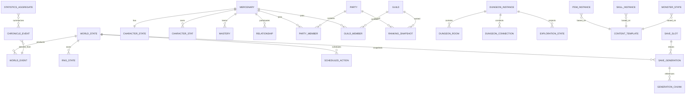

# 80. 전체 도메인 모델 · ERD 설계서

> 문서 목적: 26개 Phase에 분산된 도메인·저장·콘텐츠 구조를 하나의 전역 모델로 통합한다. 이 문서는 논리 모델과 소유권을 정의하며, 실제 물리 FK/DDL은 각 Phase 상세설계와 `81_전체_데이터사전.md`를 함께 적용한다.

## 1. 기준과 적용 원칙

- Android 오프라인 싱글 플레이를 기준으로 하며 서버·계정·실시간 네트워크 엔티티를 추가하지 않는다.
- `:core:simulation`의 도메인 모델은 Android/Compose/Room 타입을 직접 참조하지 않는다.
- 권위 상태(authoritative state), 읽기 Projection, 정적 콘텐츠(content), 검증 산출물(artifact)을 분리한다.
- ID는 표시명과 분리하고, 저장 데이터는 콘텐츠 템플릿 ID와 인스턴스 ID를 구분한다.
- 관계 추적을 위해 논리 FK를 정의하되, 대량 저장/압축/복구 특성상 물리 FK 적용 여부는 테이블별로 판단한다.
- 삭제보다 tombstone/summary가 필요한 장기 역사 데이터는 연대기·가문·유물 참조를 먼저 검사한다.

## 2. 데이터 저장소 경계

| 저장소 | 테이블/객체 수 | 책임 |
|---|---:|---|
| `alias` | 2 | 기존 이름과 실제 저장구조의 논리 alias |
| `artifact` | 7 | 검증/성능/릴리즈 산출물 |
| `content` | 6 | 정적 콘텐츠·이미지 manifest·템플릿 |
| `datastore` | 1 | 사용자 UI/앱 설정 |
| `ephemeral` | 1 | 재시작 시 재생성 가능한 일시 데이터 |
| `save` | 155 | 월드 권위 상태·세이브 세대·런타임 영속 데이터 |

## 3. 전체 논리 ERD

> 위 그림은 핵심 Aggregate 관계만 표시한다. 전체 172개 스키마 객체의 필드·Unique·Index는 81번 데이터사전을 기준으로 한다.

## 4. Aggregate Root와 책임

| Aggregate | Root/대표 저장 | 책임 | 주 Phase |
|---|---|---|---|
| World | `world_state` | 월드 시간·전역 플래그·버전·명령 직렬화 기준 | P2/P3 |
| Save | `save_slot / save_generation` | 복구 가능한 세대, checkpoint, chunk reachability | P3 |
| Mercenary | `mercenary` | 인물 정체성·성장·잠재력·이름·초상 참조 | P4 |
| Inventory | `item_instance / inventory_stack` | 아이템 소유권·장착·보호·이동 | P5 |
| Combat | `combat snapshot/event 계열` | 결정론 전투 상태·이벤트 큐·재생 | P6/P7 |
| Dungeon | `dungeon` | 그래프·구역·방·정복·수명주기 | P8/P9 |
| Contract | `contract 계열` | 의뢰·모집·고용·종료·정산 | P11 |
| Party | `party` | 조직 최대 10/출전 6, 헌장·투표·랭킹 | P13 |
| Economy | `market/auction/loan/shipment 계열` | 시장지수·거래·대여·물류 | P14 |
| Relationship | `relationship 계열` | 호감/신뢰/존경/친밀/갈등·기억 | P15 |
| Guild | `guild` | 가입·권한·재정·정책·랭킹 | P16 |
| Population | `population/NPC simulation 계열` | 유입·은퇴·상세/축약 시뮬레이션 | P17 |
| Lineage | `family/lineage/succession 계열` | 가족·교육·후계·세대교체 | P18 |
| Adventure | `event chain/director 계열` | 장기사건·페이싱·연쇄 사건 | P19 |
| ReturnCampaign | `rift/demon/return proof 계열` | 7핵·악마전쟁·귀환조건·엔딩 | P20 |
| Chronicle | `chronicle/statistics 계열` | 연대기·통계·검색용 Projection | P21 |

## 5. Aggregate 간 쓰기 규칙

1. UI는 DB를 직접 수정하지 않고 `WorldCommand → WorldEngine → Delta → Commit → DomainEvent` 경로를 사용한다.
2. 하나의 WorldSession writer가 authoritative state를 수정하며, 동시 UI 요청은 `commandId/sessionEpoch/expectedVersion`으로 직렬화한다.
3. Aggregate 간 원자 변경이 필요한 경우 같은 command transaction 안에서 수행하고, 외부 효과/Projection publish는 commit 이후 수행한다.
4. 연대기·통계·검색 Projection은 원본 상태의 대체물이 아니며 재생성 가능성을 유지한다.
5. 콘텐츠 템플릿은 런타임 인스턴스의 기준이지만 저장 인스턴스의 역사 값을 무조건 최신 템플릿으로 덮어쓰지 않는다.

## 6. Phase별 데이터 소유권

| Phase | 기능 | 직접 참조 테이블 | 소유권 원칙 |
|---|---|---:|---|
| P0 | 기준선_아키텍처_개발기반 | 0 | 최초 생성/규칙 변경은 해당 Phase, 타 Phase는 계약을 통해 접근 |
| P1 | 콘텐츠_자산_빌드파이프라인 | 6 | 최초 생성/규칙 변경은 해당 Phase, 타 Phase는 계약을 통해 접근 |
| P2 | 월드명령_시간_예약_RNG | 8 | 최초 생성/규칙 변경은 해당 Phase, 타 Phase는 계약을 통해 접근 |
| P3 | 로컬DB_세이브_복구 | 14 | 최초 생성/규칙 변경은 해당 Phase, 타 Phase는 계약을 통해 접근 |
| P4 | 용병생성_성장_잠재력_이름 | 9 | 최초 생성/규칙 변경은 해당 Phase, 타 Phase는 계약을 통해 접근 |
| P5 | 장비_인벤토리_스킬_전술설정 | 11 | 최초 생성/규칙 변경은 해당 Phase, 타 Phase는 계약을 통해 접근 |
| P6 | 전투시간축_수치_상태이상 | 4 | 최초 생성/규칙 변경은 해당 Phase, 타 Phase는 계약을 통해 접근 |
| P7 | 몬스터AI_보스_공략대전투 | 4 | 최초 생성/규칙 변경은 해당 Phase, 타 Phase는 계약을 통해 접근 |
| P8 | 던전생성_그래프_위험예산 | 8 | 최초 생성/규칙 변경은 해당 Phase, 타 Phase는 계약을 통해 접근 |
| P9 | 탐색_야영_패배_핵심플레이 | 18 | 최초 생성/규칙 변경은 해당 Phase, 타 Phase는 계약을 통해 접근 |
| P10 | 도시_시설_주거_치료 | 11 | 최초 생성/규칙 변경은 해당 Phase, 타 Phase는 계약을 통해 접근 |
| P11 | 의뢰_영입_대화 | 13 | 최초 생성/규칙 변경은 해당 Phase, 타 Phase는 계약을 통해 접근 |
| P12 | 강화_제작_정련_유물복원 | 10 | 최초 생성/규칙 변경은 해당 Phase, 타 Phase는 계약을 통해 접근 |
| P13 | 파티운영_정치_랭킹 | 13 | 최초 생성/규칙 변경은 해당 Phase, 타 Phase는 계약을 통해 접근 |
| P14 | 경제_경매_대여_물류 | 15 | 최초 생성/규칙 변경은 해당 Phase, 타 Phase는 계약을 통해 접근 |
| P15 | 정보_평판_관계_인격 | 13 | 최초 생성/규칙 변경은 해당 Phase, 타 Phase는 계약을 통해 접근 |
| P16 | 길드운영_정치_공식랭킹 | 18 | 최초 생성/규칙 변경은 해당 Phase, 타 Phase는 계약을 통해 접근 |
| P17 | NPC장기AI_인구순환 | 14 | 최초 생성/규칙 변경은 해당 Phase, 타 Phase는 계약을 통해 접근 |
| P18 | 가문_교육_후계_세대계승 | 14 | 최초 생성/규칙 변경은 해당 Phase, 타 Phase는 계약을 통해 접근 |
| P19 | 장기사건_AdventureDirector | 12 | 최초 생성/규칙 변경은 해당 Phase, 타 Phase는 계약을 통해 접근 |
| P20 | 균열_악마전쟁_귀환엔딩 | 13 | 최초 생성/규칙 변경은 해당 Phase, 타 Phase는 계약을 통해 접근 |
| P21 | 연대기_통계_검색 | 13 | 최초 생성/규칙 변경은 해당 Phase, 타 Phase는 계약을 통해 접근 |
| P22 | 전체UI_UX_접근성_디자인 | 3 | 최초 생성/규칙 변경은 해당 Phase, 타 Phase는 계약을 통해 접근 |
| P23 | 검증센터_밸런스_개발도구 | 5 | 최초 생성/규칙 변경은 해당 Phase, 타 Phase는 계약을 통해 접근 |
| P24 | 성능_장기안정화_장애격리 | 3 | 최초 생성/규칙 변경은 해당 Phase, 타 Phase는 계약을 통해 접근 |
| P25 | 통합검증_릴리즈_롤백 | 4 | 최초 생성/규칙 변경은 해당 Phase, 타 Phase는 계약을 통해 접근 |

### 6.2. P1 — 콘텐츠 자산 빌드파이프라인

`asset_binding`, `asset_fallback`, `asset_image`, `content_alias`, `content_manifest`, `content_template`

관련 기능: `FUNC-P1-001` 정적 카탈로그 스키마와 ID 보존, `FUNC-P1-002` 콘텐츠 검증·사전 DB 빌드, `FUNC-P1-003` 로컬 이미지·AssetResolver·크롭, `FUNC-P1-004` 콘텐츠·이미지 버전 교체와 호환

### 6.3. P2 — 월드명령 시간 예약 RNG

`command_receipt`, `occupancy`, `resource_reservation`, `rng_state`, `scheduled_action`, `time_advance_state`, `world_event`, `world_state`

관련 기능: `FUNC-P2-001` 단일 작성자 명령 처리, `FUNC-P2-002` 게임 달력·잔여 밀리초·RNG 스트림, `FUNC-P2-003` 예약·점유·자원 선점, `FUNC-P2-004` 이벤트 경계 시간진행·자동중단, `FUNC-P2-005` 세션·생명주기·작업 종료

### 6.4. P3 — 로컬DB 세이브 복구

`checkpoint_chunk`, `command_receipt`, `content_binding`, `dialogue_session`, `generation_chunk`, `migration_history`, `recovery_checkpoint`, `recovery_journal`, `rng_state`, `save_generation`, `save_slot`, `time_advance_state`, `world_event`, `world_state`

관련 기능: `FUNC-P3-001` 현재상태 스키마·Dirty 단위 저장, `FUNC-P3-002` 복원 가능한 세대·슬롯·불변 청크, `FUNC-P3-003` 전투·장기진행·대화 복구, `FUNC-P3-004` 마이그레이션·콘텐츠 호환, `FUNC-P3-005` 오프라인 Export·Import·아카이브 보호, `FUNC-P3-006` 무결성 검사·복구·보존 GC

### 6.5. P4 — 용병생성 성장 잠재력 이름

`character_stat`, `growth_ledger`, `knowledge_record`, `mastery`, `mercenary`, `name_registry`, `portrait_reservation`, `potential_event`, `scheduled_action`

관련 기능: `FUNC-P4-001` NPC 생성·성별 이름·초상 일괄 확정, `FUNC-P4-002` 기본스탯·경험치·성장원장, `FUNC-P4-003` 잠재력·후천변화·숙련, `FUNC-P4-004` 클래스 재훈련·스탯 재계산, `FUNC-P4-005` 초기 정보 비대칭·인물 조회 계약

### 6.6. P5 — 장비 인벤토리 스킬 전술설정

`equipment_slot`, `inventory_stack`, `item_instance`, `loadout`, `loot_receipt`, `mastery`, `money_account`, `skill_affinity`, `skill_instance`, `storage_location`, `tactic_rule`

관련 기능: `FUNC-P5-001` 인벤토리·장착·소유권, `FUNC-P5-002` 스킬·접사·개인 상성 데이터, `FUNC-P5-003` Loadout·프리셋·전술 조건식, `FUNC-P5-004` 드롭·보상 예산·타겟파밍

### 6.7. P6 — 전투시간축 수치 상태이상

`combat_checkpoint`, `combat_result`, `command_receipt`, `status_effect`

관련 기능: `FUNC-P6-001` 이벤트 큐·동시 해결 배치, `FUNC-P6-002` 피해·치유·명중·보호막 공식, `FUNC-P6-003` 액션 상태·자원·발사체 스냅샷, `FUNC-P6-004` 상태이상·축적·Tick·점감, `FUNC-P6-005` 후퇴·반응·전투 종료 정산, `FUNC-P6-006` 재생·로그·전투 버전 일치

### 6.8. P7 — 몬스터AI 보스 공략대전투

`boss_state`, `combat_checkpoint`, `monster_state`, `patrol_state`

관련 기능: `FUNC-P7-001` 몬스터 감지·Utility·역할 AI, `FUNC-P7-002` 그룹 Blackboard·순찰·학습, `FUNC-P7-003` 보스 전조·페이즈·강인도, `FUNC-P7-004` 보스 카탈로그·공략대·웨이브

### 6.9. P8 — 던전생성 그래프 위험예산

`dungeon_connection`, `dungeon_instance`, `dungeon_population`, `dungeon_room`, `dungeon_trap`, `dungeon_treasure`, `monster_state`, `world_event`

관련 기능: `FUNC-P8-001` 던전 그래프·열쇠/문 위상 생성, `FUNC-P8-002` 지형·구역·위험/보상 예산, `FUNC-P8-003` 몬스터·상자·함정·정복목표 배치, `FUNC-P8-004` 던전 생명주기·Seed·재방문

### 6.10. P9 — 탐색 야영 패배 핵심플레이

`camp_state`, `character_state`, `combat_result`, `command_receipt`, `dungeon_connection`, `dungeon_instance`, `dungeon_room`, `exploration_state`, `inventory_stack`, `item_instance`, `knowledge_fact`, `loot_receipt`, `map_annotation`, `recovery_receipt`, `run_state`, `scheduled_action`, `status_effect`, `world_event`

관련 기능: `FUNC-P9-001` MUD 이동·조사·점진 공개, `FUNC-P9-002` 지도·주석·안전 복귀 경로, `FUNC-P9-003` 야영·보급·경계·응급처치, `FUNC-P9-004` 패배·구조·SAFE_RECOVERY, `FUNC-P9-005` 정복·보상·첫 완결 플레이 루프

### 6.11. P10 — 도시 시설 주거 치료

`city_state`, `disease`, `facility_state`, `injury`, `inventory_stack`, `maintenance_order`, `money_account`, `residence`, `scheduled_action`, `storage_location`, `treatment_order`

관련 기능: `FUNC-P10-001` 도시 이동·시설·영업·대기, `FUNC-P10-002` 부상·질병·치료·재활, `FUNC-P10-003` 주거·숙식·유지비·시설 확장, `FUNC-P10-004` 귀환 정비·생활 프리셋·도시 행사

### 6.12. P11 — 의뢰 영입 대화

`contract`, `contract_objective`, `contract_receipt`, `dialogue_memory`, `dialogue_session`, `dialogue_template_binding`, `employment_contract`, `loan_contract`, `money_account`, `party_member`, `recruitment_post`, `relationship_memory`, `scheduled_action`

관련 기능: `FUNC-P11-001` 보조 의뢰·생성·수락·정산, `FUNC-P11-002` 모집·협상·단기/상시 고용, `FUNC-P11-003` 계약 종료·퇴출·위약금·신뢰, `FUNC-P11-004` 선택형 대화·Topic·기억·말투

### 6.13. P12 — 강화 제작 정련 유물복원

`craft_material_reservation`, `craft_order`, `enhancement_attempt`, `enhancement_growth`, `enhancement_state`, `inventory_stack`, `item_inscription`, `item_instance`, `money_account`, `scheduled_action`

관련 기능: `FUNC-P12-001` 강화 확률·시도 원장·비파괴, `FUNC-P12-002` 강화 성장·안정도·각인 슬롯, `FUNC-P12-003` 계승·정련·재각성·유물복원, `FUNC-P12-004` 제작·연금·연구·분해

### 6.14. P13 — 파티운영 정치 랭킹

`deployment`, `money_account`, `party`, `party_charter`, `party_distribution`, `party_history`, `party_member`, `party_proposal`, `party_vote`, `ranking_snapshot`, `ranking_streak`, `relationship_memory`, `scheduled_action`

관련 기능: `FUNC-P13-001` 파티 구성·출전·교대·헌장, `FUNC-P13-002` 분배·공동자금·투표·공정성, `FUNC-P13-003` 만족·갈등·리더교체·분열·승계, `FUNC-P13-004` 파티 공식 랭킹·연속1위

### 6.15. P14 — 경제 경매 대여 물류

`auction`, `auction_bid`, `economic_ledger`, `equipment_slot`, `inventory_stack`, `item_instance`, `loan_contract`, `market_index`, `market_stock`, `money_account`, `scheduled_action`, `shipment`, `shipment_item`, `storage_location`, `trade_receipt`

관련 기능: `FUNC-P14-001` 도시 시장지수·재고·수요공급, `FUNC-P14-002` 구매·판매·흥정·경매, `FUNC-P14-003` 장비 대여·회수·손상·보험, `FUNC-P14-004` 창고·운송·원정보급·분실복구

### 6.16. P15 — 정보 평판 관계 인격

`knowledge_fact`, `knowledge_projection`, `legal_case`, `observation`, `personal_goal`, `personality_state`, `relationship`, `relationship_memory`, `relationship_stage`, `reputation_event`, `reputation_score`, `rumor`, `trait_binding`

관련 기능: `FUNC-P15-001` 지식·관측·소문·정보 공개, `FUNC-P15-002` 평판·법률·계약 신뢰·지역기여, `FUNC-P15-003` 다축 관계·기억·호흡·연애, `FUNC-P15-004` 성격·특성·매력·개인 목표

### 6.17. P16 — 길드운영 정치 공식랭킹

`contribution_ledger`, `guild`, `guild_assignment`, `guild_budget`, `guild_facility`, `guild_faction`, `guild_history`, `guild_member`, `guild_office`, `guild_proposal`, `guild_vote`, `money_account`, `raid_assignment`, `ranking_component`, `ranking_snapshot`, `ranking_streak`, `return_proof`, `scheduled_action`

관련 기능: `FUNC-P16-001` 길드 가입·직위·승계·권한, `FUNC-P16-002` 길드 재정·시설·인재·간부 운영, `FUNC-P16-003` 파벌·정책·정당성·길드 공략대, `FUNC-P16-004` 길드 공식10000점·일마감·기여

### 6.18. P17 — NPC장기AI 인구순환

`character_state`, `guild_history`, `mercenary_registry`, `npc_activity`, `npc_summary`, `party_history`, `personal_goal`, `personality_state`, `population_cohort`, `portrait_reservation`, `relationship_memory`, `scheduled_action`, `simulation_cursor`, `world_event`

관련 기능: `FUNC-P17-001` NPC 목표·행동 Utility·경제 의사결정, `FUNC-P17-002` 상세/축약 시뮬레이션·승격·강등, `FUNC-P17-003` 용병 유입·은퇴·복귀·직업전환, `FUNC-P17-004` 장기 정체성·압축·사회 순환 검증

### 6.19. P18 — 가문 교육 후계 세대계승

`character_state`, `education_plan`, `family_member`, `guild_history`, `item_instance`, `lineage`, `lineage_contribution`, `money_account`, `party_history`, `population_cohort`, `return_proof`, `storage_location`, `succession_plan`, `succession_receipt`

관련 기능: `FUNC-P18-001` 가족·출생·입양·성장·교육, `FUNC-P18-002` 후계자 후보·의사·지정·부재 안전장치, `FUNC-P18-003` 원자적 세대 교체·자산·증표 유지, `FUNC-P18-004` 가문 목표·유물·세대 기여·기록 UI

### 6.20. P19 — 장기사건 AdventureDirector

`automation_rule`, `director_budget`, `director_state`, `event_chain`, `event_chain_step`, `event_instance`, `event_participant`, `event_receipt`, `legendary_record`, `personal_goal`, `relationship_memory`, `strategy_plan`

관련 기능: `FUNC-P19-001` NPC 사건·등장인물·자동 해결, `FUNC-P19-002` 연쇄 사건·조건·쿨다운·대안 경로, `FUNC-P19-003` AdventureDirector·장기 목표·전설화, `FUNC-P19-004` 전술 실험실·전략 회의·행동 자동화

### 6.21. P20 — 균열 악마전쟁 귀환엔딩

`chronicle_event`, `demon_base`, `demon_faction`, `demon_gate`, `demon_presence`, `dungeon_instance`, `ending_record`, `lineage_contribution`, `ranking_streak`, `return_campaign`, `return_proof`, `rift_core`, `world_event`

관련 기능: `FUNC-P20-001` 균열 탐사·7핵 봉인·발생원 차단, `FUNC-P20-002` 악마 전쟁·잔존세력·90일 종전, `FUNC-P20-003` 영구증표·랭킹·잔존던전·귀환 판정, `FUNC-P20-004` 귀환·잔류·후일담·캠페인 종료

### 6.22. P21 — 연대기 통계 검색

`aggregate_receipt`, `bookmark`, `chronicle_event`, `chronicle_link`, `chronicle_snapshot`, `knowledge_projection`, `lineage_contribution`, `notification`, `ranking_snapshot`, `search_cursor`, `search_document`, `statistics_aggregate`, `world_event`

관련 기능: `FUNC-P21-001` 용병·장비·파티·세계 연대기, `FUNC-P21-002` 일월연 통계·기여·추세·랭킹 이력, `FUNC-P21-003` 공개정보 검색·필터·페이지·북마크, `FUNC-P21-004` 보존·압축·뉴스·정보 알림

### 6.23. P22 — 전체UI UX 접근성 디자인

`asset_image`, `command_receipt`, `ui_preference`

관련 기능: `FUNC-P22-001` 정보구조·화면 계약·Navigation, `FUNC-P22-002` 디자인 토큰·컴포넌트·이미지, `FUNC-P22-003` Adaptive·큰글자·TalkBack·터치, `FUNC-P22-004` 화면 생명주기·일회성 효과·유저 여정

### 6.24. P23 — 검증센터 밸런스 개발도구

`balance_baseline`, `review_decision`, `validation_artifact`, `validation_case_result`, `validation_run`

관련 기능: `FUNC-P23-001` Validation Center·공통 검사 실행, `FUNC-P23-002` 불변식·속성·퍼즈·장기 월드, `FUNC-P23-003` 확률·수치·드롭·경제 밸런스 비교, `FUNC-P23-004` 재현 패키지·리뷰·결함·승인

### 6.25. P24 — 성능 장기안정화 장애격리

`balance_baseline`, `performance_run`, `recovery_journal`

관련 기능: `FUNC-P24-001` 실측 성능·이미지·목록·DB 예산, `FUNC-P24-002` 누수·취소·배터리·앱 중단, `FUNC-P24-003` 저장공간·장기 압축·실패 격리, `FUNC-P24-004` 최적화 동치·인덱스·R8·프로필

### 6.26. P25 — 통합검증 릴리즈 롤백

`migration_history`, `recovery_journal`, `release_manifest`, `review_decision`

관련 기능: `FUNC-P25-001` 전체 End-to-End·회귀·출시 범위 검수, `FUNC-P25-002` 업그레이드·마이그레이션·다운그레이드, `FUNC-P25-003` 서명 Release·오프라인 설치·배포, `FUNC-P25-004` 릴리즈 운영·결함 대응·문서 인계

### 소유 기능이 직접 표기되지 않은 스키마 객체

`wallet`, `storage`

이 객체는 공통/Projection/부록 DDL에서 생성된 항목일 수 있으므로 구현 전 81번 데이터사전의 `Owner Review`를 완료한다.

## 7. 주요 식별자·참조 규칙

| 유형 | 규칙 |
|---|---|
| EntityId | 엔티티 유형과 저장 위치를 혼합하지 않는 불변 ID. 표시명 변경과 무관 |
| Content ID | `WPN-0001`, `MON-...` 등 원문 ID를 보존하고 alias/override는 별도 관리 |
| commandId | 동일 epoch에서 멱등성 키. 같은 ID/다른 payload는 `IdempotencyKeyReuse` |
| eventId | DomainEvent 고유 ID. `sourceEventId`로 Projection 중복 생성 차단 |
| generationId | SaveGeneration 루트. 과거 세대 복원 시 해당 세대의 실제 chunk를 참조 |
| portraitKey | NPC 정체성에 저장되는 로컬 이미지 Key. crop/fallback은 표시 계층에서 처리 |

## 8. 삭제·보존·압축 규칙

- 역사적 사건, 귀환 증표, 가문 유물, 즐겨찾기, 정점 기록은 장기 보존 대상으로 분류한다.
- 일반 전투 상세로그·일반 NPC 생활 이벤트·시장 일일 데이터는 기간 경과 후 aggregate/summary로 압축할 수 있다.
- Item Instance 삭제 전 Chronicle/가문/대여/거래 이력 참조를 확인한다.
- SaveGeneration GC는 보존 root에서 도달 가능한 chunk를 삭제하지 않는다.

## 9. Transaction 경계

| 변경 유형 | 동일 Transaction에 포함 | Commit 후 |
|---|---|---|
| 일반 WorldCommand | 권위 테이블 mutation + RNG/source event + command receipt | UI snapshot/Projection publish |
| 강화/구매/제작 | 비용 차감 + 결과 인스턴스/원장 + receipt | 연출/알림/연대기 projection |
| 세대 교체 | 현재 캐릭터 상태 + 상속자 활성화 + 가문자산/증표 연결 | 후일담/화면 전환 |
| SaveGeneration | generation root + chunk reference + checksum/status | 이전 세대 GC 후보 계산 |
| Import/Migration | 기존 슬롯 불변 + staging/검증 | 새 슬롯 활성화 |

## 10. 구현 Gate

- [ ] 172개 객체가 81 데이터사전에 모두 존재한다.
- [ ] 모든 authoritative table에 Owner Phase와 쓰기 경로가 있다.
- [ ] UI/Projection이 authoritative 저장소를 우회 수정하지 않는다.
- [ ] 삭제/압축 대상이 역사 참조와 충돌하지 않는다.
- [ ] SaveGeneration/command receipt/event가 복구 후에도 멱등성을 유지한다.
- [ ] 실제 Room Entity/DAO가 제공되면 89 코드 Mapping 문서에서 논리 모델과 대조한다.
