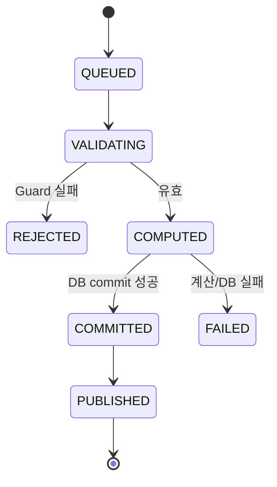
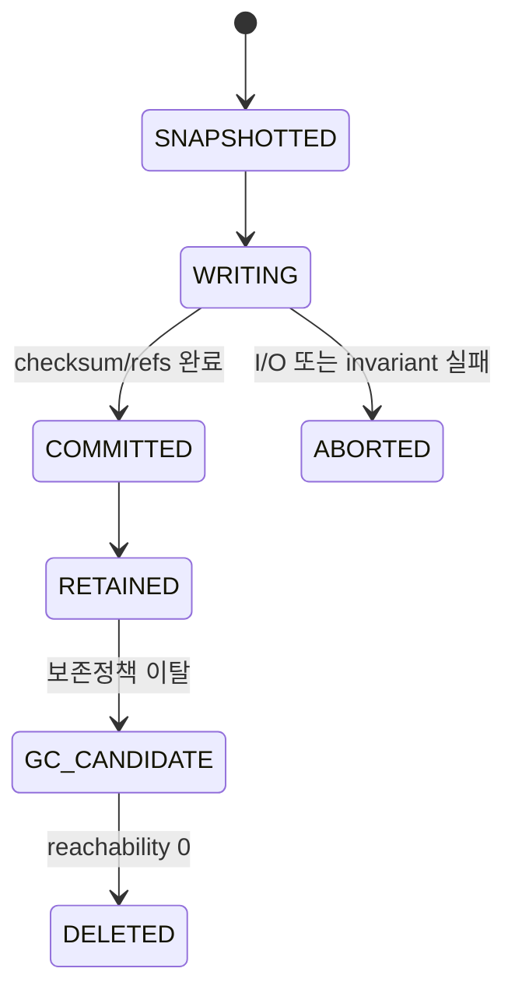
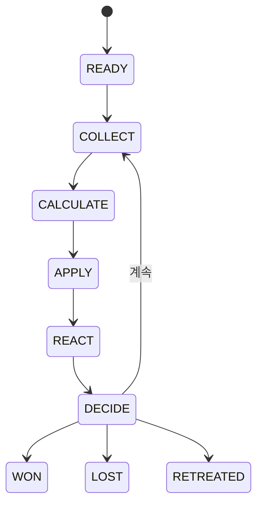
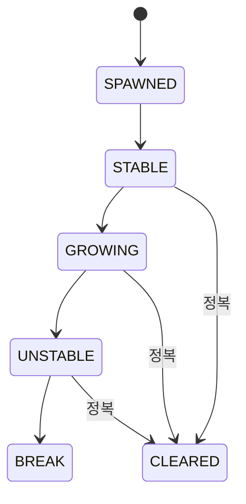
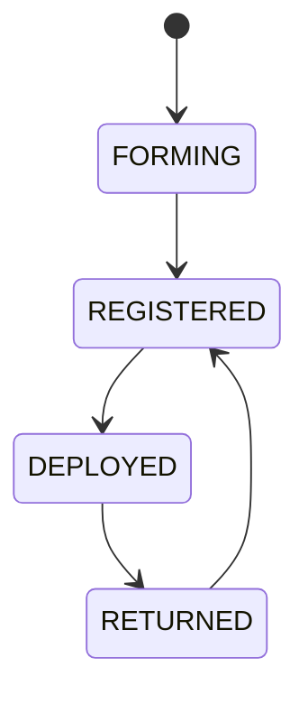
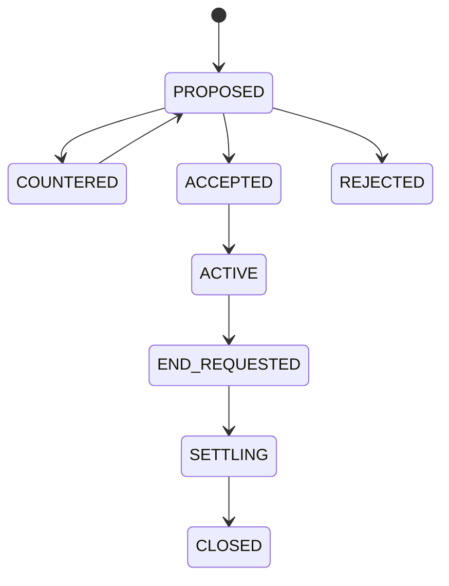
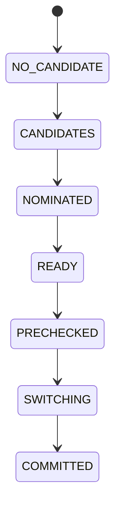
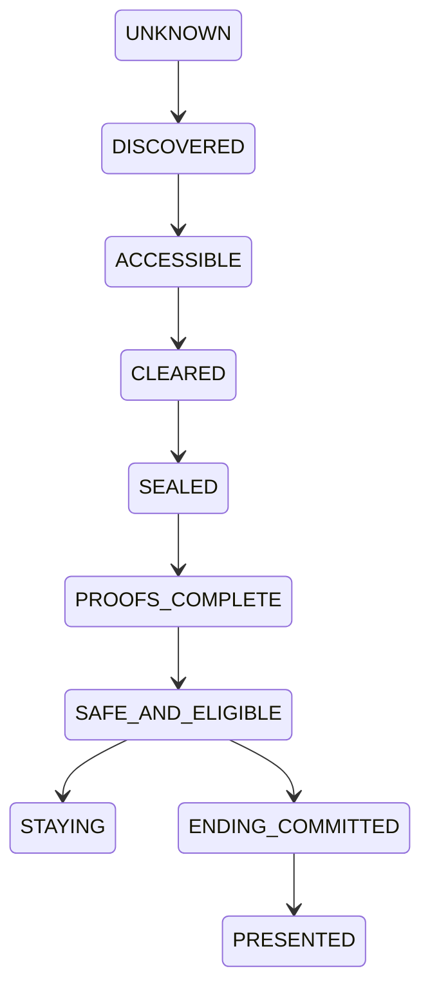

# 83. 전체 상태머신 설계서

> 목적: Phase별로 분산된 상태 전이를 전역 관점에서 통합하고, 허용 Command·Guard·Transaction·복구 상태를 일관되게 정의한다.

## 1. 전역 상태 전이 원칙

- 상태 변경은 `WorldSession`의 단일 writer/commit 경로에서만 수행한다. `WorldEngine`은 immutable snapshot에서 `ExecutionPlan`만 계산한다.
- 상태 전이 전 Guard를 검사하고 실패 시 상태를 바꾸지 않는다.
- RNG 결과가 필요한 전이는 RNG counter/state와 결과 원장을 같은 commit 경계에 포함한다.
- UI의 `Loading/Empty/Error`는 Domain 상태가 아니라 Presentation 상태다.
- 앱 종료/재실행은 세계 시간을 자동 진행시키지 않으며, 복구 시 저장된 상태머신 지점을 이어간다.
- 중간 상태가 영속되어야 하는 기능은 recovery checkpoint와 재개/취소 규칙을 갖는다.

## 2. 핵심 전역 상태머신

### 2.1. WorldCommand

### 2.2. SaveGeneration

### 2.3. Combat

### 2.4. Dungeon

### 2.5. Party Expedition

### 2.6. Contract

### 2.7. Generation Succession

### 2.8. Return Campaign

## 3. 상태 전이 공통 계약

| 항목 | 규칙 |
|---|---|
| fromState | 현재 authoritative state와 일치해야 함 |
| command | 허용된 command type이어야 함 |
| guard | 자원/권한/점유/버전/선행조건 검사 |
| delta | 불변 snapshot에서 계산, commit 전 외부 publish 금지 |
| toState | 성공 시 하나의 명확한 결과 상태 |
| failure | 부분 상태를 남기지 않고 FAILED/REJECTED/복구가능 상태로 전환 |
| event | commit 이후 `StateChanged` 성격의 DomainEvent 발행 |
| resume | 앱 종료 후 재개 가능한 상태는 checkpoint와 payload/version을 저장 |

### 3.1. WorldSession · AdvanceTime · lifecycle 결합

`WorldSession`은 `WorldSnapshot(stateVersion, AuthoritativeWorldState, rngState, aggregates)`을 권위 메모리 상태로 보유하고, WorldEngine이 반환한 `ExecutionPlan.Atomic/Segment`만 SavePort에 commit한다. 성공 receipt 검증 전에는 snapshot/publication을 변경하지 않는다. RUNNING receipt는 `lastCommittedSegmentNo`와 `TimeAdvanceState`를 가지며 process 재개 시 마지막 완전 segment 다음부터 이어간다.

runtime lifecycle은 gameplay state machine과 별개다. `PAUSE/CANCEL_ADVANCE/APP_BACKGROUND/CLOSE`는 `(sessionEpoch,expectedActiveCommandId)`를 검사해 pending control latch만 설정하며 receipt/Event/stateVersion을 직접 만들지 않는다. active traversal consumer가 다음 safe boundary에서 latch를 관측해 기존 gameplay receipt를 `CANCELLED/COMMITTED` 또는 `INTERRUPTED`로 전이한다. `DECISION_GATE/SYSTEM_HALT`가 control보다 우선하고 protected completion은 control을 다음 gate/target commit 뒤까지 지연한다. CLOSE는 새 admission 차단 후 drain→join→handle close 순으로 진행한다.

## 4. 전체 기능 상태 Registry

`PersistenceClass`는 기능이 가질 수 있는 최대 영속 권한이다. 복합 기능의 조회·도구 하위 경로는 [84 Command/Event 계약](84_전체_Command_Event_계약서.md)의 no-write 규칙을 그대로 따른다.

| Class | 영속 경계 |
|---|---|
| `AUTHORITATIVE` | live gameplay save를 변경하며 승인된 `WorldCommand`와 receipt가 필요 |
| `PROJECTION` | consumer projection/consumer receipt만 기록하며 `WorldCommand` receipt는 생성하지 않음 |
| `READ` | 순수 계산을 포함한 읽기 전용 경로이며 durable state를 변경하지 않음 |
| `TOOL` | 격리된 검증·보고·로컬 UI artifact만 기록하며 live save를 변경하지 않음 |
| `LIFECYCLE` | 세션·dispatcher 등 런타임 자원만 관리하며 gameplay receipt를 생성하지 않음 |
| `BUILD_ARTIFACT` | content/asset build 산출물만 기록하며 live save를 변경하지 않음 |

| Phase | Function | 기능 | 상태 표현 | PersistenceClass |
|---|---|---|---|---|
| P0 | `FUNC-P0-001` | 원문 기준선과 충돌 판정 | `EXTRACTED → CLASSIFIED → RESOLVED 또는 OPEN` | `TOOL` |
| P0 | `FUNC-P0-002` | 빌드·모듈·기술버전 고정 | `DISCOVERED → LOCKED → COMPILE_VERIFIED` | `TOOL` |
| P0 | `FUNC-P0-003` | 공통 타입·명령·오류·이벤트 계약 | `RECEIVED → VALIDATED 또는 REJECTED` | `LIFECYCLE` |
| P0 | `FUNC-P0-004` | 최소 검증 하네스·공통 UI 껍데기 | `PENDING → RUNNING → PASS/FAIL` | `TOOL` |
| P1 | `FUNC-P1-001` | 정적 카탈로그 스키마와 ID 보존 | `RAW → PARSED → REJECTED/VALIDATED` | `BUILD_ARTIFACT` |
| P1 | `FUNC-P1-002` | 콘텐츠 검증·사전 DB 빌드 | `DRAFT → CHECKED → STAGED → PUBLISHED` | `BUILD_ARTIFACT` |
| P1 | `FUNC-P1-003` | 정적 콘텐츠 조회·로컬 AssetResolver·크롭 | `REQUEST → EXACT/FALLBACK/SKIPPED/ERROR` | `BUILD_ARTIFACT` |
| P1 | `FUNC-P1-004` | 콘텐츠·이미지 버전 교체와 호환 | `BOUND → COMPATIBLE/MIGRATION_REQUIRED/UNSUPPORTED` | `READ` |
| P2 | `FUNC-P2-001` | 단일 작성자 명령 처리 | `QUEUED → VALIDATING → COMPUTED → COMMITTED → PUBLISHED` | `AUTHORITATIVE` |
| P2 | `FUNC-P2-002` | 게임 달력·잔여 밀리초·RNG 스트림 | `immutable (clock,rng snapshot,input) → ClockDelta/RngOutcome` | `READ` |
| P2 | `FUNC-P2-003` | 예약·점유·자원 선점 | `PLANNED → RESERVED → RUNNING ↔ PAUSED; RUNNING/PAUSED → NEEDS_RESCHEDULE; nonterminal → COMPLETED/CANCELLED/FAILED` | `AUTHORITATIVE` |
| P2 | `FUNC-P2-004` | 공통 세계시간 traversal·자동중단 | `IDLE → ADVANCING → COMPLETED/DECISION_REQUIRED/UNREACHABLE/LIMIT_REACHED/FAILED`; atomic elapsed의 `DECISION_REQUIRED`는 sealed outcome을 보존하고 새 continuation만 적용; `ADVANCING --PAUSE/BACKGROUND/CLOSE/forced stop→ INTERRUPTED`; `ADVANCING --CANCEL_ADVANCE→ CANCELLED` | `AUTHORITATIVE` |
| P2 | `FUNC-P2-005` | 세션·생명주기·작업 종료 | `OPEN → PAUSING → PAUSED → CLOSING → CLOSED` | `LIFECYCLE` |
| P3 | `FUNC-P3-001` | 현재상태 스키마·Dirty 단위 저장 | `SNAPSHOTTED → WRITING → COMMITTED/ABORTED` | `AUTHORITATIVE` |
| P3 | `FUNC-P3-002` | 복원 가능한 세대·슬롯·불변 청크 | `WRITING → COMMITTED; retained roots → reachability GC` | `AUTHORITATIVE` |
| P3 | `FUNC-P3-003` | 전투·장기진행·대화 복구 | `FOUND → VALIDATED → RESTORED 또는 FALLBACK_OFFERED` | `AUTHORITATIVE` |
| P3 | `FUNC-P3-004` | 마이그레이션·콘텐츠 호환 | `BACKED_UP → MIGRATING → VALIDATED → ACTIVATED` | `AUTHORITATIVE` |
| P3 | `FUNC-P3-005` | 오프라인 Export·Import·아카이브 보호 | `SELECTED → VERIFIED → STAGED → NEW_SLOT` | `AUTHORITATIVE` |
| P3 | `FUNC-P3-006` | 무결성 검사·복구·보존 GC | `CHECKED → HEALTHY/RECOVERABLE/CORRUPTED` | `AUTHORITATIVE` |
| P4 | `FUNC-P4-001` | NPC 생성·성별 이름·초상 일괄 확정 | `DRAFT → NAME_ALLOCATED → PORTRAIT_ALLOCATED → COMMITTED` | `AUTHORITATIVE` |
| P4 | `FUNC-P4-002` | 기본스탯·경험치·성장원장 | `EXPERIENCE_ADDED → LEVELS_RESOLVED → LEDGER_APPLIED` | `AUTHORITATIVE` |
| P4 | `FUNC-P4-003` | 잠재력·후천변화·숙련 | `BASE + MODIFIERS → EFFECTIVE; DAMAGED → REHABILITATED` | `AUTHORITATIVE` |
| P4 | `FUNC-P4-004` | 클래스 재훈련·스탯 재계산 | `PREVIEW → RESERVED → TRAINING → REBUILT` | `AUTHORITATIVE` |
| P4 | `FUNC-P4-005` | 초기 정보 비대칭·인물 조회 계약 | `AUTHORITATIVE → POLICY_FILTERED → VIEW` | `READ` |
| P5 | `FUNC-P5-001` | 인벤토리·장착·소유권 | `STORED ↔ EQUIPPED ↔ IN_TRANSIT; PROTECTED guard` | `AUTHORITATIVE` |
| P5 | `FUNC-P5-002` | 스킬·접사·개인 상성 데이터 | `ACQUIRED → LEARNED → AVAILABLE/CLASS_RESTRICTED` | `AUTHORITATIVE` |
| P5 | `FUNC-P5-003` | Loadout·프리셋·전술 조건식 | `DRAFT → VALIDATED → ACTIVE/NEEDS_REVIEW` | `AUTHORITATIVE` |
| P5 | `FUNC-P5-004` | 드롭·보상 예산·타겟파밍 | `UNROLLED → ROLLED → CLAIMED 또는 OVERFLOW_STORED` | `AUTHORITATIVE` |
| P6 | `FUNC-P6-001` | 이벤트 큐·동시 해결 배치 | `READY → COLLECT → CALCULATE → APPLY → REACT → DECIDE` | `AUTHORITATIVE` |
| P6 | `FUNC-P6-002` | 피해·치유·명중·보호막 공식 | `RAW → MITIGATED → ABSORBED → HP_DELTA` | `READ` |
| P6 | `FUNC-P6-003` | 액션 상태·자원·발사체 스냅샷 | `IDLE → WINDUP/CASTING → ACTIVE → RECOVERY → READY` | `AUTHORITATIVE` |
| P6 | `FUNC-P6-004` | 상태이상·축적·Tick·점감 | `APPLIED → TICKING/ACCUMULATING → EXPIRED/DISPELLED` | `AUTHORITATIVE` |
| P6 | `FUNC-P6-005` | 후퇴·반응·전투 종료 정산 | `RUNNING → RETREATING/RESOLVING → WON/LOST/RETREATED` | `AUTHORITATIVE` |
| P6 | `FUNC-P6-006` | 재생·로그·전투 버전 일치 | `TRACE_READY → PLAYING/PAUSED → FINISHED` | `READ` |
| P7 | `FUNC-P7-001` | 몬스터 감지·Utility·역할 AI | `PERCEIVE → CANDIDATES → SCORE → INTENT` | `AUTHORITATIVE` |
| P7 | `FUNC-P7-002` | 그룹 Blackboard·순찰·학습 | `IDLE → PATROL → ALERT → SEARCH/CHASE → RETURN` | `AUTHORITATIVE` |
| P7 | `FUNC-P7-003` | 보스 전조·페이즈·강인도 | `PHASE_n → TRANSITION → PHASE_n+1 → DEFEATED` | `AUTHORITATIVE` |
| P7 | `FUNC-P7-004` | 보스 카탈로그·공략대·웨이브 | `CREATED → ACTIVE_WAVES → DEFEATED/ESCAPED` | `AUTHORITATIVE` |
| P8 | `FUNC-P8-001` | 던전 그래프·열쇠/문 위상 생성 | `SPEC → GRAPH → VALIDATED → FROZEN` | `AUTHORITATIVE` |
| P8 | `FUNC-P8-002` | 지형·구역·위험/보상 예산 | `BUDGETED → ALLOCATED → REBALANCED → ACCEPTED` | `AUTHORITATIVE` |
| P8 | `FUNC-P8-003` | 몬스터·상자·함정·정복목표 배치 | `BUDGET → GROUPS/OBJECTS → CLUES → FROZEN` | `AUTHORITATIVE` |
| P8 | `FUNC-P8-004` | 던전 생명주기·Seed·재방문 | `SPAWNED → STABLE → GROWING → UNSTABLE → CLEARED/BREAK` | `AUTHORITATIVE` |
| P9 | `FUNC-P9-001` | MUD 이동·조사·점진 공개 | `OUTSIDE → EXPLORING → ROOM_ACTION → EXPLORING` | `AUTHORITATIVE` |
| P9 | `FUNC-P9-002` | 지도·주석·안전 복귀 경로 | `PLANNED → TRAVERSING → ARRIVED/INTERRUPTED` | `AUTHORITATIVE` |
| P9 | `FUNC-P9-003` | 야영·보급·경계·응급처치 | `PREPARED → CAMPING → COMPLETE/AMBUSHED/CANCELLED` | `AUTHORITATIVE` |
| P9 | `FUNC-P9-004` | 패배·구조·SAFE_RECOVERY | `DEFEATED → RESCUE_CHECK → RESCUED` 또는 `SAFE_RECOVERY(RUNNING ↔ PAUSED_DECISION) → HUB`; 패배 손실은 시작 시, HUB/HP는 완료 boundary에서 1회 | `AUTHORITATIVE` |
| P9 | `FUNC-P9-005` | 정복·보상·첫 완결 플레이 루프 | `ACTIVE → SETTLING → RETREATED/CLEARED/FAILED` | `AUTHORITATIVE` |
| P10 | `FUNC-P10-001` | 도시 이동·시설·영업·대기 | `TRAVELLING → ARRIVED → QUEUED → SERVED/CLOSED` | `AUTHORITATIVE` |
| P10 | `FUNC-P10-002` | 부상·질병·치료·재활 | `EXPOSED/INJURED → DIAGNOSED → TREATING → REHAB → RECOVERED` | `AUTHORITATIVE` |
| P10 | `FUNC-P10-003` | 주거·숙식·유지비·시설 확장 | `TENANT/OWNER → ACTIVE → ARREARS/RELOCATING` | `AUTHORITATIVE` |
| P10 | `FUNC-P10-004` | 귀환 정비·생활 프리셋·도시 행사 | `QUOTED → EXECUTING → COMPLETE/PARTIAL/STOPPED` | `AUTHORITATIVE` |
| P11 | `FUNC-P11-001` | 보조 의뢰·생성·수락·정산 | `OFFERED → ACCEPTED → IN_PROGRESS → READY → PAID/FAILED/EXPIRED` | `AUTHORITATIVE` |
| P11 | `FUNC-P11-002` | 모집·협상·단기/상시 고용 | `PROPOSED → COUNTERED → ACCEPTED/REJECTED/EXPIRED` | `AUTHORITATIVE` |
| P11 | `FUNC-P11-003` | 계약 종료·퇴출·위약금·신뢰 | `ACTIVE → END_REQUESTED → SETTLING → CLOSED` | `AUTHORITATIVE` |
| P11 | `FUNC-P11-004` | 선택형 대화·Topic·기억·말투 | `OPEN → TOPIC_SELECTED → CHOICE_PENDING → RESOLVED/CLOSED` | `AUTHORITATIVE` |
| P12 | `FUNC-P12-001` | 강화 확률·시도 원장·비파괴 | `QUOTED → VALIDATED → ROLLED → COMMITTED` | `AUTHORITATIVE` |
| P12 | `FUNC-P12-002` | 강화 성장·안정도·각인 슬롯 | `STEP_REACHED → GROWTH_RECORDED → ACTIVE/INACTIVE` | `AUTHORITATIVE` |
| P12 | `FUNC-P12-003` | 계승·정련·재각성·유물복원 | `PREVIEW → CONSENTED → APPLIED/REJECTED` | `AUTHORITATIVE` |
| P12 | `FUNC-P12-004` | 제작·연금·연구·분해 | `DRAFT → RESERVED → RUNNING → COMPLETE/FAILED/CANCELLED` | `AUTHORITATIVE` |
| P13 | `FUNC-P13-001` | 파티 구성·출전·교대·헌장 | `FORMING → REGISTERED → DEPLOYED → RETURNED` | `AUTHORITATIVE` |
| P13 | `FUNC-P13-002` | 분배·공동자금·투표·공정성 | `PROPOSED → VOTING → APPROVED/REJECTED → EXECUTED` | `AUTHORITATIVE` |
| P13 | `FUNC-P13-003` | 만족·갈등·리더교체·분열·승계 | `STABLE → DISPUTED → VOTE → REFORMED/SPLIT/MERGED` | `AUTHORITATIVE` |
| P13 | `FUNC-P13-004` | 파티 공식 랭킹·연속1위 | `UNRANKED → DAILY_RANKED → STREAKING → PROOF_CANDIDATE` | `AUTHORITATIVE` |
| P14 | `FUNC-P14-001` | 도시 시장지수·재고·수요공급 | `OPEN → TRANSACTING → BOUNDARY_CLOSE → OPEN` | `AUTHORITATIVE` |
| P14 | `FUNC-P14-002` | 구매·판매·흥정·경매 | `QUOTED/LISTED → RESERVED/BIDDING → SETTLED/EXPIRED` | `AUTHORITATIVE` |
| P14 | `FUNC-P14-003` | 장비 대여·회수·손상·보험 | `AVAILABLE → LOANED → RETURN_PENDING → RETURNED/OVERDUE` | `AUTHORITATIVE` |
| P14 | `FUNC-P14-004` | 창고·운송·원정보급·분실복구 | `RESERVED → IN_TRANSIT → ARRIVED/HOLD/RETURNED` | `AUTHORITATIVE` |
| P15 | `FUNC-P15-001` | 지식·관측·소문·정보 공개 | `UNKNOWN → RUMORED → OBSERVED → VERIFIED/STALE` | `AUTHORITATIVE` |
| P15 | `FUNC-P15-002` | 평판·법률·계약 신뢰·지역기여 | `NEUTRAL → CHANGED → REVIEWED/APPEALED` | `AUTHORITATIVE` |
| P15 | `FUNC-P15-003` | 다축 관계·기억·호흡·연애 | `STRANGER → ACQUAINTANCE → COMPANION/FRIEND/RIVAL/PARTNER` | `AUTHORITATIVE` |
| P15 | `FUNC-P15-004` | 성격·특성·매력·개인 목표 | `GENERATED → EXPERIENCED → MODIFIED → ARCHIVED` | `AUTHORITATIVE` |
| P16 | `FUNC-P16-001` | 길드 가입·직위·승계·권한 | `OUTSIDER → MEMBER → OFFICER → LEADER/FORMER` | `AUTHORITATIVE` |
| P16 | `FUNC-P16-002` | 길드 재정·시설·인재·간부 운영 | `PROPOSED → BUDGETED → ASSIGNED → COMPLETED/PAUSED` | `AUTHORITATIVE` |
| P16 | `FUNC-P16-003` | 파벌·정책·정당성·길드 공략대 | `AGENDA → DEBATE → VOTE → ENACTED/REJECTED` | `AUTHORITATIVE` |
| P16 | `FUNC-P16-004` | 길드 공식10000점·일마감·기여 | `CALCULATED → DAILY_CLOSED → QUALIFIED/NOT_QUALIFIED` | `AUTHORITATIVE` |
| P17 | `FUNC-P17-001` | NPC 목표·행동 Utility·경제 의사결정 | `NEEDS_PLAN → PLANNED → RESERVED → ACTING → RESOLVED` | `AUTHORITATIVE` |
| P17 | `FUNC-P17-002` | 상세/축약 시뮬레이션·승격·강등 | `ABSTRACT ↔ DETAIL_PENDING ↔ DETAILED` | `AUTHORITATIVE` |
| P17 | `FUNC-P17-003` | 용병 유입·은퇴·복귀·직업전환 | `CIVILIAN → ACTIVE → ON_LEAVE/RETIRED/MIGRATED` | `AUTHORITATIVE` |
| P17 | `FUNC-P17-004` | 장기 정체성·압축·사회 순환 검증 | `DETAIL_HISTORY → SUMMARY_STAGED → VERIFIED → COMPACTED` | `AUTHORITATIVE` |
| P18 | `FUNC-P18-001` | 가족·출생·입양·성장·교육 | `CHILD → BASIC_EDUCATION → VOCATIONAL → ADULT` | `AUTHORITATIVE` |
| P18 | `FUNC-P18-002` | 후계자 후보·의사·지정·부재 안전장치 | `NO_CANDIDATE → CANDIDATES → NOMINATED → READY/NEEDS_REVIEW` | `AUTHORITATIVE` |
| P18 | `FUNC-P18-003` | 원자적 세대 교체·자산·증표 유지 | `PRECHECKED → SWITCHING → COMMITTED` | `AUTHORITATIVE` |
| P18 | `FUNC-P18-004` | 가문 목표·유물·세대 기여·기록 UI | `HISTORY_READY → PROJECTED` | `READ` |
| P19 | `FUNC-P19-001` | NPC 사건·등장인물·자동 해결 | `CANDIDATE → SELECTED → RESOLVING → RESOLVED/EXPIRED` | `AUTHORITATIVE` |
| P19 | `FUNC-P19-002` | 연쇄 사건·조건·쿨다운·대안 경로 | `STARTED → STEP_n → BRANCHED → COMPLETED/FAILED/SAFE_CLOSED` | `AUTHORITATIVE` |
| P19 | `FUNC-P19-003` | AdventureDirector·장기 목표·전설화 | `OBSERVING → BUDGETED → PROPOSING → COOLDOWN` | `AUTHORITATIVE` |
| P19 | `FUNC-P19-004` | 전술 실험실·전략 회의·행동 자동화 | `REQUESTED → SIMULATING → ADVISED 또는 CANCELLED` | `AUTHORITATIVE` |
| P20 | `FUNC-P20-001` | 균열 탐사·7핵 봉인·발생원 차단 | `UNKNOWN → DISCOVERED → ACCESSIBLE → CLEARED → SEALED` | `AUTHORITATIVE` |
| P20 | `FUNC-P20-002` | 악마 전쟁·잔존세력·90일 종전 | `WAR → REMNANTS → OBSERVATION_90D → ENDED/REOPENED` | `AUTHORITATIVE` |
| P20 | `FUNC-P20-003` | 영구증표·랭킹·잔존던전·귀환 판정 | `PROGRESSING → PROOFS_COMPLETE → SAFE_AND_ELIGIBLE` | `AUTHORITATIVE` |
| P20 | `FUNC-P20-004` | 귀환·잔류·후일담·캠페인 종료 | `ELIGIBLE → STAYING 또는 ENDING_COMMITTED → PRESENTED` | `AUTHORITATIVE` |
| P21 | `FUNC-P21-001` | 용병·장비·파티·세계 연대기 | `EVENT_COMMITTED → PROJECTED → LINKED → DISPLAYABLE` | `PROJECTION` |
| P21 | `FUNC-P21-002` | 일월연 통계·기여·추세·랭킹 이력 | `SOURCE → AGGREGATED → VERIFIED → ACTIVE_PROJECTION` | `PROJECTION` |
| P21 | `FUNC-P21-003` | 공개정보 검색·필터·페이지·북마크 | `QUERY → NORMALIZED → AUTHORIZED → PAGED` | `AUTHORITATIVE` |
| P21 | `FUNC-P21-004` | 보존·압축·뉴스·정보 알림 | `ELIGIBLE → SUMMARIZED → VERIFIED → PRUNED` | `PROJECTION` |
| P22 | `FUNC-P22-001` | 정보구조·화면 계약·Navigation | `ROUTE_REQUEST → GUARD → DISPLAYED/REDIRECTED` | `READ` |
| P22 | `FUNC-P22-002` | 디자인 토큰·컴포넌트·이미지 | `TOKENIZED → IMPLEMENTED → REVIEWED` | `TOOL` |
| P22 | `FUNC-P22-003` | Adaptive·큰글자·TalkBack·터치 | `FIXTURE_LOADED → INSPECTED → PASS/FAIL` | `TOOL` |
| P22 | `FUNC-P22-004` | 화면 생명주기·일회성 효과·유저 여정 | `CREATED → STARTED → STOPPED → RESTORED` | `TOOL` |
| P23 | `FUNC-P23-001` | Validation Center·공통 검사 실행 | `QUEUED → RUNNING → PASSED/FAILED/ABORTED` | `TOOL` |
| P23 | `FUNC-P23-002` | 불변식·속성·퍼즈·장기 월드 | `GENERATE → EXECUTE → ASSERT → SHRINK/REPORT` | `TOOL` |
| P23 | `FUNC-P23-003` | 확률·수치·드롭·경제 밸런스 비교 | `SPECIFIED → SAMPLED → COMPARED → REVIEWED` | `TOOL` |
| P23 | `FUNC-P23-004` | 재현 패키지·리뷰·결함·승인 | `FAILED → PACKAGED → REPRODUCED → FIXED → REVIEWED` | `TOOL` |
| P24 | `FUNC-P24-001` | 실측 성능·이미지·목록·DB 예산 | `BASELINED → PROFILED → OPTIMIZED → RECHECKED` | `TOOL` |
| P24 | `FUNC-P24-002` | 누수·취소·배터리·앱 중단 | `RUNNING → CANCELLING → DRAINED → CLOSED` | `TOOL` |
| P24 | `FUNC-P24-003` | 저장공간·장기 압축·실패 격리 | `FAULT_INJECTED → DETECTED → ISOLATED/SAFE_STOP → RECOVERED` | `TOOL` |
| P24 | `FUNC-P24-004` | 최적화 동치·인덱스·R8·프로필 | `CANDIDATE → EQUIVALENCE_CHECK → PERFORMANCE_CHECK → ACCEPTED/REJECTED` | `TOOL` |
| P25 | `FUNC-P25-001` | 전체 End-to-End·회귀·출시 범위 검수 | `RC_CREATED → TESTING → REVIEW → ACCEPTED/REJECTED` | `TOOL` |
| P25 | `FUNC-P25-002` | 업그레이드·마이그레이션·다운그레이드 | `BACKED_UP → MIGRATING → VERIFIED/ROLLED_BACK` | `TOOL` |
| P25 | `FUNC-P25-003` | 서명 Release·오프라인 설치·배포 | `BUILT → SIGNED → INSTALLED → VERIFIED → PUBLISHED` | `TOOL` |
| P25 | `FUNC-P25-004` | 릴리즈 운영·결함 대응·문서 인계 | `RELEASED → MONITORING → PATCH_PLANNED → REVALIDATED` | `TOOL` |

## 5. 금지 전이와 복구 정책

| 상황 | 금지/허용 | 처리 |
|---|---|---|
| COMMITTED 이전 UI publish | 금지 | rollback 가능한 DB/메모리 경계 유지 |
| CLOSED 세션에 명령 재전송 | 금지 | `StaleSession` |
| 동일 commandId/다른 payload | 금지 | `IdempotencyKeyReuse` |
| 저장 WRITING 중 해당 generation을 정상 root로 노출 | 금지 | COMMITTED 후 root switch |
| 전투 LOST 후 과거 전투 시작 시각으로 되감기 | 금지 | 패배 사실·세계시간 유지 후 구조/SAFE_RECOVERY |
| 강화 ROLLED 결과만 저장하고 비용은 미저장 | 금지 | 비용+결과+원장 원자 commit |
| 세대 SWITCHING 중 일부 자산만 이전 | 금지 | atomic succession transaction |
| 귀환 ENDING_COMMITTED 후 일반 플레이 명령 | 기본 금지 | 엔딩/후일담 전용 상태 |

## 6. 구현 체크리스트

- [ ] 모든 mutation function은 상태전이 테스트를 가진다.
- [ ] 모든 terminal state의 재진입 정책이 정의된다.
- [ ] 앱 kill 직전/직후의 영속 상태가 재개 가능한지 Recovery Test로 검증한다.
- [ ] 동일 tick/동일 gameMinute 이벤트의 tie-break 순서가 결정론적이다.
- [ ] 장기 시간 진행은 event boundary에서만 상태를 전이하고 minute-by-minute loop를 만들지 않는다.
