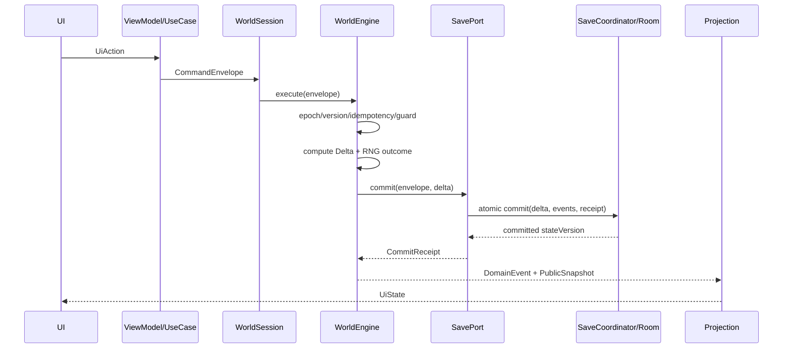

# 84. 전체 Command · Event 계약서

> 목적: UI/UseCase/Simulation/DB/연대기 사이의 변경 계약을 전역적으로 통일한다. 원문에 명시된 `WorldCommand → WorldEngine → DomainEvent → WorldState update` 구조를 기준으로 하고, 세부 Command/Event 이름은 「설계 보완안」 namespace로 관리한다.

## 1. CommandEnvelope

```kotlin
data class CommandEnvelope<P : WorldCommandPayload>(
    val commandId: CommandId,
    val sessionEpoch: SessionEpoch,
    val expectedVersion: StateVersion?,
    val actorId: EntityId?,
    val payload: P,
    val payloadHash: Hash
)
```

필수 규칙: 동일 epoch/commandId/동일 payload는 이전 receipt 반환, 같은 ID/다른 payload는 `IdempotencyKeyReuse`, stale epoch는 `StaleSession`, expectedVersion 불일치는 재계산 없이 거절한다.

## 2. DomainEvent

```kotlin
data class DomainEvent<E : DomainEventPayload>(
    val eventId: EventId,
    val sourceId: EntityId?,
    val sourceEventId: EventId?,
    val sourceEpoch: SessionEpoch,
    val sourceCommandId: CommandId,
    val sourceVersion: StateVersion,
    val gameMinute: GameMinute,
    val subMinuteMs: SubMinuteMillis,
    val eventSequence: EventSequence,
    val visibility: EventVisibility,
    val importance: EventImportance,
    val payload: E
)
```

`subMinuteMs`는 0..59,999이고, `eventSequence`는 같은 `(sourceEpoch, sourceCommandId)` 안에서 0부터 단조 증가한다. 영속화와 재생은 `(gameMinute, subMinuteMs, sourceVersion, sourceEpoch, sourceCommandId, eventSequence, eventId)`로 정렬해 명령·epoch 간 동률까지 제거한다. `sourceEpoch/sourceCommandId/sourceVersion`은 같은 transaction의 `command_receipt.epoch/command_id/state_version`과 일치해야 하고, DTO의 모든 필드는 `world_event`의 대응 열과 손실 없이 왕복해야 한다.

`world_event.event_type`은 `payload`의 안정적인 versioned `EventCodecId`이며 `CombatCompleted.v1`처럼 `<event-name>.v<schema-version>` 형식을 쓴다. payload의 호환 불가능한 변경은 기존 ID의 의미를 바꾸지 않고 새 `.vN` codec으로 등록한다. EventCodec registry는 보존 중인 세이브와 event log가 요구하는 decoder/upcaster를 유지하고, migration·projection 재구축은 구버전 event를 현재 도메인 표현으로 해석한 뒤 새 projection에 staging한다. 별도 schema-version 열은 추가하지 않는다.

연대기/통계/dirty registration은 Event consumer가 처리할 수 있으나, Event가 authoritative mutation을 재실행하여 이중 효과를 만들면 안 된다.

## 3. Command 처리 파이프라인



`CommandEnvelope`는 UI/스케줄러가 시작하는 application UseCase 경계에서 한 번만 생성하고 `WorldSession.execute`로 제출한다. `WorldSession`·`WorldEngine`·순수 Kotlin `SavePort` 계약은 `:core:simulation`이 소유한다. `:core:save`의 `SaveCoordinator`는 `SavePort` 구현이며 `WorldEngine`은 이 구체 타입이나 Room을 참조하지 않는다. `:app`과 `:tools:headless`가 각각 같은 계약을 조립한다. SaveCoordinator는 envelope를 새로 만들거나 `commandId`를 바꾸지 않고 바깥 command의 Delta/Event/receipt를 원자적으로 저장하며, 내부 저장 호출은 별도의 COMMITTED/REJECTED Event나 receipt를 만들지 않는다.

```kotlin
data class PublicSnapshot<V : PublicView>(
    val sessionEpoch: SessionEpoch,
    val stateVersion: StateVersion,
    val generationId: GenerationId,
    val payload: V
)
```

ViewModel은 현재 `sessionEpoch`와 일치하는 snapshot만 받고 `stateVersion`을 단조 증가시킨다. 동일 version 재수신은 멱등 허용하고 더 낮은 version은 버린다. 슬롯/세션 전환 시 이전 collector를 취소하며 `generationId`는 durable saved state와 복구 출처를 식별한다.

## 4. 원문에서 직접 제시된 WorldCommand 예

| Command | 연결 기능 | 권위 변경 | 기본 멱등성 |
|---|---|---|---|
| `AdvanceTime` | `FUNC-P2-004` 시간 진행 | 예 | command receipt 필수 |
| `EnterDungeon` | `FUNC-P9-001` 던전 진입/탐색 | 예 | command receipt 필수 |
| `RecruitMercenary` | `FUNC-P11-002` 용병 모집/영입 | 예 | command receipt 필수 |
| `ChangeFormation` | `FUNC-P13-001` 출전/진형 변경 | 예 | command receipt 필수 |
| `BuyItem` | `FUNC-P14-002` 구매 | 예 | command receipt 필수 |
| `AcceptQuest` | `FUNC-P11-001` 의뢰 수락 | 예 | command receipt 필수 |
| `SelectDialogueChoice` | `FUNC-P11-004` 대화 선택 | 예 | command receipt 필수 |
| `StartTraining` | `FUNC-P4-004` 훈련/재훈련 | 예 | command receipt 필수 |

## 5. 원문에서 직접 제시된 DomainEvent 예

| Event | 의미 | Projection 후보 |
|---|---|---|
| `TimeAdvanced` | 시간 진행 결과 | 연대기/통계/알림/dirty index 중 해당 consumer |
| `MercenaryJoined` | 용병 합류 | 연대기/통계/알림/dirty index 중 해당 consumer |
| `ItemPurchased` | 구매 완료 | 연대기/통계/알림/dirty index 중 해당 consumer |
| `DungeonEntered` | 던전 진입 | 연대기/통계/알림/dirty index 중 해당 consumer |
| `CombatCompleted` | 전투 종료 | 연대기/통계/알림/dirty index 중 해당 consumer |
| `RelationshipChanged` | 관계 변화 | 연대기/통계/알림/dirty index 중 해당 consumer |
| `PotentialChanged` | 잠재력 변화 | 연대기/통계/알림/dirty index 중 해당 consumer |

## 6. Capability-level Mutation Registry — 설계 보완안

> 아래 Registry ID는 `WorldSession`이 접수하고 WorldEngine이 `SavePort`를 통해 receipt와 함께 commit하는 **외부 mutation 경계**다. `Payload/메소드 계약`이 순수 계산으로 Delta/Plan을 만들더라도 메소드 호출마다 receipt를 쓰지 않고, 이를 호출한 바깥 CommandEnvelope당 한 번만 원자 commit한다. read/compute/tool/lifecycle/event consumer와 `SaveCoordinator` 구현은 7절 계약을 따르며 별도 CommandEnvelope·command receipt·COMMITTED/REJECTED Event를 만들지 않는다. 실제 UI 명령이 더 세분화될 경우 동일 Function namespace 아래 subtype을 추가한다.

| Command ID | Phase | Function | Payload/메소드 계약 | Tables | Transaction | Completion Event | Failure Event |
|---|---|---|---|---|---|---|---|
| `CMD-P2-F001` | P2 | `FUNC-P2-001` 단일 작성자 명령 처리 | `WorldEngine.execute(envelope: CommandEnvelope) -> CommandResult` | world_state, command_receipt, world_event, rng_state | authoritative 변경+receipt 원자 처리 | `EVT-P2-F001-COMMITTED` | `EVT-P2-F001-REJECTED` |
| `CMD-P2-F002` | P2 | `FUNC-P2-002` 게임 달력·잔여 밀리초·RNG 스트림 | `TimeRngKernel.advanceCombat(ms: CombatMillis, clock: WorldClock) -> ClockDelta` | world_state, rng_state | authoritative 변경+receipt 원자 처리 | `EVT-P2-F002-COMMITTED` | `EVT-P2-F002-REJECTED` |
| `CMD-P2-F003` | P2 | `FUNC-P2-003` 예약·점유·자원 선점 | `ScheduleService.reserve(request: ScheduleRequest, calendar: OccupancyView) -> ReservationDelta` | scheduled_action, occupancy, resource_reservation | authoritative 변경+receipt 원자 처리 | `EVT-P2-F003-COMMITTED` | `EVT-P2-F003-REJECTED` |
| `CMD-P2-F004` | P2 | `FUNC-P2-004` 이벤트 경계 시간진행·자동중단 | `TimeAdvanceEngine.advance(request: TimeAdvanceRequest) -> AdvanceResult` | world_state, scheduled_action, time_advance_state, world_event | authoritative 변경+receipt 원자 처리 | `EVT-P2-F004-COMMITTED` | `EVT-P2-F004-REJECTED` |
| `CMD-P3-F001` | P3 | `FUNC-P3-001` 명시적 체크포인트·자동 저장 요청 | `WorldSession.execute(CheckpointWorld(...)) -> CommandResult`; WorldEngine이 `SavePort.commit` 1회 호출 | world_state, command_receipt, world_event, rng_state, save_generation | 바깥 command의 변경+receipt만 원자 처리; SaveCoordinator 내부 receipt/Event 없음 | `EVT-P3-F001-COMMITTED` | `EVT-P3-F001-REJECTED` |
| `CMD-P3-F002` | P3 | `FUNC-P3-002` 복원 가능한 세대·슬롯·불변 청크 | `GenerationStore.create(snapshot: WorldSnapshot, parent: GenerationId?) -> GenerationManifest` | save_generation, save_slot, checkpoint_chunk, generation_chunk | authoritative 변경+receipt 원자 처리 | `EVT-P3-F002-COMMITTED` | `EVT-P3-F002-REJECTED` |
| `CMD-P3-F003` | P3 | `FUNC-P3-003` 전투·장기진행·대화 복구 | `RecoveryService.restore(checkpoint: RecoveryCheckpoint) -> RecoverableSession` | recovery_checkpoint, time_advance_state, dialogue_session | authoritative 변경+receipt 원자 처리 | `EVT-P3-F003-COMMITTED` | `EVT-P3-F003-REJECTED` |
| `CMD-P3-F004` | P3 | `FUNC-P3-004` 마이그레이션·콘텐츠 호환 | `MigrationPlanner.migrate(source: SaveArchive, target: SchemaVersion) -> MigrationResult` | migration_history, save_generation, content_binding | authoritative 변경+receipt 원자 처리 | `EVT-P3-F004-COMMITTED` | `EVT-P3-F004-REJECTED` |
| `CMD-P3-F005` | P3 | `FUNC-P3-005` 오프라인 Export·Import·아카이브 보호 | `SaveArchiveService.importArchive(input: LocalDocument) -> NewSlotResult` | save_slot, save_generation, recovery_journal | authoritative 변경+receipt 원자 처리 | `EVT-P3-F005-COMMITTED` | `EVT-P3-F005-REJECTED` |
| `CMD-P3-F006` | P3 | `FUNC-P3-006` 무결성 검사·복구·보존 GC | `SaveIntegrityService.repair(command: RepairCommand, report: IntegrityReport) -> RepairResult` | checkpoint_chunk, generation_chunk, save_generation, recovery_journal | 승인된 repair/GC만 authoritative 변경+receipt 원자 처리; `audit`은 읽기 전용 | `EVT-P3-F006-COMMITTED` | `EVT-P3-F006-REJECTED` |
| `CMD-P4-F001` | P4 | `FUNC-P4-001` NPC 생성·성별 이름·초상 일괄 확정 | `NpcFactory.create(request: NpcCreationRequest, ctx: CreationContext) -> NpcCreatedDelta` | mercenary, name_registry, portrait_reservation, character_stat | authoritative 변경+receipt 원자 처리 | `EVT-P4-F001-COMMITTED` | `EVT-P4-F001-REJECTED` |
| `CMD-P4-F002` | P4 | `FUNC-P4-002` 기본스탯·경험치·성장원장 | `GrowthService.applyExperience(id: NpcId, amount: Experience) -> GrowthDelta` | mercenary, character_stat, growth_ledger | authoritative 변경+receipt 원자 처리 | `EVT-P4-F002-COMMITTED` | `EVT-P4-F002-REJECTED` |
| `CMD-P4-F003` | P4 | `FUNC-P4-003` 잠재력·후천변화·숙련 | `PotentialService.apply(change: PotentialChange, current: CharacterPotential) -> PotentialDelta` | character_stat, potential_event, mastery | authoritative 변경+receipt 원자 처리 | `EVT-P4-F003-COMMITTED` | `EVT-P4-F003-REJECTED` |
| `CMD-P4-F004` | P4 | `FUNC-P4-004` 클래스 재훈련·스탯 재계산 | `RetrainingService.start(request: RetrainRequest) -> RetrainPlan` | mercenary, growth_ledger, scheduled_action, character_stat | authoritative 변경+receipt 원자 처리 | `EVT-P4-F004-COMMITTED` | `EVT-P4-F004-REJECTED` |
| `CMD-P5-F001` | P5 | `FUNC-P5-001` 인벤토리·장착·소유권 | `InventoryService.move(command: MoveItem, view: InventoryState) -> InventoryDelta` | item_instance, storage_location, inventory_stack, equipment_slot, money_account | authoritative 변경+receipt 원자 처리 | `EVT-P5-F001-COMMITTED` | `EVT-P5-F001-REJECTED` |
| `CMD-P5-F002` | P5 | `FUNC-P5-002` 스킬·접사·개인 상성 데이터 | `SkillService.learn(command: LearnSkill, character: CharacterState) -> SkillDelta` | skill_instance, skill_affinity, mastery | authoritative 변경+receipt 원자 처리 | `EVT-P5-F002-COMMITTED` | `EVT-P5-F002-REJECTED` |
| `CMD-P5-F003` | P5 | `FUNC-P5-003` Loadout·프리셋·전술 조건식 | `LoadoutService.update(command: UpdateLoadout, actor: CharacterState) -> LoadoutDelta` | loadout, tactic_rule, equipment_slot, skill_instance | authoritative 변경+receipt 원자 처리; 내부 `validate`는 순수 계산 | `EVT-P5-F003-COMMITTED` | `EVT-P5-F003-REJECTED` |
| `CMD-P5-F004` | P5 | `FUNC-P5-004` 드롭·보상 예산·타겟파밍 | `LootService.roll(context: LootContext, stream: RngStream) -> LootPlan` | loot_receipt, item_instance, inventory_stack | authoritative 변경+receipt 원자 처리 | `EVT-P5-F004-COMMITTED` | `EVT-P5-F004-REJECTED` |
| `CMD-P6-F001` | P6 | `FUNC-P6-001` 이벤트 큐·동시 해결 배치 | `CombatTimeline.resolveNext(state: CombatState) -> CombatStep` | combat_checkpoint | authoritative 변경+receipt 원자 처리 | `EVT-P6-F001-COMMITTED` | `EVT-P6-F001-REJECTED` |
| `CMD-P6-F003` | P6 | `FUNC-P6-003` 액션 상태·자원·발사체 스냅샷 | `ActionExecutor.start(action: ActionSpec, actor: ActorState) -> ActionPlan` | combat_checkpoint | authoritative 변경+receipt 원자 처리 | `EVT-P6-F003-COMMITTED` | `EVT-P6-F003-REJECTED` |
| `CMD-P6-F004` | P6 | `FUNC-P6-004` 상태이상·축적·Tick·점감 | `StatusEngine.apply(effect: StatusApplication, now: CombatMillis) -> StatusDelta` | combat_checkpoint, status_effect | authoritative 변경+receipt 원자 처리 | `EVT-P6-F004-COMMITTED` | `EVT-P6-F004-REJECTED` |
| `CMD-P6-F005` | P6 | `FUNC-P6-005` 후퇴·반응·전투 종료 정산 | `CombatFinalizer.evaluate(state: CombatState) -> CombatResolution` | combat_result, command_receipt | authoritative 변경+receipt 원자 처리 | `EVT-P6-F005-COMMITTED` | `EVT-P6-F005-REJECTED` |
| `CMD-P7-F001` | P7 | `FUNC-P7-001` 몬스터 감지·Utility·역할 AI | `MonsterDecisionEngine.decide(ctx: CombatDecisionContext) -> ActionIntent` | monster_state | authoritative 변경+receipt 원자 처리 | `EVT-P7-F001-COMMITTED` | `EVT-P7-F001-REJECTED` |
| `CMD-P7-F002` | P7 | `FUNC-P7-002` 그룹 Blackboard·순찰·학습 | `MonsterGroupAI.update(input: GroupPerception) -> GroupPlan` | monster_state, patrol_state | authoritative 변경+receipt 원자 처리 | `EVT-P7-F002-COMMITTED` | `EVT-P7-F002-REJECTED` |
| `CMD-P7-F003` | P7 | `FUNC-P7-003` 보스 전조·페이즈·강인도 | `BossController.transition(input: BossFrame) -> BossPhaseDelta` | boss_state, combat_checkpoint | authoritative 변경+receipt 원자 처리 | `EVT-P7-F003-COMMITTED` | `EVT-P7-F003-REJECTED` |
| `CMD-P7-F004` | P7 | `FUNC-P7-004` 보스 카탈로그·공략대·웨이브 | `EncounterFactory.create(spec: EncounterSpec) -> EncounterPlan` | boss_state, monster_state | authoritative 변경+receipt 원자 처리 | `EVT-P7-F004-COMMITTED` | `EVT-P7-F004-REJECTED` |
| `CMD-P8-F001` | P8 | `FUNC-P8-001` 던전 그래프·열쇠/문 위상 생성 | `DungeonGenerator.generate(spec: DungeonSpec, seed: Long) -> GenerationResult` | dungeon_instance, dungeon_room, dungeon_connection | authoritative 변경+receipt 원자 처리 | `EVT-P8-F001-COMMITTED` | `EVT-P8-F001-REJECTED` |
| `CMD-P8-F002` | P8 | `FUNC-P8-002` 지형·구역·위험/보상 예산 | `DungeonBudgetAllocator.allocate(graph: DungeonGraph, budget: Budget) -> DungeonPlan` | dungeon_room, dungeon_population, dungeon_treasure | authoritative 변경+receipt 원자 처리 | `EVT-P8-F002-COMMITTED` | `EVT-P8-F002-REJECTED` |
| `CMD-P8-F003` | P8 | `FUNC-P8-003` 몬스터·상자·함정·정복목표 배치 | `DungeonPopulationBuilder.place(plan: DungeonPlan) -> PopulationPlan` | dungeon_population, dungeon_treasure, dungeon_trap, monster_state | authoritative 변경+receipt 원자 처리 | `EVT-P8-F003-COMMITTED` | `EVT-P8-F003-REJECTED` |
| `CMD-P8-F004` | P8 | `FUNC-P8-004` 던전 생명주기·Seed·재방문 | `DungeonLifecycle.advance(dungeon: DungeonState, to: GameMinute) -> DungeonDelta` | dungeon_instance, dungeon_population, world_event | authoritative 변경+receipt 원자 처리 | `EVT-P8-F004-COMMITTED` | `EVT-P8-F004-REJECTED` |
| `CMD-P9-F001` | P9 | `FUNC-P9-001` MUD 이동·조사·점진 공개 | `ExplorationService.act(command: ExploreAction, state: RunState) -> ExplorationDelta` | exploration_state, dungeon_room, dungeon_connection, knowledge_fact | authoritative 변경+receipt 원자 처리 | `EVT-P9-F001-COMMITTED` | `EVT-P9-F001-REJECTED` |
| `CMD-P9-F002` | P9 | `FUNC-P9-002` 지도·주석·안전 복귀 경로 | `DungeonMapCommandService.execute(command: DungeonMapCommand) -> DungeonMapDelta`; `route`는 별도 read | map_annotation, exploration_state, dungeon_connection, world_state, world_event | `SaveAnnotation`/`RemoveAnnotation`/`StartSafeReturn`만 authoritative 변경+receipt 원자 처리; `route`는 write 없음 | `EVT-P9-F002-COMMITTED` | `EVT-P9-F002-REJECTED` |
| `CMD-P9-F003` | P9 | `FUNC-P9-003` 야영·보급·경계·응급처치 | `CampService.start(command: CampCommand) -> ScheduledCamp` | camp_state, scheduled_action, inventory_stack, status_effect | authoritative 변경+receipt 원자 처리 | `EVT-P9-F003-COMMITTED` | `EVT-P9-F003-REJECTED` |
| `CMD-P9-F004` | P9 | `FUNC-P9-004` 패배·구조·SAFE_RECOVERY | `DefeatRecoveryService.resolve(result: DefeatResult) -> RecoveryPlan` | recovery_receipt, character_state, item_instance, inventory_stack, scheduled_action, world_event | authoritative 변경+receipt 원자 처리 | `EVT-P9-F004-COMMITTED` | `EVT-P9-F004-REJECTED` |
| `CMD-P9-F005` | P9 | `FUNC-P9-005` 정복·보상·첫 완결 플레이 루프 | `RunSettlementService.settle(command: SettleRun) -> RunReceipt` | run_state, loot_receipt, combat_result, dungeon_instance, command_receipt | authoritative 변경+receipt 원자 처리 | `EVT-P9-F005-COMMITTED` | `EVT-P9-F005-REJECTED` |
| `CMD-P10-F001` | P10 | `FUNC-P10-001` 도시 이동·시설·영업·대기 | `CityService.visit(command: VisitFacility) -> VisitOutcome` | city_state, facility_state, scheduled_action | authoritative 변경+receipt 원자 처리 | `EVT-P10-F001-COMMITTED` | `EVT-P10-F001-REJECTED` |
| `CMD-P10-F002` | P10 | `FUNC-P10-002` 부상·질병·치료·재활 | `HealthService.treat(command: TreatmentCommand) -> TreatmentPlan` | injury, disease, treatment_order, scheduled_action, money_account | authoritative 변경+receipt 원자 처리 | `EVT-P10-F002-COMMITTED` | `EVT-P10-F002-REJECTED` |
| `CMD-P10-F003` | P10 | `FUNC-P10-003` 주거·숙식·유지비·시설 확장 | `ResidenceService.change(command: HousingCommand) -> HousingDelta` | residence, facility_state, storage_location, money_account, scheduled_action | authoritative 변경+receipt 원자 처리 | `EVT-P10-F003-COMMITTED` | `EVT-P10-F003-REJECTED` |
| `CMD-P10-F004` | P10 | `FUNC-P10-004` 귀환 정비·생활 프리셋·도시 행사 | `MaintenancePlanner.execute(command: MaintenanceBatch) -> BatchReport` | maintenance_order, inventory_stack, money_account, facility_state | authoritative 변경+receipt 원자 처리 | `EVT-P10-F004-COMMITTED` | `EVT-P10-F004-REJECTED` |
| `CMD-P11-F001` | P11 | `FUNC-P11-001` 보조 의뢰·생성·수락·정산 | `ContractService.accept(command: AcceptContract) -> ContractDelta` | contract, contract_objective, contract_receipt, scheduled_action | authoritative 변경+receipt 원자 처리 | `EVT-P11-F001-COMMITTED` | `EVT-P11-F001-REJECTED` |
| `CMD-P11-F002` | P11 | `FUNC-P11-002` 모집·협상·단기/상시 고용 | `RecruitmentService.negotiate(command: RecruitmentProposal) -> ProposalOutcome` | recruitment_post, employment_contract, party_member, money_account | authoritative 변경+receipt 원자 처리 | `EVT-P11-F002-COMMITTED` | `EVT-P11-F002-REJECTED` |
| `CMD-P11-F003` | P11 | `FUNC-P11-003` 계약 종료·퇴출·위약금·신뢰 | `EmploymentService.terminate(command: TerminateEmployment) -> TerminationPlan` | employment_contract, party_member, loan_contract, relationship_memory, money_account | authoritative 변경+receipt 원자 처리 | `EVT-P11-F003-COMMITTED` | `EVT-P11-F003-REJECTED` |
| `CMD-P11-F004` | P11 | `FUNC-P11-004` 선택형 대화·Topic·기억·말투 | `DialogueDirector.choose(command: DialogueChoiceCommand) -> DialogueOutcome` | dialogue_session, dialogue_memory, dialogue_template_binding | authoritative 변경+receipt 원자 처리 | `EVT-P11-F004-COMMITTED` | `EVT-P11-F004-REJECTED` |
| `CMD-P12-F001` | P12 | `FUNC-P12-001` 강화 확률·시도 원장·비파괴 | `EnhancementService.attempt(command: EnhanceItem) -> EnhancementReceipt` | enhancement_state, enhancement_attempt, money_account, inventory_stack | authoritative 변경+receipt 원자 처리 | `EVT-P12-F001-COMMITTED` | `EVT-P12-F001-REJECTED` |
| `CMD-P12-F002` | P12 | `FUNC-P12-002` 강화 성장·안정도·각인 슬롯 | `EnhancementGrowthService.apply(input: SuccessGrowth) -> GrowthResult` | enhancement_growth, enhancement_state, item_inscription | authoritative 변경+receipt 원자 처리 | `EVT-P12-F002-COMMITTED` | `EVT-P12-F002-REJECTED` |
| `CMD-P12-F003` | P12 | `FUNC-P12-003` 계승·정련·재각성·유물복원 | `EquipmentRefinery.execute(command: RefineryCommand) -> RefineryDelta` | item_instance, enhancement_state, enhancement_growth, item_inscription, craft_order | authoritative 변경+receipt 원자 처리 | `EVT-P12-F003-COMMITTED` | `EVT-P12-F003-REJECTED` |
| `CMD-P12-F004` | P12 | `FUNC-P12-004` 제작·연금·연구·분해 | `CraftingService.start(command: CraftCommand) -> CraftOrder` | craft_order, craft_material_reservation, scheduled_action, inventory_stack, item_instance | authoritative 변경+receipt 원자 처리 | `EVT-P12-F004-COMMITTED` | `EVT-P12-F004-REJECTED` |
| `CMD-P13-F001` | P13 | `FUNC-P13-001` 파티 구성·출전·교대·헌장 | `PartyService.changeRoster(command: PartyRosterCommand) -> PartyDelta` | party, party_member, deployment, party_charter, scheduled_action | authoritative 변경+receipt 원자 처리 | `EVT-P13-F001-COMMITTED` | `EVT-P13-F001-REJECTED` |
| `CMD-P13-F002` | P13 | `FUNC-P13-002` 분배·공동자금·투표·공정성 | `PartyGovernanceService.resolve(command: PartyDecision) -> DecisionReceipt` | party_charter, party_proposal, party_vote, money_account, party_distribution | authoritative 변경+receipt 원자 처리 | `EVT-P13-F002-COMMITTED` | `EVT-P13-F002-REJECTED` |
| `CMD-P13-F003` | P13 | `FUNC-P13-003` 만족·갈등·리더교체·분열·승계 | `PartyPoliticsService.apply(command: PartyPoliticalAction) -> PoliticalDelta` | party, party_member, party_proposal, party_history, relationship_memory | authoritative 변경+receipt 원자 처리 | `EVT-P13-F003-COMMITTED` | `EVT-P13-F003-REJECTED` |
| `CMD-P13-F004` | P13 | `FUNC-P13-004` 파티 공식 랭킹·연속1위 | `PartyRankingService.closeDay(input: RankingDay) -> RankingSnapshot` | ranking_snapshot, ranking_streak, party_history | authoritative 변경+receipt 원자 처리 | `EVT-P13-F004-COMMITTED` | `EVT-P13-F004-REJECTED` |
| `CMD-P14-F001` | P14 | `FUNC-P14-001` 도시 시장지수·재고·수요공급 | `MarketEngine.close(input: MarketBoundary) -> MarketDelta` | market_index, market_stock, money_account, economic_ledger | authoritative 변경+receipt 원자 처리 | `EVT-P14-F001-COMMITTED` | `EVT-P14-F001-REJECTED` |
| `CMD-P14-F002` | P14 | `FUNC-P14-002` 구매·판매·흥정·경매 | `TradingService.execute(command: TradeCommand) -> TradeReceipt` | trade_receipt, auction, auction_bid, market_stock, money_account, item_instance | authoritative 변경+receipt 원자 처리 | `EVT-P14-F002-COMMITTED` | `EVT-P14-F002-REJECTED` |
| `CMD-P14-F003` | P14 | `FUNC-P14-003` 장비 대여·회수·손상·보험 | `LoanService.change(command: LoanCommand) -> LoanDelta` | loan_contract, item_instance, equipment_slot, money_account | authoritative 변경+receipt 원자 처리 | `EVT-P14-F003-COMMITTED` | `EVT-P14-F003-REJECTED` |
| `CMD-P14-F004` | P14 | `FUNC-P14-004` 창고·운송·원정보급·분실복구 | `LogisticsService.dispatch(command: ShipmentCommand) -> ShipmentPlan` | storage_location, shipment, shipment_item, item_instance, inventory_stack, scheduled_action | authoritative 변경+receipt 원자 처리 | `EVT-P14-F004-COMMITTED` | `EVT-P14-F004-REJECTED` |
| `CMD-P15-F001` | P15 | `FUNC-P15-001` 지식·관측·소문·정보 공개 | `KnowledgeService.observe(input: Observation) -> KnowledgeDelta` | knowledge_fact, observation, rumor, knowledge_projection | authoritative 변경+receipt 원자 처리 | `EVT-P15-F001-COMMITTED` | `EVT-P15-F001-REJECTED` |
| `CMD-P15-F002` | P15 | `FUNC-P15-002` 평판·법률·계약 신뢰·지역기여 | `ReputationService.apply(event: ReputationEvent) -> ReputationDelta` | reputation_score, reputation_event, legal_case | authoritative 변경+receipt 원자 처리 | `EVT-P15-F002-COMMITTED` | `EVT-P15-F002-REJECTED` |
| `CMD-P15-F003` | P15 | `FUNC-P15-003` 다축 관계·기억·호흡·연애 | `RelationshipService.apply(event: SocialEvent) -> RelationshipDelta` | relationship, relationship_memory, relationship_stage | authoritative 변경+receipt 원자 처리 | `EVT-P15-F003-COMMITTED` | `EVT-P15-F003-REJECTED` |
| `CMD-P15-F004` | P15 | `FUNC-P15-004` 성격·특성·매력·개인 목표 | `PersonalityService.evaluate(input: SocialDecisionContext) -> SocialIntent` | personality_state, trait_binding, personal_goal | authoritative 변경+receipt 원자 처리 | `EVT-P15-F004-COMMITTED` | `EVT-P15-F004-REJECTED` |
| `CMD-P16-F001` | P16 | `FUNC-P16-001` 길드 가입·직위·승계·권한 | `GuildMembershipService.change(command: GuildMembershipCommand) -> GuildDelta` | guild, guild_member, guild_office, guild_history | authoritative 변경+receipt 원자 처리 | `EVT-P16-F001-COMMITTED` | `EVT-P16-F001-REJECTED` |
| `CMD-P16-F002` | P16 | `FUNC-P16-002` 길드 재정·시설·인재·간부 운영 | `GuildOperationsService.execute(command: GuildOperation) -> OperationReceipt` | guild_budget, guild_facility, guild_assignment, money_account, scheduled_action | authoritative 변경+receipt 원자 처리 | `EVT-P16-F002-COMMITTED` | `EVT-P16-F002-REJECTED` |
| `CMD-P16-F003` | P16 | `FUNC-P16-003` 파벌·정책·정당성·길드 공략대 | `GuildPoliticsService.resolve(command: GuildPolicyDecision) -> GuildPoliticalDelta` | guild_faction, guild_proposal, guild_vote, raid_assignment, guild_history | authoritative 변경+receipt 원자 처리 | `EVT-P16-F003-COMMITTED` | `EVT-P16-F003-REJECTED` |
| `CMD-P16-F004` | P16 | `FUNC-P16-004` 길드 공식10000점·일마감·기여 | `GuildRankingService.closeDay(input: GuildRankingDay) -> RankingSnapshot` | ranking_snapshot, ranking_component, ranking_streak, contribution_ledger, return_proof | authoritative 변경+receipt 원자 처리 | `EVT-P16-F004-COMMITTED` | `EVT-P16-F004-REJECTED` |
| `CMD-P17-F001` | P17 | `FUNC-P17-001` NPC 목표·행동 Utility·경제 의사결정 | `NpcPlanner.plan(input: NpcDayContext) -> NpcActionPlan` | npc_activity, personal_goal, personality_state, scheduled_action | authoritative 변경+receipt 원자 처리 | `EVT-P17-F001-COMMITTED` | `EVT-P17-F001-REJECTED` |
| `CMD-P17-F002` | P17 | `FUNC-P17-002` 상세/축약 시뮬레이션·승격·강등 | `NpcSimulationRouter.advance(command: NpcBoundary) -> NpcBatchDelta` | npc_activity, npc_summary, simulation_cursor, world_event | authoritative 변경+receipt 원자 처리 | `EVT-P17-F002-COMMITTED` | `EVT-P17-F002-REJECTED` |
| `CMD-P17-F003` | P17 | `FUNC-P17-003` 용병 유입·은퇴·복귀·직업전환 | `PopulationEngine.closePeriod(input: PopulationBoundary) -> PopulationDelta` | population_cohort, character_state, npc_summary, mercenary_registry | authoritative 변경+receipt 원자 처리 | `EVT-P17-F003-COMMITTED` | `EVT-P17-F003-REJECTED` |
| `CMD-P17-F004` | P17 | `FUNC-P17-004` 장기 정체성·압축·사회 순환 검증 | `NpcHistoryCompactor.compact(input: NpcRetentionPlan) -> CompactionResult` | npc_summary, relationship_memory, party_history, guild_history, portrait_reservation | authoritative 변경+receipt 원자 처리 | `EVT-P17-F004-COMMITTED` | `EVT-P17-F004-REJECTED` |
| `CMD-P18-F001` | P18 | `FUNC-P18-001` 가족·출생·입양·성장·교육 | `FamilyService.apply(command: FamilyAction) -> FamilyDelta` | lineage, family_member, education_plan, population_cohort, money_account | authoritative 변경+receipt 원자 처리 | `EVT-P18-F001-COMMITTED` | `EVT-P18-F001-REJECTED` |
| `CMD-P18-F002` | P18 | `FUNC-P18-002` 후계자 후보·의사·지정·부재 안전장치 | `SuccessionPlanner.nominate(command: NominateSuccessor) -> SuccessionPlan` | lineage, family_member, succession_plan, character_state | authoritative 변경+receipt 원자 처리 | `EVT-P18-F002-COMMITTED` | `EVT-P18-F002-REJECTED` |
| `CMD-P18-F003` | P18 | `FUNC-P18-003` 원자적 세대 교체·자산·증표 유지 | `SuccessionService.execute(command: ExecuteSuccession) -> SuccessionReceipt` | lineage, succession_receipt, character_state, money_account, storage_location, return_proof, party_history, guild_history | authoritative 변경+receipt 원자 처리 | `EVT-P18-F003-COMMITTED` | `EVT-P18-F003-REJECTED` |
| `CMD-P19-F001` | P19 | `FUNC-P19-001` NPC 사건·등장인물·자동 해결 | `NpcEventDirector.select(input: EventSelectionContext) -> EventPlan` | event_instance, event_participant, event_receipt, relationship_memory | authoritative 변경+receipt 원자 처리 | `EVT-P19-F001-COMMITTED` | `EVT-P19-F001-REJECTED` |
| `CMD-P19-F002` | P19 | `FUNC-P19-002` 연쇄 사건·조건·쿨다운·대안 경로 | `EventChainEngine.advance(command: ChainChoice) -> ChainDelta` | event_chain, event_chain_step, event_instance, event_receipt | authoritative 변경+receipt 원자 처리 | `EVT-P19-F002-COMMITTED` | `EVT-P19-F002-REJECTED` |
| `CMD-P19-F003` | P19 | `FUNC-P19-003` AdventureDirector·장기 목표·전설화 | `AdventureDirector.plan(input: DirectorContext) -> DirectorPlan` | director_state, director_budget, personal_goal, legendary_record | authoritative 변경+receipt 원자 처리 | `EVT-P19-F003-COMMITTED` | `EVT-P19-F003-REJECTED` |
| `CMD-P19-F004` | P19 | `FUNC-P19-004` 전술 실험실·전략 회의·행동 자동화 | `StrategyAutomationService.execute(command: StrategyAutomationCommand) -> StrategyAutomationDelta`; `StrategyAssistant.evaluate`는 별도 compute | strategy_plan, automation_rule, subtype이 위임받은 대상 테이블 | `SaveStrategyPlan`/`UpsertAutomationRule`/`ExecuteDelegatedAction`만 authoritative 변경+receipt 원자 처리; 실험/조언은 write 없음 | `EVT-P19-F004-COMMITTED` | `EVT-P19-F004-REJECTED` |
| `CMD-P20-F001` | P20 | `FUNC-P20-001` 균열 탐사·7핵 봉인·발생원 차단 | `RiftCampaignService.seal(command: SealRiftCore) -> CampaignDelta` | return_campaign, rift_core, dungeon_instance, world_event | authoritative 변경+receipt 원자 처리 | `EVT-P20-F001-COMMITTED` | `EVT-P20-F001-REJECTED` |
| `CMD-P20-F002` | P20 | `FUNC-P20-002` 악마 전쟁·잔존세력·90일 종전 | `DemonWarService.closeDay(input: CampaignDay) -> WarDelta` | demon_faction, demon_base, demon_gate, demon_presence, return_campaign | authoritative 변경+receipt 원자 처리 | `EVT-P20-F002-COMMITTED` | `EVT-P20-F002-REJECTED` |
| `CMD-P20-F003` | P20 | `FUNC-P20-003` 영구증표·랭킹·잔존던전·귀환 판정 | `ReturnEligibilityService.evaluate(input: ReturnEvaluation) -> ReturnEligibility` | return_proof, return_campaign, ranking_streak, lineage_contribution, dungeon_instance | authoritative 변경+receipt 원자 처리 | `EVT-P20-F003-COMMITTED` | `EVT-P20-F003-REJECTED` |
| `CMD-P20-F004` | P20 | `FUNC-P20-004` 귀환·잔류·후일담·캠페인 종료 | `EndingService.choose(command: EndingChoice) -> EndingRecord` | ending_record, return_campaign, lineage_contribution, chronicle_event | authoritative 변경+receipt 원자 처리 | `EVT-P20-F004-COMMITTED` | `EVT-P20-F004-REJECTED` |
| `CMD-P21-F003` | P21 | `FUNC-P21-003` 공개정보 검색·필터·페이지·북마크 | `BookmarkService.change(command: BookmarkCommand) -> BookmarkDelta`; `SearchService.search`는 별도 read | bookmark | 북마크 추가/해제만 authoritative 변경+receipt 원자 처리; 검색과 색인 조회는 write 없음 | `EVT-P21-F003-COMMITTED` | `EVT-P21-F003-REJECTED` |

## 7. Query / Tool 계약

| Function | 종류 | 변경 허용 | 규칙 |
|---|---|---|---|
| `FUNC-P0-001` 원문 기준선과 충돌 판정 | `tool` | 아니오 | live save.db hash 불변, 필요한 경우 artifact 저장소에만 결과 기록 |
| `FUNC-P0-002` 빌드·모듈·기술버전 고정 | `tool` | 아니오 | live save.db hash 불변, 필요한 경우 artifact 저장소에만 결과 기록 |
| `FUNC-P0-003` 공통 타입·명령·오류·이벤트 계약 | `tool` | 아니오 | live save.db hash 불변, 필요한 경우 artifact 저장소에만 결과 기록 |
| `FUNC-P0-004` 최소 검증 하네스·공통 UI 껍데기 | `tool` | 아니오 | live save.db hash 불변, 필요한 경우 artifact 저장소에만 결과 기록 |
| `FUNC-P1-001` 정적 카탈로그 스키마와 ID 보존 | `tool` | content build 산출물만 | live save.db와 command receipt를 사용하지 않음 |
| `FUNC-P1-002` 콘텐츠 검증·사전 DB 빌드 | `tool` | content build 산출물만 | live save.db와 command receipt를 사용하지 않음 |
| `FUNC-P1-003` 로컬 이미지·AssetResolver·크롭 | `read/tool` | asset build 산출물만 | 런타임 `resolve`는 읽기 전용이며 command receipt를 만들지 않음 |
| `FUNC-P1-004` 콘텐츠·이미지 버전 교체와 호환 | `compute` | 아니오 | `resolve`는 BindingPlan만 반환하고 적용은 별도 승인된 migration command가 수행 |
| `FUNC-P2-005` 세션·생명주기·작업 종료 | `lifecycle` | 런타임 자원만 | 새 명령 차단·drain·close를 수행하되 gameplay command receipt를 만들지 않음 |
| `FUNC-P4-005` 초기 정보 비대칭·인물 조회 계약 | `read` | 아니오 | live save.db hash 불변, 필요한 경우 artifact 저장소에만 결과 기록 |
| `FUNC-P6-002` 피해·치유·명중·보호막 공식 | `compute` | 아니오 | live save.db hash 불변, 필요한 경우 artifact 저장소에만 결과 기록 |
| `FUNC-P6-006` 재생·로그·전투 버전 일치 | `read` | 아니오 | live save.db hash 불변, 필요한 경우 artifact 저장소에만 결과 기록 |
| `FUNC-P18-004` 가문 목표·유물·세대 기여·기록 UI | `read` | 아니오 | live save.db hash 불변, 필요한 경우 artifact 저장소에만 결과 기록 |
| `FUNC-P21-001` 용병·장비·파티·세계 연대기 | `consumer` | Projection만 | sourceEventId별 consumer receipt로 중복을 막고 WorldCommand receipt는 만들지 않음 |
| `FUNC-P21-002` 일월연 통계·기여·추세·랭킹 이력 | `consumer` | Projection만 | sourceEventId별 consumer receipt로 중복을 막고 WorldCommand receipt는 만들지 않음 |
| `FUNC-P21-004` 보존·압축·뉴스·정보 알림 | `consumer/tool` | Projection·보존 대상만 | retention plan과 consumer receipt를 사용하고 WorldCommand receipt는 만들지 않음 |
| `FUNC-P22-001` 정보구조·화면 계약·Navigation | `read` | 아니오 | live save.db hash 불변, 필요한 경우 artifact 저장소에만 결과 기록 |
| `FUNC-P22-002` 디자인 토큰·컴포넌트·이미지 | `tool` | 아니오 | live save.db hash 불변, 필요한 경우 artifact 저장소에만 결과 기록 |
| `FUNC-P22-003` Adaptive·큰글자·TalkBack·터치 | `tool` | 아니오 | live save.db hash 불변, 필요한 경우 artifact 저장소에만 결과 기록 |
| `FUNC-P22-004` 화면 생명주기·일회성 효과·유저 여정 | `tool` | 아니오 | live save.db hash 불변, 필요한 경우 artifact 저장소에만 결과 기록 |
| `FUNC-P23-001` Validation Center·공통 검사 실행 | `tool` | artifact 저장소만 | live save와 격리하며 gameplay command receipt를 만들지 않음 |
| `FUNC-P23-002` 불변식·속성·퍼즈·장기 월드 | `tool` | 아니오 | live save.db hash 불변, 필요한 경우 artifact 저장소에만 결과 기록 |
| `FUNC-P23-003` 확률·수치·드롭·경제 밸런스 비교 | `tool` | 아니오 | live save.db hash 불변, 필요한 경우 artifact 저장소에만 결과 기록 |
| `FUNC-P23-004` 재현 패키지·리뷰·결함·승인 | `tool` | 아니오 | live save.db hash 불변, 필요한 경우 artifact 저장소에만 결과 기록 |
| `FUNC-P24-001` 실측 성능·이미지·목록·DB 예산 | `tool` | 아니오 | live save.db hash 불변, 필요한 경우 artifact 저장소에만 결과 기록 |
| `FUNC-P24-002` 누수·취소·배터리·앱 중단 | `tool` | 아니오 | live save.db hash 불변, 필요한 경우 artifact 저장소에만 결과 기록 |
| `FUNC-P24-003` 저장공간·장기 압축·실패 격리 | `tool` | 아니오 | live save.db hash 불변, 필요한 경우 artifact 저장소에만 결과 기록 |
| `FUNC-P24-004` 최적화 동치·인덱스·R8·프로필 | `tool` | 아니오 | live save.db hash 불변, 필요한 경우 artifact 저장소에만 결과 기록 |
| `FUNC-P25-001` 전체 End-to-End·회귀·출시 범위 검수 | `tool` | 아니오 | live save.db hash 불변, 필요한 경우 artifact 저장소에만 결과 기록 |
| `FUNC-P25-002` 업그레이드·마이그레이션·다운그레이드 | `tool` | 아니오 | live save.db hash 불변, 필요한 경우 artifact 저장소에만 결과 기록 |
| `FUNC-P25-003` 서명 Release·오프라인 설치·배포 | `tool` | 아니오 | live save.db hash 불변, 필요한 경우 artifact 저장소에만 결과 기록 |
| `FUNC-P25-004` 릴리즈 운영·결함 대응·문서 인계 | `tool` | 아니오 | live save.db hash 불변, 필요한 경우 artifact 저장소에만 결과 기록 |

## 8. Event 소비자 우선순위

| Consumer | 목적 | 실패 시 정책 |
|---|---|---|
| DirtyEntityIndex | 다음 incremental save 대상 등록 | 권위 상태와 함께 commit되거나 재구축 가능해야 함 |
| ChronicleProjector | 중요 사건/인물/장비 이력 | 중복 sourceEventId 차단, 실패가 게임 진행을 rollback하지 않도록 격리 가능 |
| StatisticsProjector | 일/월/연 aggregate | 재생성 가능 Projection로 취급 |
| NotificationProjector | 사용자 알림 | 표시 실패는 core 진행에 전파하지 않음 |
| RankingProjector | 일 마감 랭킹/이력 | 마감 transaction과 일관성 계약 필요 |
| UI PublicProjection | 화면 상태 | `PublicSnapshot(sessionEpoch,stateVersion,generationId,payload)`만 publish; 현재 epoch·단조 version 외 응답 폐기 |

## 9. 오류 코드 공통 분류

| Error | 의미 | 기본 처리 |
|---|---|---|
| `ValidationError` | 입력/범위/상태 불일치 | 상태변경 없음 |
| `StaleSession` | 이전 sessionEpoch 요청 | 재로드/현재 세션으로 재요청 |
| `VersionConflict` | expectedVersion 불일치 | 최신 snapshot 재조회 |
| `IdempotencyKeyReuse` | 같은 commandId 다른 payload | 호출자 버그로 기록 |
| `InsufficientResource` | 금화/재료/점유 부족 | 상태변경 없음 |
| `UnsupportedFeature` | Phase 미구현/비활성 | 기능 준비 안 됨 UI |
| `PersistenceFailure` | DB/I/O 실패 | transaction rollback·안전 중단 |
| `InvariantViolation` | 핵심 정합성 위반 | 기능 중단·재현 package |
| `ContentCompatibilityError` | 콘텐츠/세이브 버전 불일치 | migration/지원불가 안내 |

## 10. Command/Event Definition of Done

- [ ] 모든 mutation entry point가 CommandEnvelope/receipt 규칙을 따른다.
- [ ] RNG가 개입한 결과는 RNG state/counter와 함께 저장된다.
- [ ] commit 이전에 UI/연대기/통계가 결과를 확정 표시하지 않는다.
- [ ] 재시작 후 동일 command 재전송이 이중 비용/보상을 만들지 않는다.
- [ ] 이벤트 consumer 실패가 신규 기능에서 기존 핵심 진행으로 장애 전파되지 않도록 격리된다.
